TOMO 322

Volumen 1

1999

## FALLOS DE LA CORTE SUPREMA DE JUSTICIA DE LA NACION

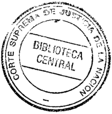

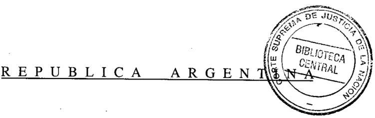

FALLOS

CRISTINA M.l. CARJUZAA SECfIETAlm DE LA (om SUPREMA DE JUS/I(~ DE LANAClON

DE LA

CORTE

SUPREMA

DE

## •.. USTICIA DE LA NACION

PUBLICACION A CARGO DE LA SECRETARIA DE JURISPRUDENCIA DEL TRIBUNAL

TOMO

3221VI?.£~M!?8Q de la

FEBRER

~6Jj'AYoSuprema

196.692

N° da Orden

Ubicación::]) ~ 3Z

LA LEY S.A.E. e 1. Tucumán 1471 (1050) Buenos Aires 1999

,.

AA,ULr.r.O .J .M (\~ITa;f;O Id Hl MílATHi)]Z l;Ol);:.ti tJ 3-~ .:.:?JtW]~ ,'JnhJ~' j~,¡}~

Copyright (e) 1999 by Corte Suprema de Justicia de la Nación Queda hecho el depósito que previene la ley 11.723. Impreso en la Argentina . Printed in Argentina i.S.B.N. 950-9825-51-4

## ACUERDOS DE LA CORTE S U P

## AÑO 1999

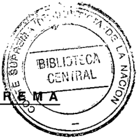

FEBRERO -MAYO

CRISTINA M. L. CARJUZAA

miElARIA DE lA

CORTE SUPREMA DE JUS11(~ DE EA NAUON

## CORTE SUPREMA. TRANSFERENCIA DE FUNCIONARIOS.

-1&lt;" 1-

En Buenos Aires, a los 4 días del mes de febrero del año mil novecientos noventa y nueve, reunidos en la Sala de Acuerdos del Tribunal, los señores Ministros que suscriben la presente,

## Consideraron:

Que la reorganización funcional que este Tribunal viene llevando a cabo de sus medios materiales y humanos (acordadas 19, 31 Y 32 de 1998), justifica proveer a la Cámara Nacional de Apelaciones en lo Criminal y Correccional de dos cargos destinados a cubrir las necesidades originadas por la situación de losjuzgarlos correccionales, reiteradamente puestas de manifiesto por dicho tribunal.

Por ello,

Acordaron:

Transferir, con sus respectivos cargos, al Secretario Letrado Javier Augusto De Luca y al Prosecretario Administrativo Adrián Enrique Fernández, a la Cámara Nacional de Apelaciones en lo Criminal y Correccional. Todo lo cual dispusieron y mandaron, ordenando que se comunicase y registrase en el libro correspondiente, por ante mí, que doy fe. Regístrese y hágase saber.-JuLIo S. NAZARENOEDUARDOOLINÉ O'CONNOR--M CARLOS. FAYTGUILLERMO . F. LÚPEZ A ADOLFO ROBERTOÁZQUEZ V -Nicolás Alfredo Reyes (Administrador General).

DISIDENCIAELOSDOCTORES ELLUSCIO,ETRACCHIBOSSERT D B P y

Que ningún fundamento de índole funcional justifica 'i~~' traslados "del Seci'~t~rio "./' .:" " Letrado Javier Augusto De Luca y del Prosecretario Administrativo, Adrián Enrique Fernández dispuestos por la mayoría del Tribunal, medida que, por el contrario, podrá afectar el funcionamiento de Asuntos Penales de esta Corte, que no ha merecido cuestionamientos y cuya eficacia se manifiesta en las estadísticas recientemente elaboradas por dicha dependencia y entregadas a los miembros del Tribunal. Por otra parte, destinar al Secretario Letrado De Luca, cuya jerarquía equivale a la de Juez de Prime-

••••••

J

6

## ACUERDOS DE LA CORTE SUPREMA

322

ra Instancia, a "cubrir necesidades en juzgados correccionales", no permite advertir cuál será.realmente su destino y cuáles las funciones que podrá desarrollar en el futuro, ya que al frente de cada uno de dichos juzgarlos se halla desempeñando funciones uo"jJez. Todo lo cual determina que no se advierta la causa de la medida dispuesta por la mayoría del Tribunal. Por ello, expresamos nuestra disidencia. -AUGUSTO CÉSAR BELLUSCIO -ENRIQUE SANTIAGO PETRACCHI -GUSTAVO A. BOSSERT.

AASULn,\O .J .1" MUT&lt;.lnO

~J ~Ijt.1~AE~Hl U~j)~)¡A.J 3JtJ ·. 12~1 h !.M:I,j¡" jI,;])

## CORTE SUPREMA. TRASLADO DE SECRETARIO.

-1&lt;" 2-

En Buenos Aires, a los 23 días del mes de febrero del año mil novecientos noventa y nueve, reunidos en la Sala de Acuerdos del Tribunal, los señores Ministros que suscriben la presente, ··

## Consideraron:

Que la necesidad de preservar las relaciones funcionales entre los Magistrados de este Tribunal y los secretarios generales, exige tomar una decisión con respecto a la situación del titular de la Secretaría Judicial Nl!3, que ha solicitado su traslado a otro órgano del Poder Judicial de la Nación.

Por ello,

Acordaron:

Disponer el traslado del secretario doctor Jorge Eduardo Morán, junto con su car. go, a la Cámara Nacional de Apelaciones en lo Contencioso Administrativo Federal.

Todo lo cual dispusieron y mandaron, ordenando que se comunicase y registrase en el libro correspondiente, por ante mí, que doy fe. Regístrese y hágase saber. -JULIO S. NAZARENO EDUARDOOLINÉ O'CoNNOR --M CARLOS. FAYTGUILLERMO. F. LóPEZA ADOLFO ROBERTO VÁZQUEZ -Nicolás Alfredo Reyes (Administrador General).

CORTE SUPREMA. ASESORIA JURIDlCA DE LA ADMINISTRACION GENERAL.

\_Nl!3\_

En Buenos Aires, a los 25 días del mes de febrero del año mil novecientos noventa y nueve, reunidos en la Sala de Acuerdos del Tribunal, los señores Ministros que suscriben la presente,

## DEJUSTICIA DELANACION 322

Consideraron:

Que la transferencia de oficinas y dependencias del Tribunal al Con . de laMagistratura ordenada por la Resolución 3318/98, justifica aclarar el alcance funciones asignadas a la secretaría creada por Acordada 57/98 tomando en considera~ ción el personal y los cargos que la Corte ha conservado para su propia administración.

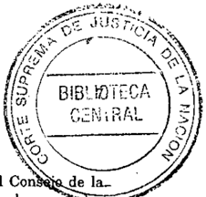

Por ello,

Acordaron:

CRISTINA M. L. CARJUZAA SEmi ARIA DE lA (ORlE SUPREMA DE JUS!I(~ DE lA NAClON

Aclarar la Acordada 57/98 en el sentido de que la Asesoría Jurídica de la Administración General dependerá de la Secretaría General de la Presidencia con respecto a la coordinación de las relaciones funcionales e institucionales con el Consejo de la Magistratura y a los juicios en que sea parte el Poder Judicial de la Nación. Todo lo cual dispusieron y mandaron, ordenando que se comunicase y registrase en el libro correspondiente, por ante mí que doy fe. Regístrese y hágase saber. -JULIOS. NAZARENOEDUARDO MOLlNÉO'CONNOR CARLOS S. FAYT AUGUSTO CÉSAR BELLUSCIO -ANTONIO BOQQIANO GUILLERMO. F. LóPEZ--A ADOLFO RoBERTO VAzQUEz -Nicolás Alfredo Reyes (Administrador General).

## MEDIDAS DE FUERZA.

-N" 4-

En Buenos Aires, a los 26 días del mes de febrero del año mil novecientos noventa y nueve, reunidos en la Sala de Acuerdos del Tribunal, los señores Ministros que suscriben la presente,

Consideraron:

Que la forma irregular en que han funcionado los Tribunales Nacionales y Federa. les del país, en razón de la medida de fuerza resuelta por la Unión de Empleados de la Justicia de la Nación el día 24 de febrero del corriente año, requiere tomar medidas que eviten perjuicio a los litigantes.

Por ello,

Acordaron:

Declarar el día 24 de febrero de 1999 inhábil para los Tribunales Nacionales y Federales del país, sin perjuicio de la validez de los actos procesales cumplidos que no hubiesen sido actuados en rebeldía.

'';.'-

8

## ACUERDOS DE LA CORTE SUPREMA 322

Todo io cual dispusieron y mandaron, ordenando que se comunicase y registrase \_, en ellibro correspondiente, por ante mí, que doy fe. JULIO S. NAZARENO ~ EDUARDO MOLINÉ O'CONNOR CARWS S. FAYTENRIQUESANTIAGO PETRACCHI ANToNIOBOGGlANO"GUILLERMO A F. LóPEZ GUSTAVOA. BOSSERTADOLFORoBERTOVÁZQUEZ.

AASU,¡;M .J .M 1\V.iT2IR~ fU iQ Wi;:j1)J? ltlüll.:.HAJ 3J :J)ii(UL lO ~,MWU2 lUil)

FERIA JUDICIAL DE JULIO DE 1999.

\_N.Il.5\_

En Buenos Aires, a los 22 días del mes de marzo del año mil novecientos noventa y nueve, reunidos en la Sala de Acuerdos del Tribunal, los señores Ministros que sus. criben, la presente,

Acordaron:

1"-) Disponer en el corriente año feriado judicial para los tribunales nacionales de la Capital desde el día 19 al 30 de julio, ambos inclusive.

- 2\1)Hacer saber a las Cámaras Federales de Apelaciones que con arreglo a lo previsto en la Acordada 53na -respecto de la coincidencia de la feria en ella establecida con las vacaciones escolaresy a lo dispuesto en la presente, deberán determinar para sus respectivas jurisdicciones un feriado judicial de diez días hábiles (acápite 21!de la acordada NI! 30/84).

Todo lo cual dispusieron y mandaron, ordenando que se comunicase y registrase en el libro correspondiente, por ante mí, que doy fe. -JULIO S. NAZARENOCARLOSS. FATI AUGUSTOCÉSARBELLUSCJO ENRIQUESANTIAGO PETRACCHI ANTONIOBOGGIANOGUILLERMOA. F. LóPEZ GUSTAVÓA. BOSSERTADOLFORoBERTO VAZQUEZ.

JUZGADO FEDERAL DE ROSARIO. INCORPORACION DE GRADUADOS DE LA CARRERA DE ABOGACIA.

-N" 6-

En Buenos Aires, a los 8 días del mes de abril del año mil novecientos noventa y nueve, los señores Ministros que suscriben la presente,

## DE JUSTICIA DE LA NACION

322

## Consideraron:

Que la Excma. Cámara Federal de Apelaciones de Rosario por ~corda Ü eleva a esta Corte el pedido formulado por la sra. juez, titular del Juzgado Fe 2 de esa ciudad, por el que solicita autorización para el desempeño en ese tribunal e cuatro graduados de la carrera de abogacía con los mayores promedios, por el término máximo de un año y sin percepción de haberes, sin que ello implique ingreso al Poder Judicial de la Nación o derecho a ser designado en forma permanente o transitoria.

CRISTINA

M. L. CARJUZAA .\_••.•. ~

SHUTHIA

Dí

LA

.-,&gt;::.-

-::""!-'~\_

eDiTE SUP¡IMA Df JUSTIC~~f

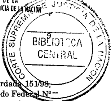

Que esta Corte, por acordada 22/90, estableció un programa de colaboración con las universidades nacionales y privadas consistente en permitir a los egresados con los más altos promedios de la carrera de abogacía desempeñarse en la Corte Suprema en forma no remunerada, para realizar tareas de investigación, y fijó una serie de requisitos dirigidos a quienes se incorporaran al programa.

Que además por acordada 16/95, aprobó un régimen de pasantías solicitado por la Cámara Nacional de Apelaciones en lo Comercial restringiéndolo al caso de los abogados graduados.

Por ello, y en virtud de las facultades conferidas a esta Corte (art. 104 del R.J .N. y 22 de la ley 4055).

## Acordaron:

Autorizar el desempeño en el Juzgado Federal de Rosario N~2, de cuatro graduados de la carrera de abogacía con los mayores promedios, para que presten colaboración, al tiempo que se capacitarán, en las tareas de investigación del tribunal, por el término máximo de un año y en forma ad honorem, y sin que ello implique ingreso al Poder Judicial de la Nación o derecho a ser designado en forma permanente o transitoria como agente del mismo.

Todo lo cual dispusieron y mandaron, ordenando que se comunicase y se registra~ se en el libro correspondiente, por ante mí que doy fe. Juuo S. NAZARENO CARLOS. -FAYT- AUGUSTOÉSAR BELLUSCIO-ENRIQUEANTIAGO ETRACCHI GUSTAVO . BoSSERTC S P -A ADOLFO RoBERTO VÁZQUEZ -Nicolás Alfredo Reyes (Administrador General).

## HONRAS DISPUESTAS CON MOTIVO DEL FALLECIMIENTO DEL DR. ELlAS P. GUASTAVINO.

## \_Nl!.7\_

En Buenos Aires, a los 8 días del mes abril del año mil novecientos noventa y nueve, reunidos en la Sala de Acuerdos del Tribunal, los señores Ministros que suscriben la presente,

J::::-::.:~,

:'

..

".'

\_'. \_

~--

-

10

AASlILr.r,o .J .·· AlilTelfiO ld,~ '!'h~1JnH ~vlJ;'\'I ¡J il f¡J.inl~; 1;1 iJt.i~'IU2il~J)

## ACUERDOS DE LA CORTE SUPREMA

322

Con'sideraron:

Qué el día 2 del corriente mes ha ocurrido el sensible fallecimiento del Dr. Elías P. \_Guastavfno, ex Ministro de la Corte Suprema de Justicia de la Nación.

~-'

Que es deber del Tribunal, asociarse al duelo que provoca la desaparición del ex magistrado.

Por ello,

Acordaron:

P) Dirigir nota de condolencia a la familia del extinto.

211 ) Incluir el nombre del Dr. Elías P. Guastavino en las tablas de honor del Tribunal.

Todo lo cual dispusieron y mandaron, ordenando que se comunicase y registrase en el libro correspondiente, por ante mí que doy fe. ~ JULIO S. NAZARENO -EDUARDO MOLINÉ Q'CONNOR CARLOS S. FAYT ENRIQUE SANTIAGO PETRACCHIGUILLERMO A. F. LÓPEZ \_ GUSTAVO A. BOSSERT -ADOLFO ROBERTO V ÁZQUEZ.

## EMPLEADOS JUDICIALES. REESCALAFONAMIENTO.

-NII.8-

En Buenos Aires, a los 15 días del mes de abril del año mil novecientos noventa y nueve, reunidos en la Sala de Acuerdos del Tribunal, los señores Ministros que suscriben la presente,

## Consideraron:

111.)ue mediante Q resolución NII. 34 del6 de abril del corriente año (*), el Consejo de la Magistratura dispuso -en lo que concierne a la presenteaprobar el proyecto de reescalafonamiento presentado por la Unión de Empleados de la Justicia de la Nación, comunicando dicha actuación a esta Corte "...para su consideración, en los términos del arto 7fl., inciso 311., e d la ley 24.937 -modificada por la ley 24.939a los efectos de que, en su caso, solicite al Poder Ejecutivo Nacional el aumento de los créditos presupuestarios correspondientes para el actual ejercicio ...". Asimismo, incorporó al anteproyecto de presupuesto futuro las partidas suficientes para financiar el gasto sobreviniente del citado reeescalafonamiento.

211.)ue Q lo resuelto armoniza con lo dispuesto por la ley 24.937, arts. 7 J ine. 311. 18, y incs. b y c) por lo que corresponde a este Tribunal considerar el anteproyecto presenta-

## DE JUSTICIA DE LA NACION 322

do, conforme a las atribuciones que le competen en virtud ley 23.853, arts 1,5 Y7, Ypor la mencionada ley 24.937, en sus ar

3 11 ) Queello es así en cuanto el arto 18 de dicho texto legal regl :\~'~de la Oficina de Administración y FmanCIera del Consejo de la MagIstratu~di~ -en lo pertinenteque le corresponde elaborar el anteproyecto del presupu rr:~ del Poder Judicial de conformidad con lo dispuesto en la ley de autarquía jti'cllclaI y ejecutar el presupuesto (ines. b y e); y, a su vez. el arto 71). de dicha ley establece como atribución del plenario del Consejo la de tomar conocimiento del anteproyecto anual del presupuesto del Poder Judicial que le remita el presidente y realizar las observaciones que estime pertinentes para su consideración por la Corte Suprema de Justicia de la Nación, (inc. 3 U ); normas todas ellas que sustentan la decisión elevada a considera~ ción de esta Corte.

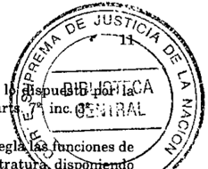

- 4 U ) Que esas mismas normas legales no son sino la reglamentación de las competencias otorgadas por la Constitución Nacional a esta Corte y al Consejo de la Magistratura, pues en esa asignación ha mantenido a este Tribunal en las funciones del gobierno del Poder Judicial, en su condición de cabeza de este departamento (art. 108), y ha establecido a favor del Consejo potestades en materia de administración de recursos y ejecución del presupuesto (art. 114, inc. 311.), que por su naturaleza importan una gestión auxiliar de la que desempeña el tribunal en el carácter indicado.

En ese contexto, las mencionadas leyes 23.853 y 24.937 reafirman las faculta. des de gobierno de esta Corte al atribuirle la determinación de las reestructuraciones funcionales y las decisiones finales en materia de remuneraciones de magistrados empleados y funcionarios del Poder Judicial de la Nación.

- 511.) Que en ese marco, cabe puntualizar que la preocupación puesta de mani. fiesto por el Consejo al aprobar la inclusión de un reescalafonamiento dentro de su anteproyecto de presupuesto, continúa los requerimientos que este Tribunal viene llevando a cabo desde hace varios años que ha dado lugar a que en la preparación de anteriores presupuestos de gastos del Poder Judicial se hayan calculado las erogaciones necesarias para satisfacer las genuinas necesidades del personal, con especial consideración de la regularización de la situación de los meritorios (acordadas 49/96; 24/97 y 34/98).

De igual modo, el Tribunal tampoco puede dejar de obselVar que en la resolución comunicada no se contempla la situación salarial de todo el personal que integra el Poder Judicial de la Nación, de cuyo estudio -por ciertono cabe excluir el examen de las compensaciones correspondientes a los magistrados y funcionarios cuya situación no ha sido tratada en el anteproyecto de referencia.

- 6 U ) Que en las condiciones expresadas, corresponde tomar conocimiento de lo actuado por el Consejo de la Magistratura en el ámbito de su competencia, y autorizar a dicho órgano para que, con la debida participación de representantes de la Unión de Empleados de la Justicia de la Nación y de la Asociación de Magistrados y Funcionarios de la Justicia de la Nación, se realicen las gestiones pertinentes -con el alcance precisado en el considerando anteriorante el Poder Ejecutivo NacionaL

12

.Por" ello,

Acordaron:

. Tomar conocimiento de la resolución 34/99 del Consejo de la Magistratura y autorizar a dicho órgano a realizar las gestiones mencionadas en el considerando pertinente. Todo lo cual dispusieron y mandaron, ordenando que se comunicase y registrase en el libro correspondiente, por ante mí,que doy fe. Regístrese y hágase saber. -JULIO S. NAZARENO EDUARDO MOLINÉ O'CONNOR CARLOS S. FAYT GUILLERMO A. F. LÓPEZ -ADOLFO ROBERTO VÁZQUEZ (según su voto) -GUSTAVO A. BOSSERT. Santiago H. Corcuera (Secretario).

VOTO DEL SEÑOR MINISTRO DOCTOR ADOLFO RoBERTO V ÁZQUEZ:

## Consideraron:

1.l!.) Que mediante resolución Nll. 34 de16 de abril del corriente año, el Consejo de la Magistratura dispuso -en lo concerniente a la presenteaprobar el proyecto de reescalafonamiento (eufemismo bajo el cual se pretende un aumento de sueldos, pues en la forma que está planteado no mejora la actual situación de la administración judicial) presentado por la Unión de Empleados de la Justicia de la Nación y sobre tal base (luego de modificar una decisión anterior al tomar conocimiento que esta Corte no aceptará resignar sus facultades de máximo órgano del Poder Judicial Nacional), decidió comunicar dicha actuación a esta Corte" ...para su consideración, en los términos del arto 7, inc. 3l!,de la ley 24.937 -modificada por la ley 24.939a los efectos de que solicite al Poder Ejecutivo Nacional el aumento de los créditos presupuestarios correspondientes para el actual ejercicio...". Asimismo, incorporó al anteproyecto de presupuesto futuro las partidas suficientes para financiar el gasto sobreviniente del citado reescalafonamiento.

2l1.) Que en su nueva redacción. 10resuelto -aun con algunas reservasarmoniza con la legislación reglamentaria de la materia bajo análisis, según surge de lo siguiente: Por un lado, el arto 113 de la Constitución Nacional dispone que "La Corte Suprema dictará su reglamento interior y nombrará a sus empleados", y los arts. F y TJde la ley 23.853 -denominada de autarquía judicialestablecen, respectivamente, que la "Corte Suprema de Justicia de la Nación preparará el presupuesto de gastos y recursos del Poder Judicial, el que será remitido al Poder Ejecutivo Nacional para su incorporación al proyecto de presupuesto general de la Administración Nacional..." y que "las remuneraciones de magistrados, funcionarios y empleados del Poder Judicial de la Nación serán establecidas por la Corte Suprema de Justicia de la Nación ...". Por su parte, el art. 114 de la Constitución Nacional, en cuanto aquí interesa, dice que, serán atribuciones del Consejo de la Magistratura "..,inc. 3 11 administrar los recursos y ejecutar el presupuesto que la ley asigne a la administración de justicia"; mientras que la ley reglamentaria de dicho organismo N 24.937, en su arto 18, estipula ll que "La oficina de administración y financiera del Poder Judicial tendrá a su cargo las siguientes funcio-

## ACUERDOS DE LA CORTE SUPREMA 322

nes ... a) elaborar el anteproyecto de presupuesto anual del Poder Judicial de conformidad con lo dispuesto en la ley de autarquía judicial y la ley de administración financiera y elevarlo a la consideración de su presidente ..." y "' ...b) ejecutar el presupuesto anual del Poder Judicial"; normas estas correlativas del art. 72 de la misma ley que dispone "El Consejo de la Magistratura reunido en sesión plenaria, tendrá las siguientes atribuciones "...inc. 3 2 tomar conocimiento del anteproyecto de presupuesto anual del Poder Judicial que le remita el presidente y realizar las observaciones que estime pertinentes para su consideración por la Corte Suprema de Justicia de la Nación ...".

- 3 2 ) Que aquellas disposiciones citadas en primer término, en referencia a la Corte Suprema y las atribuciones por ellas conferidas -cabe señalarlo-, no han perdido vigencia a la luz de las disposiciones regulatorias del Consejo de la Magistratura.
- 4 2 ) Que a ello cabe agregar, que no sólo del texto sancionado como ley del Consejo de la Magistratura surge la vigencia de la ley de autarquía (art. 18 inc. a) ya citado), sino de las propias palabras de los legisladores que la redactaron: tal el caso del Senador Yoma que, en el seno del debate parlamentario al referirse a la postura del dictamen de la mayoría (texto que luego fue aprobado), dijo: "pensamos que cuando la Constitución otorga las facultades de administración del Poder Judicial y de ejecución del presupuesto (al Consejo de la Magistratura) no deroga la ley de autarquía judicial: se mantiene lo establecido en esta norma que lleva el número 23.853, con relación a quien elabora el presupuesto de la Corte y lo pone luego a consideración del Ejecutivo para su remisión al Congreso. Cuando el constituyente estableció que ejecuta el presupuesto, no está diciendo que lo elabora ..." (Diario de Sesiones de la Cámara de Senadores de la Nación, Sesión del6n de marzo de 1996, pág. 621).
- 52) Que, en síntesis, de la legislación y de los debates parlamentarios que precedieron a su sanción, se infiere que esta Corte ha conservado las funciones de gobierno del Poder Judicial, por ser cabeza del poder (art. 108 de la Constitución Nacional) y se han establecido a favor del Consejo potestades en materia administrativa de recursos y ejecución del presupuesto (art. 114, inc. 32 , ya citado), las cuales -por su naturalezaimportan una función auxiliar de la que desempeñan todos los tribunales judiciales de cualquier fuero o instancia.
- 6 2 } Que en tal sentido, entonces es menester señalar que, el Poder Judicial le debe a la sociedad en su conjunto, y se debe a si mismo, una reforma administrativa y una modernización que con su consiguiente desregulación de tareas y funciones alcance a todos los estamentos del orden judicial.
- Así entonces es preciso que para ejercer la atribución que le es propia y que la presente reivindica, esta Corte conjugue, cuanto menos par paris, tanto los derechos de los justiciables, cuanto del personal que depende del Poder Judicial.
- 72 ) Que en cuanto a los primeros citados, es decir los derechos de los ciudadanos que pagan la prestación de justicia a través de sus impuestos y en particular los justiciables, sus abogados, peritos y demás personas a cuyo servicio debe estar el Poder Judicial, existe un considerable atraso general en la administración de justicia, que se ve agravado especialmente en ciertos fueros y jurisdicciones. Tal es el caso de la Justi-

cia Criminal de Instrucción, cuyos Magistrados -con fecha 10 de marzo ppdo.elevarqn un pedido para que a los fines de aliviar la tarea, se dispusiera aumentar la jornada laboral a ocho horas, a raíz de que, según señalan, surge como claramente anacrónica una jornada laboral de seis horas, ya que en modo alguno se adecua a las necesidades de este momento.

811.) Que dicho criterio, cabe adelantarlo, es compartido por este Tribunal, agregando que para que sea más provechoso en la puesta al día del trabajo interno de los Tribunales la efectivización de la extension horaria, deberá cumplirse sin atención al público.

911 ) Que por 10demás, todo ello se ve avalado por los recientes informes de la Organización Internacional del Trabajo (O,I.T.) -Oficina de Estadísticas(Ginebra 6 al 15 de octubre de 1998) que considera como sub empleadas en términos generales, a todas las personas cuya relación laboral no alcanza su nivel de "pleno empleo" en base a la duración o productividad del trabajo y en el caso de la Argentina con "sub-empleo visible" a las personas asalariadas que trabajan habitualmente menos de 35 horas semanales. cosa que ocurre si se contabiliza la jornada normal de los Tribunales en general, es decir de 7,30 a 13.30 hs. lo que hace seis horas diarias que por cinco días suma treinta horas semanales.

10) Que ello es así, sin perjuicio de reconocer que el exceso de trabajo ya apuntado, hace que la gran mayoría de los empleados judiciales cumplan jornadas laborales que superan las seis horas diarias, hechos frente a los cuales la adecuación entre el horario real y el necesario para cumplir las tareas, lejos de provocar perjuicio se convertiría en una solución para quienes se encuentran en esa situación.

Que distinto es el caso, va de suyo, de aquella porción minoritaria de empleados que en la actualidad no cumple ni siquiera con el horario vigente, ya que no ingresan a las 7.30 hs. sino que lo hacen más tarde y se retiran 13.30 hs., o antes.

Que los magistrados recargados como están por sus tareas, que deben desarrollar hasta altas horas de la noche y aún de la madrugada, no pueden tampoco en muchos casos dar cumplimiento formal al arto 11 del Decreto 1285/58 respecto de la permanencia en su despacho durante todo el horario de atención al público, concurrencia personal a todas las audiencias, etc ..

Que todo lo descrito y otros incumplimientos o irregularidades que sería largo enumerar, en cierta forma, (si bien no justificado), encuentra excusa, en la circunstancia de que son pocos los litigantes que concurren a los tribunales a las 7.30 hs. que es la hora de inicio de las tareas. Estos casos son también demostrativos de la conveniencia de adecuar el horario de atención al público, además de extender la jornada de trabajo a una hora de comienzo más razonable sobre la media mañana.

11) Que tal como se adelantó, en el otro extremo de la ecuación, se debe contemplar la situación de los empleados judiciales, con la seriedad y la sensibilidad que me-

CRISTINA M. L. CARJUZAA SECHTARIA DE lA CORTESUPREMA DE JUSTI(~ DE U IIAGON

## DE JUSTICIA DE LA NACION 322

15

rece el tratamiento de su remuneración, considerando un único trabajo que satisfaga todas sus necesidades. Justamente esa seriedad hace que esta Corte, deba señalar lo inoportuno del proceder de quienes creando falsas expectativas, prometen un reescalaferramiento con el consiguiente aumento salarial en las actuales circunstancias, sin tener el correlativo aumento de la jornada de labor y la adecuación del horario -tal como ya se señaló a efectos de mejorar el atraso judícialy brindar un adecuado marco de atención a los justiciables como disponen los Códigos Procesales, la Ley de OrganiM zación de los Tribunales decreto-ley 1285/58 y el Reglamento para la Justicia Nacional que no se cumplen debidamente.

- 12) Que ello es así, sin dejar de reconocer que las falsas expectativas que viene generando dicho incremento que en el marco descrito y acorde con las reformas horarias propuestas, sería merecido, pero que hoy por hoy solo lesiona aún más la dignidad de los trabajadores (art. 14 bis de la Constitución Naciona!), e incluso les podría causar un perjuicio patrimonial, llegado el caso de que se endeuden bajo promesas efímeras.
- 13) Que tampoco el tema de la sensibilidad de este Tribunal es novedoso, ya que esta Corte lo puso de manifiesto en múltiples oportunidades; basta citar ejemplifica. tivamente el caso de las Acordadas N 49/96 y 34/98, en las que el Tribunal ll estimó las erogaciones correspondientes a los ejercicios presupuestarios de dichos años y contempló incluso particularmente la labor que de Cactorealizan los meritorios, tras señalar que "la tarea judicial se ve auxiliada por la existencia de 1300 meritorios, personas que realizan un proceso de aprendizaje absolutamente gratuito ...". Iniciativa que como otras se vio frustrada por razones presupuestaria(:l.

De igual modo, el Tribunal tampoco puede permanecer indiferente frente al objetivo perseguido en la resolución comunicada de obtener un mejoramiento de la situación salarial de todo el personal que integra el Poder Judicial de la Nación, para cuyo cumplimiento -por ciertono cabe excluir el examen de las compensaciones correspondientes a los magistrados y funcionarios cuya situación no ha sido contemplada en el anteproyecto de referencia.

- 14) Que finalmente para concluir, no es ocioso reiterar que cuando la Corte Suprema de Justicia de la Nación, en su carácter de órgano superior del Poder Judicial-tal como se adelantócalcula los gastos correspondientes al ejercicio presupuestario del siguiente año, remite el proyecto al Poder Ejecutivo Nacional para su posterior envío al H. Congreso de la Nación, que es quien fija sus partidas y a cuya aprobación queda supeditado.

Que en las condiciones expresadas, corresponde tomar conocimiento de lo actuado por el Consejo de la Magistratura en el ámbito de su competencia y autorizar a dicho órgano para que, con la debida participación de representantes de la Unión de Empleados de la Justicia de la Nación y de la Asociación de Magistrados y Funcionarios de la Justicia de la Nación, se complete el proyecto de recomposición salarial y se realicen las gestiones pertinentes con el alcance precisado en los considerandos 6 11 a 141&lt;, por ante el Poder Ejecutivo Nacional, para obtener los créditos presupuestarios necesarios tendientes a satisfacer la necesidad de que acorde con la reforma a que tiende el ilASU~r..40 .J .rA A~ITOlnO 1'1la AI~;"H)jl ¡,COtJi tU 3J AJJII2l.ll,: AM}~'iIJZH .·])

16

## ACUERDOS DE LA CORTE SUPREMA 322

reescalafonamiento sean debidamente remunerados todos los integrantes del Poder Judicial.

Por ello, Acordaron: Tomar conocimiento de la resolución del Consejo de la Magistratura y autorizar a dicho órgano a realizar las gestiones mencionarlas en el considerando pertinente. Todo lo cual dispusieron y mandaron, ordenando que se comunicase y registrase en el libro correspondiente, por ante mí, doy fe. Regístrese y hágase sa. ber. -ADOLFO RoBERTO VÁZQUEZ. Santiago H. Corcuera (Secretario).

(*) Dicha resolución dice así:

## RESOLUCIÓN W 34/99

En Buenos Aires, a los 6 días del mes de abril de mil novecientos noventa y nueve, sesionando en la Sala de Plenario del Consejo de la Magistratura, con la Presidencia del Dr. Julio S. Nazareno, los señores consejeros presentes,

Vistas las actuaciones caratuladas "Unión de Empleados de la Justicia de la Nación sI reescalafonamiento del personal", por las que se pone en consideración de este Consejo de la Magistratura el proyecto de reescalafonamiento presentado por la Unión de Emplearlos de la Justicia de la Nación, y

Considerando:

- 1.11.) Que resulta conveniente la aprobación del citado escalafonamiento en virtud de las tareas y responsabilidades de cada una de las categorías.
- 2.11.) Que la actual situación presupuestaria impide hacer frente en forma inmediata a las mayores erogaciones resultantes de su puesta en marcha, cuyos cálculos ya han sido hechos por el Administrador General de este organismo.
- 311 ) Que el reclamo del personal se inició mucho antes de la puesta en funciones de este Consejo de la Magistratura.
- 4.11.) Que por otra parte la Subcomisión Permanente para el Estudio de las Polí. ticas de Recursos Humanos -creada por resolución 18/98ha mantenido varias reuniones con la Unión de Empleados de la Justicia de la Nación, que además de sostener otros reclamos, ha entendido como cuestión prioritaria la aprobación de la propuesta de reescalafonamiento del personal perteneciente al Poder Judicial y ha manifestado su voluntad de abstenerse de futuras medidas de fuerza mientras el Consejo procure la obtención de los recursos necesarios para financiar el gasto ca. rrespondiente.

- 511.) Que es voluntad de este Cuerpo resolver en el menor plazo posible su efectiva puesta en marcha ajustando su cometido a lo que disponen los arts. 33, 37 Y 38 de la ley 24.156 y arts. 4 y 5 de la ley 23.853.

Por ello,

Se resuelve:

- F) Aprobar el proyecto de reescalafonamiento presentado por la Unión de Empleados de la Justicia de la Nación según el detalle y las remuneraciones previstas en el anexo de la presente, sujeto a los condicionamientos que se expresan en los artículos siguientes.
- 211.) Comunicar dicha resolución a la Corte Suprema de Justicia de la Nación para su consideración, en los términos del artículo 7, inciso 311., e la d ley 24.937 -modificada por la ley 24.939a los efectos de que, en su caso, solicite al Poder Ejecutivo Nacional el aumento de los créditos presupuestarios y refuerzos de fondos correspondientes para el actual ejercicio, a fin de solventar los gastos que demande la presente.
- 311.) Incorporar al anteproyecto de presupuesto futuro las partidas suficientes para financiar el gasto sobreviniente del citado reescalafonamiento.
- 411.) Establecer que la entrada en vigencia de las disposiciones de la presente, así corno los derechos que de ella se generen, ocurrirá cuando se obtengan las partidas presupuestarias necesarias para el cumplimiento de esta resolución.
- 511.) La Subcomisión Permanente para el Estudio de las Políticas de Recursos Humanos, anualmente estudiará otros beneficios en concordancia con el incremento de los ingresos que se produzcan por la ley de autarquía judicial 23.853, o por cualquier modificación legislativa que a la misma se le introdujere en el futuro, tal como lo contempla la acordada 75/93 de la Corte Suprema de Justicia de la Nación.

Firmando por ante mí, que doy fe.

Augusto M. Alasino -Ricardo A. Branda -Diego J. May ZubirÍa Javier E. Fernández Moores Horacio D. Usandizaga -Bindo B. Caviglione Fraga -Juan G. Gemignani -Angel F. Garrote -Margarita A. Gudiflo de Argüelles -Eduardo D. E. Orio Claudia M. Kiper Santiago H. Corcuera (Secretario General del Consejo de la Magistratura).

## ANEXO

## Reescalafonamienlo

| ACTUAL                   | TOTAL   | TOTAL   | TOTAL   | TOTAL   | PROPUESTO             |        |        |         | TOTAL   |
|--------------------------|---------|---------|---------|---------|-----------------------|--------|--------|---------|---------|
| Secretario de Cámara     | 538,54  | 807,82  | 1041,00 | 2387,36 | Secretario de Cámara  | 528,54 | 807,82 | 1255,00 | 2591,36 |
| Secretario de Juzgado    | 522,10  | 782,15  | 915,00  | 2219,25 | Secretario de Juzgado | 522,10 | 782,15 | 1155,00 | 2459,25 |
| Prosecretario Jefe       | 513,88  | 770,82  | 560,00  | 1844,70 | Seco Administrativo   | 513,88 | 770,82 | 800,00  | 2084,70 |
| Jefe de Departamento     | 501,54  | 752,32  | 545,00  | 1798,86 | Seco Administrativo   | 513,88 | 770,82 | 800,00  | 2084,70 |
| 2 2 Jefe de Departamento | 472,77  | 709,15  | 514,00  | 1695,92 | Prosecretario Jefe    | 513,88 | 770,82 | 560,00  | 1844,70 |
| Oficial Superior         | 415,21  | 622,82  | 451,00  | 1489,03 | Prosecrelario Jefe    | 513,88 | 770,82 | 560,00  | 1844,70 |
| Prosac. Administrativo   | 415,21  | 622,82  | 451,00  |         | Prosecretario Jefe    | 513,88 | 770,82 | 560,00  | 1844,70 |
| Oficial mayor            | 346,00  | 519,00  | 360,00  | 1225,00 | Jefe de Despacho      | 415,00 | 623,00 | 493,00  | 1531,00 |
| Oficial                  | 314,80  | 472,20  | 233,00  | 1020,00 | Oficial Mayor         | 346,00 | 519,00 | 411,00  | 1276,00 |
| Escribiente              | 276,80  |         | 158,00  | 850,00  | Oficial               | 314,80 | 472,20 | 276,00  | 1063,00 |
| Escribiente Auxiliar     | 223,60  | 335,40  | 151,00  | 710,00  | Escribiente           | 276,80 | 415,20 | 194,00  | 886,00  |
| Auxiliar                 | 182,40  | 273,60  | 134,00  | 590,00  | Escribiente Auxiliar  | 223,60 | 335,40 | 179,00  | 738,00  |
| Auxiliar Administrativo  | 157,20  | 235,80  | 100,00  | 493,00  | Auxiliar              | 182,40 | 273,60 | 159,00  | 615,00  |
| Jefe de Sección          | 346,00  | 519,00  | 360,00  | 1225,00 | Supervisor            | 415,00 | 623,00 | 493,00  | 1531,00 |
| Encargado de Sección     | 314,80  | 472,20  | 233,00  | 1020,00 | Jefe de Sección       | 346,00 | 519,00 | 411,00  | 1276,00 |
| Oficial de Servicio      | 276,80  | 415,20  | 158,00  | 850,00  | Encargado de Sección  | 314,80 | 472,20 | 276,00  | 1063,00 |
| Medio Oficial            | 223,60  | 335,40  | 151,00  | 710,00  | Oficial de Servicio   | 276,80 | 415,20 | 194,00  | 88600 1 |
| Ayudante                 | 182,40  | 273,60  | 174,00  | 630,00  | Medio Oficial         | 223,60 | 335,40 | 229,00  | 788,00  |
| Auxiliar de Servicio     | 170,00  | 255,00  | 100,00  | 525,00  | Ayudante              | 182,40 | 273,60 | 201,00  | 657,00  |

## FERIA JUDICIAL DE JULIO. AUTORIDADES.

## -N" 9-

En Buenos Aires, a los 15 días del mes de abril del año mil novecientos noventa y nueve, reunidos en la Sala de Acuerdos del Tribunal, los señores Ministros que suscriben la presente,

## Resolvieron:

- n Designar como autoridades de feria del mes de julio del corriente año:

Al doctor Eduardo Moliné O'Connor como juez de feria desde el 19-7-99 al 30-7-99.

- Al doctor Fernando Vacos desde el 19-7-99 al 30-7 -99 y a la doctora Cristina Alvarez de Magliano desde el 19-7.99 al 23-7.99 inclusive, como secretarios de feria .
- . lI) Establecer el horario de atención al público de lunes a viernes, desde las 8 hasta las 12 horas.
- lIl) El personal que preste funciones durante la feria judicial deberá acreditarlo mediante certificación otorgada por el señor secretario de feria.

Todo lo cual dispusieron y mandaron, ordenando que se comunicase y registrase en el libro correspondiente, por ante mí, que doy fe. JULIOS. NAZARENO EDUARDO -MOLlNltO'CONNOR CARLOS S. FAYTAUGUSTO CÉSAR BELLUSCIO -GUILLERMO. F. A LÓPEZ GUSTAVO A. BoSSERT ADOLFO RoBERTO VÁZQUEZ -Nicolás Alfredo Reyes (Administrador General).

## HOJA COMPLEMENTARIA

Hoja incorporada a los efectos de permitir la búsqueda por página dentro del Volumen.

## RESOLUCIONES DE LA CORTE SUPREMA

## AÑO 1999

## FEBRERO. MAYO

POLICIA JUDICIAL.

Buenos Aires, 16 de febrero de 1999.

Vistos el expediente "Sistema de Investigación Judicial Nacional FederalComisionar Intg. di la Corte Suprema"

Considerando:

Que el Tribunal ha tomado conocimiento de la resolución NI! 53/97, del 24 de septiembre de 1997, de la Procuración General de la Nación por la cual en el ámbito de dicho organismo y bajo la dependencia de su titular fue creada una "Comisión especial de estudio y elaboración del proyecto de sistema y órganos de investigación judicial federal y nacional" (art. 211 ), y se invita a participar -{:omoorganismos consultores de dicha comisión arto 4al Ministerio de Justicia de la Nación, a las fuerzas de seguridad ya esta Corte, a la que se ha solicitado -ellO de octubre de 1997que se designe han de representarla.

Que de los considerandos que fundaron el dictado de la resolución citada surge que tal comisión es consecuencia de la preocupación por diseñar "un organismo de investigación judicial 'como auxiliar o colaboradora de los organismos públicos de la justicia penal, a los fines de la averiguación, persecución y represión de los delitos ..."; (Conf. Clariá Olmedo, T. III p, 54); "..,un organismo con funciones policiales, en un marco común con el Ministerio Público Fiscal y la Justicia Penal, como uno de los tramos de actuación de la función judicial del Estado, respetando y promoviendo la vigencia plena de todas las garantías constitucionales del Estado de Derecho",

Que los objetivos de la mencionada comisión son sustancialmente coincidentes con los de la comisión establecida por esta Corte mediante el dictado de la resolución 1929/97, acto que el Tribunal emitió en el ejercicio de "facultades de superintendencia que le son propias" -arts, 91 de la ley 24.121 y 53 de la ley 24.050-,

Que cabe recordar que la comisión que esta Corte creó -integrada también por representantes del Ministerio Público y del Ministerio de Justicia de la Nacióntiene por finalidad realizar un examen profundo respecto de la puesta en funcionamiento de la Policía Judicial, organismo auxiliar establecido por las leyes citadas, dentro del marco

del nuevo sistema de enjuiciamiento penal. Que oportunamente fueron invitados a designar a sus representantes el Ministerio de Justicia de la Nación -que nombró al Dr. Guillermo Ocampo, actual Secretario de Justiciay la Procuración General de la Nación, que no obstante habérsele comunicado la resolución citada el? de julio de 1997 y ratificado la invitación para designar a su representante el 11 de diciembre de 1997 (fs. 58 y 93 del expediente W 31.173/96, respectivamente), no ha dado contestación a tal pedido.

Que tal circunstancia reseñada ha impedido la puesta en funcionamiento de la comisión creada por el arto 2 de la resolución 1929/97, acto para cuyo dictado -ademát: de las normas legales eitadasse tuvo en cuenta la presentación efectuada por la Procuración General de la Nación a fs. 48/51 del expediente citado en el párrafo anterior, en la que el Ministerio Público solicitó que se le diera intervención en el debate de las cuestiones que tenían relación con el e"stablecimiento de la policía judicial.

Por ello,

Se resuelve:

- l U )Ratificar, en todos sus términos, la resolución W-1929/97, que esta Corte dictó el 7 de julio de 1997, en el expediente W- 31.173/96, caratulado "Informe -Ley 24.121 Policía Federalcomo Policía Judicial".
- 2U)Instar al Procurador General de la Nación a fin de que designe al representante del organismo a su cargo en la Comisión creada por el arto 2 de la resolución N' 1929/97.

Regístrese, ofíciese a la Procuración General de la Nación y archívese. -JULIOS. NAZARENOEDUARDOOLINÉ O'CONNOR --M CARLOS. FAYT S AUGUSTOÉSAR BELLUSCIO C -ENRIQUE SANTIAGO ETRACCHI GUILLERMO . F. LÓPEZ P -A GUSTAVO. BOSSERT A ADOLFO ROBERTO ÁZQUEZ. V

DISIDENCIAELSEÑOR MINISTRONRIQUE SANTIAGO ETRACCHI D E P

## Considerando:

Que las reglas de los arts. 53 de la ley 24.050 y 91 de la ley 24.121 no imponen a esta Corte el deber de formular proyecto alguno de regulación de la denominada policía judicial, ni obviamente, el de llevar a cabo investigaciones con ese fin. Si, en cambio, la facultan para ello -precisamente en ejercicio de dicha facultadel Tribunal dictó la resolución NU1929/97, del 7 de julio de 1997, en cuanto dispuso la creación de una comisión especial con aquel fin. Naturalmente, el ejercicio de tal atribución no excluye la posibilidad de que otros órganos del Estado se embarquen en empresas análogas. Así 10 ha hecho la Procuración General de la Nación según surge de la resolución PGN NI!53/97, del 24 de septiembre de 1997, por la cual también se invitó al Tribunal a participar como organismo consultor.

Que no comparto lo sostenido en el voto del juez Nazareno en el sentido de que la falta de respuesta por parte del Procurador General de la Nación a la invitación a

formar'parte de la comisión creada por esta Corte mediante su resolución N" 1929/97, haya impedido su puesta en funcionamiento. En efecto, el Ministerio Público no tiene el deber de aceptar tal invitación, ni el desempeño de ella está supeditado a esa aceptación. Luego, no encuentro razón alguna que pueda llegar al Tribunal, tal como lo propone el juez Nazareno, "instar al Procurador General de la Nación a fin de [que] desig~ ne al representante del organismo a su cargo en la Comisión" referida.

Que, por mi parte, celebro la iniciativa de la Procuración General de la Nación, expuesta en su resolución PGN Nl53/97, de tomar también a su cargo el desarrollo de estudios destinados a elaborar proyectos sobre un sistema de investigación judicial federal y nacional y sus órganos, lo que incluirá seguramente una policía judicial. De hecho, los actuales proyectos de reglamentación del Ministerio Público Nacional, así como los que pretenden la implementación del juicio por jurados con.stitucionalmente ordenado desde 1853, demuestran el mayor interés que le cabe al Ministerio Público, frente a un Poder Judicial cuyos jueces penales deberán finalmente volcarse exclusivamente a su función decisoria.

Que tales reflexiones no suponen una oposición, por cierto, frente a medidas tales comó la creación de la comisión dispuesta por esta Corte, ni tampoco a la respuesta de las consultas que acerque el Tribunal a la comisión creada por la Procuración General de la Nación. Para este último fin, el Tribunal deberá designar, frente a cada consulta en concreto, los funcionarios o magistrados aptos para evacuarla.

Por ello,

Se resuelve:

Comunicar el contenido de esta resolución al Procurador General de la Nación.

Regístrese, ofíciese y archívese. -ENRIQUE SANTIAGO ETRACCHI. P

## FUNCIONARIOS JUDICIALES. DIFERENCIAS SALARIALES. ACORDADA 56/91.

-N' 173-

Buenos Aires, 9 de marzo de 1999.

Visto lo dispuesto en la Resolución 2142/98, y considerando:

1")Que en la resolución citada este Tribunal dispuso, con apoyo en la autorización presupuestaria contemplada en el arto 46 de la ley 24.938, que correspondía atender el

gasto que demandaría pagar "...las diferencias de remuneraciones que surgen con motivo de la errónea aplicación de los suplementos salariales previstos por la Acordada 56/91 a quienes no promovieron acciones judiciales".

- 2!!)Que la ejecución de lo así decidido exige, además de la confección de las listas de precedencia ordenada en la mencionada resolución, determinar el mecanismo para llevar a cabo las liquidaciones de las cuales surgirán los montos definitivos a percibir por los funcionarios y magistrados comprendidos.
- 3!!) Que, en este orden de ideas, cabe destacar que en cada una de las sucesivas decisiones que se han tomado para superar la compleja situación suscitada con motivo de la Acordada 56/91, esta Corte ha enfatizado la necesidad de resguardar los principios de equidad e igualdad que podrían verse afectados de no reconocerse a los magistrados y funcionarios que no promovieron causas judiciales una solución análoga a la que obtuvieron quienes optaron por ejercer su derecho a la jurisdicción (conf. Resolución 1606/98).
- 4~)Que con relación a los intereses devengados con posterioridad al primero de abril de 1991, esta Corte ha resuelto -por el voto mayoritario de sus juecesque debe utilizarse la tasa activa (causa H. 9, L. XIX "Hidronor S.A. d Neuquén, Provincia de si expropiación", sentencia del2 de noviembre de 1995). No obstante, con la finalidad de preservar -nuevamente-la premisa enunciada, el Tribunal considera que cabe atener* se a lo decidido, con carácter de cosa juzgada, por la Cámara Nacional de Apelaciones en lo Contencioso Administrativo Federal en la sentencia dictada el 27 de marzo de 1996 en la causa "Ehrlich Moreno, Felipe Guillermo y otro d E. N.-C.S.J.N.~ s/ empleo público" y, en consecuencia, fijar la tasa pasiva promedio a que se refiere el decreto 529/91 según texto aprobado por el decreto 941/91.
- 5~)Que, asimismo, cabe establecer en función de las obligaciones que pesan sobre es~a Corte, que del importe total que resulte por capital e intereses deberán efectuarse todas las retenciones que legalmente correspondan con fundamento en la naturaleza salarial del crédito.

Por ello,

Se resuelve:

Ordenar que en el pago de los créditos por diferencias salariales fundados en la Acordada 56/91 los intereses se calcularán según la tasa pasiva promedio fijada en el considerando 4" y que sobre los importes totales adeudados por capital e intereses se efectuarán las retenciones que legalmente corresponden. Regístrese, hágase saber y archívese. -JULIOS. NAZARENO EDUARDOOLINÉ O'CONNOR --M CARLOS. FAYT AUGUSTOÉSAR BEI.LUSCIO ANTO!'&lt;IO OGGlANO GUILLERMO . F. LÓPEZ C -B -A GUSTAVO. A BOSSERT ADOLFO RoBERTOAZQUEZ. V

## DE JUSTICIA DE LA NACION 322

## TRIBUNAL SUPERIOR DE JUSTICIA DE LA CIUDAD DE BUENOS AIRES. INCORPORACION A LA OBRA SOCIAL DEL PODER JUDICIAL.

-N" 495-

Buenos Aires, 7 de mayo de 1999.

## Visto y considerando:

Que el Tribunal Superior de Justicia-de la ciudad de Buenos Aires ha solicitado que se autorice la incorporación de los magistrados, funcionarios y empleados de ese tribunal a la Obra Social de este Poder Judicial.

Que a los fines de ponderar la procedencia de lo peticionado se le requirió que remitiera el listado de los posibles beneficiarios, con el nivel de sus remuneraciones, y composición de los grupos familiares; ese detalle obra agregado a fs. 6n.

Que del informe efectuado por la Obra Social surge que la medida propuesta es conveniente para esa institución, ya que el nivel de las retribuciones del personal que podría incorporarse es superior al promedio de las que perciben los actuales afiliados a ese organismo (ver informe a fs. 10), En consecuencia, ha "aconsejado la suscripción de un convenio; y las condiciones del respectivo proyecto han sido aceptadas por el Tribunal Superior de Justicia de la ciudad de Buenos Aires (ver convenio a fs. 10/11 y oficio a fs. 41).

Que con arreglo al proyecto propuesto, los integrantes del Tribunal Superior de la Ciudad de Buenos Aires recibirán la cobertura del sistema de la Obra Social de este Poder Judicial en las mismas condiciones que el resto de sus afiliados; los derechos y deberes de los nuevos afiliados se ajustarán a las disposiciones estatutarias y regla. mentos vigentes en ese organismo. Ambas partes tendrán facultades de rescindirlo sin expresión de causa, previa notificación con la antelación prevista; y la Obra Social estará facultada para suspender la cobertura en el supuesto de no cumplirse en térmi. no con el pago de las cuotas estipuladas (todo ello conforme cláusulas primera, quinta, sexta y séptima).

Por ello, y teniendo en cuenta que de acuerdo con el Estatuto de la Obra Social del Poder Judicial de la Nación, aprobado por la Acordada N 43/81, le corresponde ll a este Tribunal la aprobación previa de aquellos proyectos o actos cuya trascendencia econ6. mica o social sea manifiesta (art. 17, inc. e).

## Se resuelve:

Autorizar al señor Administrador General de esta Corte Suprema a suscribir con el Tribunal Superior de Justicia de la ciudad de Buenos Aires el convenio de adhesión al sistema de la Obra Social del Poder Judicial de la Nación, de acuerdo con el proyecto que obra"a fs. 10/11, por un plazo de tres (3) años.

Regístrese, hágase saber y oportunamente archívese. -JULIO S. NAZARENO EDUAR~ DO MOLINÉ O'CONNOR CARLOS S. FAYT-AUGUSTO CÉSAR BELLUSCIO -GUILLERMO A. F. LÓPEZ -GUSTAVO A. BOSSERT -ADOLFO ROBERTO VÁZQUEZ.

## RESOLUCIONES DEL PRESIDENTE DE LA CORTE SUPREMA

CORTE SUPREMA. ASIGNACION DE FUNCIONES.

-N"-97-

Buenos Aires, febrero 23 de 1999.

Visto 10decidido por el tribunal en la Acordada 2/99, la necesidad de preservar el regular funcionamiento de la Secretaría Judicial W 3 y consultados los señores Jueces,

Se resuelve:

Asignar transitoriamente al doctor Esteban Jorge Canevari las funciones legales y reglamentarias que corresponden al titular de la Secretaría Judicial N lI 3 de esta Corte.

Regístrese, hágase saber y archívese. -JULIO S. NAZARENO (Presidente de la Corte Suprema).

## JURADO DE ENJUICIAMIENTO DE MAGISTRADOS DE LA NACION

"REGLAMENTO PROCESAL"

\_N\l26-

En la ciudad de Buenos Aires, a los 22 días del mes de abril de mil novecientos noventa y nueve, reunido el Jurado de Enjuiciamiento de Magistrados de la Nación, los señores miembros del Jurado,

Consideraron:

Las normas que resulta necesario adoptar para la sustanciación del procedimien. to de remoción de magistrados, conforme con lo dispuesto en el arto 26, inc. 8\l de la ley 24.937 y según las pautas previstas por los artículos 25 a 27 de la citada ley.

## DE JUSTICIA DE LA NACION 322

Después de varias sesiones en las que se examinaron y debatieron las normas propuestas,

## Resolvieron:

Aprobar por mayoría el Reglamento Procesal del Jurado de Enjuiciamiento de Magistrados de la Nación que, como Anexo, fonna parte integrante de la presente.

Todo lo cual dispusieron y mandaron, ordenando comunicarse y registrarse, por ante mí, de lo que doy fe. En disidencia respecto del arto 32 del Reglamento, el senador Agúndez manifestó que la norma, como quedó redactada atenta contra el principio de defensa enjuicio. Considera necesario que la norma aclare que las pruebas serán valoradas según el sistema de "libres convicciones". Firmando por ante mí, doy fe.

## REGLAMENTO PROCESAL DEL JURADO DE ENJUICIAMIENTO DE MAGISTRADOS DE LA NACION.

## Capítulo I. Disposiciones Generales

## Art. 1. Iniciación del procedimiento

El procedimiento ante el Jurado de Enjuiciamiento -en adelante "el jurado" se inicia con la presentación de la acusación formulada por el plenario del Consejo de la Magistratura.

## Art. 2. Quórum de las sesiones

El Jurado sesionará válidamente con la mayoría absoluta del total de sus miembros, excepto para la audiencia de debate que requerirá la presencia de seis (6) de sus miembros.

## Art. 3. Plazos. Días y horas

Las providencias simples y las resoluciones que no tuvieren otro plazo previsto, deberán dictarse dentro de los tres (3) días. Idéntico plazo regirá para la contestación de vistas y traslados que no tuvieren previsto un plazo distinto.

Los actos deberán cumplirse en días y horas hábiles. Para los de debate, el Jurado podrá habilitar los días y horas que estime necesarios.

## Art. 4. Constitución de domicilio

Las partes deberán constituir domicilio dentro del radio de la sede del Jurado y, en su caso, también en el lugar donde se realice la audiencia del debate si se diera el supuesto previsto en la última parte del arto 23.

## Art. 5. Renuncia o fallecimiento del enjuiciado

En caso de producirse la renuncia o fallecimiento del magistrado acusado durante la sustanciación del proceso, concluirá el procedimiento y se archivaran las actuacio~ nes.

## Art. 6. Consulta del expediente

El expediente no podrá ser retirado de la Secretaría General, pero las partes podrán informarse de sus constancias y retirar copias durante los días y horas hábiles que fije el Jurado.

## Art.. 7. Comunicaciones a la prensa

Las comunicaciones a los medios de prensa serán efectuadas únicamente por el Presidente del Jurado o por el Secretario a indicación de aquél.

## Art. 8. Integración del Jurado

Presentarla la acusación, se notificará a las partes la constitución del Jurado y al magistrado se le hará saber además el nombre del representante del Consejo de la Magistratura designado como acusador.

Art. 9. Notificaciones, citaciones, oficios, exhortos. Diligenciamiento de la primera notificación

Las notificaciones, citaciones, oficios y exhortos se efectuarán -de conformidad con lo dispuesto por los capítulos In y V del Código Procesal Penal.

La primera notificación que se realice al magistrado acusado se diligenciará en la sede del tribunal donde cumpla funciones o en el domicilio real si se hallare suspendido en el ejercicio del cargo. Esta notificación será realizada por el Secretario General o por el funcionario designado por el Presidente.

## Capítulo 11.Recusaciones y excusaciones

## Art. 10. Causales de recusación y excusación

Los miembros del Jurarlo podrán ser recusados y deberán excusarse en los supuestos previstos por' el arto 55 del Código Procesal Penal de la Nación.

El representante del Consejo de la Magistratura podrá ser recusado por causal sobreviniente a la presentación de la acusación y únicamente por los motivos siguientes:

- a) si tuviere parentesco con el enjuiciado hasta el cuarto grado de consanguinidad y segundo de afinidad;

b) si fuere acreedor o deudor del magistrado;

c) si tuviere amistad íntima o enemistad manifiesta con aquél; y

d) si tuviere proceso o pleito pendiente con el enjuiciado.

El Secretario del Jurado deberá excusarse y podrá ser recusado si se encontrare comprendido en alguna de las causales previstas en el párrafo anterior.

## Art. 11. Plazos para la interposición

Las excusaciones deberán plantearse en el plazo de dos (2) días de la notificación a las partes de la composición del Jurado.

En caso de ser invocada la existencia de una causal sobreviniente, las recusaciones se podrán deducir dentro de los dos (2) días de producida aquélla.

## Art. 12. Plazo para la resolución

Las excusaciones y recusaciones serán resueltas por el Jurado por mayoría absoluta del total de sus miembrQsen el plazo de tres (3)días. La resolución no será recurrible.

Las recusaciones no suspenderán el plazo para contestar la acusación .

.Art. 13. Integración en caso de excusación o recusación de un miembro del Jurádo.

En caso de admitirse la excusación o recusación de un miembro del Jurado, éste será reemplazado por el suplente electo. En caso de que existiera causal de excusación o recusación también para el reemplazante, el lugar lo ocupará, sucesivamente, otro miembro suplente del Jurado; debiendo primero integrarse con los del respectivo sector y si subsistieran las causales de excusación o recusación, con cualquiera de los demás miembros suplentes, por medio de sorteo.

## Capítulo IIJ. La acusación

## Art. 14. El acusador

La acusación ante el Jurado estará a cargo del representante del Consejo de la Magistratura designado para sostenerla.

## Art. 15. Recaudos formales

Con la presentación de la acusación deberá acompañarse copia autenticada de la decisión adoptada por el plenario del Consejo de la Magistratura y del dictamen de la Comisión de Acusación (art. 2 inc 711.e la ley 24.937, d según ley 24.939); los datos personales del representante del Consejo de la Magistratura y la constitución de domicilio; la indicación del tribunal en el que se desempeña el magistrado acusado; si se halla suspendido y el ofrecimiento de la prueba.

## Capítulo IV. El ejercicio de la defensa y el traslado de la acusación

## Art. 16. Notificación al magistrado

En la misma providencia que se notifica al magistrado la constitución del Jurado, se le hará saber que dentro de los dos (2) días de notificado deberá constituir domicilio

y proveer a su defensa. Podrá optar por ejercer la autodefensa o designar hasta dos abogados de la matrícula, los que deberán aceptar el cargo dentro de aquél plazo bajo apercibimiento de designar al defensor oficial.

La no comparecencia del juez acusado no suspende la prosecución del juicio.

## Art. 17. Asistencia del defensor oficial

En todos los casos un defensor oficial deberá seguir las alternativas del proceso a los efectos de hacerse cargo de la defensa si fuera necesario.

En lo restante, regirán las normas contenidas en el Libro 1, Título IV, Capítulo VII del Código Procesal Penal de la Nación.

## Art. 18. Traslado

Cumplido el plazo previsto por el arto 16, el presidente del Jurado correrá traslado de la acusación por el plazo de diez (10) días, con copia íntegra de aquélla, y se pondrá en Secretaría la documentación pertinente a disposición de la defensa.

## Capítulo V. La prueba. La audiencia de debate

## Art. 19. Ofrecimiento de prueba

Las partes, en los escritos de acusación y defensa, podrán ofrecer todos los medios de prueba previstos por el Código Procesal Penal de la Nación. Deberán agregar la documental que obre en su poder e individualizarán la que no tuvieren a su disposición. Deberán presentar la lista de testigos, peritos e intérpretes, con indicación de los datos personales de cada uno y el interrogatorio, bajo pena de inadmisibilidad, limitándola en lo posible a los más útiles.

Podrán manifestar que se conforman con la lectura de las declaraciones testimoniales y periciales producidas ante el Consejo, en los supuestos previstos por el arto 391 del Código Procesal Penal, lo que proveerá el Jurado sin recurso.

## Art. 20, Admisión y rechazo de la prueba

El Jurado, por decisión de la mayoría absoluta del total de sus miembros, podrá rechazar por resolución fundada las pruebas inconducentes o meramente dilatorias. De esta resolución no habrá recurso.

## Art. 21. Apertura a prueba

La causa se abrirá a prueba por treinta (30) días, plazo que podrá ser prorrogado por disposición de la mayoría absoluta del total de los miembros del Jurado.

## Art. 22, Prueba producida antes del debate

Las pruebas que por su naturaleza deben realizarse antes del debate, se incorporarán a este por lectura, agregándose las constancias escritas. Se recibirán declaracio-

nes por oficio y por exhorto en las hipótesis que prevén los artículos 246 y 250 del Código Procesal Penal de la Nación.

La declaración testimonial de las personas que no puedan concurrir al debate por enfermedad u otro impedimento, se hará con presencia de cualquiera de los miembros del Jurado y con la asistencia del Secretario, debiéndose notificar a las partes para posibilitar su concurrencia.

## Art. 23. Designación de audiencia

El presidente del Jurado fijará la audiencia de debate, en la que se recibirá la prueba, ordenando la citación de las partes, del defensor oficial y de los auxiliares que correspondan. Igualmente serán citados los testigos, peritos e intérpretes, bajo apercibimiento de ser conducidos por la fuerza pública.

Las audiencias de debate se celebrarán en la Sala de Audiencias de la Corte Suprema de Justicia de la Nación o, por resolución fundada, en otro lugar de la República.

## Art. 24. Oralidad y publicidad

Todas las audiencias serán orales y públicas. El Jurado podrá, por resolución'fundada de la mayoría absoluta del total de sus miembros, a pedido de parte o de oficio, limitar el acceso durante el tiempo necesario, cuando la publicidad pueda afectar la moral, el orden público, la seguridad o de la garantía del debido proceso. La resolución no será recurrible.

## Art. 25. Continuidad y suspensión

- El debate continuara durante las audiencias consecutivas que sean necesarias hasta su terminación, no obstante lo cual podrá suspenderse por un plazo máximo de diez (lO) días en los casos siguientes:
- a} cuando se deba resolver alguna cuestión incidental que por su naturaleza no pueda decidirse inmediatamente;

b}cuando sea necesario practicar alguna diligencia fuera del lugar de la audiencia y no pueda producirse en el intervalo entre una y otra sesión;

- c} cuando no comparezcan testigos, peritos o intérpretes, salvo que pueda continuarse con la recepción de otras pruebas;
- d}si algún miembro del jurado, todos los defensores o el representante del Consejo de la Magistratura se enfermaren hasta el punto de no poder continuar su actuación en juicio, a excepción de que el último pueda ser reemplazado;
- e) si el magistrado se encontrare en la situación prevista por el inciso anterior, caso en que deberá comprobarse su enfermedad por médicos forenses.

La resolución será fundada y adoptada por mayoría de seis (6) miembros del Jurado.

•

•

## Art. 26. Asistencia de las partes

Para el magistrado acusado no es obligatoria su asistencia a la audiencia.

La asistencia del representante del Consejo de la Magistratura, del defensor oficial y del defensor del magistrado acusado es obligatoria, bajo apercibimiento de comu~ oiear la inasistencia o de ser sancionados, si corresponde (artículo 17 de la ley 24.946 y artículos 16 y 18 del decreto-ley 1285/58, texto de la ley 24.289).

La incomparecencia de los defensores particulares del magistrado no postergará ni suspenderá el juicio, el que continuara con la asistencia del defensor oficial.

## Art. 27. Poder de policía y disciplinario

El presidente ejercerá el poder de policía y el de disciplina de la audiencia y podrá expulsar del recinto a cualquier persona que perturbe el desarrollo de aquélla (artículos 369 y 370 del Código Procesal Penal de la Nación).

El Jurado podrá imponer las sanciones previstas por los artículos 16 y 18 del decreto ley 1285/58, texto según ley 24.289.

## Capítulo VI. Los actos del debate

## Art. 28. Apertura del debate

Comprobada la presencia de las partes, se dará lectura de la acusación y de la defensa.

A continuación el presidente del Jurado declarará formalmente abierto el debate, después de lo cual recibirá declaración, sin juramento, al magistrado acusado, haciéndole saber que podrá abstenerse de declarar.

## Art. 29. Interrogatorios

Durante el curso del debate el presidente podrá disponer los careos que considere pertinentes.

Los miembros del Jurado, con la venia del presidente podrán formular preguntas al magistrado acusado, a los testigos, peritos, e intérpretes. Con su autorización el representante del Consejo de la Magistratura y el magistrado acusado por sí o por medio de sus defensores podrán preguntar y repreguntar a los testigos, peritos e intérpretes.

El presidente podrá postergar .la formulación de preguntas para el final del interrogatorio, oportunidad en la que se decidirá sobre su procedencia.

## Capítulo VD. Informe final. Acta. Medidas para mejor proveer

## Art. 30. Discusión final

Concluida la recepción de la prueba ovencido el plazo respectivo, el representante del Consejo de la Magistratura y el magistrado acusado o su defensa producirán el informe final, que será oral.

En primer lugar lo hará el representante del Consejo de la Magistratura e inmediatamente después lo hará el acusado o su defensor.

Por último, el presidente preguntará al magistrado BU tiene algo más que agregar, después de lo cual cerrará definitivamente el debate.

## Art. 31. Acta

El Secretario del Jurado levantará un acta de debate, conforme las pautas previstas por el arto 394 del Código Procesal Penal, con remisión a la versión taquigráfica o grabación si el Jurado lo hubiere dispuesto.

## Art. 32. Medidas para mejor proveer

El Jurado podrá disponer las medidas que sean qecesarias para mejor proveer, las que deberán ser cumplidas antes del cierre del debate.

En los casos pertinentes se dará intervención a la Dirección Pericial de la Corte Suprema de Justicia de la Nación o en su defecto, se procederá a utilizar las listas de inscripciones de peritos y traductores de la Corte o de las Cámaras Federales o Nacionales. Si no estuviere reglamentada la profesión, o no hubiere peritos o traductores diplomados o inscriptos, deberá designarse a persona de conocimiento o práctica reconocidos.

## Capítulo VIII. La deliberación. La decisión. Lectura y notificaciones

## Art. 33. Deliberación

Finalizado el debate, el Jurado se reunirá para deliberar en sesión secreta. Se pronunciará sobre las cuestiones conducentes alegadas por las partes y apreciara las pruebas conforme con la naturaleza del proceso de remoción (artículos 53 y 115 de la Constitución Nacional).

## Art. 34. Decisión

El fallo del Jurado se redactará en forma impersonal, sin perjuicio de que los miembros disidentes con la opinión de la mayoría emitan BU voto por separado.

## Art. 35. Recaudos del pronunciamiento final

El fallo deberá dictarse en el plazo no superior a veinte (20) días, ser fundado y contar con seis (6) votos concurrentes para disponer la remoción.

## Art. 36. Lectura de la sentencia

Pronunciado el fallo, el Jurado citará por medio fehaciente dentro de las veinticuatro (24) horas al representante del Consejo de la Magistratura, al magistrado acusado y a la defensa a una audiencia en la que se leerán los fundamentos de aquél y se entregará copia íntegra a las partes. Esa lectura valdrá como notificación para quienes hubiesen intervenido en el debate. El fallo del Jurado se publicará en el Boletín Oficial.

## Art. 37. Denuncia Penal

Si la remoción se funda en hechos que prima {acie pudieran constituir delitos de acción pública, se dará intervención a lajusticia en lo penal, a cuyos efectos se remitirá copia de las constancias respectivas.

## Art. 38. Rechazo de la remoción

Si no se hiciera lugar a la remoción, el magistrado acusado se reintegrara a sus funciones.

## Capítulo IX. Costas, honorarios, recursos y otras cuestiones

## Art. 39. Costas

Si el fallo del Jurado hiciere lugar a la -remoción, las costas estarán a cargo del magistrado acusado, salvo que el Jurado disponga por resolución fundada otra manera de satisfacerlas.

Si se rechazare la acusación, las costas se deberán imponer al Fisco.

## Art. 40. Honorarios

El Jurado regulará los honorarios de los letrados, peritos e intérpretes con arreglo a lo dispuesto en el artículo 534 del Código Procesal Penal de la Nación.

La ejecución deberá tramitar ante los juzgados federales con competencia civil.

## Art. 41. Aclaratoria

Contra el fallo del Jurado sólo procederá el pedido de aclaratoria, el que se deberá interponer ante el Jurado dentro de los tres (3) días de notificado.

## Art. 42. Comunicaciones

Pronunciado el fallo, el Jurado comunicará lo resuelto a la Corte Suprema de Justicia de la Nación, al Consejo de la Magistratura y al Ministerio de Justicia de la Nación, a sus efectos.

## Art. 43. Publicación del reglamento

El presente reglamento se publicará en el Boletín Oficial, fecha a partir de la cual entrará en vigencia.

OSCAR AMEAL CARLOS ERNESTO SORlA JORGEALFREDO AGUNDEZ (en disidencia parcial) HORACIO. BILLOCHARlDE V C GmLLERMOSCAR NANO ANGEL FRANCISCO ARDO P JUANCÉSARPENCHANSKY JORGEG. PÉREZDELGADO --Silvina G. Catucci (Secretaria General del Jurado de Enjuiciamiento de Magistrados de la Nación).

## REGLAMENTO PARA EL FUNCIONAMIENTO

~N' 27-

En la ciudad de Buenos Aires, a los 22 días del mes de abril de mil novecientos noventa y nueve, reunido el Jurado de Enjuiciamiento de Magistrados de la Nación, los señores miembros del Jurado,

## Consideraron:

Las normas reglamentarias que resulta necesario adoptar para el funcionamiento del Jurado de Enjuiciamiento de Magistrados de la Nación, conforme con lo dispuesto en el arto 26, inc. Sl!de la ley 24.937.

## Por ello,

Resolvieron:

Aprobar por mayoría el Reglamento para el funcionamiento del Jurado de Enjuiciamiento de Magistrados de la Nación que, como anexo, forma parte integrante de la presente.

Todo lo cual dispusieron y mandaron, ordenando comunicarse y registrarse, por ante mí, de lo que doy fe.

En disidencia respecto de algunos aspectos del Reglamento, el Dr. Jorge Gabriel Pérez Delgado dijo: .

"1) Respecto de la normativa electoral, entiendo que se debe revisar la Acordada 14/98 de la Corte Suprema, a efectos de que, en el futuro, sean considerados electores de los dos jurados jueces (art. 22 inc. 1l!de la ley 24.937) los magistrados de ambas instancias; 2) con relación a la declaración jurada del patrimonio de los jurados, propicio que tenga carácter público, pudiéndose poner a disposición de quienes exhiban un interés legítimo; y 3) en lo relativo a la Secretaría General, interpreto que el rango debe ser inferior al de Secretario de la Corte Suprema, a los efectos de evitar una

equiparación con los jurados que revisten la condición de jueces de Cámara". Asimis~ mo, el Dr. Guillermo Osear Nano. en referencia al artículo 211 , dijo: "Considero que en esa norma debe preverse expresamente que, a los fines del quórum, el presidente del Jurado será considerado un integrante más del Jurado". Firmado por ante mí, de 10 que doy fe.

## REGLAMENTO PARA EL FUNCIONAMIENTO DEL JURADO DE ENJUICIAMIENTO DE MAGISTRADOS DE LA NACION

## Capítulo I. Del funcionamiento e integra~ión del Jurado

## Art. 1. Sede y Presidencia del Jurado

El Jurado de Enjuiciamiento de magistrados nacionales -en adelante "el Jurado"-, tendrá su sede en la Capital Federal y será presidido por el Ministro de la Corte Suprema de Justicia de la Nación que lo integre de conformidad con 10establecido por el arto 22 inc. 1 11 de la ley 24.937.

## Art. 2. Quórum y mayorías

El Jurado sesionará válidamente con la mayoría absoluta del total de sus miembros. Adoptará sus decisiones por el voto concurrente de cinco de ellos, excepto que la ley 24.937 o los reglamentos que se dicten dispongan mayorías especiales.

## Art. 3. Juramentos

El Presidente del Jurado tomará juramento a los miembros del Cuerpo y al Secretario.

## Art. 4. Sistema de elección de los miembros

La elección de losjueces, abogados y legisladores se efectuará conforme lo previsto por el artículo 22 de la ley 24.937, con la reforma de la ley 24.939, yen las Acordadas 14/98 y 22/98 de la Corte Suprema de Justicia de la Nación.

## Art. 5. Vacante de los miembros

La vacante de los miembros titulares será cubierta por el suplente que correspon. da, previo juramento ante el Presidente del Jurado. La vacante del Presidente será cubierta por el Ministro de la Corte Suprema de la Nación que resulte elegido por sus pares.

## Art. 6. Designación de nuevo suplente

Cubierta la vacante a la que se refiere el artículo anterior, deberá designarse un nuevo suplente en el plazo de noventa (90) días corridos. Si se tratare de un juez o de un abogado, se requerirá de inmediato a sus órganos de procedencia que dentro de ese plazo convoquen a un nuevo acto eleccionario para su designación. Su mandato durará por el término que restare cumplir al reemplazado.

## Art. 7. Procedimiento de remoción de los miembros

Para el procedimiento de remoción de los miembros del Jurado se aplicará, en cuanto fuere compatible, el Reglamento Procesal. A esos fines la mayoría a que se refiere el arto 24 de la ley 24.937 equivale a siete miembros.

## Art. 8. Declaración jurada de bienes

Todos los miembros del Jurado y los funcionarios designados deberán presentar, dentro de los treinta días de haber asumido sus funciones, una declaración jurada de su patrimonio.

Se considerará satisfecha esta exigencia si con anterioridad a la asunción del cargo aquéllos la hubiesen efectuado ante sus órganos de procedencia, lo que deberá ser comunicado por escrito al presidente del Jurado. La presentación tendrá los alcances previstos por la Acordada 57/96 de la Corte Suprema de Justicia de la Nación y será custodiada por un Administrador General designado por la mayoría absoluta del total de los miembros del Jurado.

## Art. 9. Administración del Jurado y funciones del Administrador

El Jurado de Enjuiciamiento administrará y ejecutará de manera autónoma, las partidas presupuestarias del programa o actividad en el que sus créditos se incluyan anualmente, dentro de la Ley de Presupuesto del Poder Judicial de la Nación. Elaborará además el proyecto de presupuesto para el año inmediato posterior atendiendo a las necesidades propias del Cuerpo, el que deberá ser remitido a la Corte Suprema de Justicia de la Nación.

El Administrador tendrá como funciones específicas: el asesoramiento al Presidente y a los miembros del Jurado que lo requieran; la ejecución del presupuesto anual y la custodia de las declaraciones juradas de los señores miembros del Jurado que lo requieran; la ejecución del presupuesto anual y la custodia de las declaraciones juradas de los señores miembros del Jurado y de sus funcionarios, según lo dispuesto por el arto 8~del presente reglamento; y todas aquellas que -en el futurose le pudiesen asignar.

## Capítulo 11.Atribuciones de las autoridades del Jurado de Enjuiciamiento

Art. 10. Atribuciones del Presidente

Corresponde al Presidente del Jurado, además de las funciones atribuidas por la ley y demás reglamentos que se dicten:

a) la representación del Cuerpo;

b) el impulso del procedimiento de remoción;

- c) dar al Secretario General instrucciones de índole administrativa y directivas para la realización de todas aquellas medidas tendientes a lograr la celeridad de los procedimientos;

- d) presidir el debate y efectuar los actos previstos en el Reglamento Procesal del Jurado;
- e) ejercer las atribuciones conferidas por la Resolución NU1/99 del Jurado de Enjuiciamiento del 1 de marzo de 1999;

f) otorgar licencias a los miembros del Jurado, al personal de la Secretaría General y al correspondiente a cada miembro del Jurado, previa conformidad de éstos.

## Art. 11. Designación de Vicepresidentes

- El Jurarlo designará cada año, por mayoría absoluta del total de sus miembros, dos vicepresidentes quienes reemplazarán en sus funciones al Presidente, en caso de ausencia o de imposibilidad temporaria.

El Jurarlo designará el Miembro Decano, quien ejercerá las funciones del Presidente en caso de ausencia de éste y de los vicepresidentes.

## Capítulo III. De la planta de funcionarios y empleados

## Art. 12. Personal del Poder Judicial de la Nación

Los funcionarios y empleados del Poder Judicial de la Nación designados para desempeñar cargos en el Jurado de Enjuiciamiento mantienen las categorías alcanzadas y todos los derechos, beneficios y prerrogativas inherentes a su condición de inte. grantes del Poder Judicial de la Nación.

## Art. 13. Personal permanente y transitorio del Jurado

Los funcionarios y empleados de la Secretaría General y los auxiliares de maestranza integran la planta permanente del Cuerpo y gozan de la condición aludida en el artículo precedente.

Los funcionarios y empleados designados para colaborar directamente con cada uno de los miembros del Jurado permanecerán en sus cargos mientras éstos integren el Cuerpo.

Los nombrados estarán sujetos, en cuanto sea pertinente, al Reglamento para la Justicia Naciana!.

## Art. 14. Incompatibilidades del personal

El Personal del Jurado de Enjuiciamiento, designado a propuesta de sus miembros, que no pertenezca al Poder Judicial de la Nación, podrá serlo bajo el régimen de locación de servicios profesionales especializados o administrativos o bajo la contratación según el régimen ordinario del Poder Judicial de la Nación, en el marco de las condiciones presupuestarias fijadas, en ambos casos con carácter transitorio.

Los abogados contratados bajo el régimen de servicios profesionales especializados, no tendrán incompatibilidad para el ejercicio de la profesión. No obstante, una vez

que el Jurado reciba una acusación dirigida contra algún magistrado, deberán renunciar a todo patrocinio o mandato ante el Tribunal que integre el juez acusado.

## Capítulo IV. De la Secretaría General del Juzgado

## Art. 15. Rango y funciones del Secretario General

- La Secretaría General del Jurado estará a cargo de un Secretario con rango de Secretario de la Corte Suprema de Justicia de la Nación, quien ejercerá las siguientes funciones:
- a) cumplir las instrucciones y directivas que le imparta el Presidente;
- b) Confeccionar las actas y dar fe de su contenido;
- c) proveer con su sola firma el despacho de trámite y las providencias simples, conservar y custodiar los expedientes y documentación obran tes ante el Jurado, practicar o disponer, según corresponda, notificaciones y citaciones conforme 10dispuesto por el capítulo V, Título V del Código Procesal Penal de la Nación, expedir certificacio~ nes y suscribir las comunicaciones que no firme el presidente;
- d) poner en inmediato conocimiento de los miembros del Jurado las acusaciones recibidas del Consejo de la Magistratura, remitiéndole a cada uno de ellos copia de las piezas que las integran; y
- e) llevar los registros de resoluciones y decisiones adoptadas por el Cuerpo y las recaídas en los procesos de enjuiciamiento de magistrados.

## Art. 16. Reemplazo del Secretario General

En ausencia del Secretario General del Jurado, sus funciones serán cumplidas por el Secretario General del Juzgado; éste será reemplazado por el Prosecretario Letrado.

## Art. 17. Publicación

El presente reglamento se publicará en el Boletín Oficial, fecha a partir de la cual entrara en vigencia.

Disposición transitoria: La mesa de entradas del Jurado funcionará en forma transitoria en el despacho de la Secretaría General, Talcahuano 550, piso 4 12 , puerta 4063.

OSCAR JosÉ AMEAL CARLOS ERNESTO SORlA J ORm;ALFREDO AGUNDEZ -HORACIO V. BILLOCH CARIDE GUILLERMOSCAR NANO(en disidencia parcial) -ANGELFRANCISCO PARDO JUANCÉSARPENCHANSKY JORGEG. PÉREZDELGADO -(en disidencia parcial). Silvina G. Catucci (Secretaria General del Jurado de Enjuiciamiento de Magistrados de la Nación).

## HOJA COMPLEMENTARIA

Hoja incorporada a los efectos de permitir la búsqueda por página dentro del Volumen.

## FALLOS DE LA CORTE SUPREMA

## FEBRERO

## JOSE ALBERTO ARIAS

EXTRADICION: Extradición con países extranjeros. Generalidades.

Corresponde, como medida para'mejor proveer, en la extradición pedida por la República de Bolivia, librar oficio al Ministerio de Relaciones Exteriores, a fin de que informe si es de práctica del mencionado Estado -en los casos de extradiciones de bolivianos solicitadas por la República Argentinano aplicar el Tratado de Derecho Penal de Montevideo de 1889 sino el Código Bustamante que permite que los nacionales sean juzgados por el respectivo Estado y, en caso afirmativo, se exprese qué política ha sido adoptada por el Estado Argentino, con especial referencia al pedido de extradición formulado por la República de Bolivia respecto del actor.

RECURSO ORDINARIO DE APELACION: Tercera instancia. Causas criminales.

Corresponde confinnar la sentencia que hizo lugar a la extradición, si las medidas que pretende la recurrente para solicitar su rechazo exceden el marco de competencias del Tribunal, en razón de que no le han sido constitucionalmente asignadas a la Corte Suprema de Justicia de la Nación (arts. 116 y 117 de la Ley Fundamental) sino que son de exclusivo resorte del Poder Ejecutivo Nacional (Disidencia de los Ores. Augusto César Belluscio, Antonio Boggiano y Gustavo A. Bossert).

EXTRADICION: Extradición con palses extranjeros. Generalidades.

El inc. P del arto 30 del Tratado de Derecho Penal de Montevideo de 1889 incluye, entre los requisitos a los que debe ajustarse el pedido de extradición, en el supuesto de presuntos delincuentes, que el país reclamante adjunte copia lega~ lizada de la ley penal aplicable a la infracción que lo motiva, del auto de detención y demás antecedentes previstos en el inc. 311 del arto 19 (Disidencia de los Ores. Augusto César Belluscio, Antonio Boggiano y Gustavo A. Bossert).

Ex:I'RADICION. Extradición con países extranjeros. Procedimiento.

Es facultad de los tribunales del Estado al que se pide auxilio verificar la observancia de las formalidades "que hacen presumir la perpetración de un

## FALLOS DE LA CORTE SUPREMA 322

delito" (Disidencia de los Dres. Augusto César Belluscio, Antonio Boggiano y Gustavo A. Bossert).

## EXTRADICION: Extradición con países extranjeros. Procedimiento.

Los recaudos acompañados por el país reclamante deben ser suficientes para comprobar adecuadamente los hechos que se imputan al requerido con relación a los delitos incriminados en las normas penales consideradas aplicables (Disidencia de los Dres. Augusto César Belluscio, Antonio Boggiano y Gustavo A Bossert).

EXTRADICION: Extradición con países extranjeros. Pena aplicable.

Cuando el arto 21, ine. P del Tratado de Derecho Penal de Montevideo de 1889 supedita la entrega del procesado a que las infracciones se hallen sujetas a una pena privativa de libertad no menor de dos años, se refiere al límite máximo previsto en cada figura delictiva (Disidencia de los Dres. Augusto César Belluscio, Antonio Boggiano y Gustavo A. Bossert).

EXTRADICION: Extradición con países extranjeros. Procedimiento.

El tratado de Montevideo no exige como requisito del pedido de extradición, incluir la fecha de comisión de los hechos atribuidos al sujeto requerido (Disi. dencia de los Dres. Augusto César Belluscio, Antonio Boggiano y Gustavo A. Bossert).

## EXTRADICION: Extradición con países extranjeros. Generalidades.

- La nacionalidad del sujeto requerido no sólo carece de efectos para acordar la entrega, según el arto 20 del Tratado de Derecho Penal de Montevideo de 1889, sino que además constituye una circunstancia que en ningún caso puede impe. dirlo (Disidencia de los Dres. Augusto César Bellusdo, Antonio Boggiano y Gus. tavo A. Bossert).

## EXTRADICION: Extradición con países extranjeros. Procedimiento.

Conforme el arto 20 del Tratado de Montevideo de 1889, no es admisible el sorne. timiento del inculpado a la jurisdicción de los tribunales argentinos con funda. mento en el arto 669 del Código de Procedimientos en Materia Penal (ley 2372), que sólo es aplicable cuando la extradición es solicitada de acuerdo con la práctica de las naciones y no cuando el caso es regido por un tratado, cuyas disposi~ ciones forman la ley de las partes contratantes (Disidencia de los Dres. Augusto César Belluscio, Antonio Boggiano y Gustavo A. Bossert).

## DE JUSTICIA DE LA NACION 322

43

## EXTRADICION. Extradición con países extranjeros. Procedimiento.

El derecho interno de cada Estado es el que determina cuál es el órgano estatal investido de la competencia necesaria para apreciar la ejecución por un Estado extranjero de sus obligaciones internacionales, y el temperamento a adoptar en caso de inobservancia va desde la libertad de formular su denuncia, suspensión, protesta o negociación hasta su mantenimiento y, en su caso, la exigencia de su cumplimiento, en el marco de las medidas de respuesta, cuyo ejercicio lícito admite el derecho internacional frente a hechos ilícitos de ese carácter y que incluyen tanto la retorsión comocontramedidas fundadas en reciprocidad o que constituyan represalia (Disidencia de los Dres. Augusto César Belluscio, Antonio Boggiano y Gustavo A. Bossert).

## EXTRADICION: Extradición con países extranjeros. Generalidades.

Corresponde en forma privativa al Poder Ejecutivo la valoración de las relaciones que vinculan a nuestro país con el Estado requirente y, por tanto, es él el único que se halla capacitado para decidir hasta qué punto la práctica extranjera, o el motivo que ha dado lugar a ella, puede afectar la confianza en el cumplimiento de las obligaciones que asume la nación solicitante (Disidencia de los Dres. Augusto César Belluscio, Antonio Boggiano y Gustavo A. Bossert).

## EXTRADICION: Extradición con países extranjeros. Generalidades.

La valoración de las relaciones que vinculan a nuestro país con el Estado requirente, que en forma privativa corresponden al Poder Ejecutivo, no significa que el Poder Judicial de la Nación se desentienda de la práctica de los Estados en la ejecución de sus obligaciones, sino que sólo está constitucionalmente habilitado para asignarle consecuencias jurídicas en la medida en que una norma así lo establezca y con el alcance que ella disponga (Disidencia de los Dres. Augusto César Belluscio, Enrique Santiago Petracchi, Antonio Boggiano y Gustavo A. Bossert).

EXTRADICION: Extradición con países extranjeros. Generalidades.

No puede el Poder Judicial erigirse enjuez de la condición de reciprocidad para, en su caso, negarse a aplicar un tratado, ya que la apreciación de aquella circunstancia y de las consecuencias que su configuración o ausencia pueden generar en el campo de las obligaciones convencionales internacionales en juego, constituye una atribución política del Poder Ejecutivo Nacional, en consonancia con las cláusulas constitucionales que confían a éste el manejo de las relaciones exteriores (Disidencia de los Dres. Augusto César Belluscio, Enrique Santiago Petracchi, Antonio Boggiano y Gustavo A. Bossert).

CONSTITUCION NACIONAL: Control de constitucionalidad. Facultades del Poder Judicial.

El principio de separación de los poderes y el necesario respeto por parte de los tribunales de los límites constitucionales y legales que su competencia les impo-

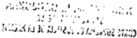

44

## FALLOS DE LA CORTE SUPREMA 322

ne, determina que la función de los jueces no alcance a interferir con el ejercicio de facultades que les son privativas a otros poderes con arreglo a lo prescripto por la Constitución Nacional, pues de lo contrario, se haría manifiesta la invasión del campo de las potestades propias de las demás autoridades de la Nación (Disidencia de los Dres. Augusto César Belluscio, Enrique Santiago Petracchi, Antonio Boggiano y Gustavo A. Bossert).

## EXTRADICION: Extradición con países extranjeros. Generalidades.

La solicitud de denegación de la extradición por la ausencia de garantías procesales en el país requirente, debe ser rechazada frente a la confianza depositada en que los tribunales de ese país aplicaron o han de aplicar conjusticia la ley de la tierra (Disidencia de los Dres. Augusto César Belluscio, Enrique Santiago Petracchi, Antonio Boggiano y Gustavo A. Bossert).

## DICTAMEN DEL PROCURADOR GENERAL

## Suprema Corte:

-1-

V.E. me corre vista en estas actuaciones con motivo del recurso de apelación ordinaria concedido a fs. 557 e interpuesto por la asistencia técnica de José Alberto Arias (fs. 552) contra el auto de fs. 539/45 que confirmó el punto 1 en cuanto se hace lugar a la solicitud de extradición que, del nombrado, solicitó la República de Bolivia a fin de ser juzgado por la comisión de los delitos de estafa, falsedad ideológica de instrumento falsificado y sociedades o asociaciones ficticias y revocó los puntos II y III en cuanto hace lugar a la opción efectuada por Arias para ser juzgado en la Argentina y no hace efectiva la extradición en virtud del derecho de opción (fs. 488/504).

Del examen del escrito de interposición del remedio ordinario se desprende que los agravios en que el recurrente funda su apelación, pueden circunscribirse a los siguientes: 1- que no se puede hablar de prescripción de la acción penal por no existir en la documentación acompañada la fecha precisa de la comisión de los hechos, II - la ajenidad de su defendido en los hechos investigados, III-la falta de fundamentación por parte de la justicia boliviana de la solicitud de extradición, IV- el incumplimiento de la regla de la identidad de la norma, V- la falta de

adecuación de las penas establecidas en la legislación boliviana a lo preceptuado por el Tratado de Montevideo en cuanto al mínimo de la pena, VI- la falta de garantías procesales para que su defendido sea sometido a juicio en el país requirente, VII-la nacionalidad del requerido como obstáculo a la concesión de la extradición.

-II-

Al respecto, es doctrina reiterada del Tribunal que no corresponde el tratamiento de aquellos agravios que no constituyan una crítica concreta y razonada de las partes del fallo que el apelante considera equivocadas (conforme Fallos: 319:2545).

Dado que la defensa no hace otra cosa que reproducir los argumentos tenidos en cuenta al momento de efectuar la apelación ante el tribunal recurrido, sin agregar otro tipo de fundamentación que dé razón de ellos, a excepción de los dos últimos agravios, entiendo que corresponde, sobre la base de la doctrina antes citada, se lo declare infundado respecto del resto.

En efecto, el recurrente -al fundar la apelación ante el tribunal de grado (fs. 525/37)arguyó que el pedido de extradición solicitado respecto de su defendido no contenía fecha exacta de comisión de los hechos, ni prueba alguna que relacionara al requerido con el hecho en análisis; que el delito de "sociedades o asociaciones ficticias" no tiene encuadre legal en nuestra legislación; que el pedido de extradición carece de fundamentación pues no existen elementos probatorios que respaldaran la denuncia del Superintendente de Bancos y Entidades Financieras; la ausencia de garantías procesales en el país requirente y por último mejora fundamentos en cuanto a que corresponde mantener lo resuelto en el punto II y III de la resolución de primera instancia atento el espíritu del legislador al redactar los arts. 3 2 , inc. 1 de la ley 1612 y 669 de la ley 2372.

La Cámara, en cambio, interpretó que la omisión en cuanto a la fecha de comisión de los hechos, muy probablemente se debió a la envergadura de la maniobra desplegada, más allá que, a tenor de lo establecido en el arto 19, inc. 4 2 del Tratado de Montevideo, y de las penas correspondientes a los delitos por los cuales se solicita la extradición, los injustos no se encontrarían prescript.os.

En cuanto a la falta de cumplimiento relativa a la doble incriminación penal, sostuvo que el delito de "sociedades o asociaciones ficticias" encuentra su correspondiente figura en el delito previsto en el arto 172 del Código Penal, sin que a ello obste el precedente de V.E. citado por la defensa, pues en él se parte de un presupuesto distinto del de autos.

Con relación a la ajenidad del defendido en los hechos investigados y a la falta de elementos probatorios que sustenten el pedido solicitado, la Sala hizo hincapié en la naturaleza del juicio extraditorio, en el que no se resuelve acerca de la culpabilidad y grado de inocencia del requerido pues este no reviste las características de un verdadero juicio.

Finalmente, respecto a la ausencia de garantías que posibiliten la realización de un proceso por parte del Estado requirente, señaló que la República de Bolivia dio suficientes garantías al manifestar que durante el estado de sitio dictado en el año 1995 de ninguna manera se comprometió ni limitó la libertad de los ciudadanos.

Por último, y en lo que al derecho de opción ejercido por Arias se refiere, la Cámara sostuvo que con base en lo establecido por los arts. 1"y 20 del Tratado de Montevideo, la opción ejercida no se encuentra prevista en la normativa aplicable al caso por lo que corresponde que el solicitado comparezca ante los tribunales del país requirente.

-III-

No obstante la doctrina expuesta a comienzos del apartado II, y tal corrio quedara planteado, entiendo necesario pronunciarme respecto a la opción del requerido a ser juzgado en el país, pues tal agravio fue introducido con motivo de la decisión del a qua adversa a lo por aquél solicitado.

En el punto 7' del memorial la defensa señala que por ser nacional argentino el solicitado de extradición, estaría facultado de conformidad con lo prescriptopor el arto 12 de la Ley 24.767, a ser juzgado en la República Argentina y que la invocación que la alzada hace de los arts. l' Y20 del Tratado de Montevideo, no sería un impedimento a su concesión atento la interpretación que la propia Suprema Corte de Bolivia efectuó de tales preceptos.

En primer lugar, viene al caso insistir en los fundamentos de la Cámara en cuanto a que la procedencia de la extradición, en supuestos en que media tratado, está condicionada al cumplimiento de exigencias formales y requisitos en él establecidos ya que es ley para las partes contratantes. En tanto que sólo, ante su ausencia, serían aplicables las disposiciones del Código de Procedimientos en Materia Penal (art. 648) o en la oportunidad prevista por el arto 120, segundo párrafo, de la ley 24.767 su arto 12 y, en consecuencia, invocable o discutible la reciprocidad y la práctica uniforme de las naciones (Fallos: 304:1609; 313:120 y 318:595).

Habida cuenta de lo cual y más allá del alcance que se le asigne a las disposiciones antes citadas, lo cierto es que no resulta procedente su invocación para hipótesis comolas de autos, desde que, tal comolo decidió la sentencia recurrida, esas disposiciones sólo rigen respecto de la extradición solicitada de acuerdo a la práctica de las naciones y no para el caso en el que, como en el presente, media tratado con el país requirente.

Tampoco la petición del recurrente podría encontrar sustento en lo dispuesto por el arto 2 2 , primer párrafo, de la ley 24.767 que si bien señala que las normas de esa ley servirán para interpretar el texto de los tratados, su aplicación está condicionada, conforme surge de la lectura de la primera parte, a que no se oponga a las estipulaciones del tratado aplicable.

Así las cosas, la cuestión ha de resolverse, pues, en el marco de las cláusulas contenidas en el acuerdo de voluntades antes mencionado, que en sus arts. 1 2 y 20 establecen que "los delitos, cualquiera que sea la nacionalidad del agente, de la víctima o del damnificado, se juzgan por los tribunales y se penan por las leyes de la Nación en cuyo territorio se perpetran" y que, "la extradición ejerce todos sus efectos sin que en ningún caso pueda impedirla la nacionalidad del reo".

Frente a tales principios, cabe concluir que la calidad de nacional, a diferencia de lo apuntado por el recurrente, no impide hacer lugar al pedido de extradición.

Tampoco merece atención el agravio de la defensa, al menos en este estadio, en cuanto a que el estado reclamante no ha actuado con reciprocidad en casos de extradiciones pedidas por la República Ar-

gentina y que, sus instituciones, no garantizan un debido proceso ni la aplicación de los principios fundamentales del derecho penal.

Ello es así, atento lo arriba manifestado en el sentido que la reciprocidad y la práctica uniforme de las naciones, en principio, sólo son invocables a falta de tratados. Por otra parte es del caso señalar que la apreciación del requisito de reciprocidad es una atribución política del Poder Ejecutivo (Fallos: 303:389, cons. 32 ).

Por último, y en lo que hace a la garantía de un debido proceso, su rechazo se impone pues no obran constancias fehacientes en el expediente que apuntalen la duda sugerida por la defensa, además de que excede al trámite de este pedido la consideración de cualquier irregularidad que pudiera existir en la substanciación del proceso principal (Fallos: 181:51).

-IV-

Habida cuenta de lo expuesto, opino que corresponde rechazar el recurso ordinario de apelación deducido por la defensa técnica de José Alberto Arias y, en consecuencia, confirmar la resolución de fs. 539/45 que hace lugar a la extradición solicitada, a su respecto, por la República de Bolivia, sin perjuicio de la decisión que el Poder Ejecutivo pueda adoptar en la oportunidad prevista por el arto 36 de la ley 24.767 que a esos efectos sí entiendo aplicable en dicha instancia. Buenos Aires, 22 de mayo de 1997. Nicolás Eduardo Becerra.

## FALLO DE LA CORTE SUPREMA

Buenos Aires, 4 de febrero de 1999.

## Autos y Vistos:

Como medida para mejor proveer, líbrese oficio al Ministerio de Relaciones Exteriores, Comercio Internacional y Culto a fin de que informe a este Tribunal si es de práctica de la República de Bolivia -en los casos de extradiciones de bolivianos solicitadas por la República

Argentinano aplicar el Tratado de Derecho Penal de Montevideo de 1889 sino el Código Bustamante que permite que los nacionales sean juzgados por el respectivo Estado y, en caso afirmativo, se exprese qué política ha sido adoptada por el Estado Argentino, con especial referencia al pedido de extradición formulado por la República de Bolivia respecto del ciudadano argentino José Alberto Arias Sartorelli. Aesos efectos, adjúntese fotocopias de los fallos de la Corte Suprema de Bolivia referidos por la defensa del nombrado en autos.

Asimismo, hágase lugar a lo solicitado por la defensa en el escrito que antecede, a cuyo fin requiéranse a ese Ministerio los antecedentes que obren respecto de la queja por retardo de justicia que habría sido formulada por la República Argentina respecto del argentino Jorge Antonio Trapaglia.

JULIO S. NAZARENO -EDUARDO MOLINÉ O'CONNOR -CARLOS S. FAYTAUGUSTO CÉSAR BELLUSCIO (en disidencia) -ENRIQUE SANTIAGO PETRACCHI (en disidencia) -AmONIO BOGGIANO (en disidencia) -GUILLERMO A. F. LúPEZ -GUSTAVO A. BOSSERT (en disidencia) -ADOLFO ROBERTO VÁZQUEZ.

DISIDENCIA DE LOS SEÑORES MINISTROS DOCTORES DON AUGUSTO CÉSAR BELLUSCIO, DON AmONIO BOGGlANO y DON GUSTAVO A. BOSSERT

## Considerando;

1') Que la Sala II de la Cámara Nacional de Apelaciones en lo Criminal y Correccional Federal concedió el recurso ordinario de apelación interpuesto por José Alberto Arias Sartorelli contra la sentencia que, al confirmar la dictada en la instancia anterior, hizo lugar a su extradición pedida por la República de Bolivia, con fundamento en la orden de captura librada el 9 de agosto de 1995 por el juez a cargo del Juzgado Quinto de Instrucción en lo Penal de La Paz en la causa sustanciada contra el nombrado y otros, por la comisión de los delitos de falsedad ideológica, uso de instrumento falsificado, sociedades o asociaciones ficticias y estafa, cometidos entre 1988 y 1995, en infracción a los arts. 199, 203, 229 y 335 del Código Penal de la República de Bolivia (conf. fs. 94 vta.l97 de esta causa y fs. 993/995 de la causa principal extranjera que en fotocopia corre por cuerda). Asimismo, revocó lo resuelto respecto a la opción ejercida por Arias Sartorelli, con

fundamento en su nacionalidad argentina, para ser juzgado por nuestros tribunales, a la que no hizo lugar.

- 2') Que, en esta instancia, la defensa presentó la memoria correspondiente solicitando el rechazo del pedido de extradición y, a todo evento, eljuzgamiento de su asistido en el país (fs. 567/588) y el señor Procurador General impetró que se confirmase la resolución apelada en todos sus términos (fs. 590/592).
- 3') Que la investigación en curso en el país extranjero involucra una diversidad de hechos a los que se les asigna carácter delictual, cometidos en el transcurso de siete años -entre 1988 y 1995en el marco de operaciones financieras llevadas a cabo por una serie de sociedades VÍnculadas radicadas en la República de Bolivia y en el extranjero. Se imputa responsabilidad penal a unos veintidós procesados (fs. 172 de las fotocopias que corren por cuerda) incluido Arias Sartorelli, a éste en su condición de directivo de alguna de esas sociedades, por la realización de maniobras que habrían perjudicado a numerosas personas, de las cuales casi treinta aparecen indívidualizadas.
- 4') Que, como cuestión previa, el Tribunal advierte que en las resoluciones recaídas en las instancias anteriores, al considerar como un único hecho lo que constituye una diversidad de acciones, se examinaron de modo fragmentario y parcializado los recaudos a los que debía ajustarse el pedido, en condiciones tales que no sólo se desatendieron algunos de los agravios de la defensa conducentes para la solución del caso sino que, al mismo tiempo, se incurrió en afirmaciones dogmáticas desprovistas de apoyo en las constancias de Ji causa, al no demostrarse de qué modo cada una de las diversas conductas atribuidas a Arias Sartorelli se ajustaba a las condiciones de la entrega en los términos pactados por ambos estados signatarios.
- 5') Que ello resultaba exigible toda vez que los hechos en los que se funda el requerimiento no sólo tienen significación jurídica a los fines de examinar si se configura el principio de "doble incriminación" conforme con lajurisprudencia del Tribunal (Fallos: 315:575, considerando 5'; 317:1725, considerando 7') sino que, además, el sustrato fáctico por el que se hace lugar a la entrega será la medida de la habilitación para el juzgamiento en el extranjero, por aplicación del principio de especialidad consagrado en el arto 26, segundo párrafo, del Tratado de Montevideo de 1889, aplicable al caso.

6') Que el inc. 1"del arto 30 de ese instrumento internacional incluye, entre los requisitos a los que debe ajustarse el pedido en el supuesto de presuntos delincuentes, que el país reclamante adjunte copia legalizada de la ley penal aplicable a la infracción que lo motiva, del auto de detención y demás antecedentes previstos en el inc. 3' del arto 19.

7') Que el estricto cumplimiento de este último precepto convencional, en cuanto exige la presentación de "los documentos que según sus leyes autoricen la prisión y el enjuiciamiento del reo",ha sido interpretado por esta Corte en el sentido de que es facultad de los tribunales del Estado al que se pide auxilio verificar la observancia de las formalidades "que hacen presumir la perpetración de un delito" (Fallos: 291:195, considerando 4' con cita de Fallos: 106:20, considerando 4' y doctrina de Fallos: 229:124).

Aesos fines, los recaudos acompañados deben ser suficientes para comprobar adecuadamente los hechos que se imputan al requerido con relación a los delitos incriminados en las normas penales consideradas aplicables (Fallos: 291: 195 citado, considerando 5').

8') Que como surge de los antecedentes acompañados se imputa a Arias Sartorelli, en su carácter de accionista y director del Banco Boliviano Americano S.A., haber intervenido en la formación de una filial en las Islas Caymán -el Banco Boliviano Americano International Banking Corporation (en adelante BBA-IBC)- para, posteriormente, establecer una representación de esa entidad bancaria en la República de Bolivia bajo el nombre "Ribaldi S.R.L." (fs. 683/694 de la causa extranjera que en fotocopias corre por cuerda). Esta sociedad, transformada después en una anónima (fs. 695/706 del mismo expediente), si bien desde lo formal fue considerada comointegrada con un capital accionario diferenciado de las anteriores (fs. 66/72, 76/77, 89/92, 94/100 de la misma causa), de hecho aparecía vinculada a aquellas instituciones bancarias en lo que respecta a su capital y a la toma de decisiones societarias, al ser sus accionistas y directores interpósitas personas (fs. 624/627 de la misma causa). En cuanto a su objeto social, que incluía la representación de entidades bancarias extranjeras, en la práctica se extendió a operaciones pasivas de intermediación financiera ajenas a sus estatutos y a la autorización concedida por la Superintendencia de Entidades Financieras. Estas operaciones habrian sido llevadas a cabo a través de una serie de casas de cambio también

vinculadas al mismo grupo económico, para de este modo obtener un beneficio o privilegio indebido en perjuicio de la economía nacional boliviana y de los particulares (conf. fs. 65/72, 83/84, auto de instrucción de fs. 171/172 y 596/598, 377/383 Y405/406 del mismo expediente).

9') Que, en este sentido, habria llevado a cabo en la República de Bolivia -a nombre de distintas personas de existencia real e ideal allí domiciliadasoperaciones de intermediación financiera tales como la apertura de cuentas corrientes en la entidad bancaria extranjera antes citada, a la que a su vez representaba (cuenta N' 15801 a fs. 360/361 y N' 16112 a fs. 364/365), depósitos a plazo fijo (fs. 274/276) Ydistintos movimientos bancarios respecto de cuentas corrientes allí radicadas (conf.fs. 353, 355/361 respecto de la cuenta N' 53567; 336/349, N' 03236; 284/326, N" 00076, 06041, 06044, 00079, 00045, 06043, 03950; 330/331, W 16237; fs. 273, 277 Y279, N'" 00168, 00090 Y03875; fs. 535, N' 03646 Yfs. 352, cuenta 53567).

10) Que a los fines de hacer efectiva esa captación de fondos no autorizada, "Ribaldi" habria recurrido a la oferta pública de las operaciones financieras de intermediación antes descriptas en condiciones más ventajosas que las del mercado (conf. descripción de fs. 228 y 367 vta./368 del expediente que corre por cuerda), lo cual habría inducido en error a personas físicas y jurídicas que, en la creencia de que aquéllas estaban garantizadas por el Estado boliviano, efectuaron su desprendimiento patrimonial.

11) Que la conducta atribuida a Arias Sartorelli en sede extranjera, sobre la base del hecho descripto en los considerando s 8' y 9', calificado por el país requírente comosociedades ficticias, falsedad ideológica y uso de instrumento falsificado en infracción a los arts. 229, 199 Y203 del Código Penal boliviano (conf. texto obrante a fs. 127 y 124), puede subsumirse entre los delitos cometidos contra la fe pública, en fraude al comercio y a la industria, en la figura del arto 301 del Código Penal, que establece que será reprimido con prisión de seis meses a dos años, el director, gerente, administrador oliquidador de una sociedad anónima, o cooperativa o de otra persona colectiva que a sabiendas prestare su concurso o consentimiento a aetas contrarios a la ley o a los estatutos, de los cuales pueda derivar algún perjuicio.

Estas normas no reprimen necesariamente la instigación al error sino la traición a la confianza general en la regularidad del funciona-

miento de los entes colectivos. La verdadera magnitud del daño radica, en estos casos, en la lesión a la confianza del público. En consecuencia, no es de aplicación la doctrina de Fallos: 249:360.

12)Que con relación a los hechos calificados por el país requirente comoestafa en infracción al arto335 del CódigoPenal boliviano (fs. 136), este proceder resulta encuadrable, a los fines que aquí conciernen, en el arto 172 del Código Penal argentino, en la medida en que el ardid o el engaño, en cuanto al verdadero alcance de la autorización estatal para operar en el mercado financiero, unido a la oferta pública en las condiciones descriptas en el considerando 10, habrían sido determinantes para el desprendimiento patrimonial de las distintas personas de existencia física e ideal que se consideran damnificadas.

13) Que cuando el arto 21, inc. F del Tratado de Derecho Penal de Montevideo de 1889 supedita la entrega del procesado a que las infracciones se hallen sujetas a una pena privativa de libertad no menor de dos años, se refiere al límite máximo previsto en cada figura delictiva (Fallos: 298:126, considerando 5' y su cita). En consecuencia, corresponde desestimar el agravio que al respecto formuló la parte recurrente (fs. 575 vta.), sin perjuicio de señalar su tardía introducción al no haber sido planteado ante los jueces de la causa.

- 14) Que, por lo demás, de acuerdo a lo que surge de las disposiciones legales extranjeras aplicables al régimen de prescripción (fs. 116), la acción penal nacida de los hechos en que se funda el pedido no estaría prescripta con arreglo a la ley del país reclamante (art. 19, inc. 4' del tratado aplicable).
- 15) Que en cuanto al agravio del recurrente fundado en que el pedido adolece de defectos formales por no incluir la fecha de comisión de los hechos atribuidos a Arias Sartorelli, cabe destacar que ese no es un requisito exigido por el Tratado de Montevideo (Fallos: 200:304; 263:448; 304: 1609, considerando 6'); y, en elsub lite, los antecedentes acompañados proporcionan, con suficiente certeza, datos temporales bastantes que permiten tener por cumplido, en el caso, tal recaudo.
- 16) Que, en este sentido, la sociedad "Ribaldi" habría realizado operaciones de intermediación financiera contrarias -según se ha expuesto en el considerando 11a la ley ya sus estatutos, desde 1988 (conf. declaración de Alberto Maceda Yañez obrante a fs. 134/137 del

expediente extranjero), y aparece como un extremo de hecho, no controvertido en el caso, que Arias Sartorelli perteneció al directorio de su representante, el BBA-lBC, desde esa fecha y hasta el año 1992 (fs. 41/42; 205/206; 528; 530 vta.; 569; 572 vta. y 587 de esta causa y 377/380 Y658 vta. de las fotocopias que corren por cuerda).

- 17) Que su desvinculación de la supuesta controlante en la fecha citada reviste, a diferencia de lo resuelto en las instancias anteriores, significación jurídica a fin de determinar cuáles son los hechos de estafa tentados o cometidos durante el período en que estuvo vinculado al grupo económico. En este sentido, la documentación acompañada comprende, durante ese lapso, la realización de operaciones de intermediación financiera solamente en las cuentas corrientes N' 53.567 -en octubre de 1989-y W 15801-enjunio de 1991-(fs. 355/356 y 360/ 361, respectivamente), hechos por los que habrían resultado damnificados Arturo Aviles Ríos y Edwin Rocha y/o Cloris Cárdenas (fs.366/372).

18) Que, en tales condiciones, la entrega deberá circunscribirse a los hechos calificados, según la legislación penal argentina, como infracción a los arts. 301 (considerandos 11 y 16) Y 172 -dos hechos(considerandos 12 y 17) del Código Penal.

- 19)Que, en cuanto a la alegada falta de reciprocidad de la República de Bolivia en el cumplimiento del arto 20 del tratado, según el cual la nacionalidad del requerido no es óbicepara conceder la extradición, el recurrente solicita que, como medida de retorsión frente a esa práctica, el Tribunal se considere desligado dela hermenéutica hasta ahora adoptada respecto de ese precepto convencional y aplique el criterio que ofrece el derecho interno en materia de extradición de nacionales.
- 20) Que es doctrina de esta Corte que la nacionalidad del sujeto requerido no sólo carece de efectos para acordar la entrega, según el arto 20 antes citado, sino que además constituye una circunstancia que en ningún caso puede impedirlo (doctrina de Fallos: 97:343; 115:14; 146:389; 170:406; 216:285 y 304:1609, considerando 4' entre otros).
- 21) Que en virtud de lo expuesto, no es admisible el sometimiento del inculpado a la jurisdicción de los tribunales argentinos con fundamento en el arto 669 del Código de Procedimientos en Materia Penal (ley 2372), que sólo es aplicable cuando la extradición es solicitada de

acuerdo con la práctica de las naciones y no cuando el caso es regido por un tratado, cuyas disposiciones forman la ley de las partes contratantes (Fallos: 170:406; 216:285 y 304:1609, considerando 5').

22) Que tampoco la entrada en vigencia de la ley 24.767 autoriza un apartamiento de estos principios toda vez que -como ya se dijo--el presente trámite está regido por el Código de Procedimientos en Materia Penal-ley 2372(art. 120, primer párrafo de la nueva ley). Aun de sostenerse esa posibilidad, el actual ordenamiento sólo resultaría de aplicación en la hipótesis prevista en el último párrafo de su arto 12, que regula el supuesto en que al existir tratado éste faculte la extradición de nacionales (art. 36 de aplicación en virtud del arto 120 cit., segundo párrafo) y no como en el sub lite en que el instrumento con- . vencional obliga a ello, conforme a la jurisprudencia antes citada, hipótesis en que incluso la propia ley vigente excluye la posibilidad de opción en favor del requerido (art. 12, primer párrafo).

23) Que el señor Procurador General de la Nación aconsejó desestimar la defensa interpuesta con el fin de lograr un apartamiento de los términos del tratado ante la falta de reciprocidad del país requirente en el cumplimiento de la entrega de sus nacionales.

Invocó para ello lajurisprudencia citada y el precedente de Fallos: 303:389 en el que este Tribunal consideró que no era justiciable la cuestión fundada en la insuficiencia de la reciprocidad ofrecida por el gobiemo del país reclamante porque la apreciación de este extremo constituía una atribución política del Poder Ejecutivo a quien correspondía expedirse sobre ese requisito al dictar el decreto que dispone dar curso o devolver el pedido de extradición (considerando 3').

24) Que para así resolver esta Corte tuvo en cuenta que, cuando la extradición no se hallaba autorizada por tratados, correspondía al Poder Ejecutivo la apreciación, en el ámbito intemacional, de los recaudos de reciprocidad y práctica uniforme de las naciones contemplados por el arto 652 del Código de Procedimientos en Materia Penal-ley 2372-, pues se trataba de un antejuicio de carácter político, para cuya formulación era, sin duda, elemento esencial la valoración de las relaciones que vinculaban a nuestro país con el Estado requirente.

25) Que, sin embargo, la falta de reciprocidad invocada en el sub lite no guarda relación con ese presupuesto de hecho, necesario

para dar origen al nacimiento de una obligación internacional entre dos países no ligados por un tratado, sino que se vincula con su ejecución y las consecuencias que, en caso de su incumplimiento, pueden derivarse.

26) Que es el derecho interno de cada Estado el que determina cuál es el órgano estatal investido de la competencia necesaria para apreciar la ejecución por un Estado extranjero de sus obligaciones internacionales, y el temperamento a adoptar en caso de inobservancia va desde la libertad de formular su denuncia, suspensión, protesta o negociación hasta su mantenimiento y, en su caso, la exigencia de su cumplimiento, en el marco de las medidas de respuesta, cuyo ejercicio lícito admite el derecho internacional frente a hechos ilícitos de ese carácter y que incluyen tanto la retorsión comocontramedidas fundadas en reciprocidad o que constituyan represalia.

27) Que, por otra parte, el mismo Tratado de Montevideo de 1889, en su arto 49, contempla el mecanismo a seguir por la parte signataria que creyese conveniente desligarse o modificar el tratado y, a su vez, la Convención de Viena sobre Derechos de los Tratados establece los supuestos de su terminación o suspensión de su aplicación como consecuencia de haber sido violado (art. 60) y el procedimiento que deberá seguir la parte que alegue una causa para dar por concluido un tratado, retirarse de él o suspender su aplicación (art. 65), para lo cual requiere que notifique su voluntad por escrito, en un instrumento que será comunicado a las demás partes y que si no estuviera firmado por el jefe de Estado, el jefe del gobierno o el ministro de Relaciones Exteriores, el representante del Estado que la comunique podrá ser invitado a presentar sus plenos poderes (art. 67).

28) Que si se considera que, en el marco del tratado vigente entre la República de Bolivia y la República Argentina, el Poder Ejecutivo dio curso al presente pedido de extradición con conocimiento de la práctica de no entrega de sus nacionales por aquel Estado, aparece como desprovista de fundamento la pretensión de que el Poder Judicial, sobre la base de esa conducta, se considere desvinculado del convenio y, en consecuencia, no haga lugar a la entrega requerida por aplicación del derecho interno.

29) Que ello es así, desde que corresponde en forma privativa al Poder Ejecutivo la valoración de las relaciones que vinculan a nuestro

país con el Estado requirente y, por tanto, es él el único que se halla capacitado para decidir hasta qué punto la práctica extranjera, o el motivo que ha dado lugar a ella, puede afectar la confianza en el cumplimiento de las obligaciones que asume la nación solicitante (del dictamen del Procurador General en Fallos: 257:125, cuyas conclusiones compartió la Corte en el considerando 1"de su fallo).

30) Que ello no significa que el Poder Judicial de la Nación se desentienda de la práctica de los estados en la ejecución de sus obligaciones, sino que sólo está constitucionalmente habilitado para asignarle consecuencias jurídicas en la medida en que una norma así lo establezca y con el alcance que ella disponga.

31) Que, por ello, no puede el Poder Judicial erigirse en juez de la condición de reciprocidad para, en su caso, negarse a aplicar un tratado, ya que la apreciación de aquella circunstancia y de las consecuencias que su configuración o ausencia pueden generar en el campo de las obligaciones convencionales internacionales en juego, constituye una atribución política del Poder Ejecutivo Nacional, en consonancia con las cláusulas constitucionales que confían a éste el manejo de las relaciones exteriores (arts. 75, incs. 22 y 26, Y99, inc. 11 de la Ley Fundamental).

32) Que, en tales condiciones, excede el marco de competencias del Tribunal la adopción de medidas comolas que pretende la parte recurrente, que no le han sido constitucionalmente asignadas a la Corte Suprema de Justicia de la Nación (arts. 116 y 117 de la Ley Fundamental) sino que, según fue expuesto, son de exclusivo resorte del Poder Ejecutivo Nacional. A lo que cabe agregar que el principio de separación de poderes y el necesario respeto por parte de los tribunales de los límites constitucionales y legales que su competencia les impone, determina que la función de los jueces no alcance a interferir con el ejercicio de facultades que les son privativas a otros poderes con arreglo a lo prescripto por la Constitución Nacional, pues de lo contrario, se haría manifiesta la invasión del campo de las potestades propias de las demás autoridades de la Nación (con£'en lo pertinente, doctrina de Fallos: 311:2580 y sus citas).

33) Que en cuanto al argumento de la defensa relativo a que la entrega sea denegada por la ausencia de garantías procesales en el país requirente, tanto por la inobservancia del plazo razonable de du-

ración del proceso y la existencia de motivación política en las imputaciones dirigidas a su asistido comopor el estado de su sistema carcelario, debe ser rechazado.

Ello es así toda vez que frente a la confianza depositada en que los tribunales del país requirente aplicaron o han de aplicar con justicia la ley de la tierra (Fallos: 187:371) no existen en el expediente referencias que apuntalen la protesta de la defensa con aplicación a la concreta situación de Arias Sartorelli. Por lo demás, delimitados los hechos por los que se declara procedente la solicitud de extradición (considerando 18 y concordantes), el requerido se encuentra amparado por el principio de especialidad consagrado en el citado arto 26, segundo párrafo, del tratado aplicable al caso y existen mecanismos de protección nacionales y supranacionales que, a todo evento, podrán ejercer un control acerca de las condiciones que preocupan al extraditado.

Por ello, oído el señor Procurador General, se resuelve confirmar la resolución apelada sólo respecto de los hechos descriptos en el considerando 18. Notifíquese y devuélvase.

AUGU8TO CÉ8AR BELLUSCIO -AmONIO BOGGlANO -GUSTAVO A. BOSSERT.

DISIDENCIA DEL SEÑOR MINISTRO DOCTOR DON ENRIQUE SANTIAGO PETRACCHI

Que coincido con el voto en disidencia de los jueces Belluscio, Boggiano y Bossert, con exclusión de los considerandos 30 hasta el 33 inclusive, que expreso en los siguientes:

30) Que ello no significa que el Poder Judicial de la Nación se desentienda de la práctica de los Estados en la ejecución de sus obligaciones, sino que sólo está constitucionalmente habilitado para asignarle consecuencias jurídicas en la medida en que una norma así lo establezca y con el alcance que ella disponga. En este sentido, la práctica bilateral de la República Argentina y de la República de Italia fue invocada por el Tribunal en Fallos: 319:2557, para interpretar el alcance del tratado de extradición que vinculaba a las partes en ese caso, con apoyo en el arto 31.3.b. de la Convención de Viena sobre Derecho de los Tratados.

31) Que, por lo demás, tampoco puede soslayarse que cuando este precepto convencional asigna relevancia, a los fines hermenéuticos, a la conducta ulterior seguida por las partes en la aplicación del tratado por la cual conste su acuerdo acerca de su interpretación, supone un obrar bilateral que no necesariamente debe configurarse sobre bases de reciprocidad.

En efecto, si bien la reciprocidad constituye la piedra basal de las relaciones internacionales, ya que supone el mantenimiento entre los estados del equilibrio de sus intereses y la equivalencia de las situaciones respectivas en el seno de las relaciones que los vinculanjurídicamente, nada obsta a que un Estado decline su exigencia ohaga reposar su configuración en vínculos de cooperación ajenos a la materia.

Sobre el particular, resulta ilustrativa la situación que se registró entre los Estados Unidos de América y la otrora República Federal de Alemania, cuya constitución prohibía la entrega de sus nacionales, pese a lo cual existía una reciprocidad de facto en virtud de la que, en tales supuestos, el nacional germano era sometido a juicio por la ofensa cometida en el extranjero y, a cambio, el país del norte extraditaba a sus nacionales (conf. Proceedings of the Haruard Law School Conference on lnternational Cooperation in Criminal Matters, v. 31, Harvard International Law Journal, Winter '90, págs. 18/19 y 66170).

32) Que, por ello, no puede el Poder Judicial erigirse en juez de la condición de reciprocidad para, en su caso, negarse a aplicar un tratado, ya que la apreciación de aquella circunstancia y de las consecuencias que su configuración o ausencia pueden generar en el campo de las obligaciones convencionales internacionales en juego, constituye una atribución política del Poder Ejecutivo Nacional, en consonancia con las cláusulas constitucionales que confían a éste el manejo de las relaciones exteriores (arts. 75, incs. 22 y 26, Y99, inc. 11 de la Ley Fundamental).

33) Que en sentido coincidente con este criterio se pronunció el Tribunal Supremo de los Estados Unidos en el caso Charlton v. Kelly (1913) al confirmar la extradición de Porter Charlton, ciudadano norteamericano, solicitada por el gobierno de Italia, como autor de un homicidio en ese país. Ello pese a que la práctica de Italia era la no entrega de sus nacionales, con fundamento en la disposición contenida en el Código Penal de 1890 que, en términos expresos la prohibía.

Concluyó la Suprema Corte extranjera que en la medida en que el Poder Ejecutivo no optara por liberarse de la obligación de entrega de sus nacionales, era deber pleno de ese tribunal reconocer que esa obligación estaba impuesta por el tratado comoley suprema de la Nación (conf. 229 US 447, en especial págs. 465 y sgtes. y citas. Asimismo, Oppenheim, "Tratado de Derecho Internacional Público", Tomo 1,Volumen n, págs. 271/273, en especial nota 12,ypágs. 542/543, Ed. Bosch, Barcelona, 1961;Fauchille, Paul "Traité de Droit lnternational Public", Tomo 1,Parte la., pág. 1002, Ed. Rousseau &amp; Cie., 1922).

34) Que, en tales condiciones, excede el marco de competencias del Tribunal la adopción de medidas comolas que pretende la parte recurrente, que no le han sido constitucionalmente asignadas a la Corte Suprema de Justicia de la Nación (arts. 116 y 117 de la Ley Fundamental) sino que, según fue expuesto, son de exclusivo resorte del Poder Ejecutivo Naciana!. A lo que cabe agregar que el principio de separación de poderes y el necesario respeto por parte de los tribunales de los límites constitucionales y legales que su competencia les impone, determina que la función de los jueces no alcance a interferir con el ejercicio de facultades que les son privativas a otros poderes con arreglo a lo prescripto por la Constitución Nacional, pues de lo contrario, se haria manifiesta la invasión del campo de las potestades propias de las demás autoridades de la Nación (conf. en lo pertinente, doctrina de Fallos: 311:2580 y sus citas. Conf., asimismo, Batiffol-Legarde, "Traité de Droit lnternational Privé", Tomo 1, págs. 73/74, 8a. edición, Ed. L.G.D. J., 1993, Paris).

35) Que en cuanto al argumento de la defensa relativo a que la entrega sea denegada por la ausencia de garantías procesales en el país requirente, tanto por la inobservancia del plazo razonable de duración del proceso y la existencia de motivación política en las imputaciones dirigidas a su asistido comopor el estado de su sistema carcelario, debe ser rechazado.

Ello es así toda vez que frente a la confianza depositada en que los tribunales del país requirente aplicaron o han de aplicar con justicia la ley de la tierra (Fallos: 187:371) no existen en el expediente referencias que apuntalen la protesta de la defensa con aplicación a la concreta situación de Arias Sartorelli. Por lo demás, delimitados los hechos por los que se declara procedente la solicitud de extradición (considerando 18 y concordantes), el requerido se encuentra amparado por el

principio de especialidad consagrado en el citado arto 26, segundo párrafo, del tratado aplicable al caso y existen mecanismos de protección nacionales y supranacionales que, a todo evento, podrán ejercer un control acerca de las condiciones que preocupan al extraditado.

Por ello, oído el señor Procurador General, se resuelve confirmar la resolución apelada sólo respecto de los hechos descriptos en el considerando 18. Notifíquese y devuélvase.

ENRIQUE SANTIAGO PETRACCHI.

## GASNOR S.A. v. MUNICIPALIDAD DE SALTA

RECURSO EXTRAORDINARIO: Requisitos propios. Resolución contraria.

El recurso extraordinario es formalmente admisible, toda vez que se ha configurado denegatoria del fuero federal, oportunamente reclamado por el apelante.

JURISDICCION y COMPETENCIA: Competencia federal. Por la materia. Causas regidas por normas federales.

Compete a la justicia federal conocer -ratione materiaesi la demanda remite a interpretar la ley federal 24.076 y a resolver las impugnaciones que con base constitucional efectúa la demandante.

JURISDICCION y COMPETENCIA: Competencia federal. Principios generales.

El respeto por la autonomía de las provincias requiere que se reserven a sus jueces las causas que en lo sustancial del litigio versan sobre aspectos propios de su jurisdicción local, sin perjuicio de que las cuestiones federales que también puedan comprender esos pleitos sean susceptibles de adecuada tutela por vía del recurso extraordinario.

JURISDICCION y COMPETENCIA: Competencia federal. Por la materia. Causas regidas por normas federales.

La justicia federal es la única competente para determinar si la empresa licenciataria del servicio público nacional de distribución de gas natural por

redes en las provincias de Salta, Jujuy, Santiago del Estero y Tucumán, debe asumir o no la condición de sujeto imponible respecto de la tasa y contribución establecida en el Código Tributario Municipal de la Ciudad de Salta.

DICTAMEN DE LA PROCURADORA FISCAL

Suprema Corte:

-I-

V.E. corre vista a este Ministerio Público a fs. 93 vta., a fin de que se expida sobre el recurso extraordinario interpuesto por la actora -GASNOR S.A. (Distribuidora de Gas del Norte S.A.)contra la sentencia de la Cámara Federal de Apelaciones de Salta, de fs. 72/76, que hizo lugar al recurso de apelación interpuesto por el Fiscal Federal a fs. 56/58 contra la sentencia de fs. 53/55 y declaró la incompetencia de la Justicia Federal de Salta para entender en la presente demanda.

Dicho recurso extraordinario fue concedido por el citado tribunal a fs. 90 -a pesar de tratarse de una cuestión de competenciapor ser el fallo apelado denegatorio del fuero federal y, por lo tanto, equiparado a sentencia definitiva, según una antigua jurisprudencia de la Corte.

-II-

Gasnor S.A. -invocando su condición de licenciataria para la prestación del servicio público nacional de distribución de gas natural por redes en las Provincias de Salta, Jujuy, Santiago del Estero y Tucumán, otorgado por el decreto nacional 2452/92 dictado en consecuencia de la ley 24.076-, promovió la presente acción declarativa, en los términos del artículo 322 del Código Procesal Civil y Comercial de la Nación, ante el Juzgado Federal de Primera Instancia N"2 de la Provincia de Salta, contra la Municipalidad de la Ciudad de Salta.

Dirigió su pretensión, a fin de obtener la declaración de inconstitucionalidad de la "tasa por el ejercicio de actividades diversas" establecida en los artículos 103 a 126 del Código Tributario Municipal (Ordenanza 6330/91) y de la "contribución que incide sobre la publicidad y

•

propaganda" establecida en los artículos 135 a 145 del referido código y, consecuentemente, la declaración de nulidad por ilegítimos, de los actos administrativos dictados por dicho Municipio en su contra, en el expediente municipal 70.386/94, por los cuales se le pretende aplicar ambos tributos.

Manifestó que, tanto la tasa como la contribución cuestionadas, son inconstitucionales, toda vez que con su aplicación, el Municipio de Salta pretende ejercer el poder de policía municipal sobre un servicio público nacional, lo cual-según dicele está vedado por la ley nacional 24.076 que regula la actividad del gas y, en consecuencia, resulta contrario a los artículos 17,31 y 75 inciso 18 de la Constitución Nacional.

Respecto de la tasa, sostuvo que dicha Comuna no presta el servicio de contralor -sobre la actividad que desarrolla la actora en ese Municipioque pretende cobrar, en tanto dicho cometido lo realiza la autoridad de aplicación en la materia que, según la ley 24.076, es el Ente Nacional Regulador del Gas (ENARGAS) creado por el artículo 50, por lo que su pretensión de cobro colisiona con el artículo 63 de dicha norma, que establece que las distribuidoras deberán pagar una tasa de fiscalización y control al referido ente. También cuestionó la base imponible establecida en el artículo 105 del Código Tributario Municipal, a los efectos de la determinación de la cuantía de la tasa, considerando que ella debe estar de acuerdo con el servicio que se presta y no con la mayor o menor riqueza del obligado.

En lo que se refiere a la contribución sobre la publicidad y propaganda, afirmó que no existe el hecho imponible, puesto que la empresa no necesita recurrir a dichos medios para promover el uso o consumo del servicio ya que no lo presta en condiciones competitivas. Por ello, entendió que la determinación de tal tributo, a su respecto, por parte de la Municipalidad de Salta, viola su derecho de propiedad garantizado por el artículo 17 de la Ley Fundamental.

En síntesis, afirmó, que la Municipalidad provincial carece de facultades para interferir, menoscabar o dificultar el ejercicio, por parte de la Nación, de los poderes que le fueron delegados -a través de la Constitución Nacional y de la ley federal 24.076para satisfacer los fines de interés público nacional, como así también, en cumplimiento de órdenes emanadas del ENARGAS.

Por último, expresó que la causa debía tramitar ante el fuero federal, puesto que el servicio de distribución de gas: 1) tiene carácter federal; 2) está regulado por una autoridad federal (ENARGAS); 3) implica transporte interjurisdiccional en los términos del artículo 75, inciso 13 y 32 de la Constitución Nacional y 4) tiene el carácter de establecimiento de utilidad nacional, conforme al artículo 75, inciso 30 de la Ley Fundamental.

Afs. 53, eljuez federal de Salta, ante quien se interpuso la demanda, declaró su competencia para entender en la causa: en primer lugar, por la materia, en tanto en la demanda se cuestionan tributos provinciales por ser contrarios a la ley nacional 24.076 y, en consecuencia, a la Constitución Nacianal; en segundo lugar, por estar en juego un servicio público inteIjurisdiccional.

Apelado dicho fallo por el Ministerio Público, la Cámara Federal de Apelaciones de Salta, a fs. 72/74, compartiendo el dictamen del Fiscal de Cámara, hizo lugar al recurso interpuesto y declaró la incompetencia del fuero federal para entender en las actuaciones, por considerar que la cuestión, relativa a la validez de normas y actos provinciales, se halla vinculada con el derecho público local.

Contra dicha decisión, Gasnor S.A. interpuso el recurso extraordinario previsto en el artículo 14 de la ley 48, a fs. 79/86.

La actora fundó su apelación, sosteniendo que el decisorio impugnado le causa un agravio de insusceptible reparación ulterior, puesto que lo priva de su 'juez natural" que, según entiende, es el juez federal.

Asimismo, reiteró lo expuesto en su demanda en el sentido de que, en la presente causa, se cuestiona la interpretación y aplicación que hacen las autoridades provinciales de una ley federal-la ley 24.076-, regulada por una autoridad federal-el ENARGAS-, sobre un servicio público nacional e interjurisdiccional, que tiene el carácter de establecimiento de utilidad nacional y la decisión contraria los artículos 17, 31 Y75, incisos 13, 20 Y32 de la Constitución Nacional.

Afin de evacuar la vista que se concede, corresponde señalar, ante todo, que el recurso extraordinario interpuesto por Gasnor S.A. contra

la sentencia de la Cámara Federal de Salta, fue bien concedido por dichotribunal-no obstante tratarse de una cuestión relativa a la competencia-, en tanto ha existido en el caso denegatoria del fuero federal, lo cual equipara el fallo a sentencia definitiva, según una antigua jurisprudencia del Tribunal (Fallos: 276: 255 y sus citas; 299:199; 302:194 y 1626; 303:235, 1542 y 1702; 305:502 y 2067; 306:172, 190 y 2101; 307:1928 y 2430; 314:367 y 848; 316:2410, entre muchos otros).

Por otra parte, creo del caso recordar que, a fin de resolver cuestiones de competencia se ha de tener en cuenta de modo principal la exposición de los hechos que el actor hace en su demanda, según el artículo 4 Q del Código Procesal Civil y Comercial de la Nación y después, sólo en la medida que se adecue a ellos, el derecho que se invoca comofundamento de la pretensión (doctrina de Fallos: 306:368 y 1056; 308:229, 1239 y 2230; 310:156 y 2340; 312:808; 313:826; 315:2300; 316:2906 y sus citas y 320:2246).

En su mérito, corresponde señalar que -en la causa sub examinela pretensión de la actora consiste en cuestionar normas tributarias locales -el CódigoTributario Municipal (Ordenanza 6330/91)y actos de ese carácter dictados por la Municipalidad de Salta, en el expediente administrativo 70.366 (v. fs. 14/16), fundándose, tal impugnación, en el hecho de que los servicios que se pretenden cobrar no han sido prestados por la Comuna local, comoasí también, que la base imponible tenida en cuenta para su determinación resulta irrazonable, en tanto no se relaciona con el servicio que se presta sino con la capacidad contributiva de la empresa.

Habida cuenta de ello, es mi parecer que la materia del pleito corresponde al derecho público local, toda vez que, si bien la actora invoca la prestación de un servicio público nacional, la cuestión sometida a juicio no se relaciona con tal servicio, en tanto no se encuentra en tela de juicio la regulación del transporte o la distribución del gas natural, la interferencia de un servicio interjurisdiccional, ni el patrimonio del Estado, ni su seguridad, ni la de los habitantes.

En tales condiciones, la circunstancia de que, para resolver el pleito, se requiera analizar normas y actos administrativos provinciales, interpretándolos en su espíritu y en los efectos que la soberanía provincial ha querido darles, privan al proceso de la naturaleza federal que se le pretende atribuir. Ello es así, en tanto las provincias conservan por el ''pactum foederis" competencias diversas de orden insti-

tucional, tributario, procesal, de promoción general, etc. que no han sido delegadas en el gobierno federal (artículos 121 y siguientes de la Constitución Nacional).

No empece, a la aplicación de la doctrina citada, el hecho de que la actora invoque el respeto de cláusulas constitucionales, por cuanto la nuda violación de garantías de tal carácter provenientes de autoridades de provincia, no sujeta por sí sola las causas que de ella surjan al fuero federal, sino que habilita su adecuada tutela por la vía del recurso extraordinario previsto en el artículo 14de la ley 48 (Fallos: 310:295 y 2841; 314:94, 810; 315:1892).

En tales condiciones, el respeto del sistema federal y de las autonomías provinciales exige que se reserve, a los jueces locales, el conocimiento y decisión de las causas que, en lo sustancial, versan sobre aspectos propios de su derecho público (confr.Fallos: 310:1495; 314:1314 y sentencia in re C.74.XXXXIII. "Camuzzi Gas del Sur d Río Negro, Provincia de -Dirección Provincial de RentassI acción declarativa", del 21 de agosto de 1997).

En virtud de lo expuesto, opino que debe admitirse el recurso extraordinario deducido y confirmar la sentencia apelada de fs. 72/76. Buenos Aires, 3 agosto de 1998. María Graciela Reiriz.

## FALLO DE LA CORTE SUPREMA

Buenos Aires, 4 de febrero de 1999.

Vistos los autos: "Gasnor S.A. cl Municipalidad de Salta si acción declarativa de inconstitucionalidad y nulidad".

Considerando:

1') Que contra la sentencia dictada por la Cámara Federal de Apelaciones de Salta que, al revocar lo resuelto por eljuez de grado, declaró la incompetencia del fuero federal para entender en las actuaciones, la actora dedujo la apelación extraordinaria, que fue concedida.

2') Que la actora, invocando su condición de licenciataria del servicio público nacional de distribución de gas natural por redes en las

provincias de Salta, Jujuy, Santiago del Estero y Tucumán, promovió la acción declarativa prevista en el arto 322 del Código Procesal Civil y Comercial de la Nación contra la Municipalidad de la Ciudad de Salta a fin de que se declarara la inconstitucionalidad de la "tasa por el ejercicio de actividades diversas" y de la "contribución que incide sobre la publicidad y propaganda" establecidas en el Código Tributario Municipal, y, en consecuencia, de los actos administrativos dictados sobre sus bases.

Sostuvo que la comuna no presta el servicio de control que pretende cobrar, en tanto dicho cometido lo realiza la autoridad de aplicación -ENARGASen virtud de lo establecido por la ley 24.076, que establece que las distribuidoras de gas deben pagar una tasa de fiscalización y control al referido ente. Asimismo, cuestionó la base imponible establecida en el referido códigomunicipal.

- En lo referente a la contribución sobre la publicidad y propaganda, señaló que no existe el hecho imponible, toda vez que la empresa no necesita recurrir a dichos medios para promover el uso o consumo de un servicio que no presta en condiciones competitivas, a lo que agrega que las difusiones que puede realizar la empresa son realizadas en cumplimiento de lo establecido por el arto 52, inc. f, de la ley 24.076, por lo que considera que la determinación de tal tributo viola su derecho de propiedad garantizado por el arto 17 de la Constitución Nacional.
- 3') Que el recurso extraordinario es formalmente admisible, toda vez que se ha configurado denegatoria del fuero federal, oportunamente reclamado por la apelante.
- 4') Que, contrariamente a lo resuelto por el a qua, compete a la justicia federal conocer en esta causa ratione materiae, pues lo expuesto en la demanda -criterio rector para resolver cuestiones como las planteadasen lo medular remite a interpretar la ley federal 24.076 ya resolver las impugnaciones que con base constitucional efectúa la demandante, todo ello en el marco del reparto de las competencias federales y/olocales para imponer contribuciones y tasas comolas cuestionadas.
- 5') Que, en efecto, el respeto por las autonomías de las provincias requiere que se reserven a sus jueces las causas que en lo sustancial del litigio versan sobre aspectos propios de su jurisdicción local, sin perjuicio de que las cuestiones federales que también puedan com-

prender esos pleitos sean susceptibles de adecuada tutela por vía del recurso extraordinario. En cambio, las impugnaciones efectuadas en la causa exigen determinar -en esenciasi la demandante asume o no la condición de sujeto imponible respecto de la tasa y contribución que cuestiona, situación que según doctrina del Tribunal establecida en casos sustancialmente análogos a la presente, determina que sea la justicia federal la única competente para conocer en ella (Fallos: 316:1777; doctrina de Fallos: 316:1785 considerando 3', y Fallos: 318:1792).

Por ello, y habiendo dictaminado la señora Procuradora Fiscal, se declara procedente el recurso extraordinario, se revoca la resolución apelada y se declara que la justicia federal es competente para conocer en el sub lite. Notifíquese y remítase.

JULIO S. NAZARENO -EDUARDO MOLINÉ O'CONNOR -CARLOS S. FAYTAUGUSTO CÉSAR BELLUSCIO -ENRIQUE SANTIAGO PETRACCHI -ANTONIO BOGGIANO -GUILLERMO A. F. LÓPEZ -GUSTAVO A. BOSSERT -ADOLFO ROBERTO V ÁZQUEZ.

CONSORCIO DE PROPIETARIOS DEL EDIFICIO DE LA AVENIDA SANTA FE 900 v. MOISES AYAM

RECURSO EXTRAORDINARIO: Requisitos propios. Cuestiones no federales. Sentencias arbitrarias. Procedencia del recurso. Defectos en la consideración de extremos conducentes.

Es descalificable la sentencia que se apartó de criterios aceptados en la materia y no consideró la finalidad propia del instituto de las astreintes, desnaturalizándola de su condición de medio de coerción y prescindiendo de que actúa como presión psicológica sobre el deudor que sólo se concreta en una pena cuando se desatiende injustificadamente el mandato judicial.

RECURSO EXTRAORDINARIO: Requisitos propios. Cuestiones no federales. Sentencias arbitrarias. Procedencia del recurso. Defectos en la consideración de extremos conducentes.

Corresponde dejar sin efecto el pronunciamiento que aplicó las astreintes en forma retroactiva como si fueran una simple pena o multa, sin ponderar que

dichas sanciones miran al futuro y alcanzan a quien, después de dictadas, persiste en su desafuero, de modo que mientras no se encuentren determinadas en su cuantía por resolución firme y ejecutoriada, no tienen -como reglaeficacia ni pueden cumplir con su finalidad propia.

## FALLO DE LA CORTE SUPREMA

Buenos Aires, 4 de febrero de 1999.

Vistos los autos: "Recurso de hecho deducido por la demandada en la causa Consorcio de Propietarios del Edificio de la Avenida Santa Fe 900 cl Ayam, Moisés", para decidir sobre su procedencia.

## Considerando:

- P) Que el pronunciamiento de primera instancia hizo lugar a la pretensión deducida y condenó a los demandados MoisésAyam y Sansui S.A. -propietario e inquilina, respectivamentea poner fin a las actividades antirreglamentarias que desarrollaban en el local ubicado en la planta baja del edificio, dentro del plazo de 30 días, bajo apercibimiento de imponerles sanciones conminatorias.
- 2")Que esa decisión quedó firme y atento a que una vez vencido el plazo fijado para cesar en la explotación del negocio no se había cumplido con la sentencia, la actora pidió su ejecución y la aplicación de dichas sanciones, petición que fue sustanciada y culminó con la resolución de la magistrada de fecha 4 de octubre de 1996, que fijó su monto a razón de $ 25 por cada día de retardo, incrementables cada 30 días en un 20% hasta que se acreditara el "cumplimiento íntegro del fallo".
- 3") Que ambas partes apelaron y con fecha 29 de noviembre de 1996 la Sala G de la Cámara Nacional de Apelaciones en lo Civil confirmó lo resuelto en cuanto a la procedencia de las astreintes, pero elevó el monto de la multa a la suma de $ 100 diarios, "sin perjuicio de mantener el aumento del 20% mensual" para el caso de que persistiera el incumplimiento, a cuyo efecto hizo mérito de que el reglamento del edificio ponía limites inexorables -en cuanto al impedimento de poner restaurantes, casas de comida o similaresque enervaban cualquier intento en contrario por parte de los demandados.

4') Que la explotación comercial del local cesó el 30 de junio de 1997 y la actora practicó liquidación del monto resultante de la sanción hasta dicha fecha partiendo desde el vencimiento del plazo fijado en la sentencia de fondo (27 de febrero de 1996), la cual fue impugnada por el propietario y dio lugar a que en primera instancia se aceptaran parcialmente las objeciones planteadas. En efecto, si bien fue desestimado el pedido de que se dejaran sin efecto las astreintes, se estableció -por un ladocomopunto de partida el momento en que había sido notificada la resolución que había impuesto la multa (fs. 371); además, se dispuso limitar la sanción respecto del oponente hasta el momento en que se solicitó autorización para diligenciar el mandamiento de clausura del local que ocupaba el inquilino, pues al obrar de tal modohabía dejado evidenciada de manera inequívoca su intención de acatar la resolución judicial.

5') Que la alzada confirmó esa decisión en cuanto a la improcedencia de dejar sin efecto la sanción y en lo que concierne al momento de su cese, mas la revocó con respecto a la fecha inicial para el cómputo, pues entendió que si el fallo definitivo dictado sobre el fondo del asunto contenía el apercibimiento de aplicar astreintes, el deudor conocía de antemano las consecuencias que le acarrearía desoír la intimación y ello llevaba a que estas condenaciones debían calcularse desde la notificación de la aludida sentencia definitiva.

6') Que el copropietario dedujo el recurso extraordinario -cuya denegación origina la presente quejaen el que plantea agravios con relación a lo decidido sobre la procedencia de las astreintes y al momento en que cesan de devengarse, cuestiones de carácter fáctico y de derecho no federal que resultan ineficaces para habilitar la vía intentada, máxime cuando frente a la demora en dar cumplimiento a la condena el tribunal a qua valoró en términos opinables las actitudes del recurrente y dispuso la cesación de la multa a su respecto sólo cuando entendió que su conducta así lojustificaba.

70.) Que, en cambio, el agravio que se vincula con el punto de partida de las astreintes justifica la apertura de la instancia del arto 14 de la ley 48, habida cuenta de que el tribunal se ha apartado de criterios aceptados en la materia y no ha considerado la finalidad propia del instituto en examen, al punto de que la ha desnaturalizado de su condición de medio de coerción y ha prescindido de que actúa como presión psicológica sobre el deudor que sólo se concretan en una pena cuando se desatiende injustificadamente el mandato judicial.

8") Que ello es así porque aunque la sentencia de fondo amenazó con imponer sanciones conminatorias para el caso de no cumplir con la condena en el lapso de 30 días, lo cierto es que no lo hizo y la demandante debió solicitarlas y obtener un pronunciamiento que las impusiera y fijara su monto, lo cual se logró de manera definitiva por resolución de la cámara de fecha 29 de noviembre de 1996, que fue notificada el 9 de diciembre y quedó ejecutoriada -como sostiene la apelanteel día 17 de ese mes y año.

9") Que al haber practicado la actora liquidación de las multas a partir del 27 de febrero de 1996, criterio que fue aceptado por el a qua porque la sentencia defmitiva contenía un apercibimiento al respecto y el deudor conocía de antemano las consecuencias que le acarrearía desoír la intimación, el recurso resulta procedente pues el tribunal ha aplicado las astreintes en forma retroactiva comosi fueran una simple pena o multa, sin ponderar que dichas sanciones miran al futuro y alcanzan a quien, después de dictadas, persiste en su desafuero, de modo que mientras no se encuentren determinadas en su cuantía por resolución firme y ejecutoriada, no tienen -como reglaeficacia ni pueden cumplir con su finalidad propia.

10) Que, en consecuencia, atento a que en autos ya no será viable la reducción futura de la pena en razón de que la magistrada se ha pronunciado al respecto negando su procedencia, la solución tiene un alcance que difiere de los casos en que las sanciones conminatorias revisten el carácter de provisionales e impiden acceder a la instancia extraordinaria, por lo que al mediar nexo directo e inmediato entre lo resuelto y las garantías constitucionales invocadas, corresponde descalificar la sentencia.

Por ello, con el alcance indicado, se declara procedente el recurso extraordinario y se deja sin efecto la sentencia de fs. 497/498. Con costas en proporción al vencimiento recíproco (art. 71 del Código Procesal Civil y Comercial de la Nación). Agréguese la queja al principal. Reintégrese el depósito de fs. 1. Notifíquese y devuélvase.

JULIO S. NAZARENO -EDUARDO MOLINÉ O'CONNOR -CARLOS S. FAYTAUGUSTO CÉSAR BELLUSCIO -GUILLERMO A. F. LÓPEZ -GUSTAVO A. BOSSERT -ADOLFO ROBERTO VÁZQUEZ.

"

## JORGE LUIS DIAZ v. BANCO DE LA NACION ARGENTINA

## RECUSACION.

En los casos de jueces de la Corte Suprema que deban intervenir en los recursos del arto 14 de la ley 48, la oportunidad del planteo de la recusación es el momen~ tú de la interposición de la apelación extraordinaria -acto procesal susceptible de abrir la competencia del Tribunal~ y no del recurso de hecho por su denegación.

## RECUSACION.

Son improcedentes las recusaciones contra los ministros de la Corte Suprema fundadas en el juicio político que el recurrente invoca haber solicitado, pues según el art. 17 del Código Procesal Civil y Comercial de la Nación, la causal de recusación queda configurada cuando, al menos, la comisión correspondiente de la Cámara de Diputados formula despacho favorable al pedido.

## FALLO DE LA CORTE SUPREMA

Buenos Aires, 4 de febrero de 1999.

Vistos los autos: "Recursos de hecho deducidos por Jorge Luis Díaz en la causa Díaz, Jorge Luis cl Banco de la Nación Argentina", para decidir sobre su procedencia.

## Considerando:

- 12 ) Que el peticionario recusa con causa al juez de este Tribunal doctor AdolfoVázquez por existir una denuncia formulada cuando integraba la Cámara Nacional de Apelaciones en lo Civil y Comercial Federal y un pedido dejuicio político por la misma causal, ambos efectuados por el recurrente (fs. 3 de la presentación directa D.112.XXXIV, y fs. 77 de la D.299.xXXIV).
- 22 ) Que el Código Procesal Civil y Comercial de la Nación dispone que la recusación deberá ser deducida en la primera presentación de la parte y, si la causal fuera sobreviniente, dentro del plazo establecido y antes de quedar el expediente en estado de sentencia (arts. 14 y 18). Ello supone, en los casos de jueces de la Corte Suprema de Justicia de la Nación que deban intervenir en los recursos del arto 14 de la

ley 48, que la oportunidad de aquel planteo es el momento de la interposición de la apelación extraordinaria -acto procesal susceptible de abrir la competencia del Tribunaly no del recurso de hecho por su denegación, como sucede en el sub examine (confr. copias de fs. 32/49 en D.1l2. XXXIV).

3') Que, por lo demás, esta Corte se ha expedido en reiterados pronunciamientos declarando improcedentes las recusaciones contra los ministros del Tribunal fundadas en el juicio político que el recurrente decía haber solicitado (Fallos: 214:199; 220:780; 225:577, entre muchos otros), pues la interpretación que cabe asignar al arto 17 del Código Procesal Civil y Comercial de la Nación es la de que la causal de recusación queda configurada cuando, al menos, la comisión correspondiente de la Cámara de Diputados formula despacho favorable al pedido (confr. Fallos: 316:289, considerandos 2' y 3' y sus citas). Una interpretación contraria otorgaría a los litigantes la facultad de desplazar a los jueces de la resolución de los asuntos que son de su competencia con la sola presentación del pedido de juicio político, y tal inconsecuencia no es inferible de la voluntad del legislador.

Esa circunstancia no se ha verificado en el caso, lo cual conduce, también, al rechazo del planteo.

Por ello, recházanse sin más trámite las recusaciones del juez Vázquez formuladas a fs. 3 de la causa D.1l2.XXXIV ya fs. 77 de la causa D.299.XXXlV.Hágase saber y sigan los autos según su estado.

JULIO S. NAZARENO -EDUARDO MOLINÉ O'CONNOR -AUGUSTO CÉSAR BELLUSCIO -ENRIQUE SANTIAGO PETRACCHI -ANTONIO BOGGIANO -GUILLERMO A. F. LÓPEZ -GUSTAVO A. BOSSERT.

## HAYDEE MARIA GORORDO ALLARIA DE KRALJ v. MINISTERIO DE CULTURA y EDUCACION

RECURSO EXTRAORDINARIO: Requisitos propios. Cuestiones no federales. Interpretación de normas locales de procedimientos. Casos varios.

Es admisible el recurso extraordinario deducido con fundamento en la imposibilidad de que el juez de primera instancia deniegue de oficio la habilitación de la

instancia judicial por no ser ello compatible con la garantía del art. 18 de la Constitución Nacional.

## DEMANDA.

El examen de los requisitos o presupuestos procesales, que condicionan la admisibilidad de la pretensión, puede ser efectuado no sólo a requerimiento de la demandada, sino también, dada su naturaleza, en una etapa preliminar en la cual el juez puede desestimar oficiosamente la demanda (art. 337 del Código Procesal Civil y Comercial de la Nación), sin que por ello se convierta en el intérprete de la voluntad implícita de una de las partes ni se altere el equilibrio procesal de los litigantes en desmedro de la parte contraria.

## DEMANDA CONTENClOSOADMINISTRATNA.

Además de las condiciones de admisibilidad establecidas en el Código Procesal Civil y Comercial de la Nación, el proceso contencioso administrativo debe cumplir con aquellos requisitos específicos de este tipo de proceso previstos en el título IV de la ley 19.549, cuyo cumplimiento en cada caso concreto eljuez está facultado a verificar.

## DEMANDA CONTENCIOSOADMINISTRATNA.

Dada la condición de presupuesto procesal del plazo de caducidad establecido en el arto 25 de la ley 19.549, el juez de primera instancia está facultado para examinar de oficio su cumplimiento y rechazar en caso contrario in limine la pretensión (art. 337 del Código Procesal Civil y Comercial de la Nación), pues su falta no requiere la expresa denuncia por parte del demandado.

## DEMANDA CONTENCIOSOADMINISTRATNA.

La decisión administrativa que desestima en cuanto al fondo un recurso extemporáneo, tramitado en el caso como denuncia de ilegitimidad, no es susceptible de ser impugnada en sede judicial porque, al haber dejado vencer el interesado el término para deducir los recursos administrativos, ha quedado clausurada la vía administrativa, requisito insoslayable para la habilitación de la instancia judicial (art. 23, inc. a, de la ley 19.549).

CONSTITUCION NACIONAL: Derechos y garantías. Defensa en juicio. Principios generales.

No es violatorio del derecho de defensa (art. 18 de la Constitución Nacional) el pronunciamiento que declaró inhabilitada la instancia judicial si la aetora, no obstante haber tenido la oportunidad para ejercerlo adecuadamente, omitió ar-

ticular dentro del término perentorio fijado en el decreto 1759/72 (t.o. por el decreto 1883/91) el recurso administrativo pertinente.

CONSTITUCION NACIONAL: Derechos y garantías. Defensa en juicio. Principios generales.

La garantía de la defensa no ampara la negligencia de las partes. Quien ha tenido amplia oportunidad para ejercer sus derechos responde por la omisión que le es imputable.

## DEMANDA CONTENCIOSOADMINISTRATNA.

Cuando está en juego el patrimonio estatal, es inaplicable el criterio según el cual es inadmisible el control por losjueces de los requisitos de admisibilidad de la acción procesal administrativa con anterioridad a la traba de la litis (Votodel Dr. Carlos S. Fayt).

## DNISION DE LOS PODERES.

No compete al Poder Judicial la disposición, en forma expresa otácita, de bienes cuya gestión voluntaria corresponde a los restantes poderes; la adopción de una posición contraria puede implicar no sólo un menoscabo a los derechos de propiedad y defensa en juicio de las partes, sino también al principio de separación de poderes propio de nuestro sistema republicano de gobierno (Disidencia de los Dres. Eduardo Moliné O'Connor, Augusto César BeIluscio, Enrique Santiago Petracchi y Guillermo A. F. López).

## PODER JUDICIAL.

No incumbe a los jueces, en ejercicio regular de su misión, sustituirse a los poderes del Estado en atribuciones que les son propias, ya que la función más delicada del Poder Judicial es la de saberse mantener dentro de la órbita de su jurisdicción sin menoscabar las facultades que incumben a otros poderes ojurisdicciones (Disidencia de los Dres. Eduardo Moliné O'Connor, Augusto César Belluscio, Enrique Santiago Petracchi y Guillermo A. F. López).

## DEMANDA CONTENCIOSOADMINISTRATNA.

La denegación de la habilitación de la instancia contencioso administrativa sólo resulta admisible en aquellos supuestos en que el incumplimiento de los requisitos exigidos para la admisibilidad de la acción sea planteado por la demanda. da, dentro de los términos y por la vía que a tal efecto dispone el ordenamiento formal (Disidencia de los Dres. Eduardo Moliné O'Connor, Augusto 'César BeIluscio, Enrique Santiago Petracchi y Guillermo A. F. López).

## DEMANDA CONTENCIOSOADMINISTRATNA.

El examen de oficio, o a instancia de los fiscales, del cumplimiento de los requisitos de admisibilidad de la acción procesal administrativa con anterioridad a la traba de la litis, es incompatible con el carácter renunciable de tales defensas y las disposiciones legales vigentes a este respecto en el orden federal (Disidencia de los Dres. Eduardo Moliné O'Ooooor, Augusto César Belluscio, Enrique Santiago Petracchi y Guillermo A. F. López).

## FALLO DE LA CORTE SUPREMA

Buenos Aires, 4 de febrero de 1999.

Vistos los autos: "Recurso de hecho deducido por Haydée María Gorordo Allaria de Kralj en la causa Gorordo AlIaría de Kralj, Haydée María cl Estado Nacional (Ministerio de Cultura y Educación)", para decidir sobre su procedencia.

## Considerando:

1') Que la Sala II de la Cámara Nacional de Apelaciones en lo Contencioso Administrativo Federal confirmó el pronunciamiento del juez de primera instancia por el cual se declaró, con fundamento en lo dictaminado por el fiscal federal, no habilitada la instancia por haber vencido el plazo previsto en el arto 25 de la ley 19.549.

- 2') Que, para así decidir, sostuvo el a qua que "el rechazo en sede administrativa de una denuncia de ilegitimidad no es, en principio, susceptible de ser impugnado por una acción contencioso administrativa por configurar el ejercicio de una facultad discrecional (...) y no puede importar el restablecimiento de plazos perentorios fenecidos (art. 1, inc. e, punto 6, ley 19.549 ...". Seguidamente expresó que "un recurso extemporáneo no produce el efecto interruptivo previsto en el arto 1, inc. e, p. 7, de la ley 19.549, ni su tramitación suspende el término para deducir la acción judicial, que es perentorio ..,",

Concluyó la cámara que, al haber vencido los plazos legales para recurrir en sede administrativa la resolución impugnada, la demanda resulta extemporánea, en tanto se encuentra excedido el plazo establecido en el citado arto 25 de la ley 19.549.

3') Que contra el pronunciamiento de la alzada la demandante interpuso el recurso extraordinario de fs. 85/89, cuya denegación dio origen a la presente queja. Entre otras consideraciones, destaca la recurrente que la sentencia dictada por el a qua lesiona sus garantías constitucionales de defensa enjuicio, igualdad ante la ley y propiedad. Ello toda vez que, el juez de primera instancia rechazó de oficiola demanda contraviniendo la doctrina de este Tribunal sentada en los precedentes registrados en Fallos: 313:228 y 315: 2217 y porque no existe norma legal que determine que los actos administrativos que rechazan una denuncia de ilegitimidad son irrecurribles judicialmente.

- 4') Que por razones de orden lógico corresponde examinar en primer término el agravio consistente en la imposibilidad de que el juez de primera instancia deniegue de oficiola habilitación de la instancia judicial, pues de arribar a la solución propiciada por la recurrente devendría inoficioso pronunciarse sobre el restante agravio de naturaleza federal.
- 5') Que el planteo formulado por la impugnante relativo a la imposibilidad de que el juez de primera instancia deniegue de oficio la habilitación de la instancia judicial por no ser ello compatible con la garantía del arto 18 de la Constitución Nacional suscita cuestión federal suficiente para su examen en la instancia del arto 14 de la ley 48 (Fallos: 313:228).
- 6') Que si bien este Tribunal en los casos "Cohen" (Fallos: 313:228) y "Construcciones Taddia S.A."(Fallos: 315:2217) se pronunció contra la posibilidad de revisar de oficioo a instancia de los fiscales el cumplimiento de los recaudos de admisibilidad de la acción procesal administrativa con anterioridad a la traba de la litis, un nuevo examen de esta delicada y trascendente cuestión conduce a esta Corte a modificar dicho criterio y a concluir en sentido opuesto al antes referido. Tal cambio de parecer se sustenta en las razones que seguidamente se exponen.
- 7') Que para que el órgano jurisdiccional pueda examinar en cuanto al fondo la pretensión que ante él se deduce es preciso que concurran ciertas circunstancias establecidas por el derecho procesal conocidas como requisitos o presupuestos procesales. El examen de estos recaudos, que condicionan la admisibilidad de la pretensión, puede ser efectuado no sólo a requerimiento de la demandada, sino también, dada su naturaleza, en una etapa preliminar en la cual el juez puede

deBestimar oficiosamente la demanda (art. 337 del Código Procesal Civil y Comercial de la Nación), sin que por ello se convierta en el intérprete de la voluntad implícita de una de las partes ni se altere el equilibrio procesal de los litigantes en desmedro de la parte contraria.

8') Que en lo que respecta al proceso contencioso administrativo el actor, además de las condiciones de admisibilidad establecidas en el CódigoProcesal Civil y Comercial de la Nación, debe cumplir con aquellos requisitos específicos de este tipo de proceso previstos en el título IV de la ley 19.549, cuyo cumplimiento en cada caso concreto el juez está facultado a verificar.

9') Que, por lo demás, la revisión de oficio in limine litis de los requisitos de admisibilidad antes de correr traslado de la demanda también está establecida en diversas leyes federales que regulan procesos contencioso administrativos especiales (art. 3 de la ley 16.986, de amparo; arts. 84 y 85 de la ley 11.683, de procedimiento para la aplicación, percepción y fiscalización de impuestos; arts. 1175 y 1176 de la ley 22.415, Código Aduanero, y arts. 1 y 2 del decreto-ley 14.715, régimen de contestación de demandas del Banco Central) y en la mayoría de los códigos procesales administrativos provinciales (Buenos Aires, arto 36 de la ley 2961; Catamarca, arto 22 de la ley 2403; Córdoba, arts. 11 y 20 de la ley 7182; Corrientes, arts. 58 y 59 de la ley 4106; Chaco, arto 32 de la ley 848 modificada por la ley 4051; Entre Ríos, arto 45 de la ley 7061; Formosa, arto 45 de la ley 584; Jujuy, arto 34 de la ley 1883, modificada por la ley 4141; La Pampa, arto 29 de la ley 952; La Rioja, arto 43 de la ley 4243; Mendoza, arto 38 de la ley 3918 modificada porla ley 4232; Neuquén, arto 39 de la ley 1305; Salta, arto 34 de la ley 793; Santiago del Estero, arto 33 de la ley 2297; Tierra del Fuego, arto 30 de la ley 133 y Tucumán, arto 30 de la ley 6205).

10)Que teniendo presente lo expuesto corresponde decidir que dada la condición de presupuesto procesal del plazo de caducidad establecido en el arto 25 de la ley 19.549 el juez de primera instancia estaba facultado para examinar de oficiosu cumplimiento y rechazar en caso contrario in limine la pretensión (art. 337 del Código Procesal Civil y Comercial de la Nación), pues su falta no requería la expresa denuncia por parte del demandado.

11) Que, habida cuenta de lo expuesto cabe entrar a examinar el segundo agravio desarrollado en el remedio extraordinario vinculado

a la revisión judicial de la resolución del Ministerio de Cultura y Educación 3416/94 por la cual se desestimó la denuncia de ilegitimidad presentada por la actora. Tal planteo suscita cuestión federal, pues se halla en tela de juicio la interpretación y aplicación de una norma de naturaleza federal-como es el arto 1",inc. e, aparto 6 de la ley 19.549y la decisión de la alzada ha sido resuelta en forma contraria al derecho que en ella fundó el apelante (art. 14, inc. 3, ley 48).

12)Que la decisión administrativa que desestima en cuanto al fondo un recurso extemporáneo, tramitado en el caso como denuncia de ilegitimidad, no es susceptible de ser impugnada en sede judicial porque, al haber dejado vencer el interesado el término para deducir los recursos administrativos, ha quedado clausurada la vía recursiva, y, por ende, la posibilidad de agotar la vía administrativa, requisito insoslayable para la habilitación de la instancia judicial (art. 23, inc. a, de la ley 19.549). Esta conclusión encuentra sustento, en primer lugar, en lo dispuesto en el inc. e, aparto 6 2 del arto 1 2 de la ley 19.549, el cual determina: "Una vez vencidos los plazos establecidos para interponer recursos administrativos se perderá el derecho para articularlos ..."; y, además, en el carácter perentorio (art. 12, inc. e, aparto 6 1l ) y obligatorio (art. 1",inc. e), aparL 1")que dicho cuerpo legal confiere a los plazos para recurrir.

13) Que, asimismo, la no revisabilidadjudicial del acto que rechaza en cuanto al fondo una denuncia de ilegitimidad se deriva de su condición de remedio extraordinario previsto por el ordenamiento jurídico con el propósito de asegurar el control de legalidad y eficacia de la actividad administrativa, y a través de él, el respeto de los derechos e intereses de los administrados.

14) Que el criterio expresado no causa lesión al derecho de defensa de la actora (art. 18 de la Constitución Nacional) pues ésta, no obstante haber tenido la oportunidad para ejercerlo adecuadamente, no lo hizo, en tanto omitió articular dentro del término perentorio fijado en el decreto 1759/72 (Lo.por el decreto 1883/91) el recurso administrativo pertinente. La garantía de la defensa no ampara la negligencia de las partes. Quien ha tenido amplia oportunidad para ejercer sus derechos responde por la omisión que le es imputable (Fallos: 287:145; 290:99; 306:195, entre otros).

15) Que, por lo demás, sería claramente irrazonable otorgar el mismo efecto a la denuncia de ilegitimidad -que no es más que una

impugnación tardíamente interpuestaque a un recurso deducido en término. Ello implicaría colocar en pie de igualdad al particular que se comporta en forma negligente respecto de aquel que actúa con diligencia para proteger sus derechos.

Por ello, se hace lugar a la queja, se declara procedente el recurso interpuesto y se confirma la sentencia apelada. Costas por su orden en atención al cambio de criterio del Tribunal. Notifiquese, agréguese la queja al principal y devuélvase.

JULIO S. NAZARENO -EDUARDO MOLINÉ O'CONNOR (en disidencia) -CARLOS S. FAYT (por su voto) AUGUSTO CÉSAR BELLUSCIO (en disidencia) -ENRIQUE SANTIAGO PETRACCHI (en disidencia) -ANTONIO BOGGIANO -GUILLERMO A. F. LÓPEZ (en disidencia) -GUSTAVO A. BOSSERT -ADOLFO ROBERTO V ÁZQUEZ.

VOTO DEL SEÑOR MINISTRO DOCTOR DON CARLOS S. FAYT

## Considerando:

- 1")Que contra la sentencia de la Sala II de la Cámara Nacional de Apelaciones en lo Contencioso Administrativo Federal que, al confirmar la de primera instancia, declaró no habilitada la instancia judicial, la actora interpuso el recurso extraordinario federal, cuya denegación dio lugar a esta queja.
- 2') Que para así decidir la alzada sostuvo que "el rechazo en sede administrativa de una denuncia de ilegítimidad no es, en principio, susceptible de ser impugnado por una acción contencioso administrativa por configurar el ejercicio de una facultad discrecional" que "no puede importar el restablecimiento de plazos perentorios fenecidos". Añadió que "un recurso extemporáneo no produce el efecto interruptivo previsto en el arto 1, inc. e, p. 7, de la ley 19.549, ni su tramitación suspende el término para deducir la acción judicial, que es perentorio". "Siendo ello así -afirmó finalmentey habiendo vencido los plazos legales para recurrir administrativamente la resolución S.F.P. N' 152192, cabe concluir que la demanda de autos resulta extemporánea, en tanto se encuentra excedido el plazo previsto por el arto 25 de la ley 19.549".

- 3') Que por razones de orden lógico corresponde examinar en primer término el agravio relativo a la facultad judicial para denegar de oficiola habilitación de la instancia, pues de arribar a la solución propiciada por la recurrente devendría inoficioso pronunciarse sobre el restante agravio de naturaleza federal.
- 4') Que esta cuestión encuentra adecuada respuesta en lo resuelto en Fallos: 315:2217, disidencia del juez Fayt, a cuyos fundamentos corresponde remitirse por razones de brevedad.
- 5') Que el planteo relativo a la revisión judicial de la resolución del Ministerio de Cultura y Educación 3416/94 suscita cuestión federal bastante, pues se encuentra en tela de juicio la interpretación y aplicación de una norma de naturaleza federal-art. 1', inc. e, apartado 6, de la ley 19.549y la decisión recurrida fue contraria al derecho que en ella fundó la apelante (art. 14, inc. 3' de la ley 48).
- 6') Que la decisión administrativa que desestima en cuanto al fondo un recurso extemporáneo, tramitado en el caso como denuncia de ilegitimidad, no es susceptible de ser impugnada en sede judicial porque, al haber dejado vencer el interesado el término para deducir los recursos administrativos, ha quedado clausurada la vía recursiva, y, por ende, la posibilidad de agotar la vía administrativa, requisito insoslayable para la habilitación de la instancia judicial (art. 23, inc. a, de la ley 19,549). Esta conclusión encuentra sustento, en primer lugar, en lo dispuesto en el inc. e, aparto 6' del arto l' de la ley 19.549, el cual determina: "Una vez vencidos los plazos establecidos para interponer recursos administrativos se perderá el derecho para articularlos ...";y, además, en el carácter perentorio (art. 12, inc. e, aparto 6 2 ) y obligatorio (art. 1', inc. e, aparto 1') que dicho cuerpo legal confiere a los plazos para recurrir.

7') Que el criterio expresado no causa lesión al derecho de defensa de la actora (art. 18 de laConstitución Nacional) pues ésta, no obstante haber tenido la oportunidad para ejercerlo adecuadamente, no lo hizo, en tanto omitió articular dentro del término perentorio fijado en el decreto 1759/72 (t.o. por el decreto 1883/91) el recurso administrativo pertinente. La garantía de la defensa no ampara la negligencia de las partes. Quien ha tenido amplia oportunidad para ejercer sus derechos responde por la omisión que le es imputable (Fallos: 287:145; 290:99; 306:195, entre otros).

Por ello, se hace lugar a la queja, se declara procedente el recurso interpuesto y se confirma la sentencia apelada. Costas por su orden en atención al cambio de criterio del Tribunal. Notifiquese, agréguese la queja al principal y devuélvase.

CARLOS S. FAYT.

DISIDENCIA DEL SEÑOR VICEPRESIDENTE DOCTOR DON EDUARDO MOLINÉ O'CONNOR y DE LOS SEÑORES MINISTROS DOCTORES DON AUGUSTO CÉSAR BELLUSCIO, DON ENRIQUE SANTIAGO PETRACCHI y DON GUILLERMO A. F. LÓPEZ

## Considerando:

Que la cuestión debatida en el sub examine encuentra adecuada respuesta en lo resuelto en Fallos: 313;228 y 315:2217, a cuyos fundamentos corresponde remitirse por razones de brevedad.

Por ello, se hace lugar a la queja, se declara procedente el recurso extraordinario y se revoca la sentencia apelada. Vuelvan los autos al tribunal de origen para que, por quien corresponda, se diete un nuevo pronunciamiento con arreglo a lo allí expresado. Notifiquese, agréguese la queja al principal y remítase.

EDUARDO MOLINÉ O'CONNOR -AUGUSTO CÉSAR BELLUSCIO -ENRIQUE SANTIAGO PETRACCHI -GUILLERMO A. F. LÓPEZ.

## NICOLAS A. NIZ v. FERROCARRILES ARGENTINOS

RECURSO EXTRAORDINARIO: Requisitos propios. Sentencia definitiva. Resoluciones anteriores a la sentencia definitiva. Medidas precautorias.

La resolución que desconoce el privilegio de la inembargabilidad invocado por Ferrocarriles Argentinos es equiparable a sentencia definitiva ya que no hay otro modo u oportunidad adecuada de obtener su reconocimiento.

## FERROCARRILES ARGENTINOS.

Aunque la liquidación no haya concluido y formalmente la empresa Ferrocarriles Argentinos -sujeta a privatización por la ley 23.696conserve su personalidad, cabe estar al principio de la unidad de la hacienda estatal, máxime teniendo en cuenta que, según el arto 39 de la ley 18.360, al Estado Nacional le corres. ponde atender los déficits de dicha empresa con cargo a rentas generales, como así también que el arto 19 de la ley 24.624, se refiere a todos los medios de pago destinados al financiamiento del sector público nacional.

## FERROCARRILES ARGENTINOS.

El embargo preventivo sobre los fondos obtenidos de la subasta de bienes mue. bies pertenecientes a la empresa Ferrocarriles Argentinos debe ser considerado como equivalente del que hubiera sido decretado sobre las rentas de la Nación misma, a quien, en principio, cabe presumir solvente, y cuyos fondos, como regla y según 10 prescripto por los arts. 22 de la ley 23.982 y 20 de la ley 24.624, no son susceptibles siquiera de embargo ejecutorio sin que la sentencia condenatoria firme haya sido previamente comunicada a efectos de requerir la habilita. ción presupuestaria pertinente.

## PRIVATIZACION.

Las entidades sujetas a liquidación conservan su personalidad, diferenciada de la del Estado Nacional, a fines de cumplir con la actividad liquidatoria, que comprende la realización de los activos que integran su patrimonio y la cancelación de los pasivos correspondientes, operaciones cuyo resultado neto debe ser transferido a rentas generales conforme a lo dispuesto por el arto 7 fl del decreto 2394/92 y quedará eventualmente alcanzado por el privilegio de la inembar. gabilidad establecido por el arto 19 de la ley 24.624, que sólo alcanza a los recursos destinados a financiar las erogaciones previstas en el Presupuesto General de la Nación (Disidencia de los Dres. Eduardo Moliné O'Connor, Augusto César Belluscio y Gustavo A. Bossert).

## FERROCARRILES ARGENTINOS.

En la medida en que no se demostró que el producto de la subasta de bienes muebles pertenecientes a la empresa Ferrocarriles Argentinos -en liquidaciónconstituye un recurso que debió haber ingresado directamente a rentas generales o que el embargo haya afectado de algún otro modo las rentas de la Nación, no median razones para admitir el levantamiento de la medida (Disidencia de los Dres. Eduardo Moliné O'Connor, Augusto César Belluscio y Gustavo A. Bossert).

## FALLO DE LA CORTE SUPREMA

Buenos Aires, 4 de febrero de 1999.

Vistos los autos: "Recurso de hecho deducido por la demandada en la causa Niz, Nicolás A. cl Ferrocarriles Argentinos", para decidir sobre su procedencia.

## Considerando:

1")Que la Sala B de la Cámara Federal de Apelaciones de Rosario, al desestimar el recurso de apelación interpuesto por la demandada, confirmó la resolución que había rechazado el pedido de levantamiento del embargo preventivo decretado en 1994, por la suma de 1.445.760 pesos, sobre los fondos obtenidos de la subasta de bienes muebles pertenecientes a la empresa Ferrocarriles Argentinos -en liquidación-, en el juicio promovido a raíz de un accidente ferroviario en el que perdieron la vida nueve menores de edad. Contra lo así decidido, dicha empresa interpuso el recurso extraord~nario cuya denegación originó la presente queja.

2') Que, para resolver como lo hizo, el tribunal de alzada señaló que el hecho de que, de acuerdo con lo establecido en el arto 39 de la ley 18.360, el Estado Nacional garantizara el cumplimiento de las obligaciones de Ferrocarriles Argentinos, no impedía decretar el embargo de los bienes de ésta. Agregó que, por tratarse de un embargo meramente preventivo, no resultaban aplicables al caso las limitaciones impuestas por el arto 22 de la ley 23.982 para disponer medidas de carácter ejecutorio. Finalmente, destacó que la interesada no había demostrado que los fondos afectados por el embargo hubieran estado destinados al cumplimiento de erogaciones previstas en el presupuesto general de la Nación, por lo que tampoco era atendible la solicitud de levantamiento fundada en el arto 19 de la ley 24.624.

3') Que la resolución cuestionada es equiparable a definitiva, pues desconoce el privilegio de la inembargabilidad invocado por la demandada, sin que haya otro modo u oportunidad adecuada de obtener su reconocimiento (Fallos: 178:337 y 302:1280, entre otros).

4') Que el recurso extraordinario es formalmente admisible, toda vez que en la especie se halla en tela de juicio la interpretación de los preceptos federales relacionados con el alcance del privilegio referido, y la decisión final del pleito ha sido adversa a las pretensiones que la apelante sustenta en ellos (Fallos: 316:1066 y 1793, entre otros).

5') Que la empresa Ferrocarriles Argentinos fue declarada sujeta a privatización por la ley 23.696, de reforma del Estado; su patrimonio fue escindido por decreto 502 de 1991 para constituir Ferrocarriles Metropolitanos S.A. y los servicios de transporte interurbano de pasajeros que continuaba prestando fueron suprimidos por decreto 1168 de 1992, en razón del déficit; finalmente, se dispuso su liquidación por decreto 1039 de 1995, encomendando al liquidador designado por el Poder Ejecutivo Nacional el cumplimento del plan de acción y presupuesto, con los recursos provenientes de la realización de bienes muebles e inmuebles que tuviere previstos.

6') Que, en tales condiciones, aunque la liquidación no haya concluido y formalmente la empresa conserve su personalidad, cabe estar al principio de la unidad de la hacienda estatal (Fallos: 273:111 y 311:2688), máxime teniendo en cuenta que, según el arto 39 de la ley 18.360, al Estado Nacional le corresponde atender los déficits de Ferrocarriles Argentinos con cargo a rentas generales, como así también que el arto 19 de la ley 24.624 se refiere a todos los medios de pago destinados al financiamiento del sector público nacional.

TJ.) Que, en consecuencia, el embargo en cuestión debe ser considerado como equivalente del que hubiera sido decretado sobre las rentas de la Nación misma, a quien, en principio, cabe presumir solvente (Fallos 310:681, 316:107, y 320:1003), y cuyos fondos, como regla y según lo prescripto por los arts. 22 de la ley 23.982 y 20 de la ley 24.624, no son susceptibles siquiera de embargo ejecutorio sin que la sentencia condenatoria firme haya sido previamente comunicada a efectos de requerir la habilitación presupuestaria pertinente; por todo lo cual corresponde el levantamiento de aquél.

Por ello, se resuelve: Hacer lugar a la queja, declarar procedente el recurso extraordinario, revocar el pronunciamiento apelado y, en ejercicio de la facultad prevista en el arto 16, segunda parte, de la ley 48, disponer el levantamiento del embargo decretado a fs. 37. Costas por

su orden en todas las instancias. Devuélvase el depósito de fs. 80. Notifíquese, agréguese la queja al principal, y remítanse.

JULIO S. NAZARENO -EDUARDO MOLINÉ O'CONNOR (en disidencia) -CARLOS S. FATI -AUGUSTO CÉSAR BELLUSCIO (en disidencia) -ENRIQUE SANTIAGO PETRACCHI -ANTONIO BOGGIANO -GUSTAVO A. BOSSERT (en disidencia) -ADOLFO ROBERTO VÁZQUEZ.

DISIDENCIA DEL SE:ÑOR VICEPRESIDENTE DOCTOR DON EDUARDO MOLINÉ O'CONNOR y DE LOS SEÑORES MINISTROS DOCTORES DON AUGUSTO CÉSAR BELLUSCIO y DON GUSTAVO A. BOSSERT

Considerando:

Que los suscriptos se remiten a lo manifestado por la mayoría en los considerandos l' al 4",los que se dan por reproducidos.

5")Que, comoregla, las entidades sujetas a liquidación conservan su personalidad, diferenciada de la del Estado Nacional, a fines de cumplir con la actividad liquidatoria, que comprende la realización de los activos que integran su patrimonio y la cancelación de los pasivos correspondientes -entre los que se hallan las indemnizaciones a su cargo-; operaciones cuyo resultado neto, es decir, el obtenido una vez concluidas, debe ser transferido a rentas generales conforme a lo dispuesto por el arto 7"del decreto 2394 de 1992 y quedará eventualmente alcanzado por el privilegio de la inembargabilidad establecido por el arto 19 de la ley 24.624, que sólo alcanza a los recursos destinados a financiar las erogaciones previstas en el Presupuesto General de la Nación.

6!l.) Que, en consecuencia, en la medida en que no se ha demostrado que el producto de la subasta constituyese un recurso que debió haber ingresado directamente a rentas generales o que el embargo haya afectado de algún otro modo las rentas de la Nación, no median razones para admitir el levantamiento de la medida.

Por ello, se resuelve: Hacer lugar a la queja, declarar admisible el recurso extraordinario, y confirmar la resolución apelada. Con cosfas.

Devuélvase el depósito de fs. 80. Notifiquese, agréguese la queja al principal, y remítanse.

EDUARDO MOLINÉ O'CONNOR -AUGUSTO CÉSAR BELLUSCIO -GUSTAVO A. BOSSERT.

RAMON GREGORIO OLIVERA y OTROS v. RESERO S.A.

RECURSO EXTRAORDINARIO: Requisitos propios. Cuestiones no federales. Interpretación de normas locales de procedimientos. Doble instancia y recursos.

Si bien las decisiones que declaran la improcedencia de los recursos deducidos ante los tribunales locales no justifican el otorgamiento de la apelaCión extraordinaria, en virtud del carácter fáctico y procesal de las cuestiones que suscitan, cabe hacer excepción a este principio cuando la decisión frustra la vía utilizada por el justiciable sin fundamentación idónea suficiente, lo que se traduce en una violación de la garantía del debido proceso consagrada en el arto 18 de la Constitución Nacional.

RECURSO EXTRAORDINARIO: Requisitos propios. Sentencia definitiva. Concepto y generalidades.

La sentencia que rechazó la pretensión del Estado de cancelar mediante el sistema previsto por la ley 23.982 el importe de los créditos laborales reconocidos, es equiparable al pronunciamiento definitivo exigido por el arto 14 de la ley 48, pues la recurrente se encuentra impedida en el futuro de replantear la aplicación de dicha ley, lo que le ocasiona un agravio de imposible reparación ulterior.

RECURSO EXTRAORDINARIO: Requisitos propios. Cuestión federal. Cuestiones federales simples. Interpretación de las leyes federales. Leyes federales en general.

La controversia respecto de la validez constitucional de la ley 23.982 constituye una clara cuestión federal, sin que los argumentos de índole procesal dados por el a qua constituyan fundamento válido para la desestimación del recurso, pues la recurrente invocó un régimen legal de orden público que establece un sistema específico y excepcional para la cancelación de la deuda que -de resultar aplicableobstaría al procedimiento de ejecución que el juzgado de primera instancia ordenó proseguir.

RECURSO EXTRAORDINARIO: Requisitos propios. Cuestiones no federales. Sentencias arbitrarias. Procedencia del recurso. Defectos en la consideración de extremos conducentes.

Es arbitrario el pronunciamiento que vedó el acceso a la superior instancia provincial sin una apreciación razonada de articulaciones serias de la apelante para la procedencia formal de su recurso, con grave lesión del derecho de defensa.

RECURSO EXTRAORDINARIO: Principios generales.

Es inadmisible (art. 280 del Código Procesal Civil y Comercial de la Nación) la sentencia que rechazó la pretensión del Estado de cancelar mediante el sistema previsto por la ley 23.982 el importe de los créditos laborales reconocidos (Disidencia del Dr. Eduardo Moliné ü'Connor).

## FALLO DE LA CORTE SUPREMA

Buenos Aires, 4 de febrero de 1999.

Vistos los autos: "Recurso de hecho deducido por la demandada en la causa Olivera, Ramón Gregario y otros el Resero S.A.",para decidir sobre su procedencia.

Considerando:

F) Que la Corte de Justicia de San Juan, al desestimar el recurso extraordinario local de inconstitucionalidad, rechazó la pretensión del Estado Nacional de cancelar mediante el sistema previsto por la ley 23.982 el importe de los créditos laborales reconocidos a los actores contra Resero S.A.I.A.C.F. Contra dicho pronunciamiento la demandada interpuso la apelación federal cuya denegación motivó la queja en examen.

2")Que para así decidir el a qua afirmó que el recurso deducido no procede contra las resoluciones dictadas en la etapa de ejecución de sentencia. Señaló que los agravios conducían al examen de cuestiones procesales privativas de los jueces de la causa que no afectaban la relación sustancial decidida en el fallo definitivo dictado en el pleito. Entendió que no era arbitrario lo afirmado por la cámara en el sentido

de que lo atinente a la inconstitucionalidad de la ley 23.982 resultaba abstracto al haberse desestimado la intervención del Estado Nacional.

- 3")Que si bien, comoregla, las decisiones que declaran la improcedencia de los recursos deducidos ante los tribunales locales no justifican el otorgamiento de la apelación extraordinaria, en virtud del carácter fáctico y procesal de las cuestiones que suscitan, cabe hacer excepción a este principio cuando -como ocurre en el caso en examenla decisión frustra la via utilizada por eljusticiable sin fundamentación idónea suficiente, lo que se traduce en una violación de la garantía del debido proceso consagrada en el arto 18 de la Constitución Nacional (Fallos: 311:1446).
- 4")Que, además, la sentencia apelada es equiparable al pronunciamiento definitivo exigido por el arto 14 de la ley 48, pues la recurrente se encuentra impedida en el futuro de replantear la aplicación de la ley 23.982, lo que le ocasiona un agravio de imposible reparación ulterior.
- 5")Que en la especie quedó debidamente planteada ante el superior tribunal de la causa una clara cuestión federal -configurada por la controversia respecto de la validez constitucional de una ley de ese carácter cuya aplicación se pretende en el caso-, y los argumentos de índole procesal que dio el a qua no constituyen fundamento válido para la desestimación del recurso interpuesto por la demandada. Ello es así, pues la recurrente invocó un régimen legal de orden público que establece un sistema específico y excepcional para la cancelación de la deuda que -de resultar aplicable en el sub judice, lo que es ajeno al actual ámbito decisorio de esta instanciaobstaría al procedimiento de ejecución que el juzgado de primera instancia ordenó proseguir (confr. Fallos: 319:1101).

6")Que, en las condiciones señaladas, se advierte con claridad que el pronunciamiento impugnado vedó el acceso a la superior instancia provincial sin una apreciación razonada de articulaciones serias de la apelante para la procedencia formal de su recurso, con grave lesión del derecho de defensa. Lo expuesto conduce a la descalificación del fallo como acto judicial válido en los términos de conocida doctrina de esta Corte en materia de arbitrariedad y hace innecesario el tratamiento de las demás cuestiones propuestas por la recurrente (Fallos: 312:1034 y sus citas).

Por ello, se declaran procedentes la queja y el recurso extraordinario interpuestos y se deja sin efecto la sentencia apelada. Con costas (art. 68 del Código Procesal Civil y Comercial de la Nación). Vuelvan los autos al tribunal de origen a fin de que, por quien corresponda, se dicte un nuevo pronunciamiento con arreglo a lo expresado. Agréguese la queja al principal. Reintégrese el depósito de fs. 82. Notifíquese y, oportunamente, remítase.

EDUARDO MOLINÉ O'CONNOR (en disidencia) -CARLOS S. FAYT -AUGUSTO CÉSAR BELLUSCIOANToNIO BOGGIANO GUILLERMO A. F. LóPEZGUSTAVO A. BOSSERT.

DISIDENCIA DEL SEÑOR VICEPRESIDENTE DOCTOR DON EDUARDO MOLINÉ O'CONNOR

## Considerando:

Que el recurso extraordinario, cuya denegación origina esta presentación directa es inadmisible (art. 280 del Código Procesal Civil y Comercial de la Nación).

Por ello, se desestima la queja. Declárase perdido el depósito de fs. 82. Notifíquese y, previa devolución de los autos principales, archívese.

EDUARDO MOLINÉ O'CONNOR.

NESTOR RABIAN LUDUEÑA v. SIEMENS S.A.

EXHORTO: Cumplimiento.

La ley 22.172 tiene por objeto la colaboración entre los tribunales de la República para una mejor administración de justicia y resulta aplicable tanto por las provincias como por la Nación, a efectos de facilitar el cumplimiento de medidas judiciales ordenadas por los distintos órganos judiciales.

## EXHORTO: Diligenciamiento.

Por imperativo legal los tribunales exhortados sólo pueden examinar las formas de requerimiento, sin expedirse sobre la procedencia de las medidas solicitadas, ni plantear a su respecto, cuestiones de ninguna naturaleza, salvo que medie violación a principios de orden público.

## EXHORTO: Diligenciamiento.

Si el juez exhortado se ha opuesto a la diligencia requerida en los términos de la ley 22.172, ello implica el ejercicio de una facultad que no posee y una clara violación a los términos y espíritu de la ley convenio citada.

## JURISDICCION' y COMPETENCIA: Prórroga. Trámites judiciales.

Corresponde al juez nacional en lo civil dar curso al exhorto librado por un juez provincial y designar un perito contador para 'efectuar la compulsa de los libros contables y documentación de una empresa con domicilio en la Capital Federal.

## DICTAMEN DEL PROCURADOR FISCAL

## Suprema Corte:

De las constancias obrantes en la presente causa, surge un conflictojurisdiccional, entre la titular del Juzgado Nacional de Primera Instancia en lo Civil N' 95 de Capital Federal y el Magistrado a cargo del Juzgado Civil y Comercial N' 5 del Departamento Judicial de San Nicolás, Provincia de Buenos Aires.

Dicho conflicto se origina con motivo del cumplimiento de una diligencia requerida en los términos de la Ley 22.172, por el tribunal provincial, a su par de la Capital Federal, con el objeto de solicitar la designación de un perito contador, para efectuar la compulsa de los libros contables y la documentación pertinente de "Sud América Compañía de Seguros de Vida.y Patrimoniales S.A.", cuyo domicilio se encuentra en la Capital Federal.

La titular del Juzgado Nacional en lo Civil, en su carácter de tribunal exhortado, señaló que, examínando lo extrínseco de la medida re-

querida en los términos de los artículos 2" y 4" de la ley 22.172, la designación del perito contador podría ser realizada en la jurisdicción exhortante, no admitiendo, por tanto, la radicación de la rogatoria, la que devolvió al magistrado de origen.

Este no aceptó su devolución al entender que ello implicaba la alteración de las disposiciones de la ley 22.172, y, en tales condiciones, quedó trabado el conflicto que V.E. debe dirimir en los términos del arto 24, inc. 7" del decreto-ley 1285/58, texto según ley 21. 708, al no existir un superior tribunal común a ambos órganos judiciales en disputa.

En primer lugar, es preciso advertir que la ley 22.172 tiene por objeto la colaboración entre los tribunales de la República para una mejor administración de justicia y resulta aplicable tanto por las Provincias como por la Nación a efectos de facilitar el cumplimiento de medidas judiciales ordenadas por los distintos órganos judiciales.

Asimismo, cabe advertir que el artículo 4"de la citada ley prescribe que los tribunales exhortados sólo examinarán las formas del requerimiento, sin expedirse sobre la procedencia de las medidas solicitadas, ni plantear, a su respecto, cuestiones de ninguna naturaleza, salvo que medie violación a principios de orden público.

Ala luz de tal consideración puede advertirse, de las propias manifestaciones del juez exhortado, que esta es la situación dada en el sub lite, pues el mismo se ha opuesto a la medida al hacer mérito de las circunstancias procesales que pudiesen derivarse de la realización de la medida probatoria, extremo que, sin duda, corresponde que sólo sea motivo de análisis por parte del juez de la causa.

De allí que la actitud del juez exhortado, implica el ejercicio de una facultad que no posee y una clara violación a los términos y espíritu de la ley convenio en cita.

Por ello, opino que, corresponde declarar que asiste razón en el conflicto, al Juzgado Civil y Comercial N"5 del Departamento Judicial de San Nicolás, Provincia de Buenos Aires, debiendo el Juzgado Nacional en lo Civil N' 95, dar curso a la rogatoria impetrada. Buenos Aires, 24 de septiembre de 1998. Felipe Daniel Obarrio.

## FALLO DE LA CORTE SUPREMA

Buenos Aires, 4 de febrero de 1999.

Autos y Vistos:

De conformidad con lo dictaminado por el señor Procurador Fiscal, se declara que el Juzgado Nacional de Primera Instancia en lo Civil N" 95 deberá dar curso a la rogatoria librada por el Juzgado Civil y Comercial N" 5 del Departamento Judicial de San Nicolás, Provincia de Buenos Aires, tribunal este al que se le hará saber lo resuelto.

EDUARDO MOLINÉ O'CONNOR -AUGUSTO CÉSAR BELLUSCIO -ENRIQUE SANTIAGO PETRACCHI -GUSTAVO A. BOSSERT -ADOLFO ROBERTO VÁZQUEZ.

JORGE HORACIO CAUBET y OTROS v. CAJA NACIONAL DE AHORRO y SEGURO

JURISDICCION y COMPETENCIA: Competencia federal. Por la materia. Varias.

De acuerdo con lo dispuesto por las leyes 24.463 y 24.655, es competente la Cámara Federal de Apelaciones de la Seguridad Social para continuar el trámite de la apelación efectuada por la actora y el perito contador contra el pronunciamiento del juzgado de trabajo que no hizo lugar al reajuste de las prestaciones del fondo compensador jubila torio.

DICTAMEN DEL PROCURADOR GENERAL

Suprema Corte:

-1-

La Sala VIII de la Cámara Nacional de Apelaciones del Trabajo (v. fs. 367) y la Sala III de la Cámara Federal de la Seguridad Social

(fs. 377), discrepan en torno a su competencia para entender en la presente causa.

En ella, el titular del Juzgado Nacional de la. Instancia del Trabajo N' 41, rechazó la demanda intentada contra la Caja Nacional de Ahorro y Seguro, por la que los actores solicitaban el reajuste de las prestaciones del fondo compensador jubilatorio -congeladas por resolución 874-D-91y la declaración de nulidad de la misma (cfse. fs. 33417); decisión que fue apelada por la actora y el perito contador oficia! (fs. 343/5 y 342, respectivamente).

En tales condiciones, se suscita un conflicto negativo de competencia que corresponde dirimir a V.E. en los términos del artículo 24, inciso 7' del decreto-ley 1285/58, texto según ley 21.708.

-II-

Cabe recordar que, con fecha 10 de diciembre de 1996, al resolver la causa Comp. 122, LXXXII, "Pereyra, Emma Ester cl Administración Nacional de la Seguridad Social si ejecución previsional", V.E. admitió como válida la declaración de incompetencia emitida por los miembros de un tribunal al que había ordenado dictar una nueva sentencia y lo hizo sobre la base del contenido de las leyes 24.463 y 24.655, en cuanto establecen que la competencia que determinan será de aplicación inmediata, cualquiera sea el estado de la causa.

Estimo que tal precedente reviste un carácter general que expresa la postura que V.E. sustenta para resolver este tipo de conflictos -presunción al parecer confirmada por lo resuelto en la causa S.C. Comp. 964, LXXXIII, "Molla, José Juan d Auses si ejecución previsional", del 17 de marzo de 1998-.

Por tanto, correspondería, salvo su más elevada opinión, extenderla a! sub lite y disponer, en consecuencia, que la Cámara Federal de Apelaciones de la Seguridad Social (Sala III) resulta competente para continuar su trámite (v. S.C. Comp. 302, LXXXII, "Arguello de Ortiz, María Lucía d Caja Complementaria para la Actividad Docente s. ejecución", del 15 de julio de 1997;y más recientemente, S.C. Comp. 251, LXXXIV, "Holst, Armando y otros cl Banco Nacional de Desarrollo si diferencia de pago complementación" y S.C. Comp. 285, L.XXXIV, "Zabala, E. T. y otros cl Banco Hipotecario Nacional si dif. Pago com-

plementación", sentencias del 13 de agosto y 25 de agosto de 1998, respectivamente.

Por lo expuesto, opino que el trámite de este pleito deberá continuar por ante la Sala III de la Cámara Federal de la Seguridad Social, a la que habrá de remitirse, a sus efectos. Buenos Aires, 27 de noviembre de 1998. Nicolds Eduardo Becerra.

## FALLO DE LA CORTE SUPREMA

Buenos Aires, 4 de febrero de 1999.

Autos y Vistos:

De conformidad con lo dictaminado por el señor Procurador General, se declara que resulta competente para conocer en las actuaciones la Sala III de la Cámara Federal de la Seguridad Social, a la que se le remitirán. Hágase saber al Juzgado Nacional de Primera Instancia del Trabajo N' 41 Ya la Sala VIII de la Cámara Nacional de Apelaciones del Trabajo.

EDUARDO MOLINÉ O'CONNOR -AUGUSTO CÉSAR BELLUSCIO -ENRIQUE SANTIAGO PETRACCHI -GUSTAVO A. BOSSERT -ADOLFO ROBERTO VÁZQUEZ.

## MANUELA KARWAT y OrRO v. PATRICIA GRAFFIGNA

EXHORTO: Cuestiones de competencia.

Corresponde al juez de menores de la Provincia de San Juan, cumplir con lo ordenado en el exhorto librado por el juez de San Martín, Provincia de Buenos Aires, y hacer entrega de los menores a la asistente social designada por el juez exhortante para que los conduzca a casa de sus abuelos paternos en la Capital federal a fin de que se efectivize el régimen de visitas oportunamente decretado.

## FALLOS DE LA CORTE SUPREMA 322

## EXHORTO: Cumplimiento.

El juez exhortado no debe pronunciarse sobre la procedencia de la medida solicitada en la rogatoria sino limitarse a dar cumplimiento a la misma.

JURISDICCION y COMPETENCIA: Cuestiones de competencia. Generalidades.

Si la madre consintió la competencia en el incidente sustanciado en el juzgado de San Martín, Provincia de Buenos Aires, con motivo del régimen de visitas de los hijos, su planteo en el juzgado de menores de la Provincia de San Juan, resulta extemporáneo.

JURISDICCION y COMPETENCIA: Cuestiones de competencia. Intervención de la Corte Suprema.

Corresponde a la Corte Suprema dirimir -en los términos del arto 24, ine. 7 fl del decreto-ley 1285/58el conflicto suscitado por la negativa de un juez de cumplir con lo requerido en un exhorto, no obstante que el magistrado exhortante haya remitido las actuaciones a la Cámara Departamental a fin de que resuelva la cuestión de competencia suscitada.

DICTAMEN DEL PROCURADOR GENERAL

## Suprema Corte:

-1-

El titular del Juzgado Nacional de Primera Instancia en lo Civil y Comercial N' 8, del Departamento Judicial de General San Martín, Provincia de Buenos Aires, libró un exhorto ley 22.172, al Juez en lo Civil en turno de la ciudad y Próvincia de San Juan, haciéndole saber que, en los autos caratulados "Karwat, Manuela y otro el Graffigna Patricia Isabel sI Régimen de visitas -incido Art. 250 C.P.C.C.", se ordenó la entrega, por intermedio del juez exhortado, de dos menores de edad, domiciliados en la citada ciudad, a la Asistente Social designada en los autos referidos, para ser conducidos al domicilio de sus abuelos patemos en Capital Federal, a los efectos de cumplimentar el régimen de visitas oportunamente decretado (v. fs. '213, fotocopia expte. 20.645/98, agregado).

Arribado el exhorto al Segundo Juzgado Letrado de Menores, de la ciudad de San Juan, su titular ordenó su diligenciamiento (v. fs. 10 expte. citado), pero luego, ante una petición de la madre de los menores -que la misma denominó Recurso de Hábeas Corpus-, revocó aquella decisión, manteniendo la guarda provisoria de la actora sobre los niños, y comunicó esta resolución al Juez Exhortante (v. fs. 42/46 del mismo expte.).

El Juez de San Martín, en virtud de la suerte negativa corrida por su rogatoria, e invocando el principio que dimana del artículo 4.ll., quinto párrafo de la ley 22.172, remitió las actuaciones a la Cámara Departamental, Sala 1(v. fs. 103 y vta. expte. principal), la que, interpretando que se trata de un conflicto jurisdiccional entre órganos judiciales cuyo superior común es la Corte Suprema de Justicia de la Nación, las elevó a los efectos pertinentes (v. fs. 106 del principal).

En tales condiciones, quedó trabado un conflicto que corresponde dirimir a V.E. en los términos del artículo 24, inciso 7' del decreto-ley 1285/58.

-II-

A mi modo de ver, la jueza requerida se apartó en su decisión de las disposiciones del artículo 4' de la Ley 22.172, por cuanto se pronunció sobre la procedencia de la medida solicitada, cuando debía limitarse a dar cumplimiento a la misma, y, porque además -a mi criterio-, no existe en el caso, fundamento válido, vinculado al orden público local, para la negativa (v. doctrina de Fallos 306:514, 592, entre otros). Máxime si se advierte que la prohibición de discutir la procedencia de las medidas y de plantear cuestiones de cualquier naturaleza, establecida en el tercer párrafo de la norma citada, se encuentra dirigida, precisamente, a la actividad de las partes en el pleito, cuya petición en el sub lite, provocó que la magistrada de San Juan revocara su determinación de diligenciarlo.

En particular, estimo que no resulta adecuada la invocación de la supremacía de la Convención sobre los Derechos del Niño, para fundamentar su negativa sobre la base de los posibles riesgos a que se hallarían expuestos los menores. En efecto, debe tenerse presente que los mismos, al ser trasladados para cumplimentar el régimen de visitas,

se encontrarán bajo la jurisdicción y resguardo del juez exhortante, quién, para mayor recaudo, ha designado a una Perito Asistente Social, a fin de conducirlos al domicilio de sus abuelos patemos y luego reintegrarlos al de su madre.

Cabe señalar, que, además, la citada progenitora, puede requerir las medidas que fuere menester, en el incidente sustanciado en el Juzgado de San Martín, ante el cual ha comparecido en el mes de mayo del corriente año, consintiendo su competencia (v. fs. 11/16 de este expte.), circunstancia que, por otra parte, toma extemporáneo al planteo formulado en agosto ante la Jueza de San J.uan (v. fs. 18/19 de la fotocopia del expte. agregado). Destaco, asimismo, que en su presentación ante el primero de los Juzgados referidos, interpuso recursos de reposición y apelación en subsidio contra la resolución que fijó el régímen de visitas cuestionado, habiéndose concedidola apelación con efecto devolutivo, efecto contra el cual, la recurrente se abstuvo de realizar impugnación alguna.

Por todo lo expuesto, y de conformidad con lo establecido por el artículo 4', de la ley 22.172, soy de opinión que la titular del Segundo Juzgado Letrado de Menores, de la ciudad de San Juan, ProVÍncia del mismo nombre, debe dar cumplimiento al exhorto librado por el Juez a cargo del Juzgado Nacional de Primera Instancia en lo Civil y Comercial N' 8, del Departamento Judicial de General San Martín, Provincia de Buenos Aires, en los autos caratulados "Karwat, Manuela y otro el Graffigna Patricia Isabel si Régímen de visitas -incidoArt. 250 C.P.C.C.". Buenos Aires, 27 de noviembre de 1998. Nicolás Eduardo Becerra.

## FALLODE LACORTE SUPREMA

Buenos Aires, 4 de febrero de 1999.

Autos y Vistos:

De conformidad con lo dictaminado por el señor Procurador General, se declara que corresponde al juez a cargo del Segundo Juzgado de Menores de San Juan dar cumplimiento inmediato al requerimiento

del juez a cargo del Juzgado de Primera Instancia en lo Civil y Comercial N' 8 del Departamento Judicial de San Martín, Provincia dé Buenos Aires.

EDUARDO MOLINÉO'CONNOR AUGUSTO CÉSARBELLUSCIO -ENRIQUE SANTIAGO ETRACCHI GUSTAVO. BOSSERT ADOLFO RoBERTO VÁZQUEZ. P -A -

MARIO JORGE LEIDERMAN v. CAJA DE PREVISION SOCIAL PARA PROFESIONALES DE LA INGENIERIA DE LA PROVINCIA DE BUENOS AIRES

RECURSO EXTRAORDINARIO: Principios generales.

El recurso extraordinario contra el pronunciamiento que denegó la jubilación es inadmisible (art. 280 del Código Procesal Civil y Comercial de la Nación).

RECURSO EXTRAORDINARIO: Requisitos propios. Cuestiones no federales. 8enten. cias arbitrarias. Procedencia del recurso. Defectos en la fundamentación normativa.

Corresponde dejar sin efecto el pronunciamiento que denegó la jubilación si la exigencia de mínimos legales de cotización que permitan considerar a determinados lapsos como de ejercicio continuo y permanente de la profesión importa la exigencia retroactiva de un requisito que en ese momento no estaba reglado y que se perfeccionó 5 años después de sancionada la ley 5920 de la Provincia dé Buenos Aires (Disidencia de los Dres. Eduardo Moliné O'Connor, Guillermo A. F. López y Adolfo Roberto Vázquez).

## FALLO DE LA CORTE SUPREMA

Buenos Aires, 4 de febrero de 1999.

Vistos los autos; "Recurso de hecho deducido por la actora en la causa Leiderman, Mario Jorge el Caja de Previsión Social para Profesionales de la Ingeniería de la Provincia de Buenos Aires", para decidir sobre su procedencia.

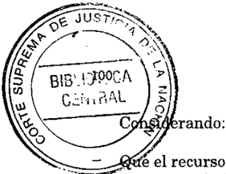

e el recurso extraordinario, cuya denegación origina la presenqueja, es inadmisible (art. 280 del CódigoProcesal Civil y Comercial de la Nación).

Por ello, se desestima esta presentación directa. Notifíquese y archívese, previa devolución de los autos principales.

JULIO S. NAZARENO -EDUARDO MOLINÉ O'CONNOR (en disidencia) -CARLOS S. FAYT -AUGUSTO CÉSAR BELLUSCIO -ANTONIO BOGGIANOENRIQUE SANTIAGO PETRACCHI -GUILLERMO A. F. LÓPEZ (en disidencia)ADOLFO ROBERTO VÁZQUEZ (en disidencia).

DISIDENCIA DEL SEÑOR VICEPRESIDENTE DOCTOR DON EDUARDO MOLINÉ O'CONNOR y DE LOS DOCTORES MINISTROS DOCTORES DON GUILLERMO A. F. LÓPEZ y DON ADOLFO ROBERTO VÁZQUEZ

## Considerando:

- 1') Que contra el pronunciamiento de la Suprema Corte de Justicia de la Provincia de Buenos Aires que rechazó la demanda por nulidad de las resoluciones administrativas de fechas 27 de mayo y 28 de julio de 1993, en virtud de las cuales la Caja de Previsión Social para Profesionales de la Ingeniería había denegado la jubilación solicitada, el actor dedujo el recurso extraordinario que, desestimado, motivó la presente queja.
- 2') Que aun cuando los planteas del apelante remiten al examen de cuestiones de hecho, prueba y derecho público local, temas ajenos -como regla y por su naturalezaal remedio del arto 14 de la ley 48, ello no es óbice a la procedencia de la vía intentada cuando mediante una interpretación restrictiva de las normas en juego, el a qua ha llevado a la pérdida de derechos que cuentan con amparo constitucional.
- 3') Que la demandada había denegado .la prestación en razón de que si bien era cierto que el interesado reunía la edad y años de servicios necesarios para acceder al beneficio, no lo era menos que no cumplía con el tiempo laboral con aportes exigídos por la ley, pues para los

-te

períodos de 1959/1960, 1964/1965 Y1969 no alcanzaba a computar el . mínimo legal de cotización que permite considerar a esos lapsos como de ejercicio continuo y permanente de la profesión, motivos que fueron aceptados por el a qua para rechazar la demanda.

- 4') Que el recurrente sostiene que la reglamentación de la ley 5920, en que se fundó la resolución denegatoria del beneficio, fue dictada con posterioridad a los años cuyo reconocimiento está en juego y que no resulta aplicable porque impone requisitos para admitir el ejercicio profesional que no existían al momento de prestar dichos servicios, sin perjuicio de que tales recaudos fueran aplicables al momento de reclamar por su derecho para los períodos ulteriores a su dictado.
- 5') Que, en efecto, el segundo párrafo del arto 43 de la ley 5920 facultó al directorio de la caja para establecer el promedio de un aporte mínimo anual indispensable para el otorgamiento de la jubilación, facultad que fue ejercida por dicho órgano el24 de abril de 1965, fecha en que por acta N' 141 se aprobaron dichos aportes promedio correspondientes a los años transcurridos entre 1959 y 1964.
- 6') Que la ley 5920 no estableció tal aporte mínimo sino que delegó dicha facultad al referido directorio, circunstancia que determina que para la parte de los períodos de servicio en juego -respecto de los cuales no existía tal módulocorresponda resolverlos mediante la aplicación de la primera parte del arto 43 de la norma citada, que establece que "el ejercicio continuo y permanente de la profesión ... se justificará a partir de la vigencia de la presente ley con el monto de los aportes que arrojen las constancias de los mismos a la Caja".
- 7') Que en razón de lo expresado no sólo resultaba imposible que el recurrente cumpliera durante el transcurso de los años 1959, 1960 y 1964 con la cotización mínima exigida por el aeta N' 141 del mes de abril de 1965, sino que tampoco existía tal recaudo hasta tanto el directorio lo reglara, hecho que se perfeccionó 5 años después de sancionada la referida norma previsional.
- 8') Que, en tales condiciones, teniendo en cuenta que el interesado reúne 24 años de servicios profesionales continuos con aportes -de los 25 que exige el sistema de la ley 5920y que la aplicación de los módulos citados importa la exigencia retroactiva de un requisito que en los años 1959, 1960 y 1964 no estaba reglado, corresponde, respecto de esos períodos, admitir el remedio federal pues los agravios planteados

ponen de manifiesto el nexo directo e inmediato entre lo decidido y las garantías constitucionales que se invocan como vulneradas.

Por ello, con el alcance indicado, se declara procedente el recurso extraordinario y se deja sin efecto la sentencia apelada. Vuelvan los autos al tribunal de origen a fin de que, por medio de quien corresponda, proceda a dictar un nuevo fallo con arreglo a lo expresado. Agréguese la queja al principal. Notifíquese y remítase.

EDUARDO MOLINÉ O'CONNOR -GUILLERMO A. F. L6PEZ -ADOLFO ROBERTO VÁZQUEZ.

## MIGUEL ANGEL ROMERO

## MINISTERIO PUBLICO.

Los tribunales inferiores ejercen facultades disciplinarias respecto de los fiscales cuando actúan como parte en el proceso penal, y no pueden ejercer aquéllas cuando se trata de juzgar la idoneidad de su desempeño en tanto representan al Ministerio Público, facultad que en este último caso es inherente al Procurador General de la Nación.

## SUPERINTENDENCIA.

Corresponde a los jueces y tribunales el ejercicio de facultades disciplinarias respecto de los intervinientes en el proceso, como medio para asegurar su correcto desarrollo (arts. 18 del decreto-ley 1285/58 -texto según ley 24.289y 22 último párrafo del RJN).

## SUPERINTENDENCIA.

Las medidas disciplinarias que los jueces imponen, por tratarse de una función conexa e inseparable de la jurisdiccional, son revisables en los mismos términos en que lo son las resoluciones judiciales que recaen en las causas respectivas.

## MINISTERIO PUBLICO.

La Ley Orgánica del Ministerio Público NQ. 24.946 prescribe en su arto 17 que los jueces y tribunales sólo pueden imponer a los miembros del Ministerio Público

las mismas sanciones disciplinarias que determinan las leyes para los litigantes por faltas cometidas contra su autoridad o decoro, salvo la sanción de arresto (Voto de la mayoría, al que no adhirió el Dr. Adolfo Roberto Vázquez).

RESOLUCIÓN DE LA CORTE SUPREMA

Buenos Aires, 4 de febrero de 1999.

Visto el Expediente caratulado "Romero Miguel Angel si ejercicio de potestad disciplinaria", y

Considerando:

I) Que el Señor Defensor General de la Nación -Dr. Miguel Angel Romerosolicita la avocación del Tribunal con el fin de que deje sin efecto las sanciones de prevención impuestas por el Tribunal Oral en lo Criminal Federal de Jujuy al defensor oficial Dr. Justo Rafael Baca y a la defensora oficial ad-hoc -Dra. Ruth Alicia Fernández-, en las causas "Tito Aguilar, Fanny Beatriz si infracción a la ley 23.737" y manez, Samuel y otro si infracción a la ley 23.737", respectivamente.

1I) Que -según expresalas normas en las cuales el tribunal oral basó las sanciones -arts. 18 del decreto ley 1285/58 (texto según ley 24.289) y 22 del R.J.N.-, han sido implícitamente derogadas por el arto 120 de la Constitución Naciana!.

1II) Que la medida disciplinaria impuesta al Dr. Baca se originó en una presentación de la cual surgia -según lo señalado por el tribunal oral"inequívocamente la intención del Defensor de agredir e injuriar al Tribunal". (ver resolución de fs. 12/13). Por otra parte, se sancionó a la Dra. Fernández por entender que sus manifestaciones, respecto de que "sus defendidos estarían sufriendo las consecuencias de las decisiones" del tribunal oral, eran agraviantes e infundadas (ver resoluciones de fs. 9 y 1O/U).

IV) Que este Tribunal tiene decidido que, en principio, los tribunales inferiores ejercen facultades disciplinarias respecto de los fiscales

cuando 'actúan como parte en el proceso penal, y no pueden ejercer aquéllas cuando se trata de juzgar la idoneidad de su desempeño en tanto representan al Ministerio Público, facultad que en este último caso es inherente al Procurador General de la Nación (conf.res. 927/87; 549/89; 216/90 Y456/92, entre otras).

V) Que corresponde a los jueces y tribunales el ejercicio de facultades disciplinarias respecto de los intervinientes en el proceso, como medio para asegurar su correcto desarrollo (conf. arts. 18 del decreto ley 1285/58 -texto según ley 24.289y 22 último párrafo del R.J.N.). Así, y en ejercicio de tales potestades, el tribunal oral decidió sancionar a los miembros del Ministerio Público de la Defensa.

VI) Que las medidas disciplinarias que los jueces imponen, por tratarse de una función conexa e inseparable de la jurisdiccional, son revisables en los mismos términos en que lo son las resoluciones judiciales que recaen en las causas respectivas (conf. doctrina de Fallos 247:580; 301:759; 302:519 y 893; 1038/88; 194/92; 1061/94; 123/96 y 115/96, entre otras), por lo cual corresponde desestimar la intervención solicitada.

VII) Que a mayor abundamiento, el criterio expuesto en los considerandos IV y V, es el adoptado por la recientemente sancionada Ley Orgánica del Ministerio Público N' 24.946, la cual en su arto 17 prescribe que los jueces y tribunales sólo pueden imponer a los miembros del Ministerio Público las mismas sanciones disciplinarias que determinan las leyes para los litigantes por faltas cometidas contra su autoridad o decoro, salvo la sanción de arresto.

Por ello,

Se resuelve:

Desestimar la presentación efectuada por el Señor Defensor General de la Nación, Dr. Miguel Angel Romero.

Regístrese, hágase saber y oportunamente archívese.

JULIO S. NAZARENO -CARLOS S. FAYT -AUGUSTO CÉSAR BELLUSCIOANTONIO BOGGIANO -GUSTAVO A. BOSSERT -ADOLFO ROBERTO VÁZQUEZ (según su voto).

## VOTO DEL SEÑOR MINISTRO DOCTOR AnOLFO ROBERTO V ÁZQUEZ

## Considerando:

I) Que el Señor Defensor General de la Nación -Dr. Miguel Angel Romero-- solicita la avocación del Tribunal con el fin de que deje sin efecto las sanciones de prevención impuestas por el Tribunal Oral en lo Criminal Federal de Jujuy al defensor oficial Dr. Justo Rafael Baca y a la defensora oficial ad-hoc -Dra. Ruth Alicia Fernández-, en las causas "Tito Aguilar, Fanny Beatriz si infracción a la ley 23.737" Y "Illanez, Samuel y otro si infracción a la ley 23.737", respectivamente.

II) Que -según expresalas normas en las cuales el tribunal oral basó las sanciones -arts. 18 del decreto ley 1285/58 (texto según ley 24.289) y 22 del R.J.N.-, han sido implícitamente derogadas por el arto 120 de la Constitución Naciana!.

III) Que la medida disciplinaria impuesta al Dr. Baca se originó en una presentación de la cual surgía -según lo señalado por el tribunal oral"inequívocamente la intención del Defensor de agredir e injuriar al Tribunal". (ver resolución de fs. 12/13). Por otra parte, se sancionó a la Dra. Fernández por entender que sus manifestaciones, respecto de que "sus defendidos estarían sufriendo las consecuencias de las decisiones" del tribunal oral, eran agraviantes e infundadas (ver resoluciones de fs. 9 y 10/11).

IV) Que este Tribunal tiene decidido que, en principio, los tribunales inferiores ejercen facultades disciplinarias respecto de los fiscales cuando actúan como parte en el proceso penal, y no pueden ejercer aquéllas cuando se trata de juzgar la idoneidad de su desempeño en tanto representan al Ministerio Público, facultad que en este último caso es inherente al Procurador General de la Nación (conf. res. 9271 87; 549/89; 216/90 y 456/92, entre otras).

V) Que corresponde a los jueces y tribunales el ejercicio de facultades disciplinarias respecto de los intervinientes en el proceso, como medio para asegurar su correcto desarrollo (conf. arts. 18 del decreto ley 1285/58 -texto según ley 24.289y 22 último párrafo del R.J.N.). Así, y en ejercicio de tales potestades, el tribunal oral decidió sancionar a los miembros del Ministerio Público de la Defensa.

VI) Que las medidas disciplinarias que losjueces imponen, por tratarse de una función conexa e inseparable de la jurisdiccional, son revisables en los mismos términos en que lo son las resoluciones judiciales que recaen en las causas respectivas (conf. doctrina de Fallos 247:580; 301:759; 302:519 y 893; 1038/88; 194/92; 1061/94; 123/96 Y 115/96, entre otras), por lo cual corresponde desestimar la intervención solicitada.

Por ello,

Se resuelve:

Desestimar la presentación efectuada por el Señor Defensor General de la Nación, Dr. Miguel Angel Romero.

Regístrese, hágase saber y oportunamente archívese.

AnOLFO ROBERTO VÁZQUEZ.

## RUGO OSVALDO MART1N BIAFORE

## SUPERINTENDENCIA.

Corresponden a las cámaras las facultades disciplinarias sobre sus funcionarios y empleados, y la avocación del Tribunal sólo procede en casos de manifiesta extralimitación o arbitrariedad, o cuando razones de superintendencia general lo hacen necesario.

## SUPERINTENDENCIA.

Si la conducta de un funcionario judicial es susceptible objetivamente de justificar la desconfianza de los superiores en lo atinente a su corrección en la prestación del servicio, la separación del cargo no es arbitraria, ya que la confianza es un requisito esencial para el cumplimiento de la labor judicial en forma armónica.

## SUPERINTENDENCIA.

La conducta irreprochable a que se refiere el arto 8 del Reglamento para la Justicia Nacional tiende a la preservación de la absoluta confianza que debe merecer el personal judicial.

## SUPERINTENDENCIA.

La absolución, en sede penal, del empleado judicial, no obsta a la cesantía impuesta por la cámara respectiva fundada en irregularidades graves.

## SUPERINTENDENCIA.

La decisión en materia disciplinaria no depende de la existencia de una condenación por los mismos hechos, en tanto ambas jurisdicciones persiguen objetivos diferentes y no son excluyentes.

## RESOLUCIÓN DE LA CORTE SUPREMA

Buenos Aires, 9 de febrero de 1999.

Visto el Expte. N' 10-29102/97, caratulado "Biafore Rugo Osvaldo Martín sI cesantía -avocación", y

Considerando:

1)Que el ex-agente Rugo Osvaldo Martín Biafore -quien prestaba funciones comooficial mayor del Juzgado en lo Criminal de Sentencia Letra "Z"solicita la avocación de esta Corte con el fin de que deje sin efecto la resolución mediante la cual la Cámara Nacional de Apelaciones en lo Criminal y Correccional le impuso la sanción de cesantía en el marco del sumario administrativo N' 2239 caratulado Dr. Facundo Cubas si denuncia" (fs. 63/68). Contra tal decisión interpuso un pedido de reconsideración, el cual fue denegado por la cámara, por haber sido presentado en forma extemporánea (conf. fs. 75/76).

11) Que sostiene en su presentación obrante a fs. 79/86 que la sanción impuesta resulta una "manifiesta extralimitación o arbitrariedad", toda vez que "las incriminaciones imputadas no resultaron ... demostradas y no revestían una entidad tal que importaran la imposición de una sanción expulsiva". Asimismo, y teniendo en cuenta que le fue denegada la producción de ciertas pruebas que había ofrecido oportunamente, agrega que en el trámite del sumario administrativo se habria menoscabado el principio del debido proceso.

III) Que del sumario administrativo N' 2239 surge que en las declaraciones de los ex-agentes Biafore y Capandegui, éstos se formula-

ron imputaciones recíprocas, las cuales, debido a su gravedad, dieron origen a sendas suspensiones preventivas que se prolongaron hasta la finalización del sumario en cuestión (conf. fs. 110).

Así, Biafore sostuvo que tenía conocimiento de que Capandegui cometía diversos hechos delictuosos utilizando armas de fuego; que, según Capandegui le había manifestado, había tomado un arma de fuego reservada en el juzgado; que en otras ocasiones Capandegui le habría preguntado "si existían pasacasettes secuestrados" en el juzgado con el fin de "llevarse uno", lo cual efectivizó posteriormente, según él mismo pudo ver; y agregó que sospechaba que el responsable de las sustracciones era Capandegui (conf. fs. 3/4, 52/54 Y178/179).

Por su parte, Capandegui puntualizó que Biafore le comentó que en varias ocasiones había consumido estupefacientes que se encontraban secuestrados en el juzgado, y que para ocultar tales hechos, reemplazaba la sustancia con "talco". Finalmente, agregó que no había denunciado aquellos hechos a sus superiores (conf. fs. 5, 29/51 Y 176).

IV) Que los hechos que fueron objeto del sumario administrativo dieron origen también a una causa judicial, la cual quedó radicada en el Juzgado Nacional de Primera Instancia en lo Criminal de Instrucción N' 14 (causa 75.577/96).

V) Que, en definitiva, la cámara dispuso la cesantía de Biafore con fundamento en que el ex-agente incurrió en "una grave falta demostrativa de una total deslealtad para con sus superiores, al tener conocimiento de los hechos delictivos que habia cometido su compañero Capandegui y haber aludido a ellos recién una vez iniciado el sumario". Asimismo, el tribunal agregó que tal comportamiento irregular "constituye por sí solo un elemento suficiente para sostener que se ha quebrantado la relación de confianza que debe existir entre el Poder Judicial de la Nación y sus agentes ...".

VI) Que corresponden a las cámaras la facultades disciplinarias sobre sus funcionarios y empleados, y la avocación del Tribunal sólo procede en casos de manifiesta extralimitación oarbitrariedad, ocuando razones de superintendencia general lo hacen necesario. Tales extremos no se configuran en el presente caso (F: 290:168; 300:387; 303:413; 306:1620, entre otros).

VII) Que el Tribunal ha sostenido que "si la conducta de un funcionario judicial es susceptible objetivamente de justificar la desconfian-

za de los superiores en lo atinente a su corrección en la prestación del servicio, la separación del cargo no es arbitraria (Fallos: 281:169; 249:243; 262:105; 294:36; 297:233; 307:1282; 312:1973); Que "la confianza es un requisito esencial para el cumplimiento de la labor judicial en forma armónica ..." (Fallos: 312:1977); y que ''la conducta irreprochable a que se refiere el arto 8 del Reglamento para la Justicia Nacional tiende a la preservación de la absoluta confianza que debe merecer el personal judicial ..." (Fallos: 308:2668).

VIII) Que a fs. 635/637 el agente adjuntó el testimonio de la sentencia, dictada por el Tribunal Oral en lo Criminal N211 de la Capital Federal, en la cual se lo absolvió, sin costas, por no mediar acusación fiscal, del delito de tenencia ilegítima de munición de guerra, y solicitó que se tuviera en cuenta, a los fines de la resolución de la cuestión.

Respecto de esta cuestión el Tribunal ha sostenido que "la absolución, en sede penal, del empleado judicial, no obsta a la cesantía impuesta por la cámara respectiva fundada en irregularidades graves" (Fallos: 306:1620; 308:2667; 256:182; 262:522; 290:382).

Ello, porque la decisión en materia disciplinaria no depende de la existencia de una condenación por los mismos hechos, en tanto ambas jurisdicciones persiguen objetivos diferentes y no son excluyentes (Fallos: 308:2667 y sus citas).

IX) Que no obstante las razones consideradas anteriormente, se señala, a mayor abundamiento, que la petición de avocación fue presentada fuera del plazo previsto por el arto 23 bis, del Reglamento para la Justicia Nacional (Conf. res. 869/95).

Por ello,

Se resuelve:

1 2 )No hacer lugar a la avocación solicitada.

2 2 )Notifíquese al interesado en el domicilio consignado a fs. 638.

Regístrese, hágase saber y oportunamente archívese.

EDUARDO MOLINÉ O'CONNOR -AUGUSTO CÉSAR BELLUSCIO ANTONIO BOGGlANO -GUSTAVO A. BOSSERT -ADOLFO ROBERTO VÁZQUEZ.

## FALLOS DE LA CORTE SUPREMA 322

## SARA LOPEZ PEÑA DE REVOL

## SUPERINTENDENCIA.

El Reglamento para la Justicia Nacional en su arto 15 prescribe que para las promociones serán preferidos los empleados que ocupen la categoría inmediata inferior, y estén debidamente escalafonarlos de acuerdo con la aptitud, título, idoneidad y conducta demostrados en los cargos ocupados, debidamente registrarlas y calificadas, así como la antigüedad que tengan en la categoría.

## EMPLEADOS JUDICIALES.

Resulta justificada la queja de un emplearlo que fue postergado frente a otros agentes con menores antecedentes, si las aptitudes de quienes se hallaban en condiciones de ser promovidos no han sido objetivamente considerarlas, pues se tomaron como pauta de valoración de las propuestas las apreciaciones verbales del magistrado, las cuales se refieren a cuestiones subjetivas.

## SUPERINTENDENCIA.

El tribunal no interviene por vía de avocación, tratándose de designaciones interinas.

## EMPLEADOS JUDICIALES.

Los nombramientos interinos no pueden constituir antecedente suficiente, para la cobertura de la vacante en forma definitiva, si ello implica una violación de lo dispuesto en las acordadas reglamentarias.

RESOLUCIÓN DE LA CORTE SUPREMA

Buenos Aires, 9 de febrero de 1999.

Visto el expediente caratulado López Peña de Revol, Sara sI acuerdo 46/96 Cámara de Córdoba", y

## Considerando:

1) Que a fs. 19/20 se presenta la escribiente del Juzgado Federal N' 1 de Córdoba, Sara López Peña de Revol, y solicita la intervención

del Tribunal, ampliando los fundamentos de la reconsideración que interpuso contra el acuerdo 46/96 de la cámara de la jurisdicción. Ello, por considerar que el acto impugnado lesiona su derecho subjetivo, por haber sido postergada frente a otros agentes con menores antecedentes.

Explica que la señora Beatriz Gamond, ascendida al cargo de oficial mayor interina, tiene menor antigüedad y no posee título de abogada.

Agrega que no es la primera vez que ha sido preterida, y ha recibido como contestación que "...por ser madre de siete hijos menores de edad ... encontrándose su familia de por medio, la disponibilidad para el trabajo sería inferior a otra persona sin hijos ...". Como la cámara no efectuó valoración ni fundamentación alguna de las calidades de los postulantes, limitándose a considerar solamente la propuesta verbal formulada por eljuez, pide la revocación de la acordada 46/96 ya citada.

Ir) Que en el dictamen de fs. 12/3 el Sr. Fiscal de la Cámara sostiene que hay jurisprudencia de este Tribunal "...donde se sostiene que los jueces tienen derecho a formular propuestas de designaciones, pudiendo además ser objeto de ellas aun aquellos empleados que tengan menor antigüedad o inferior jerarquía que los propuestos, en tanto que la propuesta sea fundada ..."; "...ante las impugnaciones que se efectuaron a las propuestas de ascenso ... se convocó al señor juez a fin de que verbalmente adicionara otros elementos de juicio que reforzaran su propuesta ...; el magistrado explicitó en forma pormenorizada las distintas razones que fundaban cada una de la propuestas como así también los motivos por los cuales no se consideraban otros agentes del escalafón ...que eran pasibles de algunas observaciones que no venían al caso anotar en el escrito de propuesta ...".

Por fin, en el acuerdo 122/96, la cámara no hizo lugar al recurso de reconsideración interpuesto, pero dejó en claro que la designación en el cargo de oficial mayor interino no implicaba juicio desfavorable sobre las aptitudes personales y laborales de la agente Sara López Peña de Revol; no obstante, tuvo en cuenta que el juez proponente había destacado las sobresalientes condiciones y la dedicación funcional de la señora Beatriz Eloísa Gamond, "...que la hacían preferible sobre las restantes escribientes". (ver fs. 14/15).

III) Que de la planilla agregada a fs. 24 surge que la abogada López Peña de Revol ingresó en el año 1981 y siempre obtuvo las máximas calificaciones; por su parte, Beatriz Eloísa Gamond ingresó en 1984 y en algunos rubros obtuvo menores notas.

En el expediente 40 "J" 1996, agregado por cuerda sólo consta que el juez consignó en su propuesta que "fundamento la postulación de referencia -de la señora Gamonden el excelente concepto que merece la empleada, motivado por la capacidad en le desempeño de sus tareas, a lo que cabe añadir su antigüedad en la justicia, todo lo cual la hace merecedora del ascenso interino frente a otros postulantes de mayor antigüedad" (fs. 1 vta.).

IV) Que en el presente caso procede remitirse a los considerandos de la resolución dictada en el expte. 23.245/96, especialmente el N"VII, en el cual se consigna que el arto 15 del Reglamento para la Justicia Nacional prescribe que para las promociones serán preferidos los empleados que ocupen la categoría inmediata inferior, y estén debidamente escalafonados de acuerdo con la aptitud, título, idoneidad, y la conducta demostrados en los cargos ocupados, debidamente registradas y calificadas, así comola antigüedad que tengan en la categoría.

En el supuesto, las aptitudes de quienes se hallaban en condiciones de ser promovidas no han sido objetivamente consideradas, pues la cámara tomó comopauta de valoración de las propuestas las apreciaciones verbales del magistrado, las cuales se refieren a cuestiones subjetivas. En este sentido, resultan justificadas las quejas que plantea la empleada Peña de Revo!.

V) Que, sin embargo, debe tenerse presente que se trata de un ascenso interino, y la transitoriedad de la designación, en tanto no sea tenida en cuenta comoantecedente para cubrir el cargo en forma definitiva, puede ser aceptada, como excepción.

Por lo expuesto, y de acuerdo con lo decidido en el expediente anteriormente citado, en el cual se dispone sobre el mismo acuerdo de la cámara,

## Se resuelve:

Denegar la petición formulada por la agente Sara López Peña de Revol, en tanto se trata de una promoción transitoria.

Hacer saber a la Cámara Federal de Apelaciones de Córdoba que el Tribunal no interviene por vía de avocación, por tratarse de designaciones interinas; pero que tales nombramientos no pueden constituir antecedente suficiente para la cobertura de la vacante en forma definitiva, si ello implica una violación de lo dispuesto en las acordadas reglamentarias.

Regístrese, hágase saber y archívese.

EDUARDO MOLINÉ O'CONNOR -CARLOS S. FAYT -AUGUSTO CÉSAR BELLUSCIO -ANTONIO BOGGIANO -GUILLERMO A. F. LÓPEZ -ADOLFO ROBERTO VÁZQUEZ.

## BANCO PATAGONICO S.A. v. ENRIQUE JaSE DENEGRI

## ENTIDADES FINANCIERAS.

La doctrina que establece que los gastos generados por la liquidación de entidades bancarias -dispuesta antes de la vigencia de la ley 24.144deben ser pagados por el ente liquidado con fondos provenientes de la liquidación sin que el Banco Central esté facultado para efectuar pagos con fondos propios, no es aplicable cuando, mediante una sentencia anterior, dictada en el mismo juicio, la Corte resolvió en forma definitiva la controversia suscitada entre las partes respecto de la inteligencia de la normativa federal atinente a.lpunto controvertido.

RECURSO EXTRAORDINARIO: Requisitos propios. Sentencia definitiva. Resoluciones anteriores a la sentencia definitiva. Varias.

Lo atinente a la existencia de un convenio que impediría el cobro de honorarios regulados al apelante, no constituye un agravio d~ carácter definitivo en la me. dida en que dicha defensa -por su naturalezaes susceptible de ser eficazmente introducida ante los tribunales ordinarios en el correspondiente trámite de ejecución.

RECURSO EXTRAORDINARIO: Requisitos formales. Introducción de la cuestión federal. Oportunidad. Planteamiento en el escrito de interposición del recurso extraordinario.

Lo atinente a la existencia de un convenio de honorarios que haría inaplicable el arto 50, inc. e, de la ley 21.526, texto según ley 22.529, resulta inadmisible si la

cuestión no fue sometida al conocimiento de los jueces de la causa en ninguna de las tres instancias locales, ni de la Corte Suprema con motivo de su anterior intervención, no obstante que tal convenio se habría suscripto seis años antes del planteo de la cuestión (Voto de los Dres. Carlos S. Fayt y Adolfo Roberto Vázquez).

## FALLODE LACORTE SUPREMA

Buenos Aires, 16 de febrero de 1~99.

Vistos los autos: "Banco Patagónico S.A. s/ quiebra c/ Denegri, Enrique José s/ ejecución hipotecaria".

Considerando:

- F) Que la cuestión debatida en estos autos -referente a la interpretación del arto 50, inc. c, de la ley 21.526, texto según ley 22.529ha sido resuelta por esta Corte en la sentencia dictada a fs. 3811383. El posterior pronunciamiento del a quo se sujetó a la solución adoptada por este Tribunal por lo que no cabe volver sobre lo así resuelto.
- 2') Que en el sub examine el Banco Central solicitó a la Suprema Corte de Justicia de la Provincia de Buenos Aires -y lo reiteró en su recurso extraordinario-Ia aplicación de la ley 24.144 -según la interpretación fijada por este Tribunal en el precedente "Gallelli"y del decreto 2077/93. Asimismo se agravia, en la apelación interpuesta, de que el a quo no haya aplicado lo dispuesto por la ley 24.318.
- 3') Que la oportunidad en que estos planteamientos fueron introducidos en el proceso diferencia esta causa de los autos B.644.XXIV "Banco Patagónico S.A (hoy su quiebra) d Sotavento S.R.L s/ ejecución", fallados el 6 de mayo de 1997, yjustifica que el Tribunal se pronuncie a su respecto.
- 4') Que esta Corte ha sostenido -respecto de entidades bancarias cuya liquidación fue dispuesta antes de la vigencia de la ley 24.144que los gastos generados por la liquidación deben ser pagados por el ente liquidado con fondos provenientes de la liquidación, es decir, en tanto haya disponibilidades en la masa concursal, por cuanto el Banco Central, en virtud de la voluntad dellegíslador al tiempo del desembolso, no está facultado para efectuar pagos con fondos propios

(confr. considerando 7' del voto de la mayoría y del voto de los jueces Molíné O'Cormory López en Fallos: 319:2253, 2454 y B.865.XXV"Banco Patagónico S.A -hoy en liquidaciónel Copemar S.A si ejecución" pronunciamiento del 25 de septiembre de 1997); sin embargo, la aplicación de esta doctrina no procede cuando, como ocurre en estos autos, mediante una sentencia anterior, dictada en el mismo juicio, este Tribunal resolvió en forma definitiva la controversia suscitada entre las partes respecto de la inteligencia de la normativa federal atinente al punto controvertido. Tales razones llevan a considerar igualmente inadmisible la pretensión de la recurrente de que se aplique en autos lo establecido por el arto 5' del decreto 2077/93.

- 5') Que no existe relación directa entre lo decidido por la corte provincial en el fallo recurrido y los argumentos que se esgrimen en favor de la aplicación del arto 2' de la ley 24.318, norma ésta que en las circunstancias de autos, resulta inaplicable.
- 6') Que en cuanto a la existencia de un convenía que impediría el cobro de honorarios regulados al doctor Monterisi, el agravio que, como de naturaleza federal, se invoca, no es de carácter definitivo en la medida en que dicha defensa -por su naturalezaes susceptible de ser eficazmente introducida ante los tribunales ordinarios en el correspondiente trámite de ejecución (en igual sentido, confr. causa B.644. XXIV "Banco Patagónico S.A -hoy su quiebracl Sotavento S.R.L si ejecución", fallada el 6 de mayo de 1997).

Por ello, se declara improcedente el recurso extraordínario. Con costas (art. 68 del Código Procesal Civil y Comercial de la Nación). Notifíquese y devuélvase.

JULIO S. NAZARENO -EDUARDO MOLINÉ O'CONNOR -CARLOS S. FAYT (por su voto) -AUGUSTO CÉSAR BELLUSCIO -ANTONIO BOGGIANO GUILLERMO A. F. LÓPEZ -ADOLFO ROBERTO VÁZQUEZ (por su voto).

VOTO DE LOS SEÑORES MINISTROS DOCTORES DON CARLOS S. FAYTY DON ADOLFO ROBERTO VÁZQUEZ

Considerando:

1') Que la cuestión debatida en estos autos -referente a la interpretación del arto 50, inc. c, de la ley 21.526, texto según ley 22.529ha

sido resuelta por esta Corte en la sentencia dictada a fs. 381/383. El posterior pronunciamiento del a qua se sujetó a la solución adoptada por este Tribunal por lo que no cabe volver sobre lo así resuelto.

- 2 2 )Que en el sub examine el Banco Central solicitó a la Suprema Corte de Justicia de la Provincia de Buenos Aires -y lo reiteró en su recurso extraordinario--la aplicación de la ley 24.144 -según la interpretación fijada por este Tribunal en el precedente "Gallelli"y del decreto 2077/93. Asimismo se agravia, en la apelación interpuesta, de que el a qua no haya aplicado lo dispuesto por la ley 24.318.
- 3 2 )Que la oportunidad en que estos planteamientos fueron introducidos en el proceso diferencia esta causa de los autos B.644.XXIV "Banco Patagónico S.A (hoy su quiebra) cl Sotavento S.R.L sI ejecución", fallados el 6 de mayo de 1997, Yjustifica que el Tribunal se pronuncie a su respecto.
- 4 2 )Que, en orden a ello, debe puntualizarse que aun cuando esta Corte ha sostenido -respecto de entidades bancarias cuya liquidación fue dispuesta antes de la vigencia de la ley 24.144que los gastos generados por la liquidación deben ser pagados por el ente liquidado con fondos provenientes de la liquidación, es decir, en tanto haya disponibilidades en la masa concursal, por cuanto el Banco Central, en virtud de la voluntad del legislador al tiempo del desembolso, no está facultado para efectuar pagos con fondos propios (confr. considerando 7 2 del voto de la mayoria y del voto de los jueces Moliné O'Connor y López en Fallos: 319:2253, 2454 y B.865.XXV"Banco Patagónico S.Ahoy en liquidacióncl Copemar S.A sI ejecución" pronunciamiento y del 25 de septiembre de 1997), la aplicación de esta doctrina no procede cuando, como ocurre en estos autos, mediante una sentencia anterior, dictada en el mismo juicio, este Tribunal resolvió en forma definitiva la controversia suscitada entre las partes respecto de la inteligencia de la normativa federal atinente al punto controvertido. Tales razones llevan a considerar igualmente inadmisible la pretensión de la recurrente de que se aplique en autos lo establecido por el arto 52del decreto 2077/93.
- 52)Que no existe relación directa entre lo decidido por la corte provincial en el fallo recurrido y los argumentos que se esgrimen en favor de la aplicación del arto 2 2 de la ley 24.318, norma ésta que en las circunstancias de autos, resulta inaplicable.

6")Que las objeciones sustentadas en la existencia de un convenio de honorarios que haría inaplicable el arto 50, inc. c, de la ley 21.526, texto según ley 22.529, resultan inadmisibles pues la cuestión no fue sometida al conocimiento de los jueces de la causa en ninguna de las tres instancias locales, ni de este Tribunal con motivo de su anterior intervención (confr. presentaciones de fs. 127/129 vta.; 142/144 vta.; 2021212 vta. y 250/257 vta.), no obstante que tal convenio se habría suscripto en el año 1982, mientras que la cuestión se planteó en autos más de seis años después.

En esas condiciones, las quejas resultan inadmisibles pues se ha impedido a los jueces de la causa pronunciarse sobre el tema, lo que constituye un óbice insalvable para su tratamiento en esta instancia de excepción, en atención no sólo a las normas procesales que vedan tal temperamento (Fallos: 302:474) sino, fundamentalmente, a la naturaleza de la competencia de la Corte cuando conoce por la vía extraordinaria, que no es originaria sino apelada (Fallos: 302:328 y sus citas).

7")Que, no obstante, las razones que conducen a este Tribunal a desestimar el remedio federal, expuestas precedentemente, demuestran una actitud que podría ser calificada de negligente en la defensa de los íntereses estatales, que resulta inexplicable frente a la importancia económica que -según ahora se alegatendría el total de los honorarios regulados al mismo profesional. Si bien dicho extremo no autoriza la intervención de esta Corte por las razones indicadas en el considerando anterior, resulta suficiente para disponer que el presente pronunciamiento sea puesto en conocimiento de la Procuración General del Tesoro, del directorio del Banco Central de la República Argentina e, incluso, de la Fiscalía Nacional de Investigaciones Administrativas para que se proceda, en su caso, a las investigaciones pertinentes.

Por ello, se declara improcedente el recurso extraordinario sin que ello implique abrir juicio sobre los planteos que eventualmente pudieran eféctuarse en el procedimiento de ejecución de honorarios. Con costas (art. 68 del Código Procesal Civil y Comercial de la Nación). A los fines indicadosen el considerando 7",líbrense los oficios con copia del presente. Notifíquese y, oportunamente, remítase.

CARLOS S. FAYT -ADOLFO ROBERTO VÁZQUEZ.

## FALLOS DE LA CORTE SUPREMA 322

## PANAMERICANA DE PLASTICOS S.A. v. MINISTERIO DE ECONOMIA HACIENDA v FINANZAS v OTRO

## RECURSO EXTRAORDINARIO: Principios generales.

Los recursos extraordinarios contra el pronunciamiento que redujo los honorarios regulados en favor de la dirección letrada y representación de los demandados y del perito contador son inadmisibles (art. 280 del Código Procesal Civil y Comercial de la Nación).

## LEY: Vigencia.

La Constitución Nacional no impone una versión reglamentaria en materia de validez intertemporal de leyes, por lo que el legislador o el juez, en sus respectivas esferas, podrán establecer o resolver que la ley nueva destruya o modifique un mero interés, una simple facultad o un derecho en expectativa ya existente (Disidencia de los Dres. Augusto César Belluscio, Enrique Santiago Petracchi y Gustavo A. Bossert).

## CONSTITUCION NACIONAL: Derechos y garantías. Derecho de propiedad.

Ni.ellegislador ni el juez podrían, en virtud de una ley nueva o de su interpretación, arrebatar o alterar un derecho patrimonial adquirido al amparo de la legislación anterior, ya que en este caso el principio de la no retroactividad deja de ser una norma infraconstitucional para confundirse con la garantía de la invio~ labilidad de la propiedad reconocida por la Ley Suprema (Disidencia de los Dres. Augusto César Belluscio, Enrique Santiago Petracchi y Gustavo A. Bossert).

## CONSTITUCION NACIONAL: Derechos y garantías. Derecho de propiedad.

Para que exista derecho adquirido y, por tanto, se encuentre vedada la aplicación de la nueva ley, es necesario que su titular haya cumplido -bajo la vigencia de la norma derogada o modificadatodas las condiciones sustanciales y los requisitos formales previstos en esa ley para ser titular del derecho de que se trata, aun cuando falte la declaración formal de una sentencia o acto administrativo (Disidencia de los Dres. Augusto César Belluscio, Enrique Santiago Petracchi y Gustavo A. Bossert).

## LEY: Vigencia.

No corresponde aplicar la ley arancelaria que entró en vigencia con posteriori~ dad a la aceptación y ejecución de la tarea encomendada, ya que no cabe privar al profesional del derecho patrimonial adquirido al amparo de una legislación anterior, sin que obste a ello la circunstancia de hallarse pendiente la determi.

nación de sus honorarios, toda vez que la regulación judicial sólo agrega un reconocimiento -y cuantificaciónde un derecho preexistente a la retribución del trabajo profesional (Disidencia de los Dres. Augusto César Belluscio, Enrique Santiago Petracchi y Gustavo A. Bossert).

CONSTITUCION NACIONAL: Derechos y garantías. Derecho de propiedad.

En el caso de los trabajos profesionales el derecho se constituye en la oportunidad que se los realiza, más allá de la época que se practique la regulación (Disidencia de los Dres. Augusto César Belluscio, Enrique Santiago Petracchi y Gus~ tavo A. Bossert).

## LEY. Vigencia.

Si no se cuestiona que la dirección letrada y la representación de los demandados cumplieron la totalidad de su gestión profesional en la primera instancia con anterioridad a la entrada en vigor de la ley 24.432, la decisión que, con fundamento en las nuevas pautas legales redujo sus emolumentos, implicó atribuir a la norma aplicada un alcance retroactivo que no resulta conciliable con la garantía que ampara el arto 17 de la Constitución Nacional (Disidencia de los Dres. Augusto César Belluscio, Enrique Santiago Petracchi y Gustavo A. Bossert).

## FALLO DE LA CORTE SUPREMA

Buenos Aires, 16 de febrero de 1999.

Vistos los autos: "Panamericana de Plásticos S.A. cl Estado Nacional (Ministerio de Economía Hacienda y Finanzas) y otro sI proceso de conocimiento" .

## Considerando:

Que los recursos extraordinarios son inadmisibles (art. 280 del Código Procesal Civil y Comercial de la Nación).

Por ello, se declaran improcedentes los recursos extraordinarios, con costas. Notifíquese y remítanse.

JULIO S. NAZARENO -EDUARDO MOLINÉ O'CONNOR -AUGUSTO CÉSAR BELLUSCIO (en disidencia) -ENRIQUE SANTIAGO PETRACCHI (en disidencia) -ANTONIO BOGGIANO -GUILLERMO A. F. LÓPEZ -GUSTAVO A. BOSSERT (en disidencia) -ADOLFO ROBERTO VÁZQUEZ.

## FALLOS DE LA CORTE SUPREMA 322

DISIDENCIA DE LOS SEÑORES MINISTROS DOCTORES DON ENRIQUE SANTIAGO PETRACCHI DON AUGUSTO CÉSAR BELLUSCIO y DON GUSTAVO A. BOSSERT

## Considerando:

1') Que la Sala III de la Cámara Nacional de Apelaciones en lo Contencioso Administrativo Federal, en cuanto aquí interesa, redujo los honorarios regulados en favor de la dirección letrada y representación de los demandados y del perito contador del siguiente modo: los del Dr. Marcelo Eugenio Griffi fijados en la suma de $ 620.000 se disminuyeron a $ 14.500; los del Dr. Alberto José Cúneo de $ 2.150.000 a $ 80.000; los de la Dra. Hildegard KarmaEstévez de $ 250.000 a$ 3.700 y los del perito contador Antonio Osvaldo Aprea de $ 700.000 a $ 60.000.

Esta decisión tuvo por sustento que dicha "...Sala en numerosos precedentes ha admitido la aplicación del arto 13 de la ley 24.432 en procesos en los cuales no hubiera recaído regulación de honorarios al tiempo de su entrada en vigencia", Asimismo, en el fallo se expresó que, de acuerdo a las pautas que la ley 21.839 señala para llegar a una retribución "...justa y razonable ...","...se advierte que de aplicarse el porcentual de arto 7 sobre aquel monto [se refiere al monto del reclamo actualizado]' resultarían emolumentos desproporcionados con la índole y la extensión de la labor cumplida". En consecuencia, la cámara sostuvo que "...se estima prudente no aplicar la escala en forma estricta y atender al resultado y a su proporción con los trabajos realizados".

- 2') Contra aquella decisión cada uno de los profesionales antes mencionados dedujo recurso extraordinario de apelación (fs. 1492/1496; 1498/1501; 1503/1505 y 1506/ 1510) y, en su totalidad, los recursos interpuestos fueron concedidos con sustento en que en ellos "se aduce y se cuestiona la aplicación retroactiva de la ley 24.432, lo que ajuicio de los recurrentes vulneraría sus derechos adquiridos al mantenimiento de los porcentajes fijados por la ley de arancel 21.839..." (fs. 1549/1550 y 1561 vta./1562).

3') Que con el alcance de la concesión los recursos deducidos son procedentes, pues si bien las cuestiones atinentes a los honorarios regulados en las instancias anteriores, como al alcance temporal que debe darse a una norma de derecho común, son ajenas a la instancia del arto 14 de la ley 48, ello no impide el conocimiento por parte de este Tribunal cuando el fallo impugnado no constituye una derivación ra-

zonada del derecho vigente, al desconocer que la ley nueva no puede modificar o alterar derechos incorporados al patrimonio al amparo de una legislación anterior sin menoscabar el derecho de propiedad consagrado en el arto 17 de la Constitución Nacional (Fallos: 304:1050; 305:899).

4') Que esta corte ha decidido en reiteradas oportunidades que la Constitución Nacional no impone una versión reglamentaria en materia de validez intertemporal de leyes, por lo que el legislador o el juez, en sus respectivas esferas, podrán establecer oresolver que la ley nueva destruya o modifique un mero interés, una simple facultad o un derecho en expectativa ya existente. Pero, en cada ocasión que se ha sentado dicho principio, esta Corte ha expresado con particular énfasis que ni el legislador ni el juez podrían, en virtud de una ley nueva o de su interpretación, arrebatar o alterar un derecho patrimonial adquirido al amparo de la legislación anterior, pues en este caso el principio de la no retroactividad deja de ser una norma infraconstitucional para confundirse con la garantía de la inviolabilidad de la propiedad reconocida por la Ley Suprema (Fallos: 319:1915, considerando 5' y sus citas).

5') Que, también, el Tribunal ha dicho que para que exista derecho adquirido y, por tanto, se encuentre vedada la aplicación de la nueva ley, es necesario que su titular haya cumplido -bajo la vigencia de la norma derogada omodificadatodas las condiciones sustanciales y los requisitos formales previstos en esa ley para ser titular del derecho de que se trata, aun cuando falte la declaración formal de una sentencia o acto administrativo (Fallos: 298:472; 304:871 y 314:481).

6') Que, en el mismo orden de ideas, esta Corte ha señalado que no corresponde aplicar la ley arancelaria que entró en vigencia con posterioridad a la aceptación y ejecución de la tarea encomendada, pues no cabe privar al profesional del derecho patrimonial adquirido al amparo de una legislación anterior (Fallos: 268:561), sin que obste a ello la circunstancia de hallarse pendiente la determinación de sus honorarios, toda vez que la regulación judicial sólo agrega un reconocimiento -y cuantificaciónde un derecho preexistente a la retribución del trabajo profesional (Fallos: 296:723 y 314:481). De modo contundente el Tribunal afirmó: "En el caso de los trabajos profesionales el derecho se constituye en la oportunidad en que se los realiza, más allá de la época en que se practique la regulación ..." (Fallos: 319: 1915, antes citado, considerando 7').

7') Que, la decisión del a qua que con fundamento en las nuevas pautas legales redujo los emolumentos que les habían sido regulados a los recurrentes, implicó atribuir a la norma aplicada un alcance retroactivo que no resulta conciliable con la garantía que ampara el arto 17 de la Constitución Naciana!.

8') Que, en efecto, no se cuestiona en autos que la dirección letrada y la representación de los demandados cumplieron la totalidad de su gestión profesional en la primera instancia con anterioridad a la entrada en vigor de la ley 24.432. Por lo demás, basta para descartar el único cuestionamiento que en tal sentido se ha vertido respecto de la tarea desempeñada por el perito contador, con señalar que -como lo apunta éste-la pericia fue presentada en el mes de mayo de 1986, esto es, aproximadamente nueve años antes de que comenzara a regir la ley 24.432 (ver fs. 1063 vta.; 1498 vta. y 1545 vta.). Lo dicho, pone en evidencia que a partir de la realización de los trabajos profesionales nació en cabeza de los recurrentes una situación jurídica concreta e individual que, como tal, es inalterable y no puede ser suprimida, o modificada, por ley posterior sin agravio al derecho de propiedad (doctrina de Fallos: 306:1799).

Por ello, se hace lugar a los recursos extraordinarios interpuestos en cuanto han sido materia de concesión y se deja sin efecto la sentencia apelada. Vuelvan los autos al tribunal de origen a fin de que, por quien corresponda, se dicte un nuevo pronunciamiento con arreglo al presente. Notifíquese y, oportunamente, devuélvase.

AUGUSTO CÉSAR BELLUSCIO -ENRIQUE SANTIAGO PETRACCHI -GUSTAVO A. BOSSERT.

JULIO CESAR SAN MARTIN AGUIAR y OTRO

RECURSO EXTRAORDINARIO: Requisitos propios. Cuestiones no federales. Sentencias arbitrarias. Improcedencia del recurso.

Es improcedente el recurso extraordinario deducido contra la sentencia que condenó al actor por el delito de estafa si los agravios del apelante no son suficientes para demostrar la existencia de un caso de arbitrariedad que justifique la intervención de la Corte.

RECURSO EXTRAORDINARIO: Requisitos propios. Cuestiones no federales. Sentencias arbitrarias. Principios generales.

Con la doctrina de la arbitrariedad se tiende a resguardar la garantía de la defensa en juicio y el debido proceso, exigiendo que las sentencias sean fundadas y constituyan una derivación del derecho vigente con aplicación a las cir. cunstancias comprobadas de la causa (Disidencia de los Dres. Carlos S. Fayt, Augusto César Belluscio, Enrique Santiago Petracchi y Gustavo A. Bossert).

RECURSO EXTRAORDINARIO: Requisitos propios. Cuestiones no federales. Sentencias arbitrarias. Procedencia del recurso. Valoración de circunstancias de hecho y prueba.

Procede el recurso extraordinario deducido contra la sentencia que condenó al actor por el delito de estafa si el a qua prescindió del examen de una prueba conducente para la solución del caso, sin dar razón suficiente invirtió los principios que rigen su carga en materia penal y omitió recurrir a los medios a su alcance para determinar la verdad jurídica objetiva, lo que condujo a frustrar el real esclarecimiento de los sucesos investigados (Disidencia de los Dres. Carlos S. Fayt, Augusto César Belluscio, Enrique Santiago Petracchi y Gustavo A. Bossert).

## JUECES.

Es propio de los jueces de la causa determinar cuando existe negligencia procesal sancionable de las partes, así comodisponer 10conducente para el respeto de la igualdad en la defensa de sus derechos, pero ninguna de estas consideraciones basta para excluir de la solución a dar al caso, su visible fundamento de hecho, porque la renuncia consciente a la verdad es incompatible con el servicio de justicia (Disidencia de los Dres. Carlos S. Fayt, Augusto César Belluscio, Enrique Santiago Petracchi y Gustavo A. Bossert).

## PRUEBA: Apreciación.

Las reglas atinentes a la carga de la prueba deben ser apreciadas en función de la índole y características del asunto sometido a la decisión del órgano jurisdiccional en función de la necesidad de dar primacía -por sobre la interpretación de las normas procesalesa la verdad jurídica objetiva, de modo que su esclarecimiento no se vea perturbado por un excesivo rigor formal (DisideI:lciade los Ores. Carlos S. Fayt, Augusto César Belluscio, Enrique Santiago Petracchi y Gustavo A. Bossert).

## JUECES.

Losjueces no pueden prescindir del uso de los medios a su alcance para determinar la verdad jurídica objetiva y evitar que el proceso se convierta en una sucesión de ritos caprichosos pues de ser ello así, la sentencia no constituiría la

aplicación de la ley a los hechos de la causa sino la frustración ritual de la aplicación del derecho (Disidencia de los Dres. Carlos S. Fayt, Augusto César Belluscio, Enrique Santiago Petracchi y Gustavo A. Bossert).

## PR UEBA: Apreciación.

La actitud procesal asumida por la defensa no excusa la indiferencia de los ma~ gistrados respecto de la estricta observancia de los principios que rigen la carga de la prueba (Disidencia de los Dres. Carlos S. Fayt, Augusto César Belluscio, Enrique Santiago Petra'cchi y Gustavo A. Bossert).

## FALLO DE LACORTE SUPREMA

Buenos Aires, 16 de febrero de 1999.

Vistos los autos: "San Martín Aguiar, Julio César y Scilingo, Adolfo Francisco sI libramiento de cheque en cuenta cerrada".

Considerando:

- 1") Que la Sala VI de la Cámara Nacional de Apelaciones en lo Criminal y Correccional, en cumplimiento de lo ordenado por esta Corte, dio intervención a la defensa oficial respecto del recurso extraordinario interpuesto in forma pauperis por AdolfoFrancisco Scilingo y para que prestase asistencia técnica a Julio César San Martín Aguiar.
- 2') Que el señor defensor oficial fundó la apelación deducida por el primero e interpuso igual remedio procesal respecto del segundo de los nombrados y la cámara, después de correr el traslado previsto por el arto 257 del Código Procesal Civil y Comercial de la Nación, concedió ambos recursos.
- 3') Que la defensa fundó la apelación extraordinaria en la doctrina de esta Corte sobre arbitrariedad de sentencias por violación de las garantías constitucionales de la defensa enjuicio y del debido proceso. Al respecto, adujo que la cámara tuvo por demostrado que Scilingo actuó con calidad simulada al invocar falsamente la representación de "Intervisión S.R.L.'~, con prescindencia de las constancias de la causa. Sostuvo que la alzada, sin fundamento alguno, hizo mérito de una posible reiteración de maniobras ilícitas.

4') Que los agravios expuestos en el remedio federal no son suficientes para demostrar la existencia de un caso de arbitrariedad que justifique la intervención de esta Corte en materias ajenas a su competencia extraordinaria.

5') Que, en efecto, la alzada juzgó que el ardid consistió en pagar con un cheque postdatado que pertenecía a una cuenta cerrada al momento de la entrega, cuya aceptación se logró "por la calidad garantizante de que hizo gala Scilingo" (fs. 319). Tal como fue descripta la maniobra dolosa, el carácter de sociode "Intervisión S.R.L." del encausado carece de relevancia. En consecuencia, no se advierte que el tratamiento de la documental que da cuenta de aquella condición hubiera conducido a modificar el resultado final que se impugna.

6') Que tampoco se observa el alegado juzgamiento de conductas futuras e hipotéticas, por cuanto los jueces -con apoyo en los hechos comprobados de la causase limitaron a examinar el despliegue de los medios empleados y a evaluar el elemento subjetivo del ardid.

Por ello, se declaran improcedentes los recursos extraordinarios. Notifiquese y remítase.

JULIO S. NAZARENO -EDUARDO MOLINÉ O'CONNOR -CARLOS S. FAYT (en disidencia) -AUGUSTO CÉSAR BELLUSCIO (en disidencia) -ENRIQUE SANTIAGO PETRACCHI (en disidencia) -ANTONIO BOGGIANO -GUILLERMO A. F. LÓPEZ -GUSTAVO A. BOSSERT (en disidencia) -ADOLFO ROBERTO VAzQUEZ.

DISIDENCIA DE LOS SEÑORES MINISTROS DOCTORES DON CARLOS S. FAYT, DON AUGUSTO CÉSAR BELLUSCIO, DON ENRIQUE SANTIAGO PETRACCHI y DON GUSTAVO A. BOSSERT

## Considerando:

1') Que en cumplimiento de lo resuelto por esta Corte a fs. 616/624 la Sala VI de la Cámara Nacional de Apelaciones en lo Criminal y Correccional dio intervención a la defensa oficial (fs. 688) respecto del recurso extraordinario interpuesto in forma pauperis por AdolfoFran-

cisco Scilingo (fs. 585/588) y para que prestase asistencia técnica a Julio César San Martin Aguiar.

- 22 ) Que a fs. 7011705vta. el señor defensor oficial fundó la apelación deducida por el primero, e interpuso similar remedio procesal respecto del segundo de los nombrados, por lo que la cámara, después de correr vista en los términos del arto 257 del Código Procesal Civil y Comercial de la Nación, concedió ambos recursos (fs. 715).
- 32 ) Que en el escrito con el que se dedujo la apelación federal la defensa tachó de arbitraria la resolución apelada porque el a qua habia omitido valorar una prueba conducente para el resultado del juicio, ya que para condenar pOI" el delito de estafa tuvo por acreditado que Scilingo actuó bajo calidad simulada al invocar falsamente la representación de "!ntervisión S.R.L.", con prescindencia de las constancias obrantes en el expediente, lo cual violaba las garantías de la defensa en juicio y del debido proceso.
- 42 ) Que esta Corte ha declarado reiteradamente que la apreciación de la prueba constituye, como principio, facultad propia de los jueces de la causa y no es susceptible de revisión en la instancia extraordinaria. Sin embargo, dicho principio no impide la apertura de la via del arto 14 de la ley 48 en los casos cuyas particularidades hacen aplicable la doctrina de la arbitrariedad, toda vez que con ésta se tiende a resguardar la garantía de la defensa en juicio y el debido proceso, al exigirse que las sentencias sean fundadas y constituyan una derivación razonada del derecho vigente con aplicación a las circunstancias comprobadas de la causa (Fallos: 311:948, 2402 y 2547, entre muchos otros).
- 52) Que en el sub examine se configura uno de esos supuestos de excepción pues en la resolución apelada el a qua prescindió del examen de prueba conducente para la solución del caso, sin dar razón suficiente invirtió los principios que rigen su carga en materia penal y omitió recurrir a los medios a su alcance para determinar la verdad jurídica objetiva, todo lo cual condujo a frustrar el real esclarecimiento de los sucesos investigados.
- 62) Que en Fallos: 238:550 esta Corte sostuvo que si bien es cierto que la prueba de los hechos está sujeta a ciertas limitaciones en cuanto a su forma y tiempo y que es propio de los jueces de la causa resolver cuándo existe negligencia procesal sancionable de las partes así como

disponer lo conducente para el respeto de la igualdad en la defensa de sus derechos, ninguna de estas consideraciones basta "para excluir de la solución a dar al caso, su visible fundamento de hecho, porque la renuncia consciente a la verdad es incompatible con el servicio de justicia".

7 2 ) Que en lo atinente a las reglas que rigen la carga de la prueba también se ha establecido que ellas deben ser apreciadas en función de la Índole y características del caso sometido a la decisión del órgano jurisdiccional, principio éste que se encuentra en relación con la necesidad de dar primacía -por sobre la interpretación de las normas procesalesa la verdad jurídica objetiva, de modo que su esclarecimiento no se vea perturbado por un excesivo rigor formal (Fallos: 319:1577, considerando 7 2 ).

8 2 ) Que por aplicación de esos principios el proceso penal en modo alguno puede conducir, como en el sub lite, a que sobre la base de un apego ritual fundado en la mera circunstancia de que la parte acusada solicitó la producción de una medida de prueba que después se tuvo por decaída por falta de insistencia, se compute el hecho que pretendía probar mediante su realización en su contra. Ello, con prescindencia de si esa conducta le era exigible con arreglo a los principios que rigen la carga de la prueba en materia penal, aplicados a la luz de los restantes elementos de juicio incorporados a la causa por esa misma parte y frente a la existencia de facultades legales que, a todo evento, permitían esclarecer el hecho al que se refería la medida no insistida, de carácter esencial para determinar la suerte final del pleito.

92 ) Que, en efecto, no obstante que Scilingo alegó que no había actuado bajo calidad simulada sino que lo había hecho en nombre propio y que para desvirtuar la falsa calidad de sociode "Intervisión S.R.L." que se le endilgaba, acompañó el contrato social de esta última (fs. 71/72 y 2641267), la cámara no tuvo en cuenta ese instrumento para decidir como lo hizo por entender que el nombrado no había demostrado su vigencia al momento en que ocurrieron los sucesos que dieron origen a estas actuaciones.

la) Que el examen de ese instrumento convencional resultaba imperioso en la medida en que, en principio, del contrato agregado a la causa surgía que el condenado tenía la calidad de socio de "Intervisión S.R.L." de modo que sólo al desvirtuarse el alcance, validez y/o vigen,

cia de aquel documento al momento de cometerse el hecho delictivo, podía subsistir el fundamento para atribuirle calidad simulada a su accionar, elemento reputado esencial para la configuración del tipo penal.

11) Que, en este contexto, la consecuencia asignada a la actitud procesal del acusado ante el abandono de la medida que hubiera demostrado que la vinculación de Scilingo con "Intervisión S.R.L." subsistía al momento de cometido el hecho imputado, derivó en una inversión de la carga de la prueba en su peIjuicio, sin fundamento alguno que justificase el apartamiento de lo prescripto por el arto 468 del Código de Procedimientos en Materia Penal, en cuanto consagra que incumbe a la acusación la prueba de los hechos para justificar la criminalidad del procesado.

12) Que, por lo demás, esta Corte ha sostenido que los jueces no pueden prescindir del uso de los medios a su alcance para determinar la verdad jurídica objetiva y evitar que el proceso se convierta en una sucesión de ritos caprichosos (conf. Fallos: 320:2343, considerando 8' in fine y sus citas); pues de ser ello así, la sentencia no constituiría la aplicación de la ley a los hechos de la causa sino la frustración ritual de la aplicación del derecho.

13) Que el temperamento adoptado por los tribunales de las instancias ordinarias derivó en un apartamiento de esta doctrina porque, en el caso, la ley procesal los facultaba para que, a la luz de las circunstancias fácticas aquí reseñadas y que surgían de la causa antes del llamado de autos (fs. 292), pudiesen disponer las medidas necesarias tendientes al real esclarecimiento de los hechos debatidos (art. 493 del código de rito -ley 2372-).

14) Que, por último, la actitud procesal asumida por la defensa no es causa suficiente para excusar la indiferencia de los magistrados respecto de la estricta observancia de los principios que rigen la carga de la prueba ni tampoco de la objetiva verdad de los hechos, cuando una prueba aparece en la causa y es declarada por los jueces de grado como de decisiva relevancia para la justa decisión del litigio (Fallos: 308:949; 310:870; 314:493, entre otros).

15) Que, por lo expuesto, las garantías constitucionales citadas guardan relación directa e inmediata con lo decidido, por lo que el

pronunciamiento debe ser descalificado como acto jurisdiccional válido.

Por ello, se declaran procedentes los recursos extraordinarios interpuestos por la defensa de Adolfo Francisco Scilingo y Julio César San Martín Aguiar y se deja sin efecto la sentencia apelada. Vuelvan los autos al tribunal de origen para que, por quien corresponda, se dicte nuevo pronunciamiento. Notifíquese y remítase.

CARLOS S. FAYT -AUGUSTO CÉSAR BELLUSCIO -ENRIQUE SANTIAGO PETRACCHI -GUSTAVO A. BOSSERT.

## NOEL y COMPAÑIA S.A.

JURISDICCION y COMPETENCIA: Competencia ordinaria. Por la materia. Cuestiones civiles y comerciales. Quiebra. Fuero de atracción.

El estado de quiebra de la empresa obsta a la prosecución del trámite del con~ curso preventivo en otra jurisdicción, máxime si se declaró la nulidad de la asamblea que había dispuesto el cambio del domicilio social de la fallida a otra jurisdicción, dejando subsistente el domicilio previo, radicado en la sede donde se decretó la quiebra.

DICTAMEN DE LA PROCURADORA GENERAL SUSTITUTA

Suprema Corte:

-1-

Los jueces a cargo del Juzgado de Primera Instancia en lo Civil y Comercial N" 13, del Departamento Judicial de San Isidro, Provincia de Buenos Aires, y del Juzgado Nacional de Primera Instancia en lo Comercial N" 4, discrepan sobre la radicación de la presente causa de Concurso Preventivo de "Noel y Cía S.A." y de sus acumulados "Uni-

versal Purees Flavours and Concentrates Internat sI quiebra" y "Pradymar S.A. sI concurso preventivo".

El tribunal provincial, remitió las actuaciones al Juzgado Nacional en virtud de haberse decretado allí la quiebra de Noel y Cía. S.A.; sostuvo que no pueden subsistir por separado dos juicios universales del mismo deudor (ver fs. 375/376) y que la quiebra, por su naturaleza, impide la prosecución del concurso preventivo.

Recibidas las actuaciones por el Juzgado Nacional N"4, su titular se opone a la radicación, alegando que previo al decreto de quiebra, se había planteado una controversia de competencia con el tribunal provincial, la que todavía subsiste, sin que haya mediado decisión sobre el punto.

En tales condiciones, se suscita una contienda de competencia negativa, que habrá de resolver V.E., en orden a lo dispuesto por el decreto-ley 1285/58, texto según ley 21.708, al no existir un superior tribunal común a ambos órganos judiciales en conflicto.

-II-

Delas constancias obrantes en estas actuaciones incidentales surge acreditado que subsisten en la actualidad respecto del mismo deudor dos juicios universales en trámite -el concurso preventivo radicado en sede provincial y la quiebra decretada en el juzgado nacionaly que la propia sindicatura de dicha quiebra, se presentó ente eljuzgado local haciendo conocer la existencia de decisión del Superior Tribunal de la Provincia, que declaraba la incompetencia del juzgado provincial; existen asimismo, constancias agregadas (ver fs. 129/136 y 162 y 327/330) que predican la existencia de una sentencia que declara la nulidad de la asamblea que dispuso el cambio del domicilio social de la fallida a jurisdicción de la Provincia de Buenos Aires, dejando subsistente el domicilio previo constituido en esta Capital.

Más allá de señalar que los elementos de juicio que obran en el presente incidente, pueden merecer el calificativo de imprecisos o de constancias no debidamente acreditadas, surge con toda claridad el estado de quiebra de Noel S.A. Tal circunstancia obsta a la prosecución del trámite del concurso preventivo en otra jurisdicción, resultan-

do inconducente -a mi juicioel hecho de que tal pronunciamiento se encuentre apelado. Ello es así ya que en tal situación, el tribunal que entiende en el concurso preventivo vería afectado el ejercicio pleno de sus facultades y atribuciones, por las decisiones que adopte el señor juez que entiende en la quiebra, en el marco de las consecuencias propias que se derivan de ese estado -tales como el desapoderamiento, que importa la pérdida de la capacidad de disposición y administración de la concursada y la separación consecuente de sus autoridades sociales, más allá de los efectos personales y/o generales, que difieren en uno y otro supuesto-o

En tal situación, se hace imperioso, en atención al carácter de orden público de los principios y normas que rigen el trámite concursal y los intereses generales afectados, dirimir la competencia del tribunal que habrá de entender finalmente en el proceso universal, que habrá de subsistir.

Adicho fin cabe indicar que según surge de las constancias referidas precedentemente, existe pendiente en sede nacional, un trámite universal; que éste precede en el tiempo al iniciado en la jurisdicción provincial; que el máximo tribunal de la provincia decidió que resultaba incompetente el tribunal local para seguir entendiendo en el concurso preventivo allí iniciado y que el cambio de domicilio social que habilitó la iniciación del mismo en la Provincia -según da cuenta oficio original del señor Juez Provincial y copias de presentaciones de la propia concursada y de comunicaciones de organismos públicos, como la Inspección General de Justicia de la Provincia-, fue dejado sin efecto con motivo de la nulidad de la asamblea que lo dispusiera, dejando subsistente el domicilio de la Capital Federal (ver constancias de fs. 327/330).

En virtud de las características de tales elementos de juicio, más allá de no tener a la vista las actuaciones principales, para acreditar de modo fehaciente la fidelidad de las constancias indicadas, existen razones suficientes de economía y celeridad procesal y seguridad jurídica, que tornan necesario dilucidar sin más la contienda y concluir que el presente concurso preventivo debe continuar su trámite ante el tribunal nacional donde se halla radicada la quiebra de la sociedad.

Así lo pienso, por cuanto el juez nacional decretó la quiebra de la deudora, con lo cual vino a ratificar su competencia actual sobre el

procedimiento universal; y más allá de la circunstancia de mantenerse o no -a la fechael domicilio legal de la sociedad, inscripto en la Capital Federal (que determinaría la competencia del juez de estajurisdicción), cabe indicar que al tiempo de la presentación de su concurso preventivo en sede provincial se encontraba inhibida de así hacerlo, dada la existencia sin finalizar -hecho no discutidode un juicio universal anterior (art. 11, inc. 7' yconcordantes de la ley 19.551 y su similar y 59 de la ley 24.522).

Por ello, opino que V.E. sin perjuicio del resultado que pudiera sobrevenir al estado de quiebra decretada del deudor, con motivo de los recursos interpuestos contra tal decisión del juez nacional, las circunstancias actuales determinan que deba ser el señor juez a cargo del Juzgado Nacional en lo Comercial N' 4, el que entienda en el concurso preventivo iniciado en sede provincial. Buenos Aires, 25 de noviembre de 1998. Maria Graciela Reiriz.

## FALLO DE LA CORTE SUPREMA

Buenos Aires, 16 de febrero de 1999.

Autos YVistos:

De conformidad con lo dictaminado por la señora Procuradora General sustituta, se declara que resulta competente para conocer en las actuaciones el Juzgado Nacional de Primera Instancia en lo Comercial N' 4, al que se le remitirán. Hágase saber al Juzgado de Primera Instancia en lo Civil y Comercial N' 13Ya la Sala I de la Cámara de Apelaciones en lo Civil y Comercial, ambos del Departamento Judicial de San Isidro, Provincia de Buenos Aires.

EDUARDO MOLINÉ O'CONNOR -AUGUSTO CÉSAR BELLUSCIO -ENRIQUE SANTIAGOl'ETRACCHI AmONIO BOGGIANOGUSTAVOA. BOSSERTADOLFO ROBERTO VÁZQUEZ.

## DE JUSTICIA DE LA NACION 322

## ROQUE VASSALLI S.A.

JURISDICCION y COMPETENCIA: Cuestiones de competencia. Intervención de la Corte Suprema.

La remisión de la causa al tribunal de alzada del fuero nacional en lo comercial para que se substancie el recurso extraordinario planteado deviene necesaria y previa a dictaminar sobre la competencia, ya que de concederse el mismo, y su resultado ser confirmatorio del decisorio apelado, se resolvería la cuestión de competencia a favor del tribunal nacional o bien, de revocarse, provocaría que el planteo se vuelva abstracto, porque el fallo que suscitó el conflicto fue dejado sin efecto.

JURISDICCION y COMPETENCIA: Cuestiones de competencia. Intervención de la Corte Suprema.

No cabe tener por trabado un conflicto de competencia que deba dirimir la Corte si corresponde, previo a todo trámite, la sustanciación y tratamiento del recurso extraordinario planteado contra la resolución que motivó la incidencia de com. petencia.

DICTAMEN DEL PROCURADOR GENERAL

## Suprema Corte:

Losjueces a cargo de los Juzgados Nacional en lo Comercial N' 23, Yde Distrito de Primera Instancia en lo Civil, Comercial y Laboral de Melincué de la Provincia de Santa Fe, discrepan respecto de la radicación de la quiebra de "Roque Vasalli S.A.".

El Juzgado Nacional en lo Comercial, solicitó la remisión de las actuaciones originalmente en trámite ante el Juzgado Provincial, en virtud de haber decretado el tribunal nacional y confirmado su decisión la alzada del fuero, respecto de la extensión del estado de falencia de Koner S.A. a la empresa Roque Vasalli S.A. y determinado la acumulación a dichos autos.

Recibida la comunicación de tal extensión y el pedido de radicación, el tribunal provincial se opuso a la misma, alegando que la decisión sobre extensión y radicación de causas constituye un supuesto excepcional de la ley, que no puede aplicarse mecánicamente, y que

ello conlleva a analizar si se dan lo supuestos de confusión patrimonial alegados y que produzcan la pérdida de jurisdicción que surge de la propia ley de concursos. Sostuvo asimismo que el régimen legal de la ley establece que hallándose en estado de falencia el tercero hacia quien se pretende la extensión, es-parte necesaria del procedimiento la sindicatura, requisito éste que señala, fue violado palmariamente por el tribunal que decretó la extensión.

Por otra parte, pone en discusión que se verifique la mencionada confusión patrimonial y con cita de doctrina y jurisprudencia pone énfasis en que no alcanza que dicha confusión se verifique sólo con el pasivo o sólo con el activo, sino que se debe verificar en ambos elementos. Destaca, a esos fines, por otro lado, que de las constancias de la causa y de más de mil quinientos créditos estudiados no surge el origen común con Koner S.A. y tampoco comunidad con los activos de la fallida Roque Vasalli S.A.

Finalmente dice que la posibilidad de extensión y acumulación, proviene del cumplimiento de presupuestos objetivos que fija la ley, circunstancias materiales de apreciación del patrimonio de los sujetos autónomos, por lo cual es irrelevante la existencia de fraude o simulación, pues basta con que se dé tal confusión de modo objetivo.

El tribunal nacional por su parte insistió en su postura, sosteniendo que la extensión de quiebra produce la alteración de las reglas de competencia establecidas en la ley, asignando ambas causas al tribunal que posee activo más importante o en la duda al que previno. Con referencia a la primera de las pautas, señala que es más importante el activo de Koner S.A., porque posee el paquete accionario de los integrantes del grupo, y que en la actualidad la mayor parte de las empresas demandadas por extensión de la quiebra de Koner se encuentran en quiebra con formación de masa única, con sentencia firme y radicación en el juzgado nacional, por lo cual no resultaría admisible el desplazamiento de la causa al tribunal de la localidad de Santa Fe, ya que el factor aglutinante es Koner S.A.

En relación a la segunda pauta, expresa que el tribunal nacional que entiende en la causa "Koner S.A. sI quiebra", fue el que previno, habiéndose iniciado dicho concurso con mucha anticipación al de "Roque Vasalli S.A.".

Respecto a la vulneración del principio de regularidad procesal, señala que el síndico del concurso de "Roque Vasalli S.A." conocióde la

existencia del incidente de extensión a partir de la comunicación que dirigió el tribunal nacional al provincial, haciendo conocer la promoción del incidente y que en dicha comunicación se acompañó copia de la demanda.

Cabe poner de relieve en primer lugar que el conflicto de competencia surge con motivo de la resolución que decreta la extensión de quiebra y la acumulación consecuente de las causas, hacia el tribunal que resolvió tal extensión y entendió que lo habilitaban los presupuestos legales para que la quiebra de "Roque Vasalli S.A." se radicara ante el Juzgado Nacional N"23.

Así también que dicha resolución al tiempo de la solicitud de remisión no se hallaba firme y obra ante esta Procuración General, escrito de interposición de recurso extraordinario planteado por la sindicatura de la quiebra de "Roque Vasalli S.A.", que remitió V.E. a los fines de que se agregue a las actuaciones ya obrantes ante este Ministerio PÚblico, atendiendo a lo solicitado por el recurrente, quien solicitó la devolución de la causa a los fines de substanciar el recurso.

Ante tal circunstancia en mi parecer, resulta inevitable la remisión de la causa al tribunal de alzada del fuero nacional en lo comercial, para que se substancie el recurso planteado, y ello deviene necesario y previo a dictaminar sobre la competencia, en tanto expedirse en las actuales circunstancias resultaría prematuro, en orden a que de concederse el recurso extraordinario, y su resultado ser confirmatorio del decisorio apelado, resolvería la cuestión de competencia a favor del tribunal nacional, -surgiendo recién, en esa circunstancia, un conflicto a dirimir por V.E.obien de revocarse, provocaría que el planteo de competencia se vuelva abstracto, porque el fallo que suscitó el conflicto fue dejado sin efecto.

En virtud de lo expuesto, opino que en la mencionada situación y estado procesal, no cabe tener por trabado en definitiva un conflicto de competencia que deba dirimir V. E., correspondiendo previo a todo trámite la sustanciación y tratamiento del recurso extraordinario planteado contra la resolución que motivó la incidencia de competencia (v. fallo "Telefónica de Argentina S.A. d Municipalidad de Almirante Brown sI sumario", S.C. Comp. 184, L.xXXIV, de fecha 14 de septiembre de 1993). Buenos Aires, 30 de noviembre de 1998. Nicolás Eduardo Becerra.

## FALLOS DE LA CORTE SUPREMA 322

## FALLODE LACORTE SUPREMA

Buenos Aires, 16 de febrero de 1999.

## Autos y Vistos:

De conformidad con lo dictaminado por el señor Procurador General, se declara que en la causa sub examine no se encuentra trabado aún un conflicto de competencia que deba resolver el Tribunal, en razón de hallarse pendiente de resolución en ella el recurso extraordinario interpuesto por la sindicatura de la quiebra de "Roque Vassalli S.A.", -en trámite ante el Juzgado de Primera Instancia del Distrito N' 8 en lo Civil, Comercial y Laboral de Melincué, Provincia de Santa Fepor lo que corresponde su remisión a la Sala C de la Cámara Nacional de Apelaciones en lo Comercial a tal efecto. Hágase saber lo resuelto al mencionado tribunal provincial y al Juzgado Nacional de Primera Instancia en lo Comercial N' 23.

EDUARDO MOLINÉ O'CONNOR -AUGUSTO CÉSAR BELLUSCIO -ENRIQUE SANTIAGO PETRACCHI -GUSTAVO A. BOSSERT -ADOLFO ROBERTO VÁZQUEZ.

## ALBERTO LANAR! v. MARIO ARTOLA

JURISDICCION y COMPETENCIA: Competencia ordinaria. Por la materia. Cuestiones civiles y comerciales. Quiebra. Fuero de atracción.

El arto 133, tercer párrafo, de la ley 24.522 admite una excepción al principio general del fuero de atracción, exclusivamente en los supuestos de entidades aseguradoras citadas en garantía en estarlo de liquidación.

JURISDICCION y COMPETENCIA: Competencia ordinaria. Por la materia. Cuestio. nes civiles y comerciales. Quiebra. Fuero de atracción.

La excepción al fuero de atracción a que alude el tercer párrafo del arto 133 de la ley 24.522, referida a los citados en garantía, por su excepcionalidad, debe ser interpretada con carácter restrictivo y por lo tanto no deviene posible ampliar el

alcance de la norma por analogía, ignorando principios de orden superior a los que atiende la previsión legal.

JURISDICCION y COMPETENCIA: Competencia ordinaria. Por la materia. Cuestiones civiles y comerciales. Quiebra. Fuero de atracción.

Corresponde al juez comercial de la Capital, continuar entendiendo en las actuaciones en las que se reclaman daños y perjuicios derivados de un accidente de tránsito, toda vez que en ese tribunal se sustancia el concurso derivado en quiebra de la codemandada -titular del dominio del automotor que participó en el hecho dañoso y de la póliza de seguros con fundamento en la cual se citó en garantía a la compañía aseguradoraya que no se advierte ninguna circunstancia que permita apartarse del principio general establecido por el arto 132 de la ley 24.522, ni la configuración de analogía alguna con el supuesto a que se refiere el arto 133, tercer párrafo, de dicho precepto legal.

DICTAMEN DEL PROCURADOR GENERAL

Suprema Corte:

El titular del Juzgado Nacional de Primera Instancia en lo Comercial N' 9, que con anterioridad dispuso la radicación ante su juzgado de este proceso en el que se reclaman daños y perjuicios derivados de un accidente de tránsito con motivo de la sustanciación en él del entonces concurso -hoy quiebrade la codemandada Arturo Gimbel S.A. resolvió, inhibirse de seguir entendiendo en las presentes actuaciones y remitirlas al Juzgado de Primera Instancia N' 4 en lo Civil y Comercial, del Departamento Judicial de San Isidro (ver fs. 273/5).

Recibida la causa el Magistrado Provincial se opuso a su radicación (ver fs. 285/8).

En tales condiciones quedó planteado un conflicto que debe dirimir V.E. conforme a lo dispuesto en el arto 24, inciso 7 del decreto ley 1282/58 (conforme texto ley 21.708), al no existir un superior jerárquico común a ambos órganos judiciales en conflicto.

El Sr. Juez a cargo del Juzgado Comercial N' 9, fundamentó la remisión de las actuaciones en la aplicación analógica que efectúa al

supuesto de autos, del arto 133 párrafo 3' de la ley 24.522, postura a la que se opuso el tribunal local.

Sobre el particular, creo oportuno indicar en primer término el carácter de orden público de la previsión de la ley 24.522 en particular en lo referido a la asignación de competencia. En segundo término cabe observar que el mencionado arto 133,3' párrafo -de la ley 24.522-, admite una excepción al principio general del fuero de atracción, exclusivamente en los supuestos de entidades aseguradoras citadas en garantía en estado de liguidación (el subrayado me pertenece).

Es más, estimo que los casos a que se refiere el citado arto 133 deben ser interpretados con carácter restrictivo, por su excepcionalidad, y por lo tanto no deviene posible ampliar al alcance de la norma por analogía, ignorando principios de orden superior a los que atiende la previsión legal.

De autos, por una parte, no surge que la citada en garantía se encuentre en trámite liquidatorio. Por otra, observo que ante el Juzgado del Magistrado inhibiente tramita, comodije ut supra, la quiebra de la codemandada Arturo Gimbel S.A., titular del dominio de uno de los automotores que participó en el hecho dañoso y de la póliza de seguros, con fundamento en la cual citó a La Holanda Sudamericana Compañía de Seguros S.A.

Siendo ello aSÍ, no se advierte que concurra en el sub lite, circunstancia alguna que permita al juzgador apartarse del principio general establecido por el arto 132 de la ley 24.522, ni la configuración de analogía alguna con el supuesto a que se refiere el arto 133 tercer párrafo de dicho precepto. En tales condiciones, la declaración de incompetencia del señor Juez a cargo del Juzgado Comercial N' 9 de esta Capital resulta improcedente, especialmente si se advierte el estado procesal de la causa (próxima al dictado de sentencia) y que fue ese mismo magistrado, como dije anteriormente, quien solicitó el envío a su juzgado por fuero de atracción del juicio para su ulterior trámite (ver fs. 89).

Por ello, opino que V.E. debe dirimir el conflicto declarando que corresponde al juez a cargo del Juzgado de Primera Instancia en lo Comercial N' 9, continuar entendiendo en las presentes actuaciones. Buenos Aires 7 de diciembre de 1998. Nicolás Eduardo Becerra.

## DE JUSTICIA DE LA NACION 322

## FALLO DE LA CORTE SUPREMA

Buenos Aires, 16 de febrero de 1999.

## Autos y Vistos:

De conformidad can lo dictaminado por el señor Procurador General, se declara que resulta competente para seguir conociendo en las actuaciones el Juzgado Nacional de Primera Instancia en lo Comercial N"9, al que se le remitirán. Hágase saber lo resuelto al Juzgado de Primera Instancia en lo Civil y Comercial N"4 del Departamento Judicial de San Isidro, Provincia de Buenos Aires.

EDUARDO MOLINÉ O'CONNOR -AUGUSTO CÉSAR BELLUSCIO -ENRIQUE SANTIAGO PETRACCHI -GUSTAVO A. BOSSERT -ADOLFO ROBERTO V ÁZQUEZ.

LUIS ALBERTO BULACIO y arRA v. PROVlNCIA DE BUENOS AlRES y arRA

EXCEPCIONES: Clases. Prescripción.

Carece de fundamento la excepción de prescripción opuesta, si de las pruebas del expediente penal acercado se desprende que el juicio fue iniciado dentro del año de producido el accidente y no a partir de la fecha erróneamente consignada en la demanda.

EXCEPC.I0NES: Clases. Falta de legitimación para obrar.

La falta de legitimación se configura cuando alguna de las partes no es la titular de la relación jurídica en la que sustenta la pretensión, con prescindencia de que ésta tenga o no fundamento.

EXCEPCIONES: Clases. Falta de legitimación para obrar.

La Provincia de Buenos Aires no puede ser demandada en un juicio por el que se reclama la reparación de los daños y perjuicios sufridos por un menor durante un viaje en ferrocarril, si de la prueba aportada por las partes surge que la

policía de dicha provincia no tuvo intervención en los hechos acaecidos en el vagón del tren que culminaron en el accidente de autos, pues su presencia sólo se hizo efectiva una vez finalizado el episodio.

## PRUEBA.

Las lesiones producidas durante un viaje de ferrocarril, deben enmarcarse en el arto 184 del Código de Comercio, por lo que a la aetora le incumbe la prueba del hecho y su relación de causalidad con el daño sufrido, mientras que para eximirse de responsabilidad la demandada debe acreditar la existencia de fuerza mayor, culpa de la víctima o la de un tercero por quien no cabe responder.

## TRANSPORTE DE PAsAJEROS.

El transportista asume una verdadera obligación de seguridad que consiste en llevar sano y salvo al pasajero hasta su lugar de destino, por lo que cualquier inconveniente que éste sufra, configura, en principio, un incumplimiento de la debida prestación del transportador y da nacimiento a la responsabilidad, a menos que demuestre la existencia de fuerza mayor, culpa de la víctima o de un tercero por quien no debe responder.

## TRANSPORTE DE PASAJEROS.

La responsabilidad de los transportistas no puede extenderse a que se constituyan en guardianes del orden social a fin de reprimir aquellas inconductas de los viajeros que lleguen a configurar delitos.

## TRANSPORTE DE PASAJEROS.

La Superintendencia de la Policía del Tráfico Ferroviario, dependiente de la Policía Federal Argentina, tiene a su cargo el deber, entre otros, de proteger la persona y los bienes de los usuarios.

## DAÑOS Y PERJUICIOS: Caso fortuito.

Si durante un viaje en ferrocarril se produjo una riña a raíz de la cual fallecieron dos personas y otra quedó herida, y fueron dos policías fuera de servicio quienes comenzaron a disparar al intentar detener la pelea sin observar la prudencia que la preparación policial y las circunstancias del caso requerían, fue la conducta de estos funcionarios la causa eficiente del daño sufrido por el menor, aunque cabe también destacar que la intervención obedeció al deber de garantizar la seguridad pública propia de la función policial, y se trata, por tanto de un hecho imprevisible e inevitable de terceros por quienes la Empresa Ferrocarriles Argentinos no puede responder.

## TEMERIDAD Y MALICIA.

No puede calificarse de maliciosa y temeraria la conducta de los letrados de la parte aetora porque al correr el traslado de la demanda omitieron consignar el plazo dentro del cual la empresa demandada debía contestarla, si en la cédula de notificación de la misma se dejó expresa constancia de que el juicio tramitaría por la "vía sumaria", lo cual implica, salvo excepciones, que el plazo para contestarla es de diez días.

## TEMERIDAD Y MALICIA.

- El error imputado en la redacción de una cédula de notificación no implicaría malicia ni temeridad en la conducta de los letrados.

## FALLO DE LA CORTE SUPREMA

Buenos Aires, 16 de febrero de 1999.

Vistos los autos: "Bulacio, Luis Alberto y otra cl Buenos Aires, Provincia de y otra si daños y peIjuicios", de los que

Resulta:

1) A fs. 2/7 se presentan Luis Alberto Bulacio y Josefa del Valle Leyba, por si y en representación de su hijo menor Luis Alberto Bulacio, e inician demanda por daños y perjuicios contra la Empresa Ferrocarriles Argentinos y la Provincia de Buenos Aires. Manifiestan que el día 29 de enero de 1988, aproximadamente a las 13.30 horas, viajaban junto con sus hijos en un tren de la línea General Manuel Belgrano, que identifican como convoy N" 3003, máquina 7718. Al detenerse en la .estación Munro comenzó un tiroteo en el vagón en el que se encontraban como consecuencia de lo cual ellos como así también los demás pasajeros, procedieron a desalojarlo. Sin embargo, uno de sus hijos, Luis Alberto, fue alcanzado por un proyectil en el muslo derecho. Imputan responsabilidad a la Empresa Ferrocarriles Argentinos pues al momento de ocurrir el hecho dañoso se encontraba en plena vigencia el contrato de transporte. Por lo tanto, en virtud de lo dispuesto por el arto 184 del Código de Comercio, consideran que su obligación era la de trasladar a la víctima sana y salva hasta su lugar de destino. Por otra parte, sostienen que el personal de la Policía de la Provincia de Buenos Aires no obró con el deber de prudencia que el caso requería, al poner en peligro la integridad física de los pasajeros. Describen los

rubros que deben ser indemnizados, consistentes en daño material, psíquico y moral, e incapacidad sobreviniente. Fundan en derecho su pretensión, ofrecen prueba y piden que se haga lugar a la demanda, con costas.

II) A fs. 34/38 se presenta el apoderado de Ferrocarriles Argentinos y opone la excepción de prescripción en virtud de que, de conformidad con lo manifestado por los actores, el hecho que motivó su presentación ocurrió el día 29 de enero de 1988 mientras que la demanda fue interpuesta el 29 de enero de 1990, por lo que el plazo previsto por el arto 855 del Código de Comercio se encuentra cumplido. Asimismo contesta la demanda negando los hechos y el derecho invocados por los actores. Expresa que la empresa no registra antecedentes del accidente que supuestamente ocurrió el día por ellos señalado. Agrega que en el caso es de aplicación la última parte del arto 184 del citado código pues considera que el origen del daño que se dice haber sufrido fue consecuencia del hecho de un tercero por el que no debe responder. Manifiesta que, por otra parte, el comportamiento de ese tercero compromete la responsabilidad de otra institución, la Policía Federal, que es la que tiene exclusivamente a su cargo la función de policía de seguridad y judicial en todo el ámbito de la empresa, por la que tampoco debe responder.

Solicita, asimismo, que se declare maliciosa y temeraria la conducta asumida por los letrados de la parte actora porque al correr el traslado de la demanda omitieron consignar el plazo dentro del cual la empresa debía contestarla.

Ofrece prueba y pide que se rechace la demanda, con costas.

III) A fs. 56/58 se presenta la Provincia de Buenos Aires y opone la excepción de falta de legitimación pasiva en atención a que en el incidente ocurrido dentro del tren no intervino personal de la policía local sino de la federal. Contesta la demanda en subsidio, niega también los hechos y el derecho invocados en virtud de la razón expuesta, y considera¡ a su vez, improcedente la reparación reclamada. Ofrece prueba y pide que se rechace la demanda, con costas.

## Considerando:

1")Que de conformidad con lo resuelto a fs. 25 este juicio es de la competencia originaria de la Corte Suprema de Justicia de la Nación (arts. 116 y 117 de la Constitución Nacional).

2') Que corresponde en primer lugar resolver las excepciones de prescripción y falta de legitimación pasiva planteadas por la Empresa Ferrocarriles Argentinos y la Provincia de Buenos Aires, respectivamente.

3') Que con respecto a la primera, cabe destacar que si bien en la demanda se ha indicado erróneamente que el accidente ocurrió el día 29 de enero de 1988, del expediente penal acompañado ad effeetum uidendi como así también de las demás pruebas aportadas en autos (ver contestaciones de oficio de fs. 175/179 y 222/225) se desprende que en realidad se produjo el día indicado pero del año 1989. Si ello es así, el juicio fue iniciado exactamente al cumplirse un año desde que el accidente se produjo, tal como surge del cargo obrante a fs. 7 vta. Por lo tanto, ante esa evidencia la defensa interpuesta carece de fundamento.

4') Que con relación a la falta de legitimación este Tribunal, ya en reiteradas oportunidades, ha decidido que ella se configura cuando alguna de las partes no es la titular de la relación jurídica en que se sustenta la pretensión, con prescindencia de que ésta tenga o no fundamento (Fallos: 310:2943; 318:1632; C.33 XXIV"Cintelba S.A. el Entre Ríos, Provincia de si ordinario", pronunciamiento del 3 de diciembre de 1996).

Esta situación se presenta respecto de la Policía de la Provincia de Buenos Aires habida cuenta de que, tal comosurge de la prueba aportada por las partes, ella no tuvo intervención en los hechos sucedidos en el vagón del tren que culminaron con el accidente de autos, sino que su presencia sólo se hizo efectiva una vez finalizado el episodio (ver expediente penal N' 30.278).

En efecto, cuando la policía local arribó al lugar ya se había producido el fallecimiento de uno de los protagonistas, mientras que el otro y dos pasajeros, entre ellos el actor, se encontraban heridos. Ello se desprende no sólo de las distintas declaraciones prestadas en el expediente penal sino también de los dichos de la madre de Luis Antonio Bulacio, quien manifiesta que la lesión recibida por su hijo fue consecuencia del incidente ocurrido dentro del vagón en el cual viajaban (ver, fs. 39/39 vta., expte. penal), lo cual es corroborado por el mismo menor en su declaración, quien agrega incluso que luego de ser herido continuó la marcha hasta la mitad de tren "donde el caminar le era imposible, para comunicárselo a la policía, que momentos después se

hizo presente en el lugar" . De lo cual resulta que la Provincia de Buenos Aires no se encuentra legitimada para ser demandada en este juicio.

- 5') Que corresponde, entonces, resolver sobre el fondo de la cuestión y determinar si cabe atribuir responsabilidad a la Empresa Ferrocarriles Argentinos por las lesiones sufridas por Luis Alberto Bulacio.
- 6') Que la controversia sometida a consideración del Tribunal tiene su marco jurídico en el art. 184 del Código de Comercio, por lo que a la parte actora incumbe la prueba del hecho y su relación de causalidad con el daño sufrido, mientras que para eximirse de responsabilidad la demandada debe acreditar la existencia de fuerza mayor, culpa de la víctima o la de un tercero por quien no debe responder.

En efecto, el transportista asume una verdadera obligación de seguridad que consiste en llevar sano y salvo al pasajero hasta su lugar de destino; por lo tanto cualquier inconveniente que éste sufra, configura, en principio, un incumplimiento de la debida prestación del transportador y da nacimiento a la responsabilidad. Amenos que demuestre alguno de los eximentes señalados, pues ese deber no puede conducir hasta la exigencia de que los transportistas se constituyan en guardianes del orden social a fin de reprimir aquellas inconductas de los viajeros que llegan a configurar delitos.

- 7') Que para ello fue creada la Superintendencia de la Policía del Tráfico Ferroviario, dependiente de la Policía Federal Argentina, cuya función de seguridad es ejercida en todo el ámbito de la Empresa Ferrocarriles Argentinos (art. l' de la ley 20.952, modificada por la ley 21.444), encontrándose a su cargo el deber, entre otros, de proteger la persona y los bienes de los usuarios (decreto 926/77).
- 8') Que con la causa penal 30.278 ya citada, caratulada "Di Cola, Julio Antonio s/ doble homicidio en riña -Rojo, Juan AntonioRodas, Mario" y con el informe del Departamento de Transporte de la Gerencia Línea Belgrano, obrante a fs. 222/225 de este expediente, se acredita que el día 29 de enero de 1989, aproximadamente a la 1.40 -no a las 13.30 comotambién se consignó erróneamente en la demanda-, "en el vagón 4990 del convoy 3003 del ferrocarril General Belgrano, que marchaba desde Retiro a Boulogne, poco antes de llegar a la estación Munro, por lo menos tres personas del sexo masculino, luego de una discusión produjeron una riña y esgrimiendo armas de fuego, las ac-

cionaron intercambiando disparos" (ver sentencia de fs. 906/917), a raíz de lo cual fallecieron dos personas, recibieron lesiones otras dos, una de carácter grave y la otra, que resultó ser Luis Alberto Bulacio, de carácter leve.

Dos de los protagonistas eran integrantes de la Policía Federal Argentína. Juan Antonio Rojo, quien tenía el grado de cabo primero y se encontraba vestido de civil por estar franco de servicio, fue quien increpó por escándalo a Julio Antonio Di Cola, cabo de la misma institución, con destino en la Dirección Policía Ferroviaria del ramal General Belgrano, también fuera de servicio y vestido de civil, como así también a su cuñado Mario Rodas. De ellos cabía esperar, por consiguiente, la debida prudencia que la preparación policial y las circunstancias del caso requerían. Sin embargo, al intentar detenerlos, fue cuando se produjo el forcejeo, comenzando ambos a disparar con sus respectivas armas reglamentarias (ver, testimonios de Chocrón de fs. 20/21 y Vesa de fs. 199/201, expte. pena!), sin reparar en el lugar donde se encontraban ni en la cantidad de personas allí presentes.

9') Que cabe concluir, entonces, que la causa eficiente del daño sufrido por Luis Alberto Bulacio fue la conducta seguida por los dependientes de la Policía Federal, si bien cabe destacar que la intervención de Rojo obedeció al deber de garantizar la seguridad pública que es propia de su función. Se trata, por tanto, de un hecho imprevisible e inevitable de terceros por quienes la Empresa Ferrocarriles Argentinos no debe responder.

10) Que corresponde, por último, rechazar el pedido efectuado por la Empresa Ferrocarriles Argentinos en el sentido de que se declare maliciosa y temeraria la conducta de los letrados de la parte actora, en virtud de que en la cédula de notificación de demanda se deja expresa constancia de que el juicio tramitará por la "vía sumaria", lo cual implica que el plazo del traslado es siempre de diez días, salvo las excepciones dispuestas en el párrafo primero del arto 486 del Código Procesal Civil y Comercial de la Nación, que no son aplicables en el presente caso. Por otra parte, aun cuando así no fuese, el error imputado en la redacción de una cédula de notificación no implicaría malicia ni temeridad en la conducta de los letrados.

Por ello, se decide: I) Hacer lugar a la excepción de falta de legitimación pasiva para obrar opuesta por la Provincia de Buenos Aires y en consecuencia, rechazar. la demanda a su respecto, con costas.

11) Rechazar la demanda seguida por Luis Alberto Bulacio, Josefa del Valle Leyba y Luis Alberto Bulacio contra la Provincia de Buenos Aires y la Empresa Ferrocarriles Argentinos. Con costas (art. 68 del Código Procesal Civil y Comercial de la Nación). Notifíquese.

EDUARDO MOLINÉ O'CONNOR -CARLOS S. FAYT -AUGUSTO CÉSAR BELLUSCIO -ENRIQUE SANTIAGO PETRACCHI -ANTONIO BOGGIANO -GUILLERMO A. F. LÓPEZ -GUSTAVO A. BOSSERT -AoOLFO ROBERTO VÁZQUEZ.

CAJA COMPLEMENTARIA DE PREVISION PARA LA ACTIVIDAD DOCENTE v. PROVINCIA DEL CHACO

PAGO.

Los depósitos posteriores a la interposición de la demanda, pero anteriores a la intimación judicial, tienen entidad suficiente para fundar la excepción de pago parcial prevista en el arto544, ine. 6l!, del Código Procesal Civil y Comercial de la Nación.

La admisión de la excepción de pago parcial (art. 544, ine. 611., del Código Procesal Civil y Comercial de la Nación) no obsta a que se mande llevar adelante la ejecución con relación a los intereses legalmente establecidos, si los depósitos fueron realizados una vez vencido el plazo fijado para su cumplimiento.

## FALLO DE LACORTE SUPREMA

Buenos Aires, 16 de febrero de 1999.

Autos y Vistos: Considerando:

1') Que a fs. 9/16 la Caja Complementaria de Previsión para la Actividad Docente promueve ejecución contra la Provincia del Chaco

PAGO.

por la suma de 220.282,18 pesos en concepto de aportes adeudados, con sus correspondientes intereses, cuyodetalle resulta del certificado de deuda que acompaña bajo el número 1509.

2') Que la ejecutada opone excepción de pago parcial, a cuyo efecto sostiene, en su escrito agregado a fs. 53/55, que, de acuerdo a la información suministrada por el titular de la "Tesoreria del Ministerio de Educación, Cultura, Ciencia y Tecnología", del total del monto que se ejecuta ha abonado la suma de $ 129.926,64. Acompaña documentación emanada de la dependencia mencionada y solicita que para el caso de que la parte demandada la desconozca expresamente, se abra la causa a prueba y se produzca la que ofrece. Por su parte la ejecutante no niega que los depósitos se hayan efectuado pero manifiesta que lo han sido en forma extemporánea y que incluyen periodos no reclamados. Asimismo sostiene que deben considerarse como "pagos a cuenta e imputados en primer término a cancelar los rubros 'intereses m (ver fs. 42 vta. 1er. párrafo).

- 3') Que en mérito a lo manifestado por la ejecutante, corresponde admitir la excepción de pago parcial en la medida en que los pagos invocados son de fecha anterior a las intimaciones efectuadas en el sub lite (ver las constancias obran tes a fs. 36/37). En efecto, los depósitos posteriores a la interposición de la demanda, pero anteriores a la intimación judicial, tienen entidad suficiente para fundar la excepción de pago parcial prevista en el arto 544, inciso 6', del Código Procesal Civil y Comercial de la Nación (confr. causa C.351.XXXII "Caja Complementaria de Previsión para la Actividad Docente el Salta, Provincia de s/ ejecución fiscal" -considerando 8'-, pronunciamiento del 13 de mayo de 1997).
- 4') Que la admisión de la excepción examinada en el considerando precedente no obsta a que se mande llevar adelante la ejecución, en lo que a dicho período se refiere, con relación a los intereses legalmente establecidos, ya que los depósitos en cuestión fueron realizados una vez vencido el plazo fijado para su cumplimiento, el que, de conformidad con lo dispuesto en el arto 14 de la ley 22.804, se opera transcurridos "los veinte días inmediatamente siguientes a cada mes vencido" (confr. causa C.351.XXXlI citada -considerando 9'-).

5') Que, en mérito a lo expuesto precedentemente, no corresponde hacer lugar a la defensa interpuesta conrelación al rubro "S.A.C. 2do" dado que, según surge de la constancia acompañada por la excepcio-

nante a fs. 52, el pago fue realizado con posterioridad a las intimaciones de fs. 36/37. Sin perjuicio de ello corresponde considerar el depósito efectuado en la etapa procesal oportuna.

6') Que, asimismo, cabe rechazar la excepción planteada con relación a los períodos correspondientes al "SUELDO JUNIO" Y"O.P 2105 S.A.C." dado que dichos conceptos no han sido reclamados en la presente ejecución.

Por ello se resuelve: Admitir parcialmente la excepción de pago parcial opuesta por la ejecutada con los alcances que surgen de los considerandos 3' y 4' Yhasta la suma de $ 76.938. En cuanto a los demás períodos corresponde proseguir la ejecución por el saldo impago hasta hacerse al acreedor íntegro pago de lo reclamado en concepto de capital e intereses. Con costas a cargo de la ejecutada en un setenta y dos por ciento (72%) y el restante veintiocho por ciento (28%) a cargo de la ejecutante (art. 558, segundo párrafo, Código Procesal Civil y Comercial de la Nación). Notifíquese.

EDUARDO MOLINÉ O'CONNOR -CARLOS S. FAYT -AUOUSTO CÉSAR BELLUSCIO -ANTONIO BOGGIANO -GUSTAVO A. BOSSERT -ADOLFO ROBERTO VÁZQUEZ.

ALEJANDRO M. LAPADU v. PROVINClA DE TUCUMAN V OTRO

PRESCRIPCION: Comienzo.

El curso de la prescripción comienza cuando se torna cierto el daño futuro.

## FALLO DE LA CORTE SUPREMA

Buenos Aires, 16 de febrero de 1999.

Vistos los autos: "Lapadú, Alejandro M. el Tucumán, Provincia de y otro sI daños y perjuicios", de los que

Resulta:

1)A fs. 41/78 se presenta el abogado Alejandro M. Lapadú e inicia demanda contra la Provincia de Tucumán y/o el Estado Nacional por daños y perjuicios.

Dice que a comienzos del mes de mayo de 1991, a pedido de su mandante la firma "Agroindustrias Esmeralda S. A.", se trasladó a la ciudad de Tucumán para asumir en la condición de apoderado legal y como asesor profesional la participación de esa empresa en "una suerte de concurso judicial" llevado a cabo ante el Juzgado de Primera Instancia en lo Civil y Comercial, Común y Minería de la primera nominación, en el cual se proponía el arriendo por un período como mínimo de tres años del ingenio y destilería La Florida en el marco de la causa "Cía. Azucarera y Alcoholera Soler S.A. sI concurso preventívo (hoy quiebra)". Para ejercer esa representación y llevar adelante el ejercicio de su profesión -agregase inscribió en el Colegio Público de Abogados de la provincia.

Explica los diversos pasos cumplidos hasta que su mandante resultó adjudicatario del arriendo y las tareas que en el carácter de apoderado realizó en representación de Agroindustrias Esmeralda que abarcaban trabajos judiciales y extrajudiciales. Dice que por esos trabajos percibía un abono de tres mil pesos independientemente de las regulaciones judiciales a que tuviera derecho, y aclara que todo ello no resultaba una propuesta profesional suficientemente atractiva, habida cuenta de las responsabilidades que asumió, el desarraigo de su lugar de origen y los gastos que suponían. Los honorarios que se determinasen en los juicios en que intervenía les serían abonados como corresponde a una locación de obra de un profesional del derecho.

Expone que con el tiempo advirtió que el propósito de su mandante consistía en la detestable intención de abandonar el arriendo antes de su finalización sin abonar canon alguno y producir el "vaciamiento" del ingenio. Ante ello, manifestó sus disidencias cada vez más profundas y finalmente le fue revocado el mandato.

En defensa de sus derechos -añadese presentó en el expediente y solicitó regulación de sus honorarios. Hace comentarios sobre la situación imperante en la justicia local y "regresando a la cuestión que nos ocupa" dice que recibió con sorpresa y desagrado la decisión del juez interviniente, doctor Mustafá, de no regular honorarios y correr

un traslado a la contraria. Ello en violación de lo dispuesto por la ley 5480, el arto 1193 del Código Civil y los arts. 207, 208 y 209 del Código de Comercio. El a qua -diceinvertía el onus probandi causándole un grave perjuicio porque la contraria se opuso a la regulación. Expone sus reservas sobre el procedimiento seguido por el juez, que no encontraba fundamento legal, y que "advertido de la sítuacíón irregular del caso" solicító un embargo preventivo que fue rechazado alegándose que no existía verosimilitud en el derecho. Ante tal circunstancia cuestionó la medida exponiendo la verosimilitud de su pretensión y el peligro en la demora habida cuenta de la intención clara y concreta de su ex mandante de abandonar el ingenio. Según expresa, el a qua volvió a insistir en su negativa por lo que apeló la decisión, que "por sí sola configura una parte del daño causado". Entre tanto ocurrió lo que denomina un hecho nuevo, consistente en la resolución díctada en un juicío laboral en el cual había intervenido en defensa de Agroindustrias donde se le regularon honorarios sin objeciones. Esta circunstancía fue puesta en conocimiento del doctor Mustafá, quien solo proveyó tener presente lo expresado para su oportunidad. Expone otros antecedentes demostrativos de la indiferencia de las autoridades provinciales y nacionales ante estos hechos y expresa que recusó con causa al doctor Mustafá, recusacíón que este desestimó para luego excusarse.

En cuanto a la medida cautelar apelada, expone que la cámara revocó en parte la decísión del juez pero, al exigir comocaución real un monto equivalente al valor de los bienes a embargar, la convirtió en un recaudo desmesurado. Este hecho -manifiesta"es un estadio del daño reclamado que se prolonga con la actuación del juzgado de primera instancía actuante". La medida resultó así de cumplimiento imposible.

Cuestiona el comportamiento del juez al autorizar la inscripcíón de la sociedad deudora en el Registro de Comercío de la provincía, publicada en el Boletin Oficíal del 17 de marzo de 1993, y retoma sus argumentos sobre la medida cautelar y sus alcances negativos porque en el mes de enero de 1993 la arrendataria abandonó el ingenio. La accíón de la cámara le "causó un perjuicio irreparable pues los deudores se llevaron el azúcar lo que constituía su único capital y lo vendieron como es lógico".

Hace otras consideraciones entre las cuales menciona su pedido de juicio político a los integrantes de la cámara, alude a la demora incurrida por los diversos tribunales y señala otras irregularidades.

Fundamenta su derecho, hace referencia a la doctrina y la jurisprudencia existentes en torno al error judicial y estima el daño sufrido.

Il) Afs. 911a actora desiste de su demanda contra el Estado Nacional.

••

lJI) Afs. 195/211 contesta la Provincia de Tucumán. Efectúa una negativa general de los hechos invocados en la demanda. Destaca que el actor consintió expresamente las resoluciones de la Sala II de la Cámara de Apelaciones en lo Civil y Comercial Común de Tucumán que hicieron lugar al pedido de embargo preventivo por el monto solicitado fijando caución real y monto para su traba (sentencia del 19 de diciembre de 1992 y aclaratoria del 17 de ese mismo mes y año). De haber estado en desacuerdo con esas decisiones debió agotar las vías procesales previstas en la ley formal local. Por ello, y sin perjuicio de las otras defensas planteadas, opone la prescripción prevista en el arto 4037 del Código Civil. La decisión de aquel tribunal "es el hecho pleno" -añade"único y concluido que resulta la causa del pretendido daño sufrido por el actor".

En definitiva, los agravios del actor sólo trasuntan divergencias de criterio con el juzgador, lo que no evidencia la existencia de error inexcusable o dolo de los componentes del órgano jurisdiccional.

Por último, destaca lo que califica de falsedad del actor al pretender "englobar actos concluidos, definitivos y firmes (expresamente por él consentidos), tales comola resolución de cámara que hace lugar a su pedido de medida cautelar bajo caución real, considerándolos como simples 'estadios' del hecho pretendidamente causal del daño, que sería una acción única y continuada hasta el presente, cuando resulta indubitable que los supuestos daños cuyo resarcimiento se pretende estarian causados, precisamente, en tales actos plenos y autónomos (concluidos a principio de 1993) los que por sí mismos podrían o no haber producido dichos supuestos daños". El tardio planteo del actor -concluye sobre el particularha provocado la prescripción del arto 4037 del Código Civil.

## Considerando:

1') Que este juicio es de la competencia originaria de la Corte Suprema (arts. 116 y 117 de la Constitución Nacional).

22 ) Que del contenido del confuso escrito de demanda resulta que el actor atribuye responsabilidad a la demandada como consecuencia de las decisiones recaídas en los procedimientos judiciales en que intervino. Más específicamente, atribuye error judicial a las resoluciones del juez a cargo del Juzgado de Primera Instancia en lo Civil y Comercial Común y Minería de la la. Nominación, doctor Julio César f'Mustafá, que se negó -a juicio del actor infundadamentea regular honorarios, y a la dictada por la Cámara de Apelaciones, Sala II, que al revocar la resolución denegatoria de una medida cautelar por parte del a qua la admitió, aunque fijando una caución real que hacía imposible su éficacia. Atribuye a este último pronunciamiento "un perjuicio irreparable" porque "en el mes de enero de 1993 la arrendataria abandonó de hecho el ingenio" y de tal manera "los deudores se llevaron la totalidad del azúcar lo que constituía su único capital" (fs. 56).

32 ) Que corresponde adelantar que esas intervenciones judiciales que constituirían el aparente nexo causal con los supuestos perjuicios que denuncia el actor, recayeron en las causas respectivas con anterioridad al plazo previsto en el arto 4037 del Código Civil respecto de la iniciación de la demanda. Así, la resolución del doctor Mustafá que-a juicio del actordemoró irregularmente la regulación de honorarios es de fecha 29 de abril de 1992 y su notificación data del 30 de ese mes (ver fs. 3/4 incidente de regulación de honorarios). En cuanto a la decisión de la cámara a la que se atribuye la ineficacia de la medida cautelar solicitada, es del 19 de noviembre de aquel año (ver fs. 29/31 del incidente de medidas cautelares).

Es a partir de entonces que los daños por los que se reclama "asumieron un carácter cierto y susceptible de apreciación y por consiguiente esas fechas constituyen el punto de partida de la prescripción". Ello es así por cuanto no es óbice la circunstancia de que los perjuicios pudieran presentar un proceso de duración prolongada o indefinida pues el curso de la prescripción comienza cuando se toma cierto el daño futuro (Fallos: 307:771).

Por otra parte, parece que el único perjuicio concreto que se aduce consistiría en la privación de la garantía de su crédito constituido por las partidas de azúcar existentes en el ingenio La Florida hacia enero de 1993 y de las que en esa fecha se habrían desprendido los deudores. En efecto, a ese resultado dañoso de los intereses del actor habrían concurrido la demora que importa al pronunciamiento del juez Mustafá

-por otro lado consentido por el reclamante a tenor de las contingencias ulteriores de la causay los alcances del fallo de cámara respecto de la modalidad de la contracautela fijada.

Si se toma en cuenta que la presente demanda fue iniciada el25 de ~ octubre de 1995, resulta evidente el vencimiento del plazo de dos años del arto 4037 del Código Civil.

Por ello, se decide: Rechazar la demanda. Con costas (art. 68, Código Procesal Civil y Comercial de la Nación).

Teniendo en cuenta que la labor desarrollada en el principal y de conformidad con lo dispuesto por los arts. 6 1l , incs. a, b, c y d; 7 1l , gil, 13, 37, 38 Yeones. de la ley 21.839, modificada por la ley 24.432, se regulan los honorarios del doctor Federico G. Dominguez, por la dirección letrada del actor en la suma de ciento veinte mil cuatrocientos pesos ($ 120.400) Ylos del doctor Adolfo Daniel Olmedo, por la dirección letrada y representación de la demandada en la de doscientos sesenta y cinco mil pesos ($ 265.000). Notifiquese, devuélvanse los expedientes agregados y, oportunamente, archívese.

EDUARDO MOLINÉ O'CONNOR -CARLOS S. FAYT -AUGUSTO CÉSAR BELLUSCIO -ENRIQUE SANTIAGO PETRACCHI -ANTONIO BOGGIANO -GUILLERMO A. F. LÓPEZ -ADOLFO ROBERTO VÁZQUEZ.

## OLGA ESTHER ALONSO V. ANSES

RECURSO ORDINARIO DE APELACION: Seguridad social.

Resulta formalmente procedente el recurso ordinario de apelación si se trata de un sentencia definitiva y el arto 19 de la ley 24.463 contempla expresamente la vía intentada respecto de las sentencias emanadas de la Cámara Federal de la Seguridad Social.

## RECURSO ORDINARIO DE APELACION: Seguridad social.

El planteo de la peticionaria de la jubilación que fue derogada no puede ser atendido si no sólo no demostró que el empleador efectuara las retenciones que

manda la ley jubilatoria o que ella desconociera la conducta omisiva de su patrón, sino que admitió que tenía conocimiento de tal irregularidad, circunstancia que la constreñía a efectuar la denuncia del arto 25 de la ley 18.037 bajo el riesgo de perder el derecho al cómputo de los servicios prestados, carga con la que tampoco cumplió.

## RECURSO ORDINARIO DE APELACION: Seguridad social.

Los planteas de la recurrente no pueden ser atendidos si además de contener afirmaciones contradictorias no rebaten la totalidad de las razones en que se fundó el fallo de la alzada, y máxime cuando, al aplicar la sanción del arto 25 de la ley 18.037, éste realizó una interpretación de dicha norma que coincide con la formulada por la Corte.

## JUBlLACION y PENSION.

Si bien la Corte reconoció reiteradamente la validez constitucional del arto 25 de la ley 18.037, no es menos cierto que su aplicación debe ser efectuada de forma tal que el interés que dicho estatuto procura proteger no entre en colisión con otros derechos garantizados por la Constitución Nacional (Disidencia de los Ores. Eduardo Moliné O'Connor y Adolfo Roberto Vázquez).

## RECURSO ORDINARIO DE APELACION: Seguridad social.

La denuncia a que obliga el arto 25 de la ley 18.037 y la sanción que su omisión acarrea respecto de los trabajadores dependientes se justifica siempre que las autoridades encargadas de la recaudación previsional se vean impedidas de tomar las medidas que consideren oportunas para la preservación del patrimonio común de los afiliados, pero cuando se encuentra debidamente probado que dicha autoridad de recaudación tuvo efectiva toma de conocimiento de la falta de pago oportuno por parte del empleador, aparece revestido de un injustificado rigor formal sancionar a la parte más débil de aquella relación con la pérdida de la prestación jubilatoria (Disidencia de los Dres. Eduardo Moliné O'Connor y Adolfo Roberto Vázquez).

## FALLO DE LA CORTE SUPREMA

Buenos Aires, 16 de febrero de 1999.

Vistos los autos: "Alonso, OIga Esther d ANSeS si jubilación por edad avanzada".

## Considerando:

1")Que contra el pronunciamiento de la Sala II de la Cámara Federal de la Seguridad Social que confirmó la resolución administrativa que había denegado la jubilación por edad avanzada, la actora dedujo el recurso ordinario que, concedido, fue fundado y sustanciado con la demandada (fs. 60, 119/120, 123, 124, 129/130 Y131/132).

2') Que el recurso interpuesto resulta formalmente procedente toda vez que se trata de una sentencia definitiva y el arto 19 de la ley 24.463 contempla expresamente la vía intentada respecto de las sentencias emanadas del referido tribunal.

3') Que la recurrente se agravia de que a pesar de haber sido probada la relación laboral que había mantenido con el empleador entre 1980 y 1990, la alzada confirmó la resolución administrativa porque no se habían efectuado los aportes previsionales. Sostiene que esa deuda podría haber sido reclamada por el organismo de recaudación pues a la época en que se tomó declaración jurada al empleador y éste reconocióno haber retenido ni depositado obligación previsional alguna, gran parte de dichas cotizaciones no habían prescripto (fs. 58/59); que no surge de la causa que no se le hayan efectuado las retenciones previsionales correspondientes, no obstante señala que cuando reclamó el pago de los aportes adeudados el empleador la despidió.

4') Que los planteas de la interesada no pueden ser atendidos puesto que además de contener afirmaciones contradictorias no rebaten la totalidad de las razones en que se fundó el fallo de la alzada. En efecto, la peticionaria no sólo no ha demostrado que el empleador efectuara las retenciones que manda la ley jubilatoria o que ella desconociera la conducta omisiva de su patrón, sino que ha admitido que tenía conocimiento de tal irregularidad, circunstancia que la constreñía a efectuar la denuncia del arto 25 de la ley 18.037 bajo el riesgo de perder el derecho al cómputo de los servicios prestados, carga con la que tampoco cumplió pese a la prolongada extensión de la relación laboral.

5') Que tal aspecto resulta suficiente para sustentar lo resuelto por el a qua, máxime cuando, al aplicar la sanción del arto 25 de la ley 18.037, la alzada realizó una interpretación de dicha norma que coincide con la formulada por esta Corte (Fallos: 315:732; 317:170), por lo que, al no haber cumplido la interesada con la denuncia ante los orga-

nismos correspondientes, no resulta factible computar tales períodos para el reconocimiento de su derecho a la prestación jubilatoria.

62 ) Que no es óbice a lo resuelto el hecho de que eljuicio laboral que había iniciado la actora haya finalizado mediante un acuerdo conciliatorio ya que en éste sólo se acordó un monto de dinero con el que la recurrente dio por satisfecho su reclamo.

Por ello, se declara admisible el recurso ordinario y se confirma la sentencia apelada. Notifiquese y devuélvase.

JULIO S. NAZARENO -EDUARDO MOLINÉ O'CONNOR (en disidencia) -AUGUSTO CÉSAR BELLUSCIO -ENRIQUE SANTIAGO PETRACCHI -ANTONIO BOGGIANO -GUILLERMO A. F. LÓPEZ -GUSTAVO A. BOSSERT -ADOLFO ROBERTO VÁZQUEZ (en disidencia).

DISIDENCIA DEL SEÑOR VICEPRESIDENTE DOCTOR DON EDUARDO MOLINÉ O'CONNOR y DEL SEÑOR MINISTRO DOCTOR DON ADOLFO ROBERTO VÁZQUEZ

## Considerando:

12 ) Que contra el pronunciamiento de la Sala 1I de la Cámara Federal de la Seguridad Social que confirmó la resolución administrativa que había denegado la jubilación por edad avanzada, la actora dedujo el recurso ordinario que, concedido, fue fundado y sustanciado con la demandada (fs. 60, 119/120, 123, 124, 129/130 y 131/132)..

- 22 ) Que el recurso interpuesto resulta formalmente procedente toda vez que se trata de una sentencia definitiva y el arto 19 de la ley 24.463 contempla expresamente la vía intentada respecto de las sentencias emanadas del referido tribunal.
- 32 ) Que la recurrente se agravia de que a pesar de haber sido probada la relación laboral que había mantenido con el empleador entre 1980 y 1990, la alzada confirmó la resolución administrativa porque no se habían efectuado los aportes previsionales. Sostiene que esa deuda podría haber sido reclamada por el organismo de recaudación pues a la época en que se tomó declaración jurada al empleador y éste reconocióno haber retenido ni depositado obligación previsional alguna, gran

parte de dichas cotizaciones no habían prescripto (fs. 58/59); que no surge de la causa que no se le hayan efectuado las retenciones previsionales correspondientes, no obstante señala que cuando reclamó el pago de los aportes adeudados el empleador la despidió.

- 4') Que si bien es cierto que este Tribunal ha resuelto reiteradamente la validez constitucional del arto 25 de la ley 18.037, no lo es menos que su aplicación debe ser efectuada de forma tal que el interés que dicho estatuto procura proteger no entre en colisión con otros derechos garantizados por la Constitución Nacional.

5') Que la denuncia a que obliga dicha norma y la sanción que su omisión acarrea respecto de los trabajadores dependientes se justifica siempre que las autoridades encargadas de la recaudación previsional se vean impedidas de tomar las medidas que consideren oportunas para la preservación del patrimonio común de los afiliados, pero cuando, como en el caso, se encuentra debidamente probado que dicha autoridad de recaudación tuvo efectiva toma de conocimiento de la falta de pago oportuno por parte del empleador, aparece revestido de un injustificado rigor formal sancionar a la parte más débil de aquella relación con la pérdida de la prestación jubilatoria.

6') Que, en efecto, el hecho de que la Dirección de Fiscalización de la Dirección Nacional de Recaudación Previsional haya sabido por la declaración ante ella efectuada a fs. 58/59 en la que el infractor reconoció mantener a la actora al margen de las leyes previsionales, importa que se haya cumplido con el objeto que justifica la denuncia prevista por el art. 25 de la ley 18.037, puesto que dicho organismo tenía mediante tal reconocimiento la posibilidad de iniciar las gestiones que considerara necesarias en procura de la protección del acervo común de los afiliados.

7') Que una interpretación razonable de la norma en juego, teniendo en cuenta que el a qua tuvo por probada la relación laboral, lleva a concluir que el conocimiento del organismo administrativo respecto de la falta de retención, depósito y pago de las cotizaciones previsionales por períodos no prescriptos, impide privar al afiliado dependiente del computo de dichos servicios por no haber cumplido con la denuncia que le impone la ley, pues que lo contrario importaría una aplicación mecánica de la ley y produciría una colisión entre el bien protegido por el arto 25 de la ley 18.037 y los derechos garantizados por la Constitución Nacional.

- 8') Que, en tales condiciones, corresponde hacer lugar a los agravios de la recurrente, declarar la inaplicabilidad al caso de la sanción prevista por el arto 25 de la ley 18.037 y tener por acreditados los servicios con aportes por el período indicado.

Por ello, se declara procedente el recurso ordinario de apelación y se deja sin efecto la sentencia apelada. Notifíquese y devuélvase.

EDUARDOOLINÉ O'CONNOR M ADOLFO ROBERTOÁZQUEZ. V

ALBERTO FEDERICO DE ANSO v.

INPS -CAJA NACIONAL DE PREVISION PARA EL PERSONAL DEL ESTADO y SERVICIOS PUBLICOS

## JUBlLACION y PENSION.

La ampliación del plazo dispuesta en el art. 43 de la ley 18.037 para cumplir la edad mínima exigida en la ley 22.955, sólo configuró una excepción al principio de que el interesado debía reunir todos los requisitos exigidos en el referido estatuto especial al momento de cesar definitivamente en el servicio y en nada beneficia a la situación de quien, a esa fecha, únicamente podía aspirar al reajuste de la prestación en el régimen básico de la ley 18.037.

CONSTITUCION NACIONAL: Derechos y garantías. Derecho de propiedad.

No existen derechos adquiridos al mantenimiento de las leyes o reglamentacio~ nes, y no es pertinente la impugnación de inconstitucionalidad cuando el fin con que se la persigue que es el reestablecimiento de un régimen normativo derogado, lo que es de incumbencia del legislador.

## FALLO DE LA CORTE SUPREMA

Buenos Aires, 16 de febrero de 1999.

Vistos los autos: "De Ansa, Alberto Federico el INPS -Caja Nacional de Previsión para el Personal del Estado y Servicios Públicos sI reajustes por movilidad".

## Considerando:

1') Que la Sala III de la Cámara Nacional de Apelaciones de la Seguridad Social declaró la inconstitucionalidad de los arts. 49, 53 Y 55 de la ley 18.037 y dispuso reajustar los haberes previsionales del titular según las pautas indicadas en el fallo y las variaciones producidas en el índice del nivel general de las remuneraciones. Asimismo, resolvió que el reajuste debía ser practicado sobre las mensualidades no abarcadas por la prescripción liberatoria y aun respecto del período posterior a la entrada en vigencia de la ley 23.928, hasta el mes de marzo de 1994 (fs. 53/55).

- 2 2 )Que frente a la falta de pronunciamiento acerca de la cuestión principal planteada en la apelación ante la alzada, el jubilado solicitó. aclaratoria del fallo en lo relativo a la aplicación de la ley 22.955, lo que dio lugar al dictado de una nueva decisión del mismo tribunal que desestimó el pedido del beneficio instituido en el régimen de la ley mencionada (fs. 58 y 64).

3 2 )Que contra esa última sentencia el titular dedujo apelación ordinaria ante esta Corte (fs. 67) y la Administración Nacional de la Seguridad Social interpuso el remedio del arto 14 de la ley 48 con relación a lo resuelto a fs. 53/55 (fs. 60/62). Ambos recursos fueron concedidos por la cámara a fs. 67 y 100, respectivamente, y deben ser tratados por la Corte en ese orden, atento al modo en que fueron planteadas las diversas cuestiones de fondo y al carácter subsidiario del reclamo derivado de la ley 18.037.

- 4 2 ) Que la apelación ordinaria es formalmente viable porque se dirige contra una decisión final de la Cámara Federal de la Seguridad Social y se adecua a los supuestos previstos en el arto 19 de la ley 24.463.

52)Que, al respecto, se advierte que en 1985 el actor obtuvo jubilación parcial docente y continuó trabajando en las condiciones del régimen de compatibilidad hasta el31 de diciembre de 1991, fecha en que se produjo el cese laboral definitivo que dio origen a la conversión de aquella prestación en jubilación ordinaria total. Al cumplir el mínimo de edad requerido en la ley 22.955 solicitó, en julio de 1993, que se practicara nuevo cálculo de haberes con sujeción a esa ley y al arto 43, párrafo tercero, de la ley 18.037, que autorizaba a completar la exigencia de edad dentro de los cinco años posteriores a la finalización del servicio activo.

6') Que la ANSeS rechazó el pedido porque el interesado no tenía 65 años al31 de diciembre de 1991-art. 3', inc. a, ley 22.955decisión que fue confirmada por el a quo sobre la base de que el plazo adicional concedido en el arto 43 de la ley 18.037 no resultaba de aplicación en el ámbito excepcional invocado, cuyas disposiciones no podían ser interpretadas de modo extensivo para abarcar supuestos excluidos por el legislador.

- 7') Que el recurrente sostiene en su memorial que la cámara desconoció los derechos adquiridos conforme a la legislación que regía al cesar en la actividad; que con la desvinculación definitiva en el servicio producida en diciembre de 1991 habían quedado incorporados a su patrimonio los beneficios previstos en la ley 22.955 sin que pudiera obstar a ello que el actor hubiera cumplido el recaudo de edad mínima después del cese pues esa circunstancia fáctica se hallaba amparada en el arto 43 referido -en vigor a la fecha indicaday en el arto 5' del decreto 3319/83.

8') Que el interesado también aduce que sólo una interpretación literal y lesiva de garantías constitucionales podía impedir el goce de las mejoras económicas instituidas por la ley previsional en favor de los agentes que acreditaron -como en su casouna extensa carrera en la Administración Pública Nacional con aportes diferenciales al sistema de seguridad social. Sin peIjuicio de ello, a todo evento, tacha de inconstitucional el arto 11 de la ley 23.966 que derogó la ley 22.955.

9') Que el argumento basado en un supuesto apartamiento de la legislación vigente al cese en el servicio -arto 27, ley 18.037carece de eficacia para modificar la decisión recurrida porque en el presente caso ese hecho se produjo cuando el pretendido estatuto especial había perdido eficacia por derogación expresa del arto 11 de la ley 23.966 que, contrariamente a lo afirmado por la parte, no tuvo efecto retroactivo -arto 3', Código Civil- y mantuvo los alcances de la ley 22.955 después de la publicación de la norma derogatoria -el 20 de agosto de 1991hasta el30 de diciembre del mismo año, mientras el interesado continuaba en la actividad.

10) Que aun cuando el arto 43, párrafo tercero, de la ley 18.037 resultaba de aplicación en el ámbito legal invocado por el recurrente -arto 5' del decreto 3319/83, ley 22.955 y arto 18, ley 23.769ello no modifica la solución dada en la sentencia, desde que la ampliación del

plazo dispuesta en el arto 43 para cumplir la edad mínima exigida en la ley 22.955, sólo configuró una excepción al principio de que el interesado debía reunir todos los requisitos exigidos en el referido estatuto especial al momento de cesar definitivamente en el servicio y en nada beneficia a la situación del actor que, a esa fecha, únicamente podía aspirar al reajuste de la prestación en el régimen básico de la ley 18.037, lo que deja sin sustento el agravio.

11) Que, por lo demás, la tacha de invalidez introducida en esta instancia respecto de la derogación de la ley 22.955 por la ley 23.966, resulta manifiestamente improcedente por ser el fruto de una reflexión tardía, aparte de que carece de la fundamentación mínima necesaria para su tratamiento por esta Corte. Al margen de .10 expresado, cabe recordar que no existen derechos adquiridos al mantenimiento de las leyes o de reglamentaciones y que no es pertinente la impugnación de inconstitucionalidad cuando el fin con que se la persigue es el restablecimiento de un régimen normativo derogado, lo que es de incumbencia del legislador (Fallos: 308:199; 318:1237 y sus citas, entre muchos otros).

12) Que, en consecuencia, y de conformidad con los fundamentos que anteceden, corresponde confirmar la sentencia que desestimó la solicitud de la jubilación regulada en la ley 22.955, solución que conduce al tratamiento del tema restante resuelto a fs. 53/55, en lo que fue materia de agravios por el organismo previsional mediante el recurso de fs. 60/62 (conf. considerando 3"de este fallo).

13) Que las cuestiones suscitadas sobre dicho tema, vinculadas con el método aplicado por la alzada para determinar los haberes después de la entrada en vigencia de la ley 23.928 y la incidencia de lo establecido en la ley 24.463 -de la que se confirió traslado a las partes en esta instancia-, resultan sustancialmente análogas a las examinadas por esta Corte en Fallos: 319:3241, votos concurrentes de los jueces Nazareno, Moliné O'Connor, Boggiano y López, y votos del juez Vázquez en dicha causa y en autos B.223.XXV. "Bertone, Rogelio Héctor", del 15 dejulio de 1997, a cuyas consideraciones -en lo pertinentecabe remitirse por razón de brevedad.

Respecto del sistema de topes máximos, cabe remitirse a lo resuelto por el Tribunal en Fallos: 320:2039 y B.386.XXVII "Beitía, Paulina Araceli c/ Caja Nacional de Previsión de la Industria, Comercio y Acti-

vidades Civiles sI reajustes por movilidad", mayoría y votos concurrentes, fallada con fecha 31 de octubre de 1997.

Por ello, el Tribunal resuelve: 1') declarar admisible el recurso ordinario de apelación interpuesto por el actor y confirmar la sentencia de fs. 64; 2') declarar procedente el recurso extraordinario deducido por el organismo previsional y, por la mayoría de votos que surge del considerando 13 de esta sentencia, revocar el fallo de fs. 53/55 con el alcance que surge del considerando indicado y ordenar que se aplique la movilidad correspondiente a los haberes no prescriptos desde el l' de abril de 1991 según el criterio fijado en el precedente "Chocobar, Sixto Celestino" citado. El juez Belluscio se remite respecto de este último punto, en lo pertinente, a su disidencia en la causa aludida. Notifíquese y devuélvase.

JULIO S. NAZARENO -EDUARDO MOLINÉ O'CONNOR -AUGUSTO CÉSAR BELLUSCIO -ANTONIO BOGGIANO -GUILLERMO A. F. LÓPEZ -ADOLFO ROBERTO VÁZQUEZ.

## AMANDA OFELIA MORANO v. PROVINCIA DE BUENOS AIRES INSTITUTO DE PREVISION SOCIAL (COADYUVANTE SANCHEZ AURORA)

RECURSO EXTRAORDINARIO: Requisitos propios. Cuestiones no federales. Sentencias arbitrarias. Procedencia del recurso. Defectos en la fundamentación normativa.

La circunstancia de que los agravios del recurrente remitan al examen de cuestiones relacionadas con la interpretación y alcance de normas de derecho público local, temas ajenos -como regla y por su naturalezaal remedio del arto 14 de la ley 48, no es óbice para la procedencia de la vía intentada cuando el tribunal, mediante una interpretación dogmática de la norma aplicable al caso, condujo a la pérdida de derechos que cuentan con amparo constitucional.

## JUBlLACION y PENSION.

La ley 10.754 reconoció el derecho de los convivientes en aparente matrimonio a la pensión, fijando como fecha inicial la correspondiente a la solicitud administrativa de la prestación y, para el caso de que existiera una prestación previamente reconocida, garantizó la protección de los derechos que otros beneficiarios pudieran haber adquirido.

## JUBlLACION y PENSION.

El reconocimiento del derecho del conviviente a la coparticipación de la pensión derivada del derecho jubilatorio del causante, por aplicación de la ley 10.754, importa admitir los efectos patrimoniales que prevé ese estatuto que no pueden ser regulados de modo autónomo, con respecto a la causa en que se originan, sin afectación de las garantías de los arts. 14 bis. y 18 de la Constitución Nacional.

## JUBlLACION y PENSION.

El reconocimiento al conviviente del derecho a coparticipar de la pensión, no viola la garantía otorgada por la ley 10.754 a los derechos adquiridos, con anterioridad, por la cónyuge supérstite, que en el marco de la norma indicada no podrá exceder el porcentaje que esa ley le reconoce.

RECURSO EXTRAORDINARIO: Requisitos propios. Cuestiones no federales. Sentencias arbitrarias. Procedencia del recurso. Defectos en la fundamentación normativa.

Corresponde dejar sin efecto el pronunciamiento que declaró la nulidad de las resoluciones administrativas denegatorias del derecho de la interesada a coparticipar en la pensión del causante, en partes iguales, con la cónyuge supérstite y pospuso la fecha inicial de pago de la prestación, apartándose injustificadamente de las disposiciones legales aplicables al caso.

## RECURSO EXTRAORDINARIO: Principios generales.

Es inadmisible el recurso extraordinario contra la sentencia que declaró' la nuli. dad de las resoluciones administrativas que denegaron el derecho de la conviviente a coparticipar en la pensión del causante, en partes iguales, con la cónyuge supérstite (arto 280 del Código Procesal Civil y Comercial de la Nación) (Disidencia de los Ores. Julio S. Nazareno y Antonio Boggiano).

## FALLO DE LA CORTE SUPREMA

Buenos Aires, 16 de febrero de 1999.

Vistos los autos: "Recurso de hecho deducido por la actora en la causa Morano, Amanda Ofelia el Provincia de Buenos Aires Instituto de Previsión Social (coadyuvante Sánchez Aurora)", para decidir sobre su procedencia.

## Considerando:

- 1")Que contra el pronunciamiento de la Suprema Corte de Justicia de la Provincia de Buenos Aires que, al hacer lugar parcialmente a la demanda contenciosoadministrativa, declaró la nulidad de las resoluciones administrativas que habían denegado el derecho de la interesada a coparticipar en la pensión del causante en partes iguales con la cónyuge supérstite y ordenó a la demandada que dictara un nuevo acto administrativo, la actora dedujo el recurso extraordinario que, desestimado, dio origen a la presente queja.
- 2")Que la recurrente se agravia de que el a qua haya fijado como fecha inicial de pago de la pensión el momento en que se dictare el acto administrativo que ordenó el vencimiento del plazo de 60 días que estableció a ese efecto, pues afirma que la sentencia es arbitraria porque omitió aplicar la norma que rige los efectos patrimoniales de la pensión, que establece comofecha inicial de pago el momento en que se haya deducido la respectiva solicitud administrativa (art. 1"de la ley 10.754).
- 3") Que, a su vez, entiende que no es válida la interpretación del Tribunal respecto de la protección a los derechos adquiridos por la cónyuge supérstite del causante, toda vez que los derechos de ésta sólo estaban garantizados en la proporción que le reconoció la ley 10.754 que, por tratarse de una pensión coparticipable, se limitaban al 50% del monto del haber, circunstancia que reforzaría su planteo en torno a la limitación que se impuso a los efectos patrimoniales de su prestación.
- 4") Que aun cuando los agravios de la interesada remiten al examen de cuestiones relacionadas conla interpretación y alcance de normas de derecho público local, temas ajenos -como regla y por su naturalezaal remedio del art. 14 de la ley 48, ello no es óbice para la procedencia de la vía intentada cuando la corte local, mediante una interpretación dogmática de la norma respectiva, condujo a la pérdida de derechos que cuentan con amparo constitucional (arts. 14 bis, 17 y 18 de la Constitución Nacional).
- 5") Que ello es así pues la ley 10.754, que reformó el régimen jubilatorio del decreto-ley 9650, reconocióel derecho de los convivientes en aparente matrimonio a la pensión fijando como fecha inicial la correspondiente a la solicitud administrativa de la prestación y, para el caso de que existiera una prestación previamente reconocida, garanti-

zó la protección de los derechos que otros beneficiarios pudieran haber adquirido.

6') Que el reconocimiento del derecho de la actora a la coparticipación de la pensión derivada del derecho jubilatorio del causante por la aplicación al caso de la ley 10.754 importó necesariamente admitir los efectos patrimoniales que prevé ese estatuto, ya que el pronunciamiento del a qua no hizo más que declarar un derecho preexistente cuyos efectos no pueden ser regulados de modo autónomo con respecto a la causa en que se originan sin afectación de las garantías de los arts. 14 bis, 17 y 18 de la Constitución Nacional (Fallos: 308:2612; 311:1435).

7') Que tal solución no importa la violación de la garantía otorgada por la ley 10.754 a los derechos adquiridos por la cónyuge supérstite con anterioridad al reconocimiento del derecho de la conviviente, ya que en el marco de la norma indicada dicha protección no podría exceder el porcentaje que esa ley le reconoce que, en el caso, es del 50% del monto de la prestación, máxime cuando medió la participación de aquélla en el proceso sin que haya impugnado la validez constitucional de la norma en juego (fs. 46/47).

8') Que, en tal situación, la posposición de la fecha inicial de pago de la prestación hasta un momento diferente del fijado por la norma en que se funda el derecho de la apelante carece de razonabilidad y de fundamento normativo suficiente, por lo que corresponde descalificar al fallo en la medida que se apartó injustificadamente de las disposiciones legales aplicables al caso (Fallos: 312:1311).

9') Que, en tales condiciones, corresponde declarar procedente el recurso extraordinario y dejar sin efecto la sentencia, pues los agravios ponen de manifiesto la relación directa e inmediata entre lo decidido y las garantías constitucionales que se invocan como vulneradas.

Por ello, se declara procedente el recurso extraordinario y se deja sin efecto la sentencia. Vuelvan los autos al tribunal de origen para que, por medio de quien corresponda, dicte un nuevo pronunciamiento con arreglo a lo expresado. Agréguese la queja al principal. Notifíquese y remítase.

JULIO S. NAZARENO (en disidencia) -EDUARDO MOLINÉ O'CONNOR -AUGUSTO CÉSAR BELLUSCIO -ANTONIO BOGGIANO (en disidencia) -GUILLERMO A. F. LÓPEZ -GUSTAVO A. BOSSERT -ADOLFO ROBERTO VÁZQUEZ.

## FALLOS DE LA CORTE SUPREMA 322

## DISIDENCIA DEL SEÑOR PRESIDENTE DOCTOR DON JULIO S. NAZARENO y DEL SEÑOR MINISTRO DOCTOR DON ANTONIO BOGGIANO

## Considerando:

Que el recurso extraordinario, cuya denegación origina esta queja, es inadmisible (art. 280 del Código Procesal Civil y Comercial de la Nación).

Por ello, se desestima la queja. Notifiquese y, oportunamente, archivese, previa devolución de los autos principales.

JULIO S. NAZARENO -ANTONIO BOGGIANO.

JUZGADO EN LO CRIMINAL OE INSTRUCCION N' 24 SECo 131

RECURSO EXTRAORDINARIO: Requisitos propios. Cuestión federal. Cuestiones federales complejas. Inconstitucionalidad de normas y actos locales.

Es formalmente admisible el recurso extraordinario, si se planteó la inconstitucionalidad de una norma local-arto 4 11 , ine. c) de la ley 12.990que regula la actividad del notariado y la decisión ha sido en favor de su validez.

RECURSO EXTRAORDINARIO: Requisitos propios. Sentencia definitiva. Resoluciones anteriores a la sentencia definitiva. Varias.

La decisión que resolvió mantener la inhabilitación suspensiva a un escribano es equiparable a sentencia definitiva, al tener como efecto el impedir al recurrente el ejercicio de su profesión.

RECURSO EXTRAORDINARIO: Requisitos propios. Relación directa. Concepto.

La prolongada duración de la causa penal sin que se haya resuelto definitivamente la situación de un escribano suspendido genera un agravio directo e inmediato a las garantías constitucionales que se invocan como vulneradas.

CONSTITUCION NACIONAL: Derechos y garantías. Derecho de trabajar.

Resulta irrazonable la inhabilitación preventiva para el ejercicio de la profesión a un escribano mientras se sustancie un proceso penal si se advierte una dilación desmesurada del mismo, ya que en tales condiciones la restricción al dere~ cho de trabajar del recurrente carece de proporcionalidad y excede la función de salvaguardar los valores que se tiende a proteger.

RECURSO EXTRAORDINARIO: Requisitos propios. Sentencia definitiva. Resoluciones anteriores a la sentencia definitiva. Varias.

La decisión que suspendió preventivamente a un escribano en razón de haberse dispuesto su prisión preventiva, no es sentencia definitiva ni equiparable a tal (Disidencia del Dr. Augusto César Belluscio).

## DICTAMEN DEL PROCURADOR GENERAL

Suprema Corte:

-1-

El 13 de enero de 1993 el Consejo Directivo del Colegio de Escribanos de la Capital Federal inhabilitó preventivamente a los escribanos Jorge Raúl Gallo y Edmundo Manuel Gallo en el ejercicio de sus funciones como titulares de los registros notariales nros. 884 y 273, respectivamente, en razón de haberse dispuesto -el 10 de junio de 1992la prisión preventiva de ambos por el delito de defraudación, en la causa N' 55.734 que tramita ante el Juzgado Nacional de Primera Instancia en lo Criminal de Instrucción N' 24.

La medida se fundó en el arto 4', inc. c, de la ley 12.990, en cuanto dispone que "Nopueden ejercer funciones notariales ... c) Los encausados por cualquier delito, desde que se hubiera decretado la prisión preventiva y mientras ésta dure, siempre que no fuera motivada por hechos involuntarios o culposos; ..,".

-II-

El 7 de marzo de 1995, V.E., al confirmar a fs. 76/77 el pronunciamiento del Tribunal de Superintendencia del Notariado obrante a

fs. 27/28, desestimó el planteo de inconstitucionalidad de dicha norma, efectuado por los nombrados; con fundamento en que ella establece en forma "automática" y de "pleno derecho" una inhabilitación que no guarda relación adecuada con la situación del escribano sujeto a proceso penal, vulnerando el derecho constitucional de trabajar y de ejercer profesión lícita.

Consideró la Corte, sin embargo, mediante remisión a su propio precedente cuya copia luce agregada a fs. 80/84, que no se advertía en el caso que se hubiera configurado una circunstancia de prolongación sine die del proceso penal, con su consiguiente restricción irrazonable del derecho constitucional de trabajar, atento a la fecha del auto de prisión preventiva que ha servido de fundamento a la alegación de inconstitucionalidad.

Por otra parte, estimó el Tribunal que los apelantes tampoco habían acreditado que, a pesar de la no excesiva duración que había tenido -por entoncesel proceso penal que se les sigue, "no se advierte la posibilidad de pronta resolución", lo cual serviría para fundar el agravío.

-III-

Afs. 101, obra una constancia del Colegio de Escribanos que acredita que el Consejo Directivo, en sesión del 29 de marzo de 1995, resolvió hacer efectiva la inhabilitación preventiva resuelta oportunamente respecto de los escribanos Jorge Raúl Gallo y Edmundo Manuel Gallo, y que ésta ha regido desde el 3 de abril de 1995.

-IV-

A fs. 106/107, los profesionales inhabilitados solicitaron al Presidente del Colegio de Escribanos que se dejara sin efecto la suspensión preventiva, en atención a los siete años transcurridos desde el inicio del proceso penal y a que, si bien se encuentra ya en la etapa de plenario, habrá que agregar nuevas pericias, impugnaciones, etc., por lo que no se advierte, según afirmaron, la posibilidad de pronta resolución. Por lo tanto, de prolongarse esa situación verían cercenada la garantía consagrada en el arto 14 de la Constitución Nacional.

Dijeron que la cuestión sujeta a investigación penal es ajena al ejercicio profesional, pues es de índole familiar y la querellante usó la denuncia con el único objeto de hacerles un "chantaje".

Además, la aplicación literal de la ley 12.990 hace que la prisión preventiva produzca los mismos efectos de la condena, en violación de los arts. 14 y 18 de la Carta Magna y el daño que les provoca, en caso de ser declarados inocentes, resulta irreparable, dada la larga sustanciación que requieren las causas penales.

Finalmente, dijeron que la Corte, en un precedente análogo que citan, declaró que se hallaba afectado el derecho de trabajar.

-V-

A fs. 110, el Tribunal de Superintendencia del Notariado resolvió mantener la inhabilitación preventiva de que se trata.

Consideraron sus integrantes que, toda vez que el destinatario de la medida se encuentra inequívocamente en la situación prevista por el arto 4', inciso "c", de la ley 12.990, el Colegio de Escribanos está no sólo facultado sino también obligado a disponer, con carácter preventivo, su suspensión, aplicando una norma de automática imperatividad, que no es una sanción disciplinaria sino una medida precautoria mientras dure la prisión preventiva.

Agregaron que, en el caso, no se verifica circunstancia alguna que autorice a adoptar otro criterio que no sea el que objetivamente la ley notarial impone, a poco que se advierta que el delito por el cual se decretó la prisión preventiva es una defraudación y no un acto culposo o involuntario, único supuesto que daría lugar a la eximición de la suspensión preventiva.

-VI-

Disconformes, ambos escribanos dedujeron el recurso extraordinario de fs. 114/117, donde, en lo sustancial, reiteran los argumentos ya expuestos en la presentación reseñada supra cap. IV.

- VII-

Afs. 131, el Tribunal de Superintendencia del Notariado tuvo presente lo informado a fs. 125 por el Colegio de Escribanos acerca del

fallecimiento del escribano Edmundo Manuel Gallo, a sus efectos, sin perjuicio de señalar que tal circunstancia deberá acreditarse en legal forma, y concedió la apelación federal deducida, resolución ésta que trae el asunto a conocimiento de V.E.

## -VIII-

Debo aclarar, ante todo, que el planteo de inconstitucionalidad de dicha norma ya fue rechazado por V.E. a fs. 76/77, de tal forma que sólo procede volver a analizar, a mi juicio, si, en función del tiempo transcurrido desde entonces, se configura ahora una excesiva duración del proceso penal que permita dar nuevo andamiento a esa tacha. Por ende, cualquier agravio distinto debe ser considerado como el fruto de una reflexión tardía e insusceptible de ser examinado en la instancia excepcional.

No obstante que la medida impugnada recién se hizo efectiva a partir del 3 de abril de 1995, según la constancia del Colegio de Escribanos que luce a fs. 101, cierto es que en el precedente obrante en copia fs. 80/84, al que V.E. se remitió para fundar la sentencia de fs. 76/77, se tomó en consideración el tiempo transcurrido desde el auto de prisión preventiva al efecto de concluir que no se había "configurado la aludida circunstancia de prolongación sine die del proceso penal, con su consiguiente restricción irrazonable del derecho constitucional de trabajar ...".

Y, comoen elsub lite, según antes quedó expuesto, dicho acto procesal tuvo lugar ellO de julio de 1992, vale decir, hace aproximadamente 5 años y ocho meses, cabe advertir que, en la actualidad, se ha superado con holgura el lapso de cuatro años que la Corte tuvo en cuenta para declarar, en el expediente de Superintendencia S-2499/89, del 26 de marzo de 1991, que existía una restricción al derecho de trabajar de un empleado judicial suspendido preventivamente por encontrarse sometido a un proceso penal; doctrina ésta que aplicó a la situación de un escribano suspendido preventivamente en el precedente mencionado supra (B.84.XXV,sentencia del 7 de marzo de 1995).

Por otra parte, aun cuando el recurrente no acreditó en el sub examine, más allá de sus propios dichos, que sea imposible una pronta resolución del proceso penal donde se dictó su prisión preventiva, tal omisión resulta suplida por el reconocimiento de dicha circunstancia que efectuó el Colegio de Escribanos de la Capital al contestar, a fs. 125/127, el traslado del recurso extraordinario.

En efecto, según expresó allí dicho organismo, "teniendo en cuenta la duración del proceso penal que dio motivo a la inhabilitación de los escribanos ... -quienes llevan casi dos años en esa situacióny el tiempo que llevará presumiblemente la etapa probatoria en el Plenario más la segunda instancia que probablemente existirá, resultaría prudente evitar que el mantenimiento de dicha medida cautelar -siempre en cuanto al escribano Jorge R. Gallo se refierese constituya en una restricción al derecho de trabajar ...".

Pienso que dicho reconocimiento adquiere particular relevancia en el caso, si se tiene en cuenta que el Colegio es nada menos que el organismo por cuyointermedio ejerce, el Tribunal de Superintendencia de Notariado, la acción que el arto 37 de la ley 12.990 le otorga en punto a su atribución de vigilancia sobre los escribanos.

-Xl-

Opino, pues, que las circunstancias antes mencionadas serían bastantes para fundar, en los términos del considerando 6 2 del precedente agregado en copia fs. 80/84, el planteo de inconstitucionalidad del arto 4 2 de la ley 12.990 y, por consiguiente, para que sea admitido por la Corte. Buenos Aires, 27 de febrero de 1998. Nicolás Eduardo Becerra.

## FALLO DE LA CORTE SUPREMA

Buenos Aires, 23 de febrero de 1999.

Vistos los autos: "Juzgado en lo Criminal de Instrucción N 2 24 Seco131 sI comunica en causa N2 55.734 por el delito de defraudación contra los escribanos Jorge R. Gallo y Edmundo M. Gallo".

## Considerando:

- 1') Que contra la decisión del Tribunal de Superintendencia del Notariado que resolvió mantener la inhabilitación suspensiva dictada a su respecto, los escribanos Jorge Raúl Gallo y Edmundo Manuel Gallo interpusieron recurso extraordinario, que fue concedido a fs. 131.
- 2') Que atento a lo manifestado a fs. 143 con relación al fallecimiento del escribano Edmundo Manuel Gallo -acreditado a fs. 142corresponde declarar inoficioso el recurso extraordinario interpuesto a su respecto, lo cual así habrá de declararse.
- 3') Que el recurrente sostiene la inconstitucionalidad del arto 4", inc. c, de la ley 12.990, en tanto lesiona su derecho a ejercer libremente su profesión, en particular, debido a la prolongación excesiva del proceso penal que da sustento a la medida, y sin que resulte previsible que tal situación se modifique a corto plazo.
- 4') Que el recurso extraordinario es formalmente admisible, pues el apelante ha planteado la inconstitucionalidad de una norma local que regula la actividad del notariado y la decisión ha sido en favor de la validez de la norma impugnada (art. 14,inc. 2', ley 48; Fallos: 318:259, considerando 3' del voto de la mayoría). Asimismo, se trata de un pronunciamiento equiparable a sentencia definitiva, al tener como efecto el impedir al recurrente el ejercicio de su profesión (confr. doctrina sentada en Fallos: 316:942, considerando 6' del voto de la mayoría).
- 5') Que el Tribunal ya había decidido en estos autos un planteo similar en contra de la pretensión del apelante. En consecuencia, sólo cabe analizar en esta ocasión si la medida que lo afecta se ha tornado desproporcionada, en relación con el tiempo transcurrido y los fines que ella pretende asegurar.
- 6') Que el auto de prisión preventiva dictado respecto de Jorge R. Gallo y Edmundo M. Gallo data del 10 de julio de 1992, y su suspensión en el ejercicio profesional se efectivizó el 29 de marzo de 1995. Se advierte, en consecuencia, una dilación desmesurada del proceso penal, comoasí también de la medida que impide a los apelantes ejercer su profesión.
- 7') Que frente a una situación equiparable, esta Corte ha sostenido que: "la prolongada duración de la causa penal sin que se haya

resuelto definitivamente la situación de la recurrente genera un agravio directo e inmediato a las garantías constitucionales que se invocan como vulneradas" (confr. Fallos: 319:183).

8') Que, en tales condiciones, la restricción al derecho de trabajar del recurrente por más de tres años carece de proporcionalidad y excede la función de salvaguardar los valores que tiende a proteger (en el mismo sentido, Fallos: 314:187). Por lo tanto, la inhabilitación preventiva para el ejercicio de la profesión de escribano es actualmente irrazonable, y corresponde su levantamiento.

Por ello, de conformidad con lo dictaminado por el señor Procurador General, se declara formalmente admisible el recurso interpuesto, el cual se declara inoficioso en lo que respecta a Edmundo Manuel Gallo, se revoca el pronunciamiento apelado con el alcance indicado y, consecuentemente, se deja sin efecto la inhabilitación preventiva dictada respecto del escribano Jorge Raúl Gallo. Notifiquese y remítase.

JULIO S. NAZARENO -EDUARDO MOLINÉ O'CONNOR -AUGUSTO CÉSAR BELLUSCIO (en disidencia) -ENRIQUE SANTIAGO PETRACCHI -ANTONIO BOGGIANO -GUILLERMO A. F. LóPEZ -ADOLFO ROBERTO V ÁZQUEZ.

DISIDENCIA DEL SEÑOR MINISTRO DOCTOR DON AUGUSTO CÉSAR BELLUSCIO

Considerando:

Que las cuestiones planteadas en el sub lite resultan sustancialmente análogas a las resueltas por esta Corte en Fallos: 318:259, disidencia del juez Belluscio, a la que se remite por razón de brevedad.

Por ello, y habiendo dictaminado el señor Procurador General, se desestima el recurso extraordinario. Hágase saber y devuélvase.

AUGUSTO CÉSAR BELLUSCIO.

## FALLOS DE LA CORTE SUPREMA 322

## MICROSISTEMAS S.A. T.F.N. N° B003-A v. ADMINISTRAClON NAClONAL DE ADUANAS

RECURSO EXTRAORDINARIO: Requisitos propios. Cuestión federal. Cuestiones federales simples. Interpretación de las leyes federales. Leyes federales en general.

Es formalmente procedente el recurso extraordinario en el caso en que está controvertida la inteligencia de normas de naturaleza federal-decretos 1554/86 y 590/91Yla sentencia definitiva del superior tribunal de la causa es contraria al derecho que el apelante sustenta en ellas.

ADUANA; Importación. Derechos adicionales.

La derogación del decreto 1554/86 por el decreto 590/91 no previó la ultraactividad de aquel régimen jurídico para las operaciones pendientes.

ADUANA: Importación. Derechos adicionales.

Corresponde confirmar el pronunciamiento que estableció que el régimen del decreto 1554/86, tras haber sido derogado por el decreto 590/91, sólo subsistió, con relación a los efectos pendientes de las operaciones realizadas, en cuanto a los trámites posteriores al libramiento de la mercadería, y no con respecto al régimen tributario específico que preveía la aplicación del cuestionado derecho adicional.

## FALLO DE LACORTE SUPREMA

Buenos Aires, 23 de febrero de 1999.

Vistos los autos: "Microsistemas S.A.- T.F.N. N28003-A el A.NA".

Considerando:

1 2 ) Que el Tribunal Fiscal de la Nación -sobre la base de la doctrina legal establecida por ese organismo en un fallo plenario dictado en una causa de igual carátula que la presenteconfirmó las resoluciones aduaneras por las que -en lo que interesase exigió a la actora el pago del derecho adicional del 100%respecto de bienes ingresados en el país al amparo del régimen especial de importación temporaria de mercaderías para perfeccionamiento industrial establecido por el decreto 1554/86, de conformidad con lo dispuesto por el arto 18 de dicho

decreto. Tal exigencia se fundó en la circunstancia de que al haber vencido el plazo de permanencia oportunamente otorgado, sin que se hubiese regularizado la situación de la mercadería, ésta se consideraba importada para consumo de acuerdo con loprevisto por los arts. 274, apartado 1",inc. a, del Código Aduanero. El tribunal administrativo consideró que no era óbice para el cobro de aquel gravamen que el mencionado decreto hubiese sido derogado antes del vencimiento de ese plazo, ya que continuó siendo aplicable -&lt;oonultraactividadpara las operaciones efectuadas a su amparo.

- 2') Que la Sala V de la Cámara Nacional de Apelaciones en lo Contencioso Administrativo Federal revocó lo resuelto por aquel tribunal. Como fundamento expresó que el régimen del decreto 1554/86, tras haber sido derogado por el decreto 590/91, sólo subsistió, con relación a los efectos pendientes de las operaciones realizadas, en cuanto a los trámites posteriores al libramiento de la mercadería, y no con respecto al régimen tributario específico que preveía la aplicación del cuestionado derecho adicional. Consecuentemente, juzgó que debía estarse a las disposiciones de los arts. 638, inc. e, y 639 del Código Aduanero, que sólo establecen el pago del derecho de importación vigente al vencimiento del plazo para reexportar.
- 3') Que contra lo así resuelto la Administración Nacional de Aduanas interpuso el recurso extraordinario que fue concedido a fs. 176, y que resulta formalmente procedente en razón de que está controvertida la inteligencia de normas de naturaleza federal, y la sentencia definitiva del superior tribunal de la causa es contraria al derecho que el apelante sustenta en ellas.
- 4') Que el decreto 1554/86 fue derogado por el decreto 590/91 con anterioridad al vencimiento del plazo de los despachos de importación temporaria que dieron origen a este pleito. Tal derogación no previó la ultraactividad de aquel régimen jurídico para las operaciones pendientes. Tampoco los fundamentos del mencionado decreto permiten inferir la existencia de intención alguna del Poder Ejecutivo en el indicado sentido ni, menos aún, respecto del mantenimiento del gravamen adicional que se discute en la presente causa.
- 5') Que, en efecto, el decreto 590/91, tras establecer la mencionada derogación (art. 1'), se limitó a prever que "la Subsecretaría de Industria y Comercio dispondrá las medidas correspondientes a los efectos de la regularización de las operaciones en curso" (art. 2'). En tales

condiciones, no puede admitirse que lo dispuesto por esa subsecretaría mediante la resolución 47/91 (art. 2")ni posteriormente por el Ministerio de Economía y Obras y Servicios Públicos (art. 23 de la resolución 72/92) haya implicado el restablecimiento del derecho adicional de importación instaurado por el decreto 1554/86, ya que lo contrario supondría dar preeminencia, entre los distintos alcances que podrían ser asignados a los términos de esas disposiciones emanadas de órganos de inferior jerarquía, a una inteligencia inconciliable con la decisión adoptada por el Poder Ejecutivo mediante el citado decreto 590/91.

6")Que, por otra parte, es evidente que tampoco podría exigirse a la actora el derecho adicional del 30% establecido por el arto 15 de la resolución 72/92 pues las operaciones que dieron origen a esta causa no fueron realizadas en los términos del régimen instituido por dicha resolución.

Por ello, se declara formalmente admisible el recurso extraordinario y se confirma la sentencia apelada. Con costas. Notifiquese y devuélvase.

JULIO S. NAZARENO -EDUARDO MOLINÉ O'CONNOR -AUGUSTO CÉSAR BELLUSCIO -ANTONIO BOGGIANO -GUILLERMO A. F. LÓPEZ -GUSTAVO A. BOSSERT -ADOLFO ROBERTO VÁZQUEZ.

## DOMINGO FELIPE CAVALLO

RECURSO EXTRAORDINARIO: Requisitos propios. Sentencia definitiva. Resoluciones anteriores a la sentencia definitiva. Varias.

El rechazo parcial de la excepción de falta de acción no constituye una sentencia definitiva o equiparable a tal.

RECURSO EXTRAORDINARIO: Requisitos propios. Sentencia definitiva. Resoluciones anteriores a la sentencia definitiva. Varias.

Las resoluciones cuya consecuencia sea la obligación de seguir sometido a proceso criminal no reúnen, por regla, la calidad de sentencia definitiva, aunque se invoquen garantías constitucionales o la tacha de arbitrariedad (Voto de los Dres. Carlos S. Fayt y Gustavo A. Bossert).

RECURSO EXTRAORDINARIO: Requisitos propios. Sentencia definitiva. Resoluciones anteriores a la sentencia definitiva. Varias.

Si bien cabe hacer excepción al principio de que las resoluciones cuya consecuencia sea la obligación de seguir sometido a proceso criminal no reúnen la calidad de sentencia definitiva en aquellos supuestos en que la resolución recurrida causa perjuicios de imposible reparación ulterior, no constituyen tal circunstancia las restricciones normales que derivan del sometimiento ajuicio (Voto de los Dres. Carlos S. Fayt y Gustavo A Bossert).

## FALLO DE LACORTE SUPREMA

Buenos Aires, 23 de febrero de 1999.

Vistos los autos: "Recurso de hecho deducido por la defensa de Domingo Felipe Cavallo en la causa Cavallo, Domingo Felipe sI calumnias e injurias -causa NJl. 1785-", para decidir sobre su procedencia.

## Considerando:

Que el recurso extraordinario, cuya denegación origina esta queja, no se dirige contra una sentencia definitiva o equiparable a tal.

Por ello, se desestima la queja. Intímese a la parte recurrente a que, dentro del quinto día, efectúe el depósito que dispone el arto 286 del Código Procesal Civil y Comercial de la Nación, en el Banco de la Ciudad de Buenos Aires, a la orden de esta Corte y bajo apercibimiento de ejecución. Hágase saber y archívese.

JULIO S. NAZARENO EDUARDO MOLINÉ O'CONNOR -CARLOS S. FAYT (por su uoto)GUILLERMO A. F. LÓPEzGUSTAVO A. BossERT(por su uoto)ADOLFO ROBERTO VÁZQUEZ.

VOTO DE LOS SEÑORES MINISTROS DOCTORES DON CARLOS S. FAYT y DON GUSTAVO A. BOSSERT

## Considerando:

1') Que contra la sentencia de la Sala 1de la Cámara Nacional de Casación Penal que rechazó el recurso de queja interpuesto por la de-

fensa del señor Domingo Felipe Cavallo, ésta dedujo el recurso extraordinario cuya denegación dio lugar a esta presentación directa.

- 2') Que, según surge de las constancias acompañadas, el señor Ricardo Guillermo Casares, por su propio derecho y, además, en su carácter de presidente del directorio de la empresa "Skycab S.A.",querelló a aquél por los delitos de calumnias e injurias con motivo de las afirmaciones efectuadas durante el programa televisivo "Tiempo Nuevo", emitido por canal 11 (Telefé) el día 22 de noviembre de 1994, siendo entonces Ministro de Economía y Obras y Servicios Públicos de la Nación.
- 3') Que la Sala 1de la Cámara Nacional de Apelaciones en lo Criminal y Correccional Federal, al confirmar la decisión de la anterior instancia, hizo lugar a "la excepción de falta de acción para querellar respecto de los delitos contra el honor cuya acción inicia Ricardo Guillermo Casares como Presidente y en representación de Skycab S.A.", rechazándola, en cambio, respecto de la "interpuesta contra el derecho a querellar por derecho propio de Ricardo Guillermo Casares".
- 4') Que, respecto de esto último, dedujo recurso de casación que, también, fue desestimado. Para hacerlo, el a qua expresó que "el recurso directo intentado por el recurrente no resulta viable, toda vez que no ha podido rebatir adecuadamente el argumento del auto denegatorio del recurso de casación ... referente a que el rechazo parcial de la excepción de falta de acción no es una resolución equiparable a sentencia definitiva en los términos del arto 457 del C.P.P.N.".
- 5') Que conocidajurisprudencia del Tribunal tiene establecido que las resoluciones cuya consecuencia sea la obligación de seguir sometido a proceso criminal no reúnen, por regla, la calidad de sentencia definitiva aunque se invoquen garantias constitucionales o la tacha de arbitrariedad (Fallos: 311:1781; 314:657; 316:341, entre muchos otros).
- 6') Que si bien es cierto que esta Corte ha hecho excepción a dicho principio en aquellos supuestos en que la resolución recurrida causaba perjuicios de imposible reparación ulterior (Fallos: 310:2246 y sus remisiones), no constituyen tal circunstancia las restricciones normales que derivan del sometimiento ajuicio (Fallos: 310:1486, entre otros), como son los que resultan de las constancias de autos y cuyo carácter excepcional no aparece manifiesto ni justifica el apelante. A este fin,

es insuficiente, sostener que el querellado "se verá injustamente sometido ajuzgamiento e incluso, lo que es peor, podrá ser hasta condenado en un proceso penal que legalmente nunca debió haber nacido", pues ello revela, claramente, el carácter conjetural de su agravio, de suyo inhábil para sustentar la instancia prevista por el arto 14 de la ley 48.

Por ello, se desestima la queja. Intímese a la parte recurrente a que, dentro del quinto día, efectúe el depósito que dispone el arto 286 del Código Procesal Civil y Comercial de la Nación, en el Banco de la Ciudad de Buenos Aires, a la orden de esta Corte y bajo apercibimiento de ejecución. Hágase saber y, oportunamente, archívese.

CARLOS S. FAYT -GUSTAVO A. BOSSERT.

## QUEENIE CHAN v. EDGARDO ALFREDO KLEIN

RECURSO EXTRAORDINARIO: Requisitos propios. Cuestiones no federales. Interpretación de normas locales de procedimientos. Casos varios.

Aunque lo atinente a la validez y nulidad de los actos procesales constituye una cuestión fáctica y procesal ajena al recurso del arto 14 de la ley 48, tal doctrina admite excepción -cuando media un apartamiento de las constancias de la causa y la decisión en recurso evidencia un excesivo ritualismo que causa un agravio de imposible o insuficiente reparación ulterior.

## DOMICILIO.

Es constitucionalmente objetable la decisión de desconocer eficacia al nuevo domicilio constituido en autos, con apoyo en que no había sido dictada la providencia judicial aprobatoria, si la contraparte tomó espontáneo y pleno conocimiento de dicho domicilio.

RECURSO EXTRAORDINARIO: Requisitos propios. Cuestiones no federales. Sentencias arbitrarias. Procedencia del recurso. Exceso ritual manifiesto.

Corresponde dejar sin efecto la sentencia que desconoció eficacia al nuevo domicilio constituido por el demandado, con apoyo en que no había sido dictada la providencia judicial aprobatoria, si mediante un ciego ritualismo asignó al auto

judicial la forma que correspondería a un acto de solemnidad absoluta que en modo alguno tiene apoyo en el arto 42 del Código Procesal Civil y Comercial de la Nación, cuyo objeto es presenrar el principio de bilateralidad al ordenar que se haga saber el nuevo domicilio a la contraria como recaudo para su eficacia, más que la providencia en sí recaída en la respectiva presentación.

## JUICIO CN/L.

El proceso civil no puede ser conducido en términos estrictamente formales, pues no se trata ciertamente del cumplimiento de ritos caprichosos, sino del desarrollo de procedimientos destinados al establecimiento de la verdad jurídi. ca objetiva, que es su norte.

## RECURSO EXTRAORDINARIO: Principios generales.

Es inadmisible el recurso extraordinario contra el pronunciamiento que al confirmar el de primera instancia rechazó el incidente de nulidad deducido (art. 280 del Código Procesal Civil y Comercial de la Nación) (Disidencia del Dr. Antonio Boggiano).

## FALLO DE LA CORTE SUPREMA

Buenos Aires, 23 de febrero de 1999.

Vistos los autos; "Recurso de hecho deducido por la demandada en la causa Chan, Queenie elKlein, Edgardo Alfredo", para decidir sobre su procedencia.

## Considerando:

1') Que contra el pronunciamiento de la Sala Mde la Cámara Nacional de Apelaciones en lo Civil que, al confirmar el de primera instancia, rechazó el incidente de nulidad deducido por la demandada respecto de la diligencia cumplida a fs. 120 y de los actos posteriores hasta la sentencia que hizo lugar a la demanda de daños y perjuicios derivados de un contrato de locación, la vencida dedujo el recurso extraordinario cuya denegación dio origen a la presente queja.

2') Que, a tal efecto, la alzada sostuvo que hasta tanto no se tuviera por constituido el nuevo domicilio y se notificara por cédula a la contraria subsistía el anterior y que el hecho de que la actora hubiera

notificado a la parte en dicho domicilio no convalidaba la inexistencia del auto necesario para que este tuviera validez y vigencia, por lo que las posteriores notificaciones cumplidas en el anterior eran inobjetables.

- 3') Que es inadmisible el agravio del recurrente fundado en que la cámara habría fallado desconociendo los límites de su competencia apelada, pues la cuestión fue debidamente introducida por la actora en su contestación de agravios de fs. 164/165, de manera que el tribunal a quo debía necesariamente examinarla para arribar a un pronunciamiento constitucionalmente válido, tal como esta Corte lo ha decidido reiteradamente (Fallos: 311:696 y sus citas; 321:328).
- 4') Que, en cambio, el agravio del apelante relativo al exceso de rigor formal en que ha incurrido el Tribunal suscita cuestión federal para su consideración en la vía intentada, pues aunque lo atinente a la validez y nulidad de los actos procesales constituye una cuestión fáctica y procesal, ajena al recurso del arto 14 de la ley 48, tal doctrina admite excepción cuando media un apartamiento de las constancias de la causa y la decisión en recurso evidencia un excesivo ritualismo que causa un agravio de imposible o insuficiente reparación ulterior (coní. Fallos: 238:550; 300:1185; 302:1611; 304:1946; 310:870; 311:600 y 2177; 315:1203 y 320:402,2089).
- 5') Que, en efecto, es constitucionalmente objetable la decisión de la alzada de desconocer eficacia al nuevo domicilio constituído por la demandada con apoyo en que no había sido dictada la providencia judicial aprobatoria, pues este razonamiento prescinde de examinar la decisiva circunstancia de que la contraparte -superando la irregular actuación en que incurrió el juzgado a fs. 112 al ignorar el nuevo domicilio procesal fijado en el primer apartado de la presentación de fs. 111tomó espontáneo y pleno conocimiento de dicho domicilio al suscribir la cédula de fs. 116 y remitirla a éste (fs. 116; arto 137 del Código Procesal Civil y Comercial de la Nación).

El ciego ritualismo en que incurrió la alzada viene dado, pues, por asignar al auto judicial la forma que correspondería a un acto de solemnidad absoluta que en modo alguno tíene apoyo en el arto 42 del código citado, cuyo objeto es preservar el principio de bilateralidad al ordenar que se haga saber el nuevo domicilio a la contraria como recaudo para su eficacia, más que la providencia en sí recaída en la respectiva presentación.

6') Que tal conclusión justifica recordar que el proceso civil no puede ser conducido en términos estrictamente formales, pues no se trata ciertamente del cumplimiento de ritos caprichosos, sino del desarrollo de procedimientos destinados al establecimiento de la verdad jurídica objetiva, que es su norte (conf. Fallos: 306:738, 1846; 308:533, 722, 932,949; 311:2193; 314:629; 315:1186,1203 y 320:730).

Por ello, se declara procedente el recurso extraordinario y se deja sin efecto la resolución apelada. Con costas. Vuelvan los autos al tribunal de origen a fin de que, por medio de quien corresponda, proceda a dictar nuevo fallo con arreglo a lo expresado. Agréguese la queja al principal. Reintégrese el depósito. Notifíquese y remítase.

JULIO S. NAZARENO -EDUARDO MOLINÉ O'CONNOR -CARLOS S. FAYTAUGUSTO CÉSAR BELLUSCIO -ANTONIO BOGGIANO (en disidencia) -GUILLERMO A. F. LÓPEZ -GUSTAVO A. BOSSERT.

DISIDENCIA DEL SEÑOR MINISTRO DOCTOR DON ANTONIO BOGGIANO

Considerando:

Que el recurso extraordinario, cuya denegación origina esta queja, es inadmisible (art. 280 del Código Procesal Civil y Comercial de la Nación).

Por ello, se desestima la queja. Declárase perdido el depósito. Notifíquese y, previa devolución de los autos principales, archívese.

ANTONIO BOGGIANo.

## EMILIA IRMA FRIEBOES DE BENCICH

RECURSO EXTRAORDINARIO: Requisitos propios. Cuestiones no federales. Interpretación de normas y actos comunes.

Si bien las cuestiones de hecho, prueba y derecho común resultan ajenas a la instancia excepcional, cabe invalidar lo decidido cuando la sentencia efectúa

una interpretación del régimen legal aplicable que desvirtúa a las normas en juego, y omite la valoración de constancias relevantes para la correcta solución del litigio, motivos que impiden considerar al pronunciamiento comoderivación razonada del derecho vigente con arreglo a las circunstancias de la causa, de acuerdo con la conocida doctrina de la arbitrariedad.

RECURSO EXTRAORDINARIO: Requisitos propios. Cuestiones no federales. Sentencias arbitrarias. Procedencia del recurso. Defectos en la fundamentación normativa.

Es arbitrario el pronunciamiento si las afirmaciones sobre las que se sustenta resultan contradichas tanto por la normativa legal aplicable al caso, como también por las constancias existentes en las "actuaciones.

## PACTO COMISaRIO.

El pacto comisorio es un elemento natural de los contratos con prestaciones recíprocas, según resulta de la norma contenida en los arts. 216 del Código de Comercio y 1204 del Código Civil.

RECURSO EXTRAORDINARIO: Requisitos propios. Cuestiones no federales. Sentencias arbitrarias. Procedencia del recurso. Falta de fundamentación suficiente.

Es descalificable el pronunciamiento que omitió considerar la circunstancia de que para las partes el pacto comisario implícito integraba las normas que regían la contratación, ya que ello, por aplicación de la regla interpretativa contenida en el arto 218, inc. 411., del Código de Comercio, resultaba esencial y decisivo para resolver el pedido formulado por la sindicatura.

RECURSO EXTRAORDINARIO: Requisitos formales. Interposición del recurso. Fundamento.

La falta de cumplimiento del requisito de fundamentación autónoma del recurso extraordinario no es subsanable mediante el recurso de queja (Disidencia de los Ores. Eduardo Moliné O'Connor, Enrique Santiago Petracchi, Gustavo A. Bossert y Adolfo Roberto Vázquez).

## FALLO DE LA CORTE SUPREMA

Buenos Aires, 23 de febrero de 1999.

Vistos los autos: "Recurso de hecho deducido por José Rosental (síndico) en la causa Frieboes de Bencich, Emilia Irma sI quiebra sI

incidente de venta del Hotel Elevage", para decidir sobre su procedencia.

## Considerando:

- 1")Que la sentencia de la Sala Dde la Cámara Nacional de Apelaciones en lo Comercial, al confirmar lo resuelto en la instancia anterior, desestimó el pedido que había formulado la sindicatura de la quiebra de Emilia Irma Frieboes de Bencich, a fin de que se declarase la resolución de la venta del Hotel Elevage -del que la fallida es condóminaadquirido, previa licitación regida por el arto 199 de la Ley de Concursos, por San Carlos S.A. e Industrias Electrónicas Radio Serra S.A. Contra esa decisión el funcionario concursal interpuso recurso extraordinario cuya denegación motiva la presente queja.
- 2")Que para decidir comolo hizo, el a qua, a pesar de haber considerado comoun "extremo irrevÍsable" (fs. 174)el hecho de que las compradoras no habían cancelado sus débitos pecuniarios, rechazó el pedido resolutorio argumentando que en el pliego que rigió la venta del inmueble no estaba prevista la "resolución como efecto del incumplimiento de las adquirentes" (fs. 175).

También atribuyó a dicha omisión el efecto de excluir la aplicación del llamado pacto comisario tácito o implícito -regulado en los arts. 216 del Código de Comercio y 1204 del Código Civilfundándose en que "la volición jurídica constitutiva del negocio ha querido implícitamente excluir el 'pacto comisorio' (que es el nombre del convenio de resolución operante en el supuesto de incumplimiento); puesto que no lo incluyó explícitamente" (fs. 175).

Para corroborar tales afirmaciones agregó que la pretensión resolutoria imponía a la recurrente el deber de restituir "débito al cual no parecen referirse en parte alguna de sus presentaciones (hasta donde estos magistrados han podido rastrear, mediante una detenida lectura, dentro de esas piezas no siempre orgánicas y sistemáticas)" (fs. 176).

- 3") Que la recurrente -entre otros agravios mencionados a fs. 220/230calificó como arbitraria a la sentencia impugnada debido a que, al impedir la resolución contractual por incumplimiento, se había apartado de la solución normativa aplicable al caso y omitido la

consideración de cuestiones propuestas por las partes en perjuicio de los intereses de la quiebra.

4 2 ) Que las críticas efectuadas por la sindicatura suscitan cuestión federal suficiente para su examen por la vía elegida, pues si bien, como regla general, las cuestiones de hecho, prueba y derecho común resultan ajenas a esta instancia excepcional, cabe invalidar lo decidido cuando -como en el sub litela sentencia efectúa una interpretación del régimen legal aplicable que desvirtúa a las normas en juego en el caso, y omite la valoración de constancias relevantes para la correcta solución del litigio, motivos que impiden considerar al pronunciamiento como derivación razonada del derecho vigente con arreglo a las circunstancias de la causa, de acuerdo con la conocida doctrina de esta Corte en materia de arbitrariedad de sentencias (Fallos: 294:363; 295:606; 301:108, 865; 307:933, 1735, entre muchos otros).

52) Que ello es así debido a que las afirmaciones sobre las que se sustenta el fallo impugnado resultan contradichas tanto por la normativa legal aplicable al caso, como también por las constancias existentes en las actuaciones.

En efecto, si bien es cierto que el pliego agregado a fs. 200/205 y formalmente aprobado a fs. 206 del expediente principal, no incluyó de manera expresa el pacto comisario, también lo es que -no obstante lo afirmado en la sentencia impugnadalas partes no tuvieron la intención de excluir la aplicación de la citada potestad resolutoria implícita, que, cabe recordarlo, es un elemento natural de los contratos con prestaciones recíprocas, según resulta de la norma contenida en los arts. 216 del Código de Comercio y 1204 del Código Civil.

Si la intención de las partes surge con claridad de la postura asumida por las vendedoras y el banco acreedor, que reclamaron en las presentes actuaciones, la resolución del contrato, también resulta evidente de diversas manifestaciones efectuadas por las adquirentes que no controvirtieron la existencia de la citada cláusula resolutoria implícita, sino que se limitaron a oponerse a su aplicación por entender que no estaba probado el incumplimiento de las obligaciones a su cargo.

- Esto es lo que sucedió, por ejemplo, cuando al contestar el pedido de resolución contractual efectuado por el Banco Nacional de Desarrollo las adquirentes sostuvieron que "Resulta evidente que en el caso de

la compraventa la facultad resolutoria corresponde al vendedor. En el caso de autos a la fallida y a la candómina en su calidad de vendedoras del establecimiento" (fs. 900 vta. del expediente principal).

Lo mismo ocurrió cuando al dar respuesta a un pedido formulado por la sindicatura y expresaron: "Ambos pedidos de resolución deben ser desestimados. Respecto del solicitado por la Sindicatura, si bien estaría legitimado (sic) para solicitarlo, no ha probado incumplimiento imputable a las adjudicatarias ..." (fs. 974 del expediente principal).

Tales expresiones muestran con claridad que -contrariamente a lo afirmado por la cámara para fundar su decisióntambién para las partes el pacto comisario implícito integraba las normas que regian la contratación. La consideración de tal circunstancia, por aplicación de la regla interpretativa contenida en el arto 218, inc. 4, del Código de Comercio, resultaba esencial y decisiva para resolver el pedido formulado por la sindicatura, no obstante lo cual fue omitida por la sentencia impugnada. Dicha omisión priva a la sentencia del debido fundamento que cabe exigir a los pronunciamientos judiciales (Fallos: 236:27 y 318:419).

6') Que, a mayor abundamiento, tampoco es exacta la afirmación contenida en el fallo, en el sentido de que la recurrente nunca exteriorizó su voluntad de restituir las sumas abonadas por las adquirentes al cumplir parcialmente con las prestaciones a su cargo.

Puede observarse que a fs. 932, al solicitar la resolución del contrato, la sindicatura manifestó: "Los fondos abonados a las partes, y los depositados en autos, deberán quedar embargados afectados en los términos del arto 584 del Códigoprocesal, y también para hacer frente a los daños y perjuicios causados por las adjudicatarias ...".

Tal manifestación importa -por parte del funcionario concursalla admisión de que la titularidad de esos fondos, comoconsecuencia de la resolución pedida, corresponde a las compradoras, y también exterioriza su voluntad de restituirlos, limitándose a solicitar -como una medida cautelar habilitada por la ley y destinada a resguardar los intereses del concursosu afectación a los fines de resarcir eventuales daños que las adquirentes, a causa de sus incumplimientos, podrían haber ocasionado. Es claro que si una vez satisfechas tales acreencias quedara un remanente, éste continuaría en el patrimonio de las adjudicatarias.

Por ello, se hace lugar al recurso de queja, se declara procedente el recurso extraordinario y se deja sin efecto la sentencia apelada, con costas. Vuelvan los autos al tribunal de origen a fin de que, por medio de quien corresponda, proceda a dictar un nuevo pronunciamiento con arreglo a lo expresado. Agréguese la queja al principal. Notifíquese y remítase.

JULIO S. NAZARENO -EDUARDO MOLINÉ O'CONNOR (en disidencia) -CARLOS S. FAYT ENRIQUE SANTIAGO PETRACCHI (en disidencia) -ANTONIO BOGGIANO -GUILLERMO A. F. LóPEZ -GUSTAVO A. BOSSERT (en disidencia) -ADOLFO ROBERTO VÁZQUEZ (en disidencia) -ALFREDO JUAN GUILLERMO LÓPEZ CUITIÑO.

DISIDENCIA DEL SEÑOR VICEPRESIDENTE DOCTOR DON EDUARDO MOLINÉ O'CONNOR y DE LOS SEÑORES MINISTROS DOCTORES DON ENRIQUE SANTIAGO PETRACCHI, DON GUSTAVO A. BOSSERT y DON ADOLFO ROBERTO V ÁZQUEZ

## Considerando:

Que el recurso extraordinario no cumple con el requisito de fundamentación autónoma, lo cual no es subsanable mediante el recurso de queja.

Por ello, se desestima la queja. Hágase saber al señor juez de la quiebra que el concurso adeuda el depósito previsto por el arto 286 del Código Procesal Civil y Comercial de la Nación, el que deberá hacerse efectivo en la oportunidad adecuada de conformidad con lo previsto en el arto 182 de la ley 24.522. Notifíquese y, oportunamente, archívese, previa devolución de los autos principales.

EDUARDO MOLINÉ O'CONNOR -ENRIQUE SANTIAGO PETRACCHI -GUSTAVO A. BOSSERT -ADOLFO ROBERTO V ÁZQUEZ.

## FALLOS DE LA CORTE SUPREMA 322

## VICTORIO HUMBERTO SILVETTI y OTROS v. BANCO CENTRAL DE LA REPUBLICA ARGENTINA

RECURSO EXTRAORDINARIO: Requisitos propios. Cuestión federal. Generalida.des.

En la tarea de esclarecer la inteligencia de disposiciones de carácter federal, el Tribunal no se encuentra limitado por las posiciones del a qua ni del recurrente, sino que le incumbe realizar una declaratoria sobre el punto disputado según la interpretación que rectamente le otorga.

## ENTIDADES FINANCIERAS.

En supuestos en que los certificados de depósito hubiesen vencido con anterioridad a la fecha en que el Banco Central dispuso la liquidación de la entidad depositaria, el plazo de 30 días impuesto por el arto 56 de la ley 21.526 -texto según ley 22.051debe computarse a partir de dicha fecha; y sólo desde el momento en que se cumple ese plazo procede el cálculo de la actualización, sin perjuicio de que hasta entonces continúen devengándose los intereses pactados, que se suman al capital depositado para conformar la suma sujeta al mencionado ajuste, y sobre este importe cabe computar un interés puro por el mismo lapso en que procede tal ajuste.

## FALLO DE LACORTE SUPREMA

Buenos Aires, 23 de febrero de 1999.

Vistos los autos: "Recurso de hecho deducido por la demandada en la causa Silvetti, Victorio Humberto y otros cl Banco Central de la República Argentina", para decidir sobre su procedencia.

Considerando:

1') Que la Sala IV de la Cámara Nacional de Apelaciones en lo Contencioso Administrativo Federal, al confirmar la sentencia de primera instancia, condenó al Banco Central a abonar a los actores las diferencias insolutas correspondientes a cuatro certificados de depósito a plazo fijo intransferible constituidos en Ituzaingó Compañía Financiera S.A., con vencimiento el23 de octubre de 1987. Dispuso, asimismo, que las acreencias debían ser liquidadas del siguiente modo: por el período comprendido entre el vencimiento de cada certificado y

los pagos parciales realizados por el banco oficial-es decir entre el 23 de octubre de 1987 y el30 de agosto de 1990- el importe de cada título debía ser actualizado conforme a la variación del índice de precios mayoristas, y devengaría intereses a una tasa del 6%anual; a los montos así calculados, debía detraérseles lo abonado a cada actor por el Banco Central; los saldos resultantes debían ser nuevamente actualizados desde entonces, y devengarían intereses -a la misma tasahasta el31 de marzo de 1991. Con posterioridad, el interés dependería de las opciones que, en cada caso, formularan los inversores de conformidad con lo dispuesto por el arto 10 de la ley 23.982 y sus decretos reglamentarios.

2') Que, comofundamento, expresó que la sentencia de la anterior instancia se ajustaba a la doctrina del pronunciamiento publicado en Fallos: 311:2063, y que el ente oficial demandado no había expuesto argumentos que permitieran su revisión.

3') Que contra esa sentencia, el Banco Central de la República Argentina interpuso el recurso extraordinario cuya denegación dio origen a la queja en examen. El recurso planteado resulta formalmente procedente toda vez que se encuentra controvertida la inteligencia y aplicación de normas de carácter federal, y la decisión del superior tribunal de la causa fue adversa al derecho que el apelante sustenta en ellas. Cabe recordar que en la tarea de esclarecer la inteligencia de disposiciones de tal carácter, el Tribunal no se encuentra limitado por las posiciones dela qua ni del recurrente, sino que le incumbe realizar una declaratoria sobre el punto disputado según la interpretación que rectamente le otorga (Fallos: 316:2845, entre muchos otros).

4') Que la sentencia apelada no se ajusta a la jurisprudencia de esta Corte con arreglo a la cual en supuestos en que los certificados de depósito hubiesen vencido con anterioridad a la fecha en que el Banco Central dispuso la liquidación de la entidad depositaria, el plazo de 30 días impuesto por el arto 56 de la ley 21.526 -texto según ley 22.051debe computarse a partir de dicha fecha, y sólo desde el momento en que se cumple ese plazo procede el cálculo de la actualización, sin perjuicio de que hasta entonces continúen devengándose los intereses pactados, que se suman al capital depositado para conformar la suma sujeta al mencionado ajuste. Sobre este importe cabe computar un interés puro por el mismo lapso en que procede tal ajuste (confr. Fallos: 312:1865, considerandos 5' y 6', y causa E.10.xXXI "Etchepare, Tomás y otra el Banco Central de la República Argentina", sentencia

del 14 de octubre de 1997, y sus citas, a cuyos fundamentos corresponde remitir en razón de brevedad).

Por ello, se hace lugar a la queja, se declara formalmente procedente el recurso extraordinario y se revoca la sentencia apelada, con costas. Agréguese la presentación directa a los autos principales yvuelvan al tribunal de origen a fin de que, por quien corresponda, se dicte nuevo pronunciamiento con arreglo a lo expresado. Notifiquese y remítase.

EDUARDO MOLINÉ O'CONNOR -CARLOS S. FAYT -AUGUSTO CÉSAR BELLUSCIO -ANTONIO BOGGIANO -GUILLERMO A. F. LÓPEZ -GUSTAVO A. BOSSERT -ADOLFO ROBERTO VÁZQUEZ.

## LIDIA INES MAKAREVICH DE TORREGROSA LASTRA

JURISDICCION y COMPETENCIA: Competencia federal. Competencia originaria de la Corte Suprema. Causas en que es parte una provincia. Causas civiles. Causas que versan sobre normas locales y actos de las autoridades provinciales regidas por aquellas.

No es de la competencia originaria de la Corte la acción de amparo deducida por un grupo de vecinos que, ante una situación de inseguridad, cuestionan los medios utilizados por las autoridades provinciales para combatir el flagelo delictivo que padece la sociedad.

JURISDICCION y COMPETENCIA: Competencia federal. Competencia originaria de la Corte Suprema. Generalidades.

La acción de amparo, de manera general, puede tramitar en la instancia originaria de la Corte Suprema en la medida en que se verifiquen las hipótesis que surtan dicha competencia, ya que de otro modo, en tales controversias, quedarían sin protección los derechos de las partes en los supuestos contemplados por el arto 43 de la Constitución Nacional y por la ley 16.986.

JURISDICCION y COMPETENCIA: Competencia federal. Competencia originaria de la Corte Suprema. Causas en que es parte una provincia. Generalidades.

Cuando son demandados una provincia y el Estado Nacional, la causa corres. ponde a la competencia originaria de la Corte, toda vez que esa es la única

forma de conciliar lo preceptuado por el arto 117 de la Constitución Nacional respecto de las provincias, con la prerrogativa jurisdiccional que le asiste a la Nación al fuero federal.

JURISDICCION y COMPETENCIA: Competencia federal. Competencia originaria de la Corte Suprema. Causas en que es parte una provincia. Generalidades.

Para que proceda la competencia originaria de la Corte tanto la provincia como la Nación deben ser parte en el pleito no sólo en sentido nominal, sino también sustancial.

JURISDICCION y COMPETENCIA: Competencia federal. Competencia originaria de la Corte Suprema. Causas en que es parte una provincia. Causas que versan sobre cuestiones federales.

Para que proceda la competencia originaria de la Corte no basta que una provincia sea parte en el pleito, sino que resulta necesario que lo sea en una causa de manifiesto contenido federal.

JURISDICCION y COMPETENCIA: Competencia federal. Competencia originaria de la Corte Suprema. Causas en que es parte una provincia. Causas civiles. Distinta vecindad.

La distinta vecindad de las partes es esencial cuando se trata de una causa civil.

JURISDICCION y COMPETENCIA: Competencia federal. Por la materia. Causas excluidas de la competencia federal.

La nuda violación de garantías constitucionales provenientes de áutoridades de provincia, no sujeta por sí sola las causas que de ella surjan al fuero federal, pues éste sólo tendrá competencia cuando aquéllas sean lesionadas por o contra una autoridad nacional.

DICTAMEN DE LA PROCURADORA FISCAL

Suprema Corte:

La actora, quien invoca tener su domicilio en la Provincia de Buenos Aires, promueve la presente acción de amparo, con fundamento en

el artículo 43 de la Constitución Nacional, contra dicho Estado provincial y/o la Nación y/o la Municipalidad de Tigre, como consecuencia de la omisión en que habrían incurrido sus funcionarios de tomar medidas tendientes a brindarle garantías de vida y libertad, así como condiciones de seguridad personal, toda vez que se encuentra ante la amenaza cierta de vulneración de esos derechos, reconocidos por la Constitución Nacional y por la Declaración Universal de Derechos Humanos (art. 3').

Luego de relatar dos asaltos cometidos contra vecinos del lugar donde vive -uno de los cuales ha quedado paralítico como consecuencia de las heridas de bala recibidas en la oportunidad, cerca de la casa de la amparistaconcluye que, en la zona en cuestión, que pertenece a la Municipalidad de Tigre, Delegación Benavidez, esa defectuosa prestación del servicio de la autoridad pública favorece la comisión de constantes hechos delictivos que le producen un gran estado de inseguridad.

Afirma que los medios utilizados por el Estado para combatir el flagelo delictivo que padece, no son suficientes, aptos, idóneos ni oportunos.

Dirige su demanda también contra el Estado Nacional, en la medida en que esa inseguridad se presenta, en forma similar, en el ámbito de la Capital Federal.

Habida cuenta de lo expuesto, solicita al Tribunal que haga lugar a su pedido de amparo, a fin de emplazar al Estado a restablecer, en un plazo perentorio, condiciones auténticas y constatables de seguridad, dado que no se cumplen en lo mínimo. De no ser ello posible, que se le autorice: 1")a portar armas de fuego en forma permanente, 2') a contratar, a cargo solidariamente con las demandadas, -con autorización expresa para deducir lo invertido del pago de cualquier tipo de impuestos o tasas-: a) vigilancia privada; b) empresas de limpieza y cercado de terrenos baldíos, de mantenimiento de la luz en la vía pública y de mejoramiento y construcción de aceras y calles y 3') a cerrar su barrio, restringiendo los lugares de ingreso y egreso, sin necesidad de autorización oficial y con la simple adhesión de un porcentaje razonable de vecinos.

Afs. 56, el magistrado a cargo del Juzgado Federal en lo Criminal y Correccional N' 1 de San Isidro, Provincia de Buenos Aires, ante

quien se interpuso la presente acción de amparo, se declaró incompetente para entender en ella ratione personae, pues al ser demandados una Provincia y el Estado Nacional, corresponde a la competencia originaria de la Corte Suprema de Justicia de la Nación.

A la demanda de amparo se han incorporado numerosas firmantes, quienes han ratificado los hechos expuestos por la amparista originaria y solicitan ser tenidos por parte (cf.fs. 102/108).

En ese contexto, V.E. corre vista a este Ministerio Público, a fS.109.

-II-

Cabe recordar, en principio, que el Tribunal ha reconocido la posibilidad de que la acción de amparo, de manera general, tramite en esta instancia, en la medida en que se verifiquen las hipótesis que surtan la competencia originaria, porque de otro modo, en tales controversias, quedarían sin protección los derechos de las partes en los supuestos contemplados por el artículo 43 de la Constitución Nacional y por la ley 16.986 (doctrina de Fallos: 307:1379; 311: 489, 810 Y2154; 312:640; 313:127 y 1062 y 320:1093).

Sentado lo expuesto, la cuestión radica entonces en determinar si, en el sub lite, se dan los requisitos que habilitan su tramitación en la instancia originaria de la Corte.

V.E. ha reconocido, en principio, que, cuando son demandados una Provincia y el Estado Nacional, la causa corresponde a la competencia origiriaria de la Corte, toda vez que esa es la única forma de conciliar lo preceptuado por el artículo 117 de la Ley Fundamental respecto de las provincias, con la prerrogativa jurisdiccional que le asiste a la Nación al fuero federal, sobre la base de lo dispuesto en el artículo 116 de la Constitución Nacional (Fallos: 305:441; 308:2054; 311:489; 312:389 y 1875; 313:98, entre otros).

Sin embargo, tanto la Provincia comola Nación deben ser parte en el pleito no sólo en sentido nominal, sino también sustancial, pues lo contrario importaría dejar librado al resorte de los litigantes la deter-

minación de la competencia originaria de la Corte (Fallos: 320:772, entre otros), la cual, por ser de raigambre constitucional, es taxativa e insusceptible de extenderse a otros casos no previstos (Fallos: 302:63; 308:2356; 311:640; 315:1892).

De los términos de la presente demanda, a cuya exposición de los hechos se debe acudir, de modo principal, para determinar la competencia, según el artículo 4 del Código Procesal Civil y Comercial de la Nación y doctrina de Fallos: 306:1056; 308:2230, se desprende que las únicas omisiones que generan el pedido de amparo de la actora al órgano jurisdiccional, se refieren a las autoridades provinciales y municipales; por el contrario, nada se concreta en dicho escrito respecto de actos u omisiones en que pudieren haber incurrido las autoridades nacionales. En consecuencia, tengo para mí que la Nación no resulta parte sustancial en el presente amparo.

Descartada la responsabilidad del Estado Nacional para ser demandado por los hechos ocurridos en sede local, -ya que lo introducido como hecho nuevo por la amparista a fs. 95/97 debe tenerse por no invocado, según lo proveído a fs. 98cabe señalar que no basta que una provincia sea parte en un pleito para que proceda la competencia originaria de la Corte. Para ello, resulta necesario además, que lo sea en una causa de manifiesto contenido federal, o en una causa civil, siendo esencial, en este último supuesto, acreditar la distinta vecindad de la contradictoria. Por otra parte, quedan excluidas, de dicha instancia, aquellas materias que se rigen por el Derecho Público local.

Tal circunstancia es la que se presenta en estas actuaciones, a mi modo de ver, puesto que para resolver el pleito se requiere analizar actos u omisiones de autoridades provinciales, lo cual escapa a la competencia originaria del Tribunal. Ello es así, en tanto las provincias conservan por el pactum foederis competencias diversas que no han sido delegadas en el Gobierno Federal (artículos 121y siguientes de la Constitución Naciana!).

No empece, a la aplicación de la doctrina citada, el hecho de que la amparista invoque el respeto de cláusulas constitucionales, por cuanto la nuda violación de garantías de tal naturaleza, provenientes de autoridades de provincia, no sujeta por sí sola las causas que de ella surjan al fuero federal, pues éste sólotendrá competencia cuando aqué-

Ilas sean lesionadas por o contra una autoridad nacional (Fallos: 307:2249, especialmente cons. 3' y sus citas y sentencia del l' de julio de 1997 in re P.298.XXXIII. Originario. "Panosetti, Domingo y otro cl Suprema Corte de la Provincia de Buenos Aires si acción de amparo").

En tales condiciones, el respeto del sistema federal y de las autonomías provinciales exige que se reserve, a los jueces locales, el conocimiento y decisión de las causas que, en lo sustancial, versan sobre aspectos propios de su Derecho Público (Fallos: 310:295 y 2841; 314:94, 810; 315: 1892).

Por lo expuesto, opino que la presente acción de amparo resulta ajena a la instancia originaria de la Corte. Buenos Aires, 19 de noviembre de 1998. Mar(a Graciela Reiriz.

## FALLO DE LA CORTE SUPREMA

Buenos Aires, 23 de febrero de 1999.

Autos y Vistos; Considerando:

Que la presente demanda no corresponde a la competencia originaria del Tribunal, tal como lo expresa la señora Procuradora Fiscal en el dictamen que antecede, a cuyos fundamentos cabe remitirse a fin de evitar repeticiones innecesarias.

Por ello, se resuelve: Declarar que la presente causa es ajena a la competencia originaria de la Corte Suprema de Justicia de la Nación. Nótifíquese.

EDUARDO MOLINÉ O'CONNOR -CARLOS S. FAYT -AUGUSTO CÉSAR BELLUSCIO -ENRIQUE SANTIAGO PETRACCHI -ANTONIO BOGGIANO -GUSTAVO A. BOSSERT -ADOLFO ROBERTO VÁZQUEZ.

## FALLOS DE LA CORTE SUPREMA

## MESA COORDINADORA NACIONAL DE ORGANIZACIONES DE JUBILADOS v. PODER EJECUTIVO -MINISTERIO DE TRABAJO y SEGURIDAD SOCIAL y OTRO

JURISDICCION y COMPETENCIA: Competencia federal. Por la materia. Causas re. gidas por normas federales.

Corresponde considerar comprendida en las causas contenciosoaclministrativas contempladas en el arto 45, ine. a) de la ley 13.998 la acción tendiente a obtener la declaración de inconstitucionalidad y nulidad del decreto 197/97 del Poder Ejecutivo Nacional-que dispone el cese de la intervención al Instituto Nacional de Seguridad Social de Jubilados y Pensionadossi su dilucidación conduce al examen de normas y principios de derecho público, vinculados al alcance de las atribuciones del Poder Ejecutivo Nacional y de la autoridad a cargo de la CODducción del Instituto demandado.

## DICTAMEN DEL PROCURADOR GENERAL

Suprema Corte:

-1-

El Presidente y el Secretario General de la Mesa Coordinadora Nacional de Organizaciones de Jubilados y Pensionados de la República Argentina, interpusieron demanda contra el Estado Nacional (Poder Ejecutivo Nacional Ministerio de Trabajo y Seguridad Socia!) y contra el Instituto Nacional de Servicios Sociales para Jubilados y Pensionados, en los términos de los arts. 322 del Cód. Procesal Civil y Comercial de la Nación y 43 de la Constitución Nacional, a los efectos de que, entre otros ítems: 1) Se declare la inconstitucionalidad y nulidad del decreto 197/97 por el que -a su modo de verse mantiene, en la práctica, la intervención de la obra social de los jubilados y su manejo discrecional por parte de su Presidente, por resultar contrario a la ley 19.032, al arto 99, inc. 3', de la Constitución Nacional-que prohíbe al Poder Ejecutiyo emitir disposiciones de carácter legislativoy a los arts. 14 bis, 17,31 Y33 de la Constitución Nacional; 2) Se disponga la normalización efectiva e inmediata del ente por parte del Poder Ejecutivo en los términos de la ley 19.032 y sus normas reglamentarias, restableciendo su autonomía económica y financiera y la administración por los interesados; 3) Se declare la nulidad absoluta y, en su

caso, la inconstitucionalidad, de las resoluciones 1N' 5/97, 1N' 156/97 YP N' 115/97, las que suspenden los procedimientos de compras y contrataciones; 4) Se dicte una orden de no innovar tendiente a suspender la realización de todo tipo de actos de disposición que, eventualmente, desfinancien al Instituto, comprometan su patrimonio, solvencia o funcionamiento futuro; y 5) Se prohíba la celebración de contrataciones en forma directa que superen los treinta mil pesos, hasta tanto se produzca su normalización (v. fs. 172/183).

Afs. 188, la titular del Juzgado Federal de Primera Instancia de la Seguridad Social N' 6, compartiendo lo dictaminado por la agente fiscal, se declaró incompetente para entender en las presentes actuaciones, al tiempo que desestimó la medida cautelar solicitada. Fundamentó su decisión en que la pretensíón deducida -a su verexcede el marco establecido por la ley 24.655, norma que -adujoenumera taxativamente su competencia. Estimó, además, tras considerar la materia en debate y las normas sustantívas aplicables al fondo del litigio, que el caso se subsume en el derecho administrativo.

Disconforme con la solución, la parte actora apeló el pronunciamiento, fundándose, en lo sustantivo, en que los tribunales federales de la Seguridad Social, se crearon, precisamente, para atender a las necesidades del sistema de seguridad social, a las cuestíones vinculadas con sus prestaciones médico-asistenciales y, por consiguiente, al funcionamiento del órgano gestor de ese ámbito protectorio. Sostuvo, además, que siguiendo el razonamiento de que los tribunales federales no tienen una atribución específica en la materia, se llegaría al absurdo de sucesivas declaraciones de incompetencia, al tiempo que se seguirían realizando contrataciones sin licitación, comprometiéndose, así, la continuidad en el cumplimiento de las prestaciones del sistema. En cuanto a la medida cautelar, defendió que la juez de grado, aun cuando se declarara incompetente, igual debió haberla concedido, ya que se encontraba suficientemente acreditado -aseguróel peligro en la demora, debiendo aplicarse, en tales casos, los párrafos 2 Q y 3' del arto 196 del Código Procesal Civil y Comercial de la Nación.

Afs. 202, la Cámara Federal de Apelaciones de la Seguridad Social (Sala D, de conformidad con los argumentos vertidos por el señor Fiscal de Cámara, confirmó la sentencia apelada. Dicho tribunal se basó, fundamentalmente, en que la accionante cuestiona la validez de un decreto dictado por el Poder Ejecutivo Nacional que modifica la

estructura funcional y organizativa de una .entidad como el Instituto de Servicios Sociales para Jubilados y Pensionados; cuestión -a su verde naturaleza esencialmente administrativa.

A su turno, la titular del Juzgado Nacional de Primera Instancia en lo Contencioso Administrativo Federal N' 8, también se inhibió de entender, al considerar que, para resolver este tipo de cuestiones, debe estarse siempre a las normas sustantivas que aparecen aplicables para resolver el fondo del litigio, ya que prevalecen sobre las que atienden al aspecto meramente procedimental referente a los vicios que el acto pudiera cOhtener, siendo que, en el caso, se invocan principios de la seguridad social que involucran a la ley 19.032 y su modificatoria 23.660, y no previsiones de derecho administrativo. Añadió que, aun cuando la materia implicada parecería quedar incluida en la competencia del fuero previniente, que impone una especial versación en lo que atañe a las obras sociales y sistema de salud, la Corte Suprema ha dispuesto en una causa análoga ("O.S.P.I.T. c/Estado Nacional", fallada el 15 de julio de 1997) la competencia de la Justicia en lo Civil y Comercial Federal (v. fs. 211/212).

Asu turno, el titular del Juzgado N' 5 de ese fuero, tampoco aceptó la atribución de competencia (v. fs. 222/223). Rechazó, en concreto, que lo resuelto en la causa "O.S.P.I.T. d Estado Nacional" sea de aplicación a las presentes actuaciones, puesto que en éstas -dijola pretensión consiste en la normalización del Instituto de Jubilados y Pensionados de acuerdo a la ley 19.032 y con sustento en los principios constitucionales en materia de seguridad social que la informan, circunstancia que requiere -precisóde una versación específica que, a su juicio, sólo posee el fuero de la Seguridad Social.

- En tales condiciones, ha quedado planteado un conflicto negativo de competencia, que corresponde dirimir a V.E., en los términos del arto 24, inc. 7' del decreto-Iey 1285/58, texto según ley 21.708.

En primer lugar, cabe tener presente que, según los términos en que fue planteada la demanda -a los que cabe remitirse a los efectos de dilucidar la competencia, según doctrina de Fallos: 306:1056;

308:229, entre muchos otrosse trata, en la especie, de una acción tendiente a obtener, entre.otros ítems, la declaración de inconstitucionalidad y nulidad del decreto 197/97 del Poder Ejecutivo Nacional, originado en el Ministerio de Trabajo y Seguridad Social, al que también se demanda.

Dicha norma dispone el cese de la intervención al Instituto Nacional de Seguridad Social de Jubilados y Pensionados y el restablecimiento de los órganos de administración y control, con el fin de su normalización institucional, de acuerdo a lo dispuesto por la ley 19.032 y sus modificatorias. Asimismo, le otorga al Presidente del Directorio del Instituto una serie de atribuciones de carácter excepcional, hasta tanto se produzca la desvinculación definitiva del organismo del Presupuesto General de la Administración Nacional, circunstancia que se operaría el 1"de enero de 1998 (conf. arto 22 del decreto cuestionado).

Por otro lado, la parte actora desconoce facultades al Poder Ejecutivo, en el marco del artículo 99, inciso 3', de la Constitución Nacional, de dictar -dada su naturaleza legislativael mencionado decreto 197/97;luego pone en tela de juicio la validez de diversas resoluciones emanadas del Instituto Nacional de Servicios Sociales para Jubilados y Pensionados (LN.S.S.J.P.) que, al disponer la suspensión de los procedimientos de compras y contrataciones, habilitarían al presidente del organismo a realizarlas en forma directa, sin licitación pública o privada, violando -afirmanasí normas vigentes en materia de contrataciones públicas. Valga señalar que esta última problemática tornaría necesario el estudio de normas de eminente carácter administrativo.

Tales antecedentes, sumados a la especial naturaleza pública otorgada al instituto por su ley de creación 19.032 (v. su art. 1"),la cual se orienta en mayor medida a regular aspectos de aquella naturaleza relativos a su organización y administración (cfse., especialmente, las disposiciones sobre la composición y forma de designación del directorio, funciones del presidente y del directorio, integración de su patrimonio, incompatibilidades de los funcionarios, a saber: artículos 5, 6, 7,8,9, 14, 15, etc.) que aspectos puramente referidos a la prestación en sí de servicios sociales, permiten vislumbrar que la dilucidación de la controversia conduce, prima facie, al examen de normas y principios de derecho público, vinculados al alcance de las atribuciones del Poder Ejecutivo Nacional y de la autoridad a cargo de la conducción

del instituto demandado, cuestiones que parecen desbordar el ámbito propio del derecho privado.

Es por ello que, aun cuando existan algunas similitudes, considero que no es posible hacer aplicación del criterio vertido por esta Procuración General al dictaminar en autos Comp. 941, L.xXXII, "Obra Social del Personal de la Industria Textil (OSPIT) y otro cl Estado Nacional (Ministerio de Salud y Acción Social) y otros sI proceso de conocimiento", resuelta por V.E. el 15 de julio del corriente por remisión a la doctrina de Fallos: 315:2292, puesto que en ella, el estudio de la cuestión de fondo -constitucionalidad de normas modificatorias de las leyes 23.660 y 23.661, las cuales disminuían los aportes a cargo de los empleadores, excluían a las obras sociales de su fiscalización y ejecución y otorgaban facilidades de pago por deudas con destino al Régimen Nacional de Obras Socialespor requerimientos normativos materiales, exigía una especial versación en lo que atañe a obras sociales y sistema de salud, la que, insisto, no se reproduce en la especie.

En el mismo orden, estimo que tampoco resulta referible a la presente, el criterio sentado por V.E. en el precedente de Fallos: 315:2292, causa en la que se demandó a una clínica privada y a una obra social por indemnización de daños y perjuicios, por falta de asistencia psicológica adecuada y de adopción de las medidas de seguridad necesarias que evitaran el suicidio del esposo de la actora. En dicha ocasión, V.E. expresamente estableció que la doctrina por la que se tenía en cuenta las disposiciones legales de creación de las obras sociales para decidir la jurisdicción, quedaba reducida, por imperio de la modificación legal receptada por el precedente, a los problemas atinentes a su conducción y administración (cfse. considerando 3', 3er párrafo), cuestión que, en rigor, constituye, precisamente, el objeto de la presentación sub examine, y que -reiterotorna desaconsejable la aplicación del criterio jurisprudencial referido en primer término.

Por todo lo expuesto, soy del parecer que el presente proceso debe considerarse razonablemente comprendido en las causas contenciosoadministrativas contempladas en el arto 45, inc. a) de la ley 13.998, correspondiendo que entienda en el mismo el Juzgado Nacional de Primera Instancia en lo Contencioso Administrativo Federal N' 8, a quien deberá remitirse, a sus efectos. Buenos Aires, 9 de noviembre de 1998. Nicolás Eduardo Becerra.

## FALLO DE LA CORTE SUPREMA

Buenos Aires, 23 de febrero de 1999.

## Autos y Vistos:

De conformidad con lo dictaminado por el señor Procurador General, se declara que resulta competente para conocer en las actuaciones el Juzgado Nacional de Primera Instancia en lo Contencioso Administrativo Federal N' 9, al que se le remitirán. Hágase saber lo resuelto al Juzgado Federal de Primera Instancia de la Seguridad Social N' 6, a la Sala I de la Cámara Federal de Apelaciones de la Seguridad Social y al Juzgado Nacional de Primera Instancia en lo Civil y Comercial Federal N' 5.

EDUARDO MOLINÉ O'CONNOR -ENRIQUE SANTIAGO PETRACCHI -GUILLERMO A. F. LÓPEZ -GUSTAVO A. BOSSERT -ADOLFO ROBERTO VÁZQUEZ.

MIGUEL JOAQUIN ClOFFI v. MASPRO S.A.

JURISDICCION y COMPETENCIA: Competencia ordinaria. Por la materia. Cuestiones civiles y comerciales. Quiebra. Fuero de atracci6n.

No resulta de aplicación el fuero de atracción u otra consecuencia derivada del estado concursal al reclamo proveniente de un crédito surgido con motivo de un despido ulterior a la presentación del concurso preventivo, ya que el arto 32 de la ley 24.522 hace referencia a obligaciones de causa o título anterior a dicha presentación, quedando fuera de dicho trámite las obligaciones asumidas con posterioridad a ello.

DICTAMEN DEL PROCURADOR GENERAL

## Suprema Corte:

El Tribunal de Trabajo N' 1, del Departamento Judicial de Avellaneda, Provincia de Buenos Aires y el Juzgado Nacional de Primera

Instancia en lo Comercial N' 4, discrepan en tomo a la radicación del presente juicio.

La causa iniciada ante el tribunal laboral provincial, fue remitida al nacional en lo comercial, donde se halla radicado el concurso preventivo de MASPROS.A.,por aplicación del principio del fuero de atracción establecido en el arto 21, incs. l' Y5' de la ley 24.522.

El titular de este último se opuso a la remisión aludiendo que el crédito reclamado en autos es ajeno al concurso preventivo por tratarse de una acreencia post-concursal.

En tales condiciones se suscita una contienda negativa de competencia que debe resolver V.E., de conformidad con lo dispuesto por el arto 24, inc. 7', del decreto-ley 1285/58, texto según ley 21.708, al no existir un superior tribunal común a ambos órganos judiciales en conflicto.

Las presentes actuaciones tuvieron su origen a raíz del despido que produjera la demandada, el cual fue realizado con posterioridad a la fecha de presentación del concurso preventivo, conforme se desprende de fs. 9 y 431 vta. respectivamente.

Atento al tenor de lo normado por el arto 32 de la ley 24.522 que hace referencia a obligaciones de causa otítulo anterior a la presentación en concurso, quedan fuera de dicho trámite las obligaciones asumidas con posterioridad a ello (en elsub lite, el reclamo proviene de un crédito que surge con motivo del despido ulterior a la presentación) las cuales, en su caso, serán motivo de reclamo por vía individual y, de darse el supuesto, mediante un nuevo procedimiento concursal, con lo cual es evidente que no resulta de aplicación a la situación dada en la especie, el instituto del fuero de atracción ti otra consecuencia derivada del actual estado concursa!.

La cuestión resulta así, sustancialmente análoga a la dada en el precedente "Colque Maldonado, Simeón el Agro Industrias Inca S.A. pI ordinario", Comp. 487.XXXllI, donde V.E. dictó sentencia el 14 de octubre de 1997, adhiriendo a los fundamentos y conclusiones dados por,esta Procuración General, a los cuales cabe remitirse para evitar reiteraciones innecesarias.

Por ello, opino que la presente causa laboral, deberá quedar radicada ante el Tribunal de Trabajo N2 1, del Departamento Judicial de Avellaneda, Provincia de Buenos Aires. Buenos Aires, .29de diciembre de 1998. Nicolás Eduardo Becerra.

## FALLO DE LA CORTE SUPREMA

Buenos Aires, 23 de febrero de 1999.

Autos y Vistos:

De conformidad con lo dictaminado por el señor Procurador General, se declara que resulta competente para seguir conociendo en las actuaciones el Tribunal del Trabajo N2 1 de Avellaneda, Provincia de Buenos Aires, al que se le remitirán. Hágase saber al Juzgado Nacional de Prjmera Instancia en lo Comercial N2 4.

EDUARDO MOLINÉ O'CONNOR -CARLOS S. FAYT -AUGUSTO CÉSAR BELLUSCIO -ENRIQUE SANTIAGO PETRACCHI -ADOLFO ROBERTO VÁZQUEZ.

## A.C.I.S.E.R.

JURISDICCION y COMPETENCIA: Competencia federal. Causas penales. Delitos en perjuicio de los bienes y rentas de la Nación y de sus entidades autárquicas.

Corresponde a la justicia provincial entender en la causa donde se investiga la denuncia acerca de irregularidades en la asignación y posterior utilización de dos Aportes del Tesoro Nacional (ATN.) a la Asociación Civil Integración Solidaria de Entre Ríos (ACISER.) si los magistrados intervinientes coinciden en que los ATN. fueron transferidos a la Tesorería General de la provincia por lo que cabe concluir que esos fondos, una vez recibidos, se incorporaron al patrimonio provincial y su presunta afectación o uso indebido sólo habría perjudicado a las rentas provinciales.

JURISDICCION y COMPETENCIA: Competencia federal. Causas penales. Delitos en perjuicio de los bienes y rentas de la Nación y de sus entidades autárquicas.

La intenrenóón del fuero de excepción está condicionada a la existencia de maniobras que puedan perjudicar directa y efectivamente a la Nación.

## DICTAMEN DEL PROCURADOR FISCAL

## Suprema Corte:

La presente contienda negativa de competencia suscitada entre los titulares del Juzgado Federal con asiento en Paraná, Provincia de Entre Ríos, y del Juzgado de Instrucción N Q 4, de la misma ciudad, se refiere a la causa donde se investiga la denuncia formulada por varios diputados acerca de irregularidades en la asignación, y posterior utilización, de dos Aportes del Tesoro Nacional (A.T.N.) a la Asociación Civil Integración Solidaria de Entre Rios (ACISER), por la suma total de 965.000 pesos, destinados al Programa de Asistencia a Carenciados y al equipamiento del Hospital San Roque.

De la lectura de los antecedentes agregados, surge que la asociación nombrada, presidida por una concejal de la Municipalidad de Paraná, habría carecido de personería jurídica al momento de solicitar los fondos, los que en definitiva habrían sido percibidos por particulares, quienes, a su vez, habrían cambiado su destino originario y no habrían rendido cuentas de su disposición ante el Tribunal de Cuentas local.

El magistrado federal, después de realizar algunas diligencias instructorias, se declaró doblemente incompetente para conocer en la causa.

En primer término, respecto de aquellos hechos imputados al Ministro del Interior de la Nación, declinó la competencia en favor de la justicia federal de la Capital, donde se habrían dictado las Resoluciones N21782/97 y 2384/97, que asignaron los A.T.N. y que, de acuerdo a los dichos de los denunciantes, carecerían de la motivación precisa requerida por el artículo 52 de la ley de coparticipación federal.

Finalmente, respecto de la conducta reprochada tanto el Gobernador de la Provincia de Entre Ríos-quien avaló la solicitud de ASICER y dictó los decretos N' 3421/97 Y5103/97 autorizando a la Contaduría General local a abrir una cuenta especial para el ingreso de los fondos a favor de la asociacióncomola imputada a sus miembros, el magistrado declinó la competencia en favor de la justicia local al entender que ese accionar habría perjudicado a la administración pública provincial, toda vez que los fondos de los A.T.N. fueron traspasados a la hacienda de la provincia (fs. 139/145).

El tribunal local, por su parte, rechazó el planteo al considerar que se trataría de hechos inescindibles. Fundó su decisión, en que tales aportes no pasarían a integrar los recursos de la provincia, dado que ésta actuaría comouna simple intermediaria entre la Nación y el destinatario de los fondos. En este sentido, invocó la ley provincial N' 5140, que dispone -una vez recibida la comunicación de la remesa de los fondos por parte del Ministerio del Interior-la apertura de una cuenta especial para registrar "fondos de terceros" (fs. 160/174).

Devueltas las actuaciones al tribunal de origen, su titular insistió en su criterio y, en esta oportunidad, contestó al magistrado local expresando que constituye una cuestión técnica-financiera la relativa a la cuenta en la cual se asientan los fondos provenientes de la Nación, toda vez que la Provincia constituye la base esencial para el otorgamiento y destino de los fondos ante emergencias o deficiencias financieras de la misma -artículo 5' de la ley 23.548-.

Finalmente, con la elevación del incidente a la Corte, quedó formalmente trabada la contienda (fs. 166/168).

Habida cuenta que en sus respectivas declinatorias los magistrados intervinientes coinciden en que los A.T.N. fueron transferidos a la Tesorería General de la Provincia de Entre Ríos, cabe concluir que esos fondos, una vez recibidos, se incorporaron al patrimonio provincial, razón por la cual estimo que su presunta afectación o uso indebido sólo habría perjudicado a las rentas provinciales (Fallos: 303:665; 310:2235; 312:1205 y Competencia N' 116, XXXIV in re "Brusca, Vicente Mario s/ denuncia" resuelta el 21 de mayo de 1998).

En tales condiciones, y toda vez que V.E. tiene decidido que la intervención del fuero de excepción está condicionada a la existencia de maniobras que puedan perjudicar directa y efectivamente a la Na-

ción (Fallos: 300:1252; 302:1209; 305:190; 308:1993; 310:1389; 311:2530 y Competencia N' 1071, XXXII in re "Actuación Fiscal sI averiguación obra Palacio Legislativo de Formosa" resuelta el l' de abril de 1997), opino que corresponde a la justicia provincial atender la causa. Buenos Aires, 3 de febrero de 1999. Luis Santiago González Warcalde.

## FALLO DE LA CORTE SUPREMA

Buenos Aires, 23 de febrero de 1999.

## Autos y Vistos:

Por los fundamentos y conclusiones del dictamen del señor Procurador Fiscal, a los que cabe remitirse en razón de brevedad, se declara que deberá entender en la causa en la que se originó este incidente el Juzgado de Instrucción N' 4 de la ciudad de Paraná, Provincia de Entre Ríos, al que se le remitirá. Hágase saber al Juzgado Federal con asiento en la mencionada ciudad.

JULIO S. NAZARENO -EDUARDO MOLINÉ O'CONNOR -AUGUSTO CÉSAR BELLUSCIO -ENRIQUE SANTIAGO PETRACCHI -GUSTAVO A. BOSSERT -ADOLFO ROBERTO VÁZQUEZ.

## ESTHER VIRGINIA MOZZI v. ANSES

## JUBlLACION y PENSION.

La filiación formal impuesta por distintas disposiciones de la ley 18.038 res pon. de a una finalidad probatoria de la efectiva prestación de los servicios.

## JUBlLACION y PENSION.

No resulta irrazonable la denegación del beneficio jubilatorio si las tareas que se pretende acreditar como realizarlas no fueron declaradas al formalizar la

afiliación impuesta por la ley 18.038, y las constancias de la causa ponen de manifiesto las contradicciones existentes respecto de las actividades que efectivamente realizó la interesada.

## JUBlLACION y PENSION.

Corresponde confirmar el pronunciamiento que denegó el beneficio jubilatorio por considerar insuficientes los elementos reunidos en la causa para acreditar las labores que la interesada pretendía hacer valer, ya que no obsta a tal cir~ cunstancia que el organismo previsional no hubiera requerido nuevas pruebas al solicitar el cambio de los rubros declarados, atento que la interesada tuvo la oportunidad de acompañar todos los elementos a su alcance para intentar acreditar su desempeño como costurera, al requerir la reapertura del procedimiento a esos fines, como tampoco la percepción de los aportes liquidados pues ello no significó el reconocimiento de las tareas que se discuten.

RECURSO EXTRAORDINARIO: Requisitos formales. Introducción de la cuestión federal. Oportunidad. Planteamiento en el escrito de interposición del recurso extraordinario.

No corresponde el tratamiento del planteo de inconstitucionalidad que sólo fue introducido en la instancia extraordinara, por ser fruto de una reflexión tardía.

## FALLO DE LA CORTE SUPREMA

Buenos Aires, 23 de febrero de 1999.

Vistos los autos: "Mozzi, Esther Virginia cl ANSeS si re apertura de instancia administrativa".

## Considerando:

- 1') Que contra el pronunciamiento de la Sala II de la Cámara Federal de la Seguridad Social que confirmó la resolución administrativa que había denegado el beneficio jubila torio, la actora dedujo el recurso ordinario que fue concedido, debidamente sustanciado (fs. 322, 328/332 Y333) Yresulta formalmente admisible (art. 19, ley 24.463).
- 2') Que en 1991 la titular inició el trámite de jubilación ordinaria, a cuyo efecto declaró tareas por cuenta propia como costurera desde 1955 -con lo cual modificó la actividad denunciada (ama de casa) al

ingresar al régimen autónomo como afiliada voluntaria en 1974Y requirió que se le determinara la deuda por aportes que mantenía con el sistema, la cual pagó posteriormente según consta en autos (fs. 125, 127,225,228 Y230).

- 3') Que el organismo prevísional denegó el beneficio peticionado con fundamento en que la ley 18.038 y la resolución de la ex caja de autónomos N' 2586/82 (arts. 4' y 8', inc. b) contemplaban la posibilidad de reafiliación sólo hasta los 55 años y exigían 30 años de servicios a partir del acto formal de inscripción como ama de casa, frente a lo cual la titular solicitó la reapertura del procedimiento a fin de probar que se había desempeñado como costurera y que por esa tarea había requerido el amparo previsional (fs. 236, 247, 252 y 256).
- 4') Que la administración no rectificó el criterio adoptado pues entendió que las declaraciones de algunos vecinos y el recibo de compra de una máquina de coser acompañado por la peticionaria no constituían prueba fehaciente para tener por modificada la naturaleza de los aportes efectuados comoama de casa, máxime cuando el cambio de tareas se había comunicado 36 años después de producido. Dicha decisión fue apelada en los términos de la ley 23.473 y confirmada por la alzada, que también consideró insuficientes los elementos reunidos en la causa para acreditar las labores que la actora pretendía hacer valer.
- 5') Que en su memorial ante la Corte la recurrente plantea la inconstitucionalidad del arto 4' de la resolución 2586/82. Sostiene que la administración no le requirió la presentación de determinadas pruebas al momento de modificar las tareas denunciadas; que fue aquélla quien dispuso la verificación ambiental en la cual se recabaron las declaraciones testificales obrantes en autos y que fue contra sus propios actos al denegar el beneficio solicitado después de haber liquidado y percibido la deuda correspondiente a la totalidad del período indicado a fs. 225.
- 6') Que, según resulta de las constancias de autos, en 19741a actora ingresó como afiliada voluntaria al sistema prevísional declarando actividades como ama de casa a partir de ese año -concepto por el que aportó hasta la solicitud de la jubilación ordinaria-, y no denunció cambio alguno en el empadronamiento obligatorio dispuesto por resolución 592/79 S.E.S.S. ni al solicitar el beneficio por invalidez en 1983, oportunidad en que reiteró lo manifestado al registrarse como autóno-

ma en cuanto a que estuvo a cargo de su esposo desde 1949 hasta 1974. Al mismo tiempo, dichas constancias dan cuenta de que sólo en 1991 la recurrente informó las tareas desempeñadas como costurera desde 1955 y modificó sus dichos en cuanto a los trabajos desarrollados hasta ese año (fs. 1/3,4/66,70,76/77, 127Y131/222).

7 2 ) Que si se considera que la afiliación formal impuesta por distintas disposiciones de la ley 18.038 responde a una finalidad probatoria de la efectiva prestación de los servicios (Fallos: 311:1655); que las tareas que se pretende acreditar como realizadas desde hace más de treinta años no fueron declaradas al formalizar aquel acto -en el que la interesada sólo manifestó desempeñarse como ama de casay que las constancias de la causa ponen de manifiesto las contradicciones existentes respecto de las actividades que efectivamente realizó la actora, no cabe considerar que el criterio asumido por la administración resulte irrazonable.

8 2 ) Que no obsta a tal conclusión la circunstancia de que el organismo previsional no hubiera requerido nuevas pruebas al solicitar el cambio de los rubros declarados, ya que la titular tuvo la oportunidad de acompañar todos los elementos a su alcance para intentar acreditar su desempeño comocosturera al requerir la reapertura del procedimiento a esos fines, como tampoco la percepción de los aportes liquidados pues ello no significó el reconocimiento de las tareas que se discuten (Fallos: 288:375).

9")Que, por último, el planteo de inconstitucionalidad de la resolución 2586/82 sólo fue introducido en esta instancia, por lo que no corresponde su tratamiento por ser el fruto de una reflexión tardía.

Por ello, se declara admisible el recurso ordinario y se confirma la sentencia apelada. Notifíquese y devuélvase.

JULIO S. NAZARENO -EDUARDO MOLINÉ O'CONNOR -CARLOS S. FAYTAUGUSTO CÉSAR BELLUSCIO -ENRIQUE SANTIAGO PETRACCHI -ANTONIO BOGGIANO -GUILLERMO A. F. LÓPEZ -GUSTAVO A. BOSSERT -ADOLFO ROBERTO VÁZQUEZ.

## DON REYNALDO S.C.A. v. DIRECCION GENERAL IMPOSITIVA

RECURSO EXTRAORDINARIO: Principios generales.

Es inadmisible el recurso extraordinario deducido contra la sentencia que rechazó la apelación interpuesta contra una resolución del organismo previsional .por no haberse integrado el depósito previo exigido por los arts. 15 de la ley 18.820, 12 de la ley 21.864 y 26 de la ley 24.463 (art. 280 del Código Procesal Civil y Comercial de la Nación).

RECURSO EXTRAORDINARIO: Requisitos propios. Cuestiones no federales. Sentencias arbitrarias. Improcedencia del recurso.

Es improcedente el recurso extraordinario deducido contra la sentencia que rechazó la apelación interpuesta contra la resolución del organismo previsional por no haberse integrado el depósito previo exigido para la apertura de la instancia judicial, en tanto la empresa recurrente no demostró suficientemente encontrarse en la imposibilidad económica de afrontar tal desembolso (Voto del Dr. Gustavo A Bossert).

CONSTITUCION NACIONAL: Derechos y garantías. Defensa enjuicio. Procedimiento y sentencia.

La exigencia de depósitos previos como requisito de viabilidad de recursos no es contraria a los derechos de igualdad y de defensa enjuicio (Votodel Dr. Gustavo A Bossert y disidencia de los Dres. Eduardo Moliné O'Connor, Augusto César Belluscio, Guillermo A. F. López y Adolfo Roberto Vázquez).

## PAGO.

El rigorismo del principio salve et repete se atenúa en supuestos de excepción que involucran situaciones patrimoniales concretas de los obligados, a fin de evitar que ese pago previo se traduzca en un real menoscabo de garantías que cuentan con la protección constitucional (Votodel Dr. Gustavo A. Bossert y disi. dencia de los Dres. Eduardo Moliné O'Connor, Augusto César Belluscio, Guillermo A F. López y Adolfo Roberto Vázquez).

RECURSO EXTRAORDINARIO: Requisitos propios. Cuestiones no federales. Sentencias arbitrarias. Procedencia del recurso. Falta de fundamentación suficiente.

Es admisible el recurso extraordinario si la sentencia que rechazó el recurso de apelación por no haberse integrado el depósito previo exigido, al valorar el infor-

me de contabilidad presentado como prueba de la imposibilidad económica para efectuarlo en que se encontraba la empresa recurrente, se limitó a expresar dogmáticamente que era una prueba insuficiente (Disidencia de los Dres. Eduardo Moliné O'Connor, Augusto César Belluscio, Guillermo A. F. López y Adolfo Roberto Vázquez).

RECURSO EXTRAORDINARIO: Requisitos propios. Cuestiones no federales. Sentencias arbitrarias. Procedencia del recurso. Exceso ritual manifiesto.

Es descalificable la sentencia que rechazó el recurso de apelación deducido contra una resolución del organismo previsional, por no haberse integrado el depó~ sito previo exigido, si se incurrió en excesivo rigor formal en el tratamiento de temas conducentes (Disidencia de los Dres. Eduardo Moliné O'Cannor, Augusto César Belluscio, Guillermo A. F. López y Adolfo Roberto Vázquez).

## FALLO DE LA CORTE SUPREMA

Buenos Aires, 23 de febrero de 1999.

Vistos los autos: "Recurso de hecho deducido por la actora en la causa Don Reynaldo S.C.A. cl Dirección General Impositiva", para decidir sobre su procedencia.

Considerando:

Que el recurso extraordinario, cuya denegación origina esta queja, es inadmisible (art. 280 del Código Procesal Civil y Comercial de la Nación).

Por ello, se desestima la queja. Declárase perdido el depósito. Notifíquese y, oportunamente archívese, previa devolución de los autos principales.

JULIO S. NAZARENO -EDUARDO MOLINÉ O'CONNOR (en disidencia) -CARLOS S. FAYT -AUGUSTO CÉSAR BELLUSCIO (en disidencia) -ENRIQUE SANTIAGO PETRACCHI -ANTONIO BOGGIANO -GUILLERMO A. F. LÓPEZ (en disidencia) -GUSTAVO A. BOSSERT (por SU voto) -ADOLFO ROBERTO VÁZQUEZ (en disidencia).

## VOTO DEL SEÑOR MINISTRO DOCTOR DON GUSTAVO A. BOSSERT

## Considerando:

- 1") Que contra el pronunciamiento de la Sala JII de la Cámara Federal de la Seguridad Social que desestimó el recurso deducido respecto de la resolución 291.483/91 del ex Instituto Nacional de Previsión Social a raíz de no haberse integrado el depósito previo de los arts. 15 de la ley 18.820, 12 de la ley 21.864 y 26 de la ley 24.463, la actora dedujo el remedio federal cuya denegación motiva la presente queja.
- 2') Que la exigencia de depósitos previos comorequisito de viabilidad de los recursos de apelación no es contraria a los derechos de igualdad y defensa enjuicio. Sin embargo, el tribunal ha aceptado la posibilidad de atenuar el rigorismo del principio solve et repete en eventuales supuestos de excepción que involucren situaciones patrimoniales concretas de los obligados a fin de evitar que ese pago previo se traduzca en un real menoscabo de garantías que cuentan con la protección constitucional (Fallos: 285:302 y 321:1741).
- 3') Que, a fin de demostrar el perjuicio que podría causarle el depósito de la suma requerida, el recurrente ha acompañado un certificado emitido por un contador público a su pedido (ver fs. 140 del expediente principal) donde se afirma que la empresa no se encuentra en condiciones fmancieras para afrontar tal desembolso y que la única forma de efectuar el pago consistiría en la venta de bienes que comprometerían el futuro de la actividad agropecuaria que desarrolla la actora.
- 4') Que dicho certificado carece de una explicación razonada del modo en que el contador ha llegado a esas conclusiones y no detalla los registros contables sobre los que se ha emitido el dictamen, amén de que carece de los datos concretos respecto del patrimonio de la empresa en los términos requeridos por la citada jurisprudencia del Tribunal que podrían haber permitido al a quo considerar la eventual procedencia de su pedido.
- 5') Que, en tales condiciones, el apelante no ha acreditado el cumplimiento del recaudo excepcional citado, pues los datos suministra-

dos en el certificado del contador resultan insuficientes para considerar configurada la situación fáctica sobre la que se sustentó el pedido efectuado a fs. 142 vta., punto 3 del expediente principal.

Por ello,se desestima la queja. Declárase perdido el depósito. Notifíquese, devuélvanse los autos principales y, oportunamente, archívese.

GUSTAVO A. BOSSERT.

DISIDENCIA DEL SEÑOR VICEPRESIDENTE DOCTOR DON EDUARDO MOLINÉ O'CONNOR y DE LOS SEÑORES MINISTROS DOCTORES DON AUGUSTO CÉSAR BELLUSCIO, DON GUILLERMO A. F. LÓPEZ y DON ADOLFO ROBERTO VAzQUEZ

## Considerando:

P) Que contra el pronunciamiento de la Sala nI de la Cámara Federal de la Seguridad Social que desestimó el recurso deducido respecto de la resolución 291.483/91 del ex Instituto Nacional de Previsión Social a raíz de no haberse integrado el depósito previo de los arts. 15 de la ley 18.820, 12 de la 21.864 y 26 de la 24.463, la actora dedujo el remedio federal cuya denegación motiva la presente queja.

- 2') Que, a tal efecto, el a quo sostuvo que no se había acreditado la imposibilidad de cumplir con el requisito formal exigido para la apertura de la instancia judicial, pues el informe contable acompañado comoprueba -no avalado por los balances ni por información idóneano bastaba para eximir al recurrente del cumplimiento del referido recaudo.
- 3 1l ) Que, por su lado, la interesada estima que carece de razonabilidad y debe ser revocada la decisión que omitió examinar adecuadamente el informe acompañado y le impuso exigencias exorbitantes para la concreta capacidad económica de una sociedad de familia dedicada a tareas rurales. Afirma que ello se encuentra corroborado por los términos del aludido informe, circunstancias que descalifican la sentencia que impidió revisar en la vía judicial la resolución administrativa que la obligó al pago de un crédito carente de causa, todo lo cuallesiona los derechos que cuentan con protección constitucional.

- 4 2 ) Que no obstante que los planteas propuestos remiten al estudio de cuestiones de hecho, prueba y derecho procesal, temas ajenos -como regla y por su naturalezaa la instancia del arto 14 de la ley 48, ello no impide la apertura de la vía de excepción pues al valorar la eficacia probatoria del informe de contabilidad presentado, lejos de puntualizar en qué radicaba la deficiencia de esa prueba, la alzada se limitó a expresar dogmáticamente que era una pieza insuficiente para acreditar la imposibilidad económica de efectuar el depósito exigido como requisito previo.
- 52) Que los aspectos señalados demuestran que la negativa a admitir cualquier consideración respecto de la verosimilitud de las manifestaciones del peticionario -más allá de ciertas omisiones en las que podría haber incurrido al ofrecer la prueba documentalimporta un excesivo rigor en el tratamiento de temas conducentes, con menoscabo del derecho de defensa en juicio (Fallos: 247:181; 250:208; 256:38; 261:101; 307:1963; 313:914; 321:854, 1741).
- 6 2 ) Que, en efecto, si bien es cierto que se ha admitido reiteradamente que la exigencia de depósitos prevístos comorequisito de viabilidad de los recursos de apelación no es contraria a los derechos de igualdad y defensa enjuicio (Fallos: 155:96;261:101;278:188; 307:1753), también lo es que esta Corte ha aceptado la posibilidad de atenuar el rigorismo del principio salve et repete en eventuales supuestos de excepción que involucren situaciones patrimoniales concretas de los obligados, a fin de evítar que ese pago previo se traduzca en un real menoscabo de derechos (Fallos: 285:302, entre otros).
- 72 ) Que las consideraciones precedentes hacen innecesario el tratamiento de los restantes planteas, dado que para el estudio de las impugnaciones de inconstitucionalidad de los artículos que disponen la exigencia formal, es preciso que el tribunal de la causa haya examinado los aspectos de hecho y las pruebas ofrecidas por la actora para justificar la imposibilidad inculpable de pagar el depósito exigido como requisito prevía de habilitación de la instancia para examinar la cuestión de fondo.
- 82 ) Que, en tales condiciones, procede hacer lugar al recurso extraordinario pues los agravios de la apelante revelan el nexo directo e inmediato entre lo decidido y las garantías constitucionales que se invocan comovulneradas (art. 15, ley 48).

Por ello, se declara admisible el recurso extraordinario y se deja sin efecto el pronunciamiento recurrido. Vuelvan los autos al tribunal de origen para que, por medio de quien corresponda, dicte un nuevo fallo de acuerdo con lo expresado. Agréguese la queja al principal. Reintégrese el depósito de ley. Notifíquese y, oportunamente, remítase.

EDUARDO MOLINÉ O'CONNOR -AUGUSTO CÉSAR BELLUSCIO -GUILLERMO A. F. LÓPEZ -ADOLFO ROBERTO VÁZQUEZ.

## ELSA ALICIA NOWINSKI

RECURSO EXTRAORDINARIO: Requisitos propios. Cuestión federal. Cuestiones federales simples. Interpretación de las leyes federales. Leyes federales en general.

Es fonnalmente admisible el recurso extraordinario deducido contra el pronunciamiento que rechazó la demanda de inconstitucionalidad deducida respecto del arto 16 de la ley de Buenos Aires 6982 (redacción de la ley 10.595) en cuanto dispone la afiliación obligatoria al lOMA., por hallarse en tela de juicio la validez de una norma local por ser contraria a la Constitución Nacional y la decisión del a qua ha sido a favor de la constitucionalidad.

CONSTITUCION NACIONAL: Constitucionalidad e inconstitucionalidad. Leyes provinciales.

La afiliación obligatoria al lOMA. y sus correspondientes aportes no son irrazonables, confiscatorios o violatorios de garantías constitucionales ni de la Convención Americana sobre Derechos Humanos, desde que "tal prescripción encuentra su fundamento en una norma de rango constitucional -art. 14 bis-, para cuyo efectivo cumplimiento se recurre al principio de solidaridad social.

CONSTITUCION NACIONAL: Derechos y garantías. Seguridad social.

Lo atinente a la afiliación obligatoria a una obra social rebasa el cuadro de la justicia conmutativa que regula prestaciones interindividuales sobre la base de una igualdad estricta, para insertarse en el de la justicia social, cuya exigencia fundamental consiste en la obligación, de quienes forman parte de una determi-

nada comunidad, de contribuir al mantenimiento y estabilidad del bien común propio de ella.

RECURSO EXTRAORDINARIO: Requisitos propios. Cuestiones no federales. Exclusión de las cuestiones de hecho. Varias.

Los agravios fundados en la insuficiente atención, falta de cobertura y restricción en descuento del precio de medicamentos por parte del organismo médico local respecto de las necesidades de la interesada no son hábiles para demostrar la inconstitucionalidad de la norma que estableció la afiliación obligatoria al lOMA, pues remiten al examen de cuestiones de hecho y prueba, ajenas al recurso extraordinario.

RECURSO EXTRAORDINARIO: Requisitos propios. Cuestiones no federales. Sentencias arbitrarias. Improcedencia del recurso.

No es arbitrario el pronunciamiento que, en un planteo referido a la afiliación obligatoria a una obra social, citó un precedente de la Corte Suprema que trataba de la afiliación obligatoria a un régimen jubilatorio local, en tanto los principios de la seguridad social aplicados son comunes.

CONSTITUCION NACIONAL: Derechos y garantía~. Generalidades.

Los derechos y garantías reconocidos por la Constitución no son absolutos y están sujetos -en tanto no se los altere sustancialmentea las leyes que reglamenten sus ejercicios.

CONSTITUCION NACIONAL: Derechos y garantías. Derecho de asociación.

La obligatoriedad de la afiliación a una obra social, como excepción a la libertad de elección, debe cesar si, además de no concretarse el beneficio que la justifica, pone en peligro el derecho a la salud del afiliado, ya que no es la financiación de una obra social o el respeto de ciertos principios en la materia lo que se presenta en crisis, sino los derechos garantizados por la Constitución (Disidencia del Dr. Adolfo Roberto Vázquez).

CONSTITUCION NACIONAL: Constitucionalidad e inconstitucionalidad. Leyes provinciales.

Es inconstitucional el arto 16 de la ley 6982 de la Provincia de Buenos Aires (según el texto del arto 2 2 de la ley 10.595) en cuanto al no brindar la cobertura médica necesaria y adecuada para la atención de la aetora, priva de razonabilidad

.

a la afiliación obligatoria al lOMA, en la medida en que dicho medio no se adecua a los fines cuya realización procura (Disidencia del Dr. Adolfo Roberto Vázquez).

## DICTAMEN DEL PROCURADOR GENERAL

## Suprema Corte:

-1-.

La Corte Suprema de la Provincia de Buenos Aires, con sustento en que el caso federal invocado no guarda relación directa con la solución de la causa -que estima fundada en derecho localyen que, prima faeie, no se advierte la arbitrariedad alegada con base en el presunto dogmatismo del decisorio, desestimó el recurso extraordinario impetrado contra la sentencia de mérito (fs. I141I14 vta. del expte. principal).

-II-

Contra dicha decisión se alza en queja la actora. Reitera en su presentación, que existen en autos cuestiones federales constitucionales que habilitan la instancia; a lo que añade, que obrando alegada arbitrariedad, el hecho de tratarse de derecho local, en tanto aquélla se relaciona de manera directa e inmediata con las garantías de la ley 23.054 y arts. 18 y 31, Constitución Nacional, nada obsta a la procedencia del remedio.

Ratifica -ademásla alegación de gravedad institucional expuesta al fundamentar el principal, al tiempo que reproduce, en modo sustancial, los agravios vertidos en esa oportunidad (fs. 49/61 del cuaderno de queja).

-I1I-

En ocasión de pronunciarse sobre la inconstitucionalidad del arto 16 de la ley 6982 (texto según ley 10.595); que dispone la afiliación obligatoria de los jubilados del Instituto de Previsión Social de la Provincia

de Buenos Aires al Instituto de Obra Médico-Asistencial (LO.M.A.) y frente a la crítica de la actora de que vulnera sus derechos de asociación, propiedad y salud, en tanto la compele a permanecer afiliada a una obra social que no le provee prestaciones satisfactorias (arts. 9, 27,43 Y44 C. Bs. As., según texto de 1934; y 14, 17, 28 Y33, Constitución Naciona!), la Corte Suprema local sostuvo que la eficiente o ineficiente prestación, no se relaciona conla validez constitucional del precepto en abstracto ni hace a su razonabilidad; precisando que la única cuestión susceptible de revisarse por la vía intentada (arts. 149, inc. 1, C. Bs. As. y 683 ccs. y sgs., CPCC Bs. As.) es la concordancia entre la norma y el texto constitucional.

Enfatizó, desde su doctrina sobre la razonabilidad -según la cual, ella requiere un fin público y un medio apropiado, no manifiestamente inicuo-- que la frustración de los objetivos perseguidos por la norma -en el caso, la realización de los fines médico--asistenciales del Estado para sus agentes (art. l' de la ley 6982)por una ineficiente ejecución, no atañe a la razonabilidad, toda vez que su análisis -dijorespecto de la constitucionalidad de las leyes, debe verificarse en el ámbito de sus propias previsiones y no sobre los resultados de su aplicación, circunstancia que comportaría valorarlas en mérito a factores extraños a ellas.

Puntualizó, en ese orden, que la propia actora admitió la existencia de un deterioro paulatino en la calidad de las prestaciones, de lo que infirió, que no es el artículo atacado el que afectó sus derechos e intereses, sino las medidas adoptadas por el organismo de aplicación.

Refirió, además, tras recordar el carácter no absoluto de los derechos reconocidos en la parte dogmática de la constitución, que la adhesión obligatoria a un sistema de seguridad social no transgrede la libre asociación y el derecho de propiedad, si encuentra su justificación en la necesidad de solventar un sistema de salud destinado a un grupo determinado de personas con derecho a iguales prestaciones y si esa contribución, que, por otra parte, beneficia a la propia actora, no deviene confiscatoria de su patrimonio, lo que no acontece con un aporte limitado al 4,5% de su haber jubilatorio (art. 12, ley 6982).

Citó jurisprudencia de la Corte Suprema de la Nación por la que se declara impertinente la invocación de las citadas cláusulas constitucionales, cuando la cuestión atañe a la incorporación solidaria de afiliados a entes de previsión y seguridad social; máxime cuando esos

aportes sobrevienen, también, en beneficios para el propio pagador, aun cuando en ocasiones -refiere el precedentese admitió la constitucionalidad de la exigencia respecto de quienes marginados de esos beneficios (fs. 92/95 vta. del expte. principal).

-IV-

Sobre la base de afirmar que el decisorio vulnera los derechos a la salud, vida, libre asociación y propiedad, así comola jerarquía normativa sentada por el propio texto constitucional (arts. 3, 17 Y20, Declaración Internacional de los Derechos Humanos; 4', Pacto de San José de Costa Rica-ley 23.054-; y 14,17,28,31,33,116 Y117, Constitución Nacional), la actora dedujo el remedio federal previsto en el arto 14 de la ley 48.

Tras relatar un conjunto de episodios demostrativos del-a su entenderdeterioro prestacional del lOMA, acusó que la ley 6982 no cumplimenta con los objetivos ni el modo de gobierno previstos por el arto 14 bis de la Constitución Nacional-como arbitrariamente aceptó el juzgadordiscrepando con el criterio expuesto en orden a que los resultados del funcionamiento del sistema no han de ser estimados a fin de evaluar la razonabilidad del dispositivo, más aún frente a lo acaecido en el orden nacional, donde enfrentado a un problema similar el gobierno desreguló esos servicios; caracterizando al aporte, en esas condiciones, como similar a un tributo, con el agravante que la obligatoriedad de su pago le impedirá seguir solventando un servicio médico-privado eficiente.

Rechazó que siendo malo el resultado de una ley pueda alegarse su independencia respecto del mismo; que el porcentaje establecido para la contribución por este concepto le implique sólo un pequeño sacrificio y que constituya un ejemplo razonable de solidaridad los aportes que se le imponen comofuncionaria jubilada del Estado Provincial, toda vez que carecen de contraprestaciones, también razonables, para sus afiliados -en este caso particular, la demandantee impiden que quienes pueden solventar cuotas de medicinas pre-pagas, puedan prescindir del uso de los hospitales públicos.

Sostuvo que por hallarse en colisión varios preceptos de la Constitución Nacional con una norma provincial se configura una cuestión federal constitucional.

Adujo, además, insuficiente fundamentación del proveído recurrido, por considerar desvirtuados y desvalorizados principios constitucionales con base en doctrina no aplicable al caso y en favor de una solidaridad no fundamentada ni demostrada, lo que lo tornó dogmático y con sustento sólo aparente (fs. 98/108 del expte. principal).

-v-

En mi opinión, el recurso federal estuvo en parte mal denegado, pues resulta formalmente procedente en lo que atañe a la causal del arto 14, inc. 22 , de la ley 48, toda vez que, habiendo sido cuestionada la validez constitucional de una ley provincial, la decisión fue favorable a dicho dispositivo. En efecto, como se destacó precedentemente tras recordar el carácter no absoluto de los derechos, el a qua, citando jurisprudencia de la Corte, estimó que los que la actora invoca no se ven lesionados cuando la cuestión involucra la incorporación solidaria de afiliados a entes de previsión y seguridad social; máxime cuando los aportes (en el caso, los del arto 16 de la ley 6982), no confiscatorios, sobrevienen, además, en beneficios para el propio obligado.

Dicha procedencia, sin embargo, no alcanza a los agravios que se vinculan con la garantía del arto 14 bis, toda vez que, conforme se desprende de las constancias de fs. 23/29, dicha cuestión no fue oportunamente introducida (Fallos: 300:520;302:346; 304:770), siendo propuesta recién con la apelación extraordinaria; más aún cuando de su tardía proposición, particularmente destaca el agravio referido a la ausencia de participación de los interesados en la administración del LO.M.A. (v. fs. 43 y 56 vta.), cuestión ni siguiera tangencialmente arrimada al tribunal o rozada por él en su pronunciamiento.

En lo relativo a los fundamentos con base en la arbitrariedad, por su parte, los que, en atención a su naturaleza y al tratamiento precedente de los agravios constitucionales basados en el arto 14, inc. 2 Jl , ley 48, sólo cabe considerar en lo referido al derecho local, estimo que la presentación no logra poner en evidencia los defectos que se alegan. Ello es así, porque se limita a discrepar con el criterio expuesto en el resolutorio relativo a los alcances de la acción de inconstitucionalidad y al modo en que la razonabilidad debe ser apreciada, sin aportar elementos demostrativos del supuesto error descalificatorio en que hubiera incurrido el a qua. No resulta hábil, a ese respecto, la alusión al

deterioro prestacional del LO.M.A. o a la habilitación de regímenes nacionales de la seguridad social de índole optatíva, ya que su sola invocación no controvierte la caracterización que de aquellos institutos efectuara eljuzgador; máxime, frente a la excepcionalidad que atañe a la causal invocada (Fallos: 303:841; 306:1529), la que se encarece tratándose de decisiones de superiores tribunales de provincia (Fallos: 308:641).

-VI-

En cuanto a la cuestión federal propiamente dicha, estimo que el remedio carece de sustento como para conmover la decisión de mérito, toda vez que se limita también aquí a discrepar con sus fundamentos, pero sin aportar elemento alguno que revele con la eficacia necesaria el equívoco en que habría incurrido el a quo. Por lo pronto, no se evidencia que resulte inatinente la doctrina citada en el decisorio, que, dicho sea, es la reiterada postura de esa Corte (ver Fallos: 313:1100). En tal sentido, si la crítica alude a la referencia de Fallos: 286:198, cabe entenderla infundada, desde que su doctrina se dirige ajustificar la incorporación compulsiva a organismos de previsión y seguridad social, lo que coincide con la hipótesis de marras; e irrelevante si concierne a los precedentes locales, desde que ellos son sólo invocados en respaldo de una conclusión autónoma del a quo -a saber: que la contribución no vulnera la propiedad privada de la actoray previa advertencia de que sólo guardan "cierta similitud" con los obrados (ver fs. 94; expte. principal).

En el mismo orden debe inscribirse el argumento referido al porcentaje del aporte, toda vez que, más allá de que él pueda significar un sacrificio mayor al que el juzgador admite, no logra ponerse de resalto su pretendido carácter irrazonable o confiscatorio, no habiéndose alegado ni probado arbitrariedad en la apreciación por ela quo de la limitación que la contribución significa para el patrimonio de la presentante.

Finalmente, idéntico déficit cabe referir al ataque dirigido al principio de solidaridad contributiva esgrimido por el juzgador como fundamento de la obligatoriedad del aporte, desde que la crítica vertida, antes que a evidenciar las presuntas debilidades del argumento, se dirigió a proponer una noción alternativa de aquél, en el estricto marco de lo que constituye la última ratio del orden jurídico, no apta para

controvertir, una caracterización distinta del principio, en tanto ello no excede de la mera discrepancia.

De ese modo, frente a una presentación de esa noción admisiva de sacrificios porcentualmente variados y aún, en hipótesis, de falta de beneficios, la quejosa se ciñe a oponer una versión favorable a una proporcionalidad mayor entre aportes y contraprestaciones, insuficiente, por sí misma, para poner de relieve el presunto error ínsito en la primera.

Nada obsta a todo ello, la alegación de gravedad institucional introducida a fs. 60 que, contra las constancias de autos, se afirma que es reiteración de la expuesta en el principal, en tanto la misma, carente de todo desarrollo, no excede la mera afirmación dogmática, en el marco de la excepcional doctrina de V.E. respecto de su admisibilidad y máxime cuando, en rigor, dicha construcción pretoriana q.e V.E. no configura, por sÍ, una cuestión federal, sino un andamiaje valedero para habilitar el recurso extraordinario en los casos en que no media naturalmente el cumplimiento de todos los recaudos de admisión previstos en la ley 48 (Fallos: 311:1490, 1762; 312:246, 640; 313:863).

Por lo expuesto, considero que corresponde desestimar la queja intentada. Buenos Aires, 28 de octubre de 1997. Nicolás Eduardo Becerra.

## FALLO DE LA CORTE SUPREMA

Buenos Aires, 23 de febrero de 1999.

Vistos los autos: "Recurso de hecho deducido por EIsa Alicia Nowinski en la causa Nowinski, Eisa Alicia si inconstitucionalidad arto 16 de la ley 6982", para decidir sobre su procedencia.

## Considerando:

1') Que contra el pronunciamiento de la Suprema Corte de Justicia de la Provincia de Buenos Aires que rechazó la demanda de inconstitucionalidad deducida por la actora respecto del arto 16 de la ley 6982 -redacción de la ley 10.595que dispone la afiliación obliga-

toria de losjubilados y pensionados del Instituto de Previsión Social al Instituto de Obra Médico Asistencial-LO.M.A.-, aquélla interpuso el recurso extraordinario cuya denegación dio origen a la presente queja.

2') Que la via federal es formalmente admisible por hallarse en tela dejuicio la validez de una norma local por ser contraria a la Constitución Nacional y la decisión del a qua ha sido a favor de la constitucionalidad de aquélla (art. 14, inciso 2', de la ley 48).

3') Que la recurrente, además de sostener que la afiliación obligatoria al LO.M.A. es violatoria de los arts. 14, 17, 28, 33 y 116 de la Constitución Nacional, afirma que el fallo es dogmático, carece de fundamentación y no constituye una derivación razonada del derecho vigente con aplicación a los hechos comprobados en la causa, ya que para declarar la validez del arto 16 de la ley 6982 la Corte local se fundó en un fallo de este Tribunal que no guarda directa analogía con el caso, pues había sido dictado en una causa en donde estaba en tela de juicio la afiliación obligatoria al sistema jubilatorio.

4') Que no se advierte que la afiliación obligatoria al LO.M.A. y sus correspondientes aportes resulten irrazonables, confiscatorios o violatorios de las garantías constitucionales invocadas ni de la Convención Americana sobre Derechos Humanos, desde que tal prescripción también encuentra su fundamento en una norma de rango constitucional -arto 14 bis-, para cuyo efectivo cumplimiento se recurre, entre otros principios, al de solidaridad social que, como ha resuelto esta Corte, incluso puede llegar a legítimar que contribuyan al sistema de seguridad social quienes, por diversos motívos, no obtuvieran beneficio alguno por tal aporte (Fallos: 291:409).

5') Que, al respecto, cabe destacar que la materia en examen rebasa el cuadro de la justicia conmutativa que regula prestaciones interindividuales sobre la base de una igualdad estricta, para insertarse en el de la justicia social, cuya exigencia fundamental consiste en la obligación de quienes forman parte de una determinada comunidad de contribuir al mantenimiento y estabilidad del bien común propio de ella (Fallos: 300:836), cometido que quedaría desvirtuado frente a planteas que, más allá de revelar las deficiencias de determinada parte o rama del sistema, sólo atienden a necesidades personales en desmedro del bienestar general y conducen a la desfinanciación de la seguridad social.

6') Que tampoco son hábiles a fin de demostrar la impugnación constitucional los agravios fundados en la insuficiente atención, falta de cobertura y restricción en descuento del precio de medicamentos por parte del organismo médico local respecto de las necesidades de la interesada, ya que tales circunstancias, además de no guardar relación directa con la aplicación de la norma impugnada por ser el efecto de causas o decisiones administrativas extrañas a ella y cuya validez no fue impugnada, remiten al examen de cuestiones de hecho y prueba que son ajenas a la vía del arto 14 de la ley 4S.

7') Que no se aprecian en el fallo los vicios de arbitrariedad alegados por la recurrente, máxime cuando, descartada la inconstitucionalidad de la norma en juego, ela quo se limitó a citar un precedente de este Tribunal que no obstante remitirse a una causa donde se discutía la afiliación obligatoria a un régimen jubilatorio local, daba una adecuada respuesta a los agravios que la interesada había fundado en la garantía de libre asociación y en el derecho a la propiedad en razón de aplicarse principios de la seguridad social que son comunes a las leyes que, como en el caso, crean y regulan el funcionamiento de obras sociales.

S') Que, a su vez, debe tenerse en cuenta que los derechos y garantías reconocidos por la Constitución no son absolutos y están sujetos -en tanto no se los altere sustancialmentea las leyes que reglamenten su ejercicio (Fallos: 310:1045; 311:1176, 143S, 1565; 312:10S2; 314:1376, entre otros), doctrina en la que se encuentra expresamente incluido el derecho de asociación (Fallos: 311:1132).

9")Que no obsta a lo decidido el hecho de que para el ámbito nacional se hayan sancionado normas que establecen una nueva regulación para el funcionamiento de determinadas obras sociales en las que se reconoce la facultad de elección a sus beneficiarios, ya que la relación jurídica que vincula a la recurrente con el LO.M.A.no resulta alcanzada por dichas normas y en el ámbito local no han sido sancionadas leyes análogas a aquéllas, por lo que tal argumento no resulta útil al momento de ponderar la validez constitucional del arto 16 de la ley 69S2.

Por ello, y de acuerdo a lo dictaminado por el señor Procurador General, se declara admisible el recurso extraordinario y se confirma

la sentencia apelada. Reintégrese el depósito de fs. 1. Agréguese la queja al principal. Notifiquese y devuélvase.

JULIO S. NAZARENO -EDUARDO MOLINÉ O'CONNOR -AUGUSTO CÉSAR BELLUSCIO -ENRIQUE SANTIAGO PETRACCHI -ANTONIO BOGGIANO -GUSTAVO A. BOSSERT -ADOLFO ROBERTO VÁZQUEZ (en disidencia).

DISIDENCIA DEL SEÑOR MINISTRO DOCTOR DON ADOLFO ROBERTO V ÁZQUEZ

## Considerando:

Que el infrascripto coincide con los considerandos 1', 2' Y3' de la mayoría.

4') Que si bien es cierto que la obligatoriedad de la afiliación responde, entre otras razones, al principio de solidaridad en virtud del cual todos los integrantes de la comunidad deben colaborar a fin de que los beneficios de la seguridad social lleguen oportunamente a cada uno de ellos, no es menos cierto que tal principio no es absoluto ya que si de su aplicación se deriva un estado de desamparo por la falta de prestación de los servicios médicos adecuados para la atención del contribuyente con riesgo para su salud y su vida, dicha pauta se desnaturaliza y debe ser dejada de lado a fin de hacer efectivas las garantías constitucionales que la motivan (arts. 14 bis y 42 de la Constitución Nacional).

5') Que, por otro lado, la afiliación obligada como excepción a la libertad de elección es lícita en la medida que importe un beneficio o incluso cuando, en determinadas circunstancias, no depare prestación alguna (Fallos: 291:409); sin embargo, si de tal restricción, además de no concretarse el beneficio que la justifica se pone en peligro el derecho a la salud del afiliado, la obligatoriedad debe cesar pues ya no es la financiación de una obra social o el respeto de ciertos principios en la materia lo que se presenta en crisis, sino los derechos garantizados por la Constitución Nacional.

6') Que las consideraciones precedentes no importan un cambio en la interpretación que esta Corte ha efectuado respecto de la vigencia

del principio de solidaridad social y del deber que tiene cada individuo, como parte de la sociedad, de contribuir a la realización del bienestar general mediante su aporte a los sistemas de salud o regímenes previsionales, sino sólo la adecuación de ese principio y de las obligaciones que en él se fundan a las especialísimas circunstancias del sub examine a fin de conciliar, por un lado, la validez del sistema contributivo y, por el otro, las garantías constitucionales en juego.

7') Que, en tales circunstancias, el hecho de que el LO.M.A. no brinde la cobertura médica necesaria y adecuada para la atención de la actora quita razonabilidad a la afiliación compulsiva que dispone la ley 6982 -según el texto del arto 2' de la ley 10.595en la medida que dicho medio no se adecua a los fines cuya realización procura, consagrando una manifiesta iniquidad que justifica -en el caso en examendeclarar la inconstitucionalidad del arto 16 de dicho estatuto y habilitar a la interesada para que, bajo su responsabilidad, opte por el servicio de salud que considere más adecuado a sus necesidades.

Por ello, oído el señor Procurador General, se declara admisible el recurso extraordinario y se deja sin efecto la sentencia apelada. Vuelvan los autos al tribunal de origen para que, por quien corresponda, se dicte un nuevo pronunciamiento. Reintégrese el depósito de fs. lo Notifíquese, agréguese la queja al principal y, oportunamente, remítase.

ADOLFO ROBERTO VÁZQUEZ.

## MARZO

## MUNICIPALIDAD DE AVELLANEDA v, ENTEL

RECURSO ORDINARIO DE APELACION: Tercera instancia. Sentencia definitiva. Concepto.

La apelación en tercera instancia procede contra la sentencia que pone fin a la controversia o impide su continuación, privando al interesado de otros medios legales para la tutela de su derecho, requisito que se cumple en el caso -ejecución fiscal por cobro del derecho de ocupación o uso del espacio público provincialatento la limitación contenida en el arto 553, cuarto párrafo, del Código Procesal Civil y Comercial de la Nación.

## EJECUCION FISCAL.

El certificado que expresa un crédito en favor de la municipalidad aetora, y se encuentra suscripto por el secretario de hacienda y el intendente de la municipalidad, resulta un título hábil a fin de llevar adelante la ejecución, máxime si se advierte que especifica detalladamente el concepto de la deuda, los períodos abarcados y su monto, con lo cual el demandado estuvo en condiciones de ejercer adecuadamente su derecho de defensa.

IMPUESTO: Interpretación de normas impositivas.

Teniendo en cuenta que los destinatarios de la ley 22.016 son los entes y empresas estatales, lo dispuesto en ellas no importa la eliminación de las prerrogativas establecidas por los arts. 39 y 40 respecto de las empresas privadas prestadoras del servicio.

CONSTITUCION NACIONAL: Control de constitucionalidad. Interés para impugnar la constitucionalidad.

Es inatendible la impugnación de la ley 22.016 -que derogó, respecto de las empresas del sector público, "todas las disposiciones de leyes nacionales ... en cuanto eximen o permiten capitalizar el pago de tributos nacionales, provinciales y municipales (impuestos, tasas y contribuciones)".~ formulada por ENTel, pues no puede reconocerse a los entes estatales el derecho a efectuar esa clase de objeciones.

## PODER JUDICIAL.

No compete a los jueces resolver cuestiones de política económica, que son privativas de los otros poderes del Estado, ni pronunciarse sobre el acierto o el error, el mérito o la conveniencia de las soluciones legislativas.

## FALLODE LACORTESUPREMA

Buenos Aires, 2 de marzo de 1999.

Vistos los autos: "Municipalidad de Avellaneda el ENTel eu liquidación si ejecución fiscal",

## Considerando:

1 º) Que la Sala III de la Cámara Federal de Apelaciones de La Plata (fs. 336/339), al confirmar parcialmente la sentencia de primera instancia (fs. 80/81), admitió la ejecución fiscal promovida por la Municipalidad de Avellaneda contra la empresa telefónica estatal -en liquidacióncon el objeto de obtener el cobro del derecho por la ocupación o uso del espacio público municipal -por el período comprendido entre enero de 1986 y junio de 1990-, sus intereses y una multa por haberse omitido el pago en su oportunidad. Sin perjuicio de ello, dispuso que se reliquidara el importe indicado en la constancia de deuda de fs. 4, a fin de adecuárselo a las normas de la ley 23.982. Impuso las costas a la demandada excepto en lo atinente a la diferencia que pudiera resultar de la reliquidación ordenada, las que estarían a cargo de la actora.

2º) Que el a quo, para resolver de ese modo, desestimó, en primer lugar, el agravio de ENTel fundado en que la norma citada en el certificado de deuda (art. 5º de la ordenanza 7455) "nada dice sobre el hecho imponible que da origen al tributo cuyo pago persigue la actora" (fs. 109 y 337 vta.). La cámara expresó al respecto que la pretensión de la comuna encuentra apoyo en los arts. 226, inc. 20, de la Ley Orgánica de Municipalidades de la Provincia de Buenos Aires (decreto-ley 6769/58 y sus modificaciones), 3º y 157 de la ordenanza fiscal 7454, y en las ordenanzas posteriores que

mantuvieron vigente al tributo cuyo pago se reclama. En segundo término, rechazó la excepción de inhabilidad de título opuesta con base en la exención establecida por los arts. 39 y 40 de la ley 19.798 por considerar que, como fue establecido por esta Corte en las causas "Municipalidad de La Plata cl ENTel" (Fallos: 315:1169) y 320:162 (considerandos 5º y 6º), la ley 22.016 dejó sin efecto los beneficios tributarios de que gozaba la empresa estatal en virtud de los citados arts. 39 y 40.

3º) Que, contra lo asi resuelto, la demandada interpuso recurso ordinario de apelación, que fue concedidoa fs. 370, y es formalmente procedente en atención a que se lo planteó en un juicio en el que la Nación es indirectamente parte y el valor cuestionado supera el mínimo establecido en el arto 24, inc. 6º, apartado a, del decreto-ley 1285/58, modificado por la ley 21.708 Yla resolución de esta Corte 1360/91 (Fallos: 314:989). La admisibilidad de la apelación deducida -no obstante tratarse el sub lite de una ejecución fiscalresulta de las normas citadas y asimismo de la jurisprudencia del Tribunal conforme con la cual la apelación en tercera instancia procede contra la sentencia que pone fin a la controversia o impide su continuación, privando al interesado de otros medios legales para la tutela de su derecho (Fallos: 305:141; 312:1017, entre otros), requisito que se cumple en el caso atento la limitación contenida en el arto 553, cuarto párrafo, del Código Procesal Civil y Comercial de la Nación. Afs. 379/408 obra el memorial de la recurrente, y a fs. 4111437 su contestación.

4º) Que la apelante formula los siguientes agravios: a) la sentencia ha violado las normas del juicio ejecutivo al intentar sanear el certificado de deuda, base del proceso, mediante el recurso de acudir a normas no mencionadas en aquel instrumento; b) fue indebidamente rechazada la defensa referente a la exención establecida por los arts. 39 y 40 de la ley 19.798; c) lo resuelto por el a quo lesiona el principio constitucional de igualdad ante la ley, en la medida en que, mientras la aludida exención resultaría inaplicable respecto del ente demandado en este pleito, sin embargo, ha sido admitido que mantiene su vigencia para las actuales prestadoras del servicio telefónico. Cuestiona, además, la imposición de las costas del pleito.

5º) Que en lo atinente al primer agravio, si bien es verdad que la norma citada en el certificado de deuda -arto 5º de la ordenanza im-

positiva 7455regula una cuestión ajena al tributo cuyo cobro se requiere (conf. fs. 4, 24 vta. y 32), no lo es menos que, como lo puntualiza la ejecutante, el título undécimo de la ordenanza fiscal 7454 -referente a aspectos del cobro judicial de las gabelasno exige la mención de norma alguna sino que, por el contrario, su arto 51 se limita a expresar que servirá "...de suficiente título a tal efecto, la constancia de deuda extendida por la Municipalidad". Y al respecto, añade que "en todo aquello que no esté contemplado en esta Ordenanza Fiscal, será de aplicación lo dispuesto por la ley provincial de apremios" (conf. fs. 201/202, entre otras). Por su parte, esta última -que lleva el NQ9122, del año 1978-, establece en su arto 2 Q que "será título ejecutivo suficiente: a) la liquidación de deuda expedida por los funcionarios autorizados al efecto; b) el original o testimonio de las resoluciones administrativas de las que resulte un crédito a favor del Estado". A su vez, el arto 604, in fine del Código Procesal Civil y Comercial de la Nación dispone que "la forma del título y su fuerza ejecutiva serán las determinadas por la legislación fiscal".

- 6 Q ) Que, por consiguiente, el certificado de fs. 4, en tanto expresa un crédito en favor de la actora, se encuentra suseripto por el secretario de hacienda y el intendente de la municipalidad, resulta un título hábil a fin de llevar adelante la ejecución, máxime si se advierte que especifica detalladamente el concepto de la deuda, los períodos abarcados y su monto, con lo cual el demandado estuvo en condiciones de ejercer adecuadamente su derecho de defensa. Por otra parte, resulta indudable el sustento normativo del gravamen objeto de la demanda, tal comolo ha puntualizado el a qua con fundamento en diversas disposiciones locales.
- 7 Q )Que en relación al segundo agravio, a juicio del Tribunal el apelante no expone razones suficientes como para que deba revisarse la doctrina establecida en el precedente "Municipalidad de La Plata cl ENTel" (Fallos: 315:1169) -aplicada posteriormente en casos análogos ("Municipalidad de Catamarca el ENTel"(Fallos: 319:1818) y causa M.58.XXV."Municipalidad de la Capital-Catamarcael ENTel y/o Estado Nacional si ejecutivo", fallada el29 de octubre de 1996)- tenida en cuenta por el a qua para fundar su decisión.
- 8 Q )Que esa doctrina fue mantenida en Fallos: 320:162 (confr. especialmente sus considerandos 5º y 6º), precisándose que los destinatarios de la ley 22.016 eran los entes y empresas estatales, de manera que lo dispuesto en ella no importaba la eliminación de las

prerrogativas establecidas por los arts. 39 y 40 respecto de las empresas privadas prestadoras del servicio. Sobre la base de esa distinción, la apelante aduce que se encuentra afectada la garantía constitucional de la igualdad (art. 16). Tal objeción importa, en definitiva, poner en tela de juicio la validez constitucional de la ley 22.016 -que derogó, respecto de las empresas del sector público, "todas las disposiciones de leyes nacionales ... en cuanto eximen o permiten capitalizar el pago de tributos nacionales, provinciales y municipales (impuestos, tasas y contribuciones)"y cuya recta interpretación, comose señaló, fue fijada por esta Corte en Fallos: 315:1169. Al ser ello así, la impugnación formulada por ENTel resulta inatendible, pues el Tribunal ha establecido que no puede reconocerse a los entes estatales el derecho a efectuar esa clase de objeciones (Fallos: 312:2075, considerando 8º y sus citas). Sin perjuicio de ello, con relación a las críticas formuladas por la apelante respecto de la aplicación de la citada ley 22.016, es oportuno recordar que no le compete a los jueces resolver cuestiones de política económica, que son privativas de los otros poderes del Estado (Fallos: 315:1820, considerando 8 Q y su cita), ni pronunciarse sobre el acierto o el error, el mérito o la conveniencia de las soluciones legislativas (Fallos: 314:424, y sus citas).

9 Q ) Que, en lo relativo a las costas, no se observa que en el caso concurran razones de excepción que justifiquen apartarse de la regla de su imposición al vencido (art. 558 del Código Procesal Civil y Comercial de la Nación). Además, debe ponderarse que este pleito fue iniciado con posterioridad al precedente "Municipalidad de la Plata el ENTel"-ya citadoen el que se resolvió una controversia estrictamente análoga -en cuanto a su aspecto sustancialen el sentido de que la empresa estatal demandada debía abonar el gravamen que se le reclamaba, y, pese a tal precedente adverso, ENTel mantuvo su resistencia a la pretensión de la actora a lo largo de las tres instancias del juicio.

Por ello, se confirma la sentencia apelada. Con costas. Notifíquese y devuélvase.

EDUARDO MOLINÉ O'CONNOR -AUGUSTO CÉSAR BELLUSCIO -ANTONIO BOGGlANO -GUILLERMO A. F. LÓPEZ -ADOLFO ROBERTO VÁZQUEZ.

## FANNY EVA MIRANDA DE RIVERO v. CARLOS BUESSAU SALC. y OTRA

RECURSO EXTRAORDINARIO: Requisitos formales. Introducción de la cuestión federal. Forma.

Alos fines de la correcta introducción de la cuestión federal no son necesarias fórmulas especiales ni términos sacramentales ya que, aún cuando no se hubiese citado de manera concreta la fórmula tachada de inconstitucional, tal recaudo debe considerarse satisfecho cuando resulta claro que la petición conduce a invalidar las disposiciones que obstan al derecho invocado.

RECURSO EXTRAORDINARIO: Requisitos formales. Introducción de la cuestión federal. Forma.

Adolece de excesivo rigor formal la sentencia que consideró que no era posible declarar inaplicable al caso la resolución 7/89 del Consejo Nacional del Salario Mínimo Vital y Móvil, porque no se objetó expresamente su validez constitucional en la debida etapa procesal, si en la demanda en que la actora cuestiona la aplicación del tope legal sin la actualización por depreciación monetaria, sostuvo que tal circunstancia significaría una violación del derecho de propiedád e hizo la reserva del caso federal.

## SALARIO MINIMO VITAL y MOVIL.

En el contexto de la ley 21.307 la determinación del monto que debía alcanzar el salario mínimo, vital y móvil, se encontraba comprendida en el ejercicio de facultades conferidas al PEN. para determinar la política económi. ca y social, a las que corresponde reconocer una razonable amplitud de criterio en aras del bienestar general y en concordancia con los lineamien. tos generales que la inspiran.

## SALARIO MINIMO VITAL y MOVIL.

La amplitud de criterio que corresponde reconocer al Poder Ejecutivo para la fijación del salario mínimo vital y móvil puede cuestionarse cuando resulta probado que la remuneración mínima fijada configura la supresión o desnaturalización del derecho que se pretende asegurar, o cuando dicho importe hubiese sido establecido en forma absurda o arbitraria.

CONSTITUCION NACIONAL: Constitucionalidad e incollstitucionalidad. Resoluciones administrativas.

Es inconstitucional la resolución 7/89 del Consejo Nacional del Salario Mínimo Vital y Móvil, si su aplicación al tope legal del arto gil de la ley 9688, se

tradujo en una pulverización del real significado económico del crédito indemnizatorio con lesión del derecho de propiedad.

CONSTITUCION NACIONAL: Control de constitucionalidad. Principios generales.

Corresponde declarar la inconstitucionalidad de normas que -aunque no ostensiblemente incorrectas en su iniciodevienen indefendibles desde el punto de vista constitucional, pues el principio de razonabilidad exige que deba cuidarse especialmente que los preceptos legales mantengan coherencia con las reglas constitucionales durante el lapso que dure su vigencia en el tiempo, de suerte que su aplicación concreta no resulte contradictoria con lo establecido en la Constitución Nacional.

## FALLODE LACORTE SUPREMA

Buenos Aires, 2 de marzo de 1999.

Vistos los autos: "Recurso de hecho deducido por la actora en la causa Miranda de Rivera, Fanny Eva cl Carlos Buessau S.A.LC. y otra", para decidir sobre su procedencia.

## Considerando:

- 1 Q) Que contra la sentencia de la Suprema Corte de la Provincia de Buenos Aires (fs. 212/216 de los autos principales cuya numeración se citará en lo sucesivo) que, al modificar el pronunciamiento de la instancia anterior (fs. 158/166), redujo el monto indemnizatorio al tope establecido por la resolución 7/89 del Consejo Nacional del Salario Mínimo Vital y Móvil reglamentario del arto 8 Q de la ley 9688, la actora interpuso el recurso extraordinario que, denegado, dio lugar a la presente queja.

2Q ) Que en la demanda la actora cuestionó la aplicación del tope legal sin la actualización por depreciación monetaria. Argumentó que el mantenimiento de su valor nominal durante el período en que hubo altísimos índices de inflación constituiría un abuso de derecho. Sostuvo que tal circunstancia significaría una violación del derecho de pro-

piedad y por lo tanto dejaba planteada la reserva del caso federal (fs. 13/13 vta.). La demandada, a su vez, en el responde se opuso a esa pretensión y afirmó que en la hipótesis de que se la acogiera también hacía la reserva del caso federal (fs. 33). En definitiva, el fallo del tribunal de única instancia admitió la postura de la actor a (fs. 163 vta.).

3º) Que el a qua, al entender en el recurso extraordinario local deducido por la demandada, consideró que no era posible declarar inaplicable al caso la resolución 7/89 porque no se "objetó expresamente su validez constitucional" en la debida etapa procesal. Esta conclusión -a la luz de las constancias detalladas en el considerando anteriorrevela un inaceptable rigor formal en la comprensión del significado de las pretensiones articuladas por las partes.

4º) Que, en este sentido, este Tribunal ha expresado que a los fines de la correcta introducción de la cuestión federal no son necesarias fórmulas especiales ni términos sacramentales ya que, aun cuando no se hubiese citado de manera concreta la norma tachada de inconstitucional, tal recaudo debe considerarse satisfecho cuando resulta claro que la petición conduce a invalidar las disposiciones que obstan al derecho invocado (Fallos: 306:949), conclusión particularmente aplicable al sub examine si se atiende a la índole de los derechos en juego -la integridad psicofísica del trabajadory a la circunstancia de que la cuestión constitucional alegada ha sido definida por el Tribunal en el sentido planteado por la recurrente. Un criterio contrario podría frustrar el acceso del justiciable que procura el resguardo de las garantías constitucionales cuya interpretación le ha sido confiada a esta Corte por la Ley Fundamental (causa T. 102.XXXI "Toconas,Juan Carlos cl Aseguradora de Cauciones S.A. si accidenteley 9688", sentencia del 28 de abril de 1998).

5º) Que, con relación al fondo del asunto, las cuestiones planteadas por el apelante guardan sustancial analogía con las debatidas y resueltas en la causa registrada en Fallos: 316:3104, a cuyos fundamentos y conclusiones cabe remitir, en lo pertinente, en razón de brevedad.

Por ello, se hace lugar a la queja, se declara procedente el recurso extraordinario, se deja sin efecto la sentencia apelada, y en uso de las facultades del arto 16, 2"parte, de la ley 48 se hace lugar a la demanda en los términos que fue admitida a fs. 166. Con costas (art. 68 del

Código Procesal Civil y Comercial de la Nación). Agréguese la queja al principal. Notifiquese y remitase.

JULIO S. NAZARENO -EDUARDO MOLINÉ O'CONNORCARLOS S. FAYTAUGUSTO CÉSAR BELLUSClO -ENRIQUE SANTIAGO PETRACCHI -ANTONIO BOGGIANO -GUILLERMO A. F. LÓPEZ GUSTAVO A. BOSSERTADOLFO ROBERTO VÁZQUEZ.

## EDUARDO ANGEL RUSSO v. DIRECCION GENERAL IMPOSITIVA

RECURSO EXTRAORDINARIO: Requisitos propios. Sentencia definitiva. Resoluciones anteriores a la sentencia definitiva. Varias.

El pronunciamiento que hizo lugar a la acción de amparo interpuesta por un funcionario de la Dirección General Impositiva cuestionando la resolución que lo había removido de sus funciones no reviste carácter definitivo a los fines del recurso extraordinario, ya que se refiere meramente a la validez del procedimiento seguido para disponer la medida.

## PODER JUDICIAL.

La esfera de discrecionalidad de los entes administrativos no implica en absoluto que éstos tengan un ámbito de actuación desvinculado del orden jurídico o que su actuación no resulte fiscalizable (Disidencia del Dr. Guillermo A. F. López).

## PODER JUDICIAL.

El control judicial de los actos denominados discrecionales o de pura administración encuentra su ámbito de actuación en los elementos reglados de la decisión y se traduce así en un típico control de legitimidad ajeno a los motivos de oportunidad, mérito o conveniencia (Disidencia del Dr. Guillermo A. F. López).

EMPLEADOS PUBLICaS: Nombramiento y cesación. Prescindibilidad y supresión de cargos. Requisitos.

Lo atinente a la política administrativa y a la ponderación de las aptitudes personales de los agentes administrativos no es materia justiciable, facul-

tades a las que ha de reconocerse una amplitud de criterio en aras de lograr un buen servicio, en tanto no incurra en sanción disciplinaria, grave descalificación del agente o manifiesta arbitrariedad (Disidencia del Dr. Guillermo A. F. López).

EMPLEADOS PUBLICaS: Nombramiento y cesación. Prescindibilidad y supresión de cargos. Requisitos.

Para demostrar la arbitrariedad del acto por el que se removió a un funcionario de la Dirección General Impositiva de sus funciones devenía imprescindible el aporte de elementos probatorios que permitieran aseverar el nexo de causalidad entre la publicación efectuada por el actor -supuesto fundamento de la sanción encubiertay la decisión de la administración, basada en necesidades funcionales, máxime cuando la resolución se basó en normas expresas del convenio colectivo aplicable al caso (Disidencia del Dr. Guillermo A. F. López).

## ADMINISTRACION PUBLICA.

Requerir'de la administración una expresa motivación en el acto individual de limitación como requisito de validez, constituye un exceso de ritualismo ya que comportaría crear una exigencia incompatible con la amplia potestad reconocida a la autoridad administrativa para renovar el plantel de conducción por razones de oportunidad (Disidencia del Dr. Guillermo A. F. López).

## FALLODE LACORTE SUPREMA

Buenos Aires, 2 de marzo de 1999.

Vistos los autos: "Recurso de hecho deducido por la demandada en la causa Russo, Eduardo Angel dDirección General Impositiva", para decidir sobre su procedencia.

Considerando:

1º) Que la Sala V de la Cámara Nacional de Apelaciones en lo Contencioso Administrativo Federal confirmó la sentencia que ha-

bía hecho lugar a la acción de amparo interpuesta por un funcionario de la Dirección General Impositiva a fin de cuestionar la resolución 239 de 1997 -mediante la cual dicho organismo lo había removido de sus funciones dejefe de la División Jurídica "D"dependiente de la Región Nº 4 Ytrasladado, como asesor, al Departamento Contencioso Judicialy, en consecuencia, anulado dicho acto y ordenado mantener al actor en su cargo. Contra esa decisión, la demandada interpuso recurso extraordinario cuya denegación dio lugar a la presente queja.

2º) Que, para decidir como lo hizo, el tribunal de alzada señaló que la medida cuestionada había sido dictada conviolación del debido proceso adjetivo, ya que el interesado no había tenido oportunidad de ser oído antes de la emisión de ese acto, de ofrecer y producir prueba, ni de obtener una decisión fundada, según lo exigen los apartados 1, 2 y 3 del inc. f, del arto 1º, de la ley 19.549. Agregó que, en el caso, el derecho de defensa en sede administrativa debía ser respetado con mayor razón, debido a que el relevo del actor de sus funciones había constituido una suerte de medida disciplinaria encubierta, aplicada como reproche a raíz del comentario crítico de las nuevas disposiciones sobre clausuras contenidas en la ley 24.765, formulado por aquél en un artículo publicado en un periódico especializado en temas de índole económica.

3º) Que lo resuelto en tales condiciones no reviste carácter definitivo a los fines del recurso del arto 14 de la ley 48, toda vez que se refiere meramente a la validez del procedimiento seguido para disponer la medida (Fallos: 289:233; 303:739 y 305:59, entre otros).

Por ello, se desestima la queja. Se intima a la Dirección General Impositiva para que, en el ejercicio financiero correspondiente, satis~ faga el depósito previsto en el arto 286 del Código Procesal Civil y Comercial de la Nación, cuyo pago se encuentra diferido de conformidad con lo prescripto en la acordada 47/91 (fs. 92). Notifíquese y, previa devolución de los autos principales, archívese.

EDUARDO MOLINÉ O'CONNOR -CARLOS S. FAYT -AUGUSTO CÉSAR BELLUSCIO -ENRIQUE SANTIAGO PETRACCHI -ANTONIO BOGGIANO -GUILLERMO A. F. LÓPEZ (en disidencia).

## DISIDENCIA DEL SEÑOR MINISTRO DOCTOR DON GUILLERMO A. F. LÓPEZ

## Considerando:

1 Q) Que la Sala V de la Cámara Nacional de Apelaciones en lo Contencioso Administrativo Federal confirmó la sentencia de primera instancia que hizo lugar a la acción de amparo interpuesta y, en consecuencia, condenó a la Dirección General Impositiva a reponer al actor en la función que desempeñaba y de la que habría sido privado con arbitrariedad e ilegalidad manifiesta por la resolución 239/97. Contra este pronunciamiento, la demandada interpuso el recurso extraordinario cuya denegación origina la presente queja.

2Q ) Que, según consta en autos, el actor se desempeñó comojefe de departamento conrango dejuez administrativo hasta el dictado de la resolución que se impugna, en virtud de la cual y en ejercicio de las atribuciones conferidas por los arts. 5Q y 6 Q de la ley 11.683, la demandada resolvió dar por finalizadas sus funciones comojefe de la División Jurídica 'ID". Asimismo se asignó al funcionario la categoría de asesor principal de segunda de la clase administrativa y técnica según lo establecido en el punto 3.2 del arto 56 del laudo 15/91.

3Q ) Que para declarar la invalidez del acto cuestionado, el tribunal de alzada sostuvo que su ilegalidad resultaba manifiesta, pues el cambio de función del actor, más que a razones de servicio -propias de la organización interna del organismo demandado-, implicó una medida disciplinaria. Entendió que la publicación crítica efectuada por el actor -dos días antes del dictado de la resoluciónacerca de la ley 24.765 constituyó una presunción -no desvirtuada por la demandadadel proceder de la Dirección General Impositiva en los términos del arto 163, inc. 5Q del Código Procesal Civil y Comercial de la Nación. Finalmente consideró que en el ejercicio de su poder disciplinario, el ente administrativo no respetó el derecho de defensa en juicio contenido tanto en el arL 18 de la Constitución Nacional como en el arto 1 Q, inc. f, de la Ley de Procedimiento Administrativo.

4Q ) Que los agravios de la apelante suscitan cuestión federal para habilitar la vía intentada, pues aunque se refieren a cuestiones de hecho y de derecho procesal, materia ajena -en principioa la instancia del arto 14 de la ley 48, tal circunstancia no configura óbice decisivo para abrir el recurso cuando, como en el caso, se ha prescindido de

dar un tratamiento adecuado a la controversia, de acuerdo a los términos en que fue planteada y el derecho aplicable (Fallos: 310:1882; 311:49; entre muchos otros).

5') Que, en primer lugar, cabe recordar que este Tribunal ha señalado que la esfera de discrecionalidad de los entes administrativos no implica en absoluto que éstos tengan un ámbito de actuación desvinculado del orden jurídico oque su actuación no resulte fiscalizable. El control judicial de los actos denominados discrecionales ode pura administración encuentra su ámbito de actuación en los elementos reglados de la decisión, se traduce así en un típico control de legitimidad ajeno a los motivos de oportunidad, mérito o conveniencia (Fallos: 315:1361, entre muchos otros).

6') Que, en el mismo sentido esta Corte tiene dicho que lo atinente a la política administrativa y a la ponderación de las aptitudes personales de los agentes administrativos no es materia justiciable, facultades a las que ha de reconocerse una amplitud de criterio en aras de lograr un buen servicio, en tanto no incurra en sanción disciplinaria, grave descalificación del agente o manifiesta arbitrariedad (Fallos: 272:99; 274:83; 304:805, 1891; entre muchos).

7º) Que en función de la doctrina expuesta, devenía imprescindible -para demostrar la arbitrariedad del actoel aporte de elementos probatorios que permitieran aseverar el nexo de causalidad ~en el casoentre la publicación del actor -supuesto fundamento de la sanción encubiertay la decisión de la administración, basada en necesidades funcionales. Máxime cuando la resolución se basó en normas expresas del convenio colectivo aplicable al caso (art. 56, punto 3, apartado 3.2.) y en la doctrina de este Tribunal que ha establecido que requerir de la administración una expresa motivación en el acto individual de limitación como requisito de validez, constituye un exceso de ritualismo pues comportaría crear una exigencia incompatible con la amplia potestad reconocida a la autoridad administrativa para renovar el plantel de conducción por razones de oportunidad (Fallos: 311:1206; 314:626; entre otros).

Por ello, se hace lugar a la queja, se declara procedente el recurso extraordinario y se deja sin efecto la sentencia apelada, con costas. Vuelvan los autos al tribunal de origen a fin de que, por quien corresponda, se dicte un nuevo pronuncian1iento. Exímase a la Dirección General Impositiva de efectuar el depósito correspondiente al arto 286

del Código Procesal Civil y Comercial de la Nación cuyo pago se encuentra diferido de acuerdo con lo prescripto en la acordada 47/91 (confr. fs. 92). Notifíques~, agréguese la queja al principal y remítase.

GUILLERMO A. F. LÓPEZ.

## RAUL GUSTAVO MACIAS

JURISDICCION y COMPETENCIA: Competencia ordinaria. Por el territorio. Lugar del delito.

Corresponde a la justicia provincial entender en la causa en la que se im. puta a un productor independiente de seguros, domiciliado en Corrientes, la comisión del delito de retención indebida de primas, pues fue en dicha ciudad donde tuvieron lugar los actos con relevancia típica para la configuración de los delitos, como la contratación del seguro, la percepción de los pagos de las cuotas convenidas y el lugar desde donde se los debía remitir, mediante cheques, a la casa central de la compañía aseguradora, domicilia~ da en la Capital Federal.

DICTAMEN DEL PROCURADOR FISCAL

Suprema Corte:

Entre los titulares del Juzgado Nacional en lo Criminal de Instrucción Nº 20 Ydel Juzgado de Instrucción y Correccional de Curuzú Cuatiá, Provincia de Corrientes, se suscitó la presente contienda negativa de competencia en la causa instruida con motivo de la denuncia formulada por el apoderado de Sud América Compañía de Seguros de Vida y Patrimoniales S.A.

En ella imputa a Raúl Gustavo Macías, productor independiente de seguros con domicilio en la calle San Juan 1196 de la ciudad de

Corrientes, la comisión de los delitos de retención indebida de primas.

Estos hechos se habrían puesto de manifiesto cuando se recibió en las oficinas de la aseguradora, sitas en esta ciudad, la contestación a un informe que fue requerido por falta de pago de primas a la Asociación Mutual Policía de Formosa, del cual surgía que éstos se habían realizado por intermedio de la Organización Macías. Se agrega, finalmente, en la denuncia que el mismo problema había acontecido con la Municipalidad de Curuzú Cuatiá.

El magistrado nacional, luego de practicar numerosas medidas de prueba se declaró incompetente al considerar que el hecho denunciado encuadraría en el delito de administración fraudulenta consumado en territorio provincial ya que, a su entender, allí tuvieron lugar los actos infieles. Asilnismo, fundamentó su decisión en razones de economía procesal, en virtud de que el imputado tendría su domicilio en la ciudad de Corrientes (fs. 361/2).

La justicia local, por su parte, rechazó ese criterio. Fundó su decisión en que se trataría del delito previsto en el artículo 173, inciso 2º, del CódigoPenal y que éste se habría consumado en la sede central de Sud América Compañía de Seguros de Vida y Patrimoniales S.A., en esta ciudad, donde el productor debió entregar las sumas percibidas (fs. 368170).

Devueltas las actuaciones al tribunal de origen, su titular insistió en su postura y, con la elevación del incidente a la Corte, quedó trabada la contienda (fs. 377).

Es doctrina del Tribunal que ya sea que el hecho se subsuma en el inciso 2º o en el inciso 7º, ambos del artículo 173 del Código Penal, para resolver la cuestión planteada, hay que tener en cuenta dónde tuvieron lugar los actos con relevancia típica para la configuración de cualquiera de esos delitos (Competencia Nº 284.XXXIII "Legascue, Jorge Alberto sI defraudación o retención indebida" y Competencia 306.XXXIII "Díaz, Raúl sI defraudación" resueltas el14 de octubre de 1997 y el 24 de febrero de 1998, respectivamente).

Sentado ello, y al resultar de las constancias del incidente que fue en la Provincia de Corrientes donde Macías habría concertado con la damnificada la contratación del seguro, percibido los pagos de las cuo-

tas convenidas y desde donde los debía remitir mediante cheques (conf. fs. 58/63,66,101,242, vta. y 243), estimo que corresponde declarar la competencia del tribunal de Corrientes donde, además, se domiciliaría el imputado, para entender en esta causa. Buenos Aires, 30 de diciembre de 1998. Eduardo Ezequiel Casal.

## FALLODE LACORTE SUPREMA

Buenos Aires, 2 de marzo de 1999.

Autos y Vistos:

Por los fundamentos y conclusiones del dictamen del señor Procurador Fiscal, a los que cabe remitirse en razón de brevedad, se declara que deberá entender en la causa en la que se originó este incidente el Juzgado de Instrucción y Correccional de Curuzú Cuatiá, Provincia de Corrientes, al que se le remitirá. Hágase saber al Juzgado Nacional en lo Criminal de Instrucción Nº 20.

JULIO S. NAZARENO -EDUARDO MOLINÉ O'CONNOR -AUGUSTO CÉSAR BELLUSCIO -ENRIQUE SANTIAGO PETRACCHI -GUSTAVO A. BOSSERT -ADOLFO ROBERTO V ÁZQUEZ.

## EDUARDO SALVADOR BARCESAT y OTRO

JURISDICCION y COMPETENCIA: Competencia ordinaria. Por la materia. Cuestiones penales. Delitos en particular. Defraudación.

Corresponde al Juzgado de Instrucción y Correccional de Paso de Los Libres, Provincia de Corrientes, continuar investigando el delito de administración fraudulenta cometido en perjuicio de una fundación, habida cuenta que los imputados -que habrían celebrado un acuerdo que perjudicaba los intereses del mandante y procuraba para ellos un beneficio personal-, de-

bían rendir cuentas de las negociaciones encomendadas en la ciudad en la que se encuentra la sede de la asociación a la que habrían defraudado.

JURISDICCION y COMPETENCIA: Competencia ordinaria. Por el territorio. Lugar del delito.

Corresponde al Juzgado Nacional en lo Correccional que previno, investigar el delito de prevaricato supuestamente cometido por dos letrados al asumir la representación judicial de intereses encontrados, toda vez que tanto el juicio de filiación como el de simulación, tramitarían ante juzgados civiles de la Capital.

## DICTAMEN DEL PROCURADOR FISCAL

## Suprema Corte:

La presente contienda negativa de competencia finalmente trabada entre los titulares del Juzgado Nacional en lo Criminal de Instrucción Nº 16 Ydel Juzgado de Instrucción y Correccional de Paso de los Libres, Provincia de Corrientes, se refiere a la causa donde se investiga la denuncia formulada por Antonio Mario Rotundo, presidente de la "Fundación por la Paz y Amistad entre los Pueblos".

En ella refiere que Alberto Barcesat y Ricardo Monner Sans, quienes representaban los intereses de la asociación -el primero de ellos comovicepresidente y el segundo como letrado apoderadoviajaron a España para concluir negociaciones y firmar un convenio con Martha Susana Holgado para obtener su reconocimiento en favor de la fundación sobre un porcentaje de los bienes que integrarían el acervo hereditario de Juan Domingo Perón, en el supuesto de prosperar el juicio por filiación iniciado por aquélla, toda vez que el patrimonio "histórico"de la institución está compuesto por numerosos objetos personales y bienes muebles del ex presidente, donados por su viuda.

y agrega que, contrariando las instrucciones emanadas del Consejo de Administración contenidas en el acta de asamblea Nº 112, Barcesat firmó un "acuerdo de reconocimientos recíprocos" mediante el cual cedió un porcentaje de los bienes que ya se encontraban en poder

de la fundación, a cambio de su designación y la de Monner Sans como letrados de Holgado en el juicio de filiación.

Finalmente, Rotundo manifiesta que los imputados habrían incurrido en prevaricato al representar en juicio intereses opuestos, dado que habiéndose desempeñado comoletrados apoderados de la asociación, asumieron la representación tanto de Holgado como de un matrimonio de apellido Lerma, en los juicios de filiación y de simulación que le promoviera a estos últimos la fundación, ambos en trámite ante los tribunales civiles de esta ciudad.

El titular del Juzgado Nacional en lo Correccional Nº 11 se declaró incompetente, con base en que la conducta denunciada encuadraría en el delito de administración fraudulenta, cuya pena excede la competencia del fuero correccional (fs. 26/27).

Recibidas las actuaciones en la justicia nacional de instrucción, el juez entendió que de haberse configurado el delito previsto y reprimido en el artículo 173,inciso 7º, del CódigoPenal, éste se habría perpetrado en la localidad de Paso de los Libres, donde tiene su sede la fundación y donde los apoderados debían rendir cuentas de su gestión.

Por ello,declinóla competencia en favor de lajusticia local (fs. 42/43) que, a su turno, rechazó el conocimiento de la causa.

El tribunal provincial entendió que los hechos a investigar encuadrarían en la figura del artículo 271 del Código Penal y que éstos habrían acontecido en la ciudad de Buenos Aires, donde los imputados habrían perjudicado deliberadamente el mandato conferido por la asociación en los casos Holgado y Lerma (fs. 48/49).

Con la insistencia del magistrado nacional, quedó formalmente trabada la contienda (fs. 62/64).

En mi opinión, existen dos hipótesis delictivas a considerar a los efectos de dirimir esta contienda.

La primera de ellas se refiere a la presunta administración infiel en que habrían incurrido Barcesat y Monner Sans al apartarse de las instrucciones del Consejo de Administración -fijadas en el acta de asamblea Nº 112- Ycelebrar un acuerdo que, en definitiva, perjudicaba los intereses de la mandante y procuraba para ellos un beneficio personal (conf. fs. 1111,5/7 del agregado y 134/149 del agregado).

Habida cuenta que los imputados debían rendir cuentas de las negociaciones encomendadas por la fundación, cuya sede se encuentra en la ciudad de Paso de los Libres (conf. estatutos de fs. 7/10 del agregado), opino que corresponde al magistrado de esta localidad investigar este delito (Fallos: 300:231 y 301:471).

Finalmente, en relación al delito de prevaricato supuestamente cometido por los letrados al asumir la representación judicial de intereses encontrados, toda vez que tanto el juicio de filiación como el de simulación tramitarían ante juzgados civiles de esta ciudad (conf. denuncia fs. 1/11), estimo que cabe declarar la competencia del Juzgado Nacional en lo Correccional Nº 11 que previno para entender a su respecto.

Opino, pues, que en este sentido corresponde dirimir la presente contienda. Buenos Aires, 8 de febrero de 1999. Luis Santiago González Warcalde.

## FALLODE LACORTE SUPREMA

Buenos Aires, 2 de marzo de 1999.

Autos y Vistos:

Por los fundamentos y conclusiones del dictamen del señor Procurador Fiscal, a los que cabe remitirse en razón de brevedad, se declara que se deberá remitir este incidente al Juzgado Nacional en lo Criminal de Instrucción Nº 16, con el fin de que envíe la causa principal al Juzgado Nacional en lo Correccional Nº 11para que investigue el delito de prevaricato. Asimismo, este último tribunal deberá remitir copia de aquellas actuaciones que estime necesarias para que el Juzgado de Instrucción y Correccional de Paso de los Libres, Provincia de Corrientes, continúe investigando el delito de administración fraudulenta.

JULIO S. NAZARENO -EDUARDO MOLINÉ O'CONNOR -AUGUSTO CÉSAR BELLUSCIO -ENRIQUE SANTIAGO PETRACCHI -GUSTAVO A. BOSSERT -ADOLFO ROBERTO V ÁZQUEZ.

## FALLOS DE LA CORTE SUPREMA 322

## LIDIA LUiSA BECKER v. ANSES

## JUBILACION y PENSION.

Si el beneficiario hizo aportes al organismo durante un considerable período de tiempo, debe realizarse una interpretación armónica de los arts. 31 y 34, ine. d, de la ley 18.038 (t.o. 1980) y facilitarle el ingreso en el sistema de las sumas adeudadas.

## JUBILACION y PENSION.

Corresponde confirmar el pronunciamiento que, si bien estimó inexcusable la exigencia de cancelar la deuda previsional para acceder a la prestación, dejó a salvo la posibilidad de que la interesada acreditara el pago del 60 % del monto debido, caso en el cual estimó que correspondía continuar el trá. mite de las actuaciones y emplear el régimen de facilidades previsto por el arto 34 de la ley 18.038 para cumplir con su obligación.

## FALLODE LACORTE SUPREMA

Buenos Aires, 2 de marzo de 1999.

Vistos los autos: "Becker, Lidia Luisa el ANSeS si descuento de deuda".

## Considerando:

- 1 Q) Que la Sala II de la Cámara Federal de la Seguridad Social confirmó la resolución administrativa que había denegado la jubilación ordinaria a la solicitante en razón de no haber pagado la deuda por aportes que mantenía con el régimen previsional según el arto 31 de la ley 18.038.
- 2Q ) Que sin embargo, aunque el a qua estimó inexcusable la exigencia de cancelar la deuda previsional para acceder a la prestación, dejó a salvo la posibilidad de que la interesada acreditara el pago del 60 % del monto debido, caso en el cual estimó que correspondía continuar el trámite de las actuaciones y emplear el régimen de facilidades previsto por el arto 34 para cumplir con su obligación.

- 3') Que contra dicha decisión el organismo previsional dedujo recurso ordinario que, concedido, fue sustanciado (fs. 177, 180 Y 190/192) Yresulta formalmente procedente toda vez que se trata de una sentencia definitiva y el arto 19 de la ley 24.463 contempla expresamente la vía intentada respecto de las sentencias emanadas del referido tribunal.
- 4') Que la apelante sostiene que el a qua prescindió del derecho aplicable, no consideró exigible en autos el total de la deuda (conf. arto 31 de la ley 18.038, t.o. 1980) e hizo prevalecer el arto 34, inc. d, de la ley citada, pero también adujo una situación de gravedad institucional y la violación a garantías constitucionales.
- 5') Que esta Corte se ha expedido en la causa F.496.XXVIII "Feyte, Francisco Anselmo el Caja Nacional de Previsión para el Personal del Estado y Servicios Públicos", con fecha 22 de junio de 1995, en el sentido de que si el beneficiario hizo aportes al organismo durante un considerable período de tiempo, debe realizarse una interpretación armónica de los arts. 31 y 34, inc. d, de la ley 18.038 -t.o. 1980y facilitarle el ingreso en el sistema de las sumas adeudadas. Si bien es cierto que en el fallo mencionado no se fijaron con precisión los porcentajes correspondientes a los períodos abonados y adeudados, la pauta utilizada por el a qua para considerar acreditada la voluntad de pertenecer al sistema no resulta irrazonable.
- 6') Que el gravamen que sustentaría el recurso del organismo no resulta justificado, pues para el caso de que los pagos del titular no alcanzaran el 60 % del total de la deuda, la resolución denegatoria del beneficio quedaría firme y, en el caso contrario, el otorgamiento de la prestación requerida se haría en el marco de la facilidad de cumplimiento a que alude el precedente citado.

Por lo expuesto, se declara admisible el recurso ordinario y se confirma la sentencia apelada. Notifiquese y devuélvase.

JULIO S. NAZARENO EDUARDO MOLINÉ O'CONNOR -CARLOS S. FAYTAUGUSTO CÉSAR BELLUSCIO -ENRIQUE SANTIAGO PETRACCHI -ANTONIO BOGGIANO -GUILLERMO A. F. LÓPEZ -GUSTAVO A. BOSSERTADOLFO ROBERTO V ÁZQUEZ.

## JOSE ALBERTO SILVA v. INPS -CAJA NACIONAL DE PREVISION DE LA INDUSTRIA, COMERCIO y ACTIVIDADES CIVILES

## RECURSO ORDINARIO DE APELACION: Seguridad social.

- Resulta procedente el recurso ordinario de apelación si se trata de una sentencia definitiva dictada por la Cámara Federal de la Seguridad Social (art. 19, Ley 24.463).

## RECURSO ORDINARIO DE APELACION: Seguridad social.

Debe confirmarse la sentencia que denegó la jubilación ordinaria en virtud de no haberse acreditado los servicios denunciados como prestados por el actor en los períodos que detalla, pues la sola existencia de las certificaciones a que alude el recurrente y el testimonio de dos personas, no resulta suficiente para tener por acreditados los servicios frente a la inexistencia de registros en el organismo previsional que den cuenta del ingreso de aportes y la falta de recibos de sueldo en los cuales conste la debida retención de dichas obligaciones, circunstancias que habrían permitido constatar la inaplicabilidad al caso de la sanción del art. 25 de la ley 18.037.

## JUBILACION y PENSION.

La importancia de los recibos de sueldo con relación al arto 25 de la ley 18.037, radica en que en ellos debe figurar la retención que las normas laborales obli~ gan al empleador respecto de los haberes en calidad de aporte previsional, circunstancia que una vez demostrada por dichos instrumentos permite pre~ sumir que el trabajador podía razonablemente considerar que se estaba cum~ pliendo con normas previsionales y que no debía efectuar denuncia alguna.

## JUBILACION y PENSION.

Los certificados de servicios y remuneración y cese de actividades sólo cons~ tituyen la declaración de quien dice haber sido empleador de una persona por un período determinado, sin que constituyan por si solos una prueba que permita tener por acreditada una relación de trabajo.

## FALLODE LACORTE SUPREMA

Buenos Aires, 2 de marzo de 1999.

Vistos los autos: "Silva, José Alberto el INPS -Caja Nacional de Previsión de la Industria, Comercio y Actividades Civiles sI dependientes: otras prestaciones".

Considerando:

1º) Que contra el pronunciamiento de la Sala 1de la Cámara Federal de la Seguridad Social que confirmó la resolución administrativa que había denegado la jubilación ordinaria en virtud de no haberse acreditado los servicios denunciados como prestados en los períodos transcurridos entre el1 º dejunio de 1984y el31 de diciembre de 1987 y el 1º de enero de 1988 y el 30 de abril de 1989, el actor dedujo el recurso ordinario que, concedido, fue fundado y debidamente sustanciado (fs. 53/55,63/64,72,75,77/78 Y80/83).

- 2º) Que el recurso ordinario resulta formalmente admisible toda vez que se dirige contra una sentencia definitiva y el arto 19 de la ley 24.463 expresamente contempla la vía intentada respecto de las sentencias emanadas del referido tribunal.
- 3º) Que, para decidir como lo hizo, el a quo ponderó que los elementos probatorios rendidos en la causa no permitían tener por acreditados los servicios que el interesado había denunciado comoprestados, máxime cuando se encontraban dentro del período comprendido por el arto 25 de la ley 18.037 y aquél no había ofrecido como prueba recibos de sueldo ni existían constancias en el ente estatal del ingreso de aportes y contribuciones previsionales por parte de los empleadores.
- 4º) Que, a su vez, puntualizó que ese era el segundo fallo que se dictaba en el sub examine y que, si bien era cierto que el organismo previsional había cumplido parcialmente con lo ordenado por esa sala con fecha 18 de noviembre de 1992, no lo era menos que la prueba ofrecida por el peticionario en respuesta al requerimiento posterior al primer pronunciamiento no resultaba idónea para modificar lo resuelto en la instancia administrativa.
- 5º) Que el actor se agravia de la valoración efectuada por el a quo respecto de la falta de recibos de sueldo y del alcance con que se interpretó el arto 25 de la ley 18.037, pues sostiene que dicha norma no obliga al trabaj ador a guardar dichos recibos sino a denunciar al empleador remiso en el cumplimiento del pago de aportes y contribuciones previsionales, como también que las certificaciones presentadas al solicitar la prestación resultan suficientes para

reemplazar el valor probatorio que puedan tener los recibos de sueldo aludidos.

6º) Que la sola existencia de las certificaciones a que alude el recurrente y del testimonio de dos personas no resulta suficiente para tener por acreditados los servicios frente a la inexistencia de registros en el organismo previsional que den cuenta del ingreso de aportes y la falta de recibos de sueldo en los cuales conste la debida retención de dichas obligaciones, circunstancia que habría permitido constatar la inaplicabilidad al caso de la sanción del arto 25 de la ley 18.037.

7º) Que la importancia de tales recibos con relación al arto 25 de la ley 18.037 radica en que en ellos debe figurar la retención que las normas laborales obligan al empleador respecto de los haberes de actividad en calidad de aporte previsional, circunstancia que una vez demostrada por dichos instrumentos permite presumir que el trabajador podía razonablemente considerar que se estaba cumpliendo con las normas previsionales y que no debía efectuar denuncia alguna.

8º) Que los certificados de servicios y remuneraciones y cese de actividades sólo constituyen la declaración de quien dice haber sido empleador de una persona por un período determinado, sin que constituyan por sí solos una prueba que permita tener por acreditada una relación de trabajo, máxime cuando los servicios que declaran son posteriores a 1976 y no existe prueba documental, regístros administrativos, recibos de sueldo o cualquier otra constancia que dé cuenta de la relación de trabajo y del cumplimiento de las obligaciones previsianales a cargo de las partes.

Por ello, se declara admisible el recurso ordinario de apelación y se confirma la sentencia apelada. Notifiquese y devuélvase.

JULIO S. NAZARENO -EDUARDO MOLINÉ O'CONNOR -CARLOS S. F AYTAUGUSTO CÉSAR BELLUSCIO -ENRIQUE SANTIAGO PETRACCHI -ANTONIO BOGGIANO -GUILLERMO A. F. LÓPEZ -GUSTAVO A. BOSSERTADOLFO ROBERTO VÁZQUEZ.

## DE JUSTICIA DE LA NACION 322

## JOSE TIMOTEO CAMARGO v. PROVINCIA DE SAN LUIS

RECURSO EXTRAORDINARIO: Requisitos propios. Cuestiones no federales. Sentencias arbitrarias. Procedencia del recurso. Excesos u omisiones en el pronunciamiento.

Procede el recurso extraordinario aunque los agravios del apelante se vinculan con cuestiones de hecho y derecho común y local -ajenas, como regla y por su naturalezaa la instancia del arto 14 de la ley 48, si el tribunal ha realizado una interpretación del texto legal que resulta incompatible con las normas del convenio de reciprocidad jubilatoria al que se ha adherido la provincia.

RECURSO EXTRAORDINARIO: Requisitos propios. Cuestiones no federales. Sentencias arbitrarias. Procedencia del recurso. Defectos en la fundamentación normativa.

Es arbitraria la sentencia que denegó el beneficio de jubilación por invalidez, si desconoció expresas directivas del régimen nacional de reciprocidad jubilatoria y convalidó la incorporación de requisitos no exigidos por el tex. to legal aplicable (arts. 38 y 54, 2 2 párrafo, ley 3900).

## FALLODE LACORTE SUPREMA

Buenos Aires, 2 de marzo de 1999.

Vistos los autos: "Recurso de hecho deducido por la actora en la causa Camargo, José Timoteo e/Superior Gobierno de la Provincia de San Luis", para decidir sobre su procedencia.

## Considerando:

1 º) Que contra el pronunciamiento de la Suprema Corte de Justicia de la Provincia de San Luis que rechazó la demanda contenciosoadministrativa deducida con el objeto de que se dejara sin efecto el decreto 50/95 del Poder Ejecutivo local y se le otorgara la jubilación por invalidez solicitada, el actor dedujo el recurso extraordinario cuya denegación origina la presente queja.

- 2') Que aun cuando los agravios del apelante se vinculan con cuestiones de hecho y derecho común y local, ajenas -como regla y por su naturalezaa la instancia del arto 14 de la ley 48, ello no resulta óbice para la procedencia de la vía intentada cuando el tribunal ha realizado una interpretación del texto legal que resulta incompatible con las normas del convenio de reciprocidadjubilatoria al que se ha adherido la provincia.
- 3') Que el ínstituto de previsión local denegó el beneficio jubilatorio solicitado por considerar que el actor no se había incapacitado durante la relación de empleo público -que tuvo lugar entre enero de 1962 y diciembre de 1980o dentro de los dos años posteriores al cese en dichas funciones (arts. 38 y 54, párrafo 2', de la ley 3900) sino en el año 1989, de acuerdo con lo dictaminado por lajunta médica del citado organismo a fs. 40 del expediente 305/92.
- 4') Que el actor alegó en su demanda que era errónea la inteligencia asignada al referido art. 54, que en ningún momento exigía que la invalidez se produjera durante la relación laboral con la provincia, a la vez que citó las disposiciones del decreto 9316/46 para fundar su posición de que se considerara la minusvalía constatada dentro de los dos años posteriores al cese de tareas en el ámbito nacional, ocurrido en el año 1988. También sostuvo la inaplicabilidad de la ley 4922 -invocada por el organismo previsional para sustentar su interpretación restrictiva de la legislación localque había sido sancionada con posterioridad a esa fecha.
- 5') Que después de determínar que la ley aplicable al caso era la vigente al cese de servicios (conf. arto 34, ley 3900 y reiterada jurisprudencia de la Corte en tal sentido), el a qua entendió que el apelante no cumplía con lo establecido en los arts. 38 y 54 de la ley 3900, dado que había prestado servicios en la órbita provincial hasta 1980 y la incapacidad superior al 66 % se había determinado en 1989, sin ponderar -a los fines de completar los recaudos legaleslas tareas reconocidas en el ámbito nacional por el lapso comprendido entre el 23 de septiembre de 1987 y el 31 de enero de 1988 (fs. 49/69, expte. N' 305/92).
- 6') Que la solución de la alzada convalidó la incorporación de requisitos no exigidos por el texto legal aplicable en el caso, que sólo requiere que la incapacidad se haya producido "durante la relación de trabajo" o "dentro de los dos años siguientes al cese"

(arts. 38 Y54,2' párrafo, ley 3900), lo cual significó, además, el desconocimiento de las obligaciones derivadas del sistema de reciprocidad jubilatoria que imponían el deber para la caja otorgante de computar como si fueran propios los servicios prestados, sucesiva o simultáneamente, bajo el régimen de otra u otras cajas adheridas a él, previa certificación de dichas tareas como se hizo en el caso (arts. l' y 7' decreto 9316/46).

7') Que, en tales condiciones, los agravios del apelante ponen de manifiesto el nexo directo e inmediato entre el fallo impugnado y las garantías constitucionales que se invocan como vulneradas, por lo que corresponde declarar la procedencia de la vía intentada.

Por ello, se declara admisible el recurso extraordinario y se deja sin efecto la sentencia apelada. Vuelvan los autos al tribunal de origen para que, por quien corresponda, se dicte un nuevo fano con arreglo a lo expresado. Agréguese la queja al principal. Notifíquese y devuélvase.

JULIO S. NAZARENO EDUARDO MOLINÉ O'CONNOR -CARLOS S. FAYTAUGUSTO CÉSAR BELLUSCIO -ENRIQUE SANTIAGO PETRACCHI -ANTONIO BOGGIANO GUILLERMO A. F. LÓPEZ -GUSTAVO A. BOSSERT -ADOLFO ROBERTO VAzQUEZ.

CENTRAL PUERTO S.A. v. SECRETARIA DE ENERGIA N. -RESOLUCIÓN259/94 (RESOL. 16/93 E.N.R.E.)

RECURSO ORDINARIO DE APELACION: Tercera instancia. Juicios en que la Nación es parte.

El recurso ordinario de apelación previsto en el decreto-ley 1285/58, arto 24, inc. 6 2 , ap. a, ratificado por ley 14.467, texto según ley 21.708, arto 2º, exige que se trate de "causas en que la Nación, directa o indirectamente, sea parte" y que el "valor disputado en último término, sin sus accesorios" sea superior a cierta suma de dinero.

RECURSO ORDINARIO DE APELACION: Tercera instancia. Juicios en que la Nación es parte.

Para la admisibilidad del recurso ordinario de apelación en tercera instancia, tiene que resultar comprometido un interés económico de la Nación.

RECURSO ORDINARIO DE APELACION: Tercera instancia. Juicios en que la Nación es parte.

Puede haber un "valor disputado" para el particular pero no habrá interés de la Nación en juego si ésta nada tiene que ver con esas supuestas acreencias o bienes, circunstancia que determinará la improcedencia de la tercera instancia ordinaria.

RECURSO ORDINARIO DE APELACION: Tercera instancia. Juicios en que la Nación es parte.

Es improcedente la torcera instancia ordinarIa en el caso en que si ellla\_" mado "error material" que se atribuye al contrato de suministro de energía eléctrica fuera "subsanado", se traduciría en mayor valor de las tarifas hacia el futuro y también en un "recálculo" de lo pagado, lo que podría perjudicar a las distribuidoras de energía o a los usuarios, pero es manifiesto que no es el interés de la Nación el que resulta comprometido.

RECURSO ORDINARIO DE APELACION: Tercera instancia. Generalidades.

Si bien lo atinente a la imposición de costas efectuada por la cámara com~ promete el interés económico de la Nación, corresponde diferir su tratamiento si -en virtud de la interposición del recurso extraordinariotodavía está pendiente la decisión definitiva sobre el fondo del asunto y ella podría, por hipótesis, modificar la imposición de costas resuelta por el a quo.

## FALLO DE LACORTE SUPREMA

Buenos Aires, 9 de marzo de 1999.

Vistos los autos: "Central Puerto S.A. d Secretaría de Energía N. -resolución 259/94 (Rsol. 16/93 E.N.R.E.)".

Considerando:

1') Que contra la decisión de la Sala V de la Cámara Nacional de Apelaciones en lo Contencioso Administrativo Federal que rechazó el recurso directo deducido por Central Puerto S.A. -en los términos del arto 76 de la ley 24.065contra la resolución 259/94 de la Secretaría de Energía de la Nación que había confirmado la resolución 16193 del Ente Nacional Regulador de la Electricidad, la citada sociedad anónima interpuso recurso ordinario de apelación ante esta Corte, que fue concedido por el a quo a fs. 783.

2') Que en su presentación inicial ante la cámara, Central Puerto S.A. sostenía que al firmarse el contrato de suministro de energía eléctrica entre ella y SEGBA (sustituida esta última, tiempo después, por EDENOR y EDESUR) "existió un error que las partes ignoraron". Este habría consistido en la "falta de coincidencia" entre una fórmula atinente al precio del fuel oil y el valor resultante de la aplicación de aquélla, que quedó estipulado en 114 u$s/tn, cuando -se afirmódebió haber sido de 107,682 u$s/tn (fs. 14/14 vta.).

La peticionaria expresaba que estas actuaciones "tuvieron por objeto obtener la corrección de un error material, de cálculo, que se viene arrastrando desde la redacción originaria del Contrato y que de no ser modificado, se mantendrá durante toda la duración de éste" (fs. 15).

3') Que el recurso ordinario de apelación previsto en el decreto-ley 1285/58, arto 24, inciso 6', apartado a, ratificado por ley 14.467, texto según ley 21.708, arto 2', exige que se trate de "causas en que la Nación, directa o indirectamente, sea parte" y que el "valor disputado en último término, sin sus accesorios" sea superior a cierta suma de dinero.

Si bien es cierto que el mentado recurso ordinario ha sido concedido no sólo al Estado sino también a los particulares que litigan con él (Fallos: 310:434, considerando 4'), lo es también que siempre tiene que resultar comprometido un interés económico de la Nación (conf. fallo cit., considerando 5'), lo que así ha sido subrayado por el Tribunal desde antiguo (Fallos: 136:284; 203:398). Es decir, que puede haber un "valor disputado" para el particular pero no habrá interés de la Nación en juego si ésta nada tiene que ver con esas supuestas acreencias o bienes, circunstancia que determinará la improcedencia de la

tercera instancia ordinaria (conf.doctrina de Fallos: 274:440;301:1050; 313:818; 315:1416; 316:2158).

4') Que esa falta de interés económico de la Nación es, precisamente, lo que se advierte en el sub examine. El a quo manifestó en su sentencia que "de proceder este recurso quienes deberían pagar más por la energía serían las distribuidoras Edenor y Edesur ..." (fs. 690/690 vta.). Esto fue negado por la apelante en su memorial, cuando apuntó que "según viene reconocido por la Secretaría de Energía, los contratos de concesión del servicio de electricidad en consonancia con el decreto 1398/92, prevén la obligatoria traslación de los mayores costos (en lo que aquí interesa, recálculo del valor de la energía pagada a las empresas generadoras) a los usuarios ...con la consiguiente intangíbilidad patrimonial de las distribuidoras" (fs. 845).

En otras palabras: si el llamado "error material" que se atribuye al contrato fuera "subsanado", comolo pretende Central Puerto, ello se traduciría no sólo en mayor valor de tarifas eléctricas hacia el futuro, sino también en un "recálculo" de lo ya pagado. Esto podrá perjudicar a las distribuidoras Edenor y Edesur (comodice la cámara), o a los usuarios (como sostiene la recurrente), pero, en cualquiera de las dos hipótesis, es manifiesto que no es el interés de la Nación el que resulta comprometido.

Lo expuesto resulta suficiente para concluir en la improcedencia de la tercera instancia ordinaria a la que ha pretendido acceder la peticionaria para obtener un pronunciamiento favorable sobre el fondo del asunto. En efecto, ese aspecto del presente pleito carece de significación económica para el Estado Naciana!.

5') Que, en cambio, resulta prima facie bien concedido el recurso ordinario en lo atinente a la imposición de costas efectuada por la cámara (fs. 691). El monto "probable" de los honorarios de los letrados de la Secretaría de Energía y del E.N.R.E. (conf. Fallos: 310:434, considerando 2º) supera el mínimo previsto en el arto 24, ine. 6º, ap. a, del ya citado decreto-ley 1285/58, según resolución 1360/91 de esta Corte, tal como surge de la demostración efectuada por la apelante (fs. 702 vta.). Además, Central Puerto ha solicitado imposición de costas en el escrito inicial (fs. 21) y ha pedido -en el memorialque se deje sin efecto la sentencia del a quo y que se haga lugar al recurso directo de la ley 24.065, lo que traería aparejado, para el caso de progresar su pretensión, la imposición de costas a la Secretaría de Ener-

gía y al E.N.R.E. (conf. arto 68 del Código Procesal Civil y Comercial de la Nación). Ello comprometería el interés económico de la Nación (conf. Fallos: 310:434, considerando 5º).

Sin embargo, ese aspecto del recurso ordinario ha de quedar diferido en su tratamiento. En efecto, Central Puerto ha deducido también recurso extraordinario contra la decisión de la cámara, del que se ha dado traslado y ha sido contestado por las contrapartes (fs. 7061723, 746,757/760 Y7671779).

La circunstancia apuntada hace improcedente tratar ahora el tema concerniente a la imposición de las costas a Central Puerto pues todavía está pendiente la decisión definitiva del fondo del asunto y ella podría, por hipótesis, modificar la imposición de costas resuelta por el a qua.

Por todo lo expuesto se resuelve declarar mal concedido el recurso ordinario, con excepción de lo relativo al agravio sobre la imposición de las costas, cuyo tratamiento queda diferido en la forma indicada precedentemente. Costas por su orden atento a la forma en que se resuelve. Notifíquese y devuélvase.

JULIO S. NAZARgNO -EDUARDO MOLINÉ O'CONNOR -CARLOS S. FAY'fAUGUSTO CÉSAR BELLUSCIO -ENRIQUE SANTIAGO PETRACCHI -ANTONIO BOGGIANO -GUSTAVO A. BOSSERT -ADOLFO ROBERTO VÁZQUEZ.

## MATMETAL S.A. V. T.A.M.S.E. y OTRO

## RECUSACION.

La difusión del sentido en que se orientarían los votos de los jueces, no significa prejuzgamicnto. De otra manera las maniobras dolosas consistentes en la apropiación de los borradores de los votos en circulación, o aqué. Has otras que resulten de la difusión culposa o dolosa de algún proyecto de voto, se verían premiadas con la inhibición del juez cuya opinión ya emitida se hiciera pública.

## RECUSACION.

Las deliberaciones reservadas a la Corte forman parte del acto de juzgar y por tanto no constituyen opiniones emitidas en etapas anteriores al dictado de la sentencia.

## FALLODE LACORTE SUPREMA

Buenos Aires, 9 de marzo de 1999.

Autos y Vistos; Considerando;

Que en el escrito de fs. 925/930 se recusa a dosjueces de esta Corte, por entender que su conducta, en los hechos que relata, se encuentra prevista en el artículo 17, inciso 7º, del Código Procesal Civil y Comercial de la Nación.

Que la alegada difusión en el medio de prensa que menciona el recusante del sentido en que se orientarían los votos de los jueces recusados, no significa prejuzgamiento. De otra ll1anera -tiene dicho este Tribunallas maniobras dolosas consistentes en la apropiación de los borradores de los votos en circulación, o aquellas otras que resulten de la difusión culposa o dolosa de algún proyecto de voto, se verían premiadas con la inhibición del juez cuya opinión ya emitida se hiciera pública. A este respecto, téngase también presente que las deliberaciones reservadas del Tribunal forman parte del acto de juzgar y por tanto no constituyen opiniones emitidas en etapas anteriores al dictado de la sentencia (conf. Fallos 310;2066 y voto concurrente del doctor José Severo Caballero).

Que, por lo demás, cabe agregar que resulta inadmisible lo expresado por el presentante cuando dice que "por los canales normales" obtuvo información sobre el movimiento interno del expediente, cuando tal información no puede ser suministrada a personas ajenas al Tribunal, incluidos los letrados litigantes; todo lo cual habrá de dar lugar a las consecuencias pertinentes.

Por ello, se desestima la recusación deducida a fs. 925/930. Notifíquese.

JULIO S. NAZARENO -EDUARDO MOLINÉ O'CONNOR .:-CARLOS S. FAYT AUGUSTO CÉSAR BELLUSCIO -ENRIQUE SANTIAGO PETRACCHI -ANTONIO BOGGIANO -GUILLERMO A. F. LÓPEZ -GUSTAVO A. BOSSERT ADOLFO ROBERTO VÁZQUEZ.

## MATlMPORT S.A.

RECURSO EXTRAORDINARIO: Requisitos propios. Cuestión federal. Cuestiones federales simples. Interpretación de la Constitución Nacional.

Suscitan cuestión federal suficiente para su examen en la vía extraordina~ ria los agravios que han puesto en tela de juicio la inteligencia que cabe atribuir a determinadas cláusulas de la Constitución Nacional y la decisión del superior tribunal de la causa ha sido contraria a la validez del derecho invocado por el recurrente sobre la base de dichas normas.

CONSTITUCION NACIONAL: Derechos y garantías. Hábeas data.

El arto 43 de la Ley Fundamental ha consagrado el derecho de toda persona a interponer una acción expedita y rápida para tomar conocimiento de los datos a ella referidos y de su finalidad, contenidos en registros o bancos de datos públicos, y en caso de falsedad o discriminación, para exigir su supresión, rectificación, actualización y confidencialidad.

RECURSO EXTRAORDINARIO: Requisitos propios. Cuestión federal. Cuestiones federales simples. Interpretación de la Constitución Nacional.

Corresponde confirmar la sentencia que rechazó la acción de hábeas data, si la recurrente ha admitido que los datos inscriptos en el Registro de Juicios Universales, atinentes al pedido de quiebra rechazado por el tribunal comercial, se corresponden con las constancias del expediente judicial, de modo que no se presenta el presupuesto fáctico de la falsedad previsto para hacer procedente el instituto del hábeas data.

RECURSO EXTRAORDINARIO: Requisitos propios. Cuestiones no federales. Sentencias arbitrarias. Improcedencia del recurso.

Es inadmisible la tacha de arbitrariedad si la sentencia apelada ha dado argumentos bastantes respecto de la consideración de la letra y del fin del decreto-ley 3003/56 para considerar que procede la anotación del mero inicio de todo juicio de quiebra.

RECURSO EXTRAORDINARIO: Requisitos formales. Interposición del recurso. Fundamento.

No es arbitrario el pronunciamiento, si los agravios vinculados con el alcance del arto 43 de la Constitución Nacional no refutan los fundamentos dados por el a qua para rechazar la acción de hábeas data (Voto de los Dres. Augusto César Belluscio y Gustavo A. Bossert).

CONSTITUCION NACIONAL: Derechos y garantías. Rábeas data.

El instituto del hábeas data constituye un instrumento destinado a evitar las intromisiones injustificadas en la vida privada de las personas que pueden derivar del registro indiscriminado de datos, situación que se configura claramente cuando se trata de datos falsos o desactualizados. Pero frente al registro legítimo de un dato verdadero sólo cabe analizar la posibilidad de que la información sea discriminatoria, o bien que produzca una injerencia desmesurada en la privacidad del afectado, ponderada en relación con la finalidad de la conservación de los registros (Voto del Dr. Enrique Santiago Petracchi).

## REGISTRO DE JUICIOS UNIVERSALES.

El asiento en el Registro de Juicios Universales de la existencia de un pedido de quiebra, con la especificación de que fue rechazado, bajo ningún punto de vista podría ser considerado discriminatorio por sí mismo, en la medida en que no implica juicio de valor alguno ni permite derivar de él conclusión racional alguna acerca de la situación patrimonial de la empresa requerida (Voto del Dr. Enrique Santiago Petracchi).

CONSTITUCION NACIONAL: Derechos y garantías. Hábeas data.

Ante la realidad de que es casi imposible imaginar algún dato que no pudiera ser utilizado para producir exclusiones injustas, o del cual no se pudiera abusar en forma alguna, aún sin tratarse de los llamados "datos sensibles", la misión del mecanismo previsto por el art. 43, párrafo tercero, de la Constitución Nacional, sólo puede ser la de analizar el grado de injerencia que produce el registro del dato 0, su conservación frente a la necesidad social de su relevamiento (Voto del Dr. Enrique Santiago Petracchi).

## CONSTITUCION NACIONAL: Derechos y garantías. Hábeas data.

El registro de un pedido de quiebra, con la especificación de que fue recha. zado, no produce per se una intromisión desproporcionadamente invasiva de la privacidad del afectado y, en cambio, facilita al público información acerca de los avatares de juicios que, de uno u otro modo, pudieran afectarlo en algún momento (Votodel Dr. Enrique Santiago Petracchi).

## REGISTRO DE JUICIOS UNIVERSALES.

Existe una sustancial diferencia de objetivos entre el registro de la preexistencia de una "condena" penal, que, como es obvio, sí formula un juicio negativo acerca de aquél respecto de quien'se predica, y un "pedido de quiebra rechazado", afirmación relativamente neutra, y que, en última instancia, sólo señala un fracaso de quien solicitara la falencia (Voto del Dr. Enrique Santiago Petracchi).

RECURSO EXTRAORDINARIO: Requisitos propios. Cuestiones no federales. Sen. tencias arbitrarias. Improcedencia del.recurso.

No resultan admisibles las razones invocadas, en punto a la arbitrariedad de la sentencia que desestimó la acción de hábeas data, iniciada para que se suprimiera la anotación de un pedido de quiebra rechazado, si la decisión ha realizado una interpretación suficientemente fundamentada del sentido del texto del decreto-ley 3003/56, a partir de la cual han derivado las razones que justifican el mantenimiento del dato (Votodel Dr. Enrique Santiago Petracchi).

## CONSTITUCION NACIONAL: Derechos y garantías. Hábeas data.

Nuestra Constitución en el art. 43, tercer párrafo, ha incorporado un nuevo derecho a la protección de los datos personales frente a cualquier intromisión arbitraria o abusiva que pudiera implicar una violación a la intimidad ya los demás derechos constitucionales. Dicho derecho encuentra una íntima relación con el derecho a la integridad, a la dignidad humana, a la identidad, al honor, a la propia imagen, a la seguridad, de peticionar, a la igualdad, a la libertad de conciencia, a la libertad de expresión, de reunión, de asociación, de comerciar y con cualquier otro que, de uno u otro modo pudiera resultar afectado (Votodel Dr. Antonio Boggiano).

## CONSTITUCION NACIONAL: Derechos y garantías. Hábeas data.

El art. 43. tercer párrafo, consagra una garantía al establecer un medio eficaz para que el titular pueda controlar los datos referidos a su persona que figuren en los registros públicos o privados destinados a proveer informes para que, en caso de falsedad o inexactitud, pueda exigir la supresión,

262

## FALLOS DE LA CORTE SUPREMA 322

confidencialidad o actualización cuando ellos afecten derechos consagrados en la Constitución (Voto del Dr. Antonio Boggiano).

RECURSO EXTRAORDINARIO: Requisitos propios. Cuestión federal. Cuestiones federales simples. Interpretación de la Constitución Nacional.

Corresponde confirmar la sentencia que rechazó la acción de hábeas data, deducida para que se suprima del Registro de Juicios Universales la anotación de un pedido de quiebra rechazado, si en la especie no concurren las condiciones exigidas por la Ley Fundamental para la procedencia de la acción, y no se observa que el asiento cuya supresión se persigue configure de suyo una indebida intrusión en una zona de reserva o un menoscabo al ejercicio de derechos de raigambre constitucional sobre bases igualitarias (Voto del Dr. Antonio Boggiano).

COSTAS: Resultado del litigio.

Corresponde imponer las costas por su orden por no mediar controversia en la causa (Voto del Dr. Antonio Boggiano).

## FALLODE LACORTE SUPREMA

Buenos Aires, 9 de marzo de 1999.

Vistos los autos: "Matimport S.A. sI medida precautoria".

Considerando:

1 º) Que contra la sentencia de la Sala E de la Cámara Nacional de Apelaciones en lo Comercial que -al confirmar la de primera instanciarechazó la acción de hábeas data deducida por la firma aetora para que se suprima la anotación de un pedido de quiebra inscripto en el Registro de Juicios Universales, la vencida dedujo el recurso extraordinario que fue concedido a fs. 45.

2º) Que la recurrente alega que la alzada no ha ponderado debidamente el instituto del hábeas data y su reconocimiento por el arto 43 de la Ley Fundamental que incluye en su ámbito de aplicación la tutela de los derechos de raigambre constitucional a la privacidad y al

honor y aduce, además, que la decisión ha consagrado una discriminación en el tráfico comercial en su perjuicio a raíz de la información emanada del registro.

- 3Q) Que, asimismo, la demandante tacha de arbitraria a la sentencia apelada con sustento en que no resultaba necesario requerir prueba de la configuración del daño alegado que, en realidad, emana de la existencia misma de la anotación registral y porque ninguna de las disposiciones del decreto-ley 3003/56 autoriza la inscripción inalterable de un mero pedido de quiebra que fue desestimado por el respectivojuez comercial en el año 1984.
- 4 Q ) Que contra la decisión que rechazó el recurso de apelación, la actora dedujo el recurso del arto 14 de la ley 48 y planteó agravios que suscitan cuestión federal para su examen en la vía intentada, pues se ha puesto en tela de juicio la inteligencia que cabe atribuir a determinadas cláusulas de la Constitución Nacional y la decisión del superior tribunal de la causa ha sido contraria a la validez del derecho invocadopor la recurrente sobre la base de dichas normas (Fallos: 315:2780).
- 5Q ) Que el arto 43 de la Ley Fundamental ha consagrado -en lo que al caso se refiereel derecho de toda persona a interponer una acción expedita y rápida para tomar conocimiento de los datos a ella referidos y de su finalidad, contenidos en registros obancos de datos públicos, y en caso de falsedad o discriminación, para ex.igir su supresión, rectificación, actualización y confidencialidad.
- 6 Q ) Que la actora ha admitido que los datos inscriptos en el Registro de Juicios Universales atinentes al pedido de quiebra rechazado por el tribunal comercial se corresponden con las constancias del expediente judicial (ver fs. 8, punto 1y fs. 9 vta., primer y segundo párrafos), de modo que no se presenta en el sub examine el presupuesto fáctico de la falsedad previsto en la norma citada para hacer procedente el instituto del hábeas data.
- 7 Q ) Que, finalmente, la tacha de arbitrariedad formulada respecto de la sentencia apelada resulta también inadmisible toda vez que el a qua ha dado argumentos bastantes respecto de la consideración de la letra y del fin del decreto-ley 3003/56 para considerar que procede la anotación del mero inicio de todo juicio de quiebra, razón por la cual corresponde desestimar el intento de la apelante en lo que se refiere a la interpretación de dicha norma de derecho común.

8') Que lo expuesto precedentemente no importa pronunciamiento de esta Corte sobre el fondo de la cuestión -procedencia de suprimir la anotación cuestionadasometida a su consideración, sino sólo desestimarla por haber sido canalizada por una vía procesal que no resulta apta para su tratamiento.

Por ello, se declara admisible el recurso extraordinario y se confirma la sentencia apelada. Notifiquese y, oportunamente, devuélvase.

JULIO S. NAZARENO -EDUARDO MOLINÉ O'CONNOR -AUGUSTO CÉSAR BELLUSCIO (por su voto) -ENRIQUE SANTIAGO PETRACCHI (por su voto) -ANTONIO BOGGIANO (por su voto) -GUILLERMO A. F. L6PEZ -GUSTAVO A. BOSSERT (por su voto) -ADOLFO ROBERTO VAzQUEZ.

VOTO DE LOS SEÑORES MINISTROS DOCTORES DON AUGUSTO CÉSAR BELLUSCIO y DON GUSTAVO A. BOSSERT

## Considerando:

Que los infrascriptos coinciden con los considerando s l' a 6' del voto de la mayoría.

7') Que las restantes consideraciones formuladas en el remedio federal respecto al alcance del arto 43 de la Constitución Nacional con el objeto de tutelar los invocados derechos al honor y a la privacidad de la sociedad anónima actora y a la protección respecto de la discri. minación supuestamente sufrida por terceros a raíz del dato suministrado por el mencionado registro no refutan los fundamentos dados en el pronunciamiento recurrido para rechazar la acción de hábeas data intentada.

8') Que, finalmente, la tacha de arbitrariedad formulada respecto de la sentencia apelada resulta también inadmisible toda vez que el a quo ha dado argumentos bastantes respecto de la consideración de la letra y del fin del decreto-ley 3003/56 para considerar que procede la anotación del mero inicio de todo juicio de quiebra, razón por la

cual corresponde desestimar el intento de la apelante en lo que se refiere a la interpretación de dicha norma de derecho común.

Por ello, se declara admisible el recurso extraordinario y se confirma la sentencia apelada. Notifiquese y, oportunamente, devuélvase.

AUGUSTO CÉSAR BELLUSCIO -GUSTAVO A. BOSSERT.

VOTO DEL SEÑOR MINISTRO DOCTOR DON ENRIQUE SANTIAGO PETRACCHI

## Considerando:

1 º) Que la firma Matimport S.A. inició acción de hábeas data, a fin de que se suprimiera la anotación, en el Registro de Juicios Universales, de un pedido de quiebra de dicha empresa que fuera oportunamente rechazado. Contra la decisión de la Sala E de la Cámara Nacional de Apelaciones en lo Comercial, que confirmó la de primera instancia que había desestimado la solicitud, Matimport S.A. interpuso recurso extraordinario, que fue concedido a fs. 45.

- 2º) Que el rechazo del hábeas data fue fundado por la alzada en la inexistencia de datos falsos o desactualizados, así comoen la necesidad del registro, dados los objetivos perseguidos por el decreto-ley 3003/56. Dicha norma -se dijoordena el registro no sólo de los antecedentes de concursados y fallidos, sino que debe asentarse ya el mero inicio de un pedido de quiebra, lo cual favorece el saneamiento y la protección del crédito.
- 3º) Que, contra ello, la recurrente afirma que la cámara ha interpretado erróneamente el decreto-ley citado, y de este modo, ha convalidado la conservación de un dato irrelevante a los fines registrales y permitido así, en contra de lo establecido por el arto 43 de la Constitución Nacional, que la firma continúe siendo discriminada en el tráfico comercial, a través de una distorsión de su imagen empresaria y de obstáculos para su acceso al crédito.
- 4º) Que sostiene, asimismo, la arbitrariedad de lo resuelto por el a quo, por no configurar su decisión una derivación razonada del de-

recho vigente. Ello, por cuanto se apoya en la aserción dogmática de una supuesta protección del crédito, que no sería suficiente como para justificar el registro de pedidos de quiebra rechazados, cuando del decreto-ley 3003/56 en modo alguno se desprende tal consecuencia.

5º) Que los agravios invocados habilitan la apertura de la instancia extraordinaria, en tanto se ha sometido a examen de esta Corte la interpretación que cabe asignar al arto 43, párrafo tercero, de la Constitución Nacional, y la decisión impugnada ha sido contraria al derecho que en dicha cláusula fundara la recurrente (art. 14, párrafo tercero, ley 48).

6º) Que el instituto del hábeas data (art. 43, párrafo tercero, de la Constitución Nacional) constituye un instrumento destinado a evitar las intromisiones injustificadas en la vida privada de las personas que pueden derivar del registro indiscriminado de datos, situación que se configura claramente cuando se trata de datos falsos o desactualizados. Pero frente al registro legitimo de un dato verdadero sólo cabe analizar la posibilidad de que la información sea discriminatoria, o bien -dado que también el uso y difusión de un dato verdadero puede lesionar la intimidad-, que produzca una injerencia desmesurada en la privacidad del afectado, ponderada en relación con la finalidad de la conservación de los registros.

7°)Que el asiento en el Registro de Juicios Universales de la existencia de un pedido de quiebra, con la especificación de que fue rechazado, bajo ningún punto de vista podria ser considerado discriminatorio por sí mismo, en la medida en que no implica juicio de valor alguno ni permite derivar de él conclusión racional alguna acerca de la situación patrimonial de la empresa requerida. Pero, por lo demás, tal circunstancia no constituye el núcleo de los agravios de la apelante, sino, antes bien, la discriminación que padece por la actitud de terceros que, malinterpretando las constancias registrales, restringen su acceso al crédito. Mas frente a actos discriminatorios de la naturaleza de los denunciados, no es el hábeas data la vía idónea para proporcionar protección. Por cierto, es ésta la acción que permite suprimir datos discriminatorios, pero no cualquier información registral susceptible de provocar una discriminación ilegítima debería, automáticamente, ser eliminada. En verdad, aun sin tratarse de los llamados "datos sensibles", es casi imposible imaginar algún dato que no pudiera ser utilizado para producir exclusiones injustas, o del cual no se pudiera abusar en algnna forma. Ante tal realidad, la misión del

mecanismo previsto por el arto 43, párrafo tercero, de la Constitución Nacional, sólo puede ser la de analizar el grado de injerencia que produce el registro del dato -o, como en el caso, su conservaciónfrente a la necesidad social de su relevamiento.

8º) Que el registro del dato cuestionado en el sub lite no produce per se una intromisión desproporcionadamente invasiva y, en cambio, facilita al público información acerca de los avatares de juicios que, de uno u otro modo, pudieran afectarlo en algún momento. A esto ha de agregarse que, en el caso, quien padece la lesión es una persona jurídica, que por su calidad de tal cuenta con una protección constitucional de la "privacidad" (en tanto exclusión de injerencias arbitrarias), mucho más débil, y que ocurre en un marco significativamente más estrecho que respecto de los individuos.

9º) Que con relación a la conservación de la información, y en tanto se ha mantenido intacta su "calidad", las mismas razones impiden acceder a su eliminación a través de la vía intentada. En este sentido, yen contra de lo señalado por la demandante, ninguna similitud puede establecerse entre su petición y los plazos de caducidad de las condenas penales (art. 51, Código Penal). Tal argumento desconoce la diferencia sustancial que hay entre el registro de la preexistencia de una "condena", que, como es obvio, sí formula un juicio negativo acerca de aquél respecto de quien se predica, y un "pedido de quiebra rechazado", afirmación relativamente neutra, y que, en última instancia, sólo señala el fracaso de quien solicitara la falencia. Por otra parte, los objetivos completamente diferentes de ambos registros y su orientación por principios jurídicos no trasladables del campo del derecho penal al del derecho comercial, impiden formular razonablemente una identidad básica entre ambas categorías que apoye la analogia propuesta y autorice su idéntico tratamiento.

- 10) Que tampoco resultan admisibles las razones invocadas en punto a la arbitrariedad de la sentencia apelada, pues la decisión del a qua ha realizado una interpretación suficientemente fundamentada del sentido del texto del decreto-ley en cuestión, a partir de la cual han derivado las razones que justifican el mantenimiento del dato.
- 11) Que, por las razones expuestas, la acción intentada no puede prosperar, pues la eliminación del dato solicitada excede el ámbito de protección de la norma prevista por el arto 43, párrafo tercero, de la Constitución Nacional.

Por ello, se declara admisible el recurso extraordinario y se confirma la sentencia apelada. Notifiquese y, oportunamente, devuélvase.

ENRIQUE SANTIAGO PETRACCHI.

VOTO DEL SEÑOR MINISTRO DOCTOR DON ANTONIO BOGGlANO

## Considerando:

1 º) Que la Sala E de la Cámara Nacional de Apelaciones en lo Conlercial, al confirmar la sentencia de primera instancia, rechazó la acción de hábeas data deducida por la actora para que se suprima del Registro de Juicios Universales la anotación de un pedido de quiebra rechazado. Contra dicho pronunciamiento la vencida interpuso el recurso extraordinario que fue concedido.

2º) Que el recurso extraordinario es formalmente procedente pues se encuentra directamente controvertida la interpretación de una garantía constitucional consagrada en el arto 43, tercer párrafo de la Constitución Nacional y aquella inteligencia ha resultado contraria a la pretensión del recurrente (art. 14, inc. 3º, de la ley 48).

3º) Que no es ocioso recordar aquí, por su incuestionable actualidad, los principios establecidos por esta Corte en el célebre caso "Siri", pues integran la base misma de su doctrina constitucional, y sientan las bases concernientes al modo y la finalidad en que ella ha de llevar a cabo su función de intérprete de la Constitución Nacional. Allí se estableció que "las garantías individuales existen y protegen a los individuos por el sólo hecho de estar consagradas en la Constitución, e independientemente de las leyes reglamentarias". "Yaa fines del siglo pasado señalaba Joaquín V.González: 'No son, comopuede creerse, las declaraCiones, derechos y garantías, simples fórmulas teóricas: cada uno de los artículos y cláusulas que los contienen poseen fuerza obligatoria para los individuos, para las autoridades y para toda la Nación. Losjueces deben aplicarlos en la plenitud de su sentido, sin alterar o debilitar con vagas interpretaciones o ambigüedades la expresa significación de su texto ...' (Manual de la Constitución Ar-

gentina, en "Obras Completas", va!. nI, Bs.As., 1935 NQ 82)." (Fallos: 239:459; conf. argo 218:490; 225:85; 249:399; 261:361; 310:2173; 311:460;313:344). En este orden de ideas, queda claro que la operatividad de un precepto constitucional no depende de ley alguna que lo reglamente (confr. Fallos: 321:2031, disidencia del juez Boggiano y Fallos: 321:2767).

- 4Q ) Que, tal como lo estableció esta Corte en el caso "Kot" (Fallos: 241:291), la obra genuina de los intérpretes, y en particular de los jueces, es consagrar la interpretación que mejor asegure los grandes objetivos para los que fue dictada la Constitución Naciana!. Entre esos grandes objetivos, y aun el primero entre todos, está el de "asegurar los beneficios de la libertad, para nosotros, para nuestra posteridad, y para todos los hombres del mundo que quieran habitar en el suelo argentino" (Preámbulo) (énfasis agregado ante la índole de la garantía y su repercusión internacional según surgirá de los considerandos siguientes). Bajo estas directivas, debe realizarse el análisis de la cláusula bajo examen (conf. causas ya citadas "Suárez Masan" disidencia del juez Boggiano, considerando 9Q y "Urteaga" voto del juez Boggiano, considerando 2 Q ).

5º) Que el arto 43, tercer párrafo, establece: "Toda persona podrá interponer esta acción para tomar conocimiento de los datos a ella referidos y de su finalidad, que consten en registros O bancos de datos públicos, o los privados destinados a proveer informes, y en caso de falsedad o discriminación, para exigir la supresión, rectificación, confidencialidad o actualización de aquéllos ...". De este modo nuestra Constitución ha incorporado un nuevo derecho a la protección de los datos personales frente a cualquier intromisión arbitraria o abusiva que pudiera implicar una violación a la intimidad y a los demás derechos constitucionales. Pues, dicho derecho encuentra una íntima relación con el derecho a la integridad, a la dignidad humana, a la identidad, al honor, a la propia imagen, a la seguridad, de peticionar, a la igualdad, a la libertad de conciencia, a la libertad de expresión, de reunión, de asociación, de comerciar y con cualquier otro que, de uno u otro modo, pudiera resultar afectado (conf. causa ya citada "Suárez Masan", disidencia del juez Boggiano, considerando 10).

6º) Que, asimismo, este artículo consagra una garantía. En efecto, establece un medio eficaz para que el titular pueda controlar los datos referidos a su persona que figuren en los registros públicos o privados destinados a proveer informes para que, en caso de falsedad o

inexactitud, pueda exigir la supresión, confidencialidad o actualización cuando ellos afecten derechos consagrados en la Constitución.

7º) Que en la especie no concurren las condiciones exigidas por la Ley Fundamental para la procedencia de la acción de hábeas data. En efecto, la información asentada en el Registro de Juicios Universales no es falsa -ni tampoco desactualizada-, porque está fuera de discusión que medió un pedido de quiebra que fue rechazado. Tampoco puede predicarse que sea discriminatoria, pues sólo refleja una circunstancia objetiva que guarda estrecha relación con el buen orden de los procesos universales y la seguridad del crédito. Es decir, que se trata de una materia que hace al interés de la administración dejusticia y del tráfico jurídico, por lo que no se observa que el asiento cuya supresión se persigue configure de suyo una indebida intrusión en una zona de reserva o un menoscabo al ejercicio de derechos de raigambre constitucional sobre bases igualitarias.

8º) Que en lo atinente a la interpretación que hizo el a qua del decreto-ley 3003/56, a juicio de esta Corte no se observa un supuesto de arbitrariedad que justifique su intervención en materias ajenas a su competencia extraordinaria.

Por ello, se declara procedente el recurso extraordinario y se confirma la sentencia. Costas por su orden por no mediar controversia. Notifíquese y remítase.

ANTONIO BOGGIANO.

PADRES DE ALUMNOS DE COLEGIOS DEPENDIENTES DE LA U.N.C.

RECURSO EXTRAORDINARIO: Requisitos propios. Cuestión federal. Cuestiones federales simples. Interpretación de otras normas y actos federales.

Procede el recurso extraordinario en el caso en que se han impugnado las resoluciones dictadas por la Universidad Nacianal de Cuyo, por las cuales

se modificaron los planes de enseñanza, con el objeto de adecuarlos a la ley federal de educación 24.195 y su decreto reglamentario 1276/96 y la deci. sión definitiva del superior tribunal de la causa es contraria al derecho que los apelantes fundan en ellas.

## EDUCAClON,

Al tratarse de potestades discrecionales, es el órgano responsable de los establecimientos educativos el competente para fijar legítimamente el plazo o término de modificación de los planes de enseñanza.

## EDUCAClON,

Noson arbitrarios los actos que, dictados en ejercicio de potestades discrecionales, lo fueron dentro del marco normativo creado por el decreto 1276/96, reglamentario de la ley federal de educación.

## EDUCAClON.

La inexistencia de igual régimen de implementación en la Provincia de Mendaza y en la Universidad Nacional de Cuyo, no supone necesariamente que se viole el principio de integración, porque el decreto 1276/96 establece, con alcance nacional, el régimen de equivalencias, de tal forma que los es. tudios o títulos, aun cuando fueren parciales, cursados en los establecimientos dependientes de la Provincia o de la Universidad, tienen reconocimiento en las otras instituciones educativas.

RECURSO EXTRAORDINARIO: Requisitos propios. Cuestiones no federales. Sentencias arbitrarias. Improcedencia del recurso.

El juez no está obligado a expedirse sobre todos los argumentos expuestos por las partes sino sólo respecto de aquéllos que fueren conducentes para fundar sus conclusiones y resultaren decisivos para la solución de la controversia.

CONSTITUCION NACIONAL: Derechos y garantías. Derecho de enseñar y aprender.

Los alumnos, al momento de su incorporación a los establecimientos, sólo adquieren el derecho de revestir en la condición de tales, es decir, a participar en la formación o capacitación educativa y a obtener un título que los habilite para incorporarse a los niveles superiores de enseñanza del sistema educativo.

272

CONSTITUCION NACIONAL: Derechos y garantías. Derecho de enseñar y aprender.

El derecho de aprender, previsto en el arto 14 de la Constitución Nacional, no comprende el interés de los eRtudiantes a que los planes de estudio permanezcan inalterables.

CONSTITUCION NACIONAL: Derechos y garantías. Derecho de enseñar y aprender.

No existe un derecho adquirido al mantenimiento de leyes o reglamentaciones.

CONSTITUCION NACIONAL: Derechos y garantías. Derecho de enseñar y aprender.

No son violatorias de derechos adquiridos las resoluciones dictadas por la Universidad Nacional de Cuyo, por las cuales se modificaron los planes de enseñanza, con el objeto de adecuarlos a la ley federal de educación 24.195 y su decreto reglamentario 1276/96, ya que tales normas no se aplican retroactivamente sino hacia el futuro, o sea a las consecuencias de las situaciones jurídicas vigentes al momento de su dictado, pues respetan el derecho de los alumnos en relación a las materias o cursos aprobados que han pasado a revestir el carácter de derechos adquiridos por ellos.

## CONSTITUCION NACIONAL: Derechos y garantías. Generalidades.

Los derechos individuales pueden ser limitados o restringidos por ley formal del Congreso de la Nación, de conformidad con lo dispuesto por el arto 14 de la Constitución Nacional.

## PODER DE POLICIA.

El ejercicio del poder de policía no puede traspasar el principio de razonabilidad de las normas (art. 28 de la Constitución Nacional).

CONSTITUCION NACIONAL: Derechos y garantías. Derecho de enseñar y aprender.

El derecho de aprender que la Constitución ampara no sufre mengua alguna por el hecho de que una razonable reglamentación condicione su disfrute a la observancia de pautas de estudio y de conducta a las que el titular de aquél debe someterse.

CONSTITUCION NACIONAL: Derechos y garantías. Derecho de enseñar y aprender.

Los planes de estudio que modifican los anteriores con relación al contenido, duración o composición de nivelcs o ciclos educativos, no suponen una reglamentación arbitraria o irrazonable del derecho constitucional de aprender.

## DICTAMEN DE LA PROCURADORA FISCAL

## Suprema Corte:

-1-

Afs. 260/291, un grupo de padres, en representación de sus hijos menores de edad, estudiantes de establecimientos educativos de nivel secundario, dependientes de la Universidad Nacional de Cuyo, dedujeron el recurso que prevé el arto 32 de la Ley 24.521 de Educación Superior ante la Cámara Federal de Apelaciones de Mendoza, a efectos de impugnar las Resoluciones NQ1/97,6/97,8/97 y la ordenanza NQ1/97 del Consejo Superior de dicha Universidad, por las cuales se modificaron los planes de enseñanza, con el objeto de adecuarlos a la Ley Federal de Educación 24.195 y su Decreto Reglamentario NO 1276/96.

Relataron que el Consejo Superior de la Universidad -mediante Resolución 1/97dispuso que, desde 1998, los colegios dependientes de la Universidad sólo dictarán el nivel polimodal, que es impartido después de la Educación General Básica y que dura, como mínimo, tres años. Por otra parte, la resolución establece el régimen de transición para los alumnos que deberían cursar el primero o segundo año del nivel secundario en el período lectivo 1997. En tal sentido, dispone que los alumnos que ingresen al primer año del nivel secundario en ese año, cursarán octavo año del nivel de la Educación General Básica ciclo 3 (EGB 3) y, al año siguiente, siempre que hubieren sido promovidos, cursarán el noveno año de la Educación General Básica ciclo 3 (EGB 3). La resolución agrega que los alumnos que hubieren aprobado el primer año del colegio secundario en el período lectivo de

1996 cursarán, en 1997, el noveno año del nivel de la Educación General Básica ciclo 3 CEGB3)del nuevo plan de estudios. A su vez, la Resolución 6/97, confirmatoria de la Resolución 1/97, consideró que ésta fue dictada de conformidad con la Ley Federal de Educación, con su decreto reglamentario, con la Ley de Educación Superior, con el Estatuto Universitario vigente según la modificación dispuesta por la Asamblea Universitaria en su sesión del 19 de agosto de 1994 y en el ejercicio de la autonomía universitaria prevista en las leyes y las normas estatutarias.

Expresaron que el nuevo régimen educativo creado por la Ley 24.195, sancionada en 1994, sólo pudo ser aplicado a partir de su reglamentación, mediante el Decreto 1276/96 del Poder Ejecutivo Nacional del 7 de noviembre de 1996. En consecuencia, la Universidad recién pudo dictar su propia reglamentación a través de la Resolución Nº 1/97 del Consejo Superior el 7 de febrero de 1997. Siendo ello así, afirmaron los recurrentes que resulta ilegitimo pretender la aplicación de la Ley Federal de Educación retroactivamente a quienes, a la fecha de publicación de la resolución impugnada, ya habían aprobado su examen de ingreso o cursado como alumnos regulares todo su primer año secundario, con el legítimo derecho de obtener el título correspondiente.

Sostuvieron que en el sub examine se plantean fundamentalmente dos cuestiones: en primer término, la violación de derechos adquiridos y, en segundo, el exceso en el ejercicio de la potestad reglamentaria de la Universidad, ya que las resoluciones impugnadas son contrarias a la Ley Federal de Educación y a su decreto reglamentario, e indirectamente violan principios y derechos constitucionales.

Respecto de la primera cuestión adujeron que la modificación de los planes de estudio ha sido retroactiva, lesionando el derecho constitucional adquirido por los alumnos al mantenimiento del plan de enseñanza y al otorgamiento del título que se expedía al momento de iniciación de sus estudios.

Con relación al exceso reglamentario, estimaron que se ha violado la Ley 24.195 y su decreto reglamentario, pues la primera establece que el nuevo sistema educativo será implementado en forma gradual y progresiva. En consecuencia, resulta ilegitimo que el Consejo Superior establezca una transformación radical con los alumnos de primero y segundo año del nivel secundario, que no se compadece con el objeto de la ley.Además, el carácter intempestivo es aún más noto-

rio en razón de que la Universidad Nacional de Cuyo reformó su Estatuto en 1994 y la Asamblea Universitaria fijó un año de plazo para reglamentar el nuevo sistema polimodal, pese a lo cual sólo se concretó por Resolución 1/97 del 7 de febrero de 1997 y por aplicación de la Ley Federal de Educación y de su decreto reglamentario. La Resolución 1/97 fue dictada un día antes de la iniciación del ciclo lectivo.

Por último, los actores adujeron que la resolución es arbitraria porque establece que, en sólo quince días hábiles, los profesores deberán elaborar un plan de estudios de transición y que también se violan, entre otras cláusulas de la Ley Federal de Educación, los derechos de los alumnos a recibir educación en cantidad y calidad, el derecho de los padres a participar en la organización y gestión de la unidad educativa, el principio de integración de los niveles, ciclos y regímenes especiales, y el régimen de evaluación de la calidad en el sistema educativo. Asimismo, plantearon la reserva del caso federal y solicitaron una medida cautelar consistente en la prohibición de innovar.

Afs. 352, los recurrentes denunciaron un hecho nuevo, consistente en la presentación de los informes de los consejos asesores de los diferentes colegios dependientes de la Universidad Nacional de Cuyo que contienen propuestas sobre el régimen de transición entre los dos sistemas educativos.

Afojas 367, la Cámara Federal de Mendoza se declaró competente y sostuvo que el recurso de apelación del arto 32 de la Ley 24.521 fue concebido por el legislador comouna limitada vía reexaminadora de puro derecho, sin permitir discusiones o análisis de tipo fáctico; por lo cual admitió formalmente el recurso y, al otorgarle efecto suspensivo, declaró inoficioso pronunciarse sobre la medida cautelar de no innovar solicitada por los recurrentes.

El carácter suspensivo de la resolución aludida, originó una presentación de la UNC, a fs. 396/399 y el dictado de la Resolución (R) 404/97, obrante a fs. 400, por la cual se dispuso no aplicar los pIanes de estudio aprobados por la ordenanza Nº 1/97 (C.S.) en forma transitoria y hasta tanto la Excma. Cámara Federal se expidiera sobre la cuestión de fondo planteada en a';tos.

## -III-

- Afs. 406/420 la Universidad Nacional de Cuyo contestó el recurso deducido por los actores y pidió su rechazo. Fundó su oposición con los siguientes argumentos:
- 1) La Ley Federal de Educación 24.195 abarca a las instituciones universitarias nacionales por formar parte del Sistema Educativo Nacional. (Título III, capítulos Vy VI);
- 2) Esa Ley ha establecido, en la estructura educativa, un ciclo de Educación Polimodal, después del cumplimiento de la Educación General Básica, de tres años de duración como mínimo (art. 10, inc. e);
- 3)Afin de adaptar la enseñanza de los colegiosde nivel medio de su jurisdicción, la demandada modificóel Estatuto Universitario enAsamblea de fecha 19 de agosto de 1994, optando por la adopción de la Educación Polimodal en sus establecimientos (ordenanza 1/95AU, mediante la cual se adecuó el Estatuto de la U.N.C. a la Ley de Educación Superior 24.521 y que fuera aprobada por Resolución Nº 263/96 del Ministerio de Cultura y Educación de la Nación);
- 4) El Decreto 1276, dictado por el Poder Ejecutivo Nacional el 7 de noviembre de 1996, que reglamentó el arto 53 de la Ley Federal de Educación, en materia de equivalencia de títulos y de estudios, estableció la obligatoriedad -para todos los establecimientos escolares y las instituciones no universitarias de formación docentede ajustar su organización a la estructura aprobada por la Ley 24.195 y sus normas derivadas, a partir del 1º de enero de 1997 (art. 7'). De lo contrario, los títulos que no se ajusten a la estructura del Sistema Educativo Nacional, no tendrán validez nacional a partir del 1º de enero del año 2000 (art. 8'); por lo cual carecerán de reconocimiento oficial y de los efectos jurídicos y académicos que la legislación acuerda a los títulos oficiales (art. 6º);
- 5) El agravio que exponen los apelantes no puede ser admitido, en tanto está planteado como una violación a los derechos adquiridos de los alumnos, puesto que la implementación de una política de transición de acuerdo a las pautas ordenadoras del Decreto 1276/96, tuvo por finalidad respetar sus derechos subjetivos. No obstante que el Estatuto vigente de la UNC incorporó solamente el Nivel Polimodal a los colegios de su dependencia, a fin de no perjudicar a quienes ha-

bían transitado el 1º año del antiguo sistema y quienes comenzaban ell ° año del mismo, la Universidad dispuso el dictado -por esta única vezdel 8° y 9° años de la EGB en sus establecimientos, asegurándoles el ingreso irrestricto en el Nivel Polimodal;

- 6) Las modificaciones de las normas juridicas rigen para el futuro salvo que en ellas mismas se establezca su retroactividad y no afecten derechos adquiridos (art. 3° Código Civil). En el caso, la norma establece la retroactividad por tratarse de actos administrativos que favorecen a los alumnos, sin causar perjuicios a terceros, ya que obtendrán títulos con validez nacional y una formación actualizada. Las resoluciones no sólo respondieron a un imperativo normativo, sino también a la necesidad de cumplir con el contrato tácito celebrado con los alumnos y sus progenitores, por el cual la Universidad se comprometía a otorgar títulos reconocidos por el Ministerio de Cultura y Educación de la Nación y con validez nacional.
- 7) La modificación del plan de estudios impuesta por la Resolución (C.S.) N° 1/97 que se impugna no es arbitraria, porque la Ley de Educación Superior autoriza expresamente a las Universidades "a impartir enseñanza con fines de experimentación, de innovación pedagógica o práctica profesional docente, en los niveles preuniversitarios, debiendocontinuar en funcionamiento los establecimientos existentes en la actualidad que reúnan dichas características". Es decir, que los colegios de la Universidad sólo permanecerán en funcionamiento si respetan las condiciones exigidas por la ley.Por ello, la UNC adecuó su Estatuto, incorporando la Educación Polimodal;
- 8) El agravio de los recurrentes quienes imputan, a la Universidad, que no podrá certificar -salvo flagrante ilegalidadque la escolaridad cumplida por sus hijos se ha conformado a la estructura de niveles y ciclos de la EGB ni a los contenidos básicos comunes de la EGB (ya que alguno de ellos sólo cursarían el 9° año y otros sólo 8° y 92 año),es contestado por la demandada recordando que el arto 9° del Decreto 1276/96 autoriza al Ministerio de Cultura y Educación -hasta ell 2 de enero del año 2001a otorgar validez nacional a estudios y títulos que se ajusten parcialmente al carácter integral e indivisible de los tres ciclos de la EGB. De todos modos, la Universidad ha incorporado -como transición en sus programasla completividad de los contenidos faltantes a los alumnos de 82 y 92 año, para que al egresar del 3° ciclo de la EGB hayan adquirido los contenidos conceptuales, procedimental es y aptitudinales exigidos por el Ministerio de Cultu-

ra y Educación y por el Consejo Federal, en el marco de la Ley Federal de Educación.

9) A fin de coordinar el nuevo régimen de la UNC con el de la Provincia de Mendoza, que recién adecuará sus planes de enseñanza, en 1998, al iniciar el tercer ciclo de la Educación General Básica, la Universidad dictó la Resolución Nº 87/97, que modifica la Resolución 1/97, en el sentido de que la última vez que la Universidad Nacional de Cuyo abrirá el ingreso a octavo año de la Educación General Básica ciclo 3 será en 1998. En consecuencia, los alumnos que fueren promovidos pasarán en 1999 a noveno año EGB 3, e ingresarán automáticamente a nivel polimodal en el año 2000.

10) El recurso tiene como línea argumental un ataque a la facultad discrecional de la universidad para adecuar el funcionamiento de los colegios al texto legal y constituye una intromisión que lesiona el principio de la autonomía universitaria, consagrado en el arto 75, inciso 19 de la Constitución Naciona!"

-IV-

La Cámara Federal deApelaciones de Mendoza se expidió a fs. 505/ 510, rechazando el recurso interpuesto. Para así decidir, sostuvieron sus integrantes que un órgano judicial no puede, por principio, examinar la oportunidad, mérito o conveniencia que presiden el dictado de un acto administrativo, de alcance general en el caso; y que, por tanto, la intervención del tribunal debe limitarse al control de legitimidad. En este sentido, afirmaron que las normas impugnadas no se apartan irrazonablemente o con manifiesta arbitrariedad de las normas legales en que se sustentan (Leyes 24.195, 24.521 YDecreto PEN 1276/96).

Agregaron que, conforme al arto 3º del Código Civil, las leyes se aplican aún a las consecuencias de las relaciones y situaciones jurídicas existentes y que, en el caso, no se percibe afectación de derechos adquiridos, ya que el nuevo sistema, que respeta las equivalencias entre los dos regímenes, rige para el futuro. Máxime cuando, a través del examen de ingreso sólo se adquiere el derecho de revestir como alumno de los establecimientos en los cuales se han presentado, pero no el derecho a que se mantenga inalterable el plan de estudios o que se otorgue el título existente al momento del ingreso al establecimiento.

Conreferencia a la supuesta violación del imperativo legal de implementar el nuevo plan de estudios en forma gradual y progresiva, sostuvieron que el traspaso se realizó conforme a las prescripciones normativas del Decreto 1276/96 y que éste no fue cuestionado por los recurrentes. Los alumnos de primero y segundo año no podrían obtener válidamente su título si no se hubiere modificado el sistema educativo, y que a ellos el art. 9' del Decreto citado les suministra la solución, al permitir que, hasta el año 2001, se le reconozca validez a los estudios cursados en parte con la estructura tradicional y en parte con la nueva.

La misma norma citada permite rechazar el agravio fundado en la supuesta ilegalidad de las certificaciones a realizar por la Universidad, sobre el cumplimiento de los ciclos de la Educación General Básica como unidades integrales e indivisibles, toda vez que autoriza -al Ministerio de Cultura y Educacióna otorgar validez nacional a estudios y títulos que se ajusten parcialmente al inc. a) del arto 2' (carácter integral e indivisible de las unidades pedagógicas).

-v-

Contra tal pronunciamiento, los actores interponen, a fs. 522/538, el recurso extraordinario previsto por el arto 14 de la Ley 48, donde formulan seis agravios:

- a) El primero, dirigido contra las dudas del a qua con respecto a que la cuestión configure una causa contenciosa, ante la imposibilidad de ejercer una función de control sobre potestades reglamentarias. Afirman los recurrentes que tales disquisiciones son innecesarias, ya que el arto 32 de la Ley de Educación Superior prevé expresamente el recurso de apelación, contra las resoluciones definitivas de las instituciones universi tarias nacionales, por ante la Cálnara Federal de Apelaciones con competencia en el lugar.
- b) El segundo agravio lo fundan en que la Cámara, luego de afirmar que ciñen el planteo, al control de legitimidad, no realiza la necesaria confrontación y análisis comparativo entre las normas cuestionadas y aquellas que le sirven de sustento. En efecto, el tribunal resolvió el recurso por la simple apariencia de normalidad, pero no trató el tema referido al dictado de las resoluciones reñidas con la legislación de fondo, cuando en verdad se trata de facultades regladas, en

particular las disposiciones sobre gradualidad o progresividad en la implementación de los nuevos planes de estudio, que no puede presumirse que sean facultades discrecionales, con un límite elástico de "manifiesta arbitrariedad", como parece haberlo entendido el a qua.

- c) El tercer agravio consiste en la afirmación del tribunal en el sentido de que los plazos legales para la adecuación de los planes de estudio son obligatorios por aplicación del Decreto 1276/96, sin advertir que, de ser cierto su planteo, sólo la Universidad Nacional de Cuyo estaría de acuerdo a la ley, y todos los colegios secundaríos de la provincia y del país, que en 1997 no hubieran implementado el octavo y noveno año de EGB 3 y que en 1998 no tuvieran implementado el nivel polimodal, no podrían emitir títulos válidos para el ingreso a la educación de grado, lo que configuraría una gran estafa educacional en el orden nacional.
- d) El cuarto agravio se relaciona con la omisión del juzgador de expedirse sobre el incumplimiento del dictamen jurídico previo a las Resoluciones 1/97 y 6/97. Afirman los recurrentes que la Universidad está facultada, por el arto 29 de la Ley de Educación Superior, a dictar su propio régimen de equivalencias pero, a pesar de ello, resolvió acatar un régimen de equivalencias extraño. Por lo tanto, debió necesariamente requerir el correspondiente dictamen jurídico, ya que estaba renunciando a facultades reglamentarias propias, con el riesgo de afectar derechos subjetivos de terceros (art. 7' LPAN).
- e) El quinto agravio está dado por el no reconocimiento de los derechos adquiridos de los alumnos, por la aplicación retroactiva de la Ley 24.195 y de su decreto reglamentario, en virtud de la Resolución 1/97. El a qua, a fs. 444/45, afirmó que los recurrentes no habían cuestionado el Decreto 1276/96, afirmación falsa -dijeronpuesto que a fs. 266 plantearon claramente la ilegalidad del mencionado decreto, para el caso que se intentara su aplicación retroactiva y aniquiladora de los derechos subjetivos de los alumnos.
- DEl sexto y último agravio se refiere a que, según el tribunal, las normas no se aplican retroactivamente, sino sólo a las consecuencias de las relaciones y situaciones jurídicas existentes. Además, los fundamentos del fallo son contradictorios y, por ende, arbitrarios, pues por un lado, se sostiene que no existe retroactividad y, por el otro, se afirma que la leyes retroactiva pero que no afecta derechos adquiridos. Afirman los recurrentes que el arto 3' del Código Civil sólo con-

templa las consecuencias inmediatas mientras que en la economía de la ley 24.195, la implementación es una consecuencia mediata ya que puede o no comprender a determinados años, por la existencia de otra anterior que es la reglamentación y que reviste realmente el carácter de consecuencia inmediata de la ley. Los estudios que iniciaron los alumnos deben quedar sometidos a los preceptos legales y planes de estudios integrales existentes en el momento de su ingreso, ya que en esas condiciones, el nuevo ordenamiento no tiene efecto retroactivo, no se proyecta hacia atrás en el tiempo, ni altera el alcance jurídico de las consecuencias de los hechos y actos realizados en su momento bajo determinado dispositivo legal. Por el contrario, la interpretación del a qua supone aplicar retroactivamente la ley nueva a situaciones jurídicas cuyas consecuencias se habían producido con anterioridad a su dictado. Por últin1o, sostienen que, en el presente caso, se modifica unilateralmente un contrato educativo y que ello resulta ilegítimo.

-VI-

A mi juicio, el recurso extraordinario es procedente toda vez que, por su intermedio, se ha puesto en tela de juicio la interpretación de normas federales y la decisión definitiva del superior tribunal de la causa es contraria al derecho que los apelantes fundan en ellas.

-VII-

En cuanto al fondodel asunto, pienso que corresponde analizar cada uno de los agravios según fueron expuestos en el capítulo precedente.

El dirigido contra las supuestas dudas del a qua acerca del control judicial de los actos dictados por la Universidad, no merece, a mi entender, ninguna consideración porque, en definitiva, el tribunal aceptó el trámite del recurso interpuesto, previsto en el arto 32 de la Ley 24.521, y se expidió sobre la cuestión de fondo.

En lo atinente a la falta de confrontación entre las normas cuestionadas y la Ley Federal de Educación y su decreto reglamentario, corresponde, realizar las siguientes consideraciones:

a) La sentencia recurrida -a mi modo de verno puede ser tachada de arbitraria, porque en ella se realiza un correcto análisis compa-

rativo entre las normas impugnadas y aquellas que le sirven de sustento. En particular, el a qua consideró la adecuación de la resolución 1/97 al arto 10 de la Ley Federal de Educación que, en su primera parte, establece que la estructura del sistema educativo será implementada en forma gradual y progresiva; e interpretó los arts. 1º, 2º, 7º, 8º Y9º del decreto reglamentario 1276/96 sobre el carácter integral e indivisible de las unidades pedagógicas y el plazo para el reconocimiento de validez nacional de los estudios y títulos.

b) En cuanto a la supuesta contradicción entre las normas impugnadas y la Ley Federal de Educación, es menester advertir que los recurrentes no cuestionaron la validez de dicha Ley Federal ni la de su decreto reglamentario, salvo en cuanto a la posible aplicación retroactiva de este último, tampoco plantearon la in aplicabilidad de las normas a la universidad, en virtud del principio de la autonomía que reconoce expresamente el inc. 19 del arto 75 de la Constitución Nacional, por lo cual, el análisis debe circunscribirse a determinar si las normas impugnadas se adecuan ono a la ley y al decreto reglamentario. En este orden de ideas, manifestaron tres presuntos conflictos:

b-1) la contradicción entre el arto 10 de la Ley Federal de Educación, que establece el carácter gradual y progresivo del traspaso de los regímenes educativos, y los arts. 1º y 2º de la Resolución 1/97, según los cuales los estudiantes que, en 1997, hubieren ingresado al colegio secundario o promocionado el primer año del secundario, cuy. sarán respectivamente el octavo y noveno año de la Educación General Básica ciclo 3 del nuevo plan de estudios, de manera que el traspaso de un régimen a otro es contrario a la ley por su carácter intempestivo;

b-2) la violación del arto 2º, inciso a, del Decreto 1276/96, que fija el carácter integral e indivisible de las unidades pedagógicas, entre ellas, el tercer ciclode la EGB que comprende séptimo, octavo y noveno año, pues, los alumnos que hubieren ingresado en 1996 o 1997, sólo cursarán uno o dos años de los tres años de la unidad pedagógica EGB ciclo 3, es decir, que cursarán un ciclo educativo con niveles correspondientes, en parte, al plan viejo y, en parte, al nuevo plan de estudios;

b-3) la contradicción entre el arto 2º del decreto que dispone que la autoridad competente deberá certificar la escolaridad cumplida conforme a la estructura de niveles y ciclos y los contenidos básicos co-

munes y el arto 4º de la ordenanza 1/97 que autoriza a otorgar, a los que hubieren aprobado el noveno año de la EGB nivel 3, la certificación que acredite haber concluido el tercer nivel, aun cuando sólo cursaron uno o dos años de los tres correspondientes a esa unidad pedagógica, circunstancia que podría causar un perjuicio a los alumnos por el no reconocimiento de los estudios en otros establecimientos; y b-4) la transgresión de los arts. 1º y 2º de la Ley Federal de Educación, que establecen el principio de la integración de los sistemas educativos, mientras que, en el caso, el régimen implementado por la Universidad no se adecua al de la Provincia de Mendoza.

Conreferencia a las supuestas contradicciones apuntadas, entiendo que no les asiste razón a los recurrentes. La Ley 24.195 crea una nueva estructura federal educativa con distintos niveles y ciclos, entre ellos, el nivel de la Educación General Básica ciclo 1, ciclo 2 y ciclo 3. Y,además dispone que el traspaso de un régimen a otro debe ser gradual. Por su parte, el Decreto 1276/96 establece,entre las cuestiones que aquí interesan, que los establecimientos deberán ajustar su organización a la nueva estructura educativa a partir del 1 de enero de 1997 y que los títulos expedidos por aquellos que no cumpliesen con dicha pauta, no tendrán validez nacional a partir del 1 de enero del año 2000. También fija, en su arto 3º, un régimen de equivalencias.

Aparece manifiesto que el decreto, al establecer los plazos máximos de reconocimiento de estudios (arts. 8º y 9º) y del régimen de equivalencias (art. 3º), ha previsto que las autoridades competentes puedan traspasar alumnos de un régimen a otro, inclusive si se trata de un mismo ciclo educativo, porque de lo contrario no tendría ningún sentido crear un régimen de equivalencias año por año entre los dos sistemas. En efecto, dichas previsiones sólo son razonables si se interpreta que los alumnos que hubieren iniciado sus estudios con el régimen anterior, pueden ser traspasados al nuevo régimen, siempre dentro de los límites temporales que establece el propio decreto. Además, los alumnos que cursaron primer año en 1996 o ingresaron en 1997, sólo estarán en condiciones de cumplir con el arto 8º del decreto, que establece que los estudios de estructura curricular anterior sólo serán válidos hasta el1 de enero del 2000, si se aplica el régimen de la Resolución 1/97. Ello así porque si no se modificase el régimen anterior, los hijos de los recurrentes concluirían sus estudios secundarios a fines del 2000 o del 2001 (si el nivel secundario durase cinco años) y a fines del 2001 o 2002 (si aquél fuese de seis años) y se encontrarían

así, al finalizar los estudios, que los títulos que no hubieren obtenido la correspondiente validez nacional, de conformidad con el decreto sub examine, no tendrían reconocimiento oficial y carecerían de efectos jurídicos y académicos.

Entiendo que la Universidad, al no haberse planteado la invalidez del Decreto 1276/96, debe cumplir con sus disposiciones y, en ese sentido, los plazos mínimo (1997) y máximo (2000) de adecuación de los planes de enseñanza son obviamente de carácter reglado y el Consejo Superior no podría prorrogarlos. Ahora bien, el carácter gradual o progresivo, en el sentido de que el órgano competente podría resolver el traspaso en 1997 o en 1999 es una potestad discrecional y, en ese marco normativo, el órgano responsable de los establecimientos educativos, esto es, la Universidad Nacional de Cuyo, es competente para fijar legítimamente el plazo o término de modificación de los planes de enseñanza.

Por otra parte, la Universidad ya había aprobado el régimen polimodal en agosto de 1994, de acuerdo con la Ley Federal de Educación -que fue promulgada en abril de 1993-, por lo cual los alumnos que se inscribieron en 1995 y en 1996 para ingresar en 1996 o 1997 conocían el nuevo plan, e, incluso, la resolución de la Asamblea Universitaria, órgano máximo de la Universidad, sobre la adopción del nuevo régimen polimodal en sus colegios secundarios.

Es cierto que los actos que se dictaren en ejercicio de potestades discrecionales están sujetos al control judicial y que los jueces podrán declararlos nulos cuando fueren arbitrarios, pero, en el sub examine, los actos dictados en ejercicio de potestades discrecionales, lo fueron dentro del marco normativo creado por el Decreto 1276/97 que, como quedó expuesto, no fue objeto de impugnación por los recurrentes. En sentido contrario, si la Universidad hubiese decidido la implementación del sistema antes o después de los términos indicados por el decreto, ese acto sí hubiese estado viciado de irrazonabilidad o arbitrariedad.

Con relación a la alegada ruptura de las unidades académicas, es mi parecer que el decreto debe ser interpretado armónicamente y, en tal sentido, el arto 9º dispone que el Ministerio de Cultura y Educación podrá otorgar, hasta el1 de enero del año 2001, validez nacional a los estudios y títulos, aun cuando se ajusten parcialmente al carácter integral e indivisible de las unidades pedagógicas.

No está debidamente acreditado, no obstante, que la modificación de los planes quiebre el carácter indivisible e integral de los ciclos educativos, máxime cuando, en tal sentido, la Universidad fijó con carácter excepcional y por única vez los programas de estudio correspondientes a18º y 9º año de la Educación General Básica con un diseño curricular abierto y es obvio que el régimen de equivalencias que prevé el decreto 1276/96 supone la coexistencia de los dos regímenes y,más aún, que es legitimo el traspaso de un régimen a otro, inclusive antes de la conclusión de un ciclo educativo.

En efecto, si se estableció un régimen de equivalencias entre, por un lado, los años 7º, 8º Y9º de la Educación General Básica y, por otro lado, el 7º grado primario y el primero y segundo año del secundario, y no sólo en relación al 9º año del EGB o al 7º grado del primario, que son los últimos años del nivelo ciclo respectivo, es porque el decreto prevé la posibilidad de realizar el traspaso de los alumnos aún antes de concluir íntegramente un ciclo o nivel, siempre que se respeten los límites temporales del decreto. En conclusión, el art. 2º, inc. a debe interpretarse armónicamente con los arts. 3º, 8º Y9º del mismo texto normativo.

En lo que hace a la aducida imposibilidad de certificar estudios parciales, me remito a lo expuesto en el punto anterior, sobre el alcance del arto 9º del decreto, que fija la excepción al inc. a) del art. 2º.

Para finalizar, en cuanto a la falta de integración del nuevo régimen de la Universidad Nacional de Cuyo con la Provincia, corresponde poner de relieve que la Resolución 1/97 fue modificada por la Resolución 87/97, en el sentido de que la Universidad abrirá su ingreso al octavo año del nivel de la Educación General Básica en 1998, vale decir, que prorrogó el inicio del Nivel Polimodal por el término de un año y extendió el dictado del noveno año del EGB por igual término, y por su parte, la Provincia comenzó a implementar el octavo año del tercer ciclo de la EGB en 1998. Es cierto que no existe igual régimen de implementación en la Provincia y en la Universidad, pero ello no supone necesariamente que se viole el principio de integración, porque el Decreto 1276/96 establece, con alcance nacional, el régimen de equivalencias, de tal forma que los estudios o títulos, aun cuando fueren parciales, cursados en los establecimientos dependientes de la Provincia o de la Universidad, tienen reconocimiento en las otras instituciones educativas. Pienso que no se advierte así, en qué consiste el perjuicio que se causa o pudiere causar a los recurrentes.

Cabe concluir, por tanto, que no existe contradicción entre las normas dictadas por la universidad -impugnadas por los actoresy las normas legales y reglamentarias que le sirven de sustento.

## - VIII-

El tercer agravio es, a mi juicio, absolutamente infundado, porque los recurrentes manifiestan que, si las normas impugnadas se interpretasen como válidas, el resto de los establecimientos educativos de nivel secundario que no aplicaron igual criterio no podrían emitir títulos, configurándose así una estafa educacional. Al respecto, debo señalar que no se discuten el sub judice las acciones ti omisiones de los demás establecimientos educativos del país y,que el número de los sujetos que adoptasen una ti otra conducta es irrelevante, porque ello no nos permite inferir la validez o invalidez de las normas cuestionadas.

El cuarto agravio se funda en la omisión del a qua de pronunciarse sobre la falta del dictamen jurídico previo a las resoluciones 1/97 y 6/97. Entiendo que ello no configura una causal arbitrariedad de la sentencia porque el juez no está obligado a expedirse sobre todos los argumentos expuestos por las partes sino sólo respecto de aquellos que fueren conducentes para fundar sus conclusiones y resultaren decisivos para la solución de la controversia (Fallos: 307:2216; 320:2278).

De todos modos, corresponde señalar que, entre los fundamentos de la resolución 1/97, se menciona en forma expresa el expediente administrativo Nº 1-397/96, en el que consta el dictamen de la Asesoría Jurídica sobre la transformación del nivel medio a polimodal, en los establecimientos secundarios dependientes de la Universidad, y en el que se aconseja esperar el dictado de las normas correspondientes en el orden nacional. Posteriormente, los actores impugnaron la resolución 1/97y la Asesoría redactó un proyecto de carta documento para notificar el rechazo de la impugnación, sosteniendo la legitimidad de la resolución, sobre la base de la Ley Federal de Educación, su decreto reglamentario, la Ley de Educación Superior y el Estatuto Universitario. Es cierto que dicho acto preparatorio no cumple con las

formas propias de un dictamen jurídico pero, aún así, expresa claramente la interpretación del órgano consultivo con conocimientos jurídicos especializados. Por otra parte, el Consejo Superior tuvo presente la opinión de la Asesoría Jurídica, ya que los considerando s y la parte resolutiva de la Resolución 6/97 prácticamente transcriben el texto del proyecto recién citado.

-x-

En cuanto concierne a los agravios quinto y sexto, sobre la violación de los derechos adquiridos por aplicación retroactiva de la ley, entiendo que corresponde precisar, antes que nada, en qué sentido la modificación de los planes de estudio viola el derecho de aprender de raigambre constitucional. Los recurrentes consideran que aquél comprende el derecho de permanencia en el plan de estudios en el que se inscribieron originariamente y la obtención del título previsto al momento de inicio de los estudios y que éstos fueron adquiridos por ellos, es decir, incorporados a su patrimonio al tiempo de su inscripción en los establecimientos educativos.

Ami modo de ver, y de acuerdo con lo declarado por el a quo, no existen tales derechos porque los alumnos, al momento de su incorporación a los establecimientos, sólo adquirieron el derecho de revestir en la condición de tales, es decir, a participar en la formación o capacitación educativa y a obtener un título que los habilite para incorporarse a los niveles superiores de enseñanza del sistema educativo. Ello es así, toda vez que el derecho de aprender, previsto en el arto 14 de la Constitución Nacional, no comprende el interés de los estudiantes a que los planes de estudio permanezcan inalterables. Y,en tal sentido, las normas impugnadas no les desconocen el derecho a formarse en los establecimientos dependientes de la Universidad y a acceder al nivel polimodal que es el inmediato superior en el nuevo plan educativo creado por la Ley Federal de Educación, todo ello de acuerdo con lo declarado por VE. respecto a que no existe un derecho adquirido al mantenímiento de leyes o reglamentaciones (Fallos: 267:247; 308:199; 316:2483).

Máxime, cuando las normas cuestionadas no se aplican retroactivamente sino hacia el futuro, o sea a las consecuencias de las situaciones jurídicas vigentes al momento de su dictado, pues respetan el derecho de los alumnos en relación a las materias o cursos aprobados que han pasado a revestir el carácter de derechos adquiridos por ellos.

En el mismo sentido, las resoluciones no alteran los derechos de aquellos que concluyeron sus estudios con anterioridad al dictado de la resolución 1/97. Es claro que, en el sub judice, el reconocimiento de dichos derechos consiste en el régimen de equivalencias entre los dos planes de estudio que prevé expresamente el arto 3' del Decreto 1276/96, y en la validez de los estudios o títulos aunque sólo se ajustaren parcialmente al carácter integral e indivisible de las unidades pedagógicas (art. 9'). Estas disposiciones permiten a los recurrentes continuar sus estudios sin retrotraerse temporalmente porque, por un lado, los dos planes de estudio tienen igual duración y, por otro, porque cada uno de los niveles o ciclos del nuevo plan tienen correlación temporal con los niveles del plan anterior. Además desde el punto de vista académico, tampoco existe perjuicio, porque el título correspondiente a cualquiera de los planes de estudio habilita a los egresados a acceder a iguales estudios universitarios en iguales condiciones.

Por lo demás, creo oportuno destacar que los recurrentes omitieron demostrar cuáles son los cambios en el contenido de los planes de estudios que le causan el perjuicio aducido y de qué manera. Más aún, en el último párrafo del escrito de recurso extraordinario que guarda relación con este punto, expresaron: "Que la sentencia no hace mérito de la ausencia de determinación de la clase de títulos, estudios, existiendo reglamentación en crisis, lo que se demuestra con lo dispuesto por la Resolución N' 87/97, que establece el mismo sistema de examen para 8' año que el que se ocupara para el ingreso al primer año del secundario, en 1996, según los mismos contenidos" (ver fs. 536, 6º párrafo, el subrayado me pertenece), expresiones que, desde mi punto de vista, reafirman que no está probado el perjuicio de los recurrentes

Ello no obstante, estimo oportuno analizar si el derecho de aprender que protege la Constitución ha sido arbitrariamente reglamentado para el futuro, por la Universidad, en violación del arto 28 de la Constitución Naciana!.

Considero conveniente recordar, tal comolo ha sostenido V.E. en reiteradas oportunidades, que los derechos individuales pueden ser limitados o restringidos por Ley formal del Congreso de la Nación, de

conformidad con lo dispuesto por el arto 14 de la Constitución Nacianal (Fallos: 310:943; 310:2085), aunque el ejercicio del poder de policía no puede traspasar el principio de razonabilidad de las normas (art. 28 de la Constitución Nacional) y, desde mi punto de vista, la limitación del derecho de aprender es razonable en el caso porque no vulnera el derecho de las personas a acceder a ofertas educativas que les permitan formarse, capacitarse y acceder a los niveles superiores de educación.

Ello es así, toda vez que las ofertas educativas estatales suponen, no sólo el reconocimiento del derecho de aprender a través de la prestación del servicio educativo, sino también un beneficio social, y es en función de tal beneficio que el Estado puede legítimamente limitarlas o restringirlas, a través de la modificación de los planes de estudio, circunstancia que no altera el derecho de educarse de los habitantes, ya que, como sucede en el sub examine, respetan la autonomía personal, la promoción del proceso democrático y la igualdad de oportunidades sin discriminaciones, de conformidad con el inc. 19 del arto 75 de la Constitución Nacional, y los demás derechos que la Ley Federal de Educación reconoce expresamente en su arto 43.

Las restricciones o limitaciones son constitucionales toda vez que permiten a los individuos materializar el plan de vida por el que hubieren optado allnomento de iniciar sus estudios y, en tal sentido, los actores no han acreditado debidamente que el nuevo plan de estudios les impida acceder a las ofertas laborales o educativas superiores que eligieron al momento de iniciar sus estudios secundarios.

Según el criterio de V.E., el derecho de aprender que la Constitución ampara no sufre mengua alguna por el hecho de que una razonable reglamentación condicione su disfrute a la observancia de pautas de estudio y de conducta a las que el titular de aquél debe someterse (Fallos: 310:2085). En conclusión, los planes de estudio que modifican los anteriores con relación al contenido, duración o composición de niveles o ciclos educativos, no suponen, de acuerdo a lo expuesto, una reglamentación arbitraria o irrazonable del derecho constitucional de aprender.

Opino, por lo tanto, que corresponde declarar procedente el remedio federal intentado y confirmar la sentencia de fojas 441/446 en cuando fue materia de recurso extraordinario. Buenos Aires, 26 de agosto de 1998. María Graciela Reiriz.

## FALLOS DE LA CORTE SUPREMA 322

## FALLODE LACORTE SUPREMA

Buenos Aires, 9 de marzo de 1999.

Vistos los autos: "Padres de alumnos de colegios dependientes de la U.N.C. interpone recurso arto 32 ley 24.521".

Considerando:

Que esta Corte hace suyos los términos del dictamen de la señora Procuradora Fiscal, al que cabe remitir por razones de brevedad.

Por ello, conforme a lo dictaminado por la señora Procuradora Fiscal, se declara procedente el recurso extraordinario y se confirma la sentencia apelada, con costas. Notifíquese y, oportunamente, devuélvase.

JULIO S. NAZARENO EDUARDO MOLINÉ O'CONNOR -CARLOS S. FAYTAUGUSTO CÉSAR BELLUSCIO -ENRIQUE SANTIAGO PETRACCHI -ANTONIO BOGGIANO -GUILLERMO A. F. LóPEZ -GUSTAVO A. BOSSERT -ADOLFO ROBERTO VÁZQUEZ.

MARIA TERESA CASTELLANO DE LOPEZ V. NACION ARGENTINA

RECURSO EXTRAORDINARIO: Requisitos propios. Cuestión federal. Cuestiones federales simples. Interpretación de las leyes federales. Leyes federales en general.

Existe cuestión federal si se encuentra en juego la interpretación, alcance y aplicación de una ley federal ~24.463y la decisión de la alzada ha sido contraria a la pretensión que el apelante fundó en dicha norma (art. 14, ine. 3 2 , ley 48).

ADMINISTRACION NACIONAL DE LA SEGURIDAD SOCIAL.

La ley 24.463 debe ser interpretada en el sentido amplio que resulta de su finalidad y comprensivo de la diversidad de procesos y jurisdicción en que

deba actuar la Administración Nacional de la Seguridad Social, por lo que corresponde revocar el fallo que, no aplicando el arto 23 de la mencionada ley, fijó sanciones conminatorias al ente administrativo.

## FALLODE LACORTE SUPREMA

Buenos Aires, 9 de marzo de 1999.

Vistos los autos: "Recurso de hecho deducido por la Administración Nacional de la Seguridad Social en la causa Castellano de López, María Teresa cl Estado Nacional", para decidir sobre su procedencia.

Considerando:

1º) Que contra el pronunciamiento de la Sala 1de la Cámara Nacional de Apelaciones en lo Contencioso Administrativo Federal que confirmó la decisión de primera instancia, que había fijado sanciones conminatorias a la ANSeS en razón de que no había cumplido con la condena impuesta por sentencia firme dentro del plazo otorgado bajo apercibimiento, el organismo previsional dedujo el recurso extraordinario cuya denegación motivó la presente queja.

2º) Que el Estado Nacional, en virtud de las instrucciones y facultades reconocidas por la resolución del Subsecretario de Justicia de la Nación Nº 473/90, se allanó en el año 1991 a la demanda de la aetora que pretendía que se reconociera en el monto de su haber previsional el carácter remunerativo de las asignaciones creadas por los decretos 2474/85, 310189 Y 522/89.

3º) Que la edad de la interesada -86 años de edadmotivó que el juez de primera instancia declarase inaplicable la ley de consolidación de deudas del Estado Nacional y dispusiera el pago en efectivo de las sumas reclamadas, con invocación de los fundamentos expresados por esta Corte en Fallos: 316:779. La apelación deducida por el ente administrativo contra dicha decisión favoreció la renuncia de la pensionada a cobrar en las condiciones reconocidas y la expresa aceptación de que el crédito a su favor se cancelara mediante el pago de bonos emitidos en moneda nacional.

- 4º) Que aprobada la liquidación se intimó a la Administración Nacional de la Seguridad Social para que cumpliera la decisión judicial en el improrrogable plazo de veinte días bajo apercibimiento de aplicar sanciones conminatorias, pues el pago, en las condiciones referi~ das, estaba sujeto a los plazos que expresa y taxativamente fijaba la ley 23.982 que no había sido derogada por la ley 24.463.
- 5º) Que ante la falta de cancelación de la deuda se hizo efectivo el aludido apercibimiento y, como consecuencia, el juez de primera instancia fijó una multa de $ 50 por día que, recurrida por la Administración Nacional de Previsión Social -sobre la base de sostener que se la había sancionado en términos exorbitantes-, fue confirmada por la alzada.
- 6º) Que los agravios propuestos en la vía del arto 14 de la ley 48 suscitan el examen de cuestiones sustancialmente análogas a las resueltas por esta Corte en la causa C.362.XXXIlI "Carvajal, Osear Alberto dEstado NacionalMinisterio de Justicia", del 4 de noviembre de 1997, a cuyas consideraciones cabe remitirse en razón de brevedad.
- 7º) Que, sin perjuicio de lo expresado, toda vez que por decreto 751/98 el P.E.N. autorizó, en forma adicional a lo dispuesto en la ley 24.938 -presupuesto para el ejercicio 1998-, la entrega de bonos de consolidación previsional para cancelar las deudas reconocidas que habían tenido su origen en la acordada 56/91, no subsiste actualmente razón alguna que obstaculice a la ANSeS a efectuar los trámites necesarios para cancelar el crédito consolidado de la actora.
- 8º) Que ello es así pues, aun cuando el decreto mencionado no incluyó de manera expresa los reclamos vinculados con "la asignación especial no remunerativa por dedicación exclusiva", no puede omitirse en la determinación de su alcance que entre los fundamentos para adoptar la medida se ponderó que "...resulta impropio priorizar el pago de derechos nacidos con posterioridad, por sobre aquellos con reconocimiento anterior y en espera de ser satisfechos" (párrafo quinto).
- 9º) Que, en consecuencia, la finalidad que tuvo en mira el Poder Ejecutivo para dictar la referida norma justifica aceptar que no corresponde que se produzcan nuevas demoras en la ejecución del fallo

que decidió el fondo del asunto, máxime frente a las razones invocadas por la interesada cuando -para facilitar la concreción de su derechorenunció al cobro en efectivo en el mes de febrero de 1994.

Por ello, se declara procedente el recurso extraordinario y se revoca la sentencia apelada en la medida del agravio que prosperó. Agréguese la queja al principal. Notifiquese y devuélvase.

EDUARDO MOLINÉ O'CONNOR -CARLOS S, FAYT -AUGUSTO CÉSAR BELLUSCIO -ENRIQUE SANTIAGO PETRACCHI -ANTONIO BOGGIANO -GUILLERMO A. F. LÓPEZ -GUSTAVO A. BOSSERT -ADOLFO ROBERTO VÁZQUEZ.

## RICARDO HITCRMOUGR COTTERELL v. RUGO MARCELO TRIACA

RECURSO EXTRAORDINARIO: Requisitos propios. Cuestiones no Federales. Interpretación de normas locales de procedimientos. Doble instancia y recursos.

Si bien las decisiones que declaran la inadmisibilidad o improcedencia de los recursos ante los tribunales de la causa, por su carácter fáctico y de derecho procesal, no justifican el otorgamiento de la apelación extraordinaria, cabe hacer excepción a esa doctrina cuando lo decidido revela un exceso ritual manifiesto, incompatible con el ejercicio del derecho de defensa en juicio.

RECURSO EXTPtAORDINARIO: Requisitos propios. Cuestiones no federales. Se.ntencias arbitrarias. Procedencia del recurso. Exceso ritual manifiesto.

El pronunciamiento que declaró inapelable la decisión para el vencido al considerar que el interés que estaba en juego en su recurso no superaba el monto mínimo establecido por el arto 242 del Código Procesal Civil y Comercial de la Nación revela un exceso ritual manifiesto ya que al determinar que el interés comprometido estaba dado por la suma reconocida en la sentencia de primera instancia, no ponderó que de prosperar los agravios del actor la condena superaría el límite mínimo contemplado en la norma y se configuraría a posteriori un gravamen para aquél por sobre la barrera legal.

## FALLOS DE LA CORTE SUPREMA

## DICTAMEN DEL PROCURADOR FISCAL

## Suprema Corte:

Contra la decisión de la Sala L de la Cámara Nacional de Apelaciones en lo Civil de fojas 140 de los autos principales -a los cuales me referiré en lo sucesivo~ que denegó el recurso de apelación interpuesto por la parte demandada, al estimar que el monto del interés comprometido resulta inferior al indicado por el artículo 242 del Código Procesal Civil y.Comercial de la Nación, aquélla interpuso el recurso extraordinario de fojas 141/147, cuyo rechazo de fojas 148/149 dio lugar a la presente queja.

Debo señalar que, si bien las decisiones que declaran la improcedencia de los recursos deducidos ante los tribunales de la causa, no son, por principio, revisables mediante la vía del arto 14 de la ley 48, corresponde apartarse de tal regla cuando, como sucede en el caso, el temperamento adoptado por la alzada se funda en una afirmación que no se compadece con las circunstancias de la causa y lesiona, por ende, la garantía constitucional de la defensa en juicio, vedando, de modo arbitrario, el acceso a la segunda instancia (v. sobre el particular Fallos: 313:1267, 315:698, 1604, 316:62, 245, 317:1669 entre otros).

En efecto, procede advertir, por lo pronto, que si bien el monto de la condena por daño moral asciende a $ 3000 las cantidades debatidas en la litis, a partir de la pretensión de la actora, oscilan entre los 15.000 y 90.000 $. (v. fojas 24) y estas sumas siguen vigentes en expectativa, desde que la accionante apeló la sentencia de primera instancia al considerar exiguo el monto del mencionado pronunciamiento, recurso que fue concedido a fojas 131 vta.

En tales circunstancias, a mi modo de ver resulta atendible la queja de la demandada, pues más allá de lo controvertido de la cuestión no parece razonable coartarle -con la consecuente afectación de su derecho a la igualdadla posibilidad -que se concede a la actorade interponer el correspondiente recurso de apelación. Procede advertir que, en principio la legislación procesal argentina es uniforme y amplia en el sentido de declarar susceptibles de apelación las sentencias como la presente, de naturaleza definitiva, principio que sólo admite excepciones fundadas en el monto.

Cabe indicar que la ratio legis de dicha restricción encuentra sustento en razones de economía y celeridad procesal, cuyo objeto es evitar recargar a los tribunales de alzada con cuestiones de escasa relevancia económica que ya fueran resueltas en la anterior instancia.

Sin embargo, en este caso, resulta inevitable, a partir del recurso de la actora, la doble instancia jurisdiccional, antecedente que, frente a la hipótesis de que la condena pudiera ampliarse, torna nítido el derecho de la demandada a interponer su propia apelación.

No dejo de pensar que podría sostenerse que su derecho de defensa se vería resguardado en la oportunidad de responder los agravios de la demandante, pero sin embargo, esta posibilidad aparece acotada a los argumentos de la contraria y veda, en consecuencia, a la quejosa toda chance de interponer sus propias defensas, entre las que se encuentra, según ella misma señala, la excepción de prescripción, denegada en el pronunciamiento de primera instancia.

y desde que la configuración de situaciones dudosas no puede tener como efecto restringir el derecho de los particulares a un ejercicio integral de la garantía de defensa en juicio, siendo preferible la amplitud en reconocerlo que la parquedad al otorgarlo, (v. doctrina de Fallos 312:2066, y sentencias del4 de mayo de 1995, "Fiscal d Fontana, Carlos sI infracción ley 20.840" y del 10 de agosto de 1995, Z.103.XXVIII "Zárate el Bco. Regional de Cuyo sI ordinario inc. de casación), soy de opinión que las garantías constitucionales que se invocan como vulneradas guardan relación directa e inmediata con lo resuelto -arto 15. de la ley 48-, por lo que corresponde descalificar la resolución recurrida y mandar que se dicte una nueva con arreglo a lo expresado.

Finalmente y dado que el planteo de inconstitucionalidad de la norma en cuestión es meramente subsidiario de lo que se resuelva en materia de arbitrariedad, se sigue que la solución que propicio torna innecesaria la consideración de este último agravio.

Por ello, soy de parecer que corresponde declarar procedente el recurso extraordinario interpuesto y dejar sin efecto la decisión apelada en cuanto fue materia de agravios. Buenos Aires, 24 de junio de 1998. Felipe Daniel Obarrio.

## FALLOS DE LA CORTE SUPREMA 322

## FALLODE LACORTE SUPREMA

Buenos Aires, 9 de marzo de 1999.

Vistos los autos: "Recurso de hecho deducido por la demandada en la causa Cotterell, Ricardo Hitchmough elTriaca, Hugo Marcelo", para decidir sobre su procedencia.

Considerando:

1 º) Que el juez de la causa concedió los recursos de apelación deducidos por ambas partes contra la sentencia de primera instancia que había condenado al demandado a pagar al actor la cantidad de $ 3.000 en concepto de indemnización del agravio moral sufrido por expresiones calumniosas formuladas en un escrito judicial.

2º) Que a pesar de haberse reclamado en la demanda una suma que oscilaba entre $ 15.000 Y$ 90.000, comoel fallo había admitido la pretensión sólo por la cuantía referida, la Sala L de la Cámara Nacional de Apelaciones en lo Civil declaró que el pronunciamiento resultaba inapelable para el vencido pues el interés que estaba en juego en su recurso no superaba el monto mínimo establecido por el arto 242 del Código Procesal Civil y Comercial de la Nación.

3º) Que el demandado dedujo el remedio federal -cuya denegación origina la presente quejaen el que tacha de arbitraria dicha decisión porque, según sostiene, incurre en autocontradicción debido a que una sentencia no puede ser susceptible de apelación para una parte y no serlo para la otra; que para declarar la inapelabilidad el a quo ha considerado el importe del fallo cuando debió atenerse al de la pretensión, ya que de seguirse el criterio del tribunal cualquier pronunciamiento que rechazara un reclamo por cobro de pesos, independientemente de su monto, resultaría insusceptible de recurso pues la suma equivaldría a cero pesos.

4º) Que el auto denegatorio se fundó en que si bien era cierto que el último párrafo de la norma legal citada se refería al capital pretendido en la demanda, constituía un presupuesto subjetivo de admisibilidad de la apelación que quien la interpone padezca un agravio o perjuicio personal, el cual está dado para el demandado por la diferencia entre lo peticionado y lo reconocido en la sentencia impugna-

da. Como el pronunciamiento lo había condenado a abonar la suma de $ 3.000, su agravio no alcanzaba al tope -de $ 4.369,60establecidopor el arto 242 del códigoritual comocondición de viabilidad de la apelación ante la alzada. Agregó que no obstaba a ello que el fallo fuera apelable para el actor porque su agravio resultaba superior al citado límite, ya que si había reclamado entre $ 15.000 Y$ 90.000 y la pretensión había prosperado por $ 3.000, su menoscabo surgía de la diferencia entre lo peticionado y lo admitido en la resolución judicial.

5º) Que los agravios del recurrente suscitan cuestión federal para habilitar la vía intentada pues aunque las decisiones que declaran la in admisibilidad o improcedencia de los recursos ante los tribunales de la causa, por su carácter fáctico y de derecho procesal, no justifican el otorgamiento de la apelación extraordinaria, cabe hacer excepción a esa doctrina cuando lo decidido revela un exceso ritual manifiesto, incompatible con el ejercicio del derecho de defensa en juicio (Fallos: 314:629; 317:1669).

6º) Que la interpretación efectuada por la alzada evidencia ese defecto porque la solución propuesta se desentiende de la realidad económica del pleito y de los fines que tuvo en mira el legislador al establecer la restricción para apelar en los litigios de escasa trascendencia pecuniaria (Fallos: 317:1669), máxime cuando al determinar que el interés comprometido en la impugnación del demandado estaba dado por la suma reconocida en la sentencia de primera instancia, el a qua no ponderó que de prosperar los agravios del actor la condena superaría el límite mínimo contemplado en la norma y se configuraría a posteriori un gravamen para aquél por sobre la barrera legal.

7º) Que aun cuando se considerase que el perjuicio aludido podría quedar paliado mediante la contestación de los respectivos agravios, de todos modos su derecho de defensa se vería restringido desde que se le impediría discutir la prescripción liberatoria que, como defensa de fondo, interpuso y fue desestimada por eljuez de la causa. En tales condiciones, las garantías constitucionales que se invocan como vulneradas guardan relación directa e inmediata con lo resuelto (art. 15 de la ley 48), y corresponde descalificar la sentencia.

8º) Que atento a que el pedido de inconstituCÍonalidad del arto 242 del Código Procesal Civil y Comercial de la Nación fue formulado en subsidio de lo que se resolviera en materia de arbitrariedad, su tratamiento se ha convertido en una cuestión abstracta.

Por ello, y de conformidad con lo dictaminado por el Procurador Fiscal, se hace lugar a la queja, se declara procedente el recurso extraordinario y se deja sin efecto la decisión apelada. Agréguese la queja al principal. Reintégrese el depósito. Notifíquese y devuélvase.

EDUARDOMOLINÉO'CONNORAUGUSTOCÉSARBELLUSCIO ENRIQUE SANTIAGO PETRACCHI ANTONIOBOGGLANO -GUILLERMO A. F. LÓPEZGUSTAVO A. BOSSERT ADOLFOROBERTO VÁZQUEZ.

## PIRELLI CABLES v. EMPRESA NACIONAL DE TELECOMUNICACIONES

RECURSO EXTRAORDINARIO: Requisitos comunes. Tribunal de justicia.

De acuerdo a lo prescripto en el arto 7º de la ley 12.910, en los arts. 6º, 7º Y 8Q del decreto 11.511/47, en su aclaratorio 4517/66 y en el decreto 1098/56, no cabe recurso judicial alguno respecto de las decisiones del Tribunal Ar. bitral de Obras Públicas.

CONSTITUCION NACIONAL: Control de constitucionalidad. Interés para impugnar la constitucionalidad.

El Estado Nacional no está legitimado para plantear la invalidez constitu. cional de las normas que él mismo dicta.

## FALLO DE LA CORTE SUPREMA

Buenos Aires, 9 de marzo de 1999.

Vistos los autos: "Recurso de hecho deducido por la demandada en la causa Pirelli Cables el Empresa Nacional de Telecomunicaciones", para decidir sobre su procedencia.

## Considerando:

1º)Que contra el pronunciamiento del Tribunal Arbitral de Obras Públicas de la Nación que condenó a la Empresa Nacional de Telecomunicaciones (e.!.) a pagar a Pirelli Cables S.A. las sumas resultantes del cambio de método en la liquidación de variaciones de costos de conformidad conlas prescripciones del decreto 2348/76, la obligada al pago interpuso el recurso extraordinario cuya denegación motiva la presente queja.

- 2º) Que, según jurisprudencia de esta Corte, de acuerdo a lo prescripto en el arto 7º de la ley 12.910, en los arts. 6º, 7º y 8º del decreto 11.511/47, en su aclaratorio 4517/66 y en el decreto 1098/56, no cabe recurso judicial alguno respecto de las decisiones del Tribunal Arbitral de Obras Públicas (Fallos: 252:109; 261:27 y 308:116).
- 3º) Que la pretensión de la demandada de acceder a esta instancia extraordinaria a pesar de lo dispuesto en las normas citadas, en tanto supone un planteo de inconstitucionalidad de aquéllas, resulta inadmisible puesto que el Estado Nacional no está legitimado para plantear la invalidez constitucional de las normas que él mismo dicta (Fallos: 122:73; 132:101; 134:37;284:218; 296:723 -considerando 4º-; doctrina de Fallos: 303:1039 y 307:630; y Fallos: 311:1237).

Por ello, se desestima la queja. Se intima a la Empresa Nacional de Telecomunicaciones (ej.) para que, en el ejercicio financiero correspondiente, satisfaga el depósito previsto en el arto 286 del Código Procesal Civil y Comercial de la Nación, de conformidad con lo prescripto en la acordada 47/91. Notifíquese y, oportunamente, archívese.

JULIO S. NAZARENO -EDUARDO MOLlNÉ O'CONNOR -CARLOS S. FAYT AUGUSTO CÉSAR BELLUSCIO -ENRIQUE SANTIAGO PETRACCHI -ANTONIO BOGGIANO -GUILLERMO A. F. LÓPEZ -GUSTAVO A. BOSSERT -ADOLFO ROBERTO VÁZQUEZ.

## JULIO CESAR PONZIO y OTROS

RECURSO EXTRAORDINARIO: Requisitos propios. Cuestiones no federales. Interpretación de normas locales de procedimientos. Doble instancia y recursos.

Si bien los agravios dirigidos contra pronunciamientos por los cuales los tribunales locales han desestimado por improcedentes recursos deducidos ante ellos, no son aptos para habilitar el recurso extraordinario federal, dicho principio merece excepción cuando la decisión carece de una suficiente valoración de las constancias do la causa, de manera tal que sólo satisface en apariencia la exigencia de ser una sentencia fundada en ley, con el consiguiente menoscabo de la garantía constitucional del debido proceso.

## ACCION PENAL.

La extinción de la acción penal es de orden público y se produce de pleno derecho por el transcurso del plazo pertinente, de tal suerte que debe ser declarada de oficio, por cualquier tribunal, en cualquier estado de la causa yen forma previa a cualquier decisión sobre el fondo.

RECURSO EXTRAORDINARIO: Requisitos propios. Cuestiones no federales. Sentencias arbitrarias. Procedencia del recurso. Excesos u omisiones en el pronunciamiento.

Es arbitrario el pronunciamiento que omitió tratar el planteo de prescripción de la acción penal por razones formales.

## RECURSO EXTRAORDINARIO: Principios generales.

Es inadmisible (art. 280 del Código Procesal Civil y Comercial de la Nación) el recurso extraordinario deducido contra el pronunciamiento que rechazó el recurso de queja por denegación del de inaplicabilidad de ley (Disidencia de los Dres. Augusto César Belluscio y Gustavo A. Bossert).

## FALLO DE LA CORTE SUPREMA

Buenos Aires, 9 de marzo de 1999.

Vistos los autos: "Recurso de hecho deducido por la defensa de Julio Cesar Ponzio en la causa Ponzio, Julio César y otros si estafa -causa Nº 139.778-", para decidir sobre su procedencia".

Considerando:

- 12 ) Que contra la resolución de la Suprema Corte de la Provincia de Buenos Aires, que rechazó el recurso de queja por denegación del recurso de inaplicabilidad de ley, interpuesto por Julio César Ponzio contra la sentencia de la Cámara de Apelación en lo Criminal y Correccional del Departamento Judicial de La Plata, que lo había condenado a un año de prisión en suspenso por tentativa de estafa, la defensa del imputado interpuso recurso extraordinario cuya denegación originó la presente queja.
- 22 ) Que para así decidir el a qua sostuvo que la resolución en cuestión -según las normas localesno forma parte de los actos que pueden impugnarse por la vía recursiva intentada y que el planteo de prescripción, efectuado en el recurso, no había sido propuesto ante la cámara, por lo cual no corresponde su tratamiento ante la corte provincial.
- 32 ) Que en su impugnación afirma el recurrente que el planteo fue oportuno atento a que sólo pudo formularlo tras el dictado de la sentencia condenatoria -que fue emitida como consecuencia de haber sido anulada otra anterior por la Suprema Corte de la Provincia de Buenos Airesporque fue entonces cuando se fijóla calificación legal de los hechos sobre la que fundó su pedido de que fuera declarada la prescripción de la acción penal.
- 4º) Que si bien, como regla general, los agravios dirigidos contra pronunciamientos por los cuales los tribunales locales han desestimado por improcedentes recursos deducidos ante ellos, no son aptos para habilitar el recurso extraordinario federal, dicho principio merece excepción cuando la decisión carece de una suficiente valoración de las constancias de la causa (Fallos: 307:92), de manera tal que sólo satisface en apariencia la exigencia de ser una sentencia fundada en ley, con el consiguiente menoscabo de la garantía constitucional del debido proceso (Fallos: 319:175).
- 52) Que esta última es la hipótesis que se verifica en autos, ya que la extinción de la acción penal es de orden público y se produce de pleno derecho por el transcurso del plazo pertinente, de tal suerte que debe ser declarada de oficio,por cualquier tribunal, en cualquier estado de la causa y en forma previa a cualquier decisión sobre el fondo (doctrina de Fallos: 311:2205, considerando 92 ).

6º) Que, en consecuencia, la omisión de tratar el planteo de prescripción de la acción penal por razones formales -tal comoha sucedido en las presentes actuacionesdetermina la descalificación del pronunciamiento recurrido en los términos de la doctrina de arbitrariedad de sentencias.

Por ello, se declara procedente el recurso extraordinario y se deja sin efecto la sentencia apelada. Agréguese la queja al principal. Vuelvan los autos al tribunal de origen a fin de que, por quien corresponda, se dicte un nuevo pronunciamiento con arreglo a lo expresado. Notifíquese y remítase.

JULIO S. NAZARENO -EDUARDO MOLINÉ O'CONNOR -CARLOS S. FAYT AUGUSTO CÉSAR BELLUSCIO (en disidencia) -ANTONIO BOGGIANO -GUILLERMO A. F. LÓPEZ -GUSTAVO A. BOSSERT (en disidencia) -ADOLFO ROBERTO VÁZQUEZ.

DISIDENCIA DE LOS SEÑORES MINISTROS DOCTORES DON AUGUSTO CÉSAR BELLUSCIO y DON GUSTAVO A. BOSSERT

## Considerando:

Que el recurso extraordinario, cuya denegación motiva la presente queja, es inadmisible (art. 280 del Código Procesal Civil y Comercial de la Nación).

Por ello, se desestima la queja. Intímese a la parte recurrente a que dentro del quinto día, efectúe el depósito que dispone el arto 286 del Código Procesal Civil y Comercial de la Nación, en el Banco de la Ciudad de Buenos Aires, a la orden de esta Corte y bajo apercibimiento de ejecución. Hágase saber y archívese, previa devolución de los autos principales.

AUGUSTO CÉSAR BELLUSCIO -GUSTAVO A. BOSSERT.

## STELLA MARIS ROTUNDO DE TASSELLI v. SERGIO TASSELLI

RECURSO DE QUEJA: Depósito previo.

Corresponde desestimar la queja si de las constancias de la causa surge que el depósi-to fue acompañado extemporáneamente.

## RECURSO DE QUEJA: Depósito previo.

Ala presentación de la boleta de depósito no corresponde atribuirle un plazo propio e independiente del establecido para la realización de depósito (Disidencia del Dr. Antonio Boggiano).

## JURISPRUDENCIA.

Corresponde admitir que la autoridad de los precedentes ceda ante la comprobación del error o de la inconveniencia de las decisiones anteriormente recaídas (Disidencia del Dr. Antonio Boggiano).

## RECURSO DE QUEJA: Depósito previo.

Negar eficacia a la presentación tardía de la boleta cuando el depósito en el banco se hizo en término importaría frustrar por un exceso ritual una vía eventualmente apta para obtener el reconocimiento del derecho invocado (Disidencia del Dr. Antonio Boggiano).

## RECURSO DE QUEJA: Depósito previo.

Debe tenerse por cumplido el depósito que se hizo en término en el banco, si la boleta se acompañó al día siguiente al que venció el plazo de gracia (Disidencia del Dr. Antonio Boggiano).

CONSTITUCION NACIONAL: Derechos y garantías. Derecho al acceso a la justicia.

Teniendo en cuenta que la garantía constitucional de acceso a la justicia, es una de aquellas que resulta operativa con su sola invocación y es en consecuencia de ejercicio irrestricto, cualquier condicionamiento previo a la incitación de la jurisdicción, tal el caso del depósito del arto 286 del Código Procesal Civil y Comercial de la Nación, resulta violatorio de dicha garantía (Disidencia del Dr. Adolfo Roberto Vázquez).

## RECURSO DE .QUEJA: Depósito previo.

El recurrente, en caso de resultar vencido, está obligado a oblar el depósito previsto en el arto 286 del Código Procesal Civil y Comercial de la Nación, ya que el hecho de prevalerse de una garantía constitucional incondicionada, no puede ser óbice para burlar la ley que lo ha establecido (Disidencia del Dr. Adolfo Roberto Vázquez).

## RECURSO DE QUEJA: Depósito previo.

El depósito previo tiende más que a desalentar la utilización indebida del recurso de queja por denegatoria del recurso extraordinario, a penalizar pecuniariamente a quien peticionó sin derecho poniendo en marcha una nueva instancia judicial -con su consiguiente costo para la comunidady dilatando en el tiempo, si ese fuera el caso, el cumplimiento de su obliga~ ción (Disidencia del Dr. Adolfo Roberto Vázquez).

## FALLO DE LACORTE SUPREMA

Buenos Aires, 9 de marzo de 1999.

Vistos los autos: "Recurso de hecho deducido por Sergio Tasselli en la causa Rotundo de Tasselli, Stella Maris el Tasselli, Sergio", para decidir sobre su procedencia.

Considerando:

Que de las constancias de autos surge que el depósito de fs. 90 fue acompañado extemporáneamente.

Por ello, se desestima la queja. Reintégrese el depósito. Notifiquese y, oportunamente, archívese.

JULIO S. NAZARENO -EDUARDO MOLINÉ O'CONNOR -AUGUSTO CÉSAR BELLUSCIO -ENRIQUE SANTIAGO PETRACCHI -ANTONIO BOGGIANO (en disidencia) -GUILLERMO A. F. L6PEZ -GUSTAVO A. BOSSERT -ADOLFO ROBERTO VÁZQUEZ (en disidencia).

DISIDENCIA DEL SEÑOR MINISTRO DOCTOR DON ANTONIO BOGGIANO

Considerando:

- 1 Q) Queesta Corte ha establecido que a la presentación de la boleta de depósito no corresponde atribuirle un plazo propio e independiente del establecido para la realización del depósito (Fallos: 313:1225 y sus citas).
- 2Q ) Que la jurisprudencia del Tribunal registra numerosos casos en los cuales ha revisado su propia doctrina sobre la base de admitir, con elevado concepto, que la autoridad de los precedentes debe ceder ante la comprobación del error o de la inconveniencia de las decisiones anteriormente recaídas (Fallos: 166:220; 167:121; 178:25; 183:409; 192:414; 216:91; 293:50, entre otros).
- 3Q ) Que no cabe construir sobre la base de la doctrina citada en el considerando 1Q una regla abstracta que conduzca inevitablemente a negar eficacia a la presentación tardía de la boleta cuando el depósito en el banco se hizo en término, pues ello importaría frustrar por un exceso ritual una vía eventualmente apta para obtener el reconocimiento del derecho invocado (Fallos: 303:1532).
- 4') Que en razón de lo expuesto y habida cuenta de que la boleta se acompañó al día siguiente al que venció el plazo de gracia corresponde considerar satisfecha la exigencia prevista por el arto 286 del Código Procesal Civil y Comercial de la Nación.

Por ello, agréguese la boleta de fs. 90 y téngase por cumplido el depósito. Sigan los autos según su estado.

ANTONIO BOGGIANO.

DISIDENCIA DEL SEÑOR MINISTRO DOCTOR DON ADOLFO ROBERTO VÁZQUEZ

Considerando:

Que en materia de pago del depósito previsto por el arto 286 del Código Procesal Civil y Comercial de la Nación, se ha venido sosteniendo, que teniendo en cuenta que la garantía constitucional de ac-

ceso a la justicia, es una de aquellas que resulta operativa con su sola invocación y es en consecuencia de ejercicio irrestricto, necesariamente cabe concluir que cualquier condicionamiento previo a la incitación de la jurisdicción, tal el caso del mencionado depósito, resulta violatorio de dicha garantía.

Asimismo, cuadra aclarar que el recurrente, en caso de resultar vencido, estará obligado a oblar el depósito de que se trata, pues el hecho de prevalerse de una garantía constitucional incondicionada, no puede ser óbice para burlar la ley que la ha establecido y que, a no dudarlo, tiende más que a desalentar la utilización indebida del recurso de queja por denegatoria del recurso extraordinario, a penalizar pecuniariamente a quien peticionó sin derecho poniendo en marcha una nueva instancia judicial -con su consiguiente costo para la comunidady dilatando en el tiempo, si ese fuera el caso, el cumplimiento de su obligación (conf. disidencia delsuscripto en Fallos: 319:1389 y en la causa C.889.XXXIII "Compañía de Seguros del Interior el Crespo Martínez, Manuel" del 23 de junio de 1998).

Que además, en el sub lite, el recurrente cumplió con la intimación de fs. 88, ya que si bien agregó la boleta vencido el plazo de gracia, el depósito fue efectuado en el término dado (ver fs. 90).

Por ello, agréguese la boleta de fs. 90 y sigan los autos según su estado.

ADOLFO ROBERTO V AZQUEZ.

## SASSILUCK CAMBIO y TURISMO SOCIEDAD ANONIMA

RECURSO EXTRAORDINARIO: Requisitos propios. Cuestión federal. Cuestiones federales simples. Interpretación de las leyes federales. Leyes federales de carácter procesal.

Es formalmente procedente el recurso extraordinario deducido contra la sentencia que omitió considerar la aplicación de una norma de carácter federal -ley 19.539-.

RECURSO EXTRAORDINARIO: Requisitos propios. Cuestiones no federales. Sentencias arbitrarias. Procedencia del recurso. Excesos u omisiones en el pronunciamiento.

Corresponde dejar sin efecto la sentencia que ordenó reintegrar la suma que había sido secuestrada al actor, más intereses, en virtud de haberse declarado la nulidad del procedimiento, si omitió tratar un planteo oportunamente propuesto y conducente para una correcta y adecuada solución del litigio.

RECURSO EXTRAORDINARIO: Requisitos propios. Cuestiones no federales. Sentencias arbitrarias. Procedencia del recurso. Defectos en la fundamentación normativa.

Corresponde dejar sin efecto la sentencia que ordenó reintegrar la suma que había sido secuestrada al actor, más los intereses, en virtud de haberse declarado la nulidad del procedimiento si al aplicar los arts. 1078 y 1083 del Código Civil, se pronunció sobre aspectos que excedían al objeto del proceso, pues la actuación en el caso debía ceñirse a 10 dispuesto en el arto 204 del Código de Procedimientos en Materia Penal y en la ley que rige el régimen penal cambiario -19.539-.

DICTAMEN DEL PROCURADOR GENERAL

Suprema Corte:

-1-

A fojas 765/773 del principal, se declaró la nulidad del procedimiento que dio origen a estas actuaciones, realizado el 20 de octubre de 1982 en la sede de la firma "Sassiluck Cambio y Turismo S.A." por personal de la División Bancos de la Policía Federal, así como también de todo lo obrado en consecuencia. En virtud de ello, se absolvió, entre otros, a Alberto Couriel, en orden a la imputación -arto 1 º, inciso a), de la ley 19.359dirigida por el Banc8 Central de la República Argentina mediante la Resolución Nº 1054 (fs. 227/228).

Consentido'dicho temperamento, el magistrado de primera instancia proveyó favorablemente el reclamo del nombrado Couriel, referido a la devolución del dinero de su propiedad con los intereses devengados desde que fue incautado en aquel procedimiento policial (fs. 784/788).

Recurrida esa decisión por el apoderado de la citada entidad bancaria, aunque sólo en lo que se refiere a los intereses por los que fue, a su juicio, erróneamente condenada esta última, la Sala "A"de la Cámara Nacional de Apelaciones en lo Penal Económico, por el voto mayoritario de sus integrantes, confirmó dicha providencia (fs. 852).

Contra este pronunciamiento la asistencia letrada del Banco Central de la República Argentina interpuso recurso extraordinario, cuya denegatoria a fojas 884, dio lugar a la articulación de la presente queja.

Cabe poner de resalto que similar situación a la descripta se presenta con respecto al imputado Antonio Piedrafita (fs. 790/791). Sin embargo, la circunstancia de que no se haya agraviado el recurrente de esa situación en el memorial que luce a fojas 848/850 y en el remedio federal deducido impide abordar su tratamiento, sin que su tardía mención recién al deducir esta presentación directa pueda subsanar ese defecto. Corrobora lo expuesto, que tanto el temperamento adoptado en primera como en segunda instancia (fs. 810 y 842), así como los recursos de reposición y apelación interpuestos a fojas 808/9 y 830/2, se refieren exclusivamente a la providencia de fojas 788 vinculada con el reclamo del aludido Curie!.

-II-

En su escrito de fojas 24/38, el recurrente refiere que la ley 19.359 asigna al Banco Central de la República Argentina funciones como autoridad de aplicación y preven tora en la instrucción de los sumarios iniciados por presunta infracción al régimen de control de cambios (arts. 5º y 8º). Por lo tanto, sostiene que la condena al pago de los intereses resuelta de pleno derecho contra quien no revestía, estrictamente, la calidad de parte en el proceso, desconocey controvierte lo dispuesto en aquella norma federal, en detrimento de las garantías constitucionales de defensa enjuicio, debido proceso y propiedad (arts. 17y 18 C.N.).

También atribuye arbitrariedad al fallo, al pronunciarse el tribunal de alzada inaudita parte sobre un aspecto que excedía el objeto del proceso pues, en su opinión, la actuación de los jueces en el caso debía ceñirse a lo dispuesto en el artículo 204 del Código de Procedimientos en Material Pena!. Se agravia, además, del defecto de fundamentación normativa que advierte en el pronunciamiento impugnado, toda vez que la circunstancia a la que aluden los artículos 1078 y

1083 del Código Civil invocadas por el a qua, difería de la que se presentaba en el sub judice.

Señala también que la imposición de intereses resarcitorios desde que se llevó a cabo el procedimiento en cuestión carecía de sustento legal, pues hasta la reforma del artículo 617 del Código Civil por la ley 23.928, las obligaciones de dar moneda que no era de curso legal se consideraban comoobligaciones de dar cantidades de cosas que, salvo el supuesto de mora en su cumplimiento, no devengaban intereses.

-III-

Si bien la crítica del apelante remite -atento los términos del recursoal análisis e interpretación de normas de derecho común, materia que, por regla, constituye una facultad propia de los jueces de la causa (Fallos: 292:564; 294:331; 301:909, entre otros), ello no le está vedado a v.E. cuando dichas normas se encuentran directamente relacionadas con aquéllas que, por su índole federal-arts. 5º y 8º, de la ley 19.359habilitan formalmente la instancia del artículo 14 de la ley 48 (conf. Fallos: 310:2682 y sus citas).

Advierto, además, que los agra.vios vinculados con la arbitrariedad del pronunciamiento suscitan cuestión federal suficiente para su consideración por la vía intentada y me inclinan a compartir los argumentos del apelante, en la medida que la decisión no aparece como una derivación razonada del derecho vigente con arreglo a las circunstancias comprobadas en la causa, con grave afectación de las garantías constitucionales invocadas.

En efecto, de acuerdo con el fundamento vertido por la mayoría en el fallo impugnado, no cabe duda que el pago de los intereses por parte del Banco Central de la República Argentina, reconoce una naturaleza netamente resarcitoria.

Teniendo especialmente en cuenta esa circunstancia, entiendo que los principios que informan las normas citadas aluden a situaciones que difieren de la cuestionada en autos. Ello es así, pues aquéllas regulan la reparación del perjuicio sufrido por la víctima y/o damnificado indirecto de un delito o acto ilícito, situación que no se compadece con la que se presenta en el caso en la medida que quién reclama la devolución del dinero oportunamente secuestrado con los intereses devengados es, precisamente, uno de los imputados en autos.

Pero, además, cabe destacar que la ley 19.359 no contempla la posibilidad de aplicar a la citada entidad bancaria una obligación extracontractual como la impuesta en el sub judice, a juzgar por las citas legales que se invocan en el fallo.Asimismo, tampoco la Cámara hace referencia alguna sobre la causa que genera aquella obligación y las pruebas que permitirían acreditar tal extremo, omisión que adquiere relevancia si se tiene en cuenta que fue otra la autoridad que llevó a cabo el procedimiento del 20 de octubre de 1982.

Sin que implique abrir juicio sobre la eventual pretensión que pudiera asistirle a Couriel de ser indemnizado por la utilidad que haya dejado de percibir, de lo expuesto cabe concluir que aún cuando lo sometido a debate apunte a un tema vinculado con cuestiones de interpretación de normas de derecho común, el criterio seguido por el tribunal de alzada al aplicarlas no sólo conduce a un apartamiento inequívoco de su contenido y finalidad, sino que también omite considerar aspectos relevantes para la solución del litigio conforme con las constancias de la causa, circunstancias que autorizan a descalificar el fallo como acto jurisdiccional válido con base en la alegada doctrina de la arbitrariedad (Fallos: 307:1100; 308:1796; 315:1574; 316:145; 317:1773; 318:74 y 77).

-IV-

Por todo ello, soy de la opinión que V.E. debe hacer lugar a la queja interpuesta, declarar procedente el recurso extraordinario y dejar sin efecto el pronunciamiento apelado para que, por intermedio de quien corresponda, se dicte uno nuevo conforme a derecho. Buenos Aires, 26 de agosto de 1998. Nicolás Eduardo Becerra.

## FALLODE LACORTE SUPREMA

Buenos Aires, 9 de marzo de 1999.

Vistos los autos: "Recurso de hecho deducido por el Banco Central de la República Argentina en la causa Sassiluck Cambio y Tu-

rismo Sociedad Anónima si ley 19.359.", para decidir sobre su procedencia.

## Considerando:

- 1') Que a fs. 765/773 de los autos principales, el señor juez a cargo del Juzgado Nacional en lo Penal Económico N' 4 declaró la nulidad del procedimiento que había llevado a cabo la División Bancos de la Policía Federal Argentina el 20 de octubre de 1982 en el domicilio de Corrientes 460 de esta ciudad, y de todo lo actuado, por violación a las garantías de la inviolabilidad del domicilio, la defensa en juicio y del debido proceso y, en consecuencia, absolvió de culpa y cargo a Sassiluck Cambio y Turismo Sociedad Anónima y a todas las personas allí mencionadas, de la imputación que se les había formulado.
- 2') Que a fs. 788 el magistrado de primera instancia, con motivo de una solicitud efectuada por la defensa de Alberto Couriel -alcanzado por la citada sentencia (fs. 784)-, ordenó al Banco Central de la República Argentina reintegrar la suma de u$s 9.265 que le había sido secuestrada, con más un interés de16,5 % anual, el que debía ser calculado desde la fecha del procedimiento hasta el día en que se hiciera efectiva la devolución.
- 3') Que la Sala A de la Cámara Nacional de Apelaciones en lo Penal Económico -por mayoríaconfirmó lo decidido. Para ello el a quo sostuvo que el reintegro del dinero extranjero de propiedad de Alberto Couriel del que se había incautado el Banco Central de la República Argentina, obedeció a un pronunciamiento del juez de primera instancia que había anulado lo actuado por considerar ilícito tanto el registro domiciliario comola retención practicada. En consecuencia, entendió que la restitución importaba reponer las cosas al estado anterior al hecho ilegal y por ello debía contener el resarcimiento en concepto de intereses, de conformidad con los principios establecidos en los arts. 1078, 1083 y concordantes del Código Civil.

Contra este fallo se dedujo el recurso extraordinario de fs. 867/874, cuya denegación originó esta queja.

- 4') Que el apelante tachó de arbitraria la resolución recurrida por apartarse de un modo inequívoco de la solución normativa prevista

para el caso y, en consecuencia, violar las garantías constitucionales de la defensa en juicio, del debido proceso legal y de la propiedad. Estimó que ello era asi porque el arto 204 del Código de Procedimientos en Materia Penal restringía la competencia de losjueces penales a la devolución de los efectos que habían sido secuestrados, pero no autorizaba a ventilar en esa jurisdicción la restitución de las cosas al estado anterior con la aplicación de intereses resarcitorios, y con prescindencia de lo dispuesto en la ley que rige el régimen penal cambiario -19.359 y sus modificatorias-o

En este orden de ideas, afirmó que el Banco Central de la República Argentina no era parte en el sentido estricto del término en el proceso, toda vez que su intervención se había limitado a actuar como autoridad de prevención y órgano de instrucción del sumario por la presunta infracción al régimen de control de cambios -arts. 5º y 8º de esanorma-.

Por lo tanto, consideró que la sentencia le imponía una condena indemnizatoria sin la sustanciación del juicio previo, por la vía de la demanda correspondiente ante los jueces competentes -jurisdicción civil(art. 204 del CódigoProcesal en Materia Penal). Asimismo, alegó que el tribunal de la instancia anterior había incurrido en una errónea aplicación de la ley sustantiva.

5º) Que la decisión en examen omitió considerar la aplicación de una norma de carácter federal-ley 19.359-, lo que suscita una cuestión de esa naturaleza (Fallos: 314:737, considerando 3º; sentencia del 18 de abril de 1997, in re: G. 268. XXXII."Gi Du Hycong sI avocación ley 19.359").

6º) Que, a la luz de esa doctrina, este Tribunal encuentra fundada la impugnación que se formula contra el pronunciamiento apelado, pues el recurrente efectuó en forma oportuna dicho planteamiento ante la alzada y ésta obvió toda consideración al respecto a pesar de que ello era conducente para una correcta y adecuada solución del litigio. Esta circunstancia, sumada al apartamiento inequívoco de la solución normativa prevista para el caso en los textos legales que rigen la materia, deciden la procedencia del recurso extraordinario.

Por ello, y lo dictaminado por el señor Procurador General, se hace lugar a la queja, se declara procedente el recurso extraordinario de-

ducido y se revoca la sentencia apelada. Vuelvan los autos al tribunal de origen a fin de que, por quien corresponda, se dicte nuevo pronunciamiento con arreglo a lo resuelto. Agréguese la queja al principal. Notifíquese y remítase.

JULIO S. NAZARENO -EDUARDO MOLINÉ O'CONNOR -CARLOS S. FATI'AUGUSTO CÉSAR BELLUSCIO -ANTONIO BOGGIANO -GUILLERMO A. F. LÓPEZ -GUSTAVO A. BOSSERT -ADOLFO ROBERTO VÁZQUEZ,

## AGUA y ENERGIA ELECTRICA -SOCIEDAD DEL ESTADO (EN LIQUIDACIÓN) v. PROVINCIA DE TUCUMAN

## ACClON DECLARATIVA.

La demanda bilateral por la cual una sociedad estatal reclama el pago del valor de un inmueble a una provincia y ésta pide que se reconozca su derecho a la titularidad del dominio del mismo constituye una vía idónea para suscitar la intervención de la Corte, ya que no se trata de dar solución a una hipótesis abstracta o meramente académica, sino que media entre las partes una vinculación de derecho que traduce un interés serio y suficiente en la declaración de certeza pretendida, que asume así la condición de "caso".

## DOMINIO.

Si el inmueble no estaba destinado preponderante mente al servicio transferido y, por ende, no estaba afectado exclusivamente a su prestación, ello refuerza la tesis de la empresa Agua y Energía Eléctrica SE. acerca de que dicho inmueble no estuvo comprendido dentro de los bienes cedidos a la provincia.

## DOMINIO.

Si el representante de la provincia dirigió una nota a un Administrador Regional de la empresa Agua y Energía S.E. solicitando la modificación de un anexo del convenio de transferencia a fin de incluir el inmueble cuya titularidad se discute y este último rechazó el pedido, ello demuestra que ambas partes partían de la base de que el inmueble no estaba incluido en dicho anexo.

## CONTRATOS.

Los hechos de los contratantes posteriores al contrato, que tengan relación con 10 que se discute, sirven para explicar la inte~ción de las partes al tiempo de celebrarlo, de acuerdo a una conocida máxima de derecho: in cOllventionibus contrahentium voluntatem potius quam verba spectari placuit.

## DOMINIO.

El hecho de pactar una opción de compra sobre el inmueble, denota inequívocamente el convencimiento previo de ambas partes acerca de que dicho bien no estaba incluido dentro de los que habían sido anteriormente transferidos a la provincia a título gratuito.

## FALLODE LACORTE SUPREMA

Buenos Aires, 9 de marzo de 1999.

Vistos los autos: "Agua y Energía Eléctrica -Sociedad del Estado (en liquidación) el Tucumán, Provincia de si cobro de pesos", de los que

## Resulta:

I) La empresa Agua y Energía Eléctrica S.E. (en liquidación) -en adelante: Ay E- Yla Provincia de Tucumán efectúan sendas presentaciones bajo el título de "demanda y contestación conjunta" (sic.), aunque se trata -en rigorde escritos separados introducidos simultáneamente (confr. fs. 6/12 y 46/54).

II) La sociedad estatal demanda a la provincia "para obtener el pago del valor del inmueble (incluido el edificio)" situado en Avda. Avellaneda Nº 205 de la ciudad de San Miguel de Tucumán.

Dice que el Poder Ejecutivo Nacional, con sustento en las normas de la ley 18.586, dictó el decreto 696/92 por el que dispuso la transferencia a favor de la provincia de todos los bienes,. servicios y personal afectados a la distribución de energía eléctrica, pertenecientes aA y E.

Ello incluiría la transmisión del dominio sobre los inmuebles afectados exclusivamente a los servicios que se transferirían.

El 4 dejunio de 1992 la empresa estatal y la provincia celebraron el convenio respectivo, mediante el cual aquélla transfirió a ésta el servicio de distribución y comercialización de energía eléctrica en el territorio provincial a la totalidad de los usuarios finales,juntamente con los bienes, servicios y personal afectados a su prestación contemplados en diversos anexos. En uno de éstos se consignó el inmueble ubicado en Amadeo Jacques Nº 48 de la capital provincial, con superficies cubierta y de terreno de 8.645 m 2 y 20.665 m2 respectivamente.

Puntualiza que en dicho inmueble estaba comprendido el edificio de la calle Avellaneda Nº 205, que no fue objeto de la transferencia por no hallarse afectado a la prestación del servicio de distribución de energía, dado que allí funcionaba la Administración Regíonal Noroeste de la sociedad estatal. Destaca que el inmueble asentado como"Amadeo Jacques 48" en el anexo II del convenio comprende sólo a las instalaciones donde funcionaba el servicio de energía eléctrica de la Divisional Tucumán y los almacenes de Ay E.

Afirma que la superficie cubierta indicada corresponde a las instalaciones de dicha Divisional y de la Dirección de Transporte de la provincia; pero de ningún modo incluye al edificio de Avda. Avellaneda Nº 205. Añade que nunca tuvo la intención de entregar este edificio a título gratuito a la provincia; y prueba de ello es que un representante de ésta solicitó al Administrador Regíonal Noroeste la transferencia del inmueble y su parte denegó el pedido.

Relata que el 21 de diciembre de 1992 las partes suscribieron el "acta de efectiva transferencia-recepción", en la que se estableció una opción de compra a favor de la provincia respecto del inmueble de Avda. Avellaneda Nº 205, con lo que la demandada reconoció que dicho bien no estaba incluido en la transferencia sin cargo. Sin embargo, la provincia procedió a inscribir a su nombre toda la superficie de la manzana, con lo que excedió lo acordado en el convenio de transferencia.

Dice que el6 de diciembre de 1995 se firmó una nueva acta-acuerdo, en la que se dejó constancia"de la existencia de posiciones encontradas entre las partes, ya que la empresa estatal consideraba que el inmueble de Avda. Avellaneda Nº 205 no había sido transferido en forma gratuita a la provincia, mientras que ésta sostenía lo contrario.

También se indicó que la provincia había incluido a dicho bien en los pliegos de transferencia de la Empresa de Distribución Eléctrica S.A. (EDET) Ypor lo tanto resultaba inminente su entrega a la citada empresa. Es por eso que, a fin de evitar daños y perjuicios a esta última a causa de la presente situación de incertidumbre jurídica, Ay E entregó a la provincia la simple tenencia del inmueble, sin que esto implicara resignar los derechos que cada una de ellas creían tener sobre ese bien. Asimismo, las partes convinieron en someter la cuestión ante esta Corte Suprema, en los términos del arto 336 del CódigoProcesal Civil y Comercial de la Nación a fin de que el Tribunal la dirima, acordando que las costas serían por su orden y las comunes por mitades.

III) La Provincia de Tucumán contesta la demanda "en los términos y con los alcances" del acta-acuerdo de diciembre de 1995 (referida por la actora). Solicita el total rechazo de las pretensiones de Ay E Ypide que se reconozca su derecho a la titularidad del dominio respecto del inmueble de Avda. Avellaneda Nº 205.

Sostiene que su parte nunca tuvo interés en adquirir para sí y a título oneroso ningún inmueble de la actora. Explica que, de acuerdo al régimen de las leyes 23.696 y 18.586, la transferencia del servicio eléctrico a la provincia tenía comoúnica finalidad que ésta procediera a su privatización, lo que así sucedió en el sub examine, ya que su parte lo adjudicó a la empresa EDET S.A.

Afirma que según la ley mencionada en último término, las transferencias comprendían los bienes muebles e inmuebles y todo otro antecedente relativo a los organismos transferidos que pudiera ser de utilidad a las provincias, de manera que la enumeración era "amplia, total y comprensiva de todos los supuestos".

El convenio de transferencia del 4 de junio de 1992, celebrado en el marco de las referidas leyes, determinó que la transferencia comprendía los bienes, servicios y personal afectados a la prestación que figuraban en cada uno de los anexos y que se hacía al efecto de que la provincia otorgara la concesión del servicio a una persona jurídica privada; ni aquellas leyes ni el convenio mencionaban la posibilidad de que el Estado provincial fuera a adquirir los bienes a título oneroso y para su patrimonio. Añade que el convenio fue aprobado -en los términos que mencionatanto por la Legislatura de la provincia como por el Poder Ejecutivo Nacional y, por ello, es el único acto jurídico válido firmado entre las partes.

Dice que el anexo II del convenio contiene un examen detallado de los inmuebles transferidos y allí se menciona al de calle Amadeo Jacques Nº 48 que, por su extensión, tiene como linderos a esa calle, la avenida Avellaneda, las vías del ferrocarril Belgrano y la calle Cuba. Señala que el terreno fue transferido tal comose lo describió. Ay E no formuló objeciones al anexo ni efectuó reserva alguna en el sentido de que sólo se transfería una porción del inmueble, como alega en la demanda. Además, si por vía de hipótesis se aceptara la posición de la actora, tendría que existir a la fecha de la operación algún plano de mensura y división, ya que de lo contrario se transferiría toda la universalidad que comprende el inmueble. Agrega que es inconcebible que se hubiera transmitido éste en toda la extensión descripta y no el edificio que forma parte de él.

Señala que el inmueble en cuestión fue inscripto en el Registro de la Propiedad a nombre de la provincia y más tarde fue transferido en forma gratuita a la concesionaria del servicio (EDET S.A.).

Aduce que el acta del 21 de diciembre de 1992 tuvo como único objeto otorgar a la provincia la posesión de los servicios transferidos y no puede contradecir a las leyes que sirvieron de marco normativo a la transferencia ni a los actos emitidos en consecuencia de éstas. Sin embargo, la cláusula 12 de esa acta modifica sustancialmente lo convenido y crea una obligación inexistente. Agrega que la provincia nunca pudo asumir el compromiso de adquirir a título oneroso un inmueble que le pertenecía por ley. Formula diversas consideraciones acerca de la invalidez de ese acto y transcribe un dictamen de la Fiscalía de Estado de la provincia en el mismo sentido. Asimismo, señala que se encuentra a la firma del gobernador un decreto por el que se declarará la nulidad de dicha cláusula y se revocará el acto de disposición que ella implica.

Finalmente, aduce que si A y E consideraba incorrecta la inclusión del inmueble en el convenio, debió reclamar la nulidad de éste. Dicho acto se encuentra firme y no puede ser invalidado, porque fue aprobado por la ley provincial y el decreto nacional mencionados.

## Considerando:

1 º) Que este juicio es de la competencia originaria de la Corte Suprema (arts. 116 y 117 de la Constitución Nacional).

2º) Que según surge del relato que antecede y de los términos del acta-acuerdo del 6 de diciembre de 1995 (confr. fs. 33/34, 42/44, 82/84 Y95/97), las partes han acordado someter a la decisión de esta Corte por la vía prevista en el arto 336 del CódigoProcesal Civil y Comercial de la Nación (demanda y contestación conjuntas) la controversia que mantienen acerca de si el inmueble de Avda. Avellaneda Nº 205 estuvo comprendido entre los bienes transferidos gratuitamente a la provincia.

En tales condiciones, la demanda bilateral deducida constituye una vía idónea para suscitar la intervención de este Tribunal, pues no se trata de dar solución a una hipótesis abstracta o meramente académica, sino que media entre las partes una vinculación de derecho que traduce un interés serio y suficiente en la declaración de certeza pretendida, que asume así la condición de "caso" (doctrina de Fallos: 300:568).

3º) Que para una mejor comprensión del tema sub examine, es conveniente precisar los antecedentes y características del predio en cuestión.

Agua y Energía Eléctrica S.E. era propietaria de un inmueble ubicado en la capital provincial, de aproximadamente 20.665 m', compuesto por dos fracciones (identificadas catastralmente como parcelas 1 a y 1 b), que abarcaba la totalidad de la manzana comprendida entre la avenida Avellaneda, las calles Cuba y Amadeo Jacques, y las vías del ferrocarril General Belgrano (confr. plano de mensura acompañado por el perito ingeniero). A la época en que se produjo la transferencia en cuestión, todo este inmueble se encontraba inscripto en el regístro inmobiliario en una sola matrícula -la Nº 11.722-; posteriormente, en el año 1995, se matriculó separadamente a las dos parcelas referidas, bajo los números 36.712 y 36.713 (confr. fs. 30/31).

Dentro de dicha manzana se encuentra la porción en disputa, que forma parte de la parcela 1 a. Se trata de un terreno situado en la esquina de Avellaneda y Amadeo Jaques de aproximadamente 2.242 m', en el que se ha construido el edificio de Avellaneda Nº 205, cuya superficie cubierta es de alrededor de 4.959 m' (confr. plano de mensura, y tasaciones de fs. 111 y 137/142).

El resto de la manzana tiene una superficie de aproximadamente 18.423 m' (de los cuales 6.700 m' estaban ocupados por la provincia) y

allí existían diversos galpones deAy E destinados a talleres y depósitos (confr. tasación de fs. 110).

- 4º) Que en el anexo II del referido convenio del 4 de junio de 1992 se individualizan los inmuebles que Agua y Energía Eléctrica transfirió a la provincia, entre los cuales se encuentra el ubicado en "Amadeo Jacques Nº 48" de San Miguel de Tucumán (confr. fs. 23/24 de estas actuaciones y fs. 277/278 y 1056/1057 del expediente 785.005 reservado).

Abara bien, los datos que contiene no permiten establecer conclusiones categóricas acerca de la extensión del inmueble transferido.

En efecto,si bien la superficie del terreno allí consignada (20.665 m') coincide con la de la totalidad de la manzana, no parece ocurrir lo mismo con la superficie cubierta (8.645 m 2 ). Ello es así porque la actora sostuvo en su demanda que esa cantidad correspondía a instalaciones que ocupaba la Divisional Tucumán de Agua y Energía y a oficinas de la Dirección de Transporte de la provincia; este hecho no ha sido concretamente negado por la demandada y su existencia no ha sido desvirtuada por las constancias de la causa, de manera que corresponde tenerlo por reconocido (art. 356, inc. 1º del Código Procesal Civil y Comercial de la Nación).

Por otra parte, el "destino"que se atribuye al inmueble en el anexo 11 -"operación y mantenimiento"no parece compatible con las características del edificio de Av.Avellaneda Nº 205, que era "de oficinas" (confr. peritaje técnico de fs. 124/129 y tasación de fs. 111).Antes bien, aquel destino se compadece más con el de los galpones ubicados en los terrenos aledaños, que -como se indicó supraestaban asignados a "talleres y depósitos" (confr. fs. 110).

- 5º) Que, pese a la imprecisión del anexo referido, existen otros elementos que permiten dilucidar cuál ha sido la intención de las partes.

En efecto, el antecedente inmediato del convenio del 4 de junio de 1992 fue el decreto nacional 696/92, por el cual se dispuso la transferencia a diversas provincias (entre ellas la de Tucumán) de todos los bienes, servicios y personal afectados a la distribución de energía eléctrica situados en los respectivos territorios de dichos estados, mediante convenios que debían suscribirse ad referendum del Poder Ejecutivo

Nacianal. Las transferencias comprenderían "el dominio y todo otro derecho ... sobre los bienes inmuebles y sus accesorios, afectados exclusivamente a los servicios que se transfieren" (arts. 1 º Y 2º; énfasis agregado).

Concordemente con estas disposiciones, las partes celebraron el convenio referido, por el cual Agua y Energía transfirió a la provincia "el servicio de distribución y comercialización de energía eléctrica en el territorio de la Provincia a la totalidad de los usuarios finales ... juntamente con los bienes, servicios y personal afectados a su prestación" (confr. fs. 18/19 de estas actuaciones y fs. 2/3, 138/139, 143/144 del exp. 785.005/92 reservado en secretaría).

En el caso de la Provincia de Tucumán, el servicio transferido era prestado sustancialmente por la Divisional Tucumán de A y E, que tenía como "responsabilidad primaria ... la distribución en media y baja tensión (MTy BTy la comercialización en estos niveles". En cambio, la Administración Regional NOAtenía a su cargo "la responsabilidad de la generación, transporte, transformación y control del sistema interconectado en AT [alta tensión] del NOA (SIRNOA), hasta el nivel de MT en las EE.TT. [estaciones transformadoras] y la comercialización en el nivel de AT (a Papel de Tucumán en la Provincia)" (confr. fs. 563 del exp. 785.005). En otras palabras, la Administración Regional sólo comercializaba energía respecto de Papel Prensa, mientras que la distribución y comercialización respecto de los demás usuarios finales estaba a cargo de la Divisional Tucumán.

Toda vez que en el edificio de Av.Avellaneda Nº 205 funcionaba la mencionada Administración Regional Noroeste (conf. afirmación de fs. 7, no cuestionada en la contestación de demanda; arto 356, inc. 1º del código citado), cabe concluir en que dicho inmueble no estaba destinado preponderantemente al servicio transferido y, por ende, no estaba afectado exclusivamente a su prestación, en los términos del decreto y del convenio referidos.

Ello refuerza la tesis de la actora acerca de que el mencionado inmueble no estuvo comprendido dentro de los bienes cedidos a la provincia.

6º) Que esta tesis aparece corroborada por la conducta asumida por las partes con posterioridad al convenio.

En efecto, como surge de la documentación acompañada por la actora con la demanda -cuya autenticidad no fue cuestionada por la contraparteel "representante de la provincia en el gerenciamiento del servicio de distribución y comercialización en (la) Divisional Tucumán" dirigió una nota al Administrador Regional Noroeste de Agua y Energia, fechada el 15 de octubre de 1992, en la que señalaba que ninguno de los inmuebles incluidos en el anexo II del convenio de transferencia era adecuado para la atención al público. Por ello solicitó la modificación del citado anexo, a fin de incluir en éste el inmueble ubicado en Avda. Avellaneda Nº 205. A su vez, el Administrador Regional rechazó el pedido argumentando que no estaba en los planes de la sociedad dicha transferencia.

Esta conducta constituye un valioso elemento interpretativo, pues demuestra que ambas partes partían de la base de que el inmueble en cuestión no estaba incluido en el anexo tantas veces citado.

En este sentido debe recordarse la regla -aplicada desde muy antiguo por este Tribunalsegún la cual los hechos de los contratantes posteriores al contrato, que tengan relación con lo que se discute, sirven para explicar la intención de las partes al tiempo de celebrarlo, de acuerdo a una conocida máxima de derecho: in conventionibus contrahentium voluntatem potius quam verba speetari plaeuit (Fallos: 9:258; 24:56 y 181:257).

7º) Que a igual conclusión conducen las manifestaciones vertidas en el "acta de efectiva transferencia-recepción" del21 de diciembre de 1992 (confr. fs. 79/80). En efecto, allí las partes acordaron que, "para el caso en que la Provincia optare por la compra del inmueble ubicado en Avda. Avellaneda Nº 205... la misma tendrá prioridad en la adquisición" (cláusula 12).

Las objeciones formuladas por la provincia respecto de la validez de esta cláusula carecen de relevancia para la solución de la causa. Ello es así, pues la demandada arguye sustancialmente que el gobernador no podía asumir el compromiso de adquirir a título oneroso un bien que ya pertenecía a la provincia. Sin embargo, este último extremo constituye el punto central del litigio, ya que lo que aquí se discute es, precisamente, si el inmueble en cuestión había sido o no transferido gratuitamente al Estado provincial. En otras palabras, la demandada construye su razonamiento sobre la base del mismo hecho que pretende demostrar en este pleito, lo que constituye una petición de principio.

Lo que aquí interesa es que el hecho de pactar una opción de compra sobre el inmueble, denota inequívocamente el convencimiento previo de ambas partes acerca de que dicho bien no estaba incluido dentro de los que habían sido anteriormente transferidos a la provincia a título gratuito.

8 Q ) Que la actora pide también en la demanda que se condene a la provincia a abonar el valor real y actual del inmueble en cuestión (confr. fs. 6, 10 vta. in fine y 12 vta.).

Esta pretensión resulta infundada, ya que de las constancias de la causa no surge que la provincia haya comprado dicho inmueble.

Adviértase que la cláusula 12 del acta del 21 de diciembre de 1992 -que la demandada consideró nulasólo preveía una opción de compra en favor de la provincia, que hasta el momento no ha sido ejercida por ésta. Antes bien, a fs. 46 vta. la demandada sostuvo que "nunca tuvo ningún interés de adquirir para sí y a título oneroso, ningún bien inmueble que perteneciera a la actora".

Por ser ello así, el pago que se reclama carece de causa que lo justifique (art. 499 del Código Civil).

9 Q ) Que con arreglo a lo expresamente convenido entre las partes (confr. fs. 83), las costas serán soportadas en el orden causado y las comunes por mitades. Entre estas últimas se incluirá el arancel que debe percibir el Tribunal de Tasaciones de la Nación (art. 14,ley 21.626), que asciende a la suma de $ 14.035 (confr. fs. 167 y 169) y deberá abonarse mediante depósito en la cuenta corriente indicada a fs. 169 (art. 13, dec. 3722/77).

Por ello, se decide: 1.Hacer lugar parcialmente a la demanda promovida por Agua y Energía Eléctrica S.E. -en liquidacióny declarar que el inmueble situado en la avenida Avellaneda NQ205 de San Miguel de Tucumán, cuya mensura consta en el plano efectuado por el perito ingeniero (reservado en secretaría), no ha sido transferido gratuitamente a la Provincia de Tucumán. lI. Rechazar la demanda en cuanto persigue el pago del valor de dicho inmueble. lII. Las costas serán soportadas en el orden causado y las comunes por mitades; estas últimas incluyen el arancel del Tribunal de Tasaciones de la Nación que asciende a la suma de $ 14.035 y deberá abonarse en la forma indicada precedentemente. Notifíquese y hágase saber la parte

dispositiva de este fallo al Tribunal de Tasaciones de la Nación, mediante oficio que será confeccionado y diligenciado por secretaría.

JULIO S. NAZARENO -EDUARDO MOLINÉ O'CONNOR -CARLOS S. FAYTAUGUSTO CÉSAR BELLUSCIO -ANTONIO BOGGIANO -GUILLERMO A. F. LóPEZ -GUSTAVO A. BOSSERTADOLFO ROBERTO VÁZQUEZ.

LUIS SANDRO SOSA v. DESARROLLOS FORESTALES S.A. y Omos

JURISDICCION y COMPETENCIA: Competencia ordinaria. Por la materia. Cuestiones laborales.

Es competente la justicia laboral para entender en la causa seguida por un accidente sufrido durante la vigencia de la ley 24.557, sin que deba tratar¥ se previamente la cuestión relativa a la prosunta validez constitucional de la vía por el derecho civil y sin que ello importe anticipar opinión en orden al fondo del asunto.

JURISDICCION y COMPETENCIA: Competencia federal. Principios generales.

La intervención del fuero federal en las provincias es de excepción, ya que se encuentra circunscripta a las causas que expresamente le atribuyen las leyes que fijan su competencia, las cuales son de interpretación restrictiva.

DICTAMEN DEL PROCURADOR GENERAL

Suprema Corte:

-1-

Surge de las actuaciones que el Sr. Luis Sandro Sosa, por medio de su apoderado, interpuso demanda contra Desarrollos Forestales S.A.,

Nemesio José Cendoya, N. Campos Fuentealba Dela Cruz y N. R. Campos Fuentealba, por ante el Tribunal del Trabajo Nº 1 de la Ciudad de Necochea, Pcia. de Buenos Aires, reclamando, con base en los artículos 1.069, 1.113 Yconcordantes, del Código Civil, la reparación de la incapacidad emergente del accidente acaecido el 1.6.97, mientras prestaba tareas para sus empleadoras (articulo 30 y cctes. de la L.C.T.).

Planteó, además, la invalidez constitucional de los artículos 1º, 2º, 6º, 8º, apartados 3 y 4, 14, 15,21,22,39,40,46 Y49, cláusula adicional1" y 3", de la ley 24.557 (v.fs. 61/103); y más tarde, de las disposiciones finales 1", 2" y 3" del artículo 49 y artículo 50 de la misma norma, fundando en ello y en su planteo anterior, la competencia del Tribunal de provincia (v.fs. 105/20).

Afs. 137/49, compareció la ca-demandada Desarrollos Forestales S.A.,postulando la incompetencia del tribunal mencionado y,con apoyo en los artículos 46 de la ley 24.557; 75, inciso 20, 116 y 117 de la C. Nacional, la aptitud jurisdiccional del fuero federal.

Dejó constancia, en tal sentido, de la inhibitoria presentada por su parte por ante el Juzgado Federal Nº 2 de Mar del Plata (v. copia del escrito a fs. 130/6), planteando, en subsidio, ante el magistrado ordinario -para el caso de que el requerido rechace la inhibitoriaexcepción de incompetencia.

Contestó, también subsidiariamente, la demanda, peticionando -en lo sustantivoel rechazo de la pretensión, fundado en que la ley 24.557 sólo permite accionar por la vía del derecho común en el supuesto del artículo 1.072 del CódigoCivil. Adujo, además, el incumplimiento, por el reclamante, de lo normado por el artículo 15 de la ley 24.028 (texto según L.R.T.). Defendió, por último, la constitucionalidad de la Ley de Riesgos del Trabajo.

Afs. 161/9, se presentó el ca-demandado Cendoya, quien contestó la demanda rechazando tanto el reclamo como el planteo de inconstitucionalidad de la ley 24.557.

Afs. 177, el tribunal provincial, decretó la rebeldía de los restantes demandados.

A fs. 189/93, luego de incorporar por cuerda el exhorto del Juez Federal Nº 2 de Mar del Plata requiriendo la remisión de los actuados

por considerarse competente, el Tribunal de Necochea, tras declarar inconstitucionales los artículos 21, 22, 46 Yla disposición adicional 3" del artículo 49, ley 24.557, rechazó el pedido de inhibición, disponiendo, en consecuencia, la elevación de los actuados a la Corte Suprema (cfse. fs. 189/93).

En tales condiciones, quedó trabado un conflicto positivo de competencia que corresponde dirimir a VE. en los términos del arto 24, inciso 7 Q , del decreto ley 1285/58, texto según ley 21.708.

Previo a examinar la presente contienda de competencia, procede señalar que la cuestión relativa a la fecha de entrada en vigencia de la ley 24.557, fue objeto de análisis de este Ministerio Público en ocasión de dictaminar la causa Comp. NQ132, L. XXXIII,"AJessi, Daniel d Codel S.A.T.!. y C. s/ Accidente ley 9688", fallada por VE. por sus fundamentos el 3 de octubre de 1997 (v.arto 2 Q , dec. 659/96); oportunidad en que se precisó como tal el 1Q de julio de 1996. De ello se desprende que, tanto a la fecha de acaecimiento del infortunio de la actora (01/6/97), comodel inicio del reclamo (20/3/98), regía la nueva ley 24.557.

Dicho plexo normativo, como tuvo oportunidad de precisarse al dictaminar la causa S.C. Comp. 991, L. XXXIII, "Jordán, Antonio V y otro c./ Gobierno de la Ciudad de Buenos Aires y otro s./ Acc.ley 9688", fallada por VE., por sus fundamentos, el 30 de junio del corriente, no considera las hipótesis de los arts. 1109, 1113 y restantes del Cód. Civil, coherente con lo dispuesto por el arto 39, apartado 1Q,del precepto, que -dadas las prestaciones previstas por dicha disposición legalexime a los empleadores de responsabilidad civil frente a los trabajadores y a sus derecho-habientes; limitándose a prever la del arto 1.072, que no es objeto de pretensión en esta causa (v. arto 46, apartado 2 Q ,de la L.R.T.).

En tales condiciones y habida cuenta lo dispuesto por el arto 1 Q , ap. 1 º, de la L.R.T. ("La prevención y reparación de los daños derivados de los riesgos del trabajo se regirán por esta LRT y sus normas reglamentarias ..."), resulta, obvio, entonces, habiéndose iniciado la demanda vigente el nuevo dispositivo y respecto de un infortunio igualmente posterior al 01/07/96 que, de tratarse la pretensión del

reclamo de una de las hipótesis contempladas en la nueva norma sobre riesgos laborales, debería estarse a las prestaciones y al trámite establecidos en su articulado y dispositivos reglamentarios; en particular, el decreto 717/96.

Empero, este no es el caso planteado en el sub lite desde que, como antes se expuso, previo plantear la invalidez -entre varios otrosde los arts. 1 Q Y39 de la ley 24.557, anteriormente citados, y de los relativos a la competencia de las comisiones médicas yjuzgados (artículos 21, 22 y 46 de la L.R.T.), el actor accionó persiguiendo -en sede provincialla reparación de su perjuicio en los términos -;;entralmentede los artículos 1.069, 1.109, 1.113 y concordantes del C. Civil, posibilidad, no es ocioso reiterarlo, excluida del nuevo régimen (art. 39, L.R.T.) y que no puede, por ende, máxime ante un planteo de inconstitucionalidad, examinarse con arreglo sólo a sus previsiones, ni tan siquiera en una perspectiva limitada como es la que atañe a la competencia (v. S.C. Comp. 315, L. XXXIv, "Munilla, Gladys Nancy c./ Unity Oild S.A. s./ accidente -acción civil",sentencia del 6 de octubre del comente).

Recuérdese a este respecto, como tuvo oportunidad de ponerse de relieve al dictaminar la precitada "Jordán ...", que la organización foral implementada por la nueva ley 24.557, resulta apropiada al renovado marco sustantivo previsto por la misma, sin que ella, lógicamente, prevea una jurisdicción para peticiones basadas en el derecho común, excepción hecha del arto 1.072 C. Civil (v. arto 46, L.R.T.) que, insisto, no ha sido objeto de reclamo en la causa; circunstancia que se agrava -siempre a mi entenderdada la organización competencial estructurada por la Ley de Riesgos, asentada en torno a las "comisiones médicas" (v. artículos 21, 22 y 46, ley 24.557 y decreto 717/96), cuya aptitud para entender -sigo citando a "Jordán ..."-se halla limitada a las hipótesis de los artículos precitados y a las eventualmente derivadas de ellas y cuya intervención implica transitar un diseño atípico de acceso a la jurisdicción, con actuación por regla de las aseguradoras de riesgos del trabajo (cfse. artículo 10 del dec. 717/96).

Tal peculiar aptitud, atribuida por la ley a las mencionadas comisiones médicas, pasible de revisión ante los jueces federales de provincia o, en su caso, ante una Comisión Médica Central y con una instancia final por ante la Cámara Federal de la Seguridad Social (cfse. arto 46, L.R.T.J, declarada, por otra parte, inconstitucional en sede ordinaria, no parece incluir, postulada la invalidez en sí misma de la prohibición del arto 39 de la ley 24.557, la de examinar cuestio-

nes comolas planteadas en la demanda, basadas sustancialmente, en dispositivos de derecho común; máxime, dada la excepcionalidad que concierne a las posibilidades de intervención de los jueces federales en las provincias (Fallos: 305:193; 307:1.139, entre otros) (v. SC. Comp. 562, L. XXXIV,"Navarro, Ricardo d Expreso Becher Rutas de Cuyo S.R.L. s./ ordinario", dictaminada en el día de la fecha).

Las circunstancias antedichas, siempre a mi modo de ver, llevan a sostener que la contienda procede se resuelva a favor de la jurisdicción eventualmente apta para conocer en el reclamo de fondo (art. 4 Q del C.P.C.C.N.),prescindiéndose, por cierto, a estos efectos, de la cuestión relativa a la resolución previa de la presunta validez constitucional de la vía por el derecho civil.

A mérito de lo expuesto, estimo que corresponde que la presente continúe su trámite por ante el Tribunal NQ1 de la Ciudad de Necochea, Pcia. de Buenos Aires, a donde deberá remitirse, a sus efectos, sin que ello importe anticipar opinión en orden al fondo de las cuestiones debatidas en la causa, por tratarse la presente de una contienda de competencia. Buenos Aires, 29 de diciembre de 1998. Nicolás Eduardo Becerra.

## FALLODE LACORTE SUPREMA

Buenos Aires, 9 de marzo de 1999.

" Autos y Vistos:

De conformidad con lo dictaminado por el señor Procurador General, se declara que resulta competente para seguir conociendo en las actuaciones el Tribunal del Trabajo NQ1 del Departamento Judicial de Necochea, Provincia de Buenos Aires, al que se le remitirán. Hágase saber al Juzgado Federal de Primera Instancia NQ2 de Mar del Plata.

EDUARDO MOLINÉ O'CONNOR -AUGUSTO CÉSAR BELLUSCIO -ENRIQUE SANTIAGO PETRACCHI -GUSTAVO A. BOSSERT -ADOLFO ROBERTO V ÁZQUEZ.

## FALLOS DE LA CORTE SUPREMA 322

## CARMEN DEL ROSARIO MAYURI YATACO y OTRA

JURISDICCION y COMPETENCIA: Cuestiones de competencia. Generalidades.

Es presupuesto necesario para una concreta contienda negativa de competencia que los jueces entre quienes se suscita se la atribuyan recíprocamente.

JURISDICCION y COMPETENCIA: Cuestiones de compet~ncia. Generalidades.

La Corte, por razones de economía procesal y atendiendo la necesidad de dar pronto fin a una cuestión, puede dejar de lado un reparo formal y pronunciarse sobre el fondo de una competencia.

CONSTITUCION NACIONAL: Derechos}' garantías. Defensa en juicio. Procedimiento y sentencia.

Debe primar la evidente finalidad tuitiva perseguida por el legislador al prever la defensa apropiada de los derechos del menor, especialmente cuando el tema fue objeto de consideración específica en tratados internacionales que tienen jerarquía constitucional (art. 75, inc. 2º de la Ley Suprema), tales como la Convención sobre los Derechos del Niño Carts. 12, inc. 2º y 26, inc. 1º).

JURISDICCION y COMPETENCIA: Conflictos entre jueces.

Si los dos magistrados entre los cuales se planteó el conflicto de competen~ cia se encuentran en análoga situación legal para asumir la función tutelar de! menor, la elección debe hacerse ponderando cuál de ellos se halla en mejores condiciones de alcanzar la protección integral de sus derechos.

JURISDICCION y COMPETENCIA: Competencia ordinaria. Por la materia. Cuestiones civiles y comerciales. Tutela.

Corresponde al Juzgado Nacional en lo Civil por ante el cual se inició la acción en procura de tutela y protección de una menor en estado de desamo paro y de su hija, continuar con la tramitación de la causa en la cual -si bien la disposición tutelar respecto de la madre ha concluido de pleno derecho, por haber alcanzado ésta 'la mayoría de edaddeberá discernirse fa tutela con respecto a la niña, en razón de que su progenitora no se encontraría en condiciones de ejercer el rol materno.

## DICTAMEN DEL PROCURADOR FISCAL

## Suprema Corte:

El presente conflicto suscitado entre los titulares del Juzgado Nacional de Menores Nº 2 Y del Juzgado Nacional en lo Civil Nº 84, se refiere al tratamiento tutelar de las menores Carmen del Rosario Mayuri Yataco y su hija Jenifer Estefania Mayuri.

De los antecedentes del legajo surge que el día 6 de septiembre de 1994, con motívo del procedimiento prevencional efectuado por personal perteneciente a la seccional décima de la Policía Federal Argentina, resultó demorada, entre otros~ una menor indocumentada de nacionalidad peruana, quien carecía de parientes en este país. El tribunal de menores ordenó la disposición provisoria de la misma y su alojamiento en un instituto dependiente del Ministerio de Salud y AcciónSocial hasta su repatriación, la que no se hizo efectiva debido a la negativa de regresar a su país de origen, dándose a la fuga del establecimiento en el cual se encontraba internada.

Posteriormente, y habiéndose ordenado la averiguación de paradero de la joven mujer, el juzgado interviniente con fecha 2 de noviembre de 1995, tomó conocimiento que la tutelada se hallaba internada en el Hospital Alvarez de esta cuidad con motivo del nacimiento de su hija Jennifer, fruto de una unión temporaria, y dispuso la ampliación de la medida tutelar a la recién nacida, y las derivó a una entidad especializada.

Luego de ello, y tras disponer numerosas diligencias en relación a las tuteladas, se declaró incompetente para entender en estos actuados conbase en que, al cesar de pleno derecho la medida tuitiva dictada respecto de Mayuri Yataco el día 16 de diciembre del corriente año -fecha en que la nombrada alcanzaría la mayoría de edadel porvenir de Jennifer se ve necesariamente ligado a la necesidad de mantenerla bajo la patria potestad de su madre -quien se encuentra en tratamiento psicológico por la hostilidad que evidenciara contra su hijao bien, de entregarla en guarda en miras de una futura adopción, cuestiones estas que exceden su competencia y que deben ser resultas, a su criterio, por un juzgado civil, especializado en asuntos de familia (fs. 327/332).

Este último, por su parte, rechazó el conocimiento de la causa, al considerar que las cuestiones vinculares alegadas por la declinante, requieren para la iniciación de un proceso civil, la petición de parte legitimada, no revistiendo dicha magistrada tal carácter. Aello agregó, que no se puede pretender la continuación de un sumario cuyo contenido es el de amparo (ley 10.903) en el ámbito civil y que, el trámite dado a una causa penal difiere sustancialmente del establecido para dicho fuero (fs. 336/337).

Devueltas las actuaciones aljuzgado de menores, su titular mantuvo el criterio expuesto con anterioridad y agregó, respondiendo a la juez preopinante, que el artículo segundo de la ley 24.417 legitima, entre otros, a todo funcionario público, en razón de su labor, a denunciar lesiones o maltratos físicos o psíquicos sufridos por menores o incapaces, y que conforme las disposiciones de los artículos 234 y 235 del Código Procesal Civil y Comercial de la Nación, la guarda de menores oincapaces que sean maltratados por su padres, tutores ocuradores podrá será decretada por el juez del domicilio de la persona que ha de ser amparada. Por lo demás, refirió, que el trámite dado a estas actuaciones revistió un carácter puramente asistencial, sin aplicarse a su tramitación las formalidades exigidas por el Código Procesal Penal y que, a su juicio, el requisito formal al que hiciera referencia la titular del juzgado de familia en cuanto a la iniciación del proceso civil, se encuentra cumplido en estas actuaciones con lo dictaminado por la Defensora Pública de Menores a fs. 277, sin perjuicio de lo cual, dicho tribunal podría haber saneado el formalismo ritual haciendo uso de las facultades ordenatorias e instructorias conferidas al juez por el artículo 36 del Código de forma. Finalmente, dispuso la remisión de testimonios de las presentes a la Cámara Criminal y Correccional de Capital a fin de que dirima la cuestión planteada (339/341).

La Sala V de dicho tribunal se declaró incompetente para resolver el conflicto, en el entendimiento que el precepto 44 del CódigoProcesal Penal al referirse al superior del juez que previno limita su intervención a las cuestiones de competencia entre órganos jurisdiccionales en materia penal (fs. 348).

Con la elevación del incidente a la Corte, quedó trabada la contienda (fs. 350/351).

V E. tiene establecido que es presupuesto necesario para una concreta contienda negativa de competencia que losjueces entre quienes se suscita se la atribuyan recíprocamente (Fallos: 304:342 y 1572; 305:2204; 306:591; 307:2139; 311:1965 y 314:239, entre otros), lo que no sucede en el sub lite, dado que el juez civil no atribuyó competencia al tribunal de menores para conocer en esta incidencia, sino que se limitó a manifestar la improcedencia formal de la intervención otorgada por la juez declinante y, en consecuencia, la imposibilidad de iniciar un proceso ante su fuero.

Para el supuesto de que el Tribunal, por razones de economía procesal y atendiendo a la necesidad de dar pronto fin a la cuestión, decidiera dejar de lado este reparo formal, me pronunciaré sobre el fondo de la misma.

Preliminarmente, advierto que estos actuados fueron iniciados bajo las previsiones de la ley 10.903 en procura de la tutela y protección de los derechos de una menor en estado de desamparo, y de su hija. En tal entendimiento, y conforme a lo establecído por el artículo 3º, último párrafo de la ley 22.278, la disposición tutelar respecto de la madre ha concluido de pleno derecho, dado que ella alcanzó la mayoría de edad, continuando el proceso respecto de la niña en razón a que su progenitora no se encontraría en condiciones de ejercer su rol materno.

En este sentido, la Corte tiene establecido que debe privar la evidente finalidad tuitiva perseguida por el legislador al prever la defensa apropiada de los derechos del menor, especialmente cuando el tema fue objeto de consideración específica en tratados internacionales que tienen jerarquía constitucional (art. 75, inc. 22 de la Ley Suprema), tales comola Convención sobre los Derechos del Niño, arts. 12, inc. 2 y 26, inc. 1), in re: Q. 74. XXIX."Quintana, Eisa cl Caja Nacional de Previsión de la Industria, Comercio yActividades Civiles, resuelta el 1º de julio de 1997".

También, es doctrina de VE. que si los dos magistrados entre los cuales se planteó el conflicto de competencia se encuentran en análoga situación legal para asumir la función tutelar del menor, la elección debe hacerse ponderando cual de ellos se halla en mejores condiciones de alcanzar la protección integral de sus derechos (Fallos 315:752).

En el caso traído a estudio, es el tribunal civil, a mi juicio, el que cumplimenta con tales requisitos, dado que en dicha sede se podrán llevar a cabo conjuntamente, la actividad proteccional de la niña y aquellas diligencias tendientes a resolver en definitiva el vínculo materno-filial en conflicto.

Por último, y habida cuenta que de las constancias de autos surge que por ante el mismo Juzgado Nacional en lo Civil Nº 84, se inició a instancia del titular de la Asesoría de Menores Nº 5, Doctor Eduardo Blomberg, una acción de protección de persona respecto de Carmen del Rosario Mayuri Yataco y de su hija Jennifer, (conf. fs. 48/50) estimo en que nada obsta a que estas actuaciones continúen con su tramitación ante dicho tribunal.

Sobre la base de estas consideraciones, opino que corresponde declarar la competencia del juzgado civil de familia, para entender en estos actuados. Buenos Aires, 18 de diciembre de 1998. Luis Santiago González Warcalde.

## FALLODE LACORTE SUPREMA

Buenos Aires, 9 de marzo de 1999.

Autos y Vistos:

De conformidad con lo dictaminado por el señor Procurador Fiscal, se declara que resulta competente para conocer en las actuaciones el Juzgado Nacional de Primera Instancia en Jo Civil Nº 84, al que se le remitirán. Hágase saber lo resuelto al Juzgado Nacional de Menores Nº 2 Y a la Sala V de la Cámara Nacional de Apelaciones en lo Criminal y Correccional.

EDUARDO MOLINÉ O'CONNOR -AUGUSTO CÉSAR BELLUSCIO -ENRIQUE SANTIAGO PETRACCHI -GUSTAVOA. BOSSERT ADOLFO ROBERTO VÁZQUEZ.

## PRADYMAR S.A.

JUR1SDICCION y COMPETENCIA: Competencia ordinaria. Por la materia. Cuestiones civiles y comerciales. Quiebra. Fuero de atracción.

Es competente para conocer en el concurso de una sociedad el juzgado donde tramita la quiebra de otra, si entre ambas se dieron relaciones económico financieras que autorizarían a tener por acreditada la existencia de una confusión patrimonial, y así lo aconsejan razones de conexidad, economía procesal y seguridad jurídica.

## CONCURSOS.

En los procesos concursales se hallan en juego intereses de carácter general que los jueces deben preservar.

## DICTAMEN DE LA PROCURADORA FISCAL

Suprema Corte:

-1-

El señor Juez a cargo del Juzgado Nacional en lo Comercial Nº 4, Yel titular del Juzgado en lo Civil y Comercial Nº 13, del Departamento Judicial de San Isidro, Provincia de Buenos Aires, discrepan en torno a la radicación de este concurso preventivo.

El tribunal provincial remitió la causa al juzgado nacional, con fundamento en que las mismas se habían radicado ante su juzgado, en virtud de la existencia de un grupo económico que se configuraba entre Pradymar S.A., la empresa Noel y Cía S.A. y Universal Purees Flavours, and Concentrates International también en estado de concurso preventivo, que se hallaban tramitando en dicha sede. Con posterioridad y ante el dictado de decreto de quiebra por el Juzgado Nacional de Comercio Nº 4, de la segunda de las sociedades mencionadas, que aparecía como contralante de la primera, declinó su competencia en dicho trámite y en razón de ello, también respecto del existente en relación a la controlada Pradymar S.A.

Recibidas las actuaciones por el tribunal nacional, se opuso a la radicación remitiéndose a los mismos fundamentos que expusiera en oportunidad de resistirse a la remisión del concurso preventivo de Noel y Cía. S.A. porque a su entender la supuesta situación de control había desaparecido al transferir la controlante el paquete accionario mayoritario de Pradymar S.A., conforme se desprendía de las actuaciones.

Por otra parte, alegó el Juez Nacional, que la mera situación de que se configure un grupo económico, no habilita de por sí, la acumulación de las actuaciones, ni que el tribunal se desprenda de los autos, por cuanto las sociedades tienen personalidad jurídica propia que las diferencia, la que no puede ser soslayada, salvo supuestos excepcionales.

En tales condiciones se suscita una contienda negativa de competencia, que habrá de resolver V.E.en orden a lo dispuesto por el artículo 24, inciso 7º, del decreto-ley 1285/58, texto según ley 21.708, al no existir un tribunal superior común a ambos órganos judiciales en conflicto.

-II-

Adelanto desde ya mi opinión en torno a la conveniencia de la radicación de la presente causa "Pradymar S.A. s/concurso preventivo, ante el Juzgado Nacional de Comercio Nº 4, en atención a,que esta Procuración General ya se expidió con fecha 25 de noviembre del corriente año en los autos de Noel y Cía S.A s/concurso preventivo, Comp.424, L.XXXIV,respecto de la procedencia de su radicación ante el tribunal nacional donde se halla en trámite la quiebra de ésta última sociedad, con lo cual y por razones de brevedad y para evitar reiteraciones innecesarias me remito a las consideraciones allí expuestas; que desestimaron los argumentos del juez nacional para oponerse al envío de dicha causa.

Por otra parte, de las constancias de esta actuaciones de Pradymar S.A. s/concurso preventivo, surge que las mismas se radicaron ante el tribunal provincial remitente, en virtud de hallarse allí tramitando el concurso preventivo de Noel S.A., respecto del cual consideró el tribunal de origen que se habían dado las causales suficientes que demostraban la existencia del grupo económico y las relaciones de

control entre una y otra sociedad, decisión ésta que contó con la opinión concordante de la propia síndico (ver fs. 714/719 del informe general) y que surgía además del reconocimiento que habían hecho las propias autoridades de la empresa al tiempo de iniciar el procedimiento del juicio universal y con posterioridad durante su tramitación.

Cabe asimismo -más allá de que se acepte como cierto que a la fecha se ha transferido el paquete mayoritario de las acciones de Pradymar S.A., en principio y al tiempo de decretarse la acumulación, en poder de Noel y Cía S.A.destacar que conforme se desprende de las constancias ohrantes en la causa, se dieron oportunamente relaciones económico financieras entre ambas sociedades que autorizaron a tener por acreditada la existencia de una confusión patrimonial, que impedía la clara delimitación de los activos y pasivos o de la mayor parte de ellos, en los términos de las previsiones del artículo 161 de la ley de concursos.

Si bien no medió en el caso la decisión de extensión prevista en el artículo 162 de la ley concursal, por no darse el supuesto de estado de quiebra de las sociedades involucradas al tiempo que se determinara la existencia del agrupamiento que habilitó la intervención del juez hoy remitente en un proceso que originalmente no era de su competencia, ello no obsta a la procedencia de la radicación de estas actuaciones ante eljuez donde se sustancia el proceso falencial de Noel S.A., dado que Pradymar S.A., se encontraba tramitando allí ante el mismojuzgado el concurso preventivo de Noel, hoy desplazado por el estado de quiebra.

Ello estimo así debe ser, por evidentes razones de conexidad, economía procesal y seguridad jurídica, atendiendo a que en procesos de la naturaleza del presente donde se hallan en juego intereses de carácter general que cabe preservar, tanto referidos al activo de los concursados, garantía común de los acreedores, como a su pasivo. Valga recordar que dicho pasivo debe insinuarse en el concurso y el acreedor percibirá sus acreencias en la medida de la actividad de la concursada y, en su caso, del activo que lo garantiza. Resulta conveniente por lo tanto que un mismo tribunal conozca y decida atendiendo a los elementos de juicio que se hallen en ambos procesos para resolver con ajuste a derecho.

Sostengo tal criterio, en tanto advierto que surgen de las actuaciones elementos de juicio que el tribunal que entienda finalmente en

los procedimientos deberá investigar a los fines de resolver lo que corresponda a derecho, tales como,que con posterioridad a la mencionada transferencia del paquete accionario de Pradymar S.A.,(que constituía parte del activo de la hoy fallida), las propias autoridades de la citada sociedad, denuncian la existencia del conjunto económico, del cual participan Pradymar y Noel, la comunidad de dirección, inmuebles y establecimientos fabriles, préstamos con avales entre sí, uso y destino indistinto de los mismos para las diferentes sociedades y uso de los fondos obtenidos de la venta de activos de una de ellas para la cancelación de las obligaciones de las otras. Así comoaportes de capital de una a la otra para sostener su actividad empresarial (ver fs. 778/779).

Por todo lo expuesto, sin perjuicio de la aplicación de lo dispuesto en los artículos 161 y 162 y concordantes de la ley 24.522, opino que las presentes actuaciones deben continuar su trámite ante el Juzgado Nacional de Comercio Nº 4, donde se halla tramitando la quiebra de la empresa Noel y Cía. S.A., donde dictaminé debe tramitar también el concurso preventivo de la citada sociedad que diera lugar a la radicación de la presente causa ante el juez remitente. Buenos Aires, 22 de diciembre de 1998. María Graciela Reiriz.

## FALLODE LACORTE SUPREMA

Buenos Aires, 9 de marzo de 1999.

## Autos y Vistos:

De conformidad con lo dictaminadó por la señora Procuradora Fiscal, se declara que resulta competente para conocer en las actuaciones el Juzgado Nacional de Primera Instancia en lo Comercial Nº 4, al que se le remitirán. Hágase saber al Juzgado de Primera Instancia en lo Civil y Comercial Nº 13 del Departamento Judicial de San Isidro, Provincia de Buenos Aires.

EDUARDO MOLINÉ O'CONNOR -AUGUSTO CÉSAR BELLUSCIO -ENRIQUE SANTIAGO PETRACCHI -GUSTAVO A. BOSSERT -ADOLFO ROBERTO VAZQUEZ.

## DE JUSTICIA DE LA NAClON 322

## ASOCIACION ISRAELITA DE BENEFICENCIA y SOCORROS MUTUOS EZRAH v. DIRECCION GENERAL IMPOSITIVA

## RECURSO ORDINARIO DE APELACION: Seguridud social.

Sin perjuicio de la competenciá que la ley 24.463 ha atribuido a la Cámara Federal de la Seguridad Social, ello no conlleva una ampliación del alcance del recurso ordinario de apelación ante la Corte Suprema, máxime si se considera que el arto 26 de dicha ley consagra una extensión excepcional del arto 24, inc. 6º, del decreto-ley 1285/58 -al eximir del recaudo de "monto mínimo"que es, a su vez, de interpretación restrictiva.

## RECURSO ORDINARIO DE APELACION: Seguridad social.

Cabe obviar la exigencia de practicar -con relación al monto mínimo establecido en la resolución 1630/91 de la Corte Supremael cálculo pertinente en el escrito de interposición, si la suma en cuestión emana con absoluta claridad de los elementos objetivos que obran en la causa (Voto de la mayoría, al que no adhirió el Dr. Adolfo Roberto Vázquez).

CO.NSTITUCION NACIONAL: Derechos y garantías. Defensa en juicio. Procedimiento y sentencia.

La exigencia de depósitos previstos como requisito de viabilidad de los recursos de apelación no es contraria a los derechos de igualdad y defensa en juicio (Voto de la mayoría, al que no adhirió el Dr. Adolfo Roberto Vázquez).

## PAGO.

Corresponde atenuar el rigorismo del principio salve el repele en eventuales supuestos de excepción que in'volucren situaciones patrimoniales concretas de los obligados, a fin de evitar que el pago previo se traduzca en un real menoscabo de garantías que cuentan con protección constitucional. '

## RECURSO ORDINARIO DE APELACION: Seguridad social.

Corresponde hacer excepción a la exigencia del depósito previsto por los arts. 15 de la ley 18.820, 12 de la ley 21.864 y 26 de la ley 24.463 en el caso en que la apelante es una entidad asistencial, ya que condicionar la procedencia del recurso al aludido requisito, importaría afectar la defensa en juicio.

## RECURSO ORDINARIO DE APELACION: Seguridad social.

Corresponde revocar la sentencia que, al declarar inadmisible el recurso ordinario de apelación, impidió la producción de las probanzas enderezadas a establecer la veracidad de los hechos sometidos a su conocimiento, 10 cual resultaba imprescindible para una justa solución del caso.

## FALLODE LACORTE SUPREMA

Buenos Aires, 9 de marzo de 1999.

Vistos los autos: "Asociación Israelita de Beneficencia y Socorros Mutuos Ezrah elDirección General Impositiva si impugnación de deuda (D.N.R.P.)".

## Considerando:

1º) Que contra la sentencia de la Sala III de la Cámara Federal de la Seguridad Social que declaró inadmisible la apelación interpuesta contra la resolución Nº 114/95 de la Dirección General Impositiva que había desestimado la impugnación de deuda previsional, la vencida dedujo el recurso previsto por el art. 19 de la ley 14.463, que fue concedido mediante el auto de fs. 146.

- 2º) Que para así decidir el a quo afirmó que la apelante no había integrado el depósito previsto por los arts. 15de la ley 18.820, 12 de la ley 21.864 y 26 de la ley 24.463, ni había acreditado -según las directivas que resultarían de los precedentes de este Tribunal que allí citóque tal recaudo le resultara de imposible cumplimiento en relación con su concreta capacidad patrimonial.
- 3º) Que resulta de aplicación al caso la doctrina sentada en Fallos: 321:730 -cuyos fundamentos y conclusiones se dan por reproducidossegún la cual, sin perjuicio de la competencia que en la materia de que se trata la ley 24.463 ha atribuido a la Cámara Federal de la Seguridad Social, ello no conlleva una ampliación del alcance del recurso ordinario de apelación ante este Tribunal, máxime si se considera que el citado artículo de esta ley consagra una extensión ex-

cepcionaldel arto24, inc. 6', del decreto-ley 1285/58 -al eximir del recaudo de "montomínimo"que es, a su vez, de interpretación restrictiva.

- 4') Que según conocida jurisprudencia de esta Corte, para la procedencia del recurso de apelación en tercera instancia en causa en que la Nación revista directa o indirectamente el carácter de parte, resulta necesario demostrar que el "valor disputado en último término", o sea aquél por el que se pretende la modificación de la condena o "monto del agravio", excede el mínimo legal a la fecha de su interposición (Fallos: 246:303; 297:393; 310:2914; 315:2205).
- 5') Que si bien la actora no practicó -con relación al.monto mínimo establecido en la resolución 1630/91 de este Tribunalel cálculo pertinente en el escrito de interposición, cabe obviar en la especie esta exigencia, pues la suma en cuestión emana con absoluta claridad de los elementos objetivos que obran en la causa (Fallos: 315:2369).
- 6') Que en casos que guardan analogía con el sub judice el Tribunal descalificó pronunciamientos que omitieron ponderar si, en virtud de la magnitud de su monto, el depósito exigido ocasionaría un perjuicio irreparable a la recurrente y, con apartamiento del sentido de la jurisprudencia de esta Corte sobre la materia -que no exige la demostración de un estado de precariedad o insolvencia económica absolutos para eximir del cumplimiento del requisito procesal-, arribaron a decisiones que evidenciaban un injustificado rigor formal (Fallos: 318:821; 319:359, 320:2797; 321:854, 1741).
- 7') Que si bien se ha admitido reiteradamente que la exigencia de depósitos previstos como requisito de viabilidad de los recursos de apelación no es contraria a los derechos de igualdad y defensa enjuicio(Fallos: 155:96,261:101; 278:188; 280:314; 287:101; 307:1753), también lo es que -con no menor reiteraciónesta Corte ha aceptado la posibilidad de atenuar el rigorismo del principio salve et repete en eventuales supuestos de excepción que involucren situaciones patrimoniales concretas de los obligados, a fin de evitar que el pago previo se traduzca en un real menoscabo de garantías que cuentan con la protección constitucional (Fallos: 285:302).
- 8') Que en el orden de ideas precedentemente expuesto, habida cuenta del significativo monto del depósito -$ 1,480.724,84y que la apelante es una entidad asistencial, no cabe condicionar en la especie la procedencia del recurso al aludido requisito, pues ello importaría

afectar el derecho de defensa en juicio, con menoscabo de lo dispuesto por el arto 18 de la Constitución Nacional (Fallos: 306:1069). Lo expuesto, conduce a una solución favorable a la recurrente y a hacer excepción a la exigencia de depositar.

9º) Que la apelante impugnó la cuantía de la deuda con sustento, entre otras cosas, en que no se tuvieron en cuenta pagos realizados y se incluyeron períodos cancelados mediante compensación o eran objeto de debate en sede administrativa. Afin de fundar su postura ofreció prueba, que la alzada debía producir, en razón del deber que le impone el arto 11, segunda parte, de la ley 23.473. Al declarar inadmisible el recurso, la cámara impidió la producción de las probanzas enderezadas a establecer la veracidad de los hechos sometidos a su conocimiento, lo cual resultaba imprescindible para una justa solución del caso.

10) Que, en tales condiciones, los vicios puntualizados resultan suficientes para descalificar el fallo apelado por resultar violatorio de la garantía constitucional de defensa enjuicio, por lo que corresponde declarar la procedencia del recurso ordinario de apelación (conf. Fallos: 320:364).

Por ello, se declara procedente el recurso interpuesto y se revoca la sentencia apelada. Costas por su orden. Notifíquese y remítase.

EDUARDO MOLINÉ O'CONNOR -CARLOS S. FAYT -AUGUSTO CÉSAR BELLUSCIO -ANTONIO BOGGIANO -GUSTAVO A. BOSSERT -ADOLFO ROBERTO V ÁZQUEZ (por su voto).

VOTO DEL SEÑOR MINISTRO DOCTOR DON ADOLFO ROBERTO V ÁZQUEZ

Considerando:

Que el infrascripto coincide con el voto de la mayoría, con exclusión de los considerandos 3º a 7º inclusive, que expresa en los siguientes:

3º) Que de acuerdo a la doctrina de esta Corte en Fallos: 321:730, voto del juez Vázquez, a cuyos fundamentos cabe remitirse por razones de brevedad, corresponde declarar procedente el recurso ordinario de apelación interpuesto.

4º) Que en casos que guardan analogía con el sub judiee el Tribunal descalificó pronunciamientos que omitieron ponderar si, en virtud de la magnitud de su monto, el depósito exigido ocasionaría un perjuicio irreparable a la recurrente y, con apartamiento del sentido de la jurisprudencia de esta Corte sobre la materia -que no exige la demostración de un estado de precariedad o insolvencia económica absolutos para eximir del cumplimiento del requisito procesal-, arribaron a decisiones que evidenciaban un injustificado rigor formal (Fallos: 318:821; 319:359; 320:2797; 321:854, 1741).

5') Que esta Corte ha aceptado la posibilidad de atenuar el rigorismo del principio solve et repete en eventuales supuestos de excepción que involucren situaciones patrimoniales concretas de los obligados, a fin de evitar que el pago previo se traduzca en un real menoscabo de garantías que cuentan con la protección constitucional (Fallos: 285:302).

Por ello, se declara procedente el recurso interpuesto y se revoca la sentencia apelada. Costas por su orden. Notifiquese y remítase.

ADOLFO ROBEHTO VÁZQUEZ.

## DIEGO FERNANDO QUIJANO GUESALAGA

## SANCIONES DISCIPLINARIAS.

En el caso de que se apliquen sanciones disciplinarias a un profesional, por su actuación en el marco de una causa judicial, puede accederse a la jurisdicción de la Corte Suprema, por la vía del recurso extraordinario, si se hubiera incurrido en arbitrariedad o extralimitación.

## SUPERINTENDENCIA.

Corresponde desestimar el pedido de avocación efectuado por un letrado, para que se deje sin efecto la sanción que de conformidad con los arts. 16 y 18 del decreto-ley 1285/58 se le aplicó, atento que el recurso mencionado no es apto para la revisión de sanciones impuestas por los tribunales a profesionales y litigantes.

## AVOCACION.

La avocación de la Corte Suprema sólo procede cuando existe una manifiesta extralimitación en el ejercicio de sus atribuciones por los tribunales de alzada o cuando razones de superintendencia general lo tornan conveniente (Voto de los Dres. Julio S. Nazareno, Antonio Boggiano y Gustavo A. Bossert).

## AVOCACION.

No puede prosperar el pedido de avocación de un letrado para que se deje sin efecto la sanción que se le aplicara, toda vez que del examen de las actuaciones se desprende que la medida en nada excede la órbita de actua. ción del tribunal que la impuso y, por otra parte de la presentación del abogado no surgen razones de orden general que justifiquen la intervención de la Corte para modificar o revocar la sanción impuesta (Voto de los Dres. Julio S. Nazareno, Antonio Boggiano y Gustavo A. Bossert).

## RESOLUCION DE LA CORTE SUPREMA

Buenos Aires, 9 de marzo de 1999.

Visto el expediente Nº 24677/96, caratulado "Trámite Personal -avocaciónQuijano Guesalaga, Diego Fernando si sanción", y

## Considerando:

1º) Que el doctor Diego Fernando Quijano Guesalaga solicitó a fs. 1/28 la avocación de esta Corte, de conformidad con lo establecido por los articulos 22, 23 Yconcordantes del Reglamento para la Justicia Nacional, a fin de que se deje sin efecto la sanción de apercibimiento que le impuso el señor juez federal subrogante de la provincia de Salta, en el expediente Nº 913/1/91/94 caratulado "Incidente de Prescripción de la acción penal Durán Raúl y otros", por considerar que su accionar tendió a obstruir el curso de la justicia (v. fs. 3/4). Cabe agregar que la Cámara Federal de Apelaciones de Salta no hizo lugar al recurso de apelación deducido por el presentante, confirmando dicha sanción (v. fs. 7).

2º) Que esta Corte ha sostenido que, en el caso en que se apliquen sanciones disciplinarias a un profesional por su actuación en el marco

de una causa judicial, puede accederse a su jurisdicción por recurso extraordinario, en el supuesto -excepcionalde que se hubiera incurrido en arbitrariedad o extralimitación (conf. resolución Nº 2218/97, dictada con fecha 12 de agosto del corriente, en el expediente 112596).

3º) Que en consecuencia, atento a que en las presentes actuaciones se sancionó al avocante por aplicación de lo dispuesto en los arts. 16 y 18 del decreto-ley 1285/58, corresponde desestimar la presentación del Dr. Quijano Guesalaga por aplicación del tradicional criterio de Fallos 301:759 y 302:519 y 893, reiterado más recientemente en el expediente de Superintendencia S-1725/93, caratulado "Denuncia -Martínez Hebe Mirtha el Cámara ComercialTrámite Personal (resolución Nº 1142, del 28 de julio de 1994).

Por ello,

Se resuelve:

Desestimar el pedido de avocación efectuado por el Dr. Diego Fernando Quijano Guesalaga contra la resolución que obra a fs. 3/4.

Regístrese, hágase saber y oportunamente archívese.

JULIO S. NAZARENO (por su voto) -EDUARDO MOLINÉ O'CONNOR -CARLOS S. FAYT -AUGUSTO CÉSAR BELLUSCIO -ENRIQUE SANTIAGO PETRACCHI -ANTONIO BOGGIANO (su voto) GUILLERMO A. F. LÓPEZGUSTAVO A. BOSSERT (por su voto) -ADOLFO ROBERTO V ÁZQUEZ.

VOTO DE LOS SEÑORES MINISTROS DOCTORES DON JULIO S. NAZARENO, DON ANTONIO BOGGIANO y DON GUSTAVO A. BOSSERT.

Considerando:

1º) Que el doctor Díego Fernando Quijano Guesalaga solicitó a fs. 1/28 la avocación de esta Corte, de conformidad con lo establecido por los artículos 22, 23 y concordantes del Reglamento para la Justicia Nacional, a fin de que se deje sin efecto la sanción de apercibimiento que le impuso eljuez federal de Salta, en el expediente Nº 913/1/91/94

caratulado "Incidente de Prescripción de la acción penal Duran, Raúl y otros", por considerar que su actuación tendió a obstruir el curso de la justicia v. fs. 3/4), medida que fue confirmada por la Cámara Federal de Apelaciones de Salta (fs. 7).

- 2º) Que la sanción fue impuesta por entender que las presentaciones efectuadas por el letrado planteando la excepción de prescripción de la acción penal -por medio de las cuales se reiteraban planteo s anteriores resueltos y consentidosperseguían una finalidad dilatoria y por lo tanto pretendían obstruir el normal curso de las actuaciones.
- 3º) Que en su presentación el solicitante ha manifestado su disconformidad con la medida impuesta, alegando que el planteo que había deducido, y que el tribunal rechazó, era fundado.
- 4º) Que la avocación de la Corte Suprema sólo procede cuando existe una manifiesta extralimitación en el ejercicio de sus atribuciones por los tribunales de alzada o cuando razones de superintendencia general lo tornan conveniente (Fallos 303:413; 304:1231 y 306:1620).
- 5º) Que en tales condiciones la avocación impetrada no puede prosperar, toda vez que del examen de las actuaciones se desprende que la medida impugnada -más allá de su acierto o erroren nada excede la órbita de actuación del tribunal que la impuso y, por otra parte, de los términos de la solicitud presentada por el Dr. Quijano Guesalaga no surgen razones de orden general que justifiquen la intervención de esta Corte para modificar o revocar la sanción impuesta.

Por ello,

Se resuelve:

No hacer lugar a la avocación solicitada al Tribunal por el Dr. Diego F. Quijano Guesalaga contra la resolución cuya copia obra a fs. 7.

Regístrese, hágase saber y oportunamente archívese.

JULIO S. NAZARENO ANTONIO BOGGIANO -GUSTAVO A. BOSSERT.

## DE JUSTICIA DE LA NAClON 322

## ANA MARIA DEL ROSARIO CASARES

## INTERESES: Generalidades.

Corresponde reconocer los intereses devengados desde el momento en que la presentante peticionó que se le abonara el subsidio por el fallecimiento de su hijo en gestación hasta la fecha del dictado de la resolución que lo autorizó, si la requirente efectuó el reclamo en tiempo oportuno y aportó toda la documentación para que se efectivizara la liquidación y la demora en el pago no le es imputable (art. 509 del Código Civil).

## SEGURIDAD SOCIAL.

Teniendo en cuenta que el fallecimiento configura una de las situaciones que requieren de la cobertura inmediata por parte del sistema de seguridad social, su mero retardo ya equivale a la inejecucióny no puede sostenerse que la demora en su cumplimiento no genere intereses, pues el plazo surge tácitamente de la naturaleza y circunstancias de la obligación (art. 509 del Código Civil).

## INTERESES: Generalidades.

En atención a la naturaleza accesoria de los intereses respecto del capital, así comosu carácter esencialmente indemniza torio de la privación temporaria de aquél, corresponde reconocerlos devengados desde el momento en que la presentante peticionó que se le abonara el subsidio por el fallecimiento de su hijo en gestación hasta la fecha del dictado de la resolución que lo autorizó.

## SEGURIDAD SOCIAL.

Decidir en contra de los intereses cuando la falta de percepción de los créditos responde a la conducta negligente de la administración, llevaría al desconocimiento de las normas que aseguran los beneficios de la seguridad social.

## RESOLUCION DE LA CORTE SUPREMA

Buenos Aires, 9 de marzo de 1999.

Visto el expediente cara tul ado "Casares, Ana María del Rosario si subsidio por fallecimiento", y

## Considerando:

I) Que a fs. 56/57 obra la presentación de la Sra. Ana María del Rosario Casares, mediante la cual solicita la reconsideración de la resolución de la Obra Social del Poder Judicial de la Nación que rechazó el reconocimiento de los intereses devengados desde el momento en que la presentante peticionó que se le abonara el subsidio por el fallecimiento de su hijo en gestación -2/4/96:'" hasta la fecha del dictado de la resolución de esta Corte Nº 3521/97 que autorizó el pago del referido subsidio -25/11/97(fs. 55).

II) Que la Obra Social fundamenta la denegación expresando que "el pago del subsidio que la recurrente retiró el día 17 de diciembre de 1997 (ver fs. 53) lo fue en tiempo oportuno, en los términos de los arts. 751 y 618 del Código Civil, no correspondiendo pago de interés alguno (conf. arto 508 del mismo cuerpo normativo)"; y que "para el caso que se entendiere que la obligación de esta Obra Social surgiera de la normativa regulatoria del subsidio por fallecimiento, la señalada conclusión no sufriría modificación, atento a que las normas que regulan su otorgamiento no establecen plazo para su pago" (fs. 55).

III) Que esta Corte expresó que "el que nos ocupa constituye un supuesto que debería encontrar cobertura, desde que su acaecimiento origina para los padres una serie de gastos -amén de los padecimientos espirituales que tan desgraciado suceso lógicamente provoca~ que, en el actual esquema normativo, hallaría reparo si el hijo hubiera nacido con vida aunque sea por algunos momentos" (canf. considerando 8º de la res. Nº 3521/97).

IV) Que la peticionante debió afrontar esos gastos por su exclusiva parte y en forma inmediata al lamentable acontecimiento y obtuvo el reintegro correspondiente solo un año y medio mas tarde, el cual se liquidó sin fijar intereses, razón por la cual la gente formuló la reserva correspondiente (fs. 53/54).

V)Que la requirente efectuó el reclamo en tiempo oportuno y aportó toda la documentación para que se efectivizara la liquidación y la demora en el pago no le es imputable (conf. arto 509 C.C.).

VI) Que además, teniendo en cuenta que el acaecido -fallecimientoconfigura una de las situaciones que requieren de la cobertura inmediata por parte del sistema de seguridad social, su mero retardo

ya equivale a la inejecución y no puede sostenerse que la demora en su cumplimiento no genere intereses, pues el plazo surge tácitamente de la naturaleza y circunstancias de la obligación (conf. arto 509 C.C.).

Por consiguiente, y en atención a la naturaleza accesoria de los intereses respecto del capital, así como su carácter esencialmente indemnizatorio de la privación temporaria de aquél (Fallos 310:1010 y 311:144, entre otros), esta Corte considera que corresponde acceder a lo solicitado.

VII) Por último, decidir en contra de los intereses cuando la falta de percepción de los créditos responde a la conducta negligente de la administración, llevaría al desconocimiento de las normas que aseguran los beneficios de la seguridad social (Fallos 311:2242).

Por ello,

Se resuelve:

Hacer saber a la Obra Social del Poder Judicial de la Nación que deberá liquidar los intereses correspondientes al período señalado en el considerando I de la presente.

Regístrese, hágase saber y oportunamente archívese.

EDUARDO MOLlNÉ O'CONNOR -CARLOS S. FAYT -ENRIQUE SANTIAGO PETRACCHI -ANTONIO BOGGIANO GUSTAVO A. BOSSERT.

## MARTIN LEONARDO LACAVA

RECURSO ORDINARIO DE APELACION: Tercera instancia. Causas criminales.

Tratándose de un recurso ordinario de apelación .interpuesto contra el pronunciamiento que hizo lugar a una extradición, la jurisdicción de la Corte debe circunscribirse a los agravios mantenidos expresamente en el memorial presentado y en tanto ellos constituyan, además, una crítica concreta y razonada de las partes del fallo que el apelante considera equivocadas.

EXTRADICION: Extradición con países extranjeros. Procedimiento.

Cabe tener por cumplida la obligación para el país requirente de presentar formal pedido de extradición, con el depósito de la solicitud ante el Ministerio de Relaciones Exteriores, Comercio Internacional y Culto.

EXTRADICION: Extradición con países extranjeros. Generalidades.

El arto 12 de la ley 24.767, que establece una opción para el requerido argentino de ser juzgado en el país, no rige si resulta aplicable al caso el Tratado de Montevideo de 1889, cuyo art. 20 establece que la nacionalidad del requerido en ningún caso puede impedir la extradición.

## DICTAMEN DEL PROCURADOR FISCAL

## Suprema Corte:

El Juzgado Federal N' 3 de La Plata, hizo lugar a la extradición del ciudadano argentino Martín Leonardo Lacava, solicitada por el Juzgado Letrado de Primera Instancia en lo Penal y de Menores de Segundo Turno de Maldonado, República Oriental del Uruguay, en virtud del proceso que ante la justicia del vecino país se sigue al nombrado por los delitos de rapiña en calidad de autor, coautoría de dos delitos de hurto agravado en reiteración real y asociación para delinquir (ver fs. 71174).

Contra esa sentencia, el requerido y su defensa interpusieron recursos de apelación, los cuales fueron concedidos por el a qua a fojas 87 con arreglo a lo previsto en el artículo 33 de la ley 24.767, de aplicación subsidiaria al caso (art. 2' ídem).

-1-

La impugnación se ha fundado en el origen ilegal de la detención de Lacava, en la presentación fuera de término de los recaudos formales del pedido de extradición, en la falta de ratificación diplomática de la detención preventiva, en la insuficiencia de los datos de identificación de la persona reclamada y en no haberse brindado la posibi-

lidad de ejercer el derecho de opción a ser juzgado por tribunales de la República Argentina.

Con excepción del último de los agravios, los restantes constituyen la reedición de los planteados ante el a qua y han sido fundadamente respondidos en la sentencia impugnada, circunstancia que, de inicio,traduce su insuficiencia (conf.Fallos: 315:865;317:87; 318:2311). No obstante ello, con arreglo a la doctrina de Fallos: 312:2518 y 316:3066, habré de formular las siguientes consideraciones.

A) En cuanto al primero de los cuestionamientos, al margen de las actuaciones formadas para investigar la conducta de los funcionarios de la Policía de la Provincia de Buenos Aires que detuvieron inicialmente a Lacava por averiguación de antecedentes (ver fs. 61, segundo párrafo, y 62), lo concreto es que la detención por tal motivo cesó dentro del plazo de veinticuatro horas prescripto por el artículo 13 del decreto-ley local 9551/80 -vigente a esa fechaal establecerse fehacientemente que registraba pedido de arresto preventivo de las autoridades judiciales uruguayas, momento a partir del cual -sin solución de continuidadquedó detenido a disposición de la justicia federal en estos autos (ver fs. 9/10 y 13). Estos extremos, también ponderados en la sentencia apelada, autorizan a descartar el agravio.

Afín con lo anterior, en punto a la aducida nulidad por violación a las garantías individuales al no haberse dado lectura a las normas pertinentes del Código Procesal Penal de la Nación al momento de constituirse la detención en estas actuaciones, aprecio que no ha sido suficientemente fundada pues el recurrente no ha expuesto qué perjuicios directos pueden haberse derivado para su asistido como consecuencia de ello (Fallos: 300:1282). Tal circunstancia, conduce a desechar el agravio ante la clara improcedencia de un cuestionamiento conexclusivo sustento en esa omisión (conf.doctrina de Fallos: 311:2461 y sus citas) máxime cuando ni el tratado multilateral aplicable ni la ley 24.767, que de modo subsidiario rige el caso, hacen alusión a tal exigencia.

B) Los recurrentes han puesto énfasis en que no se ha observado el trámite de ratificación prescripto en el Protocolo Adicional al Tra-

tado de Derecho Penal Internacional de Montevideo de 1889 y en el artículo 47 de la ley 24.767.

Sin perjuicio de señalar que ese Protocolo Adicional, suscripto entre la República Argentina y la República Oriental del Uruguay el 5 de junio de 1922, no se encuentra en vigencia, el cuestionamiento ha sido correctamente respondido por el a qua (ver considerando n-c del fallo) y los apelantes no han refutado sus argumentos. Sólo cabe agregar no obstante lo infundado de su insistencia, que la ratificación que prevé aquél precepto de la ley de cooperación internacional en materia penal, se refiere exclusivamente a los supuestos que regula en su artículo 44, inciso b), esto es, cuando la persona reclamada pretenda ingresar al país mientras es perseguida por la autoridad de un país limítrofe, situación que claramente difiere de la del sub judice, pues Lacava fue aprehendido ya residiendo en la República Argentina.

Por otra parte, observoque la argumentación defensista desatiende el carácter subsidiario de esa norma en un caso regido por un tratado específico, el cual no debe ser alterado por disposiciones de derecho interno de una de las partes (conf. arto 2º de la ley 24.767; y arto 27 de la Convención de Viena sobre Derecho de los Tratados, ley 19.865), situación que se generaría de seguirse el planteo.

C) En cuanto a la presentación de los recaudos del pedido de extradición, la defensa alega que fue extemporánea por producirse luego de vencer el plazo de diez días que fija el artículo 45 del Tratado de Derecho Penal Internacional de Montevideo de 1889. Ello es así pues, a su juicio, el término debe computarse desde el24 de marzo de 1998, fecha de arresto provisorio de Lacava en esta causa, hasta el 3 de abril siguiente, día en que se efectuó su presentación en el juzgado federal (fs. 35/60).

Sobre este agravio cabe apreciar, en primer lugar, que un correcto cómputo del plazo de diez días que fija aquél artículo, debe ajustarse a lo prescripto por el artículo 24 del Código Civil en cuanto reza que ".. .los plazos de días no se contarán de momento a mon1ento, ni por horas, sino desde la medianoche en que termina el día de su fecha". En el caso, esa norma indica que el cómputo debe efectuarse desde la medianoche del 24 de marzo y que su vencimiento operó a la medianoche del 3 de abril.

Pero aún de seguirse el criterio de los recurrentes en cuanto a que el término venció el día 2 de abril, el agravio no puede prosperar pues esa interpretación desconoce toda virtualidad a la entrega de tales documentos por parte de la Embajada del Uruguay en Buenos Aires ante el Ministerio de Relaciones Exteriores, Comercio Internacional y Culto, ocurrida el día 2 de abril de 1998, como así también a la notificación vía fax recibida en esa misma fecha por el tribunal (ver fs. 33, 35 y 36).

Es que lo relevante a fin de evaluar si los recaudos del formal pedido de extradición fueron presentados en término, no resulta la fecha de recepción en el juzgado, sino la de entrada en la Cancillería, órgano del Poder Ejecutivo a través del cual se canalizan las relaciones con las naciones extranjeras (art. 99, inc. 11 º, de la Constitución Nacional).

Ello es así, por cuanto del artículo 30 y concordantes del Tratado de Montevideo de 1889, surge que las solicitudes de extradición se dirigen al gobierno del Estado requerido y mal podría el Estado requirente haber ingresado el pedido directamente en sedejudicial, como parece pretender la defensa, pues al Poder Judicial no le ha sido confiada la facultad de establecer ni mantener relaciones diplomáticas (Fallos: 312:2324).

D) Tampoco debe prosperar, en mi opinión, el agravio referido a la deficiente identificación de la persona requerida, pues, al margen de haberse satisfecho los requisitos del artículo 30, inciso 1 º, del convenio internacional que rige el caso, el cotejo de los datos consignados a fojas 37 y 38 vta. con los de quien se encuentra detenido en autos (fs. 63), no deja margen a duda alguna.

Por lo demás, la exigencia de los recurrentes de la mayor información que al respecto prevé el artículo 13, inciso D, de la ley 24.767, tropieza con el mismo obstáculo aludido en el último párrafo del considerando Ir-B) de este dictamen, al que me remito en razón de brevedad.

E) Finalmente, resta hacer referencia al planteo sobre la falta de notificación de la posibilidad de ejercer la opción para ser juzgado por los tribunales argentinos, dada la condición de nacional de Martín Leonardo Lacava. El agravio, introducido por el propio interesado al ser notificado de la sentencia de fojas 71/74 y mantenido por sus le-

trados, se ha fundado en el artículo 12 de la mencionada ley de cooperación internacional en materia penal.

Al margen de dar por reproducido también aquí lo ya considerado en los apartados B) y D) del presente para descartar la pretendida aplicación de esa norma legal en cuanto fija mayores recaudos que los contemplados en el acuerdo internacional, la improcedencia del agravio resulta palmaria en virtud de la expresa previsión que en sentido contrario contiene el artículo 20 del tratado que rige el pedido: "La extradición ejerce todos sus efectos, sin que en ningún caso pueda impedirla la nacionalidad del reo". Esa ha sido, además, la interpretación constante de VE. (Fallos: 304:1609y sus citas; 305:725;313:120).

Así las cosas, tratándose de una materia específicamente contemplada en el Tratado de Montevideo de 1889, resulta improcedente incorporar al caso un instituto que, como el de la opción de los nacionales, es regulado en una norma de derecho interno. Este temperamento, por último, deviene imperativo habída cuenta que la propia ley 24.767 (art. 2º) excluye su aplicación cuando se trata de supuestos como el aquí analizado.

En razón de todo lo expuesto, opino que VE. debe confirmar la sentencia apelada. Buenos Aires, 5 de octubre de 1998. Luis Santiago González Warcalde.

## FALLODE LACORTE SUPREMA

Buenos Aires, 16 de marzo de 1999.

Vistos los autos: "Lacava, Martín Leonardo si extradición internacional".

## Considerando:

1 º) Que el señor juez federal a cargo del Juzgado Federal Criminal y Correccional Nº 3 de La Plata hizo lugar a la extradición de Martín Leonardo Lacava solicitada por la República Oriental del Uruguay para su juzgamiento por los delitos de rapiña y hurto agravado

reiterado -dos hechosy asociación para delinquir (fs. 71/74). Contra esa resolución el requerido y su defensa interpusieron sendos recursos ordinarios de apelación (fs. 74 y 77/86), que fueron concedidos (fs. 87 y 89) Yfundados en esta instancia (fs. 106/112).

2º) Que cabe señalar que la doctrina de Fallos: 311:2518 y 316:3066 invocada por el señor Procurador Fiscal para habilitar el tratamiento de agravios que considera insuficientemente fundados, encontraba su razón de ser en dos precedentes de Fallos: 310:1510 y 311:167 en los cuales se consagró la aplicación analógica de lo dispuesto por el arto 523 del Código de Procedimientos en Materia Penal -ley 2372para el trámite de los recursos ordinarios de apelación en materia penal ante la Corte Suprema.

3º) Que al derogarse el régimen de la ley 2372 han perdido sustento normativo las razones en que se basó la citada doctrina y, ante la ausencia de una disposición de análogas características en el sistema procesal penal vigente, corresponde aplicar la solución normativa contemplada en el arto 280 del Código Procesal Civil y Comercial de la Nación, que determina la deserción del recurso en estos supuestos.

Así lo consideró este Tribunal en recientes pronunciamientos, al sostener que en este tipo de procedimientos la jurisdicción apelada de la Corte Suprema debe circunscribirse a los agravios mantenidos expresamente en el memorial presentado y en tanto ellos constituyan, además, una crítica concreta y razonada de las partes del fallo que el apelante considera equivocadas (conf., entre otros, Fallos: 319:277, considerando 2º; 531, considerando 2º y 1464, considerando 2º).

4º) Que, así, resulta infundado el agravio tendiente a cuestionar la identificación que el a qua tuvo por probada entre el presunto autor de los hechos con aquel cuya extradición se solicita, a partir de datos de filiación y documentos de identidad que le permitieron concluir con absoluta certeza en tal sentido.

En efecto, el recurrente no sólo no expuso razones para refutar esa conclusión sino que tampoco demostró que confluían e.n autos las mismas circunstancias de hecho que dieron origen a lo resuelto en Fallos: 189:118, cuya aplicación al caso pretende.

5º) Que el planteo de nulidad absoluta introducido por la defensa de Lacava se basa en la detención supuestamente ilegítima de su asis-

tido por ausencia de una orden judicial previa, ya que la obrante a fs. 23 habría sido dictada por el juez extranjero con posterioridad al arresto.

Al respecto, surge de autos la existencia de una orden de captura con motivo de la fuga de Lacava del instituto carcelario en el que estaba alojado con motivo del proceso que dio origen a este pedido (fs. 45/46), el conocimiento en los organismos policiales internacionales de esa orden de captura (fs. 1 y 9/10) Yla solicitud de detención preventiva con miras a la extradición librada por el juez extranjero interesado en la entrega dentro de las 24 horas del arresto (fs. 23).

En el marco de estos antecedentes, cabe encuadrar el supuesto de autos en la hipótesis que contempla el arto 44 del Tratado de Montevideo de 1889, en cuanto admite la posibilidad de que el arresto provisorio sea por "administrativa" (conf. en lo pertinente dictamen del Procurador General al que remite la sentencia en Fallos: 316:3066, considerando 3º in fine).

De allí que deviene inoficioso el examen de las restantes cuestiones vinculadas a este punto.

6º) Que toda vez que se trata de una cuestión resuelta y no controvertida por el recurrente que el cómputo de 10 días, previsto por el art. 45 del tratado aplicable para justificar el arresto provisorio, transcurrió desde el 24 de marzo de 1998 hasta las Odel 3 de abril del mismo año (fs. 73 vta. y 110 vta.), sólo queda por resolver cuál es la autoridad competente ante la cual debe formularse el pedido, ya que ello podría incidir en su oportuna presentación.

7º) Que en la medida en que el tratado aplicable no exige que el pedido de extradición sea presentado directamente ante los jueces, resulta de aplicación la jurisprudencia del Tribunal de Fallos: 312:2324, según la cual cabe tener por cumplida la obligación para el país requirente con el depósito de la solicitud de extradición ante el Ministerio de Relaciones Exteriores, Comercio Internacional y Culto (considerando 9º).

8º) Que, por último, corresponde desestimar el agravio introducido con apoyo en que no se hizo saber al requerido la opción que consagra el arto 12 de la ley 24.767 para eljuzgamiento en el país con apoyo en la nacionalidad argentina. Ello, por cuanto esta disposición no rige

cuando es aplicable un tratado que obliga a la extradición de los nacionales (art. 12, primer párrafo), comosucede en el caso con las prescripciones del arto 20 del Tratado de Montevideo de 1889, conforme a las cuales la nacionalidad del requerido no sólo no es óbice para acordar la extradición, sino que además constituye una circunstancia que en ningún caso puede impedirlo (doctrina de Fallos: 97:343; 115:14; 146:389; 170:406; 216:285 y 304:1609, considerando 4º entre otros).

Por todo lo expuesto, oído el señor Procurador Fiscal, el Tribunal resuelve: rechazar el recurso de apelación ordinaria interpuesto por Martín Leonardo Lacava y su asistencia técnica y confirmar la resolución apelada. Notifíquese y devuélvase.

JULIO S. NAZARENO -EDUARDO MOLINÉ O'CONNOR -CARLOS S. FAYTAUGUSTO CÉSAR BELLUSCIO -ANTONIO BOGGIANO -GUILLERMO A. F. LÓPEZ -GUSTAVO A. BOSSERT -ADOLFO ROBERTO VAzQUEZ.

FREE PORT IMPORTACION S.R.L. -T.F.N. 7607-A v. ADMINISTRACION NACIONAL DE ADUANAS

RECURSO EXTRAORDINARIO: Requisitos propios. Cuestión federal. Cuestiones federales simples. Interpretación de las leyes federales. Leyes federales en general.

Procede el recurso extraordinario si se encuentra en discusión la inteligen. cia de una norma de carácter federal como lo es el arto954 del Código Aduanero.

ADUANA: Infracciones. Manifestación inexacta.

No cabe limitar el sentido del inc. c) del arto 954 del Código Aduanero, a la exclusiva protección del régimen de control de cambios que regía con anterioridad a la liberación del mercado cambiario por el decreto 530/91.

ADUANA: Principios generales.

La función primordial del organismo aduanero consiste en "ejercer el control sobre el tráfico internacional de mercaderías", para lo cual no puede

resultar indiferente la fiscalización de la correspondencia entre los importes emergentes de las declaraciones comprometidas por quienes actúan en dicho ámbito y los atribuibles a las operaciones efectivamente realizadas.

## CAMBIO.

Sería inaceptable entender que un régimen de libertad cambiaría implique que las exportaciones no suponen un ingreso desde el exterior para el exportador, independientemente del modo como éste decida disponer -sea en el lugar que fueredel dinero que recibe (Voto de la mayoría al que no adhirió el Dr. Adolfo Roberto Vázquez).

ADUANA: Infracciones. Manifestación inexacta.

La vigencia del decreto 530/91 no obsta a que pueda configurarse la infracción prevista por el arto 954, inc. c), del CódigoAduanero, en tanto la eliminación de la obligatoriedad de ingresar y negociar las divisas en un mercado oficial de cambios no impide que puedan producirse las diferencias de los importes pagados o por pagarse desde el exterior.

ADUANA: Infracciones. Manifestación inexacta.

El régimen de libertad cambiaria no implica que, en materia de destinaciones u operaciones de importación, las declaraciones inexactas no puedan producir diferencias en los importes pagados o por pagarse hacia el exterior, en los términos contemplados en el arto 954 del Código Aduanero.

## FALLO DE LACORTE SUPREMA

Buenos Aires, 16 de marzo de 1999.

Vistos los autos: "Free Port Importación S.R.L. T.F.N. 7607-A d A.N.A.".

Considerando:

1 Q) Que la Sala III de la Cámara Nacional de Apelaciones en lo Contencioso Administrativo Federal-al revocar lo decidido por el Tribunal Fiscal de la Naciónconfirmó la resolución del organismo adua-

nero impugnada en estos autos, en cuanto condenó a la actora al pago de una multa en los términos del arto 954, inc. c, de la ley 22.415 por haber efectuado una declaración inexacta en el despacho de importación 1199-9/93 del registro de la aduana de Ushuaia.

2º) Que en la sentencia se expresó que la declaración comprometida difirió del resultado de la verificación aduanera y pudo producir, de pasar inadvertida, egresos al exterior de importes indebidos. Por lo tanto, se consideró configurada la infracción prevista por el arto 954, inc. c, del código de la materia ya que -a juicio del a quoella no se limita a los supuestos en que se producen violaciones a las normas cambiarias, de manera que la supresión de controles en ese mercado en nada afecta a la configuración del hecho ilícito.

3º) Que contra lo así decidido, la parte actora interpuso el recurso extraordinario que fue concedido mediante el auto de fs. 151. Se agravia, por una parte, por cuanto -según afirmala cámara interpretó erróneamente a la citada norma del CódigoAduanero. Aduce que esa disposición tipificaba conductas que se estimaban violatorias del régimen de control de cambios; por lo tanto, en su concepto, al haber sido eliminados tales controles por las comunicaciones A 1589 y 1859 del Banco Central de la República Argentina, esa norma ha quedado virtualmente suspendida, pues "la declaración de un precio FOB distinto no produce ni puede producir, a partir de entonces, el ingreso o egreso de un 'importe distinto del que efectivamente correspondiere', desde que ya no se debe ingresar ni egresar ningún importe al país, ni a través de los bancos autorizados ni por ningún otro medio" (fs. 137 vta.).

Por otra parte, critica los fundamentos de "tipo fáctico" (fs. 138), que llevaron a la cámara a tener por comprobada la inexactitud de la declaración presentada ante el servicio aduanero y a endilgar responsabilidad a la actora por ese hecho.

4º) Que la apelación planteada es formalmente admisible en cuanto se encuentra en discusión la inteligencia de una norma de carácter federal, como lo es el arto 954 del CódigoAduanero. Por el contrario, debe desestimarse el recurso en lo referente a los agravios que remiten al examen de cuestiones de hecho y prueba pues éstas, por su naturaleza, resultan ajenas al ámbito de la instancia extraordinaria, máxime si -como ocurre en el sub liteel apelante no ha tachado de arbitraria a la sentencia, ni ha aducido que ésta contenga errores de

gravedad extrema, que impliquen la afectación de principios de raíz constitucional.

5º) Que esta Corte ha tenido oportunidad de señalar en un fallo reciente, dictado en una causa en la que se discutía la interpretación del arto 954, inc. c, del Código Aduanero respecto de operaciones de exportación documentadas con posterioridad a la liberación del mercado cambiario dispuesta por el decreto 530/91-Fallos: 321:1614- que no cabe limitar el sentido del mencionado inciso c, a la exclusíva protección del régimen de control de cambios que regia con anterioridad. Se destacó en ese pronunciamiento que tal criterio ya había sido aplicado en el precedente de Fallos: 315:929.

6º) Que en aquella causa afirmó el Tribunal que la función primordial del organismo aduanero consiste en "ejercer el control sobre el tráfico internacional de mercaderías", para lo cual no puede resultar indiferente la fiscalización de la correspondencia entre los importes emergentes de las declaraciones comprometidas por quienes actúan en dicho ámbito y los atribuibles a las operaciones efectivamente realizadas. Se puntualizó que el inciso c, del arto 954 debía ser apreciado desde esa amplia perspectiva, que se vincula y guarda coherencia con el ejercicio del poder de policía del Estado. Asimismo, se expresó que el texto de esa norma no autorizaba una interpretación contraria "puesto que se refiere a importes distintos de los que efectivamente correspondíeren -con lo cual obviamente abarca tanto a las diferencias en más comoa las en menosya sea que se trate de operaciones o destinaciones de importación o de exportación" (considerando 7º).

7º) Que sobre esa base -y tras recordar principios hermenéuticos reiteradamente aplicados por el Tribunalse concluyó en el citado precedente "Bunge y Born" que "sería inaceptable entender que un régimen de libertad cambiaria implique que las exportaciones no suponen un ingreso desde el exterior para el exportador, independientemente del modo como éste decida disponer -sea en el lugar que fueredel dinero que recibe", de manera que "la vigencia del decreto 530/91 no obsta a que pueda configurarse la infracción prevista por el arto 954, inc. c, del Código Aduanero, en tanto la eliminación de la obligatoriedad de ingresar y negociar las divisas en un mercado oficial de cambios no impide que puedan producirse las diferencias en los importes pagados o por pagarse desde el exterior ..." (considerando 9º).

8º) Que si bien en el sub examine la declaración considerada inexacta tuvo lugar respecto de una destinación de importación -y no de exportación como en el mencionado precedenteel criterio fijado en la causa "Bunge y Born" respecto de los alcances que cabe atribuir al inciso c, del arto 954 resulta plenamente aplicable en la especie, y conduce a confirmar lo decidido por el a quo.

9º) Que, en efecto, del mismo razonamiento allí desarrollado se sigue que el régimen de libertad cambiaria no implica que, en materia de destinaciones u operaciones de importación, las declaraciones inexactas no puedan producir diferencias en los importes pagados o por pagarse hacia el exterior, en los términos contemplados por la mencionada norma.

Por ello, se declara formalmente admisible el recurso extraordinario -con los alcances que surgen de lo expresado en el considerando 4ºy se confirma la sentencia apelada en el punto examinado. Las costas de esta instancia se imponen por su orden en atención a que la disparidad de criterios sobre la cuestión debatida -evidenciada en distintos pronunciamientos de los tribunales inferiorespudo llevar a la vencida a mantener su posición en un tema de compleja interpretación (art. 68, segunda parte, del CódigoProcesal Civil y Comercial de la Nación). Notifíquese y devuélvase.

JULIO S. NAZARENO -EDUARDO MOLINÉ O'CONNOR -CARLOS S. FAYTAUGUSTO CÉSAR BELLUSCIO -ANTONIO IlOGGIANO -GUSTAVO A. BOSSERTADOLFO ROBERTO VAZQUEZ (por su voto).

VOTO DEL SEÑOR MINISTRO DOCTOR DON ADOLFO ROBERTO V ÁZQUEZ

## Considerando:

Que coincido con lo expresado en los cuatro primeros considerandos del voto de la mayoría.

Que resulta aplicable en la especie el criterio expuesto al emitir mi voto en Fallos: 321:1614 al que corresponde remitir en razón de brevedad en lo referente a la interpretación establecida respecto del arto 954, inc. c, del CódigoAduanero, sin que obste a ello la circuns-

tancia de que en el caso sub examine la declaración considerada inexacta tuvo lugar respecto de una operación de importación, y no de exportación como en el mencionado precedente.

Que, en efecto, las razones allí expresadas llevan a concluir que el régimen de libertad cambiaria no obsta a que pueda configurarse en materia de importaciones la infracción prevista en la citada norma pues -de acuerdo con la interpretación expuesta en el mencionado voto-la eliminación de la obligatoriedad de canalizar las divisas en el mercado oficial de cambios no impide que puedan producirse las diferencias en los importes pagados o por pagarse hacia el exterior, a que se refiere aquélla.

Por ello, se declara formalmente admisible el recurso extraordinario -con los alcances indicados en el considerando 4' del voto de la mayoríay se confirma la sentencia apelada en el aspecto examinado. Las costas de esta instancia se imponen por su orden en atención a que la disparidad de criterios sobre la cuestión debatida -evidenciada en distintos pronunciamientos de los tribunales inferiorespudo llevar a la vencida a mantener su posición en un tema de compleja interpretación (art. 68, segunda parte, del Código Procesal Civil y Comercial de la Nación). Notifiquese y devuélvase.

ADOLFO ROBERTO VÁZQUEZ.

## BENJAMIN KIPPERBAND

RECURSO EXTRAORDINARIO: Requisitos propios. Sentencia definitiva. Resoluciones anteriores a la sentencia definitiva. Varias.

No es sentencia definitiva la que rechaza la prescripción de la acción penal.

RECURSO EXTRAORDINARIO: Requisitos propios. Sentencia definitiva. Resoluciones anteriores a la sentencia definitiva. Varias.

Las decisiones cuya consecuencia sea la obligación de continuar sometido a proceso criminal no reúnen, por regla, la calidad de sentencia definitiva a los efectos del arto 14 de la ley 48 (Voto del Dr. Adolfo Roberto Vázquez).

RECURSO EXTRAORDINARIO: Requisitos propios. Sentencia definitiva. Resoluciones anteriores a la sentencia definitiva. Varias.

Nocabe considerar sentencia definitiva a la resolución que rechaza la prescripción de la acción penal, si no se verificó una prolongación injustificada del proceso (Voto del Dr. Adolfo Roberto Vázquez).

CONSTITUCION NACIONAL: Derechos y garantías. Defensa en juicio. Procedimiento y sentencia.

Al tenerse en cuenta los valores en juego en el juicio penal, si bien es imperativo satisfacer el derecho que tiene toda persona a liberarse del estado de sospecha que importa la acusación de haber cometido un delito, mediante una sentencia que establezca de una vez y para siempre, su situación frente a la ley penal, también 10es el de los integrantes de la sociedad de ver protegidos sus derechos individuales,' consagrados de igual manera en la Constitución Nacional (Votodel Dr. Adolfo Roberto Vázquez).

## PODER JUDICIAL.

Corresponde que la Corte recomiende a los magistrados encargados de conocer en un expediente penal, que adopten los recaudos necesarios para el cumplimiento de la función de administrar justicia que les ha sido encomendada, en un lapso breve, de modo tal que no se frustren los derechos consagrados en la Constitución Nacional (Voto del Dr. Adolfo Roberto Vázquez).

RECURSO EXTRAORDINARIO: Requisitos propios. Sentencia definitiva. Resoluciones anteriores a la sentencia definitiva. Varias.

Es sentencia definitiva el pronunciamiento que rechazó la prescripción de la acción penal, si por su índole y consecuencias puede llegar a frustrar el derecho federal invocado, acarreando perjuicios de imposible o tardía reparación ulterior (Disidencia de los Dres. Carlos S. Fayt y Gustavo A. Bossert).

RECURSO EXTRAORDINARIO: Requisitos propios, Cuestión federal. Cuestiones federales simples. Interpretación de la Constitución Nacional.

El recurso extraordinario es formalmente procedente, si se halla en juego el alcance que cabe asignar a la garantía a obtener un pronunciamiento judicial sin dilaciones indebidas derivada del art, 18 de la Constitución Nacional y de tratados internacionales suscriptos por la República Argentina, y la sentencia ha sido contraria a la pretensión que el apelante ha apoyado en tal derecho (Disidencias de los Dres. Carlos S. Fayt y Gustavo A. Bossert y de los Dres. Enrique Santiago Petracchi y Antonio Boggiano).

362

CONSTITUCION NACIONAL: Derechos y garantías. Defensa en juicio. Procedimiento y sentencia.

La garantía constitucional de la defensa en juicio incluye el derecho de todo imputado a obtener un pronunciamiento que, definiendo su posición frente a la ley y a la sociedad, ponga término del modo más breve, a la situación de incertidumbre y de restricción de la libertad que comporta el enjuiciamiento penal (Disidencias de los Dres. Carlos S. Fayt y Gustavo A. Bossert y de los Dres. Enrique Santiago Petracchi y Antonio Boggiano).

CONSTITUCION NACIONAL: Derechos y garantías. Defensa en juicio. Procedimiento y sentencia.

Los principios de progresividad y preclusión obedecen al imperativo de satisfacer una exigencia consustancial con el respeto debido a la dignidad del hombre, cual es el reconocimiento del derecho que tiene toda persona a liberarse del estado de sospecha que importa la acusación de haber cometido un delito (Disidencias de los Dres. Carlos S. Fayt y Gustavo A. Bossert y de los Dres. Enrique Santiago Petracchi y Antonio Boggiano).

CONSTITUCION NACIONAL: Derechos y garantías. Defensa en juicio. Proce. dimiento y sentencia.

El derecho a ser juzgado sin dilaciones indebidas, no puede traducirse en un número de días, meses o años (Disidencia de los Dres. Carlos S. Fayt y Gustavo A. Bossert).

CONSTITUCION NACIONAL: Derechos y garantías. Defensa en juicio. Procedimiento y sentencia.

La duración del retraso, las razones de la demora, y el perjuicio concreto que al imputado le ha irrogado la prolongación del juicio, son factores insoslayables para saber si se ha conculcado la garantía a obtener un juicio sin dilaciones indebidas (Disidencia de los Dres. Carlos S. Fayt y Gustavo A. Bossert).

CONSTITUCION NACIONAL; Derechos y garantías. Defensa en juicio. Procedimiento y sentencia.

La garantía a obtener un pronunciamiento judicial que defina de una vez y para siempre la situación del imputado ante la ley y la sociedad, se basa en que el Estado, con todos sus recursos y poder, no tiene derecho a llevar a cabo esfuerzos repetidos para condenar a un individuo por un supuesto delito, obligándolo a vivir en un continuo estado de ansiedad e inseguridad (Disidencia de los Dras. Carlos S. Fayt y Gustavo A. Bossert).

CONSTITUCION NACIONAL: Derechos y garantías. Defensa en juicio. Procedimiento y sentencia.

Un proceso de duración irrazonable, no sólo perjudica al imputado, sino también al Estado por el dispendio jurisdiccional que ello significa y porque se distorsionan todos los fines de la pena, que para su eficacia requiere la menor distancia temporal entre el hecho y la condena (Disidencia de los Dres. Carlos S. Fayt y Gustavo A. Bossert).

CONSTITUCION NACIONAL: Derechos y garantías. Defensa en juicio. Procedimiento y sentencia.

Si, conforme a las constancias de la causa, el tiempo empleado por el Estado para dilucidar los hechos investigados, resulta incompatible con el derecho a un juicio sin demoras indebidas, amparado por el arto 18 de la Constitución Nacional y por tratados internacionales, corresponde declarar, como único remedio posible, la prescripción de la acción penal (Disidencia de los Dres. Carlos S. Fayt y Gustavo A. Bossert).

RECURSO EXTRAORDINARIO: Requisitos propios. Sentencia definitiva. Resoluciones anteriores a la sentencia definitiva. Varias.

Es sentencia definitiva la que rechaza la prescripción de la acción penal si, dadas las circunstancias del juicio, cabe presumir que hasta la sentencia final puede transcurrir un lapso tan prolongado que, por sí solo, irrogue al procesado un perjuicio que no podrá ser ulteriormente reparado (Disidencia de los Dres. Enrique Santiago Petracchi y Antonio Boggiano).

RECURSO EXTRAORDINARIO: Requisitos propios. Cuestiones no federales. Interpretación de normas y actos comunes.

Aun cuando se trate de la interpretación de las reglas que rigen la prescripción y, en particular, de la del concepto de "secuela de juicio" como causal interruptiva, procede el recurso extraordinario cuando la sentencia contiene afirmaciones dogmáticas o carece de fundamentos mínimos (Disidencia de los Dres. Enrique Santiago Petracchi y Antonio Boggiano).

RECURSO EXTRAORDINARIO: Requisitos propios. Cuestión federal. Cuestiones federales simples. Interpretación de la Constitución Nacional.

Corresponde revisar en la instancia extraordinaria la decisión que rechaza la prescripción de la acción penal, si la duración indefinida del procedimiento provoca una lesión a un derecho de rango constitucional (Disidencia de los Dres. Enrique Santiago Petracchi y Antonio Boggiano).

JUECES.

Afirmar que los jueces no pueden fijar con precisión matemática cuál es el plazo razonable de duración de un proceso, no equivale a eximirlos de pro. fundizar y extender los argumentos de su decisión, a fin de que la valora. ción pueda ser examinada críticamente y de evitar que se convierta en la ex~ presión de una pura subjetividad (Disidencia de los Dres. Enrique Santiago Petracchi y Antonio Boggiano).

## JUICIO CRIMINAL.

El legislador puede establecer plazos de duración perentorios para los procesos, superados los cuales no sea posible relativizar o justificar ninguna dilación ulterior (Disidencia de los Dres. Enrique Santiago Petracchi y Antonio Boggiano).

## JUICIO CRIMINAL.

Los plazos de los arts. 701 y 206 del Código de Procedimientos en Materia Penal, de dos años y de seis meses para la totalidad del procedimiento y para el sumario respectivamente, deben constituir, por lo menos, un canon de razonabilidad sobre la duración del trámite que no puede ser soslayado sin más ni más por el juzgador (Disidencia de los Dres. Enrique Santiago Petracchi y Antonio Boggiano).

CONSTITUCION NACIONAL: Derechos y garantías. Defensa en juicio. Procedimiento y sentencia.

Si la duración del proceso, por la magnitud del tiempo transcurrido resulta, en sÍ, violatoria de la defensa en juicio y el debido proceso, corresponde declarar prescripta la acción penal, pues esta medida constituye la vía jurí~ dica idónea para determinar la cesación de la potestad punitiva estatal por el transcurso del tiempo y salvaguardar de este modo el derecho constitu. cional a obtener un pronunciamiento judicial sin dilaciones indebidas (Di. sidencia de los Dres. Enrique Santiago Petracchi y Antonio Boggiano).

## FALLO DE LA CORTE SUPREMA

Buenos Aires, 16 de marzo de 1999.

Vistos los autos: "Ripperband, Benjamin si estafas reiteradas por falsificación de documentos -incidente de excepción previa de prescripción de la acción penal-".

## Considerando:

Que el recurso extraordinario no se dirige contra una sentencia definitiva o equiparable a tal (art. 14 de la ley 48).

Por ello, se lo declara improcedente. Hágase saber y devuélvase.

JULIO S. NAZARENO -EDUARDO MOLlNÉ O'CONNOR -CARLOS S. FAYT (en disidencia) -AUGUSTO CÉSAR BELLUSCIO -ENRIQUE SANTIAGO PETRACCHI (en disidencia) -ANTONIO BOGGIANO (en disidencia) -GUILLERMO A. F. LÓPEZ -GUSTAVO A.BoSSERT (en disidencia) -ADOLFO ROBERTO VAZQUEZ (por su voto).

VOTO DEL SEÑOR MINISTRO DOCTOR DON ADOLFO ROBERTO V ÁZQUEZ

## Considerando:

- 1º) Que contra la resolución de la Sala IV de la Cámara Nacional de Apelaciones en lo Criminal y Correccional de la Capital Federal, que rechazó la excepción de extinción de la acción penal, la defensa del imputado Benjamín Kipperband interpuso el recurso extraordinario que fue concedido a fs. 101 del "incidente de excepción previa de prescripción de la acción penal",
- 2º) Que esta Corte tiene reiteradamente resuelto que las decisiones cuya consecuencia sea la obligación "decontinuar sometido a proceso criminal no reúnen, por regla, la calidad de sentencia definitiva a los efectos del arto 14 de la ley 48 (Fallos: 249:530; 274:440; 288:159; 298:408; 307:1030; 312:552 y 573; 315:2049, entre muchos otros). Tal es lo que ocurre con las resoluciones que rechazan la prescripción de la acción penal (Fallos: 295:704; 303:740; 304:152; 314:545, entre otros).
- 3º) Que si bien a este principio cabe hacer una excepción en los casos en los que se verifique una prolongación injustificada del proceso (Fallos: 306:1688 y 1705), dicha circunstancia no se advierte en autos. Por lo antes expuesto, teniendo en cuenta los valores en juego en el juicio penal, si bien es imperativo satisfacer el derecho que tiene toda persona a liberarse del estado de sospecha que importa la acusa-

ción de haber cometido un delito, mediante una sentencia que establezca, de una vez para siempre, su situación frente a la ley penal (doctrina de Fallos: 318:665), también lo es el de los integrantes de la sociedad de ver protegidos sus derechos individuales consagrados de igual manera en la Constitución Naciana!.

- 4º) Que esa armonización de derechos no es obstáculo para que esta Corte recomiende a los magistrados encargados de conocer en el expediente, que adopten los recaudos necesarios para el cumplimiento de la función de administrar justicia que les ha sido encomendada, en un lapso breve, de modo tal que no se frustren los derechos consagrados en nuestra Carta Magna.

Por ello, se declara improcedente el recurso extraordinario. Notifíquese y devuélvase.

ADOLFO ROBERTO V ÁZQUEZ.

DISIDENCIA DE LOS SEÑORES MINISTROS DOCTORES DON CARLOS S. FAYT y DON GUSTAVO A. BOSSERT

## Considerando:

1 º) Que la Sala IV de la Cámara Nacional de Apelaciones en lo Criminal y Correccional de la Capital Federal, rechazó la excepción de extinción de la acción penal esgrimida por la defensa de Benjamín Kipperband con sustento en distintas normas constitucionales y tratados internacionales, que establecen la garantía al derecho de ser juzgado sin dilaciones indebidas. Para así decidir el a qua señaló que si bien el trámite del legajo principal había tenido una duración indebidamente prolongada, no se podía soslayar la naturaleza y complejidad de los acontecimientos analizados, el número de personas involucradas y que en varias oportunidades la causa mereció pronunciamiento por parte del tribunal de alzada, consideró además que la garantía a obtener un pronunciamiento sin demoras indebidas no podía traducirse en un número fijo de días, meses o años, conforme lo había decidido la Corte en el caso "Firmenich" -Fallos: 310:1476(fs. 82).

2º) Que contra este pronunciamiento la defensa de Benjamín Kipperband interpuso recurso extraordinario que fue concedido a fs. 101. Esgrime que Benjamín Kipperband ha sido despojado del derecho constitucional a obtener un pronunciamiento razonable, reconocido por esta Corte en innumerables precedentes y previsto en el arto 14, inc. 3, c, del Pacto Internacional de Derechos Civiles y Políticos, y el arto 7º, inc. 5, del Pacto de San José de Costa Rica.

Relata que el sub lite es un proceso criminal que lleva más de doce años de tramitación, en el que aún faltan realizar innumerables actos procesales antes de arribar a la sentencia y,luego de ello, resta tramitar toda la segunda instancia, y que todo indicaría que el proceso insumirá unos tres años más, lo que elevaría el tiempo de tramitación a más de quince años. Mientras Kipperband, además de haberse encontrado cierto tiempo privado de su libertad, ha visto restringida su libertad personal por las condiciones impuestas por la excarcelación, así como la de su patrimonio con motivo de cautela real dictada para garantizar su libertad provisional.

Alega que la demora es atribuible especialmente al instructor, quien no puso el empeño que exige el arto 442 del Código de Procedimientos en Materia Penal, y que frente a la demora del sub lite, la disposición del arto 701 del mismo cuerpo legal aparece claramente violada. Finalmente señala que su parte no efectuó ningún tipo de articulación dilatoria que socave su derecho a una pronta culminación del juicio.

3º) Que esta Corte tiene dicho que son equiparables a sentencia definitiva, a los fines de la apelación del arto 14 de la ley 48, los pronunciamientos que por su Índole y consecuencias pueden llegar a frustrar el derecho federal invocado, acarreando perjuicios de imposible o tardía reparación ulterior, consideraciones que resultan aplicables a circunstancias comolas expuestas en el presente caso (Fallos: 298:50).

- 4º) Que en el sub lite existe cuestión federal pues está en juego el alcance de la garantía a obtener un juicio sin dilaciones indebidas, que surge no sóloimplícitamente de la Constitución sino expresamente de tratados internacionales suscriptos por la República Argentina.
- 5º) Que la Corte en el caso "Mattei" ha establecido que la garantía constitucional de la defensa enjuicio incluye el derecho de todo imputado a obtener un pronunciamiento que, definiendo su posición frente a la ley y a la sociedad, ponga término del modo más breve, a la situa-

ción de incertidumbre y de restricción de la libertad que comporta el enjuiciamiento penal, y que esto obedece además al imperativo de satisfacer una exigencia consustancial que es el respeto debido a la dignidad del hombre, el cual es el reconocimiento del derecho que tiene toda persona de liberarse del estado de sospecha que importa la acusación de haber cometido un delito (Fallos: 272:188).

6º) Que en el precedente "Mozzatti" (Fallos: 300:1102) el Tribunal, ante un caso paradigmático de morosidad judicial -se trataba de un proceso criminal que llevaba veinticinco años sin culminar-, resolvió declarar la insubsistencia de todo lo actuado y la prescripción de la acción penal, sin perjuicio de los derechos de las partes, de naturaleza patrimonial. Para así decidir señaló que habían sido "...agraviados hasta su práctica aniquilación, el enfático propósito de afianzar la justicia, expuesto en el preámbulo, y los mandatos explícitos e ímplícitos, que aseguran a todos los habitantes de la Nación la presunción de su inocencia y la de su defensa en juicio y debido proceso legal. .. Ello así, toda vez que dichas garantías constitucionales se integran por una rápida y eficaz decisión judicial" (considerando 3º). Sostuvo que las personas sometidas a proceso "...además de haber estado detenidas por distintos lapsos, durante todo el resto de la substanciación vieron indiscutiblemente restringida su libertad con las condiciones impuestas por la excarcelación. Y eso durante un término de prolongación insólita y desmesurada", y que semejante situación era "equiparable, sin duda, a una verdadera pena que no dimana de una sentencia condenatoria firme, y se sustenta s610en una prueba semiplena de autoría y culpabilidad. Con ella se hace padecer física y moralmente al individuo, no porque haya delinquido, sino para saber si ha delinquido o no..." (considerando 4º).

7º) Que, por su parte, el Pacto Internacional de Derechos Políticos y Civiles, además de su preocupación por los plazos de detención irrazonables -arto 9º, inc 3º-, también consagró en el arto 14, inc. 3, el derecho de "toda persona acusada de un delito ... c) a serjuzgada sin dilaciones indebidas ..,".

Además, la Comisión Interamericana de Derechos Humanos ha expresado "...que el Estado proceda al enjuiciamiento penal de todos los delitos, nojustifica que se dedique un período de tiempo ilimitado a la resolución de un asunto de índole criminal. De otro modo, se asumiría de manera implícita que el Estado siempre enjuicia a culpables y que, por lo tanto, es irrelevante el tiempo que se utilice para probar

la culpabilidad" (Comisión Interamericana de Derechos Humanos en el caso NQ11.245 Informe 12/96 del 1Q de marzo de 1996)

8 Q ) Que ratificada una vez más la inserción constitucional del derecho a obtener un juicio sin dilaciones indebidas, corresponde señalar que la propia naturaleza de dicha garantía impide que esta Corte pueda determinar con precisión a partir de qué momento o bajo qué circunstancias comenzaría a lesionarse, pues el lapso que puede ser razonable para el trámite judicial por un hurto puede no serlo para una asociación ilícita compleja. En otras palabras, la duración razonable de un proceso depende en gran medida de diversas circunstancias propias de cada caso, y en este punto, esta Corte comparte la conclusión del a quo en cuanto a que el derecho a ser juzgado sin dilaciones indebidas, no puede traducirse en un número de días, meses o años (fs. 82).

9 Q ) Que, sin perjuicio de los inconvenientes fácticos yjurídicos señalados, este Tribunal puede identificar al menos algunos factores insoslayables para saber si se ha conculcado la garantía a obtener un juicio sin dilaciones indebidas: la duración del retraso, las razones de la demora, y el perjuicio concreto que al imputado le ha irrogado dicha prolongación. Tales factores si bien son de imprescindible consideración, no pueden ser valorados aisladamente como una condición suficiente, sino que deben ser ponderados y sopesados uno frente al otro, atendiendo a las circunstancias concretas de la causa.

10) Que, en sentido coincidente, el Tribunal Europeo de Derechos Humanos señaló que la duración razonable de un proceso penal, a la luz del artículo 6.1 del Convenio Europeo, había que apreciarlo según las circunstancias de cada caso en particular, y que para ello debía considerarse: la complejidad del caso, la conducta del imputado y la manera en que el asunto fue llevado por las autoridades administrativas yjudiciales (caso Konig). También dijo al resolver el caso "Neumeister" que "...siete años largos transcurridos desde la inculpación sin que se haya resuelto sobre el fundamento de la acusación, condenando o absolviendo, suponen ciertamente, una duración excepcional que en la mayoría de los casos, deberá considerarse que supera el plazo razonable previsto en el arto6.1" (sentencias en el caso "K6nig" del 28 de junio de 1978 y del caso "Neumeister" del 27 de junio de 1968, publicadas en "Tribunal Europeo de Derechos Humanos, Jurisprudencia 1959-1983", B.J.C, Madrid, págs. 450/466, párrafo 99, y 68187, párrafo 20, respectivamente).

11)Que la mencionada doctrina ha sido receptada por el Tribunal Constitucional Español al definir el alcance del arto 24.2 de la Constitución que establece el derecho "...a un proceso público sin dilaciones indebidas" al señalar que dicha norma debe ser entendida "a la luz de los criterios generales enunciados por el Tribunal Europeo de Derechos Humanos al interpretar el concepto de plazo razonable contenido en el arto 6.1 del C.E.D.H." (auto Nº 219/1993 del 1º de Julio de 1993 en "Jurisprudencia Constitucional" t. XXXVIBOE, pág. 1446, Madrid, 1994). También expresó que la violación al derecho a tener un proceso sin dilaciones indebidas "...no consiste en el mero incumplimiento de los plazos procesales, sino que se trata de un concepto indeterminado, que debe ser concretado en cada caso, atendiendo, entre otros extremos, a las circunstancias del proceso, su complejidad objetiva, la duración normal de procesos similares, la actuación procesal del órgano judicial en el supuesto concreto y la conducta del recurrente, al que le es exigible una actitud diligente ..." (sentencia 313/1993 del 25 de octubre de 1993, en "Jurisprudencia Constitucional", t. XXXVII,BOE, pág. 471/478; ver también sentencia 24/1981, del 14 de julio de 1981, en op. cit. t. II pág. 113/121).

12) Que en sentido similar se ha pronunciado la Corte Suprema de Justicia de los Estados Unidos de Norteamérica al definir el alcance del derecho a obtener un juicio rápido -denominado allí speedy tria/previsto expresamente en la Sexta Enmienda de la Constitución. Luego de recordar que "es uno de los derechos más básicos conservados por la Constitución" (Klopfer V. North Carolina 386 U.s. 213 -1963-) Yde señalar el carácter "resbaladizo" y "amorfo" de ese derecho por la imposibilidad de identificar un punto preciso a partir del cual se lo puede tener por conculcado, estableció un estándar de circunstancias relevantes a tener en cuenta, al expresar que "aunque algunos podrán expresarlo de manera diferente, nosotros identificamos cuatro factores: la duración del retraso, las razones de la demora, la aserción del imputado de su derecho y el perjuicio ocasionado al acusado". Allí también dijo que "cuando el derecho a un juicio rápido ha sido privado, ello lleva al remedio severo de rechazar la acusacióu ...Esta es una consecuencia seria porque significa que un imputado que puede ser culpable de un crimen quedará libre. Semejante remedio es aún más grave que la regla de exclusión o una orden para realizar un nuevo juicio, pero es el único remedio posible" (Barker V. Wingo 407 U.S. 514 -1972-).

13) Que de todo lo expuesto podemos concluir que para saber si en el presente caso se ha lesionado la garantía invocada, resulta indis-

pensable realizar un relato de la actividad llevada a cabo por los magistrados y las partes en el transcurso del proceso, examen que el a quo soslayó injustificadamente al rechazar los agravios constitucionales invocados.

14) Que del sub lite surge que a los procesados se les imputó haber falsificado pagarés, que no correspondían a quien eran consignados comolibradores, y que luego los entregaban comogarantía de operaciones de créditos. En los primeros actos investigativos se llevaron a cabo allanamientos, se secuestraron pagarés, libros contables de la empresa perteneciente a Kipperband y la máquina de escribir con la cual supuestamente se habrían confeccionadotales documentos; también se tomaron declaraciones testimoniales a empleados de los imputados, a personas perjudicadas, indagatorias, e informativas a entidades bancarias. Se realizaron además peritajes scopométricos, caligráficos y contables. El 5 de noviembre de 1985 el juez expresó que estimaba que en 45 días más culminaría la investigación (fs. 508), hasta ese momento la actividad impulsora del juez interviniente no parece objetable; por su parte, la actuación del fiscal fue mínima (fs. 481). De ahí en adelante se produjo un desorden de actos procesales, se reiteraron indagatorias, se perdieron libros contables de la empresa de los imputados que impidieron reeditar peritaciones; en dependencias deljuzgado o policiales también se extravió la máquina de escribir que impidió efectuar otros estudios; se extraviaron además algunos pagarés que estaban en poder de los peritos calígrafos oficiales. Estos hechos motivaron libramientos de oficios a la policía, a otros tribunales de la Provincia del Chubut, quienes demoraron en contestarlos. Por su parte el representante del Ministerio Público recién comenzó a impulsar la causa a fs. 897/898 y 1026, solicitando nuevas pruebas y requiriendo la ampliación de otras, sin que hayan existido, en algunos casos, razones plausibles para no haberlas requerido en los primeros años de la instrucción (fs. 1044).

Finalmente el juez declaró clausurado el sumario (fs. 1259) y la acusación fiscal se presentó el23 de noviembre de 1993, pero con motivo de que el fiscal incorporó a ésta hechos prescriptos, se hizo lugar al planteo de excepción de la defensa (13.12.94), esto motivó la declaración de nulidad del dictamen fiscal (19.5.95) y finalmente a pedido del Ministerio Público, se dejó sin efecto dich'l nulidad en febrero de 1996.

15) Que, en otras palabras, transcurrieron más de once años desde el inicio de la causa hasta la acusación fiscal, y todavía restaría

una parte sustancial para su culminación pues falta concluir los traslados a la defensa, la apertura y realización de medidas de pruebas que puedan requerir las partes, llevar a cabo los informes sobre el mérito de la prueba realizada, cumplir con la audiencia de conocimiento e informes de los arts. 40 y 41 del Código Penal, llamar a autos para sentencia, dictar sentencia y, finalmente, cualquiera que sea el resultado de ésta, resta tramitar la segunda instancia por las posibles impugnaciones que harán las partes acusadoras y los defensores.

16) Que de lo expuesto surge que asiste razón al a quo en cuanto a que el "legajo principal ha tenido una duración indebidamente prolongada" (fs. 82), pero no en cuanto a la razón esgrimida parajustificarla, la "complejidad de los acontecimientos analizados", porque esta razón no se compadece con las constancias del legajo, ya que el retardo fue producto de la ineficiencia -en distintos tramos del procesoen la dirección de la instrucción y del fiscal, más que de la naturaleza de los hechos investigados. Además, la supuesta complejidad de la causa por el número de hechos y de personas parecería desvirtuarse también por los mismos dichos del fiscal al presentar la acusación: "...si bien nos hallamos ante seis maniobras distintas entre sí y la existencia de tres procesados, la consideración de la prueba ha de realizarla en forma conjunta. Tal metodología se impone en virtud de la íntima comunidad probatoria existente, de la circunstancia de que se trata de los mismos sujetos activos y del idéntico modus operandi" (fs. 1271). Por otra parte, no puede soslayarse que el fiscal al fundar la acusación se basó casi íntegramente en la prueba colectada en los primeros años de la instrucción, y no en aquellas -pocasque surgieron en el tramo del proceso que insumió más tiempo y que se caracterizó por su dispersión. En cuanto a la actividad procesal del recurrente en el transcurso del proceso, no surgen del expediente maniobras dilatorias o una estrategia defensista que implique presumir la renuncia a obtener un juicio rápido; pero sí surge que durante los años que lleva este pleito, ha sufrido las restricciones por las condiciones impuestas por la excarcelación, tanto de carácter patrimonial comolaborales (fs. 534, 554, 593, 622, 936, 958, 978, 1036, 1153, 1265 y 1300).

17) Que la garantía a obtener un pronunciamiento judicial que defina de una vez y para siempre la situación ante la ley y la sociedad, se basa en que el Estado con todos sus recursos y poder no tiene derecho a llevar a cabo esfuerzos repetidos para condenar a un individuo por un supuesto delito, sometiéndolo así a las molestias, gastos y sufrimientos, y obligándolo a vivir en un continuo estado de ansiedad e

inseguridad, y a aumentar también la posibilidad de que, aun siendo inocente, sea hallado culpable (doctr. de Fallos: 272:188).

Amén de tales perjuicios que le ocasiona al imputado un proceso que dura tantos años, el Estado también se ve perjudicado con dicha práctica, no sólo por el dispendio jurisdiccional que ello significa, sino porque se distorsionan todos los fines de la pena, que para su eficacia requiere la menor distancia temporal entre el hecho y la condena. Además, mientras más tiempo transcurre, las pruebas que apoyan a la prosecusión también se debilitan, pues "en la investigación criminal el tiempo que pasa es la verdad que huye" (Locard, E. "La Criminalistique", pág. 62, Lyon, 1987).

En otras palabras, un proceso de duración irrazonable "tiene efectos deletéreos no sólorespecto de los derechos del acusado sino también en el de la sociedad para protegerse eficazmente" (407 U.S. 514 -1972-).

- 18) Que de lo expuesto surge -y conforme a las constancias de la causaque el tiempo empleado por el Estado para dilucidar los hechos investigados en el sub lite, resulta incompatible con el derecho a un juicio sin demoras indebidas amparado por el arto 18 de la Ley Fundamental y por tratados internacionales de jerarquía constitucional. Esta transgresión constitucional conlleva como único remedio posible, a declarar la insubsistencia de la acción penal.

Por ello, se hace lugar al recurso extraordinario, y se declara la insubsistencia de la acción penal, sin perjuicio de los derechos de las partes de naturaleza patrimonial (segunda parte del arto 16 de la ley 48). Con costas. Notifiquese y devuélvase.

CARLOS S. FAYT -GUSTAVO A. BOSSERT.

DISIDENCIA DE LOS SEÑORES MINISTROS DOCTORES DON ENRIQUE SANTIAGO PETRACCHI y DON ANTONIO BOGGIANO

Considerando:

1 º) Que la Sala IV de la Cámara de Apelaciones en lo Criminal y Correccional de Capital Federal rechazó la excepción de extinción de

la acción penal interpuesta por la defensa de Benjamín Kipperband. Contra este pronunciamiento se interpuso el recurso extraordinario concedido a fs. 101 del presente incidente.

2º) Que el a quo sostuvo que diversos actos procesales interruptivos de la prescripción impedían hacer lugar a la pretensión de Kipperband, pues no había transcurrido el plazo del arto 62, inc. 2º, del Código Penal para la extinción de la acción. Asimismo, negó que se hubiera producido una violación al derecho del imputado a obtener un pronunciamiento judicial en un plazo razonable, y citó como fundamento la doctrina de esta Corte en los casos "Firmenich" (Fallos: 310:1476) y "Bramajo" (Fallos: 319:1840), en cuanto a que es imposible "traducir el concepto 'plazo razonable' en un número fijo de días, semanas, de meses o de años", y que su duración puede variar según la gravedad de la infracción.

Con remisión a esa pauta la cámara estimó que, si bien el trámite de la causa había tenido una duración "indebidamente prolongada", el lapso se encontraba justificado por las características del hecho investigado.

3º) Que en contra de tal parecer la defensa de Benjamín Kipperband expresó en su recurso extraordinario, con cita de Fallos: 272:188 y 300:1102, que el sometimiento indefinido a enjuiciamiento penal provocó al nombrado una restricción injustificada a su libertad personal, en tanto ésta, al igual que su patrimonio, se encuentran limitados por las condiciones impuestas al serIe concedida la excarcelación bajo caución real. Alegó que el proceso se ha extendido por más de doce años, y que aún no se han llevado a cabo las defensas, por lo cual no es presumible un rápido dictado de la sentencia definitiva. Aseveró que ello configura una violación al derecho de rango constitucional consagrado por el arto 7º, inc. 5º, de la Convención Americana sobre Derechos Humanos y por el arto 14, inc. 3º, letra c, del Pacto Internacional de Derechos Civiles y Políticos.

4º) Que aunque esta Corte tiene dicho que las decisiones que rechazan la defensa de prescripción no constituyen sentencias definitivas, en tanto no ponen término al pleito ni impidel1 su continuación (Fallos: 236:392; 238:487; 279:16, entre otros), también ha sentado el criterio de que dichas resoluciones pueden ser equiparadas a definitivas en sus efectos, en la medida en que "cabe presumir que hasta la sentencia final puede transcurrir un lapso tan prolongado que, por sí

solo, irrogue al procesado un perjuicio que no podrá ser ulteriormente reparado" (sentencia del 15 de marzo de 1979 in re; "Baliarde, José y otros si ley 12.906" -sumario en Fallos: 301:197y dictamen del Procurador General, al que se remite en este fallo).

5º) Que el recurso extraordinario es formalmente procedente pues, en el sub lite, existe cuestión federal bastante al encontrarse en discusión el alcance que cabe asignar a la garantia a obtener un pronunciamiento judicial sin dilaciones indebidas derivada del arto 18 de la Constitución Nacional y de tratados internacionales referidos en ella (arts. 7º, inc. 5º, y 8º, inc. 1º, C.A.D.H.), y la sentencia ha sido contraria a la pretensión que el apelante ha apoyado en tal derecho.

6º) Que mucho antes de su expresa incorporación a la Constitución Nacional, el derecho invocado ya había sido reconocido por este Tribunal al interpretar los principios de progresividad y preclusión como instrumentos procesales concretos destinados a evitar la duración indeterminada de los juicios. Así, en "Mattei" (Fallos: 272:188), se dijo que ellos "obedecen al imperativo de satisfacer una exigencia consustancial con el respeto debido a la dignidad del hombre, cual es el reconocimiento del derecho que tiene toda persona a liberarse del estado de sospecha que importa la acusación de haber cometido un delito, mediante una sentencia que establezca, de una vez y para siempre, su situación frente a la ley penal" (considerando 10). "Debe reputarse incluido en la garantía de defensa en juicio consagrada por el arto 18 de la Constitución Nacional el derecho de todo imputado a obtener -luego de un juicio tramitado en legal formaun pronunciamiento que, definiendo su situación frente a la ley ya la sociedad, ponga término, del modo más rápido posible, a la situación de incertidumbre y de innegable restricción de la libertad que comporta el enjuiciamiento penal (considerando 14, sin destacar en el original).

Idéntico criterio se siguió en "Mozzatti" (Fallos: 300:1102), frente a un proceso que se había prolongado durante veinticinco años. Allí se reafirmó el principio conforme al cual la defensa en juicio y el debido proceso "se integran por una rápida y eficaz decisión judicial".

7º) Que los precedentes recordados se originaron ante planteas enderezados a evitar que declaraciones de nulidad provocaran, al retrotraer el juicio a etapas superadas, un agravamiento de la situación en causas que ya habían tenido una duración considerable. Ello difiere, al menos parcialmente, de la situación planteada en estos autos

en los que el recurrente reclama que se declare la extinción de la acción penal por prescripción, más allá de las disposiciones concretas del Código Penal, comoforma de consagrar efectivamente el derecho del imputado a obtener un pronunciamiento judicial en un plazo razonable.

8º) Que la interpretación de las reglas que rigen la prescripción y, en particular, la del concepto de "secuela de juicio" como causal interruptiva, remiten al análisis de cuestiones de derecho común y procesal ajenas, en principio, a la jurisdicción de esta Corte (Fallos: 304:596; 307:2504; 308:627, 2447; 311:1960); no obstante, se ha abierto excepcionalmente dicha jurisdicción extraordinaria cuando la sentencia contiene afirmaciones dogmáticas ocarece de fundamentos mínimos (Fallos 312:1221; causa S.1489.XXXII "Soares, Eduardo Néstor si solicita prescripción de la acción penal en favor de Enrique Haroldo Gorriarán Merlo -causa Nº 1466-", del 23 de diciembre de 1997).

9º) Que, además, este Tribunal ha reconocido varias veces la relación existente entre "duración razonable del proceso" y "prescripción de la acciónpenal" (conn-. causa "Baliarde, José", supra cit.; Fallos: 306:1688 y 316:1328 -en los que se consideró que constituía un apego ritual injustificado la postergación del planteo de prescripción al momento de la sentencia-; 312:2075 -caso en el que se admitió por analogía la aptitud de la prescripción, a pesar de no encontrarse expresamente prevista en la norma entonces en discusión, para producir los efectos de otras formas de finalización del proceso favorables al imputado-J.

De estos precedentes se desprende que el derecho del imputado a que se ponga fin a la situación de indefinición que supone el enjuiciamiento penal puede encontrar tutela en la prescripción de la acción. Como se destacó en Fallos: 312:2075: el "pronunciamiento garantizador del artículo 18 de la Constitución Nacional (...) puede consistir naturalmente en la declaración de prescripción de la acción penal". En consecuencia, aun cuando la inteligencia del concepto de "secuela de juicio" sea un artículo que excede la jurisdicción extraordinaria, si la duración indefinida del procedimiento provoca una lesión a un derecho de rango constitucional, la decisión que rechaza la extinción de la acción penal por haber existido actos procesales interruptivos de la prescripción puede y debe ser revisada en esta instancia, a fin de evitar que so color de que se trata de interpretaciones de derecho común se esquive la intervención de esta Corte en asuntos que, como se ha dicho, afectan derechos federales.

10) Que luego de rechazar la excepción de prescripción por haber existido en autos diversos actos con carácter de secuela de juicio, el a qua, como ya se dijo, negó también que el proceso hubiera tenido una duración excesiva. A este respecto, el fallo fue fundamentado en la potestad judicial para determinar qué significa "plazo razonable", y en la afirmación de que "si bien el trámite del legajo principal ha tenido una duración indebidamente prolongada, tampoco se soslaya la naturaleza y complejidad de los acontecimientos analizados, el número de personas involucradas y que en varias oportunidades el legajo mereció pronunciamiento por parte del tribunal de alzada". La indicación concreta de las circunstancias enumeradas fue omitida por completo; por lo cual, cabe poner de relieve, en una causa con sólo tres imputados y por hechos de prueba relativamente sencilla (estafas mediante el uso de pagarés falsificados), no parece que las afirmaciones del a qua puedan entenderse por sí mismas.

11) Que, al respecto, y tal como lo alega la recurrente, resulta contradictorio sostener que es "razonable" un lapso que poco antes se había calificado como"indebidamente prolongado". La expresión aparece como dogmática, incapaz de constituir un fundamento serio, y que descalifica el fallo como pronunciamiento válido en los términos de la doctrina de la arbitrariedad. Se trata, en verdad, de una locuacidad insolvente, de una fórmula vacía de contenido que, sin alteración alguna, podría haber sido utilizada cinco años antes, o bien, dentro de diez años más: nada más lejano de una fundamentación en el sentido más obvio del entendimiento común.

12) Que no impone una solución contraria el hecho de que el a qua se haya apoyado en la aseveración de que son los jueces quienes deben juzgar si la duración de un proceso es o no razonable. Pues a partir de esta manifestación no se puede extraer una facultad discrecional que autorice a los magistrados. a omitir explicitar las razones que los llevan a emitir el juicio de razonabilidad, configurando, así, una petición de principio. Sostener que un concepto no puede ser fijado con precisión matemática es ya una verdad aceptada a esta altura del conocimiento; pero, en modo alguno, equivale a eximir al juzgador de formular argumentos racionalmente controlables. Antes bien, el carácter valorativo de un concepto -tal como "razonabilidad"obliga a profundizar y extender los argumentos, a fin de que la valoración pueda ser examinada críticamente y de evitar que se convierta en la expresión de una pura subjetividad inmune a la misma razón a la que el concepto "razonabilidad" alude.

13) Que ello es así también desde la perspectiva de la jurisprudencia del Tribunal Europeo de Derechos Humanos, que genéricamente invoca la cámara para sustentar su conclusión. Este tribunal internacional mantiene, en efecto, que no existen plazos automáticos o absolutos, y que, además, la inobservancia de los plazos de derecho interno no configura, por sí, una violación al arto 6º, inc. 1º, de la Convención Europea de Derechos Humanos (C.E.D.H.), sino sólo un indicio de morosidad. Sin embargo, a diferencia de lo que parece haber entendido el a qua, se fijan claras pautas acerca de cómo debe ser ponderada esta cuestión (conf.FroweinlPeukert, "Europaische Menschenrechtskonvention, EMRK Kommentar", 2a. edición, Engel Verlag, Kehl, Estrasburgo, Arlington, 1996,págs. 268 y sgtes., y casos allí citados). Una somera revisión de algunos de los numerosos casos en los que el tribunal europeo debió pronunciarse sobre el asunto demuestra que dichas pautas no quedan satisfechas con su mera mención (pues sería admitir que las palabras constituyen lo que nombran, o que hay que atender más al ruido que a la nuez). Antes bien, se requiere una referencia extremadamente detallada de los pasos de tramitación concretos que pudieron haber motivado el retraso del trámite judicial (coufr., por ejemplo, casos "K6nig", "Buchholz", "Fati", "Eckle", "Zirnmermann" y "Steiner", todos ellos, en el Boletín de Jurisprudencia Constitucional, 1959-1983, publicado en Madrid por las Cortes Generales). Corno diría Unamuno, no en abstracto y muerto, sino en concreto y vivo.

La interpretación es similar en la jurisprudencia de la Corte Suprema de los Estados Unidos de Norteamérica. El derecho al speedy trial, consagrado por la Sexta Enmienda de la Constitución norteamericana ("En toda persecución penal, el acusado gozará del derecho a un juicio rápido y público, por un jurado imparcial del Estado y del distrito en que el delito haya sido cometido..."), es considerado "una importante salvaguarda para prevenir el encarcelamiento indebido y opresivo con anterioridad al juicio, para reducir al mínimo la ansiedad y preocupación que acompaña a una acusación pública y para limitar la posibilidad de que el retraso perjudique las posibilidades de defensa del acusado" ["United States v. Ewell", 383 U.S. 116, 120 (1966»),con la particularidad de que, a diferencia de otras garantías, compromete un interés social que puede llegar a operar con independencia de los intereses del acusado, oincluso, en contra de ellos (conf. "The Constitution of the United States of Arnerica. Analysis and Interpretation", publicación del Congressional Research Service, Washington, 1987, pág. 1333).

En la visión de la Corte norteamericana, y análogamente a lo señalado respecto del Tribunal Europeo de Derechos Humanos, ningún lapso puede ser considerado per se comoviolatorio de la garantía ["Pollard v. United Sta tes", 352 U.S. 354 (1957)],y comocontrapartida, no se requiere que el imputado demuestre el perjuicio concreto que la demora le ha ocasionado ["United States v. Marion", 404 U.S. 307, 320 (1971)].

Los problemas en juego son tratados con notable claridad en el precedente "Barker v. Wingo" [407U.S. 514, 530 (1972)].Allí, luego de un amplio examen de los conflictos que ocasiona la demora en la realización de losjuicios, el juez Powell indica que los factores que determinan si un imputado se ha visto privado de su derecho a un juicio rápido son: la duración de la demora, sus razones, la invocación del derecho que hace el acusado y el perjuicio que le haya ocasionado. "No podemos decir en forma definitiva cuánto tiempo es demasiado tiempo en un sistema en que la justicia se supone que ha de ser ágíl pero reflexiva". Sin embargo, también en ese contexto la referencia a las particularidades del caso aparece comoineludible.

- 14) Que, en contra de lo afirmado en la sentencia recurrida, a partir de la compulsa del expediente principal se advierte sin esfuerzo que la "razonabilidad" en la duración de su trámite no puede predicarse bajo ningún punto de vista, ni siquiera con base en una concepción extremadamente generosa en cuanto a las facultades de los jueces para calificarla de tal.

En este sentido, basta con señalar algunas de las más significativas incidencias que se sucedieron en estos autos desde su inicio, el 29 de enero de 1985. Como ya se expuso, Benjamín Kipperband resultó imputado junto a su hermano Jacobo, y Antonio Yanani por varias estafas cometidas en el curso de su actividad comercial, por medio de la entrega, comogarantía, de pagarés falsificados que después no eran pagados. En octubre de 1985 se dictó el auto de prisión preventiva (fs. 500), y a partir de ese momento, la actividad instructoria parece haber perdido el rumbo. La causa se convirtió en una sucesión de actos formales, reiteración de oficios y de citaciones sin que conste el resultado de la diligencia anterior, búsqueda infructuosa de efectos y de documentación aparentemente reservada en secretaría, agregación de oficios de otros tribunales -que en algún caso debieron reiterar sus solicitudes siete veces, fs. 1009-, etc. (confr., por ejemplo, fs. 931, 939 y sgtes., 944 y sgtes.). El 4 de julio de 1989 se ordena la

ampliación de la indagatoria del imputado (fs. 997), acto que se concreta casi 10 meses después, el 30 de mayo de 1990, sin que sUIja razón alguna que justifique tamaña postergación. Algo similar ocurre con la declaración testimonial ordenada a fs. 1033, fijada para el 24 de octubre de 1990, que sólo se lleva a cabo el 14 de febrero del año siguiente, y sin que se haya realizado ninguna actividad relevante en el ínterin.

Finalmente, a fs. 1254 se concreta el cierre del sumario, el 2 de junio de 1993. Sin embargo, diversos desacuerdos con el juzgado de sentencia acerca de las condiciones en que se debía remitir el expediente (conosin certificado de antecedentes) dilatan la recepción hasta el 20 de agosto (conf. informe actuarial de fs. 1255), y así sobreviene la acusación fiscal, el19 de noviembre de 1993, con un pedido de pena de prisión de cinco años por el delito de estafa en concurso ideal con uso de documento privado falso reiterado en seis oportunidades.

En cuanto a la actuación de la alzada en su función de control de la duración del proceso a través de los informes que impone el arto 206 del Código de Procedimientos en Materia Penal, cabe señalar que dichos informes se concretaron con atrasos desmesurados y consistieron en la sola elevación de formularios que nada indicaban acerca de cuál era la situación real de la causa. El segundo de tales pedidos de prórroga se realizó a casi tres años del primero, el 27 de octubre de 1988, y el a quo ordenó que el sumario debía estar concluido dentro de los siguientes noventa días. Transcurridos nuevamente casi tres años, el 2 de octubre de 1991, la cámara concede una prórroga de cuatro meses más. Ello, a pesar de que el informe del instructor se había limitado a consignar en el rubro "medidas pendientes" la nuda expresión "declaraciones testimoniales y espera contestación de oficio", y de que la etapa sumarial ya llevaba seis años, en contra del plazo de seis meses que señala el arto 206, Código de Procedimientos en Materia Penal. Más allá de que los tribunales interpreten que dicho plazo es meramente "ordenatorio", parece difícil aceptar que él pueda multiplicarse de semejante forma sin que existan razones extraordinarias y sin que ello cause al menos alguna reacción por parte de quien tiene a su cargo el contralar de la duración de la tramitación. Ello no sólo no ocurrió, sino que en similares condiciones de imprecisión del informe se concede una nueva prórroga por otros tres meses el 26 de agosto de 1992 (fs. 1214).

Seguramente, estos años de morosidad permiten entender más cabalmente a qué se refiere el a quo al hablar de una tramitación

"indebidamente prolongada"; empero, el intento de justificarla por medio de la cita del caso "Firmenich" (Fallos: 310:1476) -en que se encontraba en juego un pedido de pena de treinta añosy de supuestas facultades judiciales para interpretar la "razonabilidad", resulta inadecuado.

15)Que ya sabía Gracián que no todo lo que prosigue se adelanta. Pero, aun cuando se tenga manga ancha para juzgar la razonabilidad del tiempo durante el cual una persona puede encontrarse legítimamente sometida a proceso, ello no significa que el legislador, en el marco de las facultades que le son propias, no pueda establecer un plazo absoluto, superado el cual no sea posible relativizar ojustificar ninguna dilación ulterior. Del mismo modo que el juez puede valorar la gravedad de un delito de acuerdo con la situación de hecho concreta, pero no puede fijar una pena que supere el máximo previsto -pues ella sería "irrazonable" desde el punto de vista dellegislador-, nada obsta a que la ley establezca plazos de duración perentorios para los procesos. Es cierto que aun en ese caso el juzgamiento de la "razonabilidad" continuaría estando en manos de los jueces; pero con la advertencia de que el concepto sólo puede jugar en favor del imputado: en la medida en que la ley estaría fijando un plazo adecuado a causas con un grado de dificultad intermedio, su transcurso completo podría ser considerado, de todos modos, "irrazonable" frente a casos extremadamente sencillos.

Como se señalara en "Barker v. Wingo", si bien "nohay base constitucional para sostener que un juicio rápido puede ser cuantificado en un número específico de días o meses, los Estados, por supuesto, son libres de prescribir un período razonable, compatible con el estándar constitucional" (fallo cit., pág. 523). "La duración que puede ser tolerada en un crimen callejero ordinario es considerablemente menor que para una imputación seria y compleja de conspiración (fallo cit., pág. 531. Cabe destacar que los factores de "Barker" fueron reemplazados en lo federal por el Congreso, a través de la "Speedy Trial Act" de 1974, que fijó estrictos parámetros temporales, op. cit., pág. 1335).

16)Que los plazos de los arts. 701 y 206 Código de Procedimientos en Materia Penal, de dos años y de seis meses para la totalidad del procedimiento y para el sumario respectivamente, no sean interpretados por los jueces como absolutos no significa que aquéllos puedan quedar tan fuera de consideración comopara que se produzca, de fac-

,

to, una verdadera derogación. No hay duda de que dichos plazos deben constituir, por lo menos, un canon de razonabilidad sobre la duración del trámite que no puede ser soslayado sin más ni más por el juzgador.

En otras palabras, el punto relativo a la razonabilidad de la duración de un proceso no es de aquellos que pertenecen a la exclusiva jurisdicción de la conciencia individual de los jueces, sino a las responsabilidades institucionales que han asumido frente al pueblo al jurar obediencia a la Constitución.

17) Que en la presente causa no se ha concretado aún la defensa de fondo, por lo cual, como señala la recurrente, no es de esperar que recaiga sentencia definitiva a corto plazo y así se ponga fin a la situación de indudable restricción de la libertad que viene sufriendo el encausado como consecuencia del régimen de excarcelación a que se halla sometido [acerca del derecho del imputado a una definición de su situación y las restricciones que implica el mero sometimiento a juicio penal, conf. "Klopfer v. North Carolina", 386 U.S. 213]. Sin embargo, aun cuando dicha sentencia estuviere próxima, el tiempo transcurrido ya ha resultado excesivo. En efecto, el objeto procesal y la cantidad de imputados no parecen superar el "promedio" que pudo haber tenido en mira el legislador al fijar los plazos citados, por lo cual, y cualquiera sea la perspectiva que se utilice, la comparación con los plazos "ideales" deriva, inexorablemente, en una injustificable lesión al derecho de defensa y al debido proceso.

18) Que con relación a aquellos tiempos que ya no admiten relativización alguna, por ser ellos, por sí mismos, excesivos, es ilustrativo comparar con los que el Tribunal Europeo de Derechos Humanos, con su concepto flexible de "duración razonable", consideró violatorios del arto 6º, inc. 1º, C.E.D.H. (conf. EMRK-Kommentar, supra cit., págs. 274 y sgtes., con lista de casos, sus características particulares y su duración).

En este sentido, las consideraciones realizadas por ese tribunal en el caso "Eckle" resultan especialmente aplicables al de autos, a pesar de que el supuesto de hecho era evidentemente más complejo (sólo en 1965 fue necesario recibir trescientos sesenta y cinco testimonios, ciento seis de ellos, fuera del país). Se le atribuían al imputado Eckle numerosos delitos cometidos en ejercicio de su actividad económica, y la quiebra a la que había llegado parecía ser fraudulenta. Ello

dio origen a tres procesos diferentes en tres jurisdicciones distintas. Dos de ellos duraron algo más de diecisiete y diez años respectivamente (la totalidad del trámite, incluso recursos constitucionales). El Tribunal consideró que habían sobrepasado el plazo razonable, y que el país demandado (la República Federal de Alemania) había lesionado el arto 6º, inc. 1º, C.E.D.R .. La decisión concluyó que "las dificultades de la instrucción y el comportamiento de los demandantes no explican por sí solos la duración del procedimiento, uno de cuyos principales motivos reside en la manera en que las autoridades condujeron el asunto".

19) Que tal situación guarda estrecha similitud con la que se planteara en estas actuaciones, en tanto la dilación indebida fue exclusiva responsabilidad de los diferentes funcionarios intervinientes.

Por ello, no reviste carácter justificatorio lo afirmado por el juez de primera instancia en su resolución (fs. 14/15y "ratificación" de fs. 58 vta.) confirmada por el a qua, en el sentido de que la demora en el trámite se debió a las "distintas y variadas peticiones formuladas por las partes" y al hecho de que se hubiera continuado con el trámite de la causa bajo el régimen de la ley 2372, "siendo que el nuevo sistema judicial implementado a partir de la ley 23.984, permitía optar por un juzgamiento considerado más ágil y mejor dotado que el empleado por el procedimiento escrito". Esta última aseveración resulta especialmente impropia si se toma en cuenta que -a pesar de que ya se había concretado la notificación respectiva mediante cédula de la posibilidad de optar tácitamente-, el mismo magistrado había considerado necesario efectuar una nueva notificación personal (fs. 1261), como consecuencia de la cual la opción en favor del juicio escrito quedó inexorablemente definida por otro de los procesados y no por el incidentista, de acuerdo con loestablecido por el arto 12 de la ley 24.121, segundo párrafo (confr. fs. 1262).

Pero, además, es inaceptable el criterio que se infiere de tal afirmación, en cuanto considera en contra del imputado sus "peticiones", pues ello provoca una restricción de la libertad de defensa contraria a la comprensión que de este derecho debe hacerse a la luz del arto 18 de la Constitución Nacional. En este sentido, el Tribunal Europeo de Derechos Humanos utiliza ciertamente como criterio de valoración de la demora cuál haya sido la conducta del recurrente (op. cit., pág. 268); pero, a diferencia de lo que ocurre en los procesos civiles, el imputado no está obligado a colaborar activamente con lo que se re-

fiere a la celeridad del proceso en su contra (conf. doctrina sentada en el caso "Eckle" supra cit.). Y aun en aquéllos, en los cuales, en principio, es deber de las partes asegurar la rapidez del proceso, esta máxima no libera a los estados parte de la obligación de que el juicio finalice en un plazo razonable (op. cit., pág. 267, con cita de los casos "Neves e Silva"; "Capuano" y "Buchholz").

20) Que no resulta clara la referencia del auto convalidado por la cámara en cuanto a que ha existido en la causa "actividad permanente". Ello no sólo es inexacto, como lo demuestra el cotejo de lo actuado en el expediente, sino que, en todo caso, la actividad jurisdiccional ininterrumpida "da razón de la conducta del tribunal" pero no sanea "la injusticia de una indefinición que atenta contra la garantía constitucional de la defensa en juicio" (conf. Fallos: 303:917, disidencia del juez Pedro J. Frías, con remisión al caso "Mattei").

No son ajenas al conocimiento de esta Corte las ingentes dificultades que agobian a los jueces por el exceso de tareas y ciertas carencias estructurales, las cuales seguramente se agravaron, en el caso, con motivo de las vicisitudes ocasionadas por la modificación del sistema procesal y por los innumerables cambios producidos en las designaciones de los funcionarios intervinientes. Sin embargo tal situación, aun cuando permitiere explicar las demoras en que se ha incurrido y justificar a los jueces por esa misma demora, no autoriza a hacer caer sobre la cabeza del imputado los inexorables costos de lo sucedido (en idéntico sentido, "Barker u. Wingo" cit., pág. 531).

21) Que, en tales condiciones, la duración del presente proceso desde comienzos de 1985 hasta hoy resulta, en sí, violatoria del derecho del imputado a ser oído judicialmente en un plazo razonable (art. 8º, inc. 1°, C.A.D.R.). A ello se agrega que se vislumbra que tal situación habrá de prolongarse, con la consiguiente continuación de la restricción de la libertad que produce el sometimiento ajuicio y a las condiciones de la excarcelación, lo cual lesiona, asimismo, la garantía establecida por el arto 7°, inc. 5°, C.A.D.R. Dicha norma no puede interpretarse limitada al encarcelamiento preventivo en sentido estricto, sino que obliga, también, al control de la legitimidad de la duración de toda medida de coerción aplicada durante el proceso penal, en términos de su proporcionalidad. Desde esta perspectiva, y frente a un pedido de pena del fiscal de cinco años de prisión, el sometimiento a restricciones de la libertad por un lapso que al momento de defi-

nirse el proceso posiblemente lo triplique resulta, sin lugar a dudas, inadmisible.

22) Que no obstante los vicios de fundamentación señalados en la sentencia apelada, no corresponde que la causa sea devuelta para que aquélla sea nuevamente dictada (art. 16,primera alternativa, ley 48), pues ello implicaría continuar dilatando una situación de indefinición incompatible con el derecho de defensa y el debido proceso. Dada la magnitud del tiempo transcurrido, y conforme con la doctrina que se deriva de los precedentes citados, corresponde poner fin a la presente causa por medio de la declaración de la extinción de la acción penal por prescripción, en la medida en que ella constituye la víajurídica idónea para determinar la cesación de la potestad punitiva estatal por el transcurso del tiempo y salvaguardar de este modo el derecho constitucional a obtener una pronunciamiento judicial sin dilaciones indebidas (art. 18, Constitución Nacional, yart. 8º, inc. 1º, C.A.D.H.).

Por ello, se hace lugar al recurso extraordinario, se revoca la sentencia apelada y se declara extinguida por prescripción la acción penal, sin perjuicio de los derechos de las partes de naturaleza patrimonial (art. 16, segunda alternativa, de la ley 48). Notifiquese y remítase.

ENRIQUE SANTIAGO PETRACCHI -ANTONIO BOGGIANo.

## JUAN CARLOS ORTIZ ALMONACID

RECURSO EXTRAORDINARIO: Principios generales.

Si bien la jurisdicción que la Corte ejercita por la vía extraordinaria es uno de los casos posibles de la apelada que se menciona en el arto 117 de la Constitución Nacional, y en tanto es el Alto Tribunal el que comprueba la existencia de los requisitos exigidos para la procedencia del recurso, no puede ser llamado a intervenir, en ejercicio de sus atribuciones constitucionales, haciendo caso omiso de los errores o pretericiones en que hayan incurrido los jueces y las partes, de manera tal que éstos se tornen aptos para abrir aquella jurisdicción.

## PARTIDOS POLITICOS.

Resulta constitucionalmente válido el ejercicio del poder reglamentario al establecer controles gubernamentales, con el objeto de garantizar la pluralidad, la acción y el sometimiento de los partidos a las exigencias básicas del ordenamiento jurídico, y atribuirles la exclusividad de la postulación de candidatos a los cargos públicos.

## FALTA DE LEGITIMACION PARA OBRAR.

La carencia de legitimación sustancial se configura cuando alguna de las partes no es titular de la relación jurídica sustancial en que se sustenta la pretensión, con prescindencia de que ésta tenga o no fundamento.

## FALTA DE LEGITIMACION PARA OBRAR.

El afiliado a un partido político -y titular de una agrupación internacare. ce de legitimación para deducir el amparo tendiente a habilitar la reelección presidencial del presidente de la Nación para la elección de 1999, si no alegó ni demostró, que se hayan desconocido los derechos que le otorga la Carta Orgánica del Partido J usticialista ni que haya agotado las instancias partidarias previstas para la satisfacción del derecho, extremos éstos que son los únicos cuya configuración otorga personería a los afiliados de los partidos políticos para actuar ante la justicia electoral.

CONSTITUCION NACIONAL: Control de constitucionalidad. Principios generales,

No puede ser obviada la aplicación de las normas de la ley 23.298, si no fueron tachadas de inconstitucionalidad por el amparista,

## PARTIDOS POLITICOS.

El derecho invocado de nominar como candidato al presidente de la Nación, es una prerrogativa que, tanto la Constitución Nacional como la Ley Orgánica de los Partidos Políticos, otorgan con exclusividad a un partido político, por lo que jamás puede aceptarse que ella repose en cabeza del presidente de una agrupación interna del Partido Justicialista,

RECURSO EXTRAORDINARIO: Requisitos comunes. Gravamen.

Sólo el titular actual del derecho que se pretende vulnerado puede peticionar y obtener el ejercicio del control judicial de constitucionalidad de las leyes.

## FALTA DE LEGITIMACION PARA OBRAR.

Carece de legitimación quien no aportó ningún argumento válido con referencia a la eventual afectación del derecho que invoca, para demostrar que reúne los recaudos mínimos exigidos para la admisibilidad de la acción (Voto del Dr. Carlos S. Fayt).

## RECURSO EXTRAORDINARIO: Requisitos formales. Interposición del recurso. Fundamento.

Quien interpone recurso extraordinario debe efectuar una crítica concreta y razonada de los fundamentos en que se apoyó el a quo para arribar a las conclusiones que lo agravian (Votodel Dr. Enrique Santiago Petracchi).

## ACCION DE AMPARO: Actos u omisiones de autoridades públicas. Trámite.

No corresponde que la Corte so pronuncie sobre el cumplimiento de los recaudos para la procedencia del amparo -tales comolesión actual o inminente; arbitrariedad o ilegalidad manifiesta del acto impugnado; la existencia o no de una vía judicial más idóneasi la cámara, al entrar derechamente en el artículo constitucional de fondo, los dio por cumplidos de manera implícita, pero no por ello menos clara, y ello no fue cuestionado por el Ministerio Público al contestar el recurso extraordinario (Voto del Dr. Enrique Santiago Petracchi).

## PRESIDENTE DE LA NACION.

De acuerdo con lo dispuesto por el arto 90 de la Constitución Nacional y la cláusula transitoria novena, cuya precisión es atípica en normas de rango constitucional, no es constitucionalmente válido que el presidente de la Nación se presente como candidato para el período 1999/2003 (Voto del Dr. Enrique Santiago Petracchi).

## LEY: Interpretación y aplicación.

En materia interpretativa la primera regla consiste en respetar la voluntad de legislador y, en tal sentido, cabe estar a las palabras que ha utilizado (Votodel Dr. Enrique Santiago Petracchi).

## LEY: Interpretación y aplicación.

Si la ley emplea determinados términos la regla de interpretación más se. gura es la que esos términos no son superfluos, sino que han sido empleados con algún propósito, por cuanto, en definitiva, la misión de los jueces es dar pleno efecto a las normas vigentes sin sustituir al legislador ni juzgar

## FALLOS DE LA CORTE SUPREMA 322

sobre el mero acierto o conveniencia de disposiciones adoptadas por aquél en el ejercicio de facultades propias (Votodel Dr. Enrique Santiago Petracchi).

## INTERPRETACION DE LA CONSTITUCION.

Los conceptos elaborados para la interpretación de normas infraconstitucionales, también son aplicables para determinar el alcance de la Ley Fundamental (Voto del Dr. Enrique Santiago Petracchi).

## SISTEMA REPUBLICANO,

Una de las misiones precipuas de los jueces en los sistemas republicanos es la de hacer cumplir los acuerdos a los que arriban los representantes de la sociedad cuando ellos se traducen en normas jurídicas válidas (Voto del Dr. Enrique Santiago Petracchi).

## CONVENCION CONSTITUYENTE,

Del lenguaje y de la estructura de los arts. 52y 62 de la ley 24.309 se des~ prende que el Congreso sólo habilitó la reforma de la Constitución Nacional si, entre otros puntos, la Convención Constituyente consideraba al mandato del presidente entonces en ejercicio como primero a los efectos de su posible reelección inmediata. De no cumplirse este requisito, se hubiera originado una grave consecuencia, a saber: la invalidez de toda la reforma constitucional (Voto del Dr. Enrique Santiago Petracchi).

## INTERPRETACION DE LA CONSTITUCION.

La cláusula transitoria novena no deroga al art. 90 de la Ley Fundamental pues tales normas no se oponen entre sÍ. El constituyente del 94 no le dio el carácter de primer período al intervalo 1994/95, sino que, como resulta diáfano de su mera lectura, le atribuye ese carácter al sexenio 1989/95 (Voto del Dr. Enrique Santiago Petracchi).

## PRESIDENTE DE LA NACION.

Las normas que limitan la reelección de quienes desempeñan autoridades ejecutivas no vulneran principio alguno de la Constitución Nacional (Voto del Dr. Enrique Santiago Petracchi).

## DEMOCRACIA.

Uno de los pilares fundamentales del sistema democrático adoptado en nuestra Constitución es el límite a la duración de las funciones presidenciales (Voto del Dr. Enrique Santiago Petracchi).

## LEY: Interpretación y aplicación.

La primera fuente de la leyes su letra y cuando ésta no exige esfuerzos de interpretación debe ser aplicada directamente, con prescindencia de consideraciones que excedan las circunstancias del caso contempladas por la norma (Votodel Dr. Gustavo A. Bossert).

## LEY: Interpretación y aplicación.

En materia de interpretación no cabe apartarse del principio primario de sujeción de los jueces a la ley, ni atribuirse el rol de legislador para crear excepciones no admitidas por ésta, pues de hacerlo podría arribarse a una interpretación que, sin declarar la inconstitucionalidad de la disposición legal, equivaliese a prescindir de su texto (Votodel Dr. Gustavo A. Bossert).

## INTERPRETACION DE LA CONSTITUCION.

Un simple análisis literal o gramatical de la cláusula transitoria 9a., demuestra que dicha norma no presenta oscuridad o ambigüedad que implique algún esfuerzo interpretativo; por el contrario de su letra surge que el período de seis años cumplido entre 1989 y 1995 por el presidente debe ser considerado comoprimero a los efectos del nuevo arto 90, lo que implica que no puede ser reelecto por segunda vez consecutiva (Votodel Dr. Gustavo A. Bossert).

## CONSTITUCION NACIONAL: Principios generales.

La Constitución Nacional constituye un todo orgánico y sus disposiciones deben ser aplicadas concertadamente (Votodel Dr. Gustavo A. Bossert).

## CONSTITUCION NACIONAL: Principios generales.

La interpretación del instrumento político que nos rige no debe hacerse poniendo frente a frente las facultades enumeradas por él para que se destruyan recíprocam~nte, sino armonizándolas dentro del espíritu general que le dio vida (Votodel Dr. Gustavo A. Bossert).

## CONSTITUCION NACIONAL: Principios generales.

Se debe desechar la hipótesis de un conflicto entre distintas cláusulas cons~ titucionales, ya que debe adoptarse la exégesis que las compatibilice y que respete los principios fundamentales (Votodel Dr. Gustavo A. Bossert).

## INTERPRETACION DE LA CONSTITUCION.

El arto 90 de la Carta Magna y su 9a. cláusula transitoria no son normas que disponen dos consecuencias jurídicas opuestas o que imputen efectos jurídicos incompatibles a las mismas condiciones fácticas. Por el contrario, constituyen un todo coherente, donde cada uno de los preceptos recibe y confiere su inteligencia de y para el otro (Voto del Dr. Gustavo A. Bossert).

## INTERPRETACION DE LA CONSTITUCION.

La cláusula transitoria 9a., al igual que otras normas transitorias, tiene como finalidad posibilitar la aplicación concreta de una norma permanente que se incorpora a la Constitución; la cláusula transitoria permite la inserción y armonización de un artículo nuevo, y en el caso constituye una interpretación auténtica del art. 90, plasmada por los mismos constituyentes como texto constitucional (Voto del Dr. Gustavo A. Bossert).

## LEY: Interpretación y aplicación.

La misión judicial no se agota con la remisión a la letra de la ley, toda vez que los jueces, en cuanto servidores del derecho y para la realización de la justicia, no pueden prescindir de la ratio legis y del espíritu de la norma (Voto del Dr. Gustavo A. Bossert).

## INTERPRETAClON DE LA CONSTITUClON.

La cláusula transitoria 9a. es una prescripción constitucional válida, establecida por una Convención Constituyente reformadora, legítimamente integrada, cuyos representantes fueron elegidos a través de procedimientos democráticos (Voto del Dr. Gustavo A. Bossert).

## SISTEMA REPUBLICANO.

La forma republicana de gobierno no exige necesariamente el reconocimiento del derecho de los gobernantes a ser nuevamente electos y los derechos de cada persona están limitados por las justas exigencias del bien común en una sociedad democrática (Voto del Dr. Gustavo A. Bossert).

CONSTITUCION NACIONAL: Control de constitucionalidad. Interés para impugnar la constitucionalidad.

La violación del art. 16 de la Constitución Nacional sólo puede ser planteada por quienes haya sufrido la discriminación (Voto del Dr. Gustavo A. Bossert).

## DE JUSTICIA DE LA NACION 322

## CONSTITUCION NACIONAL: Derechos y garantías. Igualdad.

La garantía de igualdad consagrada por el arto 16 de la Constitución Nacional no obsta a que el legislador contemple en forma distinta situaciones que considera diferentes, con tal que la discriminación no sea arbitraria ni importe ilegítima persecución o indebido privilegio de personas o grupos de personas, aunque su fundamento sea opinable (Voto del Dr. Gustavo A. Bossert).

## CONSTITUCION NACIONAL: Derechos y garantías. Igualdad.

No hay discriminación respecto de quienes se encuentran en situaciones diferentes (Voto del Dr. Gustavo A. Bossert).

## CONSTITUCION NACIONAL: Derechos y garantías. Igualdad.

La violación al principio de igualdad, que permitiría aludir a discriminación o proscripción, se configura cuando a un sujeto se le niega la posibilidad de acceso al cargo hallándose en la misma situación que otros a quienes ello le es permitido (Voto del Dr. Gustavo A. Bossert).

## PRESIDENTE DE LA NACION.

La inhabilidad para acceder a un tercer período consecutivo por parte del presidente en ejercicio es de índole funcional, establecida para armonizar con el sistema de renovación en la Presidencia que dispone la Constitución (Voto del Dr. Gustavo A. Bossert).

DICTAMEN DEL PROCURADOR GENERAL

## Suprema Corte:

Afs. 3/5, el doctor Juan Carlos OrtizAlmonacid, en su carácter de afiliado al Partido Justicialista -Distrito Capital Federaly de titular de la agrupación interna "Militancia -Menem Presidente", con la que encabezó la lista de candidatos a Diputados en la última elección partidaria, dedujo la acción de amparo prevista en el arto 43 de la

Constitución Nacional para obtener que se ponga fin al estado de incertidumbre originado por el texto de la Cláusula Novena de las Disposiciones Transitorias de dicha Carta, en función de lo dispuesto por el arto 90 acerca de la facultad de reelección del Presidente de la Nación, pues la primera de las normas citadas lesiona, restringe, altera y amenaza, con arbitrariedad e ilegalidad manifiestas, afectándolo en forma actual e inminente, el pleno ejercicio de sus derechos políticos.

Sostuvo que la Ley Fundamental, a partir del principio de la soberanía del pueblo, garantiza a todos los ciudadanos el derecho político de elegir y de ser elegidos libremente sin otra condición que la idoneidad para el desempeño del cargo. Además, resultan prohibidas -y son repugnantes al espíritu libertario que emana claramente del texto constitucionaldisposiciones, aun transitorias, que pudieran encubrir limitaciones o eventuales proscripciones políticas o, de cualquier modo, cercenar dicho derecho constitucional, base del sistema democrático representativo federal adoptado por la Nación Argentina.

Señaló que tales derechos se encuentran ratificados en los tratados internacionales que tienen jerarquía superior a las leyes, conforme al arto 75, inc. 22, de la Constitución Nacional: el Pacto Internacional de Derechos Civiles y Políticos y su Protocolo Facultativo, la Convención Internacional sobre la eliminación de todas las Formas de Discriminación y la Convención Americana de Derechos Humanos o Tratado de San José de Costa Rica, entre otros.

Dijo que por virtud del arto 90 de la Constitución Nacional, está claro que el Presidente de la Nación dura en sus funciones cuatro años y que podrá ser reelecto por un solo período consecutivo de otros cuatro años, pero que es requisito ineludible para la reelección haber cumplido un período de cuatro años a partir de la instauración del nuevo plazo y sistema de duración en el cargo, conforme a la reforma del plazo anterior de seis años sin posibilidad de reelección.

Sostuvo que las "Disposiciones Transitorias" que los constituyentes incluyeron al final del texto constitucional son distintas y diferentes, conforme a su propia denominación y en cuanto a su duración, de las normas constitucionales permanentes, como así también respecto de su cumplimiento, pues mientras el de éstas es ineludible, obligatorio y permanente, el de aquéllas no lo es y algunas podrían extinguirse sin haber sido cumplidas nunca.

Comoprueba de ello, invocó lo acontecido con la Disposición Transitoria Tercera, que establece que "La ley que reglamente el ejercicio de la iniciativa popular deberá ser aprobada dentro de los dieciocho meses de esta sanción" (art. 39, C.N.) y con la Disposición Transitoria Decimoquinta que, pese a que establecía que el Jefe de Gobierno de la Ciudad de Buenos Aires sería elegído durante el año 1995, lo fue sin respetarse ese plazo, con la participación de toda la ciudadanía y los partidos políticos, además de haber declarado la justicia electoral que ello no era inconstitucional.

Adujo que lo anterior demuestra que es posible la modificación de las disposiciones transitorias sin sanción de inconstitucionalidad o nulidad alguna, por el solo imperio de circunstancias políticas coyunturales.

Refirió luego que la Disposición Transitoria Décima, según la cual "El mandato del Presidente de la Nación que asume su cargo el 8 de julio de 1995, se extinguirá ellO de diciembre de 1999", modificó y redujo el plazo de cuatro años del período fijado comorequisito por el arto 90 de la Constitución Nacional para la reelección presidencial, toda vez que ésta procede una vez cumplido el ejercicio completo de cuatro años.

De aceptarse esa ficción y reducción, se estaría discriminando o proscribiendo, aseguró, el derecho constitucional a la libre elección del candidato a Presidente de la Nación, por el Partido Justicialista, el doctor Carlos Saúl Menem, quién, por otra parte, así lo denunció, conforme a manifestaciones publicadas por el Diario Clarín, que se adjuntaron como prueba en esta causa.

Esa discriminación y proscripción afecta, dijo, los derechos políticos de casi cuatro millones de afiliados y de muchos millones de ciudadanos en toda la República que se encontrarían impedidos de votarlo, lo que demuestra la gravedad institucional que motiva esta acción de amparo, destinada a que, por vía del pertinente pronunciamiento judicial, se declare la verdad, esto es que, en razón de no constituir un período completo de cuatro años el mandato presidencial establecido por la Cláusula Transitoria Novena, no se cumplen los requisitos legales establecidos por el arto 90 de la Constitución para la reelección y, consecuentemente, que se habilite a tal efecto, en la próxima elección de 1999, al ciudadano Presidente Carlos Saúl Menem.

Para finalizar, aseguró que los hechos denunciados le ocasionan un impedimento y perjuicio que afectan sus derechos políticos constitucionales de proceder, comotitular de la agrupación interna del Partido Justicialista que representa, a proponer al nombrado como candidato a la reelección para el cargo electivo de Presidente de la Nación en las próximas elecciones de 1999, ante las autoridades partidarias y con la debida antelación.

Máxime, teniendo en cuenta que los demás partidos y fuerzas políticas pueden designar y elegir libremente sus candidatos, circunstancia que constituye, a su entender, una flagrante desigualdad que impone actuar con celeridad a fin de remover el obstáculo ficticio con el que se impidiera la candidatura mencionada.

-II-

A fs. 11/13, la señora jueza a cargo del Juzgado Nacional en lo Criminal y Correccional Federal NQ1,a través de su Secretaría Electoral, rechazó "de plano" la pretensión.

Atal efecto, consideró que, tal comolo ha entendido la doctrina y la jurisprudencia, la acción de amparo reglada por la ley 16.986 es "un procedimiento excepcional, sólo utilizable en las delicadas yextremas situaciones en las que por carencia de otras vías legales aptas, peligra la salvaguarda de derechos fundamentales, requiriendo para su apertura circunstancias de muy definida excepción, tipificadas por la presencia de arbitrariedad, irracionalidad o ilegalidad manifiestas que configuren, ante la existencia de un daño concreto y grave, solo eventualmente reparable por esta acción urgente y expeditiva".

Advirtió que, según Sagües, "el arto 43 de la Constitución Nacional diseña el amparo para atender exclusivamente hipótesis de 'arbitrariedad o ilegalidad manifiesta', con lo que se repite la pauta del arto 1Q de la ley 16.986: de esta manera si el acto lesivo no adolece de un vicio palmariamente arbitrario o ilegal, el amparo no será el camino viable, debiendo en cambio, recurrirse a otros procesos".

Sobre tales bases, concluyó que la acción resulta inviable en el marco de las disposiciones de la ley de amparo y de la Constitución Nacional, "toda vez que en el Código Procesal Civil y Comercial de la

Nación, existe otra vía más idónea a los efectos de la pretendida declaración judicial solicitada ...".

A lo que agregó que el planteo deviene insustancial y abstracto, en la medida en que el presentante aparece subrogándose los hipotéticos derechos de quien considera que podría, eventualmente, ser reelegido para candidato a la Presidencia de la Nación, cuando ni siquiera actualmente se ha mínimamente acreditado la convocatoria a elecciones partidarias internas, y menos aún, que el beneficiario de su acción haya manifestado su intención de postularse en dicha interna si la hubiera, en aras de formalizar su candidatura, lo que evidencia la falta de agravio actual y concreto, despejando de toda duda a la magistrada en cuanto a que la pretensión no puede tener acogida favorable.

-III-

Afs. 31, el señor Fiscal Electoral dictaminó que la vía judicial establecida por el ordenamiento jurídico para el sub lite es la acción meramente declarativa del arto 322 del Código Procesal Civil y Comercial de la Nación, con fundamento en doctrina que citó.

Asimismo, advirtió que, a su juicio, es el medio más idóneo para producir la prueba ofrecida en autos (fs. 9), ya que no entreveía ninguna urgencia en el tratamiento de esta cuestión, al no vislumbrarse por ese entonces posibilidad de interna dentro del Partido Justicialista.

-IV-

La Cámara Nacional Electoral, a fs. 45/53, resolvió confirmar, por sus propios fundamentos, la resolución de la instancia anterior en cuanto desestimó la acción de amparo.

Expresaron sus integrantes, a tal efecto, que el actor pretende, en síntesis, que se declare que el período presidencial 1989-1995 no reúne los requisitos legales establecidos por el arto 90 para la reelección y que se habilite a quien actualmente ocupa la presidencia de la República para poder ser candidato en 1999. Que reitera, a fs. 23, el concepto, pidiendo "que se declare incumplido el período presiden-

## cial de 4 años establecido ficticiamente por la cláusula transitoria novena".

Dijeron que la satisfacción de esta pretensión requiere necesariamente, frente a la clara letra de la cláusula transitoria novena, que no deja margen para ningún género de interpretación, que se declare lisa y llanamente inaplicable la referida cláusula, puesto que no hay otro modo de arribar al resultado buscado por el actor. Es decir, que la justicia deje sin efecto la nítida voluntad de los constituyentes cristalizada en la norma en cuestión.

Tal imprecisa petición -agregaronque oscila entre una habilitación extra constitucional y una declaración de certeza, o bien en una inconstitucionalidad, lo cual no es posible, deviene en una especie de "inconstitucionalidad contra legem", como resulta de los fundamentos que exponen.

Señalaron, en ese sentido, que, al reformarse una constitución, en el lapso de transición comprendido entre la vigencia de la norma fundamental anterior y la plena vigencia de la nueva reformada, se pueden producir y se producen situaciones que el constituyente debe prever, dejando plasmada en disposiciones transitorias la solución elegida, que valdrá sólo para el momento para el que ha sido prevista. Si no hubiera identificado determinada situación que pudiera producirse con la reforma y, en consecuencia, no hubiera elegido y normado la solución, se produciría una laguna constitucional que daría lugar, seguramente, a dispares interpretaciones, lo que traería aparejado muy probablemente una vía desconstitucionalizadora en la Ley Fundamental. Previsoramente y con la intención de evitarlo, los constituyentes de 1994 establecieron, en las distintas disposiciones transitorias, la solución jurídico constitucional que eligieron para las varias situaciones fácticas que se planteaban y que tenían como origen la reforma constitucional.

Es así que, en el caso de la reelección del Presidente de la Nación, los constituyentes, ante la necesidad de establecer una regla clara y precisa sobre cómo debía ser considerado el mandato representativo que a la fecha de la reforma se encontraba ejerciendo el Presidente de la República, optaron por considerarlo comoprimer período, producto del consenso a que arribara la declaración de la necesidad de la reforma (ley N° 24.309), y así quedó consagrado en las disposiciones transitorias novena y décima.

Destacaron que, al limitar la reelección a un solo período consecutivo en el arto 90, los convencionales constituyentes dejaron implícitamente establecido que ningún presidente puede ocupar el cargo en forma continuada por un lapso superior a ocho años. A su vez, al sancionar la cláusula transitoria novena -que integra el texto de la Ley Fundamental y regula la aplicación del arto 90 a una situación derivada del tránsito de un preciso requisito constitucional a otrodeterminaron, del mismo modo, que quién a la sazón ejercía esa función no podría permanecer en ella los catorce años que hubieran resultado hipotéticamente de sumar el período entonces en curso a los dos períodos consecutivos de cuatro años autorizados por la reforma, yoptaron por limitar esa permanencia a 10 años, es decir, dos en exceso de los que autoriza el nuevo texto constitucional (conf. argo disposición transitoria décima).

Remarcaron que sendas disposiciones fueron sancionadas por el mismo cuerpo convencional constituyente en representación del pueblo soberano de la Nación y en virtud del mismo mandato representativo por él otorgado y que, si se analizan las otras disposiciones transitorias, se podrá observar que cada una de ellas ha optado por una determinada solución con respecto a las distintas situaciones que los constituyentes previeron que se producirían.

Consideraron indiscutible, de otro lado, con relación al ejercicio del poder constituyente, que los institutos jurídicos que del mismo surgen, pueden tener en la práctica una concreción amplia o restrictiva según qué camino o cuál modalidad los constituyentes hayan elegido para expresarlos y que, si se examinan con detenimiento las disposiciones constitucionales, inclusive las cláusulas transitorias, se observará que en varios casos se han establecido restricciones de tiempo y lugar para su ejecución y para acceder a ciertos cargos, porque se trata de las opciones que eligieron los constituyentes ante la necesidad de establecer con precisión las reglas aplicables a cada situación.

Acriterío de los magistrados, la garantía constitucional de la seguridadjurídica salvaguarda no solamente los derechos individuales, sino también el sistema constitucional y las instituciones del Estado de Derecho.

Dijeron que aquellas opciones ejercidas conforme al principio de razonabilidad no son revisables so pretexto de ser inadecuadas en

determinado tiempo y lugar, pues la admisión de la revisibilidad, además de invadir las atribuciones de otros poderes, traería como consecuencia necesaria una absoluta, riesgosa y trastornadora inseguridad jurídica, ya que nunca podría tenerse la certeza de la permanencia y vigencia de las instituciones, al desconocerse el ejercicio de las facultades de los otros poderes, en este caso, nada menos que el poder constituyente. Es evidente, agregaron, que ésta no ha sido la intención de los votantes al atribuir a los constituyentes la misión de refoT-:mar la Constitución, extremo al que se llegaría con la admisión de una pretendida "anticonstitucionalidad contra legem" de las disposiciones constitucionales.

Recordaron que, según declaró la Corte en una causa análoga, la exigencia de un intervalo de un período para posibilitar la reelección no vulnera ninguno de los principios institucionales que hacen a la estructura del sistema adoptado por la Constitución Nacional, ni los derechos políticos que reconocen a los ciudadanos esta Ley Fundamental y los tratados y convenciones sobre derechos humanos que, con igual jerarquía, incorpora a la Carta Magna el arto 75, inc. 22, de la reforma introducida en 1994, pues la forma republicana de gobierno -susceptible, de por sí, de una amplia gama de alternativasjustificadas por razones sociales, culturales, institucionales, etc.-, no exige necesariamente el reconocimiento del derecho de los gobernantes a ser nuevamente electos (conf. Fallos: 317:1195).

Destacaron, en el precedente citado, lo expuesto en el voto del doctor Fayt, en orden a "que las normas que vedan la reelección para cargos electivos no obedecen a una razón persecutoria y discriminatoria sino que tienden a preservar -con un criterio cuyo acierto no es función de la Corte juzgarjustamente el principio republicano en uno de sus aspectos esenciales, la periodicidad en la renovación de autoridades" y que "por medio del ejercicio del derecho de sufragio se designa a las autoridades encargadas de desempeñar el poder político, pero los límites de su competencia, su duración en el cargo y la forma en que habrán de ejercer su actividad funcional están jurídicamente predeterminados a través del ordenamiento constitucional y legal, condicionamientos que expresan otra voluntad anterior e igual de soberana que sólo puede ser sometida a un examen de conveniencia por los mismos poderes políticos que los dispusieron".

En cuanto al principio de la soberanía popular -invocado por el amparistaestimaron que se encuentra debidamente preservado,

puesto que la norma cuestionada fue establecida, precisamente, por los representantes del pueblo de la Nación, al reformar la Constitución Nacional y el criterio de los convencionales constituyentes, plasmado en el arto 90 y en la cláusula transitoria novena, no puede ser objeto de evaluación ni revisión alguna por el Poder Judicial, habida cuenta de la indiscutible vigencia, en un régimen republicano, del principio de la división de poderes.

Por otro lado, advirtieron que el cuerpo electoral que sufragó en las elecciones presidenciales del 14 de mayo de 1995 lo hizo encontrándose vigente la Constitución reformada en 1994, incluida la cláusula transitoria novena, es decir, a sabiendas de que el período 1995/1999 se contaba comosegundo y último consecutivo viable constitucionalmente para quien entonces resultó electo.

Luego de recordar expresiones de la doctrina constitucional nacional, consideraron sumamente ilustrativa la opinión expuesta en su mensaje de apertura de las sesiones del H. Congreso de la Nación correspondientes al año 1948, por el entonces Presidente de la República, Gral. Juan Domingo Perón, que descarta que la prohibición de ser reelecto consecutivamente importe proscripción alguna.

Finalmente, por los fundamentos sustanciales precedentes, y a mayor abundamiento, expresaron que "esta acción iniciada en solitario no cuenta con la presentación ni pronunciamiento alguno de los partidos políticos (art. 38 C.N. y 2º de la ley 23.298), en el caso del Partido Justicialista y/o de ninguno de sus eventuales precandidatos, por lo cual no existe violación de los derechos políticos (art. 37 C.N.). Dicha acción deviene 'contra legem' (art. 31 C.N.), lo que torna absolutamente inviable cualquier declaración de pretendida inaplicabilidad de la disposición transitoria novena de la Constitución Nacional".

-v-

Disconforme, el actor interpuso el recurso extraordinario de fs. 57/77, donde sostuvo que el fallo carece de motivación lógica, constitucional y legal.

Adujoque los jueces omitieron considerar un argumento dirimente y esencial para la solución de la causa, como lo es el fallo dictado

por la misma Cámara Nacional Electoral en autos "OrtizAlmonacid, Juan Carlos si interpone acción de amparo", del 20 de mayo de 1996, del cual surge que el incumplimiento del plazo establecido por la cláusula transitoria quince no resulta inconstitucional Y,por lo tanto, que no tiene la misma jerarquía inmutable de los preceptos constitucionales permanentes.

Frente a ello, resulta arbitraria la sentencia recurrida en cuanto, a través de una deliberada omisión e ignorancia de dicho fallo, no interpreta con el mismo criterio la cláusula transitoria novena relacionada con el arto 90 de la Constitución Nacional y los demás derechos políticos y garantías permanentes alegados.

Sostuvo que las afirmaciones que contiene la sentencia alteran las constancias de la causa, porque jamás solicitó "que se declare lisa y llanamente inaplicable la referida cláusula" sino, por el contrario, que se aplique el mismo principio lógico empleado por la misma Cámara Nacional Electoral en ese fallo anterior para adecuar la cláusula transitoria decimoquinta al cumplimiento del arto 129, que es idéntica a la adecuación aquí solicitada de la cláusula transitoria novena al arto 90 de la Constitución Nacional, en lo atinente al instituto de la reelección.

Además, al omitir la existencia de este argumento esencial y dirimente para la debida solución de la causa, el sentenciante quebrantó "las reglas de la sana crítica racional, en relación con los principios lógicos de razón suficiente, la regla lógica de la derivación racional, el principio lógico de la no contradicción y el principio lógico del tercero excluido", extremos que le ocasionan un agravio grave e insusceptible de reparación ulterior, ya que altera esencialmente la garantía constitucional innominada del debido proceso sustancial y adjetivo (arts. 28 y 33 C.N.), lo que deviene en violación de la garantía y del derecho a la defensa en juicio (art. 18 C.N.), ya que le impide controlar racionalmente las aparentes razones o motivaciones invocadas como sustento del fallo, y del derecho de igualdad ante la ley (art. 16 C.N.), puesto que, pese a no ser dispares las pretensiones del mismo apelante en ambos juicios, se adoptaron soluciones distintas.

Adujo que la sentencia también contiene un error esencial al afirmar que el actor interpuso una acción de inconstitucionalidad contra la cláusula transitoria novena, que resulta desvirtuado con la aclara-

ción expresa que hizo en el escrito de expresión de agravios contra el fallo de primera instancia, cuyos términos transcribió.

También tachó de arbitraria a la sentencia por cuanto, en su últimoconsiderando, habria confundido los derechos políticos individuales garantizados por la Constitución Nacional con los de los partidos políticos, toda vez que éstos son instituciones fundamentales del sistema democrático a quienes se garantiza su organización y libre funcionamiento, la representación de las minorías y la competencia para la postulación de candidatos a cargos públicos, además del acceso a la información y difusión de sus ideas, de donde se deduce que la institución partido tiene comofunción esencial y final práctica la postulación de candidatos a puestos electivos, para ocupar los respectivos cargos de autoridades de la Nación.

A su vez, esa función esencial de los partidos políticos está compuesta de dos aspectos o fases claramente definidos: 1) la necesaria postulación interna por los ciudadanos afiliados al partido político, mediante el ejercicio de sus derechos políticos individuales de libre elección y 2) la posterior, donde el partido político propone a toda la ciudadanía a su candidato electo internamente. Vale decir que, a su juicio, sin el ejercicio de ese derecho individual, garantizado a los ciudadanos por los arts. 37 y 38 de la Constitución Nacional en materia de postulación para los cargos públicos electivos, no existe posibilidad de postulación alguna, porque ésta debe ser efectivizada mediante la presentación personal del afiliado que proponga la candidatura ante las autoridades partidarias.

Empero, resulta errónea la conclusión del juzgador en cuanto adjudica con exclusividad, esa atribución, a la institución partido, como así también la afirmación según la cual, en el caso, no existe violación de los derechos consagrados por los antes aludidos arts. 37 y 38 de la Ley Fundamental.

Por lo demás, los agravios expuestos están referidos a una causa de trascendencia institucional, que excede largamente su interés particular, toda vez que se trata de la postulación para el cargo electivo de Presidente de la Nación que, por su propia naturaleza, trasciende al campo general, con repercusión institucional grave y suficiente cuando, como en el caso, mediante disposiciones ficticias o simuladas, o inspiradas en propósitos encubiertos, se pretende proscribir oimpedir que la ciudadanía toda pueda elegir libremente su candidato presidencial.

Afs. 96/103, el a qua, por mayoría, decidió conceder el recurso deducido, al entender que, si bien no se encuentra configurada la arbitrariedad que invoca el apelante, por su intermedio se ha puesto en tela de juicio la interpretación de normas constitucionales, contrarias al derecho que en ellas funda el apelante. Ello trae el asunto a conocimiento de la Corte.

## -VII-

Pienso que el recurso extraordinario deducido es inadmisible por la ausencia de un interés concreto, extremo que, a su vez, determina la consiguiente falta de legitimación de quien pretende la intervenciónjudicial en el sub examine.

En este sentido, es oportuno poner de relieve que, como quedó expuesto a través del relato de la causa efectuado supra capítulos IV y V,mientras el a qua, por un lado, abordó el examen de dicha falta de legitimación sólo "a mayor abundamiento" en el último considerando de su sentencia y luego de analizar el fondo del asunto, el recurrente, por el otro, controvierte esta última cuestión. Más aún, como también quedó expuesto, el recurso fue concedido precisamente por existir esta controversia.

Sin embargo, tales extremos no pueden sustentar la apertura de la instancia, ni tampoco dejar subsistente la parte del pronunciamiento que trata, en primer lugar, el fondo del asunto pues, a mi juicio, corresponde considerar que, en realidad, dicha parte es un verdadero obiter dictum, mientras que el holding del fallo es la declaración de la falta de legitimación del accionan te. No podría pensarse lo contrario sin concluir que los jueces de la Cámara Nacional Electoral habrían excedido los límites de su competencia al expedirse sobre una cuestión de índole constitucional, pese a no existir un "caso" o "causa". Consistiendo, el obiter dictum, en "pronunciamientos, elaboraciones y razonamientos que están en el fallo, pero no son necesarios para decidir el caso" (cf. Miller Jonathan y otros "Constitución y poder político" t. I, pág. 15, Ed Astrea, 1987), los agravios del recurrente contra el mismo carecen de entidad para abrir la instancia excepcional.

En efecto, como expresó con anterioridad este Ministerio Público, si bien la jurisdicción que la Corte ejercita por la vía extraordinaria es uno de los casos posibles de la apelada que se menciona en el arto 101 de la Constitución Nacional (Fallos: 307:560), y en tanto es el Alto Tribunal el que comprueba la existencia de los requisitos exigidos para la procedencia del recurso (Fallos: 283:145), no puede ser llamado a intervenir, en ejercicio de sus atribuciones constitucionales, haciendo caso omiso de los errores o pretericiones en que hayan incurrido los jueces y las partes, de manera tal que éstos se tornen aptos para abrir aquella jurisdicción (ver dictamen del Procurador Fiscal ante la Corte en Fallos: 312:727, al que se remitió el Tribunal).

Estos argumentos, en mi opinión, dejan huérfanos de toda eficacia a los autodenominados "fundamentos sustanciales de los considerandos precedentes" de la sentencia de fs. 45/53 y opino, por lo tanto, que así debe declararlo V.E.

## -VIII-

Aclarado, entonces, que corresponde abordar, antes que nada, el punto relacionado conla falta de legitimación del amparista, creo oportuno poner de relieve que, contrariamente a lo afirmado por éste, aun con anterioridad a la reforma constitucional de 1994, la Corte ya había rechazado un agravio relacionado con la exclusividad de presentar candidaturas para los cargos públicos, conferida a los partidos políticos por la legislación vigente por ese entonces, in re: "Recurso de Hecho deducido por Antonio Jesús Ríos en la causa Ríos, Antonio Jesús sI oficialización candidatura Diputado NacionalDistrito Corrientes" (precedente publicado en Fallos: 310:819).

Señaló V.E. en esa oportunidad que el reconocimiento jurídico de los partidos políticos deriva de la estructura de poder del Estado moderno, en conexión de sentido con el principio de la igualdad política, la conquista del sufragio universal, los cambios internos y externos de la representación política y su función de instrumentos de gobierno. Agregó que, en rigor, son grupos organizados para la elección de representantes de los órganos del Estado, haciendo posible que éste sea, efectivamente, la organización política de la Nación. Los partidos forman parte de la estructura política real. De ahí que la vida política de la sociedad contemporánea no puede concebirse sin los partidos, como fuerzas que materializan la acción política. Reflejan los intere-

ses y las opiniones que dividen a los ciudadanos, actúan como intermediarios entre el gobierno y las fuerzas sociales; y de ellos surgen los que gobiernan, es decir, los que investidos de autoridad por la Constitución y por las leyes, desempeñan las funciones que son la razón de ser del Estado. De ahi que "sistema de partidos y sistema representativo hayan llegado a ser sinónimos" (Maurice Duverger, "Esquisse d'une theorie de la représentation poli tique" , en L'evolution du droit public; études offertes á Achillen Mestre, pág. 211, París, 1956).

En consecuencia, declaró el Alto Tribunal que resulta constitucionalmente válido el ejercicio del poder reglamentario al establecer controles gubernamentales, con el objeto de garantizar la pluralidad, la acción y el sometimiento de los partidos a las exigencias básicas del ordenamiento jurídico (Fallos: 235:133), y atribuirles la exclusividad de la postulación de candidatos a los cargos públicos.

Esa interpretación de la Corte fue expresamente consagrada por el arto 38 de la Constitución Nacional, según el texto introducido por la reforma de 1994, en cuanto dispone que "Los partidos políticos son instituciones fundamentales del sistema democrático" y que "su creación y el ejercicio de sus actividades son libres dentro del respeto a esta Constitución, la que garantiza ... la competencia para la postulación de candidatos a cargos públicos electivos...".

Asu vez, la Ley Orgánica de los Partidos Políticos Nº 23.298, establece en su arto 2º que "Los partidos son instrumentos necesarios para la formulación y realización de la política nacional. Les incumbe, en forma exclusiva, la nominación de candidatos para cargos públicos electivos".

También corresponde señalar que, de acuerdo con el arto 35 de la mencionada ley, ubicado en el Capitulo III ("De la titularidad de los derechos y poderes partidarios"), ¡'se garantiza a las autoridades constituidas el uso del nombre partidario, el ejercicio de las funciones de gobierno y administración del partido y, en general, el desempeño de todas las actividades inherentes al mismo, de conformidad con esta ley, demás disposiciones legales sobre la materia y la carta orgánica del partido".

Finalmente, el arto 57 prevé que "Tendrán personería para actuar ante la Justicia federal con competencia electoral, los partidos ..., sus afiliados, cuando les hayan sido desconocidos los derechos otorgados por la carta orgánica y se encuentren agotadas las instancias partidarias ... " (énfasis agregado).

A esta altura, creo conveniente recordar que, según reiterada jurisprudencia de la Corte, la carencia de legitimación sustancial se configura cuando, como en el caso, alguna de las partes no es titular de la relación jurídica sustancial en que se sustenta la pretensión, con prescindencia de que ésta tenga o no fundamento (conf. Fallos: 311:2725; 312:985, 2138; 317:687, 1598, 1615 Y 318:2114 entre otros pronunciamientos).

Ami modo de ver, ello es lo que acontece en el sub lite, toda vez que, de la transcripción de normas antes efectuada, se desprende que el actor no estaba legitimado para deducir este amparo, tal como fue concebido, si se tiene en cuenta que no alegó en momento alguno, ni por ende demostró, que se hayan desconocido los derechos que le otorga la Carta Orgánica del Partido Justicialista ni, mucho menos, que haya agotado las instancias partidarias previstas para la satisfacción del derecho que esgrime, extremos éstos que son los únicos cuya con- . figuración otorga personería a los afiliados de los partidos políticos para actuar ante la justicia electoral.

Por lo demás, cabe señalar que las mencionadas normas de la ley 23.298 no fueron tachadas de inconstitucionalidad por el amparista, de tal forma que su aplicación al caso no puede ser obviada.

Y, toda vez que el derecho invocado de nominar como candidato a Presidente de la Nación al doctor Carlos Saúl Menem, es una prerrogativa que, tanto la Constitución Nacional como la ley Orgánica de los partidos Políticos, otorgan con exclusividad, en el caso, a un partido político, corresponde concluir que jamás puede aceptarse que ella repose en cabeza del promotor de este amparo, en su carácter de presidente de una agrupación interna del Partido Justicialista.

En estas condiciones, también es aplicable aquella doctrina de la Corte, de acuerdo a cuyos términos, el hecho de no invocarse un

agravio que afecte personalmente a quien deduce el recurso extraordinario, sino a un tercero, obsta a la procedencia de ese remedio, pues sólo el titular actual del derecho que se pretende vulnerado puede peticionar y obtener el ejercicio del control judicial de constitucionalidad de las leyes (conf. Fallos: 254:162; 271:20 y 275:432, entre muchos otros).

V.E.ya tuvo oportunidad de resolver una cuestión análoga, en el precedente de Fallos: 313:863, donde el señor Moisés E. Fontela, "por sí y en el carácter de representante del pueblo", promovió un amparo a efectos de que se ordenara al Estado Nacional encuadrar, la forma societaria de la empresa "Aerolíneas Argent~nas", como consecuencia del trámite de adjudicación entonces en curso, "dentro de los tipos vigentes tal cual reza el arto 6º de la ley 23.696".

Se dijo allí, con apoyo en doctrina que comenzóa elaborarse desde los inicios mismos del funcionamiento del Tribunal, que no confería legitimación al señor Fontela, su invocada "representación' del pueblo" sobre la base de la calidad de diputado nacional que investía, pues el ejercicio de la mencionada representación encuentra su quicio constitucional en el ámbito del Poder Legislativo, para cuya integración en una de sus cámaras fue electo, y en el terreno de las atribuciones dadas a ese poder y a sus componentes por la Constitución Nacional y los reglamentos del Congreso.

"Tampoco la mencionada calidad parlamentaria lo legitima, dijo la Corte, para actuar en 'resguardo de la división de poderes' ante un eventual conflicto entre normas dictadas por el Poder Ejecutivo y leyes sancionadas por el Congreso toda vez que, con prescindencia de que este último cuerpo posea o no aquel atributo procesal, es indudable que el demandante no lo representa en juicio",

Y, sobre tal base, este Ministerio Público opinó que ello era lo que acontecía en otra causa, donde un grupo de diputados nacionales aducía que el dictado del decreto 842/97 por el Poder Ejecutivo Nacional lesionaba sus derechos a ejercer sus funciones como tales.

En efecto, se dijo que dicha afirmación se encontraba totalmente alejada de la realidad, puesto que, así comolo sostenía el presentante de autos, a los actores nunca les estuvo impedido ejercer su función como legisladores. Por el contrario, disponían de un doble curso de acción para llevarla a cabo: uno, consistente en agotar los trámites parlamentarios necesarios para convertir en ley el proyecto sobre privatización de aeropuertos aprobado por el Senado de la Nación que en ese momento se encontraba a consideración de la Cámara de Diputados que, precisamente, integraban los accionantes; y otro, sancionar una ley contraria a la ratificación del decreto 842/97, aun cuando no se había creado la Comisión Bicameral prevista por el arto 99 de la Constitución Naciona!.

Por lo tanto, se concluyó que otorgar legitimación a los actores en esa causa significaría admitir que, cada vez que su voto en el recinto no fuera suficiente para alcanzar las mayorías requeridas por las respectivas reglamentaciones para convertir un proyecto en ley -ya sea la ley de privatización de aeropuertos que abrogue cualquier posibilidad de vigencia del decreto 842/97 o, en su caso, la ley no ratificatoria de éstepudieran obtener, por vía judicial, un derecho que va más allá que el conferido por su propio cargo de legislador, esto es, paralizar las iniciativas que, en el mismo sentido, pueda tener el Poder Ejecutivo Nacional (conf. Fallos: 320:2851). .

Pienso que, de admitirse la acción en el caso, análogamente se estarían ampliando los derechos que constitucional y legalmente le competen al doctor Ortiz Almonacid, como afiliado y presidente de una agrupación interna del Partido Justicialista, para intervenir en el proceso, también interno, que habrá de culminar en la postulación, por dicho movimiento, de determinado candidato a un cargo electivo.

Establecido, entonces, que el interés jurídico alegado no recae sobre el peticionario, se impone concluir, en mi concepto, que el supuesto agravio fundado, por el accionante, en la violación de su propio derecho constitucional de elegir libremente, determina la improcedencia formal del recurso extraordinario, toda vez que no cuenta con

la representación de su partido ni tampoco de quien -según diceestá afectado por la norma que se cuestiona.

## -XIII-

Lo hasta aquí expuesto es suficiente, desde mi punto de vista, para declarar la inadmisibilidad formal del recurso extraordinario intentado en la parte destinada a cuestionar la declarada -en' ambas instanciasfalta de legitimación del actor para interponer la demanda de amparo. Buenos Aires, 19 de mayo de 1998. Nicolás Eduardo Becerra.

## FALLODE LACORTESUPREMA

Buenos Aires, 16 de marzo de 1999.

Vistos los autos: "OrtizAlmonacid, Juan Carlos s/ acción de amparo".

## Considerando:

Que el Tribunal comparte los fundamentos y conclusiones del dictamen del señor Procurador General de la Nación en cuanto sostiene la ausencia de legitimación en cabeza del demandante (fs. 107/115), el que se da por reproducido por razones de brevedad.

Por ello, se declara improcedente el recurso extraordinario e innecesario expedirse sobre las cuestiones planteadas a fs. 116/119, 126/127, 129/131, 136/138, 142/143, 163/164, 172/175, 184/196 y 206/209 de la presente causa y fs. 11/12del expediente mencionado a fs. 145. Notifiquese, archívese el expediente B.85.34 con copia de la presente y, oportunamente, devuélvase.

JULIO S. NAZARENO EDUARDO MOLINÉ O'CONNOR -CARLOS S. FAYT (por su voto) -AUGUSTO CÉSAR BELLUSCIO -ENRIQUE SANTIAGO PETRACCHI (por su voto) -ANTONIO BOGGIANO GUILLERMO A. F. LÓPEz -GUSTAVO A. BOSSERT (por su voto) -ADOLFO ROBERTO VAzQUEZ.

## DE JUSTICIA DE LA NACION 322

## VOTO DEL SEÑOR MINISTRO DOCTOR DON CARLOS S. FAYT

## Considerando:

Que en el sub lite ningún argumento válido ha aportado el recurrente con referencia a la eventual afectación del derecho que invoca, para demostrar que reúne los recaudos mínimos exigidos para la admisibilidad de la acción, por lo que cabe concluir que carece de legitimación conforme lo requiere esta Corte (Fallos: 317:1195, voto del juez Fayt).

Por ello, habiendo dictaminado el señor Procurador General de la Nación, se declara improcedente el recurso deducido e innecesario expedirse sobre las cuestiones planteadas a fs. 116/119, 126/127, 129/131,136/138,142/143,163/164,172/175,184/196 Y206/209, de la presente causa y fs. 11/12 del expediente mencionado a fs. 145. Notifíquese, archívese el expediente B.85.XXXrv. con copia de la presente y, oportunamente, devuélvase.

CARLOS S. FAYT.

VOTO DEL SEÑOR MINISTRO DOCTOR DON ENRIQUE SANTIAGO PETRACCHI

## Considerando:

1 º) Que la presente acción de amparo, interpuesta por el señor Juan. C. Ortiz Almonacid con base en el arto 43 de la Constitución Nacional, tuvo por objeto que se invalide la cláusula transitoria novena de dicha constitución, con el fin de "habilitar la reelección presidencial del ciudadano Carlos Saúl Menem para la próxima elección de 1999" (fs. 57).

Afirmó el actor que se encontraba legitimado para articular esta pretensión porque es afiliado al Partido Justicialista y, además, titular de la agrupación interna de tal partido llamada "Militancia-Menem Presidente" .

2º) Que en el fallo de primera instancia se rechazó la pretensión con base en dos razones de carácter procesal sin examinarse el problema de fondo. Por un lado se entendió que el agravio alegado era conjetural, pues el demandante "aparece subrogándose los hipotéticos derechos de quien considera podría, eventualmente, ser reelegido para candidato a la presidencia de la Nación, cuando ni siquiera actualmente se ha mínimamente acreditado la convocatoria a elecciones partidarias internas, y menos aún, que el beneficiario de su acción haya manifestado su intención de postularse en dicha interna si la hubiera, en aras de formalizar su candidatura" (fs. 13).

Por otro lado, se aseveró que el actor disponía de vías más idóneas que la del amparo "a los efectos de la pretendida declaración judicial solicitada" (fs. 12 vta.), lo que originó que fuera desestimada la acción con fundamento en el inc. a, del arto 2º de la ley 16.986 (fs. 13/13 vta.).

- 3º) Que la Cámara Nacional Electoral confirmó la sentencia de primera instancia con base, sustancialmente, en los siguientes argumentos:
- a) las cláusulas transitorias tienen por finalidad dar solución a las situaciones concretas que plantea la transición entre el viejo y el nuevo régimen constitucional, para evitar "dispares interpretaciones" (fs. 48). "En el caso de la reelección del Presidente de la Nación, los constituyentes, ante la necesidad de establecer una regla clara y precisa sobre cómo debía ser considerado el mandato representativo que a la fecha de la reforma se encontraba ejerciendo el presidente de la República, optaron por considerarlo como primer período, producto del consenso a que arriba la declaración de la necesidad de la reforma (ley Nº 24.309), quedando así consagrado en las disposiciones transitorias novena y décima" (fs. 48 vta.).

En estos supuestos "se trata de las opciones que han elegido los constituyentes ante la necesidad de establecer con precisión las regias aplicables a cada situación". En tanto se haya "observado el principio de razonabilidad no son revisables so pretexto de ser inadecuadas en determinado tiempo y lugar" (fs. 49/49 vta.).

- b) "Al limitar la reelección a un solo período consecutivo en el artículo 90 (de la Constitución Nacional) los convencionales constituyentes dejaron implícitamente establecido que ningún presidente puede ocupar el cargo en forma continuada por un lapso superior a

ocho años. A su vez, al sancionar la cláusula transitoria novena -que integra el texto de la Ley Fundamental y regula la aplicación del artículo 90 a una situación derivada del tránsito de un preciso requisito constitucional a otro-, determinaron del mismo modo, que quien a la sazón ejercía esa función no podría permanecer en ella los catorce años que hubieran resultado hipotéticamente de sumar el período entonces en curso a los dos períodos consecutivos de cuatro años autorizados por la reforma, y optaron por limitar esa permanencia a 10 años, es decir dos en exceso de los que autoriza el nuevo texto constitucional (conf. argo disposición transitoria décima)" (fs. 48 vta.l49);

c)la Corte Suprema al resolver el precedente "Partido Justicialista de la Provincia de Santa Fe c. Santa Fe, Provincia de si acción declarativa", el6 de octubre de 1994 (Fallos: 317:1195), expresó que "la forma republicana de gobierno -susceptible, de por sí, de una amplia gama de alternativas justificadas por razones sociales, culturales, institucionales, etc.no exige necesariamente el reconocimiento del derecho de los gobernantes a ser nuevamente electos" (fs. 50);

- d) "el cuerpo electoral que acudió a sufragar en las elecciones presidenciales del 14 de mayo de 1995, lo hizo encontrándose vigente la Constitución reformada en 1994, incluida la cláusula transitoria novena, es decir a sabiendas de que el período 1995/1999 se contaba como segundo y último consecutivo viable constitucionalmente para quien entonces resultó reelecto" (fs. 50 vta.l51);
- e) "amayor abundamiento, cabe destacar que esta acción iniciada en solitario no cuenta con la presentación ni pronunciamiento alguno de los partidos políticos (art. 38 C.N. y 2º de la ley 23.298), en el caso del Partido Justicialista ylo de ninguno de sus eventuales precandidatos, por lo cual no existe violación de los derechos políticos (art. 37 C.N.)" (fs. 52 vta.).
- 4º) Que contra la sentencia el actor dedujo recurso extraordinario (fs. 57/77) que fue concedido con fundamento en el inc. 3 del arto 14 de la ley 48 (fs. 96/103).
- 5º) Que una larga línea de precedentes establece que quien interpone recurso extraordinario debe efectuar una crítica concreta y razonada de los fundamentos en que se apoyó el tribunal a qua para arribar a las conclusiones que lo agravian (Fallos: 299:258; 302:795,

884 Y 1564; 310:1560; 311:499; 312:389; 314:481 y 1440; 316:1979, entre muchos otros).

En este sentido cabe señalar que, en su escrito, el apelante ni siquiera se refiere a los argumentos reseñados en los puntos a), d) y e) del considerando 3º de este voto. Aunque lo expuesto es suficiente para rechazar el recurso interpuesto, resulta pertinente formular dos consideraciones más: la primera, que no corresponde que la Corte se pronuncie sobre el cumplimiento de los recaudos para la procedencia del amparo -tales como lesión actual o inminente; arbitrariedad o ilegalidad manifiesta del acto impugnado; la existencia o no de una vía judicial más idóneapues la cámara, al entrar derechamente en el artículo constitucional de fondo, dio por cumplido estos recaudos de manera implícita pero no por ello menos clara, lo cual, al no haber sido cuestionado por el Ministerio Público al contestar a fs. 79 el recurso extraordinario, impide que esta Corte se pronuncie sobre la existencia o no de los apuntados recaudos.

La segunda, que a raíz de la gran cantidad de recursos que, animados del mismo propósito que el de autos, se han presentado en los tribunales de todo el país, hace necesario, a mi parecer, entrar al examen del fondo del asunto.

6º) Que el arto 90 de la Constitución Nacional prevé que "el presidente y vicepresidente duran en sus funciones el término de cuatro años y podrán ser reelegidos o sucederse recíprocamente por un solo período consecutivo. Si han sido reelectos o se han sucedido recíprocamente no pueden ser elegidos para ninguno de ambos cargos, sino con el intervalo de un período". La cláusula transitoria novena establece, por su parte, que "el mandato del presidente en ejercicio al momento de sancionarse esta reforma, deberá ser considerado como primer período (corresponde al arto 90)".Finalmente, la cláusula transitoria décima dispone "El mandato del presidente de la Nación que asuma su cargo el 8 de julio de 1995, se extinguirá ellO de diciembre de 1999 (corresponde al arto 90)".

72) Que el significado de la transcripta cláusula transitoria novena es de una precisión atípica en normas de rango constitucional. Es tan clara que resulta imposible oscurecerla. En ella se alude sin duda al doctor Menem, porque era el "presidente en ejercicio al momento de sancionarse esta reforma" de 1994, según la terminología de dicha cláusula) en la cual se 'ordena que el mandato entonces en curso, que

se desarrolló desde 1989 hasta 1995, debe considerarse el primero a los efectos de la posibilidad de su reelección inmediata (prevista en el arto 90 de la Ley Fundamental). En consecuencia, no es constitucionalmente válido que el doctor Menem se presente como candidato a presidente de la Nación para el período 1999/2003.

8º) Que al respecto cabe recobrar la inveterada jurisprudencia del Tribunal en el sentido de que, en materia interpretativa, "la primera regla consiste en respetar la voluntad del legislador y, en tal sentido, cabe estar a las palabras que ha utilizado. Si la ley emplea determinados términos la regla de interpretación más segura es la que esos términos no son superfluos, sino que han sido empleados con algún propósito, por cuanto, en definitiva, la misión de los jueces es dar pleno efecto a las normas vigentes sin sustituir al legislador ni juzgar sobre el mero acierto o conveniencia de disposiciones adoptadas por aquél en el ejercicio de facultades propias" (Fallos: 318:1012, considerando 3º y sus citas).

Tales conceptos, aunque han sido elaborados para la interpretación de normas infraconstitucionales, también son aplicables para determinar el alcance de la Ley Fundamental.

9º) Que es oportuno añadir que una de las misiones precipuas de losjueces en los sistemas republicanos es la de hacer cumplir los acuerdos a los que arriban los representantes de la sociedad cuando ellos se traducen en normas jurídicas válidas (ver, en similar sentido, Richard Posner, Economic Analysis of Law, segundo párrafo de la página 529 y segundo párrafo de la página 616, cuarta edición, Little, Brown and Company,1992).

10) Que, desde esta perspectiva, es ilustrativo reseñar lo expuesto en el Congreso Nacional cuando se presentó el proyecto que se transformaría en la ley que declaró la necesidad de la reforma constitucional. La Comisión de Asuntos Constitucionales de la Cámara de Diputados de la Nación sostuvo lo siguiente:

"El acuerdo político al que han arribado los dos grandes partidos de nuestro país, compartido por otras fuerzas políticas, es el reflejo más elocuente del consenso tantas veces reclamado, presupuesto necesario del procedimiento establecido en el artículo 30 de la Constitución Nacional" (conf. segunda columna de la página 4092 del "Diario de Sesiones de la Cámara de Diputados de la Nación", reunión del 21 de diciembre de 1993).

Por su parte, el miembro informante de dicho proyecto, diputado Rodríguez Sañudo, aseveró ante la cámara baja: "Si analizamos nuestra historia constitucional observamos con notable claridad cómo su organización, sus cambios y sus reformas son precedidos por acuerdos de gobernabilidad que, más allá deljuicio que merezcan, han servido para construir la unión nacional.

"Esto es así cuando tales acuerdos reflejan el sentir de la necesidad social, se encuentran refrendados por sus auténticos representantes, y cuando contienen el silencio y el grito de cada uno de los argentinos. Sin duda con esas condiciones tendrán el fruto maravilloso de la concordia nacional".

"Al.respecto cabe mencionar el Pacto de Cañuelas, que quedó en el intento, pero era posible; el Acuerdo de San Nicolás de los Arroyos; el Pacto de San José de Flores; el acuerdo de 1891 entre Roca y Mitre, e incluso la ley Sáenz Peña que reforma la vida electoral del país producto de un acuerdo entre Roque Sáenz Peña e Hipólito Yrigoyen. Observamos entonces que esos acuerdos encauzan, formalizan y posibilitan las soluciones que la República está pidiendo a cada instante".

"Creo que en ese mismo rango debe inscribirse el acuerdo (habitualmente llamado 'Pacto de Olivos') que el 13 de diciembre del corriente año (1993) suscribieron en nombre de los dos partidos mayoritarios del país el señor presidente de la Nación y el señor presidente de la Unión Cívica Radical, que además indudablemente está acompañado por otras importantes fuerzas políticas" Cap. cit., pág. 4111).

El miembro informante agregó: "La metodología adoptada para la determinación de las cuestiones sometidas a revisión ha conducido a plantear en el arto 22 del proyecto las modificaciones incorporadas y dispuestas, y en el arto 32 la habilitación de determinados temas e instituciones a fin de que la Convención Constituyente decida con su debate su incorporación o no a la Constitución Nacional".

"En cada una de estas propuestas subyacen los objetivos que se plasmaron en el documento acuerdo firmado el pasado 13 de diciembre. Ese informe hizo público que las necesidades urgentes y actuales radican fundamentalmente en la estructura de poder contenida en la segunda parte de la Constitución" Cap.cit., pág. 4113).

"Uno de los temas más debatidos en torno a la reforma de la Constitución quizás haya sido la reelección presidencial. En este proyecto se plantea la reelección del presidente y del vicepresidente de la Nación, con la reducción de sus mandatos a cuatro años. La cláusula expresa claramente la pretensión de una mayor participación de la voluntad popular en la configuración del poder y de una mayor eficacia en la conducción de los destinos de la República. Repito que se trata de la reducción de los mandatos de presidente y vicepresidente de la Nación a cuatro años. con una reelección inmediata por única vez y considerando como un período al actual mandato presidencial" (op. cit., pág. 4113/14; los subrayados no se encuentran en el original).

11) Que, como consecuencia del mencionado pacto, el Congreso Nacional dictó la ley 24.309 que declaró necesaria la reforma constitucional de 1994. En dicha ley se estableció lo siguiente: "La finalidad, el sentido y el alcance de la reforma (constitucional) que habilita este articulo 2' (de la ley 24.309) se expresa en el núcleo de coincidencias básicas que a continuación se detalla:

"Reducción del mandato de Presidente y vicepresidente de la Nación a cuatro años con reelección inmediata por un solo período. Considerando al actual mandato presidencial como un primer período" (conf. punto "B" del artículo 2' de la ley 24.309; el subrayado no se encuentra en el original). .

El arto 5' de esa ley dispone: "La Convención (Constituyente) podrá tratar en sesiones diferentes el contenido de la reforma, pero los temas indicados en el art. 2' de esta ley de declaración deberán ser votados conjuntamente, entendiéndose que la votación afirmativa importará la incorporación constitucional de la totalidad de los mismos, en tanto que la negativa importará el rechazo en su conjunto de dichas normas y la subsistencia de los textos constitucionales vigentes" (el subrayado no se encuentra en el original).

El arto 6' agrega: "Serán nulas de nulidad absoluta todas las modificaciones, derogaciones y agregados que realice la Convención Constituyente apartándose de la competencia establecida en los arts. 2' y 3' de la presente ley de declaración".

12) Que, del lenguaje y de la estructura de las normas transcriptas, se desprende que el Congreso sólo habilitó la reforma de la Cons-

titución Nacional si, entre otros puntos, la Convención Constituyente consideraba al mandato del presidente entonces en ejercicio como primero a los efectos de su posible reelección inmediata. De no cumplirse este requisito, se hubiera originado una grave consecuencia, a saber: la invalidez de toda la reforma constitucional (conf. arts. 5º y 6º de la ley 24.309).

13) Que en la Convención Constituyente el texto de lo que sería la cláusula transitoria novena fue propuesto por la Comisión de Redacción (conf. Convención Nacional Constituyente, 18" Reunión, 3" Sesión Ordinaria -continuación27 de julio de 1994, cuarto párrafo de la primera columna de la pág. 2199 y penúltimo párrafo de la segunda columna de la pág. 2204). El texto sugerido por dicha comisión era un fiel reflejo del punto "B"del arto 2º de la ley 24.309. Su texto era el siguiente: "Alos efectos del presente artículo (se alude al que sería el artículo 90) el mandato del presidente en ejercicio al momento de sancionarse esta reforma, deberá ser considerado como primer período" (op. cit, cuarto párrafo de la pág. 2199).

Por su parte el miembro informante de la cláusula transitoria novena ante la convención, doctor García Lema, sostuvo: "La cláusula transitoria referida a la posibilidad de la reelección del actual presidente se encuentra sustentada en una conducta política transparente, porque no podemos olvidar que el doctor Carlos Menem planteó el tema en 1986, en su carácter de líder del partido de la oposición y cuando esta posibilidad podía beneficiar a otro presidente que, por supuesto, no era precisamente él" (op. cit. pág. 2215).

14) Que, asimismo, la Convención Constituyente se limitó a transcribir en el arto 90 de la Carta Magna (yen su cláusula transitoria novena) el contenido del citado punto "B" del arto 2º de la ley que había declarado necesaria la reforma constitucional. Esta decisión fue votada de modo afirmativo por 177 convencionales, 27 se pronunciaron de manera negativa y hubo 3 abstenciones (conf. "Convención Nacianal Constituyente", 21 a Reunión, 3 8 Sesión Ordinaria (continuación), 1º de Agosto de 1994, último párrafo de la pág. 2701).

15) Que, sentado que la cláusula transitoria novena fue el resultado de un acuerdo expreso, corresponde determinar si el apelante presenta en autos algún argumento que permita sostener que aquella cláusula es inválida.

En su primer agravio afirma que el lapso comprendido entre el momento en que entró en vigencia la Constitución de 1994 y el fin del primer mandato del presidente Menem fue inferior a cuatro años. Luego, no es válido que en la cláusula transitoria novena se considere que dicho lapso es equivalente a un período de cuatro años a los efectos de aplicar al doctor Menem el arto 90 (fs. 59). Ello es inválido -eoncluyepues no puede admitirse que una cláusula transitoria "derogue" a la norma que reglamenta (fs. 61 vta.).

No le asiste razón al apelante. La cláusula transitoria novena no deroga al arto 90 de la Ley Fundamental pues -parece obvio señalarlotales normas no se oponen entre sí. Contrariamente a lo que afirma el actor, el constituyente del 94 no le dio el carácter de primer período al intervalo 1994/95, sino que, como resulta diáfano de su mera lectura, le atribuye ese carácter al sexenio 1989/95.

Fue soberano para hacerlo y pudo, evidentemente, elegir la solución contraria, pero no lo hizo. Subyace a la cláusula en examen la valoración de que, autorizar que a un período de seis años le sucedan dos de cuatro años cada uno, es excesivo para un sistema republicano.

En suma, la cláusula sólo autorizó que al sexenio le suceda un período de cuatro años. Conesa solución, debe destacárselo, por única vez se permite que un presidente de la nación ocupe ese cargo durante diez años consecutivos cuando, en el futuro, solamente podrá hacerlo por ocho años (dos períodos de cuatro años cada uno).

16) Que el recurrente también afirma que dicha cláusula transitoria ordena que se aplique de modo retroactivo el arto 90 al presidente Menem. Ello es así pues manda computar el mandato de seis años (que se originó a la luz de la vieja constitución del 53/60) con el fin de establecer el alcance del arto 90 de la nueva constitución de 1994. Esta aplicación retroactiva es inválida porque viola "derechos amparados por garantías constitucionales" (60 vta.l61).

Indudablemente, la cláusula sub examine no consagra retroactividad alguna. Distinto hubiera sido, por ejemplo, si se hubiese dado por concluido el transcurso de seis años antes de cumplirse el plazo, por aplicación del artículo noventa que lo establece en cuatro años.

Si pudiera hablarse de "retroactividad", la que hubo fue a beneficio del doctor Menem. En efecto, los constituyentes pudieron tomar en cuenta que él había sido electo por seis años en condiciones de no reelegibilidad, y, por lo tanto, hacer posible la aspiración a un nuevo período sólo para el primer presidente que ejerciera un mandato de cuatro años.

Sin embargo, no lo hicieron aSÍ,\_ y autorizaron -excepcionalmenteque ese sexenio, después del cual no había posibilidad de reelección (según el viejo texto constitucional a la luz del cual había sido electo el doctor Menem), se computara "a la manera" del primer período de cuatro años del nuevo sistema.

17) Que el apelante también asevera que las cláusulas transitorias de la Constitución tienen un rango inferior al de sus normas permanentes. Así, asegura que mientras éstas deben ser cumplidas de modo "ineludible y obligatorio", las cláusulas transitorias pueden ser incumplidas, tal comoocurrió, por ejemplo, con la (cláusula transitoria) Nº 15 que ordena que "eljefe de gobierno (de la Ciudad de Buenos Aires) será elegido durante el año mil novecientos noventa y cinco" (fs. 58 y 65 vta.).

La distinción que efectúa el apelante es extravagante porque no surge de la Ley Fundamental ni hay doctrina que la sustente. Por lo demás, del hecho que pudiera haberse incumplido una cláusula transitoria no se deriva que tenga una naturaleza diferente a las que no lo son (las que, por otra parte, también pueden ser incumplidas).

18) Que, según Ortiz Almonacid, la cláusula transitoria novena contiene una proscripción encubierta del doctor Menem. Esto es inválido -apostrofaporque viola el sistema republicano que prevé la libre elección de los gobernantes, "sin proscripción ni limitación alguna encubierta". Por otro lado -continúa-la cláusula transitoria novena impide a los afiliados del partido justicialista postular al doctor Menem como candidato a la elección interna con el fin de lograr su reelección presidencial. Y ello viola los derechos políticos de los habitantes previstos en el arto 37 de la Constitución Nacional (fs. 64 vta. y 73 vta.).

La cláusula en examen sin duda limita el número de años consecutivos que el doctor Menem puede permanecer a cargo del Poder

Ejecutivo Nacional. Empero -y aunque esto se aparte de la dirección que llevan los deseos del apelantetal límite no es "encubierto" (en el sentido de oculto o escondido), porque es difícil imaginar una norma jurídica más precisa y más examinada en el Congreso, en la Convención Constituyente de 1994 y en la prensa, que dicha cláusula transitoria novena.

Por otro lado, esta Corte ha afirmado, en un punto compartido por todos los jueces en su actual integración, que las normas que limitan la reelección de quienes desempeñan autoridades ejecutivas no vulneran principio alguno de la Constitución Nacional (conf. "Partido Justicialista de la Provincia de Santa Fe v. Provincia de Santa Fe, considerando 4º de Fallos: 317:1195 y, en similar sentido, considerandos 14 a 18 del voto del juez Fayt emitido en ese precedente).

Por lo demás, limitaciones del tipo de las que el recurrente califica injustificadamente como "proscripciones" abundan en el texto constitucional. Así, por ejemplo, las consagradas en los arts. 48, 55, 72, 73, 89, 105 y 111de la Ley Fundamental.

Precisamente, uno de los pilares fundamentales (sino el más) del sistema democrático adoptado en nuestra Constitución es ellímüe a la duración de las funciones presidenciales (1).

19) Que, en suma, no son atendibles los agravios del apelante sobre el fondo del asunto.

Por ello, y habiendo dictaminado el señor Procurador General, se declara inadmisible el recurso extraordinario interpuesto en autos e innecesario expedirse sobre las cuestiones planteadas a fs. 116/119, 126/127, 129/131, 136/138, 142/143, 163/164, 172/175, 184/196 Y 206/209 de la presente causa, y fs. 11/12del expediente mencionado a fs. 145. Notifíquese, archívese el expediente B.85.XXXIVcon copia de la presente y, oportunamente, devuélvase.

ENRIQUE SANTIAGO PETRACCHI.

(1) Sobre dicho límite, en general, vid.: Karl Popper, "La lección de este siglo", págs. 109 y 110, Temas Grupo Editorial, junio de 1998.

## VOTO DEL SEÑOR MINISTRO DOCTOR DON GUSTAVO A. BOSSERT

## Considerando:

1 Q) Que Juan Carlos Ortiz Almonacid interpuso la presente acción de amparo a "fin de obtener la declaración judiciaL. que ponga fin al estado de incertidumbre originado por el texto de la cláusula novena de las disposiciones transitorias agregada a la Constitución Nacional y relacionada con las disposiciones establecidas por el arto 90 de la misma; respecto de la facultad de reelección del presidente de la Nación; y cuya redacción por la autoridad pública constituyente que la dictara; lesiona, restringe, altera y amenaza, con arbitrariedad e ilegalidad manifiesta, afectando en forma actual e inminente, el pleno ejercicio de los derechos políticos del recurrente, que reconoce el arto 37 y 38 de la Constitución Nacional, con arreglo al principio de la soberanía popular y del derecho a elegir y ser elegido libremente conforme las garantías reconocidas por la Constitución y tratados vigentes" (sic).

Sostuvo que la cláusula transitoria novena alteró el plazo del ejercicio de cuatro años al establecer que el "mandato del presidente en ejercicio al momento de sancionarse esta reforma deberá ser como primer período (corresponde al arto 90, Constitución Nacional)", pues de aceptarse "la ficción y reducción del plazo constitucional de cuatro años fijado para el primer período presidencial establecido por la cláusula transitoria novena, se estaría discriminando o proscribiendo con dicha ficción el derecho constitucional a la libre elección del candidato a presidente de la Nación por el Partido Justicialista del Dr. Carlos S.Menem".

Argumentó que las cláusulas transitorias son distintas y diferentes en cuanto a su duración de las disposiciones constitucionales permanentes así como respecto de su cumplimiento, ya que estas últimas son de cumplimiento ineludible, obligatorio y permanente, en tanto que aquéllas no lo son.

Por último expuso que los hechos denunciados le ocasionan un ilegal impedimento y perjuicio al afectar sus derechos políticos constitucionales para proceder como titular de la agrupación interna del Partido Justicialista que representa a proponer como candidato a la reelección para el cargo de presidente de la Nación a Carlos Saúl

Menem en las próximas elecciones de 1999, lo que constituiría una flagrante desigualdad con relación a los demás partidos y fuerzas políticas que pueden designar y elegir libremente sus candidatos para el cargo presidencial.

2') Que la Cámara Nacional Electoral, al confirmar la decisión de primera instancia, desestimó la acción de amparo. Para así decidir sostuvo que la satisfacción de la pretensión del actor requiere necesariamente, frente a la clara letra de la cláusula transitoria novena -que no deja margen para ningún género de interpretación-, que se la declare lisa y llanamente inaplicable lo cual era inaceptable; y que los constituyentes ante la necesidad de establecer una regla clara y precisa sobre cómo debía ser considerado el mandato representativo que a la fecha de la reforma se encontraba ejerciendo el presidente de la República, optaron por considerarlo como primer período, y que todo ello fue producto del consenso por el que se arribó a la necesidad de la reforma (ley 24.309); en cuanto a la validez de las cláusulas transitorias sostuvo que tanto el arto 90 como la disposición transitoria fueron sancionadas por el mismo cuerpo convencional constituyente en representación del pueblo soberano de la Nación y en virtud del mismo mandato representativo por él otorgado, y que se trata de una opción ejercida por el poder constituyente que ha observado el principio de razonabilidad y no resulta revisable. Citó precedentes de esta Corte referentes a que la exigencia de un intervalo de un período para posibilitar la reelección no vulnera ninguno de los principios institucionales que hacen a la estructura del sistema adoptado por la Constitución Nacional, ni los derechos políticos que reconocen a los ciudadanos esta Ley Fundamental y los tratados y convenciones sobre derechos humanos (Fallos: 317:1195). Sostuvo que la limitación para que determinadas personas fueran reelectas, no lesionaba el principio de soberanía popular pues éste se hallaba adecuadamente preservado al haber sido dictados el arto90 y la cláusula transitaría 9a. por los representantes del pueblo de la Nación. Agregó que el pueblo que votó en las elecciones del 14 de mayo de 1995 lo hizo a sabiendas de que el período 1995/1999 se contaba comosegundo y último consecutivo. El mencionado tribunal señaló que no debía confundirse, en relación al derecho de elegir y ser elegido, lo que incumbe a los derechos humanos y lo que es propio de la organización del poder. Las normas constitucionales que vedan olimitan las reelecciones no lastiman ni el derecho a ser elegido de quienes no pueden serlo, ni el derecho a elegir de los que desearían la reelección. Contra esta sentencia el actor interpuso el recurso extraordinario que fue concedido.

- 3º) Que el recurso extraordinario padece de serios defectos de fundamentación que conforme a la doctrina de esta Corte impone su desestimación por no refutar todos los argumentos expuestos por el a qua; no obstante, por la trascendencia de la cuestión planteada señalaré, además, su falta de fundamento.
- 4º) Que basta la lectura del arto 90 de la Constitución Nacional y la disposición transitoria novena, cuya claridad no admite dudas ni doble lectura, para rechazar el planteo del actor.

El arto 90 expresa "El presidente y el vicepresidente duran en sus funciones el término de cuatro años y podrán ser reelegidos o sucederse recíprocamente por un solo período consecutivo. Si han sido reelectos o se han sucedido recíprocamente no pueden ser elegidos para ninguno de ambos cargos, sino con el intervalo de un período".

La cláusula transitoria novena dispone "El mandato del presidente en ejercicio al momento de sancionarse esta reforma, deberá ser considerado como primer período".

Ha dicho esta Corte que la primera fuente de la leyes su letra y cuando ésta no exige esfuerzos de interpretación debe ser aplicada directamente, con prescindencia de consideraciones que excedan las circunstancias del caso contempladas por la norma (Fallos: 313:1007), y ello es así pues no cabe apartarse del principio primario de sujeción de los jueces a la ley, ni atribuirse el rol de legislador para crear excepciones no admitidas por ésta, pues de hacerlo podría arribarse a una interpretación que, sin declarar la inconstitucionalidad de la disposición legal, equivaliese a prescindir de su texto (Fallos: 313:1007).

Un simple análisis literal o.gramatical de la cláusula transitoria 9a, demuestra que dicha norma no presenta oscuridad oambigüedad que implique algún esfuerzo interpretativo; por el contrario de su letra surge que el período de seis años cumplido entre 1989 y 1995 por el presidente debe ser considerado como primero a los efectos del nuevo arto 90, lo que implica que no puede ser reelecto por segunda vez consecutiva.

5º) Que otro principio elemental para interpretar la Constitución es el sistemático; este Tribunal, al definirlo, ha señalado que "la Constitución Nacional constituye un todo orgánico y sus disposiciones deben ser aplicadas concertadamente" (Fallos: 289:200). Por ello tam-

bién tiene dicho que la "interpretación del instrumento político que nos rige no debe hacerse poniendo frente a frente las facultades enumeradas por él para que se destruyan recíprocamente, sino armonizándolas dentro del espíritu general que le dio vida" y que se debe desechar la hipótesis de un conflicto entre distintas cláusulas constitucionales, ya que debe adoptarse la exégesis que las compatibilice y que respete los principios fundamentales (Fallos: 181:343; 236:101).

El recurrente desconoce el principio de interpretación sistemática de la Constitución, pues toma aisladamente el arto 90 de la Constitución Nacional, para privar de valor a la cláusula constitucional transitoria 9a. consagrando un desequilibrio en el conjunto de derechos reconocidos por la Constitución, intentando dar un alcance distorsionado a las garantías constitucionales de igualdad y el derecho de elegir y ser elegido (Fallos: 307:326)

El arto 90 de la Carta Magna y su 9a. cláusula transitoria no son normas que disponen dos consecuencias jurídicas opuestas o que imputen efectos jurídicos incompatibles a las mismas condiciones fácticas. Por el contrario, constituyen un todo coherente, donde cada uno de los preceptos recibe y confiere su inteligencia de y para el otro (doctrina de Fallos: 259:413, voto del juez Boffi Boggero).

En efecto, no cabe duda de que la cláusula transitoria 9a., al igual que otras normas transitorias, tiene comofinalidad posibilitar la aplicación concreta de una norma permanente que se incorpora a la Constitución; la cláusula transitoria permite la inserción y armonización de un artículo nuevo, y en el caso constituye una interpretación auténtica del arto 90, plasmada por los mismos constituyentes comotexto constitucional para aventar toda duda con relación a la situación que el recurrente pretende discutir en el sub lite. De manera que, obviamente, la consideración armónica de ambas disposiciones, resulta obligatoria para el intérprete.

6º) Que de los fundamentos hasta aquí expuestos surge con claridad que el apelante ha propuesto una hermenéutica constitucional que desatiende groseramente la letra de la ley, así como el sentido armonioso y orgánico de la Constitución Nacional. Y aun, cuando por razones instructivas y didácticas, sometiéramos los agravios traídos por el apelante al principio de interpretación estricta que señala que "la misión judicial no se agota con la remisión a la letra de la ley,toda vez que los jueces, en cuanto servidores del derecho y para la realiza-

ción de la justicia, no pueden prescindir de la ratio ¡egis y del espíritu de la norma" (Fallos: 312:1614), igualmente corresponde desechar de plano los agravios. Este principio interpretativo también ha sido obviado por el recurrente.

Un breve análisis de los orígenes de las cláusulas constitucionales ya citadas, indica que la pretensión que el recurrente intenta artificialmente sustentar en el texto de la Constitución, choca frontalmente con la intención de los constituyentes al crearlas.

En efecto, el origen político de la cláusula 9a. lo encontramos en el Pacto suscripto entre el presidente Carlos Saúl Menem y el ex presidente Raúl Ricardo Alfonsín, en el que se impulsa un proyecto de reforma de la Constitución y, entre otros aspectos, se señala que se reformaría el arto 77 de la Constitución con el objeto de establecer la reducción del mandato presidencial a cuatro años y la posibilidad de reelección consecutiva por cuatro años más. El segundo párrafo del punto 1Q de dicho Pacto expresa:

"La reducción del mandato del presidente y vicepresidente a cuatro años con reelección inmediata por un solo período, considerando el actual mandato presidencial comoprimer período".

Este Pacto dio origen al núcleo de coincidencias básicas (año 1993) cuyo punto B expresa:

"Reducción del mandato del presidente y vicepresidente de la Nación a cuatro años con reelección inmediata por un solo período, considerando el actual mandato presidencial como un período".

El 29 de diciembre de 1993 fue sancionada y promulgada la ley 24.309 que declara la necesidad de la reforma constitucional conforme a las prescripciones del arto 30 de la Constitución Nacional.

La ley 24.309 en su arto 2 Q señala:

"Laconvención constituyente podrá:

d) sancionar las cláusulas transitorias que fueren necesarias".

Por su parte el apartado B del mismo arto 2º expresa:

"Reducción del mandato del presidente y vicepresidente de la Nación a cuatro años con reelección inmediata por un solo período, considerando el actual mandato presidencial comoun primer período".

Conforme a ello fueron sancionados el arto 90 y la cláusula transitoria 9a. de la Constitución, transcriptos en el considerando 3.

7º) Que de lo hasta aquí recordado surge que todas las etapas institucionales que dieron origen a la cláusula transitoria 9a. resultan consecuentes y consonantes, habiéndose incorporado a la Constitución con el objeto de establecer los alcances del arto 90. En este sentido resulta elocuente, por ejemplo, lo expresado por la convencional Guzmán al establecer el objetivo de dicha norma: "La cláusula transitoria que establece que debe considerarse el presente período comoel primero a los fines de la reelección, entendemos que es útil y sana para el país, a efectos de que luego no se concurra a sede judicial y surjan interpretaciones que invoquen que era a partir del juramento de la nueva constitución ..." (Sesión ordinaria Nº 19, "Obra de la Convención Nacional Constituyente", 1994, T. V, pág. 4928). Por su parte el miembro informante del dictamen de la mayoría expresó al referirse a la cláusula transitoria 9a. que respondía "...a la lógica de los alcances y avances logrados en 1988, cuando se estuvo a punto de llevar a cabo esta reforma".

También alcanza relevancia lo expresado por quien fuera presidente de la Convención Constituyente del año 1994, Dr. Eduardo Menem, en su obra La Constitución Reformada cuya autoría comparte con el Dr. Roberto Dromi; al aludir a la cláusula transitoria 9a., señaló que ",..para evitar discusiones de interpretación, la cláusula transitoria novena establece expresamente que el mandato del presidente en ejercicio al momento de sancionarse esta reforma debe ser considerado como primer período" (pág. 311).

8º) Que también las fuentes jurídicas tenidas a la vista por los constituyentes al redactar el arto 90 de la Constitución Nacional descalifican el planteo del recurrente. Conforme a lo expresado por el miembro informante del dictamen de la mayoría, GarCÍa Lema, la reducción del mandato del presidente y del vicepresidente a cuatro años con la posibilidad de reelección inmediata por un período consecutivo "significa en buena medida adoptar el modelo de la Constitu-

ción de los Estados Unidos". Cabe recordar que la Enmienda XXII de la Constitución norteamericana expresa que "nadie será elegido más de dos veces en el cargo de presidente ...". Dicha constitución impide de manera perpetua que aquel funcionario que ha sido reelecto una vez pueda acceder a un nuevo mandato, aun cuando deje pasar un período.

El miembro informante del dictamen de la mayoria también menciona como antecedente del arto 90 la reforma constitucional de 1972, que estableció por primera vez el mandato de cuatro años con reelección inmediata por un período.

En conclusión, los antecedentes políticos, institucionales y jurídicos del arto 90 y de la cláusula transitoria 9a., también se oponen frontalmente a los alegatos esgrimidos por Ortiz Almonacid.

9º) Que el actor sostiene en su recurso extraordinario que computar el período de seis años que ejerció el presidente Menem como primer período de cuatro mios a los efectos dispuestos por el mencionado arto 90, significaría una aplicación retroactiva de la ley vedada por el principio general contenido en el arto 3º del Código Civil.

Este planteo importa sostener, que, antes de la reforma constitucional de 1994, el actual presidente tenía un derecho adquirido a ser candidato en 1999, ya que de otro modo no podría aludirse al citado artículo 3º que impide la aplicación retroactiva de las normas a los derechos amparados por garantías constitucionales.

Por el contrario, con anterioridad a la reforma, el presidente en ejercicio carecía de derecho a ser reelegido. Y es más: la cláusula transitoria 9a. permitió -sin discusióninterpretar el arto 90 de manera que se hallase en condiciones de ser reelecto en el año 1995 (conf. García Lema miembro informante del dictamen de la mayoría en la Convención Nacianal Constituyente, 18a. reunión, 3a. sesión ordinaria, 27 dejulio de 1994, "Obra de la Convención Nacional Constituyente", 1994, T. V,pág. 4885).

10) Que en un confuso párrafo el recurrente pretende sostener que la aplicación de la cláusula transitoria 9a. reduce el primer período presidencial del arto 90 a un lapso de un año.

Se trata de un desatino jurídico y existencial, ya que implica sostener que los cinco años de ejercicio de la presidencia de la República,

entre 1989 Y 1994, no deben considerarse como tales -no es posible imaginar qué tipo de función debe considerarse que ejerció el Dr. Menem, distinta de la Presidencia de la Repúblicacomosi el tiempo no hubiese transcurrido; es decir, se alza no sólo contra la continuidad jurídica que no se interrumpió por la Reforma de la Constitución, sino también contra la realidad, contra los hechos sucedidos.

Tan insólita tesis no podría tampoco fundarse en pretender que en 1994 no se reformó la Constitución, sino que se sancionó una nueva.

Por tratarse de conceptos elementales, que se hallan en la base del conocimiento jurídico, no es necesario que esta Corte recuerde aquí la diferencia esencial que existe entre una nueva Constitución, que emana de un poder constituyente originario establecido al tiempo de la organización de una nación o como fruto de una revolución que fractura la continuidad jurídica, y una simple reforma constitucional que proviene del poder constituyente derivado, cuyo ejercicio se adecua al procedimiento y a los límites impuestos por el poder constituyente originario a través de la constitución, y forma parte natural de la continuidad institucional de una nación.

El poder constituyente derivado tiene, entonces, una competencia en el Derecho ya establecido, regulada y limitada por éste (conf. Xifra Heras, Curso de Derecho Constitucional, 2a. ed., Barcelona, 1957, T. I, pág. 151).

Para desechar el absurdo que implica pretender que en 1994 no hubo una reforma constitucional sino que desde entonces rige una nueva constitución, basta tener a la vista el arto 1º de la ley 24.309 que declara necesaria la reforma de la Constitución Nacional de 1853 con las reformas de 1860, 1866, 1898, Y1957: "Declárase necesaria la reforma parcial de la Constitución Nacional de 1853 con las reformas de 1860, 1866, 1898 y 1957".

Dicha ley señaló, además, las disposiciones de la Constitución que podían ser reformadas, prohibiendo expresamente excederse de esa habilitación.

La Convención que reformó nuestra Carta Magna en 1994 se constituyó siguiendo el procedimiento especial establecido en el artículo 30 de la Constitución, previsto para su reforma.

Acorde con ello, la cláusula transitoria 16 introducida en 1994 expresa "Esta reforma entra en vigencia ... ",

Tras la reforma de 1994, los jueces de la Nación, incluidos los actuales jueces de esta Corte Suprema, hemos jurado "cumplir y hacer cumplir la Constitución Nacional conformeal texto sancionado en 1853, con las reformas de 1860, 1866, 1898, 1957 Ylas modificaciones realizadas por la reciente Convención Constituyente, en los términos de las normas que habilitaron su funcionamiento" (acordada de la Corte Suprema 58, en Fallos: 317:570, 571; Libro de Actas de la Corte Suprema, folios 339, 343, 347 donde constan nuestros juramentos).

Es grave que el recurrente, auxiliar de la Justicia por su carácter de letrado, pretenda que, ahora, losjueces contradigan su juramento de fidelidad a la Constitución de 1853 conlas reformas que se le introdujeron, sosteniendo que tal Constitución ya no rige.

- 11) Que también resulta inadmisible lo argüido por el apelante respecto a que el carácter de transitoria de la cláusula 9a. hace que carezca del rango de norma constitucional. Ningún argumento aporta ni podría aportar para tan peregrina tesis, desmentida por la práctica legislativa uniforme de nuestro país y de todos los países, ya que jamás se ha puesto en duda la vigencia de cláusulas transitorias incorporadas a textos constitucionales o a leyes.

Aunque resulte innecesario agregar argumentos, cabe tener presente que la ley 24.309, que dispuso la necesidad de la reforma de la Constitución Nacional, autorizó expresamente a la asamblea constituyente a "sancionar las cláusulas transitorias que fueren necesarias" (inc. d del arto 2º); la cláusula transitoria 9a. fue aprobada sin oposición ni disidencias por los constituyentes, del mismo modo que el arto 90, norma ésta a la que el apelante intenta otorgarle primacía.

Es que las cláusulas transitorias resultan necesarias para evitar conflictos interpretativos, y es por eso que también se introdujo la 4a., que estableció la subsistencia del mandato de nueve años de los senadores elegidos antes de la reforma, y la 6a. vinculada al régimen de coparticipación de recursos y a la vigencia de los reclamos ya formulados.

Por otra parte, resulta absurdo suponer que el poder constituyente tiene facultad para establecer exigencias y calificaciones perma-

nentes para las autoridades electivas futuras, comprometiendo a las próximas generaciones sobre el modo que elegirán a sus representantes, y entender, concomitantemente, que carece de potestad para establecer cómodebe interpretarse el arto 90 respecto del presidente en ejercicio al tiempo de la reforma.

12) Que negar vigencia a la norma constitucional transitoria por carecer de carácter general implica considerar que todas las leyes que disponen obras públicas, expropiaciones, privatizaciones, etc. carecerían de naturaleza legislativa. La ligereza del argumento carece de justificativo.

13) Que una breve revisión del constitucionalismo comparado, permite concluir que en gran parte de las constituciones del mundo se han incluido cláusulas transitorias; la Constitución de Bolivia de 1967 (disposiciones transitorias, arts. 1º y 2º); la de Brasil de 1937 (Acto de las disposiciones constitucionales transitorias, arts. 1-70); la de Colombia de 1991 (disposiciones transitorias, arts. 1-58); la de Costa Rica de 1949 (disposiciones transitorias, arts. 85, 116, 132, 141 y 117); la de Haití de 1939 (Titre XlV, des dispositions transitoires, articles 285-295); la de Méxicode 1917(arts. transitorios 1-19); la de Uruguay de 1934 (disposiciones transitorias y especiales, letras A-U) (conf. "El constitucionalismo en las postrimerías del siglo XX. Las constituciones latinoamericanas", Universidad Nacional Autónoma de México, México, 1994, págs. 184; 303/324; 420/432; 474; 833/835; 990/993; 1301/1305, respectivamente); la Constitución Alemana de 1949 (disposiciones transitorias y finales, arts. 116-146); la de los Países Bajos de 1993 (disposición transitoria, título IX); la española de 1978 (disposiciones transitorias, arts. 1-9); la francesa de 1958 (título XVII, disposiciones transitorias, arts. 90-93); la de Grecia de 1986 (sección C, disposiciones transitorias, arts. 111-119); la de Italia de 1947 (disposiciones transitorias y finales, I-XVII); la de Luxemburgo de 1839 modificada en 1983, 1988 y en 1989, capítulo XI, disposiciones transitorias y adicionales, arts. 116-120); la de Portugal de 1976 (disposiciones finales y transitorias, arts. 290-298); la de Suecia de 1974 (disposiciones transitorias, arts. 1-14); ("Las Constituciones de los Estados de la Unión Europea", Centro de Estudios Constitucionales, Madrid 1996,págs. 75/82; 185; 243/244; 289; 355/359; 443/445; 463; 533/534; 563/565, respectivamente), entre tantas que podrían citarse sin que jamás se haya discutido la vigencia y rango constitucional de dichas cláusulas en virtud de su carácter transitorio.

Por otra parte y específicamente en lo que se refiere a cláusulas transitorias atinentes al término de mandatos de presidentes y vicepresidentes se encuentran plasmadas en las constituciones de Bolivia (art. 1O), Brasil (art. 4º), Colombia (art. 15), Costa Rica (art. 116), Chile (art. 13 y 14), El Salvador (art. 257), Guatemala (art. 8º), México (art. 3º), Nicaragua (art. 201), Panamá (art. B.2), Grecia (art. 114).

La Enmienda XXII de la Constitución de los Estados Unidos -que según el miembro informante del proyecto de la mayoría de la Convención Constituyente de 1994 de la República Argentina, es el antecedente inmediato del actual arto 90 nuevo de nuestra Carta Magnaen su último párrafo estableció cómo debía computarse el mandato del presidente en ejercicio al tiempo de la incorporación de dicha Enmienda.

14) Que conforme a lo expuesto, el planteo del actor resulta inadmisible, pues la cláusula transitoria 9a. es una prescripción constitucional válida, establecida por una Convención Constituyente reformadora, legítimamente integrada, cuyos representantes fueron elegidos a través de procedimientos democráticos.

15) Que expresa el recurrente que el impedimento constitucional a ser reelecto dos veces consecutivamente conculca el derecho a elegir y ser elegido.

Contra tal criterio, ya esta Corte se ha pronunciado, por unanimidad, el 6 de octubre de 1994 en "Partido Justicialista de la Provincia de Santa Fe el Provincia de Santa Fe" (Fallos: 317:1195); donde se señaló que "la forma republicana de gobierno -susceptible, de por sí de una amplia gama de alternativas justificadas por razones sociales, culturales, institucionales, etc.no exige necesariamente el reconocimiento del derecho de los gobernantes a ser nuevamente electos ...y que los derechos de cada persona están limitados ...por las justas exigencias del bien común en una sociedad democrática ...no es dudoso que la restricción impugnada (imposibilidad de reelección del gobernador) resulta compatible con ese tipo de organización política y, por ende con el arto 23 de dicha Convención (Americana)". La Corte señaló además que "... el principio de soberanía popular tampoco requiere que se reconozca al cuerpo electoral la facultad de mantener como representante a quien haya cumplido con su mandato en los términos en que originariamente había sido elegido" y que asimismo" ...el mentado principio [de soberanía popular, frente a la imposibilidad de vol-

ver a elegir a quien cumplió su mandato] resulta adecuadamente preservado puesto que la limitación de que se trata ha sido establecida, precisamente, por los representantes del pueblo... al sancionar su constitución",

Por su parte, la Comisión Interamericana de Derechos Humanos en su informe 30/93 "Peticionario Ríos Montt", declaró inadmisible la denuncia de Ríos Montt contra una cláusula de la Constitución de Guatemala que establecía la inelegibilidad permanente del peticionario. La Comisión consideró que dicha cláusula no constituía violación a los derechos reconocidos por la Convención. Entre algunos fundamentos señaló que "Ia...causal de inelegibilidad surge de un acto de Asamblea Constituyente elegida por votación democrática en la que el pueblo ...decidió a través de sus representantes constituyentes ... Estamos pues ...dentro de aquellas condiciones que posee todo sistema jurídico constitucional para hacer efectivo su funcionamiento, y para defender la integridad de los derechos de los ciudadanos". También expresó que "...es aceptable en el marco del Derecho Constitucional que el Estado establezca constitucionalmente ese término para los jefes de Estados elegidos democráticamente ...". Sostuvo además que "la efectividad de los derechos políticos y de la autenticidad de las elecciones ha llevado a distintas formas de reglamentación de la elegibilidad para ser presidente de un país, que deben ser consideradas como contexto de apreciación",

16) Que la Corte Suprema de los Estados Unidos, al referirse al derecho a elegir candidatos a través del voto, ha señalado que el principio fundamental de la democracia representativa es que las personas deben escoger a quienes ellos prefieran que los gobiernen (395 US 534); pero también expresó que el derecho a votar y el de asociarse con propósitos políticos a través del voto no puede ser considerado absoluto, ya que la Constitución permite prescribir el tiempo, lugar, manera de las elecciones, pues "... el sentido común así como la Constitución compelen a la conclusión de que al gobierno le toca un papel activo en la estructuración de las elecciones", y que para que éstas puedan ser justas y honradas la regulación de las mismas debe ser sustancial, pues sólo estableciendo alguna clase de orden se acompañan los procesos democráticos, y que por ello, las normas eleccionarias impondrán inevitablemente algunas cargas a los votantes individuales, pues cada provisión referente a calificaciones de votantes, la selección y elegibilidad de los candidatos oel proceso de votación afecta inevitablemente, al menos hasta cierto punto, el derecho del indivi-

duo para votar, pero ello es necesario, pues lo contrario significaría atar de manos al Estado para asegurar elecciones justas (Burdik u. Takushi 504 US 428, 1992).

El mencionado tribunal al referirse específicamente a la limitación de los funcionarios a ser reelectos expresó que "los méritos de imponer límites de tiempo o rotación a funcionarios, ha sido un asunto de debate desde la formación de la Constitución, y que más de la mitad de los Estados han adoptado medidas que imponen límites directa o indirectamente a alguna de sus oficinas gubernamentales, y que por su parte la Nación en su conjunto, a través de la Enmienda constitucional XXII ha impuesto un límite en el número de períodos que el presidente puede servir. Luego señaló que imponer un límite al número de períodos, como cualquier otra clasificación, indiscutiblemente restringe la posibilidad de los votantes de elegir a quienes ellos deseen, pero tales límites permiten mantener la infusión de ideas frescas y nuevas perspectivas, y disminuyen la probabilidad de que los representantes pierdan contacto con los electores (U S Term Limits Ine. US. Thornton 514 US 779, 1995).

17)Que en lo que se refiere a la supuesta violación de la garantía a la igualdad (art. 16 de la Constitución Nacional), cabe en primer lugar señalar que la violación del citado arto 16 sólo puede ser planteada por quienes hayan sufridola discriminación (Fallos:251:21;262:86;263:545). Desde esta perspectiva, es importante no perder de vista que la acción en el sub lite no fue promovida por el actual presidente supuestamente discriminado, sino por quien pretende reelegirlo.

Además, en forma reiterada se ha decidido que "la garantía de igualdad consagrada por el arto 16 de la Constitución Nacional no obsta a que el legislador contemple en forma distinta situaciones que considera diferentes, con tal que la discriminación no sea arbitraria ni importe ilegítima persecución o indebido privilegio de personas o grupos de personas, aunque su fundamento sea opinable" (esta Corte en Fallos: 311:2781; 312:840, entre muchos otros).

Esta Corte ha dicho, al establecer el alcance de la garantía constitucional en análisis, que no hay discriminación respecto de quienes se encuentran en situaciones diferentes (Fallos: 251:180).

Para acceder al cargo de presidente, comotambién a otras funciones de la República, la Constitución impone determinados requisitos

y también impedimentos e incompatibilidades. La violación al principio de igualdad, que permitiría aludir a discriminación o proscripción, se configura cuando a un sujeto se le niega la posibilidad de acceso al cargo hallándose en la misma situación que otros a quienes ello le es permitido. En este caso, en cambio, no se ha introducido una disposición discriminatoria, no se trata distinto a ciudadanos que se encuentran en la misma situación, no hay ciudadanos que hayan ejercido dos mandatos sucesivos y se les permita postularse para un tercer período negándosele tal posibilidad al Dr. Menem, lo que sí configuraría violación al principio de igualdad; la cláusula 9a., representa, una disposición no discriminatoria que objetivamente responde a la necesidad de asegurar el sistema republicano a través de la periodicidad y renovación de los cargos.

La discriminación o proscripción de un individuo se configura cuando se le prohibe el acceso a un cargo por razones personales, raciales, ideológicas, religiosas; en cambio, la inhabilidad para acceder a un tercer período consecutivo por parte del presidente en ejercicio es de índole funcional, establecida para armonizar con el sistema de renovación en la Presidencia que dispone la Constitución, ya que habría resultado grotescamente contradictorio con el principio general del arto 90, que veda a todos los ciudadanos ejercer más de dos períodos consecutivos la presidencia, permitir al Dr. Menem ejercer tres períodos consecutivos; la violación del principio de igualdad se configuraría, se incurriría en una actitud discriminatoria, si se admitiera -en contra de lo dispuesto por la Constituciónese especial privilegio al presidente en ejercicio, como pretende el actor.

No advertir la diferencia entre disposiciones discriminatorias o proscriptivas e inhabilidades de índole funcional, como es la imposibilidad de ejercer un tercer mandato consecutivo para afirmar el sistema republicano que nuestra Carta Magna organiza, llevaría a sostener que todos los menores de treinta años y los extranjeros que habitan en este país y no son hijos de ciudadanos nativos, son objeto de "discriminación o proscripción" por el arto 89 de la Constitución. También esto demuestra el absurdo del planteo del recurrente.

En realidad, y aunque no lo formule, el plant.eo del actor conduce a sostener que debería también declararse la invalidez del arto 90 de la Constitución, ya que en los años 2003, 2007 y sigui en-

tes de renovación del cargo de presidente, nuevamente se actualizaría la inhabilidad de quien haya ejercido dos mandatos sucesivos para postularse a un tercer período inmediato. De manera que la invocación de una supuesta discriminación o proscripción, no significa sino postular la posibilidad de la reelección indefinida de la misma persona, actitud que corresponde a una monarquía, no a la República.

Conforme al criterio del actor, losjefes de gobierno de las naciones en las que se respeta fielmente el principio liminar de la República, consistente en la renovación periódica en los cargos, podrían sostener que las normas que vedan la reelección después de uno o dos períodos, como sucede en las democracias de Occidente, son "discriminatorias o proscriptivas". No se conocen peticiones ni precedentes judiciales que hayan recogido tamaño dislate en los países que hacen honor al concepto de República, preservándola, comoun triunfo de la civilización, después de tantos siglos de predominio del personalismo y el poder ejercido de por vida.

Lo que calla el actor es que, contra lo que afirma en su demanda, el artículo 90 y la cláusula transitoria 9a., lejos de imponer una discriminación o proscripción, establecen una solución de excepción en favor del Dr. Menem, ya que, mientras que ningún ciudadano puede ejercer la presidencia más de ocho años seguidos, al Dr. Menem se le permite que la ejerza continuadamente diez años y cinco meses.

Sobre este aspecto resultan ilustrativas las objeciones que realizaron algunos miembros de la Convención Constituyente a la situación beneficiosa en que quedaba el presidente en ejercicio: el constituyente Conesa Manes Ruiz sostuvo que el actual presidente ha sido electo bajo el imperio del arto 77 de la Constitución Nacional que expresa que un mandato dura seis años y no puede ser reelecto, y que en consecuencia ésa era la ley aplicable al caso, de lo contrario se daría el privilegio irritante de que un ciudadano pudiera cumplir no ya ocho años de gobierno sino diez ("Obra de la Convención Nacional Constituyente", 1994, T. V,pág. 4901, sesión ordinaria Nº 18). La constituyente Avelín de Ginestar, en sentido coincidente, señaló "hemos dicho hasta el cansancio que no deben tomarse seis como si fueran cuatro. La conducta ética que se le exige a la máxima investidura del país debe ser el ejemplo para el resto de los funcionarios y para el resto de los argentinos. Aquí

también estuvo ausente la ética y la conducta ejemplar. Si es reelecto debería renunciar a dos años para gobernar ocho, que, es lo que se ha tomado como espíritu cuando se ha pactado este núcleo de coincidencias" (op. cit. pág. 4908).

Por su parte el convencional Llano sostuvo" ...esta modificación constitucional que establecerá la reelección presidencíal no debe beneficiar al actual presidente ...el actual presidente juró acatar, cumplir y hacer cumplir una Constitución que le impide su reelección. Por tanto, no debe beneficiarse con la modificación de las reglas de juego a través de una reforma que él ha impulsado ...señalamos también la violación del principio constitucional de la igualdad ante la ley que significa que el actual presidente no tendrá, comocualquier ciudadano ociudadana argentinos, la posibilidad de un período de cuatro años, seguido de otro también de cuatro años. Tendrá diez años, eventualmente algunos meses más si esta Convención Constituyente le prolonga su mandato" (op. cit. pág. 4959). El constituyente Posse expresó "...darle al actual presidente la posibilidad de gobernar por diez años nos parece que es un término excesivo..." Copo cit. pág. 4987). El constituyente Lorenzo expresó que "...de llegar a ser reelecto [el presidente) va a cumplir con otro mandato de cuatro años. Esto significa -computando los seis que va a sumar el año próximo- darle dos años más de los que tendría cualquier otro ciudadano que, luego de la sanción de la nueva constitución, sea electo presidente por cuatro años y luego reelecto ...Hemos estudiado este tema que ha dado lugar a discusiones internas en el partido, pero con un espíritu de grandeza, lo hemos aceptado para dar lugar a este consenso que hoy existe" (op. cit. pág. 5074); el constituyente Alvarez "a este presidente le estamos dando la posibilidad de gobernar el país durante díez años, al colocar una cláusula de excepción. Buscamos reglas de juego parejas para todos los argentinos, pero empezamos incluyendo en la Constitución Nacional una cláusula de excepción, donde el mandato de seis ...como si fuera de cuatro. Esto atenta contra el principio de igualdad ante la ley" (op. cit. pág. 5154).

Más allá de los términos vehementes o duros de algunos constituyentes referentes a lo disvalioso que sería que el presidente en ejercicio pudiera acceder a otro mandato de cuatro años después de haber gobernado seis, cuestión que no corresponde a esta Corte analizar, no cabe duda que tales manifestaciones también ratifican la falta de razón del recurrente cuando sostiene que la imposibilidad de una segunda reelección del presidente, luego de diez años y cinco

meses de gobierno, afectaría al Dr. Menem en su derecho de igualdad ante la ley.

Cabe agregar que la pretensión del actor choca con lo expresamente acordado y sus cripta por el presidente Menem en el Pacto que dio origen a la Reforma de 1994. Es decir, el actor, al invocar un supuesto interés personal del actual presidente, pretende colocarlo en una actitud de franca violación al compromiso que personalmente asumió al establecer las bases de la Reforma constitucional, actitud en la que el presidente Menem no ha incurrido en estos autos.

18) Que, conforme a lo expuesto, el recurrente pretende una sentencia que implicaría un notable desconocimiento de elementales principios. constitucionales, ya que, como se ha visto, las normas en juego, sometidas a análisis gramatical, sistemático, armónico, histórico y axiológico admiten una sola interpretación, contraria a su pretensión. Su planteo, desprovisto de cualquier fundamento serio, implica suponer que los jueces pueden resolver en contra de la letra y el espíritu de la Ley Fundamental ejerciendo funciones propias del poder constituyente, con grave daño al sistema representativo, republicano y democrático en que se sustenta el estado de derecho. Ello significa, entonces, que el terna que el actor ha planteado en estos autos no atañe sólo a la posibilidad de un hombre de presentarse cornocandidato en los próximos comicios, sino que es un tema que trasciende a los hombres y al momento, se vincula a nuestro destino de Nación: vivir civilizadamente dentro de la ley o descender a un tiempo incierto, de curso imprevisible, subordinando la ley a propósitos personales o de grupo.

Por ello, se resuelve desestimar el recurso extraordinario concedido a fs. 103 e innecesario expedirse sobre las cuestiones planteadas a fs. 116/119, 126/127, 129/131, 136/138, 142/143, 163/164, 172/175, 184/196 Y206/209 de la presente causa, y fs. 11/12 del expediente mencionado a fs. 145. Notifíquese, archívese el expediente B.85.XXXIV con copia de la presente y, oportunamente, devuélvase.

GUSTAVO A. BOSSERT.

## DE JUSTICIA DE LA NACION 322

## ASOCIACION DE OBRAS SOCIALES DE TRELEW v. AGUA y ENERGIA ELECTRICA SOCIEDAD DEL ESTADO vio EL INTERVENTOR NACIONAL

RECURSO EXTRAORDINARIO: Requisitos propios. Sentencia definitiva. Reso" luciones anteriores a la sentencia definitiva. Juicios de apremio y ejecutivo.

Si bien las decisiones recaídas en los juicios ejecutivos no son, en principio, susceptibles del recurso extraordinario por no revestir el carácter de sentencias definitivas, ello no resulta óbice decisivo cuando lo resuelto trasunta un injustificado rigor formal en el tratamiento de las defensas opuestas, lo que redunda en menoscabo de la garantía del debido proceso y genera un dispendio de actividad jurisdiccional.

## JUICIO DE APREMIO.

Los tribunales están obligados a tratar y resolver adecuadamente las defensas fundadas en la inexistencia de deuda que se plantean en los juicios de apremio, siempre que ello no presuponga el examen de otras cuestiones cuya acreditación exceda el limitado ámbito de estos procesos.

## JUICIO DE APREMIO.

En los juicios de apremio no pueden ser consideradas comosentencias váli. das los pronunciamientos que omiten absolutamente tratar la defensa fundada en la inexistencia de la deuda, toda vez que aquélla ha de gravitar en forma decisiva en el resultado de la causa.

RECURSO EXTRAORDINARIO: Requisitos propios. Cuestiones no federales. Sentencias arbitrarias. Procedencia del recurso. Apartamiento de constancias de la causa.

Corresponde dejar sin efecto la sentencia que rechazó la excepción de inhabilidad de título y mandó seguir adelante la ejecución de aportes y contri. buciones promovida, si para ello la cámara omitió la consideración de cues~ tiones que no podían dejar de ponderarse al amparo del rigor formal de la ejecución, pues la restricción cognoscitiva de este tipo de litigios no puede traducirse en un menoscabo consciente de la verdad jurídica objetiva.

## FALLO DE LACORTE SUPREMA

Buenos Aires, 16 de marzo de 1999.

Vistos los autos: "Recurso de hecho deducido por la demandada en la causa Asociación de Obras Sociales de Trelew d Agua y Energía

Eléctrica Sociedad del Estado y/o el interventor nacional", para decidir sobre su procedencia.

## Considerando:

- 1 º) Que contra la sentencia de la Cámara Federal de Apelaciones de Comodoro Rivadavia que -al confirmar la de primera instanciarechazó la excepción de inhabilidad de título y mandó seguir adelante la ejecución de aportes y contribuciones promovida por la asociación de obras sociales demandante, la demandada dedujo el recurso extraordinario cuya denegación originó esta queja.
- 2º) Que para así decidir, el a qua sostuvo que "al no haberse negado la deuda no procede su planteamiento en atención a lo prescripto por el arto 544 inc. 4º in fine del código ritual por el carácter de cosa juzgada formal de las sentencias ejecutivas".
- 3º) Que, con sustento en la doctrina de la arbitrariedad, la recurrente se agravia porque la cámara, incurriendo en un manifiesto exceso ritual, prescindió totalmente de examinar la defensa basada en argumentos que -además de plantear que las planillas de liquidación agregadas con el certificado estaban incompletas y carecían de firmaimplicaban una clara negativa de la existencia de la deuda reclamada.
- 4º) Que si bien las decisiones recaídas en los juicios ejecutivos no resultan, en principio, susceptibles del remedio intentado al no revestir el carácter de sentencias definitivas en los términos del arto 14 de la ley 48 (Fallos: 276:169; 278:220; 295:227; entre otros), ello no resulta óbice decisivo cuando lo resuelto trasunta un injustificado rigor formal en el tratamiento de las defensas opuestas, con agravio de imposible o muy difícil reparación ulterior, lo que redunda en menoscabo de la garantía del debido proceso y genera un dispendio de actividadjurisdiccional (doctrina de Fallos: 301:55; 317:1759; 318:1151 y sus citas; entre otros).

En ese orden de ideas, esta Corte ha dicho que los tribunales están obligados a tratar y resolver adecuadamente las defensas fundadas en la inexistencia de deuda que se plantean en los juicios de apremio, siempre que ello no presuponga el examen de otras cuestiones cuya acreditación exceda el limitado ámbito de estos procesos; en consecuencia, no pueden ser considerados como sentencias válidas los pronunciamientos que omiten absolutamente tratar la defensa men-

cionada toda vez que aquélla ha de gravitar en forma decisiva en el resultado de la causa (Fallos: 312:178 y sus citas).

5º) Que tal situación se presenta en el sub lite. En efecto, surge de las constancias de autos que la demandada opuso desde su primera presentación en juicio la defensa basada en la inexistencia de la deuda, pues sostuvo que: a) durante el extenso período al que aludían las planillas agregadas con el certificado (1985-1994), los trabajadores de esa empresa estatal habían estado afiliados a la "Mutual del Personal de Agua y Energía Eléctrica de la Patagonia Sur", entidad reconocida por la autoridad competente comoobra social que había prestado efectivamente los servicios asistenciales, y a la cual se habían pagado los aportes y contribuciones previstos en la ley; y b) la reclamante carecía de aptitud para afiliar a trabajadores de empresas estatales (confr. fs. 36/40 de los autos principales, a cuya foliatura se aludirá). Sin embargo, el a qua no se hizo cargo de ese planteo sino que, por el contrario, eludió su tratamiento mediante la dogmática afirmación de que la ejecutada no había negado la deuda, pese a que la excepción articulada aludía -justamentea su manifiesta inexistencia al sostener que la actora no podía ser destinataria legítima de los aportes y contribuciones que habían sido efectuados a otra entidad.

6º) Que, al resolver como lo hizo, la cámara omitió la consideración de los serios argumentos llevados a su conocimiento acerca de que, por una parte, la decisión de grado se había dictado sin sustanciar las pruebas dirigidas a demostrar las circunstancias invocadas Y. por la otra, consagraba un enriquecimiento sin causa -por más de cinco millones de pesosen favor de una obra social que no había prestado los servicios asistenciales a los trabajadores durante el período aludido (confr. fs. 61/63). Esas cuestiones no podían dejar de ponderarse al amparo del rigor formal de la ejecución pues la restricción cognoscitiva de este tipo de litigios no puede traducirse en un menoscabo consciente de la verdad jurídica objetiva.

7º) Que, por tal motivo, corresponde la descalificación del fallo como acto jurisdiccional válido con arreglo a la doctrina citada en el considerando cuarto, pues media en el caso la relación directa e inmediata entre lo debatido y resuelto y la garantía constitucional del debido proceso que se dice vulnerada (art. 15 de la ley 48).

En atención a la solución a que se arriba, resulta insustancial el tratamiento de los restantes agravios planteados.

Por ello, se hace lugar a la queja, se declara procedente el recurso extraordinario y se deja sin efecto la sentencia recurrida. Con costas (art. 68 del Código Procesal Civil y Comercial de la Nación). Vuelvan los autos al tribunal de origen a fin de que, por medio de quien corresponda, se dicte un nuevo fallo con arreglo a lo expresado. Acumúlese la queja al principal. Reintégrese el depósito de fs. 1. Notifiquese y devuélvase.

JULIO S. NAZARENO EDUARDO MOLINÉ O'CONNOR -CARLOS S. FAYTAUGUSTO CÉSAR BELLUSCIO -ENRIQUE SANTIAGO PETRACCHI -GUILLERMO A. F. LÓPEZ -GUSTAVO A. BOSSERT -ADOLFO ROBERTO VÁZQUEZ.

## JULIO DANIEL BENITEZ y OTROS v. EMPRESA COMPAÑIA ARGENTINA DE PETROLEO S.A. y OTRA

RECURSO EXTRAORDINARIO; Requisitos propios. Cuestiones no federales. Sentencias arbitrarias. Procedencia del recurso. Falta de fundamentación suficiente.

Es arbitraria la sentencia que admitió la responsabilidad solidaria de la codemandada por créditos laborales de los actores contra su empleadora ya que la prescindencia de circunstancias conducentes, la omisión de una adecuada exégesis de las normas invocadas y el apoyo en pautas de excesiva latitud, redundan en el menoscabo de la adecuada fundamentación exigible a los fallos judiciales lesionando gravemente el derecho de defensa en jui. cio de la impugnante.

## CONTRATO DE TRABAJO.

La ley de Contrato de Trabajo impone a las empresas -organización y ges~ tión propia que asume los riesgos, obligaciones y responsabilidadesque, teniendo una actividad propia normal y específica o habiéndose encargado de ella, estiman convenientes o pertinentes no realizarla por sí en todo o en parte, sino encargar a otras u otros esa realización de bienes o servicios. Ello debe determinarse en cada caso atendiendo al tipo de vinculación y a las circunstancias particulares que se hayan acreditado.

## CONTRATO DE TRABAJO.

Corresponde dejar sin efecto la sentencia que admitió la responsabilidad solidaria de la codemandada por créditos laborales de los actores contra su empleadora si no se ha configurado una hipótesis de prestación por un tercero de una "actividad normal y específica propia del establecimiento" y no medió contratación ni sub contratación en los términos del arto30 de la Ley de Contrato de Trabajo.

## CONTRATO DE TRABAJO.

El arto 30 de la Ley de Contrato de Trabajo no es aplicable cuando una empresa ha suministrado a otra productos determinados con desligamien. to de su ulterior procedimiento ya que lo contrario implicaría extender desmesuradamente el ámbito de su aplicación de un modo que su texto no consiente, desnaturalizando su contenido al asignarle un significado que excede inaceptablemente sus fines.

## FALLODE LACORTE SUPREMA

Buenos Aires, 16 de marzo de 1999.

Vistos los autos: "Recurso de hecho deducido por TotalAustral S.A. (codemandada) en la causa Benitez, Julio Daniel y otros el Empresa Compañía Argentina de Petróleo S.A. y otra", para decidir sobre su procedencia.

## Considerando:

1º) Que, contra la sentencia del Tribunal Superior de Justicia de la Provincia de Santa Cruz que, al hacer lugar al recurso de casación interpuesto por la actora, revocó parcialmente la dictada en la instancia anterior y admitió la pretendida responsabilidad solidaria de la codemandada Total Austral S.A. por créditos laborales de los actores contra su empleadora, la citada codemandada interpuso la apelación federal, cuya denegación dio origen a la queja en examen (confr. fs. 1594/1601; 1650/1658y 1662/1728 de los autos principales, foliatura que se citará en adelante).

Para decidir así, en lo que interesa, el a quo tuvo por demostrado el tiempo de trabajo denunciado en la demanda, la relación de

dependencia de los actores con C.A.P.E.S.A. y la contratación entre ésta y Total Austral S.A. para el transporte de carga liquida y sólida en la zona de El Huemul, tarea que habian cumplido los actores. Tuvo en cuenta el informe del perito ingeniero, que se refirió a la prestación del servicio de transporte y el tiempo de trabajo que ello requería; sobre dicha base estimó que se había demostrado que las unidades de C.A.P.E.S.A. debían asistir logísticamente en el campo a los equipos de la empresa Total Austral S.A., con independencia de la cantidad de viajes que realizaran; que la coordinación de la asignación de los viajes estaba a cargo del personal de C.A.P.E.S.A. y que Total Austral S.A. simplemente supervisaba el cumplimiento de la carga contractual. Después de transcribir el informe, sostuvo el tribunal que las tareas de provisión de agua están integradas permanentemente en el proceso de explotación petrolera, a tal punto necesarias que es imposible sustraerse de su ejecución, llevada a cabo, en el caso, mediante personal de terceras empresas, de lo cual surgía la responsabilidad del arto 30, Ley de Contrato de Trabajo.

2º) Que, no obstante que las cuestiones traídas a conocimiento de esta Corte -tales las relacionadas con los alcances asignados a una norma de derecho común y la consideración de las particulares circunstancias de la causason ajenas, por su naturaleza, a la esfera del recurso extraordinario, en el sub examine corresponde hacer excepción a dicho principio con sustento en la doctrina de la arbitrariedad. En efecto, la prescindencia de circunstancias conducentes, la omisión de una adecuada exégesis de las normas invocadas y el apoyo en pautas de excesiva latitud constituyen causales de procedencia de la vía intentada, ya que redundan en el menoscabo de la adecuada fundamentación exigible a los fallos judiciales y, por ende, lesionan gravemente el derecho de defensa en juicio de la impugnante.

3º) Que la Ley de Contrato de Trabajo impone la solidaridad a las empresas -organización y gestión propia que asume los riesgos, obligaciones y responsabilidadesque, teniendo una actividad propia normal y específica o habiéndose encargado de ella, estiman conveniente o pertinente no realizarla por sí en todo o en parte, sino encargar a otra u otros esa realización de bienes o servicios. Ello debe determinarse en cada caso atendiendo al tipo de vinculación y a las circunstancias particulares que se hayan acreditado (confr.Fallos: 318:366 y su cita).

4º) Que de las constancias obran tes en la causa surge que los actores trabajaron en relación de dependencia para la empresa C.A.PE.S.A, con la cual la recurrente contrató el servicio de transporte de agua y cañerías. Dichos elementos, por necesarios e imprescindibles que resulten para el logro de los fines de la empresa petrolera, han sido suministrados sin intervención alguna de su proveedora en las tareas propias de explotación de petróleo que realiza Total Austral S.A. y que hacen al proceso de industrialización de otro producto distinto a los que fueron transportados. No se ha demostrado vinculación o participación alguna de la empresa C.A.P.E.S.A. en las actividades propias de Total Austral S.A. ni se ha alegado vinculación entre las codemandadas, más allá del suministro de las materias mencionadas.

59) Que, en tales circunstancias, no puede concluirse válidamente en que se ha configurado una hipótesis de prestación por un tercero de una "actividad normal y específica propia del establecimiento". No ha mediado contratación ni subcontratación en los términos del arto 30 de la Ley de Contrato de Trabajo, generadora de solidaridad, ni puede considerarse que en el caso haya mediado fraccionamiento aparente del proceso productivo mediante la cesión de tareas a un tercero, como lo expresó el a qua. Ello es así pues no encuadra en la hipótesis legal la mera circunstancia de que C.A.P.E.S.A. haya suministrado productos determinados con desligamiento de su ulterior procesamiento, sin otra vinculación entre las empresas que la precedentemente relatada. La aplicación del arto 30 de la Ley de Contrato de Trabajo en el caso de autos implica extender desmesuradamente el ámbito de aplicación de la norma de un modo que su texto no consiente, desnaturalizando su contenido al asignarle un significado que excede inaceptablemente sus fines y que por ello debe ser descartado.

Que media en el caso el nexo necesario entre lo debatido y resuelto y las garantías constitucionales que se dicen vulneradas (art. 15de la ley 48), habida cuenta de que el a qua basó su pronunciamiento en afirmaciones dogmáticas que no constituyen fundamento suficiente de la sentencia recurrida, lo cual lesiona el derecho de defensa de la recurrente y debe ser descalificada.

Por ello, se hace lugar a la queja, se declara procedente el recurso extraordinario y se deja sin efecto la sentencia recurrida con el alcance indicado. Con costas. Vuelvan los autos al tribunal de origen a fin

de que, por quien corresponda, se proceda a dictar un nuevo pronunciamiento con arreglo a lo resuelto. Agréguese la queja al principal y reintégrese el depósito de fs. 1. Hágase saber y, oportunamente, remítase.

EDUARDO MOLINÉ O'CONNOR -AUGUSTO CÉSAR BELLUSCIO -ENRIQUE SANTIAGO PETRACCHI -ANTONIO BOGGIANO -GUILLERMO A. F. LÓPEZ -GUSTAVO A. BOSSERT -ADOLFO ROBERTO V AZQUEZ.

## JORGE RICARDO EFFLIND v. AMANCAY S.A.

RECURSO EXTRAORDINARIO: Requisitos propios. Cuestiones no federales. Interpretación de normas y actos comunes.

Procede el recurso extraordinario deducido contra la sentencia que rechazó el reclamo por accidente de trabajo cuando de un modo manifiesto se apoya en conclusiones contradictorias que derivan de un análisis superficial e in. suficiente de los elementos relevantes de la litis.

SENTENCIA: Principios generales.

Los fallos judiciales deben estar dotados de claridad y coherencia suficiente para permitir a los justiciables tomar acabado conocimiento de las razo. nes que motivaron su dictado.

SENTENCIA: Principios generales.

La exigencia del adecuado servicio de justicia -que garantiza el arto 18 de la Constitución Nacionalse sustenta en la necesidad de que las sentencias judiciales tengan fundamentos serios y que constituyan una derivación razonada del derecho vigente con aplicación a los hechos comprobados de la causa.

RECURSO EXTRAORDINARIO: Principios generales.

Es inadmisible el recurso extraordinario deducido contra la sentencia que rechazó el reclamo por accidente de trabajo fundado en la ley 19.688

(art. 280 del Código Procesal Civil y Comercial de la Nación) (Disidencia del Dr. Enrique Santiago Petracchi).

## FALLODE LACORTE SUPREMA

Buenos Aires, 16 de marzo de 1999.

Vistos los autos: "Recurso de hecho deducido por la actora en la causa Efflind, Jorge Ricardo elAmancay S.A.", para decidir sobre su procedencia.

## Considerando:

1")Que la Sala VI de la Cámara Nacional de Apelaciones del Trabajo, al revocar parcialmente la sentencia de primera instancia -por mayoría en este punto de la decisión-, rechazó el reclamo por accidente de trabajo fundado en la ley 9688. Contra este pronunciamiento, el actor interpuso el recurso extraordinario (fs. 382/387 de los autos principales), cuya denegación (fs. 399/400), motivó la deducción del recurso de queja.

2º) Que los agravios planteados por el apelante suscitan cuestión federal bastante para justificar la intervención del Tribunal por la vía del arto 14 de la ley 48, pues, aun cuando setrata de cuestiones de hecho, prueba y derecho común, ello no constituye óbice para invalidar lo resuelto como acto jurisdiccional cuando, como ocurre en el sub judice, de un modo manifiesto, la sentencia atacada se apoya en conclusiones contradictorias que derivan de un análisis superficial e insuficiente de los elementos relevantes de la litis.

3º) Que, en efecto, al considerar la cuestión relativa a la eventual responsabilidad del empleador por el grave accidente sufrido por el demandante, la alzada -por medio del voto que hizo mayoría-, tras una mera referencia relativa a las circunstancias de tiempo y lugar que habrían rodeado el hecho, la cual -precisamentees formulada en términos conjeturales, y una inconexa alusión a las modalidades usuales atinentes a las herramientas de trabajo y a su mantenimiento -ésta, efectuada con invocado apoyo en "declaraciones testimonia-

les rendidas en autos", que no se individualizan-, concluye "que el siniestro de marras ocurrió en 'ocasión' del trabajo" (fs. 375, segundo párrafo).

Sin embargo, seguidamente, al dar cierre al tratamiento del tema, el autor del voto aludido, después de transcribir parcialmente la declaración de un testigo, se limita a sostener que ella "carece de precisión respecto a las circunstancias en que habría sucedido el hecho dañoso y no me persuade en cuanto a que el accidente haya sido 'en ocasión del trabajo'" (fs. cit., tercer párrafo, el subrayado pertenece al Tribunal).

4Q ) Que no cabe aceptar que los reproches que merece el pronunciamiento llegarían a disiparse si se considerase que en la primera de las conclusiones reseñadas pudo haberse incurrido en una omisión de carácter material -donde dice: "que el siniestro de marras ocurrió en 'ocasión' del trabajo", entenderse antepuesto al verbo "ocurrió",el adverbio "no"-, pues, además de que las escuetas consideraciones que rodean a aquélla no permiten inferir de manera inequívoca una consecuencia del sentido indicado, tal interpretación, al valorar el contenido de la decisión en su conjunto, iría en contra del principio según el cual los fallos judiciales deben estar dotados de claridad y coherencia suficientes para permitir a los justiciables tomar acabado conocimiento de las razones que motivaron su dictado.

Al respecto, esta Corte ha sostenido desde antiguo que la exigencia del adecuado servicio de justicia -que garantiza el arto 18 de la Constitución Nacionalse sustenta en la necesidad de que las sentencias judiciales tengan fundamentos serios y que constituyan una derivación razonada del derecho vigente con aplicación a los hechos comprobados de la causa (Fallos: 147:45; 236:27; 261:209 y muchos posteriores).

5Q ) Que, en razón de lo expuesto, lo resuelto guarda relación directa e inmediata con la lesión a las garantías constitucionales que ha invocado el recurrente y corresponde su descalificación sobre la base de la doctrina de la arbitrariedad.

Por ello, se hace lugar a la queja, se declara procedente el recurso extraordinario y se deja sin efecto la sentencia de fs. 373/376 y su aclaratoria de fs. 389. Con costas. Vuelvan los autos al tribunal de

origen a fin de que por quien corresponda, se dicte un nuevo pronunciamiento. Notifíquese, agréguese la queja a los autos principales y, oportunamente, remítanse.

JULIO S. NAZARENO -EDUARDO MOLINÉ O'CONNOR -CARLOS S. FAYTAUGUSTO CÉSAR BELLUSCIO -ENRIQUE SANTIAGO PETRACCHI (en disiden. cia) ANTONIO BOGGIANO -GUILLERMO A. F. L6PEZ -GUSTAVO A. BOSSERT -ADOLFO ROBERTO VÁZQUEZ.

DISIDENCIA DEL SEÑOR MINISTRO DOCTOR DON ENRIQUE SANTIAGO PETRACCHI

## Considerando:

Que el recurso extraordinario, cuya denegación dio origen a la presente queja, es inadmisible (art. 280 del Código Procesal Civil y Comercial de la Nación).

Por ello, se desestima la queja. Hágase saber y, oportunamente, archívese, previa devolución de los autos principales.

ENRIQUE SANTIAGO PETRACCHI.

CAJA COMPLEMENTARIA DE PREVISION PARA LA ACTIVIDAD DOCENTE v. PROVINCIA DE SAN LUIS (PODER EJECUTIVO)

## SECRETARIO DE LA CORTE SUPREMA

Las funciones del Secretario de la Secretaría de Juicios Originarios de la Corte Suprema no se limitan a las establecidas en los incs. 12 a 52 del arto38 del Código Procesal Civil y Comercial de la Nación ni se identifican con las que realiza un secretario de primera instan cia.-

## SECRETARIO DE LA CORTE SUPREMA.

La delegación de importantísimas funciones en la persona del Secretario de Juidos Originarios de la Corte Suprema, sobre la base de las particularidades que presenta la radicación de procesos en la instancia prevista en el art. 117 de la Constitución Nacianal, excluye la pretendida asimilación al supuesto contemplado en el arto 38 del Código Procesal Civil y Comercial de la Nación.

## DEMANDAS CONTRA EL ESTADO.

Las provincias, en su carácter de personas jurídicas, pueden ser demandadas y ejecutadas en sus bienes por las obligaciones que contraigan, de acuerdo al arto 42 del Código Civil.

## DEMANDAS CONTRA EL ESTADO.

Por ser personas de existencia necesaria, las provincias no pueden por vía de embargo ser privadas de las rentas o recursos indispensables a su vida y desarrollo normal.

## DEMANDAS CONTRA EL ESTADO.

Al no existir un precepto legal que distinga las rentas o recursos necesarios de los que no lo son a tal fin, corresponde a los jueces hacer esa distinción en cada caso que se presente, a los efectos de que las condenaciones de la justicia en que hubieran caído las entidades provinciales, tengan el efecto compulsivo que nuestra legislación positiva les da.

## PROVINCIAS.

Cualesquiera que sean las disposiciones que contengan las leyes locales tendientes a substraer de la acción de los acreedores los bienes, recursos y rentas del Estado, contrariando los derechos y garantías que acuerda la ley civil, no pueden ser válidamente invocados, pues las relaciones entre acreedor y deudor son de la exclusiva legislación del Congreso Naciona!.

JURISDICCION y COMPETENCIA; Competencia federal. Competencia originaria de la Corte Suprema. Causas en que es parte una provincia. Generalidades.

El ejercicio de la jurisdicción originaria, exclusiva y excluyente, no puede ser limitado ni restringido por normas provinciales sin riesgo de afectarla seriamente.

JURISDICCION y COMPETENCIA: Competencia federal. Competencia originaria de la Corte Suprema. Causas en que es parte una provincia. Generalidades.

Los estados federales no sufren menoscabo alguno de su autonomía al comparecer ante la Corte Suprema, por cuanto no lo hay en la práctica de la Constitución y las leyes que así lo disponen en salvaguardia del sistema armónico de las instituciones.

## DEMANDAS CONTRA EL ESTADO.

La igualdad de las personas del derecho determina que los estados provinciales se encuentren sujetos a la natural coerción que emana de los fallos judiciales y que debe hacerse efectiva por la fuerza que ampara las decisiones de la justicia.

## DEMANDAS CONTRA EL ESTADO.

No es suficiente efectuar afirmaciones genéricas para demostrar que la atribución de los fondos de los que debería disponer la provincia para dar cumplimiento a la sentencia le resulte indispensable para su vida y normal desarrollo.

## FALLO DE LACORTE SUPREMA

Buenos Aires, 16 de marzo de 1999.

Autos y Vistos; Considerando:

1 º) Que a fs. 1021107la Provincia de San Luis solicita la "revisión" de la providencia suscripta a fs. 98 por el señor secretario de esta Corte a cargo de la Secretaría de Juicios Originarios, en virtud de la cual se proveyó que "no correspondía dar curso al planteo de fs. 88/89". La petición se formula por la vía prevista en el arto 38, último párrafo, del Código Procesal Civil y Comercial de la Nación.

A fs. 110, y por la misma vía procesal, requiere que se deje sin efecto el traslado que se confirió al pedido de "revisión". A ese fin arguye que de conformidad con lo previsto en la disposición legal citada el pedido debe ser resuelto sin sustanciación.

2º) Que la situación planteada, en esta y otras causas en las que es demandada la Provincia de San Luis y que son resueltas por el Tribunal en la fecha, exige que se determine si en la instancia originaria prevista en el arto 117 de la Constitución Nacional resulta aplicable el arto 38 citado. Ello así en mérito a que, conforme se desarrollará, la asimilación que se intenta con las vías recursivas previstas contra las providencias sus criptas por un secretario de primera instancia resulta absolutamente inapropiada.

3º) Que es preciso recordar que en 1973 la Corte dictó la acordada 51 de fecha 10 de julio, Fallos: 286:32 -modificada por la acordada 45 del 5 de julio de 1984, Fallos: 306:41-, por medio de la cual creó la Secretaría de Juicios Originarios, organismo que se ocupa del trámite y atención de los procesos en los que el Tribunal debe intervenir en virtud de la disposición constitucional ya señalada. En esa oportunidad se estableció cuales eran los actos que la Corte Suprema debía realizar por sí, con la ampliación que surge de la acordada 45 y que se refiere al dictado de las sentencias interlocutorias; cuales debían realizarse por intermedio de su presidente odel ministro que deba reemplazarlo; y se determinó que "los demás actos procesales en los juicios mencionados en el arto 1 º, se realizarán por intermedio de un secretario con jerarquía no inferior a la del juez nacional de primera instancia" (su arto 4º). Asimismo se estableció, en una afirmación de la que claramente se desprende que las funciones del secretario de este Tribunal no se limitan a las establecidas en los incs. 1Q a 5º del citado arto 38 ni se identifican con las que realiza un secretario de primera instancia, que él "desempeñará a la vez (el énfasis es agregado) las funciones que el Código Procesal encomienda al Actuario" (su arto 5º).

En un todo de acuerdo a las funciones encomendadas y a la jerarquía del cargo, y marcando una nueva e importantísima diferencia, se estableció que "La firma de los testimonios, actas u otros instrumentos que suscriba o expida en tal carácter no requerirán legalización por otra autoridad judicial" (art. 5º in fine).

4º) Que hasta ese entonces, el trámite de los procesos en la instancia del arto 117de la Constitución Nacional no había tenido una regulación específica. En efecto, tal como lo expresa la acordada en cuestión, "la tramitación de los juicios que en virtud del artículo 101 de la Constitución Nacional son de competencia originaria y exclusiva de esta Corte, no ha sido hasta ahora objeto de adecuada regulación". Ello, y las particularidades que presentaba el hecho de que los expe-

dientes tramitasen en una instancia única, extremo que marcaba diferencias con los juicios radicados ante un juzgado de primera instancia, determinó la necesidad del dictado de aquélla y la adopción de las medidas conducentes a un más rápido y económico trámite procesal, siguiendo principios en la materia que deben ser considerados por el Tribunal en la medida en que graviten clara e indiscutiblemente en la celeridad del trámite. En efecto, en esa ocasión se afirmó: "Que la circunstancia de que tales juicios deben tramitar necesariamente en instancia única, unido al carácter colegiado del Tribunal, en contraposición con el procedimiento previsto por el Código Procesal Civil y Comercial de la Nación, hacen necesario ejercer la facultad reglamentaria ...para adaptar aquellas características a la debida aplicación de este Código".

En su mérito, y aun cuando en esta instancia resultan aplicables las disposiciones del Código Procesal Civil y Comercial de la Nación, y aunque el procedimiento seguido carece de singularidades frente a los restantes que tramitan en primera instancia, este Tribunal reconoció la imperiosa necesidad de delegar todos los "demás actos procesales", no contemplados en la acordada referida, en la persona del citado funcionario, y marcó de esa manera las importantes diferencias con un secretario de primera instancia.

5º) Que las mismas razones inspiraron el dictado de las acordadas 64 del 31 de julio de 1973,45 del 5 de julio de 1984, 4 del21 de abril de 1987,y 28 del1 Q dejunio de 1993 -publicadas en Fallos: 286:44; 306:41; 310:10; 316:1093, respectivamente-; y de cuyos considerandos surgen los motivos que justificaron la delegación de importantísimas funciones, sobre la base de las particularidades que presenta la radicación de procesos en la instancia prevista en el arto 117 de la Constitución Nacional. Todas las circunstancias apuntadas excluyen entonces la pretendida asimilación que efectúa la provincia al supuesto contemplado en el arto 38 del Código Procesal Civil y Comercial de la Nación.

6Q ) Que parece entonces mucho más adecuado perseguir la modificación de las providencias simples que suscribe el señor secretario de este Tribunal por la vía prevista en el arto 238 del Código Procesal Civil y Comercial de la Nación. Dicha orientación adoptó esta Corte al dictar la acordada 51 ya recordada, en la medida en que estableció, en oportunidad en que definió quién debía realizar los actos que se llevan a cabo en la Secretaria de Juicios Originarios, que la Corte resol-

verá "los recursos de reposición y apelación previstos en los arts. 238 y 242 incs. 2º y 3º del Código Procesal Civil y Comercial de la Nación".

7º) Que en virtud de lo expuesto correspondería rechazar in limine los planteas efectuados y mantener el traslado conferido a fs. 108, mas teniendo en cuenta que en el sub lite está resguardado el derecho de defensa en juicio (ver fs. 89 vta.), y que la ejecutante ha podido expedirse sobre la cuestión en otros procesos que también se resuelven en la fecha; para darle total satisfacción a la peticionante se debe resolver sin más la cuestión propuesta sobre la base de la cual se intenta que se deje sin efecto la providencia dictada a fs. 98 por la que se proveyó que "no corresponde dar curso al planteo de fs. 88/89".

De esta manera se evita la profusión de trámites jurisdiccionales, situación que va en desmedro del principio de economía procesal y del buen servicio de justicia; y se impide la perduración de situaciones que de mantenerse en el tiempo podrían llegar a configurar un caso de privación jurisdiccional para una y otra parte (arg. Fallos: 310:2842).

8º) Que por el incidente propuesto se invoca la aplicación en el caso de la ley local 5071. Por medio de esta disposición legal el Estado provincial suspendió "expresamente todos los juicios de ejecución de sentencia contra el Estado provincial y por otra parte, en el artículo 4º declara inembargables todos los bienes, créditos y recursos de la provincia". Asimismo exigió que sus acreedores observen el mecanismo concreto previsto en la ley a fin de lograr la percepción de sus créditos.

9º) Que la providencia recurrida debe ser mantenida pues concuerda con el criterio adoptado por el Tribunal en la causa 0.52 XXVIII "Obra Social Aceros Paran á S.A. y Empresa Antecesora cl La Rioja, Provincia de y otro sI ejecutivo", sentencia del 7 de mayo de 1998, oportunidad en la que se resolvió que el pedido no podía ser atendido "en la medida en que han transcurrido todos los plazos previstos en la legislación invocada sin que el Estado provincial haya ni siquiera denunciado en autos cuál ha sido el trámite legislativo y administrativo dado a la sentencia recaída en esta causa el 18 de marzo de 1997 y notificada a la obligada al pago el 21 de marzo del mismo año (ver fs. 552 y 553). En su mérito, de conformidad con lo dispuesto en el arto 7º de la ley 6266, y sin necesidad de entrar a considerar si la aplicación de la ley local en cuestión puede ser solicitada en la instan-

cia originaria de este Tribunal, procede la ejecución de la sentencia sin otro trámite" (considerando 2' del pronunciamiento referido).

10) Que no puede afirmarse que en el sub lite no ha transcurrido el plazo previsto en el arto 2' de la ley 5071, cuando la fiscal de Estado de la provincia, en su carácter de representante legal del Estado provincial y del titular del Poder Ejecutivo, ha sido notificada de la sentencia recaída en estas actuaciones el 13 de diciembre de 1996 (ver fs. 85 y 93). Mal puede sostenerse que el plazo para cumplir con la sentencia dictada por la Corte Suprema de Justicia de la Nación en ejercicio de su jurisdicción originaria debe computarse desde un reclamo administrativo impuesto por una disposición local no invocable en esta instancia.

11)Que al efecto es también preciso recordar que la posibilidad de invocar normas locales en la jurisdicción constitucional en examen, que en definitiva resultan un impedimento a la ejecución de las sentencias que son dictadas por esta Corte, ha sido resuelta en reiteradas oportunidades y ha obtenido un resultado adverso. Así este Tribunal ha elaborado una serie de conclusiones que se encuentran adecuadamente sintetizadas en Fallos: 188:383. Allí sostuvo: "a) que las provincias en su carácter de personas jurídicas pueden ser demandadas y ejecutadas en sus bienes por las obligaciones que contraigan, de acuerdo al artículo 42 del Código Civil; b) que siendo personas de existencia necesaria no pueden por vía de embargo ser privadas de las rentas o recursos indispensables a su vida y desarPollo normal; c) que no existiendo un precepto legal que distinga las rentas orecursos necesarios de los que no lo son a tal fin, corresponde a los jueces hacer esa distinción en cada caso que se presente, a los efectos de que las condenaciones de la justicia en que hubieran caído las entidades provinciales, tengan el efecto compulsivo que nuestra legislación positiva les da; d) que cualesquiera que sean las disposiciones que contengan las leyes locales tendientes a substraer de la acción de los acreedores los bienes, recursos y rentas del Estado contrariando los derechos y garantías que acuerda la ley civil, no pueden ser válidamente invocados, pues las relaciones entre acreedor y deudor son de la exclusiva legislación del Congreso Nacional" (confr., asimismo, Fallos: 61:19; 113:158; 119:117; 121:250; 133:161; 171:431; 172:11; 176:230; 182:498; 198:458; 275:254; 284:458; F.578 XIX "Frutícola Búfalo S.A.A.C.I.F.I. el Río Negro, Provincia de si daños y perjuicios", pronunciamiento del 29 de septiembre de 1987; 311:1795; 318:2660; 321:3508, entre muchos otros).

Como se ha sostenido en el precedente de Fallos: 171:431 citado, en épocas en que se examinó la constitucionalidad de una ley dictada por la Provincia de Buenos Aires el 17 de noviembre de 1908, una solución distinta traería aparejado que el derecho del acreedor particular no tuviese "más eficacia que la que voluntaria y espontáneamente quiera acordarle el Gobierno deudor, si se considera que todas las rentas efectivas y posibles, presentes y futuras, pueden tener su afectación en la ley de presupuesto y en las leyes especiales que a menudo se dictan ...Así, en la práctica, comportaría la anulación del derecho que acuerda el arto 42" (Fallos: 137:169; 171:9, 431).

12) Que igualmente inconducente es la invocación de que el acreedor debe someterse al nuevo procedimiento local para lograr la previsión legislativa correspondiente. Debe destacarse que admitir esa posición, esgrimida por el Estado provincial, importaría asentir que por medio de disposiciones provinciales se afectase la distribución de competencias establecidas en la Constitución Nacional, lo que resulta inaceptable (conf. causa F.578 XIXya citada; Fallos: 311:1795, considerando 5º). En efecto, el ejercicio de esta jurisdicción constitucional, exclusiva y excluyente, no puede ser limitada ni restringida por normas provinciales sin riesgo de afectarla seriamente. Son las razones que justifican su existencia las que impiden la aplicación de normas del tenor de la invocada. Asimismo, la necesidad de preservar el equilibrio del sistema federal impone la solución señalada. La aplicación de un límite, aun temporal, que afecte la ejecución, queda abarcada por el principio más general ya tantas veces referido de que por medio de la legislación ordinaria no puede obstaculizarse esta jurisdicción constitucional.

Los estados federales no sufren menoscabo alguno de su autonomía al comparecer ante este Tribunal, por cuanto no lohay en la práctica de la Constitución y las leyes que así lo disponen en salvaguardia del sistema armónico de las instituciones. La igualdad de las personas del derecho determina que los estados provinciales se encuentren sujetos a la natural coerción que emana de los fallos judiciales y que debe hacerse efectiva por la fuerza que ampara las decisiones de la justicia (Fallos: 121:250).

13) Que, por lo demás, en el caso la Provincia de San Luis no ha demostrado que la atribución de los fondos de los que debería disponer para dar cumplimiento a la sentencia dictada a fs. 85 le resulte indispensable para su vida y normal desarrollo, pues, a ese fin, no es

suficiente efectuar afirmaciones genéricas (Fallos: 311:1795;318:2660). No se advierte justificación alguna para convalidar la exigencia de que el acreedor se ajuste a un procedimiento local y especial distinto al previsto en las disposiciones del Código Procesal Civil y Comercial de la Nación para la ejecución de las sentencias.

Tampococoncurren en el sub lite las excepcionales circunstancias que en determinados precedentes han justificado que este Tribunal adoptase una solución diversa (Fallos: 176:230; 182:498; 198:458).

- 14) Que es preciso señalar que no resultan de aplicación en el caso ni el precedente al que se hace referencia a fs. 89, ni el de Fallos: 313:1638.

En cuanto al primero, baste resaltar que se trataba de un caso que se subsumía en las específicas previsiones contenidas en la ley nacional de consolidación de deuda pública 23.982, a la que la Provincia de Buenos Aires se adhirió por medio de la ley 11.192 de conformidad con lo establecido en el arto 19 de.la primera ley citada. Su invocación en el sub examine es inconducente a poco que se repare que la interesada no ha fundado su postura en ley de consolidación alguna.

En cuanto al segundo, si bien por su díctado el Tribunal rechazó un planteo de inconstitucionalidad relativo a una ley de la Provincia de La Rioja que suspendía la ejecución de las sentencias, ello fue así sobre la base de lo dispuesto por la ley nacional 23.696 a la que el Estado provincial se había adherido de conformidad con la previsión contenida en sus arts. 50 y 68, mas ese ordenamiento legal no puede ser aplicado aquí sin exceder los límites temporales allí previstos.

En efecto, tal como expresamente lo dispone el arto 50 referido, la suspensión de la ejecución de las sentencias abarcaba sólo un plazo de dos años, el que nacía a partir de la vigencia de esa ley. Mal puede la Provincia de San Luis pretender justificar la aplicación de la ley 5071 a nueve años de dictada la norma nacional en la que pretende sustentarse. Se encuentra ampliamente vencido el plazo que le hubiese permitido actuar como lo intenta.

- 15) Que, por lo demás, el Estado provincial ya ejerció en su momento la facultad legal que le confería la norma nacional, y por tiempo limitado; extremo que le impide ahora invocarla. En efecto, de conformidad con lo dispuesto por el arto 1º de la ley provincial 4847

-promulgada el 3 de noviembre de 1989 y publicada en el Boletín Oficial del Estado local el 10 de noviembre del mismo añodispuso adherir y adoptar "la Ley Nacional NQ23.696 de Emergencia Administrativa y la Ley NQ23.697 de Emergencia Económica en todo lo que fuera de su competencia y aplicación en el territorio de la Provincia ...", y determinó que "...Este estado de emergencia no podrá exceder un (l) año a partir de la entrada en vigencia de la presente ley. El Poder Ejecutivo Provincial podrá prorrogarlo por una sola vez y por igual término" (su arto 1Q).

- 16) Que en su mérito, y teniendo en cuenta lo expuesto en los considerando s que anteceden, el Tribunal no puede dejar de señalar que, cuanto menos, resultan aventuradas e inaceptables las afirmaciones de la representante de la Provincia de San Luis en tanto sostiene que el señor secretario, a cargo de la Secretaría de Juicios Originarios, ha marginado la actuación de la Corte, ha impedido que se tome conocimiento del tema, y ha actuado "por 10 menos ...en forma temeraria", requiriendo asimismo que se analicen los hechos y se adopten "las medidas que esta situación merece que se tomen",

Por ello se resuelve: Desestimar los planteos formulados a fs. 88/89, 103/107 y 110. Notifíquese.

JULIO S. NAZARENO -EDUARDO MOLINÉ O'CONNOR -CARLOS S. FAYTAUGUSTO CÉSAR BELLUSCIO -ENRIQUE SANTIAGO PETRACCHI -ANTONIO BOGGIANO -GUILLERMO A. F. LóPEZ -GUSTAVO A. BOSSERT -ADOLFO ROBERTO VÁZQUEZ.

RICARDO JORGE NAVARRO y OTRA V. EXPRESO BECHER -RUTAS DE CUYO S,R.L.

JURISDICCION y COMPETENCIA: Competencia ordinaria. Por la materia. Cuestiones laborales.

Es competente la justicia laboral en el caso en que no se reclaman las prestaciones por muerte del damnificado previstas en el arto 18, párrafo 1 12 , de la ley 24.557, sino una indemnización por muerte del trabajador y gastos

de sepelio cuya fórmula corresponde a la del arto 8 9 de la ley 24.028 que expresamente invocaron y cuya vigencia subsidiaria reclamaron los demandantes.

JURISDICCION y COMPETENCIA: Competencia ordinaria. Por la materia. Cuestiones laborales.

La organizaci6n foral implementada por la ley 24.557, resulta apropiada al renovado marco sust~ntivo previsto por la misma, sin que ella prevea una jurisdicción para peticiones basadas en otra normativa.

## DICTAMEN DEL PROCURADOR GENERAL

## Suprema Corte:

-1-

Surge de las actuaciones que los actores, amparados en las leyes 18.037, 24.028,24.241 y 24.557, interpusieron demanda por accidente in itinere, contra Expreso Becher Rutas de Cuyo S.R.L., por ante el Juzgado de 1" Instancia en lo Laboral Nº 6 de la Ciudad de San Juan (Provincia de San Juan), peticionando la reparación del accidente fatal padecido por su hijo el día 18.12.96, mientras se dirigía desde su lugar de trabajo a su casa.

Peticionaron, asimismo, con base en el dec.-ley 1567174,las leyes provinciales 2.671 y 3.200 y el Convenio Colectivo de Empleados de Comercio Nº 130175,el pago de los seguros establecidos por dichas normas.

Afs. 33, la accionada planteó excepción de falta de personería y de falta de acción, con fundamento en que los peticionantes no acreditaron su condición de únicos y universales herederos; y en lo previsto por el arto 53 de la ley 24.241 -norma a la cual se remite la ley 24.557que no incluye entre los derecho-habientes del trabajador a sus padres. Denunció, además, el seguro suscripto con "M.A.P.F.R.E. AconcaguaA.R.T.", solicitando que se la cite de evicción. Subsidiariamente, contestó la demanda, rechazando -entre otros ítemsla obligación de contratar más seguro que el de la Ley de Riesgos del Trabajo.

Rechazó, además, que el convenio colectivo invocado por los actores sea el aplicable al caso.

A fs. 61/8, se presentó la mencionada aseguradora requiriendo el rechazo in limine del pedido de citación, ya que la ley 24.557 -arguyóno prevé para casos como el examinado la figura de la citación en garantía. Interpuso, asimismo, la defensa de falta de legitimación activa y de falta de acción, con argumentos similares a los de la accionada. Negó los hechos referidos por la actora, impugnó la liquidación practicada e hizo reserva del caso federal.

Por su lado, a fs. 88/90, la actora contestó el traslado del escrito de la citada en garantía, dando cuenta, entre otros argumentos, de la apertura del proceso sucesorio del causante, el que ofreciócomoprueba. Reiteró así, lo expresado a fs. 45/6 al contestar el traslado del escrito de fs. 33.

Así las cosas, se fijó la fecha de la audiencia de conciliación, la que, fracasada, condujo a la actora a pedir la apertura a prueba (fs. 98).

Afs. 99, el Juez provincial, advirtiendo que la acción en la presente causa se halla fundada en la ley 24.557, que -afirmóconfiere competencia a los Juzgados Federales en todo lo que es materia de accidentes de trabajo, declaró su incompetencia, ordenando su remisión a la Justicia Federal.

Apelada dicha resolución, la Sala II de la Cámara deApelaciones del Trabajo de la Provincia, rechazó el recurso interpuesto basada en idénticos motivos que el tribunal inferior, agregando que la intervención de la Justicia Federal en casos comoel examinado, resulta indispensable para detenninar la naturaleza laboral del infortunio (fs. 125/7).

Arribada al Juzgado Federal de San Juan, su titular, compartiendo lo dictaminado por el representante del Ministerio Público en orden a que el fuero Federal sólo es competente, en causas como la presente, previa intervención de las Comisiones Médicas creadas por la ley 24.557, yen que dicha solución no puede ser ampliada por vía analógica, desestimó la atribución de competencia verificada, disponiendo su devolución al tribunal de origen.

Ratificada su inhibición por la justicia sanjuanina, quedó planteado un conflicto negativo de competencia que corresponde dirimir a V.E., en los términos del arto 24, inciso 7º, del decreto-ley 1285/58, texto según ley 21.708.

Previo a analizar la cuestión objeto de debate en la presente causa, estimo necesario destacar que en ella, además del reclamo por accidente in itinere, se peticiona el seguro social obligatorio del decreto-ley 1567174, y los seguros de vida de las leyes provinciales 2.671/61 y 3.200 y del C.C.T. N' 130175,todos ellos fincados en normas de derecho local olaboral común, y comprendidos, por ende, en la zona de reserva jurisdiccional de las provincias establecida por el artículo 75, inciso 12, de la C. Nacional.

A ello se agregó la reclamación del infortunio laboral, basada en las leyes 24.028, 24.557, 18.037,24.241, y concordantes del Convenio Colectivo de Trabajo 130175.

Dicho accidente, siempre según el relato de los accionan tes, habría acontecido el 18.12.96, dando lugar al presente reclamo, iniciado el 15/05/97 (fs. 9), esto es, todo con posterioridad a la entrada en vigencia de la Ley de Riesgos Laborales, la que comenzó a regir, como V.E. tuvo oportunidad de explicitarlo al fallar la causa S.C. Comp. 132, L. XXXIII, "Alessi, Daniel D. c./ Codel SAT.!. y C. s./ accidente ley 9688",del 03.10.97, el l' dejulio de 1996 (v.arto 2', decreto 659/96).

Sin embargo, es de hacer notar que por la presente demanda, a la que debe estarse a fin de determinar la competencia (Fallos: 311:172; 312:808; 313:971, entre varios otros), los actores no reclaman las prestaciones por muerte del damnificado previstas en el artículo 18, párrafo 1', de la ley 24.557, sino una indemnización por muerte del trabajador y gastos de sepelio cuya fórmula corresponde a la del artículo 8' de la ley 24.028 (fs. 617),ley que, por otra parte, expresamente invocan y cuya vigencia subsidiaria reclaman.

Recuérdese a este respecto, comotuve oportunidad de ponerlo de relieve al dictaminar en Fallos: 321:1865, resuelto por V.E., por sus fundamentos, que la organización foral implementada por la nueva ley 24.557, resulta apropiada al renovado marco sustantivo previsto por la misma, sin que ella, por lógica, prevea una jurisdicción para peticiones basadas en otra normativa.

Dicha circunstancia -siempre a mi entenderresulta agravada frente a la organización competencial de características novedosas que ha estructurado la ley de riesgos, asentada en torno a las "Comisiones médicas" (v. artículos 21, 22 y 46, ley 24.557 y decreto 717/96),

cuya aptitud para entender -sigo citando "Jordán ..."-se halla limitada a las hipótesis de los artículos antes citados y a las eventualmente derivadas de ellos y cuya intervención implica transitar un diseño atípico de acceso a la jurisdicción, con actuación, por regla, de las aseguradoras de riesgos del trabajo (cfse. artículo 10 del decreto 717/96 en que se dispone que estas comisiones deberán intervenir ¡'únicamente" en los supuestos que se detalla, remitiendo a la intervención previa de "... la autoridad competente" -artículo 11- en las cuestiones relativas a la existencia de la relación laboral y divergencias relativas al ingreso base; siendo recurribles sus resoluciones, con arreglo al arto 23 del decreto 717/96, sólo en lo que exceda sus potestades de revisión conforme al artículo 22 de la L.R.T.).

Tal peculiar aptitud, pasible de revisión ante los jueces federales de provincia o, en su caso, ante una Comisión Médica Central y con una instancia final por ante la Cámara Federal de la Seguridad Social (cfse. artículo 46, de la ley 24.557), no parece incluir la de dirimir cuestiones como las planteadas en la demanda, a saber, la procedencia de una acción distinta a la recogida por el artículo 18 de la LRT -aunque con un presupuesto similarbasada, substancialmente, en preceptos de derecho común, así como la eventual legitimación de sus proponentes -entre otraslas que, a mi modo de ver, no pueden sino encontrarse, máxime, dada la excepcionalidad que concierne -&lt;msu cas(}- a las posibilidades de intervención de losjueces federales en provincias (v.Fallos: 305:193; 307:1139, entre otros), en cabeza de los magistrados del fuero ordinario.

Amérito de lo expresado, estimo que corresponde que la presente continúe su trámite por ante el Juzgado de 1"Instancia en lo Laboral Nº 6 de la Ciudad de San Juan, Provincia homónima, a donde deberá remitirse, a sus efectos. Buenos Aires, 29 de diciembre de 1998. Nicolás Eduardo Becerra.

## FALLO DE LACORTE SUPREMA

Buenos Aires, 16 de marzo de 1999.

## Autos y Vistos:

De conformidad con lo dictaminado por el señor Procurador General, se declara que resulta competente para seguir conociendo en las

actuaciones el Sexto Juzgado Laboral de la Provincia de San Juan, al que se le remitirán. Hágase saber al Juzgado Federal de Primera Instancia Nº 1 de San Juan y a la Sala Segunda de la Cámara de Apelaciones del Trabajo de dicha provincia.

EDUARDO MOLINÉ O'CONNOR -AUGUSTO CÉSAR BELLUSCIO -ENRIQUE SANTIAGO PETRACCHI -GUSTAVO A. BOSSERT -ADOLFO ROBERTO VÁZQUEZ.

## MELCHOR ANGEL QUIROGA

JURISDICCION y COMPETENCIA: Competencia federal. Causas penales. Delitos en perjuicio de los bienes y rentas de la Nación y de sus entidades autárquicas.

Es competente la justicia federal para entender en la causa en la que se investiga el accidente producido por el choque entre un tren y una motoniveladora del que resultó la muerte de una persona, toda vez que del informe agregado surge que los trabajos realizados el día del siniestro para dejar transitables las vías del ferrocarril, habrían durado más de cuatro horas, con lo que se habría producido una efectiva paralización del servicio y, consecuentemente, existiría la posibilidad de perjuicio al patrimonio o a las rentas de la Nación, circunstancias propias de la investigación y juz. gamiento del fuero federal.

DICTAMEN DEL PROCURADOR FISCAL

## Suprema Corte:

En mi opinión, el presente conflicto suscitado entre los titulares del Juzgado Federal Nº 1Ydel Juzgado en lo Penal Correccional de la Primera Nominación, ambos de la ciudad de Santa Fe, provincia homónima, no se halla precedido de la investigación suficiente como para que V.E.pueda ejercer las facultades que le confiere el artículo 24, inciso 7º, del decreto ley 1285/58 -t.O. según ley 21.708-.

Es doctrina del Tribunal que resultan elementos indispensables para el correcto planteamiento de una cuestión de esta naturaleza, que las declaraciones de incompetencia contengan la individualización de los hechos sobre los cuales versa y las calificaciones que le pueden ser atribuidas, pues sólo en relación a un delito concreto es que cabe pronunciarse acerca del lugar de su comisión y respecto del juez a quien compete investigarlo y juzgarlo (Fallos: 308:275).

Advierto que en el caso no concurren los elementos señalados, toda vez que el magistrado declinante refiere que el accidente investigado no tuvo entidad suficiente comopara producir un colapso en el tráfico ferroviario, sin haber dispuesto diligencia alguna para acreditar tal circunstancia.

En tales condiciones, estimo que corresponde al tribunal nacional que previno, continuar conociendoen la causa (Fallos: 291:272; 293:405; 306:1272 y 1997; 311:528, entre otros y Competencia Nº 326, XXXIII, in re: "Bequir, Sonia y otro si homicidio culposo", resuelta el 28 de mayo de 1997), sin perjuicio de lo que resulte del trámite ulterior. Buenos Aires, 23 de diciembre de 1998. Luis Santiago González Warcalde.

## DICTAMEN DEL PROCURADOR FISCAL

## Suprema Corte:

Vuelve a esta Procuración General la presente contienda negativa de competencia, suscitada entre los titulares del Juzgado Federal Nº 1 y del Juzgado en lo Penal Correccional de la Primera Nominación, ambos de la ciudad de Santa Fe, provincia homónima, con motivo de la incorporación al incidente de nuevos elementos de juicio.

De los antecedentes agregados al legajo, surge que estos actuados se inician con motivo del choque ocurrido el día 12 de mayo del corriente año en la localidad de San Justo, entre un convoy perteneciente al Ferrocarril Belgrano S.A. y una máquina motoniveladora, ocasionando la muerte de Melchor Angel Quiroga, conductor de esta última.

La justicia federal se declaró incompetente, por considerar que el hecho a investigar no tuvo entidad tal comopara producir un colapso en el tránsito ferroviario de la zona, y que no surgen de las probanzas

agregadas, elementos que permitan sospechar que el hecho haya menoscabado la soberanía o la seguridad de la Nación, o defraudado sus rentas (fs. 48/49).

El magistrado local, por su parte, rechazó ese criterio con base en que conforme la normativa procesal de la provincia, es factible que, en caso de formularse un reclamo civil en sede penal, resultara demandado el Estado Nacional, y que la mera posibilidad de pmjuicio al patrimonio o a las rentas de la Nación, constituyen circunstancias propias de la investigación yjuzgamiento del fuero federal (fs. 56/57).

Devueltas las actuaciones al tribunal de origen, su titular insistió en su criterio y elevó el incidente a la Corte (fs. 58).

Así quedó trabada esta contienda.

Habida cuenta que conforme surge de estas actuaciones, ahora con la certeza que proporciona el informe agregado a fs. 67, los trabajos realizados para dejar transitables las vías férreas habrían durado aproximadamente cuatro horas con cincuenta minutos, y que ello significó una efectiva paralización de la marcha del tren, entorpeciendo su tránsito -conforme se da cuenta también en el peritaje de fs. 16 vta. yen el acta de notificación efectuada al maquinista y su ayudante de fs. 17, ambos realizados una hora después del choque- (Fallos: 312:1214; 313:1107; 315:2863 y Competencia Nº 457, L. XXXI in re: "Roldán, Juan si accidente ferroviario" y Nº 672, L. XXXIV, in re: "Briceño Carmen si muerte por accidente ferroviario", resueltas el 16 de abril de 1996 y 16 de febrero de 1999, respectivamente), opino que es el tribunal federal el que debe continuar con el trámite de la causa. Buenos Aires, 24 de febrero de 1999. Luis Santiago González Warcalde.

## FALLO DE LACORTE SUPREMA

Buenos Aires, 16 de marzo de 1999.

Autos y Vistos:

Por los fundamentos y conclusiones del dictamen del señor Procurador Fiscal, a los que cabe remitirse en razón de brevedad, se declara que

deberá entender en la causa en la que se originó este incidente el Juzgado Federal Nº 1de Santa Fe, provincia homónima, al que se le remitirá. Hágase saber al Juzgado de Primera Instancia de Distrito en lo Penal Correccional de la Primera Nominación de la mencionada ciudad.

JULIO S. NAZARENO -EDUARDO MOLINÉ O'CONNOR -AUGUSTO CÉSAR BELLUSCIO -ENRIQUE SANTIAGO PETRACCHI -GUSTAVO A. BOSSERT -ADOLFO ROBERTO VAzQUEZ.

## NELIDA DE LA HORRA

## v, ADMINISTRACION NACIONAL DE LA SEGURIDAD SOCIAL

RECURSO EXTRAORDINARIO: Requisitos propios. Cuestiones no federales. Interpretación de normas locales de procedimientos. Costas y honorarios.

Procede el recurso extraordinario deducido contra la sentencia que impuso las costas por su orden por considerar aplicable el arto 21 de la ley 24.463 si prescindió de la norma legal que concretamente rige el caso -arto 14 de la ley 16.986sin expresar fundamentos para ello.

## LEY; Vigencia.

La norma del arto 14 de la ley 16.986 no ha sido dejada sin efecto en forma expresa ni implícita por la ley de solidaridad previsional, pues forma parte de un conjunto orgánico de disposiciones dirigidas a regular el restringido ámbito de la acción de amparo y no resulta incompatible con lo establecido en el arto 21 de la ley 24.463.

LEY: Interpretación y aplicación.

Los principios hermenéuticos llevan a la interpretación restrictiva de las normas que crean privilegios a fin de evitar que las situaciones excepciona. les se conviertan en regla general.

RECURSO EXTRAORDINARIO: Requisitos propios. Cuestiones no federales. Sentencias arbitrarias. Procedencia del recurso. Defectos en la fundamentación normativa.

Corresponde dejar s'in éfecto la sentencia que impuso las costas por su orden por considerar aplicable el arto 21 de la ley 24.463, prescindiendo de la

norma que rige el caso, ya que de los antecedentes parlamentarios de dicha norma no surge que la intención de los legisladores haya sido extender a esta clase de demandas las prescripciones del arto 14 de la ley 16.986 en materia de costas.

## LEY: Vigencia.

El arto21 de la ley 24.463 no ha desplazado al arto 14 de la ley 16.986 que, apartándose del régimen de la ley ritual, fijó reglas particulares para ese proceso tuitivo de los derechos y garantías constitucionales, pues lo contrario traería aparejada la aplicación de una disposición más allá de lo previsto por el legislador con prescindencia del texto legal que rige el caso, cuya plena vigencia se mantiene (Voto del Dr. Enrique Santiago Petracchi).

## FALLODE LACORTE SUPREMA

Buenos Aires, 16 de marzo de 1999.

Vistos los autos: "Recurso de hecho deducido por la actora en la causa De la Horra, Nélida d Administración Nacional de la Seguridad Social", para decidir sobre su procedencia.

Considerando:

1 º) Que contra el pronunciamiento de la Sala nI de la Cámara Federal de la Seguridad Social que hizo lugar a la acción de amparo deducida contra la Administración Nacional de la Seguridad Social que se había negado a recibir el pedido de reajuste de haberes e impuso las costas por su orden por considerar aplicable el arto 21 de la ley 24.463, la actora interpuso -respecto de esta última cuestiónel recurso extraordinario cuya denegación origina la presente queja.

- 2°)Que aun cuando el apelante sostuvo ante la alzada la inaplicabilidad de la norma referida en razón de que las costas debían imponerse según lo establecido en el arto 14 de la ley 16.986, criterio también propiciado por la señora fiscal de cámara, el a quo hizo aplicación de aquella normativa sin expresar motivos para justificar su apartamiento de la disposición legal invocada, ni resolver la impugnación constitucional de dicha norma efectuada en forma subsidiaria.

- 3º) Que cabe hacer excepción al principio según el cual las cuestiones de orden procesal, aun regidas por leyes federales, no autorizan la intervención de la Corte por vía del recurso del arto 14 de la ley 48, cuando la cámara ha prescindido de la norma legal que concretamente rige el caso sin expresar fundamentos para ello, ya que la mera cita del referido arto 21 resulta insuficiente frente a los concretos planteas de la parte relacionados con la aplicación de la disposición especial para los procesos de amparo, aparte de que ha omitido pronunciarse sobre el agravio de orden constitucional oportunamente introducido.
- 4º) Que la ley 16.986, estableció en el arto 14, in fine, como excepción al principio objetivo de la derrota, y dejando de lado la solución prevista por el arto 70, inc. 1 º, del Código Procesal Civil y Comercial de la Nación, el supuesto consistente en la no imposición de costas "si antes del plazo fijado para la contestación del informe a que se refiere el arto 8º, cesara el acto ti omisión en que se fundó el amparo", disposición que permite al Estado eximirse de esa carga aun cuando fuera prima facie admisible la acción instaurada por el demandante en resguardo de sus derechos constitucionales.
- 5º) Que dicha norma no ha sido dejada sin efecto en forma expresa por la ley de solidaridad previsional, ni cabe admitir que lo haya sido de manera implícita pues forma parte de un conjunto orgánico de disposiciones dirigidas a regular el restringido ámbito de la acción de amparo y no resulta incompatible con lo establecido en el arto 21 de la ley 24.463, de aplicación al resto de los procesos en que deba intervenir la demandada que se encuentran regidos por los arts. 14 y siguientes de la ley referida.
- 6º) Que de los antecedentes parlamentarios de la ley 24.463 no surge que la intención de los legisladores haya sido extender a esta clase de demandas las prescripciones de aquélla en materia de costas, criterio que resulta particularmente válido si se considera que cuando se ha querido incluir en el ámbito de aplicación del arto 21 a procesos que tenían una regulación específica, se han modificado las disposiciones pertinentes, tal como sucedió cuando se suprimió la facultad que tenía la cámara de imponer las costas al organismo previsiónal en las quejas por mora de la administración.
- 7º) Que, por lo demás, los principios hermenéuticos llevan a la interpretación restrictiva de las normas que crean privilegios a fin de

evitar que las situaciones excepcionales se conviertan en regla general (Fallos: 237:355; 302:1116; 304:422; 316:176, entre muchos otros), lo cual es aplicable cuando se trata de exención de costas procesales respecto de quien se vio obligado a litigar a fin de que la administración cesara en su conducta manifiestamente arbitraria e ilegítima, lo que lleva a desestimar el criterio de aplicar por analogía el beneficio a supuestos no previstos en la ley.

8º) Que lo expresado hace inoficioso el tratamiento de los planteas de índole constitucional efectuados por la recurrente en forma subsidiaria.

Por ello, se declara procedente el recurso extraordinario, se revoca la sentencia apelada y, en los términos del arto 16 dé la ley 48, se imponen las costas de todas las instancias a la demandada (ley 16.986, arto 14). Agréguese la queja al principal. Notifíquese y devuélvase.

JULIO S. NAZARENO -EDUARDO MOLINÉ O'CONNOR -AUGUSTO CÉSAR BELLUSCIO -ENRIQUE SANTIAGO PETRACCHI (por su voto) ANTONIO BOGGIANO GUILLERMO A. F. LóPEZ -GUSTAVO A. BOSSERT -ADOLFO ROBERTO VÁZQUEZ.

VOTO DEL SEÑOR MINISTRO DOCTOR DON ENRIQUE SANTIAGO PETRACCHI

## Considerando:

Que coincido con el voto de la mayoría con exclusión de los considerandos 4º y 8º que expreso en los siguientes:

4º) Que la ley 16.986, que creó un régimen integral y específico para el proceso de amparo, estableció en el arto 14, in {ine, una excepción al principio objetivo de la derrota, consistente en la no imposición de costas "si antes del plazo fijado para la contestación del informe a que se refiere el arto 8º, cesara el acto u omisión en que se fundó el amparo", disposición que permite al Estado eximirse de esa carga aun cuando fuera prima facie admisible la acción instaurada por el demandante en resguardo de sus derechos constitucionales.

- 8º) Que, en tales condiciones, no cabe interpretar que el referido arto 21 haya desplazado al arto 14 de la ley 16.986 que, apartándose del régimen de la ley ritual, fijó reglas particulares para ese proceso tuitivo de los derechos y garantías constitucionales, toda vez que ello traería aparejada la aplicación de una disposición más allá de lo previsto por el legislador, con prescindencia del texto legal que rige el caso cuya plena vigencia se mantiene.
- 9º) Que lo expresado hace inoficioso el tratamiento de los planteos de índole constitucional efectuados por la recurrente en forma subsidiaria.

Por ello, se declara procedente el recurso extraordinario, y se revoca la sentencia apelada. Vuelvan los autos al tribunal de origen para que, por quien corresponda, se dicte un nuevo fallo con arreglo a lo expresado. Agréguese la queja al principal. Notifíquese y devuélvase.

ENRIQUE SANTIAGO PETRACCHI.

## ACORDADA 21/96

## SUPERINTENDENCIA.

La excepción que prevé el arto 9 11 del decreto ley 1285/58 debe ser interpre. tada estrictamente, no procediendo así extenderla a funciones distintas aun cuando sean conexas con las docentes.

## SUPERINTENDENCIA.

Corresponde autorizar a un magistrado para desarrollar actividades docentes en la Universidad Notarial Argentina, pero no su desempeño como directivo de esa institución, atento que los cargos directivos o de gobierno de los institutos universitarios, aparte de no estar comprendidos en la excepción -arto 92 del decreto ley 1285/58-, pueden colocar al juez en si. tuaciones que afecten, siquiera en el ánimo de los litigantes, a la sereni.

dad y a la confianza que debE!fiacompañarlo"en el desempeño de sus funciones.

## SUPERINTENDENCIA.

El arto 9 2 del decreto ley 1285/58 veda el ejercicio de cargos ejecutivos, pero no los distintos aspectos que pueden abarcar la labor docente, entre las que se incluye no sólo la enseñanza sino también tareas de asesoramiento y coordinación de actividades académicas, de integración de consejos, de investigación y comisiones de estudios en el ámbito de los establecimientos de enseñanza (Disidencia del Dr. Gustavo A. Bossert).

## SUPERINTENDENCIA.

Procede autorizar a un magistrado a desempeñarse como Director Académico y docente en la Universidad Notarial Argentina, toda vez que no hay razón para negar la posibilidad de contribuir a la labor de los establecimientos de enseñanza, mediante tareas complementarias de la cátedra no prohibidas por norma expresa alguna, en tanto se admite que magistrados, funcionarios y empleados de la justicia nacional integren las comisiones directivas de asociaciones sin fines de lucro, aunque su objeto nada tenga que ver con el derecho. Es una evidente contradicción admitir esta actividad ajena a la materia con la que trabaja la justicia, y no permitirla cuando se vincula con la enseñanza del derecho (Disidencia del Dr. Gustavo A. Bossert).

## SUPERINTENDENCIA.

Los magistrados que se hallaren en cumplimiento de tareas de asesoramiento y coordinación de actividades académicas, de integración de consejos, de investigación y comisiones de estudios en el ámbito de los establecimientos de enseñanza, no pueden hacer aporte de tiempo que perturbe su función judicial, del mismo modo que no lo pueden hacer en el ejercicio de la cátedra, como se establece en la acordada NQ21196 (Disidencia del Dr. Gustavo A. Bossert).

## SUPERINTENDENCIA.

Corresponde conceder autorización a un magistrado para desempeñarse como Director Académico y como docente en la Universidad Notarial Argentina, teniendo en cuenta que más allá de las denominaciones que se den a los cargos, se debe desentrañar su verdadera naturaleza, y en este caso las tareas que desempeña el magistrado son fundamentalmente académicas y no interfieren ni en la independencia ni en el cumplimiento de la función jurisdiccional (Disidencia del Dr. Adolfo Roberto Vázquez).

## RESOLUCION DE LACORTESUPREMA

Buenos Aires, 16 de marzo de 1999.

Visto el expediente Nº 11-00638/96, caratulado "Acordada 21/96ejercicio de la docencia", y

Considerando:

I) Que la Cámara Federal de Apelaciones de La Plata concedió al Sr. Presidente del Tribunal Oral en lo Criminal Federal Nº 2 de esa jurisdicción, Dr. Bruno Casteller, autorización para desempeñarse como Director Académico y como docente en la Universidad Notarial Argentina (conf. resolución Nº 97/98 de fs. 222).

Il) Que esta Corte expresó que "...tratándose de excepciones, ellas deben ser interpretadas y aplicadas estrictamente y no con extensión a funciones distintas, aunque se consideren conexas con las docentes", pues las "indudables finalidades del principio son, por una parte, la de asegurar el cabal desempeño de la magistratura ...".

Asimismo, señaló que "los cargos directivos o de gobierno de los institutos universitarios, aparte de no estar comprendidos en la excepción, pueden colocar al juez en situaciones que afecte, siguiera en el ánimo de los litigantes, a la serenidad y a la confianza que deben acompañarlo en el desempeño de sus funciones" (Fallos 234:647; 248:J79 y 306:556).

IlI) Que además, "...la excepción que prevé el arto 9º del decreto-ley 1285/58 debe ser interpretada estrictamente, no procediendo así extenderla a funciones distintas aun cuando sean conexas con las docentes (Fallos 248:179).

IV)Por lo expuesto, en la resolución Nº 3026/97 este Tribunal decidió mantener el criterio que permite el ejercicio de actividades estrictamente docentes.

Por ello,

Se resuelve:

Autorizar al Dr. Bruno Casteller a desarrollar actividades docentes en la Universidad Notarial Argentina, pero no su desempeño como Director Académico de dicha institución.

Regístrese, hágase saber y oportunamente archívese.

EDUARDO MOLINÉ O'CONNOR -CARLOS S. FAYT -AUGUSTO CÉSAR BELLUSCIO -ANTONIO BOGGIANO -GUILLERMO A. F. LÓPEZ -GUSTAVO A. BOSSERT (en disidencia) -ADOLFO RoBERTO VÁZQUEZ (en disidencia).

DISIDENCIA DEL SEÑOR MINISTRO DOCTOR GUSTAVO A. BOSSERT

Vista:

La autorización concedida al Sr. Presidente del Tribunal Oral en lo Criminal Federal Nº 2 de La Plata, mediante resolución Nº 97/98 de la cámara de la jurisdicción, para desempeñarse como Director Académico y comodocente en la Universidad Notarial Argentina (fs. 222).

## y considerando:

- I) Que el arto 9º del decreto-ley 1285/58 prohíbe a magístrados y funcionarios "el desempeño de los cargos de rector, decano de la facultad, o secretarios de las mismas", y establece la necesidad de obtener autorización para el ejercicio de la docencia.

II) Que resulta claro que la norma veda el ejercicio de cargos ejecutivos, pero no los distintos aspectos que pueden abarcar la labor docente, entre las que se incluyen no sólo la enseñanza sino también tareas de asesoramiento y coordinación de actividades académicas, de integración de consejos, de investigación y comisiones de estudios en el ámbito de los establecimientos de enseñanza.

III) Que no hay razón para negar la posibilidad de contribuir a la labor de los establecimientos de enseñanza mediante estas tareas complementarias de la cátedra no prohibidas por norma expresa alguna,

en tanto se admite que magistrados, funcionarios y empleados de la justicia nacional integren las comisiones directivas de asociaciones sin fines de lucro, aunque su objeto -cultural, artístico o deportivonada tenga que ver con el derecho. Es una evidente contradicción admitir esta actividad ajena a la materia con la que trabaja la Justicia, y no permitirla cuando se vincula con la enseñanza del derecho.

IV) Que los magistrados que se hallaren en cumplimiento de las mencionadas actividades no pueden hacer aporte de tiempo que perturbe su función judicial, del mismo modo que no lo pueden hacer en el ejercicio de la cátedra, tal como se establece en la acordada Nº 21/96.

Por ello,

Se resuelve:

Autorizar al Dr. Bruno Castener a desempeñarse como Director Académico y comodocente en la Universidad Notarial Argentina.

Regístrese, hágase saber y oportunamente, archívese.

GUSTAVO A. BOSSERT.

DISIDENCIA DEL SEÑOR MINISTRO DOCTOR ADOLFO ROBERTO VÁZQUEZ

Vista:

La autorización concedida al Sr. Presidente del Tribunal Oral en lo Criminal Federal Nº 2 de La Plata, mediante resolución Nº 97/98 de la cámara de la jurisdicción, para desempeñarse como Director Académico y como docente en la Universidad Notarial Argentina (fs.222).

y considerando:

Que más aná de las denominaciones que se den a los cargos, se debe desentrañar su verdadera naturaleza, es decir, que las tareas que desempeña el Dr. Bruno Castener son fundamentalmente acadé-

micas y no interfieren ni en la independencia ni en el cumplimiento de la función jurisdiccional.

Por ello,

Se resuelve:

Hacer saber a la Cámara Federal de Apelaciones de La Plata que corresponde conceder autorización al Dr. Bruno Casteller para desempeñarse como Director Académico y comodocente en la Universidad Notarial Argentina.

Regístrese, hágase saber y oportunamente archívese.

ADOLFO ROBERTO V ÁZQUEZ.

CAJA COMPLEMENTARIA DE PREVISION PARA LA ACTIVIDAD DOCENTE v, CONSEJO PROVINCIAL DE EDUCACION DE LA PROVINCIA DEL CHUBUT

JURISDICCION y COMPETENCIA: Competencia federal. Competencia originaria de la Corte Suprema. Generalidades.

Corresponde desestimar el planteo referido a la falta de reclamación previa prevista en la ley 920 de la Provincia del Chubut ya que la competencia originaria de la Corte proviene de la Constitución Nacional y no puede quedar subordinada al cumplimiento de requisitos exigidos por leyes locales ni al agotamiento de trámites administrativos previos.

JURISDICCION y COMPETENCIA: Competencia federal. Competencia originaria de la Corte Suprema. Causas en que es parte una provincia. Causas civiles. Distinta vecindad.

Corresponde admitir el reclamo efectuado contra el Consejo Provincial de Educación de la Provincia del Chubut en concepto de aportes previsionales adeudados si no existe razón para apartarse del buen margen de confiabilidad que el perito contador les asigna a los elementos que tuvo en cuenta para recrear los antecedentes faltantes.

JURISDICCION y COMPETENCIA: Competencia federal. Competencia originaria de la Corte Suprema. Causas en que es parte una provincia. Causas civiles. Distinta vecindad.

Si se persigue el cobro de aportes no efectuados, deviene improcedente la pretensión de la demandada vinculada con la extinción de la obligación relativa a los intereses vencidos, ya que mal puede sostenerse que el acree. dar renuncia a percibir aquéllos cuando el capital que se reclama aún no fue pagado.

## FALLODE LACORTE SUPREMA

Buenos Aires, 22 de marzo de 1999.

Vistos los autos: "Caja Complementaria de Previsión para la Actividad Docente rJ Consejo Provincial de Educación de la Provincia del Chubut si cobro de pesos", de los que

Resulta:

IJ Afs. 8/1I1a Caja Complementaria de Previsión para la Actividad Docente inicia demanda contra el Consejo Provincial de Educación de la Provincia del Chubut con el objeto de que se lo condene a pagar la suma de $ 696.163,75 o lo que en más o en menos resulte de la prueba a producirse, con más su actualización e intereses, en concepto de aportes previsionales adeudados en el período que abarca desde el mes de abril de 1991 al mes de junio de 1992. Aunque el trámite previsto en el arto 16 de la ley 22.804 es el propio de una ejecución fiscal, solicita la ordinarización del proceso a fin de permitir una más exacta precisión del monto adeudado.

Expresa que en el año 1983 se sancionó la ley 22.804, reglamentada por el decreto 1419/83, que instituye con alcance nacional el Régimen Complementario de Jubilaciones y Pensiones para la Actividad Docente. Dicho régimen -afirmatiene por finalidad otorgar un complemento del haber dejubilación del personal allí comprendido ode la pensión que corresponda a los causa habientes y se financia, entre otros recursos, con un aporte obligatorio a cargo de los afiliados equivalente a14,5 % de las remuneraciones mensuales que perciben como

docentes, así como con los recargos, intereses y actualizaciones derivados del incumplimiento por parte de los empleadores de las obligaciones impuestas por la referida ley y disposiciones complementarias.

Destaca que en virtud de lo establecido por el arto 2º, inc. c, se encuentra obligatoriamente comprendido en el régimen complementario el personal docente dependiente de la Nación que fue transferido a las provincias de acuerdo conlo dispuesto por la ley 21.809, y que hubiera optado por continuar como afiliado a la ex Caja Complementaria de Jubilaciones y Pensiones.

Los gobiernos provinciales debían practicar mensualmente los descuentos correspondientes al aporte en su carácter de agentes de retención y depositarlo a la orden de la Caja Complementaria. Afirma que, si bien la demandada, entidad autónoma encargada del manejo de la educación en la provincia, efectuó pagos en el período considerado, aquéllos resultan insuficientes pues los realizó por una cantidad inferior a la debida. Agrega que dicha diferencia encuentra su origen en la falta de actualización de los datos relativos a las bajas producidas por razones de fallecimiento, renuncia, traslado, etc. El incumplimiento de esas obligaciones -continúageneró la deuda que se reclama y que abarca desde abril de 1991 a junio de 1992.

TI)A fs. 167/169 contesta la demanda el Consejo Provincial de Educación de la Provincia del Chubut. Realiza una negativa general de los hechos invocados en la demanda.

Reconoce que mediante la ley 21.809 se transfirió a las provincias la totalidad del personal que prestaba servicios en establecimientos ubicados en jurisdicciones provinciales que dependían del Consejo Nacional de Educación y que muchos de los docentes transferidos optaron por permanecer en el régimen complementario pero cuestiona la cantidad denunciada. Sostiene que el número de personas respecto de las cuales debe actuar como agente de retención variaba mes a mes a raíz de fallecimientos, renuncias o traslados, y que depositó la totalidad de los aportes previa deducción de las bajas mencionadas. Acompaña los respectivos comprobantes y los listados de bajas ocurridas por distintas razones. Niega expresamente la existencia de mora de su parte ya que sostiene que la demanda es la primera noticia de la presunta existencia de diferencias, ya que la actora recibió siempre los pagos de conformidad.

lID A fs. 170 se amplía la contestación de demanda solicitando el rechazo de la demanda en virtud de que no se ha efectuado reclamación previa en sede administrativa comolo exige la ley 920 de la Provincia del Chubut.

IV)Afs. 172 la actora desconoce expresamente la documentación acompañada por la demandada y manifiesta que la ley 22.804 y su modificatoria 23.646 habilita el cobrojudicial de los aportes sin otro requisito que la emisión del certificado de deuda por el presidente de la caja.

V) A fs. 306 el señor juez federal interviniente en la causa hace lugar a un planteo de inhibitoria en virtud de que el consejo provincial había dejado de existir y sus derechos y obligaciones pasaron al gobierno provincial, lo que acuerda calidad de demandada a la Provincia del Chubut.

Considerando:

1 º) Que, tal como se resolvió a fs. 313, este juicio es de la competencia originaria de la Corte Suprema (arts. 116y 117de la Constitución Nacional).

2º) Que corresponde desestimar el planteo efectuado por la demandada relacionado con la reclamación previa prevista en la ley 920 de la Provincia del Chubut ya que la competencia originaria mencionada proviene de la Constitución Nacional y no puede quedar subordinada al cumplimiento de requisitos exigidos por leyes locales ni al agotamiento de tramites administrativos previos (Fallos: 273:269; 279:33; 285:209; 304:1129;307:1302;310:471;311:2680;312:425 y 475, entre otros).

3º) Que en lo atinente a la existencia del crédito de la actora y que la parte demandada desconoce, es decisivo el informe contable presentado a fs. 280/283 por el contador José Luis Alonso, prueba a la que ambas partes han recurrido en defensa de sus derechos. En ese trabajo, que incluye la documentación agregada como anexo a esta causa, el perito determina mediante una metodologia con el necesario sustento técnico y a la que debió acudir ante la insuficiencia de la documentación aportada por la demandada, que los pagos efectuados por el Estado provincial en el período en estudio no consideraron los aportes correspondientes a la totalidad de los docentes que en el ám-

bito provincial optaron por continuar adheridos al sistema. Por otro lado, las objeciones expuestas por la Provincia del Chubut en el punto Vde su alegato no demuestran que hayan existido errores que pudieran restarle confiabilidad al método utilizado por el perito, quien se ha expedido haciendo uso de un sistema común en la práctica estadística utilizando la unidad de medida que recibe el nombre de "valor punto". El Tribunal no advierte, sobre la base de los antecedentes y argumentos expuestos por las partes, que exista razón para apartarse del "buen margen de confiabilidad" que el experto les asigna a los elementos que tuvo en cuenta para "recrear los antecedentes faltantes" (ver fs. 282). La impugnación que al respecto formula la Provincia del Chubut no puede ser atendida, pues no se ha aportado elemento probatorio objetivo alguno que permita siquiera presumir que los resultados del informe contable no se compadezcan con la realidad. Sobre tales bases y habida cuenta de que corresponde reconocerle suficiente valor probatorio (art. 477 del Código Procesal Civil y Comercial de la Nación), debe admitirse el reclamo.

4º) Que sobre la base de la documentación aportada por las partes y las pautas que desarrolla en su informe a fs. 282/283, el experto determina que los aportes adeudados en el período comprendido entre abril de 1991 yjunio de 1992 ascienden a la suma de $ 63.670,73. Sin embargo el Tribunal debe apartarse de su dictamen en lo que respecta al cálculo de los intereses resarcitorios, pues, contrariamente a lo sostenido por el perito, el coeficiente por él utilizado corresponde al20 de agosto de 1992 y no al del 14 de agosto del mismo año como se consignó en la columna 4 de fs. 283. En consecuencia, de conformidad con lo establecido por el arto 1º de la resolución 20/92 de la Secretaría de Seguridad Social dichos accesorios deben ser fijados en las siguientes sumas: $ 1.623,02 para el período abril/91; $ 1.489,25 para el período mayo/91; $ 1.988,35 para el período 1º SAC y junio/91; $1.188,87 para el períodojulio/91; $ 1.040,91para el período agosto/91; $ 903,07 para el período septiembre/91; $ 786,24 para el período octubre/91; $ 669,29 para el período noviembre/91; $ 870,06 para el período 2º SAC y diciembre de 1991; $ 477,55 para el período enero/92; $ 392,26 para el período febrero/92; $ 304,05 para el periodo marzo/92; $ 221,25 para el período abril/92; $ 148,63 para el período mayo/92 y $ 114,70 para el período 1º SAC y junio/92. Por lo tanto, la demanda resulta admisible por la suma de $ 75.888,23, comprensivo del capital y los intereses devengados hasta el 14 de agosto de 1992. A partir de esa fecha y hasta el efectivo pago, los réditos se liquidarán sobre el capital según la legislación que resulte aplicable.

5º) Que, por último, sólo resta señalar que habida cuenta de que en el sub lite se ha perseguido el cobro de aportes no efectuados, deviene improcedente la pretensión de la demandada vinculada con la extinción de la obligación relativa a los intereses vencidos. Mal puede sostenerse que el acreedor renuncia a percibir aquéllos cuando el capital que se reclama aún no ha sido pagado (confr. C.959.XXIII "Caja Complementaria de Previsión para la Actividad Docente d 8an Luis, Provincia de sI cobro de australes" pronunciamiento del 31 de octubre de 1995).

Por ello y lo dispuesto por las leyes 21.809, 22.804, 23.646, decretos 589/91 y 611192 y la resolución 8.8.8. Nº 20/92, se decide: Hacer lugar a la demanda seguida por la Caja Complementaria de Previsión para la Actividad Docente contra la Provincia del Chubut y condenarla a pagar, dentro del plazo de treinta días, la suma de 75.888,23 pesos con más los accesorios posteriores a la presentación del peritaje liquidados según las pautas indicadas en el considerando que antecede. Con costas (art. 68, Código Procesal Civil y Comercial de la Nación). Notifiquese.

JULIO 8. NAZARENO -CARLOS 8. FAYT (en disidencia parcial) -AUGUSTO CÉSAR BELLUSCIO -ENRIQUE 8ANTIAGO PETRACCHI -ANTONIO BOGGIANOGUILLERMO A. F. LÓPEZ -GUSTAVO A. BOSSERT (en disidencia parcial) -ADOLFO ROBERTO VÁZQUEZ.

DISIDENCIA PARCIAL DE LOS SEÑORES MINISTROS DOCTORES DON CARLOS 8. FAYT y DON GUSTAVO A. BOSSERT

## Considerando:

Que los infrascriptos coinciden con el voto de la mayoría con exclusión del considerando 4" el que expresan en los siguientes términos:

4º) Que en lo que hace al monto de la deuda, el experto lo determina sobre la base de la aplicación de las normas citadas en su informe a fs. 282 vta.l283.Así ajusta sus cálculos a la "Resolución 8.8.8.

Nº 20/92" que contempla para la materia un régimen de actualización hasta el 14 de agosto de 1992, lo que determina la suma de $ 76.782,33. En consecuencia, la demanda resulta admisible por ese importe, comprensivo del capital y los intereses devengados hasta el 14 de agosto de 1992. A partir de esa fecha y hasta el efectivo pago, los réditos se liquidarán sobre el capital según la legislación que resulte aplicable.

Por ello y lo dispuesto por las leyes 21.809, 22.804, 23.646, decretos 589/91 y 611/92 y la resolución S.S.S. N° 20/92, se decide: Hacer lugar a la demanda seguida por la Caja Complementaria de Previsión para la Aetividad Docente contra la Provincia del Chubut y condenarla a pagar, dentro del plazo de treinta días, la suma de 76.782,33 pesos con más los accesorios posteriores a la presentación del peritaje liquidados según las pautas indicadas en el considerando que antecede. Con costas (art. 68, Código Procesal Civil y Comercial de la Nación). Notifiquese.

CARLOS S. FAYT -GUSTAVO A. BOSSERT.

## AUTOLATINAARGENTINA S.A. (TF 14348-1) v. DIRECCION GENERAL IMPOSITIVA

RECURSO ORDINARIO DE APELACION: Tercera instancia. Juicios en que la Nación es parte.

Es formalmente procedente el recurso ordinario de apelación cuando la Nación es parte en el pleito y puede inferirse que el valor económico en disputa supera el mínimo establecido por el arto24, inc. 6º, ap. a) del decrew to-Iey 1285/58 y resolución 1360/91 de la Corte.

COSTAS: Desarrollo del juicio. Desistimiento.

Es improcedente la exención de costas en el caso de desistimiento si los precedentes que invoca el apelante no constituyen un cambio de jurisprudencia.

COSTAS: Desarrollo del juicio. Desistimiento.

Es improcedente la exención de. costas en el caso de desistimiento si la petición no se sustentó en ningún pronunciamiento anterior que, ante una situación análoga, hubiera establecido un criterio distinto, tal como es exigible en los términos del arto 73 del Código Procesal Civil y Comercial de la Nación.

COSTAS: Desarrollo del juicio. Desistimiento.

La exención de costas fundada en desistimientos formulados con el propósito de acatar jurisprudencia requiere que el fallo invocado haya sido re. suelto sin costas.

COSTAS: Desarrollo del juicio. Desistimiento.

Corresponde hacer lugar al pedido de exención de costas por desistimiento, aunque el fallo invocado las haya impuesto al vencido, cuando el problema jurídico suscitado es de aquéllos que, por su compleja naturaleza, autorizan a que las costas sean distribuidas por su orden de acuerdo con lo esta* blecido por el arto 68 del Código Procesal Civil y Comercial de la Nación (Disidencia del Dr. Antonio Boggiano).

COSTAS: Desarrollo del juicio. Desistimiento.

La norma que el decreto 1684/93 introdujo en el arto 166 de la ley 11.683 (t.o. 1978), no obsta a que las costas sean distribuidas por su orden, ya que el artículo en que fue insertada esa reforma regula lo atinente a las sentencias del Tribunal Fiscal de la Nación, por lo que surge inequívocamente de su texto que se refiere a la sentencia que se pronuncia sobre el aspecto sustancial de las pretensiones y defensas esgrimidas por las partes litigantes y que constituye el modo normal de terminación del proceso (Disidencia del Dr. Antonio Boggiano).

COSTAS: Desarrollo del juicio. Desistimiento.

Si el arto 146 de la ley 11.683, que contempla la conclusión de los procesos por un modo anormal, a raíz de allanamientos o desistimientos, nada establece respecto de las costas, corresponde regirse por las disposiciones del Código Procesal Civil y Comercial, cuya aplicación supletoria prevé el arto 179 de la ley 11.683 (t.o. 1979) en los procesos sustanciados ante el Tribunal Fiscal (Disidencia del Dr. Antonio Boggiano).

## DE JUSTICIA DE LA NACION

## FALLODE LACORTE SUPREMA

Buenos Aires, 31 de marzo de 1999.

Vistos los autos: "AutolatinaArg. S.A. (TF 14348-l) dD.G.I.".

Considerando:

1º) Que el organismo recaudador, en virtud de la doctrina establecida por esta Corte en los pronunciamientos dictados el 27 de diciembre de 1996 en las causas: "Autolatina S.A." (Fallos: 319:3208), S.251.XXXII "Scania" y S.252. XXXII "Sevel", desistió de la pretensión fiscal y se allanó al recurso que la actora había planteado ante el Tribunal Fiscal de la Nación. Solicitó que las costas fuesen distribuidas en el orden causado (confr. fs. 1774/1775 y 1804/1805), petición que no fue aceptada por su contraparte. El mencionado organismo jurisdiccional admitió aquel sometimiento, pero condenó a la Dirección General Impositiva al pago de las costas. Si bien el voto mayoritario consideró que existían razones que conducirían a distribuir esa carga del modo solicitado por el ente recaudador, decidió como lo hizo ante la imposibilidad de obviar lo dispuesto por el arto 166 in fine de la ley 11.683 (t.o. en 1978),que, según la modificación introducida por el decreto 1684/93, "no admite excepciones a la imposición de costas a la parte vencida" (fs. 1817 vta.).

2º) Que la Sala V de la Cámara Nacional de Apelaciones en lo Contencioso Administrativo Federal confirmó la condena en costas y, a su vez, impuso también al Fisco Nacional las irrogadas en esa instancia. Tuvo en cuenta para ello precedentes de esa alzada en los que se destacó que no cabía apartarse de lo establecido en la mencionada disposición que el decreto 1684/93 introdujo en la ley 11.683; que los fallos de esta Corte que motivaron el allanamiento no configuraron un cambio de jurisprudencia ya que fueron los primeros pronunciamientos del Tribunal sobre la cuestión debatida, y que en ellos las costas no fueron impuestas por su orden sino que se aplicó el principio objetivo de la derrota.

3º) Que contra lo así resuelto la Dirección General Impositiva planteó el recurso ordinario de apelación, que fue concedido, y que resulta formalmente procedente puesto que la Nación es parte en el pleito, y el cálculo estimativo oportunamente efectuado al deducir la apela-

ción (confr. fs. 1875/1875vta.), en términos circunstanciados y concretos, permite inferir que el valor económico en disputa supera el mínimo establecido por el arto 24, inc. 6º, apartado a, del decreto-ley 1285/58 y la resolución 1360/91 de esta Corte. El memorial de agravios obra a fs. 1892/1897 vta. y su contestación a fs. 1903/1905 vta.

4º) Que la apelante no cuestiona la validez de la modificación que el decreto 1684/93 introdujo en el arto 166 de la ley 11.683 (t.o. en 1978). Sin embargo, aduce que a esa norma debe asignársele un sentido que resulte coherente con el sistema jurídico en su conjunto. Desde tal enfoque, sostiene que la cuestión de fondo revestía una indudable complejidad, que sólo resultó despejada cuando esta Corte resolvió los precedentes que motivaron el desistimiento de la pretensión fiscal y que su parte actuó con lealtad procesal al allanarse oportuna e incondicionalmente al recurso de la aetora. Por ello entiende que concurren razones que hacen aplicables las normas del Código Procesal Civil y Comercial de la Nación que autorizan a eximir el pago de las costas (arts. 68, 70 Y73).

5º) Que cabe poner de relieve en primer lugar que los precedentes que invoca el apelante para desistir de la pretensión fiscal no constituyen un cambio de jurisprudencia ya que, como acertadamente lo señaló el a quo, son los primeros casos que resolvió la Corte respecto de la materia debatida. En orden a ello debe advertirse que el Fisco Nacianal no mencionó ningún pronunciamiento anterior del Tribunal que ante una situación análoga hubiera establecido un criterio distinto del sentado en los fallos aludidos, tal como es exigible para que proceda eximir de costas a la parte que desiste, en los términos del arto 73, segundo párrafo, del Código Procesal Civil y Comercial de la Nación (confr. Fallos: 312:314).

6º) Que, por otra parte, esta Corte ha establecido reiteradamente que la exención de costas fundada en desistimientos formulados con el propósito de acatar jurisprudencia requiere que el fallo invocado haya sido resuelto sin costas (Fallos: 216:543; 229:573; 247:26; 253:49, entre otros). Este requisito no se cumple en la especie ya que en los pronunciamientos del 27 de diciembre de 1996 el Fisco Nacional fue condenado a satisfacerlas.

7º) Que tampoco puede dejar de considerarse la circunstancia de que el organismo recaudador, al emitir el acto administrativo que determinó la obligación tributaria de la empresa y le aplicó una mul-

ta, colocóa ésta en la necesidad de iniciar la presente causa a fin de hacer valer sus derechos.

8º) Que surge de lo expresado que en el sub lite no concurre ninguna de las razones que prevé el Código Procesal Civil y Comercial de la Nación para eximir de costas a la parte que desiste o se allana. En tales condiciones resulta inoficiosa la consideración de la incidencia que pudiera tener en el sub lite la modificación que el decreto 1684/93 introdujo en el arto 166 de la ley 11.683 (t.o. en 1978) ya que es evidente que esa norma no podría mejorar el derecho sostenido por el ente fiscal.

Por ello, se confirma la sentencia apelada. Con costas de esta instancia también a la parte vencida. Notifíquese y devuélvase.

JULIO S. NAZARENO -EDUARDO MOLINÉ O'CONNOR -AUGUSTO CÉSAR BELLUSCIO -ANTONIO BOGGIANO (en disidencia) -GUILLERMO A. F. LÓPEZ -GUSTAVO A. BOSSERT -ADOLFO ROBERTO VÁZQUEZ.

DISIDENCIA DEL SEÑOR MINISTRO DOCTOR DON ANTONIO BOGGIANO

## Considerando:

Que el infrascripto coincide con los considerandos 1º a 4º inclusive, del voto de la mayoría.

5º) Que si bien en las causas: "Autolatina S.A." (Fallos: 319:3208), S.251.XXXII "Scania Argentina S.A. (TF 12438-1) sI res. apel. de la D.G.!." y S.252.XXXII "Sevel Argentina S.A. (TF 12399-1) sI resolución apelación de la D.G.!.", falladas el 27 de diciembre de 1996, las costas fueron impuestas al Fisco Nacional en su carácter de vencido, no cabe extraer de tal circunstancia la conclusión de que la interpretación de las normas en juego no ofreciese dificultad ni que el organismo recaudador no hubiese podido razonablemente entender que le asistía derecho a determinar las obligaciones tributarias de las empresas automotrices del modo comolo hizo en los actos administrativos cuya impugnación dio origen a los mencionados pleitos. En efecto, por una parte, debe tenerse presente que en esas causas la condena

en costas que dispuso la Corte sólo comprendió a las irrogadas en la tercera instancia, tal como se señaló expresamente en los dos juicios citados en último término, en los pronunciamientos emitidos el l' de abril de 1997 a raíz de los pedidos de aclaratoria formulados. Respecto de las originadas en las instancias inferiores no se modificó lo establecido por las salas intervinientes, cuyas decisiones sobre el punto no fueron uniformes. Por otro lado, corresponde poner de relieve -según resulta de la sentencia dictada en el precedente "Autolatina", a la que se hizo remisión en los otros dos casosque en el memorial presentado en esa tercera instancia el representante del Fisco Nacional, además de defender la posición que ese organismo venía sosteniendo en la causa respecto de los alcances del arto 6' de la ley 20.631, incluyó extensos argumentos manifiestamente inatendibles ya que importaban la introducción, a esa altura del proceso, de cuestiones que no habían sido planteadas ante el Tribunal Fiscal ni ante la cámara y que, por lo demás, contradecían elementos de juicio que habían sido tenidos en cuenta en el acto de determinación del tributo, a la par que planteó objeciones sobre cuestiones de hecho en oposición a las conclusiones que surgian claramente del material probatorio obrante en el expediente (confr. considerandos 5' -dos primeros párrafos-, 6',7' y 8'). Obviamente, tales planteas originaron tareas profesionales de la contraparte que debió responderlos. Esa circunstancia no podía ser ignorada por el Tribunal al pronunciarse sobre las costas, máxime habida cuenta de que -como se señalósólo le correspondía expedirse acerca de las originadas en esa última instancia.

6') Que, sentado lo que antecede, cabe afirmar que la cuestión jurídica suscitada entre el organismo recaudador y las empresas del sector automotriz respecto de la determinación del impuesto al valor agregado por períodos anteriores a la ley 23.765 -así comola controversia planteada en torno de la liquidación de impuestos internos, rubro "vehículos, automotores y motores", que remite a un problema interpretativo de similar naturaleza-, reviste una indudable complejidad, que justifica la actuación que le cupo al organismo recaudador ya que éste pudo creer razonablemente que le asistía mejor derecho como para llevar adelante los procedimientos de determinación de oficio del modo como lo hizo. En orden a ello, debe ponderarse que la Dirección General Impositiva obtuvo decisiones favorables a su criterio en el Tribunal Fiscal de la Nación, y que inclusive los precedentes de esta Corte antes mencionados contaron con votos en disidencia de los jueces Fayt y Petracchi, coincidentes con la tesis sostenida por el organismo estatal.

7') Que si bien es verdad que la exención de costas por desistimientos oportunamente formulados con el propósito de acatar jurisprudencia del Tribunal es procedente cuando el fallo invocado fue a su vez resuelto sin imposición de costas (Fallos: 241:374; 253:49), y que en cambio tal dispensa es inadmisible cuando el precedente las impuso al vencido (Fallos: 230:175; 241:380), las circunstancias mencionadas en los anteriores considerandos llevan en el sub examine a hacer excepción al indicado criterio ya que -como ha sido expuestoel problema jurídico suscitado, si es examinado con abstracción de las particularidades procesales del precedente "Autolatina", es de aquellos que, por su compleja naturaleza, autorizan a que las costas sean distribuidas por su orden de acuerdo con lo establecido por el arto 68, segunda parte, del Código Procesal Civil y Comercial de la Nación.

8') Que la facultad que esa norma otorga a los jueces es aplicable en casos como el de autos ya que, de otro modo, la plausible intención de la parte litigante que quisiera someterse a la pretensión de su contraria, aceptando la jurisprudencia fijada por la Corte en una causa análoga con posterioridad a la iniciación del pleito -con lo que se evita el inútil dispendio jurisdiccional que supone su prolongación en esas circunstancias, y la innecesaria postergación del reconocimiento del derecho de la contrapartepodría resultar frustrada en la práctica por cavilaciones en torno de si concurren estrictamente los requisitos establecidos en los arts. 70 ó 73 del código de ríto.

9') Que la norma que el decreto 1684/93introdujo en el arto 166 de la ley 11.683(Lo.en 1978)al sustituir su último párrafo -modificación cuya validez, se reitera, no ha sido puesta en tela de juiciono obsta a que las costas sean distribuidas por su orden en la presente causa. En efecto, el artículo en el que fue insertada esa reforma regula lo atinente a las sentencias del Tribunal Fiscal de la Nación. Surge inequívocamente de su texto que se refiere a la sentencia que se pronuncia sobre el aspecto sustancial de las pretensiones y defensas esgrimidas por las partes litigantes y que constituye el modo normal de terminación del proceso.

La conclusión de los procesos por un modo anormal, a raíz de allanamientos o desistimientos, está contemplada por el arto 146 del citado cuerpo legal (t.o. en 1978) y al respecto nada se establece acerca de las costas. Al ser ello así, tales supuestos se encuentran regidos por las disposiciones del Código Procesal Civil y Comercial de la Nación, cuya aplicación supletoria en los procesos sustanciados ante el Tribunal Fiscal prevé el arto 179 de la ley 11.683 (t.o. en 1978).

10) Que sin perjuicio de lo expresado es pertinente señalar que inclusive durante la vigencia de un ordenamiento de la ley 11.683 anterior a la creación del Tribunal Fiscal que disponía -al referirse a los procedimientos judicialesque las costas serían impuestas a la parte vencida, sin contemplar excepción alguna (art. 48), esta Corte en los casos en que entendió que correspondía eximir su pago, así lo dispuso, señalando que esa norma no era óbicepara ello (Fallos: 209:129; 210:562 y 232:246).

Por ello, se revoca la sentencia apelada y se imponen por su orden las costas de todas las instancias. Notifíquese y devuélvase.

ANTONIO BOGGIANO.

## SERGIO ESTEBAN TRISTAN BONGIOVANNI

EXTRADICION: Extradición con países extranjeros. Procedimiento.

Es improcedente el planteo de nulidad interpuesto contra la sentencia que hizo lugar a la extradición solicitada ya que, a la falta de su oportuna introducción, se suma que el Ministerio Público no señala de qué modo los intereses de su pupilo han resultado afectados por los actos que pretende impugnar por defecto formal y los derechos que por tal motivo, se habría visto privado de ejercer.

EXTRADICION: Extradición con países extranjeros. Procedimiento.

Los procesos de extradición no sólo tienden a hacer efectiva la ayuda internacional, sino a garantizar el derecho de toda persona a obtener una deci. sión sin dilaciones, por lo que no cabe declarar inválidos los actos procesales que exhiben meros defectos formales, en función de los principios de progresividad y celeridad procesal.

EXTRADICION: Extradición con países extranjeros. Procedimiento.

Es inadmisible el planteo de nulidad interpuesto contra la sentencia que hizo lugar a la extradición si el apelante no ha demostrado que el criterio adoptado por el a qua se aparte de la doctrina según la cual en las solicitu-

des de extradición sólo cabe verificar la observancia de ciertas formalidades externas que permitan presumir la comisión de un delito común de alguna gravedad y la identidad del inculpado que es reclamado.

EXTRADICION: Extradición con países extranjeros. Procedimiento.

Resulta inadmisible el agravio referido al derecho a ser juzgado en el país como consecuencia de la condición nacional del apelante, si no se advierten circunstancias de hecho que autoricen un apartamiento de los términos del acuerdo bilateral de cooperación internacional.

## EXTRADICION: Extradición con países extranjeros. Procedimiento.

Es inadmisible el agravio referido al derecho a ser juzgado en el país como consecuencia de la condición nacional del apelante, ya que la interpretación basada sólo en la literalidad del párrafo primero del arto 12 de la ley 24.467 se aparta de elementales principios de hermenéutica jurídica y conduce a resultados que no armonizan con las restantes disposiciones.

EXTRADICION: Extradición con países extranjeros. Procedimiento.

Si bien el arto 12, 4º párrafo, de la ley 24.767 faculta al Poder Ejecutivo Nacional a resolver si hace o no lugar al derecho de opción, ello no importa excluir del conocimiento de los jueces intervinientes las cuestiones jurisdiccionales que puede suscitar el punto en cuestión, lo cual ha de debatirse en el marco de las competencias reconocidas constitucionalmente al Poder Judicial de la Na. ción (arto 117 de la Ley Fundamental) (Votodel Dr. Carlos S. Fayt).

EXTRADICION: Extradición con países extranjeros. Procedimiento.

El arto 36, tercer párrafo de la ley 24.767, no excluye de las cuestiones debatidas en el juicio los extremos que surgen del arto 12 de dicha ley (Voto del Dr. Carlos S. Fayt).

DICTAMEN DEL PROCURADOR FISCAL

## Suprema Corte:

V.E. me corre vista en estas actuaciones con motivo del recurso ordinario de apelación interpuesto, por la defensa técnica de Sergio

Esteban Tristan Bongiovanni, contra la decisión del juez de grado que, a fs. 82, dispuso hacer lugar a la solicitud de extradición formulada por la República de Italia y, remitir copia del expediente, al Ministerio de Relaciones Exteriores, Comercio Internacional y Culto, para que el Poder Ejecutivo se pronunciara respecto del ejercicio de la opción formulada por su defendido. Esa impugnación fue concedida a fs. 94.

El nombrado es requerido por eljuez para las investigaciones preliminares del Tribunal Penal de Vicenza, a los efectos de someterlo a proceso por el delito de tráfico ilícito de sustancias estupefacientes.

-1-

Al respecto es doctrina reiterada del Tribunal que la procedencia de la extradición, cuando existe tratado, está condicionada al cumplimiento dejas exigencias formales y requisitos prescriptos en él (Fallos: 110:361; 111:35; 145:402 y 313:120 entre otros) cuyo contenido es el producto del expreso acuerdo de voluntades de los gobiernos que los aprobaron (Fallos: 267:405).

Asimismo, como consecuencia del principio de subsidiariedad expresa contenido en el artículo 2º -segundo párrafode la nueva ley de Cooperación Internacional en Materia Penal, el procedimiento judicial en este tipo de rogatorias ha de adecuarse a lo previsto en la Sección 2º de su capítulo II.

De las constancias de autos se desprende que el trámite impreso a estas actuaciones no se ajustó al previsto por el sistema legal vigente, en el caso, el de la ley 24.767, tendiente a garantizar la seriedad del pedido y salvaguardar los derechos del extraditado.

Ello así, pues la magistrada, al resolver del modo antes indicado, omitió la celebración del juicio de extradición -arto 30-, oportunidad en la cual se le permite al solicitado oponer todas las excepciones y defensas que estime corresponder, que únicamente puede ser dejado de lado, de concurrir las circunstancias previstas en los artículos 28 y 29, lo que no sucede en el caso de autos.

En consecuencia, y en ejercicio del deber indeclinable que a este Ministerio Público compete de velar por el fiel cumplimiento de las

leyes y reglas de procedimiento, dejo contestada la vista conferida siendo mi parecer, por las razones expuestas, que corresponde que V.E. declare la nulidad de lo actuado desde fs. 82 y ordene imprimir a la presente solicitud el trámite previsto en la ley. Buenos Aires, 7 de mayo de 1998. Luis Santiago González Warcalde.

## FALLODE LACORTE SUPREMA

Buenos Aires, 31 de marzo de 1999.

Vistos los autos: "Bongiovanni, Sergio Esteban Tristán si su solicitud de extradición en autos: 'Jefe Sección Operaciones Departamento Interpol si captura"'.

## Considerando:

1 º) Que la señora juez subrogante a cargo del Juzgado Federal de Primera Instancia Nº 1 de Córdoba resolvió declarar procedente la extradición de Sergio Esteban Tristán Bongiovanni, solicitada por la República de Italia por el delito de tráfico ilícito de estupefacientes con motivo de la orden de detención dictada por eljuez para las investigaciones preliminares del Tribunal de Vicenza (fs. 82/86).

2º) Que contra esa resolución la defensa oficial del requerido interpuso recurso ordinario de apelación (fs. 87/90), que fue fundado por el Defensor Oficial ante esta Corte (fs. 112/119), quien planteó la nulidad de lo actuado sobre la base de que no se había respetado el plazo previsto en el arto 27 de la ley 24.767 desde la detención del requerido y hasta la celebración de la audiencia allí contemplada, y en que tampoco se había formulado la correspondiente citación ajuicio establecida en el arto 30 de esa norma, lo cual importó una violación a las garantías del debido proceso legal y de la defensa en juicio.

En subsidio se agravió de lo resuelto por un doble orden de razones: a) violación del derecho de defensa en juicio de su asistido al basarse la entrega en antecedentes insuficientes para conocer las "circunstancias de los hechos invocados y la relación de su asistido con ellos, como así también porque el nombrado deberá comparecer ante

jueces que desconoce y ser juzgado con arreglo a leyes que ignora, sin contar el hecho de que a raíz de la diferencia de idioma no comprenderá los términos de la acusación; y b) porque se ha desconocido el derecho que a su criterio asiste a Bongiovanni de ser juzgado en el país como consecuencia de su condición de nacional.

3º) Que, al contestar el traslado, el señor Procurador Fiscal señaló que el juez de primera instancia había omitido celebrar el juicio de extradición -arto 30 de la ley citadaoportunidad en la cual se le permite al reclamado oponer todas las excepciones y defensas que estime corresponder, sin que existiesen en autos elementos que justificaran apartarse de ese trámite. Por ello estimó que correspondía a este Tribunal decretar la nulidad de lo actuado desde la sentencia e imprimir al requerimiento el trámite previsto en la ley.

4º) Que el planteo de nulidad deducido resulta inadmisible ya que a la falta de su oportuna introducción (fs. 86 vta., 87/90, 93/95) se suma que el Ministerio Público no señala de qué modo los intereses concretos de su pupilo han resultado afectados por los actos que pretende impugnar por defecto formal y los derechos que por tal motivo, se habría visto privado de ejercer.

5º) Que la exigencia de que actos procesales que exhiben meros defectos formales no sean declarados inválidos en hipótesis como las de autos se ajusta a elementales principios de progresividad y celeridad procesal que son propios de este tipo de procedimientos especiales, según informa la ley 24.767 en su arto 1 º, segundo párrafo. Ello no sólo tiende a hacer efectiva la ayuda internacional, al evitar situaciones que puedan generar la responsabilidad internacional del Estado argentino, sino también a garantizar el derecho que tiene toda persona de que las sentencias no puedan dilatar sin término la decisión referente al caso controvertido, porque si ello ocurriera los derechos podrían quedar indefinidamente sin su debida aplicación, con grave e injustificado perjuicio de quienes los invocan y vulneración de la garantía de la defensa enjuicio (Fallos: 318:373, considerando 11, in fine).

6º) Que en lo atinente a las cuestiones de fondo que dan fundamento a la resolución que declaró procedente la entrega de Sergio Esteban Tristán Bongiovanni, su examen debe circunscribirse a los agravios mantenidos expresamente en el memorial de fs. 112/118 y en tanto ellos constituyan, además, una crítica concreta y razonada de las partes del fallo que el apelante considera equivocadas.

- 7º) Que el agravio descripto bajo el acápite a, del considerando 2º, resulta infundado ya que omite considerar que la juez interviniente tuvo en cuenta las circunstancias de hecho que surgen del auto de prisión preventiva agregado a fs. 56/57 (conf. original en italiano a fs. 48/49) que, más allá de su laconismo, superan las señaladas por la parte recurrente.
- 8º) Que el apelante no demuestra que el criterio adoptado por el a qua se aparte de la doctrina de esta Corte Suprema en cuanto tiene resuelto que las solicitudes de extradición no son sometidas a un verdadero juicio sino a un simple procedimiento en el que, sin resolverse sobre la culpabilidad y su grado o sobre la inocencia del requerido, sólo cabe verificar la observancia de ciertas formalidades externas que permitan presumir la comisión de un delito común de alguna gravedad y la identidad del inculpado que es reclamado (Fallos: 106:20, considerando 4º entre otros).
- 9º) Que, por lo demás, las restantes razones en que se fundó la revocatoria no están contempladas en el tratado para denegar la entrega ni tampoco se apoyan en extremos incorporados al trámite sino que, por el contrario, algunas son consecuencia propia de toda extradición concedida, y, en el caso, no se advierten circunstancias de hecho que autoricen un apartamiento de los términos del acuerdo bilateral de cooperación internacional, cuyo contenido es el producto del expreso acuerdo de voluntades de los gobiernos que lo aprobaron (doctrina de Fallos: 267:405).
- 10)Que con respecto al agravio referente a la opción dejuzgamiento en el país, con fundamento en su nacionalidad, individualizado como b en el considerando 2º, cabe señalar que resulta inadmisible la interpretación propuesta por la parte recurrente basada sólo en la literalidad del párrafo primero del arto 12 de la ley 24.767 para sostener que, ante la ausencia de una cláusula convencional de entrega obligatoria, el ejercicio de la opción debe surtir los efectos vinculantes del párrafo tercero de esa norma para determinar el rechazo del pedido.
- 11) Que tal interpretación se aparta de elementales principios de hermenéutica jurídica (Fallos: 312:122, entre muchos otros) y conduce a resultados que no armonizan con el resto de las disposiciones del texto legal al privar de contenido la facultad que el cuarto párrafo del mismo artículo le asigna al Poder Ejecutivo para que, en hipótesis como las de autos, en que un tratado faculta la extradición de nacio-

nales, ese poder del Estado, en la oportunidad prevista en el arto 36, resuelva si se hace o no lugar a la opción.

Por todo lo expuesto, oído el señor Procurador Fiscal, el Tribunal resuelve rechazar la nulidad planteada y no hacer lugar al recurso de apelación ordinaria interpuesto por la defensa de Sergio Esteban Tristán Bongiovanni y mantenido en esta instancia por el señor defensor oficial ante este Tribunal. Notifíquese y devuélvase.

JULIO S. NAZARENO -EDUARDO MOLINÉ O'CONNOR -CARLOS S. FATI (por su voto) -AUGUSTO CÉSAR BELLUSCIO -ANTONIO BOGGIANO -GUILLERMO A. F. LÓPEZ -GUSTAVO A. BOSSERT -ADOLFO ROBERTO V ÁZQUEZ.

V01'O DEL SEÑOR MINISTRO DOCTOR DON CARLOS S. FATI

## Considerando:

10) Que la señora juez subrogante a cargo del Juzgado Federal de Primera Instancia Nº 1 de Córdoba resolvió declarar procedente la extradición de Sergio Esteban Tristán Bongiovanni, solicitada por la República de Italia por el delito de tráfico ilícito de estupefacientes con motivo de la orden de detención dictada por eljuez para las investigaciones preliminares del Tribunal de Vicenza (fs. 82/86).

2º) Que contra esa resolución la defensa oficial del requerido interpuso recurso ordinario de apelación (fs. 87/90), que fue fundado por el Defensor Oficial ante esta Corte (fs. 112/119), quien planteó la nulidad de lo actuado sobre la base de que no se había respetado el plazo previsto en el arto 27 de la ley 24.767 desde la detención del requerido y hasta la celebración de la audiencia allí contemplada, y en que tampoco se había formulado la correspondiente citación a juicio establecida en el arto 30 de esa norma, lo cual importó una violación a las garantías del debido proceso legal y de la defensa en juicio.

En subsidio se agravió de lo resuelto por un doble orden de razones: a) violación del derecho de defensa en juicio de su asistido al

basarse la entrega en antecedentes insuficientes para conocer las circunstancias de los hechos invocados y la relación de su asistido con ellos, como así también porque el nombrado deberá comparecer ante jueces que desconoce y ser juzgado con arreglo a leyes que ignora, sin contar el hecho de que a raíz de la diferencia de idioma no comprenderá los términos de la acusación; y b) porque se ha desconocido el derecho que a su criterio asiste a Bongiovanni de ser juzgado en el país como consecuencia de su condición de nacional.

3º) Que, al contestar el traslado, el señor Procurador Fiscal señaló que el juez de primera instancia había omitido celebrar el juicio de extradición -arto 30 de la ley citadaoportunidad en la cual se le permite al reclamado oponer todas las excepciones y defensas que estime corresponder, sin que existiesen en autos elementos quejustificaran apartarse de ese trámite. Por ello estimó que correspondía a este Tribunal decretar la nulidad de lo actuado desde la sentencia e imprimir al requerimiento el trámite previsto en la ley.

4º) Que el planteo de nulidad deducido resulta inadmisible ya que a la falta de su oportuna introducción (fs. 86 vta., 87/90, 93/95) se suma que el Ministerio Público no señala de qué modo los intereses concretos de su pupilo han resultado afectados por los actos que pretende impugnar por defecto formal y los derechos que por tal motivo, se habría visto privado de ejercer.

5º) Que la exigencia de que actos procesales que exhiben meros defectos formales no sean declarados inválidos en hipótesis comolas de autos se ajusta a elementales principios de progresividad y celeridad procesal que son propios de este tipo de procedimientos especiales, según informa la ley 24.767 en su arto 1º, segundo párrafo. Ello no sólo tiende a hacer efectiva la ayuda internacional, al evitar situaciones que puedan generar la responsabilidad internacional del Estado argentino, sino también a garantizar el derecho que tiene toda persona de que las sentencias no puedan dilatar sin término la decisión referente al caso controvertido, porque si ello ocurriera los derechos podrían quedar indefinidamente sin su debida aplicación, con grave e injustificado perjuicio de quienes los invocan y vulneración de la garantía de la defensa en juicio (Fallos: 318:373, considerando 11, in fine).

6º) Que en lo atinente a las cuestiones de fondo que dan fundamento a la resolución que declaró procedente la entrega de Sergio

Esteban Tristán Bongiovanni, su examen debe circunscribirse a los agravios mantenidos expresamente en el memorial de fs. 112/118 y en tanto ellos constituyan, además, una crítica concreta y razonada de las partes del fallo que el apelante considera equivocadas.

7º) Que el agravio descripto bajo el acápite a, del considerando 2º, resulta infundado ya que omite considerar que la juez interviniente tuvo en cuenta las circunstancias de hecho que surgen del auto de prisión preventiva agregado a fs. 56/57 (conf. original en italiano a fs. 48/49) que, más allá de su laconismo, superan las señaladas por la parte recurrente.

8º) Que el apelante no demuestra que el criterio adoptado por el a qua se aparte de la doctrina de esta Corte Suprema en cuanto tiene resuelto que las solicitudes de extradición no son sometidas a un verdadero juicio sino a un simple procedimiento en el que, sin resolverse sobre la culpabilidad y su grado o sobre la inocencia del requerido, sólo cabe verificar la observancia de ciertas formalidades externas que permitan presumir la comisión de un delito común de alguna gravedad y la identidad del inculpado que es reclamado (Fallos: 106:20, considerando 4º entre otros).

9º) Que, por lo demás, las restantes razones en que se fundó la revocatoria no están contempladas en el tratado para denegar la entrega ni tampoco se apoyan en extremos incorporados al trámite sino que, por el contrario, algunas son consecuencia propia de toda extradición concedida, y, en el caso, no se advierten circunstancias de hecho que autoricen un apartamiento de los términos del acuerdo bilateral de cooperación internacional, cuyo contenido es el producto del expreso acuerdo de voluntades de los gobiernos que lo aprobaron (doctrina de Fallos: 267:405).

10) Que con respecto al agravio referente a la opción de juzgamiento en el país, con fundamento en su nacionalidad, individualizado como b en el considerando 2º, cabe señalar que resulta inadmisible la interpretación propuesta por la parte recurrente basada sólo en la literalidad del párrafo primero del arto 12 de la ley 24.767 para sostener que, ante la ausencia de una cláusula convencionaLde entrega obligatoria, el ejercicio de la opción debe surtir los efectos vinculantes del párrafo tercero de esa norma para determinar el rechazo del pedido.

11) Que tal interpretación se aparta de elementales principios de hermenéuticajuridica (Fallos: 312:122, entre muchos otros) y conduce a resultados que no armonizan con el resto de las disposiciones del texto legal al privar de contenido la facultad que el cuarto párrafo del mismo artículo le asigna al Poder Ejecutivo para que, en hipótesis como las de autos, en que un tratado faculta la extradición de nacionales, ese poder del Estado, en la oportunidad prevista en el arto 36, resuelva si se hace o no lugar a la opción.

12) Que ello no importa excluir del conocimiento de los jueces intervinientes las cuestiones jurisdiccionales que puede suscitar el punto en cuestión, lo cual ha de debatirse en el marco de las competencias reconocidas constitucionalmente al Poder Judicial de la Nación (art. 117, de la Ley Fundamental). Este principio se ve reflejado en el arto 30, tercer párrafo, en cuanto no excluye de las cuestiones debatible s en el juicio los extremos que surgen del arto 12.

13) Que lajuez interviniente, al resolver que Bongiovanni es nacional argentino (fs. 85), dilucidó cualquier cuestión de contenido jurisdiccional que pudiese derivarse de la doble nacionalidad argentino-italiana de la que el nombrado sería titular (conf.constancias de fs. 40) y fijó así el presupuesto necesario para el que el Poder Ejecutivo Nacional resuelva si hace lugar a la opción ejercida por el extradido para ser juzgado en el país, en la oportunidad procesal contemplada por el arto 36 (primer párrafo in fine) y en el estricto marco de sus competencias constitucionales en la materia.

14) Que, en tales condiciones y teniendo en cuenta los términos en que fue introducida y mantenida por el apelante la cuestión fundada en la nacionalidad, no se advierte que en el caso haya mediado un apartamiento de los principios señalados en el considerando 12.

Por todo lo expuesto, oído el señor Procurador Fiscal, el Tribunal resuelve rechazar la nulidad planteada y no hacer lugar al recurso de apelación ordinaria interpuesto por la defensa de Sergio Esteban Tristán Bongiovanni y mantenido en esta instancia por el señor defensor oficial ante este Tribunal. Notifíquese y devuélvase.

CARLOS S. FAYT.

## COMPAÑIA AZUCARERA CONCEPCION S.A. v. NACION ARGENTINA

RECURSO ORDINARIO DE APELACION: Tercera instancia. Juicios en que 'la Nación es parte.

Es formalmente procedente el recurso ordinario de apelación que se dirige contra una sentencia definitiva dictada en una causa en que la Nación es parte y el monto disputado en último término, sin sus intereses, supera el mínimo establecido en el art. 24 inc. 6º ap. a) del decreto-ley 1285/58, modificado por la ley 21.708 Yres. 1360/91 de la Corte.

## BANCO CENTRAL.

La emisión de moneda y la fijación de su valor son actos privativos del Gobierno Nacional, delegados en el Banco Central de la República Argentina.

## BANCO CENTRAL.

Es la propia Constitución Nacional (art. 75, ines. 6, 18 Y 32) la que da la base normativa a las razones de bien público que se concretan en la legislación financiera y cambiaria.

## BANCO CENTRAL.

La circular RC 471173 del Banco Central, que se refiere a la negociación de las divisas provenientes a las exportaciones de azúcar promovidas, a tipos de cambios del mercado financiero, no está destinada exclusivamente a la exportación de un producto determinado, sino al amplio universo de los bienes a los que se refería el decreto 3255171.

DAÑOS Y PERJUICIOS: Responsabilidad del Estado. Casos varios.

La circunstancia de que se hayan autorizado reembolsos para las exportaciones de azúcar posteriores a la resolución 301174del Ministerio de Economía -que eliminó tales beneficios-, no permite concluir que se trata de una relación contractual, en tanto constituye un régimen impuesto unilateralmente por la autoridad pública.

## BANCO CENTRAL.

La liquidación de las divisas provenientes de las exportaciones de azúcar efectuadas por la actora por un tipo de cambio distinto del autorizado por la circular RC 471173 del Banco Central no importa el incumplimiento de un convenio preexistente entre las partes.

## DANOS Y PERJUICIOS: Responsabilidad del Estado. Casos varios.

Si se demanda a'l Estado por su incumplimiento de la función que había asumido de la liquidación de las divisas originadas en operaciones de comercio exterior, de acuerdo con la reglamentación fijada en forma inequívocamente unilateral, se le imputa en realidad, una "falta de servicio".

## PRESCRIPCION: 1Yempo de la prescripción. Materia civil.

Tratándose del incumplimiento por el Estado de su obligación de ordenar la negociación de divisas provenientes de exportaciones de azúcar beneficiadas con reembolsos al tipo de cambio del mercado financiero, es aplicable el plazo de prescripción del art. 4037 del Código Civil.

PRESCRIPCION: Principios generales.

El arto 4037 del Código Civil (modificado por ley 17.711) es supletoriamente aplicable en el ámbito del derecho administrativo.

## PRESCRIPCION: Com.ienzo.

Si se demanda al Estado por incumplimiento de su obligación de ordenar la negociación de divisas provenientes de exportaciones de azúcar beneficiadas con reembolsos, al tipo de cambio de mercado financiero, el plazo de prescripción del arto 4037 del Código Civil corre desde la notificación de la resolución 89/91, pues a partir de ese momento el demandante tuvo certeza del daño que le irrogaba el modo en que habían sido liquidadas las divisas.

## PRESCRIPCION: Suspensión.

Si las presentaciones administrativas fueron efectuadas ante un organismo incompetente para pronunciarse sobre la cuestión cambiaria no se ha producido la suspensión de los plazos legales y reglamentarios, inclusive los relativos a la prescripción, a que se refiere el inc. 9º, in fine del art, 1º de la ley 19.549, pues para ello es menester la intervención del órgano competente.

## PRESCRIPCION: Interrupción.

El reclamo administrativo deducido ante la Administración Nacional de Aduanas y ante el Tribunal Fiscal, carece de efecto interruptivo o suspensi~ va del curso de la prescripción si no guarda coherencia con la demanda de daños y perjuicios formulada en sede judicial,

## FALLODE LACORTE SUPREMA

Buenos Aires, 31 de marzo de 1999.

Vistos los autos: "Compañía Azucarera Concepción S.A. d Estado Nacional sI proceso de conocimiento",

## Considerando:

1 º) Que la actora promovió demanda "de daños e intereses" contra el Estado Nacianal -Ministerio de Economía"por incumplimiento de la obligación que le competía de ordenar a través de dicho Ministerio al Banco Central de la República Argentina, la negociación de las divisas provenientes de las exportaciones de azúcar promocionadas, al tipo de cambio del mercado financiero" (fs. 8/8 vta.), de conformidad con la circular RC 471 del Banco Central. Adujo la actora que fue obligada indebidamente, comoloreconoció la resolución 89/81 del Ministerio de Economía, a vender sus divisas a tipos de cambio más bajos de los que en realidad correspondía (fs. 26). Atribuyó tal situación al incumplimiento culposo que endilga al Estado Nacional (arts. 510, 511 y 512 del Código Civil). La demandante asignó a su reclamo de daños y perjuicios carácter contractual (o "cuasicontractual" -fs. 9 vta.-). Sostuvo que los daños derivan "del no cumplimiento por una de las partes, el Gobierno Nacional, de los actos administrativos bilaterales a los que se había vinculado en virtud de las disposiciones vigentes" (fs. 9 vta.). El resarcimiento que pretende la actora consiste en la reliquidación de las divisas originadas en exportaciones promocionadas de azúcares, que efectuó durante los años 1974, 1975 y hasta el 7 de abril de 1976, según el tipo de cambio que en su criterio correspondía aplicar, con el reajuste de las diferencias resultantes e intereses hasta el momento del pago.

2º) Que la Sala III de la Cámara Nacianal de Apelaciones en lo Contencioso Administrativo Federal (fs. 885/889), al confirmar lo decidido en la anterior instancia (fs. 827/835), admitió la demanda. Para así decidir desestimó el planteo de prescripción efectuado por la demandada. En orden a ello, consideró que los agravios no lograban rebatir los argumentos del pronunciamiento del juez de primer grado que, con base en argumentos concordantes con la doctrina establecida por esta Corte en el precedente "S.A. Metalmecánica c/ Nación Argentina" (Fallos: 296:672), llegó a la conclusión de que mediaba

"una situación de naturaleza cuando menos convencional" (fs. 831) y que por ende era aplicable el plazo decenal previsto por el arto 4023 del Código Civil. Destacó además que ambas partes realizaron diversos actos que interfirieron el curso de aquélla. Al respecto, puntualizó que la resolución 89/81 importó un explícito reconocimiento del derecho de la actora, y que ésta, con posterioridad, en ocasión de efectuarse las liquidaciones ordenadas en esa resolución "formuló diversas reservas por la no inclusión de las diferencias de cambio, su actualización e intereses (ver anexo 17)y efectuó un reclamo ante la Aduana (ver anexo 18)" (fs. 887 vta.).

3º) Que, por otra parte, negó que fuese aplicable el plazo de caducidad previsto en el arto 11 del decreto 9588/67 por la remisión efectuada por el arto 10 del decreto 3255/71. Ponderó en este punto que si bien el decreto citado en último término instituyó un nuevo régimen de reembolsos, la pretensión de la actora en el sub examine se vincula con las sumas que se le adeudarían por diferencias en el tipo de cambio, de acuerdo con la circular 471/73. Juzgó que "no corresponde, entonces, aplicar analógicamente un plazo de caducidad que no surge específicamente de la norma que otorgó el beneficio" (fs. 887 vta.).

- 4º) Que, en lo relativo al fondo del asunto, puntualizó que la demandada no cuestionó el derecho de la actora al cobro de las diferencias de cambio, sino que se limitó a impugnar la idoneidad de la prueba informativa tendiente a verificar el sustento fáctico de la pretensión, sin considerar que la autenticidad de las operaciones invocadas por la Compañía Azucarera Concepción fue acreditada, entre otros elementos, mediante el peritaje obrante a fs. 534/552 y por la resolución 89/81. Por último, entendió que las exportaciones realizadas a los Estados Unidos también se hallaban alcanzadas por el beneficio instituido por la circular RC 471/73 ya que ésta no establece distingo alguno entre las ventas al mercado libre internacional y las ventas a mercados regulados, como era el caso de ese país en aquel momento.
- 5º) Que contra tal sentencia la demandada dedujo recurso ordinario de apelación (fs. 891/892), el que fue concedido a fs. 895, y es formalmente admisible, toda vez que se dirige contra una sentencia definitiva dictada en una causa en que la Nación es parte, y el monto disputado en último término, sin sus intereses ($ 15.837.865,02, según el cálculo efectuado por el apelante a fs. 890), supera el mínimo establecido por el arto 24, ¡nc. 6º, ap. a, del decreto-ley 1285/58, modificado por la ley 21.708, y la resolución 1360/91 de esta Corte. A

fs. 901/910 vta. obra el memorial de agravios, que fue contestado por la actora a fs. 913/922.

- 6 Q )Que la recurrente se agravia por el rechazo de su planteo de prescripción. Sostiene que la pretensión esgrimida por la actora es de naturaleza extracontractual, por lo que resulta aplicable el plazo establecido por el arto 4037 del Código Civil. Alega en tal sentido que el caso difiere del decidido por la Corte en el precedente "Metalmecánica", y afirma que al respecto expuso concretas razones ante la cámara, refutando los argumentos de la sentencia de primera instancia, que no fueron consideradas por la alzada. También critica la conclusión a la que se llegó acerca del plazo de caducidad previsto por el decreto 9588/67, y lo decidido sobre el fondo del asunto.
- 7 Q ) Que con el objeto de facilitar la adecuada comprensión de las cuestiones debatidas en el pleito es conveniente efectuar una sucinta reseña del marco normativo del caso sub examine.

Mediante la ley 19.184 se facultó al Poder Ejecutivo a "estructurar regímenes de reintegro de gravámenes con el fin de estimular las ventas al exterior de. bienes y servicios" (art. 1º); asimismo se permitió a aquel que autorizase a los ministerios de Industria, Comercio y Minería, y de Hacienda y Finanzas para que dispusieran "por resolución conjunta la incorporación, eliminación o traslado de productos en las nóminas que establezca" (art. 3º). Con ese sustento normativo, el Poder Ejecutivo dictó el decreto 3255/71, por el que enumeró en distintas listas las mercaderías cuyas exportaciones estarían beneficiadas con reintegros del 10 % (art. 1Q)o con reembolsos del 5, 15, 22 o 30 % del valor de los bienes vendidos al exterior. Por su parte, la resolución conjunta Ministerio de Comercio NQ742/72 y de Hacienda y Finanzas NQ5/72, incluyó en dicho régimen a las exportaciones de azúcar cuyos embarques se iniciasen a partir de la fecha de esa resolución, fijando para ellas un reembolso del 15 % (art. 1Q).Para gozar del mencionado beneficio, se estableció como condición que los exportadores presentaran ante la Dirección Nacional del Azúcar, con anterioridad al31 de enero de 1973-tal fecha fue luego extendida hasta el 20 de febrero de ese año por la resolución conjunta (MC) 792/73 y (MHF) 24/731- los contratos de venta con destino al mercado libre internacional correspondientes a las zafras 1974/1978, en los términos de la resolución (Ministerio de Comercio) 538/72, por la que se habían fijado cupos de producción y exportación de azúcar (conf. anexo 3). La resolución conjunta citada en primer lugar se fundó, para in-

cluir al azúcar entre los productos beneficiados, en la necesidad de cubrir el déficit entonces existente entre el costo de producción y el valor internacional, a fin de posibilitar su colocación y facilitar así el normal desenvolvimiento del sector.

8º) Que, con posterioridad, la circular del Banco Central de la República Argentina RC 471 -del 30 de abril de 1973dispuso que "las divisas provenientes de la exportación de productos promocionados incluidos en el Decreto Nº 3.255/71 Ysus modificatorios c. .. ) podrán negociarse íntegramente en el Mercado Financiero de Cambios" (confr. anexo 1). Más tarde, el 22 de febrero de 1974, mediante resolución 301/74, el Ministerio de Economía dispuso eliminar al azúcar de la lista de mercaderías beneficiadas con reembolsos. Tal medida se adoptó en razón del incremento del precio internacional del azúcar, que hacía innecesario el mantenimiento de los incentivos otorgados por la resolución conjunta antes mencionada (confr. segundo párrafo de sus considerando s). Sin embargo, en virtud de lo dispuesto en el arto 2º de la citada resolución 301/74, ese ministerio -mediante resolución 89/81consideró, al pronunciarse en los recursos de alzada planteados por diversas empresas (entre ellas la demandante) contra disposiciones de la Dirección Nacional del Azúcar, que la eliminación de los beneficios no alcanzaba a las operaciones de exportación "concertadas o realizadas" con anterioridad a la vigencia de la resolución 301/74 y que hubieran dado cumplimiento a los recaudos exigidos por la resolución conjunta 742/72 y 5/72. En la resolución 89/81 se puntualizó que no había sido cuestionado que las empresas recurrentes hubiesen cumplido con tales requisitos. Cabe aclarar que si bien por la resolución 571/88, del mismo ministerio, se dispuso que se iniciaran acciones a fin de obtener la declaración judicial de nulidad de aquélla, finalmente tal temperamento fue abandonado (confr. resolución 1163/88).

9º) Que en primer lugar corresponde considerar los agravios relativos a la prescripción pues si ellos fuesen admitidos resultaría inoficiosoel tratamiento de las restantes cuestiones planteadas. Atal efecto, corresponde determinar la verdadera naturaleza de la responsabilidad que el actor pretende atribuir al Estado Nacional, ya que de ello dependerá que resulte aplicable el plazo previsto en el arto 4023 del Código Civil o bien el establecido en su arto 4037.

Como surge de lo expresado supra, el perjuicio que motiva el reclamo de la actora se origina en que, según sostiene, las divisas prove-

nientes de las exportaciones beneficiadas con reembolsos debieron haber sido liquidadas íntegramente en el mercado financiero de cambios en virtud de lo establecido por la circular RC471 del Banco Central. Se imputa al Estado no haber realizado la reliquidación de las divisas.

10) Que ya sea que se enfoque la pretensión de la actora desde la perspectiva del régimen de la industria del azúcar, o desde la referente a los reembolsos, o bien desde la que concierne específicamente al reclamo planteado, esto es, la liquidación de las divisas provenientes de exportaciones mediante la aplicación de la circular RC 471, en todos los casos se llega a la conclusión de que la responsabilidad que el actor atribuye al Estado -más allá del modo como aquél ha procurado definirlaes de carácter extracontractual.

11) Que, en efecto, en la causa S.152.XXXII "Sociedad Anónima Azucarera Argentina Comercial e Industrial el Estado Nacional (Ministerio de Economía) si proceso de conocimiento", fallada ellO de diciembre de 1997, el Tribunal, del mismo modo comolo había hecho con anterioridad en el caso publicado en Fallos: 312:2022 destacó el fuerte intervencionismo estatal que evidenciaba la política azucarera adopta. da por el Gobierno Nacional, que había desvirtuado por completo las variables corrientes, por lo que sólo podía inferirse una conclusión válida del funcionamiento global del sistema "en el cual las restricciones a la producción -entre ellas, la imposición de un cupo destinado a exportación obligatoriatenían su contrapeso en un conjunto de medidas de fomento -créditos, reembolsosy de tutela de precios".

12) Que en el precedente citado en primer término la Corte consideró que la pretensión de la actora -fundada en el perjuicio que le habría ocasionado una resolución del Ministerio de Economía que le había impuesto la obligación de exportar a quebranto una importante cantidad de azúcardebía ser enfocada jurídicamente desde la óptica de la responsabilidad extracontractual del Estado (confr.cons. 6º, del voto de la mayoría y 12 del voto del juez Petracchi). Se señaló -en el voto de la mayoría-que se trataba de la actividad estatal, consistente en "la reglamentación de un sector económico con objetivos de interés general".

13) Que la ausencia de bilateralidad se observa con mayor nitidez aún si el examen se circunscribe a la circular del Banco Central RC 471/73, en la que se funda el reclamo del demandante, tal como éste lo afirma explícitamente (ver fs. 920) y tal como también lo ha entendido la cámara (ver fs. 887 vta.). En efecto, la emisión de la moneda y la

fijación de su valor son actos privativos del Gobierno Nacional y constituyen un atributo de la soberania (Fallos; 225;135); a lo que cabe agregar que el Tribunal admitió la delegación en el Banco Central del llamado poder de "policía bancario o financiero" (Fallos; 303; 1776), y ha señalado que es la propia Constitución Nacional (art. 75, incs. 6, 1S y 32) la que da la base normativa a las razones de bien público que se concretan en la legislación financiera y cambiaria (Fallos; 256;241, considerando 5º).

En relación con ello debe advertirse, a mayor abundamiento, que la circular RC 471/73 -sin abrir juicio acerca de si cabe su aplicación del modo como lo pretende la actorano estaba destinada exclusivamente a establecer el tipo de cambio de las divisas provenientes de la exportación de un producto determinado, sino al amplio universo de los bienes a los que se refería el decreto 3255/71, circunstancia que conduce asimismo a descartar la existencia de relaciones de tipo contractual entre el Estado y cada uno de los exportadores de los productos cuya venta al exterior gozaba de estímulos fiscales.

Por otra parte, es evidente que la circunstancia de que se hayan autorizado reembolsos para las exportaciones de azúcar posteriores a la resolución 301/74 -que eliminó tales beneficiossiempre que las empresas acreditasen el cumplimiento de determinados requisitos (confr. arto 2º de dicha resolución, según los alcances que le atribuyó la posterior resolución 89/81), no es idónea para extraer la consecuencia de que existía una relación de carácter contractual. En efecto, si bien es verdad que la medida adoptada revela la preocupación del Estado por no afectar la situación de las empresas azucareras que habían concertado sus ventas al exterior según el sistema antes vigente, no deja por ello de constituir un régimen impuesto unilateralmente por la autoridad pública.

14) Que, en tales condiciones, contrariamente a lo argüido por la actora, no resulta aplicable al sub lite la doctrina emergente de la citada causa "Metalmecánica". Debe advertirse que, como fue puesto de manifiesto en el considerando Sº de dicho precedente -publicado en Fallos; 296;672-, el régimen de promoción de la industria automotriz que se examinó en esa causa, requería que el interesado manifestase su voluntad de incorporarse a dicho régimen, y su aceptación por parte de la autoridad estatal. Apartir de ese momento "otra voluntad, la de la Administración Pública, en conjunción con aquélla, daba nacimiento al acto administrativo que resultaba de ese modo bilateral en

su formación y también en sus efectos. En su formación, porque el pedido del interesado de acogerse al referido régimen era un presupuesto esencial de su existencia; y en sus efectos, porque originaba los respectivos derechos y obligaciones emergentes de esa concurrencia de voluntades". Tales características -según resulta de lo expresado en los párrafos que antecedense hallan ausentes en el marco jurídico en el que se inserta la demanda que dio origen al presente pleito. En síntesis, no es admisible entender que la liquidación de las divisas provenientes de las exportaciones efectuadas por la actora por un tipo de cambio distinto del autorizado por la circular RC 471 importe el incumplimiento de un convenio preexistente entre las partes. Se trata, en realidad, de la imputación de una "falta de servicio" (Fallos: 306:2030, considerando 5º; 312:1656, considerando 10 del voto de la mayoría y del voto de los jueces Petracchi y Bacqué; 315:2865, considerando 5º, entre otros), por no haber el Estado cumplido adecuadamente -en el concepto de la actorala función que había asumido respecto de la liquidación de las divisas originadas en operaciones de comercio exterior, de acuerdo con la reglamentación fijada en forma inequívocamente unilateral por el órgano administrativo competente en la materia.

15) Que, por lo tanto, al tratarse de un supuesto en el que la responsabilidad que se pretende atribuir al Estado es de naturaleza extracontractual, resulta aplicable -como ya fue adelantadoel plazo de dos años previsto por el arto 4037 del Código Civil (modificado por la ley 17.711).Al respecto debe recordarse que una conocidajurisprudencia del Tribunal ha considerado que esa norma es supletoriamente aplicable en el ámbito del derecho administrativo (Fallos: 307:771; 317:1437; 320:2289, entre otros).

16) Que corresponde colocar el punto de partida de dicho plazo en el momento en que la actora tOlnó conocimiento de la resolución 89/81 del Ministerio de Economía, puesto que la interpretación que ella hizo de su similar número 301/74 -que había eliminado los reembolsos a partir del 22 de febrero de 1974- implicó que quedase definido el carácter de "promocionadas" de las exportaciones que, aun realizadas después del 22 de febrero de 1974, hubiesen cumplido con los requisitos a que se refiere el arto 2º de la resolución 301/74 de manera que a su respecto, al menos según la tesis propiciada por la actora, quedó expedita la posibilidad de demandar -además del pago de los reembolsosla aplicación del tipo de cambio autorizado por la circular RC 471. Asimismo cabe ponderar que en el recurso de alzada planteado por la actora -que el Ministerio de Economía ad-

mitió, al igual que los interpuestos por otras empresas azucareras, mediante la citada resolución 89/81- se había incluido explícitamente el reclamo por la diferencia cambiaria (confr. anexo 7). Debe observarse, en concordancia con 10expuesto, que en el escrito de demanda (ver especialmente fs. 9 vta.) se sostiene que el daño reclamado es consecuencia del incumplimiento de lo establecido por la citada resolución 89/81. De tal manera, con la notificación de este acto administrativo -la que se produjo el 24 de febrero de 1981 (confr. lo expresado por la demandante a fs. 23)es indudable que la Compañía Azucarera Concepción tuvo certeza del daño que le írrogaba el modo como habían sido liquidadas las divisas (confr. doctrina de Fallos: 320:1081 -considerando 4º del voto de la mayoría y 4º, primer párrafo, del voto en disidencia del juez Vázquez, y sus citasentre muchas otras) sin que nada le impidiera promover la acción correspondiente para hacer valer sus derechos en lo relativo a la diferencia cambiaria.

17) Que la demanda con la que se inició esta causa fue presentada el 30 de diciembre de 1986 (confr. cargo de fs. 34 vta.), es decir, cuando el plazo de prescripción (art. 4037 del Código Civil) se hallaba largamente cumplido.

18) Que las actuaciones administrativas invocadas por la actora no son idóneas para interrumpir o suspender el curso de la prescripción. Al respecto es necesario poner de relieve, como 10 reconoce expresamente la demandante, que las sumas reclamadas en este pleito no tienen origen en conceptos cuyo reconocimiento fuese de la incumbencia del servicio aduanero (conf.fs. 10). Por el contrario, segñn se afirma en el escrito de demanda, "su aplicación es de la exclusiva jurisdicción del sistema bancario y de su entidad reguladora, el BCRAcomoagente del Gobierno Nacional" (fs. 10). La misma actora expresó a continuación de lo transcripto: "...el sistema bancario tenía por sí mismo (sin que la Aduana debiera intervenir o ejercer función específica alguna) como consecuencia de la circular R.C. 471/73 (Anexo 1º) plena capacidad (y por ende la función específica) para otorgar automáticamente (con la presentación de la documentación respectiva) el tipo de cambio que se le denegara por acción culposa del Gobierno Nacional" (fs. ID/ID vta.).

19) Que, por lo tanto, según el reconocimiento de la misma parte interesada, cabe concluir en que las presentaciones efectuadas ante la Administración Nacional de Aduanas, entre las que cabe destacar la nota del 26 de octubre de 1982 por la que se reclaman diferencias de cambio en el expediente 170.847/75 (confr. anexo Nº 19) -actuacio-

nes en las que fueron pagados los reembolsosy el pedido de pronto despacho efectuado en ese mismo expediente del 27 de noviembre de 1985 (confr. anexo 2), fueron presentados ante un organismo incompetente para pronunciarse sobre la cuestión cambiaría. De tal manera, es evidente que no se ha producido "la suspensión de plazos legales y reglamentarios, inclusive los relativos a la prescripción", a que se refiere el inc. 9º, in fine del arto 1º de la ley 19.549, pues para ello es menester "la intervención de órgano competente",

20) Que, por otra parte, aquel reconocimiento obsta a que pueda entenderse que se trata de un supuesto de "error excusable", Al respecto cabe poner de relieve que a fs. 11-escrito de demandael actor reconoce que "...debido a las interminables dilaciones a que mi mandante se vio sujeto, se solicitó pronto despacho en sede aduanera y en el expediente respectivo (...) en cuanto a las diferencias de cambios, por nota entrada el 27 de noviembre de 1985 (Anexo Nº 2) en la esperanza de obtener la denegatoria por incompetencia de la Aduana ..." (fs. 11, el subrayado es añadido).

21) Que, a mayor abundamiento, es útil destacar que en su escrito de fs. 57/58 vta., la actora insistió en "hacer notar que las diferencias de cambio no constituyen materia aduanera; por lo tanto, se ha debido elegir la vía judicial para la sustanciación de este caso contra el Estado Nacional. En nuestro caso, no existe acto administrativo impugnable dado que se trata del cumplimiento de una resolución del Ministerio de Economía (Nº 89/81), que ordena el pago de reembolsos adeudados y no pagados oportunamente a mi representada". En dicho escrito, tras referirse a los trámites administrativos cumplidos, se expresa lo siguiente: "Transcurrido luego el plazo establecido por el arto 10 de la ley 19.549, quedó en consecuencia abierta la vía judicial por denegatoria de la liquidación solicitada, conforme con lo que establece el arto 32, inc. d, de la ley 19.549". Reiteró la actora la innecesariedad del reclamo administrativo previo "pues se trata de acción contra el Estado por daños y perjuicios"; sin embargo señaló que hubo una denegación tácita a liquidar la indemnización. En síntesis, afirmó en el mencionado escrito de fs. 57/58: "Por lo tanto, no se debió impugnar en sede administrativa acto alguno, hallándose expedita la vía judicial por la disposición legal antes señalada" (en referencia al arto 32, inc. d, de la ley 19.549).

22) Que la posición asumida por la actora pone en evidencia -al margen de cierta contradiccióntanto que en su concepto la actua-

ción administrativa fue innecesaria, como que las peticiones fueron formuladas a un órgano claramente incompetente, y que'la "esperanza"de la empresa era "obtener la denegatoria por incompetencia de la Aduana" (escrito de demanda, fs. 11).No es posible entonces, comose señaló, adjudicar a esas actuaciones -cumplidas con posterioridad a la resolución 89/81eficacia alguna para interrumpir o suspender el plazo de prescripción.

23) Que, desde otra perspectiva, resulta evidente que los trámites administrativos -e inclusive la causa que se inició ante el Tribunal Fiscal-, en la medida en que estuvieron enderezados a obtener el pago de reembolsos que resultaron procedentes a partir del criterio fijado por la resolución 89/81, no guardan coherencia con la demanda de daños y perjuicios formulada en sede judicial, ya que ésta se funda en diferencias cambiarias. Por lo tanto, las actuaciones orientadas a ese fin no son aptas para interrumpir osuspender el curso de la prescripción (conf. doctrina de Fallos: 320:2289). .

Por ello, se revoca la sentencia de fs. 885/889, y se declara prescripta la acción. Costas por su orden en todas las instancias en atención a la complejidad del tema debatido (arts. 68, segunda parte, y 279 del CódigoProcesal Civil y Comercial de la Nación). Notifíquese y devuélvanse los autos.

JULIO S. NAZARENO -EDUARDO MOLINÉ O'CONNOR -CARLOS S. FAYT AUGUSTO CÉSAR BELLUSCIO -ENRIQUE SANTIAGO PETRACCHI -ANTONIO BOGGIANO -GUILLERMO A. F. LÓPEZ -GUSTAVO A. BOSSERT -ADOLFO ROBERTO VÁZQUEZ.

## CESAR ALVARO ROMERO SEVERO

## NULIDAD PROCESAL.

La nulidad procesal requiere un perjuicio concreto para alguna de las par. tes ya que, -al ser inaceptable en el ámbito del derecho procesal la declara.

ción de una nulidad por la nulidad mismano procede su declaración en el solo interés del formal cumplimiento de la ley.

## NULIDAD PROCESAL.

Es inadmisible el planteo de nulidad si, a la falta de su oportuna introducción, cabe añadir que el recurrente no señala de qué modo los intereses concretos de su pupilo han resultado afectados por los actos que pretende impugnar sobre la base de defectos formales y los derechos que, por razón de ellos, se ha visto privado de ejercer.

EXTRADICION: Extradición con países extranjeros. Procedimiento.

La exigencia de que los actos procesales que exhiben meros defectos formales no sean declarados inválidos, se ajusta a elementales principios de progresividad y celeridad procesal propios también de procedimientos especiales, según informa la ley 24.767, art. 1º. Ello no sólo para hacer efectiva la ayuda internacional evitando situaciones que puedan generar la responsabilidad internacional del Estado argentino sino también para garantizar el derecho que tiene toda persona a que las sentencias no puedan dilatar sin término la decisión referente al caso controvertido.

EXTRADICION: Extradición con países extranjeros. Procedimiento.

La extradición debe ser acordada sin otras restricciones que las que el tratado contiene debiendo' dejarse sin efecto la imposición de condiciones incluidas en normas de derecho interno que aquél no prevé por ser ajenas a la voluntad de las partes.

EXTRADICION: Extradición con países extranjeros. Procedimiento.

El inc. e) del arto 82 de la ley 24.767, constituye la recepción en el ámbito del derecho argentino del principio vigemte en el dúrecho internacional de los derechos humanos conforme con el cual un Estado parte de un tratado tiene la obligación de asegurar que cumple sus demás compromisos jurídicos de una forma compatible con el respeto de los derechos humanos, pues su responsabilidad internacional podría verse comprometida si la decisión de entrega sometiera al sujeto requerido al sufrimiento o al riesgo de sufrir, en el proceso penal extranjero, una flagrante denegación de justicia o un riesgo efectivo (consecuencia necesaria y previsible) de que sus derechos humanos fundamentales sean violados en jurisdicción del país requirente (Voto del Dr. Carlos S. FayO.

## DE JUSTICIA DE LA NACION 322

## DICTAMEN DEL PROCURADOR FISCAL

## Suprema Corte:

-1-

Llegan estas actuaciones a conocimiento de V.E., en apelación, en virtud de los recursos interpuestos por César Alvaro Romero Severo y su defensa (fs. 103 vta. y 106 vta.), contra la sentencia de fs. 102/103, en la que se dispuso hacer lugar al pedido de extradición que respecto de aquél efectuó la República Oriental del Uruguay, y que fueron concedidos a fs. 104 y 109.

Tal solicitud tiene como finalidad, que el requerido termine de cumplir la pena de catorce años de penitenciaría, que le fuera impuesta por el Juzgado Letrado de Primera Instancia en lo Penal de 1er. Turno, de la ciudad de Montevideo, por haber sido considerado responsable de la comisión de "dos delitos de rapiña, especialmente agravada en reiteración real, en concurrencia fuera de la reiteración, con dos delitos de privación de la libertad y uno de ellos en concurrencia fuera de la reiteración con un delito de lesiones personales en reiteración real con un delito de extorsión y en concurrencia fuera de la reiteración con un delito de privación de la libertad". (fs. 53, 54 y 55).

-II-

El juez de grado, luego de entender que el pedido de extradición cumplía adecuadamente las previsiones contenidas en el tratado de Montevideo de 1889, aplicable entre ambos países, resolvió hacer lugar a la requisitoria.

Por su parte, el señor Defensor Oficial ante la Corte postula la nulidad de lo actuado, por entender que el trámite impreso al pedido no se ajustó a las previsiones de la ley 24.767, solicitando subsidiariamente, se revoque la decisión apelada, porque a su entender no se ha acreditado que la sentencia que motiva el requerimiento internacional, haya sido dictada conforme los principios de nuestro derecho constitucional, ni que sé encuentre firme.

En lo que se refiere a la sanción impuesta al requerido, sostiene que tampoco se demuestra que la pena se encuentre pendiente, y en su caso, si así fuere, cuánto de ella resta por cumplir.

Por último, impugna también la sentencia de extradición, porque no se habría cumplido con el plazo de 24 horas previsto en el artículo 27 de la ley 24.767 Y33 del tratado de Montevideo, ni respetado la garantía de defensa enjuicio, por la ausencia del defensor en la audiencia que prevé el artículo 33 del tratado, ni llevado a cabo el juicio previsto en el artículo 30 de la ley 24.767.

-III-

Al respecto es doctrina reiterada del Tribunal que la procedencia de la extradición, cuando existe tratado, está condicionada al cumplimiento de las exigencias formales y requisitos establecidos en él (Fallos: 110:361; 111:35; 145:402 y 313:120 entre otros), cuyo contenido es el producto del expreso acuerdo de voluntades de los gobiernos que lo aprobaron (Fallos: 267:405).

Toda vez que en materia de extradición se encuentra vigente entre la República Argentina y la República Oriental del Uruguay el tratado de Montevideo de 1889, es a la luz de sus previsiones que debe analizarse el caso, sin perjuicio de la aplicación supletoria de las normas internas, ya fuere por expresa remisión (como es el caso del artículo 36 que torna aplicable el artículo 33 de la ley 24.767, acordando de tal forma la avocación del Tribunal en este recurso) o por no contemplar determinadas circunstancias (conforme se expresó al dictaminar en la causa P.246.XXXIII el 21 de agosto de 1997).

Ese acuerdo de voluntades, en su título IV,establece que "...el pedido deberá contener, si se trata de un condenado, copia legalizada de la sentencia, ...una justificación de que el reo ha sido citado y representado en el juicio ... como así también será necesario hacerle saber al requerido, en el término de 24 horas, el porque de su detención y que puede oponerse al pedido" (arts. 30, 33 y 34).

También expresa que "...de ser necesaria la comprobación de las razones esgrimidas por el solicitado para cuestionar el pedido se abrirá el incidente a prueba ..., la que una vez producida permitirá aljuez fallar declarando hacer lugar o no a la extradición ...resolución que será apelable ante el tribunal competente ..." (arts. 35 y 36).

De tal forma, la petición del recurrente no puede encontrar sustento en el principio de subsidiariedad contenidoen la ley 24.767, pues tal como

quedó sentado, su aplicación está condicionada para todo aquello que no disponga en especial el tratado, y toda vez que el convenioexistente entre la República Oriental del Uruguay y la República Argentina, señala el trámite a seguir, es a éste al que debe sujetarse la actuación del tribunal.

En este contexto, también corresponde rechazar el agravio relativo al incumplimiento de lo dispuesto en el artículo 33 del tratado de Montevideo, pues si bien, de una primera lectura aparecería como superado el plazo de veinticuatro horas allí previsto -más allá del carácter que cabe asignarle a dicho término-, su cumplimiento surge, acabadamente, a poco que se advierta que el magistrado federal tomó noticia de la detención del requerido, un día viernes 9 de enero, disponiendo de inmediato la fijación de la audiencia, para el primer día hábil subsiguiente -lunes 12 de igual mes(fs. 1, 25, 26 y 31), fecha en que efectivamente se celebró.

En cuanto a la presunta falta de defensa en el trámite que motiva estos actuados, es del caso señalar, que de las actas labradas con motivo de la audiencia referida, surge que Romero no tan sólo contó con asistencia técnica, sino que el juez federal, a fin de posibilitar un mejor y pleno ejercicio de ella, dispuso la suspensión del acto a fin que el requerido tuviera una entrevista a solas con su defensor, reanudándose dos horas después; ocasión en que, gozando de todas estas garantías, prefirió no esgrimir excepción alguna a la procedencia del pedido, tal comolo autoriza el artículo 34 del convenio (fs. 26 y 31).

Con relación a la invocación de ausencia de constancias que acrediten el correcto trámite de la sentencia de condena que motiva esta solicitud, como ser, que no haya sido dictada en rebeldía y que esté firme, su rechazo se impone, ya que, más allá de que excede al trámite de este pedido la consideración de cualquier irregularidad que pudiera existir en la substanciación del proceso principal (Fallos: 181:51), no obran en el expediente elementos que tornen valedera la duda sugerida por la defensa, y muy por el contrario, expresamente surge de él, que el requerido se encontró directamente sometido a la jurisdicción durante todo el proceso, contando con asistencia letrada, y que la decisión se encuentra firme (ver fs. 53, 65 y 67).

Igual temperamento, entiendo, corresponde adoptar en cuanto al argumento de que el pedido de extradición no indica cual es el plazo de condena que resta cumplir, o en su defecto, si la pena impuesta no se encuentra extinguida, habida cuenta que del exhorto librado por la

justicia uruguaya, obrante a fs. 52/54, surge que la pena impuesta al solicitado se cumpliria el28 de febrero del año 2007.

-IV -

Por último, respecto a que el estado requirente habría condenado a Severo por delitos que no fueron objeto de la requisitoria oportunamente formulada a su respecto, y que en los Institutos Penales de la República Oriental del Uruguay, fue sometido a torturas y malos tratos -conforme surge de lo manifestado por el solicitado a fs. 131-, considero que. ambas cuestiones exceden el marco de la jurisdicción apelada del Tribunal.

Más aún si se tiene en cuenta que, con relación a que el vecino país no habría respetado los términos de otro pedido de extradición anteriormente otorgado por la República Argentina, tal afirmación carece de verosimilitud, pues el juzgado federal de Concepción del Uruguay resolvió ampliar el pedido de extradición, entonces dispuesto, respecto de los delitos atribuidos a Romero Severo. Para mejor ilustración de V.E., acompaño copia simple de la resolución, remitida a pedido de esta Procuración.

Yen lo que se refiere a las torturas y malos tratos a los que refiere haber sido sometido -siempre a tenor de la presentación de fs. 131atento a quien dispuso su condena y modo de ejecución, a saber la justicia uruguaya, entiendo que es ante ese país donde debería, en todo caso, hacer valer sus derechos y esgrimir todas las razones por las que cree se encuentran conculcados. Máxime si se considera que quien voluntariamente se sustrae a la jurisdicción, constituyéndose en fugitivo de la justicia que reclama su presencia, carece, en principio, de derecho para impetrar el resguardo de garantías ante la autoridad que él ha desconocido (Fallos: 307:1195 y sus citas).

-V-

Habida cuenta de lo expuesto, opino que corresponde rechazar el recurso ordinario de apelación deducido por Alvaro Romero Severo y su defensa técnica, y en consecuencia, confirmar la resolución de fs. 102/103 que hace lugar a la extradición solicitada, a su respecto, por la República Oriental del Uruguay. Buenos Aires, 10 de agosto de 1998. Luis Santiago González Warcalde.

## DE -JUSTICIA DE LA NACION 322

## FALLODE LACORTE SUPREMA

Buenos Aires, 31 de marzo de 1999.

Vistos los autos: "Romero Severo, César Alvaro si extradición".

Considerando:

1 º) Que el señor juez subrogante del Juzgado Federal de Concepción del Uruguay resolvió declarar procedente la extradición de César Alvaro Romero Severo solicitada por la República Oriental del Uruguay para la ejecución de la condena a 14 años de penitenciaria impuesta por la comisión de dos delitos de rapiña especialmente agravada en reiteración real, en concurrencia fuera de la reiteración con dos delitos de privación de libertad y uno de ellos en concurrencia fuera de la reiteración con un delito de lesiones personales en reiteración real con un delito de extorsión y en concurrencia fuera de la reiteración con un delito de privación de libertad (fs. 102/103 de los autos principales que corren por cuerda).

2º) Que contra esa resolución interpuso recurso ordinario de apelación la defensa oficial del requerido (fs. 106 vta.), que fue fundado por el señor defensor oficial ante esta Corte (fs. 131/136 de la presente), quien se agravió de la violación al derecho de defensa enjuicio de su asistido por basarse la entrega en antecedentes que se mostraban insuficientes para tener por cumplidos los recaudos previstos por el arto 30, inc. 2º, del Tratado de Montevideo de 1889 y el arto 14, incs. b, c, y d, de la ley 24.767.

Asimismo, el apelante planteó la nulidad de lo actuado con fundamento en que no se había respetado el plazo prescripto por el arto 33 del tratado y por la ley 24.767 desde su detención y hasta la celebración de la audiencia prevista en el arto 27 de la ley, ni tampoco se había formulado la correspondiente citación a juicio contemplada en su arto 30, todo lo cual consideró violatorio de las garantías constitucionales de la defensa en juicio y del debido proceso legal.

3º) Que en lo atinente a la nulidad impetrada, respecto de la cual guardó silencio el señor Procurador Fiscal en esta instancia, cabe señalar que es doctrina de esta Corte que la nulidad procesal requiere un perjuicio concreto para alguna de las partes, pues no procede su

declaración en el solo interés del formal cumplimiento de la ley (conf. doctrina de Fallos: 295:961; 298:312, entre otros), ya que resulta inaceptable en el ámbito del derecho procesal la declaración de una nulidad por la nulidad misma (Fallos: 303:554).

- 4º) Que, a la luz de estos principios, resulta inadmisible ese planteo ya que a la falta de su oportuna introducción (fs. 103 vta., 106 vta. y 110)cabe añadir que el recurrente no señala de qué modo los intereses concretos de su pupilo han resultado afectados por los actos que pretende impugnar sobre la base de defectos formales y los derechos que, por razón de ellos, se ha visto privado de ejercer.
- 5º) Que este Tribunal ha sostenido que la exigencia de que actos procesales que exhiben meros defectos formales no sean declarados inválidos en hipótesis comolas de autos se ajusta a elementales principios de progresividad y celeridad procesal que también son propios de este tipo de procedimientos especiales según informa la ley 24.767 en su arto 1º (segundo párrafo). Ello no sólo para hacer efectiva la ayuda internacional evitando situaciones que puedan generar la responsabilidad internacional del Estado argentino sino también para garantizar el derecho que tiene toda persona a que las sentencias no puedan dilatar sin término la decisión referente al caso controvertido porque si así sucediera los derechos podrían quedar indefinidamente sin su debida aplicación, con grave e injustificado perjuicio de quienes los invocan y vulneración de la garantía de la defensa en juicio (conf. B.108.XXXIV,"Bongiovanni, Sergio Esteban Tristán si su solicitud de extradición en autos: 'Jefe Sección Operaciones Departamento Interpol si captura''', resuelta en la fecha, considerando 5º).
- 6º) Que resulta infundada la cuestión atinente a la violación del arto 30, inc. 2º, del Tratado de Montevideo de 1889 desde que el recurrente no demuestra que su agravio, basado en que no consta justificación de que el requerido haya sido citado y representado en el juicio criminal, subsista a la luz de las constancias de fs. 62/64, 67 y 84/85 de la causa principal que dan cuenta de estos extremos.
- 7º) Que, asimismo, debe desestimarse lo concerniente al incumplimiento de lo prescripto por los incs. b, cy d del arto 14 de la ley 24.767, desde que la parte recurrente no demuestra las razones por las cuales tales recaudos serían exigibles a la luz de la doctrina de este Tribunal de que la extradición debe ser acordada sin otras restricciones que las que el tratado contiene debiendo dejarse sin efecto la imposición de

condiciones incluidas en normas de derecho interno que aquél no prevé por ser ajenas a la voluntad de las partes (confr. B.317.XXXIII, "Barrientos Antezana, Bismark si extradición", resuelta el17 de marzo de 1998, considerando s 3 Q y 4 Q ).

8Q ) Que, en lo que respecta a los agravios introducidos por el propio requerido en la presentación de fs. 131/132, en reiteración de lo ya expresado a fs. 31 vta., corresponde señalar que el fundado en la violación al principio de especialidad contemplado en el segundo párrafo del arto 26 del tratado aplicable, carece de fundamento a la luz de las circunstancias reseñadas a fs. 62/64 de los autos principales y que dan cuenta de sucesivas ampliaciones a la extradición originariamente concedida por la República Argentina para el juzgamiento de César Alvaro Romero Severo por los delitos en que se funda la condena que motiva este nuevo pedido.

- 9Q ) Que en referencia a las torturas y malos tratos denunciados por el requerido a fs. 131, resulta pertinente examinar la cuestión invocada y, en caso de comprobarse la verosimilitud del planteo, disponerse la entrega de Romero Severo en condiciones que preserven su seguridad personal.

Por ello, se rechaza la nulidad planteada y se declara desierto, por insuficiente fundamentación, el recurso de apelación ordinario, debiendo el juez de la causa resolver la cuestión. tratada en el considerando 9º. Notifíquese y devuélvase.

JULIO S. NAZARENO -EDUARDO MOLINÉ O'CONNOR -CARLOS S. FAYT (por su voto) -AUGUSTO CÉSAR BELLUSCIO -ANTONIO BOGGIANO -GUILLERMO A. F. LOPEZ -GUSTAVO A. BOSSERT -ADOLFO ROBERTO VÁZQUEZ.

VOTO DEL SEÑOR MINISTRO DOCTOR DON CARLOS S. FATI

## Considerando:

1 Q) Que el señor juez subrogante del Juzgado Federal de Concepción del Uruguay resolvió declarar procedente la extradición de Cé-

sar Alvaro Romero Severo solicitada por la República Oriental del Uruguay para la ejecución de la condena a 14 años de penitenciaría impuesta por la comisión de dos delitos de rapiña especialmente agravada en reiteración real, en concurrencia fuera de la reiteración con dos delitos de privación de libertad y uno de ellos en concurrencia fuera de la reiteración conun delito de lesiones personales en reiteración real con un delito de extorsión y en concurrencia fuera de la reiteración con un delito de privación de libertad (fs. 102/103 de los autos principales que corren por cuerda).

2º) Que contra esa resolución interpuso recurso ordinario de apelación la defensa oficial del requerido (fs. 106 vta.), que fue fundado por el señor defensor oficial ante esta Corte (fs. 131/136 de la presente), quien se agravió de la violación al derecho de defensa en juicio de su asistido por basarse la entrega en antecedentes que se mostraban insuficientes para tener por cumplidos los recaudos previstos por el arto 30, inc. 2º, del Tratado de Montevideo de 1889 y el arto 14, incs. b, c, y d, de la ley 24.767.

Asimismo, el apelante planteó la nulidad de lo actuado con fundamento en que no se había respetado el plazo prescripto por el arto 33 del tratado y por la ley 24.767 desde su detención y hasta la celebración de la audiencia prevista en el arto 27 de la ley, ni tampoco se había formulado la correspondiente citación a juicio contemplada en su arto 30, todo lo cual consideró violatorio de las garantías constitucionales de la defensa en juicio y del debido proceso legal.

3º) Que en lo atinente a la nulidad impetrada, respecto de la cual guardó silencio el señor Procurador Fiscal en esta instancia, cabe señalar que es doctrina de esta Corte que la nulidad procesal requiere un perjuicio concreto para alguna de las partes, pues no procede su declaración en el solo interés del formal cumplimiento de la ley (conf. doctrina de Fallos: 295:961; 298:312, entre otros), ya que resulta inaceptable en el ámbito del derecho procesal la declaración de una nulidad por la nulidad misma (Fallos: 303:554).

4º) Que, a la luz de estos principios, resulta inadmisible ese planteo ya que a la falta de su oportuna introducción (fs. 103 vta., 106 vta. y 110)cabe añadir que el recurrente no señala de qué modo los intereses concretos de su pupilo han resultado afectados por los actos que pretende impugnar sobre la base de defectos formales y los derechos que, por razón de ellos, se ha visto privado de ejercer.

59) Que este Tribunal ha sostenido que la exigencia de que actos procesales que exhiben meros defectos formales no sean declarados inválidos en hipótesis comolas de autos se ajusta a elementales principios de progresividad y celeridad procesal que también son propios de este tipo de procedimientos especiales según informa la ley 24.767 en su arto 19 (segundo párrafo). Ello no sólo para hacer efectiva la ayuda internacional evitando situaciones que puedan generar la responsabilidad internacional del Estado argentino sino también para garantizar el derecho que tiene toda persona a que las sentencias no puedan dilatar sin término la decisión referente al caso controvertido porque si así sucediera los derechos podrían que R dar indefinidamente sin su debida aplicación, con grave e injustificado perjuicio de quienes los invocan y vulneración de la garantía de la defensa en juicio (conf. B.108.XXXIV, "Bongiovanni, Sergio Esteban Tristán sI su solicitud de extradición en autos: 'Jefe Sección Operaciones Departamento Interpol sI captura"', de la fecha, considerando 59).

69 ) Que resulta infundada la cuestión atinente a la violación del arto 30, inc. 29 , del Tratado de Montevideo de 1889 desde que el recurrente no demuestra que su agravio, basado en que no consta justificación de que el requerido haya sido citado y representado en el juicio criminal, subsista a la luz de las constancias de fs. 62/64, 67 Y 84/85 de la causa principal que dan cuenta de estos extremos.

7º) Que, asimismo, debe desestimarse lo concerniente al incumplimiento de lo prescripto por los incs. b, e y d del arto 14 de la ley 24.767, desde que la parte recurrente no demuestra las razones por las cuales tales recaudos serían exigibles a la luz de la doctrina de este Tribunal de que la extradición debe ser acordada sin otras restricciones que las que el tratado contiene debiendo dejarse sin efecto la imposición de condiciones incluidas en normas de derecho interno que aquél no prevé por ser ajenas a la voluntad de las partes (confr. B.317.XXXIII, "Barrientos Antezana, Bismark si extradición", resuelta el17 de marzo de 1998, considerandos 39 y 49 ).

89 ) Que, en los que respecta a los agravios introducidos por el propio requerido en la presentación de fs. 131/132, en reiteración de lo ya expresado a fs. 31 vta., corresponde señalar que el fundado en la violación al principio de especialidad contemplado en el segundo párrafo del arto 26 del tratado aplicable, carece de fundamento a la luz de las circunstancias reseñadas a fs. 62/64 de los autos principales y que

dan cuenta de sucesivas ampliaciones a la extradición originariamente concedida por la República Argentina para el juzgamiento de César Alvaro Romero Severo por los delitos en que se funda la condena que motiva este nuevo pedido.

9°) Que, por último, cabe examinar el temperamento por adoptar frente a las manifestaciones del requerido contenidas en la presentación de fs. 131, recogidas por la fiscal interviniente a fs. 132 de los autos principales, con apoyo en la tortura y malos tratos de que se considera víctima en el país requirente y a partir de lo cual solicita, a todo evento, que la entrega se haga efectiva para que la condena sea ejecutada bajo determinadas circunstancias de seguridad personal.

10) Que, al respecto, el Tribunal no comparte las expresiones expuestas por el señor Procurador Fiscal para excluir de la jurisdicción del juez de la extradición el examen del agravio fundado en el riesgo de que los derechos humanos del requerido sean violados en jurisdicción del país requirente.

11) Que, el inc. e del arto 8° de la ley 24.767 al contemplar la posibilidad de que existan motivos fundados para suponer que el requerido pueda ser sometido a tortura ti otros tratos o penas crueles, inhumanos o degradantes a resultas de la decisión de entrega, constituye la recepción en el ámbito del derecho argentino del principio vigente en el derecho internacional de los derechos humanos conforme con el cual un Estado parte de un tratado tiene la obligación de asegurar que cumple sus demás compromisos jurídicos de una forma compatible con el respeto de los derechos humanos, pues su responsabilidad internacional podría verse comprometida si la decisión de entrega sometiera al sujeto requerido al sufrimiento o al riesgo de sufrir, en el proceso penal extranjero, una flagrante denegación de justicia o un riesgo efectivo (consecuencia necesaria y previsible) de que sus derechos humanos fundamentales sean violados en jurisdicción del país requirente (conf. decisiones del Tribunal Europeo de Derechos Humanos en los casos Soering el 7 de julio de 1989 -E.H.R.R. Serie A, v. 161- y Drozd and Janowsek v. France and Spain el 26 de junio de 1992 -14 E.H.R.R. 745, Serie A, v. 240y observaciones formuladas por el Comité de Derechos Humanos de las Naciones Unidas en la Comunicación N° 486/1992 caso Kindler, C. contra el Canadá, el 29 de julio de 1992 y en la Comunicación N° 469/1991, Charles Chitat Ng. c. el Canadá el 5 de noviembre de 1993).

12) Que, en tales condiciones, corresponde que el tribunal apelado examine, en el marco de los principios señalados en el considerando que antecede y a la luz de las circunstancias referidas por el requerido, la verosimilitud del agravio invocado y a todo evento arbitre las medidas pertinentes para que la entrega de César Alvaro Romero Severo se haga efectiva bajo condiciones que preserven su seguridad personal.

Por ello, oído el señor Procurador Fiscal, se rechaza la nulidad planteada y declárase desierto, por insuficiente fundamentación, el recurso de apelación ordinaria (art. 280, segundo párrafo in fine, del Código Procesal Civil y Comercial de la Nación). Notifíquese y devuélvase.

CARLOS S. FAYT.

## CASA ELEN -VALMI DE CLARET y GARELLOTFN N' 10.582-1 v. DIRECCION GENERAL IMPOSITIVA

RECURSO EXTRAORDINARIO: Requisitos propios. Cuestión federal. Cuestiones federales simples. Interpretación de las leyes federales. Leyes federales en general.

Es formalmente procedente el recurso extraordinario si se encuentra con. trovertida la inteligencia de una norma de carácter federal -arto 45 de la ley 11.683 (Lo. en 1978 y sus modificaciones)y la sentencia definitiva del superior tribunal de la causa es contraria a las pretensiones que la recurrente sustenta en ella.

IMPUESTO: Interpretación de normas impositivas.

Del texto del arto 45 de la ley 11.683 (t.o. en 1978 y sus modificaciones) surge claramente que no es exigible una conducta de carácter doloso del contribuyente que deba ser acreditada por el organismo recaudador por lo que no resulta aplicable un precedente que sólo encuentra sentido respecto de infracciones que requieran de una actividad dolosa tendiente a defraudar los intereses del Fisco.

## RESPONSABILIDAD PENAL.

En el campo del derecho represivo tributario rige el criterio de la personalidad de la pena que, en su esencia, responde al principio fundamental de que 5'610 puede ser reprimido quien sea culpable, es decir aquél a quien la acción punible pueda ser atribuida tanto objetiva como subjetivamente.

## RESPONSABILIDAD PENAL.

Al ser inadmisible la existencia de responsabilidad sin culpa, si una persona ha cometido un hecho que encuadra en una descripción de conducta que merezca sanción, su impunidad sólo puede apoyarse en la concreta y razonada aplicación al caso de alguna excusa admitida por la legislación vigente.

IMPUESTO: Interpretación de normas impositivas.

Si quedó acreditada la materialidad de la infracción prevista por el arto 45 de la ley 11.683 con la determinación de la obligación tributaria que quedó firme -de la que resulta la omisión del pago de impuestos y la inexactitud de las declaraciones juradas presentadasla exención de responsabilidad sólo podría fundarse válidamente en la concurrencia de alguna excusa admitida por la legislación vigente.

## FALLODE LACORTE SUPREMA

Buenos Aires, 31 de marzo de 1999.

Vistos los autos: "Casa Elen -Valmi de Claret y GarelloTFN. NQ 10.582-1 el D.G.!.".

Considerando:

1 Q) Que el Tribunal Fiscal de la Nación confirmó la resolución de la Dirección General Impositiva en cuanto determinó de oficio -con base presuntael impuesto al valor agregado adeudado por los años 1983 a 1986 inclusive, con actualización monetaria e intereses resarcitorios, y la dejó sin efecto en cuanto dispuso aplicar una multa con sustento en el arto 45 de la ley 11.683 (Lo. en 1978 y sus modificaciones), equivalente al setenta por ciento del impuesto omitido por los

años 1984, 1985 Y 1986, actualizado de conformidad con las normas pertinentes.

- 2') Que lo decidido respecto de la determinación del impuesto quedó firme, mientras que la revocación de la multa fue apelada por el organismo recaudador ante la Cámara Nacional de Apelaciones en lo Contencioso Administrativo Federal. El tribunal de alzada -por su Sala V-confirmó lo resuelto en la instancia anterior. Para pronunciarse en el sentido indicado consideró que resultaba aplicable al caso de autos la doctrina establecida por esta Corte en la causa "Mazza, Generoso y Mazza, Alberto s/recurso de apelación" cuyo sumario se encuentra registrado en Fallos: 312:447. Destacó que en ese precedente se señaló que "si bien la presunción consagrada por el arto 25 de la ley 11.683 (t.o. 1978) resultaba suficiente para fundar una determinación impositiva ... dichas consecuencias no podían extenderse al campo del hecho ilícito tributario, sin el necesario sustento de otros elementos de prueba que permitiesen acreditar la existencia de una actividad dolosa, tendiente a defraudar los intereses del fisco". Expresó asimismo -transcribiendo los fundamentos de ese falloque la improcedencia de extender al campo de la responsabilidad penal tributaria el sistema de presunciones que la ley establece con el objeto de determinar la existencia y medida de la obligación tributaria, se ajusta al principio de legalidad (arts. 18 y 19 de la Constitución Nacional).
- 3') Que contra esa sentencia el representante del Fisco Nacional planteó recurso extraordinario, que fue concedido a fs. 264, y que resulta formalmente procedente, toda vez que se encuentra controvertida la inteligencia de una norma de carácter federal --&lt;:omo lo es el arto 45 de la ley 11.683 (texto citado)-, y la sentencia definitiva del superior tribunal de la causa es contraria a las pretensiones que la recurrente sustenta en ella.
- 4') Que la apelante aduce que la sentencia ha aplicado un precedente que no se ajusta a las circunstancias de la causa, pues si bien en ambos casos se trató de una determinación de oficio efectuada sobre base presunta, en aquél el debate versaba sobre la infracción prevista en el arto 46 de la ley 11.683 (t.o. en 1978 y sus modificaciones), que requiere un accionar doloso del contribuyente, mientras que en el sub examine se trata de la figura prevista en el arto 45 del mismo texto legal, que no exige una conducta como aquélla, y cuya configuración está plenamente acreditada en autos.

- 5º) Que asiste razón al representante del Fisco Nacional ya que la doctrina establecida en el precedente "Mazza" sólo encuentra sentido respecto de infracciones que requieran de una actividad dolosa tendiente a defraudar los intereses del Fisco: dicha doctrina impide que las presunciones que contempla la ley a los efectos de determinar la obligación tributaria del responsable, sean utilizadas, además, para presumir -y tener de ese modo probada-la existencia de esa conducta dolosa; tal extremo debe acreditarse con sustento en otros elementos de prueba.
- 6º) Que la resolución del ente recaudador impugnada en el sub examine dispuso aplicar a la actora una multa en los términos del arto 45 de la ley 11.683 (Lo. en 1978 y sus modificaciones), norma que, en cuanto al caso atañe, dispone lo siguiente: "El que omitiere el pago de impuestos mediante la falta de presentación de declaraciones juradas o por ser inexactas las presentadas, será sancionado con una multa graduable entre el cincuenta por ciento (50 %) y el cien por ciento (100 %) del gravamen dejado de pagar, retener o percibir oportunamente, siempre que no corresponda la aplicación del arto 46, y en tanto no exista error excusable ... ".

7º) Que surge claramente del texto transcripto que no es exigible una conducta de carácter doloso del contribuyente que deba ser acreditada por el organismo recaudador. Por lo tanto, la jurisprudencia que ha tenido en cuenta el a quo no es apta para decidir la cuestión en examen.

- 8º) Que, sentado lo que antecede, cabe destacar que esta Corte ha reconocido en numerosas oportunidades que en el campo del derecho represivo tributario rige el criterio de la personalidad de la pena que, en su esencia, responde al principio fundamental de que sólo puede ser reprimido quien sea culpable, es decir aquél a quien la acción punible pueda ser atribuida tanto objetiva comosubjetivamente (Fallos: 271:297; 303:1548; 312:149). Si bien, por lo tanto, es inadmisible la existencia de responsabilidad sin culpa, aceptado que una persona ha cometido un hecho que encuadra en una descripción de conducta que merezca sanción, su impunidad sólo puede apoyarse en la concreta y razonada aplicación al caso de alguna excusa admitida por la legislación vigente (Fallos: 316:1313; 320:2271).

9º) Que por lo tanto, toda vez que en el caso ha quedado acreditada la materialidad de la infracción prevista por el arto 45 de la ley 11.683

(texto citado) con la determinación de la obligación tributaria que ha quedado firme -de la que resulta la omisión del pago de impuestos y la inexactitud de las declaraciones juradas presentadas por la actora-la exención de responsabilidad sólo podría fundarse válidamente en la concurrencia de alguna de las circunstancias precedentemente aludidas. En orden a ello, cabe precisar que en lo referente a la eventual existencia del "error excusable", previsto por dicha norma, la sentencia únicamente formula una referencia indirecta, que no puede reputarse conlOun juicio concreto a ese respecto (confr. fs. 246 in fine).

Por ello, se declara procedente el recurso extraordinario y se revoca la sentencia apelada. Con costas. Vuelvan los autos al tribunal de origen a fin de que, por quien corresponda, se dicte un nuevo pronunciamiento. Notifíquese y remítase.

JULIO S. NAZARENO EDUARDO MOLINÉ O'CONNOR -CARLOS S. FAYTAUGUSTO CÉSAR BELLUSCIO -ENRIQUE SANTIAGO PETRACCHI -ANTONIO BOGGIANO -GUILLERMO A. F. L6PEZ -GUSTAVO A. BOSSER'f -ADOLFO ROBERTO VÁZQUEZ.

JUAN CARLOS DELL'OGLIO y OTROS -INClDENTEV. BHN

RECURSO EXTRAORDINARIO: Requisitos propios. Cuestión federal. Cuestiones federales simples. Interpretación de las leyes federales.

Es formalmente admisible el recurso extraordinario contra la sentencia que rechazó la pretensión de los letrados de la actora de que se adicione a sus honorarios el importe correspondiente al IVA,por hallarse en juego la interpretación de la ley 23.349 y sus normas reglamentarias.

RECURSO EXTRAORDINARIO: Resolución. Limites del pronunciamiento.

Al no interponerse la respectiva queja por la denegación parcial del recurso extraordinario, la jurisdicción de la Corte ha quedado abierta en la medida en que la ha otorgado el a quo.

## IMPUESTO: Interpretación de normas impositivas.

- La ley 23.349 distingue la situación de los responsables inscriptos de la de los no inscriptos, estos últimos están sujetos a un régimen que difiere del establecido con carácter general por la ley. Respecto de ellos no es aplicable el método de liquidación del impuesto mediante la confrontación entre el crédito y el débito fiscal, sino que su carga tributaria resulta del incremento de la alícuota del impuesto que recae sobre sus insumos.

## IMPUESTO: Interpretación de normas impositivas.

En el sistema previsto para los responsables no inscriptos en el IVA, la ley considera que el acrecentamiento del impuesto que reciben es representativo del gravamen que pudiese corresponder al valor añadido por aquéllos, de manera que se desentiende, en principio, del importe que pudieren obtener por los servicios que presten, excepto en supuestos es. peciales, o cuando de tales importes pudiese resultar la obligación de inscribirse en el tributo.

## IMPUESTO: Principios generales.

Las notorias diferencias en el modo de aplicación del IVArespecto de los contribuyentes inscriptos y los no inscriptos hacen improcedente extender a los últimos la doctrina establecida por el Tribunal, según la cual la parte condenada en costas debe adicionar el importe del tributo a los honorarios regulados judicialmente.

IMPUESTO: Principios generales.

La ley del impuesto al valor agregado permite optar por inscribirse a quienes no tengan la obligación legal de hacerlo (art. 29, de la ley 23.349, t.o. en 1997). De manera que el responsable no inscripto reviste ese carácter por. que ha preferido actuar como tal, en lugar de sujetarse a las disposiciones que rigen la actividad de los inscriptos.

CONSTITUCION NACIONAL: Control de constitucionalidad. Interés para impugnar la constitucionalidad.

El sometimiento voluntario a un régimen jurídico, sin reservas expresas, obsta a su ulterior impugnación con base constitucional.

## RECURSO EXTRAORDINARIO: 7l-ámite.

Es improcedente la adhesión al recurso extraordinario.

## IMPUESTO AL VALOR AGREGADO.

Corresponde confirmar el pronunciamiento que rechazó la pretensión de una letrada de que se adicione a sus honorarios regulados el importe correspondiente al IVA, si la misma ha optado por actuar como responsable no inscripta, por 10que no puede válidamente agraviarse de que no se le reconozca un derecho que sólo tiene su razón de ser en el régimen jurídico referente a los inscriptos.

## FALLODE LACORTE SUPREMA

Buenos Aires, 31 de marzo de 1999.

Vistos los autos: "Dell'Oglio, Juan Carlos y otros -incidenteel BHN sI proceso de conocimiento".

## Considerando:

- 1º) Que la Sala II de la Cámara Nacional de Apelaciones en lo Contencioso Administrativo Federal, al revocar lo resuelto en la instancia anterior, rechazó la pretensión de los letrados de la parte actora de que se adicione a los honorarios regulados a ellos, el importe correspondiente al impuesto al valor agregado.
- 2º) Que el tribunal a qua afirmó que la doctrina del precedente "Compañía General de Combustibles" (Fallos: 316:1533), según la cual la parte condenada en costas debe adicionar el importe de aquel tributo a los honorarios regulados judicialmente a fin de no afectar la integridad de la remuneración, sólo resulta aplicable respecto de los responsables inscriptos en el r.V.A.,mas no frente a aquellos no inscriptos, como es el caso de los reclamantes, porque estos últimos, en virtud del régimen legal elegido, quedan al margen del régimen de ingreso del gravamen y de su sistema liquidatorio.
- 3º) Que, contra lo asi decidido, la doctora Ana Maria Zeljkovich -acreedora de honorarios regulados en autoscon fundamento en la doctrina de la arbitrariedad de sentencias y por considerar que el a qua efectuó una equivocada interpretación de la ley 23.349 y sus normas reglamentarias, interpuso recurso extraordinario a fs. 201/217.

La cámara, tras rechazar la tacha de arbitrariedad, sólo lo concedió en lo concerniente a la distinta inteligencia de las normas de carácter federal (confr. auto de fs. 230/231 vta.).

- 4º) Que, al no haberse interpuesto la respectiva queja por la denegación parcial del recurso, la jurisdicción de la Corte ha quedado abierta en la medida en que la ha otorgado el tribunal a qua (Fallos: 315:1687; 316:1713, entre muchos otros). Con tal alcance, la apelación planteada resulta formalmente admisible, tal como se declaró en el precedente "Compañía General de Combustibles" (Fallos: 316:1533, considerando 4º).
- 5º) Que la apelante aduce que la doctrina establecida en el citado precedente -en cuanto a que corresponde adicionar el importe del IVAa los honorarios regulados en juicioes independiente de la condición de inscripto o no inscripto del profesional beneficiario de los emolumentos, ya que lo contrario entrañaría una "inaceptable desigualdad ante la ley" y un agravio al derecho de propiedad. En apoyo de su tesis destaca que el responsable no inscripto abona el impuesto al adquirir insumas para la prestación de sus servicios e, incluso, lo hace según una alícuota mayor a que si fuera inscripto (conf. esp. fs. 207/209 vta.). De igual modo, yen relación a este último respecto, planteó la in constitucionalidad de la resolución general 4214/96 -emitida pocos días antes del fallo de cámarapor la que se adoptó una solución similar a la sostenida en la sentencia apelada.
- 6º) Que en el citado precedente de Fallos: 316:1533, la Corte se pronunció en un recurso planteado por un abogado que revestía la calidad de responsable inscripto en el impuesto al valor agregado (confr. considerando 5º), y llegó a la conclusión de que le asistía derecho a exigir que la parte condenada en costas fuese obligada a adicionar al pago de sus honorarios el importe correspondiente a dicho impuesto. En el presente caso se discute una cuestión similar, pero referente a una profesional que tiene el carácter de responsable no inscripta en el tributo.
- 7º) Que la ley 23.349 ha distinguido la situación de los responsables inscriptos de la de los no inscriptos. Estos últimos -por la menor relevancia económica de su actividadestán sujetos a un régimen que difiere del establecido con carácter general por la ley. Respecto de ellos no es aplicable el método de liquidación del impuesto mediante la confrontación entre el crédito y el débito fiscal (confr. arts. 11y 12

de la ley 23.349, texto ordenado en 1997; arts. 10 y 11 en el ordenamiento anterior), sino que su carga tributaria resulta del incremento de la alícuota del impuesto que recae sobre sus insumas (art. 30 de la ley, en el texto ordenado en 1997). En el sistema previsto para los responsables no inscriptos, la ley considera que ese acrecentamiento del impuesto es representativo del gravamen que pudiese corresponder al valor añadido por aquéllos, de manera que se desentiende, en principio, del importe que pudieren obtener por los servicios que presten -así como por sus ventas o locaciones-, excepto en supuestos especiales que n,O guardan relación con el tema examinado, o cuando de tales importes pudiese resultar la obligación de inscribirse en el tributo. Concordemente con ello, la resolución general (D.G.!.) 3316, al establecer un régimen de retención del impuesto aplicable a los pagos de honorarios profesionales efectuados por vía judicial opor medio de entidades de profesionales, dispuso que únicamente debía efectuarse la retención cuando el beneficiario del pago revistiese "la calidad de responsable inscripto en el impuesto al valor agregado" (confr. arto 3º de la citada resolución).

8º) Que las notorias diferencias en el modo de aplicación del impuesto respecto de una y otra clase de sujetos hacen improcedente extender a los llamados responsables no inscriptos la doctrina establecida por el Tribunal en el caso "Compañía General de Combustibles", pues la adición que pretende la letrada apelante no se concilia con el régimen jurídico del impuesto referente a los responsables no inscriptos.

9º) Que, por otra parte, cabe poner de relieve que la ley del impuesto al valor agregado permite optar por inscribirse a quienes no tengan la obligación legal de hacerlo (art. 29, en el t.O. en 1997). De manera que el responsable no inscripto reviste ese carácter porque ha preferido actuar comotal, en lugar de sujetarse a las disposiciones que rigen la actividad de los inscriptos. Al ser ello así, no resultan atendibles los agravios de la apelante en cuanto invoca una supuesta transgresión al principio de igualdad, ya que la Corte reiteradamente ha establecido que el sometimiento voluntario a un régimen jurídico, sin reservas expresas, obsta a su ulterior impugnación con base constitucional (Fallos: 310:1623; 311:1880; 313:63; 317:524, entre muchos otros). En efecto, si la apelante ha optado por actuar comoresponsable no inscripta, no puede válidamente agraviarse de que no se le reconozca un derecho que sólo tiene su razón de ser en el régimen jurídico referente a los inscriptos. Por lo demás, resulta evidente que

la resolución general-DGI4214/96, en cuanto establece que no corresponderá la incorporación del impuesto a los honorarios regulados judicialmente cuando el profesional tenga frente al gravamen el carácter de responsable no inscripto (confr. arto 1 Q in fine), adopta un criterio acorde con la interpretación de la ley del tributo precedentemente efectuada, por lo que tampoco podría prosperar la impugnación formulada a su respecto.

10) Que otro de los profesionales acreedor de honorarios regulados en el pleito -el doctor Ernesto Bondplanteó por su parte un recurso extraordinario, en el que se limita a adherirse al interpuesto por la doctora Ana María Zeljkovich (fs. 221). Toda vez que la jurisprudencia del Tribunal ha señalado la improcedencia de la adhesión al recurso extraordinario (Fallos: 209:28, pág. 70 y sus citas; 257:48), cabe concluir en que esa apelación fue mal concedida por el a quo.

Por ello, se declara formalmente admisible el recurso extraordinario planteado a fs. 201/217 -con el alcance que resulta de los considerandos 3Q y 4ºy se confirma la decisión apelada en cuanto fue motivo de los agravios examinados. Con costas. Declárase mal concedido el recurso de fs. 221. Notifíquese y devuélvase.

JULIO S. NAZARENO EDUARDO MOLINÉ O'CONNOR -CARLOS S. FATI' -AUGUSTO CÉSAR BELLUSCIO -ENRIQUE SANTIAGO PETRACCHI -ANTONIO BOGGIANO GUILLERMO A. F. LÓPEZ -ADOLFO RoBERTO VÁZQUEZ.

RICARDO GOMEZ DIEZ y OTROSv. CONGRESO DE LA NACION

## ACCION DECLARATIVA DE INCONSTITUCIONALIDAD.

La admisión de las acciones declarativas de mera certeza y de inconstitucionalidad, en el orden nacional, está sujeta al cumplimiento de los recaudos a que alude el arto 322 del Código Procesal Civil y Comercial de la Nación, entre los que se destaca la necesidad de la existencia de un caso en el que el titular de un interés jurídico concreto busca fijar la modalidad de una relación jurídica o prevenir o impedir las lesiones a un derecho de base constitucional.

## RECURSO EXTRAORDINARIO: Requisitos comunes. Juicio.

Los arts. 116 y 117 de la Constitución Nacional encomiendan a los tribunales de la república el conocimiento y decisión de todas las "causas" y "casos" o "asuntos" que versen ~entre otras cuestionessobre puntos regidos por la Constitución; expresiones estas últimas que, al emplearse de modo indistinto, han de considerarse sinónimas.

## RECURSO EXTRAORDINARIO: Requisitos comunes. Juicio.

Los casos a los que aluden los arts. 116 y 117 son aquéllos en los que se persigue en concreto la determinación del derecho debatido entre partes adversas, motivo por el cual no hay causa cuando se procura la declaración general y directa de inconstitucionalidad de las normas o actos de los otros poderes; ni, por ende, existe facultad alguna en cabeza del Poder Judicial de la Nación que lo autorice, en tales circunstancias, a formular dichas declaraciones.

## RECURSO EXTRAORDINARIO: Requisitos comunes. Juicio.

Si para determinar la jurisdicción de la Corte y de los demás tribunales de la Nación no existiese lu limitación derivada de la necesidad de un juicio, de una contienda entre partes, entendida ésta comoun pleito ° demanda en derecho instituida con arreglo a un curso regular de procedimiento, la Suprema Corte dispondría de una autoridad sin contralor sobre el gobierno de la República, y podría llegar el caso de que los demás poderes del Estado le quedaran supeditados con mengua de la letra y del espíritu de la Carta Fundamental.

## RECURSO EXTRAORDINARIO: Requisitos comunes. Juicio.

La existencia de "caso", "causa" o "asunto" presupone -como surge del propio arto 116 de la Ley Fundamental-la de "parte", o sea, la de quien reclama o se defiende y, por ende, la de quien se beneficia o perjudica con la resolución adoptada al cabo del proceso.

CONSTITUCION NACIONAL: Control de constitucionalidad. Facultades del Poder Judicial.

La "parte" debe demostrar la existencia de un "interés especial" en el proceso, que los agravios alegados la afecten de forma "suficientemente directa", o "sustancial", esto es, que posean "suficiente concreción o inmediatez" para poder procurar dicho proceso.

## DIPUTADOS NACIONALES.

Los diputados nacionales no son los representantes de la provincia o distri~ to electoral por el cual han sido elegidos, ya que tal cometido incumbe al titular de su Poder Ejecutivo en el ámbito de las competencias que le son propias.

## RECURSO EXTRAORDINARIO: Requisitos comunes. Juicio.

El de "ciudadanos" es un concepto de notable generalidad, pues su comprobación no basta para demostrar la existencia de un interés "especial" o "directo", "inmediato", "concreto" o "sustancial" que permita tener por configurado un "caso contencioso".

## LEGITIMACION PROCESAL.

No existe legitimación de los actores, sea en su condición de "ciudadanos" o bien en el específico carácter de diputados nacionales si se han limitado a afirmar que las medidas impugnadas constituyen un "frontal menoscabo al federalismo" o a "su provincia", expresiones que, sin perjuicio de su latitud, afectarían, eventualmente, a la totalidad de las provincias argentinas o a la Provincia de Salta, mas no a la persona de los demandantes.

## RECURSO EXTRAORDINARIO: Requisitos comunes. Juicio.

No resulta atendible la pretensión que persigue una declaración de ilegitimidad cuyos efectos no se limitan a actos relacionados con un conflicto o controversia concreto, sino que se proyectan erga omnes,. al procurar una sentencia con carácter de norma general.

## JUECES.

Los jueces no pueden tomar por sí una ley o una cláusula constitucional y estudiarla e interpretarla en teoría, sino sólo aplicarla a las cuestiones que se suscitan o se traen ante ellos por las partes a fin de asegurar el ejercicio de derechos o el cumplimiento de obligaciones.

## RECURSO EXTRAORDINARIO: Requisitos comunes. Juicio.

No surge de las constancias de la causa, ni fue denunciado por los recu. rrentes, que en el proceso de formación y sanción de la ley 24.699 se hubiese configurado algún supuesto que lleve a hacer excepción al principio según el cual las cuestiones atinentes a tal proceso constituyen una materia en principio ajena a la facultad jurisdiccional de los tribunales de justicia.

## DE JUSTICIA DE LANACION 322

## RECURSO EXTRAORDINARIO: Requisitos comunes. Juicio.

Si la ley cuestionada fue aprobada después de un debate en el que diversos diputados ~incluidos los recurrentes~ tuvieron ocasión de expresar su parecer, de conformidad con el régimen de mayorías y minorías, no se advierte en qué medida el resultado de la votación pueda efectivamente cercenar sus "prerrogativas legislativas" ni por qué motivo éstas deban vincularse con las consecuencias concretas de aquélla votación.

## DIVISION DE LOS PODERES.

Hacer lugar a la acción intentada por diputados nacionales que obtuvieron un resultado adverso en el ámbito del Congresoal ser sancionada la ley 24.699, implicaría la invasión del Poder Judicial en el ámbito de las potestades propias de los otros poderes de la Nación, con grave detrimento de la misión más delicada de aquél: la de sab"ermantenerse dentro de su órbita de modo de preservar el prestigio y la eficacia del control judicial, evitando así enfrentamientos estériles con los restantes poderes.

## DICTAMEN DEL PROCURADOR GENERAL

## Suprema Corte:

-1-

Tres diputados nacionales por la Provincia de Salta iniciaron una demanda declarativa de certeza e inconstitucionalidad, en los términos del arto 322 del Código Procesal Civil y Comercial de la Nación, por sí en su condición de ciudadanos y también como representantes de su provincia, contra el Poder Ejecutivo Nacional y el Congreso de la Nación (Cámara de Senadores), a fin de obtener "la sanción de una nueva ley convenio de coparticipación impositiva", con fundamento en el arto 75, inciso 2º y la disposición transitoria sexta de la Constitución Nacional.

Sostuvieron que la sanción de la ley 24.699 (publicada en el Boletín Oficial el 27 de septiembre de 1996), importó lisa y llanamente el incumplimiento de dicha cláusula transitoria, al disponer la prórroga hasta el 31 de diciembre de 1998 del "Pacto Federal para el Empleo,

la Producción y el Crecimiento" del 12 de agosto de 1993, y que el Poder Ejecutivo, al no vetar dicha ley, promulgándola y ordenando su publicación, produjo otro acto violatorio de la cláusula constitucional.

Agregaron que, de acuerdo con las reformas introducidas en la Constitución Nacional en 1994, el nuevo régimen de coparticipación federal de impuestos y la reglamentación del organismo fiscal federal debian ser establecidos antes de la finalización de 1996, mediante la sanción de una ley cuya iniciativa corresponde a la Cámara de Senadores. Por ello, la ley 24.699 es inconstitucional al disponer la prórroga del pacto fiscal de 1993 hasta el31 de diciembre de 1998 (art. 1'), al establecer nuevos impuestos no coparticipables (arts. 2' y 3'), y al disponer determinadas participaciones provinciales en el impuesto a las ganancias y en el impuesto sobre los bienes personales, las cuales se girarán independientemente de la garantía mínima establecida en el citado pacto fiscal de 1993 (arts. 4', 5' y 6'). En otras palabras, sostuvieron que se dispuso la prórroga del régimen vigente, en tanto la reforma constitucional de 1994 importaba el efecto de producir la caducidad del pacto federal de mentas, debiendo el Congreso Nacional abocarse a la consideración de una nueva ley convenio de coparticipación.

Indicaron que, con anterioridad a la norma legal ahora impugnada, la ley 24.621 estableció en su arto 3' que el Poder Ejecutivo debía convocar a las provincias en el ámbito del Senado de la Nación, en mayo de 1996, para iniciar la discusión del proyecto de ley de coparticipación federal de impuestos, pero que esta disposición no fue acatada por el Poder Ejecutivo Nacional.

Afirmaron que ello se tradujo en un menoscabo del federalismo, dado por una paulatina y persistente transferencia, en favor de la Nación, de recursos coparticipables originarimnente destinados a las provincias. Si la ley 23.548 aún vigente, estableció en 1988 un reparto de la masa primaria de aproximadamente el 44 % para la Nación y el 56 % para las provincias, a partir de 1991 por sucesivas leyes y pactos se fueron desviando fondos asignados a las provincias, invirtiendo los porcentajes que, también en forma aproximada, son hoy del 60 % para la Nación y el40 % para aquéllas. Esto implica que son numerosos los Estados provinciales abandonados a su suerte, que no tendrían dificultades si la ley de coparticipación se cumpliera.

Examinaron también la opinión vertida por el miembro informante del despacho de la mayoría en la Convención Nacional Constituyente

de 1994, en la vigésimo cuarta reunión, tercera sesión ordinaria (continuación) del 4 de agosto de ese año, donde se discutió el alcance y contenido de la cláusula transitoria referida a la coparticipación, finalmente incorporada como cláusula transitoria sexta al texto constitucional aprobado.

Más adelante precisaron el objeto de su acción, la que persigue: a) hacer cesar el estado de incertidumbre generado por la sanción de la ley 24.699 al prorrogar hasta el 31 de diciembre de 1998 el pacto fiscal de 1993, sin indicar cuándo deberá efeetivizarse la sanción de un nuevo régimen de coparticipación el que debía establecerse antes del 31 de diciembre de 1996; b) declarar la inconstitucionalidad de la ley 24.699 por hallarse en pugna con la cláusula transitoria sexta de la Constitución Nacional, atento el principio dejerarquía normativa establecido en el arto 31 de la Norma Fundamental; c) que se requiera al Congreso Nacional, mediante la fijación judicial de un plazo razonable, que antes del 31 de diciembre de 1996 (o aún después de dicho término) apruebe un nuevo régimen de coparticipación impositiva y reglamente la conformación del organismo fiscal federal, todo de acuerdo con las prescripciones del inciso 2º del arto 75 de la Constitución Nacional.

Fundamentaron asimismo su pedido en la operatividad de la cláusula transitoria sexta de la Constitución Nacional, y en la reserva de accionar ante la justicia, oportunamente realizada por el diputado nacional Ricardo Gómez Diez, en la sesión del 25 de septiembre de 1996, durante el debate que finalizaría en la sanción de la ley 24.699, en defensa del derecho que asiste a los legisladores de discutir en el recinto la ley de coparticipación que el Congreso está obligado a sancionar.

-II-

La señora juez de primera instancia rechazó in limine la demanda instaurada. Para así decidir, expresó que son dos -al menos-los requisitos exigidos -e incumplidos en el casopara la procedencia formal de la acción declarativa de certeza del arto 322 del Código Procesal Civil y Comercial de la Nación: la existencia de un estado de incertidumbre sobre el alcance o modalidades de una relación jurídica y la inexistencia de otro medio legal para ponerle término.

En loreferente a la pretendida incertidumbre, estimó que la ley 24.699 prorrogó expresamente hasta el 31 de diciembre de 1998 el pacto fiscal del 12 de agosto de 1993 y que, paralelamente, la petición de la actora para requerir al Congreso Nacianal que sancione una nlleva ley de coparticipación federal de impuestos excede el marco de aplicación de la acción intentada, puesto que la misma no se agotaría en una mera declaración de certeza.

Por último, consideró que dicha parte no sólo no demostró la inexistencia de otros medios legales sino que, además, su pretensión impugnatoria cuenta con una vía específica, consistente en la demanda contenciosa, dado el carácter subsidiario y preventivo que reviste la acción del arto 322 del código ritual.

-III-

La Cámara Nacional de Apelaciones en lo Contencioso Administrativo Federal -Sala 1resolvió confirmar, a fs. 54/55, el pronunciamiento de primera instancia.

Estimaron sus integrantes que no se había demostrado la situación de incertidumbre, ni la inexistencia de otros medios legales específicos y que, además, la solicitud exhibía un exceso en la petición, por lo que se extralimitaba el marco de la acción declarativa al pretender que se pusiera un plazo al Congreso Nacional para la sanción de una ley.Agregaron que, así comolos planteas de inconstitucionalidad no deben ser dirigidos contra los órganos que intervinieron en el proceso de formación y sanción de la ley, sino contra sus órganos de aplicación, del mismo modo, y siendo que no resulta admisible un pronunciamiento de condena respecto de quien no es parte en las actuaciones, tampoco podría un tribunal fijar un plazo para el cumplimiento de la pretensión. Finalizaron señalando que, tal como se ha concebido la demanda, la que apunta a que se activen los mecanismos de formación de la ley, se trata de un cometido que es, por principio, ajeno a la función del Poder Judicial de la Nación, el cual debe reconocer inherentes limitaciones.

Disconformes, los actores dedujeron el recurso extraordinario obrante a fs. 57/68. Adujeron la existencia de gravedad institucional y de arbitrariedad.

Sostuvieron, en lo fundamental, que cuentan con una nítida legitimación para incoar la acción, tanto en su carácter de legisladores cuanto en el de ciudadanos, y que, contrariamente a lo declarado, es procedente la acción declarativa de certeza como instrumento útil y válido para el logro del fin solicitado. Agregaron que aun de oficio corresponde el control de constitucionalidad por parte del Poder Judicial, comoasí también que se ha producido una privación de justicia, puesto que se ha impedido oír a las partes.

Añadieron que se halla en juego una controversia de constitucionalidad, cuya solución es la más trascendente misión de los jueces, y que la sentencia recurrida aplicó un innecesario criterio autorrestrictivo, dado que no se persigue el impulso del procedimiento para la sanción de una ley por parte del Congreso Nacional, sino impedir que la Constitución Nacional sea violada.

-v-

Así planteada la cuestión, cabe examinar, en primer lugar, la legitimación que invocan los actores, presupuesto necesario para que exista "causa" o 'juicio" en los términos requeridos por el arto 116 de la Ley Fundamental. Se presentan en autos esgrimiendo un doble fundamento de su legitimación, ya que pretenden actuar "porsí en su condición de ciudadanos y por la representación que invisten de su provincia".

Corresponde entonces estudiar el primer fundamento de legitimación invocado, esto es si pueden actuar en este caso cuando lo hacen "porsi, en su condición de ciudadanos".

La calidad de ciudadano, sin otro interés concreto jurídicamente protegido, ha sido desestimada por el Tribunal como fundamento de legitimación procesal. Así, en Fallos: 306:1125 (causa "Baeza, Aníbal Roque el Estado Nacional", del 28 de agosto de 1984), fue denegado a la actora el derecho de impugnar constitucionalmente el decreto Nº 2272/84, por medio del cual el Poder Ejecutivo Nacional convocó a una consulta popular no vinculante sobre los términos del arreglo arribado con la República de Chile, que versaba sobre el diferendo territorial en la zona del canal de Beagle.

De similar forma, en Fallos: 307:2384 (causa "Constantino, Lorenzo el Nación Argentina", del 12 de diciembre de 1985), fue rechaza-

da la pretensión de impugnar la aprobación del Tratado de Paz y Amistad firmado con Chile, y la validez de dos decretos nacionales, fundada en el derecho del actor de defender las instituciones y la integridad de la Nación.

En la causa de Fallos: 311:2580 ("Zaratiegui, Horacio y otros d Estado Nacional si nulidad de acto legislativo", del 6 de diciembre de 1988)VE. rechazó un planteo de inconstitucionalidad de la ley que aprobara el mismo tratado con Chile, que la parte demandante había basado en el interés que tiene todo ciudadano argentino de conservar la soberanía territorial.

Por otra parte, en el antecedente de Fallos: 313:863 (causa "José Roberto Dromi Ministro de Obras y Servicios Públicos de la Nación", del 6 de septiembre de 1990), donde se había presentado el señor Moisés E. Fontenla, "por sí y en el carácter de representante del pueblo", promoviendo acción de amparo a efectos de que se ordenara al Estado Nacional encuadrar la forma societaria de la empresa 'Aerolíneas Argentinas', como consecuencia del trámite de adjudicación entonces en curso, dentro de los tipos vigentes de la ley 23.969, en el considerando 12, VE. expresó que "la condición de ciudadano que esgrime el actor al deducir esta acción de amparo, no es apta -en el orden federal-, para autorizar la intervención de los jueces a fin de esclarecer su jurisdicción. Ello, por cuanto dicho carácter es de una generalidad tal que no permite, en el caso, tener por configurado el interés concreto, inmediato y sustancial que lleve a considerar a la presente conlOuna 'causa', 'caso' o 'controversia', único supuesto en que la mentada función puede ser ejercida. Eso es lo que resulta de una pacífica jurisprudencia del Tribunal elaborada en situaciones sustancialmente análogas a las del sub examine".

Respecto de la existencia de "caso" en los términos del arto 116 de la Constitución Naciana!, dijo este Ministerio Público, en el dictamen recogido en Fallos: 303:893, que "desde antiguo, VE. ha declarado que no compete a los jueces hacer declaraciones generales o abstractas, porque es de la esencia del Poder Judicial decidir colisiones efectivas de derechos (Fallos: 2:253; 24:248; 94:444; 95:51 y 290; 130:157; 243:177; 256:103; 263:397, y muchos otros)".

Destacó también en dicha oportunidad, que "si para determinar la jurisdicción de la Corte y de los demás tribunales de la Nación no existiese limitación derivada de la necesidad de un juicio, de una con-

tienda entre partes, entendida ésta como un 'pleito o demanda en derecho, instituida con arreglo a un curso regular de procedimiento', según concepto de Marshall, la Suprema Corte dispondría de una autoridad sin contralor sobre el gobierno de la República, y podría llegar el caso de que los demás poderes le quedaran supeditados con mengua de la letra y del espíritu de la Carta Fundamental. Según Vedia (Constitución Argentina, párrafos 541 y 542), el Poder Judicial no se extiende a todas las violaciones posibles de la Constitución, sino a las que le son sometidas en forma de caso por una de las partes. Si así no sucede, no hay 'caso', yno hay, por lo tanto, jurisdicción acordada (Fallos: 156:318)".

Asimilar razonamiento en cuanto al punto había llegado V.E. en el citado precedente de Fallos: 306:1125, al indicar que "el Poder Judicial de la Nación conferido a la Corte Suprema de Justicia y a los Tribunales nacionales por los arts. 94, 100 Y101 de la Constitución (antes de la reforma de 1994) se define, de acuerdo con invariable interpretación, receptada por el Congreso argentino y por lajurisprudencia del Tribunal, de la doctrina constitucional de los Estados Unidos, como el que se ejercita en las causas de carácter contencioso a las que se refiere el arto 2' de la ley 27". Y agregó que "Dichas causas son aquellas en las que se persigue en concreto la determinación del derecho debatido entre partes adversas (doctrina de Fallos: 156:318, considerando 5º, p. 321). Y, por ello, no se da una causa o caso contencioso que permita el ejercicio del poder judicial conferido a los tribunales nacionales cuando se procura, como ocurre con la demanda de autos, la declaración general y directa de inconstitucionalidad de las normas o actos de los otros poderes (Fallos: 243:176 y 256:104, cons. 5', segundo párrafo)".

Consignó VE., en el mismo precedente, que "desde sus inicios (Fallos: 1:27 y 292) negó que estuviese en la órbita del Poder Judicial de la Nación la facultad de expedirse en forma general sobre la constitucionalidad de las normas emitidas por los poderes Legislativo y Ejecutivo (Fallos: 12:372; 95:51 y 115:163)". Y remarcó que "ello es así porque, como lo afirmó en Fallos: 242:353, considerando 3', 'El fin y las consecuencias del 'control' encomendado a la justicia sobre las actividades ejecutiva y legislativa requieren que este requisito de la existencia de 'caso' o 'controversia judicial' sea observado rigurosamente para la preservación del principio de la división de los poderes, según lo expone el juez Frankfurter con fundamento en la jurisprudencia norteamericana (341 U.S. 149)"'.

Expuso también que "Conviene subrayar C..), que este principio fue sustentado comopresupuesto básico del control constitucional por el Congreso de la Confederación cuando sancionó la primera ley de organización judicial nacional (ley 182 del Congreso de la Confederación), cuyas disposiciones vinculadas a este punto fueron recogidas por la ley 27 y siguen vigentes (Congreso Nacional, Cámara de Senadores, Actas de las Sesiones de Paran á correspondientes al año de 1857, Buenos Aires, Imprenta de la Nación, año 1884, pág. 220 Y sgtes., en especial 221 y 116)".

"Por tal motivo -concluyóse ha dicho en Fallos; 256;104, cons. 2º, que resulta condición para el examen de la constitucionalidad de las leyes u otros actos de la autoridad que él ocurra como aspecto de un litigio común y como medida tendiente a superar el obstáculo que deriva de aquéllos para el reconocimiento del derecho invocado por la parte que los impugna",

Asimismo, en una acción de amparo iniciada por dos diputados nacionales con la finalidad de que se declarase la nulidad del proceso legislativo que finalizó con el dictado de la ley 24.309 -que autorizó al Poder Ejecutivo a convocar al pueblo para elegir convencionales "que reformarán la Constitución Nacional"por haberse transgredido el trámite previsto en el arto 71 de la Ley Fundamental, expresó el Tribunal que la condición de ciudadano que hace valer el recurrente no es apta -en el orden federalpara autorizar la intervención de los jueces a fin de ejercer su jurisdicción. Ello, por cuanto dicho carácter es de una generalidad tal que no permite tener por configurado el interés concreto, inmediato o sustancial que lleve a considerar la presente como una "causa" o "controversia", único supuesto en que la mentada función puede ser ejercida (conf. sentencia del 7 de abril de 1994, in re: P.306.XXVII, "Polino, Héctor y otro d Poder Ejecutivo sI amparo").

Creo también que es útil tomar en cuenta lo expresado recientemente por este Ministerio Público en el capítulo VII del dictamen emitido en la causa R.420.XXXIII, "PVARodríguez, Jorge -Jefe de Gabinete de Ministros de la Nación si plantea cuestión de competencia", sobre la base de lo expresado por V.E. en diversos precedentes, respecto a que "cuando ante los estrados de la justicia se impugnan las disposiciones expedidas en el ejercicio de una atribución propia de alguno de los otros poderes, con fundamento en que ellas se encuentran en pugna con la Constitución C..) se configura una causa judicial

atinente al control de constitucionalidad de preceptos legales infraconstitucionales, cuya decisión es propia del Poder Judicial". Empero, ello es así, siempre y cuando se produzca un perjuicio concreto al derecho que asiste a quien legítimamente lo invoca (conf. argumento de Fallos: 311:1435, cons. 5º y su cita, a contrario sensu).

Bajo la luz de los antecedentes reseñados, opino que en autos no se configura un "caso" o ;'causa" en los términos de la doctrina del Tribunal, por falta de un perjuicio concreto debidamente demostrado, de quienes han pretendido la intervención judicial, en su calidad de ciudadanos.

Resta analizar la legitimación invocada "porla representación que invisten de su provincia". Estimo que ella da lugar a una ambigua inteligencia, ya que puede referirse a que actúan en representación (mandato) de la Provincia de Salta, o bien que invocan su carácter de diputados nacionales electos por el mentado distrito electoral.

Hay que tener en cuenta que los diputados nacionales no son los representantes naturales de la provincia o distrito electoral por la cual han sido designados, pues tal cometido incumbe al titular de su Poder Ejecutivo (gobernador), en el ámbito de las competencias que le son propias. Por lo demás, los actores no han alegado ni demostrado en autos haber sido apoderados por parte de la autoridad competente, extremo que los habilitaría a reclamar en nombre de la Provincia de Salta, comomandatarios de ella.

Paralelamente, si invocan su investidura de diputados nacionales como título hábil para ser parte en la presente causa, opino que tampoco cabría reconocerles legitimación.

En cuanto al interés jurídico de los diputados nacionales, dijo el Tribunal en la citada causa de Fallos: 313:863, con fundamento en la doctrinajurisprudencial elaborada desde los inicios de su propio funcionamiento, que no confería legitimación al actor su invocada "representación del pueblo" sobre la base de la calidad de diputado nacional que investía, "pues el ejercicio de la mencionada representación encuentra su quicio constitucional en el ámbito del Poder Legislativo, para cuya integración en una de sus cámaras fue electo, yen el

terreno de las atribuciones dadas a ese Poder y a sus componentes por la Constitución Nacional y los reglamentos del Congreso" (cons. 13).

Por otra parte, en el capítulo VIII del dictamen en el ya citado precedente R.420.XXXIII, al que remitiera la Corte en el considerando 5º del fallo, sostuve que carecía de legitimación un grupo de diputados nacionales para obtener una medida cautelar suspensiva de los efectos del decreto de necesidad y urgencia 842/97, con fundamento en que el dictado de éste lesionaba sus derechos a ejercer funciones como legisladores. Expresé allí que dicha afirmación se encontraba totalmente alejada de la realidad, puesto que a los actores nunca les estuvo impedido ejercer dichas funciones. Por el contrario, disponían de un doble curso de acción para llevarlas a cabo: uno, consistente en agotar los trámites parlamentarios necesarios para convertir en ley el proyecto sobre privatización de aeropuertos aprobado por el Senado de la Nación que se encontraba a consideración de la Cámara de Diputados que, precisamente integraban los accionan tes; y otro, sancionar una ley contraria a la ratificación del decreto 842/97, aun cuando no se haya creado la Comisión Bicameral prevista por el arto 99 de la Constitución Nacional.

Opiné, por tanto, que otorgar legitimación a los actores en esa causa significaría admitir que, cada vez que su voto en el recinto no fuera suficiente para alcanzar las mayorías requeridas por las respectivas reglamentaciones para convertir un proyecto en ley -ya sea la ley de privatización de aeropuertos que abrogara cualquier posibilidad de vigencia del decreto 842/97 o, en su caso, la ley no ratificatoria de éste-, pudieran obtener, por vía judicial, un derecho que va más allá que el conferido por sus propios cargos de legisladores, esto es, paralizar las iniciativas que, en el mismo sentido, pueda tener el Poder Ejecutivo Nacional.

En análogo sentido, pienso que es dable concluir en el sub lite que la calidad de diputados nacionales que invisten los actores únicamente les confiere la posibilidad de agotar los trámites parlamentarios necesarios para lograr la sanción de una ley derogatoria de la ley 24.699, cuya constitucionalidad impugnan, como así también para obtener el dictado de la nueva ley de coparticipación federal, prevista por la cláusula transitoria sexta de la Constitución Nacional, mas no -de acuerdo con lo declarado por los jueces de la causala de obtener tales resultados a través de una sentencia que implicaría el ejercicio de un cometido ajeno a la función jurisdiccional.

## -VII-

Por lo demás, en cuanto a la solicitud de una requisitoria al Congreso Nacional para que se apruebe un nuevo régimen de coparticipación impositiva, aun cuando hubiera vencido el plazo establecido en la cláusula transitoria sexta de la Constitución Nacional, es mi parecer que un pronunciamiento de ese tenor excedería el marco de actuación del Poder Judicial y podría configurar una intromisión indebida en la órbita reservada a la exclusiva acción de otro de los poderes del Estado: el Congreso Nacional.

No otra cosa cabe colegir a la luz de lo dicho por V.E. en precedentes referidos a situaciones en gran medida similares. Así en el caso de Fallos: 210:855, en el cual se planteó la inconstitucionalidad de la reforma del arto 401 del Código de Minería, en razón de haber tenido iniciativa en el trámite parlamentario la Cámara de Senadores, y haberse creado un tributo en contravención al arto 44 de la Constitución Nacional (texto anterior a la reforma de 1994), se dijo que la Corte carecía de facultades para estudiar el proceso interno del examen y votación de las leyes para establecer si las Cámaras han cumplido o no con los procedimientos indicados en la Ley Fundamental, puesto que "ello importaría quebrantar el equilibrio de los poderes y una violación de la independencia de que goza el Poder Legislativo. A conclusiones parecidas se arribó en el precedente de Fallos: 143:131.

También ha expresado V.E., en la mentada causa R.420.XXXIII, que "así como este Tribunal, en ejercicio de una prerrogativa implícita que es inherente a su calidad de órgano supremo de la organización judicial e intérprete final de la Constitución, ha intervenido para conjurar menoscabos a las autoridades judiciales o impedir posibles y excepcionales avances de otros poderes nacionales (conf.Fallos: 201:245; 239:29; 241:50; 246:237 y otros), así también le corresponde, como parte de su deber de señalar los límites precisos en que han de ejercerse aquellas potestades -con abstención del modo y la forma en que el punto le fuera propuesto-, establecer si la materia de que se trata está dentro de su poder jurisdiccional, que no puede ser ampliado por voluntad de las partes, por más que éstas lleven ante los jueces una controversia cuya decisión no les incumbe y éstos la acojan y se pronuncien sobre ella a través de una sentencia (conf. Fallos: 215:492; 229:460). Dentro del ejercicio de sus poderes implícitos, esta Corte no puede prescindir del respeto -pasivo o activode los límites que la Constitución impone a la jurisdicción del Poder Judicial en su arto 116"

(considerando 8º). A ello agregó que "desde antiguo se ha sostenido que la misión más delicada que compete al Poder Judicial es la de saber mantenerse dentro de la órbita de su jurisdicción, sin menoscabar las funciones que incumben a los otros poderes o jurisdicciones, toda vez que es el judicial el llamado por ley para sostener la observancia de la Constitución Nacional, y de ahí que un avance de este poder en desmedro de las facultades de los demás revestiría la mayor gravedad para la armonía constitucional y el orden público (Fallos: 155:248; 311:2580)..." (considerando 10º). Y más adelante aún dijo que "la cuestión propuesta, propia de la dinámica de la vida política, debe resolverse dentro del marco institucional que la Constitución fija: el Honorable Congreso Naciona!. Decidir de otro modo, importaría interferir en el ejercicio de funciones del órgano que expresa, en su máximo grado, la representación popular en una de las materias más delicadas que le ha asignado la reforma constitucional de 1994" (considerando 18º).

## -VIII-

A similar resultado se llega, desde mi punto de vista, respecto de la improcedencia de la declaración de inconstitucionalidad de la ley 24.699.

Esta norma se inserta dentro de un conjunto legislativo, cuyo común denominador es que han reformado parcialmente, en forma sucesiva, el régimen de coparticipación federal de impuestos instituido a partir de 1988 por la ley 23.548 (en especial a partir de 1992, v. gr. leyes 23.906, 23.966, 24.065, 24.073, 24.130, 24.307, 24.447, 24.468, 24.621, 24.651, acuerdo del 12 de agosto de 1993 suscripto entre el Poder Ejecutivo Nacional y los ejecutivos provinciales -Pacto Fiscal 1-, Pacto Federal para el Empleo, la Producción y el Crecimiento del 12 de agosto de 1993 -Pacto Fiscal II-, y decretos del Poder Ejecutivo Nacional Nº 879/92, 2443/93; 14/94, 92/94, 206/94, 378/94, 195/95, 1059/95, entre otras normas).

Resulta preciso tomar en consideración que las leyes de coparticipación impositiva constituyen una técnica legislativa que no estaba expresamente prevista en la Constitución Nacional de 1853/60, consistente en la sanción de una ley por parte del Congreso Nacional, que establece que la recaudación de determinados impuestos se distribuirá en determinada proporción entre la Nación y las provincias

-ya su vez entre las provincias entre sÍ-, siempre y cuando las jurisdicciones provinciales adhieran por ley de sus legislaturas locales, asumiendo determinados compromisos.

La reforma constitucional de 1994 zanjó toda posible discusión respecto de la inconstitucionalidad de este instituto, puesto que en su arto75, incs. 2º y 3º previó su existencia, al igual que en la cláusula transitoria sexta.

Pero de todas maneras hay que puntualizar que las leyes de coparticipación implican un vínculo entre la Nación y las provincias, y entre las jurisdicciones provinciales y la Ciudad Autónoma de Buenos Aires entre sÍ, sin que los particulares o contribuyentes tengan, en su calidad de tales, posibilidad de ver afectados sus derechos subjetivos por tales relaciones, al menos en principio. Bien entendido que la coparticipación implica un reparto determinado de la recaudación de ciertos impuestos establecidos concertadamente por la Nación, es claro que serían las provincias los únicos sujetos legitimados para impugnar un régimen determinado de coparticipación, o mejor, una determinada reforma al mismo. Ello así, no se discute sobre la calidad o incidencia de determinados impuestos otributos nacionales copartícipables, sino sobre el destino final o la forma en que el producto de su recaudación se coparticipa.

Las jurisdicciones locales adheridas al régimen de coparticipación no pierden sus facultades tributarias inherentes, tanto para establecer contribuciones directas como indirectas, conforme con los arts. 121 y 75, inc. 2º de la Constitución Nacional. Las provincias, en este caso la Provincia de Salta, tiene plenas facultades para adherir al régimen de coparticipación vigente -incluido en éste la normativa del pacto fiscal de 1993 y de la ley 24.699-, o para no adherir al mismo, o denunciarlo, y retomar el pleno ejercicio de sus potestades tributarias.

Sea cual fuere la conducta que asuma una jurisdicción, es ella quíen utiliza sus poderes tributarios, en forma directa para el caso en que no adhiera al sistema de coparticipación federal de ímpuestos, o en forma indirecta si adhiere al mismo. Y ello implicará que los actores, como sujetos contribuyentes, deberán pagar las obligaciones tributarias resultantes del régimen nacional y provincial que les sea aplicable, con independencia de cuál sea el resultado en términos de coparticipación.

Se suma a ello que no han intentado demostrar la existencia de daño alguno para sí a este respecto, sino que meramente se han limitado a alegar un hipotético daño para la Provincia de Salta y otras jurisdicciones -que tampoco identifican-, consistente en un "menoscabo al federalismo", una "paulatina y persistente transferencia a favor de la Nación de recursos coparticipables originariamente destinados a las provincias".

-IX-

Opino, por tanto, que corresponde declarar improcedente el remedio federal intentado. Buenos Aires, 6 de abril de 1998. Nicolás Eduardo Becerra.

## FALLODE LACORTE SUPREMA

Buenos Aires, 31 de marzo de 1999.

Vistos los autos: "GómezDiez, Ricardo y otros el P.E.N. Congreso de la Nación sI proceso de conocimiento".

## Considerando:

1 Q) Que tres diputados nacionales elegidos en el distrito electoral de Salta, "en su condición de ciudadanos y por la representación que invisten de su provincia", promovieron "demanda declarativa de inconstitucionalidad y de certeza" (fs. 1), en los términos del arto 322 del Código Procesal Civil y Comercial de la Nación, a fin de que se declare la inconstitucionalidad de la ley 24.699, por la que -entre otras disposicionesse prorrogó hasta el 31 de diciembre de 1998 el plazo para el cumplimiento de las cláusulas del "Pacto Federal para el Empleo, la Producción y el Crecimiento" del 12 de agosto de 1993.A juicio de los actores, esa ley crea un estado de incertidumbre -que pretenden que se haga cesaracerca de cuándo se efectivizaría el nuevo régimen de coparticipación a que se refiere el arto75, inc. 2º, de la Constitución Nacional, y se opone a lo establecido en la cláusula transitoria sexta de la Carta Magna, en tanto mantiene el régimen

anterior más allá de la fecha prevista en dicha cláusula. Asimismo solicitaron que se requiriese al Congreso de la Nación -por intermedio de la Cámara de Senadoresque antes del 31 de diciembre de 1996 se sancione la nueva Ley de Coparticipación Federal de Impuestos, de conformidad con lo dispuesto por las mencionadas disposiciones constitucionales. Asimismo, de no dictarse la norma dentro de dicho período, pidieron al Poder Judicial -con el propósito de que el transcurso del tiempo no alterase la esencia y el fin de la pretensiónque determinara "un plazo razonable dentro del cual la accionada deberá cumplimentar el objeto de esta demanda" (fs. 5).

2º) Que el juez de primera instancia rechazó in limine la demanda (fs. 35/36). Como fundamento, expresó que la actora no demostró que mediara un estado de incertidumbre ni la inexistencia de otros medios legales, y que la pretensión de emplazar al Congreso para sancionar una ley excede el marco de la acción de certeza. La Sala I de la Cámara Nacional de Apelaciones en lo Contencioso Administrativo Federal confirmó tal pronunciamiento (fs. 54/55). Fundó su decisión en que la impugnación de inconstitucionalidad no debe dirigirse contra los órganos que intervienen en el proceso de formación y sanción de las leyes, sino contra los responsables de su aplicación. De igual modo, juzgó que no resulta admisible un pronunciamiento de condena respecto de quien no es parte en las presentes actuaciones y, menos aún, que pueda establecerse un plazo para el cumplimiento de la pretensión, la cual, en tanto importa la puesta en marcha del mecanismo de formación de las normas, resulta un cometido por principio ajeno a la función jurisdiccional.

Contra esa sentencia los actores interpusieron el recurso extraordinario que fue concedido mediante el auto de fs. 70.

3º) Que en el escrito respectivo (fs. 57/68) reiteran que los fines de la "presente acción consisten básicamente en hacer cesar el estado de incertidumbre que ha generado la sanción de la ley 24.699...y en que se declare la inconstitucionalidad ...(de ésta) ...por estar en pugna con la cláusula transitoria sexta de la Carta Magna" (fs. 63).Aducen que "cuentan con una nítida acción legitimada tanto como legisladores cuanto como ciudadanos", sin que la "primera cualidad" deba "interpretarse como una suerte de proyección judicial de una esfera estrictamente política parlamentaria", sino como la búsqueda de la declaración de inconstitucionalidad ante el órgano competente (fs. 64), que puede determinarla aun de oficiosi se hallan involucrados, como ocu-

rriría en el sub lite, "aspectos decisivos concernientes al orden público constitucional" (fs. 65).

4º) Que, en primer término, corresponde dilucidar la cuestión relativa a la legitimación procesal de los actores, pues ella constituye un presupuesto necesario para que exista un caso o controversia que deba ser resuelto por el Tribunal, comoadecuadamente lo puntualizó el señor Procurador General en el capítulo Vde su dictamen. Al respecto, conviene recordar que si bien en numerosos precedentes esta Corte admitió la existencia, en el orden nacional, de las acciones declarativas de mera certeza y de inconstitucionalidad, dicha admisión quedó sujeta al cumplimiento de los recaudos a que alude el anteriormente citado arto 322 del Código Procesal Civil y Comercial de la Nación (conf. Fallos: 306:1125; 307:1379, 2384; 308:1489, 2268, 2569; 310:142,606,977; 311:1835), entre los que se destaca la necesidad de la existencia de un caso en el que el titular de un interés jurídico concreto busca fijar la modalidad de una relación jurídica o prevenir o impedir las lesiones a un derecho de base constitucional.

5º) Que dicha necesidad surge de los arts. 116 y 117 (lOOy 101 antes de la reforma de 1994) de la Constitución Nacional, los cuales, siguiendo lo dispuesto en la sección n del arto nI de la ley fundamental norteamericana, encomiendan a los tribunales de la república el conocimiento y decisión de todas las "causas", "casos" o "asuntos" que versen -entre otras cuestionessobre puntos regidos por la Constitución; expresiones estas últimas que, al emplearse de modo indistinto, han de considerarse sinánimas, pues, como afirma Montes de Oca con cita de Story, en definitiva, aluden a "un proceso (, .. ) instruido conforme a la marcha ordinaria de los procedimientos judiciales" (Lecciones de Derecho Constitucional, Menéndez, Buenos Aires, 1927, t. n, pág. 422). De ahí que, en análoga línea de razonamiento, al reglamentar al citado arto 100 (hoy 116), el arto 2º de la ley 27 expresa que la justicia nacional "nunca procede de oficio y sólo ejerce jurisdicción en los casos contenciosos en que es requerida a instancia de parte" (subrayado añadido).

6º) Que, sobre la base de tales disposiciones, una constante jurisprudencia del Tribunal expresó que dichos casos "son aquéllos en los que se persigue en concreto la determinación del derecho debatido entre partes adversas", motivo por el cual no hay causa "cuando se procura la declaración general y directa de inconstitucionalidad de las normas o actos de los otros poderes"; ni, por ende, existe facultad

alguna en cabeza del Poder Judicial de la Nación que lo autorice, en tales circunstancias, a formular dichas declaraciones (Fallos: 307:2384, considerando 2º, sus citas, y muchos otros).

7º) Que el fundamento último de este criterio es el de salvaguardar el principio constitucional de la división de poderes. Así lo consideró el legislador al tratar el proyecto de la ley 27 cuando, por intermedio del miembro informante senador Zapata, se expresó que si la judicatura "se pronunciara sobre una ley sin partir de un proceso", saldría de "su esfera para penetrar en el Poder Legislativo", expresión recordada en el precedente de Fallos: 30:281. De modo semejante se manifestó la doctrina, al señalar que "sin una noción exacta del concepto enunciado, más de una vez se ha pretendido, sin embargo equivocadamente, convertir al Judicial en un poder despótico, atribuyéndole en cualquier caso y en cualquier sentido facultades parajuzgar y anular las resoluciones y actos de los poderes legislativo o ejecutivo" (Arturo Bas, El derecho federal argentino, Abeledo, Buenos Aires, 1927, t. 1,pág. 340).

8º) Que tal ha sido la interpretación acordada al punto por este Tribunal a través de una invariable jurisprudencia, según la cual "si para determinar la jurisdicción de la Corte y de los demás tribunales de la Nación no existiese la limitación derivada de la necesidad de un juicio, de una contienda entre partes, entendida ésta como 'un pleito o demanda en derecho instituida con arreglo a un curso regular de procedimiento', según el concepto de Marshall, la Suprema Corte dispondría de una autoridad sin contralor sobre el gobierno de la República, y podría llegar el caso de que los demás poderes del Estado le quedaran supeditados con mengua de la letra y del espíritu de la Carta Fundamental" (Fallos: 156:318; 227:688; 245:552, entre muchos otros) (el subrayado es añadido).

9º) Que, con tal comprensión, la existencia de "caso", "causa" o "asunto" presupone -como surge del propio arto 116 de la Ley Fundamental y ha sido recordado precedentemente-la de "parte", esto es, la de quien reclama o se defiende y, por ende, la de quien se beneficia o perjudica con la resolución adoptada al cabo del proceso. En ese orden de ideas, comolo ha destacado la jurisprudencia norteamericana, "al decidir sobre legitimación resulta necesario determinar si hay un nexo lógico entre el status afirmado [por el litigante] y el reclamo que se procura satisfacer", el cual "resulta esencial para garantizar que [aquél] sea una parte propia y apropiada que puede invocar el

poder judicial federal" ("Flast v. Cohen", 392 U.S. 83), y, en definitiva, y como fue señalado por el juez de la Corte Suprema de los Estados Unidos, Antonin Scalia, a fin de preservar al Poder Judicial de "la sobrejudicialización de los procesos de gobierno" ("The doctrine ofstanding as an essential element ofthe separation ofpowers", 17 Suffolk Univ. Law Reuiew, 1983, pág. 881). En síntesis, la "parte" debe demostrar la existencia de un "interés especial" en el proceso ("Sierra Club v. Norton", 405 U.S. 727) o, como ha expresado esta Corte (Fallos: 306:1125; 307:1379; 308:2147; 310:606, entre muchos otros), que los agravios alegados la afecten de forma "suficientemente directa", o "substancial", esto es, que posean "suficiente concreción e inmediatez" para poder procurar dicho proceso.

10) Que, en relación con ello, cabe descartar, en primer término, que pueda considerarse que los actores han promovido esta causa en representación de la Provincia de Salta. Sobre el particular -como acertadamente lo señala el señor Procurador Generaldebe recordarse que los diputados nacionales no son los representantes de la provincia o distrito electoral por el cual han sido elegidos, pues tal cometido incumbe al titular de su Poder Ejecutivo en el ámbito de las competencias que le son propias. Por lo demás, no han alegado ni demostrado haber recibido poder de la autoridad competente.

11)Que, sentado lo que antecede, parece claro que en estas actuaciones no existe legitimación de los actores, sea en su condición de "ciudadanos" o bien en el específico carácter de diputados nacionales.

12)Que, en cuanto a lo primero, cabe poner de manifiesto que el de "ciudadanos" es un conceptode notable generalidad, pues su comprobación no basta para demostrar la existencia de un interés "especial" (en los términos de la Suprema Corte de los EE.UU.) o "directo", "inmediato","concreto"o "sustancial" (en los de este Tribunal) que permita tener por configurado un "caso contencioso", máxime si los actores se han limitado a afirmar que las medidas impugnadas constituyen un "frontal menoscabo al federalismo" (fs. 60) o a "su provincia" (fs. 64); expresiones éstas que, sin perjuicio de su latitud -aspecto que las torna inadmisibles de conformidad con conocidajurisprudencia del Tribunalafectarían, eventualmente, a la totalidad de las provincias argentinas o a la Provincia de Salta, mas no a la persona de los demandantes.

13) Que, de igual modo, la pretensión tampoco resulta atendible si se observa que con ella se persigue una declaración de ilegiti-

midad cuyos efectos no se limitan a actos relacionados con un conflicto o controversia concreto, sino que se proyectan erga omnes, al procurar una sentencia con carácter de norma general (la declaración de inconstitucionalidad de una ley y el dictado, en un plazo determinado, de otra en su lugar), cuando, como se ha señalado ya, "losjueces no pueden tomar por sí una ley o una cláusula constitucional y estudiarla e interpretarla en teoría, sino sólo aplicarla a las cuestiones que se suscitan o se traen ante ellos por las partes a fin de asegurar el ejercicio de derechos o el cumplimiento de obligaciones" (Fallos: 311:2580, considerando 3º, el subrayado no se encuentra en el original).

14) Que, en cuanto al carácter de diputados nacionales, la carencia de legitimación es igualmente nítida porque esa calidad sólo habilita a los actores para actuar como tales en el ámbito del órgano que integran, y con el alcance otorgado a tal función por la Constitución Nacional.

15) Que corresponde señalar que no surge de las constancias de la causa, ni ha sido denunciado por los demandantes, que en el proceso de formación y sanción de la ley 24.699 se hubiese configurado alguno de los supuestos que han llevado a esta Corte a hacer excepción al principio según el cual las cuestiones atinentes a tal proceso constituyen una materia en principio ajena a la facultad jurisdiccional de los tribunales de justicia (conf. Fallos: 256:556; 268:352; 311:2580, entre otros).

Por el contrario, los propios actores reconocen, tanto al deducir la demanda (fs. 8), como en el recurso extraordinario (fs. 60, 63 y 64), que acuden a esta instancia después de haber obtenido "un resultado adverso en el ámbito del Congreso", a raíz de que "las razones que justifican [su] posición","fueronapagadas porquela mayoría...","principalmente oficialista", "...adoptó la posición de prorrogar el Pacto Federal de 1993" en lugar de proceder al dictado de una nueva ley de coparticipación federal.

16) Que, por lo tanto, debe desestimarse de plano la afirmación de los recurrentes de haber "sufrido un daño claro, directo e inmediato a sus prerrogativas legislativas toda vez que resulta evidente el nexo entre el daño que resulta para su cometido específico y la frustración de ingresos impositivos que serían adjudicados a su provincia ..." (fs. 64).

En efecto, la ley en cuestión fue aprobada después de un debate en el que diversos diputados (incluidos los actores) tuvieron ocasión de expresar su parecer (conf. fs. 63), de conformidad con el régimen de mayorías y minorías, razón por la cual no se advierte en qué medida el resultado de la votación pueda efectivamente cercenar sus "prerrogativas legislativas", ni, tampoco, por qué motivo éstas deban vincularse, como parece inferirse de ciertas expresiones de los recurrentes, con las consecuencias concretas de aquélla (o de cualquier) votación. Antes bien: las prerrogativas invocadas precisamente se salvaguardan por medio, entre otras manifestaciones, del ejercicio del voto, mas ellas sólo garantizan dicho ejercicio y no un resultado coincidente con la voluntad de quienes lo emitan.

En tal sentido, recientemente la Suprema Corte de Estados Unidos de N orteamérica declaró la inexistencia de un "caso o controversia" al examinar la demanda de varios miembros del Congreso -que perseguían la declaración de inconstitucionalidad de una norma alegando que constituía una indebida delegación de funciones legislativas al presidentea la luz de sus precedentes "Powellv.Mc.Cormak" (395U.S., 486, 1969) Y "Coleman v. Miller" (307 U.S. 433, 59 S. Ct. 972,83 L. Ed. 1385). Señaló que no se reunían los requisitos establecidos en la Constitución para la intervención de los tribunales, porque "...(los apelados) no habían alegado perjuicio hacia sí mismos como individuos (a diferencia de la doctrina de Powel!), la lesión institucional que ellos alegan es completamente abstracta y ampliamente dispersa (a diferencia de la doctrina de Coleman) y su intento para llevar adelante ese litigio en esta oportunidad y en esta forma es contraria a la experiencia histórica". Sin perjuicio de ello, agregó el tribunal que esa conclusión no privaba a los miembros del Congreso de la adopción de un remedio adecuado ni impedía el tratamiento de la eventual inconstitucionalidad del acto cuestionado, si el caso era planteado por quien sufriera una lesión a sus intereses como consecuencia de ese acto, que fuese susceptible de conocimiento judicial. En consecuencia, la Suprema Corte resolvió que "estos miembros individuales del Congreso no tienen suficiente interés personal en este litigio y no han alegado un perjuicio suficientemente concreto para tener por satisfechos los requerimientos del arto HI". ("Raines V. Byrd", 117 S. Ct. 2312, espec. pág. 2323, YThe United Sta tes Law Week, GS LW4705, sentencia del 26 de junio de 1997).

17) Que, a mayor abundamiento, debe advertirse que una decisión contraria no solamente supondría el inadmisible reconocimiento

-como lo ha prevenido con acierto la jurisprudencia norteamericanade que losjueces sean llamados en auxilio de un legislador individual que en realidad sólo se queja de haber fracasado en persuadir a sus colegas (conf. "Barnes v. K!ine" 759 F. 2d 21,28 -DC Circo1984), sino, la invasión del Poder Judicial en el ámbito de las potestades propias de los otros poderes de la Nación, con grave detrimento de la misión más delicada de aquél: la de saber mantenerse dentro de su órbita de modo de preservar el prestigio y la eficacia del control judicial, evitando así enfrentamientos estériles con los restantes poderes (Fallos: 155:248; 254:43; 263:267; 282:392, entre muchos otros).

18) Que cabe poner de relieve finalmente que las consideraciones efectuadas en modo alguno suponen que el Poder Judicial abdique del control de constitucionalidad de las normas o actos emanados de los otros poderes del Estado. Sólo significan que dicho control se halla supeditado a la existencia de "un perjuicio concreto al derecho que asiste a quien legítimarnente lo invoca" de modo de dar lugar a una causa judicial, circunstancia esta última que, por todo lo expuesto, no aparece configurada en el sub examine.

Por ello, y de conformidad con lo dictaminado por el señor Procurador General, se declara la improcedencia del recurso extraordinario planteado. Notifíquese y devuélvase.

JULIO S. NAZARENO -EDUAHDO MOLINÉ O'CONNOH -AUGUSTO CÉSAH BELLUSCIO -ENRIQUE SANTIAGO PETRACCHI -ANTONIO BOGGIANO -GUlLLERMO A. F. LóPEZ -GUS1'AVOA. BOSSERT ADOLFO ROBERTO VÁZQUEZ.

RAUL EDUARDO TAJES V. ESTADO MAYOR GENERAL DEL EJERCITO

RECURSO EXTRAORDINARIO: Requisitos propios. Cuestión federal. Cuestiones federales simples. Interpretación de las leyes federales. Leyes federales en general.

Es admisible el recurso extraordinario deducido contra el pronunciamiento que revocó el pronunciamiento de primera in~tancia y declaró no habilitada la instancia judicial, si los agravios involucran la inteligencia de los arts. 18 de la Constitución Nacional y 25 de la ley 19.549 y la decisión ha sido contraria al derecho fundado en esas disposiciones (art. 14, inc. 3 2 , ley 48).

552

## FALLOS DE LA CORTE SUPREMA 322

CONSTITUCION NACIONAL: Derechos y garantías. Defensa en juicio. Procedimiento y sentencia.

El pronunciamiento judicial que desconoce o acuerda derechos no debatidos en la causa es incompatible con las garantías de los arts. 17 y 18 de la Constitución Nacianal.

CONSTITUCION NACIONAL: Derechos y garantías. Defensa en juicio. Procedimiento y sentencia.

La denegación de la habilitación de la instancia sólo resulta admisible en aquellos supuestos en que el incumplimiento de los requisitos exigidos para la admisibilidad de la acción sea planteado por la demandada.

CONSTITUCION NACIONAL: Derechos y garantías. Defensa en juicio. Procedimiento y sentencia.

Si el representante del Estado Nacional no introdujo, al expresar sus agra~ vios ante la cámara en su memorial, el argumento de que era irrevisable judicialmente la decisión administrativa de desestimar la denuncia de ilegitimidad, corresponde descalificar el fallo apelado en tanto introdujo de oficio dicha cuestión.

## PROCEDIMIENTO ADMINISTRATIVO.

El arto 1Q de la ley 19.549 exceptúa de manera expresa la aplicación de sus disposiciones al procedimiento administrativo ante los organismos militares, de defensa y seguridad.

## PROCEDIMIENTO ADMINISTRATIVO.

De conformidad con lo previsto en el arto 2º inc. a) de la ley 19.549 yen el decreto 9101172, la aplicación supletoria de la normativa legal sólo se refiere a los procedimientos que rigen al personal civil que presta servicios en la Administración Pública y en los organismos militares de defensa y seguridad e inteligencia; pero no así al personal militar y de seguridad.

RECURSO EXTRAORDINARIO: Resolución. Límites del pronunciamiento.

Si la ambigüedad de la fórmula empleada en el auto de concesión del recurso torna difícil comprender la extensión con que el a quo concedió el remedio federal, ello hace aconsejable atender a los planteos de la recurrente -los cuales versan tanto sobre la inteligencia de una ley de naturaleza federal cuanto sobre la arbitrariedad que imputa a la sentenciacon la amplitud que exige la garantía de la defensa en juicio (Voto del Dr. Adolfo

Roberto Vázquez y disidencia parcial de los Dres. Julio S. Nazareno, Antonio Boggiano y Gustavo A. Bossert).

CONSTITUCION NACIONAL: Derechos y garantías. Defensa en juicio. Procedimiento y sentencia.

El juzgador no puede convertirse en el intérprete de la voluntad implícita de una de las partes sin alterar, el equilibrio procesal de los litigantes en desmedro de la parte contraria (Votodel Dr. Adolfo Roberto Vázquez y disi~ dencia parcial de los Dres. Julio S. Nazareno, Ant'onio Boggiano y Gustavo A. Bossert).

CONSTITUCION NACIONAL: Derechos y garantías. Defensa en juicio. Procedimiento y sentencia.

Es arbitrario el pronunciamiento que, al calificar a la resolución impugnada en autos como desestimatoria de una denuncia de ilegitimidad presentada por el actor y sobre esa premisa concluir su no revisabilidad judicial, incorporó de oficio una defensa no alegada por la parte interesada, en una instancia que vedó al demandante la posibilidad de formular el descargo correspondiente (Voto del Dr. Adolfo Roberto Vázquez y disidencia parcial de los Dres. Julio S. Nazareno, Antonio Boggiano y Gustavo A. Bossert).

CONSTITUCION NACIONAL: Derechos y garantías. Defensa en juicio. Procedimiento y sentencia.

La doctrina que establece que el examen de los requisitos de admisibilidad de la pretensión, puede ser efectuado, no sólo a requerimiento de la demandada, sino también dada su naturaleza, en una etapa preliminar en la cual el juez puede desestimar oficiosamente la demanda (art. 337 del Código Procesal Civil y Comercial de la Nación), debe distinguirse del caso en que la declaración de inadmisibilidad de la pretensión no fue realizada in limi. ne litis por el juez de primera instancia, sino por.la alzada al conocer del recurso de apelación de la demandada (Votodel Dr. AdolfoRoberto Vázquez y disidencia parcial de los Dres. Julio S. Nazareno, Antonio Boggiano y Gustavo A. Bossert).

## PROCEDIMIENTO ADMINISTRATIVO.

La excepción establecida por los arts. 1º Y2º de la ley 19.549 se justifica por la necesidad de mantener la rigurosidad del poder jerárquico y una estricta disciplina, propia de los organismos militares y de defensa y seguridad. Ello requiere la existencia de procedimientos administrativos especiales que no se condicen con las regulaciones procedimentales que prevé la mencionada ley (Disidencia parcial de los Dres. Julio S. Nazareno, Antonio Boggiano y Gustavo A. Bossert).

## PROCEDIMIENTO ADMINISTRATIVO.

La exclusión que se realiza en los arts. 1'1 y 2º de la ley 19.549 se circunscribe sólo a las normas referidas a los "procedimientos administrativos" y no a las disposiciones que regulan aspectos propios del proceso contencioso administrativo -materia sustancialmente diferente-, cuya inclusión en la mencionada ley tuvo por objeto -según se explica en la exposición de motivos~ "cubrir el vaCÍo legislativo resultante de la ausencia de un código nacional que contemple aquella materia específica" (Disidencia parcial de los Dres, Julio S. Nazareno, Antonio Boggiano y Gustavo A. Bossert).

## LEY. Interpretación y aplicación.

La primera fuente de interpretación de la leyes su letra, sin que sea admisible una inteligencia que equivalga a prescindir del texto legal si no media debate y declaración de inconstitucionalidad, pues la exégesis de la norma, aún con el fin de adecuación a principios y garantías constitucionales, debe practicarse sin violación de su letra o de su espíritu (Disidencia parcial de los Dres. Julio S. Nazareno, Antonio Boggiano y Gustavo A. Bossert).

## LEY: Interpretación y aplicación.

Las leyes deben interpretarse no de manera aislada, sino evaluando la totalidad de sus preceptos y los propósitos finales que la informan (Disidencia parcial de los Dres. Julio S. Nazareno, Antonio Boggiano y Gustavo A. Bossert).

## LEY: Interpretación y aplicación.

La inconsecuencia o falta de previsión del legislador no se suponen, por lo que la interpretación debe evitar asignar a la ley un sentido que ponga en pugna sus disposiciones, destruyendo las unas por las otras y adoptando como verdadero el criterio que las concilie y suponga la integral armonización de sus preceptos (Disidencia parcial de los Dres. Julio S. Nazareno, Antonio Boggiano y Gustavo A. Bossert).

CONSTITUCION NACIONAL: Derechos y garantías. Defensa en juicio. Procedimiento y sentencia.

En tanto el arto 25 de la ley 19.549 no regula un procedimiento administrativo, sino uno de los requisitos de admisibilidad del proceso contenciosoadministrativo, como es el plazo de caducidad de la acción, nada autoriza a extender a su respecto la exclusión establecida en el precepto contenido en el art. 1º de la ley antes citada (Disidencia parcial de los Dres. Julio S. Nazareno, Antonio Boggiano y Gustavo A. Bossert).

## PROCEDIMIENTO ADMINISTRATIVO.

Teniendo en cuenta que la existencia de plaz9s de caducidad para demandar al Estado se justifica por la necesidad de dar seguridad jurídica y esta~ bilidad a los actos administrativos, estas razones son trasladables a los procesos en los que se impugnan actos emanados de los organismos militares, de defensa y de seguridad, y adquieren especial significación en casos en los que están en juego principios básicos del orden castrense comoson el de la verticalidad en el mando y la disciplina (Disidencia parcial de los Dres. Julio S. Nazareno, Antonio Boggiano y Gustavo A. Bossert).

## PROCEDIMIENTO ADMINISTRATIVO.

Excepcionar a los organismos militares, de defensa y seguridad de las disposiciones de la ley 19.549 relativas a la revisión judicial de los actos administrativos, trasunta una interpretación no valiosa de las normas en juego en tanto conduce a consecuencias irrazonables (Disidencia parcial de los Dres. Julio S. Nazareno, Antonio Boggiano y Gustavo A. Bossert).

RECURSO EXTRAORDINARIO; Requisitos propios. Cuestiones no federales. Sentencias arbitrarias. Improcedencia del recurso.

No es arbitraria la sentencia que estableció que el rechazo de una denuncia de ilegitimidad no es, como regla, susceptible de ser cuestionado judicialmente y concluyó que no se encontraba habilitada la instancia (Disidencia del Dr. Carlos S. Fayt).

## DEMANDA CONTENCIOSOADMINISTRATIVA.

Encontrándose en juego el patrimonio estatal, que por su índole y conforme a los principios de la forma republicana de gobierno, no es disponible por los representantes judiciales del Estado, sus dependencias o empresas, sino por los órganos y mediante las formalidades que expresa la ley, los jueces pueden hacer valer de oficio el incumplimiento de los presupuestos procesales (Disidencia del Dr. Carlos S. Fayt).

## FALLODE LACORTE SUPREMA

Buenos Aires, 31 de marzo de 1999.

Vistos los autos: "Tajes, Raúl Eduardo el Estado Nacional (E.M.G.E.) sI retiro militar y fuerzas de seguridad".

## Considerando:

1º) Que, con fecha 1/7/1992, el Jefe de Personal del Estado Mayor General del Ejército comunicó al Sargento Ayudante Mecánico de Artillería Raúl Eduardo Tajes -actor en esta causaque se encontraba probada su participación en los hechos ocurridos el 3/12/90 al "...cumplir órdenes de personal ajeno a su cadena de comando, incorporándose a una columna de vehículos integrada con personal que se encontraba amotinado ..." (fs. 5). En virtud de ello, se le hacía saber a Tajes que el Jefe del Estado Mayor había sometido el caso del nombrado a la Junta Superior de Calificación de Oficiales y Suboficiales, la cual propuso calificarlo como "Inepto para las funciones de su grado". También se le comunicaba que la citada propuesta había sido aprobada por el Jefe del Estado Mayor y que, una vez firme la calificación aludida, sería dado de baja (id.).

- 2º) Que, con fecha 25/11/1993, Tajes elevó "recurso y/o denuncia de ilegitimidad" contra la decisión reseñada ante el Jefe del Estado Mayor (fs. 11/22), que fue desestimada (fs. 23), haciéndosele saber al nombrado en dicha oportunidad que la instancia administrativa se encontraba agotada, "...por lo cual futuras presentaciones sobre el tema en cuestión no serán consideradas, procediéndose a su archivo, sin otro trámite" (id.). El presentante fue enterado de esta decisión el 6/4/1994.

3º) Que el 1/8/1994, Tajes inició demanda contra el Estado Nacional ante el juez a cargo del Juzgado Nacional de Primera Instancia en lo Contencioso Administrativo Federal Nº 10, solicitando la nulidad del citado acto administrativo (fs. 26/45).

- A fs. 79 y vta. el citado magistrado rechazó las excepciones de prescripción y caducidad opuestas por la demandada. Este pronunciamiento fue apelado por el Estado Nacional, el cual sostuvo -con base en lo dispuesto en el arto 41 inc. a) del decreto 1759/72- que "...el plazo para entablar la acción principal y las que entabla con carácter subsidiario, ha transcurrido con exceso, según las constancias obrantes en autos y lo manifestado por el accionante ..." (fs. 85).
- 4º) Que la Cámara Nacional de Apelaciones en lo Contencioso Administrativo Federal (Sala nI) revocó el pronunciamiento de primera instancia y declaró no habilitada la instancia judicial.

Para llegar a esa conclusión, el a qua sostuvo, en primer lugar, que "...El rechazo en sede administrativa de una denuncia de ilegitimidad no es en principio susceptible de ser impugnado por acción contencioso administrativa por configurar el ejercicio de una facultad discrecional...y no puede importar el restablecimiento de plazos perentorios fenecidos ..." (fs. 98).

Agregó que "...La solución no varía ante la alegada nulidad absoluta aducida por el actor de ese acto y de la notificación, pues es doctrina reiterada del Tribunal que cualquiera fuese el vicio del acto que se alegue, el acto expreso debe ser impugnado dentro del plazo previsto por el arto 25 de la ley 19.549..." (fs. 98 vta.).

Señaló, por último, que "...la notificación es válida, pues se siguió el procedimiento del arto 41 inc. a de la reglamentación de la ley..." (id.).

Contra este fallo el actor interpuso recurso extraordinario que fue concedido (fs. 118).

5') Que, entre otros agravios, el apelante formula los siguientes planteas:

A) La decisión de la cámara de considerar irrevisable la decisión administrativa de desestimar la "denuncia de ilegitimidad" fue efectuada sin que existiera un planteo de la demandada al respecto, en violación de la garantía de la defensa en juicio receptada en el arto 18 de la Constitución Nacional. Cita en apoyo de su posición las decisio. nes de la Corte Suprema en los casos "Cohen"(Fallos: 313:228)y "Construcciones Taddía S.A." (Fallos: 315:2217).

B) El plazo de caducidad previsto en el arto 25 de la ley 19.549 no resulta aplicable a los procedimientos administrativos ante un organismo militar como el del caso. Funda este planteo en los precedentes de la Corte en las causas "Bagnat" (Fallos: 311:255) y "Sire" (Fallos: 312:1250).

6') Que los agravios reseñados resultan formalmente admisibles pues involucran la inteligencia de los arts. 18 de la Constitución Nacional y 25 de la ley 19.549 y la decisión ha sido contraria al derecho fundado en esas disposiciones (art. 14, inc. 3', ley 48).

72 ) Que respecto del planteo individualizado con la letra "A"cabe señalar que la Corte, al decidir el mencionado caso "Cohen", recordó su conocida jurisprudencia de que el pronunciamiento judicial que desconoce o acuerda derechos no debatidos en la causa es incompatible con las garantías de los arts. 17y 18de la Constitución Nacional y que, por tal razón, la denegación de la habilitación de la instancia sólo resultaba admisible en aquellos supuestos en que el incumplimiento de los requisitos exigidos para la admisibilidad de la acción hubiera sido planteada por la demandada.

Por tal razón, el Tribunal concluyó que era inválida la decisión judicial que había decidido de oficioque el acto se encontraba consentido y que, en consecuencia, la interposición de una denuncia de ilegitimidad no resultaba apta para reabrir plazos fenecidos (conf.,en igual sentido, el caso "Construcciones Taddía", cit. supra).

8 2 ) Que si se advierte que el representante del Estado Nacional no introdujo, al expresar sus agravios ante la cámara en su memorial de fs. 84 (conf. cons. 3 2 supra), el argumento de que era irrevisable judicialmente la decisión administrativa de desestimar la denuncia de ilegitimidad, corresponde aplicar la doctrina reseñada y descalificar el fallo apelado en tanto introdujo de oficio dicha cuestión.

92 ) Que, dado que el otro argumento utilizado por el a qua, en el sentido de que también se habría cumplido el plazo previsto en el arto 25 de la ley 19.549, constituye un fundamento independiente del examinado en el considerando anterior, resulta necesario tratar el agravio "B"que se dirige a impugnar la aplicación al caso del citado arto 25.

10) Que en esta cuestión también le asiste razón al recurrente toda vez que esta Corte ha decidido que el arto 12 de la ley 19.549 exceptúa de manera expresa la aplicación de sus disposiciones al procedimiento administrativo ante los organismos militares, de defensa y seguridad. Señaló también que, de conformidad con lo previsto en el arto 2 2 inc. "a" de la misma ley y en el decreto 9101/72, la aplicación supletoria de la normativa legal sólo se refiere a los procedimientos que rigen al personal civil que presta servicios en la Administración Pública y en los organismos militares de defensa y seguridad e inteligencia; pero no así al personal militar y de seguridad (conf.casos "Bagnat" y "Bire", cit. supra.

Por lo tanto, cabe concluir que en este punto la sentencia del a qua tampoco se ajusta a derecho. Ello determina su descalificación, lo que hace innecesario examinar los restantes planteas del recurrente.

Por ello, se declara formalmente admisible el recurso interpuesto y se deja sin efecto el pronunciamiento de fs. 98/98 vta. Con costas. Notifíquese y devuélvase a fin de que, por quien corresponda, se dicte un nuevo pronunciamiento conforme a lo resuelto en la presente.

JULIO S. NAZARENO (en disidencia parcial) -EDUARDO MOLINÉ O'CONNOR -CARLOS S. FAYT (en disidencia) -AUGUSTO CÉSAR BELLUSCIO -ENRIQUE SANTIAGO PETRACCHI -ANTONIO BOGGIANO (en disidencia parcial) -GUILLERMO A. F. LÓPEZ -GUSTAVO A. BOSSERT (en disidencia parcial) -ADOLFO ROBERTO V ÁZQUEZ (por su voto).

VOTO DEL SEÑOR MINISTRO DOCTOR DON ADOLFO ROBERTO V ÁZQUEZ

## Considerando:

1º) Que contra la sentencia de la Sala III de la Cámara Nacional de Apelaciones en lo Contencioso Administrativo Federal que revocó el fallo de la instancia anterior y declaró no habilitada la instancia judicial, la actora dedujo el recurso extraordinario de fs. 102/114 que fue concedido a fs. 118/118vta.

2º) Que para así decidir la alzada sostuvo, en primer lugar, que "...El rechazo en sede administrativa de una denuncia de ilegitimidad no es en principio susceptible de ser impugnado por acción contencioso administrativa por configurar el ejercicio de una facultad discrecional (...) y no puede importar el restablecimiento de plazos perentorios fenecidos (art. 1 º, inc. 6, ley 19.549)..." (fs. 98).

Agregó que "la solución no varía ante la alegada nulidad absoluta aducida por el actor de ese acto y de la notificación, pues es doctrina reiterada del Tribunal que cualquiera fuese el vicio del acto que se alegue, el acto expreso debe ser impugnado dentro del plazo previsto por el arto 25 de la ley 19.549..." (fs. 98 vta.).

Señaló, por último, que la notificación de la resolución desestimatoria es válida porque se siguió el procedimiento establecido en el arto 41 inc. a, de la reglamentación de la ley antes citada.

3º) Que el recurrente sostiene, en primer término que la decisión de la alzada de considerar irrevisable la resolución que desestima la denuncia de ilegitimidad fue efectuada sin que existiera un planteo de la demandada al respecto, en violación de la garantía de la defensa en juicio amparada en el arto 18 de la Constitución Nacional.

En segundo lugar, afirma que el plazo de caducidad previsto en el arto 25 de la ley 19.549 no resulta aplicable a los procedimientos administrativos que se desarrollan ante un organismo militar como el del sub lite. Funda su planteo en los precedentes de la Corte "Bagnat" (Fallos: 311:255) y "Sire" (Fallos: 312:1250).

4°)Que dada la ambigüedad de la fórmula empleada en el auto de concesión del recurso resulta difícil comprender la extensión con que el a qua concedió el remedio federal. Tal circunstancia hace aconsejable atender a los planteas de la recurrente -los cuales versan tanto sobre la inteligencia de una ley de naturaleza federal cuanto sobre la arbitrariedad que imputa a la sentenciacon la amplitud que exige la garantía de la defensa enjuicio (Fallos: 302:400 y 314:1202).

5º) Que con relación al primer agravio cabe señalar que, según conocida jurisprudencia de este Tribunal, el pronunciamiento judicial que desconoce o acuerda derechos no debatidos en la causa es incompatible con las garantías de los arts. 17y 18 de la Constitución Nacional (Fallos: 248:115), pues el juzgador no puede convertirse en el intérprete de la voluntad implícita de una de las partes sin alterar, de tal modo, el equilibrio procesal de los litigantes en desmedro de la parte contraria (Fallos: 283:213 y 311:569).

6º) Que el a qua, al calificar a la resolución impugnada en autos comodesestimatoria de una denuncia de ilegitimidad presentada por el actor y sobre esa premisa concluir su no revisabilidad judicial, incorporó de oficio una defensa no alegada por la parte interesada, en una instancia que vedó al demandante la posibilidad de formular el descargo correspondiente. Dicha circunstancia autoriza la descalificación de lo resuelto en los términos de la doctrina de los fallos antes citados.

7º) Que lo resuelto no contradice la doctrina sentada en fecha reciente in re: G.1530.XXXII. "Gorordo Allaria de Kralj, Haydée María cl Estado Nacional (Ministerio de Educación y Cultura)", sentencia del4 de febrero de 1999, en el cual el Tribunal modificando su anterior criterio -por mayoríasostuvo que el examen de los requisitos de admisibilidad de la pretensión, puede ser efectuado, no sólo a requerimiento de la demandada, sino también dada su naturaleza, en una etapa preliminar en la cual el juez puede desestimar oficiosamente la demanda (art. 337 del Código Procesal Civil y Comercial de la Nación).

En el caso de autos, la declaración de inadmisibilidad de la pretensión no fue realizada in limine litis por el juez de primera instancia sino por la alzada al conocer del recurso de apelación de la demandada.

8º) Que, dado que el otro argumento utilizado por el a qua -en el sentido de que también se habría cumplido el plazo previsto en el arto 25 de la ley 19.549- constituye un fundamento independiente del examinado precedentemente, resulta necesario tratar el segundo agravio planteado por el apelante relativo a la inaplicación al caso del citado arto 25.

9º) Que en esta cuestión también le asiste razón al recurrente toda vez que esta Corte ha decidido que el arto 1º de la ley 19.549 exc~ptúa de manera expresa la aplicación de sus disposiciones al procedimiento administrativo ante los organismos militares, de defensa y seguridad. Señaló también que, de conformidad con lo previsto en el arto 2º inc. "a" de la misma ley y en el decreto 9101/72, la aplicación supletoria de la normativa legal sólo se refiere a los procedimientos que rigen al personal civil que presta servicios en la Administración Pública y en los organismos militares de defensa y seguridad e inteligencia; pero no así al personal militar y de seguridad (conf. casos "Bagnat" y "Sire", cit. supra).

Por lo tanto, cabe concluir que en este punto la sentencia del a qua tampoco se ajusta a derecho. Ello determina su descalificación, lo que hace innecesario examinar los restantes planteas del recurrente.

Por ello, se declara formalmente admisible el recurso interpuesto y se deja sin efecto el pronunciamiento de fs. 98/98 vta. Con costas.

Notifíquese y devuélvase a fin de que, por quien corresponda, se dicte un nuevo pronunciamiento conforme a los resuelto en la presente.

ADOLFO ROBERTO VÁZQUEZ.

DISIDENCIA PARCIAL DEL SEÑOR PRESIDENTE DOCTOR DON JULIO S. NAZARENO; y DE LOS SEÑORES MINISTROS DOCTORES DON ANTONIO BOGGIANO y DON GUSTAVO A. BOSSERT

## Considerando:

- 1º) Que contra la sentencia de la Sala III de la Cámara Nacional de Apelaciones en lo Contencioso Administrativo Federal que revocó el fallo de la instancia anterior y declaró no habilitada la instancia judicial, la actora dedujo el recurso extraordinario de fs. 102/114 que fue concedido a fs. 1181118 vta.
- 2º) Que para así decidir la alzada sostuvo, en primer lugar, que "...El rechazo en sede administrativa de una denuncia de ilegitimidad no es en principio susceptible de ser impugnado por acción contencioso administrativa por configurar el ejercicio de una facultad discrecional (...) y no puede importar el restablecimiento de plazos perentorios fenecidos (art. 1 º, inc. 6, ley 19.549)..." (fs. 98).

Agregó que "la solución no varía ante la alegada nulidad absoluta aducida por el actor de ese acto yde la notificación, pues es doctrina reiterada del Tribunal que cualquiera fuese el vicio del acto que se alegue, el acto expreso debe ser impugnado dentro del plazo previsto por el arto 25 de la ley 19.549..." (fs. 98 vta.).

Señaló, por último, que la notificación de la resolución desestimataria es válida porque se siguió el procedimiento establecido en el arto 41 inc. a, de la reglamentación de la ley antes citada.

- 3º) Que el recurrente sostiene, en primer término que la decisión de la alzada de considerar irrevisable la resolución que desestima la denuncia de ilegitimidad fue efectuada sin que existiera un planteo de la demandada al respecto, en violación de la garantía de la defensa enjuicio amparada en el arto 18 de la Constitución Nacional.

En segundo lugar, afirma que el plazo de caducidad previsto en el arto 25 de la ley 19.549 no resulta aplicable a los procedimientos administrativos que se desarrollan ante un organismo militar como el del sub lite. Funda su planteo en los precedentes de la Corte "Bagnat" (Fallos: 311:255) y "Sire" (Fallos: 312:1250).

- 4º) Que dada la ambigüedad de la fórmula empleada en el auto de concesión del recurso resulta difícil comprender la extensión con que el a qua concedió el remedio federal. Tal circunstancia hace aconsejable atender a los planteas de la recurrente -los cuales versan tanto sobre la inteligencia de una ley de naturaleza federal cuanto sobre la arbitrariedad que imputa a la sentenciacon la amplitud que exige la garantía de la defensa enjuicio (Fallos: 302:400 y 314:1202).
- 5º) Que con relación al primer agravio cabe señalar que, según conocidajurisprudencia de este Tribunal, el pronunciamiento judicial que desconoce o acuerda derechos no debatidos en la causa es incompatible con las garantías de los arts. 17y 18de la Constitución Nacional (Fallos: 248:115), pues el juzgador no puede convertirse en el intérprete de la voluntad implícita de una de las partes sin alterar, de tal modo, el equilibrio procesal de los litigantes en desmedro de la parte contraria (Fallos: 283:213 y 311:569).
- 6º) Que el a qua, al calificar la resolución impugnada en autos comodesestimatoria de una denuncia de ilegitimidad presentada por el actor y sobre esa premisa concluir su no revisabilidad judicial, incorporó de oficio una defensa no alegada por la parte interesada, en una instancia que vedó al demandante la posibilidad de formular el descargo correspondiente. Dicha circunstancia autoriza la descalificación de lo resuelto en los términos de la doctrina de los fallos antes citados.
- 7º) Que lo resuelto no contradice la doctrina sentada en fecha reciente in re: G.1530.XXXII. "Gorordo Allaria de Kralj, Haydée María d Estado Nacional (Ministerio de Educación y Cultura)", sentencia del 4 de febrero de 1999, en el cual el Tribunal modificando su anterior criterio -por mayoríasostuvo que el examen de los requisitos de admisibilidad de la pretensión, puede ser efectuado, no sólo a requerimiento de la demandada, sino también dada su naturaleza, en una etapa preliminar en la cual eljuez puede desestimar oficiosamente la demanda (art. 337 del Código Procesal Civil y Comercial de la Nación).

En el caso de autos, la declaración de inadmisibilidad de la pretensión no fue realizada in limine litis por el juez de primera instancia sino por la alzada al conocer del recurso de apelación de la demandada.

8º) Que, dado que el otro argumento utilizado por el a qua -en el sentido de que también se habria cumplido el plazo previsto en el arto 25 de la ley 19.549constituye un fundamento independiente del examinado precedentemente, resulta necesario tratar el segundo agravio planteado por el apelante relativo a la inaplicación al caso del citado arto 25.

9º) Que la posibilidad de aplicar al ámbito de los organismos militares, de defensa y de seguridad las disposiciones de la ley 19.549 concernientes a los requisitos de admisibilidad de la acción contencioso administrativa -entre los que se encuentra el arto 25 de la ley 19.549constituye una compleja y delicada cuestión que ha merecido respuestas encontradas por parte de este Tribunal.

Elloes así, porque si bien en losprecedentes "Bagnat" (Fallos: 311:255) y "Sire" (Fallos: 312:1250) y más recientemente en las causas P.249.XXIII, "Porchetto, José Luis el Prefectura Naval Argentina si ordinario" (decidida el 12 de mayo de 1992) y C.90S.XXV "Casco, Rodolfo Martín cl Gobierno Nacional -Mº de Defensa si varios" (resuelta el12 de abril de 1994) esta Corte se pronunció en forma negativa, se advierte un cambio de criterio al decidir la queja por denegación del recurso extraordinario interpuesta en la causa "Altamirano" (Fallos: 312:1682), en la cual se impugnó un acto por el que se había dispuesto la baja, del cuadro permanente de la Fuerza Aérea, del actor. Allí se expresó: "el recurrente no demostró que la decisión administrativa apelada no pudiera ser controlada por los tribunales federales inferiores, de acuerdo a lo dispuesto por el arto 23 de la ley 19.549, modificada por la ley 21.686".

10) Que esta Corte estima necesario efectuar un nuevo examen de la cuestión a fin de evitar que los distintos criterios enunciados precedentemente deriven en líneas jurisprudenciales encontradas. Es necesario, pues, esclarecer el interrogante, en pro del afianzamiento de la seguridad jurídica y para evitar situaciones potencialmente frustratarías de derechos constitucionales.

11) Que, en virtud de las peculiares características de los procedimientos administrativos que se desarrollan ante los organismos mili-

tares y de defensa y seguridad, los arts. l' Y2' de la ley 19.549 disponen que las normas de procedimiento que allí se establecen no serán de aplicación en dicho ámbito y que el Poder Ejecutivo está facultado para dictar la reglamentación que regule el procedimiento administrativo que debe regir respecto de dichos organismos.

La excepción establecida se justifica en la necesidad de mantener la rigurosidad del poder jerárquico y una estricta disciplina, propia de los organismos antes referidos. Ello requiere la existencia de procedimientos administrativos especiales que no se condicen con las regulaciones procedimentales que prevé la ley 19.549.

12) Que, conforme surge del claro texto de los arts. l' y 2' del cuerpo legal de cita, la exclusión que allí se realiza se circunscribe sólo a las normas referidas a los "procedimientos administrativos" y no a las disposiciones que regulan aspectos propios del proceso contencioso administrativo -materia sustancialmente diferente-, cuya inclusión en la ley 19.549 tuvo por objeto -según se explica en la exposición de motivos"cubrir el vacío legislativo resultante de la ausencia de un código nacional que contemple aquella materia específica".

13) Que la claridad de las normas referidas impone apegarse, para la solución del tema debatido, al principio sostenido reiteradamente por esta Corte, conforme al cual la primera fuente de interpretación de la leyes su letra, sin que sea admisible una inteligencia que equivalga a prescindir del texto legal si, como en el caso, no media debate y declaración de inconstitucionalidad, pues la exégesis de la norma, aún con el fin de adecuación a principios y garantías constitucionales, debe practicarse sin violación de su letra ode su espíritu (Fallos: 299:167; 300:687; 301:958; 307:928 y 312:2075).

14) Que, en apoyo de la interpretación realizada, la ley 19.549-en el título IV dedicado a la impugnación judicial del obrar administrativode manera expresa establece su aplicación en forma directa a los casos como el de autos. Así, el arto 30 del cuerpo legal referido determina: "el Estado Nacional no podrá ser demandado judicialmente sin previo reclamo administrativo dirigido al ministerio o comando en jefe que corresponda ... ".

Cabe destacar que es regla de la hermenéutica que las leyes deben interpretarse no de manera aislada, sino evaluando la totalidad de sus preceptos y los propósitos finales que la informan (Fallos: 304:849 y

892). La inconsecuencia ofalta de previsión del legislador no se suponen, por lo que la interpretación debe evitar asignar a la ley un sentido que ponga en pugna sus disposiciones, destruyendo las unas por las otras y adoptando como verdadero el criterio que las concilie y suponga la integral armonización de sus preceptos (Fallos: 313:1149 y sus citas).

15) Que el arto 25 de la ley 19.549 -incluido en el mencionado título IV, cuya aplicación se discute en autos, no regula un procedimiento administrativo, sino uno de los requisitos de admisibilidad del proceso contencioso administrativo, comoes el plazo de caducidad de la acción. Por tal motivo, nada autoriza a extender a su respecto la exclusión establecida en el precepto contenido en el arto 1º de ley antes citada.

16) Que, además cabe destacar que, al resolver la causa "Gypobras S.A." (Fallos: 318:440) se expresó que la existencia de plazos de caducidad para demandar al Estado se justifica por la necesidad de dar seguridad jurídica y estabilidad a los actos administrativos. Se . trata de evitar una incertidumbre continua en el desenvolvimiento de la actividad de la administración, porque de lo contrario se afectaría el principio constitucional de la seguridad jurídica (Fallos: 252:134), que constituye una de las bases principales de sustentación de nuestro ordenamiento, cuya tutela innegable compete a los jueces (Fallos: 242:501).

Dichas razones son trasladables a los procesos en los que se impugnan actos emanados de los organismos militares, de defensa y de seguridad, y adquieren especial significación en casos como el de autos en los que están en juego principios básicos del orden castrense como son el de la verticalidad en el mando y la disciplina. El interés público se vería gravemente perturbado si se admitiese que resoluciones como las que se cuestionan en el sub examine quedaran sujetas a impugnación por largos períodos.

17) Que, por lo demás, excepcionar a los organismos militares, de defensa y seguridad de las disposiciones de la ley 19.549 relativas a la revisión judicial de los actos administrativos trasunta una interpretación no valiosa de las normas en juego en tanto conduce a consecuencias irrazonables. Ello es así, porque si bien en sede administrativa los integrantes de los organismos antes indicados están regidos por procedimientos internos ajustados a las características de la fun-

ción a ellos asignadas -esto es más rigidos y menos garantista que el propio de la ley 19.549-, a la hora de accionar judicialmente, al no estar sujetos a ningún tipo de regulación procesal administrativa, se encontrarían en mejor situación que los restantes ciudadanos, los cuales en tal caso, deben cumplir con todos los recaudos de admisibilidad que determina la ley 19.549.

18) Que la aplicación en el tiempo del nuevo criterio asentado ha de ser presidida por una especial prudencia, porque de lo contrario aquellos litigantes que hubieran promovido un proceso contencioso administrativo sin haber dado cumplimiento al recaudo previsto en el arto 25 de la ley 19.549 encontrarían clausurada toda posibilidad de revisión judicial con grave mengua a la garantía constitucional de la defensa (art. 18 Constitución Nacional; doctrina de Fallos: 308:552).

Como consecuencia de lo expuesto corresponde declarar que la nueva doctrina que aquí se establece habrá de ser puesta en juego respecto de las acciones judiciales por las que se impugnen actos administrativos notificados con posterioridad a la fecha del presente pronunciamiento.

Por ello, se declara formalmente admisible el recurso interpuesto y deja sin efecto con el alcance indicado la sentencia apelada. Costas por su orden. Notifíquese y devuélvase a fin de que, por quien corresponda, se dicte un nuevo fallo conforme a lo aquí resuelto.

JULIO S. NAZARENO -ANTONIO BOGGIANO -GUSTAVO A. BOSSERT.

DISIDENCIA DEL SEÑOR MINISTRO DOCTOR DON CARLOS S. FAYT

Considerando:

1º) Que contra la sentencia de la Sala III de la Cámara Nacional de Apelaciones en lo Contencioso Administrativo Federal que, al revocar la de la instancia anterior, declaró no habilitada la instancia judicial, la actora interpuso el recurso extraordinario que fue concedido.

- 2º) Que para así decidir la alzadá sostuvo, en primer lugar que "...El rechazo en sede administrativa de una denuncia de ilegitimidad no es en principio susceptible de ser impugnado por acción contencioso administrativa por configurar el ejercicio de una facultad discrecional c. .. ) y no puede importar el restablecimiento de plazos perentorios fenecidos (art. 10, inc. 6, ley 19.549)..." (fs. 98). Agregó que la solución no variaba ante la alegada nulidad absoluta aducida por el actor respecto de ese acto y de la notificación, pues "... cualquiera fuese el vicio.del acto que se alegue, el acto expreso debe ser impugnado dentro del plazo previsto por el arto 25 de la ley.19.549 ..." (fs. 98 vta.). Señaló, por último, que la notificación de la resolución desestimatoria resultaba válida porque se había seguido el procedimiento establecido en el arto 41 inc. "a" de la reglamentación de la ley antes citada.
- 3º) Que el recurrente sostiene, por una parte, que la decisión de considerar irrevisable el acto que desestima la denuncia de ilegitimidad fue efectuada sin que existiera un planteo de la demandada al respecto, en violación de la garantía de la defensa enjuicio y, por otra, que el plazo de caducidad previsto en el arto 25 de la ley 19.549 no resulta aplicable al caso, conforme la jurisprudencia de este Tribunal que cita.
- 4º) Que la sentencia apelada al afirmar que el rechazo de una denuncia de ilegitimidad no es, comoregla, susceptible de ser cuestionado judicialmente y concluir que no se encontraba habilitada la instancia, no resulta arbitraria ni, por tanto lesiva de la garantía constitucional invocada por el apelante. En efecto, como antes sostuvo esta Corte, encontrándose en juego el patrimonio estatal, que por su índole y conforme a los principios de la forma republicana de gobierno, no es disponible por los representantes judiciales del Estado, sus dependencias oempresas, sino por los órganos y mediante las formalidades que expresa la ley, los jueces pueden hacer valer de oficioel incumplimiento de los presupuestos procesales (Fallos: 315:2217, disidencia del juez Fayt).
- 5º) Que, en estas condiciones, resulta innecesario pronunciarse sobre los demás agravios del recurrente, razón por la cual corresponde confirmar el pronunciamiento apelado que, por lo demás, cuenta confundamentos bastantes que lo ponen al abrigo de la tacha de arbitrariedad.

Por ello, se declara improcedente el recurso extraordinario. Con costas (art. 68 del Código Procesal Civil y Comercial de la Nación). Notifíquese y devuélvase.

CARLOS S. FATI.

## ALFREDO JOS E CORONATO v. BANCO CENTRAL DE LA REPUBLICAARGENTINA

RECURSO EXTRAORDINARIO: Requisitos propios. Cuestiones no federales. Sentencias arbitrarias. Procedencia del recurso. Excesos u omisiones en el pronunciamiento.

Son descalificables, en los términos de la doctrina sobre arbitrariedad, las sentencias que, con menoscabo de los derechos de defensa en juicio y de propiedad, omiten tratar cuestiones oportunamente planteadas por las par~ tes y conducentes para la correcta decisión de la causa.

RECURSO EXTRAORDINARIO; Requisitos propios. Cuestiones no federales. Sentencias arbitrarias. Procedencia del recurso. Excesos u omisiones en el pronunciamiento.

Corresponde revocar la sentencia que resolvió que el Banco Central debía abonar honorarios a la aetora, sin atender los reparos formulados y pasando por alto la consideración de las defensas ~referidas a que el Banco Central fue ajeno al contrato de locación de servicios suscripto entre el aetor y la fallidaplanteadas por el organismo oficial al contestar la demanda, y mantenidas al responder el memorial de agravios de la aetora.

## FALLO DE LACORTE SUPREMA

Buenos Aires, 31 de marzo de 1999.

Vistos los autos: "Recurso de hecho deducido por la demandada en la causa Coronato, Alfredo José el Banco Central de la República Argentina", para decidir sobre su procedencia.

## Considerando:

1 º) Que la Sala B de la Cámara Federal de Apelaciones de Rosario, al modificar lo decidido en la instancia anterior, admitió parcialmente la demanda entablada por el doctor Alfredo J. Coronato contra el Banco Central de la República Argentina -en su carácter de síndico liquidador de la Caja de Crédito Cooperativa Correos Limitaday, en consecuencia, en lo que interesa, resolvió que la mencionada entidad oficial abonase a la actora los honorarios correspondientes a los meses de diciembre de 1991 -desde el día 15hasta febrero de 1992 -momento en que cesó la prestación de servicios profesionalesy la remuneración correspondiente a los treinta días en que debió mantenerse la relación entre las partes, de acuerdo con lo establecido en el contrato suscripto entre la actora y el delegado liquidador del organismo estatal en la mencionada caja de crédito.

- 2º) Que contra tal sentencia, el Banco Central interpuso el recurso extraordinario cuya denegación motivó la presente queja.
- 3º) Que, como esta Corte lo ha sostenido en forma reiterada, resultan descalificables, en los términos de la doctrina sobre arbitrariedad, las sentencias que, con menoscabo de los derechos de defensa en juicio y de propiedad (arts. 17 y 18 de la Constitución Naciana!) omiten tratar cuestiones oportunamente planteadas por las partes y conducentes para la correcta decisión de la causa (Fallos: 305:72; 312:1150; 314:740; 321:706, entre muchas otras).
- 4º) Que tal situación se presenta en el sub examine pues la cámara, para condenar al Banco Central, se fundó exclusivamente en la circunstancia de que no le habían sido pagados al actor determinados honorarios, pero pasó por alto la consideración de las defensas planteadas por el mencionado organismo oficial al contestar la demanda, y mantenidas al responder el memorial de agravios de la actora, referentes a que el contrato de locación de servicios profesionales fue suscripta entre el doctor Coronato y la Caja de Crédito Cooperativa Correos Limitada, que el Banco Central fue ajeno a dicho convenio y a la relación existente entre aquéllos, y que de existir algún crédito a favor del letrado era la fallida quien debía soportarlo y no el ente oficial, de quien el actor nunca fue empleado ni funcionario. En esa línea de argumentos, el representante del Banco Central adujo que si bien éste ejercía la sindicatura en los procesos falenciales de entidades financieras, ello no implica confusión de patrimonios ni de perso-

nas. Agregó a ello que el beneficiario de la actividad profesional del demandante fue la mencionada caja de crédito, y que ésta retribuía esas tareas con fondos propios.

5º) Que, en tales condiciones, cabe concluir que el a qua no pudo resolver válidamente que el Banco Central debía abonar honorarios a la actora sin considerar los reparos formulados por el ente rector del sistema financiero a los que se ha hecho referencia.

Por ello, se hace lugar a la queja, se declara procedente el recurso extraordinario, y se revoca la sentencia apelada en cuanto fue objeto de agravios. Vuelvan los autos al tribunal de origen a fin de que, por medio de quien corresponda, proceda a dictar nuevo fallo con arreglo a lo expresado. Agréguese la queja al principal. Notifíquese y remítase.

JULIO S. NAZARENO -EDUARDO MOLINÉ O'CONNOR -AUGUSTO CÉSAR BELLUSCIO -ANTONIO BOGGIANO -GUILLERMO A. F. L6PEZ -GUSTAVO A. BOSSERT -ADOLFO ROBERTO V ÁZQUEZ.

## DIRECCION GENERAL IMPOSITIVA v. JOSE JUSTO MAULINI

RECURSO EXTRAORDINARIO: Requisitos propios. Sentencia definitiva. Resoluciones anteriores a la sentencia definitiva. Juicios de apremio y ejecutivo.

Si bien, en principio, las decisiones dictadas en procesos de ejecución fiscal no constituyen sentencias definitivas a los fines del recurso extraordinario, cabe hacer excepción a ese principio cuando la pretensión de la actora fue rechazada en términos que determinan que la recurrente no dispondrá en el futuro de otra oportunidad procesal para hacer valer sus derechos (confr. arto 553, párrafo cuarto, del Código Procesaf Civil y Comercial de la Nación).

RECURSO EXTRAORDINARIO: Requisitos propios. Tribunal superior.

El pronunciamiento que admitió la excepción de pago total documentado y rechazó la ejecución fiscal ha sido dictado por el superior tribunal de la causa ya que, según la reforma introducida en el arto 92 de la ley 11.683 (Lo. 1978), por la ley 23.658, no es apelable.

## EJECUCION FISCAL.

Es descalificable el pronunciamiento que, al admitir la excepción de pago total documentado, rechazó la ejecución fiscal, en tanto ello equivale a la declaración de invalidez del título ejecutivo, en desmedro del marco regula torio que, para las excepciones, establece el arto 92 de la ley 11.683 (t.o. 1978), que prevé la inadmisibilidad de la excepción de inhabilidad de título "si no estuviere fundada exclusivamente en vicios relativos a la forma extrínseca de la boleta de deuda".

PAGO.

No existe compatibilidad entre los supuestos comunes que el arto 624 del Código Civil contempla y el sistema especial de recaudación de los tributos.

## EJECUCION FISCAL.

No pueden ser consideradas válidas las sentencias que desvirtúan el marco del juicio de ejecución fiscal mediante un injustificado apartamiento de las disposiciones del arto 92 de la ley 11.683.

## DICTAMEN DEL PROCURADOR GENERAL

## Suprema Corte:

-1-

La Dirección General Impositiva inició ejecución fiscal a José Justo Maulini el 25 de septiembre de 1996, por una deuda en concepto de recursos del régimen nacional de la Seguridad Social (jubilación y FO.NA.VI.), correspondientes al período fiscal 4/85 a 12/88, por saldo de la obligación devengada y los intereses correspondientes, que surge de actas de fiscalización rectificativas de la Nº 42655903.

El ejecutado opuso la excepción de pago total documentado. Negó adeudar suma alguna, puesto que canceló la deuda que en su momento mantuvo con el sistema previsional, detallada en el acta original referida el 31 de agosto de 1989, mediante ingreso en un banco de los

autorizados a tal efecto por la Dirección Nacional de Recaudación Previsional, organismo entonces a cargo de la recaudación.

Corrido el traslado pertinente, la actora expresó que obedece a la determinación a que dio lugar el acta de inspección Nº 43954696, rectificativa de la Nº 42655903, debido a que, en su momento, la suma resultante del acta original no fue actualizada según los coeficientes a la fech'a del efectivo pago (31 de agosto de 1989), sino conforme a los de la fecha en que el acta fue confeccionada (mayo de 1989), cuya notificación se produjo el 7 de agosto de 1989, existiendo una diferencia de 100 días entre ambas fechas. Expresó que, de acuerdo con una circular interna del organismo, referida a los procedimientos de fiscalización, la fecha de notificación no debe ser posterior a la fecha de cálculo de la deuda, motivo por el cual -al haberse incumplido este extremose labró el acta rectificativa y se la notifiéó el 6 de junio de 1990, intimándose el pago de la diferencia.

Aclaró que, si bien el acta rectificativa fue impugnada en sede administrativa, donde se discutió la causa de la obligación (expediente Nº 747-00220056-52), se dictó allí una resolución contraria al recurrente, que quedó firme y consentida, dado que no fue recurrida ante los tribunales (arts. 8' y 9º de la ley 23.473).

Por ello, sostuvo que en esta etapa ejecutiva, no corresponde discutir la causa de la obligación, como pretende el demandado.

-III-

El juez de primera instancia resolvió abrir a prueba la causa, sólo en lo referido al expediente administrativo de impugnación de deuda, cuya fotocopia certificada se agregó oportunamente por cuerda y, al dictar sentencia, hizo lugar a la excepción de pago total documentado, con fundamento en que el Fisco no puede alegar su propia torpeza y su demora en el cumplimiento de normas internas, y en que indujo al contribuyente a cancelar la deuda cuyo monto percibió sin reservas de ninguna índole y respecto de la cual se proyectan, por ende, los efectos liberatorios del pago, al haberla abarcado en su integridad.

Contra tal pronunciamiento, la ejecutante interpuso el recurso extraordinario obrante en copia a fs. 30/40, cuya denegatoria motiva la presente queja.

Sostuvo allí, en lo sustancial, que la sentencia tiene carácter definitivo a su respecto; que se halla en tela dejuicio la interpretación de normas federales y, además, que es arbitraria, puesto que se abre juicio sobre la causa de la obligación, extremo vedado a losjueces en procesos ejecutivos, cuestión que, por otra parte, ya había sido debatida en sede administrativa con resultado adverso al contribuyente. También fundó la irrazonabilidad del fallo en lo dispuesto por el arto 624 del Código Civil, con relación a los intereses, ya que la suma ejecutada es en concepto de actualización, rubro de naturaleza distinta, y que tiene su régimen propio. Agregó que la temporánea percepción de los recursos fiscales configura un supuesto de gravedad institucional y, en este caso, suscita un perjuicio irreparable.

Como expresó el Tribunal, si bien en principio los juicios ejecutivos no reúnen el requisito de la existencia de una sentencia definitiva a los fines del recurso previsto en el arto 14 de la ley 48, debido a la posibilidad que cabe a las partes de plantear nuevamente la cuestión, sea por parte del Fisco librando una nueva boleta de deuda, o por el lado del ejecutado mediante la vía de la repetición (Fallos: 308:1230; 311:1724, entre otros), cabe hacer excepción a ello cuando el tema articulado fue decidido de manera tal que frustra todo replanteo ulterior a su respecto en un juicio ordinario (Fallos: 308:489; 310:1597; 312:2140; 313:899; 317:1400).

Considero que en el sub examine se halla configurado dicho extremo y, por lo tanto, que debe reputarse como definitiva la sentencia de fs. 22/23 vta. En efecto, debido a que el a quo hizo lugar a la defensa de pago total documentado, todo intento ulterior del Fisco Nacional de obtener el cobro del mismo concepto, podría ser repelido por el ejecutado con invocación de lo resuelto en estos autos, sin que el punto relacionado con la causa de la obligación pueda ser nuevamente discutido.

Por otra parte, el pronunciamiento ha sido dictado por el superior tribunal de la causa, conforme resulta del arto 92 de la ley 11.683 (t.o. en 1978), tras la modificación introducida por la ley 23.658.

Estimo procedente advertir que el juez de primera instancia, con la calificación de "pagototal documentado", nomen iuris del cual cabe prescindir, ha hecho lugar a una sustancial excepción de inhabilidad de título, basada fundamentalmente en el estudio de la causa de la obligación reclamada, y no en formalidades extrínsecas de la boleta de deuda, pues no se limitó a constatar el pago de la suma aquí reclamada en concepto de actualización, sino que analizó las circunstancias en las que se verificó el pago de la deuda original, para concluir que no es procedente el reclamo deducido en el sub lite.

Ello implica actuar con desmedro del marco regulatorio que, para las excepciones, admite el arto 92 del ordenamiento fiscal aludido. Si bien el Tribunal admitió las defensas sustentadas en la inexistencia de la deuda, lo hizo siempre con sujeción a que ellas resulten manifiestas, sin necesidad de adentrarse en mayores consideraciones (conf. D. 461. XXII "Dirección General Impositiva el Angelo Paolo Entrerriana S.A.", fallo del 22 de octubre de 1991; Fallos: 317:1400; 318:1151, entre otros), extremos que no se reúnen en el sub judice.

Además, y para la hipótesis en que se considerara formalmente aplicable la doctrina de excepción mencionada en el párrafo anterior, comoha señalado y demostrado el recurrente, el debate sobre la causa de la obligación tuvo lugar en el marco del procedimiento adecuado para ello (el expediente administrativo Nº 747-00220056-52) donde, tras recaer resolución adversa al contribuyente, éste la consintió, sin interponer el recurso judicial previsto por el ordenamiento aplicable, terminando con toda posible discusión respecto del origen de la deuda ahora reclamada.

En estas condiciones, el pronunciamiento recurrido traduce, cuanto menos, una postura subjetiva del juez, con la antedicha prescindencia del indudable acatamiento que la interpretación judicial debe a la letra y al espíritu de la ley (Fallos: 306:1472; 317:1400); máxime, tratándose de nornlas relativas a las estructuras básicas de la recaudación previsional, representadas en este caso por el arto 92 de

la ley 11.683 y el régimen de percepción compulsiva de las deudas, problema que -ademásexcede el mero interés individual de las partes y afecta de manera directa al de la comunidad toda, en razón de que incide en la percepción de la renta pública, postergando su recaudación considerablemente (Fallos: 268:126; 297:227; 317:973, entre otros).

Por lo expuesto, opino que debe hacerse lugar a la presente queja, revocar la sentencia de fs. 22/23 en cuanto fue materia de recurso extraordinario, y devolverse los autos al tribunal de origen, para que se dicte una nueva sentencia acorde con lo expresado. Buenos Aires, 9 de noviembre de 1998. Nicolás Eduardo Becerra.

## FALLODE LACORTE SUPREMA

Buenos Aires, 31 de marzo de 1999.

Vistos los autos: "Recurso de hecho deducido por la actora en la causa Fisco Nacional (D.G.I.) el Maulini, José Justo", para decidir sobre su procedencia.

## Considerando:

1 Q) Que el Juzgado Federal de Junín admitió la excepción que la demandada calificó de "pago total documentado" y, en consecuencia, rechazó la ejecución fiscal promovida por el Fisco Nacional con el objeto de obtener el cobro del saldo adeudado en concepto de obligaciones con el sistema de seguridad social correspondientes al lapso comprendido entre abril de 1985 y diciembre de 1988, más sus intereses.

2Q ) Que, como fundamento, el a qua expresó que el organismo recaudador -al que atribuyó una conducta tardía y negligente-, al haber recibido el pago realizado por la demandada el 31 de agosto de 19.89sin formular reserva de ninguna índole, ha renunciado a los intereses, de acuerdo con lo establecido por el arto 624 del Código Civil. Señaló que el banco que percibió el pago actuó como mandatario del ente fiscal, sin que pueda escindirse la conducta de uno y otro. En síntesis consideró que, en las condiciones indicadas, aquel pago tuvo eficacia cancelatoria.

3') Que contra esa sentencia la actora interpuso el recurso extraordinario cuya denegación dio origen a la queja en examen. La apelación planteada resulta formalmente admisible pues si bien, en principio, las decisiones dictadas en proceso de ejecución fiscal no constituyen sentencias definitivas a los fines del recurso extraordinario, cahe hacer excepción a ese principio cuando -como ocurre en el sub examinela pretensión de la actora fue rechazada en términos que determinan que la recurrente no dispondrá en el futuro de otra oportunidad procesal para hacer valer sus derechos (confr. arto 553, párrafo cuarto, del Código Procesal Civil y Comercial de la Nación, y doctrina de Fallos: 315:2555, 2927 y sus citas, entre muchos otros). Por otra parte, el fallo ha sido dictado por el superior tribunal de la causa en razón de que -según la reforma introducida en el arto 92 de la ley 11.683 (t.o. en 1978) por la ley 23.658no es apelable, y presenta vicios que hacen atendibles los agravios del recurrente, según la conocida doctrina elaborada en torno de la arbitrariedad de sentencias.

4') Que el certificado de deuda que encabeza estas actuaciones (fs. 1 de los autos principales) ha sido emitido a raíz de que quedó firme el acta rectificatoria labrada por el ente recaudador en la inteligencia de que el pago efectuado por José Justo Maulini el31 de agosto de 1989 no produjo efectos cancela torios de la deuda inicialmente liquidada porque no fue realizado según el coeficiente de actualización aplicable en aquel momento. En consecuencia, el organismo administrativo imputó la suma ahonada por el contribuyente como un ingreso a cuenta y procedió a recalcular la deuda, con su reajuste e intereses (confr. fs. 23/30 del expediente administrativo que obra por separado). La impugnación planteada por José Justo Maulini fue rechazada mediante la resolución 007/96 del Departamento Impugnaciones de la Dirección General Impositiva (confr. fs. 73/76 del expte. cit.). Respecto de ella no se interpuso recurso para ante la Cámara Federal de la Seguridad Social.

5') Que de lo expresado resulta que la defensa opuesta por la parte demandada, y que ha sido admitida por el a qua, no constituye en rigor la excepción de "pago total documentado", prevista por el arto 92 de la ley 11.683 (t.o. en 1978), pues no consiste en sostener que ha sido abonado el saldo resultante de la reliquidación a la que se hizo referencia -cuyo cobro pretende obtener el Fisco mediante este juicio de apremiosino que se funda en la atribución de efectos cancelatorios al pago efectuado en agosto de 1989,cuestión que ya ha sido debatida en las actuaciones administrativas y fue resuelta en forma adversa a la posición sostenida por el contribuyente mediante una resolución que se encuentra firme.

6º) Que, por lotanto, comoacertadamente se señala en el dictamen del señor Procurador General, la decisión del a qua equivale a la declaración de invalidez del título ejecutivo, en desmedro del marco regulatorio que, para las excepciones, establece el arto 92 de la ley 11.683 -texto citadoya que esta norma prevé la inadmisibilidad de la excepción de inhabilidad de título "si no estuviere fundada exclusivamente en vicios relativos a la forma extrínseca de la boleta de deuda".

7º) Que, por otra parte, no podría sostenerse en el sub examine que la deuda sea manifiestamente inexistente en los términos precisados en la jurisprudencia de esta Corte (Fallos: 294:420; 312:178, entre otros). Al respecto cabe destacar que la sentencia apelada -sin perjuicio de que no consideró lo relativo a los distintos coeficientes de actualización como origen de la insuficiencia de la suma ingresada en el año 1989- en cuanto atribuyó efectos jurídicos a la falta de reserva por parte de la entidad bancaria que recibió el pago efectuado por el contribuyente, incurrió en un grave error pues, como lo expresó este Tribunal en Fallos: 304:203 -considerando 7ºel arto 624 del Código Civil no es aplicable en casos como el de autos, en razón de que no existe compatibilidad entre los supuestos comunes que esa norma contempla y el sistema especial de recaudación de los tributos.

8º) Que, en síntesis, resulta aplicable al caso la doctrina según la cual no pueden ser consideradas válidas las sentencias que desvirtúan el marco del juicio de ejecución fiscal mediante un injustificado apartamiento de las disposiciones del arto 92 de la ley 11.683 (confr. Fallos: 321:1472 y causa F. 304.XXVIII "Fisco Nacional-Dirección General Impositivael Cura, GracielaArgentina", fallada el2 de noviembre de 1995).

Por ello, y de conformidad con lo dictaminado por el señor Procurador General, se hace lugar a la queja, se declara procedente el recurso extraordinario y se deja sin efecto la sentencia apelada. Con costas. Agréguese la queja al principal, notifíquese y devuélvase al tribunal de origen a fin de que por quien corresponda se dicte un nuevo fallo.

JULIO S. NAZARENO -EDUARDO MOLINÉ O'CONNOR -CARLOS S. FAYTAUGUSTO CÉSAR BELLUSCIO -ENRIQUE SANTIAGO PETRACCHI -ANTONIO BOGGIANO -GUILLERMO A. F. LóPEZ -GUSTAVO A. BOSSERT -ADOLFO ROBERTO VÁZQUEZ.

## DE JUSTICIA DE LA NACION 322

## BANCO NACION ARGENTINA -Suco GRAL. CONESA-

JURISDICCION y COMPETENCIA: Cuestiones de competencia. Generalidades.

Es presupuesto necesario para una concreta contienda negativa de compe" tencia que los jueces entre quienes se suscita se la atribuyan recíprocamente.

JURISDICCION y COMPETENCIA: Competencia ordinaria. Por el territorio. Lugar del delito.

Debe conocer en el delito de estafa o su tentativa, perpetrado mediante el uso de cheques extraviados o sustraídos, el juez competente del lugar don. de fueron entregados.

## JURISDICCION y COMPETENCIA: Conflictos entre jueces.

Corresponde al juez provincial que previno en la causa profundizar en la investigación si las constancias incorporadas al incidente no alcanzan para determinar que la entrega de los documentos materia de la contienda haya tenido lugar en la Capital.

## DICTAMEN DEL PROCURADOR FISCAL

## Suprema Corte:

La presente contienda negativa de competencia suscitada entre los titulares del Juzgado de Instrucción Nº 4 de la ciudad de Viedma, Provincia de Río Negro, y del Juzgado Nacional en lo Criminal de Instrucción Nº 1 se refiere a la causa instruida con motivo de la denuncia efectuada por Roberto Contín, en representación del Banco de la Nación Argentina.

En ella refiere que se habrían presentado al cobro tres cheques librados contra la cuenta corriente de "Química Sur", en la sucursal General Canesa del Banco de la Nación Argentina, sustraídos con anterioridad a la empresa postal "OCA",a través de la cual habrían sido remitidos, oportunamente, desde Bahía Blanca.

El tribunal provincial, conbase en que los cartulares habrían sido presentados al cobro en esta ciudad, declinó la competencia en favor de la justicia de la Capital (fs. 5).

Esta última, que investigaba el robo a la firma "OCA",rechazó la atribución de competencia por prematura en razón de no hallarse, a juicio de la magistrada, precedida de la investigación suficiente para determinar las sucursales donde se depositaron los documentos y,por ende, el lugar donde se intentaron las estafas (fs. 20).

Devueltas las actuaciones al tribunal de origen, su titular insistió en su criterio y, en esta oportunidad, en respuesta a la juez preopinante, manifestó que no corresponde a su juzgado determinar la distribución de competencia en la Capital.

Por ello, remitió el sumario una vez más a la magistrada nacional (fs. 30/31), quien tuvo por trabada la contienda y elevó el incidente a la Corte (fs. 32).

V.E.tiene establecido que es presupuesto necesario para una concreta contienda negativa de competencia que los jueces entre quienes se suscita se la atribuyan recíprocamente (Fallos: 304:342 y 1572; 305:2204; 306:591; 307:2139; 311:1965 y 314:239, entre otros), lo que no sucede en el sub lite, dado que la magistrada nacional no atribuyó competencia al tribunal de Viedma para conocer de la estafa en grado de tentativa, sino que se limitó a manifestar que éste debía previamente investigar en cuáles sucursales capitalinas de los Bancos "Nllevo de la Rioja" y "Mayo"se depositaron los valores.

Para el supuesto de que el Tribunal, por razones de economía procesal y atendiendo a la necesidad de dar pronto fin a la cuestión, decidiera dejar de lado este reparo formal, me pronunciaré sobre el fondo de la misma.

Es doctrina de la Corte que en el delito de estafa, o su tentativa, perpetrado mediante el uso de cheques extraviados o sustraídos cabe atenerse, a fin de determinar la jurisdicción competente, al lugar donde los títulos fueron entregados (Fallos: 313:823 y Competencia Nº 96, XXXIII in re: "Iglesias Gómez de Szewczuk, Mabel s/tentativa de estafa" resuelta el 13 de mayo de 1997).

Toda vez que las constancias incorporadas al incidente no alcanzan para determinar que la entrega de los documentos materia de esta contienda haya tenido lugar en esta ciudad (ver fs. 112, 18 Y20/22), estimo que corresponde al tribunal provincial, que previno, profundizar la investigación en este sentido (Competencia Nº 775, XXXII, in re: "Cánovas, Carlos Edgardo s/denuncia tentativa de estafa" resuelta ellO de diciembre de 1996), sin perjuicio de lo que resulte una vez establecidos la causa y el lugar de la entrega originaria, anteriores al depósito de los cheques y que aparecen comoposibles de acreditar sobre la base, precisamente, del endoso del depositante (Competencia Nº 482, XXXIII in re: "Reiter, Jorge Luis s/tentativa de estafa" resuelta elll de junio de 1998).

Por todo ello, opino que cabe declarar la competencia del Juzgado de Instrucción Nº 4 de Viedma para seguir entendiendo en la causa. Buenos Aires, 4 de marzo de 1999. Luis Santiago González Warcalde.

## FALLODE LACORTE SUPREMA

Buenos Aires, 31 de marzo de 1999.

## Autos y Vistos:

Por los fundamentos y conclusiones del dictamen del señor Procurador Fiscal, a los que cabe remitirse en razón de brevedad, se declara que deberá entender en la causa en la que se originó este incidente el Juzgado de Instrucción Nº 4 de la ciudad de Viedma, Provincia de Río Negro, al que se le remitirá. Hágase saber al Juzgado Nacional en lo Criminal de Instrucción Nº 1.

JULIO S. NAZARENO -EDUARDO MOLlNÉ O'CONNORAUGUSTO CÉSAR BELLUSCIO -GUS1'AVO A. BOSSERT -ADOLFO ROBERTO VÁZQUEZ.

## FALLOS DE LA CORTE SUPREMA 322

## GUSTAVO GARCIA v. HEREDEROS DE HECTOR GARCIA

JURiSDICCIONY COMPETENCIA: Competencia ordinaria. Por la materia. Cuestiones civiles y comerciales. Sucesión. Fuero de atracción.

El juicio sucesorio atrae las acciones personales del difunto antes de la división de la herencia.

## FUERO DE ATRACCION.

El fuero de atracción de los procesos universales es un instituto de orden público y por ello su aplicación puede darse incluso de oficio, sin importar la etapa en que se encuentren los procesos y aunque se trate de una ejecución de sentencia.

JURISDICCION y COMPETENCIA: Competencia ordinaria. Por la materia. Cuestiones civiles y comerciales. Sucesión. Fuero de atracción.

Corresponde al juzgado en el que tramita la sucesión, entender en las actuaciones por cobro de pesos y disolución de sociedad de hecho, toda vez que la misma integraría el acervo hereditario del demandado y causante en autos y, cualquier decisorio que se tome al respecto, afectaría directamente la porción hereditaria de sus herederos.

## DICTAMEN DEL PROCURADOR GENERAL

## Suprema Corte:

El titular del Juzgado de Primera Instancia Nº 8 en lo Civil y Comercial del Departamento Judicial de San Isidro, se inhibió de seguir entendiendo en las presentes actuaciones, y en la causa Nº 25.053 Y 24.010 entre las mismas partes, sobre cobro de pesos y disolución y liquidación de sociedad de hecho, y las remitió al juzgado donde tramita el sucesorio del demandado en autos al entender que ellas se encuentran comprendidas en el supuesto por el arto 3284 inc. 4, del Código Civil. (ver fs. 165)

Recibido el proceso por el titular del Juzgado Nacional en lo Civil Nº 55, este se opuso a la radicación de las actuaciones al interpretar,

de un lado, que la disolución de una sociedad no encuadra en la situación a que se refiere el artículo citado, y de otro lado, pues en el juicio ya se habían presentado los herederos del causante y el titular del juzgado provincial continuó entendiendo sin formular objeción alguna al respecto.(ver fs. 169/70).

En tal situación quedó planteado un conflícto negativo de competencia que corresponde dirimír a v.E. en los términos del arto 24 inc. 7º del decreto-ley 1285/58, conforme ley 21.708, al no existir un tribunal superior a ambos órganos judiciales en conflicto.

Procede señalar, en primer término que el arto 3284 inc. 4º del Código Civil dispone, que el juicio sucesorio atrae las acciones personales de los acreedores del difunto, antes de la división de la herencia. Ha sido también reiteradamente dicho por V.E. que el fuero de atracción de los procesos universales es un instituto de orden público (ver doctrina de Fallos "Herlitzka de Kudnac, Jacqueline Sofía Susana d Blair de Herlitzka Jacqueline s/ampliación del cuerpo de bienes en el sucesorio de Mauro Livio José e inoponibilidad y reducción de las socode familia" T. 312 p. 1625). Por ello, su aplicación puede darse incluso de oficiosin importar la etapa en que se encuentren los procesos y aunque se trate de una ejecución de sentencia.

En el caso, si bien la acción se inicia contra los herederos de Héctor García, se trata, en realidad de un reclamo por cobro de pesos por deudas del causante devengadas a raíz del uso de instalaciones de una granja que éste administraba según lo expuesto en esta demanda, en sociedad de hecho con el actor y por destrucción y deterioro de sus instalaciones, pretensiones que afectan en definitiva el patrimonio relicto.

Asimismo en el juicio sobre disolución de sociedad de hecho se perseguía el dictado de una sentencia meramente declarativa que determinara el porcentaje de los bienes de cada uno de los socios -hermanosa fin de deslindar la responsabilidad que le pudiera caber a cada uno de ellos por el manejo y administración de dicha sociedad. Lo antedicho toma mayor entidad en el sub lite pues la sociedad que se disolvió integraría, según se indica a fs. 165 el acervo hereditario del demandado y causante en autos, por lo que cualquier decisorio que se tome al respecto afectará directamente la porción hereditaria de los herederos en autos. Así, se ha considerado que la disolución de una sociedad de hecho, en la medida que persiga la entrega de parte

de los bienes del causante de una sucesión corresponde al juez que entiende en ésta (v.Héctor R. Goyena Copello Procedimiento Sucesorio pág. 62 Yjurisprudencia citada CSJN, Comp. 385 L. XVI 5/4/72, LL 148-688, 29.597-S, pág. 688).

Sin perjuicio de lo dicho precedentemente cabe destacar que de las constancias de la causa sobre disolución de sociedad de hecho surge que las mismas se encuentran suspendidas y que dicha sociedad dejó de funcionar formalmente en el mes de marzo del año 1993.

Por ello y toda vez que la sentencia única que se dicte en las actuaciones remitidas al juez del sucesorio afectará al patrimonio del causante, hoy su acervo hereditario, opino que corresponde dirimir la contienda declarando la competencia del Juzgado Nacional de Primera Instancia en lo Civil Nº 55, donde tramita la sucesión de Héctor García para continuar entendiendo en los presentes autos y sus acumulados, acumulación cuya procedencia no ha sido debatida en el sub lite. Buenos Aires, 29 de diciembre de 1998. Nicolás Eduardo Becerra.

## FALLODE LACORTESUPREMA

Buenos Aires, 31 de marzo de 1999.

## Autos y Vistos:

De conformidad con lo dictaminado por el señor Procurador General, se declara que resulta competente para conocer en las actuaciones el Juzgado Nacional de Primera Instancia en lo Civil Nº 55, al que se le remitirán. Hágase saber al Juzgado de Primera Instancia en lo Civil y Comercial Nº 8 del Departamento Judicial de San Isidro, Provincia de Buenos Aires.

EDUARDO MOLINÉ O'CONNOR -AUGUSTO CÉSAR BELLUSCIO -ENRIQUE SANTIAGO PETRACCHI -GUSTAVO A. BOSSERT -ADOLFO ROBERTO VÁZQUEZ.

## DE JUSTICIA DE LA NACION 322

## JOSE EDUARDO BENITO IGLESIAS v. TELECOM ARGENTINA STET FRANCE TELECOM SA

JURISDICCION y COMPETENCIA: Principios generales.

Alos efectos de resolver cuestiones de competencia, se ha de tener en cuenta la naturaleza de la demanda en sí, la exposición de los hechos que el actor hace en su pretensión y después, solo en la medida en que se adecue a ellos, el derecho que invoca como fundamento de la pretensión.

## TELEFONOS.

La empresa privada a cargo de la prestación del servicio telefónico, por su naturaleza, se mueve en el marco del derecho común en todo lo que atañe a los conflictos derivados de su actividad comercial.

JURISDICCION y COMPETENCIA: Competencia federal. Por la materia. Causas excluidas de la competencia federal.

La interpretación de las leyes nacionales de carácter común, no constituye cuestión federal.

JURISDICCION y COMPETENCIA: Competencia federal. Por la materia. Causas excluidas de la competencia federal.

Es competente la justicia local para seguir conociendo en la demanda promovida contra una empresa telefónica privada para obtener el pago de una indemnización por el daño moral producido por las molestias sufridas a raíz de una publicación errónea en la guía de teléfonos, pues la relación jurídica que vincula a los litigantes está básicamente regida por normas de derecho común y no se encuentra comprendida en los supuestos contemplados por los arts. 116 de la Constitución Nacional y 2º de la ley 48.

JURISDICCION y COMPETENCIA: Competencia federal. Por la materia. Causas excluidas de la competencia federal.

Cuando el derecho que se pretende hacer valer se funda en normas del Código Civil de la Nación, la aplicación de ellas no es una atribución absolutamente exclusiva de la justicia federal y pueden, en consecuencia, los tribunales de provincia aplicarlas y hasta interpretar la Constitución, leyes y tratados en los casos sujetos a su jurisdicción, cuando la disposición se halle accesoriamente vinculada al derecho cuestionado.

## F'ALLOS DE LA CORTE SUPREMA 322

## DICTAMEN DEL PROCURADOR GENERAL

## Suprema Corte:

El titular del Juzgado Federal en lo Civil y Comercial Nº 1 de la ciudad de Paraná, Provincia de Entre Ríos, se declaró incompetente para conocer en la presente causa toda vez que la pretensión articulada (indemnización por daño moral, derivado de molestias sufridas por una publicación errónea en la guía de teléfonos, por parte la demandada) se funda pura y exclusivamente en materia del derecho común. Agrega, además, que no existió afectación del servicio telefónico interjurisdiccional, por lo que interpretó, carece de interés federal suficiente, en los términos del arto 3º inc. "e" de la Ley Nacional de Telecomunicaciones Nº 19.798 para intervenir en eljuicio (ver. fs. 16/7).

Cabe destacar, que la aetora había iniciado con anterioridad a la presente demanda, el 'mismo reclamo -en cuanto a la exposición de los hechos y derechosen los autos "Iglesias, José Eduardo Benito el Telecom Arg. Stet-France Telecom S.A. si sumario" ante el fuero local de la ciudad de Paraná, Provincia de Entre Ríos -Juzgado de Primera Instancia en lo Civil y Comercial Nº 6cuya titular, en la excepción de incompetencia incoada, resolvió favorablemente y, en base a los hechos relatados en la demanda, que en el caso se veía comprometida la Ley Federal de Telecomunicaciones -19.798 y el dec. Nº 91698/36-. Así también, por tratarse de cuestiones relacionadas a un servicio público en el que se impone la aplicación de normas tuitivas dietadas por el Estado, consideró que la presente causa debió radicarse ante la justicia federal, decisión que, fue confirmada por el Tribunal de Alzada local (ver fs. 104/5).

Así planteada la cuestión y sin perjuicio que en el presente proceso no hay un pronunciamiento expreso de incompetencia de la jurisdicción provincial, considerando lo resuelto por ella en los autos citados supra, soy de opinión, que en dicha situación cabe tener por configurado una contienda de competencia, aun cuando, estrictamente en este juicio no se configuró el requisito de atribución recíproca a que se refiere reiterada jurisprudencia del Tribunal. En efecto y a fin de evitar dilaciones que podría implicar el nuevo envío de este juicio a lajusticia local, con la posibilidad de una efectiva privación de justicia, razones de economía procesal, tornan admisible la

intervención de V.E. sin más trámite, en. el conflicto (conf. arto 24 inc. 7º, del decreto-ley 1285/58. Fallos: 217:219; 271:378; 277:322). Ahora bien: a los efectos de resolver cuestiones de competencia, se ha de tener en cuenta la naturaleza de la demanda en sí, la exposición de los hechos que el actor hace en su pretensión y después, sólo en la medida en que se adecue a ellos, el derecho que invoca como fundamento de la misma (v.Fallos: 318:298).

Según surge de la acción, a fs. 1/7, el actor funda su pretensión en un reclamo de daños y perjuicios en concepto de daño moral, toda vez que la demandada -Telecom Argentina Stet France Telecom S.A.incurrió en una errónea publicación de la guía de teléfonos de la localidad en donde vive, ocasionando de esta forma intranquilidad psíquica, no solo a él, sino a su familia. Ampara su reclamo en las previsiones de los arts. 1068, 1078, 1109, 1113 y cdtes. del Código Civil.

Cabe poner de relieve que esta demanda se ha dirigido contra la empresa privada actualmente a cargo de la prestación del servicio telefónico y ésta, por su naturaleza, se mueve en el marco del derecho común en todo lo que, como es del caso, atañe a los conflictos derivados de su actividad comercial (conf. S.C. Comp. Nº 650, XXIII, sentencia del 13 de agosto de 1991).

Al respecto, procede advertir que V.E. tiene abundante jurisprudencia según la cual la interpretación de las leyes nacionales de carácter común no constituye cuestión federal (ver doctrina de Fallos: 119:114; 123:375,134:309). De ello se desprende que el derecho que se pretende hacer valer en este juicio se funda en normas del CódigoCivil de la Nación. De esto resulta que la aplicación de ellas no es una atribución absolutamente exclusiva de la justicia federal y pueden, en consecuencia, los tribunales de provincia aplicarlos y hasta interpretar la Constitución, leyes y tratados en los casos sujetos a su jurisdicción, cuando la disposición se halle accesoriamente vinculada al derecho cuestionado (Fallos: 10:134; 27:449).

Considero prudente poner de resalto, que en el caso no concurren los supuestos considerados por la Corte Suprema de Justicia de la Nación en los fallos "Eyheramendi, Lucrecia del Valle si acción de amparo". Comp. Nº 650, L.XXIII y "Chaar, David d Cía. Argentina de Teléfonos, S.A. si ordinario", Comp. Nº 308, L.XXIII, del 13 y 24 de agosto de 1991, desde que la controversia no se halla directamente

vinculada a las normas contenidas en la Ley Nacional de Telecomunicaciones 19.798.

Por el contrario, resulta de aplicación la doctrina del Tribunal que emana de los autos "Telefónica de Argentina S.A. s/inhibitoria", en la que se sostuvo que es competente la justicia local para conocer en la demanda deducida por una empresa telefónica si la relación jurídica que vincula a los litigantes está básicamente registrada por normas de derecho común y no se encuentra comprometida en los supuestos contemplados por los arts. 100 -hoy 116- de la Constitución Nacional y 2' de la ley 48 (conf. Fallos: 315:747; 315:2653).

Con arreglo a ello, y descartada en la especie la competencia raúone materiae y ratione personae del fuero de excepción, opino que, corresponde a la justicia provincial seguir conociendo en la causa. Buenos Aires, 22 de febrero de 1999. Nicolás Eduardo Becerra.

## FALLODE LACORTE SUPREMA

Buenos Aires, 31 de marzo de 1999.

## Autos y Vistos:

De conformidad con lo dictaminado por el señor Procurador General, se declara que resulta competente para conocer en las actuaciones el Juzgado de Primera Instancia en lo Civil y Comercial Nº 6 de la ciudad de Paraná, Provincia de Entre Ríos, al que se le remitirán. Hágase saber al Juzgado Federal de Primera Instancia de dicha ciudad.

EDUARDO MOLINÉ O'CONNOR -AUGUSTO CÉSAR BELLuscIO -ENRIQUE SANTIAGO PETRACCHI -GUSTAVO A. BOSSERT -ADOLFO ROBERTO VÁZQUEZ.

## C &amp; CNET S.A. v. SERVICIOS AEREOS PATAGONICOS S.A.

JURISDICCION y COMPETENCIA: Conflictos entre jueces.

En un conflicto de competencia las facultades de la Cámara de quien de. penda el juez que primero hubiese conocido, no incluyen la de declarar la competencia de un tercer magistrado que no hubiese intervenido en el con. flicto, pues esa es una atribución excepcional de que goza la Corte como órgano supremo de la magistratura.

JURISDICCION y COMPETENCIA: Cuestiones de competencia. Generalidades.

La profusión de decisiones jurisdiccionales en torno al tema de la campe. tencia, va en desmedro del principio de economía procesal y del buen servicio de la justicia, situación que, de persistir, podría llegar a configurar in. c1usive, un caso de privación jurisdiccional.

JURISDICCION y COMPETENCIA: Competencia ordinaria. Por la materia. Cuestiones civiles y comerciales. Locación de servicios.

La interpretación del arto 198 del Código Aeronáutico debe conducir a que se sometan a los jueces federales las cuestiones regladas por la legislación aeronáutica, mientras que los procedimientos especiales, como los labora. les, o la ejecución de documentos de comercio, siguen las normas procesales ordinarias y corresponden, por consiguiente, a la competencia de los tribunales ordinarios.

JURISDICCION y COMPETENCIA: Competencia federal. Principios generales.

La competencia de los tribunales federales es, por su naturaleza, restrictiva y de excepción.

JURISDICCIONY COMPETENCIA: Competencia ordinaria. Por la materia. Cuestiones civiles y comerciales. Locación de servicios.

Es competente la Justicia Nacional en lo Comercial para entender en los juicios derivados de contratos atípicos a los que resulten aplicables las normas relativas a los de locación de servicios, cuando el locador sea una so. ciedad comercial.

JURISDICCION y COMPETENCIA: Competencia ordinaria. Por la maleria. Cuestiones civiles y comerciales. Locación de servicios.

Compete a la Justicia Nacional en lo Comercial conocer en la causa en la que la aetara intenta ejecutar un convenio, celebrado en los términos de la ley 24.573, que tuvo por objeto el cobro de los servicios informáticos prestados a la empresa de aeronavegación demandada, no se advierte que se encuentre involucrada directamente la interpretación y aplicación de leyes federales ni cuestiones de derecho aeronáutico.

DICTAMEN DEL PROCURADOR GENERAL

Suprema Corte:

-1-

Tanto el titular del Juzgado Nacional de Primera Instancia en lo Civil Nº 93, como el señor Juez a cargo del Juzgado Nacional de Primera Instancia en lo Civil y Comercial Federal Nº 3, se declararon incompetentes para conocer en la presente causa (v. fs. 43 y 48, respectivamente). Elevados los autos a la Cámara Nacional de Apelaciones en lo Civil, a fin de que resolviera el conflicto de competencia, ésta se la asignó a la Justicia Nacional en lo Comercial (v.fs. 56/57).

A su turno, la titular del Juzgado Nacional de Primera instancia en lo Comercial Nº 15, también se declaró incompetente (v.fs. 66/67), disponiendo su elevación a VE. (v.fs. 70).

-II-

Así planteada la cuestión, corresponde señalar que las facultades que confiere el artículo 24, inciso 7º, del decreto-ley 1285/58, a la cámara de que dependa el juez que primero hubiese conocidn,no incluye la de declarar la competencia de un tercer magistrado que no intervino en el conflicto, atribución excepcional que sólo detenta v.E. como órgano supremo dé la magistratura (Fallos: 289:56; 310:1555, 2842, entre otros).

No obstante, cabe considerar que al no aceptar la Jueza Nacional en lo Comercial, la decisión de la Cámara Nacional de Apelaciones en lo Civil, que ha declarado la incompetencia de los juzgados de su fuero, se ha suscitado una contienda que debe resolver el Tribunal, a fin de evitar una profusión de decisiones jurisdiccionales en torno a la competencia, situación que va en desmedro del principio de economía procesal y buen servicio de la justicia, y que de persistir, podría llegar a configurar, inclusive, un caso de privación jurisdiccional (v. Fallos: 306:1422, y S.C. Comp. 747, L. XXXIII "Obra Social de Patrones de Cabotaje de Ríos y Puertos y otros el Estado Nacional (Mrio. de Salud y Acción Social, de Trabajo y otro) si medida cautelar (autónoma)", del 10 de diciembre de 1997).

## -III-

En autos, la aetora, Cy CNET S.A., intenta ejecutar un convenio celebrado en los términos de la ley 24.573, con la aquí demandada Servicios Aéreos Patagónicos Sociedad del Estado, que tuvo por objeto el cobro de los servicios informáticos prestados entre los meses de marzo yjulio de 1997 (v.fs. 14 y 38/39).

La contienda negativa de competencia, se suscita -en lo esencial-, al discrepar los magistrados intervinientes, sobre si la causa dellitigio se encuentra comprendida dentro de las previsiones del artículo 198 de Código Aeronáutico, en cuanto establece que "Corresponde a la Corte Suprema de Justicia y a los Tribunales inferiores de la Nación, el conocimiento y decisión de las causas que versen sobre navegación aérea o comercio aéreo en general y los delitos que puedan afectarlos".

Ami modo de ver, la interpretación de este artículo, debe conducir a que se sometan a los jueces federales las cuestiones regladas por la legislación aeronáutica, mientras que los procedimientos especiales, como los laborales, o la ejecución de documentos de comercio, siguen las normas procesales ordinarias y corresponden, por consiguiente, a la competencia de los tribunales ordinarios.

Ahora bien, el contrato que dio origen al convenio de mediación que aquí se ejecuta, versa sobre la puesta en funcionamiento para el uso de la empresa aérea, de un sistema de servicios informáticos relativos a la venta de pasajes aéreos, a cambio de un precio en dinero, lo

que -como lo dijeron los señores magistrados integrantes de la Cámara Nacional de Apelaciones en lo Civil de conformidad con lo dictaminado con el señor Fiscal de Cámara-, podría, prima {acie, considerarse en mayor medida como una locación de servicios entre dos empresas comerciales, una de las cuales es ajena a la actividad aérea.

Al tener ello presente, y dado que la competencia de los tribunales federales es, por su naturaleza, restrictiva y de excepción, no puede -a mijuicioserIes atribuida en el sub lite, toda vez que, por ahora, y en este estado del trámite, no se advierte que se encuentre involucrada directamente la interpretación y aplicación de leyes federales, ni cuestiones de DerechoAeronáutico. Es más, cabe advertir que la contienda quedó trabada entre jueces de esta Capital, cuya naturaleza nacional ha sido reiteradamente reconocida por V.E. (v. doctrina de Fallos: 301:449; 307:1113; 310:1106; 311:232; 315:66 entre otros).

Siguiendo este razonamiento, comparto el criterio de la Cámara, en orden a que la causa encuadra en las disposiciones del artículo 43 bis, inciso "c",del decreto-ley 1285/58, que atribuye competencia a los jueces nacionales de primera instancia en lo comercial de la Capital Federal, en los juicios derivados de contratos atípicos a los que resulten aplicables las normas relativas a los de locación de servicios, cuando el locador -como en el casosea una sociedad comercial.

Por todo lo expuesto, soy de opinión que corresponde dirimir la contienda, disponiendo que compete a la titular del Juzgado Nacional de Primera Instancia en lo Comercial NQ15, conocer en la presente causa. Buenos Aires, 29 de diciembre de 1998. Nicolás Eduardo Becerra.

## FALLODE LACORTE SUPREMA

Buenos Aires, 31 de marzo de 1999.

## Autos y Vistos:

De conformidad con lo dictaminado por el señor Procurador General, se declara que resulta competente para conocer en las actuacio-

nes el Juzgado Nacional de Primera Instancia en lo Comercial NQ15, al que se le remitirán. Hágase saber al Juzgado Nacional de Primera Instancia en lo Civil NQ93, al Juzgado Nacional de Primera Instancia en lo Civil y Comercial Federal NQ3Ya la Cámara Nacional de Apelaciones en lo Civil.

EDUARDO MOLINÉ O'CONNOR -AUGUSTO CÉSAH BELLUSCIO -ENRIQUE SANTIAGO PETRACCHI -GUSTAVO A. BOSSEHT ~ ADOLFO ROBERTO V ÁZQUEZ.

## PROVINCIA DE ENTRE RIOS v. INSTITUTO DE SERVICIOS SOCIALES PARA EL PERSONAL FERROVIARIO

JURISDICCION y COMPETENCIA: Competencia federal. Competencia originaria de la Corte Suprema. Causas en que es parte una provincia. Generalidades.

Los estados provinciales pueden prorrogar la competencia originaria rationae personae en favor de la justicia federal de grado.

JURISDICCION y COMPETENCIA: Competencia federal. Por la materia. Varias.

De acuerdo a lo previsto en el arto 2º inc. e) de la ley 24.655, es competente la ~usticia Federal de Primera Instancia de la Seguridad Social para intervenir en la ejecución fiscal dirigida por la provincia contra la obra social a fin de obtener el pago de los aportes previstos en la ley de la provincia de Entre Ríos Nº 4037.

DICTAMEN DE LA PROCURADORA FISCAL

Suprema Corte:

~I-

La presente contienda negativa de competencia se ha suscitado entre la Cámara Nacional de Apelaciones en lo Civil y Comercial Fe-

deral, Sala 3 (v.fs. 27), que confirmó la sentencia del a qua que declaró la incompetencia del fuero para entender en este proceso y el Juez Federal de la Seguridad Social, quien, a fs. 36, también se declaró incompetente para entender en él.

En consecuencia, corresponde a VE. dirimirla en uso de las facultades que le acuerda el arto 24, inc. 7 Q del decreto-ley 1285/58, al no tener ambos tribunales un superior jerárquico común que pueda resolverla.

Afs. 13/14, la Provincia de Entre Ríos promovió la presente ejecución fiscal contra el Instituto de Servicios Sociales para el Personal Ferroviario -quien actualmente se denomina Obra Social del Personal Ferroviario, según la resolución conjunta del LN.O.S. y de la A.N.S.E.S. NQ149/96 Y61.110/96- a fin de obtener el pago de los aportes previstos en la ley provincial NQ4.035 y destinados a integrar el "Fondo de Asistencia Social a la ancianidad, a la invalidez y a la madre", COfilO así también, de las multas impuestas por su omisión (v. liquidaciones obran tes a fs. 6112).

Afs. 17, el magistrado a cargo del Juzgado Nacional en lo Civil y Comercial Federal NQ5-ante quien la provincia interpuso la demanda en atención a la naturaleza jurídica y al domicilio de la demandadase declaró incompetente para entender en el proceso en razón de la materia sobre la que versa el pleito, por encuadrar la cuestión, a su entender, dentro del Derecho de la Seguridad Social.

Apelado dicho fallo por la Provincia de Entre Ríos (v. fs. 20/22), la Cámara Nacional de Apelaciones en lo Civil y Comercial Federal, Sala 3, de conformidad con el dictamen del Fiscal, confirmó tal decisión (v.fs. 27).

Enviados los autos al fuero de la Seguridad Social, el titular del Juzgado NQ5también se declaró incompetente para conocer de estas actuaciones, de acuerdo con la opinión de la Fiscal, por entender que la presente ejecución no está comprendida dentro de su competencia, de conformidad con el arto 2 Q inc. e) de la ley 24.655.

Elevados los autos, VE. corre vista a este Ministerio Público, a fs. 44.

Afin de evacuar dicha vista, cabe señalar, en principio, que el sub lite, si bien pudo corresponder a la competencia originaria de la Corte en atención a las prerrogativas jurisdiccionales asignadas a las partes que intervienen en él, dado que la Provincia de Entre Ríos interpuso la demanda ante el fuero federal de la Capital en razón de la naturaleza de la demandada -ente de obra social (art. 38 de la ley 26.661 y doctrina de Fallos: 315:2292)y su domicilio (arts 5, inc. 3º y 111 del Código Tributario provincial y arto 5º, inc. 7º del Código Procesal Civil y Comercial de la Nación), entiendo que implica una prórroga válida, por aplicación de la doctrina de v.E. sentada in re: F. 280. XXIII. Originario "Flores, Feliciano Reinaldo y otra c/Provincia de Buenos Aires y otros si cobro de pesos", sentencia del 29 de septiembre de 1992, publicada en Fallos: 315:2157, precedente en el que se admitió la posibilidad de que los Estados provinciales prorroguen la competencia originaria ratione personae, bajo determinadas condiciones, en favor de lajusticia federal de grado.

En consecuencia, el problema sustancial a resolver aquí se reduce a determinar a qué fuero, dentro de la justicia federal, le corresponde intervenir en la presente ejecución fiscal dirigida por la provincia contra la obra social demandada, a fin de obtener el pago de los aportes a su cargo y los que se debieron retener a los empleados, destinados al "fondo de asistencia social a la ancianidad, a la invalidez y a la madre", de conformidad con la ley provincial Nº 4045.

Ami modo de ver, es a la justicia de la Seguridad Social a la que toca conocer en esta demanda.

En efecto, según se desprende del arto 2º inciso e) de la ley 24.655, que creó la Justicia Federal de Primera Instancia de la Seguridad Social, ésta tiene competencia para entender en las ejecuciones de créditos relativas a ella.

En consecuencia, dada la específica versación que, por la materia, posee dicho fuero y, haciendo una interpretación razonablemente extensiva de la ley 24.655, opino que el sub lite debe tramitar ante el Juzgado Federal de Primera Instancia de la Seguridad Social. Buenos Aires, 15 de febrero de 1999. María Graciela Reiriz.

## l&lt;'ALLOS DE LA CORTE SUPREMA 322

## FALLO DE LACORTE SUPREMA

Buenos Aires, 31 de marzo de 1999.

## Autos y Vistos:

De conformidad con lo dictaminado por la señora Procuradora Fiscal, se declara que resulta competente para conocer en las actuaciones el Juzgado Federal de Primera Instancia de la Seguridad Social Nº 5, al que se le remitirán. Hágase saber al Juzgado Nacional de Primera Instancia en lo Civil y Comercial Federal Nº 5 Y a la Sala III de la Cámara Nacional de Apelaciones en lo Civil y Comercial Federal.

EDUARDO MOLINÉ O'CONNOR -AUGUSTO CÉSAR BELLUSCIO -ENRIQUE SANTIAGO PETRACCHI -GUSTAVO A. BOSSERT -ADOLFO ROBERTO V ÁZQUEZ,

## MARIA ELENA SAFAR RETAMAR v. MOÑO AZUL BA

## DERECHOS DE LOS CONSUMIDORES.

Las relaciones y consecuencias jurídicas que regula la ley 24.240 son estrictamente las referidas a las que se establecen con los consumidores, y por tanto, no necesariamente resultan aplicables las normas de competencia fijadas en la ley 22.262.

## DERECHOS DE LOS CONSUMIDORES.

La norma que regula los posibles conflictos que se susciten por afectación a los consumidores (ley 24.240), es diversa de aquélla que se refiere a los que se dan entre los competidores por una actuación impropia desde el punto de vista estrictamente referido a las relaciones comerciales (ley 22.262), más allá de que ello tenga influencia o efectos en el consumidor.

JURISDICCION y COMPETENCIA: Competencia ordinaria. Por la materia. Cuestiones civiles y comerciales. Daños y perjuicios.

Si bien los hechos que dan lugar al reclamo de daños y perjuicios emanan de la actividad comercial de la demandada, es competente la justicia civil,

ya que la relación dada entre accionante y accionada no es necesariamente para el primero un acto de naturaleza mercantil conforme se desprende del art. 452 del Código de Comercio, con lo cual ello tampoco determinaría la competencia de la justicia en lo comercial.

JURISDICCION y COMPETENCIA: Competencia ordinaria. Por la mat€;ria. Cuestiones civiles y comerciales. Daños y perjuicios.

Es competente la justicia civil para entender de los daños y perjuicios derivados de actos ilícitos con fundamento en las previsiones de los arts. 1109 y 1113 del Código Civil (art. 43, inc. b, del decreto-ley 1285/58, según texto del arto 12 de la ley 24.290).

JURISDICCION y COMPETENCIA: Competencia ordinaria. Por la materia. Cuestiones civiles y comerciales. Daños y perjuicios.

Es competente Iajusticia civil para enten~er de los daños y perjuicios derivados de actos ilícitos (arts. 1109 y 1113 del Código Civil) si la acción se encuentra encuadrada en el marco de la responsabilidad extracontractual, en tanto entre productor y consumidor media la intervención del comerciante minorista, quien produjo la venta para el consumo por los accionantes, con lo cual se aleja la posibilidad de estar en presencia de un acto de naturaleza mercantil, que determine la competencia de dicho fuero (arts. 450 y 452 ine. 22 del Código de Comercio).

DICTAMEN DEL PROCURADOR GENERAL

## Suprema Corte:

Tanto la Cámara Nacional de Apelaciones en lo Civil, como la Comercial se expidieron declarando la incompetencia de los tribunales del fuero respectivo para entender en la presente causa (ver fs. 2501/2503 y fs. 2555/2556).

En lo que aquí interesa, cabe señalar que ambos tribunales de alzada sostuvieron; por un lado, el tribunal civil, que la norma legal que regula la defensa de los derechos del consumidor, se integra con la ley de defensa de la competencia y en consecuencia de ello, la norma atributiva dejurisdicción inclúida en el artículo 4º de la ley 22.262, resulta de aplicación en el caso, determinando la intervención de la

justicia en lo comercial. Por su parte, el tribunal en lo comercial, sostuvo la competencia en este tipo de cuestiones de Iajusticia en lo civil, con fundamento en que, con independencia de la naturaleza de comerciante de la demandada y del acto, la norma general de distribución, art, 43 del decreto-ley 1285/58,inciso b, texto conforme ley 24,290, asignaría la competencia a la justicia nacional en lo civil, en orden a que se trata de una acción de daños y perjuicios derivados de hechos ilícitos,

En tales condiciones, se suscita una contienda de competencia negativa que habrá de dirimir VE. en orden a lo dispuesto por el artículo 24, inciso 7 Q del decreto-ley 1285/58, texto según ley 21.708,

Respecto de la cuestión de competencia, adelanto desde ya mi opinión en cuanto a que corresponde que causas de la naturaleza de la presente tramiten ante la justicia nacional en lo civil. Ello así lo pienso, en orden a que, sin perjuicio de considerar que la normativa emanada de la ley 24,240 (ver art, 3Q ) resulta obviamente integrada como expresamente lo señala la normativa, con el plexo jurídico general y especial que regulan las relaciones que se establecen a partir de la actuación de personas físicas o ideales de naturaleza pública o privada que intervienen en la producción, distribución, o comercialización de cosas o servicios, y con más razón, las que se dan dentro del marco de las disposiciones de la ley 22,262, (manifestación ésta referida por el propio legislador), Tal integración se da porque ambas legislaciones, regulan la actividad de dichas personas aunque en diferentes actos y consecuencias.

Pero, por otra parte es también obvioque en el caso de la ley 24,240, las relaciones y consecuencias jurídicas que regula son estrictamente las referidas a las que se establecen con los consumidores, y por tanto, no necesariamente resultan aplicables, las normas de competencia fijadas en la ley 22,262, porque resulta claro, que la norma que regula los posibles conflictos que se susciten por afectación a los consumidores, es diversa de aquélla que se refiere a las que se dan entre los competidores por una actuación impropia desde el punto de vista estrictamente referido a las relaciones comerciales, más allá de que ello tenga influencia o efectos en el consumidor.

En el supuesto de autos, sin perjuicio de que los hechos que dan lugar al reclamo de daños y perjuicios emanan de la actividad comercial de la demandada, la relación dada entre accionante y accionada,

no es necesariamente para el primero un acto de naturaleza mercantil conforme se desprende del artículo 452 del Código de Comercio, con lo cual ello tampoco determinaría la competencia de la justicia en lo comercial.

Por otra parte, es de tener en cuenta que los actores accionan por daños y perjuicios derivados de actos ilícitos con fundamento en las previsiones de los artículos 1109 y 1113 del Código Civil, y, en tal sentido, la legislación vigente en materia de distribución de competencia de la justicia nacional, ha establecido de modo claro en el artículo 43, inciso b, del decreto-ley 1285/58, según texto del artículo 1º de la ley 24.290, que resulta competente en acciones de naturaleza comola presente la justicia nacional en lo civil. Cabe poner de resalto que VE. reiteradamente ha reconocido la competencia de la justicia civil, cuando como en este caso particular, no ha mediado asignación expresa de competencia en la ley especial.

Por último es de considerar que el Código Procesal en lo Civil y Comercial de la Nación, prescribe en su artículo 5º, que la competencia se determinará por la naturaleza de las pretensiones deducidas en la demanda, y de ellas surge que la pretensión de los accionan tes es la reparación de los daños y perjuicios derivados de la conducta pretendidamente ilícita de los demandados, con fundamento en normas del Código Civil.

Finalmente, no sería ocioso poner de resalto, en este limitado marco cognoscitivo de las cuestiones de competencia, que eventualnlente la relación jurídica en que se funda la acción, se encuentra prima {acie encuadrada en el marco de la responsabilidad extracontractual, en tanto como se señaló, entre productor y consumidor media la intervención del comerciante minorista, quien produjo la venta para el consumo por los accionan tes, con lo cual también nuevamente se aleja la posibilidad de estar en presencia de un acto de naturaleza mercantil, y la consecuente competencia de dicho fuero en orden a lo expresamente previsto en los artículos 450 y 452 inciso 2º del Código de Comercio.

Por todo ello, opino que VE. debe dirimir el presente conflicto declarando que resulta competente para entender en la presente acción, la justicia nacional en lo civil. Buenos Aires, 22 de febrero de 1999. Nicolás Eduardo Becerra.

## FALLOS DE LA CORTE SUPREMA 322

## FALLODE LACORTE SUPREMA

Buenos Aires, 31 de marzo de 1999.

Autos y Vistos:

De conformidad con lo dictaminado por el señor Procurador General, se declara que resulta competente para conocer en las actuaciones el Juzgado Nacional de Primera Instancia en lo Civil Nº 109, al que se le remitirán. Hágase saber al Juzgado Nacional de Primera Instancia en lo Comercial Nº 18, a la Sala B de la Cámara Nacional de Apelaciones en lo Comercial y a la Sala Mde la Cámara Nacional de Apelaciones en lo Civil.

EDUARDO MOLINÉ O'CONNOR -AUGUSTO CÉSAR BELLUSCIO -ENRIQUE SANTIAGO PETRACCHI -GUSTAVO A. BOSSERT -ADOLFO ROBERTO VÁZQUEZ.

LUIS ALBERTO DONATTI v. BANCO DE LA CIUDAD DE BUENOS AIRES

JURISDICCION y COMPETENCIA: Principios generales.

A fin de determinar la competencia debe atenderse de modo principal a la exposición de los hechos que el actor hace en la demanda y, en la medida que se adecue a ellos, al derecho que invoca como fundamento de su pretensión.

## BANCO DE LA CIUDAD DE BUENOS AIRES.

El Banco de la Ciudad de Buenos Aires, es una persona pública y autárquica, agente financiero de la Municipalidad de Buenos Aires, la que responde por sus operaciones en las condiciones establecidas en la norma orgánica (decreto-ley 9372/63, modificado por leyes 19.642 y 22.301).

JURISDICCION y COMPETENCIA: Competencia ordinaria. Por la materia. Cuestiones laborales.

Es competente la justicia nacional en lo civil para entender en la demanda interpuesta contra el Banco de la Ciudad de Buenos Aires, si la pretensión

principal del accionante se sitúa, inequívocamente, en el campo del derecho administrativo local.

## BANCO DE LA CIUDAD DE BUENOS AIRES.

Sólo en el campo del derecho público administrativo local, se resguarda a los trabajadores con un sistema de estabilidad como el que detenta un empleado del Banco de la Ciudad de Buenos Aires, frente a la "protección contra el despido arbitrario" (art. 14 bis de la Constitución Nacional), típica de la contratación laboral privada, que se resuelve con el pago de una indemnización tarifada.

## DICTAMEN DEL PROCURADOR GENERAL

Suprema Corte:

-1-

Luis A. Donatti, por medio de su apoderado, inició demanda por ante el Juzgado Nacional de Primera Instancia en lo Civil Nº 5, contra el Banco de la Ciudad de Buenos Aires, con el objeto de que se condene a esa institución a disponer la reincorporación del actor a la entidad, una indemnización por daño moral y el pago de los salarios caídos. Subsidiariamente, el pago de haberes desde la fecha de egreso hasta la de retiro del accionante, postulando -en su caso-la inconstitucionalidad del artículo 245, L.C.T. (Lo. ley 24.013).

Peticionó, también, una medida de no innovar con el objeto de que se lo reincorpore a su puesto de trabajo y el secuestro de diversas resoluciones dictadas por su ex-empleadora (artículos 198 y 230 del CPCCN).

En el mismo marco, puso de manifiesto que la exoneración no se verificó por las causales estipuladas en el estatuto ni previa tramitación del sumario correspondiente, sino que fue separado de su cargo por una resolución de la Presidencia, contraria al arto 14 bis de la Constitución Nacional. También que la acción no se funda en el convenio colectivo del sector ni en la ley de contrato de trabajo, sino en el

estatuto de personal del banco, el que a la fecha de la separación -precisógarantizaba "estabilidad propia" a sus agentes.

Puntualizó, además, que el acto administrativo por el cual se resolvió su cese, careció de motivación, puesto que no expresó con claridad las razones determinantes de la cesantía, circunstancia, a su entender, que lo tornó nulo. Precisó, por último, que fue dictado excediendo las potestades del órgano de administración (arts. 3', 7' Y19, ley 19.549) (fs. 36/50).

-II-

El tribunal actuante, a su turno, compartiendo el criterio del agente fiscal, y con sustento en el articulo 20 de la ley 18.345, declaró su incompetencia, ordenando la remisión de la causa al fuero del trabajo (fs.51/52).

Apelada la decisión, con base -centralmenteen que se trata de una relación de empleo público sostenida conun ente público y autárquico a quien se cuestiona un acto administrativo (artículo 43, ap. a), del dec.-ley 1285/58) (fs. 52/5), fue confirmada por la Alzada (Sala B de la Cámara Nacional de Apelaciones en lo Civil), con fundamentos similares a los de primera instancia (fs. 63).

Afojas 75, haciendo propios los argumentos del Sr. Fiscal, el titular del Juzgado Nacional de Primera Instancia del Trabajo N' 2, con base en que surge de la demanda que la relación que unió a las partes es de empleo público (art. 2', ap. a, de la L.C.T.), declaró su incompetencia, por estimar la pretensión ajena a la órbita del arto 20 de la ley 18.345.

En tales condiciones, se ha suscitado un conflicto negativo de competencia que corresponde dirimir a VE., de conformidad con lo previsto por el arto 24, inc. 7', del dec.-ley 1285/58, texto según ley 21.708.

Corresponde destacar, conforme a lo dispuesto por el arto 4' del Código Procesal Civil y Comercial de la Nación y a jurisprudencia reiterada de ese Alto Cuerpo, que a fin de determinar la competen-

cia, debe atenderse de modo principal a la exposición de los hechos que el actor hace en la demanda y, en la medida que se adecue a ellos, al derecho que invoca como fundamento de su pretensión (v. Fallos: 308:229; 310:116; 311:172; 313:971, etc.).

En el caso, con arreglo a sus dichos, el actor inició demanda contra el Banco de la Ciudad de Buenos Aires, persiguiendo -centralmentesu reintegro al cargo que revestía y, en subsidio de ello, el pago de una indemnización equivalente a las sumas que hubiese percibido desde su cesantía hasta el momento de su jubilación -amén de los otros rubros supra detalladoscon amparo en que lo unía a la entidad bancaria una relación de empleo público.

Aesos efectos, persiguió la nulidad de la resolución de cese dictada por el Directorio del Banco; institución que, según surge del artículo 1º de su carta orgánica (Decreto-ley 9372/63, modificado por las leyes 19.642 y 22.301), es una persona pública y autárquica, agente financiero de la Municipalidad de la Ciudad de Buenos Aires (art. 4º), la que responde por sus operaciones en las condiciones establecidas en la norma orgánica (v. arto 2º, y, además, los arts. 17, inc. b), 18, 19 y 24 -entre otrosdel dispositivo citado).

En esas condiciones, la pretensión principal del actor se sitúa estimo, inequívocamente, en el campo del derecho público administrativo (en este caso, local: cfse. Fallos: 313:62). Ello es así, toda vez que -amén de los aspectos relativos a la naturaleza jurídica del ente accionado y al cuestionamiento de su actuación administrativa que previo se detallaransólo en ese contexto se resguarda a los trabajadores con un sistema de estabilidad comoel que sustenta la pretensión actora, frente a la "protección contra el despido arbitrario" (art. 14bis, de la Constitución Nacional), típica de la contratación laboral privada, que se resuelve en el pago de una indemnización tarifada (v. SC. Comp. Nº 82, L. XXXIV,"Báez, Mirta B. el Obra Social U.N.R. s.l acción de amparo", del 12 de mayo de 1998); extremo este último que, según afirma el peticionan te, no consentía el Estatuto del Personal del Banco de la Ciudad de Buenos Aires, vigente al tiempo de su despido (cfse. fs. 40 vta., 42, 53/5 y 64/6).

Consiguientemente, involucrando la pretensión la actividad del ente bancario municipal en el contexto antedicho, cabe concluir (v. dictamen publicado en Fallos: 315:2505, 8º párrafo, a contrario) que resulta de aplicación el arto 43, ap. a), del dec.-ley 1285/58, de-

hiendo, en consecuencia, restituirse la causa para su continuación al Juzgado Nacional en lo Civil Nº 5. Buenos Aires, 26 de febrero de 1999. Nicolás Eduardo Becerra.

## FALLODE LACORTE SUPREMA

Buenos Aires, 31 de marzo de 1999.

Autos y Vistos:

De conformidad con lo dictaminado por el señor Procurador General, se declara que resulta competente para seguir conociendo en las actuaciones el Juzgado Nacional de Primera Instancia en lo Civil Nº 5, al que se le remitirán. Hágase saber a la Sala B de la Cámara Nacional de Apelaciones en lo Civil, al Juzgado Nacional de Primera Instancia del Trabajo Nº 2 Ya la Sala VII de la Cámara Nacional de Apelaciones del Trabajo.

EDUARDO MOLINÉ O'CONNOR -AUGUSTO CÉSAR BELLUSCIO -ENRIQuE SANTIAGO PETRACCHI -GUSTAVO A. BOSSERT -ADOLFO ROBERTO VÁZQUEZ.

CORRALON LUJAN S.A.C.I.F.I.A. v. DIRECCION GENERAL IMPOSITIVA

RECURSO EXTRAORDiNARIO: Requisitos propios. Cuestiones no federales. Sentencias arbitrarias. Procedencia del recurso. Exceso ritual manifiesto.

No impide de manera decisiva la apertura del recurso extraordinario, que los agravios propuestos se vinculen con temas de hecho, prueba y derecho común, ajenos -como regla y por su naturalezaa la instancia del arto 14 de la ley 48, si el tribunal ha prescindido de examinar argumentos con entidad para variar el resultado del litigio y omitido producir la prueba ofrecida para el supuesto de que fuera necesario esclarecer algún punto, a pesar de que contaba con competencia suficiente para hacerlo.

## SOCIEDAD ANONIMA.

El texto del arto 261 de la ley 19.550 no autoriza a sostener que los montos percibidos por'los directores de las sociedades anónimas excediendo el porcentaje del 25 % de las utilidades producidas en un período determinado constituyan, prima facie, una remuneración encubierta de tareas técnico administrativas que generen la obligación de cotizar a la caja de trabajadores dependientes.

RECURSO EXTRAORDINARIO: Requisitos propios. Cuestiones no federales. Sen. tencias arbitrarias. Procedencia del recurso. Falta de fundamentación suficiente.

Corresponde dejar sin efecto la sentencia que determinó una deuda por aportes previsionales sobre el monto de los honorarios de directores de una sociedad, si ni de las actas de la asamblea ni de los informes contables obran tes en la causa resultan elementos que avalen que las sumas cuestionadas integraban el salario percibido sólo por.ellos, que habían denunciado sus tareas ejecutivas y mantenían al día los aportes correspondientes a sendos sistemas jubila torios.

RECURSO EXTRAORDINARIO: Principios generales.

Es inadmisible el recurso extraordinario contra la sentencia que determinó una deuda por aportes previsionales sobre el monto de los honorarios de directores de una sociedad, que se pagaron excediendo el límite porcentual del arto 261 de la ley 19.550 (art. 280 del Código Procesal Civil y Comercial de la Nación).

## FALLODE LACORTE SUPREMA

Buenos Aires, 31 de marzo de 1999.

Vistos los autos: "Recurso de hecho deducido por la actora en la causa Corralón Luján S.A.C.I.F.I.A. el Dirección General Impositiva", para decidir sobre su procedencia.

Considerando:

1 º) Que la Sala In de la Cámara Federal de la Seguridad Social confirmó parcialmente la resolución administrativa Nº 405/94 que

había determinado deuda por aportes previsionales sobre el monto de los honorarios de directores de la sociedad aprobados para el ejercicio cerrado al 30 de junio de 1978, que se pagaron excediendo el límite porcentual fijado por el arto 261 de la ley 19.550.

- 2º) Que contra ese pronunciamiento la actora dedujo el recurso extraordinario -cuya denegación motiva la presente quejaen el que se aduce arbitrariedad y violación de expresas garantías constitucionales sobre la base de que los directores involucrados en las actas de inspección cumplían funciones gerenciales, razón por la cual percibían remuneraciones sobre las cuales se habían efectuado los aportes y contribuciones al sistema de trabajadores en relación de dependencia.
- 3º) Que la apelante sostiene que los sueldos abonados por la referida actividad eran ajenos a los honorarios que les correspondían como miembros del órgano societario y habían sido establecidos por la asamblea, según surgía del acta acompañada a la causa (fs. 41/49) y del informe del perito contador, de modo que resultaba ilegítimo determinar deuda por igual concepto sin expresar razones sustentadas en las normas aplicables que justificasen la actuación del ente recaudador.
- 4º) Que la interesada niega que durante el período en cuestión la sociedad hubiera abonado honorarios por encima del límite legal, toda vez que no era un tema incluido en el orden del día -como lo exige el citado arto 261, in finey si bien era cierto que el órgano asambleario de la sociedad había fijado un monto total para honorarios de directores y síndicos sin especificar las respectivas proporciones, también lo era que en el folio 45 del libro diario mayor tabulado Nº 5, figuraba como asiento contable que al directorio le correspondía el 5 % de las sumas aprobadas y el resto era para la sindicatura, aspecto destacado en todas las presentaciones y certificado por un contador público nacional a fs. 210.
- 5º) Que aun cuando los agravios propuestos se vinculan con temas de hecho, prueba y derecho común, ajenos -como regla y por su naturalezaa la instancia del arto 14 de la ley 48, dicha circunstancia no impide de manera decisiva la apertura del remedio intentado cuando el tribunal ha prescindido de examinar argumentos con entidad para variar el resultado del litigio y omitido producir la prueba ofrecida para el supuesto de que fuera necesario esclarecer algún punto, a pesar de que contaba con competencia suficiente para hacerlo (Fallos: 315:2685; 317:37 y 320:364).

6°)Que, en efecto, el criterio adoptado por el a quo adolece de excesivo rigor formal y de dogmatismo pues más allá de haber desestimado las peticiones propuestas a consideración de los jueces sin fundamentos serios, el tribunal tenía el deber procesal de ampliar las pruebas calificadas de insuficientes orequerir mayores elementos dejuicio a fin de decidir el conflicto (art. 11, ley 23.473), conclusión que cobra relevancia frente al hecho aceptado de que el pago de la deuda reclamada incidirá en la continuidad comercial de la actora, según lo entendió el sentenciante al exímir a la sociedad de pagar el depósito de ley.

7°) Que a lo expresado se suma que el texto del arto 261 de la ley 19.550 no autoriza a sostener que los montos percibidos por los directores de las sociedades anónimas excediendo el porcentaje del 25 % de las utilidades producidas en un período determinado constituyanprima faeie una remuneración encubierta de tareas técnico administrativas que generen la obligación de cotizar a la caja de trabajadores dependientes, todo lo cual autoriza a considerar que la decisión recurrida no se presenta como derivación razonada del derecho vigente con aplicación a las concretas circunstancias de la causa.

8°)Que ello es así habida cuenta de que ni de las actas de la asamblea ni de los informes contables obran tes en la causa resultan elementos que avalen la presunción del a qua referente a que las sumas cuestionadas integraban el salario percibido sólo por los tres directores que habían denunciado sus tareas ejecutivas y mantenían al día los aportes correspondiente a sendos sistemas jubilatorios. La falta de elementos probatorios resta sustento a la decisión del fallo y habilita la procedencia de los agravios toda vez que demuestra los vicios del pronunciamiento en términos que lo descalifican como acto jurisdiccional.

Por ello, se declara procedente el recurso extraordinario y se deja sin efecto la sentencia apelada. Vuelvan los autos al tribunal de origen para que, por quien corresponda, se dicte un nuevo fallo de acuerdo a lo expresado. Agréguese la queja al principal. Reintégrese el depósito. Notifíquese y remítase.

JULIO S. NAZARENO (en disidencia) -EDUARDO MOLlNÉ O'CONNOR -CARLOS S. FAYT (en disidencia) -AUGUSTO CÉSAR BELLUSCIO -ENRIQUE SANTIAGO PETRACCHI (en disidencia) -ANTONIO BOGGIANO (en disidencia) GUILLERMO A. F. LÓPEZ -GUSTAVO A. BOSSERT -ADOLFO ROBERTO VÁZQUEZ.

DISIDENCIA DEL SEÑOR PRESIDENTE DOCTOR DON JULIO S. NAZARENO y DE LOS SEÑORES MINISTROS DOCTOR DON CARLOS S. FAYT DON ENRIQUE SANTIAGO PETRACCHI y DON ANTONIO BOGGIANO

## Considerando:

Que el recurso extraordinario, cuya denegación origina esta queja, es inadmisible (art. 280 del CódigoProcesal Civil y Comercial de la Nación).

Por ello; se desestima la queja. Declárase perdido el depósito. Notifiquese y, oportunamente, archív,ese, previa devolución de los autos principales.

JULIO S. NAZARENO -CARLOS S. FAYT ENRIQUE SANTIAGO PETRACCHIANTONIO BOGGIANO.

ROBERTO ANIBAL LUCERO v. CAJA NACIONAL DE PREVISION DE LA INDUSTRIA, COMERCIO v ACTIVIDADES CIVILES

CONSTITUCION NACIONAL: Derechos y garantías. Seguridad social.

Es inconstitucional el arto 7º, ine. 1 º, apartado b) de la ley 24.463, en cuanto a la movilidad que corresponde desde e112 de abril de 1991 hasta el nuevo régimen del arto 72 , inc. 2º de la norma citada. En consecuencia, por ese período deberá ser aplicada, por carla año, una movilidad del 3,28 %, por ser esta variación de igual extensión cuantitativa que la experimentada por el Aporte Medio Previsional Obligatorio (AMPO) estimado por las resoluciones de la Secretaría de Seguridad Social Nos 9/94, 26/94 Y 171/94.

CONSTITUCION NACIONAL: Derechos y garantías. Seguridad social.

El sistema de topes máximos establecido por el arto 55 de la ley 18.037 resulta razonable en la medida que su aplicación no implique una merma en el haber previsional, que por su magnitud, sea confiscatoria.

## CORTE SUPREMA.

La Corte debe, como regla fundamental de funcionamiento, seguir sus propios precedentes. Yaunque este proceder no sea decisivo para pronunciarse en la totalidad de los supuestos que puedan presentarse, resulta conveniente, habida cuenta que se encuentra orientado a consagrar la permanencia y la estabilidad de la jurisprudencia del Alto Tribunal, valores que se ven actualizados en el respeto de la solución alcanzada con anterioridad, cuando se tengan que decidir iguales planteas sobre la misma cuestión (Voto del Dr. Francisco de las Carreras).

## CORTE SUPREMA.

La Corte debe mantener el criterio sentado por la mayoría, en tanto no se presenten los presupuestos que lE!gitimarían una modificaciónjurisprudencial cuando el precedente no es una expresión aislada, sino que ha sido aplicado a la generalidad de los casos ocurridos, formando parte de la corriente doctrinaria dominante del Tribunal (Voto del Dr. Francisco de las Carreras).

## CORTE SUPREMA.

Sería susceptible de provocar daño a la credibilidad de la Corte, que el apartamiento de la solución ya establecida se fundamentara en algo que no es más firme que un cambio meramente ocasional en su integración (Voto del Dr. Francisco de las Carreras).

## FALLO DE LACORTE SUPREMA

Buenos Aires, 31 de marzo de 1999.

Vistos los autos: "Recurso de hecho deducido por la demandada en la causa Lucero, Roberto Arribal el Caja Nacional de Previsión de la Industria, Comercio y Actividades Civiles", para decidir sobre su procedencia.

## Considerando:

Que las cuestiones planteadas en la causa referida respecto del fondodel asunto resultan sustancialmente análogas a las examinadas por

el Tribunal en la causa "Chocobar,Sixto Celestino" (Fallos: 319:3241)y votos del juez Vázquez en dicha causa y en autos B.223.XXV"Bertone, Rogelio Héctor" del 15 de julio de 1997, a cuyas consideraciones, en lo pertinente, cabe remitirse por razón de brevedad.

Que respecto del sistema de topes máximos, cabe remitirse a lo resuelto por el Tribunal en las causas "Del Azar Suaya, Abraham" (Fallos: 320:2039) y B.386.XXVII. "Beitia, Paulina Araceli cl Caja Nacional de Previsión de la Industria, Comercio yActividades Civiles sI reajustes por movilidad", mayoría y votos concurrentes, fallada con fecha 31 de octubre de 1997.

Por ello, el Tribunal por mayoría resuelve: con el alcance que surge de las consideraciones que antéceden, declarar procedente el recurso extraordinario deducido por la ANSeS; en consecuencia, se revoca la sentencia apelada; en cuanto a la movilidad que corresponde desde el1º de abril de 1991 hasta que entró en vigencia el régimen instaurado por la ley 24.241, ordenar que se aplique según el alcance fijado en el precedente "Chocobar, Sixto Celestino" citado. Los jueces Fayt, Belluscio, Petracchi y Bossert se remiten, en lo pertinente, a sus disidencias en la citada causa. Agréguese la queja al principal, notifíquese y devuélvase.

JULIO S. NAZARENO -EDUARDO MOLINÉ O'CONNOR -CARLOS S. FATI' (en disidencia) -AUGUSTO CÉSAR BELLUSCIO (en disidencia) -ENRIQUE SANTIAGO PETRACCHI (en disidencia) -ANTONIO BOGGIANO -GUSTAVO A. BOSSERT (en disidencia) -ADOLFO ROBERTO VÁZQUEZ -FRANCISCO DE LAS CARRERAS (según su voto).

VOTO DEL SEÑOR CONJUEZ DOCTOR DON FRAL~CISCO DE LAS CARRERAS

## Considerando:

1º) Que las diferencias existentes entre la solución dada por la mayoría y la minoría en la causa "Chocobar, Sixto Celestino el INPS-Caja Nacional de Previsión para el Personal del Estado y Servicios Públicos" (Fallos: 319:3241), me han llevado a un examen exhaustivo de las diversas cuestiones que se plantean en autos y a formular las siguientes consideraciones para fundar mi opinión.

2º) Que en este estado, adquiere singular relevancia el principio conforme el cual el Alto Tribunal debe, como regla fundamental de funcionamiento, seguir sus propios precedentes (doctrina de Fallos: 183:409 y 209:431).

y aunque éste proceder no sea decisivo para pronunciarse en la totalidad de los supuestos que puedan presentarse, resulta conveniente, habida cuenta que se encuentra orientado a consagrar la permanencia y la estabilidad de la jurisprudencia de la Corte, valores que se ven actualizados en el respeto de la solución alcanzada con anterioridad cuando, como en autos, se tengan que decidir, iguales planteas sobre la misma cuestión (Fallos: 192:414, entre otros).

3º) Que con igual sentido la Corte Suprema de los Estados Unidos, en "Moragne vs. Sgates Marine Lines", indicó que existen "...razones de mucho peso que subyacen al principio de que los tribunales no deberían apartarse ligeramente de sus decisiones anteriores. Entre ellas, se encuentran la conveniencia de que el derecho brinde una guía clara para la conducta de los individuos, de forma tal de poder planear sus asuntos, asegurados contra sorpresas desagradables; la importancia de promover una solución equitativa y rápida, eliminando la necesidad de volver a discutir todos los aspectos relevantes en todos los casos; y la necesidad de mantener la fe pública en el Poder Judicial como fuente de decisiones impersonales y razonadas. Los motivos para rechazar cualquier regla establecida deben ser sopesados a la luz de éstos factores ..." (398 U.S. 375, p. 403).

4º) Que en tales condiciones, a mi entender, en autos debe mantenerse el criterio sentado por la mayoría en la referida causa "Chocobar", en tanto no se presentan los presupuestos que legitimarían una modificación jurisprudencial cuando el precedente no es una expresión aislada, sino que ha sido aplicado a la generalidad de los casos previsionales ocurridos, formando parte de la corriente doctrinaria dominante del Tribunal.

Aello se agrega que sería susceptible de provocar daño a la credibilidad de ésta Corte que el apartamiento de la solución ya establecida se fundamentara en algo que no es más firme que un cambio meramente ocasional en su integración (confr. fs. 39 y 52).

Por lo demás, no se advierten motivos excepcionales o suficientemente graves que determinen la necesidad ineludible de dejar de lado

el precedente, teniendo en cuenta la especial coyuntura vinculada con la cuestión en debate.

## FRANCISCO DE LAS CARRERAS

## LAURA RAQUEL MILITANO

## SUPERINTENDENCIA.

El derecho de los agentes a la carrera se refiere, en principio, a su ubicación escalafonaria en los casos de promoción por selección.

## SUPERINTENDENCIA.

Si, bien no existe un derecho subjetivo de los agentes al ascenso, sí lo hay con relación a su postergación frente a otros postulantes con menores ante. cedentes. De lo contrario, de poco valdría imponer pautas objetivas con el fin de establecer un escalafón y pretender con las calificaciones contribuir a mejorar el servicio de justicia, si -por otro ladose hace lugar a excepciones cuando ello no aparece suficientemente justificado.

## AVOCACION.

La intervención de la Corte por vía de avocación sólo procede cuando media manifiesta extralimitación o arbitrariedad, o cuando razones de superintendencia general lo hacen pertinente.

## CAMARAS FEDERALES DE APELACIONES.

Es potestad privativa de las cámaras, en ejercicio de las facultades de superintendencia que les son propias, calificar a sus agentes de acuerdo con los preceptos que resultan de los reglamentos vigentes de cada fuero.

## AVOCACION.

Lo atinente a los requisitos de idoneidad que deben reunir los aspirantes a los fines de la promoción constituye materia de superintendencia directa de las cámaras, y es revisable por vía de avocación en supuestos de manifiesta arbitrariedad.

## EMPLEADOS JUDICIALES.

El empleado no está en condiciones de ascender sólo por su antigüedad, pero tampoco es acreedor de la promoción por la sola posesión de un título o una habilidad determinada.

## AVOCACION.

Corresponde hacer lugar a la avocación y dejar sin efecto el ascenso de un empleado, si las calificaciones obtenidas por otros agentes que estaban en condiciones de ascender son similares y no existen argumentos expuestos para preterirlas, por lo que la promoción no resulta suficientemente fundada.

## RESOLUCION DE LACORTE SUPREMA

Buenos Aires, 31 de marzo de 1999.

Visto el expediente caratulado "Militano, Laura Raquel (escribiente) sI avocación", y

## Considerando:

I) Que las escribientes del Juzgado Federal de Bell Ville, Laura Raquel Militano y María Cristina Fournier, solicitan la avocación del Tribunal con el fin de que deje sin efecto la designación de la agente Laura Gamito de Masso en el cargo de oficial (notificador) del juzgado mencionado, dispuesta por la Cámara Federal de Apelaciones de Córdoba mediante acuerdo 35/98 del día 27 de febrero dél corriente (fs. 22).

II) Que la agente Fournier sostiene que no se tuvieron en cuenta su mayor antigüedad y sus altas calificaciones, y por ello, la designación importa su "injusta e ilegítima" postergación (fs. 146/147). Por su parte, Militano expone argumentos similares y recalca la "notable menor antigüedad" de Gamito de Masso (fs. 4/9).

III) Que del escalafón agregado a fs. 21 surge que Fournier cuenta con 20 años y 8 meses de antigüedad en la justicia, Militano con 19 años, y Gamito de Masso, 9 años y cinco meses. Asimismo, existen

otros agentes con mayor antigüedad que la agente designada mediante acuerdo 35/98.

IV) Que los argumentos expuestos por el juez proponente fueron (fs. 17/19): a) ninguno de los agentes ubicados en el cargo inmediato inferior cuenta con títulos pertinentes a la carrera judicial; b) los agentes Gamito de Masso y Gaia son los únicos que tienen aptitudes en la práctica de computación, labor que resulta "imprescindible" "dadas la exigencias actuales y futuras de la labor tribunalicia"; y c) Gamito de Masso es la única con las máximas calificaciones en aptitud para el ascenso, y además, la única que ingresó en el juzgado mediante un examen de evaluación.

V) Que el artículo 15 del decreto-ley 1285/58 dispone que la Corte Suprema dictará un escalafón que asegure la estabilidad y el ascenso en la carrera de los funcionarios y empleados. Concordemente, el artículo 15 del R.J.N. prescribe que para las promociones serán preferidos los de la categoría inmediata inferior, teniendo en cuenta aptitud, el título, la idoneidad y la conducta mostradas en los cargos ocupados, y la antigüedad en la categoría (conf.res. Nº 1011/90; 1556/92; 135/93; 980/94, entre otras).

VI) Que el derecho de los agentes a la carrera se refiere, en principio, a su ubicación escalafonaria en los casos de promoción por selección. Desde este punto de vista, si bien no existe un derecho subjetivo de los agentes al ascenso, sí lo hay con relación a su postergación frente a otros postulantes con menores antecedentes. De lo contrario, de poco valdría imponer pautas objetivas con el fin de establecer un escalafón y pretender con las calificaciones contribuir a mejorar el servicio de justicia, si -por otro ladose hace lugar a excepciones cuando ello no aparece suficientemente justificado (conf. res. Nº 1011/90; 135/93 Y980/94).

VII) Que la Intervención de esa Corte por vía de avocación sólo procede cuando media manifiesta extralimitación o arbitrariedad l o cuando razones de superintendencia general lo hacen pertinente (conf. Fallos: 290:168; 300:387, 679; 303:413, 1318; 306:1620; 308:176; 310:2421; 313:149, 226; 315:2515; entre muchos otros).

VIII) Que este Tribunal tiene resuelto que es potestad privativa de las cámaras, en ejercicio de las facultades de superintendencia que les son propias, calificar a sus agentes de acuerdo con los preceptos

que resultan de los reglamentos vigentes de cada fuero (conf. res. N0 761/90; YFallos: 306:80, 131, 245 Y358; Y308:176, entre otros). Asimismo, y si bien la previa determinación de los requisitos de idoneidad que deben reunir los aspirantes a los fines de la promoción constituye materia de superintendencia directa de las cámaras, es revisable por vía de avocación en supuestos de manifiesta arbitrariedad (conf. Fallos: 306:80, 131,245 Y358; Y308:176 entre otros).

IX) Que ello ocurre en el presente caso pues, aun cuando la agente designada tiene conocimientos de computación, no se tuvo en cuenta la notable mayor antigüedad de los agentes que se encuentran ubicados en la misma categoría. En este sentido es importante destacar que el empleado no está en condiciones de ascender sólo por su antigüedad, pero tampoco es acreedor de la promoción por la sola posesión de un título o una habilidad determinada (conf. res. N° 1011/90).

Resulta destacable que el cargo vacante es el de oficial notificador y no se justifican los conocimientos en computación para esa tarea.

Por fin, no se explica por qué los agentes resultaron calificados con las mejores notas y a pesar de estar primeros en el escalafón, se propone a los ubicados en último lugar.

En definitiva, además de lo señalado anteriormente y teniendo en cuenta que las calificaciones obtenidas por los agentes que estaban en condiciones de ascender son similares y no existen argumentos expuestos para preterirlas, la promoción no resulta suficientemente fundada.

Por ello, y teniendo en cuenta lo resuelto por el Tribunal en reiteradas ocasiones (conf. Fallos: 261:240; 276:243; y resoluciones 1011/90; 1556/92; 135/93; 980/94; 957/95; 2665/97, entre otras),

## Se resuelve:

- 1 º) Avocar las actuaciones, y consecuentemente, dejar sin efecto el ascenso de la agente Laura Gamito de Masso al cargo de oficial (notificador) del Juzgado Federal de Bell Ville, dispuesto mediante acuerdo 35/98 de la Cámara Federal de Apelaciones de Córdoba.
- 2°) Hacer saber nuevamente a ese tribunal que la vacante producida deberá cubrirse con arreglo a las prescripciones contenidas en la acordada de Fallos: 240:107.

Regístrese, hágase saber a las peticionantes y a la cámara, yoportunamente, archívese.

JULIO S. NAZARENO -EDUARDO MOLINÉ O'CONNOR -ENRIQUE SANTIAGO PETRACCHI -ANTONIO BOGGIANO -GUILLERMO A. F. LÓPEZ -GUSTAVO A. BOSSERT.

## ABRIL

## ECO - CLINES SOCIEDAD ANONIMA v. PROVINCIA DE MENDOZA

JURISDICCION y COMPETENCIA .. Competencia federal. Competencia originaria de la Corte Suprema. Causas en que es parte una provincia. Causas civiles. Distinta vecindad.

La competencia originaria de la Corte en los casos en que una provincia es par~ te, procede, según el arto 117 de la Constitución Nacional y el arto 24 inc, P. del decreto-ley 1285/58, cuando a la distinta vecindad de la otra parte, se une el carácter de la materia en debate.

JURISDICCION y COMPETENCIA: Competencia federal. Competencia originaria de la Corte Suprema. Causas en que es parte una provincia. Causas civiles: Causas que versan sobre normas locales y actos de las autoridades provinciales regidas por aquéllas.

No es causa civil aquélla en la que, a pesar de demandarse restituciones, compensaciones o indemnizaciones de carácter civil, tiende al examen y revisión de actos administrativos, legislativos ojudiciales de las provincias en los que éstas procedieron dentro de las facultades propias reconocidas por los arts. 121 y siguientes de la Constitución.

JURISDICCION y COMPETENCIA: Competencia federal. Competencia originaria de la Corte Suprema. Causas en que es parte una provincia. Causas civiles. Causas que versan sobre normas locales y actos de las autoridades provinciales regidas por aquéllas.

No basta con indagar la naturaleza de la pretensión a fin de determinar su carácter civil, es necesario además, examinar su origen, así como también la relación de derecho existente entre las partes.

JURISDICCION y COMPETENCIA: Competencia federal. Competencia originaria de la Corte Suprema. Causas en que es parte una provincia. Causas civiles. Causas que versan sobre normas locales y actos de las autoridades provinciales regidas por aquéllas.

No es de la competencia originaria de la Corte la demanda iniciada a fin de obtener los daños y perjuicios ocasionados por la decisión de la provincia de no autorizar la habilitación de la planta de tratamiento de residuos peligrosos, ya

que para resolver la cuestión tendría que examinar los antecedentes del caso a la luz de la legislación local y sus reglamentaciones, interpretándolas en su espíritu y en los efectos que la soberanía local ha querido darles, lo cual no es del resorte del Tribunal.

JURISDICCION y COMPETENCIA: Competencia federal. Competencia originaria de la Corte Suprema. Causas en que es parte una provincia. Generalidades.

El respeto del sistema federal y de las autonomías provinciales exige que se reserve, a los jueces locales, el conocimiento y decisión de las causas que versan, en lo sustancial, sobre aspectos propios del derecho provincial, sin perjuicio de que las cuestiones federales que también puedan comprender esos pleitos sean susceptibles de adecuada tutela por la via del recurso extraordinario del arto 14 de la ley 48.

JURISDICCION y COMPETENCIA: Competencia federal. Competencia originaria de la Corte Suprema. Generalidades.

La competencia originaria de la Corte, por provenir de la Constitución Nacio~ nal, no es susceptible de ampliarse, restringirse o modificarse.

DICTAMEN DE LA PROCURADORA FISCAL

Suprema Corte:

-1-

ECO-CLINES S.A., quien invoca tener su domicilio en la Capital Federal, promueve la presente demanda contra la Provincia de Mendoza, con fundamento en los artículos 33, inciso 1', 43, 901, 1113 Y concordantes del Código Civil, en la ley nacional N"24.051 sobre residuos peligrosos, en su decreto reglamentario N"831/93 y en las leyes provinciales N"5.917 y 5.961 sobre preservación del ambiente, a fin de obtener una indemnización por los presuntos daños y perjuicios que le han ocasionado -las decisiones del Ministerio de Ambiente y Obras Públicas, Dirección de Saneamiento y Control Ambiental, de ese Estado local (Resoluciones N" 367/97 Y463/97)por las que no se autoriza la habilitación de la planta de tratamiento de residuos peligrosos que

la empresa estaba construyendo en la localidad de La Costa, Departamento de Santa Rosa.

Manifiesta, que la Provincia de Mendoza, en forma intempestiva y apoyándose en una incorrecta interpretación de la ley provincial 5.961 (v. fs. 23 vta. y 24), tomó la referida decisión, fundándose para ello en que la planta no contaría con la declaración de impacto ambiental (D.I.A.)imprescindible para su habilitación y ordenó posteriormente, su desmantelamiento. Por ello, dado el notable perjuicio económico que tales actos le ha producido, máxime cuando dicha planta contaba en un principio con el beneplácito de las autoridades provinciales y municipales (v. decreto provincial N' 1479/96 Yordenanza municipal N' 893/96), entiende que tiene derecho a ser resarcido.

En este contexto, V.E. corre vista a este Ministerio Público, por la competencia, a fs. 36.

-II-

La competencia originaria de la Corte, en los casos en que una provincia es parte, procede según el artículo 117 de la Constitución Nacional y el artículo 24, inciso l' del decreto-ley 1285/58 cuando, a la distinta vecindad de la otra parte, se une el carácter civil de la materia en debate (doctrina de Fallos: 269:270; 272:17; 294:217; 310:1074; 311:1588; 313:548; 316:1462, entre otros).

Atal efecto, se ha atribuido tal carácter a los casos para cuya decisión se han de aplicar normas del derecho común, entendido comotal, la legislación atribuida al Congreso Nacional por el artículo 75, inciso 12 de la Constitución Naciana!.

Por el contrario, se ha sostenido que quedan excluidas del concepto de causa civil, aquéllas en las que, a pesar de demandarse restituciones, compensaciones oindemnizaciones de carácter civil, tienden al examen y revisión de actos administrativos, legislativos ojudiciales de las provincias en los que éstas procedieron dentro de las facultades propias reconocidas por los artículos 121 y siguientes de la Constitución Nacional, ya que para resolver la cuestión se tendrá que examinar los antecedentes del caso a la luz de la legislación local y sus reglamentaciones, interpretándolas en su espíritu y en los efec-

tos que la soberanía local ha querido darles, todo lo cual no es del resorte de la Corte Suprema (Fallos: 312:282, 606, 622; 313:548; 314:810; 316:1462).

Al respecto, cabe también recordar que no basta con indagar la naturaleza de la pretensión a fin de determinar su carácter civil; es necesario, además, examinar su origen, así como también la relación de derecho existente entre las partes (Fallos: 314:810; 315:1355 y sentencia in re D. 508. XXXI. Originario. "Dragados y Obras Portuarias S.A. el Chaco, Provincia del y otra sI ejecutivo", del 12 de diciembre de 1995).

En la causa sub examine, es mi parecer que los principios mencionados precedentemente se verían menoscabados si se conociese de la demanda en la instancia prevista en los artículos 116y 117 de la Constitución Nacional.

En efecto, según se desprende de los propios términos de la demanda, para solucionar el pleito se debería hacer mérito de la interpretación dada por las autoridades provinciales a las leyes locales 5.961 y 5.917 (v. especialmente fs. 23 vta. y 24) en las que se funda esta demanda, como así también, de actos administrativos emanados de esas autoridades, lo cual excluye, a mi modo de ver, el carácter civil de la materia en debate y, en consecuencia, la competencia originaria del Tribunal. .

Ello, en virtud de que el respeto del sistema federal y de las autonomías provinciales exigen que se reserve, a los jueces locales, el conocimiento y decisión de las causas que versan, en lo sustancial, sobre aspectos propios del derecho provincial, sin peIjuicio de que las cuestiones federales que también puedan comprender esos pleitos sean susceptibles de adecuada tutela por la vía del recurso extraordinario previsto en el artículo 14de la ley 48 (Fallos: 310:295 y2841; 311:1470; 314:94,620 y 810; 315:1892, entre muchos otros).

Por ello y, dado que la competencia originaria de la Corte por provenir de la Constitución Nacional no es susceptible de ampliarse, restringirse o modificarse (Fallos: 180:176; 270:78; 271:145; 285:209; 302:63; 308:2356; 314:94, entre muchos otros) opino que la presente causa es ajena a"la instancia originaria del Tribunal. Buenos Aires, 19 de febrero de 1999. María Graciela Reiriz.

## DE JUSTICIA DE LA NACION 322

## FALLO DE LA CORTE SUPREMA

Buenos Aires, 7 de abril de 1999.

Autos y Vistos; Considerando:

Que el Tribunal comparte los argumentos y conclusiones del dictamen de la señora Procuradora Fiscal, a los que corresponde remitir a fin de evitar repeticiones innecesarias.

Por ello, se resuelve: Declarar la incompetencia de esta Corte para entender en forma originaria en este juicio. Notifíquese.

EDUARDO MOLINÉ O'CONNOR -CARLOS S. FAYT -AUGUSTO CÉSAR BELLUSCIO -ENRIQUE SANTIAGO PETRACCHI -ANTONIO BOGGlANO -GUSTAVO A. BOSSERT -ADOLFO ROBERTO VÁZQUEZ.

JULIO MARTIN VILLALBA y OrRA v. PROVINCIA DE SANTIAGO DEL ESTERO y OrRO

DAÑOS Y PERJUICIOS: Responsabilidad del Estado. Accidentes de tránsito.

Si no se controvierte la existencia del hecho que provocó la muerte de la menor, como tampoco la legitimación de los actores para reclamar la indemnización pretendida y no se aportó ninguna prueba eficaz para acreditar la culpa exclusiva de la víctima, corresponde reconocer la responsabilidad de quien conducía la ambulancia embistente y, consiguientemente, la" de su principal, la Provincia"de Santiago del Estero Carts. 1109 y 1113, 2da. parte, del Código Civil).

DAÑOS Y PERJUICIOS: Determinación de la indemnización. Daño material.

Si se trata de resarcir la "chance" que -por su propia naturalezaes sólo una posibilidad, no puede negarse la indemnización con el argumento de que es imposible asegurar que de la muerte de un menor vaya a resultar perjuicio, ya que ello importa exigir una certidumbre extraña al concepto mismo de "chance".

622

## FALLOS DE LA CORTE SUPREMA 322

DAÑOS Y PERJUICIOS: Determinación de la indemnización. Daño material.

No cabe excluir la indemnización en concepto de "chance"en función de la corta edad del fallecido, ya que aún en estos casos es dable admitir la frustración de una posibilidad de futura ayuda y sostén para los progenitores, expectativa legítima de acuerdo con lo dispuesto por el arto 367 del Código Civil, y verosímil según el curso ordinario de las cosas, particularmente en medios familiares de condición humilde.

DAÑOS Y PERJUICIOS: Determinación de la indemnización. Daño moral.

Corresponde rechazar el pedido de daño moral efectuado por la hermana de la causante si el arto 1078 admite el reclamo, en caso de muerte, solamente para los herederos forzosos.

## FALLO DE LACORTE SUPREMA

Buenos Aires, 7 de abril de 1999.

Vistos los autos: "Villalba, Julio Martín y otra el Santiago del Estero y otro (Acuña, Ignacio) sI sumario", de los que

Resulta:

I) A fs. 14/20 vta. se presentan Julio Martín Villalba y Silvia Noemí Perafan e inician demanda de daños y perjuicios contra Ignacio Leopoldo Acuña y la Provincia de Santiago del Estero.

Dicen que el 10 de septiembre de 1988, alrededor de las 13, en circunstancias en que su hija menor Eliana Judith descendía de un ómnibus de la empresa Carol, interno N' 83, estacionado sobre la parada ubicada sobre el carril oeste, en dirección norte-sud, de la estación Gral. Paz, departamento Colón de la Provincia de Córdoba, y procedía a sortearIo por atrás y a encaminarse en sentido perpendicular a la mencionada ruta, fue embestida con la parte frontal de un vehículo pick up, marca Ford F.100, dominio G.038.498, afectado a tareas de ambulancia y perteneciente al Ministerio de Salud Pública de la Provincia de Santiago del Estero. El rodado, que era conducido por Ignacio Leopoldo Acuña y a quien acompañaba Víctor Katchikian, circulaba a gran velocidad en sentido sud-norte y, al llegar a la parada oficial

de la empresa Carol, aplicó los frenos, deslizándose con sus ruedas bloqueadas por espacio de aproximadamente 40m, desviándose hacia la derecha e invadiendo la banquina. En esas circunstancias, golpeó a la menor despidiéndola hacia adelante aproximadamente unos diez metros. La menor quedó tendida en el pavimento y sufrió lesiones de consideración que provocaron su muerte, la que se produjo en el Hospital de Niños de la ciudad de Córdoba. Atribuyen la responsabilidad del hecho al mencionado Acuña y reclaman la reparación del daño emergente directo e indirecto y el moral. En el primero de estos conceptos, incluyen los gastos que debió afrontar en concepto de servicios de ambulancia y de sepelio, en tanto que con relación al segundo destacan el valor de la vida humana, la asistencia que la menor fallecida prestaba en las tareas domésticas, las expectativas de su desarrollo futuro y la asistencia que podía brindarles en su ancianidad. Solicitan asimismo el daño moral por sí y en representación de su hija Yamila y piden, finalmente, la citación de la aseguradora del vehículo propiedad de la Provincia de Santiago del Estero.

II) A fs. 22 el juez federal de la ciudad de Córdoba, ante quien se radicó la causa, se declara incompetente.

nI) Afs. 36 se resuelve que el caso corresponde a la competencia originaria de esta Corte.

IV) A fs. 44/51 los actores ratifican la demanda, precisan el monto reclamado y se presentan, asimismo, en nombre y representación de la menor Yamila Villalba reclamando la indemnización del daño moral ocasionado.

V) A fs. 56 contesta la demanda Ignacio Leopoldo Acuña. Dice que en el ejercicio de sus funciones de médico que desempeña en la localidad de Sumampa, Provincia de Santiago del Estero, viajaba en la camioneta pick up y al llegar a la localidad de Colón, en la Provincia de Córdoba, pasó "entre un ómnibus estacionado a su izquierda y otros vehículos situádos a su derecha, a muy prudente velocidad por razones obvias, cuando por detrás del ómnibus ... cruzó raudamente la ruta la víctima -quien resultó ser la menor Eliana J. Villalbaa quien embistió a pesar de los esfuerzos realizados para evitar el accidente".

VI)Afs. 64/68 contesta la Provincia de Santiago del Estero. Reproduce el contenido de la demanda, realiza un~ negativa de carácter

general y niega la procedencia del reclamo porque "los daños pretendidos no han sido demostrados". Sostiene que de los antecedentes reseñados se desprende la exclusiva culpa de la victima y que el hecho dañoso no fue generado por sus dependientes.

Opone la prescripción basada en los arts. 3949, 4017 Y4037 del Código Civil y pide la citación del Instituto Autárquico del Seguro de la provincia.

VII) A fs. 116/118 se presenta la Caja Popular de Ahorros de la Provincia de Tucumán. Declina la citación en garantía por no ser titular de contrato de seguro alguno que cubra al vehículo en cuestión. Pese a ello se adhiere a la contestación de demanda y atribuye el hecho a la imprudencia de ia víctima.

## Considerando:

1') Que corresponde en primer término tratar la prescripción opuesta.

Según surge de las fotocopias del expediente seguido por las mismas partes ante la justicia local de la Provincia de Córdoba, los actores iniciaron esa demanda el 24 de julio de 1989. Declarada la incompetencia el 11 de diciembre de 1990, se inició esta causa el 20 de agosto de 1991 ante el Juzgado Federal N' 2 de Córdoba, cuyo titular se declaró incompetente el5 de septiembre de ese año{fs. 22 y 24). Producido el accidente que da origen al reclamo ellO de septiembre de 1988 las sucesivas demandas iniciadas tuvieron la virtualidad de interrumpir la prescripción (art. 3986 del Código Civil). Por ello habida cuenta de que no ha transcurrido el plazo de dos años previsto en el arto 4037 de ese cuerpo legal, corresponde rechazar la defensa opuesta.

2') Que no se controvierte la existencia del hecho que provocó la muerte de la menor Eliana Judith Villalba, comotampoco la legítimación de los actores para reclamar la indemnización pretendida. Por lo tanto, sólo debe considerarse la defensa de los demandados que atribuye la muerte a la culpa exclusiva de la víctima. Pero ninguna prueba eficaz se ha aportado para acreditar tal eximente, por lo que cabe reconocer la responsabilidad del codemandado Acuña y, consiguientemente, la de su principal, la Provincia de Santiago del Estero (arts. 1109 y 1113, 2"parte, del Código Civil).

3") Que en tales condiciones corresponde decidir el monto del resarcimiento.

El reclamo comprende el daño material sufrido por los padres, estimado como la pérdida de la "chance" de contar con un futuro sostén económico por parte de la víctima.

Con relación a la posibilidad de ayuda futura, este Tribunal ha decidido que si de lo que se trata es de resarcir la "chance"que -por su propia naturalezaes sólo una posibilidad, no puede negarse la indemnización con el argumento de que es imposible asegurar que de la muerte de un menor vaya a resultar perjuicio, pues ello importa exigir una certidumbre extraña al concepto mismo de "chance", de cuya reparación se trata (Fallos: 308:1160). Por otro lado, tampoco cabe excluirla en función de la edad del fallecido, pues aun en casos como el del sub examine es dable admitír la frustración de una posibilidad de futura ayuda y sostén para los progenitores, expectativa legítima de acuerdo con lo dispuesto por el arto 367 del Código Civil, y verosímil según el curso ordinario de las cosas, particularmente en medios familiares de condición humilde (conf. Fallos: 303:820; 308:1160 considerando 4").

Al tiempo de su fallecimiento, la menor Eliana Judith Villalba tenía 10 años de edad y cursaba estudios primarios en los que, según los certificados glosados a fs. 10113,había alcanzado el cuarto grado con buenas calificaciones. Sus padres, Julio Martín Villalba y Silvia Noemí Perafan, de 32 y 25 años, tienen otra hija que contaba 9 años a la época del accidente y se desempeñaban en la empresa Tecmaq S.R.L. y en el Ministerio de Salud Pública provincial con ingresos de A 1.977,50 por quincena y A 4.413,63 mensuales respectivamente (ver recibos reservados en secretaría que en copia obran a fs. 8/9). Silvia Noemí Perafan era a la vez propietaria de un inmueble donado por su abuela Clementina Lucrecia Brito, ubicado en Estación General Pedanía, Constitución, departamento Colón, Provincia de Córdoba. De acuerdo a estos antecedentes, es dable inferir la probabilidad de ayuda futura por parte de la menor -que contaría en la actualidad con 20 añosen el marco de una visión realista de la situación económico-social de la familia sin perder de vista, por otro lado, la existencia de otra hija y las posibilidades de sobrevida de sus integrantes. Por ello, resulta apropiado fijar en $ 30.000 la indemnización por este concepto.

4")Que en cuanto al reclamo por daño moral, el arto 1078 lo admite, en caso de muerte, solamente para los herederos forzosos, de modo

que sobre la base de este principio corresponde rechazar el pedido efectuado por Yamila Villalba, hermana de la causante (conf. B.201.XXIII, "Bustamante, Elda y otra el Buenos Aires, Provincia de sI daños y perjuicios", pronunciamiento del 10 de diciembre de 1996) y hacer lugar al formulado por Julio Martín Villaba y Silvia Noemí Perafan. Para ello se tienen en cuenta las especiales circunstancias del caso, en que dosjóvenes padres perdieron a su hija de corta edad, viviendo la trágica experiencia que ello supone, quizá la mayor causa de aflicción espiritual, por lo que cabe estimar en $ 100.000 el monto de este rubro.

El reclamo se completa con el reintegro de los gastos en que se incurrió, los que comprenden el traslado en ambulancia de la menor desde la ciudad de Jesús María al Hospital de Niños en Córdoba y posteriormente a la localidad de General Paz, y el costo del sepelio, cuyos montos ilustran las facturas que en copia obran a fs. 6/7 y cuyos originales se encuentran reservados en secretaría. Los importes respectivos, actualizados al l' de abril de 1991 ascienden a $ 2.072.

5') Que los intereses se deberán calcular a la tasa del 6% anual desde ellO de septiembre de 1988 -día del accidentehasta el 31 de marzo de 1991 y de allí en más los que correspondan según la legislación que resulte aplicable (Fallos: 316:165).

Por ello, y de conformidad con lo dispuesto por los arts. 1109, 1113, 2' párrafo y canes. del Código Civil, se decide: 1.Hacer lugar a la demanda seguida por Julio Martin Villalba y Silvia Noemí Perafan contra la Provincia de Santiago del Estero e Ignacio Leopoldo Acuña, condenándolos a pagar, dentro del plazo de treinta dias, la suma de $ 132.072 con más los intereses que se liquidarán en la forma indicada en el considerando precedente. Con costas (art. 68, Código Procesal Civil y Comercial de la Nación). II.Rechazar la demanda iniciada por Yamila Villalba. Con costas (art. 68 del código citado). Las derivadas de la intervención de la Caja Popular de Ahorros de la Provincia de Tucumán serán soportadas por la Provincia de Santiago del Estero toda vez que su citación resultó improcedente pues no ha sido acreditado el contrato de seguros invocado.

Regúlanse los honorarios de los profesionales intervinientes, con relación al reclamo formulado por Julio Martin Villalba y Silvia Noemí Perafan, de la siguiente manera: los del doctor Alberto Bajar por el patrocinio letrado de los actores en la suma de mil cuatrocientos pesos ($ 1.400); los de los doctores Edelmira Milano de Sayavedra, Fabio Alejandro Pecchio y Sergio Roberto Capucello, en conjunto, por la di-

rección letrada y representación de los actores en la de diecinueve mil novecientos pesos ($ 19.900); los del doctor Ricardo Novillo Astrada, por la dirección letrada y representación de Ignacio Leopoldo Acuña en la de dos mil trescientos pesos ($ 2.300) Ylos del doctor Horacio R. Crespo, por la dirección letrada y representación de la citada en garantía en la de ocho mil cien pesos ($ 8.100) (arts. 6., incs. a, b, c y d; 7., 9., 11, 22, 37 Y38 de la ley 21.839).

Regúlanse los honorarios de los profesionales intervinientes, con relación al reclamo formulado por Yamila Villalba, de la siguiente manera: los del doctor Alberto Bajar por el patrocinio letrado de la actora en la suma de doscientos cincuenta pesos ($ 250); los de los doctores Edelmira Milano de Sayavedra, Fabio Alejandro Pecchio y Sergio Roberto Capucello, en conjunto, por la dirección letrada y representación de la actora en la de tres mil cien pesos ($ 3.100); los de los doctores Luis Abelardo Carbajal Campos, José Manuel del Campo y Julio C. González, en conjunto, por la dirección letrada y representación de la Provincia de Santiago del Estero, en la de tres mil doscientos pesos ($ 3.200); los del doctor Ricardo Novillo Astrada, por la dirección letrada y representación de Ignacio Leopoldo Acuña en la de mil pesos ($ 1.000) Y los del doctor Horacio R. Crespo, por la dirección letrada y representación de la citada en garantía en la de dos mil cien pesos ($ 2.100) (arts. 6., incs. a, b, c y d; 7., 9", 11,22,37 Y38 de la ley 21.839). Notifiquese y, oportunamente, archívese.

JULIO S. NAZARENO -EDUARDO MOLINÉ O'CONNOR -CARLOS S. FAYTAUGUSTO CÉSAR BELLUSCIO -ENRIQUE SANTIAGO PETRACCHI -ANTONIO BOGGIANG (por su voto) -GUILLERMO A. F. LÓPEZ -GUSTAVO A. BOSSERT -ADOLFO ROBERTO V ÁZQUEZ.

VOTO DEL SEÑOR MINISTRO DOCTOR DON ANTONIO BOGGIANO

Considerando:

Que el infrascripto coincide con el voto de la mayoría con exclusión de la regulación de honorarios que expresa en los siguientes términos:

Regúlanse los honorarios de los profesionales intervinientes, con relación al reclamo formulado por Julio Martín Villalba y Silvia Noemí

Perafan, de la siguiente manera: los del doctor Alberto Bajar por el patrocinio letrado de los actores enla suma de mil cuatrocientos pesos ($ 1.400); los de los doctores Edelmira Milano de Sayavedra, Fabio Alejandro Pecchio y Sergio Roberto Capucello, en conjunto, por la dirección letrada y representación de los actores en la de diecinueve mil novecientos pesos ($ 19.900); los del doctor Ricardo Novillo Astrada, por la dirección letrada y representación de Ignacio Leopoldo Acuña en la de dos mil trescientos pesos ($ 2.300) Y los del doctor Horacio R. Crespo, por la dirección letrada y representación de la citada en garantía en la de ocho mil cien pesos ($ 8.100) (arts. 6', incs. a, b, c y d; 7', 9', 11, 22, 37 Y 38 de la ley 21.839, modificada por la ley 24.432).

Regúlanse los honorarios de los profesionales intervinientes, con relación al reclamo formulado por Yamila Villalba, de la siguiente manera: los del doctor Alberto Bajar por el patrocinio letrado de la actora en la suma de doscientos cincuenta pesos ($ 250); los de los doctores Edelmira Milano de Sayavedra, Fabio Alejandro Pecchio y Sergio Roberto Capucello, en conjunto, por la dirección letrada y representación de la actora en la de tres mil cien pesos ($ 3.100); los de los doctores Luis Abelardo Carbajal Campos, José Manuel del Campo y Julio C. González, en conjunto, por la dirección letrada y representación de la Provincia de Santiago del Estero, en la de tres mil doscientos pesos ($ 3.200);los del doctor Ricardo Novillo Astrada, por la dirección letrada y representación de Ignacio Leopoldo Acuña en la de mil pesos ($ 1.000) Y los del doctor Horacio R. Crespo, por la dirección letrada y representación de la citada en garantía en la de dos mil cien pesos ($ 2.100) (arts. 6', incs. a, b, c y d; 7', 9', 11, 22, 37 Y 38 de la ley 21.839, modificada por la ley 24.432). Notifiquese y, oportunamente, archívese.

ANTONIO BOGGIANo.

## LORENZO PEPE

RECURSO EXTRAORDINARIO: Requisitos propios. Cuestiones no federales. Sentencias arbitrarias. Procedencia del recurso. Falta de fundamentación suficiente.

Es descalificable el pronunciamiento que, al declarar la invalidez de la sesión extraordinaria de un pa¡:tido político y todo lo en ella dispuesto, incurrió en un

apartamiento del orden lógico en el tratamiento de las cuestiones propuestas, ya que omitió considerar la validez de la convocatoria por las autoridades partidarias ante la alegada existencia de acefalía, originada en lo actuado por el congreso nacional partidario.

## PARTIDOS POLITICOS.

De acuerdo con lo dispuesto por la ley 23.298, la carta orgánica constituye la ley fundamental del partido en cuyo carácter rigen los poderes, los derechos yobligaciones partidarias y a la cual sus autoridades y afiliados deberán ajustar obligatoriamente su actuación.

RECURSO EXTRAORDINARIO: Requisitos propios. Cuestiones no federales. Sentencias arbitrarias. Procedencia del recurso. Defectos en la consideración de extremos conducentes.

Si el órgano que representa la suprema autoridad ejecutiva del partido, en ejercicio de las facultades que le confiere la carta orgánica, convocóa un congreso, es descalificable la sentencia que paralizó los efectos de la decisión adoptada por un órgano con aptitud para expresar la voluntad partidaria sobre la cuestión.

RECURSO EXTRAORDINARIO: Requisitos propios. Cuestiones no federales. Sentencias arbitrarias. Procedencia del recurso. Defectos en la consideración de extremos conducentes.

Es arbitrario el pronunciamiento que, al parcializar el examen de las normas que contiene la carta orgánica, prescindió de la adecuada ponderación de las decisiones adoptadas por los órganos del partido.

## PARTIDOS POLITICOS.

Los partidos políticos revisten la condición de auxiliares del Estado y son organizaciones de derecho público no estatal, necesarias para el desenvolvimiento de la democracia, que condicionan los aspectos más íntimos de la vida política nacional e, incluso, la acción de los poderes gubernamentales.

## PARTIDOS POLITICOS.

Al reglamentar los partidos políticos, el Estado cuida una de las piezas principales y más sensibles de su complejo mecanismo vital.

## PARTIDOS POLITICOS.

En virtud de la misión que compete a los partidos políticos, se requiere que su constitución, autoridades y cuerpos orgánicos sean transparente expresión de

630

representatividad, a la vez que una clara manifestación programática de las corrientes de opinión que fluyan en el seno de tales agrupaciones.

## PARTIDOS POLITICOS.

Es función natural del Poder Judicial velar por la transparente .expresión de representatividad de los partidos políticos, que incluye tanto el debido funcionamiento de los órganos partidarios como el de las interrelaciones de éstos.

## PARTIDOS POLITICOS.

Los poderes del Estado -entre ellos el judicialtienen limitaciones para evaluar las decisiones de los partidos, cuyo "ámbito de reserva" ampara las opciones de eminente contenido político.

## PARTIDOS POLITICOS.

Es descalificable el pronunciamiento que traduce un criterio valorativo de las opciones de contenido político, por sobre las efectuadas por el partido a quien conciernen, sin fundamento válido que lo autorice, al no haber sido agotadas las instancias partidarias para su revisión.

## PARTIDOS POLITICOS.

Si, de acuerdo con lo dispuesto por la carta orgánica del partido, la convocatoria puede hacerse por el presidente del congreso nacional o por un tercio de los congresales, la autoridad mencionada en primer término tenía facultades para efectuar el llamamiento, y debe descalificarse el pronunciamiento que declaró la invalidez de la sesión extraordinaria (Voto del Dr. Antonio Boggiano).

RECURSO EXTRAORDINARIO: Requisitos formales. Interposición del recurso. Fundamento.

Corresponde rechazar el remedio federal que no atiende al requisito de fundamentación autónoma, al omitir el relato de los hechos relevantes de la causa, la indicación precisa de la cuestión federal debatida y la demostración del vínculo existente entre ésta y aquéllos (Disidencia de los Dres. Augusto César Belluscio, Enrique Santiago Petracchi y Gustavo A. Bossert).

RECURSO EXTRAORDINARIO: Requisitos formales. Interposición del recurso. Fundamento.

Corresponde rechazar el recurso extraordinario que no refutó los argumentos con los que la cámara estableció la ilegitimidad de la exclusión de congresales

con mandato vigente sin que mediaran las causas que estatutariamente permitirían su separación (Disidencia de los Dres. Augusto César Belluscio, Enrique Santiago Petracchi y Gustavo A. Bossert).

RECURSO EXTRAORDINARIO: Requisitos formales. Interposición del recurso. Fundamento.

Corresponde rechazar el recurso extraordinario si el recurrente no contradijo lo expresado por el a quo respecto a que si, a la época de la sesión extraordinaria del congreso, la cantidad de congresales no se compadecía ya con la nueva bas~ de afiliados del partido, la pertinente adecuación sólo podía efectuarse en ocasión de las siguientes elecciones de renovación de los miembros del congreso, pero no cercenando el derecho de congresales con títulos aprobados y vigentes (Disidencia de los Dres. Augusto César Belluscio, Enrique Santiago Petracchi y Gustavo A. Bossert).

## DICTAMEN DEL PROCURADOR GENERAL

## Suprema Corte:

Contra la decisión de la Cámara Nacional Electoral de fojas 555/565 de los autos principales -a los cuales me referiré en lo sucesivo salvo indicación en contrarioque declaró -con el alcance expuesto en su considerando décimola invalidez de una sesión extraordinaria del Partido Justicialista (Orden Nacional), esta agrupación política interpuso, por intermedio de apoderado el recurso extraordinario de fojas 570/576 cuya denegatoria de fojas 587/590, dio lugar a la presente queja.

Dado la vista que se me corre a fojas 92 de este recurso directo, creo propicio poner de resalto al Tribunal que este Ministerio Público, en ejercicio de las facultades que le confieren en general, los artículos 25 incisos a) y b), 37 y 39 de la Ley Orgánica de Ministerio Público 24.496; y en particular, el artículo 57 de la ley 23.298 (Orgánica de Partidos Políticos) respecto de su personería para actuar en representación del interés y orden públicos comprometidos en este tipo de procesos, ya ha tenido oportunidad de intervenir en la cuestión debatida (v. fojas 433/436, 442/444, 520 y 585).

En este contexto de legitimación natural y mediando posición concreta del Ministerio Público en las anteriores instancias con el alcance

especial que a ella le atribuye la citada Ley Orgánica, -personería para actuar-, mi intervención se encuentra condicionada por el principio de unidad que debe caracterizar el actuar de la institución que emana de los artículos 120 de la Constitución Nacional y l' de la ya mencionada ley 24.946. Tales antecedentes y los que surgen -por analogíadel criterio expuesto por el suscripto en oportunidad de dictaminarel5 de noviembre de 1997, en los autos P 475 LXXXIII "Prodelco el P.E.N. sI amparo" (X) y el 29 de mayo de 1998 in re M.148 L32 "Instituto Nacional de Obras Sociales y de la Administración del Seguro" en los autos caratulados "Mutual del Personal de Agua y Energía el Adm. Nac. del Seguro de Salud y otros"; con fundamento en los precedentes de Fallos 303:1573, 304:1270, 310:1632, 313:280, 1102 y 1225, importan, a mi criterio, un óbice a la posibilidad de efectuar en un extremo específico comoel presente, una suerte de desdoblamiento de la singular personalidad de esta magístratura, cuando no se advierte la concurrencia de situaciones excepcionales que así lo aconsejen.

Por las razones expuestas y encontrándose ya determinada la posición del Ministerio Público en la causa, téngase por evacuada, en los términos indicados, la vista en esta instancia. Buenos Aires, 9 de abril de 1999. Nicolás Eduardo Becerra.

## Señora Juez:

Conforme a la vista conferida y luego de un exhaustivo estudio, este Ministerio Público ha de expedirse conforme a las consideraciones de hecho y de derecho que a continuación se exponen.

- Afs. 23/24 se presenta el Sr. Lorenzo Pepe impugnando la seudo convocatoria por la ilegitimidad de sus convocantes, a la reunión a celebrarse el 17 de julio de 1998 y, además por haber sido excluido comoCongresa!.
- Afs. 26/29 se presenta nuevamente el Sr. Lorenzo Pepe solicitando la nulidad del Congreso Extraordinario celebrado el 17 de julio de 1998 en Parque Norte por las siguientes razones:
- -La Convocatoria: fue realizada por el Presidente del Consejo Nacional, amparándose en el arto 20 de la Carta Orgánica Partidaria, el cual carece de facultad para realizar dicha convocatoria.

-Los Congresales: el número total de Congresales Nacionaleselectos por los distintos distritos y admitidos por la máxima autoridad del Congreso en anteriores convocatorias es de 1089. Asimismo considera que no hubo quórum dado que los Congresales de Buenos Aires y Santa Fe fueron excluidos y se tomaron como válidos los congresales de Capital Federal que fueron designados por la intervención reemplazándose-así la voluntad de los afiliados. Por último alega que fue electo congresal nacional por Buenos Aires, en las elecciones internas realizadas el 5-3-95 por un mandato de cuatro años, encontrándose vigente, razón por la cual su derecho no puede ser cercenado por una acción unilateral al no haber mediado citación alguna.

A fs. 32 se presentan los Sres. Manuel Quindimil y Carlos Rossi, en su carácter de congresales nacionales electos por Buenos Aires, adhiriéndose a la presentación de fs. 26/29.

Afs. 44/64 contesta la demanda el Dr. Arias, en representación del Partido Justicialista, Orden Nacional, quien solicita el rechazo de las pretensiones incoadas.

Respecto al Congreso realizado el 19-12-97 entiende que dicho acto fue inconcluso ya que una vez que se realizó la elección de presidente y vice-presidente, se pasó a un "cuarto intermedio permanente", razón por la cual los compañeros allí electos no pueden ser investidos formalmente por dichos cargos, extremo que solo puede perfeccionarse al tiempo de la elección de la totalidad o mayoría del cuerpo.

En consecuencia al resultar incompleto sería ineficaz para producir los efectos típicos de una decisión definitiva, aceptar otra solución sería violatorio del arto 10 de la Carta Orgánica partidaria.

El presentante alega vicios de representación del accionante. Es decir, señala que para acceder a la instancia judicial se requiere el agotamiento de la instancia partidaria, y desconocimiento de los derechos subjetivos, no surgiendo de dicho escrito el verdadero interés del accionante y su legitimación.

Menciona la exclusión de los congresales del distrito de Santa Fe y Capital Federal, sin poseer el Sr. Lorenzo Pepe la representación de los mismos, careciendo por ello de legitimación.

Asimismo, la legitimidad de la convocatoria del 17-7-98 se vio amparada por el arto 20 de la Carta Orgánica partidaria que posibilita la

convocatoria por el presidente del Consejo, en caso de acefalía en las autoridades del Congreso. En el caso de autos, ante las anomalías en las designaciones de autoridades nacionales del partido y a pedido de los congresales, el Consejo se vio en la obligación de convocar al Congreso Extraordinario.

Sobre la inclusión y exclusión de los congresales electos por Buenos Aires, la misma responde a los cómputos habilitados por la Justicia Electoral y se atiene a las listas de congresales proporcionada pro el Consejo Provincial de Buenos Aires.

En el caso específico del Sr. Lorenzo Pepe, el mismo figura en el orden número 138 de la primera sección, y al limitarse el número de congresales a 61, el Sr. Pepe no resulta comprendido entre los convocados.

- Afs. 414 el Sr. César Arias desiste de la prueba pendiente a fin de clausurar el período probatorio, a lo cual la actora no formuló posición.

Compulsadas las constancias obrantes en autos, doctrina y jurisprudencia aplicable al caso, esta Fiscalía entiende que:

- 1) Convocatoria: Cabe señalar que las autoridades electas en el Congreso del 19-12-97 resultan ser legítimas en tanto y en cuanto dicho acto no fue objeto de impugnación por ningún miembro del partido.
- El arto 20 de la C.O.P. dice: "...El Congreso Nacional deberá reunirse ordinariamente, al menos, una vez al año y extraordinariamente cuando lo solicite un tercio de sus miembros por nota, con firmas certificadas dirigida al Presidente del Congreso Nacional o cuando lo soliciten el Consejo Naciona!. En caso de acefalía del Congreso la convocatoria se hará por el Presidente del Consejo Nacional o por un tercio de los congresales", razón por la cual la convocatoria debió ser efectuada por el Presidente del Congreso electo en aquella oportunidad.
- 2) Congresales: De conformidad con las constancias enviadas por los Juzgados electorales de los distritos y por el arto 19 de la C.O.P. que dice: "...Cada distrito electoral designará tres delegados y, además, uno por cada cinco mil afiliados y fracción menor a dicho número ... ", la cantidad de congresales nacionales que debían asistir al Congreso es de 788, correspondiendo a la Pcia. de Buenos Aires 269.

Este distrito se encuentra dividido en ocho secciones, correspondiéndole, de acuerdo al escrito presentando por el Sr. César Arias de

Fs. 6220/6221 de los autos caratulados: "Partido Justicialista -Orden NacionalsI personería" a la sección primera 97 congresales, datos indubitables para esta Fiscalía toda vez que las partes no cuestionaron en lo específico los registros acompañados, ni solicitaron pruebas contradictorias al respecto.

Así, se advierte que del listado de los congresales por Buenos Aires, acompañado por el Sr. Juez del distrito, el Sr. Lorenzo Pepe figura en la sección primera en el orden número 138 y, siendo solamente 97 los que debían concurrir, este último queda apartado de dicho Congreso, sin por ello perder su carácter de congresal nacional.

A mayor abundamiento cabe señalar lo dispuesto por el Superior en el fallo N' 1475/93 que dice: "...En el caso, se encuentra en cuestión una reunión del órgano de gobierno partidario al cual pertenecen, cuyo desarrollo estiman que les habría afectado en el cumplimiento de sus funciones como integrantes del mismo. Ello resulta suficiente para considerar que se encuentran legitimados para requerir la tutelajudicial en los términos del arto 57 de la mencionada ley (conf. fallo cit.)...".

Respecto de los congresales por Capital Federal designados por el interventor, la intervención decretada por el Consejo Nacional, con fecha 15-5-97 ad referendum del Congreso fue prorrogada por dicho Congreso, ampliando sus facultades -de acuerdo a las resoluciones 408,413,431,440-. En ese sentido esta Fiscalía entiende que pese a la amplitud de las facultades otorgadas al Sr. Marín, éste no podría reemplazar la voluntad de los afiliados en el distrito.

En efecto tiene dicho la Excma. Cámara Nacional Electoral en su amplia jurisprudencia que el instituto de la intervención debe ser apreciado con un criterio estricto, toda vez que de conformidad con el arto35 de la ley 23.298 se debe garantizar tanto a las autoridades comoa los afiliados distritales el pleno ejercicio de sus derechos y potestades. Pero no es menos cierto, que el derecho subjetivo al reclamo correspondía a quienes eran sus titulares, los que no han ejercido sus derechos en estas actuaciones, por lo que no se ve excitada la jurisdicción de V.8.

## Análoga en la situación en el distrito de Santa Fe.

Entonces en virtud de la ausencia de ese interés jurídico, no demostrando los actores el peIjuicio de sus derechos subjetivos -como

congresales nacionales por Buenos Aires y no por Capital Federal o Santa Fela legitimación y su pretensión se tornan inadmisibles.

Finalmente, la Carta Orgánica partidaria prescribe en su artículo 19:"...elquórum se forma con la mitad más uno en la primera citación y con un tercio en la segunda ...", razón por la cual siendo 788 los congresales citados y 385 los que efectivamente concurrieron en segunda citación, conforme al acta de fs. 164/169, se cumplió con el quórum, resultando válido el acto.

Más aún, sin perjuicio de lo expresado precedentemente y a mayor abundamiento en orden a establecer la validez del Congreso, este Ministerio Público Fiscal debe señalar que descontando las representaciones controvertidas -a saber: Santa Fe y Capital Federalel quórum mínimo está superado por 43 congresales.

De todo lo expresado, queda analizar cuales son los efectos que surgen en orden a la convocatoria que fuera irregularmente realizada de un Congreso válidamente realizado. Este Ministerio Público entiende en mérito a los Principios del Derecho Electoral, la Carta Orgánica del Partido Justicialista ("El Congreso Nacional del Partido es su organismo supremo y representa directamente a la soberanía partidaria ..." arto 19),yjurisprudencia de la Excma. Cámara Nacional Electoral que sus decisiones subsanan y legalizan las imperfecciones que le anteceden (",..La Convención sesionó con su quórum reglamentario ... , lo cual otorga validez a sus decisiones, toda vez que los vicios que pudieron haber existido en la citación a un Congreso quedan subsanados por la reunión de los congresales con quórum legal suficiente, en virtud de que una Asamblea reunida con la mayoría necesaria es soberana respecto de la validez de su constitución ...", C.N.E. Fallos 1545/93, 139/85, 166/85 entre otros).

Por todo lo expuesto, esta Fiscalía estima conveniente que V.S. decrete la validez del Congreso Extraordinario realizado el 17-7-98 en Parque Norte. Fiscalía, 30 de octubre de 1998. Jorge Felipe Di Lello (Fiscal Electoral).

## Señora Juez:

Vuelven las presentes actuaciones en vista a esta Fiscalía en virtud de lo dispuesto precedentemente.

A fs. 439/440 el Dr. Eduardo Duhalde pide un nuevo traslado al Ministerio Público Fiscal acompañándole como conexas las actuaciones a las que seguidamente me referiré.

Comoconsideración previa se debe señalar que todas ellas se encuentran en pleno trámite y sin resolución firme, circunstancia que se pondera y se deja salvada a fin de que se tenga presente la relatividad de las mismas comoantecedentes de este dictamen.

Sin perjuicio de ello, las mismas en apretada síntesis consisten en:

-Expte. N"558.207: Se presentan los Sres. Nigrelli, Roman, Meade, Cassese, Laviuzza y Rossi, en su carácter de Congresales Nacionales del partido de autos por la Pcia. de Buenos Aires, impugnando la convocatoria al Congreso del 17 dejulio de 1998, al cual no han sido legalmente notificados y citados para concurrir.

Con respecto a los Sres. Meade y Cassese figuran en el listado de fs. 6125 de los autos: "Partido Justicialista -orden nacionalsi personería", por lo que podrían haber sido omitidos, sin embargo, su presencia o ausencia en nada podría modificar el quórum o las decisiones del Congreso.

Los Sres. Roman y Rossi según el listado acompañado por el juez del distrito figuran en el orden 122 de la 1"sección y en el orden 154 de la 3"sección respectivamente, y siendo solamente en el primer caso 97 los que debían concurrir y en el segundo caso 101 (según cantidades aportadas por el apoderado partidario) -documentos no impugnados por las partesrazón por la cual estos quedan apartados de dicho Congreso, sin por ello perder su caracter de congresales nacionales.

Los Sres. Nigrelli y Laviuzza según el listado acompañado por el juez del distrito no figuran textualmente, salvo error material en la compulsa de dichos listados, por lo que carecerían de legitimación en el respectivo expediente.

-Expte. N" 558.208: Se presenta el Sr. Curto en su carácter de congresal nacional en representación del distrito Pcia. de Buenos Aires. Si bien ha sido notificado para asistir al Congreso del 17/7/98, considera que el procedimiento utilizado para efectuar la convocatoria no observó los requisitos establecidos en el arto 20 de la Carta Orgánica partidaria.

Este Ministerio Público Fiscal ya se ha expedido en orden a la convocatoria y a las facultades del Congreso, por lo que nada agrega a la cuestión de autos.

- -Expte. N' 558.782: Los Sres. Rodríguez y Rizzuti, en su carácter de congresales nacionales electos por el partido en representación de la Capital Federal, se presentan con el objeto de peticionar la nulidad de la reunión de congresales nacionales efectuadas el 1717/98 en Parque Norte. Esta Fiscalía a los fines de su anterior dictamen ha excluido, por las razones a que brevitatis causae se remite, a los congresales por Capital Federal en el cómputo del quórum.
- -Expte. N' 559.763: Se presenta el Sr. Mondino, en su carácter de miembro del Consejo Nacional de la agrupación de autos peticionando la nulidad de la reunión realizada el 1717/98 y en consecuencia la nulidad de todo lo resuelto y en particular la convocatoria a elecciones del Consejo Nacional para el 4/10/98.

Se advierte que la causa no agrega nada nuevo a la cuestión principal sobre la que ya se ha expedido esta Fiscalía.

- -Expte. N' 560.605: Los Sres. Nievas y Medori en su carácter de apoderados del partido -distrito Neuquén-, se presentan impugnando la reunión del 1717/98 con la totalidad de sus resoluciones por encontrarse afectada por vicios que conducen a su nulidad absoluta. Además cuestiona una supuesta participación de afiliados que pudieron haber concurrido, dentro de un plan de mantener en el Congreso, congresales de una determinada tendencia.
- Al respecto, se debe señalar que en las planillas de asistencia no figura por Neuquén ningún congresal presente, razón por la cual en modo alguno el litigio incide en el quórum del Congreso.
- -Expte. N' 559.764: Se presenta el Sr. Branda en su carácter de miembro del Consejo Nacional del partido peticionando la nulidad de la convocatoria a elecciones del Consejo Nacional para el 4 de octubre de 1998.

Esta Fiscalía advierte que si bien el objeto de la demanda es conexo a los efectos de la resolución de esta causa, difiere el objeto procesal de la presente por lo que resulta irrelevante pronunciarse sobre la misma.

-Expte. N"559.762: Se presenta el Dr. Duhalde en su doble carácter de Presidente del Congreso Nacional Justicialista y Vicepresidente del Consejo Nacional del partido solicitando se declare la nulidad de todo lo resuelto en el Congreso del 1717/98y todos y cada uno de los actos y acciones como consecuencia del mismo, yen especial de la convocatoria a elecciones internas efectuadas por el Consejo Nacional partidario.

Este Ministerio Público Fiscal ya se ha referido sobre la convocatoria del Congreso en su dictamen de fs. 433/436.

-Expte. N" 558.358 Se presenta el Sr. Branda en su carácter de apoderado del partido en el distrito Formosa solicitando la declaración de nulidad del Congreso del 1717/98y de todos los actos y decisiones que se hallan adoptado en dicha reunión e impugnando la validez de la convocatoria citada y todas sus consecuencias jurídicas, políticas o partidarias, cuestionando la representación de los congresales que asistieron por su provincia.

Según los registros de quórum a dicha convocatoria asistieron por la provincia de Formosa 16 congresales. Más allá de que no se ha resuelto la cuestión de fondo en el referido expediente, si por vía de hipótesis restamos los 16 congresales, aún así el quórum mínimo está superado por 27 congresales.

Por todo lo expuesto esta Fiscalía reitera lo dictaminado a fs. 433/436. Fiscalía, 13de noviembre de 1998.Jorge Alvarez Berlanda (Fiscal Federal) -Jorge Felipe Di Lello (Fiscal Electoral).

## Excelentísima Cámara:

Llegan las presentes actuaciones a conocimiento de este Ministerio Público Fiscal en virtud del recurso de apelación interpuesto por los señores Lorenzo Pepe y Carlos Rossi, invocando el carácter de Congresales Nacionales del Partido Justicialista y por sus propios derechos contra la resolución de fecha 17-11-98.

Luego de haber realizado un exhaustivo análisis de la apelación interpuesta, y advirtiendo que los argumentos son similares a los ya planteados en la instancia inferior, esa Fiscalía habrá de remitirse a lo ya dictaminado en su oportunidad, a fs. 433/436.

En virtud de ello, este Ministerio considera que V.E. debe confirmar la resolución apelada. Fiscalía, 21 de diciembre de 1998. Jorge Felipe Di Lello (Fiscal Electoral).

## Excelentísima Cámara:

Llegan las presentes actuaciones a este Ministerio Público Fiscal en virtud del recurso extraordinario interpuesto a fs. 570/576 por el Dr. César Arias contra el fallo N" 2502 dictado por V.E. con fecha 8 de febrero de 1999.

Luego de realizar un exhaustivo análisis de la causa, esta Fiscalía advierte que la mera discrepancia alegada por el apelante en la interpretación dada por V.E., no puede habilitar la procedencia formal del recurso extraordinario.

Sin peIjuicio de lo expresado este Ministerio Público Fiscal ha podido observar la existencia de cuestiones litigiosas trascendentes no resueltas por V.E. debido a que el fallo que nos ocupa las desdeña por las razones que expresamente la Cámara Nacional Electoral señala: "...9") Que lo expuesto hasta aquí conduce a revocar la sentencia en recurso y a declarar la invalidez de la sesión extraordinaria del Congreso Nacional del Partido Justicialista celebrada el 17dejulio de 1998, resultando innecesario, por tanto, considerar lo relativo a la legalidad de la convocatoria producida por la Mesa Directiva del Consejo Nacional el 16 de junio de 1998 y otros argumentos que no resultan pertinentes para la solución del caso, toda vez que los jueces no están obligados a seguir a las partes en todas sus argumentaciones, sino sólo en aquellas que estimen conducentes para fundar sus conclusiones y resulten decisivas ...".

Por tal motivo, siguiendo el razonamiento efectuado por V. E. en el fallo N" 2205/97 que dice: "...3")Que ello sentado, y más allá de que a juicio de este Tribunal se encuentren o no estrictamente reunidas la totalidad de las exigencias legales y jurisprudenciales para la procedencia del presente recurso extraordinario, se estima que el mismo debe ser concedido. Ello a [m de asegurar el adecuado servicio de justicia, manteniendo la igualdad entre las partes en el juicio y por razones de economía procesal, evitando toda dilación susceptible de tornar inoperante la tutela de los derechos e intereses comprometidos que

pudiera interrumpir su perentoriedad constitucional. En efecto, si se denegara este recurso la apelante se vería obligada a interponer un recurso de queja, lo cual retardaría el avocamiento de la Corte a esta causa en el caso que el Alto Tribunal abriera dicha queja. Y si así ocurriera, aun cuando la Corte confirmara finalmente el fallo, los derechos que de él emanan para los aquí apelados podrían eventualmente resultar irreparable frustrados por razones de orden fáctico...", esta Fiscalía es de la opinión que resulta conveniente la concesión del recurso extraordinario. Fiscalía, 9 de marzo de 1999. Jorge Felipe Di Leila (Fiscal Electoral).

## FALLO DE LA CORTE SUPREMA

Buenos Aires; 13 de abril de 1999.

Vistos los autos: "Recurso de hecho deducido por César Arias en nombre y representación del Partido Justicialista en la causa Pepe, Lorenzo si suspensión convocatoria Congreso Nacional Justicialista del 17/7/98", para decidir sobre su procedencia.

## Considerando:

1")Que la sentencia de la Cámara Nacional Electoral, al revocar parcialmente la decisión de primera instancia, declaró la invalidez de la sesión del Congreso Extraordinario del 17 de julio de 1998 del Partido Justicialista (orden nacional) y, en consecuencia, todo lo en ella dispuesto. Contra ese pronunciamiento, el doctor César Arias, en nombre y representación del mencionado partido dedujo recurso extraordinario, cuya denegación dio origen a la presente queja.

2') Que el recurrente solicita la descalificación del pronunciamiento alegando que lo decidido viola lo dispuesto en los arts. 1',3',6' y 21 de la ley 23.298 y 1', 14 Y 33 de la Constitución Nacional, como así también porque considera que la sentencia es arbitraria, por cuanto el a qua ha tratado cuestiones que no integraron la litis ni fueron objeto de agravio y ha desatendido circunstancias relevantes del debate.

3') Que los agravios del apelante, sustentados en la tacha de arbitrariedad, suscitan cuestión federal suficiente para su examen por la

vía elegída, toda vez que en casos excepcionales lo resuelto admite revisión cuando -como en el sub litela decisión resulta afectada por vicios que impiden considerarla derivación razonada del derecho vigente con particular aplicación a las circunstancias de la causa, con arreglo a la conocida doctrina de esta Corte en la materia.

- 4') Que la cámara de apelaciones, al resolver comolohizo, incurrió en un apartamiento del orden lógíco en el tratamiento de las cuestiones propuestas, ya que -tal comolo señala el recurrenteomitió considerar la validez de la convocatoria por las autoridades partidarias ante la alegada existencia de acefalía, origínada en lo actuado por el congreso nacional partidario.

5') Que la ley 23.298 establece que la Carta Orgánica constituye la ley fundamental del partido en cuyo carácter rigen los poderes, los derechos y obligaciones partidarias y a la cual sus autoridades y afiliados deberán ajustar obligatoriamente su actuación (art. 21). En el caso en examen, el arto 20 del estatuto partidario, en lo que aquí interesa, dispone que: "...El Congreso Nacional deberá reunirse ordinariamente, al menos, una vez al año y extraordinariamente cuando lo solicite un tercio de sus miembros por nota, con firmas certificadas, dirigida al presidente del Congreso Nacional o cuando lo solicite el Consejo Naciona!. .. Será obligación de las autoridades del Congreso en estos casos, efectuar la convocatoria dentro del quinto día de solicitada ...8i así no lo hicieren el Congreso podrá autoconvocarse por decisión de un tercio de los congresales o ser citado por el Consejo Naciona!. En caso de acefalía del Congreso, la convocatoria se hará por el Presidente del Consejo Nacional o por un tercio de los Congresales".

6') Que de las constancias mencionadas se desprende que el Consejo Nacional decidió la realización del evento impugnado por el pedido de un tercio de los congresales (confr. fs. 303/396) al estar vencidos los mandatos de las autoridades de la Mesa Directiva, tal como lo sostiene el propio actor, en ocasión de llevarse a cabo la reunión del Consejo Nacional de fecha 11 de diciembre de 1997 (confr. fs. 12).

7') Que, por su parte, el arto 24 establece que: "...el Consejo Nacional es el órgano permanente encargado de cumplir las disposiciones de esta Carta Orgánica, las resoluciones del Congreso Nacional y las reglamentaciones que se dicten. Representa la suprema autoridad ejecutiva del partido y es el encargado de orientar la acción partidaria en

los casos no previstos por resolución del Congreso Nacional ...y adopta las que fueren de urgente requerimiento político ...".

82 ) Que, en función de la normativa descripta, el órgano que representa la suprema autoridad ejecutiva del partido, en ejercicio de las facultades que le confiere la Carta Orgánica, convocó a un congreso y la sentencia recurrida, al haber prescindido de considerar estos aspectos, paralizó los efectos de la decisión adoptada por un órgano con aptitud para expresar la voluntad partidaria sobre la cuestión.

92 ) Que, desde esa perspectiva, y sentado que el congreso nacional del partido fue válidamente convocado a sesiones extraordinarias por sus autoridades naturales, cabe puntualizar que la cámara incurrió nuevamente en arbitrariedad al parcializar el examen de las normas que contiene la Carta Orgánica, razonamiento que la llevó a prescindir de una adecuada ponderación de las decisiones adoptadas por los órganos del partido.

- 10) Que, en efecto, ela qua omitió valorar que la hipotética falta de concordancia en las disposiciones del arto 19 de la Carta Orgánica, que establece en cuatro años la duración del mandato de los congresales y que, al mismo tiempo, fija las pautas de su representatividad, fue resuelta mediante decisiones orgánicas que no fueron cuestionadas, en modo alguno, en sede partidaria.
- 11) Que esta Corte ha señalado en forma reiterada que los partidos políticos revisten la condición de auxiliares del Estado y son organizaciones de derecho público no estatal, necesarias para el desenvolvimiento de la democracia, que condicionan los aspectos más íntimos de la vida política nacional e, incluso, la acción de los poderes gubernamentales. En consecuencia, al reglamentarlos, el Estado cuida una de las piezas principales y más sensibles de su complejo mecanismo vital (Fallos: 312:2192).

12) Que en virtud de la aludida misión que compete a los partidos políticos, se requiere que su constitución, autoridades y cuerpos orgánicos sean transparente expresión de representatividad, a la vez que una clara manifestación programática de las corrientes de opinión que fluyan en el seno de tales agrupaciones (Fallos: 307:1774). Consecuentemente, es función natural del Poder Judicial velar por aquella transparente expresión, que incluye tanto el debido funcionamiento de los

órganos partidarios como el de las interrelaciones de éstos (Fallos: 311:1630).

- 13)Que, en tal orden de ideas, esta Corte ha reafirmado reiteradamente los principios -íntimamente relacionados conla efectiva vigencia del régimen representativodel respeto irrestricto a la voluntad soberana del partido, conforme al orden normativo de éste. Así, ha destacado que los poderes del Estado -entre ellos el judicialtienen limitaciones para evaluar las decisiones de los partidos, cuyo "ámbito de reserva" ampara las opciones de eminente contenido político.

14)Que la relevancia de tales principios -cardinales para el eficaz cumplimiento de la alta misión que compete a los partidos políticos como mediadores entre la sociedad y el Estadoimpone descalificar la sentencia en el aspecto sub examine, en cuanto traduce la imposición de un criterio valorativo de esas opciones, por sobre las efectuadas por el partido político a quien conciernen, sin fundamento válido que lo autorice, al no haber sido agotadas las instancias partidarias para su revisión.

- Por ello, oído el señor Procurador General, se hace lugar a la queja, se declara procedente el recurso extraordinario y, en ejercicio de las facultades que otorga al Tribunal el arto 16, segunda parte, de la ley 48, se revoca el fallo y se rechaza íntegramente la demanda. Costas por su orden en función de la índole de las cuestiones debatidas (art. 68, segundo párrafo, del Código Procesal Civil y Comercial de la Nación). Agréguese la queja al principal. Notifíquese y devuélvase.

JULIO S. NAZARENO -EDUARDO MOLINÉ O'CONNOR -AUGUSTO CÉSAR BELLUSCIO (en disidencia) -ENRIQUE SANTIAGO PETRACCHI (en disidencia) ANTONIO BOGGIANO (su voto) GUILLERMO A. F. LÓPEZ -GUSTAVO A. BOSSERT (en disidencia) -ADOLFO ROBERTO VÁZQUEZ.

VOTO DEL SEÑOR MINISTRO DOCTOR DON ANTONIO BOGGIANO

## Considerando:

1') Que la Cámara Nacional Electoral, al revocar la sentencia de primera instancia, declaró la invalidez de la sesión extraordinaria del

- 17 de julio de 1998 del Partido Justicialista (Orden Nacional). Contra dicho pronunciamiento el apoderado de la mencionada agrupación política interpuso el recurso extraordinario, cuya denegación motiva la queja en examen.
- 2') Que los planteos fundados en la doctrina de la arbitrariedad suscitan cuestión federal suficiente para su consideración por la vía elegida, toda vez que la decisión apelada resulta afectada por vicios que impiden considerarla derivación razonada del derecho vigente con particular aplicación a las circunstancias de la causa.
- 3') Que la cámara de apelaciones, al resolver comolohizo, incurrió en apartamiento del orden lógico en el tratamiento de las cuestiones propuestas, ya que -tal comolo señala el recurrenteomitió considerar la validez de la convocatoria por las autoridades partidarias ante la alegada existencia de acefalía originada en lo actuado por el congreso nacional partidario.
- 4') Que en efecto, el arto 20 de la carta orgánica del partido justicialista establece que aquel órgano estará constituido por un "Presidente, un Vicepresidente primero, un Vicepresidente segundo, un Vicepresidente tercero, un Vicepresidente cuarto, y siete Secretarios, entre los cuales estarán representados el sector gremial, femenino y de la juventud". En el Congreso Nacional del 19 de diciembre de 1997 sólo fueron electos el presidente y el vicepresidente primero. En tales circunstancias, de acuerdo con la norma citada la convocatoria puede hacerse por el presidente del Consejo Nacional o por un tercio de los congresales. En consecuencia, la autoridad mencionada en primer término tenía facultades para efectuar el llamamiento y, además, éste fue solicitado en el mes de mayo de 1998 por un número de congresales -445que resultan suficientes aun teniendo en cuenta el número de miembros que invoca el demandante.
- 5') Que, desde esa perspectiva, y sentado que el congreso nacional del partido fue válidamente convocado a sesiones extraordinarias por sus autoridades naturales, cabe puntualizar que la cámara incurrió nuevamente en arbitrariedad al parcializar el examen de las normas que contiene la Carta Orgánica, razonamiento que la llevó a prescindir de una adecuada ponderación de las decisiones adoptadas por los órganos del partido.
- 6') Que, en efecto, ela quo omitió valorar que la hipotética falta de concordancia en las disposiciones del arto 19 de la Carta Orgánica que

establecen en cuatro años la duración del mandato de los congresales y que -al mismo tiempofijan las pautas de su representatividad, fue resuelta mediante decisiones orgánicas que no fueron cuestionadas, en modo alguno, en sede partidaria.

7') Que, en tales condiciones corresponde descalificar la sentencia en el aspecto sub examine en cuanto priva de efectos al congreso partidario sin fundamento válido que lo autorice al no haber sido agotadas las instancias partidarias para su revisión.

Por ello, oído el señor Procurador General, se hace lugar a la queja, se declara procedente el recurso extraordinario y, en ejercicio de las facultades que otorga al Tribunal el arto 16, segunda parte, de la ley 48, se revoca el fallo de cámara de fs. 555/565 y se rechaza íntegramente la demanda. Costas en el orden causado en atención a las particularidades de la cuestión debatida (art. 68, segúndo párrafo, del Código Procesal Civil y Comercial de la Nación). Agréguese la queja al principal. Notífiquese y, oportunamente, remítase.

ANTONIO BOGGIANO.

DISIDENCIA DE LOS SEÑORES MINISTROS DOCTORES DON AUGUSTO CÉSAR BELLUSCIO, DON ENRIQUE SANTIAGO PETRACCHI y DON GUSTAVO A. BOSSERT

Considerando:

F) Que contra la sentencia de la Cámara Nacional Electoral que declaró la invalidez de la sesión extraordinaria del Congreso Nacional del Partido Justicialista del 17 de julio de 1998, el apoderado de dicho partido en el orden nacional dedujo recurso extraordinario cuya denegación origina la presente queja.

2') Que en dicho remedio federal no se atiende al requisito de fundamentación autónoma ya que se omite el relato de los hechos relevantes de la causa, la indicación precisa de la cuestión federal debatida y la demostración del vinculo existente entre ésta y aquéllos, lo que basta para el rechazo del mencionado recurso (Fallos: 315:325 y 2395).

En efecto, en su presentación el recurrente no relata los antecedentes fácticos relativos al Congreso del Partido Justicialista, ni el contenido de los escritos constitutivos de la litis, ni el modo en que se desarrolló el proceso.

3")Que, además, la apelación federal no refuta los argumentos formulados por el a quo para admitir la presentación de los actores, lo que, conforme a invariable criterio de esta Corte, también es suficiente para el rechazo del recurso extraordinario (Fallos: 315:1199 y 2906, entre otros).

En tal sentido, en el escrito en examen no aparece cuestionamiento alguno de los argumentos con los que la cámara establece la ilegitimidad de la exclusión de congresales con mandato vigente sin que mediaran las causas que estatutariamente permitirían su separación. El recurrente tampoco contradice lo expresado por el a quo respecto a que si, a la época de la sesión extraordinaria del congreso, la cantidad de congresales no se compadecía ya con la nueva base de afiliados del partido, la pertinente adecuación sólo podía efectuarse en ocasión de las siguientes elecciones de renovación de los miembros del congreso, pero no cercenando el derecho de congresales con títulos aprobados y vigentes.

Por ello, oído el señor Procurador General, se desestima la presente queja. Hágase saber y, previa devolución de los autos principales, archívese.

AUGUSTO CÉSAR BELLUSCIO -ENRIQUE SANTIAGO PETRACCHI -GUSTAVO A. BOSSERT.

SUDINTER S.A. (EN LIQUIDACIÓN) v. ADMINISTRACION NACIONAL DE ADUANAS

RECURSO ORDINARIO DE APELACION: Tercera instancia. Juicios en que la Nación es parte.

Resulta formalmente procedente el recurso ordinario de apelación si la Nación es parte en el juicio y el monto en disputa, sin sus accesorios, supera el mínimo

## FALLOS DE LA CORTE SUPREMA 322

establecido por el arto 24, inc. 61l., apartado a), del decreto-ley 1285/58 y la resolución 1360/91 de la Corte.

PRESCRIPCION: Tiempo de la prescripción. Materia civil.

Corresponde confirmar la sentencia que declaró prescripta la acción para reclamar los daños y perjuicios ocasionados, por la detención de la mercadería en la Aduana si, al aplicar el plazo de prescripción establecido por el arto 4037 del Código Civil, el a qua se ajustó a la naturaleza que la propia demandante había asignado a su reclamo y a la jurisprudencia de la Corte que ha considerado que esa norma es supletoriamente aplicable en el ámbito del derecho administrati~ vo.

PRESCRIPCION: Principios generales.

El arto 4037 del Código Civil es supletoriamente aplicable en el ámbito del derecho administrativo.

DAÑOS Y PERJUICIOS: Responsabilidad del Estado. Casos varios.

No cabe atribuir responsabilidad al organismo aduanero respecto de los daños que le hubiera ocasionado la detención de la mercadería importada si no han sido controvertidas las afirmaciones de la cámara en cuanto a la posibilidad de la demandante de pedir el retiro de la mercadería bajo el régimen de garantía o mediante la constitución de fianza, según lo previsto en los arts. 107, 109, 133 Y 133 bis de la Ley de Aduana, por lo que cabe concluir que la conducta seguida por la empresa actora no satisfizo el mínimo de diligencia que le era exigible.

## FALLO DE LA CORTE SUPREMA

Buenos Aires, 15 de abril de 1999.

Vistos los autos: "Sudinter S.A. (en liquidación) el Administración Nacional de Aduanas sI Administración Nacional de Aduanas".

Considerando:

1")Que la Sala 1de la Cámara Nacional de Apelaciones en lo Contencioso Administrativo Federal, al confirmar en lo sustancial la sentencia de la instancia anterior, rechazó la demanda promovida por la

actora con el objeto de obtener una indemnización por los daños y perjuicios que le habría ocasionado la venta de la mercadería de su propiedad -cuyo ingreso en el país había sido documentado ante el entonces denominado Departamento Operativa Capital mediante los despachos de importación 2899 al 2921 del año 1976efectuada por el organismo aduanero en una subasta llevada a cabo el 2 de junio de 1981. Por otra parte,juzgó inoficioso pronunciarse respecto de la reparación pretendida por la actora por los daños que le habría causado la detención de la mercadería. Sin perjuicio de ello, condenó al ente estatal a entregar a aquélla el producto de la subasta de los bienes -previa deducción de los tributos y otras erogacionescon su actualización monetaria e intereses.

2') Que, comofundamento, el a quo afirmó, en lo que interesa, que la acción de daños promovida por la actora se encontraba prescripta pues cuando se presentó la demanda ya había transcurrido el plazo de dos años previsto en el arto 4037 del Código Civil desde el momento en que la empresa tuvo conocimiento de la venta de los bienes que había importado, lo que ocurrió el 23 de abril de 1985. Señaló que desde entonces la actora estuvo en condiciones de demandar por la ilegitima venta de la mercadería, pues el reclamo por los daños no tenía como presupuesto necesario el dictado de una resolución en el sumario (expte. 601.021/79). Puso de relieve que aun en la hipótesis de que se hubiere resuelto condenar a Sudinter -el sumario concluyó con una resolución dictada el 18 de abril de 1991 por la que la autoridad aduanera declaró prescripta la acción "paraimponer la pena que pudiere corresponder" (fs. 52)no se habría modificado su condición de titular del dominio de la mercadería ya que la infracción imputada respecto del despacho de importación al que se habían supeditado los que dieron origen a estos autos (art. 167 de la Ley de Aduana) no preveía como sanción el comiso de los productos importados.

3') Que asimismo expresó el a quo que la detención del trámite de tales despachos (números 2899 al 2921), sobre los que no pesaba denuncia por contrabando, no obstaba a la solicitud del retiro de la mercadería bajo el régimen de garantía omediante la constitución de fianza, según lo establecido por los arts. 107, 109, 133 Y 133 bis de la Ley de Aduana, y posteriormente por los arts. 453 y siguientes de la ley 22.415. Señaló, en relación con ello, la falta de diligencia de la actora y su desinterés por la suerte de la mercadería, ya que sólo después de transcurridos más de ocho años del registro de los despachos solicitó la búsqueda de las actuaciones vinculadas con ellos.

4') Que contra tal sentencia, la actora interpuso el recurso ordinario de apelación que fue concedido a fs. 374 y que resulta formalmente procedente pues la Nación es parte en el juicio y el monto en disputa, sin sus accesorios, supera el mínimo establecido por el arto 24, inc. 6', apartado a, del decreto-ley 1285/58 y la resolución 1360/91 de esta Corte. El memorial de agravios obra a fs. 378/382 y su contestación a fS.386/389.

5') Que el apelante sostiene que no es aplicable al sub examine el plazo de prescripción de dos años, fijado por el arto 4037 del Código Civil, sino el de 10 años previsto por su arto 4023. Al respecto aduce que las ordenanzas de aduana (ley 810 y sus modificaciones), vigentes cuando se detuvo la mercadería y se realizó la subasta, asignaban al organismo aduanero el carácter de depositario de los bienes; por lo tanto, en su concepto, se estableció una relación de naturaleza contractual entre dicho organismo y el titular de la mercadería, que no se altera por la circunstancia de que los depósitos fiscales fuesen administrados por terceros, ya que éstos se encontraban sujetos "ala inmediata dependencia y vigilancia de la aduana" (art. 273 de las ordenanzas citadas). En esa línea de razonamiento, afirma el apelante que el ente demandado no cumplió la obligación fundamental del depositario, consistente en restituir la cosa depositada (arts. 2182 del Código Civil y 124 del Código de Comercio).

Sin perjuicio de ello, alega que la acción de su parte sólo estuvo expedita a partir de que el organismo de control, en el año 1991, dictó resolución en el sumario, de manera que, en su criterio, el plazo debe computarse sólo a partir de entonces.

En lo relativo a los perjuicios ocasionados por la detención de la mercadería, aduce que se encuentran reunidas las condiciones que, según la jurisprudencia establecida por esta Corte en el precedente "Tejedurías Magallanes" (Fallos: 312:1656), originan la obligación del Estado de indemnizar los daños producidos por su actividad legitima.

6') Que el primero de tales agravios es inatendible en razón de que del escrito de demanda surge con nitidez que la actora atribuyó al organismo aduanero responsabilidad de naturaleza extracontractual. En efecto, nada se adujo en ese escrito acerca de la existencia de una relación bilateral regida por las normas que regulan al contrato de depósito, sino que se sostuvo que la venta fue ordenada en transgre-

sión a lo dispuesto por los arts. 308 y 309 de las ordenanzas de aduana, y 21 Y106 de la Ley de Aduana. Afirmó el actor en esa oportunidad que "existió una conducta que encuadra en el arto 1112 [del Código Civil]... por parte de los funcionarios públicos a quienes correspondía resolver, al ordenarse una venta nula por un funcionario que carecía de competencia para ello y en violación de la ley aplicable" (fs. 67).

7') Que, por consiguiente, resulta acertada la consideración efectuada en la sentencia en cuanto a que no se trata en la especie de determinar si hubo negligencia en la conservación de la mercadería, llegándose por ello a su pérdida o deterioro, "sino que se trata de establecer si el organismo fiscal, en oportunidad de ordenar la subasta de los bienes involucrados en la causa, que se encontraban en depósito fiscal, actuó de conformidad con las disposiciones que lo autorizan a proceder a la comercialización y si, en consecuencia, correspondería hacer lugar a la reparación solicitada" (fs. 363 vta.l364).

8') Que, en síntesis, al considerar aplicable el plazo de prescripción establecido por el arto 4037, el a qua se ajustó a la naturaleza que la propia demandante había asignado a su reclamo y a la jurisprudencia de esta Corte que ha considerado que esa norma es supletoriamente aplicable en el ámbito del derecho administrativo (Fallos: 307:771; 317: 1437; 320:2289, entre otros).

9') Que los argumentos expuestos por la apelante para sostener que la acción de daños sólo estuvo expedita a partir de la resolución que el organismo aduanero dictó en el sumario, no logran refutar las sólidas razones que ponderó la sentencia para llegar a la conclusión de que la demanda pudo ser promovida desde el día en que la empresa tuvo conocimiento de que la aduana había vendido irregularmente la mercadería.

10) Que, en efecto, la cámara sostuvo que el ejercicio de las acciones que surgen del derecho de propiedad no estaban condicionadas a lo que el organismo de control resolviese en el sumario, y que, por lo tanto, correspondía fijar el dies a qua del plazo de prescripción en la fecha en que la actora tomó conocimiento de la subasta. Puso de relieve que, respecto de los despachos que motivan la presente causa, no pesaba denuncia por contrabando, y que a la empresa no le había sido imputada ninguna infracción que estuviese sancionada con el comiso de la mercadería; por lo tanto, aquélla habría continuado siendo pro-

pietaria de los bienes cualquiera que hubiese sido la decisión que se adoptara en el sumario. Agregó a ello que "el organismo fiscal tiene derecho a retener la mercadería a los efectos de asegurar el cumplimiento de los créditos fiscales para el caso de que, en su oportunidad, la importadora no satisfaga sus obligaciones; pero ello en modo alguno implica la pérdida de la propiedad sino hasta el momento en que el organismo fiscal lleve a cabo el procedimiento de ejecución por falta de pago" (fs. 365 vta.). Tales afirmaciones no han sido negadas por el apelante, que tampoco desarrolló argumentos atendibles que demostrasen la existencia de impedimentos concretos para promover la demanda antes de que se resolviese el sumario, más allá de la subjetiva consideración de su parte acerca de que era más prudente aguardar a que hubiese certeza en cuanto al problema que se había suscitado con la aduana.

11) Que resta considerar la responsabilidad que, con base en la jurisprudencia de esta Corte que la admitió -reunidas ciertas condicionesen supuestos de obrar legítimo del Estado, atribuye la actora al organismo aduanero respecto de los daños que le habría ocasionado la detención de la mercadería importada. Al respecto, más allá del dudoso acierto de la cámara en cuanto juzgó inoficioso un pronunciamiento explícito sobre el punto, la sentencia apelada contiene fundamentos de los que se infiere la improcedencia de esta pretensión.

12) Que, en primer lugar, resulta claro que si se encuentra prescripta la acción para reclamar el resarcimiento de los daños que habría ocasionado la subasta de la mercadería, con mayor razón lo estará la concerniente a los peIjuicios derivados de su detención, ya que ésta ha sido anterior a la venta y concluyó con ella. En la sentencia se precisó -con apoyo en precedentes de esta Corteque la responsabilidad extracontractual de la administración es de dos años "se trate de actividad lícita oilícita del Estado" (fs. 364 vta.). Esta última aseveración no fue cuestionada por el apelante.

13) Que tampoco el recurrente ha logrado desvirtuar los argumentos del a qua -reseñados en el considerando 3' de la presenteen cuanto le imputó falta de diligencia y desinterés en la suerte de la mercadería, y señaló que la detención del trámite de los despachos no obstaba a la solicitud del retiro de los bienes bajo el régímen de garantía o mediante la constitución de fianza, según lo preveían los arts. 107, 109, 133 Y133 bis de la Ley de Aduana y 453 y sgtes. del Código Adua-

nero. Al respecto, el memorial sólo expresa una genérica disconformidad con las conclusiones de la sentencia (confr. primer párrafo de fs. 382), que en modo alguno constituye una crítica concreta y razonada de sus argumentos. En particular, no han sido controvertidas las afirmaciones de la cámara en cuanto a la posibilidad de pedir el retiro de la mercadería bajo el régimen de garantía.

Por lo tanto, sobre la base de la situación tenida en cuenta por la cámara, cabe concluir, sin perjuicio de lo expresado en el considerando anterior, que la conducta seguida por la empresa actora no satisfizo el mínimo de diligencia que es dable exigir en casos como el sub examine (confr. doctrina de Fallos: 304:651; 319:2666, considerandos 16 y 17).

Por ello, se confirma la sentencia apelada. Con costas. Notifíquese y devuélvase.

JULIO S. NAZARENO -EDUARDO MOLINÉ O'CONNOR -AUGUSTO CÉSAR BELLUSCIO -ENRIQUE SANTIAGO PETRACCHI -GUSTAVO A. BOSSERT -ADOLFO ROBERTO VÁZQUEZ.

ABEL BALTAZAR YEGROS v. TORNAL S.A. y OTRO

RECURSO EXTRAORDINARIO: Requisitos propios. Cuestiones no federales. Interpretación de normas y actos comunes.

Si bien lo atinente a las obligaciones del asegurador remite al examen de cuestiones de hecho y de derecho común, materia ajena al recurso extraordinario, ello no constituye óbice decisivo para invalidar lo resuelto cuando el tribunal se aparta de las normas que rigen el caso y de lo estipulado por las partes.

## CONTRATO DE SEGURO.

Conforme con la ley 17.418, el asegurador se obliga a mantener indemne al asegurado por cuanto deba a un tercero en razón de la responsabilidad prevista en el contrato.

## FALLOS DE LA CORTE SUPREMA 322

## CONTRATO DE SEGURO.

Las obligaciones que se atribuyan al asegurador no deben serIe impuestas más allá de los términos pactados en la póliza, pues la misma ley 17.418 establece que el contrato es la fuente de sus obligaciones y en dicho instrumento se determinan los alcances y límites de la garantía debida.

RECURSO EXTRAORDINARIO: Requisitos propios. Cuestiones no federales. Sentencias arbitrarias. Procedencia del recurso. Falta de fundamentación suficiente.

Es arbitraria la sentencia que, desconociendo el régimen legal aplicable y pese a que la demandada -al tiempo de la ocurrencia del siniestro-estaba incursa en mora, extendió la responsabilidad a la aseguradora.

## FALLO DE LA CORTE SUPREMA

Buenos Aires, 15 de abril de 1999.

Vistos los autos: "Recurso de hecho deducido por la Federación Patronal Cooperativa de Seguros Limitada (citada en garantía) en la causa Yegros, Abel Baltazar cl Tamal S.A. y otro", para decidir sobre su procedencia.

## Considerando:

- 1")Que, contra la sentencia de la Sala JII de la Cámara Nacional de Apelaciones del Trabajo (fs. 371/378) que, al revocar parcialmente la de primera instancia, hizo extensiva la condena por daños y perjuicios a la codemandada Vademecum S.A.y a la citada en garantía, esta última interpuso la apelación federal (fs. 383/396), cuya denegación dio origen a la queja en examen.
- 2") Que, al resolver la excepción de falta de legitimación pasiva opuesta por la aseguradora, la cámara sostuvo que en el anexo N" 50 de la póliza, en la "cláusula de cobranza de premio", se había establecido que la cobertura quedaba automáticamente suspendida al vencimiento impago de cualquiera de los plazos de pago del premio exigible; asimismo tuvo presente que la aseguradora había remitido a Vademe-

- cum S.A. una carta documento en la que lo hizo constar. Ello no obstante, afirmó que dicha cláusula era ajena al trabajador. Aseveró que, conforme con el arto 118 de la ley de seguros, "el asegurador no podrá oponer las defensas nacidas después del siniestro" y que la omisión de la asegurada en el cumplimiento de una cláusula del contrato de seguro no resulta oponible al trabajador, sin perjuicio de lo que las partes puedan debatir en otro pleito.
- 3') Que en la apelación federal la aseguradora invoca la doctrina de la arbitrariedad. Impugna el fallo y sostiene que, sin indicar fundamento legal alguno, ela qua ha desconocidolas normas de la ley 17.418. Cuestiona la prescindencia de las cláusulas previstas en la póliza y el rechazo de la excepción planteada, ya que la suspensión de la cobertura constituye una defensa nacida antes del siniestro y oponible al reclamo de la víctima.
- 4') Que los agravios de la apelante suscitan cuestión federal bastante para su examen en la vía intentada pues, aunque remiten al examen de cuestiones de hecho y de derecho común, materia ajena -como regla y por su naturalezaal remedio federal del arto 14 de la ley 48, tal circunstancia no constituye óbice decisivo para invalidar lo resuelto cuando, como en el presente, el tribunal se ha apartado de las normas que rigen el caso y de lo estipulado por las partes con acuerdo a la ley (Fallos: 307:742).
- 5') Que, en efecto, conforme con la ley 17.418, el asegurador se obliga a mantener indemne al asegurado por cuanto deba a un tercero en razón de la responsabilidad prevista en el contrato. En virtud de ello, las obligaciones que se atribuyan al asegurador no deben serle impuestas más allá de los términos pactados en la póliza, pues la misma ley establece que el contrato es la fuente de sus obligaciones, y en dicho instrumento se determinan los alcances y límites de la garantía debida (Fallos: 319:3489).
- 6') Que, si el a qua tuvo por demostrada la existencia de la cláusula de cobranza de premio y, al tiempo de la ocurrencia del siniestro, la demandada estaba incursa en la situación allí prevista de mora en el pago de la prima (prueba pericial contable fs. 129/132 y 242/243), no hay razón legal ni contractual para hacer extensiva a la aseguradora la responsabilidad por el siniestro reclamado en autos.

7') Que, por tanto, la referencia del tribunal a la inoponibilidad de las condiciones estipuladas frente al tercero beneficiario, no constituye fundamento válido para excluir la aplicación de las cláusulas pactadas en el contrato de seguro. Importa establecer una restricción indebida al ejercicio de los derechos, con desconocimiento de la vigencia del régimen específico que, además de regular la ejecución de la sentencia contra el asegurador "en la medida del seguro", le permite a éste oponer las defensas nacidas antes del siniestro, comola invocada por la recurrente.

En tales condiciones, corresponde declarar procedente el recurso extraordinario e invalidar lo resuelto, pues media relación directa e inmediata entre lo decidido y las garantías constitucionales que se dicen vulneradas (art. 15 de la ley 48).

Por ello, se hace lugar a la queja, se declara procedente el recurso extraordinario, y se deja sin efecto la sentencia recurrida. Con costas. Vuelvan los autos al tribunal de origen a fin de que, por quien corresponda, se dicte un nuevo fallo con arreglo al presente. Agréguese la queja al principal, hágase saber y, oportunamente, remítase. Reintégrese el depósito de fs. 1.

EDUARDO MOLINÉ O'CONNOR -CARLOS S. FAYT -AUGUSTO CÉSAR BELLUSCIO -ENRIQUE SANTIAGO PETRACCHI -GUILLERMO A. F. L6PEZGUSTAVO A. BOSSERT.

## ALBERTO SARTINI y OTRO

JURISDICCION y COMPETENCIA: Cuestiones de competencia. Intervención de la Corte Suprema.

No existe conflicto jurisdiccional que determine la intervención de la Corte Suprema en el caso en que un juez federal y un fiscal provincial discrepan acerca de la competencia, toda vez que ello presupone una contienda entre dos tribunales o jueces (art. 24, ine. T\ del decreto-ley 1285/58, texto según ley 21. 708).

## DICTAMEN DEL PROCURADOR FISCAL

Suprema Corte:

Afs. 113/114 el titular del Juzgado Nacional en lo Penal Económico N' 1 declinó parcialmente la competencia en favor de la justicia federal en la causa en la que se investiga una presunta infracción a la ley 22.421, con motivo del secuestro, en dos viviendas situadas en la localidad de Lavallol, de una importante cantidad de animales salvaj es -principalmente aves y tortugas-, pertenecientes a especies autóctonas y exóticas.

El magistrado preventor, fundó su resolución en el hecho de que la tenencia de animales autóctonos, representaría una infracción a la ley 22.421 de Conservación de la Fauna, materia ajena a su competencia.

Por su parte, el titular del Juzgado Federal en lo Criminal y Correccional N' 1 de Lomas de Zamora se declaró incompetente con base en que no se encontraría debidamente acreditado en autos el comercio interprovincial de especies, presupuesto que habilitaría la intervención del fuero de excepción -artículo 34 de la ley 22.421(fs. 123/125).

- Asu turno, el señor Fiscal a cargo de la Unidad Funcional N' 7 del departamento judicial de Lomas de Zamora, rechazó ese criterio. Sostuvo para ello, que de las declaraciones de los funcionarios de la Dirección de Fauna y Flora Silvestre se desprende que las especies autóctonas incautadas se encontrarían distribuidas en diversas provincias del territorio nacional, razón por la cual, el presunto ilícito a investigar -tráfico y comercio ilegal de animaleshabría tenido lugar en el ámbito interprovincial (fs. 145/146).

Devueltas las actuaciones al tribunal federal, su titular mantuvo el criterio sustentado y elevó el incidente a la Corte (fs. 149/151).

Según mi parecer, no existe en autos un conflicto jurisdiccional, toda vez que ello presupone una contienda entre dos tribunales ojueces -artículo 24, inciso 7', del decreto-ley 1285/58, según texto ordenado ley 21.708(Competencia N' 607, XXXI in re "Actuaciones labradas con motivo de la investigación p.s.i. a la ley provincial 7343/85 por parte de Sancor", resuelta el 11 de julio de 1996).

En esta inteligencia opino, que corresponde devolver el presente incidente al Juzgado Federal en lo Criminal y Correccional N" 1 de Lomas de Zamora, a los efectos que pudieran corresponder. Buenos Aires, 4 de marzo de 1999. Luis Santiago González Warcalde.

## FALLO DE LA CORTE SUPREMA

Buenos Aires, 15 de abril de 1999.

## Autos y Vistos:

Por los fundamentos y conclusiones del dictamen del señor Procurador Fiscal, a los que cabe remitirse en razón de brevedad, se declara que deberá continuar entendiendo en la causa en la que se originó este incidente el Juzgado Federal en lo Criminal y Correccional N" 1 de Lomas de Zamora, Provincia de Buenos Aires, al que se le remitirá. Hágase saber a la Unidad Funcional de Instrucción N" 7 departamental.

EDUARDO MOLINÉ O'CONNOR -AUGUSTO CÉSAR BELLUSCIO -ENRIQUE SANTIAGO PETRACCHI -GUSTAVO A. BOSSERT -ADOLFO ROBERTO VÁZQUEZ.

## RAUL ARTURO AVILA

JURISDICCIONY COMPETENCIA: Competencia federal. Causas penales. Delitos que obstruyen el normal funcionamiento de las instituciones nacionales.

No basta la sola circunstancia de que un hecho se produzca dentro de los perímetros reservados exclusivamente al Estado Nacional para reputado sujeto a la competencia federal, ya que para que ello ocurra es preciso que se hayan afectado intereses federales o la prestación del servicio del establecimiento nacional.

JURISDICCION y COMPETENCIA: Competencia federal. Causas penales. Delitos que obstruyen el normal funcionamiento de las instituciones nacionales.

Teniendo en cuenta que las disposiciones de la ley 11.723 son de derecho común y que los hechos a investigar no ponen en peligro intereses federales ni afectan el servicio que presta la Universidad de Buenos Aires, es competente la justicia local para conocer de la denuncia de comercialización de ediciones apócrifas.

## DICTAMEN DEL PROCURADOR FISCAL

Suprema Corte:

Entre los titulares del Juzgado de Garantías N"1del departamentojudicial de Lomas de Zamora y del Juzgado Federal N"2 con asiento en La Plata, ambos de la Provincia de Buenos Aires, se suscitó la presente contienda negativa de competencia instruida por infracción a la ley 11.723.

Delostérminos de la denuncia formulada por el apoderado de "Centro de Copiado La Copia SRL", surge que la Federación Universitaria de Buenos (FUBA) comercializaría, en sus locales ubicados dentro de la sede del Ciclo Básico Común de la Universidad de Buenos Aires en la ciudad de Avellaneda, ediciones apócrifas de las obras "Análisis Matemático" y "Algebra" de las que el Centro de Copiado es titular de los derechos amparados por la ley de propiedad intelectual.

El magistrado local se declaró incompetente en razón del lugar de comisión de los hechos denunciados y remitió las actuaciones a la justicia federal (fs. 11).

Esta última, por su parte, rechazó su conocimiento con base en la doctrina del Tribunal, según la cual, no basta la sola circunstancia de que un hecho se produzca dentro de los perímetros reservados exclusivamente al Estado Nacional para reputarlo sujeto a la competencia federal, ya que para que ello ocurra es preciso que se hayan afectado intereses federales o la prestación del servicio del establecimiento nacional (fs. 17).

Por ello, devolvió el sumario al tribunal de origen, que insistió en su criterio y lo elevó a la Corte (fs. 20).

Así quedó trabada la contienda.

Habida cuenta que las disposiciones de la ley 11.723 son de derecho común (Fallos: 310:1621), y que, por otra parte, de las constancias del incidente (ver fs. 1/3), no advierto que los hechos a investigar pongan en peligro intereses federales ni afecten el servicio que presta la Universidad de Buenos Aires, opino que corresponde al tribunal provincial proseguir con la tramitación de la causa (Fallos: 303:1128; 310:1438; 311:1389 y Competencia N"78, XXIX in re "Giannino, Pablo s/ denuncia infracción ley 11.723" resuelta el P de febrero de 1995). Buenos Aires, 22 de marzo de 1999. Luis Santiago González Warcalde.

## FALLO DE LA CORTE SUPREMA

Buenos Aires, 15 de abril de 1999.

Autos y Vistos:

Por los fundamentos y conclusiones del dictamen del señor Procurador Fiscal, a los que cabe remitirse en razón de brevedad, se declara que deberá entender en la causa en la que se originó este incidente el Juzgado de Garantías N" 1 del Departamento Judicial de Lomas de Zamora, Provincia de Buenos Aires, al que se le remitirá. Hágase saber al Juzgado Federal N" 1 con asiento en la ciudad de La Plata.

EDUARDO MOLINÉ O'CONNOR -AUGUSTO CÉSAR BELLUSClO -ENRIQUE SANTIAGO PETRACCHIGUSTAVO A. BOSSERT -ADOLFO ROBERTO V AzQUEZ.

## EDUARDO HEIDEL v. ATILIO C. GONZALEZ

RECURSO DE QUEJA: Depósito previo.

La obligación que impone el arto 286 del Código Procesal Civil y Comercial de la Nación sólo cede respecto de quienes estén exentos de pagar sellado o tasajudicial, conforme a las disposiciones de las leyes nacionales respectivas que contemplan exenciones a tales tributos, inclusión que debe ser expresa e interpretada con criterio restrictivo por tratarse de excepción a reglas generales.

## RECURSO DE QUEJA: Depósito previo.

La ley dispensa del depósito a los trabajadores en relación de dependencia y sus causahabientes en los juicios originados en la relación laboral (art. 13, inc. e) de la ley 23.898) pero no a los empleadores.

## RECURSO DE QUEJk Depósito previo.

Teniendo en cuenta que la garantia constitucional de acceso a la justicia es una de aquellas que resulta operativa con su sola invocación y es en consecuencia de ejercicioirrestricto, necesariamente cabe concluir que cualquier condicionamiento previo a la incitación de la jurisdicción -como el depósito previsto por el arto 286 del Código Procesal Civil y Comercial de la Naciónresulta violatorio de dicha garantía (Disidencia del Dr. Adolfo Roberto Vázquez),

CONSTITUCION NACIONAL: Derechos y garantías, Derecho al acceso a la justicia.

El medio más propicio para asegurar que el servicio de justicia sea irrestricto a cualquier persona sólo se logra mediante su gratuidad en el momento del acceso a él y hasta que el derecho sea decidido, es decir, hasta el momento en que los jueces se expidan definitivamente en la causa, dando a cada uno lo suyo (Disidencia del Dr. Adolfo Roberto Vázquez).

## RECURSO DE QUEJA: Depósito previo.

Si el recurrente resultare vencido estará obligado a oblar el depósito previsto por el art, 286 del Código Procesal Civil y Comercial de la Nación, ya que el hecho de prevalerse de una garantía constitucional incondicionada no puede ser óbice para burlar la ley que lo ha establecido y que tiende, más que a desalentar la utilización indebida del recurso de queja por denegatoria del recurso extraordinario, a penalizar pecuniariamente a quien peticionó sin derecho poniendo en marcha una nueva instancia judicial y dilatando en el tiempo el cumplimiento de su obligación (Disidencia del Dr. Adolfo Roberto Vázquez),

## FALLO DE LA CORTE SUPREMA

Buenos Aires, 20 de abril de 1999.

## Autos y Vistos; Considerando:

Que la obligación que impone el arto 286 del Código Procesal Civil y Comercial de la Nación sólo cede respecto de quienes estén "exentos

662

de pagar sellado o tasa judicial, conforme a las disposiciones de las leyes nacionales respectivas" que contemplan exenciones a tales tributos, inclusión que debe ser expresa (Fallos: 269:180; 285:235) e interpretada con criterio restrictivo por tratarse de excepción a reglas generales (Fallos: 302:1116; 306:467).

Que el recurrente no se encuentra amparado por ninguna de tales exenciones, toda vez que la ley dispensa del depósito a los trabajadores en relación de dependencia y sus causahabientes en los juicios originados en la relación laboral (art. 13, inc. e de la ley 23.898), pero no a los empleadores.

Por ello, se rechaza la petición intentada y se intima al apelante a que, dentro del plazo de cinco días, haga efectivo el depósito del arto 286 del Código Procesal Civil y Comercial de la Nación, bajo apercibimiento de desestimar el recurso sin más trámite. Notifíquese.

JULIOS. NAZARENO EDUARDOOLINÉ O'CONNOR --M CARLOS S. FAYTAUGusro CÉSAR BELLUSCIO ENRIQUE SANTIAGO ETRACCHI GUILLERMO -P -A. F. LÓPEZGUSTAVO. BOSSERT-ADOLFO ROBERTOAzQUEZ A V (en disidencia).

DISIDENCIAELSEÑOR MINISTROOCTORON ADOLFO ROBERTOAzQUEZ D D D V

## Considerando:

Que el infrascripto coincide con los fundamentos del voto de la mayoría.

3') Que sin perjuicio de ello, cabe recordar que en materia de pago del depósito previsto por el arto 286 del Código Procesal Civil y Comercial de la Nación, se sostiene, que teniendo en cuenta que la garantía constitucional de acceso a la justicia, es una de aquellas que resulta operativa con su sola invocación y es en consecuencia de ejercicio irrestricto, necesariamente cabe concluir que cualquier condicionamiento previo a la incitación de la jurisdicción, tal el caso del mencionado depósito, resulta violatorio de dicha garantía (conf. votos en disidencia del juez Vázquez en Fallos: 319:1389 y causa C.889.XXXIlI

"Compañía de Seguros del Interior cl Crespo Martínez, Manuel y otro" del 23 de junio de 1998).

4') Que, el medio más propicio para asegurar que el servicio de justicia sea irrestricto a cualquier persona, sólo se logra mediante su gratuidad en el momento del acceso a él y hasta que el derecho sea decidido, es decir, hasta el momento en que los jueces se expidan definitivamente en la causa, dando a cada uno lo suyo. Por lo que si el recurrente, resultare vencido, estará obligado a oblar el depósito de que se trata, pues el hecho de prevalerse de una garantía constitucional incondicionada, no puede ser óbice para burlar la ley que lo ha establecido y que, a no dudarlo, tiende más que a desalentar la utilización indebida del recurso de queja por denegatoria del recurso extraordinario, a penalizar pecuniariamente a quien peticionó sin derecho poniendo en marcha una nueva instancia judicial -con su consiguiente costo para la comunidady dilatando en el tiempo, si ese fuera el caso, el cumplimiento de su obligación (confr. disidencias del suscripto en las causas uf supra citadas.

Por ello, sigan los autos según su estado.

ADOLFO ROBERTO VÁZQUEZ.

## ARMANDO ALONSO V. ANSES

CONSTITUCION NACIONAL: Derechos y garantías. Defensa enjuicio. Procedimiento y sentencia.

La garantía constitucional de la defensa en juicio incluye el derecho a obtener un pronunciamiento rápido dentro de un plazo razonable.

## RETARDO DE JUSTICIA

No se cumplió con el plazo reglado por el arto34, inc. 3 ll , ap. c), del Código Procesal Civil y Comercial de la Nación si, transcurridos 11 meses desde que el llama. miento de autos para sentencia estuvo en condiciones de ser ordenado a partir de la contestación de agravios, no se dictó la mencionada providencia a pesar de

## FALLOS DE LA CORTE SUPREMA 322

la solicitud de pronto despacho efectuada por la denunciante y de encontrarse en juego una prestación alimentaria denegada por el organismo previsional.

## RETARDO DE JUSTICIA.

Frente al fundado reclamo del interesado y la desaprensiva actuación del tribunal a qua configurada con persistencia aun ante la Corte -al ignorar el primer requerimiento a pesar de tratarse de un asunto de la mayor gravedad como es mi reclamo por retardo de justicia y al invocar erróneamente que la causa se encontraba en estado de sentencia cuando dicha conclusión no surge de las copias acompañaclasdemorar por más tiempo el pronunciamiento pendiente importaría una verdadera denegación de justicia.

## RETARDO DE JUSTICIA.

Si la situación ocasionada por el retardo en dictar sentencia afecta la garantía constitucional de la defensa en juicio corresponde hacer saber a los magistrados de una Sala de la Cámara Federal de la Seguridad Social que deberán dictar sentencia en el plazo de diez días de recibidas las actuaciones.

## FALLO DE LA CORTE SUPREMA

Buenos Aires, 20 de abril de 1999.

Autos y Vistos; Considerando:

12 ) Que la presentante denuncia ante esta Corte el retardo de justicia en que está incurriendo la Sala II de la Cámara Federal de la Seguridad Social, pues sostiene que ha vencido en forma "...más que suficiente ..." el plazo que dicho tribunal tenia para dictar sentencia.

- 22 ) Que la cámara no contestó el primer informe requerido por esta Corte sobre los antecedentes de la causa invocados por el denunciante (fs. 4), omisión que dio lugar a un nuevo requerimiento a raíz del cual se adjuntaron copias de las actuaciones cumplidas ante la alzada y se comunicó que "...los autos de referencia se hallan en estado de dictar sentencia ...",
- 32 ) Que de las constancias agregadas surge que la denunciante contestó el 19 de mayo de 19981a expresión de agravios que había presen-

tado la demandada (fs. 14/16), presentación que fue proveída por la alzada mediante una providencia simple en la que se ordenaba agregar el escrito al expediente (fs. 16 vta.).

El 27 de octubre de 1998 la peticionaria solicjtó al tribunal a qua pronto despacho (fs. 17), ante lo cual la cámara dictó el 3 de noviembre una nueva providencia simple de igual índole que la mencionada precedentemente (fs. 17 vta.).

Desde esa fecha no se han realizado otras actuaciones tal como lo ha informado la alzada en su oficiode fs. 18.

- 4 2 ) Que la garantía constitucional de la defensa enjuicio incluye el derecho a obtener un pronunciamiento rápido dentro de un plazo razonable (Fallos: 287:248; 289:181; 300:1102; 305:913), que en el caso está reglado por el arto 34, inc. 3 2 , ap. c, del Código Procesal Civil y Comercial de la Nación, circunstancia que no se cumple en el caso.
- 5') Que ello es así puesto que el llamamiento de autos para sentencia estuvo en condiciones de ser ordenado desde la contestación de agravios presentada el19 de mayo de 1998 (art. 268 del código citado), sin que hasta la fecha se haya dictado la mencionada providencia a pesar de la solicitud de pronto despacho efectuada por la denunciante y de encontrarse en juego en el proceso principal una prestación alimentaria denegada por el organismo previsional (Fallos: 315:2173; fs. 12 y 17).
- 6 2 ) Que frente al fundado reclamo del interesado y la desaprensiva actuación del tribunal a qua configurada con persistencia aun ante esta Corte -al ignorar el primer requerimiento a pesar de tratarse de un asunto de la mayor gravedad como es un reclamo por retardo de justicia y al invocar erróneamente que la causa se encontraba en estado de sentencia cuando dicha conclusión no surge de las copias acompañadasdemorar por más tiempo el pronunciamiento pendiente importaría una verdadera denegación de justicia.
- 7!J.) Que, en tales condiciones, la situación ocasionada por el retardo puntualizado afecta la garantía constitucional invocada por la peticionaria, por lo que corresponde hacer saber a los magistrados de la Sala II de la Cámara Federal de la Seguridad Social que deberán dictar sentencia en estos autos en el plazo de diez días de recibidas las presentes actuaciones.

Por ello, se declara procedente la queja por retardo de justicia en que incurrió la Sala II de 1" Cámara Federal de la Seguridad Social y se ordena la remisión de los autos al tribunal de origen para que se dicte la sentencia en el plazo expresado, la que deberá ser inmediatamente comunicada a esta Corte. Notifíquese al denunciante con habilitación de días y horas y remítase.

JULIO S. NAZARENO -EDUARDO MOLINÉ O'CONNOR -CARLOS S. FAYTAUGUSTO CÉSAR BELLUSCIO -GUILLERMO A. F. LÓPEZ -GUSTAVO A. BOSSERT -ADOLFO ROBERTO V ÁZQUEZ.

JORGE HORACro BRUNERO v. PROVINCIA DE BUENOS AIRES

JURISDICCION y COMPETENCIA: Competencia federal. Competencia originaria de la Corte Suprema. Causas en que es parte una provincia. Causas civiles. Causas regidas por el derecho común.

Es de la competencia originaria de la Corte (arts. 116 y 117 de la Constitución Nacional) la demanda contra una provincia por los daños y perjuicios causados por la compra de un inmueble.

PRESCRIPCION: Tiempo de la prescripción. Materia civil.

Corresponde rechazar la excepción de prescripción opuesta por la demandada si no surge de las pruebas acompañadas que el actor haya tomado conocimiento de la doble inscripción del dominio con ánterioridad a la fecha en la que su representante retiró el certificado expedido por el Registro de la Propiedad en el que constaba aquella anomalía.

DAÑOS Y PERJUICIOS: Responsabilidad del Estado. Registro de la Propiedad.

Corresponde rechazar la demanda de daños y perjuicios contra la demandada causados por la venta de un inmueble si fue la propia conducta de los comprado. res la que generó el perjuicio económico que alegan, pues mostraron una negligente indiferencia en la comprobación de extremos relacionados con el inmueble que pretendían adquirir.

DAÑOS Y PERJUICIOS: Responsabilidad del Estado. Registro de la Propiedad.

La inscripción registral carece de carácter constitutivo y sólo es un medio de obtener oponibilidad a terceros del derecho real adquirido Carts.2505 y 3135 del Código Civil y 2 11 de la ley 17.801) por lo que no excusa al comprador de cumplir los recaudos necesarios para reconocer la situación jurídica del bien de que se trata.

## FALLO DE LA CORTE SUPREMA

Buenos Aires, 20 de abril de 1999.

Vistos los autos: "Brunero, Jorge Horacio d Buenos Aires, Provincia de sI cobro de pesos", de los que:

## Resulta:

1) A fs. 27/30 se presenta por medio de apoderado Jorge Horacio Brunero e inicia demanda por daños y perjuicios contra la Provincia de Buenos Aires.

Dice que juntamente con el señor Carlos Alberto Luchini adquirió, en el mes de abril de 1986, un lote de terreno en la calle Díaz Vélez (sin número) entre Rondeau y España en la localidad de San Isidro. En la misma fecha se celebró la escritura de compra a nombre del transmitente -José Luis Burguesy éste suscribió el boleto de compraventa en favor de los adquirentes; en aquel acto el escribano certificó las condiciones de dominio del inmueble y la ausencia de inhibiciones del titular.

Afirma que Burgues no otorgó la escritura traslativa de dominio conforme a lo convenido, por lo que los adquirentes iniciaron un juicio en procura del cumplimiento de esta obligación y de la aplicación de la cláusula penal pactada hasta su concurrencia con el saldo de precio adeudado. En ese pleito los compradores obtuvieron sentencia favorable en primera instancia, que fue confirmada por la Cámara Nacional de Apelaciones en lo Civil el26 de diciembre de 1991. Aclara que el 27 de julio de 1989 Luchini había cedido a Brunero los derechos y acciones litigiosos mediante escritura pública.

En la etapa de ejecución el juzgado ordenó la constatación del inmueble, a raíz de lo cual se comprobó que el lote de terreno no tenía construcción alguna y se hallaba totalmente desocupado. Asimismo se requirió un certificado de dominio al Registro de la Propiedad Inmueble de la Provincia. Este organismo informó que figuraba comotitular el señor Burgues, pero que había una nota que prevenía sobre la existencia de doble dominio con la inscripción N' 5579; además, en la nota se indicaba que antes de cualquier disposición debía recurrirse a la vía judicial para determinar cuál de las titularidades subsistía.

Afirma que, en tales circunstancias, se ve impedido de obtener el dominio del inmueble, después de una sentencia favorable, por la presencia de una doble inscripción, de lo que resulta responsable el registro inmobiliario provincia!. Puntualiza que la anomalía apuntada es de tal gravedad que no puede estar pendiente de la instancia de una causa por parte de un particular, sino que el organismo mencionado debe realizar los trámites pertinentes a fin de aclarar la situación registra!.

Pide un resarcimiento integral por la indisponibilidad del bien, en función de su valor real a la fecha de interposición de la demanda, de conformidad con las disposiciones de la ley 24.283. Precisa que el daño sufrido está constituido por la totalidad del inmueble, dado que es imposible incorporarlo a su patrimonio. Estima el precio de venta del terreno en $ 100.000, sin perjuicio del que en definitiva surja de la prueba y reclama el pago de esa suma con más sus intereses.

II) A fs. 84/103 se presenta la Provincia de Buenos Aires e interpone como defensas de fondo las excepciones de prescripción y de falta de legitimación activa.

Respecto de la primera de ellas, señala diversas particularidades de la compraventa --eomola diferencia entre el precio pagado por el transmitente (Burgues) y el abonado por los compradores, la falta de escrituración mediante tracto abreviado, etc.que denotan, a su juicio, la ausencia de buena fe. Añade que Brunero sabía que el lote había sido supuestamente adquirido por Burgues por un precio vil y consecuentemente debía suponer que el inmueble estaba poseído por terceros o que existía una doble inscripción.

Asimismo puntualiza que tanto en el antecedente dominial -la inscripción 36.851 del año 1910comoen la matrícula 13.551 existían

notas de prevención, asentadas en los años 1985 y 1989, respectivamente, la última de las cuales advertía acerca de la presencia de un doble dominio con la matrícula 5579. Hace alusión a una serie de certificados de dominio pedidos por el escribano Prats -el mismo que autorizó la escritura de compra a favor de Burguesentre 1984y 1987 Yafirma que esa seguidilla hace presumir que en dichos certificados se daba cuenta de la existencia de la nota de prevención obrante en la inscripción. Añade que existen circunstancias de las que surge en forma precisa y concordante que Brunero tenía conocimiento de la doble inscripción, y de la ausencia de posesión (tanto por parte de Burgues, de Alvarez y de sus antecesores) desde el año 1986.

Señala que resulta llamativo que la venta se haya realizado por una suma siete veces superior al irrisorio precio pagado por el transmitente, sin reclamarse la entrega de la posesión ni verificarse si Alvarez la tenía y si podía dársela a Burgues.

Añade que del juicio de escrituración promovido por Brunero surge que éste solicitó embargo sobre el inmueble en cuestión y que se libró el oficio respectivo, de manera que, con su diligenciamiento, debió tomar conocimiento de la nota de prevención y del doble dominio. Agrega que el actor tampoco informó qué ocurrió con el mandamiento de constatación solicitado por él en abril de 1987.

Dice que Manuel Alvarez ha sido imputado penalmente en la causa que menciona; y que Burgues negó haber percibido dinero alguno del actor e hizo manifestaciones acerca de su desinterés sobre el inmueble, lo que equivale a sostener que ambas ventas -tanto la efectuada por Alvarez a favor de Burgues como la realizada por éste a favor de Brunerofueron inexistentes.

Aduce que, a todo evento, Brunero habría tomado conocimiento del doble dominio el 27 dejulio de 1989 -fecha en la que habría adquirido los derechos litigiosos cedidos por Luchini-, o a partir de la anotación efectuada en la matrícula 13.551, o bien en la fecha en que se dictó la sentencia de segunda instancia en el juicio de escrituración.

Señala que el actor no se ocupó de dilucidar su pretendido mejor derecho contra el poseedor del inmueble, ni mostró preocupación por saber a nombre de quién se emitían las boletas de pago de impuestos o quién estaba ocupando el inmueble.

En suma, arguye que Brunero sabía desde abril de 1986 de la existencia de doble dominio y que Burgues no tenía la posesión del inmueble. Asimismo, tenía expedita la acción para dilucidar su mejor derecho respecto de quien aparece como titular de la otra inscripción, de manera que ha transcurrido el plazo de prescripción previsto en el arto 4037 del Código Civil.

Funda la excepción de falta de legitimación pasiva en el hecho de que el actor no ejerció la acción precedentemente indicada. En tales condiciones, no existe daño cierto resarcible, de acuerdo con la jurisprudencia que invoca. Agrega que no hay inexactitud registral, pues no se han expedido certificados que no correspondan a los asientos respectivos, ni está demostrado que esos asientos correspondan a un título falsificado.

Asimismo, aduce que el actor carece de legitimación para reclamar el total del daño, ya que no se le corrió traslado con copia de la escritura de cesión de derechos mencionada en la demanda, ni se indicaron los datos respectivos. Sin perjuicio de ello, la supuesta cesión no puede ser tenida en cuenta, pues, a la fecha en que se habría hecho, Brunero ya tenía conocimiento del riesgo que implicaba la operación.

En forma subsidiaria, contesta la demanda y pide su rechazo. Niega los hechos expuestos por el actor, comoasí también la autenticidad yel contenido de la documentación acompañada por aquél.

También señala que esta acción tiene relación con otros juicios que menciona -en trámite por ante esta Corteoriginados en el mismo antecedente dominial.

Aduce que la actuación del actor ha sido torpe y negligente y que debía saber que la operación que pensaba realizar con Burgues era riesgosa, pues no había constatado quién tenía la posesión y pagaba los impuestos. Por otra parte, si el precio presuntamente pagado por Burgues era vil y Brunero consideraba que el inmueble valía siete veces más, debió advertir su carácter litigioso. Tal circunstancia, por sí sola, debió haberle hecho tomar precauciones, como la de cerciorarse del estado de posesión y ocupación de aquél. Asimismo debió hacer otorgar una escritura de venta, dado el precio que dice haber entregado. Añade que el hecho de que el actor haya actuado con negligencia resulta suficiente para el rechazo de la demanda, de conformidad con la jurisprudencia que cita.

Diceque de las constancias de la sucesión de Narcisa Felisa Salabert surge que su heredero fue un pariente colateral, a quien sucedió luego el hijo de este último. Ninguno de ellos pidió la posesión judicial de la herencia ni denunció el inmueble de autos comoparte del acervo. Tampoco lo hizo el cesionario de los derechos hereditarios, quien sólo pidió la inscripción de la cesión mediante tracto abreviado.

Afirma que cuando se pretende constituir un derecho'real sobre un inmueble, es necesario -para ser tenido como de buena feconstatar el estado de la posesión y realizar un estudio de los antecedentes dominiales. En el caso, si el actor hubiera verificado la inscripción del año 1910 se habría encontrado con la nota de prevención antes referida.

Por otra parte -sigue diciendono se concibe la entrega de una supuesta seña de más del 50% del supuesto precio sin recibir posesión ni mediar escritura a favor del comprador.

Puntualiza también que la ligereza de los compradores hace presumir que nadie dio ni recibió dinero alguno y que sus actos han sido una preparación para demandar a la provincia. Lo confirma la conducta adoptada en eljuicio de escrituración, en el que no se dio cuenta del resultado del oficio de embargo y del mandamiento de constatación solicitados en el año 1987.

Finalmente, pide la citación como tercero de José Luis Burgues. Sin embargo, con posterioridad desiste de esa petición (fs. 184).

III) El actor contesta el traslado de la excepción de prescripción y pide su rechazo. Ello es así -sostienepues su parte sólo tomó conocimiento de la anotación registral que le impedía llevar adelante la ejecución de la sentencia recaída en eljuicio de escrituración, el día 28 de julio de 1993. Añade que entre esa fecha y la de promoción de la demanda no ha transcurrido el plazo de dos años previsto en el arto 4037 del Código Civil.

IV) A fs. 123 el Tribunal decide diferir el tratamiento de las excepciones hasta el momento de dictarse el pronunciamiento definitivo.

## Considerando:

1")Que este juicio es de la competencia originaria de la Corte Suprema (arts. 116 y 117 de la Constitución Nacional).

2") Que por su índole y efectos propios, corresponde en primer lugar decidir las excepciones de falta de legitimación y de prescripción.

3")Que en orden a la primera de ellas, cabe señalar que a fs. 1601 162 vta. del juicio de escrituración se encuentra el original del boleto de compraventa a favor de Brunero y Luchini, con certificación notarial de la firma del vendedor (Burgues). Asimismo, a fs. 37/38 de estas actuaciones obra el testimonio de la escritura otorgada el 27 de julio de 1989 mediante la cual Carlos Alberto Luchini cedió a Brunero todos los derechos y acciones que le pudieran corresponder en el juicio antes referido, respecto del inmueble que ambos habían "adquirido por partes iguales". En consecuencia, es evidente que Brunero se encuentra legitimado para reclamar comolohace, por ser el titular de la relación jurídica sustancial en que se sustenta la pretensión, con prescindencia de que ésta tenga o no fundamento.

4")Que la provincia funda la excepción de prescripción sosteniendo que Brunero habria tenido conocimiento de la doble inscripción desde el año 1986. Sin embargo, no existe ninguna constancia que avale esa afirmación.

En efecto, en el mes de julio de 1989 la Dirección de Catastro de la provincia advirtió al Registro de la Propiedad acerca de la duplicación de inscripción respecto de diversos lotes ubicados en la localidad de San Isidro, que reconocían como antecedente común la inscripción 36.851 del año 1910, a nombre de Narcisa Felisa Salabert. Cabe señalar, a título incidental, que esas anomalías dieron lugar a los juicios "Martínez, Hugo O. el Provincia de Buenos Aires" y "Legnangel S.A. el Provincia de Buenos Aires", que también tramitaron por ante la Secretaria de Juicios Originarios de este Tribunal y fueron ofrecidos como prueba por la demandada.

A raíz de ese informe, el registro ordenó colocar notas de prevención en las matrículas respectivas. En la que aquí interesa -es decir, la N" 13.551, que indica como titular de dominio al señor Burguesla nota fue puesta el23 de agosto de 1989 (confr. fs. 2/10, 32 Y33 del exp. 2307-15887/89, reservado en secretaría y 210 de estas actuaciones).

Por ser ello así, parece claro que los certificados de dominio referentes a la matrícula 13.551 -que menciona la demandada a fs. 85 vta./86 vta.no podían revelar la existencia de la anomalía apuntada,

ya que ellos fueron solicitados entre 1986 y 1987, vale decir, con mucha anterioridad a la colocación de la nota referida.

La demandada también hace alusión a otra nota de prevención, de fecha 27 de noviembre de 1985. Sin embargo, según ella misma lo señala, esa nota no fue colocada en la matrícula 13.551 sino en su antecedente -es decir, en la inscripción 36.851(confr. fs. 85 vta. de estas actuaciones, 246/249 y 259/262 de la causa "Martínez Hugo O. el Provincia de Buenos Aires", y 11112Y22/27 del exp. 2307-15887/89). Por tal razón, los certificados de dominio antes mencionados -que, reitérase, fueron librados respecto de la matricula 13.551tampoco podían, en principio, contener referencia alguna a dicha prevención.

Con respecto al mandamiento de embargo preventivo ordenado a fs. 22 del juicio de escrituración, no hay constancias de su diligenciamiento. De todos modos, el oficiorespectivo fue librado y retirado en el mes de mayo de 1987, es decir dos años antes de la colocación de la nota de prevención en la matrícula 13.551 (fs. 22/22 vta. de dicho proceso). Por ende, no corresponde presumir que por esta vía el actor hubiera podido tomar conocimiento de la existencia de otro titular de dominio. Lo mismo cabe decir respecto del mandamiento de constatación ordenado en el mismo juicio, ya que en mayo de 1989 la actora lo devolvió sin diligenciar y desistió de esa medida de prueba (confr. fs. 58/59 del exp. "Brunero el Burgues").

En síntesis, no surge de las pruebas acompañadas que el actor haya tomado conocimiento de la doble inscripción de dominio con anterioridad al 17 de agosto de 1993, fecha en la que su representante retiró el certificado expedido por el Registro de la Propiedad el día 10 del mismo mes y año, en el que constaba aquella anomalía (confr. fs. 236/239 del exp. "Brunero c/ Burgues"; alcance 42 del exp. 2307-15887/89; fs. 23/25 de estas actuaciones). De tal modo, al 5 de octubre de 1994 -fecha de promoción de la demandaaún no había transcurrido el plazo previsto en el arto 4037 del Código Civil, por lo que corresponde rechazar la excepción de prescripción.

5') Que la provincia hace hincapié, al contestar la demanda, en la llamativa diferencia existente entre el precio que Luchini y Brunero habrían aceptado abonar a Burgues (australes 80.000) y el que este último habría pagado -el mismo día de la firma del boletoa Manuel Alvarez, anterior titular de dominio (australes 10.000).

El actor insinúa que este último precio era ficticio y que había sido consignado en la escritura de venta a favor de Burgues "a fin de abonar menos impuestos" (ver fs. 119 vta. y 421).

Ahora bien, tal explicación no se compadece con la postura asumida con anterioridad por Brunero. En efecto, al alegar en el juicio de escrituración, éste manifestó que "se acreditaron los siguientes hechos: ...que el señor José Luis Burgues ... adquirió el inmueble que prometiera en venta, mediante escritura de fecha 25 de abril de 1986, del señor Manuel Alvarez, por la suma de australes 10.000". Asimismo precisó que Burgues "realizó un pingüe negocio, pues en el mismo día adquirió el inmueble en australes 10.000 y lo vendió en australes 80.000, de los cuales recibió la suma de australes 55.000 en dicho acto..." (fs. 155 vta.).

En tales condiciones, la conducta actual del actor, al desconocer la veracidad del precio denunciado por Burgues, revela escasa coherencia con la actitud asumida en el juicio anterior, donde no sólo había dado por cierto ese hecho, sino que además se había basado en él para argumentar en apoyo de su pretensión.

La notable diferencia de precio encontraría explicación en las declaraciones vertidas por el mencionado Manuel Alvarez en la causa penal cuya copia fue agregada al expediente "Martínez". Allí Alvarez explicó que, junto con su socia Ana M. Darduin, compró tierras -que habían pertenecido a la sucesión Salabert Varela y respecto de las cuales se realizó una doble inscripción de dominio en el Registro de la Propiedada un precio "que no superaba el 3 o 4% de su valor real, sabiendo que las mismas estaban ocupadas por sus reales propietarios que tenían su posesión y luego con el tema de la sucesión y que habían adquirido las mismas por una cesión de derechos hereditarios, las iban a ubicar por un precio entre el 15%y 20% del valor real" (sic., fs. 108 de la causa penal). Este modus operandi de Alvarez estaría corroborado por las constancias de la causa "Legnangel",según las cuales el mismo Manuel Alvarez habría vendido otro lote de terreno por una suma muy inferior a su valor real (confr. fs. 767/771, 887/891 y 906 de dichas actuaciones).

En el sub examine, no hay constancias de que Brunero y Luchini estuvieran enterados de las maniobras aparentemente cometidas por Alvarez. Sin embargo, la circunstancia de que éste haya vendido a

Burgues el inmueble por un precio tan bajo -en comparación con el que éste había convenido con los beneficiarios del boletodebió llamar la atención de los compradores y conducirlos a obrar con precaución.

6') Que pese a ello, Brunero y Luchini no actuaron con la debida diligencia.

En efecto, Luchini reconoció que ''hasta el momento de haberse firmado ... [el boleto de compraventa] nunca había ingresado ni recorrido el inmueble" (confr. respuesta a la décima posición, fs. 98 del juicio de escrituración).

En cambio, Brunero dijo haber ingresado en el predio (confr. fs. 156 y 201 vta. de aquel juicio). Ahora bien, si realmente lo hubiera hecho, habría advertido que el inmueble individualizado en el boleto de compraventa (es decir, el lote 9 de la manzana 7, cuya nomenclatura catastral es: circunscripción VII, sección G, manzana 27, parcela 10) no era "un lote de terreno sin construcción alguna, totalmente desocupado", como afirma en la demanda (ver fs. 27 vta.). Por el contrario, el perito tasador informó que el lote 9, parcela 10 "cuenta con una importante edificación de dos plantas desde hace varios años" (confr. fs. 202/206).

Estos últimos datos resultan corroborados por las constancias del expediente 6495-V-82, cuya copia certificada está agregada a fs. 321/325. De alli surge que en el año 1982las señoras Kaese de Villamil y Schiemann de Richter -quienes en esa época aparecían comotitulares del dominio en la inscripción N' 5579, superpuesta a la N' 13.551solicitaron autorización para ampliar la vivienda de dos plantas existente en el lote de la calle Díaz Vélez 1349/1355 de San Isidro, cuyos datos (nomenclatura catastral, denominación según título y número de partida provincial) coinciden plenamente conlos del predio que pretendían comprar Brunero y Luchini (comparar los datos consignados en el plano de fs. 322, con los del boleto de compraventa y boletas de fs. 293/294). Por otra parte, la fachada que se observa en el plano referido -aprobado por el municipio en el año 1982coincide con la que ilustra la foto tomada por el perito en el año 1996 (fs. 205).

Conviene aclarar que el mandamiento de constatación diligenciado a fs. 234 del juicio de escrituración fue librado respecto de un domicilio incorrecto. En efecto, los actores de ese proceso, que anteriormente

habían dicho que el lote estaba ubicado en la calle Díaz Vélez "sin número", extrañamente pidieron que la constatación se realizara en los números "1341/1343/1345", sin explicar de dónde habían extraído esa dirección (ver fs. 19, 220 vta. y 223 de dicho juicio). Más extraño resulta ese proceder si se advierte que, al iniciar posteriormente este juicio de daños y perjuicios, Brunero volvió a decir que el lote adquirido tenía su frente ''la calle Díaz Vélez sIn". Lo cierto es que la numeración que los compradores habían denunciado al solo efecto de practicar la constatación, no corresponde al lote indicado en el boleto de compraventa, cuya verdadera dirección es Díaz Vélez 1349/135511359 (confr. fs. 321/386 de las presentes actuaciones y 263/266 del exp. 2307-15887/89).

En síntesis, el inmueble individualizado en el boleto de compraventa no era un mero "lote de terreno" (como se indicó a fs. 27 y en dicho instrumento) o"un lote de terreno sin construcción alguna" (como se dijo a fs. 27 vta. de este expediente y a fs. 235 del juicio de escrituración), ni tampoco estaba ubicado en la dirección que infundadamente denunciaron los compradores, lo que indica que éstos no vieron el predio que pretendían comprar o -lo que es prácticamente lo mismoobservaron uno distinto.

Sobre esa base, es acertada la afirmación vertida por la demandada en la contestación, acerca de que los compradores no constataron quién tenía la posesión del inmueble. Por cierto que éstos no podían contentarse con la manifestación de Manuel Alvarez acerca de que transfería la posesión a Burgues o con la afirmación de éste de que se encontraba "en posesión material y real del inmueble adquirido" (cooo. escritura cuya copia certificada obra a fs. 78/83 del juicio "Brunero el Burgues"), ya que, según resulta de los arts. 2378 y 2379 del Código Civil, es necesario el acto material de entrega, sin ser suficientes manifestaciones comolas reproducidas precedentemente.

Conviene agregar, en el mismo sentido, que Brunero, frente a una posición formulada por la provincia acerca de que al mes de abril de 1986 el absolvente "tenía conocimiento que el vendedor Burgues no tenía la posesión del inmueble", respondió que "en realidad no recuerda si la tenía ono la tenía" (confr. fs. 303/304). No resulta verosímil el olvido sobre un extremo tan importante como éste, por lo que corresponde tener al actor por confeso sobre este hecho (art. 413 del Código Procesal Civil y Comercial de la Nación). Esta conclusión se ve refor-

zada por las manifestaciones de Burgues en el juicio de escrituración acerca de que no tenía la posesión ni la tenencia del inmueble y de que los compradores tenían completo conocimiento de ello (fs. 191 vta. y 227 del juicio "Brunero el Burgues").

7') Por otra parte, comobien lo señala la demandada, no se concibe que los compradores hayan abonado casi el 70% del precio mediante la sola firma de un boleto de compraventa, sin recibir la posesión del inmueble y, para colmo, con una cláusula de arrepentimiento en favor del vendedor. Menos aún se concibe esa actitud si se repara en que los compradores no carecían de experiencia en operaciones inmobiliarias, ya que -cuanto menosambos habían vendido un "duplex" en la localidad de Olivospocotiempo antes (confr.fs. 97 vta. de la causa "Brunero el Burgues").

- 8') Que, en las condiciones expuestas precedentemente, resulta claro que fue la propia conducta de los compradores la que generó el perjuicio económico que alegan, pues mostraron una negligente indiferencia en la comprobación de extremos relacionados con el inmueble que pretendían adquirir, que adquiere especial gravedad en atención al elevado importe que comprometían en la operación y a las demás particularidades indicadas en los considerandos anteriores.

9') Que el actor ha hecho mérito de la responsabilidad del Estado por las anotaciones asentadas en organismos públicos respecto de bienes registrables y de la irregularidad que representa la existencia de una doble inscripción de dominio; pero esa circunstancia por sí sola no le otorga sustento a su pretensión, habida cuenta de que la inscripción registral carece de carácter constitutivo y sólo es un medio de obtener oponibilidad a terceros del derecho real adquirido (arts. 2505 y 3135 del Código Civil y 2' de la ley 17.801). Al ser así, no excusa al comprador de cumplir los recaudos necesarios para reconocer la situaciónjurídicadel bien de que se trata (doctrina en causa "Martínez, Hugo O. cl Provincia de Buenos Aires" (Fallos: 318:2575). En la especie, la correcta verificación del inmueble habría servido para alertar a los compradores acerca de la inexistencia de posesión por parte de Burgues y de Manuel Alvarez y de la presencia de otro titular de dominio.

10) Que aunque se considerase que el daño invocado por el actor es meramente eventual por encontrarse supeditado al resultado de otro proceso en el cual se discute el mejor derecho de los titulares registrales,

lo cierto es que al haberse producido la fractura del nexo causal a raíz de la conducta negligente de los compradores, el reclamo no tendría acogimiento ni aun en la hipótesis de que, conforme al resultado de dicho proceso, el daño invocado deviniera cierto.

Por ello, se decide: Rechazar la demanda. Con costas (art. 68 del Código Procesal Civil y Comercial de la Nación).

Teniendo en cuenta la labor desarrollada en el principal y de conformidad con lo dispuesto por los arts. 6', incs. a, b, c y d; 7', 9', 22, 37 Y38 de la ley 21.839, modificada por la ley 24.432, se regulan los honorarios del doctor Joaquín M. Cortina Femández Vega, por la dirección letrada y representación del actor en la suma de once mil pesos ($ 11.000) y los de los doctores Alejandro J. Femández Llanos y Luisa M. Petcoff, en conjunto, por la dirección letrada y representación de la demandada en la de dieciocho mil pesos ($ 18.000).

Asimismo, considerando el trabajo cumplido a fs. 202/206, se fija la retribución del perito tasador Félix Guillermo Monjeau en la suma de dos mil pesos ($ 2.000). Notifíquese y, oportunamente, archívese.

EDUARDO MOLINÉ O'CONNOR -CARLOS S. FAYT -AUGUSTO CÉSAR BELLUSCIO -ENRIQUE SANTIAGO PETRACCHI -GUILLERMO A. F. LÓPEZADOLFO ROBERTO VÁZQUEZ.

DROGUERIA ARIES S.A. v. PROVINCIA DE SANTA FE v OTROS

## ACClON DECLARATIVA DE INCONSTITUClONALIDAD.

La acción declarativa de inconstitucionalidad debe responder a un "caso", ya que dicho procedimiento no tiene carácter simplemente consultivo ni importa una indagación meramente especulativa.

## ACClON DECLARATIVA DE INCONSTITUClONALIDAD.

La acción declarativa de inconstitucionalidad debe tener por finalidad precaver las consecuencias de un acto en ciernes -al que se atribuye ilegitimidad y lesión al régimen constitucional federaly fijar las relaciones legales que vinculan a las partes en conflicto.

## PODER JUDICIAL.

El Poder Judicial de la.Nación conferido a la Corte Suprema de Justicia y a los tribunales nacionales por los arts. 108, 116 Y117 de la Constitución Nacional se define como el que se ejercita en las causas de carácter contencioso a las que se refiere el arto 211.de a l ley 27, es decir aquéllas en las que se persigue en concreto la determinación del derecho entre partes adversas .

## .ACCION DECLARATIVA DE INCONSTITUCIONALIDAD.

No se está en presencia de una "causa" cuando se procura la declaración general y direc~a de inconstitucionalidad de las normas o actos de los otros poderes.

## ACCION DECLARATIVA DE INCONSTITUCIONALIDAD.

Corresponde desestimar la demanda tendiente a que se declare la inconstitucionalidad de las normas que imponen restricciones a la venta de productos medicinales de "venta libre" (art. 73 de la ley 2287 y arto 20 del decreto 1674, ambos de la Provincia de Santa Fe), ya que, al no tratarse de una controversia actual y concreta la cuestión en examen no puede ser asimilada al supuesto de "casos contenciosos", previsto en el arto 2l1.e la ley 27, los únicos d en los que los tribunales federales pueden ejercer su jurisdicción.

CONSTITUCION NACIONAL: Control de constitucionalidad. Facultades del Poder Judicial.

El control encomendado a la justicia sobre las actividades ejecutiva y legislativa, requiere que el requisito de la existencia de un "caso" o "controversia judicial" sea observado rigurosamente para la preservación del principio de la división de los poderes.

DICTAMEN DEL PROCURADOR GENERAL

## Suprema Corte:

-1-

Droguería Aries S.A., empresa que se dedica a la venta y comercialización de productos medicinales y que dice tener su domicilio en la Provincia de Santa Fe, promueve la presente acción declarativa, en los términos del artículo 322 del Código Procesal Civil y Comercial de

la Nación, contra la Provincia de Santa Fe, Ministerio de Salud y Medio Ambiente. Departamento de Inspección de Farmacias de la Segunda circunscripción, a fin de que se declare la inconstitucionalidad del artículo 73 de la ley local N" 2.287 y del artículo 20 del decreto provincial N" 1.674 (S.P. 130) y de cualquier otra disposición que afecte su pretensión.

Cuestiona la validez de dichas normas, en cuanto impiden la comercialización, en bocas de expendio masivo (super o hipemercados) que operan en territorio de la demandada, de diversos productos medicinales de "venta libre" debidamente registrados y habilitados -según dicepor el Ministerio de Salud Pública de la Nación, con lo cual se restringe la autorización de venta de esos productos sólo a farmacias legalmente habilitadas, violándose así, a su entender, el artículo 14 del decreto nacional de desregulación económica N" 2284/91 y el artículo 29 de la ley nacional 24.307, mediante la cual el Congreso Nacional ratificó dicho decreto.

En consecuencia, aduce que la legislación impugnada vulnera el orden jerárquico normativo establecido en el artículo 31 de la Constitución Nacional, colisionando también con los artículos 14, 17, 18, 19, 28, 42, 43, 75 incisos 13 y 18 de la Ley Fundamental y varias leyes y decretos nacionales.

Manifiesta, que tiene interés en que se declare la inconstitucionalidad de tales normas, en tanto comercializa en forma directa sus productos a través de bocas de expendió masivo, motivo por el cual la Provincia demandada le ha aplicado una multa por infracción a esas disposiciones (v. fs. 8).

En este contexto, V.E. corre vista a este Ministerio Público, por la competencia, a fs. 115.

A mi modo de ver, la cuestión traída a conocimiento del Tribunal en el sub lite guarda sustancial analogia con la que fuera objeto de tratamiento por este Ministerio Público in re D. 444. XXXIII. Originario "Droguería Aries S.A. cl Buenos Aires, Provincia de si acción declarativa" y D. 451. XXXIII Originario "Droguería Aries S.A. cl

Mendoza, Provincia de sI acción declarativa", dictámenes del 5 de febrero de 1998.

En dichos precedentes, se sostuvo la improcedencia de la competencia originaria de la Corte con fundamento en que la legislación provincial cuya inconstitucionalidad se pretendía, había sido impugnada no sólo por ser contraria a la Constitución Nacional, sino también por resultar violatoria de lo dispuesto en el "Pacto Federal para el Empleo, la Producción y el Crecimiento", acuerdo firmado entre el Gobierno Nacional y los Gobernadores provinciales --el 12 de agosto de 1993mediante el cual los Estados locales se comprometieron a dejar sin efecto las restricciones a la oferta de bienes y servicios y las intervenciones en diversos mercados (v. artículo 10).

Siendo ello así, resultaba aplicable la doctrina del Tribunal sostenida, in re C.661. XXXI. Originario. "Centauro S.A. cl Buenos Aires, Provincia de sI acción declarativa", sentencia del 19 de diciembre de 1995, donde estableció, en su considerando 2', que las leyes convenio hacen parte, aunque con diversa jerarquía, del derecho local (Fallos: 316:324 y 327) y que tal carácter reviste el referido Pacto Federal.

En tales condiciones, al afirmar la sociedad aetora, en las demandas citadas ut supra, que las normas cuestionadas resultaban violatorias, tanto de normas nacionales comoprovinciales -dada la ratificación legislativa del Pacto Federal por las legislaturas locales-, este Ministerio Público entendió que, como se ha sostenido en Fallos: 289:144; 292:625; 311:1588, a fin de respetar el sistema federal y las autonomías provinciales en estos casos, debe ocurrirse primeramente a los estrados de la justicia provincial y, en su caso, llegar a la Corte, por el recurso extraordinario previsto en el artículo 14 de la ley 48 (confr. sentencias in re P. 633. XXVIII. Originario "Porta, Pedro Juan y otra cl Buenos Aires, Provincia de si acción declarativa, sentencia del 20 de diciembre de 1994 y C. 1781. XXXI.Originario "Cámara Argentina de Supermercados y otros cl Buenos Aires, Provincia de sI acción declarativa", del 8 de agosto de 1996).

Sin embargo, por sentencias del 24 de septiembre de 1998, V.E. ha declarado la competencia originaria de la Corte para entender en las

causas citadas D. 444. XXXIVYD.451. XXXIV. por aplicación de la doctrina sentada en Fallos: 318:1077, considerando 1",aún cuando en dicho precedente "Baliarda S.A. y otros vI Provincia de Mendoza", el manifiesto contenido federal de la materia se fundaba en la inconstitucionalidad de una decreto provincial por contrariar normas de la ley nacional 16.463, violando así los artículos 31 y 75, incisos 13, 18 Y32 de la Constitución Nacional; sin que se le hubieran planteado -además de las cuestiones federalesotras que resultaran ajenas a su competencia originaria.

Habida cuenta de ello, la decisión adoptada in re D.444. XXXIV.y D. 451. XXXIV.implica un cambio de doctrina del Tribunal respecto de la calificación como derecho local -de naturaliza intrafederalde las normas del referido Pacto Federal; con la consecuencia de que la impugnación de inconstitucionalidad se funda así en la contradicción únicamente de normas nacionales.

Toda vez que la presente causa es sustancialmente análoga a las recién citadas, también corresponderá a la competencia originaria de la Corte de mantener V.E. el cambio de doctrina señalado ut supra.

No obsta, a lo expuesto, la circunstancia de que la Provincia sea demandada por sus propios vecinos, ya que, en los casos de competencia por razón de la materia federal, carece de relevancia la distinta vecindad onacionalidad de la contraria (Fallos: 310:697; 311:1812, entre otros). Buenos Aires, 7 de octubre de 1998. María Graciela Reiriz.

## FALLO DE LA CORTE SUPREMA

Buenos Aires, 20 de abril de 1999.

## Autos y Vistos; Considerando:

1")Que Droguería Aries S.A. inicia demanda contra la Provincia de Santa Fe a fin de que se declare la inconstitucionalidad del arto 73 de la ley local 2287 y del arto 20 del decreto provincial 1674, los que, a su juicio, afectan su derecho a comercializar libremente en el territorio de la demandada los productos medicinales de venta libre al prohibir su venta en lugares distintos de las farmacias.

Según sostiene, dichas disposiciones son manifiestamente contrarias a las normas constitucionales que invoca y a la normativa nacional de aplicación a la comercialización de productos medicinales de venta libre, leyes 17.565, 24.307, Yel decreto del PEN 2284/91 (art. 14), entre otros.

- 2') Que de conformidad con los precedentes de esta Corte en la materia, la acción declarativa de inconstitucionalidad debe responder a un "caso",ya que dicho procedimiento no tiene carácter simplemente consultivo ni importa una indagación meramente especulativa. En efecto, la acción debe tener por finalidad precaver las consecuencias de un acto en ciernes -al que se atribuye ilegitimidad y lesión al régimen constitucional federaly fijar las relaciones legales que vinculan a las partes en conflicto (Fallos: 307:1379; 310:606; 311:421).
- 3') Que en tal sentido en anteriores oportunidades esta Corte, al igual que, en algún caso, la Corte Suprema de los Estados Unidos de Norteamérica, para considerar configurado un caso que pueda ser resuelto por el Poder Judicial de la Nación ha exigido: a) actividad administrativa que afecte un interés legitimo; b) que el grado de afectación sea suficientemente directo; c) que aquella actividad tenga concreción bastante (in re: "Aetna Life Insurance Co. v. Havorth, 300 U.S. 227", recordado por este Tribunal en Fallos: 307:1379).
- 4') Que dichos requisitos no se cumplen en el sub lite en la medida en que no ha existido actividad alguna que haya puesto en tela de juicio el derecho que se ejerce ni se ha afectado el interés que se invoca; no median actos, concretos o en ciernes del poder administrador.

En efecto, de la única documentación acompañada no resultan los extremos que el actor debía demostrar, a saber, la lesión o amenaza que pudiera afectar en grado suficientemente concreto su derecho a comercializar productos medicinales de venta libre. El acta de constatación de fs. 617no menciona ningún medicamento de venta libre, ni tampoco hace referencia a alguna conducta de los inspectores que se hubiese llevado a cabo fuera del establecimiento de la Droguería Aries S.A. y que hubiese sido útil a los fines de probar la relación directa entre la actuación de la autoridad administrativa y la eventual restricción que invoca el actor a su actividad comercial. La decisión N' 95, dictada el 20 de noviembre de 1995 -fs. 8-, tanto en razón de la fecha en que fue emitida como en virtud de los medicamentos a que hace

referencia, no contribuye a demostrar mínimamente el interés actual y legítimo del actor respecto de la pretensión que contiene su demanda.

5') Que el Poder Judicial de la Nación conferido a la Corte Suprema de Justicia y a los tribunales nacionales por los arts. 108, 116 Y117 de la Constitución se define, de acuerdo con una invariable interpretación -que el Congreso argentino y la jurisprudencia de este Tribunal han recibido de la doctrina constitucional de los Estados Unidoscomo el que se ejercita en las causas de carácter contencioso a las que se refiere el arto 2 de la ley 27; es decir, aquellas en las que se persigue en concreto la determinación del derecho entre partes adversas. Por ello no se está en presencia de una "causa" cuando se procura la declaración general y directa de inconstitucionalidad de las normas o actos de los otros poderes (doctrina de Fallos: 12:372; 24:248; 95:290; 107:179; 115:163; 156:318; 243:176, entre muchos otros).

6') Que la cuestión en examen no puede ser asimilada al supuesto de "casos contenciosos", previsto en el arto 2 de la ley 27 citada, los únicos en los que los tribunales federales pueden ejercer su jurisdicción, ya que la descripción efectuada en el considerando cuarto impide concluir que se esté en presencia de una controversia actual y concreta (Fallos: 311:421, considerando tercero), que autorice a calificarlo comotal.

Las diversas pretensiones y argumentaciones planteadas por el actor permiten al Tribunal señalar que se excedería en mucho la función encomendada al Poder Judicial si se diese trámite a la demanda interpuesta. Es de absoluta evidencia que su examen sin acto alguno del poder administrador que lo justifique exigiría emitir un pronunciamiento de carácter teórico por medio del cual, ineludiblemente, se juzgasen las bondades del sistema vigente en materia de medicamentos, función que, sin los presupuestos necesarios e inevitables señalados en el considerando 3', le está vedada a esta Corte ejercer.

7') Que al efecto cabe recordar principios receptados por el Tribunal desde sus inicios, según los cuales, las consecuencias del control encomendado a la justicia sobre las actividades ejecutiva y legislativa, requieren que el requisito de la existencia de "un caso" o "controversia judicial" sea observado rigurosamente para la preservación del principio de la división de los poderes. Ello excluye la posibilidad de dar trámite a pretensiones comola del sub lite, en tanto la "aplicación" de las normas o actos de los otros poderes no hayan dado lugar a un liti-

gio contencioso para cuyo fallo se requiera el examen del punto constitucional propuesto (Fallos: 243:176 y las citas referenciadas por el señor Procurador General en esa oportunidad y Fallos: 320:1556.

Por ello y oído el señor Procurador General se resuelve: Desestimar in limine la demanda. Notifíquese y oportunamente archívese.

JULIO S. NAZARENO -EDUARDO MOLINÉ O'CONNOR -CARLOS S. FAYTENRIQUE SANTIAGO PETRACCHI -GUILLERMO A. F. LÓPEZ -GUSTAVO A. BOSSERT -ADOLFO ROBERTO VÁZQUEZ.

MIRTA T. FLEITAS y OrROS v. TELECOM S.A.

JURISDICCION y COMPETENCIA: Competencia federal. Por la materia. Causas re. gidas por normas federales.

Es competente la justicia federal para conocer en la demanda contra una empresa telefónica, si resulta necesario precisar el sentido y los alcances de normas federales, como son las dictadas por el Estado Nacional en ejercicio de las facultades que le confiere la Ley Nacional de Telecomunicaciones N ll 19.798.

DICTAMEN DEL PROCURADOR GENERAL

Suprema Corte:

-1-

La titular del Juzgado Federal de Primera Instancia N" 2, de la ciudad de Rosario, declaró su incompetencia para intervenir en los presentes autos, caratulados "Fleitas, Mirta y otros d Telecom S.A. si amparo contra particulares", sobre la base de entender que la demanda se promueve contra una empresa privada a cuyo cargo se encuentra la prestación del servicio telefónico -la que por su naturaleza se desenvuelve en el ámbito del derecho común-, en relación con la facturación y el ofrecimiento de modalidades de pago, cuestión que -dijono se vincula en forma directa con el servicio telefónico interjurisdic-

cional, ni implica discutir la inteligencia de normas federales; en cambio, constituye un conflicto entre partes de un contrato comercial, ajeno a la competencia federal que se pretende (v. fs. 19/20).

A su turno, la jueza a cargo de Juzgado de Primera Instancia de Distrito Civil y Comercial de 15 a Nominación de Rosario, también se declaró incompetente ratione materiae, con fundamento en que la demanda contiene algunas pretensiones cuyo conocimiento corresponde a la justicia federal, por involucrar cuestiones en las que está en juego el sistema tarifario impuesto por normas federales (v. fs. 26/28).

Al mantener su criterio lajueza federal (v. fs. 29), quedó planteado un conflicto negativo de competencia que corresponde dirimir a V.E. en los términos del arto 24, inc. 7"del decreto-ley 1285/58.

-II-

Del examen de los términos de la demanda, a cuya exposición de los hechos cabe atender de modo principal para determinar la competencia (Fallos: 306:1056; 308:229, entre otros), surge que los amparistas pretenden que la demandada emita sus facturas conforme a las mediciones de tráfico y al procedimiento establecido por el artículo 5" del decreto 92/97, con especificación de las modalidades de pago que determina la ley y las resoluciones dictadas en su consecuencia. Alegan que las tarifas que cobra Telecom, no son las previstas en el decreto referido y que la empresa las crea a su arbitrio; que, además, no les envía las facturas; que recibieron cartas sin firma donde se consigna una suma que, según en ellas se expresa, deben los accionantes; y que les cortaron el servicio telefónico. Añaden que nada deben a Telecom, e invocan los artículos 4",25, Y30, del Reglamento General de Clientes del Servício Básico Telefónico (Resolución 25.837/96), y el artículo 29 de la ley 24.240.

El planteo no se agota, entonces, en un problema de facturación, sino que se vincula con las facultades de fiscalización que competen al Poder Ejecutivo, que hace a la interconexión del servicio con la red nacional, mediante un sistema aprobado y controlado por la Secretaría de Comunicaciones de la Presidencia de la Nación (v. arts. 5", y concordantes del decreto 92/97). Se encuentra ligado asimismo a la aplicación de un Reglamento sobre el cual, en caso de dudas o discrepancias sobre su interpretación, prevalecen las disposiciones de las Leyes Nacionales de Telecomunicaciones y de Defensa del Consumi-

dar, Nros. 19.798 y 24.440 respectivamente, y cuya autoridad de aplicación, es la Comisión Nacional de Comunicaciones (v. arts. 2' y 3' de la Resolución 25.837/96).

Teniendo ello presente, considero que, en cuanto a la cuestión debatida en el sub lite, resulta de estricta aplicación la doctrina sustentada por el Tribunal, en el sentido que cuando la pretensión esgrimida por la actora exige precisar el sentido y los alcances de normas federales, como son las dictadas por el Estado Nacional en ejercicio de las facultades que le confiere la Ley Nacional de Telecomunicaciones 19.798, corresponde la competencia federal ratione materiae (v. doctrina de Fallos: 314:848; 315: 631; 316:2410, y, sentencia del 9 de mayo de 1995 in re T.258, L.XXIX,"Telefónica de Argentina sI inhibitoria", entre otros), y máxime cuando está en juego la suspensión del servicio telefónico, como se desprende la de la propia demanda.

Por todo ello, soy de opinión que corresponde devolver las presentes actuaciones al Juzgado Federal de Primera Instancia N' 2 de la ciudad de Rosario, a fin de que continúe con el trámite de las mismas. Buenos Aires, 3 de marzo de 1999. Nicolás Eduardo Becerra.

## FALLO DE LA CORTE SUPREMA

Buenos Aires, 20 de abril de 1999.

## Autos y Vistos:

De conformidad con lo dictaminado por el señor Procurador General, se declara que resulta competente para seguir conociendo en las actuaciones el Juzgado Federal de Primera Instancia N' 2 de Rosario, al que se le remitirán. Hágase saber al Juzgado de Primera Instancia de Distrito de la 15a. Nominación de la ciudad de Rosario, Provincia de Santa Fe.

EDUARDO MOLINÉ O'CONNOR -AUGUSTO CÉSAR BELLUSCIO -ENRIQUE SANTIAGO PETRACCHI -GUSTAVO A. BOSSERT -ADOLFO ROBERTO V ÁZQUEZ.

## FALLOS DE LA CORTE SUPREMA 322

## CARLOS POGGIO v. TELECOM S.A.

## JURISDICCION y COMPETENCIA: Principios generales.

A los efectos de resolver cuestiones de competencia, corresponde tener en cuenta la naturaleza de la demanda en sí, la exposición de los hechos que el actor hace en su pretensión y después, sólo en la medida en que se adecue a ellos, el derecho que invoca como fundamento de la misma.

JURISDICCION y COMPETENCIA: Competencia federal. Por la materia. Causas regidas por normas federales.

Es competente la justicia federal ratione materiae cuando la pretensión -tendiente a que la empresa emita sus facturas conforme a las mediciones de tráfico y al procedimiento establecido por el arto 52 del decreto 92/97, con especificación de las modalidades de pago que determina la ley y las resoluciones dictadas en su consecuenciaexige precisar el sentido y los alcances de normas federales como son las dictadas por el Estado Nacional en ejercicio de las facultades que le confiere la Ley Nacional de Telecomunicaciones 19.798 ..

JURISDICCION y COMPETENCIA: Competencia federal. Por la materia. Causas re. gidas por normas federales.

Las acciones de la empresa telefónica tendientes a imposibilitar que la denunciante establezca comunicación alguna durante períodos prolongados afectan la prestación de un servicio público que no se restringe al ámbito local y que, de acuerdo a la ley nacional 19.798, arto 311., inc. c) se encuentra sometida a lajurisdicción nacional.

DICTAMEN DEL PROCURADOR GENERAL

Suprema Corte:

-1-

La titular del Juzgado Federal de Primera Instancia N' 2, de la ciudad de Rosario, declaró su incompetencia para intervenir en las presentes actuaciones, por entender que la demanda se dirigió contra una empresa privada a cargo de la prestación del servicio telefónico, que por su naturaleza, se desenvuelve en el campo del derecho común

debido a la actividad comercial desarrollada por ésta. Sostuvo además, que el reclamo, por una indebida facturación del servicio, no afecta en forma directa el servicio telefónico interjurisdiccional ni importa poner en tela de juicio la inteligencia de normas federales. Destacó que el conflicto entre las partes deriva de un contrato de naturaleza comercial, ajeno consecuentemente a la competencia federal que se pretende. En mérito a ello, remitió la causa para su ulterior tramitación a la Justicia Ordinaria. (v. fs. 6/7)

A su tumo, la jueza a cargo del Juzgado de Primera Instancia de Distrito Civil y Comercial de 15"Nominación de Rosario, también se declaró incompetente ratione personae toda vez que la solución del caso excede -estimóla mera interpretación de una relación contractual, para encuadrarse, de modo principal, en la exégesis de la hermenéutica de normas federales vinculadas con la fijación de la tarifa telefónica y de las modalidades de su pago, cuyo conocimiento y decisión resulta atribuible a la competencia federal; por lo tanto envió la causa al Juzgado Federal N" 2 de Rosario (v. fs. 11/13), cuyo magistrado mantuvo su anterior criterio (v. fs. 15/6). En tales condiciones, quedó planteado un conflicto negativo de competencia que corresponde dirimir a V.E. en los términos del arto 24 inc. 7" del decreto-ley 1285/58.

-II-

Ahora bien: a los efectos de resolver cuestiones de competencia, se ha de tener en cuenta la naturaleza de la demanda en sí, la exposición de los hechos que el actor hace en su pretensión y después, sólo en la medida en que se adecue a ellos, el derecho que invoca como fundamento de la misma. (v. Fallos: 318:298)

Según surge de la exposición de los hechos (v.fs. 4/5), los amparistas pretenden que la demandada emita sus facturas conforme a las mediciones de tráfico y al procedimiento establecido por el arto 5"del decreto 92/97, con especificación de las modalidades de pago que determina la ley y las resoluciones dictadas en su consecuencia. Alegan que las tarifas que cobra Telecom, no son las previstas en el decreto referido, que la empresa las crea a su arbitrio. Ponen de resalto la interrupción de su servicio telefónico, a pesar de no encontrarse en mora en los pagos a su cargo. Invocan asimismo, las facultades de fiscalización que competen al Poder Ejecutivo, que hace a la interconexión del ser-

vicio con la red nacional, mediante un sistema aprobado y controlado por la Secretaría de Comunicaciones de la Presidencia de la Nación.

Frente a tales antecedentes, cabe considerar que en el sub lite, resulta de aplicación la doctrina del Tribunal que emana de los autos "Telefónica de Argentina S.A. slInhibitoria" y precedentes allí citados, en la que sostuvo que es competente lajusticia federalratione materiae, cuando la pretensión esgrimida por la actora exige precisar -como ocurre en el casoel sentido y los alcances de normas federales, como son las dictadas por el Estado Nacional en ejercicio de las facultades que le confiere la Ley Nacional de Telecomunicaciones 19.798 (Ver doctrina de Fallos: 314:848; 315:631; 316:2410; y, sentencia del 9 de mayo de 1995 in re T. 258, L.XXIX,"Telefónica de Argentina S.A. si Inhibitoria). Asimismo, las acciones de la demandada tendientes a imposibilitar que la denunciante establezca comunicación alguna durante períodos prolongados, -eomo se desprende de la propia demandaafectan la prestación de un servicio público que no se restringe al ámbito local, y, que de acuerdo a la Ley Nacional 19.798, arto 3', inc. c), se encuentra sometida a la jurisdicción nacional (ver Fallos: 299:149).

Con arreglo a ello y determinada en la especie la competencia ratione materiae del fuero de excepción, opino que corresponde devolver las presentes actuaciones al Juzgado Federal de Primera Instancia N' 2 de la ciudad de Rosario, a fin de que continúe con el trámite de las mismas. Buenos Aires, 15 de marzo de 1999. Nicolás Eduardo Becerra.

## FALLO DE LACORTE SUPREMA

Buenos Aires, 20 de abril de 1999.

## Autos y Vistos:

De conformidad con lo dictaminado por el señor Procurador General, se declara que resulta competente para seguir conociendo en las

actuaciones el Juzgado Federal de Primera Instancia N' 2 de Rosario, al que se le remitirán. Hágase saber al Juzgado de Primera Instancia de Distrito Civil y Comercial de la 15a. Nominación de la ciudad de Rosario, Provincia de Santa Fe.

EDUARDOMOLINÉ O'CONNORAUGUSTOCÉSARBELLUSCIOENRIQUE SANTIAGO PETRACCHI GUSTAVO A. BOSSERT ADOLF'O RoBERTOVÁZQUEZ.

INSTITUTO DE SERVICIOS SOCIALES BANCARIOS LS.S.E. v. BANCO DE LA PROVINCIA DE SANTIAGO DEL ESTERO

JURISDICCION y COMPETENCIA: Incidentes y cuestiones conexas. Costas y honorarios.

Resulta improcedente imponer costas si 10decidido por la Corte es un conflicto de competencia suscitado entre jueces y no entre partes litigantes.

## FALLO DE LA CORTE SUPREMA

Buenos Aires, 20 de abril de 1999.

Autos y Vistos; Considerando:

Que atento que lo decidido por esta Corte, es un conflicto de competencia suscitado entre jueces y no entre partes litigantes, es improcedente imponer costas (Fallos: 295:313).

Por ello, se desestiman las peticiones de fs. 159 y 164. Notifíquese y devuélvanse.

EDUARDOMOLINÉ O'CONNOR~ AUGUSTOCÉSARBELLUSCIOENRIQUE SANTIAGO PETRACCHI GUSTAVO A. BOSSERT ADOLFORoBERTOVÁZQUEZ.

## FALLOS DE LA CORTE SUPREMA 322

JUAN CARLOS FERRARO

## y OrROS Y. COMITE EJECUTIVO DE LA SINDICACION DE ACCIONES DEL PROGRAMA DE PROPIEDAD PARTICIPADA DE TELECOM y OrROS

JURISDICCION y COMPETENCIA: Competeru;ia federal. Principios generales.

La intelVención del fuero federal en provincias es de excepción y se encuentra circunscripta a las causas que expresamente le atribuyen las leyes que fijan su competencia, las cuales son de interpretación restrictiva.

JURISDICCION y COMPETENCIA: Principios generales.

Para determinar la competencia corresponde, en principio, atender a la exposición de los hechos efectuada por el actor y al derecho que toma como fundamento de la acción entablada, y no cabe atenerse a la ley que pueda en definitiva resultar aplicable.

JURISDICCION y COMPETENCIA: Competencia federal. Por las personas. Nación.

No es de competencia federal la demanda, con fundamento en el arto 251 de la ley 19.550, por la que se objeta el accionar de un órgano -la comisión liquidadoraque se dice inexistente, el modo confuso de la convocatoria a asamblea y el ejercicio de funciones dentro de la misma pues, al no afectarse la prestación del servicio de telecomunicaciones, además de no ser parte, no se halla comprometida en modo alguno en la acción, la participación del Estado NacionaL

JURISDICCION y COMPETENCIA: Competencia federal. Por la materia. Causas excluidas de la competencia federal.

Es ajena a la competencia federal la demanda, fundada en el arto 251 de la ley 19.550, de sociedades comerciales, si la mención del decreto del Poder Ejecutivo Nacional 682/95 y de la ley 23.696, efectuada en la misma, se relaciona con los arts. 38 y 39 de dicha ley y el 61!. del decreto, cuya aplicación e interpretación no se halla en juego.

JURISDICCION y COMPETENCIA: Competencia federal. Por la materia. Causas excluidas de la competencia federal.

Es de competencia local lo atinente a la afectación de facultades de accionistas, dentro de un convenio de sindicación de acciones en una empresa privada y al modo de ejercicio de sus derechos, discusión a la que manifiesta ser ajena la propia prestadora del servicio, por lo que resulta claro que se está en presencia de una controversia entre particulares, regida por normas de derecho común y convencional.

JURISDICCION y COMPETENCIA: Competencia federal. Por la materia. Causas excluidas de la competencia federal.

La invocación de la ley 23.696 y del decreto que aprueba los convenios de transferencia accionaria y de regulación de los derechos de los accionistas y de la sindicación, y su aplicación por el juez local, no transforman a la demanda de por sí en una acción que sea de competencia federal, ni puede ser obstáculo para la intervención del juez local.

## DICTAMEN DEL PROCURADOR GENERAL

Suprema Corte:

-1-

El Juzgado en lo Civil y Comercial N' 9, Yel Juzgado Federal de Primera Instancia de la Provincia de Corrientes, discrepan respecto a quien corresponde entender en la presente causa.

La acción, iniciada ante el tribunal local, recibió el pedido de inhibitoria del citado Juzgado Federal, con fundamento en que en ella se encontraba en juego la aplicación de normas de naturaleza federal, cuales son la ley 23.696 y los decretos del Poder Ejecutivo Nacional relacionados con la temática de la privatización de las empresas estatales, en el caso la ex-Entel y en concreto la transferencia de acciones a Telecom S.A.. Añadió además, que los capítulos contenidos en la referida legislación concernientes al programa de propiedad participada, quedan comprendidos dentro del ámbito específico de las facultades propias de los órganos del Estado Nacional y consecuentemente los litigios que puedan suscitarse con motivo o sustento en algunas de las disposiciones contenidas en esa legislación deben tramitar ante lajusticia federal.

Por su lado, el tribunal local, se opuso a la remisión alegando que las consecuencias jurídicas derivadas de los hechos a definir en la sentencia, no involucran prima {acie, materia reservada a la Nación.

Destaca que el objeto de la demanda es la impugnación y nulidad de la asamblea federal y zonal de accionistas de clase "e" y en defmitiva la elección de un delegado de una clase de accionistas dentro del

programa de propiedad participada, y que la demanda ha sido dirigida contra el comité ejecutivo de la sindicación de acciones, la comisión liquidadora del programa y el señor Alcides Salís. En ese contexto el problema se vincula con el sistema de representación de las acciones clase "e",del mencionado programa, cuestión sometida al régimen de aplicación de la ley de sociedades, el cual no revela por su contenido materia o cuestión federal alguna.

En tales condiciones se suscita una contienda positiva de competencia, que debe resolver V.E., de conformidad con lo dispuesto por el artículo 24, inciso 7', del decreto-ley 1285/58, texto según ley 21.708, al no existir un tribunal superior común a ambos órganos judiciales en conflicto.

Cabe señalar en principio que comolo señala doctrina reiterada de V.E., la intervención del fuero federal en provincias es de excepción y se encuentra circunscripta a las causas que expresamente le atribuyen las leyes que fijan su competencia, las cuales son de interpretación restrictiva (conf. Fallos: 305:193 y otros).

Por otra parte, cabe tomar en cuenta que para determinar la competencia corresponde en principio atender a la exposición de los hechos que hiciera el actor y el derecho que toma comofundamento de la acción entablada y no cabe atenerse a la ley que pueda en definitiva resultar aplicable (conf. Fallos:303:1231 entre muchos otros).

Sin perjuicio de ello, creo oportuno advertir, que en la causa, no se demanda al Estado Nacional, ni a las empresas privadas concesionarias del servicio público. Tampoco se desprende de la litis que en el caso se pueda hallar afectada la prestación del servicio de telecomunicaciones, con lo cual, además de no ser parte, no se halla comprometida en modo alguno en la acción, la participación del Estado Nacional.

De igual modo, de la lectura de la demanda interpuesta se desprende que se acciona con fundamento en lo dispuesto en el artículo 251 de la ley 19.550 de sociedades comerciales, impugnando de nulidad la asamblea regional de accionistas "Clase C" del Programa de

Propiedad Participada, de sus actos previos y preparatorios y de la resolución de proclamación de los delegados de dichos accionistas, que emane de la misma, por violación al estatuto legal del programa, al acuerdo de transferencia de las acciones y a la ley 19.550.

La mencionada normativa, salvo la circunstancial referencia a la ley 23.696 y el decreto 682/95, no tiene naturaleza federal, debiendo señalarse que la mención del decreto del Poder Ejecutivo Nacional 682/95 y de la ley 23.696, efectuada en la demanda, se relaciona con los artículos 38 y 39 de dicha ley y el 6' del decreto, cuya aplicación e interpretación no se halla enjuego, en tanto se refieren a la necesidad obligatoria de la sindicación de acciones, a la existencia de una regulación convencional de los derechos de los participes, a las características que debe tener dicha regulación (artículos 38 y 39 citados) y a la manda de designar delegados asambleístas (art. 6') sin que dichas normas aparezcan cuestionadas o sometidas a interpretación.

Por el contrario, se objeta el accionar de un órgano que se dice inexistente -la comisión liquidadorael modo confuso de la convocatoria a asamblea y el ejercicio de funciones dentro de la misma.

Delo expuesto se deduce que la demanda, ni por razón de la persona, ni por la materia, ni por mediar un interés nacional en juego habilita la competencia de la justicia federal. Por el contrario al discutirse la afectación de facultades de accionistas, dentro de un convenio de sindicación de acciones en una empresa privada y el modo de ejercicio de sus derechos, discusión a la que manifiesta ser ajena la propia prestadora del servicio, resulta claro que se esta en presencia de una controversia entre particulares, regida por normas de derecho común y convencional, cuya interpretación y aplicación se halla cuestionada, sin perjuicio de que ello se de en el marco general del proceso de privatización regulado por la ley 23.696 y del decreto que aprueba los convenios de transferencia accionaria y de regulación de los derechos de los accionistas y de la sindicación, cuya invocación, aun de resultar necesaria, al igual que su aplicación por eljuez local, no transforman a la demanda de por sí en una acción que sea de competencia federal, ni puede ser obstáculo para la intervención del juez local.

Por todo ello, opino que V.E. debe declarar que resulta competente para seguir entendiendo en la presente acción el Juzgado en lo Civil y

696

Comercial N' 9 de la Ciudad de Corrientes. Buenos Aires, 26 de febrero de 1999. Nicolás Eduardo Becerra.

## FALLO DE LA CORTE SUPREMA

Buenos Aires, 20 de abril de 1999.

## Autos y Vistos:

De conformidad con lo dictaminado por el señor Procurador General, se declara que resulta competente para seguir conociendo en las actuaciones el Juzgado de Primera Instancia en lo Civil y Comercial N' 9 de la ciudad de Corrientes, provincia del mismo nombre, al que se le remitirán. Hágase saber al Juzgado Federal de Primera Instancia de Corrientes.

EDUARDO MOLINÉ O'CONNOR -AUGUSTO CÉSAR BELLUSCIO -ENRIQUE SANTIAGO PETRACCHI -GUSTAVO A. BOSSERT -ADOLFO ROBERTO V ÁZQUEZ.

OSCAR OSVALDO OROS v. CONET

RECURSO EXTRAORDINARIO: Requisitos propios. Cuestiones no federales. inter. pretación de normas y actos comunes.

Suscitan cuestión federal los agravios que, no obstante referirse a cuestiones de hecho, derecho común y procesal, indican que el tribunal, con menoscabo de los derechos de defensa enjuicio y propiedad, ha realizado una exégesis inadecuada de las normas aplicables al caso.

DEPRECIACION MONETARIA: Desindexación.

La ley 24.283 es aplicable a las obligaciones de pagar sumas de dinero derivadas de las relaciones laborales.

## DEPRECIACION MONETARIA: Desindexación.

La ley 24.283 tiene por finalidad evitar la situación de inequidad y de injusticia producida por la actualización e indexación de deudas cuando, las prestaciones a cumplir entre deudor y acreedor, son manifiestamente desproporcionadas.

RECURSO EXTRAORDINARIO: Requisitos propios. Cuestiones no federales. Sentencias arbitrarias. Procedencia del recurso. Defectos en la fundamentación normativa.

Corresponde dejar sin efecto la s.entencia que, al considerar que, por tratarse de una obligación consolidable en la que se había dispuesto su actualización hasta el 1/4191, debía aplicarse el arto 411. del decreto 794/94, para ello ha acotado el ámbito material de la ley de desindexación a la par que ha omitido fundar ade. cuadamente la no aplicación al caso del arto 6.\l del decreto citado.

COSTAS: Derecho para litigar.

Cabe imponer las costas por su orden si la dificultad de los textos legales aplicables pudo inducir al actor a sostener un criterio opuesto (art. 68, párrafo segundo del Código Procesal Civil y Comercial de la Nación).

## FALLO DE LA CORTE SUPREMA

Buenos Aires, 27 de abril de 1999.

Vistos los autos: "Oros, Oscar Osvaldo cl CONET sI empleo público".

## Considerando:

- 1") Que contra el pronunciamiento de la Sala III de la Cámara Nacional de Apelaciones en lo Contencioso Administrativo Federal que confirmó el fallo de la instancia anterior que había denegado la aplicación al caso de la ley 24.283, el demandado interpuso el recurso extraordinario federal, que fue concedido a fs. 257/257 vta.
- 2') Que los agravios del apelante atinentes a la arbitrariedad del fallo suscitan cuestión federal para su tratamiento en la vía intenta-

da, habida cuenta de que no obstante referirse a cuestiones de hecho, derecho común y procesal, ajenas -como regla y por su naturalezaa la instancia del arto 14 de la ley 48, ello no impide la apertura del recurso deducido cuando, con menoscabo de los derechos de defensa en juicio y propiedad, el tribunal ha realizado una exégesis inadecuada de las normas aplicables al caso.

- 3') Que, en efecto, en Fallos: 318:1012 este Tribunal estableció que la ley 24.283 es aplicable a las obligaciones de pagar sumas de dinero derivadas de las relaciones laborales; y en Fallos: 320:2829, se resolvió que aquella ley y el decreto 794/94 no excluyen las obligaciones dinerarias que son objeto de consolidación.

En ambos precedentes se destacó que la ley de desindexación tiene por finalidad evitar la situación de inequidad y de injusticia producida por la actualización e indexación de deudas cuando las prestaciones a cumplir entre deudor y acreedor son manifiestamente desproporcionadas.

- 4') Que en el sub lite, al considerar que, por tratarse de una obligación consolidable en la que se había dispuesto su actualización hasta el 1/4/91, debía aplicarse el arto 4' del decreto 794/94, la cámara ha acotado el ámbito material de la ley de desindexación a la par que ha omitido fundar adecuadamente la no aplicación al caso del arto 6' del decreto citado, lo que resultaba esencial en razón de los términos del escrito de expresión de agravios del demandado contra la sentencia de primera instancia y a la diferencia cuantitativa que surge -en principioentre las liquidaciones de fs. 135/139 y la de fs. 213/216.
- 5') Que en tales condiciones, y sin que lo expuesto importe aceptar inequívocamente la liquidación de fs. 213/216, la que deberá ser objeto de debida verificación -particularmente en cuanto a la tasa de interés que se aplicó-, corresponde declarar procedente el recurso extraordinario, toda vez que lo decidido no constituye derivación razonada del derecho vigente con aplicación a las circunstancias de la causa, lo que pone de manifiesto que media relación directa e inmediata entre lo debatido y lo resuelto y las garantías constitucionales conculcadas (art. 15 de la ley 48).

Por ello, se declara procedente el recurso extraordinario deducido, con el alcance indicado, y se deja sin efecto la sentencia. Con costas

por su orden pues la dificultad de los textos legales aplicables pudo inducir al actor a sostener un criterio opuesto (art. 68, párrafo segundo del Código Procesal Civil y Comercial de la Nación). Vuelvan los autos al tribunal de origen a fin de que, por quien corresponda, se dicte nuevo fallo con arreglo al presente. Hágase saber y, oportunamente, remítase.

JULIO S. NAZARENO -EDUARDO MOLINÉ O'CONNOR -AUGUSTO CÉSAR BELLUSCIO -ENRIQUE SANTIAGO PETRACCHI -GUILLERMO A. F. LÓPEZGUSTAVO A. BOSSERT -ADOLFO ROBERTO V ÁZQUEZ.

## HOJA COMPLEMENTARIA

Hoja incorporada a los efectos de permitir la búsqueda por página dentro del Volumen.

## MAYO

## COMPAÑIA SWIFT DE LA PLATA S.A. FRIGORIFICA v. PODER EJECUTIVO NACIONAL

## RECUSACION.

La circunstancia de que un Ministro de la Corte Suprema tenga un pleito pendiente contra el Estado Nacional, no permite presumir sin más su parcialidad al pronunciarse en un caso en que el Estado es parte, que no tiene relación alguna con la cuestión controvertida en aquel juicio.

## FALLODE LACORTE SUPREMA

Buenos Aires, 4 de mayo de 1999.

Autos y Vistos; Considerando:

- 1 º) Que en la presente causa el representante del Ministerio de Economía y Obras y Servicios Públicos de la Nación recusa al doctor Carlos Santiago Fayt por tener pleito pendiente con el Estado Nacional.
- 2º) Que en atención a lo informado por dicho juez, la recusación formulada es inadmisible. Ello es así pues el Estado Nacional, en los pleitos en que interviene, no defiende un interés desvinculado de los intereses generales de la comunidad. No es posible, por tanto, sostener la existencia de una confrontación subjetiva que permita presumir sin más -como surge del arto 17, inc. 3º, del Código Procesal Civil y Comercial de la Naciónque el criterio imparcial de unjuez de esta Corte pueda verse afectado para pronunciarse en el presente caso, que no tiene relación alguna con la cuestión controvertida por dicho juez en el pleito pendiente que se invoca..
- 3º) Que, por las mismas razones, y el reconocimiento del señor magistrado en el sentido de que el nivel institucional y la naturaleza de la acción por él promovida no afecta en modo alguno su espíritu, ni influye ni puede influir en el ejercicio de sus funciones, corresponde

también d~sestimar su excusación fundada en razones de decoro y delicadeza.

Por ello, se desestima la recusación formulada a fs. 1275 vta. y la excusación del doctor Carlos Santiago Fayt. Notifíquese y siga la causa según su estado.

JULIO S. NAZARENO -EDUARDO MOLINÉ O'CONNOR -AUGUSTO CÉSAR BELLUSCIO -ENRIQUE SANTIAGO PETRACCHI -GUILLERMO A. F. LÓPEZ -GUSTAVO A. BOSSERT -ADOLFO ROBERTO VÁZQUEZ.

## MARIA CRISTINA MINCIOTTI

RECURSO EXTRAORDINARIO: Requisitos propios. Cuestiones no federales. Interpretación de normas locales de procedimientos. Doble instancia y recursos.

Las decisiones que declaran la improcedencia de los recursos interpuestos para ante los tribunales de la causa no justifican, dada su naturaleza procesal, el otorgamiento de la apelación extraordinaria, excepto cuando existe un apartamiento de las constancias del proceso, o se realiza un examen de los requisitos que debe reunir la apelación con inusitado rigor formal que frustra una vía apta para el reconocimiento de los derechos, con menoscabo de la garantía constitucional de la defensa en juicio.

RECURSO EXTRAORDINARIO: Requisitos propios. Cuestiones no federales. Interpretación de normas locales de procedimientos. Casos varios.

Lo atinente a la forma en que fue apreciado el hecho reprochado a la encausada y las pruebas acumuladas en el proceso, así como también la aplicación del arto 3 2 del Código Procesal Penal de la Nación constituyen materia propia de los jueces de la causa y ajena a la instancia extraordinaria, excepto cuando su análisis permita apartarse de esa regla con base en la doctrina de la arbitrariedad.

RECURSO EXTRAORDINARIO: Requisitos propios. Cuestiones no federales. Sentencias arbitrarias. Principios generales.

Mediante la doctrina de la arbitrariedad se procura asegurar las garantías constitucionales de la defensa en juicio y el debido proceso, exigiendo que las sentencias sean fundadas, y constituyan derivación razonada del derecho vigente con aplicación a las constancias efectivamente comprobadas en la causa.

RECURSO EXTRAORDINARIO: Requisitos propios. Cuestiones no federales. Sentencias arbitrarias. Procedencia del recurso. Valoración de circunstancias de hecho y prueba.

Es arbitrario el pronunciamiento que, en virtud del principio in dubio pro reo, absolvió a la imputada del delito de homicidio agravado por el vínculo, si lo declarado por la encausada con relación a las circunstancias que rodearon al hecho se encuentra desvirtuado por pruebas legítimamente incorporadas al legajo -testimonios de vecinos, vistas fotográficas y el informe médico~ que no fueron analizadas por el a quo.

RECURSO EXTRAORDINARIO: Requisitos propios. Cuestiones no federales. Senten~ cias arbitrarias. Procedencia del recurso. Excesos u omisiones en el pronunciamiento.

Es descalificable el pronunciamiento que, en virtud del principio in dubio pro reo, absolvió a la imputada del delito de homicidio agravado por el vínculo, soslayando la opinión vertida por los médicos forenses en cuanto a la capacidad para delinquir de la acusada.

## BENEFICIO DE LA DUDA.

La duda como fundamento de la absolución no exime de una adecuada consideración de los argumentos introducidos por las partes así como de la debida valoración de todas las pruebas regularmente incorporadas a la causa, sino que, por el contrario, supone dicha actividad.

RECURSO EXTRAORDINARIO: Principios generales.

Es inadmisible (art. 280 del Código Procesal Civil y Comercial de la Nación) el recurso extraordinario deducido contra el pronunciamiento que absolvió a la imputada con fundamento en el principio in dubio pro reo (Disidencia de los Dres. Enrique Santiago Petracchi y Gustavo A. Bossert).

DICTAMEN DEL PROCURADOR GENERAL

## Suprema Corte:

La Sala IV de la Cámara Nacional de Casación Penal, el 30 de junio de 1997, declaró, mal concedido el recurso interpuesto contra la

sentencia que absolvió a María Cristina Minciotti, en orden al delito de homicidio agravado por el vínculo (fs. 56177).

Contra ese pronunciamiento el señor Fiscal de Cámara dedujo recurso extraordinario, cuya denegatoria a fojas 96/97, dio lugar a la articulación de la presente queja.

-II-

Para arribar a dicho temperamento, el a quo consideró que era facultad propia de los magistrados del Tribunal Oral interviniente valorar y seleccionar las pruebas que fundaron su decisión acerca de la culpabilidad de la encausada en el hecho ilícito investigado, aspecto cuya revisión resulta, por lo tanto, ajeno a la instancia casatoria. Igual criterio sostuvo en lo vinculado al principio "in dubio pro reo", al afirmar que la aplicación de esa regla procesal respecto de la capacidad de Minciotti para ser considerada penalmente responsable, también se encontraba sujeta a la libre convicción de losjueces en la valoración de las pruebas reunidas en el legajo.

Por lo demás, al no advertir graves vicios en torno a la fundamentación de esa cuestión esencial, concluyó que cabía desestimar los agTavios invocadosen las presentaciones cuyas copias lucen a fojas 31/39y 41/55.

Por su parte, el recurrente refiere que la duda en la que se basó el tribunal de juicio para absolver a la acusada se sustentó en una descripción del hecho contraria a la lógica, experiencia y a los conocimientos científicos, como consecuencia de una arbitraria elección y valoración de las constancias acumuladas en el proceso.

En opinión del representante del Ministerio Público, la ausencia de consideración de esta crítica en el fallo autoriza su impugnación, en la medida que adolece de un serio defecto de fundamentación en detrimento de los derechos constitucionales de acceso a la jurisdicción y debido proceso (fs. 78/95).

Conforme lo señala el apelante, si bien la Corte tiene establecido que las decisiones que declaran la improcedencia de los recursos in-

terpuestos para ante los tribunales de la causa no justifican, dada su naturaleza procesal, el otorgamiento de la apelación extraordinaria (Fallos: 302:1134; 307:474; 311:357 y 519; 313:77), también ha reconocido la excepción a ese principio cuando existe un apartamiento de las constancias del proceso -tal como entiendo se configura en la especieo se realiza un examen de los requisitos que debe reunir la apelación con inusitado rigor formal que frustra una vía apta para el reconocimiento de los derechos, con menoscabo de la garantía constitucional de la defensa en juicio (Fallos: 312:1186; 313:215).

No paso por alto que en el subjudice, para tener por acreditado la concurrencia del primero de esos extremos, resulta imperioso revisar la forma en que fue apreciado el hecho reprochado a la encausada y las pruebas acumuladas en el proceso, así como también la consecuente aplicación del arto 3 Q del actual ordenamiento ritual-de similar redacción al artículo 13 del Código de Procedimientos en Materia Penalaspectos que constituyen, por regla, una materia propia de los jueces de la causa y ajena, por ende, a esta instancia extraordinaria (Fallos: 301:909; 303:135; 305:1104; 303:143 y 451; 308:718, entre otros). Sin embargo, ello no impide que ante las particularidades que presentan determinados casos, su análisis permita apartarse de esa regla con base en la doctrina de la arbitrariedad, toda vez que con ésta se procura asegurar las garantías constitucionales de la defensa enjuicio y el debido proceso, exigiendo que las sentencias sean fundadas, y constituyan derivación razonada del derecho vigente con aplicación a las constancias efectivamente comprobadas en la causa (Fallos: 308:640; 311:948 y 2547; 313:559).

Considero que esto último es lo que se verifica en el caso, cuando el recurrente destaca que lo afirmado por el a quo como punto de partida de su pronunciamiento -en cuanto a tener por probado que la intención de la procesada era comunicarle a su marido Chaia que no le daría dinero y que no intercedería ante sus empleadosdeforma el hecho acreditado y despoja a la prueba legalmente incorporada de su recto sentido incriminatorio.

En efecto, diversas son las razones invocadas por el Fiscal de Cámara que eliminan toda posibilidad de duda sobre la culpabilidad de la encausada y demuestran que su intención inicial fue matar a la víctima. Entre estas, resultan por demás relevantes aquellas que ponen en crisis la credibilidad de su versión para justificar la agresión a su esposo con los elementos que utilizó.

En este sentido, asiste razón al apelante en cuanto a que el estado de pánico o miedo alegado por la procesada para armarse con el cuchillo y el martillo que tomó antes de enfrentarse con Chaia, no sólo se contradice con la actitud alegada por aquélla -presentarse sola cuando podía comunicar su decisión por teléfono o ante los empleados del negocio al que, en un primer momento, iba a concurrir, haber llegado a acostarse con el supuesto agresor y buscar el momento propicio para asestarle el primer golpe de martillo, evitando, de esa forma, una posible reacciónsino que tampoco surgen de la causa elementos que autoricen a presumir la posibilidad de una reacción violenta por parte de la víctima. Al respecto, cabe destacar que la propia encausada confiesa que durante la discusión no existió embate físico y, además, tampoco se registran antecedentes en tal sentido.

De igual forma, lo declarado por Minciotti con relación a ciertas circunstancias de modo, tiempo y lugar que rodearon al hecho, también se encuentra desvirtuado por pruebas legítimamente incorporadas al legajo y que no fueron debidamente analizadas por el a quo. En este orden de ideas, corresponde citar los testimonios de vecinos que si bien reconocen haber oído en varias ocasiones discusiones entre la pareja, son contestes en afirmar que el día del hecho no escucharon los gritos que alega la procesada; las vistas fotográficas y el informe médico invocado en el remedio federal, que además de acreditar la cantidad y forma en que la víctima recibió los golpes, ilustran sobre su probable pérdida de conocimiento comoconsecuencia de la conmoción cerebral producida luego del primer martillazo en la cabeza, circunstancia que permite cuestionar la versión de la encausada sobre una supuesta reincorporación y amenaza por parte de Chaia luego del primer y único golpe que recuerda para justificar, de esa forma, el posterior estrangulamiento que le provocó la muerte.

Cabe destacar que este último aspecto adquiere suficiente entidad si se lo vincula con la opinión vertida por los médicos forenses en cuanto a la capacidad para delinquir de la acusada -soslayada en el fallo impugnadoen la medida que permite demostrar el empeño por mejorar su situación a partir de su relato deliberadamente parcializado.

De lo dicho se colige que resulta dogmático y,por ende, arbitrario, lo afirmado en cuanto a la intención de la procesada al concurrir al domicilio de la víctima y la justificación que intenta de su proceder, que el tribunal de casación da por probado. Ello es así, pues dicho

razonamiento sólo se encuentra avalado por la declaración de la imputada, cuya mendacidad se encuentra acreditada por los elementos de convicción señalados por el recurrente.

Loexpuesto en manera alguna pretende sustituir el criterio de los magistrados de las instancias ordinarias por el de VE. para resolver cuestiones que insisto, por principio, resultan extrañas a esta instancia de excepción. Por el contrario, lo que resulta indispensable yencuentra directa vinculación con las garantías constitucionales citadas, es que el invocado estado de incertidumbre que se desarrolla en el fuero interno de los magistrados (doctrina de Fallos: 307:1456), no fue consecuencia necesaria de la apreciación de todos y cada uno de los elementos del proceso.

La duda como fundamentos de la absolución no exime pues, de una adecuada consideración de los argumentos introducidos por las partes así como de la debida valoración de todas las pruebas regularmente incorporadas a la causa, sino que, por el contrario supone dicha actividad, la cual, a mi juicio, no se advierte en el sub examine, toda vez que se incurrió en omisiones y falencias en cuanto a la verificación del hecho conducentes para la correcta decisión del litigio, de manera tal que su defectuoso tratamiento permite la impugnación del fallo sobre la base de la alegada tacha.

-IV-

Por todo ello y los demás fundamentos vertidos por el señor Fiscal de Cámara, mantengo la queja interpuesta. Buenos Aires, 30 de abril de 1998. Nicolás Eduardo Becerra.

## FALLODE LACORTE SUPREMA

Buenos Aires, 4 de mayo de 1999.

Vistos los autos: "Recurso de hecho deducido por Juan Martín Romero Victorica -fiscal ante la Cámara Nac. de Casación Penalen

la causa Minciotti, María Cristina s/homicidio calificado por el vínculo -Causa Nº 353-", para decidir sobre su procedencia.

## Considerando:

Que esta Corte comparte y hace suyos los fundamentos y conclusiones del dictamen del señor Procurador General, a cuyos términos se remite en razón de brevedad.

Por ello, y lo concordemente dictaminado por el señor Procurador General, se hace lugar a la queja, se declara procedente el recurso extraordinario y se deja sin efecto la sentencia apelada. Vuelvan los autos al tribunal de origen a fin de que, por quien corresponda, se dicte nuevo pronunciamiento con arreglo al presente. Acumúlese la queja al principal. Hágase saber y remítase.

JULIO S. NAZARENO -EDUARDO MOLINÉ O'CONNOR -CARLOS S. FAYTAUGUSTO CÉSAR BELLUSCIO -ENRIQUE SANTIAGO PETRACCHI (en disidencia) GUILLERMO A. F. LÓPEZ -GUSTAVO A. BOSSERT (en disidencia) -ADOLFO ROBERTO V ÁZQUEZ.

DISIDENCIA DE LOS SENORES MINISTROS DOCTORES DON ENRIQUE SANTIAGO PETRACCHI y DON GUSTAVO A. BOSSERT

## Considerando:

Que el recurso extraordinario, cuya denegación motiva la presente queja, es inadmisible (art. 280 del Código Procesal Civil y Comercial de la Nación).

Por ello, oído el señor Procurador General de la Nación, se desestima la queja. Hágase saber y archivese, previa devolución de los autos principales.

ENRIQUE SANTIAGO PETRACCHI -GUSTAVO A. BOSSERT.

## DE JUSTICIA DE LA NACION 322

## AMELIA SALVATORE DE LOPEZ v. PROVINCIA DE BUENOS AIRES

## HONORARIOS DE ABOGADOS Y PROCURADORES.

Quien suscribe un convenio de honorarios excluye el reclamo de cualquier otra suma por ese rubro contra quien suscribió con él ese acuerdo de voluntades.

## HONORARIOS DE ABOGADOS Y PROCURADORES.

En los convenios de honorarios, en virtud de los cuales cada una de las partes en un proceso reconoce a los letrados que la representan o patrocinan una participación sobre la suma de dinero que obtenga como consecuencia del derecho que esgrime, importa la renuncia al cobro contra su cliente de los honorarios que se le pudiesen regular.

## HONORARIOS DE ABOGADOS Y PROCURADORES.

A través de los convenios de honorarios las partes anticipan la incidencia que el costo de los trabajos tendrá en su reclamo y excluyen la posibilidad de todo otro requerimiento de pago de aquellos profesionales con los cuales han suscripto ese contrato.

## HONORARIOS DE ABOGADOS Y PROCURADORES.

Los pactos de honorarios agotan todo concepto de retribución con excepción de las costas impuestas a otras partes del pleito, ya que se trata de actos convencionales que suplen la reglamentación arancelaria.

## HONORARIOS DE ABOGADOS Y PROCURADORES.

- A través de los convenios de honorarios los contratantes reemplazan los parámetros emergentes de la ley de arancel por su acuerdo de voluntades, sin que tal reemplazo pueda ser convertido en una añadidura.

## FALLO DE LA CORTE SUPREMA

Buenos Aires, 4 de mayo de 1999.

## Autos y Vistos; Considerando:

1 º) Que a fs. 2300/2308 la parte aetora interpone recurso de nulidad y reposición con apelación en subsidio contra la providencia obran-

te a fs. 2297 vta. firmada por el secretario a cargo de la Secretaría de Juicios Originarios de esta Corte, por medio de la cual, a pedido de los doctores Herrera y Romairone, se ordenó trabar embargo preventivo sobre los fondos que aquélla tuviera a percibir en la Caja de Valores S.A. Entre otras consideraciones cuestiona, en mérito al pacto de cuota litis presentado a fs. 2145, el derecho de dichos profesionales a percibir de su parte los honorarios que les fueron regulados en la proporción de la condena en costas recaída en la sentencia de fs. 2075/2099. Corrido el traslado pertinente, los interesados lo contestan en los términos que surgen de la presentación de fs. 2326/2329.

2º) Que la actora, señora Amelia Salvatare de López, firmó el 17 de marzo de 1988 un pacto de honorarios por el cual encomendaba a los profesionales mencionados la representación y el patrocinio letrado en el presente expediente (ver fs. 2145 y 2211, cláusula la. del "convenio de honorarios"). En dicho instrumento se estableció que "por la labor de los profesionales -tanto la futura como la ya realizada hasta el momentose conviene un honorario del dieciséis por ciento (16 %) del monto total que perciba la señoraAmelia EIsa Salvatore de López en el juicio mencionado así como en cualquier arreglo judicial o extrajudicial. Dichos honorarios serán abonados en el momento en que la cliente perciba las sumas correspondientes, sea en formajudicial o extrajudicial, sea que las perciba en forma total o parcial, debiendo satisfacerse el correspondiente porcentaje al momento de cada pago. Todo ello independientemente de los honorarios que se regulen judicialmente" (su cláusula tercera). y es sobre la base de la interpretación que le asignan a la última afirmación efectuada en la cláusula citada, que los abogados Herrera y Romairone intentan ejecutar contra la actora los honorarios que les fueron regulados, en la proporción que se encuentra a su cargo según la distribución de costas establecida en la sentencia definitiva.

3º) Que los términos utilizados en el instrumento al que se ha hecho referencia, que alcanzan tanto a l~s trabajos ya realizados a la época de su firma comoa la labor a desarrollarse en el futuro, permiten concluir que los contratantes han establecido el porcentaje en cuestión como única retribución que tienen derecho a percibir de su cliente. La afirmación contenida en la parte final de la cláusula en examen sólo puede ser interpretada en relación a una eventual ejecución por las costas que le fueran impuestas a la contraria. Quien suscribe un convenio de honorarios excluye el reclamo de cualquier otra suma por ese rubro contra quien suscribió con él ese acuerdo de voluntades.

4') Que, en efecto, este tipo de concertación, en virtud de la cual una de las partes en un proceso les reconoce a los letrados que la representan opatrocinan una participación sobre la suma de dinero que obtenga como consecuencia del derecho que esgrime, importa la renuncia al cobro contra su cliente de los honorarios que se le pudiesen regolar. Detal manera, las partes anticipan la incidencia que el costo de los trabajos tendrá en su reclamo y excluyen la posibilidad de todo otro requerimiento de pago de aquellos profesionales con los cuales han suscripto ese contrato.

5') Que la ley que regola la materia impone la interpretación antedicha. De conformidad con la previsión contenida en el arto 4' de la ley 21.839, "los profesionales podrán pactar con sus clientes que los honorarios por su actividad en uno o más asuntos o procesos, consistirán en participar en el resultado de éstos. En estos casos los honorarios del abogado y del procurador, en conjunto y por todo concepto, no podrán exceder del cuarenta por ciento (40 %) del resultado económicoobtenido, sin perjuicio del derecho de los profesionales a percibir los honorarios que se declaren a cargo de la parte contraria" (énfasis agregado).

En términos similares se expresa el legislador en el arto 14 de la ley 24.432, al establecer que "profesionales o expertos de cualquier actividad podrán pactar con sus clientes la retribución de sus honora~ rios, sin sujeción a las escalas contenidas en las correspondientes normas arancelarias. En caso de que tales honorarios deban ser abonados por labores desarrolladas en procesos judiciales o arbitrales, quedará a saluo el derecho de los profesionales de percibir honorarios a cargo de otra parte condenada en costas" (énfasis agregado).

6') Que los pactos de honorarios agotan todo concepto de retribución con excepción de las costas impuestas a otras partes del pleito; se trata de actos convencionales que suplen la reglamentación arancelaria. De tal manera, los contratantes reemplazan los parámetros emergentes de la ley de arancel por su acuerdo de voluntades. Reemplazo que, claro resulta de lo expuesto, no puede ser convertido en una añadidura.

Por ello, se resuelve: Revocar la providencia de fs. 2297 vta. y levantar el embargo allí dispuesto. Con costas (arts. 68 y 69, Código Procesal Civil y Comercial de la Nación). Notifíquese.

EDUARDO MOLINÉ O'CONNOR -CARLOS S. FAY'l' -AUGUSTO Cf;SAR BELLUSCIO -ENRIQUE SANTIAGO PETRACCHI -GUSTAVO A. BOSSERT -ADOLFO ROBERTO VÁZQUEZ.

## EDUARDO ALBERTO DUHALDE

## RECUSACION.

No constituye causal de recusación la intervención de los jueces de la Corte Suprema en un anterior pronunciamiento propio de sus funciones legales.

## RECUSACION.

Las opiniones dadas como fundamento de la atribución específica de dictar sentencia importan juzgamiento y no prejuzgamiento.

## RECUSACION.

Si la causa sólo fue agregada -por cuerdasin acumular con aquélla en que se dictó sentencia, no ha mediado inobservancia de lo dispuesto en el art. 194 del Código Procesal Civil y Comercial de la Nación.

## FALLODE LACORTE SUPREMA

Buenos Aires, 7 de mayo de 1999.

Autos y Vistos; Considerando:

Que el demandante recusa con causa a los magistrados de este Tribunal doctores Julio S. Nazareno, Eduardo Moliné O'Connor, Antonio Boggiano, Guillermo A. F. López y AdolfoRoberto Vázquez, con fundamento en que han incurrido en la causal de prejuzgamiento al resolver la causa P.115. XXXV, "Pepe, Lorenzo si suspensión convocatoria Congreso Nacional Justicialista del 17/7/98".

Que la recusación es manifiestamente inadmisible y debe ser desestimada in limine de conformidad con la tradicional doctrina de esta Corte de la que dan cuenta -entre otraslas decisiones de Fallos: 270:415; 274:86; 280:347; 287:464; 291:80.

Tal carácter revisten las que -como en el casose fundan en la intervención de los jueces del Tribunal en un anterior pronunciamiento

propio de sus funciones legales, que no constituye causal de recusación (Fallos: 314:415) en la medida en que las opiniones dadas como fundamentos de la atribución específica de dictar sentencia importan juzgamiento y no prejuzgamiento (Fallos: 244:294; 246:159; 318:286), máxime cuando esta causa sólo fue agregada -por cuerdasin acumular con aquélla en que se dictó sentencia (fs. 91), por lo que no ha mediado inobservancia de lo dispuesto en el arto 194 del Código Procesal Civil y Comercial de la Nación (doctrina de Fallos: 320:2488).

Por ello se desestima de plano la recusación con causa formulada por el demandante. Se tiene presente para su oportunidad lo informado por el recurrente. Notifíquese.

JULIO S. NAZARENO -EDUARDO MOLlNÉ O'CONNOR -CARLOS S. FAYTAUGUSTO CÉSAR BELLUSCIO -GUILLERMO A. F. LÓPEZ -GUSTAVO A. BOSSERT -ADOLFO ROBERTO VÁZQUEZ.

## DIEGO JAVIER MOMDJIAN y OTROS v. PODER EJECUTIVO DE LA PROVINCIA DE BUENOS AIRES

JURISDICCION y COMPETENCIA: Competencia federal. Por la materia. Causas excluidas de la competencia federal.

El principio que establece que la violación de las garantías constitucionales relativas a la propiedad, libertad y vida de los habitantes de la República no sujeta, por sí sola, las causas que de ella surjan, al fuero federal rige tanto en juicios de hábeas corpus como de amparo y reconoce excepción cuando se invoque dicha violación por o contra una autoridad nacional.

JURISDICCION y COMPETENCIA: Competencia federal. Por la materia. Causas excluidas de la competencia federal.

No compete a la justicia federal entender en la causa si el decreto que habría causado las lesiones constitucionales al establecer el régimen de horario para el funcionamiento de confiterías bailables, discotecas, discos y demás locales donde se realicen actividades similares fue dictado por el gobernador de la provincia de Buenos Aires.

## DICTAMEN DE LA PROCURADORA FISCAL

Suprema Corte:

-1-

V.E. corre vista a este Ministerio Público a fs. 97 a fin de que se expida sobre el recurso extraordinario interpuesto por los amparistas contra la sentencia de la Cámara Federal de Apelaciones de San Martín, Provincia de Buenos Aires, Sala II, de fs. 78/80, que confirmó la decisión del Juez Federal de Primera Instancia, quien declaró su incompetencia para entender en la presente acción de amparo.

Dicho recurso fue concedido por el citado tribunal a fs. 92 -a pesar de tratarse de una cuestión de competenciapor ser el fallo apelado denegatorio del fuero federal y, por lo tanto, equiparado a sentencia definitiva, según una antigua jurisprudencia de la Corte.

-II-

Varios titulares de comercios dedicados a la explotación de locales bailables y gastronómicos nocturnos, ubicados en diversas localidades de la Provincia de Buenos Aires, promovieron la presente acción de amparo, con fundamento en la ley 16.986, contra la Provincia de Buenos Aires, a fin de que se declare la ilegalidad del decreto local N° 490/98 que, al limitar -según dicen, en forma arbitraria e ilegítimael horario de funcionamiento de sus locales, lesiona, restringe, altera y amenaza sus derechos de comerciar, ejercer industria lícita, trabajar y usar de su propiedad, reconocidos por los artículos 14, 14bis y 17 de la Constitución Nacional y por la ley nacional Nº 24.307 y el decreto Nº 2284/91.

Justificaron, asimismo, la competencia del fuero federal para intervenir en la causa, en base a una presunta afectación del tráfico interprovincial provocada por el decreto provincial cuestionado y en la desigualdad que produce respecto a los que explotan establecimientos de iguales características ubicados en la Capital Federal.

Afs. 62/64, el Juez Federal de Primera Instancia de San Martín, Provincia de Buenos Aires, se declaró incompetente para entender en

el presente amparo, por no versar la demanda sobre el cuestionamiento de actos emanados de una autoridad nacional.

Apelado dicho pronunciamiento por los amparistas, a fs. 78/80, la Cámara Federal de Apelaciones de San Martín resolvió confirmar el fallo.

Deducido el recurso extraordinario por parte de los actores, con fundamento en la denegatoria del fuero federal, fue concedido por el tribunal a qua a fs. 92.

-III-

A fin de evacuar la vista que se concede, corresponde señalar, ante todo, que el recurso extraordinario deducido por los amparistas contra la sentencia de la Cámara Federal de Apelaciones de San Martín, Provincia de Buenos Aires, fue bien concedido por dicho tribunal, no obstante tratarse de una cuestión relativa a la competencia, en tanto ha existido en el caso denegatoria del fuero federal, lo cual equipara el fallo a sentencia definitiva, a los efectos del remedio federal, según una antigua doctrina del Tribunal (Fallos: 276:255 y sus citas; 299:199; 302:194 y 1626; 303:235, 1542 y 1702; 305:502 y 2067; 306:172, 190 y 2101; 307:1928 y 2430; 314:367 y 848; 316:2410, entre muchos otros).

En cuanto a los agravios que sustentan el recurso extraordinario, en torno al ámbito jurisdiccional en el que corresponde tramitar el presente amparo, es mi parecer que ellos resultan sustancialmente análogos a los que fueron objeto de tratamiento por este Ministerio Público en oportunidad de dictaminar in re: v'846.XXXII. "Venini, José María Felipe y otros d Poder Ejecutivo de la Provincia de Buenos Aires s/ amparo", el29 de noviembre de 1996, a cuyos fundamentos se remitió el Tribunal en su sentencia del 15 de julio de 1997, como así también in re: v'107.XXIII "Vizioli, Mario Eduardo d Poder Ejecutivo de la Provincia de Buenos Aires", pronunciamiento del 14 de octubre de 1997.

En tales condiciones, el respeto del sistema federal y de las autonomías provinciales exige que se reserve, a los jueces locales, el cono-

cimiento y decisión de las causas que, en lo sustancial, versan sobre aspectos propios de su derecho público, a lo que cabe agregar que el fuero federal sólo tendrá competencia cuando las garantías constitucionales sean lesionadas por o contra una autoridad nacional, según el artículo 18, segunda parte de la ley 16.986 (conf. Fallos: 307:2249 y sus citas; 310:1495; 314:1314, entre otros), circunstancia que no se presenta en estos autos.

En virtud de lo expuesto, opino que corresponde admitir el recurso extraordinario deducido y confirmar la sentencia apelada de fs. 78/80. Buenos Aires, 27 de noviembre de 1998. María Graciela Reiriz.

## FALLODE LACORTE SUPREMA

Buenos Aires, 10 de mayo de 1999.

Vistos los autos: "Momdjian, Diego Javier y otros cl Poder Ejecutivo de la Provincia de Buenos Aires si amparo",

## Considerando:

1º) Que los actores promovieron acción de amparo contra el Poder Ejecutivo de la Provincia de Buenos Aires "por considerar lesionados en forma actual e inmediata nuestros derechos de comerciar y ejercer industria lícita, de trabajar y de propiedad tutelados por los arts. 14, 14 bis y 17 de la Constitución Nacional con el dictado del decreto Nº 490/98 del Poder Ejecutivo de la Provincia de Buenos Aires". Solicitaron que "se declare la ilegalidad de dicho decreto u otra norma que restrinja, altere o amenace las garantías constitucionales enumeradas" (fs. 28 vta.). El mencionado decreto provincial estableció el "régimen de horario para el funcionamiento de confiterías bailables, discotecas, discos, salas de baile, clubes, confiterías, bares dancing, cabarets, boites y demás locales donde se realicen actividades similares" (fs. 29).

2º) Que el señor juez a cargo del Juzgado Federal de Primera Instancia Nº 1 de San Martín se declaró incompetente para entender en las actuaciones, decisión que fue confirmada por la Cámara Federal de Apelaciones de San Martín (fs. 62/64 y 78/80).

- 3º) Que contra ese pronunciamiento la actora interpuso recurso extraordinario (fs. 82187),que fue bien concedido por el a qua por cuanto había existido denegatoria del fuero federal (fs. 92).
- 4º) Que, tal como se lo precisó en el precedente "Marresse" (Fallos: 307:2249), de la jurisprudencia de esta Corte debe extraerse que la violación de las garantías constitucionales relativas a la propiedad, libertad y vida de los habitantes de la República no sujeta, por sí sola, las causas que de ella surjan, al fuero federal, principio éste afirmado tanto en juicios de hábeas corpus, como de amparo. El mentado principio reconoce excepción, de acuerdo a esa jurisprudencia, cuando se invoque violación de garantías constitucionales por o contra una autoridad nacional. En estos últimos supuestos resulta competente la justicia federal para entender en los juicios promovidos por quienes invocan la lesión (fallo cit., considerando 3º).
- 5º) Que, en consecuencia, puesto que el decreto que habría causado las lesiones constitucionales de las que la aetora se agravia ha sido dietado por el gobernador de la Provincia de Buenos Aires, no compete a la justicia federal entender en la causa.

Por ello y lo concordemente dictaminado por la señora Procuradora Fiscal, se confirma la sentencia apelada. Notifíquese y, oportunamente, devuélvase.

JULIO S. NAZARENO -EDUARDO MOLINÉ O'CONNOR -CARLOS S. FAYTAUGUSTO CÉSAR BELLUSCro -ENRIQUE SANTIAGO PETRACCHI -GUILLERMO A. F. LÓPEZ -GUSTAVO A. BOSSERT -ADOLFO ROBERTO VÁZQUEZ.

## ALBERTO REGGI

PRESCRIPCION: Principios generales.

La prescripción de la acción penal es de orden público, y se produce de pleno derecho por el mero transcurso del plazo pertinente, motivo por el cual debe ser declarada de oficio.

PRESCRIPCION: Tiempo de la prescripción. Materia penal.

La prescripción de la acción penal corre y se opera en relación a cada delito aun cuando exista concurso de ellos; de ahí se deriva que no se acumulen las penas a los efectos del cómputo del plazo pertinente y que éste sea independiente para cada hecho criminal, en tanto también así lo sean ellos.

PRESCRIPCION: Interrupción.

Los diversos hechos criminales no tienen carácter interruptivo de la prescripción de la acción penal entre sí, de no mediar una sentencia judicial firme que declare su realización y atribuya responsabilidad al mismo encausado.

## RECURSO EXTRAORDINARIO: 7rámite.

Si con posterioridad a la presentación del recurso extraordinario, el recurrente invocó la prescripción de la acción penal, corresponde suspender el pronunciamiento a las resultas de la decisión que dicte el juez de la causa en relacion a la prescripción, pues de admitir el a quo la defensa articulada se tornaría abstracto un pronunciamiento de la Corte.

RECURSO EXTRAORDINARIO: Resolución. Límites del pronunciamiento.

La Corte se encuentra limitada en su jurisdicción extraordinaria por los temas introducidos en la oportunidad prevista en el arto 14 de la ley 48.

## FALLO DE LACORTE SUPREMA

Buenos Aires, 10 de mayo de 1999.

Autos y Vistos; Considerando:

1 º) Que la Sala II de la Cámara Nacional de Apelaciones en lo Penal Económico revocó la sentencia de primera instancia y, en consecuencia, condenó a Alberto Eduardo Reggi a las penas de seis meses de prisión en suspenso y un año de inhabilitación especial para ser titular de cuentas corrientes bancarias o ser autorizado para operar en las de terceras personas, por considerarlo autor del delito previsto en el arto 302, inc. 1 º, del Código Penal.

- 2º) Que contra ese pronunciamiento el defensor oficial interpuso recurso extraordinario que fue concedidoa fs. 320/321, con fundamento en la arbitrariedad, toda vez que el a qua habría omitido examinar de oficiosi la acción penal se hallaba prescripta, a lo que estaba obligado por tratarse de una cuestión de orden público. Además, en esa ocasión, invocó que aquélla se había operado (fs. 279/288).

Simultáneamente con el remedio federal, el apelante formuló en forma autónoma y con idénticos argumentos a los introducidos en aquél el planteo de prescripción de la acción penal (fs. 276/278).

- 3º) Que en la decisión de fs. 320/321, el a qua resolvió sobre la procedencia del remedio federal intentado con el fin de asegurar la garantía de la doble instancia.
- 4º) Que, en cuanto a la prescripción de la acción penal -según certificación obrante a fs. 329 vta.el a qua suspendió el pronunciamiento respecto de la cuestión planteada hasta tanto se diete sentencia en la causa Nº 553 del Tribunal Oral en lo Criminal Nº 8 en relación al imputado Alberto Eduardo Reggi y adquiera además el carácter de firme. Asimismo, con base en esta circunstancia el recurrente solicitó la suspensión del proceso penal (fs. 328 vta.).
- 5º) Que, según lo tiene aceptado este Tribunal la declaración de la prescripción de la acción penal tiene carácter de orden público, motivo por el cual debe ser declarada de oficio (Fallos: 275:241), pues se produce de pleno derecho por el mero transcurso del plazo pertinente (Fallos: 305:1236),corre y se opera en relación a cada delito aun cuando exista concurso de ellos (Fallos: 186:281; 201:63; 202:168; 212:324 y 305:990).

De ahí se deriva que no se acumulen las penas a los efectos del cómputo del plazo pertinente y que éste sea independiente para cada hecho criminal, en tanto también lo sean ellos.

Asimismo, entre sí no tienen carácter interruptivo, de no mediar una sentencia judicial firme que declare su realización y atribuya responsabilidad al mismo encausado (Fallos: 312:1351, considerando 16).

- 6º) Que, en tales condiciones, al encontrarse este Tribunal limitado en su jurisdicción extraordinaria por los temas introducidos en la

oportunidad prevista en el arto 14 de la ley 48 (Fallos: 302:346, 538 y 656 y 303:169 y 1823), y en atención al carácter final de sus fallos (Fallos: 310:1771, considerando 4º y 311:2478, considerando 10, entre otros), corresponde suspender el pronunciamiento respecto del recurso concedido a fs. 320/321 a las resultas de la decisión que en relación a la prescripción de la acción dicte el juez de'la causa, a quien a ese efecto le será remitida, pues de admitir el a quo la defensa articulada se tornaría abstracto un pronunciamiento de esta Corte (doctrina de Fallos: 308:245).

Por ello, se resuelve: Suspender el trámite de este recurso extraordinario. Hágase saber y devuélvase.

JULIO S. NAZARENO -EDUARDO MOLINÉ O'CONNOR -AUGUSTO CÉSAR BELLUSCIO -GUSTAVO A. BOSSERT -ADOLFO ROBERTO VÁZQUEZ.

DEFENSOR DEL PUEBLO DE LA CIUDAD DE BUENOS AIRES V. INSTITUTO NACIONAL DE SERVICIOS SOCIALES PARA JUBILADOS y PENSIONADOS

## RECUSACION.

La oportunidad para recusar a los integrantes de la Corte Suprema cuando deben intervenir en la instancia del arto 14 de la ley 48 es el momento en que se interpone la apelación extraordinaria, pues mediante esta presentación se lleva a cabo el acto procesal susceptible de habilitar la competencia del Tribunal.

## RECUSACION.

Es extemporáneo el planteo de recusación de los integrantes de la Corte Suprema que sólo se introdujo en el recurso de hecho por denegación del extraordinario.

## RECUSACION.

En virtud del principio de igualdad de las partes en el proceso, el planteo de recusación de los integrantes de la Corte Suprema, deducido con funda-

mento en causales anteriores a la presentación directa, debió ser efectuado en oportunidad de contestar el traslado de recurso extraordinario y no al tomar conocimiento del recurso de queja.

## RECUSACION.

El subjetivo estado de incertidumbre del peticionario no configura un supuesto que sostenga su planteo de recusación en el derecho vigente (art. 17 del Código Procesal Civil y Comercial de la Nación).

## RECUSACION.

La eventual presencia de las partes o sus representantes ante el tribunal que entiende en sus asuntos jamás puede ser racionalmente invocada como fundamento serio para apartar de la causa al magistrado interviniente.

## FALLODE LACORTE SUPREMA

Buenos Aires, 10 de mayo de 1999.

Autos y Vistos; Considerando:

1 º) Que la demandante se presenta en este recurso de queja deducido por la demandada y recusa con causa a los magistrados de este Tribunal doctores Julio S. Nazareno, Eduardo Moliné O'Connor, Carlos S. Fayt, Augusto César Belluscio, Antonio Boggiano, Guillermo A. F. López y Adolfo Roberto Vázquez.

La pretensión es manifiestamente inadmisible y debe ser desestimada in limine de conformidad con la tradicional doctrina de esta Corte, de la que dan cuenta -entre otras-las decisiones de Fallos: 270:415; 274:86; 280:347; 287:464; 291:80.

2º) Que -en efectoeste Tribunal ha decidido que la oportunidad para recusar a sus integrantes cuando deben intervenir en la instancia del arto 14 de la ley 48 es el momento en que se interpone la apelación extraordinaria, pues mediante esta presentación se lleva a cabo el acto procesal susceptible de habilitar la competencia de

esta Corte; de ahí, que es extemporáneo el planteo que sólo se introduce en el recurso de hecho por denegación del recurso federal (Fallos 322:72).

3') Que, con tal comprensión, es inadmisible -por tardía-la recusación deducida por la Defensora del Pueblo de la Ciudad de Buenos Aires con fundamento en causales existentes con anterioridad a esta presentación directa, pues con arreglo al criterio recordado y al principio de igualdad de las partes en el proceso, el planteo debió ser efectuado en oportunidad de contestar el traslado del recurso extraordinario y no -como erróneamente postulaal tomar conocimiento de esta queja (art. 34, inc. 5', ap. c, del CódigoProcesal Civil y Comercial de la Nación).

4') Que igualmente objetable es la causal de "duda sobre la independencia e imparcialidad de los ministros recusados" que se intenta sostener en la publicación de noticias acerca de la presunta visita que el representante legal de la recurrente habría efectuado a las oficinas de la Corte, oportunidad en la cual -según una hipotética versión periodísticase le habría adelantado un fallo favorable a los intereses del recurrente.

En efecto, más allá de que el subjetivo estado de incertidumbre que invoca padecer la peticionaria no configura un supuesto que sostenga su planteo en el derecho vigente (art. 17 del Código Procesal Civil y Comercial de la Nación), la eventual presencia de las partes o sus representantes ante el Tribunal que entiende en sus asuntos jamás puede ser racionalmente invocada como fundamento serio para apartar de la causa al magistrado interviniente, pues además de que el planteo ignora lo dispuesto en el arto 63 del Reglamento para la Justicia Nacional, de ser aceptada la postura de la peticionaria se arribaría a la absurda -e inconstitucionalconclusión de que las partes carecen de la facultad de tomar conocimiento personal de las actuaciones en que se dilucidan sus derechos, atribución que -en cambio y como reglano puede ser desconocida en cabeza de terceros dada la condición de archivo público que asiste a los expedientes judiciales.

De modo concorde, la imputación fundada en que el representante de la recurrente habría mantenido audiencias en este Tribunal, soslaya que el arto 90 del reglamento citado contempla expresamente lo atinente a las audiencias, al establecer la obligación de los secreta-

rios de atender a los litigantes, profesionales y al público en general, sin perjuicio de las audiencias que -en su casoconceda el presidente o los ministros del Tribunal.

Por ello, se desestima la recusación planteada. Notifíquese.

JULIO S. NAZARENO -EDUARDO MOLINÉ O'CONNOR -CARLOS S. FAYTAUGUSTO CÉSAR BELLUSCIO -GUILLERMO A. F. LÓPEZ -GUSTAVO A. BOSSERT -ADOLFO ROBERTO VÁZQUEZ.

## DIRECCION GENERAL IMPOSITIVA v. EL HOGAR OBRERO COOPERATIVA DE CONSUMO EDIFICACION y CREDITO LIMITADA

RECURSO EXTRAORDINARIO: Requisitos propios. Cuestiones no federales. Interpretación de normas locales de procedimientos. Costas y honorarios.

La determinación de las bases computables para las regulaciones de honorarios es cuestión ajena -en principioa la instancia del arto 14 de la ley 48, ello no es óbice para descalificar lo resuelto cuando el fallo carece de la fundamentación necesaria y se traduce en menoscabo de la integridad del patrimonio del recurrente.

HONORARIOS:

Regulación.

El art. 13 de la ley 24.432, faculta a los jueces a regular honorarios sin atender a montos o porcentajes mínimos, exigiendo que la resolilción que así lo disponga exprese, bajo sanción de nulidad, el fundamento circunstanciado de las razones que la justifican.

HONORARIOS:

Regulación.

Delos términos empleados por el legislador en la concepción de la ley 24.432, resulta la exigencia de prudencia al juez en la determinación del honorario, cuando se aparte de los mínimos del arancel, lo cual obsta a interpretar que haya sido intención de aquél dejar librado al mero arbitrio de éste, la posibilidad de fijar un estipendio desvinculado de las constancias de la causa.

RECURSO EXTRAORDINARIO: Requisitos propios. Cuestiones no federales. Sentencias arbitrarias. Procedencia del recurso. Defectos en la fundamentación nor. mativa.

Corresponde dejar sin efecto la sentencia que apartándose de la importancia económica del pleito y sin analizar si la decisión cumplía con el arto 13 de la ley 24.432, fijó una remuneración que resulta irrisoria en razón de su desproporción con los intereses defendidos por el letrado y el resultado que su actuación produjo en el patrimonio de ambas partes.

## FALLODE LACORTE SUPREMA

Buenos Aires, 10 de mayo de 1999.

Vistos los autos: "Recurso de hecho deducido por Daniel Roberto Martínez en la causa Fisco Nacional Dirección General Impositiva el El Hogar Obrero Cooperativa de Consumo Edificación y Crédito Limitada", para decidir sobre su procedencia.

## Considerando:

- 1 Q) Que contra la sentencia de primera instancia que rechazó la ejecución deducida en autos y reguló los honorarios del letrado de la demandada, éste dedujo recurso extraordinario cuyo rechazo motivó la presente queja.
- 2Q ) Que aunque la determinación de las bases computables para las regulaciones de honorarios es cuestión ajena -en principioa la instancia del arto 14 de la ley 48, ello no es óbice para descalificar lo resuelto cuando el fallo carece de fundamentación necesaria y se traduce en menoscabo de la integridad del patrimonio del recurrente (Fallos: 319:1111).
- 3 Q ) Que en autos la actora promovió ejecución por la suma de $ 15.484.236,90, la cual fue rechazada comoconsecuencia de la excepción de inhabilidad de título opuesta por la ejecutada, que el juez estimó procedente. En esa misma decisión, el magistrado reguló los honorarios del letrado de la ejecutada en la suma de $ 5.600, invocando al efecto su facultad -prevista en el arto 13 de la ley 24.432de apar-

tarse de los mínimos del arancel, que entendíó justificado ejercer en el caso, a fin de no regular un estipendio sin vinculación con la entidad y eficacia de las tareas cumplidas por su beneficiario.

- 4º) Que el arto 13 de la ley 24.432, al facultar a losjueces a regular honorarios sin atenderse a montos o porcentajes mínimos, exige que la resolución que así lo disponga exprese, bajo sanción de nulidad, el fundamento circunstanciado de las razones que la justifican.
- 5º) Que esa exigencia no ha sido adecuadamente cumplida en la especie, pues el ejercicio de esa facultad llevó al tribunal a ignorar por completo la cuantía económica del pleito, sin analizar la eventual posibilidad de que ese temperamento no fuera compatible con los fines de la norma que, así interpretada, puede conducir a estipendios que carezcan de toda relación con el asunto debatido y, en consecuencia, habiliten resultados tan desproporcionados comoel que mediante esa disposición el legislador quiso evitar.
- 6º) Que, asimismo, al interpretar que la facultad de apartarse de los mínimos legales le autorizaba sin más a prescindir de la entidad económica deljuicio, el tribunal arribó a una conclusión no habilitada por la extensión de las premisas de las que partió, defecto que lo condujo a omitir la ponderación de una pauta que, incluso en esos supuestos, puede ser relevante para fijar una retribución justa, conclusión que no se desvirtúa por la posibilidad judicial de no aplicar al efecto, los porcentajes que -como principio-la ley manda computar.
- 7º) Que los términos empleados por el legislador en la concepción de la norma aplicada, de los que resulta la exigencia de prudencia al juez en la determinación del honorario en las circunstancias reseñadas, obstan a interpretar que haya sido intención de aquél dejar librado al mero arbitrio de éste, la posibilidad de fijar un estipendio desvinculado de las constancias de la causa.
- 8º) Que, en tales condiciones, toda vez que en la especie el tribunal se apartó de la importancia económica del pleito sin analizar si su decisión cumplía con el aludido designio legal, y esa omisión lo llevó a fijar una remuneración que resulta irrisoria en razón de su desproporción con los intereses defendidos por el letrado y el resultado que su actuación produjo en el patrimonio de ambas partes, corresponde descalificar lo resuelto con arreglo a la doctrina de esta Corte en materia de arbitrariedad de sentencias.

Por ello, se hace lugar a la queja, se declara procedente el recurso extraordinario y se deja sin efecto la sentencia recurrida en cuanto ha sido materia de agravios. Con costas. Agréguese la queja al principal y reintégrese el depósito. Vuelvan los autos al tribunal de origen a fin de que, por quien corresponda, proceda a dictar un nuevo pronunciamiento con arreglo a lo aquí resuelto. Notifíquese y remítase.

JULIO S. NAZARENO -EDUARDO MOLINÉ O'CONNOR -CARLOS S. FAYT -AUGUSTO CÉSAR BELLUSCIO -GUILLERMO A. F. LOPEZ -GUSTAVO A. BOSSERT -ADOLFO ROBERTO VÁZQUEZ.

## ALBERTO ROZENBLAT v. RUGO PORCELLA y OTROS

RECURSO EXTRAORDINARIO: Principios generales.

Es inadmisible el recurso extraordinario deducido contra la sentencia que rechazó la demanda de daños y perjuicios por el deceso ocurrido en una intervención quirúrgica (art. 280 del Código Procesal Civil y Comercial de la Nación).

RECURSO EXTRAORDINARIO: Requisitos propios. Cuestiones no federales. Interpretación de normas y actos comunes.

Procede el recurso extraordinario, en lo atinente a los daños y perjuicios derivados de una prestación médica, cuando el a qua no ha dado un tratamiento adecuado a la controversia de acuerdo con las constancias de la causa y se apoya en afirmaciones dogmáticas que le dan fundamento s610 aparente (Disidencia de los Dres. Carlos S. Fayt y Adolfo Roberto Vázquez).

## RESPONSABILIDAD MEDICA.

No existe una regla absoluta o línea categórica de demarcación que permita deslindar dónde comienza y dónde finaliza la responsabilidad de quienes tienen a su cargo el arte de curar, por lo que cada caso debe ser resuelto con un alto criterio de equidad, de modo de no consagrar la impunidad -con el consiguiente peligro para el enfermoni tornar imposible el ejercicio de la medicina por hacerlo con excesiva severidad (Disidencia de los Dres. Carlos S. Fayt y Adolfo Roberto Vázquez).

DE JUSTICIA

DE LA NAClON

## DAÑOS Y PERJUICIOS: Culpa. Generalidades.

Tratándose de una responsabilidad médica, resultan de aplicación las pau. tas del arto 512 del Código Civil, siendo necesario además valorar la mayor capacidad de previsión del profesional de conformidad a lo norma do en los arts. 902 y 909 del Código Civil (Disidencia de los Dres. Carlos S. Fayt y Adolfo Roberto Vázquez).

## DAÑOS Y PERJUICIOS: Culpa. Extracontractual.

El deber de obrar con prudencia y pleno conocimiento de las cosas es mayor en el caso de los médicos, desde que a ellos se les confía, de modo exclusivo, la vida misma de los pacientes, por lo que la menor imprudencia o descuido o la negligencia más leve, adquieren una .dimensión especial que les confiere una singular gravedad, de modo que no hay cabida para culpas pequeñas, pues el recto ejercicio de la medicina es incompatible con actitudes superficiales (Disidencia de los Dres. Carlos S. Fayt y Adolfo Roberto Vázquez).

## RESPONSABILIDAD MEDICA.

La conducta esperada y exigible de quien posee el título de médico es la de poner al servicio del enfermo el caudal de conocimientos científicos que su detentación supone, prestándole la diligente asistencia profesional que el estado del paciente requiera en cada caso (Disidencia de los Dres. Carlos S. Fayt y Adolfo Roberto Vázquez).

## RESPONSABILIDAD MEDICA.

La extensión del dictamen de un cuerpo médico no hace a su importancia, por el contrario, un dictamen escueto, puede ser más claro y preciso (Disi. dencia de los Dres. Carlos S. Fayt y Adolfo Roberto Vázquez).

## RESPONSABILIDAD MEDICA.

El valor probatorio de la historia clínica se vincula con la posibilidad de calificar los actos médicos realizados, conforme a estándares y coopera para establecer la relación de causalidad entre ellos y los eventuales daños sufridos al paciente (Disidencia de los Dres. Carlos S. Fayt y Adolfo Roberto Vázquez).

## RESPONSABILIDAD MEDICA.

La historia clínica es, desde el punto de vista médico, un documento en el que se dejan constancia de los acontecimientos principales del acto médico y de la enfermedad del paciente, desde el punto de vista jurídico, siendo

que el médico tiene un deber de información, es la documentación de este deber (Disidencia de los Dres. Carlos S. Fayt y Adolfo Roberto Vázquez).

## RESPONSABILIDAD MEDICA.

Frente al derecho del paciente de ser informarlo y acceder a la historia clínica, surge como contrapartida la obligación del médico de llevar un correcto registro del tratamiento (Disidencia de los Dres. Carlos S. Fayt y Adolfo Roberto Vázquez).

## RESPONSABILIDAD MEDICA.

Desde el punto de vista procesal la historia clínica se trata del deber de cumplimiento de una carga informativa en el proceso derivarla del deber secundario de conducta (Disidencia de los Dros. Carlos S. Fayt y Adolfo Roberto Vázquez).

## RESPONSABILIDAD MEDICA.

La confección incompleta de la historia clínica constituye presunción en contra de la pretensión eximitoria del profesional. De otro modo el damni* ficado por un proceder médico carecería de la documentación necesaria para concurrir al proceso en igualdad de posibilidades probatorias (Disidencia de los Dres. Carlos S. Fayt y Adolfo Roberto Vázquez).

RECURSO EXTRAORDINARIO: Requisitos propios. Cuestiones no federales. Sentencias arbitrarias. Procedencia del recurso. Falta de fundamentación suficiente.

Corresponde dejar sin efecto la sentencia que rechazó la demanda de daños y perjuicios por el deceso ocurrido en una intervención quirúrgica si no da adecuada respuesta a los argumentos expuestos por el recurrente en defensa de sus derechos y satisface sólo de manera aparente la exigencia de cons* tituir una derivación razonada del derecho vigente con referencia a las circunstancias concretas de la causa (Disidencia de los Dres. Carlos S. Fayt y Adolfo Roberto Vázquez).

## RESPONSABILIDAD MEDICA.

Corresponde dejar sin efecto la sentencia que rechazó la demanda de daños y perjuicios derivados del deceso ocurrido en una intervención quirúrgica si el cirujano y el anestesista han incumplido su deber de informar y de colaborar en el proceso, de lo que deriva una traslación de la carga probatoria hacia ellos, que debieron acreditar de manera fehaciente que no había mediado culpa capaz de generar responsabilidad de su parte (Disidencia de los Dres. Carlos S. Fayt y Adolfo Roberto Vázquez).

## FALLODE LACORTE SUPREMA

Buenos Aires, 10 de mayo de 1999.

Vistos los autos: "Recurso de hecho deducido por la actora en la causa Rozenblat, Alberto cl Porcella, Hugo y otros", para decidir sobre su procedencia.

## Considerando:

Que el recurso extraordinario, cuya denegación origina la presente queja, es inadmisible (art. 280 del Código Procesal Civil y Comercial de la Nación).

Por ello, se desestima esta presentación directa. Notifíquese y archívese, previa devolución de los autos principales.

JULIO S. NAZARENO -CARLOS S. FAYT (en disidencia) -AUGUSTO CÉSAR BELLUSCIO -ENRIQUE SANTIAGO PETRACCHI -GUILLERMO A. F. LÓPEZ -GUSTAVO A. BOSSERT -ADOLFO ROBERTO V ÁZQUEZ (en disidencia).

DISIDENCIA DE LOS SEÑORES MINISTROS DOCTORES DON CARLOS S. FAYT y DON ADOLFO ROBERTO VAZQUEZ

## Considerando:

1 º) Que contra la sentencia de la Sala Hde la Cámara Nacional de Apelaciones en lo Civil de la Capital Federal, que confirmó la de la instancia anterior rechazando la demanda de daños y perjuicios promovida contra los doctores Hugo Porcella y Bartolomé Parma, Sanatorio Dr. Héctor de Cusatis, Obra Social del Sindicato de Obreros Industria del Vestido y Anexos (S.O.r.v.A.) o afines, Unión de Trabajadores de la Industria del Calzado de la República Argentina y/o quien resultara responsable del deceso de Sara Haydée Roitman de Rozenblat, esposa del actor, ocurrido en la anestesia y acto quirúrgico realizado el día 10 de setiembre de 1991, éste interpuso recurso extraordinario que denegado (fs. 1676), dio origen a la queja en examen.

2') Que, para así resolver, el a quo consideró que la valoración de la prueba efectuada por la señora juez de grado había sido correcta; que aún siendo exacto que todos los informes originados en los peritos médicos designados de oficio habían sido objeto de cuestionamiento por parte de los litigantes, también lo era que habían sido desechados con argumentos que no fueron debidamente objetados (fs. 1523/1523 vta.); que el dictamen del Cuerpo Médíco Forense, carecía de fundamento, aparecía comola opinión personal de quienes lo suscribieron y adolecía de defectos serios que no podían ser soslayados, como sostener la existencia de una supuesta omisión de suministrar un medicamento necesario, para luego afirmar que su apertura, según constaba en los gastos de quirófano, era de relativa importancia porque sólo estaba dirigida a los fines de facturación, lo cual importaba admitir comoválidas conductas dolosas que no habían sido invocadas por los litigantes. Al respecto, sostuvo que la información adicionalmente aportada por el Cuerpo Médico Forense -a juicio de la actora no valoradahabía sido correctamente desechada por cuanto a dicho organismo se le había requerido opinión científicamente sustentada y no bibliografía aplicable al caso concreto y que la conducta de los demandados no podía ser examinada en función de criterios científicos ajenos al medio o de parámetros desconocidos por los profesionales actuantes (fs. 17/26).

3') Que, el actor centró sus agravios en la violación de los arts. 14, 17Y18de la Constitución Nacional y en la arbitrariedad del pronunciamiento apelado. En efecto, sostuvo que el a qua había: a) prescindido de prueba decisiva -como la documentación extranjera aportada por el Cuerpo Médico Forense-; b) incurrido en excesos rituales -al haberlo privado de dicha documentación oportunamente agregada y haber fallado más allá de lo peticionado por las partes al ordenar su desglose, habiéndose afectado gravemente su derecho de defensa-; c) invocado prueba inexistente -por cuanto no puede darse por acreditada la administración de la droga atropina en base a una planilla de gastos de quirófano, cuando del registro de anestesia y parte anestésico (fs. 1072) no surge que hubiera sido administrada-; y d) brindando fundamentos sólo aparentes, apoyándose en afirmaciones dogmáticas y pautas de excesiva latitud, al haber expresado que las deficiencias ti omisiones de la historia clínica debían ser objeto de invocación y demostración no sólo en cuanto a su existencia, sino también referida a la incidencia que pudieran haber provocado en el resultado dañoso, cuando desde la interposición de la demanda y a través de todo el juicio se había señalado: a) cuáles eran dichas omisiones

-constancia de haberse suministrado la droga atropina; técnica utilizada para la inducción anestésica; dosis utilizadas; horarios en que se produjera la inducción, el intento de intubación, la cianosis, el paro cardiorespiratorio, el masaje externo, la traqueotomía etc.-, y b) la incidencia de los tres minutos de tiempo en la recuperación de la paciente que se encontraba en paro cardiorespiratorio, para evitar todo tipo de daño cerebral. Por último, relativizó la opinión de los peritos intervinientes en autos -sobre la cual se sustentara el rechazo de la demanda en ambas instanciasinsistiendo que para emitir sus respectivos dictámenes, se habían basado en una historia clínica defectuosa e incompleta (fs. 1632/1644).

- 4º) Que, sin bien lo atinente a los daños y perjuicios derivados de una prestación médica, se refieren a cuestiones de hecho y derecho común, materia ajena al recurso extraordinario, ello no obsta a su procedencia cuando el a qua no ha dado un tratamiento adecuado a la controversia de acuerdo con las constancias de la causa y se apoya en afirmaciones dogmáticas que le dan fundamento sólo aparente (Fallos: 321:1103).
- 5º) Que, no existe una regla absoluta olínea categórica de demarcación que permita deslindar dónde comienza y dónde finaliza la responsabilidad de quienes tienen a su cargo el arte de curar, por lo que cada caso debe ser resuelto con un alto criterio de equidad, de modo de no consagrar la impunidad -con el.consigniente peligro para el enfermoni tornar imposible el ejercicio de la medicina por hacerlo con excesiva severidad.
- 6º) Que, tratándose de responsabilidad médica, resultan de aplicación las pautas del arto 512 del Código Civil, siendo necesario, además, valorar la mayor capacidad de previsión del profesional de conformidad a lo normado en los arts. 902 y 909 del código citado. En estos preceptos se establece, pues, una exigencia de mayor previsibilidad' para atribuir efectos que, de otro modo, quedarían fuera del marco causal jurídicamente relevante porque, cuanto mayor sea el deber de obrar con prudencia, diligencia.y pleno conocimiento de las cosas, mayores serán las consecuencias de los hechos consumados.
- 7º) Que, difícilmente puede concebirse un supuesto en que el deber de obrar con prudencia y pleno conocimiento de las cosas sea mayor, como el caso de los médicos, desde que a ellos se confía, de modo

exclusivo, en determinadas circunstancias, la vida misma de los pacientes, por lo que]a menor imprudencia, el descuido o la negligencia más leves, adquieren una dimensión especial que les confiere una singular gravedad, de modo que no hay cabida para culpas pequeñas, pues el recto ejercicio de la medicina es incompatible con actitudes superficiales. La conducta esperable y exigible de quien posee el título de médico es la de poner al servicio del enfermo el caudal de conocimientos científicos que su detentación supone, prestándole la diligente asistencia profesional que el estado del paciente requiera en cada caso. No se trata de exigir una lucha victoriosa contra lo que sea humanamente imposible ni de pedir infalibilidad, sino que quien ejerce tal ministerio, se halle moralmente obligado a agotar todas las precauciones en resguardo de la salud del paciente.

8º) Que, en el sub lite, tratándose del desempeño del anestesista y del cirujano, no cabe sino adoptar un criterio estricto, toda vez que por la índole misma de la intervención directa sobre el cuerpo del enfermo, se encuentran obligados a acentuar de manera muy especial las providencias precautorias. La regla del arto 902 del Código Civil concurre para intensificar o afirmar el concepto de culpa en esta especialidad.

En efecto, la especial conformación anatómica de la causante, quien tenía cuello corto con agenesia de vértebras cervicales a raíz de la enfermedad que padecía -Hand Schüler Christiansu estado de salud general-hipertensión arterial, diabetes insípida, sobrepeso etc.y los resultados de los exámenes prequirúrgicos practicados, obligaban a extremar las precauciones a su respecto, ante una intervención quirúrgica de extirpación de un tumor ovárico de elevadas dimensiones. Conociéndose estos extremos, eran previsibles las dificultades de la intubación.

9º) Que, los argumentos esgrimidos por el cirujano Porcella para deslindar su responsabilidad, no resultan atendibles, por cuanto si bien no se trataba de un equipo médico en el sentido que le atribuye -es decir, de profesionales por él convocados para esta intervención quirúrgica, sino de un concurso de profesionales no vinculados entre sí, pero dependientes del Sanatoriotodo el grupo de personas que actúa en un quirófano, conforma una unidad o pluralidad de procederes cohesionados.

Evidenciada la culpa a través de uno de sus aspectos, la "negligencia", en tanto se omitió "la actividad que habría evitado el resulta-

do dañoso" (culpa por omisión) y atento a que el adiestramiento específicoque supone la condición de profesional genera un especial deber de obrar con más prudencia y conocimiento (conf. Lorenzetti, Ricardo Luis "Responsabilidad Civil de los Médicos", Tomo 1, págs. 410/11, Rubinzal-Culzoni Editores, Bs. AS.,julio 1997), de nada le vale argüir que su intervención se vio frustrada por el accidente anestésico, toda vez que en su carácter de ginecólogo que atendió a la señora de Rozenblat, le diagnosticó el tumor ovárico y le aconsejó su extirpación inmediata -única técnica adecuada al casoante la emergencia debió actuar y no tan sólo aguardar los resultados y ordenar que se suspendiera la intervención quirúrgica y se la derivara a la unidad de terapia intensiva, atento el estado en que se encontraba luego de que se lograra reanimarla del paro cardiorespiratorio y se le practicara una traqueotomía.

10) Que, en mérito a la abundancia y precisión de los fundamentos del resto de los dictámenes periciales obrantes en la causa (fs. 595/615; 655/686; 7101715; 1170/1171; 1307/1316; 1416/1419; 1445), el a qua desechó las conclusiones del Cuerpo Médico Forense. En rigor de verdad, es dable señalar que la extensión de un dictamen no hace a su importancia. Por el contrario, un dictamen escueto puede ser más claro y preciso que uno de aquellas condiciones y tal es lo que resulta de autos. En efecto, en respuesta a los interrogantes que le fueran formulados, este órgano sostuvo: a) que siendo que el reflejo vagal no es previsible, no se adoptan medidas preventivas, empero se actúa cuando aparecen las manifestaciones hemodinámicas del mismo -bradicardia, hipotensión, paro cardíacoy b) que la técnica utilizada -inducción anestésica con relajantes musculares e hipnóticosno se consideraba adecuada a las circunstancias de la paciente y pudo haber sido reemplazada por la intubación vigil-que consiste en la intubación del enfermo cuando se encuentra despiertopara evitar deprimir su centro respiratorio (fs. 1210 y 1212).Al contestar las impugaciones de los demandados, el cuerpo expresó que del protocolo de anestesia obrante en la historia clínica (fs. 1072), no surgia aclaración alguna de las drogas utilizadas en la emergencia; que la importancia de la hoja de gastos de quirófano (obrante a fs. 1129), donde figuraba la utilización de la droga atropina, era relativa por cuanto se podían abrir ampollas y no ser utilizadas, sirviendo su confección sólo a los fines de facturación (fs. 1230) y, por último, que la técnica sugerida -intubación vigilno era una técnica poco habitual, toda vez que se encontraba indicada en la literatura para los casos de intubación dificultosa aparente (fs. 1231). A ello debe agregarse que tratándose de

un dictamen emitido por un órgano imparcial, auxiliar de la justicia, cuyos miembros son designados de acuerdo a antecedentes yespecialidad, mal puede pensarse que el restar mérito a la planilla de gastos de quirófano -único lugar donde figura la utilización de la droga atropinatenga por finalidad atribuir conductas dolosas a los demandados, toda vez que es probable que sea común en la práctica de una intervención quirúrgica que se abran ampollas de medicamentos que luego no sean utilizadas.

11) Que, en consecuencia, si bien los peritos son contestes en que el reflejo vagal es imprevisible y que la atropina no se utiliza de modo preventivo por los efectos indeseables que provoca, ante los primeros síntomas de aparición del mismo, como la bradicardia y la cianosis progresiva que presentaba la esposa del actor, dicha droga debió haberle sido suministrada, toda vez que "puede abolir manifestaciones vagales" (conf. fs. 1170/1171; 1199/1200). De esta manera, las consecuencias dañosas pudieron haber sido evitadas.

12) Que, finalmente, corresponde señalar la trascendencia de la historia clínica como elemento valioso en los juicios en que se debate la responsabilidad del galeno o del nosocomio, cuyas imprecisiones u omisiones no deben redundar en perjuicio del paciente, conforme la situación de inferioridad en que éste se encuentra y la obligación de colaborar en la dificil actividad esclarecedora de los hechos que a aquéllos les incumbe (conf. Ghersi, Carlos A. "Responsabilidad por prestación médico asistencial", Harnmurabi, Buenos Aires, 1987, 2a. edición, págs. 49/53; 55 y sgtes.).

Tal como lo señala el a quo, es siempre el profesional quien, por sus conocimientos científicos y por la posesión o disponibilidad material de los elementos probatorios indispensables, se encuentra en mejores condiciones de aportarlo. El valor probatorio de la historia clínica se vincula con la posibilidad de calificar los actos médicos realizados, conforme a estándares y coopera para establecer la relación de causalidad entre ellos y los eventuales daños sufridos por el paciente.

En efecto, la historia clínica es, desde el punto de vista médico, un documento en el que se dejan constancias de los acontecimientos principales del acto médico y de la enfermedad del paciente. Desde el punto de vista jurídico, siendo que el médico tiene un deber de información, es la documentación de este deber. Ello significa que el galeno tiene el

\

deber de informar, asentando los datos relevantes del diagnóstico, terapia y enfermedad del paciente. Así, se ha dicho que frente al derecho del paciente a ser informado y a acceder a la historia clínica, surge comocontrapartida la obligación del médico de llevar un correcto registro del tratamiento. Desde el punto de vista procesal, se trata del deber de cumplimiento de una carga informativa en el proceso, derivada de aquel deber secundario de conducta. El galeno debe informar y como consecuencia de ello, hacer llegar al proceso la documentación en que conste el cumplimiento de dicho débito. De allí que el incumplimiento de ese deber procesal conduzca a una inversión de la carga de la prueba sobre aquellos hechos que no constan en la historia clínica (conf. Lorenzetti, op. cit., págs. 243/245). La confección incompleta de la historia clínica constituye presunción en contra de la pretensión eximitoria del profesional. De otro modo, el damnificado por un proceder médico carecería de la documentación necesaria para concurrir al proceso en igualdad de posibilidades probatorias.

13) Que, la sentencia apelada se ha apartado de las constancias comprobadas de la causa, conducentes a su justa decisión, incurriendo en omisiones y falencias respecto al análisis de la responsabilidad de los galenos, todo lo cual otorga al fallo un sustento sólo aparente. Acreditada la relación de causalidad entre el acto de la anestesia e intento de intubación -que originó el reflejo vagal que produjo el paro cardiorespiratoriocon la muerte, no cabe aceptar la conclusión liberatoria aceptada por el a qua y sólo sustentada en las pericias médicas obran tes en la causa, elaboradas únicamente con base en las constancias de una historia clínica que adolece de graves omisiones o irregularidades, reiteradamente puestas de resalto por la actora.

14) Que, por tanto, resulta aplicable a la presente causa la doctrina reiterada de esta Corte que establece que corresponde dejar sin efecto la sentencia que no da adecuada respuesta a los argumentos expuestos por el recurrente en defensa de sus derechos y satisface sólo de manera aparente la exigencia de constituir una derivación razonada del derecho vigente con referencia a las circunstancias concretas de la causa (Fallos: 313:1427; 314:312, 899, 1323, 1349, entre muchos otros).

Ello así, por cuanto, acreditadas las irregularidades aludidas -se trate de omisiones o inveracidades-, que en el sub lite corresponden fundamentalmente al parte de anestesia y quirúrgico, la historia clínica no puede ser utilizada para dar por cierta la restante informa-

ción que contiene (Lorenzetti, op. cit., págs. 251/254). En consecuencia, resulta evidente que cirujano y anestesista han incumplido su deber de informar y de colaborar en el proceso, de lo que deriva una traslación de la carga probatoria hacia ellos, que debieron acreditar -de manera fehacienteque no había mediado culpa capaz de generar responsabilidad de su parte, situación que no se verifica en autos.

Por ello, se hace lugar a la queja y al recurso extraordinario interpuestos y se deja sin efecto el pronunciamiento apelado. Acumúlense los autos principales y devuélvanse a fin de que, por quien corresponda, se dicte uno nuevo con arreglo a derecho (art. 16 de la ley 48). Notifiquese.

CARLOS S. FAYT -ADOLFO ROBERTO VÁZQUEZ.

## OSCAR SEBASTIAN GUZMAN v. LOTERIA NACIONAL y CASINOS y OTROS (PROVINCIA DEL NEUQUEN)

## JUEGOS DE AZAR.

La participación en el concurso de Pronósticos Deportivos -Prodeimplica el conocimiento y la aceptación por el apostador de todas las normas contenidas en la respectiva reglamentación.

## CONTRATO DE JUEGO.

La participación en el concurso de Pronósticos Deportivos -Prodequeda subordinada a la condición (art. 528 del Código Civil) de que en el proceso ulterior de registro y control y consiguiente computación las tarjetas no resulten impugnadas.

DAÑOS Y PERJUICIOS: Responsabilidad del Estado. Casos varios.

Tratándose del concurso de Pronósticos Deportivos -Prodeno puede asignarse responsabilidad a la Lotería Nacional ni a las entidades coordinadoras por los perjuicios que provoque la relación entre el agente autorizado y el público apostador (arto 28 de la disposición de la Lotería Nacional NI! 649/86).

/

## DE JUSTICIA DE LA NACION 322

## JUEGOS DE AZAR.

La reglamentación de los juegos de azar monopolizados por el Estado, impuesta por lo general mediante contratos de adhesión, no resulta, pese a su severidad, irrazonable o inicua, y encuentra fundamento en las peculiares condiciones de la actividad.

## DAÑOS Y PERJUICIOS: Casos varios.

Es responsable el titular de la agencia oficial por los daños derivados al apostador en un concurso de Pronósticos Deportivos, si quedó demostrado que de no mediar incumplimiento de las obligaciones indelegables que la reglamentación pone a su cargo, la tarjeta jugada habría superado los controles electrónicos previstos y resultado premiada.

## COSTAS: Derecho para litigar.

Corresponde imponer las costas por su orden, si las circunstancias que llevaron a liberar a las loterías nacional y provincial de responsabilidad por los daños derivados a un apostador en un concurso de Pronósticos Deportivos, no hubieran podido ser comprobadas fehacientemente sino en el ámbi. to de un juicio, lo cual justifica que el actor haya dirigido contra ellas la demanda.

## FALLODE LACORTE SUPREMA

Buenos Aires, 10 de mayo de 1999.

Vistos los autos: "Guzmán, Osear Sebastián el Lotería Nacional y Casinos y otros (Neuquén, Provincia del) s/ demanda ordinaria", de los que,

## Resulta:

I) A fs. 18/22 se presenta Osear Sebastián Guzmán e inicia demanda ordinaria contra Lotería Nacional y Casinos y/o Lotería y Quiniela del Neuquén y/o Agencia Oficial 190 y/o Lorenzo Martinez y/o Silvia Ortíz de Hoyos.

Dice que la semana previa al domingo 25 de octubre de 1987 participó en las apuestas de Pronósticos Deportivos (PRODE) para lo cual

confeccionó la tarjeta Nº 1681008 CC 135049/8 en la sub agencia "Kiosko Silvia" de propiedad de la codemandada Ortíz de Hoyos, ubicada en Perito Moreno 134 de la ciudad del Neuquén, otorgándosele el correspondiente recibo. Al realizarse las competencias deportivas previstas en la jugada Nº 733 pudo comprobar que sus resultados coincidían con la apuesta que había realizado. Publicados esos resultados y dada a conocer la ubicación geográfica de las apuestas favorecidas con el premio se constató que, entre otras, existía una correspondiente a la Provincia del Neuquén. Fue entonces que el hecho alcanzó gran notoriedad.

En tales circunstancias concurrió a la agencia a:fin de realizar los trámites relacionados con el cobro del premio, oportunidad en que fue informado de que debía esperar la llegada de los extractos. Al presentarse se le comunicó, sin ningún argumento convincente, que su tarjeta había sido impugnada.

Ante ello, reclamó mediante carta documento enviada a la propietaria del local donde había realizado la apuesta, la que fue contestada haciéndole saber que no existían apostadores beneficiados entre los que habían jugado allí. También intimó por igual medio al señor Lorenzo Justo Martínez, titular de la agencia Nº 190, quien contestó en iguales términos que la anterior. El mismo resultado obtuvieron sus reclamos a las loterías Nacional y Provincial. En cuanto a la impugnación de su tarjeta, dice que no surge del extracto publicado por el C.U.P.E.D.

Invoca el arto 2051 del Código Civil cuyos presupuestos -agregase cumplen en el presente caso y cita jurisprudencia.

Finaliza diciendo que, por su parte, cumplió con todos los pasos previos y necesarios para la realización de las apuestas desconociendo los trámites internos de la sub agencia y por ende de la agencia oficial.

II) A fs. 26 precisa el monto reclamado.

II!) Afs. 34/36 se presenta Silvia Argentina Ortíz de Hoyos.

Realiza una negativa de carácter general y da su versión de los hechos. Expresa que el titular de la agencia que tiene la concesión oficial para levantar apuestas del juego de PRODE es el señor Loren-

zoMartínez. Por su parte, se limitaba a recibir apuestas sobre la base de las boletas que le entregaba Martínez, quien le había solicitado su colaboración habida cuenta de la buena ubicación comercial del "kiosko" de su propiedad.

Explica los pormenores de las apuestas de PRODE previstos en las disposiciones legales aplicables y sostiene que al no ser agente oficial y no estar autorizada, por lo tanto, a realizar el control de las tarjetas, no media responsabilidad de su parte, la que, de existir, recaería sobre el agente autorizado.

Opone la excepción de defecto legal en los términos de que da cuenta el escrito de fs. 34/36 la que es rechazada a fs. 161.

IV)Afs. 47 se presenta Lotería y Quiniela de la Provincia del Neuquén. Opone la defensa de falta de legitimación pasiva por cuanto no es un ente autárquico sino que integra la administración provincial.

V)Afs. 51/55 contesta el titular de la agencia Nº 190,Lorenzo Justo Martínez. Niega los hechos invocados por la actora. Dice que entre quienesjugaron en su agencia no hubo ganadores del concurso Nº 733.

Respecto de la tarjeta Nº 1681008 ce 135049/8, sostiene que no podía jugarse por imperio de las disposiciones reglamentarias vigentes, las que reproduce en tanto guardan relación con la situación de autos, toda vez que carecía de perforación en todos los pronósticos como consta en la nómina de tarjetas no concursantes y listado de impugnados expedidos por la Lotería Nacional correspondientes al concurso Nº 733 del 25 de octubre de 1987 que adjunta. Esa falta de perforación en los trece casilleros le hace sospechar de la autenticidad del recibo, la que niega, ya que si bien reconoce que por mala confección o error podría faltar una perforación en algún casillero, resulta imposible que todos carezcan de ella.

Agrega que la "matriz" de la tarjeta fue remitida como correspondía y que en definitiva se encontraba en Lotería Nacional, que no sabe cómo llegó a su agencia y que no fue confeccionada por él o sus dependientes. Destaca la falta de perfeccionamiento del contrato sobre la base de las normas reglamentarias aplicables y dice que de su parte obró con absoluta buena fe. En particular, refiere que una vez recibida la nómina de las tarjetas impugnadas, fue puesta en un lugar visible de la agencia para conocimiento de todos los interesados,

por lo cual resulta imposible que el actor se atribuya la condición de merecedor al premio. Sostiene que aquél perforó el recibo a posteriori para aparecer como ganador, lo que se demostrará ante la justicia penal cuya intervención requiere.

VI) A fs. 59/60 el Fiscal Federal del Neuquén, en representación del Ministerio de Salud y Acción Social de la Nación, plantea la falta de personería de la Lotería Nacional para estar en juicio y a fs. 70/77 contesta la demanda.

Niega los hechos invocados y se refiere a las características del juego de PRODE y a los criterios de la jurisprudencia sobre la materia, para considerar luego la importancia de la taIjeta a que se refiere el arto 9º del reglamento. Esa tarjeta es el impreso sobre el cual se registran los pronósticos y está constituida por dos partes denominadas "recibo" y "matriz", La primera. según lo dispone el arto 13, es entregada al apostador y es el comprobante de su participación en el concurso, sujeta a las previsiones de los arts. 14y 15, en tanto que la "matriz" se envía a la Lotería Nacional y constituye, según el arto 12, el único elemento de computación o escrutinio que sólo puede ser manipulado por el agente autorizado. El apostador deberá revisar la tarjeta para determinar que en ella constan los pronósticos efectuados.

La "matriz" -prosiguees un elemento imprescindible para cotejar el recibo que tiene en su poder el apostador y acuerda solidez y eficacia a todo el sistema.

En cuanto al contrato, lo ubica entre los de adhesión y de naturaleza administrativa con cláusulas exorbitantes al derecho privado.

Pasa luego a considerar la situación que se genera con las taIjetas antes de ser recibidas por la Lotería, y en ese sentido cita el arto 28 del reglamento que establece su irresponsabilidad respecto de los perjuicios que provoque la relación entre el agente autorizado y el público apostador, situación que comprende "la inobservancia de las normas reglamentarias por parte del agente autorizado receptor o sus empleados", Esa norma no es caprichosa ni arbitraria -dicey es necesaria para la protección del sistema y, por otro lado, es conocida y consiguientemente aceptada por el apostador.

VII) A fs. 80 la actora se allana a la excepción de falta de personería y pide que se corra traslado al Ministerio de Salud y Acción Social.

VIII) A fs. 115 se resuelve que la Lotería del Neuquén no es un organismo autárquico, por lo que se da intervención a la provincia y a fs. 122 esta Corte se declara competente.

IX)Afs. 182 se presenta la Provincia del Neuquén. Plantea la falta de personería respecto de la cademandada Lotería de la Provincia, cuestión ya resuelta a fs. 115, yen cuanto a la cuestión debatida sostiene la improcedencia del reclamo sobre la base de las disposiciones que rigen la materia, en particular el arto 12 de las disposiciones LN 649/86 y 2561/86, en cuanto asigna a la matriz de la tarjeta el carácter de único elemento que hace plena prueba respecto de los pronósticos. Sobre tales bases, destaca que de lo expuesto en la demanda, no surge ninguna responsabilidad de su parte.

## Considerando:

1') Que en primer término corresponde precisar la naturalezajurídica de las relaciones que vincularon al actor con cada uno de los demandados, menester indispensable si se repara en la confusa e indiscriminada imputación de responsabilidades que surge del escrito de demanda. En ese sentido, cabe señalar que la cita de jurisprudencia efectuada en el párrafo final de fs. 19 vta., como la atribución mayoritaria de responsabilidad al agenciero, (causante del error, se dice a fs. 20) revela la escasa convicción que la parte actora parece acordar a su reclamo ante los organismos nacional y provincial.

- 2') Que en lo que hace a esta última pretensión basada en la responsabilidad del Estado, debe tenerse en cuenta que reconoce su origen en un contrato de apuesta (art. 2055 del Código Civil) sometido a las regulaciones que dictan las autoridades administrativas (art. 2069 de ese código). En este caso, encuadrado en el juego de "Pronóstico sobre eventos deportivos", creado por la ley 19.336 y sometido a sucesivas reglamentaciones (así por ejemplo, las disposiciones de Lotería Nacional Nros. 46/72, 21, 84 y 1856 del año 1973 y 649/86, todas ellas publicadas en el Boletín Oficial, como se acredita con las constancias de fs. 388/397).

3') Que esas disposiciones establecen que la participación del apostador determina la aceptación por su parte de "todas las normas que reglamentan el juego denominado PRODE (Pronósticos Deportivos)" (art. 5', disposición 649/86 aplicable al tiempo del suceso). Por otro lado, la tarjeta recibo entregada al participante contiene impresa la

reiteración de esa regla (ver tarjeta obrante en sobre reservado en secretaría). En el presente caso, por lo demás, el conocimiento por parte de Guzmán ha quedado acreditado mediante las respuestas dadas a las posiciones 3a. y 4a. del pliego de fs. 368 (ver fs. 369).

4º) Que, de tal manera, el actor conocía que la "matriz" de la tarjeta, "único elemento de computación o escrutinio" (art. 12) era objeto "antes de la realización de las competencias programadas" de un "proceso electrónico de registro y control, indispensable para su posterior computación", cuyo resultado "es inapelable para el apostador, considerándose que la jugada es condicional hasta que se verifique su participación en el concurso respectivo" (art. 14) y que "si por cualquier circunstancia, vicio, defecto o irregularidad la tarjeta matriz fuera impugnada, tuviera que ser invalidada por el agente autorizado, se hubiere extraviado o no ingresara en el proceso, no participará en el concurso". De configurarse alguna de estas circunstancias, el apostador "sólotendrá derecho a que se le restituya el importe de la jugada realizada y el arancel respectivo, quedando eximidas de toda otra responsabilidad la Lotería Nacional y las Entidades Oficiales coordinadoras del sistema en sus respectivas jurisdicciones" (art. 15). Cabe consignar que este último carácter asumió en el sub lite la Lotería del Neuquén.

5º) Que es claro entonces que la participación en el concurso queda subordinada a la condición (art. 528 del Código Civil) de que en el proceso ulterior de registro y control y consiguiente computación las tarjetas no resulten impugnadas, extremo que se admite acaecido y surge de la lista del 23 de octubre de 1987 realizada con anterioridad a las competencias (ver fs. 329 y 333). Cabe señalar, asimismo, que tampoco puede asignarse responsabilidad a la Lotería Nacional ni a las entidades coordinadoras por los perjuicios que provoque la relación entre el agente autorizado y el público apostador, tal como lo dispone el arto 28 de la disposición 649/86 a cuyos alcances se hará referencia más adelante.

Por último, es menester recordar que esta Corte ha tenido oportunidad de declarar que la reglamentación de los juegos de azar monopolizados por el Estado, impuesta por lo general mediante contratos de adhesión, no resulta, pese a su severidad, irrazonable o inicua, y encuentra fundamento en las peculiares condiciones de la actividad (Fallos: 292:190; 296:300; 301:130); como, asimismo, que en el marco del derecho administrativo en que se desenvuelve resultan admisibles cláusulas que exorbitan el ámbito del derecho privado.

6º) Que, excluida la responsabilidad estatal, resta determinar la procedencia de la demanda contra el titular de la agencia Nº 190, señor Lorenzo Martínez. Las disposiciones reglamentarias de la ley 19.336 ya citadas contemplan esa figura a cuyo cargo está la recepción de las apuestas en los locales autorizados (art. 10, disposición 649/86), cuya identificación debe constar en los recibos de las jugadas (art. 11). La trascendencia de la función de la agencia se manifiesta a poco que se advierta que la "matriz" de la tarjeta -que, como se dijo, es el único elemento de computación o escrutinio"solo podrá ser manipulada por el agente autorizado" (art. 12), quien entregará al apostador el recibo de la jugada -comprobante de la participación en el concursouna vez que lo hubiera autenticado (art. 13). Su intervención en las etapas previas a las competencias programadas llega a permitirle invalidar tarjetas que presentan las anomalías que señala el arto 15 y, como lo reconoce Martínez en su absolución de posiciones a [s, 277, es "responsable de efectuar el control para que las tarjetas no vayan en blanco", como supone que sucedió en este caso (posiciones la. y la. de la ampliación).

7º) Que la propia reglamentación admite que a más de la relación jurídica entre el agente y la lotería, propia del régimen administrativo, existe otra entre aquél y el apostador, a la que hace explícita referencia el arto 28 de la disposición 649. En efecto, allí, al liberarse al Estado de responsabilidad por los "perjuicios que provoque la relación entre el agente autorizado y el público apostador" relativos a la no intervención de tarjetas impugnadas o no ingresadas, la extiende a los daños que "resulten de la inobservancia o incumplimiento de las normas reglamentarias por parte del agente receptor o de sus empleados", admitiéndose implícitamente un vínculo entre aquél y el jugador, el que no puede aparecer desprovisto de las consecuencias jurídicas que genera esta suerte de contrato innominado. Una conclusión contraria importaría reconocer un vacío de responsabilidad toda vez que, exculpadas las autoridades administrativas en virtud de las cláusulas exorbitantes que lojustifican, el apostador vería lesionados sus legítimos derechos como participante del juego que ha cumplido con las exigencias legales que le son impuestas.

Que ante ello, toda vez que se acreditó suficientemente la celebración del contrato (ver declaración de fs. 275/276) y el incumplimiento por parte de la agencia oficial de la prestación que le compete en cuanto al control de las tarjetas, estaba a cargo de su titular demostrar la existencia de eximentes de responsabilidad que lo liberen de su obligación

de cumplir los trámites necesarios de su parte para permitir la correcta realización de la apuesta que permita la participación en el concurso. En el caso, debe recordarse, asimismo, que la condición de agente oficial imponía al codemandado Martínez el debidocuidado en el manejo de los valores que le fueron confiados (art. 902 del CódigoCivil).

Corresponde aclarar que la responsabilidad del titular de la agencia oficial no se ve desplazada ni atenuada por la intervención que le cupo a la propietaria del "kiosko" Silvia, aquí demandada, respecto de cuyas consecuencias nada aduce Martínez en su contestación de fs. 51/55. En efecto, la delegación que habría efectuado Martínez a favor de esta última, comporta una irregular prestación de las obligaciones indelegables que la reglamentación pone en cabeza del agente autorizado, único encargado de la entrega y recepción de las tarjetas que comprueban la participación en el juego (arts. 5º, 10, 11, 13 Y28 de la resolución Nº 649/86). Por ello, no se advierten razones para responsabilizar concurrentemente a la codemandada Hoyos.

8º) Que habida cuenta de lo expuesto corresponde fijar el monto indemnizatorio. En ese sentido está acreditado que de no mediar el incumplimiento del agenciero la tarjeta jugada por Guzmán habría superado los controles electrónicos previstos en la reglamentación (art. 14, reglamento del juego Nº 649/86) Yresultado premiada. Se trata entonces de un daño cierto y actual que debe ser resarcido. Para ello es menester considerar la apuesta del actor como incorporada a la de los restantes veinticuatro ganadores del premio de A 120.283,71 que correspondió a cada uno (ver informe de la Lotería Nacional, fs. 295 y 296). Ese importe deberá sufrir la deducción de los descuentos impositivos y de otra naturaleza que soportan los beneficiados y la suma resultante constituirá el monto de la indemnización.

En cuanto a los intereses se computarán desde la oportunidad prevista en el arto 26 del reglamento del juego y hasta el 31 de marzo de 1991 a la tasa del 6 % anual y a partir de entonces y hasta el efectivo pago se devengarán los que correspondan según la legislación aplicable (Fallos: 316:165).

Por ello se decide: 1) Hacer lugar, con costas, a la demanda iniciada por Osear Sebastián Guzmán contra Lorenzo Justo Martínez, a quien se condena a pagar la suma que resulte de la liquidación a efectuar en la etapa de ejecución de sentencia, para lo cual el monto total destinado al pago de los primeros premios de la jugada Nº 733 se dividirá en

veinticinco partes, y de la suma resultante se deducirán los descuentos ordinarios que se efectúan en este tipo de apuestas; 2) Rechazar la demanda en lo que se refiere a las loterías Nacional y del Neuquén, comoasimismo en lo que hace a Silvia Argentina Ortíz de Olla u Hoyos. Costas por su orden en atención a que las circunstancias que han llevado a liberar a éstas de toda responsabilidad, no hubieran podido ser comprobadas fehacientemente sino en el ámbito de un juicio, lo cual justifica que el actor haya dirigido contra ellos la demanda. Notifiquese, devuélvase la documentación agregada y oportunamente arcrnvese.

JULIO S. NAZARENO -EDUARDO MOLlNÉ O'CONNOR -CARLOS S. FAYTAUGUSTO CÉSAR BELLUSCIO -ENRIQUE SANTIAGO PETRACCHI -GUILLERMO A. F. LÓPEZ -GUSTAVO A. BOSSERT (por su voto) ADOLFO ROBERTO VÁZQUEZ.

VOTO DEL SEÑOR MINISTRO DOCTOR DON GUSTAVO A. BOSSERT

## Considerando:

Que el infrascripto coincide con los fundamentos del voto de la mayoría con exclusión de la parte dispositiva que expresa en los siguientes términos:

Por ello se decide: 1) Hacer lugar, con costas, a la demanda iniciada por Osear Sebastián Guzmán contra Lorenzo Justo Martínez, a quien se condena a pagar la suma que resulte de la liquidación a efectuar en la etapa de ejecución de sentencia, para lo cual el monto total destinado al pago de los primeros premios de la jugada NQ733 se dividirá en veinticinco partes, y de la suma resultante se deducirán los descuentos ordinarios que se efectúan en este tipo de apuestas; 2) Rechazar la demanda en lo que se refiere a las loterias Nacional y del Neuquén, como asimismo en lo que hace a Silvia Argentina Ortíz de Olla u Hoyos. Con costas por su orden pues, en razón de las particulares circunstancias del caso, la actora pudo creerse con derecho para litigar (art. 68, segundo párrafo, del Código Procesal Civil y Comercial de la Nación). Notifíquese, devuélvase la documentación agregada y oportunamente archívese.

GUSTAVO A. BOSSERT.

## CLARA MARTA GOTHELF v. PROVINCIA DE SANTA FE

JURISDICCjON y COMPETENCIA: Competencia federal. Competencia originaria de la Corte Suprema. Causas en que es parte una provincia. Causas civiles. Distinta vecindad.

Es competencia originaria de la Corte Suprema la demanda de daños y perjuicios derivados de la presunta falta de servicio en que habría incurrido el servicio penitenciario de una provincia, a la que se le atribuye responsabilidad por el obrar ilícito de uno de sus órganos.

DICTAMEN DE LA PROCURADORA FISCAL

## Suprema Corte:

-1-

Clara Marta Gothelf, en representación de sus hijos menores de edad, Diego Hernán y Luciano Javier Vaquero, quien dice tener su domicilio en la Provincia de Córdoba, inicia la presente demanda, con fundamento en los artículos 512, 902, 903, 1067, 1068, 1074, 1078, 1109, 1113 Y concordantes del Código Civil, contra la Provincia de Santa Fe y/o contra el Servicio Penitenciario provincial, a fin de obtener una indemnización por los daños y perjuicios que les ha ocasionado -según dicela muerte de Juan José Vaquero, su esposo y padre respectivamente, quien se encontraba detenido en el Pabellón Nº 4 de la Unidad Carcelaria Nº 1 de la ciudad de Coronda, del Estado local demandado, a disposición del Juzgado del Crimen de Tercera Nominación, y habría sido presuntamente asesinado por otros internos.

Manifiesta que dirige su pretensión, contra la Provincia de Santa Fe, pues le atribuye responsabilidad por los hechos denunciados, ya que se había violado la obligación de custodia y preservación de la vida, salud e integridad física de los detenidos.

Afs. 25, el titular del Juzgado Federal de Primera Instancia Nº 1 de Santa Fe declaró su incompetencia para conocer en el presente

proceso, por ser parte una Provincia y entender que corresponde a la jurisdicción originaria de la Corte Suprema de Justicia de la Nación.

En este contexto, V.E.corre vista a este Ministerio Público a fs. 52 vuelta.

-II-

La competencia originaria de la Corte, conferida por el artículo 117 de la Constitución Nacional y reglamentada por el artículo 24, inciso 1º del decreto-ley 1285/58, procede en losjuicios en que una provincia es parte si, a la distinta vecindad de la contraria, se une la naturaleza civil de la materia en debate (Fallos: 269:270; 272:17; 294:217; 310:1074; 313:548, entre muchos otros).

En cuanto a la naturaleza civil de una materia, cabe recordar que se ha atribuido tal carácter a los casos en los que su decisión hace sustancialmente aplicables disposiciones del derecho común, entendido como tal el que se relaciona con el régimen de legislación enunciado en el artículo 75, inciso 12 de la Constitución Nacional, según la doctrina que surge de Fallos: 310:1074,cons. 3º; 311:1588,1597 y 1791; 313:548; 314:810.

Sentado lo expuesto, corresponde señalar que, de los términos de la demanda -a cuya exposición de los hechos se debe estar de modo principal para determinar la competencia, según el artículo 4º del Código Procesal Civil y Comercial de la Naciónse desprende que la actora reclama una reparación por los daños y perjuicios derivados de la presunta falta de servicio en que habría incurrido el Servicio Penitenciario de la Provincia de Santa Fe, atribuyendo responsabilidad a dicho Estado local por el obrar ilícito de uno de sus órganos (confr. B.142, L.XXIII, Originario. Fallos: 318:2002 y T.436 LXXXI, Originario, "Toribio, Tamara Evangelina y otro el Buenos Aires, Provincia de si daños y perjuicios", dictamen de este Ministerio Público del 19 de marzo de 1996).

Por lo expuesto, sin perjuicio de que este Ministerio Público mantiene la opinión vertida en causas análogas a la presente, en las que se sostuvo la naturaleza administrativa del pleito, regido por normas

de Derecho Público local, cabe señalar que la doctrina del Tribunal le asigna carácter civil a la referida materia litigiosa (confr. sentencia in re: D.236.XXIII. Originario "De Gandía, Beatriz Isabel el Buenos Aires, Provincia de sI indemnización por daño moral", del 6 de octubre de 1992, publicada en Fallos: 315:2309).

En consecuencia, de considerar V.E.probada la distinta vecindad de la actora respecto de la Provincia demandada, con las declaraciones de los testigos obrantes a fs. 50/51, el presente proceso correspondería a la competencia originaria del Tribunal, dejando a salvo mi opinión en contrario. Buenos Aires, 11 de marzo de 1999. María Graeiela Reiriz.

## FALLODE LACORTE SUPREMA

Buenos Aires, 10 de mayo de 1999.

Autos y Vistos; considerando:

Que el Tribunal comparte, en lo pertinente, los argumentos y conclusiones del dictamen de la señora Procuradora Fiscal, a los que corresponde remitirse a fin de evitar repeticiones innecesarias.

Por ello, se resuelve: 1.Declarar la competencia de esta Corte para entender en forma originaria en este juicio. II. Correr traslado de la demanda interpuesta, que tramitará por las normas del proceso sumario, a la Provincia de Santa Fe por el plazo de veinte días. A tal fin, líbrese oficio al señor gobernador de la Provincia de Santa Fe y al señor fiscal de Estado. Notifíquese.

EDUARDO MOLINÉ O'CONNOR -CARLOS S. FAYT -AUGUSTO CÉSAR BELLUSCIO -ENRIQUE SANTIAGO PETRACCHI -GUSTAVO A. BOSSERT -ADOLFO ROBERTO V ÁZQUEZ.

## MUNICIPALIDAD DE LA QUIACA v. CANAL 4 CABLEVISION y/u OTROS

JURISDICCION y COMPETENCIA: Competencia federal. Por la materia. Causas regidas por normas federales.

Procede el fuero federal cuando la pretensión esgrimida -suspensión del funcionamiento de un canal local de televisión por cable y levantamiento del tendido de la red que traslada su señalse relaciona con el sentido, alcance y aplicación de normas federales, como son las que regulan los servicios de radiodifusión, y en las cuales encuentran su fundamento las dis. posiciones municipales cuyo incumplimiento motivó el pedido de las medidas cautelares.

JURISDICCION y COMPETENCIA: Competencia federal. Por la materia. Causas regidas por normas federales.

Es competente la justicia federal para entender en la demanda cuya finalidad es que se declare la nulidad de decisiones y actos de la demandada tendientes a instalar una estación de televisión, fundada en que fueron adoptados en infracción del derecho federal que emana de la ley 22.285.

DICTAMEN DEL PROCURADOR GENERAL

Suprema Corte: .

-1-

En autos, la actora promovió una demanda cautelar, en la que persigue la suspensión del funcionamiento de Canal 4 "La Quiaca", y el levantamiento del tendido del cableado aéreo que transporta la señal de dicho circuito televisivo.

Iniciada la acción ante el Juzgado de Primera Instancia en lo Civil y Comercial Nº 3, de la ciudad de San Salvador de Jujuy, su titular se declaró incompetente, sobre la base de lo establecido en la Ley 22.285 (v. fs. 55).

La actora consintió esta resolución, y presentó idéntica demanda ante el Juzgado Federal de Primera Instancia de la misma ciudad,

cuyo Juez a cargo, también declaró su incompetencia, con fundamento en el carácter excepcional y de interpretación restrictiva del fuero federal, y -compartiendo lo dictaminado por el señor Procurador Fiscal-, en que la cuestión planteada resulta ser una contienda entre la Municipalidad de La Quiaca y un particular por el supuesto incumplimiento de una norma de carácter eminentemente local (v. fs. 67). Dispuso asimismo la remisión de las actuaciones al tribunal provincial, invitándolo a elevar la causa a la Excma. Corte Suprema de Justicia de la Nación, en caso de mantener su declaración de incompetencia (v.fs. 72).

En tales condiciones, quedó trabado un conflicto que corresponde dirimir a V.E. en los términos del artículo 24, inciso 7º, del decreto-ley 1285/58.

Del examen de los términos de la demanda, a cuya exposición de los hechos cabe atender de modo principal para determinar la competencia (Fallos: 306:1056; 308:229, 2230 entre otros) surge que la cautelar intentada tiene por objeto, como se ha visto, la suspensión del funcionamiento de un canal local de televisión por cable y el levantamiento del tendido de la red que traslada su señal, dado que la actividad de la empresa, se realiza en contradicción con disposiciones legales nacionales emergentes del Comité Nacional de Radio y Difusión dependiente de la Presidencia de la Nación. Manifiesta asimismo la actora, que en reiteradas oportunidades, en ejercicio del poder de policía que le es propio, realizó gestiones para que la empresa regularizara legalmente su situación en el ejido territorial, siendo todas ellas infructuosas, llegándose a la situación de disponer mediante acto administrativo fundado, el levantamiento del cableado en la vía pública y la suspensión de su funcionamiento, decisiones desobedecidas por la empresa. Agrega, más adelante, que no puede aceptar el ejercicio de un actividad ilegal, máxime en el campo de los medios de comunicación, los que necesariamente están sometidos al control del Estado Nacional y Municipal (v.fs. 43/47).

Teniendo presente lo expuesto, a mi ver, resulta competente la Justicia Federal, toda vez que, aun cuando la Municipalidad de la Quiaca, al disponer la suspensión del canal y el levantamiento del cableado, haya obrado en ejercicio del poder de policía local, ello no

obsta a la aplicación al sub lite, de la reiterada jurisprudencia que sostiene la procedencia del fuero de excepción, cuando la pretensión esgrimida por la actora se relaciona con el sentido, alcance y aplicación de normas federales (v. doctrina de Fallos: 308:1560; 314:848, entre otros), como son las que regulan los servicios de radiodifusión, y en las cuales encuentran su fundamento las disposiciones municipales cuyo incumplimiento motivó el pedido de las presentes medidas cautelares (v.fs. 29).

Advierto que VE. también tiene dicho, que es competente lajusticia federal para entender en la demanda cuya finalidad es que se declare la nulidad de decisiones y actos de la demandada tendientes a' instalar una estación de televisión, fundada en que fueron adoptados en infracción del derecho federal que emana de la ley 22.285 (v. Fallos: 313:1415), doctrina que, por analogía, considero también aplicable al caso.

Por todo lo expuesto, opino que corresponde al Juzgado Federal de Primera Instancia de la ciudad de San Salvador de Jujuy, continuar entendiendo en esta causa. Buenos Aires, 19 de marzo de 1999. Nicolás Eduardo Becerra.

## FALLODE LACORTE SUPREMA

Buenos Aires, 10 de mayo de 1999.

## Autos y Vistos:

De conformidad con lo dictaminado por el señor Procurador General, se declara que resulta competente para seguir conociendo en las actuaciones el Juzgado Federal de Primera Instancia de San Salvador de Jujuy, al que se le remitirán. Hágase saber al Juzgado de Primera Instancia en lo Civil y Comercial Nº 3 de San Salvador de J ujuy, provincia del mismo nombre.

EDUARDO MOLINÉ O'CONNOR -AUGUSTO CÉSAR BELLUSCIO -ENRIQUE SANTIAGO PETRACCHI -GUSTAVO A. BOSSERT -ADOLFO ROBERTO VÁZQUEZ.

## GERARDO ADOLFO CRAVIOTTO y OTROSv. PODER EJECUTIVO NACIONAL -MINISTERIO DE JUSTICIA DE LA NACION-

RECURSO EXTRAORDINARIO: Resolución. Limites del pronunciamiento.

La jurisdicción de la Corte queda expedita sólo en la medida en que el recurso extraordinario ha sido concedido, si en cuanto al planteo no admitido no se ha deducido el recurso de hecho.

RECURSO EXTRAORDINARIO: Requisitos propios. Cuestión federal. Cuestiones federales simples. Interpretación de las leyes federales. Leyes federales en general.

Corresponde admitir formalmente el recurso extraordinario, toda vez que se discuten los alcances e inteligencia de una norilla federal -decreto 78/94y la decisión final ha sido contraria al derecho que en ella fundó el apelante.

## JUBILACION DE MAGISTRADOS Y DIPLOMATICOS.

Los magistrados y funcionarios retirados adquirieron, al momento de la concesión de sus respectivos retiros y del consiguiente cese de funciones, el derecho de acceder al régimen jubilatorio que entonces estaba en vigencia -ley 24.018-, una vez que transcurrieran los años faltantes para cumplir la edad necesaria a tal efecto.

RECURSO EXTRAORDINARIO: Requisitos propios. Cuestiones no federales. In. terpretación de normas locales de procedimientos. Casos varios.

La determinación del contenido y extensión de las "diferentes acciones previstas en la legislación local constituye un tema propio de los jueces de la causa y ajeno a la instancia del arto 14 de la ley 48.

## LEY: Interpretación y aplicación.

Los jueces no deben sustituir al legislador sino aplicar la norma tal como éste la concibió.

## LEY: Interpretación y aplicación.

La primera regla de interpretación de las leyes es dar pleno efecto a la intención del legislador y la primera fuente para determinar esa voluntad es la letra de la ley.

## LEY: Interpretación y aplicación.

Por encima de lo que las leyes parecen decir literalmente, es propio de la interpretación indagar lo que ellas dicen jurídicamente, o sea, en conexión con las demás normas que integran el ordenamiento general del país, de modode obtener su armonización y concordancia entre sí y, especialmente, con los principios y garantías de la Constitución Nacional.

## JUECES.

La intangibilidad no constituye un privilegio sino una garantía para asegurar la independencia del Poder Judicial, y, por aplicación de este principio, las compensaciones de los jueces no son susceptibles de ser disminuidas en forma alguna.

## JUBILACION DE MAGISTRADOS Y DIPLOMATICOS.

Toda solución que permita a los jueces demandar la tutela del arto 110 de la Constitución Nacional y desconozca igual facultad a los jubilados, convierte en letra muerta las previsiones de los arts. 4º, 7º, 10, 15 Y27 de la ley 24.018, al desconocer que el quebrantamiento de la norma superior se proyecta sobre aquéllos que, por haberse jubilado con derecho a un porcentaje fijo de las remuneraciones de los magistrados en actividad, encuentran sus haberes sensiblemente disminuidos frente a lo que deberían percibir para evitar discriminaciones ilegítimas.

## JUBILACION DE MAGISTRADOS Y DIPLOMATICOS.

La independencia del Poder Judicial obliga a concluir que la intangibilidad de los emolumentos de los magistrados es extensible al haber de los jueces jubilados, desde que la posible disminución de los derechos prcvisionales generaría intranquilidad en el ejercicio funcional, o presión para motivar el abandono de sus cargos de quienes con ese grado de incertidumbre tuvieran que administrar justicia.

## JUBILACION DE MAGISTRADOS Y DIPLOMATICOS.

El sentido y alcance de la protección que el régimen de jubilaciones dispensa a los magistrados en situación de retiro aparece inspirada en propósitos últimos de garantía e independencia funcional análogos a los que sustenta el principio de intangibilidad de la remuneración de los jueces durante el ejercicio de la judicatura.

## LEY: Interpretación y aplicación.

Es misión del intérprete indagar el verdadero sentido y alcance de la ley, mediante un examen atento y profundo de sus términos que consulte la realidad del precepto y la voluntad del legislador, pues sea cual fuere la naturaleza de la norma, no hay método de interpretación mejor que el que tiene primordialmente en cuenta la finalidad de aquélla.

## LEY: Interpretación y aplicación.

Las leyes previsionales deben interpretarse con máxima prudencia, en especial cuando el ejercicio de la función judicial pueda conducir a la pérdida de algún derecho.

## JUBILACION DE MAGISTRADOS Y DIPLOMATICOS.

La ley 24.018 es un régimen básico y autónomo integrado por las disposi~ dones de la ley 18.037. De acuerdo con lo dispuesto para el arto 26 de la ley 24.018, el régimen general de la ley 18.037 es, en este caso, un régimen complementario del régimen especial de los magistrados y funcionarios del Poder Judicial y del Ministerio Público.

## JUBILACION DE MAGISTRADOS Y DIPLOMATICOS.

La ley 24.018 no modificaba a la ley 18.037, sino que creaba un régimen especial y autónomo que surge no sólo de sus términos, sino también de la interpretación armónica de sus diferentes disposiciones y del resto del ordenamiento jurídico, en especial referencia al arto 110 de la Constitución Nacional, y a la finalidad que inspiró al legislador.

## JUBILACION DE MAGISTRADOS Y DIPLOMATICOS.

El régimen previsional de los magistrados y funcionarios del Poder Judicial y del Ministerio Público tiene características y requisitos propios, distintos al resto de los regímenes de jubilación, ya que del mismo modo que el ejercicio de tales cargos supone incompatibilidad con el comercio, con la realización de cualquier actividad profesional y con el desempeño de empleos públicos y privados, el goce de los beneficios previsionales es incompatible con el ejercicio del comercio y con el desempeño del empleo público o privado, excepto la comisión de estudios o la docencia (art. 16, ley 24.018).

## JUBILACION DE MAGISTRADOS Y DIPLOMATICOS.

- La ley 24.018 prevé requisitos propios y especiales para la obtención de los beneficios previsionales (art. 9) y, asimismo, exige obligaciones especiales.

## JUBlLACION DE MAGISTRADOS Y DIPLOMATICOS.

Para analizar la ley 24.241 con relación al régimen de la ley 24.018 es necesario tener presente el alcance de la garantía constitucional de la irreductibilidad de las remuneraciones de los magistrados (art. 110de la Constitución Naciona!), ya que en caso de dudas interpretativas con respecto al alcance de los haberes de jubilación, el criterio debe ser a favor de la intangibilidad.

## JUBlLACION DE MAGISTRADOS Y DIPLOMATICOS.

La finalidad que inspiró al legislador al momento de la sanción de las ley~s previsionales de los funcionarios y magistrados del Poder Judicial y del Ministerio Público fue el buen gobierno, la independencia del Poder Judicial y la tutela de los intereses de la colectividad, además de asegurar una verdadera carrera en la administración de justicia.

## JUBILACION DE MAGISTRADOS Y DIPLOMATICOS.

La ley 24.018 es un régimen autónomo y no complementario o modificatorio de la ley 18.037. Por lo tanto, pese al principio general del art. 2º de la ley 24.241, su régimen no es aplicable a los magistrados y funcionarios del Poder Judicial y del Ministerio Público, quienes siguen encuadrados en su régimen especial (conf. arts. 191, inc. a) y 168 de la ley 24.241).

## JUBlLACION DE MAGISTRADOS Y DIPLOMATICOS.

El régimen de la ley 24.018 no ha sido derogado por la ley 24.241, toda vez que si así fuera no sería razonable que el legislador, a través del art. 183 de la ley 24.241, modificara el art. 32 de la ley 24.018, si ésta hubiera sido derogada por aquélla. No es posible sostener que una norma deroga y, a la vez, modifica la norma que ha sido objeto de derogación.

## PODER EJECUTIVO NACIONAL.

Cuando un decreto reglamentario desconoce o restringe irrazonablemente derechos que la ley reglamentada otorga o de cualquier modo subvierte su espíritu y finalidad, ello contraría la jerarquía normativa y configura un exceso en el ejercicio de las atribuciones que la Constitución concede al Poder Ejecutivo.

CONSTITUCION NACIONAL: Constitucionalidad e inconstitucionalidad. Leyes nacionales.

La conformidad que debe guardar un decreto respecto de la ley no consiste en la coincidencia textual entre ambas normas, sino de espíritu y, en gene-

ral, no vulneran el principio establecido en el arto 99, inc. 2, de la Constitu~ ción Nacional, los reglamentos que se expidan para la mejor ejecución de las leyes, cuando la norma de grado inferior mantenga inalterables los fines y el sentido con que la ley haya sido sancionada.

## DECRETO REGLAMENTARIO.

La invalidez de un decreto no se configura necesariamente porque su texto sea distinto al de la ley objeto de reglamentación, sino porque aquél es contrario al espíritu y a los fundamentos de la ley en sentido formal.

## LEY; Interpretación y aplicación.

La misión judicial no se agota con la remisión a la letra de la ley, toda vez que los jueces, en cuanto servidores del derecho y para la realización de la justicia, no pueden\_prescindir de la ratio legis y del espíritu de la norma.

## LEY: Interpretación y aplicación.

La sustancia de la norma es el espíritu y el fin de la ley y resultaría evidente que la contradicción palmaria de la norma reglamentaria con el espíritu y los fundamentos de la ley formal invalidan necesariamente el decreto reglamentario.

## CONSTITUCION NACIONAL: Principios generales.

El Poder Ejecutivo, a través del dictado de los decretos reglamentarios, en ejercicio de la potestad que prevé el inc. 2 del arto 99 de la Constitución Nacional, puede fijar los detalles de la ley sancionada por el Congreso pero, en ningún caso, puede alterar su espíritu mediante excepciones reglamen. tarjas, ni menos aún derogar normas legales.

CONSTITUCION NACIONAL: Constitucionalidad e inconstitucionalidad. Decretos nacionales.

Es inconstitucional el decreto 78/94 en tanto su arto 12, al disponer expresamente la derogación de la ley 24.018 so pretexto de reglamentar el arto 168 de la ley 24.421 en realidad la modifica.

CONSTITUCION NACIONAL: Constitucionalidad e inconstitucionalidad. Decretos nacionales.

Si la ley que es objeto de reglamentación no derogó una norma de igual rango, el decreto reglamentario dictado por el Poder Ejecutivo, no puede

hacerlo, sin exceder su potestad reglamentaria, en violación del inc. 2 del art. 99 de la Constitución Nacional.

## JUBILACION DE MAGISTRADOS Y DIPLOMATICOS.

La ley 24.241, en su arto 130, se refiere a los procedimientos, plazos y modalidades que hagan factible la incorporación, a este régimen, de las personas que a la fecha de su entrada en vigor quedaren comprendidas en el mismo, pero de ninguna manera transfiere, al Poder Ejecutivo, la potestad de fijar cuáles son los sujetos comprendidos en él.

COSTAS: Derecho para litigar.

En atención a la dificultad de la cuestión controvertida, corresponde imponer las costas por su orden (art. 68 del Código Procesal Civil y Comercial de la Nación).

COSTAS: Resultado del litigio.

Confirmada la sentencia que estableció la vigencia del régimen previsional de la ley 24.018 con respecto a los haberes de retiro de los actores y declaró la inconstitucionalidad del decreto 78/94, corresponde imponer las costas a la vencida (Disidencia parcial del señor conjuez Dr. Flavio Arias).

DICTAMEN DEL PROCURADOR GENERAL

Suprema Corte:

-1-

Afs. 7/22, un grupo de ex fiscales adjuntos de la Fiscalía Nacional de Investigaciones Administrativas y un ex defensor de pobres yausentes, en su carácter de magistrados en situación de retiro del Ministerio Público Nacional, promovieron acción declarativa contra el Estado Nacional a fin de obtener el cese del estado de incertidumbre en cuanto a la determinación de las retenciones previsionales y de sus haberes de retiro, toda vez que debían optar, en un plazo perento-

rio, entre el sistema de reparto o el de capitalización privada, ambos creados por la ley 24.241, que fija un tope máximo para los aportes, en reemplazo del régimen especial de la ley 24.018.

Dijeron que no tienen un derecho en expectativa, sino efectivos derechos adquiridos a la percepción del haber de retiro, a partir del cese involuntario en sus funciones, según las leyes 18.464 y 22.940 (texto ordenado por el decreto 2700/83) y los arts. 33 de la ley 24.018 y 160 de la ley 24.241.

Expresaron que el Poder Ejecutivo dictó el decreto Nº 78/94, reglamentario de la ley 24.241, disponiendo la derogación de la ley 24.018 sobre el régimen previsional para los magistrados y funcionarios del Poder Judicial y del Ministerio Público, en un verdadero acto de contenido legislativo, violatorio de los arts. 14 bis, 17, 31 y 86 inc. 2º de la Constitución Nacional (texto anterior a la reforma de 1994).

Afirmaron que la ley 24.241 creó el sistema integrado de jubilaciones y pensiones, conformado por: a) un régimen previsional público, con fundamento en el otorgamiento de prestaciones por parte del Estado, financiado a través de un sistema de reparto; y b) un régimen previsional privado, basado en la capitalización individual. El sistema único de jubilaciones y pensiones, que comprende obligatoriamente a los funcionarios, empleados y agentes de los poderes del Estado Nacional, fijó una opción de los afiliados para elegir entre los dos regímenes. Asimismo, la ley dispuso la derogación de los regímenes generales creados por las leyes 18.037 y 18.038 y estableció que, a los efectos de la interpretación de la ley, debe estarse a la plena vigencia de las normas que no fueron expresamente derogadas.

Recordaron la evolución de la normativa de previsión judicial y CÓmo la ley 18.464 estableció un régimen jubilatorio específico para los funcionarios y magistrados del Poder Judicial de la Nación, en consonancia con el arto 91 de la ley 18.037 que los excluía expresamente del régimen general de jubilaciones y pensiones estatuido por dicha ley y la 18.038 y concluyeron que, a los fines de la determinación de las retenciones y de sus derechosjubilatorios, no les es aplicable el régimen previsional de la ley 24.241, ni los decretos Nº 56/94 Y Nº 78/94, el último de los cuales deberá ser declarado inconstitucional en tanto prescribe la derogación de la ley 24.018.

Fundan su agravio, por último, en los perJuIcIOs patrimoniales que les irrogaría la aplicación de la ley 24.241, en cualquiera de las dos alternativas -reparto o capitalización-, no sólo por el tope máximo que fija su arto 26, inferior al que les corresponde en la actualidad y mucho más cuando lleguen a los 60 años de edad; sino también por la situación de incertidumbre en que quedarían sus .causahabientes.

-Il-

A fs. 96/97, el juez de primera instancia hizo lugar a la demanda incoada contra el Estado Nacional, declaró la inconstitucionalidad del decreto Nº 78/94 y la vigencia de la ley 24.018 a los efectos de la determinación de las retenciones de los actores y de sus derechos jubilatorios.

-III-

La Cámara Nacional de Apelaciones en lo Contencíoso Administrativo Federal (Sala V), al confirmar la sentencia de primera instancia, rechazó, en primer lugar, la excepción de falta de legitimación activa planteada por la demandada. Dijo que los actores -funcionarios en situación de retiro-, si bien no han cumplido en la actualidad con los requisitos necesarios para acogerse al beneficio jubilatorio, lo cierto es que desde el momento en que se encuentran sujetos a ser pasibles de los descuentos referidos a los aportes previsionales, están debidamente legitimados para ser considerados como parte en las presentes actuaciones.

Afirmó, tambíén, que resuelta por el juez de primera instancia la procedencia de la vía del arto 322 in fine del Código Procesal Civil y Comercial de la Nación, dicha decisión es irrecurrible y, por tanto, irrevisable en virtud de lo normado por el arto 319, tercer párrafo, del mismo ordenamiento ritual. Reconoció que la cuestión que se discute denota cierta complejidad jurídica, pero aún así no genera mayores dificultades en el plano fáctico, lo que la hace susceptíble de tratamiento por la vía de la acción declarativa de certeza.

Manifestó que la ley 24.018, que estableció un régimen previsional especial, no resultó modificada por la sanción de la ley 24.241 que, si bien derogó los regimenes generales establecidos por las leyes 18.037

y 18.038, de ningún modo alteró el contenido del régimen especial, al disponer que las normas que no fueran expresamente derogadas por la citada ley mantienen su plena vigencia. Amén de que el arto 160 de la ley 24.241 garantiza el respeto de los derechos previsionales adquiridos con anterioridad a su vigencia, así como el decreto 2433/93 lo hace con respecto a las fórmulas de movilidad establecidas en la ley 24.018.

En consecuencia, confirmó el fallo de primera instancia, toda vez que la derogación del régimen especial instituido por la ley 24.018, por vía del decreto 78/94 reglamentario de la ley 24.241, al no existir en la especie delegación legislativa alguna, constituye una extralimitación en las competencias atribuidas al Poder Ejecutivo por el arto 99, inc. 2º de la Constitución Nacional.

-IV-

Contra tal pronunciamiento, la Administración Nacional de la Seguridad Social (ANSES) interpuso, a fs. 245/250, recurso extraordinario.

Expresó que el régimen previsional de los magistrados y funcionarios del Poder Judicial de la Nación es complementario de las leyes que establecen los regímenes previsionales generales.Asu vez, la ley 24.241 derogó todas las leyes modificatorias y complementarias de las leyes 18.037 y 18.038 -regímenes generalese incorporó, al presente régimen previsional, los empleados y agentes que, en forma permanente o transitoria, se desempeñen en cualquiera de los poderes del Estado Nacional. De este modo, derogada la ley 18.037, la ley 24.018, de carácter complementario, quedó sin marco legal de inserción. Sostuvo también que el dictado de la ley 24.241 significó la derogación de las denominadas jubilaciones de privilegio, que atentan contra el principio de igualdad previsto en el arto 16 de la Constitución Nacional.

Formuló los agravios en que funda el recurso extraordinario, ale. gando que la decisión del a quo desconoce el inc. 2º del arto 99 de la Constitución Nacional, toda vez que el decreto reglamentario Nº 78/94, dictado en ejercicio de funciones propias del Poder Ejecutivo, sólo hace mención expresa de las normas comprendidas en la derogación legal dispuesta por la norma que instituye el Sistema Integrado de Jubilaciones y Pensiones (ley 24.241), motivo por el cual cabe concluir que el

Ejecutivo no se ha excedido en sus facultades reglamentarias previstas constitucionalmente. Una interpretación contraria implicaría el desconocimiento de los fines y el espíritu de la ley 24.241, además del apartamiento de una disposición expresa einequívoca (art. 168de la ley 24.241).

Afirmó,a mayor abundamiento, que, según el arto26 de la ley 24.018, este régimen integra el sistema de la ley 18.037, a excepción de las modificaciones que hubiere introducido, con lo cual es parte inescindible del régimen previsional público. En igual sentido, la ley 24.018 establece que los magistrados y funcionarios que no reuniesen los requisitos exigidos por dicha norma, se rigen por la ley 18.037, reafirmando así el carácter subsidiario de aquélla con relación a esta última. En el precedente "Chocobar;Sixto Celestino el INPS Caja Nacional de Previsión para el Personal del Estado y Servicios Públicos si reajuste por movilidad", la Corte Suprema de Justicia de la Nación sostuvo que es facultad exclusiva del legislador regular la garantía constitucional consagrada en el arto 14 bis y que, en el caso particular de la ley 24.463, no puede decirse que el accionar del Congreso haya excedido ese marco. En síntesis, en el sub judice, se discute sobre la ultraactividad de una norma derogada expresamente por la ley 24.241, respecto de la cual sólo subsistió hasta la sanción de la ley 24.463 la movilidad especia!.

-v-

Afs. 252/269, el representante del Estado Nacional también interpuso recurso extraordinario contra la sentencia del a qua de fs. 227/234, tachándola de arbitraria, aún cuando admitió que las cuestiones que sustentan la tacha de arbitrariedad versan sobre la inteligencia del decreto cuestionado y tienen relación directa con los arts. 17, 18, 31 y 99 inc. 2º de la Constitución Naciana!.

Manifestó que el fallo lo agravia porque reconoce legitimación a los actores en su condición de titulares de un derecho subjetivo actual, a pesar de que sólo son titulares de un haber de retiro, es decir, de una mera expectativa y no de un derecho subjetivo. Además, no procede, a su juicio, la acción declarativa, toda vez que no existe un daño actual, ya que los recurrentes no se encuentran en condiciones de acceder, por razones de edad, al beneficio jubilatorio.

Expresó que los actores no cuestionaron la ley 24.241 que dispone que los funcionarios, empleados y agentes de cualquiera de los pode-

/~

,

\

,

,

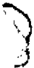

res del Estado Nacional están incluidos obligatoriamente en el sistema integral de jubilaciones y pensiones e incorpora expresamente a aquellos que gozasen de un retiro, obligándolos a realizar sus aportes al nuevo sistema. En consecuencia, los demandantes están incluidos en el régimen de la ley 24.241 porque sólo tacharon de inconstitucional al decreto N° 78/94.

El juzgador también habría omitido el análisis de los arts. 1",2° Y 52 de la ley 24.241, en virtud de los cuales se incorporó a los actores al nuevo régimen y, además, se habría basado en disposiciones aisladas

También existe agravio ya que el a qua consideró que el decreto cuestionado es sólo un decreto reglamentario, cuando también reviste el carácter de reglamento delegado, en virtud del arto 130 de la ley, según el cual "las normas reglamentarias deberán prever los procedimientos, plazos y modalidades que hagan factible la incorporación a este régimen de las personas que a la fecha de su entrada en vigor quedaren comprendidas en el mismo, así como los de quienes ejerzan la opción a que se refiere el arto 30".

-VI-

Ante todo, es menester destacar que, al pronunciarse respecto de la admisibilidad de la apelación extraordinaria, el a qua la concedió únicamente en cuanto se encuentra en tela dejuicio la interpretación y aplicación de normas federales y no por arbitrariedad de sentencia. De ahí que, dado que la demandada no ha deducido recurso de hecho, la jurisdicción ha quedado expedita sólo en la medida en que el recurso ha sido concedido por el tribunal.

Por lo tanto, corresponde admitir formalmente los recursos extraordinarios incoados por cuestión federal, toda vez que se discuten los alcances e inteligencia de una norma federal -el decreto 78/94y la decisión final ha sido contraria al derecho que en ella fundaron los apelantes (conf. inc. 32 arto 14 de la ley 48).

En cuanto al fondo de las apelaciones extraordinarias deducidas, es menester emitir opinión sobre los agravios relacionados con la adu-

cida falta de legitimación de los actores y con la improcedencia de la acción declarativa.

En cuanto al primero de esos temas, corresponde señalar que, contrariamente a lo que sostiene la parte demandada, aquéllos no poseen sólo un derecho en expectativa que habrá de incorporarse a su patrimonio cuando estén en condiciones de obtener el beneficio jubilatorio. Asi lo pienso, porque actualmente revisten la calidad de retirados, de tal forma que, al momento de la concesión de sus respectivos retiros y del consiguiente cese de funciones, adquirieron el derecho de acceder al régimen jubilatorio que entonces estaba en vigencia, una vez que transcurrieran los años faltantes para cumplir la edad necesaria a tal efecto.

Independientemente de lo anterior, es mi parecer que también se encuentran legitimados para incoar la presente acción, en su carácter de titulares de haberes de retiro que son parte integrante de su derecho de propiedad, ya que la ley 24.241, a través de sus decretos reglamentarios NQ 56/94 y 78/94, establece que deberán optar -en un plazo perentorioentre los dos regimenes creados por aquélla y realizar los aportes previsionales calculados sobre sus haberes, de acuerdo a las previsiones de la nueva normativa. Los recurrentes tienen, entonces, un derecho subjetivo actual a realizar los aportes previsionales conforme a la ley 24.018 en cuyo marco obtuvieron el retiro e, incluso, a obtener el beneficio de jubilación dentro del mismo régimen. Por lo tanto, cualquier estado de incertidumbre que causare o pudiere causar un perjuicio sobre aquéllos, es susceptible de control jurisdiccional. En efecto, la falta de certeza con relación al régimen aplicable y, en consecuencia, la incertidumbre sobre el derecho de opción que prevé el decreto NQ 56/94, les causa un perjuicio concreto, toda vez que los aportes a realizar conforme a la ley 24.241 tienen un limite máximo, a diferencia del régimen especial de la ley 24.018, configurándose un perjuicio cierto e inminente, ya que los aportes actuales guardan relación directa con el monto del haber de jubilación que percibirán en el futuro.

Por otra parte, el cuestionamiento sobre la procedencia de la acción declarativa, remite al análisis de normas de derecho común y procesal, ajenas al recurso extraordinario, máxime cuando, como en el caso, no es atendible la tacha de arbitrariedad, según antes quedó expuesto. Tal como ha dicho V.E. "determinar el contenido y extensión de las diferentes acciones previstas en la legislación local, consti-

tuye un tema propio de los jueces de la causa y ajeno a la instancia que consagra el arto 14 de la ley 48" (Fallos: 311:1148).

Respecto del agravio referido a la no aplicación de la ley 24.241 a los actores, corresponde, ante todo, analizar cuál es el régimen previsional que se aplica a los funcionarios y magistrados del Ministerio Público de la Nación.

La ley 24.018, sobre el régimen especial de prestaciones previsionales, comprende a los magistrados y funcionarios del Poder Judicial, del Ministerio Público de la Nación y de la Fiscalía Nacional de Investigaciones Administrativas que desempeñen los cargos comprendidos en el Anexo I. Establece, en su arto 26, que las jubilaciones de los beneficiarios y las pensiones de sus causahabientes se regirán por las disposiciones de dicha ley y, en lo no modificado por ésta, por las normas de la ley 18.037. Por su parte, el arto 14 también se refiere al régimen de esta última, en los siguientes términos: "las jubilaciones de los magistrados y funcionarios incluidos en el arto 8º, que no reunieren los requisitos establecidos en el presente, y las pensiones de sus causahabientes, se regirán exclusivamente por las disposiciones de la ley 18.037". Con respecto a la movilidad de las prestaciones, el arto 27 dispone que el haber de las jubilaciones, pensiones, asignación vitalicia y haberes de retiro a otorgar, conforme al presente régimen, será móvil y no se aplicarán los arts. 53 y 55 de la ley 18.037. Por último, es importante resaltar. con relación al tema que nos ocupa, el arto 33 de la ley, según el cual "las personas comprendidas y sus futuros causahabientes que a la fecha de entrada en vigencia de la presente ley, gozaren o tuvieren derecho a un beneficio de jubilación, retiro, pensión o asignación vitalicia, en razón de las normas que se derogan y/o modifican por la misma, conservarán sus derechos y mantendrán para tales casos la vigencia de las aludidas normas".

Por su parte, la ley 24.241 que creó el Sistema Integrado de Jubilaciones y Pensiones con carácter general, se refiere a los sujetos comprendidos en los arte. 2º, 157, 168 Y191. El arto 2º dispone que la ley abarca, entre otros, a los funcionarios, empleados y agentes que en forma transitoria o permanente desempeñen cargos en cualquiera de los poderes del Estado Nacional (art. 2º, inc. a, apartado 1)y, en general, a todas las personas que hasta la vigencia de la presente ley estu-

vieran obligatoriamente comprendidas en el régimen nacional de jubilaciones y pensiones por actividades no incluidas con carácter obligatorio en el régimen para trabajadores autónomos (art. 2º, inc. a, apartado 7). En igual sentido, el arto 157 señala que el Poder Ejecutivo podrá proponer, en el término de un año contado a partir de la publicación de la ley, un listado de actividades que, por implicar riesgos para el trabajador o el agotamiento prematuro de su capacidad laboral, o por configurar situaciones especiales, merezcan ser objeto de tratamientos legislativos particulares. Por su parte, el arto 168 derogó las leyes 18.037 y 18.038, sus complementarias y modificatorias. Por último, el arto 191 dispone que, a los efectos de la interpretación de la presente ley, debe estarse a lo siguiente: las normas que no fueran expresamente derogadas mantienen su plena vigencia (énfasis, agregado).

Asu vez, el decreto Nº 56/94, reglamentario de la ley, fijó el plazo en el que los beneficiarios deben optar entre los dos regímenes creados por aquélla y el decreto Nº 78/94, al reglamentar el arto 168 del régimen general, derogó expresamente, entre otras, la ley 24.018.

-IX-

Expuestos los antecedentes legales y reglamentarios, cabe, según mi opinión, establecer cuáles son los criterios que nos permiten interpretar el alcance de las normas aplicables al sub examine.

En tal sentido, es dable recordar, tal comoha sostenido reiteradamente V.E., que losjueces no deben sustituir al legislador sino aplicar la norma tal comoéste la concibió(Fallos 308:1745). La primera regla de interpretación de las leyes es dar pleno efecto a la íntención del legislador; la primera fuente para determinar esa voluntad, es la letra de la ley (Fallos 308:1745; 312:1098; 313:254) y, "por encima de lo que las leyes parecen decir literalmente, es propio de la interpretación indagar lo que ellas dicen jurídicamente, o sea, en conexión con las demás normas que integran el ordenamiento general del país, de modo de obtener su armonización y concordancia entre sí y, especialmente, con los principios y garantías de la Constitución Nacional" (Fallos: 308:1118).

En el sub iudice es menester analizar el alcance de la intangibilidad de los sueldos de los magistrados (art. 110 de la Constitución

Nacional) como principio interpretativo de las normas antes descriptas, de manera tal de realizar una interpretación armónica y sistemática del ordenamiento jurídico. Tal como ha expuesto V.E. la intangibilidad no constituye un privilegio sino una garantía para asegurar la independencia del Poder Judicial y, por aplicación de aquél principio, las compensaciones de los jueces no son susceptibles de ser disminuidas en forma alguna. (Fallos 176:73)

Además "toda solución que permita a losjueces demandar la tutela prevista por el arto 96 de la Constitución Nacional (texto anterior a la reforma de 1994)y desconozca igual facultad en cabeza de losjubilados, convierte en letra muerta las previsiones contenidas en los arts. 4º, 7º, 10, 15 y 27 de la ley 24.018, al desconocer que el quebrantamiento de la norma superior -establecida por razones que hacen al orden público y a la independencia del Poder Judicialse proyecta sobre aquéllos que, por haberse jubilado con derecho a un porcentaje fijo de las remuneraciones de los magistrados en actividad, encuentran sus haberes sensiblemente disminuidos frente a lo que deberían percibir para evitar discriminaciones ilegitimas" (Fallos: 315:2379). En igual sentido, esta Procuración ha sostenido que la independencia del Poder Judicial obliga a concluir que la intangibilidad de los emolumentos de los magistrados es extensible al haber de los jueces jubilados, desde que la posible disminución de los derechos previsionales generaría intranquilidad en el ejercicio funcional, o presión para motivar el abandono de sus cargos de quienes con ese grado de incertidumbre tuvieran que administrar justicia. (conf. dictamen de esta Procuración General del 23 de mayo de 1997, in re: G.99, L.xXXII. "Gaibisso César A. y otros cl Estado Nacional-Ministerio de Justiciasi amparo").

También advirtió la Corte -conforme destacaron los jueces de ambas instancias ordinarias y cabe aquí reiterarlo-, que el "sentido y alcance de la protección que el régimen de jubilaciones dispensa a los magistrados en situación de retiro aparece inspirada en propósitos últimos de garantía e independencia funcional análogos a los que sustenta el principio de intangibilidad de la remuneración de los jueces durante el ejercicio de la judicatura (conf. sentencia del 30 dejunio de 1993, in re: A. 621, L. XXIV,"Argüello Varela, Jorge Marcelo e/Estado NacionalC.S.J.N. sI amparo"). Máxime, si tenemos en cuenta que el Convencional Constituyente, a través de la reforma constitucional de 1994, ratificó el principio de la intangibilidad de las remuneraciones de los magistrados, de conformidad con la doctrina expuesta reiteradamente por V.E.

Por ello, es necesario constatar cuál ha sido la finalidad perseguida al sancionarse las normas en cuestión, ya que, como sostuvo el Tribunal, es misión del intérprete indagar el verdadero sentido y alcance de la ley, mediante un examen atento y profundo de sus términos que consulte la realidad del precepto y la voluntad del legislador, pues sea cual fuere la naturaleza de la norma, no hay método de interpretación mejor que el que tiene primordialmente en cuenta la finalidad de aquélla (Fallos 308:1861). Por último, creo que es importante resaltar que, según doctrina de V.E., las leyes previsionales deben interpretarse con máxima prudencia, en especial cuando el ejercicio de la función judicial pueda conducir a la pérdida de algún derecho. (Fallos 266:107; 266:299; 278:273).

La interpretación del alcance de la ley 24.241 con relación al tema que nos ocupa se circunscribe, tal como expuse anteriormente, al análisis de los arts. 2º, 157, 168 y 191 inc. a). El apartado 1 del inc. a) del arto 2º señala, comoprincipio, que están obligatoriamente comprendidos los funcionarios, empleados y agentes que en forma permanente o transitoria desempeñen cargos, aunque sean de carácter electivo, en cualquiera de los poderes del Estado Naciona!.

Sin embargo, es necesario aclarar que el texto legal prevé diversas excepciones al principio del artículo antes citado, entre ellos, los regimenes expresamente excluidos, tal el caso del personal militar de las fuerzas armadas y del personal militarizado ocon estado policial de las fuerzas de seguridad y policiales (apartado 1 del inc. a del arto 2º de la ley); cualquier otro régimen que sea propuesto por el Poder Ejecutivo al Congreso por configurar situaciones especiales o que merezcan ser objeto de tratamientos legislativos particulares (art. 157) y los regimenes no derogados expresamente por la ley (inc. a del arto 191).

Con relación al tema debatido, es dable afirmar que el régimen de los magistrados y funcionarios del Poder Judicial y del Ministerio PÚblico de la Nación no está comprendido en las excepciones que mencioné en primer y segundo término. Por tanto, sólo procede analizar el alcance de la tercera excepción legal que prevé el inc. a) del arto 191 de la ley 24.241, en cuanto establece que, a los efectos de la interpretación de la presente ley, debe estarse a lo siguiente: "las normas que no fueran expresamente derogadas mantienen su plena vigencia".

A su vez, para determinar cuáles son las normas expresamente derogadas, debemos remitirnos al arto 168 del mismo texto legal, que

menciona las leyes 18.037 y 18.038, sus complementarias, y modificatorias. En consecuencia, la cuestión es dilucidar si la ley 24.018 constituye una norma complementaria o modificatoria del régimen general creado por la ley 18.037.

Si se tiene en cuenta que el arto 91 de la ley 18.037 excluyó expresamente a los magistrados y funcionarios del Poder Judicial y previó un régimen transitorio hasta tanto se dictara el régimen jubilatorio especial, resulta obvioconcluir que la ley 24.018, sancionada con posterioridad a la vigencia del régimen general de la ley 18.037, creó un régimen especial de conformidad con lo dispuesto por esta última. Más aún, si el legislador hubiera considerado, al momento de la sanción del régimen general, que el de los funcionarios y magistrados era complementario de aquél, no habría sido necesario que lo excluyese en forma expresa (art. 91) ya que habría sido suficiente una simple remisión.

La existencia de un régimen complementario supone, en mi concepto, la coexistencia de un régimen básico y de otro que se integra a aquél. La ley 24.018 es un régimen básico y autónomo integrado por las disposiciones de la ley 18.037 (conf. arto 26 ley 24.018). Una ley sólo puede interpretarse comocomplementaria de otra norma en la medida en que integre las cuestiones no reglamentadas por el régimen general o modifique parcialmente este último, en función de las especiales circunstancias que reviste el caso específico. El arto 26 de la ley 24.018 dispone que las jubilaciones se regirán por sus propias disposiciones y, en lo no modificado por ellas, por las normas de la ley 18.037, de tal forma que aquélla no era complementaria de ésta sino que, por el contrario, el régimen general de la ley 18.037 era, en este caso en particular, un régimen complementario del régimen especial de los magistrados y funcionarios del Poder Judicial y del Ministerio Público sólo cabía remitirse a las disposiciones del régimen general siempre que no hubiesen sido modificadas por el régimen especial. Por lo tanto, la ley 18.037 complementaba el régimen de la ley 24.018, aplicándose en todas aquellas cuestiones no regladas por su texto.

Tampoco podría interpretarse que la ley 24.018 modificaba a la ley 18.037, porque en tal caso existiría un régimen básico (ley 18.037) y otro que introduce modificaciones en aquél (ley 24.018), y ello no es así, ya que este último, lejos de modificar el régimen general, crea un régimen especial y autónomo. Así lo pienso, toda vez que ello surge no sólo de los términos de la ley sino también de la interpretación armó-

nica de sus diferentes disposiciones y del resto del ordenamiento juridico, en especial referencia al arto 110de la Constitución Nacional, y a la finalidad que inspiró al legislador.

No pudo dejar de tomarse en cuenta, en ese sentido, que el régimen previsional de los funcionarios y magistrados del Poder Judicial y del Ministerio Público tiene caracteristicas y requisitos propios, distintos al resto de los regímenes de jubilación, ya que, del mismo modo que el ejercicio de tales cargos supone incompatibilidad con el comercio, con la realización de cualquier actividad profesional y con el desempeño de empleos públicos y privados, el goce de los beneficios previsionales es incompatible con el ejercicio del comercio y con el desempeño del empleo público O privado, excepto la comisión de estudios ola docencia (art. 16 de la ley 24.018). Por otra parte, la ley 24.018 prevé requisitos propios y especiales para la obtención de los beneficios previsionales (art. 9') y, por último, exige obligaciones especiales, tal como la de ocupar transitoriamente el cargo que desempeñaban en oportunidad de cesar en el servicio u otro de igual jerarquía del Poder Judicial o del Ministerio Público de la Nación o de la Fiscalía Nacional de Investigaciones Administrativas (art. 16 de la ley 24.018) y, si el magistrado o funcionario convocado no cumpliera con dicha obligación, sin causa justificada, perderá el derecho jubilatorio correspondiente al lapso por el cual no preste el servicio que le ha sido requerido.

Asimismoy,tal comose expresara supra, para analizar la ley 24.241 con relación al régimen de la ley 24.018 es necesario tener presente el alcance de la garantía constitucional de la irreductibilidad de las remuneraciones de los magistrados (art. 110 de la Constitución Nacional). Por lo tanto, si existiesen dudas interpretativas con respecto al alcance de sus haberes dejubilación, el criterio, a la luz del arto 110de la Constitución Nacional y de la jurisprudencia de VE., debe ser a favor de la intangibilidad de los haberes de aquéllos.

Además, la finalidad que inspiró al legislador al momento de la sanción de las leyes previsionales de los funcionarios y magistrados del Poder Judicial y del Ministerio Público fue el buen gobierno, la independencia del Poder Judicial y la tutela de los intereses de la colectividad, además de asegurar una verdadera carrera en la administración de justicia. En la nota al Poder Ejecutivo Nacional acompañando el proyecto de ley sobre el régimen especial de jubilaciones y pensiones para magistrados y funcionarios judiciales (ley 18.464), se

sostuvo que la ley 18.037 excluyó de su régimen a los magistrados del Poder Judicial de la Nación y que existen razones de buen gobierno y de tutela de los intereses de la colectividad que hacen necesario considerar, con un criterio particular, el retiro de aquéllos e impone la carga pública de ocupar, en los casos de licencia o vacancia, el cargo que desempeñaban en oportunidad de cesar en el servicio. Después de varias modificaciones, se sancionó la ley 22.940 y, posteriormente, se dictó un texto ordenado de la ley 18.464, mediante el decreto Nº 2700/83. En la nota de elevación al Poder Ejecutivo Nacional, acompañando el proyecto de ley, se sostuvo que "la finalidad más importante del proyecto es contribuir a la independencia del Poder Judicial. Para ello se adecuan disposiciones del régimen jubilatorio, y se crea un sistema de retiros. Se tiende a asegurar a los magistrados y funcionarios un nivel de vida decoroso para cuando cesan en sus funciones, de modo que durante el desempeño de estas últimas se puedan brindar con la mayor libertad posible y con razonable tranquilidad económica". Y agrega que "al mismo tiempo que el bien de las instituciones y como consecuencia de los beneficios para la comunidad, como el mejor servicio público exigible, cabe también reconocer la importancia y la dignidad propias de la magistratura judicial y funciones equiparables; y que es justo que la República distinga a quienes las han ejercido. Son de recordar la dedicación plena que supone una magistratura bien desempeñada, y la exclusión de cualquier otra actividad salvo la docencia".

Todo ello no ha sido desvirtuado por la letra o el espíritu de la ley 24.241, toda vez que la finalidad del legislador en este caso fue la unificación absoluta de los regimenes de las leyes 18.037, 18.038 y la de sus modificatorias o complementarias. Máxime, cuando no existe contradicción alguna entre la finalidad perseguida por las leyes especiales y el régimen general de la ley 24.241.

Lo hasta aquí expuesto fue ratificado por el propio Poder Ejecutivo Nacional, mediante el dictado del decreto Nº 2091/93, reglamentario de la ley 24.241, al sostener en los fundamentos que "también se observan los arts. 163 y 164; sin perjuicio de señalar que el principio de movilidad de los haberes se encuentra consagrado en el arto 14 bis de la Constitución Nacional, los mismos resultan contradictorios con el nuevo sistema de movilidad establecido en los arts. 21, 32 y 160, por lo que no corresponde la referencia a regímenes relativos a leyes previsionales anteriores. Ello es así, dado que el proyecto introduce un sistema de movilidad general aplicable a partir de la fecha de en-

trada en vigor del mismo y del que sólo resultan excluidos los llamados regímenes especiales que conservan la movilidad vigente a aquélla fecha." (énfasis agregado).

En conclusión, la ley 24.018 es un régimen autónomo y no complementario o modificatorio de la ley 18.037. Por lo tanto, pese al principio general del arto 2º de la ley 24.241, su régimen no es aplicable a los funcionarios y magistrados del Poder Judicial y del Ministerio Público, quienes siguen encuadrados en su régimen especial (cf. arts. 191, inc. a, y 168 de la ley 24.241).

Además, no sería razonable que el legislador, a través del arto 183 de la ley 24.241, modificara el arto 3º de la ley 24.018 si ésta hubiera sido derogada por aquélla. Si la ley estuviese derogada, el legislador no se hubiese remitido a ella sino que habría previsto directamente que los magistrados y funcionarios del Poder Judicial y del Ministerio Público estarán en condiciones de obtener las prestaciones no contributivas a los 65 años de edad. La ley 24.241 fija expresamente cuál es la edad para obtener la prestación "en la ... ley 24.018, arto 3º, 65 años". No es posible sostener, entonces, que una norma deroga y, a la vez, modifica la norma que ha sido objeto de derogación.

-x-

Sobre tales bases, es dable afirmar que el régimen de la ley 24.018 no ha sido derogado omodificado por la ley 24.241 y,por ende, resulta abstracto el agravio del recurrente de fs. 252/269 basado en la falta de tacha de inconstitucionalidad, por los actores, del régimen general de la ley 24.241.

Sólo resta analizar el agravio referido al supuesto desconocimiento, por parte del a qua, de las facultades reglamentarias comprendidas en el inc. 2 del arto 99 de la Constitución Nacional, ya que el Ejecutivo, según los recurrentes, al dictar el decreto Nº 78/94, no alteró la ley mediante excepciones reglamentarias que subviertan su espíritu y finalidad.

Tal como ha sostenido V.E., "es sabido que cuando un decreto reglamentario desconoce o restringe irrazonablemente derechos que la ley reglamentada otorga o de cualquier modo subvierte su espíritu y

finalidad, ello contraría la jerarquía normativa y configura un exceso en el ejercicio de las atribuciones que la propia Constitución concede al Poder Ejecutivo. Sin embargo, reiteradamente este Tribunal ha sostenido que la conformidad que debe guardar un decreto respecto de la ley no consiste en la coincidencia textual entre ambas normas, sino de espíritu, y que, en general, no vulneran el principio establecido en el arto 99, inc. 2, de la Constitución Nacional, los reglamentos que se expidan para la mejor ejecución de las leyes, cuando la norma de grado inferior mantenga inalterables los fines y el sentido con que la ley haya sido sancionada (doctrina de Fallos: 151:5; 178:224; 318:1707 y otros muchos).

Esta Procuración General, en autos C. 521, L.XXXIII "Centro de Despachantes de Aduana c/ PE.N. -Dto. 1160/96 s/ amparo ley 16.986", sostuvo, en concordancia con la doctrina recordada, que "la invalidez de un decreto no se configura necesariamente porque su texto sea distinto al de la ley objeto de reglamentación, sino porque aquél es contrario al espíritu y a los fundamentos de la ley en sentido formal. Tal como tiene dicho V.E., es misión del intérprete indagar el verdadero sentido y alcance de la ley, mediante un examen atento y profundo de sus términos que consulte la realidad del precepto y la voluntad del legislador, pues sea cual fuere la naturaleza de la norma, no hay método de interpretación mejor que el que tiene primordialmente en cuenta la finalidad de aquélla (Fallos: 308:1861). La misión judicial no se agota con la remisión a la letra de la ley, toda vez que los jueces, en cuanto servidores del Derecho y para la realización de la justicia, no pueden prescindir de la ratio ¡egis y del espíritu de la norma. En efecto la sustancia de la norma es el espíritu y el fin de la ley (Fallos: 151:5; 178:224; 280:18; 283:98; 308:54; 312:1614; 313:1293)y resultaría evidente que la contradicción palmaria de la norma reglamentaria con el espíritu y los fundamentos de la ley formal invalidan necesariamente el decreto reglamentario".

En el sub examine es claro que el decreto reglamentario impugnado modifica la ley,tal comosurge del propio texto de aquél que, en su arto 1º, dispone expresamente la derogación de la ley 24.018, so pretexto de reglamentar el arto 168 de la ley 24.241. El Poder Ejecutivo, a través del dictado de los decretos reglamentarios, en ejercicio de la potestad que prevé el inc. 2 del arto 99 de la Constitución Nacional, puede fijar los detalles de la ley sancionada por el Congreso pero, en ningún caso, puede alterar su espíritu mediante excepciones regla-

mentarias, ni menos aún derogar normas legales. En tal sentido, es claro que si la ley que es objeto de reglamentación no derogó una norma de igual rango, el decreto reglamentario no puede hacerlo. Por lo tanto, en el sub judice el Poder Ejecutivo excedió su potestad reglamentaria, en violación del inc. 2 del arto 99 de la Constitución Nacional.

Por último, en mi concepto, debe rechazarse el agravio sobre el supuesto desconocimiento de la delegación legislativa del art. 130 de la ley 24.241 en el Poder Ejecutivo, toda vez que dicha disposición se refiere a los procedimientos, plazos y modalidades que hagan factible la incorporación, a este régimen, de las personas que a la fecha de su entrada en vigor quedaren comprendidas en el mismo, pero de ninguna manera transfiere, al Ejecutivo, la potestad de fijar cuáles son los sujetos comprendidos en él. Además, el propio Poder Ejecutivo, tal comosurge de los considerandos del decreto NQ 78/94, manifestó que éste es un decreto reglamentario dictado en ejercicio de las potestades que prevé el inc. 2 del arto 86 de la Constitución Nacional-actual arto 99-, no existiendo pues, en la especie, ejercicio de una potestad legislativa delegada.

-XII-

Por lo hasta aquí expuesto opino que debe confirmarse la sentencia recurrida en cuanto fue materia de recurso extraordinario. Buenos Aires, 3 de agosto de 1998. Nicolás Eduardo Becerra.

## FALLODE LACORTE SUPREMA

Buenos Aires, 19 de mayo de 1999.

Vistos los autos: "Craviotto, Gerardo Adolfo y otros cl Estado Nacional-P.E.N.MQde Justicia de la Nación sI empleo público".

## Considerando:

Que la Sala V de la Cámara Nacional de Apelaciones en lo Contencioso Administrativo Federal-al confirmar el fallo de la instancia anteriorestableció la vigencia del régimen previsional de la ley 24.018 con respecto a los haberes de retiro de los actores y declaró la inconstitucionalidad del decreto 78/94 reglamentario del arto 168 de la ley 24.241. Contra ese pronunciamiento la ANSES (fs. 245/250) y el Ministerio de Justicia (fs. 252/270) interpusieron los recursos extraordinarios que fueron concedidos parcialmente.

Que los agravios de los apelantes h;m sido objeto de adecuada apreciación en el dictamen del señor Procurador General de la Nación, a cuyos fundamentos y conclusiones esta Corte se remite por razones de brevedad.

Por ello, y de conformidad con lo dictaminado por el señor Procurador General, se declaran procedentes los recursos extraordinarios interpuestos y se confirma la sentencia apelada. Costas por su orden en atención a la dificultad de la cuestión controvertida (art. 68 del Código Procesal Civil y Comercial de la Nación). Notifíquese y devuélvase.

JULIO S. NAZARENO -CARLOS S. FAYT -AUGUSTO CÉSAR BELLUSCIO ~ MIGUEL ANGEL VILAR -GUSTAVO BECERRA FERRER -FERNANDO ARCHlMBAL -FLAVIO ARIAS (en disidencia parcial) -EDUARDO A. ZANNONI.

DISIDENCIA PARCIAL DEL SEÑOR CONJUEZ DOCTOR DON FLAVIO ARIAS

## Considerando:

Que los agravios de los apelantes han sido objeto de adecuada apreciación en el dictamen del señor Procurador General de la Nación, a cuyos fundamentos y conclusiones corresponde remitirse por razones de brevedad.

Por ello, y de conformidad con lo dictaminado por el señor Procurador General de la Nación, se declaran procedentes los recursos ex-

traordinarios y se confirma la sentencia apelada. Con costas de esta instancia a la demandada vencida (art. 68 del Código Procesal Civil y Comercial de la Nación). Notifíquese, y devuélvase.

Fu VIO ARIAS.

## AADI CAPIF.ASOCIACION CIVIL RECAUDADORA v. LU6 RADIO ATLANTICA

RECURSO EXTRAORDINARIO: Requisitos propios. Cuestión federal. Cuestiones federales simples. Interpretación de la Constitución Nacional.

Suscita materia federal suficiente el recurso extraordinario deducido contra el pronunciamiento que rechazó la demanda tendiente a obtener el cobro de aranceles derivados de la difusión al público de grabaciones fonográficas, pues la interpretación efectuada por el a quo pone de relieve una injerencia indebida del Poder Ejecutivo Nacional en competencias legislativas e, incluso, en el ejercicio de la función judicial prevista en el arto 56 de la ley 11.723.

## DECRETO REGLAMENTARIO.

La conformidad que debe guardar un decreto respecto de la ley no consiste en una coincidencia textual entre ambas normas, sino de espíritu y, en general, no vulneran el principio establecido en el arto 99, inc. 2º, de la Constitución Nacional, los reglamentos que se expiden para la mejor ejecución de las leyes cuando la norma de grado inferior mantiene inalterables los fines y el sentido con que la ley ha sido sancionada.

## PROPIEDAD INTELECTUAL.

De la comparación del texto de los decretos 746/73, 1670/74 Y 1671/74 con lo establecido en el arto 56 de la ley 11.723, no se desprende que el contenido de los primeros haya desnaturalizado o alterado la finalidad perseguida por el legislador que, en lo esencial, no es más que la protección de los derechos de los intérpretes y productores de fonogramas, asignándoles la percepción de una retribución por la difusión pública de sus obras intelectuales.

## PROPIEDAD INTELECTUAL.

El hecho de que el Poder Ejecutivo haya fijado aranceles y dispuesto la creación de una asociación civil con personería propia para percibir y admi. nistrar las retribuciones previstas en el arto 56 de la ley 11.723, ha importado establecer un sistema que posibilita el ejercicio del derecho que se procura resguardar mediante el régimen legal y no a impedirlo.

CONSTITUCION NACIONAL: Constitucionalidad e inconstitucionalidad. Decretos nacionales.

El dictado de los decretos 746/73, 1670/74 Y 1671174 del Poder Ejecutivo Nacional configura un razonable ejercicio de, la facultad otorgada por el art. 99, ine. 2, de la Constitución Nacional, pues aquél se limitó a poner en ejecución los fines que tuvo en mira el legislador en materia de derechos intelectuales.

## PROPIEDAD INTELECTUAL.

El arto 75, inc. 12, de la Constitución Nacional confiere al Poder Legislativo Nacional la facultad de dictar los códigos de fondo, de modo que al encontrarse la ley 11.723 dentro de la órbita del Código Civil, corresponde al Poder Ejecutivo Nacional la facultad de reglamentar la citada ley, sin que pueda invocarse la existencia de un avasallamiento de las autonomías provinciales.

DICTAMEN DEL PROCURADOR GENERAL

Suprema Corte:

La asociación recaudadora A.A.D.I. C.A.P.I.F. se presentó en autos promoviendo acción ordinaria por cobro de pesos, contra LU6 Radio Atlántica de la ciudad de Mar del Plata, en virtud de la deuda que registraba el establecimiento demandado por la utilización de grabaciones fonográficas desde el mes de mayo de 1992. Fundó su derecho en la resolución 894/0200, de la Secretaría de Prensa y Difusión dependiente del Poder Ejecutivo Nacional, que establece la

obligación de pagar la tarifa dispuesta en el rubro 51 de dicha norma legal; en los artículos 1º, 4º, 56 Yconcordantes de la ley 11.723, 1º del decreto 1670/74; 1º, 2º, 4º Y7º del decreto 1671/74 y'¡os pertinentes de la resolución citada (ver fs. 17/19).

Afs. 30/35, el accionado contestó la demanda y solicitó su rechazo, sobre la base de considerar que todo el sistema jurídico en el cual se apoya resulta inconstitucional.

Desconoció, asimismo, la legitimación de la actora para promover la acción, tras destacar que de la lectura de los arts. 1º y 2º del decreto 1671/74 y del mandato otorgado sin escritura pública por el Fondo Nacional de las Artes, surge que las facultades acordadas son las de percepción y administración de los fondos, exclusivamente, y no comprende la facultad de accionar judicialmente para obtener el cobro de deudas.

Agregó que la falta de acción también está dada por la ausencia de norma legal o convencional que autorice la existencia y cobro de los derechos, sobre obras caídas en el dominio público, las cuales -a su entenderse encuentran al margen de los derechos conferidos por la ley 11.723.

En cuanto a la inconstitucionalidad solicitada de los decretos 1670/74 y 1671/74, señaló que constituyen un exceso reglamentario, puesto que, según entiende, de ninguna disposición de la ley 11.723 surge la posibilidad de inferir la institución de un mandato legal, exclusivo y necesario por vía reglamentaria, de los titulares de derechos acordados a favor de terceros a los fines de efectivizar su cumplimiento. Agregó que se excedieron los alcances de la ley que los origina y también sostiene que se excedió el Poder Ejecutivo en su facultad de dictar normas de fondo integrantes del Código Civil, por cuanto en materia de fijación de aranceles, es competencia privativa de las provincias respecto de su territorio por no haber sido delegada, todo ello en menoscabo del derecho de propiedad, del principio republicano de división de poderes, del sistema federal y de los arts. 1º, 17, 67 inc. 11, 86 inc. 2º, 104 y concordantes de la Constitución Nacional.

Adujo que la demanda entablada no reúne los requisitos establecidos por el arto 330, incs. 1º, 2º y 3º del Código Procesal, y que tales defectos le impidan ejercer normalmente su derecho de defensa, puesto que, por un lado, la actora no actúa en función de un título propio sino

en representación de terceros -intérpretes, productores de fonogramas y el Fondo Nacional de las Artesmotivo por el cual debió individualizar el nombre y domicilio de cada uno de los supuestos mandantes, o titulares de los derechos cuyo cumplimiento se persigue. Tal omisión -a su criterio-le impide saber si ellos realmente existen como sujetos de derecho y,en función de ello, ejercer las múltiples defensas y pruebas que en razón de su identidad, eventualmente podria ejercer en su calidad de demandado. Por otro lado, señaló que tampoco se individualiza en la demanda las obras musicales cuya difusión a través de fonogramas, darían lugar a los créditos reclamados, ni tampocolas caídas en el dominio público cuya recaudación se pretende para el Fondo Nacional de las Artes, según el arto 1º, inc. 2º del convenio con dicho ente.

Sostuvo, asimismo, que se viola el arto 330 in fine del Código Procesal, al omitirse toda estimación del monto reclamado, cuando se trata de una demanda por retribuciones que se encuentran tarifadas en la misma norma que invoca la accionante.

Seguidamente, luego de desconocer todas las afirmaciones efectuadas por la actora en su escrito inicial, solicitó se declare la inconstitucionalidad de la resolución 894/0200 de la Secretaría de Prensa y Difusión y su sucedánea, la Secretaría de Información Pública, fundándose en que, por un lado, determina aranceles para la retribución de derechos emergentes de la ley 11.723, cuando el arto 56 de la misma establece que se fijará por común acuerdo de partes o, en su defecto, por determinación judicial en juicio sumario. Por otro, sostiene que la determinación de dichos aranceles es facultad de las provincias, no delegadas en el Gobierno Federal, por lo cual se estaría agraviando al sistema federal emergente de los arts. 1 º, 104, 105, 107 y concordantes de la Constitución Nacional.

Finalmente, pidió se rechace la pretensión de un pronunciamiento que abarque períodos posteriores a la fecha en que se trabó la litis, por considerar que no se trata del caso previsto por el arto 331 del Código Procesal y porque tal pretensión, al depender de hechos posteriores a la contestación de demanda, le impediría ejercer el derecho de defensa respecto de los mismos, con menoscabo del arto 18 de la Constitución Nacional. Asimismo, puso de manifiesto que resulta improcedente el reclamo de actualización por depreciación monetaria, desde que el período reclamado comienza en mayo de 1992 y es posterior al dictado de la ley 23.928 que prohíbe expresamente todo tipo de indexación.

El tribunal de primera instancia, a fs. 128/135, hizo lugar a la demanda, rechazando la solicitud de declaración de inconstitucionalidad de los decretos 1670/74 y 1671/74, así como de la resolución 894/0200 de la Secretaría de Prensa y Difusión, por considerar que tales normas no van más allá de la ley de propiedad intelectual, ya que la decisión del Poder Ejecutivo Nacional de establecer aranceles por la utilización de discos fonográficos u otras reproducciones de fonogramas en ejecuciones públicas, no viola ni el texto ni el espíritu del arto 56 de la ley 11.723, sino que por el contrario, constituye una prudente adecuación de la misma a los tiempos modernos.

Asimismo, el magistrado sostuvo que, tanto la pretendida inconstitucionalidad del arto 6º del decreto 1671/74 comola defensa de falta de acción, no representan sino cuestionamientos ajenos a la legitimación del apelante, quien no tiene, dentro de la órbita de la regulación de derechos de terceros, intérpretes o productores fonográficos para con la demandante, la posibilidad de observar supuestas deficiencias, las que sólo cabría que lo fueran por los directamente interesados, es decir, los productores extranjeros o el Fondo Nacional de las Artes.

Por último, dispuso que la demandada debía abonar los montos correspondientes al período que va entre el mes de mayo de 1992 a la fecha de promoción de la demanda.

Tal decisión fue apelada por la actora y también por la demandada.

Afs. 161/167, la Sala II de la Cámara Primera de Apelación en lo Civil y Comercial del Departamento Judicial de Mar del Plata, confirmó el pronunciamiento, coincidiendo con el tribunal de primera instancia en cuanto a que la actora se halla legitimada legalmente para realizar la correspondiente recaudación, como así también en lo referente a la improcedencia de la defensa de falta de acción y constitucionalidad de los decretos 1670/74 y 1671/74, al entender que no han desbordado el marco legal. Sin embargo, aceptando el planteo formulado por aquella en punto a la limitación impuesta al monto reclamado, modificó la condena disponiendo que ésta abarca los aranceles posteriores a abril de 1993 y hasta el momento del efectivo pago.

Contra dicha sentencia, la demandada interpuso recurso de inaplicabilidad de ley ante la Suprema Corte de Justicia de la Provincia de Buenos Aires, en los términos del arto 278 y siguientes del Código Procesal y del arto 161, inc. 3º de la Constitución provincial, por entender, en lo sustancial, que la sentencia había violado y/o efectuado una indebida aplicación de disposiciones de la ley 11.723 y los decretos reglamentarios, del Código Civil y de la Constitución Nacional, al considerar legitimada a la actora para accionar.

Elevadas las :,¡ctuaciones,previa concesión a fs. 181, el máximo tribunal provincial hizo lugar parcialmente al recurso interpuesto, manteniendo la sentencia de primera instancia en cuanto al alcance temporal de la condena, extendiéndola sólo hasta la fecha de notificación de la demanda, con fundamento en que, aun cuando existieran razones de economía procesal, ellas no pueden anteponerse a los derechos constitucionales de defensa enjuicio y del debido proceso (art. 18 de la Constitución Naciona!).

En cuanto a la cuestión principal, sostuvo que la recurrente sólo realiza una interpretación personal del derecho aplicable sin desvirtuar las razones dadas por la alzada para admitir la legitimación de la actora. Tampoco hizo lugar al pedido de declaración de inconstitucionalidad del decreto 1671/74 y de la resolución 894/0200, al considerar que la crítica a este aspecto del fallo no aporta razones jurídicas ciertas que avalen su postura y, además, puso de relieve que la facultad reglamentaria del Poder Ejecutivo -surgida del arto 86, inc. 2º de la Constitución Nacional y, en el caso, del arto 87 de la ley 11.723ha sido ejercida sin alterar el espíritu de la norma.

-V-

La demandada interpuso a fs. 202/209, recurso extraordinario contra la decisión del tribunal superior local, el que desestimado dio lugar a esta presentación directa (ver fs. 229).

El quejoso fundamenta su recurso alrededor de la inconstitucionalidad de dos normas: el decreto 1671/74 y la resolución 894/0200/75 de la Secretaría de Prensa de la Nación.

Acerca de la primera de ellas, señala que al instituir un mandato legal para percibir, administrar y distribuir los derechos de autor y título propio para accionar por su cobro, más que una alteración del espíritu de la ley, es una verdadera creación legislativa en materia que la ley 11.723, a la que reglamenta, deja librada a las normas de derecho común, las que quedarían desplazadas y derogadas por este "engendro reglamentario". De ello concluye que dicha investidura y la consiguiente legítimación para obrar persiguiendo los derechos de autor, no tratándose del titular, sólo puede surgir de una nueva ley que la establezca, o bien de un mandato convencional, conforme se desprende -a su entenderdel arto 75, inc. 12 en general y, en el caso puntual, del inc. 18 in fine de la misma norma.

Agrega que no es posible invocar la delegación expresa hecha por el Poder Legislativo al sancionar el arto 87 de la ley 11.723, puesto que dicha norma se limitaría a fijar el plazo dentro del cual el Poder Ejecutivo Nacional deberá reglamentarla en el ejercicio de facultades propias y, además, por la prohibición contenida en el arto 76 y el arto 99, inc. 3º de la Constitución Nacional.

Considera inadmisible que su parte -según lo interpretado por la cámara y por el a qua-tenga vedada la defensa de falta de legitimación para obrar de la aetora, invocándose la doctrina emergente de los arts. 1048 y 1869 del Código Civil, normas que -a su criteriono tienen ninguna vinculación con el cuestionado derecho a plantear la defensa de falta de legitimación activa. Agrega que dicho rechazo afectaria la garantía de defensa enjuicio (art. 18 de la Constitución Naciona!), al privársele de una defensa fundamental para acreditar la ausencia de derecho de la actora a accionar contra el patrimonio de su parte, protegido por el arto 17 de la Constitución Nacional.

Seguidamente, aduce la inconstitucionalidad de la resolución citada, basándose en que la reglamentación de la difusión pública de música y la consecuente fijación de los aranceles que de ello deviene a favor de intérpretes y productores de fonogramas, es facultad propia del poder de polida que corresponde a las provincias, en tanto no fue delegada a la Nación, según lo establecido por el arto 121 de la Constitución Nacional.

Por otra parte, sostiene que dicha inconstitucionalidad también estaría dada por el hecho de que fija administrativamente retribucio-

nes que, conforme al arto 56 de la ley 11.723, deben ser establecidas por acuerdo de partes o, en su defecto, por sentencia judicial en juicio sumario, de lo cual deduce que habría una creación legislativa por parte del Poder Ejecutivo Nacional, lo que constituye un agravio no sólo al principio republicano de división de poderes, sino avasallar las atribuciones exclusivas del Congreso Nacional y violar los arts. 1Q, 17, 75, incs. 12 y 19, 76 y 99, incs. 2 Q y 3 Q de la Constitución Nacional.

Finalmente, ataca la denegatoria de la concesión del recurso extraordinario interpuesto, destacando, al respecto, que no está basado en la doctrina de la arbitrariedad ni en la distinta interpretación de normas de derecho común, como lo entendió la suprema corte local, sino que se funda en la violación de expresos preceptos y garantías constitucionales.

- VI-

En mi parecer, el recurso extraordinario resulta formalmente procedente, en tanto se ha puesto en tela de juicio la constitucionalidad de normas emanadas del Poder Ejecutivo Nacional, con base en la supuesta extralimitación de las facultades reconocidas en el texto fundamental al órgano encargado de la reglamentación de la ley, y la decisión del superior tribunal de la causa es contraria a las peticiones del recurrente (Fallos: 311:1945).V.E.ha decidido, de modo reiterado, que resolver si ha mediado exceso en el ejercicio de atribuciones constitucionales, plantea cuestión federal suficiente que habilita la apertura del recurso extraordinario (cfr. Fallos: 285:369 y otros).

En cuanto a la cuestión sustancial, adelanto desde ya mi opinión coincidente con la doctrina del Tribunal de Fallos: 310:2314; 318:141 y 320:2223, en los que se sostuvo la validez del decreto 1671/74 y de la resolución de la Secretaría de Prensa y Difusión, oportunamente cuestionados, que regulan el ejercicio de los derechos reconocidos en la ley 11.723. Cabe aclarar, sin embargo, que la inconstitucionalidad del decreto 1670/74 no será materia de tratamiento, toda vez que el apelante no ha mantenido los agravios en este punto, y la jurisdicción de la Corte se encuentra limitada por los términos del remedio federal planteado (Fallos: 310:1465; 311:2461, entre otros).

Por lo pronto, cabe advertir que declarar la inconstitucionalidad de una norma, como lo tiene dicho VE. de manera reiterada, es un acto de suma gravedad institucional, a cargo del Poder Judicial de la Nación, que constituye la ultima ratio del orden jurídico; en este sentido, dicho poder, para ejercer la elevada función de control de constitucionalidad de las leyes, debe imponerse la mayor mesura, en respeto a las facultades propias y exclusivas de los otros poderes del Estado y en virtud del respeto irrestricto al principio de división de los poderes, pilar del sistema republicano.

Puntualizado tal aserto, es de recordar que el dictado de los llamados reglamentos de ejecución, facultad del Poder Ejecutivo Nacional, reconocida en el artículo 99, inciso 2º, tiene como fin, según lo han reconocidoV.E.en los fallos citados y también la doctrina de modo concordante, completar la ley, regulando los detalles indispensables para asegurar, no sólo su cumplimiento, sino también los fines que se propuso el legislador al sancionarla, a raíz de lo cual devienen tan obligatorios como la ley misma, mientras sus disposiciones se mantengan dentro de las limitaciones establecidas en la Constitución Nacional.

En este orden de ideas, se ha reiterado, "que no vulneran el principio contenido en el artículo 99, inciso 2º de la Constitución Nacional, los reglamentos que se expidan para la mejor ejecución de las leyes, cuando la norma de grado inferior mantenga inalterables los fines y el sentido con que la ley haya sido sancionada", "así como que la conformidad que debe guardar un decreto, respecto de la ley, no consiste en una coincidencia textual entre ambas normas, sino de espíritu" (v.Fallos: 318:1707).

En esa inteligencia, cabe consignar que, del texto literal del decreto en cuestión y de su comparación con lo establecido en la ley 11.723, no se desprende que el contenido del primero, haya desnaturalizado o alterado la finalidad perseguida por el legislador, cual es, en lo esencial, la protección de los derechos del intérprete y productores de fonogramas, asignándoles la percepción de una retribución. Tal decreto reglamentario, no hace sino establecer un sistema que viene a posibilitar el ejercicio del derecho reconocido que se procura resguardar mediante el régimen legal y no a impedirlo. Ello es así, desde que la realidad demuestra que, ante la falta de solicitud de autorización de los terceros utilizadores a los artistas intérpretes o a los

productores fonográficos, no existiría ninguna posibilidad de que éstos reciban alguna compensación económica por el uso de la propiedad intelectual contenida en cada obra utilizada, si no fuera por la unificación de la personería en una asociación civil representativa de los intereses de sus titulares (v. Fallos: 321:2223, considerando 7º).

Con relación a esto último, cabe tomar especialmente en cuenta que la demandada ha objetado la creación, mediante disposición legal, de una asociación que se ocupa de recaudar y distribuir los derechos de los autores e intérpretes, imponiendo una representación que también pone en tela dejuicio el usuario demandado, cuando no es él quien se hallaria legitimado para realizar la objeción -puesto que no actúa por un interés propio, ni ha invocado que haya sido delegado por algún titular, para ineoarla en su nombresino que, precisamente, son los artistas y productores, cuya representación compulsoria se establece en las normas cuestionadas, quienes estarian habilitados a plantear un eventual perjuicio.

De igual manera, de la lectura del conteste de demanda, que demarca la continencia de la litis, no se desprende que quien invoca el exceso reglamentario, haga alusión a un agravio concreto a sus intereses o derechos, con lo cual la pretensión viene a constituirse en una suerte de pedido de declaración en abstracto de inconstitucionalidad del decreto, decisión esta que le está vedado emitir a los jueces.

Por último, la aludida inconstitucionalidad del decreto reglamentario y la resolución, por constituir una facultad no delegada por las provincias, que se han reservado la posibilidad de adecuar las normas nacionales al ejercicio de su poder de policía, cabe consignar que, por tratarse de una norma emanada del Poder Legislativo Nacional en el ejercicio de las facultades delegadas en el artículo 75, inciso 12 de la Constitución Nacional, el órgano habilitado para su reglamentación es el Poder Ejecutivo Nacional, conforme surge de las facultades constitucionales otorgadas en el artículo 99, inciso 3º.

Por lo expuesto, opino que corresponde admitir la queja interpuesta y confirmar la sentencia apelada, en lo que ha sido materia de recurso. Buenos Aires, 22 de febrero de 1999. Nicolás Eduardo Becerra.

## FALLODE LACORTE SUPREMA

Buenos Aires, 19 de mayo de 1999.

Vistos los autos: "Recurso de hecho deducido por Editorial La Capital S.A. en la causa AADI CAPIF Asociación Civil Recaudadora el LU6 Radio Atlántica", para decidir sobre su procedencia.

## Considerando:

1º) Que contra el pronunciamiento de la Suprema Corte de Justicia de la Provincia de Buenos Aires que, al admitir parcialmente el recurso de inaplicabilidad de ley, dejó firme -en lo que al caso interesala sentencia de la alzada que había rechazado el planteo de inconstitucionalidad formulado por la demandada y admitido la pretensión deducida por la actora con el objeto de obtener el cobro de aranceles derivados de la difusión al público de grabaciones fonográficas, la vencida dedujo el remedio federal cuya desestimación dio motivo a la presente queja.

2º) Que el pedido de inconstitucionalidad del decreto 1671174del Poder Ejecutivo Nacional, complementado por la resolución 894/0200/75y sucedáneas de la Secretaría de Información Pública, suscita cuestiones sustancialmente análogas a las examinadas por el Tribunal en Fallos: 321:2223, a cuyas consideraciones, en lo pertinente, cabe remitirse por razón de brevedad.

3º) Que, con particular referencia al planteo de la demandada relativo a que la reglamentación de la difusión pública de los fonogramas musicales y determinación de los aranceles respectivos es facultad propia del poder de policía que corresponde a las provincias, cabe señalar que el arto 75, inc. 12, de la Carta Magna confiere al Poder Legislativo Nacional la facultad de dictar los códigos de fondo; en consecuencia, al encontrarse la ley 11.723 dentro de la órbita del Código Civil, corresponde al Poder Ejecutivo Nacional la facultad de reglamentar la citada ley, sin que pueda invocarse la existencia de un avasallamiento de las autonomías provinciales.

Por ello y de conformidad con lo dictaminado por el señor Procurador General de la Nación, se declara formalmente admisible el re-

786

curso extraordinario y se confirma la sentencia apelada. Reintégrese el depósito. Costas a cargo del vencido (art. 68 del Código Procesal Civil y Comercial de la Nación). Hágase saber, agréguese la queja al principal y, oportunamente, devuélvase.

JULIO S. NAZARENO -CARLOS S. FAYT -AUGUSTO CÉSAR BELLUSCIO -ENRIQUE SANTIAGO PETRACCHI -ANTONIO BOGGIANO -GUILLERMO A. F. LÓPEZ -ADOLFO ROBERTO VÁZQUEZ.

JOSE LUIS FELIX CHILAVERT GONZALEZ y OTRO

RECURSO EXTRAORDINARIO: Principios generales.

Es inadmisible (art. 280 del Código Procesal Civil y Comercial de la Nación) el recurso extraordinario deducido contra el pronunciamiento que condenó a un jugador de fútbol por considerarlo autor del delito de lesiones leves con motivo y ocasión de un espectáculo deportivo.

DICTAMEN DEL PROCURADOR GENERAL

Suprema Corte:

-1-

La Sala 1de la Cámara deApelación en lo Criminal y Correccional de La Plata, en su fallo del 29 de mayo de 1997, confirmó la sentencia dictada en primera instancia, en cuanto condenó a José Luis Félix Chilavert a la pena de tres meses de prisión en suspenso y un año y un mes de inhabilitación especial para desempeñarse comojugador profesional de fútbol, por considerarlo autor del delito de lesiones leves con motivo y ocasión de un espectáculo deportivo.

Contra ese pronunciamiento la defensa interpuso recurso de inaplicabilidad de ley,para lo cual planteó la inconstitucionalidad del artículo 350 del Código Procesal Penal de la Provincia de Buenos Aires.

Denegada por la cámara esa apelación, la parte dedujo recurso de queja ante la Suprema Corte de la Provincia de Buenos Aires, la que fue rechazada.

Contra esta decisión la defensa interpuso entonces el recurso extraordinario del artículo 14 de la ley 48, cuya denegatoria por parte del máximo tribunal provincial, dio origen a esta presentación directa.

-II-

Se queja el recurrente de la decisión de la Suprema Corte local, en cuanto declaró inadmisible, con base en los límites del artículo 350 del ordenamiento de forma, el recurso de inaplicabilidad de ley interpuesto contra el fallo condenatorio de la Cámara de Apelaciones de La Plata, en tanto de ese modo se dejó de considerar los agravios que, como de carácter federal, se pretendió someter a su conocimiento.

Entre ellos sostiene que el proceso fue llevado a cabo sin que el presunto damnificado hubiese instado la acción penal, es decir, en violación a lo dispuesto en los artículos 72, inciso 2, y 89 del Código Penal. Asu entender este apartamiento de lo dispuesto por la legislación nacional importaría una vulneración del artículo 31 de la Constitución Naciona!.

También se agravia de que la sentencia haya tomado como agravante para la determinación de la pena la condición de jugador profesional de Chilavert, pues sostiene que no sólo se trata de una circunstancia no prevista en el artículo 40 del CódigoPenal, sino que además es el sustrato sine qua non para que pueda aplicarse la normativa de la ley 23.184 y sus modificatorias. A su juicio, esto configuraría una nueva violación del artículo 31 de la Constitución Nacional, y,asimismo, de la garantía del debido proceso legal.

Por último, sostiene que la Cámara valoró arbitrariamente la prueba y presumió por argumento de pura autoridad que Chilavert había sido el autor de la presunta agresión, cuando lo que se desprendía del

contenido concordante de toda la prueba testimonial era su no identificación o, al menos, la existencia de un estado de duda razonable al respecto. Ajuicio del recurrente, la sentencia habria desconocido así la presunción de inocencia, amparada por los artículos 18 y 75, inciso 22, de la Constitución Nacional, este último en relación a diversos instrumentos internacionales que también la contemplan.

En consecuencia, con base en la doctrina sentada por v.E. en los precedentes "Strada" (Fallos: 308:490)y "DiMascio"(Fallos: 311:2478), tacha entonces de inconstitucional el límite objetivo establecido por el artículo 350 del Código Procesal Penal provincial para la admisibilidad del recurso de inaplicabilidad de ley, en tanto impediría al superior tribunal local el conocimiento y decisión de esas pretensas cuestiones federales.

El recurrente intenta, por ello, a través de la presente queja, que la Corte deje sin efecto la resolución contra la que fue interpuesta para que la Suprema Corte de la Provincia de Buenos Aires conozca y decida sobre esos agravios.

-III-

Si bien el recurso resulta, en principio, de dudosa fundamentación, pues no se ha efectuado una crítica de los argumentos sobre los que la corte provincial sostuvo la constitucionalidad del artículo 350 del código procesal local, consideró que esa circunstancia no puede en este caso ser entendida como un defecto formal que constituya un obstáculo para la procedencia de la apelación federal. Ello es así, pues la doctrina de Fallos: 308:490 y 311:2478, que expresamente invoca el apelante, en tanto desautoriza la interpretación adoptada por el a quo, que lleva implícita su crítica y, asimismo, permite abordar la cuestión con estricta sujeción a lo que ha sido en este aspecto materia del pleito y agravio de la parte.

A ello cabe agregar que tampoco el a qua ha expuesto en su pronunciamiento otras razones frente a las cuales resulte necesario efectuar un nuevo análisis de ese criterio jurisprudencial.

Advierto, sin embargo, en cuanto al fondo de la cuestión, que el apelante no ha alcanzado a demostrar suficientemente el carácter federal de los agravios que pretende someter al conocimiento y decisión

del máximo tribunal local, lo que constituye el presupuesto que condiciona la aplicación de la doctrina de Fallos: 308:490 y 311:2478.

En este sentido, cabe destacar, en primer lugar, que con relación al agravio según el cual el proceso habría sido llevado a cabo en infracción al artículo 72, inciso 2º, del Código Penal, por no mediar instancia privada, no se ha efectuado en el recurso crítica alguna a los fundamentos expuestos tanto en el auto de fs. 21 cuanto en la sentencia de primera instancia, a partir de los cuales se consideró que mediaban razones de interés y seguridad públicas que autorizaban, de acuerdo a lo establecido en la última parte de esa misma norma, su iniciación de oficio.

Al respecto V.E. tiene establecido que para la procedencia de la apelación federal no basta con sostener un criterio interpretativo distinto al seguido en la sentencia, sino que es preciso, además, formular una crítica concreta y razonada de todos y cada uno de los argumentos expuestos en ella (Fallos: 303:109, 2012; y 304:635).

Por lo demás, se trata en definitiva, de la aplicación por parte de los jueces de la causa de una norma de derecho común cuya inteligencia no suscita cuestión federal (Fallos: 303:240; 305:166 y 718), salvo en caso de arbitrariedad la que, en virtud de las razones antes expuestas, no se ha demostrado en autos.

Tampoco aprecio que revista carácter federal la protesta referida a que la profesión de futbolista no sería uno de los aspectos taxativamente previstos en los artículos 40 y 41 de la ley de fondo, en tanto se ha omitido demostrar por qué esa circunstancia, no puede ser incluida entre uno más de los antecedentes y demás condiciones personales del imputado que el artículo 41 de la misma norma manda tomar en cuenta al juez a los efectos de individualizar la pena.

Por otra parte, además de tratarse de aspectos propios de la interpretación de normas de derecho común, ajenas por regla a la instancia extraordinaria federal, el agravio se vincula con la forma en que los magistrados han ejercido sus facultades para graduar las sanciones dentro de los límites establecidos por la ley respectiva, lo que no suscita cuestión federal (Fallos: 304:1626).

En este sentido, también tiene dicho v.E. que los artículos 40 y 41 del Código Penal no contienen bases taxativas de fijación, sino que

deja librada ésta, dentro del marco normativo, a la apreciación discrecional del magistrado en el caso concreto (Fallos: 303:449).

Tampoco se comprende, además, sobre qué bases se sostiene que esa ponderación de la condición de futbolista profesional que ha efectuado la cámara importe considerar dos veces una misma circunstancia agravante en la determinación de la pena, desde que el artículo 2º de la ley 23.184 aumenta las escalas penales de 'los delitos que enumera, entre los que se encuentran las lesiones leves, cuando el hecho se haya cometido "con motivo o en ocasión de un espectáculo deportivo" (artículo 1 º), sin consideración alguna a las cualidades personales de sus autores.

Por último, los demás agravios del apelante, referentes a la supuesta valoración arbitraria que habría hecho la cámara de los elementos probatorios, no son idóneos para habilitar la instancia extraordinaria, toda vez que la doctrina reviste carácter excepcional y su procedencia requiere un apartamiento inequívoco de la solución normativa prevista para el caso o una decisiva carencia de fundamentación (Fallos: 295:103; 296:82; 302:236, entre muchos otros), lo que no se observa del examen de la sentencia impugnada.

Por el contrario, la cámara, comoantes lohabía hecho el magistrado de primera instancia, ha valorado cada uno de los testimonios controvertidos por la defensa y ha fundado de manera razonable sus conclusiones acerca de la credibilidad y el valor probatorio que, a su juicio yen el marco de la sana crítica, cabía asignarle a cada uno de ellos.

En este sentido, y más allá de su acierto o error, no aparecen fuera de esos límites los fundamentos por los cuales el tribunal entendió que Castro Acosta, pese a su condición de víctima, había sido veraz y que su imputación tampoco era producto de una confusión. Tampoco advierto defecto lógico alguno en el argumento por el que concluyó que el relato del testigo Saufbler proporcionaba datos a partir de los cuales era posible inferir la realidad de la agresión y la autoría de Chilavert, en coincidencia parcial con el testimonio del damnificado; ni en la explicación con la que fundamentó que la circunstancia de que los testigos Garófalo, Mendinueta, Serrano, Grande, Barinaga y Mansur no hayan presenciado la agresión, no significa que ésta no hubiese existido. Asimismo, tampoco advierto una valoración absurda por parte del tribunal de la relevancia probatoria de las explicaciones proporcionadas por el imputado.

Los agravios que, en lo vinculado a este aspecto, desarrolla el recurrente no evidencian, a mi modo de ver, más que una divergencia acerca del criterio de selección y valoración de las pruebas utilizado por los jueces de la causa, que no cubre la doctrina de arbitrariedad de sentencias (Fallos: 151:48;249:648 y 308:1118,entre muchos otros).

Por lo expuesto, opino que VE. debe desestimar la presente queja. Buenos Aires, 10 de mayo de 1999. Nicolás Eduardo Becerra.

## FALLODE LACORTE SUPREMA

Buenos Aires, 19 de mayo de 1999.

Vistos los autos: "Recurso de hecho deducido por la defensa de José Luis Félix Chilavert González en la causa Chilavert González, José Luis Félix y otro si delito de lesiones leves -Causa Nº 16.109-", para decidir sobre su procedencia.

## Considerando:

Que el recurso extraordinario, cuya denegación dio origen a la presente queja, es inadmisible (art. 280 del Código Procesal Civil y Comercial de la Nación).

Por ello, y lo concordemente dictaminado por el señor Procurador General, se desestima la queja. Intímese a la parte recurrente a que, dentro del quinto día, efectúe el depósito que dispone el arto 286 del Código Procesal Civil y Comercial de la Nación, en el Banco de la Ciudad de Buenos Aires, a la orden de esta Corte y bajo apercibimiento de ejecución. Hágase saber y archívese, previa devolución de los autos principales.

JULIO S. NAZARENO -AUGUSTO CÉSAR BELLUSCIO -ENRIQUE SANTIAG9 PETRACCHI -ANTONIO BOGGIANO -GUSTAVO A. BOSSERT.

## FALLOS DE LA CORTE SUPREMA 322

## MIGUEL UNAMUNO

## v. ADMINISTRACION NACIONAL DE LA SEGURIDAD SOCIAL

RECURSO EXTRAORDINARIO: Requisitos propios. Cuestiones no federales. Sentencias arbitrarias. Improcedencia del recurso.

Es improcedente el recurso extraordinario deducido contra el pronunciamiento que hizo lugar a la pretensión del amparista tendiente a obtener el cese en la reducción de sus haberes previsionales establecida por el arto 34 de la ley 24.018, si los agravios remiten al tratamiento de cuestiones de hecho, derecho común y procesal, propias de los jueces de la causa y ajenas al recurso deducido, en especial cuando el fallo se basa en fundamentos fácticos y jurídicos que, más allá de su acierto o error, excluyen la tacha de arbitrariedad.

ACCION DE AMPARO: Actos u omisiones de autoridades públicas. Trámite.

Procede el amparo en los casos en que la acción no ha reducido las posibilidades de defensa del interesado, en cuanto a la amplitud de debate y prueba referentes a las cuestiones planteadas y decididas, máxime cuando en las instancias de grado y ante la Corte las partes han contado con la efectiva oportunidad de formular las alegaciones pertinentes y obtener las medidas de prueba conducentes.

RECURSO EXTRAORDINARIO: Requisitos formales. Interposición del recurso. Fundamento.

No corresponde que la Corte revise el pronunciamiento apelado si el sen. tenciante ha considerado el texto legal aplicable, y ha realizado una interpretación posible de la ley 24.463 dentro de sus facultades propias, en particular cuando las impugnaciones del recurrente resultan fruto de una mera petición sin argumentos suficientes para demostrar 10contrario.

## LEY: Vigencia.

El arto 14 de la ley de amparo no ha sido dejado sin efecto expresamente por la ley de solidaridad previsional, ni cabe admitir que lo haya sido de manera implícita pues forma parte de un conjunto orgánico de disposiciones dirigidas a regular el restringido ámbito de la acción de amparo.

RECURSO EXTRAORDINARIO: Requisitos propios. Cuestiones no federales. Interpretación de normas y actos comunes.

Es improcedente el recurso extraordinario deducido contra la sentencia que había hecho lugar a la pretensión de obtener el cese en la reducción de los

haberes previsionales establecidos en el arto 34 de la ley 24.018 por su agotamiento, por no estar en juego la interpretación de normas federales sino su ámbito de aplicación temporal.

RECURSO EXTRAORDINARIO: Requisitos propios. Relación directa. Normas extrañas al juicio. Disposiciones constitucionales. Art. 17.

Puesto que la sentencia que hizo lugar a la pretensión de obtener el cese en la reducción de los haberes previsionales establecidos en el arto34 de la ley 24.018 por su agotamiento no vulnera derechos incorporados al patrimonio del recurrente (arto 17 de la Constitución Naciona1), no media una relación directa e inmediata entre lo decidido y las normas que el recurrente pretende que se apliquen.

DICTAMEN DEL PROCURADOR FISCAL

Suprema Corte:

-1-

Surge de las actuaciones que el Juzgado Federal de la. Instancia de la Seguridad Social N° 2, hizo lugar a la pretensión del amparista dirigida a obtener el cese en la reducción de sus haberes previsionales establecida por el arto 34 de la ley 24.018.

Adujo, a esos efectos -transcurrido el plazo previsto en el artículo citadolo dispuesto por el decreto 2433/93 (reglamentario del arto 160 de la ley 24.241), dispositivo que, en su criterio, conservó la movilidad establecida por la ley 24.018. Agregó a ello, la doctrina -a su verconcordante de VE. recaída en el precedente ~¡Chocobar" y la inaplicabilidad a la causa del decreto 78/94, sólo referible -a su entendera los beneficiarios futuros (fs. 26).

Apelada dicha resolución por la accionada con sustento, centralmente, en que: a) se encontraba vencido el plazo establecido por el arto 2° inc. e) de la ley 16.986; b) que existían otras vías procesales (art. 2°, inc. a); c) que la ley 24.018 fue derogada; d) que el haber de pasividad del actor resultó alcanzado por el arto 7°,ley 24.463; y e) que la imposi-

ción de costas contradijo el arto 21, ley 24.463 (v.fs. 28/32); la Sala II de la Cámara Federal de Apelaciones de la Seguridad Social, confirmó el resolutorio de fs. 26.

Sostuvo, para ello, que el plazo de caducidad fijado por la ley 16.986, debe interpretarse en consonancia con lo dispuesto por el arto 43, Constitución Nacional En el caso -precisóel actor sólo pudo deducir el amparo cuando advirtió que vencido el lapso de reducción de su haber previsional, no iba a serIe restablecido el primitivo; omisión administrativa que reiterada mes tras mes, impidió -en opinión de la Alzadaque caducara la vía de amparo.

Consideró, además, que no era aceptable la tesis derogatoria de la ley 24.018 esgrimida por el apelante, toda vez que admitirla conduciría a consentir la confiscación del haber previsional del actor, adquirido bajo el amparo de la ley vigente al tiempo de jubilarse; circunstancia que contrariaría principios derivados de los arts. 14 bis, 17 y 18, Constitución Nacional (fs. 43/44).

Contra dicha resolución, dedujo recurso extraordinario la accionada.

Tras argüir la índole definitiva del decisorio, acusó que el mismo no constituye derivación razonada del derecho vigente, en particular, de las leyes 24.241 y 24.463 y de los antecedentes del propio tribunal. Sostuvo, además, que conlleva el germen de la gravedad institucional, en tanto autoriza el reajuste de prestaciones de monto elevado por una vía sumarísima.

Refirió, en ese orden, el, a su juicio, arbitrario tratamiento conferido por el a quo a la defensa de caducidad de la acción, por entender que sólo al relacionar indebidamente esa cuestión con la relativa a la vigencia de la ley 24.018, pudo concluirse la oportunidad de su ejercicio. Defendió, de su lado, la fecha de dictado del decreto 78/94 0, en su caso, de la ley 24.463, como "inicial", a los fines previstos por el arto 2º, inc. e) de la ley 18.986.

Lo agravió, igualmente, que la Sentenciadora omitiera pronunciarse sobre la existencia de otras vías procesales idóneas, máxime,

cuando el propio tribunal acogió en diversos precedentes la tesitura de que obsta al amparo, en los casos de beneficios elevados en los que, por ende, no corre peligro la prestación alimentaria, la existencia de una vía ordinaria, como, por ejemplo, la del arto 15 de la ley 24.463.

Tambíén, que haya concluidola aplicabilidad al caso de la ley 24.018 sin examinar las fuentes que legitiman al dec. 78/94 como reglamentario del arto 168 de la ley 24.241; constituidas, a juicio del Tribunal, por las propias leyes 18.464 y 24.018, las que determinan su índole complementaria respecto de las leyes 18.037 y 18.038 (arts. 2º y 26, respectivamente).

Rechazó, por último, que resulte referible a los obrados el precedente sentado por V.E. en "Chocobar...", toda vez que -precisá-la solicitud de reajuste es en ellos posterior al dictado de las leyes 24.241 y 24.463; al tiempo que imputó al pronunciamiento contradecir la doctrina emanada de ese decisorio en orden a que no existen derechos adquiridos a la vigencia de las normas; ni a peticionar con apoyo en previsiones derogadas; ni a la cuantía de los haberes.

Alegó, también, gravedad institucional, con base en que de convalidarse el criterio sustentado en el pronunciamiento, se desdoblaría el marco relativo a la admisión de las vías procesales idóneas, según se trate de magistrados y funcionarios o de beneficiarios comunes.

Imputó, finalmente, arbitraria la imposición de costas con apoyo en el arto 14 de la ley 16.986, la que, sostuvo, se practicó en desmedro de los arts. 10 y 21 de la ley 24.463.

Corrido traslado del recurso a la contraria, fue evacuado a fS.54/57.

La Sala 1I de la Cámara Federal de la Seguridad Social, a su turno, con base en que la resolución atacada no constituye sentencia definitiva ni resulta equiparable, desestimó la apelación federal intentada contra la decisión de fs. 43/44 (v.fs. 58 del expte. principal); providencia contra la que se alza en queja la accionada con fundamentos que, en lo substancial, reiteran los expuestos al deducir el remedio extraordinario (v. fs. 19/21 del cuaderno de queja).

Ami modo de ver, el recurso federal estuvo, en parte, mal denegado. En efecto, sin perjuicio de dejar a salvo que, contra la opinión del a quo, el resolutorio impugnado reviste carácter definitivo, toda vez que dirime la controversia poniendo fin a la discusión relativa al cese en la reducción de los haberes jubilatorios del actor; la instancia extraordinaria resulta formalmente procedente en lo que atañe a la discusión relativa a los arts. 33/4, ley 24.018; 160/8, ley 24.241; 7º, ley 24.463; y dispositivos reglamentarios (decretos 2433/93 y 78/94); en tanto que, más allá de la causal de arbitrariedad invocada, por esta vía se cuestiona, en forma implícita, la inteligencia conferida a previsiones de índole federal y la resolución recaída resulta adversa a la pretensión de la accionada amparada en esas normas -arto 14, inc. 3º, de la ley 48(cf. "S.C. H. 40, L.XXXII", del 10/10/96, y "S.C. C.278, L.XXVIII"del 27/12/96).

No resulta controvertida, en cambio, la denegatoria -aunque, como se dijo, no se comparte su fundamentoen cuanto concierne a los agravios referidos al tratamiento presuntamente arbitrario de las defensas fundadas en el arto 2º, incs. a) y e), de la ley 16.986. Ello es así, desde que como resulta de reiterada jurisprudencia de VE., la decisión atinente a la admisibilidad del amparo -en lo relativo, al menos, a estos aspectoses, en principio, in susceptible de revisión en esta instancia puesto que -sin perjuicio del carácter federal del dispositivo: V. Fallos: 301:1188; 304:1401; 305:2237remite al examen de cuestiones de hecho, prueba y derecho procesal ajenas a la vía intentada (v. Fallos: 300:200; 302:953; 303:1145, 1217; 306:126; 307:1106; 310:340; 311:305), por lo que concernía al quejoso poner de resalto la supuesta arbitrariedad ínsita en el decisorio, con la suficiencia exigida, además, por una causal de suma excepcionalidad comola invocada (Fallos: 300:200; 303:769, 841; 308:641, 2263; 312:195, etc.).

Nada de ello acontece en los actuados, desde que los argumentos suministrados por el a qua no son adecuadamente controvertidos por el apelante, que se limita a exteriorizar su discrepancia con la fecha a partir de la cual inició el tribunal el cómputo del plazo fijado para el ejercicio de la acción de amparo y a propiciar la aceptación del criterio por él sustentado, sin evidenciar, por esta vía, el error en que habría incurrido la Juzgadora, ni criticar su afirmación de que la falta de restitución del haber origínario, mes a mes, impidió la caducidad del

ejercicio de la acción por el amparista (cfse.'el similar criterio de V.E., recaído en el precedente de Fallos: 307:2174).

A ello se agrega, que tampoco logró poner de resalto la arbitrariedad Ínsita en la admisión, por el a quo, de esta vía sumaria respecto de un reclamo como el examinado; emprendimiento que sustentó en jurisprudencia que hizo mérito, para denegar la vía, del elevado monto del haber y de la eventual necesidad de producción de pruebas, amplitud de debate y declaración de inconstitucionalidad de preceptos en juego. No evidenció, sin embargo, que tales criterios, concretamente relativos a solicitudes de reajuste de haberes, resulten aplicables a hipótesis en que se discute el cese de su reducción tras el vencimiento de un régimen de emergencia respecto de cuya conclusión anticipada, se controvierte; más aún, cuando tampoco se intentó poner de manifiesto la necesidad, en relación a estos actuados, de alguno de aquellos recaudos, en particular.

Adviértase, por otra parte, que la jurisprudencia que hizo mérito del monto del haber previsional, estimó que esa circunstancia, por colocar a su titular a resguardo de todo menoscabo alimentario, autorizaba, en mayor medida aún, la, de por sÍ, necesaria tramitación ordinaria del proceso, respecto de un reclamo que por sus características -reajuste de haberesrequería, como se precisó, de requisitos como los del arto 2º, inc. d) de la ley 16.986. La índole, virtualmente, de puro derecho de la presente cuestión, no permite calificar de arbitraria a la admisión de la vía sobre la única y exclusiva base del monto presuntamente elevado del haber de pasividad, toda vez que, ausente la necesidad de amplio debate y prueba, pierde relevancia, a los efectos del razonamiento, el monto del haber de retiro; máxime, si se considera el contexto excepcional en el cual situó su pretensión el amparista; a saber: que ha transcurrido, presumiblemente, más de cinco años de un régimen de emergencia en la materia (art. 34, ley 24.018).

Cabe señalar, además, en ese orden, que el presentante igualmente se abstuvo de intentar acreditar, seriamente, la idoneidad de otras vías procedimentales que permitieran al actor obtener la tutela "expedita y rápida ..." del derecho constitucional que se adujo agredido (art. 43, Constitución Nacional), toda vez que se limitó a señalar en su argumentación, asimilando el reclamo al de una solicitud de reajuste de haberes, la procedencia del trámite instrumentado por el arto 15, ley 24.463 (v. arto 3º, ley 24.655), aunque admitiendo, empero, la ausencia de celeridad inherente al mismo (v. fs. 48 vta. del expte. principal).

Por último, y en relación a la presunta arbitrariedad en la imposición de costas con base en el art. 14, ley 16.986, considero que, también, debe desestimarse. Ello es así, toda vez que la crítica, inserta en el marco de una causal que, como se precisara, sólo procede en hipótesis de suma excepcionalidad, trasunta la contrariedad y discrepancia del quejoso -que defiende la aplicabilidad, a la causa de los arts. 10 y 21 de la ley 24.463con el criterio expuesto por la Juzgadora, sin que ello baste para acreditar el presunto defecto existente en la alternativa interpretativa utilizada por el a quo para fundar la solución.

En cuanto al fondo del asunto, estimo de relevancia destacar que, conforme surge de estas actuaciones, el accionante obtuvo su jubilación durante la vigencia de la ley 18.464, la que, en su arto 4º, fijaba el haber de retiro en un 85 % de la remuneración total sujeta al pago de aportes y contribuciones correspondientes al cargo desempeñado al momento de la cesación en servicio, actualizable conforme a un mecanismo de movilidad establecido en el arto 7º de dicho dispositivo, en función de la remuneración asignada el 1º de julio de cada año al cargo tenido en cuenta para determinar el haber de pasividad (BO: 10/10/69); y más tarde, con cada variación de la remuneración asignada al cargo que se tuvo en cuenta para determinar el haber de jubilación (texto según ley 20.433; BO: 1/6/73)(v.,además, leyes 20.572, 20.954 y 21.120, entre otras).

Dicho mecanismo, con la salvedad establecida por el arto 34, fue conservado por la ley 24.018 (art. 33), aunque disminuidos, excepcionalmente, sus beneficios -por cinco añosa un setenta por ciento y "con similares características de movilidad" (v. arto 34, ley 24.018; BO: 18/12/91).

Dictada la ley 24.241, de creación del Sistema integrado de Jubilaciones y Pensiones; dicha preceptiva -tras convertir al Estado Nacional en el garante de los derechos previsionales adquirídos con anterioridad a su vigenciase limitó, en lo que aquí concierne, a conservar los mecanismos de movilidad de las prestaciones otorgadas o a otorgarse por aplicación de normas anteriores, en tanto su fórmula no coincidiera con la instrumentada en el nuevo régimen (art. 160, pár. 3º, ley 24.241: BO: 18/10/93) (cf. considerando s 31/2 del precedente "S.C. C. 278, L.XXVIII", 27/12/96).

El dec. 2433/93, por su parte, precisó que los derechos previsionales reconocidos por el arto 160, pár. 2º, ley 24.241, refiere a.situaciones en las que se hallaren cumplidos integralmente los requisitos fijados por cada una de las disposiciones legales vigentes con anterioridad; ratificando, de su lado, la vigencia del sistema de movilidad de la ley 24.018 (Ba: 25/11193) (v.,igualmente, el considerando 32 del precedente citado).

El decreto 78/94, finalmente, dispuso, recién a partir de la entrada en vigencia del Libro 1, ley 24.241, la derogación, entre otras, de la citada 24.018 (Ba: 24/01/94) -lo que habría ocurrido, según el dec. 56/94, el 15/07/94-; y,más tarde, el arto 11, ley 24.463, la derogación del arto 160, ley 24.241, y el reemplazo de su régímen de movilidad y de máximo salarial por los instrumentados en la nueva disposición (Ba: 30/3/95).

-VI-

Precisado lo anterior l y en lo relativo l estrictamente l a la cuestión federal traída a examen, procede señalar que en el resolutorio impugnado, no se discute la derogación de la ley 24.018 por el dec. 78/94 u otra normativa. Dicha circunstancia, por el contrario, es objeto de admisión expresa, en tanto se reconoce la vigencia del mencionado precepto respecto de los beneficiarios futuros. Se rechaza, en cambio, su aptitud para alcanzar -al menos, en lo aquí controvertidoa beneficios como el del actor, nacidos bajo el amparo de disposiciones hoy derogadas.

En efecto, a juicio del a qua -como resulta de fs. 26 y 43por imperio de los arts. 160 de la ley 24.241; 1º del decreto 2433/93; 14 bis, 17 y 18, Constitución Nacional, y del principio según el cual, los beneficios jubilatorios deben regirse -por reglaconforme a la ley vigente al tiempo de la cesación de tareas, la normativa derogatoria no pudo alcanzar al haber de pasividad del actor, garantizado, por otra parte -siempre según el a quopor el arto 160 de la ley 24.241, so consecuencia de afectar derechos de raigambre constitucional comoel de propiedad e incurrir, además, en la aplicación retroactiva del nuevo régimen.

Frente a ello, la argumentación de la quejosa, dirigída, centralmente, a evidenciar que la ley 24.018 fue derogada por el dec. 78/94 o por la ley 24.241, carece de atinencia -allende de sus méritoscomo

para lograr conmover lo resuelto. Ello es así, porque el argumento expuesto no rebate la afirmación que sitúa el nacimiento del beneficio bajo la vigencia de la ley 18.464 -cuestión, por otra parte, reconocida por el apelanteni la estimación que hace de "la norma vigente al tiempo del cese", la llamada a regir la prestacíón. Dicho déficit, a mi modo de ver, tampoco se suple con la transcripción parcial de un precedente de V.E.,referido, de su lado, a los regimenes de movilidad de haberes -cuestión, en su caso, sólo tangencialmente objeto de disputa en el sub litetoda vez que la pretensión del actor -siempre a mi entenderdescansó, primariamente, en obtener la restitución del haber de retiro a su porcentaje primitivo (arts. 4º, ley 18.464 y 33, ley 24.018), aspecto que, válido es repetirlo, no evidencia la quejosa resulte alcanzado por el precedente que invoca; el que, reitero, se detuvo, puntualmente, en el examen de lo atinente a la movilidad de los haberes previsionales.

Adviértase, por otra parte, que la tesitura defendida por la apelante relativa a la derogación de la ley 24.018 por el decreto 78/94, no resulta, de su lado, congruente con su conducta posterior a la supuesta abrogación de dicha norma (v.dec. 56/94).

Ello es así porque, comoresulta de la presentación de fs. 14/19 y se refiriera supra, el organismo accionado admitió que el beneficio del reclamante nació bajo la vigencia de la ley 18.464; de donde no se comprende -con arreglo a su criterioporqué, tras el dictado de los dispositivos presumiblemente derogatorios de ese régimen previsional especial, continuó liquidando la prestación del actor reducida a un 70 % (constancias de fs. 1/3), ya que, de entender abrogada la ley 24.018, y,con ella, el régimen de emergencia implementado por su arto 34, debió reajustar el beneficio hasta adecuarlo al 85 % originario (art. 4, ley 18.464; 33, ley 24.018), o, en su caso -al menos en sede judicial-, hacer explícitos los preceptos que, en su opinión, justificaron se mantuviera el haber de pasividad del actor reducido a un 70 % (véase, a ese respecto, la referencia al arto 9º, ley 24.463, inserta en las constancias de fs. 1/3); ello, sin perjuicio de que -dentro de esa lógicalo estimara, eventualmente, alcanzado por la posterior normativa sobre movilidad de haberes.

Dicha exigencia, a mi modo de ver, resulta, de su lado, congruente con la propia doctrina general del decisorio invocado por el apelante, en cuanto precisa que, de resultar necesario moderar la carga colectiva que puede significar un determinado beneficio, ello debe serlo con-

forme a reglamentaciones razonables, las que en el sub judiee, el ente administrativo, se abstuvo de identificar (v. cons. 39/42 del ya citado "Chocobar...").

La ausencia de dicho proceder, a mi juicio, proveyó de verosimilitud a la convicción del actor relativa a que la situación de su haber de retiro no se había visto alterada tras el dictado del dec. Nº 78/94; dotándose, con ello, de un respaldo adicional al argumento que consideró oportuno el ejercicio del amparo en la ocasión de que dan cuenta estas actuaciones.

Nada obsta a ello la alegación de gravedad institucional efectuada en el recurso, en tanto la misma, carente de un serio y concreto desarrollo de las supuestas consecuencias institucionales del fallo que se discute, no excede de la mera afirmación dogmática, en el marco de la excepcional doctrina de V.E.respecto de su admisibilidad (v.Fallos: 308:1662; 311:317); circunstancia a la que se añade que, en rigor, dicha construcción pretoriana no configura, por sÍ, una cuestión federal, sino que constituye un andamiaje valedero para habilitar el recurso en casos en que no media, naturalmente, el cumplimiento de todos los recaudos de admisión previstos en la ley 48 (Fallos: 311:1490, 1762; 312:246,640; 313:863).

Por lo expuesto, considero que corresponde desestimar la presente queja. Buenos Aires, 23 de abril de 1998. Felipe Daniel Obarrio.

## FALLODE LACORTE SUPREMA

Buenos Aires, 19 de mayo de 1999.

Vistos los autos: "Recurso de hecho deducido por la demandada en la causa Unamuno, Miguel d Administración Nacional de la Seguridad Social", para decidir sobre su procedencia.

## Considerando:

1º) Que contra el pronunciamiento de la Sala II de la Cámara Federal de Apelaciones de la Seguridad Social, que confirmó el fallo

de la instancia anterior que había hecho lugar a la pretensión del amparista de obtener el cese en la reducción de los haberes previsionales establecidos en el arto 34 de la ley 24.018 por su agotamiento, con costas a la vencida, la demandada interpuso el recurso extraordinario que, al ser. desestimado, motivó la presente queja.

2º) Que si bien es cierto que el fallo apelado reviste el carácter de sentencia definitiva, en cuanto dirime el conflicto planteado y pone fin a la discusión relativa al cese en la reducción de los haberes jubilatorios del actor, los agravios de la recurrente referentes al plazo de caducidad de la acción, a la existencia de otras vías legales y al modo en que se impusieron las costas, resultan ineficaces para habilitar la vía intentada habida cuenta de que remiten al tratamiento de cuestiones de hecho, derecho común y procesal, materia propia de los jueces de la causa y ajena -como regla y por su naturalezaal recurso deducido, en especial cuando el fallo se basa en fundamentos fácticos y jurídicos que, más allá de su acierto o error, excluyen la tacha de arbitrariedad invocada, sin que las divergencias de la apelante tengan entidad para demostrar lesión alguna de carácter constitucional.

3º) Que, en efecto, en relación al agravio atinente falta de idoneidad de la vía del amparo para sustanciar la controversia, por existir otras vías legales más aptas, la cuestión propuesta reviste carácter de insustancial. Ello es así, pues la Corte se ha pronunciado en forma reiterada en favor de la procedencia de la vía indicada en aquellos casos en que la acción de amparo no ha reducido las posibilidades de defensa del interesado, en cuanto a la amplitud de debate y prueba referentes a las cuestiones planteadas y decididas. Máxime cuando en las instancias de grado y ante este Tribunal las partes han contado con la efectiva oportunidad de formular las alegaciones pertinentes y obtener las medidas de prueba conducentes (Fallos: 307:2174; 313:1371; 314:1091; 315:2386 y 316:1551).

4º) Que por otra parte, no se advierte que el a qua haya prescindido del texto legal aplicable, habida cuenta de que ha realizado una interpretación posible de las leyes 24.463 (arts. 15 y 21) y 16.986 (art. 14), dentro de sus facultades propias que no corresponde a este Tribunal revisar, en particular cuando las impugnaciones de la recurrente resultan ser el fruto de una mera petición sin argumentos suficientes para demostrar lo contrario. Por lo demás, lo decidido concuerda con la doctrina de este Tribunal en cuanto se estableció que el arto 14 de la ley de amparo no ha sido dejado sin efecto expresamente

por la ley de solidaridad previsional, ni cabe admitir que lo haya sido de manera implícita pues forma parte de un conjunto orgánico de disposiciones dirigidas a regular el restringido ámbito de la acción de amparo (conf. causa D.296.XXXIII "De la Horra, Nélida el Administración Nacional de la Seguridad Social", del 16 de marzo de 1999).

5º) Que a igual conclusión corresponde llegar con relación a las impugnaciones referentes a la cuestión de fondo, pues, comolo dictamina el señor Procurador Fiscal, la ANSES se ha limitado a insistir en que la ley 24.018 fue derogada por el decreto 78/94 -reglamentario del arto 168 de la ley 24.241 y la ley de solidaridad previsional, aspecto que no estaría controvertido en el sub lite, toda vez que la cámara reconoció la vigencia del decreto 78/94cuya inconstitucionalidad ha sido reconocida en la causa C.465.XXXIII "Craviotto, Gerardo Adolfo y otros e/ Estado Nacional -Ministerio de Justicias/ empleo público" de la fecha respecto de beneficios futuros. Pero rechazó la pretensión de autos en cuanto aquellas normas no tenían aptitud para alcanzar a los beneficios del actor, nacidos bajo el amparo de disposiciones anteriores.

6º) Que tal proceder indujo a la recurrente a no impugnar debidamente la cuestión central del fallo referente a que se violarían derechos adquiridos si no se aplicara la ley vigente a la fecha en que el actor cesó en sus funciones (ley 18.464), por la que había cobrado como haber de retiro el 85 % de la remuneración correspondiente al cargo desempeñado al momento del cese, actualizado conforme al mecanismo de movilidad establecido en el arto 7º, que se mantuvo hasta la sanción de la ley 24.018, con la salvedad de que tales beneficios fueron disminuidos (al 70 %) excepcionalmente, por razones de solidaridad y por un tiempo limitado (5 años), conforme se establece en el arto 34.

7º) Que, por otro lado, la cita que la apelante realiza del precedente de este Tribunal "Chocobar" -referente a la movilidad de los haberes-, no guarda relación con el conflicto planteado en el sub judiee. En efecto, la pretensión del actor consistió en obtener la restitución del haber de retiro a su porcentaje primitivo (art. 4º, ley 18.464), es decir, la vigencia del régimen jubilatorio con el cual obtuvo el beneficio.

8º) Que, en tales condiciones, al no estar de por medio la interpretación de normas federales sino su ámbito de aplicación temporal, y puesto que lo decidido no vulnera derechos incorporados al patrimonio de la recurrente (art. 17 de la Constitución Nacional), cabe con-

c1uir que no media una relación directa e inmediata entre lo decidido y las normas que el recurrente pretende que apliquen.

Por ello, y de conformidad con lo dictaminado por el señor Procurador Fiscal, se desestima la queja. Notifíquese, devuélvanse los autos principales y, oportunamente, archívese.

JULIO S. NAZARENO -CARLOS S. FAYT -AUGUSTO CÉSAR BELLUSCIO -MIGUEL ANGEL VlLAR -FLAVIO ARIAS -FERNANDO ARCHIMBAL -LILIA MAFFEI DE BORGHI -GUSTAVO BECERRA FERRER.

ASOCIACION DE TRABAJADORES DEL ESTADO v. PROVINCIA DE SANTIAGO DEL ESTERO

JURISDICCION y COMPETENCIA: Competencia federal. Competencia originaria de la Corte Suprema. Causas en que es parte una provincia. Causas civiles. Distinta vecindad.

Es competencia originaria de la Corte Suprema la demanda de la Asociación de Trabajadores del Estado contra una provincia para obtener el cobro de los créditos originados en sus obligaciones como empleadora de actuar como agente de retención de las cuotas de los afiliados, por tratarse de un vecino de extraña jurisdicción territorial, en una causa civil.

## JUICIO EJECUTIVO.

El certificado de deuda constituye título hábil para proceder por la vía de apremio o ejecución fiscal (art. 52, ap. 22 , de la ley 24.642).

JURISDICCION y COMPETENCIA: Competencia federal. Competencia originaria de la Corte Suprema. Causas en que es parte una provincia. Causas civiles. Distinta vecindad.

La opción a diferentes fueros que otorga el art. 5º, tercer párrafo, de la ley 24.642 a las asociaciones sindicales a fin de ejecutar los títulos originados en las deudas referidas a cuotas sindicales, sólo resulta aplicable cuando la demandada no es una provincia.

JURISDICCION y COMPETENCIA: Competencia federal. Competencia originaria de la Corte Suprema. Causas en que es parte una provincia. Generalidades.

La competencia originaria de la Corte Suprema (art. 117 de la Constitución Naciona1), a la cual tienen derecho las provincias, por ser de raigambre constitucional no puede ser modificada ni restringida por normas legales.

## JUICIO EJECUTIVO.

No corresponde abrir el proceso ejecutivo a prueba, en los términos del arto 549 del Código Procesal Civil y Comercial de la Nación, si ambas partes han reconocido la documentación acompañada por cada una de ellas y de dichas constancias surgen pruebas suficientes para tener por acreditado que se encuentra pendiente de pago el crédito cuya ejecución se persigue.

## JUICIO EJECUTIVO.

Las certificaciones de deuda constituyen títulos ejecutivos, suscriptos por los jefes de los respectivos organismos, que deben ser expedidos en forma que permita identificar con nitidez las circunstancias que justifican el reclamo por la vía ejecutiva.

## JUICIO EJECUTIVO.

El certificado de deuda acompañado con el escrito inicial constituye título ejecutivo suficiente, sin que sea posible revisar en el juicio ejecutivo su proceso de formación.

DICTAMEN DE LA PROCURADORA FISCAL

## Suprema Corte:

-1- v.E. corre nuevamente vista a este Ministerio Público a fs. 149 vta. con motivo de las excepciones de incompetencia y falta de legitimación activa opuestas, al progreso de la acción en esta instancia, por la demandada -Provincia de Santiago del Estero (v.fs. 105/107)- y, respecto de las cuales, la actora -Asociación de Trabajadores del Estado (A.T.E.)solicita su rechazo a fs. 148/149.

La primera de las defensas opuestas por la Provincia a fs. 105/107, es la excepción de falta de legitimación activa deA.T.E. para promover la presente demanda. Sostiene la demandada que la Asociación de Trabajadores del Estado no reviste el carácter de titular de la relación jurídica sustancial en la que funda su pretensión, toda vez que ha cedido el crédito que reclama a favor de varias personas, hecho que es posible constatar -según dicecon las escrituras públicas obrantes en la tesorería de la provincia, cuyas fotocopias acompaña a fs. 84/104.

La segunda defensa que articula dicho Estado provincial, es la excepción de incompetencia, que la funda en lo dispuesto en el 3er. párrafo del artículo 5º de la ley 24.642, el cual determina que, para el cobro judicial de los créditos originados en la obligación del empleador de actuar comoagente de retención de las cuotas y contribuciones que deben abonar los afiliados, las asociaciones sindicales de trabajadores podrán -en la Capital Federaloptar por la justicia nacional con competencia en lo laboral o por los juzgados con competencia en lo civil o comercial. A lo que cabe agregar que -en las provinciasla opción será entre la justicia en lo federal ola civil y comercial de cada jurisdicción.

En base a ello, la demandada interpreta que la presente demanda no debió interponerse ante la Corte Suprema de Justicia de la Nación para que tramite en instancia originaria, sino que debió deducirse ante alguno de los fueros a que alude la última de las opciones ut supra señaladas, por lo que concluye que VE. resulta incompetente para conocer de este proceso ejecutivo.

## -III-

Afs. 148/149, la Asociación de Trabajadores del Estado contesta los argumentos expuestos por la Provincia de Santiago del Estero e insiste en su postura de que la presente causa corresponde a la competencia originaria del Tribunal y que A.T.E. es la titular del crédito que intenta ejecutar en este pleito, solicitando, en consecuencia, el rechazo de las defensas articuladas.

Respecto a la competencia, manifiesta que corresponde a VE. intervenir, en forma originaria y exclusiva, en esta causa, en virtud de

lo dispuesto en el artículo 117 de la Constitución Nacional, en la medida en que una provincia ha sido demandada, en una causa civil, por un vecino de extraña jurisdicción territorial, haciendo remisión al dictamen emitido por este Ministerio Público a fs. 70 y, al hecho de que otras causas sustancialmente análogas a ésta, tramitan actualmente ante los estrados del Tribunal.

Por lo aquí expuesto, entiende que, la previsión invocada de la ley 24.642, no resulta aplicable al supuesto de autos, en tanto ello se opone a lo establecido en la Constitución Nacional.

En cuanto a la excepción de falta de legitimación activa deA.T.E., señala que, con su proceder, la demandada pretende confundir al Tribunal en relación al origen de los créditos existentes a su favor. Por ello, para evitar desinteligencias, aclara que el código 675 corresponde a "cobro de cuota sindical", mientras que el código 684 se refiere al concepto de "ServiciosATE".Concluye así que, de la documental acompañada por la provincia a fs. 841104,se desprende que las cesiones de crédito efectuadas por A.T.E. corresponden al mencionado código 684 y no al 675, por lo que, si bien se han realizado cesiones, ellas no corresponden a los créditos originados en concepto de "cuota sindical", por lo que A.T.E. es la titular de los créditos reclamados en el presente juicio.

Por último, añade que, no habiéndose formulado observación alguna al Acta de Determinación de Deuda que da origen a la presente ejecución y, dada la inconsistencia de las excepciones opuestas, corresponde solicitar a V.E. que las desestime.

-IV-

- A efectos de examinar las precedentes defensas cabe señalar, en relación a la competencia, que -a fs. 70este Ministerio Público sostuvo que procede la instancia originaria del Tribunal para conocer del sub lite, por entender que resulta aplicable al caso lo decidido por la Corte en causas sustancialmente análogas a la de autos, en las que la Asociación de Trabajadores del Estado demandó a diversas provincias para obtener el cobro de los créditos originados en sus obligaciones como empleadoras de actuar como agentes de retención de las cuotas que deben abonar los afiliados, las cuales tramitan actualmente ante v.E.

En tales precedentes se sostuvo que, al ser demandado un Estado provincial, por un vecino de extrañajurisdicci6n territorial-A.T.E.-, en una causa civil -ya que el certificado de deuda constituye título hábil para proceder por la vía de apremio o ejecución fiscal (art. 5º, 2º apartado de la ley 24.642)-, el pleito corresponde a la competencia originaria del Tribunal.

No obsta, a ello, la circunstancia de que el artículo 5º, 3er. párrafo, de la ley 24.642 otorgue a las asociaciones sindicales una opción a diferentes fueros a fin de ejecutar los titulos originados en las deudas referidas a cuotas sindicales, toda vez que tal disposición sólo resulta aplicable cuando la demandada no es una provincia, pues estas tienen derecho a la competencia prevista en el artículo 117 de la Constitución Nacional, la cual por ser de raigambre constitucional no puede ser modificada ni restringida por normas legales, como la aquí invocada (conf. doctrina de Fallos: 180:176; 270:78; 308:2356; 314:94 y 240, entre muchos otros).

-v-

Respecto a la defensa "sine actione agit" resulta propicio recordar, en principio, que la carencia de legitimación sustancial se configura cuando alguna de las partes en juicio no es titular de la relación juridica en la que se sustenta la pretensión, con prescindencia de que ésta tenga o no fundamento (Fallos: 310:2943; 311:2725; 312:985 y 2138; 316:193, 464 y 912).

Asimismo, cuando ella es opuesta como excepción de previo y especial pronunciamiento, cabe precisar que si bien por razones de economía procesal y de una más pronta afirmación de la seguridad jurídica el código adjetivo admite su tratamiento en forma previa a las sentencias, ello es así en la medida en que revista carácter manifiesto. De lo contrario, es decir, si no es posible resolverla de manera inequívoca con los elementos incorporados inicialmente a la causa, corresponde diferir su consideración para el pronunciamiento definitivo (art. 347, inc. 3º del Código Procesal Civil y Comercial de la Nación; sentencia in re: M.1203.xXXI Originario "Minond, Luis c/BuenosAires, Provincia de si daños y perjuicios", del 3 de octubre de 1997 y sus citas).

Teniendo presente tales principios, es mi parecer que en el sub lite el tratamiento de la defensa de falta de legitimación opuesta por la

Provincia de Santiago del Estero debe ser postergado al referido momento procesal pues, con las constancias obrantes en la causa no parece que se pueda resolver en forma inequívoca que A.T.E. no sea parte sustancial en el pleito, en tanto no resulta claro si las cesiones de créditos -cuya fotocopia se adjunta a fs. 84/104corresponden a "cuotas sindicales" (código 675) o se refieren a "Servicios ATE" (código 684).

En tales condiciones, opino que dicha defensa debe ser desestimada como excepción previa, así como también procederá al rechazo de la excepción de incompetencia, siguiendo los autos según su estado. Buenos Aires, 14 de julio de 1998. María Graciela Reiriz.

## FALLODE LACORTE SUPREMA

Buenos Aires, 19 de mayo de 1999.

## Autos y Vistos; Considerando:

1 Q) Que a fs. 66/68 la Asociación de Trabajadores del Estado promueve ejecución contra la Provincia de Santiago del Estero por la suma de $ 134.366,15 en concepto de retenciones por cuota sindical efectuadas y no abonadas con más "los intereses punitorios y resarcitorios previstos ley 24.642 y resolución 20/92 del Sistema de Seguridad Social", cuyo detalle resulta del certificado de deuda suscripto por el secretario general de la entidad sindical el3 de octubre de 1997. Afs. 75/76 amplía la ejecución por la suma de $ 79.551,91 en el mismo concepto, más los intereses. De igual manera a fs. 160/162,167/169 y 174/177 por las sumas de $ 67.700,35; 53.689 y 139.703,50, respectivamente.

2Q ) Que la ejecutada opone excepciones de incompetencia y de falta de acción. En relación a la primera arguye que el arto 5 Q de la ley 24.642 determina que, para el cobro judicial de los créditos originados en la obligación del empleador de actuar como agente de retención de las cuotas y contribuciones que deben abonar los afiliados, las asociaciones sindicales de trabajadores podrán en las provincias optar entre la justicia federal o la civil y comercial de cada jurisdicción. Sobre esa base interpreta que la Asociación de Trabajadores del Estado debió

interponer su reclamo ante alguno de los fueros mencionados, por lo que concluye que el Tribunal resulta incompetente para entender en el pleito.

En lo que respecta a la de "falta de acción" sostiene que la ejecutante no reviste el carácter de titular de la relación jurídica sustancial en la que funda su pretensión, toda vez que ha cedido el crédito que reclama, hecho que es posible comprobar -a su juiciocon las escrituras públicas obran tes en la tesorería de la provincia, cuyas fotocopias acompaña a fs. 841104.A esos efectos, ofrece la prueba correspondiente.

3º) Que, por último, a fs. 182 bis/183 la provincia opone respecto de todos los reclamos excepción de defecto legal y de inhabilidad de título. Dice que la actora no discriminó los períodos adeudados, "por lo que no se sabe qué es lo que reclama", circunstancia que, según sostiene, transforma en inhábiles a los títulos ejecutivos presentados.

Finalmente interpone revocatoria contra las providencias de fs. 164, 170 y 179 vta., por las que se confirieron los traslados de las ampliaciones de demanda mencionadas en el considerando 1º; funda el recurso en que "jurídicamente por razones de buen ordenamiento procesal no corresponde ampliar la demanda cuando ya se encuentra trabada la litis" (ver fs. 182 bis vta.).

4º) Que a fs. 148 la Asociación de Trabajadores del Estado contesta las excepciones. Al efecto expone que según lo prescripto en el arto 117 de la Constitución Nacional y en virtud de los precedentes que cita debe rechazarse el planteo de incompetencia. Respecto de su legitimación para actuar, afirma que las cesiones efectuadas, sobre la base de las cuales el Estado provincial cuestiona en definitiva la exigíbilidad del crédito, no guardan relación con la ejecución que se persigue en este proceso. Según arguye, las cesiones comprenden un concepto diverso al aquí impago.

Respecto de la presentación de fs. 182 bis/183, solicita su rechazo.

5º) Que la excepción de incompetencia no puede ser admitida. En virtud de los argumentos y conclusiones expuestos por la Procuradora Fiscal en su dictamen de fs. 156/158, que el Tribunal comparte y a los que se remite a fin de evitar repeticiones innecesarias, esta Corte

resulta competente para conocer en la causa por vía de su competencia originaria (art. 117, Constitución Nacional).

6') Que en forma previa a resolver las demás excepciones opuestas es preciso señalar que el Tribunal no considera que se deba abrir el presente proceso ejecutivo a prueba, en los términos del arto 549 del CódigoProcesal Civil y Comercial de la Nación, pues no se advierte que resulte necesario integrar al expediente otros elementos de juicio para decidir los planteas pendientes. Atal efecto es dable tener en cuenta que ambas partes han reconocido la documentación acompañada por cada una de ellas, y que de dichas constancias surgen pruebas suficientes para tener por acreditado que se encuentra pendiente de pago el crédito cuya ejecución se persigue contra el Estado provincial.

7') Que la excepción sobre la base de la cual se cuestiona la exigibilidad de la deuda no puede ser admitida. Resulta palmaria la diferencia existente entre lo que se reclama en la presente ejecución y los créditos que fueron objeto de las cesiones de las que da cuenta la documentación obrante a fs. 84/104. En efecto, mientras la ejecutante persigue el cobro de aportes retenidos y no pagados que corresponden al código 675, las cesiones de crédito que se intentan hacer valer, efectuadas por la ejecutante a favor de diversos proveedores vinculados a la Asociación de Trabajadores del Estado, corresponden al código 684. Este ítem no abarca el concepto "cuota sindical", sino que comprende a las retenciones efectuadas y no pagadas que encuentran su origen en los servicios que aquéllos dan por "provisión de mercaderías" a los afiliados a la entidad.

Tal como surge del texto de las escrituras, agregadas en fotocopias por el mismo Estado provincial y reconocidas por la ejecutante, esos han sido los créditos objeto de las diversas cesiones, y no los aportes adeudados y sus intereses como arguye la Provincia de Santiago del Estero. Es también dable resaltar que la propia excepcionante distingue ambos ítems en la tabla de cálculo que agrega a fs. 83 bis. De ella se desprende la existencia de los dos conceptos a los que se ha hecho referencia, uno denominado "aportes" y el otro ¡'comercial",

8') Que los demás planteas formulados por la ejecutada tampoco pueden ser acogidos por el Tribunal. Con relación al de defecto legal, · baste señalar que no se trata de una de las excepciones previstas en el arto 544 del Código Procesal Civil y Comercial de la Nación, y que, por

lo demás, no se advierte que el reclamo carezca del grado de determinación suficiente que haya puesto a la ejecutada en estado de indefensión. Sobre la base del título acompañado se confeccionó el escrito inicial.

Al efecto, y con particular atinencia a la excepción de inhabilidad de título, se debe precisar que las leyes en general incluyen en la categoría de títulos ejecutivos a las certificaciones de deuda, autorizando a suscribir tales documentos a losjefes de los respectivos organismos. Si bien la ley procesal no especifica los recaudos básicos que deben reunir tales instrumentos, resulta necesario que sean expedidos en forma que permitá identificar con nitidez las circunstancias que justifican el reclamo por la vía elegida (confr. causas 0.105 XXIII "Obra Social para la Actividad Docente el San Luis, Provincia de sI ejecución fiscal", pronunciamiento del 17 de diciembre de 1991 y C.1094 XXVI"Caja Complementaria de Previsión para la Actividad Docente el fucumán, Provincia de si ejecución fiscal", sentencia del 17 de noviembre de 1994, entre otros).

Que el acompañado con el escrito inicial constituye título ejecutivo suficiente, sin que sea posible revisar en este juicio su proceso de formación (confr. causa C.442 XXII "Caja Complementaria de Previsión para la Actividad Docente el Provincia de Jujuy -Poder EjecutivosI ejecución fiscal", sentencia del 19 de diciembre de 1989).

9º) Que tampoco puede ser acogido el recurso interpuesto contra las providencias de fs. 164, 170 y 179 vta., según el cual una vez integrada la litis no resulta admisible que se amplíe la demanda. Al efecto es suficiente señalar que tal defensa no se compadece con la previsión contenida en el arto 540 del ordenamiento legal citado.

Por ello se resuelve: Rechazar las excepciones opuestas y demás cuestiones formuladas por el Estado provincial y mandar llevar adelante la ejecución hasta hacerse al acreedor íntegro pago del capital reclamado e intereses que resulten de la liquidación que se practique. Con costas (art. 558, Código Procesal Civil y Comercial de la Nación). Notifíquese.

CARLOS S. FAYT -AUGUSTO CÉSAR BELLUSCIO -ENRIQUE SANTIAGO PETRACCHI -GUSTAVO A. BOSSERT -ADOLFO ROBERTO VAzQUEZ.

## HUMBERTO DANTE CARDOZO y OTROSV. NACION ARGENTINA

JURISDICCION y COMPETENCIA: Competencia federal. Competencia originaria de la Corte Suprema. Generalidades.

La facultad de los particulares para acudir ante los jueces en tutela de los derechos que les asisten, no autoriza a prescindir de las vías que determinan los arts. 116 y 117 de la Constitución Nacional y sus leyes reglamentarias para el ejercicio de la competencia que aquélla otorga a la Corte.

JURISDICCION y COMPETENCIA: Competencia federal. Competencia originaria de la Corte Suprema. Generalidades.

La Corte Suprema no puede asumir jurisdicción originaria y exclusiva sobre una causa -acción declarativa dirigida contra el Estado Nacional, a fin de obtener certeza respecto a si los Constituyentes Nacionales que aprobaron la reforma del año 1994 se ajustaron al marco jurídico fijado por la ley 24.309 y si respetaron los pactos preexistentes-, si el asunto no concierne a Embajadores, Ministros y Cónsules extranjeros o no es parte una provincia (arts. 12 de la ley 48, 2Q de la ley 4055 y 24, inc. 1 2 del decreto-ley 1285/58)."

## GOBERNADORES DE PROVINCIA.

Sólo el Gobernador de un Estado local es quien tiene y puede ejercer el poder de representarlo.

JURISDICCION y COMPETENCIA: Competencia federal. Por las personas. Nación.

La acción declarativa deducida contra el Estado Nacional corresponde al fuero federal de grado, conforme a los arts. 116 y 117 de la Constitución Nacional, y no a la instancia originaria de la Corte Suprema.

JURISDICCION y COMPETENCIA: Competencia federal. Competencia originaria de la Corte Suprema. Generalidades.

En el arto 117 de la Constitución Nacional se establecen de modo taxativo los casos en que la Corte ejercerá una competencia originaria y exclusiva, la cual, por su raigambre, es insusceptible de ampliarse, restringirse o modificarse mediante normas legales.

## ACUMULACION DE PROCESOS.

El arto 188 del Código Procesal Civil y Comercial de la Nación autoriza la acumulación de procesos cuando se configura, entre ambos juicios, la triple identidad de sujeto, objeto y causa (art. 88 del referido código).

## DICTAMEN DE LA PROCURADORA FISCAL

Suprema Corte:

-I-

Humberto Dante Cardozo, María Cristina Rodríguez -Diputada de la Provincia del Chaco, Partido Justicialistay Amílcar Rodolfo Eduardo Romanut, promueven la presente acción declarativa, en los términos del artículo 322 del Código Procesal Civil y Comercial de la Nación, contra el Estado Nacional, a fin de obtener certeza respecto a si los Constituyentes Nacionales que aprobaron la reforma de la Constitución Nacional en la Convención de Santa Fe -Paraná del año 1994se ajustaron al marco jurídico fijado por la ley Nº 24.309, que los habilitó y fijó límites bajo expresa sanción de nulidad, como así también, respecto a si se respetaron los pactos preconstituyentes, a saber: Pacto de Olivos, del 14 de noviembre de 1993, y Pacto de la Rosada, llamado "Núcleo de Coincidencias Básicas" del 13 de diciembre de 1993.

Manifiestan que promueven este proceso toda vez que -a su entenderlos Convencionales Nacionales de 1994 se apartaron, en la letra y en el espíritu, del referido marco jurídico, tergiversando el mandato recibido, excediéndose así en sus facultades. Consideran que la declaración por V.E. de tal situación, traerá aparejada la sanción de nulidad absoluta de la reforma efectuada en 1994, por aplicación del artículo 6º de la ley 24.309, siendo, necesario entonces que el Congreso Nacional declare la necesidad de una nueva reforma.

Sostienen, que la presente demanda corresponde a la competencia originaria del Tribunal toda vez que -según dicenla elección del tercer senador por cada provincia y su forma de designación dispuesta en la Reforma de la Constitución Nacional de 1994, no coincide con lo establecido al respecto en los pactos preconstituyentes que cita, encontrándose así la materia del pleito directamente vinculada conla que fue objeto de examen por la Corte en los autos que tramitaron ante V.E. in re: C.659.XXXIVOriginario "Chaco, Provincia del el Estado Nacional (Senado de la Nación) si acción declarativa de inconstitucionalidad", en los que se cuestionó la constitucionalidad de una resolución del Senado de la Nación por la cual se dispuso incorporar, como Senadores por la Provincia del Chaco, a dos candidatos que

-a su entenderno eran los elegidos por la Legislatura local. En consecuencia, solicitan la acumulación de este proceso a los referidos autos.

En este contexto, V.E. corre vista a este Ministerio Público, por la competencia, a fs. 49 vta.

-II-

Lo primero a examinar en el sub lite es la presencia o ausencia de los presupuestos que autorizan la tramitación de esta acción declarativa en la instancia originaria del Tribunal.

Ello, en virtud de que, la facultad de los particulares para acudir ante los jueces en tutela de los derechos que les asisten, no autoriza a prescindir de las vías que determinan los artículos 116y 117de la Constitución Nacional y sus leyes reglamentarias para el ejercicio de la competencia que aquélla otorga a la Corte (doctrina de Fallos: 155:356; 159:69; 182:195; 310:279, 970 y 2419; 311:175).

En tales condiciones, el Tribunal no puede asumir jurisdicción originaria y exclusiva sobre una causa, si el asunto no concierne a Embajadores, Ministros y Cónsules extranjeros o no es parte una provincia, según los artículos 1º de la ley 48, 2º de la ley 4055 y 24, inciso 1º del decreto-ley 1285/58 (Fallos: 311:1762).

En el sub discussio, a mi modo de ver, según se desprende de los términos de la demanda de fs. 9/49, a cuya exposición de los hechos se ha de atender de modo principal para determinar la competencia, según el artículo 4º del Código Procesal Civil y Comercial de la Nación, la pretensión de certeza intentada por los actores no constituye ninguno de los casos que, con arreglo a lo dispuesto por el constituyente, habilitan la instancia originaria de la Corte.

En efecto, por un lado, la diputada provincial y los dos particulares que deducen la demanda no representan a la Provincia del Chaco, ya que sólo el Gobernador de un Estado local es quien tiene y puede ejercer el poder de representarlo (v. doctrina de Fallos: 100:65; 307:2249, cons. 7º, 317:535 y sentencia in re: G.196.XXXIVOriginario "Guadalupe Hernández, Simón Fermín si acción de amparo", del 13 de agosto de 1998).

Por otro lado, la acción declarativa ha sido deducida contra el Estado Nacional, a quien le corresponde el fuero federal de grado, conforme a los artículos 116y 117 de la Constitución Nacional, mas no la instancia originaria de la Corte.

Sobre el particular, tiene dicho desde antiguo el Tribunal que, en el artículo 117de la Constitución Nacional se establecen de modo taxativo los casos en que la Corte ejercerá una competencia originaria y exclusiva, la cual, por su raigambre, es insusceptible de ampliarse, restringirse o modificarse mediante normas legales (Fallos: 302:63 y sus citas; 308:2356; 310:1074; 311:872 y 1200; 312:640 y 1875; 313:575 y 936; 314:94 y 240; 315:1892; 316:965; entre muchos otros y dictamen de este Ministerio Público del 17 de noviembre de 1998 in re: T.161.XXXIVOriginario "Tomasella Cima, Carlos d Estado Nacional Congreso de la Nación (Cámara de Senadores) si acción de amparo", en el que V.E. dictó sentencia el24 de noviembre de ese año, no dando curso a la acción de amparo promovida).

-III-

En cuanto a la admisión de la presente demanda en el Tribunal, por razones de conexidad, para ser acumulada a la causa que tramitara ante VE. in re: C.659.XXXIV Originario "Chaco, Provincia del d Estado Nacional (Senado de la Nación) si acción declarativa de inconstitucionalidad", es mi parecer que, sin perjuicio de que corresponde su decisión al juez de la causa, tampoco debería tener acogida.

El artículo 188 del Código Procesal Civil y Comercial de la Nación autoriza la acumulación de procesos cuando se configura, entre ambos juicios la triple identidad de sujeto, objeto y causa (art. 88 del referido código). Sin embargo, en otras oportunidades, aun cuando no concurrían aquellos presupuestos, VE. ha admitido la acumulación por razones de conexidad, a fin de evitar el dictado de sentencias contradictorias que pudieran generar un verdadero escándalo jurídico, así como también, para lograr la economía procesal que mejor se adecue a un ajustado servicio de justicia (Fallos: 296:315; 311:1187; 314:811, entre otros).

Dichas hipótesis no se presentan en el sub lite, ya que, por un lado, tanto el sujeto, comoel alcance de las pretensiones de las partes

y la causa, difieren entre ambos procesos y,por otro lado, la finalidad ut supra apuntada tampoco puede alcanzarse, ya que, en esos autos, el Tribunal ya dictó sentencia definitiva el 28 de noviembre de 1998.

Por todo lo expuesto, opino que la presente acción declarativa resulta ajena a la competencia originaria de la Corte. Buenos Aires, 16 de marzo de 1999. María Graciela Reiriz.

## FALLODE LACORTE SUPREMA

Buenos Aires, 19 de mayo de 1999.

Autos y Vistos; Considerando:

Que el Tribunal comparte en lo sustancial los argumentos y conclusiones del dictamen de la señora Procuradora Fiscal, a los que corresponde remitir a fin de evitar repeticiones innecesarias.

Por ello, se resuelve: Declarar la incompetencia de esta Corte para entender en forma originaria en este juicio. Notifiquese.

CARLOS S. FAYT -AUGUSTO CÉSAR BELLUSCIO -ENRIQUE SANTIAGO PETRACCHI -GUSTAVO A. BOSSERT -ADOLFO ROBERTO VÁZQUEZ.

PROVINCIA DEL CHACO v. HUAYQUI S.A.

EXCEPCIONES: Clases. Falta de legitimación para obrar.

La excepción de falta de legitimación activa sólo puede oponerse cuando el actor no es titular de la relación jurídica sustancial en que se sustenta la pretensión, con prescindencia de que ésta tenga o no fundamento.

PRESCRIPCION:

## Tiempo de la prescripción. Materia civil.

Si la demanda no se fundó en la presunta existencia de un vicio de la voluntad del solvens, sino en la alegada ausencia de título por parte del accipiens, se trata de una acción de repetición de un pago sin causa q\.l.e, por no tener un lapso especial determinado, cae bajo el régimen común del arto 4023 del Código Civil, que fija el plazo de diez años.

PRESCRIPCION:

Suspensión.

La remisión de cartas documento en las que se reclamó el reintegro de los pagos efectuados constituye una interpelación auténtica que suspende el curso de la prescripción por un año (art. 3986, 2do. párrafo, del Código Civil).

## ACTOS ADMINISTRATIVOS.

Debe interpretarse como una revocación del acto anterior, la resolución administrativa que, por entender que el procedimiento de liquidación del IVAque se venía efectuando implicaba un "doble pago" del tributo, consideró ilegítimos los ya realizados y suspendió los pagos futuros.

## PAGO.

El pago hecho en consideración de una causa existente pero que hubiese dejado de existir constituye un pago sin causa y puede ser repetido, haya sido o no hecho por error.

## INTERESES MORATORIOS.

Si cabe presumir la buena fe de la empresa al recibir los pagos, que reconocían su origen en actos administrativos que aún se encontraban vigentes y que gozaban de la presunción de legitimidad, sólo se deben intereses a partir de la mora, que debe fijarse en el momento en que quedó definitivamente despejada la incertidumbre acerca de la legitimidad de los pagos.

## FALLO DE LA CORTE SUPREMA

Buenos Aires, 19 de mayo de 1999.

Vistos los autos: "Chaco, Provincia del d Huayqui S.A. sI cobro de pesos", de los que

Resulta:

1)Afs. 7/15 la Provincia del Chaco inicia demanda contra la firma Huayqui S.A. por la suma de pesos 1.419.125,28 -calculada al 30 de junio de 1992, con más los intereses hasta el efectivo pagoen concepto de repetición de pagos sin causa.

Dice que la provincia celebró contratos con dos empresas -Supercemento S.A. y la demandadatendientes a la construcción de un acueducto. Según la documentación contractual, en cada certificado de obra presentado se encontraba incluido el impuesto al valor agregado (IV A) por la obra construida. Por cada certificado se entregaron 16 pagarés correspondientes a la deuda de capital y 19 por los intereses, todos pagaderos trimestralmente. Al operarse el vencimiento de los pagarés, la provincia abonó: a) el valor original del capital y de los intereses, b) el ajuste estipulado en el pliego de licitación, y c) el 20 % en concepto de IVAsobre intereses y ajustes.

Afirma que a raíz de un reclamo administrativo formulado por las dos contratistas, la Administración Provincial de Recursos Hídricos dictó la resolución 115 del 23 de noviembre de 1979 por la que se reconoció el derecho de aquéllas a cobrar el IVAsobre los intereses y la actualización. El 14 de septiembre de 1983 el Ministro de Obras y Servicios Públicos dictó la resolución 453 por la que se suspendió el pago del impuesto sobre la actualización de los pagarés -por entender que no había causa legítima para ello sobre la base de la legislación tributaria vigentey se resolvió que se determinaran las sumas abonadas incorrectamente, como así también la iniciación de acciones para la recuperación de lo pagado. Contra esta resolución, la demandada interpuso recursos de revocatoria, nulidad, jerárquico en subsidio y de apelación ante el Tribunal Arbitral de Obras Públicas, todos con resultado negativo.

Aduce que, tiempo después, Huayqui S.A. solicitó el pago del IVA sobre intereses y actualizaciones "cuya efectivización quedara suspendida en virtud de la resolución 453/83...".La Subsecretaría de Obras y Servicios Públicos autorizó el pago de lo reclamado mediante la disposición 259. Este acto fue dejado sin efecto por la resolución ministerial 512/88, que también dispuso iniciar las acciones que correspondieran para recuperar lo abonado incorrectamente. La empresa dedujo contra este acto los recursos de nulidad, revocatoria yjerárquico en subsidio; luego promovió un juicio contencioso administrativo de

ilegitimidad por ante el Superior Tribunal de Justicia, por entender que los recursos habían sido tácitamente denegados. Esta demanda fue rechazada por resultar formalmente inadmisible, de manera que la resolución 512 quedó firme y la contratista debe devolver la suma ilegítimamente percibida.

Sostiene que la resolución 453/83 fue dictada tanto para Supercemento S.A. como para Huayqui S.A.; la segunda agotó la instancia contenciosoadministrativa al rechazarse su recurso ante el Tribunal Arbitral, mientras que la primera dedujo una demanda por ante el Superior Tribunal de Justicia con resultado adverso. Es así que las consideraciones de este fallo con respecto a Supercemento, resultan aplicables al caso de autos. Transcribe algunos de los fundamentos de dicho pronunciamiento, donde se expresa: que la resolución 115/79 dispuso el nuevo pago de sumas que ya estaban abonadas, pues se encontraban incluidas en los pagarés; que dicho acto no constituía un acto regular por carecer de un elemento esencial -la causa-; que por ende pudo ser válidamente revocado por una autoridad superior; y que la doctrina del arto 792 del Código Civil admite que el pago sin causa puede repetirse haya sido o no hecho por error.

Puntualiza que la provincia revestía la calidad de consumidor final, por lo cual con el pago en las condiciones pactadas del precio de la obra -en el que estaba incluido el IVAquedó desobligada por completo. Añade que de las sentencias dictadas en los juicios contenciosoadministrativos citados surge que existe cosajuzgada con respecto a que todos los pagos del IVAcuya repetición se demanda, fueron hechos sin causa.

- Funda su derecho en el arto 792 del códigocitado.

II) La demandada se presenta a fs. 28/34 y opone las excepciones previas de falta de legitimación para obrar y prescripción.

Funda la primera de esas defensas sosteniendo que la deuda reclamada no existe y que, por ende, la actora carece de legitimación para pretender su admisión. En tal sentido, arguye que la resolución 115/79, que había reconocido el derecho de Huayqui S.A. al pago del IVAsobre las actualizaciones del precio de la obra, fue notificada y consentida. Posteriormente, la provincia, mediante la resolución 453/83 suspendió los pagos pero no extinguió a la anterior, que siguió vigente.

Afirma que la administración no pidió la nulidad de la resolución 115179 en tiempo oportuno, de acuerdo a las normas provinciales que cita. Puntualiza que el plazo de prescripción para extinguir un acto por nulidad basada en la existencia de error o de falsa causa es de dos años (art. 4030 del Código Civil) y que ese plazo debía computarse, por lo menos, desde que la administración admitió el supuesto error, es decir, el 14 de setiembre de 1983. Por consiguiente, transcurrido ese lapso prescribió la posibilidad de que la administración extinguiera el acto per se o pidiera su extinción judicial.

Aduce que al perder la provincia la posibilidad de lograr la extinción de la resolución 115179, ésta adquirió el carácter de cosa juzgada administrativa, por lo que sólo cabía ejecutar sus efectos. Esto es lo que decidió la disposición 259/88, ante el pedido de Huayqui S.A. efectuado en 1987.

Sostiene también que la resolución 512/88 lo único que hizo fue dejar sin efecto a la disposición 259/88, pero no extinguió a la resolución 115179, que es la que generó el derecho de Huayqui S.A. al IVA sobre los rubros que son objeto de este pleito. Añade que este último acto se presume legítimo hasta tanto no se declare lo contrario y que tal declaración no se efectuó, ni cabe ya hacerla. Añade que los pagos efectuados encuentran su causa en esa norma vigente y firme.

Conrespecto a la restante defensa, aduce que en el hipotético caso de que hubiera habido equivocaciónen las resoluciones 115179 y 259/88, se estaría ante un supuesto de error y no de falta de causa, por lo que correspondería aplicar el plazo de prescripción bienal del arto 4030 del código citado, desde que cada pago fue efectuado.

lIIlAfs. 35/49 Huayqui S.A. contesta la demanda y pide su rechazO.

Sostiene que ningún acto administrativo decidió que los pagos fueran indebidos y puntualiza que las resoluciones 453/83 y 512/88 no extinguieron a la 115179, que reconoció el derecho de Huayqui a percibir las sumas que aquí se reclaman. Argumenta sobre la vigencia de esta última resolución, reiterando conceptos ya vertidos al oponer la excepción de falta de legitimación.

Aduce que la disposición 259/88 no contrariaba lo mandado por la resolución 453/83, que había suspendido los pagos ordenados por la

115/79. Al respecto, señala que dicha suspensión sólo tenía sentido mientras tramitara una demanda judicial para extinguir a dicha resolución 115/79. Sin embargo, la administración no pidió su anulaciónjudicial ni tampoco la anuló de oficioy tanto una como otra posibilidad prescribieron; de ahí que la suspensión se agotó de pleno derecho, pues si el acto suspendido ya no podía extinguirse, carecía de causa su suspensión.

Afirma que la resolución 512/88, que dejó sin efecto a la disposición 259/88, es nula por carecer de causa. Estima que es así pues dicha disposición se limitaba a ejecutar a la resolución 115/79, que nunca había perdido validez y cuya suspensión carecía ya de sustento legal. Por otra parte, -sigue diciendosi la administración opinaba que la disposición 259/88 era ilegítima, debió pedir su anulaciónjudicial y no anularla de oficio.Asimismo, argumenta acerca de la posibilidad de plantear como defensa, en este juicio, la nulidad de la mencionada resolución 512/88.

Manifiesta también que los intereses y la actualización constituían un hecho imponible distinto de la emisión del certificado, con diferentes bases, instrumentaciones y plazos de pago. En consecuencia, considera errónea la interpretación que hace la actora acerca de las nOTmas fiscales.

Por último, impugna la liquidación practicada en lo referente a los intereses.

IV) La parte actora contesta las excepciones previas y pide su rechazo a mérito de los argumentos que expone a fs. 56/61 vta. Con posterioridad se decide diferir el tratamiento de dichas defensas para la oportunidad de dictarse la sentencia definitiva (fs. 62).

## Considerando:

- 1 Q) Que este juicio es de la competencia origínaria de la Corte Suprema (arts. 116 y 117 de la Constitución Nacional).
- 2°) Que es necesario precisar, ante todo, que la excepción de falta de legitimación activa sólo puede oponerse cuando el actor no es titular de la relación jurídica sustancial en que se sustenta la pretensión, conprescindencia de que ésta tenga ono fundamento (Fallos: 312:2138; 317:687 y sus citas). En el presente caso la demandada no cuestiona

el interés de la provincia en demandar -cuya existencia, por otra parte, parece obviasino la fundabilidad de la pretensión; por ende, más allá de la errónea denominación que aquélla ha atribuido a esta defensa, no corresponde asignarle un tratamiento prioritario.

3º) Que, en cambio, por su índole y efectos propios, corresponde en primer lugar decidir la excepción de prescripción, que la demandada opuso con sustento en el arto 4030 del Código Civil, ya que -a su criterioen el sub examine "estaríamos en un supuesto de error y no de falta de causa".

Tal apreciación es incorrecta, pues la demanda no se fundó en la presunta existencia de un vicio de la voluntad del solvens, sino en la alegada ausencia de título por parte del accipiens (confr., en especial, fs. 11/12, 13 vta. y 15). En consecuencia, resulta claro que se trata de una acción de repetición de un pago sin causa que, por no tener un lapso especial determinado, cae bajo el régimen común del arto 4023 del mismo código que fija el plazo de diez años (Fallos: 205:339; conf. Raymundo M. Salvat, "Tratado de derecho civil - obligaciones en general", 6" edición, T. IIl, pág. 528; Jorge J. Llambías, "Tratado de derecho civil -obligaciones", 2" edición, T. Il-B, págs. 395 a 410 y T. III, pág. 382).

Por otra parte, cabe señalar que el 7 de agosto de 1992 la actora envió dos cartas documento de idéntico tenor a sendos domicilios de la demandada -recibidas por ésta los días 10 y 12 del mismo mes y añoen las que reclamaba el reintegro de los pagos efectuados a partir del 13 de agosto de 1982 (confr. fs. 100/101 y 103). Esa intimación constituyó una interpelación auténtica que suspendió el curso de la prescripción por un año (art. 3986, 2º párrafo, del código citado).

En tales condiciones, es evidente que a la fecha de promoción de la demanda -el 26 de julio de 1993no había operado la prescripción, por lo que corresponde desestimar esta defensa.

- 4º) Que atento al modo en que ha quedado trabada la litis, corresponde determinar ahora cuáles han sido los alcances de la referida resolución 453/83. Al respecto, la actora sostiene -citando el fallo dictado por el Superior Tribunal de Justicia en la causa "Supercemento"que dicho acto administrativo habría revocado la resolución 115/79. Asu vez, la demandada aduce que esta última no habría sido extinguida por aquélla y que, consiguientemente, mantendría su vigencia.

5º) Que el arto 1º de la resolución ministerial 453/83 dispuso "ratificar el dictamen Nº 205/83 de Asesoría General de Gobierno, y suspender el pago del LV.A.sobre la actualización de los pagarés" (fs. 243/244; énfasis agregado). Si bien la expresión resaltada podría dar lugar a entender, comolo hace la demandada, que la resolución 115/79 -que reconocía el derecho de la firma a percibir el IVAsobre el reajuste y los intereseshabría quedado meramente suspendida y no extinguida, lo cierto es que el examen integral del contenido del acto, valorado a la luz de sus antecedentes y de la conducta ulterior de la propia demandada, conduce a una conclusión diversa.

6º) Que, entre esos antecedentes, merece especial consideración el referido dictamen 205, citado en los considerandos y ratificado expresamente en la parte resolutiva del acto administrativo en examen.

Allí la Asesoría General de Gobierno sostuvo que el procedimiento de liquidación del IVAque aparentemente se venía efectuando desde 1979 implicaba un "doble pago" del tributo, como así también un "pago de lo indebido" -pues a su criterio existía una expresa exención legal(confr. fs. 59/61 del expediente 230-01059/E, reservado en secretaría). Es por ello que dícho organismo consideró que correspondía "determinar las sumas abonadas incorrectamente" y la iniciación de una acción judicial "para recuperar lo mal p~gado".

Como se advierte, dicho dictamen se expidió en forma terminante en el sentido de que los pagos efectuados en concepto de IVAsobre los reajustes del precio de la obra eran incorrectos.

7º) Que la resolución 453/83, además de ratificar de manera expresa el dictamen, expresó también que esas sumas habían sido abonadas incorrectamente y dispuso que se promovieran las acciones que correspondieran para su recuperación (confr. arts. 2º y 3º).

En tales condiciones, no cabe duda de que la administración consideró ilegítimos los pagos ya realizados y, sobre la base de esa ilegítimidad, "suspendió" sine die los pagos futuros. Pese a las especulaciones que formula la demandada acerca de que "la suspensión de la resolución 115/79 sólo tenía sentido mientras tramitara una demanda judicial para extinguirla", lo cierto es que ni en la resolución ministerial en examen ni en sus antecedentes se supedita la duración de la supuesta suspensión al resultado de demanda alguna. La única acción judicial a que se alude en la mencionada resolución 453/83

es la que debía iniciarse para la recuperación de las sumas ya abonadas.

82 ) Que en el contexto aludido, cabe interpretar al nuevo acto administrativo como una revocación del anterior, ya que resultaría inconcebible la subsistencia de dos resoluciones que dispusieran en forma diferente -una, autorizando determinados pagos y la otra ordenando que se deje de pagar y que se procure la recuperación de lo abonadosobre la misma cuestión.

Para arribar a esta conclusión resulta también decisivo, como ya se anticipó, el examen de la conducta de la demandada, que oportunamente asignó alcances extintivos -y no meramente suspensivosa la resolución ministerial.

En efecto, al oponer los recursos de revocatoria y jerárquico contra dicha decisión, arguyó que ésta "resuelve en contradicción con otra anterior ...y encuadra en la prohibición del artículo 125 (de la ley de procedimientos administrativos local)",norma que se refiere, precisamente, a la imposibilidad de que la administración revoque -en determinadas condicionessus propias resoluciones (confÍ". fs. 1/6 del expediente 230-1117/E,'reservado en secretaría). Más categóricas aún resultan las expresiones vertidas en el recurso de apelación ante el Tribunal Arbitral de Obras Públicas, donde la impugnante sostuvo que "la decisión de dejar de abonar el r.v.A., adoptada inicialmente por resolución 453/83 del Ministerio de Obras y Servicios Públicos al revocar un acto administrativo firme (Resolución 115/79del Consejo Provincial de Recursos Hídricos) afectó su estabilidad ..." (confr.fs. 1/4 del expediente 230-0232/E, también reservado).

9 2 ) Que los recursos mencionados en el considerando anterior fueron sucesivamente rechazados (fs. 24/28 y 36 del expte. 230-1117/E y fs. 13 del expte. 230-0232/E) y, después de transcurridos dos años y medio de la desestimación del último de ellos, la empresa varió su argumentación, sosteniendo que la resolución antes cuestionada sólo había impuesto "una espera, una demora" en los pagos. Sobre esa base, en octubre de 1987 insistió en su reclamo de que se le abonara el IVAsobre los intereses y actualizaciones de pagarés (ver fs. 1/3 del expediente 230-01059/E).

Este pedido fue inicialmente aceptado por la Secretaría de Obras y Servicios Públicos mediante la disposición 259/88, que dispuso pa-

gar a la reclamante los importes "no abonados en virtud de la resolución Nº 453/83" (fs. 245 de estas actuaciones y fs. 28 del expte. 230-01059/E). Sin embargo, la empresa sólo alcanzó a percibir una suma "a cuenta" (fs. 260/273), pues el ministro dictó la resolución 512/88 que dejó sin efecto aquel acto "por contravenir la resolución 453/83", al tiempo que dispuso iniciar acciones "para la recuperación de lo abonado incorrectamente" (confr.fs. 57 del expte. 230-01059/E).

Contra esta nueva decisión ministerial la empresa interpuso los recursos de nulidad, revocatoria y jerárquico en subsidio (fs. 37/43 del expte. 230-01059/E). Con posterioridad, entendió que dichos recursos habían sido tácitamente denegados y consiguientemente promovió una demanda contenciosoadministrativa en la que pidió que se revocara la resolución 512/88. Esta demanda fue rechazada por el Superior Tribunal de Justicia de la provincia por resultar formalmente inadmisible, ya que había sido interpuesta fuera del plazo legal (fs. 196/206 del expte. "Huayqui S.A de Construcciones el Provincia del Chaco", reservado en secretaría).

10) Que la demandada basó principalmente su defensa en la supuesta firmeza de la resolución 115/79, por entender que mientras ésta no fuera extinguida no podría exigírsele "ninguna deuda por pago indebido ...desde que los pagos efectuados encuentran su causa en esa norma vigente...",la cual -según su criterioes la que habría "hecho nacer el derecho de Huayqui S.A. acerca de la procedencia del IVAa los rubros objeto de este pleito" (confr., en especial, fs. 32 vta. y 39/39 vta.).

Sobre esa base, la conclusión a la que se ha arribado en el considerando octavo acerca de que dicha resolución 115/79 fue dejada sin efecto por la 453/88, sella definitivamente la suerte del litigio en lo referente a los pagos cuya repetición se demanda y que habían sido efectuados con sustento en el acto extinguido. Ello es así, pues el pago hecho "en consideración de una causa existente pero que hubiese cesado de existir" debe ser considerado hecho sin causa y "puede ser repetido, haya sido o no hecho por error" (arts. 792 y 793 del Código Civil).

11) Que a igual solución se llega respecto del pago efectuado en el año 1988 con sustento en la disposición 259/88, ya que ésta también fue dejada sin efecto por la resolución 512/88, que dispuso también iniciar acciones para recuperar "lo abonado incorrectamente".

La demandada opone como defensa la nulidad de este último acto -por carecer la administración de facultades para dictarlo y por falta de causay arguye que su planteo resulta oportuno pues la resolución 512/88 "sólo impidió el pago para el futuro ... pero para nada perjudicaba los pagos efectuados"; de ahi que dicha resolución "en nada afectaba a mi mandante quien no tenía necesidad de cuestionar el acto respecto de las sumas ya abonadas".

Cabe señalar que estas argumentaciones revelan escasa coherencia con la posición adoptada por la empresa con anterioridad. En efecto, al notificarse de la resolución 512/88, Huayqui S.A. creyó necesario cuestionarla mediante recursos administrativos y, luego, mediante una demanda contenciosoadministrativa por ante el Superior Tribunal. En ambos recursos adujo expresamente que la resolución 512 "avanza sobre derechos ya consolidados, incorporados al patrimonio ...para peor dictando un acto de efectos retroactivos, en tanto pretende ...gestionar el reintegro de lo que fue legítimamente pagado ..."; como así también que "el derecho de propiedad también fue vulnerado ...al dejarse sin efecto la disposición Nº 259/88 y disponer que se solicite el reintegro de lo abonado en virtud de ésta" (confr. fs. 14 vta./15, 17,60 vta./61 y 68 del expte. "Huayqui Construcciones S.A. d Provincia del Chaco", reservado en secretaría).

Por lo demás, la demanda referida fue rechazada en los términos indicados en el considerando noveno, de manera que la interesada desperdició -por razones que sólo a ella le son imputables-la vía judicial que ella misma había considerado idónea para requerir la revocación de la resolución 512/88, que -consecuentementeha quedado firme.

12) Que a fin de determinar el importe de la condena, se tendrán en cuenta los pagos mencionados en el capítulo IV del escrito de demanda, cuyos importes no han sido cuestionados por la demandada. Por otra parte, esas sumas coinciden con las indicadas por la perito contadora en el anexoAde fs. 224, elaborado sobre la base de los montos "que se tuvieron a la vista comoabonados por la actora" (ver fs. 221) y que no ha sido impugnado por las partes. Resta señalar que, si bien la experta dijo que no podía determinar la imputación de uno de esos pagos, -el de 900.000 australes correspondiente a la orden de pago 2408/88, ver fs. 130 in fine y 222-10 cierto es que de la documentación acompañada se desprende inequívocamente que esa suma había sido abonada a cuenta de la liquidación efectuada en virtud de la disposi-

ción 259/88 (confr. fs. 31/34 del expte. 230-01059/E y 139/149 del expte. "Huayqui S.A. de Construcciones el Provincia del Chaco").

Estas sumas se actualizarán desde que cada una de ellas fue abonada hasta el1 º de abril de 1991, de acuerdo a la variación del índice de precios mayoristas nivel general, -que fue el pactado entre las partes, confr. fs. 132-10 que arroja un total de $ 760.533,57 (conf. el citado anexo A de fs. 224).

13) Que en relación con los intereses, cabe examinar los reparos planteados por la demandada a fs. 47 vta./48 vta., que resultan parcialmente fundados.

En efecto, verificada la ausencia de causa para el pago, se impone la restitución al pagador; el accipiens resulta un simple poseedor de los bienes pagados, de buena o mala fe, que debe devolver conforme a los arts. 2422 y siguientes del Código Civil (Llambías, Jorge J., Tratado de Derecho Civil, Obligaciones, T. U-B, pág. 410).

En el caso, la actora no invocó concretamente en la demanda que la empresa hubiera actuado de mala fe al recibir los pagos y, por el contrario, cabe presumir su buena fe pues aquéllos reconocían su origen en actos administrativos que aún se encontraban vigentes y que gozaban de la presunción de legitimidad. Por ello, la demandada sólo debe intereses a partir de su mora, que debe fijarse en el momento en que quedó definitivamente despejada la incertidumbre acerca de la legitimidad de los pagos. En el caso de las sumas abonadas entre 1982 y 1983, con sustento en la resolución 115/79, ello ocurrió el 2 de mayo de 1985, fecha en que la empresa fue notificada de la resolución del Tribunal Arbitral antes mencionada (confr. fs. 14/15 del expte. 230-0232/E). En cuanto al pago realizado en el año 1988, con apoyo en la disposición 259/88, la mora se produjo el31 de marzo de 1992, fecha de la notificación de la sentencia del Superior Tribunal de Justicia referida en el considerando noveno (fs. 208 del expte. "Huayqui Construcciones S.A. el Provincia del Chaco").

Por ello se decide: Hacer lugar a la demanda seguida por la Provincia del Chaco contra Huayqui S.A., a quien se condena a pagar a la actora dentro del plazo de treinta días la suma de $ 760.533,57, con sus intereses, que se liquidarán a la tasa del 6 % anual desde las fechas indicadas en los considerandos hasta el31 de marzo de 1991 y los posteriores de acuerdo a la tasa que percibe el Banco de la Nación Argentina

en sus operaciones ordinarias de descuento (Fallos: 319:2788).Con costas (art. 68 del CódigoProcesal Civil y Comercial de la Nación).

Teniendo en cuenta la labor desarrollada en el principal y de conformidad con lo dispuesto por los arts. 6º, incs. a, b, e y d; 7º, 9º, 22, 37 Y38 de la ley 21.839, se regulan los honorarios de los doctores Enrique Héctor J. Souilhe, Marcelo Eduardo Castelan, José Miguel Braceras y OIga Alejandra Kleisinger, en conjunto, por la dirección letrada y representación de la actora en la suma de ciento treinta y tres mil pesos ($ 133.000) y los de los doctores Segismundo Cortés (h.) y Tomás Hutchinson, en conjunto, por la dirección letrada y representación de la demandada en la de ochenta y cinco mil pesos ($ 85.000).

Asimismo, en razón de lo establecido por el arto 3º del decreto-ley 16.638/57, se fija la retribución de la perito contadora Haydée Elena Cano en la suma de treinta y cuatro nlil pesos ($ 34.000). Notifíquese, devuélvanse los expedientes acompañados y, oportunamente, archívese.

JULIO S. NAZARENO (en disidencia parcial) -CARLOS S. FAYT (en disidencia parcial) -AUGUSTO CÉSAR BELLUSCIO -ENRIQUE SANTIAGO PETRACCHI -ANTONIO BOGGIANO (endisidencia parcial) GUILLERMO A. F. LÓPEZ -GUSTAVO A. BOSSERT -ADOLFO ROBERTO V ÁZQUEZ.

DISIDENCIA PARCIAL DEL SEÑOR PRESIDENTE DOCTOR DON JULIO S. NAZARENO y DEL SEÑOR MINISTRO DOCTOR DON CARLOS S. FAYT

## Considerando:

Que los infrascriptos coinciden con los fundamentos y la regulación de honorarios del voto de la mayoría.

Por ello se decide: Hacer lugar a la demanda seguida por la Provincia del Chaco contra Huayqui S.A., a quien se condena a pagar a la actora dentro del plazo de treinta días la suma de $ 760.533,57, con sus intereses, que se liquidarán a la tasa del 6 % anual desde las fechas indicadas en los considerandos hasta el 31 de marzo de 1991 y los posteriores de acuerdo a la tasa pasiva promedio que publica el

Banco Central de la República Argentina (Fallos: 315:158). Con costas (art. 68 del Código Procesal Civil y Comercial de la Nación).

JULIO S. NAZARENO -CARLOS S. FAYT.

DISIDENCIA PARCIAL DEL SEÑOR MINISTRO DOCTOR DON ANTONIO BOGGIANO

## Considerando:

Que el infrascripto coincide con los fundamentos del voto de la mayoría.

Por ello se decide: Hacer lugar a la demanda seguida por la Provincia del Chaco contraHuayqui S.A., a quien se condena a pagar a la actora dentro del plazo de treinta días la suma de $ 760.533,57, con sus íntereses, que se líquídarán a la tasa del 6 % anual desde las fechas indicadas en los considerandos hasta el 31 de marzo de 1991 y los posteriores de acuerdo a la tasa pasiva promedio que publica el Banco Central de la República Argentina (Fallos: 315:158). Con costas (art. 68 del Código Procesal Civil y Comercial de la Nación).

Teniendo en cuenta la labor desarrollada en el principal y de conformidad con lo dispuesto por los arts. 6º, incs. a, b, c y d; 7º, 9º, 22, 37 Y38 de la ley 21.839 -modificada por la ley 24.432-, se regulan los honorarios de los doctores Enrique Héctor J. Souilhe, Marcelo Eduardo Castelan, José Miguel Braceras y Olga Alejandra Kleisinger, en conjunto, por la dirección letrada y representación de la actora en la suma de ciento treinta y tres mil pesos ($ 133.000) y los de los doctores Segismundo Cortés (h) y Tomás Hutchinson, en conjunto, por la dirección letrada y representación de la demandada en la de ochenta y cinco mil pesos ($ 85.000).

Asimismo, en razón de lo establecido por el arto 3º del decreto-ley 16.638/57,se fija la retribución de la perito contadora Haydée Elena Cano en la suma de treinta y cuatro mil pesos ($ 34.000).Notifíquese, devuélvanse los expedientes acompañados y, oportunamente, archívese.

ANTONIO BOGGIANO.

## BANCO DE LA NACION ARGENTINA v. !.B.M. ARGENTINA S.A.

RECURSO ORDINARIO DE APELACION: Tercera instancia. Sentencia definitiva. Concepto.

El criterio para apreciar el carácter definitivo de un pronunciamiento a los fines de la admisibilidad formal del recurso ordinario es más estricto que aquel que impera en el ámbito del arto 14 de la ley 48.

## FALLODE LACORTE SUPREMA

Buenos Aires, 27 de mayo de 1999.

Vistos los autos: "Banco de la Nación Argentina el LB.M.Argentina S.A. sI proceso de conocimiento".

Considerando:

Que la Cámara Nacional de Apelaciones en lo Contencioso Administrativo Federal -Sala V-confirmó la decisión de la jueza de primera instancia que había desestimado la homologación de la transacción celebrada entre el Banco de la Nación Argentina y la empresa I.B.M. Argentina S.A.

Contra tal pronunciamiento ambas partes interpusieron sendos recursos ordinarios de apelación que les fueron concedidos (fs. 1020/1020 vta.). Los memoriales obran a fs. 1117/1147y 1148/1162.

Que conviene recordar que el criterio para apreciar el carácter definitivo de un pronunciamiento a los fines de la admisibilidad formal del recurso ordinario es más estricto que aquel que impera en el ámbito del arto 14 de la ley 48 (Fallos: 311:2034y 2063; 312:745; 315:47 y 317:363).

En atención a ello y a que no se advierte que en el sub judice la sentencia apelada encuadre en alguno de los supuestos de excepción a la regla enunciada precedentemente (Fallos: 315:1169) corresponde desestimar los recursos ordinarios deducidos.

Por ello, se desestiman los recursos ordinarios interpuestos a fs. 1012 y 1014. Costas por su orden, dado que no ha mediado oposición (ver manifestación de fs. 1170). Notifíquese y, oportunamente, devuélvase.

JULIO S. NAZARENO -EDUARDO MOLINÉ O'CONNOR -CARLOS S. FAYTAUGUSTO CÉSAR BELLUSCIO -ENRIQUE SANTIAGO PETRACCHI -AmONIO BOGGIANO -GUILLERMO A. F. LóPEZ -GUSTAVO A. BOS8ERT -ADOLFO ROBERTO VÁZQUEZ.

## JORGE BARBOBA

EXTRADICION: Extradición con países extranjeros: Generalidades.

Corresponde declarar desierta por falta de fundamentación suficiente la apelación deducida contra la resolución que rechazó la extradición, si el apelante omitió toda referencia a los motivos por los cuales correspondería apartarse de la consecuencia jurídica que consagra el arto 11, ine. e, de la ley 24.767, habiendo consentido su aplicación al caso (art. 280, segundo párrafo in fine del Código Procesal Civil y Comercial de la Nación).

EXTRADICION: Extradición con países extranjeros. Procedimiento.

La aplicación del arto 25 del Tratado de Derecho Penal Internacional de Montevideo de 1889, presupone una decisión de entrega.

EXTRADICION: Extradición con países extranjeros. Procedimiento.

Es inoficioso un pronunciamiento respecto del alcance asignado por la sen. tencia apelada al arto 25 del Tratado de Derecho Penal Internacional de Montevideo de 1889, si el recurrente no indicó las causas de hecho y de derecho que autorizarían a adoptar en ese marco legal -cuya aplicación admitióla entrega condicionada que postula.

EXTRADICION: Extradición con países extranjeros. Procedimiento.

La extradición debe ser acordada sin otras restricciones que las que el tra. tado contiene, tanto por la fuerza obligatoria que él comporta para con las partes contratantes cuanto porque solamente a falta de tratados es perti.

nente la aplicación de las disposiciones legales de orden interno, en la inteligencia de que aquél es un acto emanado del acuerdo de dos estados y por ende tiene que primar sobre las normas que en la materia consagra el derecho interno, que son el acto de una sola parte (Disidencia de los Dres. Julio S. Nazareno, Carlos S. Fayt, Antonio Boggiano y Adolfo Roberto Vázquez).

## TRATADOS INTERNACIONALES.

Corresponde revocar aquéllas resoluciones que, fundadas en la interpretación de un tratado internacional, inspiradas en normas de derecho interno, ajenas a la voluntad de las partes, imponen condiciones que el tratado no contiene (Disidencia de los Dres. Julio S. Nazareno, Carlos S. Fayt, Antonio Boggiano y Adolfo Roberto Vázquez).

## EXTRADICION: Extradición con países extranjeros. Generalidades.

Deben rechazarse aquellas resoluciones que imponen condiciones no previstas convencionalmente, porque su mantenimiento podría determinar la responsabilidad del Estado Argentino por el incumplimiento de sus deberes de cooperación y asistencia jurídica internacionales en materia de represión del delito (Disidencia de los Dres. Julio S. Nazareno, Carlos S. Fayt, Antonio Boggiano y Adolfo Roberto Vázquez).

## TRATADOS INTERNACIONALES.

La buena fe debe regir la actuación del Estado Nacional en orden al fiel cumplimiento de las obligaciones emanadas de los tratados y demás fuentes del derecho internacional (Disidencia de los Dres. Julio S. Nazareno, Carlos S. Fayt, Antonio Boggiano y Adolfo Roberto Vázquez).

EXTRADICION: Extradición con países extranjeros. Procedimiento.

Procede revocar la resolución que, fundada en el incumplimiento del país requirente de la obligación prescripta por el arto 11, inc. e, de la ley 24.767, rechazó la extradición solicitada por la República de Bolivia, ya que al no exigir el Tratado de Derecho Penal Internacional de Montevideo de 1889 esa restricción, la regla de subsidiaridad contenida en el tercer párrafo dél arto 2º de la ley mencionada no puede conducir.a aplicar condiciones no previstas convencionalmente (Disidencia de los Dres. Julio S. Nazareno, Carlos S. Fayt, Antonio Boggiano y Adolfo Roberto Vázquez).

EXTRADICION: Extradición con países extranjeros. Procedimiento.

La existencia de un proceso en sede provincial no constituye un fundamento válido para la denegatoria de un pedido de extradición, sino que sólo

faculta a diferir la entrega mientras el extraditado se halla sujeto a la acción penal del Estado requerido (art. 25 del Tratado de Derecho Penal Internacional de Montevideo de 1889) (Disidencia de los Dres. Julio S. Nazareno, Carlos S. Fayt, Antonio Boggiano y Adolfo Roberto Vázquez).

## DICTAMEN DEL PROCURADOR GENERAL

## Buprema Corte

-1-

Llegan estas actuaciones a conocimiento de VE. en virtud del recurso ordinario de apelación interpuesto, a fs. 372, por el Señor Fiscal Federal de Salta contra la sentencia del Juez a cargo del Juzgado en lo Criminal y Correccional Federal Nº 2, en cuanto no hace lugar a la extradición de Jorge Barbosa por existir, respecto del solicitado, una causa en trámite por un hecho distinto al que motiva la extradición y, por no haber, el Estado requirente, asegurado que se computará, en el caso de recaer condena, el tiempo de detención que el requerido ha sufrido en el país con motivo de la sustanciación del pedido.

El nombrado es solicitado por el Juzgado del Partido Primero de Yacuiba, Departamento de Tarija, a los efectos de continuar con el proceso, que por el delito de robo al Banco Bidesa, se le sigue en Bolivia.

-II-

El magistrado nacional, conforme quedara señalado en el punto anterior, sostuvo que en virtud de lo establecido por el artículo 25 del Tratado de Montevideo de 1889, aplicable al caso, correspondía rechazar el pedido de extradición pues "...el juicio que este conlleva no puede suspenderse".

Asimismo entendió que, de la documentación remitida por las autoridades de la República de Bolivia, no surge que en caso de recaer condena "...se le asegurará al extraditado que el tiempo que demande el trámite de su extradición será computado comotiempo de detención al dictarse la sentencia respectiva, si fuera condenatoria".

Contales antecedentes y,toda vez que, en materia de extradición, se encuentra vigente entre la República Argentina y la República de Bolivia el tratado de Montevideo de 1889, es a la luz de este instrumento legal que debe estudiarse la materia que constituye el objeto de la apelación.

En efecto, la procedencia de la extradición en supuestos en que existe tratado que vincula a las partes, está condicionada al cumplimiento de las exigencias formales y requisitos en él prescriptos, ya que es ley para las partes contratantes (Fallos: 313:120 entre otros).

El acuerdo de voluntades antes mencionado, en su artículo 25 establece que "La entrega del reo podrá ser diferida mientras se halla sujeto a la acción penal del Estado requerido, sin que esto impida la sustanciación del juicio de extradición".

El análisis del precepto antes señalado conduce a afirmar que, en caso de que se resuelva hacer lugar al pedido, la entrega sólo se formalizará una vez que se termine de sustanciar el proceso y se cumpla la condena que le hubiere sido impuesta al solicitado por\_elpaís requerido.

Tal por otra parte ha sido el criterio esgrimido por v.E. al señalar que ".... en atención a que el requerido presenta diversas causas en trámite ante la Justicia Argentina, corresponde diferir el cumplimiento de la extradición hasta tanto se concluyan dichos juicios" (Fallos: 298:126, 301:1074 y 304:1609 entre otros).

Es por ello que, de conformidad con lo manifestado por el representante de este Ministerio Público a fs. 372 entiendo, que respecto de este agravio, no corresponde rechazar el pedido de extradición efectuado por la República de Bolivia sino tan sólo, suspender la entrega hasta tanto concluya la causa que el requerido tiene en trámite en nuestro país.

También estimo que otra es la postura que corresponde adoptar respecto a lo resuelto por el magistrado con relación a lo preceptuado en el artículo 11,inc. e) de la ley 24.767.

Ello toda vez que conforme lo señalara el Señor Fiscal de la instancia, al fundar el recurso, VE. tiene establecido que "...la buena fe que debe regir en la interpretación y aplicación de los tratados internacionales aconseja que antes de resolver sobre la solicitud de extradición, los jueces intervinientes recaben del país requirente información adicional tendiente a determinar la existencia de probanzas obrantes en el proceso penal sustanciado en el extranjero, por estimarse insuficiente la acompañada para emitir un pronunciamiento sobre la extradición" (conforme sentencia del 30 de abril de 1996 in re: "Green Benedict o Benjamin si extradición" G. 896 L. XXVII).

Ello toda vez que "...debe evitarse que las diferencias de procedimiento frustren el fundamento de la extradición, que como acto de asistencia jurídica internacional reposa en el interés común a todos los Estados de que los delincuentes sean juzgados y, eventualmente, castigados por el país a cuya jurisdicción corresponde el conocimiento de los hechos delictuosos ..." (Fallos: 308:887 consid. 2º).

Así las cosas, y habida cuenta que de las constancias obrantes en autos no es posible inferir que se le reconozca al requerido el tiempo de detención que ha sufrido hasta el presente, entiendo que corresponde modificar la resolución recurrida y condicionar la entrega a que el país requirente ofrezca la seguridad de que el tiempo de detención que demande el trámite de la presente se computará como si el extraditado lo hubiese sufrido en el curso del proceso que motivó el requerimiento.

-V-

En razón de lo expuesto, mantengo el recurso interpuesto por el Señor Fiscal Federal con la salvedad efectuada en el punto IV. Buenos Aires, 21 de noviembre de 1997. Luis Santiago González Warcalde.

## FALLO DE LACORTE SUPREMA

Buenos Aires, 27 de mayo de 1999.

Vistos los autos: "Barbosa, Jorge si solicita extradición (República de Bolivia)".

## Considerando:

- 1Q) Que el juez a cargo del Juzgado Federal NQ 2 de Salta rechazó la extradición de Jorge Antonio Barbosa que había sido solicitada por la República de Bolivia para sujuzgamiento por el delito de robo agravado (art. 332, inc. 1Q del Código Penal de ese país) con fundamento en que el país requirente había incumplido con la obligación prescripta por el arto 11, inc. e, de la ley 24.767, en cuanto consagra que la extradición no será concedida si aquél no diere seguridades de que se computará el tiempo de privación de libertad que demande el trámite de extradición comosi el extraditado lo hubiese sufrido en el curso del proceso que motivó el requerimiento, y por el arto 25 del convenio aplicable -Tratado de Derecho Penal Internacional de Montevideo de 1889en atención al proceso penal que se sigue al requerido en nuestro país.
- 2º) Que contra esa resolución se interpuso recurso ordinario de apelación que fue mantenido por el señor Procurador Fiscal, quien solicitó que se revocase el auto impugnado y, en su reemplazo, se condicionara la entrega respecto de la primera de las citadas cuestiones comoasí también que ella se pospusiese hasta tanto finalizara el proceso que Barbosa registra en la República Argentina (fs. 408/409).
- 3Q ) Que, el remedio deducido resulta infundado por un doble orden de razones: a) porque omite toda referencia a los motivos por los cuales correspondería apartarse de la consecuencia jurídica que consagra el citado arto 11 ("La extradición no será concedida ...") cuando su aplicación al sub lite fue, como se dijo, consentida por esa parte; y b) tampoco indica las causas de hecho y de derecho que autorizarían a adoptar, en el marco legal y convencional, cuya aplicación también admitió, la entrega condicionada que postula.
- 4º) Que, por ende, deviene inoficioso un pronunciamiento respecto del alcance asignado por el a quo al arto 25 del Tratado de Derecho Penal Internacional de Montevideo de 1889, desde que su aplicación presupone una decisión de entrega (doctrina de Fallos: 304:1609, considerando 7 Q ), ausente en el caso.

Por ello, de conformidad en lo pertinente con lo dictaminado por el señor Procurador Fiscal el Tribunal resuelve: declarar desierta, por falta de fundamentación suficiente, la apelación interpuesta (art. 280, segundo párrafo in fine del Código Procesal Civil y Comercial de la

Nación) e inoficioso un pronunciamiento en punto a la interpretación del arto 25 del Tratado de Derecho Penal Internacional de Montevideo de 1889. Notifíquese y devuélvase.

JULIO S. NAZARENO (en disidencia) -EDUARDO MOLINÉ O'CONNOR -CARLOS S. FAYT (en disidencia) -AUGUSTO CÉSAR BELLUSCIO -ENRIQUE SANTIAGO PETRACCHI -ANTONIO BOGGIANO (en disidencia) -GUILLERMO A. F. LÓPEZ -GUSTAVO A. BOSSERT -ADOLFO ROBERTO V ÁZQUEZ (en disidencia).

DISIDENCIA DEL SEÑOR PRESIDENTE DOCTOR DON JULIO S. NAZARENO y DE LOS SEÑORES MINISTROS DOCTORES DON CARLOS S. FAYT, DON ANTONIO BOGGIANO y DON ADOLFO ROBERTO VAZQUEZ

## Considerando:

Que los infrascriptos coinciden con los considerando S 1º y 2º del voto de la mayoría.

3º) Que es doctrina de este Tribunal que la extradición debe ser acordada sin otras restricciones que las que el tratado contiene, tanto por razón de la fuerza obligatoria que él comporta para con las partes contratantes cuanto porque solamente a falta de tratados es pertinente la aplicación de las reglas establecidas por las disposiciones legales de orden interno (Fallos: 96:305; 97:343 y 138:274 y arto 2º, primer párrafo de la ley 24.767), en la inteligencia de que aquél es un acto emanado del acuerdo de dos estados y por ende tiene que primar sobre las normas que en la materia consagra el derecho interno, que son el acto de una sola parte (Fallos: 35:207, 215 y arto 75, inc. 22 de la Constitución Nacional).

4º) Que sobre esa base el Tribunal ha sostenido que corresponde revocar aquellas resoluciones que, fundadas en una interpretación de un tratado internacional inspiradas en normas de derecho interno ajenas a la voluntad de las partes, imponen condiciones que el tratado no contiene (conf. B.317.XXXIII, "Barrientos Antezana, Bismark sI extradición", resuelta el 17 de marzo de 1998, considerandos 3º y 4º).

5º) Que esta solución fue adoptada porque el mantenimiento de condiciones no previstas convencionalmente podría determinar la responsabilidad del Estado Argentino por el incumplimiento de sus deberes de cooperación y asistencia jurídica internacionales en materia de represión del delito y el apartamiento del principio de buena fe que debe regir la actuación del Estado Nacional en orden al fiel cumplimiento de las obligaciones emanadas de los tratados y demás fuentes del derecho internacional. Yello es así porque si el Tribunal supeditase el examen de la viabilidad de la condición impuesta a la existencia de una observación de carácter diplomático, como ocurrió en el precedente de Fallos: 111:35,tendría que concluir en relevar al Estado requirente de esa exigencia (Fallos: 319:1464).

6º) Que, en tales condiciones, la regla de subsidiariedad contenida en el tercer párrafo del arto 2º de la ley 24.767 no puede conducir a un apartamiento de los principios antes expuestos como sucedería en el sub lite si esta Corte, de acuerdo con el criterio aconsejado por el Procurador General, mantuviera la obligación prescripta por el arto 11, inc. e, de la ley 24.767 pese a que el tratado de extradición aplicable no lo exige.

7") Que el temperamento aquí adoptado ha sido ya admitido en los precedentes de Fallos: 96:305 antes citados; 99:290 y 103:212 en cuanto allí se modificaron resoluciones apeladas en análogas circunstancias a las del sub examine de modo tal que, con apoyo en la citada jurisprudencia, corresponde revocar la resolución apelada en cuanto no hizo lugar a la extradición de Jorge Antonio Barbosa, solicitada por la República de Bolivia.

8º) Que al no subsistir controversia respecto de lo resuelto por el juez apelado al considerar cumplidas con la documentación remitida por la República de Bolivia el resto de las exigencias sustanciales y formales contenidas en el tratado aplicable, corresponde revocar la resolución apelada y hacer lugar a la extradición de Jorge Antonio Barbosa.

9º) Que en lo atinente a la aplicación del arto 25 del Tratado de Derecho Penal Internacional de Montevideo de 1889, cabe reiterar que la existencia de un proceso en sede provincial no constituye fundamento válido para la denegatoria según fue interpretado por el a qua, sino que sólo faculta a diferir la entrega mientras el extraditado se halla sujeto a la acción penal del Estado requerido.

Por ello, de conformidad con lo dictaminado por el señor Procurador Fiscal se revoca la resolución apelada, se hace lugar a la solicitud de extradición de Jorge Antonio Barbosa. Notifíquese y devuélvase.

JULIO S. NAZARENO -CARLOS S. FAYT -ANTONIO BOGGIANO -ADOLFO ROBERTO V ÁZQUEZ.

TURIMAR S.A. (TF 7885-1) v. DIRECCION GENERAL IMPOSITIVA

RECURSO ORDINARIO DE APELACION: Tercera instancia. Sentencia definitiva. Concepto.

El recurso ordinario de apelación por ante la Corte funciona restrictiva. mente, tan sólo respecto de sentencias definitivas, entendidas por tales a esos efectos las que ponen fin a la controversia o impiden su continuación, privando al interesado de los medios legales para la tutela de su derecho, regla a la que no hace excepción la circunstancia de invocarse un gravamen irreparable.

RECURSO ORDINARIO DE APELACION: Tercera instancia. Sentencia definitiva. Concepto.

El criterio para apreciar el carácter de sentencia definitiva es más estricto en el ámbito del recurso ordinario de apelación que en el regido por el arto 14 de la ley 48.

RECURSO ORDINARIO DE APELACION: Tercera instancia. Sentencia definitiva. Resoluciones anteriores.

- .

Es improcedente el recurso ordinario de apelación contra la sentencia que dispuso que la Dirección General Impositiva debía concurrir al proceso concursal del deudor a efectos de la conformación definitiva del crédito del Fisco Nacional, atento que la misma no reviste, a los efectos de la vía intentada, el requerido carácter de sentencia definitiva.

## DE JUSTICIA DE LA NAClON 322

## FALLODE LACORTE SUPREMA

Buenos Aires, 27 de mayo de 1999.

Vistos los autos: "Turimar S.A. (TF 7885-I) cl D.G.!.".

Considerando:

1Q ) Que el Tribunal Fiscal de la Nación, tras desestimar el planteo de nulidad formulado por la actora respecto de las resoluciones de la Dirección General Impositiva por las que se determinaron sus obligaciones por los impuestos a las ganancias, al valor agregado y sobre los capitales -correspondientes a los años 1979, 1980 y 1981-, confirmó lo resuelto por el organismo recaudador.

2Q ) Que, posteriormente, la Cámara Nacional de Apelaciones en lo Contencioso Administrativo Federal, Sala V,modificó la sentencia del tribunal administrativo, disponiendo que la Dirección General Impositiva debía concurrir al proceso concursal de la actora a efectos de verificar su crédito.

3Q ) Que, como fundamento, señaló que el procedimiento administrativo se había llevado a cabo sin la participación de la sindicatura, la que juzgó inexcusable, "máxime cuando también resulta esencial su participación en la hipótesis de una eventual impugnación del acto determinativo del tributo conforme lo dispone el arto 298 de la ley concursal que hace parte al síndico en todos los procesos de carácter patrimonial en los que sea parte el concursado" (fs. 139 vta.). En ese orden de ideas, puso de relieve que de conformidad con el precedente "Cosimatti" (Fallos: 310:785), se le reconoce al organismo fiscal pleno derecho en su función administrativa de efectuar la determinación de las obligaciones tributarias anteriores a la apertura del concurso y aplicar las sanciones pecuniarias correspondientes, pero que no por ello se encuentra exento de la obligación de insinuar su crédito mediante el pertinente pedido de verificación a los fines de la definitiva conformación de aquél en un trámite que garantice los derechos de la masa de acreedores en el proceso concursal con la intervención de la sindicatura. Sobre la base de tal razonamiento concluyó en que la determinación impugnada en el sub examine resulta inoponible al concurso.

- 4Q ) Que contra tal pronunciamiento el Fisco Nacional interpuso el recurso ordinario de apelación que fue concedido a fs. 154. El memorial de agravios obra a fs. 159/163 vta. y su contestación a fs. 166/169.

5º) Que conforme a lo dispuesto por el arto 24, inc. 6º, apartado a, del decreto-ley 1285/58, modificado por la ley 21.708, Ya lajurisprudencia de esta Corte, el recurso ordinario de apelación para ante ella funciona restrictivamente, tan sólo respecto de sentencias definitivas, entendidas por tales a esos efectos las que ponen fin a la controversia o impiden su continuación, privando al interesado de los medios legales para la tutela de su derecho, regla a la que no hace excepción la circunstancia de invocarse un gravamen irreparable (Fallos: 315:47, considerando 2º y su cita).

6º) Que en este orden de ideas, ha señalado el Tribunal que el criterio para apreciar el carácter de sentencia definitiva es más estricto en el ámbito del recurso ordinario de apelación que en el regido por el arto 14 de la ley 48 (Fallos: 303:870; 310:1856, entre muchos otros). De tal manera, y toda vez que en la sentencia impugnada se resolvió que el crédito del Fisco Nacional debía hallar su conformación definitiva en el marco del proceso concursal de Thrimar S.A., con la intervención de la sindicatura, no reviste aquella decisión el requerido carácter de definitiva, a los efectos del recurso ordinario.

Por ello, se declara improcedente el recurso interpuesto. Costas por su orden en razón de que la actora no objetó la admisibilidad formal de la apelación planteada. Notifíquese y devuélvase.

JULIO S. NAZARENO -EDUARDO MOLINÉ Q'CONNOR -CARLOS S. FATIAUGUSTO CÉSAR BELLUSCIO -ENRIQUE SANTIAGO PETRACCHI -ANTONIO BOGGIANO -GUILLERMO A. F. LóPEZ -GUSTAVO A. BOSSERT -ADOLFO ROBERTO VÁZQUEZ.

MINISTERIO DE CULTURA y EDUCACION v. UNIVERSIDAD NACIONAL DE LUJAN

RECURSO EXTRAORDINARIO: Requisitos propios. Cuestión federal. Cuestiones federales simples. Interpretación de las leyes federales. Leyes federales en general.

Es admisible el recurso extraordinario si se halla en tela de juicio la interpretación de normas de carácter federal -ley 24.521 y arto 75 ines. 18 y 19

de la Constitución Nacionaly la decisión recaída en la causa ha sido ad~ versa a las pretensiones del recurrente.

RECURSO EXTRAORDINARIO: Resolución. Límites del pronunciamiento.

Los agravios deducidos con apoyo en la doctrina de la Corte sobre arbitra~ riedad deben ser tratados en forma conjunta con la interpretación de la ley federal, pues ambos aspectos guardan entre sí estrecha conexidad.

CONSTITUCION NACIONAL: Control de constitucionalidad. Principios generales.

La declaración de inconstitucionalidad de una disposición legal es acto de suma gravedad institucional y una de las más delicadas funciones suscepti~ bIes de encomendarse a un tribunal de justicia y, por ello, debe ser conside. rada como ultima ratio del orden jurídico, y sólo debe ejercerse cuando la repugnancia con la cláusula constitucional es manifiesta y la incompatibi~ lidad inconciliable.

## UNIVERSIDAD.

La autonomía universitaria implica libertad académica y de cátedra en las altas casas de estudio, así comola facultad que se les concede de redactar por sí mismas sus estatutos, la designación de su claustro docente y autori. dades.

## UNIVERSIDAD.

La universidad se encuentra protegida -dado su carácter de entidad de cultura y enseñanzapor un doble orden de libertades: por una libertad académica réferente a la organización y el gobierno de los claustros, y por una libertad doctrinal O de cátedra, que posibilite a los docentes poner en cuestión la ciencia recibida.

## UNIVERSIDAD.

La autarquía es complementaria de la autonomía universitaria y por ella debe entenderse la aptitud legal que se les confiere a las universidades para admini~trar por sí mismas su patrimonio, es decir, la capacidad para administrar y disponer de los recursos que se les asignará a cada una de ellas, mediante los subsidios previstos en la ley de presupuesto, como así también la plena capacidad para obtener, administrar y disponer sobre los recursos propios que se generen comoconsecuencia del ejercicio de sus funciones.

844

## EDUCACION.

La responsabilidad indelegable del Estado a la que hace referencia el arto 75, inc. 19, deja en claro que aquél no puede desatenderse de la educación pues el constituyente le confió con carácter propio una materia que constituye, a no dudarlo, uno de los objetivos primordiales de la Nación.

## EDUCACION.

La educación es la base del desarrollo personal del ser humano, por ello el Estado tiene el deber indelegable de garantizar el derecho a la educación y estructurar un sistema educativo permanente.

## EDUCACION.

Por mandato constitucional el Congreso está obligado a definir el modelo institucional de la universidad estatal, de manera que asegure la vigencia de determinados principios y garantías que también se hallan insertos en la Constitución Nacional y en los tratados que ostentan jerarquía constitucional, tales como la igualdad de oportunidades y posibilidades, la no discriminación, el derecho de enseñar y aprender, sin olvidar el acceso a la educación superior según la capacidad.

## EDUCACION.

Según las normas incluidas en los tratados que ostentan jerarquía constitucional, los estados tienen el poder de garantizar el derecho a la educación y son responsables internacionalmente por incumplimiento de las obligaciones impuestas por dichas normas.

## UNIVERSIDAD.

No puede sostenerse que la autonomía universitaria sea por sí misma un poder en sentido institucional, equiparándola a la situación de las provincias que son expresión pura del concepto de autonomía, cuyos poderes originarios y propios, son anteriores a la constitución y a la formación del Estado general que integran.

## UNIVERSIDAD.

El objetivo de la autonomía fue desvincular a la universidad de su dependencia del Poder Ejecutivo, mas no de la potestad regulatoria del Legislativo.

CONSTITUCION NACIONAL: Constitucionalidad e inconstitucionalidad. Leyes nacionales.

No son inconstitucionales los arts. 34 y 79 de la ley 24.521, que s610confieren al Ministerio de Educación la facultad para formular las observaciones respectivas por ante la Cámara Federal de Apelaciones, la que deberá verificar la adecuación de los estatutos a la ley.

## UNIVERSIDAD.

Si bien es el poder administrador quien ejerce la facultad de formular observaciones en cumplimiento del control de tutela que le compete sobre las entidades universitarias, de los arts. 34 y 79 de la ley 24.521 surge que no es aquél quien decidirá acerca de dicha adecuación sino el Poder Judicial al que no escapa ninguno de los problemas jurídico-institucionales que se puedan suscitar en la universidad, sin que pueda sustraerse a su respecto la posibilidad de ejercer el control de constitucionalidad.

CONSTITUCION NACIONAL: Constitucionalidad e inconstitucionalidad. Leyes nacionales.

La fijación de los porcentajes rnlmmos de integración en los órganos de gobierno no importa, de manera alguna, inmiscuirse en la potestad normativa de la universidad; por el contrario, ello se relaciona directamente con la configuración de un modelo concreto de universidad, y por lo tanto, en~ cuentra sustento en el arto 75, inc. 18 de la Constitución Nacional.

## UNIVERSIDAD.

La delimitación del modo de integración de los órganos de la universidad no afecta el contenido esencial de la autonomía, sino que está dirigida a garantizar la representación de los distintos estamentos universitarios mediante una norma que asegura una posición predominante a los profesores, de modo que la libertad de actividad científica no se vea perturbada por la actuación de otros estamentos.

## UNIVERSIDAD.

La determinación de los porcentajes mínimos de representación del personal docente y las demás condiciones que deben reunir los restantes estamentos, es materia librada a la discrecionalidad del legislador y ajena al control de los jueces.

## PODER JUDICIAL.

No incumbe a los tribunales el examen de la conveniencia o el acierto del criterio adoptado por el legislador en el ámbito propio de sus atribucio. nes, ya que aquéllos debeh limitarse al examen de la compatibilidad que las normas impugnadas observen con las disposiciones de la Ley Fundamental.

CONSTITUCION NACIONAL: Control de constitucionalidad. Principios generales.

La escueta y genérica alegación de inconstitucionalidad de una norma no basta para que la Corte Suprema ejerza la atribución que reiteradamente ha calificado como la más delicada de las funciones que pueden encomendarse a un tribunal de justicia y acto de suma gravedad que debe considerarse como ultima ratio del orden jurídico.

CONSTITUCION NACIONAL: Control de constitucionalidad. Principios generales.

Para que la Corte Suprema ejerza el control de constitucionalidad no resulta suficiente afirmar que al Poder Ejecutivo le está vedado reglamentar leyes de organización y de-base de la educación, sin efectuar un examen siquiera mínimo acerca de las facultades que la Constitución Nacional le acuerda. al Congreso y al Poder Ejecutiyo para la sanción y reglamentación de las leyes y, en su caso, el exceso reglamentario en que habría incurrido el Poder Ejecutivo.

## UNIVERSIDAD.

Frente a los claros términos de la ley 24.156, a la que remite el arto 59 de la Ley de Educación Superior, resulta ilegítimo que la universidad pretenda, a través de la norma estatutaria, sustraerse a la aplicación de dicho régimen legal -al que obligatoriamente debe someterse-limitando su sujeción a un aspecto parcial de aquél como es la verificación posterior de la realidad del gasto.

## UNIVERSIDAD.

La "autonomía universitaria" tiende al cumplimiento de los altos fines de promoción, difusión y preservación de la ciencia y la cultura, tendiente a que alcancen la mayor libertad. de acción compatibles con la Constitución y las leyes a las que deben acatamiento (Voto del Dr. Adolfo Roberto Vázquez).

## UNIVERSIDAD.

La expresión "autonomía universitaria" debe ser interpretada más allá de su sentido técnico, -potestad de todo sujeto titular de decisión de establecer sus propias reglas de acción en un ámbito de libertad definido como autodeterminaci6n-, trascendiendo el marco meramente jurídico para manifestar una aspiración o-...ideal de independencia, plasmado además en la creencia ampliamente compartida de que es bueno y deseable que, en el cumplimiento de las delicadas tareas a su cargo y en el manejo de sus propios asuntos, las universidades gocen de la mayor libertad de acción compatible con el régimen constitucional al que deben pleno acatamiento (Voto del Dr. Adolfo Roberto Vázquez).

## UNIVERSIDAD.

La circunstancia de que la autonomía universitaria se encuentre prevista hoy expresamente en la Constitución Nacional a partir de la reforma producida a su texto en 1994, no quita que aquélla deba ser acotada, en el sentido de circunscribir su ejercicio a las disposiciones propias de una legislación superior que la limita (Votodel Dr. Adolfo Roberto.Vázquez). I

## UNIVERSIDAD.

La condición de autónomas, en modo alguno deja a las altas casas de estudio fuera del plexo normativo y de los controles institucionales que son propios del estado de derecho (Voto del Dr. Adolfo Roberto Vázquez).

## UNIVERSIDAD.

Cuando el texto constitucional le impone al legislador como.un mandato sancionar leyes que garanticen la autonomía y autarquía de las universida. des nacionales (art. 75, inc. 19), ha dejado fuera de la arena política la dis. cusión acerca del modelo de planificación básica de la educación superior, esquema que no puede ser desconocido por el poder constituido so pretexto de reglamentación (Disidencia parcial del Dr. Carlos S. Fayt).

## DIVISION DE LOS PODERES.

La esencia de nuestro sistema de gobierno radica en la limitación de los poderes de los distintos órganos y en la supremacía de la Constitución Na. cional. Ningún departamento del gobierno puede ejercer lícitamente otras facultades que las que le han sido acordadas (Disidencia parcial del Dr. Carlos S. Fayi).

## UNIVERSIDAD.

La armonización de las previsiones contenidas en los incs. 18 y 19 del arto 75 de la Constitución Nacional, exige reconocer como el límite de la competencia del Congreso para legislar en materia de planes de instrucción universitaria, la no afectación de la teleología de la autonomía universitaria (Disidencia parcial del Dr. Carlos S. Fayt).

## CONSTITUCION NACIONAL: Constitucionalidad e inconstitucionalidad. Leyes nacionales.

El juego armónico de los arts. 34 y 79 de la ley 24.521 deja al descubierto que la comunicación de los estatutos al ministerio y la posibilidad de que el Estado Nacional, por su intermedio, los cuestione judicialmente, no viola en modo alguno la autonomía universitaria consagrada por la Constitución Nacional, desde que no escapa a la jurisdicción del Poder Judicial ninguno de los problemas jurídico-institucionales que se puedan suscitar en la universidad (Disidencia parcial del Dr. Carlos S. Fayt).

CONSTITUCION NACIONAL: Constitucionalidad e inconstitucionalidad. Leyes nacionales.

Corresponde declarar la inconstitucionalidad de las previsiones legales que establecen detalladamente la forma en que los estatutos deben disponer la composición de los órganos de gobierno y control interno. Ello es así pues -más allá de que las previsiones de la ley puedan responder a nobles objetivos, tales como asegurar la transparencia del sistema, la integración democrática y plural de los órganos de gobierno en un régimen de autonomíala regulación de estos aspectos corresponde al ente autónomo, sin perjuicio de su cuestionamiento por la vía y forma que corresponda (Disidencia parcial del Dr. Carlos S. Fayt).

## UNIVERSIDAD.

Las raíces históricas de la autonomía de las universidades argentinas, que hoy garantiza la Constitución Nacional, convierten en inviable toda limitación efectuada por el Congreso de la Nación, pues las universidades tienen por destino ser la conciencia intelectual de la sociedad (Disidencia parcial del Dr. Carlos S. Fayt).

CONSTITUCION NACIONAL: Constitucionalidad e inconstitucionalidad. Leyes nacionales.

A fin de garantizar la absoluta autonomía universitaria, es condición esencial que las propias universidades autoregulen -entre otras cosassus funciones y su organización, lo que conduce a declarar la in constitucionalidad

de los arts. 53, 79 en lo pertinente, y 80 de la ley 24.521 (Disidencia parcial del Dr. Carlos S, Fayt).

## DIVISION DE LOS PODERES.

No corresponde ponderar la oportunidad o la conveniencia de una determinada modalidad en el ejercicio de las funciones propias de otro de los poderes del Estado (Disidencia parcial del Dr. Augusto César Belluscio).

## UNIVERSIDAD.

Si bien no compete al órgano jurisdiccional abrir juicio sobre una legislación de base de la educación universitaria, notablemente detallada y más reglamentarista que las leyes que se dictaron para regular la vida universitaria a fines del siglo pasado, sí corresponde efectuar el control de constitucionalidad que es la misión más elevada del Poder Judicial (Disidencia parcial del Dr. Augusto César Belluscio).

CONSTITUCION NACIONAL: Constitucionalidad e inconstitucionalidad. Leyes nacionales.

Es infundada la tacha de inconstitucionalidad de los arts. 34 y 79 de la Ley de Educación Superior, ya que comportan una mínima sujeción -en aras de la armonía entre la autonomía de las universidades y las políticas generales sobre la educación superior, de las que responde el Estado-, que parece razonable en la medida en que un eventual conflicto es resuelto en última instancia por el órgano jurisdiccional, custodio de los principios constitucionales (Disidencia parcial del Dr. Augusto César Belluscio).

## UNIVERSIDAD.

El arto 53 de la Ley de Educación Superior regula la integración de los órganos colegiados de gobierno de las universidades y establece estándares mínimos que deben ser respetados por las distintas casas de estudio (Disidencia parcial del Dr. Augusto César Belluscio).

CONSTITUCION NACIONAL: Constitucionalidad e inconstitucionalidad. Leyes nacionales.

Corresponde rechazar el planteo de inconstitucionalidad de los arts. 53 y 80 de la ley 24.521, ya que efectúan una regulación minuciosa, y tal vez innecesaria para una ley de base, pero que no obstaculiza sino que favorece la consecución de los valores democráticos impuestos por la Ley Fundamental (Disidencia parcial del Dr. Augusto César Belluscio).

## UNIVERSIDAD.

El principio de equidad se suma al de gratuidad y ambos cuentan con tutela constitucional, de manera que es inadmisible una interpretación que anule uno y consagre el otro (Disidencia parcial del Dr. Augusto César Belluscio).

## UNIVERSIDAD.

La ambigüedad que encierran los términos "equidad" y "gratuidad" debe resolverse en un equilibrio que resulte del conjunto de las disposiciones estatutarias, de suerte que, en aquellos casos en que la gratuidad no alcance por sí sola a garantizar la igualdad de oportunidades, se impone al Estado la carga de proveer a los habitantes de los medios suficientes para acceder a la educación gratuita (Disidencia parcial del Dr. Augusto César Belluscio). .

## FALLO DE LA CORTE SUPREMA

Buenos Aires, 27 de mayo de 1999.

Vistos los autos: "Estado Nacional (Ministerio de Cultura y Educación) el Universidad Nacional de Luján sI aplicación ley 24.521".

## Considerando:

1 º) Que la Cámara Federal de Apelaciones de San Martín, en lo que aquí interesa, desestimó el planteo de inconstitucionalidad de los arts. 34, 53, 79 y SOde la ley 24.521 y del decreto 499/95. Asimismo hizo lugar a las observaciones promovidas por el Ministerio de Cultura y Educación a los arts. 17,23, inc. b; 4S, inc. c, y 62 del Estatuto de la Universidad de Luján. Contra tal pronunciamiento la citada universidad interpuso recurso extraordinario, que fue concedido por estar enjuego la inteligencia de preceptos constitucionales y el alcance de normas federales y rechazado en cuanto a la impugnación de arbitrariedad, lo que dio origen al recurso de hecho que tramita por expediente EA.XXXIII.

2º) Que el recurrente reclama la apertura del recurso federal y la revocación de la sentencia apelada por cuanto el tribunal a qua: a) no

ha considerado el alcance y contenido de la autonomía universitaria después de la reforma constitucional; b) ha interpretado indebidamente los límites de la facultad regulatoria del Poder Legislativo; c) no ha considerado que la obligación de adecuar los estatutos de conformidad con los arts. 34 y 79 de la ley 24.521, vulnera la garantía constitucional incorporada al inc. 19 del arto 75 de la Carta Magna y, aun cuando fueran válidos, nada expuso acerca de los límites de la competencia del Poder Ejecutivo para impugnar los estatutos; d) pondera los arts. 53 y 80 de la ley 24.521 en cuanto a su razonabilidad prescindiendo de que su parte los tachó de inconstitucionales por vulnerar la autonomía universitaria; e) omite pronunciarse sobre la validez constitucional del decreto 499/95; Dha incurrido en arbitrariedad al admitir la impugnación de los arts. 17, que determina que el alumno tiene derecho a que se le imparta la enseñanza gratuita, y 62 del estatuto, que establece que el control en materia económicofinanciera sólo consistirá en la verificación a posteriori de la realidad del gasto.

- 3º) Que los agravios del apelante suscitan cuestión federal suficiente para la admisibilidad del recurso extraordinario por cuanto se halla en tela dejuicio la interpretación de normas de carácter federal -ley 24.521 y arto 75, incs. 18 y 19, de la Constitución Nacionaly la decisión recaída en la causa ha sido adversa a las pretensiones del recurrente. Cabe agregar que los agravios deducidos con apoyo en la doctrina de esta Corte sobre arbitrariedad habrán de ser tratados en forma conjunta pues ambos aspectos guardan entre sí estrecha conexidad (Fallos: 308:1076; 314:1460, entre otros).
- 4º) Que la decisión del caso lleva necesariamente a dilucidar, en primer término, si las normas de la Ley de Educación Superior cuestionadas, dictadas por el Congreso Nacional en uso de las facultades conferidas por el arto 75, inc. 18, de la Constitución Nacional, lesionan la autonomía universitaria consagrada en el arto 75, inc. 19, de la reciente reforma constitucional.
- 5º) Que, en primer lugar, ha de recordarse la reiterada doctrina de esta Corte en el sentido de que la declaración de inconstitucionalidad de una disposición legal es acto de suma gravedad institucional y una de las más delicadas funciones susceptibles de encomendarse a un tribunal de justicia y, por ello, debe ser considerada como ultima ratio del orden jurídico (Fallos: 288:325:290:83; 292:190; 294:383; 298:511; 300:1087; 302:457, 484 y 1149;311:394; 312:122 y 435, entre

muchos otros), y sólo debe ejercerse cuando la repugnancia con la cláusula constitucional es manifiesta y la incompatibilidad inconciliable (Fallos: 285:322).

- 6º) Que, con anterioridad a la reforma constitucional, la legislación universitaria tuvo su marco específico en el arto 67, inc. 16, según el cual era atribución del Congreso dictar "planes de instrucción general y universitaria",
- 7º) Que el Congreso, en uso de las atribuciones conferidas por la Constitución Nacional, consideró conveniente delegar parte de esa competencia en las propias universidades. Desde este punto de vista la llamada "autonomía universitaria" no era sino una consecuencia de la delegación legislativa que, comotal, no sólo podía ser retomada en cualquier momento por el órgano delegante sino que debía, además, someterse a los límites y condiciones impuestas por éste.
- 8º) Que mediante la reciente reforma constitucional se encomendó al Congreso "sancionar leyes de organización y de base de la educación ... que garanticen ... la autonomía y autarquía de las universidades nacionales" (art. 75, inc. 19, 3er. párrafo).
- 9º) Que la reforma constitucional, si bien encomendó al Congreso Nacional dictar normas que aseguren la autonomía de la universidad, no definió su contenido. Ello conduce necesariamente al examen del debate en el seno de la Convención reformadora, a efectos de verificar el alcance que el constituyente quiso asignar al concepto de "autonomía".
- 10) Que el miembro informante por la mayoría, convencional Rodríguez, al invocar la autoridad de Carlos Sánchez Viamonte, expresó que la autonomía universitaria "consiste en que cada universidad nacional se dé su propio estatuto, es decir, sus propias instituciones internas o locales y se rija por ellas, elija sus autoridades, designe a los profesores, fJje el sistema de nombramientos y disciplina iriterna ... Thdo esto sin interferencia alguna de los poderes constituidos que forma el gobierno del orden político, es decir, del Legislativo y el Ejecutivo. No es posible decir lo mismo respecto al Poder Judicial, porque no escapa a su jurisdicción ninguno de los problemas jurídicoinstitucionales que se puedan suscitar en la universidad. La autonomía universitaria es el medio necesario para que la universidad cuente con la libertad suficiente que le permita el cumplimiento de su

finalidad específica, la creación mediante la investigación y la distribución democrática del conocimiento en todas las ramas del saber mediante la docencia y la extensión" (Diario de Sesiones de la Convención Nacional Constituyente, págs. 3183,3184).

11)Que el constituyente, tal comose advierte, no ha venido sino a recoger un concepto ampliamente difundido en doctrina y jurisprudencia en el sentido de que la autonomía universitaria implica libertad académica y de cátedra en las altas casas de estudio, así como la facultad que se les concede de redactar por sí mismas sus estatutos, la designación de su claustro docente y autoridades. En tal sentido ha dicho el Tribunal en el precedente de Fallos: 314:570 (voto concurrente de losjueces Belluscio y Petracchi) que la universidad se encuentra protegida -dado su carácter de entidad de cultura y enseñanzapor un doble orden de libertades. En primer lugar, por una libertad académica referente a la organización y el gobierno de los claustros que represente una independencia tal que le permita alcanzar los objetivos para los que fueron creadas. Segundo, por una libertad doctrinal o de cátedra, que posibilite a los docentes "poner en cuestión la ciencia recibida, para investigar nuevas fronteras de lo cognoscible, para transmitir versiones propias de la ciencia, no reproductivas de versiones establecidas" (García de Enterría, Eduardo "La autonomía universitaria" Revista de Administración Pública -(R.A.P.)Madrid, Nº 117, pág. 12). En definitiva, el constituyente no introdujo innovaciones en el concepto de autonomía, sino que reiteró los alcances de ésta de acuerdo con los lineamientos de la doctrina elaborada por esta Corte en el fallo citado.

12) Que por su parte la autarquía es complementaria del término anterior y por ella debe entenderse -aun cuando tal expresión no fue claramente definida por el constituyentela aptitud legal que se les confiere a las universidades para administrar por sí mismas su patrimonio, es decir, la capacidad para administrar y disponer de los recursos que se les asignará a cada una de ellas, mediante los subsidios. previstos en la ley de presupuesto, comoasí también la plena capacidad para obtener, administrar y disponer sobre los recursos propios que se generen como consecuencia del ejercicio de sus funciones.

13) Que reconocida constitucionalmente la autonomía universitaria de acuerdo con los alcances que el constituyente le asignó resulta necesario desentrañar la competencia que la Constitución le confirió al Congreso en los arts. 75, incs. 18 y 19, a efectos de armonizar las

atribuciones a él impuestas y las garantías de autonomía y autarquía de las universidades nacionales consagradas en la última cláusula citada.

14) Que, al respecto cabe señalar que, mediante el arto 75, inc. 18, de la Constitución Nacional, se encomendó al Congreso el dictado de planes de instrucción general y universitaria. Ala luz de esta norma, se asignó al legislador la competencia para dictar los lineamientos y la estructura de la educación en todos los niveles, corroborando así las atribuciones que en la materia ya le habían sido asignadas con anterioridad a la reforma constitucional de 1994. Por su parte, el arto 75, inc. 19 -introducido por la reciente reformaconfirió al Congreso competencia para sancionar leyes de organización y de base de la educación, que consoliden la unidad nacional, respetando las particularidades provinciales y locales e imponiéndole, entre otras obligaciones, asegurar la responsabilidad indelegable del Estado, lo que se traduce en la imposición de una competencia exclusiva y excluyente en torno al diseño de la organización de la educación.

15) Que la responsabilidad indelegable del Estado a la que hace referencia el arto 75, inc. 19, deja en claro que aquél no puede desatenderse de la educación pues el constituyente le confió con carácter propio una materia que constituye, a no dudarlo, uno de los objetivos primordiales de la Nación. La educación es la base del desarrollo personal del ser humano, por ello el Estado tiene el deber indelegable de garantizar el derecho a la educación y estructurar un sistema educativo permanente. Por mandato constitucional el Congreso está obligado a definir el modelo ínstitucional de la universidad estatal, de manera que asegure la vigencia de determinados principios y garantías que también se hallan insertos en la Constitución Nacional y en los tratados que ostentan jerarquía constitucional, tales comola igualdad de oportunidades y posibilidades, la no discriminación, el derecho de enseñar y aprender, sin olvidar el acceso a la educación superior según la capacidad tal como ha sido reconocido recientemente en Fallos: 319:3148 (causa "Monges").

16) Que al respecto cabe señalar que una interpretación contraria a la propuesta sobre el alcance de la autonomía universitaria conduciría a generar eventualmente la responsabilidad internacional del Estado por incumplimiento de las obligaciones impuestas en los tratados en orden a asegurar esos derechos, habida cuenta de que, según las normas incluidas en aquéllos son los Estados los que tienen el

poder de garantizar el derecho a la educación (art. 13, inc. 2, del Pacto Internacional de Derechos Económicos, Sociales y Culturales; arto 26, párrafo 1, de la Declaración Universal de Derechos Humanos; arto 26 de la Convención Americana sobre Derechos Humanos).

17) Que de ello se sigue que la facultad de las universidades de elaborar sus estatutos y demás normas de funcionamiento interno, no supone en modo alguno que pueda desorbitarse esa competencia del ámbito interno que le es propio, hasta el extremo de configurarla como una facultad tan absoluta que venga a constituir un obstáculo insuperable al ejercicio de las potestades que confiere la Constitución al Congreso para crear, organizar y modificar las estructuras básicas universitarias en la manera en que estime más adecuada a la buena gestión de la enseñanza superior.

18) Que por amplia que sea la autonomía consagrada por la reciente reforma constitucional, ésta no deja de estar engarzada en el ordenamiento jurídico en general, sin que pueda sostenerse que la autonomía universitaria es por sí misma un poder en sentido institucional, equiparándola a la situación de las provincias que son expresión pura del concepto de autonomía, cuyos poderes originarios y propios, son anteriores a la constitución y a la formación del Estado general que ahora integran.

19) Que, en definitiva y según surge del propio debate de la constituyente, el objetivo de la autonomía fue desvincular a la universidad de su dependencia del Poder Ejecutivo, mas no de la potestad regulatoria del Legislativo. En tal sentido resultan elocuentes las palabras del convencional Quiroga Lavié quien expresó: "...se puede hacer referencia a la autonomía institucional, a la económica y financiera, a la administrativa, a la académica ... pero no le vaya negar al Congreso la posibilidad de que dicte una ley universitaria organizacional y de base. Eso sería comonegar la historia de las atribuciones federativas de la república". En el mismo sentido el convencional López de Zavalía afirmó que "...las universidades, con toda la independencia que les queramos conceder, siempre estarán sujetas a las leyes del Congreso" (Diario de Sesiones de la Convención Nacional Constituyente, págs. 3263 y 3541, respectivamente).

20) Que, desde luego ello no significa que las universidades no deban disponer de las potestades necesarias para llevar a cabo su gestión y que se respete su contenido esencial, constituido básicamente

por todos los elementos necesarios que hacen al aseguramiento de la libertad académica y a la libertad de cátedra, según se ha expuesto en el considerando 11. El legislador, al dictar la norma de cabecera del sistema universitario, deberá determinar los caracteres de la institución, pero sin olvidar que los constituyentes quisieron otorgar una determinada protección a la autonomía de aquéllas.

21) Que sobre la base de los principios expuestos, deberá determinarse en cada caso, si el legislador al dictar la Ley de Educación Superior, excedió los límites que le fueron impuestos por la Constitución.

22) Que el recurrente sostiene que la obligación de adecuar los estatutos de conformidad conlos arts. 34 y 79 de la ley 24.521 vulnera la autonomía universitaria consagrada en el texto constitucional. La pretensión invalidatoria ha de ser desestimada desde que la Ley de Educación Superior, a través de las normas citadas, sólo le confirió al Ministerio de Educación la facultad para formular las observaciones respectivas por ante la Cámara Federal deApelaciones, la que deberá verificar la adecuación de los estatutos a la ley. Por ello, si bien es el poder administrador quien ejerce aquella potestad en cumplimiento del control de tutela que le compete sobre las entidades universitarias, de la norma impugnada surge que no es aquel quien decidirá acerca de dicha adecuación sino el Poder Judicial al que no escapa -en palabras del constituyenteninguno de los problemas jurídicoinstitucionales que se puedan suscitar en la universidad, sin que pueda sustraerse a su respecto la posibilidad de ejercer el control de constitucionalidad (confr. causa M.1803.XXXII "Ministerio de Cultura y Educación -Estado Nacional si arto 34 de la ley 24.521", fallada el 22 de diciembre de 1998). En tales condiciones, corresponde confirmar lo decidido en cuanto declara la validez constitucional de tales normas.

23) Que el apelante cuestiona, asimismo, la validez constitucional del arto 53 (y del arto 80 in fine por ser correlativo de aquél), en tanto dispone el porcentaje taxativo que ha de tener la representación de los diferentes claustros en los órganos de gobierno de la universidad. Al respecto, cabe señalar que la fijación de los porcentajes mínimos de integración en los órganos de gobierno no importa, de manera alguna, inmiscuirse en la potestad normativa de la universidad; por el contrario, ello se relaciona directamente con la configuración de un modelo concreto de universidad, y por lo tanto, encuentra sustento en arto 75, inc. 18, de la Constitución Nacional.

24) Que, en efecto, la delimitación del modo de integración de los órganos de la universidad no afecta el contenido esencial de la autonomía, sino que está dirigida a garantizar la representación de los distintos estamentos universitarios mediante una norma que asegura una posición predominante a los profesores, de modo que la libertad de actividad científica no se vea perturbada por la actuación de otros estamentos. Resulta razonable que quienes tienen a su cargo impartir la enseñanza tengan una representación suficiente para garantizar la concreción en la práctica de las dos libertades mencionadas en el considerando 11 -es decir la académica y la de cátedra-, que constituyen las notas definitorias de la autonomía universitaria. En ese orden de ideas, se justifica el papel preponderante que la ley asigna a los docentes.

Es decir, la norma impugnada evalúa razonablemente la importancia de los distintos sectores en la vida universitaria, lo que se traduce en un criterio específico de planificación de la educación superior que, comose ha señalado, corresponde al Congreso en ejercicio de la competencia que le ha conferido la Constitución Nacional.

25) Que, por lo demás, la determinación de los porcentajes mínimos de representación del personal docente y las demás condiciones que deben reunir los restantes estamentos, es materia librada a la discrecionalidad del legislador y ajena al control de los jueces pues comoha dicho reiteradamente esta Corte no incumbe a los tribunales el examen de la conveniencia o el acierto del criterio adoptado por el legislador en el ámbito propio de sus atribuciones, ya que aquéllos deben limitarse al examen de la compatibilidad que las normas impugnadas observen con las disposiciones de la Ley Fundamental (Fallos: 312:435).

26) Que, en consecuencia, cabe rechazar el planteo de inconstitucionalidad de tales normas y declarar que las observaciones del Ministerio de Cultura y Educación a los arts. 23, inc. b, y 48, inc. c, del Estatuto de la Universidad de Luján -en cuanto establece una representación diferente a la establecida por la ley-, han sido bien admitidas por el tribunal a quo.

27) Que, asimismo, el recurrente sostiene que la cámara incurrió en arbitrariedad por omitir pronunciarse sobre la validez constitucional del decreto 499/95. Sin perjuicio de señalar que la cámara se expidió concretamente sobre la constitucionalidad de aquella norma, con

fundamento en el arto 99, inc. 2º, de la Constitución Nacional (antiguo 86, inc. 2º), la escueta y genérica alegación de inconstitucionalidad de la norma no basta para que la Corte Suprema ejerza la atribución que reiteradamente ha calificado como la más delicada de las funciones que pueden encomendarse a un tribunal de justicia y acto de suma gravedad que debe considerarse como ultima ratio del orden jurídico. Atal fin no resulta suficiente afirmar que al Poder Ejecutivo le está vedado reglamentar leyes de organización y de base de la educación, sin efectuar un examen siquiera mínimo acerca de las facultades que la Constitución Nacional le acuerda al Congreso y al Poder Ejecutivo para la sanción y reglamentación de las leyes y, en su caso, el exceso reglamentario en que habría incurrido el Poder Ejecutivo.

28) Que los agravios dirigidos a cuestionar la admisión de la observación al arto 17 del Estatuto de la Universidad en cuanto dispone: "...el alumno tiene derecho a que se le imparta la enseñanza en forma gratuita ..."remiten a cuestiones sustancialmente análogas a las resueltas en la fecha en la causa E.65.XXXIl "Estado Nacional (Ministerio de Cultura y Educación de la Nación) formula observación estatutos U.N.C. -arto 34 ley 24.521-" -voto de los jueces Nazareno, Moliné O'Connor, Boggiano y Lópeza cuyos fundamentos corresponde remitir por razón de brevedad. En tales condiciones cabe confirmar en este aspecto la resolución apelada.

29) Que el recurrente se agravia, asimismo, de que el tribunal haya admitido la objeción ministerial al arto 62 del estatuto en cuanto establece que el control en materia económico financiera "sólo consistirá en la verificación a posteriori de la realidad del gasto ...". En tal sentido sostiene que la cámara efectúa una interpretación incorrecta de la norma, así comouna lectura parcializada del estatuto ya que no tuvo en cuenta que la citada norma debía complementarse con el arto 63 de dicho cuerpo legal.

30) Que el agravio del apelante remite a cuestiones análogas a las resueltas en la fecha en la causa M.2033. XXXII"Ministerio de Cultura y Educación si observa estatuto de la U.N.S. (art. 34, ley 24.521)" a cuyos fundamentos -en lo pertinentecorresponde remitir por razónde brevedad. En efecto,frente a los claros términos de la ley 24.156, a la que remite el arto 59 de la Ley de Educación Superior, resulta ilegítimo que la universidad pretenda, a través de la norma estatutaria, sustraerse a la aplicación de dicho régimen legal -al que obligatoriamente debe someterselimitando su sujeción a un aspecto par-

cial de aquél como es la verificación posterior de la realidad del gasto. Máxime si se tiene en cuenta que la Ley de Educación Superior le impone no sólo prever explícitamente en sus estatutos "pautas de administración económico-financiera" (art. 34), sino también conformarse a lo claramente establecido en el arto 59, que además de lo dispuesto en su primer párrafo, prescribe la aplicación del régimen general de contrataciones, de responsabilidad patrimonial y de gestión de bienes reales, así como lo relativo a los alcances de las responsabilidades de los rectores y miembros del consejo superior de las instituciones -respecto de su administraciónen los términos de los arts. 130 y 131 de la ley 24.156 (confr. considerando 21 del fallo citado).

31) Que no desvirtúa lo expuesto la disposición contenida en el arto 63 del Estatuto de la Universidad de Luján, que somete a la legislación nacional aplicable lo referente a las contrataciones que celebrare la universidad, restringiendo indebidamente el amplio control al que se encuentra sujeta de conformidad a lo expuesto en el considerando precedente. En tales condiciones, corresponde rechazar el agravio del apelante y confirmar lo resuelto por el tribunal a qua en cuanto admitió la objeción que formuló el Estado Nacional al arto 62 de esa universidad por contrariar lo dispuesto en el arto 59 de la ley 24.521.

Por ello, se hace lugar al recurso extraordinario y se confirma la sentencia en lo que ha sido materia de agravios. Con costas. Reintégrese el depósito de fs. 1 del expediente en que tramita el recurso de hecho. Notifiquese, agréguese la queja al principal y remítase.

JULIO S. NAZARENO -EDUARDO MOLINÉ O'CONNOR -CARLOS S. FAYT (en disidencia parcial) -AUGUSTO CÉSAR BELLU8CIO (en disidencia parcial) ANTONIO BOGGIANO -GUILLERMO A. F. LÓPEZ -ADOLFO ROBERTO V ÁZQUEZ (por su voto).

VOTO DEL SEÑOR MINISTRO DOCTOR DON ADOLFO ROBERTO V ÁZQUEZ

## Considerando:

Que el infrascripto coincide con los considerandos 1º a 8º inclusive, del voto de los jueces Nazareno, Moliné O'Connor, Boggiano y López.

9º) Que son muchos los alcances de la expresión "autonomía universitaria" y diferentes las maneras de receptar la amplitud de su ejercicio. Es que más allá de lo ritual de una cuestión semántica, lo cierto es que la expresión se ha prestado a un sinnúmero de acepciones, como lo demuestra la diversidad de regímenes que, con el fin declamado de asegurarla, imperaron en nuestro país (conf. voto del juez Vázquez en la causa E.63.XXXII. "Estado Nacional (Ministerio de Cultura y Educación de la Nación) formula observación estatutos U.N.C. -arto 34 ley 24.521-", considerando 8º). Así, conforme con lo señalado recientemente por esta Corte Suprema (confr. causa "Monges" -Fallos: 319:3148-, voto del juez Vázquez), desde aquellos tiempos y hasta la actualidad, el propósito ha sido el mismo, el cumplimiento de los altos fines de promoción, difusión y preservación de la ciencia y la cultura, tendiente a que alcancen la mayor libertad de acción compatibles con la Constitución y las leyes a las que deben acatamiento. La expresión autonomía universitaria debe pues ser interpretada más allá de su sentido técnico, -potestad de todo sujeto titular de decisión de establecer sus propias reglas de acción en un ámbito de libertad definido comoautodeterminación-, trascendiendo el marco meramente jurídico para manifestar una aspiración o ideal de independencia, plasmado además en la creencia ampliamente compartida de que es bueno y deseable que, en el cumplimiento de las delicadas tareas a su cargo y en elmanejo de sus propios asuntos, las universidades gocen de la mayor libertad de acción compatible con el régímen constitucional al que deben pleno acatamiento.

10) Que ahora bien, la circunstancia de que la autonomía universitaria se encuentre prevista hoy expresamente en la Constitución Nacional a partir de la reforma producida a su texto en 1994, no quita -al igual que sucede con las provincias, que son el más ilustrativo ejemplo de descentralización autónoma-, que aquélla deba ser acotada, en el sentido de circunscribir su ejercicio a las disposiciones propias de una legíslación superior que la limita. Ello es así, porque la condición de autónomas, en modo alguno deja a las altas casas de estudio fuera del plexo normativo y de los controles institucionales que son propios del estado de derecho.

Porque aun cuando en la Convención Nacional Constituyente, el convencional por la Capital Sr. Rodríguez, manifestó (ver Convención Nacional Constituyente, 24a. reunión, 3a. sesión ordinaria del 4 de agosto de 1994, págs. 3183/3184) "...para que quede claro a qué estoy haciendo referencia cuando hablo de autonomía tomo palabras de

Sánchez Viamonte cuando dice: '...consiste en que cada universidad nacional se dé su propio estatuto, es decir sus propias instituciones internas o locales y se rija por ellas, elija sus autoridades, designe a los profesores, fije el sistema de nombramiento y de disciplina interna"'. Postulado que quedó plasmado en el actual arto 75, inc. 19, de la Constitución Nacional, en la medida en que faculta al Poder Legislativo a sancionar leyes de organización y de base de la educación, que consoliden la unidad nacional y garanticen la autonomía y autarquía de las universidades nacionales; no lo es menos que también incluyeron -con igual jerarquíaen la disposición citada, la necesidad de garantizar los principios de equidad y gratuidad. De modo tal que la atribución de las universidades de darse sus propios estatutos -en uso de la autonomía-, debe ser ejercida, en función del juego armónico de las pautas superiores previstas al efecto.

11)Que por su parte la autarquía es complementaria del término anterior y por ella debe entenderse -aun cuando tal expresión no fue claramente definida por el constituyentela aptitud legal que se les confiere a las universidades para administrar por sí mismas su patrimonio, es decir, la capacidad para administrar y disponer de los recursos que se les asignará a cada una de ellas, mediante los subsidios previstos en la ley de presupuesto, comoasí también la plena capacidad para obtener, administrar y disponer sobre los recursos propios que se generen como consecuencia del ejercicio de sus funciones.

12) Que reconocida constitucionalmente la autonomía universitaria de acuerdo con los alcances que el constituyente le asignó resulta necesario desentrañar la competencia que la Constitución le confirió al Congreso en los arts. 75, incs. 18 y 19, a efectos de armonizar las atribuciones a él impuestas y las garantías de autonomía y autarquía de las universidades nacionales consagradas en la última cláusula citada.

13) Que, al respecto cabe señalar que, mediante el arto 75, inc. 18, de la Constitución Nacional, se encomendó al .Congreso el dictado de planes de instrucción general y universitaria. Ala luz de esta norma, se asignó al legislador la competencia para dictar los lineamientos y la estructura de la educación en todos los niveles, corroborando así las atribuciones que en la materia ya le habían sido asignadas con anterioridad a la reforma constitucional de 1994. Por su parte, el arto 75, inc. 19 -introducido por la reciente reformaconfirió al Congreso competencia para sancionar leyes de organización y de base de la educación, que consoliden la unidad nacional, respetando las parti-

cularidades provinciales y locales e imponiéndole, entre otras obligaciones, asegurar la responsabilidad indelegable del Estado, lo que se traduce en la imposición de una competencia exclusiva y excluyente en torno al diseño de la organización de la educación.

14) Que la responsabilidad indelegable del Estado a la que hace referencia el arto 75, inc. 19, deja en claro que aquél no puede desatender la educación pues el constituyente le confió con carácter propio una materia que es, a no dudarlo, uno de los objetivos primordiales de la Nación. La educación es la base del desarrollo personal del ser humano, por ello el Estado tiene el deber indelegable de garantizar el derecho a la educación y estructurar un sistema educativo permanente. Por mandato constitucional el Congreso está obligado a definir el modelo institucional de la universidad estatal, de manera que asegure la vigencia de determinados principios y garantías que también se hallan insertos en la Constitución Nacional y en los tratados que ostentanjerarquía constitucional, tales comola igualdad de oportunidades y posibilidades, la no discriminación, el derecho de enseñar y aprender, sin olvidar el acceso a la educación superior según la capacidad tal como ha sido reconocido recientemente en Fallos: 319:3148 (causa "Monges").

15) Que al respecto cabe señalar que una interpretación contraria a la propuesta sobre el alcance de la autonomía universitaria conduciría a generar eventualmente la responsabilidad internacional del Estado por incumplimiento de las obligaciones impuestas en los tratados en orden a asegurar esos derechos, habida cuenta de que, según las normas incluidas en aquéllos son los Estados los que tienen el poder de garantizar el derecho a la educación (art. 13, ínc. 2, del Pacto Internacional de Derechos Económicos, Sociales y Culturales; arto 26, párrafo 1, de la Declaración Universal de Derechos Humanos; arto 26 de la Convención Americana sobre Derechos Humanos).

16) Que de ello se sigue que la facultad de las universidades de elaborar sus estatutos y demás normas de funcionamiento interno, no supone en modo alguno que pueda desorbitarse esa competencia del ámbito interno que le es propio, hasta el extremo de configurarla como una facultad tan absoluta que venga a constituir un obstáculo insuperable al ejercicio de las potestades que confiere la Constitución al Congreso para crear, organizar y modificar las estructuras básicas universitarias en la manera en que estime más adecuada a la buena gestión de la enseñanza superior.

,

)

17) Que, en definitiva y según surge del propio debate de la constituyente, el objetivo de la autonomía fue desvincular a la universidad de su dependencia del Poder Ejecutivo, mas no de la potestad regulatoria del Legislativo. En tal sentido resultan elocuentes las palabras del convencional Quiroga Lavié quien expresó: "...se puede hacer referencia a la autonomía institucional, a la económica y financiera, a la administrativa, a la académica ...pero no le voy a negar al Congreso la posibilidad de que dicte una ley universitaria organizacional y de base. Eso sería comonegar la historia de las atribuciones federativas de la república". En el mismo sentido el convencional López de Zavalía afirmó que "...las universidades, con toda la independencia que les queramos conceder, siempre estarán sujetas a las leyes del Congreso" (Diario de Sesiones de la Convención Nacional Constituyente, págs. 3263 y 3541, respectivamente).

18) Que, desde luego ello no significa que las universidades no deban disponer de las potestades necesarias para llevar a cabo su gestión y que se respete su contenido esencial, constituido básicamente por todos los elementos necesarios que hacen al aseguramiento de la libertad académica y a la libertad de cátedra, según se ha expuesto en el considerando 11. El legislador, al dictar la norma de cabecera del sistema universitario, deberá determinar los caracteres de la institución, pero sin olvidar que los constituyentes quisieron otorgar una determinada protección a la autonomía de aquéllas.

19) Que sobre la base de los principios expuestos, deberá determinarse en cada caso, si el legislador al dictar la Ley de Educación Superior, excedió los límites que le fueron impuestos por la Constitución.

20) Que el recurrente sostiene que la obligación de adecuar los estatutos de conformidad conlos arts. 34y 79de la ley 24.521 vulnera la autonomía universitaria consagrada en el texto constitucional. La pretensión invalidatoria ha de ser desestimada desde que la Ley de Educación Superior, a través de las normas citadas, sólo le confirió al Ministerio de Educación la facultad para formular las observaciones respectivas por ante la Cámara Federal deApelaciones, la que deberá verificar la adecuación de los estatutos a la ley. Por ello, si bien es el poder administrador quien ejerce aquella potestad en cumplimiento del control de tutela que le compete sobre las entidades universitarias, de la norma impugnada surge que no es aquel quien decidirá acerca de dicha adecuación sino el Poder Judicial al que no escapa

-en palabras del constituyenteninguno de los problemas jurídicoinstitucionales que se puedan suscitar en la universidad, sin que pueda sustraerse a su respecto la posibilidad de ejercer el control de constitucionalidad (confr. causa M.1803.XXXII "Ministerio de Cultura y Educación - Estado Nacional sI arto 34 de la ley 24.521", fallada el22 de diciembre de 1998). En tales condiciones, corresponde confirmar lo decidido en cuanto declara la validez constitucional de tales normas.

21) Que el apelante cuestiona, asimismo, la validez constitucional del arto 53 (y del arto 80 in fine por ser correlativo de aquél), en tanto dispone el porcentaje taxativo que ha de tener la representación de los diferentes claustros en los órganos de gobierno de la universidad. Al respecto, cabe señalar que la fijación de los porcentajes mínimos de integración en los órganos de gobierno no importa, de manera alguna, inmiscuirse en la potestad normativa de la universidad; por el contrario, ello se relaciona directamente con la configuración de un modelo concreto de universidad, y por lo tanto, encuentra sustento en arto 75, inc. 18, de la Constitución Nacional.

22) Que, en efecto, la delimitación del modo de integración de los órganos de la universidad no afecta el contenido esencial de la autonomía, sino que está dirigida a garantizar la representación de los distintos estamentos universitarios mediante una norma que asegura una posición predominante a los profesores, de modo que la libertad de actividad científica no se vea perturbada por la actuación de otros estamentos. Resulta razonable que quienes tienen a su cargo impartir la enseñanza tengan una representación suficiente para garantizar la concreción en la práctica de las dos libertades mencionadas en el considerando U-es decir la académica y la de cátedra-, que constituyen las notas definitorias de la autonomía universitaria. En ese orden de ideas, se justifica el papel preponderante que la ley asigna a los docentes.

Es decir, la norma impugnada evalúa razonablemente la importancia de los distintos sectores en la vida universitaria, lo que se traduce en un criterio específico de planificación de la educación superior que, como se ha señalado, corresponde al Congreso en ejercicio de la competencia que le ha conferido la Constitución Nacional.

23) Que, por lo demás, la determinación de los porcentajes mínimos de representación del personal docente y las demás condiciones que deben reunir los restantes estamentos, es materia librada a la

discrecionalidad del legislador y ajena al control de los jueces pues comoha dicho reiteradamente esta Corte no incumbe a los tribunales el examen de la conveniencia o el acierto del criterio adoptado por el legislador en el ámbito propio de sus atribuciones, ya que aquéllos deben limitarse al examen de la compatibilidad que las normas impugnadas observen con las disposiciones de la Ley Fundamental (Fallos: 312:435).

- 24) Que, en consecuencia, cabe rechazar el planteo de inconstitucionalidad de tales normas y declarar que las observaciones del Ministerio de Cultura y Educación a los arts. 23, inc. b, y 48, inc. c, del Estatuto de la Universidad de Luján -en cuanto establece una representación diferente a la establecida por la ley-, han sido bien admitidas por el tribunal a qua.

25) Que, asimismo, el recurrente sostiene que la cámara incurrió en arbitrariedad por omitir pronunciarse sobre la validez constitucional del decreto 499/95. Sin perjuicio de señalar que la cámara se expidió concretamente sobre la constitucionalidad de aquella norma, con fundamento en el arto 99, inc. 2º, de la Constitución Nacional (antiguo 86, inc. 2º), la escueta y genérica alegación de inconstitucionalidad de la norma no basta para que la Corte Suprema ejerza la atribución que reiteradamente ha calificado comola más delicada de las funciones que pueden encomendarse a un tribunal de justicia y acto de suma gravedad que debe considerarse como ultima ratio del orden juridico. Atal fin no resulta suficiente afirmar que al Poder Ejecutivo le está vedado reglamentar leyes de organización y de base de la educación, sin efectuar un examen siquiera mínimo acerca de las facultades que la Constitución Nacionalle acuerda al Congreso y al Poder Ejecutivo para la sanción y reglamentación de las leyes y, en su caso, el exceso reglamentario en que habría incurrido el Poder Ejecutivo.

26) Que los agravios dirigidos a cuestionar la admisión de la observación al arto 17 del Estatuto de la Universidad en cuanto dispone: "...el alumno tiene derecho a que se le imparta la enS,eñanza en forma gratuita ..." remiten a cuestiones sustancialmente análogas a las resueltas en la fecha en la causa E.65.XXXII "Estado Nacional (Ministerio de Cultura y Educación de la NaciÓn)formula observación estatutos U.N.C. -arto 34 ley 24.521-" -voto del juez Vázqueza cuyos fundamentos corresponde remitir por razón de brevedad. En tales condiciones cabe confirmar en este aspecto la resolución apelada.

27) Que el recurrente se agravia, asimismo, de que el tribunal haya admitido la objeción ministerial al arto 62 del estatuto en cuanto establece que el control en materia económico financiera "sólo consistirá en la verificación a posteriori de la realidad del gasto ...". En tal sentido sostiene que la cámara efectúa una interpretación incorrecta de la norma, así comouna lectura parcializada del estatuto ya que no tuvo en cuenta que la citada norma debía complementarse conel arto 63 de dicho cuerpo legal.

28) Que el agravio del apelante remite a cuestiones análogas a las resueltas en la fecha en la causa M.2033. XXXII"Ministerio de Cultura y Educación sI observa estatuto de la U.N.S. (art. 34, ley 24.521)" a cuyos fundamentos -en lo pertinentecorresponde remitir por razón de brevedad. En efecto,frente a los claros términos de la ley 24.156, a la que remite el arto 59 de la Ley de Educación Superior, resulta ilegítimo que la universidad pretenda, a través de la norma estatutaria, sustraerse a la aplicación de dicho régímen legal -al que obligatoriamente debe someterselimitando su sujeción a un aspecto parcial de aquél como es la verificación posterior de la realidad del gasto. Máxime si se tiene en cuenta que la Ley de Educación Superior le impone no sólo prever explícitamente en sus estatutos "pautas de administración económico-financiera" (art. 34), sino también conformarse a lo claramente establecido en el arto 59, que además de lo dispuesto en su primer párrafo, prescribe la aplicación del régímen general de contrataciones, de responsabilidad patrimonial y de gestión de bienes reales, así como lo relativo a los alcances de las responsabilidades de los rectores y miembros del consejo superior de las instituciones -respecto de su administraciónen los términos de los arts. 130 y 131 de la ley 24.156 (confr. considerando 21 del fallo citado).

29) Que no desvirtúa lo expuesto la disposición contenida en el arto 63 del Estatuto de la Universidad de Luján, que somete a la legislación nacional aplicable lo referente a las contrataciones que celebrare la universidad, restringiendo indebidamente el amplio control al que se encuentra sujeta de conformidad a lo expuesto en el considerando precedente. En tales condiciones, corresponde rechazar el agravio del apelante y confirmar lo resuelto por el tribunal a qua en cuanto admitió la objeción que formuló el Estado Nacional al arto 62 de esa universidad por contrariar lo dispuesto en el arto 59 de la ley 24.521.

Por ello, se hace lugar al recurso extraordinario y se confirma la sentencia en lo que ha sido materia de agravios. Con costas. Reinté-

gres e el depósito de fs. 1 del expediente en que tramita el recurso de hecho. Notifíquese agréguese la queja al principal y remítase.

ADOLFO ROBERTO VÁZQUEZ.

DISIDENCIA PARCIAL DEL SEÑOR MINISTRO DOCTOR DON CARLOS S. FAYT

## Considerando:

- 1º) Que contra la sentencia de la Cámara Federal de Apelaciones deBan Martín, que hizo lugar a las observaciones presentadas por el Ministerio de Cultura y Educación de la Nación respecto de los arts. 17; 23, inc. b; 48, inc. c y 62 del Estatuto de la Universidad Nacional de Luján, y rechazó el planteo de inconstitucionalidad respecto de los arts. 34, 53, 79 Y80 de la ley 24.521, como así también respecto del decreto 499/95, la parte demandada interpuso el recurso extraordinario, que fue concedido en cuanto a la cuestión federal típica y fue rechazado con relación a la tacha de arbitrariedad, lo cual motivó el recurso de queja que corre por expediente E.4.XXXIII agregado al presente sin acumular, y que será tratado en forma conjunta con el recurso concedido, puesto que las cuestiones planteadas en ambas causas se hallan inescindiblemente unidas entre sí.
- 2º) Que el recurso es formalmente admisible pues se ha cuestionado la validez constitucional de la ley 24.521 y del decreto 499/95, normas de carácter federal, y la decisión ha sido contraria a los derechos que la recurrente funda en ellas.

3º) Que la Universidad Nacional de Luján desarrolla diversos agravios que se fundan en que las normas impugnadas desconocen los principios de autonomía y autarquía universitaria a la par que defiende lo establecido en sus estatutos y cuestionado por la actora. Al respecto, señala que si se pondera esa norma en forma conjunta con el arto 63, se advierte una regulación de los aspectos financieros compatible con el carácter autárquico de la universidad; que el arto 17 del estatuto satisface adecuadamente el principio de gratuidad y que es excesiva la imposición de incluir expresamente la mención de la "equidad", puesto que esa obligación no surge ni de la Constitución ni de la

ley de base. Por último, atribuye a la sentencia vicios de autocontradicción, omisión de tratamiento e interpretación dogmática de las normas en debate, e invoca la configuración de un supuesto de gravedad institucional.

4º) Que como lo sostuvo esta Corte en Fallos: 319:3148, causa "Monges", disidenci~ del juez Fayt, a cuyas demás consideraciones corresponde remitir a fin de evitar repeticiones innecesarias, cuando el texto constitucional le impone al legislador comoun mandato "sancionar leyes ...que garanticen ...la autonomia y autarquía de las universidades nacionales" (art. 75, inc. 19), ha dejado fuera de la arena política la discusión acerca del modelo de planificación básica de la educación superior, esquema que no puede ser desconocido por el poder constituido so pretexto de reglamentación. La esencia de nuestro sistema de gobierno radica en la limitación de los poderes de los distintos órganos y en la supremacía de la Constitución Nacional. Ningún departamento del gobierno puede ejercer lícitamente otras facultades que las que le han sido acordadas (Fallos: 316:2940). De allí que la armonizacíón de las previsiones contenidas en los incs. 18 y 19 del arto 75 de la Constitución Nacional, exige reconocer como el límite de la competencia del Congreso para legislar en materia de planes de instrucción universitaria, la no afectación de la teleología de la autonomía universitaria.

5º) Que a la luz de la doctrina recordada, corresponde estudiar las quejas del recurrente con respecto a cada una de las normas de la ley y del estatuto impugnados.

6º) Que la primera de esas normas es la del arto 34, que debe correlacionarse necesariamente con el arto 79 de la misma ley, también impugnado con base constitucional. El primero de ellos establece que "si el Ministerio consíderara que los mismos [estatutos] no se ajustan a la presente ley, deberá plantear sus observaciones, dentro de los diez días ... ante la Cámara Federal de Apelaciones, la que decidirá en un plazo de veinte días sin más trámite que una vista a la institución universitaria. Si el Ministerio no planteara observaciones en la forma indicada dentro del plazo establecido, los estatutos se considerarán aprobados y d~berán ser publicados ...".

El juego armónico de los preceptos mencionados deja al descubierto que la comunicación de los estatutos al ministerio y la posibilidad de que el Estado Nacional, por su intermedio, los cuestionejudi-

cialmente, no viola en modo alguno la autonomía universitaria consagrada por la Constitución Nacional, desde que no escapa a lajurisdicción del Poder Judicial ninguno de los problemas jurídico-institucionales que se puedan suscitar en la universidad (Sánchez Viamonte, en Revista de Derecho y Ciencias Sociales, año VI, Nº 7-8, pág. 42, citado en Fallos: 319:3148, disidencia del juez Fayt, lo cual deja sin basamento la genérica impugnación que la demandada efectuó respecto del decreto 499/95.

7º) Que, en cambio, corresponde declarar la inconstitucionalidad de las previsiones legales que establecen detalladamente la forma en que los estatutos deben disponer la composición de los órganos de gobierno y control interno. Ello es así pues -más allá de que las previsiones de la ley puedan responder a nobles objetivos, tales como asegurar la transparencia del sistema, la integración democrática y plural de los órganos de gobierno en un régimen de autonomíala regulación de estos aspectos corresponde al ente autónomo, sin perjuicio de su cuestionamiento por la vía y forma que corresponda.

Desde esta perspectiva, debe recordarse una vez más que como lo señaló el Tribunal en Fallos: 319:3148, tantas veces citado, las raíces históricas de la autonomía de las universidades argentinas, que hoy garantiza la Constitución Nacional, convierten en inviable toda limitación efectuada por el Congreso de la Nación, pues las universidades tienen por destino -tal comose dijo en Fallos: 319:3148 recién referido, disidencia del juez Faytser la conciencia intelectual de la sociedad. De ahí la necesidad de garantizar su absoluta autonomía, de la que es condición esencial que las propias universidades auto regulen -entre otras cosassus funciones y su organización.

Ello conduce a declarar la inconstitucionalidad de las siguientes disposiciones: arto 53, arto 79 en lo pertinente, y arto 80.

8º) Que los agravios relativos a la admisión de las observaciones que mereció a la parte actora el arto 62 del Estatuto de la Universidad de Luján -más allá de no superar los estándares mínimos en materia de fundamentación del recurso extraordinariodeben desestimarse. En efecto, y no obstante la alusión que el artículo siguiente formula a las condiciones legales en las que debe efectuarse el control de los gastos, la previsión cuestionada deja de lado loestablecido por la ley 24.156, temperamento vedado por esa misma ley a todos los poderes y entes del Estado Naciona!.

9 Q ) Que, por último, debe admitirse el agravio de la universidad, en orden a la falta de inclusión del término "equidad" en sus estatutos. Tal extremo no puede considerarse violación alguna de la ley de educación superior y, menos aún, de la Constitución Nacional. Ello es así por cuanto -más allá de la interpretación que corresponde formular respecto del juego del citado principio con el de gratuidadlo cierto es que no es ni su mención ni la omisión de ella lo que tornará objetable el estatuto. Antes bien, lo sería la consagración de un sistema violatorio de ese principio.

Por ello, se desestima la queja, se declara procedente parcialmente el recurso extraordinario concedido a fs. 182, párrafo II, y se revoca la sentencia apelada con los alcances que surgen de la presente. Las costas en esta instancia se imponen por su orden en atención a la dificultad jurídica de las cuestiones debatidas. Dase por perdido el depósito de fs. 1 de la queja y archívese. Notifíquese y devuélvanse los autos principales.

CARLOS S. FAYT.

DISIDENCIA PARCIAL DEL SEÑOR MINISTRO DOCTOR DON AUGUSTO CÉSAR BELLUSCIO

1 Q) Que la sentencia de la Cámara Federal de Apelaciones de San Martín hizo lugar a las observaciones presentadas por el Ministerio de Cultura y Educación de la Nación respecto de los arts. 17,23, inc. b; 48, inc. c y 62 del Estatuto de la Universidad Nacional de Luján, y rechazó el planteo de inconstitucionalidad respecto de los arts. 34,53, 79 y 80 de la ley 24.521, comoasí también respecto del decreto 499/95. Contra ese pronunciamiento, la parte demandada interpuso el recurso extraordinario, que fue concedido a fs. 182 en cuanto a la cuestión federal típica y fue rechazado con relación a la tacha de arbitrariedad, lo cual motivó el recurso de queja que corre por expediente EA.XXXIII, agregado al presente sin acumular.

2 Q ) Que el recurso es formalmente admisible pues se debate la colisión de preceptos constitucionales con normas federales de menor jerarquía -ley 24.521 y decreto 499/95y la decisión ha sido contra-

ria a los derechos que la recurrente funda en tales normas. En cuanto al vicio por arbitrariedad de sentencia, fundado en la omisión de interpretar o de tratar argumentos atinentes a las normas federales en juego, será respondido en forma conjunta en este pronunciamiento.

3º) Que los agravios que la Universidad Nacional de Luján presenta en esta instancia pueden resumirse así: a) las facultades legislativas del Congreso Nacional se hallan limitadas por los nuevos contenidos insertos en la Constitución tras la reforma del año 1994, a saber, la autonomía y la autarquía universitarias, que no pueden ser avasalladas por un exceso reglamentarista del Poder Legislativo; b) ellojustifica la inconstitucionalidad del arto 34 de la ley 24.521, que plasma una ilegítima delegación de funciones al Poder Ejecutivo, sometiendo a las universidades nacionales a una dependencia contraria a la autonomía que la ley debía garantizar; c) similar transgresión del arto 75, inc. 19, de la Ley Fundamental se produce, a juicio de la recurrente, respecto de las normas contenidas en los arts. 53,79 y 80 de la ley 24.521 y del decreto 499/95; d) es inconstitucional la objeción ministerial dirigida a cuestionar el arto 62 del estatuto, por cuanto, si se pondera esa norma en forma conjunta con el arto 63, se advierte una regulación de los aspectos financieros compatible con el carácter autárquico de la universidad; e) el arto 17 del estatuto satisface adecuadamente el principio de gratuidad y es excesiva la imposición de incluir expresamente la mención de la "equidad", toda vez que esa obligación no surge ni de la Constitución ni de la ley de base; Dfinalmente, la demandada funda la arbitrariedad en los vicios de autocontradicción, omisión de tratamiento e interpretación dogmática de las normas en debate, e invoca la configuración de un supuesto de gravedad institucional.

4º) Que el sistema constitucional de nuestro país con anterioridad a la reforma de la Constitución en 1994, otorgó al Congreso de la Nación la facultad de dictar "planes de instrucción general y universitaria" (art. 67, inc. 16). Los legisladores que sancionaron la ley 1597 manifestaron el propósito de dictar una ley de pequeñas proporciones, con los principíos fundamentales para dar vida permanente y legal a las universidades en sus relaciones con los poderes públicos, a fin de que, a partir de tales fundamentos, cada una de las universida~ des, aprovechando su propio desarrollo, dictase sus respectivos estatutos. Consta en el debate parlamentario de la ley Avellaneda: "...porque, teniendo que contener ellos una parte propiamente reglamentaria sería muy posible que, una vez en vigencia esos reglamentos, la

práctica mostrara deficiencias en esa parte reglamentaria que obstaculizasen el mejor desarrollo de la instrucción universitaria, inconveniente que no podría salvarse sino por otra ley, que, es muy posible, no se dictaría sino después de mucho tiempo" (Diario de Sesiones Diputados 1884, t. 1, págs. 120/121). Concluyó el miembro informante: "Todosestos inconvenientes se evitan por el medio que propone la Comisión, que es, precisamente, como lo acabo de decir, lo que exige la Constitución: dictar un plan general sobre el cual deba basarse la instrucción que se dé en las universidades" (Diario de Sesiones Diputjldos, cit., pág. 122).

Ello significa que desde fines del pasado siglo -yen las leyes de base que rigieron la vida universitaria durante los períodos de vigencia de las instituciones constitucionales de la repúblicase procuró garantizar a la universidad una libertad académica, relativa a la organización y gobierno de los claustros, y una libertad doctrinal o de cátedra, pues se juzgó beneficioso que la universidad gozara de la mayor autonomía compatible con el régimen constitucional (conf. Fallos: 319:3148, disidencia del juez Belluscio, considerando s 5º a 8º).

5º) Que la Constitución Nacional, reformada en 1994, mantiene como competencia del Congreso proveer lo conducente a la prosperidad del país y al progreso de la ilustración "...dictando planes de instrucción general y universitaria ..." (art. 75, inc. 18). Los constituyentes impusieron ciertas directivas que deben guiar el ejercicio de esa competencia legislativa, y es por ello que el inc. 19 del arto 75 precisa que las leyes de organización y de base de la educación deben asegurar "la responsabilidad indelegable del Estado", "la promoción de los valores democráticos y la igualdad de oportunidades y posibilidades sin discriminación alguna", y deben garantizar "los principios de gratuidad y equidad de la educación pública estatal y la autonomía y autarquía de las universidades nacionales". Estos caracteres -y los relativos a la educación universitaria que están consagrados en los tratados incluidos en el arto 75, inc. 22, de la Ley Fundamentalconstituyen el marco constitucional al que debe ceñirse la actividad normativa del Congreso de la Nación.

6º) Que, sobre la base de tales principios, debe responderse el agravio concerniente al exceso del Poder Legislativo en la reglamentación del inc. 19 del arto 75 de la Constitución Nacional. No corresponde ponderar la oportunidad o la conveniencia de una determinada modalidad en el ejercicio de las funciones propias de otro de los poderes del Estado;

tampoco corresponde al órgano jurisdiccional abrir juicio sobre una legislación de base de la educación universitaria, notablemente detallada y más reglamentarista que las leyes que se dictaron para regular la vida universitaria a fines del siglo pasado. Se trata estrictamente de efectuar el control de constitucionalidad que es la misión más elevada del Poder Judicial; dicho en otros términos, de discernir si ha habido transgresión de los principios que gozan de jerarquía constitucional y que limitan la actividad legislativa del Congreso de la Nación.

7º) Que, en este sentido, es infundada la tacha de inconstitucionalidad que la demandada dirige contra el arto 34 de la Ley de Educación Superior, por cuanto las observaciones del Ministerio de Cultura y Educación deben ser planteadas ante el órgano jurisdiccional, que tiene por misión expedirse sobre la compatibilidad entre el estatuto y la ley general, y asegurar la supremacía de la Constitución. La disposición impugnada, así como el arto 79 de la ley, comportan una mínima sujeción -en aras de la armonía entre la autonomía de las universidades y las políticas generales sobre la educación superior, de las que responde el Estado-, que parece razonable en la medida en que un eventual conflicto es resuelto en última instancia por el órgano jurisdiccional, custodio de los principios constitucionales. Esto deja, asimismo, sin sustento, la impugnación genérica que la demandada dirige contra el decreto 499/95, que es atacado con argumentos globales insuficientes.

8º) Que el arto 53 de la Ley de Educación Superior regula la integración de los órganos colegiados de gobierno de las universidades y establece estándares mínimos que deben ser respetados por las distintas casas de estudio. Ellos aseguran un alto porcentaje a la representación de los docentes, fijan las condiciones para admitir la representación de los estudiantes y exigen alguna representación del personal no docente, de conformidad con lo que resuelva cada institución. Se trata de una regulación minuciosa -y tal vez innecesaria para una ley de basepero, en todo caso, no obstaculiza sino que favorece la consecución de los valores democráticos impuestos por la Ley Fundamental y ello descarta el reproche de inconstitucionalidad. En consecuencia, se rechaza la invalidez de los arts. 53y 80 de la ley 24.521 y se declaran fundadas las objeciones relativas a los arts. 23, inc. b, y 48, inc. c, del estatuto bajo examen.

9º) Que los agravios de la Universidad Nacional de Luján critican asimismo las observaciones del ministerio respecto al arto 62 del esta-

tuto, que establece que el control financiero según las leyes respectivas sólo consistirá en la verificación a posteriori de la realidad del gasto (fs. 21). Esta cuestión ha sido resuelta por este Tribunal en sentido contrario a las pretensiones de la recurrente en la causa M.2033.XXXII"Ministerio de Cultura y Educación si observa estatuto de la U.N.S. (art. 34, ley 24.521)", fallada en la fecha (considerandos 18 a 21 del voto de la mayoría y de la dísidencia parcial del juez Belluscio), a cuyos fundamentos, en lo pertinente, corresponde remitirse por razones de brevedad.

10) Que la demandada se agravia por cuanto el ministerio -y la cámara a qua, que acepta la objeciónle imponen reformar el arto 17 de su estatuto a fin de incluir expresamente el principio de equidad, en tanto la norma aprobada por la casa de estudios dice: "El alumno tiene derecho a que se le imparta la enseñanza en forma gratuita".

Tal comose ha sostenido in re: E.65.XXXII"Estado Nacional (Ministerio de Cultura y Educación de la Nación) formula observación estatutos U.N.C. -arto 34 ley 24.521-", fallada en la fecha (disidencia de los jueces Belluscio, Petracchi y Bossert), el principio de equidad se suma al de gratuidad y ambos cuentan con tutela constitucional, de manera que es inadmisible una interpretación que anule uno y consagre el otro. La ambigüedad que encierran los términos debe resolverse en un equilibrio que resulte del conjunto de las disposiciones estatutarias, de suerte que, en aquellos casos en que la gratuidad no alcance por sí sola a garantizar la igualdad de oportunidades, se impone al Estado la carga de proveer a los habitantes de los medios suficientes para acceder a la educación gratuita. En este sentido, es significativo el arto 18 del estatuto, que establece: "La Universidad estimulará dentro de sus posibilidades la vocación de los alumnos brindándoles un adecuado régimen de asistencia económica sin otra condición ni garantía que su capacidad, dedicación y necesidad". Asimismo, el arto 64, inc. d, prevé que el fondo universitario sea utilizado, entre otros destinos, para otorgar becas.

En consecuencia, no se advierte que el cuerpo normativo elaboradopor la Universidad Nacional de Luján se aparte en este punto de la ley de base ni, menos aún, del espíritu ode la letra de la Constitución. Por estos fundamentos y los expresados en la causa E.65.XXXlI citada (disidencia de losjueces Belluscio, Petracchi y Bossert), corresponde revocar lo decidido al respecto por el a qua.

11) Que, finalmente, deben ser desestimados los diversos fundamentos por los cuales la demandada presentó su recurso directo. En efecto, se trata de meras discrepancias con la inteligencia que la cámara otorgó a las normas federales en juego, pues el tribunal de grado inferior trató los agravios conducentes y motivó su decisión, llegando a conclusiones adversas a las pretensiones de la demandada respecto de la materia federal debatida.

Por ello, se desestima la queja, se declara procedente parcialmente el recurso extraordinario concedido a fs. 182, párrafo n, y se revoca la sentencia apelada exclusivamente en cuanto ha ordenado la adecuación del arto 17 del Estatuto de la Universidad Nacional de Luján a las observaciones ministeriales. Se confirma el pronunciamiento en todo lo demás que decide y que fue materia de recurso. Las costas en esta instancia se imponen por su orden en atención a la dificultadjurídica de las cuestiones debatidas. Dase por perdido el depósito de fs. 1 de la queja y archivese. Notifíquese y devuélvanse los autos principales.

AUGUSTO CÉSAR BELLUSCIO.

MINISTERIO DE CULTURA y EDUCACION DE LA NACION

RECURSO EXTRAORDINARIO: Requisitos propios. Cuestión federal. Cuestiones federales simples. Interpretación de las leyes federales. Leyes federales en general.

Suscitan cuestión federal los agravios doducidos contra el pronunciamiento que hizo lugar a las observaciones formuladas en los términos del arto34 de la ley 24.521, por el Ministerio de Cultura y Educación de la Nación, por considerar que el arto82 del Estatuto de la Universidad Nacional de Córdoba, resulta violatorio del arto75, inc. 19, de la Constitución Nacional y del arto 59, ine. c, de la ley 24.521 que reglamenta, ya que al imponer la gratuidad absoluta de la enseñanza omite considerar el principio de equidad previsto expresamente en la norma constitucional.

LEY: Interpretación y aplicación.

La función judicial no se agota con el examen de la letra de los preceptos legales aplicables al caso, sino que incluye el deber de precisarlos en su

alcance, con arreglo a su origen y propósito, mediante una interpretación razonable y sistemática, en conexión y coherencia con el resto del ordenamiento jurídico.

## EDUCACION.

Del texto constitucional y la intención del constituyente surge que la reforma ha introducido nuevos conceptos en materia de educación que se incorporan como principios rectores: gratuidad y equidad, como así también solidaridad, igualdad de oportunidades y posibilidades sin discriminación alguna y educación de alta calidad.

## EDUCACION.

Como premisa fundamental, la Constitución exige que las leyes de educación garanticen los principios de gratuidad y equidad de la educación pública estataL Ello significa que, por mandato constitucional la gratuidad de la enseñanza universitaria, conlleva el principio de equidad. Ambos principios juegan en absoluta armonía, no actúan en compartimentos estancos, se complementan recíprocamente y de ningún modo deben entenderse excluyentes.

## UNIVERSIDAD.

La Ley de Educación Superior, al reglamentar el inc. 19 del arto 75 de la Constitución Nacional, receptó los principios de gratuidad y equidad y aquellos que ya habían sido expresados en la Ley Federal de Educación sentando como principio general la responsabilidad principal e indelegable del Estado en la prestación del servicio educativo, estando a su cargo, en lo principal, el aporte financiero para el sostenimiento de las instituciones universitarias con el fin de asegurar la educación superior.

## UNIVERSIDAD.

Cuando la Ley de Educación Superior permite -en sentido concordante con la ley 24.195normar sobre recursos adicionales lo hace respetando el mandato constitucional de la gratuidad y equidad, eliminando la restricción para establecer contribuciones o tasas, a fin de que se las destine prioritariamente al otorgamiento de becas, préstamos, u otro tipo de ayuda estudiantil.

## UNIVERSIDAD.

La posibilidad de imponer, en ciertas condiciones, el pago de tasas o contribuciones, que constituyan "recursos adicionales" en los términos del

arto 59, inc. c, de la ley 24.521, no tiene por finalidad vedar el ingreso a aquellos que no tengan posibilidades económicas ni tampoco enriquecer a las instituciones universitarias, sino que, por el contrario, tiende a procurar, sobre la base de un genuino sentido de solidaridad, que todos aquellos estudiantes que tengan interés y capacidad accedan a la enseñanza superior.

## UNIVERSIDAD.

El Estado argentino tiene el poder y la obligación de garantizar el progresivo avance hacia la gratuidad de la enseñanza superior y el acceso según la capacidad a esa enseñanza.

## GRAVEDAD INSTITUCIONAL.

Reviste gravedad institucional la posibilidad de que se origine la responsabilidad del Estado por el incumplimiento de sus obligaciones internacionales.

## UNIVERSIDAD.

Es el Estado Nacional el que ha de velar porque las normas internas -con inclusión de los estatutos universitarios comonormas derivadasno contradigan las disposiciones de los tratados internacionales conjerarquía constitucionaL

## UNIVERSIDAD.

La obligación de asegurar la tendencia progresiva hacia la gratuidad no implica la obligación estatal de financiar íntegramente el funcionamiento y las necesidades de las universidades nacionales, y, por ello, nada empece a que se sufrague parte de aquellos gastos con la contribución de los estudiantes que se hallen en condiciones de hacerlo.

## INTERPRETACION DE LA CONSTITUCION.

La armonía o concordancia entre los tratados y la Constitución es un juicio constituyente.

## INTERPRETACION DE LA CONSTITUCION.

Debe interpretarse que las cláusulas constitucionales y las de los tratados tienen la misma jerarquía, son complementarias y, por lo tanto, no pueden desplazarse o destruirse recíprocamente.

## UNIVERSIDAD.

La inclusión del término equidad en los estatutos cumple una función de equilibrio que impedirá que en el futuro se establezca como principio la gratuidad absoluta de la enseñanza pública o bien la onerosidad absoluta alterando, en ambos supuestos, el alcance y el sentido de la fórmula constitucional.

## UNIVERSIDAD.

Necesariamente deben incluirse en los estatutos los términos gratuidad y equidad, a fin de que ambos no se destruyan en forma recíproca y actuando equilibradamente aseguren el acceso a los estudios superiores en condiciones de igualdad sobre la base de la capacidad de cada uno.

## UNIVERSIDAD.

El propósito de la autonomía universitaria consiste en el cumplimiento de los altos fines de promoción, difusión y preservación de la ciencia y la cultura, tendiente a que alcancen la mayor libertad de acción compatibles con la Constitución y las leyes a las que deben acatamiento (Voto del Dr. Adolfo Roberto Vázquez).

## UNIVERSIDAD.

La circunstancia de que la autonomía universitaria se encuentre prevista hoy expresamente en la Constitución Nacional a partir de la reforma producida a su texto en 1994, no quita -al igual que sucede con las provincias, que son el más ilustrativo ejemplo de descentralización autónoma-, que aquélla deba ser acotada, en el sentido de circunscribir su ejercicio a las disposiciones propias de una legislación superior que la limita (Voto del Dr. Adolfo Roberto Vázquez).

## UNIVERSIDAD.

La condición de autónomas, en modo alguno deja a las altas casas de estudio fuera del plexo normativo y de los controles institucionales que son propios del estado de derecho (Voto del Dr. Adolfo Roberto Vázquez).

## UNIVERSIDAD.

La atribución otorgada a las universidades para que se den sus propios estatutos, derivada de su carácter de autónomas, no impide -aun cuando

en la Ley de Educación Superior y en la Ley Federal de Educación se lo establezca comofacultativoque se las obligue a incluir en aquellos instrumentos legales, tanto al principio de gratuidad, cuanto al de equidad (Voto del Dr. Adolfo Roberto Vázquez), .

## UNIVERSIDAD.

La Ley Fundamental ha previsto un sistema para que la instrucción universitaria no tenga carácter gratuito ni oneroso en términos absolutos (Voto del Dr. Adolfo Roberto Vázquez).

## EDUCACION.

La gratuidad de la educación pública estatal. aparece ligada en nuestra historia a la noción de obligatoriedad de la enseñanza y, por tanto, no fue originariamente atinente a la formación universitaria (Disidencia de los Dres. Augusto César Belluscio, Enrique Santiago Petracchi y Gustavo A. Bossert).

## EDUCACION.

Los convencionales constituyentes de 1994 dieron jerarquía constitucional a la garantía de la gratuidad -sin distinción de niveles de la enseñanza pública estatal~ siguiendo con la tradición universitaria vigente, a la que unieron el principio de equidad (Disidencia de los Dres. Augusto César Belluscio, Enrique Santiago Petracchi y Gustavo A. Bossert).

## EDUCACION.

La gratuidad de la enseñanza oficial universitaria no parece esencial a la república, sino un medio para la obtención de objetivos que sí son básicos y connaturales a esa forma de gobierno, a saber, la igualdad de oportunidades y de posibilidades -de acceso a la educación, de acceso al mundo del trabajo y al manejo de la cosa públicade todos los habitantes sin discriminación alguna (Disidencia de los Dres. Augusto César Belluscio, Enrique Santiago Petracchi y Gustavo A. Bossert).

## CONSTITUCION NACIONAL: Principios generales.

Nopuede presumirse que cláusula alguna de la Constitución esté pensada para no tener efecto y, por tanto, debe descartarse por inadmisible la interpretación que anule una de ellas o ponga en pugna unas con otras (Disidencia de los Dres. Augusto César Belluscio, Enrique Santiago Petracchi y Gustavo A. Bossert).

## EDUCACION.

El principio de equidad, por más dificil de aprehender que resulte, no puede entenderse de manera de restringir hasta desvirtuar el principio de gratuidad, el cual cuenta también con igual tutela constitucional (Disidencia de los Dres. Augusto César Belluscio, Enrique Santiago Petracchi y Gustavo A. Bossert).

## EDUCACION.

El Estado -en suma: todos los contribuyentestiene la responsabilidad de afrontar con sus posibilidades materiales, pedagógicas, psicológicas y 50cioecon6micas, la ayuda de aquellos que, con igualdad de méritos, se verían excluidos o imposibilitados de continuar una similar formación educativa (Disidencia de los Dres. Augusto César Bel1uscio, Enrique Santiago Petracchi y Gustavo A. Bossert).

## UNIVERSIDAD.

En el marco de la autarquía universitaria, las instituciones universitarias nacionales pueden disponer de otras fuentes para la generación de recursos adi. cionales a los aportes del Tesoro Nacional (Disidencia de los Ores. Augusto César Belluscio, Enrique Santiago Petracchi y Gustavo A. Bossert).

## UNIVERSIDAD.

El arancelamiento resultante de la reglamentación por normas de inferior je. rarquía, del arto 75, inc. 19, de la Constitución Nacional, no puede en ningún caso ser "retribución" por la enseiíanza, transformando la regla de la gratuidad en el principio opuesto de la onerosidad (Disidencia de los Ores. Augusto César Belluscio, Enrique Santiago Petracchi y Gustavo A. Bossert).

## UNIVERSIDAD.

El Estatuto de la Universidad Nacional de Córdoba, aprobado con posterioridad a la vigencia de la ley de educación superior, al establecer en su arto 82 el principio de la enseñanza completamente gratuita, no se aparta de las directivas de la ley 24.521 ni, menos aún, del espíritu o de la letra de la reforma constitucional (Disidencia de los Dres. Augusto César Belluscio, Enrique Santiago Petracchi y Gustavo A. Bossert).

## UNIVERSIDAD.

Corresponde descalificar el pronunciamiento judicial que ordena la reforma del arto 82 de los estatutos de la Universidad Nacional de Córdoba, pues no se advierte que ese cuerpo normativo se aparte de las directivas legales ni, menos aún, de la previsiones constitucionales (Disidencia del Dr. Carlos S. Fayt).

## FALLODE LACORTE SUPREMA

Buenos Aires, 27 de mayo de 1999.

Vistos los autos: "Estado Nacional (Ministerio de Cultura y Educación de la Nación) formula observación estatutos U.N.C. -arto 34 ley 24.521-".

## Considerando:

1 º) Que la sentencia de la Sala B de la Cámara Federal de Apelaciones de la Ciudad de Córdoba hizo lugar a las observaciones formuladas en los términos del arto 34 de la ley 24.521, por el Ministerio de Cultura y Educación de la Nación, por considerar que el arto 82 del Estatuto Universitario, resulta violatorio del arto 75, inc. 19, de la Constitución Nacional y, en consecuencia, del arto 59, inc. c, de la ley 24.521 que lo reglamenta, ya que al imponer la gratuidad absoluta de la enseñanza omite considerar el principio de equidad previsto expresamente en la norma constitucional. Contra tal pronunciamiento la Universidad Nacional de Córdoba interpuso recurso extraordinario, que fue concedido a fs. 176.

2º) Que, en lo sustancial, el a quo sostuvo que el principio rector que establece la Constitución en su arto 75, inc. 19, es el de la gratuidad de la enseñanza, pero esa gratuidad debe ser moderada en el marco de la equidad, es decir que ambos principios no son excluyentes: se trata del derecho a la gratuidad, con equidad de la educación pública estatal. Señaló en tal sentido que, asegurada constitucional y prioritariamente la gratuidad de la enseñanza pública estatal que posibilite el libre acceso de todos los habitantes de la Nación a la educación y por ende la igualdad de oportunidades y de posibilidades sin discriminación alguna, entra entonces a jugar la equidad, concepto que encuentra firme sustento en el principio de solidaridad social y éste último es un principio ético jurídico que encuentra raíz constitucional en el arto 16 de la Carta Magua. Sostuvo, asimismo, que la inclusión del término ('equidad" en los estatutos universitarios no era superfluo -como afirmaba el rector de la universidadpues es tan importante como el de la "gratuidad" ya que se complementan de tal manera que la inclusión del uno sin el otro puede provocar un desequilibrio que haga quimérica tanto la gratuidad comola igualdad de posibilidades.

Agregó que dado que mediante la Ordenanza 5/90 la Universidad Nacional de Córdoba estableció la "contribución estudiantil" para completar "servicios paraeducativos", autorizándose en su arto 7º a eximir de su pago atento a las circunstancias y que el arto 41 de los estatutos de la universidad referida determina que "los derechos, aranceles o tasas que perciba como retribución de los servicios que preste" integran los recursos de aquélla, no se advierte razón jurídica que dé sustento a la actitud asumida por la universidad en oponerse a la observación formulada por el Ministerio de Cultura y Educación respecto de sus estatutos, a fin de que en ellos se incluya el término "equidad". Señaló, al respecto, que partiendo de la base de que los propios estatutos tienen previsto en el arto 41 que la enseñanza puede no ser gratuita, la inclusión del término "equidad" es de inserción obligatoria, para que en el futuro ello actúe comodique de contención para aquellos que tomando como base el artículo referido intenten convertir en ilusoria la gratuidad universitaria. Agregó que partiendo de la base de que el arto 41, inc. f, de los estatutos establece claramente la onerosidad de la enseñanza superior, y el arto 82 la gratuidad absoluta, ambos sin mencionar el término "equidad", si la Asamblea Universitaria no hubiera incluido este último artículo, tendríamos consagrada la onerosidad de la enseñanza sin equidad; por lo tanto el término referido debe integrar el arto 82 del estatuto pues no puede dejarse en manos de directivos venideros la interpretación de la Constitución Nacional y menos aún, las disposiciones que la violen.

3º) Que, en el recurso extraordinario, la Universidad Nacional de Córdoba sostiene que el arto 75, inc. 19, es un artículo programático y que el Congreso, al reglamentarIo a través de la ley 24.521-a cuyas disposiciones debía adecuarse el estatuto-, en ninguna de las normas estableció la obligatoriedad de incluir el término equidad como tema atinente a la gratuidad. Señala, asimismo, que tanto el arto 39 de la Ley Federal de Educación como la Ley de Educación Superior, utilizan el vocablo "podrá" al referirse al dictado de normas relativas a su financiamiento, lo cual se ve reafirmado con lo prescripto por el arto 19 del decreto reglamentario que deja librado a las universidades la facultad de establecer derechos o tasas. Agrega que el arto 82 del estatuto no se contrapone con la Constitución Nacional ni con la Ley Nacional de Educación Superior, pues si bien establece como principio que la enseñanza será "completamente gratuita", en su arto 41, inc. f, se refiere a los derechos, tasas y aranceles que perciba conforme a los servicios que preste, dejando abierta la puerta para establecer algún tipo de financiamiento arancelario. Por otra parte, cuando la univer-

sidad ha dispuesto contribuciones, como lo hace la Ordenanza 5/90, ha fijado un régimen especial de exenciones, tal como lo estipula la ley 24.521.

Señala, asimismo, que la universidad debe adecuar sus estatutos al marco de posibilidades establecidas dentro de una interpretación constitucional efectuada por el Congreso y plasmada en la ley, y que la no inclusión de la palabra "equidad" no significa que no se haya estatuido un régimen que no contenga esas características. Agrega que carece de sentido exigir que en el estatuto se consigne dicha característica por estar expresada en la Constitución; mientras que el cuerpo normativo verificado no la niegue o surja del estudio de sus disposiciones el establecimiento de principios contrarios, no necesita su automática repetición para estar vigente. Señala, finalmente, que la reforma de 1994 asignó jerarquía constitucional a diversos tratados internacionales (art. 75, inc. 22), entre los que expresamente menciona al "Pacto Internacional de Derechos Económicos, Sociales y Culturales", cuyo arto 13, punto 2, apartado c, enfatiza que "Laenseñanza superior debe hacerse igualmente accesible a todos, sobre la base de la capacidad de cada uno, por cuantos medios sean apropiados, y en particular, por la implantación progresiva de la enseñanza gratuita".

4º) Que, toda vez que los agravios deducidos por el apelante suscitan cuestión federal suficiente para su tratamiento por la vía intentada -en tanto se halla en tela de juicio la interpretación de normas de carácter federal y la decisión recaída ha sido adversa a las pretensiones del recurrentecorresponde pronunciarse acerca de los agravios formulados por las autoridades de la Universidad Nacional de Córdoba.

5º) Que el Ministerio de Cultura y Educación -en virtud del arto 34 in fine de la Ley de Educación Superiorefectúa la observación del arto 82 del estatuto aprobado por la Universidad Nacional de Córdoba por considerar que, al establecer que "Elingreso, como así también el desarrollo posterior de la enseñanza, serán completamente gratuitos" vulnera el arto 75, inc. 19, de la Constitución Nacional, 39 de la ley 24.195 y 59, inc. c, de la ley 24.521.

6º) Que corresponde determinar, en primer término, si la no inclusión del término equidad en los estatutos vulnera el arto 75, inc. 19 en cuanto establece que corresponde al Congreso "sancionar leyes de

organización y de base de la educación ... que garanticen los principios de gratuidad y equidad de la educación pública estataL".

7°) Que para resolver la cuestión es ineludible desentrañar el alcance que el constituyente quiso asignar a los términos "gratuidad y equidad" ya que la función judicial no se agota con el examen de la letra de los preceptos legales aplicables al caso, sino que incluye el deber de precisarlos en su alcance, con arreglo a su origen y propósito, mediante una interpretación razonable y sistemática, en conexión y coherencia con el resto del ordenamiento jurídico (Fallos: 308:54; 312:1614; 313:1293).

8º) Que a tal fin es dable acudir a lo expresado por el miembro informante del dictamen de mayoría, convencional Marín, que al referirse a dicha cláusula expresó que: "Se incorporan también como elementos y principios rectores la equidad, la solidaridad y la obtención de un nivel de desarrollo y calidad de vida homogéneos en todo el país. Estos principios generales, lejos de ser meras expresiones de voluntarismo o de ingenuidad política, configuran criterios o postulados a los que el legislador, así comola Nación y las provincias, deberán ajustarse imperativamente ... Desarrollo integral y equidad social deben ser dos caras de una misma moneda ..,",

Por su parte, el convencional Rodríguez señaló que: "Creemos necesario destacar que al igual que la vida, que la igualdad en el goce de los derechos electorales, que la libertad de expresión, de conciencia, de pensamiento, y de movimiento, la educación debe ser considerada -según nuestra visióncomouno de los derechos y libertades primarios -como diría Rawls-; un derecho que las personas poseen con carácter inalienable y que debe ser reconocido en el orden jurídico bajo la regulación de los principios de igualdad y de equidad ... La reforma ... al decir que la legislación sobre educación debe garantizar la igualdad de oportunidades y posibilidades sin discriminación alguna, está obligando al Congreso de la Nación a asegurar este derecho a todos los habitantes del país, ratificando así los ideales de los constituyentes del 53... Estamos estableciendo expresamente en la Constitución el derecho a recibir en condiciones igualitarias una educación de alta calidad en cualquiera de sus niveles ... La prestación del servicio educativo por parte del Estado comporta inevitablemente el cumplimiento de un conjunto de principios que vamos a tratar de sintetizar. El primero es garantizar el acceso y la igualdad de oportunidades mediante la gratuidad. El segundo, garantizar la igualdad de posibi-

lidades educativas a través del aseguramiento de los recursos necesarios para la prestación de un servicio de igual calidad a todos los concurrentes al sistema educativo oficial. El tercero, garantizar el principio de equidad, estableciendo políticas socioeducativas que eviten la discriminación económica y social en el acceso y permanencia en los distintos niveles del sistema educativo ...", agregando que: "La gratuidad y la equidad no son conceptos que puedan combinarse parcialmente. Para su aplicación en la práctica deben ser sumados uno al otro; son conceptos que no admiten contradicción entre ellos por su naturaleza de principios. De aquí y hacia adelante la gratuidad no será una mera técnica para alcanzar la igualdad de oportunidades, sino una técnica absolutamente insustituible. El principio de equidad, que se suma al de gratuidad, cumple una función que deriva de su significado: la justicia; y consiste en una directiva, en aquellos casos en que la gratuidad no alcance por sí sola a garantizar la igualdad de oportunidades, se impone al Estado la carga de proveer a los habitantes de los medios suficientes para acceder a la educación gratuita" (ver Diario de Sesiones de la Convención Nacional Constituyente, págs. 3176 y 3178/3181).

- 9') Que, del texto constitucional y la intención del constituyente surge que la reforma ha introducido nuevos conceptos en materia de educación que se incorporan como principios rectores: gratuidad y equidad, como así también solidaridad, igualdad de oportunidades y posibilidades sin discriminación alguna y educación de alta calidad.
- 10) Que, como premisa fundamental, la Constitución exige que las leyes de educación garanticen los principios de gratuidad y equidad de la educación pública estatal. Ello significa que, por mandato constitucional la gratuidad de la enseñanza universitaria, conlleva el principio de equidad. Ambos principios juegan, como se aprecia, en absoluta armonía. No actúan en compartimentos estancos; se complementan recíprocamente y de ningún modo deben entenderse excluyentes.
- 11) Que la equidad -según la teoría aristotélicaes una virtud consistente en el hábito permanente para interpretar y aplicar la ley, determinando lo que es justo en cada caso particular. La naturaleza misma de la equidad es la rectificación de la ley cuando se muestra insuficiente por su carácter de universal. La razón de esta virtud es que las leyes -como lo explica Santo Tomástienen que referirse sólo a lo general, no pueden contemplar todos los casos particulares,

pues la materia de las cosas humanas operables es indeterminada y debe, en consecuencia, serlo también la regla de ellas. Luego la justicia, que consiste en obedecer la ley, tiene que ser rectificada por esta virtud de la equidad en cuya razón no se atiende sólo a la letra de aquélla, sino a su espíritu, a la intención que el legislador debiótener o, a la razón por la cual la ley manda conautoridad y obliga en conciencia.

- 12) Que esta virtud de la equidad encuentra fundamento en la solidaridad. Por ello una educación sin sentido solídario o una afirmación excesiva de la igualdad puede dar lugar a un individualismo donde cada cual reivindique sus derechos sin querer hacerse responsable del bien común. La contribución por parte de aquellos que pueden hacerlo no significa una cuestión de carácter meramente económico, sino que está enderezada a promover una actitud de colaboración, a través del principio de solidaridad, y así hacer efectiva la equidad y, por ende, la igualdad de oportunídades y posibilidades consagrada por el propio inc. 19 del arto 75 de la Constitución Naciona!.
- 13) Que este principio se sienta en la idea de colaboración y se traduce en la obtención de legítimos recursos económicos que permitan concretar el bien común de toda una sociedad. Como sostuvo el a quo todos deben responder por todos, pero más deben responder aquellos que más tienen ..
- 14) Que la Ley de Educación Superior, al reglamentar el inc. 19 del arto 75 receptó estos principios y aquellos que ya habían sido expresados en la Ley Federal de Educación sentando como principio general la responsabilidad principal e indelegable del Estado en la prestación del servicio educativo, estando a su cargo, en lo principal, el aporte financiero para el sostenimiento de la instituciones universitarias con el fin de acercar los fondos necesarios para que la educación superior esté asegurada.

15)Que, cuando la Ley de Educación Superior permite -en sentido concordante con la ley 24.195normar sobre recursos adicionales lo hace precisamente respetando el mandato constitucional de la gratuidad y equidad eliminando, por ende, la restricción para establecer contribuciones o tasas, a fin de que se las destine prioritariamente al otorgamiento de becas, préstamos, u otro tipo de ayuda estudiantil a aquellos estudiantes que demuestren aptitud suficiente y respondan adecuadamente a las exigencias académicas de la institución y que

por razones económicas no puedan acceder o c~ntinuar los estudios universitarios, de forma tal que nadie se vea imposibilitado por este motivo de cursar tales estudios.

16) Que, en este sentido, la posibilidad de imponer, en ciertas condiciones, el pago de tasas o contribuciones, que constituyan "recursos adicionales" en los términos del arto 59, inc. c, de la ley 24.521, no tiene por finalidad vedar el ingreso a aquellos que no tengan posibilidades económicas ni tampoco enriquecer a las instituciones universitarias, sino que, por el contrario, tiende a procurar, sobre la base de un genuino sentido de solidaridad, que todos aquellos estudiantes que tengan interés y capacidad accedan a la enseñanza superior.

17) Que, en forma concordante, los tratados de derechos humanos que, en virtud de la reforma de 1994, ostentan jerarquía constitucional (art. 75, inc. 22, de la Constitución Nacional), han establecido que: "La instrucción técnica y profesional habrá de ser generalizada; el acceso a los estudios superiores será igual para todos, en función de los méritos respectivos" (art. 26 de la Declaración Universal de Derechos Humanos); "laenseñanza superior debe hacerse igualmente accesible a todos, sobre la base de la capacidad de cada uno, por cuantos medios sean apropiados, y en particular, por la implantación progresiva de la enseñanza gratuita" (art. 13, inc. 2, c, del Pacto Internacional de Derechos Económicos, Sociales y Culturales).

18) Que de acuerdo con estas normas, el Estado argentino tiene el poder y la obligación de garantizar, por un lado, el progresivo avance hacia la gratuidad de la enseñanza superior.y, con la misma envergadura, el acceso según la capacidad a esa enseñanza, debiendo tenerse en cuenta que, como lo ha juzgado recientemente esta Corte, reviste gravedad institucional la posibilidad de que se origine la responsabilidad del Estado por el incumplimiento de sus obligaciones internacionales (Fallos: 319:2411). Es, pues, el Estado Nacional el que ha de velar porque las normas internas -con inclusión de los estatutos universitarios como normas derivadasno contradigan las disposiciones de los tratados internacionales conjerarquía constitucional.

19) Que la forma de compatibilizar el cumplimiento efectivo de ambas obligaciones intemacionales conducea contemplar ambos principios -gratuidad y equidaden el financiamiento de la educación universitaria.

20) Que en efecto, la obligación de asegurar la tendencia progresiva .hacia la gratuidad no implica la obligación estatal de financiar íntegramente el funcionamiento y las necesidades de las universidades nacionales, y, por ello, nada empece a que se sufrague parte de aquellos gastos con la contribución de los estudiantes que se hallen en condiciones de hacerlo, de tal forma de posibilitar el cumplimiento de la segunda de las obligaciones internacionales citadas, ya que con dicha contribución se hace realidad el acceso a la educación superior por todos aquellos que, con capacidad, aspiren a ella, pero carezcan de recursos económicos.

21) Que asimismo no puede dejar de considerarse lo dispuesto en el arto 2º del Pacto Internacional de Derechos Económicos, Sociales y Culturales, en cuanto prescribe el compromiso de los estados partes de adoptar medidas hasta el máximo de los recursos de que dispongan, para asegurar el goce de los beneficios que reconoce, entre los que se encuentra el de la educación. De ello se deriva claramente que aun el deber del Estado de financiar "en lo principal" el funcionamiento de las universidades (conf. arto 39 de la ley 24.195) halla su límite en la disponibilidad de los recursos de que aquél pueda disponer, con lo que se habilita la posibilidad de que parte de esos recursos provenga de otras fuentes, no necesariamente estatales.

22) Que esta interpretación deriva de lo dispuesto en el ya citado arto 75, inc. 22, mediante el que se otorgó jerarquía constitucional a los tratados cuyas disposiciones se han transcripto, el que establece, en su última parte, que aquéllos "no derogan artículo alguno de la primera parte de esta Constitución y deben entenderse complementarios de los derechos y garantías por ella reconocidos".

Ello indica que los constituyentes han efectuado un juicio de comprobación, en virtud del cual han cotejado los tratados y los artículos constitucionales y han verificado que no se produce derogación alguna, juicio que no pueden los poderes constituidos desconocer o contradecir (conf. causa "Monges", Fallos: 319:3148).

23) Que de ello se desprende que la armonía o concordancia entre los tratados y la Constitución es unjuicio constituyente. En efecto,así lo han juzgado al hacer la referencia a los tratados que fueron dotados de jerarquía constitucional y, por consiguiente, no pueden ni han podido derogar la Constitución pues esto sería un contrasentido no susceptible de ser atribuido al constituyente, cuya imprevisión no cabe presumir.

De tal modo, los tratados complementan las normas constitucionales sobre derechos y garantías, y lo mismo cabe predicar respecto de las disposiciones contenidas en la parte orgánica de la Constitución, aunque el constituyente no haya hecho expresa alusión a aquélla, pues no cabe sostener que las normas contenidas en los tratados se hallen por encima de la segunda parte de la Constitución.

Por el contrario, debe interpretarse que las cláusulas constitucionales y las de los tratados tienen la misma jerarquía, son complementarias y, por lo tanto, no pueden desplazarse o destruirse reciprocamente (Fallos: 319:3148 citado).

24) Que lo expuesto basta para justificar la obligatoriedad de incluir los principios de gratuidad y equidad en los estatutos universitarios. Aello no empece que el arto 59, inc. c, de la Ley de Educación Superior, su decreto reglamentario y el arto 39 de la Ley Federal de Educación hayan instituido la "facultad" y no la obligatoriedad de establecer derechos o tasas por los estudios de grado, pues la inclusión del término equidad en los estatutos cumple una función de equilibrio que impedirá que en el futuro se establezca como principio la gratuidad absoluta de la enseñanza pública o bien la onerosidad absoluta alterando, en ambos supuestos, el alcance y el sentido de la fórmula constitucional. Dicho de otro modo, necesariamente deben incluirse en los estatutos los términos grawidad y equidad, a fin de que ambos no se destruyan en forma recíproca y actuando equilibradamente aseguren el acceso a los estudios superiores en condiciones de igualdad sobre la base de la capacidad de cada uno.

25) Que, en tales condiciones, resulta admisible la observación formulada en los términos del arto 34 de la ley 24.521, por el Ministerio de Cultura y Educación, al arto 82 del estatuto dictado por la Universidad Nacional de Córdoba.

Por ello, se hace lugar al recurso extraordinario y se confirma la sentencia apelada. Costas por su orden en atención a la naturaleza de la cuestión debatida. Notifíquese y remítase.

JULIO S. NAZARENO -EDUARDO MOLINÉ O'CONNOR -CARLOS S. FAYT (en disidencia) -AUGUSTO CÉSAR BELLUSCIO (en disidencia) -ENRIQUE SANTIAGO PETRACCHI (en disidencia) -ANTONIO BOGGIANO -GUILLERMO A. F. LóPEZ -GUSTAVO A. BOSSERT (en disidencia) -ADOLFO ROBERTO VÁZQUEZ (por su uoto).

## VOTO DEL SEÑOR MINISTRO DOCTOR DON ADOLFO ROBERTO V ÁZQUEZ

Considerando:

- 1 º) Que la Sala B de la Cámara Federal de Apelaciones de la ciudad de Córdoba hizo lugar a las observaciones que en los términos del arto 34 de la Ley de Educación Superior 24.521, dedujo el Ministerio de Cultura y Educación de la Nación contra el estatuto aprobado por la Universidad Nacional de Córdoba, en cuanto dispuso en su arto 82 que "el ingreso, como así también el desarrollo posterior de la enseñanza, serán completamente gratuitos", prescindiendo del principio de equidad, ahora previsto en el arto 75, inc. 19, de la Constitución Nacional. Asimismo por haber omitido designar una sede principal de aquella alta casa de estudios, conforme lo requiere el arto 34 ya citado.
- 2') Que para resolver del modo que lo hizo el tribunal a qua sostuvo, entre otras consideraciones, que el principio general que establece la Constitución es la gratuidad de la enseñanza: ese es el principio axil que domina el espíritu de la Carta Magna. Pero que tal gratuidad debe ser moderada en el marco de la equidad. Vale decir, que ambos preceptos no son excluyentes. Se trata del derecho a la gratuidad con equidad, de la educación pública estatal. Que asegurada prioritariamente la gratuidad que posibilite el libre acceso de todos los habitantes de la Nación a la educación y por ende a la igualdad de oportunidades y posibilidades sin discriminación alguna, entra entonces a jugar la equidad, concepto que encuentra firme sustento en la solidaridad social con raíz constitucional en el arto 16 de la Carta Magna.
- 3') Que contra dicho pronunciamiento la Universidad Nacional de Córdoba dedujo el recurso extraordinario, que fue concedido a fs. 176.
- 4') Que el fundamento sustancial en el que la recurrente basa su queja gira en torno de que tanto la decisión del a qua, cuanto las observaciones deducidas oportunamente por el Ministerio de Cultura y Educación de la Nación, violentan el arto 75, inc. 19, de la Constitución Nacional, porque transgreden la autonomía y la autarquía universitarias ahora consagradas -dicecon jerarquía constitucional. Sostiene además que el estatuto en cuestión no fue interpretado correctamente en todo el plexo normativo, puesto que en su conjunto garantiza tanto el principio de gratuidad como el de equidad.

5') Que el recurso extraordinario es formalmente admisible pues se halla en tela de juicio la interpretación y aplicación de normas de carácter federal y la decisión recaida ha sido adversa a la pretensión del apelante (art. 14, inc. 3', ley 48).

6') Que a fin de dar adecuado tratamiento a la cuestión que aquí se plantea, cabe comenzar por precisar los conceptos involucrados en la controversia, tales comopor un lado el de autonomía universitaria -que se pretende lesionada-, y por el otro los de gratuidad y equidad, este último según sostiene el ministerio no receptado por el estatuto. Ello va de suyo a la luz de las disposiciones de la Constitución Nacional, por ser ésta la norma de máxima jerarquía.

7') Que el plexo normativo constitucional en el cual ha enmarcado la educación a lo largo de su historia, permite distinguir dos planos: 1) el derecho del ciudadano a recibirla y su libertad de elección; 2) el derecho del Estado a conducirla y orientarla y su facultad de impartirla en forma obligatoria. Sobre dicha base los constituyentes de 1853 lograron un inteligente equilibrio. Declararon el derecho de enseñar y aprender incorporando a la Constitución Nacional el arto 14 que dispone "todos los habitantes gozan de los siguientes derechos conforme las leyes que reglamentan su ejercicio...de enseñar y de aprender";protegieron la introducción y enseñanza de las ciencias y las artes por medio del arto 25 como parte de su política inmigratoria; otorgaron al Congreso la facultad de dictar los planes de educación secundaria y universitaria que disponía el arto67, inc. 16 y quisieron, además, que la enseñanza primaria -que no estaba incluida entre los planes de educación por ser materia reservada provincial-, fuera gratuita y así lo establecieron por el art. 5' en la medida en que cada provincia puede dictar su propia constitución, pero con la salvedad de que "".asegure la educación primaria gratuita".

Que tiempo después, vendría para los constituyentes de 1860 -a propósito de la primera enmienda producida al texto constitucionalla oportunidad de suprimir el vocablo "gratuita", quedando el texto del arto 5' en su actual redacción. La Comisión examinadora de la Constitución Nacional de 1860, expresó sobre el particular "...Ia supresión de la palabra gratuita además de ser el resultado de un principio, salvó el porvenir de la educación y con ello a las leyes que la impulsan y que tiene la sanción del pueblo mas competente en la materia, siendo por otra parte falso que pudiera existir una educación realmente gratuita, desde que sus gastos se han de cubrir con el

dinero de los contribuyentes que forman el tesoro público..." (Emilio Ravignani, Asambleas Constituyentes Argentinas, tomo 4º, pág. 773). Ello posibilitó que las provincias establecieran aranceles y derechos que ayudaran a costear los gastos de la educación primaria.

8º) Que, por debajo de los preceptos constitucionales, ha existido un entramado de leyes universitarias sucesivamente sancionadas, que para ser analizadas requiere remontarse al año 1885, en el que se sancionó la ley 1597 conocida como "ley Avellaneda", que ordenó la vida institucional de las dos universidades que existían por entonces, las de Buenos Aires y Córdoba, estableciendo los requisitos básicos dentro de los cuales debían dictar sus estatutos. Ilustra en relación a su contenido, que la autonomía concedida por esta leyera sólo relativa y limitada, ya que en definitiva, el Poder Ejecutivo se reservaba el derecho de aprobar ono los estatutos (art. 2º) y se encargaba de nombrar y destituir a los profesores, a propuesta de las respectivas facultades (arts. 1º inc. 6, y 3º). Dicha ley debido al profundo consenso con que contaba, mantuvo su vigencia durante largo tiempo, hasta que en el año 1947 se dictó la ley 13.031.

Cabe destacar también otro hito histórico, ocurrido en el año 1918 que dio en llamarse la "Reforma Universitaria", sucedido a propósito de la aparición de un concepto nuevo: el fin o función social de la universidad moderna que responde a una corriente de pensamiento que a diferencia de la tradicionalista que restringe la función de la universidad al profesionalismo y a la alta cultura, amplía sus funciones al terreno social sin anular su atribución de formación de profesionales.

La ley Avellaneda estuvo vigente hasta 1947, cuando ocurrió la sanción de la ley 13.031 que se caracterizó por supeditar a la universidad al Poder Ejecutivo de la Nación que nombraba al rector de cada universidad y a sus profesores a propuesta de aquélla. Si bien en materia de autonomía ésta se vio limitada por la injerencia del Poder Ejecutivo, la ley significó un progreso en otros aspectos tales comola creación del Claustro Universitario y del Consejo Nacional Universitario. Su vigencia se extendió hasta el año 1954 en que se sancionó la ley 14.297 que derogó expresamente a la anterior y dispuso por su artículo 1º que los objetivos de las universidades argentinas se determinaban definiendo con sentido moderno la función y misión de la universidad contemporánea, pero sin por ello dejar de someterla a la tutela y control del Poder Ejecutivo. Por su arto 6º se estableció

que "...las Universidades cuentan con autonomía docente y científica y gozan de la autarquía que en el orden administrativo les confiere la presente ley". Como se advierte tanto la autarquía como la autonomía quedaban condicionadas en la práctica a otras disposiciones legales.

En 1955 por decreto-ley 477 fueron derogadas en todas sus partes las leyes 13.031 y 14.297, conforme lo disponía su arto 1º. De tal modo volvió a tener vigencia la antigua ley 1597 o "Avellaneda", pero sólo en forma provisoria porque dos meses después el gobierno provisional dictó el decreto-ley 6403 de "Organización de las Universidades Nacionales" que constituyó una ley orgánica para ellas y que pretendió dar plena autonomía a la universidad argentina, convirtiéndose tal vez en la normativa que mejor plasmó los objetivos básicos de la reforma universitaria de 1918 en lo que se refiere a su contenido. Dispuso que las universidades se dieran sus propios estatutos, según las modalidades de su tradición y las conveniencias de su ámbito local, eligieran y removieran a sus profesores sin intervención del Poder Ejecutivo (art. 1O).

En 1956 por decreto 10.775 el ordenamiento jurídico de las universidades fue complementado con la creación del Consejo de las Universidades Nacionales, acentuando la autonomía universitaria al incorporar un organismo que como se decía en sus considerandos tendría las facultades que hasta ahora habían sido privativas del Poder Ejecutivo. Como se advierte este decreto dio amplia, absoluta y categórica autonomía a las universidades argentinas, que podían darse su propio estatuto por sí mismas, sin intervención de los poderes del Estado. En 1967 fue sancionada la ley 17.245, denominada "LeyOrgánica de las Universidades Nacionales", que preveía un sistema de "autonomía académica y autarquía financiera" y "administrativa" (art. 5º); y delimitaba los poderes de las autoridades universitarias y administrativas en estos términos: "...la autonomía y la autarquía reconocidas por esta ley no se entenderán nunca como obstáculo para el ejercicio de las atribuciones y deberes que competen a las autoridades nacionales o locales respecto al mantenimiento del orden público y al imperio de la legislación común en el ámbito universitario" (art. 7º).

Más cerca de nuestro tiempo han regido las leyes 20.654, 22.207 y 23.068. Esta última buscó la normalización de las universidades y restableció la vigencia de las previsiones de la ley 17.245.

9º) Que como se desprende de la síntesis que precede, son muchos los alcances de la expresión "autonomía universitaria" y diferentes las maneras de receptar la amplitud de su ejercicio. Es que más allá de lo ritual de una cuestión semántica, lo cierto es que la expresión se ha prestado a un sinnúmero de acepciones, como lo demuestra la diversidad de regímenes que, con el fin declamado de asegurarla) imperaron en nuestro país y que antes han sido analizados. Así, conforme con lo señalado recientemente por esta Corte Suprema (confr. causa "Monges"-Fallos: 319:3148-, voto del juez Vázquez), desde aquellos tiempos y hasta la actualidad, el propósito ha sido el mismo, el cumplimiento de los altos fines de promoción, difusión y preservación de la ciencia y la cultura, tendiente a que alcancen la mayor libertad de acción compatibles con la Constitución y las leyes a las que deben acatamiento. La expresión autonomía universitaria debe pues ser interpretada más allá de su sentido técnico, -potestad de todo sujeto titular de decisión de establecer sus propias reglas de acción en un ámbito de libertad definido como autodeterminación-, trascendiendo el marco meramente jurídico para manifestar una aspiración oideal de independencia, plasmado además en la creencia ampliamente compartida de que es bueno y deseable que, en el cumplimiento de las delicadas tareas a su cargo y en el manejo de sus propios asuntos, las universidades gocen de la mayor libertad de acción compatible con el régimen constitucional al que deben pleno acatamiento.

10)Que, ahora bien, la circunstancia de que la autonomía universitaria se encuentre prevista hoy expresamente en la Constitución Nacional a partir de la reforma producida a su texto en 1994, no quita -al igual que sucede con las provincias, que son el más ilustrativo ejemplo de descentralización autónoma-, que aquélla deba ser acotada, en el sentido de circunscribir su ejercicio a las disposiciones propias de una legislación superior que la limita. Ello es así, porque la condición de autónomas, en modo alguno deja a las altas casas de estudio fuera del plexo normativo y de los controles institucionales que son propios del estado de derecho.

Porque aun cuando en la Convención Nacional Constituyente, el convencional por la Capital Sr. Rodríguez, manifestó (ver Convención Nacional Constituyente, 24a. reunión, 3a. sesión ordinaria del 4 de agosto de 1994, págs. 3183/3184) "...para que quede claro a qué estoy haciendo referencia cuando hablo de autonomía tomo palabras de Sánchez Viamonte cuando dice: '...consiste en que cada universidad

nacional se dé su propio estatuto, es decir sus propias instituciones internas o locales y se rija por ellas, elija sus autoridades, designe a los profesores, fije el sistema de nombramiento y de disciplina interna"'. Postulado que quedó plasmado en el actual arto 75, inc. 19, de la Constitución Nacional, en la medida que faculta al Poder Legislativo a sancionar leyes de organización y de base de la educación, que consoliden la unidad nacional y garanticen la autonomía y autarquía de las universidades nacionales; no lo es menos que también incluyeron -con igual jerarquíaen la disposición citada, la necesidad de garantizar los principios de equidad y gratuidad. De modotal que la atribución de las universidades de darse sus propios estatutos -en uso de la autonomía-, debe ser ejercida, en función del juego armónico de las pautas superiores previstas al efecto.

11)Que así pues, corresponde ahora analizar, .enqué consisten la gratuidad y la equidad, incorporadas comoprincipios al texto constitucionaL Ilustra también, sobre el punto la exposición del mencionado convencional por la Capital, Sr. Rodríguez, cuando sostuvo que "me parece importante entender el significado del término 'principios', que no i~plica una orientación general, sino todo lo contrario: es una directiva infranqueable para los poderes públicos. Por lo tanto no estamos ante una expresión de deseos sujeta a las contingencias políticas. Se trata de una imposición constitucional que no podrá burlarse sopretexto de excepción alguna o de relativización frente a otras consideraciones. La gratuidad y la equidad no son conceptos que puedan combinarse parcialmente. Para su aplicación en la práctica deben ser sumados uno al otro: son conceptos que no admiten contradicción entre ellos por su naturaleza de principios. De aquí y hacia adelante la gratuidad no será una mera técnica para alcanzar la igualdad de oportunidades, sino una técnica absolutamente insustituible. El principio de equidad, que se suma al de gratuidad, cumple una función que deriva de su significado: la justicia; y consiste en una directiva, en aquellos casos en que la gratuidad no alcance por sí sola a garantizar la igualdad de oportunidades, se impone al Estado la carga de proveer a los habitantes de los medios suficientes para acceder a la educación gratuita" (Convención Constituyente, reunión citada, pág. 3181).

De lo expuesto hasta aquÍ, se infiere, que a partir del marco constitucional hoy vigente la educación pública -aun cuando fuere de tipo obligatoria-, es siempre susceptible de ser arancelada, pero con el requisito de que el sistema que se adopte contemple al propio tiempo

un régimen de becas, subsidios, préstamos, créditos (cualquiera sea la denominación que se adopta), que alcance a aquellos estudiantes que por su situación económica, o la de su núcleo familiar, no estén en condiciones de afrontar sin serios sacrificios la formación profesional, propia o la de quienes los tienen a su cargo, de forma tal que asegure que nadie se vea impedido de comenzar o concluir sus estu. dios de grado universitario a consecuencia de las contribuciones que se impongan.

Dicha interpretación, no es más que el resultado que se obtiene de equilibrar los principios de gratuidad-equidad y es la que mejor atiende a la solidaridad social, mediante la cual se propende a que, partiendo de un mismo nivel de aptitudes intelectuales, quien pueda contribuir al mantenimiento del sistema educativo universitario pague (aun cuando se trate de sumas simbólicas) y aquel que contrariamente no puede hacerlo en forma directa, pero que de hecho indirectamente a diario aporta a través de sus propias cargas impositivas, sea eximido del pago del arancel en la medida que éste le cercena el ejercicio de un derecho que tiene raigambre constitucional. La solución entonces está dada (sin desatender el plexo normativo constitucional que se asienta sobre la base del derecho individual de enseñar y de aprender, comoasí tampoco el de igualdad de oportunidades); por reconocer que legislativamente puede implementarse un sistema de arancelamiento universitario que con análogos principios a los que rigen la imposición fiscal, haga que el pago del arancel quede sujeto a la capacidad contributiva de cada persona, en el caso, de cada estudiante o de quienes los tienen a su cargo y en la medida de sus posibilidades.

12) Que en función de lo expresado, puede inferirse que la atribución otorgada a las universidades para que se den sus propios estatutos, derivada de su carácter de autónomas, no impide -aun cuando en la Ley de Educación Superior y en la Ley Federal de Educación se lo establezca corno facultativoque se las obligue a incluir en aquellos instrumentos legales, tanto al principio de gratuidad, cuanto al de equidad, ya que uno sin el otro desequilibran un sistema que la Ley Fundamental ha previsto para que la instrucción universitaria no tenga carácter gratuito ni oneroso en términos absolutos. Lo que torna admisible la observación formulada en los términos del arto 34 de la ley 24.521, por el Ministerio de Cultura y Educación al arto 82 del estatuto dictado por la Universidad Nacional de Córdoba.

Por ello, se hace lugar al recurso extraordinario y se confirma la sentencia apelada. Costas por su orden en atención a la naturaleza de la cuestión debatida. Notifíquese y remítase.

ADOLFO ROBERTO V AZQUEZ.

DISIDENCIA DE LOS SEÑORES MINISTROS DOCTORES DON AUGUSTO CÉ:SAR BELLUSCIO, DON ENRIQUE SANTIAGO PETRACCHI y DON GUSTAVO A. BOSSERT

## Considerando:

1 º) Que la Cámara Federal de Apelaciones de la ciudad de Córdoba, por su Sala B, hizo lugar a las observaciones efectuadas por el Ministerio de Cultura y Educación de la Nación a la Universidad Nacional de Córdoba, en los términos del arto 34 de la ley 24.521, respecto de la redacción del arto 82 de los estatutos aprobados por esa casa de estudios, por falta de mención explícita del principio de equidad, y por la omisión de designar una sede principal de la universidad, conforme al arto 34 de la ley 24.521. Contra ese pronunciamiento, la Universidad Nacional de Córdoba interpuso el recurso extraordinario, que fue concedido a fs. 176.

2º) Que el argumento central que invocó la recurrente puede resumirse así: la decisión del a quo violenta el arto 75, inc. 19, de la Constitución Nacional, en cuanto transgrede la autonomía y la autarquía universitarias, imponiendo el ejercicio de una función que está prevista de manera sólo facultativa en el arto 59, inc. c, de la Ley de Educación Superior. Sostuvo, además, que el estatuto universitario no fue interpretado correctamente, en todo el plexo normativo, puesto que, en el conjunto, garantizaba tanto el principio de gratuidad comoel de equidad. Destacó también la incoherente postura asumida por el Estado Nacional en esta causa y en los autos "Universidad Nacional de Córdoba d Estado Nacional sI acción de inconstitucionalidad", en los que sostuvo que el citado inc. c del arto 59 de la ley 24.521 era una norma claramente facultativa y no obligatoria para las instituciones universitarias nacionales (fs. 163).

3º) Que el recurso extraordinario es formalmente admisible pues se halla en tela de juicio la interpretación y aplicación de normas de carácter federal, y la decisión recaída ha sido adversa a la pretensión del apelante (art. 14, inc. 3º, ley 48).

4º) Que el arto 82 de los estatutos aprobados por la Universidad Nacional de Córdoba dice: "El ingreso, comoasí también el desarrollo posterior de la enseñanza, serán completamente gratuitos". El arto 59 de la ley 24.521-relativo a las facultades de las universidades en el marco de autarquía econámico-financieradispone, en lo pertinente: "c) Podrán (las universidades) dictar normas relativas a la generación de recursos adicionales a los aportes del Tesoro nacional, mediante ...derechos o tasas por los servicios que presten ..."."Los recursos adicionales que provinieren de contribuciones o tasas por los estudios de grado, deberán destinarse prioritariamente a becas, préstamos, subsidios o créditos u otro tipo de ayuda estudiantil y apoyo didáctico; estos recursos adicionales no podrán utilizarse para financiar gastos corrientes. Los sistemas de becas, préstamos ti otro tipo de ayuda estarán fundamentalmente destinados a aquellos estudiantes que demuestren aptitud suficiente y respondan adecuadamente a las exigencias académicas de la institución y que por razones económicas no pudieran acceder o continuar los estudios universitarios de forma tal que nadie se vea imposibilitado por ese motivo de cursar tales estudios ...".

Esta disposición legal debe responder al mandato que los convencionales constituyentes de 1994 incluyeron en el arto 75, inc. 19, de la Ley Fundamental, a saber: sancionar leyes de organización y de base de la educación "que garanticen los principios de gratuidad y equidad de la educación pública estatal y la autonomía y autarquía de las universidades nacionales".

5º) Que, además, el tema del acceso a los estudios superiores figura en la Declaración Universal de los Derechos Humanos, cuyo arto 26.1. dice: "Toda persona tiene derecho a la educación. La educación debe ser gratuita, al menos en lo concerniente a la instrucción elemental y fundamental. La instrucción elemental será obligatoria. La instrucción técnica y profesional habrá de ser generalizada; el acceso a los estudios superiores será igual para todos, en función de los méritos respectivos". El arto 13, párrafo 2, inc. c, del Pacto Internacional de Derechos Económicos, Sociales y Culturales (aprobado por ley 23.313), afirma: "La enseñanza superior debe ha-

cerse igualmente accesible a todos, sobre la base de la capacidad de cada uno, por cuantos medios sean apropiados, y, en particular, por la implantación progresiva de la enseñanza gratuita" (el subrayado no aparece en el texto originaD. Estas normas, si bien programáticas, tienen jerarquía constitucional en nuestro país y deben entenderse complementarias de los derechos y garantías reconocidos en la primera parte de la Constitución Nacional (art. 75, inc. 22, Ley FundamentaD.

6º) Que la gratuidad de la educación pública estatal aparece ligada en nuestra historia a la noción de obligatoriedad de la enseñanza y, por tanto, no fue originariamente atinente a la formación universitaria. La ley 1597 de 1885, obra del senador Avellaneda, disponía: "art. 1º, inc. 7º) Los derechos universitarios que se perciban, constituirán el 'Fondo Universitario' con excepción de la parte que el consejo superior designe, con la aprobación del Ministerio, para sus gastos y para los de las facultades". Sin embargo, los convencionales constituyentes de 1994 dieron jerarquía constitucional a la garantía de la gratuidad -sin distinción de niveles de la enseñanza pública estatalsiguiendo con la tradición universitaria vigente, a la que unieron el principio de equidad.

7º) Que la gratuidad de la enseñanza oficial universitaria no parece, pues, esencial a la república, sino un medio para la obtención de objetivos que sí son básicos y connaturales a esa forma de gobierno, a saber, la igualdad de oportunidades y de posibilidades -de acceso a la educación, de acceso al mundo del trabajo y al manejo de la cosa públicade todos los habitantes sin discriminación alguna. Este valor instrumental de la gratuidad permite concebir una regulación diferente según las necesidades históricas de una nación. En razón de esta exigencia de responder a la realidad viviente de una época, cobra relevancia la jerarquía constitucional que los constituyentes de 1994 dieron a los principios de gratuidad y de equidad, que deben concretarse en la reglamentación con todo el vigor de la voluntad constituyente. Cuanto mayor es la desigualdad social y el desfase debido al deterioro económico de la comunidad, mayor es el esfuerzo que cabe al Estado en su indelegable responsabilidad de asegurar el futuro de las generaciones venideras.

8º) Que no puede presumirse que cláusula alguna de la Constitución esté pensada para no tener efecto y, por tanto, debe descartarse por inadmisible la interpretación que anule una de ellas o ponga en

pugna unas con otras (doctrina de Fallos: 311:460, y otros). Ello significa que el principio de equidad, por más difícil de aprehender que resulte, no puede entenderse de manera de restringir hasta desvirtuar el principio de gratuidad, el cual cuenta también con igual tutela constitucional La idea se enfatiza a través del compromiso asumido internacionalmente por la República Argentina de progresar en la implantación de la enseñanza gratuita (sin distinción de niveles) y no a la inversa (considerando 5º precedente).

9º) Que una razonable interpretación fue aportada por el convencional Rodríguez, miembro informante del dictamen de la mayoría, en estos términos: "De aquí hacia adelante la gratuidad no será una mera técnica para alcanzar la igualdad de oportunidades, sino una técnica absolutamente insustituible. El principio de la equidad, que se suma al de gratuidad, cumple una función que deriva de su significado: la justicia; y consiste en una directiva, en aquellos casos en que la gratuidad no alcance por sí sola a garantizar la igualdad de oportunidades, se impone al Estado la carga de proveer a los habitantes de los medios suficientes para acceder a la educación gratuita" (Convención Nacional Constituyente, 24a. reunión, 3a. sesión ordinaria, 4 de agosto de 1994, pág. 3181).

Es decir que el Estado -en suma: todos los contribuyentestiene la responsabilidad de afrontar con sus posibilidades materiales, pedagógicas, psicológicas y socioeconómicas, la ayuda de aquellos que, con igualdad de méritos, se verían excluidos o imposibilitados de continuar una similar formación educativa.

10) Que ésa es la tutela que la Constitución prevé y que debe ser asegurada mediante las leyes que dicte el Congreso. Ello no obsta a que en el marco de la autarquía universitaria, las instituciones universitarias nacionales dispongan de otras fuentes para la generación de recursos adicionales a los aportes del Tesoro nacional, sea bajo la forma de contribuciones que desarrollen el espíritu de solidaridad entre los educandos, o de tasas o aranceles por servicios prestados -que pueden ser ajenos al servicio de enseñanza o, aun, consistir en cursos de post grado-, los que, con independencia de su loable destino a becas, préstamos y material de estudio, no podrán en modo alguno restringir sustancialmente el derecho protegido a la enseñanza universitaria oficial gratuita. Dicho en otros términos: el arancel amiento resultante de la reglamentación por normas de inferior jerarquía, del art. 75, inc. 19, de la Constitución Nacional, no

puede en ningún caso ser "retribución" por la enseñanza, transformando la regla de la gratuidad en el principio opuesto de la onerosidad.

11) Que el debate parlamentario de la ley 24.521 revela que se interpretó el principio de equidad en el sentido de que debería pagar por la enseñanza universitaria quien tiene dinero, por razones de solidaridad, a fin de derivar fondos hacia quienes no tienen (Antecedentes parlamentarios ley 24.521, Diario de Sesiones Senadores 20/7/95, págs. 114y sgtes.). Sin embargo, este razonamiento -que puede derivar en una reglamentación inconstitucional del principio aludido por destrucción de la garantía de la gratuidadno quedó explícitamente plasmado en el texto legal. En efecto, la ley sólo contempla la facultad de las instituciones universitarias de procurar recursos adicionales mediante contribuciones otasas por los servicios, y deja la regulación en manos de los estatutos, los que serían pasibles de la tacha de inconstitucionalidad según sus respectivos contenidos. "Loque estamos procurando es una opción por parte de las universidades con respecto a la fijación de recursos adicionales ... Debe quedar expresamente en claro -porque éste fue el pensamiento que todos hemos tenidoque aquella universidad que no quiera generar recursos adicionales por medio de aranceles a los señores estudiantes, no tiene obligación de hacerlo ..." (Antecedentes parlamentarios ley 24.521, Diario de Sesiones Diputados 7/6/95, pág. 502).

12) Que, en consecuencia, el pronunciamiento judicial que ordena la reforma del arto 82 de los Estatutos de la Universidad Nacional de Córdoba, incurre en una inadmisible intromisión en el ámbito de las facultades de esa casa de altos estudios puesto que no se advierte que ese cuerpo normativo, aprobado con posterioridad a la vigencia de la ley de educación superior, se aparte de las directivas de la ley de base ni, menos aún, del espíritu o de la letra de la reforma constitucional. En efecto, el arto 82 sienta el principio de la enseñanza completamente gratuita. En el título IV,en la previsión relativa al patrimonio de la universidad, los estatutos incluyen los bienes del fondo universitario (art. 40, inc. c, el que está constituido, entre otras fuentes, por "los derechos, aranceles o tasas que perciba (la casa de estudios) como retribución de los servicios que preste" (art. 41, inc. D.No se especifica que necesariamente se trate de servicios de enseñanza, pues una universidad puede ofrecer servicios de investigación, experimentación, apoyo comunitario, cursos de post grado, etc. El citado fondo universitario está destinado -entre otros

fines taxativamente señaladosa becas (art. 43, inc. d). Del conjunto del plexo normativo se infiere que los estatutos universitarios observados son, en lo que interesa en este recurso, perfectamente compatibles con los principios de gratuidad y de equidad tutelados por la Constitución Nacional.

Por ello, se declara procedente el recurso extraordinario y se revoca parcialmente la sentencia apelada, en cuanto ha ordenado la adecuación del arto 82 de los estatutos de la Universidad Nacional de Córdoba al arto 75, inc. 19, tercer párrafo, de la Constitución Nacional. Costas por su orden en atención a las dificultades jurídicas del tema debatido. Notifiquese y devuélvase.

AUGUSTO CÉSAR BELLUSCIO -ENRIQUE SANTIAGO PETRACCHI -GUSTAVO A. BOSSERT.

DISIDENCIA DEL SEÑOR MINISTRO DOCTOR DON CARLOS S. FAYT

## Considerando:

1 Q) Que contra la sentencia de la Cámara Federal de Apelaciones de la ciudad de Córdoba, Sala B, que hizo lugar a las observaciones efectuadas por el Ministerio de Cultura y Educación de la Nación, respecto de la redacción del arto 82 de los estatutos aprobados por esa casa de estudios, por dos omisiones: mención explícita del principio de equidad por un lado, y por el otro de designación de una sede principal de la universidad, conforme al arto 34 de la ley 24.521, la citada universidad interpuso el recurso extraordinario, que fue concedido a fS.176.

2Q ) Que el recurso extraordinario es formalmente admisible pues se halla en tela de juicio la interpretación y aplicación de normas de carácter federal, y la decisión recaída ha sido adversa a la pretensión del apelante (art. 14, inc. 3 Q , ley 48).

3 Q ) Que luego de la reforma de 1994, el arto 75, inc. 19, de la Ley Fundamental faculta al Congreso a sancionar leyes de organización de base de la educación que garanticen los principios de gratuidad y

de equidad de la educación pública estatal y la autonomía y autarquía de las universidades nacionales.

Por su parte, el arto 59 de la ley 24.521 dispone que las universidades podrán dictar normas relativas a la generación de recursos adicionales a los aportes del Tesoro Nacional, mediante derechos o tasas por los servicios que presten, los que deberán destinarse prioritariamente a becas, préstamos subsidios o créditos u otro tipo de ayuda estudiantil y apoyo didáctico y no a financiar gastos corrientes. Los sistemas de becas y de ayuda estarán fundamentalmente destinados a aquellos estudiantes que respondan adecuadamente a las exigencias académicas de la institución y que por razones económicas se vean imposibilitados de cursar tales estudios.

El arto 82 de los estatutos aprobados por la Universidad Nacional de Córdoba establece que el ingreso y el desarrollo posterior de la enseñanza, serán completamente gratuitos.

La validez de la norma estatutaria transcripta resulta, sin lugar a: dudas, incuestionable frente a la interpretación que corresponde formular tanto de la cláusula constitucional comode la disposición legal antes indicada [confr. causa U.2.XXXIII "Universidad Nacional de Córdoba (doctor Eduardo Humberto Staricco -rector) el Estado Nacional -declaración de inconstitucionalidadsumario", fallada en la fecha, disidencia parcial del juez Faytl.

- 4º) Que, en consecuencia, corresponde descalificar el pronunciamiento judicial que ordena la reforma del arto 82 de los estatutos de la Universidad Nacional de Córdoba, pues no se advierte que ese cuerpo normativo se aparte de las directivas legales ni, menos aún, de las previsiones constitucionales.

Por ello, se declara procedente el recurso extraordinario y se revoca parcialmente la sentencia apelada, en cuanto admite la impugnación al arto 82 de los estatutos de la Universidad Nacional de Córdoba. Costas por su orden, en atención a las dificultades jurídicas del tema debatido. Notifíquese y devuélvase.

CARLOS S. FAYT.

## FALLOS DE LA CORTE SUPREMA 322

## MINISTERIO DE CULTURA y EDUCACION v. UNIVERSIDAD NACIONAL DE CUYO

RECURSO EXTRAORDINARIO: Resolución. Límites del pronunciamiento.

Si los agravios versan tanto sobre la inteligencia de leyes federales cuanto sobre la arbitrariedad de la sentencia que declaró la extemporaneidad de las impugnaciones formuladas al estatuto de la Universidad de Cuyo, co~ rresponde tratar en primer término la arbitrariedad invocada, pues de no configurarse esta última, resultaría innecesario pronunciarse sobre el fondo del asunto,

## LEY; Interpretación y aplicación.

La exégesis de la ley requiere de la máxima prudencia, cuidando que la inteligencia que se le asigne no pueda llevar a la pérdida de un derecho, o que el excesivo rigor formal de los razonamientos no desnaturalice el espÍritu que ha inspirado su sanción.

RECURSO EXTRAORDINARIO: Requisitos propios. Cuestiones no federales. Sentencias arbitrarias. Procedencia del recurso. Exceso ritual manifiesto.

Es descalificable el pronunciamiento que consideró extemporánea la observación formulada por el Ministerio de Cultura y Educación, y desconoció -sobre la base de un apego estricto a las palabras de la leyla necesidad que tenía el impugnante de conocer, antes de efectuar observaciones, el contenido de las deliberaciones obran tes en la documentación complementaria que solicitó -las actas de la asambleaqué le permitiera evaluar el alcance otorgado a las cláusulas del estatuto, a fin de valorar su validez e impugnar las cláusulas del estatuto en el supuesto de considerarlas contrarias a la ley (art. 34 de la ley 24.521).

## UNIVERSIDAD.

Corresponde confirmar la sentencia que rechazó las observaciones formuladas por el Ministerio de Cultura y Educación al Estatuto de la Universidad Nacional de Cuyo, si tales normas son perfectamente compatibles con los principios de gratuidad y de equidad tutelados por la Constitución Nacional (Disidencia parcial de los Dres. Augusto César Belluscio, Enrique Santiago Petracchi y Gustavo A. Bossert).

## FALLODE LACORTESUPREMA

Buenos Aires, 27 de mayo de 1999.

Vistos los autos: "Ministerio de Cultura y Educación d U.N. Cuyo".

Considerando:

- 1 º) Que la Sala Ade la Cámara Federal deApelaciones de Mendoza rechazó la observación formulada por el Ministerio de Cultura y Educación de la Nación a los Estatutos de la Universidad Nacional de Cuyo, por considerar que la impugnación se produjo fuera del término legal que establece el arto 34 de la ley 24.521. Sin perjuicio de ello se pronunció sobre el fondo del asunto rechazando la observación efectuada al arto 84 del estatuto de dicha universidad en cuanto dispone que "El ingreso y el desarrollo de la enseñanza es gratuito en cualquiera de los establecimientos que integran la universidad". Contra tal pronunciamiento el ministerio interpuso recurso extraordinario, concedido a fs. 240.
- 2º) Que la cámara sostuvo que la observación había sido efectuada una vez vencido el plazo legal. Afirmó que, si bien no se demostró que el estatuto fue presentado al ministerio el 18 de diciembre de 1995 -como afirmó la universidad-, quedó acreditado que el 5 de enero de 1996 el Ministerio de Cultura y Educación de la Nación cursó a esa casa de estudios una misiva solicitando documentación complementaria, por lo que, al menos con anterioridad a esta última fecha, aquél se encontraba en poder de los estatutos. Agregó que los días hábiles del mes de febrero transcurridos hasta la fecha de presentación de la observación ante el tribunal superaban los 10 días indicados por la Ley de Educación Superior y que el requerimiento de documentación complementaria al estatuto -las actas de la Asamblea Universitariano constituía un acto de entidad suficiente como para interrumpir el plazo procesal para formular la observación.
- 3º) Que asimismo sostuvo que, desde el punto de vista sustancial, tampoco asistía razón a la universidad al impugnar el arto 84 del Estatuto de la Universidad de Cuyo toda vez que la gratuidad absoluta consagrada por dicha norma de ningún modo se apartaba de las re-

glas contenidas en los arts. 75, inc. 19, de la Constitución Nacional, 39 de la ley 24.195 y 59 de la Ley de Educación Superior. Señaló que la facultad del órgano ministerial de verificar la adecuación de los estatutos a la ley 24.521, no significaba exigir una repetición servil del texto constitucional, ya que -si en ella consistieratodas las normas inferiores para conformarse con las superiores deberían seguir ese particular procedimiento. Agregó que la no inclusión de la palabra "equidad" no significaba que no se hubiera estatuido un régimen que no contuviera esas características y que los temores del ministerio de que su falta pudiera dar lugar a soluciones que no guardaran correlación con las normas superiores, eran simples conjeturas que se dirigian a cuestionar, no el estatuto en sí, sino eventuales interpretaciones.

4º) Que, asimismo, señaló que el propio arto 39 de la ley 24.195 obligaba a las personas allí enumeradas a garantizar el principio de gratuidad en los servicios estatales, en una norma que era coincidente con el arto 84 del Estatuto de la Universidad de Cuyo. Sostuvo que dicha norma sólo contemplaba a la "equidad"junto a la "igualdad" como condicionante de una forma optativa y complementaria de financiamiento, estableciendo en su última parte que "Las universidades podrán disponer de otras fuentes complementarias de financiamiento que serán establecidas por una ley específica, sobre la base de los principios de gratuidad y equidad". Agregó que tampoco existía violación del arto 59 inc. c, de la ley 24.521 el que, en consonancia con el sistema opcional establecido, del mismo modo y con la misma locución "podrá"establecía la alternativa de dictar normas relativas a la generación de recursos adicionales.

5º) Que, finalmente, sostuvo que la autonomía universitaria, que "se refiere a la posibilidad de poder realizar su tarea propia" y que "no impide por lo tanto que otros órganos controlen la legitimidad de sus actos", sin embargo, excluye que dentro del propio ámbito discrecional de actuación, se le indique una de las variables contenidas en la ley, ya que ello significa una intromisión incompatible con la naturaleza -"ahora constitucional" de su autonomía.

6º) Que los agravios del apelante versan tanto sobre la inteligencia de leyes federales cuanto sobre la arbitrariedad de la sentencia en cuanto declaró la extemporaneidad de las impugnaciones formuladas al arto 84 del Estatuto de la Universidad de Cuyo. En tales condiciones, corresponde tratar en primer término la arbitrariedad invocada,

pues de no configurarse esta última, resultaría innecesario pronunciarse sobre el fondo del asunto.

7º) Que la universidad se agravia, en lo sustancial, por considerar que el tribunal incurrió en excesivo rigor formal al sostener que el requerimiento de las actas de la asamblea constituía una exigencia innecesaria a los fines de cumplir con la verificación estatuida por el arto 34 de la Ley de Educación Superior y, por lo tanto, no prorrogaba el plazo de diez días contenido en la norma legal.

8º) Que, según jurisprudencia de la Corte la exégesis de la ley requiere de la máxima prudencia, cuidando que la inteligencia que se le asigne no pueda llevar a la pérdida de un derecho, o que el excesivo rigor formal de los razonamientos no desnaturalice el espíritu que ha inspirado su sanción (Fallos: 312:1484; 313:1223; 315:158).

9º) Que, en el caso, lo afirmado por el tribunal implicó una aplicación mecánica de la ley que afecta irremediablemente el derecho de defensa enjuicio, garantizado por el arto 18 de la Constitución Nacional. En efecto, al considerar extemporánea la observación formulada por el Ministerio de Cultura y Educación desconoció -sobre la base de un apego estricto a las palabras de la leyla necesidad que tenía el impugnante de conocer, antes de efectuar cualquier tipo de observación, el contenido de las deliberaciones obran tes en la documentación complementaria que solicitó -en el caso las actas de la asambleaque le permitiera evaluar el alcance otorgado a las cláusulas del estatuto, aprobado por la Asamblea Universitaria lo que posibilitaría, a la postre, valorar su validez y, en su caso, impugnar las cláusulas del estatuto de esa casa de estudios en el supuesto de considerarlas contrarias a la ley (art. 34 de la ley 24.521). ,

10) Que, en tales condiciones, corresponde revocar el fallo en el aspecto señalado, en uso de la facultad que acuerda al Tribunal el arto 16, segunda parte, de la ley 48.

11) Que, en cuanto al fondo del asunto la cuestión resulta sustancialmente análoga a la resuelta en la fecha en la causa E.65.XXXII "Estado Nacional (Ministerio de Cultura y Educación de la Nación) formula observación estatutos U.N. C. -arto 34 ley 24.521-", voto de la mayoría y voto concurrente deljuez Vázquez, a cuyos fundamentos y conclusiones corresponde remitir en razón de brevedad.

Por ello, se hace lugar al recurso extraordinario y se revoca la sentencia apelada. Costas por su orden en atención a la naturaleza de la cuestión debatida. Notifíquese y remítase con copia de la sentencia recaída en la causa E.65. XXXII.

JULIO S. NAZARENO -EDUARDO MOLlNÉ O'CONNOR -AUGUSTO CÉSAR BELLUSCIO (en disidencia parcial) -ENRIQUE SANTIAGO PETRACCHI (en disidencia parcial) -ANTONIO BOGGIANO -GUILLERMO A. F. LÓPEZ -GUSTAVO A. BOSSERT (en disidencia parcial) -ADOLFO ROBERTO VÁZQUEZ.

DISIDENCIA PARCIAL DE LOS SEÑORES MINISTROS DOCTORES DON AUGUSTO CÉSAR BELLUSCIO, DON ENRIQUE SANTIAGO PETRACCHI y DON GUSTAVO A. BOSSERT

## Considerando:

t 0) Que la Cámara Federal de Apelaciones de Mendoza rechazó la observación planteada por el Ministerio de Cultura y Educación de la Nación al arto 84 del estatuto que la Universidad Nacional de Cuyo presentó en virtud del procedimiento contemplado en el arto 34 de la ley 24.521. Contra ese pronunciamiento, el ministerio interpuso el recurso extraordinario federal, que fue concedido a fs. 240.

2°) Que, para así resolver, la cámara se fundó en un argumento principal, a saber, que las observaciones fueron planteadas por el ministerio una vez vencido el plazo de diez días previsto en la norma legal, lo cual comportaba que los estatutos universitarios debían considerarse aprobados. Subsidiariamente, el a qua sostuvo que desde el punto de vista sustancial, también correspondía rechazar la observación ministerial habida cuenta de que la redacción del arto 84 del estatuto no violentaba el arto 75, inciso 19 de la Constitución Nacional ni el arto 59, inciso c, de la ley 24.521, y que la no inclusión de la palabra "equidad" no significaba que el régimen implementado no respetara, en su conjunto, los principios de solidaridad y de justicia, reservándose cada universidad, en el marco de su autonomía, el derecho a prever la obtención de recursos adicionales. Finalmente, impuso al ministerio las costas del juicio.

---r

3º) Que el recurrente solicitó la intervención de esta Corte por vía extraordinaria, con fundamento en: a) la interpretación de normas federales (arts. 59, inc. c, de la ley 24.521; arto 75, inciso 19 de la Constitución Nacional); b) la arbitrariedad de la sentencia, por incurrir en afirmaciones dogmáticas y exagerado rigor formal en cuanto a la "caducidad" del derecho del ministerio a efectuar la observación, por transcurso del plazo legal; y c) gravedad institucional.

- 4º) Que corresponde tratar en primer término la arbitrariedad invocada pues el vicio es atinente al argumento principal que sustenta el pronunciamiento, el cual, en caso de ser confirmado, tornaría inoficioso el tratamiento del fondo del asunto.
- 5º) Que, en el caso, lo afirmado por el tribunal desconoce el razonable interés del ministerio en reclamar documentación complementaria atinente a las actas de la asamblea, a los efectos de evaluar, en su conjunto, el alcance otorgado a las distintas cláusulas del estatuto, petición que es conducente para valorar la adecuación de las nuevas normas universitarias a la letra y al espíritu de la Ley de Educación Superior. En consecuencia, la decisión de rechazar el cómputo del plazo a partir de la oportunidad en que se completó la documentación (fs. 109/110), a pesar de que ello conducía a la pérdida del derecho por parte del ministerio, configura un exceso de rigor formal, que justifica la tacha de arbitrariedad alegada por el recurrente y descalifica el argumento principal de la sentencia.
- 6º) Que, en cuanto al argumento subsidiario, esto es, a la adecuación de las cláusulas estatutarias a la ley 24.521 y a los principios constitucionales, el tema ha sido tratado en sentido contrario a la pretensión del apelante en la causa E.65.XXXII"Estado Nacional (Ministerio de Cultura y Educación de la Nación) formula observación estatutos U.N.C. -arto 34 ley 24.521-", fallada en la fecha (disidencia de los jueces Belluscio, Petracchi y Bossert), cuyos fundamentos son sustancialmente aplicables al sub lite. Ello es así por cuanto del plexo normativo propuesto por la Universidad Nacional de Cuyo, resulta que esa alta casa de estudios ha previsto formas de concretar los principios dejusticia y solidaridad y de otorgar becas a los estudiantes que, con igualdad de méritos, se verían excluidos o imposibilitados de encarar su formación universitaria (arts. 116, 125, 126 Y169 de los estatutos, fs. 23/66). Cabe concluir, pues, que los estatutos universitarios observados son perfectamente compatibles con los principios de gratuidad y de equidad tutelados por la Constitución Nacional.

Por ello, se declara procedente el recurso extraordinario, se revoca la sentencia apelada con los alcances de los considerandos 4º y 5º Y se la confirma en cuanto rechaza sustancialmente las observaciones planteadas por el Ministerio de Cultura y Educación de la Nación contra el arto 84 del Estatuto de la Universidad Nacional de Cuyo. Costas por su orden en razón del modo como se resuelve y la naturaleza de la cuestión debatida. Notifiquese y devuélvase con copia del precedente citado.

AUGUSTO CÉSAR BELLUSClO -ENRIQUE SANTIAGO PETRACCHI -GUSTAVO A. BOSSERT.

## MINISTERIO DE CULTURA y EDUCACION

RECURSO EXTRAORDINARIO: Requisitos propios. Cuestión federal. Cuestiones federales simples. Interpretación de las leyes federales. Leyes federales en general.

Existe cuestión federal suficiente para su tratamiento por la vía extraordinaria en el caso en que se halla en tela de juicio la interpretación de nor* mas de carácter federal (ley 24.521) y la decisión recaída ha sido adversa a las pretensiones de los recurrentes (art. 14, ine. 32, ley 48).

## UNIVERSIDAD.

El Estatuto de la Universidad Nacional del Sur, en cuanto establece que la enseñanza será gratuita, desvincula los principios de gratuidad y equidad y desnaturaliza el alcance que el constituyente y el legislador asignaron a ambos términos.

## UNIVERSIDAD.

Resulta contraria a la ley 24.521 la norma estatutaria que convierte en permanente el ejercicio de un derecho que ha sido reconocido únicamente de manera transitoria, ya que la intención del legislador fue otorgar a los interinos, que como tales carecen de derechos electorales, dicha facultad sólo en forma transitoria, por un período de tiempo que consideró adecuado para la definitiva reorganización de las universidades.

## UNIVERSIDAD.

El art. 50, inc, b, del Estatuto de la Universidad Nacional del Sur no se ajusta a lo dispuesto en el arto 53 de la ley 24.521 en cuanto exige que todos los decanos o directores (como en el caso) deberán ser miembros natos del Consejo Superior Universitario.

RECURSO EXTRAORDINARIO: Requisitos formales. Introducción de la cuestión federal. Oportunidad. Planteamiento en el escrito de interposición del recurso extraordinario,

Es extemporánea la tacha de inconstitucionalidad del arto 53 de la ley 24.521, por haberse introducido por primera vez en el escrito del recurso extraordinario.

## UNIVERSIDAD.

Resulta ilegítimo que la Universidad pretenda, a través de la norma estatutaria, sustraerse a la aplicación del régimen legal establecido por la ley 24.156, a la que remite el arto 59 de la Ley de Educación Superior -al que obligatoriamente debe someterselimitando su sujeción a un aspecto parcial de aquél como es la verificación posterior de la realidad del gasto.

## UNIVERSIDAD.

La Ley de Educación Superior impone no sólo prever explícitamente en los estatutos universitarios "pautas de administración económico-financiera n (art. 34), sino también conformarse a lo claramente establecido en el art, 59, que prescribe la aplicación del régimen general de contrataciones, de responsabilidad patrimonial y de gestión de bienes reales, así como los alcances de las responsabilidades de los rectores y miembros del consejo superior de las instituciones -respecto de su administraciónen los términos de los arts. 130 y 131 de la ley 24.156.

## UNIVERSIDAD.

Corresponde confirmar la sentencia que rechazó la impugnación efectuada por el Ministerio de Cultura y Educación al Estatuto de la Universidad Nacional del Sur, si tales normas son perfectamente compatibles con los principios de gratuidad y de equidad tutelados por la Constitución Nacional (Disidencia parcial del Dr. Augusto César Belluscio).

## FALLODE LACORTE SUPREMA

Buenos Aires, 27 de mayo de 1999.

Vistos los autos: "Ministerio de Cultura y Educación sI observa estatuto de la U.N.S. (art. 34, ley 24.521)".

Considerando:

1º) Que la Cámara Federal de Apelaciones de Bahía Blanca hizo lugar, en lo que aquí interesa, a las observaciones formuladas por el Ministerio de Cultura y Educación a los arts. 37,.inc. a, 50, inc. b, y 80 del Estatuto de la Universidad Nacional del Sur y,en cambio, rechazó la impugnación efectuada al arto 27 del citado texto. Contra tal pronunciamiento actor y demandado interpusieron sendos recursos extraordinarios que fueron concedidos a fs. 121.

2º) Que el tribunal entendió, en síntesis, que el arto 27 del Estatuto de la Universidad Nacional del Sur, al establecer que el alumno tiene derecho a que se le imparta la enseñanza en forma gratuita y se le asegure el principio de equidad, no vulneraba -como sostenía la actorael arto 75, inc. 19, de la Constitución Nacional ni las leyes 24.195 y 24.521 pues ambos principios -gratuidad y equidadfueron reconocidos expresamente en el estatuto y el modo de distribución adoptado en el artículo impugnado -gratuidad para el pre grado y el arancelamiento en los de postgrado-, era una materia dejada al libre ejercicio de la autonomía universitaria, que en el caso no se presentaba comoarbitraria. Señaló, además, que tanto el arto 59, inc. c, de la ley 24.521 como la Ley Federal de Educación estableció una facultad discrecional de arancelar sus estudios, por lo que la impugnación efectuada por el ministerio carecía de sustento y, por ende, debía rechazarse.

3º) Que la cámara admitió, por el contrario, la impugnación al arto 37, inc. a -que fue resistida por la universidadpor entender que dicha norma, al prescribir que "Tienen derecho a elegir: inc. a) Los profesores por concurso en todos sus grados, y los interinos con más de dos años continuados de antigüedad" encontraba obstáculo en el arto 78 de la Ley de Educación Superior, que reguló el derecho electoral de los interinos con carácter transitorio y no de modo estable

comolo dispuso la universidad. Agregó que si la universidad, a través de su estatuto, pretendió reglamentar la situación de los profesores concursados con lapso vencido, esto no fue previsto por la ley, que sólo puso comorequisito "el haber concursado" y el carácter de docente, lo que no era sinónimo de "interino",

- 4º) Que con relación al arto 50, inc. b -en cuanto establece que "Integran el Consejo Superior Universitario: ...Los Directores decanos de los departamentos académicos: siete en calidad de consejeros titulares y los restantes en carácter de suplentes. Esta condición se establecerá en forma aleatoria y rotará semestralmente"el tribunal sostuvo que vulneraba el arto 53 última parte de la ley 24.521 que establece que los decanos o autoridades equivalentes serán miembros natos del Consejo Superior, asegurándose que todos lo sean, y no contemplándose que haya titulares y suplentes.
- 5º) Que, finalmente, respecto a la impugnación que el Ministerio de Cultura y Educación efectuó al art. 80 del estatuto, el tribunal señaló que la citada norma, al establecer que el contralor estatal sólo consistirá en la verificación posterior de la realidad del gasto y que la procedencia de éste y el modo de llevarlo a cabo es exclusiva atribución de la universidad, no cumplía con lo normado por el arto 34 de la Ley de Educación Superior en cuanto a la exigencia de establecer explícitamente "pautas de administración económico-financiera" ni -por lo escueto de su textose ajustaba al marco requerido por la ley 24.521 (art. 59), la que reenvía a la ley 24.156 de Administración Financiera y Sistema de Control del Sector Público Nacíonal.

6º) Que los agravios deducidos por ambas partes suscitan cuestíón federal suficiente para su tratamiento por la vía intentada en tanto se halla en tela de juicio la interpretación de normas de carácter federal y la decisión recaída ha sido adversa a las pretensiones de los recurrentes (art. 14, inc. 3º, ley 48).

7º) Que los agravios del Ministerio de Cultura y Educación dirigidos a cuestionar lo decidido por el tribunal con relación al art. 27 del Estatuto de la Universidad Nacional del Sur remiten a cuestiones sustancialmente análogas a las resueltas en la fecha en la causa E.65.xXXII "Estado Nacional (Ministerio de Cultura y Educación de la Nación) formula observación estatutos U.N.C. -arto 34 ley 24.521-", votos de los jueces Nazareno, Moliné O'Connor, Boggiano, López y Vázquez, a cuyos fundamentos corresponde remitir por razón de brevedad. No obs-

ta a tal conclusión la circunstancia de que en la norma impugnada se haya incluido el término equidad pues, al establecer que la enseñanza será gratuita, desvincula ambos principios -gratuidad y equidad-, de forma tal que desnaturaliza el alcance que el constituyente y el legislador asignaron a ambos términos. En tales condiciones, cabe admitir el recurso extraordinario interpuesto por dicha parte.

8º) Que, con relación al arto 37, inc. a, del Estatuto de la Universidad Nacional del Sur -cuya impugnación admitió el tribunalel recurrente sostiene que la cámara, al excluir a los profesores interinos del derecho electoral a que se refiere el arto 55 de la ley 24.521, efectuó una interpretación irrazonable de la norma toda vez que la circunstancia de tratarse de profesores universitarios con concurso vencido no hace que pierdan el "rango o calidad docente", por lo que deben ser considerados -a esos finesen condiciones de igualdad con aquellos docentes con concurso vigente.

9º) Que el recurrente pretende centrar la cuestión en la calidad de docente que ostentan los profesores universitarios con concurso vencido, lo cual no ha sido materia de discrepancia por parte del ministerio. Por el contrario, lo que se discute en autos es la adecuación del estatuto -en lo que se refiere al derecho electoral de los "interinos"al arto 78 de la Ley de Educación Superior en cuanto establece que los docentes interinos con más de dos años de antigüedad continuados podrán ejercer los derechos consagrados en el arto 55 dentro los plazos que la misma ley establece.

10)Que el arto 78 citado obliga a las instituciones universitarias a regularizar sus cuadros docentes -de acuerdo con lo previsto en el segundo párrafo del arto 51 de la leyen los plazos en ella establecidos, por lo que resulta con total claridad que la intención del legisladar fue otorgar a los interinos, que como tales carecen de derechos electorales, dicha facultad sólo en forma transitoria, por un período de tiempo que aquél consideró adecuado para la definitiva reorganización de las universidades.

11) Que, en consecuencia, tal como sostuvo el tribunal, resulta contraria a la ley la norma estatutaria que convierte en permanente el ejercicio de un derecho que ha sido reconocido únicamente de manera transitoria, por lo que corresponde rechazar en este punto los agravios del apelante.

12)Que en lo que concierne a la impugnación al arto 50, inc. b, del estatuto, el recurrente sostiene que el tribunal no ha tenido en cuenta la realidad de la Universidad Nacional del Sur, organizada según el Sistema Departamental, que privilegia la organización sistemática de las actividades docentes, investigativas y de extensión mediante el agrupamiento de disciplinas afines. Sostiene que sus directores-decanos no representan a una facultad sino a un departamento académico,y que comotales todos integran el Consejo Universitario, tanto los titulares comolos suplentes, no pudiéndose sostener que el "suplente" sea un no miembro o miembro inexistente; máxime si se tiene en cuenta que el suplente asume como titular en cualquier sesión bastando para ello un mero aviso del titular. Finalmente, tacha de inconstitucional el arto 53 de la ley 24.521 por ser incompatible con el arto 75, inc. 19, de la Constitución Nacional, al avanzar sobre la autonomía universitaria.

- 13)Que, en primer lugar corresponde aclarar que si bien es cierto que la Universidad Nacional del Sur posee una estructura organizativa diferenciada de otras universidades, ello no empece a su inclusión en el mencionado arto 53 que se refiere tanto a los decanos comoa las autoridades docentes equivalentes, todos los cuales, según la normativa citada, deberán ser miembros natos del Consejo Superior u órgano que cumpla similares funciones.
- 14) Que, en segundo lugar, cabe señalar que lo afirmado por el recurrente en el sentido de que el suplente no deja de ser miembro nato por tener tal categoría, además de evidenciar un error conceptual, importa tanto comoadmitir que entre titulares y suplentes no existe distinción alguna.
- 15) Que, en efecto, cuando la ley expresa que todos los decanos serán miembros natos del Consejo Superior -u órgano que cumpla similares funcionesestá confiriendo a dichas autoridades la condición de integrante titular del órgano colegiado por ser aquélla inherente al cargo que desempeñan mientras dure su mandato.

16) Que, entonces, resulta contradictorio que el apelante argumente que el suplente concurre con plenitud de facultades a las sesiones, con el mero fundamento de que aquél asume como titular bastando para ello con un mero aviso de este último. Ello es así pues quienes ostentan la condición de suplentes solamente tienen una expectativa de ser llamados a integrar el Consejo Superior

-u órgano equivalenteen caso de ausencia de los titulares, pero no son miembros naturales de aquel órgano, a diferencia de estos últimos.

17)Que, en tales condiciones, cabe concluir que el arto 50, inc. b, del estatuto de la demandada no se ajusta a lo dispuesto en el arto 53 de la ley 24.521 en cuanto exige que todos los decanos o directores (comoen el caso) deberán ser miembros natos del referido órgano de gobierno universitario, por lo que cabe confirmar en este aspecto la resolución apelada. En cuanto a la tacha de inconstitucionalidad que se formula al citado arto 53, resulta extemporánea por haberse introducido por primera vez en el escrito de recurso extraordinario (Fallos: 310:101, entre muchos otros).

18) Que, finalmente, en cuanto a la objeción ministerial al arto 80 del estatuto, admitida por el tribunal, el recurrente sostiene que cuando la citada norma habla del "control estatal" inequívocamente se,está refiriendo al control externo del sector público nacional en manos de la Auditoría General de la Nación, el cual es siempre posterior. Agrega que la auditoría interna, en manos de la Sindicatura General de la Nación y las unidades internas existentes en cada entidad ojurisdicción, también es un control posterior.

19) Que la ley 24.156, a la que remite el arto 59 de la Ley de Educación Superior, establece un sistema de control interno y un sistema de control externo -cuyos órganos rectores son la Sindicatura General de la Nación (SIGEN) y la Auditoría General de la Nación (AGN), respectivamente-, como así también un régimen de responsabilidad patrimonial (arts. 3º, 4º Y7º). Por mandato legal, el modelo de control que aplican tales órganos debe ser "integral e integrado" e implica una compleja estructura normativa aplicable al sector público nacional, incluyendo a las universidades (confr. arto 8º de la ley 24.156 y decreto reglamentario 2666/92).

20) Que la Ley de Administración Financiera y Control del Sector Público Nacional establece, entre sus objetivos básicos, garantizar la aplicación de los principios de regularidad financiera, legalidad, economicidad, eficiencia y eficacia en la obtención y aplicación de los recursos públicos (art. 4º, inc. a), así como estatuir, como responsabilidad propia de la administración superior de cada jurisdicción o entidad del sector público nacional, la implantación y mantenimiento de un eficiente y eficaz sistema de control interno normativo, financie-

ro, económico y de gestión sobre sus propias operaciones comprendiendo la práctica del control previo y posterior y de la auditoría interna (art. 4º, inc. d, i, ii, de modo concordante con el arto 103) y los procedimientos adecuados que aseguren la conducción económica y eficiente de las actividades institucionales y la evaluación de los resultados de los programas, proyectos y operaciones de los que es responsable la jurisdicción o entidad (art. 4º, inc. d, iii). Asimismo, tiene por objeto estructurar el sistema de control externo del sector público nacional (inc. e).

21) Que, por ello, resulta ilegítimo que la universidad pretenda, a través de la norma estatutaria, sustraerse a la aplicación del régimen legal descripto -al que obligatoriamente debe someterselimitando su sujeción a un aspecto parcial de aquél como es la verificación posterior de la realidad del gasto. Máxime si se tiene en cuenta que la Ley de Educación Superior le impone no sólo prever explícitamente en sus estatutos "pautas de administración económico-financiera" (art. 34), sino también conformarse a lo claramente establecido en el arto 59, que además de lo dispuesto en su primer párrafo, prescribe la aplicación del régimen general de contrataciones, de responsabilidad patrimonial y de gestión de bienes reales, así comolos alcances de las responsabilidades de los rectores y miembros del consejo superior de las instituciones -respecto de su administraciónen los términos de los arts. 130 y 131 de la ley 24.156.

22) Que, en tales condiciones, corresponde rechazar el agravio de la Universidad Nacional del Sur y confirmar lo resuelto por el tribunal a qua en cuanto admitió la objeción que formuló el Estado Nacional al arto 80 de esa universidad por contrariar lodispuesto en el arto 59 de la ley 24.521.

Por ello, se hace lugar al recurso extraordinario deducido por el Ministerio de Cultura y Educación y se deja sin efecto la sentencia apelada, de conformidad con lo expuesto en el considerando 7º. Con respecto al recurso deducido por la Universidad Nacional del Sur se confirma la sentencia apelada en lo que ha sido materia de agravios. Costas por su orden en atención a lo novedoso de la cuestión debatida. Notifíquese y remítase.

JULIO S. NAZARENO -EDUARDO MOLINÉ O'CONNOR -AUGUSTO CÉSAR BELLUSCIO (en disidencia parcial) -ANTONlO BOGG1ANO -GUILLERMO A. F. LÓPEZ -ADOLFO ROBERTO VAZQUEZ.

## }~LLOSDELACORTESUPREMA 322

## DI8IDENCIA PARCIAL DEL SEÑOR MINISTRO DOCTOR DON AUGUSTO CÉSAR BELLUSCIO

## Considerando:

Que el infrascripto coincide con los fundamentos del voto de la mayoría con exclusión del considerando 7º, que expresa en los siguientes términos:

7º) Que los agravios del Ministerio de Cultura y Educación dirigidos a cuestionar lo decidido por el tribunal a quo en relación al arto 27 del Estatuto de la Universidad Nacional del Sur, encuentran apropiado rechazo en los fundamentos desarrollados sobre cuestiones esencialmente análogas a las debatidas en este litigio, en la causa E.65.XXXII "Estado Nacional (Ministerio de Cultura y Educación de la Nación) formula observación estatutos U.N.C. -arto 34 ley 24.521-", fallada en la fecha, disidencia de los jueces Belluscio, Petracchi y Bossert, a cuyos fundamentos corresponde remitirse por razones de brevedad. Máxime considerando que el arto 28 del estatuto sub examine contiene previsiones que aseguran el acompañamiento de aquellos alumnos que, con igualdad de méritos, se verían excluidos o imposibilitados de acceder a la enseñanza, en estos términos: Artículo 28º: La Universidad estimulará la vocación de los alumnos, brindándoles un adecuado régimen de asistencia económica, sin otra condición ni garantía que su capacidad y dedicación". Cabe concluir que, en este aspecto, y tal como lo afirma la sentencia apelada, los estatutos universitarios observados son perfectamente compatibles con los principios de gratuidad y de equidad tutelados por la Constitución Nacional.

Por ello, se declaran formalmente admisibles los recursos extraordinarios deducidos por ambas partes y se confirma la sentencia apelada en todo cuanto ha sido materia de agravio. Costas por su orden en atención a lo novedoso de la cuestión debatida. Notifíquese y remítase.

AUGUSTO CÉSAR BELLUSCIO.

## UNIVERSIDAD NACIONAL DE CORDOBA (DOCTOR EDUARDO HUMBERTO STARICCO -RECTOR) V. NACION ARGENTINA

RECURSO EXTRAORDINARIO: Requisitos propios. Cuestión federal. Cuestiones federales simples. Interpretación de las leyes federales. Leyes federales en general.

Existe cuestión federal suficiente para la admisibilidad del recurso extraordinario e:p. el caso en que se ha planteado la invalidez de diversas normas de la ley 24.521 bajo la pretensión de ser violatorias del arto 75, inc. 19, de la Constitución Nacional, y la decisión ha sido contraria a las pretensiones del recurrente (art. 14, inc. 3 2 , de la ley 48).

## UNIVERSIDAD.

La autonomía universitaria implica libertad académica y de cátedra en las altas casas de estudio, así comola facultad de redactar por sí mismas sus estatutos, la designación de su claustro docente y autoridades.

## UNIVERSIDAD.

La universidad se encuentra protegida -dado su carácter de entidad de cultura y enseñanzapor un doble orden de libertades: por una libertad académica referente a la organización y el gobierno de los claustros, y por una libertad doctrinal o de cátedra, que posibilite a los docentes poner en cuestión la ciencia recibida.

## UNIVERSIDAD.

La autarquía es complementaria de la autonomía universitaria y por ella debe entenderse la aptitud legal que se les confiere a las universidades para administrar por sí mismas su patrimonio, es decir, la capacidad para administrar y disponer de los recursos que se les asignará a cada una de ellas, mediante los subsidios previstos en la ley de presupuesto, como así también la plena capacidad para obtener, administrar y disponer sobre los recursos propios que se generen comoconsecuencia del ejercicio de sus funciones.

## EDUCACION.

La responsabilidad indelegable del Estado a la que hace referencia el arto 75, inc. 19, deja en claro que aquél no puede desatender la educación pues el constituyente le confió con carácter propio una materia que constituye, a no dudarlo, uno de los objetivos primordiales de la Nación.

## EDUCACION.

La educación es la base del desarrollo personal del ser humano, por ello el Estado tiene el deber indelegable de garantizar el derecho a la educación y estructurar un sistema educativo permanente.

## EDUCACION.

Por mandato constitucional el Congreso está obligado a definir el modelo institucional de la universidad estatal, de manera que asegure la vigencia de determinados principios y garantías insertos en la Constitución Nacional y en los tratados que ostentan jerarquía constitucional, tales como la igualdad de oportunidades y posibilidades, la no discriminación, el derecho de enseñar y aprender, sin olvidar el acceso a la educación superior según la capacidad.

## EDUCACION.

Según las normas incluidas en los tratados que ostentan jerarquía constitucionallos estados tienen el poder de garantizar el derecho a la educación y son responsables internacionalmente por incumplimiento de las obligaciones impuestas por dichas normas.

## UNIVERSIDAD.

No puede sostenerse que la autonomía universitaria sea por sí misma un poder en sentido institucional, equiparándola a la situación de las provincias, cuyos poderes originarios y propios, son anteriores a la constitución y a la formación del Estado general que integran.

## UNIVERSIDAD.

El objetivo de la autonomía consiste en desvincular a la universidad de su dependencia del Poder Ejecutivo, mas no de la potestad regulatoria del Legislativo.

CONSTITUCION NACIONAL: Control de constitucionalidad. Principios generales.

La declaración de inconstitucionalidad de una disposición legal es acto de suma gravedad institucional y una de las más delicadas funciones susceptibles de encomendarse a un tribunal de justicia y, por ello, debe ser considerada como ultima ratio del orden jurídico, y sólo debe ejercerse cuando la repugnancia con la cláusula constitucional es manifiesta y la incompatibilidad inconciliable.

CONSTITUCION NACIONAL: Constitucionalidad e inconstitucionalidad. Leyes nacionales.

No son inconstitucionales los arts. 34 y 29, inc. a), de la Ley de Educación Superior, que sólo confieren al ministerio la facultad para formular las ob. servaciones respectivas por ante la Cámara Federal de Apelaciones, la que deberá verificar la adecuación de los estatutos a l.a ley.

## UNIVERSIDAD.

Si bien es el poder administrador quien ejerce la facultad de formular ob. servaCiones en cumplimiento del control de tutela que le compete sobre las entidades universitarias, de los arts. 34 y 29, inc. a), de la ley 24.521, surge que no es aquél quien decidirá acerca de dicha adecuación sino el Poder Judicial, al que no escapa ninguno de los problemas jurídico-institucionales que se puedan suscitar en la universidad, sin que pueda sustraerse a su respecto la posibilidad de ejercer el control de constitucionalidad.

## UNIVERSIDAD.

La actuación que le incumbe al ministerio no debe ser entendida como una subordinación de las universidades al poder administrador, sino como de cooperación y de apoyo para la ejecución de funciones esenciales y formulación de políticas generales en materia universitaria.

CONSTITUCION NACIONAL: Constitucionalidad e inconstitucionalidad. Leyes nacionales.

No resulta válido sostener que los arts. 29, inc. D, 42 Y43 de la ley 24.521 vulneren la autonomía universitaria al otorga~ al Ministerio de Cultura y Educación, en coordinación con los órganos creados al efecto, la fijación de requisitos de ::v-alidez para los títulos (carga horaria'mínima, contenidos curriculares básicos y criterios de intensidad de la práctica profesional) cuando lo comprometido de modo directo es el servicio educativo nacional.

## UNIVERSIDAD.

Las conclusiones que resulten de las evaluaciones externas carecen de efectos vinculantes para las universidades, en tanto la ley 24.521 prevé únicamente que las recomendaciones para el mejoramiento institucional que surjan de tales evaluaciones tendrán estado público Cart. 44).

## UNIVERSIDAD.

El Estado tiene la obligación internacional de garantizar el acceso a la enseñanza superior según la capacidad de cada uno, por cuantos medios sean apropiados.

CONSTITUCION NACIONAL: Constitucionalidad e inconstitucionalidad. Leyes nacionales.

El arto 51 de la Ley de Educación Superior no vulnera la autonomía uni~ versitaria en la medida en que hace al diseño de la organización educa~ tiva, que compete al Congreso en uso de las facultades conferidas por el arto 75, ine. 18,.de la Constitución Nacional, sin que sustraiga a las instituciones universitarias -por ser competencia propia y exclusiva de ellasla facultad de efectuar la selección y designación de su personal docente.

CONSTITUCION NACIONAL: Constitucionalidad e inconstitucionalidad. Leyes nacionales.

La fijación de los porcentajes IDlmmos de integración en los órganos de gobierno (art. 53 de la ley 24.521) no importa, de manera alguna, inmiscuirse en la potestad normativa de la universidad; por el contrario, ello se relaciona directamente con la configuración de un modelo concreto de universidad, y por lo tanto, encuentra sustento en el arto 75, inc. 18, de la Constitución Nacional.

## UNIVERSIDAD.

La delimitación del modo de integración de los órganos de la universidad no afecta el contenido esencial de la autonomía, sino que está dirigida a garantizar la representación de los distintos estamentos universitarios mediante una norma que asegura una posición predominante a los profesores, de modo que la libertad de actividad científica no se vea perturbada por la actuación de otros estamentos.

## UNIVERSIDAD.

La determinación de los porcentajes mínimos de representación del persa. nal docente y las demás condiciones que deben reunir los restantes estamentos, es materia librada a la discrecionalidad del legislador y ajena al control de los jueces.

## PODER JUDICIAL.

No incumbe a los tribunales el examen de la conveniencia o el acierto del criterio adoptado por el legislador en el ámbito propio de sus atribuciones, ya que aquéllos deben limitarse al examen de la compatibilidad que las normas impugnadas' observen con las disposiciones de la Ley Fundamental.

CONSTITUCION NACIONAL: Constitucionalidad e inconstitucionalidad. Leyes nacionales.

El Congreso, al dictar la ley de base de educación -en ejercicio de la competencia que le ha conferido el arto 75, incs. 18 y 19, de la Constitución Nacional-, ha podido decidir sobre la integración de los órganos de gobierno, la duración de los mandatos, las condiciones para acceder a determinados cargos, como así también la constitución de un tribunal universitario.

## UNIVERSIDAD.

No puede estimarse contraria a la autonomía la circunstancia de que la ley que regula el sistema educativo, en ejercicio de una facultad que le es propia, adopte medidas temporales o transitorias que permitan la reorganización de los cuadros de profesores al nuevo régimen legal, a la vez que asegure la normalización definitiva de las instituciones universitarias.

## UNIVERSIDAD.

La "autonomía universitaria" tiende al cumplimiento de los altos fines de promoción, difusión y preservación de la ciencia y la cultura, tendiente a que alcancen la mayor libertad de acción compatible con la Constitución y las leyes a las que deben acatamiento (Voto del Dr. Adolfo Roberto Vázquez).

## UNIVERSIDAD.

La expresión "autonomía universitaria" debe ser interpretada más allá de su sentido técnico, -potestad de todo sujeto titular de decisión de estable. cer sus propias reglas de acción en un ámbito de libertad definido como autodeterminación-, trascendiendo el marco meramente jurídico para manifestar una aspiración o ideal de independencia, plasmado además en la creencia ampliamente compartida de que es bueno y deseable que, en el cumplimiento de las delicadas tareas a su cargo y en el manejo de sus propios asuntos, las universidades gocen de la mayor libertad de acción compatible con el régimen constitucional al que deben pleno acatamiento (Voto del Dr. Adolfo Roberto Vázquez).

## UNIVERSIDAD.

La circunstancia de que la autonomía universitaria se encuentre prevista hoy expresamente en la Constitución Nacional a partir de la reforma ,producida a su texto en 1994, no quita que aquélla deba ser acotada, en el sentido de circunscribir su ejercício a las disposiciones propias de una legislación superior que la limita (Votodel Dr. Adolfo Roberto Vázquez).

## UNIVERSIDAD.

La condición de autónomas, en modo alguno deja a las altas casas de estudio fuera del plexo normativo y de los controles institucionales que son propios del estado de derecho (Voto del Dr. Adolfo Roberto Vázquez).

## UNIVERSIDAD.

Cuando el texto constitucional le impone al legislador como un mandato sancionar leyes que garanticen la autonomía y autarquía de las universida. des nacionales (art. 75, ine. 19), ha dejado fuera de la arena política la discusión acerca del modelo de planificación básica de la educación superior, esquema que no puede ser desconocido por el poder constituido so pretexto de reglamentación (Disiden~ia parcial del Dr. Carlos S. Fayt),

## DIVISION DE LOS PODERES.

La esencia de nuestro sistema de gobierno radica en la limitación de los poderes de los distintos órganos y en la supremacía de la Constitución Nacional. Ningún departamento del gobierno puede ejercer lícitamente otras facultades que las que le han sido acordadas (Disidencia parcial del Dr. Carlos S. Fayt).

## UNIVERSIDAD.

La armonización de las previsiones contenidas en los incs. 18 y 19 del arto 75 de la Constitución Nacional, exige reconocer como el límite de la competencia del Congreso para legislar en materia de planes de instrucción universitaria, la no afectación de teleología de la autonomía universitaria (Disidencia parcial del Dr. Carlos S. Fayt).

CONSTITUCION NACIONAL: Constitucionalidad e inconstitucionalidad. Leyes nacionales.

El juego armónico de los arts. 29, inc. a), 34 y 79 de la ley 24.521 deja al descubierto que la comunicación de los estatutos al ministerio y la posibilidad de que el Estado Nacional, por su intermedio, los cuestione judicialmente, no viola en modo alguno la autonomía universitaria consagrada por la Constitución Nacional, desde que no escapa a la jurisdicción del Poder Judicial ninguno de los problemas jurídico-institucionales que se puedan suscitar en la universidad (Disidencia parcial del Dr. Carlos S. Fayt).

CONSTITUCION NACIONAL: Constitucionalidad e inconstitucionalidad. Leyes nacionales.

No pueden prosperar los cuestionamientos constitucionales dirigidos al arto 29, inc. f, de la ley 24.521 en cuanto dispone que corresponde a las

universidades otorgar grados académicos y títulos habilitantes, conforme a las condiciones que se establecen en la ley, toda vez que 'no constituye obstáculo alguno a la autonomía universitaria el hecho de que el Estado establezca las condiciones, no ya para el desenvolvimiento de la vida universitaria, sino para el reconocimiento de títulos que, sin más trámite, habilitarán el ejercicio profesional (Disidencia parcial del Dr. Carlos S. Fayt),

## CONSTITUCION NACIONAL: Constitucionalidad e inconstitucionalidad. Leyes nacionales.

Corresponde admitir los cuestionamientos constitucionales de los arts. 42 y 43 inc. a, de la ley 24.521, pues tanto la carga horaria en los planes de estudio y la fijación de los contenidos curriculares mínimos resultan ajenas a las facultades del Congreso y propias -dentro de un régimen de autonomíaprecisamente de esos entes autónomos (Disidencia parcial del Dr. Carlos S. Fayt).

## UNIVERSIDAD.

Es el ámbito académico en el que debe desplegarse con mayor intensidad el principio de la autonomía, lo que importa sustraer la cuestión del ámbito de competencias del Congreso, quien por lo tanto no puede atribuirla a ningún otro órgano estatal (Disidencia parcial del Dr. Carlos S. Fayt).

CONSTITUCION NACIONAL: Constitucionalidad e inconstitucionalidad. Leyes nacionales.

Son inconstitucionales los arts. 43, inc. b, 44, 45 Y46, inc. b, de la ley 24.521, en tanto pretenden regular el control.externo de la actividad docente universitaria, pues constituyen una indebida injerencia en el ámbito en el que precisamente debe reinar la autonomía sin cortapisas, como es el estrictamente académico (Disidencia parcial del Dr. Carlos S. Fayt).

CONSTITUCION NACIONAL: Constitucionalidad e inconstitucionalidad. Leyes nacionales.

El arto 50 de la ley 24.521 es vi01atorio de lo dispuesto en el arto 75, inc. 19, de la ConstituciÓn Nacional (Disidencia parcial del Dr. Carlos S. Fayt).

CONSTITUCION NACIONAL: Constitucionalidad e inconstitucionalidad. Leyes nacionales.

Corresponde. declarar la inconstitucionalidad de las previsiones legales que establecen detalladamente la forma en que los estatutos deben disponer la composición de los órganos de gobierno y control interno, comoasí también las que regulan la carrera docente (Disidencia parcial del Dr. Carlos S. Fayt).

926

## UNIVERSIDAD.

Las universidades tienen por destino ser la conciencia intelectual de la sociedad. De ahí la necesidad de garantizar su absoluta autonomía, de la que es condición esencial que las propias universidades autoregulen -entre otras cosassus funciones y su organización (Disidenciaparcial del Dr. Carlos S. Fayt).

## UNIVERSIDAD.

Del principio constitucional de la equidad no puede derivarse oposición alguna al de igual rango, relativo a la gratuidad (Disidencia parcial del Dr. Carlos S. Fayt).

## UNIVERSIDAD.

La enseñanza universitaria deberá ser gratuita, carácter que no aparece sin más como inequitativo y que, por otra parte consiente la posibilidad -no su obligatoriedadde que en el ámbito de sus autonomías, las distintas universidades puedan disponer normas tendientes a generar recursos adicionales (Disidencia parcial del Dr. Carlos S. Fayt).

## UNIVERSIDAD.

Si bien no compete al órgano judicial abrir juicio de mérito u oportunidad sobre una legislación de base de la educación universitaria, aun cuando pueda parecer notablemente más reglamentarista que las leyes que para esos fines se dictaron en otras épocas, sí corresponde, en cambio, efectuar el control de constitucionalidad, que es la misión' mas elevada del Poder Judicial (Disidencia parcial del Dr. Augusto César Belluscio).

## UNIVERSIDAD.

La organización académica -que comprende la atribución c;le fijar los planes de estudio, el régimen de admisión y promoción de los estudiantes, la actividad docente, de investigación y de extensión, las instancias disciplinarias que sean necesarias para el desarrollo de la vida académica, etc.constituye un ámbito tradicionalmente reservado a las universidades, que les corresponde hoy por mandato constitucional comoatributo inescindible de la autonomía (Disidencia parcial del Dr. Augusto César Belluscio).

CONSTITUCION NACIONAL: Constitucionalidad e inconstitucionalidad. Leyes nacionales.

Por incurrir en avasallamiento del ámbito académico, reservado a la universidad nacional, corresponde declarar la inconstitucionalidad del arto 42

in fine, de la ley 24.521 (carga horaria mínima); del art, 43, inc. a, (injerencia del Ministerio de Cultura y Educación en la definición de los contenidos curriculares y de criterios sobre intensidad de la formación práctica); y del art. 43, inc. b, (régimen de "acreditación periódica" de las carreras) (Disidencia parcial del Dr. Augusto César Belluscio),

## UNIVERSIDAD.

Sin perjuicio de la facultad del Congreso de la Nación de asegurar la implementación de las políticas educativas en todos los niveles, y, en este sentido, de organizar instancias de evaluación que coadyuven al fin de elevar el rendimiento y la inserción de la universidad en la comunidad, es evidente que estas acciones deben realizarse dentro de los límites constitucionales (Disidencia parcial del Dr, Augusto César Belluscio),

CONSTITUCION NACIONAL: Constitucionalidad e inconstitucionalidad. Leyes nacionales.

Corresponde declarar la invalidez constitucional del arto 44 de la ley 24.521 en cuanto dispone evaluaciones externas que abarcarán las funciones de docencia, investigación y extensión y la gestión institucional de las universidades nacionales. La circunstancia de que estas evaluaciones finalicen en "recomendaciones" públicas, no convierte en meramente conjetural el agravio, pues se ha plasmado una injerencia indebida en el ámbito de autonomía de las universidades nacionales que justifica tal descalificación, como así también del arto 46, inc. b, de la mencionada ley, en cuanto concierna a universidades nacionales (Disidencia parcial del Dr. Augusto César Belluscio).

CONSTITUCION NACIONAL: Constitucionalidad e inconstitucionalidad. Leyes nacionales.

El arto 50, in fine, de la ley 24.521, concreta una delegación en favor de un órgano dependiente de las universidades que es inconstitucional por cuanto limita sustancialmente una atribución que, por mandato del poder constituyente, corresponde a la universidad como centro unitario (Disidencia parcial del Dr. Augusto César Belluscio).

CONSTITUCION NACIONAL: Constitucionalidad e inconstitucionalidad. Leyes nacionales.

Corresponde declarar la in constitucionalidad del arto 57 de la ley 24.521, sólo en cuanto impone una determinada integración para el tribunal universitario (Disidencia parcial del Dr. Augusto César Belluscio).

CONSTITUCION NACIONAL: Constitucionalidad e inconstitucionalidad. Leyes nacionales.

No corresponde declarar la inconstitucionalidad del arto 51 de la ley 24.521, atinente al régimen de concursos públicos para el ingreso a la carrera académica universitaria y a la contratación o designación temporaria de docentes, pues la norma coadyuva a garantizar la imparcialidad de los jurados y la idoneidad de los docentes para el acceso a los cargos académicos en las universidades nacionales, lo cual afirma otros principios de rango constitucional (art. 16 de la Constitución Nacional) (Disidencia parcial del Dr. Augusto César Belluscio).

## UNIVERSIDAD.

Las instituciones universitarias nacionales están en libertad de regular lo atinente a la generación de recursos adicionales, en el marco jurídico que establece la Constitución y la ley. La primera fija los caracteres de la gratuidad y de equidad; la segunda establece un destino prioritario para los fondos que se recaudasen en virtud del ejercicio de esa facultad (Disidencia parcial del Dr. Augusto César Belluscio).

## UNIVERSIDAD.

En el marco de la autarquía universitaria, las instituciones universitarias nacionales podrán percibir contribuciones, que desarrollen el espíritu de solidaridad entre los educandos, o tasas o aranceles por servicios prestados -no necesariamente servicios de enseñanza-, los que no podrán afectar sustancialmente el derecho a la enseñanza universitaria oficial gratuita (Disidencia parcial del Dr. Augusto César Belluseio).

## UNIVERSIDAD.

El araneelamiento resultante de la reglamentación del arto 75, ine. 19, de la Constitución, por normas de menor jerarquía, no puede en ningún caso ser re. tribución de la enseñanza, transformando la regla de la gratuidad en el prinei. pio opuesto de la onerosidad (Disidencia parcial del Dr.Augusto César Belluscio).

## FALLO DE LACORTE SUPREMA

Buenos Aires, 27 de mayo de 1999.

Vistos los autos: "Universidad Nacional de Córdoba (doctor Eduardo Humberto Staricco -rector) d Estado Nacional -declaración de inconstitucionalidadsumario".

## Considerando:

1 º) Que la Sala Ade la Cámara Federal de Apelaciones de Córdoba, al confirmar lo resuelto en la instancia anterior, rechazó la acción meramente declarativa de inconstitucionalidad deducida por la Universidad Nacional de Córdoba declarando la constitucionalidad de los arts. 29, incs. a, y f, 34, 42 al 47, 50, 51, 53, 57, 59, inc. c, 78, 79 Y80 de la Ley de Educación Superior 24.521. Contra tal pronunciamiento el rector de dicha universidad interpuso recurso extraordinario que fue concedido a fs. 268.

- 2º) Que, en lo sustancial y en lo que aquí interesa, el tribunal sostuvo que la cuestión planteada conducía a analizar necesariamente los términos "autonomía" y "autarquía" consagrados en la reforma constitucional de 1994, con el objeto de verificar la adecuación de la ley 24.521 a dichos principios. Sostuvo que ambos términos debían ser examinados en relación al arto 75, incs. 18y 19, de la Constitución Naciana!. El primero en cuanto prevé que corresponde al Congreso el dictado de "planes de instrucción general y universitaria", entendida en su acepción "político-pedagógica" y el segundo (inc. 19) en su relación con el primero, en tanto tal obligación debe practicarse garantizando "la autonomía y autarquía de las universidades nacionales",
- 3º) Que señaló que para el ámbito universitario "autonomía" debía ser entendida como la capacidad para determinarse los propios órganos de gobierno, elegir a sus autoridades y desempeñar las funciones de docencia, investigación y extensión, ejerciendo las actividades administrativas y de gestión que en su consecuencia se desarrollen (autonomía institucional y académica). En cuanto a la "autarquía", debía entenderse comola plena capacidad que tienen las casas de altos estudios para administrarse y disponer de los recursos que se le asignan mediante los subsidios previstos en la ley de presupuesto, como así también, aquéllos otros que se generaran como consecuencia del ejercicio de sus funciones.
- 4º) Que sostuvo, asimismo, que no podían interpretarse ambos términos de modo absoluto pues, como los demás derechos, eran sus:. ceptibles de reglamentación y que la determinación de las notas características de la autonomía y la autarquía debía quedar reservada al Poder Legislativo, órgano constitucionalmente legitimado para ejercer esta potestad. Señaló que la defensa de la llamada autonomía universitaria no podía llevar a confundir su verdadero alcance,

centrado en los aspectos académicos del funcionamiento de la vida universitaria, con aquel que otorga una independencia total a la universidad. Agregó que el objetivo medular de la autonomía, luego de la reforma, fue desvincular a la universidad de su dependencia del Poder Ejecutivo, mas no de la potestad reguladora del Legislativo.

- 5º) Que, sobre la base de tales principios y después de efectuar un análisis integral de la normativa atacada, sostuvo que no se verificaban violaciones expresas a la "autonomía" universitaria y tampoco se advertía que el legislador hubiera excedido el margen de razonabilidad al dictar normas comolas impugnadas.
- 6º) Que los agravios del apelante suscitan cuestión federal suficiente para la admisibilidad del recurso extraordinario por cuanto se ha planteado la invalidez de diversas normas de la ley 24.521 bajo la pretensión de ser violatorias del arto 75, inc. 19, de la Constitución Nacional y la decisión ha sido contraria a las pretensiones del recurrente (art. 14, inc. 3º, de la ley 48).
- 7º) Que la decisión del caso lleva necesariamente a dilucidar, en primer término, si las normas de la Ley de Educación Superior cuestionadas, dictadas por el Congreso Nacional en uso de las facultades conferidas por el arto 75, inc. 18, de la Constitución Nacional, lesionan la autonomía universitaria consagrada en el arto 75, inc. 19, de la reciente reforma constitucional.
- 8º) Que, con anterioridad a la reforma constitucional, la legislación universitaria tuvo su marco específico en el arto 67, inc. 16, según el cual era atribución del Congreso dictar "planes de instrucción general y universitaria".
- 9º) Que el Congreso, en uso de las atribuciones conferidas por la Constitución Nacional, consideró conveniente delegar parte de esa competencia en las propias universidades. Desde este punto de vista la llamada "autonomía universitaria" no era sino una consecuencia de la delegación legislativa que, como tal, no sólo podía ser retomada en cualquier momento por el órgano delegante sino que debía, además, someterse a los límites y condiciones impuestas por éste.
- 10) Que mediante la reciente reforma constitucional se encomendó al Congreso "sancionar leyes de organización y de base de la edu-

cación ... que garanticen ... la autonomía y autarquía de las universidades nacionales" (art. 75, inc. 19, 3er. párrafo).

11)Que la reforma constitucional, si bien encomendó al Congreso Nacional dictar normas que aseguren la autonomía de la universidad, no definió su contenido. Ello conduce necesariamente al examen del debate en el seno de la convención reformadora, a efectos de verificar el alcance que el constituyente quiso asignar al concepto de "autonomía".

12) Que el miembro informante por la mayoría, convencional Rodríguez, al invocar la autoridad de Carlos Sánchez Viamonte, expresó que la autonomía universitaria "consiste en que cada universidad nacional se dé su propio estatuto, es decir, sus propias instituciones internas o locales y se rija por ellas, elija sus autoridades, designe a los profesores, fije el sistema de nombramientos y disciplina interna ... Todo esto sin interferencia alguna de los poderes constituidos que forman el gobierno del orden político, es decir, el legislativo y el ejecutivo. No es posible decir lo mismo respecto al Poder Judicial, porque no escapa a su jurisdicción ninguno de los problemas jurídicoinstitucionales que se puedan suscitar en la universidad. La autonomía universitaria es el medio necesario para que la Universidad cuente con la libertad suficiente que le permita el cumplimiento de su finalidad específica, la creación mediante la investigación y la distribución democrática del conocimiento en todas las ramas del saber, mediante la docencia y la extensión" (Diario de Sesiones de la Convención Nacional Constituyente, págs. 3183,3184).

13) Que el constituyente, tal comose advierte, no ha venido sino a recoger un concepto ampliamente difundido en doctrina y jurisprudencia en el sentido de que la autonomía universitaria implica libertad académica y de cátedra en las altas casas de estudio, así como la facultad que se les concede de redactar por sí mismas sus estatutos, la designación de su claustro docente y autoridades. En tal sentido ha dicho el Tribunal en el precedente de Fallos: 314:570 (voto concurrente de los jueces Belluscio y Petracchi) que la universidad se encuentra protegida -dado su carácter de entidad de cultura y enseñanzapor un doble orden de libertades. En primer lugar, por una libertad académica referente a la organización y el gobierno de los claustros que represente una independencia tal que le permita alcanzar los objetivos para los que fueron creadas. Segundo, por una libertad doctrinal o de cátedra, que posibilite a los docentes "poner en cuestión la cien-

cía recibida, para investigar nuevas fronteras de lo cognoscible, para transmitir versiones propias de la ciencia, no reproductivas de versiones establecidas" (García de Enterría, Eduardo "La autonomía universitaria" Revista de Administración Pública -(R.A.P.)Madrid, Nº 117, pág. 12). En definitiva, el constituyente no introdujo innovaciones en el concepto de autonomía, sino que reiteró los alcances de ésta de acuerdo con los lineamientos de la doctrina elaborada por esta Corte en el fallo citado.

14) Que por su parte la autarquía es complementaria del término anterior y por ella debe entenderse -aun cuando tal expresión no fue claramente definida por el constituyentela aptitud legal que se les confiere a las universidades para administrar por sí mismas su patrimonio, es decir, la capacidad para administrar y disponer de los recursos que se les asignará a cada una de ellas, mediante los subsidios previstos en la ley de presupuesto, comoasí también la plena capacidad para obtener, administrar y disponer sobre los recursos propios que se generen como consecuencia del ejercicio de sus funciones.

15) Que reconocida constitucionalmente la autonomía universitaria de acuerdo con los alcances que el constituyente le asignó resulta necesario desentrañar la competencia que la Constitución le confirió al Congreso en el arto 75, incs. 18 y 19, a efectos de armonizar las atribuciones a él impuestas y las garantías de autonomía y autarquía de las universidades nacionales consagradas en la última cláusula citada.

16)Que, al respecto cabe señalar que, mediante el arto 75, inc. 18, de la Constitución Nacional, se encomendó al Congreso el dictado de planes de instrucción general y universitaria. Ala luz de esta norma, se asignó allegíslador la competencia para dictar los lineamientos y la estructura de la educación en todos los niveles, corroborando así las atribuciones que en la materia ya le habían sido asignadas con anterioridad a la reforma constitucional de 1994. Por su parte, el arto 75, inc. 19 -introducido por la reciente reformaconfirió al Congreso competencia para sancionar leyes de organización y de base de la educación, que consoliden la unidad nacional, respetando las particularidades provinciales y locales e imponiéndole, entre otras obligaciones, asegurar la responsabilidad indelegable del Estado, lo que se traduce en la imposición de una competencia exclusiva y excluyente en torno al diseño de la organización de la educación.

17) Que la responsabilidad indelegable del Estado a la que hace referencia el arto 75, inc. 19, deja en claro que aquél no puede desatender la educación pues el constituyente le confió con carácter propio una materia que constituye, a no dudarlo, uno de los objetivos primordiales de la Nación. La educación es la base del desarrollo personal del ser humano, por ello el Estado tiene el deber indelegable de garantizar el derecho a la educación y estructurar un sistema educativo permanente. Por mandato constitucional el Congreso está obligado a definir el modelo institucional de la universidad estatal, de manera que asegure la vigencia de determinados principios y garantías que también se hallan insertos en la Constitución Nacional y en los tratados que ostentan jerarquía constitucional, tales comola igualdad de oportunidades y posibilidades, la no discriminación, el derecho de enseñar y aprender, sin olvidar el acceso a la educación superior según la capacidad tal comoha sido reconocido recientemente en la causa "Monges", Fallos: 319:3148.

18)Que al respecto cabe señalar que una interpretación contraria a la propuesta sobre el alcance de la autonomía universitaria conduciría a generar eventualmente la responsabilidad internacional del Estado por incumplimiento de las obligaciones impuestas en los tratados en orden a asegurar esos derechos, habida cuenta de que, según las normas incluidas en aquéllos son los estados los que tienen el poder de garantizar el derecho a la educación (art. 13, inc. 2, del Pacto Internacional de Derechos Económicos, Sociales y Culturales; arto 26, párrafo 1º de la Declaración Universal de Derechos Humanos; arto 26 de la Convención Americana sobre Derechos Humanos).

19) Que de ello se sigue que la facultad de las universidades de elaborar sus estatutos y demás normas de funcionamiento interno, no supone en modo alguno que pueda desorbitarse esa competencia del ámbito interno que le es propio, hasta el extremo de configurarla como una facultad tan absoluta que venga a constituir un obstáculo insuperable al ejercicio de las potestades que confiere la Constitución al Congreso para crear, organizar y modificar las estructuras básicas universitarias en la manera en que estime más adecuada a la buena gestión de la enseñanza superior.

20) Que por amplia que sea la autonomía consagrada por la reciente reforma constitucional, ésta no deja de estar engarzada en el ordenamiento jurídico en general, sin que pueda sostenerse que la autonomía universitaria es por sí misma un poder en sentido institu-

cional, equiparándola a la situación de las provincias que son expresión pura del concepto de autonomía, cuyos poderes originarios y propios, son anteriores a la constitución y a la formación del Estado general que ahora integran.

21) Que, en definitiva y según surge del propio debate de la constituyente, el objetivo de la autonomía fue desvincular a la universidad de su dependencia del Poder Ejecutivo, mas no de la potestad regulatoria del legislativo. En tal sentido resultan elocuentes las palabras del convencional Quiroga Lavié quien expresó: "...se puede hacer referencia a la autonomía institucional, a la económica y financiera, a la administrativa, a la académica ...pero no le voy a negar al Congreso la posibilidad de que dicte una ley universitaria organizacional y de base. Eso sería comonegar la historia de las atribuciones federativas de la república". En el mismo sentido el convencional López de Zavalía afirmó que "...las universidades, con toda la independencia que les queramos conceder, siempre estarán sujetas a las leyes del Congreso" (Diario de Sesiones de la Convención Nacional Constituyente, págs. 3263 y 3541, respectivamente).

22) Que, desde luego ello no significa que las universidades no deban disponer de las potestades necesarias para llevar a cabo su gestión y que se respete su contenido esencial, constituido básicamente por todos los elementos necesarios que hacen al aseguramiento de la libertad académica y a la libertad de cátedra, según se ha expuesto en el considerando 13. El legislador, al dictar la norma de cabecera del sistema universitario, deberá determinar los caracteres de la institución, pero sin olvidar que los constituyentes quisieron otorgar una determinada protección a la autonomía de aquéllas.

23) Que sobre la base de los principios expuestos, deberá determinarse en cada caso, si el legislador al dictar la Ley de Educación Superior, excedió los límites que le fueron impuestos por la Constitución.

24) Que, en primer lugar, ha de recordarse la reiterada doctrina de esta Corte en el sentido de que la declaración de inconstitucionalidad de una disposición legal es acto de suma gravedad institucional y una de las más delicadas funciones susceptibles de encomendarse a un tribunal de justicia y, por ello, debe ser considerada como ultima ratio del orden jurídico (Fallos: 288:325; 290:83; 292:190; 294:383; 298:511; 300:1087; 302:457, 484 y 1149; 311:394; 312:122 y 435, entre

muchos otros), y sólo debe ejercerse cuando la repugnancia con la cláusula constitucional es manifiesta y la incompatibilidad inconciliable (Fallos: 285:322).

25) Que el recurrente efectúa un cuestionamiento a diversas normas de la Ley de Educación Superior, que responden a un diverso orden de razones: por un lado impugna aquellas normas que, a su juicio, vinculan a las universidades con el poder administrador, tales como la verificación a la que deben ser sometidos los estatutos (arts. 34 y 29, inc. a); el otorgamiento de grados académicos y títulos habilitan tes y carga horaria mínima (arts. 29, inc. f, y 42); ciertos contenidos curriculares básicos (art. 43); evaluación y acreditación (arts. 44 a 47). Por otro lado, aquellas normas que, según entiende el apelante, violentan la facultad de autonormarse y la plena capacidad de decidir su forma de gobierno, elección de sus propias autoridades, etc., tales como el rendimiento académico mínimo exigíble y el régímen de admisión (art. 50); ingreso a la carrera académica (art. 51); integración de los órganos de gobierno (art. 53), duración y mandatos (art. 54); tribunal administrativo (art. 57); adecuación de las plantas docentes de conformidad con el arto 51 (art. 78) y plazos perentorios para la adecuación de los estatutos y la integración de sus órganos colegiados de gobierno dentro del plazo que fija a tal efecto (arts. 79 y 80).

26) Que, dentro del primer grupo se encuentra la pretensión invalidatoria de los arts. 34 y 29, inc. a, la que, tal como lo ha sostenido esta Corte en las causas E.9.XXXIII y E.4.XXXIII "Estado Nacional (Ministerio de Cultura y Educación) el Universidad Nacional de Luján si aplicación ley 24.521", sentencia de la fecha, debe ser desestimada. Ello es así, pues la Ley de Educación Superior, a través de las normas citadas, sólo le confirió al ministerio la facultad para formular las observaciones respectivas por ante la Cámara Federal deApelaciones, la que deberá verificar la adecuación de los estatutos a la ley. Por ello, si bien es el poder administrador quien ejerce aquella potestad en cumplimiento del control de tutela que le compete sobre las entidades universitarias, de la norma impugnada surge que no es aquél quien decidirá acerca de dicha adecuación sino el Poder Judicial al que no escapa -en palabras del constituyenteninguno de los problemas jurídico-institucionales que se puedan suscitar en la universidad, sin que pueda sustraerse a su respecto la posibilidad de ejercer el control de constitucionalidad (confr. causa M.1803.XXXII "Ministerio de Cultura y Educación - Estado Nacional si arto 34 de la

ley 24.521", sentencia del 22 de diciembre de 1998). En tales condiciones, corresponde confirmar lo decidido en cuanto declara la validez constitucional de tales normas.

27) Que en lo que respecta a los arts. 29, inc. f, 42 Y43 cabe señalar que, en primer lugar, la actuación que le incumbe al ministerio no debe ser entendida como una subordinación de las universidades al poder administrador, sino como de cooperación y de apoyo para la ejecución de funciones esenciales y formulación de políticas generales en materia universitaria. A tal efecto la ley le impone proponer la definición de políticas y estrategias en cooperación con los órganos de coordinación y consulta previstos en dicha normativa estando, por mandato legal, obligado a respetar el régimen de autonomía establecido para las instituciones universitarias (art. 70).

28) Que, por otro lado, la regulación de las condiciones de obtención, oficialización de títulos académicos y profesionales responden a un control de tutela que requieren ciertas actividades de interés público, en el caso, la prestación del servicio educativo nacional. Por ello, no resulta válido sostener que dicha normativa vulnere la autonomía -en los términos en que ha sido definida en el presente pronunciamientoal otorgar al citado ministerio, en coordinación con los órganos creados al efecto, la fijación de requisitos de validez para los títulos (carga horaria mínima, contenidos curriculares básicos y criterios de intensidad de la práctica profesional) cuando lo comprometido de modo directo es el servicio educativo nacional. Ello es así, ya que la instrucción universitaria pone en juego la adecuada y cabal formación de profesionales en disciplinas cuyo ejercicio puede afectar el interés público referente a la preservación de la salud, la seguridad, los derechos y los bienes de los habitantes.

29) Que, en lo que respecta a las normas contenidas en la sección 3 del capítulo lII, "Evaluación y Acreditación" -también referida a todo el sistema educativo nacionaltampoco se advierte el reproche constitucional que se formula. Ello así, pues las evaluaciones externas, aun cuando abarquen las funciones de docencia, investigación y extensión y, en el caso de las universidades nacionales, también la gestión institucional, las conclusiones que de ellas resulten carecen de efectos vinculantes para las universidades, en tanto la ley prevé únicamente que las recomendaciones para el mejoramiento institucional que surjan de tales evaluaciones tendrán estado público (art. 44).

30) Que, por lo demás, las evaluaciones externas estarán a cargo de la Comisión Nacional de Evaluación y Acreditación Universitaria y, si bien la ley prevé también para ese fin la existencia de entidades privadas constituidas al efecto, al no estar previstos efectos vinculantes, no puede ser pasible de la tacha de inconstitucionalidad que se persigue.

31) Que, cabe entonces examinar, a la luz del arto 75, incs. 18y 19, de la Constitución Nacional, aquellas otras normas -referidas a las instituciones nacionalesque según el apelante violentan la facultad de autogobiernoy autoadministración delas universidades. Conrelación al arto 50 de la ley 24.521, tanto en lo que se refiere al rendimiento académico mínimo exigible, cuanto al régimen de admisión -definido a nivel de cada facultad en las universidades con más de cincuenta mil estudiantescorresponde remitir a lo resuelto por el Tribunal en la causa "Monges", Fallos: 319:3148, en la que se destacó la obligación internacional del Estado de garantizar el acceso a la enseñanza superior según la capacidad de cada uno, por cuantos medios sean apropiados.

32) Que tampoco habrá de prosperar la impugnación que se formula al arto 51 de la Ley de Educación Superior, pues la norma sólo se refiere a las designaciones temporales, así como las condiciones básicas para el ingreso a la carrera, las que deberán ser realizadas mediante concurso público y abierto de antecedentes y oposición, debiéndose asegurar la constitución de jurados de profesores por concurso -o excepcionalmente por personas de idoneidad indiscutibleque garanticen la mayor imparcialidad y el máximo de rigor académico. Ello en modo alguno vulnera la autonomía universitaria en la medida en que hace al diseño de la organización educativa, que como se dijo compete al Congreso en uso de las facultades conferidas por el arto 75, inc. 18, de la Constitución Nacional, sin que sustraiga a las instituciones universitarias -por ser competencia propia y exclusiva de ellasla facultad de efectuar la selección y designación de su personal docente.

33) Que el apelante cuestiona, asimismo, la validez constitucional del arto 53 en tanto dispone el porcentaje taxativo que ha de tener la representación de los diferentes claustros en los órganos de gobierno de la universidad. Al respecto, cabe señalar que la fijación de los porcentajes mínimos de integración en los órganos de gobierno no importa, de manera alguna, inmiscuirse en la potestad normativa de la universidad; por el contrario, ello se relaciona directamente con la configuración de un modelo concreto de universidad, y por lo tanto, encuentra sustento en el arto 75, inc. 18, de la Constitución Nacional

(causas E.9.XXXIII y EA.XXXIII "Estado Nacional -Ministerio de Cultura y Educaciónel Universidad Nacional de Luján si aplicación ley 24.521" sentencia de la fecha, considerando 23, voto de los jueces Nazareno, Moliné O'Connor, Boggiano y López).

34) Que, en efecto, la delimitación del modo de integración de los órganos de la universidad no afecta el contenido esencial de la autonomía, sino que está dirigida a garantizar la representación de los distintos estamentos universitarios mediante una norma que asegura una posiciónpredominante a los profesores, de modo que la libertad de actividad científica no se vea perturbada por la actuación de otros estamentos. Resulta razonable que quienes tienen a su cargo impartir la enseñanza tengan una representación suficiente para garantizar la concreción en la práctica de las dos libertades mencionadas en el considerando 13 -es decir la académica y la de cátedra-, que constituyen las notas definitorias de la autonomía universitaria. En ese orden de ideas, sejustifica el papel preponderante que la ley asigna a los docentes.

Es decir, la norma impugnada evalúa razonablemente la importancia de los distintos sectores en la vida universitaria, lo que se traduce en un criterio específico de planificación de la educación superior que, como se ha señalado, corresponde al Congreso en ejercicio de la competencia que le ha conferido la Constitución Nacional.

35) Que, por lo demás, la determinación de los porcentajes mínimos de representación del personal docente y las demás condiciones que deben reunir los restantes estamentos, es materia librada a la discrecionalidad del legislador y ajena al control de los jueces pues como ha dicho reiteradamente esta Corte no incumbe a los tribunales el examen de la conveniencia o el acierto del criterio adoptado por el legislador en el ámbito propio de sus atribuciones, ya que aquéllos deben limitarse al examen de la compatibilidad que las normas impugnadas observen con las disposiciones de la Ley Fundamental (Fallos: 312:435).

36) Que, en consecuencia, cabe concluir al respecto, que el Congreso, al dictar la ley de base de educación -en ejercicio de la competencia que le ha conferido el art. 75, incs. 18 y 19, de la Constitución Nacional-, ha podido decidir sobre la integración de los órganos de gobierno, la duración de los mandatos, las condiciones para acceder a determinados cargos, como así también la constitución de un tribunal universitario, norma a la que el apelante también tacha de inconstitucional y respecto de la cual no se advierte ni se demuestra

en qué medida puede vulnerar "la autonomía universitaria" toda vez que se trata de la creación de un órgano que actuará en el ámbito propio de cada una de las instituciones universitarias, las que serán encargadas de reglamentar sus funciones y designaciones de acuerdo a lo que determinen sus estatutos (art. 57).

37) Que, en cuanto a las normas transitorias 78, 79 Y 80 de la ley 24.521, impugnadas por la universidad recurrente en cuanto prevén los plazos en los cuales se debe producir la adecuación de las plantas docentes, integración de los órganos colegiadosy de los estatutos, no puede estimarse contraria a la autonomía la circunstancia de que la ley que regula el sistema educativo, en ejerciciode una facultad que le es propia, adopte medidas temporales o transitorias que permitan la reorganización de los cuadros de profesores al nuevo régimen legal, a la vez que asegure la normalización definitiva de las instituciones universitarias.

38) Que los agravios dirigidos a cuestionar la admisión de la observación al arto 82 del estatuto de la universidad remiten a cuestiones sustancialmente análogas a las resueltas en la causa E.65.XXXII"Estado Nacional-Ministerio de Cultura y Educación de la Naciónformula observación estatutos U.N.C. -arto 34 ley 24.521-" -voto de los jueces Nazareno, Moliné O'Connor,Boggiano, López-, sentencia de la fecha, a cuyos fundamentos corresponde remitir por razón de brevedad. En tales condiciones cabe confirmar en este aspecto la resolución apelada.

Por ello, se hace lugar al recurso extraordinario y se confirma la sentencia. Con costas. Notifíquese y remítase.

JULIO S. NAZARENO -EDUARDO MOLINÉ O'CONNOR -CARLOS S. FAYT (en disidencia parcial) -AUGUSTO CÉSAR BELLUSClO (en disidencia parcial) -ANTONlO BOGGIANO -GUILLERMO A. F. L6PEZ -ADOLFO ROBERTO V AZQUEZ (por su voto).

VOTO DEL SEÑOR MINISTRO DOCTOR DON ADOLFO ROBERTO VÁZQUEZ

## Considerando:

Que el infrascripto coincide con los considerandos 1º a 11 inclusive del voto de los jueces Nazareno, Moliné O'Connor, Boggiano y López.

12) Que son muchos los alcances de la expresión "autonomía universitaria" y diferentes las maneras de receptar la amplitud de su ejercicio. Es que más allá de lo ritual de una cuestión semántica, lo cierto es que la expresión se ha prestado a un sinnúmero de acepciones, como lo demuestra la diversidad de regimenes que, con el fin declamado de asegurarla, imperaron en nuestro país (conf. voto del juez Vázquez en la causa E.65.XXXn, "Estado Nacional (Ministerio de Cultura y Educación de la Nación) formula observación estatutos U.N.C. -arto 34 ley 24.521-", considerando 8º). Así, conforme con lo señalado recientemente por esta Corte Suprema (confr. causa "Monges" -Fallos: 319:3148-, voto del juez Vázquez), desde aquellos tiempos y hasta la actualidad, el propósito ha sido el mismo, el cumplimiento de los altos fines de promoción, difusión y preservación de la ciencia y la cultura, tendiente a que alcancen la mayor libertad de acción compatibles con la Constitución y las leyes a las que deben acatamiento. La expresión autonomía universitaria debe pues ser interpretada más allá de su sentido técnico, -potestad de todo sujeto titular de decisión de establecer sus propias reglas de acción en un ámbito de libertad definido comoautodeterminación-, trascendiendo el marco meramente jurídico para manifestar una aspiración o ideal de independencia, plasmado además en la creencia ampliamente compartida de que es bueno y deseable que, en el cumplimiento de las delicadas tareas a su cargo y en el manejo de sus propios asuntos, las universidades gocen de la mayor libertad de acción compatible con el régimen constitucional al que deben pleno acatamiento.

13) Que ahora bien, la circunstancia de que la autonomía universitaria se encuentre prevista hoy expresamente en la Constitución Nacional a partir de la reforma producida a su texto en 1994, no quita -al igual que sucede con las provincias, que son el más ilustrativo ejemplo de descentralización autónoma-, que aquélla deba ser acotada, en el sentido de circunscribir su ejercicio a las disposiciones propias de una legislación superior que la limita. Ello es así, porque la condición de autónomas, en modo alguno deja a las altas casas de estudio fuera del plexo normativo y de los controles institucionales que son propios del estado de derecho.

Porque aun cuando en la Convención Nacional Constituyente, el convencional por la Capital Sr. Rodríguez, manifestó (ver Convención Nacional Constituyente, 24a. reunión, 3a. sesión ordinaria del 4 de agosto de 1994, págs. 3183/3184) "...para que quede claro a qué estoy haciendo referencia cuando hablo de autonomía tomo palabras de

Sánchez Viamonte cuando dice: '...consiste en que cada universidad nacional se dé su propio estatuto, es decir sus propias instituciones internas o locales y se rija por ellas, elija sus autoridades, designe a los profesores, fije el sistema de nombramiento y de disciplina interna'". Postulado que quedó plasmado en el actual arto 75, inc. 19, de la Constitución Nacional, en la medida en que faculta al Poder Legislativo a sancionar leyes de organización y de base de la educación, que consoliden la unidad nacional y garanticen la autonomía y autarquía de las universidades nacionales; no lo es menos que también incluyeron -con igual jerarquíaen la disposición citada, la necesidad de garantizar los principios de equidad y gratuidad. De modo tal que la atribución de las universidades de darse sus propios estatutos -en uso de la autonomía-, debe ser ejercida, en función del juego armónico de las pautas superiores previstas al efecto.

14) Que por su parte la autarquía es complementaria del término anterior y por ella debe entenderse -aun cuando tal expresión no fue claramente definida por el constituyentela aptitud legal que se les confiere a las universidades para administrar por sí mismas su patrimonio, es decir, la capacidad para administrar y disponer de los recursos que se les asignará a cada una de ellas, mediante los subsidios previstos en la ley de presupuesto, como así también la plena capacidad para obtener, administrar y disponer sobre los recursos propios que se generen como consecuencia del ejercicio de sus funciones.

15)Que reconocida constitucionalmente la autonomía universitaria de acuerdo con los alcances que el constituyente le asignó resulta necesario desentrañar la competencia que la Constitución le confirió al Congreso en el arto 75, incs. 18 y 19, a efectos de armonizar las atribuciones a él impuestas y las garantías de autonomía y autarquía de las universidades nacionales consagradas en la última cláusula citada.

16)Que, al respecto cabe señalar que, mediante el arto 75, inc. 18, de la Constitución Nacional, se encomendó al Congreso el dictado de planes de instrucción general y universitaria. A la luz de esta norma, se asignó al legislador la competencia para dictar los lineamientos y la estructura de la educación en todos los niveles, corroborandoasí las atribuciones que en la materia ya le habían sido asignadas con anterioridad a la reforma constitucional de 1994. Por su parte, el arto 75, inc. 19 -introducido por la reciente reformaconfirió al Con-

greso competencia para sancionar leyes de organización y de base de la educación, que consoliden la unidad nacional, respetando las particularidades provinciales y locales e imponiéndole, entre otras obligaciones, asegurar la responsabilidad indelegable del Estado, lo que se traduce en la imposición de una competencia exclusiva y excluyente en torno al diseño de la organización de la educación.

17) Que la responsabilidad indelegable del Estado a la que hace referencia el arto 75, inc. 19, deja en claro que aquél no puede desatender la educación pues el constituyente le confió con carácter propio una materia que constituye, a no dudarlo, uno de los objetivos primordiales de la Nación. La educación es la base del desarrollo personal del ser humano, por ello el Estado tiene el deber indelegable de garantizar el derecho a la educación y estructurar un sistema educativo permanente. Por mandato constitucional el Congreso está obligado a definir el modelo institucional de la universidad estatal, de manera que asegure la vigencia de determinados principios y garantías que también se hallan insertos en la Constitución Nacional y en los tratados que ostentan jerarquía constitucional, tales comola igualdad de oportunidades y posibilidades, la no discriminación, el derecho de enseñar y aprender, sin olvidar el acceso a la educación superior según la capacidad tal comoha sido reconocido recientemente en la causa "Monges", Fallos: 319:3148.

18) Que al respecto cabe señalar que una interpretación contraria a la propuesta sobre el alcance de la autonomía universitaria conduciría a generar eventualmente la responsabilidad internacional del Estado por incumplimiento de las obligaciones impuestas en los tratados en orden a asegurar esos derechos, habida cuenta de que, según las normas incluidas en aquéllos son los estados los que tienen el poder de garantizar el derecho a la educación (art. 13, inc. 2, del Pacto Internacional de Derechos Económicos, Sociales y Culturales; arto 26, párrafo 1Q de la Declaración Universal de Derechos Humanos; arto 26 de la Convención Americana sobre Derechos Humanos).

19) Que de ello se sigue que la facultad de las universidades de elaborar sus estatutos y demás normas de funcionamiento interno, no supone en modo alguno que pueda desorbitarse esa competencia del ámbito interno que le es propio, hasta el extremo de configurarla como una facultad tan absoluta que venga a constituir un obstáculo insuperable al ejercicio de las potestades que confiere la Constitución al Congreso para crear, organizar y modificar las estructuras básicas

universitarias en la manera en que estime más adecuada a la buena gestión de la enseñanza superior.

20) Que, en definitiva y según surge del propio debate de la constituyente, el objetivo de la autonomía fue desvincular a la universidad de su dependencia del Poder Ejecutivo, mas no de la potestad regulatoria del legislativo. En tal sentido resultan elocuentes las palabras del convencional Quiroga Lavié quien expresó: "...se puede hacer referencia a la autonomía institucional, a la económica y financiera, a la administrativa, a la académica ...pero no le vaya negar al Congreso la posibilidad de que dicte una ley universitaria organizacional y de base. Eso sería comonegar la historia de las atribuciones federativas de la república". En el mismo sentido el convencional López de Zavalía afirmó que "...las universidades, con toda la independencia que les queramos conceder, siempre estarán sujetas a las leyes del Congreso" (Diario de Sesiones de la Convención Nacional Constituyente, págs. 3263 y 3541, respectivamente).

- 21) Que, desde luego ello no significa que las universidades no deban disponer de las potestades necesarias para llevar a cabo su gestión y que se respete su contenido esencial, constituido básicamente por todos los elementos necesarios que hacen al aseguramiento de la libertad académica y a la libertad de cátedra. El legislador, al dictar la norma de cabecera del sistema universitario, deberá determinar los caracteres de la institución, pero sin olvidar que los constituyentes quisieron otorgar una determinada protección a la autonomía de aquéllas.
- 22) Que sobre la base de los principios expuestos, deberá determinarse en cada caso, si el legislador al dictar la Ley de Educación Superior, excedió los límites que le fueron impuestos por la Constitución.
- 23) Que, en primer lugar, ha de recordarse la reiterada doctrina de esta Corte en el sentido de que la declaración de inconstitucionalidad de una disposición legal es acto de suma gravedad institucional y una de las más delicadas funciones susceptibles de encomendarse a un tribunal de justicia y, por ello, debe ser considerada como ultima ratio del orden jurídico (Fallos: 288:325; 290:83; 292:190; 294:383; 298:511; 300:1087; 302:457, 484 y 1149; 311:394; 312:122 y 435, entre muchos otros), y sólo debe ejercerse cuando la repugnancia con la cláusula constitucional es manifiesta y la incompatibilidad inconciliable (Fallos: 285:322).

24) Que el recurrente efectúa un cuestionamiento a diversas normas de la Ley de Educación Superior, que responden a un diverso orden de razones: por un lado impugna aquellas normas que, a su juicio,vinculan a las universidades con el poder administrador, tales como la verificación a la que deben ser sometidos los estatutos (arts. 34 y 29, inc. a); el otorgamiento de grados académicos y títulos habilitantes y carga horaria mínima (arts. 29, inc. f, y 42); ciertos contenidos curriculares básicos (art. 43); evaluación y acreditación (arts. 44 a 47). Por otro lado, aquellas normas que, según entiende el apelante, violentan la facultad de autonormarse y la plena capacidad de decidir su forma de gobierno, elección de sus propias autoridades, etc., tales como el rendimiento académico mínimo exigible y el régimen de admisión (art. 50); ingreso a la carrera académica (art. 51); integración de los órganos de gobierno (art. 53), duración y mandatos (art. 54); tribunal administrativo (art. 57); adecuación de las plantas docentes de conformidad con el arto 51 (art. 78) y plazos perentorios para la adecuación de los estatutos y la integración de sus órganos colegiados de gobierno dentro del plazo que fija a tal efecto (arts. 79 y 80).

25) Que, dentro del primer grupo se encuentra la pretensión invalidatoria de los arts. 34 y 29, inc. a, la que, tal comolo ha sostenido esta Corte en las causas E.9. XXXIIIy EA.XXXIII"Estado Nacional (Ministerio de Cultura y Educación) d Universidad Nacional de Luján si aplicación ley 24.521", sentencia de la fecha, debe ser desestimada. Ello es así, pues la Ley de Educación Superior, a través de las normas citadas, sólo le confirió al ministerio la facultad para formular las observaciones respectivas por ante la Cámara Federal de Apelaciones, la que deberá verificar la adecuación de los estatutos a la ley. Por ello, si bien es el poder administrador quien ejerce aquella potestad en cumplimiento del control de tutela que le compete sobre las entidades universitarias, de la norma impugnada surge que no es aquel quien decidirá acerca de dicha adecuación sino el Poder Judicial al que no escapa -en palabras del constituyenteninguno de los problemas jurídico-institucionales que se puedan suscitar en la universidad, sin que pueda sustraerse a su respecto la posibilidad de ejercer el control de constitucionalidad (confr. causa M.1803.XXXII"Ministerio de Cultura y Educación Estado Nacional si arto 34 de la ley 24.521",sentencia del 22 de diciembre de 1998). En tales condiciones, corresponde confirmar lo decidido en cuanto declara la validez constitucional de tales normas.

26) Que en lo que respecta a los arts. 29, inc. f, 42 y 43 cabe señalar que, en primer lugar, la actuación que le incumbe al ministerio no

debe ser entendida como una subordinación de las universidades al poder administrador, sino como de cooperación y de apoyo para la ejecución de funciones esenciales y formulación de políticas generales en materia universitaria. A tal efecto la ley le impone proponer la definición de políticas y estrategias en cooperación con los órganos de coordinación y consulta previstos en dicha normativa estando, por mandato legal, obligado a respetar el régimen de autonomía establecido para las instituciones universitarias (art. 70).

27) Que, por otro lado, la regulación de las condiciones de obtención, oficialización de títulos académicos y profesionales responden a un control de tutela que requieren ciertas actividades de interés público, en el caso, la prestación del servicio educativo nacional. Por ello, no resulta válido sostener que dicha normativa vulnere la autonomía -en los términos en que ha sido definida en el presente pronunciamientoal otorgar al citado ministerio, en coordinación con los órganos creados al efecto, la fijación de requisitos de validez para los títulos (carga horaria mínima, contenidos curriculares básicos y criterios de intensidad de la práctica profesional) cuando lo comprometido de modo directo es el servicio educativo nacional. Ello es así, ya que la instrucción universitaria pone enjuego la adecuada y cabal formación de profesionales en disciplinas cuyo ejercicio puede afectar el interés público referente a la preservación de la salud, la seguridad, los derechos y los bienes de los habitantes.

28) Que, en lo que respecta a las normas contenidas en la sección 3 del capítulo lII, "Evaluación y Acreditación" Aambién referida a todo el sistema educativo nacionaltampoco se advierte el reproche constitucional que se formula. Ello así, pues las evaluaciones externas, aun cuando abarquen las funciones de docencia, investigación y extensión y, en el caso de las universidades nacionales, también la gestión institucional, las conclusiones que de ellas resulten carecen de efectos vinculantes para las universidades, en tanto la ley prevé únicamente que las recomendaciones para el mejoramiento institucional que surjan de tales evaluaciones tendrán estado público (art. 44).

29) Que, por lo demás, las evaluaciones externas estarán a cargo de la Comisión Nacional de Evaluación yAcreditación Universitaria y, si bien la ley prevé también para ese fin la existencia de entidades privadas constituidas al efecto, al no estar previstos efectos vinculantes, no puede ser pasible de la tacha de inconstitucionalidad que se persigue.

30) Que, cabe entonces examinar, a la luz del arto 75, incs. 18y 19, de la Constitución Nacional, aquellas otras normas -referidas a las instituciones nacionalesque según el apelante violentan la facultad de autogobierno y autoadministración de las universidades. Con relación al arto 50 de la ley 24.521, tanto en lo que se refiere al rendimiento académico mínimo exigible, cuanto al régimen de admisión -definido a nivel de cada facultad en las universidades con más de cincuenta mil estudiantescorresponde remitir a lo resuelto por el Tribunal en la causa "Monges", Fallos: 319:3148, en la que se destacó la obligación internacional del Estado de garantizar el acceso a la enseñanza superior según la capacidad de cada uno, por cuantos medios sean apropiados.

31) Que tampoco habrá de prosperar la impugnación que se formula al arto 51 de la Ley de Educación Superior, pues la norma sólo se refiere a las designaciones temporales, así como las condiciones básicas para el ingreso a la carrera, las que deberán ser realizadas mediante concurso público y abierto de antecedentes y oposición, debiéndose asegurar la constitución de jurados de profesores por concurso --oexcepcionalmente por personas de idoneidad indiscutibleque garanticen la mayor imparcialidad y el máximo de rigor académico. Ello en modo alguno vulnera la autonomía universitaria en la medida en que hace al diseño de la organización educativa, que comose dijo compete al Congreso en uso de las facultades conferidas por el arto 75, inc. 18, de la Constitución Nacional, sin que sustraiga a las instituciones universitarias -por ser competencia propia y exclusiva de ellasla facultad de efectuar la selección y designación de su personal docente.

32) Que el apelante cuestiona, asimismo, la validez constitucional del arto 53 en tanto dispone el porcentaje taxativo que ha de tener la representación de los diferentes claustros en los órganos de gobierno de la universidad. Al respecto, cabe señalar que la fijación de los porcentajes mínimos de integración en los órganos de gobierno no importa, de manera alguna, inmiscuirse en la potestad normativa de la universidad; por el contrario, ello se relaciona directamente con la configuración de un modelo concreto de universidad, y por lo tanto, encuentra sustento en el arto 75, inc. 18, de la Constitución Nacional (causas E.9.XXXIII y EA.XXXIII "Estado Nacional -Ministerio de Cultura y Educaciónel Universidad Nacional de Luján sI aplicación ley 24.521" sentencia de la fecha, considerando 23, voto de los jueces Nazareno, Moliné O'Connor, Boggiano y López).

33) Que, en efecto, la delimitación del modo de integración de los órganos de la universidad no afecta el contenido esencial de la autonomía, sino que está dirigida a garantizar la representación de los distintos estamentos universitarios mediante una norma que asegura una posición predominante a los profesores, de modo que la libertad de actividad científica no se vea perturbada por la actuación de otros estamentos. Resulta razonable que quienes tienen a su cargo impartir la enseñanza tengan una representación suficiente para garantizar la concreción en la práctica de las dos libertades -es decir la académica y la de cátedra-, que constituyen las notas definitorias de la autonomía universitaria. En ese orden de ideas, se justifica el papel preponderante que la ley asigna a los docentes.

Es decir, la norma impugnada evalúa razonablemente la importancia de los distintos sectores en la vida universitaria, lo que se traduce en un criterio específico de planificación de la educación superior que, como se ha señalado, corresponde al Congreso en ejercicio de la competencia que le ha conferido la Constitución Naciana!.

34) Que, por lo demás, la determinación de los porcentajes mínimos de representación del personal docente y las demás condiciones que deben reunir los restantes estamentos, es materia librada a la discrecionalidad del legislador y ajena al control de losjueces pues comoha dicho reiteradamente esta Corte no incumbe a los tribunales el examen de la conveniencia o el acierto del criterio adoptado por el legislador en el ámbito propio de sus atribuciones, ya que aquéllos deben limitarse al examen de la compatibilidad que las normas impugnadas observen con las disposiciones de la Ley Fundamental (Fallos: 312:435).

35) Que, en consecuencia, cabe concluir al respecto, que el Congreso, al dictar la ley de base de educación -en ejercicio de la competencia que le ha conferido el arto 75, incs. 18 y 19, de la Constitución Nacional-, ha podido decidir sobre la integración de los órganos de gobierno, la duración de los mandatos, las condiciones para acceder a determinados cargos, como así también la constitución de un tribunal universitario, norma a la que el apelante también tacha de inconstitucional y respecto de la cual no se advierte ni se demuestra en qué medida puede vulnerar "la autonomía universitaria" toda vez que se trata de la creación de un órgano que actuará en el ámbito propio de cada una de las instituciones universitarias, las que serán encargadas de reglamentar sus funciones y designaciones de acuerdo a lo que determinen sus estatutos (art. 57).

36) Que, en cuanto a las normas transitorias 78, 79 Y80 de la ley 24.521, impugnadas por la universidad recurrente en cuanto prevén los plazos en los cuales se debe producir la adecuación de las plantas docentes, integración de los órganos colegiados y de los estatutos, no puede estimarse contraria a la autonomía la circunstancia de que la ley que regula el sistema educativo, en ejercicio de una facultad que le es propia, adopte medidas temporales o transitorias que permitan la reorganización de los cuadros de profesores al nuevo régimen legal, a la vez que asegure la normalización definitiva de las instituciones universitarias.

37) Que los agravios dirigidos a cuestionar la admisión de la observación al arto 82 del Estatuto de la universidad remiten a cuestiones sustancialmente análogas a las resueltas en la causa E.65.XXXIl "Estado Nacional-Ministerio de Cultura y Educación de la Naciónformula observación estatutos U.N.C. -arto 34 ley 24.521-" -voto del juez Vázquez-, sentencia de la fecha, a cuyos fundamentos corresponde remitir por razón de brevedad. En tales condiciones cabe confirmar en este aspecto la resolución apelada.

Por ello, se hace lugar al recurso extraordinario y se confirma la sentencia. Con costas. Notifíquese y remítase.

ADOLFO ROBERTO VAzQUEZ.

DISIDENCIA PARCIAL DEL SEÑOR MINISTRO DOCTOR DON CARL08 S. FAYT

Considerando:

1º) Que contra la sentencia de la Sala ACámara Federal de Apelaciones de Córdoba que confirmó lo resuelto en la anterior instancia en orden a la constitucionalidad de los arts. 29, incs. a y f, 34, 42 a 47,50, 51, 53, 57, 59, inc. c, 78, 79, y 80 de la ley 24.521, la parte actora interpuso recurso extraordinario que le fue concedido.

2º) Que el remedio federal es formalmente admisible pues se encuentra en tela dejuicio la validez constitucional de normas federales de menor jerarquía y la decisión ha sido contraria a los derechos que la recurrente funda en la Constitución Nacional.

- 3º) Que la Universidad de Córdoba centra sus quejas en el desconocimiento de los principios de autonomía y autarquía universitaria en que habría incurrido la reglamentación legal ímpugnada, lo que se traduce en la privación de facultades esenciales para el desarrollo de su vida universitaria.
- 4º) Que como se sostuvo en la causa "Monges", Fallos: 319:3148, disidencia del juez Fayt, a cuyas demás consideraciones corresponde remitir a fin de evitar repeticiones innecesarias, "cuando el texto constitucional le impone al legislador como un mandato sancionar leyes...que garanticen ...la autonomía y autarquía de las universidades nacionales (art. 75, inc. 19),ha dejado fuera de la arena política la discusión acerca del modelo de planificación básica de la educación superior, esquema que no puede ser desconocido por el poder constituido so pretexto de reglamentación. La esencia de nuestro sistema de gobierno radica en la limitación de los poderes de los distintos órganos y en la supremacía de la Constitución Nacional. Ningún departamento del gobierno puede ejercer lícitamente otras facultades que las que le han sido acordadas (Fallos: 316:2940)". De allí que la armonización de las previsiones contenidas en los incs. 18 y 19 del arto 75 de la Constitución Nacional, exige reconocer comoel límite de la competencia del Congreso para legislar en materia de planes de instrucción universitaria, la no afectación de teleología de la autonomía universitaria.
- 5º) Que a la luz de la doctrina recordada, corresponde estudiar las quejas del recurrente con respecto a cada una de las normas de la ley 24.521 impugnadas.
- 6º) Que la primera de esas normas es la del arto 29, inc. a, que dispone que "las instituciones universitarias tendrán autonomía académica e institucional, que comprende básicamente las siguientes atribuciones: inc. a) dictar y reformar sus estatutos, los que serán comunicados al Ministerio de Cultura y Educación a los fines establecidos".

Este artículo debe correlacionarse necesariamente con lo dispuesto por los arts. 34 y 79 de la misma ley. El primero de ellos establece que "si el Ministerio considera que los estatutos no se ajustan a la presente ley, deberá plantear sus observaciones, dentro de los diez días ...ante la Cámara Federal de Apelaciones, la que decidirá en un plazo de veinte días, sin más trámite que una vista a la institución

universitaria. Si el Ministerio no planteara observaciones en la forma indicada dentro del plazo establecido, los estatutos se considerarán aprobados y deberán ser publicados ...".

El juego armónico de los preceptos mencionados deja al descubierto que la comunicación de los estatutos al ministerio y la posibilidad de que el Estado Nacional, por su intermedio, los cuestionejudicialmente, no viola en modo alguno la autonomía universitaria consagrada por la Constitución Nacional, desde que no escapa a lajurisdicción del Poder Judicial ninguno de los problemas jurídico-institucionales que se puedan suscitar en la universidad (Sánchez Viamonte, en Revista de Derecho y Ciencias Sociales, año VI, Nº 7-8, pág. 42, citado en Fallos: 319:3148, causa "Monges", disidencia del juez Fayt).

7º) Que tampoco pueden prosperar los cuestionamientos constitucionales dirigidos al arto 29, inc. f, en cuanto dispone que corresponde a las universidades otorgar grados académicos y títulos habilitan tes, conforme a las condiciones que se establecen en la ley.

Ello es así toda vez que no constituye obstáculo alguno a la autonomía universitaria el hecho de que el Estado establezca las condiciones, no ya para el desenvolvimiento de la vida universitaria, sino para el reconocimiento de títulos que, sin más trámite, habilitarán el ejercicio profesional.

8º) Que, en cambio, corresponde admitir los cuestionamientos de los arts. 42 y 43 inc. a, de la ley, en tanto respectivamente prevén que "...los conocimientos y capacidades que tales títulos certifican así como las actividades para las que tienen competencia sus poseedores, serán fijados y dados a conocer por las instituciones universitarias, de'biendo los respectivos planes de estudio respetar la carga horaria mínima que para ello fije el ministerio ..." y que cuando se trate de profesiones reguladas por el Estado y cuyo ejercicio pudiera comprometer el interés público, poniendo en riesgo de modo directo la salud, seguridad, derechos, bienes o formación de los habitantes, se requerirá que se respeten, además de la carga horaria, entre otros requisitos, los contenidos mínimos fijados por el ministerio de acuerdo con el Consejo de Universidades.

Ello es así pues tanto la carga horaria en los planes de estudio y la fijación de los contenidos curriculares mínimos resultan ajenas a las facultades del Congreso y propias -dentro de un régimen de autono-

míaprecisamente de esos entes autónomos. Esjustamente, el ámbito académico en el que debe desplegarse con mayor intensidad el principio de la autonomía, lo que importa sustraer la cuestión del ámbito de competencias del Congreso, quien por lo tanto no puede atribuirla a ningún otro órgano estatal.

9º) Que idénticas consideraciones conducen a declarar la inconstitucionalidad de las disposiciones que pretenden regular el control externo de la actividad docente universitaria, pues constituyen una indebida injerencia en el ámbito en el que precisamente debe reinar la autonomía sin cortapisas, comoes el estrictamente académico. Debe, en consecuencia, admitirse la impugnación constitucional de los arts. 43, inc. b, 44, 45, y 46, inc. b.

10) Que también deben prosperar las quejas dirigidas a cuestionar la constitucionalidad del arto 50 de la ley 24.521. En efecto, la citada disposición legal constituye una nueva violación a lo dispuesto en el arto 75, inc. 19, de la Constitución Nacional, tal como se resolvió en Fallos: 319:3148, causa "Monges", disidencia deljuez Fayt a cuyas consideraciones corresponde una vez más remitir.

11) Que igualmente corresponde declarar la inconstitucionalidad de las previsiones legales que establecen detalladamente la forma en que los estatutos deben disponer la composición de los órganos de gobierno y control interno, comoasí también las que regulan la carrera docente. Ello es así pues -más allá de que las previsiones de la ley puedan responder a nobles objetivos, tales comoasegurar la transparencia del sistema, la integración democrática y plural de los órganos de gobierno en un régimen de autonomÍala regulación de estos aspectos corresponde al ente autónomo, sin perjuicio de su cuestionamiento por la vía y forma que corresponda.

Desde esta perspectiva, debe recordarse una vez más que como se señaló en Fallos: 319:3148, causa "Monges", tantas veces citada, las raíces históricas de la autonomía de las universidades argentinas, que hoy garantiza la Constitución Nacional, convierten en inviable toda limitación efectuada por el Congreso de la Nación, pues las universidades tienen por destino -tal comose dijo en el fallo recién referido, disidencia del juez Faytser la conciencia intelectual de la sociedad. De ahí la necesidad de garantizar su absoluta autonomía, de la que es condición esencial que las propias universidades autoregulen -entre otras cosassus funciones y su organización.

Ello conduce a declarar la inconstitucionalidad de las siguientes disposiciones: arto 51, 53, 57, 78, 79 en lo pertinente, y arto 80.

12) Que en lo que respecta al arto 59, inc. c, en cuanto dispone que las universidades podrán dictar normas relativas a la generación de recursos adicionales a los aportes del Tesoro Nacional mediante -entre otras cosasla venta de servicios, corresponde recordar que resulta esclarecedor el examen de los documentos del Banco Mundial, en los que la entidad trata y formula criterios sobre la educación superior en los países en vías de desarrollo y que marcan, de modo explícito, su tránsito de las prioridades en materia de financiamiento, al diseño de reformas académicas. En su documento 7471 AR., titulado: "Argentina. Reasignación de recursos para el mejoramiento de la educación. Memorandum Sectorial", publicado en Washington en 1988, se refiere al volumen de la población universitaria y a la gratuidad de la enseñanza, en los siguientes términos: "Se admitió a más de 300.000 nuevos estudiantes al sistema de educación superior entre 1970 y 1975 Yotro aumento de proporciones semejantes ocurrió entre 1983 y 1986. Ello sucedió sin un cambio proporcional correspondiente en el financiamiento subsectorial. Más aún, las universidades públicas son gratuitas y eliminaron los requisitos de ingreso antes de los dos períodos de gran expansión sin tener en cuenta los efectos económicos del aumento de la matrícula ...Los elementos generales de las políticas de educación superior son insuficientes para detener el deterioro. Las universidades mantienen modalidades de organización tradicionales, con facultades separadas ...Hay numerosos problemas administrativos en tanto que los niveles de eficiencia son bajos. Estas cuestiones se amplifican en la Universidad de Buenos Aires (U.B.A.),la más grande del país ...".

En un documento posterior, titulado "La educación superior en América Latina. Cuestiones sobre eficiencia y equidad", publicado también en Washington, esta vez en 1994, el Banco Mundial propuso estrategias para reformar la educación universitaria, teniendo en cuenta experiencias que considera exitosas en países como Chile, Corea, Colombia, Botswana, Ghana y Jordania, así como en el sudeste asiático y en la Universidad del Pacífico Sur. El punto de partida de ese mapeo estratégico, es la responsabilidad que atribuye a la educación superior, de la capacitación "con conocimientos avanzados, requeridos para las posiciones de responsabilidad en el gobierno, en los negocios y las profesiones". Considera que la educación superior se encuentra sumida en crisis por su dependencia económica de los go-

biernos, el crecimiento de la matrícula, la masificación, la caída del nivel académico y el deterioro de la calidad de enseñanza. Señala como posible "el mejoramiento de la calidad y expansión de las inscripciones en educación superior ...con un mínimo o ningún incremento en los gastos públicos". A ese fin, propone; a) redefinir el rol del gobierno en el tema de la educación superior; b) no aumentar los costos por estudiante; c) enfrentar la gran diferenciación de instituciones, incluyendo el desarrollo de instituciones privadas; d) diversificar los recursos de financiamiento, incluyendo costos compartidos con los estudiantes; e) dar prioridad a los objetivos de calidad y equidad. Aconseja a los gobiernos motivar un gran financiamiento privado, con destino a las universidades y mostrar eficiencia en la utilización de los recursos públicos para "reducir en un 30 % el financiamiento de los gastos corrientes, con recursos no gubernamentales", entre ellos, fijar aranceles, suprimir gastos de alimentación y vivienda, promover el aporte económico de las empresas y los alumnos. Asimismo, obtener recursos de cursos cortos, seminarios e investigaciones para industrias. Por último, el Banco Mundial enumera los programas a los que dará apoyo técnico y financiero, destacándose, en el sector de las reformas políticas, el "controlar el acceso a la educación pública, sobre la base de criterios de selección equitativos y eficientes ...".

Estas recetas, por bien intencionadas que sean, no constituyen un decálogo de valor apodíctico. Tampoco pretenden serlo. Las raíces históricas de la autonomía de las universidades argentinas, que hoy garantiza la Constitución Nacional, convierten en inviable toda limitación efectuada por el Congreso de la Nación.

Sin perjuicio de ello, la disposición cuestionada no parece violatoria de la Constitución Nacional, a poco que se advierta que no obliga a adoptar política alguna en orden al arancelamiento de cualesquiera de las actividades que cumplen las universidades.

13) Que, en efecto, del principio constitucional de la equidad, por su parte, no puede derivarse oposición alguna al de igual rango, relativo a la gratuidad.

En primer lugar, porque la interpretación constitucional integradora de ambas normas sólo impone reservar para cada una su ámbito propio, de modo de no desvirtuar un principio con el otro. Así, la enseñanza universitaria deberá ser gratuita, carácter que no aparece sin más como inequitativo y que, por otra parte consiente la posibilidad

-no su obligatoriedadde que en el ámbito de sus autonomías, las distintas universidades puedan disponer normas tendientes a generar recursos adicionales.

En segundo término, porque sólo resultaría violatoria de la Constitución Nacional no ya la ley sino una disposición universitaria que pretendiera gravar o arancelar justamente la enseñanza que por imperativo de la misma Constitución Nacional debe ser gratuita. No lo es, en cambio, la mera posibilidad de generar recursos adicionales por otros procedimientos.

En definitiva, corresponde salvar la constitucionalidad de esta previsión, sin perjuicio de los cuestionamientos que, en su caso, puedan merecer las regulaciones que de ella pudiera hacer cada una de las universidades autónomas.

Por ello, se declara parcialmente procedente el recurso extraordinario, se deja sin efecto la sentencia apelada con el alcance que resulta de los considerando s precedentes, y se declara la inconstitucionalidad de las disposiciones de la ley 24.521 enumeradas (art. 16, segunda parte, de la ley 48). Con costas en el orden causado. Notifíquese y devuélvase.

CARLOS S. FAYT.

DISIDENCIA PARCIAL DEL SEÑOR MINISTRO DOCTOR DON AUGUSTO CÉSAR BELLUSCIO

## Considerando:

1 Q) Que la sentencia de la Sala Ade la Cámara Federal de Apelaciones de Córdoba declaró admisible la acción declarativa de ceTteza deducida por la Universidad Nacional de Córdoba y,en cuanto al fondo, confirmó lo resuelto en la instancia anterior en cuanto a la validez constitucional de los aTts. 29, incs. a y f, 34, 42 a 47, 50, 51, 53, 57, 59 inc. c, 78, 79 Y80 de la ley 24.521, imponiendo las costas en el orden causado. Contra ese pronunciamiento, la actora interpuso el recurso extraordinario federal (fs. 244/262), que fue concedidomediante el auto de fs. 268.

2º) Que la apelación extraordinaria es formalmente admisible pues se debate la colisión de preceptos constitucionales con normas federales de menor jerarquía -ley 24.521y la decisión ha sido contraria a los derechos que la recurrente funda en la Constitución Nacional (art. 14, inc. 3º, de la ley 48).

3º) Que la actora invoca el menoscabo a la autonomía y autarquía universitarias en virtud del exorbitante ejercicio de la potestad regulatoria por parte del Congreso de la Nación, mediante la ley que impugna de inconstitucional, la cual -aducepriva a la Universidad Nacional de Córdoba de facultades esenciales a su vida institucional y académica, que pacíficamente venía desarrollando y que le han sido cercenadas.

4º) Que el sistema constitucional de nuestro país con anterioridad a la reforma de la Constitución de 1994, otorgó al Congreso de la Nación la facultad de dictar "planes de instrucción general y universitaria" (art. 67, inc. 16). Los legisladores que sancionaron la ley 1597 manifestaron el propósito de dictar una ley de pequeñas proporciones, con los principios fundamentales para dar vida permanente y legal a las universidades en sus relaciones con los poderes públicos, a fin de que, a partir de tales fundamentos, cada una de las universidades, aprovechando su propio desarrollo, dictase sus respectivos estatutos (D. Ses. Dip. 1884, t. 1, págs. 120/122). Es así que desde fines del pasado siglo -yen las leyes de base que rigieron la vida universitaria durante los períodos de vigencia de las instituciones constitucionales de la repúblicase procuró garantizar a la universidad una libertad académica, relativa a la organización y gobierno de los claustros, y una libertad doctrinal o de cátedra, pues se juzgó beneficioso que la universidad gozara de la mayor autonomía compatible con el régimen constitucional (conf.disidencia deljuez Belluscio en la causa "Monges", Fallos: 319:3148, considerando s 5º a 8º).

5º) Que la Constitución Nacional, reformada en 1994, mantiene como competencia del Congreso proveer lo conducente a la prosperidad del país y al progreso de la ilustración "...dictando planes de instrucción general y universitaria ..." (art. 75, inc. 18). Los constituyentes impusieron ciertas directivas que deben guiar el ejercicio de esa competencia legislativa, y es por ello que el inc. 19del arto 75 precisa que las leyes de organización y de base de la educación deben asegurar "la responsabilidad indelegable del Estado", "la promoción de los valores democráticos y la igualdad de oportunidades y posibilidades

sin discriminación alguna", y deben garantizar "los principios de gratuidad y equidad de la educación pública estatal y la autonomía y autarquía de las universidades nacionales", Estos caracteres -y los relativos a la educación universitaria que están consagrados en los tratados incluidos en el arto 75, inc. 22, de la Ley Fundamentalconstituyen el marco constitucional al que debe ajustarse la actividad normativa del Congreso de la Nación.

6º) Que no compete al órganojudicial abrir juicio de mérito u oportunidad sobre una legislación de base de la educación universitaria, aun cuando pueda parecer notablemente más reglamentarista que las leyes que para esos fines se dictaron en otras épocas. Corresponde, en cambio, efectuar el control de constitucionalidad, que es la misión más elevada del Poder Judicial; dicho en otros términos, los jueces deben discernir si ha habido transgresión de los principios que gozan dejerarquía constitucional y que limitan la actividad legislativa del Congreso de la Nación.

7º) Que, en primer lugar, la impugnación al arto 29, inc. a, es exclusivamente relativa a la sujeción al procedimiento del arto 34, es decir, a la comunicación de los estatutos y sus modificaciones al Ministerio de Cultura y Educación. Este departamento de la administración debe plantear sus observaciones al órgano judicial, que tiene por misión expedirse sobre la compatibilidad entre el estatuto y la ley general, y asegurar la supremacía de la Constitución. Ello descarta la invalidez constitucional de la remisión contenida en el inc. a del arto 29, y de los arts. 34 y 79 de la ley 24.521, pues el sistema comporta una mínima sujeción -en aras de la armonía entre la autonomía de las universidades y las políticas generales sobre la educación superior, de las que responde el Estado-, que parece razonable en la medida en que un eventual conflicto es resuelto en última instancia por el órgano jurisdiccional, custodio de los principios constitucionales.

8º) Que tampoco es fundada la impugnación del inc. f del arto 29 de la Ley de Educación Superior, por cuanto la responsabilidad del Congreso de la Nación en lo atinente al progreso general del país, determina la razonabilidad de su intervención en las condiciones de base para la habilitación del ejercicio de las profesiones en el ámbito del territorio nacional. No es esta norma la que puede poner en riesgo la autonomía universitaria sino la concreta reglamentación de las condiciones que fije la ley para la legitimidad del ejercicio de la función

de "otorgar grados académicos y títulos habilitan tes" por parte de las instituciones universitarias.

9') Que en este orden de ideas corresponde tratar la impugnación que la Universidad Nacional de Córdoba dirige a diversos artículos del capítulo III del título IV,de la ley 24.521, relativos al régimen de títulos y a instancias de evaluación externa a la universidad. Cabe recordar que la organización académica -que comprende la atribución de fijar los planes de estudio, el régimen de admisión y promoción de los estudiantes, la actividad docente, de investigación y de extensión, las instancias disciplinarias que sean necesarias para el desarrollo de la vida académica, etc.constituye un ámbito tradicionalmente reservado a las universidades, que les corresponde hoy por mandato constitucional como atributo inescindible de la autonomía.

10) Que, en consecuencia, corresponde declarar la inconstitucionalidad de las siguientes normas, por incurrir en avasallamiento del ámbito académico, reservado a la universidad nacional: a) arto 42 in fine, en cuanto establece que los planes de estudio deberán respetar la carga horaria mínima que fije el Ministerio de Cultura y Educación de acuerdo con el Consejo de Universidades; b) arto 43, inc. a, en cuanto agrega al requisito de la carga horaria mínima, la injerencia del Ministerio de Cultura y Educación en acuerdo con el Consejo de Universidades en la definición de los contenidos curriculares y de criterios sobre intensidad de la formación práctica; c) el arto 43, inc. b, en cuanto establece un régimen de "acreditación periódica" de las carreras a cargo de la Comisión Nacional de Evaluación y Acreditación Universitaria, o de entidades privadas constituidas con ese fin.

11) Que sin perjuicio de la facultad del Congreso de la Nación de asegurar la implementación de las políticas educativas en todos los niveles, y, en este sentido, de organizar instancias de evaluación que coadyuven al fin de elevar el rendimiento y la inserción de la universidad en la comunidad, es evidente que estas acciones deben realizarse dentro de los límites constitucionales. Corresponde, pues, declarar la invalidez constitucional del arto 44 de la ley 24.521 en cuanto dispone evaluaciones externas que abarcarán las funciones de docencia, investigación y extensión y la gestión institucional de las universidades nacionales. La circunstancia de que estas evaluaciones finalicen en "recomendaciones" públicas, no convierte en meramente conjetural el agravio de la Universidad Nacional de Córdoba. Ello es así pues, en el sistema global implementado por la ley 24.521, la Comisión

Nacional de Evaluación y Acreditación es la encargada de efectuar la acreditación periódica del arto 43, ine. b. En consecuencia, se ha plasmado una injerencia indebida en el ámbito de autonomía de las universidades nacionales que justifica la descalificación del arto 44, en lo pertinente, como así también del arto 46, inc. b, de la Ley de Educación Superior, en cuanto concierna a universidades nacionales.

12) Que en cuanto a la impugnación del arto 50, in fine, cabe remitirse a los fundamentos dados en la disidencia del juez Belluscio, en la causa "Monges", Fallos: 319:3148, razón por la cual se revocará la sentencia apelada también en este aspecto.

13) Que el arto 57 establece que los estatutos deberán prever la constitución de un tribunal universitario, con función de intervenir en juicios académicos y en cuestiones ético-disciplinarias. La norma expresa una exigencia mínima que favorece la transparencia y la vigencia de principios republicanos en el seno de la vida interna de los claustros. No obstante, por regular aspectos inescindiblemente unidos a la autonomía universitaria, debe dejarse librado a cada estatuto la resolución sobre el concreto tribunal académico y disciplinario que cada casa de altos estudios considere apropiado, órgano que cumplirá las funciones legales -y otras que la universidad pueda asignarlecon la composición y de acuerdo con el procedimiento que cada unidad autónoma estime conveniente. Ello conlleva la inconstitucionalidad del arto 57 de la ley sub examine, sólo en cuanto impone una determinada integración para el tribunal.

14) Que, por el contrario, no está fundada la inconstitucionalidad del arto 51 de la ley 24.521, atinente al régimen de concursos públicos para el ingreso a la carrera académica universitaria y a la contratación o designación temporaria de docentes, pues la norma coadyuva a garantizar la imparcialidad de los jurados y la idoneidad de los docentes para el acceso a los cargos académicos en las universidades nacionales, lo cual afirma otros principios de rango constitucional (art. 16 de la Constitución Nacional). Este fundamento justifica, asimismo, declarar la validez constitucional de los arts. 54 y 78 de la ley.

15) Que la Universidad Nacional de Córdoba impugna el arto 53, en cuanto el legislador se inmiscuye en la composición de los órganos de autogobierno de la universidad y establece estándares, a sujuicio, autoritarios, que se imponen a las casas de estudio. El tema ha sido tratado y resuelto por esta Corte en sentido contrario a la pretensión

de la recurrente in re: E.9.XXXIII y EA.XXXIII "Estado Nacional (Ministerio de Cultura y Educación) el Universidad Nacional de Luján si aplicación de la ley 24.521", fallada en la fecha, disidencia parcial del juez Belluscio, a cuyos fundamentos corresponde remitirse por razones de brevedad. Ello comporta el rechazo de la impugnación que, sobre las mismas bases, la actora efectúa respecto del arto 80 de la ley.

16) Que la universidad recurrente entiende que el arto 59, inc. c, del cuerpo legal sub judice, en cuanto admite la posibilidad de contribuciones o tasas por los estudios de grado, transgrede el principio constitucional de la gratuidad. El agravio es infundado puesto que la ley no dispone imperativamente que las universidades deban dictar normas relativas a la generación de recursos adicionales, ni obliga a la percepción de tasas o contribuciones en retribución de los estudios de grado. Las instituciones universitarias nacionales están en libertad de regular este punto, en el marco jurídico que establece la Constitución y la ley. La primera fija los caracteres de gratuidad y de equidad; la segunda establece un destino prioritario para los fondos que se recaudasen en virtud del ejercicio de esa facultad.

17) Que tal comose ha afirmado en la causa E.65. XXXII "Estado Nacional (Ministerio de Cultura y Educación de la Nación) formula observación estatutos U.N.C. -arto 34 ley 24.521-", fallada en la fecha (disidencia de los jueces Belluscio, Petracchi y Bossert), debe descartarse una interpretación constitucional que anule uno de los dos principios que están consagrados en el nuevo texto del inc. 19, del arto 75 de la Ley Fundamental. El principio de equidad no puede entenderse de manera de restringir hasta desvirtuar el de gratuidad, pues ambos cuentan con igual tutela. En el marco de la autarquía universitaria, las instituciones universitarias nacionales podrán percibir contribuciones, que desarrollen el espíritu de solidaridad entre los educandos, o tasas o aranceles por servicios prestados -no necesariamente servicios de enseñanza-, los que no podrán afectar sustancialmente el derecho a la enseñanza universitaria oficial gratuita. El arancelamiento resultante de la reglamentación del arto 75, inc. 19, de la Constitución, por normas de menor jerarquía, no puede en ningún caso ser retribución de la enseñanza, transformando la regla de la gratuidad en el principio opuesto de la onerosidad.

Cabeconcluirque la norma impugnada -arto 59,inc. c,dela ley24.521no lesiona principio fundamental alguno, aun cuando una inteligencia equivocada puede favorecer una reglamentación inconstitucional.

Por lo expuesto, se declara parcialmente procedente el recurso extraordinario de la Universidad Nacional de Córdoba y se declara la inconstitucionalidad de los arts. 42, in fine, 43, incs. a y b, 44, 46 inc. b, 50 in fine y 57 de la ley 24.521, con los alcances que se señalan en los considerandos 10, 11, 12 y 13 de esta sentencia. Se confirma lo resuelto por el a qua en todo lo demás que decide y que ha sido materia de recurso. Las costas de esta instancia se distribuyen en el orden causado en atención a la complejidad y novedad que presenta la materia debatida. Notifíquese y devuélvanse los autos.

AUGUSTO CÉSAR BELLUSCIO.

IRMA ALMEIDA DE STELLA v. EMPRESA GENERAL ROCA S.A. y OTROS

RECURSO EXTRAORDINARIO: Requisitos propios. Cuestiones no federales. In. terpretación de normas y actos comunes,

Procede el recurso extraordinario aunque los agravios del apelante se re. fieran a cuestiones de hecho y derecho común, ajenas, -como regla y por su naturalezaal remedio del arto 14 de la ley 48, cuando lo decidido no constituye derivación razonada del derecho vigente con relación a las circunstancias comprobadas de la causa.

RECURSO EXTRAORDINARIO: Requisitos propios. Cuestiones no federales. Sentencias arbitrarias. Procedencia del recurso. Defectos en la consideración de extremos conducentes.

Es arbitraria la sentencia que soslayó lo atinente a la diversidad de regímenes de responsabilidad a que se refiere el arto 1107 del Código Civil, omitió considerar que el hecho que motivó las actuaciones no había sido calificado como delito del derecho criminal por los jueces penales, e hizo efectiva la responsabilidad extra contractual de la demandada, sin examinar si en el caso se verificó un supuesto que autorice al juez civil a efectuar dicha calificación ante la imposibilidad de obtener condena del autor en el fuero respectivo.

## JUECES.

Es función de los jueces aplicar el derecho a los supuestos fácticos alegados y probados por las partes, con prescindencia de las afirmaciones de orden legal formuladas por ellas.

## JUECES.

Losjueces deben prescindir de las afirmaciones de orden legal formuladas por las partes si no sustentan hechos alegados y probados por las mismas.

RECURSO EXTRAORDINARIO: Requisitos propios. Cuestiones no federales. Sentencias arbitrarias. Procedencia del recurso. Defectos en la consideración de extremos conducentes.

Corresponde dejar sin efecto la sentencia que rechazó la excepción de pres. cripción opuesta por la transportista con fundamento en el arto 855 del Código de Comercio (reformado por ley 22.096), si la alzada utilizó argumentos que solo en apariencia sustentan su decisión toda vez que consideró que, a pesar de la calidad de pasajera invocada por la actora, del escrito de demanda surgía nítidamente que había responsabilidad extracontractual y.aplicó el plazo de prescripción bienal previsto por el arto 4037 del Código Civil.

## RECURSO EXTRAORDINARIO: Principios generales.

El recurso extraordinario contra la sentencia que rechazó la excepción de prescripción opuesta por una empresa de transportes con fundamento en el arto 855 del Código de Comercio, reformado por ley 22.096 es inadmisible (arto 280 del Código Procesal Civil y Comercial de la Nación) (Disidencia del Dr. Antonio Boggiano).

## FALLO DE LACORTE SUPREMA

Buenos Aires, 27 de mayo de 1999.

Vistos los autos: "Recurso de hecho deducido por la Empresa General Roca S.A. y por Seguros Bernardino Rivadavia Cooperativa Limitada (citada en garantía) en la causa Almeida de Stella, Irma el Empresa General Roca S.A. y otros", para decidir sobre su procedencia.

## Considerando:

1 Q ) Que contra el pronunciamiento de la Sala E de la Cámara Nacional de Apelaciones en lo Comercial que confirmó la decisión de primera instancia que había rechazado la excepción de prescripción opuesta por la empresa de transportes con fundamento en el arto 855 del

Códigode Comercio, reformado por la ley 22.096, la demandada dedujo recurso extraordinario cuyo rechazo dio origen a esta presentación directa.

2') Que, al respecto, la alzada consideró que a pesar de la calidad de pasajera invocada por la actora, del escrito de demanda surgía nítidamente que había reclamado por responsabilidad extracontractual, por lo que correspondía aplicar el plazo de prescripción bienal previsto por el arto 4037 del Código Civil.

3') Que los agravios del apelante suscitan cuestión federal para su examen en la vía intentada, pues aunque se refieren a cuestiones de hecho y derecho común, ajenas -como regla y por su naturalezaal remedio del arto 14 de la ley 48, tal circunstancia no resulta óbice decisivo para abrir el recurso cuando lo decidido no constituye derivación razonada del derecho vigente con relación a las circunstancias comprobadas de la causa.

4') Que ello es así pues el tribunal ha usado argumentos que sólo en apariencia sustentan lo resuelto, ya que al haber soslayado la cuestión atinente a la diversidad de regímenes de responsabilidad a que se refiere el arto 1107 del Código Civil, ha omitido considerar que el hecho no había sido calificado comodelito del derecho criminal por los jueces penales y ha reconocido eficacia a la opción ejercitada por la actora con el objeto de hacer efectiva la responsabilidad extracontractual de la demandada, sin examinar si en el caso se ha verificado un supuesto que autorice aljuez civil a efectuar dicha calificación ante la imposibilidad de obtener condena del autor en el fuero respectivo.

5') Que es función de los jueces aplicar el derecho a los supuestos fácticos alegados y probados por las partes con prescindencia de las afirmaciones de orden legal formuladas por ellas, pero no cabe omitir el tratamiento de los aspectos conducentes para sustentar la solución adoptada, por lo que la sentencia apelada contiene en punto a la prescripción invocada un déficit de fundamentación que justifica el acogimiento del recurso, ya que se aprecia relación directa e inmediata entre lo decidido y las garantías constitucionales que se invocan como vulneradas (art. 15 de la ley 48).

Por ello, se declara admisible el recurso extraordinario y se deja sin efecto la decisión recurrida. Con costas (art. 68 del Código Procesal Civil y Comercial de la Nación).

Vuelvan los autos al tribunal de origen a fin de que, por medio de quien corresponda, proceda a dictar un nuevo fallo con arreglo a lo expresado. Agréguese la queja al principal. Reintégrese el depósito. Notifíquese y remítase.

EDUARDO MOLlNÉ O'CONNOR -CARLOS S. FAYT -AUGUSTO CÉSAR BELLUSCIO -ANTONIO BOGGIANO (en disidencia) -GUILLERMO A. F. LÓPEZ -ADOLFO ROBERTO VÁZQUEZ.

DISIDENCIA DEL SEÑOR MINISTRO DON ANTONIO BOGGIANO

## Considerando:

Que el recurso extraordinario, cuya denegación origina la presente queja, es inadmisible (art. 280 del Código Procesal Civil y Comercial de la Nación).

Por ello, se desestima esta presentación directa y se da por perdido el depósito. Notifíquese y archívese, previa devolución de los autos principales.

ANTONIO BOGGIANo.

BANCO DE LA NACION ARGENTINA v. LB.M. ARGENTINA S.A.

RECURSO EXTRAORDINARIO: Requisitos comunes. Gravamen.

Si la Corte Suprema desestimó la apelación ordinaria y no existe interés de la parte demandada contrario al de la recurrente en lo que concierne a la impugnación de la resolución, cobran actualidad los agravios expuestos por la vía extraordinaria -declarada formalmente improcedente por el a qua sobre la base de la concesión previa del recurso ordinariopor lo que corresponde avocarse a su examen sin que resulte necesario cumplir con el

traslado del arto 257, segundo párrafo, del Código Procesal Civil y Comercial de la Nación.

RECURSO EXTRAORDINARIO: Requisitos propios. Cuestiones no federales. Interpretación de normas y actos comunes.

Aun cuando los planteas del apelante se vinculan con cuestiones procesales y de derecho común -las cuales, en principio, son ajenas a la instancia extraordinariaello no constituye óbice para que la Corte los examine por la vía prevista en el arto 14 de la ley 48 cuando, como sucede en autos, el a qua ha sustentarlo su decisión en afirmaciones dogmáticas y en fundamentos aparentes, y además ha incurrido en autocontradicción. todo ello con grave menoscabo de los derechos constitucionales invocados por el recurrente.

RECURSO EXTRAORDINARIO: Requisitos propios. Sentencia definitiva. Concepto y generalidades.

El pronunciamiento que desestimó la homologación de la transacción es equiparable a un pronunciamiento definitivo, porque lo resuelto por la cámara causa un perjuicio no susceptible de reparación ulterior en la medida en que veda toda posibilidad de componer los intereses litigiosos de las partes en el futuro (arts. 14 y 17 de la Constitución Naciona1), al tiempo que afecta la ejecución del proceso de informatización y comunicaciones que debe cumplir la apelante para ejercer cabalmente las funciones que la Constitución y la ley le reconocen.

RECURSO EXTRAORDINARIO: Requisitos propios. Cuestiones no federales. Sentencias arbitrarias. Procedencia del recurso. Contradicción.

Es arbitrario el pronunciamiento que estableció que la transacción celebrada se había llevado a cabo sobre la base de un "título nulo" y que por medio de ella se pretendían "arreglar los efectos de los derechos" que derivaban del título nulo que los había constituido -en los términos del arto 858 del Código Civil-, pues el a qua incurrió en una afirmación que no concuerda con el contenido del convenio presentado en la causa.

RECURSO EXTRAORDINARIO: Requisitos propios. Cuestiones no federales. Sentencias arbitrarias. Procedencia del recurso. Defectos en la consideración de extremos conducentes.

Es descalificable el pronunciamiento que desconoció que del documento sometido a homologación no surgía que la recurrente hubiera retractado -expresa ni implícitamentela revocación dispuesta mediante el acta de directorio, sino que por el contrario, ambos litigantes partían de la premisa de que el contrato había quedado revocado por imperio de aquella deci~ sión.

RECURSO EXTRAORDINARIO: Requisitos propios. Cuestiones no federales. Sentencias arbitrarias. Procedencia del recurso. Defectos en la consideración de extremos conducentes.

Es descalificable el pronunciamiento que desestimó la homologación de la transacción, por entender que se pretendía celebrar sobre un título declarado nulo, si de las constancias de la causa se ,desprende, con suficiente claridad, que mediante la transacción las partes no pretendían conferirle virtualidad al contrato anulado, sino que tenían el propósito de regular los efectos patrimoniales derivados de la revocación dispuesta por la aetora (arts. 842, 1052, 1100 Yconcordantes del Código Civil).

RECURSO EXTRAORDINARIO: Requisitos propios. Cuestiones no federales. Sentencias arbitrarias. Procedencia del recurso. Defectos en la consideración de extremos conducentes.

Es arbitraria la resolución que subordinó la homologación judicial de la transacción al resultado del proceso penal en el que se investigan los delitos vinculados a la contratación.

## JUICIO CRIMINAL,

La homologación judicial de una transacción (art. 162 del Código Procesal Civil y Comercial de la Nación) no resulta equiparable al tipo de pronunciamiento aludido en el arto 1101 del Código Civil o que implique prejuzgar sóbre los aspectos contemplados en el arto 1102 del mismo cuerpo legal.

RECURSO EXTRAORDINARIO: Requisitos propios. Cuestiones no federales. Sentencias arbitrarias. Procedencia del recurso. Falta de fundamentación suficiente.

Es descalificable el pronunciamiento que aplicó al caso los principios que informan el arto 858 del Código Civil que impiden la transacción cuando ha tenido por objeto la ejecución de un título nulo o de arreglar los efectos de derechos que no tenían otro principio que el título nulo que los había constituido, sin examinar el contenido de las cláusulas que componen el acuerdo transaccional, ni considerar las razones que, a la luz de dicho contenido, permitirían tener por acreditado el supuesto que regla la obscura redacción del aludido arto 858 (Voto del Dr. Enrique Santiago Petracchi).

RECURSO EXTRAORDINARIO: Requisitos propios. Cuestiones no federales. Sentencias arbitrarias. Procedencia del recurso. Defectos en la consideración de extremos conducentes.

Es descalificable el pronunciamiento que denegó la homologación de una transacción si del acuerdo no resulta que se persiga la ejecución de cláusula alguna del contrato extinguido, ni la determinación de los alcances de los

mutuos derechos de las partes, de acuerdo con lo estipulado en aquél, sino que al haber existido prestaciones recíprocas ya cumplidas las partes deben ordenar la modalidad de las respectivas obligaciones restitutorias y otras consecuencias de orden pecuniario también derivadas de la extinción (Voto del Dr. Enrique Santiago Petracchi).

RECURSO EXTRAORDINARIO: Requisitos propios. Cuestiones no federales. Sentencias arbitrarias. Procedencia del recurso. Defectos en la consideración de extremos conducentes.

Si el objeto de la transacción no pretende convalidar derechos y obligaciones emergentes de un contrato nulo, sino ordenar los efectos de orden patrimonial propios de esa extinción, no se ve -ni la sentencia lo explicacuál sería la sujeción o limitación que tendría un juez penal para llevar adelante actuaciones propias del ejercicio de su jurisdicción, sean las actuales u otras (arto 842 del Código Civil) (Voto del Dr. Enrique Santiago Petracchi).

## FALLODE LACORTE SUPREMA

Buenos Aires, 27 de mayo de 1999.

Vistos los autos: "Recurso de hecho deducido por la aetora en la causa Banco de la Nación Argentina d LB.M. Argentina S.A.", para decidir sobre su procedencia.

Considerando:

- 1 Q) Que la Cámara Nacional de Apelaciones en lo Contencioso Administrativo Federal -Sala V-confirmó la sentencia de primera instancia que había desestimado la homologación de la transacción celebrada entre el Banco de la Nación Argentina y la empresa LB.M. Argentina S.A.

Contra tal pronunciamiento, el Banco de la Nación Argentina interpuso el recurso extraordinario que, denegado, motivó la presente queja.

- 2Q ) Que para decidir de tal modo el a qua tuvo en cuenta, en primer lugar, que el Banco de la Nación Argentina -mediante acta de

directorio Nº 14.193, del 13 dejunio de 1996- había declarado la revocación y extinción del contrato celebrado con la demandada que se relacionaba con el plan de informatización y comunicaciones denominado "Proyecto Centenario"; recordó que dicha revocación se había fundado en las siguientes causales: 1º) la "invalidez y nulidad del contrato por ilegitimidad", 2º) la "imposibilidad de cumplimiento de su objeto" y 3º) "el incumplimiento de los plazos por culpa de LB.M. Argentina S.A.". Asimismo, destacó que en la oportunidad referida la actora había tenido por acreditada la existencia de vicios en la preparación, concertación y ejecución del contrato que importaban la exclusión de la voluntad de la administración con los consiguientes perjuicios al patrimonio del Estado Nacional; en torno al objeto del contrato consideró que en el acta de directorio antes mencionada se había expresado que el proyecto informático contratado era "totalmente inapropiado, inviable para las necesidades del Banco y para los fines de la contratación" desde que había sido ofrecido y contratado en "forma engañosa" (fs. 1008 vta. del principal, remitido a esta Corte en virtud de lo ordenado a fs. 1020/1020 vta.); por otro lado advirtió que la propia actora había revocado la contratación porque una vez vencido el plazo para el cumplimiento de las obligaciones asumidas por LB.M. Argentina S.A. ésta sólo había ejecutado una parte de la obra muy inferior a la convenida.

Sobre la base de tales consideraciones y de que "en el estado actual de las actuaciones" el Banco de la Nación Argentina había ratificado la revocación dispuesta en sede administrativa, la cámara juzgó que la transacción se pretendía celebrar sobre un título declarado nulo, de nulidad absoluta e insanable, en los términos del arto 14 y concordantes de la ley 19.549; con tal comprensión consideró aplicable al sub judice el arto 858 del Código Civil que impide la transacción cuando ella tiene por objeto la "ejecución de un título nulo o de arreglar los efectos de derechos que no tenían otro principio que el título nulo" (fs. 1009 vta.); en tal sentido reforzó tal argumentación afirmando que "el orden público que genéricamente funda la nulidad absoluta comporta un límite inesquivable a la licitud de los pactos dispositivos ...en la medida en que los valores comprometidos exceden el mero interés individual de las partes" (fs. 1010).

En un segundo orden de análisis el a qua expresó "que aunque resulte opinable si en el caso se configura estrictamente desde la perspectiva estricta de su articulación técnico jurídica, un supuesto de 'prejudicialidad' (arts. 1101, 1102y concordantes del Código Civil), el

Tribunal no puede en absoluto prescindir del hecho (notorio por lo demás) de que a raíz de la contratación examinada se encuentra en curso de instrucción un proceso penal donde es precisamente investigada la realización de actos defraudatorios en detrimento del Banco de la Nación Argentina, razón por la cual y como certeramente anota el Sr. Procurador Fiscal de Cámara, una sentencia homologatoria del Acuerdo celebrado -que asignaría a la transacción el efecto de cosa juzgada (art. 850 del Código Civil)implicaría convalidar derechos y obligaciones de un contrato nulo" (fs. 1010 vta.).

3º) Que la cámara rechazó el remedio federal sobre la base de que la concesión previa del recurso ordinario de apelación suscitaba la amplia jurisdicción de esta Corte y, por ende, determinaba "laimprocedencia formal" del recurso extraordinario deducido (fs. 74 de la queja y 1109 del principal).

En atención a ello, a que este Tribunal ha desestimado la apelación ordinaria referida (conf. resolución recaída en la fecha en el expediente B.282 XXXIV),Ya que no existe un interés de la parte demandada contrario al de la recurrente en lo que concierne a la impugnación de la resolución de fs. 1008/1010 vta. (conf. fs. 1170), cobran actualidad los agravios expuestos por la vía extraordinaria por lo que corresponde avocarse a su examen (fs. 76 de la queja y Fallos: 303:662) sin que resulte necesario cumplir con el recaudo previsto en el arto 257, segundo párrafo, del Código Procesal Civil y Comercial de la Nación.

4º) Que aun cuando los planteos del apelante se vinculan con cuestiones procesales y de derecho común -las cuales, en principio, son ajenas a la instancia extraordinariaello no constituye óbice para que esta Corte los examine por la vía prevista en el arto 14 de la ley 48 cuando, como sucede en autos, el a qua ha sustentado su decisión en afirmaciones dogmáticas y en fundamentos aparentes, y además ha incurrido en autocontradicción, todo ello con grave menoscabo de los derechos constitucionales invocados por el recurrente.

Cabe señalar que la resolución recurrida es equiparable a un pronunciamiento definitivo sin que obste a tal conclusión lo resuelto por el Tribunal en el expediente B. 282 XXXIV(conf. criterio seguido en las causas S.614. XXIX y S.39 XXXI, ambas caratuladas "S.A.D.E. S.A.C.C.I.F.I.M. c/Estado Nacional (Dirección Nacional de Construcciones Portuarias y Vías Navegables)" y falladas el 27 de febrero de 1997).

Ello es así, porque lo resuelto por la cámara causa un perjuicio no susceptible de reparación ulterior en la medida en que veda toda posibilidad de componer los intereses litigiosos de las partes en el futuro (arts. 14 y 17 de la Constitución Nacional y Fallos: 306:1472 y 313:751), al tiempo que afecta la ejecución del proceso de informatización y comunicaciones que debe cumplir la apelante para ejercer cabalmente las funciones que la Constitución y la ley le reconocen (conf. arto 75, inc. 6 Q de la Constitución Nacional; Fallos: 249:292, considerando 4Q ; 250:666, considerando 3Q ).

5Q ) Que al juzgar que la transacción celebrada entre las partes se había llevado a cabo sobre la base de un "título nulo" y que por medio de ella se pretendían "arreglar los efectos de los derechos" que derivaban del título nulo que los había constituido -en los términos del arto 858 del Código Civil(fs. 1.009 vta. del principal), el a qua incurrió en una afirmación que no concuerda con el contenido del convenio presentado en la causa, lo que determina la invalidez del pronunciamiento apelado (Fallos: 310:187; 311:340 y 312:495, entre muchos otros).

En efecto, del documento sometido a homologación no surge que la recurrente haya retractado -expresa ni implícitamentela revocación dispuesta mediante el acta de directorio 14.193 referida precedentemente. Por el contrario, ambos litigantes parten de la premisa de que el contrato quedó revocado por imperio de aquella decisión (conf. considerando 1Q Yarto sexto del acuerdo transaccional -hojas 1 y 7acompañado, junto con once anexos, en dos carpetas que corren por separado y que fueron incorporadas a fs. 937 del principal; asimismo ver manifestaciones obrantes a fs. 960, punto n, 989/990, 994/994 vta., 1093, 1097 vta., 1149y 1150del principal, entre otras, y fs. 2,6, 16vta. y 19 del expte. 18.099/96 caratulado "LB.M.Argentina S.A. el Banco de la Nación Argentina sI proceso de conocimiento" que corre por cuerda al presente por haberse admitido su conexidad con el sub judice a fs. 71 y 792 del principal).

Concorde con lo anterior, las partes consintieron en lo siguiente: a) el Banco de la Nación Argentina no reconoce crédito alguno a favor de la empresa demandada por bienes o servicios en concepto de "software de aplicativos" o de cualquier otro tipo "que no tuvieren un beneficio manifiesto para el nuevo proyecto informático del Banco aprobado por resolución del 10 de abril de 1997" (artículo segundo, punto 2.1. del citado acuerdo -hoja 3-); b) la devolución a la demandada de to-

dos los manuales y licencias relacionados con los aplicativos "Hogan" y "SFI U" (artículo segundo, punto 2.3, hoja 3 de la carpeta referida); c) el reconocimiento por parte de LB.M. Argentina S.A. de un crédito a favor del Banco de la Nación Argentina por los pagos efectuados en virtud del contrato revocado, y el compromiso de aquélla de extinguirlo mediante una dación en pago (art. segundo, punto 2. 4., hojas 3/4); d) la renuncia por parte de LB.M. Argentina S.A. de la acción y del derecho relativos al pleito que promovió contra la recurrente por U$S 86.061.000 con más intereses, gastos improductivos y daños y perjuicios originados en la "defectuosa ejecución, renegociación y revocación" -por parte de la entidad bancaria oficialdel contrato suscripto el 24 de febrero de 1994 (conf.arto primero, puntos 1.1., 1.2., 1.3, del acuerdo -hoja dos de la carpeta citada y fs. 2/24 del expte.18.099/96-).

Cabe enfatizar que la acción de lesividad (art. 17, segunda parte, de la ley 19.549) -que tiene el propósito de garantizar una sede imparcial de juzgamiento de la nulidad cuando el acto anulado hubiera generado derechos subjetivos (arts. 14 y 17 de la Constitución Nacional y Fallos: 310:1045)fue desistida con la conformidad de LB.M. Argentina S.A., en tanto que ésta renunció -según se expresóa la acción y al derecho relativos al juicio promovido contra la apelante (conf. arto primero del acuerdo antes citado), todo lo cual conduce a concluir en que la nulidad declarada en sede administrativa no será controvertida judicialmente.

De lo expuesto se desprende, consuficiente claridad, que mediante la transacción las partes no pretenden conferirle virtualidad al contrato anulado, sino que tienen el propósito de regular los efectos patrimoniales derivados de la revocación dispuesta por la actora (arts. 842, 1052,1100 y concordantes del Código Civil y Fallos: 306:1664).

6º) Que, por otro lado, la resolución apelada es, asimismo, arbitraria en cuanto implica subordinar la homologación judicial de la transacción al resultado del proceso penal en el que se investigan los delitos vinculados a la contratación del denominado "Proyecto Centenario".

Ello es así, en la medida en que al resolver este aspecto la propia cámara sostuvo -como se expresó anteriormenteque resultaba "opinable si en el caso se configura estrictamente .. ,un supuesto de 'prejudicialidad' (arts. 1101 y 1102 y concordantes del Código Civil)", lo

que importa negarle valor a la premisa sobre la cual fundó su conclusión (Fallos: 296:626; 298:371; 300:681, entre muchos otros),

Con prescindencia de la contradicción apuntada, la mera alusión al carácter "notorio" del proceso penal antes referido y al "efecto de cosa juzgada" que tendría la resolución homologatoria de la transacción (fs, 1010 vta, del principal) no constituyen, en el caso, fundamentos suficientes para tener por configurada la hipótesis prevista en las disposiciones civiles mencionadas.

En efecto, más allá de que la cámara no ha tenido a la vista las actuaciones penales sobre las que fundó su decisión (Fallos: 315:1434, en particular, considerando 6º), corresponde recordar que la finalidad de la homologación judicial de una transacción consiste en permitir el examen de la capacidad y personería de las partes, comoasí también del carácter transigible de los derechos en litigio (Fallos: 318:2657, considerando 5º); por ende, no se advierte que una resolución dictada con ese alcance -como la que las partes le solicitaban al a qua (art. 162 del Código Procesal Civil y Comercial de la Nación)resulte equiparable al tipo de pronunciamiento aludido en el arto 1101 del Código Civil o implique prejuzgar sobre los aspectos contemplados en el arto 1102 del mismo cuerpo legal (Fallos: 292:493 y 303:1265).

7º) Que los defectos apuntados cobran mayor vigor si se considera que los órganos de control y dependencias del Estado Nacional a los que las partes sujetaron la vigencia del acuerdo (conf. arts. cuarto, puntos 4.1. y 4.2. y quinto, punto 5.1, acápite a, hoja 6 de la carpeta inicial del acuerdo transaccional y anexo XI, última hoja de la segunda carpeta) y que intervinieron antes del pedido de homologaciónjudicial, no formularon ninguna de las objeciones que efectuó la cámara.

Así, por ejemplo, respecto del acuerdo mencionado la Dirección General de Asuntos Jurídicos del Ministerio de Economía emitió el dictamen 110.988 del 5 de diciembre de 1997 en el que se expresó: "Es de señalar, que el acuerdo parte de la Resolución adoptada por el Directorio del Banco de la Nación Argentina, que dispuso 'revocar y extinguir' definitivamente el contrato firmado", para más adelante expresar "...este servicio jurídico considera que prima faeie los presentes obrados dan cuenta de la conveniencia de arribar a la transacción propuesta, ello sin perjuicio del mérito que de la misma se haga luego de producidas las intervenciones que aún restan realizar" (fs. 57, ter-

,

"

cer párrafo y 58, expediente 080-007411/97 del Ministerio de Economía y Obras y Servícios Públicos, agregado en carpeta azul que corre por separado y que fue íncorporado al principal a fs. 937, tercer párrafo).

A su vez, el 14 de enero de 1998, la Sindicatura General de la Nación le remitió al Banco de la Nación Argentina un informe producido por la Gerencia de Asuntos Legales y el Coordinador General a cargo del área Informática de ese organismo, en el que se expresaba que la normativa vigente proporcionaba un marco legal adecuado "para considerar viable el convenio que instrumenta la transacción" (fs. 79 del expte. cit.); además le envió, el 5 de febrero de 1998, una nota al presidente de dicha entidad bancaria en la que expresaba que por "el contenido del Informe producido por el Comité de Análisis y por el Gerente deAsesoría Jurídica de la Institución, se entiende que el Banco de la Nación Argentina, ha dado satisfacción a las inquietudes planteadas por este Organismo de Control, en el Informe remitido mediante la nota SIGEN Nº 098 de fecha 14 de enero del año en curso" (fs. 945).

Por otro lado, el presidente de la Auditoría General de la Nación aprobó, mediante la resolución Nº 33/98 del 27 de febrero de 1998, el informe de auditoría sobre el acuerdo sin que se hubiera efectuado ningún cuestionamiento sobre el fondo de la transacción (fs. 158/178 del expte. cit.).

A ello se le agrega que la Procuración del Tesoro de la Nación, mediante el dictamen Nº 042 del 13 de marzo de 1998, sostuvo: "...ninguna observación cabe formular al objeto del acuerdo transaccional" para después afirmar "En suma: elAcuerdo Transaccional sometido a las consideraciones de este Organismo, examinado desde el punto de vista estrictamentejurídico ...en sus aspectos formales y de fondo, no resulta pasible de observaciones" (fs. 196vta. penúltimo párrafo y 197 vta. punto 5 del expte. cit.).

8º) Que no cabe atender al agravio vinculado con la intervención de la Comisión Asesora de Transacciones (fs. 87 y sgtes. de la queja) ya que él queda excluido de la competencia de este Tribunal en la medida en que la cámara no se pronunció sobre ese aspecto (Fallos: 311:105).

9º) Que, en consecuencia, corresponde hacer lugar a la apelación por guardar lo decidido y los derechos constitucionales que se dicen

vulnerados la relación directa e inmediata a que se refiere el arto 15 de la ley 48.

Por ello, se hace lugar a la queja, se declara procedente el recurso extraordinario y se deja sin efecto la sentencia recurrida. Vuelvan los autos al tribunal de origen a fin de que por quien corresponda se dicte un nuevo pronunciamiento con arreglo al presente. Reintégrese el depósito de fs. 1.Acumúlese la queja al principal, notifiquese y, oportunamente, remítase.

JULIO S. NAZARENO -EDUARDO MOLINÉ O'CONNOR -CARLOS S. FA¥r -AUGUSTO CÉSAR BELLUSCIO -ENRIQUE SANTIAGO PETRACCHI (según su voto) -ANTONIO BOGGIANO -GUILLERMO A. F. LÓPEZ -GUSTAVO A. BOSSERT -ADOLFO ROBERTO V ÁZQUEZ.

VOTO DEL SEÑOR MINISTRO DOCTOR DON ENRIQUE SANTIAGO PETRACCHI

## Considerando:

Que adhiero a las consideraciones vertidas en los considerandos 1º a 4º, inclusive, del voto de la mayoría.

5º) Que, en efecto, el pronunciamiento apelado exhibe defectos de razonamiento y de fundamentación que lo invalidan como acto jurisdiccional.

El primero consiste en haber aplicado al caso "los principios que informan el arto 858 del CódigoCivilque impiden la transacción cuando ha tenido por objeto la ejecución de un título nulo o de arreglar los efectos de derechos que no tenían otro principio que el título nulo que los había constituido" (fs. 1009 vta., expte. principal), sin examinar el contenido de las cláusulas que componen el acuerdo transaccional, ni considerar las razones que, a la luz de dicho contenido, permitirían tener por acreditado el supuesto que regla la obscura redacción del aludido arto 858 (ver en este último aspecto: Héctor Lafaille, "Derecho Civil", Tomo VI, Tratado de las Obligaciones (Vol.D, Ediar S.A. Editores, Bs. As. 1947, págs. 412/413; Raymundo M. Salvat, "Tratado de Derecho Civil Argentino", Obligaciones en General, lII, Sexta Edi-

ción, Tipográfica Editora Argentina, Bs. As., 1956, págs. 279 a 285; Jorge Joaquín Llambías, "Tratado de Derecho Civil", Obligaciones, Tomo III, Editorial Perrot, Bs. As., 1973, págs. 134 in fine a 140, con sus notas a pie de página; Luis De Gásperi, "Tratado de las Obligaciones en el Derecho Civil Paraguayo y Argentino", Volumen III, Editorial Depalma, Bs. As., 1946, págs. 245 a 247).

En este orden de ideas, corresponde señalar que la lectura del acuerdo transaccional que se ha sometido a homologación judicial, permite advertir con claridad que las partes formularon la concurrencia de sus voluntades alrededor de un hecho primigenio: el Banco de la Nación Argentina, mediante el Acta de Directorio Nº 14.193 (de fecha 13 de junio de 1996), ha decidido "revocar y extinguir definitivamente el contrato con LB.M.Argentina S.A. relacionado con el Plan de Informatización y Comunicaciones Centenario ..."(ver considerando 1º -hoja 1- yAnexo 1-hoja 1-del acuerdo transaccional, que consta en las dos carpetas que fueron acompañadas a la causa a fs. 937 del expediente principal, y que en adelante, para facilitar su identificación, se las citará comocarpeta I y carpeta II).

Cierto es que en las actuaciones judiciales promovidas entre las partes cada una de éstas pretendió dar un diferente alcance a la extinción del contrato (carpeta I:Anexo 2, hojas 29 a 30 y hojas 32 a 36 de la demanda iniciada por LB.M.Argentina S.A.;Anexo4, capítulos II, V, VI, VII y VIII -sin foliaturade la demanda promovida por el Banco de la Nación Argentina); pero ello no hace más que reforzar la convicción de que para las partes no es materia de discusión el hecho mismo de la revocación o, dicho en palabras de una de aquéllas, el hecho de que el contrato "Yano existe" (ver en especial, en el Anexo 4 citado, las expresiones vertidas por la firma LB.M. Argentina S.A., en las hojas 2 a 6 y en la hoja 41 de su contestación de demanda).

Es decir, comoconsecuencia de ese hecho primordial (revocación del contrato) y de la "complejidad de las acciones judiciales en trámite" (considerando 6º del acuerdo transaccional -hoja 1 de la carpeta I-) las partes reglan, mediante concesiones recíprocas, el modo de poner fin a obligaciones que no son las propias del contrato celebrado, sino que derivan de la extinción de dicho contrato. Al respecto, acuerdan sobre los efectos de orden patrimonial que -se trate de una nulidad, revocación, resolución, rescisión o de la denominación a la que se acuda-, son propios de toda extinción en el ordenamiento civil en el que ha pretendido fundarse la sentencia (ver arts. 1050, 1052 Y sgtes.; tam-

bién, vgr., arts. 1198, 1203 Y 1204, del Código Civil). No resulta del acuerdo cuya homologación se solicita, que se persiga la ejecución de cláusula alguna del contrato extinguido, ni la determinación de los alcances de los mutuos derechos de las partes, de acuerdo con lo estipulado en aquél. Más aún, la referencia que se hace al denominado "Proyecto Centenario" (vgr. arto segundo, puntos 2.1, 2.2 y 2.3. del acuerdo transaccional -hoja 3 de la carpeta I-), es hasta inevitable, no porque se pretenda conferir eficacia al contrato, sino porque al haber existido prestaciones recíprocas ya cumplidas -entrega parcial de bienes y servicios y el correspondiente pago-, de algún modo las partes deben ordenar la modalidad de las respectivas obligaciones restitutorias, como así también, otras consecuencias de orden pecuniario también derivadas de la extinción.

Es sobre estas bases que -utilizando la terminología del acuerdoel "Banco"e "LB.M.",en sustancia, concuerdan en lo siguiente: a) desistir de las respectivas acciones judiciales intentadas (art. primero, puntos 1.1. y 1.2, del acuerdo transaccional-hoja 2 de la carpeta I-); b) el "Banco"reconocerá en favor de "l.B.M.", "...de la infraestructura instalada por LB.M. bajo el Proyecto Centenario ..." y de "...la capacitación asociada a dicha infraestructura ...","...únicamente ...la que sea aprovechable y/o imprescindible ..." para llevar adelante el nuevo proyecto informático que se halla en curso (art. segundo, punto 2.1. del acuerdo -hoja 3 de la carpeta I-); c) por lo expuesto, "El Banco...devolverá a LB.M. todos los manuales y licencias relacionados con el aplicativo Hagan y con el aplicativo 8FI H..." (art. segundo, punto 2.3. del acuerdo -ídem cit. anterior-); d) los bienes y servicios que el "Banco" retiene por resultarle útiles (a los que el acuerdo denomina "Bienes Acordados"), habían sido abonados a "LB.M."por el "Banco"en el transcurso del contrato mediante la entrega de un importe de U$8 82.633.665. En el acuerdo transaccional se acepta una valuación de ellos conforme a un criterio distinto, que arroja por resultado un importe notoriamente inferior al pagado por el "Banco": U$8 48.171.156. En consecuencia, "LB.M."reconoce un crédito en favor del "Banco" equivalente a U$8 34.462.509, y propone cancelarlo exclusivamente mediante la entrega de bienes y servicios adecuados a la operatoria bancaria (art. segundo, puntos 2.2. y 2.4 del acuerdo -hojas 3 y 4 de la carpeta I y Anexos 6 y 7 de la carpeta H-); e) por los servicios que "l.B.M." siguió prestando al "Banco"(con posterioridad al 13 de junio de 1996) con el fin de no afectar el normal funcionamiento de éste, "el Banco acepta pagar a LB.M... los importes que surgen del Anexo 10..." del acuerdo (art. segundo, punto 2.7. -hoja 4

de la carpeta I-); Duna vez cumplidas las prestaciones a las que las partes se han sujetado en el acuerdo, éstas convienen en que no tendrán reclamo alguno que efectuarse "...renunciando LB.M. y el Banco a todo derecho o acción que pudiere corresponderle a una contra la otra por cualquier motivo, en cualquier fuero ojurisdicción y sin limitación alguna" (art. sexto -hoja 7 de la carpeta I-).

6º) Que, por lo expuesto, negar la homologación judicial del acuerdo transaccional examinado, con exclusiva base en las razones contenidas en elActa de Directorio Nº 14.193 antes citadayen que el arto 858 del Código Civil impide la transacción "...cuando ha tenido por objeto la ejecución de un título nulo o de arreglar los efectos de derechos que no tenían otro principio que el título nulo que los había constituido" (fs. 1008/1009 vta. del expte. principal), implica desconocer los alcances de lo que las partes concretamente han plasmado en la transacción o bien, sin dar razón alguna, efectuar una interpretación de la norma civil que no se compadece con la atribuible a otras disposiciones de la rama del derecho, en la que la sentencia pretendió fundarse (ver, los artículos del Código Civil citados en el párrafo 5º, del considerando anterior; arto 842 del Código Civil y el alcance que en doctrina se confiere al arto 1100 del Código Civil). En especial, no resulta aceptable la conclusión a la que arribó el a qua, si se tiene en cuenta que con arreglo al citado arto 842 del Código Civil, el legislador expresamente contempla que "La acción civil sobre indemnización del daño causado por un delito puede ser objeto de transacciones; pero no la acción para acusar y pedir el castigo de los delitos, sea por la parte ofendida, sea por el ministerio público".

7º) Que, asimismo, el razonamiento del a qua acerca del alcance que tendría un pronunciamiento favorable a la homologación de la transacción, mediando la existencia de actuaciones que se instruyen en sede penal, es autocontradictorio e infundado. Lo primero, porque no puede afirmarse que se pretendió celebrar una transacción "sobre un título declarado nulo, de nulidad absoluta e insanable" (nótese que sobre tal certeza se construyó el núcleo de la decisión del a qua) y,acto seguido, predicar como se hace en el fallo, que obstaba a la homologación el hecho de que la nulidad de ese título "...resulta, al menos parcialmente, de hechos que se estánjuzgando en sede penal" (fs. 1009 vta. y 1010 vta., expte. principal).

Lo segundo, porque si se reconoce en la sentencia que es ",..opinable si en el caso se configura estrictamente, .. ,un supuesto de 'prejudicialidad' (arts. 1101, 1102 Yconcordantes del Código Civil)" -fs. 1010,

expte. principal-, es claro, que no han sido los principios que inspiran la llamada "prejudicialidad" (evitar pronunciamientos contradictorios con relación a una idéntica imputación fáctica), los que se han tenido en cuenta para fundar el rechazo de la homologación. Así, la mera alusión a que "...una sentencia homologatoria del Acuerdo celebrado -que asignaría a la transacción el efecto de cosa juzgada (art. 850 del Código Civil)implicaría convalidar derechos y obligaciones emergentes de un contrato nulo ...", cuya nulidad depende de hechos que son objeto de investigación por parte de la justicia penal, resulta inconsistente -fs. 1010 vta., expte. principal-o

Entonces, y dado que el objeto de la transacción en modo alguno pretende "convalidar derechos y obligaciones emergentes de un contrato nulo", sino ordenar los efectos de orden patrimonial propios de la extinción de ese contrato, no se ve -ni la sentencia lo explicacuál sería la sujeción o limitación que tendría un juez penal para llevar adelante actuaciones propias del ejercicio de su jurisdicción, sean las actuales -a cuyo estado ni siquiera alude la sentenciau otras (art. 842 del Código Civil). Por lo demás, el acuerdo transaccional no podria servir de base para interpretar lo pactado en el contrato revocado -menos aún otros hechos relacionados con la contratación-, entre otras razones, porque así lo han previsto las partes, las que, además, se han comprometido a "...[no]invocar judicialmente los términos de este acuerdo y a [no]extraer conclusiones ajenas al marco propio de una transacción" (art. quinto, punto 5.3. del acuerdo -hoja 7 de la carpeta I-). Más aún, si como resultado de investigaciones actuales o futuras -con sustento en documentación de la que no se había tenido conocimientoresultara que una de las partes no tenía ningún derecho sobre el objetolitigioso, nada impediría que la transacción sea "rescindida" (art. 859 del CódigoCivil).

8º) Que, por las deficiencias antes aludidas, el pronunciamiento recurrido debe ser descalificado en los términos de la doctrina que el Tribunal asentara a partir del precedente de Fallos: 184:137,pues aquél no reúne las condiciones mínimas para constituir una sentencia judicial (ver doctrina de Fallos: 237:74; 262:459; 310:1038; 311:652 y 1229; 312:838; 313:248 y 1070; 314:1634; 315:804y 1591,entre muchos otros).

9º) Que, en consecuencia, deberá dictarse un nuevo pronunciamiento con arreglo al presente, oportunidad en la que también deberán ser resueltos por el a quo, los agravios relativos a la intervención de la Comisión Asesora de Transacciones que habían sido llevados a su conocimiento; máxime si se tiene en cuenta que las partes sujetaron la

"vigencia" del acuerdo, entre otras "condiciones" 1 a la "Inexistencia de objeciones...de los Organismos que se detallan en el Anexo 11..." y, con ese fin, se comprometieron a que" o ·· el Banco [remitiera] este acuerdo a los Organismos, para que intervengan y efectúen las verificaciones que les competen" (artículo quinto, punto 5.1. (a) -hoja 6 de la carpeta 1-).

Ello es así, pues sobre la base de las razones hasta aquí examinadas por esta Corte y, en "...mérito a los antecedentes individualizados, a los que muestra en lo pertinente la...decisión de primera instancia y a los contenidos en el...Dictamen del Sr. Procurador Fiscal de Cámara ...", la cámara confirmó la decisión apelada, sin tratar los agravios antedichos en forma expresa ni implícita, en tanto no puede verse en la frase transcripta una remisión plena a aquel dictamen, si sólo se alude a los "antecedentes" "contenidos" en éste -fs. 1010 vta., expte. Principal-.

Por ello, se hace lugar a la queja, se declara procedente el recurso extraordinario y se deja sin efecto la sentencia recurrida. Vuelvan los autos al tribunal de origen, a fin de que por quien corresponda, se dicte un nuevo pronunciamiento con arreglo al presente. Reintégrese el depósito de fs. 1. Acumúlese la queja al principal, notifíquese y, oportunamente, remítase.

ENRIQUE SANTIAGO PETRACCHI

## BANCO LATINOAMERICANO SOCIEDAD ANONIMA v. BANCO CENTRAL DE LA REPUBLICAARGENTINA

## RECURSO DE REPOSICION.

Corresponde hacer lugar al recurso de reposición contra la providencia que tuvo por.presentada fuera del plazo la queja, si el día en que se efectuó la notificación del auto denegatorio del recurso extraordinario fue declarado inhábil, por lo que era razonable atribuir efectos a aquel acto procesal sólo a partir del primer día hábil posterior, con la consiguiente postergación del comienzo del plazo respectivo, máxime al no surgir de estas actuaciones que la cédula hubiese sido recibida personalmente por el interesado.

## RECURSO DE REPOSICION.

N o hacer lugar a la reposición planteada contra la providencia que tuvo por presentado fuera de término un recurso de queja, llevaría a frustrar por exceso ritual una vía eventualmente apta, si resulta que el plazo para la presentación comenzó a contarse a partir de la notificación efectuada en un día declarado inhábil, por lo que era razonable atribuir efectos a ese acto procesal sólo a partir del primer día hábil posterior, con la consiguiente postergación del comienzo del término.

## RECURSO DE REPOSICION.

Debe rechazarse la reposición planteada contra la providencia que tuvo por presentado fuera de término un recurso de queja, si el recurrente en su presentación manifestó de modo expreso el día en que fue notificado del auto denegatorio del recurso extraordinario, sin cuestionar la validez del acto de la notificación, ni argumentar que cupiera -por haber sido declarado inhábil el día de la diligenciapostergación alguna al comienzo del cóm. puto del plazo correspondiente (Disidencia de los Dres. Augusto César Belluscio, Enrique Santiago Petracchi y Antonio Boggiano).

PLAZO.

Los plazos legales revisten carácter perentorio (Disidencia de los Dres. Augusto César Belluscio, Enrique Santiago Petracchi y Antonio Boggiano).

## FALLODE LACORTE SUPREMA

Buenos Aires, 27 de mayo de 1999.

Autos y Vistos; Considerando:

1 º) Que el recurrente plantea reposición contra la providencia del secretario del Tribunal que tuvo por presentado fuera del plazo correspondiente al escrito de interposición de la queja por denegación del recurso extraordinario (fs. 110).

- 2º) Que, como fundamento, aduce que el auto denegatorio de la apelación prevista en el arto 14 de la ley 48 le fue notificado por cédula el día 23 de septiembre de 1998, que fue declarado inhábil para los tribunales de la Capital Federal por la acordada 37/98 de esta Corte. Por lo tanto, en su concepto, esa notificación debe considerarse cumplida el primer día hábil posterior, tal como-afirmaefectivamente

ha ocurrido pues la notificación no fue realizada en su persona. Sostiene que tal interpretación se adecua al espíritu de esa acordada, consistente en liberar a los letrados de "sus obligadas rutinas y previsiones procesales" a fin de facilitar su participación en un trascendente acto electoral, y que lo contrario afectaría su derecho de defensa y el principio de igualdad ante la ley.

- 3 Q ) Que las razones expresadas por el recurrente son atendibles, pues al haber sido declarado el día en que se efectuó la notificación inhábil para los tribunales de la Capital Federal, a raíz de un pedido efectuado por el Colegio Público de Abogados de la Capital Federal, con el objeto de facilitar la participación de los profesionales en las elecciones para designar los abogados que integrarán el Consejo de la Magistratura de la Ciudad de Buenos Aires, era razonable --eomolo interpretó la apelanteatribuir efectos a aquel acto procesal sólo a partir del primer día hábil posterior, con la consiguiente postergación del comienzo del plazo respectivo, máxime al no surgir de estas actuaciones que la cédula hubiese sido recibida personalmente por el interesado.
- 4Q ) Que una interpretación opuesta a la enunciada llevaría a frustrar por un exceso ritual una vía eventualmente apta para obtener el reconocimiento del derecho invocado(cooo. doctrina de Fallos: 303:1532). Corresponde, por lo tanto, admitir la reposición planteada.

Por ello, se deja sin efecto la providencia del secretario del Tribunal obrante a fs. 110. Notifíquese y sigan los autos según su estado.

JULIO S. NAZARENO -EDUARDO MOLINÉ O'CONNOR -CARLOS S. FAYTAUGUSTO CÉSAR BELLUSCIO (en disidencia) -ENRIQUE SANTIAGO PETRACCHI (en disidencia) -ANTONIO BOGGIANO (en disidencia) -GUILLERMO A. F. LÓPEZ -ADOLFO ROBERTO VÁZQUEZ.

DISIDENCIA DE LOS SEÑORES MINISTROS DOCTORES DON AUGUSTO CÉSAR BELLUSCIO, DON 'ENRIQUE SANTIAGO PETRACCHI y DON ANTONIO BOGGIANO

## Considerando:

Que los infrascriptos coinciden con los considerandos 1 Q Y22 del voto de la mayoría.

- 3º) Que en el escrito de interposición de la queja el recurrente manifestó de modo expreso que fue notificado del auto denegatorio del recurso extraordinario el23 de septiembre de 1998 (confr. fs. 95 y 108). Ningún cuestionamiento efectuó en esa oportunidad acerca de la validez del acto de notificación. Tampoco argumentó que cupiera postergación alguna en el comienzo del cómputo del plazo correspondiente.
- 4º) Que si bien la acordada 37/98 -dictada con suficiente antelacióndeclaró inhábil al día 23 de septiembre, dejó a salvo "los actos procesales que se cumplan, no actuados en rebeldía". En las condiciones indicadas, resulta correcta la conclusión a la que se llegó en la providencia impugnada, pues al empezar a correr el plazo previsto en el arto 28'5 del Código Procesal Civil y Comercial de la Nación el día siguiente de efectuada tal notificación, éste se hallaba cumplido en el momento en que se presentó la queja. Tal conclusión basta para desestimar los argumentos del recurrente en atención al carácter perentorio que revisten los plazos legales (confr. arto 155 del código citado).

Por ello, se rechaza la reposición planteada por el recurrente. Notifíquese y oportunamente archívese.

AUGUSTO CÉSAR BELLUSCIO -ENRIQUE SANTIAGO PETRACCHI -ANTONIO BOGGlANO.

D1RECCION GENERAL DE RENTAS v. MINAR S.A.P.S.

RECURSO EXTRAORDINARIO: Requisitos propios. Cuestiones no federales. Sentencias arbitrarias. Procedencia del recurso. Apartamiento de constancias de la causa.

Aun cuando los agravios remitan al examen de cuestiones procesales ajenas, como regla y por su naturaleza -a la vía del arto 14 de la ley 48tal principio admite excepción cuando lo decidido ha importado la aplicación mecánica de normas procesales sin tener en cuenta las concretas circunstancias de la causa, con grave desmedro de la garantía del debido proceso.

## EJECUCION DE SENTENCIA.

El fundamento de la limitación de las defensas en el proceso de ejecución de sentencia radica en evitar que las partes pretendan introducir planteas que habrían debido ser opuestos en la etapa pertinente, o renovar cuestiones resueltas.

RECURSO EXTRAORDINARIO: Requisitos propios. Cuestiones no federales. Sentencias arbitrarias. Procedencia del recurso. Excesos u omisiones en el pronunciamiento.

Es arbitraria la sentencia dictada en un proceso de ejecución de sentencia si la cámara privó a la recurrente de hacer valer excepciones opuestas en oportunidad de ser citada en venta (art. 505 del Código Procesal Civil y Comercial de la Nación), lo cual importó cercenar irrazonablemente la garantía del debido proceso.

RECURSO EXTRAORDINARIO: Requisitos propios. Cuestiones no federales. Sentencias arbitrarias, Procedencia del recurso. Falta de fundamentación suficiente,

Procede el recurso extraordinario, aunque los agravios del apelante remi~ tan al examen de cuestiones procesales, ajenas -como regla y por su naturaleza-, a la vía del art. 14 de la ley 48, pues tal principio admite excepción cuando -como en el caso~ lo decidido aparece fundado en argumentos que traducen una aplicación ritual de normas generales y desatienden la espe~ cífica relación debatida en la causa, de modo que sólo otorgan al fallo una fundamentación aparente (Voto del Dr. Eduardo Moliné Q'Connor).

RECURSO EXTRAORDINARIO: Requisitos propios. Cuestiones no federales. Sentencias arbitrarias, Procedencia del recurso. Exceso ritual manifiesto.

Corresponde dejar sin efecto la sentencia en la que el a qua, al limitarse a invocar el arto 507 del Código Procesal, incurrió en la aplicación mecánica de un principio procesal fuera del ámbito que le es propio y por esa vía hizo gala de un ciego formalismo incompatible con el debido proceso adjetivo (Voto del Dr. Eduardo Moliné ü'Connor).

RECURSO EXTRAORDINARIO: Requisitos propios. Cuestiones no federales. Sentencias a'rbitrarias, Procedencia del recurso. Falta de fundamentación suficiente,

Debe dejarse sin efecto la sentencia que desestimó las defensas opuestas, con un fundamento inadecuado que no se compadece con la particular situación de una de las ejecutadas, que no fue parte en el juicio de apremio que el fisco provincial promovió contra la otra sociedad, y sólo se incorporó al proceso como codeudora solidaria con motivo del convenio de pago cuya oponibilidad se cues~ tionó al demandar su cumplimiento (Votodel Dr. Eduardo Moliné O'Connor).

RECURSO EXTRAORDINARIO: Requisitos propios. Cuestiones no federales. Sentencias arbitrarias. Procedencia del recurso. Exceso ritual manifiesto.

Es descalificable el pronunciamiento en el que el a quo, al desconocer que la excepcionante había carecido de toda oportunidad previa para introducir los planteas a que se creía con derecho, hizo prevalecer óbices formales resultantes de una inadecuada inteligencia de los preceptos legales que rigen la cuestión (Voto del Dr. Eduardo Moliné O'Connor).

RECURSO EXTRAORDINARIO: Requisitos propios. Cuestiones no federales. Sentencias arbitrarias. Procedencia del recurso. Exceso ritual manifiesto.

Es descalificabÍe el pronunciamiento que ordenó llevar adelante la ejecución sin atender el planteo de la excepcionante, pues soslayó el carácter instrumental de las normas procesales, otorgarido prevalencia al rito por sobre las razones de derecho de fondo que lo justifican y a las que debe servir (Votodel Dr. Eduardo Moliné O'Connor).

RECURSO EXTRAORDINARIO: Principios generales.

El recurso extraordinario contra la sentencia que ordenó llevar adelante la ejecución del acuerdo homologadojudicialmente, es inadmisible (art. 280 del CódigoProcesal Civil y Comercial de la Nación) (Disidencia del Dr. Enrique Santiago Petracchi).

## FALLODE LACORTE SUPREMA

Buenos Aires, 27 de mayo de 1999.

Vistos los autos: "Recurso de hecho deducido por Hispano Americana de Petróleos S.A. en la causa Dirección General de Rentas d Minar S.A.P.S.", para decidir sobre su procedencia.

## Considerando:

1º) Que el Superior Tribunal de Justicia de Río Negro, al hacer lugar al recurso de casación deducido por la actora, revocó la sentencia de la Cámara de Apelaciones de Viedma y ordenó llevar adelante la ejecución del acuerdo homologado judicialmente. Contra ese pronunciamiento, la empresa H.A.P.S.A. interpuso el recurso extraordinario que motivó la presente queja al ser desestimado.

2 Q ) Que, a tal efecto, el tribunal consideró que la excepción de inhabilidad de título debía fundarse en hechos posteriores al fallo homologado, y no en hechos anteriores o concomitantes a aquél, pues aceptar esta última circunstancia importaría reabrir y desvirtuar los efectos del pronunciamiento. Agregó que indagar sobre el alcance y efectos del mandato otorgado por H.A.P.S.A. importaría ingresar en "un terreno vedado para el proceso de ejecución de sentencia". Además, sostuvo que el planteo realizado en oportunidad de ser citada de venta era extemporáneo y, por lo tanto, la sentencia homologatoria había adquirido autoridad de cosa juzgada.

- 3') Que los agravios del recurrente suscitan cuestión federal que habilita la instancia extraordinaria, toda vez que si bien remiten al examen de cuestiones procesales, ajenas -como regla y por su naturalezaa la vía del arto 14 de la ley 48, tal principio admite excepción cuando lo decidido ha importado la aplicación mecánica de normas procesales sin tener en cuenta las concretas circunstancias de la causa, con grave desmedro de la garantía del debido proceso (Fallos; 311;645; 314;1683).
- 4 Q ) Que la Dirección General de Rentas de la Provincia de Río Negro inició dos juicios de apremio contra Minar S.A. -que fueron acumuladosy -en el marco de esas causasambas partes llegaron a un acuerdo sobre el monto adeudado y la forma de pago. En ese convenio, el letrado apoderado de la ejecutada invocó a su vez la representación de la empresa RA.P.S.A. -que no había sido parte en los procesosy la constituyó en "fiador solidario, liso y llano, y principal pagador ...por todas las obligaciones asumidas por Minar S.A." (cláusula sexta). Dispuesta la homologación del convenio -resolución que no fue notificada en el domicilio real de la presunta fiadora solidaria-, la actora denunció su incumplimiento e inició la ejecución contra ambos obligados. En la primera oportunidad en que R.A.P.S.A. tuvo conocimiento de tal resolución -al ser embargados sus bienessolicitó sustitución del embargo y planteó la nulidad del acuerdo sosteniendo que su parte no estaba legitimada pasivamente, pues su incorporación a ese proceso se había producido como consecuencia de que su mandatario se había extralimitado en las facultades otorgadas. El primer planteo fue rechazado y el segundo no fue tratado. Al ser citada de venta, opuso excepción de inhabilidad de título. El superior tribunal local ordenó llevar adelante la ejecución.

5º) Que al invocar el arto 507 del Código Procesal, el tribunal desconoció, no obstante haber hecho expresa alusión a ello, que el fundamento de la limitación de las defensas en el proceso de ejecución de sentencia radica en evitar que las partes pretendan introducir planteas que habrían debido ser opuestos en la etapa pertinente o renovar cuestiones resueltas, circunstancia que no aconteció en el sub lite. Ello es así toda vez que la ejecutada H.A.P.S.A. no había sido parte en los juicios de apremio iniciados por el fisco provincial contra Minar S.A.P.S. sino que había sido incorporada al proceso -como codeudora solidariacon motivo de la presentación del convenio de pago cuya oponibilidad cuestionó al tomar conocimiento del embargo trabado sobre sus bienes y de haberse reclamado su cumplimiento.

6º) Que, asimismo, al sostener que la defensa de inhabilidad del título había sido planteada en forma extemporánea y, por lo tanto, la sentencia homologatoria había adquirido autoridad de cosa juzgada, el a qua incurrió en un excesivo rigor formal en la valoración de las concretas circunstancias de la causa. En efecto, el tribunal otorgó a la presentación de la recurrente de fs. 94/106 un alcance sumamente restringido en relación con sus términos y omitió valorar que losjueces de las instancias anteriores sólo se habían expedido con respecto a la improcedencia de la sustitución de embargo, mientras que nada habían resuelto en relación a los otros aspectos planteados, no obstante su trascendencia -posibilidad de que el ejecutado no tuviese legitimación pasivay la necesidad de su resolución previa a la traba de la ejecución a fin de determinar si se le podían extender los efectos de la cosa juzgada. De ahí que privar a la recurrente de hacer valer tales defensas en la oportunidad de ser citada de venta importa cercenar irrazonablemente la garantía del debido proceso.

7º) Que, en tales condiciones, y sin que lo decidido importe expedirse sobre lo que en definitiva se resuelva acerca de la cuestión de fondo, cabe admitir el recurso intentado pues lo decidido guarda nexo directo e inmediato con las garantías constitucionales que se invocan comovulneradas (art. 15 de la ley 48).

Por ello, con el alcance indicado, se hace lugar a la queja, se declara procedente el recurso extraordinario y se deja sin efecto la sentencia apelada. Con costas. Vuelvan los autos al tribunal de origen para que, por quien corresponda, se dicte un nuevo pronunciamiento con

arreglo a lo expresado. Reintégrese el depósito de fs. 1. Agréguese la queja al principal. Notifiquese y remítase.

JULIO S. NAZARENO -EDUARDO MOLINÉ O'CONNOR (por su voto) CARLOS S. FAYT -AUGUSTO CÉSAR BELLUSCIO -ENRIQUE SANTIAGO PETRACCHI (en disidencia) -ANTONIO BOGGIANO -GUILLERMO A. F. LóPEZ -GUSTAVO A. BOSSERT -ADOLFO RoBERTO V ÁZQUEZ.

VOTO DEL SEÑOR VICEPRESIDENTE DOCTOR DON EDUARDO MOLINÉ O'CONNOR

## Considerando:

1 Q) Que contra el pronunciamíento del Superior Tribunal de Justicia de la Provincia de Río Negro que, al hacer lugar al recurso de casación deducido por la actora, revocó la sentencia de la Cámara de Apelaciones de Viedma y ordenó llevar adelante la ejecución del modo resuelto en el fallo de primera instancia, la empresa R.A.P.S.A. interpuso el recurso extraordinario cuya denegación motiva la presente queja .

- . 2 Q ) Que, en el sub lite, la Dirección General de Rentas de la Provincia de Río Negro había iniciado juicio de apremio en contra de Minar S.A. y -en el marco de esa causaambas partes llegaron a un acuerdo sobre el monto adeudado y forma de pago. En dicho convenio, el letrado apoderado de la ejecutada invocó a su vez la representación de la empresa R.A.P.S.A. -que no era parte en el procesoy la constituyó en "fiador solidario, liso y llano, y principal pagador ...por todas las obligaciones asumidas por Minar S.A." (cláusula sexta). Dispuesta la homologación del convenio (fs. 47/49), la actora denunció su incumplimiento e inició la ejecución contra ambos obligados.
- 3Q ) Que, citada de venta, la ejecutada R.A.P.S.A.opuso excepción de inhabilidad de título, defensa que fue admitida por la alzada, la que declaró "inoponible el acuerdo homologado a la empresa recurrente por extralimitación del mandato conferido a su primer apoderado" (fs. 244 vta.) Para así decidir, la cámara expresó que la participación de R.A.P.S.A. en la ejecución del acuerdo homologado provino de su incorporación irregular al proceso, ya que el apoderado de esa empresa se había excedido en el mandato conferido al obligar a su instituyente como codeudor solidario de las obligaciones fiscales de Minar S.A.P.8.

4º) Que dicha decisión fue revocada por el superior tribunal provincial, el cual consideró que -aun de admitirse la defensa de inhabilidad de título en la ejecución de un acuerdo homologado judicialmente-, aquélla debía fundarse en hechos posteriores al fallo homologatorio, pues "es un principio de orden procesal indiscutible que en el trámite de ejecución de sentencia no pueden oponerse defensas fundadas en hechos anteriores al fallo, ya que lo contrario importaría reabrir y desvirtuar los efectos del pronunciamiento" (fs. 325), de modo que, al indagar sobre el alcance y efectos del mandato otorgado por H.A.P.S.A., la cámara habría ingresado "a un terreno vedado para el proceso de ejecución de sentencia".

5º) Que los agravios del recurrente suscitan cuestión federal que habilita la instancia extraordinaria, pues si bien remiten al examen de cuestiones procesales, ajenas -como regla y por su naturalezaa la vía del arto 14 de la ley 48, tal principio admite excepción cuando -como en el casolo decidido aparece fundado en argumentos que trasuntan una aplicación ritual de normas generales y desatienden la específica relación debatida en la causa, de modo que sólo otorgan al fallo una fundamentación aparente (cf. Fallos: 320:2446).

6º) Que, en efecto, al limitarse a invocar el arto 507 del CódigoProcesal, el a qua incurrió en la aplicación mecánica de un principio procesal fuera del ámbito que le es propio (Fallos: 311:645; 312:61; 314:1683; 319:672, 1600; 320:2209) y por esa vía hizo gala de un ciegoformalismo incompatible con el debido proceso adjetivo. Ello es así pues, como lo reconoce el mismo tribunal (fs. 325/325 vta.), el fundamento de la limitación en las defensas en el proceso de ejecución de sentencia radica en que éstas "pudieronalegarse durante el transcurso del trámite", de modo que no cabe que "alguna de las partes pretenda introducir defensas que debió oponer en la etapa pertinente o renovar cuestiones resueltas", fundamento inadecuado que no se compadece con la particular situación de RA.P.S.A., que no fue parte en el juicio de apremio que el fisco provincial promovió contra Minar S.A.P.S.,y sólo se incorporó al proceso como codeudora solidaria con motivo del convenio de pago cuya oponibilidad se cuestionó al demandársele su cumplimiento.

7º) Que, de este modo, al desconocer que la excepcionante había carecido de toda oportunidad previa para introducir los planteos a que se creía con derecho, el a qua hizo prevalecer óbices formales resultantes de una inadecuada inteligencia de los preceptos legales que rigen la cuestión (confr. causaA.94.XXXIII, "Aseguín, Laura Mer-

cedes el E.L. Sibilia S.A. y otros", del 13 de agosto de 1998), y soslayó de tal modo el carácter instrumental de las normas procesales, "otorgando prevalencia al rito por sobre las razones de derecho de fondo que lojustifican y a las que debe servir" (confr. Fallos: 320:2214).

8º) Que, en tales condiciónes y sin adelantar opinión sobre el resultado que corresponda dar a la cuestión de fondo, cabe admitir el recurso intentado pues el tribunal incurrió en un injustificado rigor formal, que redunda en la frustración directa e inmediata de la garantía constitucional de la defensa en juicio (art. 18 de la Constitución Nacional) (Fallos: 317:501; 320:2934), lo que justifica la invalidación de la sentencia con arreglo a la doctrina de la arbitrariedad.

Por ello, con el alcance indicado, se hace lugar a la queja, se declara procedente el recurso extraordinario y se deja sin efecto la sentencia apelada. Con costas (art. 68 del Código Procesal Civil y Comercial de la Nación). Vuelvan los autos al tribunal de origen para que, por medio de quien corresponda, se proceda a dictar un nuevo pronunciamiento con arreglo a lo expresado. Reintégrese el depósito de fs. 1. Agréguese la queja al principal. Notifíquese y remítase.

EDUARDO MOLINÉ O'CONNOR.

DISIDENCIA DEL SEÑOR MINISTRO DOCTOR DON ENRIQUE SANTIAGO PETRACCHI

Considerando:

Que el recurso extraordinario, cuya denegación origina la queja, es inadmisible (art. 280 del Código Procesal Civil y Comercial de la Nación).

Por ello, se desestima el recurso de hecho planteado. Declárase perdido el depósito de fs. 1. Notifiquese y oportunamente, archívese, previa devolución de los autos principales.

ENRIQUE SANTIAGO PETRACCHI.

## DE JUSTICIA DE LA NAClON 322

## LUIS ANTONIO FABBRO v. CAMEA S.A.

RECURSO EXTRAORDINARIO: Resolución. Límites del pronunciamiento.

Si el recurso extraordinario tiene dos fundamentos, uno de los cuales es ser la sentencia arbitraria, corresponde tratar en primer término la aducida arbitrariedad, pues de configurarse, no habría sentencia propiamente dicha.

RECURSO EXTRAORDINARIO: Requisitos propios. Cuestiones no federales. Sentencias arbitrarias. Procedencia del recurso. Defectos en la fundamentación normativa.

Procede el recurso extraordinario deducido contra la sentencia que hizo lugar a las diferencias de indemnización por despido y declaró la inconsti. tucionalidad del arto 245 de la ley de contrato de trabajo y la res. 7/89 de C.S.M.V.M. si los motivos por los que el tribunal se apartó del tope legal no satisfacen las exigencias de fundamentación.

RECURSO EXTRAORDINARIO: Requisitos propios. Cuestiones no federales. Sen. tencias arbitrarias. Procedencia del recurso. Excesos u omisiones en el pronunciamiento.

Es descalificable comoacto jurisdiccional válido la sentencia que hizo lugar a las diferencias de indemnización por despido y declaró la inconstitucionalidad del arto 245 de la ley de contrato de trabajo y la res. 7/89 de C.S.M.V.M. si al omitir el tratamiento de argumentos que resultaban conducentes para la solución del caso desconoció el derecho de defensa de la demandada.

DICTAMEN DEL PROCURADOR GENERAL

Suprema Corte:

La Sala II de la de la Cámara Nacional de Apelaciones del Trabajo, denegó el remedio extraordinario de la accionada contra el fallo

que confirmó la sentencia de primera instancia, con sustento en "...que las invocaciones efectuadas no permiten considerar configurados los supuestos previstos en los artículos 14 y 15 de la ley 48 (v.fs. 375 del principal).

Contra dicha decisión se alza en queja la accionada (v. fs. 73/84 del cuaderno respectivo).

Ratifica en su presentación la arbitrariedad del decisorio de la Alzada y considera que la cuestión federal relativa al arto 245 de la LCT -introducida por el actor en su planteo originariofue debatida y resuelta en ambas instancias y,por ende, ha de considerarse presentada oportunamente; al tiempo que reitera su opinión de que el tribunal a qua, amén de declarar inconstitucionales el citado artículo 245 y la resolución Nº 7/89 del Consejo del Salario Mínimo Vital y Móvil, aplicó retroactivamente el arto 48 de la ley 23.697.

Reproduce, por último, los términos del principal.

-II-

En lo que aquí interesa, corresponde destacar que el actor demandó el pago de la indemnización prevista en la ley 9688 y diferencias habidas en el cálculo de la indemnización por antigüedad, dejando planteada la inconstitucionalidad del arto 245, L.C.T (fs. 4/9).

Acogida la pretensión, la demandada recurrió en apelación a la Alzada (v.fs. 322/335), quien confirmó la decisión de mérito, con apoyo, centralmente, en lo que aquí concierne, en que el tope del arto 245, L.C.T. y la resol. 7/89 del Consejo Nacional del Salario Mínimo Vital y Móvil afectan, en el caso, la garantía del arto 14 bis de la Constitución Nacional, lo que se exhibe claramente -refiriótan pronto se considera que tras 39 años de prestación de servicios, el accionante recibe, al momento del despido, una suma equivalente a cuatro de sus salarios; y que la inflación correspondiente al mes de entrada en vigor de la resolución aludida alcanzó al 296 %, sin que dicho salario mínimo fuera reajustado en modo alguno (fs. 347/52).

Contra dicha decisión dedujo recurso extraordinario la parte demandada (fs. 36117).

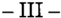

Adujoen su presentación que el decisoriorecurrido incurrió en varias causales de arbitrariedad, por cuanto -manifestóprescindió del texto legal sin suministrar razones plausibles para elloy formuló afirmaciones dogmáticas, carentes de sustentación objetiva indispensable y confundamentos sóloaparentes (artículos 17 a 19, Constitución Nacional).

Sostuvo además, en relación al artículo 245, L.C.T., que la cuestión federal fue introducida con el inicio mismo de la acción, toda vez que objetada la constitucionalidad de aquél por el actor, el inferior falló en sentido contrario a su validez (artículo 14, inciso 3º, ley 48).

Reprochó, concretamente, a la decisión, que haya estimado desproporcionado el monto resultante de la aplicación del tope legal, en relación a lo que le hubiera correspondido percibir de utilizarse comopauta el salario real del actor; que en ello haya fincado el agravio; y que éste sea el único temperamento ajustado al mandato del artículo 14bis de la Constitución Nacional de protección contra el despido arbitrario, desde que nada obstaba a una reparación, por ese concepto, situada en un porcentaje distinto del haber del reclamante.

Defendió, a su turno, la razonabilidad de un sistema que -a su entenderposibilita efectuar previsiones ciertas al empleador y que evita la necesidad de generar evidencias probatorias relativas a la existencia y extensión del daño; sistema que se ve afectado en su equilibrio -afirmópor la decisión de la Alzada, favorable al pago de una prestación dineraria no prevista en ninguna norma, con grave afectación -adujode las garantías de los arto 14, 17 y 19 de la Constitución Nacional.

Citó jurisprudencia de V.E. favorable a su postura, al tiempo que señaló que, calculada la indemnización del actor con base en la resolución 7/89 del Consejo del Salario Mínimo Vital y Móvil (que actualizaba su monto al mes de julio de ese año), no correspondía considerar para la solución de la presente el transcurso del tiempo ni el proceso inflacionario, habida cuenta que producido el despido del actor el 27/07/89, su indemnización se calculó sobre bases recién actualizadas.

Reprochó, además, la aplicación del arto 245, L.C.T. sin tope alguno, englobado, por razones de cercanía temporal, en el régimen reformado por la ley 23.697 y destacó que, aun aplicando el índice inflacio-

nario correspondiente al mes de julio de 1989 (296 %), se obtiene un resultado abismalmente inferior al sueldo percibido por el actor en esa fecha; criterio aquél, que se opone al propósito del arto 245, L.C.T. orientado a morigerar los altos salarios de las categorías gerenciales, respecto de la indemnización por antigüedad.

Afs. 373 evacuó su traslado la contraria.

-IV-

Las cuestiones materia de recurso en esta causa, guardan substancial analogía con las examinadas al emitir dictamen en autos "Bender, Humberto Jorge el Carnea S. A. si accidente" S.C.B 1.799, L. XXXII, con fecha 26/08/98, a cuyos términos y consideraciones cabe remitir, en lo pertinente, para evitar reiteraciones innecesarias.

Por ello, y en tanto juzgo substancialmente reproducidas las circunstancias a que se aludiera en los ítems IV y V del precitado dictamen, opino que corresponde declarar procedente la apelación federal y confirmar o revocar la decisión de mérito con arreglo al criterio entonces expuesto. Buenos Aires, 31 de agosto de 1998. Nicolás Eduardo Becerra.

## FALLODE LACORTE SUPREMA

Buenos Aires, 27 de mayo de 1999.

Vistos los autos: "Recurso de hecho deducido por la demandada en la causa Fabbro, Luis Antonio el Carnea S.A.", para decidir sobre su procedencia.

## Considerando:

1 º) Que contra la sentencia de la Sala II de la C.N.A.T.(fs. 347/352), confirmatoria de la de primera instancia (fs. 296/311), que había hecho lugar, entre otros reclamos, a las diferencias de indemnización por despido y declarado la inconstitucionalidad del arto 245 L.C.T. y de la

Res. 7/89del C.S.M.V.M.,la demandada dedujo el recurso extraordinario (fs. 361/367), cuya denegación dio origen a la queja en examen.

- 2º) Que para decidir en tal sentido el tribunal a qua sostuvo que, cuando la aplicación literal de las normas aludidas determinan una liquidación manifiestamente desproporcionada comoconsecuencia de la hiperinflación existente en ese entonces en el país, teniendo en cuenta el salario efectivamente percibido y la antigüedad del reclamante, cabe declarar la inconstitucionalidad de los referidos preceptos. Consideró que el resarcimiento fijado a partir de un módulo depreciado en un 296 % desde su entrada en vigor, no constituía protección contra el despido arbitrario garantizada en el arto 14 bis de la Constitución Naciana!.
- 3º) Que en la apelación federal la demandada invoca cuestión federal y arbitrariedad. Impugna el fallo por apartamiento de la solución normativa prevista para el caso; sostiene que la protección constitucional mencionada no exige que sea tenido en cuenta el ingreso real del trabajador; afirma que el fundamento de la inconstitucionalidad de la Res. 7/89 por falta de actualización del salario mínimo vital no es aplicable al caso de autos porque, en el presente, había entrado en vigencia el mismo mes del despido; argumenta que si el tribunal estimaba que la aplicación del tope llevaba a un resultado insuficiente debido a la hiperinflación operada en el mes del despido, debió corregirlo teniendo en cuenta los mismos parámetros económicos, sin prescindir de él, a fin de respetar la voluntad del legislador, que estableció la limitación indemnizatoria particularmente en los supuestos en altas remuneraciones, como es el caso del actor. Afirma que la aplicación del tope, con actualización de la Res. 7/89, lleva a un monto inferior al de condena.
- 4º) Que de ambas impugnaciones corresponde considerar en primer término la aducida arbitrariedad pues, de configurarse, no habría sentencia en los términos de la jurisprudencia de esta Corte (Fallos: 312:1034).

La doctrina invocada constituye sustento suficiente para la procedencia de la apelación federal pues el fallo recurrido no brinda respuesta a argumentaciones serias planteadas por el apelante (Fallos: 311:119), sin que los motivos por los que el tribunal se apartó del tope legal satisfagan las exigencias de fundamentación que esta Corte ha especificado en sus precedentes (Fallos: 236:27; 317:1455).

5º) Que, en efecto, en el caso se ha declarado la inconstitucionalidad del arto 245 L.C.T. sin que el a qua haya hecho un desarrollo mínimo de los distintos aspectos de la norma en cuestión, de los principios que la inspiraron y de los intereses contrapuestos que el legisladar se propuso tutelar al establecer el tope a las indemnizaciones por despido arbitrario que, naturalmente, habrá de gravitar, como en el caso de autos, sobre los empleados de las categorías superiores.

6º) Que el despido del actor se produjo en el mes de entrada en vigor de la Res. 7/89 y,si bien el trabajador percibió el crédito a principios del mes siguiente, la depreciación operada desde su vigencia fue inferior a los valores que el a qua estimó. No obstante ello, aun cuando el parámetro legal se hubiera envilecido condicho alcance, el tribunal no hajustificado la determinación del monto indemnizatorio que calculó a partir de la mejor remuneración normal y habitual del trabajador, pese a que la legislación vigente no exige que el módulo del resarcimiento sea idéntico al salario. Su aplicación indeliberada ha importado desoír argumentaciones conducentes planteadas por la demandada.

7º) Que, al expresar agravios (fs. 328 vta. y siguientes) sostuvo la recurrente que, con fundamento en que la fijación de topes no irroga necesariamente un menoscabo a la protección constitucional, si la Res. 7/89 del C.S.M.V.M. no se ajustaba a las pautas que según el magistrado debía respetar, debió adecuar el salario mínimo vital y móvil a las variaciones económicas que habrían dado lugar al alegado envilecimiento, a fin de no romper la ecuación del sistema previsto legalmente y preservar el claro propósito del legislador de limitar las indemnizaciones. Como surge de lo expresado, el a qua no dio respuesta a los agravios que le fueron propuestos oportunamente y que merecían consideración.

8º) Que, en tales condiciones, la sentencia recurrida carece de sustento como acto jurisdiccional válido y ha importado desconocer el derecho de defensa de la demandada al omitir el tratamiento de argumentos de dicha parte que resultaban conducentes para la solución del caso. Se presenta, pues, la relación directa e inmediata entre lo resuelto y las garantías constitucionales invocadas que exige el arto 15 de la ley 48.

Por ello, oído el señor Procurador General, se hace lugar a la queja, se declara procedente el recurso extraordinario y se deja sin efecto la sentencia. Con costas. Vuelvan los autos al tribunal de origen a fin

de que, por quien corresponda, se dicte una nueva con arreglo a lo expresado. Reintégrese el depósito de fs. 1. Hágase saber, agréguese la queja al principal y, oportunamente, remítase.

EDUARDO MOLINÉ O'CONNOR -AUGUSTO CÉSAR BELLUSCIO -ENRIQUE SANTIAGO PETRACCHI -ANTONIO BOGGIANO -GUILLERMO A. F. LÓPEZADOLFO ROBERTO V ÁZQUEZ.

## RICARDO ALFREDO MASTROIANI

## v. ESTABLECIMIENTO MODELO TERRABUSI S.A.!. y C.

RECURSO EXTRAORDINARIO: Requisitos propios. Cuestiones no federales. Sentencias arbitrarias. Procedencia del recurso. Defectos en la fundamentación normativa.

Es arbitraria la sentencia que hizo lugar a la demanda de diferencias de indemnización por despido, con prescindencia del tope establecido en el arto 245 d~ la ley de contrato de trabajo, arto 153 de la ley 24.103, pues los motivos que dio el Tribunal para apartarse del mismo y reemplazarlo por otro, no satisfacen las exigencias de fundamentación que la Corte ha especificado en sus precedentes.

RECURSO EXTRAORDINARIO: Requisitos propios. Cuestiones no federales. Sentencias arbitrarias. Procedencia del recurso. Falta de fundamentación suficiente.

Es una afirmación dogmática fundada en la sola voluntad del juzgador la referencia a la configuración de un "tipo de inequidad" para apartarse del tope establecido en el arto 245 de la L.e.T., arto 153 de la ley 24.103, si no se ha desarrollado mínimamente un estudio de los distintos aspectos de la norma, de los principios que la inspiraron y no se ha efectuado ninguna evaluación acerca de los intereses contrapuestos que el legislador se propuso tutelar al establecer el tope legal de las indemnizaciones por despido arbitrario.

CONSTITUCION NACIONAL: Derechos y garantías. Protección contra el despido arbitrario.

La suposición del a qua de que la garantía constitucional de la protección contra el despido arbitrario consiste en el cierto equilibrio entre el resar-

cimiento del ingreso d'eltrabajador despedido y que dicha proporcionalidad no debe ser inferior al 50 % del salario, constituye una afirmación infundada y, por lo mismo, un exceso en el ejercicio de las facultarles judiciales en desmedro de las que la Constitución asigna al Congreso por 10que la sentencia resulta arbitraria y debe dejarse sin efecto.

DICTAMEN DEL PROCURADOR GENERAL

Suprema Corte:

-1-

La Sala III de la Cámara Nacional de Apelaciones del Trabajo, denegó el remedio extraordinario de la accionada contra el fallo que confirmó el decisorio de mérito, amparada en que sólo concierne a la Corte Suprema apreciar la eventual arbitrariedad de la decisión y en que no se trata, la presente, de una de las hipótesis del arto 14 de la ley 48 (v.fs. 478 del expediente principal).

Contra dicha resolución se alza en queja la demandada (v.fs. 83/99 del cuaderno respectivo).

Ratifica en su presentación la arbitrariedad del decisorio de la Alzada y la existencia de cuestión federal basada en el artículo 14, inciso 1 Q, de la ley 48, toda vez que, dice, se ha cuestionado en el pleito la validez de una ley del Congreso y la decisión ha sido contraria a la misma.

Reproduce, luego, los términos del principal.

Califica, igualmente, de arbitraria a la denegatoria de fs. 478, cuyos argumentos critica, centralmente, por -aduceinfundados e inexactos (v. fs. 96/99 del cuaderno de queja).

-II-

En lo que aquí interesa, corresponde destacar que el actor demandó el pago de diferencias habidas en la liquidación final, dejando plan-

teada la inconstitucionalidad del tope indemnizatorio previsto en el arto 245, L.C.T., texto según ley 24.013, con sustento en que contradice los artículos 3º, C.C.; 14 bis y 17, de la C. N. (v.fs. 12/20); presentación contestada por la contraria a fs. 41152oponiéndose a la petición de inconstitucionalidad (v.fs. 4317), lo que reiteró en su alegato (fs. 409/414).

Acogida la pretensión -con base en la errónea aplicación por la demandada del tope emergente del C.C.T 89/90 (fs. 418/2l)-las partes recurrieron a la Alzada, quien elevó el monto de la condena con amparo en que la garantía constitucional de "protección contra el despido arbitrario" (artículo 14 bis) requiere una proporcionalidad entre la reparación y el ingreso del trabajador despedido, la que no se satisface -a juicio de la Salacuando el módulo de cálculo resulta -como en este casoinferior al 50 % por ciento del salario computable; porcentaje, éste, al que la ad quem elevó ese parámetro a fin de calcular la indemnización. Invocó jurisprudencia (fs. 447/9).

Contra dicha decisión dedujo recurso extraordinario la parte demandada (fs. 453/466).

- III-

Adujo en su presentación que el fallo infringe disposiciones constitucionales contenidas en los artículos 16, 17 y 18, de la C. N. y que, en síntesis, el sistema de protección previsto por el arto 14 bis de la Ley Fundamental no fue vulnerado por su reglamentación legislativa, destacando que el tope previsto por la norma, aparece expresamente referido a los salarios fuera de convenio por el artículo 245, 3er párrafo, de la L.C.T. Por último, que la Sala III excedió su marco de actuación, arrogándose poderes correspondientes a otros departamentos del Estado y prescindiendo, sin razones jurídicas valederas, de la normativa vigente; motivando un enriquecimiento sin causa a favor del actor e incurriendo en arbitrariedad.

Afs. 471/4, evacuó su traslado la contraria.

Estimo'que la apelación federal de fs 453166 es formalmente procedente por cuanto se ha puesto en tela de juicio la validez de una

norma emanada del Congreso de la Nación y la decisión ha sido contraria a su validez, defendida por la aquí recurrente (artículo 14, inciso 1, de la ley 48); sin que quepa detenerse en el examen riguroso de la oportunidad del planteo de esta cuestión por la accionada, pues el tema -introducido por la actora en su demandaha sido tratado y resuelto, en forma específica, en las instancias ordinarias (Fallos: 301:1163 y sus citas); ni que obste a su tratamiento que haya sido mayormente expuesta bajo la alegación de arbitrariedad, puesto que, más allá de la denominación que le haya conferido el quejoso, por ella se pone, centralmente, en debate, la constitucionalidad estricta del arto 245, L.C.T., texto según el artículo 153 de la ley 24.013.

En cuanto al fondo del asunto, las cuestiones materia de recurso en esta causa, guardan substancial analogía con las examinadas por V.E. en "Villarreal, Adolfo c.l Roemmers s.l cobro de salarios"; S.C. "V"202, L. XXXIII; del 10 de diciembre de 1997, a cuyos términos y consideraciones cabe remitir en lo pertinente para evitar reiteraciones innecesarias.

Por todo ello, opino que corresponde declarar procedente la apelación federal y confirmar o revocar la decisión de mérito con arreglo al criterio de este Ministerio Público, expuesto en el ítem final de la causa "Bender, Humberto J. c./ Camea S.A. s./ accidente"; S.C. B 1.799, L. XXXII, dictaminada confecha 26/08/98. Buenos Aires, 31 de agosto de 1998. Nicolás Eduardo Becerra.

## FALLODE LACORTE SUPREMA

Buenos Aires, 27 de mayo de 1999.

Vistos los autos: "Recurso de hecho deducido por la demandada en la causa Mastroiani, Ricardo Alfredo el Establecimiento Modelo Te-

rrabusi Sociedad Anónima de Industria y Comercio", para decidir sobre su procedencia.

## Considerando:

- 1º) Que la Sala III de la Cámara Nacional de Apelaciones del Trabajo (fs. 447/449, foliatura a la que se hará referencia en lo sucesivo) revocó la sentencia de primera instancia e hizo lugar a la demanda de diferencias de indemnización por despido, con prescindencia del tope establecido en el arto 245 de la L.C.T., arto 153 de la ley 24.013. Contra dicha sentencia la demandada interpuso el recurso extraordinario (fs. 453/466) cuya denegación (fs. 478) dio origen a la queja en examen.
- 2º) Que el tribunal a quo sostuvo, ante la impugnación constitucional de la norma citada, que se presentaba un "tipo" de inequidad originado en la desproporción entre el módulo aplicable y el salario del trabajador. Agregó que la garantía constitucional de protección contra el despido arbitrario requiere cierta proporcionalidad entre el resarcimiento y el ingreso del trabajador despedido, que no puede ser inferior al 50 % de su salario. Ajustó, pues, el monto de la indemnización a los resultados de la aplicación de dicha base.
- 3º) Que en la apelación federal (fs. 453/466) la demandada invoca cuestión federal y arbitrariedad. Sostiene que la cámara se ha apartado de la letra de la ley; que en la norma que establece el tope a las indemnizaciones por despido no se hacen distinciones respecto de aquellos que, por ocupar cargos jerárquicos, están fuera del convenio colectivo de trabajo aplicable; aduce que la protección constitucional contra el despido arbitrario no exige que necesariamente sea tenido en cuenta el ingreso real del trabajador; que dicha protección está sujeta a variaciones según las normas que en cada caso rijan para reglamentaria, sin que puedan ser materia de agravio constitucional, salvo que se incrementen hasta la exorbitancia o la reduzcan hasta tornarla irrisoria. Sostiene que dicha situación no se presenta en el caso de autos, en el que se parte de un módulo de $ 1.054, tomado por el juez de primera instancia como base para efectuar el cálculo; ataca la utilización de otro tope sin justificación alguna.
- 4º) Que el recurso extraordinario fundado en la doctrina de la arbitrariedad de sentencias constituye sustento suficiente para la pro-

cedencia de la apelación federal pues los motivos por los que el tribunal se apartó del tope legal y su reemplazo por otro no satisfacen las exigencias de fundamentación que esta Corte ha especificado en sus precedentes (Fallos: 236:27; 317:1455).

5º) Que en efecto, es una afirmación dogmática, fundada en la sola voluntad del juzgador la referencia a la configuración de "un tipo de inequidad", en tanto no se ha desarrollado mínimamente un estudio de los distintos aspectos de la norma, de los principios que la inspiraron, y sin efectuar ninguna evaluación acerca de los intereses contrapuestos que el legislador se propuso tutelar al establecer el tope legal de las indemnizaciones por despido arbitrario que, naturalmente, habrá de gravitar sobre los empleados de las categorías superiores.

6º) Que, en tal sentido, la suposición de que la garantía constitucional de la protección contra el despido arbitrario consiste en el cierto equilibrio entre el resarcimiento y el ingreso del trabajador despedido y que dicha proporcionalidad no debe ser inferior al 50 % del salario constituye una afirmación infundada y, por lo mismo, un exceso en el ejercicio de las facultades judiciales en desmedro de la que la Constitución asigna al Congreso, que priva de validez al fallo recurrido.

Se advierte, pues, la relación directa e inmediata entre lo resuelto y las garantías constitucionales invocadas por el apelante, que exige el arto 15 de la ley 48.

Por ello, oído el señor Procurador General, se hace lugar a la queja, se declara procedente el recurso extraordinario y se deja sin efecto la sentencia. Con costas. Vuelvan los autos al tribunal de origen a fin que, por quien corresponda, se dicte una nueva con arreglo a lo expresado. Reintégrese el depósito de fs. 1.Agréguese la queja al principal, hágase saber y, oportunamente, remítase.

JULIO S. NAZARENO -EDUARDO MOLINÉ O'CONNOR -AUGUSTO CÉSAR BELLUSCIO -ENRIQUE SANTIAGO PETRACCHI -ANTONIO BOGGlANO -GUILLERMO A. F. LÓPEZ -ADOLFO ROBERTO V ÁZQUEZ.

## DE JUSTICIA DE LANACION 322

## MARCELO FELIX MUELAS v. LA INTERNACIONAL EMPRESA DE TRANSPORTE DE PASAJEROS S.A.

## RECURSO EXTRAORDINARIO: Principios generales.

El recurso extraordinario contra la sentencia que admitió la indemnización por despido es inadmisible (art. 280 del Código Procesal Civil y Comercial de la Nación).

RECURSO EXTRAORDINARIO: Requisitos propios. Cuestiones no federales. Sentencias arbitrarias. Procedencia del recurso. Valoración de circunstancias de hecho y prueba.

Aun cuando los agravios remitan al examen de cuestiones de hecho y prueba, ajenas -como regla y por su naturalezaal recurso extraordinario, tal circunstancia no impide la apertura del recurso cuando, sobre la base de afirmaciones dogmáticas y razonamientos abstractos, consecuencia de una irrazonable valoración de las constancias de la causa, se desvirtúa la eficacia que -según las reglas de la sana críticacorresponde atribuir a la prueba instrumental agregada, vulnerando así las garantías de propiedad y la defensa en juicio (Disidencia de los Dres. Eduardo Moliné O'Connor, Augusto César Belluscio y Guillermo A. F. López).

## JUICIO CIVIL.

El proceso civil no puede ser conducido en términos estrictamente formales, ya que no se trata del cumplimiento de ritos caprichosos, sino del desarrollo de procedimientos destinados al establecimiento de la verdad jurídica objetiva, que es su norte (Disidencia de los Dres. Eduardo Moliné O'Connor, Augusto César Belluscio y Guillermo A. F. López).

RECURSO EXTRAORDINARIO: Requisitos propios. Cuestiones no federales. Sentencias arbitrarias. Procedencia del recurso. Exceso ritual manifiesto.

Corresponde dejar sin efecto la sentencia que admitió la indemnización por despido, si para ello incurrió en una renuncia consciente a la verdad en orden a un hecho decisivo para resolver el litigio, al desvirtuar una prueba conducente por desmedido rigor formal y, en consecuencia, no presentarse como una conclusión razonada del derecho vigente con particular referen~ cia a las circunstancias comprobadas de la causa (Disidencia de los Dres. Eduardo Moliné O'Connor, Augusto César Belluscio y Guillermo A. F. López).

## FALLODE LACORTE SUPREMA

Buenos Aires, 27 de mayo de 1999.

Vistos los autos: "Recurso de hecho deducido por la demandada en la causa Muelas, Marcelo Félix d La Internacional Empresa de Transporte de Pasajeros S.A.", para decidir sobre su procedencia.

## Considerando:

Que el recurso extraordinario, cuya denegación motivó la presente queja, es inadmisible (art. 280 del Código Procesal Civil y Comercial de la Nación).

Por ello, se desestima la queja. Declárase perdido el depósito de fs. 1. Hágase saber YI oportunamente, archívese, previa devolución de los autos principales.

JULIO S. NAZARENO -EDUARDO MOLINÉ O'CONNOR (en disidencia) -AUGUSTO CÉSAR BELLUSCIO (en disidencia) -ENRIQUE SANTIAGO PETRACCHI -ANTONIO BOGGIANO -GUILLERMO A. F. LÓPEZ (en disidencia) -GUSTAVO A. BOSSERT -ADOLFO ROBERTO VÁZQUEZ.

DISIDENCIA DEL SEÑOR VICEPRESIDENTE DOCTOR DON EDUARDO MOLINÉ O'CONNOR y DE LOS SENORES MINISTROS DOCTORES DON AUGUSTO CÉSAR BELLUSCIO y DON GUILLERMO A. F. LÓPEZ

## Considerando:

1 º) Que contra la sentencia de la Sala IV de la Cámara Nacional de Apelaciones del Trabajo que resolvió confirmar la de anterior instancia que había admitido la indemnización por despido, la demandada interpuso el recurso extraordinario cuya denegación motiva la presente queja.

2º) Que los agravios del recurrente suscitan cuestión federal que habilita la vía intentada, pues si bien es cierto que remiten al examen

de cuestiones de hecho y prueba, ajenas -como regla y por su naturalezaa la instancia del arto 14 de la ley 48, tal circunstancia no impide la apertura del recurso cuando, sobre la base de afirmaciones dogmáticas y razonamientos abstractos, consecuencia de una irrazonable valoración de las constancias de la causa, desvirtuó la eficacia que -según las reglas de la sana críticacorrespondía atribuir a la prueba instrumental agregada, vulnerando así las garantías de la propiedad y la defensa enjuicio.

3º) Que ello es así pues el a quo consideró que la demandada no había rebatido los argumentos del juez de grado, según el cual "el único modo"de acreditar las circunstancias referidas en las actas acompañadas en copia simple (fs. 44/49 y 52/54) -vinculadas con los hechos que habrían justificado el despidohabría sido apelando a los respectivos originales por medio de la prueba informativa, conclusión que revela un excesivo rigor formal incompatible con las reglas del debido proceso y el adecuado servicio de justicia, ello por cuanto obraban agregadas a la causa copias auténticas de los referidos documentos (conf. causa penal Nº 66.352, "Naveiro, Miguel sI denuncia", que en copia certificada cOFe como anexo 1181).

- 4º) Que no obsta a lo expuesto la breve reflexión que se agrega en el considerando siguiente, toda vez que el hecho de que la certificación de las piezas señaladas se hubiese practicado sobre las "copias certificadas" obrantes en el expediente penal y no respecto de "los originales de las actas en cuestión" constituye una circunstancia irrelevante, que no priva de eficacia a los instrumentos aludidos a los fines de "probar los hechos que presuntamente constan en tales actuaciones".

5º) Que, una vez más, es conveniente recordar -como esta Corte sostuvo en Fallos: 238:550, "Domingo Colalillo"que el proceso civil no puede ser conducido en términos estrictamente formales, ya que no se trata del cumplimiento de ritos caprichosos, sino del desarrollo de procedimientos destinados al establecimiento de la verdad jurídica objetiva, que es su norte (Fallos: 320:730 y 2209). A la luz de lo expuesto, la sentencia recurrida -al desvirtuar una prueba conducente por desmedido rigor formalincurrió en una renuncia consciente a la verdad en orden a un hecho decisivo para resolver el litigio y, en consecuencia, no se presenta como una conclusión razonada del derecho vigente con particular referencia a las circunstancias comprobadas de la causa, razón por la que corresponde su descalificación como acto jurisdiccional válido.

Por ello, con el alcance indicado, se hace lugar a la queja, se declara procedente el recurso extraordinario y se deja sin efecto la sentencia apelada. Con costas (art. 68 del Código Procesal Civil y Comercial de la Nación). Vuelvan los autos al tribunal de origen a fin de que, por medio de quien corresponda, se proceda a dictar un nuevo fallo con arreglo a lo expresado. Agréguese la queja al principal. Devuélvase el depósito de fs. 1. Notifiquese y remítase.

EDUARDO MOLINÉ O'CONNOR -AUGUSTO CÉSAR BELLUSCIO GUILLERMO A. F. LÓPEZ.

OMEGA COOPERATIVA DE SEGUROS LIMITADA (TF 14.771-1) v. DIRECCION GENERAL IMPOSITIVA

RECURSO EXTRAORDINARIO: Principios generales.

El recurso extraordinario contra la sentencia que rechazó la repetición pretendida por la aetara, por entender que el acogimiento de aquélla a los regímenes establecidos por los decretos 631/92, 932/93 y 316/95 obstaba a la posibilidad de reclamar los pagos efectuados, es inadmisible (art. 280 del Código Procesal Civil y Comercial de la Nación).

RECURSO EXTRAORDINARIO: Requisitos propios. Cuestión federal. Cuestiones federales simples. Interpretación de las leyes federales. Leyes federales en general.

Procede el recurso extraordinario si está controvertida la inteligencia de normas de naturaleza federal, y la sentencia definitiva del superior tribunal de la causa es contraria a las pretensiones que la recurrente sustenta en ellas (Disidencia del Dr. Eduardo Moliné ü'Connor).

IMPUESTO: Repetición.

Los arts. 14, 12 Y 12 de los decretos 631/92, 932/93 y 316/96, respectivamente, disponen que si se trata de obligaciones impositivas que se hallan comprendidas en determinaciones y liquidaciones efectuadas por la Direc-

ción General Impositiva, que se encuentren en discusión administrativa, contenciosoadministrativa o judicial a la fecha de publicación de los mismos en el Boletín Oficial, los responsables deberán allanarse y renunciar expresamente a toda acción y derecho, incluso el de repetición relativos a la causa, y en su caso abonar las costas del juicio, en la forma y condiciones que disponga el mencionado organismo (Disidencia del Dr. Eduardo Moliné O'Connor).

## LEY: Interpretación y aplicación.

Las leyes deben interpretarse teniendo en cuenta su contexto general y los fines que las informan y de la manera en que mejor se compadezcan con los principios y garantías constitucionales, en tanto no fuerce indebidamente la letra o el espíritu del precepto que rige el caso (Disidencia del Dr. Eduardo Moliné O'Connor).

## LEY: Interpretación y aplicación.

No cabe atribuir a las disposiciones emanadas de los Decretos 631/92, 932/93 Y316/96, por vía de interpretación, un alcance que difiera de la literalidad del texto, pues ello implicaría, sin apoyo normativo, que los contribuyentes que optaron por beneficiarse con un plan de facilidades respecto de obligaciones fiscales no debatidas, se viesen privados de reclamar alegando que el pago efectuado es mayor que el que les correspondía (Disidencia del Dr. Eduardo Moliné O'Connor).

## RENUNCIA.

Con respecto al arto 8l! de la ley 23.029, la regla de jurisprudencia según la cual el cumplimiento voluntario y sin reservas de una norma es una actitud a la que cabe asignar "el carácter de una renuncia", se basa en una interpretación judicial de la conducta del particular actuante y de ningún modo puede prevalecer contra una prescripción normativa que disponga, inequívocamente, lo contrario (Disidencia del Dr. Eduardo Moliné ü'Connor).

## IMPUESTO: Principios generales.

Si el legislador tuvo ante él, varias situaciones posibles (fundamentalmente la de un gravamen debatido en sede administrativa y judicial y la de un gravamen no debatido art. 812 de la ley 23.029) y, en tales circunstancias, sólo legisló sobre una de ellas, es lógico entender que se quiso excluir a todas las demás (Disidencia del Dr. Eduardo Moliné O'Connor).

## FALLOS DE LA CORTE SUPREMA

## FALLODE LACORTE SUPREMA

Buenos Aires, 27 de mayo de 1999.

Vistos los autos: "Recurso de hecho deducido por la actora en la causa Omega Cooperativa de Seguros Limitada (TF 14.771-I) cl Dirección General Impositiva", para decidir sobre su procedencia.

## Considerando:

Que el recurso extraordinario, cuya denegación origina la presente queja, es inadmisible (art. 280 del Código Procesal Civil y Comercial de la Nación).

Por ello, se desestima el recurso de hecho planteado. Declárase perdido el depósito de fs. 18. Notifiquese y,oportunamente, archívese previa devolución de los autos principales.

EDUARDO MOLINÉ O'CONNOR (en disidencia) -CARLOS S. FAYT -AUGUSTO CÉSAR BELLUSCIO -ANTONIO BOGGIANO -GUSTAVO A. BOSSERTADOLFO ROBERTO VÁZQUEZ.

DISIDENCIA DEL SEÑOR VICEPRESIDENTE DOCTOR DON EDUARDO MOLINÉ O'CONNOR

## Considerando:

- 1 º) Que la Sala V de la Cámara Nacional de Apelaciones en lo Contencioso Administrativo Federal confirmó la sentencia del Tribunal Fiscal que rechazó la repetición pretendida por la actora. Para así decidir, juzgó que el acogimiento de aquélla a los regímenes establecidos por los decretos 631/92, 932/93 y 316/95 obstaba a la posibilidad de reclamar la restitución de los pagos efectuados.
- 2º) Que tras señalar que el Tribunal Fiscal, al decidir del modo comolo hizo sin que hubiese mediado un planteamiento de la cuestión por el organismo recaudador, no se había excedido de las facultades

conferidas por el arto 146 de la ley 11.683(t.o. en 1978) ni había afectado el derecho de defensa de la actora, consideró acertada la aplicación que dicho tribunal hizo de la doctrina establecida por esta Corte en el precedente "Medefín S.A.elD.G.!.",coincidente con un pronunciamiento de la Sala III de la misma cámara, habida cuenta que en ellos se analizan "las consecuencias del acogimiento voluntario a planes de facilidades de pago en general, independientemente de que éstos hayan sido creados por una ley o por un decreto, concluyéndose en que quienes optaron por acogerse a dichos regímenes se someten voluntariamente al cumplimiento de los requisitos exigidos a tales efectos, obstando a su impugnación ulterior" (fs. 186 de los autos principales).

3º) Que la cámara sostuvo asimismo que el hecho de que el contribuyente no se encontrase sometido ajuicio de ejecución fiscal o discusión judicial o administrativa no alteraba la decisión del caso, toda vez que "elsentido de la norma implica otorgar derechos a todos aquellos que opten regularizar su situación impositiva sin hacer distinciones por lo que todos ellos quedan también sujetos a las mismas condiciones ...".Agregó que los beneficios otorgados por los mencionados decretos resultan inescindibles de las obligaciones y condiciones que ellos imponen.

42) Que contra dicho pronunciamiento la actora interpuso recurso extraordinario, cuya denegación dio origen a la queja en examen. La recurrente tacha de arbitraria a la sentencia porque, en su concepto, no puede ser rechazada la repetición sobre la base de fundamentos -como los considerados por el Tribunal Fiscal y la cámaraque no fueron planteados por el organismo recaudador. Por otra parte, aduce que los decretos que establecieron los regímenes de moratoria en cuyo marco efectuó los pagos sólo atribuyen al acogimiento el efecto de una renuncia a una ulterior demanda de repetición en los casos en que hubiese mediado una controversia administrativa, contenciosoadministrativa o judicial a la fecha de publicación de tales decretos. Por último, sostiene que si las normas tuviesen el alcance que les asignó el a quo, ellas resultarían inconstitucionales porque afectarían la garantía de la defensa en juicio y el derecho de propiedad.

5º) Que el primero de los agravios mencionados remite al examen de una cuestión de derecho procesal, ajena por su naturaleza a la instancia extraordinaria, que ha sido resuelta por el a qua mediante fundamentos de igual carácter, que son suficientes para desestimar la tacha de arbitrariedad.

6º) Que en lo referente al segundo agravio del apelante, el recurso interpuesto resulta admisible toda vez que está controvertida la inteligencia de normas de naturaleza federal, y la sentencia definitiva del superior tribunal de la causa es contraria a las pretensiones que la recurrente sustenta en ellas.

7º) Que los arts. 14 del decreto 631/92, 12 del decreto 932/93 y 12 del decreto 316/95 disponen que si se trata de obligaciones que se hallan comprendidas en determinaciones y liquidaciones efectuadas por la Dirección General Impositiva, que se encuentren en discusión administrativa, contenciosoadministrativa o judicial a la fecha de publicación de los respectivos decretos en el Boletín Oficial, los responsables deberán allanarse y renunciar expresamente a toda acción y derecho, incluso el de repetición relativos a la causa, y en su caso abonar las costas del juicio, en la forma y condiciones que disponga el mencionado organismo.

8º) Que, ello aclarado, dado que la controversia consiste en determinar si la única referencia que se formula en los citados decretos con respecto a la renuncia del derecho de repetición, queda o no limitada a aquellos casos que se debaten en sede administrativa ojudicial, se advierte la analogía entre la presente causa y el precedente "Medefín" -publicado en Fallos: 314:1175- atento a la similitud entre tales normas y el arto 8º de la ley 23.029, cuya inteligencia se debatía en esos autos.

9º) Que, por lo tanto, resulta aplicable al sub examine el criterio expuesto en el voto en disidencia emitido en ese precedente por el juez Moliné O'Connor, de acuerdo con el cual no cabe atribuir a las disposiciones en examen, por vía de interpretación, un alcance que difiera de la literalidad del texto (Fallos: 310:865), pues ello implicaría, sin apoyo normativo, que los contribuyentes que optaron por beneficiarse con un plan de facilidades respecto de obligaciones fiscales no debatidas, se viesen privados de reclamar alegando que el pago efectuado es mayor que el que correspondía.

10) Que, tal como se señaló en la mencionada disidencia con respecto al arto 8º de la ley 23.029, al margen del fundamento que pueda corresponder al texto literal de las normas de los decretos antes citados, parece importante subrayar que la regla de jurisprudencia según la cual el cumplimiento voluntario -y sin reservasde una norma es una actitud a la que cabe asignar "el carác-

ter de una renuncia" (Fallos: 297:40; 299:373; 300:51; 302:1264, entre muchos otros) se basa en una interpretación judicial de la conducta del particular actuante y de ningún modo puede prevalecer contra una prescripción normativa que disponga, inequívocamente lo contrario. Así sucede en el caso, por cuanto si los decretos ··.... tuvieron presente varias situaciones posibles (fundamentalmente, la de un gravamen debatido en sede administrativa ojudicial y la de un gravamen no debatido) y, en tales circunstancias, sólo se pronunciaron sobre una de ellas, es lógico entender que se quiso excluir a todas las demás.

11)Que la conclusión que se alcanza hace inoficiosa la consideración del planteo de inconstitucionalidad efectuado por el apelante.

Por ello, se hace lugar a la queja, se declara procedente el recurso planteado con el alcance que. resulta de la presente, y se revoca la sentencia apelada, con costas; debiendo volver los autos al tribunal de origen a fin de que por quien corresponda se prosiga con el trámite de la causa. Notifíquese. Agréguese la queja al principal. Devuélvase el depósito de fs. 18 y remítase.

EDUARDOMOLINÉ O'CONNOR.

## PODER POLITICO DE LOS JUBILADOS

## PARTIDOS POLITICOS.

El arto 16 de la ley 23.298 requiere que el nombre de los partidos políticos se distinga del de otros razonable y claramente.

## PARTIDOS POLITICOS.

En caso de escisión partidaria, el arto 16 de la ley 23.298 establece que el grupo desprendido carece de derecho a emplear total o parcialmente el nombre originario del partido o agregarle aditamentos.

1010

RECURSO EXTRAORDINARIO: Requisitos propios. Cuestiones no federales. Sentencias arbitrarias. Procedencia del recurso. Defectos en la fundamentación nor. mativa.

Es arbitrario el pronunciamiento que, al rechazar la oposición formulada por un partido político al uso del nombre propuesto por la agrupación que solicitó su reconocimiento, omitió considerar que se trataba de una agrupación partidaria escindida de su oponente, pues ello era determinante del criterio con que deben ser apreciados los requisitos legales, previstos en forma específica y con mayor rigor, para ese supuesto que para los casos generales.

## DICTAMEN DE LA PROCURADORA FISCAL

Suprema Corte:

-1-

En estos autos, el apoderado del partido "Poder Político de los Jubilados", solicitó el reconocimiento de la personalidadjurídico-política de dicha agrupación.

Se opuso a ello el apoderado del "Frente de los Jubilados", al afirmar que, en virtud de los arts. 14 y 16 de la ley 23.298, no corresponde la utilización por la entidad solicitante de la expresión "de los jubilados", si se tiene en cuenta que constituye el 75 % del nombre de su propio partido y el 60 % del nombre de aquélla. También adujo que se trata, en el caso, de una escisión, ya que algunas de las autoridades del nuevo partido son ex-integrantes de los distintos órganos de conducción del "Frente de los Jubilados", circunstancia que impide que puedan utilizarse siquiera parcialmente los vocablos cuestionados, a tenor del citado arto 16 in fine.

-II-

A fs. 75/81 de los autos principales (a los que corresponderán las siguientes citas), la Cámara Nacional Electoral confirmó la sentencia de primera instancia que rechazó la oposición introducida en el sub lite.

Para así decidir, expresaron sus integrantes -en síntesislo siguiente: a) que no existe probabilidad de confusión entre ambas agrupaciones si se toman los nombres en su integridad; b) que no es posible que en el actual contexto político cultural de la ciudadanía, un elector se confunda y se afilie o incline su voluntad por un partido, llevado únicamente por su nombre, pues el sufragio debe tener una fundamentación racional y son los propios partidos políticos quienes, mediante una adecuada divulgación, deben despejar las dudas que, en cuanto a las ideas sostenidas por los mismos, puedan abrigar los ciudadanos; c)los vocablos "de losjubilados" no pueden ser monopolizados por ninguna agrupación desde que ningún partido puede pretender para sí la exclusividad en la representación política del sector del electorado constituido por quienes se encuentran en situación de pasividad; d) frente a lo anterior, el tema vinculado con la supuesta escisión deviene insustancial, toda vez que la finalidad de la restricción contenida en el arto 16 in fine de la ley electoral no es otra que impedir confusiones en los nombres de los partidos.

-III-

Disconforme, el representante del "Frente de los Jubilados" interpuso el recurso extraordinario de fs. 86/91, cuya denegatoria por el a qua motiva la presente queja.

Adujo, en lo sustancial, que la sentencia es arbitraria, porque existe una seria confusión entre el nombre de su propio partido y el del la agrupación peticionaria, toda vez que éste se integra con el 75 % del primero, extremo que tornaría inaplicable la doctrina de V.E. citada por el a qua. Además, dijo que se omitió aplicar el último párrafo del arto 16 de la ley 23.298, pese a que la agrupación solicitante es una escisión del "Frente de los Jubilados" y que se trata en el caso de interpretar una "súper ley", como lo es la legislación electoral a partir de la incorporación -al texto constitucional reformado en 1994del arto 68 bis.

Cabe señalar que la primera de las cuestiones planteadas por el apelante remite a un análisis puramente fáctico, pues, pese a que se aduce que se encuentra en tela de juicio la interpretación del citado arto 16 de la ley 23.298, ello no es así, desde mi punto de vista, toda

vez que su dilucidación consiste, pura y exclusivamente, en determinar si las denominaciones "Poder Político de los Jubilados" y "Frente de los Jubilados" se distinguen o no "razonable y claramente" en los términos de la norma legal citada.

En tales condiciones, cabe concluir que los agravios expresados sobre el punto traducen, a lo sumo, meras discrepancias de quien los formula con lo declarado por los jueces de la causa (ver supra Cap. n, puntos a, b y c), con suficientes fundamentos de hecho y prueba que, más allá de su acierto o error, ponen al pronunciamiento de fs. 75/81 a resguardo de la tacha de arbitrariedad (conf. Fallos: 313:473 y 1222, entre muchos otros).

En efecto, por todo agravio, el recurrente se limita a efectuar un cálculo porcentual del número de palabras que integran las denominaciones comparadas, sin referirse al sentido que ellas contienen, de tal forma que no ha logrado controvertir los fundamentos de la sentencia. Así lo pienso, máxime cuando, de acuerdo con lo expresado por este Ministerio Público en un precedente análogo, "norespondería a un genuino proceder democrático y pluralista cercenarle, a un grupo de ciudadanos que se organizan políticamente, en el ámbito del régimen legal que regula la materia, el derecho de incorporar --en su exclusiva nomenclatura partidariael vocablo que los identifica con ésta u otra concepción filosófica genérica, al modo comoen otros ejemplos, distintas agrupaciones han optado por identificarse con los vocablos "cristiano" o "demócrata". Pensar, en tal sentido, que por una mera prelación temporal la ley sólo admitiera el uso de tales identificaciones a la agrupación que lo requirió primero, significaría desnaturalizar los alcances y propósitos legales e imponer un inaceptable valladar al trascendente ejercicio del pluralismo" (conf. dictamen de la suscripta, a cuyos fundamentos y conclusiones se remitió el Tribunal en Fallos: 311:2666).

-v-

El modo como en definitiva opino que corresponde definir el problema analizado en el capítulo anterior, me exime analizar las quejas que se vinculan con el eventual supuesto de escisión y, en punto a éste, con la aplicación o no de la ley 23.298, por constituir, en consecuencia, una cuestión insustancial (conf., penúltimo párrafo del dictamen citado precedentemente).

En virtud de lo expuesto, es mi parecer que el recurso extraordinario de fs. 86/91 es improcedente y, por lo tanto, que corresponde rechazar la presente queja, deducida a raiz de su denegatoria. Buenos Aires, 8 de abril de 1998. María Graciela Reiriz.

## FALLODE LACORTE SUPREMA

Buenos Aires, 27 de mayo de 1999.

Vistos los autos: "Recurso de hecho deducido por Frente de los Jubilados -distrito Capital Federal en la causa Poder Político de los Jubilados si reconocimiento", para decidir sobre su procedencia.

## Considerando:

l°) Que contra la sentencia dictada por la Cámara Nacional Electoral que, al confirmar la de primera instancia, rechazó la oposición formulada por el partido "Frente de los Jubilados" al uso del nombre "Poder Político de los Jubilados" por la agrupación que solicitó su reconocimiento bajo tal denominación, dedujo la afectada el recurso extraordinario cuya denegación dio lugar a la presente queja.

- 2°)Que la apelante solicita la descalificación del fallo por aplicación de la doctrina de esta Corte en materia de arbitrariedad de sentencias, alegando que la cámara omitió el examen de una cuestión trascendente -la de tratarse de una agrupación escindida de su propio partido político-, defecto que la llevó a formular una inadecuada aplicación de las normas legales que rigen el caso, que se tradujo en la afectación de las garantías constitucionales invocadas por la recurrente.
- 3°) Que esta Corte señaló en Fallos: 319:1640, que el arto 16 de la ley 23.298 contempla dos supuestos. El primero, concebido como una prohibición genérica dirigida a todos los partidos, impone que su nombre se distinga del de otros razonable y claramente. El segundo, de carácter específico, considera que, dado el caso de una escisión partidaria, el grupo desprendido carece de derecho a emplear total o par-

cialmente el nombre originario del partido o agregarle aditamentos. Se advierte, pues, que el legislador ha sometido a exigencias diversas una misma cuestión -la del nombre partidariosegún se trate de una agrupación originaria o escindida (cons. 6º).

Así, resaltó esta Corte "la voluntad del legislador de tutelar de un modo más enérgico el nombre de los partidos políticos cuando éstos se enfrentan con fracciones que se independizan". Juzgó tal principio razonable, pues "según revela la experiencia, tales circunstancias dan pábulo a la confusión del electorado y a la captación indebida de adherentes que son, precisamente, las desviaciones que el sistema de la ley 23.298 procura eliminar mediante una restricción más intensa al principio de la libre elección del nombre que, así, constituye un arbitrio proporcionado a los fines perseguidos." (cons. 11).

4º) Que, desde tal perspectiva, resultaba prioritario examinar si, en el caso, la entidad que solicitaba su reconocimiento bajo el nombre cuestionado era en realidad una agrupación partidaria escindida de su oponente, pues dilucidar ese aspecto de la cuestión es determinante del criterio con que han de ser apreciados los requisitos legales, previstos en forma específica y con mayor rigor, para ese supuesto que para los casos generales.

5º) Que la omisión en que incurrió el a quo en el aspecto indicado, lo condujo a efectuar una inadecuada aplicación de las normas que rigen el caso, que las desvirtúa y las priva de su verdadero sentido, de modo que impone la descalificación del fallo por aplicación de la conocida doctrina de esta Corte en materia de arbitrariedad de sentencias, en tanto existe relación directa entre lo resuelto y las garantías constitucionales que se dicen afectadas.

Por ello, oída la señora Procuradora Fiscal, se admite la queja, se declara procedente el recurso extraordinario deducido y se deja sin efecto el fallo. Vuelvan los autos al tribunal de origen a fin de que, por quien corresponda, se dicte nuevo pronunciamiento con arreglo a lo resuelto. Agréguese la queja al principal. Notifíquese y remítase.

JULIO S. NAZARENO -EDUARDO MOLINÉ O'CONNOR -CARLOS S. FAYTAUGUSTO CÉSAR BELLUSCIO -ANTONIO BOGGIANO -GUILLERMO A. F. LÓPEZ -GUSTAVO A. BOSSERT -ADOLFO RoBERTO VÁZQUEZ.

## DE JUSTICIA DE LA NACION 322

## LORENZO PEPE

RECURSO DE NULIDAD.

Las sentencias de la Corte no son susceptibles del recurso de nulidad.

## ACLARATORIA.

Corresponde rechazar el recurso de aclaratoria cuando la sentencia de la Corte es suficientemente clara.

## FALLO DE LA CORTE SUPREMA

Buenos Aires, 27 de mayo de 1999.

Autos y Vistos; Considerando:

- 1º) Que los actores, en los escritos de fs. 7391741y 742, plantean los recursos de nulidad y aclaratoria, respectivamente, contra la resolución de esta Corte del 13 de abril de 1999 que hizo lugar a la queja, declaró procedente el recurso extraordinario y, en ejercicio de las facultades que otorga al Tribunal el arto 16, segunda parte, de la ley 48, revocó el fallo de cámara de fs. 555/565 y rechazó íntegramente la demanda.
- 2º) Que en el caso no existe motivo para apartarse de la conocida jurisprudencia de este Tribunal en cuanto a que las sentencias de la Corte no son susceptibles del recurso de nulidad (Fallos: 303:241; 306:2070; 310:1917; 311:1455; 312:2106; 313:428; 316:64; 317:1688; 318:2106) y, de manera general, de recurso alguno (Fallos: 286:50; 294:33; 304:1921; 307:560, entre muchos otros).
- 3º) Que por lo demás y en relación con la restante petición articulada, por ser suficientemente clara la sentencia de la Corte, no ha lugar a lo peticionado.

Por ello, se desestima lo solicitado a fs. 739/741, 742 Y743 yestése a lo resuelto a fs. 728/733. Notifíquese.

JULIO S. NAZARENO -EDUARDO MOLINÉ O'CONNOR -ANTONIO BOGGIANO (por su voto) GUILLERMO A. F. LÓPEZ -ADOLFO ROBERTO V ÁZQUEZ.

VOTO DEL SEÑOR MINISTRO DOCrOR DON ANTONIO BOGGIANO

## Considerando:

- 1 º) Que según reiterada jurisprudencia de la Corte sus sentencias no son susceptibles de recurso de nulidad (Fallos: 308:300; 310:1001, 1387 y 1917; 311:1788, entre muchos otros).
- 2º) Que no se advierten en la especie razones que permitan hacer excepción a tal principio. Ello es así, por cuanto de las constancias mencionadas por el presentante no surge el agotamiento de la via partidaria (art. 57, ley 23.298). En efecto, aquél se limitó a enviar un telegrama con anterioridad a la reunión del congreso partidario a fin de que se le informe si habia sido convocado sin que surja que se haya presentado ante aquel órgano a fin de verificar su poder.

En segundo lugar esta Corte no incurrió en incongruencia al tratar el tema del agotamiento de la vía partidaria por cuanto éste se hallaba inescindiblemente ligado con la cuestión concerniente al número de congresales requeridos para la validez.

- 3º) Que por ser suficientemente clara la sentencia defs. 728/733 no da lugar a la aclaratoria solicitada.

Por ello, se desestiman las articulaciones de fs. 739/741 y 742/743 Yestés e a lo resuelto a fs. 728/733. Notifíquese.

ANTONIO BOGGIANO.

## DE JUSTICIA DE LANACION 322

## ALICIA GRACIELA RANZUGLIA v. FUNDACION UNIVERSIDAD DE BELGRANO

RECURSO EXTRAORDINARIO: Requisitos propios. Cuestiones no federales. Interpretación de normas y actos comunes.

Procede el recurso extraordinario contra la sentencia que elevó el monto de condena correspondiente a la indemnización por despido, con prescin~ dencia del tope previsto en el art. 245 de la Ley de Contrato de Trabajo (ley 24.013), si para así decidir prescindió de la norma aplicable al caso y se apoyó en pautas de excesiva latitud que redundan en menoscabo de la ade. cuada fundamentación exigible a los fallos judiciales y lesionan seriamente el derecho de defensa en juicio de la impugnante.

## CONTRATO DE TRABAJO.

El arto 245 de la Ley de Contrato de Trabajo prevé un límite al monto de las indemnizaciones por despido a partir de la aplicación de un módulo que deriva del promedio de las remuneraciones previstas en el convenio colecti. va de trabajo aplicable al trabajador al momento del despido y es el Ministerio de Trabajo y Seguridad Social el encargado de fijar y publicar el monto que corresponda juntamente con las escalas salariales de cada convenio colectivo de trabajo.

RECURSO EXTRAORDINARIO: Requisitos propios. Cuestiones no federales. Sentencias arbitrarias. Procedencia del recurso. Defectos en la fundamentación normativa.

Corresponde dejar sin efecto la sentencia que desconocióla limitación legal del art.245 de la Ley de Contrato de Trabajo (ley 24.013) con base en una argumentación falsa que no contempla los distintos aspectos de la norma, los principios que la inspiraron y el equilibrio de intereses contrapuestos que el legislador ha consagrado al establecerla legalmente, lo que revela un serio desapego a la condición de órganos de aplicación del derecho vigente y a las formas sustanciales de la garantía constitucional de la defensa en juicio.

RECURSO EXTRAORDINARIO: Requisitos propios. Cuestiones no federales. Sentencias arbitrarias. Procedencia del recurso. Defectos en la fundamentación normativa.

Corresponde dejar sin efecto la sentencia que desconoció la limitación legal del arto 245 de la Ley de Contrato de Trabajo (ley 24.013) ya que los moti. vos de equidad subjetivamente apreciados no pueden servir de pretexto para que los jueces dejen de aplicar las normas legales cuya sanción y abrogación está reservada a otros poderes del estado.

## FALLOS DE LA CORTE SUPREMA 322

## DICTAMEN DEL PROCURADOR GENERAL

Suprema Corte:

-1-

La Sala VI de la Cámara Nacional deApelaciones del Trabajo confirmó, en lo principal, la sentencia de primera instancia, modificándola en cuanto al monto de la indemnización por despido (fs. 375/6). Con breves consideraciones, desechó la causal alegada por la demandada y tras confirmar el carácter remuneratorio del rubro "falla de caja", hizo lo propio con la sanción impuesta a la accionada en virtud del artículo 275 de la L.C.T., por encontrar que la contestación de demanda reveló -a su modo de veruna conducta maliciosa.

En cuanto a la apelación sobre el tope indemnizatorio aplicado por el juez a quo, hizo lugar al agravio y consideró "equitativo" que se reconozca a la actora, como módulo para el cálculo de este rubro -en su carácter de jefe de la asociación mutualla suma promedio del acta-acuerdo sus cripta por la accionada (v. fs. 243); aun cuando ella -admitióno se corresponde, en lo estricto, con la del artículo 245 de la L.C.T. Advirtió, empero, que, en rigor, devino procedente la utilización como parámetro del mejor salario normal y habitual de la reclamante, por cuanto el triplo de aquella suma excedía de esa remuneración.

Contra dicha resolución, interpuso recurso extraordinario la accionada (fs. 380/8), el que, contestado a fs. 390/3 y denegado a fs. 395 -con apoyo en que remite al examen de aspectos de hecho y de derecho procesal y comúndio lugar a la presente queja.

En ella, tras reproducir, en lo substantivo, las alegaciones del principal, la presentante acusa la falta de fundamentación de la denegatoria. Arguye, además, que el interés del 15 % anual aplicado como sanción resulta confiscatorio, dado que, sumado a igual tasa emergente del artículo 622, C. Civil, alcanza al 30 % anual. Sostiene que por el tiempo transcurrido y las demoras propias del fuero -que hacen que un juicio no finalice antes de cuatro añosel perjuicio patrimonial sufrido como consecuencia de esta sanción resulta de suma gravedad. En otro orden, señala que tampoco los salarios promedio

de convenio, publicados al momento del distracto por el Ministerio de Trabajo e incorporados a estas actuaciones a fs. 214/6, eran objeto de controversia en la causa (fs. 70/8 del cuaderno respectivo).

-Il-

La quejosa reprochó arbitrariedad a dos aspectos de la sentencia. En lo que atañe a la sanción que contempla el artículo 275 de la LeT, resumió apreciaciones acerca de su propio accionar al disponer el distracto e invocójurisprudencia de varias Salas de la Cámara Laboral que estiman restrictivo el uso de dicha sanción.

En tal sentido, sostuvo, que el despido de la actora se produjo como consecuencia de un proceder que su parte entendió injurioso y para cuya determinación no se necesitaba prueba testimonial alguna, toda vez -afirmóque alcanzaba con leer el contenido de las cartas enviadas por la reclamante; máxime -adujotratándose de una cuestión de puro derecho. Rechazó que haya existido malicia y temeridad y que se haya intentado violar los deberes de probidad, lealtad y buena fe procesal.

En lo referente a la disposición del tribunal a qua que ordena liquidar la indemnización por antigüedad sin respetar el tope máximo establecido en el artículo 245 de la LCT,reseñó antecedentes del proceso de donde resultaría probado -a su modo de verque la actora, efectivamente, cumplía tareas encuadradas en el convenio colectivo de trabajo Nº 1/88, en la categoría laboral "administrativa 2"".Señaló que la sentencia de primera instancia aplicó correctamente el tope indemnizatorio establecido en la norma referida, siendo el a quo quien, tras reconocer la aplicabilidad de dicho tope, revocó ese aspecto del fallo con basamento en una supuesta cuestión de equidad, liquidando dicho rubro sobre la base de la mejor remuneración de la actora.

Citó precedentes de esa Corte que dispusieron la aplicación de los topes legales y que sostuvieron que el cumplimiento del deber constitucional del Estado de asegurar protección contra el despido arbitrario corresponde al legislador, que establece las bases juridicas que regimentan las relaciones laborales, sin que losjueces se hallen habilitados para decidir sobre el mérito o conveniencia de lo legislado sobre esa materia, so consecuencia de afectar el principio de la división de poderes.

Abundó, además, en citas de V.E. descalificatorias de sentencias que no constituían una derivación lógica y razonada del derecho vigente, con aplicación a las circunstancias de la causa. Afirmó que la doctrina de la arbitrariedad encuadra en la sentencia atacada, ya que la Ley de Contrato de Trabajo es clara al determinar como se calcula la indemnización por antigüedad, no resultando tema controvertido que la actora encuadraba en el convenio colectivo NO1/88.

Invocó, también, la doctrina según la cual los jueces no pueden declarar de oficio la inconstitucionalidad de las leyes, pudiendo hacerlo sólo a pedido de parte, lo que no ocurrió respecto del artículo 245 de la L.C.T.

-III-

En oportunidad de pronunciarse sobre el mérito de la causa, la titular del Juzgado Nacional del Trabajo Nº 77, tras señalar que la actora peticionó a fs. 327 vta. la aplicación de la sanción prevista en el arto 275 de la LCT,estimó que "no puede escapar a cualquier observador imparcial que la empleadora no pudo creer que el distracto por ella decidido podía tener sustento en la causa invocada, la que no sólo careció de razonabilidad alguna y de fundamento fáctico, sino que tampoco se pretendió en autos efectuar alguna prueba que tienda a su acreditación. Es así -acotó-- que el único testigo propuesto por su parte, nada sabía sobre el motivo por el cual la actora había dejado de trabajar (Laiseca fs. 257 vta.) y la demandada centró únicamente su esfuerzo probatorio en la determinación del tope indemnizatorio, síntoma evidente que señaló cuál fue su preocupación durante el transcurso de la litis ...".

Agregó a ello, su convicción de "que el único objetivo de la utilización del esfuerzo jurisdiccional no fue el resolver la controversia principal planteada en el litigio, cual era la existencia o no de causal de despido, sino lograr la prolongación del tiempo de pago de las indemnizaciones debidas, resultando con ello, por un lado, un daño patrimonial cierto a la trabajadora y, por otro, una utilización del esfuerzo social a través de sus órganos representativos a efectos de obtener un beneficio propio, cual es el uso del capital debido ..,";argumentos con base en los cuales, estimó maliciosa la conducta de la empleadora al tiempo del despido y durante el proceso (fs. 343).

Dicha sanción, merece destacarse, cuya posibilidad fue anticipada en la propia demanda (cfse. fs. 118)y se peticionó, efectivamente, en ocasión de la audiencia citada a los fines del arto 94 de la ley 18.345 (v.memorial de fs. 327 vta. y certificado de incomparencia de fs. 330), no dio lugar a ningún planteó constitucional oportuno, siendo tan sólo objeto de reserva -por cierto, genéricarecién a fs. 349/51.

No obstante ello, habiendo sido, como se señaló, apelada su imposición, la a qua desestimó el remedio con apoyo en que, en efecto, la contestación de demanda revelaba -a su modo de verun comportamiento malicioso (fs. 375/6).

Frente a ello, la presentante se limita, en lo substancial, a discrepar con la apreciación efectuada por el inferior sobre la materia y corroborada, en definitiva, por la Sala, rechazando la necesidad de prueba testimonial a fin de acreditar la justa causa del distracto y a presentar la cuestión como, virtualmente, de puro derecho; lo que, amén de remitir, según jurisprudencia reiterada de VE, al estudio de cuestiones de hecho, prueba, derecho procesal y común, ajenas, por regla, a la vía del artículo 14 de la ley 48 (Fallos: 308:226, 586, 2630; entre otros), posibilita la subsistencia incólume de los argumentos provistos por el Juzgador, en tanto que, por esta vía, no se pone en evidencia, en modo alguno, la índole irrazonable o arbitraria de sus apreciaciones. Ellas, antes bien, resultan corroboradas, dado que a las supuestas "injurias postales", el accionado adicionó, como componente de la conducta -a su modo de ver- justificatoria del distracto, la negativa a notificarse de un traslado a la biblioteca, aspecto respecto del cual, como bien lo señala la Juzgadora (v.fs. 343), virtualmente, ningún esfuerzo probatorio desplegó la fundación demandada.

Ello es así, particularmente situados en el contexto de una doctrina que, al decir de ese Alto Cuerpo, no se propone convertir a la Corte Suprema en un tercer tribunal de las instancias ordinarias, ni corregir fallos equivocados o que se reputen tales, sino que tiende a cubrir casos de carácter excepcional en los que las deficiencias lógicas del razonamiento o una total ausencia de fundamento.normativa, impiden considerar el decisorio como la "sentencia fundada en ley" a que aluden los artículos 17 y 18 de la Constitución Nacional (Fallos: 308:2351, 2456; 311:786, 2293; 312:246; 313:62, 1296; entre otros);y máxime, cuando lo relativo a sanciones disciplinarias, en tanto no excedan las usuales o las admitidas en virtud de disposiciones le-. gales que autorizan su imposición, constituye materia privativa de

los jueces de la causa, dada su naturaleza procesal y fáctica y, por lo tanto, ajena a la instancia del arto 14 de la ley 48 (cfse. Fallos: 297:49; 300:1113; 307:512; 303:817; 305:1129; 308:1605; 312:1076; entre muchos otros).

En relación a la segunda cuestión arribada a dictamen, a saber: la relativa a la no aplicación del tope del arto 245, L.C.T. (texto según ley 24.013), cabe señalar que su tratamiento en esta instancia, a mi modo de ver, resulta inadmisible.

En efecto, con arreglo al criterio reiterado de V.E., la tacha del negocio colectivo cuya aplicación al caso, al menos en principio, declaró la Sala, no fue deducida tempestivamente si la recurrente nada dijo sobre el particular cuando debió hacerlo, esto es, al evacuar los agravios del recurso de apelación de la contraria, quien propuso con claridad en defensa de su derecho la solución cuyo acogimiento aquí se impugna, pues la posibilidad de que tal pretensión fuera aceptada era un evento previsible que imponía introducir la cuestión en aquella oportunidad (v. Fallos: 301:734; 302:194, 938; 303:412, 494, 659; 2091; 305:1835; 1998; 307:959; 311:1804, 1.445; 312:2526, entre muchos otros).

En la causa, por el contrario, deducida apelación contra el fallo de primera instancia que resolvió la aplicación del tope correspondiente al salario promedio del CCT Nº 1/88 (v.fs. 324), con sustento en que correspondía a ese respecto tener presente los montos emergentes del acta-acuerdo celebrado entre la demanda y el S.A.E.O.E.P. (fs. 344), la accionada omitió la contestación oportuna de agravios (proveídos de fs. 360/3); ello, sin perjuicio de señalar que en el escrito respectivo -que, en su oportunidad, el tribunal de grado desestimó (v. fs. 361)dicha parte se limitó a rechazar el criterio de su oponente, sin introducir cuestiones relativas a su seguridad jurídica, propiedad, defensa o, en general, arbitrariedad, las que intentó, más tarde, postular en la apelación federal; absteniéndose, igualmente, de evidenciar razones justificadas que le hubieran impedido su oportuno planteamiento (Fallos: 303:1923; entre varios otros).

En tales condiciones, estimo la cuestión introducida extemporáneamente, toda vez que, comotiene dicho v.E. no resulta atendible la

imputación de arbitrariedad alegada por quien juzgó innecesario llamar la atención de los jueces sobre cuestiones que ahora reputa resueltas irrazonablemente (Fallos: 303:1307; 304:770; 307:770; 313:1075, etc.), más allá del eventual grado de razón que podría asistirle.

Por todo lo expuesto, considero que debe desestimarse la queja de la accionada. Buenos Aires, 29 de septiembre de 1998. Nicolás Eduardo Becerra.

## FALLODE LACORTE SUPREMA

Buenos Aires, 27 de mayo de 1999.

Vistos los autos: "Recurso de hecho deducido por la demandada en la causa Ranzuglia, Alicia Graciela el Fundación Universidad de Belgrano", para decidir sobre su procedencia.

## Considerando:

1º) Que contra la sentencia de la Sala VI de la Cámara Nacional de Apelaciones del Trabajo (fs. 375/376 de los autos principales) que, en lo que interesa, elevó el monto de condena correspondiente a la indemnización por despido reclamada con prescindencia del tope previsto en el arto 245 de la Ley de Contrato de Trabajo (ley 24.013) aplicado en la instancia anterior, la demandada interpuso la apelación federal (fs. 380/388), cuya denegación (fs. 395), dio origen a la queja en examen.

Para resolver en tal sentido la cámara sostuvo que aunque el acuerdo salarial por empresa invocado por la actora no correspondía estrictamente al arto 245 de la Ley de Contrato de Trabajo, consideró equitativo que se le reconociera, en su categoría de jefe de la asociación mutual, la suma promedio de dicha "acta-acuerdo, la que multiplicada por tres, arroja un importe superior al cómputo resultante de considerar su remuneración normal y habitual", motivo por el que ordenó el cálculo de la indemnización sobre dicha base.

2º) Que si bien las cuestiones traídas a conocimiento de esta Corte -las relacionadas con los alcances otorgados a una norma de derecho común y la consideración de las particulares circunstancias de la causason ajenas, por su naturaleza, a la esfera del recurso extraordinario, en el sub examine corresponde hacer excepción a dicho principio con sustento en la doctrina de la arbitrariedad de sentencias. En efecto, la prescindencia de la norma aplicable al caso y el apoyo en pautas de excesiva ratitud constituyen causales de procedencia de la apelación planteada, ya que redundan en el menoscabo de la adecuada fundamentación exigible a los fallos judiciales y,por ende, lesionan seriamente el derecho de defensa en juicio de la impugnante.

- 3º) Que el arto 245 de la Ley de Contrato de Trabajo prevé un límite al monto de las indemnizaciones por despido a partir de la aplicación de un módulo que deriva del promedio de las remuneraciones previstas en el convenio colectivo de trabajo aplicable al trabajador al momento del despido y es el Ministerio de Trabajo y Seguridad Social el encargado de fijar y publicar el monto que corresponda juntamente con las escalas salariales de cada convenio colectivo de trabajo.
- 4º) Que el a qua ha desconocido la limitación legal con base en una argumentación falsa que no contempla los distintos aspectos de la norma, los principios que la inspiraron y el equilibrio de intereses contrapuestos que el legislador ha consagrado al establecer legalmente la limitación a las indemnizaciones por despido, lo que revela un serio desapego a la condición de órganos de aplicación del derecho vigente y a las formas sustanciales de la garantía constitucional de la defensa enjuicio, no observadas en la causa (Fallos: 237:193; 240:160).

5º) Que los motivos de equidad subjetivamente apreciados no pueden servir de pretexto para que losjueces dejen de aplicar las normas legales cuya sanción y abrogación está reservada a otros poderes del estado (Fallos: 306:783).

6º) Que, habida cuenta de lo expuesto, media en el caso la relación directa e inmediata entre lo debatido y resuelto y las garantías constitucionales invocadas por el apelante, que exige el arto 15 de la ley 48, por lo que debe descalificarse la sentencia con acuerdo a la doctrina citada.

Por ello, oído el señor Procurador General, se hace lugar a la queja, se declara procedente el recurso extraordinario y se deja sin efecto

la sentencia apelada con el alcance indicado. Vuelvan los autos al tribunal de origen a fin de que, por quien corresponda, se diete un nuevo fallo con arreglo al presente. Con costas. Reintégrese el depósito de fs. 1.Agréguese al principal, hágase saber y, oportunamente, remítase.

JULIO S. NAZARENO -EDUARDO MOLINÉ O'CONNOR -CARLOS S. FAYTAUGUSTO CÉSAR BELLUSCIO -ENRIQUE SANTIAGO PETRACCHI -ANTONIO BOGGIANO -GUILLERMO A. F. LÓPEZ -ADOLFO ROBERTO VÁZQUEZ.

ALICIA ELENA RUSSANO v. ABE LARDO ROBERTO MIRANDA y OTRO

RECURSO EXTRAORDINARIO: Requisitos propios. Cuestiones no federales. Interpretación de normas y actos comunes.

Es procedente el recurso extraordinario aun cuando se trate de agravios referidos a cuestiones de hecho y prueba y de derecho común y procesal, si se ha omitido el tratamiento de argumentos oportunamente propuestos por los demandados y resuelto con apartamiento de la solución legal aplicable, con menoscabo de los derechos de defensa en juicio y propiedad invocados al interponer el recurso.

RECURSO EXTRAORDINARIO: Requisitos propios. Cuestiones no federales. Sentencias arbitrarias. Procedencia del recurso. Apartamiento de constancias de la causa.

Es arbitraria la sentencia que, no obstante la impugnación efectuada a la resolución aclaratoria que elevó la base del cálculo de la indemnización por despido y la invocación oportuna del tope legal previsto en el arto 153 de la ley 24.013, desoyó los argumentos de las demandadas y dispuso que se practicara una nueva liquidación a partir del salario denunciado en la demanda, superior aun al módulo utilizado en la instancia anterior, pues constituye un apartamiento injustificado de la norma aplicable al caso violatorio de los derechos que la Constitución consagra y que privan al fallo de validez.

## DESPIDO.

La base del cálculo de la indemnización por despido no puede exceder el tope correspondiente al convenio colectivo aplicable al trabajador.

RECURSO EXTRAORDINARIO: Requisitos propios. Cuestiones,no federales. Sentencias arbitrarias. Procedencia del recurso. Defectos en la fundamentación normativa.

La sentencia que prescindió de lo establecido en la norma legal aplicable al caso -arto 153 de la ley 24.013y no consideró argumentos conducentes para resolver el mismo, resulta violatoria de los derechos que la Constitución consagra y se la debe dejar sin efecto.

## FALLODE LACORTE SUPREMA

Buenos Aires, 27 de mayo de 1999.

Vistos los autos: "Recurso de hecho deducido por Abelardo Roberto y Zulema Norma Yannaccaro de Miranda en la causa Russano, Alicia Elena d Miranda, Abelardo Roberto y otro", para decidir sobre su procedencia.

## Considerando:

1 Q ) Que, contra la sentencia de la Sala VI de la Cámara Nacional de Apelaciones del Trabajo (fs. 331/335) que, en lo que interesa, elevó la base del cálculo de la indemnización por despido dispuesta en la instancia anterior, las codemandadas interpusieron el recurso extraordinario (fs. 341/348), cuya denegación dio origen a la queja en examen.

Que el a quo admitió los agravios de la actora. Consideró demostrado que percibía "parte de su sueldo en negro". Con base en lo informado por el perito contador sostuvo que, por habérsele exhibido sólo el libro especial de la ley 20.744, arto 52 L.C.T., correspondía tener por cierta la remuneración denunciada en la demanda, con cita del arto 55 de la Ley de Contrato de Trabajo.

2º) Que en la apelación federal las codemandadas impugnan la sentencia con fundamento en la doctrina de la arbitrariedad. Entre otros agravios las recurrentes cuestionan la omisión de tratamiento de los memoriales presentados con motivo de la resolución aclaratoria de la sentencia de primera instancia, en los que se había cuestionado que se tomara una base para el cálculo indemniza-

torio superior al tope previsto en el arto 245 de la Ley de Contrato de Trabajo.

- 3') Que, si bien los agravios traídos a conocimiento de esta Corte remiten al estudio de,cuestiones de hecho y prueba y de derecho común y procesal, ajenas, como regla y por su naturaleza, a la vía del art. 14 de la ley 48, ello no es óbice para invalidar lo decidido cuando, como en el caso, el a qua ha omitido el tratamiento de argumentos oportunamente propuestos por los demandados y resuelto con apartamiento de la solución legal aplicable, con menoscabo de los derechos de defensa en juicio y propiedad invocados en el recurso extraordinario.

En efecto, al impugnar la resolución aclaratoria de la sentencia de primera instancia, que elevó la base del cálculo de la indemnización, ambas recurrentes cuestionaron el monto determinado porque superaba el tope indemnizatorio previsto en el arto 153de la ley 24.013 (fs. 314/317 y 318/320) e invocaron la prueba pericial contable obrante a fs. 140/142, de la que surgen las sumas publicadas, correspondiente al promedio de remuneraciones convencionales, a la fecha del despido.

- 4') Que no obstante la invocación oportuna de la limitación legal, la cámara desoyó dichos argumentos y dispuso que se practicara una nueva liquidación a partir del salario denunciado en la demanda, superior aun al módulo utilizado en la instancia anterior. Ello constituye un apartamiento injustificado de la norma que establece que la base del cálculo de las indemnizaciones por despido no puede exceder el tope correspondiente al convenio colectivo aplicable al trabajador (art. 153 de la ley 24.013).
- 5') Que la prescindencia de lo establecido en la norma mencionada y la falta de consideración de argumentos conducentes para resolver el caso resultan violatorios de los derechos que la Constitución consagra, que privan de validez al fallo. Se presenta, pues, la relación directa e inmediata entre lo resuelto y las garantías constitucionales invocadas que exige el arto 15 de la ley 48.

Por ello, se hace lugar a la queja, se declara procedente el recurso extraordinario y se deja sin efecto la sentencia con el alcance indicado. Con costas. Vuelvan los autos al tribunal de origen a fin de que, por quien corresponda, se dicte una nueva con arreglo a la presente.

1028

## FALLOS DE LA CORTE SUPREMA 322

Agréguese la queja al principal. Hágase saber, reintégrese el depósito de fs. 1 y, oportunamente, remítase.

EDUARDO MOLINÉ O'CONNOR -CARLOS S. FAYT -AUGUSTO CÉSAR BELLUSCIO -ENRIQUE SANTIAGO PETRACCHI -,ANTONIO BOGGIANO -GUILLERMO A. F. LÓPEZ -ADOLFO ROBERTO VÁZQUEZ.

## FRANCISCO JOS E STEPAN v, GOBIERNO AUTONOMO DE LA CIUDAD DE BUENOS AIRES

ACCION DE AMPARO: Actos u omisiones de particulares.

La conclusión del a qua para rechazar el recurso de amparo en lo atinente al cuestionamiento del nuevo valor fiscal atribuido por la comuna a los inmuebles, es razonable por cuanto el tema a debatir requiere indefectiblemente la determinación precisa de las características de los bienes, la dilucidación de extremos técnicos y la consulta de complejos reglamentos municipales, para lo cual resulta más idóneo el ámbito de un juicio ordinario.

ACCION DÉ AMPARO: Actos u omisiones de autoridades públicas. Requisitos. Inexistencia de otras vías.

El instituto del amparo tiene por objeto una efectiva protección de derechos más que una ordenación o resguardo de competencia.

RECURSO EXTRAORDINARIO: Requisitos propios. Cuestiones no federales. Sentencias arbitrarias. Procedencia del recurso. Falta de fundamentaci6n suficiente.

No constituye fundamento válido para rechazar la acción de amparo promovida con el objeto primordial de que se deje sin efecto la retroactividad que la comuna asignó al nuevo valor fiscal de los inmuebles, la ponderación de las prerrogativas de la administración y de las facultades de las que goza el Gobierno de la Ciudad, porque una consideración de esa clase, formulada sin examinar si la conducta de la autoridad pública es manifiestamente ilegítima o arbitraria, lesiona derechos esenciales reconocidos por normas de superior jerarquía e importaría tornar inoperante el amparo como vía eficaz de impugnación de actos u omisiones de autoridades públi~ cas que presenten tales vicios, en franca oposición a lo dispuesto por el art. 43 de la Constitución Nacional.

## FALLODE LACORTE SUPREMA

Buenos Aires, 27 de mayo de 1999.

Vistos los autos: "Recurso de hecho deducido por Francisco José Stepan en la causa Stepan, Francisco José el Gobierno Autónomo de la Ciudad de Buenos Aires", para decidir sobre su procedencia.

Considerando:

1 º) Que la Sala G de la Cámara Nacional de Apelaciones en lo Civil confirmó la sentencia de la instancia anterior que había rechazado in limine la acción de amparo promovida con el objeto de que fuesen dejadas sin efecto las resoluciones de la Dirección General de Rentas y Empadronamiento Inmobiliario del Gobierno de la Ciudad de Buenos Aires por las que se incrementó la valuación fiscal de dos inmuebles de propiedad del actor, se liquidaron -sobre esa nueva baselos importes de las contribuciones de alumbrado, barrido y limpieza, territorial, pavimentos y aceras y ley 23.514 correspondientes a los cinco años anteriores a la revaluación, y se determinó la deuda resultante de la diferencia entre tales importes y los abonados oportunamente.

2º) Que, para decidir en el sentido indicado, el a quo consideró que la cuestión planteada requería de mayor debate y prueba. Asimismo expresó, como fundamento, que la administración pública goza de prerrogativas especiales, como "la presunción de legitimidad de sus actos y la posibilidad de ejecutarlos por sí misma o de extinguirlos por razones de oportunidad, mérito o conveniencia, ante el cambio de acontecimientos de hecho operados con posterioridad a la emisión del acto que se revoca". En ese orden de ideas, señaló que "la acción de amparo es en principio inadmisible, si con ello la intervención judicial puede llegar a impedir o perturbar presupuestos privativos de otros poderes del Estado" (fs. 38 de los autos principales).

- 3º) Que contra lo así resuelto la parte actora interpuso el recurso extraordinario cuya denegación dio origen a la queja en examen.
- 4º) Que en lo relativo al cuestionamiento del nuevo valor fiscal atribuido a los inmuebles, la conclusión a la que llegaron los jueces de las instancias anteriores -en cuanto a que no puede atenderse a di-

cha petición sin una mayor amplitud en el debate y en la prueba de la que es dable admitir en el proceso de amparoresulta razonable pues a tales efectos se requiere indefectiblemente la determinación precisa de las características de los bienes, la dilucidación de extremos técnicos y la compulsa de complejos reglamentos municipales, para lo cual resulta más idóneo el ámbito de un juicio ordinario.

- 5º) Que, sin embargo, la acción de amparo promovida no se limita a dicha impugnación, sino que, por el contrario, tiene como objeto primordial-como el demandante lo destacó expresamente en su primer escrito (fs. 11)- obtener que sea dejada sin efecto la retroactividad que la comuna asignó al nuevo valor fiscal de los inmuebles, por entender que se trata de una medida manifiestamente arbitraria que desconoce los efectos liberatorios de los pagos realizados, provoca inseguridad jurídica y viola el derecho de propiedad consagrado por el arto 17 de la Constitución Nacional.
- 6º) Que en este aspecto, la invocación de la necesidad de un marco procesal que permita mayor amplitud de debate y pruebas, comofundamento para rechazar de plano al amparo, constituye una afirmación meramente dogmática y no se concilia con la naturaleza de la pretensión del demandante ya que en principio -sin perjuicio de lo que pudiese resultar del informe previsto en el arto 8º de la ley 16.986 que habrá de producir el municipiopara determinar si el accionar de la demandada es manifiestamente ilegítimo o arbitrario y lesiona los principios constitucionales que se dicen conculcados, no es necesario sino el examen de una cuestión de derecho que no reviste mayor complejidad, respecto de la cual existe abundante jurisprudencia de esta Corte.
- 7º) Que, por otra parte, es obvio que la posibilidad de que con el mencionado informe se introduzcan en la causa elementos que eventualmente tengan aptitud para impedir el progreso de la pretensión del demandante no justifica el rechazo de plano del amparo.
- 8Q ) Que tampoco la ponderación de las prerrogativas de la administración y de las facultades de las que goza el Gobierno de la Ciudad de Buenos Aires es argumento válido para fundar la decisión apelada, no sólo porque olvida que el instituto del amparo tiene por objeto una efectiva protección de derechos más que una ordenación o resguardo de competencias (Fallos: 321:2823, cons. 6º y sus citas, entre muchos otros), sino porque una consideración de esa clase, formulada

sin examinar si la conducta de la autoridad pública es manifiestamente ilegítima o arbitraria y lesiona de ese modo derechos esenciales reconocidos por normas de superior jerarquía importaría tornar inoperante al amparo como vía eficaz de impugnación de actos u omisiones de autoridades estatales que presenten tales vicios, en franca oposición a lo dispuesto por el arto 43 de la Constitución Naciana!.

9º) Que, por lo tanto, al no concurrir en autos circunstancias que permitan el rechazo in limine del amparo, el fallo apelado resulta descalificable, sin que la presente importe abrir juicio respecto de la decisión final que corresponda adoptar en la causa.

Por ello, se hace lugar a la queja, se declara procedente el recurso extraordinario, y se deja sin efecto la sentencia apelada, excepto en lo concerniente al punto tratado en el considerando 4'. Agréguese la presentación directa a los autos principales. Notifíquese y vuelvan los autos al tribunal de origen a fin de que, por quien corresponda, se siga adelante con el proceso en los términos establecidos por la ley 16.986.

JULIO S. NAZARENO -EDUARDO MOLINÉ O'CONNOR -CARLOS S. FAYTAUGUSTO CÉSAR BELLUSCIO -ANTONIO BOGGIANO -GUILLERMO A. F. LóPEZ -GUSTAVO A. BOSSERT -ADOLFO ROBERTO VÁZQUEZ.

SUPREMA CORTE DE JUSTICIA -SENOR PROCURADOR GENERAL y OTRO

RECURSO EXTRAORDINARIO: Principios generales.

El recurso extraordinario contra la sentencia que desestimó la queja por denegación de recursos extraordinarios locales, articulados a raíz de los pronunciamientos del Tribunal de Enjuiciamiento de Magistrados, es inad~ misible (art. 280 del Código Procesal Civil y Comercial de la Nación).

RECURSO EXTRAORDINARIO: Requisitos comunes. Cuestión justiciable.

Las decisiones en materia de los llamados juicios políticos o enjuiciamiento de magistrados en la esfera provincial, dictados por órganos ajenos a los

1032

poderes judicia)es locales, configuran cuestión justiciable siempre que se halle comprometida la vigencia de una garantía constitucional (Disidencia de los Dres. Carlos S. Fayt, Antonio Boggiano y Adolfo Roberto Vázquez).

RECURSO EXTRAORDINARIO: Requisitos comunes. Cuestión justiciable.

Las decisiones dictadas en las esferas provinciales, en los llamados juicios políticos o de enjuiciamiento de magistrados no escapan a la revisión judicial ni a la posterior intervención de la Corte por vía del recurso extraordi. nario (Disidencia de los Dres. Carlos S. Fayt, Antonio Boggiano y Adolfo Roberto Vázquez).

## RECURSO EXTRAORDINARIO: Requisitos propios. Tribunal superior.

En los casos aptos para ser conocidos por la Corte según el art: 14 de la ley 48, la intervención del superior tribunal de provincia es necesaria en virtud de la regulación que el legislador hizo del arto 31 de la Constitución Nacional, de modo que la legislatura local y la jurisprudencia de sus tribunales, no pueden vedar el acceso a aquél órgano, en tales supues. tos, v. gr.: por el monto de la condena, por el grado de la pena, por la mate. ria o por otras razones análogas (Disidencia de los Dres. Carlos S. Fayt, Antonio Boggiano y Adolfo Roberto Vázquez).

RECURSO EXTRAORDINARIO: Requisitos propios. Cuestiones no federales. Interpretación de normas locales de procedimientos. Doble instancia y recursos.

Procede el recurso extraordinario contra la decisión que denegó los recursos extraordinarios locales de nulidad e inaplicabilidad de ley, pues si bien el planteo que motivó el recurso intentado no se fundó en la afectación del debido proceso y, en consecuencia, en la lesión del principio de inamovilidad del magistrado, sí se encuentra debatido el alcance que corresponde reconocer al concepto de intangibilidad de las remuneraciones de los jue~ ces, garantía de su independencia (Disidencia de los Dres. Carlos S. Fayt, Antonio Boggiano y Adolfo Roberto Vázquez).

RECURSO EXTRAORDINARIO: Requisitos propios. Cuestiones no federales. Interpretación de normas locales de procedimientos. Doble instancia y recursos.

Procede el recurso extraordinario contra la sentencia que denegó los recur. sos extraordinarios de nulidad e inaplicabilidad de ley, si el supremo tribunal provincial no abordó el tratamiento de los agravios de Índole federal, pese a que el recurrente había formulado debidamente la reserva del caso federal y desarrollado los argumentos de ese mismo derecho, además de haber transitado exhaustivamente las instancias locales hasta obtener el pronunciamiento desfavorable que recurrió (Disidencia de los Dres. Carlos S. Fayt, Antonio Boggiano y Adolfo Roberto Vázquez).

RECURSO EXTRAORDINARIO: Requisitos propios. Cuestiones no federales. Interpretación de normas y actos locales en general.

El tratamiento por la Corte Suprema de la decisión de la Suprema Corte Provincial que desestimó la queja por denegación de recursos extraordinarios locales articulados a raíz de los pronunciamientos del Tribunal de Enjuiciamiento de Magistrados, mediante los cuales se negó el reintegro del cuarenta por ciento retenido a un magistrado desde la fecha de su suspensión hasta que recayó la solución definitiva en el caso, configura una aspiración que no puede ser atendida por vía del recurso extraordinario en tanto las disposiciones locales aplicables no prevean la "justiciabilidad" de las decisiones adoptadas en ese tipo de situaciones (Disidencia del Dr. Eduardo Moliné ü'Connor).

RECURSO EXTRAORDINARIO: Requisitos propios. Cuestiones no federales. Interpretación de normas y actos locales en general.

Son ajenas al recurso extraordinario las decisiones adoptadas por el órgano de juzgamiento contemplado en la constitución provincial mediante el cual se denegó a un magistrado el reintegro de lo que se le había retenido durante el tiempo que duró su suspensión, sí, respecto a las normas que así lo establecen, no media tacha de inconstitucionalidad (Disidencia del Dr. Eduardo Moliné O'Connor).

RECURSO EXTRAORDINARIO: Requisitos propios. Cuestiones no federales. Sentencias arbitrarias. Procedencia del recurso. Defectos en la consideración de extremos conducentes.

Es descalificable el pronunciamiento que -si bien reconoció que era de su competencia el conocimiento y decisión acerca de la validez constitucional de normas de carácter general-, omitió el tratamiento del planteo de inconstitucionalidad del arto 45 ley 8085 (Disidencia del Dr. Eduardo Moliné O'Connor).

## FALLODE LACORTE SUPREMA

Buenos Aires, 27 de mayo de 1999.

Vistos los autos: "Recurso de hecho deducido por la defensa de Guillermo Alberto Vallejo en la causa Suprema Corte de Justicia -señor Procurador General y señor Subprocurador General sI acusan", para decidir sobre su procedencia.

## Considerando:

Que el recurso extraordinario, cuya denegación origina esta presentación directa, es inadmisible (art. 280 del Código Procesal Civil y Comercial de la Nación).

Por ello, se desestima la queja. Notifíquese y, oportunamente, archívese, previa devolución de los autos principales.

JULIO S. NAZARENO -EDUARDO MOLINÉ O'CONNOR (en disidencia) -CARLOS S. FAYT (en disidencia) -AUGUSTO CÉSAR BELLUSCIO -ENRIQUE SANTIAGO PETRACCHI -ANTONIO BOGGIANO (en disidencia) -GUILLERMO A. F. LÓPEZ -GUSTAVO A. BOSSERT -ADOLFO ROBERTO VÁZQUEZ (en disidencia).

DISIDENCIA DE LOS SEÑORES MINISTROS DOCTORES DON CARLOS S. FAY'f, DON ANTONIO BOGGIANO y DON ADOLFO ROBERTO VÁZQUEZ

Considerando:

1º) Que contra la decisión de la Suprema Corte de Justicia de la Provincia de Buenos Aires, que desestimó el recurso de apelación interpuesto por Guillermo Alberto Vallejo-ex juez de primera instancia en lo Criminal y Correccional del Departamento Judicial de Mar del Platapor medio del que impugnó la resolución del presidente del Tribunal de Enjuiciamiento de Magistrados que le denegó el reintegro del cuarenta por ciento del sueldo que se le retuvo desde la fecha de su suspensión hasta el momento en el que recayó la solución definitiva en el caso; el magistrado destituido interpuso el recurso extraordinario que, al ser denegado, motivó esta presentación de hecho.

2º) Que para así decidir, el a quo sostuvo: a) que su jurisdicción surge en forma taxativa de lo dispuesto en el arto 161, incisos 1º y 3º de la constitución provincial y que el Jurado de Enjuiciamiento de Magistrados creado por esa misma norma no participa .de la condición de "tribunal de justicia", puesto que es un órgano especial e independiente que cumple con funciones de carácter político que escapan al control judicial, lo que impide que la Suprema Corte de Justicia de la Provincia

de Buenos Aires ejerza la función de alzada respecto de sus decisiones; y b) que la propia ley 8085 (t.o. ley 10.186), reglamentaria del referido órgano, en su arto 45 establece también la irrecurribilidad de las resoluciones del jurado y de su presidente (confr. fs. 21/21 vta.).

3º) Que esta Corte, a partir del precedente "Graffigna Latino" Fallos: 308:961, ha sostenido la doctrina según la cual, las decisiones en materia de los llamados juicios políticos o enjuiciamientos de magistrados en la esfera provincial, dictadas por órganos ajenos a los poderes judiciales locales, configuran cuestión justiciable siempre que se halla comprometida la vigencia de una garantía constitucional. En consecuencia, fue afirmado que tales decisiones no escapan a la revisión judicial por dichos poderes, ni a la posterior intervención de la Corte por vía del recurso extraordinario Fallos: 308:2609; 310:2031 y 2845; 311:881 y 2320; 312:253; 313:114; 315:761,781 y causa P.252.XXIII "Procuración General de la Suprema Corte de Justicia de la Provincia de Buenos Aires, San Martín Juez Criminal Dr. Sorondo si eleva actuaciones relativas a la conducta del Dr. Fernando Héctor Bulcourf", del 21 de abril de 1992; T.107. XXIV"Tribunal Superior de Justicia del Neuquén si Jurado de Enjuiciamiento (Expte. Nº 116.403)", del 8 de septiembre de 1992 y Z.12.XXIV"Zamora, Federico si acusa -expediente Nº 30011286/90", del 13 de agosto de 1992, entre muchos otros).

4º) Que en una anterior intervención en autos (S.743.XXIV "Suprema Corte de Justicia, Sres. Procurador y Subprocurador General si acusan" del 28 de septiembre de 1993) el Tribunal tuvo oportunidad de señalar que el a qua había soslayado "sin exponer las razones que lo justificarían la reiterada doctrina de esta Corte, enunciada en diversos casos análogos al sub examine, en los que fueron dejados sin efecto fallos como el ahora impugnado" en los cuales la Suprema Corte de Justicia de la Provincia de Buenos Aires consideró que el Jurado de Enjuiciamiento de Magistrados no revestía el carácter de "tribunal de justicia", condición que, según interpretaba, era un óbice insalvable a la apelación ante sus estrados.

5º) Que las circunstancias del caso imponen una solución análoga a las ya mencionadas. En efecto, debe llegarse a esa conclusión a poco que se observe que, si bien el planteo que motiva el recurso judicial intentado no se funda en la afectación del debido proceso y en consecuencia en la lesión al principio de la inamovilidad del magistrado, sí se encuentra debatido el alcance que corresponde reconocerle al con-

cepto de intangibilidad de las remuneraciones de losjueces, garantía de su independencia. En palabras de Hamilton, "En el curso general de la naturaleza humana, tener acción sobre la subsistencia de un hombre, importa tenerla sobre su voluntad" (El Federalista, Capítulo LXXIX).De ahí que la decisión recaída -más allá de la integración del órgano que la haya adoptadomerece ser judicialmente impugnable.

6º) Que, en las condiciones enunciadas, el arto 45 de la ley 8085 de la Provincia de Buenos Aires -cuya inconstitucionalidad, por lo demás, fue expresamente alegada por el recurrente (confr.interposición del recurso extraordinario local de nulidad a fs. 7021718 vta.; del recurso local de queja a fs. 822/834 vta.; y del recurso extraordinario federal a fs. 839/855 vta. del expediente Nº 51.961)- no puede constituir un obstáculo válido a la conclusión a la que se arribó en el considerando que antecede, si se repara especialmente en que esta Corte ha establecido que en los casos aptos para ser sometidos a su conocimiento según el arto 14 de la ley 48, "la intervención del superior tribunal de provincia es necesaria en virtud de la regulación que el legislador nacional hizo del arto 31 de la Constitución [Nacional], de modo que la legislatura local y la jurisprudencia de sus tribunales no pueden vedar el acceso a aquel órgano, en tales supuestos, v. gr.: por el monto de la condena, por el grado de la pena, por la materia o por otras razones análogas" (Fallos: 311:2478, considerando 14).

7º) Que el recurrente, en cumplimiento de la aludida doctrina, luego de formular debidamente la reserva del caso federal y de desarrollar los argumentos de derecho federal en que sustenta su pretensión (ver escrito del recurso extraordinario local de nulidad que en copia obra a fs. 9/11 vta.; escrito de recurso local de queja a fs. 14/20 y escrito del recurso extraordinario federal de fs. 23/25; expediente Nº 64.762), transitó exhaustivamente las instancias locales hasta obtener el pronunciamiento -desfavorablede la Suprema Corte de Justicia de la Provincia de Buenos Aires, reseñado en los considerandos 1º y 2º, el que no abordó el tratamiento de los agravios de índole federal, por lo que, en mérito de los fundamentos expuestos, los recursos extraordinarios locales de nulidad e inaplicabilidad de ley han sido mal denegados.

Por ello, se hace lugar a la queja, se declara procedente el recurso extraordinario intentado y se deja sin efecto la sentencia recurrida, con los alcances indicados, de manera que el expediente deberá ser devuelto a fin de que, por quien corresponda, sea dictada una nueva

con arreglo al presente. Hágase saber, acumúlese la queja al principal, y oportunamente, remítase.

CARLOS S. FAYT ANTONIO BOGGIANO -ADOLFO ROBERTO V ÁZQUEZ.

DISIDENCIA DEL SEÑOR VICEPRESIDENTE DOCTOR DON EDUARDO MOLINÉ O'CONNOR

## Considerando:

1 º) Que contra la decisión de la Suprema Corte de Justicia de la Provincia de Buenos Aires que desestimó la queja por denegación de recursos extraordinarios locales articulados a raíz de los pronunciamientos del Tribunal de Enjuiciamiento de Magistrados, mediante los cuales se denegó el reintegro del cuarenta por ciento del sueldo retenido desde la fecha de la suspensión hasta el momento en el que recayó la solución definitiva en el caso, Guillermo Alberto Vallejo -ex juez de primera instancia en lo criminal y correccional del Departamento Judicial de Mar del Plata-, interpuso el recurso extraordinario, cuya denegación, motivó esta presentación directa.

2º) Que en cuanto se refiere al expreso planteo de inconstitucionalidad del arto 45 de la ley 8085 (t.o. ley 10.186), que establece la irrecurribilidad de las resoluciones "del presidente odeljurado", los agravios del apelante encuentran adecuada respuesta en lo resuelto por el Tribunal en el precedente de Fallos: 317:1418, voto de los jueces Belluscio y Moliné O'Connor, a cuyas conclusiones corresponde remitir en razón de brevedad.

Por ello, se hace lugar a la queja, se declara procedente el recurso extraordinario intentado y se deja sin efecto la sentencia recurrida, con los alcances indicados, de manera que el expediente deberá ser devuelto a fin de que, por quien corresponda, sea dictada una nueva con arreglo al presente. Hágase saber, acumúlese la queja al principal y, oportunamente, remítase.

EDUARDO MOLINÉ O'CONNOR.

1038

## FALLOS DE LA CORTE SUPREMA 322

## CARLOS ERNESTO URE v. INDUSTRIAS MAG S.A.

RECURSO EXTRAORDINARIO: Requisitos formales. Introducción de la cuestión federal. Oportunidad. Planteamiento en el escrito de interposición del recurso extraordinario.

Resultan in atendibles los agravios que aparecen como el fruto de una reflexión tardía -al ser planteados por primera vez al deducir el recurso extraordinarioy, comotales, exceden el ámbito de conocimiento de la Corte, dado que no fueron propuestos a la decisión de los tribunales inferiores.

RECURSO EXTRAORDINARIO: Requisitos propios. Cuestiones no federales. Interpretación de normas y actos comunes.

Procede el recurso extraordinario contra la sentencia que admitió la defensa de prescripción, no obstante que las cuestiones debatidas son, como regla y por su naturaleza, ajenas al remedio federal, si para resolver el tribunal prescindió de dar un tratamiento adecuado a la controversia de acuerdo con las constancias de la causa y las disposiciones legales que regulan el tema.

PRESCRIPCION: Principios generales.

El instituto de la prescripción es de naturaleza restrictiva.

RECURSO EXTRAORDINARIO ..Requisitos propios. Cuestiones no federales. Sentencias arbitrarias. Procedencia del recurso. Defectos en la fundamentación nor. mativa.

Corresponde dejar sin efecto la sentencia que admitió la prescripción y rechazó la demanda por fijación y cobro de honorarios, si mediante una inadecuada interpretación tergiversó las constancias de la causa, a la vez que prescindió de la única actuación relevante para tener por extinguido el mandato judicial, en condiciones tales que lo resuelto no constituye derivación razonada del derecho vigente con aplicadón a las circunstancias comprobadas de la causa.

RECURSO EXTRAORDINARIO: Principios generales.

El recurso extraordinario contra la sentencia que admitió la defensa de prescripción es inadmisible (art. 280 del Código Procesal Civil y Comercial de la Nación) (Disidencia de los Ores. Julio S. Nazareno, Augusto César Belluscio, Enrique Santiago Petracchi y Gustavo A. Bossert).

## FALLODE LACORTE SUPREMA

Buenos Aires, 27 de mayo de 1999.

Vistos los autos: "Recurso de hecho deducido por la actora en la causa Ure, Carlos Ernesto el Industrias Mag S.A.",para decidir sobre su procedencia.

## Considerando:

- 1º) Que contra el pronunciamiento de la Sala F de la Cámara Nacional de Apelaciones en lo Civil que, al revocar la decisión de primera instancia, admitió la defensa de prescripción y rechazó la demanda por fijación y cobro de honorarios profesionales, el actor interpuso el recurso extraordinario cuya denegación motiva la presente queja.
- 2º) Que los agravios del recurrente vinculados con la aplicación al caso de la prescripción decenal ordinaria (conf. arto 4023 del Código Civil) resultan inatendibles en esta instancia toda vez que el planteo aparece como el fruto de una reflexión tardía -al ser planteado por primera vez al deducir el recurso extraordinarioy, como tal, excede el ámbito de conocimiento de la Corte, dado que no fue propuesto a la decisión de los tribunales inferiores (conf. Fallos: 311:1989; 315:1169; 319:1818).

3º) Que, en cambio, los agravios del recurrente relacionados con el cómputo del plazo de prescripción aplicado (art. 4032, inc. 1º del Código Civil) suscitan cuestión federal para su examen por la vía elegida, pues si bien es cierto que las cuestiones debatidas son, comoregla y por su naturaleza, ajenas al remedio federal (Fallos: 308:661, entre muchos otros), lo resuelto sobre temas de esta índole admite revisión en casos excepcionales cuando -como sucede en el presenteel tribunal prescindió de dar un tratamiento adecuado a la controversia de acuerdo con las constancias de la causa y las disposiciones legales que regulan el tema (Fallos: 311:935).

- 4º) Que ello es así pues la alzada, no obstante que obraba agregado en el expediente administrativo acompañado un escrito donde -con fecha 8 de julio de 1991el letrado interviniente manifestaba renunciar al mandato ejercido en esas actuaciones en nombre de la parte actora (fs. 1), hizo prevalecer como dies a quo para el

cómputo del plazo de prescripción a una supuesta renuncia al apoderamiento -que dataría del año 1987-, que hizo derivar de una inadecuada interpretación de expresiones vertidas por el letrado en la demanda.

5.) Que, en efecto, en el escrito de inicio el doctor Ure sólo había manifestado que .como la composición del paquete mayoritario de la demandada cambió, elsuscripto renunció al apoderamiento que venía ejerciendo en ese proceso" (fs. 13 vta.), expresión que denota -por el adverbio empleadouna aclaración del motivo o causa determinante de su decisión -aclaración que se repite en el citado escrito de renuncia en sede administrativa-, no siendo dable inferir de aquélla la configuración del momento u oportunidad temporal en que .cesó en su ministerio" del abogado actuante (conf. arto 4032, inc. 1., Código Civil).

6.) Que, en este sentido, la renuncia -como causa de cesación de la representacióndebe importar una exteriorización de voluntad inequívoca en cuanto a su contenido y definida en su dimensión temporal, y no produce efectos -en el ámbito procesalhasta que el mandante tome intervención en los autos por sí o por apoderado, o concluya el plazo que con ese fin se hubiese señalado, debiendo mientras tanto el apoderado "continuar las gestiones" ..., "bajo pena de daños y perjuicios" (conf. arto 53, inc. 2. del Código Procesal Civil y Comercial de la Nación, aplicado en las actuaciones administrativas, causa "Industrias MAG S.A. sI impugnación de la resolución N. 968/93", fs. 67167 vta.).

7.) Que, de este modo, al presumir sobre la base de la expresión comentada que la intervención del profesional habría cesado cuatro años antes -atendiendo a la fecha de transferencia del paquete accionario según el informe pericial contable-, el a qua tergiversó las constancias de la causa, a la vez que prescindió de la única actuación relevante -según el ordenamiento procesalpara tener por extinguido el mandato judicial, criterio que, por otra parte, no se compadece con la interpretación restrictiva que merece -por su naturaleza y efectosel instituto de la prescripción (conf. Fallos: 317:1615).

8.) Que, en tales condiciones, lo resuelto no constituye una derivación razonada del derecho vigente con aplicación a las circunstancias comprobadas de la causa, por lo que afecta en forma directa e

inmediata las garantías constitucionales que se invocan como vulneradas (art. 15 de la ley 48), en virtud de lo cual corresponde admitir el recurso y descalificar el pronunciamiento apelado.

Por ello, con el alcance indicado, se hace lugar a la queja, se declara procedente el recurso extraordinario y se deja sin efecto la sentencia apelada. Con costas (art. 68 del Código Procesal Civil y Comercial de la Nación). Vuelvan los autos al tribunal de origen a fin de que, por medio de quien corresponda, se proceda a dictar un nuevo fallo con arreglo a lo expresado. Agréguese la queja al principal. Reintégrese el depósito de fs. 1. Notifíquese y remítase.

JULIO S. NAZARENO (en disidencia) -EDUARDO MOLlNÉ O'CONNOR -CARLOS S. FAYT AUGUSTO CÉSAR BELLUSCIO (en disidencia) -ENRIQUE SANTIAGO PETRACCHI (en disidencia) -ANTONIO BOGGIANO -GUILLERMO A. F. LóPEZ -GUSTAVO A. BOSSERT (en disidencia) -ADOLFO ROBERTO VÁZQUEZ.

DISIDENCIA DEL SEÑOR PRESIDENTE DOCTOR DON JULIO S. NAZARENO y DE LOS SEÑORES MJNISTHOS DOCTORES DON AUGUSTO CÉSAR BELLUSCIO, DON ENRIQUE SANTIAGO PETRACCHI y DON GUSTAVO A. BOSSERT

## Considerando:

Que el recurso extraordinario, cuya denegación origina esta queja, es inadmisible (art. 280 del Código Procesal Civil y Comercial de la Nación).

Por ello, se desestima la queja. Declárase perdido el depósito de fs. 1. Notifíquese y, oportunamente, archívese, previa devolución de los autos principales.

JULIO S. NAZARENO -AUGUSTO CÉSAR BELLUSCIO -ENRIQUE SANTIAGO PETRACCHI -GUSTAVO A. BOSSERT.

## FALLOS DE LA CORTE SUPREMA 322

## COMPAÑIA INTERAMERICANA DE AUTOMOVILES S.A. v. DIRECCION GENERAL IMPOSITIVA

RECURSO ORDINARIO DE APELACION: Tercera instancia. Generalidades.

Cuando el valor cuestionado se encuentra indefinido por hallarse diferida su determinación, es exigible que el recurrente en la oportunidad idónea -al deducir la apelaciónformule un cálculo estimativo, en términos concretos y circunstanciados.

## FALLO DE LACORTE SUPREMA

Buenos Aires, 27 de mayo de 1999.

Vistos los autos: "Recurso de hecho deducido por la actora en la causa Compañía Interamericana de Automóviles S.A. cl Dirección General Impositiva", para decidir sobre su procedencia.

## Considerando:

Que los argumentos expresados en la queja no son aptos para desvirtuar las razones en las que el a qua fundó el rechazo del recurso ordinario de apelación, pues esta Corte ha resuelto que cuando el valor cuestionado se encuentra indefinido por hallarse diferida su determinación, es exigible que el recurrente en la oportunidad idónea -es decir, al deducir la apelaciónformule un cálculo estimativo, en términos concretos y circunstanciados (confr. causa C.794.XXXIII "Celulosa del Litoral S.A. concurso preventivo si incidente de verificación de crédito por D.G.!.", pronunciamiento. del 3 de marzo y del 28 de abril de 1998) requisito que no se ha satisfecho en el caso sub examine, máxime si se tiene en consideración el modo comola parte ha definido sus agravios en el punto IV de la presentación directa (fs. 15 vta.l16).

Por ello, se desestima el recurso de hecho planteado. Notifíquese y oportunamente archívese.

JULIO S. NAZARENO -EDUARDO MOLINÉ O'CONNOR -AUGUSTO CÉSAR BELLUSCIO -ANTONIO BOGGIANO GUILLERMO A. F. LÓPEZ -GUSTAVO A. BOSSERT -ADOLFO ROBERTO V AZQUEZ.

## DE JUSTICIA DE LA NACION 322

## ESTADO MAYOR GENERAL DEL EJERCITO v. PROVINCIA DE TUCUMAN y OTRO

JURISDICCION y COMPETENCIA: Competencia federal. Competencia originaria de la Corte Suprema. Causas en que es parte una provincia. Causas civiles. Causas regidas por el derecho común.

Es de la competencia originaria de la Corte (art. 116 y 117 de la Constitución Nacional) la controversia en la cual el Estado Mayor del Ejército demandó a la Provincia de Tucumán por el desalojo y restitución de un predio que había sido entregado a través de un convenio que la demandada incumplió.

## DESALOJO.

Corresponde hacer lugar a la demanda seguida por el Estado Mayor del Ejército contra la Provincia de Tucumán y disponer el desalojo y restitución del predio individualizado en las actuaciones, si de las mismas surge que la accionada no construyó las viviendas a las que se había obligado en un convenio oportunamente suscripto, circunstancia que privó al contrato de sus efectos y produjo la obligación de restituir el terreno que había sido objeto del mismo.

## FALLO DE LACORTE SUPREMA

Buenos Aires, 27 de mayo de 1999.

Vistos los autos: "Estado Nacional (Estado Mayor General del Ejército) el Tucumán, Provincia de y otro sI desalojo", de los que

## Resulta:

I) A fs. 23/24 vta. se presenta el Estado Nacional (Estado Mayor General del Ejército) y promueve demanda de desalojo contra la Provincia de Tucumán ylo cualquier otro ocupante, respecto del predio denominado "Campo Norte", sito en la calle "19 de Infantería" Nº 2605 de San Miguel de Tucumán, cuyos datos catastrales y registrales detalla.

Sostiene que es propietario del inmueble -que era asiento del Regimiento de Infantería Nº 19- en virtud de la donación que le efectuó la provincia por ley del 12 de enero de 1907. En diciembre de 1993 suscribió con la demandada un convenio por el cual el ejército se comprometía a desafectar el inmueble comocuartel y aquélla se obligaba a construir un conjunto habitacional de 40 viviendas. Las instalaciones cuya restitución se persigue se entregaron en el mismo acto al gobierno provincial, bajo la condición resolutoria de que éste construyera y entregara las viviendas, que se ejecutarían en un 50 % durante el año 1994 y el resto en el año 1995. Ante el incumplimiento de la provincia, la intimó a restituir el inmueble mediante carta documento del 14 de marzo de 1995, que no obtuvo respuesta alguna.

Afirma que, al haberse operado la condición resolutoria convenida, surge la ilegitimidad de la tenencia. Puntualiza que el compromiso asumido consistió en desafectar del uso militar las instalaciones del regimiento y que se limitó a "hacer entrega" del bien reteniendo todos los demás derechos inherentes al de propiedad. De todo lo expuesto se desprende que la provincia detenta actualmente el inmueble sin título que la justifique, en virtud de haber sucedido el hecho revocatorio; es decir que la falta de construcción de las viviendas en término, la coloca en la condición de mero tenedor de la cosa obligado a su restitución (art. 2462, inc. 4º del CódigoCivil).Tal incumplimiento contractual autoriza a su parte a acudir a la vía del desalojo en los términos de los arts. 679 y concordantes del Código Procesal Civil y Comercial de la Nación.

II)Afs. 47/53 vta.la Provincia de Tucumán contesta la demanda y pide su rechazo.

Niega los hechos allí afirmados. Aduce que ejerce la posesión del inmueble entregado, y que carece de sentido pretender que su parte se habría comprometido a construir un complejo habitacional de 40 viviendas a cambio de una mera "tenencia precaria" del predio.

Asimismo, niega la existencia del "incumplimiento contractual" que se le atribuye y que éste pudiera habilitar la vía del desalojo elegida por la actora, ya que su parte no reúne ninguna de las calidades enunciadas en el arto 680 del Código Procesal Civil y Comercial de la Nación y no existe pacto, norma o decisión judicial que haya constituido a la provincia en la condición exigible de restituir el inmueble que posee. Añade que si la actora entendía que su parte había incumplido con sus obliga-

ciones, debió requerir el cumplimiento dentro del plazo legal y sólo después habría quedado en condiciones de pedir judicialmente el reconocimiento de sus derechos por la vía que correspondiera.

Afirma que el inmueble aludido fue donado por la provincia a la Nación para ser afectado como cuartel del Regimiento de Infantería NQ19. En diciembre de 1993 suscribió el convenio con el ejército por el cual éste le transfirió el predio y, en el mismo acto, la provincia tomó posesión de éste. Puntualiza que la entrega de las instalaciones militares se practicó bajo la condición resolutoria de la construcción y entrega del conjunto habitacional durante 1994 y 1995, con un plazo máximo de ejecución al 31 de diciembre de ese último año. Sostiene que la notificación enviada por la actora el 14 de marzo de 1995 fue intempestiva, ya que aún no había vencido el plazo indicado.

Dice también que el ente autárquico designado por las partes -es decir, la Caja Popular de Ahorro de Tucumánelaboró los anteproyectos de obra e infraestructura y sometió los planos respectivos a la consideración de los técnicos del ejército, que nunca envió una respuesta. Afirma que la aprobación u observación de esa documentación resultaba una condición previa y necesaria para proseguir con el programa de construcción. Por ende, la demora en la ejecución de la obra no es atribuible a la provincia, pues resulta de la exclusiva culpa de la actora, que se encuentra en mora en su obligación de inspeccionar y aprobar la documentación técnica.

## Considerando:

1Q)Que este juicio es de la competencia originaria de la Corte Suprema (arts. 116 y 117 de la Constitución Nacional).

2 Q ) Que en el citado convenio de diciembre de 1993, el Estado Mayor General del Ejército se comprometió a "desafectar como cuartel" el inmueble de su propiedad donde funcionaba el Regimiento 19 de Infantería, cuyas instalaciones entregó simultáneamente al gobierno provincial (confr. cláusulas Ira. y 7ma. de fs. 1/3 y acta de fs. 11).Asu vez, este último se comprometió a instalar un vallado perimetral y a construir un conjunto habitacional de 40 viviendas en un sector de otro predio lindero, también de propiedad del ejército.

Cabe formular aquí una digresión para aclarar un error material en el que incurre la demanda. Contrariamente a lo sostenido allí, el

inmueble que es objeto de este juicio -cuyos datos catastrales y registrales se individualizan a fs. 23no es el llamado "Campo Norte". Por el contrario, tanto del convenio referido (cláusulas Ira. y 4ta.) como de su anexo 1 (fs. 5) y del informe de fs. 147/148 se desprende con claridad que se trata de dos predios distintos. El primero es, como ya se ha indicado, el lugar donde tenía su asiento el Regimiento 19 de Infantería, mientras que el segundo es el terreno -ubicado al norte de aquéldonde la provincia debía construir el conjunto habitacional.

- 3º) Que las partes dispusieron expresamente que "las instalaciones militares objeto del presente convenio...se hacen entrega en este acto bajo la condición resolutoria de la construcción y entrega de las viviendas ...que se ejecutarán en un 50 % en el transcurso del año 1994 y el restante 50 % en el año 1995".Asimismo establecieron "comoplazo máximo para la ejecución y finalización del proyecto, el 31 de diciembre de 1995" (cláusula 7ma.).

Sea que se considere a esta cláusula como una genuina "condición resolutoria" o como un "pacto comisorio", sus efectos con relación a las partes serían los mismos, ya que, en el caso de verificarse el incumplimiento, el contrato quedaría sin efecto retroactivamente y las partes deberían restituirse mutuamente lo que hubieran recibido como consecuencia de él (arts. 543, 555, 1374, 2669, 2670 y sus concordantes del Código Civil; Fallos: 307:753 y 1602).

- 4º) Que de los términos de la contestación de la demanda surge que la provincia nunca comenzó siquiera la construcción del complejo habitacional.

La defensa que opone con sustento en el supuesto incumplimiento por parte del ejército de "sus obligaciones de contestar en término las cuestiones técnicas y planos puestos a disposición de sus organismos competentes", resulta inadmisible.

Ello es así, pues de los términos del convenio aludido no surge que la iniciación de la obra estuviera supeditada a la aprobación -por parte de la actorade los anteproyectos y planos mencionados en la demanda. Antes bien, en el convenio sólo se prevé una "colaboración" del personal técnico del ejército en la inspección técnica de la ejecución de la obra.

Por otra parte, la demandada aduce que los documentos acompañados por el ejército a fs. 163/180 eran "los planos y memorias técni-

cas" que el organismo provincial competente (la Caja Popular de Ahorros de Tucumán) le habia hecho llegar "oportunamente" para su aprobación. Sin embargo, no indica siquiera en qué fecha fue remitida esa documentación, dato que resultaba esencial para apreciar si la presentación había sido "oportuna",

5') Que, por lo demás, resultan altamente sigoificativas las expresiones vertidas por la demandada en el "acuerdo transaccional" acompañado por las partes a este expediente con posterioridad a la traba de la litis (fs. 69/72). De acuerdo con la cláusula primera de dicho acuerdo, "la Provincia de Tucumán señala que subsisten los inconvenientes que impidieron cumplir oportunamente" con el convenio de diciembre de 1993. Más adelante, según se expresa en la cláusula cuarta, "la Provincia de Tucumán reconoce que inconvenientes de orden administrativo le han impedido cumplir con la totalidad de las obligaciones a su cargo emergentes del convenio oportunamente suscripto y en tal inteligencia, toma a su cargo las costas del juicio ...".

Si bien la transacción no llegó a perfeccionarse por no haberse obtenido las aprobaciones previstas en la cláusula quinta de fs. 69 vta., lo cierto es que las manifestaciones referidas -emanadas del gobernador de la provinciaconfiguran un cabal y categórico reconocimiento por parte de la demandada del incumplimiento de las obligaciones contraídas en el convenio aludido.

6') Que, frente a dicho incumplimiento, resulta plenamentejustificada la actitud de la actora de considerar que el contrato había quedado sin efecto, como lo hizo mediante la carta documento del 14 de marzo de 1995 (confr. prueba reservada en secretaría, cuya copia obra a fs. 20 y aviso de recibo de fs. 28), pues a esa época la provincia debía haber ejecutado al menos la mitad de las viviendas y, sin embargo, ni siquiera había comenzado la obra.

Contrariamente a lo argüido por la demandada, esa notificación no resultaba "intempestiva", pues si por vía de hipótesis se interpretara que la actora debía tolerar la inejecución total de la obra hasta el 31 de diciembre de 1995, perdería sentido la estipulación -transcripta en el considerando terceroreferente a la ejecución del 50 % de las viviendas "en el transcurso del año 1994",

Por lo demás, la provincia nunca inició la obra en cuestión, de manera que aun cuando por vía de hipótesis se aceptara la interpre-

tación que ella propone, lo cierto es que a la época de la contestación de la demanda el plazo estaría igualmente vencido.

- 7Q ) Que, por otra parte, es inaceptable la afirmación de la provincia acerca de que la actora debió requerir el cumplimiento del contrato "dentro del plazo de ley" (sic.) como paso previo a la iniciación de acciones judiciales.

Ante todo, no queda claro a qué plazo alude la demandada. Si se refiere al de 15 días previsto en el arto 1204 del Código Civil, su otorgamiento habría resultado un ritualismo inútil, pues a la fecha en que la actora consideró operada la "condición resolutoria" (marzo de 1995) la demandada ya había consumido concreces el plazo de un año que tenía para ejecutar las primeras 20 viviendas, sin haber siquiera comenzado a construirlas. Por lo demás, los claros términos de la cláusula séptima del convenio (transcripta, en lo pertinente, en el considerando tercero) hacían innecesario formular ninguna intimación para dejar sin efecto la entrega del inmueble en caso de incumplimiento por parte de la provincia. Demostrado ese incumplimiento, resulta exigible la obligación de restituir el predio.

- 8º) Que, según manifiesta la demandada a fs. 225 vta., en el inmueble en cuestión se encuentra actualmente asentada la Policía de la Provincia, lo que -por razones obviastorna impracticable ellanzamiento dentro de los plazos ordinarios. En consecuencia, el Tribunal considera prudente establecer un plazo de tres meses para hacer efectivo el desalojo.

Por ello, se decide: Hacer lugar a la demanda seguida por el Estado Nacional (Estado Mayor General del Ejército) contra la Provincia de Tucumán y, en consecuencia, disponer el desalojo del inmueble individualizado a fs. 23, que deberá llevarse a cabo dentro de los tres meses de la notificación de la sentencia. Con costas (art. 68 del Código Procesal Civil y Comercial de la Nación).

Teniendo en cuenta la labor desarrollada en el principal y de conformidad con lo dispuesto por los arts. 6º, incs. a, b, c y d; 7 Q , 9Q , 37, 38 y concs. de la ley 21.839, modificada por la ley 24.432, se regulan los honorarios de la doctora Mirta Elena Breccia, por la dirección letrada y representación del Estado Nacional en la suma de setenta y siete mil pesos ($ 77.000). Asimismo, se fija la retribución de la referida profesional en la suma de ocho mil ciento cincuenta pesos ($ 8.150),

por la tarea cumplida en el incidente resuelto a fs. 218 (arts. 33, 39 Y eones. de la ley citada). Notifiquese.

JULIO S. NAZARENO (en disidencia parcial) -EDUARDO MOLINÉ O'CONNOR (en disidencia) -CARLOS S. FAYT (en disidencia parcial) -AUGUSTO CÉSAR BELLUSCIO -ENRIQUE SANTIAGO PETRACCHI -ANTONIO BOGGIANOGUILLERMO A. F. LÓPEZ (en disidencia parcial) -ADOLFO ROBERTO VÁZQUEZ.

DISIDENCIA PARCIAL DEL SEÑOR PRESIDENTE DOCTOR DON JULIO S. NAZARENO, DE LOS SENORES MINISTROS DOCTORES DON CARLOS S. FAYT y DON GUILLERMO A. F. LÓPEZ

## Considerando:

Que los infrascriptos coinciden con los fundamentos y con la regulación de honorarios del voto de la mayoría.

Por ello, se decide: Hacer lugar a la demanda seguida por el Estado Nacional (Estado Mayor General del Ejército) contra la Provincia de Tucumán y, en consecuencia, disponer el desalojo del inmueble individualizado a fs. 23, que deberá llevarse a cabo dentro de los tres meses de la notificación de la sentencia. Con costas por su orden (causa B.684. XXI "Buenos Aires, Provincia de el Estado Nacional sI cobro de australes", sentencia del 4 de septiembre de 1990). Notifíquese.

JULIO S. NAZARENO -CARLOS S. FAYT GUILLERMO A. F. LÓPEZ.

DISIDENCIA PARCIAL DEL SEÑOR VICEPRESIDENTE DOCTOR DON EDUARDO MOLINÉ O'CONNOR

## Considerando:

Que el infrascripto coincide con los fundamentos del voto de la mayoría.

Por ello, se decide: Hacer lugar a la demanda seguida por el Estado Nacional (Estado Mayor General del Ejército) contra la Provincia de Tucumán y, en consecuencia, disponer el desalojo del inmueble individualizado a fs. 23, que deberá llevarse a cabo dentro de los tres meses de la notificación de la sentencia. Con costas (art. 68 del Código Procesal Civil y Comercial de la Nación).

Teniendo en cuenta la labor desarrollada en el principal y de conformidad con lo dispuesto por los arts. 6º, ines. a, b, cy d; 7º, 9º, 32, 37, 38 y eones. de la ley 21.839, modificada por la ley 24.432, se regulan los honorarios de la doctora Mirta Elena Breccia, por la dirección letrada y representación del Estado Nacional en la suma de trescientos cuarenta y cinco mil ochocientos pesos ($ 345.800). Asimismo, se fija la retribución de la referida profesional en la suma de quince mil ochocientos pesos ($ 15.800), por la tarea cumplida en el incidente resuelto a fs. 218 (arts. 33, 39 y eones. de la ley citada). Notifíquese.

EDUARDO MOLlNÉ O'CONNOR •

## KASDORF S.A. v. PROVlNCIA DE JUJUY

## PROVINCIAS.

Cualesquiera que sean las disposiciones que contengan las leyes locales tendientes a sustraer de la acción de los acreedores los bienes, recursos y rentas del Estado, contrariando los derechos y garantías que acuerda la ley civil, no pueden ser válidamente invocadas, pues las relaciones entre acreedor y deudor son de la exclusiva legislación del Congreso NacionaL

## CONSOLIDACION.

Si bien en la instancia originaria de la Corte los estados provinciales pueden invocar y hacer valer las leyes de consolidación que dictan sobre la base que les confirió el arto 19 de la ley 23.982 y la Corte se encuentra facultada para examinar y aplicar las disposiciones locales relacionadas con el tema sometido a su decisión, dicha aplicación es posible en la medida en que las normas legales que se invocan, y los actos que se realizan en consecuencia, se ajusten a las previsiones contenidas en la ley nacional 23.982 y no presenten un conflicto con el arto31 de la Constitución Nacional.

## PROVINCIAS.

El derecho de un acreedor particular de una provincia no puede estar sujeto a lo que voluntaria y espontáneamente quiera acordarle el gobierno deudor.

## PROVINCIAS.

Si después de nueve años el Estado provincial, no ha demostrado voluntad de cumplimiento alguno del pronunciamiento dictado por la Corte, no existe razón para exigir a la actora que se someta a un régimen de consolidación local que no se ajusta a las disposiciones en vigencia.

## CONSOLIDACION.

Las normas locales no podrán introducir mayores restricciones a los derechos de los acreedores que los que la ley de consolidación nacional establece respecto de las deudas del sector público nacional.

## PROVINCIAS.

Corresponde trabar el embargo pedido en un proceso ejecutorio iniciado por el acreedor de una provincia, en tanto la deuda que se ejecuta no está alcanzada por el particular régimen de la ley de consolidación nacional a la que los estados provinciales podían adherirse en virtud de la disposición contenida en el arto 19 de la ley 23.982.

## FALLO DE LACORTE SUPREMA

Buenos Aires, 27 de mayo de 1999.

## Autos y Vistos; Considerando:

1 º) Que a fs. 175111752la actora pide que se declare la inaplicabilidad del régimen de consolidación provincial instrumentado a través del "decreto acuerdo 88-E" del año 1991 en razón del persistente incumplimiento del Estado provincial en el pago de la deuda que mantiene con aquélla; asimismo, solicita embargo sobre los fondos de coparticipación federal correspondientes a la Provincia de Jujuy; y a

fs. 1753/1754 que se incrementen las astreintes fijadas a fs. 1696/1697 y que "tales sanciones subsistan hasta el momento del efectivo pago del crédito ejecutado por mi parte en estos autos".

2') Que en primer término es preciso señalar que la sentencia de esta Corte sobre la base de la cual se condenó a la Provincia de Jujuy a pagar a la actora la suma que reclamaba en concepto de daños y perjuicios data del 22 de marzo de 1990. Es decir que hace ya nueve años que el acreedor intenta que la deudora cumpla con ese pronunciamiento. Si bien ínterin fueron dictadas distintas leyes nacionales y provinciales que, invocadas por la provincia, impidieron la ejecución ordinaria de la sentencia, nada justifica, en esta instancia procesal, que se mantenga el incumplimiento.

3') Que si bien en la instancia originaria de este Tribunal los estados provinciales pueden invocar y hacer valer las leyes de consolidación que dictan sobre la base de la facultad que les confirió el arto 19 de la ley nacional 23.982 y la Corte se encuentra facultada para examinar y aplicar las disposiciones locales relacionadas con el tema sometido a su decisión, dicha aplicación es posible en la medida en que las normas legales que se invocan, y los actos que se realizan en consecuencia, se ajusten a las previsiones contenidas en la ley nacional 23.982 y no presenten un conflicto con el arto 31 de la Constitución Nacional (arts. 4' de la ley 27 y 21 de la ley 48; Fallos 317:1422). Tal comolo determina el arto 19 de la ley de consolidación nacional ya citada, "las provincias podrán consolidar las obligaciones a su cargo que reúnan las condiciones establecidas en el arto 1'. Las normas legales locales respectivas no podrán introducir mayores restricciones a los derechos de los acreedores que las que la presente ley establece respecto de las deudas del sector público nacional".

4') Que la Provincia de Jujuy no se ha ajustado en sus leyes y procedimientos a esas excepcionales condiciones de pago previstas en la legislación nacional. De conformidad con lo dispuesto por el arto 12 de la ley 23.982 "Los bonos de consolidación se emitirán a dieciséis años de plazo... Podrán emitirse registralmente o mediante la impresión de las láminas respectivas en las condiciones que determine el Banco Central de la República Argentina. Deberá identificarse y registrarse el titular original del crédito, pero serán transferibles libremente. Podrán emitirse nominativamente pero circularán al portador y cotizarán en las bolsas y mercados del país o del exterior ..." (ver asimismo arto 19inc. h del decreto 2140/91 reglamentario de la ley de

consolidación de la deuda pública del Estado Nacional). Nada de ello ha hecho el Estado provincial. En efecto, si bien en el arto 12 delllamado "decreto acuerdo 88-E" ya referido, ha establecido que el "Poder Ejecutivo deberá, en el plazo de sesenta días, elaborar un proyecto que establezca un sistema de pago alternativo de la deuda consolidada mediante un Bono de Consolidación, cuya emisión deberá ser autorizada por ley", el Estado provincial ni siquiera ha denunciado en autos que los haya emitido.

5º) Que no empece a lo expuesto la previsión contenida en el "decreto acuerdo 7-E", dictado por la Provincia de Jujuy el 27 de febrero de 1996, y publicado en el Boletín Oficial el 13 de mayo del mismo año, según el cual "El Poder Ejecutivo provincial, emitirá un bono de consolidación de deuda provincial -BOCODEPROa doce años de plazo los que serán entregados a cada proveedor a la par por el valor nominal para cada uno de ellos" (su arto 25), pues no se advierte que legalmente reúnan las condiciones de cotización y libre circulación ya señaladas, que autoricen a reconocerlos como un medio de pago idóneo a nivel nacional. Esta falencia obsta a que se le puedan reconocer características cancelatorias ya que dicha falta de cotización en las bolsas y mercados del país y del exterior restringe su liquidez (art. 19, ley 23.982).

6º) Que, por lo demás, y en el supuesto más favorable al Estado provincial de que se considerase a los títulos referidos en el considerando anterior un medio de pago idóneo, es preciso señalar que la provincia ni siquiera ha ofrecido entregarlos. No sólo el Estado provincial, a nueve años del dictado de la sentencia, sólo menciona que los bonos los "emitirá" en el futuro, afirmación que demuestra palmariamente su inexistencia para afrontar la deuda que aquí se le reclama (ver afirmación acta de audiencia obrante a fs. 1736), sino que además no demuestra voluntad de cumplimiento alguno del pronunciamiento dictado por esta Corte en la medida en que su representante legal afirma que "noha recibido instrucciones de su mandante en relación con la posibilidad de entregar en pago de la deuda emergente de la sentencia dictada en estas actuaciones los bonos provinciales denominados BOCODEPRO..." (ver acta de audiencia de fs. 1750).

7º) Que no existe razón entonces para exigir a la actora que se someta a un régimen de consolidación local que no se ajusta a las disposiciones en vigencia. En efecto, sólo dicha sujeción a las normas

nacionales, que como queda expuesto no se presenta en el sub lite, autorizaría al Tribunal a apartarse del criterio según el cual el ejercicio de esta jurisdicción constitucional, exclusiva y excluyente, no puede ser limitada ni restringida por normas provinciales sin riesgo de verse seriamente afectada.

Son las razones superiores que inspiran su existencia como la necesidad de preservar el equilibrio del sistema federal las que impiden la aplicación de normas que obsten a la ejecución, toda vez que la adopción de un temperamento distinto traería aparejado que el derecho del acreedor particular no tuviese "más eficacia que la que voluntaria y espontáneamente quiera acordarle el Gobierno deudor..." (Fallos: 137:169; 171:9y431). En efecto,"cualesquiera que sean las disposiciones que contengan las leyes locales tendientes a sustraer de la acción de los acreedores los bienes, recursos y rentas del Estado contrariando los derechos y garantías que acuerda la ley civil, no pueden ser válidamente invocados, pues las relaciones entre acreedor y deudor son de la exclusiva legislación del Congreso Nacional" (Fallos: 61:19; 113:158; 119:117; 121:250; 133:161; 171:431; 172:11; 176:230; 182:498; 188:383; 198:458; 275:254; 284:458; F.578 XIX "Frutícola Búfalo S.A.A.C.LF.L el RíoNegro, Provincia de sI daños y perjuicios",pronunciamiento del 29 de septiembre de 1987;Fallos: 311:1795; 318:2660; 321:3508).

8º) Que en su mérito corresponde ordenar que se lleve adelante la ejecución por la vía establecida en el arto 499 del Código Procesal Civil y Comercial de la Nación, yen virtud del silencio guardado por la contraria se debe aprobar en cuanto hubiere lugar por derecho, la liquidación practicada a fs. 1747 por la suma de pesos un millón trescientos cuarenta y ocho mil setenta con seis centavos ($ 1.348.070,06).

9º) Que en atención a la resolución que se adopta, a la solicitud efectuada a fs. 1752 y a lo dispuesto por el arto 502 del Código Procesal Civil y Comercial de la Nación, corresponde ordenar que se trabe embargo por las sumas que se reclaman en tanto la deuda que se ejecuta no está alcanzada por el particular régimen de la ley de consolidación nacional a la que los estados provinciales podían adherirse en virtud de la disposición contenida en el arto 19 de la ley 23.982. Como consecuencia de ello este paso procesal constituye un trámite insoslayable del procedimiento de ejecución (confr. causa C.689 XXII "Chacofi S.A.C.LF.L el Dirección Nacional de Vialidad de Corrientes

si ejecución",considerando 2 Q , pronunciamiento del 24 de agosto de 1989; Fallos: 318:2660, considerando 8º; 321:3508).

- 10) Que teniendo en cuenta que se admite la vía de ejecución pretendida, nada cabe resolver sobre la solicitud de incrementación de las astreintes ya fijadas. En relación a las devengadas hasta la fecha de la traba del embargo que aquí se ordena deberá la acreedora practicar liquidación final de acuerdo a los criterios expresados en la providencia de fs. 35 del incidente de sanciones conminatorias.

Por ello se resuelve: 1.- Hacer lugar al planteo formulado, aprobar en consecuencia y en cuanto hubiere lugar por derecho la liquidación practicada por la suma que surge del considerando octavo, y ordenar que se trabe embargo hasta cubrir la suma de pesos un millón trescientos cuarenta y ocho mil setenta con seis centavos ($ 1.348.070,06), más la de pesos doscientos sesenta mil ($ 260.000), que en forma provisoria se fija para responder a intereses y costas, sobre los fondos de coparticipación federal que tenga derecho a percibir la Provincia de Jujuy. Para hacer efectiva la medida se librará oficio al Banco de la Nación Argentina, Casa Central, en el que se hará constar el nombre del profesional encargado de diligenciarlo; cumplido ello, notifíquese a la demandada, quien simultáneamente quedará citada de venta en los términos del arto 505 del códigocitado. II.Con costas (arts. 68 y 69 de la ley adjetiva). Notifíquese.

EDUARDO MOLINÉ O'CONNOR -AUGUSTO CÉSAR BELLUSCIO -ENRIQUE SANTIAGO PETRACCHI -ANTONIO BOGGlANO -GUILLERMO A. F. LÓPEZ -GUSTAVO A. BOSSERT -ADOLFO ROBERTO VÁZQUEZ.

## RICARDO DANIEL CABRERA V. JOS E LUIS CORREA

JURISDICCIONY COMPETENCIA: Competencia ordinaria. Por la materia. Cuestiones civiles y comerciales. Sucesión. Fuero de atracción.

Los juicios universales atraen al juzgado donde tramitan, todas las acciones personales que se deduzcan contra el causante, sea cual fuere la causa que determine esa jurisdicción.

JURISDICCION y COMPETENCIA: Competencia ordinaria. Por la materia. Cuestiones civiles y comerciales. Sucesión. Fuero-de atracción.

Si en el juicio se persigue el cobro de obligaciones que no han tenido por deudor al causante -lo que excluye la aplicación del arto 3284, ine. 4 2 del Código Civil y el fuero de atracción previsto por la citada normaresulta competente el juez provincial ante quien se demandó a aquél, para seguir conociendo en la causa en la que se reclaman los daños y perjuicios ocasionados por el conductor del vehículo que provocó el accidente, pues a la fecha del siniestro el de. mandado, que había sido titular del mismo, había fallecido y sus herederos habían entrado inmediatamente en posesión de la herencia.

DICTAMEN DEL PROCURADOR GENERAL

Suprema Corte:

-1-

Tanto el titular del Juzgado de Primera Instancia en lo Civil y ComerCial N° 8 del Departamento Judicial de Morón, Provincia de Buenos Aires (fs. 155), como el magistrado a cargo del Juzgado Nacional de Primera InstanCia en lo Civil Nº 110 de esta Capital (fs. 163), se declararon incompetentes para entender en el juiCio.

En autos, el actor dedujo demanda contra José Luis Correa y contra quien resulte propietario y/o usuario y/o tenedor y/o responsable del automóvil marca Renault 12, Patente B-1663791, por los daños y perjuiCios sufridos a raíz del acCidenteocurrido el 4 de octubre de 1995 en Isidro Casanova, Partido de La Matanza, al ser embestido por el vehículo citado, conducido en ese momento por el demandado (v.fs. 51/60).

Afs. 107, el titular del Registro NaCional de la Propiedad Automotor informa que figuran como titulares del dominio del automóvil en cuestión Carlos Schmid y Concepción Di Gaetano de Schmid, contra quienes fue ampliada la demanda.

Posteriormente, se presenta la señora de Schmid, contesta demanda, solicita nulidad de notificaCión y acredita con la documentación pertinente que su esposo, Carlos Schmid, falleCióel3 de mayo de 1993 y que su sucesorio tramita por ante el Juzgado Nacional en lo Civil Nº 110 (v. fs. 128/133), cuyo titular, a fs. 153, informa que no se ha

realizado partición alguna y que los bienes fueron inscriptos a nombre de todos los herederos.

-II-

Debo señalar, en primer término, que V.E. ha declarado en reiteradas oportunidades, que el proceso universal de sucesión atrae al juzgado donde tramita, todas las acciones personales que se deduzcan contra el causante, sea cual fuere la causa que determine esa jurisdicción (Fallos: 306:969; 308:528; 311:2186, entre otros).

Sin embargo, cabe advertir que en el sub lite, a la fecha del accidente, el de cujus no era poseedor -ni obviamente guardadordel automotor de marras, toda vez que a su muerte, sus herederos en línea recta y el cónyuge entraron inmediatamente en posesión de la herencia (artículo 3410 del Código Civil). En atención a ello y teniendo en cuenta que aquí se persigue el cobro de obligaciones que no han tenido por deudor al causante, a mi entender, no resulta de aplicación el artículo 3284, inciso 4º del Código Civil y, consiguientemente, el fuero de atracción previsto por la citada norma (Fallos: 308:863; 313:148). Considero que tal circunstancia no se vería alterada por la posibilidad que, en el transcurso del proceso, se determine que el causante haya sido titular del vehículo que habría ocasionado los daños, pues resulta insoslayable -como se ha vistoque la fecha del accidente es posterior a la desu fallecimiento (v.doctrina de Fallos: 308:863; 313:148).

Por ello, soy de opinión que corresponde declarar la competencia del señor Juez a cargo del Juzgado de Primera Instancia en lo Civil y Comercial Nº 8 del Departamento Judicial de Morón, Provincia de Buenos Aires, para continuar conociendo en el presente juicio. Buenos Aires, 19 de marzo de 1999. Nicolás Eduardo Becerra.

## FALLODE LACORTE SUPREMA

Buenos Aires, 27 de mayo de 1999.

## Autos y Vistos:

De conformidad con lo dictaminado por el señor Procurador General, se declara que resulta competente para seguir conociendo en las

.actuaciones el Juzgado de Primera Instancia en lo Civil y Comercial Nº 8 del Departamento Judicial de Morón, Provincia de Buenos Aires, al que se le remitirán. Hágase saber al Juzgado Nacional de Primera Instancia en lo Civil Nº 110.

EDUARDO MOLINÉ O'CONNOR -AUGUSTO CÉSAR BELLUSCIO -ENRIQUE SANTIAGO PETRACCHI -ANTONIO BOGGIANO -GUSTAVO A. BOSSERT.

## RAMON EDUARDO SAADI

JURISDICCION y COMPETENCIA: Competencia federal. Causas penales. Delitos en perjuicio de los bienes y rentas de la Nación y de sus entidades autárquicas

Corresponde a la justicia federal conocer en la causa instruida contra un ex gobernador de provincia y senador nacional a raíz de su rechazo a la intimación cursada por la fiscal de Estado para que justificara el incremento de su patrimonio con posterioridad a los cargos desempeñados, toda vez que no puede descartarse que el posible enriquecimiento ilícito se"haya producido mientras se desempeñaba como senador, sin que obste a tal circunstancia ni el órgano que efectuó la intimación, ni la fecha en que lo hizo, posterior al cese de su actividad como legislador, pues la primera aparece como constitutiva de un requisito para la integración del tipo penal y la segunda, sólo puede tener andamiento, en cuanto hace referencia al efectivo ejercicio de una función pública anterior.

JURISDICCION y COMPETENCIA: Competencia ordinaria. Por la materia. Cuestiones penales. Delitos en particular. Malversación de caudales públicos.

Es competente la justicia provincial para intervenir en la causa que investiga el posible enriquecimiento ilícito de un ex gobernador de provincia y senador nacional, toda vez que el magistrado local, como consecuencia del prematuro planteo de inhibitoria, pocas son las medidas instructorias que ha podido adoptar como para poder determinar, prima {aeie, si existen indicios suficientes para establecer la comisión del delito y la responsabilidad imputada (Disidencia de los Dres. Carlos S. Fayt, Augusto César Bel1uscio, Enrique Santiago Petracchi y Gustavo A. Bossert).

JURISDICCION y COMPETENCIA: Competencia ordinaria. Por la materia. Cuestiones penales. Delitos en particular. Malversación de caudales públicos.

El enriquecimiento ilícito denunciado sobre la base de la adquisición de un inmueble efectuada por un ex funcionario público no importa necesariamente que se haya consumado en la época en que desempeñó sus funciones como senador nacional, sino que pudo originarse también en hechos anteriores o concomitantes, circunstancia que sólo puede establecerse mediante la investigación necesaria, que deberá efectuarla, en principio, el magistrado local (Disidencia de los Dres. Carlos S. Fayt, Augusto César Belluscio, Enrique Santiago Petracchi y Gustavo A. Bossert).

## DICTAMEN DEL PROCURADOR GENERAL

## Suprema Corte:

La presente contienda positiva de competencia suscitada entre los titulares del Juzgado Federal con asiento en la ciudad de San Fernando del Valle de Catamarca y del Juzgado de Instrucción de la Cuarta Nominación, de la misma ciudad, se refiere a la causa instruida contra Ramón Eduardo Saadi por el delito previsto y reprimido en el artículo 268 del Código Penal.

Reconoce como antecedente la denuncia formulada por la Físcal de Estado de la provincia de Catamarca, en razón del rechazo del nombrado a la intimación cursada por esa fiscalía -para que justificara la procedencia y evolución del apreciable incremento de su situación patrimonial posterior a los cargos públicos desempeñados, especialmente respecto del inmueble ubicado en Ocampo 1319(fs. 2/9 del principal y 1/2 del incidente).

Con motivo del planteo de inhibitoria formulado por el imputado, el magistrado federal consideró que el inmueble mencionado habría sido adquirido cuando Saadi se desempeñaba comosenador nacional por la provincia de Catamarca.

Por ello, al entender que en aquel momento revestía el carácter de empleado público de la Nación, en los términos del artículo 77 del Código Penal, declaró la competencia de fuero federal para conocer

en la causa e invitó al magistrado provincial a declinarla en su favor (fs. 26/27 del incidente).

Este último, por su parte, rechazó tal solicitud con base en que la construcción de dicho inmueble -objeto de la requisitoria fiscal de fs. 104/105se habría realizado cuando Saadi se desempeñaba como gobernador de la provincia.

Por lo demás, consideró que al momento de formulársele la intimación para justificar la procedencia del incremento patrimonial (fs. 1 del incidente), aquél ya no ocupaba cargo público alguno (fs. 35/37).

Con la insistencia del tribunal federal (fs. 39) y su elevación a la Corte (fs. 40), quedó trabada la contienda.

Habida cuenta que de las probanzas agregadas al expediente, surge que Ramón Saadi se desempeñaba comosenador nacional al momento en que su cónyuge compró los lotes de terreno en cuestión (conf. fs. 15/33 del principal y fs. 20 del incidente), y que, por otra parte, la construcción de la edificación se habría iniciado inmediatamente después de su adquisición (conf. pedido de aprobación de planos de fs. 78, informe del inspector del departamento de Obras Particulares de fs. 84 y acta de infracción de fs. 85), estimo que no puede descartarse que el presunto incremento patrimonial denunciado, se hubiere producido mientras ejerció su mandato de legislador nacional (Competencia Nº 186, XXXIII in re: "Rico,Raúl sI denuncia de enriquecimiento ilícito" resuelta el 16 de septiembre de 1997 y dictamen en el que emití opinión el1 º de julio del mismo año).

Para llegar a esta conclusión, no obsta, a mi modo de ver, la circunstancia del carácter del órgano que efectuó la intimación, ni la de la fecha en que se efectuó (18 de noviembre de 1997), posterior al cese de la actividad de legislador nacional de Ramón Eduardo Saadi, pues la primera entiendo que, en todo caso y más allá de su eficacia, aparece como constitutiva de un requisito para la integración del tipo penal, y la segunda, sólo puede tener andamiento en cuanto hace referencia al efectivo ejercicio de una función pública anterior.

En esta inteligencia, opino que corresponde declarar la competencia del tribunal federal para conocer en la causa. Buenos Aires, 7 de octubre de 1998. Nicolás Eduardo Becerra.

## FALLODE LACORTE SUPREMA

Buenos Aires, 27 de mayo de 1999.

## Autos y Vistos:

Por los fundamentos y conclusiones del dictamen del señor Procurador General, a los que cabe remitirse en razón de brevedad, se declara,que deberá entender en esta causa el Juzgado Federal conasiento en la ciudad de San Fernando del Valle de Catamarca, Provincia de Catamarca, al que se le remitirá. Hágase saber al Juzgado de Instrucción de la Cuarta Nominación de esa provincia.

JULIO S. NAZARENO EDUARDO MOLINÉ O'CONNORCARLOS S. FAYT (en disidencia) -AUGUSTO CÉSAR BELLUSCIO (en disidencia) -ENRIQUE SANTIAGO PETRACCHI (en disidencia) -ANTONIO BOGGIANO -GUILLERMO A. F. LÓPEZ -GUSTAVO A. BOSSERT (en disidencia) -ADOLFO ROBERTO VÁZQUEZ.

DISIDENCIA DE LOS SEÑORES MINISTROS DOCTORES DON CARLOS S. FAYT, DON AUGUSTO CÉSAR BELLUSCIO, DON ENRIQUE SANTIAGO PETRACCHI y DON GUSTAVO A. BOSSERT

## Considerando:

1º) Que estas actuaciones se inician en el Juzgado de Instrucción de la Cuarta Nominación de la Provincia de Catamarca a raíz de la denuncia formulada por la fiscal de Estado de esa provincia, en la que solicitó que se investigase la posible comisión del delito de enriquecimiento ilícito por parte de Ramón Eduardo Saadi durante su desempeño como gobernador de esa provincia y senador nacional, ya que pese a requerirlo oportunamente, el nombrado no había justificado ni acreditado la procedencia y evolución del incremento en su situación patrimonial o a través de interpósita persona, de lo que da cuenta la adquisición de una propiedad con posterioridad a la asunción de la totalidad de esos cargos públicos (ver escrito de fs. 2/10 vta. y requerimiento de instrucción formal de fs. 104/105 del expte. "S" Nº 16/98).

- 2º) Que el imputado promovió por via de inhibitoria la incompetencia de ese tribunal ante el Juzgado Federal con asiento en esajurisdicción. Basó su planteo en que la compra del inmueble a partir de la cual se presume la comisión del delito previsto en el arto 268 (2) del Código Penal, tuvo lugar mientras tenía investidura de senador nacional es decir, durante el año 1988 (fs. 10/15).
- 3º) Que su titular hizo lugar a ese planteo por entender que el nombrado desempeñaba una función pública nacional en la época en que adquirió el inmueble en cuestión (fs. 26/27 vta.).
- 4º) Que eljuez local rechazó la inhibitoria ya que, en su opinión, el supuesto hecho delictivo no se relacionaba directamente con su desempeño como senador nacional. Explicó que, en todo caso, se trataba de investigar un delito común que en modo alguno habría afectado la soberanía, seguridad o intereses de la Nación para justificar la intervención del fuero de excepción (fs. 29/31).
- 5º) Que con la insistencia del juez federal, se dio por trabada la contienda de competencia en los términos del arto 24, inc. 7º, del decreto-ley 1285/58 (fs. 33/33 vta.).
- 6º) Que de lo actuado surge que ella no se encuentra precedida por la investigación suficiente comopara que esta Corte pueda ejercer las facultades que le confiere el arto 24, inc. 7º, del decreto-ley 1285/58, como consecuencia del prematuro planteo de inhibitoria.
- 7º) Que ello es así toda vez que esta causa fue recibida por el Juzgado de Instrucción, el8 de mayo de 1998 (fs. 107 del expte. "8" Nº 16/98) y el día anterior el imputado formuló el aludido planteo de inhibitoria ante el fuero federal (fs. 10/15).
- Como se observa, a la época en que se cuestionó su competencia y sin perjuicio de las copias de documentación que se acompañaron a la denuncia, pocas son las medidas instructorias que el magistrado local ha podido adoptar comopara determinar prima faeie si existen indicios suficientes para establecer la comisión del delito y la responsabilidad imputada.
- 8º) Que, por otra parte, corresponde aclarar que el enriquecimiento ilícito denunciado sobre la base de la adquisición de un inmueble no importa necesariamente que él se haya consumado en esa época sino

que pudo originarse en hechos anteriores o concomitantes, circunstancia que sólo puede establecerse mediante la investigación necesaria.

- 9º) Que comoconsecuencia a lo expuesto en los considerando s que anteceden corresponde remitir las actuaciones a la justicia provincial para que investigue los hechos denunciados en ellas.

Por ello, y habiendo dictaminado el señor Procurador General, se declara que deberá remitirse esta causa al Juzgado de Instrucción de la Cuarta Nominación de la Provincia de Catamarca. Hágase saber al Juzgado Federal con asiento en la ciudad de San Fernando del Valle de Catamarca.

CARLOS S. FAYT -AUGUSTO CÉSAR BELLUSCIO -ENRIQUE SANTIAGO PETRACCHI -GUSTAVO A. BOSSERT.

## ANGEL MANUEL SOSA

JURISDICCION y COMPETENCIA: Principios generales.

Afin de determinar la competencia corresponde atender de modo principal, a la exposición de los hechos efectuada en el escrito de inicio de las actuaciones.

JURISDICCION y COMPETENCIA: Competencia federal. Por la materia. Causas regidas por normas federales.

Cuando una entidad partidaria funciona tanto comopartido provincial, cuanto de distrito, pero con autoridades únicas a ambos fines, lo concerniente a estos últimos es regido por las normas federales y pertenece a la competencia de la justicia federal.

JURISDICCION y COMPETENCIA: Competencia federal. Por la materia. Causas regidas por normas federales.

La determinación de la competencia federal en un conflicto originado en las elecciones internas convocadas por una entidad que actúa como partido

1064

provincial y como partido de distrito, encuentra su fundamento en los arts. 52 y 72 de la Ley Orgánica de los Partidos Políticos 23.298 y en el principio constitucional de supremacía consagrado por el art. 31 de la Constitución Nacional.

JURISDICCION y COMPETENCIA: Competencia federal. Por la materia. Causas regidas por normas federales.

Es competente el Juzgado Federal con Competencia Electoral de la Provincia de Córdoba para intervenir en las actuaciones vinculadas con los comicios internos del Partido Justicialista convocado para cubrir cargos partidarios y electivos que se realizó en el Departamento Judicial de San Martín de dicha provincia, toda vez que dicha entidad partidaria funciona tanto como partido pro~ vincial cuanto de distrito, pero con autoridades únicas a ambos fines y lo concerniente a estas últimas es regido por normas federales.

DICTAMEN DE LA PROCURADORA FISCAL

Suprema Corte:

-1-

La presente contienda positiva de competencia se ha trabado entre el Juez Federal con competencia electoral de la Provincia de Córdoba y la titular del Juzgado Electoral de esa Provincia, con motivo de la inhibitoria que el primero libró (v. fs. 61) y que fue rechazada por la segunda (v. fs. 89/90, resolución que remite a la decisión de fS.55/58).

En consecuencia, corresponde a VE. dirimirla, en uso de las facultades que le acuerda el artículo 24, inciso 7º del decreto-ley 1285/58, al no tener ambos magistrados un superior jerárquico común que pueda resolverla.

-II-

Los hechos que dan origen a la cuestión que en autos se plantea, se refieren a los comicios internos del Partido Justicialista convoca-

dos para cubrir cargos partidarios y electivos (v.fs. 1), a realizarse en el Departamento General San Martín, Provincia de Córdoba, el 13 de septiembre de 1998.

Así, Angel Manuel Sosa, invocando su carácter de apoderado de la Lista Nº 10 "Unidad para la Victoria", interpuso recurso de apelación, con fundamento en la ley provincial 8613, ante el Juzgado Electoral de esa provincia, contra la resolución, del 20 de agosto de 1998, de la Junta Electoral del Partido -Distrito Córdobaque decidió oficializar para actuar en dichas elecciones a la Lista Nº II "Unidad Departamental", a pesar de que ésta no habría dado cumplimiento a diversas disposiciones, entre ellas la que establece el cupo femenino, contradiciendo con ello la Carta Orgánica partidaria, la Ley Orgánica de los Partidos Políticos, el CódigoElectoral Nacional y la Constitución Nacional.

Afs. 55/58, la titular del Juzgado Electoral de la Provincia de Córdoba decidió aceptar, en principio, su competencia para entender en la apelación deducida, fundando su decisión en la carencia de antecedentes que permitan inferir que se trate de elecciones conjuntas para cargos provinciales y nacionales, lo cual obstaría a su intervención.

Afs. 60/61, eljuez federal con competencia electoral de la Provincia de Córdoba le hace saber a la magistrada provincial que, ante la presentación que le efectuara la Junta Electoral Provincial del Partido Justicialista en el sentido de que se trata de elecciones internas para cargos públicos electivos y cargos partidarios de un Partido Político de distrito (fs. 62 vta.), ha declarado su competencia para entender en estas actuaciones ya que, tratándose de controversias sobre aspectos comunes e inescindibles, sometidos a normas y autoridades judiciales de carácter federal y provincial, debe prevalecer el principio que aconseja estar a las normas federales y a su respectiva autoridad de aplicación (art. 31 de la Constitución Nacional), a fin de evitar decisiones contradictorias. En consecuencia, le solicita que se inhiba de entender en ellas, decidiendo, además, no hacer lugar a la apelación interpuesta por el actor, por resultar extemporánea.

Por último, a fs. 89/90, la jueza provincial insiste en declararse competente para entender en esta elección que -según dicese refiere a candidaturas provinciales y municipales, por no haberse expedido la Junta electoral de dicho Partido, a pesar de los reiterados pedidos de informes que se le efectuaran respecto a los alcances de dichos comicios.

Elevados los autos a la Corte, corresponde a VE. dirimir la cuestión de competencia planteada.

## -III-

De los términos del escrito de inicio de estas actuaciones -a cuya exposición de los hechos se debe acudir de modo principal para determinar la competencia (Fallos: 306:368; 310:156y 2340; 313:826; 315:2300, entre otros)-, se desprende que los comicios en cuestión se refieren "... a cargos partidarios y electivos..." y "...a candidatos al Congreso Provincial Partidario, Consejo Departamental, Senadores Provinciales e Intendentes de todos los circuitos impugnados ..." (v.fs. 1 Y1 vta.).

Tal circunstancia se encuentra corroborada en la presentación efectuada ante el Juez Federal de Córdoba, por la Junta Electoral Provincial del Partido Justicialista, en la que se pone de manifiesto que "...se trata de elecciones internas para cargos públicos electivos y cargos partidarios de un Partido Político de Distrito, cuya personería ha sido obtenída en los términos de la Ley 22.627 ..." (v.fs. 62 vta.) ..

Habida cuenta de ello, es mi parecer que resulta aplicable para solucionar la presente contienda de competencia, la doctrina del Tribunal que establece que, cuando una entidad partidaria funciona tanto como partido provincial cuanto de distrito, pero con autoridades únicas a ambos fines, lo concerniente a estas últimas se rige por las normas nacionales y pertenece a la competencia de la justicia federal (Fallos: 305:926; 307:1790 y 1885; 310:1530 y 1547; 311:942; 312:693 y sentencia in re: Comp. 1039. XXXIII "Apoderado Lista Blanca Movimiento Popular Neuquino s/recurso de apelación", del 17 de marzo de 1998, que remite al dictamen de este Ministerio Público y sus citas).

Dicha solución encuentra su fundamento en los artículos 5 y 7 de la Ley Orgánica de los Partidos Políticos Nº 23.298, como así también en el principio constitucional de supremacía, consagrado por el artículo 31 de la Constitución Nacional (conf. Comp. Nº 228. XXXIII, "Juzgado Electoral y de Registro de la Provincia de Tierra del Fuego s/ pedido de inhibitoria", sentencia del 25 de septiembre de 1997).

Opino, pues, que corresponde dirimir la presente contienda, declarando la competencia del Juzgado Federal con competencia electoral de la Provincia de Córdoba. Buenos Aires, 24 de marzo de 1999. María Graciela Reiriz.

## DE JUSTICIA DE LA NACION 322

## FALLODE LACORTE SUPREMA

Buenos Aires, 27 de mayo de 1999.

## Autos y Vistos:

De conformidad con lo dictaminado por la señora Procuradora Fiscal, se declara que resulta competente para conocer en las actuaciones el Juzgado Federal de Primera Instancia Nº 1 de Córdoba, al que se le remitirán. Hágase saber al Juzgado Electoral de la Provincia de Córdoba.

EDUARDO MOLINÉ O'CONNOR -AUGUSTO CÉSAR BELLUSCIO -ENRIQUE SANTIAGO PETRACCHI -ANTONIO BOGGIANO -GUSTAVO A. BOSSERT -ADOLFO ROBERTO VÁZQUEZ.

## MALTERIA PAMPA S.A. v. DIRECCION GENERAL IMPOSITIVA

RECURSO EXTRAORDINARIO: Requisitos propios. Cuestiones no federales. Interpretación de normas y actos comunes.

Procede el recurso extraordinario contra la sentencia que desestimó la apelación deducida contra la res. 433/95 de la D.G.l. que rechazó la impugnación de la deuda determinada en concepto de aportes omitidos y de la multa por fraude a la ley previsional si omitió expedirse respecto de los argumen. tos que sustentaban la petición de la aetora y rechazó las pruebas ofrecidas sin dar razones suficientes que los justificasen.

RECURSO EXTRAORDINARIO: Requisitos propios. Cuestiones no federales. Sentencias arbitrarias. Procedencia del recurso. Excesos u omisiones en el pronunciamiento.

Corresponde dejar sin efecto la sentencia que no hizo lugar a la impugnación de la deuda determinada en concepto de aportes omitidos y de la multa en fraude a la ley previsional si prescindió de lo establecido por la Res. 993/88 y su aclaratoria 25/89 del Ministerio de Trabajo y Seguridad Social en cuanto a que las sumas destinadas al seguro de retiro creado

1068

por la res. 19.106/87 de la Superintendencia de Seguros de la Nación no formaban parte de la remuneración a los fines previsionales.

RECURSO EXTRAORDINARIO: Requisitos propios. Cuestiones no federales. Sentencias arbitrarias. Procedencia del recurso. Exceso ritual manifiesto.

Corresponde dejar sin efecto la sentencia que desestimó la apelación deducida contra la res. 433/95 de la D.G.l. que rechazó la impugnación de la deuda determinada en concepto de aportes omitidos y de la multa por fraude a la ley previsional si omitió el tratamiento de cuestiones conducentes e incurrió en excesivos ritualismos incompatibles con las garantías que protegen la defensa en juicio y el debido proceso.

## FALLODE LACORTE SUPREMA

Buenos Aires, 27 de mayo de 1999.

Vistos los autos: "Recurso de hecho deducido por la actora en la causa Maltería Pampa S.A. cl Dirección General Impositiva", para decidir sobre su procedencia.

Considerando:

1 º) Que la Sala III de la Cámara Federal de la Seguridad Social desestimó la apelación deducida contra la resolución 433/95 de la Dirección General Impositiva que había rechazado la impugnación de la deuda determinada en concepto de aportes omitidos y de la multa por fraude a la ley previsional.

2º) Que, a tal efecto, ela qua sostuvo que las resoluciones 19.106/87 y 19.737/88 de la Superintendencia de Seguros de la Nación apuntaban "al encuadre de los instrumentos tendientes a constituir cuentas suficientes para afrontar el pago de rentas vitalicias a los beneficiarios", de manera que "la libre disposición de esos fondos por el trabajador, la regularidad de los pagos y su evidente relación con la prestación laboral, hacían aplicable el juego armónico de los artículos 103 y concordantes de la L.C.T. y 8, 9 y 10 de la 18.037".

3º) Que contra dicho pronunciamiento la actora dedujo el recurso extraordinario cuya denegación motiva la presente queja. Aduce que

Maltería Pampa S.A., con el propósito de otorgar a su personal un beneficio social, contrató un seguro de retiro colectivo con la empresa La Estrella en los términos de la resolución 19.106/87 de la Superintendencia de Seguros de la Nación, organismo que había extendido a la referida compañía la conformidad para que operara en el nuevo sistema.

- 4') Que la recurrente afirma que la citada resolución 19.106 permitía el rescate parcial de fondos durante la etapa activa del seguro, pues entre las condiciones contractuales y tarifarias requeridas al solicitar la autorización de la superintendencia las entidades interesadas debían "... prever la posibilidad de retiro voluntario de los asegurados, con derecho a cobro de rescate, antes del inicio del cobro de la renta" (art. 13, inc. d). Dicho aspecto del tema había sido incluido en la póliza de seguro firmada por la actora con la aseguradora.
- 5') Que la apelante afirma también que la modalidad legal establecida para los rescates anticipados escapaba al concepto de remuneración definido tanto en la Ley de Contrato de Trabajo como en el derogado arto 10 de la ley 18.037, que fue mantenido en el arto 6' de la ley 24.241, pues los trabajadores no recibían de su empleador una retribución con motivo de servicios ordinarios o extraordinarios prestados en relación de dependencia, sino una suma concebida como un beneficio social que pagaba una compañía ajena al contrato laboral.
- 6') Que la interesada sostiene que la interpretación propuesta concordaba con la adoptada por las autoridades del Ministerio de Trabajo y Seguridad Social en la resolución 993/88 y su aclaratoria 25/89, las cuales establecieron que el aporte del empleador al seguro de retiro creado por la referida resolución 19.106/87 y, en su caso, el aporte individual del trabajador a cargo del empleador, no se debían considerar, a los fines previsionales, como formando parte de la remuneración, de manera que estaban exentos de las cotizaciones establecidas por el régimen de trabajadores en relación de dependencia.
- 7') Que, por último, aduce que -pese a haber sido denunciado como hecho nuevo al recurrir por la vía del arto 8' de la ley 23.473-, la cámara tampoco consideró la respuesta de la gerencia técnica de la Superintendencia de Seguros de la Nación a la nota de consulta presentada por La Estrella que aclaró que la resolución de la S.S.N. 23.079/94, que impuso condiciones a los retiros parciales cuando el tomador del seguro colectivo fuera el empleador, no era aplicable a las pólizas vigen-

tes con anterioridad a su sanción, circunstancia que se configuraba en el caso de autos.

8º) Que, por tales razones, la actora afirma que incurre en arbitrariedad y debe ser revocado el fallo que no expresa fundamentos adecuados y exhibe una postura dogmática, toda vez que los jueces prescindieron de lo establecido por las normas vigentes, a la vez que rechazaron la prueba ofrecida y omitieron dar respuesta a los planteas sometidos a su consideración, motivos que coadyuvaron a que se adoptara una solución que lesiona derechos expresamente consagrados por la Constitución Nacional (arts. 17 y 18).

- 9º) Que aun cuando los agravios remiten al estudio de cuestiones de hecho, prueba y derecho común, temas ajenos -como regla y por su naturalezaa la instancia del arto 14 de la ley 48, ello no impide la apertura de la vía de excepción cuando el a qua, sin dar razones suficientes para avalar su decisión, rechazó los argumentos y elementos probatorios que pretendían demostrar que tanto el proceder de Maltería Pampa como el de los titulares de los fondos de retiro se habían ajustado a lo establecido por las disposiciones legales vigentes y demostraban que el crédito previsional reclamado carecía de causa.

10) Que ello es así pues la alzada no examinó las normas aplicables ni se hizo cargo de ninguno de los planteo s formulados -no obstante que se presentaban con entidad para haber incidido en el resultado final de la controversiay, sobre la base de convalidar en forma dogmática la actuación de la D.G.I., tuvo por cierto que bajo el ropaje de un seguro de retiro se había abonado remuneración en fraude a la ley previsional, supuesto que legitimaba la deuda reclamada.

- 11)Que tampoco se pronunció sobre lo dispuesto por las resoluciones 993/88 y su aclaratoria 25/89, ambas del M.T.S.S., que habían dispuesto de manera inequívoca que las sumas destinadas al seguro de retiro no formaban parte de la remuneración y, por lo tanto, no correspondía adicionarlas a los conceptos que la integraban ni sujetarlas a las contribuciones y aportes establecidos por la ley de fondo del sistema previsional.

12) Que el a qua omitió, asimismo, expedirse respecto de los argumentos que sustentaban la petición de la actora y rechazó las pruebas

ofrecidas sin razones que lo justificasen (Fallos: 278:168; 295:495), motivos por los cuales la sentencia en recurso es susceptible de descalificación por omitir el tratamiento de cuestiones conducentes e incurrir en ritualismos excesivos, incompatibles con las garantías que protegen la defensa en juicio y el debido proceso.

13) Que no constituye óbice a lo expresado el hecho de que la Superintendencia de Seguros de la Nación hubiera advertido que la amplia disposición de los fondos acumulados conduCÍa -en la prácticaa desnaturalizar el objetivo del sistema creado como un beneficio social de futuro y, en consecuencia, para impedir los efectos negativos detectados dictara en el mes de febrero de 1994 la resolución 23.079 -que impuso condiciones a los rescates anticipados cuando se trata de seguro de retiro colectivo tomado por el empleadorpues el período gravado se extiende desde mayo de 1990 a octubre de 1993 y las normas no tienen efecto retroactivo (art. 3º del Código Civil).

Por ello, se declara procedente el recurso extraordinario y se deja sin efecto la sentencia apelada. Vuelvan los autos al tribunal de origen para que se emita un nuevo pronunciamiento de acuerdo con lo expresado. Agréguese la queja al principal. Reintégrese el depósito de fs. 58. Notifiquese y remítase.

JULIO S. NAZARENO -EDUARDO MOLlNÉ O'CONNOR -CARLOS S. FAYT-'AUGUSTO CÉSAR BELLUSCIO -ANTONIO BOGGIANO -GUILLERMO A. F. LÓPEZ -GUSTAVO A. BOSSERT -ADOLFO ROBERTO VAZQUEZ.

## LUIS ALBERTO LEON

## SUPERINTENDENCIA.

Corresponde hacer lugar a la avocación y reintegrar al agente cesanteado si, al imponer la medida disciplinaria y pese a contar con la certificación expedida por la Unión de Empleados, los jueces no tuvieron en cuenta la invocada condición de delegado gremial.

1072

## FALLOS DE LA CORTE SUPREMA 322

## DELEGADO GREMIAL.

De acuerdo con lo dispuesto por la ley 23.551, los representantes sindicales no pueden ser suspendidos, modificada su condición de trabajo, ni ser despedidos durante el tiempo que dure el ejercicio de su mandato y hasta un año más, salvo que medie justa causa (art. 48, tercer párrafo),

## DELEGADO GREMIAL.

El cumplimiento de lo prescripto por el art. 52 de la ley 23.551 no implica que se encuentren cercenadas las facultades disciplinarias de los órganos que ejercen la superintendencia, cuando existen justas causas que justifiquen su ejercicio.

## RESOLUCION DE LA CORTE SUPREMA

Buenos Aires, 27 de mayo de 1999.

Visto el expediente caratulado "Cámara Federal de Apelaciones de San Martín -avocaciónLeón Luis Alberto (ayudante) -Juz. Fed. Crim. Nº 1 San Martín sI sanciones", y

## Considerando:

1º) Que el auxiliar de servicio del Juzgado Federal de Primera Instancia en lo Criminal y Correccional Nº 1 de San Martín, Luis Alberto León, solicita la avocación del Tribunal con el objeto de que ordene la inmediata reinstalación en su cargo, por las razones que expone (ver fs. 199/225).

- 2 Q ) Que según surge de las actuaciones, a raíz de un sumario administrativo que se inició en su contra, con fundamento en faltas en el cumplimiento de su tarea, la cámara de la jurisdicción, por compartir el dictamen del instructor, dispuso la cesantía del agente (res. 1915/98 a fs. 14113).

3º) Que el interesado, al interponer el recurso de reconsideración (fs. 155/64), planteó que "tal como lo afirmé temporáneamente en mi

declaración prestada ante la instrucción, soy delegado gremial del personal del Juzgado" y" ... como tal, me hallo regido por las prescripciones de la ley 23.551, directa operativización del arto 14 "bis" de la Constitución Nacional".

- 4Q ) Que según expresa, "los delegados gremiales cuentan con las tutelas específicas y claras establecidas por los artículos 47, 50 Y52, que deben observarse inexcusablemente. Por haberse prescindido de observar el específico y claro procedimiento previo establecido por la ley para poder adoptarse sanciones en su contra, peticionó a la cámara el cumplimiento de la tutela sindical.
- 5Q ) Que de la declaración no jurada que prestó ante el instructor -ver fs. 119 y vta.surge que invocó su carácter de delegado gremial.
- 6º) Que la cámara, antes de resolver la cuestión, solicitó, "porno haberse probado en autos con antelación, y como medida para mejor proveer", que el nombrado acreditara legalmente la condición sindical invocada, "acompañando a esos fines la documentación pertinente"; además, ordenó librar oficio al magistrado para que informara si el agente le había comunicado dicha condición y, en su caso, remitiera los antecedentes (ver fs. 167).
- 7Q ) Que, por fin, mediante resolución 144/98 -ver fs. 190/5-, el Tribunal de Superintendencia decide elevar las actuaciones al Tribunal con fundamento en que "carece de jurisdicción para ponderar la legitimidad del título sindical invocado por León, así como de legitimidad procesal para iniciar, si procediere, el desafuero del agente, conforme las previsiones del arto 52 de la ley deAsociaciones Sindicales".
- 8Q ) Que de lo hasta aquí expuesto se deduce que durante la instrucción del sumario administrativo, y pese a contar el señor juez con la certificación expedida por la Unión de Empleados de la Justicia de la Nación -ver fs. 178 y oficio de fs. 184no tomó en cuenta, para elevar las conclusiones correspondientes, la manifestación inserta en la declaración de fs. 119. Esta circunstancia tampoco fue advertida por la cámara en el momento de imponer la medida disciplinaria, y, si alguna duda le cabia respecto de la condición de delegado gremial del imputado administrativamente, a raíz de la nueva

queja consignada en el recurso de reconsideraCÍón, correspondía que suspendiera la ejecución de la medida, hasta tanto se resolviera la cuestión.

9°) Que según lo dispuesto por la ley 23.551 los representantes sindicales no pueden ser suspendidos, modificada su condición de trabajo, ni ser despedidos durante el tiempo que dure el ejercicio de su mandato y hasta un año más, salvo que medie justa causa (art. 48, tercer párrafo).

Para que la garantía surta efectos, la designación debe haber sido efectuada previo cumplimiento de los recaudos legales, y comunicada al empleador mediante telegrama, carta documento u otra forma escrita (art. 49 ley cit.).

A los trabajadores amparados por las garantías mencionadas en los arts. 40,48 y 50, antes de aplicarles medidas que de alguna forma las menoscaben, debe procederse de acuerdo con lo prescripto por el arto 52. Esta norma establece que debe exístir resolución judicial previa que los excluya de la garantía, conforme con el procedimiento dispuesto por el arto 47. Y es el juez o tribunal interviniente el que puede, a pedido del empleador, disponer la suspensíón de la prestación laboral con el carácter de medida cautelar.

10) Que por no haberse adoptado el procedimiento establecido por la ley 23.551 con el objeto de ejercer facultades disciplinarias que interfieran con las garantías que amparan a los delegados gremiales, en el caso resulta procedente la intervención del Tribunal, al sólo efecto de dejar sin efecto la separación del cargo del agente Luis León. Porque corresponde cumplir con lo prescripto por el arto 52 de aquélla, lo cual no implica que se encuentren cercenadas las facultades disciplinarias de los órganos que ejercen la superintendencia l cuando existen justas causas que justifiquen su ejercicio.

Por ello,

Se resuelve:

Hacer lugar a la avocación y disponer que la Cámara Federal de Apelaciones de San Martín debe reintegrar al agente a sus funciones, tal comolo solicitó. Ello, hasta tanto se cuente con resolución judicial que decida la exclusión de la tutela sindical que lo ampara.

Sin perjuicio de lo expuesto, iníciense las gestiones correspondientes, de acuerdo con lo dispuesto en el arto 52 de la ley 23.551.

Regístrese, hágase saber y oportunamente archívese.

JULIO S. NAZARENO -EDUARDO MOLINÉ O'CONNOR -CARLOS S. FAYTANTONIO BOGGIANO -GUILLERMO A. F. LÓPEZ.

## CARLOS VARE LA ALVAREZ y OTRO

## AVOCACION.

La avocación no es apta para la revisión de sanciones impuestas por los tribunales a los profesionales y litigantes, las cuales -por importar el ejercicio de una función conexa e inseparable de la jurisdiccionalsólo pueden ser objeto de los recursos previstos en las leyes procesales.

## SANCIONES DISCIPLINARIAS .

- . No es exacto que las cámaras deben actuar en pleno cuando adopten san. ciones contra quienes obstruyen el curso de la justicia o cometieren faltas con'tra su autoridad, dignidad o decoro.

## AVOCACION.

- Corresponde desestimar el pedido de avocación efectuado por dos letrados para que se deje sin efecto el apercibimiento que les impusiera la Cámara, pues el recurso de reconsideración no es apto para la revisión de sanciones impuestas por los tribunales a profesionales y litigantes.

## AVOCACION.

La avocación de la Corte Suprema sólo procede cuando existe una manifiesta extralimitación del ejercicio de sus atribuciones por los tribunales de alzada o cuando razones de superintendencia general lo tornan conveniente (Votode los Dres. Julio S. Nazareno y Gustavo A. Bossert).

1076

AVOCACION.

Debe desestimarse el pedido de avocación efectuado por dos letrados que habían sido apercibidos por una sala de cámara, toda vez que del examen de las actuaciones se desprende, que la medida impugnada -más allá de su acierto o errOf- en nada excede la órbita de actuación del tribunal que la impuso y, por otra parte, de los términos del pedido de avocación no surgen razones de orden general que justifiquen la intervención de la Corte para modificar o revocar la sanción impuesta (Voto de los Dres. Julio S. Nazareno y Gustavo A. Bossert).

## RESOLUCION DE LA CORTE SUPREMA

Buenos Aires, 27 de mayo de 1999.

Visto el expediente caratulado "Varela Alvarez, Carlos -Giménez, Armando A. si avocación", y

Considerando:

I) Que los abogados Carlos Varela Alvarez y Armando Alejandro Giménez solicitan la avocación del Tribunal con el fin de que deje sin efecto al sanción de apercibimiento que les impuso la Sala A de la Cámara Federal de Apelaciones de Mendoza en los autos Nº 61875-F15787 caratulados "Flamarique, Leandro O. si excarcelación en autos Nº 78875-A" (ver resolución de fs. 31).

II) Que los letrados solicitaron la reconsideración de la medida disciplinaria (fs. 32/34), pedido que fue denegado por la cámara (fs. 2/3).

III) Que la medida disciplinaria tuvo su origen en un escrito presentado por los abogados, en el cual expresaron que por haber sido sancionados con apercibimiento por la cámara en el sumario administrativo A-1652, y"a los efectos de no perjudicar los derechos e intereses de su cliente", renunciaban a la defensa de uno de los procesados en la causa. En consecuencia, la cámara sostuvo -como fundamento para la adopción de la sanciónque lo señalado por Varela Alvarez y

Giménez "conlleva una injusta e inapropiada imputación hacia la sala, ya que supone que el ejercicio del poder disciplinario sobre los abogados y litigantes puede incidir sobre la decisión sustancial que deba tomarse sobre su cliente" (fs. 31).

IV) Que según sostienen, la decisión adoptada adolece del vicio de nulidad pues el Código de Procedimientos Penal no prevé facultades disciplinarias para los órganos judiciales; además expresan que las normas del RJ.N. y del decreto 1285/58 exigen "la obligatoriedad de que la sanción sea impuesta por todo el Tribunal y no por una de sus salas" (fs. 4/7).

V) Que esta Corte ha sostenido en numerosas oportunidades que la avocación -arto 22 del RJ.N.no es apta para la revisión de sanciones impuestas por los tribunales a los profesionales y litigantes, las cuales -por importar el ejercicio de una función conexa e inseparable de la jurisdiccionalsólo pueden ser objeto de los recursos previstos en las leyes procesales (conf. Fallos 247:580; 301:759; 302:519 y 893; yresoluciones 890/79; 409/85; 405/88; 1038/88; 1833/92; 1061/94; y 123/96, entre muchos otros). Consecuentemente, corresponde desestimar la solicitud presentada.

VI) Que a mayor abundamiento, y con relación al agravio respecto de las facultades de las salas, debe señalarse que no es exacto que las cámaras deben actuar en pleno cuando adopten sanciones contra quienes obstruyeren el curso de la justicia o cometieren faltas contra su autoridad, dignidad o decoro (conf. arts. 18,25 y 26 del decreto 1285/58 y 22 del RJ.N.

Por ello,

Se resuelve:

Desestimar la solicitud presentada por los abogados Carlos Varela Alvarez y Armando A. Giménez.

Regístrese, hágase saber y oportunamente archívese.

JULIOS. NAZARENO (por su voto) -EDUARDO MOLINÉO'CONNORAUGUSTO CÉSAR BELLUSCIO ENRIQUE SANTIAGO ETRACCHI GUILLERMO -P -A. F. LÓPEZGUSTAVO . BOSSERT A (por su voto).

## FALLOS DE LA CORTE SUPREMA 322

## VOTO DE LOS SEÑORES MINISTROS DOCTORES DON JULIO S. NAZARENO y DON GUSTAVO A. BOSSERT

y considerando:

1º) Que los abogados Carlos Varela Alvarez yArmando Alejandro Giménez solicitan la avocación del Tribunal con el fin de que deje sin efecto la sanción de apercibimiento que les impuso la Sala A de la Cámara Federal de Apelaciones de Mendoza en los autos Nº 61875-F15787 caratulados "Flamarique, Leandro O. sI excarcelación en autos Nº 78875-A (ver resolución de fs. 31).

- 2º) Que los letrados solicitaron la reconsideración de la medida disciplinaria (fs. 32/34), pedido que fue denegado por la cámara (fs. 2/3).
- 3º) Que la medida disciplinaria tuvo su origen en un escrito presentado por los abogados, en el cual expresaron que por haber sido sancionados con apercibimiento por la cámara en el sumario administrativoA-1652, y "a los efectos de no perjudicar los derechos e intereses de su cliente", renunciaban a la defensa de uno de los procesados en la causa. En consecuencia, la cámara sostuvo -como fundamento para la adopción de la sanciónque lo señalado por Varela Alvarez y Giménez "conlleva una injusta e inapropiada imputación hacia la sala, ya que supone que el ejercicio del poder disciplinario sobre los abogados y litigantes puede incidir sobre la decisión sustancial que deba tomarse sobre su cliente" (fs. 31).
- 4º) Que según sostienen, la decisión adoptada se encuentra viciada de nulidad pues el Código de Procedimientos Penal no prevé facultades disciplinarias para los órganos judiciales. Además expresan que las normas del Reglamento para la Justicia Nacional y el decreto ley 1285/58 exigen "la obligatoriedad de que la sanción sea impuesta por todo el Tribunal y no por una de sus salas" (fs. 417).
- 5º) Que la avocación de la Corte Suprema sóloprocede cuando existe una manifiesta extralimitación del ejercicio de sus atribuciones por los tribunales de alzada o cuando razones de superintendencia general lo tornan conveniente (Fallos 300:413; 304:1231 y 306:1620).
- 6º) Que en tales condiciones la avocación impetrada no puede prosperar, toda vez que del examen de las actuaciones se desprende que la

medida impugnada -más allá de su acierto o erroren nada excede la órbita de actuación del tribunal que la impuso y,por otra parte, de los términos del pedido de avocación no surgen razones de orden general que justifiquen la intervención de esta Corte para modificar orevocar la sanción impuesta.

7') Que a mayor abundamiento, y con relación al agravio relativo a las facultades de las salas, debe señalarse que no es exacto que las cámaras deben actuar en pleno cuando adopten sanciones contra quienes obstruyeren el curso de la justicia o cometieren faltas contra su autoridad, dignidad odecoro (conf. arts. 18, 25 y 26 del decreto ley 1285/58 y 22 del Reglamento para la Justicia Nacional).

Por ello,

Se resuelve:

Desestimar la solicitud presentada por los abogados Carlos Varela Alvarez y Armando A. Giménez.

Registrese, hágase saber y oportunamente archívesE.

JULIO S. NAZARENO -GUSTAVO A. BOSSERT.

## JULIA ELENA MUNILLA AGUILAR

## SUPERINTENDENCIA.

Las licencias no gozadas caducan a los dos años de haberse producido el hecho generador de ellas, siempre que el interesado haya pedido su compensación y ésta le haya sido denegada por la autoridad concedente, pues la reglamentación es clara en lo que se refiere a tal prohibición.

## SUPERINTENDENCIA.

No procede el pago de las vacaciones no gozadas por una ex prosecretaria administrativa a quien se le aceptó la renuncia, pues si bien es exacto que

1080

la cámara hizo lugar a su solicitud de transferencia de las licencias de enoro y julio de 1995 para ser gozadas durante el año 1997, en el expediente no existen constancias de que durante el transcurso de dicho año no haya podido compensarlas.

## SUPERINTENDENCIA.

Debe dejarse sin efecto la resolución que denegó a una agente judicial la liquidación por vacaciones no gozadas, y proceder al pago de las mismas si a la fecha en que le fue aceptada la renuncia la funcionaria no había podido compensar las licencias pendientes por estrictas razones de servicio, en virtud de la saturación de tareas por la que atravesaba el juzgado en el que se desempeñaba (Disidencia del Dr. Adolfo Roberto Vázquez).

## RESOLUCION DE LACORTE SUPREMA

Buenos Aires, 27 de mayo de 1999.

Visto el recurso presenlado a fs. 17/18 por la ex prosecretaria administrativa del Juzgado de Sentencia Letra "A",Julia Elena Munilla Aguilar, y

## Considerando:

- 1 º) Que es exacto que la Cámara Nacional de Apelaciones en lo Criminal y Correccional hizo lugar a su solicitud de transferencia de licencia de enero yjulio de 1995 pero para ser gozadas durante el año 1997 (ver res. del 12 de diciembre de 1996 a fs. 4).
- 2') Que a la funcionaria le fue aceptada la renuncia el1 º de oCtubre de 1997 (ver fs. 10 vta.) pero en el expediente no existen constancias de que durante ese año no haya podido compensarlas, tal como autorizó el tribunal citado (ver dictamen fs. 26), como tampoco que haya hecho algún pedido al respecto.
- 3º) Que las licencias no gozadas caducan a los dos años de haberse producido el hecho generador de ellas, siempre que el interesado haya pedido su compensación y esta le haya sido denegada por la autori-

dad concedente, pues el arto 18 es claro en lo que se refiere a la prohibición de su postergación por más de dos años consecutivos.

- 4º) Que de lo expuesto se deduce que no le corresponde la liquidación, tal como lo resolvió la Dirección de Administración Financiera a fs. 14 (res. 1504/97).
- 5º) Que no resulta ocioso destacar que no se advierten los motivos por los cuales se han agregado las actuaciones 10-25029/97, 13-1868/97 Y13-21507/97, ya que no se refieren a supuestos análogos y tan solo producen confusión en el momento de emitir pronunciamiento. Además, la agregación de las fotocopias del expte. 22763/95 tampoco resulta ajustada al caso.

Por ello,

Se resuelve:

- l) Denegar la petición formulada por la ex prosecretaria administrativa Julia Elena MunillaAguilar.
- II) Disponer la desagregación de los expedientes citados en el considerando 5º.

Regístrese y devuélvanse las actuaciones a la dependencia de origen.

- JULIO S. NAZARENO -EDUARDO MOLINÉ O'CONNOR -AUGUSTO CÉSAR BELLUSCIO -GUILLERMO A. F. L6PEZ -GUSTAVO A. BOSSERT -ADOLFO ROBERTO VÁZQUEZ (en disidencia).

DISIDENCIA DEL SENOR MINISTRO DOCTOR DON ADOLFO ROBERTO VÁZQUEZ

Vista la presentación efectuada a fs. 17/18 por la ex prosecretaria administrativa del Juzgado de Sentencia Letra "A",Julia Elena Munilla Aguilar, y

## Considerando:

1') Que es exacto que la Cámara Nacional de Apelaciones en lo Criminal y Correccional hizo lugar a su solicitud de transferencia de licencias de enero y julio de 1995 pero para ser gozadas durante el año 1997 (ver res. del 12 de diciembre de 1996 a fs. 4).

- 2') Que a la funcionaria le fue aceptada la renuncia el1' de octubre de 1997 (ver fs. 10 vta.), fecha a la cual todavía no había podido compensar las licencias pendientes por estrictas razones de servicio, en virtud de la saturación de tareas que atravesaba el Juzgado de Sentencia Letra "A",a raíz de que con motivo de la disolución de los Juzgados de Sentencia Letra P" y "Q",le fueron asignadas gran parte de las causas que se hallaban en trámite (ver fs. 17).
- 3') Que la Dirección de Administración Financiera resolvió denegar la petición de las vacaciones no gozadas por razones de servicio, por entender que habían caducado (fs. 14).
- 4') Que la constatación de los motivos sobre los cuales la presentante fundó su solicitud y estrictas razones de equidad justifican a título de legítimo abono, acceder a lo peticionado.

Por ello,

Se resuelve:

Dejar sin efecto la resolución N' 1504/97 de la Dirección de Administración Financiera y, consecuentemente, hacerle saber a la citada dirección que corresponde liquidar las vacaciones no gozadas por la ex agente Julia Elena Munilla Aguilar, correspondientes a las ferias de enero y julio de 1995.

Regístrese y devuélvanse las actuaciones a la dependencia de origen.

ADOLFO ROBERTO VÁZQUEZ.

## DE JUSTICIA DE LA NACION 322

## COMPAÑIA SWIFT DE LA PLATA S.A. FRIGORIFICA v. PODER EJECUTIVO NACIONAL

RECURSO ORDINARIO DE APELACION: Tercera instanáa. Juicios en que la Nación es parte.

Es formalmente procedente el recurso ordinario toda vez que el Estado Nacional es parte, y el monto debatido en último término supera el establecido por el arto 24, inc. 6, ap. a, del decreto-ley 1285/58, modificado por las leyes 21.708 y 22.434 y acordada 1360/91.

## DEPRECIACION MONETARIA: Desindexaci6n.

El pago de los honorarios profesionales se halla, en principio, incluido en el ámbito de aplicación de la ley 24.283 por cuanto ésta abarca la actualización de valor de "cualquier otra prestación" y, por tanto, debe inferirse que la voluntad legislativa ha sido comprender las prestaciones dinerarias.

## DEPRECIACION MONETARIA: Desindexación.

Alos efectos de la aplicación de la ley 24.283 tratándose de honorarios, su valor actual y real depende de su relación con los valores económicos en juego, esto es, con la base regulatoria y, en lo que a ella concierne, debe existir la posibilidad de tomar como referencia un patrón de medida o, dicho en otros términos, un bien de comparación.

## DEPRECIACION MONETARIA: Desindexación.

La aplicación de la ley 24.283 no debe ser un procedimiento puramente mecánico sino que, como todo juzgamiento, corresponde aplicar el derecho vigente en las particulares circunstancias de la causa.

## DEPRECIACION MONETARIA: Desindexación.

Si el objeto de la demanda ha sido el reclamo de una prestación dineraria -daños y perjuicios-, no aparece como razonable establecer un patrón de medida respecto de un bien sustituto.

## DEPRECIACION MONETARIA: Desindexación.

No corresponde aplicar la reducción dispuesta en la ley 24.283, si no se demostró que el mecanismo indexa torio utilizado distorsionó gravemente la relación inicial entre los honorarios regulados y los valores económicos que constituyeron la base para su fijación.

## DEPRECIACION MONETARIA: Principios generales.

Aún prescindiendo de la existencia de mora, procede el derecho del acreedor de percibir su crédito actualizado, pues no es esta circunstancia la que habilita y condiciona el reconocimiento del reajuste de deudas dinerarias, sino la variación del valor de la moneda que se da con independencia de aquélla, y su fundamento se encuentra en la inviolabilidad de la propiedad garantizada en el art. 17 de la Constitución Nacional (Votode la mayoría y disidencia de los Dres. Julio S. Nazareno, Augusto César, Belluscio y Antonio Boggiano).

## RECURSO ORDINARIO DE APELACION; Tercera instancia. Generalidades.

No obstante que el recurso ordinario interpuesto resulte formalmente procedente, si en su escrito de memorial de agravios el apelante no formula -como es imprescindibleuna crítica concreta y razonada de los fundamentos desarrollados en la sentencia, tal circunstancia conduce a declarar la deserción del recurso (art. 280 del Código Procesal Civil y Comercial de la Nación (Disidencia de los Dres. Julio S. Nazareno, Augusto César Belluscio y Antonio Boggiano).

RECURSO ORDINARIO DE APELACION: Tercera instancia. Generalidades.

Corresponde declarar desierto el recurso ordinario concedido si las razones expuestas en el memorial de agravios del apelante no son suficientes para refutar los argumentos de hecho y de derecho dados para llegar a la sentencia impugnada (Disidencia de los Dres. Julio S. Nazareno, Augusto César Belluscio y Antonio Boggiano).

RECURSO ORDINARIO DE APELACION: Tercera instancia. Generalidades.

La mera reedición en el memorial del apelante de objeciones formuladas en instancias anteriores no es suficiente para refutar los argumentos de hecho y de derecho dados para llegar al pronunciamiento recurrido (Disidencia de los Dres. Julio S. Nazareno, Augusto César Belluscio y Antonio Boggiano).

## FALLODE LACORTE SUPREMA

Buenos Aires, 31 de mayo de 1999.

Vistos los autos: "Compañía Swift de La Plata S.A. Frigorífica el Estado Nacional Argentino (P.E.N.) si daños y perjuicios".

## Considerando:

1 º) Que la Cámara Nacional de Apelaciones en lo Civil y Comercial Federal, Sala l, confirmó la sentencia de la instancia anterior por la que se dispuso que resultaban inaplicables al caso las leyes 24.283 y 24.432. Asimismo resolvió que era admisible el cómputo de la actualización de los honorarios realizada por los peritos Verrier y Amigo por el período comprendido entre mayo de 1990 y abril de 1991, y el recálculo de los intereses sobre sus honorarios a partir del vencimiento del plazo establecido por el arto 49 de la ley 21.839, contado desde la notificación de la sentencia de este Tribuna!. En cuanto a las costas, dispuso que debían distribuirse en un 85 % a cargo de la demandada y 15 % a la actora. Contra tal decisión, el Estado Nacional interpuso recurso ordinario de apelación a fs. 1275/1275 vta. que fue concedido a fs. 1278. El memorial de agravios obra agregado a fs. 1282/1286 y fue respondido a fs. 1291/1298, 1300/1303 y 1304/1306.

Para decidir en el sentido expuesto, yen lo que aquí interesa, el a quo consideró que resultaban aplicables al caso las disposiciones de la ley 23.982 en atención a que la tarea de los expertos había sido íntegramente cumplida con anterioridad a la fecha de corte que ésta establece y se pretendía su cancelación por parte del Estado Naciona!.

Entendió, en el marco de la ley 24.283 y el decreto 794/94, que en tanto los honorarios regulados a los peritos constituían una obligación dineraria, que fue reclamada al Estado Nacional, no cabía otra forma de establecer su valor actual sino mediante los mecanismos de corrección que proporcionan los índices de precios. En tal sentido agregó que, aun cuando se prescindiera de lo estatuido por la citada norma -actualización mediante índices, estadísticas u otros mecanismos-, el análisis de los complejos rubros que integraban la pretensión esgrimida conduciría a la tramitación de un nuevo proceso, y tal circunstancia no encontraba cabida en el marco de una interpretación razonable de la ley 24.283.

Puso de relieve, en cuanto a la actualización de los honorarios de los peritos intervinientes, que ésta resultaba procedente pues no se había demostrado que durante el período comprendido entre el 23 de mayo de 1990 y el 1º de abril de 1991 la corrección producida alcanzara una magnitud tal que justificara apartarse de ella por improcedente.

2º) Que el recurso ordinario interpuesto es formalmente procedente toda vez que el Estado Nacional es parte en el pleito y el monto debatido en último término supera el establecido por el arto 24 inc. 6, ap. a, del decreto-ley 1285/58, modificado por las leyes 21.708 y 22.434 y acordada 1360/91.

3º) Que los agravios de la recurrente consignan sucintamente los siguientes argumentos: a) la procedencia de aplicar en el sub lite las previsiones de la ley 24.283 resulta manifiesta si se realiza la comparación del valor del dinero en sí mismo utilizando bases objetivas, comopuede ser la cotización del valor de la moneda en el mercado de cambios. En tal sentido, agrega que si se actualizaran las sumas reclamadas en las acciones deducidas contra el Estado Nacional en una moneda constante -el dólar estadounidenseel capital reclamado ascendería a $ 91.029.761,91, por lo que los honorarios de los peritos Verrier y Amigo quedarían establecidos en $ 983.121,43 y $ 1.492.888,09 y no, como los reguló la cámara, en $ 2.208.367,80 y $ 3.373.895,20, respectivamente; y b) dado que la condenada en costas fue la actora fallida y que los honorarios regulados sólo quedaron firmes el 27 de febrero de 1997, no existió -con anterioridad a esta fechaobligación exigible a cargo del Estado Nacional de cancelar tales emolumentos. Esta ausencia de mora de la demandada resulta dirimente para determinar la improcedencia del curso de la actualización monetaria dispuesta desde mayo de 1990 hasta el 1º de abril de 1991.

4º) Que esta Corte ha puntualizado que el pago de los honorarios profesionales se halla, en principio, incluido en el ámbito de la aplicación de la ley 24.283 por cuanto ésta abarca la actualización del valor de "cualquier otra prestación" y, por tanto, debe inferirse que la voluntad legislativa ha sido comprender las prestaciones dinerarias. Cuando se trata de honorarios, su valor actual y real depende de su relación con los valores económicos en juego, esto es, con la base regulatoria y, en lo que a ella concierne, debe existir la posibilidad de tomar como referencia un patrón de medida o, dicho en otros términos, un bien de comparación. Así comoantes de la vigencia de la ley 24.283 esta Corte ha prescindido de los resultados absurdos a que conducía, en ciertos supuestos, la aplicación automática de fórmulas matemáticas, la aplicación de dicha ley tampoco debe ser un proceso puramente mecánico sino que, como todo juzgamiento, corresponde aplicar el derecho vigente en las particulares circunstancias de la causa (Fallos: 318:1610).

Sentado ello, cabe puntualizar que el objeto de la presente demanda ha sido el reclamo de una prestación dineraria -daños y perjuicios-, por lo que no aparece como razonable establecer un patrón de medida respecto de un bien sustituto.

En tal sentido, el agravio de la recurrente por el que intenta demostrar que el monto de los honorarios regulados no guarda relación con el valor de la pretensión reclamada actualizada por el valor del dólar estadounidense, resulta ineficaz, pues el parámetro de comparación propuesto careció de significación para decidir la fijación del monto de los honorarios que, actualizado mediante otro mecanismo indexatorio, originó la impugnación de lo resuelto por el tribunal a quo, y cuyos efectos de cosa juzgada se pretende desconocer.

Por otra parte, la recurrente no demostró que dicho mecanismo indexatorio hubiera distorsionado gravemente la relación inicial entre los honorarios y los valores económicos que constituyeron la base para su fijación, de modo que autorice su reducción por la aplicación de lo dispuesto en la ley 24.283.

5º) Que también procede el rechazo del segundo de los agravios de la recurrente, en cuanto cuestiona la procedencia del curso de la actualización sobre el monto de los honorarios por el período anterior al fallo de este Tribunal que confirmó la regulación realizada por la cámara. En orden a ello, cabe recordar la doctrina de esta Corte en cuanto afirma que, aun prescindiendo de la existencia de mora, procede el derecho del acreedor de percibir su crédito actualizado, pues no es esta circunstancia la que habilita y condiciona el reconocimiento del reajuste de deudas dinerarias, sino la variación del valor de la moneda que se da con independencia de aquélla, y su fundamento se encuentra en la inviolabilidad de la propiedad, garantizada por el arto 17 de la Constitución Nacional (Fallos: 311:149).

Por ello, se confirma la sentencia apelada, con costas. Notifíquese y devuélvase.

JULIO S. NAZARENO (en disidencia) -EDUARDO MOLINÉ O'CONNOR -CARLOS S. FATI -AUGUSTO CÉSAR BELLUSCIO (en disidencia) -ANTONIO BOGGIANO (en disidencia) -GUILLERMO A. F. L6PEZ -GUSTAVO A. BOSSERT -ADOLFO ROBERTO VÁZQUEZ.

DISIDENCIA DEL SENOR PRESIDENTE DOCTOR DON JULIO S. NAZARENO y DE WS SENORES MINISTROS DOCTORES DON AUGUSTO CÉSAR BELLUSCIO y DON ANTONIO BOGGIANO

## Considerando:

- 1 º) Que la Sala 1de la Cámara Nacional de Apelaciones en lo Civil y Comercial Federal, al confirmar el fallo de la instancia anterior, declaró la inaplicabilidad de la ley 24.283 y dispuso que correspondía actualizar los honorarios regulados a los peritos intervinientes por el período comprendido entre mayo de 1990 y abril de 1991. Contra ese pronunciamiento el Estado Nacional interpuso el recurso ordinario de apelación (fs. 1275/1275 vta.), que fue concedido a fs. 1278 y fundado a fs. 1282/1286.
- 2º) Que el recurso ordinario interpuesto resulta formalmente admisible toda vez que el Estado Nacional es parte en el pleito y el monto debatido en último término supera el establecido por el arto 24, inc. 6º, ap. a, del decreto-ley 1285/58, modificado por las leyes 21.708 y 22.434 y acordada 1360/91.
- 3º) Que, no obstante ello, toda vez que en su escrito de memorial de agrav.ios el apelante no formula -como es imprescindibleuna crítica concreta y razonada de los fundamentos desarrollados por el a qua, circunstancia que conduce a declarar la deserción del recurso (art. 280 del Código Procesal Civil y Comercial de la Nación; Fallos: 304:556 y 308:693). En efecto, las razones expuestas en el memorial respectivo no son suficientes para refutar los argumentos de hecho y de derecho dados para llegar a la decisión impugnada (Fallos: 304:1444 y 308:818), máxime cuando la carencia apuntada se traduce en ausencia de tratamiento de algunos de aquellos argumentos, en tanto la mera reedición de objeciones formuladas en instancias anteriores no suple las omisiones aludidas (Fallos: 289:329 y 307:2216).
- 4º) Que ello es así toda vez que el recurrente no ha impugnado la aplicación, al caso de autos, del decreto 794/94 ni los fundamentos dados por la cámara al remitirse al precedente de este Tribunal publicado en Fallos: 318:1610, en cuanto se estableció que "tratándose de honorarios, su valor actual y real depende de su relación con los valo-

res económicos en juego, esto es, con la base regulatoria y, en lo que a ella concierne, debe existir la posibilidad de tomar como referencia un patrón de medida o, ...un bien de comparación ..."y que "...el objeto de la presente demanda fue una prestación dineraria sin que pueda ser razonable establecer un patrón de medida respecto de un bien sustituto ...abrir una etapa probatoria en busca de parámetros de comparación que no se desprenden inmediatamente de la causa, equivaldría a desbaratar este juicio y sustituirlo por otro, con grave desmedro de la seguridad jurídica".

5º) Que, en efecto, la sola manifestación referente a que para determinar el valor actual de los honorarios debió actualizarse la base regulatoria conforme con la pauta objetiva del dólar americano, sin que para ello sea necesario tramitar un nuevo proceso, no logra desvirtuar lo resuelto. Ello es así toda vez que la aplicación de tal pauta importaría precisamente desbaratar este juicio y sustituirlo por otro, en razón de que tendría que determinarse nuevamente la base regulatoria y dejarse de lado la pauta de actualización que oportunamente se tuvo en cuenta -índice de precios al por mayor-, método de actualización que, por otro lado, fue consentido con anterioridad por el ahora recurrente.

6º) Que, por otro lado, el argumento dado por la cámara para sustentar la actualización monetaria de los honorarios regulados a los peritos por el período comprendido entre el 23 de mayo de 1990 y 1º de abril de 1991, tampoco ha sido debidamente rebatido por el apelante, pues la circunstancia de que el Estado Nacional no hubiera incurrido en mora en el pago de los honorarios no incide en la procedencia de su reajuste, toda vez que su reconocimiento se debe a la variación del valor de la moneda -que se da con independencia de la moray su fundamento se encuentra en la inviolabilidad de la propiedad, garantizada por el arto 17 de la Constitución Naciona!.

Por ello, se declara desierto el recurso ordinario concedido; con costas al recurrente (art. 68 del CódigoProcesal Civil y Comercial de la Nación). Notifíquese y devuélvase.

JULIO S. NAZARENO -AUGUSTO CÉSAR BELLUSCIO -ANTONIO BOGGIANO.

## FALLOS DE LA CORTE SUPREMA

## MINISTERIO DE CULTURA y EDUCACION

RECURSO EXTRAORDINARIO: Requisitos propios. Cuestión federal. Cuestiones federales simples. Interpretación de las leyes federales. Leyes federales en general.

Existe cuestión federal suficiente para la admisibilidad del recurso extraordinario en el caso en que se halla en tela de juicio la interpretación de normas de carácter federal y cláusulas constitucionales -24.195, 24.521 Y arto 75, ine. 19, de la Constitución Nacional~ y la decisión recaída en la causa ha sido adversa a las pretensiones del recurrente,

## LEY: Interpretación y aplicación.

Es misión del intérprete indagar el verdadero sentido y alcance de la ley, mediante un examen atento y profundo de sus términos que consulte la realidad del precepto, pues sea cual fuere la naturaleza de la norma, no hay método de interpretación mejor que el que tiene primordialmente en cuenta la finalidad de aquélla.

## UNIVERSIDAD.

El arto 53 de la Ley de Educación Superior dispone que los órganos colegiados de gobierno estarán integrados de acuerdo a lo que determinen los estatutos de cada universidad, estableciendo porcentajes mínimos de representáción del personal docente y las demás condiciones que deben reunir los restantes estamentos, garantizando de tal modo, que los distintos sectores estén representados en el gobierno de la universidad.

## UNIVERSIDAD.

A través del arto 53 de la Ley de Educación Superior se asegura una posi. ción predominante a los profesores, de modo que quienes tienen a su cargo impartir la enseñanza tengan una representación suficiente para garanti~ zar en la práctica las libertades académica y de cátedra, que constituyen las notas definitorias de la autonomía universitaria.

## UNIVERSIDAD.

La Ley de Educación Superior ha querido que el personal no docente estuviera representado en el gobierno de la universidad, si bien dejando librada a cada una de las instituciones universitarias la medida en que este sector estará representado en los distintos órganos de gobierno.

## UNIVERSIDAD.

Si bien el Estatuto de la Universidad del Nordeste previó la participación de los no docentes en otros cuerpos colegiados, como son los consejos directivos y el superior, no se compadece con la finalidad de la ley su exclusión del órgano máximo de gobierno de la universidad, aun cuando su intervención sólo estuviera limitada a decisiones referidas al sector que representan.

## UNIVERSIDAD.

Si bien el arto 53, inc. e, de la ley 24.521 no establece un porcentaje taxativo de representación 'del personal no docente y, a la vez deja librado a cada. universidad su regulación, la norma es clara en el sentido de asegurarles la posibilidad de estar representados, al menos mínimamente -en número y facultadesen los órganos de gobierno de la universidad.

## UNIVERSIDAD.

- La Ley de Educación Superior, al reglamentar el inc. 19 del art. 75 de la Constitución Nacional, receptó los principios de gratuidad y equidad y aquellos que ya habían sido expresados.en la Ley Federal de Educación sentando como principio general la responsabilidad principal e indelegable del Estado en la prestación del servicio educativo, estando a su cargo, en lo principal, el J;lporte financiero para el sostenimiento de las instituciones universitarias con el fin de asegurar la educación superior.

## UNIVERSIDAD.

Cuando la Ley de Educación Superior permite -en sentido concordante con la ley 24.195normar sobre recursos adicionales lo hace respetando el mandato constitucional de la gratuidad y equidad eliminando la restricción para establecer contribuciones o tasas, a fin de que se las destine prioritariamente al otorgamiento de becas, préstamos, u otro tipo de ayuda estudiantil.

## UNIVERSIDAD.

La posibilidad de imponer, en ciertas condiciones, el pago de tasas o contribuciones, que constituyan "recursos adicionales" en los términos del arto 59, inc. c, de la ley 24.521, no tiene por finalidad vedar el ingreso a aquellos que no tengan posibilidades económicas ni tampoco enriquecer a las instituciones universitarias, sino que, por el contrario, tiende a procurar, sobre la base de un genuino sentido de solidaridad, que todos aquellos estudiantes que tengan interés y capacidad accedan a la enseñanza superior.

1092

## UNIVERSIDAD.

El Estado argentino tiene el poder y la obligación de garantizar el progresivo avance hacia la gratuidad de la enseñanza superior y el acceso según la capacidad a esa enseñanza.

## UNIVERSIDAD.

La ley universitaria de organización de base debe garantizar la autonomía de las universidades nacionales, atributo que el poder constituyente ha establecido como cualidad esencial y de jerarquía constitucional (Disidencia parcial de los Dres. Augusto César Belluscio, Enrique Santiago Petracchi y Gustavo A. Bossert).

## UNIVERSIDAD.

El arto 52 de la ley 24.521 establece que los estatutos de las instituciones universitarias deberán prever sus órganos de gobierno, tanto colegiados como unipersonales, así como su composición y atribuciones (Disidencia parcial de los Dres. Augusto César Belluscio, Enrique Santiago Petracchi y Gustavo A. Bossert).

## UNIVERSIDAD.

Si bien el Estatuto de la Universidad Nacional del Nordeste previó la participación de los no docentes en otros cuerpos colegiados -el consejo superior y los consejos directivos de las facultadesexcluyó este sector de la integración del órgano máximo de gobierno de la universidad, y ello no se compadece con la finalidad de la Ley de Educación Superior, ya que es en el seno de las asambleas en donde precisamente podrían debatirse y decidirse cuestiones y normas generales que involucren directamente la vida del sector no docente (Disidencia parcial de los Dres. Augusto César Belluscio, Enrique Santiago Petracchi y Gustavo A. Bossert).

## UNIVERSIDAD.

El principio de equidad no puede entenderse de manera de restringir hasta desvirtuar el de gratuidad, pues ambos cuentan con igual tutela. La reglamentación del arto 75, inc. 19, de la Constitución Nacional, por normas de menor jerarquía, no puede en ningún caso ser retribución de la enseñanza, transformando la regla de la gratuidad en el principio opuesto de la onerosidad (Disidencia parcial de los Dres.,Augusto César Belluscio, Enrique Santiago Petracchi y Gustavo A. Bossert).

## DE JUSTICIA DE LA NACION 322

## FALLODE LACORTE SUPREMA

Buenos Aires, 31 de mayo de 1999.

Vistos los autos: "Estado Nacional (Ministerio de Cultura y Educación) si impugnación -estatuto-".

1 Q) Que la Sala Civil de la Cámara Federal de Apelaciones de Resistencia rechazó las impugnaciones formuladas por el Ministerio de Cultura y Educación a los arts. 6 Q y 55 del Estatuto de la Universidad Nacional del Nordeste, por no adecuarse -según el impugnante-, el primero de ellos al arto 53, inc. c, de la ley 24.521 y el segundo a lo establecido en los arts. 75, inc. 19, de la Constitución Nacional, 39 de la ley 24.195 y 59, inc. c, de la Ley de Educación Superior. Contra tal pronunciamiento el citado ministerio interpuso el recurso extraordinario que fue concedido a fs. 93.

2Q ) Que con relación a la impugnación al arto 6 Q del estatuto de esa casa de estudios, el tribunal sostuvo que si bien era cierto que la norma cuestionada excluía al personal no docente de participar convoz y voto en la Asamblea Universitaria, ello no importaba vulnerar el ordenamiento jurídico vigente pues la universidad, en uso de las atribuciones conferidas por el arto 75, inc. 19, de la Constitución Nacional podía limitar la intervención de dicho estamento a ciertos cuerpos colegiados como son los consejos directivo y superior en "cuestiones específicamente atinentes al sector que representan". Agregó que si la universidad decidió excluir expresamente la posibilidad de que los delegados de dicho sector votaran en la elección de autoridades ello no implicaba vulnerar lo dispuesto por el arto 53, inc. c, de la ley 24.521, sino fijar los "alcances" de la participación de ese estamento.

3Q ) Que rechazó, asimismo, la observación formulada al arto 55 del estatuto de dicha universidad que dispone que: "La enseñanza será gratuita tanto para el ingreso comoen el desarrollo de las carreras profesionales", Consideró que la circunstancia de omitirse en el estatuto la incorporación del término "equidad" según lo previsto en el arto 75, inc. 19, de la Constitución Nacional, no implicaba que la totalidad de los servicios prestados por esa casa de estudios fueran gratuitos, desde que el arto 117, incs. fy h, de ese cuerpo normativo, preveía la posibilidad de cobrar tasas o aranceles por algunas prestaciones. Agregó que la inserción del principio de equidad en la Consti-

tución Nacional no importaba un mandato para que las universidades arancelaran sus carreras de grado ti otros servicios y que, además, tanto el arto 39 de la ley 24.195 como el arto 59, inc. c, de la Ley de Educación Superior conferían una opción para disponer de otras vías de financiamiento, además del aporte estatal.

- 4º) Que los agravios del apelante suscitan cuestión federal suficiente para la admisibilidad del recurso extraordinario por cuanto se halla en tela de juicio la interpretación de normas de carácter federal y cláusulas constitucionales -24.195, 24.521 y arto 75, inc. 19, de la Constitución Nacionaly la decisión recaída en la causa ha sido adversa a las pretensiones del recurrente.
- 5º) Que corresponde determinar, en primer lugar, si la no inclusión del personal no docente en la Asamblea Universitaria -arto 6º del Estatuto de la Universidad del Nordeste-, se opone al arto 53, inc. c, de la Ley de Educación Superior, tal comosostiene el ministerio impugnante.
- 6º) Que cabe recordar, en primer término, que es misión del intérprete indagar el verdadero sentido y alcance de la ley, mediante un examen atento y profundo de sus términos que consulte la realidad del precepto, pues sea cual fuere la naturaleza de la norma, no hay método de interpretación mejor que el que tiene primordialmente en cuenta la finalidad de aquélla (Fallos: 308:1861).
- 7º) Que el arto 53 de la Ley de Educación Superior dispone que los órganos colegiados de gobierno estarán integrados de acuerdo a lo que determinen los estatutos de cada universidad, estableciendo porcentajes mínimos de representación del personal docente y las demás condiciones que deben reunir los restantes estamentos, garantizando de tal modo, que los distintos sectores estén representados en el gobierno de la universidad. A través de dicha norma se asegura una posición predominante a los profesores, de modo que quienes tienen a su cargo impartir la enseñanza tengan una representación suficiente para garantizar en la práctica las libertades académica y de cátedra, que constituyen las notas definitorias de la autonomía universitaria.
- 8º) Que, en lo que al caso interesa, el inc. c de la citada disposición establece que "el personal no docente tenga representación en dichos cuerpos con el alcance que determine cada institución". De ello se sigue que la Ley de Educación Superior ha querido que dicho estamento estuviera representado en el gobierno de la universidad, si bien

dejando librada a cada una de las instituciones universitarias la medida en que este sector estará representado en los distintos órganos de gobierno.

- 9') Que, el arto 6' del Estatuto de la Universidad del Nordeste, al regular la conformaciónde la Asamblea Universitaria, menciona como integrantes de ella, al rector, los decanos y los miembros de los consejos directivos pertenecientes a los claustros docentes, de estudiantes y de graduados, es decir, no contempla la participación del personal no docente.
- 10) Que la Sección 2 de la Ley de Educación Superior, establece en su arto 52 que las instituciones universitarias nacionales deberán prever sus órganos de gobierno, tanto colegiados como unipersonales, pero sin definir cuáles son las funciones y las atribuciones de cada uno de ellos. Así, dentro del marco brindado por la ley, el Estatuto de la Universidad del Nordeste estableció la Asamblea Universitaria como máximo órgano del gobierno de la universidad con funciones políticas, de control y normativas, destacándose entre sus principales funciones la de dietar el estatuto.
- 11) Que, en consecuencia, si bien el Estatuto de la Universidad del Nordeste previó la participación de los no docentes en otros cuerpos colegiados, como son los consejos directivos y el superior, no se compadece con la finalidad de la ley su exclusión del órgano máximo de gobierno de la universidad, aun cuando su intervención sólo estuviera limitada a decisiones referidas al sector que representan -tal como se decidió respecto a su actuación en aquellos órganos-, pues dadas las amplias facultades que posee la Asamblea Extraordinaria podrían debatirse en su seno cuestiones que involucren sus propios intereses y que, a la postre, podrían quedar plasmadas en los estatutos, desde que tal órgano tiene entre sus facultades más trascendentes, dictar o modificar el estatuto universitario.

12) Que, en tales condiciones, cabe hacer lugar a la impugnación efectuada por el Ministerio de Cultura y Educación pues, si bien es cierto que el arto 53, inc. c, de la ley 24.521 no establece un porcentaje taxativo de representación del personal no docente y, a la vez deja librado a cada universidad su regulación, la norma es clara en el sentido de asegurarles la posibilidad de estar representados, al menos mínimamente -en número y facultadesen los órganos de gobierno de la universidad.

- 13) Que en lo que se relaciona con la impugnación al arto 55 del Estatuto de la Universidad del Nordeste, la cuestión planteada resulta sustancialmente análoga a la resuelta el 27 de mayo pasado en la causa E.65.XXXII "Estado Nacional (Ministerio de Cultura y Educación de la Nación) formula observación estatutos U.N.C. -arto 34 ley 24.521-", votos de losjueces Nazareno, Moliné O'Connor, Boggiano, López y Vázquez, a cuyos fundamentos y conclusiones corresponde remitir en razón de brevedad.

Por ello, se hace lugar al recurso extraordinario y se revoca la sentencia. Con costas. Notifiquese y remítanse.

JULIO S. NAZARENO -EDUARDO MOLINÉ O'CONNOR -AUGUSTO CÉSAR BELLUSCIO (en disidencia parcial) -ENRIQUE SANTIAGO PETRACCHI (en disidencia parcial) -ANTONIO BOGGIANO -GUILLERMO A. F. LÓPEZ -GUSTAVO A. BOSSERT (en disidencia parcial) -ADOLFO ROBERTO VÁZQUEZ.

DISIDENCIA PARCIAL DE LOS SEÑORES MINISTROS DOCTORES DON AUGUSTO CÉSAR BELLUSCIO, DON ENRIQUE SANTIAGO PETRACCHI y DON GUSTAVO A. BOSSERT

## Considerando:

- 1º) Que contra la sentencia de la Sala Civil de la Cámara Federal de Apelaciones de Resistencia, que rechazó las observaciones formuladas por el Ministerio de Cultura y Educación de la Nación a los arts. 6º y 55 del Estatuto de la Universidad Nacional del Nordeste, en los términos del arto 34 de la ley 24.521, la vencida interpuso el recurso extraordinario federal (fs. 72/79 vta.), que fue concedido mediante el auto de fs. 93.
- 2º) Que el Ministerio de Cultura y Educación de la Nación invoca la configuración de una cuestión federal compleja, por colisión entre la Ley Fundamental y la ley 24.521, por una parte, y normas de inferior jerarquía, como es el estatuto de una universidad nacional, por la otra. Aduce que la exclusión del personal no docente de la participación e integración de la Asamblea Universitaria, órgano colegiado de primera magnitud, implica su rechazo como estamento de existencia

necesaria y comporta una palmaria injusticia pues prescinde de la voluntad de los no docentes en la formación de las decisiones universitarias trascendentales. Ajuicio del apelante, ello transgrede los límites fijados por la Ley de Educación Superior y configura un exceso en el ejercicio de la autonomía universitaria. En cuanto al arto 55 del estatuto, el ministerio sostiene que la cámara a quo argumentó dogmáticamente sobre la "fórmula gratuidad-equidad" y otorgó al primer principio un efecto global que menoscaba el principio de la equidad. En suma, el recurrente estima que la norma estatutaria plasma una interpretación'contraria a la letra del arto 75, inc. 19, de la Constitución Nacional, con omisión de la voluntad del constituyente que ha querido imponer a los poderes constituidos una cierta idea de justicia.

3º) Que los agravios del apelante suscitan cuestión federal suficiente para la admisibilidad del recurso extraordinario por cuanto se halla en tela de juicio la interpretación de normas de carácter federal y cláusulas constitucionales -leyes 24.521 y 24.195 y arto 75, inc. 19, de la Constitución Nacional-, y la decisión recaída en la causa ha sido adversa a las pretensiones del recurrente.

4º) Que el párrafo impugnado del arto 6º del Estatuto de la Universidad Nacional de Nordeste dice así: "La Asamblea Universitaria es el órgano superior del gobierno de la Universidad. Se constituye con el Rector, los Decanos y los miembros de los Consejos Directivos pertenecientes a los claustros de docentes, de estudiantes y de graduados". Es evidente que se ha excluido la participación del sector no docente, en cuanto a la integración del órgano, que implica su participación en la formación del quórum y en la votación. Por el contrario, el estatuto ha previsto la participación de los representantes de los no docentes en la integración del Consejo Superior de la Universidad (art. 10,inc. g)y en el consejo directivo de cada facultad (art. 30, inc. g).

5º) Que la ley universitaria de organización de base debe garantizar la autonomía de las universidades nacionales, atributo que el poder constituyente ha establecido como cualidad esencial y de jerarquía constitucional. El convencional Rodríguez explicó con estas palabras el concepto de autonomía: "...consiste en que cada universidad nacional se dé su propio estatuto, es decir, sus propias instituciones internas o locales y se rija por ellas, elija sus autoridades, designe a los profesores, fije el sistema de nombramiento y de disciplina interna..." (Convención Nacional Constituyente, 24a. reunión, 3a. sesión ordinaria, 4 de agosto de 1994, pág. 3183). En lo que interesa en esta

causa, corresponde dilucidar si el arto 6º del estatuto universitario en cuestión ha plasmado un razonable ejercicio de esa autonomía, respetuoso de las pautas que para el autogobierno de las casas de estudio define la Ley de Educación Superior, dentro de los límites constitucionalmente aceptables.

6°) Que el arto 52 de la ley 24.521 establece que los estatutos de las instituciones universitarias deberán prever sus órganos de gobierno, tanto colegiados como unipersonales, así como su composición y atribuciones. En cuanto a los órganos colegiados,"tendrán básicamente funciones normativas generales, de definición de políticas y de control en sus respectivos ámbitos". Por su parte, el arto 53 regula la integración de los órganos colegiados de gobierno y establece estándares mínimos que deben ser respetados por las distintas casas de estudio. En lo que interesa, el inc. c establece: (los estatutos de cada universidad deberán asegurar) "c) Que el personal no docente tenga representación en dichos cuerpos con el alcance que determine cada institución ... ". Se trata de una reglamentación minuciosa por parte del Congreso de la Nación, que puede juzgarse tal vez innecesaria para una ley de base, pero que, al fijar una exigencia mínima que procura la consecución de valores democráticos, no transgrede la esencia de la autonomía ni el espíritu de la Constitución.

7°) Que sobre la base de estas consideraciones, cabe concluir que el Estatuto de la Universidad Nacional del Nordeste, si bien previó la participación de los no docentes en otros cuerpos colegiados -el consejo superior y los consejos directivos de las facultadesexcluyó este sector de la integración del órgano máximo de gobierno de la universidad, y ello no se compadece con la finalidad de la Ley de Educación Superior. En efecto, es en el seno de las asambleas en donde precisamente podrían debatirse y decidirse cuestiones y normas generales que involucren directamente la vida del sector no docente. En este sentido, el arto 53, inc. c, de la ley 24.521 no establece un porcentaje taxativo ni mínimo de participación del personal no docente y deja librada la regulación al estatuto universitario. Sin embargo, la norma estatutaria debe asegurar alguna representación en todos los órganos colegiados de gobierno de la universidad nacional. Ello conlleva el acogimiento de la impugnación que sobre este punto formuló el Ministerio de Cultura y Educación de la Nación.

8º) Que, en cambio, debe descartarse el agravio que insiste en la colisión entre el arto 75, inc. 19, de la Constitución Nacional y el arto 55

del estatuto universitario, en cuanto establece: "La enseñanza será gratuita tanto para el ingreso comopara el desarrollo de las carreras profesionales ...". Como se ha afirmado en la causa E.65.XXXII "Estado Nacional (Ministerio de Cultura y Educación de la Nación) formula observación estatutos U.N.C. -arto 34 ley 24.521-", fallada el27 de mayo pasado (disidencia parcial de los jueces Belluscio, Petracchi y Bossert), el principio de equidad no puede entenderse de manera de restringir hasta desvirtuar el de gratuidad, pues ambos cuentan con igual tutela. La reglamentación del arto 75, inc. 19, de la Constitución Nacional, por normas de menor jerarquía, no puede en ningún caso ser retribución de la enseñanza, transformando la regla de la gratuidad en el principio opuesto de la onerosidad.

Las instituciones universitarias nacionales están en libertad de regular la generación de recursos adicionales, en el marco jurídico que establece la Constitución y la ley. En este sentido, al ponderar el marco estatutario global de la Universidad Nacional del Nordeste, especialmente el Título quinto, concerniente a la función social de la universidad, se concluye que esta casa de estudios ha respetado el principio constitucional de la equidad y ha favorecido el espíritu de solidaridad a través de disposiciones tales comoel art. 105, que dice: "Para extender su acción proporcionando igualdad de oportunidades a todos, ya sean estudiantes o graduados, creará, en la medida de sus posibilidades presupuestarias, las becas necesarias y todo género de ayuda que permita realizar sus estudios a quienes carezcan de medios para ello". Corresponde, pues, la confirmación de lo decidido por el a qua con relación a la impugnación del arto 55 del estatuto en cuestión.

Por ello, se declara parcialmente procedente el recurso extraordinario interpuesto por el Ministerio de Cultura y Educación, y se revoca la sentencia de cámara exclusivamente en cuanto se admite por la presente la observación que el ministerio formuló al primer párrafo del arto 6º del estatuto universitario (considerando 7º). Costas por su orden en atención a la dificultad jurídica del tema y al modo en que se resuelve. Notifíquese y, oportunamente, remítanse los autos.

AUGUSTO CÉSAR BELLUSCIO -ENRIQUE SANTIAGO PETRACCHI -GUSTAVO A. BOSSERT.

1100

## J. C. ROCCA v. CONSULTARA S.A.

RECURSO ORDINARIO DE APELACION: Tercera instancia. Juicios en que la Nación es parte.

Es formalmente procedente el recurso ordinario de apelación si se trata de una sentencia definitiva, recaída en una causa en que la Nación es parte indirecta y el v.alar disputado en último término excede el límite establecido por el arto 24, ine. 6º, ap. a), del decreto-ley 1285/58.

## ALLANAMIENTO.

Si el Estado Nacional no ratificó expresamente la reducción de los honorarios regulados al árbitro, a sus colaboradores y a los demás profesionales intervinientes, los allanamientos realizados por los beneficiarios de las regulacioI1es carecen de validez y no cabe otorgarles ningún efecto jurídico (Voto de los Dres. Julio S. Nazareno, Carlos S. Fayt, Enrique Santiago Petracchi, Antonio Boggiano y Gustavo A. Bossert).

RECURSO ORDINARIO DE APELACION: Tercera instancia. Generalidades.

No corresponde el examen de los agravios no mantenidos expresamente en el memorial, dado que la competencia del Tribunal ha quedado limitada a todo aquello que no fue consentido por la recurrente y que ~en el casoademás constituye el fruto de una reflexión tardía (Votode los Dres. Eduardo Moliné O'Connor, Guillermo A. F. López y Adolfo Roberto Vázquez).

## ALLANAMIENTO.

Al no existir impedimentos para la eficacia jurídica de los allanamientos -que constituyen una renuncia incondicionada y explícita del derecho a percibir el mayor porcentaje de honorarios cuyo reconocimiento por la sentencia recurrida se impugnó mediante el recurso ordinariocorresponde hacer lugar al recurso y modificar las respectivas regulaciones de honorarios (Voto de los Dres. Eduardo Moliné O'Connor, Guillermo A. F. López y Adolfo Roberto Vázquez).

## ALLANAMIENTO.

Si el Estado Nacional adujo desconocimiento del litigio y criticó los argumentos de los magistrados, pero no rechazó ni ratificó expresamente la postura asumida oportunamente por el liquidador de la demandada, no es válida la limitación propuesta por los apoderados de la demandada que equivale a una renuncia de derechos que afecta los recursos fiscales (Voto del Dr. Augusto César Belluscio).

## ALLANAMIENTO.

Aunque los allanamientos carezcan de validez, las presentaciones efectuadas ante el Tribunal por los beneficiarios de las regulaciones tienen eficacia como manifestación válida de voluntad y, toda vez que se trata de la disposición de intereses patrimoniales en los que no se halla comprometido el orden público -honorarios ya devengados-, la aceptación a percibir una reducción respecto de los emolumentos fijados en la instancia anterior tiene la virtualidad de establecer un tope a las respectivas pretensiones (Voto del Dr. Augusto César Belluscio).

## JUECES.

De acuerdo con la regla iura novit curia el juzgador tiene no sólo la facultad sino el deber de decidir los conflictos litigiosos según el derecho vigente, calificando autónomamente la realidad fáctica, con prescindencia inclusive de los fundamentos de aquella índole que invoquen las partes (Votos de los Dres. Julio S. Nazareno y Carlos S. Fayt, del Dr. Augusto César Belluscio, del Dr. Eduardo Moliné O'Connor, de los Dres. Enrique Santiago Petracchi y Gustavo A. Bossert, de los Dres. Antonio Boggiano y Guillermo A. F. López y del Dr. Adolfo Roberto Vázquez).

## HONORARIOS DE ARBITROS.

No corresponde regular los honorarios del árbitro y sus colaboradores con sustento en la ley de aranceles de abogados y procuradores (Votos de los Dres. Julio S. Nazareno y Carlos S. Fayt, y del Dr. Augusto César Belluscio).

## HONORARIOS DE ARBITROS.

Afalta de previsión legal expresa las pautas a tener en cuenta en la regulación de los honorarios de los profesionales intervinientes comoárbitros deben guardar íntima relación con la remuneración de los magistrados a que ellos circunstancialmente sustituyen (Voto de los Dres. Julio S. Nazareno y Carlos S. Fayt).

## ARBITROS.

La función desempeñada por los profesionales designados como árbitros es asimilable a la de un magistrado de la Nación, criterio que debe tenerse en cuenta al momento de fijarse la remuneración a fin de evitar regulaciones excesivas que podrían resultar de aplicarse el arancel de abogados (Votode los Dres. Julio S. Nazareno y Carlos S. Fayt).

## ARBITROS.

Al declararse inaplicables las disposiciones del arancel, las pautas que adquieren relevancia a los fines del cálculo remuneratorio no son únicamente las que resultan de la aplicación mecánica de los valores percibidos en concepto de sueldo por un magistrado de primera instancia sino, fundamentalmente, la corrección que imponen a dichas bases factores tales como la complejidad de la causa, la importancia del trabajo realizado, el tiempo empleado y las demás circunstancias atendibles de cada caso (Voto de los Dres. Julio S. Nazareno y Carlos S. Fayt).

## ARBITROS.

Una regulación justa y válida no puede prescindir del intrínseco valor de la labor cumplida en la causa, de la responsabilidad comprometida en ella y de las modalidades todas del juicio (Voto de los Dres. Julio S. Nazareno y Carlos S. Fayt).

## ARBITROS.

En la valoración de los honorarios de los árbitros cabe atender a la valoración efectuada por los órganos jurisdiccionales que ya han intervenido, pues ellos están en mejores condiciones que cualquier otro órgano para apreciar el tiempo empleado, la atención que se prestó al asunto, la complejidad de la causa y demás circunstancias atendibles en cada caso (Voto de los Dres. Julio S. Nazareno y Carlos S. Fayt).

HONORARIOS:

## Regulación.

Al compatibilizarse la remuneración a las tareas concretamente realizadas, cabe admitir el pedido de reducción formulado por la demandada, pues no aparecen como razonables los honorarios reclamados sobre la base de aplicar el monto del juicio, toda vez que de ese modo resultarían emolumentos desproporcionados con la índole y extensión de la labor profesional cumplida en la causa (Votode los Dres. Julio S. Nazareno y Carlos S. Fayt).

## HONORARIOS DE PERITOS.

El honorario del perito fijado según la ley de arancel, debe regularse con arreglo al trabajo del perito y no al valor de la cosa evaluada (Voto de los Dres. Julio S. Nazareno y Carlos S. Fayt).

## HONORARIOS: Regulación.

Establecer los honorarios conforme al enorme valor de los montos involucrados en el juicio retribuiría desmesuradamente la labor, con menoscabo

del derecho de propiedad de los obligados al pago (Votode los Dres. Julio S. Nazareno y Carlos S. Fayt).

## HONORARIOS: Regulación.

Frente a sumas de la magnitud del monto del juicio, también debe ponderarse la índole y extensión de la labor profesional cumplida en la causa para así acordar una solución justa y mesurada, que concilie tales princi~ pios (Voto de los Dres. Julio S. Nazareno y Carlos S. Fayt).

## HONORARIOS: Regulación.

La regulación no depende exclusivamente del monto del juicio -o, en su caso, de las escalas pertinentes-, sino de todo un conjunto de pautas previstas en los regímenes respectivos, que puedan ser evaluadas por los jue~ ces -en situaciones extremas~ con un razonable margen de discrecionalidad, entre las que se encuentran la naturaleza y complejidad del asunto, el mérito de la causa y la calidad, eficacia y la extensión del trabajo (Votode los Dres. Julio S. Nazareno y Carlos S. Fayt).

## ARBITRas.

Aun cuando el arbitraje sea un procedimiento de solución de controversias de origen contractual, es jurisdiccional por su función y por la especial eficacia que el derecho otorga a sus efectos, por 10que las tareas que realizan los árbitros no guardan relación con las ejercidas por abogados y procuradores que defienden los intereses individuales de las partes (Voto del Dr. Augusto César Belluscio).

## ARBITRas.

Los árbitros realizan funciones materialmente jurisdiccionales de modo tal que, de perseguirse una asimilación con otra figura prevista en el ordenamiento jurídico, correspondería hacerlo, en principio, con la del juez o, a los fines remuneratorios, con la del conjuez, habida cuenta del carácter transitorio con que tanto éste como aquéllos ejercen la función materialmente jurisdiccional (Votodel Dr. Augusto César Belluscio).

## ARBITRas.

Aunque el arto 18 de la ley de honorarios pueda ser considerado aplicable a quienes intervienen en tales procesos en calidad de abogados o procuradores de las partes, resulta extraña respecto de quienes -más allá del título profesional que ostentense desempeñan en la función de árbitro (Votodel Dr. Augusto César Belluscio).

## ARBITRas.

La asimilación con la figura del conjuez es la regla general, en tanto las partes no hayan pactarlo los criterios para determinar la remuneración del árbitro y siempre que en el caso concreto no existan circunstancias excepcionales relativas a la particular misión encomendada que obliguen a seguir un razonamiento diferente (Voto del Dr. Augusto César Belluscio).

## ARBITRas.

Para la determinación del crédito en concepto de honorarios profesionales por tareas de consultoría, que exigía un calificado profesional en ingeniería, cuya tarea ha comprendido la de un perito ingeniero a quien se le ha encomendado no sólo el estudio sino también la decisión sobre un conflicto de su especialidad, no cabe recurrir a un arancel específico sino al conjunto de los aspectos ponderados y a la debida proporcionalidad en las retribuciones de los distintos beneficiarios (Votos del Dr. Augusto César Belluscio y del Dr. Eduardo Moliné O'Connor).

## ARBITRas.

En atención a que el procedimiento arbitral previsto en el Código Procesal Civil y Comercial de la Nación contempla la actuación de un secretario (art. 749), las partes debieron prever los criterios para fijar su remuneración. Si no se ha establecido nada contractualmente, es razonable tomar en consideración la remuneración de los funcionarios judiciales que colaboran con el juez en la administración de la justicia (Voto del Dr. Augusto César Belluscio).

## ARBITRas.

El tribunal arbitral no integra la organización judicial estatal, aunque es el Estado el que reconoce a las partes la facultad de resolver las divergencias que las separan mediante el arbitraje (Votodel Dr. Augusto César Belluscio).

## ARBITRas.

El rol fundamental en el arbitraje lo desempeñan el árbitro y las partes. Si éstas desean contar con asistencia letrada, deben asumir los gastos de su defensa (Voto del Dr. Augusto César Eelluscio).

## ARBITRas.

En el caso en que se trata de un arbitraje interno no institucional, la actividad específica de procuradores y abogados debe ser retribuida según la

ley vigente que establece el arancel para el ejercicio de la profesión (Voto del Dr. Augusto César Belluscio).

## ARBITROS.

Si la equivocada metodología utilizada por los jueces de las instancias anteriores ha conducido al establecimiento de honorarios que, en conjunto, representan el exorbitante porcentaje del 64 % del monto del juicio -lo cual constituye una lesión efectiva al derecho de propiedad del obligado al pago-, la Corte debe regular los honorarios de los profesionales intervinientes (Voto del Dr. Augusto César Belluscio),

## ARBITROS.

Para efectuar la regulación de honorarios en un arbitraje se ha de tener en cuenta el monto del asunto -actualizado por el índice de precios mayoristas, nivel general, hasta el 31 de marzo de 1991-, el mérito de la labor cumplida en cada caso, la naturaleza de la causa, la calidad profesional del trabajo, su importancia respecto de la decisión de la controversia y las pautas senaladas en los aranceles de honorarios de abogados y procuradores, ingenieros y profesionales de ciencias económicas (Voto del Dr, Augusto César Belluscio).

## ARBITROS.

El criterio seguido por los jueces de la causa al regular los honorarios del árbitro y de sus colaboradores sobre la base de la ley 21.839 -arancel de abogados y procuradoreses, en principio, admisible dado que el trámite seguido en el caso guarda apreciable similitud con el de los procesos judiciales, de modo que la aplicación de dicho arancel previsto para esa clase de juicios resulta compatible con la naturaleza del juicio arbitral en cuestión (Disidencia del Dr. Eduardo Moliné ü'Connor).

## ARBITROS.

Para regular los honorarios de los profesionales intervinientes la Corte ha de tener en cuenta el monto del asunto -actualizado por el índice de precios mayoristas, nivel general, hasta el 31 de marzo de 1991-, el méri. to de la labor cumplida en cada caso, la calidad profesional del trabajo, su importancia respecto de la decisión de la controversia, así como la razonable proporción que deben guardar los emolumentos de los distintos profesionales de la causa, pauta esta última a la cual se habrá de sujetar también la aplicación de los aranceles en juego en atención a la naturaleza de la causa (arg. art. 18 de la ley 21.839) (Disidencia del Dr, Eduardo Moliné ü'Connor).

## JUECES.

La facuItad de decidir los conflictos litigiosos según el derecho vigente, calificando autónomamente la realidad fáctica, es propia de los jueces y deriva de los principios esenciales que organizan la función judicial (Votos de los Dres. Enrique Santiago Petracchi y Gustavo A. Bossert, de los Dres. Antonio Boggiano y Guillermo A. F. López y del Dr. Adolfo Roberto Vázquez),

## ARBITROS.

Para fijar los honorarios del arbitro y de los abogados de las partes corresponde adoptar como pauta orientadora las escalas previstas en el Reglamento de Conciliación y de Arbitraje de la Cámara de Comercio Internacional, por ser el ordenamiento que prevé expresa y detalladamente un régimen de remuneraciones para actividades análogas a las desarrolladas en autos por dichos profesionales (Votos de los Dres. Enrique Santiago Petracchi y Gustavo A. Bossert, de los Dres. Antonio Boggiano y Guillermo A. F. López y del Dr. Adolfo Roberto Vázquez).

## ARBITROS.

Resultan desproporcionados e irrazonables los honorarios regulados a quienes actuaron como secretarios del arbitro, y los fijados al perito ingeniero y al perito contador, por aplicación de lo dispuesto en el arto 6l! del decreto-ley 7887/55 y por no adecuarse a los establecidos para los restantes profesionales de la causa (Votos de los Dres. Enrique Santiago Petracchi y Gustavo A. Bossert, de los Dres. Antonio Boggiano y Guillermo A. F. López y del Dr. Adolfo Roberto Vázquez).

## CONSTITUCION NACIONAL: Derechos y garantías. Derecho de propiedad.

Es violatoria del derecho de propiedad y la defensa en juicio la regulación que constituye un 64 % del monto del juicio, ya que puede traducirse en una efectiva frustración de la posibilidad de reclamar el amparo de los derechos respectivos mediante la vía procesal elegida libremente por las partes, lo que traería aparejada la desaparición del arbitraje como uno de los medios alternativos de solución de conflictos al devenir mucho más costoso que un procedimiento ordinario ante la jurisdicción estatal (Votos de los Dres. Enrique Santiago Petracchi y Gustavo A. Bossert, de los Dres. Antonio Boggiano y Guillermo A. F. López y del Dr. Adolfo Roberto Vázquez).

## ARBITROS.

El criterio seguido por los jueces de la causa de regular los honorarios según las pautas de la ley 21.839 lleva a la aplicación de una norma extraña

a la índole de las funciones desempeñadas, con grave desmedro de los intereses patrimoniales de las partes y de los objetivos perseguidos por ellegislador al regular a su vez, en nuestro ordenamiento jurídico, la materia arbitral (Votos de los Dres. Antonio Boggiano y Guillermo A. F. López y del Dr. Adolfo Roberto Vázquez).

## FALLODE LACORTE SUPREMA

Buenos Aires, 31 de mayo de 1999.

Vista la causa: "Rocca, J.C. el Consultara S.A. s/ ordinario", por los señores jueces del Tribunal reunidos en el acuerdo del día de la fecha, decidieron dividir la votación según las siguientes cuestiones:

Primera cuestión: si deben aceptarse los allanamientos realizados en las presentaciones de fs. 2019,2047,2049,2050,2051,2052,2057, 2067/68,2099 y 2155.

Segunda cuestión: en caso negativo, qué pronunciamiento corresponde adoptar con relación a las regulaciones de honorarios impugnadas.

## ISobre la primera cuestión

El señor presidente doctor don Julio S. Nazareno y los señores ministros doctores don Carlos S. Fayt, don Enrique S. Petracchi, don Antonio Boggiano y don Gustavo A. Bossert, Dijeron:

- 1 º) Que contra la resolución de la Sala I de la Cámara Nacional de Apelaciones en lo Contencioso Administrativo Federal, que reguló los honorarios de los profesionales intervinientes en el juicio arbitral, la parte demandada interpuso el recurso ordinario de apelación, que fue concedido (fs. 1914/15 y 1916). El memorial consta a fs. 1942/1948, y sus contestaciones a fs. 1960/66,1967/69,1970/74 y 1977/78.
- 2º) Que el recurso es formalmente procedente pues se trata de una sentencia definitiva, recaída en una causa en que la Nación es

parte indirecta y el valor disputado en último término excede el límite establecido por el arto 24, inciso 6º, apartado a), del decreto-ley 1285/58, según fue decidido por esta Corte a fs. 1950.

3º) Que el juez reguló los honorarios al árbitro, a sus colaboradores y a los demás profesionales intervinientes y tomó comopauta normativa la ley 21.839, que entendió aplicable en la especie según la norma genérica contenida en el arto 18 de ese cuerpo legal. Apelada la decisión, el tribunal a qua consideró que no eran materia de controversia la base regulatoria ni la metodología seguida por el juez, consistente en la determinación de porcentajes. En cuanto a éstos, elevó los correspondientes al árbitro y a los secretarios y confirmó los restantes. Asimismo, reguló los honorarios de los letrados por su actuación en la segunda instancia.

4º) Que la demandada se agravia esencialmente por el monto de las retribuciones fijadas en las instancias anteriores, que equivalen a un 64 % del monto del juicio que, a su vez, estima en alrededor de veinticinco millones de dólares (U$S 25.000.000). Sobre tal premisa, afirma que aquéllas constituyen un "abuso del derecho", con transgresión de los principios de equidad, equivalencia, congruencia y justa retribución. Argumenta que la regulación provoca el enriquecimiento ilícito de los profesionales intervinientes y que afecta -por su carácter confiscatori&lt;&gt;-el derecho de propiedad del obligado al pago. Solicita que se fije una nueva regulación que tenga en cuenta una proporción razonable entre las tareas desarrolladas y la retribución, sin sometimiento estricto a los límites legales, cuya aplicación al caso provoca una injusticia manifiesta; por último, pide que los emolumentos de todos los intervinientes se reduzcan en un 37 % (fs. 1948 vta., ap. 1).

5º) Que, con posterioridad, los beneficiarios de las regulaciones se allanaron a la reducción que propuso la demandada en su memorial, según las presentaciones de fs. 2019, 2047, 2049, 2050, 2051, 2052, 2057, 2067/68, 2099 y 2155, de las que se le corrió traslado a ésta según auto de fs. 2111, que fue respondido a fs. 2167/2169.

6º) Que en esta última presentación, el Estado Nacional no ratificóexpresamente la reducción peticionada a fs. 1948 vta. por el entonces liquidador de la demandada (conf. arto 8º del decreto 411/80 -Lo. 1987-, reglamentario de la ley 17.516 de representación judicial del Estado; arto 15 del decreto 34.952/47, reglamentario de la ley 12.954 del Cuerpo de Abogados del Estado y arto 32 del decreto 2140/91, re-

glamentario de la ley 23.982 de consolidación de deudas del Estado). En tales condiciones, los allanamientos realizados por los beneficiarios de las regulaciones carecen de validez y no cabe otorgarles ningún efecto jurídico.

Por lo expuesto, corresponde responder por la negativa a la primera cuestión.

- El señor vicepresidente doctor don Eduardo Moliné O'Connor y los señores ministros doctores don Guillermo A. F. López y don Adolfo Roberto Vázquez, dijeron:
- 1º) Que contra la resolución de la Sala 1de la Cámara Nacional de Apelaciones en lo Contencioso Administrativo Federal por la que se regularon los honorarios de los profesionales intervinientes en el juicio arbitral, la parte demandada interpuso el recurso ordinario de apelación (fs. 1914/1915), que fue concedido.
- 2º) Que el recurso es formalmente procedente toda vez que se trata de una sentencia definitiva, recaída en una causa en que la Nación es parte indirecta, y el valor disputado en último término excede el límite establecido por el arto 24, inc. 6º, ap. a) del decreto-ley 1285/58, según fue ya decidido por esta Corte a fs. 1950.
- 3º) Que la recurrente solicitó en su memorial que "se reduzcan los honorarios de todos los intervinientes en autos en un porcentaje de treinta y siete por ciento (37 %), con el objeto de que el 64 % oportunamente regulado, se reduzca en un 40 %"; monto que consideró "adecuado a los principios generales del derecho" (fs. 1948 vta.).
- 4º) Que, con posterioridad a la contestación del memorial, los abogados Jaime Subirá (fs. 2019), Jesús María OIavarría (fs. 2051) y PedroAberastury (h.) (fs. 2057), el perito contador Aldo F. Ortíz (fs. 2049), el árbitro Horacio Leónidas Sergí (fs. 2050) y los secretarios del árbitro Manuel M. de Tezanos Pinto (fs. 2047), Patricia G. López Vergara (fs. 2052) y los herederos del perito ingeniero Jorge Luis Frías (fs. 2057, 2067,2079,2099,2101,2108,2155), se allanaron a la solicitud de la apelante, aceptando la reducción de sus honorarios en un porcentaje del treinta y siete por ciento.
- 5º) Que con motivo del traslado ordenado a fs. 2111, que fue contestado a fs. 2167/2169, los argumentos esbozados por el recurrente

no pueden ser considerados formalmente. Ello es así, pues importan contradecir los términos del recurso ordinario, lo que excede el ámbito cognoscitivo del Tribunal, toda vez que no corresponde el examen de los agravios no mantenidos expresamente en el memorial, dado que su competencia ha quedado limitada a todo aquello que no fue consentido por la recurrente y que -en el casoademás constituye el fruto de una reflexión tardía (Fallos: 310:909; 311:1989; 312:696; 312:1419; 312:2319; 315:1185, entre muchos otros).

6º) Que, habida cuenta de que la recurrente limitó su pretensión a que se reduzca en un 37 % lo fijado por el tribunal a qua, corresponde pronunciarse sobre los allanamientos efectuados, los que constituyen una renuncia incondicionada y explícita del derecho a percibir el mayor porcentaje de honorarios cuyo reconocimiento por la sentencia recurrida se impugnó mediante el recurso ordinario.

En consecuencia, al no existir impedimentos para la eficaciajurídica de aquel sometimiento relativo a la única cuestión puesta a consideración del Tribunal, corresponde hacer lugar al recurso articulado, modificándose las respectivas regulaciones de honorarios con el alcance que resulta de lo expresado en el párrafo anterior.

Por lo expuesto, se responde afirmativamente a la primera cuestión.

El señor ministro doctor don Augusto César Belluscio, dijo:

Que los términos de la presentación de fs. 2167/2169 resultan ambiguos pues, por una parte, el Estado Nacional, que adujo desconocimiento del presente litigio, criticó los argumentos de los señores magistrados, pero no rechazó ni ratificó expresamente la postura asumida oportunamente por el entonces liquidador de la demandada, y, por otra parte, solicitó la aplicación del criterio seguido en Fallos: 320:2379. En tales condiciones, no es válida la limitación propuesta por los apoderados de la demandada que equivale a una renuncia de derechos que afecta los recursos fiscales. No obstante lo expuesto, las presentaciones efectuadas ante este Tribunal por los beneficiarios de las regulaciones tienen eficacia como manifestación válida de las respectivas voluntades y, en tal sentido, toda vez que se trata de la disposición de intereses patrimoniales en los que no se halla comprometido el orden público -honorarios ya devengados-, la aceptación a percibir una reducción de un 37 % respecto de los emolumentos fijados en la instan-

cia anterior tienen la virtualidad de establecer un tope a las respectivas pretensiones, siempre que la estricta aplicación de las pautas arancelarias o de otros criteriosjuridicos de regulación pudiera conducir a montos más elevados.

Por lo expuesto, corresponde responder por la negativa a la primera cuestión.

## IISobre la segunda cuestión

El señor presidente doctor don Julio S. Nazareno y el señor ministro doctor don Carlos S. Fayt, dijeron:

- 1 º) Que acierta el a qua cuando sostiene que han sido consentidas por las partes las "bases regulatorias" si por ellas se comprenden aspectos tales como el monto del litigio o las etapas cumplidas por los profesionales. Cuestión diferente es el tema de la aplicación de la ley 21.839 al proceso arbitral, pues de acuerdo con la regla iuro novit curia el juzgador tiene no sólo la facultad sino el deber de decidir los conflictos litigiosos según el derecho vigente, calificando autónomamente la realidad fáctica, con prescindencia inclusive de los fundamentos de aquella indole que invoquen las partes (Fallos: 310:1537 y 2739, entre otros).
- 2º) Que el criterio seguido por los jueces de la causa al regular los honorarios del árbitro y sus colaboradores con sustento en la ley de aranceles de abogados y procuradores es inadmisible, comoha sido establecido por el Tribunal en diferentes oportunidades (Fallos: 265:227; 283:404; 301:1078 y 310:631) y más recientemente en el precedente de Fallos: 320:2379 -disidencia parcial de losjueces Nazareno y Fayt-.
- 3º) Que, de conformidad con este último pronunciamiento -a cuyos fundamentos corresponde remitir en razón de brevedad-, a falta de previsión legal expresa las pautas a tener en cuenta en la regulación de los honorarios de los profesionales intervinientes como árbitras deben guardar intima relación con la remuneración de los magistrados a que ellos circunstancialmente sustituyen pues la función desempeñada por los profesionales designados a tal efecto es "asimilable a la de un magistrado de la Nación, criterio que debe tenerse en cuenta al momento de fijarse la remuneración a fin de evitar regulaciones excesivas que podrían resultar de aplicarse el arancel de abo-

gados" (Fallos: 301:1078, considerandos 6º y 8º, Y 310:631, considerandos 9º y 10º del voto de la mayoría y minoría respectivamente). Tal exceso, por lo demás, constituye una situación de hecho que especialmente se presenta en autos a poco que se repare en el porcentaje del 64 % -no cuestionado por las partesque los honorarios regulados representan del cuantioso monto discutido en el litigio.

4º) Que como fue establecido en el voto de la mayoría de Fallos: 310:631, considerando 9º, 2º párrafo, al "declararse inaplicables en el caso las disposiciones del arancel, las pautas que adquieren relevancia a los fines del cálculo remuneratorio no son únicamente las que resultan de la aplicación mecánica de los valores percibidos en concepto de sueldo por un magistrado de primera instancia sino, fundamentalmente, la corrección que imponen a dichas bases factores tales comola complejidad de la causa, la importancia del trabajo realizado, el tiempo empleado y las 'demás circunstancias atendibles de cada caso'. Según cómo graviten estos factores, el honorario podrá O no superar la base remuneratoria común que la analogía de las funciones desempeñadas en los dos casos en principio sugiere, toda vez que una regulación justa y válida no puede prescindir del intrínseco valor de la labor cumplida en la causa, de la responsabilidad comprometida en ella y de las modalidades todas del juicio (Fallos: 258:64; 261:398, entre otros)". Cabe, asimismo, en tal tarea atender a la valoración efectuada por los órganos jurisdiccionales que ya han intervenido, pues, en los términos de Fallos 301:1078, ellos "están en mejores condiciones que cualquier otro órgano para apreciar el tiempo empleado ..., la atención que [se] prestó al asunto, la complejidad de la causa y demás circunstancias atendibles en cada caso" (cons. 8º). Sobre esas bases se fijan los honorarios del árbitro Horacio Leónidas Sergi en la suma de doscientos mil pesos ($ 200.000), y los de cada uno de los secretarios del tribunal, Manuel Mario de Tezanos Pinto y Patricia López Vergara, en ochenta mil pesos (80.000).

5º) Que respecto de la retribución correspondiente a los letrados y peritos, cabe admitir el pedido de reducción formulado por la demandada. En efecto, al compatibilizarse la remuneración a las tareas concretamente realizadas se adecua lo decidido al criterio tradicional dejado de lado por la mayoría a partir del caso de Fallos: 306:1265, que esta Corte Suprema -en su actual integración- estima conveniente retomar para utilizarlo en el sub examine. Con arreglo a esa doctrina no aparecen como razonables los honorarios reclamados sobre la base de aplicar el monto del juicio, toda vez que de ese modo

resultarían emolumentos desproporcionados con la índole y extensión de la labor profesional cumplida en la causa.

6º) Que es del caso recordar que la Corte vino haciendo uso de tal criterio desde 1879, cuando devolvió una causa aljuez de grado para que redujera los honorarios de un tasador, toda vez que "el honorario del perito que según la ley de arancel fija el juez de sección, debe regularse con arreglo al trabajo del perito y no al valor de la cosa evaluada" (Fallos: 21:521, tomo duodécimo de la segunda serie). Tan sencillo y razonable argumento permite que en este caso se arribe a una solución justa, que no afecta garantías constitucionales. Ello es así, porque establecer los honorarios conforme al enorme valor de los montos involucrados en el juicio retribuiría desmesuradamente la labor, con menoscabo del derecho de propiedad de los obligados al pago, convencimiento que se encuentra aquilatado en pronunciamientos que alcanzan un extenso lapso (Fallos: 239:123; 251:516 253:456; 256:232, 302:1452, sus citas y otros).

7º) Que, en consecuencia, el Tribunal estima de pertinente aplicación la doctrina que surge de las consideraciones vertidas en los precedentes aludidos, toda vez que frente a sumas de la magnitud del monto del juicio, también debe ponderarse la índole y extensión de la labor profesional cumplida en la causa para así acordar una solución justa y mesurada, que concilie tales principios y que además tenga en cuenta que la regulación no depende exclusivamente de dicho monto -o, en su caso, de las escalas pertinentes-, sino de todo un conjunto de pautas previstas en los regímenes respectivos, que puedan ser evaluadas por los jueces -en situaciones extremas comola presentecon un razonable margen de discrecionalidad, entre las que se encuentran la naturaleza y complejidad del asunto, el mérito de la causa, la calidad, eficacia y la extensión del trabajo (Fallos: 257:142; 296:124; 302:534, y sus citas). Por lo demás, la doctrina aplicada encuentra sustento, en la especie, en lo dispuesto en los arts. 8º y 10 del decreto 2284/91, y en el arto 1º del decreto 1813/92.

8º) Que con arreglo a lo expuesto, cabe reducir las retribuciones establecidas por el a qua y se determinan los honorarios del Dr. Jaime Subirá en cuatrocientos mil pesos ($ 400.000), del Dr. Jesús María Olavarría en trescientos mil pesos ($ 300.000), del Dr. Pedro Aberastury (h.) en veinticinco mil pesos ($ 25.000), del perito contador Aldo Francisco Ortíz en ochenta y cinco mil pesos ($ 85.000) y del perito ingeniero Jorge Luis Frías en cien mil pesos ($ 100.000).

Por ello, se hace lugar al recurso ordinario interpuesto y se reducen los honorarios apelados a las sumas fijadas en el presente. Con costas por su orden, en atención a los argumentos por los que prospera el recurso. Notifiquese y, oportunamente, remítase.

El señor ministro doctor don Augusto César Belluscio, dijo:

1 º) Que es errada la afirmación contenida en el primer párrafo del apartado 1de la sentencia apelada en cuanto el a qua consideró que se hallaba fuera de controversia la metodología utilizada por el juez de primera instancia para regular los honorarios del árbitro y demás profesionales. Ello es así pues, de acuerdo con la regla iura curia novit, el juzgador tiene no sólo la facultad sino el deber de decidir los conflictos litigiosos según el derecho vigente, calificando autónomamente la realidad fáctica y subsumiendo el caso en el marco jurídico pertinente, con prescindencia inclusive de los fundamentos invocados por las partes (Fallos: 310:1537, entre otros).

2º) Que el criterio seguido por los jueces de la causa al regular los honorarios del árbitro y de sus colaboradores sobre la base de la ley 21.839 -arancel de abogados y procuradoreses, en principio, inadmisible. En efecto, aun cuando el arbitraje sea un procedimiento de solución de controversias de origen contractual, es jurisdiccional por su función y por la especial eficacia que el derecho otorga a sus efectos, por lo que las tareas que realizan los árbitros no guardan relación con las ejercidas por abogados y procuradores que defienden los intereses individuales de las partes. Los árbitros realizan funciones materialmente jurisdiccionales de modo tal que, de perseguirse una asimilación con otra figura prevista en el ordenamiento jurídico, correspondería hacerlo, en principio, con la del juez o, a los fines remuneratorios, con la del conjuez, habida cuenta del carácter transitorio con que tanto éste como aquéllos ejercen la función materialmente jurisdiccional. En el caso, el criterio seguido por la cámara conduce a la aplicación de una ley extraña a la Índole de las funciones desempeñadas, en desmedro de los intereses patrimoniales de la recurrente y de los objetivos perseguidos por el legislador al reglar el proceso arbitral en nuestro ordenamiento jurídico.

3º) Que no resulta óbice para ello lo dispuesto en el arto 18 de la ley de honorarios al señalar que "en los procesos arbitrales ..., se aplicarán los artículos precedentes y los siguientes, en cuanto fueren com-

patibles con la naturaleza de dichos procesos". Es evidente que esta directiva debe ser interpretada sin olvidar el ámbito de aplicación que se establece en el arto 1 º de la ley 21.839, de modo tal que aunque ella pueda ser considerada aplicable a los honorarios profesionales de quienes intervienen en tales procesos en calidad de abogados o procuradores de las partes, resulta extraña respecto de quienes -más allá del título profesional que ostentense desempeñan en la función de árbitro (Fallos: 320:2379, disidencia parcial del juez Belluscio, considerando 18º).

4º) Que la asimilación con la figura del conjuez es la regla general, en tanto las partes no hayan pactado los criterios para determinar la remuneración del árbitro y siempre que en el caso concreto no existan circunstancias excepcionales relativas a la particular misión encomendada que obliguen a seguir un razonamiento diferente. Considérese que se trata de un arbitraje que las partes han sometido a las normas pertinentes del Código Procesal Civil y Comercial de la Nación (cláusula de solución de controversias, fs. 124 V. y fs. 135), el cual, por lo demás, ha omitido la regulación del punto.

5º) Que el sub judice presenta, sin embargo, características excepcionales. En efecto, fue designado como árbitro único un profesional que, indudablemente, puso sus cualidades técnicas al servicio del cumplimiento del mandato recibido de las partes. En efecto, el sub lite versaba sobre la determinación del crédito de la actora en concepto de honorarios profesionales por tareas de consultoría (estudio de la factibilidad técnico-económica de la construcción de un puerto fluvial, realización de la ingeniería de detalle y dirección de obra en ciertas etapas), lo cual exigía un calificado profesional en ingeniería. Por lo demás, el árbitro puso sus oficinas e infraestructura al servicio de la mayor eficiencia en la solución del conflicto y apreció críticamente los dictámenes periciales producidos, según su específica formación profesional. En este supuesto la tarea encomendada agrega a la naturalezajurisdiccional de la misión del árbitro, los aportes de una ciencia en la cual el sujeto elegído es especialmente versado. Dicho en otros términos, su tarea ha comprendido, además, la de un perito ingeniero a quien se le ha encomendado no sólo el estudio sino también la decisión sobre un conflicto de su especialidad. Cabe concluir que ningún arancel específico, sino el conjunto de los aspectos ponderados y, fundamentalmente, la debida proporcionalidad en las retribuciones de los distintos beneficiarios, serán los criterios determinantes para los honorarios del árbitro.

6º) Que en atención a que el procedimiento arbitral previsto en el Código Procesal Civil y Comercial de la Nación contempla la actuación de un Secretario (art. 749), las partes debieron prever los criterios para fijar su remuneración. Dado que nada se ha establecido contractualmente, es razonable tomar en consideración la remuneración de los funcionarios judiciales que colaboran con eljuez en la administración de la justicia. La retribución mensual-el arbitraje duró nueve mesesserá el 80 % del sueldo de un juez nacional. En el sub judice, se contemplarán las concretas circunstancias de la causa, de las que resulta que la Dra. López Vergara gozóde licencia durante parte del período en el que se desarrolló el procedimiento.

7º) Que cabe recordar que el tribunal arbitral no integra la organización judicial estatal, aunque es el Estado el que reconoce a las partes la facultad de resolver las divergencias que las separan mediante el arbitraje. Entre las diferencias que de ello se derivan figuran los poderes de los árbitros en la organización del procedimiento y, en lo que interesa en esta causa, el carácter facultativo de la asistencia letrada. El Código Procesal Civil y Comercial de la Nación nada dice al respecto, en tanto el arto 21 del reglamento del tribunal arbitral de la Bolsa de Comercio de Buenos Aires establece: "Norequerirá a las partes patrocinio letrado obligatorio y podrán ser representadas por apoderados. Los honorarios de los mismos serán regulados en el laudo arbitral, aplicándose los respectivos aranceles que rijan la materia". Esta tendencia en favor de la no obligatoriedad de la asistencia letrada se observa tanto en leyes nacionales recientes (por ejemplo, el arto 21.3 de la ley española de arbitraje Nº 36/88) como en los reglamentos de entidades especializadas (art. 4º del reglamento de la Comisión de las Naciones Unidas para el Derecho Mercantil Internacional de 1976; arto 22 de las reglas de arbitraje comercial de la Asociación Americana de Arbitraje; arto 21.4 del reglamento de arbitraje de la Cámara de Comercio Internacional de 1998).

Dicho en otros términos: el rol fundamental en el arbitraje lo desempeñan el árbitro y las partes. Si éstas desean contar con asistencia letrada, deben asumir los gastos de su defensa. Dado que en el sub judice se trata de un arbitraje interno no institucional, la actividad específica de procuradores y abogados debe ser retribuida según la ley vigente que establece el arancel para el ejercicio de la profesión.

8º) Que el legislador argentino ha expresado inequívocamente su voluntad respecto de la aplicación de la ley 21.839 a quienes ejercen

la función de procuradores y letrados en un procedimiento arbitral (artículos 18y 44 de la ley 21.839). En cada caso concreto y en aplicación de la ley citada, corresponde efectuar el estudio de la compatibilidad entre el proceso arbitral llevado a cabo y las normas contenidas en la ley 21.839. Por ser el arbitraje un procedimiento no estatal para dirimir conflictos, no es estricta la asimilación formal con un proceso judicial y, por ello, la exégesis comparativa de la actividad cumplida por los letrados puede incluso conducir a la subsunción del supuesto en el artículo 57 de la ley del arancel profesional.

9º) Que el trámite seguido en el arbitraje sub examine guarda notable similitud con el proceso de conocimiento ordinario y la intervención de los asistentes letrados de las partes no se diferencia de la actuación que les hubiera correspondido en un procedimiento ante tribunales estatales (demanda y contestación, ofrecimiento de prueba, impugnaciones a los dictámenes periciales, presentación de alegatos). Corresponde, pues, la aplicación de los artículos 18, 44, 6º, 7º, 9º, 14 Y19 de la ley 21.839. Sin perjuicio de ello, el monto final será ajustado a la pretensión de los beneficiarios, conforme a lo expresado al resolver la primera cuestión.

10) Que el arancel de honorarios profesionales correspondiente al ejercicio de la ingeniería (decreto-ley 7887/55; decreto-ley 16.146/57; ley 21.165) contempla su aplicación en supuestos de arbitrajes (artículo 89, que remite a las escalas del artículo 88), sin perjuicio de modalidades propias según el carácter judicial de las tareas (art. 38 del decreto-ley 7887/55). Considérese que el estudio técnico, económico-financiero otécnico-legal que debe efectuar un experto en ingeniería no varía ni en su forma ni en su sustancia según deba ser presentado en un procedimiento ante tribunales estatales o en un procedimiento arbitral. No obstante, en razón del grado de responsabilidad que el trabajo de este profesional comporta para el conjunto (art. 89, 1 del arancel), su retribución guardará necesaria proporción con la de los otros profesionales.

11) Que el arancel para profesionales de ciencias económicas (decreto-ley 16.638/57) no contempla la regulación de honorarios en arbitrajes y dispone pautas que sólo parecen apropiadas a la remuneración de profesionales designados ante una jurisdicción estatal. En consecuencia, la escala del artículo 3º tendrá un valor meramente indiciario y la cuestión habrá de decidirse por las pautas del artículo 6º del citado arancel y por el criterio de razonable proporción que deben

guardar las regulaciones de los distintos profesionales de la causa (doctrina de Fallos: 278:58 entre otros).

12) Que con fundamento en las consideraciones precedentes y habida cuenta de la razón que asiste al apelante en cuanto a que la equivocada metodologia utilizada por los jueces de las instancias anteriores ha conducido al establecimiento de honorarios que, en conjunto, representan el exorbitante porcentaje del 64 % del monto del juicio -lo cual constituye una lesión efectiva al derecho de propiedad del obligado al pago-, este Tribunal procederá a regular los honorarios de los profesionales intervinientes. Para ello ha de tener en cuenta el monto del asunto según el valor establecido a fs. 1853 -actualizado por el índice de precios mayoristas, nivel general, hasta el31 de marzo de 1991-, el mérito de la labor cumplida en cada caso, la naturaleza de la causa, la calidad profesional del trabajo, su importancia respecto de la decisión de la controversia y las pautas señaladas en los considerandos precedentes.

13) Que, efectuados los cálculos pertinentes y ponderado el impacto que sobre tales honorarios produce la voluntaria manifestación de los interesados en esta instancia, conforme a lo expuesto al resolver la primera cuestión, el Tribunal estima equitativo establecer los siguientes emolumentos: del árbitro ingeniero Horacio Leónidas Sergi, en la suma de $ 1.200.000; de los abogados de la parte actora, Dr. Jaime Subirá, en la suma de $ 2.730.200, por sus trabajos en ambas instancias, y Dr. Pedro Aberastury (h.) en la suma de $ 167.100, por sus trabajos en segunda instancia; del abogado de la parte demandada, Dr. Jesús María Olavarría, en la suma de $ 1.413.100, por sus trabajos en ambas instancias; del perito ingeniero Jorge Luis Frías, en la suma de $ 666.500; los del perito contador Aldo Francisco Ortíz, en la suma de $ 533.200.

Con relación a los honorarios de los secretarios, doctores Manuel Mario de Tezanos Pinto y Patricia López Vergara, en atención a que las pautas expuestas en el considerando 6º arrojan un resultado muy inferior al previsto por el procedimiento seguido por la cámara a qua, no corresponde reconocer eficacia alguna a las manifestaciones de fs. 2047 y fs. 2052. Los honorarios del Dr. Tezanos Pinto se fijan en la suma de $ 40.600 y los de la Dra. LópezVergara en la suma de $ 32.600.

Por ello, se hace lugar al recurso ordinario deducido por la demandada, se revoca el fallo de fecha 6 de noviembre de 1990 (fs. 1904)

y se modifican las regulaciones practicadas a fs. 1718/1718 vta., 1875/1876 y 1904/1904 vta. fijándolas en las sumas establecidas en el considerando 13º del presente. Las costas de esta instancia se establecen por su orden, en atención a la índole de las cuestiones planteadas y a las dificultades normativas que presenta el conflicto. Notifíquese.

El señor vicepresidente doctor don Eduardo Moliné O'Connor dijo;

- 1 º) Que, si bien las conclusiones que resultan de ambos pronunciamientos presentan ciertas diferencias, los fundamentos del presente voto resultan en buena medida coincidentes con los que resultan del emitido precedentemente por el señor ministro doctor Augusto César Belluscio, motivo por el cual-en lo pertinente-, se remitirá a esa pieza, a fin de evitar innecesarias reiteraciones.
- 2º) Que, en tal sentido, se da aquí por reproducido lo expresado en el considerando 1 º) del voto aludido.
- 3º) Que, no obstante lo expuesto, entiende el Tribunal que el criterio seguido por los jueces de la causa al regular los honorarios del árbitro y de sus colaboradores sobre la base de la ley 21.839 -arancel de abogados y procuradoreses, en principio, admisible dado que el trámite seguido en el caso guarda apreciable similitud con el de los procesosjudiciales, de modo que la aplicación de dicho arancel previsto para esa clase de juicios resulta compatible con la naturaleza del juicio arbitral en cuestión (conf. doctrina de Fallos; 320;700, consid. 7º del voto de los doctores Fayt y Moliné O'Connor).
- 4º) Que, sin perjuicio de ello, en cuanto se refiere a los honorarios del árbitro, las características de su actuación descriptas en el considerando 5º del voto del doctor Belluscio justifican en el sub judice adoptar las pautas que allí se indican.
- 5º) Que, como se adelantó, el trámite seguido en el arbitraje sub examine guarda significativa similitud con el proceso de conocimiento ordinario y la intervención de los asistentes letrados de las partes no se diferencia de la actuación que les hubiera correspondido en un procedimiento ante tribunales estatales (demanda y contestación, ofrecimiento de prueba, impugnaciones a los dictámenes periciales, presentación de alegatos). Corresponde, pues, la aplicación de los artículos 18,44,6,7,9, 14 y 19 de la ley 21.839, disposiciones a las cuales

también se impone recurrir a fin de determinar los emolumentos correspondientes a los colaboradores del árbitro -secretarios-, debiéndose atender prudencialmente -también con relación a esto último-, a las concretas circunstancias de la causa, de las cuales resulta que la Dra. López Vergara gozó de licencia durante parte del período en el que se desarrolló el procedimiento.

- 6º) Que, conforme a lo anticipado, se da aquí también por reproducido lo expresado en los considerandos 10 y 11 del voto indicado.
- 7º) Que, con fundamento en las consideraciones precedentes este Tribunal procederá a regular los honorarios de los profesionales intervinientes. Para" ello ha de tener en cuenta el monto del asunto según el valor establecido a fs. 1853 -actualizado por el índice de precios mayoristas, nivel general, hasta el31 de marzo de 1991-, el mérito de la labor cumplida en cada caso, la calidad profesional del trabajo, su importancia respecto de la decisión de la controversia, así comola razonable proporción que deben guardar los emolumentos de los distintos profesionales de la causa, pauta esta última a la cual se habrá de sujetar también la aplicación de los aranceles en juego en atención a la naturaleza de la causa (arg. arto 18 de la ley 21.839 cit.).
- 8º) Que, asimismo, corresponde señalar, en orden a los planteas de la apelante relativos a la lesión al derecho de propiedad en función del porcentaje de los honorarios regulados por losjueces de las instancias anteriores respecto del monto deljuicio, que -en su conjuntoaquéllos que seguidamente fijará el Tribunal disipan las quejas fomuladas.
- 9º) Que, efectuados los cálculos pertinentes, esta Corte estima equitativo establecer los siguientes emolumentos: del árbitro ingeniero Horacio Leónidas Sergi, en la suma de $ 2.500.000, de los abogados de la parte actora, Dr. Jaime Subirá, en la suma de $ 2.000.000, por sus trabajos en ambas instancias, y Dr. Pedro Aberastury (h.) en la suma de $ 122.130, por sus trabajos en segunda instancia; del abogado de la parte demandada, Dr. Jesús María O1avarría, en la suma de $ 1.035.000, por sus trabajos en ambas instancias; del perito ingeniero Jorge Luis Frías, en la suma de $ 666.500; los del perito contador Aldo Francisco Ortíz, en la suma de $ 533.200.

Los honorarios del Dr. Manuel Mario de Tezanos Pinto se establecen en la suma de $ 683.582 y los de la Dra. Patricia López Vergara en la suma de $ 600.000.

Por ello, se hace lugar al recurso ordinario deducido por la demandada, se revoca el fallo de fecha 6 de noviembre de 1990 (fs. 1904) y se modifican las regulaciones practicadas a fs. 1718/1718 vta., 1875/1876 y 1904/1904 vta. fijándolas en las sumas establecidas en el considerando 9º del presente. Las costas de esta instancia se establecen por su orden, en atención a la índole de las cuestiones planteadas y a las dificultades normativas que presenta el conflicto. Notifíquese.

Los señores ministros doctores don Enrique S. Petracchi y don Gustavo A. Bossert, dijeron:

1 º) Que corresponde desestimar el fundamento del a quo en cuanto consideró que la metodología utilizada por el juez de primera instancia para regular los honorarios del árbitro no podía ser modificada, por no haber sido materia de controversia. Ello es así, pues de acuerdo con el principio iura curia novit, el juzgador tiene no sólo la facultad sino el deber de decidir los conflictos litigiosos según el derecho vigente, calificando autónomamente la realidad fáctica, con prescindencia de los fundamentos que enuncien las partes (Fallos: 310:1537), principio que esta Corte ha declarado con reiteración al reconocer que esa facultad es propia de los jueces y deriva de los principios esenciales que organizan la función judicial (Fallos: 296:633; 297:42; 300:1034; 302:1393).

2º) Que de conformidad con la doctrina del precedente de Fallos: 320:2379 -voto de los jueces Petracchi y Bossert-, el criterio seguido por los jueces de la causa de regular los honorarios según las pautas de la ley 21.839 lleva a la aplicación de una norma extraña a la índole de las funciones desempeñadas, con grave desmedro de los intereses patrimoniales de las partes y de los objetivos perseguidos por el legislador al regular a su vez, en nuestro ordenamiento jurídico, la materia arbitral.

3º) Que de acuerdo con el pronunciamiento del Tribunal referido en el considerando precedente -a cuyos fundamentos corresponde remitir en razón de brevedad-, para fijar los honorarios del árbitro y de los abogados de las partes corresponde adoptar como pauta orientadora las escalas previstas en el Reglamento de Conciliación y de Arbitraje de la Cámara de Comercio Internacional, por ser el ordenamiento que prevé expresa y detalladamente un régimen de remuneraciones para actividades análogas a las desarrolladas en autos por dichos profesionales.

- 4º) Que la doctrina que se desprende del precedente obrante en Fallos: 306:1265 ("María A. Etcheverry de Rossi y otros el Municipalidad de la Ciudad de Buenos Aires si expropiación inversa"), citado en las contestaciones de fs. 1960/1966,1967/1969,1970/1974 Y 1977/1978, no es aplicable al caso de autos pues aquella causa trataba de una expropiación inversa y ésta de un arbitraje.

5º) Que por análogas razones a las expuestas por esta Corte en Fallos: 320:2379, resultan desproporcionados e irrazonables los honorarios regulados a quienes actuaron comosecretarios del árbitro, y los fijados al perito ingeniero y al perito contador, por aplicación de lo dispuesto en el arto 6º del decreto ley 7887/55 y por no adecuarse a los establecidos para los restantes profesionales de la causa (Fallos:236:127; 242:519; 245:139; 256:232; 278:58, entre otros).

6º) Que de acuerdo a las particularidades de esta litis, el importe de los honorarios regulados afecta el derecho de propiedad y ocasiona también agravio a la garantía de la defensa en juicio, pues el riesgo de afrontar el pago de sumas de tan desproporcionada magnitud como las reguladas en autos en concepto de honorarios, puede traducirse en una efectiva frustración de la posibilidad de reclamar el amparo de los derechos respectivos mediante la vía procesal elegida libremente por las partes (Fallos: 265:227, cons. 10), lo que traería aparejada la desaparición del arbitraje comouno de los medios alternativos de solución de conflictos al devenir mucho más costoso que un procedimiento ordinario ante la jurisdicción estatal.

7º) Que en tales condiciones, no siendo aplicable al caso, como queda expresado, las normas contenidas en los respectivos aranceles profesionales, y teniendo en cuenta el monto del asunto de acuerdo al valor establecido a fs. 1853, actualizado por el índice de precios mayoristas, nivel general, hasta el31 de marzo de 1991, la naturaleza de la causa y el mérito de la labor cumplida, el Tribunal estima equitativo regular, en definitiva, los honorarios del árbitro ingeniero Horacio Leónidas Sergi, en la suma de noventa y cinco mil pesos ($ 95.000), los de los secretarios, Dres. Manuel Mario de Tezanos Pinto y Patricia López Vergara, en las sumas de treinta y nueve mil ochocientos siete pesos ($ 39.807) y veintiséis mil seiscientos noventa y tres ($ 26.693) respectivamente; los de los abogados de la parte actora, Dr. Jaime Subirá, en la suma de ochenta y cinco mil pesos ($ 85.000) por sus trabajos en primera instancia y en la suma de diecinueve mil doscientos pesos ($ 19.200) por sus trabajos en segunda instancia y Dr. Pedro

Aberastury (h.) en la suma de seis mil cuatrocientos pesos ($ 6.400) por sus trabajos en segunda instancia, los del abogado de la parte demandada, Dr. Jesús María Olavarría, en la suma de cincuenta y cincomil pesos ($ 55.000) por sus trabajos en primera instancia y en la suma de sesenta y ochomil ochocientos ($ 68.800) por sus trabajos en segunda instancia; los del perito ingeniero, Sr. Jorge Luis Frías, en la suma de veintidós mil setecientos pesos ($ 22.700) Ylos del perito contador, Sr. Aldo Francisco Ortíz, en la suma de veinte mil pesos ($ 20.000).

Por ello, se hace lugar al recurso ordinario deducido, se revoca el fallo de fecha 6 de noviembre de 1990(fs. 1904)y se modifican las regulaciones practicadas a fs. 1718/1718vta., 1875/1876y 1904/1904vta., en la forma establecida en el párrafo precedente. Las costas de esta instancia se establecen por su orden, atento a la índole de las cuestiones planteadas y a la solución a la que se arriba con este pronunciamiento. Notifiquese y, oportunamente, remítase.

Los señores ministros doctores don Antonio Boggiano y don Guillermo A. F. López, dijeron:

- 1 º) Que corresponde desestimar el fundamento del a quo en cuanto consideró que la metodología utilizada por el juez de primera instancia para regular los honorarios del árbitro no podía ser modificada, por no haber sido materia de controversia. Ello es así, pues de acuerdo con el principio iura curia novit, el juzgador tiene no sólo la facultad sino el deber de decidir los conflictos litigiosos según el derecho vigente, calificando autónomamente la realidad fáctica, con prescindencia de los fundamentos que enuncien las partes (Fallos: 310:1537), principio que esta Corte ha declarado con reiteración al reconocer que esa facultad es propia de los jueces y deriva de los principios esenciales que organizan la función judicial (Fallos: 296:633; 297:42; 300:1034; 302:1393).
- 2º) Que de conformidad con la doctrina del precedente de Fallos: 320:2379 -voto de los jueces Boggiano y López-, el criterio seguido por los jueces de la causa de regular los honorarios según las pautas de la ley 21.839 lleva a la aplicación de una norma extraña a la índole de las funciones desempeñadas, con grave desmedro de los intereses patrimoniales de las partes y de los objetivos perseguidos por el legislador al regular a su vez, en nuestro ordenamiento jurídico, la materia arbitral.

3º) Que de acuerdo con el pronunciamiento del Tribunal referido en el considerando precedente -a cuyos fundamentos corresponde remitir en razón de brevedad-, para fijar los honorarios del árbitro y de los abogados de las partes corresponde adoptar comopauta orientadora las escalas previstas en el Reglamento de Conciliación y de Arbitraje de la Cámara de Comercio Internacional, por ser el ordenamiento que prevé expresa y detalladamente un régimen de remuneraciones para actividades análogas a las desarrolladas en autos por dichos profesionales.

4º) Que por análogas razones a las expuestas por esta Corte en Fallos: 320:2379, resultan desproporcionados e irrazonables los honorarios regulados a quienes actuaron como secretarios del.árbitro, y los fijados al perito ingeniero y al perito contador, por aplicación de lo dispuesto en el arto 6º del decreto ley 7887/55 y por no adecuarse a los establecidos para los restantes profesionales de la causa (Fallos: 236:127; 242:519; 245:139; 256:232; 278:58, entre otros).

5º) Que de acuerdo a las particularidades de esta litis, el importe de los honorarios regulados afecta el derecho de propiedad y ocasiona también agravio a la garantía de la defensa en juicio, pues el riesgo de afrontar el pago de sumas de tan desproporcionada magnitud, como las reguladas en autos en concepto de honorarios, puede traducirse en una efectiva frustración de la posibilidad de reclamar el amparo de los derechos respectivos mediante la vía procesal elegida libremente por las partes (Fallos; 265:227, cons. 10), lo que traería aparejada la desaparición del arbitraje comouno de los medios alternativos de solución de conflictos, al convertirse en mucho más costoso que un procedimiento ordinario ante la jurisdicción estatal.

6º) Que en tales condiciones, no siendo aplicable al caso, como queda expresado, las normas contenidas en los respectivos aranceles profesionales, y teniendo en cuenta el monto del asunto de acuerdo al valor establecido a fs. 1853, actualizado por el índice de precios mayoristas, nivel general, hasta el31 de marzo de 1991, la naturaleza de la causa y el mérito de la labor cumplida, el Tribunal estima equitativo regular, en definitiva, los honorarios del árbitro ingeniero Horacio Leónidas Sergi, en la suma de noventa y cinco mil pesos ($ 95.000), los de los secretarios, Dres. Manuel Mario de Tezanos Pinto y Patricia López Vergara, en las sumas de treinta y nueve mil ochocientos siete pesos ($ 39.807) y veintiséis mil seiscientos noventa y tres ($ 26.693) respectivamente; los de los abogados de la parte actora, Dr. Jaime

Subirá, en la suma de ochenta y cinco mil pesos ($ 85.000) por sus trabajos en primera instancia y en la suma de diecinueve mil doscientos pesos ($ 19.200)por sus trabajos en segunda instancia yDr. Pedro Aberastury (h.) en la suma de seis mil cuatrocientos pesos ($ 6.400) por sus trabajos en segunda instancia, los del abogado de la parte demandada, Dr. Jesús María Olavarría, en la suma de cincuenta y cinco mil pesos ($ 55.000) por sus trabajos en primera instancia y en la suma de sesenta y ocho mil ochocientos ($ 68.800) por sus trabajos en segunda instancia; los del perito ingeniero, Sr. Jorge Luis Frías, en la suma de veintidós mil setecientos pesos ($ 22.700) Y los del perito contador, Sr. Aldo Francisco Ortíz, en la suma de veinte mil pesos ($ 20.000).

Por ello, se hace lugar al recurso ordinario deducido, se revoca el fallo de fecha 6 de noviembre de 1990 (fs. 1904)y se modifican las regulaciones practicadas a fs. 1718/1718 vta., 1875/1876 y 1904/1904 vta., en la forma establecida en el párrafo precedente. Las costas de esta instancia se establecen por su orden, atento a la índole de las cuestiones planteadas y a la solución a la que se arriba con este pronunciamiento. Notifiquese y, oportun~mente, remítase.

## El señor ministro doctor don Adolfo Roberto Vázquez, dijo:

12) Que corresponde desestimar el fundamento del a quo en cuanto consideró que la metodología utilizada por eljuez de primera instancia para regular los honorarios del árbitro no podía ser modificada, por no haber sido materia de controversia. Ello es así, pues de acuerdo con el principio iura curia novit, el juzgador tiene no sólo la facultad sino el deber de decidir los conflictos litigiosos según el derecho vigente, calificando autónomamente la realidad fáctica, con prescindencia de los fundamentos que enuncien las partes (Fallos: 310:1537), principio que esta Corte ha declarado con reiteración al reconocer que esa facultad es propia de los jueces y deriva de los principios esenciales que organizan la función judicial (Fallos: 296:633; 297:42; 300:1034; 302:1393).

2') Que de conformidad con la doctrina del precedente de Fallos: 320:2379 -voto deljuez Vázquez-, el criterio seguido por losjueces de la causa de regular los honorarios según las pautas de la ley 21.839 lleva a la aplicación de una norma extraña a la índole de las funciones desempeñadas, con grave desmedro de los intereses patrimoniales de las partes y de los objetivos perseguidos por el legislador al regular a su vez, en nuestro ordenamiento jurídico, la materia arbitral.

3º) Que de acuerdo con el pronunciamiento del Tribunal referido en el considerando precedente -a cuyos fundamentos corresponde remitir en razón de brevedad-, para fijar los honorarios del árbitro y de los abogados de las partes corresponde adoptar comopauta orientadora las escalas previstas en el Reglamento de Conciliación y de Arbitraje de la Cámara de Comercio Internacional, por ser el ordenamiento que prevé expresa y detalladamente un régimen de remuneraciones para actividades análogas a las desarrolladas en autos por dichos profesionales.

- 4º) Que por análogas razones a las expuestas por esta Corte en Fallos: 320:2379, resultan desproporcionados e irrazonables los honorarios regulados a quienes actuaron como secretarios del árbitro, y los fijados al perito ingeniero y al perito contador, por aplicación de lo dispuesto en el arto 6º del decreto ley 7887/55 y por no adecuarse a los establecidos para losrestantes profesionales de la causa (Fallos: 236:127; 242:519; 245:139; 256:232; 278:58, entre otros).
- 5º) Que de acuerdo a las particularidades de esta litis, el importe de los honorarios regulados afecta el derecho de propiedad y ocasiona también agravio a la garantía de la defensa en juicio, pues el riesgo de afrontar el pago de sumas de tan desproporcionada magnitud, como las reguladas en autos en concepto de honorarios, puede traducirse en una efectiva frustración de la posibilidad de reclamar el amparo de los derechos respectivos mediante la vía procesal elegida libremente por las partes (Fallos: 265:227, cons. 10), lo que traería aparejada la desaparición del arbitraje comouno de los medios alternativos de solución de conflictos, al convertirse en mucho más costoso que un procedimiento ordinario ante la jurisdicción estatal.

6º) Que en tales condiciones, no siendo aplicable al caso, como queda expresado, las normas contenidas en los respectivos aranceles profesionales, y teniendo en cuenta el monto del asunto de acuerdo al valor establecido a fs. 1853, actualizado por el índice de precios mayoristas, nivel general, hasta el 31 de marzo de 1991, la naturaleza de la causa y el mérito de la labor cumplida, el Tribunal estima equitativo regular, en definitiva, los honorarios del árbitro ingeniero Horacio Leónidas Sergi, en la suma de noventa y cinco mil pesos ($ 95.000), los de los secretarios, Dres. Manuel Mario de Tezanos Pinto y Patricia López Vergara, en las sumas de treinta y nueve mil ochocientos siete pesos ($ 39.807) y veintiséis mil seiscientos noventa y tres ($ 26.693) respectivamente; los de los abogados de la parte actora, Dr. Jaime

Subirá, en la suma de ochenta y cinco mil pesos ($ 85.000) por sus trabajos en primera instancia y en la suma de diecinueve mil doscientos pesos ($ 19.200) por sus trabajos en segunda instancia y Dr. Pedro Aberastury (h.) en la suma de seis mil cuatrocientos pesos ($ 6.400) por sus trabajos en segunda instancia, los del abogado de la parte demandada, Dr. Jesús María Olavarría, en la suma de cincuenta y cinco mil pesos ($ 55.000) por sus trabajos en primera instancia y en la suma de sesenta y ocho mil ochocientos ($ 68.800) por sus trabajos en segunda instancia; los del perito ingeniero, Sr. Jorge Luis Frías, en la suma de veintidós mil setecientos pesos ($ 22.700) Y los del perito contador, Sr. Aldo Francisco Ortíz, en la suma de veinte mil pesos ($ 20.000).

Por ello, se hace lugar al recurso ordinario deducido, se revoca el fallo de fecha 6 de noviembre de 1990 (fs. 1904) y se modifican las regulaciones practicadas a fs. 1718/1718 vta., 1875/1876 y 1904/1904 vta., en la forma establecida en el párrafo precedente. Las costas de esta instancia se establecen por su orden, atento a la índole de las cuestiones planteadas y a la solución a la que se arriba con este pronunciamiento. Notifíquese y, oportunamente, remítase.

Como consecuencia de la votación que antecede el tribunal resuel. ve:

- 1º)Rechazar los allanamientos de fs. 2019,2047,2049,2050,2051, 2052,2057,2067/68,2099 Y2155. (votos de losjueces Nazareno, Fayt, Belluscio, Petracchi, Boggiano y Bossert).
- 2º) Hacer lugar al recurso ordinario deducido, revocar el fallo de fs. 1940y regular los honorarios del árbitro ingeniero Horacio Leónidas Sergi, en la suma de noventa y cinco mil pesos ($ 95.000), los de los secretarios, Dres. Manuel Mario de Tezanos Pinto y Patricia López Vergara, en las sumas de treinta y nueve mil ochocientos siete pesos ($ 39.807) Yveintiséis mil seiscientos noventa y tres ($ 26.693) respectivamente; los de los abogados de la parte actora, Dr. Jaime Subirá, en la suma de ochenta y cinco mil pesos ($ 85.000) por sus trabajos en primera instancia y en la suma de diecinueve mil doscientos pesos ($ 19.200) por sus trabajos en segunda instancia y Dr. Pedro Aberastury (h.) en la suma de seis mil cuatrocientos pesos ($ 6.400) por sus trabajos en segunda instancia, los del abogado de la parte demandada, Dr. Jesús María Olavarría, en la suma de cincuenta y cinco mil pesos ($ 55.000) por sus trabajos en primera instancia y en

la suma de sesenta y ocho mil ochocientos ($ 68.800) por sus trabajos en segunda instancia; los del perito ingeniero, Sr. Jorge Luis Frías, en la suma de veintidós mil setecientos pesos ($ 22.700) Ylos del perito contador, Sr. Aldo Francisco Ortíz, en la suma de veinte mil pesos ($ 20.000). Las costas de esta instancia se establecen por su orden, atento a la índole de las cuestiones planteadas y a la solución a la que se arriba con este pronunciamiento.

Notifíquese y remítase. (votos de los jueces Petracchi, Boggiano, Bossert, López y Vázquez).

JULIO S. NAZARENO (en disidencia segunda cuestión) -EDUARDO MOLINÉ O'CONNOR (en disidencia) -CARLOS S. FAYT (en disidencia segunda cuestión) -AUGUSTO CÉSAR BELLUSCIO (en disidencia segunda cuestión) -ENRIQUE SANTIAGO PETRACCHI -ANTONIO BOGGIANO -GUILLERMO A. F. LÓPEZ (en disidencia primera cuestión) -GUSTAVO A. BOSSERT -ADOLFO ROBERTO VÁZQUEZ (en disidencia primera cuestión).

## UNION CIVICA RADICAL

RECURSO DE QUEJA: Principios generales.

Como resulta del arto 285 del Código Procesal Civil y Comercial de la Nación, la queja en él contemplada constituye un medio de impugnación sólo de decisiones que deniegan recursos deducidos para ante esta Corte. No es idónea para cuestionar otras decisiones, aun cuando se relacionen con el trámite de aquellos recursos.

## RECURSO EXTRAORDINARIO, Trámite.

Frente a la ausencia de toda decisión denegatoria -expresa o implícitadel recurso extraordinario, la queja es inadmisible por no configurar la vía pro~ cesalmente apta para obtener la revisión del pronunciamiento impugnado.

## RECURSO EXTRAORDINARIO, Trámite.

En el caso en que el a qua -con desconocimiento de lo dispuesto por el art. 120 del Código Procesal Civil y Comercial de la Naciónomitió sustan-

ciar los recursos extraordinarios interpuestos -arto 257 de dicho cuerpo legaly frente a la evidente urgencia de los reclamos, a los fines de hacer compatible el derecho de defensa de las partes y el resguardo de la jurisdic~ ción de la Corte Suprema, corresponde correr traslado de los recursos ex~ traordinarios por el plazo de diez días con habilitación de días y horas inhábiles (Disidencia de los Dres. Carlos S. Fayt, Augusto César Belluscio, Enrique Santiago Petracchi y Gustavo A. Bossert).

## FALLODE LACORTE SUPREMA

Buenos Aires, 31 de mayo de 1999.

Vistos los autos: "Recurso de hecho deducido por la Unión Cívica RadicalDistrito Formosa en la causa Unión Cívica Radical si acción meramente declarativa", para decidir sobre su procedencia.

Considerando:

1º) Que contra la sentencia dictada por el Superior Tribunal de la Provincia de Formosa que rechazó la demanda, la parte actora interpuso para ante esta Corte el recurso extraordinario contemplado por el arto 14 de la ley 48, cuyo escrito el tribunal a quo ordenó desglosar porque el recurrente no habría cumplido en tiempo oportuno con la carga de acompañar las copias exigidas -por el ordenamiento procesalpara la sustanciación de dicho recurso.

Contra esa resolución del superior tribunal provincial, la actora deduce esta presentación directa.

2º) Que este Tribunal ha decidido en un asunto que guarda sustancial analogia con el debatido en el sub lite, que "...como resulta del arto 285 del Código Procesal Civil y Comercial de la Nación, la queja en él contemplada constituye un medio de impugnación sólo de decisiones que deniegan recursos deducidos para ante esta Corte. No es idóneo, [pues] para cuestionar otras decisiones, aun cuando se relacionen con el trámite de aquellos recursos ..." (Fallos: 305:2058, considerando 4º y dictamen concorde del Procurador General).

3º) Que, con tal comprensión, frente a la ausencia de toda decisión denegatoria -expresa o implícitadel recurso extraordinario, la pre-

sente queja es inadmisible por no configurar la vía procesalmente apta para obtener la revisión del pronunciamiento impugnado (conf. causa S.72.XIX "S.T.R.P.y H. el Dondero Hnos. y Cía. S.A.", resolución del 15 de julio de 1982; doctrina de Fallos: 290:168; 306:928; 307:812; 312:289, 1636; 316:1023, entre otros).

Por ello, se desestima la queja. Notifíquese y, previa devolución de los autos principales, archívese.

JULIO S. NAZARENO -EDUARDO MOLINÉ O'CONNOR -CARLOS S. FAY'!' (en disidencia) -AUGUSTO CÉSAR BELLUSCIO (en disidencia) -ENRIQUE SANTIAGO PETRACCHI (en disidencia) -ANTONIO BOGGIANO -GUILLERMO A. F. L6PEZ -GUSTAVO A. BOSSERT (en disidencia) -ADOLFO ROBERTO VÁZQUEZ.

DISIDENCIA DE LOS SEÑORES MINISTROS DOCTORES DON CARLOS S. FAY'!', DON AUGUSTO CÉSAR BELLUSCIO, DON ENRIQUE SANTIAGO PETRACCHI y DON GUSTAVO A. BOSSERT

## Considerando:

1 Q) Que el Superior Tribunal de Justicia de la Provincia de Formosa desestimó sin sustanciar el remedio federal interpuesto por la Unión Cívica Radical Distrito Formosa contra la sentencia definitiva dictada en la causa, lo que motiva la presente queja.

2 Q ) Que dicha decisión se sustenta en la supuesta omisión de acompañar en tiempo propio las correspondientes copias. En primer término sostiene el a qua que frente a la ausencia de copias suficientes para todas las partes, el tribunal intimó su presentación ellO de diciembre de 1998, en "un plazo de 48 horas". Esa providencia habría quedado notificada por ministerio de la ley el 11 de ese mes, pero al finalizar el horario de atención al público, momento desde el cual computa el plazo de 48 horas que habría ya vencido al presentarse las

copias el 16 de diciembre a las 7.45 -tercer día hábil, dos primeras horas-o

3º) Que semejante conclusión se asienta en dos extremos falsos, que tergiversan y contradicen los textos legales aplicables.

El primero de ellos es que la fijación del término por parte del tribunal a qua habría obedecido a la atribución judicial que resulta del arto 155 del Código Procesal Civil y Comercial de la Nación en orden a su determinación "cuando este código no fijare expresamente el plazo que corresponda". Ello, porque para el acto en cuestión -presentación de copias omitidasel código fija expresamente el plazo en el arto 120 y no en horas -como se ha hecho en el casosino en dos días. Ello se tradujo en el caso en una reducción del plazo previsto en la ley, que hubiera requerido -como es obvio- de alguna fundamentación, ausente en el caso.

El segundo consiste en afirmar que no se requería intimación previa a acompañar las copias faltan tes del escrito para proceder a su devolución. Este trámite -contrariamente a lo afirmado por el a quase encuentra expresa y detalladamente previsto por el ya citado arto 120 del Código Procesal Civil y Comercial de la Nación.

En tales condiciones, corresponde dejar sin efecto la mentada decisión que en copia obra a fs. 39/40 de esta queja.

- 4º) Que corresponde en consecuencia disponer la sustanciación omitida del recurso extraordinario, a cuyo fin y por las mismas razones allí indicadas, habrá de seguirse el temperamento adoptado en Fallos: 317:937.

Por ello, se deja sin efecto la decisión que en copia obra a fs. 39/40 de esta queja y del recurso extraordinario interpuesto, córrese traslado a las partes por el plazo de diez días, habilitándose a ese efecto días y horas inhábiles (arts. 153/157 del código citado). Notifíquese.

CARLOS S. FAYT -AUGUSTO CÉSAR BELLUSCIO -ENRIQUE SANTIAGO PETRACCHI -GUSTAVO A. BOSSERT.

,.'

## UNION CIVICA RADICAL

## RECUSACION.

Los pronunciamientos que rechazan una recusación con causa no tienen el carácter de sentencia definitiva a los fines del recurso extraordinario, máxime si el fallo impugnado cuenta con suficientes fundamentos de derecho procesal, sin que se advierta que lo resuelto resulte irrazonable.

## FALLODE LACORTE SUPREMA

Buenos Aires, 31 de mayo de 1999.

Vistos los autos: "Recurso de hecho deducido por el apoderado del Partido Justicialista-Distrito Formosa en la causa Unión Civica Radical si acción meramente declarativa", para decidir sobre su procedencia.

## Considerando:

Que, en principio, los pronunciamientos que rechazan una recusación con causa, no tienen el carácter de sentencia definitiva a los fines del recurso extraordinario (Fallos: 297:70; 311:565; entre otros).

Que aun, cuando quisiera entenderse que en la especie se halla en juego la garantía del juez imparcial o el interés de la mejor administración de justicia, el fallo impugnado cuenta con suficientes fundamentos de derecho procesal, sin que se advierta que lo resuelto resulte irrazonable.

Por ello, se desestima la queja. Notifíquese y archívese.

JULIO S. NAZARENO -EDUARDO MOLINÉ O'CONNOR -ANTONIO BOGGIANOGUILLERMO A. F. LÓPEZ -ADOLFO ROBERTO V ÁZQUEZ.

## DE JUSTICIA DE LA NACION 322

## UNION CIVICA RADICAL

RECURSO EXTRAORDINARIO: Requisitos formales. Introducción de la cuestión federal. Oportunidad. Generalidades.

La cuestión federal que se pretenda someter a conocimiento de la Corte Suprema por la vía del recurso extraordinario, ha de haber sido introducida en el litigio en la primera oportunidad que éste ofreció en el curso de las instancias.

RECURSO EXTRAORDINARIO: Requisitos formales. Introducción de la cuesti6n federal. Oportunidad. Generalidades.

Tanto el progreso como el rechazo de las pretensiones de' las partes son circunstancias previsibles .para éstas.

## RECURSO EXTRAORDINARIO: Trámite,

En el caso en que el a qua omitió sustanciar los recursos extraordinarios interpuestos (art. 257 del Código Procesal Civil y Comercial de la Nación) y frente a la evidente urgencia de los reclamos, a los fines de hacer compatible el derecho de defensa de las partes y el resguardo de la jurisdicción de la Corte Suprema, corresponde correr traslado de los recursos extraordinarios por el plazo de diez días con habilitación de días y horas inhábiles (Disidencia de los Dres. Carlos S. Fayt, Augusto César Belluscio, Enrique Santiago Petracchi y Gustavo A. Bossert).

## FALLODE LACORTE SUPREMA

Buenos Aires, 31 de mayo de 1999.

Vistos los autos: "Recurso de hecho deducido por el apoderado del partido justicialista -distrito Formosa en la causa Unión Cívica Radical si acción meramente declarativa".

## Considerando:

1 Q) Que uno de los fundamentos de la resolución denegatoria del recurso extraordinario -que alcanza por sí para sustentarla-,

es que la cuestión federal no ha sido introducida oportunamente en el proceso.

- 2º) Que el recurrente admite que no contestó la demanda mas niega relevancia a tal extremo, con apoyo en que la cuestión federal surgió sorpresivamente.
- 3º) Que es doctrina de esta Corte que la cuestión federal que se pretenda someter a su conocimiento por la via del recurso extraordinario, ha de haber sido introducida en el litigio en la primera oportunidad que éste ofreció en el curso de las instancias (Fallos: 289:78; 291:146. 268, 354; 293:374; 296:124; 303:586, 623, 659, 1072, 1425, 2091; 304:390; 305:1998, 2091; 308:1347, entre otros). También lo es que el progreso y el rechazo de las pretensiones y defensas de las partes son circunstancias previsibles para éstas Fallos: 287:327; 291:146; 294:373; 303:386, 841; 307:959, entre otros).

Por ello, se desestima la queja. Notifíquese yarchivese.

JULIO S. NAZARENO -EDUARDO MOLINÉ O'CONNOR -CARLOS S. FAYT (en disidencia) -AUGUSTO CÉSAR BELLUSCIO (en disidencia) -ENRIQUE SANTIAGO PETRACCHI (en disidencia) -ANTONIO BOGGIANO -GUILLERMO A. F. LóPEZ -GUSTAVO A. BOSSERT (en disidencia) -ADOLFO ROBERTO VÁZQUEZ.

DISIDENCIA DE LOS SEÑORES MINISTROS DOCTORES DON CARLOS S. FAYT, DON AUGUSTO CÉSAR BELLUSCIO, DON ENRIQUE SANTIAGO PETRACCHI y DON GUSTAVO A. BOSSERT

## Considerando:

Que el Superior Tribunal de Justicia de la Provincia de Formosa desestimó sin sustanciar el remedio federal interpuesto por Carlos Ernesto Branda en su alegada calidad de apoderado del Partido Justicialista-Distrito Formosa contra la sentencia definitiva dictada en la causa, lo que motiva la presente queja.

Que resulta aplicable en la especie el temperamento seguido por esta Corte en Fallos: 317:937.

Por ello, a los fines de hacer compatible tanto el adecuado ejercicio del derecho de defensa de las partes comoel resguardo de la jurisdicción de este Tribunal, dispónese correr traslado de los recursos extraordinarios en los términos del arto 257 del Código Procesal Civil y Comercial de la Nación, por el plazo de diez días, habilitándose a ese efecto días y horas inhábiles (arts. 153/157 del citado código). Notifíquese.

CARLOS S. FAYT -AUGUSTO CÉSAR BELLUSCIO -ENRIQUE SANTIAGO PETRACCHI -GUSTAVO A. BOSSERT.

## PROVINCIA DE RIO NEGRO v. NACION ARGENTINA

JURISDICCION y COMPETENCIA: Competencia federal. Competencia originaria de la Corte Suprema. Causas en que es parte una provincia. Generalidades.

Procede la competencia originaria de la Corte cuando la acción entablada por o contra una provincia, se funda directa y exclusivamente en prescripciones constitucionales de carácter nacional, en leyes del Congreso y en tratados con las naciones extranjeras, de tal suerte que la cuestión federal sea la predominante en la causa.

JURISDICCION y COMPETENCIA: Competencia federal. Competencia originaria de la Corte Suprema. Causas en que es parte una provincia. Generalidades.

Es de la competencia originaria de la Corte la acción por la cual la Provincia de Río Negro pretende obtener que se declare la inconstitucionalidad de normas nacionales de carácter federal como es la ley Nº 22.285 de radiodifusión.

JURISDICCION y COMPETENCIA: Competencia federal. Competencia originaria de la Corte Suprema. Causas en que es parte una provincia. Generalidades.

La acción interpuesta por una provincia, que pretende obtener se declare la inconstitucionalidad de normas nacionales de carácter federal, como es

la ley 22.285 de radiodifusión, se encuentra entre las causas especialmente regidas por la Ley Fundamental a la que alude el arto 2º ine. lº de la ley 48, pues en ella se debate un tema vinculado a la preservación del ordenamiento de las competencias entre las provincias argentinas y el gobierno federal que la Constitución confiere al Gobierno Nacional.

## COMITE FEDERAL DE RADIODIFUSION.

El Comité Federal de Radiodifusión persigue la regularización del espectro de radiodifusión sonora por modulación de frecuencias a utilizarse en el ámbito de todo el país y establece los fines, plazos, y demás condiciones a las que deben ajustarse las emisoras o para que les sean otorgadas y asignadas las frecuencias.

JURISDICCION y COMPETENCIA: Competencia federal. Competencia originaria de la Corte Suprema. Causas en que es parte una provincia. Generalidades.

Si bien la acción de amparo de manera general, es procedente en los litigios que caen dentro de la competencia originaria de la Corte, ello no ocurre en el caso que se refiere a la determinación de las órbitas de competencia entre los poderes del gobierno federal y los de un Estado provincial en materia de radiodifusión, cuya solución constituye una de las más transcendentales funciones jurisdiccionales que ejerce la Corte por vía de su instancia originaria.

## ACCION DECLARATIVA DE INCONSTITUCIONALIDAD.

La acción declarativa de inconstitucionalidad que, como el amparo, tiene una finalidad preventiva y no requiere la existencia de daño consumado en resguardo de los derechos, es un medio plenamente eficaz y suficiente para satisfacer el interés de la aetora -en tanto procura se declare la inconstitucionalidad de normas nacionales de carácter federal por ser presuntamente violatorias de la Carta Magna y de varios tratados internacionalespor lo que puede prescindirse válidamente del nomen iuris utilizado por la interesada y atender a la real sustancia de la solicitud mediante el ejercicio de la demanda declarativa que regula el arto 22 del Código Procesal Civil y Comercial de la Nación.

## MEDIDAS CAUTELARES.

Las medidas cautelares no exigen de los magistrados un examen de certeza sobre la existencia del derecho pretendido y pesa sobre el que las solicita la carga de acreditar prima facie, entre otros extremos, la existencia de verosimilitud del derecho invocado, ya que resulta exigible que se evidencien fehacientemente las razones que la justifiquen.

## DICTAMEN DEL PROCURADOR GENERAL

## Suprema Corte:

-1-

El Gobernador de la Provincia de Río Negro, en representación de dicho Estado local, interpone la presente acción de amparo, en los términos del artículo 43 de la Ley Fundamental, contra el Estado Nacional, a fin de obtener la declaración de inconstitucionalidad del artículo 45, primer párrafo de la Ley Federal de Radiodifusión NQ22.285, de los decretos nacionales NQ310/98 y NQ2/99, de las resoluciones NQ163/96 y NQ2344/98 de la Secretaría de Comunicaciones de la Nación y NQ16/99 Y76/99 del Comité Federal de Radiodifusión, por ser presuntamente violatorios de la Constitución Nacional y de varios tratados internacionales.

Manifiesta que se encuentra obligado a promover esta demanda en defensa de los intereses de la Provincia de Río Negro, toda vez, que, a raíz del "Plan de Normalización de Espectro Radioeléctrico en Frecuencia Modulada"que las normas cuestionadas intentan aplicar en todo el país, se verá en la imposibilidad de cumplir con el mandato establecido en la Constitución provincial en materia de radiodifusión y comunicación social (confr. artículos 26, 82 y 83), pues su aplicación llevará al Estado local a no poder contar en el futuro, en su jurisdicción, con una red de estaciones de radiodifusión que responda a las necesidades comunitarias, caracterizadas por las grandes distancias que separan sus poblaciones, las dificultades de intercomunicación y la escasa rentabilidad de todo emprendimiento productivo dirigido a la difusión del pensamiento y de las ideas.

En consecuencia, considera que, el dictado de dichas normas, el Estado Nacional se ha extralimitado, arrogándose funciones qu~ no le competen, ya que las disposiciones atacadas desconocen las facultades provinciales para regular esta materia que -a su entenderno ha sido delegada a la Nación, vulnerando con su proceder, además, derechos consagrados en la Ley Fundamental, como son la libertad de expresión, el derecho de ejercer industria lícita, la igualdad ante la ley y el derecho de trabajar. En tales condiciones, sostiene, las referidas disposiciones violan, no sólo los artículos 1Q,14, 16, 17, 18,32,41,

42,43,75 inciso 2, 99 inciso 3,121 Y124 de la Constitución Nacional, sino también diversos tratados internacionales, como la Convención Americana de Derechos Humanos, especialmente el artículo 13, incisos 1º y 3º.

Por último solicita, comomedida cautelar, que se declare la inaplicabilidad de las referidas normas y del Plan de Normalización de Espectro Radioeléctrico en Frecuencia Modulada, hasta que se dicte una nueva Ley de Radiodifusión, de conformidad con lo que establece el artículo 45 de la Ley de Reforma del Estado Nº 23.696 y que se reconozca, a la Provincia de Río Negro, el derecho al ejercicio de las facultades que le otorgan -a su entender-los artículos 124y 32 de la Constitución Nacional.

En este contexto, V.E. corre vista a este Ministerio Público, por la competencia, a fs. 128 vuelta.

-II-

Cabe recordar, en principio, que V.E.ha reconocido la posibilidad de que la acción de amparo, de manera general, tramite en esta instancia, en la medida en que se verifiquen las hipótesis que surtan la competencia originaria, toda vez que, de otro modo, en tales ocasiones quedarían sin protección los derechos de las partes en los supuestos contemplados por el artículo 43 de la Constitución Nacional y por la ley 16.986 (doctrina de Fallos: 307:1379; 311:489, 810 y 2154; 312:640; 313:127 y 1062 y sentencia in re: S. 1119. XXXI. Originario "Santiago del Estero, Provincia de el Gobierno Nacional sI acción de amparo", del 12 de septiembre de 1996).

Sentado lo expuesto, es mi parecer que en la causa sub examine se configuran los presupuestos que habilitan su tramitación en la instancia originaria del Tribunal, tanto ratione personae como ratione materiae.

En efecto, de los términos de la demanda se desprende que la presente acción de amparo ha sido deducida por la Provincia de Río Negro, representada por el titular del Poder Ejecutivo (Gobernador) contra el Estado Nacional. En consecuencia, en atención a la naturaleza de las partes que han 'deintervenir en el pleito, entiendo que

la única forma de conciliar lo preceptuado por el artículo 117 de la Constitución Nacional respecto de las provincias, con la prerrogativa jurisdiccional que le asiste a la Nación, al fuero federal, sobre la base de lo dispuesto por el artículo 116 de la Ley Fundamental, es sustanciando el proceso en esta instancia originaria (doctrina de Fallos: 305:441; 308:2054; 311:489 y 2725; 312:389 y 1875; 313:98 y 551 y sentencia in re: S. 294 XXXIII. Originario "Santa Cruz, Provincia de cl Estado Nacional sI inconstitucionalidad", del 25 de noviembre de 1997).

Por otra parte, es criterio reiterado de V.E.que procede la competencia originaria de la Corte cuando la acción entablada por, o en contra de una provincia, se funda directa y exclusivamente en prescripciones constitucionales de carácter nacional, en leyes del Congreso y en tratados con las naciones extranjeras, de tal suerte que la cuestión federal sea la predominante en la causa (Fallos: 115:167; 122:244; 292:625 y sus citas, 311:1588, 1812 y 2154; 313:98 y 548; 315:448, entre otros).

Tal circunstancia también se presenta en autos, ya que la Provincia de Río Negro pretende obtener que se declare la inconstitucionalidad de normas nacionales, de carácter federal, comoes la ley Nº 22.285 de radiodifusión por ser, a su entender, contraria a la Constitución Nacional, y cuya interpretación resulta sustancial para la solución del litigio; por lo que, tal circunstancia tiñe de manifiesto contenido federal a la materia del pleito.

Asimismo, entiendo que el sub discussio se encuentra entre las causas especialmente regidas por la Ley Fundamental a las que alude el artículo 2º, inciso 1º de la ley 48, pues en ella se debate un tema vinculado a la preservación del ordenamiento de las competencias entre las provincias argentinas y el gobierno federal que la Constitución confiere al Gobierno Nacional (Fallos: 308:610; 310:877; 311:919; 313:127; 314:1076; 315:1479, entre otros y pronunciamiento in re: Comp. 87 XXVII "Yacylec S.A. cl Provincia de Corrientes sI demanda declarativa de inconstitucionalidad", del 5 de julio de 1994).

En consecuencia, opino que esta acción de amparo corresponde a la competencia originaria del Tribunal. Buenos Aires, 19 de marzo de 1999. Nicolás Eduardo Becerra.

## FALLODE LACORTE SUPREMA

Buenos Aires, 31 de mayo de 1999.

Autos y Vistos; Considerando:

lº) Que el señor gobernador de la Provincia de Río Negro interpone la presente acción de amparo sobre la base de lo dispuesto en el arto 43 de la Constitución Nacional a fin de que se declare la inconstitucionalidad del arto 45, primer párrafo, de la ley federal de radiodifusión 22.285, de los decretos del PEN 310/98 y 2/99, de las resoluciones de la Secretaría de Comunicaciones 163/96 y 2344/98, y de las 16/99 y 76/99 del COMFER, por ser presuntamente violatorios de la Carta Magna y de varios tratados internacionales.

Manifiesta que promueve la presente demanda pues el "Plan de Normalización de Espectro Radioeléctrico de Frecuencia Modulada", que las normas cuestionadas intentan aplicar en todo el país, llevará al Estado local a no poder contar en el futuro en su jurisdicción con una red de estaciones de radiodifusión que responda a las necesidades comunitarias propias de él, caracterizadas por las grandes distancias que separan sus poblaciones, las dificultades de intercomunicación y la escasa rentabilidad de todo emprendimiento productivo dirigido a la difusión del pensamiento y de las ideas. Considera que, con el dictado de dichas normas, el Estado Nacional se ha extralimitado arrogándose funciones que no le competen, en la medida en que ellas desconocen las facultades provinciales para regular esta materia que -a su entenderno han sido delegadas a la Nación. De tal manera se vulneran derechos consagrados en la Ley Fundamental, como son -entre otrosla libertad de expresión y el derecho de ejercer una industria lícita.

2°) Que solicita que se dicte, como medida de no innovar, la declaración de inaplicabilidad de las disposiciones impugnadas y se ordene la suspensión de la ejecutoriedad del Plan de Normalización de Frecuencia Modulada, hasta el dictado de una nueva ley de radiodifusión. Todo ello, según sostiene, de conformidad con la previsión contenida en el arto 45 de la ley de reforma del Estado 23.696; y hasta tanto se le reconozca a la Provincia de Río Negro el derecho al ejercicio de las facultades que, según su postura, le otorgan los arts. 124 y 32 de la Constitución Nacional (fs. 122).

Cabe señalar que por medio del régimen referido el Comité Federal de Radiodifusión persigue la regularización del espectro de radiodifusión sonora por modulación de frecuencia a utilizarse en el ámbito de todo el país -según se desprende de las disposiciones que se impugnan-; y establece los fines, plazos y demás condiciones a las que deben ajustarse las emisoras para que les sean otorgadas y asignadas las frecuencias.

32 ) Que de conformidad con lo dictaminado a fs. 129/131 por el señor Procurador General, a cuyos fundamentos es dable remitir para evitar repeticiones innecesarias, la presente causa corresponde a la competencia originaria de este Tribunal prevista en el arto 117 de la Constitución Nacional.

42 ) Que como la actora ha escogido la vía de amparo para formular su reclamo, es necesario considerar su procedencia en las circunstancias particulares del caso. A tal fin es necesario señalar que, tal comolo ha puesto de resalto esta Corte en el pronunciamiento del que da cuenta la publicación de Fallos: 307:1379, "la acción de amparo, de manera general, es procedente en los litigios que caen dentro de la competencia originaria de la Corte porque de otro modo en tales controversias quedarían sin protección los derechos de las partes en los supuestos contemplados por la ley 16.986 (confr. Fallos: 250:154, disidencia de los doctores BoffiBoggero y Aberastury). No obstante, en el caso en examen no se encuentran dadas las mencionadas circunstancias, ya que al tratarse -en lo esencialde un problema atinente a la determinación de las órbitas de competencia entre los poderes del gobierno federal y los de un Estado provincial para cuya solución -que cuenta entre una de las más trascendentes funciones jurisdiccionales que ejerce esta Corte por vía de su instancia originariaparecen poco compatibles el régimen legal y los mecanismos procesales previstos en la ley 16.986" (considerando 62 ).

Que en esas condiciones la acción declarativa de inconstitucionalidad que, como el amparo, tiene una finalidad preventiva y no requiere la existencia de daño consumado en resguardo de los derechos, es un medio plenamente eficaz y suficiente para satisfacer el interés de la actora (Fallos: 307 citado, considerando 72 ).

52) Que de tal manera y a tenor de lo expuesto, puede prescindirse válidamente del nomen iuris utilizado por la interesada y atender a

la real sustancia de la solicitud mediante el ejercicio de la demanda declarativa que regula el arto 322 del Código Procesal Civil y Comercial de la Nación.

6') Que en lo atinente a la medida cautelar, si bien, como lo ha sostenido este Tribunal, su dietado no exige un examen de certeza sobre la existencia del derecho pretendido (Fallos: 306:2060), pesa sobre quien las solicita la carga de acreditar prima {acie, entre otros extremos, la existencia de verosimilitud en el derecho invocado, ya que resulta exigible que se evidencien fehacientemente las razones que la justifiquen (Fallos: 307:2267).

7') Que, en el sub lite, el Tribunal considera que no se configura dicho presupuesto para acceder a la prohibición de innovar pedida.

Por ello, se resuelve: 1.Correr traslado de la demanda interpuesta, que se sustanciará por la vía del proceso sumario, por el plazo de veinte días (arts. 338 y concordantes, CódigoProcesal Civil y Comercial de la Nación). Para su comunicación líbrese el oficio correspondiente; II.Nohacer lugar a la medida cautelar solicitada. Notifíquese personalmente o por cédula a la interesada.

CARLOS S. FAYT -AUGUSTO CÉSAR BELLUSCIO -ENRIQUE SAN'fIAGO PETRACCHI -ANTONIO BOGGIANO -GUSTAVO A. BOSSERT -ADOLFO ROBERTO VÁZQUEZ.

## ESPERANZA PATRICIA DANDOLO

JURISDICCION y COMPETENCIA; Competencia federal. Por la materia. Causas excluidas de la competencia federal.

El régimen en materia de juegos de azar y sus posibles infracciones, no delictuales, no trata de una cuestión de índole federal ni está incluido en la reserva que se estableció sobre la legislación común (art. 75 de la Constitución Nacional).

## JUEGOS DE AZAR.

Las autoridades de la ciudad de Buenos Aires poseen atribuciones legislativas y judiciales en materia de juegos de azar y sus posibles infracciones no delictuales (arto 129 de la Constitución Nacional, arto 8 2 in fine, de la ley 24.588, arts. 50 y 80 de la Constitución de la ciudad de Buenos Aires, arto 49 de la Ley Orgánica del Poder Judicial de la Ciudad de Buenos Aires, arto 10 de la Ley 10 de ese distrito).

## JURISDICCION y COMPETENCIA: Principios generales.

Las leyes modificatorias de la jurisdicción y competencia son de orden público y, aún en caso de silencio, se aplican de inmediato a las causas pendientes.

## JURISDICCION y COMPETENCIA: Principios generales.

El principio de que las leyes modificatorias de la jurisdicción y competencia son de orden público y aún en caso de silencio, se aplican de inmediato a las causas pendientes, adquiere especial relevancia en el marco de una causa en que se imputa la comisión de infracciones tipificadas en el decreto ley de represión de los juegos de azar, pues salvaguarda la jurisdicción de los tribunales locales.

## JURISDICCION y COMPETENCIA: Principios generales.

Las leyes modificatorias de la jurisdicción y competencia, aún en caso de silencio de ellas, se aplican de inmediato a las causas pendientes, siempre que no se afecte ni la legitimidad de lo actuado ni las garantías del arto 18 de la Constitución Nacional.

JURISDICCION y COMPETENCIA: Competencia ordinaria. Por la materia. Cuestiones varias.

Es competente el fuero contravencional de la ciudad de Buenos Aires, para conocer en la causa instruida por una posible infracción tipificada en el decreto-ley de represión de los juegos de azar NQ6618/57, ratificado por ley 14.167.

DICTAMEN DEL PROCURADOR FISCAL

## Suprema Corte:

Entre los titulares del Juzgado Nacional de Primera Instancia en lo Correccional Nº 2 Ydel Juzgado de Primera Instancia en lo Contra-

vencional Nº 2 de la ciudad autónoma de Buenos Aires, se suscitó la presente contienda negativa de competencia en el marco de una causa en que se imputa a Esperanza Patricia Dandolo la comisión de infracciones tipificadas en el decreto-ley de Represión de los juegos de azar, Nº 6618/57, ratificado por ley 14.167.

La magistrada nacional se inhibió para conocer en la presente causa, alegando la naturaleza contravencional, y no delietual, de tales infracciones; materia que, de acuerdo al artículo 80 de la Constitución de la ciudad autónoma de Buenos Aires, es de regulación local.

El juez contravencional, postula que puesto que el Poder Legislativo de la ciudad no ha legislado todavía sobre esta materia, continúa vigente la ley citada que atribuye competencia al fuero correccional. Por otro lado, afirma que el establecimiento de la justicia contravencionallocal no debe innovar en lo que respecta al juzgamiento de los hechos cometidos con anterioridad, pues estas normas no deben aplicarse retroactivamente.

Así trabada la contienda, y toda vez que no existe un tribunal superior común a los magistrados en conflicto, entiendo que V.E.es el llamado a decidir la cuestión, según lo prescripto por el artículo 24, inciso 7º del decreto-ley 1285/58.

En primer lugar, cabe aclarar que el régimen en materia dejuegos de azar y sus posibles infracciones no delietuales, no trata una cuestión de índole federal ni está incluido en la reserva que se estableció sobre la legislación común (artículo 75 de la Constitución Nacional). Las autoridades de la ciudad autónoma de Buenos Aires, poseen por lo tanto, atribuciones legislativas yjudiciales al respecto (artículo 129de la Constitución Nacional, artículo 8, in fine, de la Ley 24.588, artículos 50 y 80 de la Constitución de la ciudad de Buenos Aires, artículo 49 de la Ley Orgánica del Poder Judicial de la ciudad de Buenos Aires, artículo 10 de la Ley 10 de ese distrito y el principio de jurisdicción local receptado en la Competencia número 372, L. XXIV in re: "Pereyra Alfredo Enrique si delito de acción pública", resuelta el 29 de setiembre de 1998).

En cuanto a la validez ex post {acto de las leyes modificatorias de la jurisdicción y competencia, es doctrina del Tribunal que, por ser de

orden público y aún en caso de silencio, se aplican de inmediato a las causas pendientes (Fallos 306:1223 y 2110, considerando 12y sus abundantes citas). Este principio adquiere especial relevancia en casos como el presente, pues salvaguarda la jurisdicción de los tribunales locales (Fallo 306:1615). Todo ello sin peIjuicio de que no deben afectarse ni la legitimidad de lo actuado (Fallos 200:180; 249:34 y 275:109) ni las garantías del artículo 18 de la Constitución Nacional (Fallo 306:2110 ya citado, considerando 13).

Finalmente cabe señalar que el dispositivo del artículo 2º de la Ley 12, no se contrapone a esta solución, pues atiende más a la organización interna del turno que a la aplicación futura de la flamante competencia.

En consecuencia, y por aplicación de estos principios, corresponde que VE. declare la competencia del fuero contravencional de la ciudad de Buenos Aires. Buenos Aires, 21 de abril de 1999. Luis Santiago González Warcalde.

## FALLO DE LACORTE SUPREMA

Buenos Aires, 31 de mayo de 1999.

## Autos y Vistos:

Por los fundamentos y conclusiones del dictamen del señor Procurador Fiscal, a los que cabe remitirse en razón de brevedad, se declara que deberá entender en la causa en la que se originó este incidente el Juzgado Contravencional Nº 2 de la Ciudad Autónoma de Buenos Aires, al que se le remitirá. Hágase saber al Juzgado Nacional en lo Correccional Nº 2.

JULIO S. NAZARENO -EDUARDO MOLINÉ O'CONNOR -AUGUSTO CÉSAR BELLUSCIO -ENRIQUE SANTIAGO PETRACCHI -GUSTAVO A. BOSSERT -ADOLFO ROBERTO V ÁZQUEZ.

## OSVALDO RAMON NUÑEZ

JURISDICCION y COMPETENCIA: Competencia ordinaria. Por el territorio. Lugar del delito.

Cuando el acto perjudicial en violación del deber constitutivo del delito de administración fraudulenta, consiste en la rendición de una cuenta falsa para provocar el error del administrado y consumar con ello el perjuicio patrimonial, será relevante para determinar la competencia el lugar donde aquélla debía rendirse.

JURISDICCION y COMPETENCIA: Competencia ordinaria. Por el territorio. Lugar del delito.

En el delito de administración fraudulenta, si no puede establecerse ellugar exacto donde se produjeron los actos de relevancia típica o donde ocurrieron las disposiciones patrimoniales debe darse prioridad, para determinar la competencia, al lugar donde está ubicado el domicilio de la administración, entendiéndose por tal aquel donde se cumplen las negociaciones encomendadas al mandatario, tesis que debe aplicarse aun en el supuesto de que la empresa tenga el local en ajena jurisdicción.

JURISDICCION y COMPETENCIA: Competencia ordinaria. Por el territorio. Lugar del delito.

Corresponde al juez de Salta entender en la causa en la que se investigan las denuncias formuladas por una empresa de transportes por la posible comisión de uno de sus socios y administrador del delito de administración fraudulenta, por cuanto imputándose el delito -entre otrosde omisión en la rendición de cuentas, es relevante para determinar la competencia el lugar donde aquéllas debían rendirse, en el caso dicha ciudad, lugar donde se encuentra el domicilio de la administración y porque razones de economía procesal, así lo aconsejan.

DICTAMEN DEL PROCURADOR FISCAL

## Suprema Corte:

La presente contienda negativa de competencia suscitada entre los titulares del Juzgado de Instrucción Formal Primera Nominación

del Distrito Judicial del Centro, Provincia de Salta, y del Juzgado de Instrucción y Correccional de Santo Tomé, Quinta Circunscripción Judicial de la Provincia de Corrientes, se refiere a dos causas donde se investigan las denuncias formuladas por David Celín Gramajo y Víctor Manuel Espínola, en representación de la Compañía de Transporte AIfa S.R.L., con sede en la Provincia de Salta.

Se imputa a Ramón Osvaldo Núñez, socio y administrador de la empresa, haber cometido hechos fraudulentos que consistirían en omisiones de rendir cuentas, actos perjudiciales de administración de bienes, venta y apropiación de vehículos y herramientas de la firma, así como la constitución de otra sociedad del mismo objeto -cumplir servicios de transporteen prohibición de lo estipulado en el contrato social y aprovechando los bienes de su mandante.

La primera denuncia, por la omisión de restituir tres camiones, se efectuó ante la Fiscalía de Santo Tomé (ver fojas 1, 46 Y47), que formuló requerimiento de instrucción por el delito previsto en el artículo 173, inciso 2° del Código Penal (fojas 45 y vuelta), con fecha 24 de agosto de 1998. En esa jurisdicción tendría su último domicilio el imputado.

En la segunda, el 8 de setiembre de 1998, Gramajo y Espínola, comparecieron ante la Fiscalía N° 1 de Salta, y ampliaron la imputación a otros supuestos de infidelidad y abuso en la administración de la compañía, comprensivos también de aquéllos de retención indebida (fojas 136 a 137 vuelta). La Fiscalía promovió acción penal y requirió la instrucción por el delito de administración fraudulenta previsto en el artículo 173 inciso 7° del Código Penal (fojas 138 a 139 vuelta).

El juez a cargo del Juzgado de Instrucción Formal Primera Nominación de Salta, se declaró incompetente pues entendió, por un lado, que los hechos que dan origen a sendas causas integran una total figura y conducta delictiva, que es la que se denuncia, y, por el otro, que se procedió a la intimación en la localidad de Alvear, Corrientes, lugar donde debía efectuarse la devolución de los bienes y la rendición de cuentas. En consecuencia, remitió la causa al Juzgado de Instrucción y Correccional de Santo Tomé para su acumulación a la número 18.115/98 que tramita en esa sede (fojas 151 y 152).

Recibidas las actuaciones en la justicia de Santo Tomé, el juez adujo que en la ciudad de Salta ya se habían cometido con anteriori-

dad hechos de administración fraudulenta, agregando que en ese delito es competente el juez donde se hubiera producido el efectivo perjuicio económico.

Por ello también declinó su competencia en favor de la justicia de Salta (fojas 153/154) que, a su turno, mantuvo el rechazo a conocer en la causa y remitió nuevamente las actuaciones al juez de Santo Tomé (fojas 155), quien reiteró sus argumentos, formó legajo incidental y lo elevó al Tribunal (fojas 158 a 159).

Ami modo de ver, diré que la hipótesis delictiva que corresponde considerar para dirimir esta contienda, es el de administración fraudulenta, previsto en el artículo 173 inciso 7º del Código Penal-tipificación que aceptan ambos contendientes-, pues el imputado no sólo es socio de la empresa damnificada, sino que habría actuado en virtud del poder especial de administración otorgado en su favor (ver copias del contrato social de fojas 2 a 7 y del testimonio de fojas 93 a 95). A esta calidad subjetiva, se le suma la razón objetiva de que los hechos imputados constituyen abusos o infidelidades societarias.

Ahora bien, puesto que hasta el momento no hubo una verdadera investigación para determinar concretamente cada uno de los actos y sus circunstancias, nada sabemos acerca del lugar exacto donde se produjeron los de relevancia típica o donde ocurrieron las disposiciones patrimoniales, por lo que no es posible resolver la competencia en base al conocimiento de estas características, debiéndose acudir, en su defecto, a otras hipótesis (Fallos: 311:484; 317:912; 1332 y 1345).

En tales condiciones, debe entonces darse prioridad, según la doctrina del Tribunal, al lugar donde está ubicado el domicilio de la administración, entendiéndose por tal aquel donde se cumplen las negociaciones encomendadas al mandatario (Fallos: 300:231). Tesis que debe aplicarse aun en el supuesto de que la empresa tenga el legal en ajena jurisdicción (Fallos: 306:289; 311:458 y 484; Y318:340).

Sin embargo, también en este aspecto los hechos de la causa presentan dudas, porque de la documental incorporada en autos, no surge claramente si Núñez estaba autorizado a establecer una administración de la empresa en la provincia de Neuquén o, simplemente, actuó como mandatario desde esa localidad porque allí se había radicado. Y si bien en determinado momento uno de los socios, Walter Secundino Flores, le otorgó un poder especial "a los fines de solicitar

.', una reunión de socios para la designación de un gerente de zona Neuquén", dando su voto favorable para que el designado sea Núñez (ver testimonio de fojas 25 a 26), lo cierto es que no existen otras constancias causídicas que nos revelen lo que la sociedad decidió al respecto.

Por lo demás, Núñez, según la imputación, abandonó Neuquén para establecerse en Corrientes, sin dar aviso a los demás socios o administradores, llevándose los rodados y dejando tan solo algunos pocos bienes, en las que habrían sido las instalaciones de la sociedad (ver fojas 136 vuelta). Con esta conducta subrepticia interrumpió, de hecho, la actuación de la empresa en aquel medio.

Ante estas falencias, cabe pronunciarse sobre la competencia en base al domicilio legal de la empresa, en la Provincia de Salta, lugar donde se encuentra la sede principal y donde, en definitiva, se habría agotado el delito. Por lo demás, y no habiendo al parecer disposición expresa en contrario, es allí donde los mandatarios debieron rendir cuentas de su gestión (artículo 74 del Código de Comercio), sin perjuicio de la intimación ulterior en la localidad de Alvear (ver copias de la actuación notarial, obrantes a fojas 99 a 100).

En este sentido, resulta aplicable al caso la doctrina de v.E., según la cual, cuando el acto perjudicial en violación del deber constitutivo del delito de administración fraudulenta, consiste en la rendición de una cuenta falsa para provocar el error del administrado y consumar conello el perjuicio patrimonial, será relevante para determinar la competencia el lugar donde aquéllas debían rendirse (Fallos 308:1372; 311:2098;315:627 y 318:2034;Competencia Nº 259, XXXI, in re: "Ponce, Osear E. slretención indebida", resuelta el 5 de febrero de 1998; y dictámenes en Competencia Nº 200, XXXIV, in re: "Basterrechea, Roberto Daniel sI denuncia" y Competencia 678, XXXIV, in re: "Barcesat, Eduardo S. y otro sI defraudación por administración fraudulenta", de fecha 22 de junio de 1998 y 8 de febrero de 1999, respectivamente).

y si bien en el caso de autos se trataría de una omisión y no de una falsedad en la rendición de cuentas, opino que las situaciones se asemejan, por lo que postulo que se aplique el mismo principio. Esta solución, por otro lado, se adecua a principios de economía procesal (Fallos 307:1145 y 317:447), puesto que también en Salta se domicilian los denunciantes y fue en esa jurisdicción donde se recibió la notitia criminis más completa de los hechos imputados .

.

\.

En consecuencia y por aplicación de estos principios, corresponde que VE. declare la competencia del juez penal de Salta. Buenos Aires, 3 de mayo de 1999. Luis Santiago González Warcalde.

## FALLO DE LACORTE SUPREMA

Buenos Aires, 31 de mayo de 1999.

## Autos y Vistos:

Por los fundamentos y conclusiones del dictamen del señor Procurador Fiscal, a los que cabe remitirse en razón de brevedad, se declara que deberá entender en la causa en la que se originó este incidente el Juzgado de Instrucción Formal de Primera Nominación del Distrito Judicial del Centro de la ciudad de Salta, provincia homónima, al que se le remitirá. Hágase saber al Juzgado de Instrucción y Correccional de Santo Tomé, Provincia de Corrientes.

JULIO S. NAZARENO -EDUARDO MOLINÉ O'CONNOR -AUGUSTO CÉSAR BELLUSCIO -ENRIQUE SANTIAGO PETRACCHI -GUSTAVO A. BOSSERT -ADOLFO ROBERTO VÁZQUEZ.

DOMINGO ANGEL CARBONETTI -PARTIDO JUSTICIALISTADISTRITO CORDOBA v. NACION ARGENTINA y CONVENCION CONSTITUYENTE (REFORMADORA DE LA CONSTITUCION NACIONAL)

JURISDICCION y COMPETENCIA: Conflictos entre jueces.

Corresponde a la Cámara Federal de Apelaciones de Córdoba intervenir en la contienda de competencia suscitada entre el juez a cargo del Juzgado Federal de la Instancia NQ1 de dicha provincia y el magistrado a cargo del

1"

## DE JUSTICIA DE LA NACION 322

Juzgado Nacional en 10Criminal y Correccional Federal NQ1, toda vez que debe ser el tribunal de alzada del primer juez que intervino el llamado a dirimir la cuestión (art. 24, inc. 72 del decreto-ley 1285/58).

JURISDICCION y COMPETENCIA: Cuestiones de competencia. Intervención de la Corte Suprema.

No corresponde a la Corte Suprema dirimir una contienda de competencia si . ambos jueces tienen un "órgano superior jerárquico común" que debe resolverla (art. 24, inc., 7º del decreto ley 1285/58 (Disidencia de los Dres. Carlos S. Fayt y Enrique Santiago Petracchi).

## JURISDICCION y COMPETENCIA: Principios generales.

Los procesos de naturaleza declarativa no son aptos para alterar las reglas de competencia (Disidencia de los Dres. Carlos S. Fayt y Enrique Santiago Petracchi).

## JUSTICIA ELECTORAL.

Si la cuestión a decidir consiste en determinar la constitucionalidad o inconstitucionalidad de la previsión que regula -de un modo que el actor considera ilegítimoel derecho que le asistiría de postular a un candidato a presidente de la Nación (disposición transitoria novena y arto 90 de la Con:~titución Nacional) esa cuestión es de incuestionable competencia material de la justicia electoral (art. 12 de la ley 19.108) (Disidencia de los Dres. Carlos S. Fayt y Enrique Santiago Petracchi).

## JURISDICCION y COMPETENCIA: Competencia federal. Por la materia. Varias.

La circunstancia de que la interpretación de cláusulas constitucionales sea la cuestión sustancial a resolver en un proceso, sólo determina la competencia federal ratione materiae (Disidencia de los Dres. Carlos S. Fayt y Enrique Santiago Petracchi).

## JURISDICCION y COMPETENCIA: Conflictos entre jueces.

Corresponde a la Cámara Nacional Electoral -como alzada de los dos jueces federales con competencia electoraldecidir el conflicto positivo de competencia planteado con motivo de la demanda que persigue la declaración de nulidad absoluta del arto 90 y la disposición transitoria novena de la Constitución Nacional y subsidiariamente su inconstitucionalidad, toda vez que es un tema que resulta ajeno a la tarea de la Corte (Disidencia de los Dres. Carlos S. Fayt y Enrique Santiago Petracchi).

## FALLOS DE LA CORTE SUPREMA 322

## DICTAMEN DEL PROCURADOR GENERAL

Suprema Corte:

-1-

La señora Jueza a cargo del Juzgado Nacional en lo Criminal y Correccional Federal Nº 1 (con competencia electoral) hizo lugar a la inhibitoria interpuesta por Orlando Caporale, en la condición -que invocó- de apoderado del Partido Justicialista y solicitó, al magistrado federal con competencia electoral del distrito Córdoba, se inhiba de seguir entendiendo en los autos caratulados "Carbonetti, Domingo Angel, Partido Justicialista distrito Córdoba el Estado Nacional y Convención Constituyente (reformadora de la Constitución Nacional) si Acción Declarativa de certeza" (v.fs. 169/171).

Por su parte, el señor Juez a cargo del mencionado Juzgado Federal Nº 1 de Córdoba rechazó la inhibitoria planteada y la declinatoria oportunamente deducida por el señor Fiscal Federal, y mantuvo la competencia de dicho tribunal para continuar entendiendo en eljuicio. Dispuso asimismo la elevación de las actuaciones a VE. (v.fs. 23/38 de la causa agregada "Incidente de Inhibitoria en autos: "Partido Justicialista -Orden Nacianal si personería")".

-II-

En mi parecer, la controversia de competencia remitida a conocimiento del Tribunal, no se encuentra comprendida en los supuestos que corresponde dirimir a la Corte Suprema de Justicia de la Nación.

En efecto, el arto 24 inc. 7º del decreto-ley 1285/58 -texto según ley 21.708prevé que las contiendas de competencia habidas entre jueces nacionales de primera instancia, deben ser resueltas por la Alzada "de que dependa eljuez que primero hubiese conocido" (v.entre otros Fallos: 303:206), sin que obste a dicha solución la circunstancia que uno de los magistrados nacionales sea federal, con asiento en una provincia (v. Fallos: 273:343; 274:425; 308:1786 y sentencias del 11 de diciembre de 1990, in re: Comp.424.XXIII, "Díaz, Oscar Rí-

cardo y otro d Quintana Miguel Argentino sI daños y perjuicios (acc. trans.)" y del 3 dejunio de 1997 in re: Comp. 36, L. XXXIII "Ministerio de Trabajo d Stel S.A. sI sumario Ministerio de Trabajo" entre muchos otros).

En este estado soy de opinión que no corresponde que el Tribunal se pronuncie en el conflicto, el que debe ser resuelto por la Cámara Federal que constituye Alzada del juez que previno. Buenos Aires, 17 de mayo de 1999. Nicolás Eduardo Becerra.

## FALLODE LACORTE SUPREMA

Buenos Aires, 31 de mayo de 1999.

Autos y Vistos; Considerando:

Que tal comoresulta de las presentes actuaciones, la contienda de competencia ha quedado planteada entre el señor juez a cargo del Juzgado Federal de Primera Instancia Nº 1 de Córdoba y la señora juez a cargo del Juzgado Nacional en lo Criminal y Correccional Federal Nº 1, razón por la cual de conformidad con lo dispuesto en el arto 24, inc. 7º, del decreto-ley 1285/58, no debe ser resuelta por esta Corte. En consecuencia, será el tribunal de alzada del juez que primero ha conocido el llamado a decidirla, condición que tiene en el sub lite el señor juez federal de primera instancia de Córdoba.

Por ello y lo concordemente dictaminado por el señor Procurador General, se declara que no corresponde al Tribunal pronunciarse en el conflicto. Remítanse las actuaciones a la Cámara Federal de Apelaciones de Córdoba a los efectos indicados precedentemente. Hágase saber al titular del Juzgado Federal de Primera Instancia Nº 1 de Córdoba y a la titular del Juzgado Nacional en lo Criminal y Correccional Federal Nº 1.

JULIO S. NAZARENO -EDUARDO MOLINÉ O'CONNOR -CARLOS S. FAYT (en disidencia) -AUGUSTO CÉSAR BELLUSCIO -ENRIQUE SANTIAGO PETRACCHI (en disidencia) -ANTONIO BOGGIANO -GUILLERMO A. F. LóPEZ -ADOLFO ROBERTO VÁZQUEZ.

## FALLOS DE LA CORTE SUPREMA 322

## DISIDENCIA DE LOS SEÑORES MINISTROS DOCTORES DON CARLOS S. FAYT y DON ENRIQUE SANTIAGO PETRACCHI

## Considerando:

1 Q) Que a fs. 17/37 se presenta ante el juez federal de la ciudad de Córdoba -por medio de apoderadoel "Partido Justicialista -Distrito Córdoba" e inicia la presente demanda, en la que persigue la declaración de nulidad absoluta del arto 90 y la disposición transitoria novena de la Constitución Nacional y subsidiariamente su inconstitucionalidad. Funda su legitimación en el hecho de que la Constitución Nacional acuerda a los partidos políticos "competencia exclusiva para postular candidatos a cargos públicos electivos" (sic., fs. 21) y que "en éste sentido, con fecha 6 de julio de 1998, la Mesa Ejecutiva del Consejo Provincial resolvió postular como candidato para las próximas elecciones presidenciales al ciudadano Carlos Saúl Menem" (sic., fs. 21). Por su parte, sostiene que la causa es de competencia federal, toda vez que se trata de una cuestión regida por la Constitución Nacional y en la que se demanda al Estado Nacional (confr. fs. 19).

2 Q ) Que el 26 de marzo de 1999, la jueza federal con competencia electoral de esta ciudad de Buenos Aires declara su competencia para conocer en la causa, al admitir la inhibitoria planteada por el apoderado nacional del mismo Partido Justicialista. A fs. 193/203, el juez federal de la ciudad de Córdoba decide rechazar esa inhibitoria y elevar las actuaciones al Tribunal para que -como superior comúndecida la cuestión de competencia.

- 3 Q ) Que sin embargo no corresponde a esta Corte decidir la presente contienda de competencia l toda vez que ambos jueces tienen "un órgano superior jerárquico común" que debe resolverla (art. 24, inc. 7, del decreto-ley 1285/58).

4º) Que ello es así pues en el caso no puede dudarse de la naturaleza electoral de la pretensión.

Basta para así concluir tener en cuenta que la propia parte actora fundó su legitimación en la "competencia exclusiva para postular candidatos a cargos públicos electivos" que corresponde a los partidos políticos (fs. 21) y recordó que "con fecha 6 de julio de 1998, la Mesa Ejecutiva del Consejo Provincial resolvió postular comocandidato para

las próximas elecciones presidenciales al ciudadano Carlos Saúl Menem," (sic., fs. 21).

En tales condiciones y no obstante la naturaleza declarativa del presente proceso -que comoes sabido no es apta para alterar las reglas de competenciala cuestión a decidir consiste ni más ni menos que en determinar la constitucionalidad o inconstitucionalidad de la previsión que regula -de un modo que el actor considera ilegitimoel derecho que le asistiría de postular a un ciudadano como candidato a presidente de la Nación. Y esa cuestión es incuestionable competencia material de la justicia electoral (art. 12, inc. n, ley 19.108).

5º) Que la circunstancia de que la interpretación de cláusulas constitucionales sea la cuestión sustancial a resolver, sólo determina la competencia federal ratione materiae. Pero, así como no se dudaría de que si dicha cuestión fuera la interpretación del arto 18 de la C.N. en cuanto establece que "Quedan abolidos para siempre la pena de muerte por causas políticas, toda especie de tormento y los azotes", el llamado a entender sería un juez federal con competencia penal, tampoco puede dudarse de que cuando la cuestión es de la naturaleza planteada en este pleito, corresponde entender al juez federal con competencia electoral.

Frente a lo expuesto no resulta una objeción válida la esbozada por el juez federal de Córdoba que -en postura insostenible que queda refutada por su mera enunciaciónpretende subordinar la justicia federal con competencia electoral a la justicia federal con otras competencias, no obstante que el mencionado juez federal tiene también competencia electoral.

En consecuencia es la Cámara Nacional Electoral -como alzada de los dos jueces federales con competencia electoralquien deberá decidir el conflicto positivo de competencia que resulta ajeno a la tarea de esta Corte.

6º) Que para concluir cabe señalar que la contienda positiva de competencia está definitivamente trabada, sin que a ello obste el recurso del Procurador Fiscal Federal (fs. 221). En efecto, ese recurso es interpuesto contra el rechazo de la declinatoria articulada por el Ministerio Público pero supeditado por el propio recurrente a "la resolución definitiva de la Inhibitoria planteada por la Sra. Juez Servini de Cubría ..." (fs. cit.).

Por ello y oído el señor Procurador General, se decide que no corresponde a esta Corte sino a la Cámara Nacional Electoral (art. 5º de la ley 19.108) decidir la presente contienda positiva de competencia. Mediante oficio,hágase saber a losjueces intervinientes. Notifíquese a las partes y remítanse los autos, a sus efectos.

CARLOS S. FAYT -ENRIQUE SANTIAGO PETRACCHI.

## ALDO FABIAN ROSALES CAIAFA

JURISDICCION y COMPETENCIA: Competencia ordinaria. Por el territorio. Lugar del delito.

- En el delito de estafa o su tentativa, perpetrado mediante el uso de cheques extraviados o sustraídos, cabe atenerse, a fin de determinar el tribunal competente, al lugar donde los títulos fueron entregados.

JURISDICCION y COMPETENCIA: Competencia ordinaria. Por la materia. Cuestiones penales. Prevención de la causa.

Si de las constancias reunidas en el incidente de competencia, no surge el lugar donde se habría producido la entrega de los cheques extraviados o sustraídos, sin que pueda considerarse por tal el lugar donde fueron presentados al cobro, corresponde al juzgado que previno profundizar la inves~ tigación, sin perjuicio de 10 que resulte una vez establecida la causa y el lugar de la entrega originaria y si ésta fue o no fraudulenta, circunstancias anteriores al depósito y que aparecen como posibles de acreditar sobre la base del endoso del depositante.

DICTAMEN DEL PROCURADOR FISCAL

## Suprema Corte:

Entre los titulares del Juzgado de Garantías Nº 3 del departamento judicial de San Martín, provincia de Buenos Aires y del Juzga-

do Nacional en lo Criminal de Instrucción Nº 2, se suscitó la presente contienda negativa de competencia en la causa iniciada con motivo de la denuncia formulada por Aldo Fabián Rosales Caiafa, apoderado de la firma "OPTIN S.R.L.".

En ella refiere que los primeros días del mes de noviembre de 1998 su representada tomó conocimientodel faltante de tres cartulares de la chequera correspondiente a su cuenta corriente nro. 11502485/1 del Banco Bansud, los cuales fueron posteriormente presentados al cobro con el monto y la firma adulterados y rechazados por orden de no pagar por extravío. Y agregó que, luego de ello recibieron una carta documento mediante la cual el señor Edgardo Alfredo Tabasco -empleado de la firma-, intimaba el pago de las sumas emergentes de los cheques, bajo apercibimiento de iniciar acciones legales.

El juez provincial se declaró incompetente con base en que los cartulares habrían sido presentados al cobro en jurisdicción de esta Capital (fs. 6).

Por su parte, el juez nacional con fundamento en reiterada jurisprudencia del Tribunal, rechazó el planteo. Sostuvo para ello, que las probanzas agregadas al legajo no alcanzan para determinar que los cartulares hayan sido entregados en el ámbito de esta jurisdicción (fs. 11112).

Con la insistencia del tribunal de origen y la elevación del incidente a la Corte, quedó trabada la contienda (fs. 17).

Al respecto, es doctrina del Tribunal que en el delito de estafa, o su tentativa, perpetrado mediante el uso de cheques extraviados o sustraídos -que concurriría idealmente con el de falsificacióncabe atenerse, a fin de determinar el tribunal competente, al lugar donde los títulos fueron entregados (Fallos: 314:480) y Competencia Nº 96, XXXIII in re: "Iglesias Gómez de Szewczuk, Mabel si tentativa de estafa", resuelta el 13 de mayo de 1997).

Habida cuenta que de las escasas constancias incorporadas al incidente -dentro del cual no figuran copias de los documentosno surge el lugar donde se habría producido la entrega de los mismos, sin que pueda considerarse por tal el lugar donde fueran presentados al cobro, opino que corresponde al magistrado provincial, que previno, profundizar la investigación en el sentido indicado (Competencia

Nº 775, XXXII. in re: "Cánovas, Carlos Edgardo si denuncia tentativa de estafa" resuelta ellO de diciembre de 1996), sin perjuicio de lo que resulte una vez establecida la causa y el lugar de la entrega originaria, y si ésta fue o no fraudulenta, circunstancias éstas anteriores al depósito del cheque y que aparecen como posibles de acreditar sobre la base, precisamente, del endoso del depositante (Competencia Nº 482, XXXIII in re: "Reiter, Jorge Luis si tentativa de estafa" resuelta el 11 de junio de 1997).

Sobre la base de estas consideraciones, estimo que corresponde declarar la competencia del Juzgado de Garantías Nº 3 de San Martín, para continuar con el trámite de las actuaciones. Buenos Aires, 14 de mayo de 1999. Luis Santiago González Warcalde.

## FALLODE LACORTE SUPREMA

Buenos Aires, 31 de mayo de 1999.

## Autos y Vistos:

Por los fundamentos y conclusiones del dictamen del señor Procurador Fiscal, a los que cabe remitirse en razón de brevedad, se declara que deberá entender en la causa en la que se originó este incidente el Juzgado de Garantías Nº 3 del Departamento Judicial de San Martín, Provincia de Buenos Aires, al que se le remitirá. Hágase saber al Juzgado Nacional en lo Criminal de Instrucción Nº 2.

JULIO S. NAZARENO -EDUARDO MOLINÉ O'CONNOR -AUGUSTO CÉSAR BELLUSCIO -GUSTAVO A. BOSSERT -ADOLFO ROBERTO V ÁZQUEZ.

## CONSEJO DE LA MAGISTRATURA

## DISCURSO DE APERTURA

## HOJA COMPLEMENTARIA

Hoja incorporada a los efectos de permitir la búsqueda por página dentro del Volumen.

DISCURSO DE APERTURA DEL DOCTOR EDUARDO MOLINÉ O'CONNOR VICEPRESIDENTE DE LA CORTE SUPREMA DE JUSTICIA DE LA NACIÓN y PREsIm;NTE DEL JURADO DE ENJUICIAMIENTO DE MAGISTRADOS

## Buenos Aires, 1º de marzo de 1999.

1. Nos reunimos hoy aquí, en el Salón de Audiencias de la Corte Suprema de Justicia de la Nación, para celebrar el acto inaugural de uno de los órganos constitucionales creados por la Reforma de 1994: el Jurado de Enjuiciamiento de Magistrados, que tendrá a su cargo una de las funciones de más alta responsabilidad dentro del nuevo esquema diseñado por los constituyentes para nuestro estado republicano: el juzgamiento y eventual remoción de los jueces de la Nación.

La ocasión que nos convoca es de superlativa importancia. No sólo por la trascendencia de este acto individual, sino también por el conjunto de relevantes circunstancias que pueblan nuestro horizonte con profundas modificaciones institucionales y políticas que señalarán a esta época comoun momento crucial para el destino del país.

Esta transformación se produce después de más de quince años de estabilidad democrática, durante los cuales hemos asistido a la regular renovación de las autoridades nacionales y provinciales conforme las previsiones del orden jurídico vigente, lo cual configura un cuadro alentador, frente a las experiencias vividas por más de cincuenta años en los cuales lo excepcional, lo inconcebible, se había convertido en la rutina.

La proximidad de este panorama, encontrarnos inmersos en esta realidad que nos circunda, tal vez nos impida apreciar, en toda su extensión, la profundidad de estos cambios y la incidencia que tendrán las medidas que los conforman, en el porvenir general de la Nación.

Esta humana limitación para comprender los procesos contemporáneos impide, a veces, valorar la real trascendencia de transformaciones que, como las que alcanzan a los poderes ejecutivo, legislativo yjudicial, se encuentran envueltas en los debates propios de la lucha política cotidiana.

La mera sanción de tales reformas es insuficiente para el progreso de la Nación si no es acompañada por el acierto en las decisiones de quienes tienen la responsabilidad de ponerlas en práctica, con una inclaudicable voluntad de perseguir el beneficio general.

El conocido sistema de pesos y contrapesos concebido para limitar el ejercicio del poder, adoptado en nuestro país según los lineamientos de la Constitución Norteamericana, sufrió una serie de modificaciones en la reforma constitucional de 1994.

Esas innovaciones tuvieron la finalidad de atenuar el régimen presidencialista, fortalecer el Congreso y asegurar más aún la independencia del Poder Judicial de la Nación, aspecto que, en este acto, merece nuestra especial atención.

En este sentido, existen alteraciones sustanciales en el régimen establecido en la Sección Tercera de nuestra carta constitucional. Entre ellas, el sistema de designación de los jueces, y el trámite de su remoción.

El procedimiento previsto en la Constitución de 1853 para el nombramiento de los jueces nacionales mediante su designación por el Presidente, con acuerdo del Senado, idéntico al de Estados Unidos, ha merecido juicios divergentes en ambos países.

Es interesante recordar la opinión vertida al respecto por el actual Presidente de la Suprema Corte de los Estados Unidos de Norteamérica, William Rehnquist, experimentado jurista que lleva veintisiete años comoJuez de ese Tribunal.

Dice Rehnquist que una de las tantas señales de genio que ostenta la Constitución de Estados Unidos es el razonable equilibrio en la estructura del Poder Judicial, evitando, por un lado, su subordinación a los poderes supuestamente más vigorosos, legislativo y ejecutivo y, por el otro, evitando el total aislamiento de la institución respecto de la opinión pública. El desempeño del Poder Judicial de ese país por un período de casi doscientos años, ha demostrado -según Rehnquistque ha sido marcadamente independiente de los otros poderes del Estado. Más aún, la institución ha sido establecida de tal modo que en la renovación debida al transcurso del tiempo, y a través de la persona del Presidente de los Estados Unidos -el único funcionario que es elegido por la Nación entera-la voluntad del pueblo tiene algo que decir

sobre los miembros de la Corte y, de este modo, indirectamente sobre sus decisiones". (William H. Rehnquist, "The Supreme Court, How It Was, How It ls", Quill William Morrow,New York, 1987, pág. 235/6).

Quienes tuvieron a su cargo el diseño de la reforma constitucional argentina entendieron que, aquí, tanto el acceso como el egreso de la función judicial exigía una variación en el enfoque.

Así, para el acceso a la función, se ha creado el Consejo de la Magistratura, que tiene -entre otras-la relevante misión de seleccionar los candidatos que serán propuestos al Poder Ejecutivo comoposibles jueces de la Nación. Por su parte, el Jurado de Enjuiciamiento de Magistrados, que nace a la vida con este acto, tiene a su cargo el juzgamiento de la conducta de los jueces, con excepción de los que integran la Corte Suprema.

En el sistema anterior, existía un control esencialmente político en la fiscalización de la conducta y desempeño de quienes ejercían diversos cargos -incluidos todos los jueces nacionales-, de importancia e incidencia en la salud institucional de la República.

La Cámara de Diputados, mediante un análisis previo de antecedentes establecía si la gravedad y grado de certeza de los hechos imputados justificaban la acusación ante el Senado, que en definitiva disponía -o no- la remoción. En ambos casos, se requería una mayoría calificada.

Exigentes recaudos, indispensables para dejar sin efecto una designación cuya génesis reposaba, nada menos, que en la voluntad de la ciudadanía, expresada mediante el voto, que se reflejaba de manera directa en el caso del Poder Ejecutivo, e indirecta en el caso de los jueces, designados con la intervención de los dos poderes políticos.

El ejercicio de esta atribución estaba sujeto, exclusivamente, a la responsabilidad ante el electorado: el prudente o abusivo desempeño de tan delicadas funciones sólo rendía examen ante las urnas y su riesgo consistía en el rechazo a la renovación de los mandatos, o la disminución del caudal popular del partido en el cual revistaban.

La reforma de 1994 incorporó otros elementos que se consideraron necesarios.

Ahora, pese a que los poderes legislativo y ejecutivo mantienen su presencia en el procedimiento de nombramiento y remoción de los jueces, se ha dado participación a distintos elementos de fiscalización no generados por el voto ciudadano. Ello importa la incorporación de un factor técnico al ámbito eminentemente político en el que se ejercían esas importantes funciones constitucionales. Se encuentran así representados, además de los legisladores, las asociaciones profesionales de abogados, los magistrados nacionales, los académicos, profesores de universidades nacionales y el Poder Ejecutivo de la Nación.

No caben dudas de que el debido funcionamiento del Jurado de Enjuiciamiento de Magistrados instituido por el artículo 115 de la Constitución Nacional demanda la presencia de las mejores virtudes en los espíritus de todos aquellos llamados a integrarlo.

Equilibrio, dedicación, alejamiento de todo ánimo sectorial; indiferencia a todo aquello que no derive del cuidadoso estudio de los antecedentes de cada caso y de la prueba producida acerca de los hechos relevantes para el juzgamiento; la sujeción absoluta a los principios establecidos por la Constitución Nacional, las normas aplicables; y, por sobre todo, un estricto apego al más alto espíritu de justicia en el cumplimiento de los actos que hagan al desempeño de la función.

Se ha invocado, como una de las razones que condujeron a la reforma del sistema de nombramiento y remoción de losjueces concebido por los constituyentes de 1853, que ese mecanismo no dio satisfacción a las finalidades para las cuales fue instituido, ni a las necesidades de este tiempo.

Es difícil saberlo. La bondad de los sistemas de gobierno se prueba con el transcurso del tiempo que, en este caso, habría conducido a la integración de los cuadros judiciales con la participación de sucesivos gobernantes.

Ese perfil es de la esencia de nuestro sistema; pero lamentablemente no lo hemos podido experimentar cabalmente, pues la renovación de los miembros del Poder Judicial no se ha debido -en las últimas décadasal curso inexorable del tiempo, ni al funcionamiento regular del juicio político como mecanismo de remoción, sino a las caducidades temporarias de nuestra constitución, durante las cuales la inamovilidad deseada por sus redactores quedaba hecha trizas y los

nombramientos no se limitaban a las vacantes individuales -con la cuidadosa selección que esa hipótesis permite-, sino que involucraban a la plana entera del Poder Judicial, afectado en su estabilidad por "declaraciones en comisión", propias de la anormalidad institucional.

Consolidada la democracia y la continuidad del Estado de Derecho, la reciente creación del Consejo de la Magistratura constituye la piedra basal de un nuevo sistema de selección de la magistratura nacional. Este Jurado de Enjuiciamiento, por su lado, importa la renovación del sistema de remoción, y denota en el constituyente la preocupación por asegurar mayores garantías, sin mengua de su eficacia, en el tratamiento de tan delicada cuestión institucional.

Ese es el desafío que tenemos por delante, cuyo cumplimiento nos exige no perder de vista, entre otras circunstancias, un fenómeno extendido por todo el mundo: que la opinión pública acerca de la culpabilidad oinocencia de las personas puede formarse -a veces de modo inapelableantes de que la denuncia pertinente llegue siquiera a la mesa de entradas del tribunal encargado de juzgarlas.

Frente a esta particularidad, creciente en nuestra época, la independencia de los jueces se manifiesta como una virtud sobresaliente cuando son capaces de resistir con buen éxito esa marea casi incontenible que le indica cuál es -supuestamenteel resultado debido de un proceso que tiene entre sus manos.

Aesos fines, deben procurar sumirse en el ámbito de lo alegado y probado en el juicio, en el marco de las disposiciones normativas que gobiernan cada caso; sabiendo que es difícil para la comunidad en general comprender el verdadero significado de todos los recaudos que rodean un proceso, de cualquier naturaleza que fuere.

Esas restricciones son, sin embargo, necesarias para asegurar la eficacia de las garantias constitucionales. Ha dicho al respecto Burger -juez de la Suprema Corte de los Estados Unidosque las selecciones de valores efectuadas por los constituyentes, generalmente implican dificultades en la acción de gobierno que pueden parecer torpes, ineficaces, hasta imposibles de superar, pero que fueron introducidas concientemente por hombres que habían vivido bajo una forma de gobierno que permitía que actos arbitrarios se ejecutaran sin controles. Con todas las obvias demoras, desprolijidades y posibilidades de abuso, sostiene Burger que no se ha encontrado todavía una

mejor forma de preservar la libertad que someter el ejercicio del poder a las restricciones enumeradas en la Constitución, que han sido cuidadosamente elaboradas (causa INS v. Chadha 462 U.S.919, 103 S. Ct. 2764, 77 L. Ed. 2d 317, 1983).

La consideración de estos aspectos, es particularmente trascendente para la tarea del Jurado de Enjuiciamiento de magistrados que hoy inauguramos.

En estos años de normalidad institucional, en innumerables ocasiones hemos asistido al impulso de juicios políticos con motivo de las opiniones sustentadas por los jueces en sus fallos.

Reclamar la existencia de un poder judicial independiente y solícitar la remoción de un magistrado por el criterio sostenido en una sentencia es una contradicción en los términos.

La independencia del juez se vincula, inescindiblemente, con la imposibilidad de invocar el sentido de sus pronunciamientos como causal de mal desempeño.

De otro modo, las sentencias dietadas no serían el reflejo del libre pensamiento de losjueces sino del que sustentan, los órganos de control (llámese el Parlamento, para los Jueces de la Corte Suprema, el Jurado de Enjuiciamiento, para el resto de los magistrados), conclusión que demuestra, con su mero enunciado, lo insostenible de los principios que conducen a ella. Sólosería admisible, en este esquema, lo que opina la legislatura o el Jurado, para interpretar la Constitución y las leyes.

Afortunadamente, tanto la invariable jurisprudencia de la Corte Suprema de Justicia de la Nación como la ley que regula el funcionamiento del Consejo de la Magistratura y del Jurado de Enjuiciamiento de Magistrados preservan la esencial libertad de los jueces de aplicar el derecho según su criterio, como principio cardinal de la independencia del poder que integran.

Cabe recordar aquí, en este sentido, lo expresado en el artículo 14, apartado B, segundo párrafo, de la ley citada: "Queda asegurada la garantía de independencia de los jueces en materia del contenido de las sentencias".

Es important~ que el Congreso Nacional haya querido incluir esa disposición, en armonía con la Constitución, como clave evidente del sistema de separación de los poderes del estado.

Debo decir que al orgullo que siento de pertenecer a la Corte Suprema de Justicia de la Nación en particular y al Poder Judicial de la Nación en general, se une hoy el de presidir el Jurado de Enjuiciamiento de Magistrados.

Con motivo de las reuniones preparatorias para el funcionamiento del cuerpo, he tenido ocasión de compartir el trabajo con todos sus miembros. Este breve lapso me permite afirmar, complacido,que abrigo la fundada esperanza de que formaremos un tribunal con una sólida unidad de criterios acerca de las altas finalidades que inspiraron su formación, en la convicción de preservar la dignidad de la función judicial, con independencia de los intereses propios de los distintos sectores que representan en los elevados cargos que ejercerán a partir de hoy.

Vivimosla expectativa de los momentos inaugurales. Noestán las voces del pasado para auxiliamos, porque este Jurado abre hoy un camino nuevo señalado por los constituyentes de 1994.

Ruego a Dios que nos acompañe en esta difícil misión.

EDUARDO MOLINÉ O'CONNOR

## HOJA COMPLEMENTARIA

Hoja incorporada a los efectos de permitir la búsqueda por página dentro del Volumen.

## INDICE POR LOS NOMBRES DE LAS PARTES

A

Banco Central de la República Argentina (Coronato, Alfredo José el): p. 569.

A.C.I.S.E.R.: p. 203.

AADICAP1F Asociación Civil Recaudadora c1LU6 Radio Atlántica: p. 775.

Acordada

21/96:

p. 468.

Administración Nacional de Aduanas (Free Por! Importación S.R.L. TFN 7607-A el): p. 355.

Administración

Nacional de

Aduanas

(Microsis- temas

SA

- TFN

8003.A

cJ):

p.

174.

Administración Nacional de Aduanas (Sudinter S.A. (en liquidación) cJ): p. 647

Administración Nacional de la Seguridad Social (De la Horra, Nélida cJ): p. 464.

Administración

Nacional de

la

Seguridad

Social

(Unamuno,

Miguel cI):

p. 792.

Agua y Energía Eléctrica -Sociedad del Estado (en liquidación) el Provincia deTuGumán: p.313. Agua y Energía Eléctrica Sociedad del Estado y/u otro (Asociación de Obras Sociales de Trelew cl):p.437.

Almeida de Stella, Irma el Empresa General Roca S.A. y otros: p. 960.

Alonso, Armando el ANSeS: p. 663. Alonso, alga Esther cl ANSeS: p. 153. Amancay S.A. (Efflind, Jorge Ricardo el): p. 444. ANSeS (Alonso, Armando c/): p. 663. ANSeS (Alonso, alga Esther c/): p. 153. ANSeS (Becker, Lidia Luisa cf): p. 246. ANSeS (Mozzi, EstherVirginia c/): p. 206. Arias, José Alberto: p. 41.

Artola,

Mario

(Lanari,

Alberto cl):

p. 136.

Asociación de Obras Sociales de Trelew cl Agua y Energía Eléctrica Sociedad del Estado y/u otro: p.437.

Asociación de Trabajadores del Estado cl Provincia de Santiago del Estero: p. 804.

Asociación Israelita de Beneficencia y Socorros Mutuos Ezrah el Dirección General Impositiva: p.337.

Autolatina Arg. S.A. (TF 14348-1) el Dirección Generallmpositiva: p. 479.

Avila,

Raúl

Arturo:

p. 658.

Ayam, Moisés (Consorcio de Propietarios del Edi. ficio de la Avenida Santa Fe 900 c/): p. 68.

B

Banco Cenlral de la República Argentina (Banco Latinoamericano Sociedad Anónima c/): p. 978.

Banco Central de la República Argentina (Silvetti, Victorio Humberto y otros cf): p. 188.

Banco de la Ciudad de Buenos Aires (Donatti, Luis Alberto el): p.600. Banco de la Nación Argentina {Diaz, Jorge Luis c/):p.72. Banco de la Nación Argentina elI.B.M. Argentina S.A.: ps. 831 , 963. Banco de la Provincia de Santiago del Estero (Ins. tituto de Servicios Sociales Bancarios I.S.S.B. el): p. 691. Banco Latinoamericano Sociedad Anónima el Ban. ca Central de la República Argentina: p. 978. Banco Nación Argentina -Suco Gral. Conesa-: p.579. Banco Patagónico SA el Denegri, Enrique José: p.113. Barbosa, Jorge: p. 832. Barcesat, Eduardo Salvador y otro: p. 242. Becker, Lidia Luisa el ANSeS: p. 246. Beneieh, Emilia Irma Frieboes de: p. 182. Benítez. Julio Daniel y otros cl Empresa Compañía Argentina de Petróleo S.A. y otra: p.440. BHN (Oell'Oglio, Juan Carlos y otros .incidenteel): p.523. Biafore, Hugo Osvaldo Martín: p.106. Bongiovanni, Sergio EstebanTristán: p. 486. Brunero, Jorge Horacio el Provincia de Buenos Aires: p. 666.

- Bulacio, Luis Alberto y otra cl Provincia de Buenos Aires y otra: p. 139.

e

## C &amp; CNET S.A. el Servicios Aéreos Patagónicos S.A.: p. 589.

Cabrera, Ricardo Daniel el Correa. José Luis: p. 1055.

- Caja Complementaria de Previsión para la Activi. dad Docente el Consejo Provincial de Educación de la Provincia del Chubut: p.473.
- Caja Complementaria de Previsión para la Actividad Docente el Provincia de San Luis (Poder Ejecutivo): p. 447.
- Caja Complementaria de Previsión para la Actividad Docente cl Provincia del Chaco: p. 146.
- Caja de Previsión Social para Profesionales de la Ingeniería de la Provincia de Buenos Aires (Leiderman, Mario Jorge el): p. 99.

Caja Nacional de Ahorro y Seguro (Caubet, Jorge Horacio y otros el): p. 93.

Caja Nacional de Previsión de la Industria, Comercio y Actividades Civiles (Lucero, Roberto Anibal el): p. 608.

Camargo, JoseTimoteo el Superior Gobierno de la Provincia de San Luis: p. 251, Carnea S.A. (Fabbro, Luis Antonio cI): p. 989. Canal 4 Cable Visión y otros (Municipalidad de La Quiaca el): p. 749. Carbonetti, Domingo AngelPartido Justiciallsta -distrito Córdoba el Nación Argentina y Convención Constituyente (reformadora de la Constitución Nacional): p. 1150. Cardozo, Humberto Dante y olros el Nación Argentina: p. 813. Carlos Buessau SAI.G. y otra (Miranda de Rivera, Fanny Eva el): p. 232. Casa Elen-Valmi de Ciare! y Garello. TFN 10.582-1 el Dirección General Impositiva: p. 519. Casares, Ana Maria del Rosario: p. 345. Castellano de López, María Teresa el Nación Argentina: p. 290. Caubet, Jorge Horacio y otros cl Caja Nacional de Ahorro y Seguro: p. 93. Cavano, Domingo Felipe: p. 176. Central Puerto S.A. el Secretaría de Energía N.: p.253. Chan, Queenie cl Klein, Edgardo Alfredo: p. 179. Chilavert González. José Luis Félix y otro: p.786. Cioffi, Miguel Joaquín el Maspro S.A.: p. 201. Comité Ejecutivo de la Sindicación de Acciones del Programa de Propiedad Participada deTelecom y Comisión Liquidadora de dicho programa y otro (Ferraro, Juan Carlos y otros el): p. 692. Compañía Azucarera Concepción S.A. el Nación Argentina: p. 496. Compañía Interamericana de Automóviles S.A. el Dirección General Impositiva: p. 1042. Compañia Swift de La Plata S.A. Frigorífica el Poder Ejecutivo Nacional: ps. 701, 1083. CONET (Oros, Osear Osvaldo c/): p. 696. Congreso de la Nación (Gómez Diez, Ricardo y otros el): p. 528. Consejo Provincial de Educación de la Provincia del Chubut (Caja Complementaria de Previsión para la Actividad Docente el): p.473. Consorcio de Propietarios del Edilicio de la Avenida Santa Fe 900 el Ayam, Moisés: p.68. Consultara S.A. (Rocca, J. C. c/): p. 1100.

- Coronato, Alfredo José el Banco Central de la República Argentina: p. 569.

Corralón Luján S.A.C.I.F.I.A. el Dirección General Impositiva: p. 604.

- Correa, José Luis (Cabrera, Ricardo Daniel cl): p.1055.
- Cotterell, Ricardo Hitchmough cl Triaca, Hugo Marcelo: p. 293.

Craviotlo, Gerardo Adolfo y otros el Poder Ejecutivo Nacional Ministerio de Justicia de la Nación: p.752.

o

Dándolo, Esperanza Patricia: p. 1142.

- De Anso, Alberto Federico cllNPS - Caja Nacional de Previsión para el Personal del Estado y Servicios Públicos: p. 158.
- De la Horra, Nélida el Administración Nacional de la Seguridad Social: p. 464.
- Defensordel Pueblo de la Ciudad de Buenos Aires cllnstituto Nacional de Servicios Sociales para Jubilados y Pensionados: p. 720.
- Dell'Oglio, Juan Carlos y otros -incidentecl BHN: p.523.
- Denegri, Enrique José (Banco Patagónico SA cf): p.113.
- Desarrollos Forestales S.A. y otros (Sosa, Luis Sandro cI): p. 323.
- Díaz, Jorge Luis el Banco de la Nación Argentina: p.72.
- Dirección General de Rentas el Minar S.A.P.$.: p.981.
- Dirección General Impositiva (Asociación Israelita de Beneficencia y Socorros Mutuos Ezrah c/): p.337.
- Dirección General Impositiva (Autolatina Arg. S.A. (TF 14348-1) cI): pA79.
- Dirección General Impositiva (Casa Elen -Valmi de Claret y GareJlo - TFN 10.582-1 el): p. 519.
- Dirección General Impositiva (Compañía Interamericana de Automóviles S.A. cl): p. 1042.
- Dirección General Impositiva (Corralón Luján S.A.C.I.F.I.A. el): p. 604.
- Dirección General Impositiva (Don Reynaldo S.CA eI):p.210.
- Direccion General Impositiva el El Hogar Obrero Cooperativa de Consumo Edificación y Crédito Limitada:p.723.
- Dirección General Impositiva (Maltería Pampa SA cJ): p. 1067.
- Dirección General Impositiva el Maulini, José Justo:p.571.
- Dirección Generallmposiliva (Omega Cooperativa de Seguros Limitada (TF 14.771-1) el): p. 1004. Dirección General Impositiva (Russo, Eduardo Angel cI): p.235.
- Dirección General Impositiva (Turimar S.A. (TF 7885-1) el): p. 840.
- Don Reynaldo S.C.A. cl Dirección General Impositiva: p. 210.
- Donatti, Luis Alberto el Banco de la Ciudad de Buenos Aires: p. 600.
- Droguería Aries S.A. el Provincia de Santa Fe y olros: p. 678.
- Ouhalde, Eduardo Alberto: p. 712.

E

Eco -Clines Sociedad Anónima el Provincia de Mendoza:p.617.

Efflind, Jorge Ricardo el Amancay SA: p.444. El Hogar Obrero Cooperativa de Consumo Edificación y Crédito Limitada (Dirección General Impositiva el): p. 723. Empresa Compañía Argentina de Petróleo S.A. y otra (Benítez, Julio Daniel y otros c1):p. 440. Empresa General Roca S.A. y otros (Almeida de Stella, Irma el): p. 960. Empresa Nacional de Telecomunicaciones (Pirelli Cables el): p. 298. ENTel (Municipalidad de Avellaneda c1): p. 227. Establecimiento Modelo Terrabusi SAl. y C. (Mastroiani, Ricardo Alfredo c1): p. 995. Estado Mayor General del Ejercito el Provincia de Tucumán y otro: p. 1043. Estado Mayor General del Ejército (Tajes, Raúl Eduardo el): p. 551. Expreso Beeher -Rutas de Cuyo S.RL (Navarro, Ricardo Jorge y otra c1): p.456.

F

Fabbro, Luis Antonio el Camea SA: p. 989. Ferraro, Juan Carlos y otros el Comité Ejecutivo de la Sindicación de Acciones del Programa de Propiedad Participada de Telecom y Comisión Liquidadora de dicho programa y otro: p.692. Ferrocarriles Argentinos (Niz, Nicolás A. el): p. 82. Fleitas, Mirta 1. y otros elTelecom SA: p. 685. Free Port Importación S.R.L.TFN 7607.A el Administración Nacional de Aduanas: p.355. Frieboes de Bencich, Emiiia Irma: p. 182. Fundación Universidad de Belgrano (Ranzuglia, Alicia Graeiela el): p. 1017.

G

Garcia, Gustavo el Herederos de García Héctor: p.582.

Gasnor S.A. el Municipalidad de Salta: p. 61. Gobierno Autónomo de la Ciudad de Buenos Aires (Stepan, Francisco José c1): p. 1028. Gómez Diez, Ricardo y otros el Congreso de la Nación: p. 528. González, Atllio C. (Heidel, Eduardo c1): p. 660. Gorordo Allana de Kralj, Haydée María el Ministerio de Cultura y Educación: p. 73. Gothelf, Clara Marta el Provincia de Santa Fe: p.746.

- Graffigna, Patricia (Karwat, Manuela y otro el): p.95.

Guzmán, Osear Sebastián el Lotería Nacional y Casinos y otros (Provincia del Neuquen): p. 736.

H

Heidel, Eduardo el González, Atilio C.: p. 660. Herederos de García Héetor (García, Gustavo el): p.582. Huayqui S.A. (Provincia del Chaco c1): p.817.

I.B.M. Argentina S.A. (Banco de la Nación Argentina el): ps. 831,963.

- Iglesias, José Eduardo Benito clTeleeom Argentina Stet France Teleeom S.A.: p. 585.
- Industrias Mag S.A. (Ure, Carlos Ernesto el): p.1038.
- INPS - Caja Nacional de Previsión de la Industria, Comercio y Actividades Civiles (Silva, José Al. berto c1): p. 248.
- INPS · Caja Nacional de Previsión para el Personal del Estado y Servicios Públicos (De Anso, Alberto Federico el): p. 158.
- Instituto de Servicios Sociales Bancarios I.S.S.8. el Banco de la Provincia de Santiago del Estero: p. 691.

Instituto de Servicios Sociales para el Personal Ferroviario (Provincia de Entre Ríos el): p. 593. Instituto Nacional de Servicios Sociales para Jubilados y Pensionados (Defensor del Pueblo de la Ciudad de Buenos Aires ef): p.720.

J

Juzgado en lo Criminal de Instrucción W 24 See. 131:p.166.

K

Karwat, Manuela y otro el Grafligna, Patricia: p. 95. Kasdorf S.A. el Provincia de Jujuy: p. 1050. Kipperband, Benjamín: p. 360. Klein, Edgardo Alfredo (Chan, Queenie c1): p. 179. Kralj, Haydée María Gorordo Allaria de el Ministerio de Cultura y Educación: p. 73.

L

la Internacional Empresa de Transporte de Pasajeros SA (Muelas, Mareelo Félix el): p. 1001.

Lacava, Martín Leonardo: p. 347. Lanari, Alberto el Artcla, Mario: p. 136. Lapadú, Alejandro M. el Provincia de Tucumán y otro: p. 148. Leiderman, Mario Jorge el Caja de Previsión Social para Profesionales de la Ingeniería de la Provincia de Buenos Aires: p. 99. Léon, Luis Alberto: p. 1071. López, Amelía Salvatore de el Provincia de Buenos Aires: p. 709. López, María Teresa Castellano de el Nación Argentina: p. 290. López Peña de Revol, Sara: p. 110. Lotería Nacional y Casinos y otros (Provincia del Neuquén) (Guzmán. Osear Sebastián el): p.736. Lucero, Roberto Aníbal el Caja Nacional de Previsión de la Industria, Comercio y Actividades Civiles: p.608. Ludueña, Néslor Rabián el Slemens S.A.: p. 90. LU6 Radio Atlántica (AADICAPIF Asociación Civil Recaudadora cI): p. 775.

M

Macias, Raúl Gustavo: p. 240.

Makarevich de Torregrosa Lastra, Lidia Inés: p. 190. Maltería Pampa S.A. cl Dirección Generallmpositiva: p. 1067.

Maspro

SA

(Cioffi,

Miguel

Joaquin cl):

p. 201.

Mastroiani,

Modelo

Ricardo

Terrabusi

Alfredo cl

Establecimiento

S.A.L

y C.: p. 995.

Matimport

SA:

p. 259.

Matmetal SA c/TAM.S.E. y otro: p. 257.

Maulini,

José

Justo

(Dirección

General

Impositiva el),

p.

57"

MayuriYataco, Carmen de! Rosario y otra: p. 328. Mesa Coordinadora Nacional de Organizaciones de Jubilados cl Poder Ejecutivo. Ministerio de Trabajo y Seguridad Social y otro: p. 196.

Microsistemas

S.A .. TFN

8003.A

el

Administración

Nacional de Aduanas:

p. 174.

Militano,

Laura

Raquel:

p. 612.

Minar SAP.S. (Dirección General de Rentas cl): p.981.

Minciotti, María Cristina: p. 702.

Ministerio de Cultura y Educación (Gorordo Allaria de Kralj, Haydée María cI): p. 73.

Ministerio de

Cultura

y

Educación:

ps.

875,

910,

1090.

Ministerio de Cultura y Educación el Universidad Nacional de Cuyo: p. 904.

Ministerio de

Cultura

y

Educación el

Universidad

Nacional de luján:

Ministerio de Economía

(Panamericana p. 842.

Hacienda de Plásticos

Miranda.

Abelardo

Elena

Roberto cI);

y otro p. 1025.

y Finanzas y Otro

S.Ac/):

p. 118.

(Russano.

Alicia

Miranda de

Rivero,

Fanny

Eva el Carlos

Buessau

SALC.

y otra:

p. 232.

- Momdjian, Diego Javier y otros el Poder Ejecutivo de la Provincia de Buenos Aires: p. 713.
- Moño Azul S.A. (Safar Retamar, María Elena el): p.596.
- Morano, Amanda Ofelia cl Provincia de Buenos Aires -Instituto de Previsión Social (coadyuvante Sánchez Aurora): p. 162.

Mozzi.

EstherVirginia cl

ANSeS:

p. 206.

Muelas,

Marcelo

Félix de Transporte

clla

Internacional de Pasajeros

Empresa

S.A.:

p. 1001.

Municipalidad de Avellaneda

cl

ENTe!: p. 227.

- Municipalidad de La Quiaca el Canal 4 Cable Vi. sión y otros: p.749.

Municipalidad de Salta

(Gasnor

S.A.

cl):

p. 61.

Munilla Aguilar, Julia Elena: p. 1079.

N

Nación Argentina (Cardozo. Humberto Dante y otros cf): p. 813. Nación Argentina (Castellano de López, María Teresa c/): p. 290. Nación Argentina (Compañía Azucarera Concepción SA el): p. 496. Nación Argentina (Provincia de Río Negro c/): p.1135 Nación Argentina (Universidad Nacional de Córdoba (doctor Eduardo H. Slarieco -rector) el): p.919. Nación Argentina y Convención Constituyente (reformadora de la Constitución Nacional) (Carbonetti, Domingo Angel -Partido Justicialista - distrito Córdoba el): p. 1150. Navarro, Ricardo Jorge y otra cl Expreso BecherAutas de Cuyo S.R.L. p.456 Niz, Nicolás A. cl Ferrocarriles Argentinos: p. 82. Noel yCla. S.A.: p. 129. Nowinski, Eisa Alicia: p. 215. Nuñez. Osvaldo Ramón: p. 1146.

## o

y

Olivera, Ramón Gregorio otros el Resero S.A: p.87.

- Omega Cooperativa de Seguros Limitada (TF 14.771-1) el Dirección General Impositiva: p.1004.

Oros, Osear Osvaldo el CONET: p. 696. Ortiz Almonaeid, Juan Carlos: p. 385.

p

Padres de Alumnos de Colegios Dependientes de la U.N.C.: p.270.

Panamericana de Plásticos S.A. el Ministerio de Economia Hacienda y Finanzas y Otro: p. 118. Pepe, Lorenzo: ps. 628, 1015.

Pirelli Cables cl Empresa Nacional de Telecomunicaciones: p. 298.

Poder Ejecutivo -Ministerio de Trabajo y Seguridad Social y otro (Mesa Coordinadora Nacional de Organizaciones de Jubilados cl): p. 196. Poder Ejecutivo de la Provincia de Buenos Aires (Momdjian, Diego Javier y otros cI): p. 713.

Poder Ejecutivo Nacional. Ministerio de Justicia de la Nación (Craviotto, Gerardo Adolfo y otros el), p. 752.

Poder Ejecutivo Nacional (Compañía Swift de La Plata S.A. Frigorífica c!): ps. 701,1083. Poder Político de los Jubilados: p. 1009. Poggio, Carlos elTelecom S.A.: p.688. Ponzio, Julio César y otros: p. 300. Porcel1a, Hugo y otros (Rozenblat, Alberto el): p.726. Pradymar S.A.: p. 333. Provincia de Buenos Aires (Brunero, Jorge Horacio el):p.666. Provincia de Buenos Aires (Salvatore de López, Amelia c!): p. 709. Provincia de Buenos Aires -Instituto de Previsión Social (coadyuvante SánchezAurora) (Morano, Amanda Ofelia cI): p. 162. Provincia de Buenos Aires y otra (Bu lacio, Luis Alberto y otra cI): p. 139. Provincia de Entre Ríos el Instituto de Servicios Sociales para el Personal Ferroviario: p. 593. Provincia de Jujuy (Kasdorl SA c1): p. 1050. Provincia de Mendoza (Eco - Clines Sociedad Anónimacl):p.617. Provincia de Río Negro el Nación Argentina: p. 1135. Provincia de San Luis (Poder Ejecutivo) (Caja Complementaria de Previsión para la Actividad Do. cente c1):p. 447. . Provincia de Santa Fe (Gothelf, Clara Marta cI): p. 746. Provincia de Santa Fe y otros (Droguería Aries S.A. el):p.678. Provincia de Santiago del Estero (Asociación de Trabajadores del Estado el): p. 804. Provincia de Santiago del Estero y otro (Villalba, Julio Martín y otra el): p.621. Provincia de Tucumán (Agua y Energía Eléctrica -Sociedad del Estado (en liquidación) cI): p. 313. Provincia deTucumán y otro (Estado Mayor General del Ejército cl): p. 1043. Provincia deTucumán y otro (Lapadú, Alejandro M. c/):p.148.

Provincia del Chaco (Caja Complementaria de Previsión para la Actividad Docente c1): p. 146. Provincia del Chaco cl Huayqui S.A.: p. 817.

Q

Ouijano Guesalaga, Diego Fernando: p. 341. Ouiroga. Melchor Angel: p.461.

R

Ranzuglia, Alicia Graciela el Fundación Universidad de Belgrano: p. 1017.

Reggi,

Alberto:

p. 717.

Resero S.A. (Olivera, Ramón Gregorio y otros cI):

p.87.

Revol,

Sara

López

Peña de:

p. 110.

Rivero,

Fanny

Eva Miranda de

el

Carlos

Buessan

S.A.t.C. y otra: p. 232. Rocca, J. C. el Consultara S.A.: p. 1100. Romero, Miguel Angel: p. 102. Romero Severo, César Alvaro: p. 507. Roque Vassalli S.A.: p. 133.

Rosales Caiafa, Aldo Fabián -Optim S.A.-: p. 1156. Rotundo deTasselli. Stella Maris c/Tasselli. Sergio: p.303.

Rozenblat, Alberto el Porcella, Hugo y otros:p. 726. Russano, Alicia Elena el Miranda, Abelardo Roberto y otro: p. 1025.

Russo, Eduardo Angel el Dirección Generallmpositiva: p. 235.

s

Saadl, Ramón Eduardo: p. 1058. Safar Relamar, Maria Elena cl Moño Azul SA: p.596. Salvatore de López, Amelia el Provincia de Bue. nos Aires: p. 709. San Martín Aguiar, Julio César y otro: p. 122. Sarlini, Alberto y otro: p. 656. Sassiluck Cambio y Turismo Sociedad Anónima: p.306. Secretaria de Energía N. (Central Puerto SA cf): p.253. Servicios Aéreos Patagónicos S.A. (C &amp; CNET S.A. el): p. 589. Siemens S.A. (Ludueña, Néstor R~.bián el): p. 90. Silva, José Alberto el INPS - Caja Nacional de Previsión de la Industria, Comercio y Actividades Civiles: p. 248. Sílvetti, Victoria Humberto y otros el Banco Central de la República Argentina: p. 188. Sosa, Angel Manuel: p. 1063. Sosa, Luis Sandro el Desarrollos Forestales S.A. y otros: p. 323. el

Stella, Irma Almeida de Empresa General Roca S.A. y otros: p. 960.

Stepan, Francisco José el Gobierno Autónomo de la Ciudad de Buenos Aires: p. 1028.

Sudinter S.A. (en liquidación) el Administración Nacional de Aduanas: p. 647.

Superior Gobierno de la ProvIncia de San Luis (Camargo, José Timoleo cf): p. 251 Suprema Corte de Justicia. señor Procurador General y señor Subprocurador General: p. 1031.

T

T.A.M.S.E. y otro (Malmetal SA el): p. 257.

Tajes, Raúl Eduardo el Estado Mayor General del Ejército: p. 551.

Tasselli, Sergio (Rotundo de Ta55e1l1, Slella Maris el), p. 303.

- Tasselli, Slella Maris Rotundo de clTasseili, Sergio: p.303.
- Telecom Argentina Stet FranceTelecom S.A. (Iglesias, José Eduardo Benito cJ): p. 585.
- Telecom S.A. (Fleitas, Mirta T.y otros el): p. 685.

Telecom B.A. (Poggio, Carlos el): p. 688. Tornal SoA.y olro (Yegros, Abel Baltazarc/): p.653. Torregrosa Lastra, Lidia Inés Makarevich de: p. 190. Triaca, Hugo Marcelo (Cottereff, Ricardo Hitchmough el): p. 293.

- Turimar S.A. (TF 7885-1) cl Dirección General Impositiva: p. 840.

u

Unamuno, Miguel el Administración Nacional de la Seguridad Social: p. 792.

Unión

Cívica

Radical:

ps.

1128,

1132,

1133.

Universidad Nacional de Córdoba (doctor Eduardo H.Slaricco. reclor) el Nación Argentina: p. 919. Universidad Nacional de Cuyo (Ministerio de Cul. tura y Educación el): p. 904.

- Universidad Nacional de Luján (Ministerio de Cultura y Educación el): p. 842.
- Ure, Carlos Ernesto el Industrias Mag S.A.: p. 1038.

v

Varela Alvarez, Carlos y otro: p. 1075. Villalba, Julio Martín y otra el Provincia de Santiago del Estero y otro: p. 621.

y

Yegros, Abel Baltazar elTornal S.A. y otro: p. 653.

## INDICE ALFABETICO POR MATERIAS

A

## ABOGADO

Ver: Avocación: 2, 4, 6; Sanciones disciplinarias, 1, 2.

## ABSOLUCION DEL ACUSADO

Ver: Beneficio de la duda, 1; Recurso extraordinario, 10, 122, 127; Superintendencia, 4.

## ACCIDENTES DE TRANSITO

Ver: Jurisdicción y competencia, 70.

## ACCIDENTES DEL TRABAJO

Ver: Jurisdicción y competencia, 39 a 41; Recurso extraordinario, 8, 49.

## ACCIDENTES FERROVIARIOS

Ver: Daños y perjuicios, 3; Excepciones, 2; Jurisdicción y competencia, 70; Prueba, 1; Transporte de pasajeros, 1, 2.

## ACCION DE AMPARO(1)

## Actos U omisiones de autoridades públicas

## Requisitos

Inexistencia de otras vías

- 1. El instituto del amparo tiene por objeto una efectiva protección de derechos más que una ordenación o resguardo de competencia: p. 1028.

(1) Ver también: Constitución Nacional, 6; Falta de legitimación para obrar, 2; Jurisdicción y competencia, 59, 60, 72, 95; Ley, 4 a 6; Recurso extraordinario, 95.

## Trámite

- 2. No corresponde que la Corte se pronuncie sobre el cumplimiento de los recaudos para la procedencia del amparo -tales comolesión actual o inminente; arbitrariedad o ilegalidad manifiesta del acto impugnado; la existencia o no de una vía judicial más idónea-si la cámara, al entrar derechamente en el artículo constitucional de fondo, los dio por cumplidos de maDera implícita, pero no por ello menos clara, y ello no fue cuestionado por el Ministerio Público al contestar el recurso extraordinario (Voto del Dr. Enrique Santiago Petracchi): p. 385.
- 3. Procede el amparo en los casos en que la acción no ha reducido las posibilidades de defensa del interesado, en cuanto a la amplitud de debate y prueba referentes a las cuestiones planteadas y decididas, máxime cuando en las instancias de grado y ante la Corte las partes han contado con la efectiva oportunidad de formular las alegaciones pertinentes y obtener las medidas de prueba conducentes: p. 792.

## Actos y omisiones particulares

- 4. La conclusión del a qua para rechazar el recurso de amparo en lo atinente al cuestionamiento del nuevo valor fiscal atribuido por la comuna a los inmuebles, es razonable por cuanto el tema a debatir requiere indefectiblemente la determinación precisa de las características de los bienes, la dilucidación de extremos técnicos y la consulta de complejos reglamentos municipales, para 10cual resulta más idóneo el ámbito de un juicio ordinario: p. 1028.

## ACCION DECLARATIVA(1)

- 1. La demanda bilateral por la cual una sociedad estatal reclama el pago del valor de un inmueble a una provincia y ésta pide que se reconozca su derecho a la titularidad del dominio del mismo constituye una vía idónea para suscitar la intervención de la Corte, ya que no se trata de dar solución a una hipótesis abstracta o meramente acadé~ mica, sino que media entre las partes una vinculación de derecho que traduce un interés serio y suficiente en la declaración de certeza pretendida, que asume así la condición de caso: p. 313.

## ACCION DECLARATIVA DE INCONSTITUCIONALlDAD

- 1. La admisión de las acciones declarativas de mera certeza y de inconstitucionalidad, en el orden nacional, está sujeta al cumplimiento de los recaudos a que alude el arto 322 del Código Procesal Civil y Comercial de la Nación, entre los que se destaca la necesidad de la existencia de un caso en el que el titular de un interés jurídico concreto busca fijar la modalidad de una relación jurídica o prevenir o impedir las lesiones a un derecho de base constitucional: p. 528.

(1)Ver también: Jurisdicción y competencia, 65, 75.

- 2. La acción declarativa de inconstitucionalidad debe responder a un caso, ya que dicho procedimiento no tiene carácter simplemente consultivo ni importa una indagación meramente especulativa: p. 678. .
- 3. La acción declarativa de inconstitucionalidad debe tener por finalidad precaver las consecuencias de un acto en ciernes -al que se atribuye ilegitimidad y lesión al régi+ men constitucional federaly fijar las relaciones legales que vinculan a las partes en conflicto: p. 678.
- 4. No se está en presencia de una causa cuando se procura la declaración general y directa de inconstitucionalidad de las normas o actos de los otros poderes: p. 678.
- 5. Corresponde desestimar la demanda tendiente a que se declare la inconstitucionalidad de las normas que imponen restricciones a la venta de productos medicinales de venta libre (art. 73 de la ley 2287 y arto 20 del decreto 1674, ambos de la Provincia de Santa Fe), ya que, al no tratarse de una controversia actual y concreta la cuestión en examen no puede ser asimilada al supuesto de casos contenciosos, previsto en el arto 2~de la ley 27, los únicos en los que los tribunales federales pueden ejercer su jurisdicción: p. 678.
- 6. La acción declarativa de inconstitucionalidad que, como el amparo, tiene una finalidad preventiva y no requiere la existencia de daño consumado en resguardo de los derechos, es un medio plenamente eficaz y suficiente para satisfacer el interés de la aetora -en tanto procura se declare la inconstitucionalidad de normas nacionales de carácter federal por ser presuntamente violatorias de la Carta Magna y de varios tratados internacionalespor lo que puede prescindirse válidamente del nomen iuris utilizado por la interesada y atender a la real sustancia de la solicitud mediante el ejercicio de la demanda declarativa que regula el arto 22 del Código Procesal Civil y Comercial de la Nación: p. 1135.

## ACCION PENAL

Ver: Constitución Nacional, 32, 33; Prescripción, 3, 8, 15; Recurso extraordinario, 7, 37,50, 125, 162, 164 a 166, 184.

## ACLARATORIA

- 1, Corresponde rechazar el recurso de aclaratoria cuando la sentencia de la Corte es suficientemente clara: p. 1015.

## ACORDADAS Y RESOLUCIONES

## Acordadas

- 1. Corte Suprema. Transferencia de Funcionarios. -N~ 1-: p. 5.
- 2. Corte Suprema. Traslado de Secretario. -N~ 2-: p. 6.
- 3. Corte Suprema. Asesoría Jurídica de la Administración General. -N~ 3-: p. 6.

- 4. Medidas de Fuerza. -N~ 4-: p. 7.
- 5. Feria Judicial de Julio de 1999. -N~ 5-: p. 8.
- 6. Juzgado Federal de Rosario. Incorporación de Graduados de la Carrera de Abogacía. -N~6-: p. 8.
- 7. Honras dispuestas con motivo del fallecimiento del Dr. Elías P. Guastavino. \_Nl! 7-: p.9.
- 8. Empleados Judiciales. Reescalafonamiento. \_Nl! 8-: p. 10.
- 9. Feria Judicial de Julio. Autoridades. \_Nl! 9-: p. 19.

## Resoluciones de la Corte Suprema

- 1. Policía Judicial. \_Nl! 77-: p. 21.
- 2. Funcionarios Judiciales. Diferencias salariales. Acordada 56/91. \_Nl! 173-: p. 23.
- 3. Tribunal Superior de Justicia de la Ciudad de Buenos Aires. Incorporación a la Obra Social del Poder Judicial. \_Nl! 495-: p. 25.

## Resolución del Presidente de la Corte Suprema

- 1. Corte Suprema. Asignación de funciones. ~Nl! 97-: p. 26.

## Jurado de Enjuiciamiento de Magistrados de la Nación

- 1. Reglamento Procesal del Jurado de Enjuiciamiento de Magistrados de la Nación. -N~26-: p. 26.
- 2. Reglamento para el Funcionamiento del Jurado de Enjuiciamiento de Magistrados de la Nación. -N~ 27-: p. 35.

## ACTOS ADMINISTRATlVOS(1)

- 1. Debe interpretarse comouna revocación del acto anterior, la resolución administrativa que, por entender que el procedimiento de liquidación del IVA que se venía efectuando implicaba un doble pago del tributo, consideró ilegítimos los ya realizados y suspendió los pagos futuros: p. 817.

## ACTOS ILlCITOS

Ver: Jurisdicción y competencia, 90.

(1)Ver también: Constitución Nacional, 54; Intereses moratorios, 1; Poder Judicial, 3, 4.

## ACUMULACION DE AUTOS

Ver: Recusación, 8.

## ACUMULACION DE PROCESOS

- 1. El arto 188 del Código Procesal Civil y Comercial de la Nación autoriza la acumulación de procesos cuando se configura, entre ambos juicios, la triple identidad de sujeto, objeto y causa (art. 88 del referido código): p. 813.

## ADMINISTRACION FRAUDULENTA

Ver: Jurisdicción y competencia, 22 a 24.

## ADMINISTRACION NACIONAL DE LA SEGURIDAD SOCIAL(1)

- 1. La ley 24.463 debe ser interpretada en el sentido amplio que resulta de su finalidad y comprensivo de la diversidad de procesos y jurisdicción en que deba actuar la Administración Nacional de la Seguridad Social, por lo que corresponde revocar el fallo que, no aplicando el arto 23 de la mencionada ley, fijó sanciones conminatorias al ente administrativo: p. 290.

## ADMINISTRACION PUBLICA

- 1. Requerir de la administración una expresa motivación en el acto individual de limitación como requisito de validez, constituye un exceso de ritualismo ya que comportaría crear una exigencia incompatible con la amplia potestad reconocida a la autoridad administrativa para renovar el plantel de conducción por razones de oportunidad (Disidencia del Dr. Guillermo A. F. López): p. 235.

## ADUANA(')

## Principios generales

- 1. La función primordial del organismo aduanero consiste en ejercer el control sobre el tráfico internacional de mercaderías, para lo cual no puede resultar indiferente la fiscalización de la correspondencia entre los importes emergentes de las declaraciones comprometidas por quienes actúan en dicho ámbito y los atribuibles a las operaciones efectivamente realizadas: p. 355.

(1) Ver también: Recurso extraordinario, 39.

(2) Ver también: Cambio, 1; Daños y perjuicios, 8; Recurso extraordinario, 39.

## Importación

## Derechos adicionales

- 2. La derogación del decreto 1554/86 por el decreto 590/91 no previó la ultraactividad de aquel régimen jurídico para las operaciones pendientes: p. 174.
- 3. Corresponde confirmar el pronunciamiento que estableció que el régimen del decreto 1554/86, tras haber sido derogado por el decreto 590/91, sólo subsistió, con relación a los efectos pendientes de las operaciones realizarlas, en cuanto a los trámites posteriores al libramiento de la mercadería, y no con respecto al régimen tributario específico que preveía la aplicación del cuestionarlo derecho adicional: p. 174.

## Infracciones

## Manifestación inexacta

- 4. No cabe limitar el sentido del ine. e) del arto 954 del Código Aduanero, a la exclusiva protección del régimen de control de cambios que regía con anterioridad a la liberación del mercado cambiario por el decreto 530/91: p. 355.
- 5. La vigencia del decreto 530/91 no obsta a que pueda configurarse la infracción pr~vista por el arto 954, inc. c), del Código Aduanero, en tanto la eliminación de la obligatoriedad de ingresar y negociar las divisas en un mercado oficial de cambios no impide que puedan producirse las diferencias de los importes pagados o por pagarse desde el exterior: p. 355.
- 6. El régimen de libertad cambiaria no implica que, en materia de destinaciones u operaciones de importación, las declaraciones inexactas no puedan producir diferencias en los importes pagados o por pagarse hacia el exterior, en los términos contemplados en el arto 954 del Código Aduanero: p. 355.

## AGUA Y ENERGIA ELECTRICA

Ver: Dominio, 1 a 3.

## ALLANAMIENTO(l)

- 1. Si el Estado Nacional no ratificó expresamente la reducción de los honorarios regulados al árbitro, a sus colaboradores y a los demás profesionales intervinientes, los allanamientos realizados por los beneficiarios de las regulaciones carecen de validez y no cabe otorgarles ningún efecto jurídico (Votode los Dres. Julio S. Nazareno, Carlos S. Fayt, Enrique Santiago Petracchi, Antonio Boggiano y Gustavo A. Bossert): p. 1100.

- 2. Al no existir impedimentos para la eficacia jurídica de los allanamientos -que constituyen una renuncia incondicionada y explícita del derecho a percibir el mayor porcentaje de honorarios cuyo reconocimiento por la sentencia recurrida se impugnó mediante el recurso ordinariocorresponde hacer lugar al recurso y modificar las respectivas regulaciones de honorarios (Voto de los Dres. Eduardo Moliné O'Connor, Guillermo A. F. López y Adolfo Roberto Vázquez): p. 1100.
- 3. Si el Estado Nacional adujo desconocimiento del litigio y criticó los argumentos de los magistrados, pero no rechazó ni ratificó expresamente la postura asumida oportunamente por el liquidador de la demandada, no es válida la limitación propuesta por los apoderados de la demandada que equivale a una renuncia de derechos que afecta los recursos fiscales (Voto del Dr. Augusto César Belluscio): p. 1100. .
- 4. Aunque los allanamientos carezcan de validez, las presentaciones efectuadas ante el Tribunal por los beneficiarios de las regulaciones tienen eficacia como manifestación válida de voluntad y, toda vez que se trata de la disposición de intereses patrimoniales en los que no se halla comprometido el orden público -honorarios ya devengados-, la aceptación a percibir una reducción respecto de los emolumentos fijados en la instancia anterior tiene la virtualidad de establecer un tope a las respectivas pretensiones (Voto del Dr. Augusto César Belluscio): p. 1100.

## APERCIBIMIENTO

Ver: Avocación, 4.

## APORTES

Ver: Jurisdicción y competencia, 88, 89.

## APORTES JUBILATORIOS

Ver: Recurso extraordinario, 57, 130, 134.

## APORTES PREVISIONALES

Ver: Jubilación y pensión, 9 a 11.

## ARANCEL

Ver: Honorarios, 2.

## ARBITRAJE

Ver: Constitución Nacional, 56.

(14)

## ARBITROS(1)

## INDICE SUMARIO

Canjuez: 8.

Derecho de propiedad: 14.

Honorarios: 18, 20.

Honorarios de abogados y procuradores: a8,14aI7.

1

Honorarios de árbitros: 1 a 10, 14 a 18, 20. Honorarios de peritos: 14 a 16, 19.

Peritos:

19.

Recurso ordinario de apelación: 14 a 17.

- 1. La función desempeñada por los profesionales designados como árbitros es asimilable a la de un magistrado de la Nación, criterio que debe tenerse en cuenta al momento de fijarse la remuneración a fin de evitar regulaciones excesivas que podrían resultar de aplicarse el arancel de abogados (Voto de los Dres. Julio S. Nazareno y Carlos S. Fayt): p. 1100.
- 2. Al declararse inaplicables las disposiciones del arancel, las pautas que adquieren relevancia a los fines del cálculo remuneratorio no son únicamente las que resultan de la aplicación mecánica de los valores percibidos en concepto de sueldo por un magistrado de primera instancia sino, fundamentalmente, la corrección que imponen a dichas bases factores tales comola complejidad de la causa, la importancia del trabajo realizado, el tiempo empleado y las demás circunstancias atendibles de cada caso (Voto de los Dres. Julio S. Nazareno y Carlos S. FayO: p. 1100.
- 3. Una regulación justa y válida no puede prescindir del intrínseco valor de la labor cumplida en la causa, de la responsabilidad comprometida en ella y de las modalidades todas del juicio (Voto de los Dres. Julio S. Nazareno y Carlos S. Fayt): p. 1100.
- 4. En la valoración de los honorarios de los árbitros cabe atender a la valoración efectuada por los órganos jurisdiccionales que ya han intervenido, pues ellos están en mejores condiciones que cualquier otro órgano para apreciar el tiempo empleado, la atención que se prestó al asunto, la complejidad de la causa y demás circunstancias atendibles en cada caso (Voto de los Dres. Julio S. Nazareno y Carlos S. Fayt): p. 1100.
- 5. Aun cuando el arbitraje sea un procedimiento de solución de controversias de origen contractual, es jurisdiccional por su función y por la especial eficacia que el derecho otorga a sus efectos, por lo que las tareas que realizan los árbitros no guardan relación con las ejercidas por abogados y procuradores que defienden los intereses individuales de las partes (Voto del Dr. Augusto César Belluscio): p. 1100.
- 6. Los árbitros realizan funciones materialmente jurisdiccionales de modo tal que, de perseguirse una asimilación con otra figura prevista en el ordenamiento jurídico, correspondería hacerlo, en principio, con la del juez o, a los fines remuneratorios, con la del conjuez, habida cuenta del carácter transitorio con que tanto éste como aquéllos ejercen la función materialmente jurisdiccional (Votodel Dr. Augusto César Belluscio): p. 1100.

(1) Ver también: Allanamiento, 1, 2, 4; Constitución Nacional, 56; Honorarios de árbitros, 1, 2.

ARBITROS

- 7. Aunque el arto 18 de la ley de honorarios pueda ser considerado aplicable a quienes intervienen en tales procesos en calidad de abogados o procuradores de las partes, resulta extraña respecto de quienes -más allá del título profesional que ostentense desempeñan en la función de árbitro (Votodel Dr. Augusto César Belluscio): p. 1100.
- 8. La asimilación con la figura del conjuez es la regla general, en tanto las partes no hayan pactado los criterios para determinar la remuneración del árbitro y siempre que en el caso concreto no existan circunstancias excepcionales relativas a la particular misión encomendada que obliguen a seguir un razonamiento diferente (Voto del Dr. Augusto César Belluscio): p. 1100.
- 9. Para la determinación del crédito en concepto de honorarios profesionales por tareas de consultoría, que exigía un calificado profesional en ingeniería, cuya tarea ha comprendido la de un perito ingeniero a quien se le ha encomendado no sólo el estudio sino también la decisión sobre un conflicto de su especialidad, no cabe recurrir a un arancel específico sino al conjunto de los aspectos ponderados y a la debida proporcionalidad en las retribuciones de los distintos beneficiarios (Votosdel Dr. Augusto César Belluscio y del Dr. Eduardo Moliné O'Connor): p. 1100.
- 10. En atención a que el procedimiento arbitral previsto en el Código Procesal Civil y Comercial de la Nación contempla la actuación de un Secretario (art. 749), las partes debieron prever los criterios para fijar su remuneración. Si no se ha establecido nada contractualmente, es razonable tomar en consideración la remuneración de los funcionarios judiciales que colaboran con el juez en la administración de la justicia (Votodel Dr. Augusto César Belluscio): p. 1100.
- 11. El tribunal arbitral no integra la organización judicial estatal, aunque es el Estado el que reconoce a las partes la facultad de resolver las divergencias que las separan mediante el arbitraje (Voto del Dr. Augusto César Belluscio): p. 1100.
- 12. El rol fundamental en el arbitraje lo desempeñan el árbitro y las partes. Si éstas desean contar con asistencia letrada, deben asumir los gastos de su defensa (Voto del Dr. Augusto César Belluscio): p. 1100.
- 13. En el caso en que se trata de un arbitraje interno no institucional, la actividad específica de procuradores y abogados debe ser retribuida según la ley vigente que establece el arancel para el ejercicio de la profesión (Voto del Dr. Augusto César Belluscio): p. 1100.
- 14. Si la equivocada metodología utilizada por losjueces de las instancias anteriores ha conducido al establecimiento de honorarios que, en conjunto, representan el exorbitante porcentaje del 64% del monto del juicio -10 cual constituye una lesión efectiva al derecho de propiedad del obligado al pago-, la Corte debe regular los honorarios de los profesionales intervinientes (Voto del Dr. Augusto César Belluscio): p. 1100.
- 15. Para efectuar la regulación de honorarios en un arbitraje se ha de tener en cuenta el monto del asunto -actualizado por el índice de precios mayoristas, nivel general, hasta el 31 de marzo de 1991-, el mérito de la labor cumplida en cada caso, la naturaleza de la causa, la calidad profesional del trabajo, su importancia respecto de la decisión de la controversia y las pautas señaladas en los aranceles de honorarios de aboga-

dos y procuradores, ingenieros y profesionales de ciencias económicas (Voto del Dr. Augusto César Belluscio); p. 1100.

- 16. El criterio seguido por los jueces de la causa al regular los honorarios del árbitro y de sus colaboradores sobre la base de la ley 21.839 -arancel de abogados y procuradoreses, en principio, admisible dado que el trámite seguido en el caso guarda apreciable similitud con el de los procesos judiciales, de modo que la aplicación de dicho arancel previsto para esa clase de juicios resulta compatible con la naturaleza del juicio arbitral en cuestión (Disidencia del Dr. Eduardo Moliné O'Connor): p. 1100.
- 17. Para regular los honorarios de los profesionales intervinientes la Corte ha de tener en cuenta el monto del asunto -actualizado por el índice de precios mayoristas, nivel general, hasta el31 de marzo de 1991-, el mérito de la labor cumplida en cada caso, la calidad profesional del trabajo, su importancia respecto de la decisión de la controver. sia, así como la razonable proporción que deben guardar los emolumentos de los distintos profesionales de la causa, pauta esta última a la cual se habrá de sujetar también la aplicación de los aranceles en juego en atención a la naturaleza de la causa (arg. arto 18 de la ley 21.839) (Disidencia del Dr. Eduardo Moliné ü'Connor): p. 1100.
- 18. Para fijar los honorarios del árbitro y de los abogados de las partes corresponde adoptar comopauta orientadora las escalas previstas en el Reglamento de Conciliación y de Arbitraje de la Cámara de Comercio Internacional, por ser el ordenamiento que prevé expresa y detalladamente un régimen de remuneraciones para actividades análogas a las desarrolladas en autos por dichos profesionales (Votos de los Ores. Enrique Santiago Petracchi y Gustavo A. Bossert, de los Dres. Antonio Boggiano y Guillermo A. F. López y del Dr. Adolfo Roberto Vázquez): p. 1100.
- 19. Resultan desproporcionados e irrazonables los honorarios regulados a quienes actuaron como secretarios del árbitro, y los fijados al perito ingeniero y al perito contador, por aplicación de lo dispuesto en el arto 6 2 del decreto ley 7887/55 y por no adecuarse a los establecidos para los restantes profesionales de la causa (Votos de los Ores. Enrique Santiago Petracchi y Gustavo A. Bossert, de los Ores. Antonio Boggiano y Guillermo A. F. López y del Dr. Adolfo Roberto Vázquez); p. 1100.
- 20. El criterio seguido por los jueces de la causa de regular los honorarios según las pautas de la ley 21.839 lleva a la aplicación de una norma extraña a la índole de las funciones desempeñadas, con grave desmedro de los intereses patrimoniales de las partes y de los objetivos perseguidos por el legislador al regular a su vez, en nuestro ordenamiento jurídico, la materia arbitral (Votos de los Dres. Antonio Boggiano y Guillermo A. F. López y del Dr. Adolfo Roberto Vázquez): p. 1100.

## ARRESTO

Ver: Ministerio público, 2.

## ASAMBLEA SOCIAL

Ver: Jurisdicción y competencia, 56 a 58, 64.

## ASOCIACIONES GREMIALES DE TRABAJADORES

Ver: Juicio ejecutivo, 1; Jurisdicción y competencia, 91, 92.

## ASTREINTES

Ver: Administración Nacional de Seguridad Social, 1; Recurso extraordinario, 39, 105, 106.

## AUTARQUIA

Ver: Universidad,

10, 37.

## AUTONOMIA

Ver: Universidad, 35, 36, 44, 52, 53.

## AUTONOMIA PROVINCIAL

Ver: Jurisdicción y compet~ncia, 43.

## AUTONOMIA UNIVERSITARIA

Ver: Constitución Nacional, 70 a 85, 87 a 89, 91; Recurso extraordinario, 39; Universidad, 8, 9, 11, 12, 14, 16 a 22, 42, 45.

## AVOCACION(1)

- 1. La avocación de la Corte Suprema sólo procede cuando existe una manifiesta extralimitación en el ejercicio de sus atribuciones por los tribunales de alzada o cuando razones de superintendencia general lo tornan conveniente (Voto de los Dres. Julio S. Nazareno, Antonio Boggiano y Gustavo A. Bossert): p. 341.
- 2. No puede prosperar el pedido de avocación de un letrado para que se deje sin efecto la sanción que se le aplicara, toda vez que del examen de las actuaciones se desprende que la medida en nada excede la órbita de actuación del tribunal que la impuso y, por otra parte de la presentación del abogado no surgen razones de orden general que justifiquen la intervención de la Corte para modificar o revocar la sanción impuesta (Voto de los Dres. Julio S. Nazareno, Antonio Boggiano y Gustavo A. Bossert): p. 341.

- 3. La avocación no es apta para la revisión de sanciones impuestas por-los tribunales a los profesionales y litigantes, las cuales -por importar el ejercicio de una función conexa e inseparable de la jurisdiccionalsólo pueden ser objeto de los recursos previstos en las leyes procesales: ps. 341, 1075.
- 4. Corresponde desestimar el pedido de avocación efectuado por dos letrados para que se deje sin efecto el apercibimiento que les impusiera la Cámara, pues el recurso de reconsideración no es apto para la revisión de sanciones impuestas por los tribunales a profesionales y litigantes: p. 1075.
- 5. La avocación de la Corte Suprema sólo procede cuando existe una manifiesta extralimitación del ejercicio de sus atribuciones por los tribunales de alzada o cuando razones de superintendencia general lo tornan conveniente (Voto de los Ores. Julio S. Nazareno y Gustavo A. Bossert); p. 1075.
- 6. Debe desestimarse el pedido de avocación efectuado por dos letrados que habían sido apercibidos por una sala de cámara, toda vez que del examen de las actuaciones se desprende, que la medida impugnada -más allá de su acierto o erroren nada excede la órbita de actuación del tribunal que la impuso y, por otra parte, de los términos del pedido de avocación no surgen razones de orden general que justifiquen la intervención de la Corte para modificar o revocar la sanción impuesta (Voto de los Dres. Julio S. Nazareno y Gustavo A. Bossert): p. 1075.

## AZUCAR

Ver: Banco Central, 3, 4; Daños y peIjuicios, 6; Prescripción, 6, 11.

B

## BANCO

Ver; Banco Central, 1.

## BANCO CENTRAL(1)

- 1. La emisión de moneda y la fijación de su valor son actos privativos del Gobierno Nacional, delegados en el Banco Central de la República Argentina; p. 496.
- 2. Es la propia Constitución Nacional (art. 75, ines. 6, 18 Y32) la que da la base normativa a las razones de bien público que se concretan en la legislación financiera y cambiaría; p. 496.

- 3. La circular RC 471/73 del Banco Central, que se refiere a la negociación de las divisas provenientes de las exportaciones de azúcar promocionadas al tipo de cambio del mercado financiero, no está destinada exclusivamente a la exportación de un producto determinado, sino al amplio universo de los bienes a los que se refería el decreto 3255171: p. 496.
- 4. La liquidación de las divisas provenientes de las exportaciones de azúcar efectuadas por la actora por un tipo de cambio distinto del autorizado por la circular RC 471/73 del Banco Central no importa el incumplimiento de un convenio preexistente entre las partes: p. 496.

## BENEFICIO DE LA DUDA(1}

- 1. La duda comofundamento de la absolución no exime de una adecuada consideración de los argumentos introducidos por las partes así como de la debida valoración de todas las pruebas regularmente incorporadas a la causa, sino que, por el contrario, supone dicha actividad: p. 702.

## BIEN COMUN

Ver: Constitución Nacional, 68; Sistema republicano, 2.

## BUENA FE

Ver: Intereses moratorias, 1.

C

## CADUCIDAD

Ver: Constitución Nacional, 40; Procedimiento administrativo, 5.

## CAMARAS NACIONALES DE APELACIONES

Ver: Retardo de justicia, 3.

## CAMBIO!2}

- 1. Sería inaceptable entender que un régimen de libertad cambiaria implique que las exportaciones no suponen un ingreso desde el exterior para el exportador, indepen-

(1)Ver también:

Recurso extraordinario,

10, 73,122,127.

(2) Ver también: Aduana, 5, 6; Banco Central, 2 a 4; Prescripción, 9, 11.

dientemente del modo como éste decida disponer -sea en el lugar que fueredel dinero que recibe (Voto de la mayoría al que no adhirió el Dr. Adolfo Roberto Vázquez): p. 355.

## CARCELES

Ver: Jurisdicción y competencia, 90.

## CARGA DE LA PRUEBA

Ver: Prueba, 1, 2; Recurso extraordinario, 121; Responsabilidad médica, 8, 9.

## CERTIFICADO DE DEUDA

Ver: Juicio ejecutivo, 1,3,4; Jurisdicción y competencia, 91.

## CESANTIA

Ver: Superintendencia, 4, 16.

## CHEQUE

Ver: Jurisdicción y competencia, 25, 26.

## CITACION EN GARANTIA

Ver: Jurisdicción y competencia, 31 a 33.

## CIUDAD AUTONOMA DE BUENOS AIRES

Ver: Juegos de azar, 3; Jurisdicción y competencia, 5,42.

## COMERCIO EXTERIOR

Ver: Daños y perjuicios, 7.

## COMITE FEDERAL DE RADlODIFUSION

1. El Comité Federal de Radiodifusión persigue la regularización del espectro de radiodifusión sonora por modulación de fr~cuencias a utilizarse en el ámbito de todo el país y establece los fines, plazos, y demás condiciones a las que deben ajustarse las emisoras o para que les sean otorgadas y asignadas las frecuencias: p. 1135.

## COMPETENCIA ORIGINARIA DE LA CORTE SUPREMA

Ver: Consolidación, 1; Secretario de la Corte Suprema, 1, 2.

## COMPRAVENTA

Ver: Daños y perjuicios, 4; Jurisdicción y competencia, 93; Recurso extraordinario, 48.

## CONCUBINATO

Ver: Jubilación y pensión, 3.

## CONCURSO DE DELITOS

Ver: Prescripción, 15.

## CONCURSOS{1)

1. En los procesos concursales se hallan en juego intereses de carácter general que los jueces deben preservar: p. 333.

## CONDICION

Ver: Contrato de juego, 1.

## CONDICION ABSOLUTORIA

Ver: Desalojo,

1.

## CONFISCATORIEDAD

Ver: Constitución Nacional, 95.

## CONGRESO NACIONAL

Ver: Constitución Nacional, 74; Educación, 6.

(1) Ver también: Constitución Nacional, 85; Jurisdicción y competencia, 31.

(22)

## CONJUEZ

Ver: Arbitras, 8.

## CONSOLlDACION(1)

- 1. Si bien en la instancia originaria de la Corte los estados provinciales pueden invocar y hacer valer las leyes de consolidación que dictan sobre la base que les confirió el arto 19 de la ley 23.982 y la Corte se encuentra facultada para examinar y aplicar las disposiciones locales relacionadas con el tema sometido a su decisión, dicha aplicación es posible en la medida en que las normas legales que se invocan, y los actos que se realizan en consecuencia, se ajusten a las previsiones contenidas en la ley nacional 23.982 y no presenten un conflicto con el arto 31 de la Constitución Nacional: p. 1050.
- 2. Las normas locales no podrán introducir mayores restricciones a los derechos de los acreedores que los que la ley de consolidación nacional establece respecto de las deudas del sector público nacional: p. 1050.

## CONSTlTUCION NACIONAL('}

## INDlCE SUMARIO

Acción de amparo: 6.

Acción penal: 32, 33.

Actos administrativos: 54.

Arbitraje: 56.

Arbitros:

56.

Autonomía universitaria: 70 a 85, 87 a 89,

91.

Bien común: 68.

Caducidad: 40.

Concursos:

85.

Confiscatoriedad: 95.

Congreso Nacional: 74.

Convención Americana sobre Derechos

Humanos: 95.

Convención sobre los Derechos del Niño: 24.

Debido proceso: 33.

Decreto reglamentario: 92 a 94.

Defensa en juicio: 22, 26, 33, 56.

Demanda contencioso administrativa: 20, 36, 39, 40.

Depósito: 23, 42, 43.

Derecho a la salud: 45.

Derecho de asociación: 95, 96.

Derecho de propiedad: 34, 92.

Derechos adquiridos: 46 a 54.

Derechos humanos: 95.

Derogación de la ley: 52.

Despido: 67.

- (l)Ver también: Provincias, 3; Recurso extraordinario, 2, 40, 107, 151.
- (2) Ver también: Banco Central, 2; Consolidación, 1; Convención Constituyente, 1; Depreciación monetaria, 1; Educación, 6, 8, 9, 11, 12; Interpretación de la Constitución, 2, 4 a 6; Jubilación y pensión, 1; Jueces, 4; Jurisdicción y competencia, 6, 75; Ley, 1, 18; Poder Judicial, 5; Presidente de la Nación, 1; Recurso extraordinario, 20, 22; Universidad, 20. .

División de los poderes: 11, 13.

Educación; 9, 46, 47, 49 a 51. Ejecución fiscal: 14. Escribano: 57.

Honorarios:

56.

Honorarios de abogados y procuradores: 55,56.

Igualdad: 16,22,23,68. Impuestos municipales: 14. Indemnización: 66, 67. Interpretación de la Constitución: 1 a 3.

Jueces: 37. Juicio criminal: 25 a 33. Justicia conmutativa: 68. Justicia social:. 67, 68.

Menor de edad: 24. Militares: 40.

Ministerio de Cultura y Educación: 70 a 78, 87, 88.

Obras sociales:

45, 68, 95, 96.

Partidos políticos: 6.

Pena: 31. Preclusión: 27.

Principio de progresividad: 27. Procedimiento administrativo: 20. Poder Ejecutivo: 4, 70 a 74. Prescripción: 32, 33. Prisión preventiva: 57. Privación de justicia: 57. Profesor universitario: 74, 85. Propiedad intelectual: 92.

Quiebra: 61.

Recurso de queja: 42, 43.

Recursos: 22.

Registro de juicios originarios: 61.

Reglamentación de la ley: 4, 68, 69, 93, 94.

Reglamentación de los derechos: 18, 19, 50,51.

Retroactividad de la ley: 49 a 51.

Seguridad jurídica: 30.

Seguridad social: 45, 95, 96.

Sentencia:

34, 54.

Servicios públicos: 14.

Tratados internacionales: 24.

Universidad: 9, 49 a 51, 70 a 89, 91.

Vigencia de la ley: 53, 54.

## Principios generales

- 1. La Constitución Nacional constituye un todo orgánico y sus disposiciones deben ser aplicadas concertadamente (V9to del Dr. Gustavo A. Bossert): p. 385.
- 2. La interpretación del instrumento político que nos rige no debe hacerse poniendo frente a frente las facultades enumeradas por él para que se destruyan recíprocamente, sino armonizándolas dentrodel espíritu general que le dio vida (Voto del Dr. Gustavo A. Bossert): p. 385.
- 3. Se debe desechar la hipótesis de un conflicto entre distintas cláusulas constitucionales, ya que debe adoptarse la exégesis que las compatibilice y que respete los principios fundamentales (Voto del Dr. Gustavo A. Bossert): p. 385.
- 4. El Poder Ejecutivo, a través del dictado de los decretos reglamentarios, en ejercicio de la potestad que prevé el inc. 2 del arto 99 de la Constitución Nacional, puede fijar los detalles de la ley sancionada por el Congreso pero, en ningún caso, puede alterar su

espíritu mediante excepciones reglamentarias, ni menos aún derogar normas legales: p.752.

## Control de constitucionalidad

## Principios generales

- 5. Corresponde declarar la inconstitucionalidad de normas que -aunque no ostensiblemente incorrectas en su iniciodevienen indefendibles desde el punto de vista constitucional, pues el principio de razonabilidad exige que deba cuidarse especialmente que los preceptos legales mantengan coherencia con las reglas constitucionales durante el lapso que dure su vigencia en el tiempo, de suerte que su aplicación concreta no resulte contradictoria con lo establecido en la Constitución Nacional: p. 232.
- 6. No puede ser obviada la aplicación de las normas de la ley 23.298, si no fueron tachadas de inconstitucionalidad por el amparista: p. 385.
- 7. La declaración de inconstitucionalidad de una disposición legal es acto de suma gravedad institucional y una de las más delicadas funciones susceptibles de encomendarse a un tribunal de justicia y, por ello, debe ser considerada como última ratio del orden jurídico, y sólo debe ejercerse cuando la repugnancia con la cláusula constitucional es manifiesta y la incompatibilidad inconciliable: p. 842.
- 8. La escueta y genérica alegación de inconstitucionalidad de una norma no basta para que la Corte Suprema ejerza la atribución que reiteradamente ha calificado como la más delicada de las funciones que pueden encomendarse a un tribunal de justicia y acto de suma gravedad que debe considerarse como última ratio del orden jurídico: p.842.
- 9. Para que la Corte Suprema ejerza el control de constitucionalidad no resulta suficiente afirmar que al Poder Ejecutivo le está vedado reglamentar leyes de organización y de base de la educación, sin efectuar un examen siquiera mínimo acerca de las facultades que la Constitución Nacional le acuerda al Congreso y al Poder Ejecutivo para la sanción y reglamentación de las leyes y, en su caso, el exceso reglamentario en que habría incurrido el Poder Ejecutivo: p. 842.
- 10. La declaración de inconstitucionalidad de una disposición legal es acto de suma gravedad institucional y una de las más delicadas funciones susceptibles de encomendarse a un tribunal de justicia y, por ello, debe ser considerada como última ratio del orden jurídico, y sólo debe ejercerse cuando la repugnancia con la cláusula constitucional es manifiesta y la incompatibilidad inconciliable: p. 919.

## Facultades del Poder Judicial

- 11. El principio de separación de los poderes y el necesario respeto por parte de los tribunales de los límites constitucionales y legales que su compet~ncia les impone, determina que la función de los jueces no alcance a interferir con el ejercicio de facultades que les son privativas a otros poderes con arreglo a 10 prescripto por la Constitu~ ción Nacional, pues de lo contrario, se haría manifiesta la invasión del campo de las potestades propias de las demás autoridades de la Nación {Disidencia de los Dres.

Augusto César Belluscio, Enrique Santiago Petracchi, Antonio Boggiano y Gustavo A. Bossert): p. 41.

- 12. La parte debe demostrar la existencia de un interés especial en el proceso, que los agravios alegados la afecten de forma suficientemente directa, o sustancial, esto es, que posean suficiente concreción o inmediatez para poder procurar dicho proceso: p. 528.
- 13. El control encomendado a la justicia sobre las actividades ejecutiva y legislativa, requiere que el requisito de la existencia de un caso o controversia judicial sea observado rigurosamente para la preservación del principio de la división de los poderes: p. 678.

## Interés por impugnar la constitucionalidad

- 14. Es inatendible la impugnación de la ley 22.016 -que derogó, respecto de las empresas del sector público, "todas las disposiciones de leyes nacionales ... en cuanto eximen o permiten capitalizar el pago de tributos nacionales, provinciales y municipales (impuestos, tasas y contribuciones)"formulada por ENTEL, pues no puede reconocerse a los entes estatales el derecho a efectuar esa clase de objeciones: p. 227.
- 15. El Estado Nacional no está legitimado para plantear la invalidez constitucional de las normas que él mismo dicta: p. 298.
- 16. La violación del arto 16 de la Constitución Nacional sólo puede ser planteada por quienes hayan sufrido la discriminación (Voto del Dr. Gustavo A. Bossert): p. 385.
- '17. El sometimiento voluntario a un régimen jurídico, sin reservas expresas, obsta a su ulterior impugnación con base constitucional: p. 523.

## Derechos y garantías

## Generalidades

- 18. Los derechos y garantías reconocidos por la Constitución no son absolutos y están sujetos -en tanto no se los altere sustancialmentea las leyes que reglamenten sus ejercicios: p. 215.
- 19. Los derechos individuales pueden ser limitados o restringidos por ley formal del Congreso de la Nación, de conformidad con lo dispuesto por el arto 14 de la Constitución NacionaL p. 270.

## Defensa en juicio

## Principios generales

- 20. No es violatorio del derecho de' defensa (art. 18 de la Constitución Nacional) el pronunciamiento que declaró inhabilitada la instancia judicial si la aetora, no obstante haber tenido la oportunidad para ejercerlo adecuadamente, omitió articular dentro del término perentorio fijado en el decreto 1759/72 (t.o. por el decreto 1883/91) el recurso administrativo pe'rtinente: p. 73.

- 21. La garantía de la defensa no ampara la negligencia de las partes. Quien ha tenido amplia oportunidad para ejercer sus derechos responde por la omisión que le es imputable: p. 73.

## Procedimiento y sentencia

- 22. La exigencia de depósitos previos como requisito de viabilidad de recursos no es contraria a los derechos de igualdad y de defensa en juicio (Voto del Dr. Gustavo A. Bossert y disidencia de los Dres. Eduardo Moliné O'Connor, Augusto César Belluscio, Guillermo A. F. López y Adolfo Roberto Vázquez): p. 210.
- 23. La exigencia de depósitos previstos como requisito de viabilidad de los recursos de apelación no es contraria a los derechos de igualdad y defensa en juicio (Voto de la mayoría, al que no adhirió el Dr. Adolfo Roberto Vázquez); p. 337.
- 24. Debe primar la evidente finalidad tuitiva perseguida por el legislador al prever la defensa apropiada de los derechos del menor, especialmente cuando el tema fue objeto de consideración específica en tratados internacionales que tienen jerarquía constitucional (art. 75, inc. 22 de la Ley Suprema), tales como la Convención sobre los Derechos del Niño (arts. 12, inc. 2 2 y 26, inc. 12); p. 328.
- 25. Al tenerse en cuenta los valores en juego en el juicio penal, si bien es imperativo satisfacer el derecho que tiene toda persona a liberarse del estado de sospecha que importa la acusación de haber cometido un delito, mediante una sentencia que establezca de una vez y para siempre, su situación frente a la ley penal, también lo es el de los integrantes de la sociedad de ver protegidos sus derechos individuales, consagrados de igual manera en la Constitución Nacional (Voto del Dr. Adolfo Roberto Vázquez); p.360.
- 26. La garantía constitucional de la defensa en juicio incluye el derecho de todo imputado a obtener un pronunciamiento que, definiendo su posición frente a la ley y a la sociedad, ponga término del modo más breve, a la situación de incertidumbre y de restricción de la libertad que comporta el enjuiciamiento penal (Disidencias de los Dres. Carlos S. Fayt y Gustavo A. Bossert y de los Dres. Enrique Santiago Petracchi y Antonio Boggiano); p. 360.
- 27. Los principios de progresividad y preclusión obedecen al imperativo de satisfacer una exigencia consustancial con el respeto debido a la dignidad del hombre, cual es el reconocimiento del derecho que tiene toda persona a liberarse del estado de sospecha que importa la acusación de haber cometido un delito (Disidencias de los Dres. Carlos S. Fayt y Gustavo A. Bossert y de los Dres. Enrique Santiago Petracchi y Antonio Boggiano); p. 360.
- 28. El derecho a ser juzgado sin dilaciones indebidas, no puede traducirse en un número de días, meses o años (Disidencia de los Dres. Carlos S. Fayt y Gustavo A. Bossert): p.360.
- 29. La' duración del retraso, las razones de la demora, y el perjuicio concreto que al imputado le ha irrogado la prolongación del juicio, son factores insoslayables para sa.

ber si se ha conculcado la garantía a obtener un juicio sin dilaciones indebidas (Disidencia de los Dres. Carlos S. Fayt y Gustavo A. Bossert): p. 360.

- 30. La garantía a obtener un pronunciamiento judicial que defina de una vez y para siempre la situación del imputado ante la ley y la sociedad, se basa en que el Estado, con todos sus recursos y poder, no tiene derecho a llevar a cabo esfuerzos repetidos para condenar a un individuo por un supuesto delito, obligándolo a vivir en un continuo estado de ansiedad e inseguridad (Disidencia de los Dres. Carlos S. Fayt y Gustavo A. Bossert): p. 360.
- 31. Un proceso de duración irrazonable, no sólo perjudica al imputado, sino también al Estado por el dispendio jurisdiccional que ello significa y porque se distorsionan todos los fines de la pena, que para su eficacia requiere la menor distancia temporal entre el hecho y la condena (Disidencia de los Dres. Carlos S. Fayt y Gustavo A. Bossert): p. 360.
- 32. Si, conforme a las constancias de la causa, el tiempo empleado por el Estado para dilucidar los hechos investigados, resulta incompatible con el derecho a un juicio sin demoras indebidas, amparado por el arto 18 de la Constitución Nacional y por tratados internacionales, corresponde declarar, como único remedio posible, la prescripción de la acción penal (Disidencia de los Dres. Carlos S. Fayt y Gustavo A. Bossert): p. 360.
- 33. Si la duración del proceso, por la magnitud del tiempo ,transcurrido resulta, en sí, violatoria de la defensa enjuicio y el debido proceso, corresponde declarar prescripta la acción penal, pues esta medida constituye la vía jurídica idónea para determinar la cesación de la potestad punitiva estatal por el transcurso del tiempo y salvaguardar de este modo el derecho constitucional a obtener un pronunciamiento judicial sin dilacio. nes indebidas (Disidencia de los Dres. Enrique Santiago Petracchi y Antonio Boggiano): p.360.
- 34. El pronunciamiento judícial que desconoce o acuerda derechos no debatidos en la causa es incompatible con las garantías de los arts. 17 y 18 de la Constitución Nacional: p.551.
- 35. La denegación de la habilitación de la instancia sólo resulta admisible en aquellos supuestos en que el incumplimiento de los requisitos exigidos para la admisibilidad de la acción sea planteado por la demandada: p. 551.
- 36. Si el representante del Estado Nacional no introdujo, al expresar sus agravios ante la cámara en su memorial, el argumento de que era irrevisable judicialmente la decisión administrativa de desestimar la denuncia de ilegitimidad, corresponde descalificar el fallo apelado en tanto introdujo de oficio dicha cuestión: p. 551.
- 37. Eljuzgador no puede convertirse en el intérprete de la voluntad implícita de una de las partes sin alterar, el equilibrio procesal de los litigantes en desmedro de la parte contraria (Voto del Dr. AdolfoRoberto Vázquez y disidencia parcial de los Dres. Julio S. Nazareno, Antonio Boggiano y Gustavo A. Bossert): p. 551.
- 38. Es arbitrario el pronunciamiento que, al calificar a la resolución impugnada en autos como desestimatoria de una denuncia de ilegitimidad presentada por el actor y sobre esa premisa concluir su no revisabilidad judicial, incorporó de oficio una defensa

no alegada por la parte interesada, en una instancia que vedó al demandante la posibi~ lidad de formular el descargo correspondiente (Voto del Dr. Adolfo Roberto Vázquez y disidencia parcial de los Dres. Julio S. Nazareno, Antonio Boggiano y Gustavo A. Bossert): p. 551.

- 39. La doctrina que establece que el examen de los requisitos de admisibilidad de la pretensión, puede ser efectuado, no sólo a requerimiento de la demandada, sino también dada su naturaleza, en una etapa preliminar en la cual el juez puede desestimar oficiosamente la demanda (art. 337 del Código Procesal Civil y Comercial de la Nación), debe distinguirse del caso en que la declaración de inadmisibilidad de la pretensión no fue realizada in limine litis por el juez de primera instancia, sino por la alzada al conocer del recurso de apelación de la demandada (Voto del Dr. Adolfo Roberto Vázquez y disidencia parcial de los Dres. Julio S. Nazareno, Antonio Boggiano y Gustavo A. Bossert): p. 551.
- 40. En tanto el arto 25 de la ley 19.549 no regula un procedimiento administrativo, sino uno de los requisitos de admisibilidad del proceso contenciosoadministrativo, como es el plazo de caducidad de la acción, nada autoriza a extender a su respecto la exclusión establecida en el precepto contenido en el arto 1 de la ley antes citada (Disidencia parcial de los Dres. Julio S. Nazareno, Antonio Boggiano y Gustavo A. Bossert): p. 551.
- 41. La garantía constitucional de la defensa en juicio incluye el derecho a obtener un pronunciamiento rápido dentro de un plazo razonable: p. 663.

## Derecho al acceso a la justicia

- 42. Teniendo en cuenta que la garantía constitucional de acceso a la justicia, es una de aquellas que resulta operativa con su sola invocación y es en consecuencia de ejercicio irrestricto, cualquier condicionamiento previo a la incitación de la jurisdicción, tal el caso del depósito del arto 286 del Código Procesal Civil y Comercial de la Nación, resulta violatorio de dicha garantía (Disidencia del Dr. Adolfo Roberto Vázquez): p. 303.
- 43. Teniendo en cuenta que la garantía constitucional de acceso a la justicia es una de aquellas que resulta operativa con su sola invocación y es en consecuencia de ejercicio irrestricto, necesariamente cabe concluir que cualquier condicionamiento previo a la incitación de la jurisdicción --como el depósito previsto por el art. 286 del Código Procesal Civil y Comercial de la Naciónresulta violatorio de dicha garantía (Disidencia del Dr. Adolfo Roberto Vázquez): p. 660.
- 44. El medio más propicio para asegurar que el servicio de justicia sea irrestricto a cualquier persona sólo se logra mediante su gratuidad en el momento del acceso a él y hasta que el derecho sea decidido, es decir, hasta el momento en que los jueces se expidan definitivamente en la causa, dando a cada uno lo suyo (Disidencia del Dr. Adolfo Roberto Vázquez): p. 660.

## Derecho de asociación

- 45. La obligatoriedad de la afiliación a una obra social, como excepción a la libertad de elección, debe cesar si, además de no concretarse el beneficio que la justifica, pone en peligro el derecho a la salud del afiliado, ya que no es la financiación de una obra social

- o el respeto de ciertos principios en la materia lo que se presenta en crisis, sino los derechos garantizados por la Constitución (Disidencia del Dr. AdolfoRoberto Vázquez): p.215.

## Derecho de enseñar y aprender

- 46. Los alumnos, al momento de su incorporación a los establecimientos, sólo adquieren el derecho de revestir en la condición de tales, es decir, a participar en la formación o capacitación educativa y a obtener un título que los habilite para incorporarse a los niveles superiores de enseñanza del sistema educativo: p. 270.
- 47. El derecho de aprender, previsto en el arto 14 de la Constitución Nacional, no com~ prende el interés de los estudiantes a que los planes de estudio permanezcan inalterables: p. 270.
- 48. No existe un derecho adquirido al mantenimiento de leyes o reglamentaciones: p.270.
- 49. No son violatorias de derechos adquiridos las resoluciones dictadas por la Universidad Nacional de Cuyo, por las cuales se modificaron los planes de enseñanza, con el objeto de adecuarlos a la ley federal de educación 24.195 y su decreto reglamentario 1276/96, ya que táles normas no se aplican retroactivamente sino hacia el futuro, o sea a las consecuencias de las situaciones jurídicas vigentes al momento de su dictado, pues respetan el derecho de los alumnos en relación a las materias o cursos aprobados que han pasado a revestir el carácter de derechos adquiridos por ellos: p. 270.
- 50. El derecho de aprender que la Constitución ampara no sufre mengua alguna por el hecho de que una razonable reglamentación condicione su disfrute a la observancia de pautas de estudio y de conducta a las que el titular de aquél debe someterse: p. 270.
- 51. Los planes de estudio que modifican los anteriores con relación al contenido, duración o composición de niveles o ciclos educativos, no suponen una reglamentación arbitraria o irrazonable del derecho constitucional de aprender: p. 270.

## Derecho de propiedad

- 52. No existen derechos adquiridos al mantenimiento de las leyes o reglamentaciones, y no es pertinente la impugnación de inconstitucionalidad cuando el fin con que se la persigue que es el restablecimiento de un régimen normativo derogado, lo que es de incumbencia del legislador: p. 158.
- 53. Ni el legislador ni eljuez podrían, en virtud de una ley nueva o de su interpretación, arrebatar o alterar un derecho patrimonial adquirido al amparo de la legislación anterior, ya que en este caso' el principio de la no retroactividad deja de ser una norma infraconstitucional para confundirse con la garantía de la inviolabilidad de la propiedad reconocida por la Ley Suprema (Disidencia de los Dres. Augusto César Belluscio, Enrique Santiago Petracchi y Gustavo A. Bossert): p. 118.
- 54. Para que exista derecho adquirido y, por tanto, se encuentre vedada la aplicación de la nueva ley, es necesario que su titular haya cumplido -bajo la vigencia de la norma

derogada o modificadatodas las condiciones sustanciales y los requisitos formales previstos en esa ley para ser titular del derecho de que se trata, aun cuando falte la declaración formal de una sentencia o acto administrativo (Disidencia de los Dres. Augusto César Belluscio, Enrique Santiago Petracchi y Gustavo A. Bossert): p. 118.

- 55. En el caso de los trabajos profesionales, el derecho se constituye en la oportunidad en que se los realiza, más allá de la época que se practique la regulación (Disidencia de los Dres. Augusto César Belluscio, Enrique Santiago Petracchi y Gustavo A. Bossert): p.118.
- 56. Es violatoria del derecho de propiedad y la defensa en juicio la regulación que constituye un 64% del monto del juicio, ya que puede traducirse en una efectiva frustración de la posibilidad de reclamar el amparo de los derechos respectivos mediante la vía procesal elegida libremente por las partes, lo que traería aparejada la desaparición del arbitraje como uno de los medios alternativos de solución de conflictos al devenir mucho más costoso que un procedimiento ordinario ante la jurisdicción estatal (Votos de los Dres. Enrique Santiago Petracchi y Gustavo A. Bossert, de los Dres. Antonio Boggiano y Guillermo A. F. López y del Dr. Adolfo Roberto Vázquez): p. 1100.

## Derecho de trabajar

- 57. Resulta irrazonable la inhabilitación preventiva para el ejercicio de la profesión a un escribano mientras se sustancie un proceso penal si se advierte una dilación desmesurada del mismo, ya que en tales condiciones la restricción al derecho de trabajar del recurrente carece de proporcionalidad y excede la función de salvaguardar los valores que se tiende a proteger: p. 166.

## Hábeas data

- 58. El arto 43 de la Ley Fundamental ha consagrado el derecho de toda persona a interponer una acción expedita y rápida para tomar conocimiento de los datos a ella referidos y de su finalidad, contenidos en registros o bancos de datos públicos, y en caso de falsedad o discriminación, para exigir su supresión, rectificación, actualización y confidencialidad: p. 259.
- 59. El instituto del hábeas data constituye un instrumento destinado a evitar las intromisiones injustificadas en la vida privada de las personas que pueden derivar del registro indiscriminado de datos, situación que se configura claramente cuando se trata de datos falsos o desactualizados. Pero frente al registro legítimo de un dato verdadero sólo cabe analizar la posibilidad de que la información sea discriminatoria, o bien que produzca una injerencia desmesurada en la privacidad del afectado, ponderada en relación con la finalidad de la conservación de los registros (Voto del Dr. Enrique Santiago Petracchi): p. 259.
- 60. Ante la realidad de que es casi imposible imaginar algún dato que no pudiera ser utilizado para producir exclusiones injustas, o del cual no se pudiera abusar en forma alguna, aún sin tratarse de los llamados datos sensibles, la misión del mecanismo previsto por el arto 43, párrafo tercero, de la Constitución Nacional, sólo puede ser la de analizar el grado de injerencia que produce el registro del dato o, su conservación frente a la necesidad social de su relevamiento (Votodel Dr. Enrique Santiago Petracchi): p.259.

- 61. El registro de un pedido de quiebra, con la especificación de que fue rechazarlo, no produce per se una intromisión desproporcionadamente invasiva de la privacidad del afectado y, en cambio, facilita al público información acerca de los avatares de juicios que, de uno u otro modo, pudieran afectarlo en algún momento (Voto del Dr. Enrique Santiago Petracchi): p. 259.
- 62. Nuestra Constitución en el arto 43, tercer párrafo, ha incorporado un nuevo derecho a la protección de los datos personales frente a cualquier intromisión arbitraria oabusiva que pudiera implicar una violación a la intimidad y a los demás derechos constitucionales. Dicho derecho encuentra una íntima relación con el derecho a la integridad, a la dignidad humana, a la identidad, al honor, a la propia imagen, a la 'seguridad, de peticionar, a la igualdad, a la libertad de conciencia, a la libertad de expresión, de reunión, de asociación, de comerciar y con cualquier otro que, de uno u otro modo pudiera resultar afectado (Voto del Dr. Antonio Boggiano): p. 259.
- 63. El arto 43. tercer párrafo, consagra una garantía al establecer un medio eficaz para que el titular pueda controlar los datos referidos a su persona que figuren en los regis~ tras públicos o privados destinados a proveer informes para que, en caso de falsedad o inexactitud, pueda exigir la supresión, confidencialidad o actualización cuando ellos afecten derechos consagrados en la Constitución (Votodel Dr. Antonio Boggiano): p. 259.

## Igualdad

- 64. La garantía de igualdad consagrada por el arto 16 de la Constitución Nacional no obsta a que el legislador contemple en forma distinta situaciones que considera dife~ rentes, con tal que la discriminación no sea arbitraria ni importe ilegítima persecución o indebido privilegio de personas o grupos de personas, aunque su fundamento sea opinable (Voto del Dr. Gustavo A Bossert): p. 385.
- 65. No hay discriminación respecto de quienes se encuentran en situaciones diferentes (Voto del Dr. Gustavo A Bossert): p. 385.
- 66. La violación al principio de igualdad, que permitiría aludir a discriminación o pros~ cripción, se configura cuando a un sujeto se le niega la posibilidad de acceso al cargo hallándose en la misma situación que otros a quienes ello le es permitido (Votodel Dr. Gustavo A Bossert): p. 385.

## Protección contra el despido arbitrario

- 67. La suposición del a quo de que la garantía constitucional de la protección contra el despido arbitrario consiste en el cierto equilibrio entre el resarcimiento del ingreso del trabajador despedido y que dicha proporcionalidad no debe ser inferior al 50%del sala~ rio, constituye una afirmación infundada y, por lo mismo, un exceso en el ejercicio de las facultades judiciales en desmedro de las que la Constitución asigna al Congreso por lo que la sentencia resulta arbitraria y debe dejarse sin efecto: p. 995.

## Seguridad social

- 68. Lo atinente a la afiliación obligatoria a una obra social rebasa el cuadro de la justicia conmutativa que regula prestaciones interindividuales sobre la base de una

igualdad estricta, para insertarse en el de la justicia social, cuya exigencia fundamental consiste en la obligación, de quienes forman parte de una determinarla comunidad, de contribuir al mantenimiento y estabilidad del bien común propio de ella: p. 215.

## Constitucionalidad e ¡nconstitucionalidad

## Leyes nacionales

- 69. La conformidad que debe guardar un decreto respecto de la ley no consiste en la coincidencia textual entre ambas normas, sino de espíritu y, en general, no vulneran el principio establecido en el arto 99, inc. 2, de la Constitución Nacional, los reglamentos que se expidan para la mejor ejecución de las leyes, cuando la norma de grado inferior mantenga inalterables los fines y el sentido con que la ley haya sido sancionada: ps. 752, 775.
- 70. No son inconstitucionales los arts. 34 y 29 de la ley 24.521, que sólo confieren al Ministerio de Educación la facultad para formular las observaciones respectivas por ante la Cámara Federal de Apelaciones, la que deberá verificar la adecuación de los estatutos a la ley: p. 919.
- 71. La fijación de los porcentajes mínimos de integración en los órganos de gobierno (art. 53 de la ley 24.521) no importa, de manera alguna, inmiscuirse en la potestad normativa de la universidad; por el contrario, ello se relaciona directamente con la configuración de un modelo concreto de universidad, y por lo tanto, encuentra sustento en el arto 75, inc. 18 de la Constitución Nacional: ps. 842, 919.
- 72. No resulta válido sostener que los arts. 29, inc. D, 42 Y43 de la ley 24.521 vulneren la autonomía universitaria al otorgar al Ministerio de Cultura y Educación, en coordinación con los órganos creados al efecto, la fijación de requisitos de validez para los titulas (carga horaria mínima, contenidos curriculares básicos y criterios de intensidad de la práctica profesional) cuando 10 comprometido de modo directo es el servicio educativo nacional: p. 919.
- 73. El arto 51 de la Ley de Educación Superior no vulnera la autonomía universitaria en la medida en que hace al diseño de la organización educativa, que compete al Congreso en uso de las facultades conferidas por el arto 75, inc. 18, de la Constitución Nacional, sin que sustraiga a las instituciones universitarias -por ser competencia propia y exclusiva de eUasla facultad de efectuar la selección y designación de su personal docente: p. 919.
- 74. El Congreso, al dictar la ley de base de educación....-enejercicio de la competencia que le ha conferido el arto 75, incs. 18 y 19, de la Constitución Nacional-, ha podido decidir sobre la integración de los órganos de gobierno, la duración de los mandatos, las condiciones para acceder a determinados cargos, como así también la constitución de un tribunal universitario: p. 919.
- 75. Eljuego armónico de los arts. 29, inc. a), 34 y 79 de la ley 24.521 deja al descubierto que la comunicación de los estatutos al ministerio y la posibilidad de que el Estado Nacional, por su intermedio, los cuestione judicialmente, no viola en modo alguno la autonomía universitaria consagrada por la Constitución Nacional, desde que no escapa

- a la jurisdicción del Poder Judicial ninguno de los problemas jurídico-institucionales que se puedan suscitar en la universidad (Disidencia parcial del Dr. Carlos S. Fayt): p.919.
- 76. No pueden prosperar los cuestionamientos constitucionales dirigidos al arto 29, inc. f, de la ley 24.521 en cuanto dispone que corresponde a las universidades otorgar grados académicos y títulos habilitantes, conforme a las condiciones que se establecen en la ley, toda vez que no constituye obstáculo alguno a la autonomía universitaria el hecho de que el Estado establezca las condiciones, no ya para el desenvolvimiento de la vida universitaria, sino para el reconocimiento de títulos que, sin más trámite, habilitarán el ejercicio profesional (Disidencia parcial del Dr. Carlos S. Fayt): p. 919.
- 77. Corresponde admitir los cuestionamientos constitucionales de los arts. 42 y 43 inc. a, de la ley 24.521, pues tanto la carga horaria en los planes de estudio y la fijación de los contenidos curriculares mínimos resultan ajenas a las facultades del Congreso y propias -dentro de un régimen de autonomíaprecisamente de esos entes autónomos (Disidencia parcial del Dr. Carlos S. Fayt): p. 919.
- 78. Son inconstitucionales los arts. 43, inc. b, 44, 45 y 46, inc. b, de la ley 24.521, en tanto pretenden regular el control externo de la actividad docente universitaria, pues constituyen una indebida injerencia en el ámbito en el que precisamente debe reinar la autonomía sin cortapisas, como es el estrictamente académico (Disidencia parcial del Dr. Carlos S. Fayt): p. 919.
- 79. El arto 50 de la ley 24.521 es violatorio de 10 dispuesto en el arto 75, inc. 19, de la Constitución Nacional (Disidencia parcial del Dr. Carlos S. Fayt): p. 919.
- 80. Corresponde declarar la inconstitucionalidad de las previsiones legales que establecen detalladamente la forma en que los estatutos deben disponer la composición de los órganos de gobierno y control interno, comoasí también las que regulan la carrera docente (Disidencia parcial del Dr. Carlos S. Fayt): p. 919.
- 81. Por incurrir en avasallamiento del ámbito académico, reservado a la universidad nacional, corresponde declarar la inconstitucionalidad del arto 42 in fine, de la ley 24.521 (carga horaria mínima); del arto 43, inc. a, (injerencia del Ministerio de Cultura y Edu~ cación en la definición de los contenidos curriculares y de criterios sobre intensidad de la formación práctica); y del arto 43, inc. b, (régimen de "acreditación periódica" de las carreras) (Disidencia parcial del Dr. Augusto César Belluscio): p. 919.
- 82. Corresponde declarar la invalidez constitucional del arto 44 de la ley 24.521 en cuanto dispone evaluaciones externas que abarcarán las funciones de docencia, investigación y extensión y la gestión institucional de las universidades nacionales. La circunstancia de que estas evaluaciones finalicen en "recomendaciones" públicas, no convierte en meramente conjetural el agravio, pues se ha plasmado una injerencia indebida en el ámbito de autonomía de las universidades nacionales que justifica tal descalificación, como así también del art. 46, inc. b, de la mencionada ley, en cuanto concierna a universidades nacionales (Disidencia parcial del Dr. Augusto César Belluscio): p. 919.
- 83. El arto 50, in fine, de la ley 24.521, concreta una delegación en favor de un órgano dependiente de las universidades que es inconstitucional por cuanto limita

sustancialmente una atribución que, por mandato del poder constituyente, correspon~ de a la universidad como centro unitario (Disidencia parcial del Dr. Augusto César Belluscio): p. 919.

- 84. Corresponde declarar la inconstitucionalirlad del arto 57 de la ley 24.521, sólo en cuanto impone una determinada integración para el tribunal universitario (Disidencia parcial del Dr. Augusto César Belluscio): p. 919.
- 85. No corresponde declarar la inconstitucionalidad del arto 51 de la ley 24.521, atinente al régimen de concursos públicos para el ingreso a la carrera académica universitaria y a la contratación o designación temporaria de docentes, pues la norma coadyuva a garantizar la imparcialidad de los jurados y la idoneidad de los docentes para el acceso a los cargos académicos en las universidades nacionales, lo cual afirma otros principios de rango constitucional (art. 16 de la Constitución Nacional) (Disidencia parcial del Dr. Augusto César Belluscio): p. 919.
- 86. No son inconstitucionales los arts. 34 y 79, inc. a), de la Ley de Educación Superior, que sólo confieren al ministerio la facultad para formular las observaciones respectivas por ante la Cámara Federal de Apelaciones, la que deberá verificar la adecuación de los estatutos a la ley: p. 842.
- 87. El juego armónico de los arts. 34 y 79 de la ley 24.521 deja al descubierto que la comunicación de los estatutos al ministerio y la posibilidad de que el Estado Nacional, por su intermedio, los cuestione judicialmente, no viola en modo alguno la autonomía universitaria consagrada por la Constitución Nacional, desde que no escapa a lajurisdicción del Poder Judicial ninguno de los problemas jurídico-institucionales que se puedan suscitar en la universidad (Disidencia parcial del Dr. Carlos S. Fayt): p. 842.
- 88. Corresponde declarar la inconstitucionalidad de las previsiones legales que establecen detalladamente la forma en que los estatutos deben disponer la composición de los órganos de gobierno y control interno. Ello es así pues -más allá de que las previsiones de la ley puedan responder a nobles objetivos, tales como asegurar la transparencia del sistema, la integración democrática y plural de los órganos de gobierno en un régimen de autonomiala regulación de estos aspectos corresponde al ente autónomo, sin perjuicio de su cuestionamiento por la vía y forma que corresponda (Disidencia parcial del Dr. Carlos S. Fayt): p. 842.
- 89. A fin de garantizar la absoluta autonomía universitaria, es condición esencial que las propias universidades autoregulen -entre otras cosassus funciones y su organización, lo que conduce a declarar la inconstitucionalidad de los arts. 53, 79 en lo pertinente, y 80 de la ley 24.521 (Disidencia parcial del Dr. Carlos S. Fayt): p. 842.
- 90. Es infundada la tacha de inconstitucionalidad de los arts. 34 y 79 de la Ley de Educación Superior, ya que comportan una mínima sujeción -en aras de la armonía entre la autonomía de las universidades y las políticas generales sobre la educación superior, de las que responde el Estado-, que parece razonable en la medida en que un eventual conflicto es resuelto en última instancia por el órgano jurisdiccional, custodio de los principios constitucionales (Disidencia parcial del Dr. Augusto César Belluscio): p.842.

- 91. Corresponde rechazar el planteo de inconstitucionalidad de los arts. 53 y 80 de la ley 24.521, ya que efectúan una regulación minuciosa, y tal vez innecesaria para una ley de base, pero que no obstaculiza sino que favorece la consecución de los valores democráticos impuestos por la Ley Fundamental (Disidencia parcial del Dr. Augusto César Belluscio): p. 842.

## Decretos nacionales

- 92. El dictado de los decretos 746n3, 1670n4 y 1671174del Poder Ejecutivo Nacional configura un razonable ejercicio de la facultad otorgada por el arto 99, inc. 2, de la Constitución Nacional, pues aquél se limitó a poner en ejecución los fines que tuvo en mira el legislador en materia de derechos intelectuales: p. 775.
- 93. Es inconstitucional el decreto 78/94 en tanto su arto 1, al disponer expresamente la derogación de la ley 24.018 so pretexto de reglamentar el arto 168 de la ley 24.421 en realidad la modifica: p. 752.
- 94. Si la ley que es objeto de reglamentación no derogó una norma de igual rango, el decreto reglamentario dictado por el Poder Ejecutivo, no puede hacerlo, sin exceder su potestad reglamentaria, en violación del inc. 2 del arto 99 de la Constitución Nacional: p.752.

## Leyes provinciales

- 95. La afiliación obligatoria al lOMA y sus correspondientes aportes no son irrazonables, confiscatorios o violatorios de garantías constitucionales ni de la Convención Americana sobre Derechos Humanos, desde que tal prescripción encuentra su fundamento en una norma de rango constitucional-arto 14 bis-, para cuyo efectivo cumplimiento se recurre al principio de solidaridad social: p. 215.
- 96. Es inconstitucional el arto 16 de la ley 6982 de la Provincia de Buenos Aires (según el texto del arto 2~de la ley 10.595) en cuanto al no brindar la cobertura médica necesaria y adecuada para la atención de la actora, priva de razonabilidad a la afiliación obligatoria al lOMA, en la medida en que dicho medio no se adecua a los fines cuya realización procura (Disidencia del Dr. Adolfo Roberto Vázquez): p. 215.

## Resoluciones administrativas

- 97. Es inconstitucional la resolución 7/89 del Consejo Nacional del Salario Mínimo Vital y Móvil, si su aplicación al tope legal del arto 8~de la ley 9688, se tradujo en una pulverización del real significado económico del crédito indemnizatorio con lesión del derecho de propiedad: p. 232.

## CONTRADICCION

Ver: Recurso extraordinario,

49.

## CONTRATO DE ADHESION

Ver: Juegos de azar, 2.

## CONTRATO DE JUEGO

- 1. La participación en el concurso de Pronósticos Deportivos -Prodequeda subordinada a la condición (art. 528 del Código Civil) de que en el proceso ulterior de registro y control y consiguiente computación las tarjetas no resulten impugnadas: p. 736.

## CONTRATO DE SEGURO(1)

- 1. Conforme con la ley 17.418, el asegurador se obliga a mantener indemne al asegura~ do por cuanto deba a un tercero en razón de la responsabilidad prevista en el contrato: p.653.
- 2. Las obligaciones que se atribuyan al asegurador no deben serie impuestas más allá de los términos pactados en la póliza, pues la misma ley 17.418 establece que el contrato es la fuente de sus obligaciones y en dicho instrumento se determinan los alcances y límites de la garantía debida: p. 653.

## CONTRATO DE TRABAJO")

- 1. La ley de Contrato de Trabajo impone a las empresas -organización y gestión propia que asume los riesgos, obligaciones y responsabilidadesque, teniendo una actividad propia normal y específica o habiéndose encargado de ella, estiman convenientes o pertinentes no realizarla por sí en todo o en parte, sino encargar a otras u otros esa realización de bienes o servicios. Ello debe determinarse en cada caso atendiendo al tipo de vinculación y a las circunstancias particulares que se hayan acreditado: p. 440.
- 2. Corresponde dejar sin efecto la sentencia que admitió la responsabilidad solidaria de la codemandada por créditos laborales de los actores contra su empleadora si no se ha configurado una hipótesis de prestación por un tercero de una actividad normal yespecífica propia del establecimiento y no medió contratación ni subcontratación en los términos del arto 30 de la Ley de Contrato de Trabajo: p. 440.
- 3. El arto 30 de la ley de contrato de trabajo no es aplicable cuando una empresa ha suministrado a otra productos determinados con desligamiento de su ulterior procedimiento ya que lo contrario implicaría extender desmesuradamente el ámbito de su aplicación de un modo que su texto no consiente, desnaturalizando su contenido al asignarle un significado que excede inaceptablemente sus fines: p. 440.
- 4. El arto 245 de la Ley de Contrato de Trabajo prevé un límite al monto de las indemnizaciones por despido a partir de la aplicación de un módulo que deriva del promedio de las remuneraciones previstas en el convenio colectivo de trabajo aplicable al trabajador al momento del despido y es el Ministerio de Trabajo y Seguridad Social

(1) Ver también: Recurso extraordinario, 51, 82.

(2) Ver también: Depreciación monetaria, 2; Jubilación y pensión, 12; Recurso de queja, 8; Recurso extraordinario, 99, 129.

el encargado de fijar y publicar el monto que corresponda juntamente con las escalas salariales de cada convenio colectivo de trabajo: p. 1017.

## CONTRATOS(l)

- 1. Los hechos de los contratantes posteriores al contrato, que tengan relación con lo que se discute, sirven para explicar la intención de las partes al tiempo de celebrarlo, de acuerdo a una conocida máxima de derecho: in conventionibus contrahentium voluntatem potius quam verba spectari placuit: p. 313.

## CONTRATOS ADMINISTRATIVOS

Ver: Recurso ordinario de apelación, 14.

## CONVENCION AMERICANA SOBRE DERECHOS HUMANOS

Ver: Constitución Nacional, 95.

## CONVENCION CONSTITUYENTE

- 1. Del lenguaje y de la estructura de los arts. 5~y 6~de la ley 24.309 se desprende que el Congreso sólo habilitó la reforma de la Constitución Nacional si, entre otros puntos, la Convención Constituyente consideraba al mandato del presidente entonces en ejercicio como primero a los efectos de su posible reelección inmediata. De no cumplirse este requisito, se hubiera originado una grave consecuencia, a saber: la invalidez de toda la reforma constitucional (Voto del Dr. Enrique Santiago Petracchi): p. 385.

## CONVENCION SOBRE LOS DERECHOS DEL NIÑO

Ver: Constitución Nacional, 24.

## CONVENIOS COLECTIVOS DE TRABAJO

Ver: Contrato de trabajo, 4.

## CORTE SUPREMA

Ver: Jurisdicción y competencia, 97; Poder Judicial, 5, 6; Recurso de nulidad, 1; Recurso extraordinario, 22, 32, 167, 189; Recusación, 1 a 6, 9 a 11; Retardo de justicia, 2; Secretario de la Corte Suprema, 1,2.

## COSTASI1)

## Derecho para litigar

- 1. Cabe imponer las costas por su orden si la dificultad de los textos legales aplicables pudo inducir al actor a sostener un criterio opuesto (art. 68, párrafo segundo del Código Procesal Civil y Comercial de la Nación): p. 696.
- 2. Corresponde imponer las costas por su orden, si las circunstancias que llevaron a liberar a las loterías nacional y provincial de responsabilidad por los daños derivarlos a un apostador en un concurso de Pronósticos Deportivos, no hubieran podido ser comprobadas fehacientemente sino en el ámbito de un juicio, lo cual justifica que el actor haya dirigido contra ellas la demanda: p. 736.
- 3. En atención a la dificultad de la cuestión controvertida, corresponde imponer las costas por su orden (art. 68 del Código Procesal Civil y Comercial de la Nación): p. 752.

## Desarrollo del juicio

## Desistimiento

- 4\_Es improcedente la exención de costas en el caso de desistimiento si los precedentes que invoca el apelante no constituyen un cambio de jurisprudencia: p. 479.
- 5. Es improcedente la exención de costas en el caso de desistimiento si la petición no se sustentó en ningún pronunciamiento anterior que, ante una situación análoga, hubiera establecido un criterio distinto, tal como es exigible en los términos del arto 73 del Código Procesal Civil y Comercial de la Nación: p\_479.
- 6. La exención de costas fundada en desistimientos formulados con el propósito de acatar jurisprudencia requiere que el fallo invocado haya sido resuelto sin costas: p. 479.
- 7. Corresponde hacer lugar al pedido de exención de costas por desistimiento, aunque el fallo invocado las haya impuesto al vencido, cuando el problema jurídico suscitado es de aquéllos que, por su compleja naturaleza, autorizan a que las costas sean distribuidas por su orden de acuerdo con lo establecido por el arto 68 del Código Procesal Civil y Comercial de la Nación (Disidencia del Dr. Antonio Boggiano): p\_479.
- 8. La norma que el decreto 1684/93 introdujo en el arto 166 de la ley 11.683 (t.o. 1978), no obsta a que las costas sean distribuidas por su orden, ya que el artículo en que fue insertada esa reforma regula lo atinente a las sentencias del Tribunal Fiscal de la Nación, por lo que surge inequívocamente de su texto que se refiere a la sentencia-que se pronuncia sobre el aspecto sustancial de las pretensiones y defensas esgrimidas por las partes litigantes y que constituye el modo normal de termÍnación del proceso (Disidencia del Dr. Antonio Boggiano): p. 479.

(1) Ver también: Impuesto, 1; Impuesto al valor agregado, 1; Ley, 4, 5; Recurso extraordinario, 69, 95; Recurso ordinario de apelación, 1.

- 9. Si el arto 146 de la ley 11.683, que contempla la conclusión de los procesos por un modo anormal, a raíz de allanamientos o desistimientos, nada establece respecto de las costas, corresponde regirse por las disposiciones del Código Procesal Civil y Comercial, cuya aplicación supletoria prevé el arto 179 de la ley 11.683 (t.o. 1979) en los procesos sustanciados ante el Tribunal Fiscal (Disidencia del Dr. Antonio Boggiano): p. 479.

## Resultado del litigio

- 10. Corresponde imponer las costas por su orden por no mediar controversia en la causa (Voto del Dr. Antonio Boggiano): p. 259.
- 11. Confirmada la sentencia que estableció la vigencia del régimen previsional de la ley 24.018 con respecto a los haberes de retiro de los actores y declaró la inconstitucionalidad del decreto 78/94, corresponde imponer las costas a la vencida (Disidencia parcial del señor conjuez Dr. Flavio Arias): p. 752.

## CUERPO MEDICO FORENSE

Ver: Recurso extraordinario, 127.

## CULPA

Ver: Daños y perjuicios, 3; Prueba, 1; Transporte de pasajeros, 1,2.

D

## DAÑOS Y PERJUICIOs(1)

## Culpa

## Generalidades

- 1. Tratándose de una responsabilidad médica, resultan de aplicación las pautas del arto 512 del Código Civil, siendo necesario además valorar la mayor capacidad de previsión del profesional de conformidad a lo normado en los arts. 902 y 909 del Código Civil (Disidencia de los Dres. Carlos S. Fayt y Adolfo Roberto Vázquez): p. 726.

## Extracontractual

- 2. El deber de obrar con prudencia y pleno conocimiento de las cosas es mayor en el caso de los médicos, desde que a ellos se les confía, de modo exclusivo, la vida misma de
- (1) Ver también: Depreciación monetaria, 7; Excepciones, 2; Jurisdicción y competencia, 37, 90, 93; Prescripción, 6, 7, 12; Prueba, 1; Recurso extraordina. rio, 11, 13, 53, 117; Responsabilidad médica, 5, 8, 9; Transporte de pasajeros, 1, 2.

los pacientes, por 10que la menor imprudencia o descuido o la negligencia más leve, adquieren una dimensión especial que les confiere una singular gravedad, de modo que no hay cabida para culpas pequeñas, pues el recto ejercicio de la medicina es incompatible con actitudes superficiales (Disidencia de los Dres. Carlos S. Fayt y Adolfo Roberto Vázquez): p. 726.

## Caso fortuito

- 3. Si durante un viaje en ferrocarril se produjo una riña a raíz de la cual fallecieron dos personas y otra quedó herida, y fueron dos policías fuera de servicio quienes comenzaron a disparar al intentar detener la pelea sin observar la prudencia que la preparación policial y las circunstancias del caso requerían, fue la conducta de estos funcionarios la causa eficiente del daño sufrido por el menor, aunque cabe también destacar que la intervención obedeció al deber de garantizar la seguridad pública propia de la función policial, y se trata, por tanto de un hecho imprevisible e inevitable de terceros por quienes la Empresa Ferrocarriles Argentinos no puede responder: p. 139.

## Responsabilidad del Estado

## Registro de la propiedad

- 4. Corresponde rechazar la demanda de daños y perjuicios contra la demandada causados por la venta de un inmueble si fue la propia conducta de los compradores la que generó el perjuicio económico que alegan, pues mostraron una negligente indiferencia en la comprobación de extremos relacionados con el inmueble que pretendían adquirir: p.666.
- 5. La inscripción registral carece de carácter constitutivo y sólo es un medio de obtener oponibilidad a terceros del derecho real adquirido (arts. 2505 y 3135 del Código Civil y 2l! de la ley 17.801) por lo que no excusa al comprador de cumplir los recaudos necesarios para reconocer la situación jurídica del bien de que se trata: p. 666.

## Casos varios

- 6. La circunstancia de que se hayan autorizado reembolsos para las exportaciones de azúcar posteriores a la resolución 301/74 del Ministerio de Economía -que eliminó tales beneficios~, no permite concluir que se trata de una relación contractual, en tanto constituye un régimen impuesto unilateralmente por la autoridad pública: p. 496.
- 7. Si se demanda al Estado por su incumplimiento de la función que había asumido de la liquidación de las divisas originadas en operaciones de comercio exterior, de acuerdo con la reglamentación fijada en forma inequívocamente unilateral, se le imputa en realidad, una falta de servicio: p. 496.
- 8. No cabe atribuir responsabilidad al organismo aduanero respecto de los daños que le hubiera ocasionado la detención de la mercadería importada si no han sido controver~ tidas las afirmaciones de la cámara en cuanto a la posibilidad de la demandante de pedir el retiro de la mercadería bajo el régimen de garantía o mediante la constitución de fianza, según lo previsto en los arts. 107, 109, 133 y 133 bis de la Ley de Aduana, por

lo que cabe concluir que la conducta seguida por la empresa aetora no satisfizo el mÍnimo de diligencia que le era exigible: p. 647.

- 9. Tratándose del concurso de Pronósticos Deportivos -Prodeno puede asignarse res. ponsabilidad a la Lotería Nacional ni a las entidades coordinadoras por los perjuicios que provoque la relación entre el agente autorizado y el público apostador (art. 28 de la disposición de la Lotería Nacional NQ649/86): p. 736.

## Determinación de la indemnización

## Daño moral

- 10. Corresponde rechazar el pedido de daño moral efectuado por la hermana de la causante si el arto 1078 admite el reclamo, en caso de muerte, solamente para los herederos forzosos: p. 621.

## Casos varios

- 11. Es responsable el titular de la agencia oficial por los daños derivados al apostador en un concurso de Pronósticos Deportivos, si quedó demostrado que de no mediar incumplimiento de las obligaciones indelegables que la reglamentación pone a su cargo, la tarjeta jugada habría superado los controles electrónicos previstos y resultado premiada: p. 736.

## DEBIDO PROCESO

Ver: Constitución Nacional, 33; Recurso extraordinario, 28, 37, 65, 77,118,134,153.

## DECRETO REGLAMENTARIO(1)

- l. La invalidez de un decreto no se configura necesariamente porque su texto sea distinto al de la ley objeto de reglamentación, sino porque aquél es contrario al espíritu y a los fundamentos de la ley en sentido formal: p. 752.

## DEFENSA EN JUICIO

Ver: Acción de amparo, 3; Constitución Nacional, 22, 26, 33, 56; Demanda, 1; Demanda contencioso administrativa, 1; División de los poderes, 1; Recurso extraordinario, 36, 37,42,52,59,60,64,66,71,77,107,123,134; Recurso ordin~rio de apelación, 27, 28; Retardo de justicia, 3; Sentencia, 2.

## DEFRAUDACION

Ver: Jurisdicción y competencia, 20, 26.

(1)Ver también: Constitución Nacional, 92 a 94; Poder Ejecutivo Nacional, 1; Propiedad intelectual, 1, 2.

## DELEGADO GREMIAL(1}

- 1. De acuerdo con lo dispuesto por la ley 23.551, los representantes sindicales no pueden ser suspendidos, modificada su condición de trabajo, ni ser despedidos durante el tiempo que dure el ejercicio de su mandato y hasta un año más, salvo que medie justa causa (art. 48, tercer párrafo): p. 1071.
- 2. El cumplimiento de lo prescripto por el art. 52 de la ley 23.551 no implica que se encuentren cercenadas las facultades disciplinarias de los órganos que ejercen la superintendencia, cuando existen justas causas que justifiquen su ejercicio: p. 1071.

## DELITOS CONTRA LA ADMINISTRACION PUBLICA

Ver: Jurisdicción y competencia, 28.

## DEMANDA

- 1. El examen de los requisitos o presupuestos procesales, que condicionan la admisibilidad de la pretensión, puede ser efectuado no sólo a requerimiento de la demandada, sino también, dada su naturaleza, en una etapa preliminar en la cual el juez puede desestimar oficiosamente la demanda (art. 337 del Código Procesal Civil y Comercial de la Nación), sin que por ello se convierta en el intérprete de la voluntad implícita de una de las partes ni se altere el equilibrio procesal de los litigantes en desmedro de la parte contraria: p. 73.

## DEMANDA CONTENCIOSOADMINISTRATlVA(2}

- 1. Además de las condiciones de admisibilidad establecidas en el Código Procesal Civil y Comercial de la Nación, el proceso contencioso administrativo debe cumplir con aquellos requisitos específicos de este tipo de proceso previstos en el título IV de la ley 19.549, cuyo cumplimiento en cada caso concreto el juez está facultado a verificar: p.73.
- 2. Dada la condición de presupuesto procesal del plazo de caducidad establecido en el arto 25 de la ley 19.549, el juez de primera instancia está facultado para examinar de oficiosu cumplimiento y rechazar en caso contrario in limine la pretensión (art, 337 del Código Procesal Civil y Comercial de la Nación), pues su falta no requiere la expresa denuncia por parte del demandado: p",73.
- 3, La decisión administrativa que desestima en cuanto al fondo un recurso extemporáneo, tramitado en el caso como denuncia de ilegitimidad, no es susceptible de ser im-

(l) Ver también: Superintendencia, 16,

(2)Ver también: Constitución Nacional, 20, 36, 39, 40; Procedimiento administrativo, 4; Recurso extraordinario, 42, 71.

pugnada en sede judicial porque, al haber dejado vencer el interesado el término para deducir los recursos administrativos, ha quedado clausurada la vía administrativa, requisito insoslayable para la habilitación de la instancia judicial (art. 23, inc. a, de la ley 19.549): p. 73.

- 4. Cuando está en juego el patrimonio estatal, es inaplicable el criterio según el cual es inadmisible el control por los jueces de los requisitos de admisibilidad de la acción procesal administrativa con anterioridad a la traba de la litis (Voto del Dr. Carlos S. Fayt): p. 73.
- 5. La denegación de la habilitación de la instancia contencioso administrativa sólo resulta admisible en aquellos supuestos en que el incumplimiento de los requisitos exigidos para la admisibilidad de la acción sea planteado por la demandada, dentro de los términos y por la vía que a tal efecto dispone el ordenamiento formal (Disidenc.iade los Dres. Eduardo Moliné O'Connor, Augusto César Belluscio, Enrique Santiago Petracchi y Guillermo A. F. López): p. 73.
- 6. El examen de oficio, o a instancia de los fiscales, del cumplimiento de los requisitos de admisibilidad de la acción procesal administrativa con anterioridad a la traba de la litis, es incompatible con el carácter renunciable de tales defensas y las disposiciones legales vigentes a este respecto en el orden federal (Disidencia de los Dres. Eduardo Moliné O'Connor, Augusto César Belluscio, Enrique Santiago Petracchi y Guillermo A. F. López): p. 73.

## DEMANDAS CONTRA EL ESTADO!'I

- 1. Las provincias, en su carácter de personas jurídicas, pueden ser demandadas yejecutadas en sus bienes por las obligaciones que contraigan, de acuerdo al arto 42 del Código Civil: p. 447.
- 2. Por ser personas de existencia necesaria, las provincias no pueden por vía de embargo ser privadas de las rentas o recursos indispensables a su vida y desarrollo normal: p.447.
- 3. Al no existir un precepto legal que distinga las rentas o recursos necesarios de los que no lo son a tal fin, corresponde a losjueces hacer esa distinción en cada caso que se presente, a los efectos de que las condenaciones de la justicia en que hubieran caído las entidades provinciales, tengan el efecto compulsivo que nuestra legislación positiva les da: p. 447.
- 4. La igualdad de las personas del derecho determina que los estados provinciales se encuentren sujetos a la natural coerción que emana de los fallos judiciales y que debe hacerse efectiva por la fuerza que ampara las decisiones de la justicia: p. 447.

(l) Ver también: Consolidación, 1; Gobernadores de provincia, 1; Jurisdicción y competencia, 65, 75; Provincias, 1 a 4.

(

(44)

- 5. No es suficiente efectuar afirmaciones genéricas para demostrar que la atribución de los fondos de los que debería disponer la provincia para dar cumplimiento a la sentencia le resulte indispensable para su vida y normal desarrollo: p. 447.

## DEMOCRACIA(1)

- 1. Uno de los pilares fundamentales del sistema democrático adoptado en nuestra Constitución es el límite a la duración de las funciones presidenciales (Votodel Dr. Enrique Santiago Petracchü: p. 385.

## DENEGACION DE JUSTICIA

Ver: Extradición, 20.

## DEPOSITO

Ver: Constitución Nacional, 23, 42, 43; Recurso ordinario de apelación, 27.

## . DEPOSITO PREVIO

Ver: Recurso extraordinario, 6, 78, 132, 142.

## DEPRECIACION MONETARIA(2)

## Principios generales

- 1. Aún prescindiendo de la existencia de mora, procede el derecho del acreedor de percibir su crédito actualizado, pues no es esta circunstancia la que habilita y condiciona el reconocimiento del reajuste de deudas dinerarias, sino la variación del valor de la moneda que se da con independencia de aquélla, y su fundamento se encuentra en la inviolabilidad de la propiedad garantizada en el arto 17 de la Constitución Nacional (Votode la mayoría y disidencia de los Dres. Julio S. Nazareno, Augusto César Belluscio y Antonio BoggianoJ: p. 1083.

## Desindexación

- 2. La ley 24.283 es aplicable a las obligaciones de pagar sumas de dinero derivadas de las relaciones laborales: p. 696.

(1) Ver también: Interpretación de la Constitución, 6; Sistema republicano, 2.

(2) Ver también:

Entidades financieras,

2.

- 3. La ley 24.283 tiene por finalidad evitar la situación de inequidad y de injusticia producida por la actualización e indexación de deudas cuando, las prestaciones a cumplir entre deudor y acreedor, son manifiestamente desproporcionadas: p. 696.
- 4. El pago de los honorarios profesionales se halla, en principio, incluido en el ámbito de aplicación de la ley 24.283 por cuanto ésta abarca la actualización de valor de cualquier otra prestación y, por tanto, debe inferirse que la voluntad legislativa ha sido comprender las prestaciones dinerarias: p. 1083.
- 5. A los efectos de la aplicación de la ley 24.283 tratándose de honorarios, su valor actual y real depende de su relación con los valores económicos en juego, esto es, con la base regulatoria y, en lo que a ella concierne, debe existir la posibilidad de tomar como referencia un patrón de medida o, dicho en otros términos, un bien de comparación: p. 1083.
- 6. La aplicación de la ley 24.283 no debe ser un procedimiento puramente mecánico sino que, como todojuzgamiento, corresponde aplicar el derecho vigente en las particulares circunstancias de la causa: p. 1083.
- 7. Si el objeto de la demanda ha sido el reclamo de una prestación dineraria -daños y peJ.juicios-, no aparece como razonable establecer un patrón de medida respecto de un bien sustituto: p. 1083.
- 8. No corresponde aplicar la reducción dispuesta en la ley 24.283, si no se demostró que el mecanismo indexa torio utilizado distorsionó gravemente la relación inicial entre los honorarios regulados y los valores económicos que constituyeron la base para su fijación: p. 1083.

## DERECHO A LA SALUD

Ver: Constitución Nacional, 45.

## DERECHO ADMINISTRATIVO

Ver: Prescripción, 2.

## DERECHO DE ASOCIACJON

Ver: Constitución Nacional, 95, 96; Recurso extraordinario, 41, 143.

## DERECHO DE ENSEÑAR Y APRENDER

Ver: Educación, 6, 8, 9.

## DERECHO DE OPCION

Ver:

Extradición, 24 a 26.

## DERECHO DE PROPIEDAD

Ver: Arbitras, 8; Constitución Nacional, 34, 92; Depreciación monetaria, 1; División de los poderes, 1; Honorarios, 4 a 6; Ley, 2, 3; Propiedad intelectual, 1, 2; Recurso extraordinario, 52, 60, 123.

## DERECHO DE TRABAJAR

Ver: Recurso extraordinario, 148, 149.

## DERECHO PUBLICO LOCAL

Ver: Jurisdicción y competencia, 43; Recurso extraordinario, 90.

## DERECHOS ADQUIRIDOS

Ver: Constitución Nacional, 46 a 54; Ley, 2.

## DERECHOS EN EXPECTATIVA

Ver: Ley, 1.

## DERECHOS HUMANOS

Ver: Constitución Nacional, 95; Extradición, 20.

## DEROGACION DE LA LEY

Ver: Aduana, 2, 3; Constitución Nacional, 52; Jubilación de magistrados y diplomáticos, 12.

## DESALOJO

- 1. Corresponde hacer lugar a la demanda seguida por el Estado Mayor del Ejército contra la Provincia de Tucumán y disponer el desalojo y restitución del predio individualizado en las actuaciones, si de las mismas surge que la accionada no construyó las viviendas a las que se había obligado en un convenio oportunamente suscripto, circunstancia que privó al contrato de sus efectos y produjo la obligación de r~stituir el terreno que había sido objeto del mismo: p. 1043.

## DESERCION DEL RECURSO

Ver: Extradición, 9; Recurso ordinario de apelación, 3, 4.

## DESINDEXACION

Ver: Recurso extraordinario, 96; Recurso ordinario de apelación, 5.

## DESPIDO(1)

1. La base del cálculo de la indemnización por despido no puede exceder el tope correspondiente al convenio colectivo aplicable al trabajador: p. 1025.

## DEUDAS DE DINERO

Ver: Depreciación monetaria, 1; Recurso extraordinario, 96.

## DIPUTADOS NACIONALES(2)

- 1. Los diputados nacionales no son los representantes de la provincia o distrito electoral por el cual han sido elegidos, ya que tal cometido incumbe al titular de su Poder Ejecutivo en el ámbito de las competencias que le son propias: p. 528.

## DIRECCION GENERAL IMPOSITIVA

Ver: Empleados públicos, 2; Impuesto, 9; Ley, 25; Recurso extraordinario, 161.

## DIVISAS

Ver: Banco Central, 3, 4; Daños y perjuicios, 7; Prescripción, 6.

## DIVISION DE LOS PODERES(3)

- 1. No compete al Poder Judicial la disposición, en forma expresa o tácita, de bienes cuya gestión voluntaria corresponde a los restantes poderes; la adopción de una posi-

(1) Ver también: Constitución Nacional, 67; Jurisdicción y c9mpetencia, 34; Recurso extraordinario, 14,59, 86, 98 a 101, 119, 129, 135.

(2) Ver también: División de los poderes, 2; Legitimación procesal, 1; Recurso extraordinario, 27.

(3)Ver también: Constitución Nacional, 11, 13; Demanda contenciosoadministrativa, 4; Poder Judicial, 1.

ción contraria puede implicar no sólo un menoscabo a los derechos de propiedad y defensa en juicio de las partes, sino también al principio de separación de poderes propio de nuestro sistema republicano de gobierno (Disidencia de los Dres. Eduardo Moliné O'eannor, Augusto César Belluscio, Enrique Santiago Petracchi y Guillermo A. F. López): p. 73.

- 2. Hacer lugar a la acción intentada por diputados nacionales que obtuvieron un resultado adverso en el ámbito del Congreso al ser sancionada la ley 24.699, implicaría la invasión del Poder Judicial en el ámbito de las potestades propias de los otros poderes de la Nación, con grave detrimento de la misión mas delicada de aquél: la de saber mantenerse dentro de su órbita de modo de preservar el prestigio y la eficacia del control judicial, evitando así enfrentamientos estériles con los restantes poderes: p. 528.
- 3. La esencia de nuestro sistema de gobierno radica en la limitación de los poderes de los distintos órganos y en la supremacía de la Constitución Nacional. Ningún departamento del gobierno puede ejercer lícitamente otras facultades que las que le han sido acordadas (Disidencia parcial del Dr. Carlos S. Fayt): ps. 842, 919.
- 4. No corresponde ponderar la oportunidad o la conveniencia de una determinada modalidad en el ejercicio de las funciones propias de otro de los poderes del Estado (Disidencia parcial del Dr. Augusto César Belluscio): p. 842.

## DOCENTE

Ver: Jurisdicción y competencia, 88.

## DOLO

Ver: Impuesto, 5.

## DOMICILlO(1)

- 1. Es constitucionalmente objetable la decisión de desconocer eficacia al nuevo domicilio constituido en autos, con apoyo en que no había sido dictada la providencia judicial aprobatoria, si la contraparte tomó espontáneo y pleno conocimiento de dicho domicilio: p. 179.

## DOMINIO

- 1. Si el inmueble no estaba destinado preponderantemente al servicio transferido y, por ende, no estaba afectado exclusivamente a su prestación, ello refuerza la tesis de la empresa Agua y Energía Eléctrica S.E. acerca de que dicho inmueble no estuvo comprendido dentro de los bienes cedidos a la provincia: p. 313.

(1) Ver también: Jurisdicción y competencia, 30; Recurso extraordinario, 5, 131.

- 2. Si el representante de la provincia dirigió una nota a un Administrador Regional de la empresa Agua y Energía S.E. solicitando la modificación de un anexo del convenio de transferencia a fin de incluir el inmueble cuya titularidad se discute y este último rechazó el pedido, ello demuestra que ambas partes partían de la base de que el inmueble no estaba incluido en dicho anexo: p. 313.
- 3. El hecho de pactar una opción de compra sobre el inmueble, denota inequívocamente el convencimiento previo de ambas partes acerca de que dicho bien no estaba incluido dentro de los que habían sido anteriormente transferidos a la provincia a título gratuito: p. 313.

E

## ECONOMIA PROCESAL

Ver: Jurisdicción y competencia, 24.

## EDUCACION(1}

- 1. Al tratarse de potestades discrecionales, es el órgano responsable de los establecimientos educativos el competente para fijar legítimamente el plazo o término de modificación de los planes de ensenanza: p. 270.
- 2. No son arbitrarios los actos que, dictados en ejercicio de potestades discrecionales, lo fueron dentro del marco normativo creado por el decreto 1276/96, reglamentario de la ley federal de educación: p. 270.
- 3. La inexistencia de igual régimen de implementación en la Provincia de Mendoza y en la Universidad Nacional de Cuyo, no supone necesariamente que se viole el principio de integración, porque el decreto 1276/96 establece, con alcance nacional, el régimen de equivalencias, de tal forma que los estudios o títulos, aun cuando fueren parciales, cursados en los establecimientos dependientes de la Provincia o de la Universidad, tienen reconocimiento en las otras instituciones educativas: p. 270.
- 4. La responsabilidad indelegable del Estado a la que hace referencia el arto 75, inc. 19, deja en claro que aquél no puede desatender la educación pues el constituyente le confió con carácter propio una materia que constituye, a no dudarlo, uno de los objetivos primordiales de la Nación: pS. 842, 919.
- 5. La educación es la base del desarrollo personal del ser humano, por ello el Estado tiene el deber indelegable de garantizar el derecho a la educación y estructurar un sistema educativo permanente: pS. 842, 919.

(1)Ver también: Constitución Nacional, 9, 46, 47, 49 a 51; Recurso extraordinario, 46; Universidad, 1, 2, 7, 9, 20, 29, 30, 33, 34, 39, 40, 48.

- 6. Por mandato constitucional el Congreso está obligado a definir el modelo institucional de la universidad estatal, de manera que asegure la vigencia de determinados princi. pios y garantías insertos en la Constitución Nacional y en los tratados que ostentan jerarquía constitucional, tales comola igualdad de oportunidades y posibilidades, la no discriminación, el derecho de enseñar y aprender, sin olvidar el acceso a la educación superior según la capacidad: ps. 842, 919.
- 7. Según las normas incluidas en los tratados que ostentan jerarquía constitucional, los estados tienen el poder de garantizar el derecho a la educación y son responsables internacionalmente por incumplimiento de las obligaciones impuestas por dichas normas: ps. 842, 919.
- 8. Del texto constitucional y la intención del constituyente surge que la reforma ha introducido nuevos conceptos en materia de educación que se incorporan como principios rectores: gratuidad y equidad, como así también solidaridad, igualdad de oportunidades y posibilidades sin discriminación alguna y educación de alta calidad: p. 875.
- 9. Como premisa fundamental, la Constitución exige que las leyes de educación garanticen los principios de gratuidad y equidad de la educación pública estataL Ello significa que, por mandato constitucional la gratuidad de la enseñanza universitaria, conlleva el principio de equidad. Ambos principios juegan en absoluta armonía, no actúan en compartimentos estancos, se complementan recíprocamente y de ningún modo deben entenderse excluyentes: p. 875.
- 10. La gratuidad de la educación pública estatal aparece ligada en nuestra historia a la noción de obligatoriedad de la enseñanza y, por tanto, no fue originariamente atinente a la formación universitaria (Disidencia de los Dres. Augusto César Belluscio, Enrique Santiago Petracchi y Gustavo A. Bossert): p. 875.
- 11. Los convencionales constituyentes de 1994 dieron jerarquía constitucional a la garantía de la gratuidad -sin distinción de niveles de la enseñanza pública estatal~ siguiendo con la tradición universitaria vigente, a la que unieron el principio de equidad (Disidencia de los Dres. Augusto César Belluscio, Enrique Santiago Petracchi y Gustavo A. Bossert): p. 875.
- 12. La gratuidad de la enseñanza oficial universitaria no parece esencial a la república, sino un medio para la obtención de objetivos que sí son básicos y connaturales a esa forma de gobierno, a saber, la igualdad de oportunidades y de posibilidades ~de acceso a la educación, de acceso al mundo del trabajo y al manejo de la cosa públicade todos los habitantes sin discriminación alguna (Disidencia de los Dres. Augusto César Belluscio, Enrique Santiago Petracchi y Gustavo A. Bossert): p. 875.
- 13. El principio de equidad, por más dificil de aprehender que resulte, no puede entenderse de manera de restringir hasta desvirtuar el principio de gratuidad, el cual cuenta también con igual tutela constitucional (Disidencia de los Dres. Augusto César Belluscio, Enrique Santiago Petracchi y Gustavo A. Bossert): p. 875.
- 14. El Estado -en suma: todos los contribuyentestiene la responsabilidad de afrontar con sus posibilidades materiales, pedagógicas, psicológicas y socioeconómicas, la ayuda de aquellos que, con igualdad de méritos, se verían excluidos o imposibilitados de COll-

tinuar una similar formación educativa (Disidencia de los Ores. Augusto César Belluscio, Enrique Santiago Petracchi y Gustavo A. Bossert): p. 875.

## EJECUCION DE SENTENCIA(1)

- 1. El fundamento de la limitación de las defensas en el proceso de ejecución de sentencia radica en evitar que las partes pretendan introducir planteos que habrían debido ser opuestos en la etapa pertinente, o renovar cuestiones resueltas: p. 723.

## EJECUCION FISCAL(2)

- 1. El certificado que expresa un crédito en favor de la municipalidad actora, y se encuentra suscripto por el secretario de hacienda y el intendente de la municipalidad, resulta un título hábil a fin de llevar adelante la ejecución, máxime si se advierte que especifica detalladamente el concepto de la deuda, los períodos abarcados y su monto, con lo cual el demandado estuvo en condiciones de ejercer adecuadamente su derecho de defensa: p. 227.

## ELECCIONES

Ver: Jurisdicción y competencia, 53, 54.

## EMBARGO

Ver: Ferrocarriles argentinos, 1 a 3; Privatización, 1; Recurso extraordinario, 154.

## EMPLEADOS JUDICIALES(3)

- 1. Resulta justificada la queja de un empleado que fue postergado frente a otros agentes con menores antecedentes, si las aptitudes de quienes se hallaban en condiciones de ser promovidos no han sido objetivamente consideradas, pues se tomaron como pauta de valoración de las propuestas las apreciaciones verbales del magistrado, las cuales se refieren a cuestiones subjetivas: p. 110.
- 2. Los nombramientos interinos no pueden constituir antecedente suficiente, para la cobertura de la vacante en forma definitiva, si ello implica una violación de lo dispuesto en las acordadas reglamentarias: p. 110.

(1) Ver también: Recurso extraordinario, 40,107,151,155.

(2) Ver también: Constitución Nacional, 14;Juicio ejecutivo, 1, 4; Jurisdicción y competencia, 90, 91; Pago, 2; Recurso ordinario de apelación, 7.

(3)Ver también: Delegado gremial, 2; Intereses, 1, 2; Superintendencia, 3, 4, 8, 16.

## Nombramiento y cesación

## Prescindibilidad y supresión de cargos

## Requisitos

- 1. Lo atinente a la política administrativa y a la ponderación de las aptitudes personaM les de los agentes administrativos no es materia justiciable, facultades a las que ha de reconocerse una amplitud de criterio en aras de lograr un buen servicio, en tanto no incurra en sanción disciplinaria, grave descalificación del agente o manifiesta arbitrariedad (Disidencia del Dr. Guillermo A. F. López): p. 235.
- 2. Para demostrar la arbitrariedad del acto por el que se removió a un funcionario de la Dirección General Impositiva de sus funciones devenía imprescindible el aporte de elementos probatorios que permitieran aseverar el nexo de causalidad entre la publi~ cación efectuada por el actor -supuesto fundamento de la sanción encubiertay la decisión de la administración, basada en necesidades funcionales, máxime cuando la resolución se basó en normas expresas del convenio colectivo aplicable al caso (Disidencia del Dr. Guillermo A. F. López): p. 235.

## EMPRESA

Ver: Contrato de trabajo, 1.

## ENDOSO

Ver: Jurisdicción y competencia, 26.

## ENERGIA ELECTRICA

Ver: Recurso ordinario de apelación, 14.

## ENJUICIAMIENTO DE MAGISTRADOS JUDICIALES

Ver: Recurso extraordinario, 67, 68.

## ENJUICIAMIENTO DE MAGISTRADOS PROVINCIALES

Ver: Recurso extraordinarÍo, 28, 29.

## ENTIDADES FINANCIERAS{l)

- 1. La doctrina que establece que los gastos generados por la liquidación de entidades bancarias -dispuesta antes de la vigencia de la ley 24.144deben ser pagados por el

(1) Ver también: Banco Central, 2; Recurso extraordinario, 172.

ente liquidado con fondos provenientes de la liquidación sin que el Banco Central esté facultado para efectuar pagos con fondos propios, no es aplicable cuando, mediante una sentencia anterior, dictada en el mismo juicio, la Corte resolvió en forma definitiva la controversia suscitada entre las partes respecto de la inteligencia de la normativa federal atinente al punto controvertido: p. 113.

- 2. En supuestos en que los certificados de depósito hubiesen vencido con anterioridad a la fecha en que el Banco Central dispuso la liquidación de la entidad depositaria, el plazo de 30 días impuesto por el arto 56 de la ley 21.526 -texto según ley 22.051~ debe computarse a partir de dicha fecha; y sólo desde el momento en que se cumple ese plazo procede el cálculo de la actualización, sin perjuicio de que hasta entonces continúen devengándose los intereses pactados, que se suman al capital depositado para conformar la suma sujeta al mencionado ajuste, y sobre este importe cabe computar un interés puro por el mismo lapso en que procede tal ajuste: p. 188.

## EQUIDAD

Ver: Depreciación monetaria, 3; Educación, 9, 11, 13; Recurso extraordinario, 44, 60, 102; Responsabilidad médica, 1; Universidad, 1, 26, 34, 35, 47, 62.

## ESCRIBANO

Ver: Constitución Nacional, 57; Recurso extraordinario, 47,148,159,160.

## ESPECTACULOS DEPORTIVOS

Ver: Recurso extraordinario, 12.

## ESTAFA

Ver: Recurso extraordinario, 121.

## EXCEPCIONES!'}

## Clases

## Falta de legitimación para obrar

- 1. La falta de legitimación se configura cuando alguna de las partes no es la titular de la relación jurídica en la que sustenta la pretensión, con prescindencia de que ésta tenga o no fundamento: p. 139.
- (l) Ver también: Ejecución de sentencia, 1; Pago, 1,2; Recurso extraordinario, 156.

(54)

- 2. La Provincia de Buenos Aires no puede ser demandada en un juicio por el que se reclama la reparación de los daños y perjuicios sufridos por un llenor durante un viaje en ferrocarril, si de la prueba aportada por las partes surge que la policía de dicha provincia no tuvo intervención en los hechos acaecidos en el vagón del tren que culminaron en el accidente de autos, pues su presencia sólo se hizo efectiva una vez finalizado el episodio: p. 139.
- 3. La excepción de falta de legitimación activa sólo puede oponerse cuando el actor no es titular de la relación jurídica sustancial en que se sustenta la pretensión, con prescindencia de que ésta tenga o no fundamento: p. 817.

## Prescripción

- 4. Carece de fundamento la excepción de prescripción opuesta, si de las pruebas del expediente penal acercado se desprende que el juicio fue iniciado dentro del año de producido el accidente y no a partir de la fecha erróneamente consignada en la demanda: p. 139.

## EXCESO RITUAL MANIFIESTO

Ver: Jueces, 2; Juicio civil, 2; Prueba, 2; Recurso extraordinario, 64.

## EXENCIONES

Ver: Recurso de queja, 7, 8.

## EXHORTOI 1 )

## Cuestiones de competencia

- L Corresponde al juez de menores de la Provincia de San Juan, cumplir con lo ordenado en el exhorto librado por el juez de San Martín, Provincia de Buenos Aires, y hacer entrega de los menores a la asistente social designada por el juez exhortante para que los conduzca a casa de sus abuelos paternos en la Capital Federal a fin de que se efectivice el régimen de visitas oportunamente decretado: p. 95.

## Cumplimiento

- 2. La ley 22.172 tiene por objeto la colaboración entre los tribunales de la República para una mejor administración de justicia y resulta aplicable tanto por las provincias como por la Nación, a efectos de facilitar el cumplimiento de medidas judiciales ordenadas por los distintos órganos judiciales: p. 90.

(1) Ver también: Jurisdicción y competencia, 8.

- 3. Eljuez exhortado no debe pronunciarse sobre la procedencia de la medida solicitada en la rogatoria sino limitarse a dar cumplimiento a la misma: p. 95.

## Diligenciamiento

- 4. Por imperativo legal los tribunales exhortados sólo pueden examinar las formas de requerimiento, sin expedirse sobre la procedencia de las medidas solicitadas, ni plantear a su respecto, cuestiones de ninguna naturaleza, salvo que medie violación a principios de orden público: p. 90.
- 5. Si el juez exhortado se ha opuesto a la diligencia requerida en los términos de la ley 22.172, ello implica el ejercicio de una facultad que no posee y una clara violación a los términos y espíritu de la ley convenio citada: p. 90.

## EXPORTACION

Ver: Banco Central, 4; Cambio, 1; Prescripción, 6, 11.

## EXTINCION DE LA ACCION PENAL

Ver: Prescripción, 1; Recurso extraordinario, 7,125.

## EXTRADICION{1)

## INDICE SUMARIO

Denegación de justicia: 20. Derecho de opción: 24 a 26. Derechos humanos: 20. Deserción del recurso: 9.

Interpretación de la ley: 25.

Jueces: 26.

Ministerio Público: 21.

Nacionalidad: 8, 24 a 26.

Nulidad, 18, 21, 23.

Poder Ejecutivo Nacional: 4 a 6, 26.

Poder Judicial: 5, 6, 26.

Principio de celeridad: 18.

Principio de progresividad: 18

Tratados internacionales: 2, 30.

## Extradición con países extranjeros

## Generalidades

- 1. Corresponde, como medida para mejor proveer, en la extradición pedida por la República de Bolivia, librar oficio al Ministerio de Relaciones Exteriores, a fin de que infor-

me si es de práctica del mencionado Estado -en los casos de extradiciones de bolivianos solicitadas por la República Argentinano aplicar el Tratado de Derecho Penal de Montevideo de 1889 sino el Código Bustamante que permite que los nacionales sean juzgados por el respectivo Estado y, en caso afirmativo, se exprese qué política ha sido adoptada por el Estado Argentino, con especial referencia al pedido de extradición formulado por la República de Bolivia respecto del actor; p. 41.

- 2. El inc. P del arto 30 del Tratado de Derecho Penal de Montevideo de 1889 incluye, entre los requisitos a los que debe ajustarse el pedido de extradición, en el supuesto de presuntos delincuentes, que el país reclamante adjunte copia legalizada de la ley penal aplicable a la infracción que lo motiva, del auto de detención y demás antecedentes previstos en el inc. JIl del arto 19 (Disidencia de los Dres. Augusto César Belluscio, Antonio Boggiano y Gustavo A. Bossert): p. 41.
- 3. La nacionalidad del sujeto requerido no sólo carece de efecto para acordar la entrega, según el arto 20 del Tratado de Derecho Penal de Montevideo de 1889, sino que además constituye una circunstancia que en ningún caso puede impedirlo (Disidencia de los Dres. Augusto César Belluscio, Antonio Boggiano y Gustavo A. Bossert): p. 41.
- 4. Corresponde en forma privativa al Poder Ejecutivo la valoración de las relaciones que vinculan a nuestro país con el Estado requirente y, por tanto, es él el único que se halla capacitado para decidir hasta qué punto la práctica extranjera, o el motivo que ha dado lugar a ella, puede afectar la confianza en el cumplimiento de las obligaciones que asume la nación solicitante (Disidencia de los Dres. Augusto César Belluscio, Antonio Boggiano y Gustavo A. Bossert): p. 41.
- 5. La valoración de las relaciones que vinculan a nuestro país con el Estado requirente, que en forma privativa corresponden al Poder Ejecutivo, no significa que el Poder Judicial de la Nación se desentienda de la práctica de los Estados en la ejecución de sus obligaciones, sino que sólo está co.nstitucionalmente habilitado para asignarle consecuencias jurídicas en la medida en que una norma así lo establezca y con el alcance que ella disponga (Disidencia de los Dres. Augusto César Belluscio, Enrique Santiago Petracchi, Antonio Boggiano y Gustavo A. Bossert): p. 41.
- 6. No.puede el Poder Judicial erigirse en juez de la condición de reciprocidad para, en su caso, negarse a aplicar un tratado, ya que la apreciación de aquella circunstancia y de las consecuencias que su configuración o ausencia pueden generar en el campo de las obligaciones convencionales internacionales en juego, constituye una atribución política del Poder Ejecutivo Nacional, en consonancia con las cláusulas constitucionales que confían a éste el manejo de las relaciones exteriores (Disidencia de los Dres. Augusto César Belluscio, Enrique Santiago Petracchi, Antonio Boggiano y Gustavo A. Bossert): p. 41.
- 7. La solicitud de denegación de la extradición por la ausencia de garantías procesales en el país requirente, debe ser rechazada frente a la confianza depositada en que los tribunales de ese país aplicaron o han de aplicar conjusticia la ley de la tierra (Disidencia de los Dres. Augusto César Belluscio, Enrique Santiago Petracchi, Antonio Boggiano y Gustavo A. Bossert): p. 41.

- 8. El arto 12 de la ley 24.767, que establece una opción para el requerido argentino de ser juzgado en el país, no rige si resulta aplicable al caso el Tratado de Montevideo de 1889, cuyo arto 20 establece que la nacionalidad del requerido en ningún caso puede impedir la extradición: p. 347.
- 9. Corresponde declarar desierta por falta de fundamentación suficiente la apelación deducida contra la resolución que rechazó la extradición, si el apelante omitió toda referencia a los motivos por los cuales correspondería apartarse de la consecuencia jurídica que consagra el art. 11, inc. e, de la ley 24.767, habiendo consentido su aplicación al caso (art. 280, segundo párrafo in fine del Código Procesal Civil y Comercial de la Nación): p. 832.
- 10. Deben rechazarse aquellas resoluciones que imponen condiciones no previstas convencionalmente, porque su mantenimiento podría determinar la responsabilidad del Estado Argentino por el incumplimiento de sus deberes de cooperación y asistencia jurídica internacionales en materia de represión del delito (Disidencia de los Dres. Julio S. Nazareno, Carlos S. Fayt, Antonio Boggiano y AdolfoRoberto Vázquez): p. 832.

## Pena aplicable

- 11. Cuando el arto 21, inc. 111.del Tratado de Derecho Penal de Montevideo de 1889 supedita la entrega del procesado a que las infracciones se hallen sujetas a una pena privativa de libertad no menor de dos años, se refiere al límite máximo previsto en cada figura delictiva (Disidencia de los Ores. Augusto César Belluscio, Antonio Boggiano y Gustavo A. Bossert): p. 41.

## Procedimiento

- 12. Es facultad de los tribunales del Estado al que se pide auxilio verificar la observancia de las formalidades que hacen presumir la perpetración de un delito (Disidencia de los Dres. Augusto César Belluscio, Antonio Boggiano y Gustavo A. Bossert): p. 41.
- 13. Los recaudos acompañados por el país r~clamante deben ser suficientes para comprobar adecuadamente los hechos que se imputan al requerido con relación a los delitos incriminados en las normas penales consideradas aplicables (Disidencia de los Dres. Augusto César Belluscio, Antonio Boggiano y Gustavo A. Bossert): p. 41.
- 14. El tratado de Montevideo no exige como requisito del pedido de extradición, incluir la fecha de comisión de los hechos atribuidos al sujeto requerido (Disidencia de los Dres. Augusto César Belluscio, Antonio Boggiano y Gustavo A. Bossert): p. 41.
- 15. Conforme el arto 20 del Tratado de Montevideo de 1889, no es admisible el sometimiento del inculpado a la jurisdicción de los tribunales argentinos con fundamento en el arto 669 del Código de Procedimientos en Materia Penal (ley 2372), que sólo es aplicable cuando la extradición es solicitada de acuerdo con la práctica de las naciones y no cuando el caso es regido por un tratado, cuyas disposiciones forman la ley de las partes contratantes (Disidencia de los Dres. Augusto César Belluscio, Antonio Boggiano y Gustavo A. Bossert): p. 41.

- 16. El derecho interno de cada Estado es el que determina cuál es el órgano estatal investido de la competencia necesaria para apreciar la ejecución por un Estado extranjero de sus obligaciones internacionales, y el temperamento a adoptar en caso de inobservancia va desde la libertad de formular su denuncia, suspensión, protesta o negociación hasta su mantenimiento y, en su caso, la exigencia de su cumplimiento, en el marco de las medidas de respuesta, cuyo ejercicio lícito admite el derecho internacional frente a hechos ilícitos de ese carácter y que incluyen tanto la retorsión como contramedidas fundadas en reciprocidad o que constituyan represalia (Disidencia de los Dres. Augusto César Belluscio, Antonio Boggiano y Gustavo A. Bossert); p. 41.
- 17. Cabe tener por cumplida la obligación para el país requirente de presentar formal pedido de extradición, con el depósito de la solicitud ante el Ministerio de Relaciones Exteriores, Comercio Internacional y Culto: p. 347.
- 18. La exigencia de que los actos procesales que exhiben meros defectos formales no sean declarados inválidos, se ajusta a elementales principios de progresividad y celeridad procesal propios también de procedimientos especiales, según informa la ley 24.767, arto F. Ello no sólo para hacer efectiva la ayuda internacional evitando situaciones que puedan generar la responsabilidad internacional del Estado Argentino sino también para garantizar el derecho que tiene toda persona a que las sentencias no puedan dilatar sin término la decisión referente al caso controvertido: p. 507.
- 19. La extradición debe ser acordada sin otras restricciones que las que el tratado contiene debiendo dejarse sin efecto la imposición de condiciones incluidas en normas de derecho interno que aquél no prevé por ser ajenas a la voluntad de las partes: p. 507.
- 20. El inc. e) del arto 8 2 de la ley 24.767, constituye la recepción en el ámbito del derecho argentino del principio vigente en el derecho internacional de los derechos humanos conforme con el cual un Estado parte de un tratado tiene la obligación de asegurar que cumple sus demás compromisos jurídicos de una forma compatible con el respeto de los derechos humanos, pues su responsabilidad internacional podría verse comprometida si la decisión de entrega sometiera al sujeto requerido al sufrimiento o al riesgo de sufrir, en el proceso penal extranjero, una flagrante denegación de justicia o un riesgo efectivo (consecuencia necesaria y previsible) de que sus derechos humanos fundamen. tales sean violados en jurisdicción del país requirente (Voto del Dr. Carlos S. Fayt): p.507.
- 21. Es improcedente el planteo de nulidad interpuesto contra la sentencia que hizo lugar a la extradición solicitada ya que, a la falta de su oportuna introducción, se suma que el Ministerio Público no señala de qué modo los intereses de su pupilo han resultado afectados por los actos que pretende impugnar por defecto formal y los derechos que por tal motivo, se habría visto privado de ejercer: p. 486.
- 22. Los procesos de extradición no sólo tienden a hacer efectiva la ayuda internacional, sino a garantizar el derecho de toda persona a obtener una decisión sin dilaciones, por 10 que no cabe declarar inválidos los actos procesales que exhiben meros defectos formales, en función de los principios de progresividad y celeridad procesal: p. 486.
- 23. Es inadmisible el planteo de nulidad interpuesto contra la sentencia que hizo lugar a la extradición si el apelante no ha demostrado que el criterio adoptado por el a qua se

aparte de la doctrina según la cual en las solicitudes de extradición sólo cabe verificar la observancia de ciertas formalidades externas que permitan presumir la comisión de un delito común de alguna gravedad y la identidad del inculpado que es reclamado: p.486.

- 24. Resulta inadmisible el agravio referido al derecho a ser juzgado en el país como consecuencia de la condición nacional del apelante, si no se advierten circunstancias de hecho que autoricen un apartamiento de los términos del acuerdo bilateral de cooperación internacional: p. 486.
- 25. Es inadmisible el agravio referido al derecho a ser juzgado en el país como consecuencia de la condición nacional del apelante, ya que la interpretación basada sólo en la literalidad del párrafo primero del arto 12 de la ley 24.467 se aparta de elementales principios de hermenéutica jurídica y conduce a resultados que no armonizan con las restantes disposiciones: p. 486.
- 26. Si bien el arto 12, 4to. párrafo, de la ley 24.767 faculta al Poder Ejecutivo Nacional a resolver si hace o no lugar al derecho de opción, ello no importa excluir del conocimiento de losjueces intervinientes las cuestiones jurisdiccionales que puede suscitar el punto en cuestión, lo cual ha de debatirse en el marco de las competencias reconocidas constitucionalmente al Poder Judicial de la Nación (art. 117 de la Ley Fundamental) (Votodel Dr. Carlos S. Fayt): p. 486.
- 27. El arto 36, tercer párrafo de la ley 24.767, no excluye de las cuestiones debatidas en el juicio los extremos que surgen del arto 12 de dicha ley (Votodel Dr. Carlos S. Fayt): p.486.
- 28. La aplicación del arto 25 del Tratado de Derecho Penal Internacional de Montevideo de 1889, presupone una decisión de entrega: p. 832.
- 29. Es inoficioso un pronunciamiento respecto del alcance asignado por la sentencia apelada al arto 25 del Tratado de Derecho Penal Internacional de Montevideo de 1889, si el recurrente no indicó las causas de hecho y de derecho que autorizarían a adoptar en ese marco legal -cuya aplicación admitióla entrega condicionada que postula: p.832.
- 30. La extradición debe ser acordada sin otras restricciones que las que el tratado contiene, tanto por la fuerza obligatoria que él comporta para con las partes contratan. tes cuanto porque solamente a falta de tratados es pertinente la aplicación de las dispo. siciones legales de orden interno, en la inteligencia de que aquél es un acto emanado del acuerdo de dos estados y por ende tiene que primar sobre las normas que en la materia consagra el derecho interno, que son el acto de una sola parte (Disidencia de los Dres. Julio S. Nazareno, Carlos S.Fayt, Antonio Boggianoy AdolfoRoberto Vázquez): p.832.
- 31. Procede revocar la resolución que, fundada en el incumplimiento del país requiren~ te de la obligación prescripta por el arto 11, inc. e, de la ley 24.767, rechazó la extradición solicitada por la República de Bolivia, ya que al no exigir el Tratado de Derecho Penal Internacional de Montevideo de 1889 esa restricción, la regla de subsidiaridad contenida en el tercer párrafo del arto 2 de la ley mencionada no puede conducir a

aplicar condiciones no previstas convencionalmente (Disidencia de los Dres. Julio S. Nazareno, Carlos S. Fayt, Antonio Boggiano y Adolfo Roberto Vázquez): p. 832.

- 32. La existencia de un proceso en sede provincial no constituye un fundamento válido para la denegatoria de un pedido de extradición, sino que sólo faculta a diferir la entrega mientras el extraditado se halla sujeto a la acción penal del Estado requerido (art. 25 del Tratado de Derecho Penal Internacional de Montevideo de 1889) (Disidencia de los Dres. Julio S. Nazareno, Carlos S. Fayt, Antonio Boggianoy Adolfo Roberto Vázquez): p.832.

F

## FACULTAD DISCIPLINARIA

Ver: Ministerio Público, 1, 2; Superintendencia, 1, 5 a 7.

## FACULTAD REGLAMENTARIA

Ver: Constitución Nacional, 9,69,92,94; Decreto reglamentario, 1; Partidos políticos, 1; Poder Ejecutivo Nacional, 1; Propiedad intelectual, 1 a 3;Recurso extraordinario, 38; Universidad, 20.

## FACULTADES DISCRECIONALES

Ver: Administración Pública, 1; Educación, 1, 2; Poder Judicial, 3, 4.

## FALTA DE LEGITIMACION PARA OBRAR

- 1. La carencia de legitimación sustancial se configura cuando alguna de las partes no es titular de la relación jurídica sustancial en que se sustenta la pretensión, con pres~ cindencia de que ésta tenga o no fundamento: p. 385.
- 2. El afiliado a un partido político -y titular de una agrupación internacarece de legitimación para deducir el amparo tendiente a habilitar la reelección presidencial del presidente de la Nación para la elección de 1999, si no alegó ni demostró, que se hayan desconocido los derechos que le otorga la Carta Orgánica del Partido Justicialista ni que haya agotado las instancias partidarias previstas para la satisfacción del derecho, extremos éstos que son los únicos cuya configuración otorga personería a los afiliados de los partidos políticos para actuar ante la justicia electoral: p. 385.
- 3. Carece de legitimación quien no aportó ningún argumento válido con referencia a la eventual afectación del derecho que invoca, para demostrar que reúne los recaudos mínimos exigidos para la admisibilidad de la acción (Votodel Dr. Carlos S. Fayt): p. 385.

## FERROCARRILES ARGENTINOS 1 l)

- 1. Aunque la liquidación no haya concluido y formalmente la empresa Ferrocarriles Argentinos -sujeta a privatización por la ley 23.696conserve su personalidad, cabe estar al principio de la unidad de la hacienda estatal, máxime teniendo en cuenta que, según el arto 39 de la ley 18.360, al Estado Nacional le corresponde atender los déficits de dicha empresa con cargo a rentas generales, como así también que el arto 19 de la ley 24.624, se refiere a todos los medios de pago destinados al financiamiento del sector público nacional: p. 82.
- 2. El embargo preventivo sobre los fondos obtenidos de la subasta de bienes muebles pertenecientes a la empresa Ferrocarriles Argentinos debe ser considerado como equivalente del que hubiera sido decretado sobre las rentas de la Nación misma, a quien, en principio, cabe presumir solvente, y cuyos fondos, como regla y según lo prescripto por los arts. 22 de la ley 23.982 y 20 de la ley 24.624, no son susceptibles siquiera de embargo ejecutorio sin que la sentencia condenatoria firme haya sido previamente comunicada a efectos de requerir la habilitación presupuestaria perti. nente: p. 82.
- 3. En la medida en que no se demostró que el producto de la subasta de bienes muebles pertenecientes a la empresa Ferrocarriles Argentinos -en liquidaciónconstituye un recurso que debió haber ingresado directamente a rentas generales o que el embargo haya afectado de algún otro modo las rentas de la Nación, no median razones para admitir el levantamiento de la medida (Disidencia de losDres. Eduardo Moliné O'Connor, Augusto César Belluscio y Gustavo A. Bossert): p. 82.

## FUERZA MAYOR

Ver: Prueba, 1.

## FUNCIONARIOS JUDICIALES

Ver: Superintendencia, 2, 3, 17 a 19.

## FUNDAMENTACION

Ver: Recurso extraordinario, 49.

(1)Ver también: Jurisdicción y competencia, 70; Privatización, 1; Recurso extraordinario, 154.

G

## GRAVEDAD INSTITUCIONAL

- 1. Reviste gravedad institucional la posibilidad de que se origine la responsabilidad del Estado por el incumplimiento de sus obligaciones internacionales: p. 875.

## GOBERNADORES DE PROVINCIAS(1)

- 1. Sólo el Gobernador de un Estado local es quien tiene y puede ejercer el poder de representarlo: p. 813.

H

## HABEAS CORPUS

Ver: Jurisdicción y competencia, 59.

## HABEAS DATA

Ver: Recurso extraordinario, 35,177.

## HABER JUBllATORIO

Ver: Jubilación de magistrados y diplomáticos, 1,2; Recurso extraordinario, 54, 149.

## HEREDERO FORZOSO

Ver: Daños y pe.rjuicios, 10.

## HOMICIDIO

Ver: Recurso extraordinario, 10, 122, 127.

## HOMOlOGACION

Ver: Juicio criminal, 3; Recurso extraordinario, 55, 87, 110, 111, 113 a 115, 140, 152.

(1) Ver también: Jurisdicción y competencia, 60.

## HONORARIOS!'}

## Regulación

- 1. El art. 13 de la ley 24.432, faculta a los jueces a regular honorarios sin atender a montos o porcentajes mínimos, exigiendo que la resolución que así lo disponga exprese, bajo sanción de nulidad, el fundamento circunstanciado de las razones que la justifican: p. 723.
- 2. De los términos empleados por el legislador en la concepción de la ley 24.432, resulta la exigencia de prudencia al juez en la determinación del honorario, cuando se aparte de los mínimos del arancel, lo cual obsta a interpretar que haya sido intención de aquél dejar librado al mero arbitrio de éste, la posibilidad de fijar un estipendio desvinculado de las constancias de la causa: p. 723.
- 3. Al compatibilizarse la remuneración a las tareas concretamente realizadas, cabe admitir el pedido de reducción formulado por la demandada, pues no aparecen como razonables los honorarios reclamados sobre la base de aplicar el monto del juicio, toda vez que de ese modo resultarían emolumentos desproporcionados con la Índole y extensión de la labor profesional cumplida en la causa (Votode los Dres. Julio S. Nazareno y Carlos S. Fayt): p. 1100.
- 4. Establecer los honorarios conforme al enorme valor de los montos involucrados en el juicio retribuiría desmesuradamente la labor, con menoscabo del derecho de propiedad de los obligados al pago (Voto de los Dres. Julio S. Nazareno y Carlos S. Fayt): p. 1100.
- 5. Frente a sumas de la magnitud del monto del juicio, también debe ponderarse la índole y extensión de la labor profesional cumplida en la causa para así acordar una solución justa y mesurada, que concilie tales principios (Votode los Dres. Julio S. Nazareno y Carlos S. Fayt): p. 1100.
- 6. La regulación no depende exclusivamente del monto del juicio ~o, en su caso, de las escalas pertinentes-, sino de todo un conjunto de pautas previstas en los regímenes respectivos, que puedan ser evaluadas por los jueces -en situaciones extremascon un razonable margen de discrecionalidad, entre las que se encuentran la naturaleza y complejidad del asunto, el mérito de la causa y la calidad, eficacia y la extensión del trabajo (Voto de los Dres. Julio S. Nazareno y Carlos S. Fayt): p. 1100.

## HONORARIOS DE ABOGADOS Y PROCURADORES!2}

- 1. Quien suscribe un convenio de honorarios excluye el reclamo de cualquier otra suma por ese rubro contra quien suscribió con él ese acuerdo de voluntades: p. 709.

(1) Ver también: Allanamiento, 1,2,4; Arbitras, 18, 20; Constitución Nacional, 56; Depreciación monetaria, 4, 5, 8; Honorarios de árbitros, 1, 2; Recurso extraordinario, 97, 104, 155, 172; Recurso ordinario de apelación, 5.

(2) Ver también: Arbitras, 1a 8,14 a 17; Constitución Nacional, 55, 56; Honorarios, 3 a 6; Impuesto, 1; Impuesto al valor agregarlo, 1; Ley, 2, 3; Recurso extraordinario, 39.

(64)

- 2. En los convenios de honorarios, en virtud de los cuales cada una de las partes en un proceso reconoce a los letrados que la representan o patrocinan una participación sobre la suma de dinero que obtenga como consecuencia del derecho que esgrime, importa la renuncia al cobro contra su cliente de los honorarios que se le pudiesen regular: p. 709.
- 3. A través de los convenios de honorarios las partes anticipan la incidencia que el costo de los trabajos tendrá en su reclamo y excluyen la posibilidad de todo otro requerimien~ to de pago de aquellos profesionales con los cuales han suseripto ese contrato: p. 709.
- 4. Los pactos de honorarios agotan todo concepto de retribución con excepción de las costas impuestas a otras partes del pleito, ya que se trata de actos convencionales que suplen la reglamentación arancelaria: p. 709.
- 5. A través de los convenios de honorarios los contratantes reemplazan los parámetros emergentes de la ley de arancel por su acuerdo de voluntades, sin que tal reemplazo pueda ser convertido en una añadidura: p. 709.

## HONORARIOS DE ARBITROS(1)

- 1. No corresponde regular los honorarios del árbitro y sus colaboradores con sustento en la ley de aranceles de abogados y procuradores (Votos de los Dres. Julio S. Nazareno y Carlos S. Fayt, y del Dr. Augusto César Belluscio): p. 1100.
- 2. A falta de previsión legal expresa las pautas a tener en cuenta en la regulación de los honorarios de los profesionales intervinientes como árbitros deben guardar Íntima relación con la remuneración de los magistrados a que ellos circunstancialmente sustitu~ yen (Voto de los Dres. Julio S. Nazareno y Carlos S. Fayt): p. 1100.

## HONORARIOS DE PERITOS(2)

- 1. El honorario del perito [:uado según la ley de arancel, debe regularse con arreglo al trabajo del perito y no al valor de la cosa evaluada (Voto de los Dres. Julio S. Nazareno y Carlos S. Fayt): p. 1100.

## IGUALDAD

Ver: Constitución Nacional, 16,22,23,68; Demandas contra el Estado, 4; Educación, 6; Recusación, 11; Universidad, 26.

(1) Ver también: Allanamiento, 1, 2,4; Arbitros, 1 a 10, 14 a 18, 20.

(2) Ver también: Arbitras, 14 a 16, 19; Honorarios, 3 a 6.

## IMPUESTO")

## Principios generales

- 1. Las notorias diferenc.ias en el modo de aplicación del LV.A.respecto de los contribuyentes inscriptos y los no inscriptos hacen improcedente extender a los últimos la doctrina establecida por el Tribunal, según la cual la parte condenada en costas debe adicionar el importe del tributo a los honorarios regulados judicialmente: p. 523.
- 2. La ley del impuesto al valor agregado permite optar por inscribirse a quienes no tengan la obligación legal de hacerlo (art. 29, de la ley 23.349, t.o. en 1997). De manera que el responsable no inscripto reviste ese carácter porque ha preferido actuar como tal, en lugar de sujetarse a las disposiciones que rigen la actividad de los inscriptos: p.523.
- 3. Si el legislador tuvo ante él, varias situaciones posibles (fundamentalmente la de un gravamen debatido en sede administrativa yjudicial y la dJ:;!n gravamen u no debatido arto 8 g de la ley 23.029) y, en tales circunstancias, sólo legisló sobre una de ellas, es lógico entender que se quiso excluir a todas las demás (Disidencia del Dr. Eduardo Moliné O'Connor): p. 1004.

## Interpretación de las normas impositivas

- 4. Teniendo en cuenta que los destinatarios de la ley 22.016 son los entes y empresas estatales, lo dispuesto en ellas no importa la eliminación de las prerrogativas establecidas por los arts. 39 y 40 respecto de las empresas privadas prestadoras del servicio: p.227.
- 5. Del texto del arto 45 de la ley 11.683 (t.o. en 1978 y sus modificaciones) surge claramente que no es exigible una conducta de carácter doloso del contribuyente que deba ser acreditada por el organismo recaudador por 10 que no resulta aplicable un precedente que sólo encuentra sentido respecto de infracciones que requieran de una actividad dolosa tendiente a defraudar los intereses del Fisco: p. 519.
- 6. Si quedó acreditada la materialidad de la infracción prevista por el art. 45 de la ley 11.683 con la determinación de la obligación tributaria que quedó firme -de la que resulta la omisión del pago de impuestos y la inexactitud de las declaraciones juradas presentadasla exención de responsabilidad sólo podría fundarse válidamente en la concurrencia de alguna excusa admitida por la legislación vigente: p. 519.
- 7. La ley 23.349 distingue la situación de los responsables inscriptos de la de los no inscriptos, estos últimos están sujetos a un régimen que difiere del establecido con carácter general por la ley. Respecto de ellos no es aplicable el método de liquidación del impuesto mediante la confrontación entre el crédito y el débito fiscal, sino que su carga tributaria resulta del incremento de la alícuota del impuesto que recae sobre sus insumas: p. 523.

- 8. En el sistema previsto para los responsables no inscriptos en el LV.A, la ley considera que el acrecentamiento del impuesto que reciben es representativo del gravamen que pudiese corresponder al valor añadido por aquéllos, de manera que se desentiende, en principio, del importe que pudieren obtener por los servicios que presten, excepto en supuestos especiales, o cuando de tales importes pudiese resultar la obligación de inscribirse en el tributo: p. 523.

## Repetición

- 9. Los arts. 14, 12 Y 12 de los decretos 631192, 932/93 Y316/96, respectivamente, disponen que si se trata de obligaciones impositivas que se hallan comprendidas en determinaciones y liquidaciones efectuadas por la Dirección General Impositiva, que se encuentren en discusión administrativa, contenciosoadministrativa o judicial a la fecha de publicación de los mismos en el Boletín Oficial, los responsables deberán allanarse y renunciar expresamente a toda acción y derecho, incluso el de repetición relativos a la causa, y en su caso abonar las costas del juicio, en la forma y condiciones que dispon~ ga el mencionado organismo (Disidencia del Dr. Eduardo Moliné O'Connor): p. 1004.

## IMPUESTO AL VALOR AGREGADO(')

- L Corresponde confirmar el pronunciamiento que rechazó la pretensión de una letrada de que se adicione a sus honorarios regulados el importe correspondiente al LV.A., si la misma ha optado por actuar como responsable no inscripta, por lo que no puede válidamente agraviarse de que no se le reconozca un derecho que sólo tiene su razón de ser en el régimen jurídico referente a los inscriptos: p. 523.

## IMPUESTOS MUNICIPALES

Ver: Constitución Nacional, 14; Ejecución fiscal, 1; Impuesto, 4.

## INCIDENTE DE NULIDAD

Ver: Recurso extraordinario, 5.

## INCOMPATIBILIDAD

Ver: Superintendencia, 10 a 13.

## INDEMNIZACION

Ver: Constitución Nacional, 66, 67; Contrato de trabajo, 4; Recurso extraordinario, 59, 86,98 a 101, 119, 129.

(1) Ver también: Actos administrativos, 1; Impuesto, 7, 8; Recurso extraordinario, 39.

## INMUEBLES

Ver: Daños y perjuicios, 4; Jurisdicción y competencia, 93.

## INSTITUTO NACIONAL DE SERVICIOS SOCIALES PARA JUBILADOS Y PENSIONADOS

Ver: Jurisdicción y competencia, 47.

## INTERESES!1}

## Generalidades

- 1. Corresponde reconocer los intereses devengados desde el momento en que la presentante peticionó que se le abonara el subsidio por el fallecimiento de su hijo en gestación hasta la fecha del dictado de la resolución que lo autorizó, si la requirente efectuó el reclamo en tiempo oportuno y aportó toda la documentación para que se efectivizara la liquidación y la demora en el pago no le es imputable (art. 509 del Código Civil): p. 345.
- 2. En atención a la naturaleza accesoria de los intereses respecto del capital, así como su carácter esencialmente indemnizatorio de la privación temporaria de aquél, corresponde reconocerlos devengados desde el momento en que la presentante peticionó que se le abonara el subsidio por el fallecimiento de su hijo en gestación hasta la fecha del dictado de la resolución que lo autorizó: p. 345.

## INTERESES MORATORIOS

- 1. Si cabe presumir la buena fe de la empresa al recibir los pagos, que reconocían su origen en actos administrativos que aún se encontraban vigentes y que gozaban de la presunción de legitimidad, sólo se deben intereses a partir de la mora, que debe fijarse en el momento en que quedó definitivamente despejada la incertidumbre acerca de la legitimidad de los pagos: p. 817.

## INTERPELACION

Ver: Prescripción, 10.

(1) Ver también: Entidades financieras, 2; Intereses moratorios, 1; Jurisdicción y competencia, 89; Pago, 2; Recurso extraordinario, 94; Seguridad social, 1, 2.

## INTERPRETACION DE LA CONSTlTUCION(1)

- 1. Los conceptos elaborados para la interpretación de normas infraconstitucionales, también son aplicables para determinar el alcance de la Ley Fundamental (Voto del Dr. Enrique Santiago Petracchi); p. 385.
- 2. La cláusula transitoria novena no deroga al arto 90 de la Ley Fundamental pues tales normas no se oponen entre sí. El constituyente del 94 no le dio el carácter de primer período al intervalo 1994/95, sino que, como resulta diáfano de su mera lectura, le atribuye ese carácter al sexenio 1989/95 (Voto del Dr. Enrique Santiago Petracchi): p.385.
- 3. Un simple análisis literal o gramatical de la cláusula transitoria 9a., demuestra que dicha norma no presenta oscuridad o ambigüedad que implique algún esfuerzo interpretativo; por el contrario de su letra surge que el período de seis años cumplido entre 1989 y 1995 por el presidente debe ser considerado como primero a los efectos del nuevo arto 90, lo que implica que no puede ser reelecto por segunda vez consecutiva (Voto del Dr. Gustavo A. Bossert): p. 385.
- 4. El arto 90 de la Carta Magna y su 9a. cláusula transitoria no son normas que disponen dos consecuencias jurídicas opuestas o que imputen efectos jurídicos incompatibles a las mismas condiciones fácticas. Por el contrario, constituyen un todo coherente, donde cada uno de los preceptos recibe y confiere su inteligencia de y para el otro (Voto del Dr. Gustavo A. Bossert): p. 385.
- 5. La cláusula transitoria 9a., al igual que otras normas transitorias, tiene como finalidad posibilitar la aplicación concreta de una norma permanente que se incorpora a la Constitución; la cláusula transitoria permite la inserción y armonización de un artículo nuevo, y en el caso constituye una interpretación auténtica del arto 90, plasmada por los mismos constituyentes comotexto constitucional (Voto del Dr. Gustavo A. Bossert): p.385.
- 6. La cláusula transitoria 9a. es una prescripción constitucional válida, establecida por una Convención Constituyente reformadora, legítimamente integrada, cuyos representantes fueron elegidos a través de procedimientos democráticos (Voto del Dr. Gustavo A. Bossert): p. 385.
- 7. La armonía o concordancia entre los tratados y la Constitución es un juicio constituyente: p. 875.
- 8. Debe interpretarse que las cláusulas constitucionales y las de los tratados tienen la misma jerarquía, son complementarias y, por lo tanto, no pueden desplazarse o destruirse recíprocamente: p. 875.
- (1)Ver también: Constitución Nacional, 1 a 3; Educación, 8, 9; Presidente de la Nación, 1,3.

## INTERPRETACION DE LA LEY

Ver: Administración Nacional de Seguridad Social, 1; Contrato de trabajo, 3; Extradición, 25; Jurisdicción y competencia, 44; Ley, 8 a 15, 17 a 21, 23, 26; Impuesto, 5; Recurso extraordinario, 124, 130.

## INTERPRETACION DE LOS CONTRATOS

Ver: Contrato de seguro, 2; Contratos, 1; Recurso extraordinario, 82, 110, 111, 115.

## IURA NOVIT CURIA

Ver: Jueces, 8, 9.

J

## JUBILACION DE MAGISTRADOS Y DIPLOMATICOS(l}

- 1. Los magistrados y funcionarios retirados adquirieron, al momento de la concesión de sus respectivos retiros y del consiguiente cese de funciones, el derecho de acceder al régimenjubilatorio que entonces estaba en vigencia -ley 24.018-, una vez que transcurrieran los años faltan tes para cumplir la edad necesaria a tal efecto: p. 752.
- 2. Toda solución que permita a los jueces demandar la tutela del arto 110 de la Consti~ tución Nacional y desconozca igual facultad a los jubilados, convierte en letra muerta las previsiones de los arts. 4, 7, 10, 15 Y 27 de la ley 24.018, al desconocer que el quebrantamiento de la norma superior se proyecta sobre aquéllos que, por haberse jubilado con derecho a un porcentaje fijo de las remuneraciones de los magistrados en actividad, encuentran sus haberes sensiblemente disminuidos frente a lo que deberian percibir para evitar discriminaciones ilegítimas: p. 752.
- 3. La independencia del Poder Judicial obliga a concluir que la intangibilidad de los emolumentos de los magistrados es extensible al haber de los jueces jubilados, desde que la posible disminución de los derechos previsionales generaría intranquilidad en el ejercicio funcional, o presión para motivar el abandono de sus cargos de quienes con ese grado de incertidumbre tuvieran que administrar justicia: p. 752.
- 4. El sentido y alcance de la protección que el régimen de jubilaciones dispensa a los magistrados en situación de retiro aparece inspirada en propósitos últimos de garantía e independencia funcional análogos a los que sustenta el principio de intangibilidad de la remuneración de los jueces durante el ejercicio de la judicatura: p. 752.

- 5. La ley 24.018 es un régimen básico y autónomo integrado por las disposiciones de la ley 18.037. De acuerdo con lo dispuesto para el arto 26 de la ley 24.018, el régimen general de la ley 18.037 es, en este caso, un régimen complementario del régimen especial de los magistrados y funcionarios del Poder Judicial y del Ministerio Público: p.752.
- 6. La ley 24.018 no modificaba a la ley 18.037, sino que creaba un régimen especial y autónomo que surge no sólo de sus términos, sino también de la interpretación armónica de sus diferentes disposiciones y del resto del ordenamiento jurídico, en especial referencia al arto 110 de la Constitución Nacional, y a la finalidad que inspiró allegislador: p. 752.
- 7. El régimen previsional de los magistrados y funcionarios del Poder Judicial y del Ministerio Público tiene características y requisitos propios, distintos al resto de los regímenes de jubilación, ya que del mismo modoque el ejercicio de tales cargos supone incompatibilidad con el comercio, con la realización de cualquier actividad profesional y con el desempeño de empleos públicos y privados, el gocede los beneficios previsionales es incompatible con el ejercicio del comercio y con el desempeño del empleo público o privado, excepto la comisión de estudios o la docencia (art. 16. ley 24.018): p. 752.
- 8. La ley 24.018 prevé requisitos propios y especiales para la obtención de los beneficios previsionales (art. 9) y, asimismo, exige obligaciones especiales: p. 752.
- 9. Para analizar la ley 24.241 con relación al régimen de la ley 24.018 es necesario tener presente el alcance de la garantía constitucional de la irreductibilidad de las remuneraciones de los magistrados (art. 110 de la Constitución Nacional), ya que en caso de dudas interpretativas con respecto al alcance de los haberes de jubilación, el criterio debe ser a favor de la intangibilidad: p. 752.
- 10. La finalidad que inspiró al legislador al momento de la sanción de las leyes previsionales de los funcionarios y magistrados del Poder Judicial y del Ministerio Público fue el buen gobierno, la independencia del Poder Judicial y la tutela de los intereses de la colectividad, además de asegurar una verdadera carrera en la administración de justicia: p. 752.
- 11. La ley 24.018 es un régimen autónomo y no complementario o modificatorio de la ley 18.037. Por lo tanto, pese al principio general del arto 2~de la ley 24.241, su régimen no es aplicable a los magistrados y funcionarios del Poder Judicial y del Ministerio Público, quienes siguen encuadrados en su régimen especial (conf. arts. 191, inc. a) y 168 de la ley 24.241): p. 752.
- 12. El régimen de la ley 24.018 no ha sido derogado por la ley 24.241, toda vez que si así fuera no sería razonable que el legislador, a través del arto 183 de la ley 24.241, modificara el arto 3~de la ley 24.018, si ésta hubiera sido derogada por aquélla. No es posible sostener que una norma deroga y, a la vez, modifica la norma que ha sido objeto de derogación: p. 752.
- 13. La ley 24.241, en su arto 130, se refiere a los procedimientos, plazos y modalidades que hagan factible la incorporación, a este régimen, de las personas que a la fecha de su entrada en vigor quedaren comprendidas en el mismo, pero de ninguna manera trans-

fiere, al Poder Ejecutivo, la potestad de fijar cuáles son los sujetos comprendidos en él: p.752.

## JUBILACION y PENSION(1)

- 1. Si bien la Corte reconoció reiteradamente la validez constitucional del arto 25 de la ley 18.037, no es menos cierto que su aplicación debe ser efectuada de forma tal que el interés que dicho estatuto procura proteger no entre en colisión con otros derechos garantizados por la Constitución Nacional (Disidencia de los Dres. Eduardo Moliné O'Connor y Adolfo Roberto Vázquez); p. 153.
- 2. La ampliación del plazo dispuesta en el arto 43 de la ley 18.037 para cumplir la edad mínima exigida en la ley 22.955, sólo configuró una excepción al principio de que el interesado debía reunir todos los requisitos exigidos en el referido estatuto especial al momento de cesar definitivamente en el servicio y en nada beneficia a la situación de quien, a esa fecha, únicamente podía aspirar al reajuste de la prestación en el régimen básico de la ley 18.037: p. 158.
- 3. La ley 10.754 reconoció el derecho de los convivientes en aparente matrimonio a la pensión, fijando como fecha inicial la correspondiente a la solicitud administrativa de la prestación y, para el caso de que existiera una prestación previamente reconocida, garantizó la protección de los derechos que otros beneficiarios pudieran haber adquirido; p. 162.
- 4. El reconocimiento del derecho del conviviente a la coparticipación de la pensión derivada del derecho jubilatorio del causante, por aplicación de la ley 10.754, importa admitir los efectos patrimoniales que prevé ese estatuto que no pueden ser regulados de modo autónomo, con respecto a la causa en que se originan, sin afectación de las garantías de los arts. 14 bis. y 18 de la Constitución Nacional: p. 162.
- 5. El reconocimiento al conviviente del derecho a coparticipar de la pensión, no viola la garantía otorgada por la ley 10.754 a los derechos adquiridos, con anterioridad, por la cónyuge supérstite, que en el marco de la norma indicada no podrá exceder el porcentaje que esa ley le reconoce: p. 162.
- 6. La filiación formal impuesta por distintas disposiciones de la ley 18.038 responde a una finalidad probatoria de la efectiva prestación de los servicios: p. 206.
- 7. No resulta irrazonable la denegación del beneficio jubilatorio si las tareas que se pretende acreditar como realizadas no fueron declaradas al formalizar la afiliación impuesta por la ley 18.038, y las constancias de la causa ponen de manifiesto las contradicciones existentes respecto de las actividades que efectivamente realizó la interesada: p. 206.

(1) Ver también: Jubilación de magistrados y diplomáticos, 2 a 10; Jurisdicción y competencia, 62; Recurso extraordinario, 3, 54, 89, 93, 124, 149; Recurso ordinario de apelación, 20 a 24; Retardo de justicia, 1.

- 8. Corresponde confirmar el pronunciamiento que denegó el beneficio jubilatorio por considerar insuficientes los elementos reunidos en la causa para acreditar las labores que la interesada pretendía hacer valer, ya que no obsta a tal circunstancia que el organismo previsional no hubiera requerido nuevas pruebas al solicitar el cambio de los rubros declarados, atento que la interesada tuvo la oportunidad de acompañar todos los elementos a su alcance para intentar acreditar su desempeño como costurera, al requerir la reapertura del procedimiento a esos fines, como tampoco la percepción de los aportes liquidados pues ello no significó el reconocimiento de las tareas que se discuten: p. 206.
- 9. Si el beneficiario hizo aportes al organismo durante un considerable período de tiempo, debe realizarse una interpretación armónica de los arts. 31 y 34, inc. d, de la ley 18.038 (t.o. 1980) y facilitarle el ingreso en el sistema de las sumas adeudadas: p. 246.
- 10. Corresponde confirmar el pronunciamiento que, si bien estimó inexcusable la exi~ gencia de cancelar la deuda previsional para acceder a la prestación, dejó a salvo la posibilidad de que la interesada acreditara el pago del 60% del monto debido, caso en el cual estimó que correspondía continuar el trámite de las actuaciones y emplear el régimen de facilidades previsto por el arto 34 de la ley 18.038 para cumplir con su obligación: p. 246.
- 11. La importancia de los recibos de sueldo con relación al arto 25 de la ley 18.037, radica en que en ellos debe figurar la retención que las normas laborales obligan al empleador respecto de los haberes en calidad de aporte previsional, circunstancia que una vez demostrada por dichos instrumentos permite presumir que el trabajador podía razonablemente considerar que se estaba cumpliendo con normas previsionales y que no debía efectuar denuncia alguna: p. 248.
- 12. Los certificados de servicios y remuneración y cese de actividades sólo constituyen la declaración de quien dice haber sido empleador de una persona por un período determinado, sin que constituyan por si solos una prueba que permita tener por acreditada una relación de trabajo: p. 248.

## JUECES(l)

- 1. Es propio de los jueces de la causa determinar cuando existe negligencia procesal sancionable de las partes, así como disponer lo conducente para el respeto de la igualdad en la defensa de sus derechos, pero ninguna de estas consideraciones basta para excluir de la solución a dar al caso, su visible fundamento de hecho, porque la renuncia consciente a la verdad es incompatible con el servicio de justicia (Disidencia de los Dres. Carlos S. Fayt, Augusto César Belluscio, Enrique Santiago Petracchi y Gustavo A. Bossert): p. 122.
- 2. Los jueces no pueden prescindir del uso de los medios a su alcance para determinar la verdad jurídica objetiva y evitar que el proceso se convierta en una sucesión de ritos
- (1) Ver también: Constitución Nacional, 37; Extradición, 26; Honorarios, 1, 2; Jubilación de magistrados y diplomáticos, 1 a 4,8 a 10; Jurisdicción y competencia, 97; Ley, 12, 16, 18, 19, 21, 26; Poder Judicial, 1, 5, 7; Recusación, 3, 4; Recurso extraordinario, 146; Superintendencia, 10, 13; Universidad, 15.

caprichosos pues de ser ello así, la sentencia no constituiría la aplicación de la ley a los hechos de la causa sino la frustración ritual de la aplicación del derecho (Disidencia de los Dres. Carlos S. Fayt, Augusto César Belluscio, Enrique Santiago Petracchi y Gustavo A. Bossert): p. 122.

- 3. Afirmar que los jueces no pueden fijar con precisión matemática cuál es el plazo razonable de duración de un proceso, no equivale a eximirlos de profundizar y extender los argumentos de su decisión, a fin de que la valoración pueda ser examinada críticamente y de evitar que se convierta en la expresión de una pura subjetividad (Disidencia de los Dres. Enrique Santiago Petracchi y Antonio Boggiano): p. 360.
- 4. Los jueces no pueden tomar por sí una ley o una cláusula constitucional y estudiarla e interpretarla en teoría, sino sólo aplicarla a las cuestiones que se suscitan o se traen ante ellos por las partes a fin de asegurar el ejercicio de derechos o el cumplimiento de obligaciones: p. 528.
- 5. La intangibilidad no constituye un privilegio sino una garantía para asegurar la independencia del Poder Judicial, y, por aplicación de este principio, las compensaciones de los jueces no son susceptibles de ser disminuidas en forma alguna: p. 752.
- 6. Es función de losjueces aplicar el derecho a los supuestos fácticos alegados y probados por las partes, con prescindencia de las afirmaciones de orden legal formuladas por ellas: p. 960.
- 7. Los jueces deben prescindir de las afirmaciones de orden legal formuladas por las partes si no sustentan hechos alegados y probados por las mismas: p. 960.
- 8. De acuerdo con la regla iura novit curia el juzgador tiene no sólo la facultad sino el deber de decidir los conflictos litigiosos según el derecho vigente, calificando autónomamente la realidad fáctica, con prescindencia inclusive de los fundamentos de aquella índole que invoquen las partes (Votos de los Dres. Julio S. Nazareno y Carlos S. Fayt, del Dr. Augusto César Belluscio, del Dr. Eduardo Moliné O'Connor, de los Dres. Enrique Santiago Petracchi y Gustavo A. Bossert, de los Dres. Antonio Boggiano y Guillermo A. F. López y del Dr. Adolfo Roberto Vázquez): p. 1100.
- 9. La facultad de decidir los conflictos litigiosos según el derecho vigente, calificando autónomamente la realidad fáctica, es propia de los jueces y deriva de los principios esenciales que organizan la función judicial (Votos de los Dres. Enrique Santiago Petracchi y Gustavo A. Bossert, de los Dres. Antonio Boggiano y Guillermo A. F. López y del Dr. Adolfo Roberto Vázquez): p. 1100.

## JUEGOS DE AZAR(1)

- 1. La participación en el concurso de Pronósticos Deportivos -Prodeimplica el conocimiento y la aceptación por el apostador de todas las normas contenidas en la respectiva reglamentación: p. 736.

(1) Ver también: Costas, 2; Daños y perjuicios, 9, 11; Jurisdicción y competencia, 5, 61.

t

- 2. La reglamentación de los juegos de azar monopolizados por el Estado, impuesta por lo general mediante contratos de adhesión, no resulta, pese a su severidad, irrazonable o inicua, y encuentra fundamento en las peculiares condiciones de la actividad: p. 736.
- 3. Las autoridades de la ciudad de Buenos Aires poseen atribuciones legislativas y judiciales en materia de juegos de azar y sus posibles infracciones no delictuales (art. 129 de la Constitución Nacional, arto 8 in fine, de la ley 24.588, arts. 50 y 80 de la Constitución de la ciudad de Buenos Aires, arto 49 de la Ley Orgánica del Poder Judicial de la Ciudad de Buenos Aires, arto 10 de la Ley 10 de ese distrito): p. 1142.

## JUICIO CIVIL I 1)

- 1. El proceso civil no puede ser conducido en términos estrictamente formales, pues no se trata ciertamente del cumplimiento de ritos caprichosos, sino del desarrollo de procedimientos destinados al establecimiento de la verdad jurídica objetiva, que es su norte: p. 179. .
- 2. El proceso civil no puede ser conducido en términos estrictamente formales, ya que no se trata del cumplimiento de ritos caprichosos, sino del desarrollo de procedimientos destinados al establecimiento de la verdad jurídica objetiva, que es su norte (Disidencia de los Dres. Eduardo Moliné O'Connor, Augusto César Belluscio y Guillermo A. F. López): p. 1001.

## JUICIO CRIMINALI')

- 1. El legislador puede establecer plazos de duración perentorios para los procesos, superados los cuales no sea posible relativizar ojustificar ninguna dilación ulterior (Disi~ dencia de los Dres. Enrique Santiago Petracchi y Antonio Boggiano): p. 360.
- 2. Los plazos de los arts. 701 y 206 del Código de Procedimientos en Materia Penal, de dos años y de seis meses para la totalidad del procedimiento y para el sumario respectivamente, deben constituir, por lo menos, un canon de razonabilidad sobre la duración del trámite que no puede ser soslayado sin más ni más por el juzgador (Disidencia de los Dres. Enrique Santiago Petracchi y Antonio Boggiano): p. 360.
- 3. La homologación judicial de una transacción (art. 162 del Código Procesal Civil y Comercial de la Nación) no resulta equiparable al tipo de pronunciamiento aludido en el arto 1101 del Código Civil o que implique prejuzgar sobre los aspectos contemplados en el arto 1102 del mismo cuerpo legal: p. 963.

(1) Ver también: Juicio criminal, 3; Recurso extraordinario, 114.

(2) Ver también: Beneficio de la duda, 1; Constitución Nacional, 25 a 33; Excepciones, 4; Jueces, 3; Poder Judicial, 5; Recurso extraordinario, 10, 36, 37, 50, 73,111,114,122,127,157,158,163,164, 166; Superintendencia, 4, 5.

## JUICIO DE APREMIO(1)

- 1. Los tribunales están obligados a tratar y resolver adecuadamente las defensas fundadas en la inexistencia de deuda que' se plantean en los juicios de apremio, siempre que ello no presuponga el examen de otras cuestiones cuya acreditación exceda ellimitado ámbito de estos procesos: p. 437.
- 2. En los juicios de apremio no pueden ser consideradas como sentencias válidas los pronunciamientos que omiten absolutamente tratar la defensa fundada en la inexistencia de la deuda, toda vez que aquélla ha de gravitar en forma decisiva en el resultado de la causa: p. 437.

## JUICIO EJECUTIVO!')

- L El certificado de deuda constituye título hábil para proceder por la vía de apremio o ejecución fiscal (art. 5~,ap. 2~,de la ley 24.642): p. 804.
- 2. No corresponde abrir el proceso ejecutivo a prueba, en los términos del arto 549 del Código Procesal Civil y Comercial de la Nación, si ambas partes han reconocido la documentación acompañada por cada una de ellas y de dichas constancias surgen prue~ bas suficientes para tener por acreditado que se encuentra pendiente de pago el crédito cuya ejecución se persigue: p. 804.
- 3. Las certificaciones de deuda constituyen títulos ejecutivos, suscriptos por losjefes de los respectivos organismos, que deben ser expedidos en forma que permita identificar con nitidez las circunstancias que justifican el reclamo por la vía ejecutiva: p. 804.
- 4. El certificado de deuda acompañado con el escrito inicial constituye título ejecutivo suficiente. sin que sea posible revisar en el juicio ejecutivo su proceso de formación: p.804.

## JUICIO POLlTICO

Ver: Recurso extraordinario, 28, 29; Recusación, 2.

## JURISDlCCION y COMPETENCIA(3)

## INDICE SUMARIO

Accidentes de tránsito:

70.

Accidentes del trabajo:

39 a 41.

Accidentes

ferroviarios: 70.

I

Acción de amparo:

59, 60, 72, 95.

Acción declarativa:

65, 75.

Actos ilícitos: 90.

- (l) Ver también:
- Jurisdicción y competencia, 92.
- (2) Ver también: Jurisdicción y competencia, 91; Recurso ordinario de apelación,7.
- (3) Ver también:
- Justicia electoral, 1.

Administración fraudulenta: 22 a 24.

Aportes: 88, 89. Asamblea social: 56 a 5S, 64. Asociaciones gremiales de trabajadores: 91,92. Autonomía provincial: 43.

Cárceles: 90.

Certificado de deuda: 91.

Cheque:

25, 26.

Citación en garantía: 31 a 33.

Ciudad Autónoma de Buenos Aires: 5, 42.

Compraventa: 93.

Concursos:

31.

Constitución Nacional: 6, 75.

Corte Suprema: 97.

Daños y perjuicios: 37, 90, 93.

Defraudación:

20, 26.

Delitos contra la Administración Pública: 28.

Demandas contra el Estado: 65, 75.

Derecho público local: 43.

Despido: 34.

Docente: 88.

Domicilio: 30.

Economía procesal: 24.

Ejecución fiscal: 91, 92.

Elecciones: 53, 54.

Endoso: 26.

Exhorto: 8.

Ferrocarriles: 70.

Gobernadores de provincias: 60.

Hábeas corpus: 59.

Inmuebles: 93.

Instituto Nacional de Servicios Sociales para Jubilados y Pensionados: 47.

Intereses:

89.

Interpretación de la ley: 44.

Jubilación y pensión: 62.

Jueces: 97.

Juegos de azar: 5, 61. Juicio de apremio: 92. Juicio ejecutivo: 91. Justicia electoral: 11.

Leyes comunes: 61. Leyes federales: 53.

Menores: 9, 38.

Movilidad: 62.

Pactos preexistentes: 75.

Pago: 89.

Partes: 97.

Partidos políticos: 53, 54.

Pericia: 88.

Policía de seguridad: 72, 95.

Prevaricato:

21.

Privatización: 56 a 58.

Propiedad intelectual: 67.

Provincias: 43, 44, 53, 54, 65, 68, 69, 79, 90,96.

Radiodifusión: 51, 52, 86.

Reclamo administrativo previo: 73.

Recurso extraordinario: 16, 17.

Reforma constitucional: 75.

Rendición de cuentas: 22, 24, 27. Renuncia: 89.

Responsabilidad del Estado: 90.

Retroactividad: 6.

Riesgos del trabajo: 40.

Seguro: 20, 33.

Servicios públicos: 46, 50, 56 a 58, 64, 70. Sociedades comerciales: 56 a 58, 64.

Telecomunicaciones: 48 a 50, 56 a 58, 64.

Teléfonos: 48 aSO.

Televisión: 51, 52. Tesoro Nacional: 68. Tutela: 9, 38.

Universidad: 67.

## Principios generales

- 1. A los efectos de resolver cuestiones de competencia, corresponde tener en cuenta la naturaleza de la demanda en sí, la exposición de los hechos que el actor hace en su

pretensión y después, sólo en la medida en que se adecue a ellos, el derecho que invoca como fundamento de la misma: p. 688.

- 2. Para determinar la competencia corresponde, en principio, atender a la exposición de los hechos efectuada por el actor y al derecho que toma como fundamento de la acción entablada, y no cabe atenerse a la ley que pueda en definitiva resultar aplicable: p.692.
- 3. A fin de determinar la competencia corresponde atender de modo principal, a la exposición de los hechos efectuada en el escrito de inicio de las actuaciones: p. 1063.
- 4. Las leyes modificatorias de la jurisdicción y competencia son de orden público y, aún en caso de silencio, se aplican de inmediato a las causas pendientes: p. 1142.
- 5. El principio de que las leyes modificatorias de la jurisdicción y competencia son de orden público y aún en caso de silencio, se aplican de inmediato a las causas pendien~ tes, adquiere especial relevancia en el marco de una causa en que se imputa la comisión de infracciones tipificadas en el decreto ley de represión de losjuegos de azar, pues salvaguarda la jurisdicción de los tribunales locales: p. 1142.
- 6. Las leyes modificatorias de la jurisdicción y competencia, aún en caso de silencio de ellas, se aplican de inmediato a las causas pendientes, siempre que no se afecte ni la legitimidad de lo actuado ni las garantías del arto 18de la Constitución Nacional: p. 1142.
- 7. Los procesos de naturaleza declarativa no son aptos para alterar las reglas de competencia (Disidencia de los Dres. Carlos S. Fayt y Enrique Santiago Petracchi): p. 1150.

## Prórroga

## Trámites judiciales

- 8. Corresponde al juez nacional en lo civil dar curso al exhorto librado por un juez provincial y designar un perito contador para efectuar la compulsa de los libros contables y documentación de una empresa con domicilio en la Capital Federal: p. 90.

## Conflictos entre jueces

- 9. Si los dos magistrados entre los cuales se planteó el conflicto de competencia se encuentran en análoga situación legal para asumir la función tutelar del menor, la elección debe hacerse ponderando cuál de ellos se halla en mejores condiciones de alcanzar la protección integral de sus derechos: p. 328.
- 10. Corresponde a la Cámara Federal de Apelaciones de Córdoba intervenir en la contienda de competencia suscitada entre eljuez a cargo del Juzgado Federal de la Instancia Nl!.l de dicha provincia y el magistrado a cargo del Juzgado Nacional en lo Criminal y Correccional Federal Nl!.l, toda vez que debe ser el tribunal de alzada del primer juez que intervino el llamado a dirimir la cuestión (art. 24, inc. 7l!. del decreto-ley 1285/58): p. 1150.

- 11. Corresponde a la Cámara Nacional Eledoral-eomo alzada de los dos jueces federales con competencia eleetoraldecidir el conflicto positivo de competencia planteado con motivo de la demanda que persigue la declaración de nulidad absoluta del art. 90 y la disposición transitoria novena de la Constitución Naciana} y subsidiariamente su inconstitucionalidad, toda vez que es un tema que resulta ajeno a la tarea de la Corte (Disidencia de los Dres. Carlos S. Fayt y Enrique Santiago Petracchi): p. 1150.

## Cuestiones de competencia

## Generalidades

- 12. Si la madre consintió la competencia en el incidente sustanciado en el juzgado de San Martín, Provincia de Buenos Aires, con motivo del régimen de visitas de los hijos, su planteo en el juzgado de menores de la Provincia de San Juan, resulta extemporáneo: p. 95.
- 13. Es presupuesto necesario para una concreta contienda negativa de competencia que los jueces entre quienes se suscita se la atribuyan recíprocamente: ps. 328, 579.
- 14. La Corte, por razones de economía procesal y atendiendo la necesidad de dar pronto fin a una cuestión, puede dejar de lado un reparo formal y pronunciarse sobre el fondo de una competencia: p. 528.

## Intervención de la Corte Suprema

- 15. Corresponde a la Corte Suprema dirimir -en los términos del art. 24, inc. 7~del decreto-ley 1285/58el conflicto suscitado por la negativa de un juez de cumplir con lo requerido en un exhorto, no obstante que el magistrado exhortante haya remitido las actuaciones a la Cámara Departamental a fin de que resuelva la cuestión de competen. cia suscitada: p. 95.
- 16. La remisión de la causa al tribunal de alzada del fuero nacional en lo comercial para que se substancie el recurso extraordinario planteado deviene necesaria y previa a dictaminar sobre la competencia, ya que de concederse el mismo, y su resultado ser confirmatorio del decisorio apelado, se resolvería la cuestión de competencia a favor del tribunal nacional o bien, de revocarse, provocaría que el planteo se vuelva abstracto, porque el fallo que suscitó el conflicto fue dejado sin efecto: p. 133.
- 17. No cabe tener por trabado un conflicto de competencia que deba dirimir la Corte si corresponde, previo a todo trámite, la sustanciación y tratamiento del recurso extraordinario planteado contra la resolución que motivó la incidencia de competencia: p. 133.
- 18. No existe conflicto jurisdiccional que determine la intervención de la Corte Supre. ma en el caso en que un juez federal y un fiscal provincial discrepan acerca de la competencia, toda vez que ello presupone una contienda entre dos tribunales o jueces (art. 24, inc. 7"-,del decreto-ley 1285/58, texto según ley 21.708): p. 656.
- 19. No corresponde a la Corte Suprema dirimir una contienda de competencia si ambos jueces tienen un órgano superior jerárquico común que debe resolverla (art. 24, inc., 7"del decreto ley 1285/58 (Disidencia de los Dres. Carlos S. Fayt y Enrique Santiago Petracchi): p. 1150.

## Competencia ordinaria

## Por el territorio

Lugar del delito

- 20. Corresponde a la justicia provincial entender en la causa en la que se imputa a un productor independiente de seguros, domiciliado en Corrientes, la comisión del delito de retención indebida de primas, pues fue en dicha ciudad donde tuvieron lugar los actos con relevancia típica para la configuración de los delitos, como la contratación del seguro, la percepción de los pagos de las cuotas convenidas y el lugar desde donde se los debía remitir, mediante cheques, a la casa central de la compañía aseguradora, domiciliada en la Capital Federal: p. 240.
- 21. Corresponde al Juzgado Nacional en lo Correccional que previno, investigar el delito de prevaricato supuestamente cometido por dos letrados al asumir la representaciónjudicial de intereses encontrados, toda vez que tanto el juicio de filiación como el de simulación, tramitarían ante juzgados civiles de la Capital: p. 242.
- 22. Cuando el acto perjudicial en violación del deber constitutivo del delito de administración fraudulenta, consiste en la rendición de una cuenta falsa para provocar el error del administrado y consumar con ello el perjuicio patrimonial, será relevante para determinar la competencia el lugar donde aquélla debía rendirse: p. 1146.
- 23. En el delito de administración fraudulenta, si no puede establecerse el lugar exacto donde se produjeron los actos de relevancia típica o donde ocurrieron las disposiciones patrimoniales debe darse prioridad, para determinar la competencia, al lugar donde está ubicado el domicilio de la administración, entendiéndose por tal aquel donde se cumplen las negociaciones encomendadas al mandatario, tesis que debe aplicarse aun en el supuesto de que la empresa tenga el local en ajena jurisdicción: p. 1146.
- 24. Corresponde al juez de Salta entender en la causa en la que se investigan las denuncias formuladas por una empresa de transportes por la posible comisión de uno de sus socios y administrador del delito de administración fraudulenta, por cuanto imputándose el delito -entre otrosde omisión en la rendición de cuentas, es relevante para determinar la competencia el lugar donde aquéllas debían rendirse, en el caso dicha ciudad, lugar donde se encuentra el domicilio de la administración y porque razones de economía procesal, así lo aconsejan: p. 1146.
- 25. En el delito de estafa o su tentativa, perpetrado mediante el uso de cheques extra~ viadas o sustraídos, cabe atenerse, a fin de determinar el tribunal competente, al lugar donde los títulos fueron entregados: p. 1156.

## Por la materia

Cuestiones penales

## Prevención de la causa

26. Si de las constancias reunidas en el incidente de competencia, no surge el lugar donde se habría producido la entrega de los cheques extraviados o sustraídos, sin que

pueda considerarse por tal el lugar donde fueron presentados al cobro, corresponde al juzgado que previno profundizar la investigación, sin perjuicio de lo que resulte una vez establecida la causa y el lugar de la entrega originaria y si ésta fue no fraudulenta, circunstancias anteriores al depósito y que aparecen como posibles de acreditar sobre la base del endoso del depositante: p. 1156.

## Delitos en particular

Defraudación

- 27. Corresponde al Juzgado de Instrucción y Correccional de Paso de Los Libres, Provincia de Corrientes, continuar investigando el delito de administración fraudulenta cometido en peIjuicio de una fundación, habida cuenta que los imputados -que habrían celebrado un acuerdo que perjudicaba los intereses del mandante y procuraba para ellos un beneficio personal-, debían rendir cuentas de las negociaciones encomendadas en la ciudad en la que se encuentra la sede de la asociación a la que habrían defraudado: p. 242.

Malversación de caudales públicos

- 28. Es competente la justicia provincial para intervenir en la causa que investiga el posible enriquecimiento ilícito de un ex gobernador de provincia y senador nacional, toda vez que el magistrado local, como consecuencia del prematuro planteo de inhibitoria, pocas son las medidas instructorias que ha podido adoptar como para poder determinar, prima facie, si existen indicios suficientes para establecer la comisión del delito y la responsabilidad imputada (Disidencia de los Dres. Carlos S. Fayt, Augusto César Belluscio, Enrique Santiago Petracchi y Gustavo A. Bossert): p. 1058.
- 29. El enriquecimiento ilícito denunciado sobre la base de la adquisición de un inmueble efectuada por un ex funcionario público no importa necesariamente que se haya consumado en la época en que desempeñó sus funciones como senador nacional, sino que pudo originarse también en hechos anteriores o concomitantes, circunstancia que sólo puede establecerse mediante la investigación necesaria, que deberá efectuarla, en principio, el magistrado local (Disidencia de los Dres. Carlos S. Fayt, Augusto César Belluscio, Enrique Santiago Petracchi y Gustavo A. Bossert): p. 1058.

Cuestiones civiles y comerciales

Quiebra

Fuero de atracción

- 30. El estado de quiebra de la empresa obsta a la prosecución del trámite del concurso preventivo en otra jurisdicción, máxime si se declaró la nulidad de la asamblea que había dispuesto el cambio del domicilio social de la fallida a otra jurisdicción, dejando subsistente el domicilio previo, radicado en la sede donde se decretó la quiebra: p. 129.
- 31. El arto 133, tercer párrafo, de la ley 24.522 admite una excepción al principio general del fuero de atracción, exclusivamente en los supuestos de entidades aseguradoras citadas en garantía en estado de liquidación: p. 136.

- 32. La excepción al fuero de atracción a que alude el tercer párrafo del arto 133 de la ley 24.522, referida a los citados en garantía, por su excepcionalidad, debe ser interpretada con carácter restrictivo y por lo tanto no deviene posible ampliar el alcance de la norma por analogía, ignorando principios de orden superior a los que atiende la previsión legal: p. 136.
- 33. Corresponde al juez comercial de la Capital, continuar entendiendo en las actuaciones en las que se reclaman daños y perjuicios derivados de un accidente de tránsito, toda vez que en ese tribunal se sustancia el concurso derivado en quiebra de la codemandada -titular del dominio del automotor que participó en el hecho dañoso y de la póliza de seguros con fundamento en la cual se citó en garantía a la compañía aseguradora~ ya que no se advierte ninguna circunstancia que permita apartarse del principio general establecido por el arto 132 de la ley 24.522, ni la configuración de analogía alguna con el supuesto a que se refiere el arto 133, tercer párrafo, de dicho precepto legal: p. 136.
- 34. No resulta de aplicación el fuero de atracción u otra consecuencia derivada del estado concursal al reclamo proveniente de un crédito surgido con motivo de un despi 4 do ulterior a la presentación del concurso preventivo, ya que el arto 32 de la ley 24.522 hace referencia a obligaciones de causa o título anterior a dicha presentación, quedando fuera de dicho trámite las obligaciones asumidas con posterioridad a ello: p. 201.
- 35. Es competente para conocer en el concurso de una sociedad el juzgado donde trami4 ta la quiebra de otra, si entre ambas se dieron relaciones económico financieras que autorizarían a tener por acreditada la existencia de una confusión patrimonial, y así lo aconsejan razones de conexidad, economía procesal y seguridad jurídica: p. 333.

## Sucesión

## Fuero de atracción

- 36. Los juicios universales atraen al juzgado donde tramitan, todas las acciones personales que se deduzcan contra el causante, sea cual fuere la causa que determine esa jurisdicción: p. 1055.
- 37. Si en el juicio se persigue el cobro de obligaciones que no han tenido por deudor al causante -lo que excluye la aplicación del arto 3284, inc. 4 2 del Código Civil y el fuero de atracción previsto por la citada normaresulta competente eljuez provincial ante quien se demandó a aquél, para seguir conociendo en la causa en la que se reclaman los daños y peIjuicios ocasionados por el conductor del vehículo que provocó el accidente, pues a la fecha del siniestro el demandado, que había sido titular del mismo, había fallecido y sus herederos habían entrado inmediatamente en posesión de la herencia: p. 1055.

## Tutela

- 38. Corresponde al Juzgado Nacional en lo Civil por ante el cual se inició la acción en procura de tutela y protección de una menor en estado de desamparo y de su hija, continuar con la tramitación de la causa en la cual -si bien la disposición tutelar respecto de la madre ha concluido de pleno derecho, por haber alcanzado ésta-la mayoría

- de edaddeberá discernirse la tutela con respecto a la niña, en razón de que su progenitora no se encontraría en condiciones de ejercer el rol materno: p. 328.

## Cuestiones laborales

- 39. Es competente la justicia laboral para entender en la causa seguida por un accidente sufrido durante la vigencia de la ley 24.557, sin que deba tratarse previamente la cuestión relativa a la presunta validez constitucional de la vía por el derecho civil y sin que ello importe anticipar opinión en orden al fondo del asunto: p. 323.
- 40. Es competente la justicia laboral en el caso en que no se reclaman las prestaciones por muerte del damnificado previstas en el arto 18, párrafo P, de la ley 24.557, sino una indemnización por muerte del trabajador y gastos de sepelio cuya fórmula corresponde a la del arto 8 2 de la ley 24.028 que expresamente invocaron y cuya vigencia subsidiaria reclamaron los demandantes: p. 456.
- 41. La organización foral implementada por la ley 24.557, resulta apropiada al renovado marco sustantivo previsto por la misma, sin que ella prevea una jurisdicción para peticiones basadas en otra normativa: p. 456.

Cuestiones varias

Contravenciones

Juegos de azar

- 42. Es competente el fuero contravencional de la ciudad de Buenos Aires, para conocer en al causa instruida por una posible infracción tipificada en el decreto-ley de represión de los juegos de azar NQ6618/57, ratificado por ley 14.167: p. 1142.

## Competencia federal

## Principios generales

- 43. El respeto por la autonomía de las provincias requiere que se reserven a sus jueces las causas que en 10 sustancial del litigio versan sobre aspectos propios de su jurisdic* ción local, sin perjuicio de que las cuestiones federales que también puedan comprender esos pleitos sean susceptibles de adecuada tutela por vía del recurso extraordinario: p. 61.
- 44. La intervención del fuero federal en provincias es de excepción, y se encuentra circunscripta a las causas que expresamente le atribuyen las leyes que fijan su competencia, las cuales son de interpretación restrictiva: ps. 323, 692.

## Por la materia

Causas regidas por normas federales

- 45. Compete a la justicia federal conocer -ratione materiaesi la demanda remite a interpretar la ley federal 24.076 y a resolver las impugnaciones que con base constitucional efectúa la demandante: p. 61.

- 46. Lajusticia federal es la única competente para determinar si la empresa licenciataria del servicio público nacional de distribución de gas natural por redes en las provincias de Salta, Jujuy, Santiago del Estero y Tucumán, debe asumir o no la condición de sujeto imponible respecto de la tasa y contribución establecida en el Código Tributario Municipal de la Ciudad de Salta: p. 61.
- 47. Corresponde considerar comprendida en las causas contenciosoadministrativas contempladas en el arto 45, inc. a) de la ley 13.998 la acción tendiente a obtener la declaración de inconstitucionahdad y nulidad del decreto 197/97 del Poder Ejecutivo Nacional -que dispone el cese de la intervención al Instituto Nacional de Seguridad Social de Jubilados y Pensionadossi su dilucidación conduce al examen de normas y principios de derecho público, vinculados al alcance de las atribuciones del Poder Ejecutivo Nacional y de la autoridad a cargo de la conducción del Instituto demandado: p.196.
- 48. Es competente la justicia federal para conocer en la demanda contra una empresa telefónica, si resulta necesario precisar el sentido y los alcances de normas federales, como son las dictadas por el Estado Nacional en ejercicio de las facultades que le confiere la Ley Nacional de Telecomunicaciones N 2 19.798: p. 685.
- 49. Es competente la justicia federal ratione materiae cuando la pretensión -tendiente a que la empresa emita sus facturas conforme a las mediciones de tráfico y al procedi~ miento establecido por el arto 52 del decreto 92/97, con especificación de las modalidades de pago que determina la ley y las resoluciones dictadas en su consecuenciaexige precisar el sentido y los alcances de normas federales como son las dictadas por el Estado Nacional en ejercicio de las facultades que le confiere la Ley Nacional de Telecomunicaciones 19.798: p. 688.
- 50. Las acciones de la empresa telefónica tendientes a imposibilitar que la denunciante establezca comunicación alguna durante períodos prolongados afectan la prestación de un servicio público que no se restringe al ámbito local y que, de acuerdo a la ley nacional 19.798, arto 3 ll , inc. c) se encuentra sometida a la jurisdicción nacional: p. 688.
- 51. Procede el fuero federal cuando la pretensión esgrimida -suspensión del funcionamiento de un canal local de televisión por cable y levantamiento del tendido de la red que traslada su señal~ se relaciona con el sentido, alcance y aplicación de normas federales, como son las que regulan los servicios de radiodifusión, y en las cuales encuentran su fundamento las disposiciones municipales cuyo incumplimiento motivó el pedido de las medidas cautelares: p. 749.
- 52. Es competente la justicia federal para entender en la demanda cuya finalidad es que se declare la nulidad de decisiones y actos de la demandada tendientes a instalar una estación de televisión, fundada en que fueron adoptados en infracción del derecho federal que emana de la ley 22.285: p. 749.
- 53. Cuando una entidad partidaria funciona tanto como partido provincial, cuanto de distrito, pero con autoridades únicas a ambos fines, 10 concerniente a estos últimos es regido por las normas federales y pertenece a la competencia de la justicia federal: p. 1063.

- 54. La determinación de la competencia federal en un conflicto originarlo en las elecciones internas convocarlas por una entidad que actúa como partido provincial y como partido de distrito, encuentra su fundamento en los arts. 5l! y 7l! de la Ley Orgánica de los Partirlos Políticos 23.298 y en el principio constitucional de supremacía consagrado por el arto 31 de la Constitución Nacional: p. 1063,
- 55. Es competente el Juzgarlo Federal con Competencia Electoral de la Provincia de Córdoba para intervenir en las actuaciones vinculadas con los comicios internos del Partido Justicialista convocarlo para cubrir cargos partidarios y electivos que se realizó en el Departamento Judicial de San Martín de dicha provincia, toda vez que dicha entidad partidaria funciona tanto como partido provincial cuanto de distrito, pero con autoridades únicas a ambos fines y lo concerniente a estas últimas es regido por normas federales: p. 1063.

## Causas excluidas de la competencia federal

- 56. Es ajena a la competencia federal la demanda, fundada en el arto 251 de la ley 19.550, de sociedades comerciales, si la mención del decreto del Poder Ejecutivo Nacional 682/95 y de la ley 23.696, efectuada en la misma, se relaciona con los arts. 38 y 39 de dicha ley y el 6~del decreto, cuya aplicación e interpretación no se halla en juego: p.692.
- 57. Es de competencia local lo atinente a la afectación de facultades de accionistas, dentro de un convenio de sindicación de acciones en una empresa privada y al modo de ejercicio de sus derechos, discusión a la que manifiesta ser ajena la propia prestadora del servicio, por lo que resulta claro que se está en presencia de una controversia entre particulares, regida por normas de derecho común y convencional: p. 692.
- 58. La invocación de la ley 23.696 y del decreto que aprueba los convenios de transferencia accionaria y de regulación de los derechos de los accionistas y de la sindicación, y su aplicación por el juez local, no transforman a la demanda de por sí en una acción que sea de competencia federal, ni puede ser obstáculo para la intervención del juez local: p. 692.
- 59. El principio que establece que la violación de las garantías constitucionales relativas a la propiedad, libertad y vida de los habitantes de la República no sujeta, por sí sola, las causas que de ella surjan, al fuero federal rige tanto en juicios de hábeas corpus como de amparo y reconoce excepción cuando se invoque dicha violación por o contra una autoridad nacional: p. 713.
- 60. No compete a la justicia federal entender en la causa si el decreto que habría causado las lesiones constitucionales al establecer el régimen de horario para el funcionamiento de confiterías bailables, discotecas, discos y demás locales donde se realicen actividades similares fue dictado por el gobernador de la provincia de Buenos Aires: p.713.
- 61. El régimen en materia de juegos de azar y sus posibles infracciones, no delictuales, no trata de una cuestión de índole federal ni está incluido en la reserva que se estable. ció sobre la legislación común (art. 75 de la Constitución Nacional): p. 1142.

## Varias

62. De acuerdo con lo dispuesto por las leyes 24.463 y 24.655, es competente la Cámara Federal de Apelaciones de la Seguridad Social para continuar el trámite de la apelación efectuada por la actora y el perito contador contra el pronunciamiento del juzgado de trabajo que no hizo lugar al reajuste de las prestaciones del fondo compensador jubila torio: p. 93.

- 63. La circunstancia de que la interpretación de cláusulas constitucionales sea la cuestión sustancial a resolver en un proceso, sólo determina la competencia federal ratione materiae (Disidencia de los Dres. Carlos S. Fayt y Enrique Santiago Petracchi): p. 1150.

## Por las personas

## Nación

- 64. No es de competencia federal la demanda, con fundamento en el arto 251 de la ley 19.550, por la que se objeta el accionar de un órgano -la comisión liquidadoraque se dice inexistente, el modo confuso de la convoca"toriaa asamblea y el ejercicio de funciones dentro de la misma pues, al no afectarse la prestación del servicio de telecomunicaciones, además de no ser parte, no se halla comprometida en modo alguno en la acción, la participación del Estado Nacional: p. 692.
- 65. La acción declarativa deducida contra el Estado Nacional corresponde al fuero federal de grado, conforme a los arts. 116 y 117 de la Constitución Nacional, y no a la instancia originaria de la Corte Suprema: p. 813.

## Causas penales

Delitos que obstruyen el normal funcionamiento de las instituciones nacionales

- 66. No basta la sola circunstancia de que un hecho se produzca dentro de los perímetros reservados exclusivamente al Estado Nacional para reputarlo sujeto a la competencia federal, ya que para que ello ocurra es preciso que se hayan afectado intereses federales o la prestación del servicio del establecimiento nacional: p. 658.
- 67. Teniendo en cuenta que las disposiciones de la ley 11.723 son de derecho común y que los hechos a investigar no ponen en peligro intereses federales ni afectan el servicio que presta la Universidad de Buenos Aires, es competente la justicia local para conocer de la denuncia de comercialización de ediciones apócrifas: p. 658.

Delitos en perjuicio de los bienes y rentas de la Nación y de sus entidades autárquicas

- 68. Corresponde a la justicia provincial entender en la causa donde se investiga la denuncia acerca de irregularidades en la asignación y posterior utilización de dos Aportes del Tesoro Nacional (ATN.) a la Asociación Civil Integración Solidaria de Entre Ríos (ACISER.) si los magistrados intervinientes coinciden en que los ATN. fueron transferidos a la Tesorería General de la provincia por lo que cabe concluir que esos fondos, una vez recibidos, se incorporaron al patrimonio provincial y su presunta afectación o uso indebido sólo habría perjudicado a las rentas provinciales: p. 203.

- 69. La intervención del fuero de excepción está condicionada a la existencia de maniobras que puedan perjudicar directa y efectivamente a la Nación: p. 203.
- 70. Es competente lajusticia federal para entender en la causa en la que se investiga el accidente producido por el choque entre un tren y una motoniveladora del que resultó la muerte de una persona, toda vez que del informe agregado surge que los trabajos realizados el día del siniestro para dejar transitables las vías del ferrocarril, habrían durado más de cuatro horas, con lo que se habría producido una efectiva paralización del servicio y, consecuentemente, existiría la posibilidad de perjuicio al patrimonio o las rentas de la Nación, circunstancias propias de la investigación y juzgamiento del fuero federal: p. 461.
- 71. Corresponde a la justicia federal conocer en la causa instruida contra un ex gobernador de provincia y senador nacional a raíz de su rechazo a la intimación cursada por la fiscal de Estado para que justificara el incremento de su patrimonio con posterioridad a los cargos desempeñados, toda vez que no puede descartarse que el posible enriquecimiento ilícito se haya producido mientras se desempeñaba comosenador, sin que obste a tal circunstancia ni el órgano que efectuó la intimación, ni la fecha en que lo hizo, posterior al cese de su actividad como legislador, pues la primera aparece como constitutiva de un requisito para la integración del tipo penal y la segunda, sólo puede tener andamiento, en cuanto hace referencia al efectivo ejercicio de una función pública anterior: p. 1058.

## Competencia originaria de la Corte Suprema

## Generalidades

- 72. La acción de amparo, de manera general, puede tramitar en la instancia originaria de la Corte Suprema en la medida en que se verifiquen las hipótesis que surtan dicha competencia, ya que de otro modo, en tales controversias, quedarían sin protección los derechos de las partes en los supuestos contemplados por el arto 43 de la Constitución Nacional y por la ley 16.986: p. 190.
- 73. Corresponde desestimar el planteo referido a la falta de reclamación previa prevista en la ley 920 de la Provincia del Chubut ya que la competencia originaria de la Corte proviene de la Constitución Nacional y no puede quedar subordinada al cumplimiento de requisitos exigidos por leyes locales ni al agotamiento de trámites administrativos previos: p. 473.
- 74. La facultad de los particulares para acudir ante los jueces en tutela de los derechos que les asisten, no autoriza a prescindir de las vías que determinan los arts. 116 y 117 de la Constitución Nacional y sus leyes reglamentarias para el ejercicio de la competencia que aquélla otorga a la Corte: p. 813.
- 75. La Corte Suprema no puede asumir jurisdicción originaria y exclusiva sobre una causa -acción declarativa dirigida contra el Estado Nacional, a fin de obtener certeza respecto a si los Constituyentes Nacionales que aprobaron la reforma del año 1994 se ajustaron al marco jurídico fijado por la ley 24.309 y si respetaron los pactos preexistentes-, si el asunto no concierne a Embajadores, Ministros y Cónsules extranjeros o no es parte una provincia (arts. P de la ley 48, 22 de la ley 4055 y 24, inc. P del decreto-ley 1285/58): p. 813.

- 76. En el arto 117 de la Constitución Nacional se establecen de modo taxativo los casos en que la Corte ejercerá una competencia originaria y exclusiva, la cual, por su raigam~ bre, es insusceptible de ampliarse, restringirse omodificarse mediante normas legales: p.813.

Causas en que es parte una provincia

## Generalidades

- 77. Cuando son demandados una provincia y el Estado Nacional, la causa corresponde a la competencia originaria de la Corte, toda vez que esa es la única forma de conciliar lo preceptuado por el arto 117 de la Constitución Nacional respecto de las provincias, con la prerrogativa jurisdiccional que le asiste a la Nación al fuero federal: p. 190.
- 78. Para que proceda la competencia originaria de la Corte tanto la provincia como la Nación deben ser parte en el pleito no sólo en sentido nominal, sino también sustancial: p. 190.
- 79. La nuda violación de garantías constitucionales provenientes de autoridades de provincia, no sujeta por sí sola las causas que de ella suIjan al fuero federal, pues éste sólo tendrá competencia cuando aquéllas sean lesionadas por o contra una autoridad nacional: p. 190.
- 80. El ejercicio de la jurisdicción originaria, exclusiva y excluyente, no puede ser limitado ni restringido por normas provinciales sin riesgo de afectarla seriamente: p. 447.
- 81. Los estados federales no sufren menoscabo alguno de su autonomía al comparecer ante la Corte Suprema, por cuanto no lo hay en la práctica de la Constitución y las leyes que asi lo disponen en salvaguardia del sistema armónico de las instituciones: p.447.
- 82. La competencia originaria de la Corte Suprema (art. 117 de la Constitución Nacionan, a la cual tienen derecho las provincias, por ser de raigambre constitucional no puede ser modificada ni restringida por normas legales: p. 804.
- 83. Procede la competencia originaria de la Corte cuando la acción entablada por o contra una provincia, se funda directa y exclusivamente en prescripciones constitucionales de carácter nacional, en leyes del Congreso y en tratados con las naciones extranjeras, de tal suerte que la cuestión federal sea la predominante en la causa: p. 1135.
- 84. Es de la competencia originaria de la Corte la acción por la cual la Provincia de Río Negro pretende obtener que se declare la inconstitucionalidad de normas nacionales de carácter federal comoes la ley N Q 22.285 de radiodifusión: p. 1135.
- 85. La acción interpuesta por una provincia, que pretende obtener se declare la inconstitucionalidad de normas nacionales de carácter federal, comoes la ley 22.285 de radiodifusión, se encuentra entre las causas especialmente regidas por la Ley Fundamental a la que alude el arto 2Q inc. P de la ley 48, pues en ella se debate un tema vinculado a la preservación del ordenamiento de las competencias entre las provincias

argentinas y el gobierno federal que la Constitución confiere al Gobierno Nadonal: p. 1135.

- 86. Si bien la acción de amparo de manera general, es procedente en los litigios que caen dentro de la competencia originaria de la Corte, ello no ocurre en el caso que se refiere a la determinación de las órbitas de competencia entre los poderes del gobierno federal y los de un Estado provincial en materia de radiodifusión, cuya solución constituye una de las más transcendentales funciones jurisdiccionales que ejerce la Corte por vía de su instancia originaria: p. 1135.

## causas civiles

Distinta vecindad

- 87. La distinta vecindad de las partes es esencial cuando se trata, de una causa civil: p.190.
- 88. Corresponde admitir el reclamo efectuado contra el Consejo Provincial de Educa~ ción de la Provincia del Chubut en concepto de aportes previsionales adeudados si no existe razón para apartarse del buen margen de confiabilidad que el perito contador les asigna a los elementos que tuvo en cuenta para recrear los antecedentes faltan tes: p.473.
- 89. Si se persigue el cobro de aportes no efectuados, deviene improcedente la pretensión de la demandada vinculada con la extinción de la obligación relativa a los intereses vencidos, ya que mal puede sostenerse que el acreedor renuncia a percibir aquéllos cuando el capital que se reclama aún no fue pagado: p. 473.
- 90. Es competencia originaria de la Corte Suprema la demanda de daños y perjuicios derivados de la presunta falta de servicio en que habría incurrido el servicio penitenciario de una provincia, a la que se le atribuye responsabilidad por el obrar ilícito de uno de sus órganos: p. 746.
- 91. Es competencia originaria de la Corte Suprema la demanda de la Asociación de Trabajadores del Estado contra una provincia para obtener el cobro de los créditos originados en sus obligaciones como empleadora de actuar comoagente de retención de las cuotas de los afiliados, por tratarse de un vecino de extraña jurisdicción territorial, en una causa civil: p. 804.
- 92. La opción a diferentes fueros que otorga el arto 511 , tercer párrafo, de la ley 24.642 a las asociaciones sindicales a fin de ejecutar los títulos originados en las deudas referidas a cuotas sindicales, sólo resulta aplicable cuando la demandada no es una provin~ cia: p. 804.

Causas regidas por el derecho común

- 93. Es de la competencia originaria de la Corte (arts. 116 y 117 de la Constitución Nacional) la demanda contra una provincia por los daños y perjuicios causados por la compra de un inmueble: p. 666.

- 94. Es de la competencia originaria de la Corte (art. 116y 117 de la Constitución Nacional) la controversia en la cual el Estado Mayor del Ejército demandó a la Provincia de Tucumán por el desalojo y restitución de un predio que había sido entregado a través de un convenio que la demandada incumplió: p. 1043.

Causa que versan sobre nonnas locales y actos de las autoridades provinciales regidas por aquéllas

95. No es de la competencia originaria de la Corte la acción de amparo deducida por un grupo de vecinos que, ante una situación de inseguridad, cuestionan los medios utilizados por las autoridades provinciales para combatir el flagelo delictivo que padece la sociedad: p. 190.

## Causas que versan sobre cuestiones federales

- 96. Para que proceda la competencia originaria de la Corte no basta que una provincia sea parte en el pleito, sino que resulta necesario que lo sea en una causa de manifiesto contenido federal: p. 190.

## Incidentes y cuestiones conexas

## Costas y honorarios

- 97. Resulta improcedente imponer costas si lo decidido por la Corte es un conflicto de competencia suscitado entre jueces y no entre partes litigantes: p. 691.

## JURISPRUDENCIA I 1)

- 1. Corresponde admitir que la autoridad de los precedentes ceda ante la comprobación del error o de la inconveniencia de las decisiones anteriormente recaídas (Disidencia del Dr. Antonio Boggiano): p. 303.

## JUSTICIA CONMUTATIVA

Ver: Constitución Naciona1, 68.

## JUSTICIA ELECTORALI')

- 1. Si la cuestión a decidir consiste en determinar la constitucionalidad o inconstitucionalidad de la previsión que regula -de un modo que el actor considera ilegítimoel derecho que le asistiría de postular a un candidato a presidente de la Nación (disposición transitoria novena y arto 90 de la Constitución Nacional) esa cuestión es de incuestionable competencia material de la justicia electoral (art. 12 de la ley 19.108) (Disidencia de los Dres. Carlos S. Fayt y Enrique Santiago Petracchi): p. 1150.

(1) Ver también:

Costas,

4 a 7.

(2) Ver también: Jurisdicción y competencia, 11.

## JUSTICIA NACIONAL

Ver: Poder Judicial, 6.

## JUSTICIA SOCIAL

Ver: Constitución Nacional, 67, 68.

## LEGITIMACION

Ver: Recurso extraordinario, 24.

## LEGITIMACION PROCESAL

- 1. No existe legitimación de los actores, sea en su condición de ciudadanos o bien en el específico carácter de diputados nacionales si se han limitado a afirmar que las medidas impugnadas constituyen un frontal menoscabo al federalismo o a su provincia, expresiones que, sin perjuicio de su latitud, afectarían, eventualmente, a la totalidad de las provincias argentinas o a la Provincia de Salta, mas no a la persona de los demandantes: p. 528.

## LESIONES

Ver: Recurso extraordinario, 12.

LEYII)

## INDICE SUMARIO

Acción de amparo: 4 a 6.

Constitución Nacional: 1, 18. Costas: 4, 5.

Derecho de propiedad: 2, 3.

Derechos adquiridos: 2.

Derechos en expectativa: 1.

Dirección General Impositiva: 25.

Honorarios de abogados y procuradores: 2,3.

Impuesto: 25.

Interpretación de la ley: 8 a 15, 17 a 21,

23,26.

(1) Ver también: Jueces, 4; Juicio criminal, 1; Recurso extraordinario, 26.

L

Jueces:

12, 16, 18, 19, 21, 26.

Pago: 25.

Poder Judicial: 26.

Reglamentación de la ley: 22. Repetición: 25.

Solidaridad previsional: 4 a 6.

## Vigencia

- 1. La Constitución Nacional no impone una versión reglamentaria en materia de validez intertemporal de leyes, por lo que el legislador o el juez, en sus respectivas esferas, podrán establecer o resolver que la ley nueva destruya o modifique un mero interés, una simple facultad o un derecho en expectativa ya existente (Disidencia de los Dres. Augusto César Belluscio, Enrique Santiago Petracchi y Gustavo A. Bossert): p. 118.
- 2. No corresponde aplicar la ley arancelaria que entró en vigencia con posterioridad a la aceptación y ejecución de la tarea encomendada, ya que no cabe privar al profesional del derecho patrimonial adquirido al amparo de una legislación anterior, sin que obste a ello la circunstancia de hallarse pendiente la determinación de sus honorarios, toda vez que la regulación judicial sólo agrega un reconocimiento -y cuantificaciónde un derecho preexistente a la retribución del trabajo profesional (Disidencia de los Ores. Augusto César Belluscio, Enrique Santiago Petracchi y Gustavo A. Bossert): p. 118.
- 3. Si no se cuestiona que la dirección letrada y la representación de los demandados cumplieron la totalidad de su gestión profesional en la primera instancia con anterioridad a la entrada en vigor de la ley 24.432, la decisión que, con fundamento en las nuevas pautas legales redujo sus emolumentos, implicó atribuir a la norma aplicada un alcance retroactivo que no resulta conciliable con la garantía que ampara el art. 17 de la Constitución Nacional (Disidencia de los Dres. Augusto César Belluscio, Enrique Santiago Petracchi y Gustavo A. Bossert): p. 118.
- 4. La norma del arto 14 de la ley 16.986 no ha sido dejada sin efecto en forma expresa ni implícita por la ley de solidaridad previsional, pues forma parte de un conjunto orgánico de disposiciones dirigidas a regular el restringido ámbito de la acción de amparo y no resulta incompatible con lo establecido en el arto 21 de la ley 24.463: p. 464.
- 5. El arto 21 de la ley 24.463 no ha desplazado al arto 14 de la ley 16.986 que, apartándose del régimen de la ley ritual, fijó reglas particulares para ese proceso tuitivo de los derechos y garantías constitucionales, pues lo contrario traería aparejada la aplicación de una disposición más allá de lo previsto por el legislador con prescindencia del texto legal que rige el caso, cuya plena vigencia se mantiene (Voto del Dr. Enrique Santiago Petracchi): p. 464.
- 6. El arto 14 de la ley de amparo no ha sido dejado sin efecto expresamente por la ley de solidaridad previsional, ni cabe admitir que lo haya sido de manera implícita pues forma parte de un conjunto orgánico de disposiciones dirigidas a regular el restringido ámbito de la acción de amparo: p. 792.

## Interpretación y aplicación

- 7. Los principios hermenéuticos llevan a la interpretación restrictiva de las normas que crean privilegios a fin de evitar que las situaciones excepcionales se conviertan en regla general: p. 464.

- 8. En materia interpretativa la primera regla consiste en respetar la voluntad de legislador y, en tal sentido, cabe estar a las palabras que ha utilizado (Voto del Dr. Enrique Santiago Petracchi): p. 385.
- 9. Si la ley emplea determinados términos la regla de interpretación más segura es la que esos términos no son superfluos, sino que han sido empleados con algún propósito, por cuanto, en definitiva, la misión de los jueces es dar pleno efecto a las normas vigentes sin sustituir al legislador ni juzgar sobre el mero acierto o conveniencia de disposiciones adoptadas por aquél en el ejercicio de facultades propias (Voto del Dr. Enrique Santiago Petracchi): p. 385.
- 10. La primera fuente de la leyes su letra y cuando ésta no exige esfuerzos de interpre~ tación debe ser aplicada directamente, con prescindencia de consideraciones que excedan las circunstancias del caso contempladas por la norma (Voto del Dr. Gustavo A. Bossert): p. 385.
- 11. En materia de interpretación no cabe apartarse del principio primario de sujeción de los jueces a la ley, ni atribuirse el rol de legislador para crear excepciones no admi~ tidas por ésta, pues de hacerlo podría arribarse a una interpretación que, sin declarar la inconstitucionalidad de la disposición legal, equivaliese a prescindir de su texto (Voto del Dr. Gustavo A. Bossert): p. 385.
- 12. La misión judicial no se agota con la remisión a la letra de la ley, toda vez que los jueces, en cuanto servidores del derecho y para la realización de la justicia, no pueden prescindir de la ratio legis y del espíritu de la norma (Voto del Dr. Gustavo A. Bossert): p.385.
- 13. La primera fuente de interpretación de la leyes su letra, sin que sea admisible una inteligencia que equivalga a prescindir del texto legal si no media debate y declaración de inconstitucionalidad, pues la exégesis de la norma, aún con el fin de adecuación a principios y garantías constitucionales, debe practicarse sin violación de su letra o de su espíritu (Disidencia parcial de los Ores. Julio S. Nazareno, Antonio Boggiano y Gustavo A. Bossert): p. 551.
- 14. Las leyes deben interpretarse no de manera aislada, sino evaluando la totalidad de sus preceptos y los propósitos finales que la informan (Disidencia parcial de los Dres. Julio S. Nazareno, Antonio Boggiano y Gustavo A. Bossert): p. 551.
- 15. La inconsecuencia o falta de previsión del legislador no se suponen, por lo que la interpretación debe evitar asignar a la ley un sentido que ponga en pugna sus disposiciones, destruyendo las unas por las otras y adoptando como verdadero el criterio que las concilie y suponga la integral armonización de sus preceptos (Disidencia parcial de los Dres. Julio S. Nazareno, Antonio Boggiano y Gustavo A. Bossert): p. 551.
- 16. Los jueces no deben sustituir al legislador sino aplicar la norma tal como éste la concibió: p. 752.
- 17. La primera regla de interpretación de las leyes es dar pleno efecto a la intención del legislador y la primera fuente para determinar esa voluntad es la letra de la ley: p. 752.

- 18. Por encima de lo que las leyes parecen decir literalmente, es propio de la interpre. tación indagar lo que ellas dicen jurídicamente, o sea, en conexión con las demás normas que integran el ordenamiento general del país, de modo de obtener su armonización y concordancia entre sí y, especialmente, con los principios y garantías de la Constitución Nacional: p. 752.
- 19. Es misión del intérprete indagar el verdadero sentido y alcance de la ley, mediante un examen atento y profundo de sus términos que consulte la realidad del precepto y la voluntad del legislador, pues sea cual fuere la naturaleza de la norma, no hay método de interpretación mejor que el que tiene primordialmente en cuenta la finalidad de aquélla: ps. 752, '1090.
- 20. Las leyes previsionales deben interpretarse con máxima prudencia, en especial cuando el ejercicio de la función judicial pueda conducir a la pérdida de algún derecho: p.752.
- 21. La misión judicial no se agota con la remisión a la letra de la ley, toda vez que los jueces, en cuanto servidores del derecho y para la realización de la justicia, no pueden prescindir de la ratio legis y del espíritu de la norma: p. 752.
- 22. La sustancia de la norma es el espíritu y el fin de la ley y resultaría evidente que la contradicción palmaria de la norma reglamentaria con el espíritu y los fundamentos de la ley formal invalidan necesariamente el decreto reglamentario: p. 752
- 23. La exégesis de la ley requiere de la máxima prudencia, cuidando que la inteligencia que se le asigne no pueda llevar a la pérdida de un derecho, o que el excesivo rigor formal de los razonamientos no desnaturalice el espíritu que ha inspirado su sanción: p.904.
- 24. Las leyes deben interpretarse teniendo en cuenta su contexto general y los fines que las informan y de la manera en que mejor se compadezcan con los principios y garantías constitucionales, en tanto no fuerce indebidamente la letra o el espíritu del precepto que rige el caso (Disidencia del Dr. Eduardo Moliné O'Connor): p. 1004.
- 25. No cabe atribuir a las disposiciones emanadas de los Decretos 631/92,932/93 Y316/ 96, por vía de interpretación, un alcance que difiera de la literalidad del texto, pues ello implicaría, sin apoyo normativo, que los contribuyentes que optaron por beneficiarse con un plan de facilidades respecto de obligaciones fiscales no debatidas, se viesen privados de reclamar alegando que el pago efectuado es mayor que el que les corres. pondía (Disidencia del Dr. Eduardo Moliné O'Connor): p. 1004.
- 26. La función judicial no se agota con el examen de la letra de los preceptos legales aplicables al caso, sino que incluye el deber de precisarlos en su alcance, con arreglo a su origen y propósito, mediante una interpretación razonable y sistemática, en ca. nexión y coherencia con el resto del ordenamiento jurídico: p. 875.

## LEY NACIONAL DE EMPLEO

Ver: Despido, 1; Recurso extraordinario, lOO, 119.

## LEYES COMUNES

Ver: Jurisdicción y competencia, 61.

## LEYES FEDERALES

Ver: Jurisdicción y competencia, 53; Recurso extraordinario, 32.

## LEYES PREVISIONALES

Ver: Recurso extraordinario, 130,

## LEYES PROCESALES

Ver: Prueba, 2.

## LICENCIA

Ver: Superintendencia, 17 a 19.

## L1QUIDACION

Ver: Superintendencia, 17, 18.

## LOTERIA DE BENEFICENCIA NACIONAL Y CASINOS

Ver: Costas, 2; Daños y perjuicios, 9.

M

## MAGISTRADOS

Ver: Superintendencia, 11, 14, 15.

## MANDATO

Ver: Recurso extraordinario, 104.

## MATRIMONIO

Ver: Jubilación y pensión, 3.

## MEDICAMENTO

Ver: Acción declarativa de inconstitucionalidad, 5.

## MEDICOS

Ver: Daños y perjuicios, l;Recurso extraordinario, 53; Responsabilidad médica, 1 a 3.

## MEDIDAS CAUTELARES

- 1. Las medidas cautelares no exigen de los magistrados un examen de certeza sobre la existencia del derecho pretendido y pesa sobre el que las solicita la carga de acreditar prima {acie, entre otros extremos, la existencia de verosimilitud del derecho invocado, ya que resulta exigible que se evidencien fehacientemente las razones que la justifiquen: p. 1135.

## MEDIDAS DISCIPLINARIAS

Ver: Delegado gremial, 2; Superintendencia, 16.

## MEMORIAL

Ver: Recurso ordinario de apelación, 6, 19.

## MENOR DE EDAD

Ver: Constitución Nacional, 24.

## MENORES

Ver: Jurisdicción y competencia, 9, 38.

## MERCADERIAS

Ver: Daños y perjuicios, 8.

## MILITARES

Ver: Constitución Nacional, 40; Procedimiento administrativo, 1 a 5.

## MINISTERIO DE CULTURA Y EDUCACION

Ver: Constitución Nacional, 70 a 78, 87, 88; Universidad, 13,42.

## MINISTERIO DE TRABAJO Y SEGURIDAD SOCIAL DE LA NACION

Ver: Contrato de trabajo, 4.

## MINISTERIO PUBLlCO(1)

- 1. Los tribunales inferiores ejercen facultades disciplinarias respecto de los fiscales cuando actúan como parte en el proceso penal, y no pueden ejercer aquéllas cuando se trata dejuzgar la idoneidad de su desempeño en tanto representan al Ministerio Público, facultad que en este último caso es inherente al Procurador General de la Nación: p.102.
- 2. La Ley Orgánica del Ministerio Público N~24.946 prescribe en su arto 17 que los jueces y tribunales sólo pueden imponer a los miembros del Ministerio Público las mismas sanciones disciplinarias que determinan las leyes para los litigantes por faltas cometidas contra su autoridad o decoro, salvo la sanción de arresto (Voto de la mayo. ría, al que no adhirió el Dr. Adolfo Roberto Vázquez): p. 102.

## MONEDA

Ver: Banco Central, 1; Depreciación monetaria, 1.

## MORA

Ver: Depreciación monetaria, 1; Intereses moratorios, 1.

## MOVILIDAD

Ver:

Jurisdicción y competencia, 62.

## MULTAS

Ver: Recurso extraordinario, 57, 130, 134.

(1) Ver también: Extradición, 21.

N

## NACION

Ver: Ferrocarriles Argentinos, 2; Propiedad intelectual, 3.

## NACIONALIDAD

Ver: Extradición, 8, 24 a 26.

## NEGLIGENCIA

Ver: Daños y perjuicios, 4.

## NOMBRE

Ver: Partidos políticos, 11, 12; Recurso extraordinario, 103.

## }!l0TlFICACION

Ver: Recurso de reposición, 1,2.

## NULIDAD

Ver: Extradición, 18,21, 23.

## NULIDAD DE CONTRATOS

Ver: Recurso extraordinario, 55, 87, 110, 111, 113, 114, 140, 152.

## NULIDAD PROCESAL(1)

- 1. La nulidad procesal requiere un perjuicio concreto para alguna de las partes ya que, -al ser inaceptable en el ámbito del derecho procesal la declaración de una nulidad por la nulidad mismano procede su declaración en el solo interés del formal cumplimien~ to de la ley: p. 507.
- 2. Es inadmisible el planteo de nulidad si, a la falta de su oportuna introducción, cabe añadir que el recurrente no señala de qué modo los intereses concretos de su pupilo

(1) Ver también: Recurso extraordinario, 94.

(98)

han resultado afectados por los actos que pretende impugnar sobre la base de defectos formales y los derechos que, por razón de ellos, se ha visto privado de ejercer: p. 507.

o

## OBLIGACIONES

Ver: Provincias, 1 a 3.

## OBRA SOCIAL DEL PODER JUDICIAL

Ver: Intereses, 1,2.

## OBRAS SOCIALES

Ver: Constitución Nacional, 45, 68, 95, 96; Recurso extraordinario, 41, 75, 143.

## ORDEN PUBLICO

Ver: Allanamiento, 4; Prescripción, 3.

P

## PACTO COMISORIO!')

1. El pacto comisario es un elemento natural de los contratos con prestaciones recíprocas, según resulta de la norma contenida en los arts. 216 del Código de Comercio y 1204 del Código Civil: p. 182.

## PACTO DE CUOTA LITIS

Ver: Honorarios de abogados y procuradores, 1 a 5.

## PACTOS PREEXISTENTES

Ver: Jurisdicción y competencia, 75.

(1) Ver también: Desalojo, 1; Recurso extraordinario, 79.

## PAGOC')

- 1. Los depósitos posteriores a la interposición de la demanda, pero anteriores a la intimación judicial, tienen entidad suficiente para fundar la excepción de pago parcial prevista en el arto 544, inc. 62 , del Código Procesal Civil y Comercial de la Nación: p.146.
- 2. La admisión de la excepción de pago parcial (art. 544, inc. 6 11 , del Código Procesal Civil y Comercial de la Nación) no obsta a que se mande llevar adelante la ejecución con relación a los intereses legalmente establecidos, si los depósitos fueron realizados una vez vencido el plazo fijado para su cumplimiento: p. 146.
- 3. El rigorismo del principio salve et repete se atenúa en supuestos de excepción que involucran situaciones patrimoniales concretas de los obligados, a fin de evitar que ese pago previo se traduzca en un real menoscabo de garantías que cuentan con la protección constitucional (Voto del Dr. Gustavo A Bossert y disidencia de los Dres. Eduardo Moliné O'Connor, Augusto César Bel1uscio, Guillermo A. F. López y Adolfo Roberto Vázquez): p. 210.
- 4. Corresponde atenuar el rigorismo del principio salve et repete en eventuales supuestos de excepción que involucren situaciones patrimoniales concretas de los obligados, a fin de evitar que el pago previo se traduzca en un real menoscabo de garantías que cuentan con protección constitucional: p. 337.
- 5. El pago hecho en consideración de una causa existente pero que hubiese dejado de existir constituye un pago sin causa y puede ser repetido, haya sido o no hecho por error: p. 817.

## PAGO PARCIAL

Ver: Pago, 1, 2.

## PAGO SIN CAUSA

Ver: Actos administrativos, 1; Intereses moratorios, 1; Pago, 5; Prescripción, 14.

## PARTES

Ver: Jurisdicción y competencia, 97; Recurso extraordinario, 23.

(1) Ver también: Actos administrativos, 1; Impuesto, 9; Intereses, 1,2; Intereses moratorias, 1; Jurisdicción y competencia, 89; Ley, 25; Prescripción, 14; Recurso extraordinario, 15; Seguridad social, 1.

## PARTIDOS POLlTlCOS('(

- 1. Resulta constitucionalmente válido el ejercicio del poder reglamentario al establecer controles gubernamentales, con el objeto de garantizar la pluralidad, la acción y el sometimiento de los partidos a las exigencias básicas del ordenamiento jurídico, yatribuirles la exclusividad de la postulación de candidatos a los cargos públicos: p. 385.
- 2. El derecho invocado de nominar como candidato al presidente de la Nación, es una prerrogativa que, tanto la Constitución Nacional como la Ley Orgánica de los Partidos Políticos, otorgan con exclusividad a un partido político, por lo que jamás puede acep. tarse que ella repose en cabeza del presidente de una agrupación interna del Partido Justicialista: p. 385.
- 3. De acuerdo con lo dispuesto por la ley 23.298, la carta orgánica constituye la ley fundamental del partido en cuyo carácter rigen los poderes, los derechos y obligaciones partidarias y a la cual sus autoridades y afiliados deberán ajustar obligatoriamente su actuación: p. 628.
- 4. Los partidos políticos revisten la condición de auxiliares del Estado y son organizaciones de derecho público no estatal, necesarias para el desenvolvimiento de la demo. cracia, que condicionan los aspectos más íntimos de la vida política nacional e, incluso, la acción de los poderes gubernamentales: p. 628.
- 5. Al reglamentar los partidos políticos, el Estado cuida una de las piezas principales y más sensibles de su complejo mecanismo vital: p. 628.
- 6. En virtud de la misión que compete a los partidos políticos, se requiere que su constitución, autoridades y cuerpos orgánicos sean transparente expresión de representatividad, a la vez que una clara manifestación programática de las corrientes de opinión que fluyan en el seno de tales agrupaciones: p. 62S.
- 7. Es función natural del Poder Judicial velar por la transparente expresión de representatividad de los partidos políticos, que incluye tanto el debido funcionamiento de los órganos partidarios como el de las interrelaciones de éstos: p. 628.
- S. Los poderes del Estado -entre ellos el judicialtienen limitaciones para evaluar las decisiones de los partidos, cuyo ámbito de reserva ampara las opciones de eminente contenido político: p. 628.
- 9. Es descalificable el pronunciamiento que traduce un criterio valorativo de las opciones de contenido político, por sobre las efectuadas por el partido a quien conciernen, sin fundamento válido que lo autorice, al no haber sido agotadas las instancias partidarias para su revisión: p. 628.
- 10. Si, de acuerdo con lo dispuesto por la carta orgánica del partido, la convocatoria puede hacerse por el presidente del congreso nacional o por un tercio de los congresales,

(1) Ver también: Constitución Nacional, 6; Falta de legitimación para obrar, 2; Jurisdicción y competencia, 53; Recurso extraordinario, 81, 103, lOS, 109, 180, 181.

la autoridad mencionada en primer término tenía facultades para efectuar el llamamiento, y debe descalificarse el pronunciamiento que declaró la invalidez de la sesión extraordinaria (Voto del Dr. Antonio Boggiano): p. 628.

- 11. El art. 16 de la ley 23.298 requiere que el nombre de los partidos políticos se distinga del de otros razonable y claramente: p. 1009.
- 12. En caso de escisión partidaria, el arto 16 de la ley 23.298 establece que el grupo desprendido carece de derecho a emplear total o parcialmente el nombre originario del partido o agregarle aditamentos: p. 1009.

## PENA

Ver: Constitución Nacional, 31; Responsabilidad penal, 1,2.

## PERICIA

Ver: Jurisdicción y competencia, 88.

## PERITOS

Ver: Arbitras, 19.

## PLAZO")

- 1. Los plazos legales revisten carácter perentorio (Disidencia de los Dres. Augusto César Belluscio, Enrique Santiago Petracchi y Antonio Boggiano): p. 978.

## PLAZO DE GRACIA

Ver: Recurso de queja, 5.

## PODER DE POLlCIA(2)

- 1. El ejercicio del poder de policía no puede traspasar el principio de razonabilidad de las normas (arto 28 de la Constitución Nacional): p. 270.

(l) Ver también: Prescripción, 9; Recurso de reposición, 1 a 3.

(2) Ver también: Banco Ceniral, 1.

## PODER EJECUTIVO NACIONAL(l)

- 1. Cuando un decreto reglamentario desconoce o restringe irrazonablemente derechos que la ley reglamentada otorga o de cualquier modo subvierte s'u espíritu y finalidad, ello contraría la jerarquía normativa y configura un exceso en el ejercicio de las atribuciones que la Constitución concede al Poder Ejecutivo: p. 752.

## PODER JUDlCIAL(2)

- 1. No incumbe a los jueces, en ejercicio regular de su misión, sustituirse a los poderes del Estado en atribuciones que les son propias, ya que la función más delicada del Poder Judicial es la de saberse mantener dentro de la órbita de su jurisdicción sin menoscabar las facultades que incumben a otros poderes o jurisdicciones (Disidencia de los Dres. Eduardo Moliné O'Connor, Augusto César Belluscio, Enrique Santiago Petracchi y Guillermo A. F. López): p. 73.
- 2. No compete a losjueces resolver cuestiones de política económica, que son privativas de los otros poderes del Estado, ni pronunciarse sobre el acierto o el error, el mérito o la conveniencia de las soluciones legislativas: p. 227.
- 3. La esfera de discrecionalidad de los entes administrativos no implica en absoluto que éstos tengan un ámbito de actuación desvinculado del orden jurídico o que su actuación no resulte fiscalizable (Disidencia del Dr. Guillermo A. F. López): p. 235.
- 4. El control judicial de los actos denominados discrecionales o de pura administración encuentra su ámbito de actuación en los elementos reglados de la decisión y se traduce así en un típico control de legitimidad ajeno a los motivos de oportunidad, mérito o conveniencia (Disidencia del Dr. Guillermo A. F. López): p. 235.
- 5. Corresponde que la Corte recomiende a los magistrados encargados de conocer en un expediente penal, que adopten los recaudos necesarios para el cumplimiento de la fun. ción de administrar justicia que les ha sido encomendada, en un lapso breve, de modo tal que no se frustren los derechos consagrados en la Constitución Nacional (Voto del Dr. Adolfo Roberto Vázquez): p. 360.
- 6. El Poder Judicial de la Nación conferido a la Corte Suprema de Justicia y a los tribunales nacionales por los arts. 108, 116 Y117 de la Constitución Nacional se define como el que se ejercita en las causas de carácter contencioso a las que se refiere el art. 2~de la ley 27, es decir aquéllas en las que se persigue en concreto la determinación del derecho entre partes adversas: p, 678,
- (1) Ver también: Constitución Nacional, 4, 70 a 74; Extradición, 4 a 6; 26; Jubilación de magistrados y diplomáticos, 13; Presidente de la Nación, 2; Universidad, 13, 41, 42,
- (2) Ver también: Demanda contenciosoadministrativa, 4; División de los pode. res, 1, 2, 4; Extradición, 5, 6, 26; Jubilación de magistrados y diplomáticos, 3; Jueces, 5; Ley, 26; Partidos políticos, 8, 9; Recurso extraordinario, 21; Universidad, 13, 23.

- 7. No incumbe a los tribunales el examen de la conveniencia o el acierto del criterio adoptado por el legislador en el ámbito propio de sus atribuciones, ya que aquéllos deben limitarse al examen de la compatibilidad que las normas impugnadas obsexven con las disposiciones de la Ley Fundamental: ps. 842,919.

## POLICIA DE SEGURIDAD

Ver: Excepciones, 2; Jurisdicción y competencia, 72, 95.

## PRECLUSION

Ver: Constitución Nacional, 27.

## PREJUZGAMIENTO

Ver: Recusación, 3, 4, 7.

## PRESCRIPCION(1)

## Principios generales

- 1. La extinción de la acción penal es de orden público y se produce de pleno derecho por el transcurso del plazo pertinente, de tal suerte que debe ser declarada de oficio, por cualquier tribunal, en cualquier estado de la causa y en forma previa a cualquier deci~ sión sobre el fondo: p. 300.
- 2. El arto 4037 del Código Civil (modificado por ley 17.711) es supletoriamente aplicable en el ámbito del derecho administrativo: pS. 496, 647.
- 3. La prescripción de la acción penal es de orden público, y se produce de pleno derecho por el mero transcurso del plazo pertinente, motivo por el cual debe ser declarada de oficio: p. 717.
- 4. El instituto de la prescripción es de naturaleza restrictiva: p. 1038.

## Comienzo

- 5. El curso de la prescripción comienza cuando se torna cierto el daño futuro: p. 148.
- 6. Si se demanda al Estado por incumplimiento de su obligación de ordenar la negociación de divisas provenientes de exportaciones de azúcar beneficiadas con reembolsos,

(l)Ver también: Constitución Nacional, 32, 33; Recurso extraordinario, 7,17, 37,50,58,104,117,125,162,164 a 166,184.

(104)

- al tipo de cambio de mercado financiero, el plazo de prescripción del arto 4037 del Código Civil corre desde la notificación de la resolución 89/91, pues a partir de ese momento el demandante tuvo certeza del daño que le irrogaba el modo en que habían sido liquidadas las divisas: p. 496.

## Interrupción

- 7. El reclamo administrativo deducido ante la Administración Nacional de Aduana y ante el Tribunal Fiscal, carece de efecto interruptivo o suspensivo del curso de la prescripción si no guarda coherencia con la demanda de daños y perjuicios formulada en sede judicial: p. 496.
- 8. Los diversos hechos criminales no tienen carácter interruptivo de la prescripción de la acción penal entre sí, de no mediar una sentencia judicial firme que declare su realización y atribuya responsabilidad al mismo encausado: p. 717.

## Suspensión

- 9. Si las presentaciones administrativas fueron efectuadas ante un organismo incompetente para pronunciarse sobre la cuestión cambiaria no se ha producido la suspensión de los plazos legales y reglamentarios, inclusive los relativos a la prescripción, a que se refiere el inc. 9~, in fine del arto P de la ley 19.549, pues para ello es menester la intervención del órgano competente: p. 496.
- 10. La remisión de cartas documento en las que se reclamó el reintegro de los pagos efectuados constituye una interpelación auténtica que suspende el curso de la prescripción por un año (arto 3986, 2do. párrafo, del Código Civil): p. 817.

## Tiempo de la prescripción

## Materia civil

- 11. Tratándose del incumplimiento por el Estado de su obligación de ordenar la negociación de divisas provenientes de exportaciones de azúcar beneficiadas con reembolsos al tipo de cambio del mercado financiero, es aplicable el plazo de prescripción del arto 4037 del Código Civil: p. 496.
- 12. Corresponde confirmar la sentencia que declaró prescripta la acción para reclamar los daños y perjuicios ocasionados, por la detención de la mercadería en la Aduana si, al aplicar el plazo de prescripción establecido por el arto 4037 del Código Civil, el a qua se ajustó a la naturaleza que la propia demandante había asignado a su reclamo y a la jurisprudencia de la Corte que ha considerado que esa norma es supletoriamente aplicable en el ámbito del derecho administrativo: p. 647.
- 13. Corresponde rechazar la excepción de prescripción opuesta por la demandada si no surge de las pruebas acompañadas que el actor haya tomado conocimiento de la doble inscripción del dominio con anterioridad a la fecha en la que su representante retiró el certificado expedido por el Registró de la Propiedad en el que constaba aquella anomalía: p. 666.

- 14. Si la demanda no se fundó en la presunta existencia de un vicio de la voluntad del soluens, sino en la alegada ausencia de título por parte del accipiens, se trata de una acción de repetición de un pago sin causa que, por no tener un lapso especial determinado, cae bajo el régimen común del art. 4023 del Código Civil, que fija el plazo de diez años: p. 817.

## Materia penal

- 15. La prescripción de la acción penal corre y se opera en relación a cada delito aun cuando exista concurso de ellos; de ahí se deriva que no se acumulen las penas a los efectos del cómputo del plazo pertinente y que éste sea independiente para cada hecho criminal, en tanto también así lo sean ellos: p. 717.

## PRESIDENTE DE LA NACION(1}

- 1. De acuerdo con lo dispuesto por el arto 90 de la Constitución Nacional y la cláusula transitoria novena, cuya precisión es atípica en normas de rango constitucional, no es constitucionalmente válido que el presidente de la Nación se presente como candidato para el período 1999/2003 (Voto del Dr. Enrique Santiago Petracchi): p. 385.
- 2. Las normas que limitan la reelección de quienes desempeñan autoridades ejecutivas no vulneran principio alguno de la Constitución Nacional (Votodel Dr. Enrique Santiago Petracchi): p. 385.
- 3. La inhabilidad para acceder a un tercer período consecutivo por parte del presidente en ejercicio es de índole funcional, establecida para armonizar con el sistema de renovación en la Presidencia que dispone la Constitución (Voto del Dr. Gustavo A. Bossert): p.385.

## PREVARICATO

Ver: Jurisdicción y competencia, 21.

## PREVISION SOCIAL

Ver: Recurso extraordinario, 6, 132, 142.

## PRINCIPIO DE CELERIDAD

Ver: Extradición, 18.

(1) Ver también: Convención Constituyente, 1; Interpretación de la Constitución, 2, 4 a 6.

## PRINCIPIO DE PROGRESIVIDAD

Ver; Constitución Nacional, 27; Extradición, 18.

## PRISION PREVENTIVA

Ver: Constitución Nacional, 57; Recurso extraordinario, 148, 160.

## PRIVACION DE JUSTICIA

Ver: Constitución Nacional, 57; Recurso extraordinario, 148.

## PRIVATIZACION(1)

- 1. Las entidades sujetas a liquidación conservan su personalidad, diferenciada de la del Estado Nacional, a fines de cumplir con la actividad liquidatoria, que comprende la realización de los activos que integran su patrimonio y la cancelación de los pasivos correspondientes, operaciones cuyo resultado neto debe ser transferido a rentas generales conforme a 10dispuesto por el arto 7 Q del decreto 2394/92 y quedará eventualmente alcanzado por el privilegio de la inembargabilidad establecido por el arto 19 de la ley 24.624, que sólo alcanza a los recursos destinados a financiar las erogaciones previstas en el Presupuesto General de la Nación (Disidencia de los Dres. Eduardo Moliné O'Connor, Augusto César Belluscio y Gustavo A. Bossert): p. 82.

## PROCEDIMIENTO ADMINISTRATlVO(2)

- 1.El arto 1~de la ley 19.549 exceptúa de manera expresa la aplicación de sus disposiciones al procedimiento administrativo ante los organismos militares, de defensa y seguridad: p. 551.
- 2. De conformidad con lo previsto en el arto 2 2 inc. a) de la ley 19.549 y en el decreto 9101/72, la aplicación supletoria de la normativa legal sólo se refiere a los procedimientos que rigen al personal civil que presta servicios en la Administración Pública yen los organismos militares de defensa y seguridad e inteligencia; pero no así al personal militar y de seguridad: p. 551.
- 3. La excepción establecida por los arts. 1y 2 de la ley 19.549 se justifica por la necesidad de mantener la rigurosidad del poder jerárquico y una estricta disciplina, propia de los organismos militares y de defensa y seguridad. Ello requiere la existencia de procedimientos administrativos especiales que no se condicen con las regulaciones

(1)Ver también: Jurisdicción y competencia, 56 a 58.

(2)Ver también: Constitución Nacional, 20; Demanda contenciosoadminis~ trativa, 1, 2; Recurso extraordinario, 42, 71.

procedimentales que prevé la mencionada ley (Disidencia parcial de los Dres. Julio S. Nazareno, Antonio Boggiano y Gustavo A. Bossert): p. 551.

- 4. La exclusión que se realiza en los arts. 1y 2 de la ley 19.549 se circunscribe sólo a las normas referidas a los procedimientos administrativos y no a las disposiciones que regulan aspectos propios del proceso contencioso administrativo -materia sustancialmente diferente-, cuya inclusión en la mencionada ley tuvo por objeto -según se explica en la exposición de motivoscubrir el vacio legislativo resultante de la ausencia de un código nacional que contemple aquella materia específica (Disidencia parcial de los Ores. Julio S. Nazareno, Antonio Boggiano y Gustavo A. Bossert): p. 551.
- 5. Teniendo en cuenta que la existencia de plazos de caducidad para demandar al Esta. do se justifica por la necesidad de dar seguridad jurídica y estabilidad a los actos admi. nistrativos, estas razones son trasladables a los procesos en los que se impugnan actos emanados de los organismos militares, de defensa y de seguridad, y adquieren especial significación en casos en los que están en juego principios básicos del orden castrense como son el de la verticalidad en el mando y la disciplina (Disidencia parcial de los Ores. Julio S. Nazareno, Antonio Boggiano y Gustavo A. Bossert): p. 621.

## PROCURADOR GENERAL

Ver: Ministerio Público, 1.

## PRODE

Ver: Contrato de juego, 1; Costas, 2; Daños y perjuicios, 9,11; Juegos de azar, 1.

## PROFESOR UNIVERSITARIO

Ver: Constitución Nacional, 74, 85; Universidad, 3, 4, 14, 15, 24, 55.

## PROPIEDAD INTELECTUAL!1}

- 1. De la comparación del texto de los decretos 746n3, 1670n4 y 1671174con lo establecido en el arto 56 de la ley 11.723, no se desprende que el contenido de los primeros haya desnaturalizado o alterado la finalidad perseguida por el legislador que, en lo esencial, no es más que la protección de los derechos de los intérpretes y productores de fonogramas, asignándoles la percepción de una retribución por la difusión pública de sus obras intelectuales: p. 775.
- 2. El hecho de que el Poder Ejecutivo haya fijado aranceles y dispuesto la creación de una asociación civil con personería propia para percibir y administrar las retribuciones

(1)Ver también: Constitución Nacional, 92; Jurisdicción y competencia, 67; Re~ curso extraordinario, 38.

previstas en el art, 56 de la ley 11.723, ha importado establecer un sistema que posibilita el ejercicio del derecho que se procura resguardar mediante el régimen legal y no a impedirlo: p. 775.

- 3. El arto 75, ine. 12, de la Constitución Nacional confiere al Poder Legislativo Nacional la facultad de dictar los códigos de fondo, de modo que al encontrarse la ley 11.723 dentro de la órbita del Código Civil, corresponde al Poder Ejecutivo Nacional la facultad de reglamentar la citada ley, sin que pueda invocarse la existencia de un avasallamiento de las autonomías provinciales: p. 775.

## PROVINCIAS(1)

- 1. Cualesquiera que sean las disposiciones que contengan las leyes locales tendientes a substraer de la acción de los acreedores los bienes, recursos y rentas del Estado, contrariando los derechos y garantías que acuerda la ley civil, no pueden ser válidamente invocadas, pues las relaciones entre acreedor y deudor son de la exclusiva legislación del Congreso Nacional: ps. 447, 1050.
- 2. El derecho de un acreedor particular de una provincia no puede estar sujeto a lo que voluntaria y espontáneamente quiera acordarle el gobierno deudor: p. 1050.
- 3. Si después de nueve años el Estado provincial, no ha demostrado voluntad de cumplimiento alguno del pronunciamiento dictado por la Corte, no existe razón para exigir a la aetora que se someta a un régimen de consolidación local que no se ajusta a las disposiciones en vigencia: p. 1050.
- 4. Corresponde trabar el embargo pedido en un proceso ejecutorio iniciado por el acree+ dor de una provincia, en tanto la deuda que se ejecuta no está alcanzada por el particular régimen de la ley de consolidación nacional a la que los estados provinciales podían adherirse en virtud de la disposición contenida en el arto 19 de la ley 23.982: p. 1050.

## PRUEBA(2)

## Principios generales

- 1. Las lesiones producidas durante un viaje de ferrocarril, deben enmarcarse en el art. 184 del Código de Comercio, por lo que a la aetora le incumbe la prueba del hecho y su relación de causalidad con el daño sufrido, mientras que para eximirse de responsabilidad la demandada debe acreditar la existencia de fuerza'mayor, culpa de la víctima o la de un tercero por quien no cabe responder: p. 139.
- (1) Ver también: Consolidación, 1; Demandas contra el Estado, 1 a 5; Diputados nacionales, 1; Dominio, 1 a 3; Educación, 3; Excepciones, 2; Gobernadores de provincia, 1; Jurisdicción y competencia, 43, 44, 53, 54, ~5, 68, 69, 79, 90, 96; Legitimación procesal, 2; Propiedad intelectual, 3.
- (2) Ver también: Excepciones, 4; Jubilación y pensión, 11, 12; Juicio ejecutivo, 2; Recurso extraordinario, 57, 73, 78, 121, 135, 142, 146; Recurso ordinario de apelación, 24, 28; Responsabilidad médica, 3 a 5; 8, 9.

(109)

## Apreciación

- 2. Las reglas atinentes a la carga de la prueba deben ser apreciadas en función de la índole y características del asunto sometido a la decisión del órgano jurisdiccional en función de la necesidad de dar primacía -por sobre la interpretación de las normas procesalesa la verdad jurídica objetiva, de modo que su esclarecimiento no se vea perturbado por un excesivo rigor formal (Disidencia de los Dres. Carlos S. Fayt, Augusto César Belluscio, Enrique Santiago Petracchi y Gustavo A. Bossert): p. 122.
- 3. La actitud procesal asumida por la defensa no excusa la indiferencia de los magistrados respecto de la estricta observancia de los principios que rigen la carga de la prueba (Disidencia de los Dres. Carlos S. Fayt, Augusto César Belluscio, Enrique Santiago Petracchi y Gustavo A. Bossert): p. 122.

Q

## QUIEBRA

Ver: Constitución Nacional, 61; Recurso extraordinario, 34, 48,144; Registro de juicios universales, 1.

R

## RADIODIFUSION

Ver: Jurisdicción y competencia, 51, 52, 86.

## RAZONABILIDAD DE LA LEY

Ver: Poder de policía, 1.

## RECIBO

Ver: Jubilación y pensión, 12.

## RECIPROCIDAD JUBILATORIA

Ver: Recurso extraordinario, 93, 124.

## RECLAMO ADMINISTRATIVO PREVIO

Ver: Jurisdicción y competencia, 73; Prescripción, 7.

## RECURSO DE APELACION

Ver: Recurso extraordinario, 6, 78, 132, 133, 142.

## RECURSO DE NULIDAD

- 1. Las sentencias de la Corte no son susceptibles del recurso de nulidad: p. 1015.

## RECURSO DE QUEJA!l)

## Principios generales

- 1. Como resulta del arto 285 del Código Procesal Civil y Comercial de la Nación, la queja en él contemplada constituye un medio de impugnación sólo de decisiones que deniegan recursos deducidos para ante esta Corte. No es idónea para cuestionar otras decisiones, aun cuando se relacionen con el trámite de aquellos recursos: p. 1128.

## Depósito previo

- 2. Corresponde desestimar la queja si de las constancias de la causa surge que el depósito fue acompañado extemporáneamente: p. 303.
- 3. A la presentación de la boleta de depósito no corresponde atribuirle un plazo propio e independiente del establecido para la realización de depósito (Disidencia del Dr. An. tonio Boggiano): p. 303.
- 4. Negar eficacia a la presentación tardía de la boleta cuando el depósito en el banco se hizo en término importaría frustrar por un exceso ritual una vía eventualmente apta para obtener el reconocimiento del derecho invocado (Disidencia del Dr. Antonio Boggiano): p. 303.
- 5. Debe tenerse por cumplido el depósito que se hizo en término en el banco, si la boleta se acompañó al día siguiente al que venció el plazo de gracia (Disidencia del Dr. Antonio Boggiano): p. 303.
- 6. Si el recurrente resultare vencido estará obligado a oblar el depósito previsto por el arto 286 del Código Procesal Civil y Comercial de la Nación, ya que el hecho de preva. lerse de una garantía constitucional incondicionada no puede ser óbice para burlar la ley que lo ha establecido y que tiende, más que a desalentar la utilización indebida del recurso de queja por denegatoria del recurso extraordinario, a penalizar pecuniariamente a quien peticionó sin derecho poniendo en marcha una nueva instancia judicial y dilatando en el tiempo el cumplimiento de su obligación (Disidencia del Dr. Adolfo Roberto Vázquez): pS. 303, 660.

(1) Ver también: Constitución Nacional, 42, 43; Recurso de reposición, 1, 3; Recurso extraordinario, 31, 187, 190; Recusación, 1, 10, 11.

- 7. La obligación que impone el arto 286 del Código Procesal Civil y Comercial de la Nación sólo cede respecto de quienes estén exentos de pagar sellado o tasa judicial, conforme a las disposiciones de las leyes nacionales respectivas que contemplan exenciones a tales tributos, inclusión que debe ser expresa e interpretada con criterio restrictivo por tratarse de excepción a reglas generales: p. 660.
- 8. La ley dispensa del depósito a los trabajadores en relación de dependencia y sus causahabientes en los juicios originados en la relación laboral (art. 13, inc. e) de la ley 23.898) pero no a los empleadores: p. 660.

## RECURSO DE REPOSICION

- 1. Corresponde hacer lugar al recurso de reposición contra la providencia que tuvo por presentada fuera del plazo la queja, si el día en que se efectuó la notificación del auto denegatorio del recurso extraordinario fue declarado inhábil, por lo que era razonable atribuir efectos a aquel acto procesal sólo a partir del primer día hábil posterior, con la consiguiente postergación del comienzo del plazo respectivo, máxime al no surgir de estas actuaciones que la cédula hubiese sido recibida personalmente por el interesado: p.978.
- 2. No hacer lugar a la reposición planteada contra la providencia que tuvo por presentado fuera de término un recurso de queja, llevaría a frustrar por exceso ritual una vía eventualmente apta, si resulta que el plazo para la presentación comenzó a contarse a partir de la notificación efectuada en un día declarado inhábil, por lo que era razonable atribuir efectos a ese acto procesal sólo a partir del primer día hábil posterior, con la consiguiente postergación del comienzo del término: p. 978.
- 3. Debe rechazarse la reposición planteada contra la providencia que tuvo por presentado fuera de término un recurso de queja, si el recurrente en su presentación manifestó de modo expreso el día en que fue notificado del auto denegatorio del recurso ex~ traordinario, sin cuestionar la validez del acto de la notificación, ni argumentar que cupiera -por haber sido declarado inhábil el día de la diligenciapostergación alguna al comienzo del cómputo del plazo correspondiente (Disidencia de los Dres. Augusto César Belluscio, Enrique Santiago Petracchi y Antonio Boggiano): p. 978.

## RECURSO EXTRAORDlNÁRIO(1)

## INDICE SUMARIO

Absolución del acusado: 10, 122, 127. Accidentes del trabajo: 8, 49. Acción de amparo: 95. Acción penal: 7, 37, 50, 125, 162, 164 a 166, 184.

Administración Nacional de la Seguridad Social: 39. Aduana: 39. Aportes jubilatorios: 57, 130, 134. Astreintes: 39, 105, 106.

(1) Ver también: Jurisdicción y competencia, 16, 17; Recurso ordinario de apelación, 1; Recusación, 1, 9 a 11.

Autonomía universitaria: 39.

Beneficio de la duda:

10,73, 122, 127.

Carga de la prueba:

121.

Compraventa:

48.

Consolidación: 2, 40, 107, 151.

Constitución Nacional: 20, 22.

Contradicción:

49.

Contrato de seguro: 51, 82.

Contrato de trabajo: 99, 129.

Corte Suprema: 22, 32, 167, 189.

Costas:

69, 95.

Cuerpo Médico Forense:

127.

Daños y perjuicios: 11, 13, 53.

Debido proceso: 28, 37, 65, 77,.118, 134, 153.

Defensa en juicio: 36, 37, 42, 52, 59, 60, 64,66,71,77, 107, 123, 134.

Demanda contenciosoadministrativa: 42, 71.

Depósito previo: 6, 78, 132, 142.

Derecho de asociación: 41, 143.

Derecho de propiedad: 52, 60, 123.

Derecho de trabajar: 148, 159.

Derecho público local: 90.

Desindexación: 96.

Despido: 14, 59, 86, 98 a 101, 119, 129, 135.

Deudas de dinero: 96.

Diputados nacionales: 27.

Dirección

General

Impositiva:

Domicilio: 5, 131.

Educación: 46.

Ejecución de sentencia: 40, 107, 151, 155. Embargo: 154.

Enjuiciamiento de magistrados judiciales: 67,68.

Enjuiciamiento de magistrados provinciales: 28, 29.

Entidades financieras: 172.

Equidad:

44, 60, 102.

Escribano: 47,148,159,160.

Espectáculos deportivos: 12.

Estafa: 121.

Excepciones:

156.

Exceso ritual manifiesto: 64.

Extinción de la acción penal: 7, 125.

161.

Facultad reglamentaria: 38.

Ferrocarriles Argentinos: 154.

Fundamentación: 49.

Hábeas data:

35, 77.

Haber jubilatorio: 54, 149.

Homicidio: 10, 122, 127.

Homologación: 55, 87, 110, 111, 113 a 115,

140, 152.

Honorarios: 97, 104, 155, 172.

Honorarios de abogados y procuradores:

39.

Impuesto al valor agregado: 39.

Incidente de nulidad: 5.

Indemnización: 59, 86, 98 a 101, 119, 129.

Intereses: 94.

Interpretación de la ley: 124, 130.

Interpretación de los contratos: 82, 110,

111, 115.

Jubilación de magistrados y diplomáticos: 54, 149.

Jubilación y pensión: 3, 54, 89, 93, 124, 149.

Jueces: 146.

Juicio civil: 114.

Juicio criminal: 10, 36, 37, 50, 73, 111, 114, 122, 127, 157, 158, 163, 164, 166.

Juicio político: 28, 29.

## Legitimación: 24.

Lesiones: 12.

Ley: 26.

Ley nacional de empleo: 100, 119.

Leyes federales: 32.

Leyes previsionales: 130.

Mandato: 104.

Médicos: 53.

Multas:

57,130,134.

Nombre: 103.

Nulidad de contratos: 55, 87, 110, 111, 113, 114, 140. 152.

Nulidad procesal: 94.

Obras sociales: 41, 75, 143.

Pacto comisario: 79.

Pago: 15.

Partes: 23.

Partidos políticos: 81, 103, 108, 109, 180, 18l.

Poder Judicial: 21.

Prescripción: 7, 17,37,50,58,104,117, 125, 162, 164 a 166, 184.

Previsión social: 6, 132, 142.

Prisión preventiva:

148, 160.

Privación de justicia: 148.

Procedimiento administrativo: 42, 71.

Propiedad intelectual: 38.

Prueba: 57, 73, 78, 121, 135, 142, 146.

Quiebra:

34, 48, 144.

Reciprocidad jubilatoria: 93, 124.

Recurso de apelación: 6, 78, 132, 133, 142. Recurso ordinario de apelación: 31.

Recurso de queja: 31,187,190.

Recursos:

64.

Reglamentación de la ley: 38.

Remuneraciones:

130.

Repetición: 15.

Resolución del contrato: 48.

Responsabilidad extracontractual: 13, 117.

Responsabilidad médica: 53, 83. Revalúo inmobiliario: 88. Revocación: 110, 111, 115.

Salario mínimo vital y móvil: 99, 129, 169. Secuela del juicio: 50.

Seguridad social: 75, 143.

Sentencia: 77.

Sentencia arbitraria: 49, 50, 52, 56 a 58, 60,69,86, 93, 98, 100, 116, 117, 119, 124, 147, 193.

Solidaridad previsional: 95.

Supremacía de la Constitución y leyes nacionales: 167.

Terceros: 82.

Transacción: 55, 87, 110, 111; 113 a 115, 140, 152.

Transporte de pasajeros: 13, 117.

Traslado: 31.

Tratados internacionales: 36.

Tribunal arbitral de obras públicas: 19.

Universidad:

39, 44 a 46,139,175.

Vigencia de la ley: 89.

## Principios generales

- 1. Es inadmisible (art. 280 del Código Procesal Civil y Comercial de la Nación) la sentencia que rechazó la pretensión del Estado de cancelar mediante el sistema previsto por la ley 23.982 el importe de los créditos laborales reconocidos (Disidencia del Dr. Eduardo Moliné ü'Connor): p. 87.
- 2. El recurso extraordinario contra el pronunciamiento que denegó la jubilación es inadmisible (art. 280 del Código Procesal Civil y Comercial de la Nación): p. 99.
- 3. Es inadmisible el recurso extraordinario contra la sentencia que declaró la nulidad de las resoluciones administrativas que denegaron el derecho de la conviviente a coparticipar en la pensión del causante, en partes iguales, con la cónyuge supérstite (art. 280 del Código Procesal Civil y Comercial de la Nación) (Disidencia de los Dres. Julio S. Nazareno y Antonio Boggiano): p. 162.
- 4. Los recursos extraordinarios contra el pronunciamiento que redujo los honorarios regulados en favor de la dirección letrada y representación de los demandados y del perito contador son inadmisibles (art. 280 del Código Procesal Civil y Comercial de la Nación): p. 118.

- 5. Es inadmisible el recurso extraordinario contra el pronunciamiento que al confirmar el de primera instancia rechazó el incidente de nulidad deducido (art. 280 del Código Procesal Civil y Comercial de la Nación) (Disidencia del Dr. Antonio Boggiano): p. 179.
- 6. ~~ inadmisible el recurso extraordinario deducido contra la sentencia que rechazó la apelación interpuesta contra una resolución del organismo previsional por no haberse integrado el depósito previo exigido por los arts. 15 de la ley 18.820, 12 de la ley 21.864 y 26 de la ley 24.463 (art. 280 del Código Procesal Civil y Comercial de la Nación): p.210.
- 7. Es inadmisible (art. 280 del Código Procesal Civil y Comercial de la Nación) el recur. so extraordinario deducido contra el pronunciamiento que rechazó el recurso de queja por denegación del de inaplicabilidad de ley (Disidencia de los Dres Augusto César Belluscio y Gustavo A. Bossert): p. 300.
- 8. Es inadmisible el reéurso extraordinario deducido contra la sentencia que rechazó el reclamo por accidente de trabajo fundado en la ley 19.688 (art. 280 del Código Procesal Civil y Comercial de la Nación) (Disidencia del Dr. Enrique Santiago Petracchi): p. 444.
- 9. Si bien la jurisdicción que la Corte ejercita por la vía extraordinaria es uno de los casos posibles de la apelada que se menciona en el arto 117 de la Constitución Nacional, yen tanto es el Alto Tribunal el que comprueba la existencia de los requisitos exigidos para la procedencia del recurso, no puede ser llamado a intervenir, en ejercicio de sus atribuciones constitucionales, haciendo caso omiso de los errores o pretericiones en que hayan incurrido los jueces y las partes, de manera tal que éstos se tornen aptos para abrir aquella jurisdicción: p. 385.
- 10. Es inadmisible (art. 280 del Código Procesal Civil y Comercial de la Nación) el recurso extraordinario deducido contra el pronunciamiento que absolvió a la imputada con fundamento en el principio in dubio pro reo (Disidencia de los Dres. Enrique Santiago Petracchi y Gustavo A. Bossert): p. 702.
- 11. Es inadmisible el recurso extraordinario deducido contra la sentencia que rechazó la demanda de daños y perjuicios por el deceso ocurrido en una intervención quirúrgica (art. 280 del Código Procesal Civil y Comercial de la Nación): p. 726.
- 12. Es inadmisible (art. 280 del Código Procesal Civil y Comercial de la Nación) el recurso extraordinario deducido contra el pronunciamiento que condenó a un jugador de fútbol por considerarlo autor del delito de lesiones leves con motivo y ocasión de un espectáculo deportivo: p. 786.
- 13. El recurso extraordinario contra la sentencia que rechazó la excepción de prescripción opuesta por una empresa de transportes con fundamento en el arto 855 del Código de Comercio, reformado por ley 22.096 es inadmisible (art. 280 del Código Procesal Civil y Comercial de la Nación) (Disidencia del Dr. Antonio Boggiano): p. 960.
- 14. El recurso extraordinario contra la sentencia que admitió la indemnización por despido es inadmisible (art. 280 del Código Procesal Civil y Comercial de la Nación): p. 1001.

- 15. El recurso extraordinario contra la sentencia que rechazó la repetición pretendida por la aetora, por entender que el acogimiento de aquélla a los regímenes establecidos por los decretos 631/92, 932/93 Y316/95 obstaba a la posibilidad de reclamar los pagos efectuados, es inadmisible (art. 280 del Código Procesal Civil y Comercial de la Nación): p. 1004.
- 16. El recurso extraordinario contra la sentencia que desestimó la queja por denegación de recursos extraordinarios locales, articulados a raíz de los pronunciamientos del Tribunal de Enjuiciamiento de Magistrados, es inadmisible (art. 280 del CódigoProcesal Civil y Comercial de la Nación): p. 1031.
- 17. El recurso extraordinario contra la sentencia que admitió la defensa de prescripción es inadmisible (art. 280 del CódigoProcesal Civil y Comercial de la Nación) (Disidencia de los Dres. Julio S. Nazareno, Augusto César Belluscio, Enrique Santiago Petracchi y Gustavo A. Bossert): p. 1038.
- 18. El recurso extraordinario contra la sentencia que'ordenó llevar adelante la ejecución del acuerdo homologado judicialmente, es inadmisible (art. 280 del Código Procesal Civil y Comercial de la Nación) (Disidencia del Dr. Enrique Santiago Petracchi): p. 981.

## Requisitos comunes

## Tribunal de justicia

- 19. De acuerdo a lo prescripto en el arto 7 Q de la ley 12.910, en los arts. 6 Q , 7 Q Y8 2 del decreto 11.511/47, en su aclaratorio 4517/66 y en el decreto 1098/56, no cabe recurso judicial alguno respecto de las decisiones del Tribunal Arbitral de Obras Públicas: p. 298.

## Juicio

- 20. Los arts. 116 y 117 de la Constitución Nacional encomiendan a los tribunales de la república el conocimiento y decisión de todas las causas y casos o asuntos que versen -entre otras cuestiones~ sobre puntos regidos por la Constitución; expresiones estas últimas que, al emplearse de modo indistinto, han de considerarse sinónimas: p. 528.
- 21. Los casos a los que aluden los arts.116 y 117 son aquéllos en los que se persigue en concreto la determinación del derecho debatido entre partes adversas, motivo por el cual no hay causa cuando se procura la declaración general y directa de inconstitucionalidad de las normas o actos de los otros poderes; ni, por ende, existe facultad alguna en cabeza del Poder Judicial de la Nación que lo autorice, en tales circunstancias, a formular dichas declaraciones: p. 528.
- 22. Si para determinar la jurisdicción de la Corte y de los demás tribunales de la Nación no existiese la limitación derivada de la necesidad de un juicio, de una contienda entre partes, entendida ésta comoun pleito o demanda en derecho instituida con arreglo a un curso regular de procedimiento, la Suprema Corte dispondría de una autoridad sin contralor sobre el gobierno de la República, y podría llegar el caso de que los demás poderes del Estado le quedaran supeditados con mengua de la letra y del espíritu de la Carta Fundamental: p. 528.

- 23. La existencia de caso, causa o asunto presupone -como surge del propio arto 116 de la Ley Fundamental-la de parte, o sea, la de quien reclama o se defiende y, por ende, la de quien se beneficia o perjudica con la resolución adoptada al cabo del proceso: p.528.
- 24. El de "ciudadanos" es un concepto de notable generalidad, pues su comprobación no basta para demostrar la existencia de un interés "especial" o "directo", "inmediato", "concreto" o "sustancial" que permita tener por configurado un "caso contencioso": p. 528.
- 25. No resulta atendible la pretensión que persigue una declaración de ilegitimidad cuyos efectos no se limitan a actos relacionados con un conflicto o controversia concreto, sino que se proyectan erga omnes,.al procurar una sentencia con carácter de norma general: p. 528.
- 26. No surge de las constancias de la causa, ni fue denunciado por los recurrentes, que en el proceso de formación y sanción de la ley 24.699 se hubiese configurado algún supuesto que lleve a hacer excepción al principio según el cual las cuestiones atinentes a tal proceso constituyen una materia en principio ajena a la facultad jurisdiccional de los tribunales de justicia: p. 528.
- 27. Si la ley cuestionada fue aprobada después de un debate en el que diversos diputados -incluidos los recurrentestuvieron ocasión de expresar su parecer, de conformidad con el régimen de mayorías y minorías, no se advierte en qué medida el resultado de la votación pueda efectivamente cercenar sus prerrogativas legislativas ni por qué motivo éstas deban vincularse con las consecuencias concretas de aquella votación: p.528.

## Cuestión justiciable

- 28. Las decisiones en materia de los llamados juicios políticos o enjuiciamiento de magistrados en la esfera provincial, dictados por órganos ajenos a los poderes judiciales locales, configuran cuestión justiciable siempre que se halle comprometida la vigencia de una garantía constitucional (Disidencia de los Dres. Carlos S. Fayt, Antonio Boggiano y Adolfo Roberto Vázquez): p. 1031.
- 29. Las decisiones dictadas en las esferas provinciales, en los llamados juicios políticos o de enjuiciamiento de magistrados no escapan a la revisión judicial ni a la posterior intervención de la Corte por vía del recurso extraordinario (Disidencia de los Dres. Carlos S. Fayt, Antonio Boggiano y Adolfo Roberto Vázqueú p. 1031.

## Gravamen

- 30. Sólo el titular actual del derecho que se pretende vulnerado puede peticionar y obtener el ejercicio del control judicial de constitucionalidad de las leyes: p. 385.
- 31. Si la Corte Suprema desestimó la apelación ordinaria y no existe interés de la parte demandada contrario al de la recurrente en lo que concierne a la impugnación de la resolución, cobran actualidad los agravios expuestos por la vía extraordinaria -declarada formalmente improcedente por el a qua sobre la base de la concesión previa del recurso ordinariopor lo que corresponde avocarse a su examen sin que resulte nece-

sario cumplir con el traslado del art. 257, segundo párrafo, del CódigoProcesal Civil y Comercial de la Nación: p. 963.

## Requisitos propios

## Cuestión federal

## Generalidades

- 32. En la tarea de esclarecer la inteligencia de disposiciones de carácter federal, el Tribunal no se encuentra limitado por las posiciones del a quo ni del recurrente, sino que le incumbe realizar una declaratoria sobre el punto disputado según la interpretación que rectamente le otorga: p. 188.

## Cuestiones federales simples

## Interpretación de la Constitución Nacional

- 33. Suscitan cuestión federal suficiente para su examen en la vía extraordinaria los agravios que han puesto en tela de juicio la inteligencia que cabe atribuir a determinarlas cláusulas de la Constitución Nacional y la decisión del superior tribunal de la causa ha sido contraria a la validez del derecho invocado por el recurrente sobre la base de dichas normas: p. 259.
- 34. Corresponde confirmar la sentencia que rechazó la acción de hábeas data, si la recurrente ha admitido que los datos inscriptos en el Registro de Juicios Universales, atinentes al pedido de quiebra rechazado por el tribunal comercial, se corresponden con las constancias del expediente judicial, de modo que no se presenta el presupuesto fáctico de la falsedad previsto para hacer procedente el instituto delhábeas data: p. 259.
- 35. Corresponde confirmar la sentencia que rechazó la acción de hábeas data, deducida para que se suprima del Registro de Juicios Universales la anotación de un pedido de quiebra rechazado, si en la especie no concurren las condiciones exigidas por la Ley Fundamental para la procedencia de la acción, y no se observa que el asiento cuya supresión se persigue configure de suyo una indebida intrusión en una zona de reserva o un menoscabo al ejercicio de derechos de raigambre constitucional sobre bases igualitarias (Votodel Dr. Antonio Boggiano): p. 259.
- 36. El recurso extraordinario es formalmente procedente, si se halla en juego el alcance que cabe asignar a la garantía a obtener un pronunciamiento judicial sin dilaciones indebidas derivada del arto 18 de la Constitución Nacional y de tratados internacionales suscriptos por la República Argentina, y la sentencia ha sido contraria a la pretensión que el apelante ha apoyado en tal derecho (Disidencias de los Ores. Carlos S. Fayt y Gustavo A. Bossert y de los Ores. Enrique Santiago Petracchi y Antonio Boggiano): p.360.
- 37. Corresponde revisar en la instancia extraordinaria la decisión que rechaza la prescripción de la acción penal, si la duración indefinida del procedimiento provoca una lesión a un derecho de rango constitucional (Disidencia de los Ores. Enrique Santiago Petracchi y Antonio Boggiano): p. 360.

38. Suscita materia federal suficiente el recurso extraordinario deducido contra el pronunciamiento que rechazó la demanda tendiente a obtener el cobro de aranceles derivados de la difusión al público de grabaciones fonográficas, pues la interpretación efectuada por el a qua pone de relieve una injerencia indebida del Poder Ejecutivo Nacional en competencias legislativas e, incluso, en el ejercicio de la función judicial prevista en el art. 56 de la ley 11.723: p. 775.

## Interpretación de las leyes federales

## Leyes federales en general

- 39. Es procedente el recurso extraordinario si se ha cuestionado la inteligencia de llar. mas federales y la decisión apelada es contraria al derecho que en ellas funda el recurrente.

CODIGOS

-Código Aduanero (art. 954): p. 355.

## LEYES

- -11.683 (t.o. 1978), arto 45 (Procedimiento para la aplicación y percepción de impuestos); p. 519.
- -19.539 (Representación judicial del Estado -Modificación del ~rt. 4Q de la ley 17.516): p.306.
- -23.349 (Ley de impuesto al valor agregado (t.o. 1977) Sustitución de su texto): p. 523.
- -24.463 (Sistema integrado de jubilaciones y pensiones -Legislación previsional \_ Procedimiento judicial de la seguridad socialCréditos fiscales -Modificación de las leyes 24.241, 23.473, 24.073, del dec. ley 1285/58 y del dec. 879192 Derogación del dec. 2302/94); p. 290.
- -24.521 (Ley de educación superior -Modificación y derogación de diversas normas): ps. 842, 910, 919.

## DECRETOS

- -1554/86 (Régimen especial de importación temporaria de mercaderías para perfeccionamiento industrial): p. 174.
- -590191 (Régimen especial de importación temporaria de mercaderías para perfeccionamiento industrialDerogación del dec. 1554/86): p. 174.
- -78194 (Sistema integrado de jubilaciones y pensiones -Derogación de regímenes -Reglamentación del arto 168 de la ley 24.241): p. 752.
- 40. La controversia respecto de la validez constitucional de la ley 23.982 constituye una clara cuestión federal, sin que los argumentos de índole procesal dados por el a qua constituyan fundamento válido para la desestimación del recurso, pues la recurrente invocó un régimen legal de orden público que establece un sistema específico y excep-

cional para la cancelación de la deuda que --de resultar aplicableobstaría al procedimiento de ejecución que el juzgado de primera instancia ordenó proseguir: p. 87.

- 41. Es formalmente admisible el recurso extraordinario deducido contra el pronunciamiento que rechazó la demanda de inconstitucionalidad deducida respecto del arto 16 de la ley de Buenos Aires 6982 (redacción de la ley 10.595) en cuanto dispone la afiliación obligatoria al I.O.M.A, por hallarse en tela de juicio la validez de una norma local por ser contraria a la Constitución Nacional y la decisión del a qua ha sido a favor de la constitucionalidad: p. 215.
- 42. Es admisible el recurso extraordinario deducido contra el pronunciamiento que revocó el pronunciamiento de primera instancia y declaró no habilitada la instancia judicial, si los agravios involucran la inteligencia de los arts. 18 de la Constitución Nacional y 25 de la ley 19.549 y la decisión ha sido contraria al derecho fundado en esas disposiciones (art. 14, inc. 3~,ley 48): p. 551.
- 43. Procede el recurso extraordinario si está controvertida la inteligencia de normas de naturaleza federal, y la sentencia definitiva del superior tribunal de la causa es contraria a las pretensiones que la recurrente sustenta en ellas (Disidencia del Dr. Eduardo Moliné ü'Connor): p. 1004.
- 44. Suscitan cuestión federal los agravios deducidos 'contra el pronunciamiento que hizo lugar a las observaciones formuladas en los términos del arto 34 de la ley 24.521, por el Ministerio de Cultura y Educación de la Nación, por considerar que el arto 82 del Estatuto de la Universidad Nacional de Córdoba, resulta violatorio del arto 75, inc. 19, de la Constitución Nacional y del arto 59, inc. e, de la ley 24.521 que reglamenta, ya que al imponer la gratuidad absoluta de la enseñanza omite considerar el principio de equidad previsto expresamente en la norma constitucional: p. 875.
- 45. Existe cuestión federal suficiente para la admisibilidad del recurso extraordinario en el caso en que se halla en tela de juicio la interpretación de normas de carácter federal y cláusulas constitucionales -24.195, 24.521 Yarto 75, inc. 19, de la Constitución Nacionaly la decisión recaída en la causa ha sido adversa a las pretensiones del recurrente: p. 1090.

Interpretación de otras normas y f1etosfederales

- 46. Procede el recurso extraordinario en el caso en que se han impugnado las resoluciones dictadas por la Universidad Nacional de Cuyo, por las cuales se modificaron los planes de enseñanza, con el objeto de adecuarlos a la ley federal de educación 24.195 y su decreto reglamentario 1276/96 y la decisión d~finitiva del superior tribunal de la causa es contraria al derecho que los apelantes fundan en ellas: p. 270.

Cuestiones federales complejas lnconstitucionalidad de normas y actos locales

- 47. Es formalmente admisible el recurso extraordinario, si se planteó la inconstitucionalidad de una norma local-arto 4~,inc. e) de la ley 12.990que regula la actividad del notariado y la decisión ha sido en favor de su validez: p. 166.

## Cuestiones no federales

Interpretación de normas y actos comunes

- 48. Si bien las cuestiones de hecho, prueba y derecho común resultan ajenas a la instancia excepcional, cabe invalidar lo decidido cuando la sentencia efectúa una interpretación del régimen legal aplicable que desvirtúa a las normas en juego, y omite la valoración de constancias relevantes para la correcta solución del litigio, motivos que impiden considerar al pronunciamiento como derivación razonada del derecho vigente con arreglo a las circunstancias de la causa, de acuerdo con la conocida doctrina de la arbitrariedad: p. 182.
- 49. Procede el recurso extraordinario deducido contra la sentencia que rechazó el reclamo por accidente de trabajo cuando de un modo manifiesto se apoya en conclusiones contradictorias que derivan de un análisis superficial e insuficiente de los elementos relevantes de la litis: p. 444.
- 50. Aun cuando se trate de la interpretación de las reglas que rigen la prescripción y, en particular, de la del concepto de secuela de juicio comocausal interruptiva, procede el recurso extraordinario cuando la sentencia contiene afirmaciones dogmáticas o care~ ce de fundamentos mínimos (Disidencia de los Dres. Enrique Santiago Petracchi y Antonio Boggiano): p. 360.
- 51. Si bien lo atinente a las obligaciones del asegurador remite al examen de cuestiones de hecho y de derecho común, materia ajena al recurso extraordinario, ello no constitu~ ye óbice decisivo para invalidar lo resuelto cuando el tribunal se aparta de las normas que rigen el caso y de lo estipulado por las partes: p. 653.
- 52. Suscitan cuestión federal los agravios que, no obstante referirse a cuestiones de hecho, derecho común y procesal, indican que el tribunal, con menoscabo de los dere~ chos de defensa en juicio y propiedad, ha realizado una exégesis inadecuada de las normas aplicables al caso: p. 696.
- 53. Procede el recurso extraordinario, en lo atinente a los daños y perjuicios derivados de una prestación médica, cuando el a quo no ha dado un tratamiento adecuado a la controversia de acuerdo con las constancias de la causa y se apoya en afirmaciones dogmáticas que le dan fundamento sólo aparente (Disidencia de los Dres. Carlos S. Fayt y AdolfoRoberto Vázquez): p. 726.
- 54. Es improcedente el recurso extraordinario deducido contra la sentencia que había hecho lugar a la pretensión de obtener el cese en la reducciónde los haberes previsionales establecidos en el arto 34 de la ley 24.018 por su agotamiento, por no estar enjuego la interpretación de normas federales sino su ámbito de aplicación temporal: p. 792.
- 55. Aun cuando los planteas del apelante se vinculan con cuestiones procesales y de derecho común -las cuales, en principio, son ajenas a la instancia extraordinaria-ello no constituye óbice para que la Corte los examine por la vía prevista en el art. 14 de la ley 48 cuando, como sucede en autos, el a qua ha sustentado su decisión en afirmaciones dogmáticas y en fundamentos aparentes, y además ha incurrido en autocontra~

dicción, todo ello con grave menoscabo de los derechos constitucionales invocados por el recurrente: p. 963.

- 56. Procede el recurso extraordinario aunque los agravios del apelante se refieran a cuestiones de hecho y derecho común, ajenas, -como regla y por su naturalezaal remedio del arto 14 de la ley 48, cuando lo decidido no constituye derivación razonada del derecho vigente con relación a las circunstancias comprobadas de la causa: p. 960.
- 57. Procede el recurso extraordinario contra la sentencia que desestimó la apelación deducida contra la res. 433/95 de la D.G.I. que rechazó la impugnación de la deuda determinada en concepto de aportes omitidos y de la multa por fraude a la ley previsional si omitió expedirse respecto de los argumentos que sustentaban la petición de la aetora y rechazó las pruebas ofrecidas sin dar razones suficientes que losjustificasen: p. 1067.
- 58. Procede el recurso extraordinario contra la sentencia que admitió la defensa de prescripción, no obstante que las cuestiones debatidas son, comoregla y por su naturaleza, ajenas al remedio federal, si para resolver el tribunal prescindió de dar un tratamiento adecuado a la controversia de acuerdo con las constancias de la causa y las disposiciones legales que regulan el tema: p. 1038.
- 59. Procede el recurso extraordinario contra la sentencia que elevó el monto de condena correspondiente a la indemnización por despido, con prescindencia del tope previsto en el arto 245 de la Ley de Contrato de Trabajo (ley 24.013), si para así decidir prescindió de la norma aplicable al caso y se apoyó en pautas de excesiva latitud que redundan en menoscabo de la adecuada fundamentación exigible a los fallos judiciales y lesionan seriamente el derecho de defensa en juicio de la impugnante: p. 1017.
- 60. Es procedente el recurso extraordinario aun cuando se trate de agravios referidos a cuestiones de hecho y prueba y de derecho común y procesal, si se ha omitido el trata. miento de argumentos oportunamente propuestos por los demandados y resuelto con apartamiento de la solución legal aplicable, con menoscabo de los derechos de defensa en juicio y propiedad invocados al interponer el recurso: p. 1025.

## Interpretación de normas y actos locales en general

- 61. El tratamiento por la Corte Suprema de la decisión de la Suprema Corte Provincial que desestimó la queja por denegación de recursos extraordinarios locales articulados a raíz de los pronunciamientos del Tribunal de Enjuiciamiento de Magistrados, mediante los cuales se negó el reintegro del cuarenta por ciento retenido a un magistrado desde la fecha de su suspensión hasta que recayó la solución definitiva en el caso, configura una aspiración que no puede ser atendida por vía del recurso extraordinario en tanto las disposiciones locales aplicables no prevean la "justiciabilidad" de las decisiones adoptadas en ese tipo de situaciones (Disidencia del Dr. Eduardo Moliné O'Connor): p. 1031.
- 62. Son ajenas al recurso extraordinario las decisiones adoptadas por el órgano de juzgamiento contemplado en la constitución provincial mediante el cual se denegó a un magistrado el reintegro de lo que se le había retenido durante el tiempo que duró su suspensión, sí, respecto a las normas que así lo establecen, no media tacha de inconstitucionalidad (Disidencia del Dr. Eduardo Moliné O'Connor): p. 1031.

## Interpretación de normas locales de procedimientos

## Doble instancia V recursos

- 63. Si bien las decisiones que declaran la improcedencia de los recursos deducidos ante los tribunales locales no justifican el otorgamiento de la apelación extraordinaria, en virtud del carácter fáctico y procesal de las cuestiones que suscitan, cabe hacer excepción a este principio cuando la decisión frustra la vía utilizada por el justiciable sin fundamentación idónea suficiente, lo que se traduce en una violación de la garantía del debido proceso consagrada en el arto 18 de la Constitución Nacional: p. 87.
- 64. Si bien las decisiones que declaran la inadmisibilidad o improcedencia de los recur. sos ante los tribunales de la causa, por su carácter fáctico y de derecho procesal, no justifican el otorgamiento de la apelación extraordinaria, cabe hacer excepción a esa doctrina cuando lo decidido revela un exceso ritual manifiesto, incompatible con el ejercicio del derecho de defensa en juicio: p. 293.
- 65. Si bien los agravios dirigidos contra pronunciamientos por los cuales los tribunales locales han desestimado por improcedentes recursos deducidos ante ellos, no son aptos para habilitar el recurso extraordinario federal, dicho principio merece excepción cuando la decisión carece de una suficiente valoración de las constancias de la causa, de manera tal que sólo satisface en apariencia la exigencia de ser una sentencia fundada en ley, con el consiguiente menoscabo de la garantía constitucional del debido proceso; p. 300.
- 66. Las decisiones que declaran la improcedencia de los recursos interpuestos para ante los tribunales de la causa no justifican, dada su naturaleza procesal, el otorga. miento de la apelación extraordinaria, excepto cuando existe un apartamiento de las constancias del proceso, o se realiza un examen de los requisitos que debe reunir la apelación con inusitado rigor formal que frustra una vía apta para el reconocimiento de los derechos, con menoscabo de la garantía constitucional de la defensa enjuicio: p. 702.
- 67. Procede el recurso extraordinario contra la decisión que denegó los recursos extraordinarios locales de nulidad e inaplicabilidad de ley, pues si bien el planteo que motivó el recurso intentado no se fundó en la afectación del debido proceso y, en consecuencia, en la lesión del principio de inamovilidad del magistrado, sí se encuentra debatido el alcance que corresponde reconocer al concepto de intangibilidad de las remuneraciones de losjueces, garantía de su independencia (Disidencia de los Ores. Carlos S. Fayt, Antonio Boggiano y AdolfoRoberto Vázquez): p. 1031.
- 68. Procede el recurso extraordinario contra la sentencia que denegó los recursos extraordinarios de nulidad e inaplicabilidad de ley, si el supremo tribunal provincial no abord6el tratamiento de los agravios de índole federal, pese a que el recurrente había formulado debidamente la reserva del caso federal y desarrollado los argumentos de ese mismo derecho, además de haber transitado exhaustivamente las instancias locales hasta obtener el pronunciamiento desfavorable que recurrió (Disidencia de los Ores. Carlos S. Fayt, Antonio Boggiano y Adolfo Roberto Vázquez): p. 1031.

## Costas y honorarIos

- 69. Procede el recurso extraordinario deducido contra la sentencia que impuso las costas por su orden por considerar aplicable el arto 21 de la ley 24.463 si .prescindió de la

norma legal que concretamente rige el caso -arto 14 de la ley 16,986sin expresar fundamentos para ello: p. 464.

- 70, La determinación de las bases computables para las regulaciones de honorarios es cuestión ajena -en principio-- a la instancia del art. 14 de la ley 48, ello no es óbice para descalificar 10 resuelto cuando el fallo carece de la fundamentación necesaria y se tra~ duce en menoscabo de la integridad del patrimonio del recurrente: p. 723.

## Casos varios

- 71. Es admisible el recurso extraordinario deducido con fundamento en la imposibilidad de que el juez de primera instancia deniegue de oficiola habilitación de la instancia judicial por no ser ello compatible con la garantía del art, 18 de la Constitución Nacional: p. 73.
- 72. Aunque lo atinente a la validez y nulidad de los actos procesales constituye una cuestión fáctica y procesal ajena al recurso del arto 14 de la ley 48, tal doctrina admite excepción cuando media un apartamiento de las constancias de la causa y la decisión en recurso evidencia un excesivo ritualismo que causa un agravio de imposible o insuficiente reparación ulterior: p. 179.
- 73. Lo atinente a la forma en que fue apreciado el hecho reprochado a la encausada y las pruebas acumuladas en el proceso, así como también la aplicación del arto 3 del Código Procesal Penal de la Nación constituyen materia propia de los jueces de la causa y ajena a la instancia extraordinaria, excepto cuando su análisis permita apartarse de esa regla con base en la doctrina de la arbitrariedad: p. 702.
- 74. La determinación del contenido y extensión de las diferentes acciones previstas en la legislación local constituye un tema propio de los jueces de la causa y ajeno a la instancia del arto 14 de la ley 48: p. 752.

## Exclusión de las cuestiones de hecho

## Varias

75. Los agravios fundados en la insuficiente atención, falta de cobertura y restricción en descuento del precio de medicamentos por parte del organismo médico local respec~ to de las necesidades de la interesada no son hábiles para demostrar la inconstitucionalidad de la norma que estableció la afiliación obligatoria al LO.M.A., pues remiten al examen de cuestiones de hecho y prueba, ajenas al recurso extraordinario: p. 215.

## Sentencias arbitrarias

## Principios generales

- 76. Con la doctrina de la arbitrariedad se tiende a resguardar la garantía de la defensa en juicio y el debido proceso, exigiendo que las sentencias sean fundadas y constituyan una derivación razonada del derecho vigente con aplicación a las circunstancias comprobadas de la causa (Disidencia de los Dres. Carlos S. Fayt, Augusto César Belluscio, Enrique Santiago Petracchi y Gustavo A. Bossert): p. 122.

- 77. Mediante la doctrina de la arbitrariedad se procura asegurar las garantías consti~ tucionales de la defensa en juicio y el debido proceso, exigiendo que las sentencias sean fundadas, y constituyan derivación razonada del derecho vigente con aplicación a las constancias efectivamente comprobadas en la causa: p. 702.

## ProcedencIa del recurso

Falta de fundamentación suficiente

- 78. Es admisible el recurso extraordinario si la sentencia que rechazó el recurso de apelación por no haberse integrado el depósito previo exigido, al valorar el informe de contabilidad presentado como prueba de la imposibilidad económica para efectuarlo en que se encontraba la empresa recurrente, se limitó a expresar dogmáticamente que era una prueba insuficiente ( Disidencia de los Dres. Eduardo Moliné O'Connor, Augusto César Belluscio, Guillermo A. F. López y Adolfo Roberto Vázquez); p. 210.
- 79. Es descalificable el pronunciamiento que omitió considerar la circunstancia de que para las partes el pacto comisorio implícito integraba las normas que regían la contratación, ya que ello, por aplicación de la regla interpretativa contenida en el arto 218, inc. 4~,del Código de Comercio, resultaba esencial y decisivo para resolver el pedido formulado por la sindicatura: p. 182.
- 80. Es arbitraria la sentencia que admitió la responsabilidad solidaria de la codemandada por créditos laborales de los actores contra su empleadora ya que la prescindencia de circunstancias conducentes, la omisión de una adecuada exégesis de las normas invo~ cadas y el apoyo en pautas de excesiva latitud, redundan en el menoscabo de la adecuada fundamentación exigible a los fallos judiciales lesionando gravemente el derecho de defensa en juicio de la impugnante: p. 440.
- 81. Es descalificable el pronunciamiento que, al declarar la invalidez de la sesión extraordinaria de un partido político y todo 10 en ella dispuesto, incurrió en un apartamiento del orden lógico en el tratamiento de las cuestiones propuestas, ya que omitió considerar la validez de la convocatoria por las autoridades partidarias ante la alegada existencia de acefalía, originada en lo actuado por el congreso nacional partidario: p. 628.
- 82. Es arbitraria la sentencia que, desconociendo el régimen legal aplicable y pese a que la demandada -al tiempo de la ocurrencia del siniestroestaba incursa en mora, extendió la responsabilidad a la aseguradora: p. 653.
- 83. Corresponde dejar sin efecto la sentencia que rechazó la demanda de daños y perjuicios por el deceso ocurrido en una intervención quirúrgica si no da adecuada respuesta a los argumentos expuestos por el recurrente en defensa de sus derechos y satisface sólo de manera aparente la exigencia de constituir una derivación razonada del derecho vigente con referencia a las circunstancias concretas de la causa (Disidencia de los Dres. Carlos S. Fayt y Adolfo Roberto Vázquez): p. 726.
- 84. Procede el recurso extraordinario, aunque los agravios del apelante remitan al examen de cuestiones procesales, ajenas -como regla y por su naturaleza-, a la vía del arto 14 de la ley 48, pues tal principio admite excepción cuando -como en el caso10 decidido aparece fundado en argumentos que traducen una aplicación ritual de normas

generales y desatienden la específica relación debatida en la causa, de modo que sólo otorgan al fallo una fundamentación aparente (Votodel Dr. Eduardo Moliné O'Connor): p.723.

- 85. Debe dejarse sin efecto la sentencia que desestimó las defensas opuestas, con un fundamento inadecuado que no se compadece con la particular situación de una de las ejecutadas, que no fue parte en el juicio de apremio que el fisco provincial promovió contra la otra sociedad, y sólo se incorporó al proceso como codeudora solidaria con motivo del convenio de pago cuya oponibilidad se cuestionó al demandar su cumplimiento (Voto del Dr. Eduardo Moliné O'Connor); p. 723.
- 86. Es una afirmación dogmática fundada en la sola voluntad del juzgador la referencia a la configuración de un tipo de inequidad para apartarse del tope establecido en el arto 245 de la L.C.T., arto 153 de la ley 24.103, si no se ha desarrollado mínimamente un estudio de los distintos aspectos de la norma, de los principios que la inspiraron y no se ha efectuado ninguna evaluación acerca de los intereses contrapuestos que el legisla~ dar se propuso tutelar al establecer el tope legal de las indemnizaciones por despido arbitrario: p. 995.
- 87. Es descalificable el pronunciamiento que aplicó al caso los principios que informan el arto 858 del Código Civil que impiden la transacción cuando ha tenido por objeto la ejecución de un título nulo o de arreglar los efectos de derechos que no tenían otro principio que el título nulo que los había constituido, sin examinar el contenido de las cláusulas que componen el acuerdo transaccional, ni considerar las razones que, a la luz de dicho contenido, permitirían tener por acreditado el supuesto que regla la obscura redacción del aludido arto 858 (Voto del Dr. Enrique Santiago Petracchi): p. 963.
- 88. No constituye fundamento válido para rechazar la acción de amparo promovida con el objeto primordial de que se deje sin efecto la retroactividad que la comuna asignó al nuevo valor fiscal de los inmuebles, la ponderación de las prerrogativas de la administración y de las facultades de las que goza el Gobierno de la Ciudad, porque una consideración de esa clase, formulada sin examinar si la conducta de la autoridad pública es manifiestamente ilegítima o arbitraria, lesiona derechos esenciales reconocidos por normas de superior jerarquía e importaría tornar inoperante el amparo comovía eficaz de impugnación de actos u omisiones de autoridades públicas que presenten tales vicios, en franca oposición a lo dispuesto por el arto 43 de la Constitución Nacional: p. 1028.

Defectos en la fundamentación normativa

- 89. Corresponde dejar sin efecto el pronunciamiento que denegó la jubilación si la exigencia de mínimos legales de cotización que permitan considerar a determinados lapsos como de ejercicio continuo y permanente de la profesión importa la exigencia retroactiva de un requisito que en ese momento no estaba reglado y que se perfeccionó 5 años después de sancionada la ley 5920 de la Provincia de Buenos Aires (Disidencia de los Dres. Eduardo Moliné O'Connor, Guillermo A F. López y AdolfoRoberto Vázquez); p.99.
- 90. La circunstancia de que los agravios del recurrente remitan al examen de cuestiones relacionadas con la interpretación y alcance de normas de derecho público local, temas ajenos -como regla y por su naturalezaal remedio del arto 14 de la ley 48, no es

(126)

óbice para la procedencia de la vía intentarla cuando el tribunal, mediante una inter~ pretación dogmática de la norma aplicable al caso, condujo a la pérdida de derechos que cuentan con amparo constitucional: p. 162.

- 91. Corresponde dejar sin efecto el pronunciamiento que declaró la nulidad de las resoluciones administrativas denegatorias del derecho de la interesada a coparticipar en la pensión del causante, en partes iguales, con la cónyuge supérstite y pospuso la fecha inicial de pago de la prestación, apartándose injustificadamente de las disposiciones legales aplicables al caso; p. 162.
- 92. Es arbitrario el pronunciamiento si las afirmaciones sobre las que se sustenta resultan contradichas tanto por la normativa legal aplicable al caso, como también por las constancias existentes en las actuaciones: p. 182.
- 93. Es arbitraria la sentencia que denegó el beneficio de jubilación por invalidez, si desconoció expresas directivas del régimen nacional de reciprocidad jubilatoria y convalidó la incorporación de requisitos no exigidos por el texto legal aplicable (arts. 38 y 54, 2~párrafo, ley 3900): p. 251.
- 94. Corresponde dejar sin efecto la sentencia que ordenó reintegrar la suma que había sido secuestrada al actor, máS los intereses, en virtud de haberse declarado la nulidad del procedimiento si al aplicar los arts. 1078 y 1083 del Código Civil, se pronunció sobre aspectos que excedían al objeto del proceso, pues la actuación en el caso debía ceñirse a lo dispuesto en el art. 204 del Código de Procedimientos en Materia Penal y en la ley que rige el régimen penal cambiario -19.539-: p. 306.
- 95. Corresponde dejar sin efecto la sentencia que impuso las costas por su orden por considerar aplicable el arto 21 de la ley 24.463, prescindiendo de la norma que rige el caso, ya que de los antecedentes parlamentarios de dicha norma no surge que la inten. ción de los legisladores haya sido extender a esta clase de demandas las prescripciones del arto 14 de la ley 16.986 en materia de costas: p. 464.
- 96. Corresponde dejar sin efecto la sentencia que, al considerar que, por trat.arse de una obligación consolidable en la que se había dispuesto su actualización hasta el 1/4/ 91, debía aplicarse el arto 4 g del decreto 794/94, para ello ha acotado el ámbito material de la ley de desindexación a la par que ha omitido fundar adecuadamente la no aplica~ ción al caso del arto 6 2 del decreto citado: p. 696.
- 97. Corresponde dejar sin efecto la sentencia que apartándose de la importancia económica del pleito y sin analizar si la decisión cumplía con el arto 13 de la ley 24.432, fijó una remuneración que resulta irrisoria en razón de su desproporción con los intereses defendidos por el letrado y el resultado que su actuación produjo en el patrimonio de ambas partes: p. 723.
- 98. Es arbitraria la sentencia que hizo lugar a la demanda de diferencias de indemnización por despido, con prescindencia del tope establecido en el arto 245 de la ley de contrato de trabajo, arto 153 de la ley 24.103, pues los motivos que dio el Tribunal para apartarse del mismo y reemplazarlo por otro. no satisfacen las exigencias de fundamentación que la Corte ha especificado en sus precedentes: p. 995.

- 99. Procede el recurso extraordinario deducido contra la sentencia que hizo lugar a las diferencias de indemnización por despido y declaró la inconstitucionalidad del arto 245 de la Ley de Contrato de Trabajo y la res. 7/89 de C.S.M.V.M.si los motivos por los que el tribunal se apartó del tope legal no satisfacen las exigencias de fundamentación: p.989.
- 100. La sentencia que prescindió de lo establecido en la norma legal aplicable al caso -arto 153 de la ley 24.013y no consideró argumentos conducentes para resolver el mismo, resulta violatoria de los derechos que la Constitución consagra y se la debe dejar sin efecto: p. 1025.
- 101. Corresponde dejar sin efecto la sentencia que desconoció la limitación legal del arto 245 de la Ley de Contrato de Trabajo (ley 24.013) con base en una argumentación falsa que no contempla los distintos aspectos de la norma, los principios que la inspira~ ron y el equilibrio de intereses contrapuestos que el legislador ha consagrado al esta~ blecerla legalmente, 10 que revela un serio desapego a la condición de órganos de aplicación del derecho vigente y a las formas sustanciales de la garantía constitucional de la defensa en juicio: p. 1017.
- 102. Corresponde dejar sin efecto la sentencia que desconoció la limitación legal del arto 245 de la Ley de Contrato de Trabajo (ley 24.013) ya que los motivos de equidad subjetivamente apreciados no pueden servir de pretexto para que los jueces dejen de aplicar las normas legales cuya sanción y abrogación está reservada a otros poderes del estado: p. 1017.
- 103. Es arbitrario el pronunciamiento que, al rechazar la oposición formulada por un partido político al uso del nombre propuesto por la agrupación que solicitó su reconocimiento, omitió considerar que se trataba de una agrupación partidaria escindida de su oponente, pues ello era determinante del criterio con que deben ser apreciados los requisitos legales, previstos en forma específica y con mayor rigor, para ese supuesto que para los casos generales: p. 1009.
- 104. Corresponde dejar sin efecto la sentencia que admitió la prescripción y rechazó la demanda por fijación y cobro de honorarios, si mediante una inadecuada interpretación tergiversó las constancias de la causa, a la vez que prescindió de la única actuación relevante para tener por extinguido el mandato judicial, en condiciones tales que lo resuelto no constituye derivación razonada del derecho vigente con aplicación a las circunstancias comprobadas de la causa: p. 1038.

Defectos en la consideración de extremos conducentes

105. Es descalificable la sentencia que se apartó de criterios aceptados en la materia y no consideró la finalidad propia del instituto de las astreintes, desnaturalizándola de su condición de medio de coerción y prescindiendo de que actúa como presión psicológica sobre el deudor que sólo se concreta en una pena cuando se desatiende injustificadamente el mandato judicial: p. 68.

- 106. Corresponde dejar sin efecto el pronunciamiento que aplicó las astreintes en for. ma retroactiva como si fueran una simple pena o multa, sin ponderar que dichas sanciones miran al futuro y alcanzan a quien, después de dictadas, persiste en su desafuero, de modo que mientras no se encuentren determinadas en su cuantía por resolución

firme y ejecutoriada, no tienen -como reglaeficacia ni pueden cumplir con su finali. dad propia: p. 68.

- 107. Es arbitrario el pronunciamiento que vedó el acceso a la superior instancia provincial sin una apreciación razonada de articulaciones serias de la apelante para la procedencia formal de su recurso, con grave lesión del derecho de defensa: p. 87.
- 108. Si el órgano que representa la suprema autoridad ejecutiva del partido, en ejercicio de las facultades que le confiere la carta orgánica, convocó a un congreso, es descalificable la sentencia que paralizó los efectos de la decisión adoptada por un órga~ no con aptitud para expresar la voluntad partidaria sobre la cuestión: p. 628.
- 109. Es arbitrario el pronunciamiento que, al parcializar el examen de las nonuas que contiene la carta orgánica, prescindió de la adecuada ponderación de las decisiones adoptadas por los órganos del partido: p. 628.
- 110. Es descalificable el pronunciamiento que desconoció que del documento sometido a homologación no surgía que la recurrente hubiera retractado -expresa ni implícitamentela revocación dispuesta mediante el acta de directorio, sino que por el contrario, ambos litigantes partían de la premisa de que el contrato había quedado revocado por imperio de aquella decisión: p. 963.
- 111. Es descalificable el pronunciamiento que desestimó la homologación de la transacción, por entender que se pretendía celebrar sobre un título declarado nulo, si de las constancias de la causa se desprende, con suficiente claridad, que mediante la transacción las partes no pretendían conferirle virtualidad al contrato anulado, sino que tenían el propósito de regular los efectos patrimoniales derivados de la revocación dispuesta por la actora (arts. 842, 1052, 1100 Yconcordantes del Código Civil): p. 963.
- 112. Es arbitraria la resolución que subordinó la homologación judicial de la transacción al resultado del proceso penal en el que se investigan los delitos vinculados a la contratación: p. 963.
- 113. Es descalificable el pronunciamiento que denegó la homologación de una transacción si del acuerdo no resulta que se persiga la ejecución de cláusula alguna del contrato extinguido, ni la determinación de los alcances de los mutuos derechos de las partes, de acuerdo con lo estipulado en aquél, sino que al haber existido prestaciones recíprocas ya cumplidas las partes deben ordenar la modalidad de las respectivas obligaciones restitutorias y otras consecuencias de orden pecuniario también derivadas de la extinción (Voto del Dr. Enrique Santiago Petracchi): p. 963.
- 114. Si el objeto de la transacción no pretende convalidar derechos y obligaciones emergentes de un contrato nulo, sino ordenar los efectos de orden patrimonial propios de esa extinción, no se ve -ni la sentencia lo explicacuál sería la sujeción o limitación que tendría un juez penal para llevar adelante actuaciones propias del ejercicio de su jurisdicción, sean las actuales u otras (art. 842 del Código Civil) (Voto del Dr. Enrique Santiago Petracchi): p. 963.
- 115. Es arbitraria la sentencia que soslayó lo atinente a la diversidad de regímenes de responsabilidad a que se refiere el arto 1107 del Código Civil, omitió considerar que el

hecho que motivó las actuaciones no había sido calificado como delito del derecho criminal por los jueces penales, e hizo efectíva la responsabilidad extracontractual de la demandada, sin examinar si en el caso se verificó un supuesto que autorice al juez civil a efectuar dicha calificación ante la imposibilidad de obteher condena del autor en el fuero respectivo: p. 960.

- 116. Corresponde dejar sin efecto la sentencia que rechazó la excepción de prescripción opuesta por la transportista con fundamento en el arto 855 del Código de Comercio (reformado por ley 22.096), si la alzada utilizó argumentos que solo en apariencia sustentan su decisión toda vez que consideró que, a pesar de la calidad de pasajera invocada por la actora, del escrito de demanda surgía nítidamente que había responsabilidad extracontractual y aplicó el plazo de prescripción bienal previsto por el arto 4037 del Código Civil: p. 960.
- 117. Es descalificable el pronunciamiento que -si bien reconoció que era de su competencia el conocimiento y decisión acerca de la validez constitucional de normas de carácter general-, omitió el tratamiento del planteo de inconstitucionalidad del arto 45 ley 8085 (Votode los Dres. Augusto César Belluscio y Eduardo MolinéO'Connor): p. 1031.

Apartamiento de constancias de la causa

- 118. Corresponde dejar sin efecto la sentencia que rechazó la excepción de inhabilidad de título y mandó seguir adelante la ejecución de aportes y contribuciones promovida, si para ello la cámara omitió la consideración de cuestiones que no podían dejar de ponderarse al amparo del rigor formal de la ejecución, pues la restricción cognoscitiva de este tipo de litigios no puede traducirse en un menoscabo consciente de la verdad jurídica objetiva: p. 437.
- 119. Es arbitraria la sentencia que, no obstante la impugnación efectuada a la resolución aclaratoria que elevó la base del cálculo de la indemnización por despido y la invocación oportuna del tope legal previsto en el arto 153 de la ley 24.013, desoyó los argumentos de las demandadas y dispuso que se practicara una nueva liquidación a partir del salario denunciado en la demanda, superior aun al módulo utilizado en la instancia anterior, pues constituye un apartamiento injustificado de la norma aplicable al caso violatorio de los derechos que la Constitución consagra y que privan al fallo de validez: p. 1025.
- 120. Aun cuando los agravios remitan al examen de cuestiones procesales ajenas, como regla y por su naturaleza -a la vía del arto 14 de la ley 48tal principio admite excepción cuando lo decidido ha importado la aplicación mecánica de normas procesales sin tener en cuenta las concretas circunstancias de la causa, con grave desmedro de la garantía del debido proceso: p. 723.

Valoración de circunstancias de hecho y prueba

- 121. Procede el recurso extraordinario deducido contra la sentencia que condenó al actor por el delito de estafa si el a qua prescindió del examen de una prueba conducente para la solución del caso, sin dar razón suficiente invirtió los principios que rigen su carga en materia penal y omitió recurrir a los medios a su alcance para determinar la verdad jurídica objetiva, lo que condujo a frustrar el real esclarecimiento de los sucesos

investigados (Disidencia de los Dres. Carlos S. Fayt, Augusto César Belluscio, Enrique Santiago Petracchi y Gustavo A. Bossert): p. 122:

- 122. Es arbitrario el pronunciamiento que, en virtud del principio in dubio pro reo, absolvió a la imputada del delito de homicidio agravado por el vínculo, si lo declarado por la encausada con relación a las circunstancias que rodearon al hecho se encuentra desvirtuado por pruebas legítimamente incorporadas al legajo -testimonios de vecinos, vistas fotográficas y el informe médico~ que no fueron analizadas por el a qua: p.702.
- 123. Aún cuando los agravios remitan al examen de cuestiones de hecho y prueba, ajenas -como regla y por su naturaleza-al recurso extraordinario, tal circunstancia no impide la apertura del recurso cuando, sobre la base de afirmaciones dogmáticas y razonamientos abstractos, consecuencia de una irrazonable valoración de las constancias de la causa, se desvirtúa la eficacia que -según las reglas de la sana críticaca. rresponde atribuir a la prueba instrumental agregada, vulnerando así las garantías de propiedad y la defensa en juicio (Disidencia de los Ores. Eduardo Moliné O'Connor, Augusto César Belluscio y Guillermo A. F. López): p. 1001.

Excesos u omisiones en el pronundamienlo

- 124. Procede el recurso extraordinario aunque los agravios del apelante se vinculan con cuestiones de hecho y derecho común y local -ajenas, como regla y por su natura~ lezaa la instancia del arto 14 de la ley 48, si el tribunal ha realizado una interpreta~ ción del texto legal que resulta incompatible con las normas del convenio de reciproci. dad jubilatoria al que se ha adherido la provincia: p. 251.
- 125. Es arbitrario el pronunciamiento que omitió tratar el planteo de prescripción de la acción penal por razones formales: p. 300.
- 126. Corresponde dejar sin efecto la sentencia que ordenó reintegrar la suma que había sido secuestrada al actor, más intereses, en virtud de haberse declarado la nulidad del procedimiento, si omitió tratar un planteo oportunamente propuesto y conducente para una correcta y adecuada solución del litigio: p. 306.
- 127. Es descalificable el pronunciamiento que, en virtud del principio in dubio pro reo, absolvió a la imputada del delito de homicidio agravado por el vínculo, soslayando la opinión vertida por los médicos forenses en cuanto a la capacidad para delinquir de la acusada: p. 702.
- 128. Es arbitraria la sentencia dictada en un proceso de ejecución de sentencia si la cámara privó a la recurrente de hacer valer excepciones opuestas en oportunidad de ser citada en venta (art. 505 del Código Procesal Civil y Comercial de la Nación), lo cual importó cercenar irrazonablemente la garantía del debido proceso: p. 723.
- 129. Es descalificable como acto jurisdiccional válido la sentencia que hizo lugar a las diferencias de indemnización por despido y declaró la inconstitucionalidad del arto 245 de la Ley de Contrato de Trabajo y la res. 7/89 de C.8.M.V.M. si al omitir el tratamiento de argumentos que resultaban conducentes para la solución del caso desconoció el derecho de defensa de la demandada: p. 989.

130. Corresponde dejar sin efecto la sentencia que no hizo lugar a la impugnación de la deuda determinada en concepto de aportes omitidos y de la multa en fraude a la ley previsional si prescindió de lo establecido por la Res. 993/88 y su aclaratoria 25/89 del Ministerio de Trabajo y Seguridad Social en cuanto a que las sumas destinadas al seguro de retiro creado por la res. 19.106/87 de la Superintendencia de Seguros de la Nación no formaban parte de la remuneración a los fines previsionales: p. 1067.

Exceso ritual manifiesto

- 131. Corresponde dejar sin efecto la sentencia que desconoció eficacia al nuevo domicilio constituido por el demandado, con apoyo en que no había sido dictada la providencia judicial aprobatoria, si mediante un ciego ritualismo asignó al auto judicial la forma que correspondería a un acto de solemnidad absoluta que en modo alguno tiene apoyo en el arto 42 del Código Procesal Civil y Comercial de la Nación, cuyo objeto es preservar el principio de bilateralidad al ordenar que se haga saber el nuevo domicilio a la contraria como recaudo para su eficacia, más que la providencia en sí recaída en la respectiva presentación: p. 179.
- 132. Es descalificable la sentencia que rechazó el recurso de apelación deducido contra una resolución del organismo previsional, por no haberse integrado el depósito previo exigido, si se incurrió en excesivo rigor formal en el tratamiento de temas conducentes (Disidencia de los Ores. Eduardo Moliné O'Connor, Augusto César Belluscio, Guillermo A. F. López y Adolfo Roberto Vázquez): p. 210.
- 133. El pronunciamiento que declaró inapelable la decisión para el vencido al considerar que el interés que estaba en juego en su recurso no superaba el monto mínimo establecido por el arto 242 del Código Procesal Civil y Comercial de la Nación revela un exceso ritual manifiesto ya que al determinar que el interés comprometido estaba dado por la suma reconocida en la sentencia de primera instancia, no ponderó que de prospe. rar los agravios del actor la condena superaría el límite mínimo contemplado en la norma y se configuraría a pasteriori un gravamen para aquél por sobre la barrera legal p. 293.
- 134. Corresponde dejar sin efecto la sentencia que desestimó la apelación deducida contra la res. 433/95 de la D.G.1.que rechazó la impugnación de la deuda determinada en concepto de aportes omitidos y de la multa por fraude a la ley previsional si omitió el tratamiento de cuestiones conducentes e incurrió en excesivos ritualismos incompatibles con las garantías que protegen la defensa en juicio y el debido proceso: p. 1067.
- 135. Corresponde dejar sin efecto la sentencia que admitió la indemnización por despido, si para ello incurrió en una renuncia consciente a la verdad en orden a un hecho decisivo para resolver el litigio, al desvirtuar una prueba conducente por desmedido rigor formal y, en consecuencia, no presentarse como una conclusión razonada del derecho vigente con particular referencia a las circunstancias comprobadas de la causa (Disidencia de los Ores. Eduardo Moliné O'Connor, Augusto César Belluscio y Guillermo A. F. López): p. 1001.

136. Corresponde dejar sin efecto la sentencia en la que el a qua, al limitarse a invocar el art. 507 del Código Procesal, incurrió en la aplicación mecánica de un principio pro. cesal fuera del ámbito que le es propio y por esa vía hizo gala de un ciego formalismo

incompatible con el debido proceso adjetivo (Voto del Dr. Eduardo Maliné O'Connor); p.723.

- 137. Es descalificable el pronunciamiento en el que el a qua, al desconocer que la excepcionante había carecido de toda oportunidad previa para introducir los planteas a que se creía con derecho, hizo prevalecer óbices formales resultantes de una inadecuada inteligencia de los preceptos legales que rigen la cuestión (Voto del Dr. Eduardo Maliné O'Connor): p. 723.
- 138. Es descalificable el pronunciamiento que ordenó llevar adelante la ejecución sin atender el planteo de la excepcionante, pues soslayó el carácter instrumental de las normas procesales, otorgando prevalencia al rito por sobre las razones de derecho de fondo que lojustifican y a las que debe servir (Voto del Dr. Eduardo Moliné O'Connor): p.723.
- 139. Es descalificable el pronunciamiento que consideró extemporánea la observación formulada por el Ministerio de Cultura y Educación, y desconoció -sobre la base de un apego estricto a las palabras de la leyla necesidad que tenía el impugnante de conocer, antes de efectuar observaciones, el contenido de las deliberaciones obrantes en la documentación complementaria que solicitó -las actas de la asambleaque le permitiera evaluar el alcance otorgado a las cláusulas del estatuto, a fin de valorar su validez e impugnar las cláusulas del estatuto en el supuesto de considerarlas contrarias a la ley (art. 34 de la ley 24.521): p. 904.

Contradicción

- 140. Es arbitrario el pronunciamiento que estableció que la transacción celebrada se había llevado a cabo sobre la base de un "título nulo" y que por medio de ella se pretendían arreglar los efectos de los derechos que derivaban del título nulo que los había constituido --en los términos del arto 858 del Código Civil-, pues el a quo incurrió en una afirmación que no concuerda con el contenido del convenio presentado en la causa: p.963.

## Improcedencia del recurso

- 141. Es improcedente el recurso extraordinario deducido contra la sentencia que condenó al actor por el delito de estafa si los agravios del apelante no son suficientes para demostrar la existencia de un caso de arbitrariedad que justifique la intervención de la Corte: p. 122.
- 142. Es improcedente el recurso extraordinario deducido contra la sentencia que rechazó la apelación interpuesta contra la resolución del organismo previsional por no haberse integrado el depósito previo exigido para la apertura de la instancia judicial, en tanto la empresa recurrente no demostró suficientemente encontrarse en la imposibilidad económica de afrontar tal desembolso (Voto del Dr. Gustavo A Bossert): p. 210.
- 143. No es arbitrario el pronunciamiento que, en un planteo referido a la afiliación obligatoria a una obra social, citó un precedente de la Corte Suprema que trataba de la afiliación obligatoria a un régimen jubila torio local, en tanto los principios de la seguridad social aplicados son comunes: p. 215.

- 144. Es inadmisible la tacha de arbitrariedad si la sentencia apelada ha dado argumentos bastantes respecto de la consideración de la letra y del fin del decreto-ley 3003/56 para considerar que procede la anotación del mero inicio de todo juicio de quiebra: p.259.
- 145. No resultan admisibles las razones invocadas, en punto a la arbitrariedad de la sentencia que desestimó la acción de hábeas data, iniciada para que se suprimiera la anotación de un pedido de quiebra rechazado, si la decisión ha realizado una interpre M tación suficientemente fundamentada del sentido del texto del decreto-ley 3003/56, a partir de la cual han derivado las razones que justifican el mantenimiento del dato (Votodel Dr. Enrique Santiago Petracchi): p. 259.
- 146. Eljuez no está obligado a expedirse sobre todos los argumentos expuestos por las partes sino sólo respecto de aquéllos que fueren conducentes para fundar sus conclusiones y resultaren decisivos para la solución de la controversia: p. 270.
- 147. Es improcedente el recurso extraordinario deducido contra el pronunciamiento que hizo lugar a la pretensión del amparista tendiente a obtener el cese en la reducción de sus haberes previsionales establecida por el arto 34 de la ley 24.018, si los agravios remiten al tratamiento de cuestiones de hecho, derecho común y procesal, propias de los jueces de la causa y ajenas al recurso deducido, en especial cuando el fallo se basa en fundamentos fácticos y jurídicos que, más allá de su acierto o error, excluyen la tacha de arbitrariedad: p. 792.

## Relación directa

Concepto

- 148. La prolongada duración de la causa penal sin que se haya resuelto definitivamente la situación de un escribano suspendido genera un agravio directo e inmediato a las garantías constitucionales que se invocan como vulneradas: p. 166.

Normas extrañas al juicio

DiSposicIones constitucionales

Art. 17

- 149. Puesto que la sentencia que hizo lugar a la pretensión de obtener el cese en la reducción de los haberes previsionales establecidos en el arto 34 de la ley 24.018 por su agotamiento no vulnera derechos incorporados al patrimonio del recurrente (art. 17 de la Constitución Nadonal), no media una relación directa e inmediata entre lo decidido y las normas que el recurrente pretende que se apliquen: p. 792.

## Resolución contraria

150. El recurso extraordinario es formalmente admisible, toda vez que se ha configurado denegatoria del fuero federal, oportunamente reclamado por el apelante: p. 61.

## Sentencia definitiva

## Concepto y generalidades

151. La sentencia que rechazó la pretensión del Estado de cancelar mediante el sistema previsto por la ley 23.982 el importe de los créditos laborales reconocidos, es equiparable al pronunciamiento definitivo exigido por el arto 14 de la ley 48, pues la recurrente se encuentra impedida en el futuro de replantear la aplicación de dicha ley, lo que le ocasiona un agravio de imposible reparación ulterior: p. 87.

152. El pronunciamiento que desestimó la homologación de la transacción es equiparable a un pronunciamiento definitivo, porque lo resuelto por la cámara causa un perjuicio no susceptible de reparación ulterior en la medida en que veda toda posibilidad de componer los intereses litigiosos de las partes en el futuro (arts. 14 y 17 de la Constitución Nacional), al tiempo que afecta la ejecución del proceso de informatización y comu~ nicaciones que debe cumplir la apelante para ejercer cabalmente las funciones que la Constitución y la ley le reconocen: p. 963.

Resoluciones anteriores a la sentencia definitiva

## Juicios de apremIo y ejecutivo

153. Si bien las decisiones recaídas en losjuicios ejecutivos no son, en principio, susceptibles del recurso extraordinario por no revestir el carácter de sentencias definitivas, ello no resulta óbice decisivo cuando lo resuelto trasunta un injustificado rigor formal en el tratamiento de las defensas opuestas, lo que redunda en menoscabo de la garan~ tía del debido proceso y genera un dispendio de actividad jurisdiccional: p. 437.

## Medidas precautorias

154. La resolución que desconoce el privilegio de la inembargabilidad invocado por Ferrocarriles Argentinos es equiparable a sentencia definitiva ya que no hay otro modo u oportunidad adecuada de obtener su reconocimiento: p. 82.

## Varias

155. Lo atinente a la existencia de un convenio que impediría el cobro de honorarios regulados al apelante, no constituye un agravio de carácter definitivo en la medida en que dicha defensa -por su naturalezaes susceptible de ser eficazmente introducida ante los tribunales ordinarios en el correspondiente trámite de ejecución: p. 113.

156. El rechazo parcial de la excepción de falta de acción no constituye una sentencia definitiva o equiparable a tal: p. 176.

157. Las resoluciones cuya consecuencia sea la obligación de seguir sometido a proceso criminal no reúnen, por regla, la calidad de sentencia definitiva, aunque se invoquen garantías constitucionales o la tacha de arbitrariedad (Voto de los Dres. Carlos S. Fayt y Gustavo A. Bossert): p. 176.

158. Si bien cabe hacer excepción al principio de que las resoluciones cuya consecuencia sea la obligación de seguir sometido a proceso criminal no reúnen la calidad de

sentencia definitiva en aquellos supuestos en que la resolución recurrida causa perjuicios de imposible reparación ulterior, no constituyen tal circunstancia las restricciones normales que derivan del sometimiento a juicio (Voto de los Dres. Carlos S. Fayt y Gustavo A. Bossert); p. 176.

- 159. La decisión que resolvió mantener la inhabilitación suspensiva a un escribano es equiparable a sentencia definitiva, al tener como efecto el impedir al recurrente el ejercicio de su profesión: p. 166.
- 160. La decisión que suspendió preventivamente a un escribano en razón de haberse dispuesto su prisión preventiva, no es sentencia definitiva ni equiparable a tal (Disidencia del Dr. Augusto César Belluscio): p. 166.
- 161. El pronunciamiento que hizo lugar a la acción de amparo interpuesta por un funcionario de la Dirección General Impositiva cuestionando la resolución que lo había removido de sus funciones no reviste carácter definitivo a los fines del recurso extraordinario, ya que se refiere meramente a la validez del procedimiento seguido para disponer la medida; p. 235.
- 162. No es sentencia definitiva la que rechaza la prescripción de la acción penal: p. 360.
- 163. Las decisiones cuya consecuencia sea la obligación de continuar sometido a proce~ so criminal no reúnen, por regla, la calidad de sentencia definitiva a los efectos del arto 14 de la ley 48 (Voto del Dr. Adolfo Roberto Vázquez): p. 360.
- 164. No cabe considerar sentencia definitiva a la resolución que rechaza la prescripción de la acción penal, si no se verificó una prolongación injustificada del proceso (Voto del Dr. Adolfo Roberto Vázquez): p. 360.
- 165. Es sentencia definitiva el pronunciamiento que rechazó la prescripción de la ac~ ción penal, si por su índole y consecuencias puede llegar a frustrar el derecho federal invocado, acarreando perjuicios de imposible o tardía reparación ulterior (Disidencia de los Dres. Carlos S. Fayt y Gustavo A. Bossert); p. 360.
- 166. Es sentencia definitiva la que rechaza la prescripción de la acción penal si, dadas las circunstancias del juicio, cabe presumir que hasta la sentencia final puede transcurrir un lapso tan prolongado que, por sí solo, irrogue al procesado un peIjuicio que no podrá ser ulteriormente reparado (Dísidencia de los Dres. Enrique Santiago Petracchi y Antonio Boggiano): p. 360.

## Tribunal superior

- 167. En los casos aptos para ser conocidos por la Corte según el arto 14 de la ley 48, la intervención del superior tribunal de provincia es necesaria en virtud de la regulación que el legislador hizo del arto 31 de la Constitución Nacional, de modo que la legislatura local y la jurisprudencia de sus tribunales, no pueden vedar el acceso a aquél órga~ no, en tales supuestos, V. gr.: por el monto de la condena, por el grado de la pena, por la materia o por otras razones análogas (Disidencia de los Dres. Carlos S. Fayt, Antonio Boggiano y Adolfo Roberto Vázquez): p. 1031.

## Requisitos formales

## Introducción de la cuestión federal

## Forma

168. A los fines de la correcta introducción de la cuestión federal no son necesarias fórmulas especiales ni términos sacramentales ya que, aún cuando no se hubiese citado de manera concreta la fórmula tachada de inconstitucional, tal recaudo debe considerarse satisfecho cuando resulta claro que la petición conduce a invalidar las disposiciones que obstan al derecho invocado: p. 232.

169. Adolece de excesivo rigor formal la sentencia que consideró que no era posible declarar inaplicable al caso la resolución 7/89 del Consejo Nacional del Salado Mínimo Vital y Móvil, porque no se objetó expresamente su validez constitucional en la debida etapa procesal, si en la demanda en que la actora cuestiona la aplicación del tope legal sin la actualización por depreciación monetaria, sostuvo que tal circunstancia significaría una violación del derecho de propiedad e hizo la reserva del caso federal: p. 232.

## Oportunidad

## Generalidades

170. La cuestión federal que se pretenda someter a conocimiento de la Corte Suprema por la vía del recurso extraordinario, ha de haber sido introducida en el litigio en la primera oportunidad que éste ofreció en el curso de las instancias: p. 1133.

171. Tanto el progreso como el rechazo de las pretensiones de las partes son circunstancias previsibles para éstas: p. 1133.

## Planteamiento en el escrito de interposición del recurso extraordinario

- 172. Lo atinente a la existencia de un convenio de honorarios que haría inaplicable el arto 50, inc. c, de la ley 21.526, texto según ley 22.529, resulta inadmisible si la cuestión no fue sometida al conocimiento de los jueces de la causa en ninguna de las tres instancias locales, ni de la Corte Suprema con motivo de su anterior intervención, no obstante que tal convenio se habría suscripto seis años antes del planteo de la cuestión (Voto de los Dres. Carlos' S. Fayt y Adolfo Roberto Vázquez): p. 113.

173. No corresponde el tratamiento del planteo de inconstitucionalidad que sólo fue introducido en la instancia extraordinaria, por ser fruto de una reflexión tardía: p. 206.

- 174. Resultan inatendibles los agravios que aparecen como el fruto de una reflexión tardía -al ser planteados por primera vez al deducir el recurso extraordinario-y, como tales, exceden el ámbito de conocimiento de la Corte, dado que no fueron propuestos a la decisión de los tribunales inferiores: p. 1038.

175. Es extemporánea la tacha de inconstitucionalidad del arto 53 de la ley 24.521, por haberse introducido por primera vez en el escrito del recurso extraordinario: p. 910.

## Interposición del recurso

## Fundamento

- 176. La falta de cumplimiento del requisito de fundamentación autónoma del recurso extraordinario no es subsanable mediante el recurso de queja (Disidencia de los Dres. Eduardo Moliné O'eonnor, Enrique Santiago Petracchi, Gustavo A. Bossert y Adolfo Roberto Vázquez): p. 182.
- 177. No es arbitrario el pronunciamiento, si los agravios vinculados con el alcance del arto 43 de la Constitución Nacional no refutan los fundamentos dados por el a qua para rechazar la acción de hábeas data (Votode los Dres. Augusto César Belluscio y Gustavo A. Bossert): p. 259.
- 178. Quien interpone recurso extraordinario debe efectuar una crítica concreta y raza. nada de los fundamentos en que se apoyó el a quo para arribar a las conclusiones que lo agravian (Voto del Dr. Enrique Santiago Petracchi): p. 385.
- 179. Corresponde rechazar el remedio federal que no atiende al requisito de fundamentación autónoma, al omitir el relato de los hechos relevantes de la causa, la indicación precisa de la cuestión federal debatida y la demostración del vínculo existente entre ésta y aquéllos (Disidencia de los Dres. Augusto César Belluscio, Enrique Santiago Petracchi y Gustavo A. Bossert): p. 628.
- 180. Corresponde rechazar el recurso extraordinario que no refutó los argumentos con los que la cámara estableció la ilegitimidad de la exclusión de congresales con mandato vigente sin que mediaran las causas que estatutariamente permitirían su separación (Disidencia de los Dres. Augusto César Belluscio, Enrique Santiago Petracchi y Gustavo A. Bossert): p. 628.
- 181. Corresponde rechazar el recurso extraordinario si el recurrente no contradijo lo expresado por el a quo respecto a que si, a la época de la sesión extraordinaria del congreso, la cantidad de congresales no se compadecía ya con la nueva base de afiliados del partido, la pertinente adecuación sólo podía efectuarse en ocasión de las siguientes elecciones de renovación de los miembros del congreso, pero no cercenando el derecho de congresales con títulos aprobados y vigentes (Disidencia de los Dres. Augusto César Belluscio, Enrique Santiago Petracchi y Gustavo A. Bossert): p. 628.
- 182. No corresponde que la Corte revise el pronunciamiento apelado si el sentenciante ha considerado el texto legal aplicable, y ha realizado una interpretación posible de la ley 24.463 dentro de sus facultarles propias, en particular cuando las impugnaciones del recurrente resultan fruto de una mera petición sin argumentos suficientes para demostrar 10 contrario: p. 792.

## Trámite

183. Es improcedente la adhesión al recurso extraordinario: p. 523.

- 184. Si con posterioridad a la presentación del recurso extraordinario, el recurrente invocó la prescripción de la acción penal, corresponde suspender el pronunciamiento a

las resultas de la decisión que dicte el juez de la causa en relación a la prescripción, pues de admitir el a quo la defensa articulada se tornaría abstracto un pronunciamiento de la Corte: p. 717.

- 185. Frente a la ausencia de toda decisión denegatoria -expresa o implícitadel recurso extraordinario, la queja es inadmisible por no configurar la vía procesalmente apta para obtener la revisión del pronunciamiento impugnado: p. 1128.

186. En el caso en que el a qua ----con desconocimiento de lo dispuesto por el arto 120 del Código Procesal Civil y Comercial de la Nacióoomitió sustanciar los recursos' extraordinarios interpuestos -arto 257 de dicho cuerpo legaly frente a la evidente urgencia de los reclamos, a los fines de hacer compatible el derecho de defensa de las partes y el resguardo de la jurisdicción de la Corte Suprema, corresponde correr traslado de los recursos extraordinarios por el plazo de diez días con habilitación de días y horas inhábiles (Disidencia de los Ores. Carlos S. Fayt, Augusto César Belluscio, Enri~ que Santiago Petracchi y Gustavo A. Bossert): ps. 1128, 1133.

## Resolución

## Límites del pronunciamiento

- 187. Al no interponerse la respectiva queja por la denegación parcial del recurso extraordinario, la jurisdicción de la Corte ha quedado abierta 'en la medida en que la ha otorgado el a qua: p. 523.
- 188. Si la ambigüedad de la fórmula empleada en el auto de concesión del recurso torna difícil comprender la extensión con que el a qua concedió el remedio federal, ello hace aconsejable atender a los planteas de la recurrente -los cuales versan tanto sobre la inteligencia de una ley de naturaleza federal cuanto sobre la arbitrariedad que imputa a la sentenciacon la amplitud que exige la garantía de la defensa enjuicio (Voto del Dr. Adolfo Roberto Vázquez y disidencia parcial de los Dres. Julio S. Nazareno, Antonio Boggiano y Gustavo A. Bossert): p. 551.
- 189. La Corte se encuentra limitada en su jurisdicción extraordinaria por los temas introducidos en la oportunidad prevista en el arto 14 de la ley 48: p. 717.
- 190. La jurisdicción de la Corte queda expedita sólo en la medida en que el recurso extraordinario ha sido concedido, si en cuanto al planteo no admitido no se ha deducido el recurso de hecho: p. 752.
- 191. Si el recurso extraordinario tiene dos fundamentos, uno de los cuales es ser la sentencia arbitraria, corresponde tratar en primer término la aducida arbitrariedad, pues de configurarse, no habría sentencia propiamente dicha: p. 989.
- 192. Los agravios deducidos con apoyo en la doctrina de la Corte sobre arbitrariedad deben ser tratados en forma conjunta con la interpretación de la ley federal, pues ambos aspectos guardan entre sí estrecha conexidad: p. 842.
- 193. Si los agravios versan tanto sobre la inteligencia de leyes federales cuanto sobre la arbitrariedad de la sentencia que declaró la extemporaneidad de las impugnaciones

formuladas al estatuto de la Universidad de Cuyo, corresponde tratar en primer término la arbitrariedad invocada, pues de no configurarse esta última, resultaría innecesario pronunciarse sobre el fondo del asunto: p. 904.

## RECURSO ORDINARIO DE APELACION(1)

## INDlCE SUMARIO

Contratos administrativos:

14.

Costas: 1.

Defensa en juicio: 27, 28. Depósito: 27. Deserción del recurso: 3, 4. Desindexación: 5.

Ejecución fiscal: 7.

Energía eléctrica: 14.

Extradicción:

18, 19.

Honorarios: 5.

Jubilación y pensión: 20 a 24. Juicio ejecutivo: 7.

Memorial: 6, 19.

Prueba:

24, 28.

Recurso extraordinario:

1.

## Tercera instancia

## Generalidades

- 1. Si bien lo atinente a la imposición de costas efectuada por la cámara compromete el interés económico de la Nación, corresponde diferir su tratamiento si -en virtud de la interposición del recurso extraordinariotodavía está pendiente la decisión definitiva sobre el fondo del asunto y ella podría, por hipótesis, modificar la imposición de costas resuelta por el a qua: p. 253.
- 2. Cuando el valor cuestionado se encuentra indefinido por hallarse diferida su determinación, es exigible que el recurrente en la oportunidad idónea -al deducir la apelaciónformule un cálculo estimativo, en términos concretos y circunstanciados: p. 1042.
- 3. No obstante que el recurso ordinario interpuesto resulte formalmente procedente, si en su escrito de memorial de agravios el apelante no formula ---como es imprescindibleuna crítica concreta y razonada de los fundamentos desarrollados en la sentencia, tal circunstancia conduce a declarar la deserción del recurso (art. 280 del Código Procesal Civil y Comercial de la Nación (Disidencia de los Dres. Julio S. Nazareno, Augusto César Belluscio y Antonio Boggiano): p. 1083.
- 4. Corresponde declarar desierto el recurso ordinario concedido si las razones expuestas en el memorial de agravios del apelante no son suficientes para refutar los argu-

(l)Ver también: Allanamiento, 2, 4; Arbitras, 14 a 17; Recurso extraordinario, 3!.

mentos de hecho y de derecho dados para llegar a la sentencia impugnada (Disidencia de los Dres. Julio S. Nazareno, Augusto César Belluscio y Antonio Boggiano); p. 1083.

- 5. La mera reedición en el memorial del apelante de objeciones formuladas en instancias anteriores no es suficiente para refutar los argumentos de hecho y de derecho dados para llegar al pronunciamiento recurrido (Disidencia de los Dres. Julio S. Nazareno, Augusto César Belluscio y Antonio Boggiano): p. 1083.
- 6. No corresponde el examen de los agravios no mantenidos expresamente en el memorial, dado que la competencia del Tribunal ha quedado limitada a todo aquello que no fue consentirlo por la recurrente y que -en el casoademás constituye el fruto de una reflexión tardía (Voto de los Dres. Eduardo Moliné O'Connor, Guillermo A. F. López y Adolfo Roberto Vázquez): p. 1100.

## Sentencia definitiva

## Concepto

- 7. La apelación en tercera instancia procede contra la sentencia que pone fin a la con~ troversia o impide su continuación, privando al interesado de otros medios legales para la tutela de su derecho, requisito que se cumple en el caso -ejecución fiscal por cobro del derecho de ocupación o uso del espacio público provincial-atento la limitación contenida en el arto 553, cuarto párrafo, del Código Procesal Civil y Comercial de la Nación: p. 227.
- 8. El recurso ordinario de apelación por ante la Corte funciona restrictivamente, tan sólo respecto de sentencias definitivas, entendidas por tales a esos efectos las que ponen fin a la controversia o impiden su continuación, privando al interesado de los medios legales para la tutela de su derecho, regla a la que no hace excepción la circunstancia de invocarse un gravamen irreparable: p. 840.
- 9. El criterio para apreciar el carácter de sentencia definitiva es más estricto en el ámbito del recurso ordinario de apelación que en el regido por el arto 14 de la ley 48: pS. 831,840.

## Resoluciones anteriores

- 10. Es improcedente el recurso ordinario de apelación contra la sentencia que dispuso que la Dirección General Impositiva debía concurrir al proceso concursal del deudor a efectos de la conformación definitiva del crédito del Fisco Nacional, atento que la misma no reviste, a los efectos de la vía intentada, el requerido carácter de sentencia definitiva: p. 840.

## Juicios en que la Nación es parte

- 11. El recurso ordinario de apelación previsto en el decreto-ley 1285/58, arto 24, inc. 6l!, ap. a, ratificado por ley 14.467, texto según ley 21.708, art. 2l!,exige que se trate de causas en que la Nación, directa o indirectamente, sea parte y que el valor disputado en último término, sin sus accesorios sea superior a cierta suma de dinero: p. 253.

- 12. Para la admisibilidad del recurso ordinario de apelación en tercera instancia, tiene que resultar comprometido un interés económico de la Nación: p. 253.
- 13. Puede haber un valor disputado para el particular pero no habrá interés de la Nación en juego si ésta nada tiene que ver con esas supuestas acreencias o bienes, circunstancia que determinará la improcedencia de la tercera instancia ordinaria: p. 253.
- 14. Es improcedente la tercera instancia ordinaria en el caso en que si el llamado error material que se atribuye al contrato de suministro de energía eléctrica fuera subsanado, se traduciría en mayor valor de las tarifas hacia el futuro y también en un recálculo de lo pagado, lo que podría petjudicar a las distribuidoras de energía o a los usuarios, pero es manifiesto que no es el interés de la Nación el que resulta comprometido: p.253.
- 15. Es formalmente procedente el recurso ordinario de apelación cuando la Nación es parte en el pleito y puede inferirse que el valor económico en disputa supera el mínimo establecido por el arto 24, inc. 6Q , ap. a) del decreto-ley 1285/58 y resolución 1360/91 de la Corte: ps. 479, 496, 647.
- 16. Es formalmente procedente el recurso ordinario toda vez que el Estado Nacional es parte, y el monto debatido en último término supera el establecido por el arto 24, inc. 6, ap. a, del decreto-ley 1285/58, modificado por las leyes 21.708 y 22.434 y acordada 1360/91: p. 1083.
- 17. Es formalmente procedente el recurso ordinario de apelación si se trata de una sentencia definitiva, recaída en una causa en que la Nación es parte indirecta y el valor disputado en último término excede el límite establecido por el arto 24, inc. 6 Q , ap. a), del decreto-ley 1285/58: p. 1100.

## Causas criminales

- 18. Corresponde confirmar la sentencia que hizo lugar a la extradición, si las medidas que pretende la recurrente para solicitar su rechazo exceden el marco de competencias del Tribunal, en razón de que no le han sido constitucionalmente asignadas a la Corte Suprema de Justicia de la Nación (arts. 116y 117 de la Ley Fundamental) sino que son de exclusivo resorte del Poder Ejecutivo Nacional (Disidencia de los Dres. Augusto César Belluscio, Antonio Boggiano y Gustavo A Bossert): p. 41.
- 19. Tratándose de un recurso ordinario de apelación interpuesto contra el pronunciamiento que hizo lugar a una extradición, lajurisdicción de la Corte debe circunscribirse a los agravios mantenidos expresamente en el memorial presentado y en tanto ellos constituyan, además, una crítica concreta y razonada de las partes del fallo que el apelante considera equivocadas: p. 347.

## Seguridad social

- 20. Resulta procedente el recurso ordinario de apelación si se trata de una sentencia definitiva dictada por la Cámara Federal de la Seguridad Social (art. 19- Ley 24.463): ps. 153, 248.

- 21. El planteo de la peticionaria de la jubilación que fue derogada no puede ser atendido si no sólo no demostró que el empleador efectuara las retenciones que manda la ley jubilatoria o que ella desconociera la conducta omisiva de su patrón, sino que admitió que tenía conocimiento de tal irregularidad, circunstancia que la constreñía a efectuar la denuncia del arto 25 de la ley 18.037 bajo el riesgo de perder el derecho al cómputo de los servicios prestados, carga con la que tampoco cumplió: p. 153.
- 22. Los planteas de la recurrente no pueden ser atendidos si además de contener afirmaciones contradictorias no rebaten la totalidad de las razones en que se fundó el fallo de la alzada, y máxime cuando, al aplicar la sanción del arto 25 de la ley 18.037, éste realizó una interpretación de dicha norma que coincide con la formulada por la Corte: p.153.
- 23. La denuncia a que obliga el arto 25 de la ley 18.037 y la sanción que su omisión acarrea respecto de los trabajadores dependientes se justifica siempre que las autoridades encargadas de la recaudación previsional se vean impedidas de tomar las medidas que consideren oportunas para la preservación del patrimonio común de los afiliados, pero cuando se encuentra debidamente probado que dicha autoridad de recaudación tuvo efectiva toma de conocimiento de la falta de pago oportuno por parte del empleador, aparece revestido de un injustificado rigor formal sancionar a la parte más débil de aquella relación con la pérdida de la prestación jubilatoria (Disidencia de los Dres. Eduardo Moliné O'Connor y Adolfo Roberto Vázquez): p. 153.
- 24. Debe confirmarse la sentencia que denegó la jubilación ordinaria en virtud de no haberse acreditado los servicios denunciados como prestados por el actor en los períodos que detalla, pues la sola existencia de las certificaciones a que alude el recurrente y el testimonio de dos personas, no resulta suficiente para tener por acreditados los servicios frente a la inexistencia de registros en el organismo previsional que den cuenta del ingreso de aportes y la falta de recibos de sueldo en los cuales conste la debida retención de dichas obligaciones, circunstancias que habrían permitido constatar la inaplicabilidad al caso de la sanción del arto 25 de la ley 18.037: p. 248.
- 25. Sin perjuicio de la competencia que la ley 24.463 ha atribuido a la Cámara Federal de la Seguridad Social, ello no conlleva una ampliación del alcance del recurso ordinario de apelación ante la Corte Suprema, máxime si se considera que el arto 26 de dicha ley consagra una extensión excepcional del arto 24, inc. 6~,del decreto.ley 1285/58 -al eximir del recaudo de monto mínimoque es, a su vez, de interpretación restrictiva: p.337.
- 26. Cabe obviar la exigencia de practicar -con relación al monto mínimo establecido en la resolución 1630/91 de la Corte Supremael cálculo pertinente en el escrito de interposición, si la suma en cuestión emana con absoluta claridad de los elementos objetivos que obran en la causa (Voto de la mayoría, al que no adhirió el Dr. Adolfo Roberto Vázquez): p. 337.
- 27. Corresponde hacer excepción a la exigencia del depósito previsto por los arts. 15 de la ley 18.820, 12 de la ley 21.864 y 26 de la ley 24.463 en el caso en que la apelante es una entidad asistencial, ya que condicionar la procedencia del recurso al aludido requisito, importaría afectar la defensa en juicio: p. 337.

- 28. Corresponde revocar la sentencia que, al declarar inadmisible el recurso ordinario de apelación, impidió la producción de las probanzas enderezadas a establecer la veracidad de los hechos sometidos a su conocimiento, lo cual resultaba imprescindible para una justa solución del caso: p. 337.

## RECURSOS

Ver: Constitución Nacional, 22; Recurso extraordinario, 64.

## RECUSACION

- 1. En los casos de jueces de la Corte Suprema que deban intervenir en los recursos del art. 14 de la ley 48, la oportunidad del planteo de la recusación es el momento de la interposición de la apelación extraordinaria -acto procesal susceptible de abrir la competencia del Tribunaly no del recurso de hecho por su denegación: p. 72.
- 2. Son improcedentes las recusaciones contra los ministros de la Corte Suprema fundadas en el juicio político que el recurrente invoca haber solicitado, pues según el arto 17 del Código Procesal Civil y Comercial de la Nación, la causal de recusación queda configurada cuando, al menos, la comisión correspondiente de la Cámara de Diputados formula despacho favorable al pedido: p. 72.
- 3. La difusión del sentido en que se orientarían los votos de los jueces, no significa prejuzgamiento. De otra manera las maniobras dolosas consistentes en la apropiación de los borradores de los votos en circulación, o aquéllas otras que resulten de la difu+ sión culposa o dolosa de algún proyecto de voto, se verían premiadas con la:inhibición del juez cuya opinión ya emitida se hiciera pública: p. 257.
- 4. Las deliberaciones reservadas a la Corte forman parte del acto de juzgar y por tanto no constituyen opiniones emitidas en etapas anteriores al dictado de la sentencia: p. 257.
- 5. La circunstancia de que un ministro de la Corte Suprema tenga un pleito pendiente contra el Estado Nacional, no permite presumir sin más su parcialidad al pronunciarse en un caso en que el Estado es parte, que no tiene relación alguna con la cuestión controvertida en aquel juicio: p. 701.
- 6. No constituye causal de recusación la intervención de losjueces de la Corte Suprema en un anterior pronunciamiento propio de sus funciones legales: p. 712.
- 7. Las opiniones dadas comofundamento de la atribución específica de dictar sentencia importan juzgamiento y no prejuzgamiento: p. 712.
- 8. Si la causa sólo fue agregada -por cuerdasin acumular con aquélla en que se dictó sentencia, no ha mediado inobservancia de lo dispuesto en el arto 194 del Código Procesal Civil y Comercial de la Nación: p. 712.
- 9. La oportunidad para recusar a los integrantes de la Corte Suprema cuando deben intervenir en la instancia del arto 14 de la ley 48 es el momento en que se interpone la

,

,

(144)

- apelación extraordinaria, pues mediante esta presentación se lleva a cabo el acto procesal susceptible de habilitar la competencia del Tribunal: p. 720.
- 10. Es extemporáneo el planteo de recusación de los integrantes de la Corte Suprema que sólo se introdujo en el recurso de hecho por denegación del extraordinario: p. 720.
- 11. En virtud del principio de igualdad de las partes en el proceso, el planteo de recusación de los integrantes de la Corte Suprema, deducido con fundamento en causales anteriores a la presentación directa, debió ser efectuado en oportunidad de contestar el traslado de recurso extraordinario y no al tomar conocimiento del recurso de queja: p.720.
- 12. El subjetivo estado de incertidumbre del peticionario no configura un supuesto que sostenga su planteo de recusación en el derecho vigente (art. 17 del Código Procesal Civil y Comercial de la Nación): p. 720.
- 13. La eventual presencia de las partes o sus representantes ante el tribunal que en~ tiende en sus asuntos jamás puede ser racionalmente invocada como fundamento serio para apartar de la causa al magistrado interviniente: p. 720.
- 14. Los pronunciamientos que rechazan una recusación con causa no tienen el carácter de sentencia definitiva a los fines del recurso extraordinario, máxime si el fallo impug~ nado cuenta con suficientes fundamentos de derecho procesal, sin que se advierta que lo resuelto resulte irrazonable: p. 1132.

## REFORMA CONSTITUCIONAL

Ver: Convención Constituyente, 1; Educación, 8, 9, 11, 12; Interpretación de la Consti~ tución, 2, 4 a 6; Jurisdicción y competencia, 75; Presidente de la Nación, 3.

## REGIMEN PENAL TRIBUTARIO

Ver: Impuesto, 6; Responsabilidad penal, 1.

## REGISTRO DE JUICIOS ORIGINARIOS

Ver: Constitución Nacional, 61.

## REGISTRO DE JUICIOS UNIVERSALES

- 1. El asiento en el Registro de Juicios Universales de la existencia de un pedido de quiebra, con la especificación de que fue rechazado, bajo ningún punto de vista podría ser considerado discriminatorio por sí mismo, en la medida en que no implica juicio de valor alguno ni permite derivar de él conclusión racional alguna acerca de la situación patrimonial de la empresa requerida (Voto del Dr. Enrique Santiago Petracchi): p. 259.

- 2. Existe una sustancial diferencia de objetivos entre el registro de la preexistencia de una condena penal, que, como es obvio, sí formula un juicio negativo acerca de aquél respecto de quien se predica, y un pedido de quiebra rechazado, afirmación relativamente neutra, y que, en última instancia, sólo señala un fracaso de quien solicitara la falencia (Voto del Dr. Enrique Santiago Petracchi): p. 259.

## REGISTRO DE LA PROPIEDAD

Ver: Prescripción, 13.

## REGISTRO NACIONAL DE REINCIDENCIAY ESTADISTICA CRIMINAL Y CARCELARIA

Ver: Registro de juicios universales, 2.

## REGLAMENTACION DE LA LEY

Ver: Constitución Nacional, 4, 68, 69, 93, 94; Decreto reglamentario, 1; Ley, 22; Propiedad intelectual, 3; Recurso extraordinario, 38.

## REGLAMENTACION DE LOS DERECHOS

Ver: Constitución Nacional, 18, 19,50, 51.

## REINCORPORACION

Ver: Superintendencia, 16.

## REMUNERACIONES

Ver: Jueces, 5; Recurso extraordinario, 130.

## RENDlCION DE CUENTAS

Ver: Jurisdicción y competencia, 22, 24, 27.

## RENUNCIA(1)

- 1. Con respecto al arto 8 g de la ley 23.029, la regla de jurisprudencia según la cual el cumplimiento voluntario y sin reservas de una norma es una actitud a la que cabe
- (1) Ver también: Allanamiento, 2, 4; Demanda contenciosoadministrativa, 6; Honorarios de abogados y procuradores, 2; Jurisdicción y competencia, 89.

,

asignar el carácter de una renuncia, se basa en una interpretación judicial de la conducta del particular actuante y de ningún modo puede prevalecer contra una prescripción normativa que disponga, inequívocamente, lo contrario (Disidencia del Dr. Eduardo Moliné O'eannor): p. 1004.

## REPETICION

Ver: Ley, 25; Prescripción, 14; Recurso extraordinario, 15.

## RESOLUCION ADMINISTRATIVA

Ver: Actos administrativos, 1.

## RESOLUCION DEL CONTRATO

Ver: Recurso extraordinario, 48.

## RESPONSABILIDAD

Ver: Impuesto, 6; Prueba, 1; Transporte de pasajeros, 1,2.

## RESPONSABILIDAD DEL ESTADO

Ver: Daños y perjuicios, 7; Jurisdicción y competencia, 90; Prescripción, 6, 11.

## RESPONSABILIDAD EXTRACONTRACTUAL

Ver: Daños y perjuicios, 6, 7; Prescripción, 6,11,12; Recurso extraordinario, 13, 117.

## RESPONSABILIDAD MEDICA{l)

- 1. No existe una regla absoluta o línea categórica de demarcación que permita deslindar dónde comienza y dónde finaliza la responsabilidad de quienes tienen a su cargo el arte de curar, por lo que cada caso debe ser resuelto con un alto criterio de equidad, de modo de no consagrar la impunidad --eon el consiguiente peligro para el enfermo-ni tornar imposible el ejercicio de la medicina por hacerlo con excesiva severidad (Disidencia de los Ores. Carlos S. Fayt y Adolfo Roberto Vázquez): p. 726.
- 2. La conducta esperada y exigible de quien posee el título de médico es la de poner al servicio del enfermo el caudal de conocimientos científicos que su detentación supone,

(l) Ver también: Daños y perjuicios, 1, 2; Recurso extraordinario, 53, 83.

prestándole la diligente asistencia profesional que el estado del paciente requiera en cada caso (Disidencia de los Dres. Carlos S. Fayt y Adolfo Roberto Vázquez): p. 726.

- 3. La extensión del dictamen de un cuerpo médico no hace a su importancia, por el contrario un dictamen escueto puede ser más claro y preciso (Disidencia de los Dres. Carlos S. Fayt y Adolfo Roberto Vázquez): p. 726.
- 4. El valor probatorio de la historia clínica se vincula con la posibilidad de calificar los actos médicos realizados, conforme a estándares y coopera para establecer la relación de causalidad entre ellos y los eventuales daños sufridos al paciente (Disidencia de los Dres. Carlos S. Fayt y Adolfo Roberto Vázquez): p. 726.
- 5. La historia clínica es, desde el punto de vista médico, un documento en el que se dejan constancia de los acontecimientos principales del acto médico y de la enfermedad del paciente, desde el punto de vista jurídico, siendo que el médico tiene un deber de información, es la documentación de este deber (Disidencia de los Dres. Carlos S. Fayt y Adolfo Roberto Vázquez): p. 726.
- 6. Frente al derecho del paciente de ser informado y acceder a la historia clínica, surge como contrapartida la obligación del médico de llevar un correcto registro del tratamiento (Disidencia de los Dres. Carlos S. Fayt y Adolfo Roberto Vázquez): p. 726.
- 7. Desde el punto de vista procesal la historia clínica se trata del deber de cumplimien~ to de una carga informativa en el proceso derivada del deber secundario de conducta (Disidencia de los Dres. Carlos S. Fayt y Adolfo Roberto Vázquez): p. 726.
- 8. La confección incompleta de la historia clínica constituye presunción en contra de la pretensión eximitoria del profesional. De otro modo el damnificado por un proceder médico carecería de la documentación necesaria para concurrir al proceso en igualdad de posibilidades probatorias (Disidencia de los Dres. Carlos S. Fayt y Adolfo Roberto Vázquez): p. 726.
- 9. Corresponde dejar sin efecto la sentencia que rechazó la demanda de daños y peIjuicías derivados del deceso ocurrido en una intervención quirúrgica si el cirujano y el anestesista han incumplido su deber de informar y de colaborar en el proceso, de lo que deriva una traslación de la carga probatoria hacia ellos, que debieron acreditar de manera fehaciente que no había mediado culpa capaz de generar responsabilidad de su parte (Disidencia de los Dres. Carlos S. Fayt y Adolfo Roberto Vázquez): p. 726.

## RESPONSABILIDAD PENAL

- 1. En el campo del derecho represivo tributario rige el criterio de la personalidad de la pena que, en su esencia, responde al principio fundamental de que sólo puede ser repri. mido quien sea culpable, es decir aquél a quien la acción punible pueda ser atribuida tanto objetiva como subjetivamente: p. 519.
- 2. Al ser inadmisible la existencia de responsabilidad sin culpa, si una persona ha cometido un hecho que encuadra en una descripción de conducta que merezca sanción,

su impunidad sólo puede apoyarse en la concreta y razonada aplicación al caso de alguna excusa admitida por la legislación vigente: p. 519.

## RETARDO DE JUSTICIA

- L No se cumplió con el plazo reglado por el art. 34, ine. 3~,ap. e), del Código Procesal Civil y Comercial de la Nación si, transcurridos 11 meses desde que el llamamiento de autos para sentencia estuvo en condiciones de ser ordenado a partir de la contestación de agravios, no se dictó la mencionada providencia a pesar de la solicitud de pronto despacho efectuada por la denunciante y de encontrarse en juego una prestación alimentaria denegada por el organismo previsional: p. 663.
- 2. Frente al fundado reclamo del interesado y la desaprensiva actuación del tribunal a quo configurada con persistencia aun ante la Corte -al ignorar el primer requerimiento a pesar de tratarse de un asunto de la mayor gravedad como es un reclamo por retardo de justicia y al invocar erróneamente que la causa se encontraba en estado de sentencia cuando dicha conclusión no surge de las copias acompañadas~ demorar por más tiempo el pronunciamiento pendiente importaría una verdadera denegación de justicia: p. 663.
- 3. Si la situación ocasionada por el retardo en dictar sentencia afecta la garantía constitucional de la defensa en juicio corresponde hacer saber a los magistrados de una Sala de la Cámara Federal de la Seguridad Social que deberán dictar sentencia en el plazo de diez días de recibidas las actuaciones: p. 663.

## RETIRO

Ver; Jubilación de magistrados y diplomáticos,!.

## RETROACTIVIDAD

Ver: Jurisdicción y competencia, 6.

## RETROACTIVIDAD DE LA LEY

Ver: Constitución Nacional, 49 a 51.

## REVALUO INMOBILIARIO

Ver: Acción de amparo, 4; Recurso extraordinario, 88.

## REVOCACION

Ver; Recurso extraordinario, 110, 111, 115.

SECRETARIO DE LA CORTE SUPREMA

(149)

## REVOCACION DE ACTOS ADMINISTRATIVOS

Ver: Actos administrativos, 1.

## RIESGOS DEL TRABAJO

Ver: Jurisdicción y competencia, 40.

S

## SALARIO MINIMO VITAL y MOVIL(1)

- 1. En el contexto de la ley 21.307 la determinación del monto que debía alcanzar el salario mínimo, vital y móvil, se encontraba comprendida en el ejercicio de facultades conferidas al PEN. para determinar la política económica y social, a las que corresponde reconocer una razonable amplitud de criterio en aras del bienestar general y en concordancia con los lineamientos generales que la inspiran: p. 232.
- 2. La amplitud de criterio que corresponde reconocer al Poder Ejecutivo para la fijación del salario mínimo vital y móvil puede cuestionarse cuando resulta probado que la remuneración mínima fijada configura la supresión o desnaturalización del derecho que se pretende asegurar, o cuando dicho importe hubiese sido establecido en forma absurda o arbitraria: p. 232.

## SANCIONES DISCIPLlNARIAS(2)

- 1. En el caso de que se apliquen sanciones disciplinarias a un profesional, por su actuación en el marco de una causa judicial, puede accederse a la jurisdicción de la Corte Suprema, por la vía del recurso extraordinario, si se hubiera incurrido en arbitrariedad o extralimitación: p. 341.
- 2. No es exacto que las cámaras deben actuar en pleno cuando adopten sanciones contra quienes obstruyen el curso de la justicia o cometieren faltas contra su autoridad, dignidad o decoro: p. 1075.

## SECRETARIO DE LA CORTE SUPREMA

- 1. Las funciones del Secretario de la Secretaría de Juicios Originarios de la Corte Suprema no se limitan a las establecidas en los incs. 1Q a 52. del arto 38 del Código Procesal

(1) Ver también: Recurso extraor4inario, 99, 129, 169.

(2) Ver también: Delegado gremial, 2; Empleados públicos, 1; Ministerio público, 2; Superintendencia, 6, 7, 16.

(150)

Civil y Comercial de la Nación ni se identifican con las que realiza un secretario de primera instancia: p. 447.

- 2. La delegación de importantísimas fundones en la persona del Secretario de Juicios Originarios de la Corte Suprema, sobre la base de las particularidades que presenta la radicación de procesos en la instancia prevista en el arto 117 de la Constitución Nacional, excluye la pretendida asimilación al supuesto contemplado en el arto 38 del Código Procesal Civil y Comercial de la Nación: p. 447.

## SECUELA DEL JUICIO

Ver; Recurso extraordinario, 50.

## SEGURIDAD JURIDICA

Ver; Constitución Nacional, 30.

## SEGURIDAD SOCIAL(1)

- 1. Teniendo en cuenta que el fallecimiento configura una de las situaciones que requieren de la cobertura inmediata por parte del sistema de seguridad social; su mero retardo ya equivale a la inejecución y no puede sostenerse que la demora en su cumplimiento no genere intereses, pues el plazo surge tácitamente de la naturaleza y circunstancias de la obligación (art. 509 del Código Civil): p. 345.
- 2. Decidir en contra de los intereses cuando la falta de percepción de los créditos res~ ponde a la conducta negligente de la administración, llevaría al desconocimiento de las normas que aseguran los beneficios de la seguridad social: p. 345.

## SEGURO

Ver: Jurisdicción y competencia, 20, 33.

## SENTENCIA(')

## Principios generales

- 1. Los fallos judiciales deben estar dotados de claridad y coherencia suficiente para permitir a los justiciables tomar acabado conocimiento de las razones que motivaron su dictado: p. 444.

(1) Ver también: Constitución Nacional, 45, 95, 96; Recurso extraordinario, 75, 143.

(2) Ver también: Constitución Nacional, 34, 54; Demandas contra el Estado, 4, 5; Jueces, 3; Recusación, 7; Recurso extraordinario, 77; Retardo de justicia, 1,2.

- 2. La exigencia del adecuado servicio de justicia -que garantiza el arto 18 de la Constitución Nacionalse sustenta en la necesidad de que las sentencias judiciales tengan fundamentos serios y que constituyan una derivación razonada del derecho vigente con aplicación a los hechos comprobados de la causa: p. 444.

## SENTENCIA ARBITRARIA

Ver: Acción de amparo, 1; Recurso extraordinario, 49, 50, 52, 56 a 58, 60, 69, 86, 93, 98, 100,116,117,119,124,147,193.

## SENTENCIA DE LA CORTE SUPREMA

Ver: Entidades financieras, 1; Recurso de nulidad, 1; Recusación, 6.

## SERVICIOS PUBLlCOS

Ver: Constitución Nacional, 14; Impuesto, 4; Jurisdicción y competencia,\_46, 50, 56 a 58, 64, 70.

## SISTEMA REPRESENTATIVO

Ver: Interpretación de la Constitución, 6.

## SISTEMA REPUBLlCANO{')

- 1. Una de las misiones precipuas de los jueces en los sistemas republicanos es la de hacer cumplir los acuerdos a los que arriban los representantes de la sociedad cuando ellos se traducen en normas jurídicas válidas (Votodel Dr. Enrique Santiago Petracchi): p.385.
- 2. La forma republicana de gobierno no exige necesariamente el reconocimiento del derecho de los gobernantes a ser nuevamente electos y los derechos de cada persona están limitados por las justas exigencias del bien común en una sociedad democrática (Voto del Dr. Gustavo A. Bossert): p. 385.

## SOCIEDADES COMERCIALES

Ver: Jurisdicción y competencia, 56 a 58, 64.

(152)

## SOLIDARIDAD

Ver; Contrato de trabajo, 1 a 3.

## SOLIDARIDAD PREVISIONAL

Ver: Ley, 4 a 6; Recurso extraordinario, 95.

## SOLVE ET REPETE

Ver: Pago, 3, 4.

## SUBSIDIO POR FALLECIMIENTO

Ver: Intereses, 1, 2; Seguridad social, L

## SUPERINTENDENCIA(1)

- L Corresponden a las cámaras las facultades disciplinarias sobre sus funcionarios y empleados, y la avocación del Tribunal sólo procede en casos de manifiesta extralimitación o arbitrariedad, o cuando razones de superintendencia general lo hacen necesario: p.106.
- 2. Si la conducta de un funcionario judicial es susceptible objetivamente dejustificar la desconfianza de los superiores en lo atinente a su corrección en la prestación del servicio, la separación del cargo no es arbitraria, ya que la confianza es un requisito esencial para el cumplimiento de la labor judicial en forma armónica: p. 106.
- 3. La conducta irreprochable a que se refiere el arto 8 del Reglamento para la Justicia Nacional tiende a la preservación de la absoluta confianza que debe merecer el personal judicial: p. 106.
- 4. La absolución, en sede penal, del empleado judicial, no obsta a la cesantía impuesta por la cámara respectiva fundada en irregularidades graves: p. 106.
- 5. La decisión en materia disciplinaria no depende de la existencia de una condenación por los mismos hechos, en tanto ambas jurisdicciones persiguen objetivos diferentes y no son excluyentes: p. 106.
- 6. Corresponde a losjueces y tribunales el ejercicio de facultades disciplinarias respecto de los intervinientes en el proceso, como medio para asegurar su correcto desarrollo (arts. 18del decreto-ley 1285/58-texto según ley 24.289- y 22 último párrafo del RJN): p.102.

(1)Ver también: Delegado gremial, 2; Sanciones disciplinarias, 2.

- 7. Las medidas disciplinarias que losjueces imponen, por tratarse de una función conexa e inseparable de la jurisdiccional, son revisables en los mismos términos en que lo son las resoluciones judiciales que recaen en las causas respectivas: p. 106.
- 8. El Reglamento para la Justicia Nacional en su arto 15 prescribe que para las promociones serán preferidos los empleados que ocupen la categoría inmediata inferior, y estén debidamente escalafonados de acuerdo con la aptitud, título, idoneidad y conducta demostrados en los cargos ocupados, debidamente registradas y calificadas, así como la antigüedad que tengan en la categoría: p. 110.
- 9. El tribunal no interviene por vía de avocación, tratándose de designaciones interi~ nas: p. 102.
- 10. La excepción que prevé el arto 9~del decreto ley 1285/58 debe ser interpretada estrictamente, no procediendo así extenderla a funciones distintas aun cuando sean conexas con las docentes: p. 468.
- 11. Corresponde autorizar a un magistrado para desarrollar actividades docentes en la Universidad Notarial Argentina, pero no su desempeño como directivo de esa institución, atento que los cargos directivos o de gobierno de los institutos universitarios, aparte de no estar comprendidos en la excepción -arto 9~del decreto-ley 1285/58-, pueden colocar aljuez en situaciones que afecten, siquiera en el ánimo de los litigantes, a la serenidad y a la confianza que deben acompañarlo en el desempeño de sus funciones: p. 468.
- 12. El arto 9~del decreto ley 1285/58 veda el ejercicio de cargos ejecutivos, pero no los distintos aspectos que pueden abarcar la labor docente, entre las que se incluye no sólo la enseñanza sino también tareas de asesoramiento y coordinación de actividades académicas, de integración de consejos, de investigación y comisiones de estudios en el ámbito de los establecimientos de enseñanza (Disidencia del Dr. Gustavo A. Bossert): p.468.
- 13. Procede autorizar a un magistrado a desempeñarse como Director Académico y docente en la Universidad Notarial Argentina, toda vez que no hay razón para negar la posibilidad de contribuir a la labor de los establecimientos de enseñanza, mediante tareas complementarias de la cátedra no prohibidas por norma expresa alguna, en tanto se admite que magistrados, funcionarios y empleados de la justicia nacional integren las comisiones directivas de asociaciones sin fines de lucro, aunque su objeto nada tenga que ver con el derecho. Es una evidente contradicción admitir esta actividad ajena a la materia con la que trabaja la justicia, y no permitirla cuando se vincula con la enseñanza del derecho (Disidencia del Dr. Gustavo A. Bossert): p. 468.
- 14. Los magistrados que se hallaren en cumplimiento de tareas de asesoramiento y coordinación de actividades académicas, de integración de consejos, de investigación y comisiones de estudios en el ámbito de los establecimientos de enseñanza, no pueden hacer aporte de tiempo que perturbe su función judicial, del mismo modo que no lo pueden hacer en el ejercicio de la cátedra, como se establece en la acordada N 2 21/96 (Disidencia del Dr. Gustavo A. Bossert): p. 468.
- 15. Corresponde conceder autorización a un magistrado para desempeñarse como Director Académico y como docente en la Universidad Notarial Argentina, teniendo en

(154)

cuenta que más allá de las denominaciones que se den a los cargos, se debe desentrañar su verdadera naturaleza, y en este caso las tareas que desempeña el magistrado son fundamentalmente académicas y no interfieren ni en la independencia ni en el cumplimiento de la función jurisdiccional (Disidencia del Dr. Adolfo Roberto Vázquez); p.468.

- 16. Corresponde hacer lugar a la avocación y reintegrar al agente cesanteado si, al imponer la medida disciplinaria y pese a contar con la certificación expedida por la Unión de Empleados, los jueces no tuvieron en cuenta la invocada condición de delegado gremial: p. 1071.
- 17. Las licencias no gozadas caducan a los dos años de haberse producido el hecho generador de ellas, siempre que el interesado haya pedido su compensación y ésta le haya sido denegada por la autoridad concedente, pues la reglamentación es clara en lo que se refiere a tal prohibición: p. 1079.
- 18. No procede el pago de las vacaciones no gozadas por una ex prosecretaria administrativa a quien se le aceptó la renuncia, pues si bien es exacto que la cámara hizo lugar a su solicitud de transferencia de las licencias de enero y julio de 1995 para ser gozadas durante el año 1997, en el expediente no existen constancias de que durante el trans. curso de dicho año no haya podido compensarlas: p. 1079.
- 19. Debe dejarse sin efecto la resolución que denegó a una agente judicial la liquidación por vacaciones no gozadas, y proceder al pago de las mismas si a la fecha en que le fue aceptada la renuncia la funcionaria no había podido compensar las licencias pendientes por estrictas razones de servicio, en virtud de la saturación de tareas por la que atravesaba el juzgado en el que se desempeñaba (Disidencia del Dr. Adolfo Roberto Vázquez): p. 1079.

## SUPREMACIA DE LA CONSTITUCION NACIONAL y LEYES NACIONALES

Ver: División de los poderes, 3; Recurso extraordinario, 167.

## TASA DE JUSTICIA

Ver: Recurso de queja, 7.

## TELECOMUNICACIONES

Ver: Jurisdicción y competencia, 48 a 50, 56 a 58, 64.

## TELEFONOS

Ver: Jurisdicción y competencia, 48 a 50.

## TELEVISION

Ver: Jurisdicción y competencia, 51, 52.

## TEMERIDAD Y MALICIA

- 1. No puede calificarse de maliciosa y temeraria la conducta de los letrados de la parte aetora porque al correr el traslado de la demanda omitieron consignar el plazo dentro del cual la empresa demandada debía contestarla, si en la cédula de notificación de la misma se dejó expresa constancia de que el juicio tramitaría por la vía sumaria, lo cual implica, salvo excepciones, que el plazo para contestarla es de diez días: p. 139.
- 2. El error imputado en la redacción de una cédula de notificación no implicaría malicia ni temeridad en la conducta de los letrados: p. 139.

## TERCEROS

Ver: Daños y perjuicios, 5; Recurso extraordinario, 82.

## TESORO NACIONAL

Ver: Jurisdicción y competencia, 68.

## TITULO EJECUTIVO

Ver: Juicio ejecutivo, 1, 3, 4.

## TRANSACCION

Ver: Juicio criminal, 3; Recurso extraordinario, 55, 87, 110, 111, 113 a 115, 140, 152.

## TRANSPORTE DE PASAJEROS(l)

- 1. El transportista asume una verdadera obligación de seguridad que consiste en llevar sano y salvo al pasajero hasta su lugar de destino, por lo que cualquier inconveniente

que éste sufra, configura, en principio, un incumplimiento de la "debida prestación del transportarlor y da nacimiento a la responsabilidad, a menos que demuestre la existencia de fuerza mayor, culpa de la víctima o de un tercero por quien no debe responder: p.139.

- 2. La responsabilidad de los transportistas no puede extenderse a que se constituyan en guardianes del orden social a fin de reprimir aquellas inconrluctas de los viajeros que lleguen a configurar delitos: p. 139.
- 3. La Superintendencia de la Policía del Tráfico Ferroviario, dependiente de la Policía Federal Argentina, tiene a su cargo el deber, entre otros, de proteger la persona y los bienes de los usuarios: p. 139.

## TRASLADO

Ver: Recurso extraordinario, 31.

## TRATADOS INTERNACIONALESI1)

- 1. Corresponde revocar aquéllas resoluciones que, fundarlas en la interpretación de un tratado internacional, inspiradas en normas de derecho interno, ajenas a la voluntad de las partes, imponen condiciones que el tratado no contiene (Disidencia de los Dres. Julio S. Nazareno, Carlos S. Fayt, Antonio Boggiano y Adolfo Roberto Vázquez); p. 832.
- 2. La buena fe debe regir la actuación del Estado Nacional en orden al fiel cumplimiento de las obligaciones emanadas de los tratados y demás fuentes del derecho internacional (Disidencia de los Dres. Julio S. Nazareno, Carlos S. Fayt, Antonio Boggiano y Adolfo Roberto Vázquez): p. 832.

## TRIBUNAL ARBITRAL DE OBRAS PUBLICAS

Ver: Recurso extraordinario, 19.

## TRIBUNAL FISCAL DE LA NACION

Ver: Costas, 8, 9.

## TUTELA

Ver; Jurisdicción y competencia, 9, 38.

(1) Ver también: Constitución Nacional, 24; Educación, 7; Extradición, 2, 30; Interpretación de la Constitución, 7, 8; Recurso extraordinario, 36; Univer w sidad,31.

## UNIVERSIDAD(l)

## INDlCE SUMARIO

Autarquía:

37.

Autarquía universitaria: 52, 53. Autonomía: 35, 36, 44. Autonomía universitaria: 8 a 12, 14, 16 a

22,42,45.

Constitución Nacional: 20.

Educación:

1,2,7,9,20,29,30,33,34,39,

40,48.

Equidad:

1, 26, 34, 35, 47, 62.

Facultad reglamentaria: 20.

Igualdad: 26.

Jueces: 15.

Ministerio de Cultura y Educación: 13,42.

Poder Ejecutivo: 13, 41, 42.

Poder Judicial: 13, 23.

Profesor universitario: 3, 4, 14, 15, 24, 44, 55.

Tratados

internacionales: 31.

Universidad: 42.

- 1. Corresponde confirmar la sentencia que rechazó las observaciones formuladas por el Ministerio de Cultura y Educación al Estatuto de la Universidad Nacional de Cuyo, si tales normas son perfectamente compatibles con los principios de gratuidad y de equidad tutelados por la Constitución Nacional (Disidencia parcial de los Dres. Augusto César Belluscio, Enrique Santiago Petracchi y Gustavo A. Bossert): p. 904.
- 2. El Estatuto de la Universidad Nacional del Sur, en cuanto establece que la enseñanza será gratuita, desvincula los principios de gratuidad y equidad y desnaturaliza el alcance que el constituyente y elleg;slador asignaron a ambos términos: p. 910.
- 3. Resulta contraria a la ley 24.521 la norma estatutaria que convierte 'en permanente el ejercicio de un derecho que ha sido reconocido únicamente de manera transitoria, ya que la intención del legislador fue otorgar a los interinos, que como tales carecen de derechos electorales, dicha facultad sólo en for~a transitoria, por un período de tiempo que consideró adecuado para la definitiva reorganización de las universidades: p. 910.
- 4. El arto 50, inc. b, del Estatuto de la Universidad Nacional del Sur no se ajusta a lo dispuesto en el arto 53 de la ley 24.521 en cuanto exige que todos los decanos o directores (como en el caso) deberán ser miembros natos del Consejo Superior Universitario: p.910.
- 5. Resulta ilegítimo que la Universidad pretenda, a través de la norma estatutaria, sustraerse a la aplicación del régimen legal establecido por la ley 24.156, a la que

(1) Ver también: Constitución Nacional, 9, 49 a 51,70 a 89, 91; Educación, 3, 6, 9 a 14; Jurisdicción y competencia, 67; Recurso extraordinario, 39, 44 a 46, 139,175.

u

remite el arto 59 de la Ley de Educación Superior -al que obligatoriamente debe sorneterselimitando su sujeción a un aspecto parcial de aquél como es la verificación posterior de la realidad del gasto: ps. 842, 910.

- 6. La Ley de Educación Superior impone no s6lo prever explícitamente en los estatutos universitarios pautas de administración económico-financiera (art. 34), sino también conformarse a lo claramente establecido en el arto 59, que prescribe la aplicación del régimen general de contrataciones, de responsabilidad patrimonial y de gestión de bienes reales, así como los alcances de las responsabilidades de los rectores y miembros del consejo superior de las instituciones -respecto de su administraci6nen los términos de los arts. 130 y 131 de la ley 24.156: p. 910.
- 7. Corresponde confirmar la sentencia que rechazó la impugnación efectuada por el Ministerio de Cultura y Educación al Estatuto de la Universidad Nacional del Sur, si tales normas son perfectamente compatibles con los principios de gratuidad y de equi. dad tutelados por la Constitución Nacional (Disidencia parcial del Dr. Augusto César Belluscio): p. 910.
- 8. La autonomía universitaria implica libertad académica y de cátedra en las altas casas de estudio, así como la facultad que se les concede de redactar por sí mismas sus estatutos, la designación de su claustro docente y autoridades: ps. 842, 919.
- 9. La universidad se encuentra protegida -dado su carácter de entidad de cultura y enseñanzapor un doble orden de libertades: por una libertad académica referente a la organización y el gobierno de los claustros, y por una libertad doctrinal o de cátedra, que posibilite a los docentes poner en cuestión la ciencia recibida: ps. 842, 919.
- 10. La autarquía es complementaria de la autonomía universitaria y por ella debe entenderse la aptitud legal que se les confiere a las universidades para administrar por sí mismas su patrimonio, es decir, la capacidad para administrar y disponer de los recursos que se les asignará a cada una de ellas, mediante los subsidios previstos en la ley de presupuesto, como así también la plena capacidad para obtener, administrar y disponer sobre los recursos propios que se generen como consecuencia del ejercicio de sus funciones: ps. 842, 919.
- 11. No puede sostenerse que la autonomía universitaria sea por sí misma un poder en sentido institucional, equiparándola a la situación de las provincias, que son expresión pura del concepto de autonomía, cuyos poderes originarios y propios, son anteriores a la constitución y a la formación del Estado general que integran: ps. 842, 919.
- 12. El objetivo de la autonomía consiste en desvincular a la universidad de su depen. dencia del Poder Ejecutivo, mas no de la potestad regulatoria del Legislativo: ps. 842, 919.
- 13. Si bien es el poder administrador quien ejerce la facultad de formular observaciones en cumplimiento del control de tutela que le compete sobre las entidades universi. tarias (arts. 34 y 79 de la ley 24.521), surge que no es aquél quien decidirá acerca de dicha adecuación sino el Poder Judicial, al que no escapa ninguno de los problemas jurídico-institucionales que se puedan suscitar en la universidad, sin que pueda sus. traerse a su respecto la posibilidad de ejercer el control de constitucionalidad: ps. 842, 919.

- 14. La delimitación del modo de integración de los órganos de la universidad no afecta el contenido esencial de la autonomía, sino que está dirigida a garantizar la represen~ tación de los distintos estamentos universitarios mediante una norma que asegura una posición predominante a los profesores, de modo que la libertad de actividad científica no se vea perturbada por la actuación de otros estamentos: ps. 842, 919.
- 15. La determinación de los porcentajes mínimos de representación del personal docente y las demás condiciones que deben reunir los restantes estamentos, es materia librada a la discrecionalidad del legislador y ajena al control de los jueces: ps. 842, 919.
- 16. La "autonomía universitaria" tiende al cumplimiento de los altos fines de promo~ ción, difusión y preservación de la ciencia y la cultura, tendiente a que alcancen la mayor libertad de acción compatible con la Constitución y las leyes a las que deben acatamiento (Voto del Dr. Adolfo Roberto Vázquez): ps. 842, 875, 919.
- 17. La expresión "autonomía universitaria" debe ser interpretada más allá de su sentido técnico, -potestad de todo sujeto titular de decisión de establecer sus propias reglas de acción en un ámbito de libertad definido como autodeterminación-, trascendiendo el marco meramente jurídico para manifestar una aspiración o ideal de independencia, plasmado además en la creencia ampliamente compartida de que es bueno y deseable que, en el cumplimiento de las delicadas tareas a su cargo y en el manejo de sus propios asuntos, las universidades gocen de la mayor libertad de acción compatible con el régi~ men constitucional al que deben pleno acatamiento (Voto del Dr. Adolfo Roberto Vázquez): ps. 842, 919.
- 18. La circunstancia de que la autonomía universitaria se encuentre prevista hoy expresamente en la Constitución Nacional a partir de la reforma producida a su texto en 1994, no quita que aquélla deba ser acotada, en el sentido de circunscribir su ejercicio a las disposiciones propias de una legislación superior que la limita (Votodel Dr. Adolfo Roberto Vázquez): ps. 842, 875, 919.
- 19. La condición de autónomas, en modo alguno deja a las altas casas de estudio fuera del plexo normativo y de los controles institucionales que son propios del estado de derecho (Voto del Dr. Adolfo Roberto Vázquez): ps. 842, 875, 919.
- 20. Cuando el texto constitucional le impone al legislador como un mandato sancionar leyes que garanticen la autonomía y autarquía de las universidades nacionales (art. 75, inc. 19), ha dejado fuera de la arena política la discusión acerca del modelo de planificación básica de la educación superior, esquema que no puede ser desconocido por el poder constituido so pretexto de reglamentación (Disidencia parcial del Dr. Car 4 los S. Fayt): ps. 842, 919.
- 21. La armonización de las previsiones contenidas en los incs 18 y 19 del art. 75 de la Constitución Nacional, exige reconocer como el límite de la competencia del Congreso para legislar en materia de planes de instrucción universitaria, la no afectación de la teleología de la autonomía universitaria (Disidencia parcial del Dr. Carlos S. Fayt): ps. 842, 919.
- 22. Las raíces históricas de la autonomía de las universidades argentinas, que hoy garantiza la Constitución Nacional, convierten en inviable toda limitación efectuada por el Congreso de la Nación, pues las universidades tienen por destino ser la concien~ cia intelectual de la sociedad (Disidencia parcial del Dr. Carlos S. Fayt): p. 842.

- 23. Si bien no compete al órgano jurisdiccional abrir juicio sobre una legislación de base de la educación universitaria, notablemente detallada y más reglamentarista que las leyes que se dictaron para regular la vida universitaria a fines del siglo pasado, sí corresponde efectuar el control de constitucionalidad que es la misión más elevada del Poder Judicial (Disidencia parcial del Dr. Augusto César Belluscio): ps. 842, 919.
- 24. El arto 53 de la Ley de Educación Superior regula la integración de los órganos colegiados de gobierno de las universidades y establece estándares mínimos que deben ser respetados por las distintas casas de estudio (Disidencia parcial del Dr. Augusto César Belluscio): p. 842.
- 25. El principio de equidad se suma al de gratuidad y ambos cuentan con tutela constitucional, de manera que es inadmisible una interpretación que anule uno y consagre el otro (Disidencia parcial del Dr. Augusto César Belluscio): p. 842.
- 26. La ambigüedad que encierran los términos "equidad" y "gratuidad" debe resolverse en un equilibrio que resulte del conjunto de las disposiciones estatutarias, de suerte que, en aquellos casos en que la gratuidad no alcance por sí sola a garantizar la igualdad de oportunidades, se impone al Estado la carga de proveer a los habitantes de los medios suficientes para acceder a la educación gratuita (Disidencia parcial del Dr. Augusto César Belluscio): p. 842.
- 27. La Ley de Educación Superior, al reglamentar el inc. 19 del arto 75 de la Constitución Nacional, receptó los principios de gratuidad y equidad y aquellos que ya habían sido expresados en la Ley Federal de Educación sentando como principio general la responsabilidad principal e indelegable del Estado en la prestación del servicio educativo, estando a su cargo, en lo principal, el aporte financiero para el sostenimiento de las instituciones universitarias con el fin de asegurar la educación superior: ps. 875, 1090.
- 28. Cuando la Ley de Educación Superior permite -en sentido concordante con la ley 24.195normar sobre recursos adicionales lo hace respetando el mandato constitucio~ nal de la gratuidad y equidad, eliminando la restricción para establecer contribuciones o tasas, a fin de que se las destine prioritariamente al otorgamiento de becas, préstamos, u otro tipo de ayuda estudiantil: pS. 875, 1090.
- 29. La posibilidad de imponer, en ciertas condiciones, el pago de tasas o contribuciones, que constituyan recursos adicionales en los términos del art. 59, ine. e. de la ley 24.521, no tiene por finalidad vedar el ingreso a aquellos que no tengan posibilidades económi. cas ni tampoco enriquecer a las instituciones universitarias, sino que, por el contrario, tiende a procurar, sobre la base de un genuino sentido de solidaridad, que todos aquellos estudiantes que tengan interés y capacidad accedan a la enseñanza superior: ps. 875, 1090.
- 30. El Estado argentino tiene el poder y la obligación de garantizar el progresivo avance hacia la gratuidad de la enseñanza superior y el acceso según la capacidad a esa enseñanza: ps. 875, 1090.
- 31. Es el Estado Nacional el que ha de velar porque las normas internas -con inclusión de los estatutos universitarios como normas derivadasno contradigan las disposiciones de los tratados internacionales conjerarquía constitucional: p. 875.

- 32. La obligación de asegurar la tendencia progresiva hacia la gratuidad no implica la obligación estatal de financiar íntegramente el funcionamiento y las necesidades de las universidades nacionales, y, por ello, nada empece a que se sufrague parte de aquellos gastos con la contribución de los estudiantes que se hallen en condiciones de hacerlo: p.875.
- 33. La inclusión del término equidad en los estatutos cumple una función de equilibrio que impedirá que en el futuro se establezca como principio la gratuidad absoluta de la enseñanza pública o bien la onerosidad absoluta alterando, en ambos supuestos, el alcance y el sentido de la fórmula constitucional: p. 875.
- 34. Necesariamente deben incluirse en los estatutos los términos gratuidad y equidad, a fin de que ambos no se destruyan en forma recíproca y actuando equilibradamente aseguren el acceso a los estudios superiores en condiciones de igualdad sobre la base de la capacidad de cada uno: p. 875.
- 35. La atribución otorgada a las universidades para que se den sus propios estatutos, derivada de su carácter de autónomas, no impide -aun cuando en la Ley de Educación Superior y en la Ley Federal de Educación se lo establezca comofacultativoque se las obligue a incluir en aquellos instrumentos legales, tanto al principio de gratuidad, cuanto al de equidad (Voto del Dr. Adolfo Roberto Vázquez): p. 875.
- 36. La 'Ley Fundamental ha previsto un sistema para que la instrucción universitaria no tenga carácter gratuito ni oneroso en términos absolutos (Voto del Dr. Adolfo Roberto Vázquez): p. 875.
- 37. En el marco de la autarquía universitaria, las instituciones universitarias nacionales pueden disponer de otras fuentes para la generación de recursos adicionales a los aportes del Tesoro Nacional (Disidencia de los Dres. Augusto César Belluscio, Enrique Santiago Petracchi y Gustavo A. Bossert): p. 875.
- 38. El arancelamiento resultante de la reglamentación por normas de inferior jerarquía, del arto 75, inc. 19, de la Constitución Nacional, no puede en ningún caso ser "retribución" por la enseñanza, transformando la regla de la gratuidad en el principio opuesto de la onerosidad (Disidencia de los Ores. Augusto César Belluscio, Enrique Santiago Petracehi y Gustavo A. Bossert): p. 875.
- 39. El Estatuto de la Universidad Nacional de Córdoba, aprobado con posterioridad ¡1 la vigencia de la ley de educación superior, al establecer en su arto 82 el principio de la enseñanza completamente gratuita, no se aparta de las directivas de la ley 24.521 ni, menos aún, del espíritu o de la letra de la reforma constitucional (Disidencia de los Ores. Augusto César Belluscio, Enrique Santiago Petracchi y Gustavo A. Bossert): p. 875.
- 40. Corresponde descalificar el pronunciamiento judicial que ordena la reforma del arto 82 de los estatutos de la Universidad Nacional de Córdoba, pues no se advierte que ese cuerpo normativo se aparte de las directivas legales ni, menos aún, de la previsiones constitucionales (Disidencia del Dr. Carlos S. Fayt): p. 875.
- 41. La actuación que le incumbe al ministerio no debe ser entendida como una subordinación de las universidades al poder administrador, sino como de cooperación y de apoyo para la ejecución de funciones esenciales y formulación de políticas generales en materia universitaria: p. 919.

- 42. Las conclusiones que resulten de las evaluaciones externas carecen de efectos vinculantes para las universidades, en tanto la ley 24.521 prevé únicamente que las recomendaciones para el mejoramiento institucional que surjan de tales evaluaciones tendrán estado público (art. 44): p. 919.
- 43. El Estado tiene la obligación internacional de garantizar el acceso a la enseñanza superior según la capacidad de cada uno, por cuantos medios sean apropiados: p. 919.
- 44. No puede estimarse contraria a la autonomía la circunstancia de que la ley que regula el sistema educativo, en ejercicio de una facultad que le es propia, adopte medidas temporales o transitorias que permitan la reorganización de los cuadros de profesores al nuevo régimen legal, a la vez que asegure la normalización definitiva de las instituciones universitarias: p. 919.
- 45. Es el ámbito académico en el que debe desplegarse con mayor intensidad el principio de la autonomía, lo que importa sustraer la cuestión del ámbito de competencias del Congreso, quien por lo tanto no puede atribuirla a ningún otro órgano estatal (Disidencia parcial del Dr. Carlos S. Fayt): p. 919.
- 46. Las universidades tienen por destino ser la conciencia intelectual de la sociedad. De ahí la necesidad de garantizar su absoluta autonomía, de la que es condición esenM cial que las propias universidades autoregulen -entre otras cosassus funciones y su organización (Disidencia parcial del Dr. Carlos S. Fayt): p. 919.
- 47. Del principio constitucional de la equidad no puede derivarse oposiciónalguna al de igual rango, relativo a la gratuidad (Disidencia parcial del Dr. Carlos S. Fayt): p. 919.
- 48. La enseñanza universitaria deberá ser gratuita, carácter que no aparece sin más comoinequitativo y que, por otra parte consiente la posibilidad -no su obligatoriedadde que en el ámbito de sus autonomías, las distintas universidades puedan disponer normas tendientes a generar recursos adicionales (Disidencia parcial del Dr. Carlos S. Fayt): p. 919.
- 49. La organización académica -que comprende la atribución de fijar los planes de estudio, el régimen de admisión y promoción de los estudiantes, la actividad docente, de investigación y de extensión, las instancias disciplinarias que sean necesarias para el desarrollo de la vida académica, etc.constituye un ámbito tradicionalmente reservado a las universidades, que les corresponde hoy por mandato constitucional como atributo inescindible de la autonomía (Disidencia parcial del Dr. Augusto César Belluscio); p. 919.
- 50. Sin perjuicio de la facultad del Congreso de la Nación de asegurar la implementación de las políticas educativas en todos los niveles, y, en este sentido, de organizar instancias de evaluación que coadyuven al fin de elevar el rendimiento y la inserción de la universidad en la comunidad, es evidente que estas acciones deben realizarse dentro de los límites constitucionales (Disidencia parcial del Dr. Augusto César Belluscio): p.919.
- 51. Las instituciones universitarias nacionales están en libertad de regular lo atinente a la generación de recursos adicionales, en el marco jurídico que establece la Constitu-

ción y la ley. La primera fija los caracteres de la gratuidad y de equidad; la segunda establece un destino prioritario para los fondos que se recaudasen en virtud del ejercicio de esa facultad (Disidencia parcial del Dr. Augusto César Belluscio): p. 919.

- 52. En el marco de la autarquía universitaria, las instituciones universitarias naciona. les podrán percibir contribuciones, que desarrollen el espíritu de solidaridad entre los educandos, o tasas o aranceles por servicios prestados -no necesariamente servicios de enseñanza-, los que no podrán afectar sustancialmente el derecho a la enseñanza universitaria oficial gratuita (Disidencia parcial del Dr. Augusto César Belluscio): p. 919.
- 53. El arancelamiento resultante de la reglamentación del arto 75, inc. 19, de la Constitución, por normas de menor jerarquía, no puede en ningún caso ser retribución de la enseñanza, transformando la regla de la gratuidad en el principio opuesto de la onerosidad (Disidencia parcial del Dr. Augusto César Belluscio): p. 919.
- 54. El arto 53 de la Ley de Educación Superior dispone que los órganos colegiados de gobierno estarán integrados de acuerdo a lo que determinen los estatutos de cada universidad, estableciendo porcentajes mínimos de representación del personal docente y las demás condiciones que deben reunir los restantes estamentos, garantizando de tal modo, que los distintos sectores estén representados en el gobierno de la universidad: p. 1090.
- 55. A través del arto 53 de la Ley de Educación Superior se asegura una posición predominante a los profesores, de modo que quienes tienen a su cargo impartir la enseñanza tengan una representación suficiente para garantizar en la práctica las libertades académica y de cátedra, que constituyen las notas definitorias de la autonomía universitaria: p. 1090.
- 56. La Ley de Educación Superior ha querido que el personal no docente estuviera representado en el gobierno de la universidad, si bien dejando librada a cada una de las instituciones universitarias la medida en que este sector estará representado en los distintos órganos de gobierno: p. 1090.
- 57. Si bien el Estatuto de la Universidad del Nordeste previó la participacÍón de los no docentes en otros cuerpos colegiados, comoson los consejos directivos y el superior, no se compadece con la finalidad de la ley su exclusión del órgano máximo de gobierno de la universidad, aun cuando su intervención sólo estuviera limitada a decisiones referidas al sector que representan: p. 1090.
- 58. Si bien el arto 53, inc. e, de la ley 24.521 no establece un porcentaje taxativo de representación del personal no docente y, a la vez deja librado a cada universidad su regulación, la norma es clara en el sentido de asegurarles la posibilidad de estar repre~ sentados, al menos mínimamente -en número y facultadesen los órganos de gobierno de la universidad: p. 1090.
- 59. La ley universitaria de organización de base debe garantizar la autonomía de las universidades nacionales, atributo que el poder constituyente ha establecido comocualidad esencial y de jerarquía constitucional (Disidencia parcial de los Dres. Augusto César Belluscio, Enrique Santiago Petracchi y Gustavo A. Bossert): p. 1090.

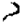

60. El arto 52 de la ley 24.521 establece que los estatutos de las instituciones universitarias deberán prever sus órganos de gobierno, tanto colegiados como unipersonales, así como su composición y atribuciones (Disidencia parcial de los Dres. Augusto César Belluscio, Enrique Santiago Petracchi y Gustavo A. Bossert): p. 1090.

- 61. Si bien el Estatuto de la Universidad Nacional del Nordeste previó la participación de los no docentes en otros cuerpos colegiados -el consejo superior y los consejos directivos de las facultadesexcluyó este sector de la integración del órgano máximo de gobierno de la universidad, y ello no se compadece con la finalidad de la Ley de Educa. ción Superior, ya que es en el seno de las asambleas en donde precisamente podrían debatirse y decidirse cuestiones y normas generales que involucren directamente la vida del sector no docente (Disidencia parcial de los Dres. Augusto César Bel1uscio, Enrique Santiago Petracchi y Gustavo A. Bossert): p. 1090.

62. El principio de equidad no puede entenderse de manera de restringir hasta desvirtuar el de gratuidad, pues ambos cuentan con igual tutela. La reglamentación del arto 75, inc. 19, de la Constitución Nacional, por normas de menor jerarquía, no puede en ningún caso ser retribución de la enseñanza, transformando la regla de la gratuidad en el principio opuesto de la onerosidad (Disidencia parcial de los Dres. Augusto César Belluscio, Enrique Santiago Petracchi y Gustavo A. Bossert): p. 1090.

v

## VACACIONES NO GOZADAS

Ver:

Superintendencia, 17 a 19.

## VERDAD JURIDICA OBJETIVA

Ver:

Jueces, 2; Juicio civil, 2; Prueba, 2.

## VICIOS DE LA VOLUNTAD

Ver:

Prescripción, 14.

## VIGENCIA DE LA LEY

Ver:

Aduana, 2, 3; Constitución Nacional, 53, 54; Recurso extraordinario, 89.

## INDICE DE LEGISLACION (*)

75, ine. 19:

270 (-), 842 (a), 875 (a),

## LEGISLACION NACIONAL

919 (a).

75, inc. 22:

328 (-J.

## CONSTlTUCION NACIONAL

75, inc. 32:

496 (-).

89:

385 (-J.

## Art.

90:

385 (-J, 1150 (-).

5°:

875 (-).

99, ine. 2°:

752 (-), 775 (a), 842 (-).

14:

270 (-J, 875 (-J, 963 (-).

99, inc. 3°:

196 (-).

105:

385 (-).

14bis:

162(-),215 (a), 600 (-),752

108:

678 (-).

(-), 1071 (-).

110:

752 (-J.

16:

227 (-), 385 (a), 919 (-J.

111:

385 (-).

17:

118 (-),162 (-), 551 (-), 569 (-),792 (-),963 (-), 1028 (-), 1083 (-).

115:

139 (a).

116:

41(-), 139(a), 148(-),190(-),

313 (-), 473 (-), 528 (-),

18:

73 (a), 162 (-), 360 (a), 444 (-),489 (-), 551 (-), 569 (-), 904 (-), 1142 (-), 1150 (-l.

585 (-), 666 (-l, 678 (-),

813 (a), 817 (-), 1043 (-), 1135 (-).

25:

875 (a).

117:

41 (-), 148 (-), 190 (-),

28:

270 (-).

313 (-),447 (a), 473 (-1,

30:

385 (-).

528 (-), 666 (-1, 678 (-),

31:

1031 (-),1050 (a), 1063 (-).

804 (-), 813 (al, 817 (-),

43:

190 (-), 259 (-), 1028 (-), 1135 (-).

1043 (-),1135 (-).

121:

190 (-).

48:

385 (-).

129:

1142 (a).

55:

385 (-).

72:

385 (-).

73:

385 (-).

75:

41 (-), 1142 (-J.

## Disposición Transitoria

75, inc. 6°:

496 (-), 963 (-).

75, ine. 12:

456 (-), 746 (-), 775 (a).

75, inc. 18:

496 (-), 842 (a), 919 (a).

Novena: 1150 (-).

## nNOTA:

Se deja constancia que ellndice de Legislación, que lleva las citas legales efectuadas por la Corte Suprema y la Procuración General ~excluyendo las invocadas por las partes y no tratadas por el Tribunal-, contiene una triple clasificación, según el tratamiento dado a la norma citada:

- (e): Si se impugnó su constitucionalidad, sea declarada válida o inconstitucIonal;
- {al: Si se efectuó una interpretación, sin tratar la constitucionalidad;
- (-): Cuando es una mera cita.

## TRATADOS Y CONVENCIONES INTERNACIONALES

## CONVENCION EUROPEA DE DERECHOS HUMANOS

## Art.

6°, inc. 1°: 360 (-),

## CONVENCION SOBRE LOS DERECHOS DEL NIÑO

## Art.

12, inc. 2°: 328 (-J.

26, ine. 1°:

328 (-).

## DECLARACION UNIVERSAL DE LOS DERECHOS HUMANOS

Art.

842 (-), 919 (-).

875 (-).

26:

26.1:

## PACTO DE SAN JOSE DE COSTA RICA

## Art.

7°, inc. 5°: 360 (-).

S", inc. 1°:

26:

360 (-).

842 (-J, 919 (-).

## PACTO INTERNACIONAL DE DERECHOS CIVILES Y POLlTICOS

## Art.

9", inc. 3°:

14, inc. 3":

360 (a).

360 (a).

## PACTO INTERNACIONAL DE DERECHOS ECONOMICOS, SOCIALES y CULTURALES

## Art.

2°:

13:

13, ine. 2°:

875 (a).

875 (a).

842 (-), 919 (-).

## TRATADO DE MONTEVIDEO DE 1BB9

Art.

30:

30, ine. 2": 507 (-).

507 (-).

## TRATADO DE DERECHO PENAL INTERNACIONAL

-Montevideo 1889-

## Art.

19, inc. 3":

20:

21, ine. 1":

25:

26:

30, inc. }":

44:

45:

49:

60:

65:

41 (-).

41 (-), 347 (-).

41 (-).

832 (-).

41 (-).

41 (-).

347 (-).

347 (-).

41 (-).

41 (-).

41 (-).

## CODlGOS

CODIGO ADUANERO

Art.

274, ¡ne. a): 174 (-).

Art.

453:

638:

639:

954, ine. e): 355 (a).

647 (-).

174 (-).

174 (-).

## CODIGO AERONAUTICO

Art.

198:

589 (-).

| CODIGO CIVIL   | CODIGO CIVIL               |
|----------------|----------------------------|
| Art.           |                            |
| 42:            | 447 (a).                   |
| 367:           | 621 (-).                   |
| 508:           | 345 (-).                   |
| 509:           | 345 (a).                   |
| 512:           | 726 (a).                   |
| 528:           | 736 (-).                   |
| 543:           | 1043 (-).                  |
| 555:           | 1043 (-).                  |
| 618:           | 345 (-).                   |
| 624:           | 571 (a).                   |
| 751:           | 345 (-).                   |
| 842:           | 963 (a).                   |
| 858:           | 963 (a).                   |
| 859:           | 963 (a).                   |
| 902:           | 726 (a), 736 (-).          |
| 909:           | 726 (a).                   |
| 1050:          | 963 (a).                   |
| 1052:          | 963 (a).                   |
| 1069:          | 323 (-).                   |
| 1072:          | 323 H.                     |
| 1078:          | 306 (a), 621 (-).          |
| 1083:          | 306 (a).                   |
| 1100:          | 963 (a).                   |
| 1101:          | 963 (a).                   |
| 1102:          | 963 (a).                   |
| 1107:          | 960 (-).                   |
| 1109:          | 323 (a), 596 (-), 621 (-). |
| 1112:          | 647 (-).                   |
| 1113:          | 323 (a), 596 (-), 621 (-). |
| 1198:          | 963 (a).                   |
| 1203:          | 963 (a).                   |

| 1204:          | 182 (a), 963 (a).          |
|----------------|----------------------------|
| 1374:          | 1043 (-).                  |
| 2055:          | 736 (-).                   |
| 2069:          | 736 H.                     |
| 2378:          | 666 (-).                   |
| 2379:          | 666 (-).                   |
| 2422:          | 817 (a).                   |
| 2669:          | 1043 (-).                  |
| 2670:          | 1043 (-).                  |
| 3284, ine. 4°: | 582 (a), 1055 (a).         |
| 3410:          | 1055 H.                    |
| 3986:          | 621 (-).                   |
| 4023:          | 647 (-), 817 (a).          |
| 4030:          | 817 (-).                   |
| 4032:          | 1038 (-).                  |
| 4037:          | 148 (a), 621 (-), 647 (-), |
|                | 666 (-).                   |

## (Modificado en 1968)

Art.

4037:

496 (a).

| CODlGO DE COMERCIO   | CODlGO DE COMERCIO   |
|----------------------|----------------------|
| Art.                 | Art.                 |
| 184:                 | 139 (a).             |
| 216:                 | 182 (a).             |
| 218, ine. 4°:        | 182 (a).             |
| 450:                 | 596 (a).             |
| 452, ine. 2°:        | 596 (a).             |

| CODlGO PENAL   | CODlGO PENAL       |
|----------------|--------------------|
| Art.           |                    |
| 51:            | 259 (-).           |
| 172:           | 41 (-).            |
| 173, ine. 2°:  | 240 (-), 1146 (-). |
| 173, ine. 7":  | 240 (-), 242 (-).  |
| 268:           | 1058 (-).          |
| 271:           | 242 (-).           |
| 301:           | 41 (-).            |

## CODIGO PROCESAL CIVIL Y COMERCIAL DE LA NACION

| Art.         |                                                       |
|--------------|-------------------------------------------------------|
| 4":          | 190 (-), 323 (-),746 (-),600                          |
| 5°:          | (-), 813 (-). 596 (-).                                |
| 5°, ine. 7°: | 593 (-).                                              |
| 14:          | 72 (a).                                               |
| 17:          | 72 (a), 720 (a).                                      |
| 17, ine. 3°: | 701 (-).                                              |
| 18:          | 72 (a).                                               |
| 34, ine. 30: | 663 (-).                                              |
| 34, ine. 5°: | 720 (a).                                              |
| 38:          | 447 (a).                                              |
| 42:          | 179 (-).                                              |
| 53, ine. 2°: | 1038 (-).                                             |
| 68:          | 113 (-), 232 (-), 355 (-),                            |
|              | 437 (-), 479 (-), 496 (-),                            |
|              | 551 (-), 628 (-), 696 (-), 736 (-), 752 (-), 817 (-), |
|              | 960 (a), 1001 (-), 1038 (-),                          |
|              | 1050 (-), 1083 (-).                                   |
| 69:          | 1050 (.).                                             |
| 70:          | 479 (-).                                              |
| 71:          | 68 (-).                                               |
| 73:          | 479 (-).                                              |
| 88:          | 813 (a).                                              |
| 120:         | 1128 (a).                                             |
| 137:         | 179 (-).                                              |
| 155:         | 978 (-), 1128 (-).                                    |
| 162:         | 963 (a).                                              |
| 188:         | 813 (a).                                              |
| 194:         | 712 (a).                                              |
| 238:         | 447 (-).                                              |
| 242:         | 293 (a), 447 (-).                                     |
| 257:         | 963 (-), 1133 (-).                                    |
| 268:         | 663 (-).                                              |
| 279:         | 496 (-).                                              |
| 280:         | 87 (-), 99 (-), 118 (-),                              |
|              | 162 (-), 179 (-), 210 (-),                            |
|              | 300 (-), 347 (-), 604 (-), 702 (-), 726 (-), 775 (-), |
|              | 786 (-), 832 (-), 960 (-),                            |
|              | 1001 (-), 1004 (a), 1031 (a), 1038 (-), 1083 (-).     |
| 285:         | 978 (-), 1128 (a).                                    |

| 286:          | 176 (-), 303 (a), 660 (a), 786 (-).   |
|---------------|---------------------------------------|
| 322:          | 61 (-), 528 (-), 813 (-), 1135 (-).   |
| 337:          | 73 (a), 551 (-).                      |
| 338:          | 1135 (-).                             |
| 347, ine. 3°: | 804 (-).                              |
| 356, ine. 1°: | 313 (-).                              |
| 477:          | 447 (-).                              |
| 499:          | 1050 (-).                             |
| 502:          | 1050 (-).                             |
| 505:          | 981 (-), 1050 (-).                    |
| 507:          | 981 (-).                              |
| 544:          | 804 (-).                              |
| 544, ine. 6°: | 146 (a).                              |
| 549:          | 804 (.).                              |
| 553:          | 227 (a), 571 (a).                     |
| 558:          | 146 (-), 227 (-).                     |
| 604:          | 227 (-).                              |
| 749:          | 1100 (-).                             |

## CODIGO PROCESAL PENAL (Ley 23.984)

Art.

3": 702

(a).

| CODlGO DE PROCEDIMIENTOS EN MATERIA PENAL (Ley 2372)   | CODlGO DE PROCEDIMIENTOS EN MATERIA PENAL (Ley 2372)   |
|--------------------------------------------------------|--------------------------------------------------------|
| Art.                                                   |                                                        |
| -:                                                     | 347 (-), 360 (-).                                      |
| 120:                                                   | 41 (-).                                                |
| 204:                                                   | 306 (a).                                               |
| 206:                                                   | 360 (a).                                               |
| 468:                                                   | 122 (-).                                               |
| 493:                                                   | 122 (-).                                               |
| 523:                                                   | 347 (-).                                               |
| 652:                                                   | 41 (-).                                                |
| 701:                                                   | 360 (a).                                               |

| LEYES       | LEYES                                                                                                                   |
|-------------|-------------------------------------------------------------------------------------------------------------------------|
| 27          | 27                                                                                                                      |
| Art.        |                                                                                                                         |
|             | 528 (-), 678 (-)                                                                                                        |
| 4"          | 1050 (-).                                                                                                               |
| 48          | 48                                                                                                                      |
| Art.        | 653 (-), 813 (-)                                                                                                        |
| 2"          | 585 (-)                                                                                                                 |
| 20, inc. 1" |                                                                                                                         |
| 14, inc. 2" | 1025 (a), 1031 (a), 1067 (-), 1128 (-) 166 (-), 215 (-)                                                                 |
| 14, inc. 3" | 73 (-), 752 (-), 875 (-), 910 (-), 919 (-) 210 (-), 293 (-), 437 440 989 (-), 995 (a) 1017 (-), 1025 {a), 1038 (-) (-), |
| 16:         | 360 (-), 628 (-), 726 (-), 1015 (-)                                                                                     |
| 21:         | 1050 (-)                                                                                                                |
| Art         | Art                                                                                                                     |
|             | 875 (-)                                                                                                                 |
| 4055        | 4055                                                                                                                    |
| Art. 2"     | 813 (-)                                                                                                                 |

| 9688     | 9688             |
|----------|------------------|
| Art.     |                  |
| 89       |                  |
| Art. 21: | 647 (-)          |
| 106:     | 647 (-)          |
| 107:     |                  |
| 109:     | 647 (-)          |
| 138:     | 647 (-)          |
| 133 bis: | 647 (-)          |
| 11.683   | 11.683           |
| Art.     | Art.             |
| 84:      | 73 (-)           |
| 85:      | 73 (-)           |
| en 1978) | en 1978)         |
| 45:      | 519 (a)          |
| 46:      | 519 (a)          |
| 92:      | 571 (a)          |
| 166:     | 479 (a)          |
| 179:     | 479 (-)          |
| 11.723   | 11.723           |
| Art.     | 658 (a), 775 (a) |

| 12.910        | 12.910            |
|---------------|-------------------|
| Art.          | Art.              |
| 7°:           | 298 (a).          |
| 12.954        | 12.954            |
| Art. -:       | 1100 (.).         |
| 12.990        | 12.990            |
| Art. 4°:      | 166 (e).          |
| 13.031        | 13.031            |
| Art. -:       | 875 (-).          |
| 13.998        | 13.998            |
| Art. 45, ine. | a): 196 (-).      |
| 14.297        | 14.297            |
| Art. 1°:      | 875 (-J. 875 (-). |
| 14.467        | 14.467            |
| Art.          | 253 (-).          |
| -:            |                   |

| 16.986   | 16.986                     |
|----------|----------------------------|
| Art.     |                            |
|          | 190 (-J. 1135 (-J.         |
| 3":      | 73 (-l.                    |
| So:      | 1028 (-J.                  |
| 14:      | 464 (a).                   |
| Art.     | 875 (-).                   |
| 17.418   | 17.418                     |
| 118:     | 653 (a).                   |
| 17.516   | 17.516                     |
| -:       | 1100 (-).                  |
| 18.037   | 18.037                     |
|          | 456 (-J. 608 (-), 752 (-). |
| 25:      | 153 (eJ, 248 (aJ. 158 (-). |
| 27:      |                            |
| 43:      | 158 (aJ.                   |
| 49:      | 158 (-).                   |
| 53:      | 158 (-).                   |
| 55:      | 158 (-J.                   |
|          | 18.038                     |
| Art. -:  | 206 (-), 752 (-J.          |

| (t.o. en 1980)                                    |                               | 19,108                              |
|---------------------------------------------------|-------------------------------|-------------------------------------|
| Art,                                              | Art.                          |                                     |
| 31: 246 (-),                                      | 5°:                           | 1150 (-),                           |
| 34, inc. d): 246 (-J.                             | 12, inc. 11:                  | 1150 (-),                           |
|                                                   |                               | 19.184                              |
| Art. 39:                                          | Art. -:                       |                                     |
|                                                   |                               | 19.336 736 (-).                     |
| 18.464 Art, -: 752 (-). 4°: 792 (-). 7": 792 (-), | -:                            | 19.539                              |
| 18,820                                            |                               | 19.549                              |
| Art. 15: 210 (-), 337 (-),                        | Art.                          |                                     |
|                                                   | 1": 1", inc. e): 1°, ine. 9°: | 551 (a), 73 (a).                    |
|                                                   | 2": 17: 23:                   | 496 (-). 551 (a), 963 (-). 551 (-). |
| 19,032                                            | 23, inc. a): 25:              | 73 (a). 73 (a), 551                 |
|                                                   | 30: 32, ine. d):              | (a). 551 (-J. 496 (-).              |
| Art. -: 196 (-). 1°: 196 (-), 196 (-),            |                               |                                     |
| 5°:                                               |                               |                                     |
| 7°: 196 (-),                                      |                               |                                     |
|                                                   |                               | 19,550                              |
| 8°: 196 (-),                                      |                               |                                     |
| 9": 196 (-),                                      | Art.                          |                                     |
| 14: 196 (-J. 15:                                  | 251:                          | 692 (-), (a).                       |
| 196 (.),                                          | 261:                          | 604                                 |

Art.

11,

Art.

-:

Art.

-:

3°,

39:

40:

Art.

-:

Art.

30:

245:

Art.

245:

ine.

ine.

7°:

19.551

129 (-),

19.642

600 (-).

19.798

685 (-l, 688 (-),

688 (-).

227 (-l.

227 (.).

## 20.654

875 (-).

20.744

440 (a).

989 (e), 995 (-l. 1025 (-l,

(Texto según ley 24.013)

1017 (a).

e):

| 20.952                   | 20.952                   |
|--------------------------|--------------------------|
| (Modificada en 1976)     | (Modificada en 1976)     |
| Art. 1°:                 | 139 (-l.                 |
| 21.307                   | 21.307                   |
| Art.                     | 232 (al.                 |
| 21.444                   | 21.444                   |
| Art.                     | Art.                     |
| -:                       | 139 (-l,                 |
| Art. 50, ine.            | e): 113 (a),             |
| (Texto según ley 22.051) | (Texto según ley 22.051) |
| Art. 56:                 | 188 (.),                 |
| Art. 14:                 | 313 (-).                 |
| 21.686                   | 21.686                   |
| Art. -:                  | 551 (-l.                 |

| 21.708                                                                        | 21.708                                                                        | 21.708                                                                        | 22.016                   |
|-------------------------------------------------------------------------------|-------------------------------------------------------------------------------|-------------------------------------------------------------------------------|--------------------------|
| Art.                                                                          | Art.                                                                          | Art.                                                                          | Art.                     |
| 90 (-), 93 (-), 196 (-), 201 (-), 227 (-), 253 (-), 323 (-), 496 (-),         | 90 (-), 93 (-), 196 (-), 201 (-), 227 (-), 253 (-), 323 (-), 496 (-),         | 90 (-), 93 (-), 196 (-), 201 (-), 227 (-), 253 (-), 323 (-), 496 (-),         | 39: 227 (a) 40: 227 (a). |
|                                                                               | 21.809                                                                        |                                                                               | 188 (-)                  |
| 21.839 Art.                                                                   | 21.839 Art.                                                                   | 21.839 Art.                                                                   | 22.207 Art.              |
| 4" 709 (a) 6 1100 (-) 6" inc. a): 148 (-), 817 ( -) inc. b): 148 (-), 817 (-) | 4" 709 (a) 6 1100 (-) 6" inc. a): 148 (-), 817 ( -) inc. b): 148 (-), 817 (-) | 4" 709 (a) 6 1100 (-) 6" inc. a): 148 (-), 817 ( -) inc. b): 148 (-), 817 (-) |                          |
|                                                                               |                                                                               |                                                                               | 875 (-)                  |
| 60 inc. d): 7" 9"                                                             | 148 (-), 817 (-) 148 (-), 817 (-)                                             |                                                                               |                          |
| 13:                                                                           | 148 (-), 817 1100 (-) 148 (-), 817 (-), 1100 (-) (-)                          | Art.                                                                          | 22.262                   |
| 14: 18:                                                                       | 148 (-) 1100 (-)                                                              | 4"                                                                            | 596 (a)                  |
| 19:                                                                           | 1100 (a) 1100 (-) 817 (-)                                                     |                                                                               |                          |
| 22: 37:                                                                       | 148 (-), 817 (-) 148 (-), 817 (-) 1100 (-)                                    | Art.                                                                          | 22.278                   |
| 38:                                                                           |                                                                               | 3"                                                                            | 328 (-).                 |
| 44:                                                                           |                                                                               |                                                                               |                          |
|                                                                               | 21.864                                                                        |                                                                               | 22.285                   |
| Art.                                                                          |                                                                               |                                                                               |                          |
|                                                                               | 210 (-), 337 (-)                                                              |                                                                               | 749 (-), 1135 (-)        |
|                                                                               |                                                                               | Art.                                                                          |                          |
| 12:                                                                           |                                                                               |                                                                               |                          |

,

(174)

Art.

-:

Art.

-:

1175:

1176:

Art.

34:

Art.

-:

Art.

-:

Art.

Art.

-:

14:

22.301

600 (-).

22.415

647 (-),

73

(-J,

73 (-).

22.421

656 (-),

22.434

1083

(-J,

22.529

113

(a),

22.627

1063

(-J,

22.804

473 (-).

146 (-),

| 22.940            | 22.940              |
|-------------------|---------------------|
| Art.              |                     |
| -:                | 752 (-l,            |
| 22.955            | 22.955              |
| Art.              |                     |
| -:                | 158 (-),            |
| 3°, ¡ne. a):      | 158 (aJ,            |
| Art.              |                     |
| 8°:               | 1004 (a).           |
|                   | , 23.068            |
| -:                |                     |
|                   | 875 (-),            |
| 23.241            |                     |
| Art. 53: 456 (-J. | Art. 53: 456 (-J.   |
|                   | 23.296              |
| Art.              | Art.                |
| 5°:               | 1063 (-l.           |
| 7°:               | 1063 (-l. 1009 (-l. |
| 14: 16:           | 1009 (a),           |
| 20:               | 628 (a),            |
| 21: 24:           | 628 (a).            |

| 23.313   | 23.313    |
|----------|-----------|
| Art.     |           |
| -:       | 875 (-).  |
| 23.349   | 23.349    |
| Art.     |           |
| 11:      | 523 (a).  |
| 12:      | 523 (a).  |
| 29:      | 523 (a).  |
| 30:      | 523 (a).  |
| 23.473   | 23.473    |
| Art.     |           |
| 11:      | 337 (-).  |
| 23.551   | 23.551    |
| Art.     |           |
| 40:      | 1071 (al. |
| 47:      | 1071 (a). |
| 48:      | 1071 (a). |
| 50:      | 1071 (a). |
| 52:      | 1071 (al. |
| 23.646   | 23.646    |
| Art. -:  | 473 (-).  |
| Art. -:  | 571 (a).  |

| 23.660        | 23.660   |
|---------------|----------|
| Art.          |          |
|               | 196 (-J. |
| Art. -:       | 196 (-). |
| 23.696        | 23.696   |
| Art.          |          |
| -:            | 82 (-).  |
| 38:           | 692 (-J. |
| 39:           | 692 (-). |
| 50:           | 447 (-J. |
| 68:           | 447 (-). |
| 23.697        | 23.697   |
| Art. -:       | 447 (-). |
| 23.765        | 23.765   |
| Art. -:       | 479 (-). |
| 23.769        | 23.769   |
| Art. 18:      | 158 (-J. |
| 23.898        | 23.898   |
| Art. 13, ine. | 6°: 660  |

| 23.928         | 23.928                         | 24.028                           |
|----------------|--------------------------------|----------------------------------|
| Art. -:        | 158 H.                         | Art. -: 456 (-).                 |
| Art. 11:       | 158 (-).                       | 24.065 Art. 76: 253 (-).         |
| Art.           | 23.982                         | 24.076                           |
|                | 87 H. 447 H, 1100 H. 1050 (a). |                                  |
| -: 12: 19: 22: | 1050 (a). 82 (-). 23.984       | Art. 52, ¡ne. f): 61 (-). 24.121 |
| Art. -:        | 360 H.                         | Art. 12: 360 H.                  |
|                | 24.013                         | 24.144                           |
| Art.           | 995 (-), 1025 (a).             |                                  |
| 153:           | Art. -:                        | 113 H.                           |
|                | 24.018                         | 24.156                           |
| Art. 3°: 8":   | 752 (-).                       | Art. 3": 910 (.).                |
| 9°:            | 752 (.). 752 H.                | 910 H.                           |
| 14:            | 752 (-).                       |                                  |
| 16:            | 4": 7°:                        | 910 H.                           |
|                |                                | So:                              |
|                | 752 (-).                       | 910 (.).                         |
| 26:            | 752 (.).                       | 842 (.).                         |
| 33: 34:        | 752 (-). 792 H.                | 130:                             |
|                |                                | 131: 842 (-).                    |

|                | 24.195                     | 24.309                              |
|----------------|----------------------------|-------------------------------------|
| Art.           | Art.                       |                                     |
| -:             | 875 (-). -:                | 385 (-l.                            |
| lO:            | 270 (.). 1°:               | 385 (-).                            |
| 39:            | 875 (-l. 2":               | 385 (-).                            |
| 43:            | 270 (-l. 3":               | 385 (-l.                            |
|                | 5°: 6":                    | 385 (-). 385 (.), 813 (-).          |
| Art.           | 24.318                     |                                     |
|                | 24.241                     | 24.432                              |
| Art.           |                            |                                     |
| 2°:            | 456 (-l. 752 (-).          |                                     |
| 160: 168: 183: | 752 (-). 752 (-), 792 (-). | 118 (a). 148 (-). 723 (a). 709 (a). |
| 191: Art.      | 752 (-). 752 (-l. 24.283   |                                     |
|                | 14:                        |                                     |
| -:             |                            | 24.440                              |
|                | Art. 696 (a), 1083 (-l. -: | 685 (-).                            |
|                | 24.289                     | 24.463                              |
| Art.           | Art.                       |                                     |
|                | 102 (-). -: 7°, ¡ne.       | 93 (-l, 158 (-). 608 (e).           |
|                | 1°: 7°, ¡ne. 2°:           | 608 (-).                            |
|                | 19:                        | 153 (-), 248 (a).                   |
|                | 24.290 21:                 | 464 (a).                            |
| Art. -:        | 23: 26:                    | 290 (a).                            |
|                | 596 (-l.                   | 210 (.), 337 (-).                   |

|                      | 24.521                                                |
|----------------------|-------------------------------------------------------|
| Art.                 | Art.                                                  |
| 29, ine. a): 32:     | 919 (e). 270 (-).                                     |
| 34:                  | 842 (e), 875 (a), 904 (-), 910 (a), 919 (e). 875 (a). |
| 41, ine. f): 42: 43: | 919 (e).                                              |
|                      | 919 (e).                                              |
| 44:                  | 919 (e).                                              |
| 45:                  | 919 (e).                                              |
| 46, ine. b):         | 919 (e).                                              |
| 50:                  | 919 (e).                                              |
| 51:                  | 910 (a), 919 (e).                                     |
| 52:                  | 875 (a).                                              |
| 53:                  | 842 (e), 910 (a), 919 (e).                            |
| 53, ine. e):         | 875 (e).                                              |
| 55:                  | 910 (a).                                              |
| 57:                  | 919 (a).                                              |
| 59:                  | 842 (e), 910 (a).                                     |
| 59, ine. e):         | 875 (a).                                              |
| 78:                  | 910 (a).                                              |
| 79:                  | 842 (e), 919 (e).                                     |
| 80:                  | 842 (e).                                              |

## 24.522

| Art,         |          |      |
|--------------|----------|------|
| 21, ine. 1°: | 201 (-). |      |
| 21, ine. So: | 201 (-). |      |
| 32:          | 201 (-). |      |
| 59:          | 129 (-). |      |
| 132:         | 136      | (a). |
| 133:         | 136      | (a). |
| 161:         | 333 (-). |      |
| 162:         | 333 (-), |      |

| 24.557   | 24.557   |
|----------|----------|
| Art. -:  | 323 (a). |
| 1":      | 323 (-). |

| 18:      | 456 (a).          |
|----------|-------------------|
| 21:      | 323 (-).          |
| 22:      | 323 (-).          |
| 39:      | 323 (a).          |
| 46:      | 323 (-), 456 (a). |
| Art. -:  | 589 (-J.          |
| 24.588   | 24.588            |
| Art.     | Art.              |
| So:      | 1142 (a).         |
| 24.624   | 24.624            |
| 19:      | 82 (-).           |
| 20:      | 82 (-).           |
| 24.642   | 24.642            |
| Art. 5": | 804 (a).          |
| Art. -:  | 93 (-).           |
| Art.     | 528 (a).          |
| 24.699   | 24.699            |
| -:       |                   |

| 24.765         | 24.765            |
|----------------|-------------------|
| Art.           | Art.              |
| -:             | 235 (-).          |
| Art.           | 347 (a).          |
| 1°:            | 486 (a), 507 (-). |
| 2°:            | 832 (-).          |
| 11, ine.       | e): 832 (-).      |
| 12:            | 347 (a), 486 (a). |
| 14, ine. b):   | 507 H.            |
| 14, ine.       | e): 507 H.        |
| 14, ine.       | d): 507 H.        |
| 36:            | 486 (a).          |
| 24.946         | 24.946            |
| 17:            | 102 (-).          |
| 26.661         | 26.661            |
| 38:            | 593 (-).          |
| DECRETOS-LEYES | DECRETOS-LEYES    |
| Art. -:        | 875 (-).          |
| 6403/55        | 6403/55           |
| Art.           | 875 (-).          |
| -:             | -:                |

| 7887/55      | 7887/55           | 7887/55            |
|--------------|-------------------|--------------------|
| Art.         |                   |                    |
| 6°:          | 1100 (-).         | 1100 (-).          |
| 3003/56      | 3003/56           | 3003/56            |
| Art. -:      | 259 (-).          | 259 (-).           |
| 6618/57      | 6618/57           | 6618/57            |
| Art. -:      | 1142 (-).         | 1142 (-).          |
| 14.715/57    | 14.715/57         | 14.715/57          |
| Art. l°:     |                   |                    |
| 2":          | 73 (-).           | 73 (-).            |
| 16.638/57    | 16.638/57         | 16.638/57          |
| Art.         |                   |                    |
| -:           | 817 (-),1100 (a). | 817 (-),1100 (a).  |
| 9":          |                   |                    |
| -: 15:       | 647 (-),1083      | (-).               |
|              |                   | 468 (-l. 612 (-).  |
| 16: 18:      | 16: 18:           |                    |
| 24, ine. 1°: | 24, ine. 1°:      |                    |
|              |                   | 341 (-), 1075 (a). |
|              |                   | 746 (-), 813 (-).  |

24, ine. 6°:

337 (-), 479 (-), 840 (a), 1100 (-l,

24, ine. 7°:

95 (-), 589 (-), 596 (-), 656 (-),692 (-), 749 (-),1058 (-), 1063 (-), 1142 (-l, 1150 (-), 1075 (a),

25:

26:

1075 (a),

43:

600 (.),

43, inc. b):

596 (-),

(Texto según ley 24.289)

Art.

18:

102 (-),

(Modificado en 1978)

## Art.

-:

90 (-).

24, ine. 6°:

227 (-), 253 (a), 496 (-).

24, ine. 7°:

93 (-), 196 (-), 201 (-), 323 (-).582 (-), 656 (-),

## 9372163

## (Modificado en 1972)

Art.

-:

600 (-).

## (Modificado en 1980)

Art.

-:

600 (-l.

## 1567174

Art.

456 (-).

| DECRETOS   | DECRETOS   |
|------------|------------|
| 11.511/47  | 11.511/47  |
| Art.       |            |
| 6":        | 298 (a),   |
| 7":        | 298 (a),   |
| S":        | 298 (al,   |
| 34.952147  | 34.952147  |
| Art. 15:   | 1100 (-).  |
| 7887/55    | 7887/55    |
| Art. 6°:   | 1100 (-).  |
| 1098/56    | 1098/56    |
| Art. -:    | 298 (a).   |
| 10.775/56  | 10.775/56  |
| Art. -:    | 875 (-).   |
| 4517/66    | 4517/66    |
| Art.       | Art.       |
| -:         | 298 (a).   |
| 9588/67    | 9588/67    |
| Art. -:    | 496 (-).   |

Art.

-:

Art.

-:

Art.

-:

Art.

-:

Art.

-:

Art.

-:

Art.

13:

3255171

496 (a).

1759172

73 (-).

9101172

551 (-l.

746173

775 (a).

1670174

775 (a).

926177

139 (-).

3722/79

313 (-).

| 411180   | 411180    |
|----------|-----------|
| Art.     | Art.      |
| 8°:      | 1100 (-J. |
| Art. -:  | 752 (-l.  |
| 3319/83  | 3319/83   |
| Art. 5"' | 158 (-l.  |
| 1554/86  | 1554/86   |
| Art. 18: | 174 (a).  |
| 502191   | 502191    |
| Art. -:  | 82 (-).   |
| Art. -:  | 355 (al.  |
| 530/91   | 530/91    |
| 589/91   | 589/91    |
| Art.     |           |
| -:       | 473 (-).  |

| 590/91       | 590/91    |
|--------------|-----------|
| Art.         |           |
| 1°:          | 174 (a)   |
| 2°:          | 174 (a).  |
| 1883/91      | 1883/91   |
| Art. -:      | 73 (-).   |
| 2140/91      | 2140/91   |
| Art.         | Art.      |
| 19, inc. h): | 1050 (-l. |
| 2144/91      | 2144/91   |
| Art. 32:     | 1100 (-l. |
| 2284/91      | 2284/91   |
|              | 1100 (-l. |
| 611/92       | 611/92    |
| Art.         | 473 (-).  |
| Art. 14:     | 1004 (a). |

| 696/92   | 696/92    |
|----------|-----------|
| Art. -:  | 313 (-).  |
| 1813/92  | 1813/92   |
| Art. 1°: | 1100 (-). |
| 2394/92  | 2394/92   |
| Art. 7°: | 82 (-).   |
| 2666/92  | 2666/92   |
| -:       | 910 (-l.  |
| 932/93   | 932/93    |
| Art. 12: | 1004 (a). |
| 1684/93  | 1684/93   |
| Art.     | 479 (a).  |
| Art. 5°: | 113 (-).  |
| 2077/93  | 2077/93   |

Art.

Art.

-:

Art.

-:

Art.

4":

6°:

Art.

12:

Art.

6":

Art.

2091/93

752 (-).

56/94

752 (.).

78/94

752 (-), 792

794/94

696

(e).

696

(e).

316/95

1004

(a).

682/95

692 (-).

1039/95

82 (-).

(-).

| 717/96                                                 | 717/96                                                 |
|--------------------------------------------------------|--------------------------------------------------------|
| Art.                                                   |                                                        |
| -:                                                     | 323 (-).                                               |
| 1276/96                                                | 1276/96                                                |
| Art.                                                   |                                                        |
| 1°:                                                    | 270 (a).                                               |
| 2°:                                                    | 270 (a).                                               |
| 7":                                                    | 270 (a).                                               |
| 8°:                                                    | 270 (a).                                               |
| 9°:                                                    | 270 (a).                                               |
| 92/97                                                  | 92/97                                                  |
| Art. 5°:                                               | 688 (-).                                               |
| 197/97                                                 | 197/97                                                 |
| Art. -:                                                | 196 (-).                                               |
| ACORDADAS CORTE SUPREMA DE JUSTICIA DE LA NACION 51/73 | ACORDADAS CORTE SUPREMA DE JUSTICIA DE LA NACION 51/73 |
| Art. -:                                                | 447 (a).                                               |
| Art. -:                                                | 447 (a).                                               |
| 64/73                                                  | 64/73                                                  |

| 45/84                               | 45/84                               |
|-------------------------------------|-------------------------------------|
| Art.                                |                                     |
| -:                                  | 447 (a).                            |
| 4/87                                | 4/87                                |
| Art.                                |                                     |
| -:                                  | 447 (a).                            |
| 28/93                               | 28/93                               |
| Art.                                |                                     |
| -:                                  | 447 (al.                            |
| REGLAMENTO                          | REGLAMENTO                          |
| REGLAMENTO Art. So:                 | PARA LA JUSTICIA NACIONAL 106 (-).  |
| 15:                                 | 110 (-), 612 (-).                   |
| 22:                                 | 102 (-), 341 (-), 1075 (a).         |
| 23:                                 | 341 (-).                            |
| 63:                                 | 720 (a).                            |
| 90:                                 | 720 (a).                            |
| RESOLUCIONES                        |                                     |
| COMISION NACIONAL DE COMUNICACIONES | COMISION NACIONAL DE COMUNICACIONES |
|                                     | 25.837/96                           |
| Art. 2": 685 (-). 3°:               | 685 (-).                            |

| CORTE SUPREMA DE JUSTICIA DE LA NACION          | CORTE SUPREMA DE JUSTICIA DE LA NACION          |
|-------------------------------------------------|-------------------------------------------------|
| Art.                                            | Art.                                            |
| -:                                              | 227 (-), 337 (-), 479 (-), 496 (-), 647 (-).    |
| DIRECCION GENERAL IMPOSITIVA                    | DIRECCION GENERAL IMPOSITIVA                    |
| 4214/96                                         | 4214/96                                         |
| Art. -:                                         | 523 (-).                                        |
| INSTITUTO NACIONAL DE PREVISION SOCIAL          | INSTITUTO NACIONAL DE PREVISION SOCIAL          |
| 291.483/91                                      | 291.483/91                                      |
| Art.                                            | 210 (-).                                        |
| MINISTERIO DE TRABAJO Y SEGURIDAD SOCIAL 993/88 | MINISTERIO DE TRABAJO Y SEGURIDAD SOCIAL 993/88 |
| Art. -:                                         | 1067 (a).                                       |
| 25/89                                           | 25/89                                           |
| Art. -:                                         | 1067 (a).                                       |

| SECRETARIA DE SEGURIDAD SOCIAL                       | SECRETARIA DE SEGURIDAD SOCIAL                   |
|------------------------------------------------------|--------------------------------------------------|
|                                                      | 9/94 Art. -:                                     |
| Art. -:                                              | 736 (-).                                         |
| 26/94                                                | 84n3                                             |
| Art. -: 608 (-), 171/94 Art.                         | Art. -: 736 (-), 1856n3                          |
| -: 608 (-), SUPERINTENDENCIA DE SEGUROS DE LA NACION | Art.                                             |
| 19.106/87                                            | -: 736 (-),                                      |
|                                                      | 649/86                                           |
| Art. -: 1067 (a).                                    | 5<>: 736 (-).                                    |
| 19.737/88 Art.                                       | 11: 736 (.J. 12: 736 (-). 13: 736 (-). 14:       |
| -: 1067                                              | 736 (-). 15: 736 (.J,                            |
| (a), DISPOSICIONES                                   | 28: 736 (a).                                     |
| LOTERIA NACIONAL DE BENEFICENCIA Y CASINOS           | BANCO CENTRAL DE LA REPUBLlCA ARGENTINA RC 471n3 |
| 46n2                                                 |                                                  |
|                                                      | CIRCULAR                                         |
| Art. -: 736 (-).                                     | Art.                                             |
|                                                      | -: 496 (a).                                      |

| CIUDAD DE BUENOS AIRES                                 | CIUDAD DE BUENOS AIRES                                 |
|--------------------------------------------------------|--------------------------------------------------------|
| CONSTlTUCION                                           | CONSTlTUCION                                           |
| 50:                                                    | 1142 (-l,                                              |
| 80:                                                    | 1142 (-),                                              |
| 10                                                     | 10                                                     |
| Art.                                                   | Art.                                                   |
| 10:                                                    | 1142 (-J,                                              |
| 12                                                     | 12                                                     |
| Art.                                                   | Art.                                                   |
| 2":                                                    | 1142 (-J,                                              |
| LEGISLACION PROVINCIAL PROVINCIA DE BUENOS AIRES LEYES | LEGISLACION PROVINCIAL PROVINCIA DE BUENOS AIRES LEYES |
| Art.                                                   | Art.                                                   |
| 16:                                                    | 215 (e),                                               |
| 10.595                                                 | 10.595                                                 |
| Art. 2°:                                               | 215 (el.                                               |
| 11.192                                                 | 11.192                                                 |
| Art. -:                                                | 447 (-),                                               |

| PROVINCIA DE CATAMARCA LEY   | PROVINCIA DE CATAMARCA LEY   |
|------------------------------|------------------------------|
| Art.                         | Art.                         |
| 22:                          | 73 (-l.                      |
| PROVINCIA DE CORDOBA         | PROVINCIA DE CORDOBA         |
| LEYES                        | LEYES                        |
| 7182                         | 7182                         |
| Art.                         |                              |
| 11: 20:                      | 73 (-l. 73 (-1,              |
| 8613                         | 8613                         |
| Art. -:                      | 1063 (-l.                    |
| PROVINCIA DE CORRIENTES      | PROVINCIA DE CORRIENTES      |
| LEY                          | LEY                          |
| 4106                         | 4106                         |
| 58:                          | 73(-).                       |
| 59:                          | 73(-),                       |
| PROVINCIA DE ENTRE RIOS      | PROVINCIA DE ENTRE RIOS      |
|                              | CODIGO TRIBUTARIO            |
| Art. 111:                    | 593(-l.                      |

|                       | LEY 7061             | PROVINCIA DE LA RIOJA LEY 4243          |
|-----------------------|----------------------|-----------------------------------------|
| Art. 45:              | 73 (-J.              | Art. 43: 73 (-).                        |
| PROVINCIA DE FORMOSA  | PROVINCIA DE FORMOSA |                                         |
| LEY                   | LEY                  | PROVINCIA DE MENDOZA                    |
| 584                   | 584                  | LEYES 3918                              |
| Art. 45:              | 73 (-).              | Art. 38: 73 (.).                        |
| PROVINCIA DE JUJUY    | PROVINCIA DE JUJUY   |                                         |
| Art. 34:              | 1883 73 (-).         | Art. -: 73 (-).                         |
|                       |                      | PROVINCIA DE SALTA LEY                  |
| Art. -:               | 4141                 | 793 Art.                                |
| PROVINCIA DE LA PAMPA | 73 (-).              | 34: 73 (-). PROVINCIA DE SAN LUIS LEYES |
|                       | LEY                  | 3900                                    |
|                       | Art.                 |                                         |
| Art. 29:              | 952                  | 38: 251 (a). 251 (a).                   |

|                  | 5071                               | PROVINCIA DETUCUMAN                 |
|------------------|------------------------------------|-------------------------------------|
| Art. -:          | 447 (-).                           | LEY 6205                            |
|                  | DECRETO 30: 9316/46                | Art. 73 (-).                        |
| 7°:              | 251 (-l. PROVINCIA DE SANTA FE LEY | 848 Art. 32: 73 (-). 4051           |
| Art. -:          | 2287 678 (e).                      |                                     |
| PROVINCIA        | DE SANTIAGO DEL ESTERO LEY 2297    | -: 73 (-). PROVINCIA DEL CHUBUT LEY |
| Art. 33: 73 (-l. | Art. -:                            | 473 (-l.                            |
| FUEGO            | PROVINCIA LEY 1305                 | DEL NEUaUEN                         |
| PROVINCIA        | DE TIERRA DEL                      |                                     |
|                  | LEY 133                            |                                     |
| Art.             | Art. 39:                           |                                     |
| 30:              |                                    | 73 (-).                             |
|                  | 73 (-).                            |                                     |

¡

,

## INDICE GENERAL

## Tomo 322

## Volumen 1

|                                                                                                   | Pág.   |
|---------------------------------------------------------------------------------------------------|--------|
| Acuerdos de la Corte Suprema                                                                      | 5      |
| Resoluciones de la Corte Suprema                                                                  | 21     |
| Fallos de la Corte Suprema                                                                        | 41     |
| Febrero o ••••••••••••••••••••••••••••••• o •••• o •••••••••••• o ••••••••••••••••••••••••••      | 41     |
| Marzo o •••• , ••••••••••••••••••••••••• , •••••••••••••••••••••••••••• , ••••••••••••••••••••••• | 227    |
| Abril .                                                                                           | 617    |
| Mayo .                                                                                            | 701    |
| Indice por los nombres de las partes                                                              | (1)    |
| Indice alfabético por materias                                                                    | (7)    |
| Indice de legislación                                                                             | (165)  |

! .

SE TERMINO DE IMPRIMIR EN LA 2 a QUINCENA DE NOVIEMBRE DE 1999 EN LOS TALLERES GRAFICOS DE MLA LEY~ S. A. E. e I. BERNARDINO RIVADAVIA 130 -AVELLANEDA -Prov. DE BUENOS AIRES. REPUBLICA ARGENTINA