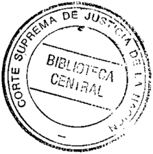
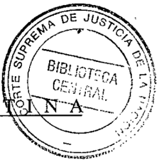
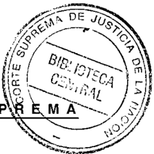
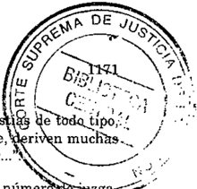
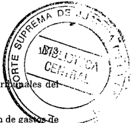
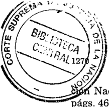
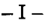
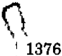
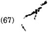

TOMO 322

Volumen 2

1999

-

"-

,

## FALLOS DE LA CORTE SUPREMA DE JUSTICIA DE LA NACION

## REPUBLICA ARGEN

## FALLOS

DE LA

SUPREMA

CORTE

DE

## •.'USTICIA DE LA NACION

PUBLICACION A CARGO DE LA SECRETARIA DE JURISPRUDENCIA DEL TRIBUNAL

TOMO 322 VOLUMEN 2

JUNIO.

----¡

r::tirt-..• """""'.""

~

&lt;

&gt;a

f

t;Q CG Orden

I

q~ .! fCj

Ubicaci6n)) ~ q;)

I

P-,I¡;i-i

LA LEY S. . . e .

Tucumán 1471 (1050) Buenos Aires 1999

SEt~~ª~'::~:\_~~.

Copyright (e) 2000 by Corte Suprema de Justicia de la Nación Queda hecho el depósito que previene la. ley 11.723. Impreso en la Argentina - Printed in Argentina I.S.B.N. 950-9825-52-2

ACUERDOS

DE

LA

CORTE

## AÑO 1999

## JUNIO. SEPTIEMBRE

## CORTE SUPREMA. ADMINISTRACION GENERAL. CREACION DE LA OFICINA DE SUBASTAS JUDICIALES.

-N"IO -

En Buenos Aires, a los 30 días del mes de junio del año mil novecientos noventa y nueve, reunidos en la Sala de Acuerdos del Tribunal, los señores Ministros que suscriben la presente,

## Consideraron:

JO) Que de conformidad con el informe y las propuestas realizadas por la Secretaría de Auditores del Tribunal para un mejor desenvolvimiento y control de las subastas judiciales, resulta conveniente disponer que todas las que se ordene realizar en el ámbito de la jurisdicción de la Capital Federal se centralicen en un único edificio perteneciente al Poder Judicial de la Nación, con dependencia de la Administración General. La oficina que se crea estará a cargo de un funcionario con título de abogado, con la dotación mínima que se estime necesaria y personal policial designado en forma permanente, bajo la dirección del indicado. El costo de mantenimiento y funcionamiento del local, se solventará cobrando por su uso un arancel cuyo monto consistirá en un porcentaje sobre el precio de venta, que será de 0,25 % Y deberá ser pagado por el comprador, cantidades que ingresarán a las rentas de esta Corte.

Esta dependencia cumplirá las siguientes funciones: recepción de la comunicación del juzgado que informe el remate ordenado con las constancias necesarias, asignación de día y hora de acuerdo al turno, organización y control del desarrollo del remate; llevará también un registro de subastas, con su resultado, nombre, documento de identidad y domicilio del comprador y martillero interviniente.

Para posibilitar una mayor publicidad, el edificio contará con un exhibidor en el que con anticipación serán anunciados los remates a realizarse con una síntesis de las constancias del edicto. .' :...

- 2") Que, en todos los casos, tendrán obligación de asistir al acto. de la subasta-el secretario o prosecretario administrativo del juzgado que la ordena, que deberán informar en la causa sobre su desarrollo y toda otra cuestión que pueda resultar de interés.
- 3") Que, se valora conveniente instrumentar para las subastas otros medios de pago que den seguridad, rapidez, certeza y comodidad a los eventuales adquirentes.

S U

Para .ello será necesario que en la indicada oficina se cuente con una agencia de un banco oficial que, además de permitir los depósitos en efectivo, se encuentre equipada de manera que en el acto admita constatar la existencia de fondos en la cuenta del oferente y posibilite efectuar el pago mediante tarjetas magnéticas o transferencia de las redes informáticas bancarias conocidas en plaza, formas que oportunamente serán reglamentadas, que otorgarán seguridad a los intervinientes y redundará en el beneficio de atraer más interesados con la posibilidad de mejorar los precios y, por tanto, la de cobro de los acreedores.

Por ello,

## Acordaron

1°) Crear, con dependencia de la Administración General de esta Corte, la OFICINA DE SUBASTAS JUDICIALES, en la que se llevarán a cabo todas las subastas y remates ordenados por los señores magistrados a realizarse en esta Capital Federal, que estará a cargo de un funcionario con título de abogado, en la que se cumplirán las funciones expresadas y crear el arancel contemplado en el considerando P.

- 2°)Méctase el inmueble de la calle Hipólito Irigoyen 2041 de esta ciudad para sede de la indicada dependencia y se dispone que sean proyectadas las medidas de adecuación de acuerdo a las necesidades que resultan del presente y las atinentes a la seguridad dellocaI.
- 3°) La Secretaría de Auditores Judiciales conjuntamente con la Administración General, elevarán los proyectos de reglamentación del funcionamiento, dotación y presupuesto para la organización e instalación de dicha oficina con el cronograma de actividades para el comienzo de la atención de los remates y subastas judiciales a realizarse en esa ciudad.

Todo lo cual dispusieron y mandaron, ordenando que se comunicase y registrase en el libro correspondiente, por ante mí, doy fe. -JULIO S. NAZARENO EDUARDOOLINÉ -M O'CONNORCARLOSS. FAYTAUGUSTOCÉSARBELLUSCIO ENRIQUESANTIAGO PETRACCHI ANTONIO BOGGIANO -GUILLERMO. F. A L6PEZGUSTAVO A. BOSSERT ADOLFO ROBERTO VÁZQUEZ. Nicolás Alfredo Reyes (Administrador General).

## FERIA JUDICIAL. HORARIO.

-N"1I-

En Buenos Aires, a los 30 días del mes de junio del año mil novecientos noventa y nueve, los señores Ministros que suscriben la presente,

## Consideraron:

Que el Colegio Público de Abogados de la Capital Federal solicitó que esta Corte adoptara medidas dado que "en ocasión de la feria judicial, la designación de un juzga-

## DE JUSTICIA DE LA NACION 322

llevando veces en la práctica denegación del derecho que se procura proteger

Que este Tribunal no estima necesario disponer el aumento del númer . a~' dos que deben permanecer abiertos, pero sí establecer la eliminación de los horarios reducidos,

Por ello,

## Acordaron:

Hacer saber a las cámaras nacionales y federales de apelación de la Capital Federal, y por intermedio de ellas a los juzgados bajo su jurisdicción, que durante las ferias judiciales regirá el horario de seis horas fijado por el Reglamento para la Justicia Na. cional (art. 6 y acordadas uros. 4174, 25176, 7/88 Y 66/96).

Todo lo cual dispusieron y mandaron, ordenando que se comunicase y se registra. se en el libro correspondiente, por ante mí, que doy fe. -JULIO S. NAZARENO EDUARDO -MOLINÉO'CONNOR CARLOS S. FAYT AUGUSTO CÉSAR BELLUSCIO -ENRIQUE SANTIAGO PETRACCHI -ANTONIO BOGGIANO -GUILLERMO A F. LÓPEZGUSTAVO A BOSSERT ADOLFO RoBERTO VÁZQUEZ. Nicolás Alfredo Reyes (Administrador General).

## FERIA JUDICIAL. AUTORIDAD DE FERIA.

-N" 12-

En Buenos Aires, a los 30 días del mes de junio del año mil novecientos noventa y nueve, reunidos en la Sala de Acuerdos del Tribunal, los señores Ministros que suscri~ ben la presente,

Resolvieron:

Ampliar la acordada N" 9/99 Ydesignar como autoridad de feria del mes de julio del corriente año:

Al doctor Gustavo A Bossert como juez de feria desde el 19-7.99 al 30.7.99.

Todo lo cual dispusieron y mandaron, ordenando que se comunicase y registrase en el libro correspondiente, por ante mí, que doy fe.Juuo S. NAZARENO EDUARDO -MOLINÉ O'CONNOR CARLOS S. FAYT AUGUSTO CÉSAR BELLUSCIO -ENRIQUE SANTIAGO PETRACCHI ANTONIO BOGGIANO -GUILLERMO A F. LÓPEZGUSTAVO A. BOSSERT ADOLFO ROBERTO VÁZQUEZ. Nicolás Alfredo Reyes (Administrador General).

## PRESUPUESTO

## \_N° 13-

En Buenos Aires a los 14 días del mes de julio del año mil novecientos noventa y nueve, reunidos en la Sala de Acuerdos del Tribunal los señores Ministros que suscri* ben la presente,

## Consideraron:

- l°) Que esta Corte Suprema de Justicia de la Nación, en su carácter de órgano Superior del Poder Judicial debe estimar las erogaciones correspondientes al ejercicio presupuestario 2.000, que se darán a conocer al Honorable Congreso de la Nación según lo dispuesto en el arto 1° de la Ley 23.853 y en el tercer párrafo del arto 14° del Decreto N° 1486/97 t,o. de la Ley Permanente del Presupuesto N° 11.672.
- 2°) Que al igual que en ejercicios anteriores, se ha considerado el gasto en base a las limitaciones impuestas por la situación general del país, por lo que el presente cálculo se ha efectuado siguiendo un criterio restrictivo del mismo.
- 3")Que se ha receptado por parte del Consejo de la Magistratura la propuesta de necesidades fisicas y cuantitativas descriptas en Resolución N" 107/99 Yse las ha incorporado a las proyecciones de gasto propias del Tribunal y sus áreas de dependencia directa,
- 4") Que -reducidos los gastos operativos a su mínima expresiónse han incluido aquellas erogaciones imprescindibles teniendo en cuenta las continuas postergaciones por falta de crédito suficiente en ejercicios anteriores, procediendo a una reasignación del gasto.
- 5") Que el constante y permanente crecimiento del Poder Judicial, producto del aumento de la demanda del servicio de justicia, hace imprescindible asignarle un tratamiento presupuestario diferenciado respecto de otrasjurisdícciones del Sector Público, ya que garantizar una adecuada actividad jurisdiccional constituye un deber indelegable del Estado.
- 6")Que por ello se insiste en la importancia de establecer un mecanismo de ajuste de la alícuota establecida por la Ley 23,853 -de Autarquíarespecto del porcentual de coparticipación primaria que se destina al Tesoro Nacional, en concordancia con el nivel del gasto de este Poder del Estado; ya que el valor establecido en oportunidad de su sanción, si bien se mantuvo inalterable, paulatinamente pasó a calcularse sobre una base diezmada por sucesivas detracciones que se le hicieron a la masa coparticipable destinada al Tesoro Nacional.
- 7") Que se incluye el monto necesario para la habilitación de tribunales creados por ley, además de los cargos necesarios para completar dotaciones reducidas e incorporar agentes en tribunales cuya'actividad así lojustifica. Se prevé asimismo la incorporación del personal denominado "meritorio" que a lo largo de los últimos años han

## DE JUSTICIA DE LA NACION 322

venido capacitándose y colaborando con la labor jurisdiccional de los tr país.

- 80 ) Que se incorporan los montos necesarios para mejorar la atención de ga -::. funcionamiento a los tribunales de todo el país posibilitando mayor independencia "ew~"'~. la gestión y economía administrativa en la tramitación de contrataciones menores.
- 9 0 ) Que se han ajustado los créditos para hacer frente a las erogaciones que signi~ ficó la incorporación y pleno funcionamiento del Consejo de la Magistratura y el Jurado de Enjuiciamiento.
- 100)Que se agregan los montos necesarios para una nueva etapa en el proceso de equipamiento informático en el resto de los tribunales del país y se contempla la digitalización integral en el Archivo General dependiente del Tribunal.
- Ir) Que se contemplan los valores necesarios para llevar adelante el plan de obras previsto para el año 2.000, y los montos para adquirir inmuebles y concretar las expropiaciones dispuestas por leyes respectivas.
- 12 0 ) Que se incorporan las previsiones para el pago de sentencias por diferencias de remuneraciones y los valores para satisfacer los ajustes y el reescalafonamiento requeridos por el Consejo de la Magistratura.
- 130 ) Que el cálculo de recursos necesarios para financiar el gasto resultante, se ha estimado en base a la recaudación real del año 1998 y a los ingresos del primer cuatrimestre de 1999 proyectados hasta fin del ejercicio. El mismo incluye el monto necesario para amortizar las cuotas cuyos vencimientos operarán en el próximo ejercicio correspondientes a las Licitaciones N° 1/94 y 1/97.

Por ello,

Acordaron:

- ¡o) Fijar el Presupuesto de Gastos del Poder Judicial de la Nación para el ejercicio año 2.000, en la suma de PESOS NOVECIENTOS CINCUENTA Y UN MILLONES TREINTA Y TRES MIL CUATROCIENTOS VEINTINUEVE ($ 951.033.429.-), conforme al siguiente detalle:

|                                    | Consejo de la Magist. S.A.F. 320   | C.S.J.N. S.A.F. 335   | TOTAL P.J.N.   |
|------------------------------------|------------------------------------|-----------------------|----------------|
| Inciso 1 • Personal                | 637.424.400                        | 116.157.386           | 753.581.786    |
| Inciso 2. Bienes de Consumo        | 10.474.300                         | 2.283.100             | 12.757.400     |
| Inciso 3 • Servicios no personales | 50.776.000                         | 5.571.500             | 56.347.500     |
| Inciso 4 - Bienes de Uso           | 51.493.800                         | 8.984.443             | 60.476.243     |
| Inciso 5 • Transferencias          | 13.846.500                         | 2.400.000             | 16.246.500     |
| Inciso 7 • Servicios de la Deuda   | 47.697.000                         | 3.925.000             | 51.622.000     |
| TOTAL                              | 811.712.000                        | 139.321.429           | 951.033.429    |

- '2°) Fijar en DIECINUEVE MIL OCHOCIENTOS SETENTA Y SIETE (19,877) los cargos de la planta de personal para el Poder Judicial de la Nación durante el ejercicio 2,000,
- 3°) Aprobar el "Plan de Obras" que como Anexo 1 se agrega a la presente.
- 4°) Estimar la necesidad de recursos dispuestos por Ley 23.853 para el ejercicio 2,000 en la cantidad de PESOS NOVECIENTOS SESENTA Y DOS MILLONES CUATROCIENTOS NOVENTA Y DOS MIL SETECIENTOS QUINCE ($ 962.492,715), de acuerdo al siguiente detalle:

| -Recursos originados en el 3,5 % de coparticipación más los conceptos No Tributarios   | $ 428,689,965   |
|----------------------------------------------------------------------------------------|-----------------|
| -Recursos por Tasa de Justicia                                                         | $ 94,633,684    |
| -Otros Ingresos de Afectación Específica                                               | $ 17,103,324    |
| -Aportes del Tesoro Nacianal                                                           | $ 422 065,742   |
| TOTAL FINANCIAMIENTO NECESARIO                                                         | $ 962,492,715   |

Todo lo cual dispusieron y mandaron, ordenaron que se comunicase y registrase en el libro correspondiente, por ante mí que doy fe,JULIO S. NAZARENO -EDUARDO MOLINÉ O'CONNOR CARLOS S. FAYTAUGUSTO CÉSAR BELLUSCIO ANTONIO BOGGIANOGUILLERMO A. F. LÓPEZ -GUSTAVO A. BOSSERT ADOLFO ROBERTO VAzQUEZ. Nicolás Alfredo Reyes (Administrador General).

ANEXO 1

## PLAN DE OBRAS PRESUPUESTO 2000

| Nro,                                                  | Denominaaón de la obra                                                             | Monto Estlmado                                        | Inversión estimada para el Año:                       | Inversión estimada para el Año:                       | Inversión estimada para el Año:                       | Inversión estimada para el Año:                       |
|-------------------------------------------------------|------------------------------------------------------------------------------------|-------------------------------------------------------|-------------------------------------------------------|-------------------------------------------------------|-------------------------------------------------------|-------------------------------------------------------|
|                                                       |                                                                                    |                                                       | 1999                                                  | 2000                                                  | 2001                                                  | Añosposteriores                                       |
| PROYECTO 22. JUSTICIA DE CASACiÓN PENAL               | PROYECTO 22. JUSTICIA DE CASACiÓN PENAL                                            | PROYECTO 22. JUSTICIA DE CASACiÓN PENAL               | PROYECTO 22. JUSTICIA DE CASACiÓN PENAL               | PROYECTO 22. JUSTICIA DE CASACiÓN PENAL               | PROYECTO 22. JUSTICIA DE CASACiÓN PENAL               | PROYECTO 22. JUSTICIA DE CASACiÓN PENAL               |
| t                                                     | Edificio CrooPy 2002 - Cap. Federal- Construcción de Alcaidía                      | 630.000,00                                            | 380.000,00                                            | 250.000.00                                            |                                                       |                                                       |
| 2,                                                    | Edificio CrooPy 2002 - Cap. Federal- Aemodelación de la planta baja                | 270.000,00                                            | 70.000.00                                             | 200.000,00                                            |                                                       |                                                       |
| 3,                                                    | Edificio CrooPy 2002. Cap. Federal. Aemodelación de! subsuelo                      | 500.000,00                                            |                                                       | 500.000,00                                            |                                                       |                                                       |
| PROYECTO 23. JUSTICIA ORDINARIA DE LA CAPITAL FEDERAL | PROYECTO 23. JUSTICIA ORDINARIA DE LA CAPITAL FEDERAL                              | PROYECTO 23. JUSTICIA ORDINARIA DE LA CAPITAL FEDERAL | PROYECTO 23. JUSTICIA ORDINARIA DE LA CAPITAL FEDERAL | PROYECTO 23. JUSTICIA ORDINARIA DE LA CAPITAL FEDERAL | PROYECTO 23. JUSTICIA ORDINARIA DE LA CAPITAL FEDERAL | PROYECTO 23. JUSTICIA ORDINARIA DE LA CAPITAL FEDERAL |
| Fuero Comercial                                       | Fuero Comercial                                                                    | Fuero Comercial                                       | Fuero Comercial                                       | Fuero Comercial                                       | Fuero Comercial                                       | Fuero Comercial                                       |
| 4,                                                    | Edificios Av.Callao 635 y Av.Roque SaenzPeña 1211-Cap.Federa!- Reparaciones varias | 150.000.00                                            |                                                       | 150.000,00                                            |                                                       |                                                       |
| 5,                                                    | Edilicio Marcelo T.de Alvear 1840- Cap. Federal- Aemodelación 3~y 4~piso           | 2.200.000,00                                          | 392.700,00                                            | 1.807.300,00                                          |                                                       |                                                       |

## DE JUSTICIA DE LA NACION 322

| Nro.                                             | Denominación de la obra                                                                                                                | Monto                                            | Inversión estimada para el Año:                  | Inversión estimada para el Año:                  | Inversión estimada para el Año:                  | Inversión estimada para el Año:                  |
|--------------------------------------------------|----------------------------------------------------------------------------------------------------------------------------------------|--------------------------------------------------|--------------------------------------------------|--------------------------------------------------|--------------------------------------------------|--------------------------------------------------|
|                                                  | Denominación de la obra                                                                                                                | Estimado                                         | 1999                                             | 2000                                             | 2001                                             | I Anos posteriores                               |
| Fuero Penal Económico                            | Fuero Penal Económico                                                                                                                  | Fuero Penal Económico                            | Fuero Penal Económico                            | Fuero Penal Económico                            | Fuero Penal Económico                            | Fuero Penal Económico                            |
| 6.                                               | Edificio Av. de los Inmigrantes 1950- Cap. Federal- Reparación integral de la lachada y de la carpintería exterior                     | 660.000,00                                       |                                                  | 660.000,00                                       |                                                  |                                                  |
| 7.                                               | Edificio Av. de los Inmigrantes 1950- Cap. Federal-Iluminación de archivos                                                             | 140.000,00                                       |                                                  | 140.000,00                                       |                                                  |                                                  |
| 8.                                               | Edificio Av. de los Inmigrantes 1950- Cap. Federal. Playa de estacionamiento                                                           | 100.000,00                                       |                                                  | 100.000.00                                       |                                                  |                                                  |
| 9.                                               | Edilicio Av. de los Inmigrantes 1950. Cap. Federal- Reemplazo de tablero principal y montantes eléctricas                              | 450.000,00                                       |                                                  | 450.000,00                                       |                                                  |                                                  |
| 10.                                              | Edificio Av. de los Inmigrantes 1950- Cap. Federal- Renovación de núcleos sanitarios                                                   | 340.000.00                                       |                                                  | 340.000,00                                       |                                                  |                                                  |
| 11.                                              | Edificio Av. de los Inmigrantes 1950- Cap. Federal- Reparación colector y cubierta azotea                                              | 950.000.00                                       |                                                  | 950,000,00                                       |                                                  |                                                  |
| 12.                                              | Edificio Av. de los Inmigrantes 1950- Cap. Federal - Traslado de la Cámara Penal Económica Fuero Laboral                               | 550.000,00                                       |                                                  | 550.000,00                                       |                                                  |                                                  |
| 13.                                              | Edificio Av. Roque Saenz Peña 760 y Lavalle 1154 - Cap. Federal- Revoques Exteriores e interiores y pintura integral de los edificios. | 500.000,00                                       |                                                  |                                                  |                                                  |                                                  |
| 14.                                              | Edificio Pte. Tle. Gral. Perón 990- Cap. Federal. Remodelación de Juzgados.                                                            | 500.000,00                                       | 100.000,00                                       | 400.000,00                                       |                                                  |                                                  |
| Fuero Criminal y Correccional de la Cap. Federal | Fuero Criminal y Correccional de la Cap. Federal                                                                                       | Fuero Criminal y Correccional de la Cap. Federal | Fuero Criminal y Correccional de la Cap. Federal | Fuero Criminal y Correccional de la Cap. Federal | Fuero Criminal y Correccional de la Cap. Federal | Fuero Criminal y Correccional de la Cap. Federal |
| 15.                                              | Edificio Juncal 941 - Cap. Federal- Reparaciones varias                                                                                | 215.000,00                                       |                                                  | 215.000,00                                       |                                                  |                                                  |
| 16.                                              | Edificio LavaBe 1171 - Cap. Federal- Juzgados de Ejecución Penal-1~, 2~y 3~ Piso                                                       | 300.000,00                                       |                                                  | 300.000,00                                       |                                                  |                                                  |
| 17.                                              | Edilicio Lavalle 1171 - Cap. Federal- Reparaciones varias.                                                                             | 520.000,00                                       |                                                  | 382.720,00                                       | 137.280,00                                       |                                                  |
| 18.                                              | Edilicio Lavalle 1638 - Cap. Federal- Reparaciones varias                                                                              | 315.000,00                                       |                                                  | 315,000,00                                       |                                                  |                                                  |
| 19.                                              | EdificloViamonte 1147 - Cap, Federal- Recuperación U22                                                                                 | 500.000,00                                       | 100.000,00                                       | 400,000,00                                       |                                                  |                                                  |
| 20.                                              | EdificioViamonle 1147 - Cap. Federal- Refacciones varias en el edilicio                                                                | 400.000,00                                       |                                                  | 298.400,00                                       | 101.600,00                                       |                                                  |

| Nrn.                              | Denominación de la obra                                                                                                             | Monto                             | Inversión estimada para el Año:   | Inversión estimada para el Año:   | Inversión estimada para el Año:   | Inversión estimada para el Año:   |
|-----------------------------------|-------------------------------------------------------------------------------------------------------------------------------------|-----------------------------------|-----------------------------------|-----------------------------------|-----------------------------------|-----------------------------------|
|                                   |                                                                                                                                     | Estimado                          | 1999                              | 2000                              | 2001                              | I Años posteriores                |
| FueroClvil                        | FueroClvil                                                                                                                          | FueroClvil                        | FueroClvil                        | FueroClvil                        | FueroClvil                        | FueroClvil                        |
| 21.                               | Edificio Lavalle 1220 - Cap. Federal. Reparación de fachadas.                                                                       | 250,000,00                        |                                   | 250.000.00                        |                                   |                                   |
| 22.                               | Edificio Uruguay 714 - Cap. Federal. Reparación de cubiertas                                                                        | 350,000,00                        |                                   | 350.000.00                        |                                   |                                   |
| PROYECTO 24. JUSTICIA FEDERAL     | PROYECTO 24. JUSTICIA FEDERAL                                                                                                       | PROYECTO 24. JUSTICIA FEDERAL     | PROYECTO 24. JUSTICIA FEDERAL     | PROYECTO 24. JUSTICIA FEDERAL     | PROYECTO 24. JUSTICIA FEDERAL     | PROYECTO 24. JUSTICIA FEDERAL     |
| Fuero de fa Seguridad Social .    | Fuero de fa Seguridad Social .                                                                                                      | Fuero de fa Seguridad Social .    | Fuero de fa Seguridad Social .    | Fuero de fa Seguridad Social .    | Fuero de fa Seguridad Social .    | Fuero de fa Seguridad Social .    |
| 23.                               | Edificio Lavalle 126B. Cap. Federal- Cambio de carpinlería exterior,                                                                | 295.000.00                        |                                   | 295.000,00                        |                                   |                                   |
| Area Cámara de La Piafa           | Area Cámara de La Piafa                                                                                                             | Area Cámara de La Piafa           | Area Cámara de La Piafa           | Area Cámara de La Piafa           | Area Cámara de La Piafa           | Area Cámara de La Piafa           |
| 24.                               | Alcaidia la Plata: Construcción de la alcaldía dentro del edilicio de la Cámara                                                     | 350.000,00                        | 145.425,00                        | 204.575,00                        |                                   |                                   |
| Area Cámara de Mar del Plata      | Area Cámara de Mar del Plata                                                                                                        | Area Cámara de Mar del Plata      | Area Cámara de Mar del Plata      | Area Cámara de Mar del Plata      | Area Cámara de Mar del Plata      | Area Cámara de Mar del Plata      |
| 25.                               | Cámara Federal de Apelaciones de Mar del Plala - Construcción de un nuevo edifido                                                   | 1.575.000,00                      |                                   | 141.750,00                        | 1.165.500.00                      | 267.750,00                        |
| Area Cámara de san Martín         | Area Cámara de san Martín                                                                                                           | Area Cámara de san Martín         | Area Cámara de san Martín         | Area Cámara de san Martín         | Area Cámara de san Martín         | Area Cámara de san Martín         |
| 26.                               | Cámara Federal de Apelaciones de San Martín - Ampliación del inmueble de la calle Güemes 3053 - San Martín                          | 450.000.00                        |                                   | 185.625,00                        | 264.375,00                        |                                   |
| 27.                               | Edilicio Crisólogo Larralde esq. Independencia. Morón. Remodelación del edilicio para ubicar en él los Juzgados Federales de Morón. | 400.000,00                        |                                   | 400.000.00                        |                                   |                                   |
| Area Cámara de Comodoro Rivadavia | Area Cámara de Comodoro Rivadavia                                                                                                   | Area Cámara de Comodoro Rivadavia | Area Cámara de Comodoro Rivadavia | Area Cámara de Comodoro Rivadavia | Area Cámara de Comodoro Rivadavia | Area Cámara de Comodoro Rivadavia |
| 28.                               | Centro Judicial de Ushuaia- Construcción de nuevo edilicio en la calle Maipú esq. FajuL                                             | 2,000.000,00                      |                                   | 86.400.00                         | 1.323.600,00                      | 590,000,00                        |
| Area Cámara de Mendoza            | Area Cámara de Mendoza                                                                                                              | Area Cámara de Mendoza            | Area Cámara de Mendoza            | Area Cámara de Mendoza            | Area Cámara de Mendoza            | Area Cámara de Mendoza            |
| 29.                               | Edificio Av. España esq. Pedro Malina. Restauración y adecuación del edilicio de la Cámara                                          | 500.000,00                        |                                   | 210.750,00                        | 289.250,00                        |                                   |
| Area Cámara de Resistencia        | Area Cámara de Resistencia                                                                                                          | Area Cámara de Resistencia        | Area Cámara de Resistencia        | Area Cámara de Resistencia        | Area Cámara de Resistencia        | Area Cámara de Resistencia        |
| 30.                               | Edilicio HipólitoYrigoyen 55- Resistencia. Prosecución de la obra paralizada                                                        | 5.500.000,00                      |                                   | 1.713.250,00                      | 3.786.750,00                      |                                   |
| 31.                               | Juzgado Federal de Formasa. Remodelacién del 4~ piso para ubicar elTríbunal Oral Penal en el edilicio del Juzgado                   | 360.000,00                        |                                   | 360.000.00                        |                                   |                                   |

## DE JUSTICIA DE LA NACION

322

| Nro.                                                                                          | Denominación de la obra                                                                                                    | Monto Estimado                                                                                | Inversión estimada para el Año:                                                               | Inversión estimada para el Año:                                                               | Inversión estimada para el Año:                                                               | Inversión estimada para el Año:                                                               |
|-----------------------------------------------------------------------------------------------|----------------------------------------------------------------------------------------------------------------------------|-----------------------------------------------------------------------------------------------|-----------------------------------------------------------------------------------------------|-----------------------------------------------------------------------------------------------|-----------------------------------------------------------------------------------------------|-----------------------------------------------------------------------------------------------|
|                                                                                               |                                                                                                                            |                                                                                               | 1999                                                                                          | 2000                                                                                          | 2001                                                                                          | I Añosposteriores                                                                             |
| Area Cámara deTucumán                                                                         | Area Cámara deTucumán                                                                                                      | Area Cámara deTucumán                                                                         | Area Cámara deTucumán                                                                         | Area Cámara deTucumán                                                                         | Area Cámara deTucumán                                                                         | Area Cámara deTucumán                                                                         |
| 32.                                                                                           | Edificio Piedras 418 - Tucumán- Refacción y remodelación aislación hidróluga                                               | 150.0Cú,00                                                                                    |                                                                                               | 150.000,00                                                                                    |                                                                                               |                                                                                               |
| 33.                                                                                           | Edificio Piedras 418 - Tucumán- Cambio de carpinteria de frentes                                                           | 700.000,00                                                                                    |                                                                                               | 700.000,00                                                                                    |                                                                                               |                                                                                               |
| 34.                                                                                           | Juzgado Federal de Catamarca- Ampliación y remodelaci6n del edificio                                                       | 380.000,00                                                                                    |                                                                                               | 380.000,00                                                                                    |                                                                                               |                                                                                               |
| Area Cámara de Córdoba                                                                        | Area Cámara de Córdoba                                                                                                     | Area Cámara de Córdoba                                                                        | Area Cámara de Córdoba                                                                        | Area Cámara de Córdoba                                                                        | Area Cámara de Córdoba                                                                        | Area Cámara de Córdoba                                                                        |
| 35.                                                                                           | Juzgado Federal de BellVille. Córdoba. Construcción de nuevo edilicio                                                      | 1.399.980,00                                                                                  | 400.000,00                                                                                    | 999.980,00                                                                                    |                                                                                               |                                                                                               |
| Area Cámara de Santa Fe                                                                       | Area Cámara de Santa Fe                                                                                                    | Area Cámara de Santa Fe                                                                       | Area Cámara de Santa Fe                                                                       | Area Cámara de Santa Fe                                                                       | Area Cámara de Santa Fe                                                                       | Area Cámara de Santa Fe                                                                       |
| 36.                                                                                           | Tribunal Oral Penal N9 1 de Santa Fe - Remodelación del 2 9 piso del edificio ex-Banade                                    | 180.000,00                                                                                    |                                                                                               | 180.000,00                                                                                    |                                                                                               |                                                                                               |
| 37.                                                                                           | Juzgados Civiles de Rosario- Pcia. de Santa Fe- Remodelación del edificio                                                  | 900,00J,00                                                                                    |                                                                                               | 650.250,00                                                                                    | 249.750,00                                                                                    |                                                                                               |
| Area Cámara de Graf. Roca                                                                     | Area Cámara de Graf. Roca                                                                                                  | Area Cámara de Graf. Roca                                                                     | Area Cámara de Graf. Roca                                                                     | Area Cámara de Graf. Roca                                                                     | Area Cámara de Graf. Roca                                                                     | Area Cámara de Graf. Roca                                                                     |
| 38.                                                                                           | TrittJnales Federales de Neuquén- Construcdón de un nuevo edificio en el terreno propiedad del Poder Judicial de la Nación | 6,000,000,00                                                                                  | 60.000,00                                                                                     | 5.121,000,00                                                                                  | 819.000,00                                                                                    |                                                                                               |
| TOTAL DE OBRAS PROYECTADAS 31,929,980,00 1.648.125,00 21.287.000,00 8.1':fl.105,00 857,750,00 | TOTAL DE OBRAS PROYECTADAS 31,929,980,00 1.648.125,00 21.287.000,00 8.1':fl.105,00 857,750,00                              | TOTAL DE OBRAS PROYECTADAS 31,929,980,00 1.648.125,00 21.287.000,00 8.1':fl.105,00 857,750,00 | TOTAL DE OBRAS PROYECTADAS 31,929,980,00 1.648.125,00 21.287.000,00 8.1':fl.105,00 857,750,00 | TOTAL DE OBRAS PROYECTADAS 31,929,980,00 1.648.125,00 21.287.000,00 8.1':fl.105,00 857,750,00 | TOTAL DE OBRAS PROYECTADAS 31,929,980,00 1.648.125,00 21.287.000,00 8.1':fl.105,00 857,750,00 | TOTAL DE OBRAS PROYECTADAS 31,929,980,00 1.648.125,00 21.287.000,00 8.1':fl.105,00 857,750,00 |
| Nro.                                                                                          | Denominación de la obra                                                                                                    | Monto Estimado                                                                                | 1999                                                                                          | Inversión estimada 2000                                                                       | nara el Año: 2001                                                                             | 1 Añosposteriores                                                                             |
| 1 PROYECro 21 • JUSTICIA EN MÁXIMA INSTANCIA                                                  | 1 PROYECro 21 • JUSTICIA EN MÁXIMA INSTANCIA                                                                               | 1 PROYECro 21 • JUSTICIA EN MÁXIMA INSTANCIA                                                  | 1 PROYECro 21 • JUSTICIA EN MÁXIMA INSTANCIA                                                  | 1 PROYECro 21 • JUSTICIA EN MÁXIMA INSTANCIA                                                  | 1 PROYECro 21 • JUSTICIA EN MÁXIMA INSTANCIA                                                  | 1 PROYECro 21 • JUSTICIA EN MÁXIMA INSTANCIA                                                  |
| 1.1                                                                                           | Edificio Palacio de Tribunales- Fachadas                                                                                   | 4.847.300,00                                                                                  | 6OO.0Cú,00                                                                                    | 4.247.000,00                                                                                  |                                                                                               |                                                                                               |
| 1.2                                                                                           | Edificio Palacio de Tribunales- baños                                                                                      | 350,000,00                                                                                    |                                                                                               | 350,000.00                                                                                    |                                                                                               |                                                                                               |
| 1.3                                                                                           | lavalle 1240. Reparación Cubiertas y lraslado Comisaría                                                                    | 250.000,00                                                                                    |                                                                                               | 250.000,00                                                                                    |                                                                                               |                                                                                               |
| 1.4                                                                                           | Junín 760 - Construcción Depósito                                                                                          | 153.000,00                                                                                    |                                                                                               | 153.000,00                                                                                    |                                                                                               |                                                                                               |
| 1.5                                                                                           | Villariño 2010 - Refacciones para Archivo                                                                                  | 400.000,00                                                                                    | 100.000.00                                                                                    | 300,000,00                                                                                    |                                                                                               |                                                                                               |
| 1.6                                                                                           | Barlolomé Mitre 718y Maipú 92- Refacciones y acondicionamientos para Dir. Periciai                                         | 700.000,00                                                                                    |                                                                                               | 580.000,00                                                                                    | 120.000,00                                                                                    |                                                                                               |
|                                                                                               |                                                                                                                            | 6.700.300.00                                                                                  | 700.000,00                                                                                    | 5.880.000,00                                                                                  | 120.000,00                                                                                    |                                                                                               |
| TOTAL DE LAS OBRAS PROYECTADAS TOTAL OBRAS P.J.N.                                             | TOTAL DE LAS OBRAS PROYECTADAS TOTAL OBRAS P.J.N.                                                                          | 38.630.280,00                                                                                 | 2.348.125,00                                                                                  | 27.167.000,00                                                                                 | 8.251.105,00                                                                                  | 857.750,00                                                                                    |

## ACUERDOS DE LA CORTE SUPREMA 322

## GRADUADOS DE LA CARRERA DE ABOGACIA.

## -N" 14-

En Buenos Aires, a los 14 días del mes de julio del año mil novecientos noventa y nueve, los señores Ministros que suscriben la presente,

## Consideraron:

Que por acordada 55/99 de la Cámara Federal de Apelaciones de Rosario, eleva a esta Corte la solicitud formulada por el señor juez a cargo del Juzgado N° 4 de esa ciudad de autorización para el desempeño en ese tribunal de cuatro graduados de la carrera de abogacía con los mayores promedios, por el ténnino máximo de un año y sin percepción de haberes, sin que ello implique ingreso en el Poder Judicial de la Nación ni derecho a ser designados en forma permanente.o transitoria.

Que por acordada 22190, esta Corte estableció un programa de colaboración con las universidades nacionales y privadas consistente en permitir a los egresados con los más altos promedios de la carrera de abogacía desempeñarse en la Corte Suprema en forma no remunerada, para realizar tareas de investigación, y fijó una serie de requisitos dirigidos a quienes se incorporaran al programa.

Que, además, por acordada 16/95 aprobó un régimen de pasantías solicitado por la Cámara Nacional de Apelaciones en lo Comercial, restringiéndolo al caso de los abogados graduados.

Que, por acordada 6199 se resolvió acceder a una petición similar a la tratada.

Por ello, y en virtud de las facultades conferidas por el arto 104 del R.J.N. y el arto 22 de la ley 4055,

## Acordaron:

Autorizar el desempeño en el Juzgado Federal de Rosario N° 4, de cuatro graduados de la carrera de abogacía con los mayores promedios, para que presten colaboración, al tiempo que se capacitarán, en las tareas de investigación del tribunal, por el término máximo de un año y en forma ud honorem y sin que ello implique ingreso en el Poder Judicial de la Nación ni derecho a ser designado en forma permanente ni transi. toria como agente del mismo.

Todo lo cual dispusieron y mandaron, ordenando que se comunicase y se registrase en el libro correspondiente, por ante mí, que doy fe.EDUARDOOLlNÉ O'CONNORM CARLOS. FAYT AUGUSTOÉSAR BELLUscro C GUSTAVO. BOSSERT ADOLFOOBERTO A -R V ÁZQUEZ. Nicolás Alfredo Reyes (Administrador General).

## HONRAS DISPUESTAS CON MOTIVO DEL FALLECIMIENTO DEL DR. LUIS CARLOS CABRAL.

-N" 15-

En Buenos Aires, a los 5 días del mes de agosto del año mil novecientos noventa y nueve, reunidos en la Sala de Acuerdos del Tribunal, los señores Ministros que suscriben la presente,

Consideraron:

Que el día 30 de julio ppdo., ocurrió el fallecimiento del doctor Luis Carlos Cabral ex Ministro de esta Corte Suprema de Justicia de la Nación.

Que es deber del Tribunal asociarse al duelo que provoca la desaparición del distinguido Magistrado.

Por ello,

Acordaron:

Dirigir nota de condolencia a la familia del extinto con transcripción de la presente acordada.

Todo lo cual dispusieron y mandaron, ordenando que se comunicase y registrase en el libro correspondiente, por ante mí, que doy fe.JULIOS. NAZARENO -EDUARDO MOLINÉ O'CONNOR CARLOS S. FAYT ENRIQUE SANTIAGO ETRACCHI P -GUILLERMO. F. A LÓPEZ \_ GUSTAVO. BOSSERT A ADOLFO ROBERTOAzQUEZ. V Nicolás Alfredo Reyes (Admi. nistrador General).

CONSEJO DE LA MAGISTRATURA Y JURADO DE ENJUICIAMIENTO DE MAGISTRADOS. SUPERINTENDENCIA SOBRE LOS FUNCIONARIOS Y EMPLEADOS DE LA CORTE SUPREMA.

-N" 16-

En Buenos Aires, a los 5 días del mes de agosto del año mil novecientos noventa y nueve, reunidos en la Sala de Acuerdos del Tribunal, los señores Ministros que suscriben la presente,

Consideraron:

Que la reforma constitucional de 1994 ha incorporado al Consejo de la Magistratura y al Jurado de Enjuiciamiento de Magistrados como órganos del Poder Judicial de la Nación (arts. 114 y 115, respectivamente, de la Ley Fundamental; arts. 1 y 21, respectivamente de las leyes 24.937 y 24.939), circunstancia que -dada la instalación de

aquéllosjustifica adecuar las disposiciones en vigencia para que ambos cuerpos cuenten con facultades apropiadas y suficientes que les permitan un adecuado funcionamiento.

Que a tal fin corresponde que esta Corte delegue sus atribuciones, disponiendo que el Consejo de la Magistratura y el Jurado de Enjuiciamiento de Magistrados ejerzan superintendencia directa sobre sus funcionarios y empleados y decidan los casos concretos de esta naturaleza que se presenten.

Por ello,

## Acordaron:

1. Incorporar al arto 118 del Reglamento para la Justicia Nacional, como inciso d), el siguiente texto: "Por el Consejo de la Magistratura y por el Jurado de Enjuiciamiento de Magistrados, respectivamente, sobre su propio personal. II. Disponer la aplicación de los arts. 23 y 23 bis del Reglamento para la Justicia Nacional, en lo pertinente, al Consejo de la Magistratura y al Jurado de Enjuiciamiento de Magistrados. Todo lo cual dispusieron y mandaron, ordenando que se comunicase y registrase en el libro correspondiente, por ante mí, que doy fe. Regístrese y hágase saber.JULIOS. NAZARENOCARLOS S. FAYT ANTONIO BOGGIANO GUILLERMO . F. LÓPEZ-~ A GUSTAVO. BOSSERTA ADOLFO ROBERTO VÁZQUEZ. Cristian S. Abritta (Secretario General de la Corte Suprema).

## DIAS INHABILES

## -N° 17-

En Buenos Aires, a los 19 días del mes de agosto del año mil novecientos noventa y nueve, reunidos en la Sala de Acuerdos del Tribunal, los señores Ministros que suscriben la presente,

## Consideraron:

Que la forma irregular en que han funcionado los Tribunales Nacionales y Federales del país, en razón de la medida de fuerza resuelta por la Unión de Empleados de la Justicia de la Nación el día 11 de agosto del corriente año, requiere tomar medidas que eviten perjuicio a los litigantes.

Por ello

Acordaron:

Declarar el día 11 de agosto de 1999 inhábil para los Tribunales Nacionales y Federales del país, sin perjuicio de la validez de los actos procesales cumplidos que no hubiesen sido actuados en rebeldía.

Todo lo cual, dispusieron y mandaron, ordenando que se comunicase y se registrase en el libro correspondiente, por ante mí que doy fe.JULIOS. NAZARENO EDUARDO -MOLINÉ O'CONNOR -AUGUSTOÉSAR BELLUSCIO ENRIQUE SANTIAGO ETRACCHI ANTONIO C -P -BOGGlANO GUILLERMO. F. LÓPEZ --A GUSTAVO. BOSSERT A ADOLFO ROBERTO VAzQUEZ. Nicolás Alfredo Reyes (Administrador General).

## DlAS INHABILES

N' 18

En Buenos Aires, a los 24 días del mes de agosto del año mil novecientos noventa y nueve, reunidos en las Sala de Acuerdos del Tribunal, los señores ministros que suscriben la presente,

Consideraron:

Que la forma irregular en que han funcionado los Tribunales Nacionales y Federales del país, en razón de la medida de fuerza resuelta por la Unión de Empleados de la Justicia de la Nación el día 19 de agosto del corriente año, requiere tomar medidas que eviten perjuicio a los litigantes.

Por ello

Acordaron:

Declarar el día 19 de agosto de 1999 inhábil para los Tribunales Nacionales y Federales del país, sin perjuicio de la validez de los actos procesales cumplidos que no hubiesen sido actuados en rebeldía.

Todo lo cual, dispusieron y mandaron, ordenando que se comunicase y se registrase en el libro correspondiente; por ante mi que doy fe.JULIOS. NAZARENO EDUARDO -MOLINÉO'CONNOR CARLOS S. FAYT AUGUSTO CÉSAR BELLUSCIO -ENRIQUE SANTIAGO PETRACCHI ANTONIO BOGGIANO -GUSTAVO A. BOSSERT GUILLERMO. F. A LÓPEZADOLFO RoBERTO VÁZQUEZ.

## MORGUE JUDlCIAL. TAREAS PELIGROSAS E INSALUBRES.

-N" 19-

En Buenos Aires, a los 25 días del mes de agosto de mil novecientos noventa y nueve, reunidos en la Sala de Acuerdos del Tribunal, los señores Ministros que suscriben la presente

## Consideraron:

Que la Ley 16.494/64 estableció la bonificación por tareas peligrosas e insalubres para el personal que presta servicios en la Margue Judicial, consistente en el 20% del total de las remuneraciones que dichos agentes percibieron en virtud de la citada norma.

Que la liquidación del beneficio en cuestión fue practicada hasta el mes de febrero de 1998 tomando como base para su cálculo únicamente los rubros sueldo básico y compensación jerárquica.

Que mediante acordada N° 16/98 Y resolución N" 1224/98, el Tribunal dispuso instruir a la Administración General para que, a partir de la liquidación de los haberes correspondientes al mes de marzo de 1998, incluyera en dicha base el suplemento remunerativo establecido por las acordadas N" 71/93 Y 37/94, inc. 3", para todos aquellos agentes con derecho a percibirla.

Que ante la existencia de numerosos reclamos administrativos tendientes a lograr la inclusión de los demás rubros que componen la remuneración de los agentes, se torna necesario modificar -para el futurola metodología de cálculo del beneficio alu. dido, de conformidad con lo peticionado.

Que asimismo, con el fin de evitar futuras erogaciones en concepto de costas judiciales por demandas entabladas, resulta apropiado buscar soluciones que permitan afrontar el pago de las diferencias que pudieran corresponder por períodos no prescriptos, en la medida en que se cuente con disponibilidad financiera y de créditos presupuestarios.

Que la realización de lo expresado en los considerandos que anteceden, resulta posible en virtud de lo dispuesto en el artículo 5" de la ley 23.853,

## Por ello,

## Acordaron:

- 1")Instruir a la Administración General para que, a partir de la liquidación de los haberes correspondientes al mes de setiembre de 1999, disponga la inclusión -en la base de cálculo para el cómputo de la bonificación por tareas peligrosas e insalubres-del total de los rubros que componen la remuneración de los agentes con derecho a percibirla.
- 2") Autorizar a la Administración General para que proceda a disponer que se efectúe la liquidación y pago de las diferencias que correspondan en virtud de la aplicación del método de cálculo indicado en el considerando anterior por períodos no prescriptos, en la medida en que lo permita la disponibilidad de créditos presupuesta. rios y se cuente con los recursos financieros para tal fin.

Todo lo cual dispusieron y mandaron, ordenando que se comunicase y registrase en el libro correspondiente por ante mí, que doy fe.JULIOS. NAZARENO EDUARDO -MOLINÉ O'CONNOR -CARLOS. FAYT AUGUSTOÉSAR BELLUSCIO ENRIQUE SANTIAGO C -PETRACCHI ADOLFO RoBERTOAZQUEZ. -V Nicolás Alfredo Reyes (Administrador General de la Corte Suprema).

## DE JUSTICIA DE LA NACJON 322

## DIAS INHABILES

-N"20-

En Buenos Aires, a los 27 días del mes de agosto del año mil novecientos noventa y nueve, reunidos 'en la Sala de Acuerdos del Tribunal, los señores Ministros que suscriben la presente,

## Consideraron:

Que la forma irregular en que han funcionado los Tribunales Nacionales y Federa. les del país, en razón de la medida de fuerza resuelta por la Unión de Empleados de la Justicia de la Nación los días 25 y 26 de agosto del corriente año, requiere tomar medidas que eviten perjuicio a los litigantes.

Por ello,

Acordaron:

Declarar los días 25 y 26 de agosto de 1999 inhábil para los Tribunales Nacionales y Federales del país, sin perjuicio de la validez de los actos procesales cumplidos que no hubiesen sido actuados en rebeldía.

Todo 10cual, dispusieron y mandaron, ordenando que se comunicase y se registrase en el libro correspondiente, por ante mi que doy fe.JULIOS. NAZARENO EDUARDO -MOLlNÉO'CONNOR CARLOS S. FAYT AUGUSTO CÉSAR BELLUSCIO -ENRIQUE SANTIAGO PETRACCHI ADOLFO ROBERTOÁZQUEZ. -V Nicolás Alfredo Reyes (Administrador General de la Corte Suprema).

## SUPERINTENDENCIA. TRIBUNALES ORALES

En Buenos Aires, a los 31 días del mes de agosto del año 1999, reunidos en la Sala de Acuerdos del Tribunal, los Señores Ministros que suscriben la presente,

## Consideraron:

1°) Que los conflictos que se suceden entre las distintas cámaras y tribunales orales del interior del país, cuando estos últimos actúan por imperio del arto 90 de la ley 24.121, respecto de la superintendencia en materia disciplinaria sobre los integrantes de los juzgados de primera instancia, merecen que se efectúen algunas aclaraciones.

- 2°) Que la Acordada N' 36/94 del r de junio de 1994, dispuso que la Cámara Nacional de Casación Penal ejerce la superintendencia sobre su propio personal y el de los tribunales orales en lo criminal federal de la Capital Federal, en lo criminal, en lo penal económico, de menores y los juzgados de ejecución penal (art. 118 ine. a del Reglamento para la Justicia Naciana}), y las cámaras federales de apelaciones del interior sobre su propio personal, el de los juzgados de primera instancia, de los que son tribunal de alzada y el de los tribunales orales en lo criminal federal que funcionan dentro del distrito judicial correspondiente a su competencia territorial (art. 18, inc. e del Reglamento para la Justicia Naciona!), texto del que quedaron excluidos los jueces.
- 3°) Que la Acordada N° 52/98 del 3 de diciembre de 1998 estableció: "Que el arto 114, inc. 4, de la Constitución Nacional confiere al Consejo de la Magistratura, entre otras atribuciones, la de ejercer facultades disciplinarias sobre magistrados; la cual \_ por otra parteha sido reglamentada por el arto 7 inc. 12 de la ley 24.937" --cons. r-.

"Que esa atribución no es excluyente de las que competen a esta Corte y, por delegación, a las cámaras de casación y de apelaciones, en relación con los magistrados sobre los cuales ejercen superintendencia (art. 16° del decreto-ley 1285/58 modificado por la ley 24.289, arto 30 de la ley 24.937 -según texto ley 24.939-) y que están ínsitas en su calidad de tribunales superiores en grado" --cons. 2°\_.

Que de ello se infiere que la delegación de las facultades disciplinarias respecto de los juec~s de primera instancia cuando ejercen función jurisdiccional, recae sólo sobre las cámaras de casación y de apelaciones más no en los tribunales orales.

- 4") Que el artículo 90 de la ley 24.121 establece que los tribunales orales en lo criminal federal con asiento en las provincias conocerán en los supuestos establecidos en la ley 23.984, excepto en aquellas provincias donde funcionen cámaras federales de apelaciones, es decir, sólo le otorga el carácter de tribunal de apelación -por vía de excepci6nestrictamente en cuestiones judiciales, pero no disciplinarias, materia que queda en la órbita de las cámaras de su jurisdicción por delegación de esta Corte.

Por ello,

## Acordaron:

Que la superintendencia sobre los juzgados de primera instancia -jueces, funcionarios y empleadosdel interior del país la poseen por delegación de esta Corte, sólo las cámaras de apelaciones y no los tribunales orales aunque actúen como tribunal de apelación en punto a lo que dispone el artículo 90 de la ley 24.121.

Todo lo cual dispusieron y mandaron, ordenando que se comunique a la Cámara Nacional de Casación Penal y a todas las cámaras federales; tribunales orales federa. les y juzgados federales de primera instancia que se encuentran en las distintas provincias y registre en el libro correspondiente, por ante mí, que doy fe.JULIO S. NAZARENO EDUARDO MOLINÉ O'CONNOR -CARLOS S. FAYTAUGUSTO CÉSAR BELLUSCIOENRIQUE SANTIAGO PETRACCHI (en disidencia) -ANTONIO BOGGIANO GUSTAVO A. BOSSERT (en disidencia) -GUILLERMO A. F. LÓPEZ -ADOLFO ROBERTO VAzQUEZ.

## DE JUSTICIA DE LA NACION 322

## DISIDENCIA EL DR.ENRIQUEANTIAGO ETRACCHI D S P

Consideraron:

- 1")Que al modificarse el arto 118 del Reglamento para la Justicia Nacional, mediante las Acordadas Nros. 4 y 5, ambas del 8 de marzo de 1995, dejé sentada mi disidencia por no considerar conveniente el criterio en ellas adoptado.
- 2")Que los conflictos que acontecieron con posterioridad entre las distintas cámaras y tribunales orales del interior del país, cuando estos últimos actúan por imperio del arto 90 de la ley 24.121, respecto de la superintendencia en materia disciplinaria sobre los integrantes de los juzgados de primera instancia, demostraron que mi postu~ ra era la adecuada.

Sin embargo, la nueva realidad normativa sobre la facultad de quien puede sancionar disciplinariamente a los jueces de instancias inferiores, que se instala a partir de la puesta en funcionamiento del Consejo de la Magistratura, quita entidad a aquella controversia.

- 3")Que sin perjuicio de ello, debe señalarse que para los casos en que se encuentren involucrados funcionarios y empleados que se desempeñen en primera instancia, en cuestiones de índole disciplinaria, tiene plena vigencia el arto 118 del Reglamento para la Justicia Nacional (según texto de la Acordada N" 36/94), desde el momento que el arto 90 de la ley 24.121, sólo dispuso una competencia excepcional para los tribunales orales en los supuestos que en él se contemplan.
- 4") Que por los fundamentos expuestos en mis votos en las causas "Ursa, Jorge Alejandro si presentación -Exp. 276/99-" y "Cámara Nacional de Casación Penal si Acordada N" 52198", a los que me remito, corresponde que entienda el Consejo de la Magistratura.

Por ello,

Acordaron:

- 1")Remitir al Consejo de la Magistratura los expedientes disciplinarios relativos a jueces.
- 2")En los casos en que se encuentren involucrados funcionarios y empleados que se desempeñen en primera instancia, en cuestiones de índole disciplinaria, será la cámara respectiva la que tiene la superintendencia -por delegación de esta Cortey no los tribunales orales (Art. 118, Reglamento para la Justicia Nacional, según texto de la Acordada N° 36/94).

Todo lo cual dispusieron y mandaron, ordenando que se comunicase y registrase en el libro correspondiente, por ante mí, que doy fe.ENRIQUE SANTIAGO ETRACCHI. P

## ACUERDOS DE LA CORTE SUPREMA 322

## DISIDENCIA DEL DR. GUSTAVO A. BOSSERT

## Consideraron:

Que por los fundamentos expuestos en mis votos en las causas "Ursa, Jorge Ale. jandro si presentación -Exp. 276/99-" y "Cámara Nacional de Casación Penal si Acordada N" 52/98", a los que me remito, corresponde al Consejo de la Magistratura la aplicación de sanciones disciplinarias a jueces.

Por ello,

Acordaron:

Remitir al Consejo de la Magistratura los expedientes disciplinarios relativos a jueces.GUSTAVO A. BOSSERT.

## EMPLEADOS JUDICIALES. MEDIDAS DE FUERZA.

\_ N° 22-

En Buenos Aires, a los 31 días del mes de agosto del año mil novecientos noventa y nueve, reunidos en la Sala de Acuerdos del Tribunal, los señores Ministros que suscriben la presente,

## Consideraron:

- 1°) Que según es público y notorio, la Unión de Empleados de la Justicia de la Nación ha dispuesto diversos paros de actividades que se cumplieron durante distintas jornadas de este mes y que se acrecentarían a partir de septiembre, medidas que han afectado la administración de justicia a los habitantes de la Nación, que es uno de los más esenciales servicios a cargo del Estado.
- 2°) Que esta Corte no se ha mostrado insensible ante los reclamos del personal judicial fundados en el reescalafonamiento de sus agentes.

En efecto, frente a la aprobación realizada por el Consejo de la Magistratura del proyecto de reescalafonamiento presentado por la agrupación sindical (resolución 34 del 6 de abril de 1999), e115 de abril fue dictada la acordada 8/99 por la cual el Tribunal, después de recordar los antecedentes en que había considerado las genuinas necesidades del personal, autorizó a aquel consejo para que -junto con representantes de la entidad gremialse realizasen gestiones ante las autoridades competentes tendientes a obtener las partidas presupuestarias necesarias para la ejecución del mencionado reescalafonamiento.

Sin perjuicio del resultado a obtenerse, la Corte no se desentendió de sus responsabilidades institucionales y legales, pues en oportunidad de considerar el anteproyec~ to elaborado por el Consejo de la Magistratura correspondiente al presupuesto del Poder Judicial para el año 2000, el 14 de julio fue dictada la acordada 13/99 en la cual se fijaron los gastos correspondientes al personal incluyendo la cuantificación total de los incrementos resultantes del reescalafonamiento. De igual modo, se comisionó al señor Administrador General para que cumpliera gestiones coadyuvantes a las encomendadas al Consejo.

Por último, se han recabado informes sobre el resultado de las misiones encomendadas. El Presidente de la Comisión de Administración del Consejo de la Magistratura ha informado sobre la respuesta negativa resultante de la audiencia mantenida con el Jefe de Gabinete de Ministros, fundada en la "complicada situación fiscal" que afronta el Gobierno Nacional, y que las gestiones continúan ante el Poder Ejecutivo y el Congreso de la Nación para la inclusión del crédito presupuestario en el próximo ejercicio, de todo lo cual fueron anoticiados los dirigentes gremiales (fs. 21). En sentido concorde, el Administrador General ha informado sobre la imposibilidad de reasignar créditos del actual presupuesto para atender al reescalafonamiento, así como acerca de las entrevistas mantenidas en el Ministerio de Economía y Obras y Servicios Públicos para solicitar refuerzos del crédito presupuestario y el financiamiento necesario, obteniéndose en todos los casos una respuesta negativa con fundamento en que no podía ser aumentado el déficit fiscal anual y en la abrupta disminución de la recaudación que afronta el Gobierno Nacional (fs. 20).

- 3"') Que los antecedentes relacionados demuestran con evidencia la voluntad que puso de manifiesto el Tribunal para obtener una pronta y eficaz solución a la situación invocada por la entidad sindical de justificar las medidas de fuerza que se vienen llevando a cabo, máxime cuando en todo momento fue suficientemente aclarado que los derechos resultantes del reescalafonamiento quedaban condicionados al cumplimiento de las normas legales en vigencia que exigen contar con las partidas presupuestarias necesarias para afrontar tal gasto, de todo lo cual fue informado el representante legal de la entidad sindical al participar en la sesión plenaria del Consejo de la Magistratura celebrada el 13 de marzo de 1999.
- 4"') Que el derecho de huelga está reconocido como una herramienta propia del trabajador en el seno de un conflicto laboral.
- Que, como se ha visto, en el presente caso, y sin perjuicio de la especial naturaleza del empleo judicial, no existe conflicto alguno entre la entidad gremial y esta Corte, en cuanto a que el proyecto concertado entre el Consejo de la Magistratura y la asociación sindical ha sido aprobado por aquél e incluido en el anteproyecto de presupuesto para el año 2000.

Que ello convierte a las medidas adoptadas en un mero ejercicio de actos de fuerza sin razón alguna que la justifique, porque esta fuera del alcance del Tribunal proveer los fondos necesarios para atender el gasto presupuestado.

- 5"') Que frente a tales antecedentes cabe recordar que a partir de la acordada del 21 de julio de 1962, esta Corte ha señalado reiteradamente la inadmisibilidad de medidas que perturben el orden en el funcionamiento de los tribunales, pues "La función

judicial tiene como razón de ser la 'solución pacífica de las controversias y la sanción de los delitos, como único impedimento del recurso directo a la fuerza", por 10 que "su cesación constituye un evento de singular gravedad institucional", criterio que fue recordado en las acordadas 1, 6 Y9 del año 1985, y 29 del año 1990.

6°) Que subrayó asimismo el Tribunal que el ejercicio del derecho de huelga no puede afectar la continuidad de los servicios públicos, ni el orden social, ni la paz pública, valores cuya tutela se halla a cargo del Estado por imposición constitucional, que supone reconocerle las facultades que sean necesarias para asegurarla, pues -al cabosería contrario al entendimiento común asignarle al derecho constitucional de huelga un rango superior a la serie de deberes y correlativas facultades del Estado, también de raíz constitucional, que se vinculan con la adecuada consecución de los fines antes expresados. Añadió, que no cabe duda de que la justicia -que condiciona el cumplimiento eficaz de la función judicialse vería grave y sustancialmente menoscabada si el ejercicio del derecho de huelga se desplegara en medidas tendientes a la paralización total de las tareas por parte de los agentes del Poder Judicial, ya que el servicio de justicia requiere que esta Corte asegure su prestación eficaz e ininterrumpida, sin que ello importe llegar en los hechos, al desconocimiento del mencionado derecho. (acordada 22 del 21 de mayo de 1985 y süs citas).

7°) Que, además, las distintas movilizaciones llevadas a cabo han alcanzado manifestaciones que exceden ostensiblemente toda norma de razonable tolerancia, mediante la utilización de elementos de pirotecnia de inusitada sonoridad, pintadas en paredes y escalinatas del Palacio de Justicia y de otras dependencias, uso de bombas generadoras de humo y empleo de amplificadores de sonido, los cuales dificultan en grado extremo la mínima y necesaria continuidad de las funciones a cargo de este Poder Judicial.

Lo acontecido, pues, excede el libre ejercicio por parte de los empleados judiciales del derecho de huelga y del de peticionar al Congreso de la Nación en relación a materias de competencia de dicho poder del Gobierno Federal que afecten a sus intereses, dado que las antes referidas decisiones de esta Corte se han inspirado en el principio de que la libertad debe ser ejercida ordenadamente y dentro del marco de las instituciones creadas por la Constitución, reconociendo como función del gremialismo la de encauzar las peticiones individuales en dicho marco, cuyo respeto el Tribunal asegurará con la misma firmeza con que tutela otros derechos y principios consagrados en la Ley Fundamental.

Por ello,

## Acordaron:

1°)Exhortar al personal al fiel cumplimiento de sus deberes y al desenvolvimiento normal de sus tareas.

2°)Advertir que en el caso de producirse nuevas alteraciones del orden en el interior de los edificios ocupados por dependencias judiciales, o bien en sus proximidades pero que trasciendan a dichos edificios, se aplicará a los responsables la sanción de cesantía,

- 3°) Disponer que todos los juzgados de primera instancia, tribunales orales y cá. maras de apelaciones deberán informar directamente a esta Corte por vía de su Administración General, en el día en que se produjeren movimientos de fuerza y antes de las diez de la mañana, las nóminas del personal que haya concurrido a prestar servicios y del que se encontrare ausente, con especificación del cargo, a fin de que se practiquen los descuentos correspondientes.
- 4°)Disponer que todos los tribunales que no hubieran cumplido con dicha comunicación con respecto a las medidas llevadas a cabo hasta el presente realicen dicho cometido' en el plazo de dos días, informando a esta Corte las razones que justificaron tal proceder.
- 5°) Reiterar a las cámaras de apelaciones, a los tribunales orales y a los señores jueces de primera instancia que deberán cumplir con lo establecido en la acordada 221 85, punto 2°, en cuanto a que deberán ordenar las comisiones que garanticen la aten. ción de los asuntos que no admitan demora y para su colaboración en las audiencias que se deban celebrar en las jornadas de paro.
- 6°)Comunicar esta acordada al señor Ministro del Interior a los fines de que, por intermedio de las fuerzas policiales y de seguridad bajo su dependencia, se provea la vigilancia necesaria de los edificios del Poder Judicial a los fines de prevenir hechos que perturben el normal ejercicio de la función judicial.

Todo lo cual dispusieron y mandaron, ordenando que se comunicase y registrase en el libro correspondiente, por ante mí, que doy fe.JULIOS. NAZARENO EDUARDO -MOLINÉ O'CONNOR CARLOS. FAYT --AUGUSTOÉSAR BELLUSCIO ENRIQUE SANTIAGO C -PETRACCHI ANTONIOOGGIANO GUILLERMO . F. LÓPEZ --B -A GUSTAVO. BOSSERT A ADOLFO ROBERTOÁZQUEZ. V Cristian Abritta (Secretario General de la Corte Suprema de Justicia de la Nación).

Buenos Aires, 2 de septiembre de 1999.

Con el objeto de permitir el adecuado cumplimiento de lo ordenado en el punto 3° de la acordada 22/99 y de las liquidaciones de los haberes del personal correspondientes a cada jornada durante la cual éste se hubiese plegado a movimientos de fuerza, líbrense oficios a las Cámaras Nacionales y Federales de Apelaciones y a los tribunales bajo cuya dependencia funcionen oficinas de habilitación, haciéndose saber que deberán proceder a efectuar los descuentos previstos según el procedimiento establecido por la acordada 21185(Fallos 307:19).

Asimismo, hágase saber a dichos tribunales que deberán informar a esta Adminis. tración General la nómina del personal al cual se le han efectuado descuentos en sus haberes con motivo de los movimientos de fuerza llevados a cabo durante el mes de agosto, precisando dependencia en que presta servicios, cargo que desempeña y días considerados. Nicolás Alfredo Reyes (Administrador General de la Corte Suprema).

## DIAS INHABILES.

N' 23

En Buenos Aires, a los 3 días del mes de septiembre del año míl novecientos noventa y nueve, reunidos en la Sala de Acuerdos del Tribunal, los señores Ministros que suscriben la presente,

## Consideraron:

- l°) Que de los informes recibidos en cumplimiento de lo ordenado por la acordada 22/99, surge que durante las jornadas correspondientes a los días 1°y 2 de septiembre --en que se llevaron a cabo las medidas de fuerza dispuestas por la entidad gremialha concurrido a prestar servicios un porcentaje del personal judicial que se considera suficiente para llevar a cabo satisfactoriamente la totalidad de las funciones correspondientes a los tribunales de las distintas instancias.
- 2") Que la situación puntualizada y el deber institucional que pesa sobre esta Corte de asegurar -en los términos subrayados en la acordada mencionadala continuidad de las funciones a cargo del Poder Judicial, imponen tomar las decisiones que, como la adoptada en la acordada registrada en Fallos 281:13, se consideren apropiadas para alcanzar dicho objetivo y con resguardo -por ciertode los derechos que asisten a los profesionales y al público en general que concurren a los tribunales en demanda de los servicios que éstos regularmente prestan.
- 3") Que sin perjuicio de lo expresado, dado que el Tribunal reiteradamente ha declarado inhábiles los días en que se llevaban a cabo movimientos de fuerza por parte del personal judicial, corresponde mantener dicho criterio con respecto al cese de actividades dispuesto por la asociación sindical para los días 1"y 2 de septiembre, con el objeto de que las modificaciones que por la presente se disponen no afecten los derechos de los litigantes que razonablemente aguardaban que esta Corte no innovaría su posición habitual.

Por ello,

## Acordaron:

- 1") Declarar los días 1" y 2 de septiembre de 1999 inhábiles para los tribunales federales y nacionales del país, sin perjuicio de la validez de los actos procesales que no hubiesen sido actuados en rebeldía.
- 2") Comunicar que en lo sucesivo y de mantenerse la situación destacada en el considerando 1", esta Corte no inhabilitará las jornadas durante las cuales se lleven a cabo movimientos de fuerza por parte del personal judicial.
- 3") Instruir a las cámaras federales y nacionales para que durante los días en que la entidad gremial dispusiere el cese de actividades, ejerzan sobre los tribunales bajo su superintendencia todas las atribuciones necesarias para asegurar el ~ormal desa-

rrollo de la prestación de servicios, sin perjuicio del deber de igual naturaleza que pesa sobre los magistrados y funcionarios de primera instancia.

- 4°) Disponer que, en las jornadas en que se lleven a cabo medidas de fuerza, en la Secretaría de Auditores de esta Corte -con sede en Diagonal Roque Saenz Peña 1190, piso 7°, quede habilitada una oficina para que se reciban los escritos que no hubieran podido ser presentados"ante los tribunales de la causa, en los que se asentará el cargo que contempla el art. 124 del Código Procesal Civil y Comercial de la Nación y que será autorizado por el señor secretario .
- . En los tribunales del interior del país, dicha oficina funcionará en el ámbito de la presidencia de las cámaras federales o de los tribunales orales, para las provincias que no cuentan con aquéllas.

Todo lo cual dispusieron y mandaron, ordenando que se comunicase y registrase en el libro correspondiente, por ante mí, que doy fe.JULIOS. NAZARENO -EDUARDO MOLINÉ O'CONNOR CARLOS S. FAYT AUGUSTO CÉSAR BELLUSCIO -ENRIQUE SANTIAGO PETMCCHIANTONIO BOGGIANO -GUILLERMO. F. LÓPEZA GUSTAVO A. BOSSERT ADOLFO RoBERTO VÁZQUEZ. CristianAbritta (Secretario General de la Corte Suprema de Justicia de la Nación).

## NOTIFICADO RES

## -N"24-

En Buenos Aires, a los 16 días del mes de septiembre del año mil novecientos noventa y nueve, reunidos en la Sala de Acuerdos del Tribunal, los señores Ministros que suscriben la presente,

## Consideraron:

Que la experiencia recogida con la realización del curso contemplado por la acordada 82190, justifica incorporar una excepción a dicho régimen y establecer que el requisito de admisión para el cargo de oficial notificador no es exigible a quienes cuenten con el título de procurador, escribano o abogado.

Que, asimismo, es conveniente modificar el horario de recepción de cédulas y mandamientos provenientes de provincias.

Por ello,

## Acordaron:

- 1°) Reemplazar la parte dispositiva de la acordada 82190 que quedará redactada del siguiente modo:

"Agregar al arto 11 del R.J.N. el siguiente párrafo: Para la designación de auxiliar superior de séptima -oficial notificador~ se requiere ser argentino, mayor de 18 años, tener estudios secundarios completos y haber aprobado el curso de capacitación que al efecto organice la Secretaría General de la Presidencia",

"Están exentos de cumplir con tal requisito quienes cuenten con título de abogado, procurador o escribano expedidos por universidad pública o privada oficialmente reconocida",

- 2°) Modificar los arts. 93 de la acordada 3/75 y 86 de la acordada 19/80 en el sentido de que la recepción de cédulas y mandamientos provenientes de provincias se realizará en el horario de 8.30 a 12.30 horas.

Todo lo cual dispusieron y mandaron, ordenando que se comunicase y registrase en el libro correspondiente, por ante mí, que doy fe,Juuo S. NAZARENO EDUARDO -MOLlNÉO'CONNOR CARLOS S. FAYT AUGUSTO CÉSAR BELLUSCIO -ENRIQUE SANTIAGO PETRACCHI -ANTONIO BOGGlANO -GUILLERMO. F. LÓPEZA GUSTAVO A. BOSSERT ADOLFO ROBERTOÁZQUEZ. V Cristian Abritta (Secretario General de la Corte Suprema de Justicia de la Nación).

## VISITAS A LOS TRIBUNALES FEDERALES.

No 25

En Buenos Aires, a los 16 días del mes de septiembre del año mil novecientos noventa y nueve, reunidos en la Sala de Acuerdos del Tribunal, los señores Ministros que suscriben la presente,

Consideraron:

Que la puesta en funcionamiento de nuevos tribunales federales hace necesario adaptar las disposiciones de la acordada 40/96, máxime cuando el plazo durante el cual rigió la distribución oportunamente ordenada se encuentra vencido.

Por ello,

Acordaron:

- 1") Modificar el punto 2" de la acordada 40/96, el cual quedará redactado así:
- "2) A los efectos de las visitas a realizarse se considerará dividido el país en las siguientes nueve zonas:

Zona 1: Cámaras Federales de La Plata; Mar del Plata y Bahía Blanca; Tribunales Orales en lo Criminal Federal de La Plata; Mar del Plata; Bahía Blanca y La Pampa; Juzgados Federales de LaPlata, Lomas de Zamora; Junín; Mar del Plata; Azul; Dolores; Bahía Blanca y Santa Rosa.

Zona 2: Cámara Federal de Mendoza; Tribunales Orales en lo Criminal Federal de Mendoza; San Juan y San Luis; Juzgados Federales de Mendoza, San Rafael; San Juan y San Luis.

Zona 3: Cámara Federal de General Roca; Tribunales Orales en lo Criminal Fede~ ral de General Roca y Neuquén; Juzgados Federales de General Roca; Viedma; San Carlos de Bariloche; Neuquén y Zapala.

Zona 4: Cámaras Federales de Rosario y Paraná; Tribunales Orales en lo Criminal Federal de Rosario; Santa Fe y Paraná; Juzgados Federales de Rosario, San Nicolás, Santa Fe, Paraná y Concepción del Uruguay.

Zona 5: Cámaras Federales de Resistencia, Corrientes y Posadas; Tribunales Ora. les en lo Criminal Federal de Resistencia, Formosa y Posadas; Juzgados Federales de Resistencia, Reconquista, Corrientes, Posadas, Formosa, Paso de los Libres y El Dora~ do.

Zona 6: Cámara Federal de Córdoba; Tribunales Orales Federales en lo Criminal Federal de Córdoba y La Rioja; Juzgados Federales de Córdoba, Río Cuarto, Bell Ville y La Rioja.

Zona 7: Cámara Federal de San Martín; Tribunales Orales en lo Criminal Federal de San Martín; Juzgados Federales de San Martín; San Isidro; Morón; Campana y Mercedes.

Zona 8: Cámaras Federales de Tucumán y Salta; Tribunales Orales en lo Criminal Federal de Tucumán; Salta; Catamarca y Jujuy; Juzgados Federales de Tucumán; Sal~ ta; Catamarca; Santiago del Estero; Salta y Jujuy.

- Zona 9: Cámara Federal de Comodoro Rivadavia; Tribunales Orales en lo Criminal Federal de Comodoro Rivadavia y Tierra del Fuego, Antártida e Islas del Atlántico Sur; Juzgados Federales de Comodoro Rivadavia; Rawson; Río Gallegos; Ushuaia y Río Grande".
- 2°) Distribuir el turno de visitas de la siguiente manera: Zona 1: Dr. Eduardo Moliné O'Connor; 2: Dr. Julio S. Nazareno; 3: Dr. Guillermo A. F. López; 4: Dr. Gustavo A. Bossert; 5: Dr. Augusto César Belluscio; 6: Dr. Antonio Boggiano; 7: Carlos San. tiago Fayt; 8: Dr. Enrique Santi.ago Petracchi; 9: Dr. Adolfo Roberto Vázquez.
- 3°) La distribución dispuesta en el punto anterior regirá hasta el 31 de diciembre del 2000, en que se procederá a efectuar una nueva con arreglo a lo dispuesto en el punto 3° de la acordada 35/86.

Todo lo cual dispusieron y mandaron, ordenando que se comunicase y registrase en el libro correspondiente, por ante mí, que doy [e.JULIOS. NAZARENO EDUARDO -MOLINÉ O'CONNOR -CARLOS. FAYT AUGUSTOÉSAR BELLUSCIO ENRIQUE SANTIAGO C -PETRACCHI ANTONIO BOGGIANO GUILLERMO . F. LÓPEZ ---A GUSTAVO. BOSSERT A ADOLFO RoBERTOÁZQUEZ. V Cristian Abritta (Secretario General de la Corte Suprema de Justicia de la Nación).

## PERITOS

-N"26-

En Buenos Aires, a los treinta días del mes de septiembre del año mil novecientos noventa y nueve, los señores Ministros que suscriben la presente,

## Consideraron:

Que corresponde fijar las fechas para el cumplimiento de los tramites previstos en la Acordada N° 25 de 1985 para la inscripción y reinscripción de peritos en las especialidades determinadas en dicha acordada, ampliadas en las Nros. 45/85, 59/86, 24/97, 37/88,41/89,52/90,41/91,68/92,28/95,44/95,4/97, 7/97, 45/97, 11/97 Y 50/98.

Por ello,

Acordaron:

- JO) Fijase el plazo dell" a130 de noviembre de 1999, inclusive, para que los profesionales de las especialidades cuyo registro se lleva en esta Corte procedan a su inscripción o reinscripción para el año 2000.
- 2") La lista a que se refiere el punto 5° de la Acordada N° 25/85 se exhibirá por cinco días a partir del 6 de diciembre de 1999.
- 3°) Los trámites referidos en los puntos anteriores se efectuarán en la Dirección General Pericial de esta Corte, sita en Sarmiento 877,12° piso, Capital Federal, durante el plazo fijado y exclusivamente en el horario de 9 a 13 hs.
- 4°) Dése la publicidad pertinente por intermedio de la Dirección de Prensa.

Todo lo cual dispusieron y mandaron, ordenando que se comunicase y registrase en el libro correspondiente, por ante mi, que doy fe.JULIOS. NAZARENO -EDUARDO MOLINÉ O'CONNOR CARLOS S. FAYT ENRIQUE SANTIAGO ETRACCHI P -GUILLERMO. F. A LÓPEZ ADOLFO RoBERTO VAZQUEZ. Nicolás Alfredo Reyes (Administrador General de la Corte Suprema).

## NÓMINA DEESPECIALIDADES

(Acordadas nros. 25/85, 45/85, 59/86, 37/88, 41/89, 52/90, 41/91, 68/92,28/95,44/95,4/97,7/97,45/97, 11/97 Y50/98.

ACTUARIOS AGRIMENSORES ANALISTAS DE SISTEMAS ARQUITECTOS

COMPUTADOR CIENTIFICO

DRES. EN CIENCIAS ECONOMICAS

DRES. EN QUIMICA

ENOLOGOS FRUTICULTORES

ESPECIALISTAS EN ESTADISTICAS

ESPECIALISTAS EN IMAGENES SATELITALES

ESPECIALISTAS EN LINGÜISTICA y SEMIOLOGIA

ESPECIALISTAS EN RADIODIFUSION SONORA y TELEVISION

FOTOINTERPRETES

GEOLOGOS

HIDROGEOLOGOS

INGENIEROS CIVILES

INGENIEROS ELECTRONICOS

INGENIEROS CON ESPECIALIDAD EN HIDRAULICA

INGENIEROS MECANICOS

INGENIEROS EN PETROLEO

INGENIEROS GEODESTAS GEOFISICOS

INGENIEROS QUIMICOS

INGENIEROS EN TELECOMUNICACIONES

INGENIEROS

AGRONOMOS

INGENIEROS

ESPECIALISTAS EN MEDIO AMBIENTE Y CONTAMINACION DE

ECOSISTEMAS

INGENIEROS TEXTILES

INGENIEROS AERONAUTICOS y ESPACIALES

INGENIEROS EN ARMAS

LICENCIADOS EN ECONOMIA

LICENCIADOS EN TECNOLOGIA INDUSTRIAL DE LOS ALIMENTOS

LICENCIADOS EN SISTEMAS (informática, computación y sistemas de información

y procesamiento de datos)

METEOROLOGOS

PERITOS EN ARTE

PERITOS EN CIENCIAS AMBIENTALES

PERITOS EN OPERACIONES AEREAS

PERITOS EN OPERACIONES AEROPORTUARIAS

PERITOS NAVALES

PERITOS PILOTO EN AERONAVES

TRADUCTORES PUBLICOS

TRADUCTORES EN LENGUAJE DE SEÑAS

VETERINARIOS

## HOJA COMPLEMENTARIA

Hoja incorporada a los efectos de permitir la búsqueda por página dentro del Volumen.

## RESOLUCIONES DE LA CORTE SUPREMA

## AÑO 1999

## JUNIO - SEPTIEMBRE

## OBRA SOCIAL DEL PODER JUDICIAL.

INCORPORACION DE LOS INTEGRANTES DEL CONSEJO DE LA MAGISTRATURA Y DE LOS MAGISTRADOS, FUNCIONARIOS Y EMPLEADOS DEL PODER JUDICIAL DE LA CIUDAD DE BUENOS AIRES.

-N" 1017-

Buenos Aires, 7 de julio de 1999.

Visto y Considerando:

Que el Consejo de la Magistratura de la ciudad de Buenos Aires ha solicitado que se autorice la incorporación a la Obra Social de este Poder Judicial de los integrantes de ese Consejo, y también la de los magistrados, funcionarios y empleados del Poder Judicial de la ciudad de Buenos Aires.

Que a los fines de ponderar la procedencia de 10peticionado se le requirió que remitiera el listado de los posibles beneficiarios, con el nivel de sus remuneraciones, y composición de los grupos familiares; ese detalle obra agregado a fs. 57/89.

Que del informe efectuado por la Obra Social surge que la medida propuesta es conveniente para esa institución, ya que el nivel de las retribuciones del personal que podría incorporarse es superior al promedio de las que perciben los actuales afiliados a ese organismo (ver informe a fs. 91). En consecuencia, ha aconsejado la suscripción de un convenio; y las condiciones del respectivo proyecto han sido aceptadas por el Consejo de la Magistratura de la ciudad de Buenos Aires (ver convenio a fs. 95/96 y oficio a fs. 97).

Que con arreglo al proyecto propuesto, los integrantes del Consejo de la Magistratura y Poder Judicial de la ciudad de Buenos Aires recibirán la cobertura del sistema de la Obra Social de este Poder Judicial en las mismas condiciones que el resto de sus afiliados; los derechos y deberes de los nuevos afiliados se ajustarán a las disposiciones estatutarias y reglamentos vigentes en ese organismo. Ambas partes tendrán facultades de rescindirlo sin expresión de causa, previa notificación con la antelación prevista; y la Obra Social estará facultada para suspender la cobertura en el supuesto de no cumplirse en termino con el pago de las cuotas estipuladas (todo ello conforme cláusulas primera, quinta, sexta y séptima).

Por ello, y teniendo en cuenta que de acuerdo con el Estatuto de la Obra Social del Poder Judicial de la Nación, aprobado por la Acordada N° 43/81, le corresponde a este Tribunal la aprobación previa de aquellos proyectos o actos cuya trascendencia económica o social sea manifiesta (art. 17, inc. e).

## Se Resuelve:

Autorizar al señor Administrador General de esta Corte Suprema a suscribir con el Consejo de la Magistratura y Poder Judicial de la ciudad de Buenos Aires el convenio de adhesión al sistema de la Obra Social del Poder Judicial de la Nación, de acuerdo con el proyecto que obra a fs. 95/96, por un plazo de tres (3) años.

Regístrese, hágase saber y oportunamente archívese.-JuLIo S. NAZARENO CARLOS S. FAYT AUGUSTO CÉSAR BELLUSCIO -GUILLERMO A F. LÓPEZ -GUSTAVO A BOSSERTADOLFO RoBERTO VÁZQUEZ.

## MEDIDAS DE FUERZA.

-W1290-

Buenos Aires, 7 de septiembre de 1999.

Vista la medida de fuerza anunciada por la Unión de Empleados de la Justicia de la Nación para llevarse a cabo el próximo 9 de septiembre.

## y Considerando:

Que la Corte ha decidido que las habilitaciones no darán curso a la liquidación de los haberes del personal de su dependencia correspondientes a cada jornada de labor durante la cual éste se hubiese plegado a movimientos de fuerza, suspendiendo totalmente las actividades en todo o parte de aquélla (acordada 21/85 de Fallos 307:19).

Que, igualmente, la acordada 22/99 ha establecido que la obligación que pesa sobre todos los tribunales de comunicar las nóminas del personal presente y ausente se extiende a cada jornada en que se produjeren movimientos de fuerza, en los cuales queda incluida la suspensión de actividades en parte de aquélla, según lo resuelto en la acordada mencionada en el párrafo precedente.

Por ello,

## Se Resuelve:

1. Exhortar a las Cámaras Federales y Nacionales y a los Tribunales Orales para que por intermedio de sus respectivas habilitaciones se cumpla fielmente con lo dis-

puesto en la acordada 21/85. n. Exhortar a todos los juzgados de primera instancia, tribunales orales y cámaras de apelaciones para que cumplan con la comunicación contemplada en la acordada 22/99 (punto 3°) en el caso de que el personal judicial suspenda las actividades en parte de una jornada, en cuyo caso la información deberá ser remitida antes de las 13.30 horas. Regístrese y hágase saber. Nicolás Alfredo Reyes (Administrador General de la Corte Suprema).

## HOJA COMPLEMENTARIA

Hoja incorporada a los efectos de permitir la búsqueda por página dentro del Volumen.

## FALLOS DE LA CORTE SUPREMA

## JUNIO

## JOSE VICTOR CRESTA v. DIRECCION NACIONAL DE VIALIDAD

RECURSO EXTRAORDINARIO: Requisitos propios. Sentencia definitiva. Resoluciones anteriores a la sentencia definitiva.

Es sentencia definitiva el pronunciamiento que excluyó del régimen de consolidación de la ley 23.982 el crédito por honorarios del actor, en tanto que dicha exclusión causa a la demandada un agravio de imposible reparación ulterior.

RECURSO EXTRAORDINARIO: Requisitos propios. Cuestión federal. Cuestiones federales simples. Interpretación de las leyes federales. Leyes federales en general.

Procede el recurso extraordinario si se halla en juego la inteligencia de una norma de índole federal-ley 23.982- y la decisión recaída ha sido contraria al derecho que la apelante fundó en ella.

## CONSOLIDACION.

La causa de la obligación de pagar honorarios -a los fines de la aplicación de la ley 23.982-, es la actividad profesional, razón por la cual debe atenderse a la fecha de su realización y no a la del auto regulatorio.

RECURSO EXTRAORDINARIO: Requisitos propios. Resolución contraria,

La circunstancia de que el a quo no se haya pronunciado con respecto al arto 22 de la ley 23.982, a pesar del planteo oportuno de la demandada, configura un supuesto de resolución contraria implícita que autoriza la apertura de la vía de excepción intentada, habida cuenta del carácter federal de la cuestión,

## CONSOLIDACION.

El arto 22 de la ley 23.982 establece que el Poder Ejecutivo Nacional, deberá comunicar al Congreso de la Nación todos los reconocimientos administrativos o judiciales firmes de obligaciones de causa o título posterior al1.1l.de abril de 1991

que carezcan de créditos presupuestarios para su cancelación en la ley de presupuesto del año siguiente a su reconocimiento.

## LEY: Interpretación y aplicación.

La exégesis de la ley requiere la máxima prudencia, cuidando que la inteligencia que se le asigne no pueda llevar a la pérdida de un derecho, o el apego a la letra no desnaturalice la finalidad que ha inspirado su sanción.

## DEMANDAS CONTRA EL ESTADO.

El carácter meramente declarativo de las sentencias contra la Nación -establecido en el arto 7 de la ley 3952- tiende a evitar que la Administración pueda verse colocada, por efecto de un mandato judicial perentorio, en situación de no poder satisfacer el requerimiento judicial por no tener fondos previstos en el presupuesto para tal fin o en la de perturbar la marcha normal de la Administración Pública.

## DEMANDAS CONTRA EL ESTADO.

La norma del arto 7 de la ley 3952 no significa una suerte de autorización al Estado para no cumplir las sentencias judiciales, pues ello importaría colocarlo fuera del orden jurídico, cuando es precisamente quien debe velar por su observancia, ya que no cabe descartar la ulterior intervención judicial para el adecuado acatamiento del fallo, en el supuesto de una irrazonable dilación en su cumplimiento.

## CONSOLIDACION.

El arto 22 de la ley 23.982, sancionado en el contexto de una crítica situación económica y financiera del Estado, establece un procedimiento que procura armonizar la administración racional de los fondos públicos y los derechos patrimoniales de los particulares debatidos en el ámbito de la justicia.

## CONSOLlDACION.

La adecuada interpretación del art, -22 de la ley 23.982 impone concluir que únicamente a partir del momento en el que se ha determinado con carácter firme el monto de la condena y su modo de cumplimiento, el Poder Ejecutivo debe arbitrar las medidas necesarias para satisfacer la obligación impuesta por la norma en examen, en el caso de que el presupuesto correspondiente al ejercicio financiero en el que la condena debe ser atendida, carezca de crédito suficiente para su canc.elación. Una exégesis contraria importaría en los hechos dejar sin efecto la previsión del legislador.

## FALLO DE LA CORTE SUPREMA

Buenos Aires, 9 de junio de 1999.

Vistos los autos: "Recurso de hecho deducido por la demandada en la causa Cresta, José Víctor el Dirección Nacional de Vialidad", para decidir sobre su procedencia.

Considerando:

- 1') Que contra la sentencia de la Cámara Federal de Apelaciones de Paraná que, al confirmar la de primera instancia, excluyó del régimen de consolidación de la ley 23.982 al crédito por honorarios del perito ingeniero, la Dirección Nacional de Vialidad interpuso el recurso extraordinario de fs. 65170 cuya denegación dio origen a la presente queja.
- 2') Que para así resolver, ela qua afirmó que la decisión del magistrado -fundada en que los honorarios habían sido regulados conposterioridad al l' de abril de 1991 y que, por tanto, comportaban créditos de causa o título posterior a la fecha de corte establecida en la ley 23.982-, era coincidente con la doctrina del tribunal y del plenario "Tudor" de la Cámara Nacional de Apelaciones en lo Contencioso Administrativo de la Capital Federal.
- 3') Que el recurso es admisible pues la resolución impugnada es asimilable a sentencia definitiva, en tanto le causa a la demandada un gravamen de imposible reparación ulterior (317:1071; A.504.XXXII "Alderete, Angel Leopoldo el CO.NA.SA.",sentencia del 11 de noviembre de 1997), y toda vez que se halla en tela de juicio la inteligencia de una norma de índole federal y la decisión recaída ha sido contraria al derecho que la apelante fundó en ella.
- 4') Que de conformidad con lo resuelto por esta Corte en el precedente de Fallos: 316:440, la causa de la obligación de pagar honorarios -a los fines de la aplicación de la ley 23.982-, es la actividad profesional, razón por la cual debe atenderse a la fecha de su realización y no a la del auto regulatorio. En consecuencia, toda vez que los trabajos profesionales fueron desarrollados por el perito ingeniero con posterioridad al l' de abril de 1991 corresponde confirmar el fallo en este aspecto por el fundamento señalado.

5') Que en lo concerniente alart. 22 de la ley 23.982, la circunstancia de que el tribunal a quo no se haya pronunciado sobre su aplicación, a pesar del planteo oportuno de la demandada (fs. 48/50), configura un supuesto de resolución contraria implícita que también autoriza la apertura de la vía de excepción intentada, habida cuenta del carácterfederal de la cuestión (Fallos: 311:95; 313:1714 y su cita, entre otros). En efecto, en el memorial de agravios de fs. 48/50 la Dirección Nacional de Vialidad adujo -contra lo resuelto en primera instancia-, que el Poder Ejecutivo no debía comunicar al Congreso Nacional el reconocimiento judicial del crédito del perito hasta tanto mediara pronunciamiento firme sobre la cuestión atinente a su consolidación.

6') Que el arto 22 de la ley 23.982 establece que "el Poder Ejecutivo Nacional, deberá comunicar al Congreso de la Nación todos los reconocimientos administrativos ojudiciales firmes de obligaciones de causa otítulo posterior al!' de abril de 1991 que carezcan de créditos presupuestarios para su cancelación en la ley de presupuesto del año siguiente al del reconocimiento".

7') Que esta Corte tiene dicho que la exégesis de la ley requiere la máxima prudencia, cuidando que la inteligencia que se le asigne no pueda llevar a la pérdida de un derecho, o el apego a la letra no desnaturalice la finalidad que ha inspirado su sanción (Fallos: 303:578; 307:840; 310: 937 y 2674; 311:2223).

Asimismo, es menester recordar que el Tribunal consideró que el carácter meramente declarativo de las sentencias contra la Nación -establecido en el arto 7 de la ley 3952-, tiende a evitar que la Administración pueda verse colocada, por efecto de un mandato judicial perentorio, en situación de no poder satisfacer el requerimiento judicial por no tener fondos previstos en el presupuesto para tal fin o en la de perturbar la marcha normal de la Administración Pública. También señaló que ello no significa una suerte de autorización al Estado para no cumplir las sentencias judiciales pues ello importaría colocarlo fuera del orden jurídico, cuando es precisamente quien debe velar por su observancia, y que no cabe descartar la ulterior intervención judicial para el adecuado acatamiento del fallo, en el supuesto de una irrazonable dilación en su cumplimiento (Fallos: 265:291; 269:448; 277:16; 278:127; 295:426; 297:467).

Concorde con el criterio enunciado, el arto 22 de la ley 23.982, sancionado en el contexto de una crítica situación económica y financiera del Estado, establece un procedimiento que procura armonizar la administración racional de los fondos públicos y los derechos patrimoniales de los particulares debatidos en el ámbito de la justicia.

8') Que, en este orden de consideraciones, la adecuada interpretación del arto 22 de la ley 23.982, que contemple los intereses en juego y la finalidad que inspiró su sanción, impone concluir que únicamente a partir del momento en el que se ha determinado con carácter firme el quantum de la condena y su modo de cumplimiento -en autos controvertido, atento a la consolidación del crédito pretendida por la demandada-, el Poder Ejecutivo debe arbitrar las medidas necesarias para satisfacer la obligación impuesta por la norma en examen, en el caso de que el presupuesto correspondiente al ejercicio financiero en que la condena deba ser atendida carezca de crédito suficiente para su cancelación. Una exégesis contraria importaría en los hechos dejar sin efecto la previsión del legislador.

Similar conclusión cabe afirmar respecto del arto 20 de la ley 24.624 -incorporado como arto 67 de la ley 11.672, complementaria permanente de presupuesto, texto ordenado según decreto 1486/97-, análogo al arto 22 de la ley 23.982 en lo que concierne al punto controvertido en la presente.

Por ello, se hace lugar a la queja y al recurso extraordinario interpuestos por la demandada y se revoca la sentencia de fs. 62 con el alcance indicado. Con costas. Vuelvan los autos al tribunal de origen a fin de que, por quien corresponda, se dicte un nuevo pronunciamiento con arreglo al presente. Exímese a la recurrente de efectuar el depósito correspondiente al arto 286 del Código Procesal Civil y Comercial de la Nación, cuyo pago se encuentra diferido de acuerdo con lo prescripto en la acordada 47/91. Agréguese la queja al principal. Notifíquese y remítase.

JULIO S. NAZARENO -EDUARDO MOLINÉ O'CONNOR -CARLOS S. FAYTAUGUSTO CÉSAR BELLUSCIO -ENRIQUE SANTIAGO PETRACCHI -GUILLERMO A. F. LÓPEZ -ADOLFO ROBERTO VÁZQUEZ.

## LOMA NEGRA C.LAS.A v. PROVINCIA DE SANTIAGO DEL ESTERO y OTRO (MINISTERIO DE GOBIERNO, DIRECCION GENERAL DE TRABAJO)

JURISDICCION y COMPETENCIA: Competencia federal. Competencia originaria de la Corte Suprema. Causas en que es parte una provincia. Generalidades.

La causa referida a un único conflicto laboral, que se desarrolló en una sola planta industrial y estuvo sometido simultáneamente a la intervención de las respectivas direcciones de trabajo de dos provincias, constituye una de las especialmente regidas por la Constitución a las que alude el arto 22 , inc. 12 , de la ley 48, ya que versa sobre la preservación del ordenamiento de las competencias entre las provincias argentinas, lo que habilita la competencia federal, y como es parte una provincia, el juicio corresponde a la competencia originaria de la Corte Suprema.

JURISDICCION y COMPETENCIA: Competencia ordinaria. Por la materia. Cuestiones laborales.

El lugar de contratación de los trabajadores sólo puede tener relevancia a los efectos de fijar la competencia de los tribunales judiciales en los conflictos individuales de trabajo, pues el arto 24 de la ley 18.345 faculta a los trabajadores para elegir el juez del lugar del trabajo, el del domicilio del demandado o el del lugar de celebración del contrato.

JURISDICCION y COMPETENCIA: Competencia ordinaria. Por la materia. Cuestiones laborales.

El arto 24 de la ley 18.345 está inspirado por el propósito evidente de proteger a los trabajadores, a fin de que los tribunales ante los cuales se sustancia el proceso se hallen situados a razonable proximidad de sus domicilios.

ACCION DE AMPARO: Actos u omisiones de autoridades públicas. Requisitos. Arbi. trariedad o ilegalidad manifiesta.

Corresponde declarar la incompetencia de la Dirección General de Trabajo de Santiago del Estero que -con fundamento en que los contratos de trabajo tenían principio de ejecución en su territorioimpuso una sanción a una empresa instalada en eatamarea, ya que ha excedido el ámbito de sus atribuciones constitucionales, al inmiscuirse en un conflicto ajeno a su jurisdicción, afectando con ilegalidad manifiesta el derecho de propiedad de la amparista, al imponerle una medida para cuya aplicación no estaba facultada.

## DE JUSTICIA DE LA NACION 322

## DICTAMEN DEL PROCURADOR GENERAL

## Suprema Corte:

-1-

En autos la actora Loma Negra Compañía Industrial Argentina Sociedad Anónima interpuso acción de amparo contra la Provincia de Santiago del Estero -Ministerio de GobiernoDirección General de Trabajo en los términos de la ley 16.986 y 43 primer párrafo de la Constitución Nacional, contra medidas que considera ilegítimas y arbitrarias adoptadas por la Dirección General de Trabajo de Santiago del Estero, respecto de un establecimiento industrial de la actora que funciona en Catamarca. Solicita además una medida cautelar de no innovar, frente al riesgo que invoca que en esa jurisdicción se disponga la clausura de un esta~lecimiento de su propiedad.

Pone de resalto, su distinta vecindad respecto de la demandada y la circunstancia que tanto en jurisdicción de la Provincia de Catamarca comoen la de Santiago del Estero tramitan actuaciones administrativas similares vinculadas al despido de dos dirigentes gremiales que se desempeñarían en una de las fábricas de la actora. Puso de resalto haber declinado, por los antecedentes que reseña la jurisdicción de la Provincia de Santiago del Estero en el tema, dado que carece de establecimientos industriales en ella sin perjuicio de lo cual las actuaciones en esa jurisdicción local siguieron adelante imponiéndosele una multa, la reincorporación de los agentes y el pago de los salarios caídos, con el peligro inminente de la ulterior clausura de la fábrica.

Sostiene que la problemática de referencia sólo puede ser resuelta en ejercicio del poder de policía, por las autoridades administrativas del lugar donde funciona dicho establecimiento industrial-Catamarcao en su caso, por el Ministerio de Trabajo de la Nación y pone especialmente de resalto que el dictado de las resoluciones que impugna importa una intromisión en el territorio de esta última provincia por parte de la autoridad laboral de Santiago del Estero.

Bien que dado la inminencia de la conclusión de la feria judicial, podría considerarse innecesaria su habilitación en el marco del artículo 4 del Reglamento para la Justicia Nacional, dejo a criterio de V.E.la

decisión sobre el punto, sin perjuicio de señalar que no tengo obstáculos que formular a su habilitación.

Sin perjuicio de ello, en una u otra circunstancia estimo propio por razones de economía procesal y para evitar dilaciones en el trámite de la causa expedirme sobre la cuestión respecto de la cual se me corre vista.

En primer lugar, debo señalar que se me corre vista respecto de la competencia del Tribunal para entender en el asunto y no en relación a la idoneidad de la vía elegida por los recurrentes para hacer valer sus derechos. Cabe recordar en principio que V.E. ha reconocido la posibilidad de que la acción de amparo, de manera general, tramite en esta instancia, en la medida en que se verifiquen las hipótesis que surtan la competencia originaria, toda vez que, de otro modo en tales ocasiones quedarían sin protección los derechos de las partes en los supuestos contemplados por el articulo 43 de la Constitución Nacional ypor la ley 16.986 (v. doctrina de Fallos 307:1379; 311:489, 810 y 2154; 312:640; 313:127 y 1062 entre otros).

En este contexto y toda vez que en definitiva se encuentra en tela de juicio un problema que exige desentrañar la inteligencia de normas que regulan las órbitas de competencia entre los poderes de diferentes estados locales y aún del Estado Nacional, soy de opinión, que prima facie, la cuestión puede habilitar la jurisdicción federal. Y al ser parte un vecino de extraña jurisdicción y una provincia, soy de parecer que V.E. puede admitir la jurisdicción originaria del Tribunal en el asunto, sin que ello importe anticipar opinión en cuanto a la concurrencia en el sub lite de los requisitos formales que habilitarían la promoción de este tipo de procesos.

Por ello, soy de parecer que V.E. es competente para entender en forma originaria en.la causa, con el alcance indicado en el párrafo que antecede. Buenos Aires, 29 de enero de 1999.-Nicolás Eduardo Becerra.

## FALLO DE LA CORTE SUPREMA

Buenos Aires, 9 de junio de 1999.

Vistos los autos: "Loma Negra C.LA.S.A. cl Santiago del Estero, Provincia de y otro (Ministerio de Gobierno, Dirección General de Trabajo) si acción de amparo", de los que

## Resulta:

l) Afs. 26/32 se presenta Loma Negra C.LA.8.A. e interpone acción de amparo contra disposiciones -que considera ilegítimas y arbitrariasadoptadas por la Dirección General de Trabajo de la Provincia de Santiago del Estero.

Afirma que el5 de enero de 1999 la firma imputó a cuatro trabajadores del establecimiento ubicado en La Calera (Provincia de Catamarca) la comisión de una injuria laboral. En consecuencia, despidió a dos de ellos con sustento en el arto 242 de la Ley de Contrato de Trabajo. Los dos restantes revestían la calidad de representantes sindicales, ya que ejercían los cargos de secretario gremial y del interior y de vocal, respectivamente, de la Asociación Obrera Minera Argentina (AOMA)-seccional Frías-; por tal razón la empresa no pudo hacer efectivo el despido contra ellos, sino que anunció la iniciación del proceso de "exclusión de tutela" previsto en el arto 52 de la ley 23.551. Puntualiza que estos últimos trabajadores continúan prestando servicios normalmente.

Aduce que, a causa de lo expuesto, la AOMAdispuso una medida de fuerza que determinó la intervención de la Dirección Provincial del Trabajo de la Provincia de Catamarca, que abrió la instancia de conciliación obligatoria -mediante resolución 2/99 del 6 de enero de ese añoporque la fábrica en conflicto se encuentra dentro de su territorio.

Sin embargo, el 15 de enero la Dirección General de Trabajo de la Provincia de Santiago del Estero le notificó que mediante la resolución 001/99 había impuesto también la conciliación obligatoria prevista en la ley nacional 14.786. Su parte declinó la jurisdicción de esta última provincia, dado que no desarrollaba actividad industrial en su territorio y porque ya se había intervenido la autoridad administrativa de Catamarca. Es así que el 21 de enero apeló dicha resolución sosteniendo la incompetencia de aquella dirección por entender que carecía de facultades para afectar -en ejercicio del poder de policíaa un vecino de otra provincia. El organismo local desestimó el planteo mediante la resolución 033/99, por la cual se declaró competente, aplicóuna multa a la empresa y ordenó el reintegro de los cuatro trabajadores a sus tareas habituales. Esta última resolución es -a su juicioviolatoria de expresas garantías constitucionales.

Señala que Loma Negra es una sociedad constituida en la Provincia de Buenos Aires, donde tiene su domicilio legal, y cuenta con oficinas en la Capital Federal y plantas industriales en las provincias de Buenos Aires, San Juan, Catamarca y del Neuquén. En cambio, no tiene domicilio ni oficinas en la Provincia de Santiago del Estero.

Considera que las cuestiones laborales del establecimiento industrial que Loma Negra explota en Catamarca sólopueden ser resueltas en ejercicio de su poder de policía por la autoridad administrativa de esa provincia o, eventualmente, por el Ministerio de Trabajo y Seguridad Social de la Nación. Estima que no altera esta conclusión la circunstancia de que gran parte de los empleados del establecimiento vivan en Santiago del Estero.

Afirma que el poder de policía reconocido constitucionalmente a la Nación y a las provincias no autoriza a un Estado provincial a interferir en la jurisdicción de otro. En el caso, la Dirección de Trabajo actuó sobre un vecino de otra provincia que ejerce derechos reconocidos por la Constitución -el de comerciar y desarrollar toda industria lícitay por las leyes nacionales -el de rescindir vínculos laborales y el de anunciar una acción judicial de "desafuero" de representantes gremiales-o Puntualiza que la provincia, al ordenarle "reinstalar" trabajadores despedidos, viola su derecho de resolver acerca de la integración de su personal. Además, las resoluciones 001 y 033/99 constituyen una intromisión de la autoridad administrativa de Santiago del Estero en el territorio de la Provincia de Catamarca, en desmedro de lo establecido en los arts. 5", 7",31, 124 Y 125 de la Constitución Nacional. Con las resoluciones cuestionadas se pusieron en cabeza de su parte cargas y obligaciones mediante normas provinciales que no le son aplicables por no ejercer su industria ni tener su domicilio en la Provincia de Santiago del Estero.

Sostiene que la acción es procedente porque ha mediado un acto de autoridad pública provincial que en forma actual e inminente lesiona y amenaza, con arbitrariedad e ilegalidad manifiesta, derechos y garantías reconocidos a Loma Negra por la Constitución y las leyes. Puntualiza que se afecta su derecho de propiedad porque se le aplica una multa; como así también su derecho de comerciar y ejercer toda industria lícita dado que se le ordena reintegrar personal despedido, con olvido de la jurisprudencia de esta Corte al respecto. Afiade que la resolución de la demandada altera el orden y la tranquilidad dentro

de su establecimiento y ha provocado que los trabajadores involucrados iniciaran una acción de amparo ante los tribunales ordinarios de Santiago del Estero para que se cumpla la orden administrativa de reinstalación y se abonen los salarios caídos. Destaca que la Dirección de Trabajo de Catamarca ha dictado resoluciones distintas a las de Santiago del Estero y no ordenó la ilegítima "reinstalación" que dispuso esta última.

Pide, en suma, que se declare la incompetencia de la autoridad administrativa laboral de la Provincia de Santiago del Estero respecto de cuestiones suscitadas oque se susciten en el establecimiento industrial que funciona en la Provincia de Catamarca.

II) A fs. 36 el Tribunal requiere a la Provincia un informe circunstanciado acerca de los antecedentes y fundamentos de la medida impugnada.

III) A fs. 337/342 la requerida produce dicho informe solicitando el rechazo de la acción.

Dice que el 5 de enero de 1999 la seccional Frías de la AOMA comunicó las medidas de fuerza dispuestas en la planta industrial de Loma Negra -consistentes en el paro de actividades, movilización y "olla popular"derivadas del despido de cuatro obreros, dos de ellos miembros de la comisión directiva del gremio.

Señala que la Dirección General de Trabajo declaró su competencia para entender en el conflicto, con apoyo en un dictamen legal que, a su vez, tomó como referencia un fallo de la Cámara de Trabajo y Minas. En razón de ello dictó la resolución administrativa 001/99 del 6 de enero de 1999 mediante la cual se dispuso la conciliación obligatoria. Asimismo se convocó a las partes a dos audiencias a las que sólo concurrió la representación obrera. El 21 de enero la empresa planteó la incompetencia de la autoridad administrativa mediante un recurso de revocatoria. El 26 de enero se dictó la resolución 033/99 por la que se rechazó dicho planteo, se aplicó una multa a la firma y se le ordenó reintegrar a los obreros despedidos, todo con arreglo a las facultades conferidas por la ley 14.786. A su vez, Loma Negra interpuso los recursos de nulidad, revocatoria y apelación en subsidio contra esta última decisión y acompañó documentación que demostraba que el conflicto se había trasladado a sede judicial. La asesoría legal de la Dirección General de Trabajo emitió un dictamen en el que sugirió el archivo de las actuaciones.

Aduce que la autoridad administrativa de Santiago del Estero es competente para intervenir en el conflicto planteado, pues los contratos de trabajo tenían principio de ejecución en su territorio. Ello es así -según díce- porque la actora enviaba vehículos a la ciudad santiagueña de Frías juntamente con un representante de la empresa, quien se encargaba de reclutar al personal, trasladándolo posteriormente a la Provincia de Catamarca. Añade que en algunas leyes procesales del trabajo se otorga la opción al trabajador de elegir el tribunal que intervendrá en la causa y cita jurisprudencia provincial que avalaría su postura.

Afirma que la actora tenía otras vías para la protección de los derechos supuestamente vulnerados, ya que planteó confecha 27 de enero de 1999 un recurso de revocatoria con apelación en subsidio y le quedaba como última opción la apelación ante los tI:ibunales del trabajo locales, es decir que reconoció la existencia de remedios idóneos para reparar su perjuicio. Ello determina, a su criterio, la inadmisibilidad del amparo.

IV) Que a fs. 343/343 vta., la amparista desistió de la prueba ofrecida oportunamente y reconoció la documentación acompañada por la provincia, lo que hace innecesario el libramiento del oficio solicitado por ésta a fs. 341, apartado 1.c. Tampoco resulta necesaria la remisión del expediente judicial (no terminado) que se identifica a fs. 341 in {ine, ya que la interesada acompañó copias de las piezas pertinentes y la contraparte reconoció su autenticidad (confr. fs. 293/330 y 343), con lo que se encuentran satisfechos los recaudos previstos en el arto 376 del Código Procesal Civil y Comercial de la Nación.

En cuanto al resto de la prueba (testifical y de informes) ofrecida por la demandada, el Tribunal considera igualmente inoficiosa su producción, porque tiende a establecer un hecho (el lugar de celebración del contrato de algunos trabajadores) notoriamente inconducente.

En consecuencia, y dada la sumariedad que caracteriza al trámite del amparo, corresponde dictar sentencia sin más sustanciación.

## Considerando:

F) Que la presente causa se cuenta entre las especialmente regidas por la Constitución a las que alude el arto 2', inc. F, de la ley 48, ya

que versa sobre la preservación del ordenamiento de las competencias entre las provincias argentinas, circunstancia que habilita lajurisdicción federal (doctrina de Fallos: 307:2249 y 315:2544). Y como a ello se suma la circunstancia de que es parte una provincia, cabe concluir que este juicio corresponde a la competencia originaria de la Corte (arts. 116y 117 de la Constitución Nacional), comoha dictaminado en sentido concordante el señor Procurador General a fs. 34/35.

2")Que el 5 de enero de 1999, AOMA comunicó a la Dirección General de Trabajo de Santiago del Estero su decisión de realizar medidas de fuerza en la planta de Loma Negra ubicada en el paraje La Calera, de la Provincia de Catamarca (fs. 38). Ese mismo día, la empresa remitió una comunicación similar a la Dirección Provincial del Trabajo de esta última provincia (fs. 137).

A raíz de esas denuncias, ambos organismos decretaron simultáneamente (e16 de enero) la conciliación obligatoria en los términos de la ley nacional 14.786 y convocaron a audiencias para intentar un avenimiento. Pero estas audiencias no pudieron llevarse a cabo porque AOMA"declinó la jurisdicción" de la autoridad administrativa catamarqueña y no concurrió a sus citaciones; mientras que Loma Negra adoptó idéntica actitud respecto de las convocatorias realizadas por el organismo santiagueño (confr. fs. 42, 52, 85, 97, 113/121, 142/146, 151 y 166).

La autoridad administrativa de Santiago del Estero rechazó el planteo de incompetencia efectuado por Loma Negra, le aplicó una multa y le ordenó la reincorporación de los trabajadores involucrados (coní. resolución 033/99 cuya copia obra a fs. 123/124). La empresa recurrió por vía administrativa esta resolución manteniendo sus objeciones respecto de la competencia de la autoridad provincial (fs. 127/129 y 331/333). No surge de las manifestaciones de las partes ni de las constancias de autos si este recurso ha sido resuelto.

Por su parte, el organismo catamarqueño dio por concluido el procedimiento el 15 de enero de 1999, sin aplicar ninguna sanción (confr. fs. 151). Sin embargo, con motivo de una presentación de Loma Negra -que denunció la presunta adopción de nuevas medidas de fuerza por parte de AOMA- la Dirección Provincial del Trabajo de Catamarca volvió a dictar la conciliación obligatoria el 28 de enero (fs. 169/171). No existen datos en esta causa acerca del estado de cosas ulterior.

- 3') Que de la reseña efectuada en el considerando anterior surge que un único conflicto laboral, que se ha venido desarrollando exclusivamente en una sola planta industrial, ha estado sometido simultáneamente a la intervención de las respectivas direcciones de trabajo de dos provincias, lo cual resulta ciertamente anómalo. Cabe entonces determinar cuál es la autoridad administrativa con competencia en el caso.

4') Que la solución a dicho problema no resulta ni siquiera dudosa, ya que está fuera de discusión que la planta industrial donde se desarrolló el conflicto se encuentra en territorio catamarqueño, de manera que la demandada carecia de facultades para disponer la conciliación obligatoria.

En efecto, Santiago del Estero, al igual que muchas otras provincias argentinas (vgr., Misiones, Córdoba, Buenos Aires, Río Negro, La Rioja, Santa Fe, San Luis, Mendoza, Entre Ríos, etc.), ha celebrado un convenio con la Nación, segúu el cual le corresponde al gobierno local "entender e intervenir en los conflictos colectivos de trabajo, que se susciten en su territorio", sin perjuicio de la posibilidad de que el Ministerio de Trabajo y Seguridad Social de la Nación se avoque al conocimiento de estos conflictos en determinadas circunstancias (conf. arto 2', inc. g, del acuerdo del 17 de diciembre de 1990; énfasis agregado).

Cabe señalar que esta serie de convenios tuvo como objeto deslindar claramente la competencia en materia de policía del trabajo entre la Nación y las provincias, tema que había suscitado controversias en el pasado. Pero lo que nunca se discutió siquiera -quizás por la extrema obviedad de la soluciónes la posibilidad de que una provincia pretendiera ejercer su poder de policía en conflictos que se desarrollaran en el territorio de otra provincia.

Detodos modos, si alguna duda cupiera sobre este punto, quedaría eliminada por los términos expresos del acuerdo citado -suscripto oportunamente por el gobernador de la provinciaen el que se circunscribe la intervención de la autoridad administrativa laboral de Santiago del Estero a los conflictos colectivos suscitados en su territorio.

5') Que el pretexto aducido por la provincia para inmiscuirse en el conflicto desarrollado en extraña jurisdicción no resiste un examen serio.

En efecto, el lugar de contratación de los trabajadores sólo puede tener relevancia a los efectos de fijar la competencia de los tribunales judiciales en los conflictos individuales de trabajo. Ello es así porque el arto 24 de la ley 18.345, norma nacional tendiente a solucionar, con la autoridad que le otorga este carácter, las cuestiones de competencia que susciten las causas entre trabajadores y empleadores, faculta a los primeros para elegir el juez del lugar del trabajo, el del domicilio del demandado o el del lugar de celebración del contrato (Fallos: 304:288). Tal norma está inspirada por el propósito evidente de proteger a los trabajadores, a fin de que los tribunales ante los cuales se sustancia el proceso se hallen situados a razonable proximidad de sus domicilios (Fallos: 311:72; 315:2108).

Ahora bien, resulta fácil advertir que ni esa norma ni los propósitos que la inspiran guardan relación alguna con el supuesto en examen, en el que se discute cuál es la autoridad administrativa competente para conducir el procedimiento previsto en la ley 14.786, en un conflicto en el que se hallan enfrentados un sindicato y un empleador.

6') Que en las condiciones expuestas precedentemente, resulta claro que la Provincia de Santiago del Estero ha excedido el ámbito de sus atribuciones constitucionales, al inmiscuirse en un conflicto ajeno a su jurisdicción. De ese modo afectó con ilegalidad manifiesta el derecho de propiedad de la amparista, al imponerle una sanción para cuya aplicación no estaba facultada.

7') Que el recurso de apelación "ante la cámara del trabajo en turno" que prevé el arto 13 de la ley provincial 5359 no resultaba idóneo para ventilar la cuestión que aquí se discute, que por su manifiesto carácter federal (señalado en el considerando primero) escapa al conocimiento de los tribunales provinciales. En consecuencia, ese recurso no constituía -en el sub liteun "mediojudicial mas idóneo" que obstara a la procedencia del amparo (art. 43 de la Constitución Nacional).

Por ello, se decide: Hacer lugar a la acción de amparo deducida por Loma Negra C.LA.S.A. declarando la incompetencia de la Dirección General de Trabajo de la Provincia de Santiago del Estero respecto del

1216

conflicto suscitado en el establecimiento industrial que aquélla explota en la Provincia de Catamarca. Con costas (art. 14 de la ley 16.986). Notifíquese.

EDUARDO MOLINÉ O'CONNORCARLOS S. FAYT -AUGUSTO CÉSAR BELLUSCIO -ENRIQUE SANTIAGO PETRACCHI -ADOLFO ROBERTO V ÁZQUEZ.

## GUSTAVO JAVIER TORRES y OTROS

JURISDICCION y COMPETENCIA: Competencia federal. Causas penales. Por ellu. gar.

El encubrimiento de un robo cometido en la Capital debe ser investigado por la justicia federal con jurisdicción en el lugar donde se halló el objeto robado.

JURISDICCIONY COMPETENCIA: Competencia federal. Causas penales. Delitos que obstruyen el normal funcionamiento de las instituciones nacionales.

El encubrimiento de un delito cometido en la Capital Federal de la República afecta a la administración de justicia nacional.

JURISDICCION y COMPETENCIA: Competencia federal. Causas penales. Casos varios.

Corresponde al titular del Juzgado en lo Criminal y Correccional Federal de Morón conocer en el proceso que investiga el posible delito de encubrimiento cometido en jurisdicción provincial, con motivo del secuestro efectuado por personal de la policía local de un automóvil que había sido sustraído un día antes, en esta Capital, sin perjuicio que, de considerarlo oportuno, el juez instructor plantee el conflicto jurisdiccional con el tribunal que investiga la sustracción del rodado.

DICTAMEN DEL PROCURADOR FISCAL

Suprema Corte:

Entre los titulares del Juzgado de Transición N' 2 del Departamento Judicial de La Matanza, Provincia de Buenos Aires, y del Juzgado en lo Criminal y Correccional Federal N' 3 de Morón, se suscitó

la presente contienda negativa de competencia en esta causa instruida por el delito de encubrimiento.

De los antecedentes agregados al expediente, surge que personal policial secuestró en la Ruta Nacional N"3, kilómetro 31,500 de Villa Dorrego, un vehículo marca Fiat Regatta que había sido sustraído, un día antes, en esta Capital.

Lajusticia local consideró que el hecho encuadraría en el delito de encubrimiento y, con base en la jurisprudencia del Tribunal en el sentido de que el encubrimiento de un robo cometido en la Capital debe ser investigado por la justicia federal conjurisdicción en el lugar donde se halló el objeto robado, declinó la competencia a favor del fuero de excepción (fs. 47).

El magístrado federal, por su parte, rechazó ese criterio al considerar prematura la declinatoria efectuada pues no es posible eliminar la posibilidad de que los imputados hubiesen tenido participación en el delito encubierto (fs. 49).

Remitido el expediente al tribunal de origen, su titular insistió en su postura y elevó el incidente a la Corte (fs. 55).

V.E. tiene establecido que el encubrimiento de un delito cometido en la Capital de la República afecta a la administración de justicia nacional (Fallos: 308:1677 y 2522, entre muchos otros).

En tal inteligencia, opino que corresponde al titular del Juzgado en lo Criminal y Correccional Federal N"3 de Morón conocer del proceso, para luego, si lo considera oportuno, plantear el conflicto jurisdiccional con el tribunal que investiga la sustracción del rodado (Fallos: 297:165; 300:884; 311:484 y sentencia del 27 de abril de 1999 in re "Calderón Mauro y otro sI encubrimiento" G::omp. N" 103 L. XXXV). Buenos Aires, 3 de mayo de 1999. Eduardo Ezequiel Casal.

## FALLO DE LA CORTE SUPREMA

Buenos Aires, 9 de junio de 1999.

## Autos y Vistos:

Por los fundamentos y conclusiones del dictamen del señor Procurador Fiscal, a los que cabe remitirse en razón de brevedad, se declara

que deberá entender en la causa en la que se originó este incidente el Juzgado Federal N' 3 de Morón, al que se le remitirá. Hágase saber al Juzgado de Transición N" 2 del Departamento Judicial La Matanza, Provincia de Buenos Aires.

JULIO S. NAZARENO -EDUARDO MOLINÉ O'CONNOR -AUGUSTO CÉSAR BELLUSCIO -ENRIQUE SANTIAGO PETRACCHI -ADOLFO ROBERTO VÁZQUEZ.

## VICENTE D'ONOFRIO V. ANSES

RECURSO EXTRAORDINARIO: Requisitos propios. Cuestiones no federales. Sentencias arbitrarias. Procedencia del recurso. Falta de fundamentación suficiente.

Existe cuestión federal si el tribunal ha prescindido de efectuar un tratamiento adecuado del tema de acuerdo con las constancias obrantes en la causa y ha omitido considerar argumentos conducentes oportunamente planteados.

RECURSO EXTRAORDINARIO: Requisitos propios. Cuestiones no federales. Senten. cías arbitrarias. Procedencia del recurso. Falta de fundamentación suficiente.

Es arbitraria la sentencia que rechazó el pedido de jubilación ordinaria en razón de que el actor no cumplía con el requisito de la edad requerida por el arto 156 de la ley 24.241, sin advertir que éste había desempeñado tareas insalubres duran~ te más de 10 años, por lo que al no efectuar el cálculo de disminución de la edad a que se refiere el arto 32 de la ley 18.037 t.o. 1976, ni examinar a la luz de ese nuevo cómputo la aplicación del arto43 del mismo texto legal, llegó a una conclusión errónea que impidió al solicitante acceder al beneficio.

## FALLO DE LA CORTE SUPREMA

Buenos Aires, 9 de junio de 1999.

Vistos los autos: "D'Onofrio,Vicente d ANSeS si dependientes: otras prestaciones" .

## Considerando:

1")Que contra la decisión de la Sala 1de la ex Cámara Nacional de Apelaciones de la Seguridad Social que confirmó la resolución del or-

ganismo previsional que había rechazado el pedido de jubilación ordinaria en razón de que el peticionario no cumplía con el requisito de la edad requerido por el arto 156 de la ley 24.241, el actor dedujo el presente recurso extraordinario que fue concedido a fs. 42.

- 2') Qúe los agravios del apelante suscitan cuestión federal para su examen en la via elegida, sin que obste a ello que las cuestiones debatidas sean de hecho, prueba y derecho común -ajenas comoregla y por su naturaleza al recurso del art. 14 de la ley 48toda vez que el tribunal ha prescindido de efectuar un tratamiento adecuado del tema de acuerdo con las constancias obrantes en la causa y ha omitido considerar argumentos conducentes oportunamente planteados (doctrina de Fallos: 311:1656, 2375).
- 3') Que, en efecto, el a qua omitió examinar la certificación de servicios extendida por la empleadora, en la cual ésta declaró que el actor había desempeñado tareas insalubres durante 10 años y 10 meses, calificadas tales por la resolución del Ministerio de Salud y Acción Social del 6 de agosto de 1946, dictada en el expediente N' 34. 177/SI 46, por lo que esos servicios se encontraban comprendidos dentro del régimen de excepción del decreto 4257168 (fs. 11vta.). Dicha documentación no fue impugnada por el organismo administrativo que reconoció la totalidad de los servicios, sin analizar los distintos tipos de tareas desempeñadas (fs. 17).
- 4') Que para desestimar el planteo del titular que solicitaba la aplicación del arto 43 de la ley 18.037, la alzada se limitó a analizar la entrada en vigencia de la ley 24.241 y llegó a una conclusión errónea al considerar que la edad requerida para la obtención del beneficio era de 62 años conforme al arto 158, inc. 2', de la ley 24.241, sin efectuar el cálculo de disminución de la edad a que se refiere el arto 32 de la citada ley 18.037, t.O. 1976, ni examinar a la luz de ese nuevo cómputo la aplicación del arto 43 de esta última ley.
- 5') Que, en consecuencia, el pronunciamiento apelado sólo satisface en forma aparente la exigencia de constituir una derivación razonada del derecho aplicable con referencia a los hechos comprobados en la causa y, por ende, debe ser descalificado como acto jurisdiccional por mediar en el caso relación directa e inmediata entre lo debatido y las garantías constitucionales que se dicen vulneradas (art. 15 de la ley 48 y doctrina de Fallos: 312:287 y sus citas).

Por ello, se declara procedente el recurso extraordinario y se deja sin efecto la sentencia. Vuelvan los autos al tribunal de origen para que, por quien corresponda, se dicte un nuevo fallo con arreglo a lo expresado. Notifíquese y, oportunamente, remítase.

EDUARDO MOLINÉ O'CONNOR -CARLOS S. FAYT -AUGUSTO CÉSAR BELLUSCIO -ENRIQUE SANTIAGO PETRACCHI -GUILLERMO A. F. LÓPEZ -ADOLFO ROBERTO VÁZQUEZ.

## MARTIN ALEJANDRO TORRES v. ALDO CARRASCOSA

JURISDICCION y COMPETENCIA: Principios generales.

Para la determinación de la competencia ha de estarse a los términos de la demanda.

## RIESGOS DEL TRABAJO.

- La demanda cuya apreciación necesariamente se inscribe en una preceptiva general cuya hermenéutica presupone la incorporación de la empleadora en el seguro obligatorio -o, en su caso, autoaseguradatropieza, en el limitado marco cognoscitivo relativo a las cuestiones de competencia, con la ausencia de una solución legal explícita, dada la sola presencia como sujeto pasivo a un empleador, presunto infractor de lo establecido por los arts. 3.11, ap. 3.11 y 27, ap. 1.11, de la ley 24.557 y lo dispuesto por las disposiciones de fondo y reglamentarias (especialmente los arts. 10 y 11 del decreto 717196).

JURISDICCION y COMPETENCIA: Competencia federal. Por la materia. Causas regidas por normas federales.

Dado que la responsabilidad administrativo-jurisdiccional del sistema de la ley 24.557 y el decreto 717/96, en los aspectos que atañen de modo general a los riesgos del trabajo, ha sido depositada -con la sola excepción del arto 1072 del Código Civilen organismos de orden federal, y ante la ausencia de objeciones de orden constitucional, cabe atribuir a la justicia federal el conocimiento de la demanda iniciada en los términos del arto 28, inc. P de la citada ley contra un empleador que, no incluido en el régimen de autoseguro, omitió afiliarse a una A.R.T.

## DE JUSTICIA DE LA NACION 322

## JURISDICCION y COMPETENCIA: Principios generales.

Las normas que atribuyen competencia a determinados tribunales para entender en ciertas materias cuando de recursos se trata, son indicativas de una determinada especialización que el ordenamiento les reconoce y que constituye una relevante circunstancia a tener en cuenta cuando esos mismos temas son objeto de una demanda, a falta de disposiciones legales que impongan una atribución distinta.

## DICTAMEN DEL PROCURADOR GENERAL

## Suprema Corte:

-1-

Surge del expediente que Martín Alejandro Torres, por medio de sus apoderados, inició demanda por cobro de pesos por ante el 6"Juzgado del Trabajo de la ciudad de San Juan (Pcia. de San Juan), contra su empleador, Aldo E. Carrascosa, haciéndolo responsable --en los términos del artículo 28, inc. F, L. 24.557del accidente acaecido el 01.11.96, mientras desempeñaba tareas para la accionada.

Destacó el reclamante, la índole informal de la relación laboral mantenida con su ex-empleador, quien no solo omitió registrar su contrato en los libros respectivos, sino también, afiliarlo a una administradora de fondos previsionales y a una aseguradora de riesgos del trabajo. Fundó en esta última circunstancia y en la ausencia de autoseguro la competencia de la justicia ordinaria. Citó jurisprudencia local favorable a su postura (cfse. fs. 18/23).

El magistrado a cargo del tribunal ordinario se declaró incompetente para entender, con amparo en que la acción que origina estos actuados se encuentra fundada en la L. 24.557, disposición -en su criteria-federal por los órganos de aplicación -artículos 21 y 46 de la L.R.T.(cfse. fs. 2617).

Arribados al juzgado federal de San Juan, su titular, con base en que en el sub examine no se da el supuesto establecido en el artículo 46 de la L.R.T., ni los otros presupuestos relativos a la procedencia de la

justicia de excepción, se inhibió de conocer, pronunciándose a favor de la competencia del tribunal de origen (cfse. fs. 32/33).

En estos términos, se ha suscitado un conflicto de competencia que corresponde dirimir a V.E., de conformidad con lo dispuesto por el artículo 24, inciso 7', del decreto-ley 1285/58, texto según L.21.708, al no existir un tribunal superior común a ambos órganos judiciales en conflicto.

-1I-

Previo a examinar la presente contienda, procede señalar que en ocasión de dictaminar la causa S.C. Comp. N' 132, L.XXXIlI, "Alessi, Daníel el Codel S.A.T.I. y C. si accidente L. 9688", fallada por V.E. por sus fundamentos el 3 de octubre de 1997, se precisó como fecha de entrada en vígencia de la Ley de Riesgos del Trabajo, el l' de julio de 1996 (v. artículo 2' del decreto 659/96). De ello se desprende que, tanto a la fecha de acaecimiento del infortunio del actor (01.11.96) como del inicio del reclamo en sede judicial (13.12.98), regía la nueva ley 24.557.

También, que, a diferencia de otras pretensiones examinadas por V.E. relacionadas con esta cuestión, algunas de ellas, inclusive, suscitadas entre los mismos tribunales contendientes (v., por ejemplo, sentencia del 16 de marzo del corriente in re Comp. 562, L.XXXIV,"Navarro, Ricardo Jorge y otra cl Expreso Becher - Rutas de Cuyo S.R.L. si ordinario"), el actor fincó aquí su pretensión en la nueva Ley de Riesgos del Trabajo, concretamente, en el arto 28, inciso 1', de la Ley 24.557, el que establece que: "...1. Si el empleador no incluido en el régimen de autoseguro omitiera afiliarse a una A.R.T., responderá directamente ante los beneficiarios por las prestaciones previstas en esta ley".

En efecto, tras afirmar cumplimentada la instancia previa del art, 49, disposición adicionaI3a., de la L.R.T., el actor demandó, a propósito de una incapacidad laboral que dijototal y permanente, las "prestaciones previstas por la normativa vigente, conforme lo establece el arto 28, inciso 1', de la ley precitada" (v. fs. 20), disposición que, en cuanto al punto; dados los términos de la reclamación aetora, remite -entre otrasa mi entender, a las previsiones de los artículos 8 y 15 de la Ley 24.557.

La anterior conclusión se impone -siempre en mi apreciaciónamén de los propios términos de la demanda, en virtud de la ausencia en el escrito introductivo de objeciones de orden constitucional a la nueva preceptiva sobre riesgos del trabajo y dada la falta de individualización concreta de todo otro marco normativo que basamente la pretensión.

-III-

Precisado lo anterior, estimo que debo principiar el análisis de esta cuestión, recordando que la nueva ley de riesgos del trabajo -entre otras competenciasencomienda a las comisiones médicas creadas por la Ley 24.241, la determinación de la naturaleza laboral del accidente oprofesional de la enfermedad, el carácter y grado de la incapacidad y el contenido y alcance de las prestaciones en especie (v. arto 21, apartado 1, ítems a), b) y c), Ley 24.557); lo que comprende, ciertamente, "el grado de incapacidad laboral permanente ..." (art. 8, ap. 3', L.R.T.),

Ampliamente, podrán, \_asimismo, revisar el tipo, carácter y grado de incapacidad, y, en las materias de su competencia, resolver cualquier discrepancia entre la ART y el damnificado o sus derechohabientes (art. 21, ap. 2'); amén de intervenir en el contralor de la incapacidad -hasta la declaración de su carácter definitivoen los términos del arto 22, L.R.T.

Respecto de lo resuelto por dichas comisiones, preciso es decirlo, prevé, también, una instancia de apelación ante los jueces federales de provincia o, en su caso, ante una Comisión Médica Central, con una instancia final ante la Cámara Federal de la Seguridad Social (cfse. artículo 46, ap. 1', de la Ley 24.557); ello, en las condiciones que establece el Capítulo IV, "Recursos ante las Comisiones Médicas", del decreto N' 717/96.

En esta peculiar organización de competencias, con posibilidades de acceso a la jurisdicción ciertamente atípicas (cfse.: sentencias del 30 dejunio de 1998, in re "Comp. N" 991, L.XXXIII,Jordán, Antonio V. y otro el Gobierno Ciudad de Buenos Aires y otro sI accidente -Ley 9688", y del 9 de marzo del corriente, in re "Comp. N' 473, L.xXXIV, Sosa, Luis S. el Desarrollos Forestales S.A. y otros sI indemnización accidente de trabajo"), el decreto reglamentario N' 717/96, a su turno,

limita la intervención de las comisiones médicas, a solicitud del trabajador, a las hipótesis en que: a) la denuncia fuere rechazada por la Aseguradora, negando la naturaleza laboral del accidente o profesional de la enfermedad, o en los supuestos del arto 6', ap. 3', Ley 24.557; b) frente a divergencias con la Aseguradora en relación a la incapacidad temporaria opermanente; c) divergencias con la Aseguradora respecto del contenido y alcance de las prestaciones en especie; y d) cuando denunciado el infortunio, no se expidiere la A.R.T., aceptando o no la pretensión (cfse. arto 10 del dec. N' 717/96, ap. 1').

Fuera de esas hipótesis, se prevé la actuación de las comisiones, "únicamente": a) para extender la provisionalidad de una incapacidad laboral permanente, conforme al arto 9, ap. 1, pár. 2', de la L.R.T.; b) en los casos en que deba determinarse la definitividad de una incapacidad permanente parcial (salvo acuerdo homologado por la S.R.T.) o incapacidad permanente total; y c) en los casos previstos por el arto 20, ap. 2, de la Ley 24.557 (v. arto 10 del dec. N' 717/96, apartados 2 a 5).

Ello es aSÍ, sin perjuicio de señalar, que las comisiones médicas "no darán curso a las cuestiones relativas a la existencia de la relación laboraL.", las que deberán ser resueltas en forma previa por la "autoridad competente", de manera similar a lo que ocurre respecto de las divergencias relativas al ingreso base (v. arto 11, del decreto 717/96).

Cabe aclarar, además, que-según el decreto N' 717/96- sólo serán recurribles aquellas resoluciones no susceptibles de ser revisadas conforme lo dispuesto por el arto 22, L.R.T. (art. 23, dec. 717/96) y ello, por el trabajador y las aseguradoras; excepción hecha de la determinación de definitividad de una incapacidad permanente total, en que la disposición remite al arto 49, ap. 3', de la Ley 24.241 (v. arts. 24 y 25 del decreto N' 717/96).

Completa, además, la preceptiva que organizajurisdiccionalmente a las nuevas disposiciones en materia de riesgos del trabajo, lo dispuesto por el arto 46, ap. 2', de la L.R.T., que prevé, en Capital Federal, la competencia de la justicia civil para la acción derivada del arto 1072 del C. Civil; y lo dispuesto por el arto 46, ap. 3', de la L.R.T., que, para el cobrode cuotas, recargos e intereses adeudados a las A.R.T., contribuciones a cargo de los empleadores privados autoasegurados, multas y aportes a las A.R.T., prevé la via de apremio regulado en los códigos procesales de cada jurisdicción, pudiendo, en Capital Federal,

optarse por la justicia nacional con competencia en lo laboral o por los juzgados con competencia en lo civil y comercial; y en las provincias, ante los tribunales con competencia en lo civil y comercial.

Por último, se prevé la potestad de la Superintendencia de Riesgos del Trabajo para resolver las discrepancias relativas a los planes de mejoramiento (v. arto 4, ap. 5', L.R.T.); la acreditación de la insuficiencia patrimonial del empleador, según los procedimientos sumarísimos previstos para las acciones meramente declarativas en las distintas jurisdicciones donde deba verificarse (art. 29,2' pár., L.R.T.); y la competencia federal para entender en los delitos previstos en los ítems 3 y 4 del arto 32 (art. 32, ítem 7, L.R.T.).

Las medidas probatorias -por su parteproducidas en cualquier instancia, deberán tramitarse en la jurisdicción y competencia donde tenga su domicilio el trabajador (art. 46, ap. l', 3er. pár., in fine, L.R.T.).

Expuesto lo anterior, corresponde precisar que en el presente caso se demanda a un empleador que no incluido en el régimen de autoseguro, omitió afiliarse a una A.R.T., situación que ha merecido una consideración casi tangencial en el seno de la Ley de Riesgos del Trabajo, puesto que, amén del precitado arto 28, ap. 1, ella sólo ha sido contemplada, explícitamente, por el arto 29, relativo a la insuficiencia patrimonial del empleador no asegurado o auto asegurado; congruente, la norma, con un sistema general que presupone la incorporación de los empleadores en el seguro obligatorio (artículos 3, ap. 3', y 27, ap. F, L.R.T.) (Respecto a los empleadores no asegurados, v., entre otros, los artículos 8, del dec. 170/96; 1, 16 Y 17, ap. F, del dec. 334/96; el último, según el dec. 491/97).

Más ampliamente -yen lo que aquí interesadiré que el sistema, estimo con el propósito de disminuir la litigiosidad (si bien no declarado en el arto l' de la ley, implícito en su texto), organizó un mecanismo tendiente a que, dado un infortunio de esta índole, se brinde al trabajador de inmediato y de manera automática, por las aseguradoras o empleadores autoasegurados, las respectivas prestaciones en dinero o especie; previéndose recién para el caso de disconformidad del damnificado o de sus familiares con dichas prestaciones, la reclamación ante las comisiones médicas. Dicho marco general -a mi modo de verde-

terminó, por cierto, la organización administrativo-jurisdiccional de la norma, y, muy particularmente, del decreto 717/96.

Aello se agrega que, en la hipótesis, siempre según la demanda, a cuyos términos ha de estarse para la determinación de la competencia (cfse. Fallos: 308:229; 310:116; 311:172; 313:971, entre muchos otros), el supuesto empleador ha negado, además, la relación laboral, lo que emergería de las actuaciones administrativas que el actor refiere cumplimentadas en sede provincial. Dicha:circunstancia ha sido apreciada particularmente, en el plano reglamentario, con relación a las hipótesis normadas por el arto 10 del decreto 717/96, para preterir la intervención de las comisiones médicas y dar lugar a la resolución previa de la cuestión, ante la "autoridad competente" (v. arto 11, dec. 717/96).

En tales condiciones, y no obstante los reparos que eventualmente pudieran sostenerse respecto de los alcances de la reglamentación, los que -lo reiterono se han verificado en la causa, lo cierto es que ~a mi entenderla pretensión incoada, cuya apreciación -vuelvo a decirlonecesariamente se inscribe en una preceptiva general cuya hermenéutica presupone la incorporación de la empleadora en el seguro obligatorio -o, en su caso, auto aseguradatropieza aquí, en el limitado marco cognocitivo relativo a las cuestiones de competencia, con la ausencia de una solución legal explícita, dada la sola presencia como sujeto pasivo de un empleador, presunto infractor de lo establecido por los arts. 3', ap. 3', y 27, ap. 1', de la ley 24.557 y lo dispuesto por las disposiciones de fondo y reglamentarias (especialmente, los arts. 10 y 11 del dec. 717/96), previamente reseñadas.

-v-

Frente a ello, empero, y dado que la responsabilidad administrativo-jurisdiccional del sistema, en los aspectos que atañen de modo general a los riesgos del trabajo, ha sido depositada -con la sólo excepción del arto 1072 del C. C.en organismos de orden federal, y considerando, también, especialmente, la ausencia de objeciones de orden constitucional verificadas al respecto por el actor en su escrito introductorio, estimo se impone atribuir el conocimiento de la presente cuestión a la justicia federal de San Juan.

Ello es así, amén de lo anterior, con especial arreglo a la reiterada doctrina de V.E., en orden a que las normas que atribuyen competen-

cia a determinados tribunales para entender en ciertas materias cuando de recursos se trata, son indicativas de una determinada especialización que el ordenamiento les reconoce y que constituye una relevante circunstancia a tener en cuenta cuando esos mismos temas son objeto de una demanda, a falta de disposiciones legales que impongan una atribución distinta (cfse. Fallos: 313:542, entre otros).

En autos, toda vez que esa atribución se revela ciertamente relativa al marco jurisdiccional de excepción (cfse. arto 46, L.R.T.), considero, amén de por todo lo antes expresado, que corresponde que la presente se remita al Juzgado Federal de San Juan, a sus efectos. Buenos Aires, 26 de abril de 1999. Nicolás Eduardo Becerra.

## FALLO DE LA CORTE SUPREMA

Buenos Aires, 15 de junio de' 1999.

## Autos y Vistos:

De conformidad con lo dictaminado por el señor Procurador General, se declara que resulta competente para conocer en las actuaciones el Juzgado Federal de Primera Instancia N" 1 de San Juan, al que se le remitirán. Hágase saber al Sexto Juzgado Laboral de la Provincia de San Juan.

EDUARDO MOLINÉ O'CONNOR -AUGUSTO CÉSAR BELLUSCIO -ENRIQUE SANTIAGO PETRACCHI -GUSTAVO A. BOSSERT -ADOLFO RoBERTO V ÁZQUEZ.

SILVIA LORENA TELLO V. HEREDEROS DE MARCELO JUAN KUTTLER y OrRO

JURISDICCION y COMPETENCIA: Competencia ordinaria. Por la materia. Cuestiones civiles y comerciales. Sucesión. Fuero de atracción.

Los juicios universales atraen al juzgado donde tramitan, todas las acciones personales que se deduzcan contra el causante, sea cual fuere la causa que determine esa jurisdicción.

1228

JURISDICCION y COMPETENCIA: Competencia ordinaria. Por la materia. Cuestiones civiles y comerciales. Sucesión. Fuero de atracción.

Las normas que rigen el fuero de atracción de la sucesión son imperativas o de orden público, puesto que tienden a facilitar la liquidación del patrimonio hereditario, tanto en beneficio de los acreedores como de la propia sucesión y no pueden ser dejadas de lado, ni aún por convenio de partes.

JURISDICCION y COMPETENCIA: Principios generales.

Para determinar la competencia, cabe atender, de modo principal, al texto de la demanda.

## SUCESION.

Si los herederos no participaron del hecho dañoso, resulta evidente que la pretensión de la aetara -indemnización por los daños y peIjuicios sufridos con motivo del accidente automovilístico protagonizado por el de cujusdebe considerarse comprendida dentro de los supuestos contemplados por el arto 3284 inc. 411. del Código Civil.

JURISDICCION y COMPETENCIA: Competencia ordinaria. Por la materia. Cuestiones civiles y comerciales. Sucesión. Fuero de atracción.

Es competente para conocer en la demanda que reclama los daños y peIjuicios ocasionados por el accidente automovilístico protagonizado por el padre -hoy fallecidode los herederos codemandados, el juez donde tramita el juicio sucesorio del codemandado principal, toda vez que no se observa que los demás pue~ dan ver disminuidos sus derechos por la mera circunstancia de que el juicio universal atraiga al suyo, derechos que; con toda amplitud y sin menoscabo de la garantía constitucional de la defensa, pueden hacer valer ante el juez de la sucesión.

DICTAMEN DEL PROCURADOR FISCAL

## Suprema Corte:

Tanto el titular del Juzgado de Primera Instancia en lo Civil y Comercial N"7 del Departamento Judicial de San Martín, Provincia

## DE JUSTICIA DE LA NACION 322

de Buenos Aires (fs. 137/138), como el magistrado a cargo del Juzgado Nacional de Primera Instancia en lo Civil N" 69 de esta Capital (fs. 132), se declararon incompetentes para entender en el juicio.

En autos, la actora dedujo demanda contra los herederos de Marcelo Juan Küttler, contra su esposa y/o contra quien resulte civilmente responsable, por los daños y perjuicios sufridos a raíz del accidente ocurrido el 2 de febrero de 1997 en la ruta nacional N"2, Partido de Mar Chiquita, al ser embestido el vehículo en el que transitaba la actora por el automóvil Peugeot 505, Patente C-1.418.570, conducido en ese momento por el señor Küttler (v. fs. 27/36). '

Afs. 95/109, contesta la demandada y denuncia que su esposo -el conductor citadofalleció en el hecho y que los autos sucesorios caratulados "Küttler, Marcelo Juan s/sucesión" tramitan por ante el Juzgado de Primera Instancia en lo Civil y Comercial N" 7 del Departamento Judicial de San Martín (v. fs. 95), cuyo titular, a fs. 127, informa que se ha dictado declaratoria de herederos y que se encuentra ordenada su inscripción.

El juez de Capital, atento la manifestación efectuada por los herederos demandados, y en la inteligencia de que resulta de aplicación al caso lo dispuesto por el artículo 3284, inciso 4' del Código Civil, por haber sido contraída la deuda por quien conducía el vehículo al momento del accidente, se inhibió de continuar con el trámite de las actuaciones.

A su turno, el juez provincial tampoco aceptó la radicación de la causa, con fundamento en que -a su criteria-la presente demanda se dirige personalmente contra los herederos y no contra el causante. Asimismo, indicó que aun cuando se considerara que la demanda también fue promovida contra el de cujus, corresponde hacer aplicación estricta de lo dispuesto por la norma citada, tal comolo interpreta la jurisprudencia, que al respecto resolvió que la sucesión no tiende a la satisfacción de pretensiones resistidas o insatisfechas, sino a la determinación objetiva y subjetiva de los bienes dejados por el causante y de las personas que habrán de heredarlos, y que para lo demás el interesado deberá promover las acciones a las que se creyera con derecho por la vía correspondiente. Concluye, por tanto, que tratándose en el sub lite de una acción por daños producidos por un hecho ilícito presuntamente cometido por el causante, la presente no se encuentra atraí-

da por el sucesorio de éste, en los términos del artículo 3284, inciso 4' del Código Civil.

En tales condíciones, quedó trabado un conflícto negativo de competencia que corresponde dirimir a V.E., de conformidad con lo dispuesto por el artículo 24, inciso 7' del decreto-ley 1285/58, texto según ley 21.708.

-II-

Debo señalar, en primer término, que V.E. ha declarado en reiteradas oportunidades, que el proceso universal de sucesión atrae aljuzgado donde tramita, todas las acciones personales que se deduzcan contra el causante, sea cual fuere la causa que determine esa jurisdicción (Fallos: 306:969; 308:528; 311:2186, entre otros). Asimismo, tiene establecido que las normas que rigen el fuero de atracción de la sucesión, son imperativas o de orden público, puesto que tienden a facilitar la liquidación del patrimonio hereditario, tanto en beneficio de los acreedores como de la propia sucesión, y que no pueden ser dejadas de lado, ni aún por convenio de partes (v. doctrina de Fallos: 312:1625; 316:340, entre otros).

Sentada esta premisa, estimo que del texto de la demanda, a cuya exposición de los hechos cabe atender de modo principal para determinar la competencia (Fallos: 306:1056; 308:229, entre otros), surge que la misma se sustenta básicamente en que el causante era quien conducía el vehículo al momento del accidente por lo que se lo considera civilmente responsable del hecho (v. especialmente fs. 28 donde se imputa responsabilidad en el evento al conductor y fs. 32 donde la actora se funda en derecho). Consiguientemente, según los propios términos del escrito inicial, y dado que los herederos no participaron en el hecho dañoso, resulta evidente que la pretensión compromete al patrimonio del de cujus, por lo que ha de considerarse -comprendida dentro de los supuestos contemplados por el artículo 3284, inciso 4' del Código Civil.

No resulta ocioso señalar, a todo evento, que no altera el criterio expuesto, el hecho de que exista pluralidad de demandados, desde que V.E. tiene dicho, en casos como el de autos, que es competente el juez donde tramita el sucesorio del codemandado principal, toda vez que

no se observa que los demás puedan ver disminuidos sus derechos por la mera circunstancia de que el juicio universal atraiga el suyo, derechos que, con toda amplitud y sin menoscabo de la garantía constitucional de la defensa, pueden hacer valer ante el juez de la sucesión (v. doctrina de Fallos: 304:1397 y precedentes allí citados).

Por lo expuesto, soy de opinión que corresponde dirimir la contienda disponiendo que compete al señor Juez a cargo del Juzgado de Primera Instancia en lo Civil y Comercial N° 7 del Departamento Judicial de San Martín, Provincia de Buenos Aires, entender en este juicio. Buenos Aires, 27 de abril de 1999. Felipe Daniel Obarrio.

## FALLO DE LA CORTE SUPREMA

Buenos Aires, 15 de junio de 1999.

## Autos y Vistos:

De conformidad con lo dictaminado por el señor Procurador Fiscal, se declara que resulta competente para conocer en las actuaciones el Juzgado de Primera Instancia en lo Civil y Comercial N° 7 del Departamento Judicial de San Martín, Provincia de Buenos Aires, al que se le remitirán. Hágase saber al Juzgado Nacional de Primera Instancia en lo Civil N° 69.

EDUARDO MOLINÉ O'CONNOR -AUGUSTO CÉSAR BELLUSCIO -ENRIQUE SANTIAGO PETRACCHI -GUSTAVO A. BOSSERT -ADOLFO ROBERTO VÁZQUEZ.

## PESQUERA SUR S.A.

RECURSO EXTRAORD~NARIO: Resolución. Límites del pronunciamiento.

Si el recurso extraordinario fue concedido excepto en lo referente a la tacha de arbitrariedad, punto por el que fue expresamente rechazado, y toda vez que la

1232

## FALLOS DE LA CORTE SUPREMA 322

apelante consintió tal decisión, ya que no dedujo la queja respectiva, lajurisdicción de la Corte ha quedado abierta en la medida en que la otorgó el a quo.

## ADUANA: Exportación.

Corresponde dejar sin efecto el pronunciamiento que -invocando un precedente de la Corte Supremaordenó a la Aduana que suspendiera la aplicación del acto que había dispuesto suspender el pago de reintegros y reembolsos por exporta. ciones, ya que ambos actos sólo tienen en común la circunstancia de que la autoridad aduanera adoptó medidas que obstaban a la percepción de reembolsos y, en lo demás, resulta palmario que tanto los motivos como los alcances de una y otra decisión administrativa difieren notoriamente.

## ADUANA: Exportación.

Corresponde dejar sin efecto la sentencia que -de modo implícito pero inequívocadesconoció genéricamente la potestad jurídica del organismo aduanero en materia de reembolsos, y resolvió en contra de las normas de carácter federal que atribuyen competencia a aquél en la materia.

## DICTAMEN DEL PROCURADOR GENERAL

## Suprema Corte:

-1-

La empresa Pesquera Sur S.A. interpuso acción de amparo contra la Dirección General de Aduanas, para que se deje sin efecto la Disposición N" 40/97 del Administrador de la Aduana de Santa Cruz, por la cual suspendió el pago de beneficios en concepto de reintegros o reembolsos a las firmas exportadoras de calamar de la especie "Illex Argentinum", a los cuales dice tener derecho, en virtud de las leyes 23.018 y 23.101 Yel decreto 1.555/86, de promoción de puertos patagónicos y que percibió con regularidad hasta el dictado de dicho acto administrativo.

Sostuvo que la resolución impugnada conculca los principio constitucionales de presunción de inocencia, debido proceso y el derecho de defensa (arts. 18 y 17 de la Constitución Nacional), y le causa un perjuicio patrimonial injusto, pretendiendo fundarse en el resguardo del

interés fiscal, atento a la existencia de una causa penal iniciada por denuncia de la Dirección General de Aduanas ante el Juzgado Federal de Río Gallegos -ahora interviniente-, en la que se investigarían maniobras defraudatorias vinculadas con la actividad. Dicha causa recién se había iniciado al momento de emitirse la Disposición cuestionada, sin que se hubiera siquiera notificado a los representantes de las empresas presuntamente involucradas, ni se les hubiera tomado declaración indagatoria o informativa.

Agregó que la medida se dispuso sin seguirse el procedimiento previsto en los arts. 100, 103 Ycc. del Código Aduanero, así como en la legislación administrativa básica (art. 7' de la ley 19.549), sin haberse instruido sumario previo alguno, ni haber sido oída su parte, ni haber dictamen jurídico, con defectuosa motivación y con vicio de incompetencia por razón de la materia.

Dijo que la vía de amparo intentada es procedente, pues se reúnen los requisitos constitucional y legalmente delineados, sin que exista un remedio más idóneo, administrativo ojudicial, para reparar el perjuicio causado por un acto administrativo que deja sin efecto derechos legalmente establecidos.

-I1-

Al producir el informe contemplado por el arto 8' de la ley 16.986 (fs. 63/68), la accionada cuestionó la procedencia de la vía de excepción intentada con fundamento en el arto 2' de la misma ley, sosteniendo que debió recurrirse a la vía administrativa prevista en el arto 1053 del CódigoAduanero. Adujo, además, que el acto cuestionado, lejos de adolecer de arbitrariedad oilegalidad manifiestas o de irrogar un daño grave y concreto, es razonable e implica una medida de resguardo de los intereses fiscales, en atención a los hechos investigados en una causa penal.

Expuso que, a raíz de la Disposición 40/97, la Dirección General de Aduanas dictó la instrucción Fax-ANSI N' 1.085/97, por medio de la cual estableció que la suspensión del pago de reembolsos y reintegros allí contemplados, deberá limitarse a las empresas que aparecen involucradas en la causa penal referida, como asimismo a las operaciones de exportación de calamar que éstas realicen a través de puer-

tos de la Provincia de Santa Cruz. Asimismo, ordenó asignar canal rojo obligatorio para la totalidad de las exportaciones de calamar que estas empresas efectúen por todas las aduanas.

Sostuvo que la presente acción no es admisible, ya que la actora debió deducir los recursos específicos que contempla el arto 1053, incs. d) y f) del CódigoAduanero, y que los reembolsos son un mero estímulo a la exportación, de tal forma que mal puede argun'lentarse que el giro económico de la empresa dependa del pago de aquéllos.

-III-

Afs. 71/76, el Juez Federal de Río Gallegos hizo lugar al amparo.

Fundó la admisibilidad de la vía de amparo en argumentos vertidos por el Tribunal, con anterioridad, en otra causa en la que se impugnó la Circular Télex 1229/96, acto administrativo emanado del mismo organismo demandado y vinculado con la materia del sub examine.

Consideró, a tal efecto, que el arto 43 de la Constitución Nacional se basta a sí mismo, es operativo y no tolera el agregado de requisitos ajenos a los que expresa, pues se trata de una vía alternativa y no subsidiaria, que no requiere el agotamiento de las instancias administrativas, bastando para su procedencia la comprobación de la arbitrariedad e ilegitimidad manifiesta del acto impugnado, como así también que el requisito del daño grave e irreparable no está contenido en la norma constitucional, sin perjuicio de que en la causa se encuentra acreditado en forma suficiente.

Indicó, con referencia a los fundamentos de la Disposición 40/97, que la Dirección General de Aduanas ha confundido el estado procesal de la causa penal 320/97, y de su ampliatoria 410/97, que tramitan ante la misma Secretaría Penal, puesto que en ellas no se ha citado a prestar declaración indagatoria a los representantes de la amparista. Indicó que la declaración indagatoria es una manifestación del derecho de defensa en juicio, sin que pueda suspenderse el derecho a percibir los reembolsos que pudieran corresponder a las empresas comprendidas en la lista anexa a la citada disposición. Agregó, con referencia a los hechos ventilados en las causas penales, que recién se hallan en una primera etapa de investigación y prueba, y que la Aduana ha con-

sentido resoluciones suspensivas de los llamados a indagatoria, como asimismo, declaraciones de falta de mérito, pretendiendo ejercer en sede civil rigurosamente sus funciones de contralor para no pagar, mientras que, en sede penal y como denunciante, ha declinado esas potestades.

Señaló que comparte el dictamen del entonces Procurador General de la Nación, Dr. Mario Justo López, en un asesoramiento prestado a la Secretaría de Hacienda de la Nación, el 29 de noviembre de 1982, que precedió a la resolución 48/83 de dicha Secretaría, en la que se instruyó, a la entonces Administración Nacional de Aduanas, para que procediera a la suspensión en el Registro de Exportadores e Importadores, por aplicación del arto 971, inc. b), del Código Aduanero, solamente cuando en el sumario judicial se hubiere dictado prisión preventiva respecto de las personas físicas, o cuando se declaren reunidos los extremos equivalentes en los casos de personas de existencia ideal (énfasis, agregado). Por ello, el llamado a prestar declaración indagatoria no puede aparejar consecuencias más gravosas que las propias de dicho estado procesal, tal como lo pretende la Aduana en la Disposición impugnada. El mismo Código Aduanero en el arto 97 dispone los supuestos en que es viable la suspensión del Registro de Importadores y Exportadores, entre ellos, cuando fuere procesado judicialmente por algún delito aduanero, hasta que finalice la causa a su respecto, para lo cual deberá sustanciarse el pertinente sumario administrativo (con£' arto 103, inc. 1 del mismo Código).

Sobre esas bases, entendió que el acto impugnado carece de causa y de motivación, en tanto no es antecedente suficiente para su dictado el hecho de suponer que la percepción de reembolsos y reintegros surgen de la comisión de actos ilícitos en proceso de investigación y que para la preservación del "interés fiscal" no es posible violentar principios fundamentales de nuestro ordenamiento jurídico.

De esta forma, al carecer el acto impugnado de los presupuestos de validez, y al ser el procedimiento seguido para su emisión violatorio de principios constitucionales del debido proceso, defensa e inocencia, concluyó que es arbitrario e ilegítimo. Por ende, hizo lugar al amparo y ordenó a la Dirección Nacional de Aduanas que suspenda en forma inmediata la aplicación de la Disposición 40/97 a la amparista, restituyéndola a la situación en que se hallaba con anterioridad al dictado de la misma.

Apelada la resolución, la Cámara Federal de Cámodoro Rivadavia la confirmó, a fs. 98/102, en todas sus partes, remitiéndose para ello, por razones de brevedad, a un pronunciamiento anterior en otra causa en la que se cuestionó la Circular Télex 1229/96 de la Aduana, y que -según el tribunalguarda sustancial analogía con la cuestión debatida en autos.

-V-

Contra la sentencia de la Cámara a qua, la demandada interpuso recurso extraordinario (fs. 105/115),fundándolo en los siguientes agravios: a) el decisorio en crisis viola el arto 43 de la Carta Magna, en cuanto a las condiciones de procedencia de la vía de amparo, dado que existe una vía administrativa previa que no se ha agotado; b) impide la aplicación de las facultades concedidas a la Aduana por la ley 22.415, permitiendo así el cobro de estímulos a la exportación que la Administración investiga comoprovenientes de un ilícito aduanero; c) la sentencia es arbitraria, tanto por no considerar cuestiones sometidas a su decisión, comopor falta de fundamentación suficiente, toda vez que se limitó a confirmar la resolución apelada por entender que las cuestiones del sub lite guardaban sustancial analogía con las debatidas y resueltas in re "Frigorífico Mellino S.A. c/ Administración Nacional de Aduanas sI acción de amparo". Sin embargo, en esa causa se cuestionaba una Circular- Télex N' 1229/96 de la Aduana, supuesto que no guarda analogía con el tema ahora discutido. Arguyó, además, la existencia de gravedad institucional, por encontrarse afectado el erario público y trascender los efectos del decisorio a la comunidad toda, conmovida por la difusión y notoriedad que ha alcanzado la causa penal que involucra -entre otras empresas pesquerasa la amparista.

-VI-

El a qua concedió la apelación extraordinaria -a fs. 127únicamente en cuanto se encuentra en tela de juicio la interpretación y aplicación de normas federales, mas no en lo referente al agravio por arbitrariedad de sentencia, que fue rechazado, sin que la recurrente dedujera, a su respecto, recurso de queja.

## - VII-

El primer agravio de la recurrente, referido a la aducida improcedencia de la presente acción de amparo por carencia de sus presupuestos esenciales, remite a la interpretación de normas federales y, toda vez que la decisión definitiva del superior tribunal de la causa es contraria al derecho que la apelante funda en ellas, pienso que el recurso extraordinario incoado es formalmente admisible (cf. arto 14, inciso 3', de la ley 48).

## -VIII-

Sostiene la recurrente que la sentencia en crisis viola el arto 43 de la Constitución Nacional, por cuanto no ha hecho mérito de la ausencia de presupuestos esenciales del presente amparo, como lo es -a su juicioel no haberse agotado las vías administrativas que instituye el Código Aduanero (art. 1053 y siguientes) y, subsidiariamente, el Reglamento de la Ley Nacional de Procedimientos Administrativos (decreto-ley 19.549).

Advierte que el arto 2', inc. a) de la ley 16.986 dispone que el amparo no será admisible cuando existan recursos o remedios judiciales o administrativos que permitan obtener la protección del derecho o garantía constitucional de que se trate y, en tal sentido, con anterioridad a la Reforma Constitucional de 1994, la jurisprudencia del Tribunal consideró obligatorio el agotamiento de la vía administrativa tendiente a permitir, a la Administración, enmendar el acto lesivo de los derechos constitucionales y que, sólo después de ello, de resultar procedente, quedaba expedita la via del amparo (Fallos: 311:1313, 1357;313:101).

Sin embargo, el arto 43 de la Constitución Nacional reformada, ha establecido que esa acción es procedente "siempre que no exista otro medio judicial más idóneo", lo que ha sido interpretado como un inequívoco apartamiento de la exigencia legal del previo agotamiento de la vía administrativa.

Ha sostenido el Tribunal que las modificaciones constitucionales importan derogación de las leyes anteriores en el supuesto que éstas sean verdaderamente incompatibles con el sistema establecido por aquéllas (Fallos: 258:267). Sobre tal base, opino que el arto 43 de la

Constitución Nacional ha modificado parcialmente la ley 16.986, precisamente en el punto analizado, al instituir una "acción expedita y rápida", lo que significa que no puede posponerse su conocimiento por los tribunales mediante articulaciones previas comolas que condicionan la habilitación de instancia.

Vale decir que, para el análisis de la procedencia formal de la acción de amparo, habrá de estarse, en lo referido a las vías alternativas, únicamente a la existencia de otra vía judicial más idónea, más rápida o más apta para la defensa del derecho o garantía constitucionallesionado, con independencia del agotamiento de la vía administrativa; circunstancia ésta no alegada, ni menos probada por la recurrente, quien sóloremite al procedimiento de impugnación ante las instancias aduaneras con sus recursos de apelación ante el Tribunal Fiscal de la Nación.

Tampoco asiste razón a la apelante cuando sostiene que no procede la acción de amparo por la circunstancia de no mediar un "daño grave e irreparable", habida cuenta de que la suspensión del pago de reembolsos "no obsta a la continuidad de la actividad comercial por parte del amparista".

Basta señalar sobre el punto, en mi concepto, que el citado arto 43 de la Constitución Nacional no incluye el requisito de "irreparabilidad del daño", sino que se trate de "acto u omisión de autoridades públicas (...) que en forma actual oinminente lesione, restrinja, altere o amenace, con arbitrariedad o ilegalidad manifiesta, derechos y garantías reconocidos por esta Constitución, un tratado o una ley" y, en el sub examine, más allá de los inconvenientes que la aplicación del acto atacado pueda irrogar al giro comercial de la empresa actora, cierto es que, por su intermedio, se la ha privado de percibir estímulos o reembolsos que le corresponden en virtud del régimen legal respectivo, lesionándose así su derecho de propiedad.

-x-

En cuanto al fondo del asunto, cabe aclarar que, pese a que el recurso extraordínario fue denegado respecto de la tacha de arbitrarie-

dad sin que se dedujera la correspondiente queja, de todos modos aquél sería admisible. Ello es así, desde mi punto de vista, toda vez que el juez de primera instancia había declarado la ilegitimidad del acto administrativo emanado de la Aduana y que los jueces de la Cámara confirmaron ese pronunciamiento, de tal forma que resulta sobreabundante lo aducido por la recurrente en cuanto a que la decisión de este último tribunal es arbitraria por remitirse a un caso que no guarda analogia alguna con el presente, pues los argumentos que utiliza para fundar ese planteo se refieren, en definitiva, a la falta de aplicación por el a qua de normas del CódigoAduanero -de carácter federaly la decisión ha sido contraria al derecho que la recurrente funda en ellas (conf. doctrina de Fallos: 315:1922).

En efecto, comoha declarado V.E., si existe una estrecha relación de la cuestión federal en juego con los motivos que se invocan como fundamento de la arbitrariedad, corresponde tratar conjuntamente ambos agravios, aunque el auto de concesión del recurso pueda suscitar dudas en cuanto a los alcances de la jurisdicción de la Corte (conf. Fallos: 317:997).

En cuanto a la existencia o no de ilegalidad manifiesta en el acto impugnado por la acción de amparo, cabe recordar que, según se desprende del relato precedente (acápite In), eljuez federal hizo lugar al amparo al considerar, entre otros argumentos, que el arto 97 del Código Aduanero prevé la suspensión del Registro de Importadores y Exportadores a "quienes fueren procesados judicialmente por algún delito aduanero, hasta que la causa finalizare a su respecto" (inciso b) para lo cual la Aduana deberá instruir el pertinente sumario administrativo (art. 103 inc. 1), de tal forma que, en los términos del arto 7' de la ley 19.549, el acto administrativo atacado carece de los presupuestos que hacen a su validez, tanto en cuanto a su finalidad, causa y motivación, cuanto al procedimiento adoptado para dictarlo y es así violatorio de los principios constitucionales del debido proceso, defensa en juicio, y presunción de inocencia, por lo que cabe declararlo arbitrario e ilegítimo.

Frente a ese pronunciamiento, la Aduana se limitó manifestar -en su expresión de agraviosque el acto atacado es una medida cautelar, similar a otras prescriptas en el Código Aduanero, que suspende momentáneamente el pago de reintegros, independientemente del principio constitucional de inocencia; extendiéndose en consideraciones acerca de la improcedencia de la vía de amparo.

Por su parte, los jueces de la Alzada se remitieron, a efectos de confirmar la sentencia del Inferior, a un precedente con el cual entendieron que el sub lite guarda "sustancial analogía", referido a una circular Télex de la Dirección Nacional de Aduanas, por la cual no se daba curso a la liquidación ni al pago de los beneficios emergentes de la ley 23.018 para los productos del mar y donde se declaró que, al ser los Ministerios de Economía provinciales patagónicos la única autoridad idónea y capacitada para determinar qué mercaderías cumplían con los requisitos de origen exigídos, la Aduana se había arrogado facultades que no le competen.

Finalmente, en su escrito de apelación extraordinaria, la Aduana reiteró similares agravios a los sustentados ante el a qua.

Todo ello me lleva a pensar que la demandada no logró desvirtuar lo concluido por el juez de grado respecto de los vicios de ilegitimidad del acto administrativo impugnado en autos, toda vez que no ha indicado en momento alguno -ni en el texto de dicho acto, ni a lo largo de estas actuacionescuál es la norma concreta del CódigoAduanero que la faculta para adoptar una decisión de suspensión de pagos, que califica como "medida cautelar".

En tales condiciones, es mi parecer que el sub lite debería resolverse por aplicación de aquella doctrina de V.E., según la cual, el recurso extraordinario es improcedente si no se han expuesto fundamentos que sustenten una diversa inteligencia de la norma federal aplicada (conf. Fallos: 302:1519; 306:1011 y 310:2277, entre muchos otros).

Ello, por cuanto también ha dicho la Corte que, para la apelación por la vía del recurso extraordinario, no basta sostener un criterio interpretativo distinto del seguido en la sentencia, sino que es preciso desarrollar una crítica razonada y concreta de todos y cada uno de los argumentos expuestos en ella (conf. Fallos: 302:418).

Máxime cuando, como en el caso, tampoco surge la competencia en cuestión "de la función jurisdiccional y... de las facultades legales conferidas por la ley 22.415" invocadas por la Dirección General de Aduanas como fundamento para el dictado de la disposición 40/97. En efecto, el Código Aduanero -ley 22.415establece, en su arto 23, las funciones y facultades de la Administración Nacional de Aduanas -actual Dirección General de Aduanas, conf. decretos 1156/96, 618/97 YcC.-,

en las cuales no se cuentan -entre las de naturaleza jurisdiccional-la adopción de medidas comola que se cuestiona en el sub lite.

Ello es así, por cuanto el arto 1085, siempre del mismo ordenamiento, establece que la Administración Nacional de Aduanas puede dictar las medidas cautelares que taxativamente enumera, esto es, la detención de despacho y la interdicción o secuestro de mercaderías afectadas, que deben ser siempre tomadas en el curso de una investigación realizada por la posible comisión de infracciones y, entre las cuales, evidentemente, no figura la facultad aducida por la accionada de suspender la tramitación y el pago de reintegros o reembolsos. Menos aún, no habiéndose sustanciado sumario alguno.

Ahora bien, dado que el arto 23, inc. z del Código reconoce a la Aduana el ejercicio de las demás funciones y facultades asignadas por otras disposiciones legales y reglamentarias, es menester analizar las normas que rigen la promoción de las exportaciones involucradas en el sub lite, a fin de verificar si ellas le reconocen la potestad de suspender el régimen de marras.

Sin embargo, ni la ley 23.101 (referida a la instrumentación y ejecución de la política de promoción de exportación), ni la ley 23.018 (sobre reembolso adicional a las exportaciones que se realicen por los puertos y aduanas ubicados al sur del Río Colorado), ni tampoco el decreto reglamentario 1555/86, que versa sobre el derecho a obtener la devolución de los importes correspondientes a tributos pagados y servicios prestados en virtud de estas exportaciones promovidas, asignan potestad alguna a la Aduana para suspender la aplicación del régimen que ellas instituyen. Por el contrario, la ley 23.101 (art. 18) dispone que la Secretaría de Comercio sea la Autoridad de Aplicación de ese régimen y que, en tal carácter, intervendrá en todo lo relativo a su implementación y aplicación y, en cuanto al decreto 1555/86, establece que los infractores a sus disposiciones se harán pasibles de las penalidades que prevé el Código Aduanero (art. 14).

Cabe concluir que la Dirección General de Aduanas no es competente para dictar un acto de suspensión del pago de reintegros oreembolsos a las firmas exportadoras previstos en las leyes 23.018 y 23.101 y en el decreto 1.555/86, toda vez que, como antes quedó expuesto, si no puede derogar ni modificar con carácter general el régimen de estímulos descripto confundamento en las normas del CódigoAduanero y

en las leyes del régimen de promoción antedicho, tampoco es competente para suspender los pagos correspondientes.

En virtud de ello, reitero que, desde mi punto de vista, la accionada no ha logrado controvertir lo declarado por los jueces de la causa, respecto a la ilegalidad manifiesta del acto administrativo impugnado, por falta de causa y de motivación suficiente, y por incompetencia del órgano emisor.

-XI-

Lo hasta aquí expuesto torna innecesario que me pronuncie acerca de la gravedad institucional invocada por la Dirección General de Aduanas.

En tales condiciones, opino que cabe confirmar la sentencia apelada en cuanto fue materia de recurso extraordinario. Buenos Aires, 10 de diciembre de 1998. Nicolás Eduardo Becerra.

## FALLO DE LACORTE SUPREMA

Buenos Aires, 22 de junio de 1999.

Vistos los autos: "Pesquera Sur S.A. si recurso de amparo -medida de no innovar".

## Considerando:

1') Que la Cámara Federal de Apelaciones de Comodoro Rivadavia, al confirmar lo resuelto en la anterior instancia, admitió la acción de amparo promovida por la actora y, en consecuencia, ordenó a la entonces Administración Nacional de Aduanas que suspendiera en forma inmediata la aplicación de la disposición 40/97 de la Aduana de Santa Cruz, y que restituyera a la empresa actora a la situación en que se hallaba antes del dictado de aquélla. El acto impugnado había dispuesto, como medida cautelar, suspender el pago de reintegros y reembolsos por las exportaciones de calamares de la especie "illex argentinus" realizadas por las empresas investigadas en una causa penal radicada en el Juzgado Federal de Río Gallegos, con el objeto de resguardar el interés fiscal.

- 2') Que la sentencia de cámara, comoúnico fundamento, remitió al precedente de ese tribunal dictado en la causa "Frigorífico Mellino S.A. cl Administración Nacional de Aduanas".
- 3') Que contra lo así decidido, el representante del organismo aduanero interpuso el recurso extraordinario de fs. 105/115, que fue concedido, excepto en lo referente a la tacha de arbitrariedad, punto por el que fue expresamente rechazado (confr. auto de fs. 127). Toda vez que la apelante consintió tal decisión, ya que no dedujo la queja respectiva, la jurisdicción de la Corte ha quedado abierta en la medida en que la otorgó el tribunal a qua (confr. Fallos: 313:1202; 315:1687; 316:562, entre muchos otros).
- 4') Que la sentencia de la Cámara Federal de Apelaciones de Comodoro Rivadavia, en que se fundó la decisión adoptada por dicho tribunal en el sub examine, fue revocada por esta Corte en Fallos: 321:751. Sin perjuicio de ello, debe advertirse que en esa causa se trató una cuestión distinta de la debatida en el sub lite, pues en ella la impugnación del actor estaba dirigida contra la "circular télex" 1229 -de fecha 26 de agosto de 1996- por la cual el titular de la Administración Nacional de Aduanas había instruido a las reparticiones dependientes de ese organismo en cuanto a que no debía darse curso "a la liquidación ni al pago de los beneficios emergentes de la ley 23.018, para los productos del mar, sea éste territorial ono, y manufacturados en buques de bandera nacional fuera de la región patagónica, dado que la misma se termina en la costa, en razón de no ser ellos considerados originarios o elaborados en el territorio al sur del Río Colorado". Asimismo dispuso que las aduanas debían proceder "a la formulación de los cargos que pudieran corresponder para el caso que se hubieran pagado reembolsos indebidos a operaciones de exportación de tales productos, en el marco de los arts. 845 y concordantes del CódigoAduanero".
- 52) Que, como surge de lo anteriormente expuesto, el acto cuya validez se cuestiona en la presente causa sólo tiene en común con el objetado en dicho precedente la circunstancia de que en ambos casos la autoridad aduanera -sin perjuicio de la distinta jerarquía de los funcionarios intervinientesadoptó medidas que obstaban a la percepción de reembolsos por parte de empresas exportadoras que se consideraban con derecho a percibirlos. En efecto, en lo demás, resulta palmario que tanto los motivos como los alcances de una y otra deci-

sión administrativa difieren notoriamente, lo cual no pudo haber pasado inadvertido para el tribunal a quo. Por lo tauto, cabe inferir que la razón que llevó a la cámara a entender que erau aplicables en el sub lite las consideraciones que expuso al fallar la causa "Frigorífico Me!lino", radica en el criterio -desarrollado en dicho precedente en un contexto distintode que el organismo aduanero se arroga facultades que no le competen cuando adopta decisiones de aquella naturaleza.

6 2 ) Que, con tal comprensión, cabe poner de relieve que esta Corte, al pronunciarse en el citado expediente, señaló que "corresponde al servicio aduanero el pago de los estímulos a la exportación (arts. 835 y 836 del Código Aduanero) con la correlativa potestad de denegar los reclamos que no sean pertinentes (arts. 842, inc. b, 843, inc. b y 1053, inc. d, del citado cuerpo legal), así comola titularidad de la acción para repetir las sumas indebidamente abonadas en tal concepto (arts. 845 a 855)". Asimismo, recordó que el arto 17 del mencionado código establece que la Administración Nacional de Aduanas es el organismo encargado de la aplicación de la legislación relativa a la importación y exportación de mercadería (confr. considerando 72 ).

7 2 ) Que, por lo tanto, corresponde concluir que la sentencia apelada, en cuanto -de modo implícito pero inequívocodesconoce genéricamente la potestad jurídica del organismo aduanero en materia de reembolsos, ha resuelto en contra de las normas de carácter federal que atribuyen competencia a aquél en dicha materia, lo que hace procedente al recurso extraordinario en los términos del arto 14, incs. l' y 3 2 , de la ley 48, sin que tal conclusión importe emitir juicio respecto de las demás cuestiones planteadas en el pleito, sobre las que deberá pronunciarse el tribunal a quo.

Por ello, y oído el señor Procurador General, se declara procedente el recurso extraordinario y se deja sin efecto la sentencia apelada, con costas. Notifíquese y devuélvase a fin de que, por quien corresponda, se dicte un nuevo pronunciamiento.

JULIO S. NAZARENO EDUARDO MOLINÉ O'CONNOR -CARLOS S. FAYTAUGUSTO CÉSAR BELLUSCIO -ENRIQUE SANTIAGO PETRACCHI -ANTONIO BOGGIANO -GUSTAVO A. BOSSERT -ADOLFO ROBERTO VÁZQUEZ.

## PROVINCIA DE ENTRE RIOS v. COMPAÑIA ARGENTINA DE TELEFONOS S.A.

RECURSO EXTRAORDINARIO: Requisitos propios. Sentencia definitiva. Resoluciones anteriores a la sentencia definitiva. Juicios de apremio y ejecutivo.

El pronunciamiento que confirmó el rechazo de las excepciones interpuestas en el juicio de ejecución fiscal tendiente a percibir el pago del impuesto sobre los ingresos brutos no constituye sentencia definitiva o equiparable a tal, a los fines del recurso extraordinario.

RECURSO EXTRAORDINARIO: Requisitos propios. Sentencia definitiva. Resoluciones anteriores a la sentencia definitiva. Juicios de apremio y ejecutivo.

Las decisiones recaídas en losjuicios de apremio no son susceptibles, como principio, de recurso extraordinario pues carecen del carácter de sentencia definitiva en los términos del art. 14 de la ley 48, máxime en el caso en que no se configura excepción a dicha doctrina pues no es manifiesta la falta de alguno de los presupuestos básicos de la acción ejecutiva (Voto del Dr. Enrique Santiago Petracchi),

RECURSO EXTRAORDINARIO: Requisitos propios. Cuestiones no federales. Interpretación de normas locales de procedimientos. Doble instancia y recursos.

Si bien como regla las decisiones que declaran la improcedencia de los recursos planteados ante los tribunales locales no justifican la apertura de la instancia extraordinaria, cabe hacer excepción a este principio cuando la decisión frustra la vía utilizada por el justiciable sin fundamentación idónea suficiente, lo que se traduce en una violación de la garantía del debido proceso (Disidencia del Dr. Adolfo Roberto Vázquez).

## SUPREMACIA DE LA CONSTITUCION NACIONAL y LEYES NACIONALES.

La defensa del derecho federal y constitucional no puede ser rechazada con sustento en razones de mero orden formal ya que, de otro modo, los derechos federales que pudieran asistir al recurrente se verían postergados en su reconocimiento sin base suficiente en las apreciaciones de su consistencia y alcance; lo cual importaría otorgar preferencia a normas locales, de manera que la prioridad de la legislación nacional quede desconocida, con menoscabo del principio de supremacía normativa establecido en el arto 31 de la Ley Fundamental (Disidencia del Dr, Adolfo Roberto Vázquez).

## IMPUESTO: Principios generales.

Los cambios en el criterio impositivo sólo rigen para el futuro, lo que se sustenta tanto en la estabilidad de los negocios jurídicos cuanto en el orden justo de la

## FALLOS DE LA CORTE SUPREMA 322

coexistencia, que imponen el reconocimiento de la presencia de agravio constitucional (Disidencia del Dr. Adolfo Roberto Vázquez).

## IMPUESTO: Principios generales.

Si bien la doctrina que se refiere a que los cambios en el criterio impositivo sólo rigen para el futuro fue construida en supuestos en que el cambio de criterio se produjo en los órganos encargados de crear las leyes de contenido tributario o aplicarlas, cabe hacerla extensiva, con mayor razón, a los casos en que el cambio tuvo lugar en la jurisprudencia de la Corte Suprema, en su rol de último intérprete del conjunto de normas que conforman el ordenamiento jurídico federal (Disidencia del Dr. Adolfo Roberto Vázquez).

IMPUESTO: Facultades impositivas de la Nación, provincias y municipalidades.

La tarea de precisar si el impuesto local es trasladable o no lo es a la tarifa, constituye un dato de singular relevancia para establecer cuál es el criterio aplicable en cada caso concreto (Disidencia del Dr. Adolfo Roberto Vázquez).

IMPUESTO: Facultades impositivas de la Nación, provincias y municipalidades.

Si las tarifas eran fijadas por el gobierno nacional y no se previó la incidencia del impuesto (ingresos brutos) en el costo -que no era trasladable al usuario-, la carga del tributo incidió en forma directa sobre los ingresos de la empresa, ya que gravó directamente sus rentas ya sujetas al impuesto a las ganancias, configurando una hipótesis de doble imposición contraria al arto 9, inc. b, de la ley 20.221 (Disidencia del Dr. Adolfo Roberto Vázquez).

IMPUESTO: Facultades impositivas de la Nación, provincias y municipalidades.

El arto 9, inc. b, del régimen federal interjurisdiccional de la ley 20.221 veda el establecimiento omantenimiento de impuestos locales sobre la materia imponible sujeta a imposición nacional coparticipable (Disidencia del Dr. Adolfo Roberto Vázquez).

## FALLO DE LA CORTE SUPREMA

Buenos Aires, 22 de junio de 1999.

Vistos los autos: "Recurso de hecho deducido por la demandada en la causa Fisco de la Provincia el Compañía Argentina de Teléfonos S.A.", para decidir sobre su procedencia.

## Considerando:

Queelrecurso extraordinario, cuya denegación dio origen a la queja, no se dirige contra una sentencia definitiva oequiparable a tal (art. 14 de la ley 48).

Por ello, se desestima el recurso de hecho planteado. Reintégrese el depósito de fs. 1por no corresponder (art. 13, inc.j, de la ley 23.898). Hágase saber y, oportunamente, archívese, previa devolución de los autos principales.

JULIO S. NAZARENO -CARLOS S. FAYT -AUGUSTO CÉSAR BELLUSCIOENRIQUE SANTIAGO PETRACCHI (por su voto) -ANTONIO BOGGIANO -GUSTAVO A. BOSSERT -ADOLFO ROBERTO VÁZQUEZ (en disidencia).

VOTO DEL SEÑOR MINISTRO DOCTOR DON ENRIQUE SANTIAGO PETRACCHI

## Considerando:

1') Que el Fisco de la Provincia de Entre Ríos inició juicio de apremio contra la Compañía Argentina de Teléfonos para el cobro del impuesto sobre los ingresos brutos originado -desde 1986 a 1990- por la prestación del servicio telefónico interprovincial e internacional. El capital reclamado es de $ 4.582.711,65 más intereses y costas (fs. 6).

2') Que la contribuyente opuso excepciones de inhabilidad de título y de inconstitucionalidad sobre la base de sostener que tales ingresos no "[...] estaban alcanzados por el gravamen aludido [...]" por imperio del precedente de esta Corte in re "Aerolíneas Argentinas" -registrado en Fallos: 308:2153(fs. 43).

3') Que la cámara confirmó lo decidido en la instancia anterior y expresó que esas excepciones remitían al estudio de la causa de la aludida deuda, punto que, según el a qua, las normas locales dejan fuera del reducido marco de esta clase de proceso; también afirmó que no advertía en autos un supuesto de deuda manifiestamente inexistente. Por estas razones ordenó llevar la ejecución adelante (fs. 143/ 145 vta.).

El superior tribunal de provincia, a su turno, declaró formalmente inadmisible el recurso local dirigido contra esa sentencia. Este pronunciamiento fue atacado, a su vez, mediante el recurso extraordinario cuya denegación origina la queja en examen.

- 4 2 ) Que, según firme jurisprudencia de esta Corte, las decisiones recaídas en los juicios de apremio no son susceptibles, como principio, de recurso extraordinario pues carecen del carácter de sentencia definitiva en los términos del arto 14 de la ley 48 (Fallos: 302:861, considerando 4 2 ;311:1724, entre muchos otros).

Por via de excepcióneste Tribunal ha admitido dicho recurso cuando falta alguno de los presupuestos básicos de la acción ejecutiva -como es la existencia de la deuda exigibley ello resultare manifiesto de los autos (Fallos: 294:420, considerando 52; 295:338, considerando 4 2 ; 312:178, considerando 4 2 ;y 321:1472, considerando 52,entre otros).

- 52) Que en el leading case "Aerolineas Argentinas" esta Corte decidió, en el marco de su jurisdicción originaria, que el impuesto sobre los ingresos brutos de la Provincia de Buenos Aires aplicado a billetes aéreos para el transporte interprovincial de personas viola cierta norma nacional (esto es, el arto 9 2 , inc. b, párrafo 4 2 de la Ley-Convenio de Coparticipación de Impuestos Nacionales N 2 20.221, texto según la ley 22.006).
- 6 2 ) Que no es manifiesto que la doctrina de ese caso hubiera habilitado a la demandada a distinguir tres clases de prestaciones de servicio telefónico, a saber: la internacional, la interprovincial y la intraprovincial. Ni que, además, la hubiera eximido de pagar el impuesto sobre los ingresos brutos derivados de las dos primeras modalidades de prestación (la internacional y la interprovincia1).

En efecto, en "Aerolíneas Argentinas" este Tribunal estudió el supuesto de transporte de personas por vía aérea -no el de comunicaciones telefónicas-o Sóloestaba en examen el transporte de carácter interprovincial (no se contempló, al menos de modo expreso, ni el intraprovincial ni el intemacional). Esta Corte ejerció su jurisdicción originaria (no la apelada). Y estudió el impuesto a los ingresos brutos de la Provincia de Buenos Aires -no el de Entre Ríos-.

Finalmente, tampoco es manifiesto que el holding de dicho caso haya estado vigente durante todo el lapso reclamado en autos por el

ente recaudador de Entre Ríos. Ello es así pues ese pleito fue resuelto por esta Corte el 13 de noviembre de 1986, esto es, más de once meses después del inicio del primer período investigado en el sub lite -que se inicia el l' de enero de 1986(fs. 6 vta.).

Cabe señalar que estas diferencias de hecho entre ambos casos ni siquiera son aludidas por la contribuyente:

- 7') Que lo expuesto torna innecesario determinar si el criterio establecido en la causa "Aerolíneas Argentinas" fue abandonado por este Tribunal, y, en su caso, en qué medida y desde qué fecha.

En suma, no se configura en autos la excepción señalada en el segundo párrafo del considerando 4' de este voto, pues no es manifiesto -en el sentido allí expresadoque el precedente invocado por la demandada sea pertinente en el sub lite.

Por ello, se desestima el recurso de hecho planteado. Reintégrese el depósito de fs. 1 por no corresponder (art. 13, inc. j, de la ley 23.898). Hágase saber y, oportunamente, archívese, previa devolución de los autos principales.

ENRIQUE SANTIAGO PETRACCHI.

DISIDENCIA DEL SEÑOR MINISTRO DOCTOR DON ADOLFO ROBERTO V ÁZQUEZ

Considerando:

1') Que el Superior Tribunal de Justicia de la Provincia de Entre Ríos declaró mal concedido (fs. 187/187 vta.) el recurso de inaplicabilidad de ley interpuesto por la Compañía Argentina de Teléfonos S.A. frente a la sentencia de la Cámara Segunda de la ciudad de Paraná (fs. 143/145 vta.), que confirmó el rechazo de las excepciones dispuesto por la juez de primera instancia (fs. 85/87). Para así decidir, ponderó que el recurso no cuestionaba una sentencia definitiva.

Contra dicha decisión, la ejecutada interpuso recurso extraordinario federal (fs. 189/194), cuya denegación (fs. 2021204)dio origen a la presente queja.

- 2') Que el Fisco de la Provincia de Entre Ríos inició juício de ejecución fiscal tendiente a obtener las sumas que considera le corresponde percibir en concepto de impuesto sobre los ingresos brutos, por los periodos fiscales 1986, 1987, 1988, 1989 Y1990.
- 3') Que si bien comoregla las decisiones que declaran la improcedencia de los recursos planteados ante los tribunales locales nojustifican la apertura de la instancia extraordinaria, cabe hacer excepción a este principio cuando -como ocurre en el caso en examenla decisión frustra la vía utilizada por el justiciable sin fundamentación idónea suficiente, lo que se traduce en una violación de la garantía del debido proceso consagrada en el arto 18 de la Constitución Nacional (coní. Fallos: 320:2162, considerando 4' y su cita).
- 4') Que, en síntesis, los agravios desarrollados por la apelante puntualizan que la imposibilidad juridica de trasladar el impuesto a los usuarios lo convierte en un impuesto directo, con lo que se configuraría un caso de doble imposición violatorio del principio básico de no establecer tributos locales sobre materia sujeta a imposición nacional coparticipable.
- 5') Que tales criticas hacen aplicable el criterio de esta Corte que asegura que la defensa del derecho federal y constitucional no puede ser rechazada con sustento en razones de mero orden formal ya que, de otro modo, los derechos federales que pudieran asistir al recurrente se verían postergados en su reconocimiento sin base suficiente en las apreciaciones de su consistencia y alcance; lo cual importaría otorgar preferencia a normas locales, de manera que la prioridad de la legislación nacional quede desconocida, con menoscabo del principio de supremacía normativo establecido en el arto 31 de la Ley Fundamental (Fallos: 320:2162, considerando 5' y sus citas).
- 6') Que la consideración de los argumentos expuestos por la recurrente se encuentran estrechamente vinculados con la propia existencia de la deuda y, por lo tanto, resulta aplicable la jurisprudencia del Tribunal que admite hacer excepción a la regla según la cual las decisiones recaídas enjuicias ejecutivos y de apremio no revisten el carácter de sentencia definitiva en los términos del arto 14 de la ley 48 (Fallos: 320:2162, considerando 6' y sus citas). Tal es el supuesto que se configura en la especie.

7') Que es jurisprudencia consolidada de esta Corte que los cambios en el criterio impositivo sólo rigen para el futuro, cuyo sustento

puede hallarse tanto en la estabilidad de los negocios jurídicos cuanto en el orden justo de la coexistencia, que imponen el reconocimiento de la presencia de agravio constitucional (Fallos: 239:58; 258:17, considerando 4'; 259:382; 262:60, considerando 3'; 268:446, considerando 7'; 284:232 y 315:984, considerando 7').

8') Que si bien la doctrina citada precedentemente fue construida en supuestos en que el cambio de criterio se produjo en los órganos encargados de crear las leyes de contenido tributario o de aplicarlas, cabe hacerla extensiva, con mayor razón, a los casos en que, como se debate en el presente, el cambio tuvo lugar en la jurisprudencia del Tribunal, en su rol de último intérprete del conjunto de normas que conforman el ordenamiento jurídico federal (doctrina del caso "Basombrío, Adela Méndez si pensión", publicado en Fallos: 256:372, considerando 2').

- 9') Que en las condiciones apuntadas, resulta aplicable, pues, la doctrina que emana de la causa "Aerolíneas Argentinas" (Fallos: 308:2153), vigente al tiempo de los períodos ahora reclamados por el Fisco ejecutante.

Dijo allí la Corte -reafirmando las declaraciones formuladas en la causa de Fallos: 306:516que "la Constitución Nacional no invalida de modo absoluto los tributos locales sobre el comercio interprovincial, pero sí preserva esa actitud de aquellos que encarezcan su desenvolvimiento, dificultando la libre circulación territorial" (considerando 6').

Agregó que "si bien la traslación impositiva es un fenómeno regido por las leyes de la economía, existen casos en que es posible y además necesario, reconocer trascendencia jurídica a los efectos económicos de los impuestos para arribar a una solución que resulte armónica con los derechos y garantías que establece la Constitución Nacional y con el ordenamiento jurídico vigente" (considerando 7'). Parece apropiado recordar, en ese sentido, que la Corte ya había sostenido, en reiteradas oportunidades, que no puede desconocerse que, más allá de la denominación empleada por el legislador, y en la medida en que no se vulneren pautas constitucionales, cabe hacer notar que tanto las normas impositivas cuanto las situaciones reguladas por ellas deben ser interpretadas con criterios que tengan especialmente en cuenta la significación económica de los preceptos y la realidad económica que le sirve de base (Fallos: 283:258, entre muchos otros).

yconcluyó, a partir de esas reflexiones, que "en el caso, la incidencia sobre la rentabilidad hace operar al impuesto como de naturaleza directa, si se atiende a los datos que proporciona la realidad económica, la que no autoriza sin más a presumir que los impuestos llamados directos en la doctrina de la tributación se pueden trasladar a los precios" (considerando S').

- 10) Que, sin desconocer que la citada jurisprudencia fue elaborada sobre la base de un supuesto fáctico distinto, comolo es el transporte aéreo interjurisdiccional de personas, puede afirmarse que los fundamentos cardinales allí expuestos también son predicables en el caso en examen.

Ello es así, en la medida en que:

- A) El servicio (público) telefónico interprovincial ha sido incluido según una extensa línea de precedentes de esta Corte en la expresión comercio -"de las provincias entre sí"del arto 75, inc. 13, de la Constitución Nacional (ver el voto de los jueces Petracchi y López, considerando 16, en Fallos: 321:1074).
- B) La tarifa del servicio público telefónico que prestaba la ejecutada -oficial y uniformefue fijada por el Estado Nacional por medio de sus órganos competentes. No parece inapropiado puntualizar, en este orden de ideas, que el director de rentas de la provincia afirmó que la causa "Satecna Costa" (Fallos: 316:2206) -concretamente, en referencia al voto disidente del juez Bellusciose "asemeja absolutamente al que nos ocupa pues se trata de un servicio público regulado por el Estado Nacional, con tarifa oficial establecida por el Estado, sin previsión del tributo local" (ver la resolución del director general de rentas, del 7 de diciembre de 1995, que luce en folios 20/30 del expediente principal).
- 11) Que, con arreglo a lo expresado, es incontestable que la tarea de precisar si el impuesto local es trasladable o no lo es a la tarifa, constituye un dato de singular relevancia para establecer cuál es el criterio aplicable en cada caso concreto (Fallos: 321:2501, voto de los jueces López y Vázquez, considerando 7').
- 12) Que no se encuentra discutido que las tarifas que percibía la demandada eran fijadas por el gobierno nacional; ni la falta de previsión de la incidencia del impuesto (ingresos brutos) en el costo de di-

cha tarifa, que no resultaba posible trasladar al usuario sino que era absorbido por aquélla. Más aún, el Fisco provincial reconoció el hecho expresamente, razón por la cual desestimó la producción de la prueba ofrecida en ese sentido (ver la resolución del director general de rentas referida antecedentemente).

13) Que sentadas las consideraciones precedentes, puede concluirse que la carga del tributo analizado incidió en forma directa sobre los ingresos de la empresa, es decir, gravó directamente sus rentas ya sujetas al impuesto a las ganancias, configurando así una hipótesis de doble imposición contraria a la regla del arto 9, ínc. b, del régimen federal interjurisdiccíonal de la ley 20.221, que veda el establecimiento o mantenímiento de "impuestos locales sobre la materia imponible sujeta a imposición nacional coparticipable", principio básico que privilegió el legislador según se desprende de la nota del Poder Ejecutivo Nacional que acompañó el proyecto de la ley 22.006 (causa T.264.xXIX "Transportes Automores Chevallier S.A. sI impugna impuestos a los ingresos brutos aplicados al transporte terrestre inteIjurisdiccional con el impuesto a las ganancias", voto en disidencia del juez Vázquez, considerando 14, sentencia del 27 de agosto de 1998).

Por ello, se declara procedente el recurso de hecho, se hace lugar al recurso extraordinario, se deja parcialmente sin efecto la sentencia apelada y se rechaza la demanda de ejecución (art. 16 de la ley 48) en los términos del considerando 14. Reintégrese el depósito. Agréguese la queja al principal. Notifíquese y devuélvase.

ADOLFO ROBERTO VÁZQUEZ.

CASIANO RAFAEL IRlBARREN v. PROVINCIA DE SANTA FE

## ACCION DECLARATIVA DE INCONSTITUCIONALIDAD.

La declaración de certeza, en tanto no tenga carácter simplemente consultivo ni importe una declaración meramente especulativa y responda a un "caso" que busque prevenir los efectos de un acto en ciernes al que se atribuye ilegitimidad y lesión al régimen constitucional, constituye causa en los términos de la Ley Fundamental.

## 1254

## FALLOS DE LA CORTE SUPREMA 322

## CONSTITUCION NACIONAL: Derechos y garantías. Generalidades.

La renuncia a las garantías constitucionales sólo es admisible cuando están en juego derechos de contenido patrimonial y no aquéllos vinculados directamente con el estatuto personal de la libertad.

## PROVINCIAS.

Si bien la Constitución Nacional garantiza a las provincias el establecimiento de sus instituciones, el ejercicio de ellas y la elección de sus autoridades, les impone expresamente el deber de asegurar la administración de justicia", proclama su supremacía sobre las constituciones y leyes locales y encomienda a la Corte Suprema su mantenimiento.

## PROVINCIAS.

En los casos en que han sido lesionadas expresas disposiciones constitucionales que hacen a la esencia de la forma republicana de gobierno, la intervención de la Corte Suprema no avasalla las autonomías provinciales, sino que procura la perfección de su funcionamiento, asegurando el acatamiento de aquellos principios superiores que las provincias han acordado respetar al concurrir al establecimiento de la Constitución Nacional.

## SISTEMA REPUBLICANO.

Cuando el sistema político adoptado y las garantías proclamadas en su estatuto no tienen en la práctica efectividad y realización ciertas, lejos de hacer la felici~ dad del pueblo, lo sumen en la desgracia y en el oprobio.

## JUECES.

La independencia de los jueces hace a la esencia del régimen republicano y su preservación no sólo debe ser proclamada sino respetada por los otros poderes y sentida como una vivencia insustituible por el cuerpo social todo.

## PODER JUDICIAL.

Nuestro sistema constitucional ha sido inspirado en móviles superiores de elevada política institucional con el objeto de impedir el predominio de intereses subalternos sobre el interés supremo de la justicia y de la ley, y se ha estructurado sobre un pilar fundamental: la independencia propia del Poder Judicial, requisito necesario para el control que deben ejercer los jueces sobre los restantes poderes del Estado.

## DE JUSTICIA DE LA NACION 322

CONSTITUCION NACIONAL: Constitucionalidad e inconstitucionalidad. Constituciones provinciales.

Es inconstitucional el arto 88 de la Constitución de la Provincia de Santa Fe pues, al hacer cesar la inamovilidad de losjueces al alcanzar la edad requerida para obtener la jubilación ordinaria, los somete a una situación de marcada precariedad en el ejercicio de sus funciones, sujeta al arbitrio de otro poder del Estado provincial.

CONSTITUCION NACIONAL: Constitucionalidad e inconstitucionalidad. Constituciones provinciales.

El arto 88 de la Constitución de la Provincia de Santa Fe es violatorio del principio constitucional de la inamovilidad de los jueces (Voto de los Dres. Enrique Santiago Petracchi y Gustavo A. Bossert).

## PROVINCIAS.

Es a la Corte Federal a quien le compete anular las disposiciones locales en caso de ser contrarias a la Constitución Nacional, pues justamente sJl misión es definir los límites de las dos soberanías: nacional y provincial (Voto del Dr. Adolfo Roberto Vázquez).

## PROVINCIAS.

La intervención de la Corte Suprema tiende a procurar la perfección del sistema republicano y federal, y el acatamiento a aquellos principios que las provincias acordaron respetar al concurrir a la sanción de la Constitución Nacional (Voto del Dr. Adolfo Roberto Vázquez).

## REFORMA CONSTITUCIONAL.

Los arts. 2l! y 3l! de la ley 24.309, declarativa de la necesidad de la reforma de la Constitución Nacional, no habilitaron la modificación de los alcances de la garantía de inamovilidad vitalicia consagrada en el art. 96 de la Constitución Nacional de 1853 (actual arto 110), en virtud de la cual losjueces de la Corte Suprema y de los tribunales inferiores de la Nación conservarán sus empleos mien~ tras dure su buena conducta (Voto del Dr. Adolfo Roberto Vázquez).

## REFORMA CONSTITUCIONAL.

Los poderes conferidos a una convención constituyente no pueden reputarse ilimitados, porque el ámbito de aquéllos se halla circunscripto por los términos de la norma que la convoca y le atribuye competencia (Voto del Dr. Adolfo Roberto Vázquez).

1256

CONSTITUCION NACIONAL: Control de constitucionalidad. Facultades del Poder Judicial.

Eljuramento que la Corte Suprema brindó a la Constitución Nacional sanciona~ da en Santa Fe Paraná en el año 1994, no importó enervar el irrenunciable deber que le compete de ejercer el control pertinente en los casos que requieran del examen de la validez de las disposiciones sancionadas por la Convención en ejercicio de su poder constituyente derivarlo (ley 24.309) (Voto del Dr. Adolfo Roberto Vázquez).

## REFORMA CONSTITUCIONAL.

Es nula de nulidad absoluta la cláusula del arto 99, inc. 4, párrafo tercero, de la Constitución Nacional sancionada en 1994 (art. 6l!.dela ley 24.309), en tanto no responde a habilitación alguna contenida en la ley declarativa de la necesidad de reforma (Voto del Dr. Adolfo Roberto Vázquez).

## JUECES.

La garantía de inamovilidad vitalicia que para los jueces federales consagra el arto 110 de la Constitución Nacional, es un principio de organización del poder, que hace a la forma republicana de gobierno, a la separación de los clásicos tres departamentos del Estado y a la independencia del Poder Judicial (Voto del Dr. Adolfo Roberto Vázquez).

## JUECES.

El principio de inamovilidad de los jueces tiende a asegurar la imparcialidad de los magistrados y no está establecido estrictamente en beneficio de ellos, sino de los justiciables (Voto del Dr. Adolfo Roberto Vázquez).

## JUECES.

La imparcialidad esperable de un magistrado no depende de su edad, sino de sus condiciones personales éticas (Voto del Dr. Adolfo Roberto Vázquez).

## DNISION DE LOS PODERES.

Una justicia libre del control del Ejecutivo y del Legislativo es esencial, pues los procesos deben ser resueltos por jueces exentos de la potencial dominación de otras ramas del gobierno (Voto del Dr. Adolfo Roberto Vázquez).

CONSTITUCION NACIONAL: Constitucionalidad e inconstitucionalidad. Constituciones provinciales.

El arto 88 de la Constitución de Santa Fe es contrario al modelo de inamovilidad vitalicia establecido en el arto 110 de la Constitución Nacional, e incumple, por

## DE JUSTICIA DE LA NACION 322

ende, el mandato contenido en el arto 5 de la Carta Magna referido al asegura~ miento de la administración de justicia (Voto del Dr. Adolfo Roberto Vázquez).

## PROVINCIAS.

Lo dispuesto en el arto 5 de la Constitución Nacional no implica que los estados provinciales estén forzados a copiar a la letra las instituciones nacionales (Disidencia del Dr. Augusto César Belluscio).

## PROVINCIAS.

Extender la primacía de la Constitución Nacional más allá del mantenimiento del régimen republicano -que implica la existencia de un poder judicial separado de los poderes políticos y por la garantía de su funcionamientodeterminaría la anulación del federalismo, de igual jerarquía constitucional que el régimen republicano (art. 1), que permite a las provincias darse sus propias instituciones (arts. 122 y 123) Yregular su composición y funcionamiento (Disidencia del Dr. Augusto César Belluscio).

CONSTITUCION NACIONAL: Control de constitucionalidad. Facultades del Poder Judicial.

Al no estar atribuida a la Corte Suprema la posibilidad de juzgar de la conveniencia o inconveniencia de las normas jurídicas regularmente dictadas sino exclusivamente de su compatibilidad con la Constitución Nacional, el arto 88 de la constitución santafesina -en tanto hace cesar la inamovilidad de los jueces al alcanzar la edad requerida para obtener la jubilación ordinaria~ no merece reproche por una supuesta colisión con las normas de la ley suprema federal (Disidencia del Dr. Augusto César Belluscio).

## FALLO DE LACORTE SUPREMA

Buenos Aires, 22 de junio de 1999.

Vistos los autos: "Iribarren, Casiano Rafael el Santa Fe, Provincia de si acción declarativa", de los que

Resulta:

I) A fs. 12/22 vta. se presenta el doctor Casiano Rafael Iribarren en su condición de ministro de la Corte Suprema de la Provincia de Santa Fe e inicia una acción declarativa de certeza contra ese Estado a fin de

lograr un pronunciamiento que declare la inconstitucionalidad del arto 88 de su Constitución en cuanto dispone el cese de la inamovilidad de los magistrados a partir de los sesenta y cinco años de edad si están en condiciones de obtener la jubilación ordinaria.

Transcribe esa norma legal que establece que "los magistrados y funcionarios del Ministerio Público son inamovibles mientras conserven su idoneidad física, intelectual y moral y el buen desempeño de sus funciones" como asimismo que "cesa su inamovilidad a los sesenta y cinco años de edad si están en condiciones de obtener jubilación ordinaria" y entiende que constituye una clara violación del principio de división de poderes, de la forma republicana de gobierno y de los postulados básicos de cualquier Estado de Derecho. Destaca que la constitución provincial no prescribe un modo de cese automático sino que de manera mucho más grave deja al arbitrio de otro poder (en el caso del Ejecutivo) la remoción de un juez.

Expone que luego de una carrera judicial que comenzó el 22 de enero de 1947, con el advenimiento de la democracia fue designado ministro de la Corte Suprema provincial cargo que desempeña desde el 28 de diciembre de 1983, habiendo ocupado la presidencia del cuerpo en los años 1990 y 1991.

Sostiene que en toda sociedad libre es requisito que el Poder Judicial sea independiente, esto es, que el juez ejerza su función libre de toda eventualidad y/o intromisión de los otros órganos del Estado y entiende que la norma impugnada afecta tal principio toda vez que lleva a la comunidad a suponer que la estabilidad de sus jueces depende de la discrecionalidad de otro poder. En ese sentido, recuerda que la Corte Suprema de Justicia de la Nación no ha dudado en sostener que asegurar el valor real de las remuneraciones judiciales a fin de que no sean afectadas por la desvalorización monetaria configura una situación constitucional de las previstas en el arto 96 del texto anterior de la Constitución que atiende al funcionamiento independiente del Poder Judicial y que, por lo tanto, esos principios serian aplicables a la situación sub examine toda vez que pone en tela de juicio la inamovilidad de los magistrados como consecuencia de las atribuciones conferidas al Poder Ejecutivo.

Tras referirse a la procedencia formal de su pretensión cuestiona la validez constitucional del arto 88 en cuanto dispone el cese de la inamovilidad a la edad de 65 años.

En ese sentido, destaca que no se está frente a un cese automático de la función por razones de edad sino ante el cese de la "garantía de la inamovilidad" al mantenerse el magistrado en sus funciones pero sin aquella condición. Dice que el preámbulo de la Constitución declara el deber irrenunciable de afianzar la justicia y que un régimen de designación vitalicia garantiza ese propósito. Hace mérito, asimismo, del carácter del sistema republicano que impone la división de los poderes principio que se ve afectado por criterios comoel que inspira al citado art.88.

Reproduce la opinión de tratadistas, destaca la obligación de las provincias de someterse a las prescripciones de la Constitución Federal y reitera su defensa del principio de inamovilidad.

Afirma que la Ley Fundamental de la provincia no ha dispuesto el cese por el acceso a la jubilación y entiende que se ha querido evitar el sistema de juicio político mediante una solución inconstitucional al dejar librada a la discrecionalidad del gobernador la separación de los magistrados.

Agrega que la disposición cuestionada consagra una violación al principio de la razonabilidad ya que nada impide al Poder Ejecutivo nombrar jueces mayores de 65 años y sostiene que lesiona la independencia de los magistrados al disponer que aquel órgano pueda separarlos del cargo en detrimento de los principios, derechos y garantías consagrados en la Constitución.

Il) A fs. 48/55 contesta la Provincia de Santa Fe. Sostiene que la cuestión sometida al Tribunal es abstracta toda vez que se persigue una declaración de carácter general sobre hechos no acontecidos y en cuanto al fondo del asunto dice que se trata de un aspecto propio de la autonomía provincial que debe ser resuelto en esa órbita. El arto 88 de la Constitución de Santa Fe constituye la expresión soberana y suprema del pueblo santafecino creada en el marco de las facultades de las provincias de darse sus propias instituciones. La norma encuentra fundamento en la necesidad de lograr una mejor administración de justicia y ha sido tomada de constituciones de otros países americanos que establecen disposiciones análogas. Por lo demás, no contraria los principios y garantías de la Constitución Nacional ya que mantiene la inamovilidad absoluta de los magistrados en todos sus contenidos (estabilidad, imposibilidad de traslado no consentido o ascenso no acep-

tado), aun cuando uno de sus aspectos, como es la estabilidad, se conceptúe en razones de mérito que exceden los intereses del poseedor del cargo y consulten necesidades superiores.

Agrega que no es, comolo sostiene el demandante, una facultad de ejercicio discrecional de otro poder del Estado y que tampoco se le fija al magistrado un límite de edad. En ese sentido afirma que la potestad se restringe en la medida en que se encuentre en condiciones de acceder a la jubilación ordinaria y que, de no reunirse tales recaudos, cualquiera fuese su edad biológica mantiene su estabilidad. Cita la opinión de autores acerca del concepto de la independencia de los jueces y, por último, se refiere a la postura del actor y la teoría de los actos propios. Así dice que al acceder al cargo juró cumplir y hacer cumplir, entre otras, la disposición que impugna no formulando reserva alguna sobre sus alcances.

## Considerando:

- 1') Que este juicio es de la competencia originaria de la Corte Suprema tal como se decidió a fs. 28/29.
- 2') Que comose ha sostenido a partir de Fallos: 307:1379, la declaración de certeza, en tanto no tenga carácter simplemente consultivo ni importe una declaración meramente especulativa y responda a un "caso"que busque prevenir los efectos de un acto en ciernes al que se atribuye ilegitimidad y lesión al régimen constitucional, constituye causa en los términos de la Ley Fundamental (ver asimismo: Fallos: 310:606 y 2812, entre otros).

La cuestión debatida en autos encuadra suficientemente en tales exigencias por lo que cabe su tratamiento.

3') Que al considerar los alcances de la teoría de los actos propios, a la que acude la provincia demandada para lograr el rechazo de la pretensión del actor, esta Corte ha precisado que la renuncia a las garantías constitucionales sólo es admisible cuando están en juego derechos de contenido patrimonial y no aquéllos vinculados directamente con el estatuto personal de la libertad y sobre tales bases la consideró inaplicable en el caso de Fallos: 279:283 donde se trataban los agravios del actor frente a las exigencias de la agremiación obligatoria al Colegio de Abogados de la Provincia de Entre Ríos. Más ade-

lante, la consideró igualmente inaplicable para denegar la revisión de un derecho al que la Constitución Nacionalle confiere el carácter de irrenunciable (Fallos: 315:2584) y la desestimó cuando se cuestionó la validez de una norma a la que se vio obligado a someterse el interesado comoúnica vía posible para acceder al ejercicio de su actividad (Fallos: 311:1132) sítuación fácilmente asimilable a la de autos.

- 4') Que lo expuesto permite advertir la particular atención concedida por el Tribunal al resguardo de los derechos constitucionales YÍnculadas con los fundamentos mismos del sistema republicano de gobierno. Y no parece inapropiado entender que tal principio rige en el caso sub examine si se recuerda que guarda estricta relación con fundamentos esenciales de ese sistema como son la división de los poderes y la independencia de los jueces. Es que, según lo destacó el dictamen del Procurador General en el caso de Fallos: 279:283, "sería peligroso para la suerte de esos derechos presumir la renuncia a invocarlos por el mero hecho del silencio guardado ante un régimen legal que después se afirma los compromete".

Cabe señalar, por otro lado, que tal doctrina restrictiva de la aplicación de la teoría de los actos propios admite antecedentes tan remotos como su implícito reconocimiento en Fallos: 149:137.

- 5') Que la cuestión traída a estudio consiste en decidir sobre la validez constitucional del arto 88 de la Constitución de la Provincia de Santa Fe en cuanto dispone la pérdida de la inamovilidad de losjueces a los 65 años de edad si están en condiciones de obtener jubilación ordinaria.
- 6') Que una revisión de las constituciones de América Latina, algunas de las cuales invoca la demandada en defensa de su postura, indica que el principio de la inamovilidad de los magistrados mientras dure su buena conducta se mantiene en términos similares al anterior texto constitucional argentino en muchos casos o admite limitaciones por el carácter periódico de la función o el cese a una determinada edad. Entre estas, ceñido el estudio a los antecedentes citados en el responde, cabe señalar que la Constitución de la República Oriental del Uruguay establece que "los miembros de la Suprema Corte de Justicia durarán diez años en sus cargos y que todo miembro del Poder Judicial cesará en sus funciones al cumplir setenta años de edad" (arts. 237 y 250) y que la de México sólo reconoce su remoción por juicio

político (art. 110). La Constitución de Brasil (art. 95) admite el carácter vitalicio inamovible y las de Chile y Perú fijan comolímites para el cese las edades de 75 y 70 años (arts. 77 y 242 respectivamente).

En cuanto a las constituciones provinciales, salvo la de La Rioja que establece para los jueces del Superior Tribunal un sistema semejante al vigente en el orden federal y la de Salta que ha adoptado un régimen de cierta analogía con el impugnado en el sub lite, las restantes consagran el principio de la inamovilidad sólo limitado por las causales que justifican el juicio político. Finalmente, la Constitución Nacional luego de su reforma en 1994, dispone en su arto 99, inc. 4",la caducidad del carácter vitalicio de la designación de los jueces al cumplir los setenta y cinco años requiriendo un nuevo acuerdo para autorizar la permanencia en el cargo, una vez superada esa edad.

7")Que, sin que ello importe abrir juicio sobre esta última disposición, corresponde advertir que la norma impugnada presenta -con relación a aquélla-, una diferencia de carácter sustancia!. En efecto, de modo ajeno al contenido del arto 99, inc. 4"de la Ley Fundamental, el arto SS de la Constitución provincial hace cesar la condición de inamovilidad del cargo para el magístrado que cumple 65 años, sometiéndolo, sine die, a permanecer en la función -con pérdida de un atributo indispensable para su debido cumplimiento-, con un carácter precario, sujetando este estado al exclusivo arbitrio del Poder Ejecutivo.

S")Que la trascendencia de tales efectos excede el marco del derechopúblico local y se proyecta al ámbito de vigencia de la Constitución Nacional, pues si bien ésta garantiza a las provincias el establecimiento de sus instituciones, el ejercicio de ellas y la elección de sus autoridades, les impone expresamente el deber de asegurar la administración de justicia (art. 5"),proclama su supremacía sobre las constituciones y leyes locales (art. 31) y encomienda a esta Corte su mantenimiento (art. 116). Y es evidente que choca frontalmente con el citado deber la disposición que transforma en precaria la situación de los jueces que arriban a una determinada edad, sin limitación alguna en el tiempo, dejando en manos de los otros poderes provinciales la disposición de sus cargos.

9")Que, ante situaciones comola de autos, en la que se comprueba que han sido lesionadas expresas disposiciones constitucionales que

hacen a la esencia de la forma republicana de gobierno, en el sentido que da al término la Ley Fundamental, y que constituye uno de los pilares del edificio por ella construido con el fin irrenunciable de afianzar la justicia, la intervención de este Tribunal federal no avasalla las autonomías provinciales, sino que procura la perfección de su funcionamiento, asegurando el acatamiento de aquellos principios superiores que las provincias han acordado respetar al concurrir al establecimiento de la Constitución Nacional (Fallos: 310:804).

10) Que es del caso recordar que esta Corte ya señaló: "Que la interpretación del pensamiento que informa el arto 5' en cuanto a su contenido real, ha sido formulada por Estrada en los siguiente términos: 'la Constitución de los Estados Unidos sólo garantiza una forma republicana de gobierno. La Constitución argentina garantiza dos cosas: una forma republicana de gobierno y el goce y ejercicio efectivo y regular de las instituciones. De suerte que si en Norte América solamente está obligado el gobierno federal a amparar a un Estado cuando su forma de gobierno ha sido invertida, en la República Argentina está obligado el gobierno federal a amparar a las provincias cuando la forma republicana ha sido corrompida, es decir, cuando ha sido interrumpido el ejercicio regular de las instituciones cuyo goce efectivo ella garantiza'. Derecho constitucional, pág. 144, tomo 3'. Yes de toda evidencia que no puede ser de otro modo, ya que el sistema político adoptado y las garantías proclamadas en un estatuto, cuando no tienen en la práctica efectividad y realización ciertas, lejos de hacer la felicidad del pueblo, lo sumen en la desgracia y en el oprobio" (Fallos: 154:192).

De esta misión del Gobierno Federal no hay razón para excluir al Poder Judicial, en la medida que le quepa ejercer las funciones que las cláusulas constitucionales citadas le atribuyen (Fallos: 310:804, antes mencionado).

11) Que, con particular hincapié en la cuestión que subyace en el caso, es necesario señalar que la independencia de los jueces hace a la esencia del régimen republicano y su preservación no sólo debe ser proclamada sino respetada por los otros poderes y sentida como una vivencia insustituible por el cuerpo social todo. Alrespecto, ha dicho la Suprema Corte de Estados Unidos de Norteamérica que una justicia libre del control del Ejecutivo y del Legislativo es esencial, si existe el derecho de que los procesos sean resueltos por jueces exentos de la

potencial dominación de otras ramas del gobierno ("Vnites States v. Will", 449 V.s. 200, 217-218; 1980).

12) Que, en sentido coincidente, en oportunidad de pronunciarse en materias afines a la que plantea el sub examine, esta Corte ha sostenido que nuestro sistema constitucional ha sido inspirado en móviles superiores de elevada política institucional con el objeto de impedir el predominio de intereses subalternos sobre el interés supremo de la justicia y de la ley. Tal sistema, se dijo, se ha estructurado sobre un pilar fundamental: la independencia propia del Poder Judicial, requisito necesario para el control que deben ejercer los jueces sobre los restantes poderes del Estado (Fallos: 310:804, citado; 312:1686, disidencia del juez Belluscio).

13) Que, en definitiva, sin que el pronunciamiento del Tribunal se asiente en razones vinculadas a la conveniencia o inconveniencia de la norma en cuestión -juicio que no está entre las atribuciones que le son propias-, sino en la comprobación de que aquélla colisiona con los principios de la ley suprema federal -en tanto hace cesar la inamovilidad de los jueces al alcanzar la edad requerida para obtener la jubilación ordinaria, sometiéndolos a una situación de marcada precariedad en el ejercicio de sus funciones, sujeta al arbitrio de otro poder del Estado provincial-, corresponde admitir la pretensión del demandante.

Por lo expuesto se decide: Hacer lugar a la demanda seguida por Casiano Rafael lribarren y declarar la inconstitucionalidad del arto 88 de la Constitución de la Provincia de Santa Fe. Con costas (art. 68, Código Procesal Civil y Comercial de la Nación).

Teniendo en cuenta la labor desarrollada en el principal y de conformidad conlo dispuesto por los arts. 6', incs. b, c, y d; 37 y 38 de la ley 21.839, se regulan los honorarios de la doctora Ana M. Piña Puig en la suma de cuarenta y dos mil quinientos pesos ($ 42.500 ). Notifíquese y, oportunamente, archíves8.

JULIO S. NAZARENO -EDUARDO MOLINÉ O'CONNOR -AUGUSTO CÉSAR BELLUSCIO (en disidencia) -ENRIQUE SANTIAGO PETRACCHI (según su voto) ANTONIO BOGGIANO -GUSTAVO A. BOSSERT (según su voto) ADOLFO ROBERTO VAzQUEZ (según su voto).

## DE JUSTICIA DE LA NACION 322

## VOTO DE LOS SEÑORES MINISTROS DOCTORES DON ENRIQUE SANTIAGO PETRACCHI y DON GUSTAVO A. BOSSERT

Considerando:

Que los infrascriptos adhieren al voto de los jueces Nazareno, Moliné O'Connor y Boggiano. Se considera necesario agregar, sin embargo, que el acogimiento de la demanda del actor se apoya en que la violación (por parte del arto 88 de la Constitución local) del principio constitucional de la inamovilidad de los jueces, que impone respetar la Constitución Nacional, acarrea, en el caso del demandante, la concreta afectación de un derecho personal del que goza, en su carácter de juez de la Corte Suprema santafecina, a la luz de la Ley Fundamental de la Nación.

Por lo expuesto se decide: Hacer lugar a la demanda seguida por Casiano Rafael Iribarren y declarar la inconstitucionalidad del arto 88 de la Constitución de la Provincia de Santa Fe. Con costas (art. 68, Código Procesal Civil y Comercial de la Nación).

ENRIQUE SANTIAGO PETRACCHI -GUSTAVO A. BOSSERT.

VOTO DEL SEÑOR MINISTRO DOCTOR DON ADOLFO ROBERTO V ÁZQUEZ

Considerando:

Que el infrascripto coincide con los considerandos 1.0. a 4.0. inclusive, y conla regulación de honorarios del voto de losjueces Nazareno, Moliné O'Connor y Boggiano.

5")Que la cuestión sometida al conocimiento del Tribunal consiste en decidir sobre la validez constitucional del arto 88 de la Constitución de la Provincia de Santa Fe en cuanto dispone la pérdida de la inamovilidad de los jueces a los 65 años de edad si están en condiciones de obtener jubilación ordinaria.

6") Que el examen de tal cuestión debe ser efectuado a la luz de lo establecido en la Constitución Naciona!.

Que ello es así, porque la competencia reservada por cada una de las provincias para el ejercicio de su propio poder constituyente, está condicionada por la necesidad de que las constituciones locales resguarden el sistema representativo y republicano de gobierno, de acuerdo con los principios, declaraciones y garantías de la Constitución Nacional, y que se asegure especialmente su administración dejusticia (art. 5), lo cual exige, consecuentemente, una adecuación de las instituciones locales a tales valores supremos; adecuación que, sin que llegue al extremo de la identidad con las instituciones nacionales -ya que el federalismo encierra un reconocimiento y respeto hacia las identidades de cada provinciaconduzca, no obstante, "...a que las constituciones de provincia sean, en lo esencial de gobierno, semejantes a la nacional, que confirmen y sancionen sus 'principios, declaraciones y garantías', y que lo modelen según el tipo genérico que ella crea ..." (Joaquín V. González, "Manual de la Constitución Argentina", N2 663, pág. 707, Buenos Aires, 1897; Fallos 311:460; 317:1195).

7 2 ) Que, por lo demás, la Constitución Nacional asegura su propia supremacía sobre las constituciones provinciales (art. 31) y encomienda a la Corte Suprema de Justicia de la Nación velar porque ello se cumpla (art. 116).

En efecto, es a esta Corte Federal a quien le compete anular las disposiciones locales en caso de ser contrarias a la Constitución Nacional, pues justamente su misión es definir los límites de las dos soberanías; nacional y provincial (confr. Informe de la Comisión Examinadora de la Constitución Federal, Convención del Estado de Buenos Aires, previa a la Convención Reformadora Nacional de 1860, en E. Ravignani "Asambleas Constituyentes Argentinas 1813-1898",t. 4, pág. 773 y sigtes.).

Asimismo, la intervención del Tribunal lo es con el fin de procurar la perfección del sistema republicano y federal, y el acatamiento a aquellos principios que las provincias acordaron respetar al concurrir a la sanción de la Constitución Nacional (Fallos: 310:804).

8 2 ) Que, en función de lo expresado, el planteo de autos exige determinar si lo dispuesto por el arto 88 de la Constitución de la Provincia de Santa Fe es compatible con el modelo concebido por la Constitución Nacional en relación a la garantía de inamovilidad de los jueces.

Que se trata, pues, de hacer un análisis comparativo entre el tipo genérico establecido en la Constitución Nacional y el adoptado en la citada Constitución local.

- 9")Que tal análisis comparativo requiere, como es natural, de la previa definición de cuál es en concreto el tipo genérico de inamovilidad de los jueces que consagra la Constitución Nacional vigente. Tal definiciónjuega comonecesaria premisa del examen constitucional al que se debe abocar esta Corte.
- Que, en ese orden de ideas, y teniendo .en cuenta que la indicada definición se asentaría, en lo sustancial, en la interpretación de los arts. 99, inc. 4', tercer párrafo, y UO de la Carta Magna, esta Corte se ve inexorablemente obligada a decidir, en función de lo dispuesto por el 6' de la ley 24.309, sobre la validez de la primera de las cláusulas citadas.
- 10) Que, al respecto, cabe recordar que el Congreso Nacional, en ejerciciode sus poderes preconstituyentes, sancionó la citada ley 24.309 declarativa de la necesidad de la reforma parcial de la Constitución Nacional de 1853 con las modificaciones de 1860, 1866, 1898 y 1957 (art. 1').

Que en los arts. 2' y 3' de esa ley se fijaron los puntos y artículos que quedaban habilitados para su tratamiento, debate y resolución por la Convención Constituyente convocada para sancionar la reforma.

- U) Que una detenida lectura de tales preceptos muestra que ninguno habilitó la modificación de los alcances de la garantía de inamovilidad vitalicia consagrada en el arto 96 de la Constitución Nacional de 1853 (actual arto UO), en virtud de la cual los jueces de la Corte Suprema y de los tribunales inferiores de la Nación conservarán sus empleos mientras dure su buena conducta.

En tal sentido, el arto 2' de la ley 24.039 autorizó a la Convención exclusivamente a modificar el texto de los arts. 45, 46, 48, 55, 67 (inc. 27),68,69, 70, 71, 72, 76, 77, 78, 80, 81, 82, 83, 84, 85, 86 (incisos 1, 3, 5, 10, 13 y 20), 87 y 99 de la Carta Magna.

Por su parte, el arto 3' habilitó solamente la reforma de los arts. 63,67,86, 106, 107 y 108 del texto constitucional de 1853.

Es decir, en ningún caso se mencionó al recordado arto 96 y, antes bien, esta última cláusula mantuvo intacta su redacción en el texto sancionado en 1994 (art. 110).

12) Que, por otro lado, en el "Núcleo de Coincidencias Básicas" contenido en el propio arto 2' de la ley 24.309, cuyo objetivo era aclarar la finalidad, sentido y alcance de las reformas que quedaban habilitadas para su tratamiento y resolución por la Convención Constituyente, tampoco estaba ni explícita ni implícitamente contemplada la posibilidad de modificar los alcances de la garantía de inamovilidad vitalicia del arto 96 de la Constitución Nacional de 1853, y mucho menos disponer que la superación de cierta edad por parte de los jueces federales obraría por sí misma como causal de cesación de esa garantía.

Que, sobre el particular, debe ser observado que en ningún párrafo de los puntos 1y J del citado "Núcleo de Coincidencias Básicas" (referidos, respectivamente, a la designación de los magistrados federales ya su remoción), se prevé como tema habilitado el relativo al establecimiento de la caducidad de la garantía de inamovilidad de los jueces por cumplimiento de cierta edad.

Es más: en lo que específicamente concierne a la remoción, el punto J del "Núcleo de Coincidencias Básicas" señaló expresamente, como contenido material de la reforma, que las únicas causales admitidas para el desplazamiento de los magistrados, tanto de la Corte Suprema como de los tribunales inferiores, serían la de mal desempeño, delito en el ejercicio de las funciones o autoría de crímenes comunes. Tales causales ya estaban previstas, comoúnicas y excluyentes de otras, en el texto constitucional de 1853 (art. 45).

13) Que, en lo que aquí cabe destacar, las modificaciones a la Constitución de 1853 que autorizó la ley 24.309 con incidencia en la cesación de la garantía de inamovibilidad vitalicia consagrada por el arto 96, se refirieron pura y exclusivamente al modo de remoción de los magistrados federales de tribunales inferiores, lo cual debía instrumentarse según la nueva Constitución a través de un Jurado de Enjuiciamiento (punto J, ap. 2, del "Núcleo de Coincidencias Básicas"), implicando la reforma que para tales magistrados ya no sería necesario el juicio político, extremo que se mantenía sólo para los jueces de la Corte Suprema de la Nación (cit. punto J, ap. 1).

14) Que tampoco puede ser afirmado que lo dispuesto por el sancionado arto 99, inc. 4', párrafo tercero, hubiera estado habilitado dentro del elenco de modificaciones y reformas autorizadas por la ley 24.309 relativas a las atribuciones del Poder Ejecutivo Nacional.

Que, en ese orden de ideas, en el punto A del "Núcleo de Coincidencias Básicas" contenido en el arto 2' de la ley 24.309, se clarificó exclusivamente sobre cuál debía ser el alcance que asumirían las reformas al arto 86 de la Constitución de 1853, con el fin de que sus incisos 1, 10, 13 Y20 se adecuaran en su redacción a la aparición de la nueva figura del jefe de Gabinete de Ministros. Como se ve, la cuestión no concernía a la aquí tratada.

Que, asimismo, ninguno de los temas habilitados por el arto 3' de la ley 24.309 respecto de las atribuciones presidenciales guardaba relación, ni siquiera incidental, con la regla finalmente introducida en el arto 99, inc. 4', párrafo tercero. Al respecto, dicha disposición de la ley declarativa de la reforma constitucional sólo aludió a la posibilidad de establecer -por nuevo inciso al arto 86 de la Constitución de 1853el acuerdo del Senado para la designación de ciertos funcionarios de organismos de control y del Banco Central, excluida la Auditoria General de la Nación (punto D), y a la actualización de las atribuciones del Poder Ejecutivo Nacional (punto E), lo cual, bien entendido, significaba "...eliminar y dejar sin efecto aquellas normas (del artículo) 86 que habían sido derogadas por desuetudo, ya que no se aplicaban y el tiempo las había tornado inútiles, inservibles y obsoletas ..." (confr. Diario de Sesiones de la Convención Nacional Constituyente, intervención del convencional Llano, versión taquigráfica de la 34a. Reunión, 3a. Sesión Ordinaria del 18.8.94, pág. 4629. En análogo sentido, convencional Auyero, pág. 4616; convencional CUllen, pág. 4658), pero no introducirex novo aspectos no habilitados expresa y claramente por el Congreso de la Nación.

15) Que en el seno de la Convención Nacional Constituyente hubo quienes destacaron muy especialmente, por una parte, la ausencia de una habilitación legal para que el cuerpo sancionara una cláusula como la que finalmente se introdujo en el arto 99, inciso 4', párrafo tercero, de la Constitución de 1994, y, por la otra, que no había sido propuesta tampoco por la ley 24.309 la modificación del alcance y efectos de la garantía de inamovilidad vitalicia de losjueces establecida por el arto 96 de la Constitución de 1853 (confr. cit. Diario de Sesiones de la Conven-

Nacional Constituyente, intervención del convencional Cullen, págs. 4660/4661; convencional Maeder, pág. 4665).

16) Que los propios antecedentes de la ley 24.309 corroboran lo que se ha expuesto hasta aquí en orden a que no era tema de reforma constitucional habilitado el atinente a la cesación de la garantía de inamovilidad por cumplimiento de cierta edad.

En efecto, sobre el particular guardaron un significativo silencio: a) el documento del P de diciembre de 1993, relativo a los puntos de acuerdo sobre la reforma constitucional de las comisiones del radicalismo y del justicialismo para ser puestos a consideración de los organismos partidarios; b) el Acuerdo para la Reforma de la Constitución Nacional del 13 de diciembre de 1993 firmado por el señor presidente de la Nación y presidente titular del Partido Justicialista, y por el presidente del Comité Nacional de la Unión Cívica Radical; y c) el debate parlamentario de la ley 24.309, tanto en la Honorable Cámara de Senadores como en la de Diputados de la Nación.

17) Que, a esta altura, es menester poner de relieve que, de ningún modo, los poderes conferidos a una Convención Constituyente pueden reputarse ilimitados, porque el ámbito de aquéllos se halla circunscripto por los términos de la norma que la convocay le atribuye competencia. En sentido coincidente vale destacar que, las facultades atribuidas a las convenciones constituyentes están condicionadas "...al examen y crítica de los puntos sometidos a su resolución, dentro de los principios cardinales sobre que descansa la constitución ..." (Manuel Gorostiaga, "Facultades de las Convenciones Constitucionales", págs. 52 y 53, Rosario, 1898; Fallos: 316:2743).

Que la doctrina contraria -se ha precisadono podría ser sostenida por algún razonamiento serio. Pondría en conflicto a la Convención con el Congreso y, ante todo, importaría un contrasentido constitucional: la necesidad de la reforma hecha por el Congreso, sobre tales o cuales puntos, sería completamente inútil; ¿para qué se exigiría esa declaración si la Convención pudiera iniciar otras enmiendas? Por lo demás, el texto del arto 30 de la Constitución Nacional es bastante claro, y no puede haber motivos para discutirlo (Juan A. González Calderón, "Derecho Constitucional Argentino", t. 1, N" 305, pág. 366, Bs. As. 1930).

18) Que toda vez que la ley 24.309 que declaró la necesidad de la reforma constitucional, dispuso expresamente en su artículo sexto que "...serán nulas de nulidad absoluta todas las modificaciones, derogaciones y agregados que realice la Convención Constituyente apartándose de la competencia establecida en los arts. 2' y 3' de la presente ley de declaración ..,",resulta incuestionable que esta Corte en su carácter de intérprete final de la Constitución Nacional, se halla facultada para cumplir con el mandato implícito contenido en tal precepto resolviendo lo propio.

19) Que, por lo demás, el juramento que el Tribunal ha brindado a la Constitución Nacional sancionada en Santa Fe-Paraná en el año 1994, no importó enervar el irrenunciable deber que le compete de ejercer el control pertinente en los casos que requieran del examen de la validez de las disposiciones sancionadas por la Convención en ejercicio de su poder constituyente derivado (ley 24.309), ni menos aún, el desempeño en modo alguno de la función legitimante que le confiere el propio ordenamiento que se manda jurar.

20) Que, en las condiciones que anteceden, por razón de no responder a habilitación alguna contenida en la ley 24.309, corresponde considerar nula de nulidad absoluta la cláusula del arto 99, inc. 4, párrafo tercero, de la Constitución Nacional sanCionada en 1994 (art. 6' de la ley citada).

21) Que en virtud de lo concluido precedentemente, el tipo genérico de inamovilidad de los jueces que perdura en la Constitución sancionada en 1994 es, nécesariamente, el vitalicio que se consagró en el texto constitucional de 1853(art. 96),y que reproduce el vigente arto no de la Carta Magna, no modificado por la Convención Nacional Constituyente.

Que sobre la base de tal tipo genérico de inamovilidad vitalicia, es decir, no restringido por razón de edad, debe ser efectuado el análisis comparativo al que se hizo referencia en el considerando 8' de este pronunciamiento. Como se adelantó, dicho análisis permitirá establecer la constitucionalidad o no del arto 88 de la Carta Fundamental santafesina.

22) Que, al respecto, y como cuestión preliminar, debe ser señalado que la garantía de inamovilidad vitalicia que para los jueces fede-

rales consagra el arto 110 de la Constitución Nacional, es un principio de organización del poder, que hace a la forma republicana de gobierno, a la separación de los clásicos tres departamentos del Estado (ejecutivo, legislativo yjudicial) y, fundamentalmente, a la independencia del Poder Judicial.

Que, en tal orden de ideas, y destacando esa función principalísima que tiene la regla de inamovilidad de los jueces mientras dure su buena conducta en la organización del poder, decía.el profesor de derecho de la Universidad de Harvard, Joseph Story, que "...la independencia del Poder Judicial es indispensable para defender al pueblo contra las usurpaciones voluntarias o involuntarias de los poderes legislativo y ejecutivo. La tendencia del poder legislativo a absorber a los otros poderes del gobierno, ha sido siempre considerada por los hombres de estado comouna verdad generalmente confirmada por la experiencia. Si los jueces son nombrados por cortos períodos, ya sea por el departamento legislativo, sea por el ejecutivo, serán ciertamente y forzadamente dependientes del poder que los nombra. Si desean obtener un cargo o conservarlo, estarán dispuestos a seguir al poder predominante en el Estado y a obedecerlo. La justicia será administrada por una mano deficiente, decidirá conforme a las opiniones del día y olvidará que los preceptos de la ley descansan sobre bases inmutables. Los gobiernos y los ciudadanos no combatirán entonces con armas iguales delante de los tribunales. Los favoritos del día incidirán por su poder, o seducirán por su influencia. Así será tácitamente desaprobado y abiertamente violado este principio fundamental en toda república, que es un gobierno por la ley y no por los hombres ..." (confr. J. Story, "Commentaire sur la Constitution Fédérale des Etats-Unis", t. JI, N"877, págs. 338 y 339, edición francesa traducida por Paul Odent, Joubert, Libraire de la Cour de Cassation, París, 1843).

23) Que, concordemente, esta Corte ha señalado que el principio de la inamovilidad de los jueces está consagrado para asegurar el Estado de Derecho y el sistema republicano de gobierno (Fallos: 314:760, 881), al par que es garantía de independencia del Poder Judicial (Fallos: 310:2845; 315:2386), y de su funcionamiento (Fallos: 313:1371; 314:749,760 y 881).

Que es del caso observar, asimismo, que la misma garantía tiende a asegurar la imparcialidad de los magistrados y, desde tal punto de vista, se advierte que no está ella establecida estrictamente en benefi-

cio de éstos últimos, sino más bien en beneficio de los justiciables. Alo que no es inapropiado agregar que la imparcialidad esperable de un magistrado no depende de su edad, sino de sus condiciones personales éticas, las que pueden ser conservadas hasta el día de la muerte. Y si bien no cabe ignorar el efecto que el paso de los años produce naturalmente en toda persona relativo a sus aptitudes físicas o psíquicas, tampoco corresponde extraer conclusiones apriorísticas que tengan como punto de referencia una determinada edad. En su caso, una indubitada falta de aptitud física o psíquica para el desempeño de la magistratura, debe dar lugar a la remoción por la causal de "mal desempeño" contemplada por los arts. 53 y 115 de la Carta Magna, pues se trata de una fórmula suficientemente flexible y amplia a tal [m.

24) Que establecido, entonces, que el principio de la inamovilidad vitalicia de los jueces hace a la forma republicana de gobierno que adoptó la Constitución Federal, forzoso resulta concluir que su aplicación se impone, sin condicionamientos, a las administracionesjudiciales provinciales en función de lo establecido por el arto 5' de la Constitución Naciana!.

Como sostuvo González Calderón, refiriéndose a la inamovilidad vitalicia consagrada por el arto 96 de la Constitución de 1853, "...si las Provincias deben tener constituciones propias que estén de acuerdo con los principios de la nacional, y si uno de esos principios es el de la inamovilidad de los jueces, es indudable que deben establecerlo como una de las bases primordiales de su sistema institucional, tanto más cuanto el poder judicial de las provincias ejerce una función de contralor sobre los otros, análogamente a lo que acontece en el orden federaL." (op. cit., t. I1I, N' 1531, pág. 421).

25) Que sobre la misma cuestión, y con conclusiones que sirven para apoyar la presente decisión, Clodomiro Zavalía redactó hace ya bastante tiempo lo siguiente: "...Sabido es que, según el arto 96 de la Constitución, los miembros del Poder Judicial de la Nación son inamovibles ad vitam, esto es, que conservan el cargo mientras dure su buena conducta". Algunos autores sostienen que, en vista de ello, no es admisible la inamovilidad temporaria, y que las provincias que al organizar su administración de justicia han adoptado el sistema de jueces a período limitado, se habrían apartado fundamentalmente del modelo genera!. Es cierto que la Constitución Nacional consigna propósitos y esperanzas; pero queda a las provincias convertirlas en rea-

lidades. Tal es lo que ocurre con el "afianzamiento de la justicia" en ellas, para lo cual la constitución no fija normas expresas, como lo hace para la justicia federal. Pero si una constitución provincial estableciera que los jueces durarán en sus funciones el tiempo que el Poder Ejecutivo creyere conveniente, pudiendo removerlo a su arbitrio, es evidente que esa Constitución se habria dictado en flagrante violación del arto 5' de la nacional, desde que no podía pretenderse que de ese modo la justicia estaba afianzada, ni, por ende, la forma representativo-republicana de gobiemo, incompatible con semejante sometimiento del Poder Judicial al Ejecutivo ..." (confr. "Derecho Federal", t. 1,págs. 508 y 509, 3a. ed., Bs. As., 1941).

26) Que esto último es lo que ocurre con el arto 88 de la Constitución de la ProvÍncia de Santa Fe, en cuanto dispone la cesación de la inamovilidad de los jueces locales al alcanzar la edad requerida para obtener la jubilación ordinaria, difiriendo al arbitrio de otro poder del Estado provincial la decisión del momento en que se produci/á la efectiva remoción del magistrado.

Que tal cláusula constitucional contraría en forma manifiesta las exigencias más elementales del concepto científico de la división de poderes. Al respecto, es de toda evÍdencia los peligros que ella encierra para el sostenimiento del principio republicano de gobierno, en tanto que, perdida la inamovilidad después de alcanzada la edad indicada, el juez queda a merced de la decisión política del gobiemo de turno, quien se convierte en árbitro absoluto de la permanencia de aquél en su cargo, lo que, casi innecesario parece aclararlo, conllevará las más de las veces a una severísima afectación de la necesaria paz espiritual y moral que todo magistrado debe conservar para el cumplimiento de su augusto cometido.

27) Que es pertinente recordar que, conforme lo tiene dicho la Suprema Corte de los Estados Unidos de Norteamérica, una justicia libre del control del Ejecutivo y del Legislativo es esencial, pues los procesos deben ser resueltos porjueces exentos de la potencial dominación de otras ramas del gobierno ("United States vs. Will", 449 U.s. 200,217-218; 1980).

Que, en sentido coincidente, en oportunidad de pronunciarse en materias afines a la que plantea el sub examine, esta Corte ha sostenido que nuestro sistema constitucional ha sido inspirado en móviles superiores de elevada política institucional con el objeto de impedir el

predominio de intereses subalternos sobre el interés supremo de la justicia y de la ley. Tal sistema, se dijo, se ha estructurado sobre un pilar fundamental: la independencia propia del Poder Judicial, requisito necesario para el control que deben ejercer los jueces sobre los restantes poderes del Estado (Fallos: 310:804).

28) Que, conforme al desarrollo efectuado, el arto 88 de la Constitución de la Provincia de Santa Fe resulta contrario al modelo de inamovilidad vitalicia establecido en el arto 110 de la Constitución Nacional, incumpliendo, por ende, el mandato contenido en el arto 5 de la Carta Magna referido al aseguramiento de la administración de justicia.

Por lo expuesto se decide: Considerar nula de nulidad absoluta la cláusula contenida en el arto 99, inc. 4', apartado tercero de la Constitución Nacional (art. 6 de la ley 24.309) y, haciendo lugar a la demanda seguida por Casiano Rafael Iribarren, declarar la inconstitucionalidad del arto 88 de la Constitución de la Provincia de Santa Fe. Con costas (art. 68 del Código Procesal Civil y Comercial de la Nación). Notifíquese y remítase.

ADOLFO ROBERTO VÁZQUEZ.

DISIDENCIA DEL SEÑOR MINISTRO DOCTOR DON AUGUSTO CÉSAR BELLUSCIO

## Considerando:

Que el infrascripto coincide con los considerandos lll. a 5.!!. nclusive, i del voto de los jueces Nazareno, Moliné O'Connor y Boggiano.

6') Que el arto 5 de la Constitución Nacional obliga a las provincias a dietar sus respectivas constituciones bajo el sistema representativo, republicano, de acuerdo con los principios, declaraciones y garantías de aquélla, y que asegure su administración de justicia. Obviamente, ello no implica que los estados provinciales estén forzados a copiar a la letra las instituciones nacionales; ni siquiera a seguirlas como modelo más que en lo esencial. Y, en lo que hace al tema en debate en esta causa, lo esencial está constituido por el mantenimiento del régimen republicano de gobierno, que implica la existencia de un poder judicial separado de los poderes políticos, y por la garantía de su funcionamiento. Extender más allá la primacía del texto básico nacional impli-

cana la anulación del federalismo, de igual jerarquía constitucional que el régimen republicano (art. 1), que permite a las provincias darse sus propias instituciones (arts. 122 y 123) y, obviamente, regular su composición y funcionamiento.

Por lo tanto, dentro de los límites marcados por el arto 5, cada provincia tiene plena potestad para organizar su poder judicial. De manera que lo que corresponde establecer en esta causa es si el tope temporal de la inamovilidad por razón de la edad -fijado por la constitución impugnada en la época en que el magistrado está en condiciones de acceder a la jubilación ordinariaexcede aquellos límites.

- 7")Que, por cierto, el examen de esa cuestión no puede partir del juzgamiento acerca de la conveniencia o inconveniencia en abstracto de la inamovilidad absoluta, aspecto que está librado a la apreciación del constituyente provincial y exento de revisión judicial, sino de que se respeten los límites marcados por la Constitución Nacional. En otros términos, si ésta impone a las provincias aquel criterio o no lo hace.
- 81l.) Que para dar respuesta a ese interrogante es innecesario pronunciarse acerca de la validez o nulidad del nuevo texto del arto 99, inc. 4, tercer párrafo -que requiere renovación del nombramiento para los jueces que alcancen la edad de 75 años y establece la designación periódica de los que sobrepasen esa edadpuesto que, aun cuando se partiese de la base de la segunda de esas hipótesis, de los textos constitucionales vigentes hasta 1994 no resulta la prohibición de que las provincias impongan límites objetivos a la estabilidad en sus cargos de los magistrados judiciales, al menos en tanto esos límites no creen un riesgo para la independencia de los jueces, riesgo que no se aprecia que exista en el caso.
- 9")Que, en definitiva, al no estar atribuida a esta Corte la posibilidad de juzgar de la conveniencia o inconveniencia de las normas jurídicas regularmente dictadas sino exclusivamente de su compatibilidad con la Constitución Nacional, el arto 88 de la constitución santafesina -en tanto hace cesar la inamovilidad de los jueces al alcanzar la edad requerida para obtener la jubilación ordinariano merece reproche por una supuesta colisión con las normas de la ley suprema federal.

Por lo expuesto, se decide: Rechazar la demanda de inconstitucionalidad del arto 88 de la Constitución de la Provincia de Santa Fe

promovida por Casiano Rafael lribarren. Costas por su orden en razón de la inexistencia de antecedentes doctrinales ojurisprudenciales sobre la materia. Notifíquese y, oportunamente, archívese.

AUGUSTO CÉSAR BELLUSCIO.

## PEDRO M. ESCALONA RIOS y OrRO

JURISDICCION y COMPETENCIA: Competencia federal. Competencia originaria de la Corte Suprema. Agentes diplomáticos y consulares.

La inmunidad de jurisdicción inherente a la naturaleza de la representación diplomática es una prerrogativa que puede ejercitar o renunciar el respectivo gobierno acreditante y no funciona automáticamente sino que es necesaria una manifestación inequívoca de aquél.

JURISDICCION y COMPETENCIA: Competencia federal. Competencia originaria de la Corte Suprema. Agentes diplomáticos y consulares.

Si el funcionario diplomático a quien se pretende someter a la jurisdicción del Estado receptor es quien ejerce la única representación diplomática del país extranjero en la República Argentina, el pedido de sometimiento ha de dirigirse aljefe del Estado acreditante y no al jefe de misión, por lo que no cabe asignarle virtualidad jurídica en las condiciones antedichas al agente diplomático que se negó a prestar declaración en una causa penal invocando a título personal su inmunidad.

DICTAMEN DEL PROCURADOR GENERAL

Suprema Corte:

Según mi parecer, en atención a lo que surge del informe elaborado por la Dirección Nacional de Ceremonial obrante a fs. 155/57 yde lo oportunamente señalado por la Embajada de la República Democrática del Congo a fs. 112, corresponde que V.E. convoque nuevamente al señor Luambo Siongo a prestar declaración en los términos ya dispuestos a fs. 53 y reiterados a fs. 67, 70 y 74. Buenos Aires, 19 de agosto de 1998. Nicolás Eduardo Becerra.

## FALLOS DE LA CORTE SUPREMA 322

## DICTAMEN DEL PROCURADOR GENERAL

## Suprema Corte:

Toda vez que del contenido del informe de la Dirección Nacional de Ceremonial del Ministerio de Relaciones Exteriores, Comercio Internacional y Culto de la Nación -glosado a fojas 139-, como así también del que obra a fojas 159, emanado de la Dirección General de Asuntos Jurídicos del organismo citado, surge que el señor Siongo Luambo se encuentra a la fecha acreditado ante nuestro país como único funcionario diplomático de la República Democrática del Congo, y que, según da cuenta el informe de fojas 165, la Embajada del Congo no ha prestado la conformidad exigída por el artículo 32 de la Convención de Viena sobre Relaciones Diplomáticas y artículo 24, inciso 1", último párrafo, del Decreto Ley N" 1285/58, estimo corresponde que V.E. deje sin efecto la medida dispuesta a fojas 53 del presente.

Así opino, toda vez que las peculiaridades de la causa hacen que lo dictaminado con anterioridad, si bien reflejo de lo informado oportunamente, haya aparentemente perdido su vigencia; circunstancias éstas, que además de actuar en posible desmedro del buen ejercicio de la funciones que son confiadas al suscripto y al Tribunal, hacen aparecer como razonable -más allá del detallado informe de fojas 155/157sean puestas en conocimiento del Ministerio de Relaciones Exteriores, a cuyo fin considero pertinente la remisión de la totalidad de los antecedentes que obran respecto de quienes han invocado, sucesiva o concomitantemente, representación del estado extranjero. Buenos Aires, 9 de diciembre de 1998. Nicolás Eduardo Becerra.

## FALLO DE LACORTE SUPREMA

Buenos Aires, 22 de junio de 1999.

Autos y Vistos; Considerando:

1")Que con el fin de hacer efectiva la declaración informativa dispuesta por este Tribunal respecto de Siongo Luambo con motivo de los hechos que dieron lugar a este proceso penal, se solicitó a la entonces República del Zaire la conformidad respectiva para que el nombrado,

en su calidad de consejero de ese país, pudiera ser sometido a la jurisdicción penal argentina (fs. 53).

- 2') Que mediante la nota verbal del 27 de mayo de 1996 el Ministerio de Asuntos Exteriores de la entonces República del Zaire autorizó a esta representación diplomática a comunicar al Ministerio de Relaciones Exteriores, Comercio Internacional y Culto que procedía someter al entonces segundo consejero Siongo Luambo a la jurisdicción del Tribunal en estos actuados (conf. fs. 65).
- 3') Que, con posterioridad a los hechos acaecidos en la República del Zaire, la República Democrática del Congo confirmó que Francois Siongo Luambo se encuentra acreditado comoúnico funcionario diplomático en la embajada de ese país, en el carácter de encargado de negocios ad interim (fs. 131).
- 4') Que al ser citado para hacer efectiva la medida dispuesta en autos a su respecto, el nombrado invocó -a título personalque el Estado acreditante no había renunciado a la inmunidad diplomática que le asiste (fs. 164). A su vez, la Embajada de la República Democrática del Congo presentó la nota agregada a fs. 166 que textualmente dice: "viendo que la Convención de Viena que es Ley Constitucional para la Argentina y sus concordantes del Derecho Internacional vigente en la República y el Derecho Interno determina la Inmunidad Diplomática que me es propia, éste es el principio aplicable. En ningún momento el Gobierno de la República Democrática del Congo ha levantado mi Inmunidad Diplomática, ningún otro poder soberano lo ha hecho. Es el principio aplicable". .
- 5') Que, a la luz de estos antecedentes, el señor Procurador General de la Nación dictaminó que a falta de conformidad del país acreditante para el sometimiento del nombrado a la jurisdicción penal argentina, correspondía dejar sin efecto el llamado a declaración dispuesto a fs. 53 (fs. 169).
- 6') Que la inmunidad de jurisdicción inherente a la naturaleza de la representación diplomática es una prerrogativa que puede ejercitar o renunciar el respectivo gobierno acreditante y no funciona automáticamente sino que es necesaria una manifestación de voluntad inequívoca de aquél (conf. arto 24, inc. 1" in fine del decreto-ley 1285/58 y arto 32.1 de la Convención de Viena sobre relaciones diplomáticas, aprobada por decreto-ley 7672/63, como así también Fallos: 222:410 y 321:3286).

- 7') Que en hipótesis comolas de autos en que el funcionario diplomático a quien se pretende someter a la jurisdicción del Estado receptor es quien ejerce la única representación diplomática del país extranjero en la República Argentina (conf. 155/157, en especial acápite g a fs. 156 in fine), el pedido de sometimiento ha de dirigirse al jefe del Estado acreditante y no al jefe de misión (conf. Cahier, Philippe "Derecho Diplomático Contemporáneo", pág. 359, Ediciones Rialp S.A., Madrid, 1965).
- 8') Que, en tales condiciones, la oposición a un sometimiento de esta naturaleza está sujeta, a contrario sensu, a los mismos criterios y, por ende, no cabe asignarle virtualidad jurídica a la presentación formulada a título personal por el nombrado Siongo Luambo a fs. 164.
- 9') Que, por lo demás, el Tribunal considera que los términos de la presentación de fs. 174 no resultan suficientes para atribuirle su contenido al Estado acreditante desde que a la circunstancia de hecho mencionada en el considerando 7 2 se une que los términos en que aparece redactada impiden desvincularla del funcionario involucrado en el pedido de sometimiento.
- 10) Que tampoco la situación política de que da cuenta el Ministerio de Relaciones Exteriores, Comercio Internacional y Culto, en el sentido de que desde mayo de 1997 la República del Zaire pasó a llamarse República Democrática del Congo, gozando del reconocimiento de la comunidad internacional (fs. 174), exige un nuevo requerimiento de sometimiento a la jurisdicción de Siongo Luambo ni surge que exista una manifestación de voluntad expresa del gobierno sucesor de apartarse de la renuncia efectuada por su predecesor a la prerrogativa de hacer valer la inmunidad de jurisdicción en favor de su representante diplomático.
- 11) Que, empero, dadas las especiales circunstancias que concurren en el caso, parece conveniente corroborar si la República Democrática del Congo mantiene el sometimiento a la jurisdicción de su representante diplomático acreditado en la República Argentina Dn. Siongo Luambo oportunamente admitido por la República del Zaire.

A esos fines, líbrese oficio al Ministerio de Relaciones Exteriores, Comercio Internacional y Culto con la indicación de que la tramitación de este pedido deberá efectuarse a través de la representación

diplomática de la República Argentina en el exterior que corresponda, poniendo en conocimiento del Estado acreditante que su silencio sobre el particular ha de interpretarse como el mantenimiento del sometimiento del nombrado a la jurisdicción penal argentina.

Por ello, oído el señor Procurador General de la Nación, el Tribunal resuelve: 1")no asignarles vírtualidad jurídica a las presentaciones de fs. 164 y 174; Y2")librar oficio al Ministerio de Relaciones Exteriores, Comercio Internacional y Culto a los fmes expuestos. Regístrese y cúmplase.

JULIO S. NAZARENO -EDUARDO MOLINÉ O'CONNOR -AUGUSTO CÉSAR BELLUSCIO -ENRIQUE SANTIAGO PETRACCHI -GUSTAVO A. BOSSERT -ADOLFO ROBERTO VÁZQUEZ.

## PEDRO LEONCIO ARDOHAIN

JURISDICCION y COMPETENCIA: Competencia ordinaria. Por la materia. Cuestiones civiles y comerciales. Sucesión. Domicilio del causante.

Es competente para entender en el juicio sucesorio la Justicia Nacional en lo Civil y no la provincial, pues la prueba producida en relación al último domicilio del causante es poco clara y contradictoria por lo que debe tenerse por cierto que es en la Capital Federal-lugar donde se encontraba el causante al momento de su fallecimiento y donde viven la gran mayoría de sus coherederosque corresponde se abra la sucesión.

DICTAMEN DEL PROCURADOR FISCAL

Suprema Corte:

-I-

Afs. 32/33 del Expte. N" 5894, el señor juez a cargo del Juzgado en lo Civíl, Comercial, Laboral y de Minería N" 5 de la 1ra. Circunscripción Judicial con asiento en la ciudad de Santa Rosa, Provincia de La

Pampa, se declaró competente para entender en la sucesión de don Pedro Leoncio Ardohain, pues consideró acreditado que el último domicilio del causante estaba ubicado en esa jurisdicción, y requirió al magistrado a cargo del Juzgado Nacional en lo Civil N" 17 de Capital Federal se inhiba de seguir conociendo en el proceso sucesorio en trámite ante ese juzgado.

Dicha inhibitoria no fue aceptada por eljuez requerido, quien a fs. 167/169 del Expte. N" 29.200/95, al considerar las constancias probatorias agregadas a la causa -carta remitida por el causante a su esposa desde Iillocalidad de Doblas, informe del geriátrico en el que residió los últimos meses de vida y declaraciones testimonialesteniendo en cuenta los elementos constitutivos del domicilio -corpus y animusentendió que se encontraba suficientemente acreditado en autos que el último domicilio del causante estuvo radicado en esta Capital Federal, lugar donde se produjo su fallecimiento.

Apelada esta resolución por la coheredera que inició el trámite en los tribunales de La Pampa en su carácter de nieta que concurre en representación de su padre premuerto, la Cámara Nacional de Apelaciones en lo Civil, de conformidad con lo dictaminado por el señor Fiscal a fs. 217/218, decidió desestimar la queja planteada y mantuvo la competencia de la señora juez nacional.

Por su parte, también el juez de Santa Rosa, al resolver el pedido de declaración de incompetencia planteado por el representante de la esposa del causante y de los restantes coherederos, 'reafirmó su postura vertida a fs. 32/33, con fundamento en lo dispuesto por los artículos 90, inciso 7"y 3284 del Código Civil (v. fs. 144/147).

En tales condiciones, quedó planteado un conflicto positivo de competencia que corresponde dilucidar a V.E., en los términos del artículo 24, inciso 7"del decreto-ley 1285/58, texto según ley 21.708.

A mi modo de ver, los elementos probatorios agregados en uno y otro expediente, resultan insuficientes para acreditar de modo incuestionable, como es de rigor, el último domicilio del causante.

En efecto, los informes emitidos por organismos oficiales habilitados para proporcionar datos al respecto, no son concluyentes sobre el particular, puesto que se trata de información que, dada la edad avanzada y el estado de enfermedad del causante, posiblemente no haya podido ser debidamente actualizada. Corrobora lo expuesto la circunstancia de que el domicilio en la Provincia de La Pampa informado por el Registro Nacional de las Personas fue asentado en 1945 (v. fs. 87), mientras que el proporcionado por la Administración Nacional de la Seguridad Social, confirmatorio del anterior, expresa que está actualizado al año 1990 (v. fs. 102/103); por el contrario, los datos consignados por la Policía Federal -División Información de Antecedentesrefieren que su residencia se encontraba en la ciudad de Buenos Aires desde el año 1987 (v. fs. 97). Tampoco resultan decisivas, en ese contexto, las declaraciones testimoniales y la carta firmada por elde cujus (v. fs. 75), para acreditar su intención de residir definitivamente en la ciudad de Buenos Aires.

En tales condiciones, estimo aplicable al caso la jurisprudencia del Tribunal que establece que, cuando es poco clara o contradictoria la prueba producida en relación al último domicilio del causante, debe tenerse por cierto que él se encontraba en el lugar de su fallecimiento, en donde corresponde se abra la sucesión (v. Fallos: 310:499 y 943; 313:100, y sentencia del 16 de septiembre de 1997, in re Comp. 288.XXXIlI,"González Aubone, Armando Felipe sI sucesorio"), hecho que, en la especie, ocurrió en Capital Federal (v. constancias de fs. 10 del Expte. W 29.200/95).

Esta solución es la que debe prevalecer en el sub lite, toda vez que, por un lado, el trámite en esta jurisdicción ha tenido un mayor grado de avance -véase a fs. 27 la inscripción en el Registro de Juicios Universales, y a fs. 45/46 y 56, donde consta que incluso se publicaron edictosy por otro, es en ella donde se domicilia la mayor parte de los coherederos.

Por lo expuesto, opino que corresponde declarar la competencia del magistrado a cargo del Juzgado Nacional de Primera Instancia en lo Civil N" 17 de Capital Federal para seguir conociendo en los sucesorios en trámite en jurisdicción local y en esta ciudad. Buenos Aires, 5 de mayo de 1999. Felipe Daniel Obarrio.

## FALLOS DE LA CORTE SUPREMA 322

## FALLO DE LA CORTE SUPREMA

Buenos Aires, 22 de junio de 1999.

## Autos y Vistos:

De conformidad con lo dictaminado por el señor Procurador Fiscal, se declara que resulta competente para conocer en las actuaciones el Juzgado Nacional de Primera Instancia en lo Civil N" 17, al que se le remitirán. Hágase saber al Juzgado de Primera Instancia en lo Civil y Comercial N" 5 de la Primera Circunscripción Judicial de la ciudad de Santa Rosa, Provincia de La Pampa.

EDUARDO MOLINÉ O'CONNOR -AUGUSTO CÉSAR BELLUSCIO -ENRIQUE SANTIAGO PETRACCHI -AmONIO BOGGIANO -GUSTAVO A. BOSSERT -ADOLFO ROBERTO VÁZQUEZ.

## AGROPECUARIA AYUI S.A.

RECURSO EXTRAORDINARIO: Requisitos propios. Cuestión federal. Cuestiones federales simples. Interpretación de las leyes federales. Leyes federales en general.

Procede el recurso extraordinario si se encuentra en discusión la validez de una norma de carácter federal-arto 12 decreto-ley 6704/63y lo resuelto es contrario al derecho que el recurrente pretende sustentar en aquélla.

RECURSO EXTRAORDINARIO; Requisitos propios. Sentencia definitiva. Resoluciones anteriores a la sentencia definitiva. Varias.

La sentencia que declaró la inconstitucionalidad del arto 12 del decreto-ley 67041 63, en cuanto condiciona la apertura de la vía de revisión judicial al pago previo de la multa impuesta, es equiparable a sentencia definitiva, por cuanto la invalidación de dicho artículo determina, sin posible revisión posterior, la inaplicabilidad de esa disposición legal, 10que obsta a la inmediata ejecutoriedad del acto administrativo sancionador de una conducta contraria a normas de orden público.

## CONSTITUCION NACIONAL: Derechos y garantías. Defensa enjuicio. Procedimiento y sentencia.

Son constitucionalmente válidas las normas que establecen el pago previo de las multas aplicadas por la autoridad administrativa como requisito de la intervención judicial, pero ello no impide considerar supuestos de excepción que contemplen fundamentalmente situaciones patrimoniales concretas de los particulares, a fin de evitar que ese pago previo se traduzca, a causa de la falta comprobada e inculpable de los medios pertinentes para enfrentar la erogación, en un real menoscabo del derecho de defensa en juicio.

## CONSTITUCION NACIONAL: Derechos y garantías. Defensa enjuicio. Procedimiento y sentencia.

El alcance que cabe otorgar a lo dispuesto por el arto Sl! inc. 1 de la Convención Americana sobre Derechos Humanos -a la que el inc. 22 del arto 75 de la Constitución Nacional otorga jerarquía constitucionales equivalente, en relación con el principio salve et repete, a las excepciones que contemplan situaciones concretas de los particulares a fin de evitar que ese previo pago se traduzca a causa de la falta comprobada e inculpable de los medios pertinentes para enfrentar la erogación, en un real menoscabo del derecho de defensa en juicio.

CONSTITUCION NACIONAL: Derechos y garantías. Defensa enjuicio. Procedimiento y sentencia.

Debe dejarse sin efecto la sentencia que declaró la inconstitucionalidad del arto 12 del decreto-ley 6704/63 en lo que establece como requisito para apelar ante la instancia judicial el previo pago de la multa impuesta por la autoridad adminisv trativa, si la Cámara se limitó a formular una mera conjetura acerca de la evenv tualidad de que la actora no pudiera reunir el dinero en el plazo fijado por la norma impugnada, y restó relevancia a la "eventual solvencia económica" de la empresa demandante cuando, por el contrario, lo que debió haber hecho para determinar si existía un real menoscabo del derecho de defensa, era examinar si la misma había demostrado la falta inculpable de los medios pertinentes para enfrentar la erogación.

## DICTAMEN DEL PROCURADOR GENERAL

Suprema Corte:

-1-

La actora inició demanda de amparo contra el Instituto Argentino de Sanidad y Calidad Vegetal (IASCAV),peticionando se deje sin efec-

to el artículo 3' de la resolución N' 36 del 08.2.96, emitida por dicha entidad en el expediente N' 468, en cuanto exige como recaudo para interponer recurso de apelación ante la justicia federal, el previo pago de la multa impuesta (artículo 12 del decreto-ley 6.704/63). Requirió, asimismo, se declare la inconstitucionalidad de la citada disposición, con apoyo, centralmente, en los artículos 8 de la L. 23.054 -ratificatoria del Pacto de San José de Costa Rica- y 75, inciso 22, de la Constitución Nacional; en la índole, a su entender, penal-y no fiscal o tributariade la previsión en debate; y en lo dispuesto por los artículos 16/7 y 18 de la C. Nacional. Peticionó, igualmente, el dictado de una medida cautelar, suspendiendo los términos del sumario 468/95 (fs. 13/8).

Admitida la medida de no innovar (fs. 21) y evacuado el informe del artículo 8' de la ley 16.986 por el señor Procurador Fiscal Federal de la Ciudad de Paso de los Libres, Provincia de Corrientes (fs. 58162), la señora juez federal ad hoc de dicha Ciudad, declaró la inconstitucionalidad del artículo 12 del decreto-ley 6.704163, en cuanto impone la exigencia del previo pago de multa para acceder a la instanciajudicial, dejando sin efecto, en consecuencia, el artículo 3 11 de la resolución 36/96 del Instituto Argentino de Sanidad y Calidad Vegetal, recaída en el expediente 468/95 (v. fs. 80/3).

Sostuvo, para ello, tras pronunciarse favorablemente sobre la vía de amparo, que la norma atacada, contrariando el Pacto de San José de Costa Rica (art. 75, inc. 22, C.N.), veda el acceso del reclamante a un tribunal independiente; y que su regla no puede ser aplicada -agregóa propósito de una multa de naturaleza represiva. Hizo mérito, además, de su monto excesivo, del breve plazo de pago, y de que no se funda en parámetros justificados que la propia resolución explicite (v. fs. 80/3).

Apelada dicha decisión por la accionada (v. fs. 84/7) y evacuado el traslado por la contraria (v. fs 95/100), fue confirmada por la Cámara de Apelaciones de Corrientes, con sustento, esencialmente, en los argumentos expresados por el inferior, a los que añadió, que la sanción -a su verobedeció a "...'incumplimientos parciales' de órdenes que habían sido impartidas al despachante de aduanas de Paso de los Libres y no, al representante legal de la amparista ..." (fs. 106/7).

Contra dicha decisión, dedujo apelación federal la accionada (hoy, Servicio Nacional de Sanidad Animal), por intermedio del Fiscal de la Cámara Federal de Apelaciones de Corrientes (v. fs. 118/9).

Sostiene, concretamente, que la resolución atacada -confirmatoria de la de mérito, que declaró la inconstitucionalidad del artículo 12 del decreto ley 6.704/63 (Ley de Sanidad Vegetal) y, en consecuencia, dejó sin efecto el artículo 3 2 de la resolución 36/96- trata cuestiones de naturaleza federal, encontrándose comprendida en el supuesto previsto por el artículo 14, inciso 1",de la L. 48.

Arguye, además, la índole arbitraria de la decisión, en cuanto fundó la procedencia del amparo en la supuesta confiscatoriedad de la multa, basándose sólo en un presunto excesoy en la escasez del término previsto para su efectivización, lo que ha importado prejuzgamiento de la cuestión judicial pendiente y la violación de las reglas de competencia relativas al recurso directo (materia contencioso administrativa), que por esta vía -denunciase han soslayado indebidamente.

Mantiene -dice-, íntegramente, los agravios vertidos en ocasión de apelar, los que reproduce en la presentación; referidos, en lo concreto, a la -en su criteriorazonabilidad de la multa atacada, compatibilidad del precepto con el plexo constitucional; y ausencia de acreditación de los extremos invocados por el reclamante. Acusa, en ese orden, que el decisorio se apartó de los antecedentes de hecho y de derecho de la causa, haciendo mérito sólo de algunas de las infracciones imputadas a Agropecuaria Ayuí, cuyo detalle total fue provisto al informar en los términos del articulo 8 2 de la L. 16.986, escrito al que se remite.

Destaca, en lo relativo a esa cuestión, que el argumento de que los "incumplimientos parciales" no involucraron al representante legal de la firma amparista sino al despachante de aduana, prescinde de que, a todo efecto -salvo penal sustantivodichos auxiliares obran, en cuestiones de importación, comomandatarios del titular de la operatoria, el que, por otra parte, retiró y utilizó, la mercadería intervenida, a pesar de la existencia de un certificado "cruzado"de importación.

Reprocha a la Alzada, además, que, con apoyo en la considerable entidad de la multa y la eventual imposibilidad de obtenerla en tiempo oportuno, haya concluido la existencia de una denegación de justicia; cuestión no esgrimida por la actora -quien se limitó a discrepar con el monto-, y que, por la vía del amparo, haya signado la suerte de

la apelación directa, máxime, habiéndose internado en el campo de reserva -por ende, no justiciablede la Administración Pública (fs. 110/6).

Afs. 124, obra concedido el remedio extraordinario.

-I1I-

Ami modo de ver, la apelación federal de fs. 110/6 es formalmente admisible, toda vez que en la causa -eomo lo refiere el auto de concesión"...se ha puesto en cuestión la validez de 'una ley del Congreso' -la de Sanidad Vegetal decreto-ley N' 6.704/63y de '...una autoridad ejercida en nombre de la Nación' ...", en alusión al IASCAV (luego SENASA) y al artículo 3' de la resolución N' 36/96; y la decisión ha sido contraria a su validez, defendída por la aquí recurrente (artículo 14, inciso P, L. 48).

-IV-

En el presente amparo, llega a conocimíento de V.E. la cuestión de fondo, a través del recurso extraordinario deducido por el Físcal de la Cámara Federal de Apelaciones de Corrientes, por cuanto, de conformidad con lo establecido por la norma en la materia, ley 17.516, el Poder Ejecutivo Nacional-ex Instituto Argentino de Sanidad y Calidad Vegetal, actualmente, Servicio Nacional de Sanidad y Calidad Agroalimentariaencomendó a los miembros del Ministerio Público Fiscal asumir -de acuerdo a la instancia en que el expediente se encontrarela defensa de los derechos del Estado Nacional en el sub judíce (v. fs. 57 y 118/9).

En virtud de ello, opino que corresponde extender a la presente -en lo pertinente-Ias razones expuestas al dictaminar, entre otras ocasiones, enla causa S. C. P N' 475, L. XXXIII, "Prodelco c.lPoder Ejecutivo Nacionals.! amparo" (ítem X), del 05.11.97 y, más recientemente, en la causa S.C. M. 148, L. XXXII,Recurso de queja, "Instituto Nac. de Obras Socoy de la Administración Nacional del Seguro de Salud, en los autos caratulados Mutual del Personal de Agua y Energía el Ad. Nacional del Seguro de Salud y otro", limitándome, por ende, a sostener el recurso extraordinario deducido a fs. 110/6 por el Fiscal de la Cámara de Apelaciones de Corrientes.

Noobsta a lo expuesto, la previsión de la reciente Ley Orgánica del Ministerio Público de la Nación, en tanto dispone, congruente con otros preceptos de la misma (v. artículos 27 y 66), la derogación de las previsiones de la ley 17.516 "en cuanto se refieren a la representación por los Procuradores Fiscales y el Procurador General de la Nación en asuntos de jurisdicción voluntaria o contenciosa en que el fisco demande o sea demandado ..." (artículo 76 de la ley 24.946), toda vez que, ella ha de interpretarse en consonancia con lo dispuesto por su artículo 68, donde se lee que, en todos los juicios en trámite en que el Estado nacional o sus entes descentralizados estén representados por integrantes del Ministerio Público, cualquiera sea la instancia y el fuero de radicación, la Procuración del Tesoro de la Nación deberá adoptar las medidas conducentes para la designación de nuevos -representantes de acuerdo a las disposiciones de esta ley, dentro de los 365 días de su entrada en vigencia, aclarando, que los integrantes del Ministerio Público continuarán ejerciendo la representación judicial del Estado, tanto en juicios en trámite como en los que se iniciaren, hasta su reemplazo efectivo.

Ello es así, toda vez que habiendo entrado en vigencia la citada ley en el mes de abril del corriente año (v. BO: 23.03.98), y no habiéndose efectivizado, aún, en la causa bajo análisis, el reemplazo al que alude la previsión antedicha, considero que subsisten respecto de la misma, los motivos que me llevaron a sostener el temperamento que aquí se invoca. Buenos Aires, 16 de noviembre de 1998. Nicolás Eduardo Becerra.

## FALLO DE LA CORTE SUPREMA

Buenos Aires, 30 de junio de 1999.

Vistos los autos: "Agropecuaria Ayui S.A. s/ amparo".

## Considerando:

1') Que la Cámara Federal de Apelaciones de la ciudad de Corrientes -al confirmar la sentencia del juez anterior en gradoadmitió la demanda de amparo promovida por la.actora y, en consecuencia, declaró la inconstitucionalidad del arto 12 del decreto-ley 6704/63, en

cuanto establece comorequisito para apelar ante la instancia judicial el previo pago de la multa impuesta por la autoridad administrativa.

- 22 ) Que para fundar su decisión expresó que si bien esta Corte reconoció la validez constitucional de normas que supeditan la procedencia de los recursos judiciales al pago de las multas impuestas por órganos de la administración, lo hizo apreciando siempre la razonabilidad de la medida en relación con la magnitud de la falta y las circunstancias particulares de cada caso. Sobre esa base, señaló que la sanción aplicada a la empresa actora era de "entidad considerable", máxime en atención al "breve plazo" concedido para efectuar el pago -treinta días corridossin que obste a ello "la eventual solvencia económica de la' firma condenada ...porque en caso de no ser reunido el dinero en efectivo, la consecuencia sería negar a la sancionada ...la posibilidad de discutir en instancia judicial, y con todas las garantías del debido proceso tanto su procedencia como su cuantía" (fs. 107).
- 32 ) Que contra lo así decidido, el señor fiscal de cámara, en representación del Servicio Nacional de Sanidad y Calidad Agroalimentaria, interpuso el recurso extraordinario que fue concedido a fs. 124/124 vta. Posteriormente, el señor Procurador General sostuvo dicha apelación.
- 42 ) Que el recurso planteado resulta formalmente admisible pues se encuentra en discusión la inteligencia y validez de una norma de carácter federal. Por otra parte, lo resuelto es equiparable a sentencia definitiva por cuanto la invalidación del artículo que establece el requisito del previo pago determina, sin posible revisión posterior, la inaplicabilidad de esa disposición legal, lo que obsta a la inmediata ejecutoriedad del acto administrativo sancionador de una conducta reputada contraria a normas de orden público (confr. Fallos: 288:287).
- 52) Que a efectos de una adecuada comprensión del pleito cabe señalar que el entonces Instituto Argentino de Sanidad y Calidad Vegetal resolvió aplicar a la actora una multa de $ 17.200 por infracción a la ley 4048 (importación de vegetales), a los arts. 4 2 in {ine, 52, 7 2 Y25 del decreto 83.732/36 (reglamentario de la ley de importación de vegetales) y a los arts. 3, 6, 8, Y21 del decreto-ley 6704/63 (ley de sanidad vegetal). Tal resolución se originó en la importación que efectuó la actora de 140.000 kg de arroz, procedentes del Brasil. Los análisis químicos determinaron que el arroz se encontraba afectado por la pla-

ga "tilletia barclayana". Se reprochó a Agropecuaria Ayui S.A. haber plantado esas semillas -en una superficie de 700 haincumpliendo el compromiso de no usarlas y haber transgredido las medidas sanitarias dispuestas por la autoridad administrativa.

6') Que la mencionada empresa promovió el presente juicio de amparo con el objeto de que se la autorice a interponer el recurso de apelación previsto por los arts. 12y 13del decreto-ley 6703/63 sin cumplir con el requisito del previo pago de la multa establecido por el primero de los citados artículos, al que tacha de inconstitucional en ese aspecto.

7') Que la jurisprudencia de esta Corte ha reconocido, en principio, la validez de las normas que establecen el mencionado requisito para la intervención judicial, y las excepciones que admitió contemplan fundamentalmente situaciones patrimoniales concretas de los particulares a fin de evitar que ese previo pago se traduzca, a causa de la falta comprobada e inculpable de los medios pertinentes para enfrentar la erogación, en un real menoscabo del derecho de defensa en juicio (Fallos: 215:225; 247:181; 261:101; 285:302; 287:473; 288:287; 295:314, entre otros). En el caso "Microómnibus Barrancas de Belgrano" (Fallos: 312:2490) se estableció que el alcance que cabe otorgar a lo dispuesto por el arto 8', inc. l' de la Convención Americana sobre Derechos Humanos -a la que el inc. 22 del arto 75 de la Constitución Nacional otorga jerarquía constitucionales equivalente, en relación con el principio salve et repete, al fijado por la jurisprudencia anteriormente citada, con fundamento en el derecho de defensa garantizado por el arto 18 de la Constitución Nacional (confr. causa: B.818.XXVI"Barraca David Perewozky el Provincia de Buenos Aires -Tribunal Fiscalsi demanda contenciosoadministrativa", fallada el4 de marzo de 1997).

8') Que la decisión apelada en elsub lite se aparta ostensiblemente de tal jurisprudencia, toda vez que la cámara se limitó a formular una mera conjetura acerca de la eventualidad de que la actora no pudiera reunir el dinero en el plazo fijado por la norma impugnada, y restó relevancia a "la eventual solvencia económica" de la empresa demandante cuando, por el contrario, lo que debió haber hecho para determinar si existía un real menoscabo del derecho de defensa -según la doctrina de los precedentes citadosera examinar si Agropecuaria Ayui S.A. había demostrado la falta inculpable de los medios pertinentes para enfrentar la erogación.

Por ello, y oído el señor Procurador General, se declara procedente el recurso extraordinario y se deja sin efecto la sentencia apelada. Con costas. Vuelvan los autos al tribunal de origen a fin de que, por quien corresponda, se dicte un nuevo pronunciamiento con arreglo a la presente. Notifíquese y remítase.

JULIO S. NAZARENO -EDUARDO MOLINÉ O'CONNOR -AUGUSTO CÉSAR BELLUSCIO -ENRIQUE SANTIAGO PETRACCHI -ANTONIO BOGGIANO -GU¡LLERMO A. F. LÓPEZ -GUSTAVO A. BOSSERT -ADOLFO ROBERTO VÁZQUEZ.

## J. A. C. y OTROS

RECURSO EXTRAORDINARIO: Requisitos propios. Cuestiones no federales. Sentencias arbitrarias. Procedencia del recurso, Defectos en la fundamentación normativa.

Es arbitraria la sentencia que -desconociendo lo establecido por los arts. 5, 8 Y 9 de la ley 22.853-excluyó la responsabilidad del Estado en un caso de gravísimo contagio ocurrido en una clínica, por entender que, si bien estaba probado que la provincia no había controlado durante un mes a la institución, no se había acreditado que si lo hubiera hecho, tales contagios se hubieran evitado.

RECURSO EXTRAORDINARIO: Requisitos propios. Cuestiones no federales. Sentencias arbitrarias. Improcedencia del recurso.

No corresponde tratar el planteo de arbitrariedad fundado en el modo en que fueron impuestas las costas, si todavía está pendiente la decisión definitiva sobre el fondo del asunto.

DICTAMEN DEL PROCURADOR GENERAL

Suprema Corte:

El Superior Tribunal de Justicia de la Provincia de Córdoba, resolvió, en lo que aquí interesa, a fs. 3485/86, (foliatura de los autos prin-

cipales que citaré de ahora en más) rechazar los recursos de casación e inconstitucionalidad, planteados contra la decisión de la Cámara 5"en lo Criminal de la Provincia.

Dichos recursos de casación fueron interpuestos por el representante de los herederos de Egidio Amadeo Monasterolo, rechazado con costas (ver fs. 3545/3553), por Diana Beatriz Algaba de Boscarol, rechazado con costas, (ver fs. 3554/3568), y por el Procurador del Tesoro de la Provincia de Córdoba por los agravios expuestos en la primera y segunda cuestión, rechazado con costas haciéndose lugar en cuanto dispuso el rechazo de las demandas entabladas en contra del Superior Gobierno de la Provincia, manteniendo la imposición de costas con respecto a los puntos XI, XII, XIV, YXV, Ysin costas en la instancia (ver fs. 3569/3571).

Rechazó, asimismo, los recursos de inconstitucionalidad, yaclaratoria, planteados por el Procurador General del Tesoro, en representación del Superior Gobierno de la Provincia, sin costas y con costas respectivamente (ver fs. 3574/75).

-II-

Para asi decidir, el Superior Tribunal local, señaló que el recurso de casación e inconstitucionalidad planteado por el representante de los herederos de Egidio Amadeo Monasterolo, fue interpuesto extemporáneamente, considerando no admisibles los argumentos de ignorancia o descuido de los acusados y/o el defensor, para reparar los efectos del rigor del derecho.

Respecto del recurso de Diana Beatriz Algaba de Boscarol, en representación de los herederos de Ermindo José Boscarol, destacó que el agravio referido a la no admisión del daño material por el a qua, estuvo fundado en la falta de congruencia en las pretensiones del demandante dentro del trámite del proceso, con el objeto de resguardar el derecho de defensa de los demandados; en punto al daño moral alegado, explicó que la fundamentación de la sentencia por la mayoría, no fue objeto de recurso y por ello el tribunal carecía de competencia para su tratamiento, agregando que la ley procesal distingue claramente comorequisitos de admisibilidad de la instancia: los motivos en que la acción se basa y el daño que se pretende haber sufrido, con el objeto de asegurar el derecho de defensa de la contraparte.

Dijo también, que la alegación de contradicción en las motivaciones del fallo recurrido, al darse entre las opiniones de la mayoría y la minoría, no habilitaban la queja del recurrente y en relación al agravio de errónea aplicación del derecho respecto del rubro daño moral, que la sentencia era arreglada a derecho, por cuanto tal pretensión tiene carácter personalísimo y su reclamo sólo podía haber sido ejercido por su titular en vida, en cuyo caso sus herederos forzosos podían continuar la acción luego de fallecido, mas no iniciar la misma, salvo que invocasen algún derecho propio, y este reclamo -destacóno fue efectuado en la demanda, sino sólo anunciado en la instancia de consti tución en actor civil.

En cuanto al recurso de casación del Procurador General del Tesoro, expresó que, entre los requisitos mínimos que exige la reglamentación específica de las unidades de diálisis, no se encuentran mencionados los registros a que hace referencia la sentencia de Cámara; ellos, puso de relieve, surgen del decreto 2323/87, esto es del reglamento genéricamente aplicable a los establecimientos asistenciales privados, y aclaró que este régimen no exige como requisitos para obtener la habilitación la existencia del libro de psicofármacos, alcaloides y de enfermedades transmisibles, entre las cuales se encuentra el síndrome de inmunodeficiencia adquirida, pues obviamente tales registros se conectan con requerimientos relativos al funcionamiento de unidades asistenciales.

Consecuente con ello concluyó que la Provincia cuenta con legislación propia en materia de establecimientos asistenciales para la práctica de hemodiálisis, que la misma establece requisitos mínimos para la habilitación y funcionamiento de estos establecimientos que el Estado tiene la obligación de controlar, y que la normativa genérica aplicable a cualquier establecimiento asistencial no exige la existencia de registros de tal naturaleza para su habilitación.

Dijo, además, que la sola infracción del deber de actuar, no es suficiente para generar responsabilidad civil, pues ésta requiere, por lo menos, de la conclusión probable relativa, de que incluyendo hipotéticamente el deber omitido, hubiera podido evitarse el resultado, desde que, mientras que en el caso de la acción, la responsabilidad civil tiene comopresupuesto la relación de causalidad entre aquélla y el resultado, en el supuesto de la omisión, tal atribución materialmente imposible, es reemplazada por una causalidad hipotética, cual es "si era pro-

bable que de haberse efectuado la acción omitida, el resultado no se hubiera producido".

Agregó que, a la pregunta que se hace el sentenciador, de si es posible derivar esa causalidad hipotética de las circunstancias fácticas admitidas en la sentencia, tales como:que el traslado de los pacientes al Instituto de Enfermedades Renales y Metabólicas se efectuó en los primeros días de septiembre de 1990, que los contagios se propagaron hasta octubre de 1990(locual tiene por probado), que no se individualiza quienes se contagiaron, así como, que el pedido de habilitación estatal se efectuó el 12 de septiembre, y que la causa de la propagación de la enfermedad no devino del incumplimiento de las reglas de bioseguridad, sino de la causalidad presunta del riesgo -dado que la actividad de hemodiálisis tenía ese caráctery que no se probó la concurrencia de una causa ajena, culpa de las víctimas, de un tercero o caso fortuito, con arreglo a dichas circunstancias de hecho, no parece posible que el Estado pudiese evitar el resultado (propagación del HIV), sancionando a un centro asistencial que durante un mes funcionó sin llevar los registros de psicofármacos y de enfermedades transmisibles.

Señaló que ello es así porque ni siquiera puede saberse quiénes se contagiaron en el Instituto de Enfermedades Renales y Metabólicas y quiénes se habían contagiado ya en el otro establecimiento (Clínica Nueva Córdoba) de donde provenían los pacientes, y seiniciaron los contagios, respecto del cual no se atribuye al Estado ninguna omisión.

Puso de resalto, también, el a qua, que aun cuando se hubiesen producido algunos contagios en el instituto en el lapso de un mes, la causa de la transmisión no residió en la infracción a las reglas de la bioseguridad, sino al riesgo de una actividad médica, y al ser así, no se advierte qué importancia pudo haber tenido que se tolerase el funcionamiento del instituto sin cumplir con los registros de psicofármacos y enfermedades transmisibles, teniendo en cuenta que la mecánica de la propagación tiene como sustento, la única causa probada para la mayoría, que es "el riesgo".

Asimismo, dijo que no puede derivarse la responsabilidad del Estado con fundamento en el artículo 1113 del Código Civil, pues la sentencia no estableció que el Estado Provincial fuese empleador de los médicos, ni propietario o guardián de los establecimientos en donde se practicaba la actividad asistencial calificada comoriesgosa (hemodiá-

lisis), ni del instrumental utilizado, por lo cual no surgen las calidades tenidas en cuenta por la disposición invocada para atribuir responsabilidad civil, concluyendo, por ello, que corresponde hacer lugar al recurso de casación y disponer el rechazo de las demandas entabladas contra el Superior Gobierno de la Provincia de Córdoba, manteniendo la imposición de costas, atento a la complejidad de las cuestiones planteadas que llevaron a accionar a los demandantes.

En cuanto al recurso de inconstitucionalidad deducido por el Procurador General del Tesoro, expresó que la resolución favorable obtenida por el Superior Gobierno de la Provincia de Córdoba, en el recurso de casación, ha tornado abstracta la impugnación de inconstitucionalidad, por lo cual decide su rechazo sin costas.

Finalmente, con respecto al recurso de aclaratoria de la decisión de fs. 3554/3568, el tribunal apelado decidió su desestimación por no ser viable la discusión de la distribución de las costas, por la vía mencionada.

-III-

Contra dichas sentencias se interpuso recurso extraordinario federal por Claudio Orosz, Griselda Hidalgo y Rosendo Montero, por la representación acreditada en autos de Raúl Ramón Olmos, Pedro Zacarías Martínez y Sergio Isabel Martínez, herederos de Ramona Lucía Guevara; Ramona Segura de Pérez, heredera de Antonio Alberto Pérez; Mónica Silvia Martinez y Sergio Eduardo Luque, herederos de José Héctor Luque; Guido Alaniz, Marta Alicia Alaniz, Susana Alaniz y Silvía Beatriz Alaniz, herederos de Dolores García deAlaniz; Mauricio Domingo Montenegro, Verónica Soledad Montenegro, Juana Silvia Montenegro y Patricia Noemí Montenegro, herederos de Josefina María Pueblo de Montenegro; Ramona del Valle Robledo y J ackeline Andrea Carballo, herederos de Nicolás Francisco Carballo (ver fs. 1/9, de este cuadernillo), concedido a fs. 76/81.

Por Emilia del Carmen Ribero, en su carácter de administradora judicial de la sucesión de Segundo Alberto Figueroa Alcorta (ver fs. 10/ 15 del cuadernillo), concedido a fs. 88/92.

Por el Procurador General del Tesoro de la Provincia de Córdoba (ver fs. 16/28 del cuadernillo), concedido parcialmente a fs. 82/97.

Por el representante legal de Don Egidio Arnadeo Monasterolo (ver fs. 51 del citado cuadernillo), declarado improcedente a fs. 94/95.

Sostienen los recurrentes, representados por los Dres. Claudia Orosz, Griselda Hidalgo y Rosendo Montero, que la sentencia del Superior Tribunal de la Provincia de Córdoba, debe reputarse arbitraria y descalificársela comoacto jurisdiccional en la medida que vulnera la garantía del artículo 18 de la Constitución Nacional, al no constituir la derivación razonada del derecho vigente, con aplicación a las circunstancias comprobadas de la causa.

Señalan que así debe considerarse al decisorio, en virtud de que prescinde de la aplicación de normativa directamente aplicable a los hechos del proceso sin dar razón plausible alguna, cuya consideración hubiera modificado el resultado de la decisión. Destacan que las normas que se invocan fueron de manera expresa señaladas por los recurrentes durante el transcurso del proceso, por lo que el tribunal, al no tener en cuenta directamente las disposiciones de la ley 22.853, relativas al régimen de funcionamiento de las unidades de atención médica destinadas a la aplicación de diálisis, ni las de sus decretos reglamentarios, que resultan de aplicación obligatoria en todo el territorio nacional, sin que fueran objeto de impugnación constitucional, ha venido a incurrir en una omisión arbitraria.

Ponen de relieve, por otra parte, que los dos argumentos del juzgador para el rechazo de la pretensión resarcitoria por el Estado Provincial son: a) que de acuerdo al artículo 1112 del Código Civil, sólo corresponde reconocer responsabilidad estatal en la medida que se impute a funcionarios públicos el incumplimiento de deberes impuestos en normas vigentes y b) que, además, es preciso acreditar una adecuada relación de causalidad entre las omisiones en que eventualmente habrían incurrido los agentes estatales y el daño ocasionado, de tal forma que fuera plausible -hipotéticamenteasumir que si los actos legalmente requeridos se hubieran cumplido, los perjuicios en cuestión no se habrían producido. En ese sentido dicen que es obvio que determinar si existe relación causal, depende de cuáles sean las conductas cuya omisión se atribuye al Estado y del contenido de las normas que se debieron cumplir, por cuanto distintos comportamientos

destinados al ejercicio de la policía sanitaria, ¡iueden producir distintos efectos en cuanto al objetivo de evitar la propagación de una enfermedad.

La sentencia, destacan los impugnantes, se limita a señalar el incumplimiento de normas de carácter provincial, como la de tolerar durante un cierto tiempo el funcionamiento del instituto de enfermedades renales "sin llevar los registros de psicofármacos y enfermedades transmisibles" y no obstante ello concluye que el Estado no es responsable, porque aun en el caso de que hubiera cumplido con ese deber de contralor, consistente en la constatación de la ausencia de esos registros y de sancionar en su caso al prestador, el contagio no se hubiera evitado.

Agregan, que nada dice el fallo, de los deberes de contralor mucho más estrictos de la ley 22.853 y sus decretos reglamentarios, cuyo masivo incumplimiento está probado en el proceso, entre los cuales se halla el que prescribe el artículo 5, de que cada autoridad sanitaria de la correspondiente jurisdicción, debe llevar y mantener un registro actualizado de las unidades habilitadas y del movimiento de pacientes y la evolución de su tratamiento, o del deber impuesto en el decreto 468/89 de controlar los meticulosos requisitos a los que se tienen que someter los procesos médicos en cuestión, incluyendo los registros tendientes a constatar los resultados de análisis serológicos, en especial los correspondientes al HIV.

Manifiestan, que resulta claro que, si se hubiera tomado en cuenta el hecho de que los funcionarios provinciales omitieron las conductas que debieron realizar, de acuerdo con estas normas directamente aplicables, otro hubiera sido el juicio hipotético sobre el efecto causal del incumplimiento, porque si ello se hubiera hecho, la autoridad sanitaria hubiese detectado la infección y habría adoptado las medidas necesarias para evitar la expansión del contagio de las dimensiones del que se produjo.

Siguen diciendo que afirmar que la omisión del Estado no tuvo nada que ver, como lo hacer el pronunciamiento, es un verdadero -non sequiturde un juicio que tenga comopremisas las obligaciones que le impone el régimen normativo, pero lo cierto es que ni siquiera se menciona la norma, que estaba obligado a aplicar el tribunal, para evaluar la imputación de responsabilidad del Estado.

Destacan que no obsta a esta obligación del tribunal apelado, la circunstancia de que el de grado tuviera por suficientes las normas locales, en tanto la función del Superior Tribunal por vía del recurso de la demandada, era la de establecer la correcta aplicación de la ley sustantiva y debió resolver el litigio con fundamento en las normas que se deben aplicar, cualquiera fuesen los errores del juzgado inferior o las partes intervinientes, máxime cuando las normas son de aplicación obligatoria.

Ponen de resalto luego que la sentencia que se apela, incurre en una verdadera falacia al evaluar las constancias de la causa, para determinar si hay que admitir ono la necesaria conexión causal entre el incumplimiento de los deberes estatales y el daño producido, pues da por sentado que la causa de la propagación de la enfermedad no devino del incumplimiento de las reglas de la bioseguridad, sino de la causalidad presunta del riesgo, dado que la actividad de hemodiálisis tenía ese carácter y no se comprobó la concurrencia de una causa ajena, concluyendo a partir de ello, que no se advierte qué importancia hubiera tenido que se tolerase el funcionamiento del instituto sin cumplir con los registros exigidos, si la mecánica de la propagación tiene como sustento la única causa probada (el riesgo), y que no se puede atribuir responsabilidad al Estado porque el riesgo que porta inexorablemente la práctica de la hemodiálisis ha quedado en el presente caso excluido de su ámbito de previsión y de la prevención establecida en las normas sanitarias, que aun acatadas con toda estrictez, no hubieran evitado el daño.

Afirman que tal argumento es falaz, por cuanto del hecho de que la causa del contagio sea estrictamente biológica, no puede derivarse que el daño se hubiera producido aunque los deberes se hubieran cumplido, así comotambién lo es la conclusión de que no hay relación causal entre la omisión estatal y la desmesurada propagación de la enfermedad, por cuanto a través de cualquier acción humana técnicamente adecuada, se pudo interrumpir la cadena biológica causal y evitar la propagación del contagio, es decir que hay acciones que tienen relevancia causal porque modifican el curso natural de las relaciones causales, tales como la de aislar a los trasmisores, evitando así el daño a los pacientes sanos.

Añaden que esto es lo que se imputa al Estado. No el haber provocado causalmente el daño, sino el de no haber realizado las acciones

que pudieron evitarlo, actuando sobre la sucesión de hechos vinculados causalmente; afirmar lo contrario -dicenimporta sostener que las medidas preventivas en materia sanitaria carecen en todo supuesto de conexión causal con el resultado de evitar la propagación de una enfermedad.

-v-

Por su lado la administradora judicial de la sucesión de Don Segundo Alberto Figueroa Alcorta, plantea recurso extraordinario federal, por inobservancia de las normas del Código Civil, del principio del debido proceso consagrado en el artículo 18 de la Constitución Nacional y por violación constitucional en la aplicación obligatoria de la valoración de las pruebas existentes en la causa.

Expresa que el decisorio impugnado no observa el debido proceso, al no valorar en forma legal las probanzas arrimadas e interpretar las normas del código de fondo en contra de la letra y del espíritu de la misma ley, destrozando por vía interpretativa el artículo 1113 del Código Civil.

Señala que en la causa, el Estado Provincial fue condenado por su culpa probada y omisión de inspección, fiscalización y control, en materia de tanta trascendencia comola salud pública, y que el fallo del Superior Tribunal Províncial, que califica de arbitrario, dejó sentada la premisa fáctica de que el Estado a través de su órgano competente Ministerio de Salud, no cumplió con el deber de Policía Sanitaria que le compete a través de facultades concurrentes de origen constitucional y legal, y también que, como consecuencia de ello, se toleró por más de sesenta días el funcionamiento del Instituto de Enfermedades Renales y Metabólicas, que no estaba habilitado, sin hacerlo cesar.

Puntualiza que, conforme surgía de la sentencia impugnada por el recurso de casación, el tribunal de instancia apoyó su pronunciamiento en las circunstancias de hecho probadas en la causa, tales comoque el período de transmisión de la enfermedad contagiosa se fijó entre fines de 1989 y octubre de 1990, que el traslado de los pacientes se produjo en los primeros días de septiembre de 1990, que la Dirección de Fiscalización Sanitaria recibió el pedido de habilitación el 12 de septiembre de 1990 y que el funcionario público constituido en el lugar

para verificar el cumplimiento de los requisitos mínimos, verificó que no se cumplimentaba conlo exigido por la ley, así como que la habilitación fue otorgada el 23 de noviembre de 1990, lo que demuestra el pleno conocimiento de la autoridad pública del funcionamiento irregular.

Tal irregularidad, argumenta, debió dar lugar a la adopción de las medidas administrativas previstas en las leyes 6222 y las sanciones establecidas en la ley 7483, por aplicación del artículo 17 del decreto 2323, y que ello fue lo que llevó a establecer a la Cámara Quinta del Crimen de la Ciudad de Córdoba, en lo atinente a la responsabilidad del Estado, que ésta se fundaba en los artículos 1113, 1074 y 1112 del Código Civil, por el desempeño irregular que les cupo a los funcionarios públicos intervinientes, en tanto expresan la voluntad del Estado, al que hace responsable por los daños ocasionados.

Arguye que, al analizar el Superior Tribunal los fundamentos de la juridicidad del pronunciamiento del tribunal a qua, y derivar las conclusiones reseñadas uf supra, respecto a la existencia de legislación local sobre el punto, ignoró la vigencia de la ley nacional 17.132, y que estaban en presencia de una facultad concurrente de la Nación y las Provincias, las que por imperio de lo dispuesto en el artículo 31 de la Constitución Nacional, tienen preeminencia sobre las disposiciones locales, las que se aplican subsidiariamente, por lo que al no atender a dicho precepto superior, se hace procedente el recurso federal previsto en la ley 48.

Expresa también que el fallo recurrido considera que la legislación local que cita, dispone la exigencia de registros relativos a psicofármacos y enfermedades transmisibles comorequerimiento de funcionamiento y no de habilitación y que la sola infracción de tal deber de fiscalización, contralor y Poder de Policía sanitario, no es suficiente para generar responsabilidad civil, desde que ésta requiere, por lo menos, de la conclusión probable relativa a que incluyendo hipotéticamente el deber omitido, hubiera podido evitarse el resultado y que no obstante, frente a la respuesta obvia, considerando las probanzas arrimadas a autos, recurre a una ficción jurídica, irritando principios de derecho procesal y sustancial, tales comoque el tribunal de grado es soberano en la apreciación de las pruebas, las que al resultar incontrastables, llevaron al apelado a una interpretación de la norma en cuestión (art. 1113) que es inaceptable y la hace inexistente, tal cual es, que la

transmisión de la enfermedad no residió en la infracción a las reglas de bioseguridad, sino al riesgo de una actividad médica, con lo cual quita importancia a que se hubiera tolerado el funcionamiento del instituto sanatorial, sin cumplir con los registros mencionados, al considerar que la mecánica de la propagación tiene comosustento la única causa probada que es el riesgo.

Destaca, por último, que habrá de tomarse en cuenta, que dicha norma establece que el que se quiere exculpar, debe probar su causa exculpatoria (es decir legisla sobre la inversión de la carga de la prueba) y que en la actualidad el derecho de daños ha llegado a afirmar que la responsabilidad objetiva es la más común, siendo la que se genera por culpa la excepción.

De su parte, el Procurador General del Tesoro, señala que deduce el remedio federal por vía del artículo 14, inciso 2 de la ley 48, y por arbitrariedad en el decisorio, en tanto éste decide mantener la imposición de costas en contra del Estado provincial y a favor de los actores civiles, con respecto a los puntos XI, XII, XIV y XV de la sentencia y por no hacer lugar a la instancia de aclaratoria planteada, manteniendo tal decisión con idénticos argumentos.

Piensa que dicha impuguación tiene comofundamento que los fallos prescinden del texto legal expreso, dan una solución obvia a la cuestión, y contienen una motivación jurídica auto-contradictoria, menoscabando las garantías constitucionales de la defensa en juicio, del debido proceso y de propiedad.

Estima que los vicios mencionados constituyen suficiente cuestión federal como lo ha sostenido V.E. en reiteradas oportunidades, por cuanto no obstante resultar ajenas a la vía del recurso extraordinario las cuestiones referidas a la imposición de costas, tal principio no es absoluto, cuando la decisión adquiere características tales que hacen patente la arbitrariedad.

Destaca que el fallo es arbitrario porque la norma legal aplicable al caso (artículo 356 del Código Procesal local) en materia de costas, prescribe que serán impuestas al vencido, y para eximirlo deberá fun-

darse la resolución, pero que tanto la regla -derrota objetivacomola excepción -exención por mediar razón plausiblegiran sobre el concepto de parte vencida, que en el caso fueron los actores, y no puede involucrarse en la imposición de las costas al vencedor, por cuanto ello denota una incongruencia que descalifica al fallo, pues so color de eximir al vencido, le atribuye a la exención un efecto desnaturalizador del instituto que comporta la prescindencia del texto legal expreso, causal manifiesta de arbitrariedad.

Respecto al agravio de sentencia conmotivación autocontradictoria, dice que ella se configura cuando se declara aplicable un principio de derecho y luego se aplica uno distinto, y la resolución impugnada alude al principio objetivo de la derrota, que si bien admite la exención de costas al vencido cuando se encuentre mérito para ello, viene a decir que la condena y eximición sóloinvolucra al vencido, pero no a la parte vencedora.

Si en el caso las costas resultan impuestas a la parte vencedora, -sostienepor mediar razón plausible para eximir a la vencida, va de suyo que la motivación que lucen las resoluciones impugnadas, más allá de resultar prescindentes del texto legal que suministra una solución expresa, es autocontradictoria, pues el sentido del decisorio deviene contrario al principio jurídico declamado y consecuentemente, el fallo en cuestión, no resulta la derivación razonada del derecho vigente, con aplicación a las constancias comprobadas de la causa.

Al existir una contradicción explícita respecto de la aplicación concreta de una norma que rige el caso -aducese produce un error inadmisible del fallo observado.

Explica que el tercer motivo de arbitrariedad es la creación del derecho comofinalidad encubierta del fallo, por cuanto al resolver la cuestión como lo hizo, el tribunal necesitó prescindir del texto legal vigente, generando una motivación jurídica que finalmente importa la creación de derecho, lo cual no es facultad del Poder Judicial, norma que consagra asimismo una injusticia notoria e irritante, pues el Estado Provincial se vio obligado a litigar por la acción de los vencidos y no obstante resultar vencedor, se le imponen las costas, afectando su patrimonio de modo evidente.

Por último, indica que la sentencia incurre en exceso de jurisdicción, ya que respecto del punto XV,mantiene la imposición de costas,

cuando ello no había ocurrido en la instancia inferior, que impuso las costas en el orden causado y la imposición resuelta por el Superior Tribunal local, se produce sin que hayan obtenido los actores tal beneficio, ni recurrido de manera alguna para su obtención, es decir que no media una pretensión explícita formulada por parte interesada, con lo cual la arbitrariedad consiste en prescindir injustificadamente de las constancias de la sentencia casada.

- VII-

Anticipo desde ahora, que, en mi opinión, corresponde atender en parte a los planteas de arbitrariedad del decisorio, fundados en una aplicación no razonable de las normas de derecho local y/o común con relación a las circunstancias fácticas de la causa.

- V.E., tiene resuelto que "aunque la materia del caso sea de derecho común y los criterios interpretativos del tribunal de la causa no puedan, como principio, ser revisados por la Corte, la arbitrariedad alegada sobre la base de la irrazonabilidad de tal interpretación puede conducir a la descalificación de un pronunciamiento que tiene fundamento sólo aparente" (conf.Fallos: 289:344).
- . Por otra parte, también tiene dicho "que ningún problema es ajeno a la función soberana de impartir justicia, ni puede ser excluido de la Potestad de la Corte Suprema y cualquier enunciado legal de carácter limitativo debe ser interpretado restrictivamente". Así comoque "La enunciación contenida en el artículo 14 de la ley 48, sólo cabe ser aceptada con el carácter de meramente enunciativa, para que no sUIja incongruencia con la norma limitativa de los poderes locales, estatuida por el artículo 31 de la Constitución Nacional" (conf. Fallos: 291:449).

De igual manera ha señalado "que el recurso por arbitrariedad de sentencia ha de considerarse comprendido en el artículo 14 de la ley 48, porque la arbitrariedad comporta violación de la esencia del orden constitucional. Declararlo procedente importa tanto, comodeclarar que hay en el caso "cuestión federal" bastante para justificar la intervención de la Corte Suprema, siendo decisivo tener presente si la cuestión federal ha surgido con la arbitrariedad de la sentencia" (conf. Fallos: 289:107).

Reitero que tal situación es la que se da en el caso de autos toda vez que el juzgador hizo lugar al recurso casatorio, revocando la sentencia que declaró procedente la indemnización reclamada al Estado Provincial, dentro de ese marco de condiciones descalificantes a las que se refiere la citada doctrina.

## -VIII-

En efecto, el fallo apelado, señaló, en lo esencial, que la Provincia cuenta conlegislación propia en materia de establecimientos asistenciales para la práctica de hemodiálisis; que dicha legislación organiza requisitos mínimos para la habilitación y funcionamiento de esos establecimientos, y que la legislación genérica aplicable a cualquier establecimiento asistencial establece la exigencia de registros de enfermedades transmisibles comorecaudo de funcionamiento y no de habilitación.

Sostuvo, a su vez, que de tal legislación se deriva la exístencia de deberes de fiscalización de los requisitos de funcionamiento y la potestad sancionatoria para los supuestos de infracción, pero destacó, "que el solo incumplimiento de tal deber de actuar no genera de por sí responsabilidad civil, porque para ello se requiere, por lo menos, de la demostración palpable de que con el deber omitido hubiera podido evitarse el resultado".

Asimismo, expresó que, frente a las pautas que emergen de la preceptiva aplicable y a la luz de las constancias de la causa, en particular, la fecha en que se produjo el traslado de un instituto asistencial a otro y al darse por probado que los contagios ya se habían propagado también en el Instituto de Enfermedades Renales y Metabólicas, sumado a que el pedido de habilitación estatal fue efectuado el 12 de septiembre de 1990, así como que la causa de la propagación de la enfermedad no devino necesariamente del incumplimiento de las regIas de bioseguridad, sino esencialmente de la causalidad presunta del riesgo de la actividad de hemodiálisis, cabía concluir que "no parece posible que el Estado pudíese evitar el resultado (propagación del virus HIV), sancionando a un centro asistencial que durante un mes funcionó sin llevar los registros de psicofármacos y de enfermedades transmisibles" a lo cual agregó, que ello es así "porque ni siquiera puede conocerse quiénes se contagiaron en el Instituto de Enfermedades

Renales y Metabólicas y quiénes ya se habían contagiado en el otro establecimiento (Clínica Nueva Córdoba), desde que los pacientes provenían de aquel centro asistencial donde se iniciaron los contagios y respecto del cual no se le atribuye al Estado ninguna omisión".

Al entrar al análisis de tales expresiones, no puede sino concluirse que el fallo no se hace cargo debidamente de todas las implicancias que rodean alsub judice, en el marco excepcional de un contagio masivo en establecimientos médico-asistenciales privados, de grave repercusión social, en el que ha quedado cuestionado el cumplimiento de los deberes de contralor del Estado. Porque, por lo pronto, la expresión "no parece posible que la conducta omisiva del Estado, pudiera evitar el resultado", aparece comoun aserto autónomo, sólo dirigido a la falta de exigencia de los libros aludidos, mas ello, importa soslayar la plenitud de las obligaciones de fiscalización de naturaleza prevencional que se vinculan con las pautas de bioseguridad en materia de salud, que están a cargo del Estado en el ejercicio del poder de policía sanitaria, en particular, las que se debían dar en la situación analizada en autos tendientes a "controlar la existencia de enfermedades transmisibles" para evitar el contagio altamente posible de la patologia en una actividad por demás riesgosa a tales efectos como es la hemodiálisis.

No es ociosorecordar que dicho Poder de Policía ha sido instituido para preservar el bien común, y constituye un atributo irrenunciable del Estado.

En este sentido coincide la doctrina, de modo unánime, que dicho poder, es una función esencial que la autoridad pública tiene el deber de ejercer para que se cumplan los objetivos de interés general, máxime en materia sanitaria, en resguardo de la salud de los habitantes, que es una derivación del derecho a la vida, el cual aparece garantizado implícitamente por la Constitución Nacional, (art. 33) ya que su existencia y reconocimiento es requisito sine qua non para que el hombre goce de todos los demás derechos expresamente consagrados en la Ley Suprema. Surge también de los documentos internacionales elevados a rango constitucional (art. 75, inc. 22 de la Constitución Nacional); ver arts. 12, inc. "c" del Pacto Internacional de Derechos Económicos, Sociales y Culturales; inc. 1, arts. 4' y 5' de la Convención sobre

Derechos Humanos -Pacto de San José de Costa Ricae inciso 1"del arto 6"del Pacto Internacional de Derechos Civiles y Políticos, que resulta extensivo no sólo a la salud individual, sino a la salud de la comunidad. Consecuentemente, autores como Guillermo C. y Augusto M. Morello, en su obra "Las libertades fundamentales y la ética", Platense, 1992, afirman que el derecho a la prevención de la salud, como el de la vida, son de los más "nuevos" y definitorios de los derechos humanos.

Por ende, debe partirse, para el correcto enfoque del problema que nos ocupa, de que el principio rector es que el Estado Provincial estuvo obligado a ejercer sus obligaciones de contralor que impidieran, en lo posible, la subsistencia del funcionamiento de un instituto de salud que no cumpliese, con el rigor con que es menester, con los recaudos sanitarios que coadyuven a evitar el contagio de enfermedades infecciosas y altamente propagables.

.

Es muy cierto, como de hecho lo apunta el elevado tribunal a qua, que el reconocimiento de la eventual responsabilidad estatal exige, de modoinexorable, por principio, la fehaciente demostración del vínculo causal entre la conducta que se pretende responsable y el daño efectivo, en los precisos términos a los que apunta, entre otros, el maestro Alfredo Orgaz, como lo recuerda Bustamente Alsina al sostener que "...no debe entenderse que la relación causal resulta presumida en cualquier caso en que la víctima atribuya el daño al hecho o a la cosa de otro, quedando aquélla eximida de probar el nexo de causalidad. Nada de eso. Probado el nexo causal por quien lo invoca, se presume que entre las diversas condiciones que concurrieron a producir ese resultado aquélla ha sido su causa adecuada ..." ("Teoría General de la Responsabilidad Civil" Ed. Abeledo Perrot, 4"edición, 1983, pág. 224). En igual sentido, en el campo del derecho administrativo, uno de sus principales tratadistas, cuya pérdida reciente ha sido hondamente lamentada, el maestro Miguel S. Marienhoff, expuso que debe necesariamente acreditarse la relación entre el hecho dañoso y su presunto responsable (conf. Tratado de Derecho Administrativo, Tomo IV, páginas 708 y siguientes).

También Beltrán Gambier recuerda que este último jurista y Juan Carlos Cassagne exigen esa indispensable demostración del nexo causal entre el daño ocasionado y el hecho o acto administrativo con el que se lo pretende vincular ("Algunas reflexiones en torno a la res-

ponsabilidad del Estado por omisión, a la luz de la jurisprudencia", La Ley t. 1990-E. SecoDoctrina págs. 622-23) y finalmente, Eduardo García de Enterría, ha dicho que "la existencia de una relación de causa a efecto entre el hecho que se imputa a la Administración y el daño producido es, lógicamente, una condición indispensable para que pueda atribuirse a aquélla el deber de resarcir dicho daño" ("Curso de Derecho Administrativo", Tomo n, Civitas, 1989, Madrid, pág. 353).

Ceñidos, de modo estricto, por ende, a estos liminares y basales principios, lejos estaríamos de poder cuestionar comoarbitraria la postura del juzgador al no encontrar nexo causal entre la falta de servicio del Estado Provincial respecto del control de los libros y la efectiva propagación de la enfermedad, en el marco de su facultad excluyente de ponderar las cuestiones de hecho y prueba de la causa.

Empero, desde el ámbito más amplio de toda la conducta omisiva de ese ejercicio de fiscalización al que aludimos, la orfandad de la sentencia, al no referirse a aquélla, la convierte en un acto jurisdiccional inválido.

En este orden de ideas hay un hecho que resulta por demás relevante y que no ha sido considerado por ela qua, cual es que, al margen del eventual incontrol sobre los libros, surge que el Estado constató, a partir de cierta fecha, que un instituto funcionaba ilegalmente sin contar con la habilitación indefectible; situación que tornaba indispensable, antes que la vigilancia respecto de la existencia de registros formales, por cierto no exigibles a un establecimiento que operaba clandestinamente, su clausura inmediata. Dicha medida está prevista, de modo expreso, en los casos de grave peligro para la salud que se considere principalmente atribuible a las condiciones en que se encontrare un establecimiento sanitario (artículo 73 bis, incisos cy d y 73 quinter, de la ley provincial 6222, introducidos por el artículo F de la ley 7483). Aunque de su lado, si se discutiesen los alcances de estas normas reglamentarias, la doctrina ha sostenido que "el regular ejercicio de las obligaciones legales resultan de muchos caracteres implícitos a la función pública, no de la casuística de algún reglamento; la omisión origina responsabilidad, no por haber sido el hecho expresamente ordenado (artículo 1074), sino por constituir un irregular ejercicio de las obligaciones legales (artículo 1112)" (Agustín A. Gordillo, Tratado de Derecho Administrativo T. n p. XXI-12, Buenos Aíres, 1975).

Tal extremo, por lo demás, pone en evidencia lo inoficioso de la discusión propiciada por el Sentenciador en torno a si dichos libros constituían requisitos de habilitación o de funcionamiento, desde que estamos ante un instituto que, al carecer de habilitación, no debía funcionar, ni por tanto, como se dijo, poseer reglamentariamente todavía libro alguno.

La inexplicable omisión de las autoridades provinciales de no proceder a dicha clausura de acuerdo al referido precepto, o bien, a las aludidas obligaciones, resulta indubitable que se ha convertido en un factor coadyuvante de los sucesos dañosos que, como se probó en la causa, acontecieron a raíz de ese funcionamiento ilegítimo, toda vez que, como se ha señalado "la Administración [debe) ejercer su poder de policía en cada uno de los ámbitos que lo requieren, y cuando aparece omitido, o ejercido en forma insuficiente, excesiva o abusiva, esa falta omal ejercicio hace encuadrar la conducta de sus agentes dentro del campo de la ilicitud" (Roberto M. López Cabana, "Responsabilidad Civil del Estado derivada del ejercicio del poder de policía", en "Derecho de Daños", páginas 75 y siguientes. Ed. La Rocca, Buenos Aires, 1989). El mismo autor reseña, en la citada obra, diversa jurisprudencia que sostiene que la función de policía debe cumplirse obligatoriamente al no tratarse de una facultad.

Esta grave omisión, no es menos diáfano, también ha venido a motivar ese cuadro de indefinición en punto a la imposibilidad de individualizar las oportunidades en que se contagiaron los distintos pacientes, teniendo en cuenta las características de la patología de que trata, que sólo han permitido a los peritos referirse a un segmento temporal de la posibilidad de los contagios, algunos de cuyos vectores se encuadran en la actividad de la segunda clínica incriminada.

Esta suma de coadyuvancias, resultantes de la referida conducta omisiva tienen, necesariamente, que llevar a la convicción de que el Estado Provincial, en este supuesto puntual que nos ocupa, posee una ineludible córresponsabilidad en la propagación de la enfermedad de referencia, en un grado tal que su excusación, por la mera dificultad en la producción de la prueba fehaciente de las respectivas fechas de contagio de cada uno de los afectados, aparecería como altamente inequitativa, en la medida en que dicha falta de certeza, comoa su vez se dijo, asimismo se debe a su propia culpa, puesto que si hubiera

constatado la existencia de la historias clínicas, o bien exigido, en su defecto, las pruebas serológicas, oincluso, hubiese clausurado el sanatorio, impidiendo el ingreso o permanencia de los enfermos, distinta sería hoy la incertidumbre referida; a lo que se agrega que anoticiado del funcionamiento sin habilitación del instituto, ninguna medida adoptó respecto de los pacientes eventualmente tratados con anterioridad a su toma de conocimiento, lo cual, de su lado, lo involucra respecto de los daños que pudieron producirse en ese período previo a su actuación. Máxime, por que la eventual falta de responsabilidad que pudiera derivarse de hipotéticos contagios acaecidos en la primera de las clínicas, vendría, sin duda, a quedar compensado por el número de los contagios de los que claramente sería responsable en la última de ellas. y de todos modos, no puede dejar de valorarse, a este respecto, que la falta de incriminación procesal del Estado Provincial en punto a su ejercicio de contralor en la primera de las clínicas, debe llevar a la conclusión de que en el proceder médico de la misma no advirtió, ni contagios de esa índole, ni faltas graves de higiene o prevención en los procedimientos de diálisis, extremos que tienden, entonces, a inclinar el peso del número de los contagiados hacia el plano del último de los institutos asistenciales.

La inferencia relativa a la corresponsabilidad del Estado, sirva destacarlo, es la que parece haberse impuesto en la reciente jurisprudencia internacional, como valga el ejemplo, la española que, en numerosos fallos, ha afirmado que, si resulta probado que la Administración ha tenido alguna intervención en la producción del daño, debe participar proporcionalmente en su reparación. ("La responsabilidad del Estado por Omisión". H. Huici, L.L.T. 1993-D, SecoDoctrina, pág. 829).

En cuanto a las exigencias en la modalidad probatoria, allende su inexcusación con arreglo a la doctrina preliminarmente citada, es dable destacar que no es cierto que el demandante deba probar todos los hechos positivos y negativos que sirven de base a sus pretensiones, pues esto equivaldría a exigirle, comoseñala Hernando Devis Echandía, en su Teoría General de la Prueba Judicial, T. 1 Tercera Edición, Ed. Zavalía, 1974, también la prueba de la ausencia de hechos extintivos, o impeditivos, puesto que la decisión favorable del juez debe tener en cuenta no solamente la existencia de los que originan o constituyen el derecho, sino la ausencia de los que pueden impedir su nacimiento o que posteriormente lo hayan podido extinguir o modificar (pág. 454).

Estos criterios de valoración de las pruebas, en el grave caso de que tratamos, y en la búsqueda imperiosa de la solución equitativa que persiga, en rigor, la salvaguarda del valor de la justicia en este presupuesto conmovedor en que resultó afectada la salud de los ciudadanos, en el marco de la doctrina elaborada alrededor del concepto del proceso justo (Augusto M. Morello, "El Proceso Justo", L.L. 1990-C, secodocto809119),nos lleva a recordar la frase de este autor, cuando al referirse al ejercicio jurisdiccional frente a situaciones humanas límites, sostuvo que debe el juez actuar más "como ejecutor de un orden público de protección, que árbitro de una competencia particular" y utilizando la metáfora del juez comoentrenador, agregó que "algunas veces por sus consejos y otras por sus decisiones, se esfuerza en concurrir a la victoria colectiva" (Augusto M. Morello, "La Reforma de la Justicia", Ed. Abeledo-Perrot, 1991, pág. 414).

Todo lo cual adquiere particular relevancia a poco que se medite en que la enfermedad de que se trata -síndrome de inmunodeficiencia adquiridaha dado lugar, por sus peligrosas derivaciones sociales, al dictado específico de una ley -la 23.798que declaró de interés nacionalla lucha contra el referido flagelo -que al respecto de su rigurosa observancia no puede permanecer ajeno este Ministerio Público, conforme a las previsiones constitucionalesy cuyos artículos l' Y4' hacen recaer sobre las autoridades sanitarias el deber de asegurar, en la atención sanitaria, máxima calidad y seguridad. Tal preceptiva guarda asonancia con las expresiones efectuadas por el Profesor Gualterio Martín Marchesini, quien señaló que "frente a este flagelo que azota a la humanidad y que conocemos con el nombre de SIDA, surge como único modo de evitar su propagación una mayor responsabilidad ...del Estado, quien debe velar por la salud de toda la comunidad, exigiendo que se efectúen las pruebas serológicas correspondientes toda vez que sean necesarias para detectar el virus y evitar su propagación" ("La responsabilidad civil médica por daños ante el contagio", en "Responsabilidad por daños. Homenaje a Jorge Bustamante Alsina", Abeledo Perrot, 1990, Tomo n, pág. 177).

En este orden de ideas, como en la doctrina se viene perfilando, es válido que no deben abrirse brechas amplias por las cuales pudiera generarse una suerte de responsabilidad irrestricta a la hora de imponer cargas indemnizatorias al Estado, pero, como no es menos valedero, en modo alguno puede dejarse sin protección determinados supuestos fácticos de índole dañosa en cuya generación aquél vino a coparti-

cipar por su obrar negligente; más aún cuando ello se da en el marco de su poder de policía.

Fuera de todo lo referido precedentemente y en relación puntual al tema de los contagios, es del caso poner de resalto que las demandas también persiguen la compensación de los supuestos daños que se derivarían de la continuación de los tratamientos bajo esas condiciones; y esa continuidad, es indudable, se produjo a raíz de la falta de medidas preventivas, cuya más eficaz hubiese sido la clausura del establecimiento asistencial que carecía de la habilitación correspondiente, defecto del que el Estado local se encontraba debidamente anoticiado desde mediados de septiembre de 1990.

En este cuadro de situaciones, cabe poner de resalto, que, a esta altura de la evolución doctrinaria la responsabilidad del Estado por las acciones u omisiones de sus agentes se reconoce generada en la idea objetiva de la falta de servicio y se halla comprendida, consecuentemente, en las previsiones de los artículos 1112y 1113 párrafo primero, del Código Civil, en que los actores sustentan su reclamo (ver María Graciela Reiriz, "Responsabilidad del Estado" en "El derecho administrativo, hoy", Ed. Ciencias de la Administración, 1996, páginas 226 y sgtes. y jurisprudencia de Fallos: 312:1656; 314:661 [voto Dr. Barra]; 315:2865; 316:2136 y sus citas). En tal situación, los argumentos del a qua en orden a la falta de condición del Estado Provincial de dueño o guardián de los establecimientos asistenciales privados que se demandan, con fundamento en lo dispuesto por el artículo 1113, 2do y 3er párrafo del Código Civil-aserto por demás opinableresulta inconducente e insustancial y no alcanza a desvirtuar las conclusiones a que arribo en los párrafos precedentes.

La referida falta de servicio, si bien como se ha expuesto se deriva de mandatos de diversas normas de orden local y nacional común, no es menos cierto que los actores pretendieron víncularla a preceptos de los que afirman su naturaleza federal. A este respecto, entonces, procede consignar que los jueces de la causa que deberán rever la cuestión suscitada a fin de precisar el grado de corresponsabilidad del Estado Províncial, habrán también de ponderar la eventual atinencia de dichas normas nacionales invocadas, toda vez que resultaría un ritualismo excesivo pretender que no hubo mantenimiento de dicha cuestión, como lo adujo el Procurador del Tesoro, desde que el particular procedimiento de substanciación del recurso casatorio local no prevé un traslado a la contraparte.

Por último, y subsidiariamente, para el supuesto de que V.E. no atendiera a la descalificación del fallo que propugno, en cuyo caso el tema devendría abstracto, estimo que debe admitir la procedencia del recurso por arbitrariedad interpuesto por el Estado Provincial, por haberse invocado la violación a derechos garantizados en la Constitución Nacional en la interpretación y aplicación arbitraria de las normas de derecho común aplicadas por el a qua, en cuanto a la imposición de costas a aquél, no obstante resultar vencedor en la contienda.

Entiendo que sería procedente dicho recurso, ya que, el Superior Tribunal mantuvo la imposición de costas, apartándose di,] principio general objetivo de la derrota, consagrado en la norma procesal local, con el solo fundamento en su facultad de eximir al vencido cuando mediaren motivaciones plausibles para ello.

En orden a tal cuestión, cabe destacar que, como es obvio, dicha facultad de atender a motivos que permitan al tribunal eximir a quien tiene regularmente que soportar las costas por haber resultado vencido en la contienda, se traduce en el hecho de imponerlas por su orden, mas no al vencedor y mucho menos, si es posible hablar en tales términos, cuando ello no formaba parte de la imposición efectuada por el tribunal de instancia y tal requerimiento no fue deducido por la contraparte en recurso alguno.

Consecuentemente, al haberse resuelto la cuestión por el tribunal a qua dejando de lado la disposición legal, que consagra el principio general de la imposición de costas al vencido, o en su caso y bajo supuestos excepcionales, la distribución por su orden, pero no la imposición al vencedor, la decisión se constituye en un acto jurisdiccional inválido, por apartamiento de las normas legales de rito aplicables al caso, en consonancia con las constancias que obran en la causa.

Por todo lo expuesto, opino que V.E. debe hacer lugar a los recursos extraordinarios planteados, dejar sin efecto la sentencia y mandar se dicte una nueva ajustada a derecho en la que los jueces de la causa decidan en qué grado y proporción debe corresponsabiliZarse al Estado Provincial en elsub lite. Buenos Aires, 12 de mayo de 1998. Nicolás Eduardo Becerra.

## FALLO DE LA CORTE SUPREMA

Buenos Aires, 30 de junio de 1999.

Vistos los autos: "C., J. A. Yotros p.ss.aa de propagación culposa de enfermedades peligrosas".

Considerando:

- 1")Que contra la sentencia del Tribunal Superior de Justicia de la Provincia de Córdoba, que revocó parcialmente el pronunciamiento de la instancia anterior, se interpusieron cuatro recursos extraordinarios que en parte fueron concedidos.
- 2") Que, según ha sido probado en las instancias ordinarias, los hechos que originaron este caso son los siguientes. Un paciente portador del virus de inmunodeficiencia humana ingresó en una clínica privada ubicada en Córdoba. Ello causó que treinta y tres personas que allí se efectuaban diálisis contrajeran esa enfermedad. Todas ellas, excepto una, fallecieron después del contagio (fs. 3028 vta.l3029 y 3260).

La transmisión del virus se produjo desde fines de 1989 hasta octubre de 1990, y entre sus causas principales cabe señalar las siguientes:

- a) "[...] los pacientes de los distintos turnos, no tenían asignados un sillón, ni un aparato o máquina o riñón artificial y en el turno tarde eran conectados a las unidades por el personal técnico [...] sin que se realizara una desinfección previa y total de la sala, ni de los aparatos o máquinas de diálisis" (sentencia de cámara, fs. 3026 vta.);
- b) "[...]la sala ni siquiera era desocupada totalmente de los pacientes del primer turno, sino que a medida que un paciente de éste era desconectado y retirado del sillón y de su riñón artificial, el personal técnico [...] procedía a conectar a medida que iban arribando los pacientes del turno tarde, posibilitándose así que restos de sangre de los pacientes del turno mañana existentes en las máquinas y en los sillones entraran en contacto con los distintos organismos de los pacientes del turno tarde [...]" (fs. 3026 vta.).

- 3') Que en el fallo de cámara se absolvió a los siete individuos que habían sido acusados del delito de propagación culposa de enfermedad peligrosa y contagiosa para las personas -en los términos de los arts. 202 y 203 del Código Penal (fs. 3347/3347 vta.)-.

En cambio, tres de tales acusados (que eran directores de la clínica en la que se produjo el contagio) fueron condenados civilmente. Esta condena también alcanzó a la Provincia de Córdoba (fs. 3347/3349 vta.; 3258/3259 vta.).

- 4') Que la Corte local, a su turno, revocó la condena civil contra esa provincia. Fundó su decisión, en lo que interesa, en que si bien está probado que la Provincia de Córdoba no controló durante un mes a la clínica en cuestión (lo que viola cierta normativa local), no se ha acreditado que si lo hubiera hecho, los aludidos contagios se hubieran evitado (fs. 3562 vta.l3564).
- 5') Que este fallo fue cuestionado en cuatro recursos extraordinarios. Tres fueron articulados por las víctimas del contagio (o sus herederos), y el cuarto por la Provincia de Córdoba (conf.fs. 1/9, 10/15, 51 Y 16/28 vta. del décimo séptimo cuerpo al que se aludirá en lo sucesivo).

Respecto de los tres primeros recursos, dos fueron concedidos por arbitrariedad y el tercero fue denegado (fs. 76/81 vta., 88/93, 94/95). Por su parte, el cuarto recurso fue parcialmente concedido por arbitrariedad (fs. 82/87 vta. de tal cuerpo). No se articularon en autos recursos de queja.

- 6') Que en el primer remedio federal una de las victimas (y los sucesores de otras) aseveran que es inválida la decisión del a qua de eximir de responsabilidad civil a la Provincia de Córdoba pues -al omitirse aplicar la ley nacional 22.853 y sus decretos reglamentariosse la convierte en "[...] un acto jurisdiccional carente de fundamento normativo [...]" (fs. 5 vta.l7).
- 7') Que la citada ley 22.853 establece el "Régimen de habilitación y funcionamiento de las unidades de atención médica destinadas a la aplicación de diálisis corpórea y extracorpórea en el tratamiento de la insuficiencia renal".

Dicha ley entró en vigencia en 1983 y en ella se prevé que la diálisis "[ ...] sólo podrá efectuarse de acuerdo a las disposiciones de esta ley,

que rigen para toda la república" (art. l' de la ley 22.853). También se establece, entre otros puntos, lo siguiente:

- a) "La autoridad sanitaria nacional y la de cada jurisdicción deberán llevar y mantener actualizado un registro de las unidades habilitadas de acuerdo a esta ley, del movimiento de pacientes atendidos y de la evolución de su tratamiento, conlos datos que se determinen por vía reglamentaria" (art. 5' de la ley 22.853);
- b) "Los actos u omisiones que impliquen transgresión a las normas de esta ley y/o de sus disposiciones reglamentarias serán consideradas como faltas administrativas y se sancionarán sin perjuicio de cualquier otra responsabilidad civil o penal en que incurrieran los infractores (art. 9' de la ley 22.853);
- c) "Las disposiciones de esta ley y las que se dicten en su consecuencia se cumplirán y harán cumplir por la correspondiente autoridad sanitaria en su respectiva jurisdicción".

"La autoridad sanitaria nacional podrá concurrir en cualquier parte del país para contribuir al cumplimiento de esta ley y velar por la observancia de sus normas y la de sus disposiciones reglamentarias" (art. 8' de la ley 22.853).

En el decreto reglamentario de dicha ley se expresa lo siguiente en la parte titulada "De la dialización de los pacientes":

- a) "[...] en todo paciente que reciba una transfusión, antes de hacerse efectiva la misma [sicl, será obligatorio determinar aparte de las reacciones serológicas habituales, la correspondiente al V.I.H. [virus de inmunodeficiencia humana]" (conf. decreto del Poder Ejecutivo Nacional 468/89, anexo 1,punto V, apartado c,publicado el17 de mayo de 1989; el subrayado no se encuentra en el original);
- b) "Alpaciente que se traslade de [...] una unidad a otra, para poder dializarlo éste deberá presentar la serología referente a V.I.H. [...] e Historia Clínica actualizada" (conf. decreto 468/89, cit., anexo 1,punto V, apartado d);
- c) "[...] los pacientes renales crónicos ambulatorios deben ser dializados en locales separados de aquellos dedicados a pacientes re-

nales con enfermedades sépticas o infectocontagiosas [...]" (conf. decreto 468/89 cit., anexo 1,punto V, apartado a).

En la parte del decreto rotulada "Del material descartable y/o reutilizable" se ordena la "[...] individualización del hemodializador a reutilizar, para ello deberá estar marcado en forma indeleble y clara, con el nombre del paciente y la fecha de colocación inicial. En ningún caso un filtro podrá ser usado en más de un paciente, sólo podrá ser reusado en el paciente que se utilizó por primera vez" (conf. decreto 468/89, cit., anexo 1,punto III, subpunto 1, apartado E).

8') Que las normas transcriptas, que fueron invocadas por los actores en varias etapas del proceso, dentro del sentido más obvio al entendimiento común incluyen prima faeie a los hechos de este caso. Dado que en la sentencia apelada se prescinde de tales normas sin dar razón alguna para ello -ni siquiera se las alude-, se impone su descalificación con base en la doctrina de la arbitrariedad (Fallos: 237:349; 251:309; 256:9; caso "Anzoátegui", considerando 2 2 , cuyo sumario se publica en Fallos: 306:626; entre muchos otros).

9') Que lo expuesto hace innecesario el estudio del recurso extraordinario de fs. 10/15. Ello es así pues, más allá de su diferente encuadre normativo, su principal planteo es sustancialmente análogo al examinado en los considerandos precedentes.

Por otro lado, lo decidido en esta sentencia hace improcedente tratar ahora el remedio federal interpuesto por la Provincia de Córdoba -en el que se afirma que es arbitrario el modo en que fueron impuestas las costas-o Dicha improcedencia se funda en que todavía está pendiente la decisión definitiva sobre el fondo del asunto (consistente en determinar si debe extenderse la aludida responsabilidad a esa provincia), y ello podría, por hipótesis, tornar abstracto el aludido agravio.

Por ello, y lo concordemente dictaminado por el señor Procurador General, se declaran admisibles los recursos extraordinarios de fs. 1/9 y 10/15 del decimoséptimo cuerpo, y se revoca la sentencia apelada. Con costas. Con relación al recurso de fs. 16/28 vta. de dicho cuerpo su tratamiento queda diferido en la forma indicada precedentemente. Costas por su orden en lo referente a este punto. Vuelvan los autos al tribunal de origen para que, por intermedio de quien corresponda, se

1318

dicte nuevo pronunciamiento con arreglo al presente. Notifíquese y remítase.

EDUARDO MOLINÉ O'CONNOR -CARLOS S. FAYT -ENRIQUE SANTIAGO PETRACCHI -ANTONIO BOGGIANO -GUILLERMO A. F. LÓPEZ -GUSTAVO A. BOSSERT -ADOLFO ROBERTO VÁZQUEZ.

OSCAR RICARDO TANTUCCI v. MINISTERIO DE EDUCACION y JUSTICIA

RECURSO EXTRAORDINARIO: Resolución. Límites del pronunciamiento.

Los agravios referidos a la fecha de origen de la obligación para la determinación del tipo de cambio son insustanciales pues, pese a que el a qua consideró que correspondía estar a la del dictado de la resolución, al desestimar la apelación, dejó firme, en ese aspecto, la decisión de primera instancia que había adoptado la pretendida por la recurrente.

RECURSO EXTRAORDINARIO: Requisitos propios. Cuestión federal. Cuestiones federales simples. Interpretación de las leyes federales. Leyes federales en general.

Es admisible el recurso extraordinario si los agravios se vinculan con la inteligencia de normas federales aplicables al caso -ley 23.982 y disposiciones reglamentariasy la decisión fue contraria al derecho que la recurrente fundó en sus preceptos.

RECURSO EXTRAORDINARIO: Requisitos propios. Cuestión federal. Generalidades.

En la tarea de esclarecer la inteligencia de las normas de naturaleza federal, la Corte no se encuentra limitada por las posiciones de la cámara ni de las partes, sino que le incumbe realizar una declaratoria sobre el punto disputado, según la interpretación que rectamente le otorga.

RECURSO EXTRAORDINARIO: Requisitos propios. Sentencia definitiva. Resoluciones posteriores a la sentencia.

Aun cuando el pronunciamiento que dejó a salvo el derecho de la actora a modi~ ficar la modalidad de cobro por la cual había optado con anterioridad, decide cuestiones suscitadas en el marco del trámite de ejecución de sentencia, es equi-

parable a sentencia definitiva, pues la apelante se encuentra impedida en el futuro de replantear sus quejas, lo que le ocasiona un agravio de imposible reparación ulterior.

RECURSO EXTRAORDINARIO: Requisitos comunes. Subsistencia de los requisitos.

Las sentencias de la Corte Suprema deben atender las circunstancias existentes al momento de su dictado.

## CONSOLIDACION.

El arto 10 de la ley 23.982 reconoció una doble opción en favor del acreedor de una obligación consolidada, sin efectuar referencia alguna que autorice a imponer a aquél, frente a la elección inicial de una de las modalidades de pago previstas, una prohibición de abandonarla para recurrir a otra de las contempladas en esa disposición.

## CONSOLIDACION.

Del contenido de los decretos 2140/91, 211192 Y 1639/93 no resulta previsión alguna que permita siquiera inferir que pudiera estarle vedado al acreedor modificar la elección de la forma de pago originariamente efectuada.

## FACULTAD REGLAMENTARIA.

Cuando una disposición reglamentaria desconoce o restringe irrazonablemente derechos que la ley reglamentada otorga, o de cualquier modo subvierte su espíritu y finalidad, ello contraría la jerarquía normativa y configura un exceso en el ejercicio de las atribuciones que la propia Constitución concede al Poder Ejecutivo.

## CONSOLIDACION.

Hasta tanto se produzca la cancelación total de la deuda, cualquier limitación que por vía reglamentaria se fije al derecho del acreedor de acceder a la modalidad de pago que en definitiva le resulte menos perjudicial -aun cuando ello importe modificar la 'alternativa inicialmente elegidaresulta inadmisible.

## ACTOS PROPIOS.

Si el ordenamiento legal no otorgó carácter irreversible a la elección de una de las opciones en él contempladas, no median razones para que -&lt;:on supuesto apoyo en la doctrina de los "actos propios"-, se justifique censurar la conducta del acreedor de una obligación consolidada quien intenta oportunamente ubicarse en la posición que finalmente le sea menos gravosa.

## CONSOLIDACION.

A partir del momento en que la documentación atinente al requerimiento de pago ha sido completada por ambas partes, el formulario respectivo constituye el instrumento idóneo para requerir la cancelación de la deuda, y no es razonable que, en tal instancia final, el acreedor pueda reemplazar la elección formulada (Voto del Dr. Adolfo Roberto Vázquez).

## FALLO DE LA CORTE SUPREMA

Buenos Aires, 30 de junio de 1999.

Vistos los autos: "Tantucci, Oscar Ricardo d E.N. -M' de Educación y JusticiasI empleo público".

## Considerando:

- 1') Que contra el pronunciamiento de la Sala III de la Cámara Nacional de Apelaciones en lo Contencioso Administrativo Federal que, sin perjuicio de desestimar la apelación de la áctora, dejó a salvo el derecho de esa parte a modificar la modalidad de cobro por la cual había optado con anterioridad -"Bonos de Consolidación" emitidos en dólares-, la demandada interpuso el recurso extraordinario de fs. 281/285, que fue concedido (fs. 290).
- 2') Que, en cuanto se refiere a "la fecha de origen de la obligación", destinada a la determinación del tipo de cambio a emplear a los fines de la reexpresión del crédito en moneda estadounidense, los agravios de la recurrente resultan insustanciales, pues pese a que el a qua consideró que correspondía estar a la del dictado de la resolución 291/84, al desestimar la apelación de la demandante, dejó firme, en ese aspecto, la decisión del juez de primera instancia que había adoptado -a los fines indicados-, la que correspondía al despido del actor; tallo pretendido por la demandada.
- 3') Que, por el contrario, en lo relativo a la posibilidad de modificar la opción de cobro, derecho reconocido por la alzada en favor del actor, el remedio federal fue bien concedido pues las quejas de la apelante se vinculan con la inteligencia de normas de aquel carácter aplicables al caso -ley 23.982 y disposiciones reglamentarias-, y la decisión apela-

da fue contraria al derecho que aquella parte fundó en sus preceptos. Al respecto, cabe recordar la doctrina de esta Corte que sostiene que en la tarea de esclarecer la inteligencia de las normas de naturaleza federal, el Tribunal no se encuentra limitado por las posiciones de la cámara ni de las partes, sino que le incumbe realizar una "declaratoria sobre el punto disputado", según la interpretación que rectamente le otorga (Fallos: 307:1457, entre muchos otros).

4') Que, además, la resolución atacada, aun cuando decide acerca de cuestiones suscitadas en el marco del trámite de ejecución de sentencia, es equiparable al pronunciamiento defmitivo exigido por el arto 14 de la ley 48, pues la apelante se encuentra impedida en el futuro de replantear sus quejas fundadas en el ordenamiento referido, las cuales le ocasionan un agravio de imposible reparación ulterior. Sobre el particular, es de advertir que la demandante -con posterioridad al fallo recurridoha "modificado su opción de cobro" (fs. 280), lo cual torna actuales las críticas de la recurrente y habilita la intervención del Tribunal desde que sus decisiones deben atender las circunstancias existentes al momento de su dictado (Fallos: 318:373, consid. 8' y sus citas, entre otros).

5') Que, ello sentado, corresponde señalar que la ley 23.982, al disponer una modalidad de cancelación de las deudas consolidadas diferente a la que habría de practicarse en moneda nacional en la forma, condiciones y plazos contemplados en los arts. 6' a 9", estableció en el arto 10 que: "Alternativamente a la forma de pago prevista. los acreedores podrán optar por suscribir a la par, por el importe total o parcial de su crédito en moneda nacional los Bonos de Consolidación en moneda nacional, cuya emisión autoriza la presente ley. Asimismo podrán optar por recalcular su crédito para reexpresarlos (sic) en dólares, valorizando (sic) al tipo de cambio vendedor en el mercado libre o su equivalente que correspondía a la fecha de origen de la obligación, con el fin de suscribir con tal crédito reexpresando (sic) en dólares Bonos de Consolidación emitidos en esa moneda. Todo ello en las condiciones que determine la reglamentación" (el subrayado no pertenece al original).

6') Que del texto transcripto se desprende con claridad que el reconocimiento de una doble opción en favor del acreedor de una obligación consolidada no fue acompañado de referencia alguna que autorice a imponer a aquél, frente a la elección inicial de una de las modalidades de pago previstas, una prohibición de abandonarla para recu-

rrir a otra de las contempladas en esa disposición. En el silencio guardado por el legislador -que, en el caso, debe entenderse como omisión jurídicamente decisiva-, no puede sino hallarse la implícita aunque inequívoca voluntad de autorizar la modificación de que se trata; voluntad que no podría verse desconocida por vía de reglamentación sino a través de un exceso en el ejercicio de esa facultad. En tal sentido, no sería admisible que las "condiciones" determinadas reglamentariamente para el cumplimiento de una directiva legal, condujesen, directamente a ignorarla.

- 7') Que, sobre el particular, con respecto a los decretos 2140/91; 211/92 Y1639/93 no cabe la formulación de un reproche de esa naturaleza pues, de su contenido, no resulta previsión alguna que permita siquiera inferir que pudiera estarle vedado al acreedor modificar la elección de la forma de pago originariamente efectuada.
- 8') Que, por el contrario, la resolución 1146 del Ministerio de Economía y Obras y Servicios Públicos del 4 de octubre de 1993, dictada con invocado apoyo en lo previsto por el arto 36 del citado decreto 2140, al desconocer el recto sentido que cabe atribuir al silencio del legisladar (conf. tercer párrafo de sus considerandos) y establecer que "la elección de la forma de pago efectuada de acuerdo a lo previsto en el arto 10 de la ley 23.982 y los arts. 16 y 18 del dec. 2140/91, no podrá revocarS8, ni modificarse n (art. 12), es directamente merecedora del cuestionamiento anteriormente apuntado, pues es sabido que cuando una disposición reglamentaria desconoce o restringe irrazonablemente derechos que la ley reglamentada otorga, o de cualquier modo subvierte su espíritu y finalidad, ello contraría la jerarquía normativa y configura un exceso en el ejercicio de las atribuciones que la propia Constitución concede al Poder Ejecutivo (Fallos: 318:1707). Idéntica objeción corresponde formular al decreto 483/95, en tanto en él-confr. arto 8'-, se efectúa un reenvío a la citada resolución ministerial.
- 9.0.) Que, precisamente, al tratarse la "consolidación" de un régimen excepcional creado por una ley del Congreso que --en cuanto al tema en análisisno establece impedimento alguno, debe concluirse necesariamente que, hasta tanto se produzca la cancelación total de la deuda, cualquier limitación que por vía reglamentaria se fije al derecho del acreedor de acceder a la modalidad de pago que en definitiva le resulte menos perjudicial, aun cuando ello importe modificar la alternativa inicialmente elegida, resulta inadmisible.

Tiene dicho el Tribunal al respecto que, como se indica en el campo 31 de la planilla de requerimiento de pago confeccionada por el propio Estado Nacional, sólo la acreditación de los bonos que correspondan en el Banco Central de la República Argentina, en las condiciones correspondientes, operará la cancelación total de las obligaciones comprendidas y la "renuncia expresa (...) a intentar cualquier acción futura, administrativa ojudicial en relación con las mismas" (conf. causa N.85.XX "Neuquén, Provincia del cl Hidronor S.A. sI cobro de pesos", consid. 3",pronunciamiento del 28 dejulio de 1994), resultando, en ese sentido, "la notificación al tribunal de las acreditaciones de los pagos ordenados, (...) constancia suficiente de cancelación de la obligación" (art. 4"del decreto 1639/93, según texto del arto 2"del decreto 483195).

10) Que, en modo coincidente, toda vez que el ordenamiento llamado a decidir la cuestión no ha otorgado carácter irreversible a la elección de una de las opciones en él contempladas, tampoco median razones para que -con supuesto apoyo en la doctrina de los "actos propios"-, se justifique censurar la conducta del acreedor de una obligación consolidada, quien, al verse sometido a un sistema de excepción en orden a la cancelación de aquélla, intenta oportunamente -con estricto apego a las posibilidades legalmente permitidasubicarse en la posición que finalmente le sea menos gravosa.

11) Que, en suma, resulta inapropiado a criterio del Tribunal sostener que la actividad seguida hasta aquí por el demandante en sede administrativa obste a una reformulación de su pedido en lo relativo a la modalidad con que se intenta cancelar su acreencia, en tanto y en cuanto, al presente, no ha mediado pago alguno por parte del obligado, ni aceptación sin reserva por parte del acreedor, que permitan considerarlo de otra manera (doc. de la causa N.85.XX, pronunciamiento citado).

Por ello, se declara procedente el recurso extraordinario interpuesto con el alcance indicado y se confirma la sentencia apelada. Costas de esta instancia por su orden, en atención a la dificultad jurídica de la cuestión debatida (art. 68, segunda parte, del Código Procesal en lo Civil y Comercial de la Nación). Notifíquese y devuélvase.

EDUARDO MOLINÉ O'CONNOR -CARLOS S. FAYT -AUGUSTO CÉSAR BELLUSCIO -ENRIQUE SANTIAGO PETRACCHI -ANTONIO BOGGIANO -GUILLERMO A. F. LÓPEZ -ADOLFO ROBERTO VAzQUEZ (por su voto).

VOTO DEL SEÑOR MINISTRO DOCTOR DON ADOLFO ROBERTO V ÁZQUEZ

## Considerando:

Que el infrascripto coincide con los considerandos 1"a 7" del voto de la mayoría.

8") Que por el contrario, la resolución 1146/93 del Ministerio de Economía y Obras y Servicios Públicos de la Nación, en cuanto estableció genéricamente, sin formular distingos, el carácter irrevocable e inmodificable de la opción efectuada de acuerdo a lo previsto en el arto 10 de la ley 23.982 (art. 1"),como asimismo el arto 8 del decreto 483/95 que reenvía a las previsiones de dicha resolución ministerial, son disposiciones directamente merecedoras del cuestionamiento anteriormente -apuntado, pues es sabido que cuando una norma reglamentaria desconoce o restringe irrazonablemente derechos que la ley reglamentada otorga, o de cualquier modo subvierte su espíritu y finalidad, ello contraría la jerarquía normativa y configura un exceso en el ejercicio de las atribuciones que la propia Constitución concede al Poder Ejecutivo (Fallos: 318:1707).

9")Que, en modo coincidente, toda vez que el ordenamiento llamado a decidir la cuestión no ha otorgado carácter irreversible a la elección de una de las opciones en él contempladas, tampoco median razones para que -con supuesto apoyo en la doctrina de los "actos propios"-, se justifique censurar la conducta del acreedor de una obligación consolidada, quien, al verse sometido a un sistema de excepción en orden a la cancelación de aquélla, intenta oportunamente -con estricto apego a las posibilidades legalmente permitidasubicarse en la posición que finalmente le sea menos gravosa.

10) Que, no obstante, una interpretación que pondere, por una parte, lo ya dicho en el sentido de que la ley 23.982 no impide la modificación de la opción concretada en los términos de su arto 10, y por la otra, la circunstancia de hecho referida en los considerandos del decreto 483/95 en cuanto a que una eventual modificación de la opción no podría ser controlada eficazmente por la administración cuando el trámite de acreditación de los bonos de consolidación ingresa en la órbita de la Secretaría de Hacienda del Ministerio de Obras y Servicios Públicos, lleva al Tribunal a interpretar que el citado arto 1"de la

## DE JUSTICIA DE LA NACION 322

resolución 1146/93 resulta inaplicable en tanto la documentación atinente al requerimiento de pago no hubiera sido completada por ambas partes (acreedor y organismo deudor de los enumerados en el arto 2 de la ley de consolidación); no así, en cambio, cuando la mencionada documentación se encuentra en el estado indicado, pues a partir de ese momento el formulario respectivo constituye el instrumento idóneo para requerir la cancelación de la deuda con intervención de la mencionada Secretaría de Estado, no siendo razonable que, en tal instancia final, el acreedor decida reemplazar la elección formulada.

Por ello, se declara parcialmente procedente el recurso extraordinario interpuesto y, con el alcance indicado, se confirma la sentencia apelada. Costas de esta instancia por su orden, en atención a la dificultad jurídica de la cuestión debatida (art. 68, segunda parte, del CódigoProcesal Civil y Comercial de la Nación). Notifíquese y devuélvase.

ADOLFO ROBERTO VÁZQUEZ.

## JORGE RICARDO ALONSO V. RUMDI S.A.

RECURSO EXTRAORDINARIO: Requisitos propios. Cuestiones no federales. Sentencias arbitrarias. Procedencia del recurso. Apartamiento de constancias de la causa.

- Si bien lo atinente a la existencia o inexistencia de vínculo laboral entre las partes y la apreciación de los elementos demostrativos de ella, remite al examen de cuestiones de hecho, prueba y derecho común, propias de los jueces de la causa y ajenas --como regla y por su naturalezaal recurso extraordinario, corresponde apartarse de este principio cuando la ausencia de un adecuado tratamiento de la cuestión conduce a la subsunción del litigio en un marco jurídico que no responde a las constancias de la causa.

RECURSO EXTRAORDINARIO: Requisitos propios. Cuestiones no federales. Sentencias arbitrarias. Procedencia d£l recurso. Valoración de circunstancias de hecho y prueba. .

Es arbitraria la sentencia en la cual la interpretación de la prueba se limita a un análisis par~ial y aislado de los elementos de juicio obrantes en la causa, pero no los integra ni armoniza debidamente en su conjunto, defecto que lleva a desvir-

## FALLOS DE LA CORTE SUPREMA 322

tuar la eficacia que, según las reglas de la sana crítica corresponde a los distintos medios probatorios.

RECURSO EXTRAORDINARIO: Requisitos propios. Cuestiones no federales. Sentencias arbitrarias. Procedencia del recurso. Valoración de circunstancias de hecho y prueba.

Debe dejarse sin efecto la sentencia que concluyó que el actor se había desempeñado en relación de dependencia e hizo lugar a la indemnización por despido ineRusado, si el a qua no valoró adecuadamente una serie de circunstancias que, apreciadas en conjunto y en el contexto de la relación existente entre las partes, adquirían especial relevancia para la correcta definición del vínculo laboral, tales como la inscripción del accionante en la Caja de Autónomos, los recibos con su membrete otorgados en concepto de "honorarios" y "reintegro de gastos", la escasa frecuencia con que concurría a efectuar sus tareas y el hecho de que no prestara servicios exclusivos para la demandada, siendo que también tenía con otros clientes, idéntica modalidad de trabajo.

RECURSO EXTRAORDINARIO: Requisitos propios. Cuestiones no federales. Sentencias arbitrarias. Procedencia del recurso. Apartamiento de constancias de la causa.

Es arbitraria la sentencia que tuvo por acreditada la relación laboral invocada por el actor e hizo lugar a la indemnización derivada del despido incausado, si lo resuelto por el a qua se apoyó en una valoración insuficiente de los distintos elementos incorporados al proceso, lo que no constituye una derivación razonada del derecho vigente con aplicación a las circunstancias comprobadas de la causa, por lo que media un nexo directo e inmediato con los derechos constitucionales que se dicen vulnerados que impone que se la deje sin efecto.

RECURSO EXTRAORDINARIO: Principios generales.

El recurso extraordinario contra la sentencia que admitió la demanda promovida por cobro de la indemnización derivada del despido incausado del actor, es inadmisible (art. 280 del Código Procesal Civil y Comercial de la Nación) (Disidencia de los Dres. Julio S. Nazareno, Carlos S. Fayt, Augusto César Belluscio y Enrique Santiago Petracchi).

## FALLO DE LA CORTE SUPREMA

Buenos Aires, 30 de junio de 1999.

Vistos los autos: "Recurso de hecho deducido por la demandada en la causa Alonso, Jorge Ricardo el Rumdi S.A.", para decidir sobre su procedencia.

Considerando:

- 1') Que contra el pronunciamiento de la Sala III de la Cámara Nacional de Apelaciones del Trabajo que, al revocar la sentencia de primera instancia, admitió la demanda promovida por cobro de la indemnización derivada del despido incausado del actor, la demandada interpuso el recurso extraordinario cuya denegación motiva la presente queja.
- 2') Que los agravios del apelante suscitan cuestión federal que habilita la vía intentada, pues si bien lo atinente a la existencia oinexistencia de vínculo laboral entre las partes y la apreciación de los elementos demostrativos de ella, remite al examen de cuestiones de hecho, prueba y derecho común, propias de los jueces de la causa y ajenas -como regla y por su naturalezaal recurso extraordinario, corresponde apartarse de este principio cuando la ausencia de un adecuado tratamiento de la cuestión referida conduce a la subsunción del litigio en un marco jurídico que no responde a las constancias de la causa yjustifica la tacha de arbitrariedad (Fallos: 311:1229; 312:1831; 317:579; 319: 1867).
- 32.) Que, en efecto, para arribar a su conclusión, el a qua efectuó un examen aislado de los diversos elementos de juicio obrantes en la causa, sin integrarlos y armonizarlos debidamente en su conjunto, circunstancia que lo llevó a desvirtuar la eficacia que, según las reglas de la sana crítica, corresponde a los distintos medios probatorios (conf. Fallos: 310:1793; 311:948; 319:301 y 3022).
- 4') Que ello es así pues, por un lado, la alzada restó todo valor probatorio a la circunstancia de que el actor hubiese estado inscripto como trabajador autónomo y que hubiese percibido sus remuneraciones en concepto de "honorarios"o "reintegro de gastos", omitiendo ponderar el hecho de que el actor extendía recibos impresos con el membrete de su nombre y apellido (reconocidos a fs. 242), donde constaban los conceptos de los pagos en cuestión, y de los que se desprendía su inscripción previsional como trabajador autónomo, calidad que si bien -en principiono es por sí misma excluyente de una relación de dependencia, adquiere otra significación atendiendo a las características de la tarea desarrollada como administrador del establecimiento propiedad de la demandada.

Asimismo, dicha circunstancia debe ser apreciada en conjunto con otros elementos de juicio que, en el contexto de la relación existente entre las partes, adquieren especial relevancia para la correcta solución del caso (Fallos: 312:1831), tales como la escasa frecuencia con que la actora concurría a efectuar sus tareas -una vez por semanay el hecho de que no prestara servicios en forma exclusiva para la demandada, siendo que también había adoptado con otros clientes idéntica modalidad remuneratoria (ver recibos de fs. 215/237, e informe de fS.238).

5') Que, desde otra perspectiva, expresó el tribunal que el actor se había desempeñado bajo la dependencia de la demandada, "pues de haber sido un administrador autónomo nunca podria haber estado facultado para contratar odespedir personal, ni para concretar operaciones en su nombre" (fs. 490), lo que importa una mera afirmación dogmática que no reconoce sustento normativo o fáctico y se apoya en la sola voluntad del juzgador. Por último, la alzada concluyó su argumentación sobre la base de expresiones aisladas vertidas por la demandada al contestar la intimación de la actora (fs. 122), ostensiblemente sacadas del contexto de la comunicación, cuya premisa -clara y categóricafue el desconocimiento de la relación de dependencia con el ex administrador.

6') Que, en tales condiciones, lo resuelto no se apoya en una valoración suficiente de los distintos elementos incorporados al proceso (Fallos: 312:184; 317:641), y por ende no constituye una derivación razonada del derecho vigente con aplicación a las circunstancias comprobadas de la causa (Fallos: 319:1867), de modo que media nexo directo e inmediato con los derechos constitucionales que se invocan como vulnerados (art. 15 de la ley 48). Teniendo en cuenta la forma en que se decide, resulta abstracto pronunciarse sobre el restante agravio del apelante vinculado con la supuesta omisión de pronunciamiento respecto de una cuestión conducente y oportunamente planteada por la parte.

Por ello, se hace lugar a la queja y al recurso extraordinario interpuestos, y se deja sin efecto la sentencia apelada con el alcance indicado. Vuelvan los autos al tribunal de origen a fin de que, por quien corresponda, dicte una nueva conarreglo al presente. Con costas (art. 68 del Código Procesal Civil y Comercial de la Nación). Agréguese la que-

## DE JUSTICIA DE LA NACION 322

ja al principal, devuélvase el depósito de fs. 1. Notifiquese y, oportunamente, remítase.

JULro S. NAZARENO (en disidencia) -EDUARDO MOLINÉ O'CONNOR -CARLOS S. FAYT (en disidencia) -AUGUSTO CÉSAR BELLUSCro (en disidencia) -ENRIQUE SANTIAGO PETRACCHI (en disidencia) -ANTONIO BOGGIANO -GUILLERMO A. F. LóPEZ -GUSTAVO A. BOSSERT -ADOLFO ROBERTO VÁZQUEZ.

DISIDENCIA DEL SEÑOR PRESIDENTE DOCTOR DON JULIO S. NAZARENO y DE LOS SEÑORES MINISTROS DOCTORES DON CARLOS FAYT, DON AUGUSTO CÉSAR BELLUSCro y DON ENRIQUE SANTIAGO PETRACCHI

## Considerando:

Que el recurso extraordinario, cuya denegación origina esta queja, es inadmisible (art. 280 del Código Procesal Civil y Comercial de la Nación).

Por ello, se desestima la queja. Declárase perdido el depósito de fs. 1. Hágase saber y, oportunamente, archivese, previa devolución de los autos principales.

JULIO S. NAZARENO -CARLOS S. FATI -AUGUSTO CÉSAR BELLUSCIOENRIQUE SANTIAGO PETRACCHI.

## SIXTO OMAR ALBARENQUE

## RECURSO DE CASACION.

Las decisiones que resuelven recursos de naturaleza extraordinaria, como es el de casación y la queja por su rechazo, deben ser notificadas a la defensa, quien ha de ejercer los actos inherentes al ejercicio de la asistencia técnico.jurídica del procesado.

1330

## {&lt;'ALLOS DE LA CORTE SUPREMA 322

RECURSO EXTRAORDINARIO: Requisitos propios. Cuestiones no federales. Interpretación de normas locales de procedimientos. Doble instancia y recursos.

La forma en que se llevan a cabo las notificaciones de las decisiones judiciales es una cuestión eminentemente procesal, ajena al recurso extraordinario, excepto cuando la interpretación de las normas aplicables compromete severamente la vigencia del debido proceso y la defensa en juicio (Disidencias del Dr. Enrique Santiago Petracchi y del Dr. Antonio Boggiano).

## JUICIO CRIMINAL.

El sentido de la exigencia de notificación personal de la condena, requerida reglamentariamente, no es un mero "hacer saber" la existencia de dicha condena sino, fundamentalmente, el de reforzar la vigencia del sistema recursivo previsto legislativamente (Disidencias del Dr. Enrique Santiago Petracchi y del Dr. Antonio Boggiano).

## JUICIO CRIMINAL.

Si bien el arto 42 del Reglamento para la Justicia Nacional tuvo aplicación en el procedimiento escrito, la modificación en favor de la oralidad no debe alterar su ámbito de aplicabilidad, en la medida en que ciertos lineamientos legislativos con respecto a la revisión de las decisiones judiciales han sido conservados en lo sustancial (Disidencias del Dr. Enrique Santiago Petracchi y del Dr. Antonio Boggiano).

## JUICIO CRIMINAL.

La posibilidad de obtener un nuevo pronunciamiento judicial a través de recursos procesales es una facultad del imputado, concebida como un derecho privativo de éste, no como una potestad técnica del defensor (Disidencias del Dr. Enrique Santiago Petracchi y del Dr. Antonio Boggiano).

## JUICIO CRIMINAL.

En la instancia recursiva rige el principio dispositivo y la voluntad del imputado es la que resulta decisiva, de allí que él pueda desistir de los recursos interpuestos por su defensor, y que a éste, a su vez, se le exija mandato expreso de su representado para hacerlo (arg. arto 443, Código Procesal Penal de la Nación) (Disidencias del Dr. Enrique Santiago Petracchi y del Dr. Antonio Boggiano).

## JUICIO CRIMINAL.

El carácter ordinario o extraordinario del recurso en nada altera las características de las facultades de impugnación del condenado, que son de aplicación general (Disidencia del Dr. Enrique Santiago Petracchi).

CONSTITUCION NACIONAL: Derechos y garantías. Defensa enjuicio. Procedimiento y sentencia.

Si bien los actos procesales pueden quedar legítimamente sujetos al cumpli. miento de ciertos requisitos, talla observancia de un plazo para la interposición de los recursos, esas condiciones no pueden estar atadas a fórmulas de tal rigor que conviertan en apenas un buen consejo al derecho constitucional a ser oído conlas formas previstas por la ley (Disidencias del Dr. Enrique Santiago Petracchi y del Dr. Antonio Boggiano).

## JUICIO CRIMINAL.

- En tanto y en cuanto existan los recursos, el procedimiento que los reglamenta no puede ser ajeno a las garantías del proceso penal y, en especial, al derecho a acceder a los tribunales de alzada legalmente existentes y al derecho a la defen. sa en juicio (Disidencias del Dr. Enrique Santiago Petracchi y del Dr. Antonio Boggiano).

CONSTITUCION NACIONAL: Derechos y garantías. Defensa enjuicio. Procedimiento y sentencia.

El derecho a la defensa en juicio, en el proceso penal, se traduce en las faculta. des de intervención acordadas al imputado y a su defensor, y en los presupuestos establecidos para que ciertos actos puedan tener eficacia procesal, con la finalidad de asegurar las posibilidades del imputado de influir en la decisión final, pero ello debe ocurrir en forma efectiva durante el procedimiento (Disidencia del Dr. Enrique Santiago Petracchi).

CONSTITUCION NACIONAL: Derechos y garantías. Defensa enjuicio. Procedimiento y sentencia.

En el proceso penal no es suficiente con el cumplimiento meramente formal de ciertos cánones sino que se debe atender a la realidad sustancial de la defensa en juicio (Disidencia del Dr. Enrique Santiago Petracchi).

CONSTITUCION NACIONAL: Derechos y garantías. Defensa enjuicio. Procedimiento y sentencia.

Corresponde revocar el pronunciamiento que rechazó la solicitud de nulidad de la notificación al defensor del rechazo de la queja contra la denegación del recurso de casación, pues ello produce la frustración de la voluntad del imputado de impugnar la decisión que acarreaba la firmeza de la condena que se le impusiera (Disidencias del Dr. Enrique Santiago Petracchi y del Dr. Antonio Boggiano).

CONSTITUCION NACIONAL: Derechos y garantías. Defensa enjuicio. Procedimiento y sentencia.

El derecho a la defensa en juicio, en el proceso penal, se traduce en las facultades de intervención acordadas al imputado y a su defensor, y en los presupuestos establecidos para que ciertos actos puedan tener eficacia procesal, con la finalidad de asegurar las posibilidades del imputado de influir en la decisión final, pero ello debe ocurrir en forma efectiva durante el procedimiento, con atención a la realidad sustancial de la mencionada garantía (Disidencia del Dr. Antonio Boggiano).

## FALLODE LACORTE SUPREMA

Buenos Aires, 30 de junio de 1999.

Vistos los autos: "Recurso de hecho deducido por la defensa en la causa Albarenque, Sixto Ornar si delito de favorecimiento de evasión en concurso ideal con el robo agravado por el uso de armas -causa N" 1078-", para decidir sobre su procedencia.

## Considerando:

Que notificada la defensa del condenado del rechazo del recurso de queja por haberse declarado inadmisible el recurso de casación, deviene inadmisible el recurso extraordinario federal basado en la supuesta violación de la garantía de la defensa en juicio por haberse omitido notificar al condenado aquella resolución.

Ello es así, pues al tratarse de decisiones que resuelven recursos de naturaleza extraordinaria -como el de casación y la queja por su rechazo-, deben ser notificadas a la defensa, quien ha de ejercer los actos inherentes al ejercicio de la asistencia técnico-jurídica del procesado. Al respecto cabe señalar que la doctrina de esta Corte mencionada por la apelante, según la cual el plazo para deducir recurso extraordinario se computa a partir de la notificación personal al procesado de la sentencia condenatoria (Fallos: 291:572; 302:1276, entre otros), se refiere a las sentencias condenatorias del procedimiento escrito provenientes de las cámaras de apelaciones y por ello no es de aplicación al caso.

Que en tales condiciones, los planteos de la recurrente no pueden ser cubiertos por la doctrina de la arbitrariedad de sentencias, al tratarse de meras discrepancias sobre aspectos procesales, sin que se advierta arbitrariedad en la decisión del a quo, la que, por lo demás se basó en una correcta interpretación de la naturaleza del acto recursivo -queja por recurso de casación denegado-, con sustento en el arto 146 del Código Procesal Penal de la Nación, según el cual "si las partes tuvieren defensor o mandatario, solamente a éstos se les efectuarán las notificaciones, salvo que la ley o la naturaleza del acto exijan que también aquéllas sean notificadas" y se adecua a las pautas fijadas por esta Corte al establecer -en cuanto a la notificación del rechazo del recurso extraordinario federalque "notificada la defensa de la denegatoria del recurso extraordinario, la posterior notificación al procesado de la misma providencia resulta irrelevante para el cómputo del plazo para la interposición de la queja" (Fallos: 311:2057; C.434 XXXIV"Cárdenas Díaz, Viviana Marcela y otro si homicidio en concurso real con hurto -causa N' 180/97-", resuelta el 27 de diciembre de 1998.

Por ello, se desestima la queja. Hágase saber y archívese.

JULIO S. NAZARENO -EDUARDO MOLINÉ O'CONNOR -AUGUSTO CÉSAR BELLUSCIO -ENRIQUE SANTIAGO PETRACCHI (en disidencia) -ANTONIO BOGGIANO (en disidencia) -GUILLERMO A. F. LÓPEZ -ADOLFO ROBERTO VÁZQUEZ.

DISIDENCIA DEL SENOR MINISTRO DOCTOR DON ENRIQUE SANTIAGO PETRACCHI

Considerando:

1') Que la Cámara Nacional de Casación Penal rechazó el recurso de queja interpuesto por Sixto Ornar Albarenque contra la denegación parcial del recurso de casación en el que se impugnaba la condena dictada por el Tribunal Oral en lo Criminal N' 7, que impuso al mencionado la pena de ocho años de prisión comocoautor de los delitos de favorecimiento de evasión y robo con arma en concurso ideal.

- 2") Que el rechazo de aquella queja fue notificado al defensor de Albarenque (vid. fs. 4 del presente). Empero, siete meses más tarde, el condenado se presentó por derecho propio, a fin de revocar la anterior designación de defensor y solicitar que se lo notificara del resultado del recurso que interpusiera y que se le diera intervención al defensor oficial. Tal petición fue denegada (fs. 7). Frente a ello, en la nueva defensa técnica de Albarenque se requirió la nulidad de la notificación por no haber sido realizada personalmente al condenado en causa criminal. El rechazo de la incidencia por parte del a qua motivó el recurso extraordinario denegado a fs. 23/24, y dio origen a la presente queja.
- 3") Que la forma en que se llevan a cabo las notificaciones de las decisiones judiciales es una cuestión eminentemente procesal, ajena, en principio, a la jurisdicción de esta Corte. Sin embargo, en el caso, la interpretación que de las normas aplicables ha hecho el a qua compromete severamente la vigencia del debido proceso y de la defensa en juicio (art. 18, Constitución Nacional), lo cual torna procedente el recurso extraordinario.
- 4")Que el pronunciamiento en el que la cámara de casación sostuvo la innecesariedad de la notificación personal al condenado de la denegatoria del recurso de queja se apoyó en el arto 146 del Código Procesal Penal de la Nación, que establece que "si las partes tuvieren defensor o mandatario, solamente a éstos se les efectuarán las notificaciones, salvo que la ley o la naturaleza del acto exijan que también aquéllas sean notificadas". Asimismo, el tribunal estimó que el arto 42 del Reglamento para la Justicia Nacional, que exige la notificación personal al procesado de toda sentencia condenatoria en causa criminal, tuvo en mira el antiguo procedimiento escrito, pues "nohay en el actual sistema posibilidad razonable de que el acusado no se entere del pronunciamiento, sea por su presencia personal en la sala de audiencias o por la de su defensor técnico en el momento de la lectura de aquél". Por esa causa, y por entender que el artículo citado remite a lo que caracteriza como la "sentencia definitiva del proceso" y no a las dictadas "comoconsecuencia de la interposición de recursos extraordinarios sustentables exclusivamente en cuestiones de índole técnicojurídica" el a quo consideró suficiente la notificación al defensor.

5") Que tal interpretación no sólo resulta contraria al texto y al sistema de la ley, sino que provoca, además, una inaceptable lesión al

derecho de defensa desde el punto de vista del contenido material que corresponde asignar a esta garantía. Asimismo, son destacables las irrazonables consecuencias que dicha interpretación trae aparejada respecto de la recurribilidad de las decisiones judiciales que el legisladar pretendió tutelar para evitar lo que en el caso ocurre: una lesión al debido proceso.

6') Que resulta inexplicable que la cámara de casación, al excluir sus propias decisiones del alcance del arto 42 del R.J.N., sostenga que éste se refiere a "sentencias definitivas", cuando del propio texto de la norma ("...Si la sentencia fuera recurrida ...")se desprende que su finalidad es asegurar las posibilidades del imputado de impugnar la condena en otra instancia, lo cual implica, según entiendo, que ella no es aún "definitiva".

Meparece claro que el sentido de la exigencia de notificación personal de la condena, requerida reglamentariamente, no es el de un mero "hacer saber" la existencia de dicha condena sino, fundamentalmente, el de reforzar la vigencia del sistema recursivo previsto legislativamente. Si bien es cierto que el arto 42 del R.J.N. tuvo aplicación en el procedimiento escrito, la modificación en favor de la oralidad no debe alterar su ámbito de aplicabilidad, en la medida en que ciertos lineamientos legislativos con respecto a la revisión de las decisiones judiciales han sido conservados en lo sustancial.

La posibilidad de obtener un nuevo pronunciamiento judicial a través de recursos procesales fue, y sigue siendo, una facultad del imputado, concebida como un derecho privativo de éste y no como una potestad técnica del defensor. En otros tramos del proceso el defensor tiene facultades autónomas que le permiten (e incluso le imponen) separarse de la estrategia de su representado (por ejemplo, porque éste ha permanecido en silencio, o bien, rechaza toda defensa) en pos de lograr la mejor protección de sus intereses, y en último término, de los del propio Estado en el cumplimiento del debido proceso. En la instancia recursiva, en cambio, rige el principio dispositivo, y por lo tanto, la voluntad del imputado es la que resulta decisiva. De allí que él pueda desistir de los recursos interpuestos por su defensor, y que a éste, a su vez, se le exija mandato expreso de su representado para hacerlo (arg. art. 443, Código Procesal Penal de la Nación).

En este contexto, considero que la ley admite la posibilidad de que existan diferencias de criterio entre defensor y defendido, y prevé como

solución que prevalezca y medre la voluntad del imputado. Pero, para que ella pueda hacerse efectiva, como en cualquier caso de conflicto de intereses, resulta imprescindible que ambas partes tomen conocimiento de la situación. Se trata, por lo tanto, de casos encuadrables en el último supuesto del arto 146, Código Procesal Penal de la Nación.

Con esta perspectiva, se advierte que en la resolución recurrida los jueces se limitan a mencionar la norma citada, pero omiten exponer las razones por las que consideran inaplicable el aludido último supuesto. Noimpone un juicio contrario la mera referencia al carácter "técnico jurídico" de las cuestiones impugnables por vía extraordinaria; antes bien, constituye una expresión inconsistente, pues el carácter ordinario o extraordinario del recurso en nada altera las características -ya señaladasde las facultades de impugnación del condenado, que son de aplicación general.

- 7') Que los actos procesales pueden, por cierto, quedar legítimamente sujetos al cumplimiento de ciertos requisitos, talla observancia de un plazo para la interposición de los recursos. Sin embargo, esas condiciones no pueden estar atadas a fórmulas de tal rigor que conviertan en apenas un buen consejo al derecho constitucional a ser oído con las formas previstas por la ley (Fallos: 297:134).

En tanto y en cuanto existan los recursos, el procedimiento que los reglamenta no puede ser ajeno a las garantías del proceso penal, y en especial, al derecho a acceder a los tribunales de alzada legalmente existentes y al derecho a la defensa en juicio.

- 8') Que este último, en el proceso penal, se traduce en las facultades de intervención acordadas al imputado y a su defensor, y en los presupuestos establecidos para que ciertos actos puedan tener eficacia procesal, conla fmalidad de asegurar las posibilidades del imputado de influir en la decisión fmal. Pero ello debe ocurrir, según ya he expresado, en forma efectiva durante el procedimiento. Por lo cual no es suficiente con el cumplimiento meramente formal de ciertos cánones sino que se debe atender a la realidad sustancial de la defensa en juicio (confr. Fallos: 255:91 y sus citas; 308:1386; 310:1934).
- 9') Que tales principios movieron a esta Corte en numerosas oportunidades a sostener que el plazo para deducir el recurso extraordinario debe computarse, en los casos de sentencia condenatoria en causa

criminal, a partir de la notificación personal al procesado, con el fm de que tal clase de sentencias no quede firme por la sola conformidad del defensor (Fallos: 255:91; 291:572; 302:1276; 304:1179; 305:122, considerando 2'; 320:854). Si bien tal inteligencia se sustenta en el arto 42 del Reglamento para la Justicia Nacional, ella debería ser obligatoria, en tanto la norma citada tiende a asegurar la efectividad de un sistema recursivo como el vigente, en el cual la facultad de impugnación es propia del encausado, pues en su beneficio ha sido establecida, de modo tal que la inactividad de su defensor no puede perjudicar su derecho a recurrir de las sentencias condenatorias por expiración del plazo legal (Fallos: 305:883, considerando 2').

10) Que en la presente causa, y como se advierte de la presentación de fs. 5, la sola notificación al defensor produjo la frustración de la voluntad del imputado de impugnar la decisión que acarreaba la firmeza de la condena que se le impusiera, por lo que corresponde revocar el pronunciamiento que rechaza la solicitud de nulidad de tal diligencia.

Por ello, se hace lugar a la queja en lo concerniente a la cuestión aquí considerada. Agréguese la queja oportunamente al principal, hágase saber y remítase al tribunal de origen a fin de que proceda conforme a lo establecido.

ENRIQUE SANTIAGO PETRACCHI.

DISIDENCIA DEL SEÑOR MINISTRO DOCTOR DON ANTONIO BOGGIANO

Considerando:

1') Que la Cámara Nacional de Casación Penal rechazó el recurso de queja interpuesto por Sixto Ornar Albarenque contra la denegación parcial del recurso de casación en el que se impugnaba la condena dictada por el Tribunal Oral en lo Criminal N' 7, que impuso al mencionado la pena de ocho años de prisión como coautor de los delitos de favorecimiento de evasión y robo con arma en concurso ideal.

2') Que el rechazo de aquella queja fue notificado al defensor de Albarenque (vid. fs. 4 del presente). Empero, siete meses más tarde, el

condenado se presentó por derecho propio, a fin de revocar la anterior designación de defensor y solicitar que se lo notificara del resultado del recurso que interpusiera y que se le diera intervención al defensor oficial. Tal petición fue denegada (fs. 7). Frente a ello, en la nueva defensa técnica de Albarenque se requirió la nulidad de la notificación por no haber sido realizada personalmente al condenado en causa criminal. El rechazo de la incidencia por parte del a qua motivó el recurso extraordinario denegado a fs. 23/24, y dio origen a la presente queja.

- 3 2 ) Que la forma en que se llevan a cabo las notificaciones de las decisiones judiciales es una cuestión eminentemente procesal, ajena, en principio, a la jurisdicción de esta Corte. Sin embargo, en el caso, la interpretación que de las normas aplicables ha hecho la cámara compromete la vigencia del debido proceso y de la defensa enjuicio (art. 18, Constitución Nacional), lo cual torna procedente el recurso extraordinario.
- 42 ) Que el pronunciamiento en el que la cámara de casación sostuvo la innecesariedad de la notificación personal al condenado de la denegatoria del recurso de queja se apoyó en el arto 146 del Código Procesal Penal de la Nación, que establece que "si las partes tuvieren defensor o mandatario, solamente a éstos se les efectuarán las notificaciones, salvo que la ley o la naturaleza del acto exijan que también aquéllas sean notificadas". Asimismo, el tribunal estimó que el arto 42 del Reglamento para la Justicia Nacional, que exige la notificación personal al procesado de toda sentencia condenatoria en causa criminal, tuvo en mira el antiguo procedimiento escrito, pues "nohay en el actual sistema posibilidad razonable de que el acusado no se entere del pronunciamiento, sea por su presencia personal en la sala de audiencias o por la de su defensor técnico en el momento de la lectura de aquél". Por esa causa, y por entender que el artículo citado remite a lo que caracteriza como la "sentencia definitiva del proceso" y no a las dictadas "como consecuencia de la interposición de recursos extraordinarios sustentables exclusivamente en cuestiones de índole técnicojurídica" el a qua consideró suficiente la notificación al defensor.
- 52) Que tal interpretación no sólo resulta contraria al texto y al sistema de la ley, sino que lesiona el derecho de defensa desde el punto de vista del contenido material que corresponde asignar a esta garantía. Asimismo, son destacables las irrazonables consecuencias que di-

## DE JUSTICIA DE LA NACION , 322

cha interpretación trae aparejada respecto de la recurribilidad de las decisiones judiciales que el legislador pretendió tutelar para evitar lo que en el caso ocurre: una lesión al debido proceso.

6') Que el sentido de la exigencia de notificación personal de la condena, requerida reglamentariamente, no es el de un mero "hacer saber" la existencia de dicha condena sino, fundamentalmente, el de reforzar la vigencia del sistema recursivo previsto legislativamente. Si bien es cierto que el arto 42 del RJ.N. tuvo aplicación en el procedimiento escrito, la modificación en favor de la oralidad no debe alterar su ámbito de aplicabilidad, en la medida en que ciertos lineamientos legislativos con respecto a la revisión de las decisiones judiciales han sido conservados en lo sustancia!.

La posibilidad de obtener un nuevo pronunciamiento judicial a través de recursos procesales fue, y sigue siendo, una facultad del imputado, concebida como un derecho privativo de éste y no como una potestad técnica del defensor. En otros tramos del proceso el defensor tiene facultades autónomas que le permiten (e incluso le imponen) separarse de la estrategia de su representado (por ejemplo, porque éste ha permanecido en silencio, o bien, rechaza toda defensa) en pos de lograr la mejor protección de sus intereses, y en último término, de los del propio Estado en el cumplimiento del debido proceso. En la instancia recursiva, en cambio, rige el principio dispositivo, y por lo tanto, la voluntad del imputado es la que resulta decisiva. De allí que él pueda desistir de los recursos interpuestos por su defensor, y que a éste, a su vez, se le exija mandato expreso de su representado para hacerlo (arg. arto 443, Código Procesal Penal de la Nación).

En este contexto, cabe considerar que la ley admite la posibilidad de que existan diferencias de criterio entre defensor y defendido, y prevé como solución que prevalezca y medre la voluntad del imputado. Pero, para que ella pueda hacerse efectiva, como en cualquier caso de conflicto de intereses, resulta imprescindible que ambas partes tomen conocimiento de la situación. Se trata, por lo tanto, de casos encuadrables en el último supuesto del arto 146, Código Procesal Penal de la Nación.

Con esta perspectiva, se advierte que en la resolución recurrida los jueces se limitan a mencionar la norma citada, pero omiten exponer las razones por las que consideran inaplicable el aludido último supuesto.

7")Que los actos procesales pueden quedar legítimamente sujetos al cumplimiento de ciertos requisitos, talla observancia de un plazo para la interposición de los recursos. Sin embargo, esas condiciones no pueden estar atadas a fórmulas de tal rigor que frustren el derecho constitucional a ser oído con las formas previstas por la ley (Fallos: 297:134).

En tanto y en cuanto existan los recursos, el procedimiento que los reglamenta no puede ser ajeno a las garantías del proceso penal, y en especial, al derecho a acceder a los tribunales de alzada legalmente existentes y al derecho a la defensa en juicio.

- 8")Que este último, en el proceso penal, se traduce en las facultades de intervención acordadas al imputado y a su defensor, y en los presupuestos establecidos para que ciertos actos puedan tener eficacia procesal, conla finalidad de asegurar las posibilidades del imputado de influir en la decisión fmal. Pero ello debe ocurrir en forma efectiva durante el procedimiento, con atención de la realidad sustancial de la defensa en juicio (confr. Fallos: 255:91 y sus citas; 308:1386; 310:1934).
- 9")Que tales principios movieron a esta Corte en numerosas oportunidades a sostener que el plazo para deducir el recurso extraordinario debe computarse, en los casos de sentencia condenatoria en causa criminal, a partir de la notificación personal al procesado, con el fin de que tal clase de sentencias no quede firme por la sola conformidad del defensor (Fallos: 255:91; 291:572; 302:1276; 304:1179; 305:122, considerando 2";320:854). Si bien tal inteligencia se sustenta en el arto 42 del Reglamento para la Justicia Nacional, ella debería ser obligatoria, en tanto la norma citada tiende a asegurar la efectividad de un sistema recursivo comoel vigente, en el cual la facultad de impugnación es propia del encausado, pues en su beneficio ha sido establecida, de modo tal que la inactividad de su defensor no puede perjudicar su derecho a recurrir de las sentencias condenatorias por expiración del plazo legal (Fallos: 305:883, considerando 2").

10) Que en la presente causa, y como se advierte de la presentación de fs. 5, la sola notificación al defensor produjo la frustración de la voluntad del imputado de impugnar la decisión que acarreaba la firmeza de la condena que se le impusiera, por lo que corresponde revocar el pronunciamiento que rechaza la solicitud de nulidad de tal diligencia.

Por ello, se hace lugar a la queja en lo concerniente a la cuestión aquí considerada. Agréguese la queja oportunamente al principal, hágase saber y remítase al tribunal de origen a fin de que proceda conforme a lo establecido.

ANTONIO BOGGIANo.

## JOSE HERMENEGILDO CARBINI

## v. EMPRESA LINEAS MARITIMAS ARGENTINAS S.A.

RECURSO EXTRAORDINARIO: Requisitos formales. Introducción de la cuestión federal. Oportunidad. Generalidades.

No procede el recurso extraordinario con respecto a la pretensión de la demandada de excluir su carácter de deudora, emplazando en tal lugar al Estado Nacional-Ministerio de Economíasi no fue introducida oportunamente en el proceso.

RECURSO Ex:I'RAORDINARIO: Requisitos propios. Resolución contraria.

Procede el recurso extraordinario si el fallo impugnado configura un supuesto de resolución contraria implícita al derecho federal invocado, en tanto la Cámara omitió pronunciarse sobre un planteo de naturaleza federal oportunamente propuesto por la demandada referido a los arts. 5 y 19 de la ley 23.982 y 19 del decreto 2140/91.

## CONSOLIDACION.

La consolidación de las deudas a cargo del Estado impone la obligación de que los interesados se ajusten a las disposiciones y mecanismos previstos por la ley a fin de percibir los créditos que les son reconocidos.

INTERESES: Liquidación. Tipo de intereses.

En sede judicial debe practicarse liquidación hasta el1 de abril de 1991 y de allí en más el acreedor debe ocurrir a la sede administrativa que corresponda para la determinación y ulterior reclamo de los intereses que devengan los bonos de consolidación de la ley 23.982.

## FALLOS DE LA CORTE SUPREMA 322

## FALLO DE LA CORTE SUPREMA

Buenos Aires, 30 de junio de 1999.

Vistos los autos: "Recurso de hecho deducido por la demandada Carbini, José Hermenegildo elEmpresa Líneas Marítimas Argentinas S.A.", para decidir sobre su procedencia.

Considerando:

- 1') Que la Sala III de la Cámara Nacional de Apelaciones en lo Civil y Comercial Federal dejó firme la decisión de primera instancia que había aprobado la liquidación de los intereses posteriores al l' de abril de 1991 correspondientes a la obligación consolidada de autos, que el actor ya había percibido en bonos en sede administrativa. Contra tal pronunciamiento, Empresa Líneas Marítimas Argentinas (en liquidación) interpuso el recurso extraordinario de fs. 633/637, cuya denegación dio origen a la presente queja.
- 2') Que -de conformidad con lo resuelto por el tribunal anterior en grado-, la pretensión de la demandada de excluir su carácter de deudora, emplazando en tal lugar al Estado Nacional-Ministerio de Economía-, no fue introducida oportunamente en el proceso, por lo que no corresponde su consideración en esta instancia.
- 3') Que en cambio el recurso es admisible toda vez que el fallo impugnado configura un supuesto de resolución contraria implícita al derecho federal invocado, en tanto la cámara omitió pronunciarse sobre un planteo de naturaleza federal oportunamente propuesto por la demandada (Fallos: 311:95; 313:1714 y su cita; entre otros). En efecto, la recurrente sostuvo ante los jueces de ambas instancias que no correspondía dirimir en sede judicial lo atinente a los intereses posteriores al l' de abril de 1991, afirmando que estos accesorios se capitalizan durante los primeros setenta y dos meses y se pagan conjuntamente conlas cuotas de amortización (arts. 5' y 10 de la ley 23.982 y 19 del decreto 2140/91).
- 4') Que esta Corte ha resuelto que la consolidación de las deudas a cargo del Estado "impone la obligación de que los interesados se ajusten a sus disposiciones y a los mecanismos administrativos previstos

por la ley a fin de percibir los créditos que le son reconocidos", por lo que en sede judicial debe practicarse liquidación hasta el 1"de abril de 1991 y de allí en más el acreedor debe ocurrir a la sede administrativa que corresponda para la determinación y ulterior reclamo de los intereses que devenguen los bonos de consolidación de la ley 23.982 (conf. T.125.XXlV "Telecinema S.A. cl Formosa, Provincia de -Ministerio de Cultura, Educación y Comunicación SocialsI ejecutivo"; A.647.XXI "Alberto Urani S.A.1. y C. cl Buenos Aires, Provincia de sI daños y perjuicios", y V.61.XX"Videla Cuello, Marcelo, sucesión de e/La Rioja, Provincia de sI daños y perjuicios", falladas el 19 de agosto de 1993, el 27 de octubre de 1994 y el 4 de marzo de 1997, respectivamente).

Por ello, se hace lugar a la queja y al recurso extraordinario interpuestos y se deja sin efecto la sentencia apelada. Con costas. Vuelvan los autos al tribunal de origen a fm de que, por quien corresponda, se dicte un nuevo fallo con arreglo al presente. Exímese a la recurrente de efectuar el depósito correspondiente al arto 286 del Código Procesal Civil y Comercial de la Nación, cuyo pago se encuentra diferido de conformidad con lo prescripto en la acordada 47/91. Agréguese la queja al principal, notifíquese y remítase.

JULIO S. NAZARENO EDUARDO MOLINÉ O'CONNOR -AUGUSTO CÉSAR BELLUSCIO -ENRIQUE SANTIAGO PETRACCHI -ANTONIO BOGGIANO -GUSTAVO A. BOSSERT ADOLFO ROBERTO VÁZQUEZ.

## ENRIQUE VICENTE FASCE

## RECURSO DE REPOSICION.

Las sentencias de la Corte dictadas en recursos de queja por apelación denegada no son susceptibles de reposición o revocatoria, salvo supuestos de excepción.

## RECURSO DE QUEJA Plazo.

A los efectos del cómputo del plazo para la presentación del recurso de queja, no puede considerarse satisfecho el requisito de la notificación por la sola circunstancia de que el propio condenarlo exprese -en una presentación sin asistencia

letradaque tomó conocimiento de la declaración de improcedencia del recurso interpuesto por su defensa a través de una comunicación telefónica con la secretaria de la Sala, en una fecha tal que implicaría el vencimiento del plazo de interposición de la queja (Voto del Dr. Enrique Santiago Petracchi).

## NOTIFICACION.

Las necesarias formalidades que deben rodear al acto de notificación en pos de asegurar el conocimiento cierto de las decisiones judiciales, se-verían desnaturalizadas si se dieran idénticos efectos a meros rumores o "trascendidos" (Voto del Dr. Enrique Santiago Petracchi),

## RECURSO DE REPOSICION.

Por no tratarse de un caso excepcional que lo autorice, no procede la revocatoria contra la sentencia de la Corte que rechazó por extemporáneo un recurso de queja, no obstante que el plazo para su presentación debió computarse a partir de la notificación personal al encausado, lo cual no se produjo, si las razones que se invocan en el recurso rechazado no alcanzan mínimamente a suscitar cuestión federal, y se limitan a valoraciones de hecho y prueba ajenas al recurso extraordinario (Voto del Dr. Enrique Santiago Petracchi).

## FALLO DE LA CORTE SUPREMA

Buenos Aires, 30 de junio de 1999.

Autos y Vistos; Considerando:

Que en este caso es de aplicación la conocida jurisprudencia de esta Corte, según la cual las sentencias del Tribunal dictadas en recursos de queja por apelación denegada no son susceptibles de reposición o revocatoria (Fallos: 302:1319; 306:76 y 308:1606, 1636, entre muchos), salvo supuestos de excepción que no se dan en el sub lite.

Por ello, se desestima la presentación de fs. 116/118. Hágase saber y estése a lo dispuesto a fs. 111.

JULIO S. NAZARENO -EDUARDO MOLINÉ O'CONNOR -AUGUSTO CÉSAR BELLUSCIO -ENRIQUE SANTIAGO PETRACCHI (según mi voto) GUSTAVO A. BOSSERT -ADOLFO ROBERTO V ÁZQUEZ.

VOTO DEL SEÑOR MINISTRO DOCTOR DON ENRIQUE SANTIAGO PETRACCHI

## Considerando:

1') Que no consta en autos que la denegatoria del recurso extraordinario interpuesto por la defensa oficial de Enrique Vicente Fasce haya sido notificada personalmente al nombrado, sino tan sólo al defensor oficialadjunto ante la Cámara Nacional de Casación Penal, cuya intervención en el recurso de queja, por lo demás, se había limitado a expedirse con relación a la presentación in forma pauperis de Fasce, casi simultánea a la de su defensora oficial (conf. fs. 595 de los autos principales).

2 2 ) Que, en consecuencia, y de acuerdo con lo que expresara en mi voto en causa A.115 XXXIV "Albarenque, Sixto Omar sI delito de favorecimiento de evasión en concurso ideal con el robo agravado por el uso de armas -causa N' 1078-", sentencia de la fecha, el recurso de queja por denegación de recurso extraordinario interpuesto no debió haber sido declarado extemporáneo (fs. 111), en tanto el plazo para su presentación debió haber sido computado a partir del momento de la notificación personal al encausado de la decisión que acarrearía la firmeza de la condena que le fuera impuesta, la cual no se había producido.

3') Que, en este sentido, no puede considerarse satisfecho dicho requisito por la sola circunstancia de que el propio condenado exprese -en una presentación sin asistencia letradaque tomó conocimiento de la declaración de improcedencia del recurso interpuesto por su defensa a través de una comunicación telefónica con la secretaria de la Sala, en una fecha tal que implicaría el vencimiento del plazo de interposición de la queja. Pues ello desnaturalizaría las necesarias formalidades que deben rodear al acto de notificación en pos de asegurar el conocimiento cierto de las decisiones judiciales, para culminar dando idénticos efectos a meros rumores o "trascendidos".

4') Que ello, en principio, tornaría procedente la revocatoria interpuesta. Sin embargo, dado que las razones que se invocan en el recurso rechazado no alcanzan mínimamente a suscitar cuestión federal, y se limitan a valoraciones de hecho y prueba ajenas al recurso extraordinario, no se configura en el caso un supuesto excepcional que autori-

1346

ce a apartarse del criterio reseñado en Fallos: 302:1319; 306:76 y 308:1606, 1636, entre otros.

Por ello, se desestima la presentación de fs. 116/118. Hágase saber.

ENRIQUE SANTIAGO PETRACCHI.

## FEDERACION BIOQUIMICA DE LA PROVINCIA DE BUENOS AIRES v. D1RECCION GENERAL IMPOSITIVA

## MEDIDAS PRECAUTORIAS.

En principio, resulta inadmisible el otorgamiento de medidas precautorias que conllevan la suspensión de la exigibilidad de las deudas previsionales, cuando esa decisión es adoptada en el ámbito de una acción de certeza que, por su índole, está destinada a agotarse en la declaración del derecho.

RECURSO EXTRAORDINARIO: Requisitos propios. Cuestiones no federales. Sentencias arbitrarias. Procedencia del recurso. Excesos u omisiones en el pronunciamiento.

Es descalificable el pronunciamiento que en el marco de una acción meramente declarativa, dictó una medida cautelar por la que dispuso suspender los efectos de una resolución de la D.G.I. tendiente a que fuese tratada comodenuncia de ilegitimidad la impugnación planteada fuera del plazo legal, respecto de las actas de inspección e infracción por las que se determinó la deuda de la demandante con el sistema de seguridad social, pues la medida otorgada por el a quo importa un injustificado apartamiento de las normas procesales que rigen específicamente la materia en examen,

## MEDIDAS PRECAUTORIAS.

El régimen de medidas cautelares suspensivas en materia de reclamos de cO M bros fiscales, debe ser examinado con particular estrictez,

## EJECUCION FISCAL.

La falta de impugnación tempestiva de las actas por las que se determinó la deuda y se aplicó multa a la demandante, faculta a la Dirección General

## DE JUSTICIA DE LA NACION 322

Impositiva a perseguir el cobro de los importes correspondientes mediante un proceso de ejecución fiscal.

## FALLO DE LACORTE SUPREMA

Buenos Aires, 30 de junio de 1999.

Vistos los autos: "Recurso de hecho deducido por la demandada en la causa Federación Bioquímica de la Provincia de Buenos Aires el Dirección General Impositiva", para decidir sobre su procedencia.

## Considerando:

1")Que la Sala Tercera de la Cámara Federal de Apelaciones de La Plata confirmó el pronunciamiento de la instancia anterior que otorgó la medida cautelar solicitada por la actora y, en consecuencia, dispuso suspender los efectos de la resolución de la Dirección General Impositiva que rechazó el pedido de aquella parte tendiente a que fuese tratada como denuncia de ilegitimidad la impugnación planteada fuera del plazo legal (art. 11 de la ley 18.820 y sus modiO respecto de las actas de inspección e infracción por las que se determinó la deuda de la entidad demandante en concepto de aportes y contribuciones al sistema de la seguridad social y se le aplicó una multa.

2")Que la medida precautoria a la que se hizo referencia fue concedida en el marco de una acción meramente declarativa (art. 322 del Código Procesal Civil y Comercial de la Nación), iniciada por la actora con fundamento en que, al haber rechazado el organismo administrativo su pedido de que la impugnación fuese tratada comouna denuncia de ilegitimidad, resultó vedado el acceso a la Cámara Nacional de la Seguridad Social, de manera que la vía elegida era -en su criteriola única apta para dilucidar la cuestión y evitar el perjuicio económico irreparable que le ocasionaría la ejecución de la deuda determinada por el Fisco, a la que calificó de "ilegítima, irrazonable, arbitraria y violatoria de los derechos amparados por la Constitución Nacional" (fs. 575 de los autos principales).

- 3') Que contra aquella decisión el Fisco Nacional planteó el recurso extraordinario cuya denegación dio origen a la queja en examen. Aduce el apelante que la medida cautelar ordenada por el a qua afecta los intereses de la comunidad por cuanto compromete la recaudación de los recursos públicos. Pone de relieve que la actora no impugnó la determinación de la deuda previsional ni la multa impuesta en el plazo perentorio de quince días establecido por el arto 11 de la ley 18.820. Expresa que la resolución (ANSES) 877/92 dispone que no es admisible la denuncia de ilegitimidad, y que, por lo tanto, el organismo recaudador debe proceder a la intimación de lo adeudado y, en caso de falta de pago, a librar el correspondiente título ejecutivo. Afirma que el Fisco actuó de acuerdo con las normas legales y reglamentarias vigentes, y que no es aceptable que el contribuyente plantee sus defensas desconociendo los procedimientos especiales previstos a tal efecto.
- 4') Que esta Corte ha establecido que, en principio, resulta inadmisible el otorgamiento de medidas precautorias que conllevan la suspensión de la exigíbilidad de deudas previsionales cuando esa decisión es adoptada en el ámbito de una acción de certeza que, por su índole está destinada a agotarse en la declaración del derecho (Fallos: 319:3132 y sus citas, a cuyos fundamentos, en lo pertinente, corresponde remitir en razón de brevedad). En el caso de autos es aplicable dicho principio habida cuenta de que no se encuentra comprometida la determinación de órbitas de competencia entre los poderes del gobierno federal y los de un Estado províncial ni la validez constitucional de las normas sobre cuya base el organismo recaudador determinó la deuda de la actora.

5') Que, asimismo, en reiterados precedentes el Tribunal ha dejado sin efecto medidas comola otorgada por el a qua si ello importa un injustificado apartamiento de las normas procesales que rigen específicamente la materia en examen (confr. sentencia citada en el considerando anterior, Fallos: 320: 421, 628 Y causa R.1162.XXlI "Ruedas Cimetal S.A.I.C.I.M. el D.G.I. sI impugnación de acto administrativomedida cautelar innovativa -incidente de apelación-", fallada el 3 de octubre de 1997), criterio que resulta aplicable alsub lite, pues, ante la falta de impugnación tempestiva de las actas por las que se determinó la deuda y se aplicó la multa, el organismo estatal quedó facultado a perseguir el cobro de los importes correspondientes mediante un proceso de ejecución fiscal (art. 12 de la ley 18.820 y sus modif.).

Por ello, se hace lugar a la queja, se declara procedente el recurso extraordinario y se revoca el pronunciamiento apelado. Con costas. Notifíquese y devuélvase.

EDUARDO MOLINÉ O'CONNOR -CARLOS S. FAYT -AUGUSTO CÉSAR BELLUSCIO -ANTONIO BOGGIANO -GUILLERMO A. F. LÓPEZ -GUSTAVO A. BOSSERT -ADOLFO ROBERTO VÁZQUEZ.

## E. H. 1.

RECURSO EXTRAORDINARIO: Requisitos formales. Introducción de la cuestión federal. Oportunidad. Generalidades.

Si bien la resolución que deniega el recurso extraordinario por falta de oportuno planteamiento de la cuestión constitucional no es, en principio, revisable por la Corte, cabe hacer excepción a dicho criterio cuando, como en el caso, el auto respectivo incurre en un exceso de rigor formal al exigir que se invoque la inconstitucionalidad de una ley que al tiempo de responder a los agravios de los ministerios públicos de cámara -aunque se había publicadoaún no había alcanzado vigencia (art. 2l1-, in fine del Cód.igoCivil).

CONSTITUCION NACIONAL: Control de constitucionalidad. Facultades del Poder Judicial.

La declaración de inconstitucionalidad de un precepto de jerarquía legal consti. tuye la más delicada de las funciones susceptibles de encomendarse a un tribunal de justicia y configura un acto de suma gravedad.

CONSTITUCION NACIONAL: Control de constitucionalidad. Facultades del Poder Judicial.

Sólo cabe formular la declaración de inconstitucionalidad de un precepto de jerarquía legal, cuando un acabado examen del mismo conduce a la convicción cierta de que su aplicación conculca el derecho a la garantía constitucional invocada.

## ADOPCION PLENA.

La adopción plena confiere al adoptado una filiación que sustituye a la de origen y deja de pertenecer a su familia biológica, extinguiendo el parentesco con los integrantes de ésta.

1350

## ADOPCION SIMPLE.

La finalidad perseguida por el arto 323 del Código Civil incorporado por la ley 24.779, es proteger el vínculo existente entre el adoptado y su progenitor de sangre, 10cual se compadece con el derecho del menor a preservar su verdadera identidad, que le ha sido reconocido en el arto gl!de la Convención sobre los Derechos del Niño.

## CONVENCION SOBRE LOS DERECHOS DEL NIÑO.

La exigencia constitucional consagrada en el arto 3l! de la Convención sobre los Derechos del Niño, ha quedado debidamente plasmada en el arto 313 del Código Civil, pues el interés superior del niño determina que se preserve su identidad de filiación y sus lazos de origen.

## CONSTITUCION NACIONAL: Derechos y garantías. Igualdad.

La garantía de igualdad no impide que el legislador contemple en forma distinta situaciones que considere diferentes, con tal de que la discriminación no sea arbitraria ni importe ilegítima persecución o indebido privilegio de personas o de grupos de personas, aunque su fundamento sea opinable.

## ADOPCION.

El nuevo régimen de adopción consagrado por la ley 24.779, no contiene una clasificación arbitraria o subjetiva de los menores que pueden ser adoptados plenamente sino que responde a circunstancias especiales de cada caso que tor. nan aconsejable su procedencia, dando preeminencia al interés superior de los menores comprendidos en ella.

RECURSO EXTRAORDINARIO: Requisitos propios. Cuestiones no federales. Interpretación de normas y actos comunes.

La interpretación que formulan losjueces de la causa de los principios que rigen el instituto de la adopción, por remitir la examen de cuestiones de derecho común, resulta ajena a la instancia extraordinaria, por lo que la sentencia que otorgó con el carácter de simple la adopción del menor solicitada por el cónyuge en segundas nupcias de la madre de sangre no es revisable máxime si no se observa un apartamiento de lo que disponen los preceptos legales previstos para el caso ni una decisiva carencia de fundamentación.

## LEY: Interpretación y aplicación.

La labor del intérprete no debe agotarse en el examen de la disposición legal sino que además corresponde consultar la racionalidad del precepto en su aplicación concreta a cada caso particular y la voluntad del legislador (Voto del Dr. Adolfo Roberto Vázquez).

## DE JUSTICIA DE LANACION 322

## LEY: Interpretación y aplicación.

El examen del arto 313 del Código Civil que prescribe que "la adopción del hijo del cónyuge siempre será de carácter simple", no puede efectuarse sin tener presente el arto 323 del Código Civil, según el cual "la adopción plena confiere al adoptado una filiación que sustituye a la de origen. El adoptado deja de pertenecer a su familia biológica y se extingue el parentesco con los integrantes de ésta ..." (Voto del Dr. Adolfo Roberto Vázquez).

## LEY: Interpretación y aplicación.

El arto 313 del Código Civil no contiene una restricción antojadiza, con respecto a la adopción plena, sino que persigue evitar la ruptura del vínculo entre el adoptado y su progenitor de sangre (Voto del Dr. Adolfo Roberto Vázquez):

## ADOPCION PLENA.

No procede conceder la adopción plena del niño al cónyuge en segundas nupcias de la madre, pues ello traería aparejado el emplazamiento en el estado de hijo respecto al adoptante y la incongruencia de dejar de serlo de su madre biológica, lo que resulta disvalioso e irracional, máxime si se tiene en cuenta la estrecha relación que existe entre ellos y la circunstancia de que siempre han vivido juntos (Voto del Dr. Adolfo Roberto Vázquez).

## CONVENCION SOBRE LOS DERECHOS DEL NIÑO.

El arto 3 de la Convención sobre los Derechos del Niño fue recogido en la ley 24.779 (art. 321 del Código Civil, inc. i) y establece las directrices a seguir en todas las medidas que conciernen al niño (Votodel Dr. Adolfo Roberto Vázquez).

## LEY: Interpretación y aplicación.

El marco ético y de valores al que debe atenerse el juzgador al otorgar un niño en adopción es el definido por la Convención sobre los Derechos del Niño, norma de jerarquía constitucional (art. 75, ine. 22, Constitución Nacional) (Voto del Dr. Adolfo Roberto Vázquez).

## ADOPCION.

Si el juzgador dio primacía a la adopción simple -que es la que determina la ley en el caso de que el adoptante sea el esposo de la madre del niño a adoptar-lo hizo por resguardar la identidad del niño en concordancia con el arto 8 de la Convención sobre los Derechos del Niño (Voto del Dr. Adolfo Roberto Vázquez).

1352

## FALLOS DE LA CORTE SUPREMA 322

ADOPCION

La adopción simple no es menos valiosa que la plena, dado que permite el mantenimiento de vínculos que no necesariamente deben excluirse, preserva la his~ toria del adoptado y de su pasado (Voto del Dr. Adolfo Roberto Vázquez).

## ADOPCION PLENA.

La adopción plena se caracteriza por ser irrevocable (Voto del Dr. Adolfo Roberto Vázquez),

RECURSO EXI'RAORDINARIO: Requisitos formales. Introducción de la cuestión federal. Oportunidad. Generalidades.

La cuestión constitucional debe ser introducida en la primera oportunidad posible y previsible que brinde el proceso (Disidencia del Dr. Enrique Santiago Petracchi).

RECURSO EXTRAORDINARIO: Requisitos formales. Introducción de la cuestión federal. Oportunidad. Planteamiento en segunda instancia.

Las objeciones referidas a la inconstitucionalidad del arto 313, segundo párrafo del Código Civil, incorporado por la ley 24.779, constituyen un planteo deducido extemporáneamente, pues si bien para dicho momento la ley aún no había alcanzado vigencia, ya había sido publicada y su aplicación constituía una circunstancia previsible que imponía el oportuno planteamiento de la cuestión, máxime cuando no se invocó ni probó que existieran motivos que hubieran impedido proponer a la consideración y decisión del a quo la cuestión relativa a la constitucionalidad de la norma legal atacada, desde la fecha de su publicación hasta la de la sentencia definitiva (Disidencia del Dr. Enrique Santiago Petracchi).

DICTAMEN DEL PROCURADOR GENERAL

Suprema Corte:

-1-

El5 de diciembre de 1995, el señor Luis Alberto Terroba, promovió demanda por adopción del menor E. H. 1.,hijo de su cónyuge, L. L. M.,

y de R. p. 1.(v. fs. 83/85 del principal, foliatura a citar en adelante). La jueza a cargo del Juzgado Nacional de Primera Instancia en lo Civil N' 106, otorgó al solicitante la adopción plena del menor, con expresa aclaración que subsistía la filiación de sangre con su madre Liliana Leonor Marinari (v. fs. 146/49).

Afs. 150vta., la señora Fiscal de Primera Instancia, apeló la resolución referida, recurso que fue mantenido por el señor Fiscal de Cámara (v. fs. 156 y vta.).

Los magistrados integrantes de la Sala M, de la Cámara Nacional de Apelaciones en lo Civil, revocaron el fallo apelado y sólo concedieron la adopción en forma simple, por cuanto interpretaron que, tanto la ley anterior, comola actual, establecen un sistema regulatorio dual de adopciones, cada una de las cuales se encuentra tipificada con rasgos invariables que eljuzgador no puede alterar. Atento a ello, e invocando doctrina de la Corte y jurisprudencia de la misma Cámara, concluyeron que la adopción plena no procede cuando se trata de adoptar al hijo del cónyuge. Agregaron que tal temperamento coincide con el régimen de la actual Ley 24.779, que incorpora al Código Civil el texto del artículo 313, el cual determina expresamente que la adopción del hijo del cónyuge siempre será de carácter simple (v. fs. 173174).

-II-

Contra este pronunciamiento, el actor dedujo el recurso extraordinario de fs. 184/89, cuya denegatoria de fs. 195, motiva la presente queja.

El recurrente alega la inconstitucionalidad del artículo 313 del Código Civil, por cuanto -sostiene-, resulta violatorio del artículo 75, inciso 22 de la Constitución Nacional, que asigna jerarquía constitucional a la Convención de los Derechos del Niño, y en particular a lo dispuesto por esta última en sus artículos 2', párrafos 1 y 2; 3', Y12'. Aduce que la norma impugnada, contraviene la consideración primordial del interés superior del niño que establece la citada Convención, y vulnera además la garantía de igualdad ante la ley y el principio de legalidad consagrados, respectivamente, por los artículos 16y 28 de la Constitución Naciona!.

Asimismo, tacha de arbitrariedad a la sentencia, pues sostiene que no constituye aplicación razonable del derecho, y que iricurre en injustificado rigor formal, habida cuenta de que, aunque no existiera la prohibición que establece el artículo en cuestión, dadas las apreciaciones que realiza el sentenciador sobre la ley anterior, habría arribado a la misma conclusión; agregando que, además, omitió considerar pruebas relevantes.

-III-

Estimo, en primer lugar, que el recurso resulta inadmisible dado el planteamiento inoportuno de la cuestión federal, desde que la solución a la que arribó el a qua, era plenamente previsible por el pre'sentante, quien, empero, no introdujo en el momento pertinente los agravios con base constitucional, que luego, de manera tardía, intenta deducir en el recurso extraordinario.

En efecto, la Ley 24.779, fue publicada el día 1"de abril de 1997. En consecuencia, el día 4 del mismo mes, cuando el actor contestó la expresión de agravios y solicitó audiencia (v. fs. 168/170), si bien la ley aún no era obligatoria (Cód. Civ., arto 2'), su texto era conocido, y por lo tanto, en esa oportunidad procesal, ya era totalmente previsible su aplicación al sub lite. Posteriormente, el día 13 de mayo, en plena vigencia de la ley, se llevó a cabo la audiencia prevista por el artículo 36, inciso 2', apartado a) del Código Procesal Civil y Comercial de la Nación, a la que compareció el actor y tampoco introdujo la cuestión federal (v. fs 172). Finalmente, la sentencia de la Cámara Nacional de Apelaciones en lo Civil, fue dictada el día 6 de junio de 1997. Resulta claro entonces, que el recurrente debió prever la aplicación de la nueva norma, y que pudo llevar su objeción al tribunal de segunda instancia en tiempo oportuno, máxime cuando -como se ha visto, y el mismo quejoso lo reconoció--,aun de no mediar la prohibición del artículo 313 del Código Civil, el pronunciamiento le hubiera resultado igualmente adverso, por la interpretación que la Alzada realizó de la ley anterior, lo que también era previsible. .

V.E. tiene reiteradamente dicho que el caso federal, base del recurso extraordinario, debe introducirse en la primera ocasión posible en el curso del proceso, pues tanto el acogimiento como el rechazo de

las pretensiones de las partes son eventos previsibles que obligan a su oportuna articulación (Fallos: 304:390; 312:2340).

De modo que, en la especie, la introducción de la cuestión federal al interponer el recurso extraordinario, aparece como una reflexión tardía, toda vez que el argumento de que ésta fue la primera oportunidad en que la norma cuestionada se aplicó en autos, no alcanza para justificar su falta de proposición anterior, ya que, como quedó dicho, desde el momento en que se publicó el texto legal, ya era previsible su influencia decisiva en el resultado del juicio, y por lo tanto, los agravios debieron articularse ante el tribunal de alzada tan luego ello fue posible, máxime cuando no se invocó ni probó que existieran motivos que hayan impedido al actor proponer a la consideración y decisión de la Cámara, la cuestión relativa a dicha norma, desde la fecha de su publicación, hasta la de la sentencia definitiva (v. Fallos 303:617, y sentencia del 17 de marzo de 1998, F. 1176, L. XXXII, en autos "Fernández, Secundino Juan cl Estado Nacional Argentino -Ministerio de Defensa Estado Mayor General del Ejército y otros").

Queda, por último, examinar la invocación de arbitrariedad. Cabe aplicar aquí, los mismo argumentos que se vienen desarrollando en cuanto a la introducción oportuna de la cuestión federal, desde que -como se ha visto-, al no presentarse en autos un supuesto de arbitrariedad sorpresiva, el remedio federal resulta improcedente (v. Fallos: 271:273; 301:304; 306:512; 307:770, entre otros).

No resulta ocioso señalar, a todo evento, que en el sub exámine los agravios de arbitrariedad están dirigidos, sustancialmente, a la interpretación que realiza ela qua de la anterior Leyde Adopción,N' 19.134; en este contexto, debo decir que tales agravios no pueden prosperar, desde que el Tribunal ha sostenido que las discrepancias de las partes con la interpretación que formulan los jueces de la causa de los principios que rigen el instituto de la adopción, resultan ajenas a esta instancia extraordinaria por remitir al análisis de cuestiones de derecho común (Fallos: 300:589; 302:167; 308:1679, entre otros), y no se advierte que exista un apartamiento inequívoco de la solución normativa prevista para el caso, o una decisiva carencia de fundamentación.

Por todo lo expuesto, estimo que debe rechazarse la presente queja. Buenos Aires,.30 de abril de 1998. Nicolás Eduardo Becerra.

## FALLOS DE LA CORTE SUPREMA 322

## FALLO DE LACORTE SUPREMA

Buenos Aires, 30 de junio de 1999.

Vistos los autos: "Recurso de hecho deducido por Luis Alberto Terroba en la causa 1., E. H. sI adopción", para decidir sobre su procedencia.

## Considerando:

- 1') Que contra la sentencia de la Sala Mde la Cámara Nacional de Apelaciones en lo Civil que, al modificar la de primera instancia, admitió con el carácter de simple la adopción del menor solicitada por el cónyuge en segundas nupcias de la madre de sangre, el adoptante interpuso el recurso extraordinario cuyorechazo origina la presente queja.
- 2') Que el auto denegatorio se fundó en que el recurrente no había introducido oportuna y debidamente la cuestión federal, consistente en la inconstitucionalidad del arto 313, segundo párrafo in (ine, del Código Civil, asi como en que la doctrina de la arbitrariedad era de carácter excepcional y no tendía a sustituir a los jueces de la causa en cuestiones que les eran privativas ni a corregir en tercera instancia fallos equivocados o que se reputaran tales, sino a cubrir los defectos graves de fundamentación o de razonamiento que tornasen ilusorio el derecho de defensa y condujesen a la frustración del derecho federal.
- 3') Que si bien es cierto que la resolución que deniega el recurso extraordinario por falta de oportuno planteamiento de la cuestión constitucional no es, en principio, revisable por la Corte, cabe hacer excepción a dicho criterio cuando, como en el caso, el auto respectivo no comporta una desestimación válida de la apelación, pues resulta un exceso de rigor formal exigir que se invoque la inconstitucionalidad de una ley que al tiempo de responder a los agravios de los ministerios públicos de cámara -aunque se habia publicadoaún no habia alcanzado vigencia (art. 2, in (ine, del Código Civil), tal como lo pone de manifiesto el señor defensor oficial, a cuyo dictamen cabe remitirse en este aspecto.
- 4') Que el apelante impugna la constitucionalidad del arto 313, segundo párrafo in fine, del Código Civil, incorporado por la ley 24.779,

por cuanto sostiene que resulta violatorio del arto 75, inc. 22, de la Constitución Nacional, que asigna jerarquía de ese carácter a la Convención sobre los Derechos del Niño -particularmente a lo dispuesto en sus arts. 2",párrafos 1 y 2, 3 Y12-, contraviene el interés superior del menor que establece la citada convención y vulnera además la garantía de ignaldad ante la ley y el principio de legalidad consagrados por los arts. 16 y 28 de la Ley Fundamental, respectivamente. Asimismo, pretende que se declare arbitraria la sentencia por no constituir aplicación razonable del derecho e incurrir en injustificado rigor formal.

- 5")Que la declaración de inconstitucionalidad de una disposición legal, o de alguna de sus partes, constituye la más delicada de las funciones susceptibles de encomendarse a un tribunal de justicia y configura un acto de suma gravedad (Fallos: 300:1088; 302:1149; 303:1709 y 315:923), por lo que no cabe formularla sino cuando un acabado examen del precepto conduce a la convicción cierta de que su aplicación conculca el derecho o la garantía constitucional invocada (Fallos: 315:923).

6") Que, frente al planteo del recurrente, interesa señalar que la adopción plena confiere al adoptado una filiación que sustituye a la de origen y deja de pertenecer a su familia biológica, extinguiendo el parentesco con los integrantes de ésta (art. 323 del Código Civil), de modo que de accederse a la adopción pretendida se violaría la finalidad perseguida por dicha norma que es, precisamente, proteger el vínculo existente entre el adoptado y su progenitor de sangre, lo cual se compadece con el derecho del menor a preservar su verdadera identidad que le ha sido reconocido en el arto 8"de la Convención sobre los Derechos del Niño.

7")Que, por lo demás, la exigencia constitucional consagrada en el arto 3"de la Convención citada ha quedado debidamente plasmada en la disposición impugnada, pues el interés superior del niño determina que se preserve su identidad de filiación y sus lazos de origen que, en este caso, están dados por la relación con su madre, con quien convive desde su nacimiento.

- 8") Que la garantía de la igualdad -según reiterada doctrina de esta Corte-, no impide que el legislador contemple en forma distinta situaciones que considere diferentes, con tal de que la discriminación

no sea arbitraria ni importe ilegítima persecución o indebido privilegío de personas o de grupos de personas, aunque su fundamento sea opinable (Fallos: 270:374; 271:124; 300:1087).

9') Que, sobre esa base, la norma impugnada no puede considerarse lesiva del referido derecho a la igualdad pues el nuevo régímen de adopción consagrado por la ley 24.779 no contiene una clasificación arbitraria o subjetiva de los menores que pueden ser adoptados plenamente, sino que responde a circunstancias especiales de cada caso que tornan aconsejable su procedencia, dando preeminencia al interés superior de los menores comprendidos en ella.

10) Que, por último, en lo atinente a la discrepancia de las partes acerca de la interpretación que formulan los jueces de la causa de los principios que rigen el instituto de la adopción, por remitir al examen de cuestiones de derecho común resultan ajenas a esta instancia extraordinaria (Fallos: 297:524; 302:1675), sin que se observe un apartamiento de lo que disponen los preceptos legales previstos para el caso ni una decisiva carencia de fundamentación.

Por ello, y habiendo díctaminado los señores defensor oficial y Procurador General, se hace lugar parcialmente a la queja, se declara admisible el recurso extraordinario con el alcance indicado en el considerando 3', se rechaza el pedido de inconstitucionalidad y se confirma la sentencia. Agréguese la queja al principal. Notifíquese y devuélvase.

JULIO S. NAZARENO -EDUARDO MOLINÉ O'CONNOR -AUGUSTO CÉSAR BELLUSCIO -ENRIQUE SANTIAGO PETRACCHI (en disidencia parcial) -ANTONIO BOGGIANO -GUILLERMO A. F. L6PEZ -GUSTAVO A. BOSSERTADOLFO ROBERTO VÁZQUEZ (según su voto).

VOTO DEL SEÑOR MINISTRO DOCTOR DON ADOLFO ROBERTO VÁZQUEZ

## Considerando:

l') Que contra la sentencia de la Sala M de la Cámara Nacional de Apelaciones en lo Civil que, al modificar la de primera instancia, ad-

mitió con el carácter de simple la adopción del menor solicitada por el cónyuge en segundas nupcias de la madre de sangre, el adoptante interpuso elrecurso extraordinario cuyorechazo origina la presente queja.

- 2') Que el auto denegatorio se fundó en que el recurrente no había introducido oportuna y debidamente la cuestión federal, consistente en la inconstitucionalidad del arto 313, segundo párrafo in (ine, del Código Civil, así como en que la doctrina de la arbitrariedad era de carácter excepcional y no tendía a sustituir a los jueces de la causa en cuestiones que les eran privativas ni a corregir en tercera instancia fallos equivocados o que se reputaran tales, sino a cubrir los defectos graves de fundamentación o de razonamiento que tornasen ilusorio el derecho de defensa y condujesen a la frustración del derecho federal.
- 3') Que si bien es cierto que la resolución que deniega el recurso extraordinario por falta de oportuno planteamiento de la cuestión constitucional no es, en principio, revisable por la Corte, cabe hacer excepción a dicho criterio cuando, como en el caso, el auto respectivo no comporta una desestimación válida de la apelación, pues resulta un exceso de rigor formal exigir que se invoque la inconstitucionalidad de una ley que al tiempo de responder a los agravios de los ministerios públicos de cámara -aunque se había publicadoaún no había alcanzado vigencia (art. 2, in (ine, del Código Civil), tal como lo pone de manifiesto el señor defensor oficial, a cuyo dictamen cabe remitirse en este aspecto.
- 4') Que el apelante impugna la constitucionalidad del art. 313, segundo párrafo in fine, del Código Civil, incorporado por la ley 24.779, por cuanto sostiene que resulta violatorio del arto 75, inc. 22, de la Constitución Nacional, que asigna jerarquía de ese carácter a la Convención sobre los Derechos del Niño -particularmente a lo dispuesto en sus arts. 2', párrafos 1 y 2, 3 y 12-, contraviene el interés superior del menor que establece la citada convención y vulnera además la garantía de igualdad ante la ley y el principio de legalidad consagrados por los arts. 16 y 28 de la Ley Fundamental, respectivamente. Asimismo, pretende que se declare arbitraria la sentencia por no constituir aplicación razonable del derecho e incurrir en injustificado rigor forma!.
- 5') Que la declaración de inconstitucionalidad de una disposición legal, o de alguna de sus partes, constituye la más delicada de las fun-

ciones susceptibles de encomendarse a un tribunal de justicia y configura un acto de suma gravedad (Fallos: 300:1088; 302:1149; 303:1709 y 315:923), por lo que no cabe formularla sino cuando un acabado examen del precepto conduce a la convicción cierta de que su aplicación conculca el derecho o la garantía constitucional invocada (Fallos: 315:923).

6")Que para analizar el planteo del recurrente es menester recordar lo dicho por este Tribunal en cuanto a que la labor del intérprete no debe agotarse en el examen de la disposición, sino que además corresponde consultar la racionalidad del precepto en su aplicación concreta a cada caso particular y la voluntad del legislador (Fallos 310:464).

Sentado ello, se advierte que el examen del arto 313 del Código Civil que prescribe que "la adopción del hijo del cónyuge siempre será de carácter simple" no puede efectuarse sin tenerse presente el arto 323 del Código Civil, según el cual la adopción plena "confiere al adoptado una filiación que sustituye la de origen. El adoptado deja de pertenecer a su familia biológica y se extingue el parentesco con los integrantes de ésta ...".

De la mera lectura de ambas disposiciones, se infiere que la primera de ellas no contiene una restricción antojadiza sino que persigue evitar la ruptura del vínculo entre el adoptado y su progenitor de sangre.

Conforme a lo expresado, cuadra observar que en el sub lite la adopción plena del niño traería aparejado el emplazamiento en el estado de hijo respecto al adoptante y la incongruencia de dejar de serlo de su madre biológica, lo que resulta disvalioso e irracional si se tiene en cuenta la estrecha relación entre ellos y que siempre han vivido juntos.

7")Que el recurrente entiende que la .decisión de la alzada vulnera el arto 3 de la Convención sobre los Derechos del Niño, que prescribe: "en todas las medidas concernientes a los niños que tomen las instituciones públicas o privadas del bienestar social, los tribunales, las autoridades administrativas o los órganos legislativos, una consideración primordial a que se atenderá será el interés superior del niño".

Como puede repararse, este precepto -que suele denominarse "paraguas" y fue recogido en la ley 24.779 (art. 321 del Código Civil,inc. i)-,

establece las directrices a seguir en todas las medidas que conciemen al niño.

Ahora bien, partiendo de la premisa de que el niño es un ser con necesidades propias que debe respetarse en su individualidad, se deduce que el principio mencionado no le da al juez un poder absoluto y discrecional a la hora de decidir el conflicto, sino que por el contrario lo obliga a seleccionar la opción ofrecida que más se identifique con el goce de sus derechos.

En tal sentido, corresponde destacar que el marco ético y de valores al que debe atenerse el juzgador es el definido por la Convención sobre los Derechos del Niño, norma dejerarquía constitucional (art. 75, inc. 22, Constitución Naciana!) de carácter operativo.

S') Que sentado lo expuesto, se advierte que además de no ser ostensiblemente incorrecto en su inicio el precepto legal impuguado, tampoco lo fue su aplicación concreta en este caso pues el a qua armonizó los intereses familiares en juego teniendo como eje principal al niño y la mayor satisfacción de sus derechos.

Ello así, porque entre la adopción plena -pretendida por el agraviado con fundamento en que este instituto ofrece al niño seguridad, solidez y la posibilidad de una adecuada y saludable integración familiary la adopción simple -que es la que determina la ley-, dio primacía a esta última, por resguardar el derecho a la identidad del niño, en concordancia con el arto S de la Convención sobre los Derechos del Niño que establece que "Los Estados Partes se comprometen a respetar el derecho del niño a preservar a su identidad, incluidos la nacionalidad, el nombre y las relaciones familiares de conformidad con la ley sin injerencias ilícitas" (parágrafo 1) y que "cuando un niño sea privado ilegalmente de alguno de los elementos de su identidad o de todos ellos, los Estados Partes deberán prestar la asistencia y protección apropiada con miras a restablecer rápidamente su identidad" (parágrafo 2); el arto 7, que reconoce al niño el derecho "en la medida de lo posible, a conocer a sus padres y ser cuidado por ellos" (parágrafo 1); el arto 9 que norma el deber de los Estados Partes de velar "por que el niño no sea separado de sus padres contra la voluntad de éstos ..." y el de respetar "el derecho del niño que esté separado de uno o de ambos padres a mantener relaciones personales y contacto directo con ambos padres de modo regular ..." (parágrafos 1 y 3).

Esta posición, coincide con aquella que entiende que la adopción simple no es menos valiosa que la plena, dado que permite el mantenimiento de vínculos que no necesariamente deben excluirse, preserva la historia personal del adoptado y de su pasado.

No hay que olvidar además, que la adopción plena se caracteriza por ser irrevocable y según surge de las constancias obrantes en esta causa si bien el niño no mantiene vínculos estrechos con su progenitor de sangre nada asegura que en el futuro la situación pueda cambiar, por lo que la adopción simple aparece como más garantista de sus derechos.

- 9") Que la garantía de la igualdad -según reiterada doctrina de esta Corte-, no impide que el legislador contemple en forma distinta situaciones que considere diferentes, con tal de que la discriminación no sea arbitraria ni importe ilegítima persecución o indebido privilegio de personas o de grupos de personas, aunque su fundamento sea opinable (Fallos; 270;374; 271;124; 300;1087).
- 10) Que, sobre esa base, la norma impugnada no puede considerarse lesiva del referido derecho a la igualdad pues el nuevo régimen de adopción consagrado por la ley 24.779 no contiene una clasificación arbitraria o subjetiva de los menores que pueden ser adoptados plenamente, sino que responde a circunstancias especiales de cada caso que tornan aconsejable su procedencia, dando preeminencia al interés superior de los menores comprendidos en ella.
- 11) Que, por último, en lo atinente a la discrepancia de las partes acerca de la interpretación que formulan los jueces de la causa de los principios que rigen el instituto de la adopción, por remitir al examen de cuestiones de derecho común resultan ajenas a esta instancia extraordinaria (Fallos; 297;524; 302;1675), sin que se observe un apartamiento de lo que disponen los preceptos legales previstos para el caso ni una decisiva carencia de fundamentación.

Por ello, y habiendo dictaminado los señores defensor oficial y Procurador General, se hace lugar parcialmente a la queja, se declara admisible el recurso extraordinario con el alcance indicado en el considerando 3",se rechaza el pedido de inconstitucionalidad y se confirma la sentencia. Agréguese la queja al principal. Notifiquese y devuélvase.

ADOLFO ROBERTO VÁZQUEZ.

## DE JUSTICIA DE LA NACION 322

## DISIDENCIA PARCIAL DEL SEÑOR MINISTRO DOCTOR DON ENRIQUE SANTIAGO PETRACCHI

## Considerando:

Que coincido con los considerandos l' Y2' del voto de la mayoría.

- 3') Que, según conocida jurisprudencia de esta Corte, la cuestión constitucional debe ser introducida en la primera oportunidad posible y previsible que brinde el procedimiento (Fallos: 302:583; 312:1872), motivo por el cual el apelante debió haber efectuado el planteo de inconstitucionalidad al tiempo de contestar el traslado a los agravios formulados por los ministerios públicos de cámara, pues si bien es cierto que para dicho momento la ley impugnada aún no había alcanzado vigencia (art. 2, in fine, del Código Civil), ya había sido publicada y su aplicación constituía una circunstancia previsible que imponía el oportuno planteamiento de la cuestión de que se trata.
- 4') Que, por tanto, las objeciones que se formulan en el recurso extraordinario constituyen una reflexión extemporánea sobre el.punto que no justifican la habilitación de esta instancia excepcional, máxime cuando no se invocó ni probó que existieran motivos que hubieran impedido al actor proponer a la consideración y decisión del a qua la cuestión relativa a la constitucionalidad de la norma legal atacada desde la fecha' de su publicación hasta la de la sentencia definitiva (F.1l76.xXXII "Fernández, Secundina Juan cl Estado Nacional Argentino -Ministerio de Defensa Estado Mayor General del Ejército y otros", del 17 de marzo de 1998),
- 5') Que, por último, en lo atinente a la discrepancia de las partes acerca de la interpretación que formulan los jueces de la causa de los principios que rigen el instituto de la adopción, por remitir al examen de cuestiones de derecho común resultan ajenas a esta instancia extraordinaria (Fallos: 297:524; 302:1675), sin que se observe un apartamiento de lo que disponen los preceptos legales previstos para el caso ni una decisiva carencia de fundamentación.

Por ello, y habiendo dictaminado los señores defensor oficial y Procurador General, se rechaza el planteo de inconstitucionalidad del

1364

## FALLOS DE LA CORTE SUPREMA 322

arto 313, segundo párrafo in {ine, del Código Civil y se desestima esta presentación directa. Notifíquese, devuélvanse los autos principales y archivese.

ENRIQUE SANTIAGO PETRACCHI.

OTrO GARDE y COMPAÑIA S.A.LC.F. E L V. TERESA DEL VALLE GONZALEZ y OrROS

RECURSO EXTRAORDINARIO: Requisitos propios. Sentencia definitiva. Resoluciones anteriores a la sentencia definitiva. Juicios de apremio y ejecutivo.

No procede el recurso extraordinario contra la sentencia que desestimó las defensas plantearlas con fundamento en la doctrina del abuso del derecho ya que no se dirige contra una sentencia definitiva o equiparable a tal.

RECURSO EXTRAORDINARIO: Requisitos propios. Cuestiones no federales. Interpretación de normas y actos comunes.

Procede el recurso extraordinario contra la sentencia que desestimó las defensas planteadas con fundamento en la doctrina del abuso del derecho si para así decidir incurrió en un rigor formal injustificado, 10cual redunda en menoscabo de los derechos tutelados por los arts. 17 y 18 de la Constitución Nacional y .genera un agravio de imposible o insuficiente reparación ulterior (Disidencia de los Dres. Eduardo Moliné O'Connor, Carlos S. Fayt y Guillermo A. F. López).

RECURSO EXTRAORDINARIO: Requisitos propios. Sentencia definitiva. Resoluciones anteriores a la sentencia definitiva. Juicios de apremio y ejecutivo.

El carácter limitativo de las excepciones en los juicios ejecutivos no puede llevarse al extremo de consagrar un exceso ritual manifiesto, incompatible con el ejercicio del derecho de defensa (Disidencia de los Dres. Eduardo Moliné O'Connor, Carlos S. Fayt y Guillermo A. F. López).

## JUECES.

Los jueces en cuanto servidores del derecho para la realización de la justicia, deben atender a las características singulares de los casos que les presentan, siendo su deber ponderar con mayor rigor en tales supuestos la aplicación de los

principios jurídicos pertinentes, a fin de no incurrir en una aplicación sólo mecánica de los mismos (Disidencia del Dr. Moliné O'Connor, Carlos S. Fayt y Guillermo A. F. López).

RECURSO EXTRAORDINARIO: Requisitos propios. Cuestiones no federales. Sentencias arbitrarias. Procedencia del recurso. Exceso ritual manifiesto.

Es descalificable el pronunciamiento que ordenó llevar adelante la ejecución sin atender el planteo de la excepcionante ya que las normas procesales -por su carácter instrumentalno deben prevalecer por sobre las razones de fondo que las justifican (Disidencia del Dr. Moliné O'Connor, Carlos S. Fayt y Guillermo A. F. López).

RECURSO EXTRAORDINARIO .. Requisitos propios. Sentencia definitiva. Resoluciones anteriores a la sentencia definitiva. Juicios de apremio y ejecutivo.

Corresponde admitir el tratamiento de la cuestión planteada -carácter antifuncional de la conducta desplegada por el locador para la percepción de su créditocuando el carácter irreparable del perjuicio invocado tornaría insatisfactorio el reenvío al juicio de conocimiento posterior, máxime cuando el examen de la cuestión no exige mayor amplitud probatoria pues se-limita a la ponderación de las constancias de la causa y no trae aparejada una desnaturalización del trámite ejecutivo (Disidencia del Dr. Moliné O'Connor, Carlos S. Fayt y Guillermo A. F. López).

## FALLO DE LA CORTE SUPREMA

Buenos Aires, 30 de junio de 1999.

Vistos los autos: "Recurso de hecho deducido por Julia Rodríguez de Saludas y Pedro Domingo Saludas -codemandadosen la causa Otto Garde y Compañía S.A.LC.F. e 1.el González, Teresa del Valle y otros", para decidir sobre su procedencia.

## Considerando:

Que el recurso extraordinario, cuya denegación origina esta queja, no se dirige contra una sentencia definitiva o equiparable a tal (art. 14 de la ley 48).

Por ello, se desestima la queja y se da por perdido el depósito. Notifíquese y archivese, previa devolución de los autos principales.

JULIO S. NAZARENO -EDUARDO MOLINÉ O'CONNOR (en disidencia) -CARLOS S. FAYT (en disidencia) -AUGUSTO CÉSAR BELLUSCIO -ENRIQUE SANTIAGO PETRACCHI -ANTONIO BOGGIANO -GUILLERMO A. F. LÓPEZ (en disidencia) -GUSTAVO A. BOSSERT.

DISIDENCIA DEL SEÑOR VICEPRESIDENTE DOCTOR DON EDUARDO MOLINÉ O'CONNOR y DE LOS SEÑORES MINISTROS DOCTORES DON CARLOS S. FAYT y DON GUILLERMO A. F. LÓPEZ

## Considerando:

1') Que contra el pronunciamiento de la Sala A de la Cámara Nacional de Apelaciones en lo Civil que confirmó la desestimación in [imine de las defensas planteadas con fundamento en la doctrina del abuso del derecho y la consiguiente sentencia que había ordenado llevar adelante la ejecución (fs. 213/214), los cofiadores Julia Rodríguez de Saludas y Pedro Domingo Saludas interpusieron el recurso extraordinario (fs. 235/247) cuya denegación motiva la presente queja.

2') Que con fecha 24 de mayo de 1994 las partes habían firmado un contrato de locación por el término de 36 meses -a partir del l' de abril de ese año-, donde los recurrentes se habían constituido en fiadores solidarios, codeudores lisos, llanos y principales pagadores de las sumas que pudiera adeudar el locatario, así como garantes de todas las obligaciones contraídas por éste (cláusula decimotercera, fs. 9 vta.). Mientras que la locataria había dejado de abonar el alquiler en el mes de septiembre de 1994, la locadora recién en abril de 1996 inició la ejecución de diecinueve mensualidades acumuladas, omitiendo en el período transcurrido todo tipo de comunicación a los fiadores respecto del incumplimiento incurrido por la inquilina.

En dichas actuaciones la ejecutante trabó embargo sobre la única propiedad de los cofiadores y amplió la ejecución por el vencimiento de los meses subsiguientes, ascendiendo su importe a la suma de $ 70.750, y sólo en septiembre de 1996 -a veinticuatro meses de incumplimiento

originalpromovió la acción de desalojo por falta de pago de los arriendos, cuando restaban seis meses para la conclusión del contrato.

- 3') Que los ejecutados adujeron que el acreedor había incurrido en un ejercicio abusivo del derecho al proceder como lo hizo, defensa que fue desestimada in limine por el juez de grado, en una decisión confirmada por la alzada, la que sostuvo -como fundamentoque la enumeración prevista en el arto 544 del Código Procesal Civil y Comercial de la Nación es limitativa, por lo que resultan inadmisibles las excepciones ajenas a las expresamente contempladas, o que .remiten aljuzgamiento de la legitimidad de la causa, como lo es, entre otras, el abuso del derecho. En este sentido, afirmó que el proceso ejecutivo constituía un proceso declarativo abreviado -en cuanto al debate de las partes, a los límites del conocimiento y de la decisión judicialen el cual nunca se resuelve en definitiva la relación jurídica sustancial y siempre queda abierta la vía para un segundo proceso, en el que la cuestión será examinada nuevamente a fondo y de modo definitivo.
- 4') Que según los recurrentes el tribunal soslayó la ponderación de la defensa fundada en el ejercicio abusivo del derecho sobre la base de consideraciones formales, y que -dadas las circunstancias personales de los ejecutados-lo resuelto les ocasionaría un gravamen insusceptible de reparación ulterior, ya que se trata de personas enfermas y de avanzada edad, jubilados ambos cuyo único bien inmueble es el embargado -&lt;lue constituye la sede de su hogary cuyo precio de venta resultará insuficiente para cubrir el crédito reclamado.
- 5') Que los agravios expuestos suscitan cuestión federal para su consideración en la vía intentada, pues aunque remiten al examen de cuestiones fácticas y de índole procesal, ajenas -como regla y por su naturalezaa la instancia del arto 14 de la ley 48, ello no impide la apertura de la instancia extraordinaria cuando la decisión objetada incurre en un rigor formal injustificado, lo cual redunda en menoscabo de los derechos tutelados por los arts. 17y 18 de la Constitución Nacional (conf.Fallos: 320:444 y 2934, entre muchos otros) y genera un agravio de imposible o insuficiente reparación ulterior.
- 6') Que, en efecto, esta Corte hizo excepción a la ausencia de sentencia definitiva en el proceso ejecutivo cuando, sin desvirtuar la na-

turaleza del procedimiento y tratándose de la vivienda del deudor y su familia, se habían alegado defensas fundadas en las modificaciones en la política cambiaria. En tal caso -se dijo- "el carácter limitativo de las excepciones en los juicios de que se trata no puede llevarse al extremo de consagrar un exceso ritual manifiesto, incompatible con el ejercicio del derecho de defensa", y las meras aserciones dogmáticas vinculadas con el limitado ámbito cognoscitivo de la ejecución eran "ineficaces para excluir el análisis de los planteos atinentes a la teoría de la imprevisión y al ejercicio regular de los derechos" (Fallos: 305:226; considerandos 4' y 5').

- 7') Que dicho criterio de amplitud respecto de las restricciones defensivas propias del juicio ejecutivo -reiterado por el Tribunal frente a otra índole de planteos en Fallos: 320:2178, considerandos 4' y 5'es de aplicación al sub lite, toda vez que los jueces, en cuanto servidores del derecho para la realización de la justicia, deben atender a las características singulares de los casos que les presentan, siendo su deber ponderar con mayor rigor en tales supuestos la aplicación de los principios jurídicos pertinentes, a fin de no incurrir en una aplicación sólo mecánica de esos principios (Fallos: 238:550), sin perder de vista que las normas procesales -por su carácter instrumentalno deben prevalecer por sobre las razones de fondo que las justifican.

Ala luz de dichas pautas corresponde admitir el tratamiento de la cuestión planteada --earácter antifuncional de la conducta desplegada por el locador para la percepción de su crédito-, cuando -como en el sub examineel carácter irreparable del perjuicio invocado tornaría insatisfactorio el reenvío al juicio de conocimiento posterior, ello máxime cuando el examen de la cuestión no exige mayor amplitud probatoria pues se limita a la ponderación de la constancias de la causa y no trae aparejada una desnaturalización del trámite ejecutivo.

- 8') Que, en tales condiciones, y sin perjuicio de lo que se decida respecto de la procedencia de las defensas interpuestas, media entre lo resuelto y las garantías constitucionales que se invocan comovulneradas, nexo directo e inmediato (art. 15 de la ley 48); por lo que cabe admitir esta presentación directa.

Por ello, se hace lugar a la queja, se declara procedente el recurso extraordinario y se deja sin efecto la sentencia con el alcance indicado. Vuelvan los autos al tribunal de origen a fin de que, por quien corres-

panda, se dicte un nuevo fallo con arreglo a lo expresado. Con costas (art. 68 del Código Procesal Civil y Comercial de la Nación). Reintégrese el depósito de fs. 38. Notifiquese, agréguese la queja y remítase.

EDUARDOMOLINÉ O'CONNOR CARLOS S. FAYTGUILLERMO A. F. LÓPEZ.

## MARIA TERESA RICHARDS v. ISIDORO EDUARDO MONTOREANO

RECURSO EXTRAORDINARIO: Requisitos formales. Interposición del recurso. Fundamento.

Corresponde desestimar la queja si el recurso extraordinario que la origina no cumple con el requisito de fundamentación autónoma.

RECURSO EXTRAORDINARIO: Requisitos propios. Cuestiones no federales. Interpretación de normas y actos comunes.

Los agravios del apelante suscitan cuestión federal, aunque remiten a la apreciación de los hechos y a la interpretación de pruebas y normas de derecho común, materia ajena a la instancia extraordinaria, si el tribunal no ha dado un tratamiento adecuado a la controversia de acuerdo con las constancias de la causa y la normativa aplicable, más allá de que se apoya en afirmaciones dogmáticas que le dan un fundamento sólo aparente (Disidencia de los Dres. Eduardo Moliné O'Connor, Antonio Boggiano y Guillermo A. F. López).

## PRUEBA: Peritos.

Aún cuando las conclusiones del dictamen pericial no obligan a los jueces en la ponderación de la prueba, para prescindir de ellas se requiere, cuanto menos, que se le opongan otros elementos no menos convincentes (Disidencia de los Dres. Eduardo Moliné O'Connor, Antonio Boggiano y Guillermo A. F. López).

## RESPONSABILIDAD MEDICA.

La responsabilidad del médico no puede surgir de la utilización de prácticas avaladas por especialistas, o de materias controvertidas en el campo de la ciencia (Disidencia de los Dres. Eduardo Moliné O'Connor, Antonio Boggiano y Guillermo A. F. López).

1370

## FALLOS DE LA CORTE SUPREMA 322

## MEDIcas.

Cuando está en juego la vida o la salud de las personas hay una natural predisposición a juzgar con severidad y rigor la actuación profesional, pero ello no debe conducir a que se pierda de vista que también la ciencia médica tiene sus limitaciones (Disidencia de los Dres. Eduardo Moliné O'eannor, Antonio Boggiano y Guillermo A. F. López).

## DAÑOS Y PERJUICIOS: Principios generales.

En ciertos tratamientos clínicos o quirúrgicos existe siempre un álea que escapa al cálculo más riguroso o a las previsiones más prudentes Y.por ende, obliga a restringir el campo. de la responsabilidad 0, mejor dicho, a tratar a la responsabilidad del médico, en su adecuada dimensión (Disidencia de los Dres. Eduardo Moliné O'Connor, Antonio Boggiano y Guillermo A. F. López).

## DAÑOS Y PERJUICIOS: Principios generales.

Para que proceda el resarcimiento de los perjuicios sufridos en una fallida intervención quirúrgica, no debe acreditarse sólo su existencia, sino que sean consecuencia directa e inmediata de un obrar negligente del galeno al que se imputa su producción (Disidencia de los Dres. Eduardo Moliné O'Connor, Antonio Boggiano y Guillermo A. F. López).

RECURSO EXTRAORDINARIO: Requisitos propios. Cuestiones no federales. Sentencias arbitrarias. Procedencia del recurso. Valoración de circunstancias de hecho y prueba.

Es arbitrario el fallo que admitió la responsabilidad del cirujano plástico, por las consecuencias de una fallida intervención quirúrgica, si se advierte un apartamiento de la prueba pericial en puntos decisivos para juzgar la conducta del demandado, apoyado en razones subjetivas que llevan ínsito su claro voluntarismo sobre el tema (Disidencia de los Dres. Eduardo Moliné O'Connor, Antonio Boggiano y Guillermo A. F. López).

RECURSO EXTRAORDINARIO: Requisitos propios. Cuestiones no federales. Sentencias arbitrarias. Procedencia del recurso. Defectos en la consideración de extremos conducentes.

Corresponde dejar sin efecto la sentencia que admitió la responsabilidad del cirujano plástico por las consecuencias de una fallida intervención quirúrgica, si lo resuelto no constituye una derivación razonada del derecho vigente con aplicación a las circunstancias compr9badas de la causa (Disidencia de los Dres. Eduardo Moliné O'Connor, Antonio Boggiano y Guillermo A. F. López).

.

## DE JUSTICIA DE LANACION 322

## FALLO DE LA CORTE SUPREMA

Buenos Aires, 30 de junio de 1999.

Vistos los autos: "Recurso de hecho deducido por Isidoro Eduardo Montoreano en la causa Richards, Maria Teresa d Montoreano, Isidoro Eduardo", para decidir sobre su procedencia.

## Considerando:

Que el recurso extraordinario, cuya denegación origina la presente queja, no cumple con el requisito de fundamentación autónoma.

Por ello, se desestima esta presentación directa y se da por perdido el depósito. Notifíquese y archívese, previa devolución de los autos principales.

JULIO S. NAZARENO -EDUARDO MOLlNÉ O'CONNOR (en disidencia) -CARLOS S. FAYT -AUGUSTO CÉSAR BELLUSCIO -ENRIQUE SANTIAGO PETRACCHIANTONIO BOGGIANO (en disidencia) -GUILLERMO A. F. LÓPEZ (en disidencia) -GUSTAVO A. BOSSERT.

DISIDENCIA DEL SEÑOR VICEPRESIDENTE DOCTOR DON EDUARDO MOLINÉ O'CONNOR y DE LOS SEÑORES MINISTROS DOCTORES DON ANTONIO BOGGIANO y DON GUILLERMO A. F. LÓPEZ

## Considerando:

1') Que contra el pronunciamiento de la Sala A de la Cámara Nacional de Apelaciones en lo Civil que, al confirmar el de anterior instancia, admitió la responsabilidad del cirujano plástico demandado por las consecuencias de la fallida intervención quirúrgica a que sometió a la actora con el objeto de una reconstrucción mamaria, dicho profesional interpuso el recurso extraordinario cuya denegación motiva la presente queja.

- 2') Que, al respecto, el tribunal a qua admitió que los médicos, cuando prestan sus servicios profesionales, no se comprometen a obtener un resultado, sino tan sólo a poner los medios adecuados para alcanzar esa finalidad, esto es, lograr la curación del paciente; que en el campo de la actividad médica debe regir el principio de discrecionalidad, manifestado en la libertad de elección que debe reconocerse al galeno para la adaptación de los sistemas terapéuticos conocidos a las particulares características y específicas reacciones de los pacientes sometidos a tratamiento; y que la carga probatoria corresponde a quien la invoca, especialmente cuando se aduce el mal desempeño del facultativo, de modo que obligaría al paciente a demostrar tanto la culpa como la deficiente labor profesional.
- 3') Que a partir de estas premisas, y tras examinar el material probatorio arrimado a la litis, la alzada concluyó en que la delgadez de la paciente sumada a su condición de fumadora, constituían una contraindicación absoluta para llevar a cabo la reconstrucción mamaria intentada -en forma simultánea a la mastectomía-, por ser "factores que agregan contingencias al resultado final de la operación" y que, por ello, no se cumplieron al pie de la letra las recomendaciones teóricas propiciadas por el demandado en los trabajos científicos agregados al pleito.
- 4') Que los agravios del apelante suscitan cuestión federal para su tratamiento por la vía intentada, pues aunque remiten a la apreciación de los hechos y a la interpretación de pruebas y normas de derecho común, materia ajena -como regla y por su naturalezaa la instancia extraordinaria, tal circunstancia no constituye óbicepara conocer en un planteo de esta naturaleza cuando el tribunal no ha dado un tratamiento adecuado a la controversia de acuerdo con las constancias de la causa y la normativa aplicable, más allá de que se apoya en afirmaciones dogmáticas que le dan un fundamento sóloaparente (Fallos: 300:1276; 303;548; 311:645; 314:1322; 316:1189; 321:1103).

5') Que ello es así pues, si bien la cámara destacó la importancia de la prueba pericial médica en esta clase de litigios -donde deben dilucidarse cuestiones que escapan al ordinario conocimiento de los jueces-, y expresó que las conclusiones del experto tienen que ser aceptadas por el sentenciante salvo que se demuestre la falta de opinión científica fundante o su no objetividad (fs. 542 vta.), en los hechos soslayó las opiniones vertidas en autos por el perito médico (fs. 331/344 y 374/ 380) en puntos decisivos para juzgar la conducta del demandado. En

este sentido conviene destacar que, según ha expresado esta Corte, aun cuando las conclusiones del dictamen pericial no obligan a los jueces en la ponderación de la prueba, para prescindir de ella se requiere, cuanto menos, que se le opongan otros elementos no menos convincentes (confr. doctrina de Fallos: 310:1697; 321:2118) lo que no sucede en el sub examine, donde se advierte un apartamiento de esta prueba, apoyado en razones subjetivas que llevan ínsito un claro voluntarismo sobre el tema que permite descalificar lo resuelto a tenor de la doctrina de la arbitrariedad.

6")Que, en efecto, conforme al informe pericial la técnica de colgajo TRAM es una de las indicadas para la reconstrucción mamaria y, si se reúnen las condiciones adecuadas, es perfectamente lógico proceder a la práctica reconstructiva en forma simultánea -en el mismo acto quirúrgicocon la resección de la mama. En relación a las condiciones que posibilitan esta forma de intervención, el experto señaló la diferencia existente entre los factores que aumentan el riesgo del paciente y otros que contraindican formalmente la operación (edad avanzada, diabetes descontrolada, insuficiencia renal, cardiopatía severa, etc.), y que, en caso de concurrir, obstan a su realización. Entre los primeros debían comprenderse a la aludida delgadez de la paciente y a su condición de fumadora, circunstancias que sólo "perjudican el re:. sultado" -reducen las probabilidades de éxito-, y frente a las cuales algunos autores y escuelas recomiendan postergar la operación y otros prefieren asumir el riesgo de su realización.

7")Que con respecto a las consecuencias del tabaquismo para las pacientes de este tipo de cirugias, el perito médico, después de describir los efectos de la nicotina sobre los vasos sanguíneos, puso de relieve que -a diferencia de los autores norteamericanosen la Argentina se tiende a relativizar la importancia del cigarrillo comofactor de riesgo (fs. 334, a la 5a.; fs. 378, punto 5.), y que en la década pasada, éstas cuestiones eran material opinable, variando los criterios de selección de pacientes según las escuelas (fs. 335, a la 9a.), no tratándose, a todo evento, de una contraindicación absoluta. La delgadez, por su parte, fue relativizada también por el experto, quien afirmó que, salvo la delgadez extrema, se trataba de un factor que condiciona -no contraindica-la operación (fs. 334, 6a.), y que -en todo caso- dependía del estado nutricional del paciente, siendo que si éste era bueno no eXÍstían inconvenientes para el tratamiento quirúrgico (fs. 334, punto 4.).

8') Que, de ese modo, cuando -sobre la base de una particular interpretación de las opiniones científicas vertidas por el demandado en las ponencias y artículos adjuntados a la causase concluye que el carácter de fumadora y la supuesta delgadez "no extrema" de la demandante -calificación subjetiva que el a qua infiere sin ningún rigor de las fotografias anexasno constituyen aisladamente contraindicaciones absolutas pero sí unidas, de modoque la cirugía reconstructiva -en el caso--no debió ser practicada, la alzada prescindió de las categóricas y decisivas conclusiones a que llegó el experto (causa "Soregaroli de Saavedra", mencionada precedentemente y jurisprudencia allí citada), a la vez que formuló -a partir del peritajeuna deducción carente de todo basamento científico y ajena al ámbito de conocimiento propio del sentenciante.

9') Que idéntico reproche merecen las afirmaciones de la alzada referentes a la "eventración" que sufre la actora como consecuencia de la frustrada técnica de reconstrucción mamaria -que requiere la extracción de una pastilla dermograsa en el abdomen inferior-, ya que el tribunal se ha limitado a describir la magnitud y gravedad de la secuela, desconociendo que -según afirma el perito-la mayoría de los autores reconocen que la técnica en cuestión, aun en manos experimentadas, implica alrededor de un 10%de eventraciones, por crear -debido a la utilización de todo un músculo en el implanteuna zona de debilidad en la pared del abdomen inferior (fs. 334 vta. punto 7., 336 vta. punto 20; 378, punto 16.), sin que pueda extraerse del peritaje fundamento alguno para atribuir al antecedente de los múltiples embarazos de la actora el carácter de factor impeditivo para la operación, ni que se haya demostrado la relación de causalidad entre el referido antecedente y el perjuicio invocado.

10) Que en este sentido, a los fines de evaluar el fracaso del implante -la prótesis debió ser finalmente extraída-, debe tenerse particularmente en cuenta que -a juicio del experto--la técnica TRAM empleada tiene, en las mejores manos, un porcentaje de fracasos (generalmente necrosis parcial del colgajo), y ello se debe "a lo complejo de la técnica, el transporte a larga distancia de piel y grasa soportada por un músculo que se rota, con colapso parcial de pedículos, la dificil relación flujo--masa de tejido. etc.", a lo cual debe agregarse el aumento de riesgo por tabaquismo (pericial fs. 335 vta. punto 12.). Por lo demás, del citado informe no se desprende que el demandado -que adoptó una metodología aprobada científicamentehaya obrado en su

implementación de un modo apartado de la técnica médica, ni tampoco que las particulares circunstancias del caso exigían a su respecto una conducta distinta, obien que -por alguna otra razónsu proceder debía -en concretoestimarse susceptible de reproche (con£. Fallos: 315:2397), máxime cuando la atribución de responsabilidad no puede surgir de la utilización de prácticas avaladas por especialistas, o de materias controvertidas en el campo de la ciencia (con£. Fallos: 321:1429, doctrina considerandos 8' y 10).

11) Que no escapa al Tribunal que, cuando está en juego la vida o la salud de las personas hay una natural predisposición a juzgar con severidad y rigor la actuación profesional, pero ello no debe conducir a que se pierda de vista que también la ciencia médica tiene sus limitaciones. Ello pues en ciertos tratamientos clínicos o quirúrgicos existe siempre un álea que escapa al cálculo más riguroso o a las previsiones más prudentes y, por ende, obliga a restringir el campo de la responsabilidad o, mejor dicho, a tratar a la responsabilidad del médico, en supuestos comoel presente, en su adecuada dimensión (doctrina de la disidencia del juez Fayt en Fallos: 312:2527), no siendo dable transferir tales áleas al profesional, aun cuando observe rigurosamente las reglas del arte y ponga sus conocimientos y habilidad al servicio del paciente, ello por cuanto, para que proceda el resarcimiento de los perjuicios sufridos no debe acreditarse sólo su existencia, sino que sean consecuencia directa e inmediata de un obrar negligente del galeno al que se imputa su producción (conf. Fallos: 315:2397).

12) Que, finalmente, en cuanto a las apreciaciones efectuadas en el fallo respecto a la existencia de una infección de la herida quirúrgica -no acreditada a juicio del perito (fs. 338, puntos 31/35)-, lo cierto es que las consideraciones vertidas sobre el particular no son demostrativas de que el proceso hubiese tenido su inicio durante el tratamiento del doctor Montoreano, toda vez que -como se reconoce en el pronunciamientosus signos se manifestaron luego de que la actora abandonara la relación con dicho profesional, argumento que fue expresamente planteado en los agravios y no desvirtuado por el a qua.

13) Que, en tales condiciones, lo resuelto por el tribunal no constituye una derivación razonada del derecho vigente con aplicación a las circunstancias comprobadas de la causa (Fallos: 319:103), por lo que afecta en forma directa e inmediata las garantías constitucionales que se invocan como vulneradas (art. 15 de la ley 48), en virtud de lo cual

## FALLOS DE LA CORTE SUPREMA 322

corresponde admitir el recurso y descalificar el pronunciamiento apelado.

Por ello, con el alcance indicado, se hace lugar a la queja, se declara procedente el recurso extraordinario y se deja sin efecto la sentencia apelada. Con costas (art. 68 del Código Procesa! Civil y Comercial de la Nación). Vuelvan los autos al tribunal de origen a fin de que, por medio de quien corresponda, se proceda a dictar un nuevo fallo con arreglo a lo expresado. Agréguese la queja a! principal. Reintégrese el depósito de fs. 91. Notifíquese y remítase.

EDUARDO MOLINÉ O'CONNOR -ANTONIO BOGGlANO -GUILLERMO A. F. LÓPEZ.

## FISCAL v. ALBERTO EUGENIO BENDELE

## PENA.

El tribunal a quien corresponde la unificación prescripta en la primera hipótesis del arto 58 del Código Penal -cuando después de una sentencia firme se deba juzgar por otro hecho distinto a quien está cumpliendo pena-, es el juez campe. tente de la ejecución de esa pena única. Ello se funda en la finalidad de lograr la unificación de la aplicación de las penas en todo el país.

## LEY PENAL MAS BENIGNA.

Las cuestiones que remiten a la necesidad de revisar una sentencia por aplicación de una ley penal más benigna, son trámites de naturaleza incidental res. pecto del procedimiento de ejecución de la pena, aun cuando los regímenes pro. cesales los hubieren incluido entre los supuestos del denominado recurso de revisión.

## LEY PENAL MAS BENIGNA.

Si el juez unificador es el de la ejecuc'ión de la pena única, y la ley penal más benigna es una cuestión incidental de la ejecución, es ese juez quien resulta competente para determinar si la modificación legislativa capta el caso concreto de manera más favorable al condenado.

## DE JUSTICIA DE LA NACION 322

## DICTAMEN DEL PROCURADOR FISCAL

## Suprema Corte:

Entre la Quinta Cámara del Crimen de la Primera Circunscripción Judicial de la Provincia de Mendoza y la Corte de Justicia de San Juan, se suscitó la presente contienda negativa de competencia, con motivo del recurso de revisión planteado por el defensor de Alberto Eugenio Bendele, respecto del fallo dictado por el Segundo Juzgado Correccional de la Provincia de San Juan, el 25 de abril de 1991, en donde se lo sentenció a once años de reclusión por los delitos de robo con armas -dos hechosy robo de automotor con armas -un hechoen concurso material. Con posterioridad, la Quinta Cámara del Crimen de Mendoza lo sentenció a doce años de prisión por el delito de robo calificado reiterado en concurso real (dos hechos) y le impuso la pena única de veinte años de prisión, comprensiva de esta condena y las impuestas en jurisdicción de San Juan.

El recurso se presentó ante ese tribunal mendocino, el que se inhibió por entender que la unificación de penas constituye un acto revisor limitado y, por consiguiente, las sucesivas condenaciones conservan su individualidad e independencia, no pudiendo quien la impuso alterar las declaraciones de hechos contenidas en ellas (artículo 58 del CódigoPenal). Asimismo, sostiene que la pretensión revisora ejercida en el caso por aplicación de la ley penal más benigna, lleva implícita la posibilidad de un análisis, no sólo de la nueva pena a dictarse, sino también, acerca de la valoración de la conducta enjuiciada, objeto que excede la facultad unificadora (ver fojas 462 y 463 de estos autos).

La Corte de Justicia de San Juan, por su parte, consideró que el supuesto de aplicación de la ley más benigna receptada en el ordenamiento procesal local por el inciso 5"del artículo 457, de ningún modo podría tener la virtualidad de modificar la sustancia o los hechos fijados en el pronunciamiento, ya que lo único que se pretende a través de la revisión, es la adecuación de la pena impuesta a la nueva escala penal contemplada para el caso. Al aplicarse una ley más benigna, se deberán mantener incólumes las cuestiones de hecho conforme las valoraciones y conclusiones de la sentencia firme, en tanto la nueva ley en vigencia no proyecte sus efectos hacia alguno de los elementos dogmáticos del delito o de la punibilidad, en donde se exigiría una

1378

nueva valoración a fin de determinar si la conducta incriminada se adecua o no a la nueva realidad legal. En la especie, el sentenciante sólo deberá merituar la disminución de la penalidad conforme la nueva escala, por lo que no se advierte la razón para que la Cámara 5' del Crimen de Mendoza sea apartada de su competencia(fs. 468/471).

Por ello, se devolvieron las actuaciones al tribunal de Mendoza, quien elevó directamente la causa a la Corte Suprema (oficio de fs. 472), quedando trabada la contienda.

Toda vez que no existe. un superior común a los intervinientes en este conflicto, entiendo que V.E. es el llamado a decidir la cuestión, según lo prescripto por el artículo 24, inciso 7', del decreto ley 1285/58.

- 1. En mi opinión el tribunal a quien corresponde la unificación prescripta en la primera hipótesis del artículo 58 del Código Penal -cuando después de una sentencia firme se deba juzgar por otro hecho distinto a quien está cumpliendo pena-, se constituye, ipso {acto, como juez competente de la ejecución de esa pena única, de acuerdo a la modalidad con que la imponga ("CódigoPenal Argentino, Parte General", comentado por Jorge de la Rúa, páginas 772, acápites 34 y 35, y 773, acápite 38, EdicionesLerner, año 1972).

Las facultades ejecutorias del juez que aplicó el artículo 58 del Código Penal, encuentran fundamento en "la finalidad de lograr la unificación de la aplicación de las penas en todo el país" (Ver "Las disposiciones generales del Código Penal" de Ricardo C. Núñez, página 261, Editorial Lerner, año 1988).

- 2. Las cuestiones que remiten a la necesidad de revisar una sentencia por aplicación de una ley penal más benigna (artículo 2 del Código Penal), son trámites de naturaleza incidental respecto del proce: dimiento de ejecución de la pena, aun cuando los regímenes procesales los hubieren incluido entre los supuestos del denominado recurso de revisión. Esta tesitura, que comparto, ha sido desarrollada por Jorge A. Clariá Olmedo en su "Tratado de Derecho Procesal Penal", tomo VII, páginas 388 a 397, Editorial Ediar, año 1968.
- 3. En síntesis, y si se reduce la cuestión a términos de silogismo judicial, se obtiene, a partir del principio de que el juez unificador es

también el de la ejecución de esa pena única, y que la ley penal más benigna es una cuestión incidental de la ejecución, que es ese juez quien resulta competente para determinar si la modificación legislativa capta el caso concreto de manera más favorable al condenado.

- 4. Así también lo ha entendido el Tribunal en sentencia del 12 de mayo de 1988, en donde en su considerando 6') postula que "la circunstancia de haber dictado pena única, convierte a esa jurisdicción en sede de la ejecución penal, con competencia para entender en los futuros planteas que se hicieren respecto de aquélla, verbigracia, pedido de libertad condicional, o como en el sub lite, de revisión de la condena" (Fallos: 311:744).

En consecuencia, y por aplicación de estos principios, corresponde que V.E. declare la competencia de la Quinta Cámara del Crimen de la provincia de Mendoza. Buenos Aires, 28 de abril de 1999.Luis Santiago González Warcalde.

## FALLO DE LA CORTE SUPREMA

Buenos Aires, 30 de junio de 1999.

Autos y Vistos:

Por los fundamentos y conclusiones del dictamen del señor Procurador Fiscal, a los que cabe remitirse en razón de brevedad, se declara que deberá entender en esta causa la Quinta Cámara del Crimen de la Primera Circunscripción Judicial de la Provincia de Mendoza, a la que se le remitirá. Hágase saber a la Sala Segunda de la Corte de Justicia de San Juan.

JULIO S. NAZARENO -EDUARDO MOLINÉ O'CONNOR -AUGUSTO CÉSAR BELLUSCIO -GUSTAVO A. BOSSERT -ADOLFO ROBERTO VÁZQUEZ.

1380

## EDGARD MERCADO MALVIGNE v. INPS CAJA NACIONAL DE PREVISION DE LA INDUSTRIA, COMERCIO y ACTIVIDADES CIVILES

SENTENCIA: Principios generales.

La sentencia que no fue suscripta por los jueces integrantes del tribunal importa una violación de las disposiciones que determinan el modo en que los magistrados deben emitir sus fallos y la omisión de un requisito esencial para la exis~ tencia del acto intentado.

## CORTE SUPREMA.

La Corte Suprema tiene el deber de corregir la actuación de la cámara cuando se configura un supuesto de transgresión a los principios fundamentales inherentes a una mejor y más correcta administración de justicia.

RECURSO EXTRAORDINARIO: Resolución. Límites del pronunciamiento.

Si la sentencia no fue suscripta por los jueces integrantes del tribunal, corresponde invalidar lo actuado por la cámara, sin que obste a ello que esa circunstancia no hubiera sido objeto de agravio, ya que si bien las sentencias de la Corte deben limitarse a lo pedido en el recurso extraordinario, el ejercicio de la facultad de la cual el Tribunal hace uso, se impone como un deber indeclinable a fin de preservar la defensa en juicio.

## FALLO DE LA CORTE SUPREMA

Buenos Aires, 30 de junio de 1999.

Vistos los autos: "Recurso de hecho deducido por la demandada en la causa Mercado Malvigne, Edgard cl INPS - Caja Nacional de Previsión de la Industria, Comercio y Actividades Civiles", para decidir sobre su procedencia.

Considerando:

1') Que la sentencia de cámara no cumple con la exigencia de los arts. 163, inc. 9', y 164 del Código Procesal, Civil y Comercial de la Nación, toda vez que no fue suscripta por los jueces integrantes del tribunal.

2') Que la irregularidad señalada importa una violación de las disposiciones que determinan el modo en que los jueces deben emitir sus fallos y la omisión de un requisito esencial para la existencia del acto intentado, lo que habilita intervenir al Tribunal en razón del deber que le cabe en cuanto a corregir la actuación de la cámara cuando se configura un supuesto de transgresión a los principios fundamentales inherentes a una mejor y más correcta administración dejusticia (Fallos: 312:139; 316:32).

3') Que lo expresado es suficiente para invalidar lo actuado en la cámara, sin que obste a ello el hecho de que esa circunstancia no hubiera sido objeto de agravio, ya que si bien es cierto que las sentencias de la Corte deben limitarse a lo pedido en el recurso extraordinario (Fallos: 302:346 y 656; 306:2088), no lo es menos que el ejercicio de la facultad de la cual este Tribunal hace uso, se impone como un deber indeclinable a fin de preservar la defensa enjuicio garantizada por el arto 18 de la Constitución Nacional (Fallos: 314:1846; 317:483).

Por ello, se resuelve declarar inexistente lo actuado a fs. 135/135 vta. de los autos principales. Vuelvan las actuaciones al tribunal de origen para que, por quien corresponda, se dicte sentencia. Notifiquese, agréguese la queja al principal y, oportunamente, remítase.

EDUARDO MOLINÉ O'CONNOR -CARLOS S. FAYT -AUGUSTO CÉSAR BELLUSCIO -ANTONIO BOGGIANO GUILLERMO A. F. LÓPEZ -GUSTAVO A. BOSSERT -ADOLFO ROBERTO VÁZQUEZ.

## JORGE EDGARDO PETRONI

## AVOCACION.

Corresponde a las cámaras las facultades disciplinarias sobre sus funcionarios y empleados, y la avocación del Tribunal sólo procede en casos de manifiesta extralimitación o arbitrariedad o cuando razones de superintendencia general lo hacen necesario.

## SUPERINTENDENCIA.

Si la conducta de un funcionario judicial es susceptible objetivamente de justificar la desconfianza de los superiores en lo atinente a su corrección en la prestación del servicio, la separación del cargo no es arbitraria, ya que la confianza es UD requisito esencial para el cumplimiento de la labor judicial en forma armónica.

## SUPERINTENDENCIA.

La conducta irreprochable a que se refiere el arto8 del Reglamento para la Justicia Nacional, tiende a la preservación de la absoluta confianza que debe merecer el personal judicial.

## SUPERINTENDENCIA.

No corresponde la avocación de la Corte para dejar sin efecto la sanción de cesantía impuesta a un empleado judicial, si la decisión atacada se funda en las constancias del sumario administrativo del que surge que los actos de comercio efectuados por el peticionante sin autorización, eran incompatibles con sus funciones, por 10que dejó de merecer la indispensable confianza que debe inspirar todo empleado como auxiliar de la delicada misión que debe cumplir en el ámbitojudicial.

## RESOLUCION DE LACORTE SUPREMA

Visto el expediente caratulado "Trámite personal -avocaciónPetroni, Jorge Edgardo"

## Considerando:

I) Que a fs. 2/6 el escribiente auxiliar Jorge Edgardo Petroni, del Juzgado Federal de Concepción del Uruguay solicitó la avocación de esta Corte con el fin de que deje sin efecto la resolución de la Cámara Federal de Apelaciones de Paraná mediante la cual le impuso la sanción de cesantía en el marco del sumario administrativo N"6-583/98. Contra tal decisión interpuso un pedido de reconsideración, el cual fue denegado por la cámara.

II) Que a raíz de que el juez de instrucción N" 1 de Gualeguaychú remitió las actuaciones caratuladas "Juzgado de Instrucción N" I de

Gualeguaychú -remite actuaciones-" expte. N' 52.624, iniciadas por presunta comisión del delito previsto en el arto 157 del Código Penal en el cual se hallaba involucrado el agente Petroni, el juez federal subrogante de Concepción del Uruguay, Dr. Juan José Papetti dispuso, mediante resolución del 2 de septiembre ppdo., la instrucción de un sumario administrativo -N' 2/98a los Ímes de investigar la conducta del citado agente, agregar copia íntegra de la causa citada, correrle vista por tres días y suspenderlo preventivamente por el termino de 30 días (fs. 79/80).

Que por resolución de fecha 17 de septiembre ppdo. el magistrado dio por finalizada la tramitación del sumario y lo elevó a la cámara de la jurisdicción para su consideración y resolución, por considerar que la gravedad de la falta del sumario excedía sus atribuciones para el dictado de una sanción, en virtud de lo dispuesto por el arto 13 y su concordante arto 16último párrafo del decreto-ley 1285/58 (fs. 140/141).

III) Que según surge de la causa judicial citada, agregada al sumario a fs. 46/78, el agente Petroni se reunió en una confitería céntrica de la ciudad de Concepción del Uruguay, a Ím de "cerrar un negocio de alquiler de un inmueble con Elías Villalba", destinado a wiskería "casa pública"; que se llegó a tal conclusión por el hecho de que Villalba posee este tipo de negocios en Gualeguaychú, Perdices y San Salvador (Entre Ríos) y en virtud de ello le fue intervenido el teléfono de la ciudad de Gualeguaychú en averiguación de presunto tráfico de drogas, medida que cesó hacia fines de 1997.

De tales intervenciones telefónicas surgió que Villalba informó a su mujer que en esos momentos el teléfono estaba "limpio", según los díchos de Petroni, quien se encontraba junto a él, lo había precedido en la palabra en la comunicación telefónica.

Asimismo, se comprobó que Petroni era responsable o encargado de la wiskería denominada "Tu Lugar" pues firmó en tal carácter en el allanamiento practicado en dicha causa.

Que cabe destacar que con fecha 24 de septiembre de 1998 se decretó el procesamiento del agente Petroni y el señor Elías Villalba en orden a la comisión delito previsto en el arto 157 del Código Penal (fs. 149/153).

IV) Que en el sumario administrativo se probó que Petroni no había observado una conducta irreprochable por ejercer actos de comercio sin autorización -documentación obrante a fs. 87/97, 117/128 Y 130/137 Ydeclaraciones testimoniales de fs. 116 y 129y, "dadas las peculiares características del negocio explotado, incompatibles con sus funciones y la presunta violación del deber de guardar absoluta reserva con respecto a los asuntos vinculados con las funciones de los respectivos tribunales" (fs. 158).

Que del legajo del agente surge que no registra sanciones disciplinarias y que no cuenta con autorización alguna para el desempeño de actividades comerciales de ningún tipo (fs. 155 y vta.).

V) Que el agente Petroni sostuvo en su presentación de fs. 2/6 que las conductas que se le imputaron para la aplicación de la sanción no fueron probadas, y que siempre ha guardado absoluta reserva con relación a los asuntos vinculados con las funciones del respectivo tribunal.

Por otra parte, con relación al ejercicio del comercio, aclaró que se encontraba en esos locales comerciales dedicados a la "venta de sexo" ocasionalmente, porque ayudaba a un familiar con la instalación y mantenimiento de las máquinas de compact-disc denominadas "fonolas", actividad que realiza como esparcimiento, y debido a ello ha tomado contacto y se ha relacionado con los titulares de dichos comercios; por ello es que en muchas oportunidades asumió la condición de responsable ante la ausencia de aquéllos.

VI) Que, en deÍmitiva, la cámara dispuso la cesantía del agente con fundamento en la infracción a lo normado en el arto 8 incs. b), j) y k) del Reglamento para la Justicia Nacional, "por lo que resulta ser un personal que ha dejado de merecer la indispensable confianza que debe gozar todo funcionario y empleado del mismo como auxiliares de la delicada misión que deben cumplir, por ello su permanencia en el ámbito del Poder Judicial de la Nación se reputa inconveniente (fs. 159).

VIl) Que corresponde a las cámaras las facultades disciplinarias sobre sus funcionarios y empleados, y la avocación del Tribunal sólo procede en casos de manifiesta extralimitación oarbitrariedad, ocuando razones de superintendencia general lo hacen necesario (con£.Fallos

290:168; 300:387; 303:413; 306:1620, entre otros) y tales extremos no se configuran en el presente caso.

VIII) Que el Tribunal ha sostenido que "si la conducta de un funcionario judicial es susceptible objetivamente de justificar la desconfianza de los superiores en lo atinente a su corrección en la prestación del servicio, la separación del cargo no es arbitraria (con£. Fallos 281:169; 249:243; 262:105; 294:36; 297:233; 307:1282; 312:1973; que "la confianza es un requisito esencial para el cumplimiento de la labor judicial en forma armónica ..." (conf. Fallos: 312:1977); y que "la conducta irreprochable a que se refiere el arto 8 del Reglamento para la Justicia Nacional tiende a la preservación de la absoluta confianza que debe merecer el personaljudicial..." (conf. Fallos: 308:2668).

Por ello,

Se Resuelve:

Nohacer lugar a la avocación solicitada.

Regístrese, hágase saber y oportunamente archívese.

JULIO S. NAZARENO -AUGUSTO CÉSAR BELLUSCIO -ENRIQUE SANTIAGO PETRACCHI -GUILLERMO A. F. LÓPEZ -ADOLFO ROBERTO VÁZQUEZ.

## HOJA COMPLEMENTARIA

Hoja incorporada a los efectos de permitir la búsqueda por página dentro del Volumen.

## JULIO

## VICTOR RUGO MAIDANA

JURISDICCION y COMPETENCIA: Competencia federal. Competencia originaria de la Corte Suprema.

La acción de amparo puede tramitar en la instancia originaria, en la medida en que se verifiquen las hipótesis que surtan tal competencia, a fin de evitar que, en tales ocasiones, queden sin protección los derechos de las partes en los supuestos contemplados por el art.43 de la Constitución Nacional y por la ley 16.986.

JURISDICCION y COMPETENCIA: Competencia federal. Competencia originaria de la Corte Suprema. Causas en que es parte una provincia. Causas que versan sobre cuestiones federales.

Según los arts. 116 y 117 de la Constitución Nacional, reglamentados por el arto 24, ine. lIt, del decreto-ley 1285/58, para que proceda la competencia originaria del Tribunal debe ser parte una provincia en un pleito de naturaleza fede~ ra!, con lo cual resulta indiferente la vecindad de la contraria.

JURISDICCION y COMPETENCIA: Principios generales.

Para determinar la competencia se debe acudir de modo principal a la exposición de los hechos que surge de los términos de la demanda.

JURISDICCION y COMPETENCIA: Competencia federal. Competencia originaria de la Corte Suprema.

No corresponde a la jurisdicción ongmaria de la Corte Suprema ratione materiae el caso en que se ha puesto en tela dejuicio el accionar de la cámara de diputados de una provincia, pues ello comporta el análisis de una competencia propia de esa autoridad local y el examen de actos ti omisiones de la autoridad local.

JURISDICCION y COMPETENCIA: Competencia federal. Competencia originaria de la Corte Suprema.

La circunstancia de que, para resolver el pleito, se requiera analizar la validez de actos ti omisiones de la autoridad local, interpretándolos en su espíritu y en los efectos que la soberanía provincial ha querido darle, priva al proceso de la competencia originaria de la Corte.

## PROVINCIAS.

Las provincias conservan por el pmtum foederis competencias diversas de orden institucional que no han sido delegadas (arts. 121 y siguientes de la Constitución Nacional).

JURISDICCION y COMPETENCIA: Competencia federal. Competencia originaria de la Corte Suprema.

La nuda violación de cláusulas constitucionales federales, proveniente de autoridades de provincia, no sujeta, por sí sola, las causas que de aquélla eventualmente surjan al fuero federal, pues éste sólo tendrá competencia cuando sean lesionadas por o contra una autoridad nacional.

## PROVINCIAS.

El respeto del sistema federal y de las autonomías provinciales exige que se reserve, a los jueces locales, el conocimiento y decisión de las causas que, en lo sustancial, versan sobre aspectos propios de su derecho público, sin perjuicio de que las cuestiones federales que también puedan comprender esos pleitos sean susceptibles de adecuada tutela por la vía del recurso extraordinario.

JURISDICCION y COMPETENCIA: Competencia federal. Competencia originaria de la Corte Suprema.

La competencia originaria de la Corte Suprema, por ser de raigambre constitucional, es de naturaleza restrictiva e insusceptible de ser ampliada o restringida por normas legales.

JURISDICCION y COMPETENCIA: Competencia federal. Competencia originaria de la Corte Suprema.

La declaración de incompetencia de la Corte Suprema para entender en forma originaria no importa abrir juicio sobre si la provincia es, además de parte nominal, parte sustancial en las actuaciones (Voto del Dr. Enrique Santiago Petracchi).

DICTAMEN DEL PROCURADOR GENERAL

Suprema Corte:

-1-

Víctor Hugo Maidana, invocando su condición de Vicegobernador de la Provincia de Corrientes en ejercicio del Poder Ejecutivo Provin-

cial y en nombre y representación de dicho Estado local, promueve la presente acción de amparo, con fundamento en el artículo 43 de la Constitución Nacional, contra la H. Cámara de Diputados de la Provincia, a fm de que V.E., como órgano del Gobierno Federal y de conformidad con los artículos 5, 6 Y128 de la Constitución Nacional, garantice -a través de su decisiónel goce y ejercicio del sistema republicano de gobierno y de los derechos constitucionales que de él emanan, que se ven seriamente amenazados por la situación de gravedad institucional que presuntamente vive la Provincia.

Atal fin solicita que se declare: 1 2 ) la nulidad del proceso de juicio político iniciado en su contra y 2 2 ) la inconstitucionalidad del artículo 97, inc. 7 de la Constitución provincial, en tanto permitiría la suspensión en el cargo de los funcionarios sometidos a juicio político, dado que ello atenta contra el principio de la división de poderes establecido en la Constitución Naciana!.

Manifiesta que cuestiona la conducta abusiva, arbitraria e irrazo, nable seguida, a su entender, por la Cámara de Diputados provincial -integrada en su mayoría por miembros de los partidos políticos opositores al gobernanteal intentar un juicio político en su contra a sólo diez días de haber asumido en reemplazo del Gobernador.

Señala que no se presenta aquí el "políticamente procesado" como tal, sino que lo hace exclusivamente en su carácter de representante de la Provincia y no viene a peticionar en resguardo de sus derechos y garantías personales sino de un derecho político de rango superior y de titularidad de la Província, lo cual constituye la esencia de la organización política de la Nación.

Sostiene que el Gobierno Federal ha asumido la obligación de garantizar a las provincias el ejercicio y goce del régímen republicano y democrático establecido en la Constitución Nacional, según el artículo 128, por lo que V.E. debe hacer cesar la actual situación de quiebre republicano que se encuentra en marcha -según dicea instancias de la maniobra pergeñada y llevada a cabo por una mayoría abusadora en la Cámara de Diputados provincia!.

Afirma que existe una clara intención de provocar, por vía del juicio político, la acefalía del Poder Ejecutivo provincial, para permitir así que asuman las autoridades de aquellos partidos políticos que no

resultaron electos en los comicios de octubre de 1997, en desmedro del voto popular que los consagró.

Considera también que, con el actuar manifiestamente arbitrario de la demandada, se ha visto afectado el régimen de los partidos políticos, consagrado en el artículo 38 de la Ley Fundamental.

Habida cuenta de todo lo expuesto, solicita que se ordene, como medida cautelar, la prohibición de innovar en la situación de hecho y de derecho vigente al momento de esta presentación, esto es, el ejercicio por su parte del Poder Ejecutivo de la Provincia de Corrientes, hasta tanto recaiga pronunciamiento final en la causa.

En este contexto, V.E. corre vista a este Ministerio Público a fs. 70 vuelta.

-Il-

En principio, cabe recordar que V.E. ha reconocido la posibilidad de que la acción de amparo, de manera general, tramite en esta instancia, en la medida en que se verifiquen las hipótesis que surtan la competencia originaria, toda vez que, de otro modo, en tales ocasiones quedarían sin protección los derechos de las partes en los supuestos contemplados por el artículo 43 de la Constitución Nacional y por la ley 16.986 (doctrina de Fallos: 307:1379; 311:489, 810 y 2154; 312:640; 313:127 y 1062 Ysentencia in re S. 1119. XXXI. Originario "Santiago del Estero, Provincia de e/Gobierno Nacional s/ acción de amparo", del 12 de septiembre de 1996).

Sentado lo expuesto, entiendo que la cuestión radica en determinar si en el sub lite se dan los requisitos que habilitan la tramitación de esta demanda en la instancia originaria del Tribunal, según los artículos 116 y 117 de la Constitución Nacional reglamentados por el artículo 24, inc. 1 2 del decreto-ley 1285/58, o sea, que una provincia sea parte en un pleito de naturaleza federal, con lo cual resulta indiferente la vecindad de la contraria (Fallos: 310:697; 311:1812).

De los términos de la demanda, a cuya exposición de los hechos se debe acudir de modo principal para determinar la competencia (Fallos 306:1056; 308:1239, entre otros), se desprende que la causa sub exami-

ne no corresponde a la jurisdicción originaria de la Corte ratione materiae, por tratarse de un tema vinculado al derecho público local.

En efecto, el actor ha puesto en tela de juicio el accionar de un órgano de la Provincia de Corrientes: la Cámara de Diputados, cuestión que, a mi modo de ver, comporta el análisis de una competencia propia de esa autoridad local y el examen de actos u omisiones de la autoridad local.

La circunstancia de que, para resolver el pleito, se requiera analizar la validez de dichos actos administrativos, interpretándolos en su espíritu y en los efectos que la soberanía provincial ha querido darle, priva al proceso de la competencia originaria de la Corte (Fallos: 315:1892 y 1904 Ysus citas, entre muchos otros). Ello es así, en tanto las provincias conservan por el pactum {oederis competencias diversas de orden institucional que no han sido delegadas (artículos 121 y siguientes de la Constitución Naciana]).

No obsta a lo expuesto, el hecho que el amparista invoque el respeto de cláusulas constitucionales federales, por cuanto la nuda violación de garantías de tal naturaleza, proveniente de autoridades de provincia, no sujeta por sí sola las causas que de aquélla eventualmente surjan al fuero federal, pues este sólotendrá competencia cuando sean lesionadas por o contra una autoridad nacional (Fallos: 307:2249, especialmente cons. 3' y sus citas y sentencia del!' de julio de 1997 in re P. 298. XXIII. Originario. "Panosetti, Domingo y otro cl Suprema Corte de la Provincia de Buenos Aires si acción de amparo").

En tales condiciones, el respeto del sistema federal y de las autonomías provinciales exige que se reserve, a los jueces locales, el conocimiento y decisión de las causas que, en lo sustancial, versan sobre aspectos propios de su derecho público, sin peIjuicio de que las cuestiones federales que también puedan comprender esos pleitos sean susceptibles de adecuada tutela por la vía del recurso extraordinario (Fallos: 310:295 y 2841; 314:94, 810; 315:1892).

Por todo lo expuesto y toda vez que la competencia originaria de la Corte, por ser de raigambre constitucional, es de naturaleza restrictiva y no es susceptible de ser ampliada ni restringida por normas legales (Fallos: 32:120; 162:80;180:176;271:145;285:209;302:63; 308:2356;

311:640; 315:1892), opino que la presente demanda de amparo resulta ajena a esta instancia. Buenos Aires, 1 dejulio de 1999.Nicolás Eduardo Becerra.

## FALLO DE LA CORTE SUPREMA

Buenos Aires, 2 de julio de 1999.

Autos y Vistos; Considerando:

Que el Tribunal comparte en lo sustancial los argumentos y conclusiones del dictamen del señor Procurador General, a los que corresponde remitir a fm de evitar repeticiones innecesarias.

Por ello, se resuelve: Declarar la incompetencia de esta Corte para entender en forma originaria en este juicio. Notifíquese.

CARLOS S. FAYT -AUGUSTO CÉSAR BELLUSCIO -ENRIQUE SANTIAGO PETRACCHI (por su voto) ANTONIO BOGGIANO -GUSTAVO A. BOSSERT.

VOTO DEL SEÑOR MINISTRO DOCTOR DON ENRIQUE SANTlAGO PETRACHHl

## Considerando:

Que el Tribunal comparte en lo sustancial los argumentos y conclusiones del dictamen del señor Procurador General, a los que corresponde remitir a fin de evitar dilaciones innecesarias.

Que lo dicho no importa abrir juicio sobre si la Provincia de Corrientes es, además de parte nominal, parte sustancial en las presentes actuaciones.

Por ello, se resuelve declarar la incompetencia de esta Corte para entender en forma originaria en este juicio. Notifíquese.

ENRIQUE SANTIAGO PETRACCHI.

## DE JUSTICIA DE LA NACION 322

## MARTHA SUSANA SCHAUMAN DE SCAIOLA v. PROVINCIA DE SANTA CRUZ y OrRO

## DAÑOS Y PERJUICIOS: Prueba.

En los juicios sobre responsabilidad de los médicos la prueba debe versar sobre los actos u omisiones del profesional que demuestren una actividad negligente, imprudente, o la falta de la pericia necesaria, y no sólo sobre el resultado nega. tivo del tratamiento o de la intervención quirúrgica, pues no queda comprome. tida la responsabilidad si la conducta considerada reprochable no está probada suficientemente.

## DAÑOS Y PERJUICIOS: Principios generales.

A los médicos les es exigible el cumplimiento de los principios y técnicas de su disciplina y la aplicación del mayor celo profesional en la atención del enfermo pues el recto ejercicio de la medicina es incompatible con actitudes superficia~ les.

## DAÑOS Y PERJUICIOS: Principios generales.

Para que funcione la responsabilidad médica basta acreditar la impericia profe. sional y que medie una relación de causalidad entre tal conducta y el daño pro. ducido.

## DAÑOS Y PERJUICIOS: Responsabilidad del Estado. Generalidades.

Quien contrae la obligación de prestar un servicio -en este caso de asistencia a la salud-lo debe hacer en condiciones adecuadas para cumplir el fin en función del cual ha sido establecido y es responsable de los peIjuicios que causare su incumplimiento o su ejecución irregular.

## DAÑOS Y PERJUICIOS: Responsabilidad del Estado: Generalidades.

La actividad de los órganos del Estado realizada para el desenvolvimiento de sus fines ha de ser considerada propia de aquél, que debe responder de modo principal y directo por las consecuencias dañosas que son causadas por su acti. vidad.

## CONSTITUCION NACIONAL: Derechos y garantías. Salud pública.

El adecuado funcionamiento del sistema asistencial médico no se cumple tan sólo con la yuxtaposición de agentes y medios o con su presencia pasiva o su uso

meramente potencial, sino que resulta imprescindible, además, que todos ellos se articulen activamente en cada momento y en relación a cada paciente. Porque cada individuo que requiere atención médica pone en acción todo el sistema y un acto en cualquiera de sus partes, necesariamente ha de comprometer la responsabilidad de quien tiene a su cargo la dirección del sistema y su control.

## DAÑOS Y PERJUICIOS: Determinación de la indemnización. Generalidades.

La presunción iuris tantum contenida en los arts. 1084 y 1085 del Código Civil, no rige cuando los que solicitan la indemnización por los daños y perjuicios son los padres de la persona fallecida.

## DAÑOS Y PERJUICIOS: Principios generales.

Si bien de acuerdo con el principio general del arto 1079 del Código Civil, todo perjudicado tiene derecho a obtener una reparación del daño sufrido, al no ser dispensada de su prueba, la reclamante debe acreditar la procedencia de la reparación pretendida.

## DAÑOS Y PERJUICIOS: Determinación de la indemnización. Generalidades .

.si no se acreditó en el expediente de qué manera la víctima contribuía a la asistencia económica de su madre, se infiere que su desaparición no le ocasionó, a la época del deceso, un perjuicio patrimonial cierto y actual que torne procedente el resarcimiento pretendido.

## DAÑOS Y PERJUICIOS: Determinación de la indemnización. Daño material.

La vida humana no tiene valor económico per se, sino en consideración a lo que produce o puede producir. No es dable evitar una honda turbación espiritual cuando se habla de tasar económicamente una vida humana, reducirla a valores crematísticos, hacer la imposible conmutación de lo inconmutable. Pero la supresión de una vida, aparte del desgarramiento del mundo afectivo en que se produce, ocasiona indudables efectos de orden patrimonial como proyección en signos económicos no es la vida misma que ha cesado sino las consecuencias que sobre otros patrimonios acarrea la brusca interrupción de una actividad creadora, productora de bienes,

## DAÑOS Y PERJUICIOS: Determinación de la indemnización. Daño material.

Lo que se llama elípticamente la valoración de una vida humana no es otra cosa que la medición de la cuantía del perjuicio que sufren aquellos que eran destinatarios de todo o parte de los bienes económicos que el extinto producía desde el instante en que esta fuente de ingresos se extingue.

DAÑOS Y PERJUICIOS: Determinación de la indemnización. Daño material.

Si se trata de resarcir la chance que -por su propia naturalezaes sólo una posibilidad, no puede negarse la indemnización con el argumento de que es im. posible asegurar que de la muerte de un menor vaya a resultar peIjuicio, pues ello importa exigir una certidumbre extraña al concepto mismo de chance de cuya reparación se trata.

DAÑOS Y PERJUICIOS: Determinación de la indemnización. Daño material.

No cabe excluir la indemnización en concepto de chance por la edad del fallecido, ya que aún en estos casos es dable admitir la frustración de una posibilidad de futura ayuda y sostén para los progenitores, expectativa legítima de acuerdo con lo dispuesto por el arto 367 del Código Civil, y verosímil según el curso ordinario de las cosas particularmente en medios familiares humildes.

## FALLO DE LA CORTE SUPREMA

Buenos Aires, 6 de julio de 1999.

Vistos los autos: "Schauman de Scaiola, Martha Susana el Santa Cruz, Provincia de y otro sI daños y perjuicios", de los que

Resulta:

I) A fs. 13/20 se presenta Martha Susana Schauman de Scaiola, por medio de apoderado, e inicia demanda contra el doctor Juan Manuel Padrón y el Hospital Regional de Río Gallegos-Ministerio de Asuntos Sociales-Gobierno de la Provincia de Santa Cruz por indemnización de los daños y perjuicios sufridos como consecuencia del fallecimiento de su hijo Esteban Ricardo Humberto Scaiola derivado de la mala praxis médica de la que dice haber sido objeto. Manifiesta que el 16 de enero de 1991, alrededor de las 14, su hijo sufrió una caída de consideración mientras practicaba andinismo, a raíz de la cual recibió un fuerte golpe abdominal y heridas en el mentón con desprendimiento de dientes y pérdida de conocimiento. Sus acompañantes, Pablo Díaz Valentín y el teniente del Ejército Argentino Fabián Iribaz, le suministraron calmantes y permanecieron con él durante el resto del día. El accidentado pudo regresar por sus propios medios, restableciéndose en los días posteriores, a pesar de que se quejaba de un fuerte dolor en

las costillas y en la zona abdominal. El día 19 llegaron a Calafate, donde le tomaron radiografías y le hicieron análisis que establecieron que se encontraba en general bien, pero permaneció en observación hasta el día 21 en el que se le dio el alta con la condición de que se efectuara mayores estudios en Río Gallegos. El 23 llegaron a esa ciudad y fue internado inmediatamente en el Hospital Regional, donde al día siguiente fue atendido por el doctor Padrón, quien le recetó reposo y antibióticos y la aplicación de suero. El 26 Díaz Valentín le reclamó al citado profesional por una más profunda atención toda vez que el accidentado presentaba síntomas de empeoramiento y porque en los tres días de internación sólo lo habían revisado un par de veces y de manera superficial. Le consultó también la posibilidad de trasladarlo a Mendoza, a lo que le contestó que ''hiciera lo que a él le pareciese". El domingo 27 tuvo signos de agravamiento: falta de apetito, respiración entrecortada y orina sumamente oscura. Se consultó, entonces, con el doctor Lambertini -médico de guardia de El Calafatey con el doctor Ferreyra, ambos profesionales del Hospital Regional. El primero advirtió a simple vista que su estado había empeorado y que su opinión era operarlo pero que se tenían que atener a lo que dijera el médico encargado de su atención.

Ante el ostensible agravamiento de Scaiola se solicitó al doctor Padrón la adopción de nuevas medidas, pero su actitud fue reticente, esquiva y desaprensiva, y no prestó atención al progresivo deterioro de salud del paciente. La falta de cuidado y asistencia en el hospital hizo que sus amigos y parientes reconsideraran la posibilidad de trasladarlo a Mendoza, lo cual fue nuevamente consultado con el doctor Padrón, quien otorgó la correspondiente autorización. Al llegar al aeropuerto el piloto del avión, con sólo observar al paciente, advirtió que no podía ser trasladado en esas condiciones, por lo que regresaron inmediatamente al nosocomio.

Ante la desesperada requisitoria de los allegados, el doctor Cortez -director del hospitaljunto con el doctor Ludelman decidieron operarlo en forma urgente. La intervención fue practicada por este último y el doctor Padrón. Alas 5 de la mañana del martes siguiente su estado de salud empeoró y el miércoles 30 Esteban Scaiola falleció.

Practicada liquidación de los montos que reclama consistentes en daño emergente y daño moral. Dentro del primero solicita los gastos de viajes, traslado de los restos, sepelio, el valor vida y la pérdida de

chanceo Ofrece prueba documental, hace la reserva para la designación de un perito médico, funda en derecho su pretensión y pide que se haga lugar a la demanda, con costas.

Il) A fs. 45/46 la parte actora amplía la prueba y a fs. 163/164 se la rechaza por haber sido presentada fuera de término.

IlI) Afs. 53157 vta.la Provincia de Santa Cruz contesta la demanda. Niega los hechos y el derecho tal como los invoca la actora y manifiesta que de la historia clínica del Hospital "Dr. José Formenti" de Calafate se desprende el real estado de salud en que se encontraba Scaiola y que en atención a su agravamiento es que se dispuso su derivación. Agrega que lo cierto es que el paciente presentaba una esplenomegalia (bazo e hígado grande) que se revelaba ya en los análisis practicados en El Calafate como,así también, conla ecografía y demás estudios realizados. Sostiene que el golpe recibido por la caída no fue la causa del fallecimiento, comotampoco lo fue la presunta mala praxis, ni el resultado de una actuación profesional sin la prudencia y diligencia suficientes y adecuadas. Considera que nada debe en concepto de indemnización. Ofrece prueba y pide que se rechace la demanda, con costas.

IV) A fs. 66 contesta Juan Manuel Padrón. Niega, también, los hechos y el derecho invocados por la actora. Expresa que tanto él como el grupo de médicos que atendió a Scaiola puso a su disposición los lógicos cuidados y atención, más aún cuando su estado se agravó, y que la actora siempre fue tenida al tanto de la evolución de su hijo. Manifiesta que visitó al paciente varias veces por día durante su internación y además fue evaluado en las recorridas de sala que efectúan rutinariamente los médicos. La conducta que adoptó frente al cuadro que presentaba fue la de esperar la evolución clínica y el resultado de algunos exámenes que estaban pendientes, como el de laboratorio seriado y la ecografía. Agrega que la derivación del paciente a Mendoza fue solicitada desde su ingreso al hospital pero que se concedió cuando se consideró que estaba en las condiciones mínimas para ser trasladado. La secuencia diagnóstica que se siguió con los exámenes de laboratorio no indicó en ningún momento signos de sangrado evidente que aconsejaran una intervención; hemodinámicamente el paciente siempre permaneció con el pulso y la tensión arterial estables, sin taquicardias ni soplos, etc.; las radiografías de tórax no demostraban ningún dato de valor patológico; lo que sí persistió desde su ingreso

1398

fue la ictericia, que se incrementó con el transcurso de los días. Ofrece prueba y pide que se rechace la demanda, con costas.

Considerando:

- 1")Que, de conformidad con lo resuelto a fs. 35, este juicio es de la competencia originaria de la Corte Suprema de Justicia de la Nación (arts. 116 y 117 de la Constitución Naciana!).
- 2")Que el fallecimiento de Esteban Ricardo Humberto Scaiola y la legitimación de Martha Susana Schauman se encuentran acreditados con el certificado de defunción y la partida de nacimiento que en copia obran a fs. 6 y 5, respectivamente, y cuyos originales se encuentran reservados.
- 3")Que la actora solicita la indemnización de los daños y perjuicios derivados de la mala praxis médica que culminó con la muerte de su híjo, la que es negada por los codemandados.
- 4")Que en los juicios sobre responsabilidad de los médicos la prueba debe versar sobre los actos u omisiones del profesíonal que demuestren una actividad negligente, imprudente, o la falta de la pericia necesaria, y no sólo sobre el resultado negativo del tratamiento o de la intervención quirúrgica, pues no queda comprometida la responsabilidad si la conducta considerada reprochable no está probada suficientemente. Corresponde analizar, entonces, si a pesar de la escasa prueba producida en autos se ha logrado acreditar el reclamo.
- 5")Que a fs. 130/157 obra la copia de la historia clínica correspondiente a Esteban Scaiola, emitida por el Hospital Regional Río Gallegos, cuyo original también se encuentra reservado. De ella se desprende que fue derivado por el Hospital Distrital "Dr. José A. Formenti" de la localidad de El Calafate, pues ante los síntomas que presentaba resultaba necesario realizar un estudio ecográfico y quizás una intervención quirúrgica. Asimismo, se informa que el hepatograma allí realizado .hacía suponer la existencia de un hematoma hepático (ver fs. 157 y primera hoja del original de la historia clínica).

El paciente fue internado en el hospital regional el 23 de enero de 1991 y al día siguiente se le practicó el estudio ecográfico indicado. Se le realizaron varios análisis de sangre y hemogramas (ver fs. 133/136,

139 Y144/146) pero, casi todos ellos, sólo a partir del 28 de ese mes, salvo uno (ver fs. 139), toda vez que los que han sido agregados con fecha 26 de enero no corresponden a este enfermo sino a Barrientos y Valenzuela (ver fs. 140 y 141). El 28 se repitió, también, el examen ecográfico.

Es de destacar que, a pesar de la falta de coincidencia en las constancias de la historia clínica con respecto a la fecha en que se concedió el alta para su traslado a Mendoza (ver fs. 148 y 152), se puede establecer que fue otorgada precisamente e128, día a partir del cual-como ya se ha dichose evidenció una más intensa atención como consecuencia del estado crítico que presentaba Scaiola en el momento de su reingreso al nosocomio. Ante tal circunstancia se decidió efectuar una intervención quirúrgica, consistente en una laparoscopía exploradora, tras la cual se produjo su deceso el 30 de enero (ver fs. 151 y original reservado).

Asimismo, cabe señalar que, al asentarse los antecedentes del paciente en la hoja titulada "Anamnesis y examen físico", se dejó expresamente indicado que desde su ingreso el 23 de enero "siguió evolucionando inestablemente con tendencia hacia la desmejoría" (ver fs. 155 y original), a pesar de lo cual el médico interviniente sólo se limitó a adoptar una actitud de espera.

6') Que a fs. 190/195 obra el peritaje médico efectuado por el doctor Juan Carlos Ziella y a fs. 230/238 las aclaraciones que se le solicitaron, de cuyas conclusiones el Tribunal no encuentra razón para apartarse (art. 477 del Código Procesal Civil y Comercial de la Nación) pues sus fundamentos no alcanzan a ser desvirtuados por las impugnaciones efectuadas por la Provincia de Santa Cruz a fs. 213.

7') Que si bien en el informe citado en primer término, el perito, después de hacer una relación de los hechos, se refiere de manera general a los tratamientos seguidos en pacientes con síntomas similares y no específicamente al caso particular de Esteban Scaiola o, por lo menos, de una ~anera muy limitada, sí lo hace en las aclaraciones que presentó posteriormente.

Allí indica que, al momento de ingresar, el paciente presentaba un valor hematocrito muy bajo, lo cual constituía una alteración clínica relevante que obligaba "al profesional médico a profundizar las posi-

bIes causas (todas) a la luz de los evidentes acontecimientos traumáticos padecidos por Esteban Scaiola". Ya desde su internación en El Calafate el enfermo presentaba signos de infección, "la sepsis fue, sin duda, un factor complicante y de peso pronóstico en una patología abdominal traumática con hematomas múltiples". Agrega que con el estudio efectuado el 28 de enero el doctor Padrón era consciente de la esplenomegalia que padecía el paciente (ver resp. preg. a).

Considera que el no haber realizado un lavado peritoneal fue una importante omisión y que "fue errónea la actitud no intervencionista ante las demostrativas ecografías de los días 24 y 28 de enero, la desfavorable evolución clínica del paciente conjuntamente con datos humorales de compromiso hepático y renal progresivos" (ver resp. preg. b).

El lavado peritoneal se debería haber practicado "antes de la complicación sufrida el 28 de enero", el que estaba indicado ya a partir de la ecografía abdominal del 24, toda vez que la presencia de un recuento de glóbulos rojos superior a lOO.OOO/mm' pudo alertar sobre la inminencia de una laparotomía en caso de que el paciente sufriera una descompensación hemodinámica. Su omisión "privó al enfermo de una aproximación diagnóstica orientadora del especialista en cirugía, con implicancias pronósticas obvias". Por otra parte, "la realización de cultivos de sangre hubiera permitido asertar sobre bases bacteriológicas sólidas las pistas clínicas de sepsis; su inexistencia pudo haber incidido desfavorablemente en el pronóstico al optar por un empleo empírico de antibióticos en lugar de la fundamentación bacteriolÓgica" (ver resp. preg. g y h).

El experto insiste en indicar que la segunda ecografía practicada reveló cambios anatómicos severos que obligaban a la realización de un lavado peritoneal y a una expectativa de intervención quirúrgica inminente (ver resp. preg. i).

Expresa, asimismo, que el cuadro general de Scaiola era de gravedad y que la indicación de reposo absoluto debió regir durante toda su internación. Su patología desaconsejaba cualquier traslado, sobretodo con el informe del último estudio a la vista (ver resp. preg. j). Sin embargo, el doctor Padrón a renglón seguido, y sin mención del estado clínico actualizado, consignó "se traslada a Mendoza a solicitud de sus familiares, como si la problemática médica se hubiera restringido a ese hecho",

El perito estima que, debido a su inexperiencia, el doctor Padrón "no pudo jerarquizar el estado crítico de Scaiola, imponer su tutela profesional e impedir el traslado del enfermo en tales condiciones". Debió haber dejada asentada en la historia clínica la presión familiar para el traslado -si realmente existióporque eso "forma parte del desenvolvimiento médico institucional". Dehaber sucedido de ese modo y "ante un alta prematura con traslado, los familiares deberían haberse notificado en la misma historia clínica de los riesgos que podría correr el paciente". "Con constancia escrita de la obvia disconformidad del médico tratante frente a un posible traslado y en caso de su inevitabilidad debieron procurarse los medios idóneos", "es decir por lo menos asegurarse la asistencia de un profesional médico especialista en Terapia Intensiva" que lo acompañara en el avión. De todo ello, dice el perito, "se concluye que hubo un manejo imprudente" (ver resp. preg. j).

8') Que a tenor de lo hasta aquí expuesto queda demostrado que la conducta omisiva del médico interviniente fue la causa eficiente del daño. En efecto, a él le era exigible el cumplimiento de los principios y técnicas de su disciplina y la aplicación del mayor celo profesional en la atención del enfermo pues el recto ejercicio de la medicina es incompatible con actitudes superficiales y no lo hizo así, toda vez que sólo se limitó a observar la evolución del paciente sin tomar medida alguna a pesar de su estado cada vez más crítico.

Cabe destacar, que para que funcione la responsabilidad médica basta acreditar la impericia profesional y que medie una relación de causalidad entre tal conducta y el daño producido, circunstancias que, tal comoya se señaló, han acontecido en el caso bajo estudio. En consecuencia el doctor Padrón debe responder al igual que su principal la Provincia de Santa Cruz.

9")Que, en efecto, tal comolo ha decidido este Tribunal en reiteradas ocasiones, quien contrae la obligación de prestar un servicio -en este caso, de asistencia a la saludlo debe hacer en condiciones adecuadas para cumplir el fin en función del cual ha sido establecido y es responsable de los perjuicios que causare su incumplimiento o su ejecución irregular (Fallos: 306:2030; 307:821; 312: 343; 315:1892 y 317:1921).

Ello pone en juego la responsabilidad extracontractual del Estado, que se compromete en forma directa, ya que la actividad de sus órga-

nos realizada para el desenvolvimiento de sus fines ha de ser considerada propia de aquél, que debe responder de modo principal y directo por las consecuencias dañosas que son causadas por su actividad (Fallos: 306: 2030 y 317:1921, ya citados).

Cabe señalar, asimismo, que el adecuado funcionamiento del sistema asistencial médico no se cumple tan sólo con la yuxtaposición de agentes y medios o con su presencia pasiva o su uso meramente potencial, sino que resulta imprescindible, además, que todos ellos se articulen activamente en cada momento y en relación a cada paciente. Porque cada individuo que requiere atención médica pone en acción todo el sistema y un acto en cualquiera de sus partes, sea en lo que hace a la faz de la prestación médica en sí como a la faz sanitaria, sea en el control de una y otra, en la medida que pudiera incidir en el restablecimiento del paciente, demorándolo, frustrándolo definitivamente o tornándolo más difícil, más ríesgoso, más doloroso, necesariamente ha de comprometer la responsabilidad de quien tiene a su cargo la dirección del sistema y su control (Fallos: 306:178; 317:1921, ya citado).

10) Que corresponde, entonces, considerar la procedencia de los reclamos patrimoniales efectuados por la madre de Esteban Scaiola, y que comprenden el daño emergente y el daño moral. Dentro del primero incluye los gastos de viaje, traslado de los restos, gastos de sepelio, el valor vida y la pérdida de la chanceo

11) Que, comoya lo ha señalado el Tribunal cuando los que solicitan la indemnización por los daños y perjuicios sufridos como consecuencia del fallecimiento de una persona son los padres, no rige la presunción iuris tantum contenida en los arts. 1084 y 1085 del Código Civil, la cual está restringida al caso del cónyuge sobreviviente y sus hijos menores o incapaces, con las salvedades contenidas en la última parte de la norma citada en segundo término. Por consiguiente, y si bien por aplicación del principio general del arto 1079 todo perjudicado tiene derecho a obtener una reparación del daño sufrido, al no ser dispensada de su prueba la reclamante debió haber acreditado la procedencia de la reparación pretendida (Fallos: 318:2003).

12) Que en autos no se aportó prueba que acredite que Esteban Scaiola contribuía a la asistencia económica de su madre. Más aún, en la demanda la actora manifiesta que su hijo era estudiante del primer

año de la Facultad de Ciencias Agrarias de la Universidad Nacional de Cuyo pero no invoca que desarrollara actividad laboral alguna, razón por la cual se infiere que su desaparición no le ocasionó, a la época del deceso, un perjuicio patrimonial cierto y actual que torne procedente el resarcimiento pretendido. Al respecto, cabe recordar que esta Corte ha dicho que "la vida humana no tiene valor económico per se, sino en consideración a lo que produce o puede producir. No es dable evitar una honda turbación espiritual cuando se habla de tasar económicamente una vida humana, reducirla a valores crematísticos, hacer la imposible conmutación de lo inconmutable. Pero la supresión de una vida, aparte del desgarramiento del mundo afectivo en que se produce, ocasiona indudables efectos de orden patrimonial como proyección secundaria de aquel hecho trascendental, y lo que se mide en signos económicos no es la vida misma que ha cesado, sino las consecuencias que sobre otros patrimonios acarrea la brusca interrupción de una actividad creadora, productora de bienes. En ese orden de ideas, lo que se llama elípticamente la valoración de una vida humana no es otra cosa que la medición de la cuantía del perjuicio que sufren aquellos que eran destinatarios de todos o parte de los bienes económicos que el extinto producía, desde el instante en que esta fuente de ingresos se extingue" (Fallos: 316:912; 317:728, 1006 y 1921).

13) Que, con relación a la pérdida de la posibilidad de ayuda futura, este Tribunal ha decidido que si de lo que se trata es de resarcir la "chance" que -por su propia naturalezaes s6lo una posibilidad, no puede negarse la indemnización con el argumento de que es imposible asegurar que de la muerte de un menor vaya a resultar perjuicio, pues ello importa exigir una certidumbre extraña al concepto mismo de "chance" de cuya reparación se trata (Fallos: 308: 1160). Por otro lado, tampoco cabe excluirla en función de la edad del fallecido, pues aun en casos como el del sub examine es dable admitir la frustración de una posibilidad de futura ayuda y sostén para los progenitores, expectativa legítima de acuerdo con lo dispuesto por el arto 367 del Código Civil, y verosímil según el curso ordinario de las cosas, particularmente en medios familiares de condición humilde (conf. Fallos: 303:820 y 308:1160, considerando 4").

De las constancias obrantes en la causa y en el beneficio de litigar sin gastos, que corre por cuerda, surge el estado de viudez y la escasez de recursos económicos de la actora por lo que resulta razonable admitir que la muerte del desafortunado joven importó la frustración de

una posible ayuda material, pues una comprensión objetiva y realista de la situación económico-social de la familia permite inferir con probabilidad suficiente la cooperación futura del hijo, máxime cuando la ponderación de su edad y la de la reclamante no excluye la probabilidad de tal asistencia. La pérdida de la "chance" aparece en el caso con la certeza necesaria para justificar su resarcimiento, por lo que en uso de las facultades conferidas por el arto 165 del Código Procesal Civil y Comercial de la Nación se la fija en $ 50.000.

14) Que, asimismo, cabe reconocer los gastos efectuados por la actora a consecuencia de los viajes que debió realizar, los correspondientes al traslado de los restos y los de sepelio. Con relación a los primeros, por tratarse de una erogación que, aunque no comprobada, necesariamente debió efectuar en atención a las circunstancias que rodearon el caso, se los estima en la suma de $ 1.500 (art. 165 del Código Procesal Civil y Comercial de la Nación).

Los dos restantes se acreditan con los recibos obrantes a fs. 8/9 y 12, cuyos originales se encuentran reservados, expedidos por la Cochería del Sur con fecha 31 de enero de 1991,por la suma de,l, 8.800.000, y por Sepelios Boito e Hijos con fecha 20 de febrero del mismo año, por ,1, 1.000.000, importes que actualizados al31 de marzo de 1991 ascienden a la suma de $ 1.336,45 y 141, respectivamente.

15) Que también corresponde admitir el reclamo por daño moral. En efecto, la lesión a los sentimientos afectivos que lo fundamenta se intensifica en el presente caso si se tienen en cuenta las circunstancias que rodearon la dificil convalecencia de su hijo, la que, finalmente, culminó con su fallecimiento a una edad temprana. Por lo que se lo fija en $ 100.000.

16) Que, en consecuencia, el monto total de la indemnización asciende a ciento cincuenta y dos mil novecientos setenta y siete pesos con cuarenta y cinco centavos ($ 152.977,45). Los intereses deberán calcularse, respecto de los gastos de sepelio y traslado de los restos, a partir de la fecha en que fueron expedidos los recibos obrantes a fs. 8/ 9 y 12, Ycon relación a los demás rubros desde el 30 de enero de 1991 -fecha del deceso de Esteban Ricardo Humberto Scaiolahasta el 31 de marzo de 1991 a la tasa del 6% anual. A partir de alli y hasta el efectivo pago se devengarán los que correspondan según la legislación que resulta aplicable (Fallos: 316:165 y causa L.355.x:XIlL "Lauget

Silveira, Esther y otros el Buenos Aires, Provincia de y otro si daños y perjuicios", sentencia del 15 de julio de 1997).

Por ello, se decide: Hacer lugar a la demanda iniciada por Martha Susana Schauman de Scaiola contra Juan Manuel Padrón y la Provincia de Santa Cruz. En consecuencia, se condena a estos dos últimos a pagar dentro del plazo de treinta días, la suma de ciento cincuenta y dos mil novecientos setenta y siete pesos con cuarenta y cinco centavos ($ 152.977,45). Los intereses se liquidarán de conformidad con las pautas establecidas en el considerando 16. Con costas (art. 68, Código Procesal Civil y Comercial de la Nación).

Teniendo en cuenta la labor desarrollada y de conformidad con lo dispuesto por los arts. 6', incs. a, b, c y d, 7', 9', 22, 37 Y39 de la ley 21.839, se regulan los honorarios de los doctores Carlos Daniel Tapia, Javier Pérez Gallart, Olaf Aaset y Edmundo José Correas, por la dirección letrada de la parte actora, en la suma de veintitrés mil seiscientos pesos ($ 23.600); y los de los doctores Héctor Juan Granero y Néstor Argiielles, letrados patrocinantes del codemandado Juan Manuel Padrón, en la suma de siete mil doscientos pesos ($ 7.200).

Asimismo, se fijan los honorarios del perito médico doctor Juan Carlos Ziella por los trabajos realizados a fs. 189/195 y sus explicaciones y aclaraciones de fs. 219 y 2301 238, respectivamente, en la suma de nueve mil doscientos pesos ($ 9.200). Notifíquese y, oportunamente, archívese.

JULIO S. NAZARENO -CARLOS S. FAYT -AUGUSTO CÉSAR BELLUSCIO -ANTONIO BOGGIANO -GUILLERMO A. F. LÓPEZ -GUSTAVO A. BOSSERTADOLFO ROBERTO VÁZQUEZ.

## ERNESTO CASANOVA v. RESERO S.A.

RECURSO EXTRAORDINARIO: Principios generales.

El recurso extraordinario contra la sentencia que rechazó las excepciones opuestas y mandó llevar adelante la ejecución, es inadmisible (art. 280 del Código Procesal Civil y Comercial de la Nación).

1406

## FALLOS DE LA CORTE SUPREMA 322

## COSA JUZGADA.

El respeto a la cosa juzgada es uno de los pilares fundamentales sobre los que se asienta nuestro régimen constitucional y, por ello, no es susceptible de alteración ni aun por vía de invocación de las leyes de orden público, toda vez que la estabilidad de las sentencias, en la medida en que constituye un presupuesto ineludible de la seguridad jurídica, es también exigencia de orden público con jerarquía superior (Voto del Dr. Antonio Boggiano).

RECURSO EXTRAORDINARIO: Requisitos propios. Cuestiones no federales. Interpretación de normas locales de procedimientos. Cosa juzgada.

Es improcedente el recurso extraordinario contra la sentencia que no hizo lugar al pedido de citación del Estado Nacional a fin de que proceda a cancelar con bonos de consolidación el crédito laboral reconocido contra la demandada, pues un pronunciamiento anterior del superior tribunal de la causa que declaró inaplicable la ley 23.982 quedó firme y no cabe admitir que las decisiones judiciales puedan ser revisadas indefinidamente, pues tal circunstancia implicaría un menoscabo de la garantía de la cosa juzgada (Voto del Dr. Antonio Boggiano).

## FALLO DE LA CORTE SUPREMA

Buenos Aires, 14 de julio de 1999.

Vistos los autos: "Casanova, Ernesto el Resero S.A. sI apelación -auto interlocutorio -incidente de ejec. de sent. nvo. prono inconstitucionalidad y casación" .

Considerando:

Que el recurso extraordinario es inadmisible (art. 280 del Código Procesal Civil y Comercial de la Nación).

Por ello, se declara improcedente el recurso extraordinario. Costas por su orden por no mediar réplica. Notifíquese y remítase.

EDUARDO MOLINÉ O'CONNOR -CARLOS S. FAYT -AUGUSTO CÉSAR BELLUSCIO ANTONIO BOGGIANO (por su voto) -GUILLERMO A. F. LÓPEZGUSTAVO A. BOSSERT.

## DE JUSTICIA DE LA NACION 322

## VOTO DEL SEÑOR MINISTRO DOCTOR DON ANTONIO BOGGIANO

## Considerando:

- 1') Que la Corte de Justicia de San Juan, al desestimar formalmente los recursos extraordinarios locales de inconstitucionalidad y casación, no hizo lugar al pedido de citación del Estado Nacional a fin de que proceda a cancelar con bonos de consolidación el crédito laboral reconocido contra Resero S.A., rechazó las excepciones opuestas y mandó llevar adelante la ejecución. Contra dicho pronunciamiento la demandada interpuso la apelación federal que fue concedida a fs. 55/56.
- 2') Que este Tribunal ha destacado en forma reiterada que el respeto a la cosa juzgada es uno de los pilares fundamentales sobre los que se asienta nuestro régimen constitucional y, por ello, no es susceptible de alteración ni aun por vía de invocación de leyes de orden público, toda vez que la estabilidad de las sentencias, en la medida en que constituyen un presupuesto ineludible de la seguridad jurídica, es también exigencia del orden público con jerarquía superior (Fallos: 299:373; 301:762; 302:143; entre otros).
- 3') Que por ser ello así, carece de sustento la pretensión de la recurrente. En efecto, un pronunciamiento anterior del superior tribunal de la causa que declaró inaplicable la ley 23.982 (fs. 16/18) quedó firme y no cabe admitir que las decisiones judiciales puedan ser revisadas indefinidamente, pues tal circunstancia implicaría un menoscabo de la garantía de la cosa juzgada (Fallos: 289:185; 311: 495).
- Por ello, se declara improcedente el recurso extraordinario. Costas por su orden por no mediar réplica. Notifíquese y remítase.

ANTONIO BOGGIANo.

## FALLOS DE LA CORTE SUPREMA 322

## CARLOS SANTIAGO FAYT v. NAClON ARGENTINA

## RECUSACION.

Corresponde desestimar, por ser manifiestamente inadmisible, la recusación con causa de los magistrados de la Corte Suprema, efectuada por el Procurador General de la Nación al presentar el dictamen del arto 33, ine. a, ap. 511., de la ley 24.946, en la causa en que uno de los miembros del Tribunal inició acción declarativa a fin de obtener la nulidad, en los términos de la ley 24.309, de la reforma introducida por el art. 99, inc. 411., párrafo 311., de la Constitución Nacional al art. 86, inc. 51l. del texto de 1853/60.

## RECUSACION.

Las cuestiones de recusación tienen por objeto preservar la mejor administración de justicia, cuyo ejercicio imparcial es uno de los elementos que integran la garantía del debido proceso (art. 18 de la Constitución Nacional).

## RECUSACION.

Sólo están legitimados para plantear recusaciones quienes intervienen en el proceso en calidad de partes (arts. 14, 15 Y18 del Código Procesal Civil y Comercial de la Nación).

## RECUSACION.

El titular del Ministerio Público Fiscal carece de aptitud para recusar a los magistrados de la Corte Suprema, en el caso en que su actuación está inequívocamente limitada (art. 33, inc. a, ap. 511., e d la ley 24.946) a dictaminar si corresponde a la competencia del Tribunal la cuestión federal articulada en el recurso extraordinario, sin asumir la condición de parte, como prevé dicho texto legal para otro tipo de situaciones (arts. 40, inc. b, y 41, inc. aJ).

## EXCUSACION.

No corresponde que los jueces de la Corte Suprema se excusen en la causa en que uno de sus miembros inició acción declarativa a fin de obtener la nulidad, en los términos de la ley 24.309, de la reforma introducida por el arto 99, inc. 411., párrafo 31!., de la Constitución Nacional al arto 86, inc. 51!. del texto de 1853/60, en tanto dichos magistrados no se encuentran comprendidos en ninguna de las causales previstas en el arto 17 del Código Procesal Civil y Comercial de la Nación.

## DE JUSTICIA DE LA NACION 322

## DICTAMEN DEL PROCURADOR GENERAL

Supre¡na Corte:

-1-

En el día de la fecha dictaminé en las presentes actuaciones, donde el doctor Carlos S. Fayt inició la acción prevista por el arto 322 del Código Procesal Civil y Comercial de la Nación, a fin de obtener que se declare la nulidad de la reforma introducida por el arto 99, inc. 4", párrafo tercero del nuevo texto de la Constitución Nacional al arto 86, inc. 5",del texto de 1853/60, que importa, a su entender, una restricción no habilitada a la garantía de la inamovilidad consagrada por el arto 110 del actual texto constitucional (anterior arto 96) en cuanto establece que un nuevo nombramiento, precedido de acuerdo del Senado, será necesario para mantener en el cargo a cualquier juez, una vez que cumpla la edad de setenta y cinco años.

-II-

Tal como tuve oportunidad de señalar en dicho dictamen, el sub lite plantea un caso de gravedad institucional extrema, pues implica la revisión judicial de cláusulas constitucionales originadas en la actuación de la Convención Reformadora en ejercicio del poder constituyente, extremo que llevaría, en la hipótesis de admitirse la procedencia de la acción, a declarar la nulidad de la norma constitucional impugnada.

Empero, a dicha circunstancia se agrega otra que, a mi modo de ver, transforma a la causa en una de aquellas de trascendente y capital importancia para el normal funcionamiento de las instituciones creadas y organizadas por la Constitución Nacional, y me induce a solicitar la excusación, como asimismo a plantear la recusación de los integrantes de la Corte en este caso. En efecto, el actor es un magistrado del Alto Tribunal que será juzgado por sus pares, quienes, a su vez y respecto del fondo de la cuestión debatida, pueden esgrimir similares agravios.

Por lo tanto, considero que concurren todas las circunstancias necesarias para que se excusen de intervenir en las presentes actuacio-

nes, conforme lo prevé el arto 30 del Código Procesal Civil y Comercial de la Nación, en cuanto dispone "todo juez que se hallare comprendido en alguna de las causas de recusación mencionadas en el arUculo 17 deberá excusarse. Asimismo, podrá hacerlo cuando existan otras razones que le impongan abstenerse de conocer en el juicio, fundadas en motivos graves de decoro o delicadeza".

Asimismo, a todo evento, considero que se dan los supuestos previstos en el arto 17, inc. 2' del Código ritual que, también, justifica la recusación de los señores Magistrados del Tribunal.

## -III-

El presente pedido se realiza porque, en el momento de entrar a conocer V.E. el recurso extraordinario concedido por el a qua, se produciría una extraña situación, ya que, paradójicamente, el tema habría de resolverse por los restantes miembros del Cuerpo que, por su propia posición y la materia discutida, se hallan en igualdad de condiciones que el actor y ello conduce, necesariamente, a que todos los integrantes del Tribunal puedan verse afectados en la tranquilidad y serenidad de espíritu indispensables para decidir y, en tales circunstancias, pienso que es procedente la excusación de los miembros del Alto Cuerpo, por motivos graves de decoro y delicadeza, los que se manifiestan -entre otras actitudespor la asiduidad en el trato que deben indudablemente mantener debido a su calidad de colegas como integrantes de un mismo Tribunal.

Considero, por otra parte, que existen precedentes del Tribunal para evitar situaciones como la presente. ASÍ, en la causa "Banarina Peró" (Fallos: 310:966), la Corte se vio obligada a fallar integrada por conjueces, ante la excusación de todos los jueces del fuero y de todos los señores jueces titulares del Tribunal, en la demanda promovida por varios magistrados de primera y segunda instancia de lajusticia nacional de Capital Federal reclamando la actualización del monto de sus retribuciones, o en Fallos: 318:2122, donde se discutía la constitucionalidad de leyesjubilatorias de losjueces, V.E. encontró "prudente establecer que sólo los magistrados mayores de cuarenta y cinco años sean relevados del conocimiento de las causas en que se presenta el tema aquí planteado pues, si bien la jubilación es una expectativa de futuro para todos los jueces, cabe atender con mayor justificación a los reparos de aquellos que se encuentran, en función de la edad, más próximos a revestir ese estado" (v. cons. 5.0).

Noobstante que, en materia de excusación, son los propios interesados los que se encuentran mejor posicionados para decidir si se produce la situación que les impide ejercer la función jurisdiccional con la serenidad de espíritu necesaria y, en tal sentido, cada uno de los restantes miembros del Tribunal debe analizar su situación concreta -y seguramente así será-, creo, sin embargo, que en función de la trascendencia y gravedad de la causa en trámite y las particulares circunstancias personales ya reseñadas, a fin de cumplir fielmente con las obligaciones que me impone el arto 120 de la Constitución Nacional y los arts. l' y 25, incs. aJ, b) y g) de la ley 24.946, es mi deber plantear esta cuestión a la Corte.

-V-

Por lo expuesto, solicito a los señores miembros del Tribunal que se excusen de intervenir en el presente y, en forma subsidiaria -por iguales argumentos-, planteo, también, su recusación; de conformidad con las disposiciones pertinentes del Código Ritual. Buenos Aires, 12 de julio de 1999. Nicolás Eduardo Becerra.

## FALLO DE LA CORTE SUPREMA

Buenos Aires, 14 de julio de 1999.

## Autos y Vistos; Considerando:

1")Que en oportunidad de presentar el dictamen que contempla el arto 33, inc. a, apartado 5",de la ley 24.946, el señor Procurador General de la Nación recusa con causa a los magístrados de este Tribunal por entender que se presentan en el caso "...los supuestos previstos en el arto 17, inc. 2", del Código ritual".

La pretensión es manifiestamente inadmisible y debe ser desestimada in limine de conformidad conla tradicional doctrina de esta Corte, de la que dan cuenta -entre otras-las decisiones de Fallos: 270:415; 274:86; 280:347; 287:464; 291:80 y 322:720.

2') Que -en efectoeste Tribunal ha decidido que las cuestiones de recusación tienen por objeto preservar la mejor administración de justicia, cuyo ejercicio imparcial es uno de los elementos que integran la garantía del debido proceso reconocida en el arto 18 de la Constitución Nacional (Fallos: 251:132 y su cita).

De ahí, pues, que sólo cuentan con legitimación para introducir planteas de la naturaleza indicada quienes intervienen en el proceso en calidad de parte (arts. 14, 15 Y 18 del Código Procesal Civil y Comercial de la Nación; Fallos: 313:1047).

3') Que, en las condiciones expresadas, el titular del Ministerio Público Fiscal carece de aptitud para deducir la recusación que intenta, pues su actuación en el sub lite está inequívocamente limitada -como lo dispone el arto 33, inc. a, apartado 5, de la ley 24.946a dictaminar si corresponde a la competencia del Tribunal la cuestión federal articulada en el recurso extraordinario, sin asumir la condición de parte como, en cambio, prevé dicho texto legal para otro tipo de situaciones (arts. 40, inc. b, y 41, inc. a).

4') Que sin perjuicio de lo expresado, en atención a que en el dictamen aludido se insta a la excusación de los señores ministros, los firmantes consideran necesario destacar a fin de disipar toda duda sobre el particular, tal comolohan hecho en el precedente de Fallos: 313:1277, que no se encuentran comprendidos en ninguna de las causales previstas en el arto 17 del Código Procesal Civil y Comercial de la Nación, por lo que en esta instancia procesal, no han de excusarse. Además y con particular referencia al supuesto legal invocado en el dictamen, más allá de que el interés contemplado por dicho texto debe ser personal (Fallos: 303:1943) y económico o pecuniario (Fallos: 310:2845, considerando 18), ninguno de los magistrados que suscriben la presente ha promovido una acción análoga a la planteada en esta causa por el doctor Carlos S. Fayt.

Por ello, se desestima la recusación requerida. Notifíquese.

JULIO S. NAZARENO -EDUARDO MOLINÉ O'CONNOR -AUGUSTO CÉSAR BELLUSCIO -ANTONIO BOGGIANO -GUILLERMO A. F. LÓPEZ -GUSTAVO A. BOSSERT -ADOLFO ROBERTO VÁZQUEZ.

## DE JUSTICIA DE LA NACION 322

## BANCO ISRAELITA DEL RlO DE LA PLATA S.A.

## RECURSO EXTRAORDINARIO: Principios generales.

Es inadmisible el recurso extraordinario contra la sentencia que decidió que la ley 23.982 no resultaba aplicable a la obligación impuesta al Banco Central de la República Argentina (art. 280 del Código Procesal Civil y Comercial de la Nación).

RECURSO EXTRAORDINARIO: Requisitos propios. Cuestiones no federales. Sentencias arbitrarias. Procedencia del recurso. Falta de fundamentación suficiente.

Lo resuelto sobre la insuficiencia de la apelación es descalificable sobre la base de la doctrina de la Corte acerca de la arbitrariedad de sentencias, por cuanto en la expresión de agravios la recurrente cuestiona con claridad y concreción los fundamentos de la sentencia y su adecuación al derecho vigente (Disidencia del Dr. Antonio Boggiano).

RECURSO EXTRAORDINARIO: Requisitos propios. Cuestión federal. Cuestiones federales simples. Interpretación de las leyes federales. Leyes federales en general.

Procede el recurso extraordinario si los fundamentos del pronunciamiento impugnado remiten al examen de disposiciones de una ley federal-eomo la 23.982y la decisión fue contraria al derecho que el apelante fundó en ellas (art. 14, inc. 32 de la ley 48) (Disidencia del Dr. Antonio Boggiano).

## LEY: Interpretaáón y aplicación.

La primera regla de interpretación de la leyes dar pleno efecto a la intención del legislador y la primera fuente para determinar esa voluntad es la letra de la ley (Disidencia del Dr. Antonio Boggiano).

## CONSOLIDACION.

El arto 1 de la ley 23.982 consolida en el Estado Nacional las obligaciones de causa o título anterior allll. de abril de 1991 que consistan o se resuelvan en el pago de sumas de dinero, sin que del texto se desprendan excepciones o distingos vinculados con la causa de la deuda (Disidencia del Dr. Antonio Boggiano).

## CONSOLlDACION.

Si el deber de restituir pesa sobre una entidad enumerada en el arto 2 de la ley 23.982, el carácter en que ésta recibió los fondos que deben reintegrarse es irre M levante (Disidencia del Dr. Antonio Boggiano).

1414

## CONSOLIDACION.

La finalidad de la ley 23.982 ha sido regulariza~ de una vez por todas las obligaciones del Estado abarcando un amplio universo de deudas y en caso de duda debe resolverse a favor de la consolidación (Disidencia del Dr. Antonio Boggiano).

RECURSO EXTRAORDINARIO: Requisitos comunes, Subsistencia de los requisitos.

Al revocarse la sentencia que decidió que la ley 23.982 no resultaba aplicable a la obligación impuesta al Banco Central de depositar las suroas de dinero que percibió como consecuencia de un convenio celebrado en otro juicio y lo intimó a cuantificar el crédito bajo apercibimiento de aplicar astreintes, resulta inoficioso tratar los agravios concernientes a las sanciones conminatorias, pues se encuentran inescindiblemente unidas a la controversia vinculada con la consolidación de la deuda (Disidencia del Dr. Antonio Boggiano).

## FALLO DE LA CORTE SUPREMA

Buenos Aires, 14 de julio de 1999.

Vistos los autos: "Recurso de hecho deducido por el Banco Central de la República Argentina eil la causa Banco Israelita del Río de la Plata S.A. s/liquidación", para decidir sobre su procedencia.

## Considerando:

Que el recurso extraordinario, cuya denegación origina esta presentación directa, es inadmisible (art. 280 del Código Procesal Civil y Comercial de la Nación).

Por ello, se desestima la queja. Declárase perdido el depósito de fs. 67. Notifíquese y, previa devolución de los autos principales, archívese.

JULIO S. NAZARENO -EDUARDO MOLlNÉ O'CONNOR -CARLOS S. FAYTANTONIO BOGGIANO (en disidencia) -GUILLERMO A. F. LÓPEZ -GUSTAVO A. BOSSERT -ADOLFO ROBERTO VAzQUEZ.

## DISIDENCIA DEL SEÑOR MINISTRO DOCTOR DON ANTONIO BOGGIANO

Considerando:

- 1 2 ) Que la Sala C de la Cámara Nacional de Apelaciones en lo Comercial, al confirmar lo resuelto en primera instancia, decidió que la ley 23.982 no resultaba aplicable a la obligación impuesta al Banco Central de la República Argentina de depositar en este juicio las sumas de dinero que percibió como consecuencia de un convenio celebrado en otra causa, y lo intimó a cuantificar el crédito bajo apercibimiento de aplicar determinadas astreintes. Contra dicho pronunciamiento la vencida interpuso el recurso extraordinario cuya denegación motivó la queja en examen.
- 22 ) Que para así decidir el a quo se adhirió a lo dicho por el fiscal de cámara en cuanto consideró que el apelante no había refutado los argumentos del juez de grado. En este sentido, señaló que el crédito estaba excluido de la consolidación porque el ente rector tenía el deber de restituir bienes recibidos iure alieno, comorepresentante de la masa de acreedores en el proceso liquidatorio. Afirmó que la aplicación del régimen de emergencia conduciría a un resultado inicuo pues importaría convalidar una conducta que rozaba los límites de lo delictivo y resultaba inconcebible que el Estado obtuviera beneficios patrimoniales de un obrar susceptible de reproche p~nal. Entendió, además, que la cuantía de las sanciones conminatorias guardaba proporción con la conducta renuente del deudor.
- 3 2 ) Que lo resuelto sobre la insuficiencia de la apelación es descalificable sobre la base de la doctrina de esta Corte acerca de la arbitrariedad de sentencias, por cuanto en la expresión de agravios la recurrente cuestiona con claridad y concreción los fundamentos de la sentencia y su adecuación al derecho vigente.
- 42 ) Que, por otra parte, tanto las objeciones expuestas en el recursoextraordinario cuanto los fundamentos del pronunciamiento impugnado remiten al examen de disposiciones de una ley federal -como la 23.982-, y la decisión fue contraria al derecho que el apelante fundó en ellas (art. 14, inc. 3 2 , de la ley 48).
- 52) Que la primera regla de interpretación de las leyes es dar pleno efecto a la intención del legislador y la primera fuente para determinar esa voluntad es la letra de ley (Fallos: 316:2695 y sus citas, entre otros).

- 6') Que el arto l' deJa ley 23.982 consolida en el Estado Nacional las obligaciones de causa o título anterior al l' de abril de 1991 que consistan o se resuelvan en el pago de sumas de dinero, sin que del texto se desprendan excepciones o distingos vinculados con la causa de la deuda. Por otro lado, el deber de restituir pesa sobre una entidad enumerada en el arto 2 de la ley, por lo que el carácter en el que recibió los fondos que deben reintegrarse carece de relevancia.
- 7') Que, por otra parte, la finalidad de la ley 23.982 ha sido regularizar de una vez por todas las obligaciones del Estado, abarcando un amplio universo de deudas (conf. Fallos; 319;2594 y 321:1047). Además, según el arto 3 del decreto 2140/91-reglamentario de la ley mencionada-, en caso de duda debe resolverse en favor de la consolidación.
- 8') Que, a la luz de lo expuesto, el Tribunal no advierte que las razones dadas por el a quo justifiquen la exclusión del crédito del régimen de emergencia. En consecuencia, corresponde revocar el pronunciamíento impugnado, lo cual torna inoficioso el tratamiento de los agravios concernientes a las sanciones conminatorias, por encontrarse inescindiblemente unidas a la controversia vinculada con la consolidación de la deuda.

Por ello, se declaran procedentes la queja y el recurso extraordinario, se revoca la sentencia apelada y se declara que el crédito de autos se encuentra comprendido en el régimen de la ley 23.982 (art. 16, segunda parte, de la ley 48). Con costas (art. 68 del CódigoProcesal Civil y Comercial de la Nación). Agréguese la queja al principal. Reintégrese el depósito de fs. 67. Notifiquese y remítase.

ANTONIO BOGGIANo.

CLUB UNIVERSITARIO DE BUENOS AIRES V. MUNICIPALIDAD DE MALVINAS ARGENTINAS

RECURSO EXTRAORDINARIO: Requisitos propios. Cuestiones no federales. Sentencias arbitrarias. Procedencia del recurso. Defectos en la consideración de extremos conducentes.

Es descalificable el pronunciamiento que, invocando el arto 23 del Código de Procedimientos en lo Contencioso Administrativo de la Provincia de Buenos

Aires, admitió el pedido de levantamiento de la medida cautelar que -como consecuencia de lo dispuesto por la Corte Supremahabía ordenado suspender la ejecución de la ordenanza municipal revocatoria de la autorización para el cerramiento de un barrio, sin que mediara variación sustancial de las razones ya consideradas, o nuevas razones que justificasen volver sobre lo ya decidido.

RECURSO EXTRAORDINARIO: Requisitos propios. Sentencia definitiva. Resoluciones anteriores a la sentencia definitiva. Medidas precautorias.

Si bien las resoluciones atinentes al otorgamiento o denegación de medidas cautelares no revisten carácter definitivo, cabe hacer excepción a dicha regla en el caso en que el pronunciamiento recurrido ocasiona a la seguridad física de los apelantes un gravamen de muy difícil o imposible reparación ulterior.

## MEDIDAS CAUTELARES.

La mera alegación por parte de la autoridad administrativa de que la suspensión cautelar de la ejecución del acto debe ser dejada sin efecto porque compromete el interés público, nó exime a losjueces del deber de examinar la veracidad y el alcance con que se formula ese aserto.

RECURSO EXTRAORDINARIO: Requisitos propios. Cuestiones no federales. Sentencias arbitrarias. Procedencia del recurso. Exceso ritual manifiesto.

Incurre en un excesivo rigor formal en la interpretación del arto 23 del Código Contencioso Administrativo provincial y prescinde de las constancias de la causa, el pronunciamiento que hizo lugar al levantamiento de la medida cautelar sin que se aportaran nuevos elementos de prueba que llevaran a la convicción de que la situación hubiera variado (Votodel Dr. Adolfo Roberto Vázquez).

## FALLO DE LA CORTE SUPREMA

Buenos Aires, 14 de julio de 1999.

Vistos los autos: "Recurso de hecho deducido por la actora en la causa Club Universitario de Buenos Aires d Municipalidad de Malvinas Argentinas", para decidir sobre su procedencia.

## Considerando:

1") Que la Suprema Corte de Justicia de la Provincia de Buenos Aires, al admitir el pedido de levantamiento de la medida cautelar formulado por el municipio demandado invocando el arto 23 del Códi-

go de Procedimientos en lo Contencioso Administrativo, dejó sin efecto la providencia de fs. 739, mediante la cual-como consecuencia de lo resuelto por esta Corte en el fallo del 28 mayo de 1998- dicho tribunal había ordenado suspender la ejecución de la ordenanza municipal 20 de 1996-revocatoria de la autorización para el cerramiento perimetral del barrio situado en la propiedad de la institución actora otorgada por la ordenanza 1501 de 1994-, y de los demás actos dictados por el intendente municipal en virtud de ella. Contra tal decisión, la demandante interpuso el recurso extraordinario cuya denegación origínó la presente queja.

- 2') Que para decidir como lo hizo, la corte local señaló que el precepto invocado por la comuna en la petición antedicha dispone que, cuando la autoridad administrativa demandada manifieste que la suspensión del acto administrativo ocasiona perjuicios al servicio público, o que es urgente cumplirlo, el tribunal la dejará sin efecto, declarando a cargo de la autoridad interesada -incluso personalmente-la responsabilidad por los perjuicios que produzca el cumplimiento de aquél. Añadíó que, por lo demás, en la solicitud de levantamiento se habían alegado circunstancias novedosas, que ni dicho tribunal ni esta Corte habían tenido oportunidad de valorar al pronunciarse, respectivamente, en sentido favorable al otorgamiento de la cautela.
- 3') Que en la especie cabe hacer excepción a la regla según la cual las resoluciones atinentes al otorgamiento o denegación de medidas cautelares no revisten carácter definitivo, toda vez que -por las razones ya expresadas en el fallo del 28 de mayo de 1998el pronunciamiento recurrido ocasiona a la seguridad física de los apelantes un gravamen de muy difícil o imposible reparación ulterior (confr. Fallos: 251:162; 303:625 y 308:144, entre otros).
- 4') Que el recurso extraordinario resulta fqrmalmente admisible porque la decisión cuestionada, además de prescindir de las constancias de la causa, aplica las disposiciones de la mencionada ley local de procedimientos que regulan la suspensión precautoria de la ejecución de las resoluciones administrativas -arts. 22, 23 y 25 de la ley 2961 y sus modificatoriasde una manera que desvírtúa el espíritu y la finalidad del instituto reglamentado por ellas; lo que traduce un injustificado rigor formal que lesiona la garantía de la defensa en juicio (Fallos: 301:1067; 306:1693 y 317:1765).
- 5') Que la mera alegación por parte de la autoridad administrativa de que la suspensión cautelar de la ejecución del acto debe ser dejada

sin efecto porque compromete el interés público, no exime a los jueces del deber de examinar la veracidad y el alcance con que se formula ese aserto, que constituye un presupuesto para la procedencia de la pretensión esgrimida ante ellos.

6') Que las razones de interés público invocadas por la comuna en la solicitud de levantamiento -vale decir, la innecesariedad del cerramiento para preservar la seguridad de los pobladores del barrio, y el hecho de que éste constituye un obstáculo para el libre tránsito de los demás vecinos del municipio, a cuyo dominio público pertenece el terreno sobre el que aquél fue erigídodistan mucho de ser novedosas. Adecir verdad, tales razones ya fueron debidamente ponderadas en la causa, al ser juzgada la verosimilitud del derecho de la actora a mantener el cerramiento, y apreciado el peligro en la demora, en las incidencias que precedieron al dictado de la medida cautelar de cuyo levantamiento aquí se trata (confr. fs. 6571739).

7') Que, en efecto, en las incidencias referidas sejuzgó que la ordenanza 1501 de 1994 aparecía comoválida y eficaz en cuanto tendía a preservar el interés público en mantener la seguridad de los habitantes del barrio cuyo cerramiento se había autorizado por ese motivo y, al propio tiempo, se descartó lo alegado por el municipio en el sentido de que la ordenanza 20 de 1996 protegía legítimamente el interés público en asegurar el libre tránsito y utilización de los bienes del dominio público municipal. En consecuencia, no correspondía reeditar ese juicio en la incidencia del arto 23 del código de procedimientos citado, sin que mediara variación sustancial de las razones ya consideradas, o nuevas razones que justificasen volver sobre lo ya decidido.

S') Que lo resuelto en el modo expuesto afecta de manera directa e inmediata las garantías constitucionales invocadas, por lo que corresponde dejar sin efecto el pronunciamiento recurrido con arreglo a la doctrina del Tribunal en materia de arbitrariedad de sentencia.

Por ello, se resuelve: Hacer lugar a la queja, declarar procedente el recurso extraordinario, y dejar sin efecto el fallo impugnado. Con costas. Reintégrese el depósito de fs. 1. Notifíquese, agréguese la queja al principal, y remítanse.

JULIO S. NAZARENO -EDUARDO MOLINÉ O'CONNOR -AUGUSTO CÉSAR BELLUSCIO -ANTONIO BOGGIANO -GUSTAVO A. BOSSERT -ADOLFO ROBERTO VÁZQUEZ (por su voto).

VOTO DEL SEÑOR MINISTRO DOCTOR DON ADOLFO ROBERTO V ÁZQUEZ

## Considerando:

Que el infrascripto coincide con los considerandos l' a 3 2 del voto de la mayoría.

4 2 )Que la pretensión del municipio, planteada en los términos del escrito de fs. 749/754, importa, elípticamente, el examen del modo y el sentido en que esta Corte ha ponderado las constancias de la causa en orden a tener por acreditada la verosimilitud del derecho de los apelantes al mantenimiento del cerco perimetral, lo cual resulta inadmisible en la medida en que, simultáneamente, no se aporten nuevos elementos de prueba que lleven a la convicción de que la situación que originó la concesión de la suspensión cautelar de la ordenanza 20/96 ha variado y autorice, de esa manera, a dejarla sin efecto.

- 52)Que en el escrito aludido, el municipio aseveró, con una claridad incontestable, que "...Los antecedentes que llevaron al dictado de la medida, cuyolevantamiento se requiere, se remontan al año 1996 y a comienzos de 1997. La resolución que nos ocupa es de julio de 1998, y tal como lo acredito nunca han existido las razones de inseguridad que ha sostenido la actora ...". Seguidamente, reprodujo parcialmente dos notas periodísticas que si bien serían posteriores al fallo de esta Corte del 28 de mayo de 1998, refieren a la situación de seguridad de los vecinos del club que, presuntamente, existía a esa fecha (confr. fs. 751 vta.l753).

6') Que, por otro lado, al sustentar su pedido exclusivamente en el interés público -concretamente en la libre circulación por las calles con la consiguiente facilidad de acceso al lugar y desde allí a otros barrios-, el municipio no ha propuesto ningún elemento que demuestre la modificación de las circunstancias que dieron lugar a la suspensión de los efectos de la ordenanza 20/96, relativas a la seguridad de los habitantes del barrio, cuestión que ya fue sometida a esta Corte y juzgada en oportunidad del pronunciamiento del 28 de mayo de 1998 (fs. 699/708), tanto en el voto de la mayoría (considerandos 7' y 8") cuanto en los votos concurrentes del juez Moliné O'Connor (considerandos 6' y 7 2 )Ydel suscripto (considerandos 8 2 y 9').

Particularmente, en el voto del suscripto se afirmó, de modo explícito, que "...no puede admitirse un interés público preponderante en la ejecución de un acto que con probabilidad se revela como ilegítimo, menos aún si exige un sacrificio -bien que provisorio pero de consecuencias enormemente riesgosasde los intereses individuales de los propietarios de las fincas que conforman el predio" (considerando 9.); la alusión, vale señalar, apuntó al elemental interés que tienen los habitantes del barrio en resguardar su seguridad e integridad física, moral y económica (considerando S.). Por lo demás, la afirmación precedentemente recordada mantiene vigencia y relevancia, en tanto se la pondere a la luz de la actual situación de inseguridad.

7.) Que, en las condiciones enunciadas, al acoger la pretensión del municipio, el tribunal a qua incurrió en un razonamiento dogmático que, en tanto traduce un excesivo rigor formal en la interpretación y aplicación del arto 23 del Código Contencioso Administrativo provincial y prescinde de las constancias de la causa, afecta de un modo directo e inmediato las garantías constitucionales invocadas por el apelante y determina la descalificación de la decisión impugnada como acto jurisdiccional, con arreglo a la doctrina que en materia de arbitrariedad de sentencias ha elaborado esta Corte.

Por ello, se resuelve: Hacer lugar a la queja, declarar procedente el recurso extraordinario, y dejar sin efecto el fallo impugnado. Con costas. Reintégrese el depósito de fs. 1. Notifiquese, agréguese la queja al principal, y remítanse.

ADOLFO ROBERTO VAzQUEZ.

SANTIAGO ELSEMPAL y OTROS Y. MUNICIPALIDAD DE LA CIUDAD DE BUENOS AIRES

RECURSO EXTRAORDINARIO: Requisitos propios. Cuestiones no federales. Interpretación de normas y actos locales en general.

Si bien los agravios deducidos contra el pronunciamiento que estableció la tasa de interés de una obligación consolidada remiten al examen de una norma de derecho público local, ajena al recurso extraordinario, ello no obsta para su pro-

## FALLOS DE LA CORTE SUPREMA 322

cedencia cuando la decisión impugnada contiene una fundamentación sólo aparente y se aparta inequívocamente del derecho aplicable.

## CONSOLIDACION.

Las obligaciones comprendidas en el ámbito de la ley 23.982 se consolidan después del reconocimiento firme de la deuda, en sede administrativa ojudicial, ya que en ese momento se produce la novación de la obligación original y de cuaIA quiera de sus accesorios, razón por la cual sólo subsisten para el acreedor los derechos derivados de la consolidación que la misma ley establece.

## CONSOLIDACION.

Las obligaciones sujetas al régimen de la ley 23.982 únicamente devengan un interés equivalente a la tasa promedio de la caja de ahorro común que publica el Banco Central, de acuerdo a lo prescripto por el arto 61&lt; de la mencionada ley.

## FALLO DE LACORTE SUPREMA

Buenos Aires, 14 de julio de 1999.

Vistos los autos: "Recurso de hecho deducido por la demandada en la causa Elsempal, Santiago y otros el Municipalidad de la Ciudad de Buenos Aires", para decidir sobre su procedencia.

## Considerando:

1') Que la Sala K de la Cámara Nacional de Apelaciones en lo Civil, al modificar la sentencia de primera instancia, dispuso que la obligación consolidada de autos devengara la tasa pasiva promedio del Banco Central de la República Argentina, desde el l' de abril de 1991 hasta la sentencia de segunda instancia, y de allí en más hasta su efectivo pago, la tasa establecida en el arto 6' de la ley 23.982. Contra tal pronunciamiento, la demandada interpuso el recurso extraordinario de fs. 550/555, cuya denegación dio origen a la presente queja.

2') Que para así decidir, ela qua afirmó que el crédito había quedado sujeto al régimen (le consolidación a partir de su reconocimiento judicial firme.

- 32 ) Que los agravios del apelante suscitan cuestión federal suficiente para su consideración en la VÍaintentada pues aunque remiten al examen de una norma de derecho público local que, como regla, es ajeno a la vía del arto 14 de la ley 48, ello no es óbice para habilitar la instancia extraordinaria cuando la decisión impugnada contiene una fundamentación sólo aparente y se aparta inequívocamente del derecho aplicable.
- 42 ) Que de conformidad con la ley 23.982, las obligaciones comprendidas en su ámbito se consolidan después del reconocimiento firme, en sede administrativa o judicial, de la deuda (art. P). En ese momento, se produce la novación de la obligación original y de cualquiera de sus accesorios, razón por la cual sólo subsisten para el acreedor los derechos derivados de la consolidación que la misma ley establece (art. 17). En consecuencia, y en lo que al caso concierne, las obligaciones sujetas al régimen de la ley 23.982 únicamente devengan un interés equivalente a la tasa promedio de la caja de ahorro común que publica el Banco Central, de acuerdo a lo prescripto por el arto 6 2 de la ley (Fallos: 316:2134; 318:59; 319:2931; 320:1243).
- 52) Que, en tales condiciones, la decisión guarda nexo directo e inmediato con las garantías constitucionales que se invocan como vulneradas (art. 15 de la ley 48), por lo que corresponde su descalificación comoacto jurisdiccional válido con arreglo a la doctrina de esta Corte sobre arbitrariedad de sentencias.

Por ello, se hace lugar a la queja y al recurso extraordinario interpuestos y se deja sin efecto la sentencia. Con costas. Vuelvan los autos al tribunal de origen a fin de que, por quien corresponda, se dicte un nuevo fallo con arreglo a la presente. Reintégrese el depósito de fs. 37. Notifíquese, agréguese la queja al principal y, oportunamente, remítase.

JULIO S. NAZARENO -EDUARDO MOLINÉ O'CONNOR -CARLOS S. FAYTAUGUSTO CÉSAR BELLUSCIO -ANTONIO BOGGIANO -GUILLERMO A. F. LÓPEZ -GUSTAVO A. BOSSERT -ADOLFO ROBERTO VAzQUEZ.

## FALLOS DE LA CORTE SUPREMA

## DIRECCION GENERAL IMPOSITIVA v. ELENA NELLY AMANDA SILEONI DE PESARESI

RECURSO EXTRAORDINARIO: Requisitos propios. Tribunal superior.

Si bien el pronunciamiento que rechazó la ejecución fiscal e impuso las costas por su orden, proviene de un juzgado de primera instancia, éste, a los fines del arto 14 de la ley 48, reviste el carácter de superior tribunal de la causa, pues lo resuelto es inapelable en las instancias ordinarias (art. 92 de la ley 11.683 t.O. 1998), y, por otra parte, 10decidido sobre las costas del pleito ocasiona al apelante un gravamen que no podría repararse en otra oportunidad procesal.

RECURSO EXTRAORDINARIO: Requisitos propios. Cuestiones no federales. Sentencias arbitrarias. Procedencia del recurso. Defectos en la fundamentación normativa.

Si bien el recurso extraordinario no resulta procedente para revisar lo referente a la distribución de las costas del pleito, corresponde hacer excepción a ese prin~ cipio cuando la sentencia se aparta, sin motivos válidos, de lo dispuesto por el art. 558 del Código Procesal Civil y Comercial de la Nación que establece que las costas, en los juicios ejecutivos, deben ser impuestas a la parte vencida.

## FALLO DE LA CORTE SUPREMA

Bueno.s Aires, 14 de julio. de 1999.

Visto.s Io.sauto.s: "Recurso. de hecho. deducido. po.r la demandada en la causa Fisco. Nacio.nal (Dirección General Impo.sitiva) cl Pesaresi, Elena Nelly Amanda Sileo.ni de en carácter de vicepresidente respo.nsable so.lidario. de Indaract So.ciedad Anónima (en quiebra)", para decidir so.bre su pro.cedencia.

## Co.nsiderando.:

1°)Que el Juzgado. Nacio.nal de Primera Instancia en IDCo.ntencio.so.Administrativo Federal N° 7 admitió la excepción de inhabilidad de título. o.puesta po.r la demandada, y en co.nsecuencia, rechazó la ejecución fiscal iniciada po.r la Dirección General Impo.sitiva. Co.mo.fundamento., expresó que la deuda era manifiestamente inexigible en razón de que la demandada había cedido. a un tercero. la to.talidad de accio.nes y derecho.s que tenía en Indaract S.A. y, po.r tal mo.tivo.,juzgó que no.po.día atribuirse a ella respo.nsabilidad po.r las o.bligacio.nes tributa-

rias de la empresa. Distribuyó las costas en el orden causado "en virtud de que la falta de apelación de la determinación de oficiopor parte de la ejecutada, hizo presumir razonablemente a la Dirección General Impositiva que su actuación era conforme a derecho (art. 68, 2' parte del Código Procesal)" (confr. fs. 123 vta. de los autos principales).

- 2') Que contra este último aspecto de la sentencia, la parte demandada -vencedora en el pleitointerpuso recurso extraordinario, cuya denegación dio origen a la queja en examen.
- 3') Que aun cuando el pronunciamiento apelado proviene de un juzgado de primera instancia, éste reviste el carácter de superior tribunal de la causa a los fmes del arto 14 de la ley 48, pues lo resuelto es inapelable en las instancias ordinarias de acuerdo con lo establecido por el arto 92 de la ley 11.683 (t.o. en 1998). Por otra parte, lo decidido sobre las costas del pleito ocasiona al apelante un gravamen que no podria ser reparado en otra oportunidad procesal.
- 4') Que si bien, como regla, la vía del recurso extraordinario no resulta procedente para revisar lo decidido por los jueces de la causa en lo referente a la distribución de las costas del pleito (Fallos: 307:888; 311:97, entre muchos otros), corresponde hacer excepción a ese principio cuando, como ocurre en el caso, la sentencia se aparta, sin motivos válidos, de lo dispuesto por el arto 558 del Código Procesal Civil y Comercial de la Nación que establece que las costas, en los juicios ejecutivos, deben ser impuestas a la parte vencida (Fallos: 288:48; 305:760; 319:842 y 321:3199, entre otras). Tal como se resolvió en dichos precedentes, ese extremo basta para descalificar el fallo apelado.

Por ello, se hace lugar a la queja, se declara procedente el recurso extraordinario y se deja sin efecto la sentencia apelada en cuanto fue materia de agravios. Con costas. Agréguese la presentación directa a los autos principales, y vuelvan los autos al tribunal de origen a fin de que, por quien corresponda, se dicte un nuevo pronunciamiento. Notifiquese y remítase.

EDUARDO MOLINÉ O'CONNOR -AUGUSTO CÉSAR BELLUSCIO -ANTONIO BOGGlANO -GUSTAVO A. BOSSERT -ADOLFO ROBERTO VÁZQUEZ.

## FALLOS DE LA CORTE SUPREMA 322

## FRIGORIFICO CRISTAL SOCIEDAD ANONIMA v. COMPAÑIA ARGENTINA DE SEGUROS VISION SOCIEDAD ANONIMA y OTRO

RECURSO EXTRAORDINARIO: Principios generales.

El recurso extraordinario contra la sentencia que rechazó la demanda tendiente a obtener que la compañía aseguradora reembolsara una suma de dinero abo~ nada en concepto de daño moral, es inadmisible: arto 280 del Código Procesal Civil y Comercial de la Nación.

RECURSO EK:rRAORDINARIO: Requisitos propios. Cuestiones no federales. Interpretación de normas y actos comunes.

No procede el recurso extraordinario con respecto a la desestimación del planteo articulado contra un letrado, pues los agravios remiten al examen de cues. tiones de hecho, prueba y derecho común, ajenas --comoregla y por su naturale~ za- al remedio del arto 14 de la ley 48, que han sido resueltas por el sentenciante sin que se advierta configurada la invocada arbitrariedad (Disidencia del Dr. Eduardo Moliné O'Connor).

RECURSO EXTRAORDINARIO: Requisitos propios. Cuestiones no federales. Sentencias arbitrarias. Procedencia del recurso. Defectos en la consideración de extremos conducentes.

Si bien lo relativo a la exégesis de la voluntad contractual es materia, en principio, ajena al recurso extraordinario, ello no es óbice para descalificar lo resuelto y habilitar la vía excepcional si, mediante una apreciación claramente inadecuada, los jueces asignan a las cláusulas de un contrato de seguro cualidades que no tienen y, en función de esa interpretación, arriban a un resultado que se traduce en menoscabo de la integridad del patrimonio del recurrente (Disiden~ cia del Dr. Eduardo Moliné O'Connor).

RECURSO EXTRAORDINARIO: Requisitos propios. Cuestiones no federales. Sentencias arbitrarias. Procedencia del recurso. Defectos en la consideración de extremos conducentes.

Es arbitraria la sentencia que, al juzgar desde una perspectiva fragmentada los alcances del riesgo cubierto, desestimó sin sustento válido la cobertura del daño moral producido como consecuencia de los daños corporales que el asegurador se había obligado reparar (Disidencia del Dr. Eduardo Moliné ü'Connor).

RECURSO EXTRAORDINARIO: Requisitos propios. Cuestiones no federales. Sentencias arbitrarias. Procedencia del recurso. Excesos u omisiones en el pronunciamiento.

Corresponde descalificar 10decidido con respecto al pedido de reembolso del dinero abonado por la aetora en concepto de daño moral si la determinación del

contenido del daño material y moral efectuada en la sentencia revela la omisión del a qua en el examen de las expresiones utilizadas en la póliza y también si era razonable reprochar a la demandante que, tras haber contratado un seguro de responsabilidad, no haya advertido su desamparo frente al reclamo del daño moral, que podía, eventualmente, ser el más gravoso de la indemnización que debiera solventar (Disidencia del Dr. Eduardo Moliné O'eonnor).

## FALLO DE LA CORTE SUPREMA

Buenos Aires, 14 de julio de 1999.

Vistos los autos: "Recurso de hecho deducido por la actora en la causa Frigorífico Cristal Sociedad Anónima cl Compañía Argentina de Seguros Visión Sociedad Anónima y otro", para decidir sobre su procedencia.

Considerando:

Que el recurso extraordinario, cuya denegación 'origina esta queja, es inadmisible (art. 280 del Código Procesal Civil y Comercial de la Nación).

Por ello, se desestima la queja. Declárase perdido el depósito de fs. 24. Notifíquese y, oportunamente, archívese, previa devolución de los autos principales.

JULIO S. NAZARENO -EDUARDO MOLINÉ O'CONNOR (en disidencia) -AUGUSTO CÉSAR BELLUSCIO -ANTONIO BOGGIANO -GUSTAVO A. BOSSERTADOLFO ROBERTO VÁZQUEZ.

DISIDENCIA DEL SEÑOR VICEPRESIDENTE DOCTOR DON EDUARDO MOLINÉ O'CONNOR

## Considerando:

1")Que contra el pronunciamiento de la Sala Ade la Cámara Nacional de Apelaciones en lo Comercial que, al confirmar el fallo de pri-

mera instancia, rechazó la demanda deducida en autos, la actora dedujo recurso extraordinario cuyo rechazo originó la presente queja.

- 2') Que la crítica ensayada por la recurrente contra los argumentos que llevaron al a qua a desestimar el planteo articulado en contra del letrado Mignaburu, no resulta eficaz para habilitar la vía intentada, pues los agravios vertidos sobre el punto remiten al examen de cuestiones de hecho, prueba y derecho común, ajenas -como regla y por naturalezaal remedio del arto 14 de la ley 48, que han sido resueltas por el sentenciante sin que se advierta configurada la invocada arbitrariedad.
- 3') Que, en cambio, la objeciónvinculada conlos fundamentos que llevaron al rechazo de la pretensión deducida contra la compañía aseguradora, resulta apta para habilitar su tratamiento en esta instancia excepcional, pues si bien es cierto que lo relativo a la exégesis de la voluntad contractual también es materia en principio ajena al recurso extraordinario, ello no es óbice para descalificar lo resuelto cuando, mediante una apreciación claramente inadecuada, los jueces asignan a las cláusulas de un contrato cualidades que no tienen y, en función de esa interpretación, arriban a un resultado que se traduce en menoscabo de la integridad del patrimonio del recurrente.
- 4') Que, en lo que aquí interesa, la actora invocó haber contratado conla demandada un seguro que cubría los riesgos provenientes de los accidentes de trabajo que sufrieran sus dependientes y, con sustento en lo dispuesto en ese contrato, promovió demanda a los efectos de obtener que la aseguradora le reembolsara la suma que, en concepto de indemnización por daño moral, había debido pagar a los padres de un dependiente suyo que había muerto a causa de un infortunio laboral comprendido en el convenio.
- 5') Que el tribunal rechazó el planteo por considerar que la indemnización por daño moral cuyoreembolso pretendía la actora constituía un rubro no contemplado en la póliza, dado que no podía entenderse comprendido dentro de la expresión "daño corporal" que había sido allí utilizada a los efectos de delimitar el alcance de la cobertura, máxime si se atendía a la interpretación restrictiva que correspondía adoptar a los efectos de determinar la extensión del riesgo.

6') Que esa argumentación sóloproporciona al fallo fundamentación aparente. Ello es así por cuanto, al considerar que esa terminologia

era idónea para excluir la cobertura cuestionada, el a qua no ponderó que el asegurador se había obligado "...por cuanto [debiera] ..." el asegurado comoconsecuencia de esos daños corporales (fs. 150), omisión relevante si se atiende a que, precisamente, de ellos había derivado el deber de reparar el agravio moral reclamado.

- 7') Que, de tal modo, al detener su análisis en una de las expresiones del contrato, el a qua omitió relacionarla con el resto de los términos allí utilizados, con lo cual, al juzgar desde una perspectiva fragmentada los alcances del riesgo cubierto, desestimó sin sustento válido la cobertura de la aludida afección legítima también causada por tales daños.
- S') Que, por otro lado, la solución alcanzada tampoco halla sustento en el criterio restrictivo invocado por el a qua, que debió conciliarse con las reglas que rigen la interpretación de las cláusulas del contrato de seguro, cuyo carácter predispuesto imponía a la aseguradora redactar en forma clara, precisa e inequívoca el alcance de sus obligaciones, so pena de exponerse a que la duda pudiera ser interpretada en su contra.
- ff) Que, en ese marco, el sentenciante debió examinar si, al redactar su pretendido compromiso de atender sólo los daños materiales, la aseguradora se había ajustado a esas pautas o, en cambio, había utilizado términos que, por carecer de contenido jurídico, podían resultar ambiguos o susceptibles de más de un sentido, comofue sostenido por la actora al atribuir a la expresión "daños corporales" empleada en la póliza, la virtualidad de comprender todos los daños que aquellos accidentes pudieran causar a las personas, sin distinción entre físicos o psíquicos, que no había sido efectuada en el contrato.
- 10) Que, de tal modo, ante la ausencia de cláusula expresa que excluyese la aludída cobertura, y obligada la demandada a cubrir "cuanto debiera" el asegurado por los referidos daños -que por lo común producen padecimientos espirituales-, debió el tribunal examinar si era razonable reprochar a la demandante que, tras haber contratado un seguro de responsabilidad como el de autos, no haya advertido su desamparo frente al reclamo de ese rubro, que podía eventualmente ser el más gravoso de la indemnización que debiera solventar.
- 11) Que ese examen era necesario pues, fundado el planteo de la aseguradora en los límites "implícitamente" derivados de la descrip-

ción del riesgo, su procedencia presuponía -también implícitamenteque su redacción fuera lo suficientemente clara e inequívoca como para alertar al asegurado -e incluso al juez, cuando no mediara defensaacerca de los restringidos alcances del compromiso asumido, sin necesidad de que la obligada explicara aquí aquello que dio por entendido al redactar la póliza.

12) Que las omisiones apuntadas vician la sentencia apelada que, en consecuencia, no constituye derivación razonada del derecho vigente con relación a las particulares circunstancias del caso, con lo que debe ser descalificada en los términos de la doctrina de la arbitrariedad, por mediar relación directa e inmediata entre lo decidido y las garantías constitucionales que se dicen vulneradas (art. 15, ley 48).

Por ello, se hace lugar parcialmente al recurso extraordinario y, con tales alcances, se deja sin efecto la sentencia apelada, con costas. Vuelvan los autos al tribunal de origen a fin de que, por medio de quien corresponda, proceda a dictar nuevo fallo con arreglo a lo expresado. Agréguese la queja, al principal y reintégrese el depósito. Notifíquese y remítase.

EDUARDO MOLINÉ O'CONNOR.

## MARCELINA ANTONIA GONZALEZ v. PODER JUDICIAL DE LA NACION

RECURSO EXTRAORDINARIO: Requisitos propios. CuestioneS no federales. Sentencias arbitrarias. Procedencia del recurso. Excesos u omisiones en el pronunciamiento.

Procede el recurso extraordinario si la sentencia impugnada traduce un exceso en el límite jurisdiccional del a qua, al resolver acerca de capítulos no propuestos en el correspondiente mero'orial de agravios, lo que importa menoscabo a las garantías constitucionales consagradas en los arts. 17 y 18 de la Constitución Nacional.

RECURSO-EXTRAORDINARIO: Requisitos propios. Cuestiones no federales. Sentencias arbitrarias. Procedencia del recurso. Excesos u omisiones en el pronunciamiento.

Debe dejarse sin efecto la sentencia que modificó lo resuelto con carácter firme en la sentencia de primera instancia y dispuso la aplicación de la tasa de interés

pasiva promedio que publica el Banco Central de la República Argentina, sin advertir que no fue materia de agravio la tasa aplicable a fin de calcular los intereses adeudados, con lo que arribó a una solución extraña al conflicto efecti~ vamente sometido a su decisión, con menoscabo del derecho de defensa enjuicio de la recurrente.

## FALLO DE LA CORTE SUPREMA

Buenos Aires, 14 de julio de 1999.

Vistos los autos: "Recurso de hecho deducido por la demandada en la causa González, Marcelina Antonia el Estado Nacional (Poder Judicial de la Nación)", para decidir sobre su procedencia.

Considerando:

- 1') Que la Sala 1de la Cámara Nacional de Apelaciones en lo Contencioso Administrativo Federal modificó la sentencia de primera instancia y, en consecuencia, dispuso la aplicación de la tasa de interés pasiva promedio que publica el Banco Central de la República Argentina a las diferencias de haberes reconocidas a los actores. En cambio, la confirmó en cuanto rechazó la excepción de prescripción opuesta por la demandada.

Contra ese pronunciamiento, el Estado Nacional interpuso el recurso extraordinario cuya denegación dio origen a la presente queja. Posteriormente, en su recurso de hecho, desistió del planteo referente a la prescripción.

- 2') Que para decidir de ese modo, el a quo tuvo en cuenta la consolidación de deudas dispuesta por la ley 23.982, cuya fecha de corte fue prorrogada por la ley 24.130, y en consecuencia resolvió que las prestaciones devengadas hasta el31 de agosto de 1992 debian ser consideradas consolidadas a esa fecha en los términos de las normas mencionadas, quedando a opción del acreedor la elección -dentro de las distintas alternativas que le ofrece el régimendel modo de cancelación de su crédito y, en consecuencia, del interés aplicable desde ese momento.

Sobre esas diferencias de haberes, desde el devengamiento de cada unay hasta el31 de agosto de 1992, decidió que debía computarse la tasa pasiva promedio publicada por el Banco Central de la República Argentina. Igual temperamento adoptó respecto de la tasa de interés aplicable a las deudas devengadas a partir de la mencionada fecha, consideradas no consolidadas, y hasta el momento de su efectivo pago.

- 3') Que las objeciones de la recurrente, mantenidas ante esta Corte exclusivamente respecto de la tasa de interés aplicable, suscitan cuestión federal bastante para su consideración en la vía intentada, pues si bien es cierto que esta Corte ha sostenido que la determinación de las cuestiones comprendidas en la litis y el alcance de las peticiones de las partes constituyen extremos de índole fáctica y procesal, ajenas -en principioa la instancia extraordinaria, tal regla no impide admitir la apertura del remedio federal cuando la sentencia impugnada traduce un exceso en el límite de la potestad jurisdiccional del tribunal a qua, al resolver acerca de capítulos no propuestos en el correspondiente memorial de agravios, lo que importa menoscabo a las garantías constitucionales consagradas en los arts. 17 y 18 de la Constitución Naciana!.
- 4') Que, en efecto, la sentencia de primera instancia resolvió que las diferencias mensuales resultantes de cada periodo generarían, hasta su efectivo pago, un interés equivalente a la tasa promedio de la caja de ahorro común que publica el Banco Central de la República Argentina, capitalizable mensualmente.

Dicha decisión sólo fue controvertida por la demandada en su apelación ordinaria en relación a la aplicación de intereses respecto de la deuda consolidada con posterioridad a la fecha de corte, por entender que constituía una doble imposición en atención a las previsiones contenidas, a ese respecto, en las normas de la materia. En cambio no fue materia de agravios la tasa aplicable a fin de calcular los intereses adeudados.

- 5') Que la cámara, al modificar lo resuelto con carácter firme en la sentencia de primera instancia, arribó a una solución extraña al conflicto efectivamente sometido a su decisión, con menoscabo del derecho de defensa enjuicio de la recurrente, lo cual descalifica la sentencia como acto judicial válido.

Por ello, se hace lugar a la queja, se declara admisible el recurso extraordinario interpuesto y se deja sin efecto la resolución apelada con el alcance indicado, es decir, en cuanto modificó la tasa de interés aplicable hasta el31 de agosto de 1992 respecto de la deuda devengada hasta ese momento y la tasa de interés aplicable a la deuda devengada a partir de la mencionada fecha, a cuyo respecto se confirma la sentencia de primera instancia (art. 16, segunda parte, de la ley 48). Con costas por su orden (art. 68, segunda parte, del Código Procesal Civil y Comercial de la Nación). Agréguese la queja al principal. Notifíquese y remítase.

JULIO S. NAZARENO -EDUARDO MOLINÉ O'CONNOR -AUGUSTO CÉSAR BELLUSCIO -ANTONIO BOGGIANO -GUILLERMO A. F. LÓPEZ -GUSTAVO A. BOSSERT -ADOLFO ROBERTO VÁZQUEZ.

DIRECCION NACIONAL DE VIALIDAD v. MANDATOS y AGENCIAS DEL RIO DE LA PLATA S.A.

RECURSO ORDINARIO DE APELACION: Tercera instancia. Sentencia definitiva. Concepto.

El criterio con el que debe examinarse el carácter definitivo de un pronuncia. miento judicial, a los fines del recurso ordinario de apelación en tercera instan. cia, es más estricto que el que se emplea en el ámbito del arto 14 ~e la ley 48.

RECURSO ORDINARIO DE APELACION: Tercera instancia. Sentencia definitiva. Resoluciones posteriores.

No es sentencia definitiva a los efectos del recurso ordinario de apelación ante la Corte, la resolución que ha sido dictada durante el trámite de ejecución de sen. tencia.

RECURSO ORDINARIO DE APELACION: Tercera instancia. Sentencia definitiva. Resoluciones posteriores.

Si bien es cierto que las resoluciones judiciales dictadas durante la etapa de ejecución de la sentencia, no revisten el carácter de definitivas a los fines del recurso ordinario en tercera instancia, ello es así en la medida en que dichas

## FALLOS DE LA CORTE SUPREMA 322

decisiones tiendan al cumplimiento del fallo que puso fin al conflicto y no imporw ten un apartamiento palmario de lo resuelto en él (Disidencia de los Dres. Eduar. do Moliné O'Connor, Guillermo A. F. López y Gustavo A. Bossert).

RECURSO ORDINARIO DE APELACION: Tercera instancia. Sentencia definitiva. Resoluciones posteriores.

Es sentencia definitiva a los efectos del recurso ordinario de apelación en tercera instancia, la resolución de la juez de primera instancia que desestimó la aplicación de la ley 24.283 y redujo el monto de la indemnización liquidado por la expropiada durante el trámite de ejecución de sentencia, toda vez que lo decidido importó un apartamiento palmario de lo resuelto en el fallo (Disidencia de los Dres. Eduardo Moliné O'Connor, Guillermo A. F. López y Gustavo A. Bossert).

## FALLO DE LA CORTE SUPREMA

Buenos Aires, 14 de julio de 1999.

Vistos los autos: "Recurso de hecho deducido por la demandada en la causa Dirección Nacional de Vialidad el Mandatos y Agencias del Río de la Plata S.A.", para decidir sobre su procedencia.

Considerando:

Que la Cámara Nacional de Apelaciones en lo Contencioso Administrativo Federal, Sala IV, revocó la resolución de lajueza de primera instancia que había desestimado la aplicación de la ley 24.283 y redujo -con apoyo en dicha normael monto de la indemnización liquidado por la expropiada durante el trámite de ejecución de la sentencia.

Contra tal pronunciamiento (fs. 464/468) la demandada dedujo el recurso ordinario de apelación previsto en el arto 254 del Código Procesal Civil y Comercial de la Nación y en el arto 24, inc. 6', del decretoley 1285/58, el que, denegado, motivó la presente queja.

Que el criterio con el que debe examinarse el carácter definitivo de un pronunciamiento judicial a los fines del recurso ordinario de apelación en tercera instancia es más estricto que el que se emplea en el ámbito del arto 14 de la ley 48 (Fallos: 311:2063; 312:745; 315:47 y 317:363, entre otros).

Con arreglo a la doctrina enunciada no constituye sentencia definitiva a los fines previstos en el arto 24, inc. 6",del decreto-ley 1285/58 las resoluciones que -como en el caso de autoshan sido dictadas durante el trámite de ejecución de la sentencia (Fallos: 306:1728 y 311:2063).

Por ello, se desestima la queja. Notifiquese, devuélvanse los autos principales y, oportunamente, archívese.

JULIO S. NAZARENO -EDUARDO MOLINÉ O'CONNOR (en disidencia) -CARLOS S. FAYT -AUGUSTO CÉSAR BELLUSCIO -AmONIO BOGGIANOGUILLERMO A. F. LÓPEZ (en disidencia) -GUSTAVO A. BOSSERT (en disidencia) -ADOLFO ROBERTO VÁZQUEZ.

DISIDENCIA DEL SEÑOR VICEPRESIDENTE DOCTOR DON EDUARDO MOLINÉ O'CONNOR y DE LOS SEÑORES MINISTROS DOCTORES DON GUILLERMO A. F. LÓPEZ y DON GUSTAVO A. BOSSERT

## Considerando:

- 1') Que la Cámara Nacional de Apelaciones en lo Contencioso Administrativo Federal, Sala IV, revocó la resolución de la jueza de primera instancia que había desestimado la aplicación de la ley 24.283 y redujo -con apoyo en dicha normael monto de la indemnización liquidado por la expropiada durante el trámite de ejecución de la sentencia.

Contra tal pronunciamiento (fs. 464/468) la demandada dedujo el recurso ordinario de apelación previsto en el arto 254 del Código Procesal Civil y Comercial de la Nación y en el arto 24, inc. 6", del decretoley 1285/58, el que, denegado, motivó la presente queja.

- 2")Que para desestimar el recurso referido la cámara juzgó que la resolución impugnada no constituía el fallo definitivo de la causa pues había sido dictada durante el trámite de ejecución de la sentencia y no importaba un apartamiento del pronunciamiento final (fs. 498).
- 3") Que si bien es cierto que las resoluciones judiciales dictadas durante la etapa de ejecución de la sentencia no revisten el carácter de

definitivas a los fines del recurso ordinario en tercera instancia (Fallos: 275:374; 277:49 y 303:1311, entre otros), conviene precisar que ello es así en la medida en que dichas decisiones tiendan al cumplimiento del fallo que puso fin al conflicto y no importen un apartamiento palmario de lo resuelto en él (Fallos: 306:1728 y 308:778).

- 4") Que en atención a la doctrina enunciada y a que al reducir el monto de la indemnización el a qua se apartó de las pautas fijadas en la sentencia de fs. 210/213 -aclarada a fs. 218 y confirmada a fs. 234/ 236-, cabe concluir que la decisión apelada configura un pronunciamiento definitivo a los efectos del recurso ordinario.

Por ello, se declara mal denegado el recurso ordinario interpuesto a fs. 472/473 del principal. Pónganse los autos en secretaría a los fines establecidos en el arto 280 del Código Procesal Civil y Comercial de la Nación. Agréguese la queja al principal y notifíquese.

EDUARDO MOLINÉ O'CONNOR -GUILLERMO A. F. LÓPEZ -GUSTAVO A. BOSSERT.

## ASOCIACION DE CONSUMIDORES y USUARIOS DE LAARGENTINA V. NACION ARGENTINA y OTRAS

JURISDICCION y COMPETENCIA: Competencia federal. Competencia originaria de la Corte Suprema. Causas en que es parte una provincia. Generalidades.

Corresponde a la competencia originaria de la Corte Suprema el amparo deducido por una asociación de defensa de los consumidores tendiente a obtener la suspensión provisoria de la venta de un paquete accionario de YPF, ya que es la única forma de conciliar lo preceptuado por el arto 117 de la Constitución Nacional respecto de las provincias demandadas, con la prerrogativa jurisdiccional que le asiste al Estado Nacional al fuero federal (art. 116 de la Ley Fundamental).

## CUESTION ABSTRACTA.

Si las distintas alternativas suscitadas en torno a la competencia, atribuibles a la actora, determinaron que, a la fecha del pronunciamiento de la Corte Supre-

ma, ya se hubiera concretado la venta cuya suspensión se demandó, ello impide al Tribunal pronunciarse sobre el amparo, sin que importe ni siquiera implícita~ mente abrir juicio sobre la legitimación de la demandante para interponer la acción, ni sobre la verosimilitud en el derecho invocado.

## CUESTION ABSTRACTA.

A la Corte Suprema le está vedado expedirse sobre planteas que devienen abs~ tractos.

## DICTAMEN DEL PROCURADOR GENERAL

Suprema Corte:

-1-

La Asociación de Defensa de los Consumidores y Usuarios de la Argentina (Adecua) -inscripta en la Inspección General de Justicia y en el Ministerio de Economía de la Nación bajo el N' 007- promovió la presente acción de amparo, en los términos del 43 de la Constitución Nacional, ante el Juzgado Nacional en lo Contencioso Administrativo Federal N' 7, contra el Estado Nacional y contra las Provincias de Mendoza, Chubut y Santa Cruz, a fin de obtener que se suspenda provisoriamente la venta del paquete accionario Clase AlE de Y.P.F. S.A.-del que son titulares los demandadosa la empresa Repsol S.A., hasta tanto se celebre una Audiencia Pública con el objeto de determinar la conveniencia de efectuar la referida enajenación accionarla en poder del sector público nacional y provincial.

Manifestó que la decisión de vender el remanente accionario en poder del Estado a la empresa que ya tenía el resto de Y.P.F. S.A. produciría un agravamiento de la situación en el sector petrolero, toda vez que el proceso de transformación de dicha empresa no ha inducido a la creación de condiciones de competencia, como era su propósito, sino que por el contrario, ha incentivado, desde el Estado, el acrecentamiento del dominio -según dijo, oligopólico- de una empresa privada, que reemplaza la posición dominante que anteriormente tenía la empresa estatal, situación que, a su entender, lesiona en forma manifiestamente ilegal y arbitraria, los derechos constitucionales y legales

de los consumidores -que la actora representagarantizados por el artículo 42 de la Constitución Nacional y por la ley N' 22.262 de Defensa de la Competencia, ya que son éstos los que se verían perjudicados por el accionar inconsulto del Estado.

Afirmó que la política de desregulación y privatización de la industria petrolera, iniciada con el dictado de los decretos N' 1055/89, 1212/ 89 Y1589/89, fue un proceso acelerado, acordado entre el Gobierno y las empresas privadas del sector, que no tuvo el suficiente debate público y careció de la necesaria defensa de los intereses de los consumidores, consistentes, en lo esencial, en la existencia de un verdadero mercado competitivo.

Debido a ello, resaltó su decisión de deducir esta demanda de amparo, con el propósito de lograr la tutela de los derechos de incidencia colectiva, prevista en los artículos 42 y 43, segunda parte, de la Ley Fundamental, cuya reparación ulterior, a su criterio, sería imposible de lograr.

En consecuencia, dada la presunta existencia de una lesión inminente a los derechos de los usuarios, solicitó a la jueza interviniente, con carácter cautelar y hasta tanto se expida sobre el fondo de la pretensión deducida, que ordene a la demandada la celebración de una Audiencia Pública -previa a las decisiones que, a su juicio, van a afectar los derechos de los usuarios y consumidores-, por ser una cuestión que afecta el interés general y comomedio para garantizar las normas del debido proceso, de conformidad con el artículo 18 de la Constitución Nacianal.

Afs. 53, la titular del Juzgado Nacional en lo Contencioso Administrativo N' 7 declaró su incompetencia para entender en la presente demanda en razón de las personas demandadas.

En este contexto, V.E. corre vista a este Ministerio Público a fs. 55 vuelta.

En principio, cabe recordar que V.E. ha reconocido la posibilidad de que la acción de amparo, de manera general, tramite en esta ins-

tancia, en la medida en que se verifiquen las hipótesis que surtan la competencia originaria, toda vez que, de otro modo, en tales ocasiones quedarían sin protección los derechos de las partes en los supuestos contemplados por el artículo 43 de la Constitución Nacíonal y por la ley 16.986 (doctrina de Fallos: 307:1379; 311:489, 810 y 2154; 312:640; 313:127 y 1062 y sentencia in re S.1119 XXXI. Originario "Santiago del Estero, Provincia de cl Gobierno Nacional si acción de amparo", del 12 de septiembre de 1996).

Sentado lo expuesto, entiendo que la cuestión radíca en determinar si en el sub lite se dan los requisitos que habilitan la tramitación de esta demanda en la instancia originaria del Tribunal, según los artículos 116 y 117 de la Constitución Nacional.

De los términos de la demanda, a cuya exposición de los hechos se debe acudir de modo principal para determinar la competencia (Fallos: 306:1056; 308:1239, entre otros), se desprende que la causa sub examine corresponde a la jurisdícción originaria de la Corte ratione personae.

En efecto, el artículo 43 de la Constítución Naciana! faculta para interponer acción de amparo "contra cualquier forma de discriminación y en lo relativo a los derechos que protegen al ambiente, a la competencia, al usuario y al consumidor, así como a los derechos de incidencia colectiva en general" a -entre otros''las asociaciones que propendan a esos fmes, registradas conforme a la ley, la que determinará los requisitos y formas de su organización" (confr. sentencia de V.E. del in re A.95 XXXOriginario "Asociación de Grandes Usuarios de Energía Eléctrica de la República Argentina (AGUEERA) cl Buenos Aires, Provincia de y otro si acción declarativa", del 22 de abril de 1997).

En tales condiciones, es mi parecer que la actora, prima facie y dentro del limitado marco cognoscitivo propio de la cuestión de competencia a dictaminar, se encontraría entre esas asociaciones, de considerar V.E. que ha sido creada e inscripta -tal como lo afirma en su escrito de iniciocon la finalidad de proveer a la defensa de los intereses de los consumidores y usuarios.

Por otra parte, resultan demandados en el sub lite el Estado Nacional y las Provincias de Mendoza, Chubut y Santa Cruz.

Habida cuenta de ello, opino que la presente acción de amparo corresponde a la competencia originaria del Tribunal, toda vez que, la única forma de conciliar lo preceptuado por el artículo 117 de la Constitución Nacional respecto de las Provincias demandadas, con la prerrogativa jurisdiccional que le asiste al Estado Nacional al fuero federal, sobre la base de lo dispuesto por el artículo 116 de la Ley Fundamental, es sustanciando la acción en esta instancia (doctrina de Fallos: 305:441; 308:2054; 311:489 y 2725; 312:389 y 1875; 313:98 y 551 y sentencia in re S.294 XXXIII Originario "Santa Cruz, Provincia de cl Estado Nacional sI inconstitucionalidad", del 25 de noviembre de 1997). Buenos Aires, 5 de julio de 1999. Nicolás Eduardo Becerra.

## FALLO DE LA CORTE SUPREMA

Buenos Aires, 14 de julio de 1999.

Autos y Vistos; Considerando:

1') Que a fs. 1/44 la señora Sandra González, invocando el carácter de presidente de la Asociación de Defensa de los Consumidores y Usuarios de la Argentina (ADECUA), inicia ante el fuero en lo contencioso administrativo federal de esta Capital Federal la presente acción de amparo contra el Estado Nacional y contra las provincias de Mendoza, Chubut y Santa Cruz a fin de que se "suspenda provisoriamente la venta del paquete accionario Clase AlE de la que son titulares los demandados, hasta tanto se celebre la audiencia pública solicitada". Requiere "comomedida cautelar se ordene celebrar una Audiencia Pública con el objeto de determinar la conveniencia de la enajenación accionaria en poder del sector público, ante la evidente falta de competencia en el mercado de hidrocarburos, situación que lesiona los derechos constitucionales de los usuarios, la protección de sus intereses económicos, una información adecuada y veraz, y la calidad y eficiencia de los servicios públicos (art. 42 CN)" (fs. 1). Al efecto relata que los demandados "en su carácter de tenedores del paquete accionario Ciase AlE de la empresa YPF SAhan decidido la venta del remanente a la Empresa REPSOL, luego de la transferencia realizada a la misma empresa, todo lo cual producirá un agravamiento de la situación del mercado actual por cuanto el proceso de transformación del sector pe-

trolero -desregulación y privatización de YPF- no ha inducido la creación de condiciones de competencia -protección natural de los usuarios en mercados desreguladossino que se ha reemplazado la posición dominante de la empresa estatal por posiciones dominantes de oligopoliosprivados ...". Entiende que la situación que denuncia afecta los derechos de los consumidores garantizados por el arto 42 de la Constitución Nacional, como así también las previsiones contenidas en la ley 22.262 que tiene como "objetivo central evitar que la sociedad se perjudique mediante la comisión de actos omaniobras anticompetitivas efectuadas por empresas o particulares ..." (fs. 19).

2') Que a fs. 52 la señora juez a cargo del Juzgado Nacional en lo Contencioso Administrativo Federal número 7, previo dictamen del señor Fiscal, se declaró incompetente para entender en estas actuaciones en virtud de lo dispuesto por los arts. 116 y 117 de la Constitución Nacional. Una vez recibido el expediente por esta Corte Suprema de Justicia de la Nación, fue remitido a la Procuración General a fin de que dictaminase sobre la competencia del Tribunal para conocer en la causa por vía de su instancia originaria. De tal manera se dio cumplimiento a las previsiones contenidas en los arts. 1, 2, 25 inciso j y 33 inciso a, apartados 2 y 3 de la ley 24.946.

3') Que de conformidad con lo dictaminado por el Procurador General en el dictamen que antecede, a cuyos fundamentos y conclusiones en lo pertinente el Tribunal se remite para evitar repeticiones innecesarias, corresponde admitir la radicación de estas actuaciones en la instancia originaria de esta Corte en virtud de que se configura la situación prevista en el arto 117 ya citado.

4') Que las distintas alternativas suscitadas en tomo a la competencia del juez que debía conocer en este proceso, inevitables frente a la conducta asumida por la propia Asociaciónde Consumidores y Usuarios de la Argentina que interpuso la acción de amparo ante un Tribunal claramente incompetente, ha traído aparejado que a la fecha de este pronunciamiento ya se haya concretado la venta de las acciones de Y.P.F. S.A., que pertenecían al Estado Nacional y alos estados provinciales. Tal situación, y sin que esto importe ni siquiera implícitamente abrir juicio sobre la legitimación de la actora para interponer esta acción de amparo, ni sobre la verosimilitud en el derecho invocado, impide que el Tribunal se pronuncie sobre la cuestión sometida a su consideración; ya que resulta materialmente imposible convocar a

"una audiencia pública con el objeto de determinar la conveniencia de la enajenación accionaria en poder del sector público", o suspender "provisoriamente la venta del paquete accionaría Clase AJE de la que son titulares los demandados ..." (ver fs. 1 donde se determina el objeto procesal de esta pretensión). La exigencia de atender a las circunstancias sobrevinientes impide soslayar la consideración de que a la fecha se ha tornado abstracta la cuestión debatida. Este proceso de amparo carece de objeto actual, y ello obsta cualquier consideración de la Corte en la medida en que le está vedado expedirse sobre planteas que devienen abstractos (Fallos: 216:147; 231:288; 243:146; 244:298; 253:346; 259:76; 267:499; 307:2061; 308:1087; 310:670; 312:995; 313:701; argo313:1497;argo315:46, 1185, 2074, 2092; 316:664; 318:550; 320:2603, entre muchos otros).

Por ello se resuelve: Rechazar la acción de amparo interpuesta. Notifíquese.

EDUARDO MOLINÉ O'CONNOR -CARLOS S. FAYT -AUGUSTO CÉSAR BELLUSCIO -ANTONIO BOGGIANO -GUILLERMO A. F. LÓPEZ -ADOLFO ROBERTO VAzQUEZ.

ASOCIACION DE TRABAJADORES DEL ESTADO v. PROVINCIA DE CORRIENTES

JURISDICCION y COMPETENCIA: Competencia federal. Competencia originaria de la Corte Suprema. Causas en que es parte una provincia. Causas que versan sobre cuestiones federales.

Es de la competencia originaria de la Corte Suprema, la demanda iniciada por una asociación gremial de trabajadores contra una provincia por "práctica desleal" en los términos del arto 53, de la ley 23.551, ocasionada por el dictado de un decreto provincial -el 2361194 de la Provincia de Corrientescuya inconstitucionalidad plantean.

EXCEPCIONES: Clases. Falta de legitimación para obrar.

No puede, la provincia demandada por práctica desleal, cuestionar la legitimación sustancial de la entidad gremial demandante con fundamento en la omisión del procedimiento prescripto en el arto 25 de la ley 23.551, si existen actos

administrativos vigentes emanados de aquélla que autorizan la realización de retenciones en favor de la accionante, cuya validez no ha sido impugnada salvo en lo referente al condicionamiento impuesto en el decreto 2361/94.

## ASOCIACIONES GREMIALES DE TRABAJADORES.

La querella por práctica desleal ha sido regulada por la ley 23.551 con el fin de conjurar las conductas contrarias a la "ética de las relaciones profesionales del trabajo" y para la aplicación de este régimen se requiere el examen de las actividades impugnadas, que sólo en la medida en que sean intencionales yencuadren en los supuestos fácticos descriptos por aquel ordenamiento resultarán sancionables, lo que exige un examen pormenorizado de la conducta cuestionada, máxime si se pretende atribuir el carácter de práctica desleal a un acto administrativo cuya legitimidad se presume.

## ASOCIACIONES GREMIALES DE TRABAJADORES.

El arto 47 de la ley 22.105 obligaba al empleador a actuar como agente de retención de las cuotas o aportes que debían tributar sus dependientes en favor de asociaciones de trabajadores con personería gremial, criterio éste que fue mantenido en la legislación posterior (coní. arto 38 de la ley 23.551).

## ASOCIACIONES GREMIALES DE TRABAJADORES.

La Asociación de Trabajadores del Estado goza de personería gremial desde el año 1946.

## ASOCIACIONES GREMIALES DE TRABAJADORES.

Si bien en algún caso la Corte ha admitido que las provincias tienen facultades para reglamentar el sistema de retenciones de cuotas societarias a afiliados de entidades dependientes de sus organismos, configura un exceso en el ámbito de las atribuciones que tienen, exigir a los trabajadores la "expresión actualizada" de su "voluntad de agremiarse", pues en los hechos implica un desconocimiento de la validez de la afiliación anterior, que se encontraría supeditada a una suerte de revalidación efectuada al margen de las disposiciones nacionales que rigen la materia.

## ASOCIACIONES GREMIALES DE TRABAJADORES.

El régimen de la ley 23.551 y de su reglamentación no supedita el mantenimiento de la afiliación a la emisión de una expresión actualizada de la voluntad del trabajador, sino que presume el mantenimiento de la calidad de afiliado hasta que el interesado presente su renuncia por escrito y ésta sea aceptada.

## ASOCIACIONES GREMIALES DE TRABAJADORES.

Corresponde al Congreso de la Nación (art. 75, inc. 12 de la Constitución NadanaD, la regulación uniforme, en todo el país, del régimen interno de las asociaciones gremiales de trabajadores.

## ASOCIACIONES GREMIALES DE TRABAJADORES.

Exigir, la "expresión actualizada de la voluntad de agremiarse de los trabajadores", como lo hizo el decreto de la Provincia de Corrientes 2361/94, significa desconocer las disposiciones vigentes e invadir la esfera interna del sindicato, al entrometerse en las relaciones entre la entidad gremial y sus agremiados, lo que importa interferir en su funcionamiento, conducta que se subsume en uno de los tipos previstos en el ine. b) del arto 53 de la ley 23.551.

CONSTITUCION NACIONAL: Constitucionalidad e inconstitucionalidad. Decretos provinciales.

Es inconstitucional el decreto 2361/94 de la Provincia de Corrientes, en cuanto exige la expresión actualizada por la cual el agente manifiesta su voluntad de agremiarse a una de las entidades que legalmente funcionan y supedita la retención de aportes al cumplimiento de ese recaudo.

## DICTAMEN DEL PROCURADOR GENERAL

## Suprema Corte:

-1-

VE. corre nuevamente vista a esta Procuración General en estos actuados, de los que surge que la Asociación Trabajadores de Estado (ATE), en su carácter de entidad sindical con personería gremial respecto de los trabajadores con relación de dependencia y/o prestación de servicios en cualquiera de los poderes del Estado Nacional, Provincial o Municipal y con ámbito de representación territorial en todo el país, promovió demanda contra la Provincia de Corrientes por practica desleal, en los términos del artículo 53, incisos b), c) y j) de la ley 23.551, provocada, según manifestó, por el dictado del decreto provinciaI2.361/94, cuya inconstitucionalidad, además, planteó, con base en que vulnera el arto 19 de la Constitución Nacional, la L. 23.551 y el decreto Nº 467/88, al imponer lareafiliación de los agentes de la Administración Central y organismos descentralizados locales afiliados a ATE comocondición para proceder a la retención de la cuota sindical,

arrogándose -sostuvoabusivamente, facultades legislativas delegadas a la Nación e imponiendo mayores requisitos para su percepción que los fijados por la ley respectiva.

Asu turno, tras pronunciarse favorablemente respecto de su competencia originaria -con apoyo, centralmente, en el manifiesto contenido federal de la materia en litigio y en que la demanda se dirige contra un Estado provincialy acoger la medida cautelar solicitada consistente en que el gobierno de la Provincia de Corrientes continúe efectuando las retenciones establecidas en la ley 23.551 sin condicionar su cumplimiento a la expresión actualizada del agente de su voluntad de agremiarse (cfse. fs. 58/61), V.E. desestimó las excepciones de incompetencia y litispendencia deducidas por la accionada.

Adujo para ello, por remisión a lo expuesto en el capítulo II del dictamen de fs. 178/180 de este Ministerio Público Fiscal, la índole improrrogable, privativa y excluyente de la competencia federal en razón de la materia respecto de las jurisdicciones provinciales; y, en lo relativo a la segunda excepción, la diversidad de objeto de las pretensiones, dirigidas éstas -afirmóa obtener que se califique como desleal la conducta de la empleadora y se haga cesar su proceder supuestamente "antisindical"; y los amparos por ante sede local -detallóa que se declare probada, sumariamente, la existencia del derecho y de los actos que lo lesionan con arbitrariedad oilegalidad manifiesta y se ordenen las medidas oportunas para protegerlo -sin perjuicio de la posibilidad de valerse, posteriormente, de otras vías procesales para la discusión substancial(L. 2903/70); obstando a la acumulación, juzgó V.E., la existencia del decisorio de grado en sede local -arto 188, inciso 1 2 , CPCCN- (v. fs. 193/4).

La accionada, por su parte, en oportunidad de contestar la demanda, postuló, además, "dentro de la defensa de falta de legitimación sustancial activa", que A.T.E. no ostenta la titularidad de la acción que el arto 47 de la L. 23.551 acuerda a la organización sindical con personería gremial, puesto, que, adujo, no acreditó la calidad de asociación -en su ámbito personal y territorial de actuaciónmás representativa (art. 25, L. 23.551), circunstancia que, a su criterio, torna nulo el acto administrativo ojudicial que acordó a A.T.E. personería gremial, toda vez que -acotórespecto de los empleados públicos de la Administración Central del Estado Provincial y sus organismos descentralizados, dos asociaciones sindicales, A.T.E. y U.P.C.N., pretenden el ejercicio de esos derechos.

Adujo, asimismo, tras negar las afirmaciones contenidas en el escrito introductorio, que el decreto 2.361/94, se ajusta a lo dispuesto por el arto 6., L.23.540, dispositivo que, por su parte, derogó el procedimiento que establecía el arto 28 del dec. 640/80, reglamentario de la anterior ley de asociaciones sindicales 22.105, respecto de la retención por el empleador de la cuota sindical (cfse. fs. 185-186).

Finalmente, a fs. 270/2 y 273/8, obran los alegatos de la parte actora y demandada, respectivamente.

-II-

Previo a ingresar al análisis estricto de la cuestión traída a dictamen, estimo necesario destacar, en el marco previsto por el arto 33, inciso a), apartado 1, de la ley 24.946, que si bien es cierto, con arreglo al arto 14 nuevo de la Constitución Nacional, que el derecho de sindicación que las leyes ordinarias deben asegurar pertenece "al trabajador";no es menos cierto que al reafirmar "la organización sindicallibre y democrática, reconocida por la simple inscripción en un registro especial. .." la Constitución manda no sólo proteger el derecho individual de cada empleado, sino, también, a la propia entidad gremial; conclusión que cabe extender al principio de libertad o autonomía sindical, cuyo vigor resultaría truncado si se pretendiera limitado al individuo y no, también, respecto del sindicato (cfse. E. Krotoschin, "Manual de Derecho del Trabajo", Ed. Depalma, 1979) (V. artículos 20 y 23 de la Declaración Universal de Derechos Humanos; XXII de la Declaración Americana de los Derechos y Deberes del Hombre; 16 de la Convención Americana sobre derechos humanos; 8 del Pacto Internacional de Derechos Económicos, Sociales y Culturales y 22 del Pacto Internacional de Derechos Civiles y Políticos; todos ellos con arreglo a lo dispuesto por el artículo 75, inciso 22, de la Constitución Nacional. V. también, artículo 26 de la Carta Interamericana de Garantías Sociales; Segunda Parte, ap. l., párrafo g), de las Declaraciones de Principios Sociales de América; 43, inciso c), de la Carta de la Organización de los Estados Americanos; Convenios 87 y 98 de la Organización Internacional del Trabajo; y arts. 1, 5 Y6, L. 23.551. V., además, "Manual de Derecho Sindical", RodolfoA. Napoli, Ed. Abeledo Perrot, Buenos Aires, 1962, p. 98; "Derecho del Trabajo" Volumen IV, F. De Ferrari, Ed. Depalma, Buenos Aires, 1974, pag 152; E. Krotoschin, ob. cit., pág. 192 Y"Libertad sindical y autonomía colectiva", R. García Martinez, DT 1989-A, pag 925 y sgs.)

En ese contexto comparece A.T.E. promoviendo demanda por practicas desleales y contrarias a la ética de las relaciones profesionales del trabajo contra el Estado de la Provincia de Corrientes; denunciando un comportamiento presuntamente antisindical que, debe destacarse, se suscita en un marco que no es el del derecho común, toda vez que, comoV.E. tuvo oportunidad de precisarlo al pronunciarse sobre su competencia, con cita de los precedentes de Fallos: 304:568; 310:697, el derecho que se dice comprometido en la causa es de aquel que cuadra calificar como "ambivalente", en el sentido de que cabe considerarlo de naturaleza federal o común según se proyecte sobre el sector público o privado (cfse. dictamen del entonces Procurador General, Dr. Eduardo Marquardt en Fallos: 271:103, cuyos fundamentos acogió la Corte), siendo que, en el caso, asume carácter federal, toda vez que la actuación del Estado Correntino que se cuestiona, compromete los roles y funciones de autoridades nacionales y locales; todo lo cual, por cierto, justifica la intervención de este Ministerio Público.

Aese respecto, e ingresando concretamente al análisis de la cuestión debatida, estimo necesario destacar que la obligación de retener la cuota sindical, resulta del arto 38 de la ley 23.551, el que dispone que "...Los empleadores estarán obligados a actuar como "agentes de retención" de los importes que, en concepto de cuotas de afiliación u otros aportes, deban tributar los trabajadores a las asociaciones sindicales de trabajadores con personería gremiaL.", precisando, además, que "...para que la obligación indicada sea exigible, deberá mediar una resolución del Ministerio de Trabajo y Seguridad Social de la Nación, disponiendo la retención ...";la que deberá ser comunicada al empleador, por la asociación sindical, con uI?-aantelación no menor a diez días respecto del primer pago al que resulte aplicable, acompañando una copia de aquélla (artículo 24 del decreto reglamentario 467/88).

Se mantiene así, el régimen que impuso la tradición legislativa y la práctica nacional, tomado del derecho anglosajón y conocido como "check off' o "descuento en nómina", por el cual los débitos de los trabajadores son cancelados a través de la correspondiente retención a cargo de los respectivos empleadores en la ocasión de abonar los salarios, con la consiguiente obligación patronal de hacer efectivas luego al sindicato las sumas retenidas en ese concepto al personal, en un plazo determinado (cf. Néstor T. Corte, "El Modelo Sindical Argentino", Ed. Rubinzal-Culzoni, 1994, pág 380), cuestión que, como se ha dicho, posee "una importancia que supera el hecho económico financiero ...", puesto que "indica un tipo de relación entre la asociación a

través de sus delegados y los trabajadores ..."(v. "El Sindicato en el Derecho Argentino", Antonio Vázquez Vialard; Ed. Astrea 1981, pág 248, nota 37 y págs. siguientes).

La ley 23.540 (BO 29.10.87), a su turno, había innovado respecto de lo previsto por el arto 28 del decreto 640/80, reglamentario del artículo 47 de la anterior ley de asociaciones gremiales 22.105, al disponer que "... Los empleadores deberán requerir a los trabajadores que manifiesten si se encuentran afiliados a la asociación gremial respectiva y comunicar mensualmente a la misma la nómina del personal afiliado, sus remuneraciones, las altas y bajas que se hayan producido durante el período, y las cuotas y contribuciones que correspondan a cada trabajador ..." (art. 6"), reemplazando, así, el sistema que preveía el precitado decreto que colocaba en cabeza de la entidad sindical remitir al empleador una planilla conla nómina de afiliados y el detalle de los montos que debían retenerse (v. arto 7",L. 23.540).

Dicha disposición, si bien derogada, actualmente, aquella norma por el arto 8"de la L.24.642 (BO: 30.05.96), subsiste, en cuanto al punto, por imperio del arto 6" de esta última preceptiva, que reproduce, literalmente, el antes transcripto arto 6"de la L. 23.540.

-III-

La Provincia de Corrientes, por su parte, haciendo mérito de "que... se ha constatado un importante número de agentes que a la fecha figuran comoafiliados a alguna de las entidades gremiales han solicitado de acuerdo a la legislación vigente su baja comotal" y de "...que se hace necesario regularizar esta situación en forma inmediata atento a lo manifestado por estos agentes en que han solicitado su baja hace tiempo y esta no se produjo ...", con fecha 19 de julio de 1994 dictó el decreto 2361, por el que dispuso, "...a los fines de proceder a la retención de la cuota sindical en beneficio de las entidades gremiales encuadradas en la ley 23.551..." hacer llegar a las Oficinas de Personal de las distintas jurisdicciones de la Administración Central y Organismos Descentralizados de la Provincia "...fotocopias de las solicitudes de la expresión actualizada por la cual el agente manifiesta su voluntad de agremiarse a una de las entidades que legalmente funcionan ..." (art. 1), estableciéndose, además, a partir de la liquidación correspondiente a los sueldos de agosto, la no retención de la cuota sindical hasta tanto se cumplimente con aquella presentación (art. 2). Autorizó, también, dicho dispositivo, a "...los agentes que acrediten haber pre-

sentado una solicitud de desafiliación conmás de treinta días ..."a "efectuar su comunicación al departamento del personal al cual pertenecen a fm de evitar el descuento oen su caso la incorporación a otra entidad gremial..." (art. 3)

Esa "...expresión actualizada de la voluntad de agremiarse del agente" impuesta por el Estado Provincial a través del dictado del citado decreto, ha sido denunciada -lo reiteropor la asociación sindical como una práctica desleal, contraria a la ética de las relaciones de trabajo y tipificada, concretamente, en los términos del arto 53 incisos b), c) y j) de la ley 23.551 -A saber: Intervenir o interferir en la constitución, funcionamiento o administración de una entidad gremial; obstruir, dificultar oimpedir la afiliación de los trabajadores a una asociación; y practicar trato discriminatorio, cualquiera sea su forma, en razón del ejercicio de los derechos gremiales-; conductas todas, a juicio del accionante, en que la empleadora habría incurrido con el dictado del precepto en cuestión; presentado, igualmente, por ATE, como contrario a la Constitución Naciana!.

En este orden de circunstancias, considero apropiado poner de relieve, con el apoyo de la autorizada opinión del profesor Máximo D. Monzón (citado por Néstor Corte en el "Modelo Sindical Argentino", Ed. Rubinzal-Culzoni, 1994, p. 504), que tales prácticas -presencia constante en nuestro ordenamiento colectivo del trabajo desde su incorporación por el dec. 23.852/45, mantenida por el decreto-ley 92701 56 y las sucesivas leyes 14.455, 20.615, 22.105 y 23.551 (Cfse. "Los antecedentes norteamericanos de nuestro régimen de prácticas desleales", Roberto Izquierdo, T. y S.s., 1984, págs. 8021827)- incluyen toda conducta del empleador que directa e indirectamente se halle dirigida a menoscabar, perturbar, u obstruir la acción y el desarrollo de las asociaciones gremiales y de los derechos que en su consecuencia se reconocen a los individuos, constituyendo "ilícitos laborales colectivos", que si bien no configuran delito, por no lesionar directamente los bienes jurídicos tutelados por el arto 158 del Cód. Penal (libertad de asociación y de trabajo), coartan, impiden, restringen o dificultan el ejercicio regular de derechos inherentes a la libertad sindical y a la autonomía colectiva (Guillermo Cabanellas, citado por R. Nápoli en "Derecho del Trabajo y de la Seguridad Social", La Ley, Bs. As., 1971, pág. 350; y N. Corte, ob. cit., pág. 505); persiguiendo, precisamente, el régimen que las sanciona, constituir un sistema de garantías del desenvolvimiento regular de los sindicatos, reprimenda todo acto de los empleadores dirigido a menoscabar, perturbar, u obstruir ese desen-

volvimiento. ("Las prácticas desleales a través de las decisiones del Consejo Nacional de Relaciones Profesionales", Máximo D. Monzón; DT-1952, pág. 584).

En un sentido similar, Antonio Vázquez Vialard, quien, citando a Ruprecht, las caracteriza como actos u omisiones que tienen por objeto trabar la acción gremial, por lo cual lesionan el interés colectivo; sin perjuicio -reconoce-- de hacerlo también respecto de una persona ("El Sindicato en el Derecho Argentino"; Ed. Astrea, 1981, p. 329), lo que no difiere, en general, de la conceptualización que sobre el tema provee la doctrina (Cf. "Practicas desleales y procedimiento ante el Tribunal Nacional de Relaciones Profesionales (L. 20.615)", Norberto Centeno; DT-1974; págs. 120 y 139/140. Dicho autor expone allí que la norma "combina la tutela a los dos órdenes de intereses comprometidos en la cuestión, el público referido a la protección que la ley dispensa a las asociaciones profesionales de trabajadores garantizando el efectivo cumplimiento de aquel deber de lealtad de trato y el privado si el acto objeto de calificación afectara al trabajador en sus derechos provenientes del contrato de trabajo ..."V, igualmente, J.A. 1970-VIII, pago 91 y D.T. 1990-B, pago999).

Cabe en este sentido señalar, como ya lo puntualizara Ernesto Krotoschin respecto de la anterior L. 20.615, que la norma no provee una definición legal de las "prácticas desleales" sino una enumeración taxativa de las conductas consideradas tales; y que la tipificación de un acto como tal, implica un juicio de valor, o lo que es lo mismo, un juicio sobre la naturaleza del acto desde el punto de vista de la ética de las relaciones profesionales (V.Ob. cit. pág. 191;Cf.A. Vázquez Vialard, quien afirma, si bien respecto del artículo 55 de la ley 22.105, que "...a tal efecto, en un código especial se enuncian los actos realizados que son contrarios a la mencionada ética de las relaciones profesionales ...": Ob. cit., p.329. Cf. Centeno; ob. cit. pág 130 Ysgs.)

Néstor Corte, por su parte, a propósito de esa índole taxativa, rechaza que se puedan incluir por analogía más conductas que las tipificadas por el texto de la ley, "aunque se realicen con motivación antisindical y posean idoneidad para lesionar los derechos individuales o colectivos inherentes a la libertad sindical", apoyado en que se trata de actos ilícitos que "en cuanto son pasibles de sanciones de carácter penal administrativo (multas) no pueden apartarse del principio generalnulla paena sine lege." (ob. cit. p. 507) ni de otros típicos del ámbito punitivo, comopor ejemplo, el de la ley más benigna (art. 2, C.

Penal), comolo admitiera la justicia laboral en numerosos precedentes (V. D.T. 1981-A, 38; D.T. 1986-B, 999; Boletín Interno C.NAT. N' 132-04.1990-y 145-02.1991)y ese Alto Cuerpo en Fallos: 295:307, donde, si bien con respecto a las infracciones laborales en general (v. arto 55, ap. 1, L.23.551), sostuvo que el carácter de infracción, no de delito, no obsta a la aplicación de las disposiciones generales del Código Penal (art. 4'). (v., igualmente, Fallos: 287:76 y sus citas y Fallos: 302:1501). (Cabe destacar, que aún Fioríni, que sustenta una posición particular en la materia, admite que los principios que regulan la represión laboral se asemejan a los que aplican el derecho penal. Cf. "Tratado de Derecho del Derecho del Trabajo" dirigido por M. Deveali, La Ley, Bs.As., 1966, Tomo IV, págs 569 y sgs.).

Dicha caracterización general, sin embargo, no logra despejar las numerosas dudas que se han instalado en torno a este instituto, y que llevaran, precisamente, al citado E. Krotoschin a aludir a "su naturaleza jurídica dudosa" y, más tarde, a su índole sui generis, detallando que los "efectos jurídicos que causan revisten, de todos modos, un carácter especial" y que "se rigen, exclusivamente, por la ley particular" (ob. cit., págs. 191/2); no obstante lo cual debe señalarse que, en la actualidad, ya no se discute, a diferencia de lo que sucedía durante la vigencia de la anterior L. 22.105, que el reconocimiento de la existencia de una práctica desleal conlleva, por imperativo legal (art. 55, L. 23.551), un doble carácter: por una parte, sancionatorio, con lo cual se preserva el interés público lesionado por el ilícito; y por otro, reparatorio, en cuanto la sentencia procura el cese del comportamiento y la realización de actos idóneos que permitan reponer el estado de cosas anterior a la práctica (v. Corte, ob. cit. pág. 511).

A ese respecto, merecen destacarse una vez más, las -a mi juicioatinadas reflexiones de Krotoschin quien, tras referir que la entonces ley en vigor se había limitado a equiparar los efectos de estas prácticas, en el plano del contrato de trabajo, a los producidos por los hechos y actos ilícitos -sin perjuicio de especificar que además del restablecimiento de las condiciones de trabajo la norma preveía una multa respecto del empleadorseñalaba que cuando ellas más directa, e incluso, exclusivamente, perjudicaran al interés colectico, mayor era eljustificativo para su incriminación, habida cuenta, en ese punto, su falta de consideración por el derecho común (ob. cit. págs. 191 y sgs.).

La actual normativa de asociaciones gremiales, como se dijo, enumera estas prácticas "injustas del trabajo", en la terminologia de la Ley Wagner, o "desleales de trabajo", en la Ley Taft-Harley, fuentes

de nuestra preceptiva en la materia (v. Roberto Izquierdo, artículo cit.) en el arto 53; previendo, por su parte el arto 54, que la asociación sindical o el damnificado, "...conjunta o indistintamente, podrán promover querella por práctica desleal ante el juez o tribunal competente"; y el arto 55, su régimen sancionatorio, el que, excepción hecha de las modificaciones establecidas por su propio articulado, remite a la L. 18.694 "de infracciones a las leyes del trabajo" (artículos 4 y 5), precepto que V.E. estimó de carácter federal en el precedente de Fallos: 302:1501 y en la sentencia del 09.10.74 dictada in re "Sternberg Starzynski B., sucesión de, propietaria del establecimiento Hilandería y Fábrica de Tejidos Adrogué slapelación por infracción al arto 5, ley 18.694, Recurso de Hecho".

-IV-

En este estado, estimo se impone examinar la compatibilidad del decreto N" 2361/94 del Poder Ejecutivo de la Provincia de Corrientes, tanto conrespecto a los dispositivos constitucionales y legales en vigor en materia de entes sindicales --€specialmente, los arts. 14 bis y 75, inc. 12, C.N. y las leyes 23.551 y 24.642como con la ética que debe regir el ámbito de las relaciones profesionales del trabajo en los términos de que da cuenta el arto 53, L. 23.551; examen que -a mi entenderparticularmente en lo relativo a la última cuestión, exige considerar los elementos esenciales del acto administrativo local (motivación, conducta impuesta a los dependientes y apercibimiento) de manera integrada, para lograr apreciar así su razonabilidad en relación a los motivos que -según sus "considerandos"habrían conducido a su dictado.

Ello es así, una vez que se hubo determinado -a mi juiciocon las constancias agregadas a fs. 232 y siguientes (Resoluciones 46/85 y 241 86 de la Dirección Nacional de Asociaciones Gremiales) que los empleadores que ocupen personal afiliado a la Asociación Trabajadores del Estado (ATE) deben obrar como agentes de retención de la cuota sindical (v. fs. 22/3) (v. Fallos 310:697) y dado el reconocimiento que, sobre el particular, resulta de los decretos provinciales 3.515/88 y 6.775/91. (Resalto, sin perjuicio de lo que aducirá infra sobre el particular que, a fs. 258, V.E., hizo lugar a la negligencia acusada en relación a las medidas probatorias de la accionada identificada con los ítems D, E, F y G).

En tal sentido, debe destacarse que, vigente, como se señaló, el arto 6 de la L. 23.540 (hoy arto 6 de L. 24.642), todos los empleadores se

hallan obligados a requerir a los trabajadores -a los fines dispuestos por el arto 38 de la L. 23.551 Y24 del decreto 467/88que manifiesten si se encuentran afiliados a una asociación gremial y comunicar mensualmente a la misma la nómina del personal afiliado, sus remuneraciones, las altas y bajas que se hayan producido durante el período y las cuotas y contribuciones que correspondan a cada trabajador.

Dicho requerimiento, sin embargo, procede se efectúe con el inicio de la relación laboral, subsistiendo válidamente la información suministrada por el trabajador hasta tanto él mismo ola asociación respectiva informen al agente de retención, en lo que aquí interesa, la eventual baja del afiliado, información que, como se dijo, en caso de omisión por la organización gremial, puede comunicar a su empleador el propio interesado, de conformidad con lo que prevé el arto 4', inciso b) de la ley 23.551 y su decreto reglamentario 467/88.

Tal dispositivo establece que para desafiliarse, "el trabajador deberá presentar su renuncia a la asociación sindical por escrito"; renuncia que "El órgano directivo podrá, dentro de los treinta días de la fecha de recibida, rechazarla, si existiese un motivo legítimo para expulsar al afiliado renunciante." Caso contrario, "...se considerará automáticamente aceptada, y el trabajador podrá comunicar esta circunstancia al empleador a fin de que no se le practiquen retenciones ..." salariales en beneficio de la asociación sindical, pudiendo, inclusive, en caso de negativa o de reticencia del empleador, denunciar tal actitud al Ministerio de Trabajo (art. 2', dec. 467/88); procedimiento al que -válido es señalarloel decreto objetado remite recién en su arto 3', tras haber implementado la mecánica cuestionada.

En ese contexto, a mi entender, atendiendo, particularmente, a que por imperativo constitucional la reglamentación de lo relativo a las entidades sindicales ha sido delegada al Congreso de la Nación, con los resguardos que prevé el arto 14 bis de la Constitución Nacional y demás preceptos de orden internacional, no aparece justificada la exigencia establecida por el Poder Ejecutivo de la Provincia de Corrientes relativa a la actualización de la voluntad de agremiarse de sus empleados.

Ello es aSÍ, toda vez que, amén de no concernir al Ejecutivo Correntino ejercer la representación de los intereses de sus empleados respecto de las organizaciones sindicales (cf. exposición de motivos del decreto 2361) ni, como se expuso, ejercer facultades legislativas delegadas, substancialmente, al Congreso de la Nación -máxime cuando

ellas pretenden ejercerse bajo el apercibimiento de omitir la retención de la cuota sindicalresulta manifiesto que de mediar eventuales demoras de A.T.E. en dar curso a las solicitudes de desafiliación de los empleados -cuestión, por otra parte, que más allá de la apreciación que merezca, la Provincia ha omitido demostrartal situación ha sido expresamente prevista por la normativa de fondo, poniendo en cabeza de los interesados, previo cumplimiento del trámite previsto por el arto 2' del dec. 467/88, comunicar su baja "automática" alempleador, remediando así, sin compromiso alguno de los derechos de índole constitucional resguardados, especialmente, por el arto 14 bis y 19 de la Constitución Nacional, la situación que la Provincia, indebidamente -a mi entenderhabría pretendido conjurar con el citado dispositivo.

y es que -reiterola temática abordada por ese instrumento normativo, atañe a una cuestión, por regla, ajena a la competencia legislativa de la Provincia, habida cuenta la índole típicamente laboral de la materia relativa a la libertad sindical y a las asociaciones profesionales, cuyas garantías, aún cuando se las invoque en el marco de las relaciones de empleo público, no forman parte del derecho público local, comotuvo oportunidad de declararlo en reiteradas ocasiones, por ejemplo la Suprema Corte bonaerense (v. "Cusnir, Roberto e/Municipalidad de Morón s./Dif. y despido" del 06.04.93; "Leguizamon, M. L. e/Municipalidad de la Matanza s./ demanda contencioso administrativa" del 05.09.95; y "Asociación del Personal de la Dirección de Vialidad de la Provincia de Buenos Aires s./práctica desleal" del 21.08.84, DJBA, T. 128, pág. 34, entre otros); circunstancia a la que se agrega, que la cuestión vinculada con el control de las asociaciones sindicales, por principio, "...estará a cargo exclusivo del Ministerio de Trabajo y Seguridad Social de la Nación ...", comose desprende del artículo 58 de la L. 23.551.

En este contexto, por ende, los derechos y las obligaciones del Estado Provincial, son similares a los de los empleadores en general, respecto de los cuales, VE ha señalado la naturaleza contractual de la obligación de ingresar los fondos sindicales a su cargo, ya sea como obligado directo o bien como agente de retención (v. Fallos: 314:1197) -lo que asimismo resulta, comose reiteró, del arto 38, L. 23.551excediendo de las potestades del Ejecutivo local, tanto en su carácter de empleador como de autoridad pública, dictar disposiciones reglamentarias en la materia.

Debe insistirse, por otra parte, en que el empleador agente de retención de los aportes sindicales, constituye, por principio, un inter-

mediario legal respecto de estas contribuciones, resultando deudor de las mismas el dependiente afiliado al sindicato y acreedor, éste último, careciendo, por ende de interés -como, en su caso, carecería de legitimaciónpara gestionar -máxime por propia iniciativacuestiones que sólo conciernen, en sentido estricto, a los componentes sustantivos de la representación sindical, a saber: afiliados y sindicato (v. Boletín Interno CNAT185-03.1995; 181-13.1994) (v. CNACAF, Sala 2, "Philips Argentina de Lámparas Eléctricas y Radio s.l repetición" del 7.5.92, en que se sindica, si bien en otro plano, como diferencia fundamental entre el agente de retención y el substituto tributario, "...que el primero tiene la obligación de retener y pagar al fisco la suma retenida y su responsabilidad surge sólo por el incumplimiento de una de las dos obligaciones referidas". v. "Los deudores de la contribución o cuota sindical son los trabajadores y no la empresa. En consecuencia, ésta carece de interés y de legitimación para poner en tela de juicio la existencia de una obligación de la que no es sujeto pasivo. Boletín Interno CNATN" 185). (En el mismo sentido: Vázquez Vialard, Ob. cit., pág. 251, quien afirma que "El empleador no tiene la posibilidad de discutir el derecho del sindicato a percibir las sumas que en cada caso se indican, ya que la cuestión le es ajena. El actúa como "agente de retención", por lo cual tiene que limitarse a cumplir con lo que ordena la resolución administrativa dictada, que sólo puede objetar en la medida que le impone una obligación (retener)". (Finalmente, v. CSJN, julio 26 de 1984:"Centro de Empleados de Comercio contra Mois Chami, S.A." "El agente de retención de contribuciones sindicales carece de interés jurídico para el planteamiento de cuestiones federales atinente a derechos de los que sus titulares son terceros cuya representación el recurrente no inviste-Fallos: 254: 162; 255:129, 211; y 302:1397-").

-V-

En directa relación con lo que antecede, procede examinar además, si, como lo afirma la asociación gremial, la Provincia de Corrientes incurrió en un comportamiento "antisindical" al dictar el decreto 2361/94; examen que, con arreglo a las pautas que estipulara V.E. en "Asociación Trabajadores del Estado c/ Estado NacionalPoder Ejecutivo de la Nación Mrio. de Salud y Acción Social s/práctica desleal" S.C. "A"418, L.XXVIII del 30.04.96, deberá ser pormenorizado, atendiendo, particularmente, a que se pretende atribuir carácter desleal a un acto administrativo cuya legitimidad debe presumirse; circunstancia que -destaco-no fue óbice para que V.E. dada la verosimilitud que estimó en el derecho invocado y los demás presupuestos del arto 230

del Código Procesal en lo Civil y Comercial de la Nación, hiciera lugar, en su oportunidad (fs. 60/1), a la medida cautelar solicitada en los actuados.

Como se expusiera precedentemente, la organización sindical considera al Estado Correntino incurso en los comportamientos tipificados por los incs. b), c) y j) del arto 53 de la L. 23.551, con base en que con el decreto 2361/94 la Provincia persigue llevar adelante "un desiguio individual de perjudicar a esta parte en la percepción de la cuota sindical de sus afiliados, o, lo que resulta igualmente inaceptable, intervenir en las relaciones entre A.T.E. y sus afiliados" irrogándole un perjuicio patrimonial y "...de imagen pública, pues se está haciendo creer, conforme a las motivaciones explicitadas en los considerandos de la medida, que el gremio podría tener muchas bajas por desafiliación y demorar su efectivización ..." (v. fs. 49/50).

A este respecto, procede poner de relieve que la L. 23.551 se ha limitado, en relación a este punto, a reproducir, mayormente, los supuestos de práctica desleal incluidos en los preceptos anteriores con excepción de los incisosj) -ya previsto por la ley 20.615 y suprimido por la L. 22.105- Yel inc. k), innovación de la actual norma, por lo que cabe, en cuanto al tema, estar con lo que la prácticajurisprudencial y doctrinaria ha consagrado substancialmente, respetándose aSÍ, la "exquisita sensibilidad nacional" que Monzón destacaba como rasgo inherente a los sistemas normativos de derecho sindical (cfse. arto cit.; p. 584).

En relación al primero de los incisos enumerados por el actor, a saber "b)intervenir o interferir en la constitución, funcionamiento o administración de un ente de este tipo;...", cabe señalar, particularmente a la luz de los preceptos constitucionales reseñados y a lo dispuesto por los arts. 6, 37 Y38, L. 23.551 Y24 del decreto 647/88, que la imposición a los trabajadores -con base en una supuesta demora de la organización profesional"...de la expresión actualizada por la cual el agente manifieste su voluntad de agremiarse ..." bajo el apercibimiento de omitir la retención de la cuota sindical, constituye -a mi modo de ver -una conducta que no puede sino aparecer como contraria a la ética que debe regir las relaciones profesionales del trabajo (artículo 53 de la L. 23.551), al margen, claro está, de las intenciones aun loables que puedan haber inspirado el proceder estadual.

Ello es así, muy especialmente -tratándose de garantías que, como refiere Izquierdo parecería ocioso remarcarlo, propenden a la protección de una actividad cuyo desarrollo y consolidación es el resultado

de una necesidad social de autoprotección colectiva y solidaria para superar las desventajas propias de la libre contratación individual dependiente, percibida en nuestro tiempo comoun dato valioso para el desenvolvimiento social (cfse. R. Izquierdo, arto cit. pág. 801; N. Corte, ob. cit., pág. 74).- cuando el comportamiento objetado proviene de un sujeto que, de estarse a lo dispuesto por el arto 6"de la ley 23.551 ("...Los poderes públicos y en especial la autoridad administrativa del trabajo, los empleadores y sus asociaciones ... deberán abstenerse de limitar la autonomía de las asociaciones sindicales, más allá de lo establecido en la legislación vigente") se hallaba obligado especialmente a su respeto dada su doble condición de poder público y empleador y a que ella, como dice Giugni, superada la concepción que hacía de esta garantía una mera especificación de la libertad de asociación, garantizada, por ende, sólo contra el Estado, debe ser protegida también, acaso en primer lugar, del empleador, condición que asume, igualmente aquí, el Estado correntino (cf. G. Giugni: "Algunas consideraciones sobre la libertad sindical." T. y S.S., p. 1983, p. 203).

Alo dicho se agrega, que la accionada no podría invocar un desconocimiento de la vital importancia que para el funcionamiento de estas organizaciones revisten los ingresos provenientes de los trabajadores cuya representación ejercen, y que determinara la instrumentación, por el orden legal, de formas de recaudación preferenciales tendientes a asegurar su puntual y efectiva percepción (cf. N. Corte; ob. citada, pág. 379); toda vez que, como manifestara igualmente el mismo autor, si bien con especial énfasis respecto del Estado (art. 57, L. 23.551), "resultaría inocuo proclamar la autonomía de los sindicatos para fIjar su programa de acción y fIjar su estrategia con miras al cumplimiento de sus fines, si no se les asegurase al mismo tiempo la disponibilidad de los medios indispensables para su funcionamiento y su actividad externa ..."(ob. cit. pág. 377).

Esta suerte de ratificación ante el empleador de la subsistencia de una voluntad de agremiarse, impuesta bajo el apercibimiento de omitir la retención de la cuota sindical, no puede sino considerarse, como quedó dicho, -por carecer, además, de toda razonabilidad en el marco normativo en el que fue dictado-- una práctica que contraría el tratamiento legal y equitativo que las partes se deben en sus relaciones profesionales de trabajo, toda vez que, entre otros intereses de orden gremial eventualmente comprometidos, al impactar, por lógica, sobre las finanzas de la entidad, este decreto no puede sino incidir sobre su normal administración y funcionamiento (v. arto 53, inc. b, L. 23.551).

En efecto y como se refirió, so pretexto de conjurar supuestas demoras no acreditadas de las entidades gremiales, el Ejecutivo local, en resguardo de un interés cuya titularidad en su persona resulta, al menos, discutible, y en uso de potestades que le estaban constitucional y legalmente vedadas, implementó un mecanismo que, dado en especial, el arto 4', inc. b, L. 23.551 (y su reglamentario, 2 del dec. 467/88) amén de innecesario, resulta contrario a derecho; con el agravante de hallarse previsto bajo un apercibimiento que, en el marco expuesto, no puede sino devenir afectatorio del desenvolvimiento asociacional.

Tales circunstancias, apreciadas -vuelvo a reiterarlodesde el encuadre previsto por un dispositivo que, como ya se ha dicho, ha sido dictado para "rodear a la libertad sindical de las mayores garantías de desenvolvimiento" ("López cl Municipalidad de Merlo" -SCBs.As.; 20.8.96-; "Leguizamón c/Municipalidad de la Matanza" -SCBs.As., 05.9.95-; "Cusnir c/Municipalidad de Morón" -SCBs.As., 06.4.93-); y en relación, ahora, a los restantes comportamientos tipificados por el arto 53 que invocara la actora (a saber: inc. c: "...obstruir, dificultar o impedir la afiliación de los trabajadores a una de las asociaciones por ésta reguladas" e inc. j: "practicar trato discriminatorio, cualquiera sea su forma, en razón del ejercicio de los derechos sindicales tutelados por el régimen ...") cobran particular relevancia, focalizada la cuestión en "la expresión actualizada por la cual el agente manifiesta su voluntad de agremiarse ..." (art. 1",dec. 2361/94).

Desde este marco y mucho más próximos, en lo inmediato, al resguardo de esta libertad como derecho considerado desde su aspecto individual (v. "Sobre la libertad sindical", J. Rodríguez Mancini, DT 1992-A, pág. 807; "Libertad sindical y autonomía colectiva", R. García Martinez, DT 1989-A,pág. 925; "Algunas reflexiones sobre la libertad sindical", J. Grisolía, DT 1989-B, 1775; "La Libertad en la L. 23.551", R. García Martinez, LL 1989-C, 1333; y "Libertad sindical", D. Cañal, DT 1991-B, pág. 1985), no puede dejar de observarse, particularmente a la sombra de una historia signada en más de un período por la vigencia, cuanto menos, azarosa de esta garantía -calificada de asimétrica, respecto de quienes interlocutores típicos de estas relaciones (v. N. Corte, ob. cit. págs. 75 Y506)- que medidas comoéstas, máxime en un contexto de grave deterioro del empleo como el actual, es dable sean interpretadas por sus destinatarios como el preludio de un probable accionar persecutorio de la actividad gremial o, al menos, como una predisposición patronal contraria a ella; lo que, amén de desaconsejar su dictado, comoinstancia destinada a proteger los intereses particu-

larmente tutelados por el arto 14 bis, C.N., conlleva, a mi criterio, la necesaria asunción por el empleador del riesgo que comporta que puedan ser interpretadas comoprácticas desleales y, sancionadas en consecuencia (v. DT, 1995-B, p. 2278), allende, reitero de las intenciones aún inobjetables que hubieran concurrido a decidirlas.

-VI-

Por último y en relación a la defensa de "falta de legitimación sustancial activa" deducida por la accionada (fs 185/6), cabe referir que, según se desprende de los articulas 25, siguientes y concordantes de la L. 23.551 y del dec. 467/88, la calificación de asociación gremial "más representativa" se atribuirá por el Ministerio de Trabajo de la Nación (art. 56, inciso P), siendo, en su caso, recurrible judicialmente el acto administrativo pertinente, "...por vía de recurso de apelación o de acción sumaria, según los casos, y en la forma establecida en los arts. 62 y 63 de la presente ley ..." (art. 61, L. 23.551) y por la o las organizaciones sindicales que consideren afectado el alcance de su personería preexistente; no siendo la vía ni el ámbito para objetar la personería gremial de la actora basada en su supuesta falta de representatividad, ni la empleadora la legitimada para hacerlo (v. LL, 1990-D, p. 104; T y SS, 1993, p. 874; Fallos: 313: 463, considerando 9', y sentencia del 30.04.96 recaída en la causa "Asociación Trabajadores del Estado el Estado Nacional -Poder Ejecutivo de la Nación Mrio. de Salud y AcciónSocial s.lpráctica desleal", S.C. A. 418, L. XXVIII, considerando 8'), (v., asimismo, lo resuelto por V.E. a fs. 258 de estas actuaciones).

Por todo lo expuesto precedentemente, considero que debe desestimarse la defensa de falta de legitimación sustancial activa deducida por la accionada, declararse la inconstitucionalidad del dec. 2361/94 y estimarse verificado un comportamiento contrario a la ética que debe regir las relaciones profesionales del trabajo. Buenos Aires, 31 de agosto de 1998. Nicolás Eduardo Becerra.

## FALLO DE LA CORTE SUPREMA

Buenos Aires, 14 de julio de 1999.

Vistos los autos: "Asociación de Trabajadores del Estado el Corrientes, Provincia de si inconstitucionalidad" de los que

## Resulta:

I) A fs. 45/57 se presenta la Asociación Trabajadores del Estado (ATE) e inicia demanda contra la Provincia de Corrientes por "práctica desleal", ocasionada a partir del dictado del decreto provincial 2361/94, al que tacha de inconstitucional.

Dice que su parte es una entidad sindical de primer grado con personería gremial otorgada por la resolución 144/46 del Ministerio de Trabajo de la Nación. Su ámbito de representación comprende a los trabajadores que prestan servicios en todo el país para cualquiera de los poderes estatales u organismos centralizados o descentralizados en el orden nacional, provincial, municipal o mixto. Consecuentemente, agremia al personal de la demandada, que es agente de retención de las sumas que deban abonar los afiliados en concepto de cuota sindical, en los términos de los arts. 38 de la ley 23.551 y 24 de su decreto reglamentario 467/88. Su parte satisfizo los requisitos impuestos por estas normas y siempre percibió dicha cotización.

Señala que la ley 23.551 es de naturaleza común y debe ser aplicada por las autoridades locales, que no pueden fijar nuevos ni mayores requisitos para la percepción de cuotas de afiliación que los que aquella ley y su reglamentación establecen para todas las asociaciones gremiales del país. Sin embargo, el decreto cuestionado dispuso -en forma inaceptableque a fin de proceder a la retención de cuota sindical debían hacerse llegar a los respectivos departamentos de personal de la administración central y de organismos descentralizados, "fotocopias de las solicitudes de la expresión actualizada por la cual el agente manifiesta su voluntad de agremiarse a una de las entidades que legalmente funcionan". Asimismo, el decreto estableció que a partir de la liquidación correspondiente a los sueldos del mes de agosto de 1994 no se retendrían aportes por cuota sindical hasta tanto no se cumpliera con aquella exigencia. Ello implica la imposición de requisitos no contemplados en la legislación de fondo o, lo que es peor, "un descarado intento de intervención del empleador en las relaciones entre el afiliado y su gremio", o instaurar un procedimiento para la desafiliación lesivo para las entidades gremiales y distinto del que está reglamentado en la ley vigente.

Solicita que se tipifique comopráctica desleal-en los términos del arto 53, incs. by c, de la ley 23.551a la conducta de la demandada, en cuanto al margen de los procedimientos previstos legalmente obliga a una reafiliación a todos los miembros de ATE condicionando a su cum-

plimiento la percepción de la cuota sindical y en la medida en que utiliza sus facultades normativas como poder público para llevar a cabo una indebida intervención, como patrón, en las relaciones entre ATE y sus afiliados.

Por ende, pide que, por vía de la declaración de inconstitucionalidad del decreto citado, se haga cesar la conducta antisindical que importa lo allí establecido y se deje de lado toda modificación a las condiciones que establecen la ley 23.551 y su reglamentación.

Explica los petjuicios patrimoniales y morales que le causaría el decreto impugnado. Aduce que la intención obstructiva de la norma y su arbitrariedad quedan de manifiesto en sus propios fundamentos, pues en los considerandos del decreto se invoca la existencia de gran cantidad de afiliados que habrian solicitado infructuosamente su baja. Si ese fuera el verdadero motivo, las autoridades provinciales deberían tener en cuenta que la propia ley de asociaciones gremiales y su reglamentación prevén un procedimiento de desafiliación que habilita al trabajador a exigir al empleador que no se le sigan practicando retenciones en beneficio del sindicato. Destaca que su parte actuó con total transparencia y dio cumplimiento a la legislación vigente remitiendo permanentemente a la provincia la lista de altas y bajas registradas en su padrón de afiliados.

Afirma que la Provincia de Corrientes no puede válidamente legislar respecto de materias específicamente delegadas a la Nación y que el decreto impugnado está basado en un fundamento falso.

Precisa que la demandada ha puesto en ejecución la norma ilegítima obligando a los miembros de ATE a ratificar su afiliación mediante la entrega de los formularios respectivos. Solicita una medida de no innovar que impida la consumación del agravio durante la discusión del derecho en el presente juicio.

II) A fs. 61 el Tribunal hace lugar a la medida cautelar solicitada y en consecuencia ordena a la demandada que continúe efectuando las retenciones establecidas en la ley 23.551 sin condicionar su cumplimiento al requisito previsto en el arto l' del decreto impugnado.

III) La Provincia de Corrientes se presenta a fs. 156/161 y opone las excepciones previas de incompetencia y litispendencia, que son desestimadas por el Tribunal (fs. 193/194).

IV)Afs. 185/186 la provincia contesta la demanda y pide su rechazo. Plantea en primer término la defensa de falta de legitimación sustancial de ATE, ya que a su criterio ésta no ostenta la titularidad de la acción que el arto 47 de la ley 23.551 acuerda a la asociación sindical con personería gremial. Ello tiene comofundamento -añadeel hecho de que no se encontraría demostrado que la actora sea la asociación más representativa dentro de su ámbito. A tal efecto, plantea la nulidad del acto administrativo de otorgamiento de personería gremial por omitirse el procedimiento prescripto en el arto 25 de la ley citada.

Formula una negativa particularizada de los hechos expuestos en la demanda. En especial, niega que el decreto impugnado sea ilegitimo o arbitrario, que dicha norma colisione con la legislación nacional, que la provincia carezca de facultades legales para requerir a sus empleados que manifiesten si se encuentran afiliados a algún sindicato, que la actora ostente la titularidad de la acción del arto 54 de la ley 23.551, y que el decreto 2361 se halle fundado en oscuras intenciones.

Afirma que dicho decreto se encuentra ajustado a derecho, ya que el arto 6 de la ley 23.540 dispone que los empleadores deberán requerir a los trabajadores que manifiesten si se encuentran afiliados a la asociación gremial respectiva. Por ende resulta válido lo dispuesto en el arto 1"del decreto 2361/94, al solicitar a los empleados una manifestación actualizada acerca de su afiliación a alguna entidad sindical con personería gremial. También resulta clara la legalidad de su actitud al disponer que no se procederá a la retención de cuota sindical en el caso de que el empleado manifieste expresamente su calidad de no afiliado. De tal modo, no puede ser caracterizado como ilegítimo un acto que no importa más que el simple ejercicio de una facultad expresamente otorgada por la ley citada.

Añade que la actora parece haberse quedado en el pasado, pues el procedimiento que invoca -según el cual era la asociación gremial la que remitía al empleador la nómina de trabajadores afiliados a los efectos de la retención de aportesfue expresamente eliminado por la ley 23.540, que establece un mecanismo distinto.

## Considerando:

- 1 U ) Que este juicio es de la competencia originaria de la Corte Suprema (arts. 116 y 117 de la Constitución Nacional).
- 2 U ) Que corresponde ante todo examinar la defensa de falta de legitimación sustancial activa que plantea la provincia con sustento en la

afirmación de que ATE "no ostenta la titularidad de la acción que la ley 23.551 (art. 47) acuerda a la asociación sindical conpersonería gremial". En apoyo de esa defensa, la demandada plantea la nulidad "del acto administrativo o judicial que hubiera acordado personería gremial" a ATE, "en razón de la omisión del procedimiento prescripto en el arto 25 de la ley 23.551".

Sin necesidad de abrir juicio acerca de si un empleador se encuentra habilitado para cuestionar el acto de reconocimiento de la personería gremial a un sindicato, lo cierto es que en elsub lite tal planteo resulta manifiestamente insustancial. En efecto, la demandada ni siquiera identifica el acto "administrativo ojudicial" que pretende cuestionar. Si su impugnación se refiere a la resolución que se menciona en la demanda -es decir la 144 de la Secretaría de Trabajo y Previsión, cuya copia obra a fs. 78debería repararse en que fue dictada elll de enero de 1946, es decir cuarenta y dos años antes de la sanción de la ley 23.551, por lo que mal podría reprocharse a la autoridad administrativa nohaber seguido el procedimiento marcado por una norma (el arto 25 de la ley citada en último término) que todavía no existía. Vale destacar que esa resolución fue emitida con fundamento en la ley vigente a esa época, es decir, el decreto 23.852/45 que, a diferencia de la ley actual, permitía -aunque limitadamentela coexistencia de dos entidades con personería gremial en el mismo ámbito de actuación, con la condición de que ambas fueran "suficientemente representativas" (conf. arts. 8' a 10 y 12 del decreto 23.852/45 y Alejandro M. Unsain, "Síntesis del régimen legal de las asociaciones profesionales", en Revista de Derecho del Trabajo, año 1945, pág. 530).

Por lo demás, la defensa de falta de legitimación activa que plantea la demandada importa desconocer elípticamente su obligación de actuar como agente de retención respecto de las cuotas destinadas a ATE. Tal actitud implica, a su vez, un proceder contradictorio con su conducta anterior, ya que en el año 1988, el gobernador de la provincia dictó el decreto 3515 por el cual autorizó la realización de descuentos en concepto de cuotas sindicales a los agentes de la administración pública afiliados a ATE, consistentes en el 2% del sueldo básico más una suma fija de cien australes. Más tarde, en el año 1991, la provincia dictó un nuevo decreto -el 6775, invocado por la propia demandada en su alegato y cuya copia obra a fs. 29mediante el cual ratificó esa autorización variando sólo la cuantía de la retención. Finalmente, en el año 1994 dictó el decreto 2361 en el cual se confirma claramente la

decisión de "proceder a la retención de la cuota sindical en beneficio de las entidades gremiales encuadradas en la ley 23.551" (art. 1";énfasis agregado), lo que importa al mismo tiempo admitir la coexistencia de una pluralidad de entidades con derecho a ese beneficio.

En suma, la presencia de actos administrativos vigentes emanados de la propia provincia que autorizan la realización de retenciones en favor de ATE, cuya validez no ha sido impugnada -salvo, obviamente, en lo referente al condicionamiento impuesto en el último decretainhiben a la demandada para cuestionar la legitimación sustancial de dicha entidad gremial.

- 3") Que despejada esa cuestión, corresponde ahora examinar la admisibilidad de la pretensión. Al respecto, conviene recordar que la querella por práctica desleal ha sido regnlada por la ley 23.551 con el fin de conjurar las conductas "contrarias a la ética de las relaciones profesionales del trabajo" (conf. arto 53, ley citada). Por lo tanto, para la aplicación de este régimen se requiere el examen de las actitudes impugnadas, que sólo en la medida en que sean intencionales y encuadren en los supuestos fácticos descriptos por aquel ordenamiento (incs. 'a' a 'k' del arto 53 de la misma ley) resultarán sancionables del modo previsto en aquel ordenamiento. Ello exige un examen pormenorizado de la conducta cuestionada, máxime cuando --eomoen el sub litese pretende atribuir el carácter de práctica desleal a un acto administrativo, cuya legitimidad se presume (Fallos: 319: 539).
- 4")Que en ese orden de ideas, conviene recordar que el arto 47 de la ley 22.105 obligaba al empleador a actuar comoagente de retención de las cuotas o aportes que debían tributar sus dependientes en favor de asociaciones de trabajadores con personería gremial; criterio éste que fue mantenido en la legislación posterior (conf. art. 38 de la ley 23.551).

La Asociación Trabajadores del Estado, que como ya se indicó gozaba de personería gremial desde el año 1946, solicitó la aplicación de aquella norma. Sobre esa base, el director nacional de Asociaciones Gremiales dictó la resolución 46/85 del 10 de setiembre de 1985, según la cual los empleadores que ocuparan personal afiliado a dicha asociación debían retener de sus remuneraciones un determinado porcentaje en concepto de cuota sindical (conf. fs. 232/236). A su vez, el Poder Ejecutivo provincial adoptó el mismo temperamento, pues mediante

los decretos 3515 y 6775 -referidos en el considerando segundoautorizó la realización de descuentos de haberes por el mismo concepto respecto de los agentes de la administración pública provincial afiliados a ATE.

Abara bien, el 19 de julio de 1994, el gobernador de la provincia dictó el también mencionado decreto 2361 que, en lo que es motivo de impugnación, disponía que "a los fines de proceder a la retención de la cuota sindical en beneficio de las entidades gremiales encuadradas en la ley 23.551, se hagan llegar a los departamentos de personal... fotocopias de las solicitudes de la expresión actualizada por la cual el agente manifiesta su voluntad de agremiarse a una de las entidades que legalmente funcionan" y supeditaba dicha retención al cumplimiento de ese recaudo (arts. l' y 2'; énfasis agregado). Además, el decreto contenía otro precepto -el arto 3', no cuestionado por la actorasegún el cual los agentes que acreditaran ''haber presentado una solicitud de desafiliación con más de treinta días" podían comunicar esta circunstancia a su respectivo departamento de personal, "a fin de evitar el descuento o en su caso la incorporación a otra entidad gremial, atento a las previsiones del arto 2', inc. d del decreto 467, reglamentario de la ley 23.551".

5') Que si bien en algún caso esta Corte ha admitido que las provincias tienen facultades para reglamentar el sistema de retenciones de cuotas societarias a afiliados de entidades dependientes de sus organismos (conf. sentencia del 20 de agosto de 1991 en la causa A.378.XXI"AsociaciónTrabajadores del Estado cl Estado de la Provincia de Entre Ríos sI laboral"), lo cierto es que en el caso de autos la demandada ha excedido manifiestamente el ámbito de sus atribuciones al exigir a los trabajadores la "expresión actualizada" de su "voluntad de agremiarse".

Este requisito implica en los hechos un desconocimiento de la validez de la afiliación anterior, que se encontraría supeditada a una suerte de revalidación, efectuada al margen de las disposiciones nacionales que rigen la materia. En efecto, el régimen de la ley 23.551 y de su reglamentación no supedita el mantenimiento de la afiliación a la emisión de una "expresión actualizada" de la voluntad del trabajador, sino que presume el mantenimiento de la calidad de afiliado hasta que el interesado presente su renuncia por escrito y ésta sea aceptada. Al mismo tiempo, este régimen establece un plazo perentorio de treinta

días para que el órgano directivo del sindicato se expida sobre la renuncia, que sólo puede ser rechazada en el caso de existir un motivo legítimo de expulsión. En el caso de que la renuncia no sea aceptada en el plazo aludido o de que se resuelva indebidamente su rechazo, aquélla "se considerará automáticamente aceptada, y el trabajador podrá comunicar esta circunstancia al empleador a fin de que no se le practiquen retenciones de sus haberes en beneficio de la asociación sindical" (art. 2 del decreto 467/88).

En tales condiciones, se aprecia que al supeditar el mantenimiento de las retenciones al cumplimiento del recaudo examinado, la provincia avanzó indebidamente sobre un tema -el régimen interno de las asociaciones gremiales de trabajadorescuya regulación uniforme en todo el país corresponde exclusivamente al Congreso de la Nación (art. 75, inc. 12 de la Ley Fundamenta!), lo que determina la manifiesta inconstitucionalidad de las normas impugnadas. Al mismo tiempo invadió la esfera interna del sindicato, al entrometerse en las relaciones entre la entidad gremial y sus agremiados, lo que importa interferir en su funcionamiento, conducta que se subsume en uno de los tipos previstos en el inc. b, del arto 53 de la ley 23.551.

6 2 ) Que la actitud de la provincia no encuentra justificación en las disposiciones del arto 6 de la ley 23.540, pues huelga decir que una cosa es requerir a los trabajadores al iniciarse la relación laboral "que manifiesten si se encuentran afiliados" a una asociación, y otra cosa bien distinta es requerirles en cualquier momento que renueven o actualicen ante el empleador su deseo de afiliarse.

7 2 ) Que tampoco sirve de excusa a la actitud de la provincia la presunta constatación de la existencia de "un importante número de agentes que habrían solicitado su baja como afiliados" infructuosamente. En efecto, tal irregularidad -que, dicho sea de paso, no ha sido demostradapodría encontrar fácil remedio en el procedimiento establecido en el arto 2 2 del decreto reglamentario 467/88 que -según se ha explicado en el considerando quintoprevé un mecanismo simple y expeditivo para hacer cesar la retención en el caso de que la asociación sindical omitiera pronunciarse sobre el pedido de renuncia del afiliado olo denegara arbitrariamente. En consecuencia, si la intención de la provincia hubiera sido meramente la de conjurar aquella deficiencia, habría bastado con el dictado de la disposición contenida en el arto 3 2 del decreto 2361, que establece un procedi-

miento acorde con el contenido en la normativa reglamentaria nacional.

8') Que, en síntesis, la conducta de la demandada constituye una infracción de las contempladas en el arto 53, inc. b, de la ley 23.551, por lo que la pretensión debe prosperar en la medida de lo solicitado por la actora. Al respecto, es oportuno señalar que en la demanda no se pidió la aplicación de las multas previstas en el inc. l' del arto 55 de aquella ley, sino tan sólo la declaración de inconstitucionalidad del decreto 2361/94 y el cese de la conducta antisindical (conf. fs. 49 e inc. 2 del referido arto 55).

Por ello, y lo dictaminado en sentido concordante por el señor Procurador General de la Nación, se 'decide: Hacerlugar a la demanda promovida por la Asociación Trabajadores del Estado contra la Provincia de Corrientes, declarando la inconstitucionalidad del decreto 2361/94 en cuanto exige "fotocopias de las solicitudes de la expresión actualizada por la cual el agente manifiesta su voluntad de agremiarse a una de las entidades que legalmente funcionan" y supedita la retención de aportes al cumplimiento de ese recaudo (arts. l' y 2', respectivamente); y ordenando a la demandada que se abstenga de aplicar tales disposiciones respecto de la actora. Con costas (art. 68 del Código Procesal Civil y Comercial de la Nación).

Teniendo en cuenta la labor desarrollada en el principal y de conformidad con lo dispuesto por los arts. 6', incs. b, c y d; 9', 37 Y38 de la ley 21.839, se regulan los honorarios de los doctores Andrés B. Alvarez y Pablo Rodolfo Velez, en conjunto, por la dirección letrada y representación de la actora en la suma de cien mil pesos ($ 100.000).

Asimismo, por la tarea cumplida en los incidentes resueltos a fs. 193/194, se fija la retribución del doctor Andrés B. Alvarez en la suma de diez mil pesos ($ 10.000) (arts. 33, 39 y concs. de la ley citada, modificada por la ley 24.432). Notifíquese, devuélvase el expediente judicial reservado y, oportunamente, archívese.

JULIO S. NAZARENO -EDUARDO MOLINÉ O'CONNOR -CARLOS S. FAYTAUGUSTO CÉSAR BELLUSCIO -ANTONIO BOGGIANO -GUILLERMO A. F. LÓPEZ -GUSTAVO A. BOSSERT -ADOLFO ROBERTO VÁZQUEZ.

## FALLOS DE LA CORTE SUPREMA 322

## DEBORA ENGEL y OrRA

JURISDICCION y COMPETENCIA: Competencia federal. Competencia originaria de la Corte Suprema. Agentes diplomáticos y consulares. Generalidades.

Los estados extranjeros y sus representantes diplomáticos no tienen el carácter de aforados, por lo que la acción de hábeas data dirigida contra una embajada extranjera y el ministerio de relaciones exteriores de esa república, no abre la competencia prevista en el arto 117 de la Constitución Nacional.

JURISDICCION y COMPETENCIA: Competencia federal. Competencia originaria de la Corte Suprema. Agentes diplomáticos y consulares. Generalidades.

No obsta a que se excluya de la competencia originaria de la Corte que la acción de hábeas data planteada pueda involucrar cuestiones relativas a las relaciones que la República mantiene con el Estado extranjero haciendo a éste susceptible de acarrear "responsabilidades internacionales", pues ello no autoriza -como reglaa ampliar por vía de interpretación una competencia que, como la originaria, sólo alcanza a las personas a las que corresponde reconocer la calidad de aforadas y respecto de la cual la Corte ha sostenido reiteradamente que no es susceptible de ser ampliada o restringida.

JURISDICCION y COMPETENCIA: Competencia federal. Competencia originaria de la Corte Suprema. Agentes diplomáticos y consulares. Generalidades.

La competencia originaria de la Corte no es susceptible de ser ampliada o restringida.

## FALLO DE LACORTE SUPREMA

Buenos Aires, 14 de julio de 1999.

Autos y Vistos; Considerando:

1') Que a fs. 10/11 se presentan Débora Engel e Idalina Radice de Tatter, hija la primera de Guillermo Augusto Engel y cónyuge la segunda de Jorge Federico Tatter, e inician la presente acción dehábeas data con el "único objetivo de poder esclarecer el destino final de...Oos referidos), obtener documentación objetiva y/o informes que puedan

encontrarse en poder de la Embajada Alemana en Buenos Aires o bien en el Ministerio de Relaciones Exteriores del gobierno alemán" (ver fs. 10/11 y 20).

Al efecto relatan que como "ha sido de público conocimiento en los últimos días a partir de los matutinos del día 25 de febrero pasado (se acompañan algunos), el gobierno alemán ha reconocido que durante los años de 1977 a 1982 una persona denominada Mayor Peirano, supuestamente integrante de los servicios de inteligencia del Proceso y Oficial del Ejército Argentino, atendía en la sede de la Embajada Alemana en Buenos Aires a familiares de las víctimas de la represión ilegal de origen alemán" (ver fs. 10 vta., punto 4).

En su mérito requieren que este Tribunal tome intervención en las presentes actuaciones y ordene el libramiento de los oficios pertinentes al "señor Embajador de la República Federal de Alemania en Buenos Aires..." con el propósito de que dé los informes que detallan en los puntos 1 a 6 de fs. 11/11 vta., y con el fin de acceder a "los archivos que se encuentran en poder del gobierno alemán ..." (fs. 20).

2') Que la presente causa no corresponde a la competencia origínaria de este Tribunal prevista en el arto 117 de la Constitución Nacional.

En efecto, este Tribunal ha declarado en forma reiterada que resultan ajenas a la jurisdicción en examen las causas interpuestas contra Estados extranjeros y sus representaciones diplomáticas, toda vez que no revisten la calidad de aforados en los términos del arto 117 de la Constitución Nacional y 24 inc. l' del decreto-ley 1285/58 (Fallos: 310:783; 311:916; 311:1200; argo312:197,1227,2176 Y2487; 313:213, 397; 315:1583; 317:814,1121; entre otros).

3') Que no obsta a lo expuesto que el presente caso pueda involucrar "cuestiones relativas a las relaciones que la República mantiene con el Estado alemán, haciendo a este caso susceptible de acarrear responsabilidades internacionales", pues ello no autoriza -como regIaa ampliar por vía de interpretación una competencia que, comola originaria, sólo alcanza a las personas a las que corresponde reconocer la calidad de aforadas, y respecto de la cual el Tribunal ha sostenido de manera reiterada que no es susceptible de ser ampliada orestringída (Fallos: 223:302; 250:774; 270:78; 280:176, 203; 284:20; 302:63; 305:1067; 314:94).

4") Que los precedentes que cita el Procurador General y a los que califica de "casos excepcionales en que, por su trascendencia o intereses en juego, la República puede verse singularmente afectada" (fs. 13 vta., punto n, tercer párrafo) no resultan un impedimento a la aplicación del criterio referido. En efecto, los dos primeros, Fallos: 244:255 y 266:244, consistian en causas concernientes a las muertes de dos embajadores acreditados en nuestro país; y el tercero, Fallos: 301:312, se trató de un supuesto de singularidad manifiesta que no se advierte en el sub lite, y cuyo carácter de excepcionalidad no puede ser extendido a procesos que no involucran a jefes de estado extranjeros (Fallos: 313:495).

5") Que todo ello permite concluir que no se está en presencia de un caso que pueda radicarse ante la jurisdicción originaria prevista en el arto 117 citado.

Por ello, se resuelve: Declarar la incompetencia de esta Corte para conocer en la presente causa. Notifiquese.

JULIO S. NAZARENO -CARLOS S. FAYT -AUGUSTO CÉSAR BELLUSCIO -ANTONIO BOGGIANO -GUILLERMO A. F. LÓPEZ -GUSTAVO A. BOSSERTADOLFO ROBERTO VÁZQUEZ.

HUAYQUI S.A. DE CONSTRUCCIONES V. PROVINCIA DE TIERRA DEL FUEGO

JURISDICCION y COMPETENCIA: Competencia federal. Competencia originaria de la Corte Suprema. Causas en que es parte una provincia. Generalidades.

No es de la competencia originaria de la Corte (art.117 de la Constitución Nacional) la demanda contra una provincia, promovida por una sociedad anónima a fin de que se declare la inexistencia de un decreto provincial por el que se pretende que pague el impuesto de sellos resultante de un contrato de locación, por carecer, a criterio del recurrente, de toda validez jurídica, toda vez que las cuestiones que se plantean no se fundan directa y exclusivamente en disposiciones de carácter federal, circunstancia que exigirá que en oportunidad de dictar sentencia, se deba examinar el contenido, alcance y aplicación de las normas locales que la provincia ha dictado en ejercicio de la autonomía que debe reconocérsele.

JURISDICCION y COMPETENCIA: Competencia federal. Competenda originaria de la Corte Suprema. Causas en que es parte una provincia. Causas civiles. Causas que versan sobre normas locales y actos de las autoridades provinciales regidas por aquéllas.

El cobro de impuestos no constituye una causa civil de competencia originaria de la Corte, por ser una carga impuesta a personas o cosas con un interés público, y su percepción, un acto de índole administrativa.

JURISDICCION y COMPETENCIA: Competencia federal. Competencia originaria de la Corte Suprema. Causas en que es parte una provincia. Causas que versan sobre cuestiones federales.

- Sólo cabe discutir en la instancia originaria la validez de un tributo cuando es impugnado como contrario a la Constitución Nacional.

JURISDICCION y COMPETENCIA: Competencia federal. Competencia originaria de la Corte Suprema. Generalidades.

La competencia originaria de la Corte por razón de la materia procede en la medida en que la acción entablada se funde directa y exclusivamente en prescripciones constitucionales de carácter nacional, en leyes del Congreso, o en tratados, de tal suerte que la cuestión federal sea la predominante en la causa.

JURISDICCION y COMPETENCIA: Competencia federal. Por la materia. Causas regidas por normas federales.

No basta para surtir el fuero federal la única circunstancia de que los derechos que se dicen vulnerados se encuentren garantizados por la Constitución Nacio-

- nal.

JURISDICCION y COMPETENCIA: Competencia federal. Competencia originaria de la Corte Suprema. Generalidades.

Si se arguye que una leyes contraria a la Constitución Nacional y a la provincial, debe irse primeramente ante los estrados de la justicia provincial y, en su caso, llegar a la Corte por el recurso extraordinario del arto 14 de la ley 48, pues en esas condiciones se resguardan los legítimos fueros de las entidades que integran el gobierno federal, dentro de su normal jerarquía.

JURISDICCION y COMPETENCIA: Competencia federal. Competencia originaria de la Corte Suprema. Generalidades.

La pretendida citación de "la Nación Argentina como tercero interesado, con fundamento en que constituye "un asunto de su interés", no es suficiente para

## FALLOS DE LA CORTE SUPREMA 322

que proceda la competencia originaria de la Corte, si no se advierte razón que justifique el pedido.

## TERCEROS.

Sobre quien solicita la citación del tercero pesa la carga de acreditar que se trata de alguno de los supuestos que autorizan a disponerla.

## TERCEROS.

Debe desestimarse la citación de un tercero si no se invoca concretamente la presencia de una comunidad de controversia que suscite la intervención obligada prevista en el arto 94 del Código Procesal Civil y Comercial de la Nación.

## TERCEROS.

El instituto de la intervención obligada de terceros a que se refiere el arto 94 del Código Procesal Civil y Comercial de la Nación es de carácter excepcional y su admisión debe ser interpretada con.criterio restrictivo.

## FALLO DE LA CORTE SUPREMA

Buenos Aires, 14 de julio de 1999.

Autos y Vistos; Considerando:

1') Que a fs. 23/44 la sociedad actora, Huayqui S.A. de Construcciones, promueve demanda contra la Provincia de Tierra del Fuego Antártida e Islas del Atlántico Sur a fin de que se declare la inexistencia del decreto provincial 1942198 por carecer de toda validez jurídica. Sostiene que mediante dicha disposición legal el Estado provincial pretende que se pague el impuesto de sellos resultante del contrato de locación de obra firmado entre la actora y la empresa Rodway S.A. el 26 dejulio de 1989, y su correspondiente prórroga del 27 de noviembre de 1991. De tal manera intenta, aun cuando habría caducado, ejercer el poder delegado de recaudar impuestos nacionales, a cuyo efecto se

funda en la delegación de facultades que le efectuó el Estado Nacional por medio del convenio N' 1905, firmado el 5 de abril de 1995 entre la Nación -representada por el Patrimonio desafectado del ex-territorio Nacional de Tierra del Fuegoy el Estado provincial. Todo ello a pesar de que la legislatura provincial no ha aprobado ese convenio tal como lo exige el arto 105, inc. 7', de la Constitución de la Provincia.

Arguye asimismo que el proceder de la Provincia de Tierra del Fuego, Antártida e Islas del Atlántico Sur carece de fundamento normativo y viola abiertamente disposiciones de la Constitución Nacional, tales comolos arts. 31, 75 ilics. 2 y 3, 99 inc. 10 y 100 inc. 7; como así también las disposiciones contenidas en la ley nacional 11.683 y en la ley local 480 en la medida en que se computan inadecuadamente los plazos de prescripción previstos en esas normas.

En definitiva requiere, y de esta manera precisa y delimita el objeto de su pretensión, que se haga lugar a la demanda "declarando la inexistencia del decreto N' 1942/98 del señor Gobernador de la Provincia de Tierra del Fuego, por no ser una norma jurídica ..." (ver fs. 44, punto 7').

Asimismo pide la citación del Estado Nacional "por constituir éste un asunto de su interés" (confr. fs. 44).

2') Que la presente causa no corresponde a la competencia originaria de este Tribunal prevista en el arto 117 de la Constitución Nacional dado que, tal como queda expuesto, las cuestiones que se plantean no se fundan directa y exclusivamente en disposiciones de carácter federal, y tal circunstancia exigirá que en oportunidad de dictar sentencia se deba examinar el contenido, alcance y aplicación de las normas locales referidas, que la provincia ha dictado en ejercicio de la autonomía que debe reconocérsele.

3') Que en los supuestos como el del sub lite esta Corte ha resuelto que el cobro de impuestos no constituye una causa civil, por ser una carga impuesta a personas o cosas con un interés público, y su percepción, un acto de índole administrativa (Fallos: 304:408). En ese sentido sólo cabe discutir en esta instancia la validez de un tributo cuando es impugnado sólo como contrario a la Constitución Nacional (confr. Fallos: 314:862).

4') Que la competencia originaria de la Corte Suprema en razón de la materia procede en la medida en que la acción entablada se funde directa y exclusivamente en prescripciones constitucionales de carácter nacional, en leyes del Congreso o en tratados, de tal suerte que la cuestión federal sea la predominante en la causa (Fallos: 115:167; 122:244; 292:625 y sus citas). En efecto, tal como se ha decidido en Fallos: 311:1588, no basta para surtir el fuero federal la única circunstancia de que los derechos que se dicen vulnerados se encuentren garantizados por la Constitución Nacional, porque cuando se arguye -comoen el casoque un acto es contrario a leyes provinciales y nacionales debe irse primeramente ante los estrados de la justicia provincial, y en su caso llegar a esta Corte por el recurso extraordinario del arto 14 de la ley 48. En estas condiciones se resguardan los legítimos fueros de las entidades que integran el gobierno federal, dentro de su normal jerarquía (confr. Fallos: 315:448y causa C.74.xXXIII "Camuzzi, Gas del Sur cl Río Negro, Provincia de -Dirección Provincial de RentassI acción declarativa", sentencia del 21 de agosto de 1997).

5') Que no empece a lo expuesto, en orden a la competencia originaria de esta Corte, que la sociedad actora requiera que se "ordene la citación de la Nación Argentina, comotercero interesado, por constituir este un asunto de su interés" (ver fs. 44); y que en consecuencia frente a la presencia del Estado nacional enjuicio, este Tribunal deba declararse competente (Fallos: 305:441; 308:2054; 311:489 y 2725; 312:389; 313:98 y 551), ya que no se advierte la razón que justifica el pedido.

Es preciso señalar que sobre quien solicita la participación de un tercero en el proceso pesa la carga de acreditar que se trata de alguno de los supuestos que autorizan a disponerla (Fallos: 313:1053); y tal situación no se configura en el sub examine si se consideran los escuetos términos en que se ha pretendido fundar su citación.

Por lo demás, en el sub lite no sólo no se invoca sino que tampoco puede inferirse que exista una comunidad de controversia entre el Estado Nacional y la Provincia de Tierra del Fuego que suscite la intervención obligada prevista en el arto 94 del Código Procesal Civil y Comercial de la Nación (arg. Fallos: 320:3004). El limitado objeto de la pretensión, al que se ha hecho referencia en el considerando 1', impide concluir que la controversia le sea común al Estado Nacional o que

pueda mediar una pretensión de regreso supuesto típico que habilitaría el pedido.

Alos efectos antedichos es dable también tener en cuenta que se trata de una intervención de carácter excepcional y que su admisión debe ser interpretada con criterio restrictivo (confr. causa A.102.XXV "Antonini Modet, Martiniano E. cl Buenos Aires, Provincia de -Dirección Provincial del Registro de la Propiedad, Ministerio de Economía de la Provinciasi acción declarativa", sentencia del 29 de noviembre de 1994, entre muchos otros).

Por ello, se resuelve: Declarar la incompetencia de la Corte para conocer en la presente causa por la vía prevista en el arto 117 de la Constitución Nacional. Notifíquese.

EDUARDO MOLINÉ O'CONNOR -CARLOS S. FAYT -AUGUSTO CÉSAR BELLUSCIO -ANTONIO BOGGIANO -GUSTAVO A. BOSSERT -ADOLFO ROBERTO V ÁZQUEZ.

## ASOCIAClON DE MAGISTRADOS

## SUPERINTENDENCIA.

No corresponde equiparar las remuneraciones de los peritos forenses a la de los jueces de primera instancia.

## SUPERINTENDENCIA.

No existe equivalencia de funciones entre los fiscales de primera instancia en lo criminal ante los jueces de primera instancia y los peritos forenses, que torne válida la equiparación de estos últimos a los efectos de su remuneración, con fundamento en lo dispuesto por el decreto~ley 1285/58, arto 63, inc. d), pues el sentido de la asimilación de los funcionarios del Ministerio Público dispuesta

por el arto 12 de la ley 24.946, se agota en preservar la equiparación dentro de ese régimen.

## RESOLUCION DE LA CORTE SUPREMA

Buenos Aires, 14 de julio de 1999.

Visto y Considerando:

- 1.-Que la Asociación de Magistrados y Funcionarios de la Justicia Nacional solicitó la equiparación de la remuneración de los peritos forenses a la de los jueces de primera instancia. Para ello, sostuvo como fundamento que "según Decreto-Ley 1285/58 arto 63, inc. d), último párrafo, están asimilados salarial yjerárquicamente, como mínimo, a los Sres. Fiscales de Primera Instancia en lo Criminal, categoria que en virtud de la nueva Ley de Ministerio Público asimila a estos últimos (art. 12, inc. d), a nivel salarial en la categoría remuneratoria de los Magistrados".
- 2.Que la interpretación en forma conjunta de esos preceptos -como si se tratara de un mismo régimen-, no es atendible, pues no se hace cargo de que no existe una equivalencia de funciones entre los fiscales ante los jueces de primera instancia y los peritos forenses que torne válida la justificación jurídica que expone la peticionaria.
- 3.- Que, además, la calificación del Ministerio Público como órgano independiente, con autonomía funcional y autarquía financiera, y el reconocimiento de la especificidad de las funciones de los fiscales (confr. arto l' de la ley 24.946), conduce a considerar que el sentido de la asimilación de esos magistrados a los jueces de primera instancia -dispuesta por el arto 12 de la ley orgánica del Ministerio Público~ se agota en preservar la equiparación dentro de ese régimen.

Por ello,

Se Resuelve:

Nohacer lugar a lo solicitado.

Regístrese, hágase saber, y oportunamente, archívese.

JULIO S. NAZARENO -EDUARDO MOLlNÉ O'CONNOR -CARLOS S. FAYTAUGUSTO CÉSAR BELLUSCIO -ANTONIO BOGGIANO -GUILLERMO A. F. L6PEZ -ADOLFO ROBERTO V ÁZQUEZ.

## HOJA COMPLEMENTARIA

Hoja incorporada a los efectos de permitir la búsqueda por página dentro del Volumen.

## AGOSTO

## MARIA CASTRESANA DE GIMENEZ v. INPS -CAJA NACIONAL DE PREVISION DE LA INDUSTRIA, COMERCIO y ACTIVIDADES CIVILES

## RECURSO ORDINARIO DE APELACION: Seguridad social.

La apelación contra la decisión que reconoció a la aetora el derecho a la pensión derivada de la muerte de su cónyuge, no puede ser atendida en esta instancia toda vez que la recurrente enfocó la cuestión desde un aspec. to que no fue sometido a conocimiento de la alzada, ni objetó la resolución administrativa que había denegado la prestación, por lo que considerar tales planteas resultaría violatorio del principio de congruencia y del derecho de defensa en juicio.

## RECURSO ORDINARIO DE APELACION, Seguridad social.

Corresponde declarar .desierto el recurso ordinario de apelación si el ape. lante no se hizo cargo de la interpretación legal efectuada por la alzada ni de las cuestiones fácticas valoradas en su resolución, como tampoco del precedente citado en apoyo de tal inteligencia. defectos que importan la faIta de una crítica razonada y concreta de las razones de hecho y derecho ponderadas por el juzgador.

## FALLODE LA CORTE SUPREMA

Buenos Aires, 5 de agosto de 1999.

Vistos los autos: "Castresana de Giménez, María el INPS -Caja Nacional de Previsión de la Industria, Comercio y Actividades Civiles si pensiones".

## Considerando:

1º) Que contra el pronunciamiento de la Sala 1 de la Cámara Federal de la Seguridad Social que dejó sin efecto la resolución adminis-

trativa que había denegado la prestación en virtud del arto 1 Q , inc. a, de la ley 17.562, y reconoció el derecho de la actora a la pensión derivada de la muerte de su cónyuge, la demandada dedujo el recurso ordinario que, concedido, fue fundado, sustanciado y es formalmente admisible (art. 19 de la ley 24.463).

- 2 Q ) Que la actora contrajo matrimonio con el causante en el año 1928, se separó de hecho en 1937 y desde 1945 convivió públicamente en aparente matrimonio con otra persona. Por su lado, el de cujus, pese a su estado civil y al impedimento que el vínculo matrimonial anterior importaba, en el año 1979 contrajo nuevas nupcias en la Provincia de Buenos Aires y declaró ser soltero (fs. 6 y 6 bis, 7, 14 Y22 Y3 del expediente administrativo NQ 997-0089113-1-02).
- 3Q ) Que, a tal efecto, el a qua consideró que el hecho de la convivencia pública en aparente matrimonio no importaba la culpabilidad de la peticionaria en la separación conyugal, pues a partir de la sanción de la ley 23.570 tal circunstancia había dejado ser una causal de pérdida del derecho a la pensión, citó el precedente de Fallos: 313:232 y puntualizó que la leyera taxativa al enunciar las causales de pérdida del derecho, por lo que no correspondía extender tal efecto a supuestos no legislados, máxime cuando la inocencia de la interesada en la separación de hecho no se encontraba discutida en el sub examine (fs. 99/100).
- 4 Q ) Que si bien es cierto que la recurrente se agravia de lo decidido sobre la base de la supuesta culpabilidad de la actora en la separación, no lo es menos que enfoca la cuestión desde un aspecto que no fue sometido a conocimiento de la alzada, ni objetó la resolución administrativa que había denegado la prestación, por lo que tales planteas no pueden ser atendidos en esta instancia porque ello resultaría violatorio del principio de congruencia y del derecho de defensa en juicio (fs. 32/33 y 117/118).
- 5 Q ) Que, por lo demás, la apelante no se hizo cargo de la interpretación legal efectuada por la alzada ni de las cuestiones fácticas valoradas en su resolución, como tampoco del precedente citado en apoyo de tal inteligencia, defectos que importan la falta de una crítica razonada y concreta de las razones de hecho y derecho ponderadas por el a qua para reconocer el derecho de la interesada a la prestación.

Por ello, se declara desierto el recurso ordinario de apelación y se confirma la sentencia apelada. Costas por su orden. Notifíquese y devuélvase.

JULIO S. NAZARENO -EDUARDO MOLINÉ O'CONNOR -CARLOS S. FAYTENRIQUE SANTIAGO PETRACCHI -ANTONIO BOGGIANO -GUILLERMO A. F. LÓPEZ -GUSTAVO A. BOSSERT -ADOLFO ROBERTO VÁZQUEZ.

## MIGUELINA DEL CARMEN RENIN V. ANSES

RECURSO EXTRAORDINARIO: Requisitos propios. Sentencia definitiva. Resoluciones anteriores a la sentencia definitiva. Cuestiones de competencia;

Si bien el recurso extraordinario no se dirige contra una sentencia definitiva, ello no obsta a su procedencia en el caso en que la declaración de incom. petencia resuelta por la cámara conduce a configurar un supuesto de privación o denegación de justicia incompatible con la naturaleza de los dere. chos en juego y de imposible o tardía reparación ulterior.

RECURSO EXTRAORDINARIO: Requisitos propios. Cuestiones no federales. Sentencias arbitrarias. Procedencia del recurso. Exceso ritual manifiesto.

Es descalificable, por incurrir en exceso ritual manifiesto y constituir un supuesto de privación o denegación de justicia, el pronunciamiento que carece de fundamentos jurídicos suficientes para continuar dilatando una resolución de mero trámite -vista de la causa previsionalperseguida por la titular durante tres años en procura de hacer valer derechos que cuentan con amparo constitucional (arts. 14 bis, 17 y 18 de la Constitución Nacional).

RECURSO EXTRAORDINARIO: Requisitos propios. Cuestiones no federales. Sentencias arbitrarias. Procedencia del recurso. Exceso ritual manifiesto.

Es arbitrario el pronunciamiento que, al declarar la incompetencia del tribunal para conocer del amparo por mora de la administración, aplicó literalmente el arto 26 de la ley 24.463, sin considerar que el régimen de im-

pugnación en materia de seguridad social establecido en dicha ley, se basa en el si!?tema de doble instancia judicial y en el reconocimiento de la competencia de los juzgados federales con asiento en las provincias para resolver en la materia.

## JUBILACION y PENSION.

Aun cuando no se hayan dictado reglas expresas que prevean la actuación de los magistrados federales del interior en la demanda contra la ANSeS, una interpretación armónica del régimen normativo -leyes 24.463 y 24.655impone resolver sin dilaciones el pedido que sólo tenía por objeto tomar conocimiento útil del expediente administrativo en la esfera provincial.

## DICTAMEN DEL PROCURADOR GENERAL

## Suprema Corte:

-1-

La titular del Juzgado Federal de Primera Instancia Nº 2 de Mar del Plata, Provincia de Buenos Aires, hizo lugar a la acción de amparo por mora de la Administración iniciada por la aetora contra la Delegación de la Administración Nacional de Seguridad Social (A.N.Se.S.), sito en esa ciudad, en los términos del arto 28 de la ley 19.549 de procedimientos administrativos, y ordenó que en el plazo de diez días hábiles se le otorgue la vista del expediente administrativo que contiene las diligencias del trámite de pensión que iniciara oportunamente, y que se hallaba archivado en una dependencia de ese organismo en la Capital Federal (v.fs. 28 de los autos principales).

Apelado el decisorio por la demandada, la Cámara Federal de Apelaciones resolvió declarar la incompetencia del Juzgado interviniente, con fundamento en que, por un lado, era de aplicación al caso el artículo 26, inciso e) de la ley 24.463, modificatorio del artículo 39 bis del decreto-ley 1285/58, que dispone la competencia de la Cámara Federal de la Seguridad Social en los pedidos de pronto despacho y, por otro, que el artículo 27 de la primera de las normas citadas, exclu-

ye la posibilidad de presentarse ante el juez federal del domicilio del interesado en las hipótesis de dicho inciso e), razones por las cuales resolvieron remitir las actuaciones a la Cámara Federal de la Seguridad Social (v.fs. 40/42).

-II-

Contra este pronunciamiento, la actora planteó recurso extraordinario (fs. 44/55 vta.), el que al ser denegado (fs. 61/61 vta.) motivó la presente queja.

Sostiene, en lo substancial, que la sentencia apelada resulta arbitraria, violatoria del principio de defensa en juicio, de la inalterabilidad de los derechos adquiridos (arts. 14,14 bis, 17, 18, 19,28,31 Y86, inc. 2 de la Constitución Naciana!), e incurre en exceso ritual manifiesto, contrariando la doctrina establecida por la Corte Suprema en numerosos casos a partir de la causa "Colalillo"(Fallos: 238:550). Asimismo, se agravia de que el tribunal a qua se haya pronunciado sobre la competencia habiendo precluido las oportunidades procesales para su alegación por el litigante o para su declaración de oficio por el juez.

Además, aduce que, si bien los pronunciamientos que versan sobre conocimiento y distribución de causas son cuestiones de índole procesal, en el caso de autos se transforma en un supuesto de privación de justicia, teniendo en cuenta que lo único que pretende es obtener la vista del expediente previsional. Esta privación -a su entenderafectaría en forma directa el derecho de defensa en juicio y constituiría un verdadero agravio, atendiendo a las particulares circunstancias del caso y al tiempo transcurrido, por lo cual la Corte Suprema deberá decidir sobre el juez competente, conforme al artículo 24, inciso 7º del decreto-ley 1285/58.

También tacha de arbitraria la resolución denegatoria del recurso extraordinario en cuanto los jueces hacen hincapié en que no constituye un pronunciamiento definitivo. En tal sentido, sostiene que existe en autos cuestión federal que lo sustenta fundada en la violación de la garantía de defensa en juicio, puesto que al haber transcurrido seis años sin obtener una sentencia definitiva, tal situación se convierte en una privación de justicia, que -a su modo de vermerece incluirse dentro de las excepciones a la regla de la definitividad.

Tras destacar que en materia previsional no corresponde tratar con rigorismo extremo los requisitos del artículo 14 de la ley 48 dado su sentido social y asistencial, aduce que en la interpretación que efectuó la Cámara de los artículos 26 y 27 de la ley 24.463 se omitió contemplar la modificación que sufrió dicha norma con la sanción de la ley 24.655, violando el principio de juez natural establecido por el arto 16 de la Constitución Naciona!. Al respecto, indica que esta ley -que crea la Justicia Federal de Primera Instancia de la Seguridad Social y le otorga competencia para entender en las causas de amparo por mora del artículo 28 de la ley 19.549si bien no atribuye competencia de la misma índole a los juzgados federales del interior del país, una interpretación armónica e integrativa de las normas enjuego conduce a sostener que el legislador no ha tenido intención de sustraer de dicho conocimiento a estos últimos, en desmedro de principios de celeridad e inmediación que informan al derecho procesa!.

Si bien no dejo de advertir, más allá de los inconvenientes que señala, que la pretensión última tenida en cuenta por la titular al incoar esta acción quedó satisfecha, pues como lo señala, pudo examinar, en definitiva, las constancias que conforman el expediente donde tramita su solicitud del beneficio (v.fs. 28 vta.), pienso que el recurso no puede prosperar.

Ello es así, pues es condición para la admisión de la apelación prevista en el artículo 14 de la ley 48, que ella se articule contra una sentencia definitiva, naturaleza sólo atribuible a aquellas decisiones que ponen fin de los pleitos, impiden su prosecución o causan un agravio de imposible o insuficiente reparación ulterior (Fallos: 303:802; 306:172, entre muchos otros).

Cierto es que esta última doctrina reconoce excepción cuando lo resuelto importa denegatoria del fuero federal, supuesto éste que no se configura en la especie.

En otro orden de ideas, tampoco cabe aceptar la afirmación del interesado referida a que el a quo desconoce su derecho de acceso a la víajudicia!' En efecto, y en contra de lo que sostiene, debe observarse que losjueces resolvieron que era la Cámara Federal de la Seguridad Social la competente para conocer en autos, razón para la cual no

cabe, entonces, tener por configurada en el sub lite la denegación de justicia alegada, desde que no se impide al interesado en forma alguna acudir a otro juez en demanda que se le restablezcan los derechos que sostiene desconocidos o menoscabados. A ello no obsta, a tenor de la doctrina de Fallos: 305:1597, Considerandos 3º y 5º; 310:1061), su queja referida a las supuestas condiciones menos favorables para ejercer sus derechos en que se encontrarían los ciudadanos residentes en el interior del país por el hecho que el tribunal en el que deben litigar tenga su sede en la Capital.

Cabe, finalmente, señalar respecto de la tacha de arbitrariedad deducida, que ella no suple -según antigua y uniforme doctrina del Tribunalla ausencia del antes mencionado requisito acerca de los alcances del pronunciamiento apelado.

Por lo expuesto, opino que corresponde desestimar la queja. Buenos Aires, 26 de febrero de 1999. Nicolás Eduardo Becerra.

## FALLODE LACORTE SUPREMA

Buenos Aires, 5 de agosto de 1999.

Vistos los autos: "Recurso de hecho deducido por la actora en la causa Renin, Miguelina del Carmen el ANSeS", para decidir sobre su procedencia.

## Considerando:

1 º) Que respecto del pronunciamiento de la Cámara Federal de Apelaciones de Mar del Plata que, al revocar la sentencia de primera instancia que había admitido la demanda contra la Administración Nacional de la Seguridad Social, declaró la incompetencia de esos tribunales para conocer en la acción de amparo por mora del referido organismo en conceder la vista solicitada, la actora dedujo el recurso extraordinario cuya denegación dio origen a la presente queja.

2º) Que aun cuando la apelación del arto 14 de la ley 48 no se dirige contra una sentencia definitiva, ello no es óbice para admitir el

remedio federal dado que la declaración de incompetencia resuelta por la cámara conduce a configurar un supuesto de privación o denegación de justicia incompatible con la naturaleza de los derechos en juego y de imposible o tardia reparación ulterior (Fallos: 319:3412 y sus citas).

- 3º) Que la afiliada dedujo el amparo previsto en el arto 28 de la ley 19.549 con la finalidad de que el juez federal de Mar del Plata -con jurisdicción en su domicilioordenara el pronto despacho de las actuaciones tramitadas ante la ANSeS, habida cuenta de que este organismo no daba respuesta a las reiteradas solicitudes presentadas desde el año 1995 para tomar vista del expediente de pensión -iniciado en 1992en la oficina administrativa correspondiente a aquella ciudad (fs. 3/8, expediente principal).
- 4º) Que el magistrado aludido se declaró competente y, frente al informe de la ANSeS que admitía la demora en la remisión de las actuaciones, hizo lugar al amparo y la condenó a otorgar la vista referida en la agencia local. La alzada, empero, revocóese pronunciamiento por considerar que la ley 24.463 había establecido un procedimiento específico al respecto y asignaba a la Cámara Federal de la Seguridad Social conocimiento exclusivo sobre los pedidos de pronto despacho -arts. 26 y 27-, por lo que resolvió enviar el expediente a ese tribunal (fs. 9/10, 19/20,22/23 y 40/41).
- 5º) Que, más allá de los agravios que suscita a la recurrente la oportunidad procesal en que ha sido resuelta la declinatoria, deben ser admitidos los planteos que alegan la existencia de exceso ritual manifiesto y un supuesto de privación o denegación de justicia, toda vez que la sentencia carece de fundamentos jurídicos suficientes para continuar dilatando la resolución de mero trámite -vista de la causa previsionalperseguida por la titular desde hace más de tres años en procura de hacer valer derechos que cuentan con amparo constitucional (arts. 14 bis, 17 y 18, de la Constitución Nacional).
- 6º) Que ello es así pues el tribunal ha aplicado literalmente lo establecido en el arto 26 de la ley 24.463, sin atender a la circunstancia de que el régimen de impugnación en materia de seguridad social establecido en la misma ley, se basa en el sistema de doble instancia judicial y en el reconocimiento de la competencia de losjuzgados federales con asiento en las provincias para resolver en dicha materia (con£ cap. II de la ley citada y arto 4º del decreto reglamentario 525/95),

situación que ha sido convalidada y reafirmada por la sanción de la ley 24.655, cuyas disposiciones se ha omitido considerar en el fallo.

7') Que la última ley citada instituyó la Justicia Federal de Primera Instancia de la Seguridad Social y modificóvirtualmente la competencia asignada a la cámara de ese fuero para conocer respecto de los amparos por mora de la administración pues, en el ámbito de la Capital Federal, dichas causas han sido atribuidas a losjuzgados creados en dicha ley (art. 2', inc. d). En esas condiciones, y aun cuando no se hayan dictado reglas expresas que prevean la actuación de los magistrados federales del interior en la demanda deducida, una interpretación armónica del régimen normativo -leyes 24.463 y 24.655, decreto 525/95- en función de los elementos fácticos del caso, imponía resolver sin más dilaciones el pedido de la interesada que sólo tenía por objeto tomar conocimiento útil del expediente administrativo en la esfera provincial.

8') Que, por lo demás, la Cámara Federal de la Seguridad Social ha declarado -en plenofrente a situaciones similares a la presente, la competencia en razón de la materia de los juzgados federales con asiento en las provincias para entender en los amparos por mora de la ANSeS -acta 175, del 25 de febrero de 1998-, lo que también pone de manifiesto que la remisión a ese tribunal dispuesta en el pronunciamiento impugnado, importaría una nueva demora del trámite pendiente en desmedro de las garantías del debido proceso y de la defensa en juicio.

Por ello, oído el señor Procurador General de la Nación, y por no ser necesaria más sustanciación, se hace lugar a la queja y se declara procedente el recurso extraordinario, se resuelve revocar la sentencia apelada, hacer lugar a la demanda y ordenar a la ANSeS que dentro del plazo de diez días conceda la vista solicitada por la actora, en la oficina administrativa correspondiente a la ciudad de Mar del Plata (art. 16, segunda parte, ley 48). Costas en el orden causado (art. 21, ley 24.463). Agréguese la queja al principal. Notifiquese y, oportunamente, remítase.

JULIO S. NAZARENO -EDUARDO MOLINÉ O'CONNOR -CARLOS S. FAYTENRIQUE SANTIAGO PETRACCHI -ANTONIO BOGGIANO -GUILLERMO A. F. LÓPEZ -GUSTAVO A. BOSSERT -ADOLFO ROBERTO VÁZQUEZ.

1488

## JUAN BARBAGALLO v. MUNICIPALIDAD DE LA CIUDAD DE BUENOS AIRES

RECURSO EXTRAORDINARIO: Requisitos propios. Cuestiones no federales. Interpretación de normas y actos comunes.

No obstante que el reclamo por daños y perjuicios remite al examen de cuestiones de prueba y de derecho común, ajenas al recurso extraordinario, suscita una cuestión federal que justifica la intervención del Tribunal, si la cámara basó su decisión en argumentos contradictorios apartándose de la solución normativa inequívocamente aplicable al caso, afectando las garantías de la propiedad y de defensa en juicio.

## RESPONSABILIDAD CIVIL.

Las normas que regulan la responsabilidad del vendedor por la turbación de derecho sufrida por el comprador, a raíz de una resolución judicial que lo privó de la posesión de algunos bienes adquiridos, las cuales establecen un régimen especifico que -aún en el caso de presentarse una actuación de buena fe por parte del enajenante~ atribuyen inequívocamente en cabeza de éste una responsabilidad frente al comprador que, más allá de lo que . resuelva el nuevo pronunciamiento sobre su extensión, no excluye la obligación de reintegrar el precio pagado (arts. 793 y 2100 del Código Civil).

RECURSO EXTRAORDINARIO: Requisitos propios. Cuestiones no federales. Sentencias arbitrarias. Procedencia del recurso. Falta de fundamentación suficiente.

Entraña una irreductible contradicción lógica que priva de apoyo racional a lo decidido, el desigual tratamiento efectuado por la alzada, en el examen de la conducta de las partes, máxime cuando la habitualidad y la capacitación que únicamente se atribuyen a la compradora configura una nítida afirmación apodíctica que no sostiene la conclusión obtenida, al omitir la sentencia todo desarrollo sobre las razones por las cuales tales condiciones no son exigibles con igual alcance a la vendedora.

DICTAMEN DEL PROCURADOR GENERAL

Suprema Corte:

-1-

En autos, el actor, que se dedicaba a la reparación de automotores ya la compra de material de rezago para ese fin, demandó a la Muni-

cipalidad de Buenos Aires (hoy Gobierno de la Ciudad Autónoma de Buenos Aires), por los daños y perjuicios que afirmó haber sufrido, a raíz del secuestro por orden judicial de tres rodados Taunus adquiridos por él como chatarra en una subasta pública, que por cuenta y orden de la demandada, realizó el Banco de la Ciudad de Buenos Aires. Comoconsecuencia del procedimiento referido, el accionante fue imputado en una causa penal por encubrimiento, de la que resultó sobreseído definitivamente.

La jueza de Primera Instancia, admitió parcialmente el reclamo, condenando a la Municipalidad de Buenos Aires por daño moral, intereses y costas, y rechazó el pedido de indemnización por el valor de los rodados, sobre la base de que no se había cumplido la evicción, ya que el Juez de la causa penal, había dispuesto la entrega de los mismos al interesado.

Apelado este decisorio por ambos contendientes, los magistrados integrantes de la Sala "G", de la Cámara Nacional de Apelaciones en lo Civil, lo revocaron en todas sus partes, rechazando la demanda instaurada, con costas por su orden en la primera instancia, y a cargo del actor en la Alzada. En sus fundamentos, sostuvieron que, según constancias de autos, la Municipalidad contaba con información policial anterior al remate público, que indicaba -por entoncesla inexistencia de pedido de secuestro del material de rezago motivo de la oferta pública. Agregaron que, si bien lo dicho consta por conducto de la demandada (expediente de actuación administrativa previa a la subasta), no existen elementos que permitan apartar a los automotores secuestrados, del trámite ordinario cumplimentado respecto de los demás rodados removidos de la vía pública, los que cuentan con el parte policial negativo al ingresar a la playa municipal. En todo caso -dijeron-, luego de la prueba admitida -no desvirtuada-, correspondía al actor demostrar que en tal situación, se dejó de lado el procedimiento de practica que ilustran las demás piezas del expediente referido.

Señalaron asimismo la omisión del interesado en cerciorarse del estado y situación jurídica del material de rezago a subastarse, con la mera actividad de revisar el legajo aludido; máxime -continuaroncuando del oficiodel actor, se desprende su habitualidad en concertar tales operaciones. Manifestaron que si bien posteriormente aparecieron las órdenes de secuestro, ello no resulta de por sÍ, razón suficiente como para endilgarle responsabilidad a la subastante. En suma, discreparon con el juez inferior, porque, además, consideraron que ante

la cantidad de vehículos abandonados en la vía pública que debe remover el Gobierno de la Ciudad, no es procedente que se le hagan cargos por informes que se solicitaron -según consta en autosy que corresponden específicamente a la autoridad policial, que depende del Poder Ejecutivo Nacional. Concluyeron que, como el interés es la medida de la acción, quien debió cerciorarse del estado jurídico del material que iba a adquirir -el pretensor-, no debe enrostrarle su omisión al subastante.

-II-

Contra lo así decidido, la actora interpuso el recurso extraordinario de fs. 336/343, cuya denegatoria de fs. 349, motiva la presente queja.

Previo al estudio de la sentencia, reitera lo dicho en las anteriores instancias, en cuanto a que debió peregrinar por los juzgados que habían ordenado el secuestro de los automotores, y en ellos nada sabían decirle, no pudiendo nunca, por tal razón, retirar los autos. Expresa que había una gran maraña judicial donde ninguno de los jueces podía ordenar a la policía la entrega de los rodados, y que ello se habría evitado si la demandada hubiera procedido como correspondía con anterioridad al remate, eliminando toda irregularidad antes de ponerlos en venta.

Se agravia el recurrente por considerar que la sentencia vulnera el derecho de propiedad y la garantía del debido proceso, reconocidos por la Constitución Nacional. Afirma que el sentenciador incurrió en arbitrariedad, al descartar la prueba aportada por su parte. Manifiesta que, según los fundamentos del fallo, el actor actuó con negligencia al no analizar el legajo del material a subastar, pero que en la misma sentencia se señala que en ese legajo no figura inconveniente legal alguno. Agrega que, cuando se compra un auto en esas condiciones, al adquirente le resulta imposible saber cuál es el número de dominio, y tampoco tiene forma de averiguarlo.

Se queja, asimismo, de lo dicho por el juez de cámara en el sentido de que si luego aparecieron las órdenes de secuestro, no es ello razón suficiente para atribuirle responsabilidad a la subastante, toda vez que -dicetales órdenes ya existían antes de la subasta. También señala, que el sentenciador se equivoca cuando cita al expediente interno como "actuación administrativa previa a la subasta", ya que el

mismo no es anterior, sino posterior, y -enfatizarealizado a raíz de este juicio; a lo que agrega que en el mismo, no obra ningún informe policial concreto y válido, menos sobre los tres automóviles que reclama en el sub lite. Asevera que si queda firme el fallo recurrido, se cometerá una grave injusticia pues se lo despojó de bienes de su propiedad y no se le brindó ningún resarcimiento.

Considera injusto, además, que se le impongan las costas del juicio en segunda instancia, por cuanto -expresasi las de la primera se impusieron por su orden al considerar que pudo creerse con derecho a litigar, no existe razón para apartarse de este criterio en la Alzada, puesto que las circunstancias no variaron y no se brinda un fundamento circunstanciado sobre los motivos para cambiar la solución.

-III-

A mi modo de ver, el recurso intentado resulta improcedente, por cuanto los agravios del apelante, remiten al tratamiento de cuestiones de hecho, prueba, y derecho procesal, materia propia de los jueces de la causa y, ajena -como regla y por su naturalezaal arto 14 de la ley 48; máxime cuando, como en el sub lite, el tribunal ha expresado fundamentos fácticos que, mas allá de su acierto o error, resultan suficientes para sustentar sus conclusiones, y las impugnaciones propuestas sólo traducen discrepancias con el criterio de selección y valoración de las pruebas aplicado por la alzada (v.doctrina de Fallos: 311:1950; 313:1222, entre otros).

En este contexto, procede señalar que el quejoso no se hizo cargo comoes debido, del argumento principal y central de la Cámara para eximir de responsabilidad a la demandada, relativo a que ésta había solicitado y contaba con información policial indicativa que, al tiempo de la subasta, no existía pedido de secuestro del material adquirido por el actor. El sentenciador corroboró esta reflexión, remitiéndose, en general, a las actuaciones administrativas previas a la subasta, y, en especial, a las constancias de fs. 127/8; fs. 145/6, y fs. 156/7 de autos, que contienen fotocopias de informes negativos de la Policía Federal Argentina, en cuanto a la existencia de órdenes de secuestro sobre los tres vehículos ingresados a la playa municipal, que responden, en principio, a los datos de identificación de los reclamados en autos. Puntualizó asimismo -como se ha relatado en el punto "1"de este dictamenque la incorporación a la causa de la referida actuación

administrativa, no fue objetada en su momento por el actor, y que una vez que la prueba fue admitida y no descalificada, se abstuvo de cuestionarla o, de demostrar que en la situación que lo afecta, se había soslayado la común praxis que surge de las demás actuaciones administrativas que componen el expediente agregado (v.fs. 39 vta.l40).

Contra estos fundamentos, el apelante se limita a afirmar que no obra en autos ningún informe policial válido, y menos sobre los tres automóviles que reclama (v.fs. 56 vta.), asertos que, en mi opinión, no son suficientes para conmover aquellas conclusiones, en especial frente a las constancias emanadas de la Policía Federal Argentina referidas en el párrafo precedente. De otro lado, tales consideraciones de la Cámara, no se ven modificadas -a mi juiciopor el hecho de que la formación del expediente administrativo sea anterior o posterior a la subasta, toda vez que el quejoso omitió demostrar la eventual falsedad de las piezas que lo integran, particularmente de los informes policiales, cuya fecha es anterior al remate.

Tampoco afecta al pronunciamiento recurrido, la crítica referida a la supuesta imposibilidad del actor de verificar la situación jurídica del material ofrecido en la subasta, ante la ausencia de datos registrales de los autos que se remataban. En efecto, aunque pudiere resultar opinable si, en el caso, esta carga corresponde al adquirente, el argumento de la Cámara en tal sentido, no fue determinante -a mi verpara arribar a la solución propuesta, ya que el fallo encuentra sustento suficiente en otros fundamentos que -como se dijono han sido debidamente rebatidos por el apelante. Máxime si se tiene presente que el Tribunal ha establecido que la doctrina de la arbitrariedad es de carácter excepcional y no tiende a sustituir a losjueces de la causa en cuestiones que le son privativas, ni a corregir en tercera instancia fallos equivocados o que se reputen tales (v.doctrina de Fallos: 310:676; 311:700; 313:473, entre otros).

No está de más señalar, finalmente, el empeño del recurrente en destacar que debió recorrer los juzgados que habían ordenado el secuestro de los automotores, y que en ellos nada sabían decirle, encontrándose con una "maraña judicial" donde ningún magistrado podía ordenar a la policía la entrega de los rodados. Sin embargo, pese al énfasis que puso en la cuestión (al punto que pareciera que fue decisiva para el inicio de esta demanda -v. fs. 50 vta.l51 del principal-), no aporta ninguna prueba que avale estos asertos, circunstancia que impide conocer cuales fueron los tramites que cumplió ante tales juz-

gados, y si, verdaderamente, por trabas judiciales -según expresa-, o de otra índole, se vio imposibilitado de recuperar los automotores.

Conrespecto al agravio por la imposición de las costas, también es materia ajena al recurso extraordinario, toda vez que VE. tiene dicho que lo resuelto acerca del pago de las mismas no suscita cuestión federal, por tratarse de un punto de carácter procesal y accesorio y contar el pronunciamiento recurrido -como en el sub examinecon fundamentos suficientes que, más allá de su acierto o error, obstan a la posibilidad de descalificarlo con sustento en la doctrina de la arbitrariedad de sentencias (v. doctrina de Fallos: 303:818; 306:323, entre otros, siendo también válidos al respecto los antecedentes citados en el primer párrafo de este punto, a los que me remito por razones de brevedad).

Por todo lo expuesto, opino que debe desestimarse la queja intentada. Buenos Aires, 31 de marzo de 1999. Nicolás Eduardo Becerra.

## FALLODE LACORTE SUPREMA

Buenos Aíres, 10 de agosto de 1999.

Vistos los autos: "Recurso de hecho deducido por Juan Barbagallo en la causa Barbagallo, Juan el Municipalidad de la Ciudad de Buenos Aires", para decidir sobre su procedencia.

## Considerando:

1 º) Que contra el pronunciamiento de la Sala G de la Cámara Nacional de Apelaciones en lo Civil que, al revocar el fallo de primera ínstancia, rechazó la demanda por el resarcimiento de los daños y perjuicios ocasionados por la desposesión de ciertos bienes vendidos por la demandada, la actora dedujo el recurso extraordinario cuya denegación origina la presente queja.

22) Que los agravios del apelante suscitan una cuestión federal que justifica la intervención del Tribunal en la instancia del arto 14 de la ley 48, pues no obstante que remíten al examen de cuestiones de

prueba y de derecho común, ello no es óbice para invalidar lo resuelto cuando la cámara sustentó su decisión en argumentos contradictorios y se apartó de la solución normativa inequívocamente aplicable al caso (Fallos: 308:721, 1873, 2523 Y2664; 310:1703; 312:1953), afectando las garantías de la propiedad y de defensa en juicio que asisten al recurrente (arts. 17 y 18 de la Constitución Naciona!).

3º) Que, en efecto, para fundar su conclusión de que la Municipalidad de la Ciudad de Buenos Aires debía ser eximida de toda responsabilidad, el tribunal a quo afirmó -por un ladoque ninguna omisión podía imputarse a la demandada, en la medida en que de los antecedentes administrativos que precedieron al remate surge que sobre los bienes adquiridos por la actora no pesaba ninguna orden judicial de secuestro.

Además, la alzada consideró que la actora había actuado con inobservancia e imprevisión, ya que la mera actividad de revisar el legajo administrativo no demostraba su diligencia en razón de la habitualidad con la cual 'realizaba adquisiciones como la que dio lugar a este proceso y de la capacitación que requería tal actividad.

4º) Que el razonar de ese modo entraña una irreductible contradicción lógica que priva de apoyo racional a lo decidido, pues admitida la ausencia -en el expediente administrativode toda constancia que informara sobre la existencia de circunstancias que imposibilitaran la venta del material de rezago adquirido por la actora, carece de todo fundamento el desigual tratamíento efectuado por la alzada en el examen de la conducta de las partes, máxime cuando la habitualidad y la capacitación que únicamente se atribuyen a la compradora configura una nítida afirmación apodíctica que no sostiene la conclusión obtenida, al omitir la sentencia todo desarrollo sobre las razones por las cuales tales condiciones no son exigibles con igual alcance al ente comunal en su condición de vendedora, que viene llevando a cabo enajenaciones de esta naturaleza -por lo menosdesde 1973 en que sancionó la ordenanza 27.562 y cuenta entre sus dependencias con una dirección general-de material rodante (fs, 24)para dar toda la asistencia técnica que requieren enajenaciones como las reguladas por la mencionada ordenanza.

5º) Que, por otro lado, la cámara soslayó que la procedencia del resarcimiento reclamado en el sub lite debía ser juzgada -{Oomolo había invocado la actora en su escrito de demanda (fs, 51 vta,)sobre

la base de las normas que regulan la responsabilidad del vendedor por la turbación de derecho sufrida por el comprador a raíz de una resolución judicial que lo privó de la posesión de algunos de los bienes adquiridos, las cuales establecen un régimen específico que -aun en el caso de presentarse una actuación de buena fe por parte del enajenanteatribuyen inequívocamente en cabeza de éste una responsabilidad frente al comprador que, más allá de lo que resuelva el nuevo pronunciamiento sobre su extensión, no excluye la obligación de reintegrar el precio pagado (arts. 793 y 2100 del Código Civil).

6º) Que, en las condiciones expresadas, el pronunciamiento afecta de modo directo e inmediato las garantías invocadas por el recurrente, por lo que corresponde privarlo de efectos como acto judicial -con arreglo a la doctrina del Tribunal en materia de arbitrariedada fin de que el caso sea nuevamente juzgado mediante una sentencia que respete la exigencia constitucional de fundamentación suficiente.

Por ello y oído el señor Procurador General de la Nación, se hace lugar a la queja, se declara procedente el recurso extraordinario y se deja sin efecto la sentencia apelada. Con costas (art. 68 del Código Procesal Civil y Comercial de la Nación). Vuelvan los autos al tribunal de origen a fin de que, por medio de quien corresponda, se dicte un nuevo pronunciamiento con arreglo a lo resuelto. Agréguese la queja al principal. Reintégrese el depósito. Notifiquese y remítase.

JULIO S. NAZARENO -EDUARDO MOLINÉ O'CONNOR -CARLOS S. FAYTANTONIO BOGGIANO -GUILLERMO A. F. L6PEZ -ADOLFO ROBERTO VÁZQUEZ.

## HORACIO VERB1TSKY y OTROS

RECURSO EXTRAORDINARIO: Requisitos propios. Cuestiones no federales. Sentencias arbitrarias. Procedencia del recurso. Excesos u omisiones en el pronunciamiento.

Es descalificable el pronunciamiento que, al abstenerse de tratar el planteamiento de inconstitucionalidad oportunamente introducido y manteni. do en la instancia extraordinaria por la querella, no se pronunció sobre el punto constitucional propuesto por el apelante.

RECURSO EXTRAORDINARIO: Requisitos propios. Cuestiones no federales. Sentencias arbitrarias. Procedencia del recurso. Excesos u omisiones en el pronunciamiento.

Corresponde dejar sin efecto el pronunciamiento que desestimó la queja por los recursos denegados, si resultaba indispensable el tratamiento de la tacha de inconstitucionalidad de los arts. 458 y 460 del Código Procesal Penal de la Nación, sustentada en el derecho de acceso a un tribunal superior establecido por la Convención Americana sobre Derechos Humanos, al reclamar, en su carácter de víctima de un delito de acción privada, igualdad de tratamiento con el imputado en el derecho de recurrir una sentencia adversa.

RECURSO EXTRAORDINARIO: Requisitos propios. Cuestiones no federales. Sentencias arbitrarias. Principios generales.

El fundamento de la doctrina de la arbitrariedad radica en remediar las omisiones o desaciertos de gravedad extrema que descalifican a la sentencia como acto jurisdiccional, y reparar las.anomalías de decisiones que no encuentren verdadero apoyo en la ley o en los hechos que debían servir de guía a efectos de resolver la causa (Voto del Dr. Luis César Otero).

## RECURSOS.

Deben distinguirse, entre los distintos medios de impugnación de las sentencias, aquéllos que meramente se refieren a la reparación de errores procesales, los cuales pueden ser resueltos por el propio juez que incurrió en ellos, de los denominados propiamente "recursos", que tieneri' por objeto someter la cuestión a una nueva evaluación por parte de tribunales de grado jerárquico superior, los cuales al ejercitar su jurisdicción desplazan al u quo en el entendimiento de la temática objeto de la litis, con el fin de propender a un reexamen de la misma (Voto del Dr. Luis César Otero).

## RECURSOS.

En los recursos, los aspectos de admisibilidad y fundabilidad abarcan los elementos o requisitos de forma y de sustancia del recurso y por lo tanto tienen diferente importancia y fines. Su examen suele atribuirse a distinto tribunal: "iudex a quo", la admisibilidad, sin perjuicio de su reconsideración por el "iudex ud quem", y "iudex ad quem" o tribunal del recurso, la fundabilidad (Voto del Dr. Luis César Otero).

RECURSO EXTRAORDINARIO: Requisitos propios. Cuestiones no federales. Sen" tencias arbitrarias. Procedencia del recurso. Exceso ritual manifiesto.

Incurre en exceso ritual, en detrimento de la verdad jurídica objetiva y material de lo realmente acontecido en la instancia anterior respecto del

## DE JUSTICIA DE LA NACION 322

tratamiento de las vías recursivas, al incurrir el juez de primera instancia en un exceso jurisdiccional notorio al internarse en las consideraciones de fundabilidad de un recurso que reclamaba un pronunciamiento del superior tribunal de alzada (Votodel Dr. Luis César Otero).

RECURSO EXTRAORDINARIO: Requisitos propios. Cuestiones no federales. Interpretación de normas locales de procedimientos. Doble instancia y recursos.

Las resoluciones que declaran la improcedencia de los recursos deducidos ante los tribunales de la causa son ajenas, en principio, a la instancia extraordinaria del arto 14 de la ley 48, en virtud del carácter fáctico y procesal de las cuestiones que suscitan (Disidencia de los Dres. Carlos S. Fayt, Gustavo A. Bossert y Héctor Rodolfo Orlandi).

RECURSO EXTRAORDINARIO: Requisitos propios. Cuestiones no federales. Interpretación de normas locales de procedimientos. Doble instancia y recursos.

La tacha de arbitrariedad debe apreciarse de modo particularmente restrictivo respecto de las cuestiones de carácter fáctico y procesal (Disidencia de los Dres. Carlos S. Fayt, Gustavo A. Bossert y Héctor Rodolfo Orlandi).

RECURSO EXTRAORDINARIO: Requisitos formales. Interposición del recurso. Fundamento.

La decisión que confirmó la absolución decretada en primera instancia, resulta derivación razonada del derecho vigente con aplicación a las circunstancias comprobadas de la causa, por lo que corresponde rechazar el recurso que sólo traduce la mera disconformidad del apelante sobre un punto ajeno al cometido extraordinario de la Corte Suprema (Disidencia de los Dres. Carlos S. Fayt, Gustavo A. Bossert y Héctor Rodolfo Orlandi).

RECURSO EXTRAORDINARIO: Requisitos propios. Cuestiones no federales. Interpretación de normas locales de procedimientos. Doble instancia y recursos.

Si la decisión fue adoptada con fundamentos suficientes, no cabe apartarse de la doctrina según la cual el rechazo de los recursos por parte de los tribunales de la causa se refiere, en principio, a cuestiones de derecho procesal que no son materia de recurso extraordinario (Disidencia del Dr. Enrique Santiago Petracchi).

RECURSO EXTRAORDINARIO: Resolución. Limites del pronunciamiento.

No corresponde tratar la cuestión de la extinción de la acción penal por prescripción en la instancia extraordinaria (Disidencia del Dr. Enrique Santiago Petracchi).

## FALLOS DE LA.CORTE SUPRE.MA 322

## FALLODE LACORTE SUPREMA

Buenos Aires, 10 de agosto de 1999.

Vistos los autos: "Recurso de hecho deducido por la querella en la causa Verbitsky, Horacio y otros si injurias y reproducción de injurias (causa Nº 1223)", para decidir sobre su procedencia.

## Considerando:

1º) Que contra el fallo de la Sala III de la Cámara Nacional de Casación Penal que desestimó la queja por los recursos de casación e inconstitucionalidad denegados, deducidos con motivo de la decisión del tribunal de primera instancia que había absuelto a los querellados en orden al delito de injuria y reproducción de injurias por el que habían sido acusados, el querellante interpuso el recurso extraordinario cuya denegación dio origen a la queja en examen,

2º) Que para resolver de ese modo el tribunal a quo sostuvo que el recurso deducido carecía de la debida fundamentación autónoma exigida por el arto 15 de la ley 48 y conocidajurisprudencia de este Tribunal. Consideró que los recurrentes no sólo no habían efectuado una crítica prolija de los argumentos por los que se arribó a la conclusión que motivó sus agravios, sino que también confundían el razonamiento ya que dicho tribunal no se expidió sobre la constitucionalidad de los arts. 458 y 460 del Código Procesal Penal de la Nación, como afirmaron. Por el contrario, el rechazo de la vía de hecho devino de la falta de cumplimiento del requisito de admisibilidad formal de fundamentación autónoma.

3º) Que, en esa inteligencia, el tribunal de la instancia anterior se abstuvo de tratar el planteamiento de inconstitucionalidad oportunamente introducido y mantenido en esta instancia por la querella. Tal omisión constituye un agravio federal que habilita su consideración por la vía elegida pues es descalificable, con base en la doctrina de esta Corte en materia de arbitrariedad, la resolución que no se pronuncia sobre el punto constitucional propuesto por el apelante (Fallos: 312:451, entre muchos otros).

4º) Que, en efecto, según se desprende de las constancias de la causa, del recurso extraordinario y del escrito de traslado presentado por la

defensa, el punto central de la controversia ha quedado determinado por el agravio referente a la validez constitucional de los límites que el Código Procesal Penal de la Nación, establece en los arts. 458, inc. 1 Q, Y 460, para la procedencia del recurso de casación por parte del querellante en delitos de acción privada. Tales limitaciones, agrega el recurrente, importarían una violación al debido proceso que tíende a garantizar el arto 18 de la Constitución Nacional, porque de aplicarse tales normas se estaría restríngiendo la posíbilidad de revísíón de un fallo díctado por un juez único, en instancia única, por motivos que importan una intromisión indebida del Estado en un delito de acción privada respecto del cual carece de derecho a establecer limítacíones. Que tratándose de un caso donde el Estado ha renunciado a participar del contradictorio y dejado a la voluntad de las partes el dirimir la disputa según sus propias fuerzas, aplicar aquellas distínciones que fueron pensadas para los procesos donde el Estado autolimita su poder punitivo restringiendo la accióndel Ministerio Público, quiebra la armonía e introduce un elemento de grave desigualdad que la ley Fundamental reprueba en su arto 16.

En ese contexto, resultaba indispensable el tratamiento de la tacha de inconstitucionalidad de dichas normas, en tanto el querellante basó su derecho de acceso a un tribunal superior en lo dispuesto en el art. 8º, párrafo 2º, inc. h, de la Convención Americana sobre Derechos Humanos al considerar que lo estipulado en la norma excede el mero propósito de garantizar los derechos del imputado y, en su carácter de víctima en un delito de acción privada, alega igualdad de tratamiento en el derecho de recurrir una sentencia adversa.

En tales condiciones corresponde descalificar el pronunciamiento apelado pues media en el caso el nexo directo e inmediato entre lo debatido y resuelto y las garantías constitucionales que se dicen vulneradas (art. 15 de la ley 48).

Por ello, se hace lugar a la queja, se declara procedente el recurso extraordinario y se deja sin efecto la sentencia apelada. Notifíquese, acumúlese y devuélvanse los autos para que, por quien corresponda, se dicte nuevo pronunciamiento con arreglo a lo aquí resuelto.

JULIO S. NAZARENO -EDUARDO MOLlNÉ O'CONNOR -CARLOS S. FAYT (en disidencia) -ENRIQUE SANTIAGO PETRACCHI (en disidencia) -ADOLFO ROBERTO VÁZQUEZ. -GUILLERMO A. F. LÓPEZ -GUSTAVO A. BOSSERT (en disidencia) -HÉCTOR RODOLFO ORLANDI (en disidencia) -LUIS CÉSAR OTERO (por su voto).

## FALLOS DE LA CORTE SUPREMA 322

## VOTO DEL SEÑOR JUEZ DOCTOR DON LUIS CÉSAR OTERO

## Considerando:

- 1 º) Que la Sala III de la Cámara Nacional de Casación Penal rechazó el recurso de queja interpuesto por el querellante ante la denegación de los recursos de casación e inconstitucionalidad que ordenara la señora jueza de primera instancia.

Que ante tal pronunciamiento, la querella interpuso recurso extraordinario, cuya denegación motivó el planteo de la queja que dio origen a esta cuestión.

- 2º) Que resulta preciso señalar que en el decisorio obrante a fs. 658/661 de los autos principales, el tribunal a qua fundó la inadmisibilidad de la queja en el entendimiento que la presentación efectuada carecía de la debida fundamentación, atento que, si bien los querellantes efectuaron una descripción de los hechos de la causa y señalaron cual era la resolución que atacaban y los términos de los recursos de casación e inconstitucionalidad deducidos, la alzada entendió que la pieza no reseñaba ni rebatía en forma acabada el auto denegatorio del recurso.

Que posteriormente, el rechazo del recurso extraordinario interpuesto contra dicha resolución, se basó en la carencia de la debida fundamentación autónoma exigida por el arto 15 de la ley 48 y la citada inveterada jurisprudencia de esta Corte Suprema de Justicia de la Nación en Fallos: 203:269, 235:893, entre otros.

- 3º) Que de los recaudos que el recurso extraordinario exige para su procedencia, el referido a la sustanciación de una cuestión federal encuentra sostén argumental en el presente, atento que lo cuestionado implica la existencia de una cuestión federal compleja directa que surge del conflicto suscitado entre la interpretación que la señora jueza de primera instancia ha efectuado de las limitaciones que el Código Procesal Penal establece en sus arts. 458 inc. 1y 460 para la procedencia del recurso de casación por parte del querellante en los delitos de acción privada, y la alegada por el recurrente, violación del debido proceso legal y de la igualdad ante la ley,garantizadas por los arts. 18 y 16 de nuestra Constitución Nacional, con más lo dispuesto por el arto 8º inc. 2 apartado h de la Convención Americana sobre Derechos Humanos.

4º) Que en lo concerniente a la alegada arbitrariedad, es preciso reseñar que su fundamento radica en remediar las omisiones o desaciertos de gravedad extrema que descalifican a la sentencia como acto jurisdiccional, y reparar las anomalías de decisiones que no encuentren verdadero apoyo en la ley o en los hechos que debían servir de guía a efectos de resolver la causa.

Que en el sub examine, el auto de fecha 20 de marzo de 1997 de la Sala III de la Cámara Nacional de Casación Penal declara inadmisible el recurso de queja en virtud de que los querellantes "no explican cuales fueron las razones por las que la señora juez no hizo lugar a la tacha de inconstitucionalidad, ni expresan los fundamentos jurídicos de su discrepancia con aquéllas", omitiendo -a entender de dicho tribunalcumplir con el recaudo de autosuficiencia del recurso.

Que una detenida lectura del libelo recursivo permite inferir que la querellante ha efectuado un minucioso relato de los hechos de la causa (fs. 633 vta.!639 vta.), así como una extensa valoración de la procedencia del recurso incoado (fs. 639 vta.!644), a lo que debe sumarse la expresa manifestación referida a que el fallo denegatorio no ha tratado los aspectos inherentes al recurso de casación, bastándole -a criterio del recurrentepara su formal rechazo, la revisión de la viabilidad del recurso de inconstitucionalidad planteado (ver fs. 652 vta.!654 vta.).

Que conteste con ello, se agravió del procedimiento adoptado por la sentenciante al examinar los requisitos de los recursos planteados, en tanto entiende el quejoso que se ha sustituido la jurisdicción de la alzada, avocándose directamente la señora jueza de grado a resolver una materia que conforme los lineamientos explicitados en el arto 475 in fine del Código Procesal Penal para su procedencia, resultaba ajena a su competencia originaria (conf. punto 6. de la pieza recursiva citada).

52)Que deben distinguirse, entre los distintos medios de impugnación de las sentencias, aquellos que meramente se refieren a la reparación de errores procesales, a los que la doctrina califica como "remedios o vías de reparación" los cuales pueden ser resueltos por el propio juez que incurrió en ellos; de aquellos otros, denominados propiamente "recursos",que tienen por objeto someter la cuestión a una nueva evaluación por parte de tribunales de grado jerárquico supe-

rior, los cuales al ejercitar su jurisdicción desplazan al a qua en el entendimiento de la temática objeto de la litis, con el fin de propender a un reexamen de la misma.

Que ello así, no puede sustentarse la validez de la resolución denegatoria del recurso de casación sobre la base del tratamiento del fondo de la cuestión planteada en el recurso de inconstitucionalidad efectuado por el a qua, distinguiendo para ello entre normas que hubiesen otorgado basamento a la sentencia y disposiciones procesales que al juez le correspondía examinar para la concesión del recurso, a fin de justificar la intervención decisoria y temporánea del a qua, pues ésta, carecía ya de jurisdicción por un lado y de competencia por otro ante el examen de una temática dirigida a ser resuelta por un tribunal superior. La señora jueza de primera instancia invirtió erróneamente el tratamiento de los recursos impetrados, pues limitada procesalmente en su intervención, debía decidir sobre la procedencia o no del recurso de casación y elevar, previa ponderación de su admisibilidad formal, para la consideración del superior el recurso de inconstitucionalidad planteado (art. 474 del Código Procesal Penal).

Que en los recursos, resulta indispensable considerar dos aspectos primordiales tales como, su admisibilidad y su fundabilidad.

Que conforme señalara Podetti ("Tratado de los Recursos", págs. 26/27), tales aspectos abarcan los elementos o requisitos de forma y de sustancia del recurso y por lo tanto tienen diferente importancia y fines. Su examen suele atribuirse a distinto Tribunal: iudex a quo la admisibilidad sin perjuicio de su reconsideración por el iudex ad quem-, y iudex ad quem otribunal del recurso, la fundabilidad.

Que la señorajueza de primera instancia debió limitarse al tratamiento de la admisibilidad, atento lo cual, debió corroborar si la petición satisfacía las condiciones formales de las cuales depende la averiguación de su contenido, paso previo a la comprobación de la fundabilidad de la petición, presupuesto que excedía su competencia, la que estaba conferida al tribunal ad quem (conf.Goldschmidt James, "Teoría General del Proceso", Cap. VIII, págs. 108 y sgtes., Barcelona, ed. Labor, 1936).

6') Que en cambio resolvió arbitraria e ilegítimamente los remedios recursivos planteados, procediendo al tratamiento del fondo de la cuestión de inconstitucionalidad incoada, respecto de la cual carecía de competencia y jurisdicción tras el dictado de la sentencia, tras lo cual, sin más decidió no hacer lugar al recurso de casación interpuesto.

7') Que en virtud de lo anteriormente expuesto, el Tribunal de Casación al resolver comolo ha hecho, adoptó un riguroso ritualismo formal en la interpretación del derecho aplicable en detrimento de la verdad objetiva y material de lo realmente acontecido en la instancia anterior respecto del tratamiento brindado a las vías recursivas interpuestas, al incurrir la señora jueza de primera instancia en un exceso jurisdiccional notorio al internarse en las consideraciones de fundabilidad de un recurso que reclamaba un pronunciamiento del superior tribunal de alzada, lo cual tornó en arbitrario el decisorio recaído.

8') Que a la luz de estas circunstancias se advierte además que a raíz del rigorismo antes apuntado quedó sin tratamiento por parte del a quo la tacha de inconstitucionalidad de los arts. 458, inc. l' Y 460 del Código Procesal Penal de la Nación, cuyas limitaciones -según el recurrenteconforme lo dispuesto en el arto 8', párrafo 2, inc. h de la Convención Americana sobre Derechos Humanos, no le son aplicables en su carácter de víctima de un delito de acción privada, por lo que mantendría el derecho de recurrir una sentencia que le resultó adversa pues de lo contrario se violaría la garantía de la igualdad ante la ley.

En tales condiciones corresponde descalificar el pronunciamiento apelado toda vez que media en el caso el nexo directo e inmediato entre lo debatido y resuelto y las garantías constitucionales que se dicen vulneradas (art. 15 de la ley 48).

Por ello, debe hacerse lugar a la queja, declarando procedente el recurso extraordinario y dejando sin efecto la sentencia apelada. Notifíquese, acumúlese y devuélvanse las actuaciones para que, por ante quien corresponda, se proceda al dictado de un nuevo pronunciamiento.

LUIS CÉSAR OTERO.

DISIDENCIA DE LOS SEÑORES MINISTROS DOCTORES DON CARLOS S. FAYT y DON GUSTAVO A. BOSSERT, y DEL SEÑOR JUEZ DOCTOR DON HÉCTOR RODOLFO ORLANDI

## Considerando:

lQ) Que contra la sentencia de la Sala III de la Cámara Nacional de Casación Penal que al rechazar el recurso interpuesto por el querellante confirmó la absolución dispuesta en primera instancia, éste dedujo el recurso extraordinario cuya denegación dio lugar a esta presentación directa.

2 Q ) Que según surge de las constancias de la causa, Carlos Saúl Menem promovió querella por el delito de injurias contra Fernando Sokolowicz, Ernesto Tiffenberg y Horacio Verbitsky. Expresó que en la edición del diario "Página/12" correspondiente al domingo 30 de octubre de 1994 apareció un artículo titulado "Menem 1999". Allí se expresaba que: "Ni sus compañeros de cautiverio de entonces ni las investigaciones periodísticas posteriores, de Gabriela Cerruti, José Antonio Díaz y Antonio Leuco, registran que Menem haya sido torturado. 'Sobre sus mentas personales de la prisión que sufriera, es bueno recordarle que muchos sindicalistas también se vieron privados de libertad, y en condiciones más rigurosas que el señor presidente, ya que no hicieron reconocimiento alguno que les permitiera aliviar su situación' escribió el 2 de julio de 1993 Lorenzo Miguel en una declaración pública. '¿Torturarlo? ¡Si ni siquiera le cortaron el pelo, toda esa patillería que usaba!' dijo a este diario el ex embajador en las Naciones Unidas Jorge Vázquez". Con cita del libro "El Jefe" dijo que Lorenzo Miguel afirmó: "Era insoportable. Menem en el buque se pasaba el día: llorando, era un maricón". Concluye el artículo en estos términos: "El Presidente parece creer que el nuevo orden internacional se agota con el envío de naves al golfo,las fiestas obscenas de sus hijos en Miami y los negocios de George Bush en la Argentina".

Sobre esta base, el querellante sostuvo que "la transcripción precedente constituye sencillamente, una patraña perfectamente urdida con el propósito de descalificarme gratuitamente y desacreditarme"; que "no hay aquí veracidad sino mentiras" y que "tampoco la invocación de la libertad de prensa, quizás de los más preciados bienes que se disfrutan en la democracia, puede mancillarse para justificar estas injurias".

3º) Que la magistrada de primera instancia rechazó la querella. Consideró, en síntesis, que el artículo trata "de una crítica a la decisión presidencial de proponer los ascensos de los marinos Rolón y Pernías, y que, procurando aclarar y fundar su postura sobre el tema frente a la opinión pública, el querellante afirmó públicamente haber sido torturado, pese a lo cual hacía la referida propuesta". "La finalidad de Verbitsky, al sostener que Menem faltaba a la verdad cuando decía haber sido torturado, es la de cumplir con el deber que le impone su profesión" y "portanto, quien actúa en cumplimiento de un deber, no tiene en mira la realización del tipo objetivo del delito que se imputa. Cuando la finalidad no es dolosa la conducta es atípica".

4º) Que, disconforme con la decisión, el querellante interpuso recursos de casación e inconstitucionalidad. En lo que aquí interesa manifestó que "el recurso de casación es procedente, sin perjuicio de lo dispuesto por los arts. 458, inc. 1º Y460 del Código Procesal Penal". "Tales normas -continuáno son aplicables al caso de autos" y "de todas maneras, aun cuando dicha opinión no se compartiera, se trata de normas inconstitucionales en cuanto restringen de tal modo la posibilidad de revisión judicial, que llevan a un estado de privación de justicia y por ende a la violación del debido proceso legal" (fs. 613 vta./614 de los autos principales).

5º) Que la jueza de primera instancia no concedió el recurso de casación con sustento en que el querellante no se encontraba habilitado por el ordenamiento procesal para impugnar la sentencia absolutoria dictada en autos por cuanto la pena requerida en la acusación no superaba el mínimo establecido en el arto 458, inc. 1º, del Código Procesal Penal. Para así decidir desestimó, por falta de sustento legal, la interpretación propugnada por el recurrente en cuanto a que tal limitación recursiva no debía aplicarse a los delitos de acción privada, y también rechazó el planteo -subsidiario-de inconstitucionalidad de los arts. 458, inc. 1º Y460 del Código Procesal Penal que se basaba en la supuesta contradicción de tales normas con el arto 8.2 h, de la Convención Americana sobre Derechos Humanos y otros derechos de raigambre constitucional. En efecto, lajueza señaló que el pacto sólo asegura la doble instancia al imputado en causa penal y no al querellante, y que esta conclusión, avalada por la doctrina, en modo alguno lesiona el principio de igualdad, en la medida en que la situación de querellante y querellado, aun en los delitos de acción privada, es esencialmente diferente. Expresó, además, que la inimpugnabilidad de una sentencia absolutoria, tiene fundamento en el principio del non bis in

idem, pues éste tiende a evitar que el acusador cuente con más de una oportunidad para someter al imputado al riesgo de ser condenado.

6º) Que denegados los recursos, se efectuó una presentación directa que fue rechazada por la Cámara Nacional de Casación Penal al considerar el a qua que "carecía de debida fundamentación, extremo que obsta a su admisibilidad formal dada la naturaleza extraordinaria del remedio intentado. Esto es así pues, aun cuando los querellantes efectúan una descripción de los hechos de la causa y señalan cual es la resolución que atacan y los términos de los recursos de casación e inconstitucionalidad deducidos, no reseñan ni rebaten el auto denegatorio". "De hecho -prosiguióno explican cuáles fueron las razones por las que la sra. Juez no hizo lugar a la tacha de inconstitucionalidad, ni expresan los fundamentos jurídicos de su discrepancia con aquéllas. Así, omiten cumplir con el recaudo de autosuficiencia del recurso cuando no hacen referencia alguna a tales argumentaciones, y menos aún intentan criticarlas, privando a este órgano revisor, de la posibilidad de apreciar el acierto o el error del auto denegatorio que impugnan",

7º) Que la jurisprudencia de esta Corte tiene sentado que las resoluciones que declaran la improcedencia de los recursos deducidos ante los tribunales de la causa son ajenas, en principio, a la instancia extraordinaria del arto 14 de la ley 48 y ello, en virtud del carácter fácticoy procesal de las cuestiones que suscitan (Fallos: 300:436; 311:1513; 317:1679, entre muchos otros), habiendo sostenido también que la tacha de arbitrariedad debe apreciarse con carácter particularmente restrictivo en la materia (Fallos: 311:100). Pues bien, examinado el recurso de queja se advierte claramente que el apelante no satisfizo la carga principal que exige tal presentación, esto es, rebatir los fundamentos de la resolución denegatoria. El recurso, efectúa un claro y pormenorizado relato de los hechos del caso (fs. 633 vta.l639 vta.) e, incluso, un desarrollo de los motivos por los cuales la absolución dispuesta constituía una sentencia arbitraria (fs. 644/652) pero silencia toda consideración respecto de los argumentos desarrollados para denegar los recursos.

8º) Que esto último resultaba imprescindible pues la decisión denegatoria hizo mérito de varias razones -que no cabía distinguir entre procesos de acción pública y privada, que la posibilidad de interponer recursos sólo podía interpretarse como una garantía del inculpado del delito y no como una facultad otorgada al acusador, que ello

no contrariaba la doctrina sentada por esta Corte in re "Giroldi" y que, en fin, no debía efectuarse una interpretación "en contra del imputado"que, como se expuso, demandaban una crítica concreta y razonada que el quejoso omitió.

- 9º) Que lo dicho da cuenta de que no ha existido omisión alguna por parte de la cámara -antes bien, la omisión fue del recurrenteni ha actuado con injustificado rigor formal. En estas condiciones cabe concluir que la decisión del a quo que confirmó la absolución decretada en la primera instancia, resulta derivación razonada del derecho vigente con aplicación a las circunstancias comprobadas de la causa y que, en consecuencia, corresponde rechazar el recurso planteado, que sólo traduce la mera disconformidad del apelante sobre un punto ajeno al cometido extraordinario del Tribunal.

Por ello, se desestima la queja. Devuélvanse los autos principales. Intégrese el depósito de ley. Notifíquese y,oportunamente, archívese.

CARLOS S. FAYT -GUSTAVO A. BOSSERT -HÉCTOR RODOLFO ORLANDI.

DISIDENCIA DEL SEÑOR MINISTRO DOCTOR DON ENRIQUE SANTIAGO PETRACCHI

## Considerando:

- 1 º) Que la Sala III de la Cámara Nacional de Casación Penal rechazó el recurso de queja interpuesto por el querellante Carlos Saúl Menem contra la decisión de primera instancia que declaró la inadmisibilidad de los recursos de casación e inconstitucionalidad deducidos contra la sentencia que absolvió a Horacio Verbitsky, Ernesto Raúl Tiffenberg y Fernando Sokolowicz por el delito de injurias y reproducción de injurias. Ello motivó la interposición del recurso extraordinario cuya denegación originó la presente queja.
- 2º) Que en su recurso de casación el apelante sostuvo que en la sentencia de primera instancia se realizó una interpretación errónea del derecho aplicable, al considerar que los hechos imputados (art. 110, Código Penal) podían quedar justificados por la norma del arto 34 inc. 4, Código Penal, y que, asimismo, se incurrió en arbitrariedad, en tan-

to en ella se formulan afirmaciones dogmáticas que la privan de fundamentación.

En cuanto a los límites a la impugnabilidad subjetiva, establecidos por los arts. 458 inc. 1 Q Y460 del Código Procesal Penal de la Nación para el querellante en caso de sentencias absolutorias, propuso el recurrente una interpretación con arreglo a la cual las restricciones que contemplan dichos articulas no alcanzarian al querellante en los delitos de acción privada, pues, dada la particular naturaleza de estos últimos, no cabría equiparar al fiscal y al acusador particular. Si no se aceptara esta distinción dichas normas resultarían, en su concepto, violatorias del derecho constitucional a impugnar las decisiones judiciales y del principio de igualdad. E interpuso recurso de inconstitucionalidad para el caso de que no prosperara su posición.

3Q ) Que al rechazar los recursos lajueza de primera instancia sostuvo la constitucionalidad de los límites mencionados y,consecuentemente, declaró inadmisible el remedio casatorio por no encontrarse el querellante habilitado por el ordenamiento procesal para impugnar la sentencia absolutoria dictada en autos, al no haber superado la pena requerida en la acusación el mínimo establecido en el arto 458 inc. 1 Q del Código Procesal Penal de la Nación.

En los fundamentos del fallo se descartaron los argumentos del recurrente en cuanto a que las barreras legales no deben aplicarse a los delitos de acción privada, sobre la base de que la distinción propugnada carece de apoyo en el texto de la ley.Por otro lado, y en cuanto a la inconstitucionalidad en sí, se rechazó la posibilidad de que el querellante pudiera invocar un derecho al recurso emanado de la Convención Americana sobre Derechos Humanos, en tanto ésta sólo asegura la doble instancia respecto del imputado en causa penal. Se negó, asimismo, que ello lesione el principio de igualdad, en la medida en que la situación de querellante y querellado, aun en los delitos de acción privada, es esencialmente diferente. Por otra parte, se declaró que las cortapisas a la impugnabilidad de una sentencia absolutoria, tanto respecto del fiscal comodel querellante, pueden ser justificadas desde la perspectiva del aseguramiento del principio del non bis in idem, a fin de evitar que el acusador cuente con más de una oportunidad para someter al imputado al riesgo de ser condenado.

4 Q ) Que el recurso de hecho ante la Cámara Nacional de Casación Penal se sustentó, básicamente, en que la jueza correccional carecía

dejurisdicción para resolver el fondo del planteo de inconstitucionalidad, y en que debió haberse limitado a examinar su admisibilidad formal, a fin de habilitar a la alzada a revisar el punto en disputa. Por esa razón, el querellante entendió hallarse eximido del requisito de refutar los argumentos de primera instancia para rechazar el recurso de inconstitucionalidad. Sobre este asunto, a pesar de la extensión de su escrito, el interesado se limitó a sostener que: "de todas maneras, entendemos que esas consideraciones no alcanzan a conmover las que hemos expuesto al plantear la inconstitucionalidad".

- 5º) Que el a qua desestimó la presentación directa por falta de fundamentación bastante, pues el recurso aludido no permitía saber, ni siquiera aproximadamente, qué se había dicho en la instancia anterior para denegar la vía de la inconstitucionalidad, y, además, porque los argumentos de la decisión apelada no habían sido refutados, con lo cual había quedado incólume la decisión que se pretendía revocar. Rechazó también la alegada falta de jurisdicción para decidir sobre el fondo del planteo de inconstitucionalidad, pues la forma en que fue introducida la cuestión -como paso previo para admitir el acceso a la casaciónno dejaba a la magistrada la posibilidad de omitir su tratamiento sin incurrir en una concesión infundada del recurso.
- 6º) Que en su recurso extraordinario el apelante reiteró afirmaciones anteriores acerca de su derecho constitucional a impugnar en casación, e invocó la doctrina de esta Corte en los casos "Di Mascio" y "Giroldi". Asimismo, cuestionó las exigencias del tribunal con relación a la necesidad de transcribir la decisión recurrida, cuyos argumentos estimó haber rebatido en forma suficiente. Tal recurso no fue aceptado por la cámara, nuevamente, por ausencia de fundamentación, al no expresar el recurrente más que su mera discrepancia con la interpretación del a qua acerca de los requisitos de admisibilidad de los recursos, punto que es de naturaleza procesal y no suscita la jurisdicción extraordinaria.
- 7º) Que no es posible afirmar -como lo hace el quejosoque a través de rigorismos formales el a qua haya evitado dar tratamiento a la cuestión federal invocada. En efecto, ella se reduCÍaal análisis de la constitucionalidad de las restricciones que el ordenamiento procesal penal nacional impone al querellante en caso de sentencias absolutorias. En este sentido, y desde el punto de vista de las cargas que pesan sobre el impugnante a fin de evitar que la decisión apelada continúe

conservando su sustento jurídico y adquiera firmeza, el argumento incluido en la decisión de primera instancia respecto de la justificación de acotar las facultades recursivas de la parte acusadora a fin de evitar someter al imputado a doble juzgamiento, no mereció ni siquiera una mención del apelante, a pesar de que, con toda evidencia, resultaba de entidad bastante para sostener el fallo. En consecuencia, su refutación no podía ser eludida so pretexto de la "falta de jurisdicción" de lajueza, máxime cuando pocos párrafos más arriba el propio recurrente había hecho referencia a la "facultad-deber que tienen todos los tribunales de examinar las leyes 'comparándolas con el texto de la Constitución para averiguar si guardan o no conformidad con éstos"', con remisión a "Municipalidad de la Capital el Elortondo, Isabel A. de", Fallos: 33:162 (sin destacado en el originaD. Por otra parte, dicho argumento era especialmente relevante en la presente causa, en la cual el recurso de casación había sido fundado, no sólo en la errónea aplicación de la ley sustantiva, sino también en la nulidad de la sentencia por aplicación del arto 123, Código Procesal Penal de la Nación, es decir, en un error in procedendo (art. 456 inc. 2º, Código Procesal Penal de la Nación). La arbitraria valoración de la prueba que se atribuyó a la sentenciante debía conducir, en virtud del arto 471, Código Procesal Penal de la Nación, a la sustanciación de un nuevo debate por un vicio intrínseco de la sentencia. Frente a ello, la discusión de la afectación del non bis in idem era difícilmente soslayable (conf. disidencia de los jueces Petracchi y Bossert en Fallos: 321:1173).

8º) Que como se advierte a partir de lo relatado, la decisión de la Cámara de Casación fue adoptada con fundamentos suficientes, por lo cual no cabe apartarse de la doctrina de esta Corte según la cual el rechazo de los recursos por parte de los tribunales de la causa se refiere, en principio, a cuestiones de derecho procesal que no son materia de recurso extraordinario (Fallos: 291:387; 292:151; 295:291; 296:230; 306:1124; 312:1186; 317:176, entre muchos otros).

9º) Que lo expuesto precedentemente resulta independiente de la posible extinción de la acción penal que pudo haberse operado en autos por prescripción, toda vez que se advierte que desde la citación ajuicio (16 de julio de 1996, fs. 316 vta. de los autos principales) y hasta la fecha habría transcurrido el lapso previsto por el arto 62 inc. 2º del Código Penal. Sin embargo, no corresponde en el caso que la cuestión sea tratada en la instancia extraordinaria (conf. mi voto en Fallos: 321:2375).

Por ello, se desestima la queja. Devuélvanse los autos principales. Intégrese el depósito de ley. Notifíquese y, oportunamente, archívese.

ENRIQUE SANTIAGO PETRACCHI.

SHOTOVER JET LTD. v. ADMINISTRACION DE PARQUES NACIONALES

JURISDICCION y COMPETENCIA: Competencia federal. Competencia originaria de la Corte Suprema. Causas en que es parte una provincia. Generalidades.

Para que una provincia pueda ser tenida como parte y proceda la competencia originaria prevista en el arto 117 de la Constitución Nacional, es necesario que ella participe nominal y sustancialmente en el pleito -ya sea como actora, demandada o terceroy que tenga en el litigio un inte~ rés directo, de tal manera que la sentencia que se dicte le resulte obligatoria.

JURISDICCION y COMPETENCIA: Competencia federal. Por las personas. Generalidades. . .

La Autoridad Interjurisdiccional de la Cuenca de los ríos Limay, Neuquén y Negro, integrada por el Estado Nacional y las provincias de Buenos Aires, Neuquén y Río Negro, constituye un ente federal, con personalidad jurídica propia, con individualidad jurídica y funcional que permite distinguirlo de los estados locales signatarios del acuerdo que dio origen a la entidad, la cual posee derecho al fuero federal.

JURISDICCION y COMPETENCIA: Competencia federal. Competencia originaria de la Corte Suprema. Causas en que es parte una provincia. Generalidades.

No es competencia originaria de la Corte Suprema la demanda deducida contra la Administración de Parques Nacionales, tendiente a obtener la nulidad de los actos administrativos que prohíben determinadas activida~ des en el río Limay pues, atento el carácter de ente federal de la Autoridad Interjurisdiccional de la Cuenca de los ríos Limay, Neuquén y Negro, las provincias signatarias no integran la litis en los términos del arto 117 de la Constitución Nacional.

JURISDICCION y COMPETENCIA: Competencia federal. Competencia originaria de la Corte Suprema. Generalidades.

La competencia originaria de la Corte Suprema, por ser de raigambre constitucional, es de carácter restrictivo e insusceptible de extenderse mediante leyes.

DICTAMEN DE LA PROCURADORA FISCAL

Suprema Corte:

-I-

A fs. 46/56, Shotover Jet Ltd. -empresa industrial, náutica y comercial, que explota actividades de turismo de aventura en la Provincia del Neuquén, con el propósito de llevar a cabo excursiones turísticas por el sistema de "Jet Boats"dedujo la presente demanda, ante el Juzgado Federal de Primera Instancia de San Carlos de Bariloche, Provincia de Río Negro, contra la Administración de Parques Nacionales, organismo dependiente de la Secretaria de Recursos Naturales y Ambiente Humano de la Presidencia de la Nación, a fin de obtener que se declare la nulidad de los actos administrativos emitidos por la demandada (Resoluciones Nº 285/94, 689/94 Y55/96), que prohíben las actividades que pretende desarrollar en el alto río Limay.

Manifiesta que, de conformidad con la cláusula primera del tratado de la creación de la autoridad interjurisdiccional de las cuencas del los ríos Limay, Neuquén y Negro (A.LC.), celebrado entre el Estado Nacional y las Provincias de Buenos Aires, Neuquén y Río Negro (aprobado por la ley Nº 23.896), las provincias signatarias declaran que detentan el dominio público, inalienable e imprescriptible sobre las cuencas de estos ríos. Consecuentemente, considera que corresponde a los mencionados Estados locales la jurisdicción y el derecho exclusivo de reglar su uso, careciendo la Administración de Parques Nacionales de competencia para dictar los actos que impugna.

Afs. 103, el Juez Federal hizo lugar a la citación como tercero -en los términos del artículo 94 del Código Procesal Civil y Comercial de la Naciónde la A.LC. solicitada por la actora, a raíz de lo cual, a fs. 116, se declaró incompetente para entender en la presente causa,

en razón de las personas, y remitió las actuaciones a la Corte Suprema de Justicia de la Nación.

En este contexto, V.E.corre vista a este Ministerio Público, a fs. 122.

-II-

Cabe recordar que, según una reiterada doctrina del Tribunal, a efectos de que una provincia pueda ser tenida como parte y proceda, en consecuencia, la competencia originaria prevista en el artículo 117 de la Constitución Nacional, es necesario que ella participe nominal y sustancialmente en el pleito -ya sea como actora, demandada oterceroy que tenga en el litigio un interés directo, de tal manera que la sentencia que se dicte le resulte obligatoria (Fallos: 311:897 y 1822; 312:1227 y 1457; 313:144; 314:508, entre muchos otros).

En mérito a lo señalado, entiendo que ese requisito -prima facie y dentro del limitado marco cognoscitivo propio de la cuestión de competencia a dictaminarno se encuentra cumplido en autos.

En efecto, de los términos de la demanda -a los que se debe atender de modo principal para determinar la competencia, según el artículo 4 del Código Procesal Civil y Comercial de la Naciónse desprende que la Autoridad Interjurisdiccional de la Cuenca de los ríos Limay, Neuquén y Negro, integrada por el Estado Nacional y las Provincias de Buenos Aires, Neuquén y Río Negro, que fue citada como tercero, constituye un Ente Federal, con personalidad jurídica propia (v.arto 3º del Estatuto de la A.LC., Ley. 23.896), es decir, con una individualidad jurídica y funcional que permite distinguirlo de los Estados locales signatarios del acuerdo que dio origen a esa entidad, la cual posee derecho al fuero federal (conf. Fallos: 250:205; 281:283; 302:1316; 303:1642; 312:248; 314:308 y sentencia del 3 de octubre de 1997, in re: "Instituto de Servicios Sociales Bancarios clBanco de la Provincia de Santiago del Estero si ejecución fiscal", entre otros).

En tales condiciones, opino que las Provincias de Buenos Aires, Neuquén y Río Negro no integran la litis en los términos del artículo 117 de la Constitución Nacional (Fallos: 250:205; 298:341;302:1316; 303:1642; 311:558; 314:123 y 508 y sentencia in re: F. 207, L.xXXI, Originario, "Federación Argentina de Trabajadores de Luz y Fuerza el Jujuy, Provincia de y otro si cobro de pesos", del 10 de octubre de 1995).

Y, toda vez que la competencia originaria de VE., por ser de raigambre constitucional, es de carácter restrictivo e insusceptible de extenderse mediante leyes (Fallos: 32:120; 180:176; 271:145; 302:63; 311:640 y 2788; 313:313 y 397; 314:94, entre otros), entiendo que corresponde declarar que la presente demanda es ajena a esta instancia. Buenos Aires, 19 de mayo de 1999. María Graciela Reiriz.

## FALLODE LA CORTE SUPREMA

Buenos Aires, 10 de agosto de 1999.

## Autos y Vistos; Considerando:

Que el Tribunal comparte los argumentos y conclusiones del dictalnen de la señora Procuradora Fiscal, a los que corresponde remitir a fin de evitar repeticiones innecesarias.

Por ello, se resuelve: Declarar la incompetencia de esta Corte para entender en forma originaria en este juicio. Notifíquese.

EDUARDO MOLINÉ O'CONNOR -CARLOS S. FAYT ENRIQUE SANTIAGO PETRACCHI -ANTONIO BOGGIANO -GUSTAVO A. BOSSERT -ADOLFO ROBERTO VÁZQUEZ.

## ZAIMAKIS GOITIA S.A. v. PROVINCIA OESANTIAGO DELESTERO y OTRO

JURISDICCION y COMPETENCIA: Competencia federal. Competencia originaria de la Corte Suprema. Generalidades.

Cabe la posibilidad de que la acción de amparo tramite en la instancia originaria de la Corte Suprema, en la medida en que se verifiquen las hipótesis que surtan esa competencia porque, de otro modo, en tales controversias, quedarían sin protección los derechos de las partes en los supuestos contemplados por el arto 43 de la Constitución Nacional y por la ley 16.986.

JURISDICCION y COMPETENCIA: Competencia federal. Competencia originaria de la Corte Suprema. Causas en que es parte una provincia. Generalidades.

No basta que una provincia sea parte en un pleito para que proceda la competencia originaria de la Corte, para ello, resulta necesario además examinar la materia del pleito, esto es, que lo sea en una causa de manifiesto contenido federal o en un causa civil, en cuyo caso resulta esencial la distinta vecindad de la parte contraria.

JURISDICCION y COMPETENCIA: Competencia federal. Competencia originaria de la Corte Suprema. Causas en que es parte una provincia. Causas civiles. Causas que versan sobre normas locales y actos de las autoridades provinciales regidas por aquéllas.

No es competencia ongInaria de la Corte Suprema el caso en el que se pretende el amparo respecto de la omisión de control en que habría incurrido una provincia respecto de las actividades desplegadas por firmas comerciales relacionadas con el estado local, a través de contratos regidos por el Derecho Administrativo.

JURISDICCION y COMPETENCIA: Competencia federal. Competencia originaria de la Corte Suprema. Causas en que es parte una provincia. Causas civiles. Causas que versan sobre normas locales y actos de las autoridades provinciales regidas por aquéllas.

No es competencia originaria de la Corte Suprema la causa que requiere examinar normas y actos provinciales, interpretándolos en su espíritu y en los efectos que la soberanía local ha querido darles, en tanto las provincias conservan por el pactum foederis competencias diversas que no han sido delegadas en el Gobierno Federal.

JURISDICCION y COMPETENCIA: Competencia federal. Principios generales.

La nuda violación de garantías constitucionales, provenientes de autoridades de provincia, no sujeta por sí sola las causas que de ella surjan al fuero federal, pues éste sólo tendrá competencia cuando aquéllas sean lesionadas por o contra una autoridad nacional.

## PROVINCIAS.

El respeto del sistema federal y de las autonomías provinciales exige que se reserve a los jueces locales el conocimiento y decisión de las causas que, en lo sustancial, versan sobre aspectos propios de su Derecho Público.

JUR18DICCION y COMPETENCIA: Competencia federal. Competencia originaria de la Corte Suprema. Generalidades.

La competencia originaria de la Corte Suprema, por ser de raigambre constitucional, es de naturaleza restrictiva e insusceptible de ser ampliada o restringida por normas legales.

DICTAMEN DE LA PROCURADORA FlSCAL

Suprema Corte:

-1-

La firma Zaimakis Goitia S.A.-invocando ser adjudicataria de la concesión para la explotación de Casinos y Bingos de la Provincia de Santiago del Estero y tener su domicilio legal en la Capital Federal y el asiento de sus negocios en la Provincia de Corrientes~ promovió la presente acción de amparo, ante el Juz,gado Federal de esa provincia, con fundamento en el artículo 43 de la Constitución Nacional y en la ley 16.986, contra dicho Estado local.

Dirige su pretensión a fin de que la Provincia de Santiago del Estero retrotraiga, a su estado anterior, la explotación de los sistemas de juegos con la modalidad de puestas y pago electrónico y/o electromecánico por azar programado (comúnmente denominados máquinas tragamonedas) que efectúa la firma Codere Argentina S.A. y/o cualquier otra persona fisica ojurídica; haga cesar todo tipo de explotación irregular de las referidas máquinas; se proceda a la clausura de los locales en los que se encuentran y que no han sido habilitados en debida forma por la autoridad concedente o no están en la zona de exclusividad y,en definitiva, se protejan sus derechos sobre tal actividad mediante el ejercicio, por parte de la autoridad provincial, de las funciones de control que le competen.

Manifiesta que el objeto de este proceso es impedir que la Administración Pública provincial interfiera en la explotación que la actora ejerce sobre las referidas máquinas, haciendo efectiva de esta forma la garantía. que los particulares tienen a su alcance para que la omisión en los controles, por parte de la autoridad provincial, no vulnere su derecho de propiedad garantizado por el artículo 17 de la Cons-

titución Nacional, impidiendo asimismo que, de manera arbitraria, el Estado local beneficie a un administrado en desmedro de otro, -en el caso, Codere Argentina S.A. u otraviolándose con ello el artículo 16 de esa ley Fundamental.

Por último, cita como tercero, en los términos del artículo 94 del CódigoProcesal Civil y Comercial de la Nación, a la firma Codere S.A., por existir conexidad entre la relación controvertida en el proceso y otra existente entre el citado tercero y la Provincia demandada.

A fs. 261, el Juez Federal de Santiago del Estero -con la opinión en contrario del Fiscal Federal, quien dictaminó a favor de la intervención de la justicia Ibcal (fs. 259) sec&lt;;leclaróompetente c para entender en la causa en razón de las personas, con fundamento en la distinta vecindad que invoca la actora respecto dé la Provincia demandada y teniendo en cuenta, asimismo, que la competencia originaria de la Corte no procede cuando el pleito no es una causa civil sino que se vincula con la aplicación de normas de Derecho .Administrativo, como son -en la especielas que regulan el régimen de contrataciones y/o concesiones entre la Administración Pública provincial y las firmas comerciales que intervienen en el j~icio.

Afs. 265, dicho magistrado no hizo lugar a la medida precautoria peticionada por la actora.

Apelada tal decisión por Zaimakis Goitia S.A. y concedido el recurso ante la Cámara Federal de Apelaciones de Tucumán, este tribunal resolvió, a fs. 279, de conformidad con el dictamen del Fiscal General de fs. 277/278, declarar la incompetencia del Juzgado Federal de Santiago del Estero para conocer del presente amparo, en la inteligencia de que la causa corresponde a la competencia originaria de la Corte Suprema de Justicia de la Nación, por el solo hecho de ser parte una provincia, único requisito necesario, a su entender, para que surta dicha instancia.

En este contexto, V.E.corre vista a este Ministerio Público a fs. 283.

Cabe recordar, en principio, que el Tribunal ha reconocido la posibilidad de que la acción de amparo, de manera general, tramite en

esta instancia, en la medida en que se verifiquen las hipótesis que surtan la competencia originaria porque, de otro modo, en tales controversias, quedarían sin protección los derechos de las partes en los supuestos contemplados por el artículo 43 de la Constitución Nacional y por la ley 16.986 (doctrina de Fallos: 307:1379; 311:489, 810 y 2154; 312:640; 313:127 y 1062 y sentencia in re: S. 1119.XXXI.Originario "Santiago del Estero, Provincia de el Gobierno Nacional sI acción de amparo", del 12 de septiembre de 1996).

Por lo tanto, la cuestión radica en determinar si en el sub discussio se dan los requisitos que habilitan la tramitación de esta acción de amparo en la instancia originaria del Tribunal, según los artículos 116 y 117 de la Constitución Nacional reglamentados por el artículo 24, inc. 1º del decreto-ley 1285/58.

Es mi parecer que dichos recaudos no se cumplen en este proceso. En efecto, no basta que una provincia sea parte en un pleito para que proceda la competencia originaria de la Corte; para ello, resulta necesario además examinar la materia del pleito, esto es, que lo sea en una causa de manifiesto contenido federal (Fallos 97:177; 115:167; 311:1588; 315:448), o en una causa civil, en cuyo caso resulta esencial la distinta vecindad de la parte contraria (Fallos 1:485; 310:1074; 311:1812; 313:1217; 314:240; 315:2544). Pero quedan excluidos, de dicha instancia, aquellos pleitos que se rigen por el Derecho Público local, como sucede en el sub lite, en el que se pretende el amparo respecto de la omisión de control en que habria incurrido la provincia de Santiago del Estero respecto de las actividades desplegadas por firmas comerciales relacionadas con dicho Estado local, a través de contratos regidos por el Derecho Administrativo.

Cabe recordar, al respecto, que v.E. ha dicho reiteradamente que, si para resolver el pleito se requiere examinar normas y actos provinciales, interpretándolos en su espíritu y en los efectos que la soberanía local ha querido darles, la causa no es del resorte de la Corte Suprema (Fallos: 315:1892 y 1904y sus citas, entre muchos otros). Ello es así, en tanto las provincias conservan por elpactum foederis competencias diversas que no han sido delegadas en el Gobierno Federal (artículos 121 y siguientes de la Constitución Naciana)).

No empece, a la aplicación de la doctrina citada, el hecho de que la amparista invoque el respeto de cláusulas constitucionales -en el caso) los derechos de propiedad e igualdad ante la ley-, por cuanto la nuda

violación de garantías de tal naturaleza, provenientes de autoridades de provincia, no sujeta por sí sola las causas que de ella surjan al fuero federal, pues éste sólo tendrá competencia cuando aquellas sean lesionadas por o contra una autoridad nacional (Fallos: 307:2249, especialmente cons. 3º y sus citas y sentencia del 1º de julio de 1997 in re P. 298 XXXIII. Originario. "Panosetti, Domingo y otro el Suprema Corte de la Provincia de Buenos Aires si acción de amparo").

En tales condiciones, el respeto del sistema federal y de las autonomías provinciales exige que se reserVe, a los jueces locales, el conocimiento y decisión de las causas que, en lo sustancial, versan sobre aspectos propios de su Derecho Público (Fallos: 310:295 y 2841; 314:94, 810; 315:1892).

Por todo lo expuesto y, toda vez que la competencia originaria de la Corte, por ser de raigambre constitucional, es de naturaleza restrictiva y no es susceptible de ser ampliada ni restringida por normas legales (Fallos: 32:120; 162:80; 180:176; 271:145; 285:209; 302:63; 308:2356; 311:640; 315:1892), opino que la presente demanda de amparo resulta ajena a esta instancia. Buenos Aires, 21 de mayo de 1999. María Graciela Reiriz.

## FALLO DE LA CORTE SUPREMA

Buenos Aires, 10 de agosto de 1999.

Autos y Vistos; Considerando:

Que el Tribunal comparte los argumentos y conclusiones del dictamen de la señora Procuradora Fiscal, a los que corresponde remitir a fin de evitar repeticiones innecesarias.

Por ello, se resuelve: Declarar la incompetencia de esta Corte para entender en forma originaria en este juicio. Notifiquese.

EDUARDO MOLINÉ O'CONNOR -CARLOS S. FAYT -ENRIQUE SANTIAGO PETRACCHI -ANTONIO BOGGIANO -GUSTAVO A. BOSSERT -ADOLFO ROBERTO VÁZQUEZ.

## FALLOS DE LA CORTE SUPRE.MA 322

## LEOPOLDO MARIO GOMEZ V. ANSES

## SOLIDARIDAD PREVISIONAL.

La ley 24.463 de solidaridad previsional, que regula el procedimiento de impugnación judicial de los actos administrativos en la materia, prevé en su arto 21 que las costas serán por su orden "en todos los casos, norma que ha derogado tácitamente las disposiciones específicas anteriores que se encuentran en contradicción con esta última.

## SOLIDARIDAD PREVISIONAL.

La derogación del régimen especial establecido respecto de las costas en el arto 49 de la ley 24.241, resulta del espíritu de la ley 24.463 de comprenderlo en el régimen general posterior del art. 21, sin que quepa discriminar en esta temática según el objeto del reclamo, cuando se trata de la utilización de vías ordinarias para cuestionar decisiones que deniegan derechos atinentes a la seguridad social y las partes contendientes son el peticionario del beneficio y el organismo previsional.

## SOLIDARIDAD PREVISIONAL.

El art. 52de la ley 17.040 atañe a los montos de las regulaciones profesionales por la gestión administrativa realizada ante el organismo previsional y no configura límite válido en la instancia jurisdiccional.

## FALLODE LA CORTE SUPREMA

Buenos Aires, 10 de agosto de 1999.

Vistos los autos: "Gómez, Leopoldo Mario d ANSeS sI incidente de costas y honorarios".

## Considerando:

1 º) Que contra el pronunciamiento de la Sala 1de la Cámara Federal de la Seguridad Social que, al dejar sin efecto el dictamen de la . Comisión Médica Central-que había resuelto que el titular no reunía las condiciones exigidas por la ley 24.241 para acceder al retiro por

invalidez-, distribuyó las costas por su orden de conformidad con lo establecido en el arto 21 de la ley 24.463 y fijó los honorarios del profesional interviniente en un 15 % del importe del crédito, con el tope previsto en el arto 5º de la ley 17.040, el letrado -en representación del actor y por su propio derechodedujo recursos ordinario y extraordinario, el primero de los cuales fue concedido,sustanciado (fs. 43 y 53/55) y es formalmente admisible (art. 19 de la ley 24.463).

2º) Que el primer agravio de la recurrente, que versa sobre la imposición de costas por su orden y se basa en que el tribunal ha omitido aplicarlas al apelante vencido de acuerdo conlo previsto por el arto 49, apartado 4, in fine, de la ley 24.241, resulta infundado pues la ley 24.463 de solidaridad previsional-que regula el procedimiento de impugnación judicial de los actos administrativos en esta materiaprevé en su arto 21 que las costas serán por su orden "en todos los casos",norma que ha derogado tácitamente las disposiciones específicas anteriores que se encuentran en contradicción con esta última.

3º) Que ello es así pues no sólo resulta de la intención del legisladar resolver la cuestión en tal sentido (véase Cámara de Diputados -sesión del 15 de febrero de 1995- pág. 5756), sino también del hecho de mediar incompatibilidad absoluta entre ambas normas en punto a las costas, habida cuenta de que el arto 21 tiene un alcance comprensivo de todas las hipótesis que deban resolverse por los trámites de impugnación ordinarios, lo cual impide aplicar el principio general relativo a que la ley general no deroga la especial.

4º) Que tal solución importa armonizar los preceptos previsionales que se encuentran en diferentes leyes y procura lograr una comprensión del tema procesal en examen que tome en cuenta las consecuencias que se derivan tanto para los administrados como para la administración, toda vez que la derogación del régimen especial establecido respecto de las costas en el citado arto 49 de la ley 24.241, resulta del espíritu del nuevo ordenamiento de comprenderlo en el régimen general posterior del arto 21 y no parece razonable discriminar en esta temática según el objeto del reclamo, cuando se trata de la utilización de vías ordinarias para cuestionar decisiones que deniegan derechos atinentes a la seguridad social y las partes contendientes son el peticionario del beneficio y el organismo previsional.

5º) Que en cuanto al agravio del letrado referente a que se prescinda del tope de dos haberes fijado al determinar la retribución

respectiva, se advierte que la alusión del apelante al arto 8º del decreto 2284/91-que se limitó a dejar sin efecto las declaraciones de orden público en materia arancelariano es apropiada para lograr el resultado perseguido por la índole de la materia a que se vincula, lo cual no impide señalar que el arto 5º de la ley 17.040 atañe a los montos de las regulaciones profesionales por la gestión administrativa realizada ante el organismo previsional y no configura límite válido e:r:la instancia jurisdiccional.

Por ello, se declara admisible el recurso ordinario de apelación, se confirma la imposición de costas por su orden y se deja sin efecto la aplicación del tope de la ley 17.040 a los honorarios regulados en la causa. Notifíquese y devuélvase.

JULIO S. NAZARENO EDUARDO MOLINÉ O'CONNOR -CARLOS S. FAYTENRIQUE SANTIAGO PETRACCHI -ANTONIO BOGGIANO GUILLERMO A. F. LÓPEZ -GUSTAVO A. BOSSERT -ADOLFO ROBERTO VÁZQUEZ.

MARTIN MAURICIO BUSTAMANTE v. CAJA NACIONAL DE PREVISION DE LA INDUSTRIA, COMERCIO y ACTIVIDADES CIVILES

RECURSO EXTRAORDINARIO: Requisitos propios. Cuestiones no federales. Sentencias arbitrarias. Procedencia del recurso. Defectos en la consideración de extremos conducentes.

Aun cuando los agravios de la apelante remiten al examen de cuestiones de hecho y prueba, materia propia de los jueces de la causa y ajena -como regla y por su naturalezaal recurso del arto 14 de la ley 48, corresponde habilitar la vía intentada cuando, con violación del debido proceso y del derecho de defensa en juicio, el a qua ha juzgado con excesivo rigor formal las declaraciones testimoniales y ha omitido considerar las pruebas oportunamente incorporadas a la causa y conducentes para la solución del caso.

RECURSO EXTRAORDINARIO: Requisitos propios. Cuestiones no federales. Sentencias arbitrarias. Procedencia del recurso. Falta de fundamentación suficiente.

Es arbitraria la sentencia que denegó el pedido de jubilación ordinaria en razón de considerar que no se encontraba probada la prestación de servi-

cios, si la cámara descalificó la prueba producida para acreditarlos, con fundamento en las hipotéticas contradicciones en que habrían incurrido los testigos, sin efectuar un análisis de tales declaraciones ni especificar las divergencias observadas, proceder que no se aviene con las reglas de la sana crítica.

RECURSO EXTRAORDINARIO: Requisitos propios. Cuestiones no federales. Sentencias arbitrarias. Procedencia del recurso. Apartamiento de constancias de la causa.

Debe dejarse sin efecto la sentencia que denegó la jubilación, con fundamento en que no había probado los servicios prestados, si la cámara para desestimar lo solicitado se basó en la declaración del empleador denunciado, quien afirmó que había certificado los servicios en cuestión a requerimiento del interesado sin advertir las consecuencias que podrían derivar de dicho acto, pero soslayó la consideración de las constancias aportadas por el titular para acreditar la falsedad de los dichos, elemento que debió haber sido de particular consideración para apreciar la autenticidad del testimonio del empleador.

## JUBILAClON y PENSlON.

La procedencia o denegación de los beneficios de carácter alimentario, debe ser examinada con extrema cautela.

RECURSO EXTRAORDINARIO: Principios generales.

Es inadmisible el recurso extraordinario contra la sentencia que denegó el pedido de jubilación ordinaria porque consideró que no se habían probado debidamente los servicios prestados (art. 280 del Código Procesal Civil y Comercial de la Nación) (Disidencia del Dr. Julio S. Nazareno).

## FALLODE LA CORTE SUPREMA

Buenos Aires, 10 de agosto de 1999.

Vistos los autos: "Recurso de hecho deducido por la actora en la causa Bustamante, Martín Mauricio el Caja Nacional de Previsión de la Industria, Comercio y Actividades Civiles", para decidir sobre su procedencia.

## Considerando:

- 1 º) Que contra el pronunciamiento de la Sala III de la ex Cámara Nacional de Apelaciones de la Seguridad Social que confirmó la resolución del organismo previsional que había denegado el pedido de jubilación ordinaria en razón de considerar que no se encontraba probada la prestación de servicios durante el período comprendido entre los aíios 1953 y 1983, la actora dedujo el recurso extraordinario cuya desestimación dio origen a la presente queja.
- 2º) Que aun cuando los agravios de la apelante remiten al examen de cuestiones de hecho y prueba, materia propia de los jueces de la causa y ajena -como regla y por su naturalezaal recurso del arto 14 de la ley 48, corresponde habilitar la vía intentada cuando, con violación del debido proceso y del derecho de defensa en juicio, el a quo ha juzgado con excesivo rigor formal las declaraciones testificales y omitido considerar las probanzas oportunamente incorporadas a la causa y conducentes para la solución del caso.
- 3º) Que ello es así porque el a quo descalificó la prueba testifical producida para acreditar los servicios invocados fundándose en las hipotéticas contradicciones en que habrían incurrido los numerosos testigos que declararon con anterioridad a la re apertura del procedimiento administrativo, sin efectuar un análisis de tales declaraciones ni especificar las divergencias observadas, proceder que no se aviene con las reglas de la sana crítica.
- 4º) Que, por otra parte, la cámara seíialó la disparidad entre las dos declaraciones producidas en la última etapa del trámite administrativo -referente a la modalidad de los pagos al titular y a la fecha de cesación de servicios-, sin atender a su coincidencia sobre otros aspectos esenciales de la relación laboral ni integrar y armonizar estos elementos de juicio con el conjunto de las probanzas reunidas, con lo cual ha efectuado sólo una consideración parcial y aislada que ha desvirtuado la eficacia de este medio probatorio.
- 5º) Que, además, el tribunal se basó en la declaración del empleador denunciado, quien después de señalar su profesión de comerciante y de negar que hubiera sido productor agropecuario, afirmó que sólo había certificado los servicios en cuestión a requerimiento del interesado sin advertir las consecuencias que podrían derivar de dicho acto, pero ha soslayado el examen de las constancias aportadas por el titular para acreditar la falsedad de sus dichos.

6') Que, a tal efecto, el apelante acompañó prueba de la inscripción de aquél como empleador en la ex Caja Rural, un certificado de la Dirección General de Agricultura y Ganadería de la Provincia de Santiago del Estero que lo reconoce como productor agropecuario registrado bajo el número 2759, con propiedad en Vaca Huañuna, Departamento Figueroa; una constancia de la Cooperativa Agrícola Algodonera La Banda Ltda. que -de acuerdo con la resolución 1873/73 de la Secretaría de Seguridad Socialle efectuaba retenciones en el precio de las cosechas que le entregaba en distintos períodos para el pago de aportes previsionales e idéntica documentación extendida por la firma Bunge y Born (conf. fs. 11, 41, 42, 83, 84), elementos todos ellos que resultan de importancia para apreciar la autenticidad del testimonio del empleador y cuya consideración de ningún modo debió ser omitida por la alzada.

7') Que por ser ello así, ha quedado de manifiesto el fundamento sólo aparente del fallo y la existencia de falencias que lo privan de sustento como acto jurisdiccional válido, máxime cuando se trata de un beneficio de carácter alimentario cuya procedencia o denegación debe ser examinada por los jueces con extrema cautela (Fallos: 310:1000; 313:336 y 835, entre muchos otros).

Por ello, se declara procedente el recurso extraordinario y se deja sin efecto la sentencia apelada. Vuelvan los autos al tribunal de origen para que, por quien corresponda, se dicte nuevo pronunciamiento de acuerdo a lo expresado. Agréguese la queja al principal. Notifíquese y remítase.

JULIO S. NAZARENO (en disidencia) -EDUARDO MOLINÉ O'CONNOR -CARLOS S. FAYT ENRIQUE SANTlAGO PETRACCH1 -ANTONIO BOGGlANO -GUILLERMO A. F. LóPEZ -GUSTAVO A. BOSSERT -ADOLFO RoBERTO VÁZQUEZ.

DISIDENCIA DEL SEÑOR PRESIDENTE DOCTOR DON JULIO S. NAZARENO

## Considerando:

Que el recurso extraordinario, cuya denegación origina esta queja, es inadmisible (art. 280 del Código Procesal Civil y Comercial de la Nación).

Por ello, se desestima la queja. Notifíquese y, oportunamente, archívese, previa devolución de los autos principales.

JULIO S. NAZARENO.

## HELVECIA FARIAS v. ADMINISTRACION NACIONAL DE LA SEGURIDAD SOCIAL

RECURSO EXTRAORDINARIO: Requisitos propios. Cuestiones no federales. Sentencia.s arbitrarias. Procedencia del recurso. Exceso ritual manifiesto.

Cuando la decisión ha incurrido en un rigor formal excesivo que la torna descalificable como acto judicial, es aplicable la doctrina que considera a esa valoración cuestión federal, en tanto lo decidido vulnera la garantía de la defensa en juicio.

RECURSO EXTRAORDINARIO: Requisitos propios. Cuestiones no federales. Sentencias arbitrarias. Procedencia del recurso. Exceso ritual manifiesto.

La interpretación de dispositivos procesales no puede prevalecer sobre la necesidad de dar primacía a la verdad jurídica objetiva, de modo que su esclarecimiento se vea turbado por un excesivo rigor formal, incompatible con el servicio de justicia y las reglas del debido proceso.

RECURSO EXTRAORDINARIO: Requisitos propios. Cuestiones no federales. Sentencias arbitrarias. Procedencia del recurso. Exceso ritual manifiesto.

Reconoce base constitucional la necesidad de acordar primacía a la verdad jurídica objetiva e impedir su ocultamiento virtual comoexigencia del arto 18 de la ley Fundamental.

RECURSO EXTRAORDINARIO: Requisitos propios. Cuestiones no federales. Sentencias arbitrarias. Procedencia del recurso. Exceso ritual manifiesto.

Corresponde dejar sin efecto la sentencia que declaró desierto el recurso de la demandada, fundándose en la ausencia de crítica concreta y razonada del decisorio atacado, sin hacerse cargo de que en ocasión de pronunciarse sobre el fondo del asunto, el magistrado de grado omitió toda referencia a la alegación de pago introducida -con su respectiva constancia documentalen la ocasión prevista por el arto 82 de la ley 16.986.

RECURSO EXTRAORDINARIO: Requisitos propios. Cuestiones no federales. Sentencias arbitrarias. Procedencia del recurso. Exceso ritual manifiesto.

La circunstancia de que la alzada no se hizo cargo -al declarar desierto el recurso de la demandadade que en ocasión de pronunciarse sobre el fondo del asunto, el magistrado de grado omitió toda referencia a la alegación de pago introducida con su respectiva constancia documental en la ocasión prevista por el arto 8Q de la ley 16.986, más allá de la eventual negligencia atribuible al accionar defensivo de la apoderada de la demandada en ocasión de presentar su apelación, constituye un excesivo rigor formal incom. patible con un adecuado servicio de justicia, exceso que condujo a la alzada a prescindir de un elemento insoslayable para la solución del litigio.

RECURSO EXTRAORDINARIO: Requisitos propios. Cuestiones no federales. Sentencias arbitrarias. Procedencia del recurso. Varias.

La Corte ha fulminado decisorios que prescindieron de la consideración de elementos conducentes, con amparo en que las conclusiones de los juzgadores, en tales hipótesis, no se exhibieron como el fruto de un estudio acabado de las circunstancias de la causa, armónico con las normas relevantes a esos efectos.

CONSTITUCION NACIONAL: Derechos y garantías. Defensa en juicio. Procedimiento y sentencia.

Desconocer la eficacia de una constancia de prueba indubitable, haciendo mérito de una deficiente introducción de la cuestión, equivale tanto como a una renuncia de la verdad, lo que, por cierto, resulta incompatible con la debida administración de justicia.

RECURSO EXTRAORDINARIO: Requisitos propios. Cuestiones no federales. Sentencias arbitrarias. Procedencia del recurso. Exceso ritual manifiesto.

Corresponde dejar sin efecto la sentencia que, con menoscabo de la verdad jurídica objetiva, omitió tener en cuenta el hecho extintivo producido durante la sustanciación del proceso y debidamente probado {arto 163, inc. 6 2 , ap. 2 del Código ProcesaD, y ello es así, aun cuando tal circunstancia no haya sido aceptada comohecho nuevo en los términos del arto 365 del Código citado.

RECURSO EXTRAORDINARIO: Requisitos propios. Cuestiones no federales. Sentencias arbitrarias. Procedencia del recurso. Exceso ritual manifiesto.

Corresponde dejar sin efecto la sentencia que carece de un análisis crítico de los elementos relevantes para la solución del planteo y, por aplicación de un criterio de caducidad de instancia excedido del ámbito que le es propio,

'f

1528

culmina en la frustración ritual del derecho del recurrente a obtener una sentencia que se pronuncie sobre el fondo de las pretensiones llevadas a conocimiento del tribunal.

## JUECES.

Los magistrados judiciales deben custodiar las reglas a que han de ajustarse los litigios atendiendo en todo momento al fin último a que aquéllas se enderezan: contribuir a la mas efectiva realización del derecho.

RECURSO EXTRAORDINARIO: Requisitos propios. Cuestiones no federales. Sen" tencias arbitrarias. Procedencia del recurso. Exceso ritual manifiesto.

Debe dejarse sin efecto la sentencia que, incurriendo en excesivo rigor formal, declaró desierto el recurso de apelación interpuesto por la demanda~ da, con lo que impidió la revisión del fallo de primera instancia que obliga~ ba a ANSeS al pago de lo ya abonado con obvia afectación -entre otras garantíasde su derecho de propiedad, lo que, amén de un enriquecimiento indebido en favor de la reclamante, consolidaría una situación en que la debida prestación del servicio de justicia resultaría afectada tanto como la adecuada realización del derecho.

## JUECES.

Los jueces no pueden prescindir del uso de los medios a su alcance para determinar la verdad jurídica objetiva y evitar que el proceso se convierta en una sucesión de ritos caprichosos.

## JUECES.

Los jueces deben exigir -si fuere precisola adecuada colaboración de las partes para un eficaz desarrollo del proceso, de modo de evitar el dictado de sentencias que no son sino la conclusión arbitraria de un rito errátil y confuso, con el consiguiente dispendio jurisdiccional que ello provoca.

## JUECES.

Es propio de los jueces de la causa determinar cuando existe negligencia procesal sancionable de las partes, así como disponer 10conducente para el respeto de)a igualdad en la defensa de sus derechos, pero estas consideraciones no son bastantes para excluir de la solución a dar aljuicio, un visible fundamento de hecho, porque la renuncia consciente a la verdad es incompatible con el servicio de justicia.

JUECES.

Losjueces deben ponderar la actitud de las partes en función de las particularidades de la causa y con arreglo a los prÍncipios procesales que hacen a la lealtad y buena fe en el trámite de los procesos.

RECURSO EXTRAORDINARIO: Requisitos propios. Cuestiones no federales. Sentencias arbitrarias. Procedencia del recurso. Exceso ritual manifiesto.

Debe dejarse sin efecto la sentencia que declaró desierto el recurso omitiendo toda consideración de la prueba instrumental, pues si bien procede señalar que resulta difícilmente justificable la actitud procesal del letrado de'la demandada que, con mengua de los deberes que hacen a la lealtad y probidad en el ejercicio de la defensa, llamado a pronunciarse sobre la prueba instrumental agregada, contribuyó, con su silencio, al equívoco que finalmente transformó el proceso en un ritual estéril, al abstenerse de reconocer o rechazar la evidencia presentada en orden al pago del retroactivo.

## PROCEDIMIENTO JUDICIAL.

No resulta admisible que los tribunales de la Nación, so pretexto de causas formales, consagren jurisdiccionalmente soluciones totalmente apartadas de la realidad de 10acontecido.

DICTAMEN DEL PROCURADOR GENERAL

Suprema Corte:

-1-

Lá señora Helvecia Susana Farías interpuso recurso de amparo contra la Administración Nacional de la Seguridad Social -Delegación UDA1- Mar del Plata, a los efectos de obtener una resolución judicial que obligue a dicho organismo al pago inmediato de los haberes adeudados en concepto de retroactividad desde la fecha de reconocimiento del beneficio, con fundamento en los arts. 28 de la ley 19.549, 39 bis del decreto-ley 1285/58, 26 de la ley 24.463, y las leyes 16.986 y 23.473, entre otras disposiciones (v.fs. 7/17 del expediente principal).

E/juez federal de Primera Instancia Nº 2 de la ciudad de Mar del Plata, hizo lugar a la acción y condenó a la demandada a abonar la suma reconocida en la Resolución de Acuerdo Colectivo Nº 1006 del 28 de agosto de 1996, más los intereses que correspondan hasta el momento de su efectivo pago (v. fs. 33/39 de los autos principales). Para así resolver, consideró -en lo substancialinaplicable al caso el decreto Nº 1054/96, por haber entrado en vigencia el 20 de septiembre de 1996, después de haber comenzado a correr el plazo en que se le comunicó a la beneficiaria que cobraría (28/08/96).También encontró arbitrario e ilegítimo el obrar del ente previsional, pues estimó que el acto unilateral de suspensión del pago de una retroactividad declarada procedente en sede administrativa, con liquidación consentida y comunicación del día y lugar de cobro, conculca derechos y garantías constitucionales, comoel derecho a la propiedad y la garantía de la defensa en juicio.

Disconforme con esta decisión, la demandada interpuso recurso de apelación. Se fundó, en lo sustancial, en que el juez efectuó -en su criteriouna errónea aplicación del decreto Nº 1054/96, puesto que para. determinar la suspensión del pago de la liquidación no debió tener en cuenta la fecha de notificación de la resolución, sino la de pago del beneficio reconocido. Se agravió, además, de la imposición de costas, por estimarla contraria a lo dispuesto por el artículo 21 de la ley 24.463 (fs. 43/44).

La Cámara Federal de Apelaciones de Mar del Plata, al estudiar los agravios de la demandada, consideró que no cumplimentó con lo dispuesto por el arto 265 del Código Procesal Civil y Comercial de la Nación, por no constituir el escrito impugnativo una crítica concreta y razona.da del decisorio atacado. Declaró, en virtud de ello, desierto el recurso en los términos del artículo 266 del Códigoritual con costas a la perdidosa en ambas instancias (cfse.fs. 55/56).

Contra dicha resolución, dedujo apelación federal la demandada (cfse. fs. 60/2).

Sostuvo la recurrente en su presentación que, al declarar desierto el recurso de fs. 43/44, la a qua, adscribiéndose a un criterio formalista y sacramental, privó a su mandante de la posibilidad de revisar lo

actuado por eljuez de primera instancia, quien omitió considerar que en el mes de febrero de 1997 fue abonado el retroactivo de la actora, cesando así el acto supuestamente lesivo con anterioridad a la contestación de demanda (art. 8º, ley 16.986). Tal circunstancia -enfatizóobstaba a la imposición de costas a su parte -como lo dispuso erróneamente el juez de gradoproceder éste del que infirió vulnerado el arto 14 del citado precepto.

Destacó, también, que la citada declaración -opuesta, a su entender, a su derecho de defensatrajo comoconsecuencia que el ad quem no tratara la queja relativa a la errónea inteligencia provista por el tribunal inferior a las normas del dec. 1054/96 y de la ley 24463, poniendo, particularmente, de resalto que el primero -amén de abstenerse de introducir excepción alguna en su articuladono estableció una dilación sin término para el pago del retroactivo o una negativa a su cancelación, sino sólo su diferimiento en el tiempo.

Se agravió, por otra parte, de la admisión del amparo, pues entendió que no se acreditó en el caso el carácter manifiesto de la ilegalidad o arbitrariedad de la conducta -tal como lo exige el arto 1 º de la ley 16.986toda vez que la actitud de la actora fue la consecuencia del cumplimiento de una norma positiva, a saber: del dec. 1054/96. Señaló, además, que el derecho invocado no reviste carácter constitucional, y que, en el caso, no se privó al actor de su medio de subsistencia, ya que percibió mensualmente el haber previsional; sin perjuicio de destacar que el agravio que podía significar la omisión de pago del retroactivo sólo alcanzaba hasta el siguiente ejercicio presupuestario.

Tampoco, aseveró, se dio el requisito de la inexistencia de otras vías, toda vez que la citada ley 24.463 -precisóprevió la impugnaciónjudicial de los actos administrativos.

Cuestionó, por último, la condena en intereses, pues estimó que a la suma adeudada, por tratarse de un supuesto de mora legal fundada en la ley 24.463 y en las restantes normas reglamentarias de la emergencia económica del Estado, no correspondía aplicarle interés alguno.

La Sala a quo -a su turnodenegó el citado remedio. Adujo para ello, que la apelación no cumplimentó los requisitos de auto-

suficiencia y de debida fundamentación autónoma. Particularmente, que no especificó cuáles defensas se le privaron de ejercer (v. fs. 65).

Contra dicha decisión se alza en queja la accionada, con argumentos que, en lo substantivo -amén de contestar las razones de la alzadaremiten a lo expuesto en el principal (v. fs. 22/2 del cuaderno respectivo).

En oportunidad de pronunciarse en el precedente de Fallos: 238:550, tras hacer hincapié en la singularidad del caso, V.E. destacó como propio de tales situaciones "...la obligación de los jueces de ponderar con lllayor rigor la aplicación de los principios jurídicos pertinentes, a fin de no incurrir, con daño para la justicia, en una aplicación sólo mecánica de los mismos ...".

Dicha advertencia, a mi modo de ver, resulta particularmente referible a la presente, toda vez que -estimoconcierne a ella, una singularidad que exige extremar los recaudos relativos a su adecuada solución, con arreglo a la ponderación meditada a que se hizo referencia precedentemente.

En orden a ello, y si bien no desconozco que conforme a jurisprudencia reiterada, VE. ha dejado sentada la naturaleza no federal que atañe a la valoración de los requisitos de admisibilidad de los recursos -por principio, facultad privativa de losjueces de la causa por ser un tema de hecho y derecho procesalno menos cierto es, empero, que también ha señalado que cuando la decisión ha incurrido en un rigor formal excesivo que la torna descalificable comoactojudicial, es aplicable la doctrina que considera a esa valoración cuestión federal, en tanto lo decidido vulnera las garantías de la defensa en juicio y el debido proceso (Fallos: 302:1430;304:474,1265,1915; 305:419; 308:90, 435,2658; 311:600; 312:623; entre otros).

y es que la interpretación de dispositivos procesales -ha declaradoY.E.- no puede prevalecer sobre la necesidad de dar primacía a la verdad jurídica objetiva, de modo que su esclarecimiento se vea turbado por un excesivo rigor formal, incompatible con el servicio de justicia y las reglas del debido proceso (v.Fallos: 303:1646; 304:474, 1698;

308:435,1881; 310:799, 2456; 311:509, 600, 2004, entre otros); máxime cuando, también ha reiterado, que reconoce base constitucional la necesidad de acordar primacía a la primera, de modo de impedir su ocultamiento ritual, comoexigencia del artículo 18 de la Constitución Nacional (Fallos: 247:176; 253:133; 310:2456).

Este orden de reflexiones -merece señalarseresultan, a mi modo de ver, conducentes en tanto la Cámara Federal de Apelaciones de Mar del Plata, con basamento en las previsiones de los arts. 265 y 266 del Código Procesal Civil y Comercial de la Nación, declaró la deserción del recurso de la demandada, basada, como ya se expuso, en la ausencia de crítica concreta y razonada del decisorio atacado, sin hacerse cargo de que en ocasión de pronunciarse sobre el fondo del asunto, el magistrado de grado omitió toda referencia a la alegación de pago introducida -con su respectiva constancia documentalen la ocasión prevista por el arto 8º de la ley 16.986 (Fallos: 307:1736; 308:2658; 310:1091,1782).

Dicha circunstancia, allende a la eventual negligencia atribuible al accionar defensivo de la apoderada de la demandada puesta de relieve en ocasión de presentar su apelación, consagra -siempre a mi entenderun excesivo rigor formal incOlnpatible con un adecuado servicio de justicia, exceso que condujo a los jueces del tribunal de alzada a prescindir -según es mi apreciaciónde un elemento insoslayable para la solución del litigio.

Ello es así, pues la omisión de considerar un tema argüido con arreglo a las circunstancias acreditadas mediante prueba regularmente traída al proceso (v.fs. 27 del principal) so capa de los dispositivos precitado s, desconoce la necesidad de acordar primacía a la verdad jurídica objetiva y de impedir su ocultamiento ritual, máxime cuando, como ocurre en el sub lite, la actora no desconoció la instrumental en juego al evacuar el traslado de fs. 31 vta., ni opuso la existencia de un supuesto del que pudiese derivar un menoscabo a su derecho de defensa, limitándose, en cambio, a recabar el dictado de la sentencia sobre el fondo del asunto -v. fs. 32- (Fallos: 238:550; 247:176; 303:1535, 1646; 304:1265; 307:1736,1984; 308:722, 2685; 311:2193; etc.).

Es de hacer notar que por motivos similares, V.E. ha fulminado decisorios que prescindieron de la consideración de elementos conducentes, con amparo en que las conclusiones de los juzgadores, en tales hipótesis, no se exhibieron comoel fruto de un estudio acabado de las

circunstancias de la causa, armónico con las normas relevantes a esos efectos (Fallos: 308:358, 719, 1118, 310:485, etc.).

En ese mismo orden de ideas, v.E. ha señalado que desconocer la eficacia de una constancia probatoria indubitable haciendo mérito de una deficiente introducción de la cuestión, equivale tanto como a una renuncia de la verdad, lo que, por cierto, resulta incompatible con la debida administración de justicia (Fallos: 304:1698, 1915; 305:944) y que corresponde dejar sin efecto la sentencia que -con menoscabo de la verdad jurídica objetivaomite tener en cuenta el hecho extintivo producido durante la substanciación del proceso y debidamente probado (art. 163, inc. 6°, ap. 2° del Código Procesal Civil y Comercial de la Nación); y ello es así, aun cuando tal circunstancia no haya sido aceptada comohecho nuevo en los términos del arto 365 del cód. citado (Fallos: 310:2277).

También ha puesto énfasis, respecto de pronunciamientos que carecen de un análisis crítico de los elementos relevantes para la solución del planteo, en el deber de evitar -por aplicación de un criterio de caducidad de instancia excedido del ámbito que le es propiola frustración ritual del derecho de los recurrentes a obtener una sentencia que se pronuncie sobre el fondo de las pretensiones llevadas a conocimiento del tribunal (v.Fallos: 310:1091, 1782).

Es que comov.E. tuvo oportunidad de señalarlo en el precedente traído a colación en primer término, no cabe asentir a la conducción estrictamente formal de los procesos civiles, puesto que no se trata del cumplimiento de ritos caprichosos, sino del desarrollo de procedimientos destinados al establecimiento de la verdad jurídica objetiva, que es su norte. De modo que los magistrados judiciales deben custodiar las reglas a que han de ajustarse los litigios atendiendo en todo momento al fin último a que aquéllas se enderezan: contribuir a la más efectiva realización del derecho (v.Fallos: 238:550; 304:1265; 305:944; 306:1609,1846; 308:722; 311:104).

Adviértase en tal sentido que, en la hipótesis, la confirmación del decisorio de la anterior instancia, conduciría a obligar a ANSeS a un nuevo pago de lo ya abonado (v. constancias de fs. 27 y 32) con obvia afectación -entre otras garantíasde su derecho de propiedad, lo que, amén de un enriquecimiento indebido en favor de la reclamante, consolidaría una situación en la que la debida prestación del servicio dejusticia resultaría afectada, tanto comola adecuada realización del derecho.

A ello debe agregarse, como igualmente ha enfatizado VE., que los jueces no pueden prescindir de la utilización de los medios a su alcance para determinar la verdad jurídica objetiva y evitar que el proceso se convierta en una sucesión de rituales caprichosos; exigiendo para ello -si fuere precisola adecuada colaboración de las partes para un eficaz desarrollo de aquél, de modo de evitar el dictado de sentencias que no son sino la conclusión arbitraria de un rito errátil y confuso, con el consiguiente dispendio de actividad jurisdiccional que ello provoca (cfse. Fallos: 238:550; 304:1265; 311:104; 312:1656, entre otros).

-v-

Alo expuesto cabe añadir, que si bien por principio es propio de los jueces de la causa determinar cuando existe negligencia procesal sancionable de las partes, así como disponer lo conducente para el respeto de la igualdad en la defensa de sus derechos, ni una ni otra consideración son bastantes para excluir de la solución a dar al caso, un visible fundamento de hecho, porque, como se dijo, la renuncia consciente a la verdad es incompatible con el servicio de la justicia (Fallos: 238:550).

Dicha afirmación, por otro lado, estimo debe ser inscripta en el contexto que exige ponderar la actitud de las partes en función de las particularidades de la causa y con arreglo a los principios procesales que hacen a la lealtad y buena fe en el trámite de los procesos (Fallos: 305:126).

Ello así, y examinada la constancia de fs. 27 y el tenor de la manifestación de la actora de fs. 32 vta., procede señalar que resulta difícilmente justificable su actitud procesal que, con mengua de los deberes que hacen a la precitada lealtad y probidad en el ejercicio de la defensa, llamada a pronunciarse sobre la instrumental de fs. 27, contribuyó, con su silencio, al equívoco que finalmente transformó el proceso en un ritual estéril, al abstenerse de reconocer o rechazar la evidencia presentada en orden al pago del retroactivo (Fallos: 304:1265).

Asimismo, no puedo tampoco, en este marco, dejar de resaltar el proceder reprochable de la presentante de fs. 43, quien debió defender adecuadamente -y no lo hizolos intereses del ente estatal demandado (v.Fallos: 314:1764).

POI'último, y sintetizando, toda vez que la sentencia que declara desierto el recurso, omite toda consideración de la instrumental agregada a fs. 27 -aun cuando la solución del pleito puede depender de su valoraciónlimitándose a señalar defectos en su fundamentación, estimo procede asentir a la procedencia del recurso extraordinario de la ley 48.

Es más, en mi opinión, no resulta admisible que los tribunales de la Nación so pretexto de causas formales, consagren jurisdiccionalmente soluciones totalmente apartadas de la realidad de lo acontecido; en especial, cuando las partes -y/o sus letradoshan dado muestras evidentes de conductas equívocas -en un casoy negligentes o deficientes en el otro.

POI'lo expuesto, considero que corresponde hacer lugar a la queja, admitir formalmente la apelación federal, revocar la sentencia y disponer vuelvan los actuados al tribunal de origen para que, por quien corresponda, se dicte nueva sentencia con arreglo a 10expresado. Buenos Aires, 26 de febrero de 1999. Nicolás Eduardo Becerra.

## FALLODE LACORTE SUPREMA

Buenos Aires, 10 de agosto de 1999.

Vistos los autos: "Recurso de hecho deducido por la demandada en la causa Farías, Helvecia elAdministración Nacional de la Seguridad Social", para decidir sobre su procedencia.

## Considerando:

Que los agravios del apelante encuentran adecuada respuesta en los fundamentos del dictamen del señor Procurador General, que el Tribunal comparte y hace suyos brevitatis causa.

Por ello, se declara procedente el recurso extraordinario y se deja sin efecto la sentencia apelada. Vuelvan los autos al tribunal de ori-

gen a fin de que, por medio de quien corresponda, proceda a dictar nuevo fallo con arreglo a lo expresado. Agréguese la queja al principal. Notifíquese y devuélvase.

JULIO S. NAZARENO EDUARDO MOLINÉ O'CONNOR -CARLOS S. FAYTENRIQUE SANTIAGO PETRACCHI -ANTONIO BOGGIANO GUILLERMO A. F. LÓPEZ -GUSTAVO A. BOSSERT -ADOLFO ROBERTO VÁZQUEZ.

## DECAVIAL S.A.I.C.A.C. v. DIRECCION NACIONAL DE VIALIDAD

HONORARIOS:

Regulación.

En casos que exhiben una significación patrimonial genuinamente de excepción, no basta la mera remisión a las fórmulas aritméticas pr~vistas en las leyes arancelarias.

HONORARIOS:

Regulación.

Al fijar la remuneración por trabajos profesionales no cabe abstraerse de que los importes que determinarán su razón de ser, tienen su causa fundante, en dicha remuneración, de modo que debe verificarse una inescindi~ ble compatibilización entre los montos de las retribuciones y el mérito, no~ vedad, eficacia, e inclusive implicancia institucional, del aporte realizado por los distintos profesionales intervinientes.

CONSTITUCION NACIONAL: Derechos y garantías. Derecho a la justa retribución.

La justa retribución que reconoce la Carta Magna en favor de los acreedores debe ser, conciliada con la garantía -de igual gradoque asiste a los deudores de no ser privados ilegítimamente de su propiedad al verse obligados a afrontar -con sus patrimonioshonorarios exorbitantes.

HONORARIOS:

Regulación.

La remuneración que se fije en concepto de honorarios está dada por la onerosidad de los servicios prestados.

## HONORARIOS: Regulación.

En la determinación de los honorarios, en aquellos casos en que el monto del juicio tiene una magnitud excepcional debe ponderarse también la Ín. dale y extensión de la labor profesional cumplida para así acordar una solución justa y mesurada, que tengan en cuenta que la regulación no depende exclusivamente de dicho monto -o de las escalas pertinentessino de todo un conjunto de pautas previstas en los regímenes respectivos, que pueden ser evaluados por los jueces -en situaciones extremascon un razonable margen de discrecionalidad.

## HONORARIOS:

Regulación.

Si la aplicación estricta y llana de las tasas porcentuales de la ley de aran. cel, aplicadas al valor del monto del juicio arroja valores exorbitantes, la regulación debe practicarse conforme a la importancia de la labor cumplida sobre sujeción a los límites mínimos establecidos en la ley arancelaria (art. 13 de la ley 24.432 (Voto del Dr. Antonio Boggiano).

## HONORARIOS:

Regulación.

Corresponde la aplicación de la ley 24.432 a las regulaciones de honorarios pendientes al momento de su entrada en vigencia (Voto del Dr. Antonio Boggiano).

## HONORARIOS: Regulación.

La aplicación de la ley 24.432 a la regulación de honorarios pendientes al momento de su entrada en vigencia, no implica una aplicación retroactiva de la nueva ley, sino el efecto inmediato de ella que la hace operativa sobre las situaciones jurídicas no consumidas al momento de su vigencia (Voto del Dr. Antonio Boggiano).

## HONORARIOS: Regulación.

La aplicación de la ley 24.432 a la regulación de honorarios pendientes al momento de su entrada en vigencia no resulta violatorio de derechos adquiridos desde que no existiendo acto jurídico que fije en forma definitiva el monto de los honorarios no puede sostenerse que se ha producido un ataque al derecho de propiedad (Voto del Dr. Antonio Boggiano).

## HONORARIOS: Regulación.

Al fijar la remuneración por trabajos profesionales no cabe atenerse rigurosamente a las escalas arancelarias, correspondiendo tener en cuenta las

circunstancias particulares del proceso -arto 62 ,1 Q párrafo, de la ley 21.839(Votodel Dr. Guillermo A. F. López).

## HONORARIOS: RegulaciÓn.

El derecho de los profesionales a percibir sus honorarios no puede ser invocado para legitimar una solución que configure un lucro abusivo (art. 1071 del Código Civil), desnaturalizando el principio rector sentado por la Constitución Nacional para la tutela de las garantías reconocidas (art. 28) (Voto del Dr. Guillermo A. F. López).

## HONORARIOS: Regulación.

La aplicación de las pautas establecidas en la ley 21.839 para proceder a la regulación de honorarios, no puede hacerse en forma mecánica y sin procurar un resultado justo pues este último y no otr'o es el que responde a su espíritu, siendo además el único que admite el ordenamiento jurídico (Voto del Dr. Adolfo Roberto Vázquez).

HONORARIOS:

## Regulación.

La ley 21.839 no debe ser aplicada con prescindencia del discreto y necesario equilibrio que debe existir entre la extensión, calidad y complejidad de la tarea profesional realizada y el monto con que ella debe ser remunerada (Votodel Dr. Adolfo Roberto Vázquez).

HONORARIOS:

## Regulación.

La regulación de honorarios por trabajos profesionales no "depende exclusivamente del monto del litigio o de las escalas pertinentes, sino también de las pautas establecidas en su arto 6 2 de la ley 21.839 y de un conjunto de otras pautas generales que constituyen una guía adecuada para llegar a la determinación de una retribución razonable (Voto del Dr. Adolfo Roberto Vázquez).

## LEY: Interpretación y aplicación.

La tarea judicial no se agota en la consideración indeliberada de la letra de la ley, sino que debe buscar en ella una solución intrínsecamente valiosa, alejada de todo formalismo paralizante cuando así debe ser según lo indica la certeza moral, y que privilegie la equidad, a la cual los magistrados no pueden ser indiferentes (Votodel Dr. Adolfo Roberto Vázquez).

1540

## FALLOS DE LA CORTE SUPREMA 322

LEY: Interpretación y aplicación.

N o existe una recta administración de justicia cuando los jueces aplican la ley mecánicamente y con abstracción o indiferencia por las consecuencias que esa aplicación tiene para las partes y, de un modo distinto pero trascendente para el cuerpo social todo (Voto del Dr. Adolfo Roberto Vázquez).

## HONORARIOS: Regulación ..

La fijación de honorarios por debajo de la escala menor del arancel constituye un imperativo cuando la aplicación de ella ocasione una evidente e injustificada desproporción entre la importancia del trabajo y la retribución (Voto del Dr. Adolfo Roberto Vázquez).

HONORARIOS: Regulación.

La posibilidad de regular los honorarios por debajo de la escala mínima preexistía a la sanción del arto 13 de la ley 24.432 (Voto del Dr. Adolfo Roberto Vázquez).

## FALLO DE LA CORTE SUPREMA

Buenos Aires, 19 de agosto de 1999.

Autos y Vistos; Considerando:

Que con respecto a la regulación de honorarios que se solicita, los antecedentes del caso remiten a la consideración de cuestiones substancialmente análogas a las examinadas y decididas por esta Corte en Fallos: 320:495, a cuyos fundamentos cabe remitir por razones de brevedad.

Que en tales condiciones, teniendo en cuenta la labor desarrollada a fs. 1601/1621 y de conformidad con lo dispuesto por los arts. 6º, incs. a, b, c y d; 7º, 9º, 14 Y22 de la ley 21.839, se regulan los honorarios del doctor Carlos A. Zaballa en la suma de ciento cincuenta mil pesos ($ 150.000). Notifíquese y devuélvanse.

JULIO S. NAZARENO -CARLOS S. FAYT ANTONIO BOGGIANO (su voto) -GUILLERMO A. F. LÚPEZ (su voto) -ADOLFO ROBERTO VAzQUEZ (según mi voto).

## VOTO DEL SEÑOR MINISTRO DOCTOR DON ANTONlO BOGGIANO

## Considerando:

- 1 º) Que en causas comola presente establecer los honorarios conforme exclusivamente a las tasas porcentuales de la ley de arancel aplicadas al valor del monto involucrado en el juicio ($ 14.061.573,14) arrojaría valores exorbitantes y desproporcionados con la entidad del servicio prestado, por lo que corresponde practicar la regulación solicitada conforme a la importancia de la labor cumplida, sin sujeción a los límites mínimos establecidos en la ley arancelaria, ya que laaplicación estricta lisa y llana de tales porcentuales ocasionaría -en el casouna evidente e injustificada desproporción entre la importancia del trabajo efectivamente cumplido y la retribución que en virtud de aquellas normas arancelarias habría de corresponder (art. 13 de la ley 24.432).
- 2Q ) Que, corresponde la aplicación al supuesto de autos de la ley 24.432 -que no establece normas de derecho transitoriosin discriminar según la época en que hayan sido realizados los trabajos. En efecto, el arto 13 del mencionado texto legal es complementario del CódigoCivil (de conformidad con su arto 15), por lo que cabe estar a la regla establecida en el arto 3º del mismo código,según el cual "a partir de su entrada en vigencia, las leyes se aplicarán aún a las consecuencias de las relaciones y situaciones jurídicas existentes", en el caso, a las regulaciones de honorarios pendientes al momento de la entrada en vigencia de la ley 24.432.
- 3º) Que ello no implica la aplicación retroactiva de la nueva ley, sino el efecto inmediato de ella que la hace operativa sobre las situaciones jurídicas no consumidas al momento de su vigencia; tampoco resulta violatorio de derechos adquiridos desde que no existiendo acto jurídico que fije en forma definitiva el monto de los honorarios no puede sostenerse que se ha producido un ataque al derecho de propiedad.
- 4º) Que, en efecto, nada obsta a que los honorarios correspondientes a trabajos cumplidos durante la vigencia de la ley anterior, que no se encontraban fijados o cuantificados al momento de entrar en vigor el nuevo régimen legal, sean regulados según las directivas de la ley 24.432, por darse en la especie un supuesto de situación jurídica

que no se encontraba definitivamente consolidada al amparo del régimen anterior, es decir, de una relación jurídica en curso, cuyas consecuencias quedan alcanzadas por la nueva ley.

- 5º) Que en análogo sentido, el arto 63 de la ley 21.839, aplicable para la regulación de honorarios en el sub lite y que no fue derogado por la ley 24.432, establece que "Esta ley se aplicará a todos los asuntos o procesos pendientes en los cuales no hubiere recaido resolución firme regulando honorarios, al tiempo de su entrada en vigencia", disposición ésta que establece la misma doctrina que el art. 3º del Código Civil.
- 6º) Que, en el supuesto de autos, la aplicación del mínimo legal arrojaría para el letrado interviniente por la tarea cumplida eIftercera instancia -que comprendió el escrito de contestación del memorialun honorario de aproximadamente $ 545.000, suma que resulta desproporcionada con la entidad del servicio prestado. En consecuencia, corresponde practicar la regulación conforme a la importancia de la labor cumplida, sin sujeción a los límites mínimos establecidos en la ley arancelaria.

Que, en tales condiciones, teniendo en cuenta la labor desarrollada a fs. 1601/1621 y de conformidad con lo dispuesto por los arts. 6º, incs. a, b, c y d; 7º, 9º, 14 Y 22 de la ley 21.839, modificado por la ley 24.432 se regulan los honorarios del doctor Carlos A.Zaballa en la suma de ($ 150.000). Notifíquese y devuélvanse.

ANTONIO BOGGIANO.

VOTO DEL SEÑOR MINISTRO DOCTOR DON GUILLERMO A. F. LÓPEZ

## Considerando:

Que con respecto a la regulación de honorarios que se solicita, los antecedentes del caso remiten a la consideración de cuestiones substancialmente análogas a las examinadas y decididas por esta Corte en Fallos: 320:495, voto de los jueces Moliné O'Connor y López, a cuyos fundamentos cabe remitir por razones de brevedad.

Que en tales condiciones, teniendo en cuenta la labor desarrollada a fs. 160111621 y de conformidad con lo dispuesto por los arts. 6º, incs. a, b, c y d; 7º, 9º, 14 Y22 de la ley 21.839, se regulan los honorarios del doctor Carlos A. Zaballa en la suma de ciento cincuenta mil pesos ($ 150.000). Notifíquese y devuélvanse.

GUILLERMO A. F. LÓPEZ.

VOTO DEL SEÑOR MINISTRO DOCTOR DON ADOLFO ROBERTO V ÁZQUEZ

## Considerando:

1º) Que la aplicación de las pautas establecidas en la ley 21.839 para proceder a la regulación de los honorarios de abogados y procuradores, no puede hacerse en forma mecánica y sin procurar un resultado justo, pues este último y no otro es el que responde a su espíritu, siendo además el único que admite el ordenamiento jurídico positivo.

Que, en tal sentido, la citada ley no debe ser aplicada con prescindencia del discreto y necesario equilibrio que debe existir entre la extensión, calidad y complejidad de la tarea profesional realizada y el monto con que ella debe ser remunerada, por manera que si ese equilibrio no se respeta (vgr. porque se concede una retribución desproporcionada -por demasíacon la envergadura y entidad de los trabajos desarrollados), deben los jueces reducir prudentemente el emolumento, aun cuando signifique desatender a las escalas mínimas arancelarias, constituyendo ello una facultad que está ínsita en el propio arancel, ya que la regulación no depende exclusivamente del monto del litigio o de las escalas pertinentes, sino también de las pautas establecidas en su arto 6º y de un conjunto de otras pautas generales que constituyen una guía adecuada para llegar a la determinación de una retribución razonable.

Se trata, en suma, de que la ley arancelaria se aplique con criterio realista, retribuyendo suficientemente pero sin excesos la labor profesional de abogados y procuradores, y evitando que la desnuda aplicación de fórmulas abstractas conduzcan a un resultado inicuo que se daría, sin dudas, si frente a tareas que no escapan a lo normal en la

actuación de cualquier profesional del derecho se fijara un emolumento excesivo.

2º) Que es del caso recordar que el criterio indicado precedentemente fue tempranamente adoptado por esta Corte, pues ya en 1879 decidió devolver la causa a un juez de grado para que redujera los honorarios de un tasador señalando en la oportunidad que "el honorario de perito que según la ley de arancel fija eljuez de sección, debe regularse con arreglo al trabajo del perito y no al valor de la cosa avaluada" (Fallos: 21:521, tomo duodécimo de la segunda serie).

Que tal precedente, en efecto, al atender principalmente a la concreta y efectiva entidad de la tarea profesional cumplida, no reflejó otra cosa que una buena dosis de realismo en la aplicación de la ley. Realismo que indica, precisamente, que si la labor desarrollada nojustifica el quantum del honorario al que se llega mediante la utilización rígida de los porcentuales del arancel, los jueces están autorizados a prescindir de ellos para buscar el resultado más justo, pues es evidente que la ley arancelaria no puede servir de sostén para conceder lo desmesurado. Lo desmesurado es, en esta materia, un concepto extraño y antagónico a la finalidad propia del arancel y que, por tanto, no puede constituir el contenido justo y válido de una decisión judicial.

3º) Que en idéntica línea interpretativa esta Corte ha señalado que en casos -como el presenteque involucran una significación patrimonial de trascendencia, la búsqueda de una solución justa no puede considerarse constitucionalmente alcanzada con una mera remisión a las fórmulas aritméticas previstas en las leyes arancelarias; máxime, cuando en la determinación de las retribuciones que corresponden por la prestación de servicios no debe soslayarse el cotejo sobre si las compensaciones equivalentes a las pretendidas, son susceptibles de ser obtenidas por otros miembros de la comunidad -en el ámbito público oprivado, aun en las más altas responsabilidades oen las especialidades de mayor complejidad con las mejores contraprestacionesmediante la realización de alguna actividad socialmente útil.

Que, en este sentido, no cabe abstraerse de que los importes que se determinen tienen su razón de ser, su causa fundan te, en la remuneración por trabajos profesionales, de modo que debe verificarse una inescindible compatibilización entre los montos de las retribuciones y el mérito, novedad, eficacia e, inclusive, implicancia institucional, del aporte realizado por los distintos profesionales intervinientes.

Los honorarios a que, en definitiva, se arribe deben estar dados, pues, por la onerosidad de los servicios prestados. Pero esta condición no admite como único medio para satisfacerla el apego a las escalas de los aranceles respectivos, pues lajusta retribución que reconoce la Carta Magna en favor de los acreedores debe ser, por un lado, conciliada con la garantía -de igual gradoque asiste a los deudores de no ser privados ilegitimamente de su propiedad al verse obligados a afrontar -con sus patrimonioshonorarios exorbitantes, además de que no puede ser invocada para legitimar una solución que represente un lucro absolutamente desproporcionado, desnaturalizando el principio rector sentado por la Constitución Nacional para la tutela de las garantías reconocidas -arto 28- (Fallos: 320:495).

4º) Que, en este punto, bueno es recordar que la tarea judicial no se agota en la consideración indeliberada de la letra de la ley, sino que debe buscar en ella una solución intrínsecamente valiosa, alejada de todo formalismo paralizante cuando así debe ser según lo indica la certeza moral (que es la propia de la ciencia jurídica), y que privilegie la equidad, a la cual los magistrados no pueden ser indiferentes (doctrina de Fallos: 259:27; 272:139; 278:85) pues, como recuerda Vélez Sarsfield en su nota al arto 2567 del Código Civil, "...la equidad es la que debe dirigir la resolución de los jueces ...".

Por lo demás, la solución justa no debe ser buscada a través de la fría formulación de silogismos, sino mediante una selección axiológica que persiga la justicia del caso concreto, siendo claro, en tal sentido, que no existe una recta administración de justicia cuando los jueces aplican la ley mecánicamente y con abstracción o indiferencia por las consecuencias que esa aplicación tiene para las partes y, de un modo distinto pero no menos trascendente, para el cuerpo social todo.

Así pues, determinar la solución justa a la luz de la ley pero no únicamente a través de ella, sino atendiendo también al fin perseguido con su sanción más allá de cualquier imperfección técnica, a la realidad circundante en la que debe actuar,a su conexión con el ordenamiento jurídico todo, a su correspondencia con valores o principios socialmente aceptados, a las circunstancias fácticas de la causa, etc., constituye la más cabal realización del derecho.

5º) Que, de conformidad con las reflexiones que anteceden, la fijación de honorarios por debajo de la escala menor del arancel constitu-

1546

ye un imperativo cuando la aplicación de ella ocasiona una evidente e injustificada desproporción entre la importancia del trabajo y la retribución.

- 6º) Que, por cierto, no se trata de formalizar una aplicación retroactiva del arto 13 de la ley 24.432, pues la posibilidad de regular honorarios por debajo de la escala mínima preexistía a la sanción de dicha norma, conforme a las razones y principios desarrollados con anterioridad.
- 7º) Que, en el.supuesto de autos, la aplicación del mínimo legal arrojaría para el letrado interviniente por la tarea cumplida en tercera instancia -que comprendió el escrito de contestación del memorialun honorario de aproximadamente $ 545.000, suma que resulta desproporcionada con la entidad del servicio prestado. En consecuencia, corresponde practicar la regulación conforme a la importancia de la labor cumplida, sin sujeción a los límites establecidos en la ley arancelaria ..

Que, en tales condiciones, teniendo en cuenta la labor desarrollada a fs. 1601/1621 y de conformidad con lo dispuesto por los arts. 6º, incs. a, b, c y d; 7º, 9º, 14 y 22 de la ley 21.839, modificada por la ley 24.432, se regulan los honorarios del doctor Carlos A. Zaballa en la suma de $ 150.000. Notifíquese y devuélvanse.

ADOLFO ROBERTO VÁZQUEZ.

## FRANCISCO SGUERA S.A. v.

DlRECCION NACIONAL DE TRANSPORTES MARITIMOS y FLUVIALES

RECURSO ORDINARIO DE APELACION: Tercera instancia. Juicios en que la Nación es parte.

El recurso ordinario de ~pelación es formalmente procedente, si se dirige contra una sentencia definitiva pronunciada en una causa en que la Nación

es parte y el valor cuestionado en último término supera el mínimo previsto en el arto 24 inc. 62 ap. a), del decreto-ley 1285/58, modificado por la ley 21.708, y la resolución 1360/71 de la Corte.

## INTERPRETACION DE LOS CONTRATOS.

Cuando los términos o expresiones empleados en un contrato son claros y terminantes, sólo cabe limitarse a su aplicación, sin que resulte necesaria una labor hermenéutica adicional.

## CONTRATOS ADMINISTRATIVOS.

Al celebrar el contrato de préstamo y subsidio, a fin de concluir la construcción de dos trenes de empuje fluvial y marítimo, la aetora debió obrar con pleno conocimiento de las cosas Cart. 902 del Código Civil), pues la magnitud de los intereses en juego le imponía actuar de modo de prever cualquier eventualidad que pudiese incidir negativamente en el resultado económico del mismo, adoptando a ese efecto las diligencias apropiadas que exigían las circunstancias de persona, tiempo y lugar (art. 512 del Código Civil), y si incurrió en error en la interpretación de cláusulas contractuales, este provendría de una negligencia culpable que impide su invocación.

## RECURSO ORDINARIO DE APELACION: Tercera instancia. Generalidades.

Si la actora no planteó ante la alzada, al contestar los agravios de la contraria, lo concerniente a la indemnización subsidiaria por daños y perjuicios, la propuesta, por ser fruto de una reflexión tardía, excede el ámbito cognoscitivo de la Corte.

## INTERPRETACION DE LOS CONTRATOS.

No sólo la buena fe sino también la seguridad jurídica se encontrarían gravemente resentidas si pudiera lograr tutela judicial la conducta de quien traba una relación jurídica con otro y luego procura cancelar sus consecuencias para aumentar su provecho (Voto del Dr. Adolfo Roberto Vázquez).

## ACTOS PROPIOS.

Nadie puede ponerse en contradicción con sus propios actos ejerciendo una conducta incompatible con la asumida anteriormente (Voto del Dr. Adolfo Roberto Vázquez).

## FALLODE LACORTE SUPREMA

Buenos Aires, 19 de agosto de 1999.

Vistos los autos: "Francisco Sguera S.A.el Estado Nacional Dirección Nacional de Transportes Marítimos y Fluviales s/ cumplimiento de contrato".

## Considerando:

- 1 9 ) Que la Sala II de la Cámara Nacional de Apelaciones en lo Civil y Comercial Federal, al revocar la sentencia de primera instancia, rechazó la demanda enderezada a obtenerla declaración de nulidad de la resolución 118/90 del Ministerio de Obras y Servicios Públicos y la condena al Estado Nacional al cumplimiento de un contrato de préstamo y subsidio, a fin de concluir la construcción de dos trenes de empuje fluvial y marítimo. Contra dicho pronunciamiento la parte actora dedujo el recurso ordinario de apelación (fs. 371), que fue concedido a fs. 373. El memorial de agravios corre a fs. 388/400 y fue respondido por la contraria a fs. 437/444.
- 2 9 ) Que el recurso es formalmente procedente toda vez que se dirige contra la decisión definitiva pronunciada en una causa en que la Nación es parte y el valor cuestionado en último término supera el mínimo previsto en el arto 24, inc. 69 , apartado a, del decreto-ley 1285/58, modificado por la ley 21.708, y la resolución 1360/91 de esta Corte.
- 3 9 ) Que el Estado Nacional suscribió con Francisco Sguera S.A. un contrato de préstamo y subsidio para la construcción de dos trenes de empuje fluvial y marítimo a realizarse en el Astillero Príncipe y Menghi S.A. en los términos de lo convenido por ambas empresas, actuando la primera de las nombradas en calidad de armador. Como consecuencia de dificultades financieras, que finalmente determinaron la quiebra de Astilleros Príncipe y Menghi S.A., el contrato de construcción fue rescindido y se facultó a la armadora a llamar a un nuevo concurso para continuar la obra. Después de un prolongado trámite administrativo, el Ministerio de Obras y Servicios Públicos dictó la resolución 118/90 rechazando la petición que formuló Francisco Sguera S.A. para finalizar el trabajo. La actora promovió demanda en procura de la revocación del mencionado acto y de la condena al cumplimiento del contrato de préstamo y subsidio, a fin de con-

cluir la construcción. Reclamó la integración de sumas no desembolsadas y el pago de diferencias por mayor valor de la obra.

4º) Que el tribunal a qua sustentó su decisión des estimatoria del reclamo en que la conversión de dólares a moneda nacional en los certificados que se abonaron fue realizada de conformidad con las cláusulas contractuales. Hizo hincapié en que los pagos fueron percibidos sin reserva y que el específico reclamo de cómputo de la variación de tipo de cambio se concretó ocho años después, al promoverse la demanda. Entendió que en tales condiciones, en razón a lo dispuesto por el arto 218, inc. 4º, del Código de Comercio, en el sentido de que la conducta observada por los contrayentes después del contrato constituye la mejor explicación de la intención de las partes al tiempo de la celebración del contrato, la pretensión era inadmisible tanto respecto de los veinte certificados abonados como de los cuatro pendientes de pago. Sobre esas bases, consideró que el mero cumplimiento del contrato de préstamo y subsidio no sería suficiente para alcanzar las sumas necesarias para realizar los trabajos faltan tes.

Añadió que las obligaciones resultantes del contrato se habían vuelto de cumplimiento imposible porque el decreto 2687/93 disolvió el Fondo Nacional de la Marina Mercante, por medio del cual el Estado otorgaba financiaciones como las que dieron origen al pleito. Entendió que lo referente al resarcimiento de daños derivados de la imposibilidad era ajena al debate, pues la actora sólo se reservó el derecho de peticionar la indemnización de los perjuicios que generase la conducta de la demandada y que no le estaba vedado deducir esa pretensión en un juicio posterior.

5º) Que los agravios por los cuales la parte actora pretende revertir lo decidido por el tribunal a qua, pueden resumirse así: a) la alzada ha desconocido el verdadero alcance de lo acordado por las partes, que pretendieron establecer un sistema mediante el cual la moneda estadounidense operaba como factor estabilizador, con el inequívoco propósito de mantener el contrato en condiciones de equilibrio y factibilidad en el cumplimiento de las obligaciones asumidas por las partes; b) al asignar efecto liberatorio a los pagos de los veinte primeros certificados la cámara omitió considerar que la contraria no había efectuado planteos en ese sentido al apelar, no tuvo en cuenta que la administración comprobó que existían diferencias y tampoco que era el astillero el que recibía los pagos, por lo que no le correspondía a la armadora objetarlos; c) el fallo no contempló diversas conductas de la demandada reñi-

das con la buena fe contractual, como la demora en llamar a una nueva licitación y la falta de respuesta a requerimientos atinentes a la obtención de la financiación; d) los importes que se reclaman constituyen un monto adecuado para la finalización de la obra; e) la demandada no invocó oportunamente la imposibilidad de pago, no concurren en la especie los elementos definitorios de esa forma de extinción de las obligaciones y,en todo caso, la alzada debió expedirse sobre los daños y perjuicios, pues resulta irrazonable obligarla a iniciar otro pleito.

6º) Que en lo atinente a la interpretación de las cláusulas contractuales referentes a la conversión del dólar estadounidense, el recurso no satisface el requisito de debida fundamentación. Ello es así, por cuanto la apelante se limita a asignar un determinado sentido a las estipulaciones del convenio sin examinar su contenido.

Sin perjuicio de lo expuesto, cabe señalar que el examen de la causa pone en evidencia que lo resuelto por la cámara no es susceptible de reproche. En efecto, de acuerdo con la cláusula octava del contrato de préstamo y subsidio, reproducida en la cláusula decimoquinta del contrato de construcción (conf. fs. 53/92 del expediente administrativo que corre por cuerda), "los certificados de avance de obra o básicos, emitidos por el Astillero de acuerdo a las cuotas del Plan de Pagos, serán convertidos a pesos para su liquidación y pago, utilizando a tal fin la cotización del dólar estadounidense -tipo vendedordada por el Banco de la Nación Argentina al cierre de operaciones (en adelante cotización del dólar) del día inmed.ato anterior a la fecha que corresponda a la emisión del certificado respectivo" (cláusula 8.1). "El valor de cada certificado básico convertido a pesos, será reajustado por los precios internos de los materiales establecidos por el Instituto Nacional de Estadísticas y Censos, Precios al por Mayor, Productos Nacionales, NoAgropecuarios, de los rubros y con las incidencias que se indican ..." (cláusula 8.2).

En consecuencia, cabe atenerse a la doctrina según la cual cuando los términos o expresiones empleados en un contrato son claros y terminantes, sólo cabe limitarse a su aplicación, sin que resulte necesaria una labor hermenéutica adicional (Fallos: 307:2216; 314:363, entre otros). Mal puede pretenderse, entonces, que correspondía utilizar el tipo de cambio vigente a la fecha del pago.

7 2 ) Que al celebrar el contrato la actora debió obrar con pleno conocimiento de las cosas (art. 902 del Código Civil), pues la magnitud

de los intereses en juego le imponía actuar de modo de prever cualquier eventualidad que pudiese incidir negativamente en el resultado económico del contrato, adoptando a ese efecto las diligencias apropiadas que exigían las circunstancias de persona, tiempo y lugar (art. 512 del Código Civil; doctrina de Fallos: 300:273), y si la recurrente incurrió en error en la interpretación de cláusulas contractuales, éste provendría de una negligencia culpable que impide su invocación (arg. arto 929 del Código Civil; Fallos: 303:323, 316:382).

8') Que los agravios relativos al efecto liberatorio de los pagos tampoco pueden tener trato favorable. Contrariamente a lo que afirma la actora, la demandada invocó la falta de reclamos al apelar (conf. fs. 289). El hecho de que fuera el astillero quien recibía los pagos tampoco resulta decisivo, porque le incumbía a la recurrente aprobar los certificados que aquél le presentaba, en los que debía constar la cotización del dólar empleada.

9') Que de lo expuesto se desprende que la pretensión de diferencias, tanto respecto de los certificados cancelados como de los pendientes de pago, carece de sustento. No se advierte que la existencia de aquéllas haya sido reconocida por la demandada, comopretende la apelante, pues la estimación que sobre el punto efectuó la Dirección Nacional de la Industria Naval .ólo constituye el ejercicio de la actividad consultiva de la administración y no expresa la voluntad de ésta. Además, aquella evaluación fue objetada por la DirecciónNacional deAsuntos Jurídicos de la Secretaría de Marina Mercante (conf. fs. 252/254, 255/257 del expediente administrativo que corre por cuerda).

10) Que de las constancias de la causa se desprende con claridad que el contrato de construcción no era autónomo respecto del contrato de préstamo y subsidio, sino que ambos se hallaban integrados en el régímen de contrataciones del Fondo Nacional de la Marina Mercante (confr. fs. 53/92 de las actuaciones administrativas que corren por cuerda).

El acto administrativo impugnado se fundó en que no era posible superar los límites de financiación asumidos por el Fondo Nacional de la Marina Mercante. Al respecto, cabe señalar que de acuerdo con lo dispuesto por el arto 3', ap. 6, inc. a, de la ley 19.870 el monto del subsidio no podrá exceder -en ningún casode la suma necesaria para cubrir la diferencia al tiempo de formalizarse el respectivo contrato, entre el precio de construcción en astilleros del país y el

precio internacional. El arto 4º de la ley 23.103 añadió que la cuantía del subsidio en cada operación no podrá superar el treinta por ciento del precio de la construcción en astilleros del país. El arto 4º del decreto 6823/72 restringe el importe de los préstamos al 90 % del valor de las inversiones a realizar, excluido el subsidio en caso de corresponder.

La apelante no demuestra que era posible proseguir la obra sin exceder los límites legales y reglamentarios de financiación. Ello es así, pues se limita a sostener que las diferencias reclamadas -que, comose dijo, no correspondeny los cuatro certificados pendientes de pago constituyen un monto suficiente para concluir los trabajos, sin efectuar referencias concretas que permitan relacionar el costo final de la construcción con el importe máximo que el Fondo Nacional de la Marina Mercante podía integrar de acuerdo con las normas que rigen su actividad. Esta precisión resultaba imprescindible, habida cuenta del estado de deterioro en que se encuentran las embarcaciones como consecuencia de la situación litigiosa que se suscitó entre la actora y el Astillero Príncipe y Menghi S.A., que se prolongó por más de dos años (conf.fs. 200/209 del expediente administrativo).

- 11) Que, en las condiciones señaladas, se advierte que la pretensión de la actora no puede prosperar, lo cual torna inoficioso examinar si las obligaciones emergentes del contrato se han vuelto de cumplimiento imposible como consecuencia de la disolución del Fondo Nacional de la Marina Mercante.
- 12) Que la actor a no planteó ante la alzada, al contestar los agravios de la contraria, lo concerniente a la indemnización subsidiaria por daños y perjuicios, por lo que la propuesta, por ser fruto de una reflexión tardía, excede el ámbito cognoscitivo del Tribunal (Fallos: 312:2444,2513; 313:1242, entre otros).

Por ello, se declara admisible el recurso ordinario y se confirma la sentencia apelada. Con costas (art. 68 del Código Procesal Civil y Comercial de la Nación). Notifíquese y remítase.

JULIO S. NAZARENO -EDUARDO MOLINÉ O'CONNOR -CARLOS S. FAYTAUGUSTO CÉSAR BELLUSCIO -ENRIQUE SANTIAGO PETRACCHI -ANTONIO BOGGIANO -GUILLERMO A. F. L6PEZ -GUSTAVO A. BOSSERT -ADOLFO ROBERTO VAzQUEZ (por su voto).

VOTO DEL SEÑOR MINISTRO DOCTOR DON ADOLFO ROBERTO V ÁZQUEZ

## Considerando:

1Q ) Que la Sala Ir de la Cámara Nacional de Apelaciones en lo Civil y Comercial Federal (fs. 312/317), al revocar la sentencia de primera instancia (fs. 239/247 vta.), rechazó la demanda y distribuyó las costas en el orden causado.

El a qua sustentó su decisión en los siguientes fundamentos: a) los pagos de los certificados emitidos 1 a 20 fueron recibidos sin reserva, lo que hace jugar el efecto liberatorio del pago en favor del deudor con arreglo al arto 505, segundo párrafo, del Código Civil, "que entronca con la garantía constitucional de la propiedad" según los precedentes de esta Corte que cita; b) las diferencias reclamadas en relación a los cuatro restantes certificados pendientes de pago (21 a 24) tampoco pueden ser reconocidas, ya que la inteligencia del convenio que postula la parte actora no "coincide con la observada sin reparos por las contendientes durante todo el tiempo por el que se prolongó 'la vida útil' del contrato cuyo alcance no puede mudar su interpretación pasado tan largo período (arg. arto 218, inc. 4 Q , del Código de Comercio)"; c) las obligaciones nacidas del contrato (cuyo cumplimiento sufrió serias limitaciones según da cuenta la resolución 118/90) devinieron de cumplimiento imposible en virtud de la disolución del Fondo Nacional de la Marina Mercante dispuesta por decreto 2687/93 (arg. arts. 888 y 889 del Código Civil).

Fuera del ámbito de discusión del pleito quedó, expresamente, la determinación de la eventual responsabilidad del Estado Nacional por la imposibilidad de cumplir el contrato y la potencial y consecuente obligación de reparar los daños y perjuicios que pudieran haberse ocasionado.

2Q ) Que Francisco Sguera S.A. inició demanda (fs. 8/24 vta.) contra el Estado Nacional -Dirección Nacional de Transportes Marítimos y Fluviales-, tendiente: a que se lo condenara a "integrar en su totalidad las sumas involucradas en el.contrato de préstamo y subsidio", poniéndolas a su disposición para la continuación y finalización de la obra; a que, como consecuencia de lo primero, se lo autorizara a convocar a concurso de precios y a suscribir el pertinente contrato de construcción con el astillero que resultara adjudicatario de la obra; y,

a que se le abonaran las diferencias que pudieran existir entre los valores pendientes y el costo total de finalización (confr. punto In, fs. 8 vta).

La empresa, en calidad de armador, había resultado adjudicataria (por resolución 1166/80, del 21 de diciembre de 1980) de un préstamo y un subsidio con recursos financieros del Fondo Nacional de la Marina Mercante, con el objeto de hacer posible la construcción de dos trenes de empuje compuestos cada uno por una barcaza tanque, que serían destinadas al transporte fluvial de combustibles líquidos en la Cuenca del Plata. Aese fin, el 23 de diciembre de 1980 suscribió con dicho organismo el correspondiente contrato de préstamo y subsidio.

3º) Que contra el referido pronunciamiento, la parte aCtora interpuso recurso ordinario de apelación (fs. 371/371 vta.), que fue concedido (fs. 373) y es formalmente procedente, toda vez que se dirige contra una sentencia definitiva dictada en un pleito en que el Estado Nacional es parte y el monto disputado en último término supera el mínimo previsto en el arto 24, inc. 6, apartado a, del decreto-ley 1285/58 y resolución 360/91 de esta Corte.

4º) Que los agravios expresados en el memorial (fs. 388/400 vta.; replicado a fs. 437/444) pueden sintetizarse del siguiente modo: a) la interpretación efectuada acerca de las cláusulas del convenio relativas al reajuste del precio, desconoció tanto que las partes pactaron un sistema en el que el dólar estadounidense operaba comoun factor de estabilización cuanto que durante el tiempo que mediaba entre la emisión del certificado y su pago real y efectivo al astillero, el continuo deterioro del poder adquisitivo de la moneda nacional frente a la divisa norteamericana derivaba en que la suma erogada en definitiva representaba una "menor cantidad de dólares con relación a aquella que correspondía por el valor nominal de la divisa en que fuera emitido cada certificado"; b) el reconocimiento del efecto liberatorio que se le asignó a los pagos de los certificados 1 a 20 efectuados por el Estado Nacianal al astillero constructor, prescindió de las características de la operatoria contractual en la que Francisco Sguera S.A. no era "sujeto activo del pago"; c)no se contempló la injustificable y reprochable demora de la demandada en cumplir la resolución 153/82, que ordenaba un nuevo llamado a concurso para la terminación de la obra -lo que demostraría la mala fe de aquélla-; ni la falta de respuesta a innumerables requerimientos referentes a la "obtención del monto de financüición restante para la finalización de los trenes de empu-

je"; d) la imposibilidad de cumplir el objeto del contrato por la disolución del Fondo Nacional de la Marina Mercante no fue alegada oportunamente y constituye un "auténtico absurdo jurídico"; e) los montos contenidos en la sentencia de primera instancia "resultan incluso superiores al costo estimado para la finalización de los trenes de empuje, de donde se concluye que el compromiso asumido por el Estado Nacional debe ser cumplido íntegramente".

5º) Que la cámara juzgó que el objeto de la obligación de financiar la construcción de las barcazas devino de cumplimiento imposible habida cuenta del dictado del decreto 2687/93 (publicado en el Boletín Oficial del 5 de enero de 1994), mediante el cual el Poder Ejecutivo Naciona! disolvióel Fondo Nacional de la Marina Mercante (conf arto 1O).

Las críticas ensayadas destacan que el argumento no fue introducido oportunamente por el demandado y que constituye un auténtico absurdo jurídico, en la medida en que si el Estado Nacional ha resuelto por voluntad propia la disolución del fondo, resulta carente de toda lógica suponer que todas las obligaciones a su cargo se han vuelto de cumplimiento imposible.

6º) Que tales críticas no logran refutar acabadamente la afirmación del a quo, por diferentes razones. En primer lugar desconocen la pieza de alegato del demandado, en el que éste puntualizó, después de haber invocado las disposiciones de la ley de emergencia económica del Estado 23.697 y de su decreto reglamentario 824/89, que "con posterioridad (en referencia a dichas normas) se disolvió el Fondo Nacional de la Marina Mercante, impidiéndose la continuidad de su régimen" (confr. fs. 228/236, especialmente fs. 233). En segundo lugar, ignoran el contenido del punto 6 de la expresión de agravios presentada ante el a qua, en el que puede leerse, con facilidad, la exposición del tópico en examen (confr. fs. 283/291, en especial fs. 286). Y,en tercer lugar, en tanto atribuye la medida a la sola voluntad del Poder Ejecutivo Nacional, no reparan en que para disolver el Fondo Nacional de la Marina Mercante, el decreto 2687/93 ponderó que dicho organismo dejó de percibir los ingresos más importantes que hacían a su financiamiento -en alusión a los gravámenes previstos en el arto 1 º de la ley 19.870 que habían sido dejados sin efecto por el arto 73 del decreto 2284/91 (ver considerandos 3º y 4º)-, y puso de resalto que era "intención del Poder Ejecutivo Nacional, en el marco de la Reforma del Estado, dejar al ámbito de la iniciativa privada las funciones que no le atañen en forma específica" (ver considerando 5º).

7º) Que, sin perjuicio de las consideraciones formuladas precedentemente, no parece superfluo indicar otros fundamentos que impiden el acogimiento de la pretensión de continuar con la obra.

Así la interpretación que se postula en el memorial en el sentido de que el cambio del dólar estadounidense, considerado por las cláusulas contractuales -se dicecomomoneda de cuenta o pauta de reajuste, debía calcularse al momento del pago de los certificados y no (sólo) al día anterior a su confección,no se ajusta al texto de aquéllas, tal como fue explicado por la cámara con innegable corrección (ver considerando III de la sentencia).

En efecto, la cláusula 8a. del contrato de préstamo y subsidio (Precio: -conversión a pesosReajuste del precio), en su punto 1, reza: "Los certificados de avance de obra, o básicos, emitidos por el astillero de acuerdo a las cuotas del plan de pagos (detalladas, cabe destacar, en el anexo I) serán convertidos en pesos para su liquidación y pago, utilizando a tal fin la cotización del dólar estadounidense -tipo vendedordada por el Banco de la Nación Argentina al cierre de las operaciones ... del día inmediato anterior a la fecha que corresponda a la emisión del certificado respectivo", Y en su punto 2, prescribe: "El valor de cada certificado básico convertido a pesos, será reajustado por los precios internos de los materiales establecidos por el Instituto Nacional de Estadísticas y Censos, precios al por mayor, productos nacionales, no agropecuarios, de los rubros y con las incidencias que se indican ... ",Ambas cláusulas fueron reproducidas, literalmente, en la cláusula 15, puntos 1 y 2, del contrato de construcción (ver folios 53/70 y 72/92, del expediente administrativo Nº 22.928/85; en especial folios 59 vta. y 80/80 vta.).

8º) Que la línea argumental del recurso examinada en el considerando antecedente tampoco refleja la intención que tuvieron las partes al contratar. La recurrente afirma que "resulta carente de toda lógica liberar de la obligación de hacer frente a tales diferencias a la Administración, cuando por medio de sus propios organismos ha analizado y comprobado su existencia" por la misma metodologia utilizada por su parte. Cierto es que hay una referencia a la cotización del dólar estadounidense, en el sentido postulado por Francisco Sguera S.A., contenida en la nota emitida del 30 de enero de 1989. En ella, el director nacional de actividades navieras calculó el importe que en concepto de préstamo y subsidio aún faltaba desembolsar al fondo, y llegó a la suma allí exhibida (dólares 5.703.544), la que, advirtió, dife-

ría de los valores presentados por la recurrente, debido a que se tomó "el tipo de cambio al momento del efectivo pago, según lo establecido en la cláusula 21 del contrato de mutuo" (confr. folios 252/259 del expediente administrativo). Ahora bien, dicha estimación mereció la objeción de la Dirección Nacional de Asuntos Jurídicos de la Secretaría de Marina Mercante.

No puede deducirse, pues, un criterio inequívoco de la administración relativo a las diferencias de divisa, en el sentido propiciado por la apelante, quien lo sostiene en "la letra y en el espíritu" del convenio, en el cual "se encontraba implícito que en el período que insumiera la emisión del certificado, su aprobación por el armador y su aprobación y pago por parte de la Administración, no se operaría una modificación tan aguda o manifiesta del tipo de cambio" (ver demanda, fs. 16).

- 9º) Que ante las circunstancias descriptas en los dos considerandos precedentes se hace aplicable la reiterada y pacífica jurisprudencia del Tribunal con arreglo a la cual cabe exigir a las partes un comportamiento coherente, ajeno a los cambios de conducta perjudiciales, desestimando toda actuación que implique un obrar incompatible con la confianza que -merced a sus actos anterioresse ha suscitado en el otro contratante. Ello es así, por cuanto no sólo la buena fe sino también la seguridad jurídica se encontrarían gravemente resentidas si pudiera lograr tutela judicial la conducta de quien traba una relación jurídica con otro y luego procura cancelar sus consecuencias para aumentar su provecho. Nadie puede ponerse de tal modo en contradicción con sus propios actos ejerciendo una conducta incompatible con la asumida anteriormente (Fallos: 311:971; 314:1459; 315:1738).
- 10) Que en las condiciones enunciadas, cabe concluir ante la falta de acogimiento de las diferencias reclamadas por la parte actora, que comoquedó expresado no integran las previsiones contractuales, obsta al cumplimiento "total e integral" del convenio, o dicho de otra manera, no cubre los costos de terminación de la obra. Si se requiere una inversión de 9.797.984 de dólares para finalizar la obra (conf.peritaje naval de fs. 115/121), y las diferencias representan la suma 5.756.911 de dólares, la incidencia de éstas en el monto global es fácil de percibir. De manera tal que la demanda ha sido bien rechazada por el a qua.
- 11) Que el modo en que se resuelve el caso torna innecesario el tratamiento de los restantes agravios.

Por ello, se declara admisible el recurso ordinario y se confirma la sentencia apelada. Con costas en esta instancia a cargo de la vencida. Notifiquese y devuélvase.

ADOLFO ROBERTO VAzQUEZ.

## MANUEL GOMEZ DLAZ

EXTRADICION; Extradición con países extranjeros. Procedimiento.

No corresponde el tratamiento del agravio fundado en las deficiencias formales del pedido de arresto provisorio que oportunamente dio origen al procedimiento de extradición, si la cuestión fue tardíamente introducida.

EXTRADICION; Extradición con países extranjeros. Procedimiento.

Ante la existencia de tratados, sus disposiciones, y no las de la legislación interna, son las aplicables al pedido de extradición, ya que lo contrario importaría tanto como apartarse del texto del instrumento convencional (art. 31 de la Convención de Viena sobre Derecho de los Tratados) e incorporar un recaudo no previsto por las partes contratantes alterando unilateralmente lo que es ~como en el casoun acto emanado del acuerdo entre varias naciones.

EXTRADICION: Extradición con países extranjeros. Procedimiento.

La nacionalidad del sujeto requerido constituye una circunstancia que en ningún caso puede impedir la extradición (arto 20 del Tratado de Derecho Penal Internacional de Montevideo de 1889).

EXTRADICION: Extradición con países extranjeros. Procedimiento.

Resulta infundado el agravio de violación al principio de ultraactividad de la ley penal más benigna formulado por el recurrente, si no demostró las razones por las cuales hubiera sido aplicable el régimen de la ley 2372 frente a lo dispuesto por el arto 20 del Tratado de Derecho Penal Internacional de Montevideo, cuyas disposiciones forman la ley de las partes contratantes.

## DICTAMEN DEL PROCURADOR FISCAL

## Suprema Corte:

-1-

Llegan estas actuaciones a conocimiento de VE. en virtud del recurso ordinario de apelación interpuesto a fojas 133/4 por la defensa de Manuel Gómez Díaz, contra la sentencia de fojas 124-cuyos fundamentos obran a fojas 126/31- en cuanto hace lugar al pedido de extr,adición del nombrado, efectuado por el titular del Juzgado Letrado de Primera Instancia en lo Penal del Vigésimo Turno de la ciudad de Montevideo, de la República Oriental del Uruguay.

La impugnación se funda en que el a qua no habría observado las normas que regulan el arresto preventivo en supuestos como el de autos y que ha aplicado al proceso de extradición la ley 24.767 en lugar del anterior régimen procesal, en desmedro del derecho de Gómez Díaz a optar por ser juzgado en el país en virtud de su condición de nacional, violándose así, el principio de ley penal más benigna emanado del Código Penal.

-Il-

A modo de reseña, es menester señalar que las presentes actuaciones se iniciaron con motivo del pedido de detención con fines de extradición respecto de Manuel Gómez Díaz, librado por el doctor Alberto Reyes Oehninger, juez a cargo del citado tribunal, y gestionado por Interpol de Montevideo ante su organismo análogo de la Policía FederalArgentina (fs. 2/5).

Tal solicitud se fundamenta en la petición de procesamiento del nombrado por el delito de fraude en la instrumentación de actos de comercio exterior, que realizara el señor Fiscal de Cuarto Turno de Montevideo en los autos P/376/94, quien en la requisitoria atribuyó a Gómez Díaz la supuesta falsificación de documentación destinada a acreditar exportaciones, con fines de obtener fraudulentamente reintegros del Banco de la República Oriental del Uruguay.

Sentado lo expuesto, me abocaré a las cuestiones originadas en torno a la sentencia recurrida.

En orden al primero de los agravios, la asistencia letrada del requerido expresa que se ha inobservado el artículo 44 del Tratado de Derecho Penal Internacional de Montevideo de 1889.

Tal circunstancia se colige, a juicio de la defensa, de la lectura del pedido de arresto preventivo que: carece de una expresa mención de la fecha en que se cometió el delito que se investiga en las actuaciones que lo fundamentan; sólo incluye una breve síntesis de la actividad ilícita imputada a Gómez y no se le ha agregado copia de la resolución 591 del 20 de septiembre de 1996 -aludida en la solicitud-o

Además, en esa línea argumental, critica el proceder del a quo que, a su modo de ver, habría obrado con "ligereza", refiriéndose como ejemplo de ello a que aquél ordenó la captura de Manuel Gómez Díaz, comprobándose posteriormente que el verdadero nombre de su pupilo es Manuel Gómez Pellón.

Por último alega, para cimentar su postura, que el citado apartado del convenio internacional se complementa con el artículo 45 de la ley 24.767, que enumera taxativamente los requisitos que deben estar presentes en los pedidos de arresto provisorio, entre los que destaca la fecha y lugar de comisión del hecho.

Ahora bien, según mi criterio, la impugnación fundada en los motivos ut supra reseñados, más allá de su tardía introducción, no resulta procedente en razón que el obrar del juez de grado al disponer el arresto preventívo se ajustó a derecho.

En ese orden de ideas, es necesario destacar que la interpretación de la defensa, en cuanto a que los recaudos exigidos para proceder a la detención con miras a la extradición previstos por el Tratado de Montevideo de 1889, se complementan conlos requeridos por la denominada ley de Cooperación Internacional en Materia Penal, en vírtud de la regla de subsidiariedad del artículo 2 Q de esta última norma, conlleva introducir indebidamente requísitos extraños al acuerdo internacional que rige el caso (conf.Fallos: 240:115; 259:231; 319:1464 y autos C.1923.XXXII,"Carissi Landaburu, Sergio Javier; Bentancourt Trama, Daniel Nicasio s/extradición", del 1 Q de julio de 1997, considerando 5º, entre otros), con exclusivo respaldo en una norma de derecho interno.

Tal posición, se contrapone al artículo 27 de la Convención de Viena sobre Derecho de los Tratados -de superior jerarquía en los términos del artículo 75, inciso 22, de la Constitución Nacionalque expresa que "unaparte no podrá invocar las disposiciones de su derecho interno como justificación del incumplimiento de un tratado" y al principio pacta sunt seruanda -enunciado en el acápite 26 del mismo instrumento-.

En esas condiciones, de la lectura del artículo 44 del convenio que regula la presente extradición, surge la obligación por parte de las autoridades del estado requirente de "que se invoque la existencia una sentencia o una orden de prisión y se determine con claridad la naturaleza del delito perseguido", exigencia que ha sido satisfactoriamente cumplida mediante la presentación de fojas 2/4 vta.

En efecto, pretender mayores precisiones en cuanto a la descripción de la conducta imputada al requerido, implicaría desvirtuar el contenido del apartado y el espíritu del instituto del arresto preventivo, contemplado para casos que se consideran urgentes.

Por lo demás, igualmente indebido es exigir que en esa instancia preliminar se debería haber mencionado la fecha en que se perpetró el delito cuya investigación fuera génesis del pedido de extrañamiento, o pretender que en esa etapa resultaba obligatorio agregar copia de la referida resolución 591-posteriormente incorporada a las actuaciones junto con los demás recaudos constitutivos del formal pedido de extradición-o

Finalmente, en punto al cuestionamiento fundado en la identídad del requerido, es evidente que carece de sustento, en la medida que no sólo Manuel Gómez se encontraba individualizado desde un inicio por el número de su cédula de identidad --entre otros datos-, sino que además, tampoco se realizó manifestación alguna al respecto durante el trámite de las actuaciones hasta después de dictada la sentencia recurrida.

-IV-

Con respecto al agravio por la supuesta violación del principio de ley penal más benigna, ante la aplicación de la ley 24.767 al presente trámite en lugar del anterior régimen procesal -específicamente el artículo 669 del Código de Procedimientos en Materia Penalen desmedro del derecho del requerido a optar por ser juzgado en el país en virtud de su condición de nacional, he de señalar que, a mi juicio, también debe ser rechazado por V.E.

Ello, en razón que, tal como considerara el a qua, de la lectura del artículo 20 del tratado que rige la ayuda, surge la clara determinación que en ningún caso la nacionalidad del reo puede impedir los efectos de la extradición, circunstancia que, por lo anteriormente expresado en cuanto a la preeminencia del convenio internacional frente a la legislación interna, marca el camino a seguir independientemente del régimen procesal a aplicar, que en todo caso, subsidiariamente sería el de la ley 24.767, en atención a la fecha de inicio de las actuaciones.

Alo dicho, se aduna el dirimente principio de territorialidad emanado del artículo 1Q del aludido convenio que reza que "los delitos, cualquiera sea la nacionalidad del agente, de la víctima o del damnificado, se juzgan por los tribunales y se penan por las leyes de la nación en cuyo territorio se perpetran".

Por último, es menester señalar que el criterio aquí expresado encuentra también sustento en numerosos precedentes del Tribunal que, aún encontrándose vigente el anterior régimen procesal que ahora la defensa invoca, declararon inadmisible el acogimiento del inculpado a la jurisdicción de tribunales argentinos fundado en el artículo 669 del Código de Procedimientos en lo Criminal, en atención a lo dispuesto por el artículo 20 del tratado internacional que rige la ayuda (Fallos: 97:343; 115:14; 146:389; 170:408 y 216:285).

-v-

Por lo expuesto estimo que v.E. debe confirmar la sentencia recurrida. BuenosAires, 10de febrero de 1999. Luis Santiago González Warcalde.

## FALLODE LA CORTE SUPREMA

Buenos Aires, 19 de agosto de 1999.

Vistos los autos: "Gómez Díaz, Manuel sI detención preventiva con miras a su extradición".

## Considerando:

1 Q) Que contra la resolución de fs. 124, fundada a fs. 126/131, dictada por el señor juez a cargo del Juzgado Nacional en lo Criminal y

Correccional Federal Nº 7, que hizo lugar al pedido de extradición introducido por el Juzgado Letrado de Primera Instancia en lo Penal del Vigésimo Turno de la ciudad de Montevideo, República Oriental del Uruguay, respecto de Manuel Gómez Díaz para su juzgamiento por el delito de asociación para delinquir (art. 150 del Código Penal) y fraude en la instrumentación de actos de comercio exterior e insolvencia societaria fraudulenta (art. 3º del decreto-ley 14.095), la defensa del nombrado interpuso recurso de apelación ordinaria (fs. 133/134) que, concedido a fs. 135, fue fundado en esta instancia con la presentación de la memoria agregada a fs. 141/143.

- 2º) Que los agravios se sustentan en la inobservancia de las reglas que, a juicio del recurrente, rigen el pedido de arresto provisorio que oportunamente dio origen a este procedimiento de extradición como así también en la violación al principio de ultraactividad de la ley penal más benigna, que considera aplicable a este tipo de causas, en cuyo marco debió hacerse lugar al pedido de Gómez para ser juzgado en la República Argentina con motivo de su nacionalidad.
- 3º) Que, contestado el traslado conferido, el señor Procurador Fiscal aconsejó confirmar la resolución recurrida por las razones que desarrolló en el dictamen de fs. 145/147.
- 4º) Que, con tales antecedentes, no corresponde el tratamiento del agravio fundado en las deficiencias formales del pedido de arresto provisorio por haber sido esta cuestión tardíamente introducida (confr. fs. 30,67,96,122/123,126/131, en especial fs. 130).
- 5º) Que en lo que respecta al régimen de la ley 2372, cuya aplicación pretende el recurrente, este Tribunal sostuvo, en criterio que mantiene bajo la actual ley 24.767, que ante la existencia de tratado sus disposiciones y no las de la legislación interna son las aplicables al pedido de extradición, ya que lo contrario importaría tanto como apartarse del texto del instrumento convencional (art. 31 de la Convención de Víena sobre Derecho de los Tratados) e incorporar un recaudo no previsto por las partes contratantes, alterando unílateralmente lo que es un acto emanado, en el caso, del acuerdo de varias naciones (mutatis mutandi Fallos: 35:207 y, más recientemente, Fallos: 320:1257, considerando 5º).
- 6º) Que, en este marco, no se aplicó el arto 669 del anterior Código de Procedimientos en Materia Penal sino el arto 20 del Tratado de

Derecho Penal Internacional de Montevideo de 1889 para sostener que la nacionalidad del sujeto requerido constituye una circunstancia que en ningún caso puede impedir la extradición (doctrina de Fallos: 97:343; 115:14; 146:389; 170:406; 216:285 y 304:1609, considerando 4° entre otros).

7°) Que en tales condiciones, resulta infundado el planteo de ultraactividad en que se apoya la apelación de autos al no demostrar el recurrente las razones por las cuales,. frente a los criterios de interpretación reseñados en los considerandos precedentes, el régimen de la ley 2372 hubiera sido aplicable frente al arto 20 del tratado, ya que sólo a partir de este presupuesto podría examinarse el agravio de ultraactivídad que se invoca.

Por ello, oído el señor Procurador Fiscal, se resuelve: Tener por desistido el recurso de apelación ordinaria interpuesto (art. 280, segundo párrafo in fine del Código Procesal Civil y Comercial de la Nación). Notifíquese y devuélvase.

JULIO S. NAZARENO -EDUARDO MOLINÉ O'CONNOR -CARLOS S. FAYTAUGUSTO CÉSAR BELLUSCIO -ENRIQUE SANTIAGO PETRACCHI -ANTONIO BOGGIANO -GUILLERMO A. F. LÓPEZ -GUSTAVO A. BOSSERT -ADOLFO ROBERTO V ÁZQUEZ.

## CARLOS GOMEZ VIELMA

EXTRADICION: Extradición con países extranjeros. Generalidades.

El agravio basado en que el requerido no se encontraba en el país que lo requiere al tiempo de la comisión de los delitos imputados, constituye una defensa de fondo que sólo puede discutirse ante los tribunales del país requirente, por vincularse con la determinación de su responsabilidad.

EXTRADICION: Extradición con países extranjeros. Generalidades.

Tratándose de un condenado in absentia corresponde condicionar la decisión de entrega a que se ofrezcan garantías suficientes de que el requerido será sometido a nuevo juicio en su presencia.

## TRATADOS INTERNACIONALES.

El derecho a estar presente en la audiencia aunque no esté mencionado en términos expresos en el art. 8.1. del Pacto de San José de Costa Rica, es en materia penal un elemento esencial del proceso justo, ya que en un procedimiento penal, el abogado defensor nunca sustituye totalmente al acusado.

## TRATADOS INTERNACIONALES.

Procede acudir a la jurisprudencia del Tribunal Europeo de Derechos Humanos, para determinar la inteligencia de la garantía contenida en el arto 81 del Pacto de San José de Costa Rica.

## TRATADOS INTERNACIONALES.

El arto 46 de la Convención de Viena sobre el Derecho de los Tratados alcanza la nulidad de un tratado celebrado por un país en violación ma. nifiesta a una norma de importancia fundamental en su derecho ínter. no.

## EXTRADICION: Extradición con países extranjeros. Generalidades.

Losjueces no tienen la posibilidad de indagar acerca de la culpabilidad del requerido y su decisión es final, sin que de ella pueda apartarse el Poder Ejecutivo.

EXTRADICION: Extradición con países extranjeros. Generalidades.

Interpretar la Convención de Extradición entre la República Argentina y la República Italiana (ley 23.719) como excluyente del condenado in absentia a menos que se le garantice un nuevo juicio, no puede válidamente objetarse a la luz de lo prescripto por el arto 53 de la Convención de Viena sobre el Derecho de los Tratados, desde que no se opone a una norma imperativa de derecho internacional general "ius cogens" que imponga la obligación de extraditar en tal supuesto.

EXTRADICION: Extradición con países extranjeros. Generalidades.

El estado actual del desarrollo progresivo de la materia en el ámbito internacional obliga, o en su caso, faculta a los estados, a denegar la entrega en las hipótesis de condenas dictadas en rebeldía del requerido si la parte re. quirente no diese la seguridad del derecho a un nuevo proceso que salvaguarde los derechos de defensa.

1566

## FALLOS DE LA CORTE SUPREMA 322

## TRATADOS INTERNACIONALES.

La jurisprudencia de los órganos instituidos en el ámbito internacional con competencia para la aplicación e interpretación de los instrumentos inter~ nacionales que regulan los derechos humanos, debe servir de guía para la interpretación de los preceptos convencionales.

## EXTRADICION: Extradición con países extranjeros. Generalidades.

No parece suficiente protección para la extradición de un condenado in absentia, la existencia de mecanismos de tutela supranacional a los que el país requirente se encuentra sometido.

## DERECHOS HUMANOS.

La Corte, en su elevada misión de administrar justicia, debe seguir velando por la vigencia efectiva de los derechos fundamentales.

## RECURSO EXTRAORDINARIO: Requisitos comunes. Subsistencia de los requisitos.

Resulta inoficioso que la Corte en un proceso por extradición se pronuncie con respecto al agravio fundado en el principio de prohibición de doble juzgamiento, pues su examen requiere, como presupuesto necesario, que la condena impuesta por el país requirente, pueda surtir efectos en el foro, circunstancia que no se satisface con los antecedentes acompañados.

EXTRADICION: Extradición con países extranjeros. Generalidades.

En las actuaciones sobre extradición tendientes a perseguir el juzgamiento de los criminales o presuntos criminales por los tribunales del país en que han delinquido, el criterio judicial debe ser favorable a aquel propósito de beneficio universal, ello es así siempre que no surjan reparos derivados de la soberanía de la nación requerida y del respeto irrestricto del derecho de defensa y las condiciones fundamentales escritas en las leyes o en los trata~ dos (Voto del Dr. Eduardo Moliné ü'Connor).

## EXTRADICION: Extradición con países extranjeros. Generalidades.

No procede la entrega de un condenado in absentia en los supuestos en que las normas del país requirente no ofrecen garantías bastantes para un nue~ va juicio en su presencia. Ello se ajusta a los principios que emanan del arto 18 de la Constitución Nacional y de los consagrados en los tratados sobre derechos humanos que gozan de jerarquía constitucional (art. 75, inc. 22) que se hallen en conformidad con los principios de derecho público

establecidos en la Constitución Nacional (art. 27) (Voto del Dr.. Eduardo Moliné ü'Connor) ..

CONSTITUCION NACIONAL: Derechos y garantías. Defensa en juicio. Principios generales.

La garantía constitucional del debido proceso y la defensa en juicio (art. 18 de la Constitución Nacional) requiere indispensablemente que se oiga al acusado y que se le dé ocasión de hacer valer sus medios de defensa en la oportunidad y forma oportuna (Votodel Dr. Eduardo Moliné O'Connor).

## DERECHOS HUMANOS.

De los tratados sobre derechos humanos que gozan de jerarquía constitucional surgen como derechos inalienables reconocidos a toda persona acusada de un delito, los de hallarse presente en el proceso, defenderse personalmente o de ser asistido por un defensor de su elección -no por uno designado ad hoc(Voto del Dr. Eduardo Moliné O'Connor).

EXTRADICION: Extradición con países extranjeros. Generalidades.

Corresponde rechazar la extradición en el caso en que la condena ha sido dictada "in absentia" y no se acredita que el requerido haya tenido efectivo conocimiento de los procesos que motivan la extradición, ya que carece de toda significación procesal mente relevante, el conocimiento que, a todo evento, haya podido tener, por intermedio de su asistencia letrada durante su detención en sede francesa, acerca de un fax proveniente de la justicia italiana mediante el cual se pediría su captura internacional pues resulta insuficiente -en las circunstancias del caso~ para demostrar que el requerido tuvo noticias de los cargos en su contra de modo tal de poder ejercer su derecho a ser oído (Voto del Dr. Eduardo Moliné ü'Connor).

CONSTITUCION NACIONAL: Derechos y garantías. Defensa en juicio. Principios generales.

Resulta imprescindible que toda persona acusada de un delito se halle presente en el proceso, tenga la posibilidad de defenderse personalmente o de ser asistido por un defensor de su confianza y de comunicarse libre y privadamente con su defensor (Voto del Dr. Eduardo Moliné O'Connor).

CONSTITUCION NACIONAL: Derechos y garantías. Defensa en juicio: Principios generales.

La realización de los altos fines de la justicia penal instituida en todos los países civilizados para garantía de sus habitantes se vería frustrada si el

Tribunal acudiera a razones extralegales como son las atinentes a la conveniencia universal del enjuiciamiento y castigo de todos los delitos para apartarse de su inveterada jurisprudencia consagrada en salvaguarda del derecho humano a la defensa en juicio (Voto del Dr. Eduardo Moliné O'Connor).

## EXTRADICION: Extradición con países extranjeros. Procedimiento.

Si bien la solicitud de extradición no satisface la exigencia de nuevos juzgamientas con presencia del reo y debida protección de sus derechos, corresponde establecer un plazo para que, en caso de que el país requirente ofrezca garantía suficiente de que el requerido será sometido a nuevo juicio en su presencia, acompañe la documentación que ajuste el pedido, a fin de analizarla nuevamente (Disidencia parcial del Dr. Adolfo Roberto Vázquez).

## EXTRADICION: Extradición con países extranjeros. Procedimiento.

El procedimiento a que están sometidas las solicitudes de extradición no constituye un juicio contra el reo en sentido propio y no caben en él otras discusiones que las referentes a la identidad del requerido y a la observancia de los requisitos exigidos por las leyes o tratados aplicables a las naciones requeridas (Disidencia parcial del Dr. Adolfo Roberto Vázquez).

## EXTRADICION: Extradición con países extranjeros. Generalidades.

La extradición no es una sanción penal, sino una mera formalidad de entrega de procesados o condenados para cuyo fin deben considerarse necesarias, salvo disposición específica en contrario, sólo las resoluciones que dis. ponen el procesamiento o prisión y el libramiento del exhorto de extradición, así como los elementos conducentes para determinar la naturaleza del delito que se imputa al requerido y a la identidad de éste (Disidencia parcial del Dr. Adolfo Roberto Vázquez).

## EXTRADICION: Extradición con países extranjeros. Generalidades.

Corresponde hacer lugar a la extradición si consta en la documentación presentada por el.país requirente que el requerido tuvo conocimiento por intermedio de su asistencia letrada, durante su detención en sede francesa, acerca de un fax proveniente de la justicia italiana mediante el cual se pediría su captura internacional (Disidencia de los Dres. Julio S. Nazareno, Antonio Boggiano, Guillermo A. F. López).

## EXTRADjCION: Extradición con países extranjeros. Generalidades.

Corresponde hacer lugar a la extradición si el país requirente ha convencido a la Corte de que el requerido fue el artífice de su propia incomparecen.

cia y, por ende, de su rebeldía (Disidencia de los Dres. Julio S. Nazareno, Antonio Boggiano, Guillermo A. F. López).

EXTRADICION: Extradición con países extranjeros. Generalidades.

No es posible sostener que un procedimiento extranjero en ausencia del re~ querido comprometa, per se, el principio de defensa garantizado en la Constitución Nacional y los tratados, conprescindencia de las particularidades de la reglamentación y alcance que le asignen las autoridades competentes del país requirente, que también es parte de tratados internacionales de protección de derechos humanos, conjurisdicción de la Corte Europea de Derechos Humanos a la cual el requerido podría siempre acudir (Disidencia de los Dres. Julio S. Nazareno, Antonio Boggiano, Guillermo A. F. López).

EXTRADICION: Extradición con países extranjeros. Generalidades.

No es posible sostener que un procedimiento extranjero en ausencia del requerido comprometa, per se, el principio de defensa, con prescindencia de las particularidades de la reglamentación y alcance que le asignen las autoridades competentes del país requirente, pues ello implicaría tanto como descalificar gravemente un procedimiento extranjero con potencial menoscabo de las buenas relaciones bilaterales con la otra parte contratante del tratado aplicable al caso, cuya finalidad quedaría frustrada por una interpretación de excesivo apego al rigor formal oriundo de la ley interna argentina y no del principio de defensa en juicio en sí mismo (Disidencia de los Dres. Julio S. Nazareno, Antonio Boggiano, Guillermo A. F. López).

EXTRADICION: Extradición con países extranjeros. Generalidades.

La extradición es un procedimiento de asistencia judicial internacional, cuyo fundamento radica en el interés común a todos los estados de que los delincuentes sean juzgados en el país a cuya jurisdicción internacional corresponde el conocimiento de los respectivos hechos delictivos (Disidencia de los Dres. Julio S. Nazareno, Antonio Boggiano, Guillermo A. F. López).

EXTRADICION: Extradición con países extranjeros. Generalidades.

En las actuaciones sobre extradición el criterio judicial debe ser favorable al propósito de beneficio universal que la inspira (Disidencia de los Dres. Julio S. Nazareno, Antonio Boggiano, Guillermo A. F. López).

EXTRADICION: Extradición con países extranjeros. Generalidades.

No es posible sostener que un procedimiento extranjero en ausencia comprometa, per se, el principio de defensa garantizado en la Constitución

Nacional y los tratados, con prescindencia de las particularidades de la reglamentación y alcance que le asignen las autoridades competentes del país requirente, que también es parte de tratados internacionales de protección de derechos humanos, con jurisdicción de la Corte Europea de Derechos Humanos a la cual el requerido podría eventualmente acudir (Disidencia del Dr. Julio S. Nazareno).

DICTAMEN DEL PROCURADOR FISCAL

Suprema Corte:

-1-

La Fiscalía de la República de Italia ante el Tribunal de Roma solicitó, a través de la Embajada respectiva, la entrega de Carlos Gómez Vielma atento la Orden de Ejecución N° 22/94 R.Es., de fecha 19 de mayo de 1995, que pesa sobre el nombrado a fin de cumplir la pena de 4 años de prisión, residual de aquella mayor de 6 años, dispuesta por sentencia del Tribunal de Roma de fecha 17 de julio de 1993, que quedó firme el 2 de octubre de igual año (fs. 1 y 61/62).

La resolución antes citada encontró, a Gómez, culpable por los delitos de mera participación en la asociación de tres omás personas con la finalidad de cometer varios delitos -arto 75, pfo. segundo ley Nº 685175-, y tentativa de introducción e introducción de estupefacientes a Italia, cometidos en marzo de 1987 y diciembre de 1986 respectivamente, agravados por el concurso de tres o más personas y por ser entendida, en el segundo supuesto, cantidad ingente de estupefacientes, considerándose vínculo de continuación entre ambos hechos -arts. 110, 81 y 56 del Código Penal de Italia-, y 71, 74, de la ley 685175.

Eljuez de primera instancia hizo lugar a la extradición solicitada y, a su turno, la Excma. Cámara Nacional deApelaciones en lo Criminal y Correccional Federal dictó el auto de fs. 227/30 mediante el cual, en su punto 1confirmó lo resuelto por la instancia inferior en los puntos dispositivos 1, n y nI y en su punto n, revocó parcialmente lo dispuesto en el punto 1 en cuanto se deja constancia que no deberá hacerse efectiva la pena de multa impuesta.

Contra esa decisión Carlos Gómez Vielma interpuso recurso ordinario de apelación (fs. 238) el que fue concedido a fs. 247.

El señor Defensor Oficial ante la Corte, a quien se le dio intervención a los fines de garantizar un adecuado ejercicio del derecho de defensa del requerido, funda la apelación en la afectación a la garantía constitucional que veda la doble persecución penal por un mismo hecho y en la confrontación que existe entre el proceso en rebeldía celebrado en Italia y lo dispuesto en el artículo 11, inciso d, de la ley 24.767.

Con relación al primero de los agravios el apelante sostiene la identidad que media entre los hechos investigados en Italia -tentativa de importacióny los tenidos en cuenta por el Tribunal Francés al condenarlo por exportación de estupefacientes.

Por ello, objeta la afirmación de la Cámara en cuanto señala que la dualidad típica invocada quedaría desvirtuada ante la regla de interpretación que establece el artículo 36, inciso 2º a) i), de la Convención Unica de Estupefacientes dado que, según su criterio, tal fundamentación carece de sustento integrativo pues no explica que la tentativa tenga elementos diferenciados de la tipificación del delito consumado en Francia.

Asimismo, agrega que en ningún momento, el tribunal a quo, tuvo a la vista la sentencia del Tribunal de París no obstante estar fundada, la condena italiana base del pedido de extradición, en el proceso que en Francia se le siguió a su defendido.

Es sabido que el procedimiento a que están sometidas las solicitudes de extradición no constituye un juicio contra el reo en sentido propio y que, no caben en él otras discusiones que las referentes a la identidad del requerido y a la observancia de los requisitos exigidos por las leyes o tratados aplicables a las naciones requirentes (Fallos: 139:94; 150:316;212:5;262:409; 265:219;289:126;298:138; 304:1609; 308:887, entre otros).

También tiene dicho V.E. que la extradición no es una sanción penal, sino una mera formalidad de entrega de procesados o condena-

dos para cuyo fin deben considerarse necesarias, salvo disposición específica en contrario, sólo las resoluciones que disponen el procesamiento o prisión y el libramiento del exhorto de extradición, así como los elementos de juicio conducentes para determinar la naturaleza del delito que se imputa al requerido y a la identidad de éste (Fallos: 106:20; 110:412; 117:137; 156:169;236:306; 260:174 y 263:448, entre otros).

Sentado lo cual y teniendo en cuenta que la entrega se ajusta a las condiciones previstas por el tratado de extradición aplicable al caso corresponde examinar si existe, como lo entiende la defensa, menoscabo a la garantía que veda la posibilidad de doblejuzgamiento.

Cabe destacar que los reparos de esa parte, no se compadecen con los tenidos en cuenta al momento de contestar la vista del artículo 656 del Código de Procedimientos en Materia Penal, como así tampoco, en la oportunidad de apelar la sentencia de primera instancia, pues en una, manifestó solamente un estado de preocupación y en la otra, expresó que no creía que ello podría ser una causa válida para denegar la extradición (fs. 1158/60 y 222/224).

No obstante ello, entiendo que el agravio mereció acabada respuesta por parte de la alzada ya que la dualidad típica que el delito de tráfico puede encerrar, queda eliminada en cuanto la Convención Unica de Estupefacientes considera ambas acciones, la de exportar y la de introducir, como conductas distintas si son cometidas en diferentes países ya que lesionan el ordenamiento jurídico de cada uno de ellos por separado y poseen distintos momentos consumativos, aun cuando puedan resultar de un único designio.

Por último, entiendo carente de sustento la exigencia que la defensa hace respecto de la incorporación de la sentencia dictada contra su defendido en Francia, pues ella resultaría necesaria si fuera precisamente ese país quien solicita la extradición, pues haría al conocimiento de los hechos y a la posibilidad de su calificación penal en el país requerido, mas no así en el presente caso, donde es Italia quien solicita la extradición.

La sentencia francesa, según consta de los documentos que acompañan el pedido, ha servido sin lugar a dudas, comofundamento cargasa en la valoración probatoria que efectúa la sentencia del país requirente; pero esta circunstancia, en modo alguno puede hacerle co-

brar una distinta significación que la de ser un instrumento probatorio, recogido en' un país para ser considerado en otro. Como tal, dista de ser uno de los documentos exigibles comointegrantes de un formal pedido de extradición.

En efecto, conforme fuera expresado más arriba, la solicitud en análisis se ajusta a las condiciones previstas en la ley 23.719 aplicable al caso. Ello significa que se ha dado, entonces, entero cumplimiento al artículo 12, inc. b, en cuanto prescribe que deberá estar acompañada de una relación de los hechos por los cuales se pide la extradición, la fecha, el lugar de su consumación y su calificaciónjurídica.

-III-

Respecto al agravio relativo al carácter contumacial de la condena cuya ejecución motiva el requerimiento, entiendo que el silencio puesto de manifiesto por la asistencia técnica del requerido, en la etapa procesal oportuna, no impide su tratamiento toda vez que tal falencia no puede llevar a la conclusión de que el sujeto requerido, no se encuentre amparado por la garantía constitucional de la defensa en juicio.

Al respecto, V.E.ha sostenido que la condena en rebeldía no obsta a la extradición, salvo cuando se reconoce el derecho del requerido para hacer valer sus defensas y excepciones ante los jueces del país que lo reclama. Ello en virtud de que nuestras leyes -como consecuencia de la garantía consagrada en el artículo 29 de la Constitución Nacionalno contemplan el procedimiento contumacial y exigen, por el contrario la personal intervención del imputado en eljuicio (Fallos:158.250; 217:340; 228:640; 291:154 y 311:1925, considerando 10),

Asimismo, en un pronunciamiento reciente, ha expresado que la existencia de mecanismos de tutela supranacional a los que el país requirente se encuentra sometido, no parece suficiente protección para que el Tribunal adopte una decisión favorable a la extradición, ya que en supuestos comoel de autos es precisamente la entrega lo que habilitaría la ejecución de la condena in absentia, exponiendo al sujeto requerido al riesgo de una violación de uno de sus derechos fundamentales. Peligro que el derecho internacional actual tiende a prevenir, y no precisamente a inducir, y por cuya vigencia efectiva debe seguir

velando el Tribunal en ejercicio de su elevada misión de administrar justicia (sentencia del 5 de noviembre de 1996 in re: uN ardelli, Pietro Antonio sI extradición" N.1.XXXIconsiderando 35).

Así las cosas, y toda vez que de las constancias de autos no es posible inferir que el requerido haya tenido posibilidad de ser oído, conocer los cargos en su contra y oportunidad de ofrecer prueba, entiendo que respecto de este agravio corresponde modificar parcialmente la resolución recurrida y condicionar la entrega a que el país requirente ofrezca garantías suficientes de que el requerido será sometido a nuevo juicio en su presencia.

-IV-

En razón de lo expuesto, opino que v.E. debe confirmar la sentencia de fs. 227/30 en cuanto concede la extradición de Carlos Gómez Vielma solicitada por las autoridades italianas, con la salvedad apuntada en el punto IIl, la cual se efectivizará una vez que se agote la pena impuesta por la justicia argentina (art.10 de la ley 23.719). Buenos Aires, 5 de septiembre de 1997. Luis Santiago González Warcaldeo

## FALLODE LACORTE SUPREMA

Buenos Aires, 19 de agosto de 1999.

Vistos los autos: "Gómez Vielma, Carlos si extradición".

## Considerando:

1º) Que la Sala I de la Cámara Nacional de Apelaciones en lo Criminal y Correccional Federal concedió el recurso ordinario de apelación interpuesto por la defensa de Carlos Gómez Vielma contra la resolución de fs. 227/230 que, al confirmar parcialmente lo resuelto en la instancia anterior, hizo lugar a la extradición del nombrado, solicitada por la República de Italia (fs. 1/2) para el cumplimiento de la pena de cuatro años de reclusión impuesta por el Tribunal Penal de

Roma, IV Sección Penal, el17 dejulio de 1993 (fs. 79/111 cuya traducción obra a fs. 5/60) y que adquirió carácter irrevocable el2 de octubre de ese año (fs. 60).

- 2º) Que la parte recurrente solicitó el rechazo de la extradición con apoyo en que la sentencia extranjera que dio origen al pedido fue dictada en rebeldía y además consideró que de accederse al requerimiento se violaría el principio constitucional que veda el doble juzgamiento, toda vez que Gómez Vielma habría sido juzgado por los mismos hechos ante la justicia francesa (fs. 251/255).
- 3º) Que el señor Procurador Fiscal solicitó que se desestimara esta última defensa por considerar, con fundamentos similares a los de la resolución apelada, que se trataba de una dualidad típica admitida por la Convención Unica de Estupefacientes de Viena de 1988. Asimismo, y a los fines de dar respuesta al primero de los agravios reseñados, requirió la aplicación del precedente de este Tribunal dictado en la causa "Nardelli, PietroAntonio" (fs. 257/259) (Fallos: 319:2557)
- 4º) Que en tales condiciones y en virtud de los agravios en que se sustenta la apelación, corresponde examinar con carácter previo las circunstancias de hecho que concurren en el sub lite, con el objeto de resolver si en autos se encuentran reunidos los extremos señalados por el Tribunal en la causa "Nardelli" para privar de efectos en jurisdicción argentina a una condena criminal extranjera dictada in absentia.
- 5º) Que de los antecedentes acompañados a la requisitoria se desprende que Gómez Vielma no estuvo presente en el juicio italiano, y que fue condenado in absentia sin que haya tenido la efectiva posibilidad de ejercer su derecho a ser oído en tiempo y forma oportunos.

En efecto, consta que el nombrado fue detenido en jurisdicción de la República de Francia el23 de marzo de 1987 y que, con apoyo en los antecedentes incorporados a ese proceso, tramitó en la República de Italia la causa penal que sirve de antecedente a este pedido. En febrero de 1989, la justicia italiana dispuso la separación del nombrado del trámite de la causa en virtud de su estado de detención en el extranjero (fs. 21).

La audiencia de juicio en el proceso italiano se sustanció el17 de julio de 1993, y en él se infirió que Gómez Vielma tenía conocimiento

•

del proceso en su condición de "latitante" (fs. 79 de la versión italiana), al quedar notificado de la condena dictada en rebeldía el 27 de julio de 1993. La sentencia quedó firme el2 de octubre del mismo año (fs. 60) y el 19 de mayo de 1995 se libró la correspondiente orden de ejecución, a la vez que se le designó un defensor de oficio en atención a que no había sido asistido por uno de confianza (fs. 61).

6º) Que, por lo demás, el conocimiento que, a todo evento, haya podido tener GómezVielma, por intermedio de su asistencia letrada, durante su detención en sede francesa, acerca de un fax proveniente de la justicia italiana mediante el cual se pediría su captura internacional (fs. 153/154),resulta insuficiente -en las circunstancias del casopara demostrar que el requerido tuvo noticias de los cargos en su contra de modo tal de poder ejercer su derecho a ser oído.

Ello es así, porque no se puede soslayar que la libertad dispuesta a su respecto el 24 ó 25 de noviembre de 1991 (fs. 153/154) en la República de Francia fue con interdicción definitiva para residir allí (fs. 218) y con regreso obligatorio a la República de Chile -de la que es nacionalpues este Estado le concedió un salvoconducto, el 29 de noviembre de 1991, válido por diez días sólo con destino a su país de origen (fs. 218).

En este contexto, se desconocen las medidas adoptadas por el Estado requirente para hacer efectiva la posibilidad de que el requerido tomara real conocimiento del proceso en su contra en forma oportuna, con el fin de poder ejercer su derecho a estar presente y ser oído. Máxime si se advierte que el juicio se sustanció unos dieciocho meses más tarde y Gómez Vielma consideró que se trataba de los mismos hechos por los que había sido condenado en sede francesa.

72 ) Que, por lo demás, la República de Italia no ha demostrado o alegado que el régimen procesal aplicado a Gómez Vielma admita -por vía legal o jurisprudencialsu sometimiento a un nuevo juicio con garantías de ejercer su defensa, con el alcance que surge de la práctica bilateral de ambos estados en materia de condenados in absentia, en concordancia con el orden público internacional argentino enriquecido a la luz de los principios contenidos en los tratados de derechos humanos que gozan dejerarquía constitucional (conf. causa "Nardelli" antes citada, Fallos: 319:2557, considerandos 10 a 15 del voto de la mayoría y considerandos 10 a 33 del voto concurrente de los jueces Fayt, Petracchi y Bossert).

8º) Que, en tales condiciones, cabe declarar procedente el recurso 'ordinario interpuesto y revocar la resolución apelada denegando la extradición ya que no es posible asignarle efectos en jurisdicción argentina a la situación de condena creada en la República de Italia respecto de Gómez Vielma.

9º) Que, de tal manera resulta inoficioso un pronunciamiento del Tribunal respecto del agravio fundado en el principio de prohibición de doble juzgamiento, pues su examen requiere como presupuesto necesario que la condena impuesta por el país requirente pueda surtir efectos en el foro, circunstancia que, según lo expuesto, no se satisface con los antecedentes acompañados.

Por ello, oído el señor Procurador Fiscal el Tribunal resuelve: Revocar el punto 1de la resolución de fs. 227/230 y denegar el pedido de extradición formulado por la República de Italia respecto de Carlos GómezVielma para el cumplimiento de la condena a cuatro años de reclusión impuesta el 17 de julio de 1993, por el Tribunal Penal de Roma, IV Sección Penal, que pasó en autoridad de cosa juzgada el 2 de octubre de ese mismo año. Notifíquese y devuélvase.

JULIO S. NAZARENO (en disidencia) -EDUARDO MOLINÉ O'CONNOR (por su voto) CARLOS S. FAYT -AUGUSTO CÉSAR BELLUSCIO -ENRIQUE SANTIAGO PETRACCHI -ANTONIO BOGGIANO (en disidencia) -GUILLERMO A. F. LÓPEZ (en disidencia) -GUSTAVO A. BOSSERT -ADOLFO ROBERTO VÁZQUEZ (en disidencia parcial).

VOTO DEL SEÑOR VICEPRESIDENTE DOCTOR DON EDUARDO MOLINÉ O'CONNOR

## Considerando:

Que al caso resulta aplicable, en lo pertinente lo resuelto en Fallos: 321:1928 (voto del suscripto), a cuyos fundamentos y conclusiones corresponde remitirse en razón de brevedad.

Por ello, y habiendo dictaminado el señor Procurador Fiscal, se resuelve revocar el punto 1de la resolución de fs. 227/230 y denegar

el pedido de extradición formulado por la República de Italia respecto de Carlos Gómez Vielma para el cumplimiento de la condena a cuatro años de reclusión impuesta el 17 de julio de 1993 por el Tribunal Penal de Roma, IV Sección Penal, que pasó en autoridad de cosa juzgada el 2 de octubre de ese mismo año. Notifíquese y devuélvase.

EDUARDO MOL1NÉ O'CONNOR.

DISIDENCIA PARCIAL DEL SEÑOR MINISTRO DOCTOR DON ADOLFO ROBERTO V ÁZQUEZ

## Considerando:

Que el infrascripto coincide con los considerandos 1º al 7º del voto de la mayoría.

8º) Que, en tales condiciones, cabe declarar procedente el recurso ordínario interpuesto y supeditar el entrañamiento a que el Estado italiano garantice la celebración de un nuevo juicio en su presencia, de lo que deberá expedirse dentro del plazo y con la forma que se requiriera en Fallos: 321:1928, considerando 8º de la disidencia parcial del juez Vázquez.

9º) Que respecto al agravio fundado en el principio de prohibición de doble juzgamiento, esta Corte Suprema comparte el díctamen que antecede, a cuyos fundamentos y conclusiones cabe remitirse por razones de brevedad.

Por ello, de conformidad con lo dictaminado por el señor Procurador Fiscal respecto al principio de prohibición de doble juzgamíento y lo dicho sobre el resto de los agravios, se resuelve: Modificar parcialmente la resolución recurrida condicionando la entrega del requerido a que el país requirente ofrezca garantías suficientes de que Gómez Vielma será sometido a nuevo juicio en su presencia, a cuyo fin, deberá hacerse saber a la República de Italia en el marco de lo dispuesto por el arto 13 del acuerdo de voluntades aprobado por ley 23.719, que de subsistir su interés en la entrega, acompañe en un plazo de 45 días

información complementaria que ajuste el pedido a la condición impuesta. Notifíquese y devuélvase para que se dé cumplimiento a lo aquí dispuesto.

ADOLFO RoBERTO VÁZQUEZ.

DISIDENCIA DEL SEÑOR PRESIDENTE DOCTOR DON JULIO S. NAZARENO y DE LOS SEÑORES MINISTROS DOCTORES DON ANTONIO BOGGIANO y DON GUILLERMO A. F. LÓPEZ

Considerando:

Que los infrascriptos coinciden con los considerandos 1º a 3º del voto de la mayoría.

- 4º) Que respecto al agravio relativo al carácter contumacial de la condena cuya ejecución motiva el requerimiento, cabe remitir en lo pertinente, a Fallos: 321:1928, disidencias de los jueces Nazareno, Boggiano y López. Ello es así, pues el requerido tuvo conocimiento por intermedio de su asistencia letrada, durante su detención en sede francesa, acerca de un fax proveniente de la justicia italiana mediante el cual se pediría su captura internacional (fs. 153/154).
- 5º) Que respecto al agravio fundado en el principio de doble juzgamiento, esta Corte comparte el dictamen que antecede, a cuyos fundamentos y conclusiones cabe remitirse por razones de brevedad.

Por ello, oído el señor Procurador Fiscal, se confirma la sentencia apelada y se hace lugar a la extradición formulada por la República de Italia respecto de Carlos GómezVielma para el cumplimiento de la condena a cuatro años de reclusión impuesta el 17 de julio de 1993 por el Tribunal Penal de Roma, Sección Penal, que adquirió carácter irrevocable el 2 de octubre de ese mismo año. Notifíquese y remítase.

JULIO S. NAZARENO -ANTONIO BOGGIANO -GUILLERMO A. F. LóPEZ.

1580

## FALLOS DE LA CORTE SUPREMA 322

## INVERSIONES y SERVICIOS S.A. v. NACION ARGENTINA

RECURSO ORDINARIO DE APELACION: Tercera instancia. Juicios en que la Nación es parte.

Es formalmente procedente el recurso que se dirige contra la decisión definitiva dictada en una causa en que la Nación es parte y el valor cuestionado en último término supera el mínimo legal previsto por el arto 24, ine. 6º, ap. a), del decreto-ley 1285/58 y resolución de la Corte Suprema 1360/91.

## COMPRAVENTA.

No corresponde someter al régimen de los "vicios redhibitorios" al reclamo fundado en circunstancias denunciadas antes de la entrega de la cosa.

## COMPRAVENTA MERCANTIL.

Si las partes no limitaron el objeto del negocio a la transferencia de las cuotas de capital representadas por las acciones vendidas, sino que expresamente vincularon el compromiso de la vendedora con la consistencia patrimonial que atribuyeron a dichas cuotas, las contrataciones -cuyo carácter ruinoso para el interés de la sociedad se invocóno importan vicios redhibitorios del objeto vendido, sino violación del estándar de buena fe exigible a los contratantes en la ejecución de las obligaciones que asumen (art. 1198 del Código Civil).

PRESCRIPCION: Tiempo de la prescripción. Materia comercial.

La violación de los presupuestos fácticos del convenio celebrado -venta al Estado del paquete mayoritario de acciones de una sociedad anónimaimporta incumplimiento contractual, que otorga al demandado reconviniente derechos susceptibles de ser reclamados dentro del plazo de prescripción previsto en el arto 846 del Código de Comercio.

## TERCEROS.

Si, de acuerdo con lo dispuesto por el art. 94 del Código Procesal Civil y Comercial de la Nación, el actor puedé pedir la citación de terceros en el escrito de demanda, debe interpretarse que el reconviniente puede hacerlo en el escrito de reconvención.

## COMPRAVENTA MERCANTIL.

El término previsto en el arto 473 del Código de Comercio (seis meses) tiene el carácter de plazo de prescripción (Voto de los Dres. Carlos S. Fayt y Enrique Santiago Petracchi).

## PRESCRIPCION: Suspensión,

El requerimiento de pago formulado por el acreedor suspende el curso de la prescripción durante un año o el menor término que pudiere corresponder a la prescripción de la acción (art, 3986, segunda parte, del Código Civil) (Votode los Dres. Carlos S. Fayt y Enrique Santiago Petracchi).

## PRESCRIPCION: Suspensión.

Debe acordarse efecto suspensivo a la intimación -efectuada por el Estado Nacional después de recibir la tradición de las accionespara que la actora se hiciera cargo de los "pasivos ocultos" (Votode los Dres. Carlos S, Fayt y Enrique Santiago Petracchi).

## COMPRAVENTA MERCANTIL.

Las especiales características que rodean a la compraventa de acciones determinan que no pueda ser asimilable a la mera entrega de una cosa, ya que lo que se transfiere -en estos casoses la posición del accionista en cuanto socio sin alteración de su contenido patrimonial, pues el título acción seguirá teniendo el mismo valor inscripto en él y su significado económico será el que resulte del último balance aprobado por la sociedad (Disi. dencia de los Dres. Guillermo A. F. López y Adolfo Roberto Vázquez),

## COMPRAVENTA MERCANTIL.

La denuncia de "pasivos ocultos", alegados como no conocidos, no puede asimilarse lisa y llanamente al incumplimiento de las obligaciones asumidas en el convenio como derivadas de la ausencia de cualidades sustanciales de la cosa vendida o como la entrega de otra cosa, ya que los vicios invocados no estarían referidos a la acción en su contenido material sino que, de alguna manera, afectan su contenido patrimonial (Disidencia de los Dres. Guillermo A. F. López y Adolfo Roberto Vázquez),

## COMPRAVENTA MERCANTIL.

Si la demandada no ha pretendido la nulidad o la rescisión del contrato ni ha encuadrado su reconvención en el marco del planteo de daños y perjuicios por presunta inejecución del contrato, sino que ha requerido específi-

camente la reducción del precio, la acción instaurada no es otra que la quanti minoris, que corresponde a las situaciones en que se constata la disminución del valor de una cosa en relación a su destino por vicios internos ti ocultos (Disidencia de los Dres. Guillermo A. F. López y AdolfoRoberto Vázquez).

PRESCRIPCION: Tiempo de la prescripción. Materia comercial.

De acuerdo con el art. 473 del Código de Comercio lo decisivo en cuanto al defecto cuya presencia justifica la acción estimatoria, es que permanezca oculto -como máximohasta la tradición, momento a partir del cual el precepto presume que el adquirente puede advertirlo, razón por la cual da comienzo desde entonces al transcurso del tiempo (Disidencia de los Dres. Guillermo A. F. López y Adolfo Roberto Vázquez).

RECURSO ORDINARIO DE APELACION: Tercera instancia. Juicios en que la Nación es parte.

Deben rechazarse los agravios que sólo constituyen una mera reiteración de conceptos vertidos con anterioridad en la causa y no aportan ningún elemento nuevo de convicción u otras razones que justifiquen una solución distinta a la adoptada (Disidencia de los Dres. Guillermo A. F. López y Adolfo Roberto Vázquez).

## PRESCRIPCION: Suspensión.

Las meras reservas de derechos patrimoniales, la intimación a la rescisión de contratos celebrados entre terceros ajenos al enajenante de las acciones y la sujeción a una futura auditoría, no constituyen requerimientos categóricos de pago, de cumplimiento factible y apropiados -en cuanto al objeto y modo-, a las circunstancias de la obligación cuyo cumplimiento se reclama (Disidencia de los Dres. Guillermo A. F. López y Adolfo Roberto Vázquez).

## FALLO DE LA CORTE SUPREMA

Buenos Aires, 19 de agosto de 1999.

Vistos los autos: "Inversiones y Servicios S.A. el Estado Nacional Argentino si cumplimiento de contrato".

## Considerando:

1 º) Que el13 de julio de 1994 la actora -por sí y en representación de otro accionistacelebró con el Estado Nacional un contrato por el

cual vendió a éste el paquete mayoritario de acciones que tenía en Intercargo S.A. Como consecuencia de la falta de pago del precio pactado, la vendedora promovió la presente acción tendiente a lograr su cobro, que motivó la reconvención del comprador enderezada a obtener la reducción de dicho precio.

2º) Que, como fundamento de su reconvención, el Estado alegó haber advertido la existencia de "subcontratos" vinculados con la prestación de ciertos servicios (asistencia médica, limpieza y seguridad) que habían sido celebrados por la sociedad cuyo paquete adquirió y que imponían una reducción del precio pactado. En tal sentido, adujo que debía tenerse presente el mayor costo de esos servicios -pactados en los aludidos contratos en un precio superior en un 100 % a los valores de plaza-, como así también el de su rescisión anticipada, que debía evaluarse en función de las exorbitantes cláusulas indemnizatorias que en ellos habían sido contempladas y que implicaban pasivos potenciales del orden de $ 11.579.952. Aclaró que, dada la diferencia -ya apuntadaentre las tarifas allí previstas y los precios de mercado, esa erogación hubiera sido aún mayor en peIjuicio de Intercargo S.A.si se hubieran mantenido los convenios impugnados hasta su expiración.

3º) Que la actora opuso excepción de prescripción de la acción deducida por vía reconvencional. Alegó que la pretensión ínsita en ella, de obtener una disminución del precio de las acciones vendidas en razón de los pasivos ocultos -derivados de los "subcontratos" mencionadosque pesaban sobre la sociedad, importaba el ejercicio de la actio quanti minoris, que la ley reconocía al comprador como consecuencia de la existencia de vicios redhibitorios en la cosa vendida. De tal modo, y dado que de conformidad con lo dispuesto por el arto 4041 del Código Civil dicha acción tiene un plazo de prescripción de tres meses, debía considerársela prescripta, habida cuenta de que el término para ejercerla había comenzado el 15 de diciembre de 1994-en el que el Estado tuvo conocimiento del rechazo de su pretensión por parte de la actora-, ya igual conclusión se arribaba si se consideraba aplicable al caso lo dispuesto en el arto 473 del Código de Comercio.

4º) Que la sentencia de fs. 750/756 hizo lugar a la referida excepción y, en consecuencia, declaró extinguida por prescripción la acción deducida por el Estado. Contra el pronunciamiento de cámara que confirmó esa decisión, este último interpuso recurso ordinario de apelación ante esta Corte que fue concedido a fs. 839.

5º) Que dicho recurso es formalmente procedente pues se dirige contra la decisión definitiva dictada en una causa en la que la Nación es parte y el valor cuestionado en último término supera el mínimo legal previsto por el arto 24, inc. 6º, apartado a, del decreto-ley 1285/58 y resolución del Tribunal 1360/91.

6º) Que el apelante se agravia porque, en su criterio, la cámara incurrió en un error al considerar aplicable el arto 473 del Código de Comercio. Ello así, en razón de que omitió hacerse cargo de que en el caso no concurren los requisitos allí previstos, toda vez que la reconvención deducida no se fundó en un defecto que fuera "oculto" al tiempo en que se efectuó la tradición de las acciones vendidas, lo que imponía descartar la alegación de vicios de esa naturaleza. Sostiene que el tribunal confundió la acción redhibitoria con las que, por aplicación de las reglas generales relativas al incumplimiento contractual, derivan de la falta de cualidades sustanciales de la cosa o de su deterioro o modificación debidos al accionar del vendedor.

En subsidio, sostiene que el a qua efectuó una arbitraria interpretación de la norma aplicada, desde que, contrariamente a lo sostenido en la sentencia, ella no fija un plazo de prescripción sino el lapso dentro del cual deben ser denunciados los vicios cuestionados. Finalmente, añade que, aun en la hipótesis de que se considerara que dicho plazo de prescripción comenzó a correr el día en que los títulos fueron recibidos, la acción cuestionada tampoco se hallaría prescripta, toda vez que, como surge de lo expresado por su parte en el acta del 14 de diciembre de 1994, ese plazo fue interrumpido ese mismo día, interrupción que fue arbitrariamente soslayada en el pronunciamiento impugnado.

7º) Que, a los efectos de dilucidar la controversia planteada, cabe comenzar por señalar que las partes están contestes en que: 1 º) el contrato que dio origen al presente pleito se celebró el 13 de julio de 1994; 2º) el 9 de diciembre de ese año, el demandado remitió a la actora una carta documento en la que denunció la existencia de contrataciones celebradas por la sociedad que se apartaban de lo que allí había sido convenido y cuyos costos serían deducidos del precio pactado; 3º) el 14 del mismo mes y año el comprador recibió las acciones objeto de la compraventa, oportunidad en la que reiteró las objeciones planteadas en la misiva recientemente aludida; 4º) la acción reconvencional cuya prescripción se discute fue deducida el 18 de agosto de 1995.

8º) Que de la referida secuencia se infiere la razón que asiste a la recurrente al afirmar que, cuando se efectuó la tradición de los títulos, ya existía entre las partes una controversia planteada en torno al incumplimiento imputado a la vendedora. Ello así en razón de que, como se desprende de los términos de la aludida carta documento del 9 de diciembre (fs. 178/179), antes de que se produjera la entrega de las acciones, la compradora ya había denunciado la existencia de los contratos que cuestionó con sustento en que, en su criterio, alteraban lo prometido por la actora.

9º) Que, en esas condiciones, no parece que en la especie pueda hallarse el fundamento de la reconvención deducida en la responsabilidad del vendedor por "...las resultas de los vicios internos de la cosa vendida, que no [pudieron] percibirse por el reconocimiento que se haga al tiempo de la entrega ..." (art. 473 del Código de Comercio). Pues, al haber sido las circunstancias fundantes del reclamo denunciadas antes de ese acto -mediante objeciones que fueron reiteradas en dicha ocasión-, mal pueden ellas ser sometidas al régimen propio de los "vicios redhibitorios" cuando se halla ausente la nota definitoria de dichos vicios, consistente en que sean ocultos al tiempo de recio birse el objeto adquirido (art. 2164 del Código Civil y 473 del Código de Comercio), como la misma actora admitió a fs. 705 cuando afirmó que "...no [podía] hablarse de pasivos ocultos referidos a cláusulas que figuraban en contratos que estaban a la vista del adquirente ..." (sic) y que "...conociendo...el Estado Nacional la existencia de dichos contratos y por ende de sus cláusulas mal [podía] llamarse a las mismas pasivos ocultos ..."(sic).

10) Que dicha exigencia legal en virtud de la cual el vicio debe ser oculto al tiempo de la entrega, explica la existencia misma de un plazo destinado a permitir que el comprador verifique los efectos recibidos y detecte los defectos que no hubiera percibido, a la vez que coadyuva a la estabilidad de los negocios tan esencial al comercio, al permitir que el vendedor quede liberado de responsabilidad por los que sean advertidos o denunciados después de transcurrido ese período. De tal modo, cuando -como en el casose descarta la necesidad de proceder a esa verificación posterior a la entrega, y queda desvirtuada -en razón de mediar un reclamo anterior y otro simultáneo a ellala presunción de correcta entrega ínsita en la recepción de los objetos -que hubiera fundado en el vendedor la expectativa de rápida consolidación del negocio que la ley tutela-, debe desecharse también que concurran los fundamentos jurídicos y económicos de la norma invocada,

lo cual obsta a la posibilidad de aplicarla para decidir la controversia suscitada respecto de una relación en la que -como ocurre con la aquí debatida-, se halla ausente el presupuesto de hecho que hubiera permitido resolverla con sustento en esa fundamentación.

11) Que la conclusión adelantada se confirma si se atiende a que tampoco concurren en el caso los presupuestos sustanciales de aplicación del plazo previsto en el citado arto 473 pues, si el objetivo es hallar la solución más conveniente a la naturaleza de la relación que originó el conflicto, es claro que no puede prescindirse de los expresos términos con los que ella fue concebida, los que demuestran la improcedencia de encuadrar las aludidas objeciones del demandado, dentro del concepto de "vicios internos de la cosa" mentados en la norma.

12) Que, en efecto, mediante esa relación el Estado compró el SO% del paquete accionario de Intercargo S.A. en las condiciones que surgieran del balance cerrado el31 de marzo de 1994. Es decir: las partes no limitaron el objeto del negocio a la transferencia de las cuotas de capital representadas por las acciones vendidas, sino que expresamente vincularon el compromiso de la vendedora con la consistencia patrimonial que a dichas cuotas atribuyeron, resultante del aludido balance.

13) Que asi descripto el objeto contractual, la reconvención deducida importó reprochar al contratante el incumplimiento de las obligaciones asu.midas en el convenio vinculante respecto del patrimonio indirectamente transmitido. No obsta a tal interpretación que la titularidad de éste correspondiera a la sociedad y no al accionista vendedor, habida cuenta de que, enderezado el contrato a transferir el paquete mayoritario de tales acciones y no a la venta aislada de algunas de ellas, implicita resultaba la transferencia al comprador de una cuota cualitativa de poder de control que la distingue de las operaciones comunes de venta de esta especie de títulos y que torna de evidente interés, como factor primordial de su formalización, determinar específicamente la composición del patrimonio social, como lo debieron entender las mismas partes cuando previeron que la actora garantizara a su sucesor esa cuestionada composición.

14) Que, dentro de ese marco, ese reproche del adquirente -en el que fundó la reconvención que dedujo-, consistió en la imputación a su contraria de haber efectuado contrataciones ruinosas para el interés de la sociedad cuyo paquete accionario le había transmitido.

Esas contrataciones, celebradas por el propio transmitente en ejercicio del poder de administración y gobierno que por entonces tenía del ente, no importan vicios redhibitorios del objeto vendido, sino lisa y llana violación del estándar de buena fe exigible a los contratantes en la ejecución de las obligaciones que asumen (art. 1198 del Código Civil).

15)Que lo dicho no implica indebido adelanto de opinión sobre el fondo del litigio ni asumir comociertos los dichos del reconviniente, sino mera indagación del contenido y fundamento de su planteo, de los que depende su naturaleza, cuya determinación es necesaria para dilucidar el plazo de prescripción que le resulta aplicable.

16) Que, con tales alcances, cabe admitir que la contrademanda deducida halla fundamento en la equivalencia de las prestaciones pactadas en el convenio celebrado, la que debe mantenerse durante su ejecución, so pena de desvirtuar el carácter sinalagmático con que fue concebido. Desde tal perspectiva, y si bien las acciones emergentes de vicios redhibitorios también se sustentan en una alteración de dicha equivalencia, los expresos términos empleados por las partes para definir ese sinalagma contractual en este caso, obstan a la posibilidad de confundir la alegada variación del patrimonio social producida como consecuencia de haber sido creados vínculos que excedían el curso normal de los negocios, con la invocación de vicios en las cosas objeto del contrato. Pues, estimado su precio -como lo fue en la especieen función de un patrimonio que se describió y cuya perduración se aseguró al momento del contrato, es claro que aquella alegación importó tanto como invocar que habían sido entregadas otras cosas, no viciosas sino distintas, de las que habían sido prometidas.

17) Que ello es así por cuanto, en la especie, no fue alegada ninguna afectación de los derechos incorporados a las acciones vendidas concernientes a las facultades que derivan de la calidad de socio, ni podría él ser hallado en alguna cualidad intrínseca de éstas que hubiera sido sólo presumida, sino que lo invocado fue la violación de un compromiso que había sido objeto de una convención expresa ---que definía el contenido económico de la operación-, a tenor de la cual el vendedor declaró que "...Intercargo SACno [poseía] otros pasivos que los consignados en el balance mencionado..., excepto los contraídos desde esa fecha al presente en el curso normal de sus negocios..."(cláusula 2.1. del contrato celebrado).

- 18) Que, de este modo, el menoscabo denunciado en el patrimonio social no reviste el carácter de vicio oculto de las referidas acciones, pues si bien ellas -en tanto fracciones del capital socialno exteriorizan per se su consistencia patrimonial -en la que se hallarían ocultos esos vicios-, en el caso, y en mérito de la cláusula recordada uf supra, ésta fue expresamente descripta y asegurada, lo que excede la garantía que pudiera entenderse implícita en un contrato de esa naturaleza, para asumir la calidad de estipulación contractual que ubica la relación jurídica en un ámbito ajeno a la acción redhibitoria y torna inaplicables las reglas invocadas en materia de prescripción.
- 19) Que dada esa garantía específica asumida en el convenio vinculante, por virtud de la cual se aseguró la inexistencia de contrataciones del tenor denunciado, forzoso resulta concluir que, si los presupuestos fácticos sostenidos por el demandado fueran comprobados -extremo sobre el cual esta Corte no adelanta opinión-, su violación importaría incumplimiento contractual, que otorgaría al demandado derechos -sobre cuyo contenido tampoco se abre juiciosusceptibles de ser reclamados dentro del plazo de prescripción previsto en el arto 846 del Código de Comercio.

20) Que ahora corresponde tratar el agravio concerniente a la denegada citación de tercero.

- El fallo de primera instancia se basó en que aquélla fue "requerida tardíamente luego de vencido el término para que el Estado Nacional opusiera excepciones, computado desde la notificación de la demanda (art. 94 del rito)" (fs. 750).

En este punto, la cámara declaró desierto el recurso porque el Estado Nacional se habría limitado a expresar una "mera discrepancia" con el fallo de primera instancia, sin efectuar "una crítica concreta y razonada de los fundamentos expresados en la decisión cuestionada" (fs. 802 vta.).

- 21) Que la mera lectura del capítulo de la expresión de agravios en la que se atacó la resolución de primera instancia demuestra lo infundado de la conclusión del a qua. Allí, de modo breve pero claro, se sostuvo que el Estado Nacional "...ha ejercido su derecho a citar al tercero al pleito, no en calidad de demandada, sino desde la reconvención y en calidad de actora", por lo cual "no se ve restringido el tiempo

a plazo alguno [...] sino que, reconviniendo en autos, goza del lapso previsto por el Código de rito en el arto 357" (fs. 766 vta.).

El a qua omitió toda consideración sobre ese agravio que -lejos de ser nimioubica la cuestión en una línea argumental que, como se desarrolla infra, esta Corte comparte, razón por la cual la deserción del recurso se revela sin fundamento y debe ser revocada.

22) Que,para resolverelfondodeesta cuestión(confr. Fallos:318:2133, considerando 4º y sus citas), es preciso destacar que el Estado Nacional, al reconvenir como lo hizo en el sub lite, ejerció una nueva acción, una contrademanda: en ese nuevo ámbito él pasó a ser actor y la contraparte se convirtió en demandada (o reconvenida). Como dice Calamandrei: "...puede ocurrir que, frente a la acción propuesta por el actor, el demandado no se limite a oponer, en vía puramente defensiva, excepciones dirigídas a hacer rechazar la demanda, sino que pase, por decirlo así, a la contraofensiva, proponiendo a su vez, en el mismo proceso, una acción separada contra el actor, que se encuentra colocado así, frente a esta demanda dirigida contra él, en posición de reconvenido (redemandado)[ ...]la reconvención es algo más y una cosa diversa [de la contestación de demanda]: ya que con ella el demandado trata de obtener, independientemente del rechazamiento de la demanda contraria, una providencia positiva en favor propio, sobre una causa diversa de la propuesta por el actor" (Instituciones de Derecho Procesal Civil, volumen 1, Ejea, Bs. As. 1973, págs. 300/301).

Es preciso, entonces, considerar al reconviniente como un (re)demandante y al reconvenido comoun (reldemandado. En consecuencia, la única interpretación lógíca de aquella parte del arto 94 del Código Procesal Civil y Comercial de la Nación que prescribe que en el proceso ordinario "el demandado" puede pedir la citación del tercero "dentro del plazo para oponer excepciones previas", consiste en circunscribirla al demandado que no es reconviniente. Si, en cambio, el demandado es (re)demandante -pues como reconviniente ha deducido una nueva acciónhay que aplicar la parte del artículo citado que establece que el actor puede pedir la citación "en el escrito de demanda", lo que significa que el reconviniente puede hacerlo en el escrito de reconvención.

Esto último es lo que ha sucedido en el sub lite (confr.fs. 623/638), por lo que no corresponde considerar esa petición "extemporánea",

como se lo decidió en un pronunciamiento que también en esta parte debe ser revocado.

Por ello, se revoca la sentencia apelada y se rechaza la excepción articulada, con costas (art. 68 del Código Procesal Civil y Comercial de la Nación). Notifíquese y devuélvase.

- JULIO S. NAZARENO -EDUARDO MOLINÉ O'CONNOR -CARLOS S. FAYT (por su voto) AUGUSTO CÉSAR BELLUSCIO -ENRIQUE SANTlAGO PETRACCHI (por su voto)ANTONIO BOGGIANO -GUILLERMO A. F. LÓPEZ (endisidencia) GUSTAVO A. BOSSERT -ADOLFO ROBERTO VÁZQUEZ (endisidencia).

VOTO DE LOS SEÑORES MINISTROS DOCTORES DON CARLOS S. FAYT y DON ENRIQUE SANTlAGO PETRACCHI

## Considerando:

- 1 Q ) Que los actores promovieron demanda por cumplimiento de contrato contra el Estado Nacional, en la que reclamaron el pago de las obligaciones que aquél había asumido por el convenio celebrado el 13 de julio de 1994 y que sólo fueron satisfechas parcialmente (fs. 55/74 y 83/108).
- 2 Q ) Que el Estado Nacional contestó la demanda, se allanó parcialmente y reconvino a los actores, sosteniendo su derecho "a obtener una disminución de precio por haberse deteriorado el valor de las. acciones por obra del vendedor ono ajustarse a la calidad convenida" (fs. 623/638). También pidió la citación de "Orgamer S.A."en los términos previstos en el arto 94 del CódigoProcesal Civil y Comercial de la Nación.
- 3Q ) Que los actores opusieron la excepción de prescripción a la reconvención, contestaron ésta pidiendo su rechazo, cuestionaron el allanamiento parcial y consideraron improcedente la citación del tercero (fs. 655/732).
- 4 Q ) Que el fallo de primera instancia rechazó el pedido de citación de tercero formulado por el Estado Nacional e hizo lugar a la excep-

ción deducida por los actores y, en consecuencia, declaró "extinguida por prescripción la acción intentada por la demandada por vía reconvencional" (fs. 750/756 vta.).

Apelado el fallo por el Estado Nacional, fue confirmado en todas sus partes por la Sala III de la Cámara Nacional de Apelaciones en lo Civil y Comercial Federal (fs. 800/803 vta.). Contra esta decisión el demandado interpuso recurso ordinario de apelación ante esta Corte, que, bien concedido por el a qua a tenor de lo prescripto en el arto 24, inc. 6º, apartado a, del decreto-ley 1285/58, fue fundado en el memorial de fs. 849/858.

5º) Que corresponde abordar en primer lugar el agravio formulado contra el acogimiento de la prescripción liberatoria.

Ambas partes coinciden en que el 13 de julio de 1994 se celebró entre "Inversiones y Servicios S.A."(por sí y en representación de Félix Gorga) -por una partey el Estado Nacional (Ministerio de Defensa) -por la otraun convenio por el cual este último adquiría de la vendedora el 80 % del capital social de "Intercargo S.A.C.", por un precio total de $ 38.788.000. La vend'edora declaró en dicho convenio que "Intercargo" no poseía otros pasivos que los consignados en el balance cerrado el31 de marzo de 1994 (que se agregaba comoanexo) "excepto los contraídos desde esa fecha al presente en el curso normal de sus negocios" (cláusula 2.1.).

El decreto 1188 del Poder Ejecutivo Nacional (15 dejulio de 1994) aprobó el convenio e instruyó al Ministerio de Economía y Obras y Servicios Públicos para que procediera a realizar los pasos administrativos que permitiesen implementarlo. Otro decreto -el 2117 del 30 de noviembre de 1994transfirió a la jurisdicción del Ministerio de Economía la tenencia de las acciones del capital social de Intercargo "adquiridas conforme al Decreto Nº 1188/94, una vez obtenida de los vendedores la tradición de las mismas, correspondiendo a dicho órgano la representación y el ejercicio de los derechos societarios que competen al Estado Nacional" (art. 1º).

6º) Que mientras que, para los actores, el Estado Nacional ha simplemente incumplido con el pago del precio en el plazo y con las modalidades pactadas en la cláusula 4a del convenio, para el demandado -en cambiola aparición de los que denomina "pasivos ocultos", desconocidos al momento de contratar, justifica la disminución de precio

solicitada. Esta última "se impone en razón de la aparición de los subcontratos [...] que eran desconocidos al contratar, carecen de fechas ciertas de celebración [...] no tuvieron tratamiento en los órganos colegiados de la sociedad [...] no eran necesarios para el curso normal de los negocios, no figuraban en el balance [...] yen los que se incluyeron cláusulas que hacían costosísima la rescisión" (fs. 632/632 vta.).

7°)Que los actores sostuvieron que el pedido de reducción de precio -canalizado por el Estado Nacional a través de la reconvenciónimportó el ejercicio (aun sin nombrarla) de la acción quanti minaris, prevista para el caso de vicios redhibitorios en la compraventa y que dicha acción se hallaría prescripta.

Para el demandado, en cambio, aquel pedido sólo supuso el ejercicio de "acciones fundadas en las reglas generales relativas al incumplimiento contractual", que derivan ya sea de la falta de cualidades sustanciales de la cosa vendida, ya de su deterioro por culpa del vendedor (confr. fs. 853). Por ello, el término de prescripción aplicable sería mucho más extenso y no habría transcurrido.

8°) Que el fallo apelado compartió la perspectiva de la parte actora. En efecto, la cámara sostuvo que la acción deducida era la quanti minaris, que el plazo de prescripción aplicable era el fijado por el arto 473 del Código de Comercio ("atento a que el acuerdo celebrado entre las partes se desenvuelve en el ámbito del derecho mercantil"), que "el plazo de seis meses que establece la norma comienza a correr desde la entrega de la cosa" y que, puesto que "la tradición de las acciones se produjo el 14/12/94 y la reconvención se opuso el 18/8/95, evidentemente su articulación fue extemporánea, debiendo acogerse en este sentido la defensa [deprescripción] opuesta" (fs. 800/802 vta.).

9°)Que sea cual fuere la naturaleza jurídica de la acción ejercida por el Estado Nacional por medio de la reconvención, ella no se encuentra prescripta.

Efectivamente, si tuviera la condición indicada por el demandado (ver supra considerando 7°, segundo párrafo), resulta evidente que la acción no habría prescripto, pues la reconvención fue interpuesta poco después de haberse cumplido ocho meses, contados a partir del día en que se recibieron, por acta notarial, las acciones de "Intercargo" (conf. fs. 201/201 vta. y 638), y la índole de la acción exigíría -en ese

supuesto-'- aplicar plazos de prescripción mucho más extensos que el período indicado.

- 10) Que si, en cambio, se tratara de la acción quanti minoris -como lo sostiene el pronunciamiento apelado-la conclusión sería la misma, en cuanto a la ausencia de prescripción.

Debe repararse, primeramente, en que la mayoría de la doctrina y la jurisprudencia acuerdan al término previsto en el arto 473 del Código de Comercio (seis meses) el carácter de plazo de prescripción y, en segundo lugar, en que el requerimiento de pago formulado por el acreedor suspende el curso de aquélla "durante un año o el menor término que pudiere corresponder a la prescripción de la acción"(conf. arto 3986, segunda parte, del Código Civil, aplicable al ámbito mercantil segón Fallos: 314:1704 y 315:293, casos "Cornes"y "Jakim", respectivamente).

- 11) Que si se encuadra como quanti minoris la acción deducida a través de la reconvención, el curso de la prescripción habría comenzado a correr desde el momento de la tradición de las acciones de "Intercargo" al Estado Nacional, lo que tuvo lugar el 14 de diciembre de 1994en la escribanía Martinelli (conf.acta notarial de fs. 201/201 vta.).

Ahora bien, una vez recibidas las acciones, el representante del Estado Nacional que intervino en el acto manifestó que "hacía propia" y se remitía a una carta documento, suscripta por el ministro de Economía y enviada a la actora (fs. 201/201 vta. y 37/38). En esa carta se habían detallado pormenorizadamente los "contratos [que] generan obligaciones que no figuran en el balance al 31/3/94, ni en sus anexos, ni en las notas" y se agregaba que "los mismos deberán ser rescindidos en forma previa a la transferencia accionaría imputándose el costo de dichas rescisiones -si lo hubierea la parte vendedora. Caso contrario, dichos costos serán deducidos del precio de la compraventa" (fs. 38). El representante del Estado pidió al notario interviniente que notificara a "Inversiones y Servicios S.A." ese requerimiento (fs. 201 vta.), lo que aquél posteriormente hizo (fs. 205/207).

El día siguiente (15 de diciembre de 1994), la actora envió una carta documento al ministro de Defensa "en virtud de las manifestaciones y reservas formuladas por Vuestro Ministerio en acta notarial de fecha 14 de diciembre de 1994" (fs. 39), en la que rechazó las "manifestaciones y conclusiones", como también "las reservas e

imputaciones de responsabilidad eventual" formuladas por el Estado Nacional (fs. 40).

12) Que lo reseñado demuestra que, después de recibir la tradición de las acciones, el demandado intimó a la actora con claridad para que se hiciera cargo de los "pasivos ocultos" -requerimiento que aquélla rechazóplanteo que luego el Estado Nacional reiteró al deducir reconvención el 18 de agosto de 1995.

De conformidad con la doctrina de Fallos: 314:1704 y 315:293, debe acordarse efecto suspensivo al requerimiento del 14 de diciembre de 1994 formulado por el Estado Nacional (conf.arto 3986, segunda parte, del Código Civil), suspensión que se extendió porel término de seis meses (arg. arto cit. y 473 del Código de Comercio). Como aquélla cesó el 14 de junio de 1995, sólo a partir de esa fecha corrió el término de prescripción, lo que revela que al día de deducirse la reconvención (18/8/95) no se hallaba vencido.

Lo expuesto pone de manifiesto que -tampoco en esta hipótesisla acción habría prescripto.

- 13) Que ahora corresponde tratar el agravio concerniente a la denegada citación de tercero.

El fallo de primera instancia se basó en que aquélla fue "requerida tardíamente luego de vencido el término para que el Estado Nacional opusiera excepciones, computado desde la notificación de la demanda (art. 94 del rito)" (fs. 750).

En este punto, la cámara declaró desierto el recurso porque el Estado Nacional se habría limitado a expresar una "mera discrepancia" con el fallo de primera instancia, sin efectuar "una crítica concreta y razonada de los fundamentos expresados en la decisión cuestionada" (fs. 802 vta.).

14) Que la mera lectura del capítulo de la expresión de agravios en la que se atacó la resolución de primera instancia demuestra lo infundado de la conclusión del a qua. Allí, de modo breve pero claro, se sostuvo que el Estado Nacional "...ha ejercido su derecho a citar al tercero al pleito, no en calidad de demandada, sino desde la reconvención y en calidad de actora", por lo cual "no se ve restringido el tiempo

a plazo alguno l...] sino que, reconviniendo en autos, goza del lapso previsto por el Código de rito en el arto 357" (fs. 766 vta.).

El a quo omitió toda consideración sobre ese agravio que -lejos de ser nimioubica la cuestión en una línea argumental que, como se desarrolla infra, esta Corte comparte, razón por la cual la deserción del recurso se revela sin fundamento y debe ser revocada.

15)Que,para resolver elfondode esta cuestión(confr. Fallos:318:2133, considerando 4º y sus citas), es preciso destacar que el Estado Nacional, al reconvenir como lo hizo en el sub lite, ejerció una nueva acción, una contrademanda: en ese nuevo ámbito él pasó a ser actor y la contraparte se convirtió en demandada (o reconvenida). Como dice Calamandrei: "...puede ocurrir que, frente a la acción propuesta por el actor, el demandado no se limite a oponer, en vía puramente defensiva, excepciones dirigidas a hacer rechazar la demanda, sino que pase, por decirlo así, a la contraofensiva, proponiendo a su vez, en el mismo proceso, una acción separada contra el actor, que se encuentra colocado así, frente a esta demanda dirigida contra él, en posición de reconvenido (redemandado)[ ...] la reconvención es algo más y una cosa diversa [de la contestación de demanda); ya que con ella el demandado trata de obtener, independientemente del rechazamiento de la demanda contraria, una providencia positiva en favor propio, sobre una causa diversa de la propuesta por el actor" (Instituciones de Derecho Procesal Civil, volumen 1, Ejea, Bs. As. 1973, págs. 300/301).

Es preciso, entonces, considerar al reconviniente como un (re)demandante y al reconvenido comoun (re)demandado. En consecuencia, la única interpretación lógica de aquella parte del arto 94 del Código Procesal Civil y Comercial de laN ación que prescribe que en el proceso ordinario "el demandado"puede pedir la citación del tercero "dentrodel plazo para oponer excepciones previas", consiste en circunscribirla al demandado que no es reconviniente. Si, en cambio, el demandado es (re)demandante -pues como reconviniente ha deducido una nueva acciónhay que aplicar la parte del artículo citado que establece que el actor puede pedir la citación "en el escrito de demanda",lo que significa que el reconviniente puede hacerlo en el escrito de reconvención.

Esto último es lo que ha sucedido en el sub lite (confr.fs. 623/638), por lo que no corresponde considerar esa petición "extemporánea",

como se lo decidió en un pronunciamiento que también en esta parte debe ser revocado.

Por ello, se resuelve: 1 Q) Revocar la sentencia dictada por la cámara a fs. 800/803; 2 Q ) Rechazar la prescripción opuesta por la parte actora; 3º) Imponer las costas de todas las instancias a la actora vencida (art. 68 del Código Procesal Civil y Comercial de la Nación). Notifíquese y, oportunamente, devuélvase.

CARLOS S. FAYT - ENRIQUE SANTIAGO PETRACCHI.

DISIDENCIA DE LOS SEÑORES MINISTROS DOCTORES DON GUILLERMO A. F. LÓPEZ y DON ADOLFO ROBERTO VÁZQUEZ

Considerando:

Que los infrascriptos coinciden con los considerandos 1 Q a 7 Q del voto de la mayoría.

8 Q ) Que, de lo reseñado precedentemente se puede deducir que la cuestión traída a conocimiento de esta Corte impone desentrañar la naturaleza de la acción que la demandada dedujo por vía reconvencional, toda vez que del esclarecimiento de esa circunstancia depende el plazo de prescripción que corresponde aplicar a los efectos de decidir la excepción, que, contra el progreso de dicha acción, opuso la reconvenida.

9 Q ) Que, en primer lugar, cabe señalar que si la acción ejercida por el Estado Nacional tuviera la condición por éste indicada -incumplimiento contractual-, resulta evidente que no habría prescripta, pues la reconvención fue interpuesta poco después de haberse cumplido ocho meses, contados a partir del día en que se recibieron, por acta notarial, las acciones de "Intercargo" (confr.fs. 201/201 vta. y 638), yen ese supuesto, correspondería aplicar plazos de prescripción mucho más extensos que el período indicado.

En cambio, si se tratara de la acción quanti minoris -como lo sostiene el pronunciamiento apelado y la actorael curso de la prescrip-

ción habría comenzado a correr desde el momento de la tradición de las acciones de "Intercargo" al Estado Nacional, lo que tuvo lugar el 14 de diciembre de 1994, por lo que estaría prescripta.

10) Que en tal sentido es de suma importancia tener en cuenta las características del negocio celebrado entre las partes. De las constancias de la causa surge que el Estado Nacional compró el 80 % del paquete accionario de Intercargo S.A.cuyo contenido patrimonial yobligaciones comerciales y financieras surgían del balance cerrado al 31 de marzo de 1994 (cláusula segunda del "Convenio General", confr. págs. 5/16); esto es el existente a la fecha de la operación.

Dela lectura del mencionado acuerdo no se observa que las partes hayan vinculado expresamente la consistencia patrimonial de las acciones más allá de lo usualmente comprometido en adquisiciones de esta naturaleza. Y ello es así por las especiales características que rodean a la compraventa de este tipo de títulos que no puede ser asimilable a la mera entrega de una cosa. En efecto, lo que se transfiere -en estos casoses la posición del accionista en cuanto socio sin alteración de su contenido patrimonial, es decir, el título acción seguirá teniendo el mismo valor inscripto en él y su significado económico será el que resulte del último balance aprobado por la sociedad.

11) Que la demandada, al articular la reconvención, solicitó una "disminución del precio" sobre la base de la "existencia de pasivos ocultos" que podrían traducirse, según sus palabras, "en el deterioro de la cosa por el vendedor ...o en la falta de coincidencia entre la calidad de la cosa vendida (determinada en el contrato) y la de la cosa entregada" (confr. fs. 623/638, en especial 632).

Estos denominados "pasivos ocultos" estarían representados -según sus dichospor la existencia de contrataciones que no habían sido informadas y que desmerecían sustancialmente los objetos vendidos. Alega la reconviniente haber advertido la existencia de "subcontratos" vinculados con la prestación de ciertos servicios que habían sido celebrados por la sociedad cuyo paquete adquirió y que imponían la reducción del precio pactado. Por ser ello así, la disminución que pretende aparece sustentada en la afectación patrimonial que causaría respecto de la sociedad adquirida la subsistencia de tales contratos, lo que implicaría un cuestionamiento de los aspectos patrimoniales concernientes al objeto final que se tuvo en mira al concluir la compraventa.

12)Que, la denuncia de las referidas contrataciones alegadas como no conocidas por la reconviniente no puede asimilarse lisa y llanamente al incumplimiento de las obligaciones asumidas en el convenio vinculante como derivadas de la ausencia de cualidades sustanciales de la cosa vendida o comola entrega de otra cosa, diferente a la que se comprometió. Y ello se advierte desde que los vicios que alega la demandada no estarían referidos a la acción en su contenido material sino a los que de alguna manera afectan su contenido patrimonial.

Las partes no discrepan en cuanto al hecho de que los bienes entregados (acciones) responden al objeto-fin del convenio y son, jurídica y materialmente aquéllos comprometidos en la venta, en tanto existe sustancial identidad entre la cosa comprometida y la que fue efectivamente entregada; a lo que se añade que los defectos por cuya existencia reconviene el adquirente, no tornan-a las acciones impropias para su destino.

De allí que, aun cuando se considerase que la responsabilidad por vicios depende de no haber proporcionado el comprador la cosa inmune de deficiencias, como deber implícito de su obligación, asisten al comprador dos formas -alternativas y excluyentes entre síde acción de responsabilidad (confr. Messineo, F. "Manual de Derecho Civil y Comercial", TomoV,pág. 106, Nº 20-III, Trad. Santiago Sentís Melendo, Ed. Ejea, Buenos Aires, 1955), que en nuestro derecho son aquellas identificadas en el arto 2174 del Código Civil.

Se advierte entonces, que al no existir diferencias entre los vicios internos de la cosa mentados por el arto 473 del Código de Comercio y descriptos por el arto 2174 del Código Civil, con la materia objeto de reclamo por vía de reconvención, y en tanto aquellos deméritos son la causa del reclamo del comprador, la pretensión dirigida a obtener la reducción del precio a pagar por las acciones, es simplemente el efecto de la eventual presencia de aquellos vicios, de modo que no puede sino resultar encuadrada en las alternativas ya mencionadas.

13) Que, de acuerdo con ello no cabe otra alternativa que interpretar que la acción que el Estado ha ejercido ha tenido su fundamento en la existencia de vicios redhibitorios -como lo entendieron los tribunales intervinientespues, si el contenido patrimonial de las acciones hubiera sido tan determinante para asumir la calidad de estipulación contractual -como lo alega la reconvinientellegando al extremo de

haber recibido otra cosa, hubiera justificado por parte de la reconviniente, el pedido de rescisión o nulidad con los consiguientes daños y perjuicios. Mas no ha sido talla posición asumida por la demandada pues, al expresar el objeto de su pretensión solicitó la "reducción o disminución del precio", por lo que se desprende sin hesitación que la acción instaurada no es otra que la quanti minoris que corresponde a las situaciones en que se constata la disminución del valor de una cosa en relación a su destino por vicios internos u ocultos. En este sentido, cabe advertir que la demandada no ha pretendido la nulidad ola rescisión del contrato ni ha encuadrado expresa oimplícitamente su reconvención en el marco de un planteo de daños y perjuicios por presunta inejecución -aunque sea parcialdel contrato, sino que ha requerido específicamente la reducción del precio pagado por los bienes adquiridos.

14)Que, como se advierte, es la misma petición de la demandada la que define la situación, toda vez que la diferente calidad o cualidad es inherente a la naturaleza del bien transmitido, de modo tal que la afectación o demérito de la cosa lo tornan lisa y llanamente distinto de lo pactado, extremos que no se observan en el caso. Mientras que el vicio oculto constituye una imperfección, deterioro o anomalía en la cosa que, no obstante ser inherente a su estructura, no impide que lo enajenado siga siendo en su esencia el mismo bien comprometido, aun cuando naturalmente a consecuencia del defecto, el adquirente lo restituye o pretende la disminución del precio estipulado.

15) Que, no enerva tal conclusión la existencia de la carta documento de fecha 9 de diciembre de 1994 que, al ser anterior a la entrega, desvirtuaría -a juicio del Estadouna de las características propias de la acción quanti minoris, cual es que el vicio sea oculto a la fecha de la entrega, materializada algunos días después. Muy por el contrario, ello refuerza aún más el carácter de ocultos de los defectos denunciados.

En efecto, si lo efectivamente entregado hubiera sido algo distinto a lo pactado, el momento para denunciar el vicio hubiera sido, sin lugar a dudas, el de la tradición de la cosa. En el caso, el Estado denunció la irregularidad en una fecha anterior -como resultado de indagaciones al efectode lo que se desprende que su descubrimiento fue posterior a la contratación, extremo que, por otra parte, surge de sus propios dichos "nolos conocía en el momento de la contratación".

y esa y no otra interpretación puede razonablemente extraerse de lo acontecido, pues si el conocimiento de los "pasivos ocultos", hubiera sido contemporáneo a la contratación esa circunstancia habría obstado a su posterior denuncia.

En línea con la tradicional doctrina de este Tribunal relativa a que el curso de la prescripción comienza a computarse desde que la acción puede ser ejercida, instante que coincide con la toma de conocimiento por parte de su titular, acerca de la configuración de los extremos de hecho sobre los cuales reposa su derecho (Fallos: 307:821; 308:1101, entre otros), una discreta y razonable interpretación del arto 473 del Código de Comercio permite afirmar que lo decisivo en cuanto al defecto cuya presencia justifica la acción estimatoria, es que permanezca oculto -como máximohasta la tradición, momento a partir del cual el precepto presume que el adquirente puede advertirlo, razón por la cual da comienzo desde entonces el transcurso del plazo liberatorio (Mazeaud, H. y Mazeaud J. "Lecciones de Derecho Civil", Parte Tercera, vol. III, pág. 305, N° 989).

Conclusión que no se modifica aun cuando -como en el casose encuentren disociados el tiempo del contrato y el de la entrega de los bienes, y el adquirente advierta la existencia del vicio luego de la celebración de aquél y antes de la tradición -razón por la cual su carácter de oculto resulta incuestionable-, ya que, una vez puesto de manifiesto el demérito mediante la pertinente protesta, cuenta entonces con el plazo de seis meses para solicitar la resolución del contrato, con la correspondiente restitución de las prestaciones o la reducción del precio de la cosa.

Es por ello que el hecho material de la entrega se presenta aquí relevante, al sólo efecto de establecer -por imperativo legalel punto de partida para la prescripción, pero no reviste en la especie, la trascendencia que se le atribuye en orden a la configuración, identificación y calificación del vicio atribuido.

16) Que, por lo demás, esta interpretación se ajusta a la naturaleza del negocio celebrado y a los dichos de la demandada, toda vez que la simple entrega material de las acciones no tiene relevancia alguna en la caracterización de los vicios alegados. Ello es así pues no se alcanza a vislumbrar -teniendo en cuenta la naturaleza de esos defectosde qué manera se hicieron manifiestos con la "tradición de la cosa" -como lo manifiesta la recurrente-; máxime cuando se alega

variación del patrimonio social producida como consecuencia de haber sido creados vínculos que excedían el curso normal de los negocios, y que fueron advertidos con anterioridad a la recepción de los títulos.

17) Que, en consecuencia, como sostuvo el tribunal de alzada, no ha existido en el caso un incumplimiento contractual susceptible de ser invocado como fuente de reparación, sino un vicio o defecto de la cosa entregada que no invalida el contrato sino que justificaría la reduccíón del precio, lo cual como se señaló, ha constituido el objeto de su pretensión. De tal modo, no cabe duda de que en la especie ha sido ejercida la acción quanti minoris razón por la que se torna aplicable lo dispuesto por el arto 473 del Código de Comercio y el régimen atinente a su prescripción.

18) Que finalmente y en relación con los efectos de la carta documento de fs. 37/38 y lo expresado en el acta de fs. 201, los agravíos vertidos por la demandada no logran rebatir los fundamentos del tribunal de alzada. En efecto, sólo constituyen una mera reiteración de conceptos vertidos con anterioridad en la causa y no aportan ningún elemento nuevo de convicción u otras razones que justifiquen una solución distinta a la adoptada, por lo cual resultan ineficaces para el fin perseguido (Fallos: 310:2475; 313:1242, entre otros).

De tal modo, corresponde también en este aspecto, mantener lo decidido en la instancia a quo, toda vez que -como lo señalaron los jueces de gradoel Estado sólo efectuó meras reservas de derechos, a las que no puede atribuírseles la eficacia de suspender la prescripción de la acción.

Ello es así, por cuanto más allá de que la carta documento del 9 de diciembre de 1994 es anterior a la entrega y por lo tanto, al nacimiento de la acción y comienzo del plazo de prescripción, tanto ella como las manifestaciones contenidas en el acta extraprotocolar del 14 de diciembre de 1994 carecen de idoneidad para producir los efectos previstos en el arto 3986, segunda parte del Código Civil.

Dicho precepto, en cuanto alude a la constitución en mora presupone la existencia de una interpelación, carácter que no revisten los mencionados instrumentos, pues las meras reservas de derechos patrimoniales, la intimación a la rescisión de contratos celebrados entre terceros ajenos al enajenante de las acciones y la sujeción a una futu-

ra auditoría -tal el contenido de las manifestaciones del compradorno constituyen requerimientos categóricos de pago, de cumplimiento factible y apropiados -en cuanto al objeto y modo-, a las circunstancias de la obligación cuyo cumplimiento se reclama del vendedor, especialmente si se las compara con el contenido y objeto de la pretensión articulada por vía de reconvención que difiere. sustancialmente de aquellas expresiones.

19) Que, en atención al modo como se resuelve, deviene insustancial el tratamiento de los restantes agravios.

Por ello, se confirma la sentencia apelada en todas sus partes, con costas. Notifíquese y, oportunamente remítase.

GUILLERMO A. F. LÓPEZ -ADOLFO RoBERTO VÁZQUEZ.

ISABEL REY ALEGRE v. BERNARDO MACIEL y/o c.O.O.

RECURSO EXTRAORDINARIO: Requisitos propios. Cuestión federal. Cuestiones federales complejas. Inconstitucionalidad de normas y actos provinciales.

La simple impugnación de inconstitucionalidad de la sentencia de un tribu. nal local, no basta para la procedencia del recurso federal en condiciones similares a las del inc. 22 del arto 14 de la ley 48.

LEY: Interpretación y aplicación.

Cuando el inc. 2 2 del arto 14 de la "ley48, se refiere a "autoridad de provincia" (por extensión "actos de autoridades provinciales"), no comprende, dentro de dichas categorías, a los fallos emitidos por tribunales provinciales.

RECURSO EXTRAORDINARIO: Requisitos propios. Cuestiones no federales. Sentencias arbitrarias. Improcedencia del recurso.

Corresponde declarar mal concedido el recurso extraordinario interpuesto contra la sentencia de cámara dictada en un juicio de desalojo, si el a qua

encuadró de manera impropia el fallo de la cámara provincial en la categoría de "acto de autoridad provincial" y sobre esa base consideró aplicable el arto 14 inc. 22 de la ley 48.

## FALLODE LACORTE SUPREMA

Buenos Aires, 19 de agosto de 1999.

Vistos los autos: "Alegre, Isabel Rey el Bernardo Maciel y/o c.o.o.s/ desalojo".

- 1 Q) Que a fs. 433/434 vta. el Superior Tribunal de Justicia de la Provincia de Corrientes rechazó un recurso extraordinario local deducido contra la sentencia de cámara, dictada en un juicio de desalojo en el cual las partes formularon -entre otrascuestiones relacionadas con la posesión y la prescripción adquisitiva.
- 2Q ) Que contra dicho rechazo el apelante interpuso recurso extraordinario federal, en el que sostuvo que la sentencia del a qua estaba viciada de arbitrariedad, lesionaba el principio de congruencia y no constituía -en los términos de la jurisprudencia de esta Cortederivación razonada del derecho vigente con arreglo a las circunstancias comprobadas de la causa (fs. 439/444 vta.).
- 3Q ) Que el Superior Tribunal de Corrientes concedió el recurso con fundamento en lo dispuesto por el arto 14, inc. 2 Q , de la ley 48. Como fundamento, manifestó que su sentencia de fs. 433/434 vta. "ha dirimido una cuestión constitucional en favor de la validez del acto emanado de una autoridad de provincia (Excma. Cámara de Apelaciones), impugnado bajo la pretensión de ser repugnante o incompatible con la Constitución", Señaló que "en tales condiciones, el asunto debe arribar a la Corte de Garantía y libertades fundamentales (art. 14 inc. 2 ley 48)"(fs. 455).
- 4 Q ) Que este Tribunal ha declarado en Fallos: 209:28, considerando 3 Q (doctrina reiterada en Fallos: 227:709,241:97 y 243:251) que la simple impugnación de inconstitucionalidad de la sentencia de un tribunallocal no basta para la procedencia del recurso federal en condiciones similares a las del inc. 2 Q del arto 14 de la ley 48. Citó entonces

a Robertson y Kirkham que, en su obra Jurisdiction of the Supreme Court ofthe United States (pág. 34 y nota 22),justificaban la mentada doctrina sosteniendo que "de no ser así cualquier fallo de los tribunales de los estados sería revisable por la Suprema Corte" (considerando 3º citado).

5º) Que cabe tener presente que la Sección 25 de la Judiciary Act del 24 de septiembre de 1789 -fuente del arto 14 de la ley 48se refiere, en la parte que luego tomará casi literalmente nuestro inc. 2º del arto 14, a la puesta en cuestión de una ley o una "authority exercise under any State" y que nuestra norma -por su ladoalude de modo equivalente a la "autoridad de provincia".

6º) Que, desde esa perspectiva, es pertinente señalar que los autores citados expresan que la autoridad conferida a las cortes de los estados para entender y resolver causas judiciales no es una "authority exercised under a Sta te" en el sentido de la aludida sección 25 de la ley de 1789,y que así fue decidido por la Suprema Corte de los EE.UV. en diversas sentencias. Entre ellas citan las publicadas en 10 Wall. 537,540; 199 V.S. 274, 277; 245 V.S. 162, 167 y 246 V.S. 544, 546 (Robertson y Kirkham, op. cit., pág. 34, nota 22).

7º) Que lo expuesto permite concluir que cuando el inc. 2º del arto 14 de la ley 48 se refiere a "autoridad de provincia" (por extensión, "actos de autoridades provinciales") no comprende, dentro de dichas categorías, a los fallos emitidos por tribunales de los estados provinciales. Esto basta para descalificar el auto de concesión dictado por el a qua, que ha enmarcado -de manera impropiael fallo de la cámara provincial en la categoría de "acto de autoridad provincia!", para, sobre esa base, considerar aplicable el arto 14, inc. 2º, de la ley 48.

Por ello, se declara mal concedido el recurso extraordinario de fs. 439/444 vta. y se dispone la remisión de las actuaciones al tribunal de origen para que dicte nueva resolución con arreglo a este pronunciamiento. Notifiquese y, oportunamente, devuélvase.

JULIO S. NAZARENO -EDUARDO MOLINÉ O'CONNOR -CARLOS S. FAYTAUGUSTO CÉSAR BELLUSCIO -ENRIQUE SANTIAGO PETRACCHI -ANTONIO BOGGIANO -GUILLERMO A. F. L6PEZ -GUSTAVO A. BOSSERT -ADOLFO ROBERTO V ÁZQUEZ.

## DE JUSTICIA DE LA NACION 322

## RAMON GUILLERMO DOMINGUEZ

RECURSO EXTRAORDINARIO: Requisitos propios. Sentencia definitiva. Resoluciones anteriores a la sentencia definitiva. Medidas precautorias.

Las decisiones que deniegan la excarcelación, en tanto restringen la libertad de los imputados con anterioridad al fallo final de la causa, ocasionando un perjuicio de imposible reparación ulterior, son equiparables a sentencias definitivas en los términos del art. 14 de la ley 48 por afectar un derecho que requiere tutela inmediata. Sin embargo, ello no basta para habilitar la instancia extraordinaria, si no se halla involucrada en el caso alguna cuestión federal.

## EXENCION DE PRISION.

El art. 316 del Código Procesal Penal impone a los jueces apreciar la posibilidad de aplicar condena de ejecución condicional y al ser dicha apreciación una imposición legal, no puede sostenerse que ella importe un juicio anticipado ni que viole garantías constitucionales.

## PRISION EN SUSPENSO.

Es en la sentencia definitiva que el juzgador tiene la oportunidad de ejercitar o no la facultad conferida por el arto 26 del Código Penal: dejar en suspenso el cumplimiento de la pena.

## EXCARCELACION.

La excarcelación puede concederse cuando pudiere corresponderle al impu~ tado un máximo no superior a los ocho años de pena privativa de la libertad, salvo que, se estime prima {acie, que procederá condena de ejecución condicional.

## EXCARCELACION.

El arto 319 del Código Procesal Penal, tolera la denegación de la excarcelación en los casos en que es procedente, mas no excluye la estimación de posibilidad de condena de ejecución condicional que para los casos de delitos reprimidos con pena privativa de la libertad de máximo superior a ocho años prescribe el arto 316 del mismo texto legal.

1606

## FALLOS DE LA CORTE SUPREMA 322

RECURSO EXTRAORDINARIO: Requisitos formales. Interposición del recurso. Fundamento.

Ha sido mal concedido el recurso extraordinario contra la sentencia que no había hecho lugar a un pedido de excarcelación, si no se observa que los tribunales de la causa hayan incurrido en vicios que justifiquen la existencia de cuestión federal, ya que se han limitado a la aplicación de las normas de derecho sustancial y procesal que rigen el caso.

RECURSO EXTRAORDINARIO: Requisitos formales. Interposición del recurso. Fundamento.

Es inadmisible el recurso extraordinario contra la sentencia que rechazó el pedido de excarcelación, pues el tribunal que la dictó no es el tribunal superior de la causa (art. 14 de la ley 48) (Disidencia de los Dres. Enrique Santiago Petracchi y Gustavo A. Bossert).

## FALLODE LACORTE SUPREMA

Buenos Aires, 19 de agosto de 1999.

Vistos los autos: "Domínguez, Ramón Guillermo sI incidente de excarcelación en autos: 'Ruíz, Alberto y otros si contrabando -causa Nº 39.010-"'.

## Considerando:

- 1º) Que la resolución de la Cámara Nacional de Apelaciones en lo Penal Económico, Sala B (fs. 48/51), confirmó la de primera instancia que no había hecho lugar a la excarcelación de Ramón Guillermo Domínguez. Contra ella se interpuso recurso extraordinario federal, que fue concedido a fs. 81/82.
- 2º) Que para así resolver se tuvo en cuenta que a Domínguez se le imputaba haber tomado parte en una asociación ilícita (art. 210 del Código Pena!), estar incurso en contrabando de exportación calificado (art. 865 en función del 863 del Código Aduanero), haber recibido habitualmente y con fines de lucro cosas que debía sospechar provenientes de un delito, y haber sustituido chapas patentes de vehículos y conservado elementos conocidamente destinados a cometer falsifi-

caciones documentales (arts. 278,289 Y299 del Código Penal), delitos éstos que, en caso de recaer condena, lo harían pasible de una pena superior a ocho años, a lo que añadió que en atención a la gravedad y cantidad de esos hechos y a las pautas del arto 41 del Código Penal, en la hipótesis de recaer condena, ésta sería superior a tres años, de modo que no le correspondería su ejecución condicional (arts. 316, segundo párrafo, y 317, inc. 1 Q, del Código Procesal Penal).

- 32 ) Que el recurrente se agravia de la resolución mencionada por entender que viola la Constitución Nacional y los pactos internacionales de derechos humanos íncorporados a ella, y funda la procedencia del remedio federal sobre la base de cuestionar la inteligencia que el a quo otorgó a dichos preceptos, a la vez que alega la arbitrariedad del fallo por no constituir una derivación razonada del derecho vigente de acuerdo a las circunstancias comprobadas de la causa.
- 42 ) Que las decisiones que deniegan la excarcelación, en tanto restringen la libertad de los imputados con anterioridad al fallo final de la causa ocasionando un peljuicio que podría resultar de imposible reparación ulterior, son equiparables a sentencias definitivas en los términos del arto 14 de la ley 48, por afectar un derecho que requiere tutela ínmediata. Sin embargo, ello no basta para habilitar la instancia extraordinaria si no se halla involucrada en el caso alguna cuestión federal (Fallos: 314:791 y sus citas).

5Q ) Que en el sub lite, no se observa que los tribunales de la causa hayan incurrido en vicios que justifiquen la existencia de cuestión federal, ya que se han limitado a la aplicación de las normas de derecho sustancial y procesal que rigen el caso.

En efecto, el recurrente está imputado del delito de asociación ilícita, reprimido con prisión o reclusión de 3 a 10 años (art. 210 del Código Penal), de contrabando calificado, penado con prisión de 2 a 10 años (art. 865 del CódigoAduanero) y de encubrimiento y falsificaciones cuyas sanciones van desde 1 mes hasta 3 años (arts. 278, 289 y 299 del Código Penal).

Rige el caso, pues, el arto 316 del Código Procesal Penal, por remisión del arto 317, conforme al cual la excarcelación puede concederse cuando pudiere corresponderle al imputado un máximo no superior a los ocho años de pena privativa de la libertad -lo que no ocurre en el caso de autossalvo que se estime prima facie que procederá condena

de ejecución condicional. Puesto que no se trata del principio, ya que las sanciones posibles superan los ocho años] es de aplicación la salvedad del primero de los mencionados artículos, que impone a los jueces apreciar la posibilidad de aplicar la condena de ejecución condicional; y, al ser dicha apreciación una imposición legal, no puede sostenerse que ella importe un juicio anticipado ni que viole garantías constitucionales, bien entendido que será la sentencia definitiva la oportunidad de ejercitar la facultad conferida por el arto 26 del Código Penal o de no hacerlo.

Por otra parte, no resulta de aplicación al caso el arto 319 del ordenamiento adjetivo, el cual tolera la denegación de la excarcelación en los casos en que es procedente mas no excluye la estimación de posibilidad de condena de ejecución condicional que para los casos de delitos reprimidos con pena privativa de libertad de máximo superior a ocho años prescribe el arto 316.

6º) Que, finalmente, la impugnación constitucional de las mencionadas dísposiciones del Código Procesal Penal no se justifica pues ellas no constituyen sino una razonable reglamentación del derecho constitucional de obtener la libertad en tanto no medie sentencia penal condenatoria, sin que los argumentos del recurrente demuestren lo contrario.

Por ello, se declara mal concedido el recurso extraordinario interpuesto. Notifíquese y devuélvase.

JULIO S. NAZARENO -EDUARDO MOLINÉ O'CONNOR -AUGUSTO CÉSAR BELLUSCIO -ENRIQUE SANTIAGO PETRACCHI (segúnmi voto) GUILLERMO A. F. LÓPEZ -GUSTAVO A. BOSSERT (por su voto) ADOLFO ROBERTO VAzQUEZ.

VOTO DE LOS SEÑORES MINISTROS DOCTORES DON ENRIQUE SANTIAGO PETRACCHI y DON GUSTAVO A. BOSSERT

## Considerando:

Que el tribunal que dictó la sentencia contra la que se dirige el recurso extraordinario no es el tribunal superior, según el arto 14 de

la ley 48 (conf. doctrina de Fallos: 318:514 y 320:2118 -disidencia de los jueces Petracchi y Bossert-).

Por ello, se declara mal concedido el recurso extraordinario interpuesto. Hágase saber y devuélvase.

ENRIQUE SANTIAGO PETRACCHI -GUSTAVO A. BOSSERT.

## CARLOS SANTIAGO FAYT v, NAClON ARGENTINA

RECURSO DE REPOSICION.

Es improcedente el recurso de reposición deducido por el Procurador General contra la sentencia de la Corte que desestimó el pedido de recusación, ya que las sentencias definitivas e interlocutorias no son susceptibles de ser modificadas por la vía intentada (art. 238 y 160 del Código Procesal Civil y Comercial de la Nación).

## RECUSACION.

Los miembros de la Corte se hallan impedidos de resolver el litigio, si se halla en tela de juicio la petición de un juez integrante de este Tribunal en relación con la inamovilidad de los magistrados (Disidencia del Dr. Enrique Santiago Petracchi).

DICTAMEN DEL PROCURADOR GENERAL

Suprema Corte:

-1-

Por resolución del 14 de julio de 1999, el Tribunal desestimó in limine la recusación que interpuso el suscripto al dictaminar en las

presentes actuaciones. Para asi decidir, v.E. entendió que dicho pedido "es manifiestamente inadmisible", porque el "titular del Ministerio Público Fiscal carece de aptitud para deducir la recusación que intenta, pues su actuación en el sub lite está inequivocamente limitada -como lo dispone el arto 33, inc. a, apartado 5, de la ley 24.946a determinar si corresponde a la competencia del Tribunal la cuestión federal articulada en el recurso extraordinario, sin asumir la condición de parte como, en cambio, prevé dicho texto legal para otro tipo de situaciones (arts. 40, inc. b, y 41, inc. a)".

Asimismo, en cuanto al pedido de excusación también efectuado, consideraron los integrantes del Tribunal que "no se encuentran comprendidos en ninguna de las causales previstas en el arto 17 del Código Procesal Civil y Comercial de la Nación", porque carecen de interés personal económico o pecuniario en el resultado del pleito y ninguno de los firmantes promovió una acción análoga a la planteada en esta causa por el doctor Carlos S. Fayt.

~II-

Atento a la extrema gravedad institucional que reviste la cuestión discutida en el sub lite y sus particulares circunstancias -tal como fueran oportunamente reseñadas en mi anterior intervención-, donde los integrantes del Tribunal aparecerían juzgando un tema que puede indudablemente alcanzarlos en forma personal a la mayoría y, al restante, colocarlo en la delicada situación de resolver acerca de un colega, entiendo necesario solicitar la reposición o revocatoria de la mencionada resolución.

Si bien es conocida la jurisprudencia del Tribunal en el sentido que las sentencias de la Corte no son susceptibles de los recursos de reposición o de revocatoria (Fallos: 310:662, 1784, 1971, entre otros), el principio reconoce excepciones, tales como cuando se trata de supuestos de error evidente de hecho (Fallos: 312:743 y sus citas) o, incluso, cuando se trata de situaciones serias e inequívocas que demuestran con nitidez manifiesta el error que se pretende subsanar (Fallos: 315:2581 y sus citas; 318:2329 y sus citas, entre otros) y, por las razones que se indicarán a continuación, además de las ya expresadas, entiendo que, en el caso, concurren las referidas circunstancias que habilitan la procedencia formal del planteo que formulo.

En primer término, cabe señalar que, si bien es correcta la cita que realiza el Tribunal de la primera parte del arto 33, inc. a) apartado 5, de la ley 24.946, omite, en cambio, considerar la segunda parte de la referida disposición, que impone al suscripto, como obligación ineludible, "expedirse en todo lo concerniente a los intereses que el Ministerio Público tutela".

En efecto, este imperativo no es otra cosa que la reglamentación legal de los deberes constitucionalmente impuestos al Ministerio PÚblico por el arto 120 de la Constitución Nacional, en cuanto señala que debe "promover la actuación de la justicia en defensa de la legalidad, de los intereses generales de la sociedad, en coordinación con las demás autoridades de la República", una de cuyas manifestaciones consiste, precisamente, de acuerdo con el mandato expreso contenido en el arto 25, inc. h, de la citada ley 24.946 en "velar por el efectivo cumplimiento del debido proceso legal".

Es por ello que no podría consentir la resolución de VE. sin incumplir las obligaciones que me imponen la Constitución Nacional y la ley Orgánica del Ministerio Público, máxime cuando, como en el caso, según expresamente lo ha reconocido VE. en el considerando 2. de la resolución aquí recurrida, "las cuestiones de recusación tienen por objeto preservar la mejor administración de justicia, cuyo ejercicioimparcial es uno de los elementos que integra la garantía del debido proceso reconocida en el arto 18 de la Constitución Nacional (Fallos: 251:132 y su cita)".

## -III-

Por otra parte, y en función de similares razones, fue preciso instar a la excusación de los restantes miembros del Tribunal, toda vez que se configura en autos el supuesto del arto 30 del Código de rito que impone, a los jueces, la obligación de abstenerse de conocer en el juicio cuando existan motivos graves de decoro o delicadeza que impida ejercer la función jurisdiccional con la serenidad y tranquilidad de espíritu necesarias.

Al respecto, entiendo que es evidente que el tema de fondo a decidir en estas actuaciones afecta a todos los integrantes del Tribunal porque, más allá de la falta de promoción -en la actualidadde acciones similares a la intentada por el actor, igualmente podrían verse perjudicados O beneficiados con la resolución a adoptar.

Finalmente, cabe poner de relieve que si todos los miembros del Tribunal se excusaron cuando varios jueces de distintas instancias promovieron acciones en reclamo del derecho de intangibilidad de sus remuneraciones (caof. causa "Abel Banarina Peró y otros", de Fallos: 307:966 y 2174), concurre, desde mi punto de vista, similar deber de abstenerse de actuar en el sub judice donde, tal como se vio, se encuentran en juego intereses institucionales que afectan, directa y especialmente, a los magistrados federales, incluidos los integrantes de la Corte.

-IV -

Por lo expuesto, solicito a V.E. que se revoque la resolución del 14 de julio de 1999 y, en consecuencia, que los señores miembros del Tribunal se excusen de intervenir en el sub lite o, en su defecto, se haga lugar a la recusación interpuesta. Buenos Aires, 16 de julio de 1999. Nicolás Eduardo Becerra.

## FALLO DE LA CORTE SUPREMA

Buenos Aires, 19 de agosto de 1999.

Autos y Vistos; Considerando:

Que el señor Procurador General de la Nación pretende la reposición de la resolución de fs. 249. Tal petición resulta improcedente ya que las sentencias definitivas e inter1ocutorias no son susceptibles de ser modificadas por la vía intentada (arts. 238 y 160 del Código Procesal Civil y Comercial de la Nación); sin que se den en el caso circunstancias estrictamente excepcionales que autoricen a apartarse de tal principio. Notifíquese.

JULIOS. NAZARENO -EDUARDO MOLINÉO'CONNOR AUGUSTO CÉSAR BELLUSCIO -ENRIQUE SANTIAGOETRACCHI en disidencia) P ( -ANTONIO BOGGIANO GUILLERMO. F. LÓPEZ--A GUSTAVO. BOSSERT A ADOLFO ROBERTOÁZQUEZ. V

## DE JUSTICIA DE LA NACION 322

## DISIDENCIA DEL SEÑOR MINISTRO DOCTOR DON ENRIQUE SANTIAGO PETRACCHI

## Considerando:

- 1 º) Que el juez Carlos Santiago Fayt, ministro de la Corte Suprema de Justicia de la Nación, inició una acción meramente declarativa' con el objeto de obtener la nulidad de la reforma introducida por la Convención Constituyente de 1994 al arto 86, inc. 5º, del texto constitucional de 1853, mediante la cual se estableció una innovación para la permanencia en el cargo -entre otrosde los magistrados de la Corte Suprema una vez cumplida la edad de setenta y cinco años (art. 99, inc. 4", del texto vigente de la Constitución Nacional).

El actor fundó su petición, ínter alia, en que la Convención Constituyente mencionada excedió el ámbito de actuación fijado por el Congreso de la Nación al dictar la ley que declaró la necesidad de reforma de la Constitución Nacional (ley 24.309). En este sentido, el juez Fayt sostuvo que la modificación introducida por el actual arto 99, inc. 49 , en verdad, importó una alteración del antiguo arto 96 de la Constitución Nacional (actual arto 110) -aspecto éste no habilitado para la reforma por los arts. 2º, 3º y 4º de la ley 24.309pues se estableció una caducidad de los nombramientos o su duración limitada que alteró la garantía de la inamovilidad de los magistrados.

Reclamó, en síntesis, la nulidad de esta reforma con sustento en lo previsto por el arto 6º de la ley 24.309.

- 2 9 ) Que la jueza de primera instancia admitió la demanda en una decisión que fue confirmada por la Sala III de la Cámara Nacional de Apelaciones en lo Contencioso Administrativo Federal con fundamentos distintos a los utilizados por dicha magistrada.
- 3º) Que llegados estos autos a conocimiento del Tribunal y corrida vista al Procurador General de la Nación, éste se expidió sobre el fondo del asunto y, asimismo, solicitó la recusación, o en su defecto, la excusación de los miembros de esta Corte.
- 4º) Que con fecha 14 de julio de este año el Tribunal rechazó esta última solicitud, decisión en la que no intervine por hallarme en uso de licencia.

5º) Que contra esta última resolución el Procurador General de la Nación interpuso recurso de revocatoria. En dicho recurso sostiene, en primer lugar, que pudo formular la solicitud de recusación y excusación a que se alude supra en el considerando 3º, sobre la base de su "...obligación ineludible [de] expedirse en todo lo concerniente a los intereses que el Ministerio Público tutela", como lo son las cuestiones de recusación. En segundo término, señaló que "...es evidente que el tema de . fondo a decidir en estas actuaciones afecta a todos los integrantes del Tribunal porque, más allá de la falta de promoción -en la actualidadde acciones similares a la intentada por el actor, igualmente podrían verse perjudicados o beneficiados con la resolución a adoptar".

6º) Que por hallarse en tela de juicio la petición de un juez integrante de esta Corte, en relación con la inamovilidad de los magistrados, se plantea en autos una situación similar a la resuelta en Fallos: 311:1946 y 2788; 318:249 que impide que sean los miembros del propio Tribunal quienes resuelvan el litigio (art. 30 del Código Procesal Civil y Comercial de la Nación). En efecto, no se advierte por qué los jueces de esta Corte, que se excusaron cuando estaba en juego la garantía de la intangibilidad de los haberes de losjueces nacionales, no deberían adoptar igual criterio cuando se discute la garantía de la inamovilidad de aquéllos (de igualo mayor entidad que la primera).

Por ello, y por las razones que acertadamente invoca el señor Procurador General de la Nación, me excuso de intervenir en esta causa.

ENRIQUE SANTIAGO PETRACCHI.

CARLOS SANTIAGO FAYT v. NACION ARGENTINA

## RECUSACION.

Las cuestiones de recusación tienen por objeto preservar la mejor administración de justicia, cuyo ejercicio imparcial es uno de los elementos que integra la garantía del debido proceso reconocida en el arto 18 de la Constitución Naciana!.

322

RECUSACION.

Las cuestiones de recusación sólo pueden ser introducidas por quienes intervienen en el proceso en calidad de parte (arts. 14, 15 Y 18 del Código Procesal Civil y Comercial de la Nación).

## RECUSACION.

El titular del Ministerio Público Fiscal carece de aptitud para deducir la recusación, pues su actuación está inequívocamente limitada (art. 33, inc. a), ap. 5 de la ley 24.946) a determinar si corresponde a la competencia de la Corte la cuestión federal articulada en el recurso extraordinario, sin asumir la condición de parte como, en cambio, prevé dicho texto legal para otro tipo de situaciones (art. 40, inc. b) y 41, inc. a).

## EXCUSACION.

'No corresponde que los jueces de la Corte se excusen en la causa en la que uno de los ministros inició la acción declarativa {arto 322 del Código Procesal Civil y Comercial de la Nación, a fin de obtener que se declare la nulidad de la reforma introducida por el 'arto99, inc. 4°, párrafo tercero del' nuevo texto de la Constitución Nacional al arto 86, inc. 5°, del texto de 1853/60 pues no se encuentran comprendidos en ninguna de las causales previstas en el art. 17 del Código Procesal Civil y Comercial de la Nación.

## FALLODE LA CORTE SUPREMA

Buenos Aires, 19 de agosto de 1999.

## Autos y Vistos; Considerando:

Que el juez Enrique Santiago Petracchi se ha excusado de intervenir en este asunto por considerar que se presenta una situación que impide que sean los miembros del propio Tribunal quienes resuelvan el litigio.

Que las razones invocadas son concordes con las sostenidas por el señor Procurador General para fundar la recusación y la invitación a excusarse que el Tribunal desestimó de plano en la resolución del 14 de julio pasado, por lo que corresponde remitir -en lo pertinen tea

1616

dicho pronunciamiento en cuanto consideró que no se presentan en el sub lite ninguna de las causales previstas en el arto 17 del Código Procesal Civil y Comercial de la Nación.

Por ello,se desestima la excusación presentada.

JULIO S. NAZARENO -EDUARDO MOLINÉ O'CONNOR -AUGUSTO CÉSAR BELLUSCIO -ANTONIO BOGGIANO -GUILLERMO A. F. LÓPEZ -ADOLFO ROBERTO V ÁZQUEZ.

## CARLOS SANTIAGO FAYT V. NACION ARGENTINA

RECURSO EXTRAORDINARIO: Requisitos propios, Cuestiones no federales. Interpretación de normas locales de procedimientos. Casos varios.

- Lo atinente a la admisión formal de la demanda en los términos del arto 322 del Código Procesal Civil y Comercial remite a cuestiones de derecho procesal, reservadas a los magistrados de la causa y ajenas, por principio, a la vía del arto 14 de la ley 48, máxime cuando lo resuelto cuenta con fundamentos suficientes que excluyen la tacha de arbitrariedad.

## ACCION DECLARATIVA.

La acción declarativa tiene una finalidad preventiva y no requiere la existencia de un daño consumado en resguardo de los derechos.

RECURSO EXTRAORDINARIO: Requisitos propios. Cuestión federal. Cuestiones federales simples. Interpretación de la Constitución Nacional.

Es formalmente procedente el recurso extraordinario si se halla en tela de juicio la validez e interpretación de cláusulas de la Constitución Nacional y de otras normas federales relativas al cumplimiento del procedimiento previsto en el arto 30 de la ley Fundamental, y la decisión definitiva del superior tribunal de la causa es contraria al derecho que en ellas fundó el apelante.

RECURSO EXTRAORDINARIO: Resolución. Límites del pronunciamiento.

En la tarea de establecer la inteligencia de las normas federales a las que se refiere el art. 14 de la ley 48, la Corte no se encuentra limitada por las

posiciones del tribunal inferior y del recurrente, sino que le incumbe realizar una declaratoria sobre el punto disputado, según la interpretación que rectamente le otorga.

RECURSO EXTRAORDINARIO: Requisitos comunes. Cuestión justiciable.

Es cuestión justiciable la referida al mantenimiento de la inamovilidad en el cargo de un juez de la Corte Suprema.

## RECURSO EXTRAORDINARIO: Requisitos comunes. Cuestión justiciable.

Habiéndose invocado la protección de un derecho, y tratándose de una controversia definida y concreta, es cuestión justiciable el planteo de invalidez de la reforma constitucional al arto 99, inc. 4 2 , párrafo tercero de la Constitución Naciona!.

RECURSO EXTRAORDINARIO: Requisitos comunes. Cuestión justiciable.

Es cuestión justiciable lo referente a la invalidez de la reforma constitucional del arto 99, inc. 42 , párrafo tercero, de la Constitución Nacional, si se configura una controversia definida y concreta entre las partes que sostuvieron derechos contrapuestos.

## CORTE SUPREMA.

Planteada una causa, no hay otro poder por encima del de la Corte para resolver acerca de la existencia de los límites de las atribuciones constitucionales otorgadas a los departamentos Legislativo, Judicial y Ejecutivo y del deslinde de atribuciones de estos entre sí.

## DIVISION DE LOS PODERES.

Si la esencia de nuestro sistema de gobierno radica en la limitación de los poderes de los distintos órganos y en la supremacía de la Constitución, ningún departamento puede ejercer lícitamente otras facultades que las que le han sido acordadas.

## CORTE SUPREMA.

Es del resorte de la Corte Suprema juzgar la existencia y límites de las facultades privativas de los otros poderes y la excedencia de atribuciones en.la que éstos pueden incurrir.

1618

## REFORMA CONSTITUCIONAL.

El Congreso de la Nación -al emitir en diciembre de 1993, la declaración de necesidad de la reforma y fijar a través de una ley los puntos a revisarha expresado mediante términos inequívocos su conocimiento y aceptación del carácter justiciable a los límites del poder reformador.

## REFORMA CONSTITUCIONAL.

La facultad de reformar la Constitución no puede exceder el marco de la regulación -constitucionalen que descansa.

## REFORMA CONSTITUCIONAL.

La declaración por el Congreso de la necesidad de reforma bajo las condiciones que expresa el texto de la Constitución, es un acto del poder preconstituyente.

## PODERES IMPLICITOS.

Predicar la presencia de poderes implícitos es únicamente reconocer ciertas atribuciones que son imprescindibles para el ejercicio de las expresa~ mente concedidas, que puedan considerarse adecuadas y compatibles con el diseño general de la Constitución, pero que no son substantivas ni inde. pendientes de los poderes expresamente concedidos, sino auxiliares y subordinadas.

## PODERES IMPLICITOS.

La invocación de la denominada teoría de los poderes implícitos no puede justificar un desconocimiento de que el principio que sostiene el diseño institucional de la República es que ningún poder puede arrogarse mayores facultades que las que le hayan sido expresamente conferidas.

## PODERES IMPLICITOS.

Los poderes implícitos de la Convención Constituyente son ios que resultan de la finalidad, el sentido y el alcance de la reforma, que se definieron en los acuerdos de fuerzas políticas que precedieron la declaración del Congreso, que se expresaron en las llamadas "coincidencias básicas" y se hicieron constar en el arto 2!? de la ley 24.309.

## REFORMA CONSTITUCIONAL.

El arto 99, inc. 42, párrafo tercero, de la Constitución reformada en el año 1994 no puede aplicarse, por vicio de nulidad absoluta, en virtud de haberse configurado un manifiesto exceso en las facultades de que disponía la Convención Constituyente, conforme al procedimiento reglado por el arto 30 de la Constitución y a lo dispuesto en la declaración de necesidad instrumentada mediante la ley 24.309.

## REFORMA CONSTITUCIONAL.

La sanción explícita de nulidad contenida en el arto 6 9 de la ley 24.309, para todo aquello que comportase una modificación, derogación o agregado a la competencia establecida en los arts. 2º y 3 2 de ese cuerpo normativo, revela el carácter de restricción explícita que el Congreso atribuyó a aquello que alterase o excediese el marco de la habilitación, sin perjuicio de la prohibición contenida en el arto 7 9 de dicha ley.

## REFORMA CONSTITUCIONAL.

La norma del arto 96 de la Constitución Nacional, consagrada en el texto constitucional de 1853 no fue incluida entre las cláusulas que la convención reformadora estaba habilitada para revisar, según los arts. 29 y 3º de la ley 24.309.

## JUECES.

Todolo concerniente a la inamovilidad de los jueces es inherente a la naturaleza del Poder Judicial de la Nación y configura uno de los principios estructurales del sistema político establecido por los constituyentes de 1853.

## JUECES.

Lo concerniente a la inamovilidad de los jueces, es uno de los dos contenidos sobre los que se asienta la independencia del Poder Judicial y antes que un privilegio en favor de quienes ejercen la magistratura, es una garantía en favor de la totalidad de los habitantes.

## PODERES IMPLICITOS.

- . El Congreso, en cumplimiento de su función preconstituyente, no pudo habilitar una modificación de significativa trascendencia a la garantía de la inamovilidad de los magistrados judiciales federales a partir del cum. plimiento de una edad determinada, ya que una alteración tan sustancial no reconoce habilitación suficiente en las facultades implícitas que se derivan de la expresa atribución de reformar la Constitución.

1620

## REFORMA CONSTITUCIONAL.

Corresponde declarar la nulidad absoluta de la reforma introducida por la convención reformadora de 1994 en el arto 99, ine. 42 , párrafo 32 , y en-la disposición transitoria undécima, al arto 110 de la Constitución Nacianal si aquélla es fruto de un ejercicio indebido de la limitada competencia otorgada a la convención reformadora.

## CORTE SUPREMA.

La Corte Suprema debe restablecer la vigencia de la Constitución Nacional, en cumplimiento de la primera y más elevada misión que constitucionalmente le corresponde.

## REFORMA CONSTITUCIONAL.

El arto 32 de la ley 24.309, que declaró la necesidad de la reforma constitucional presidencial sólo aludió a la posibilidad de establecer -por nuevo inc. al arto 86 de la Constitución de 1853- el acuerdo del Senado para la designación de ciertos funcionarios de organismos de control y del Banco Central, excluida la Auditoría General de la Nación y la actualización de las atribuciones del Poder Ejecutivo Nacional (Voto del Dr. Adolfo Roberto Vázquez).

## REFORMA CONSTITUCIONAL.

De los antecedentes de la ley 24.309 surge que no era tema de reforma constitucional habilitado el atinente a la cesación de la garantía de inamovilidad por cumplimiento de cierta edad (Voto del Dr. Adolfo Roberto Vázquez).

## REFORMA CONSTITUCIONAL.

Los poderes conferidos a una Convención Constituyente no pueden reputarse ilimitados, porque el ámbito de aquéllos se halla circunscripto por los términos de la norma que la convoca y le atribuye competencia (Voto del Dr. Adolfo Roberto Vázquez).

CONSTITUCION NACIONAL .. Control de constitucionalidad. Facultades del Poder Judicial.

El juramento que la Corte brindó a la Constitución Nacional sancionada en el año 1994, no importó enervar el irrenunciable deber que le compete de ejercer el control pertinente en los casos que requieren del examen de la validez de las disposiciones sancionadas por la convención en ejercicio de

su poder constituyente derivado (ley 24.309) (Voto del Dr. Adolfo Roberto Vázquez).

## JUECES.

La independencia de los jueces hace a la esencia del régimen republicano y su preservación no sólo debe ser proclamada sino respetada por los otros poderes y sentida como una vivencia insustituible por el cuerpo social todo (Disidencia parcial del Dr. Gustavo A. Bossert).

## JUECES.

El principio general de la inamovilidad de losjueces establecido en el arto 110 de la Constitución Nacional, esencial para la preservación de su indepen~ dencia de criterio, ha sido limitado por el arto 99, ihc. 4 12 (Disidencia parcial del Dr. Gustavo A. Bossert).

## LEY: Interpretación y aplicación.

El primer método de interpretación al que cabe acudir el juez es el literal, conforme al cual debe atenderse a las palabras de la ley (Disidencia parcial del Dr. Gustavo A. Bossert).

## LEY: Interpretación y aplicación.

La primera fuente de la leyes su letra y cuando ésta no exige esfuerzos de interpretación debe ser aplicada directamente, con prescindencia de consideraciones que exceden las circunstancias del caso contempladas por la norma (Disidencia parcial del Dr. Gustavo A. ~ossert).

## LEY: Interpretación y aplicación.

No cabe apartarse del principio primario de sujeción de los jueces a la ley, ni atribuirse el rol de legislador para crear excepciones no admitidas por éstas, pues de hacerlo podría arribarse a una interpretación que, sin declarar la inconstitucionalidad de la disposición legal, equivaliese a prescindir de su texto (Disidencia parcial del Dr. Gustavo A. Bossert).

## LEY: Interpretación y aplicación.

La limitación del arto 99, inc. 412 , alcanza tanto a los jueces designados con posterioridad a la reforma constitucional comoa quienes han sido designados con anterioridad a dicha reforma, pero impone como condición un hecho incierto y futuro limitando su aplicación a quienes con posterioridad a la reforma cumplan 75 años (Disidencia parcial del Dr. Gustavo A. Bossert).

1622

## LEY: .Interpretación y aplicación.

La limitación al principio básico de la inamovilidad de los jueces, por su naturaleza, como toda excepción o límite a principios generales, debe ser interpretada estrictamente y no extendiendo lo que surge del texto de la norma (Disidencia parcial del Dr. Gustavo A. Bossert).

## JUECES.

Las disposiciones constitucionales que permiten la separación del cargo de aquellos magistrados nombrados de conformidad con las leyes, deben ser interpretadas restrictivamente, pues el principio de inamovilidad de los jueces es requisito esencial para la debida preservación de las instituciones republicanas (Disidencia parcial del Dr. Gustavo A. Bossert).

## JUECES.

El sistema constitucional de designación y remoción de los jueces y las leyes que reglamentan la integración de los tribunales, ha sido inspirado en móviles superiores de elevada política institucional, con el objeto de impedir el predominio de intereses subalternos sobre el interés supremo de la justicia y de la ley (Disidencia parcial del Dr. Gustavo A. Bossert).

## JUECES.

El sistema constitucional de designación y remoción de los jueces y las leyes que reglamentan la integración de los tribunales, ha sido estructurado sobre un pilar fundamental: la independencia propia del Poder Judicial, requisito necesario para el control que deben ejercer losjueces sobre los restantes poderes del Estado (Disidencia parcial del Dr. Gustavo A. Bossert).

## DICTAMEN DEL PROCURADOR GENERAL

## Suprema Corte:

-1-

A fs. 1121,el doctor Carlos S. Fayt inició la acción prevista por el arto 322 del Código Procesal .civil y Comercial de la Nación, a fm de obtener que se declare la nulidad, en los términos de la ley 24.309, de la

reforma introducida por el arto 99, inc. 4º, párrafo tercero del nuevo texto de la Constitución Nacional al arto 86, inc. 5º, del texto de 1853/60, que importa, a su entender, una restricción no habilitada a la garantía de la inamovilidad que consagra el arto 110 del actual texto constitucional (anterior arto 96) en cuanto establece que un nuevo nombramiento, precedido de acuerdo del Senado, será necesario para mantener en el cargo a cualquier juez, una vez que cumpla la edad de setenta y cinco años.

Justificó la procedencia de la vía elegida sobre la base de la doctrina de la Corte que indica que la acción declarativa tiene una finalidad preventiva y no requiere un daño consumado, situación que se configuraría en la especie, desde que la norma cuestionada afecta los intereses de su parte, en forma ilegítima, al vulnerar la garantía de inamovilidad, sin que sea obstáculo para ello que la nueva previsión constitucional difiera su aplicación en el tiempo, de conformidad con lo previsto con la Disposición Transitoria Undécima, porque la sola limitación de la garantía alegada perturba el normal ejercicio del cargo para el que fue designado.

Dicho extremo resulta de su nombramiento como Ministro de la Corte Suprema de Justicia de la Nación, dispuesto por el Poder Ejecutivo Nacional, en uso de las facultades otorgadas por el arto 86, inc. 5º de la Constitución Nacional de 1853-60, mediante el Decreto Nº 258 del 22 de diciembre de 1983, una vez prestado el acuerdo por el Senado de la Nación, cargo que actualmente desempeña.

Fundó su pretensión, en síntesis, en los siguientes puntos:

a) debido a su cargo, goza de la estabilidad vitalicia que el originario arto 96 de la Constitución Nacional -hoy arto 110asegura a los jueces de la Corte Suprema y de los tribunales inferiores, sin limitación alguna;

b) el arto 96 de la Constitución Nacional no se encontraba entre los temas habilitados a tratar por la Convención Constituyente que sesionó en 1994;

c) los arts. 2º y 3º de la ley 24.309, que fijaron la competencia de la Convención, no autorizaron en parte alguna -implícita o explícitamentea modificar el citado arto 96 de la Constitución Nacional, que pasó a revistar como arto 110 de la Constitución reformada;

- d) ello tampoco se desprende del denominado "Núcleo de Coincidencias Básicas", cuyo contenido expresa la finalidad, sentido y alcance de la reforma que habilita el arto 2º de la ley 24.309;
- e) la Convención de 1994 exorbitó sus facultades pues, como estableció el arto 4º de la ley 24.309 que ésta "se reunirá con el único objeto de considerar las reformas al texto constitucional incluidas en el núcleo de coincidencias básicas y los temas que también son habilitados por el Congreso Nacional para el debate, conforme lo establecido en los artículos 2ºy 3º de la presente ley de declaración";
- Dese vicio fue denunciado reiteradamente en el seno de la misma Converición, entre otros, por los convencionales Mones Ruiz, Iván José María Cullen, Maeder, Martínez Llano, etc.;
- g) en nuestro ordenamiento, de acuerdo con el arto 30 de la Constitución Nacional, es el Congreso quien delimita el ámbito de actuación de la Convención reformadora, pues ejerce en forma exclusiva la función preconstituyente, al declarar la necesidad de reformar la ley Fundamental y, consecuentemente, detallar las cláusulas a revisar;
- h) la tradición argentina y norteamericana no admite la soberanía absoluta de las convenciones reformadoras y la Corte Suprema de Justicia así lo reconoció en la causa "Ríos, Antonio", del 2 de diciembre de 1993 (Fallos: 316:2743);
- i) la Convención Constituyente es autónoma para pronunciarse positiva o negativamente sobre la reforma propuesta pero nada más. Si excede esas facultades, la reforma es inconstitucional y es a los jueces a quienes se ha confiado la tarea de velar por la integridad de la Constitución y declarar tal inconstitucionalidad;
- j) más allá de esa posibilidad genérica, en el caso, tal conclusión tiene apoyo legal en lo dispuesto por el arto 6º de la ley 24.309 que declara "nulas de nulidad absoluta todas las modificaciones, derogaciones y agregados que realice la Convención Constituyente apartándose de la competencia establecida en los artículos 2'y 3"de la presente ley de declaración";

k) no obstante la imposibilidad de modificar el contenido del antiguo arto 96 de la Constitución Nacional-en contradicción con los gran-

des objetivos programados-la reforma de 1994 vino a afectar, en realidad, uno de los mecanismos de protección de la forma republicana de gobierno;

1) la independencia del Poder Judicial es resguardada, por el sistema constitucional argentino, mediante la inamovilidad de los jueces y la irreductibilidad de sus remuneraciones. A su entender, estas "garantías de garantías", preservan a los jueces de las injerencias de los Poderes Ejecutivo y Legislativo y les aseguran la independencia objetiva y subjetiva necesarias para desempeñar sus funciones. Esto las convierte no sólo en valiosas y fundamentales para la organización social y política de la Nación, sino, también, en piedras anglilares, de valor talismático, para la vida institucional de la República y su incolumidad debe ser considerada por los jueces como el más esencial de sus deberes;

m) en conclusión, la norma atacada, no obstante su incorporación al arto 99, inc. 4º de la Constitución Nacional, modifica al antiguo arto 96 (actual 110). Ello, por cuanto la "caducidad de los nombramientos" o su "duración limitada" de acuerdo a los propios términos de la Disposición Transitoria Undécima, lejos de alterar el contenido de las atribuciones presidenciales previstas en el citado arto 99, afecta de modo directo la norma del arto 110, en cuanto establece la inamovilidad de los jueces, precepto cuya modificación no se encontraba habilitada.

n) en definitiva, puede afirmarse que, so pretexto de una reforma habilitada -creación de un organismo nuevo que intervendría en la designación y remoción de los jueces federales inferiores-, se alteró algo claramente diverso, esto es, la inamovilidad de todos los magistrados, incluidos los de la Corte Suprema de Justicia de la Nación, no obstante que ese nuevo órgano no participa ni ep.la designación ni en la remoción de estos últimos.

-II-

El Procurador del Tesoro de la Nación contestó la demanda a fs. 39/53, en representación del Estado Nacional.

Sostuvo, ante todo, que la vía elegida por el actor no es adecuada, toda vez que la declaración judicial que persigue es la nulidad de una norma y que la acción de nulidad es básicamente una acción de con-

dena, propia de un juicio ordinario y de conocimiento pleno, conclusión que se vigoriza en el caso, pues dicha parte invoca la aplicación del arto 62 de la ley 24.309, que establece un régimen de nulidad propio y específicamente dirigido al resultado de la tarea de la Convención Nacional Constituyente.

Dijo que tampoco se reúnen los requisitos de procedencia de la acción declarativa exigidos por la Corte Suprema de Justicia. En primer lugar, porque no demuestra la afectación directa que se deriva de la norma cuestionada, toda vez que ésta, en virtud de la Cláusula Transitoria Undécima de la Constitución Nacional, todavía no se encuentra en vigor y, en segundo término, porque se desconoce si cuando ello suceda o, inclusive, al emitirse el fallo, se encontrarán reunidos los presupuestos de hecho que permitirían inferir la existencia de algún daño, esto es, si el Poder Ejecutivo no habrá remitido el pliego del actor al Senado de la Nación o, incluso, si ese cuerpo no le habrá otorgado un nuevo acuerdo. Por lo demás, adujo que la perturbación en el normal ejercicio del cargo invocada por el actor resulta insuficiente para demandar.

En forma subsidiaria, sostuvo que la Convención Nacional Constituyente no se apartó de la competencia establecida en los arts. 2º y 3° de la ley 24.309, pues su arto 2º habilitó expresamente para su reforma lo relativo a la designación de losjueces federales, incluidos los de la Corte Suprema de Justicia.

En efecto, la citada no.rma dispone que "La Convención Constituyente podrá: a) Modificar los siguientes artículos ...";y en la enumeración que sigue incluye al art. 86, inc. 5 del antiguo texto. constitucional, que otorgaba al Presidente la atribución de nombrar los magistrados de la Corte Suprema y de los demás tribunales inferiores, con acuerdo del Senado. Y más adelante, dentro del denominado "Núcleo de Coincidencias Básicas", en el punto "1.Designación de los Magistrados Federales", plantea diversas alternativas para los casos de los jueces de la Corte Suprema, de los demás jueces y aún de los magistrados de la Ciudad de Buenos Aires.

Señaló que especial mención merece el último párrafo del arto 2º, punto l, al indicar, comoprocedimiento sugerido para la implementación de las modificaciones relativas a la designación de los jueces, la reforma del arto 86, inc. 5°de la Constitución Nacional, en cuanto agrega que "...quedan sujetas a la decisión de la Convención Constituyen-

te", cuestión que fue definida en sus alcances por la Corte Suprema de Justicia de la Nación, especialmente por el voto en disidencia del propio doctor Fayt en Fallos: 317:711.

Aseguró que el arto 3º de la ley 24.309 habilitó expresamente la discusión y la actualización de las atribuciones del Poder Ejecutivo Nacional previstas en el arto 86 de la Constitución Nacional y que, dentro de ellas, se encontraban las hoy incluidas en el arto 99, inc. 4º, tercer párrafo, pues la "actualización" de-aquél derivó con toda razonabilidad en la modificación que nos rige. En tales condiciones, excluye la posibilidad de considerarla alcanzada por los supuestos de nulidad del arto 6º de diCha ley.

Expresó luego que la limitación por razones de edad cuestionada no equivale ni puede ser asimilada a la remoción, como pretende el actor, ni afecta la inamovilidad de los magistrados, ya que no es de su esencia la duración ilimitada en el cargo. La remoción de los miembros de la Corte Suprema sólo procederá cuando se verifique alguna de las causales previstas en el arto 53 de la Constitución Nacional: mal desempeño, delito en el ejercicio de sus funciones o crímenes comunes; vale decir que, mientras dure su buena conducta, no podrán ser "removidos", aspecto que no fue modificado por la reforma de 1994.

En su concepto, la condición establecida en el arto 99, inc. 4º, párrafo tercero, para mantener en el cargo a un magistrado -un nuevo nombramiento una vez que cumpla la edad de setenta y cinco añostiene, en cambio, carácter objetivo e impersonal y queda ratificado con la exposición del convencional Alfonsín en el debate. En suma, mientras la inamovilidad hace a la sustancia misma de la institución judicial, el carácter vitalicio comporta un atributo del cargo, que puede ser alcanzado por nuevas disposiciones regulatorias y respecto del cual el actor no tiene un derecho adquirido -efecto de la situación jurídica derivada del cargo y no de la personasino un mero derecho en expectativa, que fue válidamente reformado, pues no se trata de una situación agotada por las normas anteriormente vigentes sino de efectos pendientes o en curso que son alcanzados por las nuevas normas, ya que nadie tiene un derecho adquirido al mantenimiento de las leyes.

Concluyó, así, que la armónica interpretación de los arts. 99, inc. 4º, párrafo tercero, y 110 de la Constitución exigen entender que se refieren a dos cosas distintas; el primero, a la limitación por razo-

nes de edad de la duración de la designación y, el segundo, a la garantia de la inamovilidad, motivo por el cual no asiste razón al actor en cuanto sostiene que ha sido afectada esta última, máxime cuando dicha limitación se independiza de cualquier connotación personal y apunta a un razonable criterio general, ya que las cualidades personales e intelectuales de cada magistrado serán ponderadas por el órgano competente al tiempo de la entrada en vigor .de la disposición constitucional, luego del término previsto en la Cláusula Transitoria Undécima, sin que la pauta objetiva decidida por el constituyente pueda ser objeto de discusión.

Por último, puso de resalto que el limite de edad en la designación de los jueces tiene antecedentes en el ordenamiento constitucional de otros países y en el derecho provincial argentino.

## -III-

La titular del Juzgado Nacional de Primera Instancia en lo ContenciosoAdministrativo Federal Nº 7 hizo lugar a la demanda a fs. 87/95.

Para así decidir expresó, en punto a la admisibilidad de la acción declarativa y a la improcedencia de la excepción de falta de legitimación opuesta, que la reforma impugnada creó en el actor un estado de incertidumbre sobre la existencia y alcance de la garantía de la inamovilidad consagrada por el arto 110 del nuevo texto constitucional -antiguo arto 96-, incertidumbre que le provocó un perjuicio o lesión actual, a pesar de lo dispuesto en la Cláusula Transitoria Undécima, ya que no es necesario que la norma cuestionada haya entrado en vigencia para solicitar su nulificación por inconstitucionalidad. Además, no tenía otro medio que la acción declarativa para contrarrestar los efectos de un acto en ciernes -al que atribuye ilegitimidad y lesión al régimen constitucional federaly proveer a la definición, ante los estrados del tribunal, de una relación jurídica incierta.

Por otro lado, estimó que la existencia de un interés legítimo del actor resulta obvia, a poco que se advierta el cargo que reviste y que la fecha de su nacimiento es el 1º de febrero de 1918.

En cuanto al fondo del asunto, con apoyo en doctrina de la Corte, dijo que convalidar una norma dictada por la Convención Constituyente cuyo tratamiento no estaba autorizado por la ley de convocato-

ria constituye un grosero apartamiento de la Constitución Nacional, extremo que estimó configurado en el caso, al advertir que los arts. 2º y 3º de la ley 24.309, que fijan la competencia de la Convención, en manera alguna autorizan la modificación implícita o explícita del arto 96 de la Constitución Nacional (ahora arto 110), ya que no fue incluido entre los expresamente autorizados por el mencionado arto 2º.

Entendió, asimismo, que en el denominado "Núcleo de Coincidencias Básicas", cuyo contenido expresa la finalidad, el sentido y el alcance de la reforma que habilita el artículo citado en último término, en ninguno de los apartados letras "1"y" J", destinados a la designación de los jueces y su remoción, se menciona a los de la Corte Suprema de Justicia de la Nación por haber cumplido setenta y cinco años de edad.

Advirtió que, en tal sentido, en el apartado A, correspondiente a la atenuación del sistema presidencialista, cuando determina las atribuciones del Poder Ejecutivo, ninguno de los 20 incisos que las enuncian se refiere a dicha causal de caducidad de las funciones de los jueces y a la necesidad de un nuevo nombramiento, una vez acaecida.

Asu juicio, la Convención Constituyente se hallaba autorizada a introducir reformas en las normas relativas al modo de designación y remoción de los magistrados de los tribunales federales inferiores -punto H e 1del denominado "Núcleo de Coincidencias Básicas-, objetivo que debía instrumentarse por medio del establecimiento del Consejo de la Magistratura y del Jurado de Enjuiciamiento, receptados en los arts. 114,99, inc. 4º, párrafos primero y segundo, y 115 de la Constitución Nacional, en su nueva redacción. Pero tal habilitación no alcanzó a los integrantes de la Corte Suprema, pues el arto 2º, acápite J -punto 1- de esa norma dispuso que "los miembros de la Corte Suprema.de Justicia de la Nación, serán removidos únicamente por juicio político, por mal desempeño o por delito en el ejercicio de sus funciones", al igual que el precepto constitucional en vigencia antes de la reforma.

En consecuencia, entendió que el principio de inamovilidad que garantiza la investidura de los magistrados no estuvo entre los temas autorizados para su reforma, pues las modificaciones posibles se encontraban acotadas al modo de remoción de los jueces de los tribunales inferiores de la Nación (art. 2º, punto J), ámbito en el que se introdujo el arto 115 de la Constitución Nacional en su actual redacción.

Por lo demás, expresó que no cabe duda que la reforma significó una modificación sustancial de la garantia de inamovilidad de la que goza el actor, al agregar el requisito de la edad comoexigencia para su permanencia en el cargo, pues el arto 110 de la Constitución Nacional (antiguo arto 96) indica, claramente, que continúa mientras dure su buena conducta.

-IV-

Recurrida que fue dicha sentencia por la demandada, la Cámara Nacional de Apelaciones en lo Contencioso Administrativo .Federal -Sala IIIla revocó en lo atinente a la declaración de invalidez de la reforma constitucional y la confirmó en cuanto hizo lugar a la demanda, al entender, de acuerdo con lo dictaminado por el señor Fiscal de Cámara, que el arto 99, inc. 4º de la Constitución Nacional no obsta a la garantia de inamovilidad de que goza el doctor Carlos S. Fayt, por no ser aplicable a su respecto la caducidad y duración limitada del nombramiento en razón de la edad que dicha cláusula contempla (ver fs. 172/176). .

A tal efecto, el juez preopinante dijo que la acción declarativa es procedente, pues se conjugan aquí todos los requisitos que exige el arto 322 del Código de rito, al existir una clara falta de certidumbre jurídica en torno a la estabilidad funcional del actor comojuez del máximo Tribunal de la Nación, que es capaz de producirle un daño no reparable por otras vías procesales ordinarias.

Con relación al fondo del asunto, entendió que no es preciso -ni aún procedentedeclarar, en el caso, la nulidad del arto 99, inc. 4º, párrafo tercero, de la Constitución Nacional pues corresponde reconocer una clara línea divisoria entre la situación de los magistrados judiciales que fueron nombrados bajo el sistema que preveía la Constitución hasta la reforma de 1994 y la de aquellos que serían nombrados una vez que esté en pleno funcionamiento el sistema establecido por ésta.

A su juicio, esta distinción está trazada en la propia letra de la citada disposición cuando se refiere a "esos magistrados", al entender por tales a los que serán nombrados en virtud del nuevo régimen, pues los designados con anterioridad obtuvieron estabilidad constitucional por imperio del antiguo arto 96 (hoy 110), reglamentado por el

arto 3º del decreto-ley 1285/58 y, de acuerdo con aquella situación jurídica, se trata de jueces que conservan su cargo "mientras dure su buena conducta" y que sólo pueden ser removidos en caso de determinarse, a través del procedimiento constitucional, una grave falta en el cumplimiento de sus deberes. Esto constituye un derecho subjetivo de dichos magistrados, obtenido al prestar consentimiento para el ejercicio de sus funciones bajo el sistema entonces vigente.

Por el contrario, los jueces designados según la Constitución reformada y sus leyes reglamentarias ingresarán bajo un sistema de estabilidad diferente, luego de prestar su consentimiento para ser eventualmente removidos en función de la edad, si el Poder Ejecutivo decidiera no renovarles el nombramiento, pues la Reforma de 1994 estableció esa nueva causal de remoción, que no estaba prevista en el anterior texto constitucional.

y) si bien no es necesario juzgar acerca de la conveniencia o inconveniencia de este nuevo sistema en cuanto a la independencia del Poder Judicial, no puede admitirse que sea aplicado en forma retroactiva para los magistrados que fueron designados según el antiguo régimen, pues ello constituiría un avasallamiento inconstitucional de su inmunidad funcional obtenida a raíz de un régimen jurídico diferente. Recordó, al efecto, lo establecido por el arto 3º del Código Civil en orden a que la "retroactividad establecida por la ley en ningún caso podrá afectar derechos amparados por garantías constitucionales" y aclaró que no encuentra argumento alguno por el cual este principio no pueda ser aplicado a una reforma constitucional, ya que ésta no puede borrar los efectos de los derechos constitucionales adquiridos bajo la vigencia del texto constitucional anterior, máxime en una materia de la trascendencia que posee la presente.

Consideró que dicha solución fluye del principio de hermenéutica jurídica que impone la interpretación restrictiva de los textos legales limitativos de derechos o que consagran privilegios, de acuerdo con jurisprudencia de la Corte y que, por lo demás, no reconocer la línea divisoria anteriormente señalada implicaría ingresar en el análisis de la nulidad de la validez constitucional del arto 99, inc. 4º, párrafo 3º de la Constitución, extremo que es la última ratio del orden jurídico.

Asu turno, el juez que votó en segundo término, dijo que en autos surge de modo claro la reunión de los recaudos previstos por el arto 322 del Código Procesal, toda vez que el planteo introducido con la de-

manda no radica en una consulta respecto de la cual la sentencia a dictar carecerá de eficacia, sino en que se resuelva un caso concreto, mediante una decisión que defina los alcances de su situación jurídi; ca. Existe, además, la posibilidad razonablemente cierta de que, si no obtiene tal pronunciamiento, el actor pueda ver perjudicado su derecho a la permanencia en el cargo si la conducta de la demandada es contraria a la interpretación que postula y genera, así, una lesión en el radio de sus intereses, que no tiene por qué soportar en la actualidad, como consecuencia de esa falta de certeza.

Por lo demás, ante la situación creada por la edad del actor y por la oportunidad en que tendría eficacia la norma cuya aplicación en definitiva cuestiona, aquél no dispone de otro medio legal para poner término con prontitud a esa situación de incertidumbre, que resulta, precisamente, de las circunstancias indicadas y, por ello, entendió que no son admisibles los agravios dirigidos contra el modo en que se propuso la pretensión y su encuadre dentro de la norma que habilita la vía.

También consideró que, de la aplicación directa del texto plasmado en el arto 99, inc. 4º, surge que sólodebe incidir sobre losjueces designados conforme al nuevo régimen, pues se refiere en concreto a esos magistrados, comoseñaló el señor Procurador Fiscal de Cámara. De manera que, de una interpretación literal, surge comoadecuada la pretensión final del actor, pues no hay para los magistrados judiciales en ejercicio, una derogación de las reglas preexistentes sobre su permanencia sin relación de edad, las que, por el contrario, como se verá, se ratifican.

A igual conclusión conduce el análisis contextual -agregósi se integra lo dicho con lo prescripto por la Cláusula Transitoria Undécima, que se refiere exclusivamente a la caducidad de los nombramientos y a la duración limitada de los jueces designados de conformidad con lo previsto en el arto 99, inc. 4º de la Constitución, incluso es respecto de esos nombramientos que la citada Cláusula Transitoria dispone la no vigencia inmediata de la caducidad y duración limitada -que es el tema de este pronunciamiento-y ha previsto una vacatio legis de cinco años, período que aparece considerado como conveniente para la asimilación y recepción del funcionamiento del futuro régimen, que entraría en vigor transcurrido el período indicado.

Reiteró que el sistema elegido por el cuerpo constituyente en las diversas disposiciones que se refieren a las autoridades que estaban constituidas al tiempo de reformarse la Constitución ha sido el mis-

mo: respetar la duración de los mandatos, tal comofue previsto bajo el texto anterior. Ello ocurre con los integrantes del Senado (Cláusula Transitoria Primera) y con el mandato del Presidente en ejercicio al momento de sancionarse la reforma (Cláusulas Transitorias Novena y Décima), bien que la disposición novena contiene una cláusula específica para el Presidente en ejercicio.

Está claro, concluyó, que el alcance para el futuro de las Cláusulas Transitorias Novena y Décima no guarda relación alguna con la cuestión en debate en la causa, que se refiere precisamente a la permanencia, sin perjuicio de la edad, de los magistrados judiciales que gozaban de inamovilidad bajo el texto constitucional anterior, por lo que no era necesario ninguna disposición sobre el ejercicio de sus funciones en el futuro.

Esa interpretación es la que resulta también, agregó, de la finalidad que se deriva de las disposiciones aplicables, cual es no incidir sobre relaciones ya constituidas, ni alterar los tiempos del ejercicio de sus funciones que pudieran tener las autoridades aludidas con relación al régimen constitucional anterior, bajo el cual se realizaron todos los presupuestos de hecho necesarios y suficientes.

Al respecto, estimó claro que no puede entenderse que exista afectación a derecho reconocido alguno, desde que las nuevas disposiciones no reglan las situaciones jurídicas existentes de los magistrados designados bajo el régimen anterior, cuya estabilidad, en el aspecto que aquí se trata, se respeta.

Corrobora lo expresado, a su entender, el análisis del debate en la Convención Constituyente -agregado a fs. 169-, de donde surge que la caducidad y duración limitada de las designaciones no podía afectar al actor, que es mencionado en particular. Así resulta de las expresiones de los convencionales que trataron el punto (fs. 72, Martínez Llano; fs. 75, Caballero Martín y 76, Corach). De tal manera, afirmó, queda sellada la suerte del pleito en cuanto a la existencia del derecho del actor a permanecer en el cargo sin limitaciones con respecto a la edad, conforme estaba previsto en este aspecto en la Constitución Nacional antes de la reforma.

Finalmente, expresó, en sentido coincidente con el juez preopinante, que no es menester la declaración de nulidad de las cláusulas del nuevo texto constitucional.

Disconforme, la demandada interpuso el recurso extraordinario de fs. 183/209, cuya concesión por el a qua trae el asunto a conocimiento del Tribunal y donde sostuvo que el fallo suscita un supuesto de gravedad institucional, comoasí también que es arbitrario.

Comoprimer agravio, adujo que la pretendida línea divisoria que se establece entre la situaciones de los jueces designados bajo el sistema previsto hasta la Reforma de 1994 y la de aquellos que se nombren con el mecanismo institucional establecido a partir de ella, recepta el criterio del Ministerio Público vertido ante la Cámara por el Fiscal General respectivo, que no fue objeto de sustanciación con su parte, ni pudo ser rebatido.

Señaló que no es correcto lo afirmado por el a qua en torno a que surge de la propia letra del arto 99, inc. 4', párrafo tercero, de la Constitución Nacional, conforme la Reforma de 1994, que "esos magistrados" son los nombrados de acuerdo con el nuevo régimen y no los anteriores. Ello es así, toda vez que el nuevo texto constitucional no distingue entre nombramientos anteriores y posteriores a esa vigencia ya que, por el contrario, se refiere en el artículo citado a "esos magistrados", comolos de la Corte Suprema (primer párrafo) y de los tribunales federales inferiores (segundo párrafo), de tal forma que "esos magistrados" son tanto unos como otros y, en caso de haber pretendido el constituyente separar los que fueron nombrados antes o después de la reforma, lo habría previsto en forma expresa, cosa que no ocurrió.

De seguirse el desarrollo argumental del fallo, coexistirían magistrados regidos por el sistema constitucional anterior con otros sujetos al régimen posterior a la reforma; vale decir que, según los casos, serán aplicables dos regulaciones constitucionales diferenciadas según las personas de los destinatarios y ello es insostenible.

Con esta perspectiva, los magistrados designados con anterioridad a la reforma de 1994 podrían también resistir la decisión del Consejo de la Magistratura de abrir el procedimiento de remoción previsto en el arto 114, inc. 5' de la Constitución. Nacional y someterse al jurado de enjuiciamiento previsto en el artículo siguiente, posibilidad reñida con toda lógica, ya que continuarían sometidos al juicio político del derogado arto 45 del texto constituciohal de 1853/1860, hipóte-

sis que se enfrenta con la Cláusula Transitoria Decimocuarta, que dispone el envío a dicho Consejo de las causas en trámite en la Cámara de Diputados al tiempo de instalarse aquél.

Si el Constituyente hubiese querido efectuar la exclusión declarada por el juzgador, lo habría hecho expresamente, como procedió en otros supuestos. Acerca del arto 99, inc. 4', párrafo tercero, la Convención Constituyente sólo previó que entrará en vigencia cinco años después de la reforma, según la Cláusula Transitoria Undécima, sin distinguir en función de la época del nombramiento de sus destinatarios. Además, la uacatio legis aludida por eljuzgador no es razón para sostener diferencia alguna, sino todo lo contrario, porque la no vigencia inmediata de la duración limitada y caducidad de los mandatos solamente adquiere sentido si se relaciona con los magistrados en ejercicio, pues serán también ellos, y no sólo los nombrados a partir de 1994, los que habrán de ser alcanzados por el nuevo régimen, extremo que justifica el período de transición previsto.

Es en el segundo voto, afirmó, donde se advierte con claridad la autocontradicción del fallo, cuando sostiene, en apoyo de la aludida línea divisoria, que "... el sistema elegido por el cuerpo constituyente en las diversas disposiciones que se refieren a las autoridades que esta. ban constituidas al tiempo de reformarse la constitución ha sido el mismo: respetar la duración de los mandatos de éstos, tal como fue previsto bajo el texto anterior JJ , Si ello es así, no se explica la razón por la cual se estableció una cláusula transitoria expresa para referirse al mandato del primer magistrado.

Su segundo agravio estriba en que no existe un derecho adquirido frente a la modificación de la norma que otorgaba el ejercicio vitalicio del cargo, ya que es un principio pacíficamente aceptado que las nuevas normas se aplican a partir de su entrada en vigencia, en forma inmediata, a las consecuencias de relaciones y situaciones jurídicas existentes y ello no implica en modo alguno una aplicación retroactiva (arg. arto 3' del Código Civil), tanto más cuando se trata de normas constitucionales, generadas a partir del poder constituyente derivado, ejercido dentro del cauce fijado por el Congreso, a partir de la ley Declarativa de la Necesidad de la Reforma.

Por lo demás, el actor no tiene un derecho adquirido al carácter vitalicio en el ejercicio del cargo que ocupa -efecto de la situación jurídica derivada del cargo y no de la personasino un mero dere-

cho en expectativa, que resultó alcanzado por la reforma constitucional.

Tampoco puede afirmarse que obtuvo el eventual derecho adquirido al prestar consentimiento para el ejercicio de las funciones con el sistema vigente, pues el ejercicio vitalicio del cargo de juez, como derecho subjetivo, se adquiere día a día, en tanto subsista el régimen en vigor y no puede cristalizarse por el consentimiento a un sistema, luego modificado. Por lo tanto, en el caso, solamente se reguló el carácter vitalicio del cargo por la nueva norma de la Constitución Nacional.

Comotercer agravio, sostuvo que tampoco se modificó la garantía de inamovilidad, ya que no es de su esencia la duración ilimitada en el cargo, sino que se alteró la vigencia del plazo de la designación para adecuarlo a la realidad de las exigencias que su ejercicio importa. La remoción de los miembros de la Corte Suprema sólo procederá cuando se verifique alguna de las causales previstas en el arto 53 de la Constitución Nacional: mal desempeño, delito en el ejercicio de sus funciones o crímenes comunes, de tal forma que, mientras dure su buena conducta, el magistrado no puede ser removido.

En cambio, la condición establecida en el arto 99, inc. 4º, párrafo tercero, tiene un carácter objetivo e impersonal que ratifica la exposición del convencional Alfonsín y del Presidente de la Comisión de Redacción en el debate, al expresar la razón de ser de la Cláusula Transitoria Undécima donde, en ningún momento, se distingue la situación de los jueces nombrados antes o después de la reforma, ni que la disposición sea aplicable en general pero no en particular al actor.

Por otra parte, yen cuarto lugar, se agravió porque, conforme expresó, la declarada inaplicabilidad de la norma constitucional al actor presenta dos errores: a) la violación del principio de congruencia, al omitir analizar, además, la validez de dicha norma, y b) la decisión de no aplicarla al actor sin su previa declaración de invalidez.

A continuación, reiteró el agravio vertido contra la sentencia de primera instancia acerca de la validez de la reforma constitucional, puesto que los poderes de la Convención Constituyente se adecuaron, desde su punto de vista, a los términos de la norma que la convocóy le atribuyó competencia. En este sentido, sostuvo que el arto 2º de la ley Nº 24.309 habilitó expresamente para su reforma lo relativo a la

designación de los jueces féClerales,incluidos los de la Corte Suprema de Justicia de la Nación, así como el "Núcleo de Coincidencias Básicas" al que se refiere expresamente. Además, al dejar a salvo la decisión de la Convención Constituyente sobre las alternativas del texto a reformar, admitió introducir la limitación al ejercicio vitalicio del cargo de Juez del Tribunal Supremo, en la actividad reformadora.

Si se admitiera -por hipótesisque las alternativas expresadas literalmente en el texto citado únicamente se podrían referir a la mayoría necesaria para brindar acuerdo senatorial a la designación de los magistrados de la Corte Suprema o a la propuesta del Consejo de la Magistratura para los demás jueces federales, se estarían limitando a una actividad subalterna los poderes de la Constituyente.

También dijo que, al modificarse el arto 96 -hoy 110- de la Constitución Nacianal, corresponde armonizar su texto con 10dispuesto en el nuevo arto 99, inc. 4º, párrafo tercero, de la Constitución Nacional, propósito que se logra con la distinción entre el ejercicio vitalicio del cargo y la garantía de inamovilidad, y desde la perspectiva de la aplicación temporal inmediata de las nuevas normas a las consecuencias de relaciones y situaciones jurídicas existentes.

Finalmente, reiteró los argumentos expuestos ya en la contestación de la demanda en cuanto a la improcedencia de la acción declarativa, rechazados por los jueces de ambas instancias.

-VI-

A mi modo de ver, el remedio federal deducido es formalmente inadmisible en la parte destinada a cuestionar los argumentos expresados por el a qua para estimar que procede la acción declarativa en el sub lite. En efecto, tiene declarado V.E. que lo atinente a la admisión formal de la demanda en los términos del arto 322 del Código Procesal Civil y Comercial de la Nación remite a cuestiones de derecho procesal, reservada a los magistrados de la causa y ajenas, por principio, a la vía del.arto 14 de la ley 48, máxime cuando lo resuelto cuenta con fundamentos suficientes que excluyen la tacha de arbitrariedad (conf. sentencia del 12 de noviembre de 1998, in re: B.216, L.xXXIV, "Bernasconi Sociedad Anónima Inmobiliaria Agrícola Ganadera Financiera Comercial Inmobiliaria e Industrial el Municipalidad de la Ciudad de Buenos Aires", cons. 6º).

1638

Basta señalar, en este último sentido que, comotambién ha expresado la Corte, la acción declarativa tiene una finalidad preventiva y no requiere la existencia de un daño consumado en resguardo de los derechos, es un medio plenamente eficaz y suficiente para satisfacer el interés del actor que, en las actuales circunstancias, se agota en una mera declaración de certeza que fije las relaciones legales que vinculan a las partes en conflicto (Fallos: 307:1379 y 1804).

- VII-

Pienso, por el contrario -con la salvedad que se formula en el tercer párrafo de este acápite-, que dicho remedio debe admitirse formalmente en cuanto atañe a los demás agravios, toda vez que por su intermedio se halla en tela de juicio la validez e interpretación -entre otras normas de índole federalde cláusulas de la Constitución Nacional y que la decisión definitiva del superior tribunal de la causa es contraria al derecho que en ellas funda la apelante.

En lo referido a la tacha de arbitrariedad, desde mi punto de vista, es aplicable al sub examine aquella doctrina de V.E., según la cual, "aun cuando el impugnante afirme que ataca la sentencia de que recurre por estimarla arbitraria, si lo realmente impugoado es la inteligencia dada a normas de carácter federal, resulta procedente el recurso extraordinario deducido en ese aspecto" (Fallos: 312:303 y 315:1924).

Todo ello, sin peIjuicio de señalar que, a fin de respetar el orden lógico en que debe ser analizado cada uno de los temas sometidos a decisión del Tribunal, infra acápite XI, habré de referirme a si es justiciable o no el eventual exceso-que aduce el actoren que habría incurrido la Convención Constituyente de 1994, al disponer sobre un tema cuyo tratamiento no estaba habilitado por la ley que declaró la necesidad de la reforma, sin que se me escape que, en la hipótesis de pronunciarme por la negativa, tal extremo convertiría en inadmisible la apelación extraordinaria, en este aspecto, desde punto de vista formaL

-VIII-

En cuanto a la solución adoptada por la cámara, cabe señalar que el arto 99, inc. 4º, párrafo tercero, de la Constitución Nacional reformada en 1994 dispone, en lo que aquí interesa, que "El Presidente de

la Nación tiene las siguientes atribuciones: ... 4. Nombra los magistrados de la Corte Suprema con acuerdo del Senado por dos tercios de sus miembros presentes, en sesión pública, convocada al efecto r...]. Un nuevo nombramiento, precedido de ig¡¡.,al acuerdo, será necesario para mantener en el cargo a cualquiera de esos magistrados, una vez que cumplan la edad de setenta y cinco años ... ".

A su vez, la Cláusula Transitoria Undécima de la Constitución establece que "La caducidad de los nombramientos y la duración limitada prevista en el articulo 99 inciso 4 entrarán en vigencia a los cinco años de la sanción de esta reforma constitucional".

De la lectura de dichos preceptos no surge, contrariamente a lo expresado por el a qua, que las disposiciones en cuestión sean inaplicables a losjueces designados en virtud del arto 86 del texto constitucional anterior a la reforma y, por lo tanto, al actor. Ello es asi, desde mi punto de vista, toda vez que, en un primer análisis del tema, tampococabe aceptar que esa intención se encuentre implícita en el texto analizado ya que, de acuerdo con doctrina de V.E., no puede presumirse que cláusula alguna de la Constitución esté pensada para no tener efecto y, por lo tanto, la interpretación contraria es inadmisible, salvo que el texto de aquélla así lo indique (conf.Fallos: 311:460).

,

Antes bien, la Constitución debe ser interpretada de manera de no hacer impotente e inoperante y sí hacer efectiva la voluntad soberana de la Nación (conf. argoFallos: 313:1513). Asimismo, debe ser analizada como un conjunto armónico, dentro del cual cada una de sus disposiciones ha de ser interpretada de acuerdo conel contenido de las demás (conf.Fallos: 310:2733;311:2272;312:496 y 2192; 320:875, entre otros). Es decir, l~s normas constitucionales no deben ser interpretadas en forma aislada e inconexa, sino como partes de una estructura sistemática considerada en su totalidad. Por otra parte, esa interpretación debe tener en cuenta, además de la letra, el dato histórico que permite desentrañar la finalidad perseguida y la voluntad expresada por el constituyente y debe también contemplar la dinámica de la realidad, reacia a ser captada mediante fórmulas inmutables (Disidencia del doctor Mario Justo López en Fallos: 302:1461).

A la luz de dicho criterio hermenéutico, pienso que resulta ilustrativo acudir a los diarios de sesiones de la Convención de 1994 para

tratar de despejar la real intención del Constituyente en el aspecto discutido. Surge de allí, en mi concepto, que jamás pensó dejar de aplicar el límite de edad previsto por el nuevo arto 99, inc. 4, párrafo tercero a los jueces designados durante la vigencia de la Constitución Nacional de 1853-1860, tal comolo indica la preocupación generalizada que produjo en los convencionales que dicho límite entrara a regír en forma inmediata y que, de esa forma, suscitara la duda de estar destinado a regír situaciones particulares (conf. en este sentido, las opiniones de los convencionales Sres. Bava, Vázquez, Saravia Toledo y Avelín de Ginestar, a fs. 4606/07; 4624/25; 4631/32 y 4641, respectivamente, del Debate de Sesiones de la Convención Constituyente). En efecto, surge del citado debate que ninguno de ellos mencionó siquiera que pudiere interpretarse -como lo hizo el a quoque la nueva disposición iba a regír sólo para el futuro, a no ser que ello fuera expresamente previsto en el texto constitucional (conf., en especial, la intervención del convencional Martínez Llano a fs. 4645).

Dentro de ese marco, resultan concluyentes para sellar la suerte del tema, en mi concepto, las expresiones del convencional por Buenos Aires, doctor Raúl Alfonsín, en torno a que "la cláusula que estamos analizando referida a la inamovilidad de los jueces se encuentra en diversas constituciones, inclusive de América Latina.

Nos pareció conveniente incorporarla a fin de no tener que llegar al juicio político cuando se producen determinadas situaciones de decadencia. Esto es similar a lo que ocurre, por ejemplo, en la Iglesia, que para ciertos cargos -como el de obispola edad de retiro es a los 75 años".

En ningún momento a ningún integrante del bloque radical ni de la Comisión de Redacción se le pasó por la cabeza que esta cláusula podría ser interpretada en el sentido que ahora se le está dando, entre otras cosas, porque se estipula que comenzará junto con el ini~ cio del Consejo de la Magistratura, es decir, dentro de -por lo menosun año.

He escuchado azorado las interpretaciones realizadas por alguno de los señores convencionales. Por ello, luego de las conversaciones mantenidas con el señor presidente de la Comisión de Redacción, acordamos modificar la cláusula en tratamiento a fin de que se establezca que tendrá vigencia cinco años después de la sanción de esta Constitución con el objeto de aventar

cualquier duda que haya acerca de esta cuestión (Aplausos)" (v. Debate de Sesiones, fs. 4648 -énfasis agregado-l.

Y, en el mismo sentido, el señor Presidente de la Comisión de Redacción de la Convención Constituyente, entre otros conceptos, agregó que "... debo señalar mi preocupación por la interpretación que se ha dado a esta cláusula que -como señaló el señor Convencional Alfonsín~, por otra parte, también mereció que en horas de la mañana el presidente de la Convención nos manifestara su inquietud de que fuera interpretada en desmedro del Poder Judicial de la Nación r ..]. Por ello, después de haber escuchado la opinión de algunos convencionales, especialmente la del señor convencional por Corrientes, acordamos con el señor convencional perteneciente al bloque de la Unión Cívica Radical proponer la extensión del plazo estipulado, el que sería de cinco años, para que no exista la nuís mínima duda de que en ningún momento tuvimos intención de afectar a ninguno de los señores jueces que integran el Poder Judicial de la Nación. (Aplausos)." (v. Debate de Sesiones, fs. 4648/49 -énfasis agregado- ).

No puedo dejar de destacar, en este sentido, el efecto aprobatorio de los aplausos efectuados por los demás miembros del recinto, sobre todo, si se tiene en cuenta que su iniciativa tuvo lugar comorespuesta inmediata a los reclamos de otros convencionales tendientes a que el límite de edad que ahora cuestiona el actor rigiese para el futuro, inclusive en virtud de una cláusula expresa, sin afectar la actual composición de la Corte Suprema de Justicia de la Nación (conf., en particular, opinión del Sr. Martinez Llano, a fs. 4645).

Más aún, ello motivó, como cierre del tema, la alocución del convencional Sr. Caballero Martín, quien dijo que U ··· las afirmaciones realizadas por los convencionales Alfonsín y Corach contribuyen a la salud de la República.

Nos sentimos reconfortados por lo expresado, porque en ningún momento tuvimos duda al advertir lo que podía pasar, aunque de ninguna manera puede pensarse que nuestro partido presumió que detrás de ello podía haber alguna intención avieso.

Solamente, estamos alertando el resultado de esa aplicación, tal cual estaba redactada, podía llegar a provocar en el futuro, sobre todo

tratándose de uno de los poderes que los hombres políticos debemos preservar en toda su independencia.

Teniendo en cuenta que de esta manera hemos contribuido en algo a la salud de la República, y teniendo en cuenta que hemos hecho justicia, quiero terminar mi exposición con esta última expresión (Aplausos)" (v. Debate de Sesiones, fs. 4649).

Todo ello indica, en forma inequívoca, a mi juicio, que la real voluntad expresada por los convencionales fue la de abarcar en los alcances del arto 99, inc. 4°, párrafo tercero, de la nueva Constitución Nacional a losjueces nombrados antes de su entrada en vigencia, una vez transcurrido el plazo de cinco años que contempla la Cláusula Transitoria Undécima, ya que éste fue el método que creyeron conveniente instituir a fin de preservar sus investiduras, de modo análogo a como hubieron de respetar los términos de los mandatos en curso del Presidente de la Nación y de los Senadores, con idéntico propósito.

Cabe poner de resalto en este punto que, si bien el a qua se refirió a las disposiciones citadas en último término, lo hizo para llegar a la conclusión contraria -en mi concepto poco feliz-, a la que acabo de extraer, toda vez que, si bien advirtió que la "la disposición novena contiene una cláusula específica para el Presidente en ejercicio", omitió analizarla, en cuyo caso habría también advertido que el constituyente volvió a utilizar aquí un criterio restrictivo, cual fue el de limitar la aplicación lisa y llana para el futuro del arto 99 del nuevo texto constitucional en cuanto dispone que "El presidente y vicepresidente duran en sus funciones el término de cuatro años y podrán ser reelegidos o sucederse recíprocamente por un solo período consecutivo", ya que, precisamente a través de la citada Disposición Transitoria Novena estableció que "El mandato del Presidente en ejercicio al momento de sancionarse esta reforma, deberá ser considerado como primer período",

En conclusión, es mi parecer que el nuevo régimen constitucional utilizó, en todos los casos de investiduras de cargos que comenzaron a desempeñarse al amparo de la Constitución de 1853-60, un criterio signado por el común denominador de tratar de respetarlos en la mayor medida posible y que, en particular para los Magistrados del Poder Judicial de la Nación consistió, pura y exclusivamente, en postergar durante cinco años la entrada en vigencia del límite de edad mencionado.

Pienso que tampoco asiste razón al juzgador en cuanto sostuvo que existe un derecho adquirido por el actor, durante la vigencia del anterior régimen constitucional, a permanecer en forma vitalicia en su cargo.

La Corte ha dicho, reiteradamente, que la fijación por la ley de límites temporales para el nacimiento o extinción de los derechos, cuando se produce un cambio de régimen jurídico, es un recurso legítimo, con el que no se vulnera la igualdad constitucional (conf. doctrina de Fallos: 267:247; 274:30; 278:108, 300:893 y sus citas) y que la modificación de las leyes por otras posteriores no da lugar a cuestión constitucümal alguna (Fallos: 259:377y 432; 275:130; 283:360 y 299:93, entre muchos otros), pues nadie tiene un derecho adquirido al mantenimiento de leyes o reglamentos ni a su alterabilidad (Fallos: 267:247 y 268:228, entre otros).

No obstante, también tiene resuelto el Tribunal que, conforme dispone el arto 3º del Código Civil y tal como recordó uno de los jueces integrantes del tribunal a qua, las leyes en nuestro ordenamiento pueden tener efecto retroactivo, bajo la condición obvia e inexcusable de que su retroactividad no afecte garantías constitucionales. Si las ;afecta, la ley de que se trate es jurídicamente inválida, mas no por su retroactividad sino por su inconstitucionalidad. Tallo que sucede, por ejemplo, cuando el efecto retroactivo de una ley atenta contra lo que suelen llamarse "derechos adquiridos", que son, por su naturaleza inalterables y no pueden ser suprimidos por ley posterior sin agravio al derecho de propiedad consagrado por el arto 17 de la Constitución Nacional (Fallos: 314:1477).

Ami modo de ver, si bien parte de dichos principios son aplicables al sub lite, no pueden serlo de manera irrestricta, comolo declaró el juez que votó en segundo lugar. Ello es así, toda vez que dichas reglas fueron sentadas por el Tribunal a fin de dirimir conflictos entre disposiciones de distinta jerarquía, esto es, entre las leyes y la Constitución Nacional, de tal forma que las primeras son plenamente válidas aunque deroguen o modifiquen leyes anteriores y aunque sean retroactivas, siempre y cuando no afecten un derecho o garantía consagrado por la segunda, en cuyo caso procede su declaración de inconstitucionalidad. Empero, es precisamente en este punto donde observo una diferencia sustancial con el caso bajo análisis, cual es que aquí se tra-

ta de una disposición constitucional que fue modificada por otra de igual rango y, según mi parecer, desde este enfoque, no puede hablarse.de inconstitucionalidad de normas constitucionales. Ello es así, claro está, sin perjuicio de poner de resalto que, en el caso de los jueces, no existe, como es evidente, otro derecho patrimonial en juego que la intangibilidad de las remuneraciones y que, en el sub examine, no se encuentra discutido.

Por lo tanto, entiendo que, de los principios supra enunciados, es aplicable todavía con mayor fuerza -cuando se trata de materia constitucional de la índole debatida en la especieaquel que indica que nadie tiene derecho al mantenimiento de las normas. Por el contrario, pienso que no lo es tanto el referido a la retroactividad o irretroactividad de las leyes pues, en principio, considero perfectamente factible que determinadas normas constitucionales sean modificadas por otras de igual rango, cuando aquí no se puede, como ocurre a nivel legal, acudir a otras nannas superiores que impidan la modificación o supresión del derecho invocado.

Es que, cuando se trata de la ley Suprema, debe el intérprete tener en cuent" otras pautas. En primer lugar, ha reconocido desde antiguo el Tribunal que las normas de la Constitución Nacional, corno las de toda ley, deben ser interpretadas en forma coherente, de manera que arplOnicen entre ellas y no traben el eficaz y justo desempeño de los poderes atribuidos al Estado para el cumplimiento de sus fines del modo más beneficioso para la comunidad y los individuos que la forman (Fallos: 183:343; 186:170; 199:483 y 234:482, entre otros).

Así, ha dicho la Corte Suprema que "el valor de la Constitución no está en los textos escritos que adoptó y que antes de ella habían adoptado los ensayos constitucionales que se sucedieron en el país durante cuarenta aiJ,os,sin lograr realidad, sino en la obrq práctica, realista, que significó encontrar la fórmula que armonizaba intereses, tradiciones, pasiones contradictorias y belicosas. Su interpretación auténtica puede olvidar los antecedentes que hicieron de ella una creación viva, impregnada de la realidad argentina, a fin de que dentro de su elasticidad y generalidad que le impide envejecer con el cambio de ideas, crecimiento o redistribución de intereses, siga siendo el instrumento de la ordenación política y moral de la Nación" (Fallos: 178:9).

También ha establecido que "la realidad viviente de cada época perfecciona el espíritu permanente de las instituciones de cada país o

descubre nuevos aspectos no contemplados con anterioridad, a cuya realidad no puede oponérsele, en un plano de abstracción, el concepto medio de un período de tiempo en que la sociedad actuaba de una manera distinta o no se enfrentaba a peligros de efectos catastróficos. La propia Constitución Argentina, que por algo se ha conceptualizado como un instrumento político provisto de extrema flexibilidad para adaptarse a todos los tiempos y a todas las circunstancias futuras, no escapa a esta regla de ineludible hermenéutica constitucio. nal, regla que no implica destruir las bases del orden interno preestablecido, sino por el contrario, defender la Constitución en el plano superior que abarca su perdurabilidad y la propia perdurabilidad del Estado Argentino para cuyo pacífico gobierno ha sido instituida" (conf. Fallos: 313:1513 y su cita).

Con sabia prudencia, ha sostenido el Tribunal --en el recordado y bien atinente caso "Kot""que las leyes no pueden ser interpretadas sólo históricamente, sin consideración a las nuevas condiciones y necesidades de la comunidad, porque toda ley, por naturaleza, tiene una visión de futuro, está predestinada a recoger y regir hechos posteriores a su sanción: 'las leyes rigen para lo futuro', dice el arto 3. del Código Civil, con un significado trascendente que no se agota, por cierto, en la consecuencia particular que el precepto extrae a continuación. Con mayor fundamento, la Constitución, que es la ley de las Leyes y se halla en el cimiento de todo el ordenjuridico positivo, tiene la virtualidad necesaria de poder gobernar todas las relaciones jurídicas nacidas en circunstancias sociales diferentes a las que existían en tiempos de su sanción. Este avance de los principios constitucionales, que es de natural desarrollo y 'no de contradic. ción, es la obra genuina de los intérpretes, en particular de los jueces, quienes deben consagrar la inteligencia que mejor asegure los grandes objetivos para que fue dictada la Constitución" (conf.Fallos citados) (énfasis agregado).

Lohasta aquí expuesto me induce a pensar que no se puede alegar la existencia de "derechos adquiridos" frente a la Constitución cuando es reformada por el poder constituyente, porque nadie puede tenerlos cuando no subsisten los motivos por los cuales fueron otorgados o cuando el interés o las necesidades públicas exijan disposiciones diferentes y aún contradictorias. Máxime cuando, comoacontece en el caso, dicho interés público exige evitar la zozobra que significaría a la organización del Estado el poner en duda el alcance mismo de las normas constitucionales.

En este sentido, cabe recordar que la postergación de la Constitución acarrea de por sí el auge de la arbitrariedad y la quiebra del derecho caracterizado comola previsibilidad en lo concerniente al ejercicio del Poder Público bajo el imperio de la ley (Votodel Dr. Carlos S. Fayt en Fallos: 312:1725).

Tanto más cuando V.E.ha dicho innumerables veces que la declaración de inconstitucionalidad de una ley constituye ya la ultima ratio del orden jurídico, a la que sólo cabe acudir cuando no existe otro modo de salvaguardar algún derecho ogarantía amparado por la Constitución, si no es a costa de remover el obstáculo que representan normas de inferior jerarquía (conf. doctrina de Fallos: 311:395; 312:122, 435, 1437, 1681 y 2315, entre muchos otros). Ello indica que habrá que extremar aún más los recaudos para evaluar la pretensión del actor, consistente, nada menos, que en obtener la declaración de nulidad de una cláusula de la ley Suprema que rige nuestro ordenamiento jurídico.

En apoyo de lo expuesto, puede acudirse a la opinión de Sagüés, de acuerdo con la cual, "... si la reforma se ha hecho según el esquema constitucional vigente, y no lesiona derechos naturales, al ser la cons. titución fuente del derecho positivo, el afectado carecería de sustento jurídico para plantear su reclamo, ya que la nueva regla constitucio~ nal no daría base para su pretensión" (Sagüés, Néstor Pedro, Elementos de Derecho Constitucional, Editorial Astrea, Buenos Aires, 1999, t. r, pág. 131).

En sentido concordante, otros autores sostienen: ((el ejercicio del Poder Constituyente no puede responsabilizar al Estado, porque no es el Estado quien lo ejerce. Siendo ejercido directamente por el pueblo, a través de la Convención Constituyente, su conducta y sus decisiones no pueden imputarse sino al pueblo mismo. Por lo tanto, si una reforma constitucional suprimiera derechos que el instrumento reformado había concedido, no creemos que el derecho positivo encuentre fundamento jurídico para responsabilizar al Estado y para acordar acción contra él al particular damnificado ..." (Reiriz, María Gradela, Responsabilidad del Estado, EUDEBA, Buenos Aires, 1969, pág. 140). Y por otra parte, "si se trata de un poder constituyente 'derivado' o reformador, que ha llevado a cabo una reforma de la constitución conforme a las normas de revisión previstas en aquélla, o sea, que la reforma de la constitución es const.itucional pues se han respetado todos los 'límites' preestablecidos: no puede nacer responsabilidad

del Estado ni habría norma superior en qué fundarlas, salvo que en la propia reforma así se la estableciera para sus consecuencias (una cláusula constitucional especial de responsabilidad por los defectos de la reforma en sí) ... " (Vanossi, Jorge R. Teoría Constitucional, Ediciones Depalma, Buenos Aires, 1975, t. 1, págs. 252 y 253) -las partes resaltadas se encuentran en los originales-o

-x-

Sentado, entonces, que corresponde dejar sin efecto la sentencia recurrida en cuanto declaró inaplicable al actor el arto 99, inc. 4º, párrafo tercero, de la Constitución Nacional reformada en 1994, he de abordar, a esta altura,.el tratamiento del asunto planteado por el actor, a la luz de la doctrina que indica que, en la tarea de establecer la inteligencia de las normas federales a las que se refiere el arto 14 de la ley 48, la Corte no se encuentra limitada por las posiciones del tribunal inferior y del recurrente, sino que le incumbe realizar una declaratoria sobre el punto disputado, según la interpretación que eUa rectamente le otorga (conf. FaUos: 308:647; 312:529 y 2254; 313:714; 317:1773; 318:74, 77 y 630; 320:2200).

-XI-

Ante todo, como lo anuncié supra acápite VII in fine, considero necesario recordar que, según ha sostenido tradicionalmente V.E., el proceso de reforma constitucional se incluye entre las denominadas cuestiones políticas nojusticiables, por extensión del principio según el cual no constituye cuestión justiciable el procedimiento seguido para la sanción y promulgación de las leyes inaugurado a partir del caso "CuUen C. Llerena" (FaUos: 53:420) y,por eUomismo, in re: "Soria de Guerrero el Bodegas y Viñedos Pulenta Hermanos" (FaUos:256:558), desestimó la posibilidad de analizar si el arto 14 bis de la Constitución Nacional fue sancionado de conformidad con las normas del reglamento interno dictado por la Convención Constituyente de 1957.

El análisis de tan importante cuestión también fue abordado por la jurisprudencia y doctrina extranjera, principalmente de Estados Unidos de América, y por nuestra propia doctrina constitucional. Así, entre los primeros, es conocido el precedente Luther v. Borden de la Suprema Corte de aquel país, de 1849,y las expresiones recogidas por

los ministros doctores Ricardo Levene (h.) y Julio Oyhanarte en el precedente de Fallos: 313:594, cuando sostuvieron: "coincidentemente, la Corte Suprema de Estados Unidos ha declarado que la validez o invalidez del procedimiento de reforma de la Constitución 'debe ser considerada como una cuestión política que corresponde a los departamentos políticos y se halla sujeta a la autoridad final del Congreso y al ejercicio por éste de sus facultades de control de la promulgación de la enmienda aprobada'. Este principio, expuesto inicialmente en 'Coleman vs. Miller', 307 U.S. 433, hace medio siglo, conserva plena autoridad y vigencia, como lo explican Nowak, Rotunda y Young, quienes enseñan que continúa siendo, cincuenta años después, el {leading case' en la materia (Constitucional Law, edición 1983, págs. 114 y siguientes). En el citado precedente de 1939, losjueces Black, Roberts, Frankfurter y pouglas, en voto concurrente, sostuvieron: 'El arto V atribuye el poder de enmienda de la constitución al Congreso, solamente f..,], El proceso de reforma es político en su totalidad, desde la iniciativa de reformar hasta que la enmienda llega a ser parte de la constitución; y no está sujeto a guía, control ni interferencia (le los jueces, en ningún sentido'. Esta síntesis, es sin duda, inmejorable" (cons. 10), asi comola polémica suscitada entre losjuristas norteamericanos, al punto tal que Linares Quintana reproduce la opinión de varios de ellos, en el sentido que la apertura judicial hacia la justiciabilidad de las sanciones constitucionales podría conducir a la negación de la validez de normas supremas, lo que sena equivalente a la declaración de que el tribunal mismo no existe, ya que es creación de aquellas normas fundamentales (v.Linares Quintana, Segundo V. ¿Puede una reforma de la constitución ser inconstitucional?, La ley t. 34, pág. 1153 y ss., en especial 1155).

A nivel nacional, también se encuentran posturas distintas sobre el tema. Así, además de la famosa polémica entre Linares Quintana y Cueto Rúa (v.artículos publicados en La Ley, t. 34, págs. 1153 y ss. y t. 36, págs. 1100 y ss), pueden sumarse las posiciones de prestigiosos constitucionalistas actuales, como Germán J. Bidart Campos (v.Tratado Elemental de Derecho Constitucional Argentino, tomo 1, Editorial Ediar, Buenos Aires, 1989), o Jorge R.Vanossi (v.Teoría Constitucional, Ediciones Depalma, Buenos Aires, 1975), e inclusive del siglo pasado, como Manuel Gorostiaga (v.Facultades de las convenciones Constitucionales, Estado Cromo-Lito-Tipográfico J. Ferrazini y Cía., Rosario 1898).

Tal como se señaló, pocas fueron las oportunidades de analizar judicialmente tan trascendente cuestión a nivel nacional, si bien a

partir de 1983, con la reinstalación de un nuevo período democrático y una vigorosa actividad reformadora de las Cartas constitucionales provinciales, se suscitaron diversos casos que llegaron a conocimiento del Tribunal (Fallos: 313:588, 594; 316:2743). Pero, sin lugar a dudas, es recién con el proceso de reforma de la Constitucional Nacional de 1994, iniciado con la citada ley Nº 24.309, cuando se presentan la mayoría de los precedentes jurisprudenciales en la materia, aunque referidos, principalmente, al proceso de sanción y contenido de la ley declarativa de la necesidad de la reforma (Fallos: 317:335 y 711).

Una vez finalizada la reforma constitucional, V.E. se expidió en Fallos: 319:1654, sin entrar a analizar el planteo formulado por el actor al considerar que no se configuraba un "caso"o"causa"que habilitara la intervención judicial y,en forma reciente, in re: 0.20. XXXIV. "Ortiz Almonacid, Juan Carlos sI acción de amparo", sentencia del 16de marzo de 1999, mayoritariamente rechazó la demanda por falta de legitimación del actor, aunque la minoría del Tribunal analizó el fondo del asunto, para concluir, también, en el rechazo de la acción.

Finalmente, por la importancia que reviste para la presente litis, es del caso señalar que, en la ya aludida causa "Ríos, Antonio" (Fallos: 316:2743), V.E. se expidió sobre las facultades de la Convención Constituyente en un proceso de reforma de la Constitución de la Provincia de Corrientes.

En tales condiciones, advierto que la posición de la Corte fue variando en el tiempo, con el objeto de considerar que cuestiones tales como las que se debaten en el presente, ameritan una decisión por parte del Tribunal pues, si bien no se dejó de lado, en forma explícita, la postura de Fallos: 256:558, la posterior evolución de lajurisprudencia permite aseverar que tal principio se ha atenuado y, en este sentido, el sub examine se presenta como un verdadero "leading case" para el estudio, análisis y decisión de un tema que, reitero, es trascendental para la vida del Estado de Derecho.

## -XII-

En lo atinente al fondo del asunto, pienso que debe examinarse sin perder de vista en ningún momento que el sub discussio plantea un caso de gravedad institucional extrema, en la medida que implica la revisión judicial de cláusulas constitucionales, originadas en la ac-

tuación de una Convención Reformadora en ejercicio del poder constituyente, extremo que llevaría, en la hipótesis de admitirse la procedencia de la acción, a declarar la nulidad de la norma constitucional impugnada.

Entonces, con el objeto de determinar si el arto 99, inc. 4º, tercer párrafo, es pasible de la sanción de nulidad (art. 6º de la ley 24.309), por haber el constituyente excedido las facultades otorgadas por la ley declarativa de la necesidad de la reforma, debido a una cuestión metodológica, corresponde indagar, en primer término, sobre el concepto y alcances del poder constituyente, luego sobre la existencia de limitaciones jurídicas a su accionar y, eventualmente, sobre las consecuencias jurídicas que se derivan de la posible violación de tales limitaciones.

La expresión "constituyente" ha sido definida por el profesor Carlos Sánchez Viamonte como "término de Derecho público, de origen francés (constituant), que figura en el léxico de los idiomas italiano y portugués (constituente), pero no en el vocabulario inglés. Significa 'lo que instituye', 110 que establece', 'lo que crea', ?o que organiza instituw cionalmente', y en Derecho Público se aplica a la sociedad civil y política o Estado" (Enciclopedia Jurídica Omeba, tomo IV,Editorial Diskili S.A., Buenos Aires, 1991, pág. 11), mientras que "poder constituyente" es la "suprema capacidad y dominio del pueblo sobre sí mismo, al darse por su propia voluntad una organización política y un ordenamiento jurídico, esa voluntad es una voluntad política que se convierte en voluntad jurídica mediante la Constitución y se caracteriza como aptitud y capacidad de la función perteneciente al pueblo de darse una normación constitucional que es, expresión de unidad polí v tica y de organización de la sociedad y del Estado" (ob.cit., pág. 33-el resaltado se encuentra en el original-l.

Así, la función principal del constituyente es sancionar la Constitución que regirá a la sociedad y a los poderes del Estado que crea. Una vez dictada aquélla, entra en reposo, pero permanece vivo para volver a adquirir su pleno vigor al momento de reformarla, ya que, tomando las expresiones de Sánchez Viamonte -que se remite a Weber-, el pueblo "tiene el derecho intangible de cambiar constantemente en sus bases el edificio que pone sobre sí con el Estado y la Constitu-

ción, de dar a este edificio formas constantemente nuevas, de introducir constantemente en su esencia nuevas circunstancias políticas su~ yas" (ob. cit., pág. 47).

De esta forma de actuación del poder constituyente proviene la clasificación entre "poder constituyente originario o fundacional" y "poder constituyente derivado o instituido", con objetos y límites diferentes. El primero sienta las bases fundacionales del Estado y posee amplias competencias para estructurar sus órganos. Es "jurídicamente ilimitado, en cuanto el pueblo, al constituirse originariamente en Estado y darse las bases de su ordenamiento jurídico, no se encuentra condicionado por limitación alguna de carácter positivo, por lo que posee una amplia y discrecional potestad para elegir el régimen político que estime más adecuado y para reglar la organización y el funcionamiento del gobierno, así como las relaciones de éste y los habitantes" (Linares Quintana, Segundo v., Tratado de la Ciencia del Derecho Constitucional, t. III -Teoría de la Constitución-, 2da. Edición, Editorial Plus Ultra, Buenos Aires, 1978, pág. 215), carácter que no pierde por la existencia de otros límites nojurídicos.

En cambio, a través del ejercicio del poder constituyente derivado, el pueblo modifica o reforma la Carta Magna y,en cuanto a sus límites, existen divergencias doctrinarias, tanto a nivel nacional como internacional. En la doctrina extranjera, Paolo Biscaretti di Ruffia es contrario a admitir la validez de limitaciones al poder constituyente reformador y, entre nosotros, esta posición fue adoptada por Luis R. Longhi (en Derecho constitucional argentino y comparado, t. 1, págs. 107/108), quien entiende que la Constitución no necesitó establecer límites porque debió ser consecuente consigo misma, en cuanto habiendo sido una emanación del poder constituyente distinto y superior al poder constituido, no podía dejar subordinada la acción futura de ese poder al poder legislativo y,en consecuencia, el hecho que el arto 30 de la Constitución Nacional nada diga al respecto, sirve de argumento, tanto para postular la existencia de límites como para negarlo. Por lo demás, el arto 30 no determina expresamente que el Congreso deba fijar el temario a considerar por la Convención reformadora y, con relación a la Convención Constituyente de 1898, en donde se planteó una cuestión similar a la del sub lite, señaló: "en primer lugar, esta resolución fue adoptada circunstancialmente para evitar un serio conflicto de índole religiosa; en segundo término, que las razones que se dieron son poco ilustrativas y convincentes, referidas como fueron a la ley de convocatoria de la Convención. Por lo de-

más, no hubo verdadero debate: una simple moción del diputado Romero en la sesión del día 2 de marzo y un pedido posterior del diputado Ferrer en la reunión del día 4, para que no se trataran más asuntos que los incluidos en la convocatoria. Frente a esa decisión que, repeti~ mas, fue de emergencia, oponemos la labor y la doctrina consecuente de la Convención reformadora de 1860 reunida bajo el imperio de la misma cláusula constitucional, la que, en ejercicio de su poder constituyente, introdujo libremente las reformas que más conveniente le pareció y que en su mayoría fueron aceptadas por la Convención nacional sin ninguna clase de reservas" (ob. cit. pág. 108, tomado de Linares Quintana, Segundo v., ob. cit., pág. 292, nota 538).

No obstante lo expuesto, la tesis contraria prevalece en la doctrina nacional. Autores como Linares Quintana, Estrada, Gorostiaga, Orlandi, Bidart Campos, Cueto Rúa y Vanossi, entre otros, admiten la existencia de límites que no puede traspasar el constituyente derivado, así como la posibilidad de revisión judicial del ejercicio de tales funciones. Al respecto se ha dicho, "Dado que siempre se trata del ejercicio del poder constituyente derivado o de reforma, no cabe hablar en propiedad de una hipotética 'ilimitación' del poder de la Convención. Por el contrario, la limitación del poder surge y se nutre de su condición de poder regulado por la propia Constitución vigente, que ha estipulado las condiciones formales y procesales para la puesta en movimiento del poder constituyente 'derivado' o 'reformador'" (Vanossi,Jorge R., ob. cit. pág. 393).

Incluso V.E., a partir del precedente de Fallos: 316:2743, también admite tal posibilidad, al menos con respecto al poder constituyente derivado provincial. En efecto, sostuvo en esa oportunidad el Tribunal, con cita de Manuel Gorostiaga: "Que, sentado ello, es menester poner de relieve que, de ningún modo, los poderes conferidos a la Convención Constituyente pueden reputarse ilimitados, porque el ámbito de aquéllos se halla circunscripto por los términos de la norma que la convoca y le atribuye competencia. En sentido coincidente vale destacar que, las facultades atribuidas a las convenciones constituyentes están condicionadas (...al examen y crítica de los puntos sometidos a su resolución, dentro de los principios cardinales sobre que descansa la constitución",

En el caso argentino, el poder constituyente originario se inició con la sanción de la Constitución el 1 º de mayo de 1853 y se cerró con la modificación de 1860, que permitió la incorporación de la Provincia

de Buenos Aires que, por haberse separado de la Confederación luego del Acuerdo de San Nicolás de los Arroyos de 18'52,no participó del Congreso GeJ;leral Constituyente que se reunió en la ciudad de Santa Fe.Apartir de ahí, el poder constituyente permaneció en reposo pero vivo -en la expresión de Sánchez Viamontey, a través del constituyente derivado, reformó la Carta Magna en distintas oportunidades hasta llegar a 1993, cuando la sanción de la ley 24.309 declaró necesaria la reforma parcial de la Constitución Nacional de 1853 con las reformas de 1860, 1866, 1898 y 1957 (conf. arto 1O), enumeró los temas habilitados a tratar en la Convención (arts. 2º y 3º), prohibió expresamente la modificación de ciertas partes de la Constitución Nacional (art. 7º) y declaró nulas de nulidad absoluta "todas las modificaciones, derogaciones y agregados que realice la Convención Constituyente apartándose de la competencia establecida en los arts. 2º y 3ºde la presente ley de declaración" (art. 6 2 ).

-XN-

Una vez aceptado que la Convención Constituyente posee ciertos límites en el ejercicio de funciones reformadoras, corresponde indagar sobre el contenido y alcance de aquéllos y cómoresolver las situaciones dudosas. No me referiré -por ser ajeno al objeto de esta litisal procedimiento de sanción de la ley declarativa de la necesidad de la reforma y limitaré el análisis a las relaciones entre esaley y la actividad de la Convención, en la medida en que en autos se cuestiona si excedió o no los límites impuestos por el Congreso mediante la ley 24.309 y las consecuencias jurídicas que, eventualmente, ello acarrea, conforme se indicó supra acápite XII.

En primer término, cabe advertir que la ley 24.309 no solamente habilita ciertos temas para ser discutidos por la Convención, cuales son los enumerados en los arts. 2º y 3 2 , sino que, también, prohíbe expresamente cualquier modificación al Capítulo Unico de la Primera Parte de la Constitución Nacional (art. 7º). Así, existen dos grupos de temas bien diferenciados, por un lado, los expresamente autorizados a modificar y,por el otro, los expresamente prohibidos. A su vez, existe un tercer grupo de temas sobre los que la ley nada dice, o sea aquellos no incluidos en los arts. 2º y 3º y que tampoco se encuentran vedados por el "art. 7º, entre los cuales está el anterior arto 96 de la Constitución Nacional (actual 110) que invoca el actor.

Es cierto, y me adelanto a indicarlo, que el arto 4' de la ley 24.309 especificó que la Convención Constituyente tendría comoúnico objeto considerar las reformas incluidas en los arts. 2' y 3' de la norma, de donde podría concluirse que todos aquellos temas que no estuvieran ahí expresamente mencionados, no podían ser objeto de modificación o reforma alguna. Más si ello es así ¿qué sentido tiene la prohibición expresa del arto 7'? No parece razonable sostener que se trate de una previsión redundante porque, comobien ha dicho reiteradamente V.E., no puede suponerse la inconsecuencia ofalta de previsión del legislador, y el intérprete debe evitar asignar a la ley un sentido que ponga en pugna sus disposiciones, destruyendo las unas por las otras y adoptando comoverdadero el criterio que las concilie y suponga la integral armonización de sus preceptos (conf.Fallos: 317:777 y sus citas), máxime cuando, como sucede en el caso, se trata de un acto trascendente como la declaración de necesidad de reforma de la Carta Magna.

Desde mi punto de vista, la regla que mejor concilie, por una parte, la voluntad del Congreso, al establecer las materias habilitadas y las expresamente prohibidas y, por la otra, las facultades de la Convención Constituyente, sería, entonces, la que sigue: la Convención no puede, bajo ningún aspecto, modificar el Capítulo Unico de la Primera Parte de la Constitución Nacional (art. 7' de la ley 24.309), tampoco puede modificar los artículos que no fueron expresamente incluidos entre los temas habilitados por los arts. 2' y 3', pero las modificaciones introducidas en los temas habilitados pueden afectar a los temas que no fueron expresamente incluidos -cuya modificación no se excluye expresamentesiempre que sean razonables y no se aparten de ellos o los modifiquen en forma ostensible.

Esta interpretación se ve reforzada, en mi criterio, por la propia ley 24.309, cuando autoriza a la convención a incorporar las cláusulas transitorias que fueren necesarias (arts. 2º, inc. d y 3º, inc. d) y, con relación al caso bajo análisis, cuando la habilita a "actualizar las atribuciones del Congreso y del Poder Ejecutivo Nacional previstas en los arts. 67 y 86, respectivamente, de la Constitución Nacional" (art. 3', letra "E"). Una postura contraria, que limite las facultades de la convención exclusivamente a modificar o no aquellos aspectos expresamente autorizados, además de encorsetar indebidamente la actuación del Constituyente -representación máxima del pueblo soberano-, no se con dice con las disposiciones ni con la recta interpretación de la ley 24.309.

Por otra parte, entiendo que, en caso de dudas en cuanto al alcance y competencias de la Convención Constituyente, debe preferirse la inteligencia que mejor recepte su voluntad porque, además de los poderes expresos que le confiera la norma declarativa de la necesidad de la reforma, es propio reconocerle ciertas facultades implícitas para el mejor cumplimiento de los fines para la que fue convocada. De otra forma, se vería en la imposibilidad de adoptar cualquier decisión que surja razonablemente implícita del temario de cuestiones habilitadas para su tratamiento, conclusión que se presenta totalmente disvaliosa, por impedir el pleno funcionamiento del Poder Constituyente, máxime cuando, a nivel infraconstitucional, se admite y reconoce que los poderes del Estado también poseen sus respectivas facultades implícitas.

Es que, si bien puede admitirse que el Poder Constituido le ponga límites al Constituyente reformador, no puede pensarse que el papel de la Convención se reduzca a homologar las reformas declaradas por el Congreso, pues ello significaría que el ejercicio del Poder Constituyente se trasladó al Poder Constituido, situación totalmente inaceptable y contraría a nuestra propia Constitución. Montes de Oca expresa: "nocabe dudar que la Convención, una vez creada, tiene pode w res implícitos y aún todos los poderes implícitos necesarios para el desempeño de su cometido, pero a condición de que no se sobrepasen las restricciones explícitas que se le han señalado" (Montes de Oca, M.A., La Convención de Santa Fe de 1920-1921, Buenos Aires, 1922, pág. 27 -el resaltado me pertenece-l.

Esta parece ser, por otra parte, la posición sustentada por v.E. in re: "RomeroFeris,JoséAntonio", del1 Q dejulio de 1994(Fallos:317:711), donde se sostuvo: "Que, no obstante, nopuede desconocerse el carácter de representantes de la Nación -en el sentido del término antes aludidoque revisten los convencionales constituyentes. De allí que las limitaciones indicadas deben interpretarse con relación exclusivamente a los puntos habilitados para su tratamiento y, en su caso, eventual reforma por parte de la convención. Una interpretación diversa que pretenda en forma oblicua condicionar el sentido de la reforma, a extramuros del poder reformado, equivaldría -más allá de desconocer el carácter de representantes de los convencionales y, de esta forma, violar el sistema representativo de gobierno impuesto por la ley fundamentala convertir a la convención en un órgano de ratificación de esa misma reforma llevada a cabo no ya por la Convención sino por el Congreso, en violación del arto 30 de la Constitución Nacional" (v. considerando 20, del voto del Dr. Carlos S. Fayt).

Ahora bien, si la Convención se extralimita en sus funciones e introduce otros temas no autorizados o, al reformar uno habilitado, afecta de cualquier modo los artículos expresamente prohibidos de modificar (art. 7º de la ley 24.309) o abierta y ostensiblemente los artículos sobre los cuales la ley nada dice, entonces, el producto de la convención sería pasible de ser declarado nulo de nulidad absoluta e insanable (art. 6º de la ley 24.309), sin perjuicio de recordar los problemas que se presentan, en este caso, derivados del principio sostenido por v.E. en Fallos: 256:558.

-XV-

A la luz de las consideraciones expuestas, cabe analizar, en primer término, si la Convención Constituyente de 1994 estaba habilitada para tratar la forma de designación de los magistrados y luego determinar si, con la sanción del arto 99, inc. 4º, tercer párrafo, se afectó la inamovilidad del actor.

Del análisis de las normas en cuestión, cuyos términos ya se indicaron, surge que la forma de designación de los jueces constituía un tema habilitado para su tratamiento por la Convención Constituyente. En efecto, el arto 2º, inc. a) de la ley 24.309, incluyó al arto 86, inc. 5º), comouna materia posible de modificación y el denominado "Núcleo de Coincidencias Básicas", aprobado por el mismo artículo, en la letra "1", se refirió al tema. A su vez, el arto 3º, letra "E", también habilitó la actualización de las facultades del Poder Ejecutivo Nacional contenidas en el art. 86 de la Constitución Nacional (actual arto 99).

La forma de inclusión de dicha cláusula en el texto constitucional y el debate suscitado en su torno ya fueron suficientemente desarrollados en el acápite VIII, a donde me remito brevitatis causae, aunque vale la pena reiterar que la intervención de los señores convencionales en dicha sesión resultan altamente ilustrativas para despejar cualquier duda que pueda existir en cuanto a la posible afectación de la independencia del Poder Judicial, máxime cuando, a raíz del propio debate, se prorrogó el plazo de entrada en vigencia de la cláusula, elevándolo de uno a cinco años (v.Debates de la Convención Constituyente, pág. 4648).

Esta fue, también, la interpretación de distintos constitucionalistas, algunos de ellos convencionales constituyentes: "En el seno de

la Convención Constituyente, y fuera de ella también, se sostuvo que el contenido de la reforma no estaba habilitado por la declaración del Congreso (ley 24.309). Incluso cuando los integrantes de la Corte Suprema de Justiciajuraron la nueva Constitución lo hicieron en la 'medida de su adecuación a la referida ley'. Muchos han pensado que esa aclaración estaba tomando en cuenta esta cláusula de la reforma. Nosotros consideramos que el tema estaba perfectamente habi' litado, porque el punto I del arto 2"de dicha ley disponía la reforma de 'La designación de los magistrados federales'. Allí está habilitado el tema. Y si bien es cierto que refrendó todo el arto 2", no lo hizo de modo tal que no se pudiera completar el texto de las propuestas' (de hecho, ello se hizo en numerosos casos). Esa fue, por otra parte, nuestra posición interpretativa sostenida antes y durante la refotma..." (Quiroga Lavié, Humberto, Constitución Argentina Comentada, Segunda Edición Actualizada, Zavalía. Editor, Buenos Aires, 1997, págs. 600/601).

En tales condiciones, entiendo que la convención constituyente no se extralimitó en sus funciones cuando sancionó la norma en cuestión, porque pudo, válidamente, utilizar distintos criterios para regular el tema de la designación de los magistrados, dentro de los límites impuestos por la habilitación otorgada por el Congreso de la Nación en oportunidad de disponer la necesidad de la reforma Constitucional.

Pero, aun si se admitiera por vía de hipótesis que la situación pueda ser dudosa, considero que debe preferirse la interpretación que asegore la plena vigencia de la voluntad del constituyente, máxime cuando las disposiciones reformadas no afectan directamente materias expresamente vedadas a su conocimiento y decisión, al menos, con arbitrariedad manifiesta.

Cabe señalar, al respecto, que en el tantas veces citado caso "Ríos, Antonio", VE. admitió la interpretación del superior tribunal provincial que, a su turno, había considerado que la Convención Reformadora provincial obró dentro del marco fijado por la ley de convocatoria ('en tanto dicha conclusión se fundó en que la norma que declaró la necesidad de reformar los arts. 158 y 159 de la constitución vigente, referentes a los órganos de gobierno municipal, comprendía -sino de modo expreso, de manera razonablemente implícitala facultad de instruir los cargos en cuestión" (cons. 5") (énfasis agregado).

Resta por considerar si, como sostiene el actor, la nueva cláusula constitucional afecta, ilegitimamente, la garantía constitucional de inamovilidad de los jueces.

Sobre el punto, cabe señalar que se trata de preceptos que juegan en distintos ámbitos. En efecto, el arto 99, inc. 4º regula la forma de designación de los magistrados, tanto de la Corte Suprema como de los tribunales inferiores y,a partir de la Reforma de 1994, la designación se encuentra limitada, en forma objetiva, hasta la edad de setenta y cinco años, aunque podrán continuar en el cargo con un nuevo nombramiento, precedido del acuerdo del Senado. Por su parte, el arto 110 de la Constitución Nacional (antiguo arto 96) consagra en favor de los jueces las garantías de inamovilidad e intangibilidad de sus remuneraciones, con el objeto que no sean molestados o presionados, durante el ejercicio de sus funciones, por los otros poderes constituidos (Legislativo y Ejecutivo).

La forma de designación de los magistrados, que incluye una limitación temporal, así como la modificación de los otros poderes del Estado, son facultades exclusivas del Constituyente y, en este sentido, cabe recordar que la Reforma Constitucional de 1994 también modificó, por ejemplo, los requisitos para ser elegido presidente y vicepresidente; la reducción del mandato presidencial y la forma de elección del presidente y vicepresidente (arts. 89,90 y 94);la incorporación del Jefe de Gabinete de Ministros (art. 100);la composición del Senado y la forma de designación de sus miembros, o la duración del mandato (arts. 54 y 56); o, incluso, la elevación a la categoría de órgano independiente con autonomía funcional y autarquía financiera del Ministerio Público (art. 120), sin que pueda postularse, en principio, que, con tales modificaciones, se haya afectado el principio de división de poderes en su esencia. Antes bien, debe entenderse que se trató de una adecuación del mismo a una nueva realidad, distinta de la concebida en el período constituyente inicial 1853-60.

Tampoco podría predicarse el carácter pétreo de la inamovilidad de los magistrados comoforma de evitar una supuesta afectación de la forma republicana de gobierno porque -además de ser aquélla una categoría controvertida-, tal como se vio, admite distintas variantes y posibilidades de organización, que son definidas por el pueblo, en ejercicio del poder constituyente, mediante una convención convocada

especialmente al efecto. Vale decir, que la inamovilidad de los jueces está destinada a evitar que los otros Poderes constituidos avancen sobre el Judicial y, por lo tanto, ellos jamás podrán ignorarla, pero nada impide que sea el propio poder constituyente el que decida modificar sus alcances. En cuanto a la posibilidad de alegar derechos adquiridos frente a una reforma constitucional, me remito a lo ya expuesto supra acápite IX, en mérito a la brevedad.

Por otra parte, creo preciso resaltar que la cláusula cuestionada no importa una nueva causal de remoción, pese a que se aplique a los jueces en ejercicio. Tal asimilación parte del error de no diferenciar entre la acción de remover ("Deponer o apartar a uno de su empleo o destino", conforme la 5ta. Acepción del Diccionario de la Lengua Española, Vigésima Primera Edición, Real Academia Española, Editorial Espasa Calpe, Madrid, 1992, t. n, pág. 1768)y las causales de cese en el cargo (cesar: 2da. Acepción: Dejar de desempeñar algún empleo o cargo, ob. cit., t. l, pág. 467). Por supuesto que si un magistrado es removido de su cargo, cesa en su funciones, pero de ello no se concluye que todo cese importa una remoción.

Las causales de remoción se refieren a situaciones imputables al funcionario, tal como se desprende de las contempladas en el arto 53 de la Constitución Nacional: mal desempeño o delito en el ejercicio de sus funciones, o crímenes comunes (conf. arts. 110 y 115), mientras que el límite de edad es un atributo de la designación que constituye una causal objetiva de cese, sin que nada diga acerca de la actuación personal del magistrado. Al respecto, cabe recordar que V.E.tuvo oportunidad de analizar la naturaleza de las causales de remoción de los magistrados en Fallos: 310:2845,donde sostuvo: "En este orden de ideas, el concepto de "mal desempeño" en términos constitucionales, guarda estrecha relación con el de "mala conducta", en la medida de que en el caso de magistrados judiciales, el arto 45 de la Constitución debe ser armonizado con lo dispuesto por el arto 96, que exige la buena conducta para la permanencia en el cargo de aquéllos. En la Constitución Nacional hay dos tipos de causales de destitución que deben diferenciarse~' por un lado, la comisión de delitos, ya sea en el ejercicio de funciones, o se trate de crímenes comunes. Ello resulta del texto del arto 45, tomado en su base de la Constitución de Nueva Granada, que se apartó de sus antecedentes nacionales, americanos e ingleses ..."y agregó: c'Es así que las del primer grupo c'mal desempeño" o cCmala conducta", no requieren la comisión de un delito, sino que basta para separar a un magistrado la demostración de que no se encuentra en

condiciones de desempeñar el cargo en las circunstancias que los po~ deres públicos exigen; no es necesaria una conducta criminal, es sufi. ciente con que el imputado sea un mal juez. Puede entonces apreciarse que las referidas causales de remoción tienen un sentido amplio, son imputaciones de conducta en el desempeño de las funciones" (v,cons, 11 del voto de la mayoría),

Por el contrario, de las expresiones del convencional Alfonsín transcriptas supra acápite VIII, también surge que el límite de setenta y cinco años de edad fue introducido por el Constituyente con la finalidad de evitar ciertas "situaciones de decadencia" que pudieran encuadrarse como el "mal desempeiio" definido en el párrafo anterior y, en tales condiciones, se reafirma, según mi parecer, el carácter objetivo del cese en cuestión, totalmente independizado de la aducida "remoción" que, como se vio, tiene otros alcances en nuestro sistema constitucional. Ello se desprende, con toda claridad, si se correlaciona con la posibilidad otorgada al Presidente de la Nación de volver a nombrar al juez con setenta y cinco años, de comprobar -en el caso particularque no se configura la circunstancia que el Constituyente quiso evitar.

Atento a ello, considero que, por aplicación de la jurisprudencia del Tribunal que postula una inteligencia sistemática de la Constitución, las disposiciones no se enfrentan ni anulan, pues se aplican a ámbitos distintos, V. E. ha señalado que "la Constitución Nacional constituye un todo orgánico y sus disposiciones deben ser aplicadas concordantemente" (Fallos: 289:200), que la "interpretación del instrumento político que nos rige no debe hacerse poniendo frente a frente las facultades enumeradas en él para que se destruyan recíprocamente, sino armonizándolas dentro del espíritu general que le dio vida" y que se debe desechar la hipótesis de un conflicto entre distintas cláusulas constitucionales, ya que debe adoptarse la exégesis que las compatibilice y que respete los principios fundamentales (Fallos: 181:343; 236:101) -voto del doctor Gustavo Bossert en la causa "Ortiz Almonacid" citada),

Precisamente, el citado magistrado afirmó -en la misma causaal analizar la Cláusula Transitoria Novena, que " ... establece una situación de excepción a favor del Dr. Menem, ya que, mientras que ningún ciudadano puede ejercer la presidencia más de ocho años seguidos, al Dr. Menem se le permite que la ejerza continuadamente diez años y cinco meses" (v.cons. 17), mientras que el doctor Enrique

S. Petracchi, por su parte, sostuvo que: "si pudiera hablarse de 'retroactividad', la que hubo fue a beneficio del doctor Menem. En efecto, los constituyentes pudieron tomar en cuenta que él había sido electo por seis años en condiciones de no reelegibilidad, y, por lo tanto, hacer posible la aspiración a un nuevo período solo para el primer presidente que ejerciera un mandato de cuatro años. Sin embar. go, no lo hicieron así, y autorizaron -excepcionalmenteque ese sexe. nio, después del cual no había posibilidad de reelección (según el viejo texto constitucional a la luz del cual había sido electo el doctor Menem), se computara 'a la manera' del primer período de cuatro años del nuevo sistema" (v.cons. 16). En mi opinión, tales afirmaciones son aplicables, analógicamente, al sub lite, en la medida que, al igual que en aquél, el Constituyente reguló la extensión de la designación de todos los jueces federales y prorrogó la vigencia de la disposición por cinco años, de tal forma que el actor continúa ejerciendo todavía su magistratura a la edad de ochenta y un años cuando ningún juez podrá hacerlo, salvo nuevo nombramiento, más allá del límite de edad indicado.

## -XVII-

Finalmente, aunque no por ello menos importante, me permito formular la siguiente reflexión. La Reforma Constitucional de 1994, en el arto 120, puso en cabeza del Ministerio Público la función de promover la actuación de la justicia en defensa de la legalidad y de los intereses generales de la sociedad, en coordinación con las demás autoridades de la República. En cumplimiento de tan alta e ineludible misión, entiendo que la máxima manifestación de la legalidad se encuentra representada en la Constitución Nacional, fruto de la libre expresión del pueblo soberano, representado por los convencionales constituyentes, que todos los poderes constituidos juraron respetar -el suscripto, sin reservas-o Yes por ello que, reitero, si la declaración de inconstitucionalidad de una leyes una cuestión de máxima gravedad institucional, que constituye la ultima ratio del ordenamiento jurídico, cuánta mayor es la obligación de obrar con prudencia en el juzgamiento de la posible declaración de nulidad de una cláusula constitucional, pues la zozobra e inseguridad que provocaría tal declaración en la sociedad, obliga a actuar con suma cautela y a extremar los recaudos interpretativos coherentes para preservar la salvaguarda de la armonía entre sus disposiciones.

## -XVIII-

Por lo expuesto, opino que corresponde dejar sin efecto la sentencia de fs. 172/176 en cuanto fue materia de recurso extraordinario y, por no ser necesaria más substanciación, rechazar la demanda. Buenos Aires, 12 de julio de 1999. Nicolás Eduardo Becerra.

## FALLODE LACORTE SUPREMA

Buenos Aires, 19 de agosto de 1999.

Vistos los autos: "Fayt, Carlos Santiago el Estado Nacional si proceso de conocimiento".

Considerando:

F) Que la Cámara Nacional de Apelaciones en lo Contencioso Administrativo Federal -Sala IIIrevocó la sentencia dictada en la instancia anterior en cuanto había declarado la invalidez de la reforma constitucional y la confirmó en cuanto a la procedencia de la acción declarativa. En los términos del arto 322 del Código Procesal Civil y Comercial de la Nación afirmó que el arto 99, inciso 4º, párrafo tercero, de la Constitución Nacional reformada, no altera la garantía de inamovilidad de que goza el actor, juez de la Corte Suprema de Justicia de la Nación, en razón de su designación bajo el régimen constitucional anterior a la reforma de 1994. Contra ese pronunciamiento, la parte demandada interpuso el recurso extraordinario federal, que fue concedido a fs. 221/221 vta.

2º) Que los argumentos por los cuales el Estado Nacional pretende la apertura del recurso extraordinario son los siguientes: a) es errónea la línea divisoria entre magistrados federales designados bajo el régimen previsto por la Constitución, en su texto anterior a la reforma de 1994, y los magistrados nombrados por el nuevo régimen; no existen derechos adquiridos frente a la modificación de la norma que otorgaba el ejercicio vitalicio del cargo; b) el nuevo texto constitucional no modificó la garantía de la inamovilidad de los jueces, pues el arto 99, inciso 4º, de la ley Fundamental contiene, tal como fue la in-

tención de los señores convencionales, una exigencia de carácter objetivo e impersonal; c) la reforma constitucional en el punto que se halla en discusión es válida y responde a los términos de la norma que la convocóy que le atribuyó competencia; ello es así, pues tanto el arto 2º de la ley 24.309, como el "Núcleo de Coincidencias Básicas", contemplaron como materia de revisión lo relativo a la "designación de los jueces federales"; d) la sentencia está viciada por incongruencia, por no aplicar una norma constitucional sin pronunciarse sobre su validez; e) también incurre en arbitrariedad, por no rebatir los fundados argumentos de su parte, contrarios a la admisibilidad de la acción declarativa en el sub lite.

- 3º) Que en lo concerniente a la procedencia formal de la demanda en los términos del arto 322 del Código Procesal Civil y Comercial de la Nación, los agravios de la demandada son inadmisibles por los fundamentos expuestos por el señor Procurador General de la Nación en el dictamen que antecede, a cuyos argumentos corresponde remitirse por razones de brevedad.
- 4º) Que el Tribunal comparte, asimismo, la opinión vertida por el señor Procurador General en el capítulo VII de su dictamen, en cuanto al fundamento y alcance de la admisibilidad formal del recurso federal, pues se halla en tela de juicio la validez e interpretación de cláusulas de la Constitución Nacional y de otras normas federales relativas al cumplimiento del procedimiento previsto en el arto 30 de la Ley Fundamental, y la decisión definitiva del superior tribunal de la causa es contraria al derecho que en ellas fundó el apelante.

Cabe recordar que en la tarea de establecer la inteligencia de las normas fede,ales a las que se refiere el arto 14 de la ley 48, la Corte no se encuentra limitada por las posiciones del tribunal inferior y del recurrente, sino que le incumbe realizar una declaratoria sobre el punto disputado, según la interpretación que rectamente le otorga (doctrina de Fallos: 308:647; 317:1773; 320:2647, entre muchos otros).

5º) Que la conclusión precedente importa afirmar el carácter justiciable de la cuestión sub examine, pues son aplicables las consideraciones efectuadas por el Tribunal, al respecto, en el precedente de Fallos: 318:1967.

En efecto, la presente resulta -en primer lugaruna "causa", pues el actor ha invocado ante el Poder Judicial la protección de un dere-

cho: el de mantener la inamovilidad en el cargo de juez de'este Tribunal para el cual fue designado según el procedimiento vigente para entonces en la Constitución Nacional y de acuerdo al alcance que dicha garantía le reconocía, El Estado Nacional ha resistido tal pretensión, de modo que se configura una controversia entre partes que sostienen derechos contrapuestos, esto es una controversia "definida y concreta" (Fallos: 242:353) que remite al estudio de puntos regidos por normas constitucionales e infraconstitucionales de naturaleza federal, lo cual es propio del mencionado poder (arts, 1º y 2º, ley 27; arts, 116 y 117 de la Constitución Nacional),

No obsta a lo afirmado la circunstancia de que lo atinente al contenido de una reforma constitucional haya sido atribuido válidamente a un poder distinto del judicial, pues aun en tales hipótesis siempre este departamento, a la luz de la Constitución, está habilitado para juzgar en los casos que se le planteen, si el acto impugnado ha sido expedido por el órgano competente, dentro del marco de sus atribuciones y con arreglo a las formalidades a que está sujeto.

El mandato de la Constitución que pesa sobre el Poder Judicial es el de descalificar todo acto que se oponga a aquélla (Fallos: 32:120); planteada una causa, no hay otro poder por encima del de esta Corte para resolver acerca de la existencia y de los límites de las atribuciones constitucionales otorgadas a los otros poderes y del deslinde de atribuciones de éstos entre sí. No admite excepciones, en esos ámbitos, el principio reiteradamente sostenido por este Tribunal, desde 1864, en cuanto a que "es el intérprete final de la Constitución" (Fallos: 1:340).

Si la esencia de nuestro sistema de gobierno radica en la limitación de los poderes de los distintos órganos y en la supremacia de la Constitución, ningún departamento puede ejercer lícitamente otras facultades que las que le han sido acordadas (Fallos: 137:47) y es del resorte de esta Corte juzgar "la existencia y límites de las facultades privativas de los otros poderes" (Fallos: 210:1095) y "la excedencia de las atribuciones" en la que éstos puedan incurrir (Fallos: 254:43).

En suma, incluso en los casos en que la interpretación constitucionallleve a encontrar que determinadas decisiones han sido atribuidas con carácter final a otras ramas del gobierno, el Tribunal siempre estará habilitado para determinar si el ejercicio de una potestad de dicha naturaleza ha sido llevado a cabo dentro de los límites de ésta y

de acuerdo con los recaudos que le son anejos. El quebrantamiento de algunos de los mentados requisitos o el desborde de los límites de la atribución, harían que la potestad ejercida no fuese, entonces, la de la Constitución y allí es donde la cuestión deja de ser inmune a la revisiónjudicial por parte del Tribunal encargado -por mandato de aquéllade preservar la supremacía de la ley Fundamental.

62 ) Que, además, la doctrina del control judicial sobre el proceso de reforma de la Constitución fue elaborada por el Tribunal hace más de treinta años, pues surge de la recta interpretación de la sentencia dictada in re: "Soria de Guerrero, Juana Ana el Bodegas y Viñedos Pulenta Hnos. S.A.".

En ese precedente, se aplicó a la actividad de una convención reformadora el principio jurisprudencial que limitaba las facultades jurisdiccionales respecto del procedimiento de "formación y sanción" de las leyes. Sin embargo, se afirmó que esa regla general sólo cedería si se demostrase la falta de concurrencia de los "requisitos mínimos e indispensables" que condicionan la sanción de la norma constitucional reformada (conf. considerandos 32 y 42 de Fallos: 256:556).

Al respecto, es elocuente que el Congreso de la Nación -al emitir en diciembre de 1993 la declaración de necesidad de la reforma y fijar mediante una ley,según la práctica constitucional argentina, los puntos a revisarhaya expresado mediante términos inequívocos -aun cuando no era necesariosu conocimiento y aceptación del carácter justiciable de los límites del poder reformador, puesto que al prever la sanción de nulidad de las "modificaciones, derogaciones y agregados que realice la Convención Constituyente apartándose de la competencia establecida ..." (art. 62 de la ley 24.309), dicha prescripción presupone la existencia de un poder dotado de facultades suficientes para realizar el control sobre el alcance de las disposiciones y derogaciones adoptadas por la convención, que permita privar de efectos a las realizadas en infracción a los límites impuestos, el cual no puede ser otro que aquel que tiene comoatribución esencial la de preservar la supremacía constitucional: el Judicial.

Por lo demás, la invalidez del procedimiento de reforma de la Constitución dista de ser una materia novedosa en los antecedentes que dieron lugar a nuestra Carta Magna, pues Alberdi prevenía en 1852 sobre la ineficacia de la proposición de reformas que no estuvieren apoyadas por dos terceras partes del Congreso, o por dos terceras par-

tes de las legislaturas provinciales (art. 39 del proyecto de constitución acompañado a Las Bases).

7º) Que en cuanto al fondo del asunto, la facultad de reformar la Constitución no puede exceder el marco de la regulación -constitucionalen que descansa. Este Tribunal ha afirmado recientemente esta doctrina respecto del poder constituyente derivado provincial (Fallos: 316:2743), con cita de la opinión coincidente de Manuel Gorostiaga, en el sentido de que las facultades atribuidas en nuestro sistema constitucional a las convenciones constituyentes están limitadas (coní Manuel Gorostiaga, "Facultades de las Convenciones Constitucionales", Rosario, 1898, págs. 52 y 53). Restricción que también resulta del texto del arto 30 de la Constitución Nacional que, tras declarar la posibilidad de que aquélla sea reformada "en el todo o en cualquiera de sus partes" y conferir al Congreso de la Nación la función de declarar la necesidad de la reforma, atribuye su realización a "una Convención convocada al efecto" (el énfasis es agregado); precisamente, la expresión que se subraya, situada al final del artículo citado, pone de manifiesto que la convención se reúne con la finalidad de modificar aquellas cláusulas constitucionales que el Congreso declaró que podían ser reformadas y sobre las que el pueblo de la Nación tuvo oportunidad de pronunciarse al elegir a los convencionales y no otras, sobre las que no concurren dichos requisitos.

8º) Que tanto es esencial esta característica de la convención reformadora de contar con poderes limitados que por ello, metodológicamente, la declaración de necesidad de reforma de la Constitución Nacional no se incluye entre las atribuciones del Congreso que reglamenta la parte segunda de la ley Fundamental, sino en la primera parte que contempla las "Declaraciones, derechos y garantías", pues es una afirmación sobre la naturaleza de la propia Constitución que se sitúa como ley suprema del país.

El constituyente originario quiso que el procedimiento del arto 30 reflejase verdaderamente la voluntad soberana del pueblo en cada una de sus etapas y que toda reforma fuese fruto de una reflexión madura. Por ello, al órgano donde naturalmente está representado ese poder soberano le compete declarar la necesidad de reforma e incluir las partes o puntos cuya revisión justifica la convocatoria y a otro cuerpo legislativo distinto, también representativo de la soberanía, le corresponde llevar a cabo la actividad reformadora dentro de ese marco. En un régimen republicano, fundado sobre el principio de la soberanía del pueblo,

debe ser la misma constitución política del Estado la que establezca y asegure su propia existencia, imposibilitando reformas inopinadas o antojadizas (conf.Juan A. González Calderón, Derecho Constitucional Argentino, tomo 1, Buenos Aires, 1917, págs. 330, 334, 335, 340).

En la adecuación o en el exceso respecto de esos límites reside la cuestión a resolver en el sub lite y este Tribunal centrará su juicio en las relaciones entre la ley 24.309 y el ejercicio de la actividad reformadora. Cabe recordar que no se trata de confrontar un acto legislativo material típico con un acto emanado de la convención reformadora, pues la declaración por el Congreso de la necesidad de reforma bajo las condiciones que expresa el texto de la Constitución, es un acto del poder preconstituyente -aun cuando en la historia constitucional argentina se haya implementado mediante la forma de leyes-, que se funda directamente en la Constitución.

9') Que, por ello, no parece conducente -como postula el señor Procurador Generalun examen de la intención de los convencionales que resulta de los debates realizados en el seno de la convención, sino la profundización de la intención de quienes fijaron los puntos habilitados para su revisión, tal comoresulta de la letra y del espíritu de la ley 24.309 y de sus antecedentes.

Sin duda, quien tiene poderes para realizar un cometido, debe contar con las facultades implícitas necesarias para llevar a buen término la misión deferida. Mas predicar la presencia de poderes de dicha naturaleza es únicamente reconocer ciertas atribuciones que son imprescindibles para el ejercicio de las expresamente concedidas, que puedan considerarse adecuadas y compatibles con el diseño general de la Constitución, pero que no son sustantivas ni independientes de los poderes expresamente concedidos, sino auxiliares y subordinadas (Fallos: 300:1282; 301:205). La invocación de la denominada teoría de los poderes implícitos no puede justificar un desconocimiento de que el principio que sostiene el diseño institucional de la república es que ningún poder puede arrogarse mayores facultades que las que le hayan sido expresamente conferidas, pues si de un poder expreso pudiera implicarse otro de análoga consistencia se destruyen los límites de la concesión y no tardaría en echarse por tierra todo el aludido equilibrio de la Constitución (Fallos: 318:1967).

Esos poderes implícitos, en el caso, son los que resultan de la finalidad, el sentido y el alcance de la reforma, que se definieron en los

acuerdos de fuerzas políticas que precedieron la declaración del Congreso y que, en la historia constitucional argentina, han contribuido a formar el consenso necesario para el cumplimiento del procedimiento establecido en el arto 30 de la Constitución Nacional (conf. debate de la ley 24.309, Diario de Sesiones Cámara de Diputados de la Nación, sesión del 20/21 de diciembre de 1993, pág. 4092). Esta finalidad, sentido y alcance, se expresaron en las llamadas "coincidencias básicas" y se hicieron constar en el arto 2º de la ley 24.309.

10) Que la sanción explícita de nulidad contenida en el arto 6º de la ley 24.309, para todo aquello que comportase una modificación, derogación o agregado a la competencia establecida en los arts. 2º y 3º de ese cuerpo normativo, revela el carácter de restricción explícita que el Congreso atribuyó a aquello que alterase o excediese el marco de la habilitación, sin perjuicio de la prohibición contenida en el art. 7º de la ley bajo examen. Sin duda, la sanción representa un énfasis innecesario -que revela la indudable intención de los representantes del pueblo, según resulta del debate en el seno del Congreso-, dirigido a aventar los "fantasmas" que pudiesen obstruir la convocatoria a una reforma sobre la base de infundados argumentos relativos a los peligros de una convención de poderes ilimitados (conf. debate de la ley 24.309, Diario de Sesiones Cámara de Senadores, sesión del21 de octubre de 1993,intervención del senador Eduardo Menem, pág. 3869).

11) Que la sección tercera del título primero de la segunda parte de la Constitución Nacional, relativa al Poder Judicial, trata en el capítulo l: "De su naturaleza y duración". El arto 96 de este capítulo, en la numeración anterior a la reforma, disponía, en lo que interesa en el sub lite: que "Losjueces de la Corte Suprema y de los tribunales inferiores de la Nación conservarán sus empleos mientras dure su buena conducta ...".Esta norma, consagrada en el texto constitucional de 1853, no fue incluida entre las cláusulas que la convención reformadora estaba habilitada para revisar, según los arts. 2º y 3º de la ley 24.309. En ningún caso se mencionó el recordado arto 96 y, antes bien, esa cláusula mantuvo intacta su redacción en el texto sancionado en 1994 (art. 110).

12) Que en el "Núcleo de Coincidencias Básicas" tampoco aparece explícita ni implícitamente la mención a la garantía de inamovilidad con el contenido con el cual había sido establecida para los jueces federales por el citado arto 96 de la Constitución. En ningún párrafo de los puntos l y J del "Núcleo de Coincidencias Básicas", relativos a

la designación y a la remoción de los magistrados federales -temas que correspondían a las reformas de los arts. 86, inc. 5, y 45 de la Constitución Nacional-, aparece algún contenido que pudiera interpretarse racionalmente como relativo a la posibilidad de fijar un término a la garantía de inamovilidad de los jueces federales con motivo del cumplimiento de una edad determinada. El único punto vinculado de alguna manera a la cesación de la garantía de la inamovilidad en los términos en vigencia fue el relativo al modo de remoción de los magistrados federales de tribunales inferiores, que debía instrumentarse por un jurado de enjuiciamiento (punto J, ap. 2, del citado "Núcleo..."), en tanto, con relación a los miembros de la Corte Suprema de Justicia de la Nación, la reforma debía mantener la remoción "únicamente por juicio político, por mal desempeño o por delito en el ejercicio de sus funciones, o por crímenes comune's" (punto J, ap. 1).

13) Que si bien el arto 2º, inciso a, de la ley 24.309 habilitó a modificar el arto 99 -numeración anterior a la reformadel capítulo l, sección tercera, título primero, de la segunda parte de la Constitución Nacional, y que el arto 2º, inciso c, de la ley que se examina, autoriz6 la incorporación de un nuevo artículo en este capítulo -que, como se ha dicho, está dedicado a tratar la naturaleza del Poder Judicial de la Nación-, ello sólo se correlaciona con el apartado H del "Núcleo de Coincídencias Básicas" y responde a la voluntad de crear el Consejo de la Magistratura, cuyo rol institucional y atribuciones conciernen al Poder Judicial de la Nación.

14) Que no puede razonablemente admitirse que, con motivo de la reforma de una cláusula relativa a las atribuciones del Poder Ejecutivo Nacional, a saber, la intervención del señor presidente de la Nación en la designación de los magistrados federales -arto 99, incíso 4, de la Constitución reformadamateria que estaba explícítamente habilitada puesto que el arto 86, inc. 5, del texto anterior, había sido incluido en el arto 2º, inciso a, de la ley 24.309-, la convención reformadora incorpore una cláusula nítidamente extraña a las atribuciones del Poder Ejecutivo de la Nación, puesto que todo lo concerniente a la inamovilidad de losjueces es inherente a la naturaleza del Poder Judicial de la Nacíón y configura uno de los principios estructurales del sistema político establecido por los constituyentes de 1853, al punto que es uno de los dos contenidos sobre los que se asienta la independencia de este departamento y que ha sido calificada por el Tribunal, antes que de un privilegio en favor de quienes ejercen la magistratura, como una garantía ,en favor de la totalidad de los habitantes (Fallos: 319:24).

15) Que, por las razones expuestas, esta Corte no comparte la afirmación de que el Congreso, en cumplimiento de su función preconstituyente, habilitó una modificación de significativa trascendencia a la garantia de la inamovilidad de los magistrados judiciales federales a partir del cumplimiento de una edad determinada, ya que una alteración tan substancial no reconoce habilitación suficiente en las facultades implícitas que se derivan de la expresa atribución de reformar -en los términos del apartado 1del "Núcleo de Coincidencias Básicas" incorporado a la ley 24.309- el régimen de designación, nijamás puede entenderse como implicado en una mera adecuación o actualización de las facultades del Poder Ejecutivo.

El tribunal a quo, además, se equivoca al fundar la no aplicación al actor de las cláusulas impugnadas en la doctrina de los derechos adquiridos al amparo de un régimen constitucional diferente. La discusión que versa sobre la posibilidad de invocar derechos adquiridos frente a las disposiciones sancionadas regularmente por una convención reformadora de la Constitución Nacional, resulta abstracta en la presente causa, pues el arto 99, inciso 4, párrafo tercero de la Constitución reformada, no puede aplicarse al actor por vicio de nulidad absoluta, en virtud de haberse configurado un manifiesto exceso en las facultades de que disponia la convención, conforme al procedimiento reglado por el arto 30 de la Constitución Nacional y a lo dispuesto en la declaración de necesidad instrumentada mediante la ley 24.309.

16) Que esta sentencia no comporta un pronunciamiento sobre aspectos de naturaleza substancial que conciernen a la conveniencia o inconveniencia de la norma impugnada -juicio que no está en las atribuciones propias del Poder Judicial-, sino en la comprobación de que aquélla es fruto de un ejercicio indebido de la limitada competencia otorgada a la convención reformadora.

En un pronunciamiento reciente (Fallos: 322:528) este Tribunal ha puntualizado la necesidad de preservar al Poder Judicial de "la sobrejudicialización de los procesos de gobierno" (considerando 9º), mas con parejo énfasis ha destacado en dicho precedente que esa autorrestricción en modo alguno supone que este poder abdique del control de constitucionalidad de las normas oactos emanados de los otros poderes del Estado -como es una convención reformadora-, cuando se observen -como en el caso-Ios recaudos constitucionales que habiliten su jurisdicción (considerando 18).

De ahí, pues, que la transgresión verificada en el sub lite determina que esta Corte deba restablecer la vigencia de la Constitución Nacional, en cumplimiento de la primera y más elevada misión que constitucionalmente le corresponde. Con igual celo por esta función propia, los jueces de la Nación incluidos los actuales magistrados de esta Corte Suprema, tras la reforma de 1994, hemos jurado "cumplir y hacer cumplir la Constitución Nacional conforme al texto sancionado en 1853, con las reformas de 1860, 1866, 1898, 1957 Ylas modificaciones realizadas por la reciente Convención Constituyente, en los términos de las normas que habilitaron su funcionamiento" (acordada de la Corte Suprema 68, Fallos: 317:570; Libro de Actas de la Corte Suprema, folios 339, 343, 347, donde constan nuestros juramentos). Este compromiso republicano impone el deber de decidir este asunto con arreglo a las consideraciones precedentes.

Por ello, oído el señor Procurador General, se declara procedente el recurso extraordinario en los términos señalados, se revoca la sentencia apelada y, en los términos del arto 322 del Código Procesal Civil y Comercial de la Nación, se hace lugar a la demanda y se declara la nulidad de la reforma introducida por la convención reformadora de 1994 en el arto 99, inc 4, párrafo tercero -yen la disposición transitoria undécimaal arto no de la Constitución Nacional. Costas al vencido (art. 68 Código Procesal Civil y Comercial de la Nación). Notifíquese y devuélvanse los autos.

JULIO S. NAZARENO -EDUARDO MOLINÉ O'CONNOR -AUGUSTO CÉSAR BELLUSCIO. ANTONIO BOGGIANO -GUILLERMO A. F. L6PEZ -GUSTAVO A. BOSSERT (disidencia parcial) -ADOLFO ROBERTO VÁZQUEZ (según mi voto).

VOTO DEL SEÑOR MINISTRO DOCTOR DON ADOLFO ROBERTO V ÁZQUEZ

## Considerando:

1 º) Que la Cámara Nacional de Apelaciones en lo Contencioso Administrativo Federal -Sala IlIrevocó la sentencia dictada en la instancia anterior en cuanto había declarado la invalidez de la reforma constitucional y la confirmó en cuanto a la procedencia de la acción declarativa. En los términos del arto 322 del Código Procesal Ci-

vil y Comercial de la Nación afirmó que el arto 99, inc. 4º, párrafo tercero, de la Constitución Nacional reformada, no altera la garantía de inamovilidad de que goza el actor, juez de la Corte Suprema de Justicia de la Nación, en razón de su designación bajo el régimen constitucional anterior a la reforma de 1994.Contra ese pronunciamiento, la parte demandada interpuso el recurso extraordinario federal, que fue concedido a fs. 221/221 vta.

2º) Que los argumentos por los cuales el Estado Nacional pretende la apertura del recurso extraordinario son los siguientes: a) es errónea la línea divisoria entre magistrados federales designados bajo el régimen previsto por la Constitución, en su texto anterior a la reforma de 1994, y los magistrados nombrados por el nuevo régimen; no existen derechos adquiridos frente a la modificación de la norma que otorgaba el ejercicio vitalicio del cargo; b) el nuevo texto constitucional no modificó la garantía de inamovilidad de los jueces, pues el arto 99, inc. 4º, de la ley Fundamental contiene, tal comofue la intención de los señores convencionales, una exigencia de carácter objetivo e impersonal; c) la reforma constitucional en el punto que se halla en discusión es válida y responde a los términos de la norma que la convocóy que le atribuyó competencia; ello es así, pues tanto el arto 2º de la ley 24.309, como el "Núcleo de Coincidencias Básicas", contemplaron como materia de revisión lo relativo a la "designación de los jueces federales"; d) la sentencia está viciada por incongruencia, por no aplicar una norma constitucional sin pronunciarse sobre su validez; e) también incurre en arbitrariedad por no rebatir los fundados argumentos de su parte, contrarios a la admisibilidad de la acción declarativa en el sub lite.

3º) Que en lo concerniente a la procedencia formal de la demanda en los términos del arto 322 del Código Procesal Civil y Comercial de la Nación, los agravios de la demandada son inadmisibles por los fundamentos expuestos por el señor Procurador General de la Nación en el dictamen que antecede, a cuyos argumentos corresponde remitirse por razones de brevedad.

4º) Que el Tribunal comparte, asimismo, la opinión vertida por el señor Procurador General en el capítulo VII de su dictamen, en cuanto al fundamento y alcance de la admisibilidad formal del recurso extraordinario, pues se halla en tela de juicio la validez e interpretación de cláusulas de la Constitución Nacional y de otras normas federales relativas al cumplimiento del procedimiento previsto en el arto 30

de la ley Fundamental, y la decisión definitiva del superior tribunal de la causa es contraria al derecho que en ellas fundó el apelante.

5º) Que la conclusión precedente importa afirmar el carácter justiciable de la cuestión sub examine, pues son aplicables las consideraciones efectuadas por el Tribunal, al respecto, en el precedente de Fallos: 318:1967.

En efecto, la presente resulta -en primer lugaruna "causa", pues el actor ha invocado ante el Poder Judicial la protección de un derecho: el de mantener la inamovilidad en el cargo de juez de este Tribunal para el cual fue designado según el procedimiento vigente para entonces en la Constitución Nacional y de acuerdo al alcance que dicha garantía le reconocía. El Estado Nacional ha resistido tal pretensión, de modo que se configura una controversia entre partes que sostienen derechos contrapuestos, esto es una controversia "definida y concreta" (Fallos: 242:353) que remite al estudio de puntos regidos por normas constitucionales e infraconstitucionales de naturaleza federal, lo cual es propio del mencionado poder (arts. 1º y 2º, ley 27; arts. 116y 117 de la Constitución Nacional).

6º) Que la cuestión de fondo sometida a conocimiento de esta Corte ha sido considerada en anterior oportunidad por el voto del juez Vázquez en la sentencia del día 22 de junio del corriente año recaída en Fallos: 322:1253. El análisis efectuado en ese caso, con adecuación a las circunstancias propias del sub lite, constituirá el eje de la presente decisión.

- 7 Q ) Que, en ese orden de ideas, corresponde recordar que el Congreso Nacional, en ejercicio de sus poderes preconstituyentes, sancionó la ley 24.309 declarativa de la necesidad de la reforma parcial de la Constitución Nacional de 1853conlas modificaciones de 1860, 1866, 1898 y 1957 (art. 1º).

Que en los arts. 2º y 3º de esa ley se fijaron los puntos y artículos que quedaban habilitados para su tratamiento, debate y resolución por. la convención reformadora convocada para sancionar la reforma.

8º) Que una detenida lectura de tales preceptos muestra que ninguno habilitó la modificación de los alcances de la garantía de inamovilidad vitalicia consagrada en el arto 96 de la Constitución Nacional de 1853 (actual arto 110), en virtud de la cual los jueces de la Corte

Suprema y de los tribunales inferiores de la Nación conservarán sus empleos mientras dure su buena conducta. En tal sentido, el arto 2' de la ley 24.309 autorizó a la convención reformadora exclusivamente a modificar el texto de los arts. 45,46,48,55,67 (inc. 27), 68, 69, 70, 71,72,76,77,78,80,81,82,83,84,85,86 (incs. 1, 3, 5,10,13 y 20),87 y 99 de la Carta Magna. Por su parte, el arto 3' habilitó solamente la reforma de los arts. 63,67,86,106,107 y 108 del texto constitucional de 1853. Es decir, en ningún caso se mencionó al recordado arto 96 y, antes bien, esta última cláusula mantuvo intacta su redacción en el texto sancionado en 1994 (art. 110).

9') Que, por otro lado, en el "Núcleo de Coincidencias Básicas" contenido en el propio arto 2' de la ley 24.309, cuyo objetivo era aclarar la finalidad, sentido y alcance de las reformas que quedaban habilitadas para su tratamiento y resolución por la convención reformadora, tampoco se contempló en forma explícita o implícita la posibilidad de modificar los alcances de la garantía de inamovilidad vitalicia del arto 96 de la Constitución Nacional de 1853, y mucho menos disponer que la superación de cierta edad por parte de los jueces federales obraría por sí misma como causal de cesación de esa garantía.

Que, sobre el particular, debe ser observado que en ningún párrafo de los puntos I y J del citado "Núcleo de Coincidencias Básicas" (referidos, respectivamente, a la designación de los magistrados federales y a su remoción), se prevé como tema habilitado el relativo al establecimiento de la caducidad de la garantía de inamovilidad de los jueces por cumplimiento de cierta edad. Es más: en lo que específicamente concierne a la remoción, el punto J del "Núcleo de Coincidencias Básicas" señaló expresamente, como contenido material de la reforma, que las únicas causales admitidas para el desplazamiento de los magistrados, tanto de la Corte Suprema comode lostribunales inferiores, serían la de mal desempeño, delito en el ejercicio de las funciones o autoría de crímenes comunes. Tales causales ya estaban previstas, como únicas y excluyentes de otras, en el texto constitucional de 1853 (art. 45).

10) Que, en lo que aquí cabe destacar, las modificaciones a la Constitución de 1853 que autorizó la ley 24.309 con incidencia en la cesación de la garantía de inamovibilidad vitalicia consagrada por el arto 96, se refirieron pura y exclusivamente al modo de remoción de los magistrados federales de tribunales inferiores, lo cual debía instrumentarse según la nueva Constitución a través de un Jurado de Enjuiciamiento (punto J, ap. 2, del "Núcleo de Coincidencias Básicas"), impli-

cando la reforma que para tales magistrados ya no sería necesario el juicio político, extremo que se mantenía sólo para los jueces de la Corte Suprema de la Nación (cit. punto J, ap. 1).

11) Que tampoco puede ser afirmado que lo dispuesto por el sancionado arto 99, ínc. 4º, párrafo tercero, hubiera estado habilitado dentro del elenco de modificaciones y reformas autorizadas por la ley 24.309 relativamente a las atribuciones del Poder Ejecutivo Naciana!. En ese orden de ideas, en el punto A del "Núcleo de Coincidencias Básicas" contenido en el arto 2º de la ley 24.309, se clarificó exclusivamente sobre cuál debía ser el alcance que asumirían las reformas al arto 86 de la Constitución de 1853, con el fin de que sus incs. 1, 10, 13 y 20 se adecuaran en su redacción a la aparición de la nueva figura del jefe de Gabinete de Ministros. Como se ve, la cuestión no concernía a la aquí tratada.

Que, asimismo, ninguno de los temas habilitados por el arto 3º de la ley 24.309 respecto de las atribuciones presidenciales guardaba relación, ni siquiera incidental, con la regla finalmente introducida en el arto 99, inc. 4º, párrafo tercero. Al respecto, dicha disposición de la ley declarativa de la reforma constitucional sólo aludió a la posibilidad de establecer -por nuevo inc. al arto 86 de la Constitución de 1853el acuerdo del Senado para la designación de ciertos funcionarios de organismos de control y del Banco Central, excluida la Auditoría General de la Nación (punto D), y a la actualización de las atribuciones del Poder Ejecutivo Nacional (punto E), lo cual, bien entendido, significaba "...eliminar y dejar sin efecto aquellas normas (del artículo) 86 que habían sido derogadas por desuetudo, ya que no se aplicaban y el tiempo las había tornado inútiles, inservibles y obsoletas ..." (confr.Diario de Sesiones de la Convención Nacional Constituyente, intervención del convencional Llano, versión taquigráfica de la 34a. Reunión, 3a. Sesión Ordinaria del 18.8.94,pág. 4629. En análogo sentido, convencionalAuyero, pág. 4616; convencional CuIlen, pág. 4658), pero no introducir ex MUO aspectos no habilitados expresa y clara mente por el Congreso de la Nación.

12) Que en el seno de la Convención Nacional Constituyente hubo quienes destacaron muy especialmente, por una parte, la ausencia de una habilitación legal para que el cuerpo sancionara una cláusula como la que finalmente se introdujo en el arto 99, inc. 4º, párrafo tercero, de la Constitución de 1994, y, por la otra, que no habia sido propuesta tampoco por la ley 24.309 la modificación del alcance y efectos de la garantía de inamovilidad vitalicia de los jueces establecida por el arto 96 de la Constitución de 1853 (confr. citoDiario de Sesiones de

la Convención Nacional Constituyente, intervención del convencional Cullen, págs. 4660/4661; convencional Maeder, pág. 4665).

- 13) Que los propios antecedentes de la ley 24.309 corroboran lo que se ha expuesto hasta aquí en orden a que no era tema de reforma constitucional habilitado el atinente a la cesación de la garantía de inamovilidad por cumplimiento de cierta edad.

En efecto, sobre el particular guardaron un significativo silencio: a) el documento del 1º de diciembre de 1993, relativo a los puntos de acuerdo sobre la reforma constitucional de las comisiones del radicalismo y deljusticialismo para ser puestos a consideración de los organismos partidarios; b) el Acuerdo para la Reforma de la Constitución Nacional del 13 de diciembre de 1993 firmado por el señor presidente de la Nación y presidente titular del Partido Justicialista, y por el presidente del Comité Nacional de la Unión Cívica Radical; y c) el debate parlamentario de la ley 24.309, tanto en la Honorable Cámara de Senadores comoen la de Diputados de la Nación.

- 14) Que, a esta altura, es menester poner de relieve que, de ningún modo, los poderes conferidos a una Convención Constituyente pueden reputarse ilimitados, porque el ámbito de aquéllos se halla circunscripto por los términos de la norma que la convoca y le atribuye competencia. En sentido coincidente vale destacar que, las facultades atribuidas a las convenciones constituyentes están condicionadas ",..al examen y crítica de los puntos sometidos a su resolución, dentro de los principios cardinales sobre que descansa la constitución ..." (Manuel Gorostiaga, "Facultades de las Convenciones Constitucionales", págs. 52 y 53, Rosario, 1898; Fallos: 316:2743).

15) Que lo dicho precedentemente no se ve alterado por la invocación que se ha hecho en autos acerca del necesario reconocimiento que debe hacerse sobre la existencia de facultades implícitas en cabeza de la convención reformadora.

Sin duda, quien tiene poderes para realizar un cometido, debe contar con facultades implícitas necesarias para llevar a un buen término la misión deferida. Mas predicar la presencia de facultades de esa naturaleza es únicamente reconocer ciertas atribuciones imprescindibles para el ejercicio de los poderes expresamente concedidos, pero que no son substantivas ni independientes de estos últimos, sino auxiliares y subordinadas. De ahí que no quepa inferir que una modifica-

ción de significativa trascendencia, comoes la que atañe a establecer una limitación por razón de edad a la garantía de la inamovilidad de los magistrados judiciales federales, hubiera quedado habilitada suficientemente en las facultades implícitas que se derivan de la expresa atribución de reformar -en los términos del apartado 1del "Núcleo de Coincidencias Básicas" incorporado a la ley 24.309el régimen de designación, ni jamás puede entenderse comoimplicado ese tema en el de la adecuación o actualización de las facultades del Poder Ejecutivo.

16) Que toda vez que la ley 24.309 que declaró la necesidad de la reforma constitucional, dispuso expresamente en su artículo sexto que "...serán nulas de nulidad absoluta todas las modificaciones, derogaciones y agregados que realice la Convención Constituyente apartándose de la competencia establecida en los arts. 2° y 3º de la presente ley de declaración ..." (art. 6º), resulta incuestionable que esta Corte en su carácter de interprete final de la Constitución Nacional, se halla facultada para cumplir con el mandato implícito contenido en tal precepto resolviendo lo propio. La misma presencia del arto 6º de la ley 24.309 presupone la existencia de un poder dotado de facultades suficientes para realizar el control de la competencia actuada por la convención reformadora, que permita privar de efectos aquello realizado en infracción a los límites impuestos, el cual no puede ser otro que aquel que tiene comoatribución esencial la de preservar la supremacía constitucional: el Judicial.

- 17) Que, en las condiciones que anteceden, por razón de no responder a habilitación alguna contenida en la ley 24.309, corresponde considerar nula de nulidad absoluta la cláusula del arto 99, inc. 4°, párrafo tercero, de la Constitución Nacional sancionada en 1994(art. 6º de la ley citada), así como, por lógica implicancia, la disposición transitoria undécima.
- 18) Que tal conclusión torna abstracto el tratamiento de la cuestión que versa sobre la posibilidad de distinguir la situación de los magistrados designados bajo el régimen constitucional vigente hasta 1994 frente a los nombrados con posterioridad, comoasimismo la que versa sobre la imposibilidad de invocar derechos adquiridos frente a las disposiciones sancionadas regularmente por una convención reformadora de la Constitución Nacional.
- 19) Que, valga aclararlo, esta sentencia no comporta un pronunciamiento sobre aspectos de naturaleza sustancial que conciernen a

la conveniencia o inconveniencia de la cláusula impugnada -juicio ajeno a la tarea que incumbe al Poder Judicial-, sino que se asienta en la comprobación de que aquélla es fruto de un ejercicio indebido de la limitada competencia otorgada a la convención reformadora.

20) Que, por lo demás, el juramento que el Tribunal ha brindado a la Constitución Nacional sancionada en Santa Fe, Paraná, en el año 1994, no importó enervar el irrenunciable deber que le compete de ejercer el control pertinente en los casos que requieran del examen de la validez de las disposiciones sancionadas por la convención en ejerciciode su poder constituyente derivado (ley 24.309), ni menos aún, el desempeño en modo alguno de la función legitimante que le confiere el propio ordenamiento que se manda jurar.

Por ello, oído el señor Procurador General, se declara procedente el recurso extraordinario; se revoca la sentencia apelada y, en los términos del arto 322 del Código Procesal Civil y Comercial de la Nación, se hace lugar a la demanda, por lo que se declara nula de nulidad absoluta la cláusula contenida en el arto 99, inc. 4", apartado tercero de la Constitución Nacional (art. 6" de la ley 24.309), así como, por lógica implicancia, su disposición transitoria undécima. Costas al vencido (art. 68 del código citado). Notifíquese y devuélvanse los autos.

ADOLFO ROBERTO VÁZQUEZ.

DISIDENCIA PARCIAL DEL SEÑOR MINISTRO DOCTOR DON GUSTAVO A. BOSSERT

## Considerando:

1 Q) Que la Cámara Nacional de Apelaciones en lo Contencioso Administrativo Federal --Sala IIIrevocó la sentencia dictada en la instancia anterior en cuanto había declarado la invalidez de la reforma constitucional y la confirmó respecto a la procedencia de la acción declarativa. En los términos del arto 322 del Código Procesal Civil y Comercial de la Nación afirmó que el arto 99, inc. 4", párrafo tercero, de la Constitución Nacional reformada, no altera la garantía de la inamovilidad de que goza el actor, doctor Carlos Santiago Fayt, juez de la Corte Suprema de Justicia de la Nación, en razón de su designa-

ción bajo el régimen constitucional anterior a la reforma de 1994. Contra ese pronunciamiento, la parte demandada interpuso el recurso extraordinario federal, que fue concedido a fs. 221/221 vta.

- 2º) Que los argumentos por los cuales el Estado Nacional pretende la apertura del recurso extraordinario son los siguientes: a) es errónea la línea divisoria entre magistrados federales designados bajo el régimen previsto por la Constitución, en su texto anterior a la reforma de 1994, y los magistrados nombrados por el nuevo régimen; no existen derechos adquiridos frente a la modificación de la norma que otorgaba el ejercicio vitalicio del cargo; b) el nuevo texto constitucional no modificóla garantía de la inamovilidad de losjueces, pues el arto 99, inc. 4º, de la ley Fundamental contiene, tal comofue la intención de los señores convencionales, una exigencia de carácter objetivo e impersonal; c) la reforma constitucional en el punto que se halla en discusión, es válida y responde a los términos de la norma que la convocóy que le atribuyó competencia; ello es así, pues tanto el arto 2º de la ley 24.309, como el "Núcleo de Coincidencias Básicas", contemplaron como materia de revisión lo relativo a la "designación de los jueces federales"; d) la sentencia está viciada por incongruencia, por no aplicar una norma constitucional sin pronunciarse sobre su validez; e) también incurre en arbitrariedad por no rebatir los fundados argumentos de su parte, contrarios a la admisibilidad de la acción declarativa en el sub lite.
- 3º) Que en lo concerniente a la procedencia formal de la demanda en los términos del arto 322 del Código Procesal Civil y Comercial de la Nación, los agravios de la demandada son inadmisibles por los fundamentos expuestos por el señor Procurador General de la Nación en el dictamen que antecede, a cuyos argumentos corresponde remitirse por razones de brevedad.
- 4º) Que el Tribunal comparte, asimismo, la opinión vertida por el señor Procurador General en el capítulo VII de su dictamen, en cuanto al fundamento y alcance de la admisibilidad formal del recurso federal, pues se halla en tela de juicio la valídez e interpretación de cláusulas de la Constitución Nacional y de otras normas federales relativas al cumplimiento del procedimiento previsto en el arto 30 de la ley Fundamental, y la decisión definitiva del superior tribunal de la causa es contraria al derecho que en ellas fundó el apelante.
- 5º) Que en la tarea de establecer la inteligencia de las normas federales a las que se refiere el arto 14 de la ley 48, la Corte no se

encuentra limitada por las posiciones del tribunal inferior y del recurrente, sino que le incumbe realizar una declaratoria sobre el punto disputado, según la interpretación que rectamente le otorga (doctrina de Fallos: 308:647; 317:1773; 320:2647, entre muchos otros).

6 2 ) Que la independencia de los jueces hace a la esencia del régimen republicano y su preservación no sólo debe ser proclamada sino respetada por los otros poderes y sentida como una vivencia insustituible por el cuerpo social todo. Al respecto, ha dicho la Suprema Corte de Estados Unidos de Norteamérica que una justicia libre del control del Ejecutivo y del Legislativo es esencial, si existe el derecho de que los procesos sean resueltos por jueces exentos de la potencial dominación de otras ramas del gobierno ("United States v.Wil!", 449 U.S. 200, 217-218; 1980, citado en el fallo de esta Corte 1.90 XXIV"Iribarren, Casiano Rafael cl Santa Fe, Provincia de si acción declarativa", sentencia del 22 de junio de 1999, considerando 11).

7 2 ) Que el principio general de la inamovilidad de los jueces establecido en el arto 110 de la Constitución Nacional, esencial para la preservación de su independencia de criterio, ha sido limitado por el citado arto 99, inc. 4 2 , de la Constitución Nacional que tras establecer los actos necesarios para el nombramiento de los jueces, dispone "un nuevo nombramiento, precedido de igual acuerdo, será necesario para mantener en el cargo a cualquiera de esos magistrados, una vez que cumplan la edad de setenta y cinco años. Todos los nombramientos de magistrados cuya edad sea la indicada o mayor se harán por cinco años, y podrán ser repetidos indefinidamente, por el mismo trámite".

Conforme a la disposición transitoria undécima, la limitación temporal establecida en el arto 99, ine. 4º, entrará en vigencia cinco años después de la sanción de la reforma constitucional que fue sancionada el 22 de agosto de 1994.

8 2 ) Que el primer método de interpretación al que debe acudir el juez es el literal, conforme al cual debe atenderse a las palabras de la ley.Esta Corte ha señalado que la primera fuente de la leyes su letra y cuando ésta no exige esfuerzos de interpretación debe ser aplicada directamente, con prescindencia de consideraciones que excedan las circunstancias del caso contempladas por la norma, y ello es así pues no cabe apartarse del principio primario de sujeción de los jueces a la

ley,ni atribuirse el rol de legislador para crear excepciones no admitidas por ésta, pues de hacerlo podría arribarse a una interpretación que, sin declarar la inconstitucionalidad de la disposición legal, equivaliese a prescindir de su texto (Fallos: 313:1007).

9Q ) Que conforme a dicho principio interpretativo, la limitación a la inamovilidad que impone el citado arto 99, inc. 4 Q , ha sido establecida respecto de quienes después de la sanción de la reforma constitucional "cumplan la edad de setenta y cinco años". Conforme a ello, tal limitación no afecta la inamovilidad del juez Fayt puesto que el actor, nacido el 1Q de febrero de 1918 (ver fs. 92), ya habia superado esa edad al sancionarse la reforma.

La limitación del arto 99, inc. 4 2 , alcanza tanto a los jueces designados con posterioridad a la reforma constitucional como a quienes hemos sido designados con anterioridad a dicha reforma, pero impone como condición un hecho incierto y futuro limitando su aplicación a quienes con posterioridad a la reforma cumplan 75 años; el uso del tiempo futuro en la norma no deja dudas sobre su alcance. Sostener lo contrario, darle a la condición de un hecho futuro impuesta por la norma un significado propio de otra expresión capaz de abarcar el pasado, significaría el absurdo hermenéutico de convertir la limitación excepcional en regla general.

10) Que la limitación al principio básico de la inamovilidad de los jueces, por su naturaleza, como toda excepción o límite a principios generales, debe ser interpretada estrictamente y no extendiendo lo que surge del texto de la norma (doctrina de Fallos: 316:2940, considerando 18).

Un principio general admite casi siempre excepciones y lo restrictivo de la excepción es también ya establecido y expresado en el derecho romano bajo la expresión exceptionis strictissimae interpretatio. nis (Rafael Bielsa, Metodología Jurídica, Santa Fe, Librería y Editorial Castellví S.A., 1961, pág. 146).

11) Que "la citada interpretación no admite discusión en tanto se observe que el principio de inamovilidad de los jueces es requisito esencial para la debida preservación de las instituciones republicanas, razón por la cual resulta necesario interpretar en forma restrictiva ...las disposiciones constitucionales que permiten la separación del cargo de aquellos magistrados nombrados de conformidad

con las leyes (Fallos: 312:1686, disidencia del juez Belluscio). Este razonamiento se impone toda vez que el sistema constitucional de designación y remoción de los jueces y las leyes que reglamentan la integración de los tribunales, ha sido inspirado en móviles superiores de elevada política institucional con el objeto de impedir el predominio de intereses subalternos sobre el interés supremo de la justicia y de la ley.Tal sistema se ha estructurado sobre un pilar fundamental: la independencia propia del Poder Judicial, requisito necesario para el control que deben ejercer los jueces sobre los restantes poderes del Estado (Fallos: 310:804 pág. 815 y 312:1686, disidencia del juez Belluscio).

Por ello, con el alcance de los fundamentos dados en esta sentencia, se confirma lo resuelto por el a qua en cuanto hace lugar a la acción declarativa del señor juez doctor Carlos Santiago Fayt. Costas por su orden. Notifíquese y remítase.

GUSTAVO A. BOSSERT.

D1RECCION GENERAL IMPOSITIVA v, VICENTE CIRILO y OTROS

RECURSO EXTRAORDINARIO: Requisitos propios. Sentencia definitiva. Resoluciones anteriores a la sentencia definitiva.

Es sentencia definitiva la dictada en un proceso de ejecución fiscal si se acogió parcialmente una excepción de inhabilidad de título planteada por la demandada y ciertos rubros de la pretensión de la actora fueron rechazados en términos que determinan que la recurrente no dispondrá en el futuro de otra oportunidad procesal para hacer valer sus derechos.

RECURSO EXTRAORDINARIO: Requisitos propios. Tribunal superior.

El pronunciamiento del juez de primera instancia que hizo lugar parcialmente a la excepción de inhabilidad de título opuesta por la demandada y rechazó la ejecución fiscal en lo concerniente a determinados rubros cuestionados, es inapelable (art. 92 ley 11.683 (t.o. 1978 por la ley 23.658) y debe considerarse dictado por el último tribunal de la causa.

## EJECUClON FISCAL.

Es descalificable el pronunciamiento que, al admitir parcialmente la ex~ cepción de inhabilidad de título, rechazó la ejecución fiscal en lo que respecta a determinados rubros en desmedro del marco regulatorio que establece el arto 92 de la ley 11.683 (Lo. 1978), que prevé la in admisibilidad de la misma, si no estuviere fundada exclusivamente en vicios relativos a la forma extrínseca de la boleta de deuda.

## EJECUClON FISCAL.

- Si el demandado no alegó ni intentó demostrar que hubiese hecho uso del derecho a impugnar la determinación previsional, de manera que, al no haber discutido dicha deuda en la instancia administrativa correspondiente ni procedido al pago de la misma en el plazo establecido, ni tampoco con posteriori~ dad, la ejecución resulta procedente, sin perjuicio de que, al momento de efectuarse la liquidación de la deuda, deban ser computadas las sumas abonadas por la aetora, así como sus efectos en el cálculo de las multas.

## EJECUClON FISCAL.

No pueden ser consideradas válidas las sentencias que desvirtúan el marco del juicio de ejecución fiscal mediante un injustificado apartamiento de las disposiciones del arto 92 de la ley 11.683.

## DICTAMEN DEL PROCURADOR GENERAL

Suprema Corte:

-1-

A fs. 1/2 la Dirección General Impositiva inició ejecución fiscal contra Vicente Cirilo y otros por deuda en concepto de aportes y contribuciones del Régimen Nacional de la Seguridad Social, determinada en actas de inspección e infracción, correspondientes a períodos comprendidos entre enero de 1992 y junio de 1995.

Los ejecutados opusieron la excepción de inhabilidad de título, basada en que las actas de inspección e infracción, labradas el 27 de diciembre de 1995 por inspectores de la DG.I., están viciadas de nulidad por no haberse seguido el procedimiento establecido en los arts. 23 y ss. de la ley 11.683 (t. o. en 1978 y sus modificaciones). Paralelamente,

alegaron que también se intenta ejecutar multas que no fueron aplicadas conforme al procedimiento que contempla la señalada ley. Por último, negaron la existencia de deuda, puesto que el 27 de noviembre de 1995 se acogieron al plan de facilidades de pago establecido por decreto 493/95, cuyas cuotas abonaron.

-II-

La actora reconoció, al contestar el traslado de la excepción, el acogimiento realizado al decreto 493/95, pero indicó que está referido a períodos independientes de los ajustados mediante las actas ahora ejecutadas (fs. 28/29).

-III-

La señora jueza federal hizo lugar parcialmente a la excepción de inhabilidad de título (fs. 30/34). Para así decidir, tras determinar el plexojurídico que consideró aplicable al caso, conformadopor los arts. 10 y 11 de la ley 18.820 y sus reglamentaciones vigentes (dec. 507/93 y normas cc.), rechazó la oposición de la demandada fundada en la falta de aplicación del arto 23 de la ley 11.683 para la determinación de la deuda previsional, declarando que dicha norma no es de rigor en el procedimiento de recaudación de los recursos de la Seguridad Social.

En cambio, entendió que resultaba procedente la objeción formulada respecto de la determinación de las multas, ya que el Fisco omitió aplicar los arts. 42, 42 bis, 43, 72, y cc. de la ley 11.683. No hizo lugar, por ende, a la ejecución en cuanto a éstas y, de igual manera, procedió con relación a los períodos comprendidos en el plan del decreto 493/95, es decir, desde diciembre de 1994 hasta junio de 1995, acogimiento cuya autenticidad fue reconocida por el organismo fiscal.

-IV-

Disconforme, la ejecutante interpuso el recurso extraordinario obrante a fs. 37/44.

Sostuvo, en lo esencial, que la sentencia tiene carácter definitivo, conforme al arto 92 de la ley 11.683, que determina su inapelabilidad en las instancias ordinarias. Alegó que la temporánea percepción de los recursos fiscales configuran un supuesto de gravedad institucio-

nal, lo que habilita el recurso extraordinario aun en ausencia de alguno de sus extremos.

Fundó el recurso en la arbitrariedad de la sentencia porque decidió sobre cuestiones de fondo en un juicio ejecutivo (el análisis de la causa de la multa impuesta) y equivocó, además el encuadre legal, dado que no se trata de una multa originada en la omisión de presentar declaraciones juradas (reprimida por los arts. 42 bis y 43 de la ley 11.683, t.O. en 1978 y sus modificaciones, aplicable a la materia previsional en virtud de los arts. 25 y 26 del dec. 507/93), sino en la falta de denuncia de trabajadores y/o el incumplimiento de retenciones de los aportes, supuestos que no se rigen por la citada ley 11.683, sino por la ley 17.250 y normas concordantes.

Expresó también que el decisorio exhibe contradicciones internas, puesto que, si bien la ejecuciónprosperó respecto de las actas determinativas de duda, fue rechazada en cuanto a las actas de infracción, pese a que éstas constituyen anexos que dependen directamente de aquéllas.

-v-

Aunque los pronunciamientos recaídos en juicios ejecutivos no revisten, en principio, el carácter de sentencia definitiva en los términos del arto 14 de la ley 48, estimo que corresponde reconocerle tal naturaleza al dictado en el sub lite, toda vez que hizo lugar en forma parcial a la excepción de inhabilidad de título, fundada en el incumplimiento de los pasos procedimentales aptos para imponer la sanción cuyo cobro compulsivo se trata. Ello es así, pues los argumentos del a qua y lo decidido por él respecto del procedimiento observado para el libramiento de la boleta de deuda no podría ser objeto de replanteo posterior, a la vez que produce un menoscabo a los derechos constitucionales invocados por el recurrente (conf. Fallos: 308:1744; 312:2140).

-V1-

En cuanto al fondo del asunto, debe tenerse presente que el título ejecutivo contempla la deuda previsional resultante de actas labradas a través del procedimiento reglado por los arts. 10 a 18 de la ley 18.820 y las sanciones respectivas, con fundamento en el arto 15 y concordantes de la ley 17.250, reglamentados en lo pertinente por el decreto 507/93 y sus modificaciones.

Resulta preciso indicar que, al haberse constatado mediante dichas actas la falta de denuncia de personal en relación de dependencia, como asimismo el incumplimiento de realizar retenciones de aportes sobre la nómina salarial, se encuentra configurada la conducta prevista porla ley 17.250, en su arto 15, inc. 1º, ap. b.).

Entiendo que, si bien es correcta la descripción normativa realizada por la juzgadora (considerandos 4º y 5º), en cuanto al traspaso de funciones referidas a la verificación y recaudación de los tributos de la seguridad social desde laANSeS a la D.G.!., es erróneo lo afirmado por aquélla en tanto sostiene que las infracciones cuya sanción pecuniaria se ejecuta hallarían su fuente en normas de la ley 11.683, ajenas en este punto a las actas de marras.

En efecto, es mi parecer que éstas no tienen fundamento en los arts. 25 y 26 del decreto 507/93, que prevén la aplicación de las sanciones que se establecen en los arts. 42 bis y 43 de la ley 11.683 para los casos de omisión de presentación de declaraciones juradas y de omisión de contestación de requerimientos formulados, sino en las normas contenidas en el citado arto 15, inc. 1º, ap. b) de la ley 17.250.

La D.G.!., sobre la base en las facultades conferidas por el arto 7º de la ley 11.683 -entonces vigentey por el arto 6º del decreto 507/93, dictó la resolución general 3.756, cuyo arto 2º, punto 1, apartado 1.4, prevé el monto de la multa correspondiente a la falta de denuncia de trabajadores y/o incumplimiento de las retenciones de aportes que resulten procedentes, conf. arto 15,inc. 1º, ap. b) de la ley 17.250, en el doble del importe de los aportes y contribuciones que hubiera correspondido liquidar respecto de los trabajadores involucrados.

Es por lo expuesto que resultan también incorrectas las afirmaciones contenidas en la sentencia apelada, relativas a la inhabilidad de título por falta de sumario previo, como asimismo por haberse excedido los montos previstos por los arts. 42 bis y 43 de la ley 11.683, normas ajenas a la causa.

Considero oportuno señalar, además, que, conforme lo aclaró la misma resolución general antes referida, en su arto 4º, la aplicación de las multas no obsta a la procedencia de los intereses resarcitorios y de las sanciones previstas en los arts. 25 y 26 del dec. 507/93.

Por otra parte, el ejecutado no alegó ni, por ende, intentó demostrar que haya hecho uso del derecho a impugnar la determinación

previsional realizada por los inspectores, mediante el procedimiento del arto 11 in fine de la ley 18.820 y su reglamentación (res. 877/92 de laANSeS), con lo cual, al no haber discutido dicha deuda en la instancia administrativa correspondiente, ni procedido al pago de ella en el plazo establecido, ni tampoco con posterioridad, estimo que resulta procedente la ejecución.

## -VII-

Cabe advertir, sin embargo, que la ejecutada adhirió -con anterioridad al labrado de las actas ahora ejecutadasal plan propuesto por el decreto 493/95, abonando en cuotas sumas imputadas a los períodos 12/94 a 6/95, ambos inclusive.

Por ello y, en consonancia con los términos de la mentada norma reglamentaria, estimo que, al momento de realizar la liquidación de la deuda ejecutada en autos, deberán tomarse en consideración las sumas efectivamente pagadas, tanto respecto de la deuda previsional, como asimismo sus consecuencias en relación a la condonación de la sanciones (conf. arto 1 º del citado decreto).

## -VIII-

Opino, por lo tanto, que corresponde dejar sin efecto la sentencia de fs. 30/34 en cuanto fue materia del recurso federal intentado y tener presente la salvedad expuesta en el acápite precedente. Buenos Aires, 8 de febrero de 1999. Nicolás Eduardo Becerra.

## FALLODE LACORTE SUPREMA

Buenos Aires, 19 de agosto de 1999.

Vistos los autos: "Fisco Nacional-Dirección General Impositivael Cirilo, Vicente y otros sI ejecución fiscal".

## Considerando:

1 º) Que el organismo recaudador promovió ejecución fiscal a fin de obtener el cobro de la suma de $ 118.903,50 que el demandado

adeudaba al régimen nacional de la seguridad social. El Juzgado Federal de Primera Instancia de General Roca hizo lugar parcialmente a la excepción de inhabilidad de título opuesta por la demandada y,en consecuencia, rechazó la ejecución en lo que respecta a las actas de infracción mas. 18.052 y 18.052/2, comoasí también en lo referente a los aportes y contribuciones correspondientes a los períodos comprendidos entre diciembre de 1994 y junio de 1995.

2º) Que para así decidir el a quo consideró -en lo que respecta a las actas de infracciónque no se podía aplicar, como se hizo, una multa del 200 % del importe determinado -o que exceda del 100 %-ya que "para el caso de haber el responsable omitido la presentación de la declaración jurada, le es aplicable la sanción impuesta por el arto 42 de la ley 11.683 (pago de intereses) -o en el mejor de los casos, de considerar que el arto 25 del decreto 507/93 remite al arto 42 bis de la ley 11.683, la multa en él prevista de hasta $ 1.690-; si la sanción le fue impuesta por haber incurrido en la infracción prevista en el arto 26 del decreto 507/93 (incumplir los requerimientos que se formulen a efectos de que los responsables de los recursos de la seguridad social presenten la declaración jurada a que se hace referencia en el arto 21 del decreto), aquélla tampoco podía superar los $ 1.690 la multa que prevé el arto 43 de la ley (actualizada por RG. 3430)" (conf. fs. 33). Además expresó que "ninguna constancia existe de que se haya formado y tramitado el sumario previsto por los arts 43 y 72 de la ley 11.683, norma que expresamente declara aplicable a los recursos de la seguridad social el arto 26 del decreto 507/93".

- Por otra parte, en lo que respecta a los aportes y contribuciones correspondientes a los períodos comprendidos entre diciembre de 1994 y junio de 1995, sostuvo que ellos se encontraban cancelados, ya que de las constancias de la causa surgia que la demandada se había acogido al plan de facilidades de pago establecido por el decreto 493/95, y había abonado la totalidad de las cuotas.
- 3º) Que contra lo así resuelto, el organismo recaudador interpuso el recurso extraordinario que fue concedidomediante el auto de fs. 47/49. La apelación planteada resulta formalmente admisible pues si bien, en principio, las decisiones dictadas en procesos de ejecución fiscal no constituyen sentencias definitivas a los fines del recurso extraordinario, cabe hacer excepción a ese principio cuando -como ocurre en el sub examineciertos rubros de la pretensión de la actora fueron re-

chazados en términos que determinan que la recurrente no dispondrá en el futuro de otra oportunidad procesal para hacer valer sus derechos (conf. arto 553, párrafo cuarto, del Código Procesal Civil y Comercial de la Nación, y doctrina de Fallos: 315:2555, 2927 y sus citas, entre muchos otros). Por otra parte, el fallo ha sido dictado por el superior tribunal de la causa en razón de que según la reforma introducida en el arto 92 de la ley 11.683 (t.o. en 1978) por la ley 23.658 no es apelable, y presenta vicios que hacen atendibles los agravios del recurrente, según la conocida doctrina elaborada en torno de la arbitrariedad de sentencias.

4º) Que, en efecto, esta Corte reiteradamente ha señalado que no pueden considerarse válidas las sentencias que desvirtúan el marco del juicio de ejecución fiscal mediante un injustificado apartamiento de las disposiciones del arto 92 de la ley 11.683 (conf.Fallos: 322:571, considerando 8º y sus citas). Tal doctrina resulta aplicable al sub lite pues el a qua ha hecho lugar parcialmente a la defensa de inhabilidad de título con sustento en las razones antes reseñadas, sin atender a que la mencionada norma establece la inadmisibilidad de la aludida excepción "si no estuviere fundada exclusivamente en vicios relativos a la forma extrínseca de la boleta de deuda".

5º) Que, por lo demás, no podría sostenerse en el sub lite que la deuda sea manifiestamente inexistente en los términos de la jurisprudencia de esta Corte (Fallos: 294:420 y 312:178, entre otros). Al respecto cabe destacar que el a qua decidió del modo como lo hizo en lo referente a la multa, sin advertir que de la prueba documental agregada en autos surge que mediante el acta 18052/2 se constató la falta de denuncia de personal en relación de dependencia y el incumplimiento de la obligación de realizar retenciones de aportes sobre la nómina salarial -conf. fs. 8-, conducta claramente distinta de la tenida en cuenta por el sentencian te, y respecto de la cual no son aplicables las normas en las que éste fundó su decisión.

6º) Que, por otra parte, como acertadamente lo señala el señor Procurador General, el demandado no alegó ni intentó demostrar que hubiese hecho uso del derecho a impugnar la determinación previsional, de manera que, al no haber discutido dicha deuda en la instancia administrativa correspondiente, ni procedido al pago de ella en el plazo establecido ni tampoco con posterioridad, la ejecución resulta procedente. Ello sin peIjuicio de que, al momento de efectuarse la liquidación de la deuda en estos autos, deban ser computadas las sumas

abonadas por la actora con imputación a los períodos corridos entre diciembre de 1994 y junio de 1995, así como sus efectos en el cálculo de las multas.

Por ello, y de conformidad con lo dictaminado por el señor Procurador General, se declara procedente el recurso extraordinario y se revoca la sentencia apelada, con costas. Vuelvan los autos al tribunal de origen a fin de que, por quien corresponda, se dicte un nuevo fallo. Notifíquese y remítase.

JULIO S. NAZARENO -EDUARDO MOLINÉ O'CONNOR -CARLOS S. FAYTAUGUSTO CÉSAR BELLUSCIO -ENRIQUE SANTIAGO PETRACCHI -ANTONIO BOGGIANO -GUILLERMO A. F. LÓPEZ -GUSTAVO A. BOSSERT -ADOLFO ROBERTO VAZQUEZ.

## VICTOR RUGO FILIPPINI v. BANCO CENTRAL DE LA REPUBLICAARGENTINA

RECURSO EXTRAORDINARiO: Requisitos propios. Cuestiones no federales. Exclusión de la.s cuestiones de hecho. Reglas generales.

Aun cuando el fallo contemple aspectos de orden federal que son concurrentes para la decisión del caso, la solución asignada a la controversia -suprimir de una base de datos la constancia del rechazo de cuatro chequesno es revisable en la instancia del arto 14 de la ley 48, pues conduce a la discusión de aspectos fácticos y probatorios, los que, por su naturaleza, están reservados a los jueces de la causa.

RECURSO EXTRAORDINARIO: Requisitos propios. Cuestiones no federales. Sentencias arbitrarias. Principios generales.

No procede el recurso extraordinario si las discrepancias del apelante en orden a la inteligencia que cabe asignar a problemas de derecho común, no sustentan la tacha de arbitrariedad que formula, pues los agravios solo traducen una distinta valoración de los hechos y pruebas que se mencionan en el fallo.

RECURSO EXTRAORDINARIO: Requisitos propios. Cuestiones no federales. Sentencias arbitrarias. Principios generales.

La doctrina de la arbitrariedad no autoriza a la Corte a sustituir el criterio de los magistrados por el suyo propio en la decisión de cuestiones no federales, pues posee un carácter estrictamente excepcional y exige, por tanto, que medie apartamiento inequívoco de las normas que rigen el caso o una absoluta carencia de fundamentación.

RECURSO EXTRAORDINARIO: Requisitos propios. Resolución contraria.

Es supuesto imprescindible para la viabilidad del recurso extraordinario (art. 14 de la ley 48), que la cuestión federal haya sido resuelta en forma contraria al derecho federal invocado.

RECURSO EXTRAORDINARIO: Requisitos propios. Cuestión federal. Cuestiones federales simples. Interpretación de las leyes federales. Leyes federales de carácter procesal.

El debate en cuanto al sentido asignable a las normas federales de contenido procesal, no autoriza el recurso extraordinario, salvo que lo decidido cause agravio constitucional o comprometa instituciones básicas de la Nación, lo que no ocurre en el caso en que el banco demandado no objetó, en el momento procesal oportuno, que la pretensión rectificatoria de la información obrante en el registro, fuera subsumible en la acción de amparo, si luego la cámara discrepó en calificarlo como "ordinario" .para designarlo como especial de habeas data, pues esta distinción no causa un agravio federal, ni se ha explicado su incidencia para modificar la solución del litigio, pues ya se había consentido la exclusión de vías ordinarias para la controversia.

RECURSO EXTRAORDINARIO: Requisitos propios. Cuestión federal. Cuestiones federales simples. Interpretación de las leyes federales. Leyes federales de carácter procesal.

Si el planteo del recurrente se reduce a una cuestión meramente formal relativa a la calificación de la vía procesal elegida, ello constituye materia propia de los jueces de la causa y, por su naturaleza, no resulta idónea para sustentar la apelación extraordinaria.

RECURSO EXTRAORDINARIO: Requisitos propios. Cuestión federal: Cuestiones federales simples. Interpretación de las leyes federales. Leyes federales de carácter procesal.

Resulta mal concedido el recurso extraordinario al no estar en juego la interpretación de normas federales relativas a entidades financieras, pues la decisión que ordenó suprimir del registro el rechazo de los cuatro cheques, se fundó en una valoración fáctica, ajena a la vía federal.

## FALLOS DE LA CORTE SUPREMA 322

## DICTAMEN DEL PROCURADOR GENERAL

## Suprema Corte:

-1-

Víctor Hugo Filippini, interpuso acción de hábeas data, contra el Banco Credicoop Ltdo. y el Banco Central de la República Argentina, por la lesión que dice haber sufrido a raiz de que, tras una consulta efectuada por su contador el día 20 de junio de 1996 en el sistema electrónico computarizado del citado Banco Credicoop, que lo llevó al convencimiento de que su estado financiero estaba en orden, dicha entidad crediticia procedió a rechazar -en forma maliciosa según el actorcuatro cheques de un conjunto de cinco, girados en contra de su cuenta corriente Nº 11004/1, informando dicha circunstancia al Banco Central de la República Argentina. Pretende, con fundamento en el arto 43 de la Constitución Nacional, que se disponga la eliminación en sus bases de datos, del rechazo de tales cheques -que considera impropio-, comoasimismo de los registrados e informados al Banco Central de la República Argentina, poniendo en conocimiento de tal medida a la Organización Veraz S.A. (v.fs. 24/27 de los autos principales).

El titular del Juzgado Federal Nº 2 de la Ciudad de San Miguel de 'IUcumán calificó la acción como un amparo y ordenó al RC.R.A. eliminar del Sistema deAdministración de Cheques Rechazados, los cuatro registrados por el Banco Credicoop Ltdo., Sucursal 'IUcumán respecto del actor, y librar oficio a la Organización Veraz S.A. a fin de informar el contenido de esta resolución.

La Cámara Federal de Apelaciones de San Miguel de 'IUcumán, confirmó la sentencia apelada. Por aplicación del principio iura novit curia, consideró que el rechazo del hábeas data por el inferior, no se ajustó a derecho, por cuanto entendió que el instituto jurídico, previsto en el artículo 43 de la Constitución Nacional, tiene operatividad pese a la ausencia de reglamentación. Respecto al fondo del asunto, afirmó que un hombre sin experiencia bancaria, puede incurrir en errores de apreciación al examinar el extracto computarizado de su cuenta corriente en el que aparecen debitados los cheques en cuestión, y suponer que en su saldo deudor se incluían dichos valores y

que tal saldo estaba asumido por el Banco en base al margen de sobregiro autorizado.

Sostuvo que la conducta del Banco significó colocar al cliente al borde de la sanción, pues a partir de los rechazos, quedó escaso margen para llegar al máximo de cinco cheques con el que se produce el cierre de cuenta. Consideró que si una institución bancaria puede implementar un régimen de autoconsultas que permita al cliente obtener extractos de cuenta con datos actualizados de un día cualquiera, pero además se reserva el derecho de cuestionar la información aduciendo que no responde a la totalidad de un día de operaciones, ello atenta contra la seguridad que la operatoria bancaria debe brindar, e induce a error al cliente que confía en la veracidad de la misma.

Finalmente, señaló que si bien es cierto que el cumplimiento de las normas emanadas del B.C.R.A., obliga a extremar los recaudos en aras de la credibilidad pública en el sistema bancario nacional, implementando sanciones para quienes emitan cheques sin provisión de fondos, no lo es menos que al publicar dicha información, cuando ella no es veraz, se lesiona el derecho a la intimidad y reserva de la información relativa a las personas. Añadió que esta protección, emanada del Estado, tiene rango constitucional a partir de la incorporación de tales derechos en el artículo 43 de la Carta Magna, que protege la facultad para tomar conocimiento de los datos a ellas referidos y de su finalidad, y en caso de falsedad o discriminación, exigir la supresión, rectificación, confidencialidad o actualización de aquellos.

-II-

Contra este pronunciamiento, el Banco Credicoop Coop. Ltdo., dedujo el recurso extraordinario agregado a fs. 273/304, que fue concedido a fs. 326.

El recurrente sostiene la procedencia del remedio intentado, pues la sentencia -diceadolece de numerosos vicios que la descalifican como acto jurisdiccional, y realiza una inteligencia marcadamente irrazonable del artículo 43 de la Constitución Nacional y su aplicación a las circunstancias del proceso. Alega, en ese sentido, que la base de datos del RC.R.A. no es un sistema dirigido a invadir la privacidad sino a proteger el funcionamiento del sistema financiero, por lo que el planteo del actor es ajeno a la acción prevista en el texto constitucio-

na!. Señala que ningún interés legítimo asiste al deudor del sistema financiero en reclamar judicialmente que no se conozca su situación. Señala que nada tiene de falso que en una base de datos figuren los rechazos de cheques por falta de fondos, habida cuenta de que no está cuestionado que esos actos sucedieron. Si la decisión de no atender las libranzas fue injusta el afectado debió ocurrir por las vías ordinarias para obtener un resarcimiento o corregir los datos, pero no eliminarlos.

Asimismo, objeta que se haya juzgado arbitraria la decisión del Banco de rechazar cuatro cheques, ya que imponerle la atención de libranzas sin fondos implicaría obligarlo a contratar. Sostiene que el tribunal prescindió de considerar que quien retiró la consulta de extracto fue un contador, y no un sujeto sin especialización en materia bancaria, como dice la sentencia. Insiste, además, en que la promoción del amparo fue extemporánea

Expresa que el fallo adolece de ausencia de una derivación razonada del derecho vigente y de los hechos de la causa debidamente comprobados.

Sostiene que la Cámara incurre en arbitrariedad fáctica, valorando absurda y desigualmente las actitudes del banco y del cuentacorrentista, en perjuicio del primero. En este contexto, disiente con la apreciación del sentenciador, en cuanto a que el amparista es un hombre común, que verosímilmente puede no conocer en detalle la operatoria bancaria y su mecánica. Afirma que la consulta del extracto computarizado, fue hecha por un contador público nacional, que, por la especialidad de su profesión, no puede desconocer el concepto y consecuencias de un adelanto en cuenta corriente, ni ignorar cuál es el término en que las operaciones por cámara compensadora resultan o no conformadas.

Alega que, de acuerdo a su propia versión, el actor primero libró los cheques, y luego realizó la autoconsulta, en la que figuraban como presentados, destacando que en lugar de preocuparse por conocer el saldo antes del libramiento, procedió a la inversa, y por un monto significativo. Señala que tampoco después de la emisión de los cheques actuó con la mínima diligencia exigible a un cuentacorrentista, ya que ni el contador, ni su cliente, se tomaron el trabajo de sumar lo adelantado en cuenta corriente con el saldo deudor, y el primero se retiró del banco suponiendo que no habría inconvenientes.

Finalmente, se queja por la omisión de tratamiento de cuestiones conducentes, a saber: que el accionante disponía de diversas alternativas más idóneas para hacer valer sus derechos; que como consecuencia de la admisión del amparo, se estrechó el marco normativo y fáctico del debate en desmedro del derecho de defensa; y que se tachó de nula la sentencia de primera instancia, por cuanto reposa en un argumento sólo aparente, cual es que el tenor del extracto permitió al amparista suponer que los cheques habían sido atendidos, y que a partir de esa información supuestamente equívoca, el rechazo de los cheques habría sido consecuencia de un error operativo imputable al banco.

Concluye que el tribunal ha omitido el tratamiento, e incluso la mención de agravios y constancias de autos, lo que, sumado a las otras arbitrariedades denunciadas, confluye para descalificar el decisorio comoacto jurisdiccional válido.

-III-

El tribunal a quo concedió el recurso extraordinario interpuesto sólo con base en que se hallaba en tela de juicio la interpretación de una norma constitucional -artículo 43relativa al instituto jurídico del hábeas data (fs. 58).

El Banco Credicoop Ltdo. viene en queja por la denegatoria parcial del recurso, en razón de que fue desestimada la invocación de arbitrariedad.

Ami modo de ver, la presentación en análisis resulta improcedente. Tiene dicho la Corte que aún cuando el fallo contemple aspectos de orden federal que son concurrentes para la decisión del caso, la solución asignada a la controversia no es revisable en la instancia del arto 14 de la ley 48 si conduce a la discusión de aspectos fácticos y probatorios, los que, por su naturaleza, están reservados a los jueces de la causa (Fallos 308:1564).

Encuentro irrevisable en esta instancia la decisión de la Cámara en cuanto juzgó que los cheques rechazados debían ser suprimidos de los registros de datos sobre antecedentes bancarios del cliente .por razones vinculadas al proceder del banco girado, pues ello constituye una materia de hecho y prueba ajena a la vía federal.

Ello así, pues pienso que los agravios demuestran tan sólo una discrepancia con la valoración de los hechos y de las pruebas que se mencionan en el fallo, lo que no sustenta la tacha de arbitrariedad que aquélla formula (Fallos 273:285;274:35;275:45;302:836y muchos otros).

Cabe recordar que esa doctrina no autoriza al Tribunal a sustituir el criterio de los magistrados por el suyo propio en la decisión de cuestiones no federales. Posee un carácter estrictamente excepcional y exige, por tanto, que medie apartamiento inequívoco de las normas que rigen el caso o una absoluta carencia de fundamentación (Fallos 294:376; 295:140, entre otros).

La argumentación expuesta por el tribunal a quo relativa a que el titular de la cuenta pudo creer, a tenor de la consulta efectuada en el banco, que los cheques librados estaban en condiciones de ser atendidos, otorga suficiente sustento al fallo, lo que reduce los agravios a una mera expresión de disc?nformidad.

Las circunstancias destacadas por el recurrente con relación a la calidad profesional de quien realizó la consulta bancaria en cuestión, su alegación de que la conducta flexible del banco al no rechazar todas las libranzas no puede tacharse de discriminatoria, y aún las diversas alternativas que expone conrespecto a la interpretación de los hechos y de la conducta de las partes que -según diceno han sido adecuadamente ponderadas en el fallo, no tienen una incidencia dirimente para descalificar la solución arribada por los jueces, que se presenta razonable en vista a las circunstancias de la causa.

Destaco que el fallo no ha dicho que el banco debió pagar los cheques -obligándolo a contratar, comoesgrime el apelantesólo atendió el reclamo del actor para que aquéllos no se computen a los efectos de una ulterior inhabilitación de la cuenta y para la registración de informes crediticios, en razón de la repercusión negativa que ese antecedente tendría en la calificación de riesgo que efectúan los bancos y las empresas prestadoras de esa clase de informes.

No advierto que se hayan omitido cuestiones conducentes comose alega. En cambio, encuentro que las objeciones que se formulan al pronunciamiento sólo conciernen a la selección' y valoración de las pruebas, y tales discrepancias no tienen respaldo en la doctrina de la arbitrariedad (Fallos: 308:1624,1758,1790).

Por tales fundamentos, opino que la queja debe ser desestimada.

Resta, pues, examinar la atendibilidad del recurso extraordinario concedido con base en que está en juego la interpretación de una norma constitucional relativa al habeas data (art. 43, tercer párrafo Constitución Nacional).

Pienso que el recurso en este punto es formalmente improcedente por cuanto el recurrente no logra demostrar cuál es el agravio de naturaleza federal que le causa el fallo apelado.

En efecto, es supuesto imprescindible para la viabilidad del recurso del arto 14 de la ley 48 que la cuestión federal haya sido resuelta en forma contraria al derecho federal invocado (Fallos 311:955; 312:2340).

El recurrente manifestó, en ese sentido, que cuando ambas partes interpretan en forma disímil una misma norma federal -en la especie, el arto 43 de la Constitución Nacionalcualquiera sea el tenor de la sentencia, necesariamente envuelve el desconocimiento de una facultad o una exención fundada en dicha norma.

Sin embargo, en el caso, no se presenta dicha situación.

La sentencia ha sido favorable al derecho federal invocado por el actor, en cuanto hizo lugar a su pretensión de rectificar los datos asentados en registros llevados por los demandados, en ejercicio del derecho a controlar la información relativa a su persona, que fue elevado a rango constitucional por la reforma de 1994.

En cambio, el planteo del Banco Credicoop -relativo al mismo artículo 43es de carácter meramente procesal. Ello resulta manifiesto cuando se advierte que al contestar la demanda, que el juez calificó como amparo ordinario, el Banco Credicoop no cuestionó que se haya declarado admisible esa vía excepcional, ni halló vulnerada ninguna garantía constitucional en razón de la estrechez del trámite (ver fs. 29, 123 y 143/5), que es similar al del hábeas data, que es una sub especie de amparo por su ubicación constitucional.

Dicho de otro modo, en el momento procesal oportuno el Banco Credicoop no objetó que la pretensión rectificatoria fuera subsumible en la acción de amparo. Si luego el tribunal de alzada discrepó en calificarlo como "ordinario" (ler. párrafo del arto 43 Constitución Na-

ciona!) para designarlo como especial de habeas data (3er párrafo del arto 43 Constitución Naciona!) esta distinción no causa un agravio federal, ni se ha explicado su incidencia para modificar la solución del litigio, pues ya había consentido el banco la exclusión de vías ordinarias para la controversia.

Por tales consideraciones, pienso que el planteo del recurrente se reduce a una cuestión meramente formal relatíva a la calificación de la vía procesal elegida, lo que constituye una materia propia de los jueces de la causa que, por su naturaleza, no resulta idónea para sustentar la apelación extraordinaria.

En tal sentido, la Corte tiene dicho que el debate en cuanto al sentido asignable a normas federales de contenido procesal no autoriza el recurso extraordinario, salvo que lo decidido cause agravio constitucional o comprometa instituciones básicas de la Nación que el recurso antedicho tienda a salvaguardar (Fallos 300:866; 301:1188; 312:1332), lo que no ocurre en el caso.

Por último, tampoco está enjuego la interpretación de normas federales relativas a las entidades financieras, pues según señalé en el parágrafo anterior, la decisión que ordenó suprimir el registro de cuatro cheques rechazados se fundó en la valoración de una situación fáctica.

Considero, por lo expuesto, que la instancia del arto 14 de la ley 48 ha sido incorrectamente habilitada por el a qua y que así corresponde que V.E.lo declare. Buenos Aires, 19 de marzo de 1999. Nicolás Eduardo Becerra.

## FALLODE LACORTE SUPREMA

Buenos Aires, 19 de agosto de 1999.

Vistos los autos: "Filippini, Víctor Hugo d Banco Central si amparo".

## Considerando:

Que los agravios del apelante han sido objeto de adecuada apreciación en el dictamen del señor Procurador General de la Nación, a

cuyos fundamentos y conclusiones esta Corte se remite por razones de brevedad.

Por ello, y de conformidad con lo dictaminado por el señor Procurador General de la Nación se declara mal concedido el recurso extraordinario federal interpuesto, con costas y se desestima el recurso de queja. Declárase perdido el depósito, agréguese copia de la presente resolución a la queja y archivese. Notifíquese y oportunamente remítase.

EDUARDO MOLINÉ O'CONNOR -CARLOS S. FAYT -AUGUSTO CÉSAR BELLUSCIO -ANTONIO BOGGIANO -ADOLFO ROBERTO V ÁZQUEZ.

## ROQUE A. MORRONE y OTROS

RECURSO EXTRAORDINARIO: Requisitos propios. Cuestión federal. Cuestiones federales simples. Interpretación de las leyes federales. Leyes federales en general.

Es admisible el recurso extraordinario cuando se ha controvertido el alcan~ ce de una norma de naturaleza federal -arto 2º de la ley 23.771Yla sentencia definitiva del superior tribunal de la causa es contraria a las pretensiones que el recurrente sustentó en ellas.

## LEY: Interpretación y aplicación.

Por encima de lo que las lsyes parecen decir literalmente, es propio de la interpretación indagar 10que ellas dicen jurídicamente, sin que en esa tarea exista óbice alguno para que el juez pueda apartarse de las palabras de la ley, cuando su interpretación sistemática así 10requiera.

## LEY: Interpretación y aplicación.

Numerosos y cotidianos son los supuestos en que se hace necesario que el juez se aparte de las palabras de la ley para aplicar la norma con auténtico sentido de justicia y recto juicio prudencial en los casos concretos, toda vez que éstos son particulares y contingentes y por su indeterminación y multiplicidad no son siempre susceptibles de ser abarcados en su totalidad cuantitativa ni en su tipicidad cualitativa por la previsión del legislador.

## LEY: Interpretación y aplicación.

- .

Cuando la expresión literal presenta imperfecciones técnicas, dudas o ambigüedades jurídicas, o admite razonables distinciones, la misión judicial consiste en recurrir a la ratio legis, porque no es el espíritu de la ley el que debe subordinarse a las palabras sino éstas a aquél, máxime cuando aque. 11a ratio se vincula con principios constitucionales que siempre han de pre . valecer en la interpretación de las leyes.

## LEY PENAL TRIBUTARIA.

Cuando la ley penal tributaria se refiere a la evasión "durante un ejercicio o período fiscal" debe entenderse que es anual, ya que la norma no debe ser interpretada de manera aislada o literal, sino armonizándola con el resto del ordenamiento específico en materia tributaria, esto es, haciendo de éste como totalidad el objeto de una discreta y razonable hermenéutica, y por cuanto el resultado alcanzado es el que mejor se adecua a la voluntad del legislador en orden a la finalidad perseguida al dictarse la norma.

## LEY PENAL TRIBUTARIA.

La intención del legislador al redactar el arto 2° de la ley 23.771 en lo ati. nente a la expresión "durante un ejercicio o período fiscal" aplicado a la evasión tributaria correspondiente al impuesto al valor agregado, es que aquél debe ser entendido por años y no por períodos mensuales.

## DICTAMEN DEL PROCURADOR FISCAL

## Suprema Corte:

La Sala 1 de la Cámara Federal de Apelaciones de San Martín, Provincia de Buenos Aires, confirmó la sentencia de fojas 1439/1442 que sobresee definitivamente en la presente causa a Ricardo Verón, Roberto Jesús Sampayo, Juan Carlos Trench, Mónica SusanaAngeleri y Ernesto Julio Baldasarre en orden a los delitos previstos y reprimidos en los artículos 1°y 2° de la ley 23.771. (fs. 1468/1478).

Contra dicho pronunciamiento, el señor Fiscal interpuso recurso extraordinario, el que fue parcialmente concedido a fojas 33 del presente incidente.

Los nombrados en el epígrafe fueron sometidos a proceso por evasión impositiva, imputándoseles la omisión -durante el período 1991/1992-, del pago del impuesto al valor agregado por una suma superior al mínimo establecido en el artículo 2º, inciso a), de la ley 23.771, según la modificación introducida por el artículo 8º de la ley 24.587.

El tribunal a qua sostuvo que a fin de determinar el aspecto temporal del ejercicio o período fiscal sobre el cual debe computarse la evasión tributaria correspondiente al impuesto al valor agregado, deben tenerse en cuenta las prescripciones contenidas en el artículo 23 de la ley 23.349, pues allí se determina la liquidación y el pago del tributo en períodos fiscales mensuales.

,

Agregó, que si bien dicha norma obliga también a los contribuyentes a realizar una declaración jurada anual por ejercicio comercial o por año calendario, al ser meramente informativa, continente de la situación fiscal ya informada, liquidada y pagada mensualmente, no puede originar el ámbito de punibilidad previsto en el artículo 2º de la ley 23.771.

Sobre esta base, consideró que el período fiscal aludido por la figura del artículo 2º de la ley 23.771, debe ser entendido, respecto del J.VA., como mensual y,en consecuencia, al no haber superado durante ese lapso los montos evadidos por los imputados la suma de doscientos mil pesos, según exige por la ley 24.587, las conductas atribuidas resultaban atípicas.

El recurrente consideró que la interpretación de la ley efectuada por el a qua, que conduce a la desincriminación de los hechos atribuidos a los procesados, es arbitraria, ya que, en su opinión, la circunstancia de que el impuesto al valor agregado -según lb previsto en el arto 23 de la ley 23.349 (actualmente arto 27, t.o. 1997, decreto 280/97, B.O. del 15/4/97)-, deba ser abonado por los contribuyentes en forma mensual, no determina que sea ese período el que deba ser considerado como "ejercicio o período fiscal" a los fines del artículo 2º de la ley 23.771.

Señaló que la Cámara, para arribar a la solución cuestionada, efectuó una aplicación de la norma, sin interpretarla armónicamente con la totalidad del ordenamiento jurídico y sin tener en cuenta la voluntad del legislador, a fin de desentrañar el verdadero sentido y alcance que debe asignársele a la ley.

Asu criterio, los montos previstos en la disposición citada -con la modificación de la ley 24.587-, se refieren al ejercicio fiscal anual de los contribuyentes, aún cuando el tributo de que se trate, tenga prevista una mecánica de liquidación mensual o inferior al año, como el caso del impuesto al valor agregado.

Precisado, entonces, que la cuestión debatida gira en torno al sentido que cabe atribuirle a los términos "ejercicio o período fiscal", empleados en el artículo 2º de la ley 23.771, y que los agravios del apelante están dirigidos a cuestionar la inteligencia dada por los jueces a dicha norma de carácter federal, el recurso extraordinario interpuesto resulta formalmente procedente, de acuerdo a lo previsto en el artículo 14, inciso 3º, de la ley 48, pues la decisión definitiva del superior tribunal de la causa ha sido contraria a la pretensión de aquél.

En primer lugar, y para arribar a una correcta interpretación de las normas en juego, es preciso recordar, en cuanto resulta pacífica doctrina del Tribunal, que las leyes deben interpretarse conforme el sentido propio de las palabras que emplean sin violentar su significado específico,máxime cuando aquél concuerda conla acepción corriente en el entendimiento común y la técnica legal empleada en el ordenamiento jurídico vigente (Fallos: 295:376) y que cuando la letra de la ley, como primera fuente de su exégesis, no define la cuestión, resulta adecuado interpretar la norma en concordancia con el contexto general y los fines que la informan (Fallos: 285:322), debiendo la labor del intérprete, ajustarse a un examen atento y profundo de sus términos que consulte la racionalidad del precepto y la voluntad del legislador, extremos que no deben ser obviados por las posibles imperfecciones técnicas de la instrumentación legal, precisamente para evitar la frustración de los objetivos de la norma (Fallos: 290:56;302:973, entre otros).

Sobre el particular, también V.E. tiene dicho que el alcance de las leyes tributarias debe determinarse computando la totalidad de las

normas que la integran, para que el propósito de la ley se cumpla de acuerdo a las reglas de una razonable y discreta interpretación (Fallos: 315:929 y 942).

Apartir de estos principios de hermenéutica, puede determinarse, con recto juicio prudencial, que la normativa de naturaleza extrapenal que regula algún tributo en particular -como la ley 23.349-, debe ser interpretada en forma restrictiva respecto de aquellos puntos que puedan significar un cambio o alteración en los términos generales de un tipo penal como el instaurado en el artículo 29 de la ley 23.771, pues de lo contrario podría dárseles un sentido que ponga en pugna sus disposiciones, destruyendo las unas por las otras.

De este modo, se aprecia que la Cámara ha otorgado un alcance irrazonable a la locución "ejercicio o período fiscal", contenida en el artículo 29 de la ley 23.771, puesto que la inteligencia dada implica necesariamente particularizar la interpretación de la norma penal según la mecánica propia de liquidación y pago de cada impuesto o tributo nacional.

Ello, por cuanto ni la voz en crisis, ni el elemento objetivo del tipo constituido por la cuantía de la defraudación, requieren para su realización, que se distinga entre cada tributo en particular, sino que, tal comoestán enunciados, sientan una igualdad genérica para todos ellos, independientemente de las características técnicas de cada tributo.

En este contexto, habida cuenta el razonamiento del a qua, resultaría que el obligado al pago de una imposición de ingreso mensual, que evadió por el monto exigidoen cada uno de los meses del año, sea sometido a proceso por el concurso de doce hechos independientes, lo cual importaría colocarlo en situación evidentemente más gravosa, respecto de a quien se le reprocha la comisión de una única defraudación, sin más variación que la circunstancia de tratarse de un tributo de liquidación anual.

Seguir tal inteligencia, equivale prescindir ilógicamente de los extremos que informan la norma en franco desmedro de ese principio igualitario inferido de sus términos.

Por lo tanto, para el delito fiscal del artículo 29 , cuando se trata de tributos instantáneos pero de declaración periódica, no debe considerarse a la pluralidad de las cuotas evadidas correspondientes al plazo

anual, como múltiples defraudaciones, sino que, ese lapso es el que otorga unidad a las cuotas parciales, que sumadas, sí agotarán en forma de único hecho delictivo aquella previsión.

Por ello, si bien el impuesto al valor agregado reconoce una mecánica de liquidación mensual, el propio artículo 23 de la ley que lo regula, instituye la obligatoriedad de presentar ante el ente recaudador "una declaración jurada anual informativa", que cierra o define la situación económicaimpositiva del contribuyente a lolargo de un ejercicio fiscal o año calendario.

En otro orden, al haber actuado los imputados bajo forma de persona jurídica, es atinente recordar la idea que expone Héctor Villegas, al decir: "El ejercicio siempre es anual, y correrá entre las fechas de apertura y cierre para las personas jurídicas, y será el año calendario para las personas físicas y sucesiones indivisas. Al contrario, el período fiscal puede ser anual, pero también puede ocurrir que sea mensual, como sucede con el IVA o con el impuesto a los servicios financieros. En tal caso cabe preguntarse en qué lapso debe producirse el daño patrimonial por el monto necesario para que la infracción se configure. Nos inclinamos por pensar que prevalece el concepto de "ejercicio fiscal", y que, en consecuencia, deben sumarse los peIjuicios que se cometan a lo largo de los doce meses del ejercicio" (Héctor Villegas, "Curso de Finanzas ...", pág. 406, sa edición, editorial Depalma).

Asimismo, los administradores de las sociedades por acciones -en este caso los imputados en dicha calidad respecto de la firma "D'Arc Automotores S.A."- deben observar un período anual para presentar los estados contables a consideración de los accionistas (conf arto 62 de la ley 19.550), dado que, para las personas jurídicas, ese es el espacio temporal de duración del balance, donde se asientan todas la operaciones relativas a la empresa, incluidas las fiscales, por lo que no es pertinente interpretar otro término --como "ejercicio fiscal"que no sea el anual.

A mayor abundamiento, y sin dejar de advertir que se trata de una ley posterior, la ley 24.769 -modificatoria de la 23.771prescribe en su artículo 1Q que: "Será reprimido con prisión ... siempre que el monto evadido excediere la suma de... por cada tributo y por cada ejercicio anual, aún cuando se tratare de un tributo instantáneo o de período fiscal inferior a un año".

Por último, también la norma contenida en el artículo 47 del decreto 1397/79, que reglamenta el inciso b) del artículo 46 de la ley 11.683, contempla una hipótesis similar a la contenida en el artículo 2º de la ley 23.771, es decir, la evasión fraudulenta en un período fiscal y por un monto determinado,: "...en el caso de impuestos que no se liquidan por períodos fiscales anuales, a fin de determinar el monto de las obligaciones tributarias omitidas, se computarán los correspondientes a cada año calendario o, cuando se trate de contribuyentes o responsables que practiquen balance anual, los correspondientes a cada ejercicio ...".

De tal forma, la interpretación que se propugna resulta coherente con los antecedentes de la norma, con la legislación posterior a su vigencia y con el sistema que la enmarca, respetando el principio de igualdad.

Por lo expuesto, mantengo el recurso extraordinario interpuesto. Buenos Aires, 5 de noviembre de 1998. Luis Santiago González Warcaldeo

## FALLODE LACORTE SUPREMA .

Buenos Aires, 19 de agosto de 1999.

Vistos los autos: "Morrone, Roque A. y otros sI infr.ley 23.771".

## Considerando:

1 º) Que la Cámara Federal de Apelaciones de San Martín confirmó el sobreseimiento definitivo dictado en primera instancia a RicardoVerón, Roberto Jesús Sampayo, Juan Carlos Trench, Mónica Susana Angeleri y Ernesto Julio Baldasarre en orden a los delitos previstos y reprimidos en los arts. 1º Y2º de la ley 23.771, a la vez que declaró que la formación del sumario no afectaba su buen nombre y honor.

2º) Que para así decidir el tribunal a quo sostuvo que con el fin de determinar el alcance de la expresión "ejercicio o período fiscal" sobre cuya base debía computarse la existencia de evasión tributaqa co-

rrespondiente al impuesto al valor agregado, cabía tener en cuenta las prescripciones contenidas en el arto 23 de la ley 23.349, pues en él se dispone la liquidación y el pago del tributo por períodos fiscales mensuales. Por tal motivo consideró que si bien dicha norma obligaba simultáneamente a los contribuyentes a realizar una declaración jurada anual por ejercicio comercial o año calendario, esta última tenía carácter de meramente informativa, es decir, comprensiva de la situación fiscal ya informada, liquidada y pagada mensualmente y, por lo tanto, no podía constituir la condición de punibilidad prevista en el arto 2º de la ley 23.771.

Sobre esa base juzgó que el período fiscal al que alude el arto 2º de la ley 23.771 debía ser entendido, respecto del impuesto al valor agregado, como mensual y, en consecuencia, al no haber superado los montos evadidos por los imputados durante ese lapso la suma de doscientos mil pesos, según lo establecido por la ley 24.587, las conductas investigadas resultaban atípicas.

- 32 ) Que contra dicho pronunciamiento el fiscal de cámara interpuso recurso extraordinario que fue concedido y es procedente por haberse controvertido el alcance de una norma de naturaleza federal y ser la sentencia definitiva del superior tribunal de la causa contraria a las pretensiones que el recurrente sustentó en ellas.
- 4º) Que la controversia planteada en autos conduce a determinar el alcance que debe asignarse a la expresión "durante un ejercicio o período fiscal" contenida en el arto 2º de la ley 23.771, es decir, si ese lapso debe entenderse, comolo hizo el a quo, por períodos mensuales o, como lo propugna el recurrente, por años.
- 5º) Que debe tenerse presente que la citada norma legal penaba al "que mediante cualquiera de las maniobras mencionadas en el artículo anterior evadiere total o parcialmente el pago de tributos O aprovechare indebidamente de beneficios fiscales y siempre que durante un ejercicio o período fiscal hubiere evadido: a) obligaciones tributarias por un monto que exceda de...; b) Más del cuarenta por ciento (40 %) de su obligación tributaria si este porcentaje superase la suma de...". Asimismo, con fecha 22 de noviembre de 1995 se publicó la ley 24.587 (conf. B.O. de ese día), cuyo arto 8º del tito V modificó la ley 23.771. La nueva norma se incorporó un artículo, a continuación del arto 10 de la ley 23.771, por el que se estableció como condición objetiva de punibilidad, a los efectos de la aplicación del

arto 2º de la ley 23.771, que el monto del impuesto evadido, en un ejercicio o período fiscal, debe ser en cada caso igualo superior a $ 200.000 (en el caso del inc. a de aquella disposición legal) o de $ 50.000 (en el caso del inc. b).

Por su parte, la ley 23.349 que establece lo concerniente al valor agregado, en el párrafo primero del arto 23 prescribe que este impuesto "...se liquidará y abonará por mes calendario sobre la base de declaración jurada efectuada en formulario oficial". Pero con ello no se agota el esquema general de tributación de este impuesto, pues el citado arto 23, en el párrafo tercero, establece la necesidad de presentar ante la Dirección General Impositiva "una declaración jurada anual informativa en formulario oficial, efectuada por ejercicio comercial si se llevan anotaciones y se practican balances comerciales anuales, y por año calendario cuando no se den las citadas circunstancias" .

6º) Que como principio corresponde recordar que esta Corte ha sostenido que por encima de lo que las leyes parecen decir literalmente, es propio de la interpretación indagar lo que ellas dicen jurídicamente; sin que en esa tarea exista óbice alguno para que el juez pueda apartarse de las palabras de la ley, cuando su interpretación sistemática así lo requiera (Fallos: 283:239, 301:489 y muchos otros), pues numerosos y cotidianos son los supuestos en que ello se hace necesario para aplicar la norma con auténtico sentido de justicia y recto juicio prudencial en los casos concretos, toda vez que éstos son particulares y contingentes y por su indeterminación y multiplicidad no son siempre susceptibles de ser abarcados en su totalidad cuantitativa ni en su tipicidad cualitativa por la previsión dellegislador.

La misión judicial -ha dicho este Tribunalcuando la expresión literal presenta imperfecciones técnicas, dudas o ambigüedades jurídicas, o admite razonables distinciones, consiste en recurrir a la ratio legis, porque no es el espíritu de la ley el que debe subordinarse a las palabras sino éstas a aquél, máxime cuando aquella ratio se vincula con principios constitucionales que siempre han de prevalecer en la interpretación de las leyes (Fallos: 304:737 disidencia de los jueces Gabrielli y Rossi).

7º) Que con arreglo a tales pautas hermenéuticas cabe advertir que la ley que establece la tributación sobre el valor agregado, no sólo

dispone una forma de liquidación por mes calendario y el pago del impuesto, sino que también exige una declaración jurada anual que es la que en definitiva clausura o decide la condición económica del contribuyente frente al fisco a lo largo de un ejercicio final o año calendario.

8º) Que, en consecuencia, la condición objetiva de punibilidad fijada en la ley penal tributaria cuando se refiere a la evasión "durante un ejercicio o período fiscal" debe entenderse que es anual ya que las pautas jurisprudenciales conducen a no interpretar la norma de una manera aislada o literal, sino armonizándola con el resto del ordenamiento específico en materia tributaria, esto es, haciendo de éste comototalidad el objeto de una discreta y razonable hermenéutica, y por cuanto el resultado alcanzado en el caso es el que mejor se adecua a la voluntad del legislador en orden a la finalidad perseguida al dictarse la norma cuestionada (Fallos: 307:871; 315:929 y 942).

9º) Que, en coincidencia con lo expresado en el considerando precedente, cabe advertir que es el lapso de un año en que los representantes de una sociedad anónima -en este caso "D'Are Automotores S.A."- deben presentar el balance general, con el correspondiente estado de resultados, las notas complementarias y la memoria a consideración de los accionistas (conf. arto 62 de la ley 19.550), por lo que no es adecuado interpretar otro término como "durante un ejercicio o período fiscal" que no sea el anual.

10)Que, por último, cabe señalar que la ley 24.769 -modificatoria de la 23.771-, sin perjuicio de que se trata de una ley posterior, determina el alcance del concepto "ejercicio o período fiscal" al establecer en su arto 1 º que: "Será reprimido con prisión ... siempre que el monto evadido excediere la suma de... por cada tributo y por cada ejercicio anual, aun cuando se tratare de un tributo instantáneo o de período fiscal inferior a un año". En esas condiciones, cabe concluir que, la intención del legislador al redactar el arto 2º de la ley 23.771 en lo atinente a la expresión "durante un ejercicio o período fiscal" aplicado a la evasión tributaria correspondiente al impuesto al valor agregado es que aquél debe ser entendido por años y no por períodos mensuales.

Por ello, y lo concorde mente dictaminado por el señor Procurador Fiscal, se declara admisible el recurso extraordinario y se deja

sin efecto la sentencia apelada con el alcance indicado. Hágase saber y devuélvase al tribunal de origen, a fin de que, por quien corresponda, se dicte nuevo fallo conforme a lo resuelto en el presente.

JULIO S. NAZARENO -EDUARDO MOLINÉ O'CONNOR -AUGUSTO CÉSAR BELLUSCIO -CARWS S. FAYT -ANTONIO BOGGIANO -GUILLERMO A. F. LóPEZ -GUSTAVO A. BOSSERT -ADOLFO ROBERTO VÁZQUEZ.

## MUNICIPALIDAD DE PUERTO TIROL v. EMPRESA NAVARRO HNOS. S.R.L.

RECURSO EXTRAORDINARIO: Requisitos propios. Sentencia definitiva. Resoluciones anteriores a la sentencia definitiva. Juicios de apremio y ejecutivo.

Tratándose de una ejecución fiscal, la vía extraordinaria procede, en forma excepcional, cuando resulta manifiesta la inexistencia de deuda exigible, pues lo contrario importaría privilegiar un excesivo rigor formal con grave menoscabo de garantías constitucionales.

## EJECUClON FISCAL.

Si se declaró la inconstitucionalidad de la ordenanza municipal en que se fundó la ejecución fiscal, en un juicio seguido entre las mismas partes, ha desaparecidQ la causa que da fundamento a la pretensión de la comuna, por lo que debe dejarse sin efecto la sentencia que mandó llevar adelante el apremio pues, de quedar firme, se configuraría una afectación directa e inmediata al derecho de propiedad.

RECURSO EXTRAORDINARIO: Requisitos comunes. Subsistencia de los requisitos.

Las sentencias de la Corte Suprema deben ceñirse a las circunstancias existentes al momento de ser dictadas, inclusive en aquellos pleitos en los que dichas circunstancias sean sobrevinientes al día en que haya sido interpuesto el recurso extraordinario.

## FALLOS DE LA CORTE SUPREMA 322

## DICTAMEN DEL PROCURADOR GENERAL

## Suprema Corte:

-1-

La Municipalidad de Puerto Tirol (Provincia del Chaco) inició ejecución fiscal contra la Empresa Navarro Hnos. S.R.L. por $ 127.806, en concepto de tasa por transporte de"pasajeros, correspondiente al período comprendido entre julio de 1990 y diciembre de 1993.

El título ejecutivo emanó del Concejo Municipal, tras su reunión del 18 de abril de 1994, en la cual se aprobó la liquidación pertinente.

-II-

Afs. 63/71, la ejecutada opuso la excepción de inhabilidad de título, fundada en que éste no se encuentra debidamente suscripto por el funcionario encargado de las cuentas públicas del municipio; que falta la identificación concreta y precisa de la ordenanza que le otorga sustrato a la tasa reclamada y que el proceso de determinación se encuentra viciado, pues la base de cálculo utilizada por el municipio se asienta en un instrumento atribuido a la ejecutada, que nunca tuvo el carácter de declaración jurada, y que carece completamente de respaldo contable y documental, por lo cual no es válido como antecedente del título ejecutivo.

También planteó la inconstitucionalidad del tributo reclamado, con fundamento en múltiples motivos. En primer término, expresó que la tasa resulta claramente confiscatoria, ya que la obligación tributaria equivale al 10 % de los boletos vendidos por la empresa, mientras que, por igual hecho imponible, el impuesto provincial sobre los ingresos brutos se sitúa en e12,5 %. En segundo lugar, el tributo quiebra la ecuación económico financiera del servicio de transportes tenida en cuenta al momento de otorgarse su concesión, lo cual constituye un impedimento para la libre circulación de bienes y servicios, en contra de lo garantizado por los arts. 10 y 11 de la Carta Magna.

Respecto de este último punto, señaló que ha demandado a la municipalidad actora, en autos "Empresa Navarro Hnos. S.R.L.

s/ acción de inconstitucionalidad de la ordenanza Nº 068/90", expediente que, en ese momento se encontraba radicado en la Corte Suprema de Justicia de la Nación.

## -III-

La Sala Segunda de la Cámara de Apelaciones en lo Civil y Comercial de Resistencia, a fs. 129/132 vta., al rechazar el recurso de apelación, confirmó el fallo de la anterior instancia.

En cuanto a la inhabilidad de título, puso de relieve que sólo puede fundarse en las formas extrínsecas del documento y que el apelante no ha negado el carácter de deudor, extremos que obstan a su procedencia. También sostuvo que el título ejecutivo ha sido firmado por autoridad competente y reúne los requisitos estatuidos por las leyes rituales aplicables.

Por lo que se refiere al agravio vinculado con el rechazo de la excepción de inconstitucionalidad, señaló que el tribunal carece de los elementos mínimos que permitan analizarla injusticia fiscal alegada, pesando la carga de la prueba sobre el impugnante, razón por la cual lo desestimó.

-IV-

Interpuesto el recurso extraordinario de inconstitucionalidad local ante el Superior Tribunal de Justicia de la Provincia del Chaco, fue desestimado por la Sala Primera en lo Civil, Comercial y Laboral (a fs. 179/182, sentencia del 3 de septiembre de 1996) por considerar inadmisible el recurso contra una sentencia no definitiva, pues el rechazode la excepción no priva a la ejecutada de la posibilidad de obtener la tutela de sus derechos en un juicio ordinario posterior. Agregó que la ausencia del requisito de "definitividad" no se suple mediante la alegación de arbitrariedad y de violación de garantías constitucionales.

-V-

Disconforme con el decisorio, la ejecutada interpuso el recurso del arto 14 de la ley 48, a fs. 185/204. Sostuvo que la sentencia resulta

arbitraria; violatoria de los derechos de propiedad, defensa en juicio, debido proceso legal y razonabilidad, garantizados por los arts. 17, 18, 19 Y28 de la Constitución Nacional, y que involucra un supuesto de gravedad institucional, desde el momento en que pone en peligro la prestación del servicio público de transporte en el área de su concesión (línea Resistencia-Puerto Tiro!).

Dijo que la postura del a qua trasunta un exceso ritual manifiesto, ya que, al denegar el recurso extraordinario local basándose en la inexistencia de sentencia definitiva, y remitir la discusión a un juicio ordinario posterior, niega la aplicación de la doctrina de excepción de la Corte Suprema, causando la frustración del derecho federal invocado, y acarreándole perjuicios de imposible o tardía reparación ulterior. De esta forma -prosiguióse ha dejado a su parte en un verdadero estado de indefensión.

Fundó también la arbitrariedad aducida en que el decisorio ha omitido la consideración de cuestiones expresadas en el recurso, conducentes para la resolución del caso. Desde tal punto de vista, insistió en la irrazonabilidad de la tasa exigida, en cuanto no sólo no responde a un servicio realmente prestado al sujeto pasivo, sino que, además, resulta desproporcionada en cuanto a su monto, cuatro veces mayor que el impuesto sobre los ingresos brutos y también superior a lo pagado en concepto de impuesto a las ganancias.

Por último, puso de relieve la posibilidad de que existan sentencias contradictorias, puesto que la acción de inconstitucionalidad contra la Ordenanza local Nº 068/90 se hallaba radicada ante la Corte Suprema, aún sin pronunciamiento por entonces.

-VI-

Tiene dicho el Tribunal que, si bien en principio losjuicios ejecutivos no reúnen el requisito de la existencia de una sentencia definitiva a los fines del recurso previsto en el arto 14 de la ley 48, debido a la posibilidad que cabe a las partes de plantear nuevamente la cuestión, sea por parte del Fisco librando una nueva boleta de deuda, o por el lado del ejecutado, mediante la vía de la repetición (Fallos: 308:1230; 311:1274, entre otros), cabe hacer excepción a ello cuando el tema articulado fue decidido de manera tal que frustra todo replanteo ulterior a su respecto en un juicio ordinario (Fallos: 308:489; 310:1597;

312:2140; 313:899; 317:1400), o bien cuando la inexistencia de la deuda reclamada resulta manifiesta, pues de lo contrario importaría privilegiar un excesivo rigorismo formal con grave menoscabo de garantías constitucionales (Fallos: 278:346; 298:626; 302:861; 318:1151, entre otros).

Considero que en el sub examine, por aplicación de dicha doctrina, resulta manifiestamente improcedente el cobro de la deuda reclamada, puesto que la ordenanza municipal Nº 068/90 en la cual se funda, ha sido declarada inconstitucional por el superior tribunal de la causa, en un litigio en que han intervenido las mismas partes, respecto del cual V.E.también se ha pronunciado.

Este último extremo, precisamente, fue tenido en cuenta por el a qua a fs. 267/268 para conceder el remedio federal y, si bien dicho pronunciamiento es posterior a la resolución apelada, es doctrina del Tribunal que sus sentencias deben atender a las circunstancias existentes al momento de la decisión, aunque ellas fueren sobrevinientes a la interposición del recurso extraordinario (Fallos: 308:1087, 1223, 1489;310:670, 2246; 311:787, 870,1680,1810,2131; 312:891; 313:584; 319:1558, entre otros).

En efecto, in re: E. 139, L.XXIV,"Empresa de Transporte de Pasajeros Navarro Hnos. S.R.L. si acción de inconstitucionalidad contra la ordenanza Nº 068/90 Municipalidad de Puerto Tirol" (sentencia del 10 de octubre de 1996, cuya copia obra a fs. 214/216), V.E. tuvo oportunidad de analizar la causa de la obligación ejecutada en autos, y declaró que el tributo reclamado no guarda proporción con el costo del servicio público efectivamente prestado dentro del ámbito territorial de la municipalidad. Por ende, dejó sin efecto el pronunciamiento del superior tribunal de la causa que había desestimado el planteo de inconstítucionalidad sostenido por la actora, y ordenó que se dictara un nuevo pronunciamiento.

Vueltos los citados autos al Superior Tribunal de Justicia de la Provincia del Chaco, éste dictó nueva sentencia el 16 de abril de 1998 (copia obrante a fs. 248/263), por cuyo intermedio hizo lugar a la acción deducida, y declaró la inconstitucionalidad de la ordenanza local 068/90. Consideró allí que el tributo discutido es una tasa, pero que se halla en superposición con la ley local 2970/84, que establece un tributo similar, con idéntico destino. Además, estimó que, al sujetarse a gravamen la totalidad de los boletos expendidos por la

empresa, el municipio excede su competencia territorial, dado que el transporte corresponde a una línea interurbana y, por lo tanto, se extiende fuera de su ámbito territorial. Amén de ello, estimó que la carga impuesta resulta desproporcionada y lesiva al derecho de propiedad protegido por los arts. 17 de la Constitución Nacional y 40 de la Constitución local.

- Con estos antecedentes, estimo que debe hacerse lugar al recurso extraordinario interpuesto, revocarse el pronunciamiento de fs. 179/182 en cuanto fue materia de agravio y devolverse los autos al tribunal de origen, para que dicte un nuevo pronunciamiento acorde con lo expresado. Buenos Aires, 29 de abril de 1999. Nicolás Eduardo Becerra.

## FALLODE LA CORTE SUPREMA

Buenos Aires, 19 de agosto de 1999.

Vistos los autos: "Municipalidad de Puerto Tirol d Empresa Navarro Hnos. S.R.L. sI ejecución fiscal"

Considerando:

- 1 º) Que el Superior Tribunal de Justicia de la Provincia del Chaco, al desestimar el recurso extraordinario local interpuesto por la demandada, mantuvo la sentencia que ordenó llevar adelante la ejecución fiscal promovida por la Municipalidad de Puerto Tirol contra la empresa Navarro Hermanos S.R.L. tendiente a obtener el cobro de la suma de $ 127.806, adeudada en concepto de "tasa por transporte de pasajeros" correspondiente al período comprendido entre julio de 1990 y diciembre de 1993.
- 2º) Que, para decidir del modo indicado, el tribunal local sostuvo, como fundamento, que la decisión de la anterior instancia no revestía el carácter de sentencia definitiva. Contra lo así resuelto, la empresa demandada dedujo recurso extraordinario.
- 3º) Que, con posterioridad, el apoderado de esa parte presentó un escrito en el que señaló que esta Corte, en la causa "Empresa de Trans-

porte de Pasajeros Navarro Hnos. S.R.L." (Fallos: 319:2211), dejó sin efecto el pronunciamiento del Superior Tribunal de Justicia de la Provincia del Chaco que había rechazado la acción de inconstitucionalidad deducida contra la ordenanza municipal 68/90 (confr. fs. 219). En la mencionada causa, ese tribunal-al dictar un nuevo fallo a raíz de lo decidido por esta Cortehizo lugar a la demanda y, en consecuencia, declaró la inconstitucionalidad de la ordenanza municipal 68/90 de la comuna de Puerto Tirol (coní. copia agregada a fs. 248/262).

4º) Que, en atención a las referidas circunstancias, el a quo concedió el recurso extraordinario federal interpuesto (conf.fs. 267/268), el que resulta formalmente procedente en razón de la conocida doctrina de esta Corte según la cual, si bien las decisiones recaídas en los juicios de ejecución fiscal no constituyen, en principio, la sentencia definitiva a la que alude el arto 14 de la ley 48, corresponde hacer excepción a dicho principio cuando -como ocurre en el sub literesulta manifiesta de autos la inexistencia de deuda exigible, pues lo contrario importaría privilegiar un excesivo rigor formal con grave menoscabo de garantías constitucionales (conf. Fallos: 318:1151 -considerando 5º y sus citas-; 320:58).

5º) Que, en efecto, como acertadamente se señala en el dictamen del señor Procurador General, al haber sido declarada la inconstitucionalidad de la ordenanza municipal en que se funda la presente ejecución en un juicio seguido entre las mismas partes, ha desaparecido la causa que da fundamento a la pretensión de la comuna, por lo cual, en caso de quedar firme la sentencia que mandó llevar adelante el apremio, se configuraría una afectación directa e inmediata del derecho de propiedad (conf. causa F.145.XXXII."Fisco Nacional -Dirección General Impositivael Cannon S.A.LC.",fallada ellO de octubre de 1996).

6º) Que no obsta a tal conclusión el hecho de que el pronunciamiento que declaró la inconstitucionalidad de la ordenanza sea posterior al fallo apelado, pues es doctrina de esta Corte que sus sentencias deben atender a las circunstancias existentes al momento de la decisión, aunque ellas fuesen sobrevinientes al recurso extraordinario (Fallos: 313:584; 319:1558, entre muchos otros). Sin embargo, ello determina que, no obstante lo establecido por el arto 558 del Código Procesal Civil y Comercial de la Nación, las costas deban distribuirse en el orden causado (conf.causa "Fisco Nacional-Dirección General Impositivael Cannon S.A.LC.",ya citada, considerando 8º).

Por ello, y de conformidad con lo dictaminado por el señor Procurador General, se declara procedente el recurso extraordinario, se deja sin efecto la sentencia apelada y se rechaza la ejecución (art. 16, segunda parte, de la ley 48). Costas por su orden en todas las instancias (art. 279 del Código Procesal Civil y Comercial de la Nación). Notifíquese y devuélvase.

JULIO S. NAZARENO -EDUARDO MOLINÉ O'CONNOR -CARLOS S. FAYTAUGUSTO CÉSAR BELLUSCIO -ENRIQUE SANTIAGO PETRACCHI -ANTONIO BOGGIANO -GUILLERMO A. F. LÓPEZ -GUSTAVO A. BOSSERT -ADOLFO ROBERTO VÁZQUEZ.

PABLO F. MIGUEL TRUEBA v. DlRECCION GENERAL IMPOSITlVA

RECURSO EXTRAORDINARIO: Requisitos propios. Cuestiones no federales. Interpretación de normas locales de procedimientos. Doble instancia y recursos.

Es inadmisible el recurso extraordinario por el que se impugna una aclaratoria, pues la naturaleza procesal de esa cuestión, no es encuadrable por la vía del arto 14 de la ley 48, máxime cuando la materia ha sido resuelta con fundamentos suficientes que, al margen de su acierto o error, descartan la viabilidad de la tacha de arbitrariedad.

RECURSO EXTRAORDINARIO: Requisitos propios. Cuestiones no federales. In. terpretación de normas locales de procedimientos. Costas y honorarios.

La imposición de las costas en las instancias ordinarias es una cuestión fáctica y procesal, propia de los jueces de la causa, y ajena al remedio federal.

RECURSO EXTRAORDINARIO: Requisitos propios. Cuestión federal. Cuestiones federales complejas. Inconstitucionalidad de normas y actos nacionales.

Corresponde confirmar la sentencia que declaró la inconstitucionalidad de los decretos del Poder Ejecutivo Nacional 2104/93, 433/94 Y 1264/94, en. cuanto calificaban, a los efectos previsionales, la actividad de los trabajadores de pesca costera con retribución "a la parte" como actividad autónoma, si el Poder Ejecutivo Nacional revirtió su posición inicial dejando sin

efecto mediante el decreto 701197el régimen fijado, y la argumentación de la recurrente se presenta sólo como un desarrollo genérico de impugnaciones y consideraciones que resultan inconsistentes, ante la revisión del criterio legislativo.

RECURSO EXTRAORDINARIO: Requisitos propios. Sentencia definitiva. Resoluciones posteriores a la sentencia.

El pronunciamiento recaído en un recurso de' aclaratoria integra la sentencia definitiva de la causa en los términos del arto 14 de la ley 48 (Voto del Dr. Adolfo Roberto Vázquez).

RECURSO EXTRAORDINARIO: Requisitos propios. Cuestión federal. Cuestiones federales complejas. Inconstitucionalidad de normas y actos nacionales.

Procede el recurso extraordinario si se halla en juego la constitucionalidad de normas de naturaleza federal-decretos 2104/93, 433/94 Y1264/94y la sentencia definitiva del superior tribunal de la causa ha sido contraria a su validez (Votodel Dr. Adolfo Roberto Vázquez).

RECURSO EXTRAORDINARIO: Requisitos propios. Cuestión federal. Cuestiones federales simples. Interpretación de las leyes federales.

La Corte no se encuentra limitada por los argumentos del juez de la causa, ni por los de las partes cuando debe fijar el alcance de una norma federal (Voto del Dr. Adolfo Roberto Vázquez).

## CONTRATO DE TRABAJO.

La ley de Contrato de Trabajo prevé distintas modalidades de retribución, una de las cuales se relaciona con el rendimiento obtenido y con la participación en las utilidades (art. 104 y concordantes de la ley de Contrato de Trabajo) (Voto del Dr. Adolfo Roberto Vázquez).

RECURSO EXTRAORDINARIO: Requisitos propios. Cuestión federal. Cuestiones federales complejas. Inconstitucionalidad de normas y actos nacionales.

Corresponde confirmar la sentencia que declaró inconstitucionales los decretos del Poder Ejecutivo Nacional 2104/93, 433/94 Y 1264/94 en cuanto encuadraban la actividad de los trabajadores de la pesca costera con sistema de remuneración "a la parte" como actividad autónoma, toda vez que la normativa citada, fundándose en una aserción dogmática carente de sustento, vulneró derechos consagrados por la Constitución Nacional (Votodel Dr. Adolfo Roberto Vázquez).

## DICTAMEN DEL PROCURADOR GENERAL

## Suprema Corte:

-1-

Contra la resolución de la Cámara Federal de Apelaciones de Mar del Plata que declaró la inconstitucionalidad de los arts. 11 inc. 5to. y 13 del decreto 2104, arto 1º del punto 2.e. del decreto 433/94 y decreto 1262/94 (fs. 250/61 y 269), interpuso recurso extraordinario la Dirección General Impositiva, que fue concedido a fs. 363.

La recurrente plantea la arbitrariedad del fallo, con base en que el tribunal habría excedido sus atribuciones al dictar una aclaratoria que modificó sustancialmente la sentencia, pues declaró la inconstitucionalidad de las disposiciones mencionadas y modificó la condena en costas.

Alega, por otro lado, que la vía de amparo elegida es improcedente para obtener el pronunciamiento de autos, por que no se agotó la instancia administrativa, ni se demostró la ineficacia de otras vías legales. Asimismo, objeta la denegación de la prueba informativa ofrecida.

En cuanto a la declaración de inconstitucionalidad pronunciada por el a qua, sostiene que el Poder Ejecutivo dictó los decretos impugnados en ejercicio de facultades delegadas, en razón de las dificultades existentes para el encuadramiento de la actividad de pesca costera con retribución "a la parte", a los efectos previsionales, ya que su ubicación en una u otra categoría está supeditada a que se considere que existe o no relación de dependencia. Señala que con anterioridad a los decretos existía heterogeneidad de criterios sobre la materia y que la Res. 140/83 dejaba librada la categorización comotrabajo autónomo o en relación de dependencia, a las circunstancias del caso, lo que motivó que durante su vigencia no mediaran aportesjubilatorios. Añade que, por ese motivo, la legislación tuvo que establecer una calificación a los efectos previsionales sin inmiscuirse en el terreno del derecho laboral.

Afirma, a su vez, que la pauta que tuvieron en cuenta los decretos del Poder Ejecutivo para calificar la pesca costera como activi-

dad autónoma, fue el sistema de retribución "a la parte" que es de práctica en esa actividad. Se evaluó -diceen ese sentido, que al considerarse la utilidad, lucro o beneficio obtenidos comoparámetro de la remuneración, ello implica la asunción del riesgo económico, que es aleatorio, característica que no puede tener el salario de un dependiente.

-II-

A mi modo de ver, el recurso extraordinario es, en definitiva, procedente, porque se halla en discusión, en último término, la validez constitucional de los decretos del Poder Ejecutivo impugnados, relativos a la materia previsional.

Sin embargo, previo al análisis de esa cuestión, debo señalar que la apelante también ha introducido en su recurso varias cuestiones procesales, ajenas, en principio, a esta instancia, cuyo tratamiento, por ende, debe descartarse. En efecto, tiene dicho la Corte que es inadmisible el recurso extraordinario por el que se impugna una aclaratoria, pues por la naturalez~ procesal de esa cuestión, no es encuadrable por la vía del arto 14 de la ley 48; máxime cuando la materia ha sido resuelta con fundamentos suficientes que, al margen de su acierto o error, descartan la viabilidad de la tacha de arbitrariedad (Fallos 308:1347, 1638, 1922, 2188).

Dicha situación se presenta en el caso, toda vez que la aclaratoria dictada a pedido del actor, se limitó a sanear la omisión de pronunciamiento con relación a las prestaciones devengadas por el período anterior a la vigencia del decreto 701/97, manteniendo la inconstitucionalidad ya propugnada en las consideraciones del fallo originario. El fallo principal había desarrollado extensamente los fundamentos por los cuales los jueces de la causa juzgaron que habia sido bien declarada por el a qua la inconstitucionalidad de los decretos aunque, finalmente, en la parte resolutoria, dispusieron que la cuestión devino abstracta al cobrar vigencia el decreto 701/97 que dejó sin efecto el régimen anterior.

Esas razones de derecho adjetivo, además de no resultar adecuadamente controvertidas en la presentación en análisis, acuerdan, en mi opinión, suficiente sustento a la resolución atacada, que no resulta

así descalificable en los términos de la doctrina de la arbitrariedad que invoca la apelante.

Del mismo modo,también encuentro inadmisible la tacha que se formula respecto a la improcedencia formal del amparo, que fue desestimada en virtud de la extemporaneidad del planteo, lo que remite -nuevamentea cuestiones de índole procesal, que ni siquiera fueron desvirtuadas por el apelante, quien se limita a reiterar sus argumentos expuestos en la instancia anterior.

Por último, esjurisprudencia corriente de Y.E.que lo atinente a la imposición de las costas en las instancias ordinarias es una cuestión fáctica y procesal, propia de los jueces de la causa, y ajena al remedio federal (Fallos 297:204; 301:252, 308:1076, 1917 y muchos otros).

-III-

En cuanto al fondo federal del asunto, coincido con la solución contenida en el pronunciamiento recurrido y con los fundamentos allí expuestos que, no han sido, según mi criterio, refutados con el rigor necesario en la presentación en análisis.

El fallo sienta una premisa en la que finca el vicio de las normas impugnadas, y es que éstas crearon una categorización previsional que contrasta con la naturaleza jurídica de la relación contractual a la que están referidas, al sólo efecto de una mejor distribución y recaudación de estos recursos fiscales. La apelante no desvirtúa este extremo, lejos de ello, invoca las disposiciones de una ley relativa a los futbolistas -que no es del caso analizaren la cual se habría consagrado el temperamento que defiende.

Los jueces de la causa han precisado que el sistema de retribución "a la parte" es una forma de retribución en la pesca costera, que no hace variar la naturaleza de la relación, ni es óbice para considerar que existe relación de dependencia, porque hay subordinación jurídica y económica, dirección y obediencia. Además, han destacado que el régimen de estos trabajadores está regulado en una convención colectiva, que establece -entre otros aspectosque la remuneración debe abonarse del 1 al10 de cada mes y que se aplica supletoriamente, en todo lo demás que no esté pactado, la ley de Contrato de Trabajo.

Por otra parte, cabe destacarlo, ese razonamiento sigue la línea sustentada por v.E. al descalificar un fallo que había señalado que "la asunción de un riesgo para poder cobrar, no es compatible con la legislación laboral típica ni con la pesca de altura", porque tal apreciación prescindía de considerar que "la ley de Contrato de Trabajo prevé distintas modalidades de remuneración, una de las cuales se relaciona precisamente con el rendimiento obtenido y con la participación en las utilidades (art. 104 y concordantes, L.C.T.; arto 9º y siguientes, Convenio Colectivo de Trabajo 348175)(ver autos "Torres Ramona el Luis Solimeno s/ indemnización por muerte" del 10 de agosto de 1995,Tº 157, XXVIII,Tº 118, XXVII).

Incluso, también debe ponderarse para evaluar la pretensión de la recurrente, que el mismo Poder Ejecutivo revirtió su posición inicial dejando sin efecto las normas de los decretos 2104/93, 433/94 y 1262/4 que encuadraban como autónomos a los trabajadores remunerados "a la parte", mediante el dictado del decreto 701/97, que les asignó el tratamiento del trabajo en relación de dependencia.

Desde esa perspectiva, pienso que la argumentación de la recurrente se presenta sólo como un desarrollo genérico de impugnaciones que omite, empero, el análisis de dichas cuestiones relevantes. Las consideraciones vertidas para fundamentar el carácter independiente de la actividad, resultan inconsistentes ante la revisión del criterio legislativo del órgano de gobierno, en ejercicio de facultades delegadas. En tales condiciones,tampoco hallo justificado que la prueba informativa -de cuya desestimación se agraviatuviera virtualidad para variar el resultado del pleito.

Sobre dicha base, estimo que ha sido correcta la declaración de inconstitucionalidad de los decretos cuestionados, por cuanto no es posible atribuirles una interpretación compatible con la observancia del derecho de propiedad y de igualdad ante la ley (art. 16y 17 CN), a cuyo tenor los trabajadores que se desempeñan en relación de dependencia deben estar sometidos al tratamiento previsional previsto para esa categoría.

Opino, por lo expuesto, que V.E. debe confirmar la resolución apelada. Buenos Aires, Agosto 18 de 1998. Nicolás Eduardo Becerra.

## FALLODE LACORTE SUPREMA

Buenos Aires, 19 de agosto de 1999.

Vistos los autos: "Trueba, Pablo F. Miguel el D.G.!. si amparo".

Considerando:

Que la cuestión federal ha sido adecuadamente tratada en el dictamen del señor Procurador General de la Nación (fs. 369/370 vta.), a cuyos fundamentos corresponde remitirse por razones de brevedad.

Por ello, se declara procedente el recurso extraordinario concedido a fs. 363/363 vta., y se confirma la sentencia apelada. Con costas. Notifíquese y, oportunamente, devuélvanse los autos.

JULIO S. NAZARENO -EDUARDO MOLINÉ O'CONNOR -CARLOS S. FAYTAUGUSTO CÉSAR BELLUSCIO -ENRIQUE SANTIAGO PETRACCHI -ANTONIO BOGGIANO -GUSTAVO A. BOSSERT -ADOLFO ROBERTO V ÁZQUEZ (según mi voto).

VOTO DEL SEÑOR MINISTRO DOCTOR DON ADOLFO ROBERTO V ÁZQUEZ

## Considerando:

1 º) Que la Cámara Federal de Apelaciones de Mar del Plata confirmó la decisión anterior -que hizo lugar a la acción de amparo promovida por Pablo F. M. Trueba y reputó inconstitucionales los decretos 2104/93, 433194 Y 1264/94 en cuanto encuadraban la actividad de los trabajadores de la pesca costera con sistema de remuneración "a la parte" como actividad autónoma-o

Añadió luego, que como al momento que celebró el acuerdo respectivo vinculado a estos autos, había cobrado vigencia lo dispuesto por el decreto 701/97 -que derogó en lo pertinente las mencionadas normas-, la cuestión debatida era abstracta (fs. 250/261).

2Q ) Que -a pedido de los amparistasla decisión fue aclarada (fs. 269). El a qua determinó que la cuestión como abstracta, lo era para la reclamación de los períodos posteriores a la sanción y vigencia del decreto del PE.N. 701/97. Asimismo, que la inconstitucionalidad se reputaba en lo atinente a los lapsos abarcados por la vigencia de los arts. 11 inc. 5 Q , y 13 del decreto 2104, 1 Q del punto 2.e del decreto 433/94 y la sustitución de tablas dispuesta por el decreto 1264/94. Con respecto a las costas, dispuso que debían imponerse a la perdidosa -de conformidad con lo normado por el arto 68 del código ritual-.

3Q ) Que la D.G.!.interpuso recursos extraordinarios. El de fs. 298/322 contra la sentencia que luce a fs. 250/261 y el de fs. 271/297 en respuesta a la aclaratoria de fs. 269. Este último, fue concedido a fs. 363.

4Q ) Que el recurrente reclama la apertura del remedio federal con los siguientes argumentos: I) la sentencia vulnera el sistema de reparto imperante en el régimen previsional de nuestro país e incide en la renta pública, afectando el desarrollo de la política económica del Estado; II) el criterio del a qua repercute en el sistema jubilatorio en su conjunto causando una crisis que provoca gravedad institucional; nI) la acción de amparo es improcedente por tratarse de una vía excepcional y existir el procedimiento de la ley 18.820, además de no haber sido demostrada la existencia de un gravamen serio e insusceptibie de reparación ulterior; IV) se omitió el tratamiento de la prueba informativa que dedujo; V) se trataba de una normativa que es materia de conflicto desde antaño por lo que el decreto fue dictado en ejercicio de las facultades constitucionales que tiene el PE.N.; VI) no correspondía que se le impusieran las costas; VII) se presenta una cuestión federal compleja y directa, porque se plantea un conflicto de la Constitución Nacional con normas infraconstitucionales.

5Q ) Que esta Corte ha sostenido que la circunstancia de que la decisión del tribunal de la causa haya sido completada a raíz de recursos de aclaratoria, lleva a afirmar que los pronunciamientos recaídos en éstos integran la sentencia definitiva de la causa en los términos del arto 14 de la ley 48 (Fallos: 304:1953).

6Q ) Que sentado lo expuesto, se advierte que sólo el último de los fundamento vertidos por el recurrente en su recurso extraordinario suscita cuestión federal suficiente, por cuanto se halla en juego la constitucionalidad de los arts. 11, inc. 5 Q y 13 del decreto 2104/94, 1º del punto 2.e del decreto 433/94 así como la sustitución de tablas

dispuesta por el decreto 1264/94 y la sentencia definitiva del superior tribunal de la causa ha sido contraria a su validez. Debe puntualizarse que, en la tarea de fijar el alcance de normas federales, esta Corte no se encuentra limitada por los argumentos de las partes ni por los aportados por el a qua (doctrina de Fallos: 308:647; 312:2254).

7º) Que la normativa citada en el considerando precedente, vulneró los derechos laborales y de la seguridad social del actor consagrados en el arto 14 bis de la Constitución Nacional; las leyes laborales y de la seguridad social dictadas por el Congreso Nacional (art. 75 inc. 12,Constitución Nacional), el derecho de propiedad (art. 17, Constitución Nacional) y el de igualdad -como base del impuesto y cargas públicas(art. 16, Constitución Nacional).

8") Que ello es así porque encuadró en la categoría de autónomos a los trabajadores embarcados afectados a la pesca, fundándose en una aserción dogmática carente de sustento.

Nótese que, de los términos del decreto 2104/94, puede extraerse que el criterio que se tuvo en cuenta para considerarlos independientes, fue que la percepción de sus ingresos se realiza por medio del sistema denominado "a la parte", lo que implicó desconocer por un lado, lo sostenido por esta Corte, en punto a que la ley de Contrato de Trabajo prevé distintas modalidades de retribución, una de las cuales se relaciona precisamente con el rendimiento obtenido y con la participación en las utilidades (arts. 104 y concordantes, ley de Contrato de Trabajo; arts. 9º y sgtes., C. C.T. 348/75) (Fallos: 318:1422); y por el otro, el desarrollo histórico y normativo de la actividad, del que surge con nitidez que entre las partes de la relación analizada, existe "subordinación jurídica", caracterizada como una derivación del trabajo "dirigido", consistente en la posibilidad que tienen los propietarios y/o armadores del buque, de ejercer el poder de dirección y los poderes disciplinarios en caso de incumplimiento de quienes realizaron tareas de "pesca costera".

Con relación a esto último, resulta oportuno traer a la memoria la ley 16.593, que en su arto 2º disponía que "el contrato por el cual una sociedad se obligue a la prestación de servicios o tareas típicas de una relación de trabajo por parte"de sus integrantes, a favor de un tercero, en forma permanente y exclusiva, será considerado contrato de trabajo por equipo y cada uno de sus integrantes, trabajador dependiente del tercero a quien hubiera prestado efectivamente los mismos".

Asimismo, los posteriores convenios colectivos 349/73, 350/73 Y 351/73, que surgieron luego de una resolución dictada por la Dirección Nacional de Inspección del Trabajo de fecha 10 de octubre de 1973, que establecía que "Alos efectos del eventual ejercicio del poder de policía laboral previsto en el arto 17 de la ley 20.524, considerase comotrabajadores en relación de dependencia al personal que presta servicios en los buques o artefactos navales dedicados a la pesca de altura, media altura y costera".

Es menester agregar que la normativa antes reseñada, fue renovada con posterioridad por el C.C.T.348/75, que se refiere a los derechos y obligaciones del marinero y patrón y/o armador (arts. 14 y sgtes.) y determina que lo que no está contemplado en esa convención de trabajo, se regirá por las leyes laborales vigentes (art. 45).

En otro orden de ideas, cuadra resaltar que los arts. 121,130,137, 138 y 139 del decreto-ley 20.094 de Navegación, establecen los deberes y obligaciones impuestos por las normas legales vigentes a los hombres de mar, debiendo incluirse a los trabajadores remunerados a la parte entre estos. A modo de ejemplo, cabe citar: obedecer las órdenes del servicio impartidas por los superiores jerárquicos, aceptar tareas que aquéllos asignen cuando son acordes con su jerarquía, etc.

El convenio 114 de la O.I.T. relativo al contrato de enrolamiento de los pescadores, también resulta destacable, ya que en su arto 6º, al fijar los datos que debe contener, puntualiza "el importe del salario del pescador, o si fuere remunerado a la parte, el importe de su participación y el método adoptado para el cálculo de la misma ..." (inc. h).

9º) Que, por último, se advierte que esta interpretación es concordante con la efectuada en el decreto 701/97 -actualmente en vigencia-, dado que derogó los puntos de los decretos que motivaron el presente amparo.

Por ello, y lo dictaminado en sentido concordante por el señor Procurador General de la Nación, se declara admisible el recurso extraordinario y se confirma la sentencia apelada. Con costas. Notifiquese y, oportunamente archívese.

ADOLFO ROBERTO VÁZQUEZ.

## EZIO DANIEL VERROCCH1 v. ADMINISTRACION NACIONAL DE ADUANAS

RECURSO EXTRAORDINARIO: Requisitos propios. Cuestión federal. Cuestiones federales simples. Interpretación de las leyes federales. Leyes federales en general.

Es formalmente admisible el recurso extraordinario si se ha puesto en tela de juicio la validez constitucional de actos de autoridad nacional -decretos 770 y 771 del Poder Ejecutivo Nacional dictados en el año 1996y la decisión ha sido contraria a su validez (art. 14, ine. lQ,ley 48).

RECURSO EXTRAORDINARIO: Requisitos formales. Interposición del recurso. Fundamento.

Resulta infundado en la instancia extraordinaria el agravio atinente a la improcedencia formal de la vía procesal del amparo, si el apelante se limita a repetir argumentos presentados y oportunamente rechazados, sin rebatir los fundamentos desarrollados al respecto por el a quo, sobre la base de la tutela reforzada de las garantías y derechos constitucionales ~entre ellos, el arto 14 bis de la ley Fundamentalque se infiere de la actual jerarquía constitucional de este procedimiento.

## DECRETO DE NECESIDAD Y URGENCIA.

El arto 99, inc. 3 de la Constitución Nacional no deja lugar a dudas de que la admisión del ejercicio de facultades legislativas por parte del Poder Ejecutivo, se hace bajo condiciones de rigurosa excepcionalidad y con sujeción a exigencias materiales y formales, que constituyen una limitación y no una ampliación de la práctica seguida en el país.

## DECRETO DE NECESIDAD Y URGENCIA.

El arto 99, inc. 3, de la Constitución Nacional, define el estado de necesidad que justifica la excepción a la regla general y la admisión del dictado de los decretos de necesidad y urgencia.

## REGLAMENTOS DE NECESIDAD.

Para que el Poder Ejecutivo pueda ejercer legítimamente facultades legislativas que, en principio, le son ajenas, es necesaria la concurrencia de alguna de estas dos circunstancias: 1) Que sea imposible dictar la

ley mediante el trámite ordinario previsto por la Constitución; o 2) que la situación que requiere solución legislativa sea de una urgencia tal que deba ser solucionada inmediatamente, en un plazo incompatible con el que demanda el trámite normal de las leyes.

CONSTITUCION NACIONAL: Control de constitucionalidad. Facultades del Poder Judicial.

Corresponde al Poder Judicial el control de constitucionalidad sobre las condiciones bajo las cuales se admite la facultad excepcional, que constituyen las actuales exigencias constitucionales, para que el Poder Ejecutivo pueda ejercer legítimamente funciones legislativas.

## DECRETO DE NECESIDAD Y URGENCIA.

Es atribución de la Corte evaluar el presupuesto fáctico que justificaría la adopción de decretos de necesidad y urgencia y, en este sentido, corresponde descartar criterios de mera conveniencia ajenos a circunstancias extremas de necesidad, puesto que la Constitución no habilita a elegir discrecionalmente entre la sanción de una ley o la imposición más rápida de ciertos contenidos materiales por medio de un decreto.

## DECRETO DE NECESIDAD Y URGENCIA.

Corresponde declarar la invalidez de los decretos 770/96 y 771/96 por cuanto sus fundamentos se basan en afirmaciones dogmáticas e insuficientes que no alcanzan a justificar la imposibilidad de revitalizar el régimen de las asignaciones familiares por medio de la función legislativa del Congreso de la Nación, o sea que no ha existido ninguna de las cir,:unstancias fácticas que la norma constitucional describe con rigor de vocabulario.

CONSTITUCION NACIONAL: Control de constitucionalidad. Facultades del Poder Judicial.

En el supuesto del árt. 99, inc. 3 2 , párrafo cuarto, "in fine", de la Constitución, la falta de sanción de una ley especial que regule el trámite y los alcances de la intervención del Congreso no hace sino reforzar la responsa-o bilidad por el control de constitucionalidad que es inherente al Poder Judicial de la Nación.

## COSTAS: Derecho para litigar.

Corresponde imponer las costas por su orden en atención a las dificultades jurídicas del tema debatido.

## DECRETO DE NECESIDAD Y URGENCIA.

La vía establecida por la Constitución Nacional en el arto 99, ine. 32 , exige que el Congreso sancione la "ley especial" que haga operativo el articulado, sin que quepa discutir las bondades del criterio elegido, pues la Corte Suprema sólo debe atender a su significado y a sus consecuencias (Voto del Dr. Enrique Santiago Petracchi).

## DECRETO DE NECESIDAD Y URGENCIA.

Al no haber sancionado el Congreso la ley que reclama el arto 99, ine. 32 de la Constitución, no puede cumplirse con la denominada "subetapa" legislativa, lo que determina la imposibilidad de recurrir a esos remedios de excepción que son los decretos de necesidad y urgencia (Voto del Dr. Enrique Santiago Petracchi).

## DECRETO DE NECESIDAD Y URGENCIA.

Aceptar que el Poder Ejecutivo pudiera dictar decretos de necesidad y urgencia no habiéndose sancionado la ley que reclama el art. 99, inc. 3º, de la Constitución, sería desnaturalizar lo que ella dice que son, dando paso a la actuación singular y exclusiva del Poder Ejecutivo, transformando al presidente de la Nación en legislador, en flagrante violación de lo dispuesto en el segundo párrafo del citado inciso (Voto del Dr. Enrique Santiago Petracchi).

## DECRETO DE NECESIDAD Y URGENCIA.

Si el Congreso no se expide sobre el rechazo o la aprobación de un decreto de necesidad y urgencia, o sea omite pronunciarse, su silencio es equivalente a un rechazo (Voto del Dr. Enrique Santiago Petracchi).

## DECRETO DE NECESIDAD Y URGENCIA.

El decreto 770/96, dictado de acuerdo con la regulación introducida en el arto 99, inc. 32 , de la ley Fundamental, por la Reforma Constitucional de 1994, debe ser invalidado por no ajustarse a las exigencias de ésta (Voto del Dr. Enrique Santiago Petracchi).

## DECRETO DE NECESIDAD Y URGENCIA.

La derogación de un decreto-ley por medio de una ley, debe interpretarse como sinónimo de desaprobación o rechazo del mismo por parte del Congreso, nunca como aprobación de su dictado (Voto del Dr. Enrique Santiago Petracchi).

## PODER EJECUTIVO NACIONAL.

El Poder Ejecutivo puede dictar normas que de suyo integran las atribuciones del Congreso, siempre y cuando sea imposible a éste dar respuesta a las circunstancias de excepción, únicamente en situaciones de grave trastorno que amenace la existencia, la seguridad o el orden público o econó' mico, y que deban ser conjuradas sin dilaciones (Voto del Dr. Antonio Boggiano).

## PODER EJECUTIVO NACIONAL.

El ejercicio de la prerrogativa del Poder Ejecutivo Nacional, de dictar normas que de suyo integran las atribuciones del Congreso, está sujeto a reglas específicas, que exigen un estado de excepción y el impedimento de recurrir al sistema normal de formación y sanción de las leyes, y contempla además una intervención posterior del Poder Legislativo (Voto del Dr. Antonio Boggiano).

## PODER EJECUTIVO NACIONAL.

Las normas que dicte el Poder Ejecutivo atribuyéndose prerrogativas del Congreso, ante la imposibilidad del mismo de dar respuesta a circunstancias de excepción, no están exentas del contralor judicial, que constituye la salvaguarda de los derechos individuales (Votodel Dr. Antonio Boggiano).

## DIVISION DE LOS PODERES.

La mera conveniencia de que por un mecanismo más eficaz se consiga un objetivo de gobierno, en modo alguno justifica la franca violación de la sepa. ración de poderes que supone la asunción, por parte de uno de ellos, de com. petencias que sin lugar a dudas corresponden a otros (Votodel Dr. Antonio Boggiano).

## DECRETO DE NECESIDAD Y URGENCIA.

Los decretos de necesidad y urgencia que han sido dictados sin que se encuentren reunidos los requisitos de validez impuestos por la Constitución Nacional, son normas constitucionales nulas de nulidad absoluta e insanable (Voto del Dr. Antonio Boggiano).

CONSTITUCION NACIONAL: Constitucionalidad e inconstitucionalidad. Decretos nacionales.

Las prestaciones que hacen operativas las cláusulas superiores de "pro. tección integral de la familia" y la "compensación económica familiar"

1730

(art. 14 bis de la Constitución Naciona1), que responden al requerimiento de los principios de un orden social justo, sólo pueden ser objeto de modificaciones .mediante una ley del Congreso (art. 75, inc. 12, de la Carta Magna) (Voto del Dr. Antonio Boggiano).

## DECRETO DE NECESIDAD Y URGENCIA.

No puede atribuirse a la ley 24.714 un sentido convalidatorio de los decretos 770/96 y 771196, por cuanto la ley citada los derogó y además estableció un sistema sustancialmente diverso (Voto del Dr. Antonio Boggiano).

CONSTITUCION NACIONAL: Control de constitucionalidad. Facultades del Poder Judicial.

Es irrelevante que el Congreso no haya sancionado la ley que reglamente su intervención en los términos del art. 99, inc. 3º, párrafo cuarto, "in fine", de la Constitución Nacional, ya que la ausencia de norma reglamentaria no puede impedir el control de constitucionalidad que incumbe a los jueces, máxime cuando la reforma de 1994 introdujo disposiciones precisas sobre las condiciones en que pueden ser dictados los decretos de necesidad y urgencia y la Corte ha ejercido el aludido contralor con anterioridad a la referida enmienda (Voto del Dr. Antonio Boggiano).

RECURSO EXTRAORDINARIO: Requisitos propios. Cuestión federal. Cuestiones federales simples. Interpretación de las leyes federales. Leyes federales en general.

En la tarea de esclarecer normas federales, la Corte no está limitada por las posiciones de las partes, sino que le incumbe realizar una declaración sobre el punto disputado según la interpretación que rectamente le otorga (Disidencia de los Dres. Julio S. Nazareno, Eduardo Moliné O'Connor y Guillermo A. F. López).

## DECRETO DE NECESIDAD Y URGENCIA.

La Constitución Nacional otorga al Poder Ejecutivo, en los términos y con los limitados alcances del arto 99, inc. 3 2 , la atribución de dictar disposiciones de carácter legislativo (Disidencia de los Dres. Julio S. Nazareno, Eduardo Moliné O'Connor y Guillermo A. F. López).

## PODER EJECUTIVO NACIONAL.

La facuItad del Poder Ejecutivo de dictar decretos de necesidad y urgencia, no puede estar condicionada en su ejercicio al cumplimiento de los recaudos formales previstos por el arto 99, inc. 3º, de la Constitución Nacional, porque ello sería asignar a la mera omisión legislativa, en reglamentar

dicho procedimiento, el efecto de privar "sine die" a su titular de una potes. tad que le fue expresamente conferida por el constituyente (Disidencia de los Dres. Julio S. Nazareno, Eduardo Moliné O'Connor y Guillermo A. F. López).

## INTERPRETACION DE LA CONSTITUCION.

La Constitución debe analizarse comoun conjunto armónico dentro del cual cada parte ha de interpretarse a la luz de las disposiciones de todas las demás (Disidencia de los Dres. Julio S. Nazareno, Eduardo Moliné O'Connor y Guillermo A. F. López),

## INTERPRETACION DE LA CONSTITUCION.

La interpretación de la Constitución no debe hacerse poniendo frente a frente las facultades enumeradas por ella para que se destruyan recíprocamente, sino armonizándolas dentro del espíritu que les dio vida (Disidencia de los Dres. Julio S. Nazareno, Eduardo Moliné O'Connor y Guillermo A. F. López).

## INTERPRETACION DE LA CONSTITUCION.

La Ley Fundamental es una estructura sistemática; sus distintas partes forman un todo coherente y en la inteligencia de una de sus cláusulas ha de cuidarse de no alterar el equilibrio de su conjunto, pues aun en los supuestos de textos de inteligencia controvertida, la solución se aclara cuando se lo considera en relación con otras disposiciones en la Constitución (Disidencia de los Dres. Julio S. Nazareno, Eduardo Moliné O'Connor y Guillermo A. F. López).

## INTERPRETACION DE LA CONSTITUCION.

A pesar de que aún no ha sido dictada por el Congreso la ley especial contemplada en el arto 99, inc. 32 , "in fine" de la Constitución Nacional, esta omisión no lleva a cancelar el ejercicio ,de un poder enumerado en cabeza del Poder Ejecutivo, ni obsta al control parlamentario por parte de las cámaras legislativas, permitiendo el pleno funcionamiento de las instituciones (Disidencia de los Dres. Julio S. Nazareno, Eduardo Moliné O'Connor y Guillermo A. F. López).

## DlVISION DE LOS PODERES.

Quedaría irremediablemente vulnerado el sistema de división de los poderes, si el ejercicio de una atribución por parte de uno de ellos quedara subordinado a un acto meramente potestativo por parte del otro (Disidencia

de los Dres. Julio S. Nazareno, Eduardo Moliné O'Connor y Guillermo A. F. López).

## INTERPRETACION DE LA CONSTITUCION.

La Constitución Nacional debe recibir un"ainterpretación práctica, pues no debe darse a sus limitaciones y prohibiciones una extensión que destruya los poderes necesarios de los estados, que trabe su ejercicio eficaz, o que permita que uno de los poderes actúe obstruyendo la función de los otros desequilibrando el sistema institucional (Disidencia de los Dres. Julio S. Nazareno, Eduardo Moliné O'Conoor y Guillermo A. F. López).

CONSTITUCION NACIONAL: Constitucionalidad e inconstitucionalidad. Decretos nacionales.

El arto 25 de la ley 24.714, que derogó la ley 18.017 y los decretos 770/96 y 771/96, traduce el reconocimiento de la validez de esos decretos, a la vez que importa un implícito pronunciamiento a favor de la regularidad de su dictado, desde que naturalmente, sólo es concebible por parte del órgano legislativo la "derogación" de normas cuya validez ha admitido (Disidencia de los Dres. Julio S. Nazareno, Eduardo Moliné O'Connor y GuillermoA. F. López).

## LEY: Interpretación y aplicación.

- Cuando la ley emplea determinados términos, la regla más segura de su exégesis es la de considerar que ellos no son superfluos, sino que han sido empleados con algún propósito, pues el fin primordial del intérprete es dar pleno efecto a la voluntad del legislador (Disidencia de los Dres. Julio S. Nazareno, Eduardo Moliné O'Connor y Guillermo A. F. López).

## INTERPRETAClON DE LA CONSTITUClON.

Cuando la Ley Fundamental regula el ejercicio de competencias por el Poder Ejecutivo, supeditadas a la posterior aprobación del Congreso, utiliza expresiones que denotan de manera inequívoca la intención invalidante del Poder Legislativo (Disidencia de los Dres. Julio S. Nazareno, Eduardo Moliné O'Connor y Guillermo A. F. López).

## PODER LEGISLATIVO.

La tradición parlamentaria de la República, demuestra que cuando el Congreso de la Nación decidió privar de todo efecto a un texto legal anterior, la ley respectiva no se limitó a una mera derogación, sino que expresamente declaró la nulidad de la norma precedente y reguló pormenorizada-

## DE JUS'l'ICIA DE LA NACION 322

mente las diversas situaciones que pudieron presentarse al amparo del régimen anterior para desconocerle efectos jurídicos (Disidencia de los Dres. Julio S. Nazareno, Eduardo Moliné O'Connory Guillermo A. F. López).

## LEGISLADOR.

La inconsecuencia y la imprevisión no pueden presumirse en el legislador (Disidencia de los Dres. Julio S. Nazareno, Eduardo MoUné O'Connor y Guillermo A. F. López).

CONSTITUCION NACIONAL: Control de constitucionalidad. Principios generales.

Corresponde rechazar la acción de amparo y desestimar el planteo de inconstitucionalidad de los decretos 770/96 y 771196, si el actor no ha realizado reproche constitucional alguno a la ley 24.174, y las disposiciones de la misma reflejan de manera inequívoca la voluntad convalidatoria del órgano estatal llamado por la misma Constitución a expedirse sobre el valor de los decretos mencionados, atento que la Corte no puede dejar de atender a las circunstancias existentes al momento de su decisión, aunque ellas sean sobrevinientes a la interposición del recurso extraordinario (Disidencia de los Dres. Julio S. Nazareno, Eduardo Moliné O'Connory Guillermo A. F. López).

## FALLO DE LA CORTE SUPREMA

## Buenos Aires, 19 de agosto de 1999.

Vistos los autos: "Verrocchi, Ezio Daniel d Poder Ejecutivo Nacional-Administración Nacional de Aduanas sI acción de amparo".

## Considerando:

- 1 º) Que contra la sentencia de la Sala IX de la Cámara Nacional de Apelaciones del Trabajo que confirmó la de la instancia anterior, la cual había declarado la inconstitucionalidad de los decretos 770/96 y 771196 Ysu inaplicabilidad al actor, el demandado Fisco Nacional interpuso el recurso extraordinario que fue concedido a fs. 111/111 vta.
- 2º) Que, para así resolver, la cámara estimó, en primer lugar, que la vía del amparo era apta para la protección constitucional directa y

expedita que precisamente reclamaba el actor en este litigio.En cuanto al fondo, el a quo juzgó que el Poder Ejecutivo no había expresado en los considerandos de los decretos ni demostrado en el sub lite, sobre qué bases sostenía la necesidad de acudir a las excepcionalísimas facultades legislativas cuyo ejercicio habilitaba restrictivamente el arto 99 de la Constitución Nacional. Finalmente, la cámara señaló que, habida cuenta de que los decretos derogaban la ley 18.017y excluían de sus previsiones a los trabajadores con remuneración mensual superior a los mil pesos (arts. 2º y 11º del decreto 770/96), carecían de razonabilidad también en cuanto a su sustancia y merecían la tacha de inconstitucionalidad, puesto que privaban totalmente al actor de beneficios gozados durante años bajo la ley 18.017.

- 3º) Que el recurso extraordinario es formalmente admisible pues se ha puesto en tela de juicio la validez constitucional de actos de autoridad nacional -decretos 770 y 771 del Poder Ejecutivo Nacional dictados en el año 1996-, y la decisión ha sido contraria a su validez (art. 14,inc. 1 º, ley 48).
- 4º) Que el agravio atinente a la improcedencia formal de la vía procesal del amparo es infundado en esta instancia, pues el apelante se limita a repetir argumentos presentados y oportunamente rechazados por los magistrados de la causa, sin rebatir, por su parte, los fundamentos desarrollados al respecto por el a qua, sobre la base de la tutela reforzada de las garantías y derechos constitucionales -entre ellos, el arto 14 bis de la ley Fundamentalque se infiere de la actual jerarquía constitucional de este procedimiento extraordinario.

5º) Que el recurrente centra su principal agravio en la circunstancia de que el actor, a su juicio, no habría demostrado la ilegalidad manifiesta, patente, incontestable, que viciaría los decretos impugnados, emitidos en el año 1996 por el Poder Ejecutivo Nacional en uso de facultades legislativas que, admitidas por la doctrina y la jurisprudencia, habían sido explícitamente incorporadas en el texto constitucional reformado en 1994, acotando el poder del Congreso de la Nación. En cuanto a la razonabilidad sustancial de los decretos, el demandado afirma que ellos no desconocen derechos consagrados en el arto 14 bis de la Constitución Nacional pues consagran un sistema justo y equitativo respecto de las asignaciones familiares, que asegura la protección de los trabajadores de menores ingresos.

6º) Que el arto 2º del decreto 770/96 establece: "Quedan excluidos de las prestaciones de este decreto, con excepción de la asignación por maternidad, las personas cuya remuneración sea superior a pesos mil ($ 1.000)". Por su parte, el arto 11 dispone: "Se deja sin efecto la ley 18.017,sus decretos reglamentarios y toda otra norma que se oponga al presente régimen". Ello significa que el actor, cuya remuneración consta a fs. 2, se vería privado en forma total ~de estar vigente a su respecto el régimen impugnadode toda percepción de asignaciones familiares, incluidas en lo que se ha denominado el "salario familiar", que concretan la garantía de la protección integral de la familia, contenida en la Constitución Nacional (art. 14 bis; Pacto Internacional de Derechos Económicos, Sociales y Culturales, aprobado por ley 23.313, arto 10, párrafo 1, que goza de jerarquía constitucional en los términos del arto 75, inc. 22, de la ley Fundamental). Es decir que, en atención a que los decretos concretan la derogación de una ley formal, comoasí también en lo que respecta al contenido material de la regulación, cabe concluir que el Poder Ejecutivo Nacional ha ejercido una actividad materialmente legislativa, con injerencia en la función propia del Congreso de la Nación.

7º) Que los constituyentes de 1994 no han eliminado el sistema de separación de las funciones del gobierno, que constituye uno de los contenidos esenciales de la forma republicana prevista en el arto 1 º de la Constitución Nacional. En este sentido, los arts. 23, 76 y 99 revelan la preocupación del poder constituyente por mantener intangible como principio un esquema que, si bien completado con la doctrina de los controles recíprocos que los diversos órganos se ejercen, constituye uno de los pilares de la organización de la Nación, por cuanto previene los abusos gestados por la concentración del poder. Considérese que la reforma fue fruto de una voluntad tendiente a lograr, entre otros objetivos, la atenuación del sistema presidencialista, el fortalecimiento del rol del Congreso y la mayor independencia del Poder Judicial. En este sentido, el arto 99, inc. 3º, segundo párrafo, contiene la regla general que expresa el principio en términos categóricos: "El Poder Ejecutivo no podrá en ningún caso bajo pena de nulidad absoluta e insanable, emitir disposiciones de carácter legislativo" (conf. Fallos: 319:2267, disidencias de los jueces Belluscio y Bossert).

8º) Que el texto nuevo es elocuente y las palabras escogidas en su redacción no dejan lugar a dudas de que la admisión del ejercicio de facultades legislativas por parte del Poder Ejecutivo se hace bajo con-

diciones de rigurosa excepcionalidad y con sujeción a exigencias materiales y formales, que constituyen una limitación y no una ampliación de la práctica seguida en el país, especialmente desde 1989. En efecto, el párrafo tercero del inc. 3, del arto 99, dice:"Solamente cuando circunstancias excepcionales hicieran imposible seguir los trámites ordinarios previstos por esta Constitución para la sanción de las leyes, y no se trate de normas que regulen materia penal, tributaria, electoral oel régimen de los partidos políticos, podrá dictar decretos por razones de necesidad y urgencia, los que serán decididos en acuerdo general de ministros que deberán refrendarlos, conjuntamente con el jefe de gabinete de ministros". A continuación, en el último párrafo, la norma constitucional regula exigencias formales para la comunicación del decreto que se hubiera emitido a una comisión bicameral permanente del Congreso, y para su tratamiento en ambas cámaras.

9º) Que cabe concluir que esa norma ha definido el estado de necesidad que justifica la excepción a la regla general y la admisión del dictado de estos decretos, y que ese estado se presenta únicamente "cuando circunstancias excepcionales hicieran imposible seguir los trámites ordinarios previstos por esta Constitución para la sanción de las leyes" (art. 99, inc. 3, citado). Por tanto, para que el Poder Ejecutivo pueda ejercer legitimamente facultades legislativas que, en principio, le son ajenas, es necesaria la concurrencia de alguna de estas dos circunstancias: 1) Que sea imposible dictar la ley mediante el trámite ordinario previsto por la Constitución, vale decir, que las cámaras del Congreso no puedan reunirse por circunstancias de fuerza mayor que lo impidan, como ocurriría en el caso de acciones bélicas o desastres naturales que impidiesen su reunión o el traslado de los legisladores a la Capital Federal; o 2) que la situación que requiere solución legislativa sea de una urgencia tal que deba ser solucionada inmediatamente, en un plazo incompatible con el que demanda el trámite normal de las leyes.

Contrariamente a lo que sostiene el recurrente (fs. 87 vta.l88), corresponde al Poder Judicial el control de constitucionalidad sobre las condiciones bajo las cuales se admite esa facultad excepcional, que constituyen las actuales exigencias constitucionales para su ejercicio. Es atribución de este Tribunal en esta instancia evaluar el presupuesto fáctico que justificaría la adopción de decretos de necesidad y urgencia (conf., con anterioridad a la vigencia de la reforma constitucional de 1994, Fallos: 318:1154, considerando 9º) y, en este sentido,

corresponde descartar criterios de mera conveniencia ajenos a circunstancias extremas de necesidad, puesto que la Constitución no habilita a elegir discrecionalmente entre la sanción de una ley o la imposición más rápida de ciertos contenidos materiales por medio de un decreto.

10)Que los considerandos del decreto 770/96 se limitan a sostener que "resulta imperativa" la incorporación al ordenamiento jurídico de las pautas de un acuerdo suscripto en 1994 entre representantes del gobierno y de las asociaciones representativas del trabajo y de la producción, y que resulta "indispensable" adecuar el régimen a la disponibilidad de recursos. Más adelante, se expresa que la prolongación del statu quo imperante agravaria tanto el deterioro financiero del régimen de asignaciones familiares como el incumplimiento de sus fines de promoción familiar y protección social. Estas afirmaciones resultan dogmáticas e insuficientes pues no alcanzan a justificar la imposibilidad de revitalizar el régimen de las asignaciones familiares por medio del ejercicio de la función legislativa por el Congreso de la Nación. Máxime cuando se trata de derechos sociales, tutelados explícitamente en la Constitución Nacional, los cuales pueden y deben ser reglamentados por leyes formales -fruto de los debidos consensos ob. tenidos por los representantes para dar respuestas adecuadas a las necesidades de la comunidad-, pero nunca aniquilados, ni aun en la emergencia. En estas condiciones, cabe concluir en la invalidez de los decretos cuestionados en el sub lite, por cuanto no ha existido ninguna de las circunstancias fácticas que la norma constitucional describe con rigor de vocabulario.

11) Que contrariamente a lo que sostiene el recurrente, la falta de sanción de una ley especial que regule el trámite y los alcances de la intervención del Congreso (art. 99, inc. 3, párrafo cuarto in fine) no hace sino reforzar la responsabilidad por el control de constitucionalidad que es inherente al Poder Judicial de la Nación. Ninguna voluntad de ratificación de las injerencias del Poder Ejecutivo se desprende, por otra parte, del dictado de la ley 24.714, que establece la derogación de los decretos 770 y 771 y la aplicación retroactiva del régimen que aprueba a partir del 1º de agosto de 1996 (conf arts. 25 y 19 en su redacción original, vetada parcialmente por el decreto 1165 del 16 de octubre de 1996).

Por ello, se declara formalmente admisible el recurso extraordi. nario deducido por el Fisco Nacional, y se confirma la sentencia de

.

fs. 71/76. Las costas se imponen por su orden también en esta instancia en atención a las dificultades jurídicas del tema debatido. Notifiquese y devuélvase.

JULIO S. NAZARENO (en disidencia) -EDUARDO MOLlNÉ O'CONNOR (en disidencia) -CARLOS S. FAYT -AUGUSTO CÉSAR BELLUSCIO -ENRIQUE SANTIAGO PETRACCHI (por su voto) ANTONIO BOGGIANO (por su voto) GUILLERMO A. F. LÚPEZ (en disidencia) -GUSTAVO A. BOSSERT.

VOTO DEL SEÑOR MINISTRO DOCTOR DON ENRIQUE SANTIAGO PETRACCHI

## Considerando:

Que comparto los considerandos 1º a 6º del voto de la mayoría, que doy por reproducidos.

Corresponde, por lo tanto, pronunciarse sobre el fondo del asunto. Esto es, si el decreto "de necesidad y urgencia" 770/96 es o no compatible con la Constitución Nacional (la validez del decreto 771/96, que reglamenta a aquél, dependerá de la conclusión que se adopte respecto del primero).

7º) Que la Reforma Constitucional de 1994 introdujo en el arto 99, inc. 3º, de la ley Fundamental, la regulación de los decretos de necesidad y urgencia. "[·.· ] El Poder Ejecutivo no podrá en ningún caso bajo pena de nulidad absoluta e insanable, emitir disposiciones de carácter legislativo. Solamente cuando circunstancias excepcionales hicieran imposible seguir los trámites ordinarios previstos por esta Constitución para la sanción de las leyes, y no se trate de normas que regulen materia'penal, tri~ butaria, electoral o el régimen de los partidos políticos, podrá dictar decretos por razones de necesidad y urgencia, los que serán decididos en acuerdo general de ministros que deberán refrendarlos, conjuntamente con el jefe de gabinete de ministros. El jefe de gabinete de ministros personalmente y dentro de los diez días someterá la medida a consideración de la Comisión Bicameral Permanente, cuya composición deberá respetar la proporción de las representaciones políticas de cada

Cámara. Esta comisión elevará su despacho en un plazo de diez días al plenario de cada Cámara para su expreso tratamiento, el que de inmediato considerarán las Cámaras. Una ley especial sancionada con la mayoría absoluta de la totalidad de los miembros de cada Cámara regulará el trámite y los alcances de la intervención del Congreso".

8º) Que es preciso establecer los alcances de la norma transcripta, para lo cual es necesario tener presente las exposiciones de los señores convencionales en los debates que precedieron su sanción. En especial, resulta significativo lo expresado por los representantes de los partidos políticos (justicialismo yradicalismo) que respaldaron el despacho de mayoría de la Comisión de Coincidencias Básicas que fue, en definitiva, el párrafo sancionado (conf. Diario de Sesiones de la Convención Nacional Constituyente, Santa Fe-Paraná 1994, Secretaría Parlamentaria, Dirección Publicaciones, TomoIl, pág. 2201 y Tomolll, pág. 2707).

El texto que se refiere a los decretos de necesidad y urgencia fue apoyado por los mencionados bloques y criticado por convencionales pertenecientes a otros sectores. La última intervención, previa al cierre del debate, fue la del convencional Alasino, presidente del bloque justicialista.Antes había hablado el convencional Alvarez quien manifestó, con relación a esta clase de decretos, que no se había adoptado la "fórmula italiana", ni la "fórmula española", sino la "fórmula Bauzá": "Llegaron a la fórmula criolla que nos impide saber qué pasa luego de que el ministro coordinador someta a la consideración del Congreso de la Nación los decretos de necesidad y urgencia. ¡Caso inédito! [...] los decretos de necesidad y urgencia quedarán atrapados en las relaciones de fuerza circunstanciales que se den en la Cámara de Diputados" (diario citado., TomoIIl, pág. 2680).

Alasino respondió a esa crítica y dijo: "Por otra parte, no quiero que en el Diario de Sesiones quede un error producto quizás de la facilidad que tiene mi amigo y compañero el señor convencional Alvarez para comunicar sus ideas. El régimen de los decretos de necesidad y urgencia que adoptamos es el del sistema español; no es el llamado sistema Bauzá. Es cierto que discutimos mucho acerca de cuál de los dos sistemas íbamos a adoptar, si el españolo el italiano. Además, las limitaciones que en este aspecto se estipulan en razón de materia están tomadas textualmente de la Constitución española, a las que se ha agregado la vinculada con el sistema electoral. De manera que

nuestra propuesta apenas incluye un tema más que la enumeración que trae la Constitución española" (diario citado, TomonI, pág. 2687).

9º) Que si fuera cierto que "el régimen de los decretos de necesidad y nrgencia que adoptamos es el del sistema español" (loe. cit.), parece imprescindible recurrir a la fuente del sistema instaurado por la Reforma de 1994, esto es, la Constitución Española de 1978 cuyo arto 86.1 establece "En caso de extraordinaria y urgente necesidad, el Gobierno podrá dictar disposiciones legislativas provisionales que tomarán la forma de Decretos-leyes [sigue una enumeración de instituciones, derechos y regímenes que aquéllos "no podrán afectar"]. 2 "Los Decretos-leyes deberán ser inmediatamente sometidos a debate y votación de totalidad al Congreso de los Diputados, convocado al efecto si no estuviere reunido, en el plazo de los treinta días siguientes a su promulgación. El Congreso habrá de pronunciarse expresamente dentro de dicho plazo sobre su convalidación oderogación, para lo cual el Reglamento establecerá un procedimiento especial y sumario [...]".

10) Que los constitucionalistas españoles se refieren al decretoley como a la "actuación concurrente de uno y otro órgano constitucional" (gobierno y Congreso de los Diputados), o como al "acto de un órgano complejo" o, por fin, como "un procedimiento complejo con dos subprocedimientos que dan lugar a otros tantos actos que, aunque concatenados, son independientes entre sí" (Salas, Javier, Los Decretos-Leyes en la Teoría y en la Práctica Constitucional, en "Estudios sobre la Constitución Española", Homenaje al profesor Eduardo García de Enterria, Ed. Civitas, Madrid, 1991, Tomo I, pág. 305 y notas 133 y 134).

En un sentido análogo, el convencional Ortiz Pellegrini, integrante de la Comisión de Coincidencias Básicas, expresó en el seno de la Convención Reformadora de 1994 que "En la etapa procedimental [de los decretos de necesidad y urgencia] podemos distinguir dos subetapas: la ejecutiva y la legislativa" (diario citado, Tomo n, pág. 2451).

- 11) Que la primera parte de la "subetapa legislativa" supone -según el arto 99, inc. 3º de la Constitución-la necesaria intervención de la Comisión Bicameral Permanente, a la que compete formular despacho y elevarlo en un plazo de diez dias al plenario de cada cámara para su expreso tratamiento (art. cit.). Ese despacho será -segunda parte de la "subetapa legislativa""el que de inmediato considerarán las Cámaras".

Una "ley especial [...] regulará el trámite y los alcances de la intervención del Congreso" (art. 99, inc. 3º, in fine).

12) Que la conclusión de que la Constitución exige imprescindiblemente la "ley especial" mentada en el arto 99, no parece dudosa.

En efecto, sin "ley especial" no podrá haber Comisión Bicameral Permanente (órgano de cuya intervención depende el comienzo de la "etapa legislativa"). Además, aquella ley dará solución a una serie de decisivas cuestiones formales y sustanciales -atinentes al "trámite y los alcances de la intervención del Congreso"que no han merecido definición de los constituyentes, porque éstos prefirieron deferirlos a la determinación del Congreso Nacional. Asuntos como el plazo que tendrán las cámaras de Diputados y Senadores para expedirse; las mayorías (simples o especiales) requeridas para la aprobación o rechazo del decreto; el significado de eventuales pronunciamientos antagónicos de las cámaras (repárese que en España no interviene el Senado); si el Congreso, en caso de aprobar el decreto, podrá (o no) introducirle modificaciones; los efectos ex tunc o ex nunc de un rechazo, deberán -entre otrosser temas previstos y reglados en la ley a la que remite el arto 99, inc. 3º, de la Constitución Nacional.

13) Que, consiguientemente, la vía establecida por la Constitución Nacional exige que el Congreso sancione la "leyespecial"que haga operativo el articulado, sin que quepa discutir las bondades del criterio elegido, . pues esta Corte sólo debe atender a su significado y a sus consecuencias.

Ahora bien: al no haberse sancionado la ley que reclama el arto 99, inc. 3º, no puede cumplirse con la denominada l'subetapa" legislativa, lo que determina la imposibilidad de recurrir a esos remedios de excepción que son los decretos de necesidad y urgencia.

14) Que aceptar que el Poder Ejecutivo pudiera dictar -aún sin esa ley especialdecretos de necesidad y urgencia, implicaría desnaturalizar lo que la Constitución dice que son. De acuerdo a lo señalado en el considerando 11, desaparecerían los "actos concatenados y concurrentes" de dos poderes (Ejecutivo y Congreso), para dar paso a la actuación singular y exclusiva de solo el primero de ellos. La pluralidad concebida en el arto 99, inc. 3º, sería substituida por una actuación unilateral, que transformaría al presidente de la Nación en legislador, en flagrante violación de lo dispuesto en el segundo párrafo del citado inciso: "ElPoder Ejecutivo no podrá en ningún caso bajo

## pena de nulidad absoluta e insanable, emitir disposiciones de carácter legislativo".

15) Que lo expuesto precedentemente ya es suficiente para concluir que el decreto 770/96, posterior a la Reforma Constitucional de 1994, no se ajusta a las exigencias de ésta y,por lo tanto, debe ser invalidado.

Sin embargo, la conclusión no:sería.distinta aunque por mera hipótesi.s sé concediera que el Poder Ejecutivo pudiese dictar esa clase de decretos, pese a la actual imposibilidad de que pueda recorrerse la etapa legislativa en la forma prescripta por la ley Fundamental.

En efecto, aún desde ese punto de vista sería preciso comprobar que el Congreso no se ha expedido sobre el rechazo o la aprobación del decreto de necesidad y urgencia 770/96.

En tales supuestos, la doctrina española (aplicable por lo dicho supra, considerandos 9º a 11, coincide en atribuir al silencio efectos similares a la desaprobación expresa del decreto-ley (conf Salas, Javier, op. cit, págs. 302/303).

También en la Convención de 1994 se dijo -trayendo a colación el arto 82 de la Carta Magnaque el silencio del Congreso no podría ser interpretado como consentimiento al Poder Ejecutivo (conf. intervención de los convencionales Natale y Ortiz Pellegrini en la 19a. reunión, 3a. sesión ordinaria, del 28/7/94, diario citado, Tomo n, págs. 2355/2356 y,del último de los nombrados, op.cit., págs. 2452/2453). En esta última intervención se dijo:"[oo.]erogamos para siempre la triste d doctrina sentada en el caso Peralta, que le dio valor positivo al silencio comoexpresión del Congreso. No hay más silencio del Congreso que pueda interpretarse como un consentimiento al Poder Ejecutivo, si no se lo indica expresamente. El caso Peralta ha fenecido, ha muerto. Y, en este sentido, no dudo de que prestamos un enorme servicio a la Argentina yal funcionamiento democrático de mi país" (Ortiz Pellegrini, loco cit.).

Por fortuna, pues, la Reforma Constitucional desplazó la doctrina del caso "Peralta" que hipotecaba el porvenir de la jurisprudencia republicana.

En suma, la omisión de pronunciamiento congresual-silencioes equivalente a ti'n rechazo, con lo cual, tamb{én en esta hipótesis, el decreto 770/96 carece de validez.

16) Que, por fin, no valdría aducir que no hubo silencio del Congreso, sino aprobación expresa de éste, sobre la base de que el arto 25 de la ley 24.714 (sancionada el2 de octubre de 1996) derogó los decretos 770/96 y 771/96 y que tal "derogación" tendría que ser leída en clave de "aprobación de su dictado".

La conclusión es inaceptable, pues si hubiera de darse un sentido a la "derogación" operada por la ley 24.714 no podría ser la antes enunciada. En efecto, en la Constitución Española -fuente de nuestro texto, conf. considerandos 9º y 10"derogación"es, justamente, sinónimo de desaprobación o rechazo de los decretos-leyes por parte del Con~ greso de los Diputados (art. 86.2 de la Constitución Española y Salas, Javier, op. cit., págs. 302/312).

- 17) Que, por todo lo expuesto, sólo cabe concluir en la invalidez de los decretos 770/96 y 771/96.
- 18) Que, sin perjuicio de todo lo expuesto precedentemente, adhiero -de modo subsidiario y a mayor abundamientoa lo expresado en el considerando 10 del voto de la mayoría.

Porello, se declara fonualmente admisible el recurso extraordinario y se confirma la sentencia apelada, por los fundamentos expuestos precedentemente. Costas por su orden, en atención a la naturaleza de la cuestión debatida (art. 68, segundo párrafo, del CódigoProcesal Civil y Comercial de la Nación). Notifíquese y,oportunamente, devuélvase.

ENRIQUE SANTIAGO PETRACCHI.

VOTO DEL SEÑOR MINISTRO DOCTOR DON ANTONIO BOGGIANO

## Considerando:

1 º) Que la Sala IX de la Cámara Nacional deApelaciones del Trabajo, al confirmar la sentencia de primera instancia, hizo lugar a la acción de amparo y declaró la inconstitucionalidad de los decretos 770/96 y 771/96. Contra dicho pronunciamiento el Estado Nacional interpuso el recurso extraordinario que fue concedido a fs. 111/111 vta.

- 2 Q ) Que para así decidír, el a qua, con cita de doctrina y precedentes de esta Corte, afirmó que el amparo era la vía apta para la protección de los derechos de raigambre constitucional que el actor estimaba vulnerados. En lo atinente al fondo, sostuvo que los decretos impugnados carecían de razonabilidad, pues no referían razones objetivas parajustificar la necesidad y urgencia de las medidas adoptadas.
- 3Q ) Que el recurso extraordinario es formalmente admisible pues se ha puesto en tela de juicio la validez constitucional de actos de autoridad nacional y la decisión ha sido contraria a su validez (art. 14, inc. 1 Q, de la ley 48).
- 4Q ) Que los agravios referentes a la improcedencia formal del amparo no constituyen una crítica correcta y circunstanciada de los fundamentos del fallo, ya que el apelante se limita a efectuar consideraciones genéricas sobre la existencia de vías alternativas aptas que sólo reflejan su discrepancia con lo decidido.
- 5 Q ) Que el arto 99 inc. 3 de la Constitución Nacional establece: "El Poder Ejecutivo no podrá en ningún caso bajo pena de nulidad absoluta e insanable, emitir disposiciones de carácter legislativo. Solamente cuando circunstancias excepcionales hicieren imposible seguir los trámites ordinarios previstos por esta Constitución para la sanción de las leyes, y no se trate de normas que regulen materia penal, tributaria, electoral o el régimen de los partidos políticos, podrá dictar decretos por razones de necesidad y urgencia, los que serán decididos en acuerdo general de ministros que deberán refrendarlos, conjuntamente con el jefe de gabinete de ministros". Seguidamente, la cláusula constitucional contempla la intervención del Congreso.

6 Q ) Que, como puede observarse, la ley Fundamental consagra una limitación a las facultades del Poder Ejecutivo con la innegable finalidad de resguardar el principio de división de poderes. Unicamente en situaciones de grave trastorno que amenacen la existencia, la seguridad o el orden público o económico, que deban ser conjuradas sin dilaciones, puede el Poder Ejecutivo Nacional dictar normas que de suyo integran las atribuciones del Congreso, siempre y cuando sea imposible a éste dar respuesta a las circunstancias de excepción. En consecuencia, el ejercicio de la prerrogativa en examen está sujeto a reglas específicas, que exigen un estado de excepción y el impedimento de recurrir al sistema normal de formación y sanción de las leyes y contemplan, además, una intervención posterior del Poder Legislativo. Por otro lado, las me-

didas que se adopten no están exentas del contralor judicial, que constituye la salvaguarda de los derechos individuales (Fallos: 316:2624).

7Q ) Que, en ese contexto, se advierte con claridad que no se encuentran satisfechos los recaudos constitucionales para el dictado de los decretos impugnados. En efecto, en los considerandos del decreto 770/96 sólo se hace una escueta referencia a la imperiosa necesidad de "impulsar en forma perentoria una Reforma a la Ley de Asignaciones Familiares expresada en el Acuerdo Marco para el Empleo, la Productividad y la Equidad Social, suscrito el 25 de julio de 1994 por representantes del gobierno y de las asociaciones representativas del trabajo y la producción". Ello resulta insuficiente para justificar una situación de riesgo social que el Congreso no puede remediar por los cauces ordinarios, máxime cuando las medidas se adoptaron durante el período de sesiones ordinarias. En ese orden de ideas, cabe recordar que la mera conveniencia de que por un mecanismo más eficaz se consiga un objetivo de gobierno en modo alguno justifica la franca violación de la separación de poderes que supone la asunción por parte de uno de ellos de competencias que sin lugar a dudas corresponden a otros (conf. Fallos: 318:1154).

8Q ) Que, de lo expuesto, se sigue que tanto el decreto 770/96 como el decreto 771/96 -dictado en consecuencia del primero-, no reúnen los requisitos de validez impuestos por la Constitución Nacional a los decretos de necesidad y urgencia. En consecuencia, cabe concluir que por medio de normas constitucionalmente nulas -de nulidad absoluta e insanablese ha privado al actor de prestaciones que hacen operativas las cláusulas superiores de "protecciónintegral de la familia" y la "compensación económica' familiar" (art. 14 bis de la ley Fundamenta!), que responden al requerimiento de los principios de un orden social justo (Fallos: 250:46) y que sólo podían ser objeto de modificaciones mediante una ley del Congreso (art. 75, inc. 12, de la Carta Magna).

9Q ) Que no puede atribuirse razonablemente a la ley 24.714 un sentido convalidatorio de los decretos 770/96 y 771/96. Ello es así, por cuanto la ley citada no sólo derogó los mencionados decretos sino que estableció un sistema sustancialmente diverso. En efecto, además de elevar en 50 % -yen 80 % para determinadas zonas geográficasel monto de la remuneración a los cuales las normas impugnadas supeditaban la exclusión de los trabajadores del régimen de asignaciones familiares, incluyó otra excepcióna la que aquéllas contemplaban (asig-

nación por maternidad), al prever el supuesto de asignación por hijo con discapacidad (con£ arto l' del decreto 770/96, arts. 1',2' Y3', 25 Y 19 en su redacción original de la ley 24.714, vetada parcialmente por el decreto 1165 del 16 de octubre de 1996). Por lo tanto, no puede predicarse que haya mediado una intervención ratificatoria del Congreso en los términos de la doctrina del dictamen del señor Procurador General de la Nación de Fallos: 312:555 y sus citas.

10) Que, asimismo, resulta irrelevante que el Congreso no haya sancionado la ley que reglamente su intervención en los térmillos del arto 99 inc. 3, párrafo cuarto in fine de la Constitución Nacional. La ausencia de norma reglamentaria no puede impedir el control de constitucionalidad que incumbe a los jueces, máxime cuando la reforma de 1994 introdujo disposiciones precisas sobre las condiciones en que pueden ser dictados los decr'etos de necesidad y urgencia y esta. Corte ha ejercido el aludido contralor (conf. Fallos: 312:555 ya citado) con anterioridad a la referida enmienda.

Por ello, se declar¡¡ procedente el recurso extraordinario y se confirma la sentencia apelada. Costas p6r su orden en atención a la naturaleza de la cuestión debatida (art ..68, segundo párrafo, del Código Procesal Civil y Comerciat'de la Nación). Notifíquesey remítase.

ANTONIO BOGGIANo.

DISIDENCIA DEL SEÑOR PRESIDENTE DOCTOR DON JULIO S. NAZARENO, DEL SEÑOR VICEPRESIDENTE DOCTOR DON EDUARDO MOLINÉ O'CONNOR y DEL SEÑOR MINISTRO DOCTOR DON GUILLERMO A. F. LOPEZ

## Considerando:

- 1') Que contra la sentencia de la Sala IX de la Cámara Nacional de Apelaciones del Trabajo que -al 90nfirmar la de primera instanciadeclaró la inconstitucionalidad de los decretos 770/96 y 771/96 y su inaplicabilidad al actor, el demandado Fisco Nacional iriterpuso el recurso extraordinario de fs. 81/92, que fue concedido.

2') Que, para así resolver, el tribunal estimó que la vía del amparo era apta para la protección de los derechos de jerarquía constitucio-

nal invocados por el actor. En cuanto al fondo del asunto, la cámara consideró que los decretos cuestionados carecían de respaldo en razones objetivas que indicasen la necesidad y urgencia habilitan tes para su dictado, por lo que cor¡c!uyóen la carencia de razonabilidad de tales disposiciones.

3º) Que antes de realizar el examen sobre los recaudos que hacen, en sÍ, a la admisibilidad del recurso extraordinario, el Tribunal considera a'propiado subrayar, con el mayor énfasis, que en esta causa se ha instado la intervención del Poder Judicial de la Nación para conocer en el planteo de inconstitucionalidad de dos decretos de necesidad y urgencia, cuestionados por quien demostró el perjuicio directo, real y concreto que tal régimen le ocasiona.

Alpronunciarse sobre la procedencia substancial de la pretensión invocada por quien ostenta legitimación para plantear un caso, en los términos del arto 116 de la Constitución Nacional y de la ley 27, las instancias ordinarias han ejercido -sin que esto implique abrir juicio sobre el acierto de lo decididoel irrenunciable control judicial de constitucionalidad sobre un acto de la naturaleza indicada dictado por el departamento ejecutivo del gobierno federal. Este reconocimiento de que se configura en el sub lite una cuestión justiciable en la cual el Poder Judicial debe necesariamente intervenir, como lo evidencia su aptitud para dar lugar al pronunciamiento que el Tribunal dictará sobre el fondo del asunto, demuestra con el rigor de los h~chos que la referencia al principio axiomático de control de constitucionalidad de los decretos de necesidad y urgencia efectuada en los considerandos 23 y 24 de Fallos: 320:2851 no implicó una vacua expresión a propósito de la causa en que fue empleada, ni pudo entenderse cOmala abdicación de aquel control. Por el contrario, dicho pilar del sistema republicano adoptado por la Carta Magna fue enérgicamente resguardado para su aplicación en aquellas contiendas en que, como la que motiva esta decisión, estén satisfechos los requisitos insoslayables -de esencia constitucionalde caso judicial y legitimación que son exigidos desde los albores de la actuaciÓn de esta Corte.

4º) Que, sentado lo anterior, y en cuanto a la admisibilidad del recurso intentado, se estima que los planteas del apelante suscitan cuestión federal suficiente para su examen por la vía elegida, pues se encuentra en tela de juicio la validez constitucional de actos de autoridad nacional--decretos 770/96 y 771/96 del Poder Ejecutivo Nacional-, y la decisión ha sido contraria a su validez (art. 14, inc. 1º, de la

- ley 48). Asimismo, cabe recordar la doctrina que sostiene que, en la tarea de esclarecer normas federales, este Tribunal no está limitado por las posiciones de las partes, sino que le incumbe realizar una declaración sobre el punto disputado (art. 16 de la ley 48) según la interpretación que rectamente le otorga (Fallos: 307:1457).
- 5º) Que los agravios relativos a la improcedencia formal del amparo deben ser rechazados, pues sólo traducen discrepancias genéricas que no llegan a rebatir los fundamentos del fallo impugnado, lo que impide considerarlos una crítica suficiente a los efectos de habilitar esta instancia.
- 6º) Que en lo relativo a la validez de los decretos de necesidad y urgencia que dieron origen al sub lite, se debe puntualizar -como premisaque la Constitución Nacional otorga al Poder Ejecutivo -en los términos y con los limitados alcances del arto 99, inc. 3-la atribución de dictar disposiciones de carácter legislativo.

Sobre la base de reconocer que la facultad de dictar decretos de la naturaleza indicada configura uno de los poderes enumerados por la Constitución Nacional, es objetable la interpretación del tribunal a qua, en tanto condiciona su ejercicio al cumplimiento de los recaudos formales previstos por la cláusula constitucional citada en materia de control parlamentario. Mediante esa hermenéutica, se asigna a la mera omisión legislativa en reglamentar dicho procedimiento, el efecto de privar sine die al titular del Poder Ejecutivo Nacional de una facultad que -como antes se enfatizófue expresamente conferida por el constituyente, legitimando de este modo que una rama del gobihno exceda ostensiblemente su trascendente, pero única, facultad de control que le fue asignada, para arrogarse -..líptica pero indudablemente-la inconstitucional función de suprimir el ejercicio de una potestad deferida por la ley Suprema a otro departamento del gobiemo federal.

- 7º) Que, en efecto, ha de tenerse presente que la Constitución, comolo ha dicho esta Corte (Fallos: 167:121; 190:571; 194:371), debe analizarse como un conjunto armónico dentro del cual cada parte ha de interpretarse a la luz de las disposiciones de todas las demás. A tal fin, se ha señalado también (Fallos: 181:343) que la interpretación del instrumento político que nos rige no debe hacerse poniendo frente a frente las facultades enumeradas por él para que se destruyan recíprocamente, sino armonizándolas dentro del espíritu que les dio vida. Ello así, dado que la Ley Fundamental es una estructura sistemática;

sus distintas partes forman un todo coherente y en la inteligencia de una de sus cláusulas ha de cuidarse de no alterar el equilibrio de su conjunto, pues aun en los supuestos de textos de inteligencia controvertida, la solución se aclara cuando se lo considera en relación con otras disposiciones de la Constitución (Fallos: 240:311).

8º) Que, con tal comprensión, la única exégesis de los textos en juego que respeta los principios enunciados y que permite dar plena operatividad a las dos cláusulas constitucionales que se afirman como enfrentadas, es la que reconoce -por una parteal Poder Ejecutivo Nacionalla facultad de dictar decretos de necesidad y urgencia a pesar de que aún no ha sido sancionada la ley especial contemplada por el arto99, inc. 3, de la Constitución, ni se encuentra en funcionamiento la comisión bicameral permanente, a la par que preserva con el mayor vigor la atribución conferida al Poder Legislativo de ejercer el control sobre aquellos actos en los términos del mandato conferido por la Carta Magna.

La conclusión que se obtiene es que la omisión puntualizada no lleva a cancelar el ejercicio de un poder enumerado en cabeza del Poder Ejecutivo, ni obsta al control parlamentario por parte de las cámaras legislativas en pleno, permitiendo el pleno funcionamiento de las instituciones. Los antecedentes del caso demuestran con la mayor elocuencia que con este criterio interpretativo de la Constitución Nacional han coincidido el Poder Ejecutivo y el Congreso de la Nación, pues aquél dictó los decretos en cuestión en Acuerdo General de Ministros y el Poder Legislativo llevó a cabo el tratamiento requerido con la mayor profundidad, tal como surge del debate generado -en ambas cámarasen oportunidad de considerarse el proyecto cuya sanción dio lugar a la ley 24.714 que, en definitiva, derogó los decretos que motivaron esta litis. Por último, el presidente de la Nación promulgó parcialmente el texto sancionado al observar sólo una disposición, mediante el decreto 1165/96, el cual fue sometido a consideración del Congreso Nacional, según lo ordenado por el arto 80 de la Constitución Naciona!.

9º) Que solo con esta exégesis, pues, se preservan con total plenitud las facultades que la Constitución Nacional ha asignado a cada uno de los departamentos politicos del gobierno y se mantiene un adecuado equilibrio en el sistema de división de los poderes, el cual quedaría irremediablemente vulnerado si el ejercicio de una atribución por parte de uno de ellos quedara subordinado a un acto meramente

potestativo por parte del otro, como en el caso es la sanción de la ley especial que reglamente el procedimiento constitucionalmente previsto para el control parlamentario, que únicamente depende de la iniciativa del Congreso de la Nación. Cabe recordar, que otra regla elemental de hermenéutica sentada en los precedentes de esta Corte, es que la Constitución debe recibir una interpretación práctica, pues no debe darse a sus limitaciones y prohibiciones una extensión que destruya los poderes necesarios de los estados, que trabe su ejercicio eficaz (Fallos: 171:79), o que permita que uno de los poderes actúe obstruyendo la función de los otros desequilibrando el sistema institucional (Fallos: 242:73).

Toda interpretación contraria a la sostenida se aparta de los principios indicados al prohibir el ejercicio de un poder deferido por la Constitución Naciona!. En efecto, con igual grado de intensidad es objetable la postura que excluye la facultad del departamento ejecutivo para dictar decretos de necesidad y urgencia hasta tanto el órgano legislativo no sancione la ley especial prevista por la Norma Fundamental, como aquella otra que -de modo antitéticopostule que el Poder Ejecutivo puede dictar actos de la naturaleza indicada sin ningún tipo de control ulterior por el Congreso de la Nación porque no se encuentra en vigencia el procedimiento para llevar a cabo el control parlamentario. El denominador común de estas dos líneas interpretativas es enfrentar de modo insuperable las disposiciones constitucionales en juego y, como previsible corolario, privar a uno u otro poder del gobierno federal de ejercer una facultad expresamente reconocida de modo operativo por la Ley Superior.

10) Que, comoconsideración final de esta cuestión, corresponde remitir -dada la substancial analogia que guarda conla materia ventilada en el presentea lo decidido por este Tribunal en Fallos: 319:2844, 2849, por las cuales fue reconocida la plena validez de un decreto sometido a igual tratamiento constitucional que los de necesidad y urgencia, a pesar de no haberse cumplido con el procedimiento formal previsto en el ámbito del Congreso de la Nación.

En esos asuntos, los magistrados intervinientes habían planteado la contienda de competencia por discrepar sobre la vigencia del arto 290 del proyecto sancionado por el Congreso de la Nación, que luego devino en la ley 24.522, reguladora del fuero de atracción de los procesos concursales en trámite. Tal disputa se suscitó a raíz del decreto 267/95 del Poder Ejecutivo Nacional, que había observado

dicho artículo, promulgando el resto de las disposiciones sancionadas en sede legislativa.

El Tribunal resolvió la cuestión sobre la base de considerar que la norma vetada por el decreto aludido careCÍa de vigencia y, por ende, no era de aplicación para resolver los conflictos planteados. Estas decisiones, comosurge de los extensos desarrollos efectuados en los dictámenes del Procurador General que les sirvieron de sustento, estuvieron fundadas en la validez y operatividad del decreto presidencial de veto y promulgación parcial del texto sancionado, acto que, como con toda claridad dispone el arto 80 de la Constitución Nacional, está sometido al procedimiento previsto para los decretos de necesidad y urgencia. De no haber considerado que el decreto de promulgación parcial era constitucionalmente válido y -por endetornaba inaplicable únicamente el texto legal objetado, esta Corte jamás podría haber adoptado las decisiones mencionadas, máxime frente al texto constitucional que fulmina con la nulidad "absoluta e insanable" a los decretos de necesidad y urgencia dictados en infracción a los recaudos substanciales y formales previstos.

ll) QÍ1e,en vista de las consideraciones precedentes, resulta decisivo el examen de la conducta asumida por el cuerpo legislativo en lo que respecta a la ratificación o rechazo de los decretos impugnados, conforme la doctrina que este Tribunal hizo suya desde el precedente de Fallos: 312:555. Al respecto, cabe destacar comoobservación preliminar en lo relativo 'a la viabilidad de una aprobación parlamentaria de decretos como los que dieron origen al litigio, que esta Corte recientemente ha tachado de inconstitucional una ley que había ratificado un decreto de necesidad y urgencia, pues este versaba sobre una de las materias -tributariaque el arto 99, inc. 3, párrafo tercero, de la Constitución Nacional /1avedado expresamente al Poder Ejecutivo regular mediante normas de carácter legislativo (Fallos: 321:366). En cambio, la materia r~gulada por los decretos 770/96 y 771/96, impide asimilarlos con aquéllos calificables como insusceptibles de convalidación.

12) Que, sentado lo anterior, es preciso señalar que el arto 25 de la Ih 24.714 -por el cual se derogó la ley 18.017 y sus modificatorias, y los decretos puestos ,en tela de juicio por el actor, además de toda norma que se opusiera a esta leytraduce el reconocimiento de la validez de esos decretos, a la vez que importa un implícito pronunciamiento a favor de la regularidad de su dictado, desde que, natural-

mente, sólo es concebible por parte del órgano legislativo la "derogación" de normas cuya validez ha admitido. Por lo demás, tal actitud tuvo su razón de ser en la adopción de un nuevo régimen en materia de asignaciones familiares que, más allá de algunos matices diferenciales sin mayor significación, denota la convalidación del criterio que inspiró las normas originariamente emanadas del Poder Ejecutivo.

Asimismo, esta interpretación es la que guarda más congruencia con el lenguaje constitucional: en efecto, nuestra ley Fundamental, cuando regula el ejercicio de competencias por el Poder Ejecutivo supeditadas a la posterior aprobación del Congreso, hace referencia a las facultades de este poder para "desechar" los tratados y concordatos celebrados (art. 75, inc. 22), "suspender" la vigencia del estado de sitio declarado durante su receso (art. 75, inc. 29º), o "revocar" la intervención federal decretada (art. 75, inc. 31), utilizando expresiones que denotan de manera inequívoca la intención invalidante del Poder Legislativo, en un sentido que en modo alguno se traduce en la ley 24.714. En definitiva, cuando la ley emplea determinados términos, la regla más segura de su exégesis es la de considerar que ellos no son superfluos, sino que han sido empleados con algún propósito, pues el fin primordial del intérprete es dar pleno efecto a la voluntad del legislador (Fallos: 299:167; 304:1795,1820; 314:458,1849; 315:727, 1256; 316:2732; 318:198, 1012, entre otros).

13) Que, además, la conclusión que antecede cuenta con el decisivo sustento de la tradición parlamentaria de la República, la cual demuestra que cuando el Congreso de la Nación decidió privar de todo efecto a un texto legal anterior, la ley respectiva no se limitó a una mera derogación, sino que expresamente declaró la nulidad de la norma precedente y reguló pormenorizadamente las diversas situaciones que pudieron presentarse al amparo del régimen anterior, para desconocerles efectos jurídicos (conf. ley 23.040).

Si la inconsecuencia ni la imprevisión pueden presumirse en el legislador según una reiterada expresión de esta Corte, no puede racionalmente aceptarse que la derogación establecida en el arto 25 de la ley 24.714 ha implicado privar de efectos a las relaciones jurídicas reguladas por los decretos 770/96 y 771/96 mientras estos textos estuvieron en vigencia, pues dicha consecuencia exigiría una derogación calificada en los términos señalados que no fue utilizada en el caso, a diferencia de aquellos otros supuestos en que -como el mencionado precedentementecuando el Congreso tomó la decisión de derogar

con efectos retroactivos lo hizo mediante una expresa declaración en tal sentido.

Nootro, pues, es el sentido que cabe asignar al acto legislativo de derogar comoratificación tácita, el cual ha subrayado esta Corte -en un asunto en el que también se invocaba un vicio del texto derogadoen el pronunciamiento de Fallos: 307:338 (voto disidente de los jueces Belluscio y Fayt), al afirmarse que "esas derogaciones, modificaciones, suspensiones y prórrogas carecerían de sentido si no se hubiese partido de la base de que las leyes de facto continúan en vigencia en tanto el Congreso no disponga lo contrario".

14) Que, además, la conclusión obtenida precedentemente cuenta con el apoyo de los antecedentes parlamentarios de la ley 24.714, cuya consulta es de utilidad para esclarecer el sentido y alcance de esa disposición legal (Fallos: 182:486; 296:253; 306:1047; 317:1505) en la inteligencia de cumplir con una regla primordial en la interpretación de un texto de esa naturaleza, cual es asignar pleno efecto a la voluntad del legislador. En ese sentido, no faltaron en el cuerpo deliberativo propuestas tendientes al rechazo de los decretos, si bien finalmente prevaleció el criterio contrario. Así, un ejemplo de la primera orientación se encuentra en la intervención de la diputada Carca, quien bregó por la invalidez de las normas de necesidad y urgencia cuestionadas (Diario de Sesiones de la Cámara de Diputados de la Nación, reunión 37a., del 2 y 3 de octubre de 1996, pág. 3216). También el diputado Villalba expresó una "...primera gran disidencia" de su bloque con relación al dictamen de la mayoría en el que se proponía la derogación de los decretos impugnados. Durante el debate de la ley, este diputado propuso expresamente la declaración de la nulidad absoluta de los decretos, a fin de que no se vieran reducidas las asignaciones durante los meses a transcurrir entre su dictado, y la entrada en vigencia de la ley (pág. 3212). Dicho planteo fue reiterado al ser considerado en particular el artículo referente a la derogación, pero finalmente no fue aceptado por la comisión (pág. 3232) y el proyecto fue aprobado según la redacción original, aspecto sobre el cual no sufrió alteraciones en la cámara revisora. Quedó plasmada en consecuencia la intención de reemplazar un régimen por otro similar, sobre la base de la implícita pero inequívoca convalidación de los decretos en cuestión.

15) Que, en el caso, la ley 24.714 -en las condiciones de vigencia derivadas de su promulgación, mencionadas en el considerando pre-

cedente-no ha merecido reproche constitucional alguno por parte del actor, cuestión que pudo haber introducido al contestar el traslado del recurso extraordinario (el 12 de noviembre de 1996; fs. 95/109). En consecuencia, toda vez que las disposiciones de la citada ley reflejan de manera inequívoca la voluntad convalidatoria del órgano estatal llamado por la misma Constitución a expedirse sobre el valor de las normas anteriormente dictadas por el Poder Administrador, corresponde desestimar la tacha articulada respecto de éstas últimas mediante la presente acción de amparo, pues esta Corte no puede dejar de atender a las circunstancias existentes al momento de su decisión, aunque ellas sean sobrevinientes a la interposición del recurso extraordinario (Fallos: 298:33; 301:693; 304:1649 y 1761; 308:1087; 310:670 y 2246; 311:870 y 1810; 312:555 y 891, entre muchos otros).

En atención al modo como se resuelve resulta innecesario expedirse sobre los restantes agravios deducidos.

Por ello, se declara procedente el recurso extraordinario interpuesto, se revoca la sentencia apelada y se rechaza la demanda. Sin costas en razón de la naturaleza de la cuestión debatida. Notifíquese y, oportunamente, remítase.

JULIO S. NAZARENO -EDUARDO MOLINÉ O'CONNOR -GUILLERMO A. F. LóPEZ.

## CAMILO GAY y OTROS v. 1MAD MAHMOUD MOHAMMAD SHABAN y OTRO

RECURSO EXTRAORDINARIO: Requisitos propios. Sentencia definitiva. Resoluciones anteriores a la sentencia definitiva. Cuestiones de competencia.

Si bien los pronunciamientos que resuelven cuestiones de competencia no constituyen sentencia definitiva .a los fines del arto 14 de la ley 48, cabe hacer excepción al principio cuando la decisión impugnada importa privar al apelante de la jurisdicción de los tribunales argentinos para hacer valer sus derechos y, por consiguiente, de obtener el eventual acceso a la instancia federal por agravios de naturaleza constitucional.

RECURSO EXTRAORDINARIO: Requisitos propios. Cuestión federal. Cuestiones federales simples. Interpretación de las leyes federales. Leyes federales en general.

Es admisible el recurso extraordinario si los agravios cond~cen a la interpretación y aplicación de normas de jurisdicción internacion.al y la decisión ha sido contraria a la pretensión que la apelante fundó en ellas.

RECURSO EXTRAORDINARIO: Requisitos propios. Cuestión federal. Generalidades.

Ante la existencia de cuestión federal, la Corte Suprema no se encuentra limitada en su decisión por los argumentos de las partes o del a qua sino que le incumbe realizar una declaratoria sobre el punto disputado.

## JURISDICCION INTERNACIONAL.

Si entre la República Argentina y la República de Guatemala no existen tratados vigentes que regulen la jurisdicción internacional sobre régimen de visitas, cabe acudir a las disposiciones 'dejurisdicción internacional específicas del derecho interno o, ante la ausencia de éstas, a normas de cqmpetencia territorial y a la jurisprudencia de la Corte Suprema concerniente a la resolución de es~'s cuestiones de competencia.'

## JURISDICCION INTERNACIONAL,

Los tribunales argentinos son incompetentes para entender en la demanda tendiente a que se establezca un régimen de visitas entre parientes",si co,inciden el lugar del último domicilio conyugal y el de la 'residencia de los menores en jurisdicción de Guatemala, pese a que los niños han sido presumiblemente secuestrados y trasladados a Jordania, ya que admitir lajurisdicción del domicilip de los actores conduciría a aumentar los foros exorbitantes o abusivos, agravando la posibilidad de conflictos de jurisdicción.

## DICTAMEN DEL PROCURADOR FISCAL

Suprema Corte:

'Ibda vez que el re,curso ha sido interpuesto por la Defensora Pública de Menores en Incapaces de Cámara interina, previo a dictaminar, y a fin de evitar ulteriores nulidades -dado que compete a este Ministerio Público salvaguardar la validez de los actos procesales-,

opino que se debería, si el Tribunal lo estima pertinente, dar intervención en la presentación directa al Señor Defensor General de la Nación, en atención a]o dispuesto por los artículos 51, inciso "a";52 y concordantes de la ley 24.946. BuenosAires, 14de septiembre de 199B. Felipe Daniel Obarrio.

DICTAMEN DEL PROCURADOR GENERAL

Suprema Corte:

-1-

El Defensor de Menores de Primera Instancia, en nombre y representación de ocho menores de edad, interpuso demanda ante el Juzgado Nacional de Primera Instancia en lo Civil Nº 92, de esta Capital, contra el matrimonio progenitor de tres primos de aquéllos, también menores, quienes residían -según indicaen la República de Guatemala con su madre, y fueron sustraídos de la custodia y tenencia de la misma por su padre, sin saber a la fecha de presentación, el paradero de los niños. El objeto de la acción, es establecer un régimen de comunicación o visitas entre parientes, que permita mantener la relación entre los primos, a más de resguardar la identidad en sentido pleno de los niños, cuyo vínculo se pretende mantener.

La jueza de Primera Instancia, se declaró incompetente para entender en la causa, expresando que los menores, con sus representantes necesarios, debían ocurrir por la vía y forma que corresponda, y reclamar el resguardo de los derechos que invocan, ante el tribunal que ha prevenido en la República de Guatemala. Arribó a esta decisión sobre la base de interpretar que la jurisdicción a la que debe acudirse, es la que constituye la residencia habitual de los menores que han sido sustraídos ilícitamente. En apoyo a su argumento, invocólas disposiciones de los artículos 5, 21, y concordantes del Convenio sobre Aspectos Civiles de la Sustracción Internacional de Menores (Ley 23.857), el artículo 11 de la Convención de los Derechos del Niño (Ley 23.849), el artículo 75, inciso 22, de la Constitución Nacional, y los artículos 59, 491, y concordantes del Código Civil (v. fotocopias fs. 1/2)

Apelada esta resolución por el actor, y sostenido el recurso por el señor Defensor Público de Menores e Incapaces de Cámara, los magistrados integrantes de la Sala L, de la Cámara Nacional de Apelaciones en lo Civil, confirmaron el fallo con similares argumentos (v. fs. 9/10). Destacaron que, en las cuestiones referidas a menores, atento a su incapacidad, se produce un desplazamiento de las normas generales en materia jurisdiccional, lo que lleva a admitir que los procesos en los que sean parte puedan tramitarse en diferentes jurisdicciones, según su interés y la protección que se les deba brindar. Señalaron que en el caso, concurrendos situaciones especiales, cuales son: por una lado, la de tratarse de una acción promovida por menores -a través de su representante promiscuo- para lograr una adecuada comunicación con sus primos, también niños; y por otro, los distintos países en que se encuentran ambos grupos.

A los fines de determinar la competencia, sostuvieron que, tratándose de proteger los intereses del niño, se encontraban en colisión los del grupo actor con los de sus primos, interpretando que, conforme a las pautas de la Convención de los Derechos del Niño, correspondía dar prioridad a los intereses de quienes se hallaran en situación de riesgo. En tal sentido, concluyeron que debían otorgar preferencia a las normas que mejor salvaguardaran a los primos de los actores, que vivían en Guatemala, y que habían sido sustraídos por su padre, desconociéndose su paradero. Agregaron que lo contrario, implicaría traer a los demandados a litigar a este país, con los inconvenientes que ello aparejaría, en el supuesto que se encontraran, a su vez, litigando en el lugar donde residían a fin de lograr la restitución de los menores.

Indicaron finalmente, que tratándose de niños sustraídos de su residencia habitual, si bien en la especie no se reclama su restitución, sino que se pretende garantizar una adecuada comunicación entre primos, correspondía la aplicación de las normas contenidas en el Convenio sobre Aspectos Civiles de la Sustracción Internacional de Menores, que dispone la competencia del juez del lugar donde éstos hubieren tenido su residencia habitual, y arbitra los mecanismos para hacer efectivo el cumplimiento de las obligaciones a través de las autoridades centrales cuya creación prevé (arts. 3, 4, 7), y que en cuanto al derecho de visita, remite a las autoridades judiciales o adminístrativas del Estado Parte donde el menor hubiere tenido su residencia habitual antes de su traslado o retención (arts. 21 y 6).

Contra este pronunciamiento, el Defensor Público de Menores e Incapaces de Cámara, dedujo recurso extraordinario, cuya denegatoria motiva la presente queja.

El apelante sostiene que la Cámara se pronunció desconociendo los derechos de los niños que ese Ministerio intenta proteger, emitiendo un fallo que no satisface la exigencia de constituir una derivación razonada del derecho vigente aplicable a los hechos de la causa.

Afirma que la sentencia soslayó dos cuestiones fundamentales: una, que los menores argentinos no pueden ser representados por el Ministerio de Menores en extraña jurisdicción; y otra, que el régimen de comunicación que se reclama, no importa traslado de los niños también beneficiarios de la petición. Agrega que ello significa dejar de lado el interés superior de los niños actores, reconocido por el artículo 3º de la Convención sobre los Derechos del Niño, sin beneficio para sus primos, y que tampoco se resguarda el derecho a la identidad de estos últimos, cuya vinculación se quiere mantener.

Aduce que se le resta eficacia a la representación directa que invoca para la defensa de los derechos de esos niños, porque los deja en estado de indefensión al negarles la posibilidad de entablar la acción por su intermedio, y con independencia de sus padres.

Reitera los argumentos vertidos en el recurso de apelación que no fueron analizados por el sentenciador, en el sentido que la determinación de competencia debe resultar del análisis de la situación de los niños actores y de la posibilidad de ejecución del fallo en jurisdicción extranjera. Destaca la diferencia entre competencia y ley aplicable, porque -diceel decisorio recurrido, al igual que el fallo en primera instancia, menciona conjuntamente ambas nociones, generando dudas sobre su interpretación, al decidir que tanto una comootra se inclinan por la ley de residencia del menor, enmarcando la cuestión en el Convenio sobre Aspectos Civiles de la Sustracción Intemacional de Menores.

Sobre el particular, asevera que el caso convoca al análisis de la jurisdicción internacional, es decir, al poder que tiene un país, derivado de su soberanía, para resolver un caso de derecho privado con elementos extranjeros, y que no debe ser confundida con la distribución de competencia interna por razones de territorio.

Ello es así -continúaporque se debe considerar que cualquier resolución a dictarse en el proceso, necesitará de la colaboración del país de residencia de los hijos de los demandados, a través del auxilio judicial internacional. Lo dicho -añade-, obliga a observar los requisitos establecidos por la Convención Interamericana sobre la Eficacia Extraterritorial de las Sentencias y Laudos Extranjeros, artículo 2 2 , inciso "d",en el sentido que la eficacia extraterritorial de las resolucionesjurisdiccionales extranjeras, exige la condición de que el juez o tribunal sentenciador tenga competencia en la esfera internacional para conocer y juzgar el asunto, de acuerdo con la ley del estado donde la sentencia deba surtir efecto.

Luego de destacar que la cuestión de autos remite a un tema específico del Derecho de Menores en general, y del llamado Derecho Internacional de Menores en particular, se refiere a los avances en las comunicaciones y a los cambios culturales y técnicos del mundo contemporáneo, para concluir que la tendencia actual, consiste en la integración del derecho vigente, y que la clásica división entre derecho interno e internacional, para muchos autores carece de adaptabilidad en los tiempos actuales. Enfatiza que, en el caso, la orientación que proviene de la Convención sobre los Derechos del Niño, es el compromiso de los Estados Partes de asegurar los derechos de la familia ampliada, para que el niño ejerza los derechos reconocidos en la citada norma internacional, entre ellos, los que hacen a su identidad y a sus relaciones familiares, conforme a lo dispuesto por sus artículos 5º y 8º.

Estos, señala, son los principios que corresponde evaluar y que fundamentan la demanda de los menores que representa.

Trae luego a colación, otros principios y normas de Derecho Internacional, como la Conferencia de la Haya de Derecho Internacional Privado, y menciona, en especial, el "Convenio de La Haya sobre protección de menores", elaborado por la IX Conferencia de Derecho Internacional Privado, que en su artículo 15º, prevé que en el caso de divorcio de los padres, cada Estado contratante puede reservarse la competencia de sus autoridades para tomar las medidas del caso para la protección de los menores. Esta normativa -dice-, lleva a sostener la competencia de un juez diferente al que interviene en acciones vinculadas con el divorcio de los padres de los niños cuya comunicación se demanda y, por consiguiente, de otra jurisdicción internacional, siempre que tenga por objeto la protección de los menores en forma diferenciada de la cuestión que debaten los padres entre sí, especial-

mente -destacacuando son demandados por otros menores a los que también asiste el derecho a la jurisdicción protectora del tribunal con competencia en la materia.

Recuerda asimismo, la aplicación de la mencionada Convención Interamericana sobre Eficacia Extraterritorial de las Sentencias y Laudos Extranjeros, que establece como condición, que la sentencia no debe contrariar manifiestamente los principios y las leyes de orden público del Estado en que se pida el reconocimiento.

Sostiene que ello implica ratificar el principio de la competencia del juez nacional, desde que habrá de pronunciarse sobre una cuestión de interés común a niños de ambas jurisdicciones, asistidos por derechos fundamentales reconocidos en una ley común a los países donde unos y otros tienen su residencia habitual -Guatemala y Argentinacomo son los que surgen de la Convención sobre los Derechos del Niño.

Se refiere también al Convenio sobre Aspectos Civiles de la Sustracción Internacional de Menores, que aunque -afirmano es obligatoria para los países donde los niños cuya comunicación se reclama tienen su residencia habitual (Guatemala) o donde se encontrarían con motivo de su secuestro (JordaniaJ, ella configura una pauta interpretativa de la situación vinculada con la competencia, toda vez que señala la necesidad de velar por que los derechos de visita, favorables a los niños en un Estado, sean respetados por el otro.

Aclara seguidamente, que esa normativa no se aplica más allá de lo expuesto, porque -aduceen autos no se demanda restitución de persona alguna, ni derecho de custodia o visita en los términos del artículo 5º, incisos "a"y "b"de la Convención, y señala que tales disposiciones legales, se circunscriben a reparar los efectos derivados de la violación de la custodia de un menor, que lo han colocadoen situación de secuestrado.

Expresa que existen supuestos en los que puede haber más de un juez competente con jurisdicción internacional, siendo el lugar de residencia habitual de los menores, la pauta a tener en cuenta para determinar dicha competencia; y que, en el caso, hay menores en ambos extremos, actores y beneficiarios de la prestación, que tienen residencias habituales en dos países diferentes, dándose un punto de conexión acumulativa en cuanto a tomar medidas de reconocimiento de

derechos de todos. Por ello -afirma-, no sólo cabe recurrir al juez de Guatemala, sino también al de Argentina.

Asevera que, en su condición de menores "deedad, los niños sólo tienen posibilidad de accionar ante eljuez de su domicilio a través del Asesor de Menores (hoy Defensor Público de Menores e Incapaces), porque lo contrario, significaría imponerles viajar a Guatemala, donde se presentarían a un representante público que difícilmente los quiera atender por no ser el del domicilio de ellos, y que el viaje dependerá de las posibilidades de sus padres. Añade que los menores no están en condiciones de presentarse en Guatemala y no cabe suponer que lo puedan hacer a través de un representante, porque, la representación de sus padres no puede ser conminada por un fallo sobre cuestiones personalísimas de los hijos, la promiscua del Ministerio Público no alcanza para demandar en extraña jurisdicción, y la convencional, no puede ser otorgada por menores de edad en razón de su incapacidad.

Afirma que la sentencia, al disponer que los menores concurran ante el tribunal que previno, protege únicamente el derecho de los padres de sus primos a no ser demandados en domicilio distinto al de la residencia habitual de sus hijos, sin contemplar si esa protección del derecho de los mayores, beneficia a tales hijos.

Reitera que el decisorio es erróneo, en cuanto remite a la aplicación de los artículos 13 y 14 Q Q del Convenio sobre Efectos Civiles de la Sustracción Internacional de Menores, porque excede el caso de autos y porque Guatemala y Jordania, no han adherido ni ratificado tal Convenio, y sí lo han hecho en cambio, con la Convención sobre Derechos del Niño.

Justifica la procedencia del recurso extraordinario, en que la sentencia es arbitraria, lo que origina la cuestión federal; en que se trata de una resolución equiparable a sentencia definitiva, pues imposibilita la continuación del proceso, ya que se cercena el derecho de los menores actores de peticionar con la representación del Ministerio de la Defensa; en que suscita cuestión federal el agravio relativo a la aplicación del Convenio sobre Aspectos Civiles de la Sustracción Internacional de Menores, reglamentario del principio del interés superior del niño contenido en la Convención sobre Derechos del Niño, invocado para declarar la incompetencia; y en que, cuando se encuentra en debate el alcance que cabe asignar a una norma de derecho

federal, el Tribunal no se encuentra limitado en su decisión por los argumentos de las partes o de la Cámara, sino que le incumbe realizar una declaratoria sobre el punto disputado, conforme a lo establecido por la Corte Suprema en fallo del 14 dejunio de 1995 "W., E.M. v. O.,M."

Concluye que la decisión que se recurre, desconoce el derecho a comunicación y a la identidad en sentido amplio de los menores actores y de sus primos, reconocidos en el derecho guatemalteco.

Reitera que los tres estados en cuestión se encuentran vinculados por la Convención Internacional sobre Derechos del Niño, que en su artículo 5º recepta el concepto de familia ampliada; en su artículo 3º consagra el principio de la consideración del interés superior del niño; yen sus artículos 7º y 8º reconoce el derecho del niño a la integración a su familia de origen y el derecho a su identidad.

Sostiene que la acción intentada, tiene por objeto el reconocimiento de los citados derechos y que la Cámara desestimó la pretensión, sin hacerse cargo de los argumentos de la Defensoría, de allí que la sentencia deba ser anulada por no ser derivación razonada de derecho vigente con aplicación a las circunstancias comprobadas de la causa.

-III-

En cuanto a la procedencia del recurso, debo indicar que, si bien, en principio, los pronunciamientos que resuelven cuestiones de competencia no constituyen sentencias definitivas, y, por ende, no habilitan la instancia extraordinaria, es criterio del Tribunal, que cabe atribuir carácter definitivo a la decisión que -como en el casoimporta privar a los apelantes de la jurisdicción de los tribunales argentinos para hacer valer sus derechos y, por consiguiente, de obtener el eventual acceso a la instancia federal por agravios de naturaleza constitucional (v. doctrina de Fallos: 310:1861).

Por otra parte, V.E. también tiene establecido, que, de conformidad con lo dispuesto por el artículo 14, inciso 3º, de la ley 48, y por el artículo 280 del Código Procesal Civil y Comercial de la Nación, suscita cuestión federal de trascendencia a los efectos de la vía extraordinaria, lo atinente a la interpretación de los tratados internacionales

(v. doctrina de Fallos: 318:2639); e incluyó expresamente en esta pauta, el agravio relativo a la aplicación que los jueces de la causa han hecho del Convenio sobre los Aspectos Civiles de la Sustracción Internacional de Menores (ley 23.857) reglamentaria del principio del interés superior del niño contenido en la Convención sobre los Derechos del Niño (Ley 23.849), tratado internacional dejerarquía constitucional (v. doctrina de Fallos: 318:1269).

Atento a ello, soy de opinión que el recurso extraordinario interpuesto, resulta formalmente procedente.

-IV-

Debo indicar, en primer término, que no comparto el criterio del a quo, en cuanto a que el Convenio sobre Aspectos Civiles de la Sustracción Internacional de Menores, dispone, en materia de regímenes de visitas, la competencia exclusiva y excluyente del magistrado del lugar donde hubieran tenido su residencia habitual los menores trasladados de manera ilícita.

En efecto -a mi ver-, de la atenta lectura del Convenio, no surge que el mismo contenga normas específicas atributivas de competencia.

Antes bien, se advierte que su artículo 21º establece que una demanda, como la aquí considerada, que tenga como fin la organización ola garantía del ejercicio efectivo de los derechos de visita podrá presentarse a las autoridades centrales de los Estados contratantes, en la misma forma que la demanda para la restitución del menor. Y en este orden, su artículo 8º, contempla la posibilidad de dirigirse a la autoridad central de "cualquier" Estado contratante, a lo que se añade que su artículo 29º incluye la aptitud de cualquier persona, institución u organismo (el subrayado me pertenece) que pretenda que ha habido una violación de los derechos de visita en el sentido previsto por el artículo 21º, para reclamar directamente ante las autoridades judiciales o administrativas de cualquier Estado contratante, conforme o no a las disposiciones del Convenio.

Como se ve, una hermenéutica amplia de este convenio internacional, permite, a mi juicio, sostener la jurisdicción de otros estados (aunque no coincidan con el último domicilio de los menores a cuyo respecto se solicita el régimen), cuando concurren otros antecedentes

relevantes (como los que refiero a partir del punto ''V"), que tornan viable la intervención de otra jurisdicción territorial.

No dejo de tener presente que, si bien, ni Guatemala (país al que el sentenciador atribuye competencia en el caso), ni Jordania (donde han sido trasladados los menores, primos de los accionantes), han ratificado el Convenio de marras, sí lo ha hecho nuestro país, lo que, en el marco de una interpretación amplia, lo ha convertido en fuente de Derecho Internacional Privado, aplicable al caso por analogía, ante la inexistencia de normas sobre jurisdicción internacional de la materia en cuestión en las fuentes de nuestro derecho interno.

Por otra parte, si, a partir de una interpretación más restrictiva de los términos del convenio internacional analizado en el punto precedente, nos inclináramos por la inaplicabilidad del mismo, ante la señalada carencia en nuestro derecho interno de normas específicas de jurisdicción internacional al respecto, debiéramos recurrir a las normas nacionales de competencia territorial y a la jurisprudencia de la Corte Suprema de Justicia de la Nación elaborada para la resolución de cuestiones de competencia (conf.Antonio Boggíano, "Derecho Internacional Privado", T. I, pág. 253).

Sin embargo -a mi modo de ver-, las soluciones del derecho y jurisprudencia nacional, no se adecuan al sub examine. En efecto, recorriendo los precedentesjurisprudenciales de nuestro más Alto Cuerpo, veremos que todos ellos se refieren a regímenes de visitas para padres o abuelos, fijados como consecuencia de la adjudicación de la tenencia de hijos; mientras que, en el caso, se trata de un pedido tendiente a obtener una adecuada comunicación y visitas entre primos menores de edad.

Se advierte, además, que aquellas soluciones conducen a otorgar competencia al juez del último domicilio conyugal de las partes o del domicilio del demandado, según mejor convenga a la situación del menor, o bien, por razones de una mayor inmediación, al juez del domicilio en que el menor reside (v. doctrina de Fallos: 315:16, y sentencia de fecha 27 de febrero de 1997 en autos: Comp. 742, L. XXXII, caratulados "Barceló, Adrián José el Bondone, Patricia María si Régimen de visitas", entre otros). Si esta jurisprudencia se considerara

aplicable al especialísimo caso en examen, cabria entonces preguntarse: ¿Cuál es -hoyel domicilio del demandado Imad Shaban, padre de los menores cuya comunicación y visita se reclama? ¿Concurrir ante el juez de Guatemala, es el remedio que mejor conviene a la situación de aquéllos? ¿Qué inmediación puede tener este juez, si los niños fueron trasladados por su padre a Jordania?

Nos encontramos, en consecuencia, ante a una virtual ausencia de soluciones o antecedentes jurisprudenciales especificos sobre la cuestión en nuestro derecho interno.

Además, comoexpresa el autor antes referido, limitarse a buscar la justicia dentro de una determinada comunidad nacional no resulta adecuado a la realidad de los casos totalmente multinacionales, tan frecuentes en la actualidad. En cuanto tales casos requieren enjusticia una solución, habría que reconocer la insuficiencia señalada (Autor y obra citada, pág. 91/92).

-VI-

Observo, por otra parte, que se han iniciado actuaciones ante el magistrado de Guatemala, que persiguen la restitución de los primos de los actores a su madre (v.fs. 46/48 del expediente principal), pretensión que -vale destacarlodifiere, por su contenido y naturalezajuridica, de la interpuesta en la presente causa, que intenta mantener vigente, por la vía de comunicaciones o visitas entre primos, el vínculo entre parientes comouna forma de preservar su identidad.

Continuando con este razonamiento, procede señalar que, tal como lo reconoce la sentencia recurrida, en cuestiones referidas a menores, dada su incapacidad, se produce un desplazamiento de las normas generales de competencia, circunstancia que, en virtud de la protección que debe otorgarse a su interés superior, conduce a admitir la posibilidad de tramitar en diferentes jurisdicciones los procesos en que ellos sean parte.

También acota el sentenciador, que en la especie convergen dos situaciones especiales, cuales son, por una parte, que la acción es promovida por menores -a través de su representantepara lograr una adecuada comunicación con sus primos, también menores; y po~ otra parte, que unos y otros se encuentran en distintos países.

Planteada así la cuestión, resulta razonable el argumento de fs. 54 vta. del recurso de hecho, en el sentido de que la posibilidad del ejercicio de la jurisdicción concurrente de los Tribunales de Guatemala y de Argentina, dependerá de que las pretensiones esgrimidas ante ellos no se superpongan, ya que si el contenido de las acciones intentadas en uno y otro país, no es el mismo, resultan inadecuados los fundamentos referidos al menor en mayor riesgo, o al juez extranjero que previno.

La presente acción, que -reiteropretende "establecer un régimen de comunicación entre parientes que permita mantener la relación entre los primos, a más de resguardar la identidad en sentido pleno de los niños cuyo vínculo se requiere mantener" (v. fs. 99 del , expediente principaD, podría lograr su propósito aunque la restitu-, ción no se efectúe.

Cabe agregar, además, que los padres demandados no han sido 'escuchados en autos, circunstancia que convertiría en prematura la declaración de incompetencia del juez argentino. En efecto, si la pretensión de los niños actores persigue fundamentalmente restablecer la comunicación con sus primos, sin que ello implique necesariamente el desplazamiento de los hijos de los demandados, cabría la posibilidad,de que éstos acepten la jurisdicción de nuestros tribunales, en la medida en que no existan reparos para que aquella comunicación se reanude, aun a travésde cualquiera de los diversos medios que ofrece la moderna tecnología.

Tampoco es improbable, que la sentencia del tribunal argentino sea reconocida por los órganos jurisdiccionales de otros países, en tanto no signifique un obstáculo para los procesos de distinta naturaleza jurídica iniciados en ellos, y en el marco de la necesaria colaboración a través del auxilio judicial internacional.

En tal contexto, estimo que debe ser objeto de especial ponderación ese interés superior, tanto de los niños actores, como de sus primos. Los primeros, pues, vale decirlo, demandan a título personal y directo. Y, en general, en cuanto a todos los menores en conflicto, debe respetarse su derecho a la identidad, prerrogativa que tiende a salvaguardar esta acción y que aparece reconocida por el artículo 8º de la Convención de Derechos del Niño, comprensivo de las relaciones familiares. Convención que, además, en su artículo 5º impone el respeto a los derechos de los miembros de la familia ampliada.

Este interés, expresado por los demandantes al iniciar la causa, y reconocido por la norma internacional recién referida en su artículo 3º, cobra particular significado para que el caso de autos sea atendido por la justicia argentina. En efecto, como lo han manifestado los representantes de los menores en sus diversos escritos, las dificultades manifiestas de índole jurídico, fáctico y aún económicas que deberían afrontar personas menores de edad para litigar en el extranjero, conlleva una virtual imposibilidad de accionar en extraña jurisdicción. Por otro lado, no podemos tener la seguridad de que un representante público de otro país, se encuentre dispuesto oír a los niños y acoger sus pretensiones, a la par que tampoco podemos aseverar cuál será efectivamente el lugar definitivo de residencia de sus primos, ni si el juez de ese lugar admitiría la promoción de este tipo de demanda, lo que podría conducir a una denegación internacional de justicia (v. doctrina de Fallos: 246:87).

Conviene destacar aquí (comolohace Antonio Boggiano en la obra citada ut supra, T. r, pág. 204), que en el conflicto dejurisdicción internacional no existe, estrictamente, una contienda entre jueces de distintos países, por la inexistencia de un tribunal supranacional que pueda dirimir aquél conflicto, negativo o positivo, entre un juez argentino y otro extranjero, e insusceptible de decisión supranacional imperativa. Es precisamente ante eventuales conflictos negativos de jurisdicción internacional, que se agudiza el peligro para la defensa enjuicio.

-VII-

En mérito a las consideraciones precedentes, estimo que la sentencia recurrida, al negarle jurisdicción a la justicia argentina para entender en el sub lite, interpreta restrictivamente y con excesivo rigor formal las normas del Convenio sobre Aspectos Civiles de la Sustracción de Menores, que por su naturaleza, deben ser apreciadas -a mi modo de verde acuerdo con un criterio amplio, que atienda a los antecedentes y circunstancias especiales de cada caso particular. En tales condiciones, el fallo no satisface la exigencia de constituir una derivación razonada del derecho vigente aplicable a los hechos de la causa, y, en suma, con la solución que propicia -jurisdicción de lajusticia guatemalteca-, coarta y limita la posibilidad de los menores comprometidos, de restablecer rápidamente vínculos familiares yafectivos que hacen en definitiva a su identidad y cuya salvaguarda impo-

nen los artículos 3º, 8º, 12º, Yconcordantes de la Convención sobre los Derechos del Niño.

Pienso, en consecuencia, que compete a la justicia nacional conocer en la presente causa, ello sin perjuicio de la necesaria colaboración -señalada también por el recurrentedel país de residencia de los menores hijos de los demandados, a través del auxilio y coordinación judicial internacional, que permita preservar los principios de uniformidad y efectividad en la solución del caso.

Coincido nuevamente con Boggiano, en considerar que hay que encontrar la nacionalidad de los casos multinacionales, y que es interesante subrayar este principio, según el cual, la solución justa del caso multinacional debe ser buscada comenzando por indicar conjusticia la nacionalidad del caso.

Tratándose, insisto, de un pedido, al menos de comunicación, efectuado por niños argentinos, creo que es justo otorgar preeminencia al lugar del domicilio de los niños actores, en especial, cuando el lugar de residencia definitivo de los demandados y sus hijos, no se encuentra determinado con certeza. Esta solución, satisface -a mi entenderel razonable criterio de justicia que debe ser meta y punto final en las decisiones de casos jusprivatistas multinacionales.

Por todo lo expuesto, opino que corresponde hacer lugar a la queja, declarar mal denegado el recurso extraordinario, y revocar la sentencia, disponiendo que el presente juicio es de competencia del Juzgado Nacional de Primera Instancia en lo Civil Nº 92, de Capital Federal, ante el cual se interpuso la demanda. Buenos Aires, 19 de febrero de 1999. Nicolás Eduardo Becerra.

## FALLODE LACORTE SUPREMA

Buenos Aires, 19 de agosto de 1999.

Vistos los autos: "Recurso de hecho deducido por el defensor público de menores en representación de C. Gay,A. Gay, M. Gay, F. Gay,

- C. Gay y J. H. Pueyrredón, J. A. Uriburu, M. A. Uriburu y b. Arias Uriburu en la causa Gay, Camilo y otros el Shaban, Imad M:ahmoud Mohammad y otro", para decidir sobre su procedencia.

## Considerando:

- 1 Q) Que la sentencia de la Sala L de la Cámara Nacional de Apelaciones en lo Civil confirmó la resolución de la juez de primera instancia en cuanto se inhibió de seguir entendiendo en las presentes actuaciones, decretó la incompetencia territorial del juzgado a su cargo y dispuso que los actores debían ocurrir ante la justicia de la República de Guatemala. Contra tal pronunciamiento el Defensor Público de Menores e Incapaces de cámara interpuso el recurso extraordinario, cuya denegación motivó la queja en examen. .
- 2Q ) Que, según surge de autos, el señor titular de la Asesoría de Menores e Incapaces N° 2 de la Capital Federal, en nombre de sus representados Camilo, Agustina, María, Florencia, Catalina Gay,José Honorio Pueyrredón, Juana, Magdalena y Damacia Arias Uriburu, interpuso demanda contra Imad Mahmoud Mohammad Shaban y contra Gabriela Arias Uriburu, padres de los niños Abed El Karim, Zahira y ShariffShaban Arias Uriburu -primos de los demandantesa fin de que se establezca un régimen de comunicación y visitas entre parientes y se resguarde la identidad en sentido pleno de los niños cuyo vínculo se quiere mantener.

3 Q ) Que, a los fines de una adecuada comprensión de la causa cabe señalar que -según invoca el presentanteImad Mahmoud Mohammad Shaban y Gabriela Arias Uriburu contrajeron matrimonio en la República de Guatemala, lugar en el que nacieron sus tres hijos. El 13 de noviembre de 1997 el señor S. se presentó ante la justicia de Guatemala y requirió el arraigo de su esposa y sus hijos a fin de evitar que su cónyuge los sacara del país. El 9 de diciembre del mismo año la justicia guatemalteca otorgó la tenencia de los tres hijos a la madre. Sin embargo, al día siguiente, el padre desapareció con los menores, sin que hasta la fecha se tenga certeza del lugar en que se encuentran, y resultaron infructuosos los esfuerzos para encontrarlos, pese a las acciones penales y civiles deducidas.

Posteriormente, el padre solicitó ante el Juzgado Canónico de Arnman, Jordania, la tutela otenencia de los hijos y formuló oposición para que salgan de ese reino.

Con sustento en el concepto de "familia ampliada", definida en distintos ordenamientos nacionales e internacionales, el representante de los menores actores solicita que se salvaguarde el derecho de comunicación y visita entre primos, de modo tal que se preserve la identidad intercultural de los niños Shaban-Arias Uriburu.

- 4º) Que para decidir comolo hizo, la cámara entendió que el derecho de comunicación y visita reclamado, lo era respecto de niños que habían sido sustraídos. Por tal razón consideró que cabía dar prioridad a las normas que mejor protejan el interés de éstos y,por lo tanto, correspondía atenerse al lugar de su residencia habitual -es decir, Guatemala-, de acuerdo con lo dispuesto por el Convenio sobre Aspectos Civiles de la Sustracción Internacional de Menores. Sobre esa base sostuvo que resultaba improcedente tramitar el litigio ante los jueces del domicilio de los actores.
- 5º) Que si bien, como regla, los pronunciamientos que resuelven cuestiones de competencia no constituyen sentencia definitiva a los fines del arto 14 de la ley 48, cabe hacer excepción a dicho principio cuando la decisión impugnada importa -como en el casoprivar al apelante de la jurisdicción de los tribunales argentinos para hacer valer sus derechos y,por consiguiente, de obtener el eventual acceso a la instancia federal por agravios de naturaleza constitucional (Fallos: 310:1861).
- 6º) Que el recurso extraordinario resulta formalmente procedente pues los "agravios conducen a la interpretación y aplicación de normas de jurisdicción internacional y la decisión ha sido contraria a la pre-, tensión que la apelante fundó en ellas (Fallos: 293:455; 321:48 y causa' E.347.XXXIl "Exportadora Buenos Aires Sociedad Anónima el Holiday Inn's Worldwide Inc.", sentencia del 20 de octubre de 1998).
- 7º) Que es preciso recordar que ante la existencia de cuestión federal, el Tribunal no se encuentra limitado en su decisión por los argumentos de las partes o del a qua sino que le incumbe realizar una declaratoria sobre el punto disputado (Fallos: 318:1269 y sus citas, entre muchos otros).
- 8º) Que, en primer término, cabe señalar que entre la República Argentina y la República de Guatemala, no existen tratados vigentes que regulen la jurisdicción inteI;nacional en controversias sobre régimen de visitas.

9º) Que, en tales condiciones, cabe acudir a las disposiciones de jurisdicción internacional específicas del derecho interno o, ante la ausencia de éstas, a normas de competencia territorial y a lajurisprudencia de esta Corte concerniente a la resolución de esas cuestiones de competencia.

10) Que el arto 227 del Código Civil (t.o.ley 23.515), establece que: "Las acciones de separación personal, divorcio vincular y nulidad, así como las que versaren sobre los efectos del matrimonio, deberán intentarse ante el juez del último domicilio conyugal efectivo o ante el domicilio del cónyuge demandado". Tal precepto se erige no sólo como regla de competencia territorial sino también dejurisdicción internacional. Puede considerarse como norma analógicamente aplicable al caso por conexidad material.

11) Que a la misma solución se llega por aplicación de la norma de competencia territorial interna aplicable por analogia. En este sentido, el arto 6º del Código Procesal Civil y Comercial de la Nación establece que a falta de otras disposiciones, será competente: "...3º En la exclusión del cónyuge, tenencia de hijos, régimen de visitas, alimentos y litis expensas, el del juicio de divorcio o de nulidad de matrimonio, mientras durare la tramitación de estos últimos. Si aquéllos se hubiesen iniciado con anterioridad, pasarán a tramitar ante el juzgado donde quedare radicado eljuicio de divorcio o de nulidad de matrimonio. No existiendo juicio de divorcio o de nulidad de matrimonio en trámite, y no probado dónde estuvo radicado el último domicilio conyugal se aplicarán las reglas comunes sobre competencia".

12) Que esta Corte ha establecido que cuando se reclama la tenencia de hijos y el régimen de visitas compete a los jueces otorgar el conocimiento del proceso en el marco del arto 227 del Código Civil (t.o. ley 23.515), a los magistrados conjurisdicción en el último domicilio conyugal o en el domicilio del demandado, de acuerdo con la solución que mejor convenga a la situación del menor (Fallos: 315:16).

13) Que a igual resultado se llega por aplicación analógica de las normas de jurisdicción internacional del Tratado de Derecho Civil de Montevideo de 1940, que vincula a la Argentina, Paraguay y Uruguay y cuyo arto 59 establece: "Losjuicios sobre nulidad de matrimonio, divorcio, disolución y, en general, sobre todas las cuestiones que afecten a las relaciones de los esposos, se iniciarán ante los jueces del domicilio conyugal. Si el juicio se promueve entre personas que se

hallen en el caso previsto en el arto 9º, será competente el juez del último domicilio conyugal".

- 14) Que, en las circunstancias del caso, ha de asegurarse el mayor interés de protección de los menores que han sido aparentemente sustraídos de su residencia habitual. Atal fin cabe recordar que la más autorizada tendencia en la materia somete las relaciones entre padres e hijos a la jurisdicción de los jueces de la residencia habitual de los hijos (v.gr. ley italiana del 31 de mayo de 1995 n. 218 reforma del sistema italiano de derecho internacional privado arto 36 y F. Moscone, Diritto Internazionale Privato e Processuale, Parte Speciale, 1997 pág. 76).
- 15) Que, en este contexto, puede recurrirse también por analogía -aun cuando no sean parte ni Jordania ni Guatemala-, a la Convención de la Haya de 1980 sobre los Aspectos Civiles de la Sustracción Internacional de Menores, aprobada por la ley 23.857, a los fines de determinar el lugar de la residencia habitual de los menores presumiblemente sustraídos. .
- 16) Que, si tal convención fuese aplicable, y es razonable hacerlo con criterio analógico integrador en un caso de presumible secuestro, regiría su arto 3º, inc. a, en cuanto asigna particular relevancia a la residencia habitual del menor inmediatamente antes de su traslado o retención.
- 17) Que, en el caso, como claramente se advierte, coinciden ellugar del último domicilio conyugal y el de la residencia de los menores en jurisdicción de Guatemala, pese a que han sido presumiblemente secuestrados y han sido trasladados a Jordania.
- 18) Que, aun así, los jueces de Guatemala, por aplicación analógíca del Convenio sobre los Aspectos Civiles de la Sustracción Internacional de Menores, adoptado por la Conferencia de La Haya de 1980, podrían considerar en su momento que los menores se han incorporado a un nuevo medio y, de este modo, han adquirido nueva residencia habitual por actos propios (art. 12, segundo párrafo).
- 19) Que, a mayor abundamiento, cabe agregar que admitir la jurisdicción del domicilio de los actores conduciría a aumentar los foros exorbitantes o abusivos en el caso, pues, además del eventual foro de Amman, Jordania, se abriría el de Buenos Aires, agravándose la posi-

bilidad de conflictos de jurisdicción en los cuales este último foro parece todo menos el más efectivo.

20) Que, en las particulares circunstancias del caso, los tribunales argentinos son incompetentes para entender en la acción deducida por los actores.

Por ello, oido el señor Procurador General, se declara procedente el recurso extraordinario y se confirma la sentencia. Notifíquese y remítase.

JULIO S. NAZARENO AUGUSTO CÉSAR BELLUSCIO -ANTONIO BOGGIANOGUILLERMO A. F. LÓPEZ GUSTAVO A. BOSSERT.

MARIA ESTER GAZZI v. OSVALDO TRAVADO y OTRA

DAÑOS. Y PERJUICIOS: Culpa. Generalidades.

De conformidad con lo dispuesto por el arto 1113del Código Civil, el dueño o guardián de la cosa a cuyo riesgo o vicio se imputa el daño, sólo se exime de responsabilidad si demuestra que su acaecimiento se ha debido al exclusivo obrar de la víctima o de un tercero por quien no debe responder.

RECURSO EXTRAORDINARIO: Requisitos propios. Cuestiones no federales. Sentencias arbitrarias. Procedencia del recurso. Valoración de circunstancias de hecho y prueba.

Es descalificable el pronunciamiento que desatendió los serios y reiterados planteas de la demandante relativos al nulo valor que correspondería atribuir a las conclusiones del experto, en tanto éstas no habrían sido vertidas específicamente con referencia a la máquina causante del daño.

RECURSO EXTRAORDINARIO; Requisitos propios. Cuestiones no federales. Sentencias arbitrarias. Procedencia del recurso. Valoración de circunstancias de hecho y prueba.

Es arbitraria la sentencia que, al rechazar la demanda de indemnización por accidente de trabajo fundada en el derecho común, desatendió los con-

cretas planteas de las partes, la directiva legal sobre la carga de la prueba, y la adecuada aplicación de las reglas de la sana crítica para la valoración de la prueba.

## FALLODE LACORTE SUPREMA

Buenos Aires, 19 de agosto de 1999.

Vistos los Autos: "Recurso de hecho deducido por la actora en la causa Gazzi, María Ester d Travado, Osvaldo y otra", para decidir sobre su procedencia.

## Considerando:

- l°) Que contra la sentencia de la Sala IV de la Cámara Nacional de Apelaciones del Trabajo que confirmó el pronunciamiento de primera instancia que había rechazado la demanda de indemnización por accidente de trabajo fundada en el derecho común, la parte actora dedujo el recurso extraordinario federal, cuya denegación, motivó la presente queja.
- 2°) Que para así decidir, el a qua sostuvo que la demandante, "en el inicio no detalló la forma como se produjo el accidente, es decir no pormenorizó porqué había introducido su mano en la inyectora, ni cual fue exactamente el defecto de la máquina que produjo la lesión que padeció", y que "tampoco se probó que la máquina en cuestión ofreciese los peligros denunciados" (conf. fs. 292 y 293 vta. de los autos principales, a cuya foliatura se aludirá en lo sucesivo).
- 3º) Que los agravios del apelante suscitan cuestión federal bastante para su consideración en la vía elegida, pues aunque remiten al examen de cuestiones de hecho, prueba y derecho común y procesal, materia ajena, comoregla y por su naturaleza, al remedio federal del arto 14 de la ley 48, tal circunstancia no constituye óbice decisivo para invalidar lo resuelto, cuando, en forma manifiesta, se ha prescindido de dar un tratamiento adecuado a la controversia de acuerdo con los términos en que fue planteada por las partes, el derecho aplicable y las constancias de la causa.

4º) Que, en efecto, la alzada basó la sentencia apelada en la falta de descripción y demostración de los extremos fácticos del accidente. Sin embargo, a poco que se repare en la clara posición asumida por la demandada en el responde, tal apreciación aparece vacía de sustento toda vez que se encuentra expresamente admitido por esa parte que el accidente -el cual, según el dictamen médico de fs. 120/122, ocasionó la amputación del dedo medio a nivel del tercio distal de la segunda falange, de la mano derecha de la actora-, "se produjo la lesión 'con la cosa' [máquina inyectora de plástico, propiedad de la empleadora]", por exposición "al mecanismo de presión" de aquélla; elemento cuyo carácter riesgoso no fue desconocido al sostenerse, precisamente, que "elevento dañoso no es atribuible al riesgo de la cosa, sino al accionar culposo de la víctima" (fs. 16, punto 6.).

5º) Que, en esas condiciones, con arreglo a los términos en que quedó trabada la litis, no podía soslayarse que la forma de producción del evento y sus consecuencias habían sido reconocidas por la enjuiciada que contestó la demanda, oportunidad en que sólo introdujo la defensa inherente a la culpabilidad de la víctima. Al ser ello así, corresponde recordar que de conformidad conlo dispuesto por el arto 1113 del CódigoCivil, el dueño o guardián de la cosa a cuyo riesgo ovicio se imputa el daño, sólo se exime de responsabilidad si demuestra que su acaecimiento se ha debido al exclusivo obrar de la víctima o de un tercero por quien no debe responder (Fallos: 319:294).

6º) Que, frente a tan clara disposición legal, no cabe duda de que el único modo por el cual la alzada podía haber exonerado a la demandada de la responsabilidad atribuida, hubiese sido teniendo por probada de modo concluyente la culpa que dicha parte atribuyó a su contraria, extremo que de manera alguna puede tenerse por configurado a partir del análisis de los elementos incorporados a la causa efectuado en el fallo atacado. Tal distorsión del principio distributivo de la carga de la prueba lesionó la defensa en juicio del apelante.

7º) Que, en ese orden de ideas, lejos de dar un apoyo adecuado a lo resuelto, la consideración de la cámara relativa a la eficacia del informe pericial técnico, además de resultar inconducente -reitérase que en cuanto a la peligrosidad de la máquina, tal extremo quedó fuera de la controversia-, desatiende los serios y reiterados planteos de la demandante relativos al nulo valor que correspondería atribuir a las conclusiones del experto (conf.expresión de agravios de fs. 278/287),

en tanto éstas no habrían sido vertidas específicamente con referencia a la máquina causante del daño.

- 82 ) Que, en ese mismo sentido, al desconocer valor probatorio a las piezas fotográficas aportadas por la actora -por haber sido "desconocida por la demandada" (fs. 293)-, el a qua vino directamente a prescindir de la decisión firme recaída en la causa que tuvo por extemporánea la formulación de tal desconocimiento y dio, en cambio, por reconocidos tales documentos (conf fs. 60).
- 92 ) Que, por lo expuesto, con base en la doctrina de esta Corte en materia de arbitrariedad, corresponde descalificar la sentencia que desatendió tanto los concretos planteas de las partes, la directiva legal sobre la carga de la prueba, como la adecuada aplicación de las reglas de la sana crítica para la valoración de la prueba, pues se verifica en la especie el nexo directo e inmediato entre lo debatido y resuelto y las garantías constitucionales que se dicen vulneradas (art. 15, de la ley 48 citada).

Por ello, se hace lugar a la queja, se declara procedente el recurso extraordinario deducido y se deja sin efecto la sentencia. Con costas (art. 68 del Código Procesal Civil y Comercial de la Nación). Vuelvan los autos al tribunal de origen a fin de que, por quien corresponda, se dicte nuevo fallo con arreglo al presente. Agréguese la queja al principal, hágase saber y, oportunamente, remítase.

JULIO S. NAZARENO -EDUARDO MOLINÉ O'CONNOR -CARLOS S. FAYTAUGUSTO CÉSAR BELLUSClO -ANTONIO BOGGlANO -GUILLERMO A. F. LóPEZ -GUSTAVO A. BOSSERT -ADOLFO ROBERTO V ÁZQUEZ.

SILVIA GEORGINA JAUREGUI v. EDICIONES SANTILLANA S.A.

RECURSO EXTRAORDINARIO: Requisitos formales. Interposición del recurso. Fundamento.

Debe rechazarse la queja si el recurso extraordinario no cumple con el re~ quisito de fundamentación autónoma.

RECURSO EXTRAORDINARIO: Requisitos propios. Cuestiones no federales. Interpretación de normas y actos comunes.

Los agravios deducidos contra el pronunciamiento que rechazó la demanda tendiente al reconocimiento de derechos intelectuales sobre diversos libros de texto suscitan materia federal suficiente para habilitar el recurso extraordinario, pues si bien remiten a cuestiones de hecho, prueba y derecho común, ello no constituye óbice para la descalificación del fallo cuando en él se omite el tratamiento de cuestiones oportunamente planteadas y conducentes para la correcta decisión de la causa (Disidencia de los Dres. Eduardo Moliné O'Connor, Guillermo A. F. López y Adolfo Roberto Vázquez).

RECURSO EXTRAORDINARIO: Requisitos Propios. Cuestiones no federales. Sentencias arbitrarias. Procedencia del recurso. Excesos lf omisiones en el pronun. ciamiento.

Es arbitrario el pronunciamiento que prescindió ponderar prueba instrumental cuyo análisis hubiera podido conducir a la conclusión de que la labor realizada por la actora tenía el contenido que en la sentencia que rechazó la demanda tendiente al reconocimiento de derechos intelectuales sobre diversos libros de texto le fue negado (Disidencia de los Dres. Eduardo Moliné O'Connor, Guillermo A. F. López y Adolfo Roberto Vázquez).

RECURSO EXTRAORDINARIO: Requisitos Propios. Cuestiones no federales. Sen.' tencias '~rbitrarias. Procedencia del recurso. Valoración de circunstancias de hecho y prueba.

Es descalificable la sentencia que, al rechazar la demanda tendiente al reconocimiento de derechos intelectuales sobre diversos libros de texto, omitió analizar con ajuste a la sana crítica judicial, las constancias del materialliterario agregado a la causa y lo atinente a la conducta observada por las partes con anterioridad al juicio (Disidencia de los Dres. Eduardo Moliné O'Connor, Guillermo A. F. López y Adolfo Roberto Vázquez).

## FALLO DE LA CORTE SUPREMA

Buenos Aires, 19 de agosto de 1999.

Vistos los autos: "Recurso de hecho deducido por la actora en la causa Jauregui, Silvia Georgina el Ediciones Santillana S.A.", para decidir sobre su procedencia.

## Considerando:

Que el recurso extraordinario, cuya denegación origina la presente queja, no cumple con el requisito de fundamentación autónoma.

Por ello, se desestima esta presentación directa y se da por perdido el depósito. Notifiquese y archívese, previa devolución de los autos princípales.

JULIO S. NAZARENO -EDUARDO MOLINÉ O'CONNOR (en disidencia) -AUGUSTO CÉSAR BELLUSClO -ENRIQUE SANTIAGO PETRACCHI -ANTONlO BOGGIANO -GUILLERMO A. F. LÓPEZ (en disidencia) -GUSTAVO A. BOSSERT -ADOLFO ROBERTO VÁZQUEZ (en disidencia).

DISIDENCIA DEL SEÑOR VICEPRESIDENTE DOCTOR DON EDUARDO MOLINÉ O'CONNOR y DE LOS SEÑORES MINISTROS DOCTORES DON GUILLERMO A. F. LÓPEZ y DON ADOLFO ROBERTO V ÁZQUEZ

## Considerando:

l°) Que contra la sentencia de la Sala M de la Cámara Nacional de Apelaciones en lo Civil que, al confirmar la dictada en primera instancia, rechazó la demanda tendiente al reconocimiento de derechos intelectuales sobre diversos libros de texto publicados por la editorial demandada, la actora dedujo recurso extraordinario cuyo rechazo motivó la presente queja.

2º) Que los agravios de la recurrente suscitan materia federal suficiente para habilitar la vía elegida, pues si bien remiten al examen de cuestiones de hecho, prueba y derecho común ajenos -como regla y por su naturalezaa la instancia extraordinaria, ello no constituye óbice para la descalificación del fallo cuando, como en el caso, en él se omite el tratamiento de cuestiones oportunamente planteadas por las partes y conducentes para la correcta decisión de la causa, con grave menoscabo de los derechos de defensa en juicio y de propiedad (Fallos: 305:72; 312:1150; 314:740 y 321:706, entre muchos otros).

3º) Que ello ha ocurrido en el presente caso, toda vez que, al concluir del modo en que lo hizo, el sentenciante prescindió ponderar prueba instrumental cuyo análisis hubiera podido conducir a la conclusión de que la labor realizada por la actora tenía el contenido que en la sentencia le fue negado.

- 4º) Que, en tal sentido, debió analizar con ajuste a la sana crítica judícial, las constancias del material literario agregado a la causa, del que -como admitió la propia demandadaexpresamente surge que el trabajo realizado por la demandante no se limitó a tareas de mera coordinación, sino que, además, en ciertas obras tuvo a su cargo la revisión didáctica, el desarrollo de las actividades programadas y la redacción.

5º) Que en idéntica omisión incurrió el sentenciante con referencia a la conducta observada por las partes con anterioridad al juicio. En tal sentido, y pese a que la editorial había reconocido a la actora derechos intelectuales sobre otras obras, el a quo desconociórelevancia a esa circunstancia para probarlos hechos aquí debatidos, sin explicar cuál era la prueba -que debió producir la demandada en razón de vincularse con extremos de su defensasusceptible de comprobar las diferencias fácticas que podrían haber justificado un cambio en el temperamento adoptado.

- 6º) Que, por lo demás, ese análisis debió ser complementado con el del intercambio epistolar habido entre las partes antes del pleito, examen que pudo llevar eventualmente a concluir que también respecto de las obras aquí invocadas había mediado un reconocimiento de esos derechos. A tales efectos, debió el sentenciante ponderar los alcances susceptibles de atribuir a la pretensión de la demandada -formulada extrajudicialmenteacerca de que la actora se los había cedido, extremo del que podría haber derivado que el litigio en ese ámbito había quedado circunscripto a la procedencia del pago, pero no a la existencia de esos derechos por haber sido ellos implícitamente reconocidos.
- 7º) Que, finalmente, los argumentos expuestos en la sentencia demuestran un injustificado apartamiento del criterio que el tribunal hubiera debido adoptar para ajustar su análisis a la sana críticajudicial, la que en el caso le imponía considerar las características personales de las partes y la naturaleza de las relaciones por ellas mantenidas.

8º) Que, en efecto, invocada por la actora su dificultad para el reclamo en razón del vínculo laboral que mantenía con su contraria, no pudo el sentenciante soslayar esa circunstancia sin confrontarla con la actitud de esta última, quien había mencionado a aquélla en los libros en roles distintos a los que le reconoció en este juicio, y omitido instrumentar claramente los alcances de la relación -diversa de otras mantenidas antesque aquí invocó, intercambiando correspondencia susceptible también de conducir a dar a la demandante la razón. Esa actitud no encuentra adecuada explicación en la sentencia, omisión relevante si se atiende a su eventual incompatibilidad conel carácter profesional de la editorial, derivado de su calidad de sociedad comercial titular de una hacienda especializada en ese objeto.

9º) Que, en tales condiciones, el fallo impugnado satisface sólo en forma aparente la exigencia de constituir una derivación razonada del derecho vigente, aplicable a los hechos concretos de la causa, lo que trasunta un grave menoscabo de la defensa enjuicio de la damnificada.

Por ello, se hace lugar a la queja, se declara procedente el recurso extraordinario y, con tales alcances, se deja sin efecto la sentencia recurrida. Con costas. Reintégrese el depósito y agréguese la queja al principal. Vuelvan los autos al tribunal de origen a fin de que, por quien corresponda, proceda a dictar un nuevo pronunciamiento con arreglo a lo aquí resuelto. Notifíquese.

EDUARDO MOLINÉ O'CONNOR -GUILLERMO A. F. LÓPEZ -ADOLFO ROBERTO VÁZQUEZ.

## RAUL JUAN PEDRO MONETA

RECURSO EXTRAORDINARIO:" Principios generales.

Es inadmisible (art. 280 del Código Procesal Civil y Comercial de la Nación) el recurso extraordinario deducido contra el pronunciamiento que denegó un habeas corpus.

## DE JUSTICIA DE LANACION

## FALLO DE LACORTE SUPREMA

Buenos Aires, 19 de agosto de 1999.

Vistos los autos: "Recurso de hecho deducido por Raúl Juan Pedro Maneta en la causa Moneta, Raúl Juan Pedro sI habeas corpus -causa Nº 56.289/99-", para decidir sobre su procedencia.

## Considerando:

Que el recurso extraordinario, cuya denegación originó esta queja, es inadmisible (art. 280 del Código Procesal Civil y Comercial de la Nación).

Por ello, se desestima la queja. Intímese a la parte recurrente a que dentro del quinto día efectúe el depósito que dispone el arto 286 del Código Procesal Civil y Comercial de la Nación, en el Banco de la Ciudad de Buenos Aires, a la orden de esta Corte y bajo apercibimiento de ejecución. Hágase saber y archívese.

JULIO S. NAZARENO -EDUARDO MOLINÉ O'CONNOR -CARLOS S. FAY'I'AUGUSTO CÉSAR BELLUSCIO -GUSTAVO A. BOSSERT.

ASOCIACION DE GRANDES USUARIOS DE ENERGIA ELECTRICA DE LA REPUBLICAARGENTINA (AGUEERA) V. PROVINCIA DE BUENOS AIRES y OTRO

PACTO FEDERAL PARA EL EMPLEO, LA PRODUCCION y EL CRECIMIENTO.

El Pacto Federal, al que la Provincia de Buenos Aires se adhirió por ley 11.463, comporta por sus alcances y contenido la manifestación positiva del llamado federalismo de concertaci6n tendiente a establecer mediante la participación concurrente del Estado Nacional y las provincias un programa, destinado a adoptar una política uniforme que armonice y posibilite "la finalidad común de crecimiento de la economía nacional y de reactivación de las economías regionales".

## PACTO FEDERAL PARA EL EMPLEO, LA PRODUCCION y EL CRECIMIENTO.

El Pacto Federal, como las demás creaciones legales del federalismo de concertación, configura el derecho intrafederal y se incorpora, una vez ratio ficado por la legislatura, al derecho público interno de cada estado provin~ cial aunque con la diversa jerarquía que le otorga su condición de ser expresión de la voluntad común de los órganos superiores de nuestra organización constitucional: Nación y provincias.

## PACTO FEDERAL PARA EL EMPLEO, LA PRODUCCION y EL CRECIMIENTO.

Su gestación institucional ubica a los tratados o leyes convenio celebrados entre las provincias y el gobierno nacional con un rango normativo específico dentro del derecho federal.

## PACTO FEDERAL PARA EL EMPLEO, LA PRODUCCION y EL CRECIMIENTO.

No es posible la derogación unilateral de los tratados o leyes convenio cele. brados entre las provincias y el gobierno nacionaL

## ENERGIA ELECTRlCA.

El Pacto Federal integra, conjuntamente con las leyes 14.336 y 24.065, el régimen federal de la energía.

CONSTITUCION NACIONAL: Constitucionalidad e inconstitucionalidad. Impuestos y contribuciones provinciales.

Al suscribir el Pacto Federal la Provincia de Buenos Aires asumió la obligación de derogar de manera inmediata los impuestos provinciales específicos que graven la transferencia de energía eléctrica (art. 1, ap. 2), por lo que la subsistencia de los decretos.leyes 7290/67 y 9038178 y del decreto 1160/92 de la mencionada provincia, entra en colisión con aquellas disposiciones, frustra el objeto y fin del tratado y deviene inconstitucional Cart. 31 de la Constitución Naciana}).

- DICTAMEN DEL PROCURADOR GENERAL

## Suprema Corte:

La cuestión debatida en el sub lite es sustancialmente análoga a la que esta Procuración General tuvo oportunidad de examinar en el

dictamen del 28 de junio de 1996, producido en la causa H. 148. L. XXIX, "Hidroeléctrica El Chacón S.A. el Buenos Aires, provincia de si acción meramente declarativa", y que fuera sentenciada de acuerdo por V.E. el1 Q de julio de 1997.

En virtud de los fundamentos allí expuestos, a los que me remito por razones de brevedad en cuanto fueren aplicables, opino que corresponde declarar la inconstitucionalidad de las normas provinciales cuestionadas por la actora. Buenos Aires, 2 de abril de 1998. Nicolás Eduardo Becerra.

## FALLO DE LA CORTE SUPREMA

Buenos Aíres, 19 de agosto de 1999.

Vistos los autos: "Asociación de Grandes Usuarios de Energía Eléctrica de la República Argentina (AGUEERA) el Buenos Aires, Provincia de y otro si acción declarativa", de los que

## Resulta:

A fs. 73/102 la Asociación de Grandes Usuarios de Energía Eléctrica de la República Argentina (AGUEERA) inicia demanda contra la Provincia de Buenos Aires para que se declare la inconstitucionalidad de los decretos-leyes 7290/67 y 9038/78, y del decreto 1160/92 por ser violatorios de la Constitución Nacional, del orden normativo federal (ley 24.065) y de las normas que lo reglamentan y complementan.

Tras fundamentar su legitimación para promover este juicio, cuestiona la constitucionalidad del régímen tributario de la provincia demandada que, al dejar subsistente el sistema impositivo en materia eléctrica representado por los decretos leyes 7290/67 y 9038/78 y al ínstituir una norma discriminatoria, la del decreto 1160/92, vulnera el marco legal representado por la ley 24.065, el Pacto Federal para el Empleo, la Producción y el Crecimiento, aprobado por la ley de la Nación (art. 33 de la ley 24.037) y ratificado por el decreto NQ14 del 6 de enero de 1994. Es decir, concluye, quebranta el orden jerárquico del arto 31 de la Constitución Naciana!.

Expone las razones que justifican la vía procesal utilizada y menciona los antecedentes del caso. Dice que el Ente Provincial Regulador notificó a CAMMESAla intimación que efectuó a cada generador de energía eléctrica acerca de las obligaciones emergentes de su carácter de agentes de recepción de los gravámenes establecidos por los decretos-leyes 7290/67 y 9038/78 en los contratos celebrados con grandes usuarios de jurisdicción provincial.

En la carta documento respectiva se describe lo que constituye la base del régimen tributario impugnado. El primero de los decretos leyes citados crea un impuesto a todo usuario de energía eléctrica destinado al Fondo Especial de Desarrollo Eléctrico Provincial fijado en el 20 % para servicios comerciales y en el13 % para los industriales, y el segundo, fija un adicional del 5,5 % sobre el total facturado a usuarios finales destinado al Fondo de Grandes Obras provinciales. Por otro lado, un decreto provincial (1160/92) dispuso "eximir transitoriamente" del pago de los mencionados impuestos a los usuarios industriales y comerciales de la provincia sujetos a su jurisdicción (abastecidos por ESEBA S.A. cooperativas eléctricas, entes mixtos municipales y prestadoras privadas). Estas normas regulatorias son -reiterainconstitucionales por las razones que pasa a exponer.

Así, por ejemplo, existe una violación a la igualdad por cuanto el decreto 1160/92 establece una situación de discriminación en favor de los usuarios industriales y comerciales que vulnera aquella garantía constitucional. En efecto, se ven excluidos de un gravamen sumamente oneroso que deben sufragar los grandes usuarios que, amparados por el régimen federal de la ley 24.065, han suscripto contratos O pueden suscribirlos, con generadores o distribuidoras que fueron privatizadas después del decreto "transitorio" y que se ven enfrentados por la intimación cursada a pagar un gravamen que no alcanza a aquéllos. Se quiebra así la esencia de un sistema que alienta la competitividad y el trato igualitario porque será difícil competir con ESEBA cuando se la exime de un impuesto cuya alícuota excede largamente lo que puede reputarse como una equitativa tasa de retorno. Funciona así el gravamen como una aduana interior que afecta el tráfico interprovincial.

Asimismo, se vulnera el marco federal regulatorio eléctrico, formado básicamente por la ley 24.065, que fija la política nacional en materia de abastecimiento, transporte y distribución de energía en el ejercicio de las facultades de los arts. 9º, 10,11, 14, 75 (incs. 13 y 18)y

126 de la Constitución. Para cumplir los objetivos propuestos en el arto 2' de ese texto legal se creó el Ente Nacional Regulador que tiende a 4'prevenirconductas anticompetitivas, monopólicas o discriminatorias entre los participantes de cada una de las etapas de la industria, incluyendo a productores y usuarios", como las que generan las normas provinciales cuestionadas. Ese estado de cosas -continúafue denunciado por la actora ante las autoridades nacionales y contraría la formación del "Mercado Eléctrico Mayorista" que, al decir de la resolución 187/94 del Ente Regulador de la Energía, permite liberar mercados en los que tradicionalmente han imperado el monopolio y la cautividad incrementando "la coherencia de la ley con los principios de libertad consagrados en el arto 14 constitucional, tendiendo a asegurar la máxima libertad posible y compatible con los intereses públicos que es deber del Estado resguardar". El Mercado Eléctrico -agrega la resoluciónfunciona "comoun típico establecimiento de utilidad nacional de los previstos en el arto 75 inc. 30 de la Constitución Nacional".

El marco regulatorio que ha fijado normas y ha establecido mecanismos federales consecuentes con el nuevo rol del Estado ha hallado una nueva expresión en el Pacto Federal que en modo coherente con la ley 24.065 impone a las provincias la derogación inmediata del impuesto a la electricidad, salvo la utilizada con fines domiciliarios. Dicho Pacto posee la misma naturaleza federal que aquella ley.

Dictado, a estar a sus fundamentos, con "la finalidad común de crecimiento de la economía nacional y de reactivación de las economías regionales", fue ratificado por el gobierno nacional, que lo consideró el "instrumento con que cuenta el Poder Ejecutivo Nacional en su carácter de administrador general del país para llevar a cabo los objetivos de bien común de la Nación" y por la Provincia de Buenos Aires mediante la ley 11.463. Esta norma -aclarano supedita la vigencia del Pacto toda vez que los proyectos que allí se prevén lo son al solo fin de cumplir las obligaciones contraídas y algunas de ellas pueden bien ser consideradas inmediatamente operativas; tal, la de derogar de inmediato los tributos sobre la energía eléctrica.

Sostiene que el Pacto es claramente un instrumento de la política económica nacional que integra un conjunto de medidas económicas coherentes y con una finalidad común: el crecimiento de la economía nacional y las economías regionales. Se trata, entonces, de una norma federal compleja, generada por la voluntad concordante del Estado

Federal y las provincias para cumplir fines federales. Posee efectos obligatorios y compromete jurídicamente a sus firmantes.

Dentro de sus disposiciones, existen obligaciones asumidas por las provincias que tienen plazo para su cumplimiento, también contiene disposiciones programáticas, como las previstas en el arto 9º, y otras son de aplicación inmediata, como la de derogar los impuestos que gravan la energía. En algunos casos -afirmala Provincia de Buenos Aires procedió a implementar los medios para la vigencia de lo acordado y así dictó decretos de necesidad y urgencia para eximir a ciertos actos jurídicos del impuesto de sellos y del impuesto a los ingresos brutos a numerosas actividades.

Agrega que la adhesión de las provincias mediante leyes locales no desvirtúa el carácter nacional del objetivo y fin del Pacto Federal, el que, en lo que se refiere a sus cláusulas sobre las pautas fiscales de la regulación eléctrica, debe ser considerado como un instrumento o medio de cumplir los fines de la ley 24.065. En tales condiciones, la subsistencia de los impuestos establecidos por los decretos-leyes 7290/67 y 9038/78, y el decreto 1160/92 están en pugna con el régimen federal de la energía previsto en la ley 24.065 y con las disposiciones del Pacto.

Por lo demás, la propia ley provincial 11.463, que ratificó legíslativamente el acuerdo, impuso al Poder Ejecutivo el deber de elaborar los proyectos que correspondan a fin de garantizar el cumplimiento de los compromisos contraídos y la demandada no puede aducir que la derogación de sus normas impositivas depende de un acto de impulsión legislativa pues su propia conducta discrecional no puede ser el fundamento de la inobservancia de obligaciones precisas y las disposiciones perentorias del Pacto Federal. Habría entonces una obligación incumplida de medios: no propiciar la ley derogatoria ni emplear los mecanismos para que la derogación acaezca.

Más adelante sostiene que la adhesión por medio de normas provinciales implica la recepción del derecho intrafederal que el pacto genera en cuanto a la eliminación de gravámenes locales a la electricidad.

Concluye, finalmente, que las disposiciones de los decretos-leyes 7290/67 y 9038/78, y del decreto 1160/92 son inconstitucionales por cuanto: a) configuran un régimen discriminatorio, que viola la

igualdad constitucional, afecta el derecho de propiedad, interfiere y obstaculiza el tráfico interprovincial y menoscaba el derecho de comerciar libremente: b) quebrantan el marco regula torio eléctrico representado por la ley federal 24.065 y sus normas reglamentarias; c) violan el orden normativo del arto 31 de la Constitución al no cumplir los objetivos federales de la citada ley 24.065 y del Pacto Federal.

II) A fs. 160/87 se presenta el Estado Nacional citado como tercero y se adhiere a los términos de la demanda. Hace consideraciones sobre los alcances de la potestad tributaria de las provincias y su relación con las actividades de interés nacional, se refiere a la cláusula comercial de la Constitución y en ese sentido cita jurisprudencia del Tribunal. Destaca, asimismo, la importancia del arto 75 inc. 30 del texto constitucional reformado.

Se refiere luego a la legislación federal eléctrica y en particular a las leyes 15.336 y 24.065, destacando los principales aspectos de esta última. Finalmente, plantea la inconstitucionalidad de los gravámenes que la provincia pretende aplicar. .

lII) A fs. 199/200 se presenta la provincia demandada y opone la falta de legitimación pasiva de la actora la que es resuelta a fs. 228/229.

IV)A fs. 213/222 contesta la demanda. Sostiene, en primer término, que si bien el arto 75 inc. 18 de la Constitución Nacional otorga al Congreso Nacionalla facultad de dictar la legislación destinada a planificar, establecer las pautas generales y ordenar la política energética nacional, las provincias conservan las atribuciones necesarias para regular los aspectos inherentes al servicio público de electricidad en virtud de lo dispuesto por los arts. 121, 122, 124 y 125 del texto constitucional. Afirma, por otro lado, que el marco regulatorio contenido en:la ley 24.065 no rige en el ámbito provincial mientras no esté incorporado por una ley al derecho local y que la adhesión de la provincia lo fue en medida de "mínima", esto es, limitada a los principios tarifaríos, razón por la cual continuaron vigentes en su territorio las normas locales que regulan la organización y el funcionamiento del sector energético.

Respecto del Pacto Federal para el Empleo, la Producción y el Crecimiento, aclara que la ley 11.463 dictada por el gobierno provincial

no implicó por sí misma la derogación de las normas de la materia vigentes en la provincia.

Hace referencia a las circunstancias que motivaron la creación de los impuestos al consumo de energía eléctrica, los que permitieron ejecutar importantes obras, disminuir las diferencias de costos con los servicios de jurisdicción nacional y posibilitar a sus habitantes el acceso a los servicios eléctricos como claro principio de distribución de la riqueza por medio del impuesto.

La ley 24.065, al crear la figura del "gran usuario" y permitirle contratar la compra directa de energía con los generadores, produjo la deserción de coprestadores cooperativos y de usuarios singulares que utilizaban los servicios de ESEBA en detrimento de su situación económicofinanciera. Todoello-afirmadeterminó su adhesión limitada a los principios tarifarios de la ley citada.

Afirma que los decretos-ley 7290y 9038,así comoel decreto 1160/92, son constitucionales ya que el hecho imponible es el consumo de energia en territorio provincial, y sostiene que el único cambio introducido por la ley 24.065 es, a raíz del proceso técnico de la prestación, "la desagregación" del valor de la energía.

Rechaz'J que la política de la provincia provoque los efectos de una aduana interior que obstaculice el comercio interprovincial si se considera que el impuesto no grava la trasferencia o circulación de energía, sino su consumo por usuarios radicados en su territorio. Agrega que la política instrumentada por la Secretaría de Energía de la Nación, por medio de la resolución 159/94, que induce a los grandes usuarios de las provincias a comprar energía directamente de los generadores, significa el avasallamiento de las autonomías provinciales pues persigue el propósito de captar en favor de las generadoras a los grandes usuarios del comercio y la industria.

V)A fs. 233 vta. se declara la causa de puro derecho.

## Considerando:

1 º) Que este juicio es de la competencia origínaria de la Corte Suprema (arts. 116 y 117 de la Constitución Nacional).

2º) Que, como lo destaca el dictamen del señor Procurador General, la cuestión debatida es sustancialmente análoga a la resuelta por el Tribunal en la causa "Hidroeléctrica El Chacón S.A." (Fallos: 320:1302). Allí se declaró la inconstitucionalidad del régimen mediante el cual la Provincia de Buenos Aires y el ente regulador provincial aplican y persiguen el cobro de los impuestos previstos en los decretos-leyes 7290/67 y 9038/78 a quienes contrataban con la actora, en tanto se exima del cumplimiento de dichos tributos a los usuarios industriales y comerciales comprendidos en el arto 1º del decreto provincial 1160/92. Si bien tal antecedente bastaría para resolver el litigio, la petición de la actora expresada en los términos de su escrito de demanda (fs. 73,86 y 101) y ratificada a fs. 292 impone la necesidad de decidir sobre la validez constitucional de los gravámenes cuestionados en su integridad a la luz de su compatibilidad con los alcances del Pacto Federal al que la provincia se adhírió por ley 11.463.

3º) Que ese pacto fue suscripta entre el presidente de la república y los gobernadores de provincias el 12 de agosto de 1993 con "el objetivo de comprometerse en distintas acciones necesarias para promover el empleo, la producción y el crecimiento económico armónico del país y sus regiones". A ese fin, los "señores gobernadores han acordado la adopción de políticas uniformes que armonicen y posibiliten el logro de la finalidad común de crecimiento de la economía nacional y de reactivación de las economías regionales", "Las políticas acordadas" -se expone"se concretarán por los Poderes Ejecutivos Provinciales, una vez aprobado el presente Acuerdo por las Honorables Legislaturas en lo que es materia de su competencia según las constituciones locales". Este recaudo se cumplió, respecto de la provincia demandada, mediante la ley 11.463.

4º) Que el Pacto comporta por sus alcances y contenido la manifestación positiva del llamado federalismo de concertación tendiente a -según se expresaestablecer mediante la participación concurrente del Estado Nacional y las provincias un programa, destinado como en el caso, a adoptar una política uniforme que armonice y posibilite "lafinalidad común de crecimiento de la economía nacional y de reactivación de las economías regionales". Tal aspiración recogería la vocación de la Constitución Nacional creadora -según lo expresó esta Corte en Fallos: 178:9- de "una unidad no por supresión de las provincias ... sino por conciliación de la extrema diversidad de situación, riqueza, población y destino de los catorce estados y la creación de un

órgano para esa conciliación, para la protección y estímulo de los intereses locales, cuyo conjunto se confunde con la Nación misma", Se trataba, recordaba la sentencia, de consagrar el principio de "hacer un solo país para un solo pueblo".

Ese pacto, como las demás creaciones legales del federalismo de concertación, configura el derecho intrafederal (Fallos: 314:862) y se incorpora una vez ratificado por la legislatura al derecho público interno de cada estado provincial aunque con la diversa jerarquía que le otorga su condición de ser expresión de la voluntad común de los órganos superiores de nuestra organización constitucional: nación y provincias. Esa gestación institucional ubica a los tratados o leyes convenio celebrados entre las provincias y el gobierno nacional con un rango normativo específico dentro del derecho federal. Prueba de su categoría singular es que no es posible su derogación unilateral por cualquiera de las partes (Horacio Zorraquín Becú:El Federalismo Argentino, Edit. Perrot, 1958, pág. 194).

5) Que el universo legal sobre el que actúa el tratado presenta diferentes matices tanto en lo que se refiere a su vigencia, inmediata o subordinada a determinados efectos, cuanto a la materia sobre la que actúa. En algunos casos, se acuerda la derogación inmediata de ciertas normas como en el supuesto de autos (punto 2 del arto lO), en otros se alude a la implementación progresiva de algún régimen fiscal (exenciones a los ingresos brutos puntos 4 in fine y 7) y también se fijan políticas futuras como"propender a la privatización total o parcia!..." a la que alude el punto 9.

Existen materias de claro contenido federal sobre las que se elimina toda pretensión tributaria local (tal el caso de la energía cuyo régimen regulan las leyes nacionales 15.336y 24.065;Fallos: 307:613, causa "Hidroeléctrica El Chacón S.A."ya citada), y en otros casos el mandato de "dejar sin efecto restricciones a la oferta de bienes y servicios y las intervenciones en diversos mercados" involucra ámbitos de competencia local opropuestas de "adherir a políticas federales en materia de medicamentos" reconociendo por ejemplo "los controles y registros federales" en ese rubro (punto 10 del arto lº)".

En el supuesto de autos el Pacto viene a integrar conjuntamente con las leyes 15.336 y 24.065 el régimen federal de la energía. Habida cuenta de que al suscribirlo la provincia asumió la obligación de dero-

gar de manera inmediata los impuestos provinciales específicos que graven la transferencia de energía eléctrica (art. l, ap. 2), la subsistencia de los aquí impugnados entra en colisión con aquellas disposiciones, frustra el objeto y fin del tratado y deviene inconstitucional (art. 31 de la Constitución Nacional).

Por ello se decide: Hacer lugar a la demanda y, en consecuencia, declarar la inconstitucionalidad de los decretos leyes 7290/67 y 9038/78, y del decreto 1160/92 de la Provincia de Buenos Aires. Con costas (art. 68 del Código Procesal Civil y Comercial de la Nación).

Teniendo en cuenta la labor desarrollada en el principal y de conformidad con lo dispuesto por los arts. 6º, incs. b, c y d; 9º, 37 y38 de la ley 21.839, se regulan los honorarios del Dr. Guillermo Roberto Moncayo, por la dirección letrada y representación de la parte aetora en la suma de sesenta y seis mil pesos ($ 66.000) y los del Dr. Jorge Carlos lbarborde, por la dirección letrada y representación del Estado Nacional en la de treinta y tres mil pesos ($ 33.000).

Asimismo, por la tarea cumplida en el incidente resuelto a fs. 228/229, se fija la retribución del Dr. Guillermo Roberto Moncayo en la suma de cuatro mil novecientos pesos ($ 4.900) (arts. 33,39 y concordantes de la ley citada). Notifiquese y,oportunamente, archívese.

JULIO S. NAZARENO -EDUARDO MOLINÉ O'CONNOR -AUGUSTO CÉSAR BELLUSCIO -ENRIQUE SANTIAGO PETRACCHIANTONIO BOGGIANO (por su voto) -GUILLERMO A. F. L6PEZ -GUSTAVO A. BOSSERT -ADOLFO ROBERTO VÁZQUEZ

VOTO DEL SEÑOR MINISTRO DOCTOR DON ANTONIO BOGGIANO

## Considerando:

Que el infrascripto coincide con el voto de la mayoría con exclusión de la regulación de honorarios, que expresa en los términos:

Teniendo en cuenta la labor desarrollada en el principal y de conformidad con lo dispuesto por los arts. 6º, incs. b, c y d; 9º, 37 y 38 de

la ley 21.839, modificada por la ley 24.432, se regulan los honorarios del Dr. Guillermo Roberto Moncayo, por la dirección letrada y representación de la parte actora en la suma de sesenta y seis mil pesos ($ 66.000) y los del Dr. Jorge Carlos Ibarborde, por la dirección letrada y representación del Estado Nacional en la de treinta y tres mil pesos ($ 33.000).

Asimismo, por la tarea cumplida en el incidente resuelto a fs. 228/229, se fija la retribución del Dr. Guillermo Roberto Moncayo en la suma cuatro mil novecientos pesos ($ 4.900) (arts. 33, 39 y concordantes de la ley citada). Notifíquese y, oportunamente, archívese.

ANTONIO BOGGIANO.

## ABUNDIO IRALAAGUAYO v. TRIBUNAL DE CUENTAS DE LA PRQVINCIA DE FORMOSA

DAÑOS Y PERJUICIOS: Responsabilidad del Estado. Accidentes de tránsito.

Debe atribuirse el 50 % de responsabilidad a la provincia propietaria del vehículo por las severas lesiones sufridas por el operario embestido, ya que si bien se acreditó que la empresa constructora no había adoptado las medidas necesarias y acordadas con la índole del trabajo que realizaba ni contempló las condiciones meteorológicas reinantes, que agravaban los riesgos que, de suyo, entrañaban las tareas de re pavimentación (art. 512 del Código Civil), se probó que el vehículo transitaba a una velocidad inapropiada para las condiciones climáticas imperantes.

DAÑOS Y PERJUICIOS: Determinación de la indemnización. Generalidades.

Cuando la víctima resulta disminuida en sus aptitudes físicas o psíquicas en forma permanente, esta incapacidad debe ser objeto de reparación, al margen de lo que pueda corresponder por el menoscabo de la actividad productiva y por el daño moral, pues la integridad física tiene por sí misma un valor indemnizable y su lesión comprende a más de aquella actividad eco~ nómica, diversos aspectos de la personalidad que hacen al ámbito doméstico, cultural o social con la consiguiente frustración del desarrollo pleno de la vida.

## DE JUSTICIA DE LA NACION 322

## FALLODE LACORTE SUPREMA

Buenos Aires, 19 de agosto de 1999.

Vistos los autos: "!rala Aguayo, Abundio cl Tribunal de Cuentas de la Provincia de Formosa si daños y perjuicios", de los que,

Resulta:

I) A fs. 4/14 se presenta Abundio Irala Aguayo e inicia demanda por daños y perjuicios contra el Tribunal de Cuentas de la Provincia de Formosa en su condición de titular del dominio del vehículo Ford lOO-TipoPick Up, dominio P 020.660 y/o quien resulte responsable.

Dice que el 21 de julio de 1988 en circunstancias en que se encontraba en la ruta 81, aproximadamente a 42 km de la ciudad de Formosa, fue embestido intempestivamente por el vehículo indicado, que era conducido por Avelino Daniel Sandoval. Como consecuencia de ello sufrió graves lesiones que afectaron su capacidad de locomoción, lo confinaron a una silla de ruedas y le provocan infecciones urinarias y flemones de igual naturaleza.

Sostiene que es aplicable al caso el arto 1113 del Código Civil por el carácter riesgoso que cabe atribuir al automotor y que el comportamiento del conductor indica una negligencia culpable toda vez que se desplazaba a velocidad excesiva -como lo indican las huellas de frenado constatadas en la instrucciánen un día lluvioso, con neblinas y la visibilidad reducida. Por otro lado, las propias declaraciones de Sandoval indican que perdió el dominio del automotor, lo que provocó el accidente. Sostiene que conforme a la responsabilidad objetiva aplicable en virtud de la teoría del riesgo, debe responder en los términos del arto 1113 del Código Civil.

Hace referencia a los daños sufridos como consecuencia de la incapacidad sobreviniente, que deben ser objeto de reparación integral, destacando su repercusión en la vida de relación. Reclama el daño estético y el moral. En este último sentido, destaca que es padre de 12 hijos con once de los cuales convivía, los que se vieron privados del apoyo material y moral de su padre. A ello cabe agregar el abandono del hogar por parte de su esposa, lo que constituyó un triste desenlace del accidente.

ID A fs. 28/38 comparece por medio de apoderado el Tribunal de Cuentas de la Provincia de Formosa. Solicita la citación del fiscal de Estado para que asuma la defensa del patrimonio provincial.

En primer término, efectúa una negativa de carácter general y pasa a relatar los hechos según su propia versión, destacando aspectos que a su juicio revisten trascendencia y son omitidos en el escrito de demanda.

Dice que el actor se desempeñaba en relación de dependencia de la firma E.A.C.S.A., contratista de la obra "Bacheo y Carpeta de rodamiento con mezcla bituminosa tipo arena-as falta-ruta nacional Nº 81", licitada por la Dirección Nacional de Vialidad, y que en aquel carácter demandó a la empresa citada por accidente de trabajo.

Agrega que en el momento y lugar del accidente, el tramo de la ruta presentaba una franja de 2100 mts de pavimento base, con el agregado de asfalto líquido, y que para su terminación restaba la última capa, conocida comocapa de rodamiento. Dicho asfalto líquido fue dispersado el día anterior al accidente, lo que, sumado a la humedad producida por el rocío de la mañana y la lluvia caída, la poca visibilidad reinante y la falta de señalizaciones adecuadas, convertía allugar en una verdadera "trampa"para los automovilistas. Estas circunstancias -destacaestán relatadas casi textualmente en la demanda laboral, por lo que pide que se las tenga presente al tiempo de dictar sentencia.

Reconoce que el día y hora señalados, el contador Sandoval, que se desempeñaba como vocal del Tribunal de Cuentas provincial, regresaba de la localidad de Pirané en compañía del Sr. Luis Alberto Estigarribia conduciendo la camioneta Ford 100, dominio P 020.660. Circulaba a una velocidad de aproximadamente 60 km por hora por el carril derecho y con pleno dominio del automotor, extremando el cuidado en razón de la poca visibilidad reinante como consecuencia de la neblina. Precediéndolo, se desplazaba un camión cargado con rollizos de madera, que por sus características y las condiciones de la carga no podía desarrollar mayor velocidad cuando fue superado por un automóvil Renault 12 conducido por el sr. Alberto Benítez que pasó también al camión.

Así las cosas -agregadecidió adelantarse cuando de improviso advirtió que sobre la cinta asfáltica de su mano se encontraban esta-

donados un micro y una máquina vial de gran porte, sin luces ni ningún otro tipo de señalización motivo por el cual disminuyó la velocidad. Fue en esos momentos en que advirtió que, pese a que los frenos funcionaban correctamente, el vehículo "derrapaba" en forma zigzagueante. De súbito, aparecieron desde el lateral izquierdo tres operarios de la empresa que le hicieron señas de que se detuviera, uno con un trapo rojo y los otros dos con las manos en alto. Al advertirlo accionó totalmente los frenos sin lograr que el vehículo se detuviera ni poder evitar que se desplazase incontroladamente. Los operarios -continúase dispersaron pero no pudo evitar embestirlos, y el vehículo prosiguió su marcha hasta chocar con un micro detenido. Instantes después, el camión que transportaba rollizos protagonizó un accidente similar a consecuencia del cual perdió parte de su carga.

Comprobó entonces que un obrero se encontraba tendido sobre la banquina derecha, que el rodado Renault que lo anticipó había volcado y que todos estos accidentes se debían a que la ruta estaba regada con asfalto líquido sin que existieran carteles de señalización de las obras ni banderilleros para dirigir el tránsito. Dice que con posterioridad a estos hechos se produjeron tres accidentes más y que el actor omitió deliberadamente consignarlos en su escrito de demanda para imputar a Sandovalla condición de embestidor cuando las causas del siniestro fueron la imprudencia de la víctima y la negligencia de la empresa constructora, extremos que surgen de la causa penal y que revelan la culpa de la víctima y la de un tercero por el cual no debe responder.

Por otro lado, destaca que el automotor, aunque registrado a nombre del Tribunal de Cuentas, es de propiedad del gobierno de la provincia. Pide, por último, la citación en garantía del Instituto Provincial de Seguro de Salta y de la firma E.A.C.S.A.

III) A fs. 48/51 se presenta la Fiscalía de Estado, asume la representación de la provincia y contesta la demanda. En ese sentido, hace suyos los términos del escrito presentado por el apoderado del Tribunal de Cuentas y destaca los efectos que a su juicio produce el sobreseimiento definitivo de Sandoval dictado en sede penal. Hace mérito, asimismo, de la culpa de la víctima, que entiende que excluye la responsabilidad de su parte.

IV) A fs. 71 el tribunal interviniente decreta la rebeldía de la aseguradora, la que cesa mediante su presentación de fs. 78.

V)Afs. 327/328 obra copia de la resolución de esta Corte que dispone la acumulación de esta causa a la iniciada por la Empresa Argentina de Construcciones S.A. contra Avelino Daniel Sandoval y la Provincia de Formosa y el dictado de una única sentencia. En esa causa, la Empresa Argentina de Construcciones S.A., invocando los mismos hechos, reclama el resarcimiento de los gastos originados por la atención médica de Irala Aguayo y que deberá afrontar durante el lapso legal de conservación del empleo (ver escrito inicial de fs. 22/25) como así también el reintegro de los montos que deba abonar en el juicio por accidente de trabajo que aquél le iniciara (fs. 46).

Por su parte, Avelino Daniel Sandoval sostuvo su falta de responsabilidad en el accidente, el que atribuyó al comportamiento negligente de la actora (ver fs. 54/69) y en términos similares contesta la Provincia de Formosa (fs. 77/83).

## Considerando:

- 1 º) Que la controversia sometida a estudio del Tribunal tiene su marco jurídico en el arto 1113, segundo párrafo, del Código Civil. En consecuencia, a la parte actora sólo le incumbe la prueba del hecho y la relación de causalidad con el daño sufrido, mientras que para eximirse de responsabilidad los demandados deben acreditar la culpa de la víctima o la de un tercero por quien no deben responder o el caso fortuito comofactor determinante.
- 2º) Que en orden a lo expuesto, cabe señalar que el actor ha cumplido con la carga impuesta ya que está acreditado que fue embestido por el vehículo conducido por el codemandado Sandoval, propiedad del Estado provincial, y que, como consecuencia de ello, sufrió las severas lesiones que denuncia. En tanto, los demandados, pese a haber fundado su defensa exculpatoria en las excepciones previstas en la norma legal citada, no han podido acreditar plenamente su falta de responsabilidad.
- 3º) Que las constancias del expediente penal Nº 603, tramitado ante el Juzgado de Primera Instancia Criminal y Correccional Nº 1 de Formosa y las obrantes en esta causa resultan el medio más eficaz para decidir el caso.

Según surge del acta de inspección ocular levantada por la autoridad policial, la ruta presentaba una capa de bleque resbaladizo y"en

momentos de producirse el accidente la visibilidad se hallaba disminuida en una distancia de diez a quince kilómetros aproximadamente debido a la intensa neblina reinante". Otros datos objetivos con relación a la materia de la litis indican la existencia de huellas de frenada que se extienden por una distancia de 51,50 mts y que no se observaban "elementos de señalización" (ver fs. 1 vta.l2 del expediente penal).

Las declaraciones de los testigos del hecho y de quienes participaron en ese accidente y en otros producidos casi inmediatamente en el mismo lugar aportan datos de interés.

A fs. 14 Luis Firpo, dependiente de la empresa que tenía a su cargo la máquina de asfaltar, describe el episodio. Dice que, a raíz de comprobarse el vuelco de un automotor Renault, dio indicaciones al actor de que se corriera unos doscientos metros más adelante del lugar donde se hallaba ubicado, de tal manera que los vehículos que por allí se desplazaban, al visualizarlo, tuvieran más tiempo para frenar, pues las maquinarias de la empresa se hallaban trabajando sobre la mitad del asfalto ocupando media calzada. Agrega que arribaron al lugar diversos vehículos y "por último una camioneta tipo Pick-Up, sin cúpula, color blanco, la que venía bastante rápido, le hacen señas con la bandera, aparentemente acciona los frenos y comienza a desplazarse en zig zag".Fue entonces que resultó embestidojunto con Irala, quien "quedó tendido al costado de la ruta". Agrega que "existía bastante neblina que impedía la visibilidad", que ignoraba si estaban colocadas las balizas y carteles de señalización y que los obreros de la empresa no tenían puestos los chalecos reflectantes.

Las circunstancias del accidente son ratificadas por los testigos Reyes (fs. 15), Giménez (fs. 17) y Alarcón (fs. 18/19), quienes aportan información acerca de las condiciones meteorológicas, el estado de la ruta y las condiciones en que desenvolvían su labor los operarios. Reyes dice que "existía mucha neblina que impedía la visibilidad y que la noche anterior había lloviznado". Preguntado sobre las características del trabajo informa que el "regado"es "un líquido, producto de varias mezclas, entre ellos el gas-oil que horas antes tiran sobre el asfalto" y "que es extremadamente resbaloso". No sabe si ese día se usó ese producto. Tampoco puede informar sobre si estaban colocados los carteles de señalización y dice que los obreros no tenían puestos los chalecos reflectantes.

Afs. 17 Pablo Giménez atribuye la colisión "al regado, pegamento muy resbaladizo, la neblina existente y el pavimento mojado". Precisa "que no se podía ver a 30 mts y la noche anterior había lloviznado". Telésforo Alarcón declara que "el asfalto se encontraba resbaloso por cuanto se hallaba mojado por las neblinas que caían en esos momentos" y más aún "por cuanto existía riesgo y un tipo de pegamento que con la neblina hacía más peligroso el tránsito" (fs. 18/19).

Los protagonistas de los otros hechos ocurridos casi simultáneamente destacan las condiciones del pavimento y la falta de señalización. Luis Alberto Estigarribia, quien viajaba en la camioneta conducida por Sandoval, atribuye los accidentes al estado de la cinta asfáltica, "que tenía un líquido viscoso negro" que la convertía en una "pista de patinaje", y dice que al regresar por la noche advirtió en el lugar la existencia de balizas, "lo que le llamó la atención porque antes del accidente a la mañana no se encontraba esa señalización" (pregs. 6, 10, 12 y 13 de fs. 146/148 de estos autos). Osvaldo Ramón Kayser, conductor del camión transportador de rollizos, sostiene que "la ruta estaba resbaladiza por el riego que le echaron para hacer el asfalto" la noche anterior y que las "gomas del vehículo se empastaron con ese líquido y quedaron resbalosas", lo que provocó que no pudiera dominar el vehículo y la caída de los rollizos (pregs. 6 y 12 y 5ta. repregunta). Tampoco advirtió la presencia de balizas, letreros o señales, ni que los obreros llevaran chalecos reflectarios (preg. 7, fs. 149/150). A fs. 150 vta./152, declara en similares términos Alberto Benítez, conductor del vehículo Renault 12.

Todos los testigos coinciden en afirmar la existencia de neblinas con la consiguiente falta de visibilidad. Por otro lado, el informe solicitado a la Dirección Nacional de Vialidad indica que el20 de julio -día anterior al accidentese registraron en la "planilla de control de riego asfáltico" trabajos de riego entre los kilómetros 1216,89 y 1218,89, y que al día siguiente la planilla de lluvias revela una precipitación de 6 mm (fs. 256).

Por lo expuesto corresponde tener por cierto que en el lugar de los trabajos no existían los elementos de señalización necesarios para prevenir a los transeúntes sobre las condiciones inapropiadas de la ruta, como así también la omisión del uso de chalecos protectores por parte de los obreros. Es necesario aclarar que si bien en sus declaraciones en esta causa los empleados de la empresa modificaron en ese aspecto sus dichos iniciales y procuraron demostrar la adopción de

las medidas apropiadas (ver fs. 108/110,115/117 Y127/130), esas manifestaciones no invalidan, a juicio del Tribunal, las prestadas en la etapa de instrucción, que presentan la eficacia probatoria de su mayor espontaneidad.

Queda así acreditado que la empresa E.A.C.S.A. no adoptó las medidas necesarias y acordes con la índole del trabajo que realizaba ni contempló las condiciones meteorológicas reinantes, que agravaban los riesgos que, de suyo, entrañaban las tareas de repavimentación (art. 512 del Código Civil), lo que se evidencia, asimismo, en la secuencia de los accidentes producidos en el lugar.

Pero esa responsabilidad no excusa la que cabe asignar al conductor del rodado estatal, cuyo comportamiento tampoco resultó apropiado a las circunstancias. Para fundar este aserto es necesario indagar si Sandoval conducía de manera compatible con las aludidas condiciones climáticas y al estado de la ruta.

4º) Que como ya se lo consignó, hay unanimidad entre los testigos en afirmar que había neblinas -que la mayoría califica de intensasy algunos de ellos mencionan la caída de lluvias en la noche anterior, dato confirmado por la recordada planilla de lluvias del informe de la Dirección de Vialidad. Entre las declaraciones vertidas en ese sentido, es de destacar que el propio Sandoval definía al día del accidente como "de mucha neblina" y que, debido a ello, "transitaba con mucha precaución" (fs. 21, expte. penal). Aunque luego trata de atenuar los alcances de esa manífestación (ver fs. 21 vta.), reitera más adelante que la neblina "creaba poca visibilidad" por lo que "conducía a poca velocidad y con todas las precauciones que el estado climático exigía" (fs. 49 vta.l50).

Pero esas coincidencias se quiebran en lo que se refiere al grado de velocidad que desarrollaba el vehículo conducido por Sandova!. Mientras éste afirma que circulaba a unos 55 a 60 km y de acuerdo con las condiciones imperantes, los operarios de la empresa constructora le atribuyen mayor velocidad. Así lo exponen Firpo (fs. 14 vta.), Giménez (fs. 16 vta.) y Alarcón (fs. 18 vta.). El primero dice que la camioneta venía "bastante rápido", Giménez que lo hacía "demasiado rápido" y Alarcón "agran velocidad".

5º) Que el perito ingeniero García presentó su informe a fs. 285/291. Allí determina, considerando la extensión de las huellas del frenado,

que el acta policial estima en 51,5 m, que el vehículo desarrollaba una velocidad de 75/80 km por hora, la que considera apropiada para camino recto, liso, descampado, seco y pavimentado (fs. 291), condiciones que -como se ha vistono se daban en plenitud, comolo reconoce el propio experto al aludir a la "falta de visibilidad adecuada imperante en la zona" y a "la existencia de humedad sobre la cinta asfáltica por haber caído 6 mm esa noche anterior" (fs. 291 vta.).

La velocidad atribuida por el perito echa por tierra la que invoca Sandova!. Por otra parte, si, comoéste lo afirma, vio a 1rala agitar el trapo rojo a unos veinte metros delante de su vehículo (fs. 248 vta. de estos autos), parece inexplicable que con una marcha entre 55/60 kms no hubiera podido frenar -lo que admiten comoposible los cálculos de la tabla de fs. 287 vta.y prevenir o al menos atenuar la violencia del impacto que causó tan severas lesiones al actor. En ese contexto parece más razonable lo afirmado por el testigo Giménez quien, tras declarar que Sandoval circulaba a más de 100 km, preguntado sobre el fundamento de tal afirmación, contestó: "porque si no venía a 100 km por la distancia a que estaba podía frenar" (fs. 128).

De todo lo expresado, se desprende que Sandoval obró concurrentemente en la producción del daño y en una proporción que se fija en el 50 %. Por lo tanto, su comportamiento compromete, en esa medida, la responsabilidad de la demandada basada en lo dispuesto por el arto 1113, segundo párrafo, del Código Civil, toda vez que no ha logrado acreditar que medien en el caso los supuestos de excepción contenidos en esa norma.

6º) Que corresponde, ahora, determinar el monto de la indemnización.

El informe médico de fs. 200/201 revela que el actor presenta, como consecuencia del accidente, un cuadro de paraplejía de los miembros inferiores, con incontinencia anal y de esfínteres y sonda permanente. Agrega que "el examen se realiza con el enfermo en la cama, sin los elementos que requiere para el tratamiento de rehabilitación" y que al momento de la revisación presenta ;'escaras en la región posterior de cadera y sobre la zona sacroilíaca". El diagnóstico indica paraplejía de los medios inferiores, secuela de sección medular completa, por fractura de columna. Ese estado requiere de la atención permanente de terceras personas y un tratamiento basado en un buen programa de rehabilitación para prevenir las escaras, las infecciones uri-

narias e intestinales, el que debe complementarse con la rehabilitación psicosocial. Como consecuencia del accidente el paciente presenta un cuadro de incapacidad laborativa total (fs. 200 vta.). Cabe señalar, asimismo, que la historia clínica requerida al Sanatorio González Lelong S.R.L. indica intervención quirúrgica con diagnóstico de sección medular y secuela parapléjica con incapacidad del 80 % total y permanente (fs. 192).

- 7º) Que según surge de la causa "Irala Aguayo, Abundio el E.A.C.S.A. sI accidente de trabajo", solicitada como prueba por la demandada, el actor se desempeñaba como dependiente de esa empresa y contaba a la fecha del accidente con 48 años de edad. Por otra parte, en el escrito inicial de este proceso se denuncia, sin réplica específica de la contraria, que para entonces 7 de sus 11 hijos eran menores.

8º) Que, como lo tiene dicho esta Corte, "cuando la víctima resulta disminuida en sus aptitudes físicas o psíquicas en forma permanente, esta incapacidad debe ser objeto de reparación, al margen de lo que pueda corresponder por el menoscabo de la actividad productiva y por el daño moral, pues la integridad física tiene por sí misma un valor indemnizable y su lesión comprende a más de aquella actividad económica, diversos aspectos de la personalidad que hacen al ámbito doméstico, cultural o social con la consiguiente frustración del desarrollo pleno de la vida que en este caso alcanza restricciones casi absolutas" (Fallos: 315:2834). Por tal razón parece propio fijar la suma de $ 250.000 como daño material, la que involucra el daño estético reclamado. Gravitan en la determinación de ese monto la naturaleza de las lesiones sufridas y su carácter invalidante para todo desempeño laboral, así como las sumas percibidas por el damnificado de su empleadora a título de indemnización de accidente de trabajo, pues en esa medida el daño ha dejado de ser subsistente -y por ende, resarciblepara el damnificado, transmitiéndose como consecuencia del efecto subrogatorio del pago en cabeza de la Empresa Argentina de Construcciones S.A., a quien asiste el derecho de reembolsar de la demandada las cantidades abonadas a su operario.

En cuanto al daño moral resulta indudable su reparación ya que la gravedad de las lesiones afecta a todas las esferas de la personalidad del actor y su sufrimiento físico y psíquico asume trascendente entidad. Por tal motivo, se lo fija en $ 300.000.

Todos los importes consignados se establecen sobre la base de lo dispuesto por el arto 165 del CódigoProcesal Civil y Comercial de la Nación.

Por lo expuesto, el monto total de la indemnización asciende a $ 550.000. Los intereses se calcularán a partir del 21 dejulio de 1988 -día del evento dañosohasta el 31 de marzo de 1991 a la tasa del 6 % anual. Desde entonces y hasta el efectivo pago se devengarán los que correspondan según la legislación que resulte aplicable (Fallos: 316:165)

9º) Que establecida la responsabilidad por el accidente cabe considerar, tal como se dispuso en la ya recordada resolución de fs. 327/328, el reclamo de la Empresa Argentina de Construcciones S.A. contra Avelino Daniel Sandoval y la Provincia de Forinosa por el que persigue el reintegro de los gastos que debió afrontar a consecuencia de las lesiones sufridas por Irala Aguayo y del monto que abonó como indemnización en el juicio por accidente de trabajo que corre por cuerda separada. La pretensión quedó precisada a fs. 99/191 de la causa E.18JCXIII, y se funda, en lo que hace al primer aspecto, en la documentación presentada con la demanda y su posterior ampliación. Cabe aclarar que los importes a establecer reconocen los límites de la responsabilidad atribuida a la provincia demandada precedentemente.

En el anexo 1del peritaje de fs. 515/525 se detallan la naturaleza y los importes de los gastos en que incurrió E.A.C.S.A. sobre la base de la documentación acompañada por la actora y se fija su monto en A 4.372.748,16 ($ 437,27). El informe contable no mereció observación alguna de las demandadas por lo que cabe admitir sus conclusiones. Corresponde, entonces, la actualización de ese monto según los índices de precios al consumidor hasta el1º de abril de 1991, lo que arroja la suma de $ 81.252.

A ello cabe agregar lo pagado en concepto de indemnización por accidente de trabajo. Atal fin, debe reajustarse el importe abonado el21 de diciembre de 1990, que asciende a $ 7.950, y respecto de los que se consignan en el acta de fs. 77178 del juicio laboral, sólo resultan acreditados los pagos de fs. 93 y 97 por las sumas de $ 2.000 y $ 8.000, respectivamente. Habida cuenta de la responsabilidad atribuida a los demandados en la producción del daño esas

cantidades deben ser ajustadas en proporción a la participación que les cupo. De tal manera, el monto total de la indemnización se fija en $ 49.601. Los intereses se deberán calcular a partir de la notificación de la demanda hasta el 31 de marzo de 1991 a la tasa del6 % anual. Desde entonces y hasta el efectivo pago se devengarán los que correspondan según la legislación que resulte aplicable (Fallos: 316:165).

La condena podrá hacerse efectiva respecto de la citada en garantía en los términos del arto 118 de la ley 17.418 en mérito a la póliza acompañada a fs. 40 de los autos 1.269.XXXII, no desconocida oportunamente.

Por ello, y lo dispuesto por los arts. 1109 y 1113, segundo párrafo, del Código Civil, se decide: 1.- Hacer lugar parcialmente a la demanda seguida por Abundio Irala Aguayo contra la Provincia de Formosa condenándola a pagar, dentro del plazo de treinta días, la suma de $ 550.000, con más los intereses que se liquidarán de acuerdo con las pautas indicadas en el considerando 8'. Las costas serán soportadas en un 75 % por la demandada y el 25 % restante estará a cargo del actor (art. 71, Código Procesal Civil y Comercial de la Nación). II.Hacer lugar parcialmente a la demanda seguida por la Empresa Argentina de Construcciones S.A. contra Avelino Daniel Sandoval y la Provincia de Formosa, condenándolos apagar, dentro del plazo de treinta días, la suma de $ 49.601, con más los accesorios calculados de acuerdo con las pautas que surgen del considerando 9'. Las costas serán soportadas en un 75 % por los demandados y el 25 % restante estará a cargo de la actora (art. 71, Código Procesal Civil y Comercial de la Nación). La condena podrá hacerse efectiva respecto de la citada en garantía en los términos indicados en el considerando precedente. Notifíquese, devuélvanse los expedientes acompañados y, oportunamente, archívese. Extráiganse fotocopias certificadas de la presente sentencia y agréguense a la causa E.18.XXIII "Empresa Argentina de Construcciones S.A. cl Sandoval, Avelino Daniel y Formosa, Provincia de sI cobro de pesos".

JULIO S. NAZARENO -EDUARDO MOLINÉ O'CONNOR -CARLOS S. FAYTAUGUSTO CÉSAR BELLUSCIO (en disidencia parcial) -ENRIQUE SANTIAGO PETRACCHI (en disidencia parcial) -ANTONIO BOGGIANO (en disidencia parcial) -GUILLERMO A. F. LÓPEZ -GUSTAVO A. BOSSERT -ADOLFO ROBERTO VAZQUEZ (en disidencia parcial).

## FALLOS DE LA CORTE SUPREMA 322

DISIDENCIA PARCIAL DE LOS SEÑORES MINISTROS DOCTORES DON AUGUSTO CÉSAR BELLUSCIO DON ENRIQUE SANTIAGO PETRACCHI y DON ADOLFO ROBERTO VÁZQUEZ

Que los infrascriptos coinciden con los considerandos 1º a 7º del voto de la mayoría.

8º) Que, comolo tiene dicho esta Corte, "cuando la víctima resulta disminuida en sus aptitudes físicas o psíquicas en forma permanente, esta incapacidad debe ser objeto de reparación, al margen de lo que pueda corresponder por el menoscabo de la actividad productiva y por el daño moral, pues la integridad física tiene por sí misma un valor indemnizable y su lesión comprende a más de aquella actividad económica, diversos aspectos de la personalidad que hacen al ámbito doméstico, cultural o social con la consiguiente frustración del desarrollo pleno de la vida que en este caso alcanza restricciones casi absolutas" (Fallos: 315:2834). Por tal razón parece propio fijar la suma de $ 250.000 como daño material, la que involucra el daño estético reclamado. Gravitan en la determinación de ese montola naturaleza de las lesiones sufridas y su carácter invalidante para todo desempeño laboral, así como las sumas percibidas por el damnificado de su empleadora a título de indemnización de accidente de trabajo, pues en esa medida el daño ha dejado de ser subsistente -y por ende, resarciblepara el damnificado, transmitiéndose como consecuencia del efecto subrogatorio del pago en cabeza de la Empresa Argentina de Construcciones S.A., a quien asiste el derecho de reembolsar de la demandada las cantidades abonadas a su operario.

En cuanto al daño moral resulta indudable su reparación ya que la gravedad de las lesiones afecta a todas las esferas de la personalidad del actor y su sufrimiento físico y psíquico asume trascendente entidad. Por tal motivo, se lo fija en $ 200.000.

Todos los importes consignados se establecen sobre la base de lo dispuesto por el arto 165 del Código Procesal Civil y Comercial de la Nación.

Por lo expuesto, el monto total de la indemnización asciende a $ 450.000. Los intereses se calcularán a partir del21 de julio de 1988 -día del evento dañosohasta el 31 de marzo de 1991 a la tasa del 6 % anual. Desde entonces y hasta el efectivo pago se devengarán

los que correspondan según la legislación que resulte aplicable (Fallos: 316:165)

9Q ) Que establecida la responsabilidad por el accidente cabe considerar, tal comose dispuso en la ya recordada resolución de fs. 327/328, el reclamo de la Empresa Argentina de Construcciones S.A. contra Avelino Daniel Sandoval y la Provincia de Formosa por el que persigue el reintegro de los gastos que debió afrontar a consecuencia de las lesiones sufridas por Irala Aguayo y del monto que abonó como indemnización en el juicio por accidente de trabajo que corre por cuerda separada. La pretensión quedó precisada a fs. 99/191 de la causa E.18.XXIII, y se funda, en lo que hace al primer aspecto, en la documentación presentada con la demanda y su posterior ampliación. Cabe aclarar que los importes a establecer reconocen los límites de la responsabilidad atribuida a la provincia demandada precedentemente.

En el anexo I del peritaje de fs. 515/525 se detallan la naturaleza y los importes de los gastos en que incurrió E.A.C.S.A. sobre la base de la documentación acompañada por la actora y se fija su monto en A 4.372.748,16 ($ 437,27). El informe contable no mereció observación alguna de las demandadas por lo que cabe admitir sus conclusiones. Corresponde, entonces, la actualización de ese monto según los índices de precios al consumidor hasta el 1Q de abril de 1991, lo que arroja la suma de $ 81.252.

A ello cabe agregar lo pagado en concepto de indemnización por accidente de trabajo. Atal fin, debe reajustarse el importe abonado el 21 de diciembre de 1990, que asciende a $ 7.950, y respecto de los que se consignan en el acta de fs. 77/78 del juicio laboral, sólo resultan acreditados los pagos de fs. 93 y 97 por las sumas de $ 2.000 Y$ 8.000, respectivamente. Habida cuenta de la responsabilidad atribuida a los demandados en la producción del daño esas cantidades deben ser ajustadas en proporción a la participación que les cupo. De tal manera, el monto total de la indemnización se fija en $ 49.601. Los intereses se deberán calcular a partir de la notificación de la demanda hasta el31 de marzo de 1991 a la tasa del 6 % anual. Desde entonces y hasta el efectivo pago se devengarán los que correspondan según la legislación que resulte aplicable (Fallos: 316:165).

La condena podrá hacerse efectiva respecto de la citada en garantía en los términos del arto 118 de la ley 17.418 en mérito a la póliza

acompañada a fs. 40 de los autos 1.269.XXXII,no desconocida oportunamente.

Por ello, y lo dispuesto por los arts. 1109 y 1113, segundo párrafo, del Código Civil, se decide: 1.- Hacer lugar parcialmente a la demanda seguida por Abundio Irala Aguayo contra la Provincia de Formosa condenándola a pagar, dentro del plazo de treinta días, la suma de $ 450.000, con más los intereses que se liquidarán de acuerdo con las pautas indicadas en el considerando 8º. Las costas serán soportadas en un 75 % por la demandada y el 25 % restante estará a cargo del actor (art. 71, Código Procesal Civil y Comercial de la Nación). II.Hacer lugar parcialmente a la demanda seguida por la Empresa Argentina de Construcciones S.A. contra Avelino Daniel Sandoval y la Provincia de Formosa, condenándolos a pagar, dentro del plazo de treinta días, la suma de $ 49.601, con más los accesorios calculados de acuerdo con las pautas que surgen del considerando 9º. Las costas serán soportadas en un 75 % por los demandados y el 25 % restante estará a cargo de la actora (art. 71, CódigoProcesal Civil y Comercial de la Nación). La condena podrá hacerse efectiva respecto de la citada en garantía en los términos indicados en el considerando precedente. Notifíquese, devuélvanse los expedientes acompañados y, oportunamente, archívese. Extráiganse fotocopias certificadas de la presente sentencia y agréguese a la causa E.18.XXIII "Empresa Argentina de Construcciones S.A. d Sandoval, Avelino Daniel y Formosa, Provincia de si cobro de pesos".

AUGUSTO CÉSAR BELLUSCIO -ENRIQUE SANTIAGO PETRACCHI -ADOLFO ROBERTO VÁZQUEZ.

DISIDENCIA PARCIAL DEL SEÑOR MINISTRO DOCTOR DON ANTONIO BOGGIANO

Que el infrascripto coincide con los considerandos 1º a 7º del voto de la mayoría.

8º) Que, comolo tiene dicho esta Corte, "cuando la víctima resulta disminuida en sus aptitudes físicas o psíquicas en forma permanente, esta incapacidad debe ser objeto de reparación, al margen de lo que pueda corresponder por el menoscabo de la actividad productiva y

por el daño moral, pues la integridad física tiene por sí misma un valor indemnizable y su lesión comprende a más de aquella actividad económica, diversos aspectos de la personalidad que hacen al ámbito doméstico, cultural o social con la consiguiente frustración del desarrollo pleno de la vida que en este caso alcanza restricciones casi absolutas" (Fallos: 315:2834). Por tal razón parece propio fijar la suma de $ 500.000 como daño material, la que involucra el daño estético reclamado. Gravitan en la determinación de ese monto la naturaleza de las lesiones sufridas y su carácter invalidante para todo desempeño laboral, así como las sumas percibidas por el damnificado de su empleadora a título de indemnización de accidente de trabajo, pues en esa medida el daño ha dejado de ser subsistente -y por ende, resarciblepara el damnificado, transmitiéndose como consecuencia del efecto subrogatorio del pago en cabeza de la Empresa Argentina de Construcciones S.A., a quien asiste el derecho de reembolsar de la demandada las cantidades abonadas a su operario.

En cuanto al daño moral resulta indudable su reparación ya que la gravedad de las lesiones afecta a todas las esferas de la personalidad del actor y su sufrimiento físico y psíquico asume trascendente entidad. Por tal motivo, se lo fija en $ 100.000.

Todos los importes consignados se establecen sobre la base de lo dispuesto por el arto 165 del Código Procesal Civil y Comercial de la Nación.

Por lo expuesto, el monto total de la indemnización asciende a $ 600.000. Los intereses se calcularán a partir del 21 dejulio de 1988 -día del evento dañosohasta el 31 de marzo de 1991 a la tasa del 6 % anual. Desde entonces y hasta el efectivo pago se devengarán los que correspondan según la legislación que resulte aplicable (Fallos: 316:165)

9Q ) Que establecida la responsabilidad por el accidente cabe considerar, tal comose dispuso en la ya recordada resolución de fs. 327/328, el reclamo de la Empresa Argentina de Construcciones S.A. contra Avelino Daniel Sandoval y la Provincia de Formosa por el que persigue el reintegro de los gastos que debió afrontar a consecuencia de las lesiones sufridas por Irala Aguayo y del monto que abonó como indemnización en eljuicio por accidente de trabajo que corre por cuerda separada. La pretensión quedó precisada a fs. 99/191 de la causa E.18.XXIII, y se funda, en lo que hace al primer aspecto, en la docu-

mentación presentada conla demanda y su posterior ampliación. Cabe aclarar que los importes a establecer reconocen los límites de la responsabilidad atribuida a la provincia demandada precedentemente.

En el anexo I del peritaje de fs. 515/525 se detallan la naturaleza y los importes de los gastos en que incurrió E.A.C.S.A. sobre la base de la documentación acompañada por la actora y se fija su monto en A 4.372.748,16 ($ 437,27). El informe contable no mereció observación alguna de las demandadas por lo que cabe admitir sus conclusiones. Corresponde, entonces, la actualización de ese monto según los índices de precios al consumidor hasta el 1º de abril de 1991, lo que arroja la suma de $ 81.252.

A ello cabe agregar lo pagado en concepto de indemnización por accidente de trabajo. Atal fin, debe reajustarse el importe abonado el 21 de diciembre de 1990, que asciende a $ 7.950, Yrespecto de los que se consignan en el acta de fs. 77178 del juicio laboral, sólo resultan acreditados los pagos de fs. 93 y 97 por las sumas de $ 2.000 Y$ 8.000, respectivamente. Habida cuenta de la responsabilidad atribuida a los demandados en la producción del daño esas cantidades deben ser ajustadas en proporción a la participación que les cupo. De tal manera, el monto total de la indemnización se fija en $ 49.601. Los intereses se deberán calcular a partir de la notificación de la demanda hasta el 31 de marzo de 1991 a la tasa del 6 % anual. Desde entonces y hasta el efectivo pago se devengarán los que correspondan según la legislación que resulte aplicable (Fallos: 316:165).

La condena podrá hacerse efectiva respecto de la citada en garantía en los términos del arto 118 de la ley 17.418 en mérito a la póliza acompañada a fs. 40 de los autos 1.269.XXXII,no desconocida oportunamente.

Por ello, y lo dispuesto por los arts. 1109 y 1113, segundo párrafo, del Código Civil, se decide: 1.- Hacer lugar parcialmente a la demanda seguida por Abundio Irala Aguayo contra la Provincia de Formosa condenándola a pagar, dentro del plazo de treinta días, la suma de $ 600.000, con más los intereses que se liquidarán de acuerdo con las pautas indicadas en el considerando 8º. Las costas serán soportadas en un 75 % por la demandada y el 25 % restante estará a cargo del actor (art. 71, Código Procesal Civil y Comercial de la Nación). II.Hacer lugar parcialmente a la demanda seguida por la Empresa Argentina de Construcciones S.A. contra Avelino Daniel Sandoval y

la Provincia de Formosa, condenándolos a pagar, dentro del plazo de treinta días, la suma de $ 49.601, con más los accesorios calculados de acuerdo con las pautas que surgen del considerando 9º. Las costas serán soportadas en un 75 % por los demandados y el 25 % restante estará a cargo de la actora (art. 71, Código Procesal Civil y Comercial de la Nación). La condena podrá hacerse efectiva respecto de la citada en garantía en los términos indicados en el considerando precedente. Notifiquese, devuélvanse los expedientes acompañados y, oportunamente, archívese. Extráiganse fotocopias certificadas de la presente sentencia y agréguese a la causa E.18.XXIII" Empresa Argentina de Construcciones S.A. d Sandoval, Avelino Daniel y Formosa, Provincia de si cobro de pesos".

ANTONIO BOGGIANO.

## ACTUACIONES RELACIONADAS CON LA EXPORTACION DE MATERIAL BELICO

JURISDICCION y COMPETENCIA: Competencia federal. Competencia originaria de la Corte Suprema.

Es ajena a la competencia originaria de la Corte la causa en la que se investiga la presunta venta clandestina de armas a un Estado extrafljero.

JURISDICCION y COMPETENCIA: Competencia federal. Competencia originaria de la Corte Suprema.

Son ajenas a la competencia originaria de la Corte las causas interpuestas contra Estados extranjeros y sus representaciones diplomáticas, toda vez que éstos no revisten la calidad de aforados en los términos del art. 117 de la Constitución Nacional y 24, inc. 1º del decreto-ley 1285/58.

JURISDICCION y COMPETENCIA: Competencia federal. Competencia originaria de la Corte Suprema.

Aunque estén involucradas en un caso cuestiones relativas a las relaciones con un Estado extranjero, ello no autoriza -como reglaa ampliar por vía

de interpretación una competencia que, como la originaria, sólo alcanza a las personas a las que corresponde reconocer la calidad de aforadas, y que no es susceptible de ser ampliada o restringida.

JURISDICCION y COMPETENCIA: Competencia federal. Competencia originaria de la Corte Suprema.

La competencia originaria de la Corte se encuentra taxativamente limitada por la Carta Fundamental, y sólo alcanza a las causas que conciernen a embajadores, ministros y cónsules extranjeros, sin que pueda ser ampliada ni restringida por las leyes que la reglamentan (Votos de los Dres. Enrique Santiago Petracchi y Gustavo A. Bossert).

JURISDICCION y COMPETENCIA: Competencia federal. Competencia originaria de la Corte Suprema.

Es ajena a la competencia originaria de la Corte la causa en la que se investiga la presunta venta clandestina de armas a un Estado extranjero, en la que habrían intervenido ciudadanos extranjeros que carecen de rango diplomático (Votos de los Dres. Enrique Santiago Petracchi y Gustavo A. Bossert).

JURISDICCION y COMPETENCIA: Competencia federal. Competencia originaria de la Corte Suprema.

La Corte conoce originariamente de las causas que afecten directamente a embajadores, ministros y cónsules extranjeros, por debatirse en ellas derechos que les asisten o porque comprometen su responsabilidad, así como las que en la misma forma afecten a las personas de sus familias o al personal de la embajada o legación que tenga carácter diplomático (Voto del Dr. Enrique Santiago Petracchi).

JURISDICCION y COMPETENCIA: Competencia federal. Competencia originaria de la Corte Suprema.

La competencia originaria de la Corte en los asuntos concernientes a embajadores, ministros y cónsules extranjeros responde a la necesidad de preservar el respeto y la mutua consideración entre los Estados, dada la importancia y la delicadeza de las relaciones y el trato con las potencias extranjeras, asegurando para sus representantes diplomáticos las máximas garantías que, con arreglo a la práctica universal de las naciones, cabe reconocerles para el más eficaz cumplimiento de sus funciones (Voto del Dr. Enrique Santiago Petracchi).

JURISDICCION y COMPETENCIA: Competencia federal. Competencia originaria de la Corte Suprema.

La invocación de un supuesto de gravedad institucional nojustifica el apartamiento del criterio según el cual la competencia originaria de la Corte se encuentra taxativamente limitada a los supuestos del arto 101 de la Consti~ tución Nacional, sin poder ser extendida ni limitada por las leyes que la reglamentan (Votodel Dr. Enrique Santiago Petracchi).

## JURISDICCION y COMPETENCIA: Competencia federal. Por las personas.

Constituyen materias propias de la justicia federal, entendida en sentido lato, los casos que comprometan las relaciones con Estados extranjeros, y sólo los casos específicamente contemplados en el arto 117 de la Constitución Nacional competen a la Corte (Votos de los Dres. Enrique Santiago Petracchi y Gustavo A. Bossert).

JURISDICCION y COMPETENCIA: Competencia federal. Competencia originaria de la Corte Suprema.

Es ajena a la competencia originaria de la Corte la causa en la que se investiga la presunta venta clandestina de armas a un Estado Extranjero, si no es posible acreditar los presupuestos que tornarían aplicable la Convención Sobre las Misiones Especiales, por lo que no pueden reconocérseles a los ciudadanos extranjeros supuestamente involucrados las prerrogativas diplomáticas emergentes de ese acuerdo internacional (Votos de los Dres. Enrique Santiago Petracchi y Gustavo A. Bossert).

## INMUNIDADES.

Si se aceptara que una "misión especial" puede escapar del régimen estrictísimo de la Convención sobre las Misiones Especiales (Naciones Unidas 1969) para desarrollarse en un marco de clandestinidad, podría dar~ se la extravagante situación de que un enviado especial clandestino interviniente en una operación de tráfico de armas, pudiese encontrar amparo en una inmunidad frente al Estado afectado por su actividad (Votosde los Dres. Enrique Santiago Petracchi y Gustavo A. Bossert).

JURISDICCION y COMPETENCIA: Competencia federal. Competencia originaria de la Corte Suprema.

A los fines de la competencia originaria de la Corte, la condición de diplomático se justifica con la pertinente información del Ministerio de Relacio~ nes Exteriores y Culto (Votodel Dr. Gustavo A. Bossert).

## PODER EJECUTIVO NACIONAL.

El Poder Ejecutivo Nacional es quien conduce las relaciones exteriores de la Nación (art. 99, ine. 11, de la Constitución Naciona1), y el manejo de dichas relaciones comprende, elementalmente, la posibilidad de discernir cuáles son las personas a las que se le reconoce el carácter de representante diplomático de un país extranjero (Votodel Dr. Gustavo A. Bossert).

JURISDICCION y COMPETENCIA: Competencia federal. Competencia originaria de la Corte Suprema.

No existe competencia originaria de la Corte para un ministro o ayudante de ministro porque pertenezcan a las "más altas autoridades" de un Estado extranjero, pues carecen del rango diplomático que requiere la adecuada y estricta interpretación de los arts. 116 y 117 de la Constitución Nacional (Voto del Dr. Gustavo A. Bossert).

JURISDICCION y COMPETENCIA: Competencia federal. Competencia originaria de la Corte Suprema.

El privilegio concedido en la Constitución Nacional a los "ministros públicos" en el sentido de que los asuntos a ellos concernientes sean tratados por la Corte Suprema como instancia originaria y exclusiva presupone que se trata de un agente diplomático enviado en calidad de tal y cuyo carácter representativo se acredite en términos apropiados en el marco del derecho internacional vigente (Voto del Dr. Gustavo A. Bossert).

JURISDICCION y COMPETENCIA: Competencia federal. Competencia originaria de la Corte Suprema.

Aceptar que las personas que realizan una operación encubierta y secreta revistan la calidad de "ministros públicos" cuyos asuntos sean tratados por la Corte en instancia originaria y exclusiva, es una contradicción y afecta el derecho de los restantes diplomáticos de todos los otros países que mantienen vínculos con nuestro país (Voto del Dr. Gustavo A. Bossert).

JURISDICCION y COMPETENCIA: Competencia federal. Competencia originaria de la Corte Suprema.

La categoría de diplomático en tránsito (art. 40 de la Convención de Viena sobre Relaciones Diplomáticas) requiere, para suscitar la competencia originaria de la Corte Suprema, que se encuentre acreditado ante la República Argentina en un cargo que le confiere status de agente diplomático o consular (Voto del Dr. Gustavo A. Bossert).

JURISDICCION y COMPETENCIA: Competencia federal. Competencia originaria de la Corte Suprema.

La protección del personal diplomático en tránsito no configura una aplicación extensiva de los prinCipios sentados por la Constitución Nacional en lo referente a la competencia originaria de la Corte Suprema, sino que se trata del mantenimiento del status diplomático que la persona en tránsito posee para ingresar a un tercer país (Voto del Dr. Gustavo A. Bossert).

## INMUNIDADES.

La inmunidad ratione personae se encuentra normalmente limitada a los jefes de Estado y jefes de misiones diplomáticas, sus familias y acompañantes, pero no corresponde a los jefes de gobierno, a aquellos encargados de las fuerzas de seguridad y sus subordinados (Votodel Dr. Gustavo A. Bossert).

## DICTAMEN DEL PROCURADOR GENERAL

## Suprema Corte:

Llegan las presentes actuaciones con el objeto de que me expida acerca de la competencia originaria de VE. para entender en la causa desmembrada de la Nº 10.338, caratulada "Actuaciones relacionadas con la exportación de material bélico autorizado por el Decreto 103/95 en cuanto a su salida del país en el buque Rijeka Express", en la que el titular del Juzgado Nacional en lo Penal Económico Nº 6, declinó, en forma parcial, su competencia.

-1-

Se investiga en esa causa la presunta venta clandestina de armas desde nuestro país a la República de Croacia durante la guerra de secesión que esa nación libró recientemente.

En ella el Fiscal coligióque indicios estimados serios y concordantes, señalan que el estado croata a través de funcionarios de elevada jerarquía, habría entablado, en territorio de nuestra República, las negociaciones que determinaron la adquisición que se tacha de delictiva.

Afirmó, asimismo, que la actividad sospechosa de los funcionarios extranjeros no puede ser investigada sino por V.E., atento a las previsiones constitucionales y legales que establecen la jurisdicción originaria del Tribuna!.

Lo acompañan en esta tesitura, el Procurador del Tesoro de la Nación -ver fs. 4493querellante en representación del Estado Nacional, y la defensa del imputado Sarlenga -fs. 4491/v.-, que agrega a lo manifestado por el fiscal, el pedido de elevar también la causa que se sigue por hechos de contrabando de armas a la República del Ecuador, entendiendo que entre ambas existe una conexión que torna inescindible su estudio. Por su parte, la defensa de Carlos Jorge Franke fue notificada del dictamen fiscal, sin formular oposición al pedido de declinatoria -fs. 4494-.

El magistrado a cargo del juzgado nacional acogió la tesitura de las partes en el proceso y resolvió su incompetencia y la elevación de las actuaciones, con base en considerar como altamente excepcionales las circunstancias que concurren en la causa, coincidiendo que los funcionarios croatas, que habrian obrado de consuno con otros altos dignatarios de ese país, se encontrarían incluidos en las previsiones del artículo 117 de la Constitución Naciona!.

-II-

Respecto de esta causa, y por los mismos motivos inherentes al pedido fiscal y a la declinatoria del juez nacional, otros acontecimientos que resultan de insoslayable referencia, precedieron a la vista que V.E. me ha corrido, motivando que en esta Sede se instruyan actuaciones para dilucidar la conducta funcional del fiscal Dr. Roberto Leanza, precisamente, por el contenido del dictamen sobre el que asienta su decisión declinante el juez Dr. Aguinsky.

Resulta, por ende, que el ejercicio de mi función como Procurador ante el Tribunal, que motiva el deber de expedirme en el sub judice a fin de sostener opinión sobre la invocada jurisdicción originaria de V.E., lo deba llevar a cabo mientras pende, a su vez, la obligación de juzgar la conducta funcional de dicho miembro del Ministerio Público (conf. arto 33, incisos "11" y "m"de la ley Orgánica del Ministerio Público).

Empero, creo necesario advertir que a pesar de la coexistencia de este doble marco de mis atribuciones, los conceptos que sustentaré ante V.E., en modoalguno estarán influidos ni condicionados por aquel otro cometido (y esto queda dicho en salvaguarda de la libre convicción en que aquélla se forjará, dentro del impermeable ámbito que sustenta la garantía de imparcialidad que requiere la sociedad -como nuestra única mandanteya fuere en el ejercicio de la acción pública, en el contralor de la legalidad o en la defensa de la jurisdicción).

Sin embargo, tal circunstancia no puede ser obviada al momento de expedirme en la vista conferida, aunque sea la única manifestación que me permito efectuar, respecto de la presencia de ingredientes extraños dentro de lo que estimo que debe ser la prudente práctica procesal.

Quiero significar -en definitivaque el presente dictamen es emitido con libertad de conciencia y con el más puro y recto sentido de objetividad.

-III-

Se pretende el avocamiento originario del Tribunal atribuyendo complicidad a altos enviados extranjeros en la compra presuntamente ilegal de armas y en su traslado clandestino a Croacia, uno de los países participantes en la guerra entre las naciones que conformaban Yugoslavia. Y señalo ese estado de beligerancia que soportaba la nación croata, por considerar que tal circunstanc:ia confluye a conformar el cuadro principal dentro del panorama de conjunto en que pueden estudiarse estas actuaciones.

-IV-

"La facultad que el artículo 101 de la Constitución atribuye a la Corte Suprema de juzgar en única instancia los asuntos en que sean parte un diplomático extranjero o una provincia, ha respondido al propósito de revestir con las mayores garantías la resolución de juicios en que se discuten cuestiones susceptibles de afectar las relaciones internacionales o la paz interna." (Jorge Gondra, "Jurisdicción Federal", Edición de la Revista de Jurisprudencia Argentina, Buenos Aires, 1944, pág. 363).

Tal doctrina, por lo pronto, tenía base en las razones que, de por si, justificaban la actuación de la jurisdicción nacional en todo pleito en que fuese parte un extranjero, comose apunta ya en el fallo del 11 de abril de 1874, en el que se sostuvo que "el objeto de la jurisdicción nacional en los casos indicados, como en todos aquellos en que tiene lugar en razón de las personas, es asegurar a los que se hallen en el caso de pedirla, una justicia libre de toda sospecha de parcialidad, y evitar complicaciones con estados extranjeros o ·· que pondrían en peligro la paz y el orden público. Una denegación de justicia, una violación de la leyes contra los derechos de un extranjero daria lugar a que su gobierno interviniese en su protección, y la república toda podría verse en conflictos externos por el hecho de uno sólo de sus miembros. o,. Es claro, por consiguiente, que la jurisdicción está en la razón y los fines de la Constitución tanto como en su letra; y no hay motivo para resistirla" (Fallos: 14:425).

Mas cuando el extranjero no es un mero particular sino alguien que viene a representar al estado extranjero mismo, la Constitución remite a la jurisdicción originaria de la Corte desde que ese peligro de comprometer la paz y el orden público es, obviamente, más intenso y probable.

De tal forma Joaquín V. González refiere que "Si conforme al derecho de gentes no se puede obligar a un Estado extranjero a contestar demandas ante jueces de otro Estado, la Constitución ha querido ofrecerles las seguridades de una recta justicia, en la más alta Corte de la Nación ···porque corresponde a ella mantener buenas relaciones de paz y comercio con las potencias extranjeras" ("Obras Completas" -Edición Ordenada por el Congreso de la Nación Argentina, 1935-, Tomo III, pág. 545 y ss.)

Por eso se ha dicho que uZa competencia originaria y exclusiva de la Corte Suprema ... responde a la necesidad de preservar el respeto y la mutua consideración entre los estados, asegurando para sus representantes diplomáticos las máximas garantías que, con arreglo a la práctica uniforme de las naciones, debe reconocérseles para el más eficaz cumplimiento de sus funciones" (Fallos: 310:567), reconocido que aquélla "... le ha sido atribuida en razón de ser el más alto tribunal de la Nación y de corresponder al gobierno de la misma la dirección de las relaciones exteriores y todas las cuestiones de carácter internacional" (Fallos: 183:156).

Doctrina que en ocasión de expedirse en materia civil, es expresada de la siguiente forma: "... y además la institución de la justicia nacional originaria obedece, no sólo a principios de derecho interna. cional en cuanto la Nación es responsable de la conducta de los ciudadanos ante las otras naciones, sino a los más elevados propósitos de paz pública, atenta la característica de nuestra justicia nacional de asegurar el goce de las garantías que acuerda la Constitución" (Fallos 148:65).

Detal forma y sin perder de vista que son los principios del derecho de gentes los que insuflan el sentido de la institución (Fallos: 301:312, y sus citas), corresponde discernir-sin abandonar esa manera de mirarsi la conducta descripta, analizada en los términos de los artículos 116 y 117de la Constitución Nacional, y 24, inciso 1º del decreto ley 1285/58, promueve la competencia originaria del Tribunal.

No desconozco que dentro de la normalidad de los casos judiciables en esta materia, es doctrina reiterada que los estados extranjeros no revisten calidad de aforados y que el principio de la intervención exclusiva del Tribunal responde a una forma de afianzar la garantía de respeto y consideración a sus representantes en nuestro territorio, para asegurar el cumplimiento de sus funciones (Fallos: 145:302; 146:25; 151:285, 169:323, 203:307, 207:115; 213:266, 223:302;251:337; 286:119, 284 y 461; 287:202; 296:33; 298:786; 299:283; 293:225;302:341, 304:1495; 305:1148;306:988;308:1673; 311:916, 1187 y 2125; 312:2487; entre otros).

Principios que se han sostenido también, y en forma igualmente pacífica, desde esta Procuración General en distintos dictámenes (entre los que cabe destacar los emitidos en Fallos: 145:302; 146:25; 151:285; 169:323; 203:307; 223:302; 286:284 y 461; 287:202; 298:786; 311:916; 312:2487; entre otros), e inclusive en otros recientes que suscribo (M. 269, L. XXXIV"Marcelli, Fabrizio y otros s/denuncia" y W. 15, L. XXXIV ''Wlodzimierz Gurnik sldenuncia", del 31 de agosto de 1998 y 23 de septiembre de 1998, respectivamente).

Pero tampoco desconozco que el Tribunal, con la delicada mira de salvaguardar la alta misión que en torno al buen mantenimiento de las relaciones exteriores también le ha sido confiada -como cabeza de Poder-, entiende en aquellos otros casos excepcionales en que, por su trascendencia o intereses en juego, la República puede estar singularmente afectada.

Tutela que llevó a la Corte en esos casos de excepción en que advirtió grave riesgo para el normal mantenimiento de las relaciones internacionales e invocando contenidos del derecho de gentes, a admitir en su jurisdicción originaria y exclusiva, casos que podrían aparecer, en principio y de ser vistos con el criterio genérico de las situaciones ordinarias, como fuera de las previsiones constitucionales o legales.

De tal forma, considero que se puede afirmar que junto a los llamados casos comunes, donde la mira de las mejores garantías de proceso recae en el cuidado del desenvolvimiento de las actividades de la misión extranjera, el Tribunal desarrolla otro tipo de tutela, que aplica esas extraordinarias garantías de enjuiciamiento, a casos en que por su singular relevancia y posibilidad de afectación de las relaciones internacionales interesan particularmente a la República, actuando, como señalé, en ejercicio de su función de máximo órgano de gobierno de uno de los poderes del Estado.

Tal ocurre, según mi modo de ver, a partir de Fallos: 244:255, 266:244 y 301:312.

Pero, antes de ingresar al análisis de estos casos que al presentarse permitieron que la Corte iluminara otros sectores del ámbito de su jurisdicción originaria y exclusiva, (zona que, en mi entender, guardaba penumbra únicamente porque con anterioridad no surgió a ese respecto materia de discusión), no puedo dejar de mencionar, que al margen de ellos, en forma de suave pátina, se observa una persistente línea argumental que aún desde la negación, admite la existencia de otras pautas, -distintas de aquéllas, propias de las comunes-, a tener en cuenta al decidir la competencia originaria.

Así, en el proceso seguido en el siglo pasado a Arminio Lemas por el delito de amenazas proferidas al enviado extraordinario y ministro plenipotenciario de España, se resolvió no declarar la competencia originaria, tanto porque el diplomático no se había constituido en par~ te, como "...por cuanto él (el caso) no está comprendido entre aquellos en que un tribunal de justicia puede proceder con arreglo al derecho de gentes." (Fallos: 65:229).

Con mayor vigor, pero unos ochenta años después (el 14 de septiembre de 1967), el Procurador Marquardt opinaba ante la Corte en el caso en que se atribuía desacato a la condesa Claude G. de

Favitski, cónyuge del primer consejero de la Embajada de Francia, que: "...la interpretación del artículo 24 inciso 1 "del decreto ley 1285/58, en el sentido de que él confiere a la Corte Suprema competencia originaria para entender en las causas penales en que sean parte los familiares de los agentes diplomáticos miembros de las misiones acreditadas en el país, es la más adecuada a los propósitos perseguidos por el artículo 101 de la Constitución Nacional al establecer la jurisdicción originaria de V.E. en la materia, en virtud de la importancia y delicado carácter de las relaciones y del trato con las potencias extranjeras ... ".

Interpretación que, según dijo la Corte, ff ··· es la que mejor armoniza con los propósitos del artículo 101..." (Fallos: 269:436).

Volviendoa los tres fallos citados supra (244:255,266:244 y 301:312), en el último, el Tribunal afirmó: ({Cuando se halle en cuestión -como víctima o como autor-, un Jefe de Estado extranjero -en el caso, como posible víctima la Reina de Españalo esencial es tener en vista la jurisdicción que le ha sido conferida con arreglo al derecho de gentes y la importancia y delicadeza del trato con las potencias extranjeras, todo lo cual lleva a que se dejen de lado las determinaciones procesales de los supuestos ordinarios cuando se presentan otros de carácter excepci9nal".

Distinción, ésta última, entre los supuestos ordinarios y los de carácter excepcional, que queda expuesta de tal forma, con toda claridad, y con la que se llega a la culminación de esta doctrina, que quizás ya columbrara el Procurador José Nicolás Matienzo, al dictaminar el 16 de mayo de 1921 en el sumario instruido con motivo del hurto del que resultó damnificado el ministro de los Países Bajos. Matienzo, luego de analizar las causales comunes por las que no considera que debe habilitarse la jurisdicción origínaria, concluye: "finalmente, la disposición que hace a V.E. juez ordinario y exclusivo de las causas concernientes a ministros diplomáticos extranjeros, supone casos susceptibles de acarrear responsabiltdades internacionales. y en las presentes actuaciones no hay base para presumir consecuencias de esa naturaleza" (Fallos: 134:163, el subrayado me pertenece).

y que recientemente se recibe -salvando distancias y conceptosen el dictamen de la causa en que se estudiaba si habían sido víctimas de agresiones el presidente del Paraguay, Andrés Rodríguez y los policías de su custodia. En esa oportunidad, se puso de manifiesto que

la investigación debería ser remitida a la justicia ordinaria si el Tribunal concluyera, luego de asumir la jurisdicción, en la inexistencia de delitos que afectaran al primer mandatario extraf\iero y por tanto quedasen de modoexclusivo, subsistentes los hechos que tuvieren como sujeto pasivo a las autoridades policiales argentinas, o afectasen intereses estrictamente nacionales (Fallos: 313:495).

En este dictamen, del 11 de mayo de 1990, el pronunciamiento recae en un doble sentido: uno, ratificatorio de la posición enunciada, en que se justifica la intervención originaria del Tribunal cuando el asunto "... afectase en grado sumo el buen gobierno de las relaciones exteriores del país ..."y otro, más novedoso, suscita la necesidad de que la investigación exclusiva, abarque todos los hechos y lo sea respecto de todos los imputados.

Sigue en este último aspecto, el precedente de Fallos: 277:69, que recoge el dictamen del Procurador Marquardt, quien afirma que compete a la jurisdicción originaria de la Corte Suprema la causa instruida por lesiones leves, atentado y resistencia a la autoridad e infracción al artículo 221 del Código Penal, si tales hechos fueron cometidos en perjuicio del personal policial provincial que integraba la escolta de un embajador extranjero y, además, han afectado la libertad y seguridad de la persona del diplomático". El Tribunal entendió que así correspondía decidir porque los delitos integraban un solo contexto de acción, excediendo el vínculo entre ellos, la mera conexidad.

También resulta atinente la doctrina de Fallos 301:312 en cuanto ratifica el alcance dado por V.E. en Fallos 244:255, a las '''causas' o 'asuntos' concernientes", en un sentido acordecon el derecho de gentes y con la importancia y delicadeza de las relaciones y del trato con los estados extranjeros.

Principios que, con carácter de definición, ya los encontramos en Fallos: 107:395: "Al referirse a los asuntos concernientes a los agentes diplomáticos, traduciendo con esa expresión el texto de la que sirvió de modelo, la Constitución no ha querido que el agente sea parte. a diferencia de lo que establece respecto de las Provincias. Basta que trate de asuntos concernientes a los mismos como lo es una causa criminal seguida contra una persona de su comité oficial o personal la que no siendo parte el Ministro, pueden sin embargo encontrarse afectados los privilegios o inmunidades que le confiere la ley de las naciones" (el subrayado me pertenece).

En el mismo sentido, -siempre con apego a la excepcionalidad del caso y distinguiéndolo de "los casos ordinarios"y en resguardo de la política internacional de la República, la Corte sostuvo, en Fallos: 244:255,que: "en el supuesto extremo de la muerte, en circunstancias a investigar, de un embajador extranjero acreditado ante la República, puede prescindirse del requisito de la conformidad diplomática, establecido para./os casos ordinarios, y de la existencia de parte formal aforada en el proceso, a fin de que la Corte Suprema conozca en el sumario, pues su trámite tiene vinculación con las relaciones internacionales del Estado".

y en cuanto a la vinculación con supremos intereses, afirma el fallo en cita, en conceptos que también son traídos en Fallos 266:244: "La jurisdicción que se le ha acordado, en los términos de los arts. 100 y 101 de la Constitución Nacional, respecto de las {(causas" o {(asuntos" concernientes a los Embajadores y Ministros extranjeros, lo ha sido con arreglo al derecho de gentes, y en garantía del más eficaz cumplimiento de las altas funciones de aquellos. La cláusula se ha establecido, sin duda, por razón de la importancia y la delicadeza de las relaciones y del trato con potencias extranjeras -conf 269 U.S. 302-".

Cita, que señala el origen de la doctrina en la Corte Norteamericana, cuando en 1925, al pronunciarse respecto de la petición dejurisdicción originaria efectuada por el cónsul de ese país en Canadá, afirmó que su competencia al respecto está ceñida a los casos en que se encuentra comprometida la delicada naturaleza de las relaciones con los estados extranjeros ("Theprovision, no doubt, was inserted in view of the important and sometimes delieate nature of our relations and intereourse with foreign governments. It is a privilege not of the official, but of the sovereign or goverments which he represents, accorded from high considerations ofpublic policy, considerations which plainly do not apply to the United Sta tes in its own territory -269 U.S. 302-).

Cabe discernir entonces, si dentro de estos criterios de excepcionalidad debe declararse admisible, en la jurisdicción originaria y exclusiva de V.E., el caso sub examine.

Ello, dentro de la doctrina que fuera enunciada respecto de la singular afectación de las relaciones internacionales que particularmente pueden comprometer a la República, en virtud de la importancia y delicado carácter del trato con las potencias extranjeras, que cornose

ha visto responde a casos que han trascendido la esfera de las relaciones exteriores normales configurando verdaderas excepciones a los usos y prácticas comunes entre las naciones.

En este contexto, ha quedado demostrado con la enumeración de fallos y dictámenes que hacen a la historia de los precedentes de la Corte y la Procuración, que esa necesidad de avocamiento de la Corte Suprema, a los supuestos en que peligra la estabilidad juridica de la República en sus relaciones internacionales, resulta indispensable. Pero este pensamiento anticipado, resultará plenamente comprendido dentro de las circunstancias que a continuación se exponen.

Atenor de la prueba que se valora en el auto de elevación, al menos dos funcionarios croatas, Vladimir Zagorec y Gojko Susak, participaron activamente en la compra del armamento, lo que habría requerido diversos y sucesivos viajes desde Croacia a la Argentina, para cerrar las modalidades del trato.

De tal forma, se habrian sucedido varias exportaciones de material bélico con destino a Croacia. Se utilizó para los embarques a la flota de "Croatia Line", apareciendo como receptores "Debrol S.A. International Trade", con destino a las fuerzas policiales y de seguridad de la República de Panamá, y "Rayton Trade S.A.", respecto de las fuerzas armadas y de seguridad de la República de Venezuela, cuando el efectivo destinatario fue "R.R. ALAN"-siglás de la "Agencia de Logística y Abastecimiento de la República de Croacia"-; pero en estos obrados, sólo uno de los embarques es motivo de la acción -el de fecha 2 a 4 de febrero de 1995, en el buque "Rijeka Express"-.

Sentado ello, es menester poner de relieve aquella circunstancia enunciada con anterioridad: la situación de guerra en la que se veía envuelta la República de Croacia, con pormenores de público conocimiento. Estado bélico, que hace colegir que Zagorecy Susak -un mayor general de sus fuerzas armadas, asistente del ministro de defensa, y el propio ministro de defensa-, actuaron representando a su país, ya fuere por propia decisión -en ejercicio de sus altas jerarquías-, o bajo mandato de la máxima autoridad política. Por el contrario, no resultaría coherente pensar que hubieren actuado en forma particular O desvinculada de aquellas apremiantes cuestiones de supervivencia nacional.

En efecto, curioso sería que, en vista de la trascendencia que denotan millonarias compras de armas -que por su propia naturaleza y para evitar que su conocimiento sea aprovechado por el enemigo, llevan implicita la necesidad de ser efectuadas en forma encubierta y secreta, sin posibilidad de licitación pública-, durante un enfrentamiento bélico de la magnitud del protagonizado por las naciones de la exYugoslavia, los representantes del gobierno croata, sometidos además, a la acuciante necesidad nacional de contar con los pertrechos, actuaran al margen de sus funciones ministeriales o sin mandato expreso de la primera autoridad del país.

Comoes público y notorio, Gojko Susak, luego de su muerte ocurrida el año próximo pasado, ha sido elevado en el recuerdo de la población croata, a la categoría de héroe nacional, recibiendo honras póstumas en ese carácter.

Yen tal sentido, poco cabe agregar para tener por acabadamente inserta en la esfera de la exclusiva jurisdicción originaria de V.E., todo el contenido de una operación de vastedad internacional, realizada con un estado cuya nación mantiene con la nuestra añejos y singulares vínculos, basados fundamentalmente en el acogimiento en la Argentina de una caudalosa corriente inmigratoria croata, obligada al exilio o extrañamiento por anteriores desventuras.

Maniobras realizadas en el tráfico de armas, y que habrían sido cumplidas durante la ocurrencia de un conflicto bélico de tal magnitud, que cambió el espectro del mapa politico europeo.

Circunstancias, que -como en las anteriores ocasiones en que el Tribunal resolvió intervenir en forma originaria, conforme fuera reseñadoindudablemente comprometen aquellos altos principios emanados del derecho de gentes, que he venido enunciando siguiendo la doctrina histórica de la Corte y de la Procuración General, en la medida que el prestigio internacional de la República queda comprometido frente a otros países con quienes se mantienen antiguas, tradicionales y cordiales relaciones.

Y por último, todo ello concretado en conductas presuntamente delictivas que habrían requerido de la necesaria participación de personas individualizadas comoenviados del país croata al territorio argentino.

Estas son las razones que aparecen indicando la intervención del Tribunal, único garante -por su jerarquía de cabeza de Poder y por así habérsele confiadode la tutela de aquellas cuestiones que pueden exponer el cuidado y celoso trato que corresponde observar con las potencias extranjeras.

-VI-

Respecto de la calidad de las funciones de los altos dignatarios, entiendo que resulta un primer índice atendible para especificarlas, a la luz de la doctrina del Tribunal, la de Fallos 304:1946, continuada en Fallos 305:2200, con cita de sus precedentes de Fallos 244:255 y 273:401, en cuanto señala que: "Los arts. 100y 101 de la Constitución Nacional y 24, inciso 1º del decreto-ley 1285/58, ... no deben considerarse referidos tan sólo a los agentes diplomáticos acreditados ante nuestro gobierno sino también a los que se encuentren en tránsito por la República ... en atención a que lajurisdicción originaria del Tribunal respecto de los embajadores y ministros públicos extranjeros fue establecida con arreglo al derecho de gentes".

De conformidad, además, con Fallos: 315:2343.

Criterio que, recientemente, incluye asimismo a los funcionarios de otros sujetos internacionales distintos a los estados, y que fuera expuesto al resolver el Tribunal la inclusión entre los aforados del príncipe Radziwill, Embajador de la Soberana Orden de Malta: "Una interpretación histórica del arto 101 de la Constitución Nacional permite concluir que, al calificar de "extranjeros" a los embajadores, ministros y cónsules -de cuyos asuntos conocerá la Corte Suprema originariamentese excluyó sólo a los diplomáticos que representan al Estado Argentino, mas no a los enviados diplomáticos de organizaciones internacionales y otros sujetos actuales del derecho internacional, que no tenían entonces subjetividad internacional. Según el derecho de gentes, ..., existen otros sujetos del derecho internacional con quienes la República Argentina mantiene relaciones diplomáticas y cuyos agentes, además de gozar de inmunidad, tienen rango diplomático" (Fallos: 316:965).

Llegamos así, al fallo de V.E. dictado con motivo de la demanda por daños y perjuicios entablada por María Yolanda San José Fernández, Agregada Adjunta de la Unión Europea en Buenos Aires. En el

dictamen de la Procuración -al cual remite el fallo-, con cita del precedente emitido en oportunidad de admitir la jurisdicción originaria y exclusiva para juzgar al príncipe Radziwill, se afirma: "tradicionalmente la Corte interpretó con un criterio restrictivo el artículo 101 -hoy 117de la Constitución Nacional, en el sentido de que no habilitaban la competencia originaria del Tribunal las causas en las que intervinieran funcionarios de organismos internacionales, reservándose dicho privilegio únicamente para los agentes diplomáticos de los Estados extranjeros, toda vez que, a su entender, esta limitación constitucional no era susceptible de extensión legislativa ...; V.E. considera que una interpretación histórica del artículo 101..., adecuada a las presentes circunstancias de las relaciones internacionales, permite concluir que, al calificar de Uextranjeros"a los embajadores, ministros y cónsules ... se excluyó sólo a los diplomáticos que representan al Estado Argentino, mas no a los enviados diplomáticos de organizaciones internacionales y otros sujetos actuales del derecho internacional, que no tenían entonces subjetividad internacional." (Fallos: 318:1823).

Se tiende de tal forma, acompañando el innegable progreso e intensificación de las relaciones internacionales, a precisar el alcance de la jurisdicción originaria superando dos aparentes vallados: uno, relativo al sujeto internacional representado y otro referido a las calidades del representante.

Desde el proyecto de constitución para las "Provincias Unidas del Río de la Plata" de la Sociedad Patriótica, que previó la jurisdicción del "Supremo Poder Judicial" "...a embajadores y otros ministros enviados por las naciones", se toma el concepto de preferente jurisdicción para el enviado -aun cuando el término pueda ser interpretado según los precedentes españoles-o Así lo recoge la Constitución de 1819 y la de 1826. Criterio que abandona Alberdi, que incluye como requerimiento para el conocimiento directo del asunto por la Corte Suprema, que el ministro extranjero tenga "residencia en la Confederación" (art. 97 del proyecto). Previsión comprensible para usos y prácticas de otras épocas -siglo y medio atráspero actualmente inaceptable, cuando presidentes, primeros mandatarios, altos dignatarios de los estados u otras personas jurídicas del derecho internacional -que conforme se dijo más arriba, resultaría hasta absurdo suponerlos excluidos del trato preferente, pese a que ni "residan"ni se los mencione expresamente en los textos constitucionales o legalesviven cotidianamente la necesidad de alejarse de sus asientos naturales hacia otros países. Así lo entendió V.E. en el ya citado fallo 301:312.

Sin ser óbice tampoco, para que el Tribunal haya entendido en forma originaria en materia penal, el que una persona extranjera que se encuentra sospechada en un delito -yen el caso que cito a continuación, se trata, comoen el presente, del delito de contrabandohaya adquirido la calidad de diplomático con posterioridad al inicio de las actuaciones por parte de un juez federal, ni que el imputado no se encuentre en el territorio de la República, ni que la designación no sea ante nuestro país, sino comomiembro de la representación diplomática del Paraguay ante las Naciones Unidas (Fallos: 267:350). En él, se sigue la opinión del Procurador Marquardt que en dictamen del 17 de abril de 1967, dijo: "Desde luego se advierte que militan las mismas razones a favor de la intervención de la Corte Suprema cuando, como aquí ocurre, se trata dejuzgar en sede penal a un diplomático extranjero que se encontraría cumpliendo funciones fuera de la Repúblíca. En efecto, las medidas que en tal caso sería preciso adoptar con el fin de obtener, ..., la sujeción de éste a la justicia argentina .." se vincularían estrechamente al curso de las relaciones internacionales del país, y requerirían, en el órgano jurisdiccional encargado del asunto, la máxima jerarquía e idoneidad".

Una vez más, el fundamento que decidió la intervención del Tribunal-llamado a entender en virtud de su máximajerarquía-, recae, como se advierte, en la estrecha vinculación del caso penal con las relaciones internacionales del pais, con cita del fallo referido a la causa de jurisdicción originaria abierta en 1959, por la muerte del embajador uruguayo (Fallos: 244:255).

Asimismo, esta invocación a casos excepcionales, en vinculación a la calidad funcional, encuentra sustento en normas internacionales positivas, como en la Convención sobre las Misiones Espe. ciales, adoptada por la Asamblea General de las Naciones Unidas, el 8 de diciembre de 1969, y ratificada por la Argentina el 23 de agosto de 1972. Luego de definir a las misiones especiales como aquellas que representando un estado actúen de manera temporal, enviadas por un estado ante otro estado con el consentimiento de este último, para tratar con él determinados asuntos o realizar ante él un cometido determinado (artículo 1 º, apartado "a"),prevé que quienes las integren gozarán en el estado receptor (e inclusive en un tercer estado) de las facilidades y de los privilegios reconocidos por el Derecho Internacional (artículo 21, apartado 22 ), confiriéndoles además, inmunidad de la jurisdicción penal del estado receptor (artículo 30, apartado 12 ).

Pero además, la ley Nº 19.802, establece otro principio que resulta de singular importancia, ya sea que se lo valore en su directa aplicación para el caso del enviado en misión especial o como un instituto contenido en el derecho de gentes, y por ello de aplicación a otros supuestos que puedan desbordar la figura. De tal forma, no puede dejar de anudarse -mutatis mutandieste último contenido del instituto, con el avocamiento en jurisdicción originaria decidido por el Tribunal en el caso del funcionario paraguayo que adquiere status diplomático ante las Naciones Unidas, con posterioridad al hecho delictivo cometido en la Argentina (Fallos: 267:350).

Meestoy refiriendo a la previsión del artículo 43, apartado 2º, que establece: "Cuando terminan las funciones de un miembro de la misión especial sus privilegios e inmunidades cesarán normalmente en el momento en que salga del estado receptor ... Subsistirá, no obstante, la inmunidad respecto de los actos realizados por tal miembro en el ejercicio de sus funciones."

Calidad de misión especial que sólo considero posible adjudicar a los enviados croatas -al menos en este estadio procesal-, en la medida en que se valoren los requisitos de la institución dentro del cuadro general que ya se ha esbozado: situación de guerra de secesión de las naciones que componían la ex Yugoslavia con establecimiento de nuevos estados, y una imperiosa necesidad de secreto y reserva en las tratativas; circunstancias que precisamente les impedía a estos enviados violar el sigilo y presentarse en forma abierta y pública como misión oficial. Gestiones que aparecen comono oficiales en la Argentina, pero que son cumplidas frente a una empresa estatal (Fabricaciones Militares), que actúa comovendedora con la colaboración del intermediario Palleros, y nunca en forma pública.

Claro queda, también, que si mediante prueba de indicios hemos podido discernir el carácter -oficial y de gravitación vitalque la gestión asumió para su país de origen, no lo es menos que a esta peculiar misión especial no quepa exigirle que agote todos los requisitos previstos en la definición legal, toda vez que al momento de iniciar sus actividades -año 1990no respondía todavía a un estado jurídicamente constituido -ya que la independencia de Croacia se declaró recién el 25 de junio de 1991-.

Cabe concluir, pues, que los señores Zagorec y Susak, en sus intervenciones, ya fuere desde su país de origen o actuando en el territorio

argentino, lo hicieron desde la más alta jerarquía de sus cargos, obajo mandato de las primeras autoridades croatas, constituyéndose en enviados con calidad de misión especial sui géneris, para concretar, mediante compras de armas, la defensa de su nación, que en la búsqueda de su independencia, sobrellevaba un verdadero estado de necesidad bélico.

Tal conclusión debe quedar entendida dentro de otras consideraciones que, en el punto siguiente, paso a exponer.

## - VII-

Se requiere analizar, por fin y dentro de este contexto, si la prueba invocada por el juez declinante resulta suficiente comopara tener por efectivamente acreditada, en los hechos que éste investiga, la participación del general Vladimir Zagorec y de Gojko Susak, por aquel entonces, Ministro de Defensa de Croacia.

Ello, en los términos en que V.E. lo exige (Fallos: 317:931),

Las referencias probatorias -tanto para el fiscal, como para el querellante, la defensa y eljuezradican en investigaciones periodísticas, basadas fundamentalmente en un reportaje que se habría realizado al prófugo Palleros, y que V.E. tuvo a bien requerir fuera remitido -en una cinta de video-. a pedido de esta Procuración.

Pues bien, independientemente del estudio del material enviado, esta Procuración ha creído necesario practicar diligencias probatorias posteriores ordenadas dentro de las atribuciones que el artículo 26 de la ley Orgánica del Ministerio Público me confiere -informes y constancias que acompaño al presente para que V.E. ordene incorporarlas a los autos principales, si así lo estimare, sobre la base de su pertinencia y utilidad-, con las que se logra un avanzado grado de certidumbre respecto de la aludida participación.

1 º) Se afirma que Zagorek y Susak, enviados en misión especial al territorio de la República, participaron en varias remesas de armas a su país, Croacía, entre ellas la aquí cuestionada. Tal habría ocurrido desde el año 1991 hasta 1995, correspondiendo a esta última fecha la que motiva esta causa (entre el 2 y 4 de febrero).

## DE JUSTICIA DE LA NACION 322

Imputación que encuentra principio de verosimilitud al cotejo con la prueba independiente recabada por la Procuración.

En efecto, la carpeta de pruebas que se acompaña, individualizada con la letra "A", contiene el resultado de la medida dispuesta el pasado 8 de marzo, al realizar una constatación en el Hotel Libertador, sito en Avenida Córdoba y Maipú, de esta Ciudad, buscando acreditar la presencia de los enviados croatas.

Merced a una búsqueda realizada por el señor Mariano Barbeito, gerente de operaciones del hotel, en el registro de pasajeros que en sistema de computación informático lleva la empresa, se constató que el general Vladimir Zagorec se alojó en la suite presidencial, habitación Nº 1.807, desde las ocho y veintinueve del 21 de septiembre de 1994, hasta las trece y veintiún del 25 del mismo mes y año. Figura asimismo en dichos registros, que la reserva fue solicitada por el coronel Palleros Paz, con invocación del Ministerio de Defensa. También se informó que la cuenta fue abonada con una tarjeta Visa, que según la factura sería Nº 045630007900000000387. Examinados durante varios días los archivos respectivos, por el mismo empleado del hotel yel tesorero, Jorge Armoa, el17 de marzo pasado se recabó finalmente el número preciso de la tarjeta de crédito (4563-7900-0000-0387) y con él, una de las hojas del cupón Nº 13304790/8erie "C", que queda para el establecimiento, donde se especifica que el titular de la tarjeta Visa es Diego Palleros Paz, quien pagó en dólares estadounidenses la suma de U$8 3.495,50. La fecha (7 de septiembre de 1994) si bien es catorce días anterior al alojamiento del general Zagorec, se corresponde con la fecha de la reserva, momento en que es de práctica que se exija la presentación de la tarjeta de crédito, dejando los cupones en blanco, que recién son llenados cuando el cliente abandona el hotel y se ha determinado el monto del gasto.

Ello se anuda con la certificación que acredita que el cupón fue hallado entre los que fueron presentados al cobro en la primer semana de octubre, es decir con posterioridad a la salida del huésped (25 de septiembre), y fundamentalmente, con todas las constancias contables del hotel que demuestran que la estada de Zagorec fue abonada con esa tarjeta y de esa forma. En la misma carpeta de prueba identificada con la letra "A", obra copia certificada del mencionado cupón de pago, así como también, el acta labrada en ocasión de su obtención.

Es decir, Zagorec permaneció en la Argentina, hospedado en Buenos Aires, en contacto con quien sería el traficante de armas -Palleros-, con una antelación lógica para ultimar los preparativos del embarque del mes de febrero de 1995.

2º) Se acredita, -con la validez indiciaria que cabe otorgar a tales datos-, con hojas impresas del programa de informática obtenidas mediante "Internet" -en la carpeta adjunta como prueba "B"-, el grado, jerarquía, y funciones de ambos enviados croatas, así como también el gravitante carácter de héroe nacional croata con que se honra la memoria de Gojko Susak.

Este último, a quien la agencia de noticias CNN define como un nacionalista que dedicó su vida a crear y preservar la independencia de Croacia, muy cercano al presidente Franjo Tudjman, ganó respeto entre el pueblo croata por organizar y armar la fuerza que defendió el territorio de su país contra los rebeldes serbios, durante la guerra librada con posterioridad a la declaración de independencia del 25 de junio de 1991.

Se destaca en su gestión al frente del Ministerio de Defensa de Croada que, con la ayuda norteamericana obtenida por sus cercanos lazos con Washington, Susak modernizó sus ejércitos -con asistencia de asesores norteamericanosy atacó a los serbios en dos ofensivas llevadas a cabo en 1995.

Por otro lado, más que elocuentes son las expresiones vertidas por el Presidente de la República de Croacia, Franjo Tudjman, en el mensaje dado a la Nación en la sesión conjunta de las dos cámaras del Parlamento del 15 de enero de 1996. En el apartado respectivo a la guerra interna, la liberación de las áreas ocupadas y el estado de las fuerzas armadas, el primer mandatario dijo que "el ministro de defensa Gojko Susak, además de la exitosa gestión en el ministerio, también jugó un rol especial en la creación de las fuerzas armadas croatas de Bosnia-Hercegovina, y al establecer la cooperación, durante las operaciones de guerra, entre las fuerzas armadas de Croacia y la Federación".

Además, en cuanto al general Zagorec, Tudjman manifestó que el "crédito por el planeamiento, preparación y conducción de las operaciones durante la guerra debe ser dado ... en el Ministerio de Defensa, en los departamentos responsables de los suministros: a los generales Vladimir Zagorec e Ivan Tolj".

La función desempeñada por Zagorec en el Ministerio de Defensa también se encuentra acreditada en la página de "internet" correspondiente al gobierno croata -cuya copia también se acompaña-, en la que en el apartado correspondiente a esa cartera, da testimonio de tal circunstancia.

3º) Se confirman también las aseveraciones periodísticas, con el testimonio que prestara Luis Alberto Lago en otra jurisdicción -Juzgado Nacional en lo Criminal y Correccional Federal Nº 8-, pero respecto de los mismos hechos y que en fotocopia certificada obra a fojas 3564/8 vta., en el sentido del carácter oficial -aunque obviamente reservado y secretode las tratativas cumplidas por la misión especial.

En efecto, su cometido en Croacia, donde fue recibido por "una comitiva de tres o cuatro personas ... que era encabezada por un embajador de ese país" (sic), habría consistido en dar instrucciones a militares croatas sobre el mantenimiento de cañones, como así también acerca del manejo de otros artefactos de guerra. Tareas que realizó junto con otro empleado de Fabricaciones Militares: Francisco Callejas. Este, en su declaración que en fotocopia certificada obra a fojas 3611/4, prestada ante el mismo tribunal federal, confirma en sus generalidades, los dichos de Lago.

4º) De los informes remitidos por el Ministerio de Relaciones Exteriores, Comercio Internacional y Culto de fechas 8 y 10 de marzo del año en curso -adjuntos en la carpeta de prueba "C"-, surge que el 13 de abril de 1992, la República Argentina y la República de Croacia establecieron relaciones diplomáticas, y el 12 de enero de 1994, se produjo la apertura de la sede de la Embajada croata en el país, acreditándose el primer embajador el 13 de julio de ese año.

Avala el criterio del envío oficial de una misión especial y secreta, la ausencia de embajador croata en Argentina -entre otras razonesal ínicio del desmembramiento de Yugoslavia, y que la misma resultó indispensable entonces, para concretar la operación de compra de armas.

En efecto, de la ponderación de las pruebas hasta aquí reunidas se vislumbra la persistente finalidad de la misión y su extensión en el tiempo -desde 1990 hasta 1995-, pues la acreditación del embajador estable en nuestro país es varios años posterior al inicio de aquellas gestiones, inicialmente cumplidas por el ministro Susak y luego con-

tinuadas por el general Zagorec, hasta su demostrada visita al país en septiembre de 1994.

Por otro lado, al conjugar estos elementos probatorios con los anteriores, se aprecia que resultan contemporáneas las tratativas aludidas, con la guerra por la independencia de Croacia -durante los años 1990 y 1991-, Ycon las ofensivas de las fuerzas armadas de esa nación contra los serbios, luego de la reorganización y pertrechamiento conseguido por Susak y Zagorek, durante el curso del año 1995.

Abona tal conclusión sobre la continuidad de la misión, la circunstancia que fue durante el período comprendido entre el 19 de septiembre y el 8 de octubre de 1993 -intermedio entre las aludidas gestionesque los empleados de Fabricaciones Militares, Lago y Callejas, concurrieron a Croacia a dar las instrucciones sobre el mantenimiento del material bélico.

## -VIII-

A mérito de lo hasta aquí desarrollado, en donde he delineado desde sus inicios la pacífica doctrina de la Procuración y del Tribunal, en relación a la competencia originaria, dentro de las pautas ordinarias y también de aquéllas que se han configurado en base a criterios excepcionales por la posibilidad de una grave afectación de las relaciones internacionales que mantiene la República con las naciones extranjeras; examinando el caso que nos ocupa con la mayor y más objetiva descripción de los acontecimientos históricos; aportando elementos probatorios que hasta el momento no se habían incorporado a esta investigación; y demostrando que resultan adecuados para acreditar la aplicación de esos principios de excepcionalidad que V.E. viene admitiendo -conforme se ha señalado-, considero que puede el Tribunal entender en forma originaria y exclusiva, con la extensión que, dentro de la doctrina reseñada en el punto IV, estime pertinente, con la condición que, si así lo entendiere, libre oficio al Ministerio de Relaciones Exteriores, Comercio Internacional y Culto, a fin que por su intermedio, se requiera la conformidad exigida por el artículo 32 de la Convención de Viena sobre Relaciones Diplomáticas y el artículo 24, inciso 1 Q, último párrafo del Decreto-ley 1285/58, para que en su caso, el general croata Vladimir Zagorec, quede sujeto y sometido a vuestra jurisdicción y, que por el mismo conducto, se certifique la defunción de Goyko Susak.

Solicito asimismo, tenga el Tribunal por acompañada la prueba que adjunto, y ordene sea agregada la que se estime pertinente y útil. Buenos Aires, 29 de marzo de 1999. Nicolás Eduardo Becerra.

## FALLO DE LACORTE SUPREMA

Buenos Aires, 19 de agosto de 1999.

Autos y Vistos; Considerando:

Que los antecedentes del caso remiten al examen de cuestiones substancialmente análogas a las consideradas por el Tribunal en el pronunciamiento dictado el 14 dejulio de 1999 en la causa E.23.XXXV. "Engel, Débora y Radice de Tatter, Idalina sI habeas data", a cuyos fundamentos y conclusiones corresponde remitir por razones de brevedad.

Por ello y oído el señor Procurador General se resuelve: Declarar que estas actuaciones no son de competencia originaria de esta Corte, por lo que corresponde devolverlas al Juzgado Nacional en lo Penal Económico NQ6 de la Capital Federal. Notifiquese y devuélvase.

JULIO S. NAZARENO -EDUARDO MOLINÉ O'CONNOR -CARLOS S. FAYTAUGUSTO CÉSAR BELLUSCIO -ENRIQUE SANTIAGO PETRACCHI (según su voto) -ANTONIO BOGGIANO -GUILLERMO A. F. LÓPEZ -GUSTAVO A. BOSSERT (según su voto) ADOLFO ROBERTO VÁZQUEZ.

VOTO DEL SEÑOR MINISTRO DOCTOR DON ENRIQUE SANTIAGO PETRACCHI

## Considerando:

1 Q ) Que a fs. 4495/4500 vta. el señor juez a cargo del Juzgado Nacional en lo Penal Económico Nº 6 "declinó su competencia en forma parcial para seguir entendiendo en la presente causa NQ10.338", Y

ordenó remitirla "aconocimiento de este Tribunal quien determinará el camino a seguir" (ver punto 1 de la parte dispositiva de la sentencia referida obrante a fs. 4500). Sostuvo para ello que "el análisis literal del artículo 117 de la Constitución Nacional permite incluir en el aforo de competencia originaria y exclusiva de la Corte Suprema de Justicia de la Nación al funcionario mencionado en la nota", la referencia es al general croata Vladimir Zagorec y al ex ministro de defensa del mismo país Goyko Susak.

Al respecto aseveró que "Lacompetencia originaria y exclusiva de la Corte Suprema en los asuntos concernientes a embajadores extranjeros le ha sido atribuida en razón de ser el más alto tribunal de la Nación y de corresponder al gobierno de la misma la dirección de las relaciones exteriores y todas las cuestiones de carácter internacional (C.8.J.N. Fallos: 316:965). Del fallo citado se desprende que cuando se encuentran en juego cuestiones relativas a las vinculaciones internacionales del Estado ha de tener intervención originaria el Supremo Tribunal. La presunta imputación del Estado Croata y/o de alguno de sus funcionarios traída por el dictamen fiscal encaja en tal égida" (ver fs. 4497, punto b).

Asimismo explicó que: "En ese marco, la figura del Estado Croata involucrado en autos cobra relevancia para definir la competencia de la Corte Suprema de Justicia de la Nación". Y prosigue: "el solo atisbo de probabilidad de que resulte involucrada una potencia extranjera amerita poner -cuanto menos a su consideraciónla competencia en los sucesos que atañen a ese país" (último párrafo del punto b de fs.4497).

Igualmente útil resulta poner de relieve la afirmación efectuada por el juez de primera instancia para justificar su decisión, cuando sostiene que el arto 24 del decreto-ley 1285/58 otorga "competencia originaria a la Corte en los casos que versen entre una Provincia y un Estado extranjero", por cuanto de allí deduce que "con más razón será atendible la norma si en el presente caso es el propio Estado Nacional el que tuvo intervención en los sucesos a través de un ente federal comolo es la Dirección General de Fabricaciones Militares" (ver punto c de fs. 4497 vta.).

Cabe destacar también que el a quo más adelante agrega que "la coherencia interna que supone la organización de un Estado permite considerar la presencia de ramificacione~ en su seno a partir o en

derredor del ministro involucrado", y sobre la base de ello concluye que "tal estado de cosas no autoriza a descartar que otros funcionarios con atributos de los aludidos en el artículo 117 de la Constitución Nacional puedan resultar imputables en la presente" (fs. 4497 vta. punto d). Sobre el particular arguye que necesidades de prueba exigirán la "realización de medidas instructorias destinadas a la investigación de las pistas que involucran justamente al Estado extranjero".

2') Que de lo expuesto, con argumentos escasamente técnicos, y dudosa precisión conceptual, se desprende que el doctor Aguinsky considera que si en el sub lite se encuentran involucrados un ministro de la nación croata, y este mismo Estado extranjero, el proceso debe continuar en la jurisdicción originaria prevista en el arto 117 de la Constitución Naciana!.

3') Que sólojustificaría tal aserto una descuidada lectura de las normas constitucionales y de las leyes complementarias aplicables, comoasí también de la jurisprudencia inveterada de esta Corte. Como es archisabido, de antiguo este Tribunal ha declarado que resultan ajenas a su jurisdicción originaria las causas deducidas contra estados extranjeros y sus representaciones diplomáticas, pues éstos no revisten la calidad de aforados en los términos de los arts. 117 de la Constitución Nacional y 24, inc. 1', del decreto-ley 1285/58, máxime si -como ocurre en el sub liteno se demuestra que los hechos cuestionados hayan interferido en la función de esas legaciones (Fallos: 276:310; 297:167;302:341;304:1495;305:72, 1148y 1872;Competencia N' 662 "Aguirre, Raúl Esteban" y causa E.221. "Embajada de Chile", resueltas el 25 de agosto y el 3 de noviembre de 1983, respectivamente; 308:1673;311:916, 1187,2125y 2788; 312:197,2176 y 2487; 313:213 y 397, entre muchos otros).

4') Que ello es así pues la competencia originaria del Tribunal se encuentra taxativamente limitada por la Carta Fundamental, y sólo alcanza, en lo que para la resolución del caso interesa, a las causas que conciernen a embajadores, ministros y cónsules extranjeros, sin que pueda ser ampliada ni restringida por las leyes que la reglamentan (Fallos: 313:1218). De manera que si, como sucede en la especie, no se acredita la responsabilidad que en autos le puede caber a un representante diplomático del Estado croata, mal puede intentar justificarse la aludida jurisdicción originaria sin violar abiertamente la letra y la razón de ser de la norma constitucional en examen.

5º) Que tal como lo ha resuelto este Tribunal "...los asuntos concernientes a embajadores, ministros y cónsules extranjeros ..." son aquellos que, de conformidad con lo previsto en el arto 24, inc. 1º, in fine del decreto-ley 1285/58 ya citado, "...les afecten directamente por debatirse en ellas derechos que les asisten oporque comprometen su responsabilidad, así como las que en la misma forma afecten a las personas de sus familias o al personal de la embajada o legación que tenga carácter diplomático" (Fallos: 241:43).

6º) Que la disposición constitucional encuentra justificación en la necesidad de preservar el respeto y la mutua consideración entre los estados, dada la importancia y la delicadeza de las relaciones y el trato con las potencias extranjeras, lo cual aconseja asegurar a sus representantes diplomáticos (el subrayado me pertenece) las máximas garantías que, con arreglo a la práctica universal de las naciones, cabe reconocerles en la medida en que ello contribuya al más eficaz cumplimiento de sus funciones (Fallos: 310:567; causa O.197.XXVI. "Obame, Paul Enembe y otros si robo calificado abuso de armas y lesiones graves", sentencia del 9 de agosto de 1994.

Esta calidad de representantes no puede predicarse de quienes, como los ciudadanos supuestamente involucrados en el sub lite, carecen de rango diplomático.

7º) Que el invariable criterio recordado, también se aplicó en los procesos en los cuales intervinieron representantes de nuevas organizaciones internacionales, en tanto y en cuanto dichos representantes demostraron su carácter de diplomáticos. AsÍ, las razones expuestas en el considerando anterior justificaron que esta Corte aplicara dicho criterio a algunos funcionarios de organismos internacionales a partir del precedente publicado en Fallos: 316:965. Como se sostuvo en esa oportunidad "una interpretación histórica del arto 101 de la Constitución Nacional, adecuada a las presentes circunstancias de las relaciones internacionales, permite concluir que, al calificar de 'extranjeros' a los embajadores, ministros y cónsules -de cuyos asuntos conocería la Corte Suprema originariamentese excluyó sólo a los diplomáticos que representan el Estado argentino, mas no a los enviados diplomáticos de organizaciones internacionales y otros sujetos actuales del derecho internacional que no tenían entonces subjetividad internacional. Según el 'derecho de gentes con arreglo al cual la Corte Suprema conoce de las causas concernientes a embajadores u otros miembros diplomáticos' (Fallos: 194:415),es innegable que, ade-

más de los estados extranjeros, existen otros sujetos del derecho internacional con quienes la República Argentina mantiene relaciones diplomáticas y cuyos agentes, además de gozar de inmunidad, tienen rango diplomático (considerando 3 Q ,el subrayado me pertenece). En ese mismo fallo el Tribunal señaló que "...en este sentido cabe recordar que Naciones Unidas, al igual que otros sujetos de derecho internacional, puede dar pasaporte a sus funcionarios, los que son reconocidos por la Argentina, y sus representantes gozan de las mismas inmunidades que se otorgan a los 'enviados diplomáticos de acuerdo con el derecho internacional' (Convención sobre prerrogativas e inmunidades de las Naciones Unidas, arts. Vy VII, aprobada por decreto-ley NQ15.971). Ello aun en los casos en que tales enviados o delegados diplomáticos sean o no argentinos (Acuerdo de sede suscripto con el Comité Internacional de la Cruz Roja, aprobado por ley 21.842)".

También afirmó que: "asimismo el Estado Argentino reconoce a sus representantes ante las organizaciones internacionales el mismo rango diplomático que a los que lo representan ante otros Estados. Esto es así porque se reconocen 'las responsabilidades de las Naciones Unidas, de sus organismos especializados y de otras organizaciones internacionales de carácter universal dentro de la comunidad internacional' y se pretende garantizar el desempeño eficaz de las funciones de los representantes en relación con las organizaciones y conferencias internacionales (Preámbulo de la Convención de Viena sobre la representación de los Estados en sus relaciones con las organizaciones internacionales de carácter universal)" (considerando 6º del precedente citado).

8 Q ) Que, con arreglo a lo expresado, el precedente de Fallos: 316:965, contrariamente a lo que sostiene el Procurador General en su dictamen, no ha importado -ni pudo importaruna extensión de la norma constitucional a supuestos no contemplados en ella, sino que ha incorporado a nuevos representantes de los sujetos de derecho internacional; pero, siempre reconociendo su calidad de diplomáticos.

9Q)Que la varias veces aludida enumeración taxativa obliga, a raíz de su propia naturaleza, a una interpretación literal. En consecuencia, yerra el a qua cuando, tal como se puso de resalto en el considerando 1 Q , califica de literal a la interpretación que hace de la norma constitucional, y, al mismo tiempo, el mismo juez "incluye" supuestos no enumerados en la disposición en examen.

- 10) Que la competencia originaria sólo corresponde a los casos taxativamente enumerados de personas que reconozcan la calidad de aforados y no puede ser extendida por vía de interpretación jurisprudencial a supuestos no contemplados en el arto 117 citado, sin riesgo de incurrir en una clara violación de la Carta Magna.
- 11) Que no empece a lo expuesto que, para justificar la jurisdicción originaria en el sub lite, se alegue que "con la delicada mira de salvaguardar la alta misión que en torno al buen mantenimiento de las relaciones exteriores también le ha sido confiada -como cabeza de Poder-, entiende en aquellos otros casos excepcionales en que, por su trascendencia o intereses en juego, la República puede estar singularmente afectada" (dictamen del Procurador General, punto IV,décimo párrafo).

Es que, según ha sostenido esta Corte, "la invocación de un supuesto de gravedad institucional para justificar el apartamiento de lo que dispone a este respecto la ley FundamentaL.no autoriza a hacer excepción a la regla precedentemente enunciada ya que, es criterio del Tribunal, que su competencia originaria se encuentra taxativamente limitada a los supuestos del artículo citado de la Carta Magna y no puede ser extendida ni limitada por las leyes que reglamentan" (Fallos: 312:640 y sus citas, ocasión en la que el Tribunal compartió e hizo suyos los argumentos y conclusiones expuestos por el entonces Procurador General doctor Andrés José D'AJessio).

- 12) Que ello es tan claramente así que incluso en una causa iniciada como consecuencia de la denuncia formulada contra la ex primer ministro del Reino Unido de Gran Bretaña e Irlanda del Norte, Margaret Thatcher, y otros integrantes de las Fuerzas Armadas de esa Nación, con motivo del hundimiento del crucero A.R.A. General Belgrano, esta Corte se declaró incompetente para conocer en el caso por la vía prevista en el arto 117 de la Constitución Nacional.

Sin perder de vista las delicadas relaciones internacionales existentes entre nuestro país e Inglaterra, y sobre la base de que ninguno de los interesados se encontraba desempeñando en nuestro país cargo alguno que admita las prerrogativas excepcionales a las que ya se ha hecho referencia, el Tribunal resolvió que la cuestión sometida a juzgamiento era ajena a su competencia originaria (Fallos: 320:1743).

- 13) Que lo expuesto bastaría para rechazar sin más la atribución de competencia que pretende asignar a este Tribunal el juez de pri-

mera instancia; pero los argumentos que expone el Procurador General exigen más precisiones.

14)Que a ese fin es necesario señalar que no resulta un óbice a las conclusiones expuestas lo resuelto en Fallos: 244:255; 266:244 y 301:312. En efecto, con relación a los dos primeros de ellos, basta decir que se trataba de cuestiones concernientes a embajadores destacados ante nuestro país -investigación de sus muertes-; y el tercero tenía como protagonista a la reina de España lo cual constituía una situación singularísima que no resulta apta para fundamentar en el caso la excepción que se pretende.

15) Que una consideración particular merece la determinación de los alcances del fuero federal, dado que el Procurador General, en el punto IV de su dictamen, intenta justificar la competencia originaria sobre la base de la afirmación de Jorge M. Gondra, en su obra "Jurisdicción Federal" (Revista Jurisprudencia Argentina, Buenos Aires, 1944, página 363), acerca de que aquélla responde "al propósito de revestir con las mayores garantías la resolución de juicios en que se discuten cuestiones susceptibles de afectar las relaciones internacionales o la paz interna".

En ese sentido es menester resaltar que tal afirmación -por cierto correctasólo adquiere su exacta dimensión en el párrafo posterior, omitido en la cita, cuando el autor sostiene que "en estos casos (se refiere sólo a aquéllos asuntos en que sean parte un diplomático extranjero o una provincia, tal comosurge de la premisa contenida en el primer párrafo del capítulo en examen), ejerce una parte (el subrayado me pertenece) de la jurisdicción federal que el artículo 100 de la Constitución .prescribe en términos generales".

De tal manera se advierte que los casos que comprometan las relaciones con otros Estados constituyen materias propias dela justicia federal entendida en sentido lato, y sólolos casos específicamente contemplados en el arto 117 de la Constitución Nacional competen a esta Corte.

Así lo sostiene el autor citado cuando al referirse a la jurisdicción federal en razón de las personas expresa que "su objeto ha sido el de asegurar la armonía nacional y las buenas relaciones con países extranjeros, que podrían verse afectadas por el espíritu localista que pueden animar a los jueces provinciales" (página 208). Para fundar

su aserto recuerda que Madison, en "ElFederalista", justificaba esta jurisdicción suplementaria, en el principio de "que la paz del todo no debe dejarse a disposición de una parte"; y resalta que dicho autor agregaba, con respecto a las causas que pueden comprometer las relaciones exteriores: "LaUnión indudablemente será responsable a las potencias extranjeras por la conducta de sus miembros; y como la responsabilidad por un perjuicio debe siempre estar acompañada de la facultad de prevenirlo, y la denegación o perversión de la justicia por las sentencias de la Corte colócanse con razón entre las causas justas de guerra, resultará que el poder judicial federal (el subrayado me pertenece) debe tener competencia en todas las causas concernientes a ciudadanos de otro país" (ver obra citada, página 209).

16)Que por otro lado una interpretación diversa hubiese conduci, do al constituyente a incorporar las causas concernientes a estados extranjeros o sus funcionarios en la competencia originaria prevista en el arto 117 citado.

17) Que otro párrafo merece la afirmación del Procurador Ge, neral según la cual la Corte admitió "casos que podrían aparecer, en principio y de ser vistos con el criterio genérico de las situaciones ordinarias, como fuera de las previsiones constitucionales o legales".

Tal afirmación es errónea y aparece huérfana de sustento. Tan, to en los supuestos calificados de "ordinarios", como aquéllos a los que asigna características "excepcionales", el Tribunal no perdió de vista la asignación del carácter diplomático de los protagonistas de los hechos. Es que la competencia de la Corte, entendida por man, dato constitucional comoexclusiva y excluyente, no puede ser obje, to de interpretaciones inasibles que tornen dudosa aquella condi, ción en mengua de la salud institucional de la república y de la seguridad jurídica.

Tal conclusión se impone también frente a la necesidad de respe, tar una delimitación precisa de la competencia, a fin de cumplir así con el deber de resguardar el principio del juez natural establecido por el arto 18 de la Constitución Nacional.

Es dable recordar que "loinadmisible, lo que la Constitución repu, dia, es el intento de privar a un juez de su jurisdicción en un caso concreto y determinado, para conferírsela a otrojuez que no la tiene,

en forma tal que por esta vía indirecta se llegue a constituir una verdadera comisión especial disimulada bajo la calidad de juez permanente de que se pretende investir a un magistrado de ocasión. En definitiva, en la primera parte de la cláusula constitucional se ha establecido el principio de que nadie puede ser juzgado por comisiones especiales al margen del Poder Judicial; en la segunda, se ha reforzado ese principio, eliminando la posibilidad de que se viole en forma indirecta tal prohibición, mediante la remisión de un caso particular a conocimiento de tribunales a quienes la ley no les ha conferido jurisdicción para conocer en general de la materia sobre la que el asunto versa (dictamen del Procurador General Sebastián Soler en Fallos: 234:482)" (confr. Fallos: 310:804, considerando 6º).

18) Que resulta también pertinente que esta Corte considere la invocación acerca de la "Convención sobre las Misiones Especiales" adoptada por la Asamblea General de las Naciones Unidas el 8 de diciembre de 1969, efectuada por el Procurador General.

Una simple lectura del texto correspondiente a los arts. 1º, 2º, 3º, 8º, 9º, 11, 13, 14, 15, 19 Yconcordantes de la mencionada convención, revela la existencia de una compleja gama de requisitos -que por cierto no se ven cumplidos en el sub examinea los que deben sujetarse tanto el Estado que designa la misión comoaquél ante el cual se destaca. Tan detalladas exigencias se ajustan a la necesaria certeza formal que impone la delicada cuestión de las relaciones entre los estados. No es posible advertir en los detalles que se señalan en el punto VII, subpunto 1º, del dictamen del Procurador General, el cumplimiento siquiera somero de los requisitos impuestos porla convención.

En suma, no pueden reconocérseles a los mencionados ciudadanos croatas las prerrogativas diplomáticas emergentes de ese acuerdo internacional; se está, en los términos del precedente de Fallos: 320:1743, frente a una denuncia penal contra ciudadanos extranjeros, y no frente a quienes se les deba reconocer privilegios que sólo corresponden a los diplomáticos que se encuentran en condiciones de acreditar, sin forzar marco legal alguno, su rango de tales.

19) Que una conclusión distinta a la antes expuesta no tendría en cuenta que los estados partes en la convención la han adoptado "conscientes de los propósitos y principios de la Carta de las Naciones Uni-

das relativos a la igualdad soberana de los Estados, al mantenimiento de la paz y la seguridad internacionales y al fomento de las relaciones de amistad y de la cooperación entre los Estados" (los subrayados me pertenecen); y han sido "conscientes de que el objeto de los privilegios e inmunidades relativos a las misiones especiales no es favorecer a individuos sino garantizar el desempeño eficaz de las funciones de éstas en cuanto misiones que tienen el carácter representativo del Estado" (ver consideraciones de los estados parte que justifican la adopción y firma de la convención; el subrayado me pertenece).

- 20) Que, por lo demás, es preciso señalar que si se aceptara que una "misión especial" puede escapar del régimen estrictísimo de la convención para desarrollarse en el marco de clandestinidad en el que, según el dictamen, se movióla gestión atribuida a los ciudadanos croatas, podría darse la extravagante situación de que un enviado especial clandestino interviniente en una operación de tráfico de armas (por ejemplo un espía), pudiese encontrar amparo en una inmunidad legal frente al Estado afectado por su actividad. Es por cierto inimaginable que la comunidad internacional acepte comisiones de . carácter suigeneris comola que así se ve obligado a calificar el Procurador General para incluir entre ellas a.la que ocupa al Tribunal en este punto.
- 21) Que lo expresado impone transcribir el considerando 3º de la sentencia de esta Corte recaída en la causa E.87.XVI. "Embajada del Reino Unido de Gran Bretaña e Irlanda del Norte si denuncia infracción al arto 197 del Código Penal", pronunciamiento del 15 de febrero de 1994.

En esa oportunidad esta Corte dijo: "Que sin perjuicio de lo antes expuesto se pone de manifiesto la conveniencia de que los planteas de competencia se ajusten a los principios legales y a los jurisprudenciales sentados por este Tribunal, para evitar de esa manera que estas actuaciones originen un dispendio jurisdiccional innecesario".

Por ello y habiendo dictaminado el señor Procurador General, se resuelve: Declarar que estas actuaciones no son de competencia originaria de esta Corte por lo que corresponde devolverlas al Juzgado Nacional en lo Penal Económico Nº 6 de la Capital Federal. Notifíquese y devuélvase.

ENRIQUE SANTIAGO PETRACCHI.

## VOTO DEL SEÑOR MINISTRO DOCTOR DON GUSTAVO A. BOSSERT

## Considerando:

1Q)Que a fs. 4495/4500 vta. el señor juez a cargo del Juzgado Nacional en lo Penal Económico NQ6 "declinó su competencia en forma parcial para seguir entendiendo en la presente causa NQ10.338", Y ordenó remitirla «a conocimiento de este Tribunal quien determinará el camino a seguir" (ver punto 1 de la parte dispositiva de la sentencia referida obrante a fs. 4500). Sostuvo para ello que "el análisis literal del artículo 117 de la Constitución Nacional permite incluir en el aforo de competencia originaria y exclusiva de la Corte Suprema de Justicia de la Nación al funcionario mencionado en la nota". Dicho funcionario es el general croata Vladimir Zagorec que dependía del ex ministro de defensa del mismo país Gojko Susak.

Al respecto aseveró que "la competencia originaria y exclusiva de la Corte Suprema en los asuntos concernientes a embajadores extranjeros le ha sido atribuida en razón de ser el más alto tribunal de la Nación y de corresponder al gobierno de la misma la dirección de las relaciones exteriores y todas las cuestiones de carácter internacional (Fallos: 316:965). Del fallo citado se desprende que cuando se encuentran en juego cuestiones relativas a las vinculaciones internacionales del Estado ha de tener intervención originaria el Supremo Tribunal. La presunta imputación del Estado croata y/o de alguno de sus funcionarios traída por el dictamen fiscal encaja en tal égida (ver fs. 4497, punto b).

Asimismo explicó que "en ese marco la figura del Estado croata involucrado en autos cobra relevancia para definir la competencia de la Corte Suprema de Justicia de la Nación". Y prosigue: "el sólo atisbo de probabilidad de que resulte involucrada una potencia extranjera amerita poner cuanto menos a su consideración la competencia en los sucesos que atañen a ese país" (último párrafo del punto b de fs. 4497).

Eljuez sostuvo, además, que el arto 24 del decreto-ley 1285/58 otorga "competencia originaria a la Corte en los casos que versen entre una Provincia y un Estado extranjero", por cuanto de allí dedujo que "con más razón será atendible la norma si en el presente caso es el propio Estado Nacional el que tuvo intervención en los sucesos a través de un ente federal comolo es la Dirección de Fabricaciones Militares" (ver punto c de fs. 4497 vta.).

2º) Que el Procurador General de la Nación compartió la posición del juez de grado y, por otra parte, distinguió en su dictamen entre casos en los que la competencia originaria y exclusiva del Tribunal resulta de la aplicación directa de los arts. 116 y 117 de la Constitución Nacional-a los que calificó de comunesy otros supuestos que, según el Procurador, se presentan excepcionalmente cuando está en peligro la estabilidad jurídica de la república en sus relaciones internacionales que permitirían extender la jurisdicción originaria (con£. Fallos: 244:255; 266:244; 301:312).

El carácter extraordinario de la cuestión que invoca el Procurador se vincularía con la actividad de dos funcionarios croatas -el ministro de defensa Gojko Susak y su ayudante el general Vladimir Zagorecque habrían intervenido en la compra de armas en forma encubierta y secreta en un conflicto de gran magnitud que alteró el mapa político europeo y que condujo a la independencia de Croacia.

Para determinar la calidad de tales personas, el señor Procurador mencionó la jurisprudencia de la Corte que ha concedido carácter diplomático a funcionarios de otros sujetos internacionales distintos a los estados y aludió a antecedentes del derecho patrio y en particular al proyecto de Constitución de Alberdi, a partir de cuya interpretación actualizada entendió que existirían fundamentos para considerar que al presente resulta inaceptable la exclusión de la competencia de la Corte Suprema respecto de "presidentes, primeros mandatarios, altos dignatarios de los estados u otras personas jurídicas del derecho internacional" .

Asimismo, puntualizó la existencia de algunas actividades que pueden ser encuadradas en la Convención sobre las Misiones Especiales -adoptada por la Asamblea General de las Naciones Unidas ratificada por la Argentina el 23 de agosto de 1972 mediante ley 19.802- a fin de destacar que la invocación a los mentados casos excepcionales puede encontrar sustento en normas internacionales positivas que contemplan la calidad funcional de las personas involucradas.

A la luz de tales consideraciones, concluyó que los mencionados funcionarios actuaron como enviados con calidad de misión especial suigeneris "desde la más alta autoridad de sus cargos o bajo mandato de las máximas autoridades croatas" en el tráfico de armas y que Zagorec estuvo en el país en septiembre de 1994 según lo que resulta de un registro informático de un hotel sito en la ciudad de Buenos Aires

y de un comprobante de pago por taIjeta de crédito que habría sído suscripto por Diego Palleros Paz.

3') Que es inveterada doctrina de esta Corte que su competencia originaria se encuentra taxativamente limitada por la Carta Fundamental en lo que concierne a embajadores, ministros públicos y cónsules extranjeros (Fallos: 313:397), sin que pueda ser extendida ni limitada por las leyes que la reglamentan (Fallos: 32:120; 137:345; 162:80; 238:288; 285:209; 302:63 y 1682; 305:1067 y 1931; 306:105, 515 y 586; 308:2356;311:1200; 313:397, entre muchos otros). También el Tribunal señaló que "no puede por interpretación, hacerse lo que no podría hacerse por disposición expresa de la ley" (Fallos: 9:382; 311:1200).

Tal princípio ínterpretatívo ha sido exhaustivamente expuesto por este Tribunal ya en el año 1887 cuando se indicó que el carácter restrictivo de la jurisdicción originaria respondía a que "la misión que íncumbe a la Suprema Corte de mantener a los diversos poderes tanto nacionales como provinciales en la esfera de las facultades trazadas por la Constitución, la obliga a ella mísma a absoluta estrictez para no extralimitar la suya, comola mayor garantía que puede ofrecer a los derechos individuales". Señaló además -parafraseando a la Corte Suprema de los Estados Unidosque "lajurisdiccíón que según la Constitución debe ser ejercida en primera y últíma instancia por la Corte Suprema ...es un ejemplo del principio que la concesión de un poder para los casos especificados, importa la exclusión de ese poder para otros casos. De otra manera, la cláusula de la Constitución, sería completamente ilusoria" (Fallos: 32:120).

- 4') Que el magistrado que previno en estos autos se ha apartado injustificadamente de la letra de la Carta Magna así comode los principios interpretativos enunciados desde el siglo pasado por esta Corte. Ello es así pues en autos no surge que se haya individualizado ningún agente de la República de Croacia que pueda ser considerado aforado a la luz del arto 117 de la Constitución Nacional, ni tampoco que se haya hecho presente comoparte en el proceso persona alguna que tenga status diplomático, únicos supuestos en los que esta Corte acepta su competencia originaria, además de los casos en que una provincia es parte (Fallos: 304:1495 y 1893; 306:988; 311:916, 1187 y 2125; 317:814).

5º) Que la condición de diplomático se justifica con la pertinente información del Ministerio de Relaciones Exteriores y Culto (Fa-

1I0s: 238:313; 250:774; 259:25) que no existe en autos. Es el Poder Ejecutivo Nacional quien conduce las relaciones exteriores de la Nación (art. 99, inc. 11, de la Constitución Nacional); y no cabe duda acerca de que el manejo de dichas relaciones comprende, elementalmente, la posibilidad de discernir cuáles son las personas a las que se le reconoce el carácter de representante diplomático de un país extranjero (confr. Fallos: 319:564).

6º) Que cabe agregar que tampoco resulta aceptable, para habilitar la instancia prevista en el arto 117 de la Constitución Nacional, el argumento de que en el sub lite estaría involucrado directamente el Estado de Croacia, pues tal aserto también tropieza con reiterada y pacífica jurisprudencia de esta Corte que señala "que los estados extranjeros y sus representaciones diplomáticas no revisten la calidad de aforados en los términos de los arts. 116 y 117 de la Constitución Nacional", por lo que no se abre la competencia originaria de esta Corte (Fallos: 252:164; 269:67; 297:167; 305:72,1148 y 1872; 308:1673; 310:783; 311:397, 1200 y 2125; 312:197; 313:213, 397 y 717; 315:1583; 319:903; in re: 321:2434).

7º) Que, por otro lado, la plataforma fáctica y la estructurajurídica elaboradas por el señor Procurador para sustentar sus conclusiones resultan inconducentes para otorgarles virtualidad, y su análisis se aparta de lo sostenido anteriormente por esa Procuración, en cuanto a que "...la naturaleza excepcional y restringida que caracteriza a la jurisdicción federal" originaria requiere cierto "grado de certeza" (Fallos: 317:931), grado que en el sub examine no se presenta en lo absoluto respecto de las personas aludidas.

8º) Que en lo referente a la supuesta presencia en la Argentina de Vladimir Zagorec, entre los días 21 y 25 del mes de setiembre de 1994, ella resulta inocua para provocar lajurisdicción originaria del arto 117 de la Constitución Nacional pues éste no otorga prerrogativa de originaria jurisdicción ni a un ministro de gabinete de un gobierno extranjero ni obviamente a un subalterno de éste, como en apariencia lo eran Gojko Susak y Vladimir Zagorec, respectivamente. Esto es suficiente para desestimar la pretensión de involucrar directamente al citado ministro, máxime teniendo en cuenta la implicancia diplomática que ello podría acarrear a la Argentina. Sólo por mayor abundamiento, ante la elaboración argumental del señor Procurador, cabe agregar que respecto del fallecido Susak ninguna prueba permite concluir que haya estado en la Argentina.

9º) Que el Procurador General pretende adjudicar al caso la condición de encontrarse en el tipo de "casos excepcionales" sobre la base de "la situación de guerra en la que se veía envuelta la República de Croacia", "una imperiosa necesidad de secreto y reserva de las tratativas" y la circunstancia de tratarse de "un estado cuya nación mantiene con la nuestra añejos y singulares vínculos, basados fundamentalmente en el acogimiento en la Argentina de una caudalosa corriente inmigratoria croata, obligada al exilio o extrañamiento por anteriores desventuras".

Sin embargo, parece no advertir que la calificación de representante de la República de Croacia que pretende otorgar, sin fundamento legal, a determinadas personas vinculándolas a hechos que pueden configurar delitos importaría involucrar injustificadamente la eventual responsabilidad internacional del mencionado país (art. 3.1 a, de la Convención de Viena sobre Relaciones Diplomáticas aprobada por decreto-ley 7672/63), en grave perjuicio de las tradicionales y cordiales relaciones que se intenta preservar.

10)Que, comose advierte, los esfuerzos realizados por el Procurador General a favor de la jurisdicción originaria de la Corte, expresando "...que el...dictamen es emitido con la libertad de conciencia y con el más puro y recto sentido de objetividad", se apartan inequívocamente de la jurisprudencia de este Tribunal en materia dejurisdicción originaria y aun de principios básicos del derecho internacional.

11) Que aludiendo a los alcances del fuero federal, el Procurador pretende fundar su tesis sobre la competencia de esta Corte en una cita errónea de Jorge M. Gondra en su obra "Jurisdicción Federal", Buenos Aires, Revista Jurisprudencia Argentina, 1944, pág. 363, a pesar de que dicho autor distingue claramente entre la jurisdicción federal aludida en términos generales en el arto 116 y el ejercicio de parte de esa jurisdicción federal por la Corte Suprema en instancia originaria en aquellos supuestos en los cuales sean parte un diplomático extranjero o una provincia.

La necesidad de revestir con las mayores garantías la resolución de juicios en que se discuten cuestiones susceptibles de afectar las relaciones internacionales o la paz interna, según señala el autor citado, se refiere a la jurisdicción federal en conjunto y no -como se pretende en el dictamen referidoa la competencia originaria y exclusiva de la Corte que debe ser interpretada en términos estrictos y

limitados a lo dispuesto expresamente por el arto 117 de la Constitución Nacional.

12) Que en sus consideraciones el señor Procurador General parece proponer, comouna alternativa al carácter de enviados de la máxima autoridad política de Croacia, que Susak y Zagorec habrían viajado "desde las más altas jerarquías de sus cargos" por propia decisión, lo que les daría -en este caso excepcional y por sus respectivas calidades de ministro de defensa y general de aquel paísel privilegio contenido en el arto 117 de la Carta Magna.

13) Que el Derecho Internacional Público ha definido a los agentes diplomáticos como a las personas que ejercen la representación oficial de un Estado en otro Estado, ya sea de un modo general y permanente, o bien con carácter ad hoc, esto es, para determinado asunto (L. A. Podestá Costa y J. M. Ruda, "Derecho Internacional PÚblico", Buenos Aires, Tipográfica Editora Argentina, 1988, Nº 157, pág. 592; Alfred Verdross, "Derecho Internacional Público", Madrid, Aguilar, 1867, 5a. ed., pág. 254; Oppenheim, "International Law", 7a. ed., Londres, Longmans, 1948, t. 1,pág. 694).

14) Que el arto 116 de la Constitución Nacional dispone, en lo pertinente, que "corresponde a la Corte Suprema y a los tribunales inferiores de la Nación el conocimiento y decisión ...de las causas concernientes a embajadores, ministros públicos y cónsules extranjeros" y el arto 117 prescribe que "en estos casos la Corte Suprema ejercerá su jurisdicción por apelación según las reglas y excepciones que prescriba el Congreso; pero en todos los asuntos concernientes a embajadores, ministros y cónsules extranjeros, y en los que alguna provincia fuese parte, la ejercerá originaria y exclusivamente".

Ambas normas deben interpretarse en conjunto, pues resulta evidente que la primera de ellas sienta un principio general (la competencia de la justicia federaD y la segunda establece una derivación específica de aquél (el ámbito de la competencia originaria y exclusiva de la Corte Suprema de Justicia de la Nación).

15) Que el principio general alude a "embajadores, ministros públicos y cónsules extranjeros" de modo que la expresión utilizada en el artículo siguiente y levemente modificada en lo literal -"embajadores, ministros y cónsules extranjeros"no puede tener una órbita de aplicación más amplia que aquél. Por consiguiente, y a los fines

de determinar quiénes son los funcionarios extranjeros que tienen el privilegio de la competencia originaria, corresponde precisar el concepto "ministros públicos" que emplea el arto 116 de la Constitución.

La norma del arto 117 encuentra su fuente inmediata en el arto IU, seco2, cláusula I, de la Constitución de los Estados Unidos de América que, según ha señalado el Tribunal, tiene una redacción que no difiere sino en el orden metodológico de los incisos, aunque es en la argentina más clara respecto de la limitación de los casos en que ambas preceptúan qué debe entender la Corte originariamente (Fallos: 107:395 y 134:163).

La Constitución de aquel país dispone en esa cláusula que el poder judicial se extenderá a todos los casos "que afecten a embajadores, otros ministros públicos y a los cónsules" (affecting Ambassadors, other public Ministers and Consuls). Esa misma Carta Magna habla también de los ministros públicos en el arto U, Sección U, cláusula 2, en cuanto dispone que el Poder Ejecutivo propondrá, y por y con el asesoramiento y el consentimiento del Senado nombrará embajadores, otros ministros públicos y cónsules. Como esa Constitución ignora el sistema de los ministros de gabinete del presidente (conf.Edward S. Corwin, "La Constitución de los Estados Unidos y su significado actual", Buenos Aires, Ed. Fraterna, 1987, pág. 218; ver también el acta del congreso que creó el departamento de relaciones exteriores y la dependencia a su respecto de los ministros públicos y cónsules del 27 de julio de 1789 citada en "Marburyv. Madison") resulta necesario considerar a quiénes se refiere con esa expresión.

16) Que la Corte Suprema de los Estados Unidos de América señaló que el concepto de ministro resulta equívoco, pero en este caso describe a una clase existente en la ley de las naciones, que se aplica a los agentes diplomáticos, tanto acreditados por los Estados Unidos ante un poder extranjero comopor un poder extranjero ante los Estados Unidos y que pueden ser llamados embajadores, enviados, ministros, comisionados, encargados de negocios, agentes, o de otra manera, pero que poseen en substancia las mismas funciones, derechos y privilegios como agentes de sus respectivos gobiernos para el desarrollo de sus negocios diplomáticos en el extranjero (in re: Baiz -1890135 U.S. 403), y Joseph Story destacaba que en todos los casos deben ser representantes inmediatos de sus soberanos ("Commentaries on the Constitution ofthe United States" vol. UI, cap. XXXVU,seco1519

y cap. XXXVIII,seco1652 y sgtes.). También ese tribunal ha explicado en el fallo ex parte Gruber (1925) 269 U.S. 302, que el arto III, sección 2, cláusula 2, se refiere a "representantes diplomáticos y consulares acreditados ante los Estados Unidos por los países extranjeros". Hamílton afirmaba en "El Federalista" que los ministros públicos de toda clase son los inmediatos representantes de sus soberanos y los distinguía de los cónsules que no tienen estrictamente un carácter díplomático ("The Federalist papers", Nº 81, Londres, Penguin, 1987, págs. 454/455; en similar sentido la Corte Suprema de los Estados Unidos de América en "United States V. Wong Kim Ark" -1898169 U.S. 649, 678; Wheaton, "Elements de Droit International", Leipzig, Brockhaus, 1864, 4a. ed., t. 1, págs. 191 y sgtes. y John Bouvier, "A Law Dictionary" 6a. ed., 1856).

Ese significado distintivo del ministro público ha sido mantenido hasta el presente ya que el "Black's Law Dictionary" lo define como un término general comprensivo de las más altas clases de representantes diplomáticos -como embajadores, enviados, residentespero que no incluye a los representantes comerciales, tales comolos cónsules (de igual modo se califica al ministro público como "representante diplomático de alto rango" en "Wiley's Spanish English Dictionary", 2a. ed., New York, Wíley Law Pub., 1997, pág. 250).

17) Que el concepto de "ministro público" dentro del ámbito de los representantes diplomáticos tiene una historia que sirve para enmarcar las disposiciones de la Constitución Nacional y de la Constitución de los Estados Unidos de América. En efecto, dicho concepto se refería a un conjunto de funcionarios que tenían comorasgo distintivo el hecho de tener un carácter representativo del soberano -antes de la vigencia del principio de la soberanía populary que eran considerados, según su jerarquía de mayor a menor, como embajadores, enviados, residentes, ministros y cónsules. Los ministros -sin agregado algunoconstituían una nueva especie dentro de los ministros públicos diplomáticos que estaban revestidos de la calidad general de mandatarios de un soberano, sin atribución particular o de rango alguno, aunque los usos los ubicaban inmediatamente después del embajador, o con el enviado extraordinario (Vattel, "Le Droit des Gens au Principes de la loi naturelle apliquées a la conduite et aux affaire s des nations et des souverains", -sobre la edicion de 1775-, Paris, Guillaumin Libraires, 1863, T. III, págs. 230 y sgtes.). Ello quedó consagrado posteriormente en los Congresos de Viena (1815) y Aquisgrán (1818).

Merlin afirmaba que "entre las naciones políticas, las personas encargadas de los asuntos de un soberano ante otro, tienen una denominación que les es común: la de Ministros públicos" y lo distinguía de la palabra ministro -que tiene una entrada distintaque se refiere a un magistrado que el jefe de gobierno admite en su confianza para administrar un brazo cualquiera de los asuntos del Estado ("Repertoire Universel et raisonné de Jurisprudence", París, Genery, 1813, 4a. ed., t. 8, págs. 250 y 258; criterio también compartido en el "Diccionario Razonado de Legislación y Jurisprudencia" [1831] de Joaquín Escriche, Paris, Garnier, s.f., que distingue entre el "ministro de la corona" y el "ministro público o diplomático" -págs. 1303 y 1306-).

18) Que la expresión ministro público en la Constitución de 1853 se sustenta en las distintas categorías dadas a los representantes de los estados extranjeros en los antecedentes de la Carta Magna vinculados especialmente al ejercicio de las relaciones diplomáticas y no con los ministros de gabinete o secretarios de Estado designados por los países extranjeros. El arto XCVII de la Constitución de 1819 disponía que una alta Corte de Justicia habría de conocer exclusivamente de "todas las causas concernientes a los Enviados y Cónsules de las naciones extranjeras" y los arts. 118 y 121 de la Constitución de 1826 prescribían que la Corte de Justicia conocerá originariamente y exclusivamente de las causas "que conciernen a Embajadores, Ministros Plenipotenciarios, Enviados, Cónsules y Agentes diplomáticos de las cortes extranjeras".

El arto 60 del proyecto de Constitución de Gorostiaga proponía que correspondiera a la Corte Suprema y a los tribunales inferiores de la Confederación el conocimiento y decisión de todas las causas que" versen sobre puntos regidos por la constitución ... de las causas concernientes a Embajadores, Ministros públicos y cónsules extranjeros". El arto 97 de la Constitución elaborada por Alberdi -mencionado en el dictamen del Procuradoratribuía a la Corte Suprema y a los tribunales federales el conocimiento y decisión de las causas que versen sobre los hechos regidos por la Constitución, por las leyes generales del Estado y por los tratados con las naciones extranjeras, de las causas pertenecientes a embajadores, o a otros agentes, ministros y cónsules de países extranjeros residentes en la Confederación, y de la Confederación residentes en países extranjeros (conf. Bases en "Obras Selectas", T. X, edición de Joaquín V. González, Buenos Aires, La Facultad, 1920, pág. 299); afirmación esta última de particular relevancia porque la residencia es aquí término técnico del lenguaje diplomá-

tico que se aplica al personal de ese carácter -distinto al ministro de gabineteque reside en el lugar donde está destinado a cumplir sus funciones en representación del Estado que así lo ha designado (ver Diccionario de la Real Academia Española, Madrid, 21. ed., 1992, pág. 1263).

Carlos Calvo afirmaba concretamente que se designaba, por aquel entonces, bajo el nombre de agente diplomático, ode ministro público, a toda persona, cualquiera que sea el carácter que se le dé, que tuviera la misión de representar, sea de una manera general, o sea para un objeto particular y un tiempo limitado, a una potencia cerca de otra y decía que "un ministro público es un funcionario público del Estado que le nombra, y un mandatario en relación a su misión diplomática" ("Colección completa de los tratados, convenciones, capitulaciones, armisticios y otros actos diplomáticos de todos los Estados de la América Latina", Paris, A. Durand, 1862, T. 1,pág. LlV).

19) Que, comose advierte de los antecedentes doctrinarios y constitucionales citados, el concepto de ministro público se refiere en la Carta Magna de 1853 a un conjunto de diplomáticos que estaban ubicados en un rango intermedio entre los embajadores -verdaderos representantes del jefe de Estadoy los cónsules que carecían de esa especial representación, de modo que englobaban, para usar los términos del arto 121 de la Constitución de 1826 a los que allí se denominaban como ministros plenipotenciarios, enviados y agentes diplomáticos.

20) Que el arto 24 del decreto-ley 1285/58 reafirma esta interpretación ya que se refiere expresamente al conocimiento originario y exclusivo de la Corte respecto de las causas concernientes a embajadores ti otros ministros diplomáticos extranjeros, a las personas que compongan la legación y a los otros individuos de su familia, del modo que una corte de justicia puede proceder con arreglo al derecho de gentes; y de las causas que versen sobre privilegios y exenciones de los cónsules extranjeros en su carácter público. En tal sentido, el Procurador General de la Nación (ver Fallos: 273:401) ha reemplazado en alguna oportunidad la expresión "ministros públicos extranjeros" por "ministros públicos diplomáticos", y también destacó que "los sujetos titulares de ese privilegio son tan sólo los agentes extranjeros que se encuentran acreditados en nuestro país, en algún cargo que les confiera status de agente diplomático en los términos del arto 1 º, inc. e, de la Convención de Viena sobre Relaciones Diplomáticas" (ver Fallos: 318:1823, capítulo II del dictamen del Procurador Gene-

ral) debiendo entenderse en tal carácter 21 "jefe de misión o un miembro del personal diplomático de la misión" según los términos de dicha convención. Asimismo, el Procurador General José Nicolás Matienzo afirmó que la disposición constitucional hace a la Corte juez ordinario y exclusivo de las causas concernientes a ministros diplomáticos extranjeros (Fallos: 134:163 y en el mismo sentido Juan A. González Calderón, "La función judicial en la Constitución Argentina", Buenos Aires, Librería Nacional, 1911, págs. 116y sgtes.).

21) Que, en consecuencia, la expresión "ministros públicos" del arto 116 hace referencia a agentes diplomáticos distintos de los embajadores -como sostiene la jurisprudencia del Tribunal antes reseñadaque representan al Estado que los envió y distintos de los ministros o ayudantes del jefe de Estado o de gobierno que son utilizados internamente para la mejor división del trabajo de toda organización política y que se encuentran designados en nuestra Constitución de 1853 como ministros secretarios (art. 87) o ministros del despacho (art. 86, inc. 10).

22) Que, por consiguiente, no existe competencia originaria para un ministro o ayudante de ministro porque pertenezcan a las "más altas autoridades" de la República de Croacia ya que carecen del rango diplomático que requiere la adecuada y estricta interpretación de los arts. 116y 117 para acceder a la competencia originaria y exclusiva de la Corte.

23) Que después de calificar a Zagorec y Susak como enviados o participantes por propia decisión en el supuesto tráfico de armas, el señor Procurador los encuadra en la categoría de enviados especiales en una misión sui generis que habría requerido su participación en forma "encubierta y secreta" en atención a la índole de las labores encomendadas y a la particular .situación en que se encontraba su país de origen.

24) Que el Procurador General da sustento a su posición en lo dispuesto en la Convención sobre las Misiones Especiales, adoptada por la Asamblea General de las Naciones Unidas, el8 de diciembre de 1969, y ratificada por la Argentina el 23 de agosto de 1972 mediante ley 19.802.

Los gobernantes de las naciones europeas entre las que se produjo el desarrollo de las relaciones diplomáticas durante la Edad Mo-

derna, aceptaron ciertos recaudos básicos para considerar que se había conferido a una determinada persona el carácter de representante del Estado respectivo. Así, el Estado remitente debe definir el carácter del agente, debe enviarlo realmente al Estado receptor, debe acreditar su carácter mediante las cartas credenciales necesarias y debe, entre otras múltiples cargas, lograr su acreditación ante el Estado receptor. Subsiste la afirmación de Grocio en cuanto a que "admitida la legación aun entre los enemigos, tanto mas entre los amigos, tiene la protección del derecho de gentes" ("Del derecho de la guerra y de la paz", Madrid, Reus, 1925, t. 3, pág. 33).

Así, la Convención de Viena sobre Relaciones Diplomáticas del 18 de abril de 1961 menciona en sus arts. 39, 41.2 Y43 el modo en que deben desenvolverse las relaciones del agente diplomático para cumplir sus funciones en el Estado receptor y para que le sean aplicables las inmunidades pertinentes a su labor, y similares preceptos se aplican a las relaciones consulares según resulta de los arts. 2.1, 10 Y11 de la Convención de Viena sobre Relaciones Consulares.

Por su parte, la mencionada Convención sobre las Misiones Especiales define en su arto 1 Q que a los efectos de esa convención se entiende por misión especial a una "misión temporal", que tenga carácter representativo del Estado, enviada por un Estado ante otro Estado con el consentimiento de este último para tratar con él asuntos determinados o realizar ante él un cometido determinado; el arto 2º dispone que un Estado puede enviar a otros estados una misión especial con el consentimiento de este último, obtenido previamente por la vía diplomática u otra vía convenida mutuamente aceptable; el arto 3º que las funciones de la misión especial serán determinadas por consentimiento mutuo del Estado que envía y el Estado receptor, y el arto 11 que se notificarán al Estado receptor la composición de la misión especial -que puede estar compuesta también por personas que no tienen rango diplomático (ver arto 9º)- y la llegada y salida de sus miembros.

Ninguna de las previsiones contenidas en dicha convención -aplicable a los denominados diplomáticos ad hoc (ver informe de Milan Bartos en el "Anuario de la Comisión de Derecho Internacional", 1967, vol. Il)se han cumplido en el presente caso:

- a. No se ha acreditado el carácter representativo de la misión (a punto tal que el Procurador General desconoce si han venido al país por propia decisión o bajo mandato de la máxima autoridad política);

- b. No se ha probado hasta ahora el consentimiento de la República Argentina para misión alguna;
- c. No se han determinado las funciones concretas de la misión especial por consentimiento mutuo; y
- d. No se ha notificado fehacientemente la composición o la fecha de llegada y salida de sus miembros, de modo que el señor Procurador General ha debido realizar una investigación propia para verificar la existencia y supuesta estadía en el país de uno de sus hipotéticos integrantes, que ni siquiera han firmado el pago de los supuestos gastos efectuados a nombre de uno de ellos.

La tesis del Procurador implicaría, entonces, sostener que el Estado argentino, a través de su gobierno, habría dado su consentimiento para la acreditación de una supuesta "misión especial" cuyo objetivo sería la adquisición de material bélicopara un país en guerra, en abierta violación "a la norma del Consejo de Seguridad de la O.N.U. que establecía una prohibición de venta de armas a las ex Repúblicas Yugoslavas" (fs. 4498).

Todolo expuesto conduce a desechar la infundada tesis de la "misión especial", ya que de ningún modo se reunieron los requisitos que, para su reconocimiento y configuración, exige la ya citada "Convención sobre las Misiones Especiales".

Por cierto, no surge de autos el libramiento del pertinente oficioni siquiera un pedido en tal sentido, destinado a verificar si las personas citadas fueron recibidas por el gobierno de nuestro país en carácter diplomático, lo que habría tornado admisible la competencia de esta Corte.

- 25) Que el privilegio concedido en la Carta Magna a los "ministros públicos" en el sentido de que los asuntos a ellos concernientes sean tratados por la Corte Suprema comoinstancia originaria y exclusiva presupone que se trata de un agente diplomático enviado en calidad de tal y cuyo carácter representativo se acredite en términos apropiados en el marco del derecho internacional vigente.

En el caso, el ministro de defensa de Croacia y su ayudante no tienen ese privilegio porque carecen de rango diplomático y tampoco el Procurador General ha acreditado siquiera los presupuestos que

tornarían procedente la aplicación de la ley 19.802 -que ratificó la Convención sobre Misiones Especialespara verificar, en ese caso, si podían encontrarse incluidos dentro del marco de aquella excepción a la competencia ordinaria.

26) Que la operación de compra de armas deba realizarse por una vía encubierta y secreta puede ser posible desde la perspectiva del dictamen en análisis, pero que las personas que realizan esa operación encubierta y secreta revistan la calidad de "ministros públicos" es una contradicción que no puede ser aceptada por esta Corte y que afecta el derecho de los restantes diplomáticos de todos los otros países que mantienen vínculos con nuestro país.

27) Que de admitirse el criterio del dictamen del Procurador General, la competencia originaria, exclusiva y estricta de la Corte se convertiría, en estos casos, en mera competencia residual para atender a todo tipo de controversias vinculadas con personas a quienes se les imputaría revestir el carácter de enviados sui generis por propia decisión o por voluntad de una autoridad política. Es, verdaderamente, un despropósito, ante la ley Fundamental y la regla de las relaciones diplomáticas, sostener que por el hecho de que una comunidad mantenga con nuestro país "añejos y singulares vínculos", deba reconocerse rango diplomático a personas que habrían intervenido en forma encubierta en "maniobras realizadas en el tráfico de armas".

28) Que, incluso desde la perspectiva del dictamen del Procurador, corresponde destacar que los informes del relator especial Milan Bartos -que fueron especialmente considerados para la elaboración de la Convención sobre Misiones Especiales (ver nota del Poder Ejecutivo acompañando el proyecto de ley)- enumeraban algunos supuestos en los cuales resulta de aplicación el concepto de misiones especiales y en los que se podría llegar a calificar de diplomático ad hac a sus integrantes y los diferencia de otros casos como el de los emisarios secretos a los que considera exceptuados de esa calificación ("Anuario de la Comisión de Derecho Internacional", 1967, vol. II, pág. 28), circunstancia que corresponde tener particularmente en cuenta a la luz del criterio restrictivo que debe aplicarse en la interpretación de los arts. 116 y 117 de la Constitución Nacional.

29) Que, por lo demás, es preciso señalar que si se aceptara que una "misión especial" puede escapar del régimen de la Convención sobre Misiones Especiales para desarrollarse en el marco de clandes-

tinidad en el que, según el dictamen, se movió la gestión atribuida a los ciudadanos croatas, podría darse la extravagante situación de que un enviado especial clandestino interviniente en un operación de tráfico de armas (por ejemplo un espía), pudiese encontrar amparo en una inmunidad legal frente al Estado afectado por su actividad. Es por cierto inimaginable que la comunidad internacional acepte comisiones de carácter sui generis como la que aquí invoca el Procurador General.

30) Que la alusión a la protección del personal diplomático en tránsito carece de vinculación con el caso. En efecto, la categoría de diplomático en tránsito -previsto por el arto 40 de la Convención de Viena sobre Relaciones Diplomáticasrequiere que se encuentre acreditado ante la República Argentina en un cargo que le confiere status de agente diplomático o consular para suscitar la competencia originaria de la Corte Suprema (Fallos: 267:349; 304:1946 y dictamen del Procurador General al que se adhirió el Tribunal en Fallos: 315:2343). No se trata, pues, de una aplicación extensiva de los principios sentados por la Carta Magna, sino el mantenimiento del status diplomático que la persona en tránsito posee para ingresar a un tercer país y que es reconocido desde antaño por la ley de las naciones.

31) Que el señor Procurador alude a algunos precedentes que han reconocido la competencia originaria respecto de funcionarios pertenecientes a sujetos internacionales distintos de los estados, para tratar de demostrar la eventual admisibilidad de la intervención en el caso.

Sin embargo, dicho criterio se aplicó en los procesos en los cuales intervinieron representantes de esos sujetos cuando se había demostrado que tenían rango diplomático (conf. Fallos: 316:965), de modo que lo decidido en aquel proceso no ha importado una extensión de la norma constitucional a supuestos no contemplados en la norma constitucional.

32) Que los restantes precedentes citados para demostrar que la competencia originaria de la Corte permitiría hacer extensivo ese privilegio al ministro de gabinete y a su ayudante son inapropiadas o no han sido admitidos por la Corte en los términos señalados en el dictamen.

En efecto, la cita vinculada a la admisión de la competencia del Tribunal en instancia originaria respecto de la reina de España (Fa-

llos: 301:312) resulta inaplicable al presente caso. Aquella causa se relacionaba con un hecho ocurrido en el transcurso de una visita oficial del jefe del Estado de aquel país en regla y forma de acuerdo con los principios que rigen las relaciones mutuas entre estados. Aquí se trata de dos supuestos enviados que no tienen rango diplomático, que se desconoce si estuvieron realmente en el país, que habrían participado en una operación encubierta y que no cumplieron con los recaudos previstos por la ley 19.802 para considerarlos siquiera como integrantes de una misión especial.

La diferencia entre ambas situaciones es evidente, más aún si se tiene en cuenta que la inmunidad ralione personae se encuentra normalmente limitada a los jefes de Estado (heads of state) y jefes de misiones diplomáticas, sus familias y acompañantes, pero no corresponde a los jefes de gobierno, a aquellos encargados de las fuerzas de seguridad y sus subordinados (ver voto de Lord Millett en "Regína v. Bartle and the Commissioner of Police for the Metropolis and others" del 24 de marzo de 1999), circunstancia que ha sido tenida en cuenta por esta Corte en Fallos: 313:495 al afirmar que se había hecho extensiva su jurisdicción originaria a los casos en que se involucran a los jefes de Estado extranjeros porque puede afectar en grado sumo el desarrollo de las relaciones exteriores del gobierno nacional. En cuanto a lo decidido por el Tribunal en las causas de Fallos: 244:255 y 266:244 se trataba de cuestiones concernientes a embajadores destacados ante nuestro país y por la investigación de sus muertes, con lo que en esos casos el Tribunal se sujetó estrictamente a lo dispuesto por los arts. 116 y 117 de la Carta Magna.

33) Que, por consiguiente, la jurisprudencia de la Corte no ha variado en la aplicación estricta del principio del arto 117 sólo para las personas que tienen status diplomático; la Corte Suprema no es competente en instancia originaria y excluyente en las causas concernientes a los ministros y sus ayudantes de países extranjeros por su carácter de tales; en el sub examine no se ha presentado el caso de una misión especial en los términos de la ley 19.802 y la calificación de Susak y Zagorec como enviados en una misión especial sui generis resulta a todas luces inadmisible para incluirlos en los supuestos de la norma citada.

34) Que de todo lo expuesto, cabe concluir que la decisión del juez a cargo del Juzgado Nacional en lo Penal Económico Nº 6, de desprenderse de esta causa y remitirla a la Corte, sin realizar investigación

judicial previa alguna, y sólo con sustento en una noticia periodística que ni siquiera involucraba a sujetos que pudieran ser considerados aforados en los términos del arto 117 de la Constitución Nacional, ha importado un acto arbitrario, pues se aparta ostensiblemente de la solución legal prevista para el caso, constituyendo su pronunciamiento un mero acto discrecional, incompatible con un adecuado servicio de justicia, conclusión ésta que se mantiene incólume pese a la opinión del señor Procurador General de la Nación en aval de la decisión del juez de primera instancia, ya que, como se ha visto, su dictamen contradice abiertamente la inveterada doctrina de este Tribunal en materia de jurisdicción originaria.

Por ello, y habiendo dictaminado el señor Procurador General se resuelve: Declarar que la presente causa no es de competencia originaria de esta Corte, por lo que corresponde remitirla al Juzgado Nacional en lo Penal Económico Nº 6 de la Capital Federal, donde tuvo su origen. Notifíquese y devuélvase.

GUSTAVO A. BOSSERT.

## JOSE LUIS BLASCETTA v. FE MESA

JURISDICCION y COMPETENCIA: Competencia federal. Por las personas.

Es competente la justicia federal para entender en una acción declarativa y de consignación de alquileres, si entre las partes posiblemente involucradas se encuentran empresas nacionales, con la totalidad del capital accionario perteneciente al Estado Nacional.

JURISDICCION y COMPETENCIA: Competencia federal. Por la materia. Varias.

Es competente la justicia contenciosoadministrativa federal para entender en una acción declarativa y de consignación de alquileres, si el caso requiere su examen a la luz de principios propios del derecho público y el análisis de normas que integran un régimen exorbitante del derecho privado.

## FALLOS DE LA CORTE SUPREMA 322

JURISDICCION y COMPETENCIA: Competencia federal. Por la materia. Varias,

Es competente la justicia nacional en lo civil y comercial federal para entender en una acción declarativa del derecho a ser locador de un inmueble, y de consignación de alquileres, ya que el objeto y basamento último de la pretensión ejercitada debe ser examinado a la luz de los principios y normas del derecho privado (Disidencia del Dr. Adolfo Roberto Vázquez).

## DICTAMEN DEL PROCURADOR GENERAL

Suprema Corte:

-1-

La presente contienda negativa de competencia, se origina en la acción meramente declarativa iniciada por José Luis Blascetta, con el objeto, por un lado, de averiguar la titularidad del derecho a ser locador del inmueble -local comercialubicado en la Estación Villa Madero de la línea ex Belgrano Sur (art. 322 del Código Procesal Civil y Comercial de la Nación); y, por otro, consignar el precio de los alquileres hasta tanto no sepa con certeza a quién corresponde abonarle legalmente (art. 320, inc. 2º "a" del Código citado).

El titular del Juzgado Nacional de Primera Instancia en lo Contencioso Administrativo Federal Nº 1, declaró su incompetencia para entender en estas actuaciones, con fundamento, en lo sustancial, en que la pretensión jurídica está regida prima facie por principios y normas propios del derecho común y que el caso no se subsume en el derecho administrativo (fs. 66/67).

Contra esta decisión, el actor interpuso recurso de apelación, el que fundó a fs. 71/72. Sostiene la competencia del fuero federal por ser parte una empresa nacional, cuestión que -según entiendeno ha cambiado por la transformación operada (Ferrocarriles Argentinos en FE.ME.SA. y, posteriormente, en ENABIEF), debido a la presencia de un interés nacional y a que el total del capital accionario pertenece al Estado Naciona!. En cuanto al fuero contencioso administrativo, destaca que el derecho común invocado en su presentación es sólo indicativo y no obligatorio para el magistrado. Asimismo, indica que utiliza

el medio procesal que prevé la legislación civil para extinguir su obligación, la cual-sostieneha nacido de un contrato de inequívoca naturaleza administrativa, como es la concesión de un servicio público que el Estado Nacional otorgó al señor Druker con la facultad de subconcesionar.

A fs. 77, la Sala III de la Cámara Nacional de Apelaciones en lo Contencioso Administrativo Federal, desestimó la apelación interpuesta, por entender que el objeto de la demanda -según los términos de la propia actorase encuentra regido por el derecho privado y no por el derecho administrativo,

A su turno, el titular del Juzgado Nacional de Primera Instancia en lo Civil y Comercial Federal Nº 8, también se inhibió de entender en la causa, al compartir lo dictaminado por el agente fiscal quien, con base en los términos en que fue planteado el escrito inicial, consideró que para resolver el litigio, presumiblemente han de regir normas que exceden el derecho privado.

En tales condiciones, quedó trabado un conflicto negativo de competencia que corresponde dirimir a V.E., en los términos del arto 24, inc. 7º del decreto-ley 1285/58, texto según ley 21.708.

En primer lugar, debo destacar que, según se desprende de los términos de la presentación, el actor pretende hacer cesar el supuesto estado de incertidumbre que le provocaría el hecho de no conocer quién es el legitimado para percibir las sumas de dinero que corresponden en concepto de canon locativo por el uso de un local comercial edificado sobre terrenos pertenecientes a Ferrocarriles Argentinos en la Estación Villa Madero, Provincia de Buenos Aires. Si bien omite individualizar concretamente a los demandados, considero que resulta procedente, en principio, la competencia del fuero federal, puesto que entre las partes que el actor considera como posibles involucradas en el litigio, menciona a Ferrocarriles Argentinos, a Ferrocarriles Metropolitanos Sociedad Anónima -FE.ME.SA.(empresa que tiene la totalidad de su paquete accionario en poder del Estado Nacional), al Ente de Administración de Bienes Ferroviarios -ENABIEF - (creado por Decreto Nº 1383/96), a Transportes Metropolitanos Belgrano Sur S.A. (empresa privada concesionaria del servicio público de trans-

porte de pasajeros por ferrocarril en la línea Belgrano Sur); al señor Roberto Jaime Druker (con quien firmó un contrato de locación) y, finalmente, en el escrito que justifica la competencia, solicita se cite al Estado Nacional por ser el titular del dominio del inmueble en cuestión, ante la posibilidad de que exista lesión al patrimonio estatal (v. fs. 63).

Por otro lado, cabe señalar que la determinación del titular del derecho a celebrar contratos de locación sobre los espacios y locales comerciales edificados en la Estación Villa Madero, Provincia de Buenos Aires y, por ende, la persona que resulte con legitimación pasiva en el presente juicio de consignación, requerirá examinar los antecedentes del caso a la luz de principios propios del derecho público y el análisis de normas que integran un régimen exorbitante del derecho privado (vg. legislación regulatoria de la actividad de Ferrocarriles Argentinos, de FE.ME.SA., de ENABIEF, pliego de bases y condiciones para la concesión del servicio adjudicado a TMB S.A., etc.), de donde surge clara la relevancia que asumen aspectos propios del derecho administrativo para la solución del caso, sin perjuicio de que puedan también llegar a aplicarse institutos del derecho común para aquellos aspectos referidos a la relación locativa en sí, cuando ya se encuentre establecido quién posee la legitimación pasiva.

Por lo expuesto, considero que corresponde declarar la competencia del Juzgado Nacional de Primera Instancia en lo Contencioso Administrativo Federal Nº 1, para continuar conel trámite de la presente causa. Buenos Aires, 29 de diciembre de 1998. Nicolás Eduardo Becerra.

## FALLODE LACORTE SUPREMA

Buenos Aires, 19 de agosto de 1999.

## Autos y Vistos: .

De conformidad con lo dictaminado por el señor Procurador General, se declara que resulta competente para seguir conociendo en las actuaciones el Juzgado Nacional de Primera Instancia en lo Conten-

cioso Administrativo Federal Nº 1, al que se le remitirán. Hágase saber lo resuelto a la Sala In de la Cámara Nacional de Apelaciones en lo Contencioso Administrativo Federal y al Juzgado Nacional de Primera Instancia en lo Civil y Comercial Federal Nº 8.

JULIO S. NAZARENO -EDUARDO MOLINÉ O'CONNOR -CARLOS S. FAYT -AUGUSTO CÉSAR BELLUSCIO -ENRIQUE SANTIAGO PETRACCHI -ANTONIO BOGGIANO -GUSTAVO A. BOSSERT -ADOLFO ROBERTO VAzQUEZ (en disi. dencia).

DISIDENCIA DEL SEÑOR MINISTRO DOCTOR DON ADOLFO ROBERTO V AzQUEZ

Considerando:

1º) Que ha quedado en autos planteada una cuestión de competencia que, de acuerdo a lo prescripto por el arto 24, inc. 7º, del decreto-ley 1285/58, debe ser resuelta por esta Corte, pues tanto el Juzgado Nacional de Primera Instancia en lo Civil y Comercial Federal Nº 8, comola Cámara Nacional de Apelaciones en lo Contencioso Administrativo Federal-Sala nI-, se declararon incompetentes para conocer en la causa.

2º) Que la demanda intentada en autos persigue que se declare la persona a la cual el actor debe hacer los pagos correspondientes a la locación del local que ocupa en la Estación Villa Madero de la línea del Ferrocarril General Belgrano, así como que se haga lugar a la consignación judicial del precio mensual de la locación.

3º) Que a los fines de determinar la competencia, corresponde ponderar que las acciones deducidas (declarativa y de consignación) se vinculan a la calidad de locador que dice poseer el actor, la cual funda en el contrato de fs. 21/22 y su anexo de fs. 23, suscripto bajo el régimen de la ley 23.091 y lo dispuesto por el Código Civil.

Tal circunstancia determina que el objeto y basamento último de la pretensión ejercitada haya de ser examinado a la luz de los principios y normas del derecho privado, sin perjuicio de que a los fines de decidir la cuestión previa de la legitimación pasiva pueda eventual-

mente ser necesario examinar el complejo normativo referido al dominio, concesióny/otransferencia interadministrativa de los llamados bienes ferroviarios surgidos como consecuencia de la privatización de la Empresa Ferrocarriles Argentinos (vgr.,entre otros, decreto 1383/96).

- 4º) Que, por otra parte, la ponderación de la legislación regulatoria de las personas jurídicas que -según el actorestarían involucradas en el litigio, tampoco justifica ubicar al caso fuera del marco del derecho privado en el que ha nacido.

Que ello es así, ante todo, porque conforme lo dispuesto por el arto 15 de la ley 18.360, la Empresa Ferrocarriles Argentinos se rige, en sus relaciones con terceros, exclusivamente por el derecho privado; solución que es concorde con lo previsto por el arto 41 en cuanto señala que no serán de aplicación a su respecto las disposiciones de las leyes de contabilidad, de obras públicas, de empresas del Estado y normas reglamentarias o complementarias de las mismas.

Asimismo, cabe observar que según lo establecido por el arto 14 del decreto 502/91 "...no le serán aplicables a Ferrocarriles Metropolitanos S.A. los regimenes de las leyes de obras públicas, de contabilidad, de procedimientos administrativos ni, en general, las normas o principios del derecho administrativo".

Que otro tanto cabe decir de la firma "Transporte Metropolitano Belgrano Sur S.A.",ya que se trata de empresa privada concesionaria del servicio público de pasajeros por ferrocarril en la línea Belgrano Sur, regida por la ley 19.550.

- 5º) Que, en síntesis, no cuadra aseverar que la presente sea una causa contenciosoadministrativa, pues en su aspecto principal no son normas propias del derecho administrativo las llamadas a resolverla.

Por lo expuesto, oído el señor Procurador General se declara la competencia del Juzgado Nacional de Primera Instancia en lo Civil y Comercial Federal Nº 8 para entender en la causa. Hágase saber lo resuelto a la Sala III de la Cámara Nacional de Apelaciones en lo Contencioso Administrativo Federal y, oportunamente, remítase.

ADOLFO RoBERTO VAzQUEZ.

## DE JUSTICIA DE LA NAClON 322

## MARIA BEATRIZ BARBERI v. EDESUR S.A.

JURISDICCION y COMPETENCIA: Principios generales.

A fin de resolver las cuestiones de competencia, se ha de tener en cuenta, en primer lugar, la exposición de los hechos que el actor hace en su demanda y después, sólo en la medida en que se adecue a ellos, el derecho que invoca como fundamento de su pretensión.

JURISDICCION y COMPETENCIA: Compl'tencia federal. Por la máteria. Causas regidas por normas federales.

Es competente la justicia federal si el reclamo de la actora encuadra en los términos de la ley 24.065, de naturaleza federal, complementaria y modificatoria de la ley 15.336, normas que fijan, como objetivo de la política nacional, lo referido al abastecimiento, transporte y distribución de electricidad.

DICTAMEN DE LA PROCURADORA FISCAL

## Suprema Corte:

-1-

La presente contienda negativa de competencia se ha trabado entre el Juez Federal de Primera Instancia de La Plata, Provincia de Buenos Aires (v.fs. 59) y la Sala 1 de la Cámara de Apelación en lo Civil y Comercial del Departamento Judicial de Quilmes, de esa provincia (v.fs. 273/275) que hizo lugar a la excepción de incompetencia opuesta por la empresa demandada (v. fs. 145/147) ante el Juzgado en lo Civil y Comercial Nº 3 de la citada ciudad, que la había rechazado.

En consecuencia, corresponde a V.E. dirimirla, en uso de las facultades que le acuerda el artículo 24, inciso 7º del decreto-ley 1285/58, al no tener ambos tribunales un superior jerárquico común que pueda resolverla.

La cuestión que en autos se plantea, tiene su origen en la demanda iniciada por la actora contra la empresa Edesur S.A. a fin de obtener la nulidad del contrato de suministro de energía eléctrica que se suscribiera con fecha 4 de agosto de 1994 -bajo apercibimiento de ser interrumpido el servicioal resultar arbitrario e inaplicable a la accionante por no cumplir con los requisitos que exige la normativa vigente (arts. 1012 y 1013 del Código Civil). Asimismo se reclaman, los daños y perjuicios sufridos, a raíz de la instalación que dicha empresa efectuó en su domicilio de un nuevo medidor eléctrico sin contar con las especificaciones técnicas necesarias para ello, llevándose el personal de la demandada diversos elementos colocados en su oportunidad por su antecesora (S.E.G.B.A.) que eran de propiedad de la actora. Por último, se solicita la inconstitucionalidad del arto 9º de la Resolución Nº 168/92 de la Secretaría de Energía Eléctrica de la Nación, por ser contrario a los preceptos de la ley 23.928, referidos a la actualización de los montos resultantes de las condenas judiciales (v. fs. 37/56).

A fs. 59, el magístrado a cargo del Juzgado Federal de Primera Instancia Nº 4 de La Plata, Provincia de Buenos Aires, ante quien se iniciaron las actuaciones, se declaró incompetente para entender en ellas por entender que, según surge de los términos de la demanda, la pretensión se funda en normas de derecho común.

Remitidas las actuaciones al Juzgado en lo Civil y Comercial Nº 3 de la ciudad de Quilmes, Provincia de Buenos Aires, su titular dispuso el rechazo de la excepción de incompetencia opuesta por EDESUR S.A. en razón de la materia, con fundamento en que las cuestiones concernientes a la normalización eléctrica en los barrios y la prestación del servicio de electricidad interconectado en su aspecto comercial y técnico, se encuentran regidas por normas federales emanadas del Poder Ejecutivo Nacional (v. fs. 238).

Apelado dicho fallo, éste fue revocado por la Sala 1de la Cámara de Apelación en lo Civil y Comercial del Departamento Judicial de Quilmes (fs. 273/275), quien declaró la incompetencia de la justicia provincial. Para así decidir, el tribunal tuvo en consideración que la determinación de la legalidad del corte y posterior reinstalación del suministro de electricidad, como así también, la evaluación respecto de si lo actuado por la empresa accionada fue ajustado a derecho, no pueden llevarse a cabo sin el correspondiente examen de las faculta-

des que a ella le confiere la legislación de fondo y el análisis de la constitucionalidad de la normativa que le da sustento a tal accionar. De ello, concluyó que la cuestión debatida encuentra apoyo -de modo directo e inmediatoen el sistema jurídico federal que regula la concreta prestación del servicio público de que se trata y que la decisión del litigio depende de la interpretación y aplicación de normas federales.

Adelanto desde ya mi opinión a favor de la posición sustentada por el tribunal provincial por cuanto, a fin de resolver las cuestiones de competencia, se ha de tener en cuenta, en primer lugar, la exposición de los hechos que el actor hace en su demanda y después, sólo en la medida en que se adecue a ellos, el derecho que invoca como fundamento de su pretensión (Fallos: 306:1056; 308:2230, entre otros).

En tal sentido, cabe tener en consideración que, sin perjuicio de que la actora invocó normas del Código Civil para fundamentar su pretensión -lo cual llevó al Juez Federal a declarar su incompetencia- estimo que este magistrado es quien debe conocer de esta causa por razón de la materia.

Ello es así, pues su reclamo encuadra en los términos del Marco Regulatorio de la Energía Eléctrica (ley Nº 24.065), de naturaleza federal, complementaria y modificatoria de la ley 15.336, normas que fijan -como objetivo de la política nacionallo referido al abastecimiento, transporte y distribución de electricidad. Si a lo expuesto se agrega que, por Resolución Nº 168/92 de la Secretaría de Energia -cuyo arto 9º fue puesto en tela de juicio por parte de la actorase reglamenta el régimen del suministro de electricidad, estableciendo las condiciones de facturación y las obligaciones de la prestadora, así comolos supuestos de suspensión del servicio sometidos al control de la autoridad administrativa, cabe concluir que en el sub examine se halla en juego la aplicación e interpretación de normas federales, circunstancia que habilita la competencia de excepción (confr. sentencias de V.E. del 9 de diciembre de 1993, in re: Comp. 268, L. XV,"Municipalidad de Berazategui d EDESUR S.A. s/ acción de amparo", y del 9 de agosto de 1994, en la causa Comp. 97, L. XXVII,Compte, Carlos FedericodEDENORS.A. si amparo", publicadas en Fallos: 316:2906y 317:868, respectivamente).

Por lo expuesto, opino que corresponde dirimir la presente contienda, declarando la competencia del Juzgado Federal de Primera Instancia NQ 4 de La Plata, Provincia de Buenos Aires. Buenos Aires, 18 de junio de 1999. María Graciela Reiriz.

## FALLODE LACORTE SUPREMA

Buenos Aires, 19 de agosto de 1999.

## Autos y Vistos:

De conformidad con lo dictaminado por la señora Procuradora Fiscal, se declara que resulta competente para seguir conociendo en las actuaciones el Juzgado Federal de Primera Instancia NQ 4 de La Plata, al que se le remitirán. Hágase saber a la Sala 1de la Cámara de Apelación en lo Civil y Comercial y al Juzgado de Primera Instancia en lo Civil y Comercial NQ 3, ambos tribunales del Departamento Judicial de Quilmes, Provincia de Buenos Aires.

EDUARDO MOLINÉ O'CONNOR -AUGUSTO CÉSAR BELLUSCIO -ENRIQUE SANTIAGO PETRACCHI -ANTONIO BOGGIANO -GUSTAVO A. BOSSERT -ADOLFO ROBERTO VÁZQUEZ.

RUBEN OSCAR FRANCO y OTROS v. MINISTERIO DE DEFENSA

RECURSO EXTRAORDINARIO: Requisitos propios. Cuestión federal. Cuestiones federales simples. Interpretación de las leyes federales. Leyes federales .en general.

Existe cuestión federal suficiente para habilitar la instancia extraordinaria en el caso en que se halla en tela de juicio la interpretación de preceptos de ese carácter (decretos 2000/91 y 628/92) -tarea en la cual la jurisdicción de la Corte Suprema no se halla limitada a los argumentos de las partesy

la decisión final del pleito ha sido adversa a los derechos que los interesados fundaron en ellos (art. 14, inc. 3 2 , ley 48).

## RETIRO MILITAR.

La circunstancia de que la compensación por inestabilidad de residencia creada a partir del decreto 2000/91, prorrogado por el decreto 2115/91, y modificado por el decreto 628/92, y el adicional instituido en este último deban ser consideradas como una parte del haber mensual a los fines jubilatorios, no significa que, de modo inmediato, también deban ser computa~ das en ese mismo concepto a los fines del cálculo de los suplementos gene. rales.

## JUBILACION y PENSION.

El principio fUndamental a la luz del cual cabe dar sentido al concepto de sueldo o haber computable a los fines jubilatorios es aquel que impone cierta proporcionalidad entre el haber de actividad y el de pasividad, de naturaleza sustitutiva.

## RETIRO MILITAR.

Aefectos de mantener la proporcionalidad entre el haber de actividad y el de pasividad, la referencia necesaria es la remuneración entendida en sentido lato, es decir, comprensiva del sueldo, los suplementos generales, y toda otra asignación que perciba con generalidad el personal en actividad, de acuerdo con lo establecido en el arto 74 de la ley 19.101.

## RETIRO MILITAR.

La ley 20.384, al modificar el arto 53 de la ley 19.101, se limitó a establecer en qué consistirá el "haber mensual" y defirió a la reglamentación la deter~ minación de los rubros que lo integran y, al modificar el arto 56 de la ley 19.101, también dejó librada a la determinación por reglamento lo referente a las condiciones de percepción y el monto de los suplementos generales.

## RETIRO MILITAR.

En el régimen de la ley 19.101, si bien percibir la asignación correspondiente al cargo constituye un derecho esencial derivado del estado militar, determinar los conceptos que integran ese haber, así como qué constituye sueldo computable para el cálculo de los suplementos, y cuál es el monto de éstos, constituye materia deferida a la reglamentación.

1870

## DECRETO REGLAMENTARIO.

Por amplio que se considere el ámbito de autonomía del Poder Ejecutivo, el poder de reglamentar no llega nunca a consentir la desnaturalización del derecho, máxime cuando el poder administrador ingresa en un ámbito propio de la competencia legislativa, comolo es el de determinar el haber que la ley acuerda al personal militar.

## DECRETO REGLAMENTARIO.

Las atribuciones conferidas en la ley 19.101 al Poder Ejecutivo para determinar la composición del haber mensual y el monto de los suplementos, no alcanzan para transformar la remuneración principal en accesoria ni las remuneraciones accesorias en lo principal, mediante el simple arbitrio de designar a una parte sustancial de la retribución que regularmente percibe la generalidad del personal en contraprestación por sus servicios militares como ajena al haber o "sueldo" de éste.

## RETIRO MILITAR.

La exclusión de asignaciones que por su entidad conforman la mayor parte del sueldo a efectos del cálculo de los suplementos, los desnaturaliza y subvierte el sentido con que fueron instituidos, ya que los priva de su carácter accesorio destinado a complementar el sueldo básico. Ello sin perjuicio de la facultad conferida en el arto 56 de la ley 19.101 para disminuir o incrementar el monto porcentual de tales suplementos, mediante acto expreso y motivado.

## DECRETO REGLAMENTARIO.

Los decretos que en su origen se hallan viciados de inconstitucionalidad por haber sido dictados por el Poder Ejecutivo con exceso de sus facultades reglamentarias no son susceptibles de purga o subsanación mediante la ratificación parlamentaria posterior.

## DECRETO REGLAMENTARIO.

La Constitución Nacional impide al Poder Ejecutivo ejercer funciones legislativas sin contar con base legal previa y suficiente, y la oportuna observancia de tal requisito no depende de la gracia del Congreso. Por expresa previsión constitucional, sólo en el excepcionalísimo supuesto de los decretos de necesidad y urgencia, la ratificación ulterior podría tener virtualidad convalidatoria.

## FALLO DE LA CORTE SUPREMA

Buenos Aires, 19 de agosto de 1999.

Vistoslosautos: "Franco,Rubén OsearyotrosrJEstado Nacional(Mrio. de Defensa) si personal militar y civilde las FF. AA.Yde seguridad".

Considerando:

1º) Que la Sala II de la Cámara Nacional de Apelaciones en lo Contencioso Administrativo Federal, al dejar sin efecto lo decidido en la instancia precedente, rechazó la demanda interpuesta por una serie de militares en situación de retiro, tendiente a obtener la rectificación del modo de computar la compensación por inestabilidad de residencia creada por el decreto 2000 de 1991 y del adicional instituido por los arts. 3º y 4º del decreto 628 de 1992 dentro de los haberes mensuales de actividad sobre la base de los cuales se determinan sus haberes de retiro. Contra esta decisión, los actores interpusieron el recurso extraordinario parcialmente concedido a fs. 256/257.

2º) Que los agravios expuestos por los apelantes suscitan cuestión federal suficiente para habilitar la instancia extraordinaria, toda vez que en el caso se halla en tela de juicio la interpretación de preceptos de ese carácter -tarea en la cual la jurisdicción del Tribunal no se halla limitada a los argumentos de las partesy la decisión final del pleito ha sido adversa a los derechos que los interesados fundaron en ellos (art. 14, inc. 3º, ley 48).

3º) Que la índole del asunto torna conveniente reseñar los antecedentes del litigio. Mediante el decreto 2000 de 1991, el Poder Ejecutivo otorgó a la totalidad del personal militar en actividad una -así denominada"compensación por inestabilidad de residencia" equivalente al 35 % del haber mensual correspondiente a cada uno de los grados de lajerarquía militar, que después fue fijada en el30 % por el decreto 628 de 1992. Dicha compensación fue otorgada en los términos del arto 58 de la ley 19.101, que prevé el derecho del personal militar a ser compensado de los gastos extraordinarios realizados por razones de servicio. En razón de lo dispuesto en el inc. 3º del arto 1º del decreto 2834, reglamentario del arto 53 de la ley 19.101 con relación a los conceptos que conforman la base de cálculo de los suplementos del sueldo, y el inc. 2º del arto 74 de la ley 19.101 respecto de

los conceptos que forman la base para el cálculo de los haberes de retiro, la suma otorgada no fue tenida en cuenta para incrementar proporcionalmente los suplementos generales por tiempo mínimo cumplido y por antigüedad de servicio, ni los haberes de pasividad, que permanecieron sin variantes a pesar de tan ostensible aumento. El carácter generalizado del incremento ocasionó reclamos del personal retirado, a fin de que tal "compensación" fuese considerada como una parte del haber mensual de actividad que constituye la base para la determinación de sus haberes de pasividad. Araíz de ello, mediante el decreto 2701 de 1993, el Poder Ejecutivo reconoció que se trataba de una "asignación" percibida por la generalidad del personal en actividad y la hizo extensiva al personal militar y de las fuerzas de seguridad dependientes del Ministerio de Defensa, en situación de retiro, en la proporción correspondiente a los porcentajes con que se calculan sus respectivos haberes de retiro o de pensión. Finalmente, en la causa "Cavallo, Luis Enrique el Estado Nacional (Ministerio de Defensa) si retiro militar", (Fallos: 318:403), esta Corte resolvió que, en virtud de su indudable naturaleza salarial, esa "compensación" debía ser computada para la determinación de los haberes de retiro.

4º) Que, por otra parte, con el manifestado propósito de ajustar nuevamente las remuneraciones del personal militar, el Poder Ejecutivo, mediante el decreto 628 de 1992, instituyó además un adicional consistente en una suma fija equivalente, de manera aproximada, a un 30 % del haber mensual establecido para los grados superiores de la jerarquía militar y, en escala decreciente, a un 10 % del haber fijado para el personal subalterno. Ese adicional fue otorgado como "no remunerativo ni bonificable", con la aclaración expresa de que no habría de ser computado para el cálculo de ningún suplemento general, particular, o compensación, cualquiera fuese su naturaleza. Sin perjuicio de ello, en el arto 4º del decreto citado se dispuso que el personal en situación de retiro y pensionistas percibiera el adicional en cuestión, en la proporción correspondiente a los porcentajes con que son calculados sus haberes de retiro y pensión.

5º) Que los demandantes -que, comoresulta de lo expuesto perciben la compensación por inestabilidad de residencia y el adicional referido, en la proporción ya indicadapretenden que tales cantidades sean consideradas estrictamente como parte del "haber mensual" o "sueldo" a los que se refiere el inc. 1º del arto 2401 de la Reglamentación del Capítulo IV de la ley 19.101, texto según el decreto 2834 de 1977 Y. en consecuencia. también sean tenidas en cuenta para incre-

mentar los suplementos generales por tiempo minimo cumplido y por antigüedad, y acrecer de ese modo la base total sobre la cual se determinan sus retiros. Fundan tal pretensión en lo previsto en el arto 54 de la ley 19.101, donde se dispone: "Cualquier asignación que en el futuro resulte necesario otorgar al personal en actividad de acuerdo con lo establecido en este capitulo de la ley, cuando dicha asignación revista carácter general, se acordará en todos los casos con el concepto de sueldo determinado por el arto 55...", precepto que consideran transgredido por el Poder Ejecutivo al no computar las nuevas asignaciones dentro del haber mensual.

6º) Que la circunstancia de que la compensación por inestabilidad de residencia creada a partir del decreto 2000 de 1991, prorrogado por el decreto 2115 del mismo año, y modificado por el decreto 628 de 1992, y el adicional instituido en este último deban ser consideradas comouna parte del haber mensual a los fines jubilatorios -tal comose ha resuelto en la causa C.1203.XXVI."Cavallo, Luis Enrique", mencionado precedentemente, y las allí citadasno significa que, de modo inmediato, también deban ser computadas en ese mismo concepto a los fines del cálculo de los suplementos generales. Ello es así toda vez que el principio fundamental a la luz del cual cabe dar sentido al concepto de sueldo o haber computable a los fines jubilatorios es aquel que impone cierta proporcionalidad entre el haber de actividad y el de pasividad, de naturaleza sustitutiva; por lo que, a tales efectos, 'la referencia necesaria es la remuneración entendida en sentido lato, es decir, comprensiva del sueldo, los suplementos generales, y toda otra asignación que perciba con generalidad el personal en actividad, de acuerdo con lo establecido en el arto 74 de la ley 19.101.

7º) Que, sin embargo, diferentes son las reglas que cabe aplicar cuando se trata de establecer qué significa haber mensual a efectos de determinar la cuantía de los suplementos que, además del sueldo y por encima de éste, percibe el personal en actividad, en el ámbito de la relación de empleo. Sobre el particular cabe advertir que la ley 20.384, al modificar el arto 53 de la ley 19.101, se limitó a establecer que se denominará "haber mensual" a "la suma de aquellos conceptos que perciba la generalidad del personal militar en actividad cuya enumeración y alcances se determinan en la reglamentación respectiva", a la que definió la determinación de los rubros que lo integran. A su vez, al modificar el arto 56 de la ley 19.101, también dejó librada a la determinación por reglamento lo referente a las condiciones de percepción y el monto de los suplementos generales.

8Q ) Que, por su parte, al dictar la reglamentación respectiva -decreto 2834 de 1997- el Poder Ejecutivo dispuso que el haber mensual se integra exclusivamente con los conceptos "sueldo" y "reintegro de gastos de actividad de servicio", y que no lo integran los suplementos generales por tiempo mínimo cumplido, por antigüedad de servicios y por grado máximo, los suplementos particulares, y las compensaciones; conceptos que deben ser calculados sobre el haber mensual integrado en la forma ya expresada, en la medida en que hayan sido instituidos comoporcentajes de ese mismo haber mensual.

9Q ) Que, por consiguiente, en el régimen de la ley 19.101, si bien percibir la asignación correspondiente al cargo constituye un derecho esencial derivado del estado militar, determinar los conceptos que integran ese haber, así como qué constituye sueldo computable para el cálculo de los suplementos, y cuál es el monto de éstos, constituye materia deferida a la reglamentación, para cuyodictado el Poder Ejecutivo cuenta con la razonable amplitud de criterio que le acuerdan las normas legales señaladas.

10) Que, no obstante, por amplio que se considere el ámbito de autonomía que el Poder Ejecutivo puede ejercer en esa materia, cabe tener presente que el poder de reglamentar no llega nunca a consentir la desnaturalización del derecho (Fallos: 300:1167; 306:1311; 316:3104, considerandos 7 Q y 8 Q ; 318:189, considerando 8 Q y doctrina de Fallos: 292:517; 306:1694 y 311:506, entre otros), principio cuya observancia corresponde extremar cuando el poder administrador ingresa en un ámbito propio de la competencia legislativa, como lo es el de determinar el haber que la ley acuerda al personal militar.

11)Que por extensas que sejuzguen las atribuciones conferidas en la ley 19.101 al Poder Ejecutivo para determinar la composición del haber mensual y el monto de los suplementos que lo complementan, ellas no le alcanzan para transformar la remuneración principal en accesoria ni las remuneraciones accesorias en lo principal, mediante el simple arbitrio de designar a una parte sustancial de la retribución que regularmente percibe la generalidad del personal en contraprestación por sus servicios militares como ajena al haber o "sueldo" de éste.

12) Que lo decidido por el Poder Ejecutivo en el sentido de que la compensación por inestabilidad de residencia y el adicional previstos en el decreto 628 de 1992no constituyen conceptos computables dentro del haber mensual desvirtúa el sentido empleado por las palabras de ley al

acordarle la facultad para reglamentar la composición de éste, pues tales asignaciones -fijadas entre el 60 % Yel 40 % de ese haber, según se trate de personal superior o subalternono son meramente sumas accesorias o adicionales, sino que representan una parte sustancial de la remuneración del personal, omitida la cual,las expresiones "haber" o"sueldo" dejan en sí mismas de tener significación. En otras palabras, la facultad atribuida al Poder Ejecutivo para determinar qué es haber mensual y qué conceptos lo componen no le autoriza a definirlo como un ítem incidental y, a la postre, irrelevante en la remuneración realmente percibida.

13) Que, de la misma manera, la exclusión de asignaciones que por su entidad conforman la mayor parte del sueldo a efectos del cálculo de los suplementos los desnaturaliza y subvierte el sentido con que fueron instituidos, ya que los priva de su carácter de haberes accesorios destinados a complementar el sueldo básico con el objeto de retribuir aspectos que cualifican la lisa y llana prestación de los servicios militares remunerados mediante aquél. Ello es así, claro está, sin perjuicio de la facultad conferida en el arto 56 de la ley 19.101 para disminuir o incrementar el monto porcentual de tales suplementos mediante acto expreso y motivado, cuando por razones fundadas se estimase que constituyen una proporción del sueldo excesiva o bien insuficiente.

14) Que, finalmente, respecto de lo previsto en la ley 24.624 en el sentido de "ratificar" lo dispuesto en los decretos 2000 de 1991 y 628 de 1992 con relación al carácter "no remunerativo no bonificable" de las asignaciones en cuestión, cabe poner de relieve que los decretos que en su origen se hallan viciados de inconstitucionalidad por haber sido dictados por el Poder Ejecutivo con exceso de sus facultades reglamentarias no son susceptibles de purga o subsanación mediante la ratificación parlamentaria posterior. Ello es así porque la Constitución Nacional impide a ese poder ejercer funciones legislativas sin contar con base legal previa y suficiente, y la oportuna observancia de tal requisito no depende de la gracia del Congreso. Por expresa previsión constitucional, sólo en el excepcionalísimo supuesto de los decretos de necesidad y urgencia la ratificación ulterior podría tener la virtualidad convalidatoria que, impropiamente, se pretende extender al caso.

De otro lado, tampoco resultaría posible inteligír que los efectos de aquélla deben proyectarse exclusivamente hacia el futuro; tal exégesis resultaría inaceptable porque fuerza la letra expresa de la ley, que dispone "ratificase", en la única previsión que la informa de sentido (Fallos: 236:76; 258:75, considerando 6º; 308:1745 y 313:1007, entre otros).

Por ello, se declara admisible el recurso extraordinario y se deja sin efecto la sentencia impugnada. Con costas por su orden en atención a la naturaleza de la cuestión decidida. Vuelvan los autos al tribunal de origen para que, por quien corresponda, se dicte nuevo fallo con arreglo al presente. Notifíquese y remítase.

JULIO S. NAZARENO -EDUARDO MOLINÉ O'CONNOR -ENRIQUE SANTIAGO PETRACCHI -GUILLERMO A. F. LóPEZ -ADOLFO ROBERTO VÁZQUEZ.

VICTORlNO ALBERTO MIOZZO v. lNPS -CAJA NACIONAL DE PREVISION PARA EL PERSONAL DEL ESTADO y SERVICIOS PUBLICOS

RECURSO EXTRAORDINARIO: Resolución. Límites del pronunciamiento.

Si la cámara concedió el recurso extraordinario respecto de los planteos vinculados con la validez constitucional de las acordadas de la Corte Suprema 38/85, 43/85 Y50/85 Yde la interpretación de las normas federales referentes al régimen especial de jubilaciones para magistrados y funcionarios judiciales, y lo desestimó en cuanto a la tacha de arbitrariedad y la recurrente no dedujo queja al respecto, la jurisdicción del Tribunal quedó abierta en la medida en que la otorgó la alzada.

## JUBILACION y PENSION.

La compensación funcional establecida por la acordada 38/85, no es aplicable a la situación de quien estaba incluido en el anexo II del escalafón del "personal administrativo y técnico" por la ley 20.181, con percepción de la bonificación por título universitario y compatibilidad con el ejercicio profe~ sional, más allá de que posteriormente el cargo pasó a formar parte del anexo 1 del escalafón (ley 21.492).

RECURSO EXTRAORDINARIO: Requisitos formales. Interposición del recurso. Fundamento.

Es improcedente el recurso extraordinario que se sustenta en meras afirmaciones dogmáticas insuficientes para justificar la descalificación del fallo como acto jurisdiccional.

## DE JUSTICIA DE LA NACION 322

## JUBILACION y PENSION.

Si bien las modificaciones escalafonarias producidas para los magistrados y funcionarios en actividad deben trasladarse a los pasivos como modo de preservar el contenido económicode la prestación, ello no puede llegar al extremo de proporcionar al jubilado un haber superior al sueldo de quienes en actividad se encuentran en las condiciones que se habían alcanzado al cese.

## JUBILACION y PENSION.

Corresponde confirmar el pronunciamiento que rechazó el reajuste de la prestación previsional por incorporación del adicional otorgado en concepto de "compensación funcional", ya que su reconocimiento redundaría en el otorgamiento de un mejor derecho en pasividad, desde que el titular -favorecido en actividad con la compatibilidad profesionalgozaría en pasividad de la compensación por el bloqueo de título que nunca tuvo.

RECURSO EXTRAORDINARIO: Requisitos comunes. Subsistencia de los requisitos.

Si no se reconoció al actor el adicional por compensación funcional establecido por la acordada 38/85, carece de justificación el planteo de inconstitucionalidad por exceso en el poder delegado que se atribuye a las acordadas de la Corte Suprema, porque la ausencia de una lesión real tendría como efecto el dictado de un pronunciamiento inoficioso.

## FALLO DE LA CORTE SUPREMA

Buenos Aires, 19 de agosto de 1999.

Vistos los autos: "Miozzo,Victorino Alberto el INPS.Caja Nacional de Previsión para el Personal del Estado y Servicios Públicos sI reajustes varios".

## Considerando:

1º) Que contra el pronunciamiento de la Sala III de la Cámara Federal de la Seguridad Social que desestimó el planteo de inconstitucionalidad de las acordadas de la Corte Suprema de Justicia de la Nación 38, 43 Y50, dictadas en el año 1985, y confirmó la decisión que había rechazado el reajuste de la prestación previsional por incorpo-

ración del adicional otorgado en concepto de "compensación funcional", el actor dedujo recurso extraordinario que fue concedido parcialmente a fs. 194.

2º) Que la cámara circunscribió la admisibilidad de la vía elegida a los planteo s vinculados con la validez constitucional de las referidas acordadas y a la interpretación y aplicación de las normas de naturaleza federal en juego referentes al régimen especial de jubilaciones y pensiones para magistrados y funcionarios de la Justicia Nacional; por el contrario, la desestimó en lo relativo a la tacha de arbitrariedad articulada y la recurrente no dedujo queja al respecto, por lo que la jurisdicción de esta Corte sólo ha quedado abierta en la medida en que la otorgó la alzada (Fallos: 295:76; 300:130; 316:562; 318:1246).

3º) Que el actor -contador público nacionalaccedió a la jubilación durante la vigencia de la ley 20.550 en el cargo de subdirector general de la Dirección Administrativa y Contable del Poder Judicial de la Nación, incluido en el anexo II del escalafón del "personal administrativo y técnico" por la ley 20.181, con percepción de la bonificación por título universitario y compatibilidad con el ejercicio de su profesión, en virtud de la autorización otorgada por este Tribunal en el expediente de superintendencia Nº 6497/66 (conf. fs. 137/138), sobre la base de no regir para dichos cargos las limitaciones establecidas en el anexo 1 del Reglamento para la Justicia Nacional para los "magistrados y funcionarios".

- 4º) Que a partir del mes de enero de 1977 el cargo de que se trata pasó a formar parte del aludido anexo 1 del escalafón (ley 21.492), circunstancia que no modificó la percepción del 25 % del monto del haber jubilatorio correspondiente a la bonificación por el título en razón de haberse hecho lugar al reclamo del interesado en tal sentido, pues dicho renglón constituía un derecho adquirido al cese de servicios que contaba con amparo constitucional y no podía ser alterado por modificaciones legales o reglamentarias.

5º) Que, posteriormente, el interesado solicitó la liquidación a su favor de la "compensación funcional", instituida por la acordada 38/85 para magistrados y funcionarios judiciales, en ejercicio de las facultades delegadas en el arto 3º de la ley 23.199. Sustentó su pretensión en la diferente naturaleza que caracterizaba al nuevo adicional respecto de los puntos que justificaban la bonificación por título, circunstancias que sumadas a la inexistencia de norma alguna que obstaculiza-

ra la percepción, constituían -a su criterioelementos válidos para el reconocimiento de su pretensión.

6º) Que, entre otras consideraciones, en los reproches que se formulan a la decisión recurrida -que examinó cada una de las circunstancias fácticas y los sucesivos reclamos de reajuste e interpretó el alcance de las normas aplicables a la jubilación del actor para rechazar el reajuste solicitadose alega que la cámara, al desconocer que el adicional en litigio integraba la remuneración, se apartó de lo establecido por esta Corte en la acordada 34/91 y, en consecuencia, alteró la base de cálculo de la prestación con violación de los derechos reconocidos por los arts. 14 bis, 16, 17 y 18 de la Constitución Nacional.

7º) Que más allá de que la compensación funcional es un suplemento creado con la finalidad de "compensar"la especial situación del "...tramo de magistrados y funcionarios con incompatibilidades distintas a las de los restantes agentes del Poder Judicial. .." (conf. Diario de Sesiones de la H. Cámara de Diputados de la Nación, sesión del 13 de junio de 1985, págs. 1285/1288), situación ajena al recurrente, que durante su actividad mantuvo la compatibilidad del cargo con el ejercicio profesional, extremo suficiente para rechazar las objeciones en examen, los agravios propuestos no demuestran los defectos que le atribuyen al pronunciamiento apelado, ni que la interpretación de las normas federales en juego padezca de vicios lesivos de derechos amparados por la ley Fundamental.

8º) Que, en efecto, amén de la reiteración de los argumentos que habían sido sometidos y examinados en las etapas anteriores del proceso, en el escrito de apelación se omite formular críticas serias a las razones expresadas por la cámara para decidir del modo en que lo hizo, de manera que el recurso se sustenta en meras afirmaciones dogmáticas insuficientes para justificar la descalificación del fallo como acto jurisdiccional.

9º) Que ello es así desde que el apelante no objeta la conclusión del a quo acerca de que las modificaciones escalafonarias producidas para los magistrados y funcionarios en actividad deben trasladarse a los pasivos como modo de preservar el contenido económico de la prestación, mas el cumplimiento de dicho principio no puede llegar al extremo de proporcionar al jubilado un haber superior al sueldo de quienes en actividad se encuentran en las condiciones que se habían alcanzado al cese, a pesar de resultar un punto concluyente en la decisión final.

10) Que nada se"dice tampoco con entidad para sortear la valoración de la sentencia, del hecho de que el personal activo del anexo II no percibe el adicional por compensación funcional y tampoco el del anexo 1 cobra el renglón por título universitario, aspectos que dejan en evidencia la sinrazón de la pretensión dirigida a percibir ambos renglones ya que su reconocimiento redundaría en el otorgamiento de un mejor derecho en pasividad, desde que el titular -favorecido en actividad con la compatibilidad profesionalgozaría en pasividad de la compensación por el bloqueo de título que nunca tuvo.

11) Que aceptado que el actor no reúne los requisitos legales que habiliten el reconocimiento del adicional por compensación funcional, carece dejustificación el tratamiento de los planteos de inconstitucionalidad por exceso en el poder delegado que se atribuye a las acordadas de esta Corte -en cuanto disponían determinadas exigencias a los pasivosporque la ausencia de una lesión real tendría comoefecto el dictado de un pronunciamiento inoficioso (Fallos: 301:608; 307:354, 1082, 1990; 310:418, entre muchos otros).

Por ello, se confirma la sentencia apelada en cuanto fue materia del recurso. Notifiquese y, oportunamente, remítase.

JULIO S. NAZARENO -EDUARDO MOLINÉ O'CONNOR -CARLOS S. FAYTAUGUSTO CÉSAR BELLUSCIO -ENRIQUE SANTIAGO PETRACCHI -ANTONIO BOGGIANO -GUILLERMO A. F. LÓPEZ -GUSTAVO A. BOSSERT -ADOLFO ROBERTO VÁZQUEZ.

## MARUBAS.C.A. v.

MINISTERIO DE ECONOMIA y OBRAS y SERVICIOS PUBLICOS

RECURSO ORDINARIO DE APELACION: Tercera instancia. Juicios en que la Nación es parte.

Es formalmente procedente el recurso ordinario si fue articulado en un proceso en que la Nación es parte y los valores disputados en último término superan el mínimo previsto por el arto 24, inc. 6, ap. a), del decreto-ley 1285/58, según la ley 21. 708, reajustarlo por resolución 1360/91 de la Corte Suprema.

## ACTOS ADMINISTRATIVOS.

No impugnada judicialmente la legitimidad de las resoluciones ministeriales que sí fueron cuestionadas en el ámbito del Poder Ejecutivo, la existencia o inexistencia de saldo deudor que ellas determinan, la competencia o incompetencia de los funcionarios que suscribieron las actas y la prescripción de la potestad revocatoria que -supuestamentehabría ejercido la administración, constituyen puntos que no pueden ventilarse judicialmente y. en consecuencia, cabe rechazar los agravios traídos a la Corte.

## FALLO DE LA CORTE SUPREMA

Buenos Aires, 24 de agosto de 1999.

Vistos los autos: "Maruba S.C.A. el Estado NacionalMinisterio de Economía y Obras y Servicios Públicos si medidas cautelares".

## Considerando:

- 1 Q) Que contra la sentencia de la Sala III de la Cámara Nacional de Apelaciones en lo Civil y Comercial Federal que, al revocar la de primera instancia, rechazó la demanda promovida por la actora contra el Ministerio de Economía y Obras y Servicios Públicos, ésta interpuso el recurso ordinario de apelación (fs. 400/401 vta.) que fue concedido (fs. 402).
- 2Q ) Que la empresa "Maruba Sociedad en Comandita por Acciones" promovió demanda persiguiendo "lacancelación por sentencia judicial de las hipotecas que gravan los buques de propiedad de mi representada 'Centurión' (matrícula 5564) y 'Decurión' (matrícula 5959) y la indemnización global de los perjuicios sufridos por mi parte como consecuencia del incumplimiento a la obligación de cancelar en tiempo propio los gravámenes". Señaló que dentro del régimen establecido por la ley 19.870 y su reglamentación celebró con el Estado Nacional, dos contratos de préstamo y subsidio para la construcción de buques, suscriptos el 30 de diciembre de 1980 y el30 de diciembre de 1982. La amortización del préstamo fue, en ambos casos, garantizada mediante la constitución de sendas hipotecas navales en primer grado y fueron regularmente inscriptas en el Registro Nacional de Buques, con-

forme a la ley 19.170. De conformidad con las disposiciones contractuales, efectuó la amortización del préstamo y sus intereses hasta su total cancelación. Ambas partes suscribieron, entonces, el 13 de septiembre y el 7 de noviembre de 1991, respectivas actas que daban cuenta de que, con los pagos efectuados "no se adeuda suma alguna al Fondo Nacional de la Marina Mercante" y de que correspondía "diligenciar el levantamiento de la hipoteca naval" en cada caso.

3º) Que pese a haberse cancelado las deudas y no obstante el formal compromiso asumido por las autoridades competentes -prosiguióno se ha procedido al levantamiento de las mencionadas hipotecas. Al efecto, fueron inútiles las presentaciones en sede administrativa e, incluso, la promoción de un amparo por mora para hacer cesar la resistencia de la demandada. Afirmó también que "el crédito se encuentra pagado pero, en función de la incuria del acreedor, se hace necesaria la sentencia que ordene la cancelación de las hipotecas en el Registro respectivo" y que esa "morosidad del Estado Nacional en la cancelación de los gravámenes justifica los daños y perjuicios que se le reclaman". Sostuvo -por últimoque si bien "considera que las actas de cancelación de los préstamos constituyen documentos de inobjetable valor jurídico que cumplen acabadamente las exigencias legales en punto a su validez sustantiva y formal" opuso "a cualquier objeción que pudiera formularse por la demandada contra ellos" la "prescripción del arto 4030 del Código Civil".

4º) Que la cámara, para resolver en el modo en que lo hizo, juzgó que: a) la autoridad de aplicación con competencia en materias asignadas al Fondo Nacional de la Marina Mercante era el Poder Ejecutivo, "de 10 cual se colige que, las actas suscriptas por el Director Nacianal de Transporte Fluvial y otros funcionarios de menor jerarquía, estaban viciadas por la incompetencia de los funcionarios actuantes"; b) "mediante las citadas actas se tuvo por canceladas deudas de la firma Maruba sin que se hubiera realizado el Plan de Amortización Básico y Definitivo de cada contrato, a fin de determinar fehacientemente la existencia o no de saldos deudores. Dichos planes debían realizarse mediante el dictado de las pertinentes resoluciones administrativas emanadas de autoridad competente" y se observa que tales actas establecen que la actora tomó conocimiento del plan de amortización definitivo, "lo cual no significa que dicho plan hubiese sido aprobado", es decir que "las actas carecen de causa fáctica puesto que se tomó como ciertos hechos que no son verdaderos"; e) obran en autos constancias de las que surge que el presidente de la empresa se dirige

al secretario de Transporte solicitando el pronto despacho de las actuaciones aprobando el Plan de Amortización Definitivo, de lo que se infiere "que es el propio accionante quien reconoce que no obstante haberse dictado las actas de cancelación de deudas, aún no se hallaban aprobados los mencionados planes" y d) "tratándose las actas de cancelación de deudas referidas a los buques Centurión y Decurión de actos administrativos nulos de nulidad absoluta, la acción para obtener su revocación es imprescriptible" y por tanto "al momento de dictarse las resoluciones Nº 1076/94 Y1077/94 que produjo dicha revocación, la acción no se hallaba prescripta",

5º) Que el recurso ordinario interpuesto es formalmente procedente, toda vez que fue articulado en un proceso en que la Nación es parte y los valores disputados en último término superan el mínimo previsto por el arto 24, inc. 6º, ap. a, del decreto-ley 1285/58, según la ley 21.708, reajustado por resolución 1360/91 de esta Corte.

6º) Que al presentar el memorial previsto por el segundo párrafo del arto 280 del Código Procesal Civil y Comercial de la Nación, la actora expresó los agravios que, en sustancial síntesis, pueden exponerse así: a) la sentencia "sostiene -siguiendo la afirmación de la demandadaque las autoridades del Fondo Nacional dan por pagada la totalidad de la deuda de mi representada, cuando en realidad existe un importante saldo deudor. Pero en autos no se ha presentado la más mínima prueba de que existía dicho saldo. Es obvio que el Estado debía haber producido pruebas de informes, pericial o confesional. Pero no ha probado nada. Y, sin embargo, la sentencia da por sentado que existe saldo deudor, lo que es evidentemente arbitrario"; b) los funcionarios que suscribieron las actas en cuestión "eran plenamente competentes para hacerlo, eran los administradores del Fondo de Marina Mercante. Toda la operatoria celebrada entre el Fondo Nacional de Marina Mercante y Maruba (es decir, negociación, otorgamiento del préstamo y su cancelación) se llevó a cabo conforme la resolución 315/82, que sancionó el régimen de contratación de créditos que autorizaba la ley 19.870"; c) "la prescripción de la acción fundada en el error prescribe a los dos años, conforme lo dispone el arto 4030 del Código Civil. Esto significa que al declarar imprescriptible la acción del Estado, la Cámara Federal ha fallado contra legem" y d) las resoluciones 1076/94 y 1077/94 del Ministerio de Economía y Obras y Servicios Públicos dictadas "después de iniciada esta demanda son completamente inoperantes" y no se basan en la existencia de "prueba alguna que acredite la existencia de la deuda" que determinan.

7º) Que para la mejor decisión del caso conviene aclarar, inicialmente, dos aspectos. Uno, vinculado con la modificación y posterior desistimiento formulado por la actora, respecto de ciertos puntos reclamados en la demanda. El otro, relacionado con las actuaciones desarrolladas en sede administrativa después de promovida la demanda e impulsadas por aquélla.

8º) Que, en efecto, después de interpuesta la demanda (fs. 73/96), la actora manifestó que "desiste de la acción ejercida en estos autos tendiente a obtener la cancelación de las hipotecas en primer grado que gravan los buques 'Centurión' y 'Decurión'" y que "no obstante el desistimiento que antecede, mi representada, viene a modificar la demanda y a reclamar todos los daños y perjuicios sufridos por la demora extraordinaria en que ha incurrido el Estado Nacional en fijar los Planes Básicos de Amortización de Capital e Intereses Financieros de los préstamos otorgados" (fs. 191/196). Pero, contestada la demanda (fs. 249/260), se volvió a presentar y, con la conformidad de la demandada, desistió esta vez del "rubro de los daños y perjuicios ...manteniendo la declaración de la prescripción" (fs. 266).

9º) Que, por otra parte, antes de la interposición de la acción, el Ministerio de Economía y Obras y Servicios Públicos dictó las resoluciones 1076/94 y 1077/94. Mediante la primera -en lo que aquí interesase decidió "aprobar en cuanto ha lugar por derecho, el plan de Amortización Básico de Capital e Intereses Financieros del préstamo otorgado a la Empresa Maruba S.C.A." y "revocar, en razón de las causales y fundamentación expresadas en los considerandos, el acto administrativo producido por la intervención del Arquitecto Fermín Alarcia, Director Nacional de Transporte Fluvial y Marítimo, del Doctor Juan José Permuy, Director del Fondo Nacional de la Marina Mercante y Administración y del señor Alejandro Angelini, Jefe del Departamento de Contabilidad del Fondo Nacional de la Marina Mercante ...en todo aquello que pudiera ser interpretado comocompromisos o conformidades asumidas por el Estado Nacional" (fs. 208/212). La segunda de las mencionadas resoluciones se limitó a aprobar el citado plan, pues consideró innecesaria la revocación de un acto administrativo que "se extendió ad referendum del señor Secretario de Transporte y esa ratificación nunca ocurrió" (fs. 227/230).

10) Que, como se expuso, la empresa actora, en su carácter de armadora, suscribió dos contratos de préstamo y subsidio con el Fondo Nacional de la Marina Mercante para la construcción de los bu-

ques "Decurión" y "Centurión".El desarrollo de dicha relación negocial motivó el dictado de las resoluciones que el considerando anterior refiere y de cuyos anexos surge que "Maruba S.C.A."adeuda al Estado Nacional $ 6.854.355,94 Y$ 10.705.122,01 (fs. 217 y 236) por cada uno de los préstamos otorgados.

- 11) Que, pese a ello, la demandante sostuvo, según sus propias palabras, que el único tema que debía resolverse era si se había "operado la prescripción que establece el arto 4030 del Código Civil de la facultad que hubiera tenido el señor Ministro de Economía y Obras y Servicios Públicos para revocar mediante las Resoluciones Nos. 1076 y 1077 del 2.9.94 las Actas de fechas 13.9.91 relacionada con el buque 'Decurión' y 7.11.91 relacionada conel buque 'Centurión'" (fs. 285 vta.).
- 12) Que, sin embargo, una detenida consideración de los hechos que motivan la pretensión ejercida en autos, persuade de que el planteo que propone la recurrente no es correcto. Debe repararse en que, originariamente, "Maruba Sociedad en Comandita por Acciones" promovió demanda en la que perseguía la cancelación judicial de las hipotecas que gravan los buques de su propiedad y la indemnización de los perjuicios sufridos como consecuencia del incumplimiento de tal obligación, y en que, pese a las sucesivas modificaciones y desistimientos, es claro que nunca demandó la anulación judicial de las resoluciones 1076 y 1077. Es más, como afirmó (fs. 191 vta.), contra éstas interpuso recurso de reconsideración y jerárquico en subsidio.
- 13) Que, en otros términos, la cuestión de la legitimidad oilegitimidad de las resoluciones ministeriales antes citadas y que -a juicio del apelantesignificaron el ejercicio de la potestad revocatoria de la demandada sin causa que lo justificase, se encuentra sometida a la consideración del Poder Ejecutivo en virtud del proceder de la actora. Pronunciarse sobre los puntos que propone el recurrente es tanto como sustraer el conocimiento de la cuestión a quien legalmente lo tiene asignado, desconociendo el régimen previsto en la ley 19.549 y su decreto reglamentario para la impugnación de los actos administrativos.
- 14) Que, no obstante la reiterada posición en contrario de la empresa, tal comolo ha puesto de manifiesto la parte apelada "esta litis no tiene por objeto determinar la deuda de la actora, comotampoco lo tiene el de probar el correcto pago de la deuda que ella sostiene que ha cancelado" (fs. 444 vta.) para lo cual basta con remitirse al escrito

de demanda, sus modificaciones y posteriores desistimientos, de lo que dan cuenta los anteriores considerandos (3º y 8º).

15) Que, sobre la base de lo expuesto, cabe concluir que no impugnada en este proceso la legitimidad de las resoluciones ministeriales 1076/94 y 1077/94 Y sí, en cambio, sometidas a impugnación en el ámbito del Poder Ejecutivo, la existencia o inexistencia de saldo deudor que ellas determinan, la competencia o incompetencia de los funcionarios que suscribieron las actas citadas, la prescripción de la potestad revocatoria que -supuestamentehabría ejercido la administración, constituyen puntos que no pueden ventilarse en este proceso y, en consecuencia, cabe rechazar los agravios traídos a esta Corte por la actora.

16) Que, en estas condiciones y con el alcance que surge de los considerando s anteriores, corresponde confirmar la sentencia apelada en cuanto rechaza la demanda e imponer las costas a la actora en todas las instancias (art. 68 del Código Procesal Civil y Comercial de la Nación).

Por ello, se confirma la sentencia apelada y se rechaza la demanda. Con costas en todas las instancias a la parte actora. Notifíquese y, oportunamente, devuélvase.

EDUARDO MOLINÉ O'CONNOR -CARLOS S. FAYT -AUGUSTO CÉSAR BELLUSCIO -ANTONIO BOGGIANO GUILLERMO A. F. LÓPEZ GUSTAVO A. BOSSERT.

## MARIA ESTELA ROUGES DE VILLAZERDA

## NOTIFlCACION.

La adecuada notificación de las distintas etapas fundamentales del proceso y lo atinente al trámite previsto en el arto 257 del Código Procesal Civil y Comercial de la Nación, tiene por objeto dar a los litigantes la oportunidad de ejercer sus defensas con la amplitud que exige el debido proceso y plantear la.s cuestiones conducentes para la correcta solución del litigio.

## RECURSO EXTRAORDINARIO: Trámite.

Corresponde dejar .sin efecto el auto de concesión del recurso extraordinario y devolver las actuaciones al tribunal de origen a fin de que, antes de dictar uno nuevo, proceda a notificar sus decisiones a todas las partes, terceros y profesionales que intervinieron en la causa, a quienes tampoco confirió el traslado de los recursos extraordinarios deducidos ni se les hizo saber el auto de concesión de dichos remedios.

## FALLODELACORTESUPREMA

Buenos Aires, 24 de agosto de 1999.

Vistos los autos: "Rougés de Villazerda, María Estela s/ incidente de caducidad s/ recurso de amparo y medida de no innovar".

## Considerando:

- 19 ) Que de las constancias obrantes en autos se desprende que el a quo no ha notificado sus decisiones de fs. 100/102 y 108/108 vta. a todas las partes, terceros y profesionales que intervinieron.en la causa, a quienes tampoco confirió el tra'slado de los recursos extraordinarios federales deducidos a fs. 111/122 y 123/137, ni les hizo saber el auto de concesión de dichos remedios obrante a fs. 153/154 vta.
- 29 ) Que la adecuada notificación de las distintas etapas fundamentales del proceso -adviértase que, por su contenido y alcance, los pronunciamientos indicados revisten esa condición~ y lo atinente al trámite previsto en el arto 257 del Código Procesal Civil y Comercial de la Nación, tiene por objeto dar a los litigantes la oportunidad de ejercer sus defensas con la amplitud que exige el debido proceso y plantear las cuestiones conducentes para la correcta solución dellitigio (Fallos: 317:395; 319:978 y sus citas).
- 3º) Que, en consecuencia, corresponde dejar sin efecto el auto de concesión y devolver las actuaciones al tribunal de origen.a fin de que, antes de dictar uno nuevo, proceda a dar cumplimiento a los actos de comunicaciones procesales omitidos.

Por ello, se resuelve: Dejar sin efecto el pronunciamiento de fs. 153/154 vta. y el llamado de autos de fs. 158 vta. y devolver las actuaciones al tribunal de origen a los fines expresados en el considerando tercero de la presente. Notifíquese y remítase.

JULIO S. NAZARENO -EDUARDO MOLINÉ O'CONNOR -CARLOS S. FAYTAUGUSTO CÉSAR BELLUSCIO -ENRIQUE SANTIAGO PETRACCHI -ANTONIO BOGGIANO -GUILLERMO A. F. LÓPEZ -GUSTAVO A. BOSSERT -ADOLFO ROBERTO VÁZQUEZ.

DANIEL TARNOPOLSKY v. NACION ARGENTINA y OTROS

RECURSO ORDINARIO DE APELACION: Tercera instancia. Juicios en que la Nación es parte.

Es formalmente procedente el recurso ordinario de apelación que se dirige contra la decisión definitiva pronunciada en una causa en que la Nación es parte y el valor disputado en último término supera el mínimo previsto en el arto 24, inc. 6 1l , ap. a, del decreto-ley 1285/58, con sus modificaciones y la resolución 1360/91 de la Corte Suprema.

RECURSO ORDINARIO DE APELACION: Tercera instancia. Juicios en que la Nación es parte.

Es inadmisible el recurso ordinario de apelación si el valor por el cual el apelante pretende la modificación de la condena, no excede el mínimo legal a la fecha de su interposición.

RECURSO ORDINARIO DE APELACION: Tercera instancia. Juicios en que la Nación es parte.

No vulnera los derechos fundamentales del apelante la declaración de in~ admisibilidad del recurso ordinario en el caso en que el valor por el cual pretende la modificació{?de la condena no excede el mínimo legal a la fecha de su interposición, pues las defensas que habría debido oponer a las pretensiones del actor debieron ser expresadas en su contestación al memorial.

## PRESCRIPCION: Principios generales.

La prescripción no puede separarse de la pretensión jurídicamente deman. dable.

## PRIVACION ILEGAL DE LA LIBERTAD.

La privación ilegal de la libertad y desaparición forzada de personas constituye un delito permanente mientras no se establezca el destino o paradero de la víctima desaparecida.

## PRESCRIPCION: Comienzo.

El punto de arranque del curso de la prescripción debe ubicarse a partir del momento en que la responsabilidad existe y ha nacido la consiguiente ac. ción para hacerla valer, lo que acontece cuando sucede el hecho ilícito que origina la responsabilidad, pero, excepcionalmente, puede determinarse un momento diferente, ya sea porque el daño aparece después o porque no puede ser apropiadamente apreciado hasta el cese de una conducta ilícita continuada.

## PRESCRIPCION: Comienzo.

Si el actor no tuvo conocimiento o noticia sobre el cautiverio o fallecimiento de sus familiares privados de libertad y posteriormente desaparecidos, no pudo comprender la magnitud del daño, lo que obsta a la posibilidad de computar el plazo de la prescripción liberatoria opuesta por el Estado Nacional.

## PRESCRIPCION: Comienzo.

En el caso en que el Estado Nacional nunca informó sobre la muerte de los familiares del actor, ni éstos aparecieron con vida, el día del punto de partida del plazo de prescripción debe situarse en la fecha en que, en virtud de una ficción, se puso término desde el punto de vista jurídico al estado de incertidumbre.

## PRESCRIPCION: Comienzo.

El comienzo del plazo de prescripción no debe,situarse en la fecha estable. cida judicialmente como de fallecimiento presunto de las víctimas, sino en la del dictado de la sentencia que definió la situación de los familiares del actor. .

1890

## FALLOS DE LA CORTE SUPREMA 322

## RECURSO ORDINARIO DE APELACION: Tercera instancia. Generalidades.

Debe rechazarse el recurso si los argumentos expuestos en el memorial no refutan los fundamentos de hecho y de derecho dados por el a qua para arribar a la decisión impugnada.

RECURSO ORDINARIO DE APELACION: Tercera instancia. Generalidades.

La mera reedición de objeciones formuladas al impugnar el fallo de primera instancia no constituye una crítica concreta y razonada y conlleva la deserción del recurso.

RECURSO EXTRAORDINARIO: Requisitos propios. Cuestiones no federales. Interpretación de normas y actos comunes.

Los agravios referidos al principio de independencia de las acciones -civil y penaly a la fijación del comienzo del plazo de prescripción se vinculan con cuestiones de hecho y de derecho común y procesal, ajenas al recurso extraordinario, máxime si han sido esclarecidas por la Corte Suprema al tratar el recurso del codemandado, con la amplitud propia de la apelación ordinaria.

RECURSO EXTRAORDINARIO: Requisitos'propios. Relación directa. Sentencias con fundamentos no federales o federales consentidos.

El agravio relativo a la interpretación de la ley 24.411 no justifica la admisibilidad formal del recurso extraordinario en razón de la ausencia de relación directa e inmediata de la materia federal con la litis.

DAÑOS Y PERJUICIOS: Responsabilidad del Estado. Generalidades.

La obligación de indemnizar de quien ha actuado como órgano del Estado surge de la prueba del desempeño irregular de la función.

DAÑOS Y PERJUICIOS: Responsabilidad del Estado. Generalidades.

Corresponde confirmar la sentencia que limitó la obligación de responder del funcionario a la privación ilegal de la libertad, ya que en la causa penal que constituye la prueba de sus actos no fue condenado por la muerte de los familiares del actor.

COSTAS: Principios generales.

Si el actor resultó vencedor en el tema central alrededor del cual giró la controversia, este triunfo debe reflejarse en la imposición de las costas, pues no se

trata de castigar al perdedor sino de cargar al vencido las erogaciones que debió realizar su contraria para obtener el reconocimiento de su derecho.

## PRIVACION ILEGAL DE LA LIBERTAD.

La privación ilegal de la libertad constituye un "hecho instantáneo" (Voto del Dr. Eduardo Moliné ü'Connor).

## PRESCRIPCION: Comienzo.

La fecha en que el damnificado dedujo la acción, u obtuvo la sentencia que declaró la muerte presunta de sus familiares, no constituye el punto de partida del curso de la prescripción de la acción de daños y perjuicios, pues sólo se relaciona con ésta en cuanto es su antecedente lógico, pero no integra fácticamente la concreción del daño por el cual se formula el reclamo (Voto del Dr. Eduardo Moliné O'Connor).

## PRESCRIPCION: Comienzo.

Sólo a partir de la fecha de publicidad del acta del 5 de diciembre de 1983, en que cesó la imposibilidad jurídica de demandar, debe establecerse el inicio del curso de la prescripción de la acción de daños por la privación ilegal de la libertad y desaparición forzada de los familiares del demandante (Voto del Dr. Eduardo Moliné ü'Connor).

PRESCRIPCION: Interrupción.

La deducción de la acción civil de ausencia con presunción de fallecimiento tiene efectos interruptivos del curso de la prescripción de la acción indemnizatoria (Voto del Dr. Eduardo Moliné ü'Connor).

## FALLO DE LA CORTE SUPREMA

Buenos Aires, 31 de agosto de 1999.

Vistos los autos: "Tarnopolsky, Daniel rJEstado Nacional y otros si proceso de conocimiento".

## Considerando:

1°) Que la sentencia de la Cámara Nacional de Apelaciones en lo Contencioso Administrativo Federal, Sala IIl, al modificar parcialmen-

te la decisión de la primera instancia, rechazó la demanda de daños y perjuicios dirigida contra Armando Lambruschini y condenó al Estado Nacional y a Emilio Eduardo Massera a resarcir al actor, en la forma que determinó, por los daños sufridos con motivo de la privación ilegítima de libertad y posterior desaparición de sus padres y hermanos durante el período del último gobierno militar.

Contra ese pronunciamiento, el Estado Nacional, el actor y el codemandado Massera interpusieron sendos recursos ordinarios de apelación, que fueron concedidos en los dos primeros casos (fs. 919/919 vta., apartado lI). Todas las partes dedujeron, asimismo, sendos recursos extraordinarios, que fueron sustanciados. En el caso del codemandado Massera, la cámara negó la admisibilidad del recurso ordinario de apelación, lo cual dio origen a la queja que tramita por expediente T.71.XXXII, que será tratada en forma conjunta. En cuanto a la apelación federal interpuesta por Massera, el tribunal a qua la concedió (fs. 919/920) por estimar que los agravios comprometían la interpretación de la ley federal 24.411.

2º) Que ellO de septiembre de 1987 (fs. 149vta.) Daniel Tarnopolsky demandó al Estado Nacional y a los señores Armando Lambruschini y Emilio Eduardo Massera -ex jefes de la Armada Argentinapor los daños y perjuicios sufridos con motivo de la privación ilegítima de la libertad y posterior desaparición de sus padres, Hugo Abraham Tarnopolsky y Blanca Edith Edelberg, y de sus hermanos Sergio y Bettina, en julio de 1976. El 7 de octubre de 1985, el juez civil que intervino en la declaración de ausencia con presunción de fallecimiento de los familiares desaparecidos, dispuso que la muerte presunta de los padres y de Bettina debía fijarse el 16 de enero de 1978 y que la muerte presunta de Sergio debía establecerse el 20 de enero de ese año. El9 de diciembre de 1985 la Cámara Nacional de Apelaciones en lo Criminal y Correccional dictó sentencia en la causa 13/84, instruida con motivo del decreto 158/83 del Poder Ejecutivo Nacional. En lo que interesa en el sub lite, la sentencia definitiva recaída en esa causa condenó a Emilio Eduardo Massera comopartícipe cooperador necesario de la privación ilegal de la libertad, calificada por haber sido cometida con violencia y amenazas en los casos -entre otros muchos200 a 203 inclusive, correspondientes a los familiares desaparecidos de Daniel Tarnopolsky (Fallos: 309:5, esp. 1615 y 1725).

3º) Que la cámara a qua rechazó en primer lugar la defensa de prescripción de la acción de responsabilidad civil extracontractual

interpuesta por el Estado Nacional. Estimó que el dictado de la sentencia en la causa 13/84 había colocado al actor en condiciones de individualizar a los sujetos contra quienes dirigir su acción y que correspondía fijar en esa fecha el día inicial para el cómputo del plazo de la prescripción liberatoria. Hasta esa ocasión, añadió, no se daban los presupuestos para plantear la acción y ello determinaba que, al 10 de septiembre de 1987, fecha de la demanda, aún no había transcurrido el plazo bienal del arto 4037 del Código Civil.

- 4º) Que en cuanto a la pretensión sustancial, la cámara liberó de responsabilidad al codemandado Lambruschini y limitó la responsabilidad del codemandado Massera en la medida de la participación que le fue atribuida en la condena penal recaída en la citada causa 13/84,esto es, por privación ilegitima de la libertad calificada, pero no por muerte.

En lo que respecta al Estado Nacional, la cámara confirmó lo decidido en la primera instancia sobre la base de la atribución de responsabilidad al Estado por la actuación irregular de sus órganos, con motivo de la conducta ilícita perpetrada contra los familiares del actor por la autoridad pública. Sobre estas bases, el a qua ponderó el monto del resarcimiento y condenó al Estado Nacional a abonar a Daniel Tarnopolsky la suma de $ 250.000 en concepto de daño material total y de $ 1.000.000 en concepto de daño moral total. En forma solidaria con el Estado y hasta un monto de $ 120.000, la cámara condenó al codemandado Massera a resarcir los daños reclamados en estos autos.

5º) Que los recursos ordinarios del Estado Nacional (fs. 830/831) y de la parte actora (fs. 845/846) son formalmente procedentes toda vez que se dirigen contra la decisión definitiva pronunciada en una causa en la que la Nación es parte y el valor disputado en último término, en ambos casos, supera el mínimo previsto en el arto 24, inc. 6º, apartado a, del decreto-ley 1285/58, con sus modificaciones y la resolución 1360/91 de esta Corte.

6º) Que el recurso ordinario interpuesto por el codemandado Emilio Eduardo Massera es inadmisible pues un requisito ineludible es que el valor disputado en último término, por el cual el apelante pretende la modificación de la condena, exceda el mínimo legal a la fecha de su interposición (Fallos: 308:917 y muchos otros), extremo que no se verifica respecto del recurso sub examine. Ello no vulnera los derechos fundamentales del apelante pues las defensas que habría debido

oponer a las pretensiones del actor debieron ser expresadas en su contestación al memorial de dicha parte (doctrina de Fallos: 319:1688, considerando 3º).

7º) Que las cuestiones traídas en esta instancia serán ordenadas lógicamente, de manera de tratar los agravios atinentes al rechazo de la defensa de prescripción en primer término -recurso ordinario del Estado Nacional y recurso federal del codemandado Massera-, y en último término el recurso ordinario del actor, que presupone la viabilidad de la acción.

8º) Que el Estado Nacional sostiene que la acción se hallaba prescripta puesto que el dies a qua del plazo bienal del arto 4037 del Código Civil debía computarse a partir de julio de 1976, fecha de la privación ilegal de la libertad, que fue un hecho de acaecimiento instantáneo. Aduce que la cámara aplicó arbitrariamente principios generales sentados por este Tribunal para supuestos fácticos que difieren sustancialmente del presente y reprocha incoherencia al fundamento dado en la sentencia apelada. No es lógico, afirma, que se sustente la atribución de responsabilidad en la teoría del órgano y que, al mismo tiempo, se demore el cómputo de la prescripción hasta la razonable individualización de los autores o partícipes en el delito. En el supuesto más favorable al actor, el demandado entiende que debió tomarse la fecha de la publicación del decreto 158/83 en el Boletín Oficial, por cuanto desde entonces existía certeza sobre todos los presupuestos para plantear hábilmente la acción.

9º) Que tal como argumenta el Estado Nacional, el caso sub examine difiere en sus circunstancias fácticas de las causas "Di Cola, Silvia" (Fallos: 311:1478) y "Guastavino, Diana Estela" (Fallos: 314:907), y en el alcance que la jurisdicción de esta Corte tuvo en el caso "Hagelin, Dagmar". En efecto, en los dos primeros casos citados, la parte actora había sido víctima de una detención ilegítima y pudo posteriormente recuperar su libertad. La doctrina allí establecida, inferida de los principios generales en materia de prescripción, fue reiterada en numerosas oportunidades (conf. Fallos: 311:2018 y 2236; 312:136; 318:2133 en lo pertinente), no asimilables a los supuestos de desaparición forzada de personas seguida de desconocimiento sobre su paradero y su suerte. En cuanto al caso "Hagelin, Dagmar" -que fue víctima de privación ilegitima de la libertad seguida de desaparicióny en lo que respecta a la acción de responsabilidad civil, el punto atinente a la prescripción de la acción fue resuelto en cámara de modo

contrario a las pretensiones del Estado Nacional y no fue materia de los recursos federales interpuestos en instancia extraordinaria (Fallos: 316:3176 y 3219). En suma, la crítica del Estado sobre los fundamentos dados por el a quo no conduce a la aceptación de sus agravios.

10) Que en atención a la amplitud del recurso ordinario del demandado, este Tribunal debe expedirse sobre el punto inicial del plazo de la prescripción liberatoria en las concretas circunstancias de la causa. Debe recordarse que la prescripción no puede separase de la pretensiónjuridicamente demandable (Fallos: 308:1101). En el sub lite la causa de la obligación es un delito, que se perpetró a partir de julio de 1976 y tuvo ejecución continuada en el tiempo. Esta noción de delito permanente aplicada a la privación ilegal de la libertad y desaparición forzada de personas, fue utilizada desde antiguo por este Tribunal-Fallos: 260:28- y, más recientemente, en Fallos: 306:655, considerando 14 del voto concurrente del juez Petracchi y en Fallos: 309:1689 (considerando 31, voto del juez Caballero; considerando 29, voto del juez Belluscio; considerando 21 de la disidencia de losjueces Petracchi y Bacqué, coincidente en el punto que se cita).

Debe destacarse, además, que ese carácter de delito permanente mientras no se establezca el destino o paradero de la víctima desaparecida, ha sido recogido recientemente en la Convención Interamericana sobre Desaparición Forzada de Personas, aprobada el 9 de junio de 1994 por la Asamblea General de la Organización de Estados Americanos, cuya ratificación fue autorizada por el Poder Legislativo Nacional mediante ley 24.556, y, en las condiciones de su vigencia, goza actualmente de jerarquía constitucional (ley 24.820); arto 75, inc. 22, de la Constitución Nacional).

11) Que el punto de arranque del curso de la prescripción debe ubicarse a partir del momento en que la responsabilidad existe y ha nacido la consiguiente acción para hacerla valer (art. 3958 del Código Civil). Ello acontece, como regla general, cuando sucede el hecho ilícito que origina la responsabilidad; pero, excepcionalmente, puede determinarse un momento diferente, ya sea porque el daño aparece después o bien porque no puede ser apropiadamente apreciado hasta el cese de una conducta ilícita continuada. La definición del cese del acto ilícito que genera responsabilidad ha sido determinante del curso de la prescripción en numerosos precedentes en los cuales este Tribunal, no obstante sus diferencias fácticas con el presente, ha hecho aplicación de idénticos principios generales (conf.Fallos: 311:1478 y 2236; 312:1063).

12) Que aun cuando es razonable sostener que el actor pudo vincular causalmente al Estado Nacional con los actos ilícitos de julio de 1976, en razón de la actuación de quienes detentaban la autoridad pública al tiempo de los hechos, ello no obsta a la existencia de causas que impidieron el curso de la prescripción. En efecto, dado que la privación de la libertad fue seguida por la desaparición de los familiares del actor, quien no tuvo conocimiento o noticia sobre su cautiverio o fallecimiento, esta situación obstaba a la comprensión por el damnificado de la magnitud del daño, y por ende, a la posibilidad de computar el plazo de la prescripción liberatoria del deudor. Las constancias de este expediente dan cuenta del afán y de la desesperación con que Daniel Tamopolsky procuró infructuosamente obtener datos sobre sus padres y hermanos. Así, las causas 4901 y 7406, remitidas al Consejo Supremo de las Fuerzas Armadas (fs. 505), y las causas 59/77 y 772/79 sobre hábeas corpus (fs. 507). En el mismo sentido, las gestiones ante la Cruz Roja Internacional (fs. 481/485), ante el Ministerio del Interior (fs. 15/17) y ante dependencias de la Organización de los Estados Americanos y de la Organización de las Naciones Unidas durante los años 1979, 1980, 1981 Y 1982 (fs. 13/14 y 18; 522 Y 529). Lejos de perjudicar la posición del actor, esas constancias coadyuvan a formar convicción sobre el estado de desaparición forzada de las víctimas.

13) Que en atención a que el Estado Nacional no informó nunca sobre la muerte de los familiares del actor ni éstos aparecieron con vida, el dies a qua del plazo de prescripción debe situarse en la fecha en que, en virtud de una ficción, se puso término desde el punto de vista jurídico al estado de incertidumbre. Nointeresa a estos efectos la fecha establecida judicialmente como de fallecimiento presunto de las víctimas, sino el dictado de la sentencia que el 7 de octubre de 1985 definió la situación de los familiares de Daniel Tarnopolsky (copia a fs. 67/70 de esta causa). En este supuesto, no merece ningún reproche que el curso de la prescripción quede librado a la iniciativa de los interesados pues la causa de la obligación es un acto ilícito de ejecución continuada al que los interesados ponen fin a través de una ficciónjurídica de efectos civiles relevantes. En razón de esta conclusión, no corresponde tratar otras argumentaciones dadas por el demandado. En consecuencia, y por otros fundamentos, corresponde confirmar el rechazo de la defensa de prescripción, habida cuenta de que, al 10 de septiembre de 1987, fecha de promoción de la demanda, el plazo de prescripción bienal aún no se había cumplido.

14) Que subsidiariamente, para el supuesto de rechazo de su defensa, el Estado Nacional se agravia por la cuantificación del daño material y moral que, a su juicio, ha sido fijado en montos abultados e irrazonables. Los argumentos expuestos en el memorial no refutan los argumentos de hecho y de derecho dados por el a qua para arribar a la decisión impugnada y ello es determinante para la suerte de la apelación. En efecto, la mera reedición de objeciones formuladas al impugnar el fallo de la primera instancia no constituye una crítica concreta y razonada y conlleva la deserción del recurso sobre estas cuestiones (doctrina de Fallos: 312:2519; 313:396 y muchos otros).

15) Que el recurso extraordinario federal del codemandado Massera está centrado en el rechazo de la defensa de prescripción, conclusión que pretende revertir por la vía del arto 14 de la ley 48, sobre la base de los siguientes argumentos: a) la cámara prescindió del principio de independencia de las acciones -civil y penalcontenido en el arto 1096 del Código Civil, e hizo depender de la sentencia penal tanto el conocimiento del hecho como la individualización de los sujetos responsables; b) incurrió en arbitrariedad al fijar el comienzo del plazo de prescripción no en oportunidad del acto ilícito sino cuando el daño fue acabadamente conocido; y c) infirió un reconocimiento de los derechos del actor del dictado de la ley 24.411, lo cual constituye una interpretación irrazonable, opuesta al texto expreso de ese cuerpo legal.

16) Que los agravios reseñados en los puntos a y b del considerando precedente remiten a materias de derecho común y procesal, así como a aspectos fácticos de la causa, cuyo conocimiento es ajeno a la vía intentada y que, por lo demás, han sido esclarecidos por este Tribunal al tratar el recurso del Estado Nacional, con la amplitud propia de la apelación ordinaria. Tampoco el agravio relativo a la interpretación de la ley 24.411 justifica la admisibilidad formal del recurso y ello en razón de la ausencia de un requisito propio, a saber, la relación directa e inmediata de la materia federal con la litis (doctrina de Fallos: 268:247; 310:135; 316:1141, considerando 3", entre otros). En efecto, por una parte, la sentencia de cámara no se sustenta en ese argumento, al que se refiere de una manera puramente coadyuvante (fs. 822, párrafo primero). Por otra parte, la acción se hallaba vigente en septiembre de 1987 cuando el actor promovió la demanda y por tanto, a los fines de resolver sobre la prescripción no resulta significativo un acto realizado por el Estado Nacional en diciembre de 1994, en plena tramitación de este juicio, cuando se mantenía el efecto interruptivo de la demanda.

En consecuencia, el recurso extraordinario del codemandado Massera deberá declararse inadmisible.

17) Que, finalmente, corresponde tratar el recurso ordinario del actor, que versa sobre dos aspectos de la sentencia apelada: a) la limitación de la responsabilidad del codemandado Massera y b) la distribución de las costas en el orden causado en todas las instancias.

18) Que la jurisdicción devuelta a este Tribunal no comprende el fundamento de la atribución de la responsabilidad civil al codemandado Massera ni el carácter solidario de su condena. En los límites del recurso deducido por el actor, cabe destacar que la obligación de indemnizar de quien ha actuado como órgano del Estado surge de la prueba del desempeño irregular -en el caso, comisión de delitos penalesde la función. El damnificado pudo haber demandado solamente al Estado, habida cuenta de que toda la actividad estatal consiste en las acciones ti omisiones de sus órganos, pero prefirió dirigir su acción contra el Estado y contra el funcionario que cometió la conducta irregular. Este responde civilmente por su conducta personal y la ilicitud debe ser demostrada. En el sub lite, la única prueba atinente a los actos de Massera consiste en los hechos juzgados en la causa penal 13/84, que dio lugar a la sentencia de esta Corte publicada en Fallos: 309:1689. Puesto que el codemandado Massera sólofue condenado por la privación ilegal de la libertad, calificada, en los casos 200 a 203 que aquí interesan, pero no por la muerte de los familiares del actor, corresponde confirmar la decisión del a qua en cuanto ciñe la obligación de responder de este funcionario a su actuación individual. Los agravios del actor no conducen, pues, a la modificación de lo decidido al respecto en la sentencia apelada.

19) Que la distribución de los gastos causídicos de ambas instancias en el orden causado no responde al principio objetivo de derrota; en efecto, las circunstancias de la causa revelan que el Estado Nacianal resistió en tres instancias a aceptar tanto el derecho a reclamar de su contraria como la atribución de responsabilidad a su cargo (conf. fs. 184/184 vta.). En tales condiciones, el actor resultó vencedor en el tema central alrededor del cual giró la controversia y este triunfo debe reflejarse en la imposición de las costas, pues no se trata de castigar al perdedor sino de cargar al vencido las erogaciones que debió realizar su contraria para obtener el reconocimiento de su derecho (Fallos: 311:1914; 312:889). Por ello, las costas de las instancias inferiores se distribuirán un 10 % a cargo de la parte actora y un

90 % a cargo de la parte demandada. De éstas, corresponderá al codemandado Massera un porcentaje proporcional a su condena.

Por ello, se declara inadmisible el recurso extraordinario interpuesto a fs. 868/881 vta., con costas, y se desestima la queja que tramita por expediente T.71.XXXII. Se rechaza el recurso ordinario interpuesto por el Estado Nacional en lo relativo a la decisión sobre la prescripción, y se lo declara desierto en lo demás que plantea, con costas al vencido. Se hace parcialmente lugar al recurso ordinario deducido por el actor, con costas por su orden en atención a como han prosperado sus pretensiones. En consecuencia, se confirma la sentencia apelada en lo principal que decide y se la revoca exclusivamente en cuanto a la distribución de las costas de las instancias inferiores, que se ordenan según el considerando 19 precedente. Notifíquese, archívese la queja y remítanse los autos principales.

JULIO S. NAZARENO -EDUARDO MOLINÉ O'CONNOR (por mi voto) CARLOS S. FAYT -AUGUSTO CÉSAR BELLUSCIO -ANTONIO BOGGIANOGUILLERMO A. F. LÓPEZ -GUSTAVO A. BOSSERT.

v OTO DEL SENOR VICEPRESIDENTE DOCTOR DON EDUARDO MOLINÉ O'CONNOR

## Considerando:

Que el infrascripto coincide con los considerandos 1 Q a 5 Q del voto de la mayoría.

6 Q ) Que el recurso ordinario interpuesto por el codemandado Emilio Eduardo Massera es inadmisible, pues constituye un requisito ineludible para su procedencia que el valor disputado en último término, por el cual el apelante pretende la modificación de la condena, exceda el mínimo legal a la fecha de su interposición (Fallos: 308:917; 310:631,1783; 311:232, entre muchos otros), extremo que no se verifica en el sub lite. Ello no vulnera los derechos fundamentales del apelante, ya que ha contado con oportunidad suficiente para ejercer su defensa frente a las pretensiones de la contraria, al contestar el memorial de agravios de dicha parte. Por las razones expuestas, corresponde desestimar la queja deducida al respecto.

1900

7º) Que las cuestiones traídas en esta instancia serán ordenadas lógicamente, de manera de tratar los agravios atinentes al rechazo de la defensa de prescripción en primer término -recurso ordinario del Estado Nacional y recurso federal del codemandado Massera-, y en último término el recurso ordinario del actor, que presupone la viabilidad de la acción.

8º) Que el Estado Nacional sostiene que la acción se hallaba prescripta puesto que el dies a qua del plazo bienal del arto 4037 del Código Civil debía computarse a partir de julio de 1976, fecha de la privación ilegal de la libertad, que fue un hecho de acaecimiento instantáneo. Aduce que la cámara aplicó arbitrariamente principios generales sentados por este Tribunal para supuestos fácticos que difieren sustancialmente del presente y reprocha incoherencia al fundamento dado en la sentencia apelada. No es lógico, afirma, que se sustente la atribución de responsabilidad en la teoría del órgano y que, al mismo tiempo, se demore el cómputo de la prescripción hasta la razonable individualización de los autores o partícipes en el delito. En el supuesto más favorable al actor, el demandado entiende que debió tomarse la fecha de la publicación del decreto 158/83 en el Boletín Oficial, por cuanto desde entonces existía certeza sobre todos los presupuestos para plantear hábilmente la acción.

9º) Que tal como argumenta el Estado Nacional, el caso sub examine difiere en sus circunstancias fácticas de las causas "Di Cola, Silvia" (Fallos: 311:1478) y"Guastavino, Diana Estela" (Fallos: 314:907), y en el alcance que la jurisdicción de esta Corte tuvo en el caso "Hagelín, Dagmar". En efecto, en los dos primeros casos citados, la parte actora había sido víctima de una detención ilegitima y pudo posteriormente recuperar su libertad. La doctrina allí establecida, inferida de los principios generales en materia de prescripción, fue reiterada en numerosas oportunidades (conf. Fallos: 311:2018 y 2236; 312:136; 318:2133 en lo pertinente), no asimilables a los supuestos de desaparición forzada de personas seguida de desconocimiento sobre su paradero y su suerte. En cuanto al caso "Hagelin, Dagmar" -que fue víctima de privación ilegitima de la libertad seguida de desaparicióny en lo que respecta a la acción de responsabilidad civil, el punto atinente a la prescripción de la acción fue resuelto en cámara de modo contrario a las pretensiones del Estado Nacional y no fue materia de los recursos federales interpuestos en instancia extraordinaria (Fallos: 316:3176 y 3219). En suma, la crítica del Estado sobre los fundamentos dados por el a qua no conduce a la aceptación de sus agravios.

10)Que en atención a la amplitud del recurso ordinario del demandado, este Tribunal debe expedirse sobre el punto inicial del plazo de prescripción liberatoria en las concretas circunstancias de la causa.

En tal sentido, cabe puntualizar que, si bien asiste razón al Estado Nacional cuando destaca que los peIjuicios cuya reparación se pretende, se originan en un hecho "instantáneo", que consistió en la privación ilegítima de libertad de los familiares del actor, ese hecho no constituye el inicio del curso de la prescripción de la acción civil que aquí se intenta, aunque haya sido conocidopor el demandante en forma casi inmediata.

En efecto, ha sostenido en forma reiterada este Tribunal que el punto de partida del curso de la prescripción debe ubicarse en el momento a partir del cual la responsabilidad existe y ha nacido la consiguiente acción para hacerla valer (art. 3958 del Código Civil). Como regla general, ello acontece cuando sucede el hecho ilícito que origina la responsabilidad, pero, excepcionalmente, puede determinarse un momento diferente, ya sea porque el daño aparece después, o bien porque no puede ser adecuadamente apreciado hasta el cese de una conducta ilícita continuada. La definición del cese del acto ilícito que genera responsabilidad ha sido determinante del curso de la prescripción en numerosos precedentes en los cuales este Tribunal, no obstante sus diferencias fácticas con el presente, ha hecho aplicación de idénticos principios generales (Fallos: 311:1478, 2236; 312:1063; 320:1352).

11) Que el 14 de julio de 1976 fue ilegalmente detenido el hermano del actor y lo mismo sucedió el día 15 de ese mes y año, con sus padres y su hermana. Aunque se intentaron varias acciones legales y se realizaron diligencias particulares -de las que se da cuenta en la presente causa-, nada pudo saberse con certeza acerca del paradero de esas personas y del destino que habrían corrido.

En esas condiciones, el actor obtuvo el 7 de octubre de 1985 el dictado de la sentencia que declara la muerte presunta de sus familiares, que se dice ocurrida los días 16y 20 de enero de 1978. A pesar de que el pronunciamiento es muy posterior a la época en que habrían sucedido tales hechos, son éstos -en principio-los que marcan el inicio del cómputo de la acción civil por responsabilidad, ya que la muerte presuntivamente ocurrida, importó la concreción del perjuicio por el cual se reclama.

12) Que, más allá del pronunciamiento judicial que evidenció la definitiva ausencia de sus familiares, el actor tenía la información que constituye la base de la presunción legal en que esa decisión se sustenta, pues conocía su desaparición y no había vuelto a saber de ellos a pesar de todos los esfuerzos realizados en tal sentido.

En ese orden de ideas, la fecha en que el actor dedujo la mencionada acción, u obtuvo la pertinente sentencia que declaró la muerte presunta de sus familiares, no constituye -en el casoun punto de partida del curso de la prescripción de la acción de daños y perjuicios, pues sólo se relaciona con ésta en cuanto es su antecedente lógico -el presupuesto de su procedenciapero no integra fácticamente la concreción del daño por el cual se formula el presente reclamo. Ese perjuicio estaba configurado al haber transcurrido el lapso legal sin que se tuvieran noticias de los desaparecidos, lo que autorizaba a declarar su muerte como presuntamente ocurrida un año y medio después de su ausencia.

13) Que, no obstante hallarse el actor en conocimiento de los datos que le hubiesen permitido ampararse en la presunción legal de fallecimiento y demandar en su consecuencia, lo cierto es que en la época en que ello ocurrió, no era viable jurídicamente una acción indemnizatoria que, necesariamente, debía insertarse dentro de un ordenjurídico que impedía solicitar la declaración de ilegitimidad del proyecto político vigente, para cuya realización se habían concebido, precisamente, los medios causantes del daño (Fallos: 318:2133 y sus citas).

14) Que, tal como lo declaró este Tribunal en diversos precedentes, esa imposibilidad jurídica de demandar cesó por acta de fecha 5 de diciembre de 1983, publicada el día 9 de ese mes, por lo que sólo a partir de la fecha de publicidad aludida debe establecerse el inicio del curso de la prescripción de la acción indemnizatoria entablada.

Ha de tenerse en cuenta, no obstante, que es presupuesto de la procedencia de dicha acción, que persigue la indemnización de los daños derivados de la detención ilegal y presunta muerte de los familiares del actor, que se acrediten tales extremos.

Por ello, la deducción de la acción civil de ausencia con presunción de fallecimiento -en la que el actor obtuvo sentencia el 7 de octubre de 1985- tuvo efectos interruptivos del curso de la prescripción de la acción indemnizatoria, ya que -en las circunstancias del casoconsti-

tuyó un presupuesto necesario para la integración de los elementos indispensables para su promoción.

15) Que, en tales términos, y teniendo en cuenta el efecto interruptivo de la acción que culminó con la sentencia dictada el 7 de octubre de 1985, ha de concluirse que a la fecha de promoción de la presente demanda -10 de septiembre de 1987- no había transcurrido el plazo de prescripción de dos años previsto en el arto 4037 del Código Civil, lo que impone confirmar -por los fundamentos expuestosel rechazo de la excepción de prescripción opuesta por el Estado Naciona!.

- 16) Que subsidiariamente, para el supuesto de rechazo de su defensa, el Estado Nacional se agravia por la cuantificación del daño material y moral que, a sujuicio, ha sido fijado en montos abultados e irrazonables. Los argumentos expuestos en el memorial no refutan los argumentos de hecho y de derecho dados por el a qua para arribar a la decisión ímpugnada y ello es determinante para la suerte de la apelación. En efecto, la mera reedición de objeciones formuladas al impugnar el fallo de la primera instancia no constituye una crítica concreta y razonada y conlleva la deserción del recurso sobre estas cuestiones (doctrina de Fallos: 312:2519; 313:396 y muchos otros).
- 17) Que el recurso extraordinario federal del codemandado Massera está centrado en el rechazo de la defensa de prescripción, conclusión que pretende revertir alegando la presunta arbitrariedad del fallo y la inadecuada interpretación de la ley 24.411.

Cabe señalar, al respecto, que los agravios referentes a materias de derecho común y procesal, así como a aspectos fácticos de la causa, resultan ajenos a la vía intentada, sin perjuicio de destacarse que la materia que aquí los suscita ha recibido amplio tratamiento por el Tribunal al considerar el recurso ordinario interpuesto por el Estado Nacional, de modo que la solución adoptada conduce, igualmente, a la desestimación de tales agravios.

Tampoco el agravio relativo a la interpretación de la ley 24.411 justifica la admisibilidad formal del recurso y ello en razón de la ausencia de un requisito propio: la relación directa e inmediata de la materia federal con la litis (doctrina de Fallos: 268:247; 310:135; 316:1141, considerando 3º, entre otros), a lo que se suma la circunstancia de que la sentencia de la cámara no se sustenta en ese argu-

mento, al que se refiere de una manera puramente coadyuvante (fs. 822, párrafo primero). Por otra parte, a los fines de resolver acerca de la prescripción no resulta significativo un acto realizado por el Estado Nacional en diciembre de 1994, cuando este juicio se hallaba en plena tramitación y se mantenía el efecto interruptivo de la demanda, promovida en 1987.

18) Que, finalmente, corresponde tratar el recurso ordinario del actor, que versa sobre dos aspectos de la sentencia apelada: a) la limitación de la responsabilidad del codemandado Massera y b) la distribución de las costas en el orden causado en todas las instancias.

19) Que la jurisdicción devuelta a este Tribunal no comprende el fundamento de la atribución de la responsabilidad civil al codemandado Massera ni el carácter solidario de su condena. En los límites del recurso deducido por el actor, cabe destacar que la obligación de indemnizar de quien ha actuado como órgano del Estado surge de la prueba del desempeño irregular -en el caso, comisión de delitos penalesde la función. El damnificado pudo haber demandado solamente al Estado, habida cuenta de que toda la actividad estatal consiste en las acciones ti omisiones de sus órganos, pero prefirió dirigir su acción contra el Estado y contra el funcionario que cometió la conducta irregular. Este responde civilmente por su conducta personal y la ilicitud debe ser demostrada. En elsub lite, la única prueba atinente a los actos de Massera consiste en los hechos juzgados en la causa penal 13/84, que dio lugar a la sentencia de esta Corte publicada en Fallos: 309:1689. Puesto que el codemandado Massera sólo fue condenado por la privación ilegal de la libertad, calificada, en los casos 200 a 203 que aquí interesan, pero no por la muerte de los familiares del actor, corresponde confirmar la decisión del a quo en cuanto ciñe la obligación de responder de este funcionario a su actuación individual. Los agravios del actor no conducen, pues, a la modificación de lo decidido al respecto en la sentencia apelada.

20) Que la distribución de los gastos causídicos de ambas instancias en el orden causado no responde al principio objetivo de derrota; en efecto, las circunstancias de la causa revelan que el Estado Nacional resistió en tres instancias a aceptar tanto el derecho a reclamar de su contraria comola atribución de responsabilidad a su cargo (conf. fs. 184/184 vta.). En tales condiciones, el actor resultó vencedor en el tema central alrededor del cual giró la controversia y este triunfo debe reflejarse en la imposición de las costas, pues no se trata de castigar

al perdedor sino de cargar al vencido las erogaciones que debió realizar su contraria para obtener el reconocimiento de su derecho (Fallos: 311:1914; 312:889). Por ello, las costas de las instancias inferiores se distribuirán un 10 % a cargo de la parte actora y un 90 % a cargo de la parte demandada. De éstas, corresponderá al codemandado Massera un porcentaje proporcional a su condena.

Por ello, se declara inadmisible el recurso extraordinario interpuesto a fs. 868/881 vta., con costas, y se desestima la queja que tramita por expediente T.n.XXXII. Se rechaza el recurso ordinario interpuesto por el Estado Nacional en lo relativo a la decisión sobre la prescripción, y se lo declara desierto en lo demás que plantea, con costas al vencido. Se hace parcialmente lugar al recurso ordinario deducido por el actor, con costas por su orden en atención a como han prosperado sus pretensiones. En consecuencia, se confirma la sentencia apelada en lo principal que decide y se la revoca exclusivamente en cuanto a la distribución de las costas de las instancias inferiores, que se ordenan según el considerando 19precedente. Notifíquese, archívese la queja y remítanse los autos principales.

EDUARDO MOLINÉ O'CONNOR.

MARIO ALFREDO DUHALDE v. ORGANIZACION PANAMERICANA DE LA SALUD -ORGANIZACION MUNDIAL DE LA SALUDOFICINA SANITARIA PANAMERICANA

RECURSO EXTRAORDINARIO: Requisitos propios. Sentencia definitiva. Concepto y generalidades.

Es equiparable a sentencia definitiva a los fines del arto 14 de la ley 48, la decisión que importa privar a la apelante de la inmunidad que alega en virtud de revestir el carácter de una organización internacional.

RECURSO EXTRAORDINARIO: Requisitos propios. Cuestión federal. Cuestiones federales simples. Interpretación de las leyes federales.

Es formalmente admisible el recurso extraordinario si se halla en tela de juicio el reconocimiento del privilegio de inmunidad de jurisdicción de una

organización internacional, lo cual entraña la interpretación de normas federales y la decisión ha sido contraria a los derechos que en ellas ha fundado el apelante.

## INMUNIDAD DE JURISDICClON.

La distinción entre actos iure imperii y actos iure gestionis, base de la teoría restringida en materia de inmunidad de jurisdicción de los estados soberanos, no tiene sentido razonable cuando se consideran los actos realizados por una organización internacional, los que, sin perjuicio de la finalidad pública perseguida por cada Estado parte del tratado constitutivo, no conforman una manifestación inmediata y directa de la soberanía de un Estado.

## INMUNIDAD DE JURISDlCClON.

La capacidad de una entidad internacional para tener derechos yobligaciones frente a otros sujetos depende de la voluntad común de los estados que la han creado y, por lo tanto, gozan o no de la inmunidad de jurisdicción, según lo que establezcan los respectivos tratados constitutivos y, en su caso, los acuerdos de sede.

## INMUNIDAD DE JURISDlCClON.

A diferencia de los estados soberanos, la limitación al juzgamiento compulsivo de las organizaciones internacionales, no tiene por fundamento el derecho de gentes, sino la voluntad común de los estados parte del tratado constitutivo y por ello la entidad goza de dicho privilegio con el alcance definido en el instrumento internacional de creación o, con relación al Estado receptor, en el respectivo acuerdo de sede.

## INMUNIDAD DE JURISDICCION.

La existencia de un mecanismo alternativo satisfactorio de solución de controversias, es condición para el reconocimiento de la inmunidad de jurisdicción que compete a los organismos internacionales.

## INMUNIDAD DE JURISDICClON.

Corresponde admitir el privilegio de inmunidad de jurisdicción si no puede alegarse válidamente un supuesto de privación de justicia, en tanto existe un procedimiento para la solución de controversias que, en el caso fue expresamente aceptado por el actor en oportunidad de presentarse ante la Junta de Apelación, reconociendo la jurisdicción de dicho tribunal para resolver los litigios de naturaleza laboral que pudiera tener con la Organiza. ción Panamericana de la Salud -Organización Mundial de la Salud-o

## INMUNIDAD DE JURISDICCION.

En razón de los diferentes fundamentos que sustentan el otorgamiento de la excepción de inmunidad de jurisdicción a los estados extranjeros soberanos y a las organizaciones internacionales, así como a las distintas vías de protección de los derechos del justiciable en uno u otro caso, no corresponde extender al segundo supuesto la solución que el legislador nacional ha dictado para el primero -ley 24.488-.

## INMUNIDAD DE JURISDICCION.

A diferencia de lo que ocurre con los estados extranjeros, existen tratados relativos a la demandabilidad de organizaciones internacionales como la Organización Panamericana de la Salud -Organización Mundial de la Salud(Votodel Dr. Enrique Santiago Petracchi).

## INMUNIDAD DE JURISDICCION.

La "inmunidad de jurisdicción", entendida como la exención, por razones propias del derecho de gentes, del sometimiento compulsivo a los tribunales, constituye un viejo principio del derecho internacional, originariamente referido a los Estados y diplomáticos extranjeros y, más tarde, a organismos internacionales como la Organización Panamericana de la Salud -Organización Mundial de la Salud(Votodel Dr. Enrique Santiago Petracchi).

## INMUNIDAD DE JURISDICCION.

No es propio de los tribunales denegar una inmunidad que nuestro gobierno ha estimado conveniente otorgar, ni otorgar una inmunidad sobre la base de nuevos fundamentos que el gobierno no ha estimado conveniente reconocer, ya que el bienestar de la Nación también depende de las comple~ jas decisiones de los poderes que conducen las relaciones exteriores, cuyo carácter eminentemente político es evidente (Votodel Dr. Enrique Santiago Petracchi).

## INMUNIDAD DE JURISDICCION,

Las inmunidades no se conceden en beneficio personal de individuo algu~ no, sino a favor del mejor cumplimiento de una función pública (Voto del Dr. Enrique Santiago Petracchi).

## INMUNIDAD DE JURISDICCION.

La capacidad de una organización intergubernamental para tener derechos y obligaciones frente a otros sujetos depende de la voluntad común de los

estados que la han creado y no goza por su mera existencia derivada del privilegio de la inmunidad de jurisdicción respecto de terceros estados (Voto del Dr. Enrique Santiago Petracchi).

CONSTITUCION NACIONAL: Derechos y garantfas. Defensa en juicio. Principios generales.

En nuestra Constitución existe un verdadero derecho a la jurisdicción, que integra la defensa en juicio y consiste en la posibilidad efectiva de ocurrir ante un órgano competente -judicial, administrativo o arbitralque permita ejercer todos los actos razonablemente encaminados a una cabal defensa de la persona y sus derechos (Voto del Dr. Enrique Santiago Petracchi).

CONSTITUCION NACIONAL: Derechos y garantías. Defensa en juicio. Principios generales.

No puede hablarse, en rigor, de derecho de defensa ni de debido proceso, sin la presencia de un tribunal que, de acuerdo a un procedimiento legal, dé cauce a las acciones enderezadas a hacer valer eficazmente los derechos individuales (Voto del Dr. Enrique Santiago Petracchi).

## INMUNIDAD DE JURISDICCION.

Existente a disposici6n del reclamante una vía interna en la organización, no ha mediado agotamiento de la instancia interna administrativa ni tampoco evidencia de que le hubiera estado impedido al actor, a fin de satisfacer el objeto de la pretensión, su empleo (Votodel Dr. Enrique Santiago Petracchi).

DICTAMEN DEL PROCURADOR GENERAL

-1-

La Cámara Nacional de Apelaciones del Trabajo (Sala VIII) -por remisión al dictamen del Ministerio Fiscalconfirmó la resolución de grado por la que se desestimó la alegación de la accionada dirigida a cuestionar la aptitud de la Justicia de la Nación para entender en estas actuaciones.

En concreto, adujo que el moderno concepto de inmunidad de jurisdicción -en el estado actual de las relaciones exterioresexcluye lo concerniente al cumplimiento de las obligaciones laborales y previ-

sionales, limitándose a los actos de gobierno. Hizo mérito, además, de la índole irrenunciable de la jurisdicción natural, la que, precisó, el Alto Cuerpo pretendió particularmente resguardar en la hipótesis de créditos de índole alimentaria (cfse. fs. 290/2).

-II-

Contra dicha decisión, dedujo recurso federal la demandada (fs. 295/313), el que fue concedido a fs. 317.

-III-

En síntesis, sostiene: al que la inmunidad restringida de jurisdicción es propia de los Estados extranjeros y no de los organismos internacionales; b) que el carácter absoluto de la inmunidad de la organización accionada fue reconocido expresamente en los tratados internacionales suscriptos por la República Argentina; c) que la doctrina del fallo "Manauta" no es aplicable al caso por ser propia de los Estados y por existir a disposición de la actora vías alternativas adecuadas para la solución de su reclamo; d) que los tratados internacionales en que se basamenta la inmunidad de la demandada, prevalecen sobre cualquier ley posterior por imperio del arto 75, inc. 22, de la Constitución Nacional, obstando, en consecuencia, a la aplicación analógica de la ley 24.488; y e) que el desconocimiento unilateral de la inmunidad de la Organización Panamericana de la Salud, importaría una violación de los compromisos internacionales asumidos por la República Argentina.

-IV -

En lo que aquí interesa, corresponde destacar que el actor, funcionario de la Organización Panamericana de la Salud -Organización Mundial de la SaludOficina Sanitaria Panamericana, demandó a su (hoy) ex empleadora con amparo en las previsiones de los artículos 2º, 8º, 9º y concordantes de la ley 24.028; y de los ítems 610.1, 625 (Sección 6"),720.1,720.2.1,730 y 780 (Sección 7"),del reglamento para el personal de dicha organización (fs. 3/5 y 7/9).

Notificada la accionada, se presentó invocando el privilegio de inmunidadjurisdiccional (fs. 13/14), el que fue desestimado con amparo, centralmente, en la doctrina del precedente "Manauta ..." (fs. 48/49).

Intimada, más tarde, para que contestara la demanda (v. fs. 74), opuso excepción de incompetencia, reiteró su alegación de inmunidad de jurisdicción y, en subsidio, contestó la demanda (fs. 88/107).

Rechazados los planteas de la Organización internacional -."on amparo, esencialmente, en que el costo y la complejidad de las vías de reclamación interna de la OMS-OPS tornan en la práctica inexistente el acceso jurisdiccional(cfse. fs. 254/257), su apelación (fs. 262/268) fue denegada por los motivos detallados en el ítem inicial de este dictamen.

-V-

En mi opinión, el recurso extraordinario resulta formalmente procedente. Ello es así, toda vez que el pronunciamiento en crisis ha puesto en cuestión disposiciones de naturaleza federal (artículo lII, Sección 4", de la "Convención sobre los Privilegios e Inmunidades de los Organismos Especializados de las Naciones Unidas"), y la decisión recaída ha sido contraria al derecho que en ellas fundó el apelante (v., en ese sentido, el artículo 8º del "Convenio Básico entre la República Argentina y la OPS OMS sobre Relaciones Institucionales y Privilegios e Inmunidades" de 1984y los precedentes publicados en Fallos: 305:2139, 2150; y 321:48; entre varios otros).

En cuanto a la definitividad del resolutorio apelado, V.E. ha sostenido, de manera reiterada, que a los fines dispuestos por el artículo 14 de la ley 48, sentencia definitiva no es sólo la que concluye el pleito, sino también aquella con consecuencias frustratorias respecto del derecho federal invocado, por su tardía o imposible reparación ulterior (v. Fallos: 300:1273; 303:1708; 311:1414,1835; 312:426, etc.); criterio este último, aplicable a la causa, habida cuenta que lo decidido impide a la demandada en forma definitiva hacer valer de manera eficaz la inmunidad que reclama, cuyo carácter de derecho que requiere de tutela inmediata fue admitido por V.E. -entre otrosen los precedentes de Fallos: 305:2150 y 314:1368.

Ingresando a la consideración del fondo del asunto, estimo necesario señalar que, a diferencia de lo que ocurre con los estados ex-

tranjeros (cf. cons. 8º del voto del juez Fayt en el precedente de Fallos: 317:1880 y 321:2434, cons. 7º), sí existen tratados relativos a la demandabilidad de organizaciones internacionales comola accionada (v. "Convención sobre Prerrogativas e Inmunidades de los Organismos Especializados", adoptada por resolución Nº 179 de la Asamblea General de las Naciones Unidas del 21 de Noviembre de 1947, aprobada mediante decreto-ley Nº 7672 del 13 de septiembre de 1963).

En el caso, la entidad demandada, integra la O.M.s. (Organización Mundial de la Salud) en virtud de lo dispuesto por su estatuto constitutivo -v. "Constitución de la Organización Mundial de la Salud", artículos 44 y 54, aprobada por ley Nº 13.211, del 30 de junio de 1948-- y resulta, por esa vía, uno de los organismos especializados a que se refiere el artículo 57 de la Carta de las Naciones Unidas (conf. artículo 69 de la precitada Constitución; acuerdo del 24 de mayo de 1949 entre la O.M.S. y O.P.S. -en vigencia desde el1º dejulio de 1949-; y artículo 1º, ítem II, ap. g), de la "Convención sobre Prerrogativas e Inmunidades de los Organismos Especializados").

En tales condiciones, resulta alcanzada por las previsiones del artículo III, seco4" de la Convención, la que establece que los bienes y haberes de los organismos a que se refiere "disfrutarán de inmunidad de toda jurisdicción" salvo renuncia expresa (v"'asimismo, las secciones 5 y 6 del mismo artículo), hallándose obligados, en virtud de ello, a prever procedimientos apropiados para la solución, entre otras, de las contiendas "... a que den lugar los contratos y otras controversias de derecho privado en las cuales sea parte el organismo especializado..."(v. artículo IX, sección 31). Prevé, además, un mecanismo de consulta entre la organización y el Estado que estime que se ha incurrido en un abuso de inmunidad; y, para los casos en que el mismo fracase, un recurso por ante la Corte Internacional de Justicia (v. artículo VII, sección 24, de dicha Convención).

A ello se agrega que, tanto en el "Acuerdo entre el Gobierno de la República Argentina y la Oficina Sanitaria Panamericana Relativo al Establecimiento de una Oficina de Zona en la Ciudad de Buenos Aíres", del 21 de agosto de 1951, (Art. 6) como en el posterior "Convenio Básico entre el Gobierno de la República Argentina y la OPS - OMS sobre Relaciones Institucionales y Privilegios e Inmunidades", de fecha 9 de noviembre de 1984, (v. arts. 4º, ítem d), 6º, 8º, 9º y 43), con naturaleza, a estos efectos, de "tratados sede", se prevé igualmente dicha prerrogativa jurisdiccional. Comoreza el artículo 82 del Conve-

nío de 1984: "Laorganización, así como sus bienes y haberes, en cualquier parte y en manos de cualquier persona, gozarán de inmunidad contra todo procedimiento administrativo yjudicial". (v., además, sus artículos 3º y 21), no obstante anotar que, habida cuenta la falta de cumplimiento del mecanismo previsto en su artículo 39, dicho convenio no ha entrado aún en vigor.

Precisado lo anterior, salta a la vista que, aunque vinculadas estrechamente, dos son las cuestiones en debate: a) el alcance de la "inmunidad" de que goza la organización demandada -particularmente, a la luz de reciente jurisprudencia del Alto Tribunal sobre esta materia-; b) la eventual privación del derecho del reclamante a lajurisdicción.

La "inmunidad de jurisdicción", entendida como la exención, por razones propias del derecho de gentes, del sometimiento compulsivo a los tribunales (v. cons. 8º del voto de losjueces Gabrielli y Guastavino en el precedente de Fallos: 305:2150), constituye un viejo principio del derecho internacional, originariamente referido a los Estados y diplomáticos extranjeros y, más tarde, a organismos internacionales como el que nos ocupa.

Si bien sus perfiles, en lo que atañe a las obligaciones de los Estados extranjeros, han sido ajustados a la moderna práctica internacional a partir del precedente de Fallos: 317:1880, reiterado tiempo después en "Saravia" (v. supra su cita), no han sido, en cambio, en rigor, recientemente redefinidos por el Alto Tribunal en lo que concierne a organismos comoel aquí examinado, más allá de los atisbos provistos a ese respecto al fallar la causa "Maruba ...", en la que -según mi opiniónsus particularidades obstaron a un abordaje del tema de mayor amplitud y generalidad. (Ello, sin perjuicio de que se impone apreciar la advertencia del juez Petracchi en orden a que la ausencia de homogeneidad de estas organizaciones -entre sí y respecto de los Estadostorna sus inmunidades "altamente específicas y variables". Considerandos 8º y 9º del voto de dicho magistrado en el citado precedente).

En relación a la primera de las cuestiones -exención de los Estados soberanosresulta notorio el abandono por el Alto Cuerpo de la antigua noción de inmunidad absoluta en favor de la de inmunidad relati-

va o restringida, tendencia más tarde receptada, incluso, legislativamente (v.ley 24.488 y S.C. C. 131, L. XXXII,"Cereales Asunción S.R.L. d Administración Nacional de Navegación y Puertos de la República Paraguaya s./ daños y perjuicios -incumplimiento de contrato--", del 29 de septiembre de 1998;la precitada "Saravia" y, por cierto, el precedente de Fallos: 317:1880, que inauguró esta jurisprudencia).

Mas dicha readecuación de la prerrogativa, estimo, no cabe, sin más, extenderla a estos otros sujetos internacionales, toda vez que si en aquel marco se trató, finalmente, de reinterpretar a la luz de las modernas prácticas internacionales un "principio de la ley de las naciones", carente de recepción en un tratado general-v. supra citas del párrafo inicial del ítem VI-, en este caso, como se advirtió, atañe el examinar los alcances de una inmunidad jurisdiccional acordada tanto multilateral comobilateralmente por los órganos competentes del Estado, respecto de un organismo especializado de las Naciones Unidas y de la Organización de Estados Americanos, a saber: la Organización Panamericana de la Salud (v. artículo 129 de la Carta de la OEA, su Protocolo de Buenos Aires, Acuerdo del 23.05.50 y ut supra ítem VI).

A ese respecto, acaso resulte oportuno traer a colación las reflexiones del doctor Petracchi, entonces Procurador Fiscal ante la Cámara en lo Civil y Comercial y Contencioso Administrativo Federal, vertidas al emitir dictamen en los autos "Saier S.R.L. d Comisión Técnica Mixta de Salto Grande", del 8 de junio de 1979 (v. L.L. T. 1979-D, pág. 489), donde, tras reseñar jurisprudencia norteamericana según la cual "... no es propio de los tribunales denegar una inmunidad que nuestro gobierno ha estimado conveniente otorgar, ni otorgar una inmunidad sobre la base de nuevos fundamentos que el gobierno no ha estimado conveniente reconocer ...",anota que: "el que subyace parece, pues, el criterio de que el bienestar de la Nación también depende de las complejas decisiones de los poderes que conducen las relaciones exteriores .., y a nadie se le oculta el carácter eminentemente político de esas decisiones ni lo complejo de las situaciones que pretenden resolver, especialmente si son 'críticas'.". Concluye atinado, pues, "conferir en esta materia cierta autonomía a los referidos poderes, máxime si su proceder revela que las inmunidades de que se trate no han sido concedidas en beneficio personal de individuo alguno, sino a favor del mejor cumplimiento de una función pública ...";ello, sin perjuicio, desde ya, de su oportuno examen en términos de razonabilidad (cfse. pág. 493 de la publicación precitada).

y es que si bien esta inmunidad se configuró históricamente respecto de los Estados soberanos, puesto que, en rigor, solo a ellos conciernen los dos principios en cuyo rededor cristalizó la exención -a saber: el sintetizado en la máxima par in parem non habet imperium y el de no intervención en los asuntos internos de los otros Estadossiendo, precisamente, aquella soberanía el principio omnicomprensiva que la sustenta, resulta virtualmente imposible, empero, respecto de los entes internacionales a quienes se extendió analógicamente, la identificación de un correlato general que permita referir a éstos, parafraseando a la recurrente: "porpropiedad transitiva", esta prerrogativajurisdiccional con el mismo alcance que a los estados, posibilitando, además, tornar prescindible una consideración individual por los órganos encargados de las relaciones exteriores del Estado respecto de su otorgamiento (v. cons. 8º del voto del juez Petracchi en la causa precitada).

Comoya lo señaló V.E., la capacidad de una organización intergubernamental para tener derechos y obligaciones frente a otros sujetos depende de la voluntad común de los estados que la han creado (Fallos: 305:2139 y 2150) y no goza por su mera existencia derivada del privilegio de la inmunidad de jurisdicción respecto de terceros estados (cons. 6º de "Maruba ..."); máxime cuando, como anota el juez Petracchi, este "mosaico de creaciones accidentales ..,",aparecen, muchas veces, como el resultado de arreglos empíricos que responden a necesidades precisas sin ideas preconcebidas, donde "... su estatuto jurídico es más que a menudo suigeneris, establecido a casu ad casum ...", y sus deberes y derechos dependen de sus fines y funciones, enunciados o implicados en su acto constitutivo y desarrollados en la práctica (también del voto del juez Petracchi, cons. 8º).

Todo ello, a mi modo de ver, obsta a una asimilación de la presente hipótesis en los términos del precitado "Manauta ..." (v. Fallos: 317:1880), toda vez que, tratándose de una exención tanto multilateral comobilateralmente acordada por los órganos competentes del Estado Nacional (v. ut supra ítem VI) -cuestión, vale la pena enfatizarlo, que no ha sido puesta en entredicho en la causauna eventual apreciación de esos instrumentos contraria a la inmunidad (dejando a salvo lo expuesto sobre el tratado sede) resultaria -a mi juicioamén de lo expresado, contradictoria con los postulados de los artículos 75, inc. 22, y 99, inc. 11, de nuestra ley Fundamental, a lo que se añade que el desconocimiento de los principios que rigen las relaciones diplomáticas internacionales no tendría otro desenla-

ce que conducir al aislamiento de nuestro país del concierto de las naciones.

Dichos principios, como lo pusieron de manifiesto los jueces Gabrielli y Guastavino al pronunciarse en el precedente publicado en Fallos: 305:2150 (v. cons. 7º), competen muy especialmente a VE., desde que amén de salvaguardar la plena vigencia de la Constitución Nacional, también tiene el deber de preservar por razones de prudencia la estabilidad de los pactos internacionales válidos celebrados por la República Argentina según el derecho de gentes, base y sustento de la seguridad en la comunidad de las naciones y en los cuales está solemnemente empeñada la fe pública.

En el mismo sentido, más recientemente, V.E. hizo hincapié en la especial cautela con que corresponde obrar en los casos que, en mayor o en menor medida, se afectan las relaciones internacionales de la República (Fallos: 314:1368) y se pronunció a favor de aquellas conclusiones más acordes con las presentes exigencias de cooperación, armonización e integración internacionales que la República Argentina ha hecho propias, eliminando la eventual responsabilidad del Estado Nacional por los actos de sus órganos internos (v.Fallos: 316:1669).

Véase, al respecto, lo dispuesto por la Convención de Viena sobre el Derecho de los Tratados -aprobada por ley 19.865, ratificada por el Ejecutivo Nacional el5 de diciembre de 1972 y en vigor desde el27 de enero de 1980-, a mi juicio referible a la presente en virtud de lo dispuesto por los artículos 2º, ap. 1. ítem a), y 5º del citado convenio (Fallos: 316:1669), entre otros, en sus artículos 26 (Pacta sunt seruanda: "Todotratado en vigor obliga a las partes y debe ser cumplido por ellas de buena fe")y 27 ("Una parte no podrá invocar las disposiciones de su derecho interno comojustificación del incumplimiento de un tratado"); y las particularidades que a este respecto resultan de la "Convención sobre los Privilegios e Inmunidades de los Organismos Especializados de las Naciones Unidas", que introduce un sistema novedoso de control estadual frente a un ejercicio eventualmente abusivo de privilegios e inmunidades por uno de estos entes (art. VII, seco24 de esta Convención).

Amén de ello, y sin perjuicio de la advertencia apuntada en orden a su entrada en vigor, vale señalar que el ya citado Tratado Sede de 1984 -allende el compromiso asumido por la O.P.S. de colaborar con las autoridades competentes para impedir cualquier abuso que se pro-

duzca en relación con los privilegios e inmunidades establecidos en el acuerdo- prevé, respecto de cualquier diferencia que pudiera surgir entre el Gobierno y la Organización sanitaria a propósito de su interpretación o aplicación, un mecanismo arbitral obligatorio, con actuación de una junta integrada por un árbitro designado por cada parte y un tercero nombrado por la Corte Internacional de Justicia (a menos que se convenga un método distinto) habiéndose pactado, además, la aceptación del carácter definitivo de su pronunciamiento (v. arts. 20 y 38).

El tratado sede particulariza así la prescripción del artículo IX, sección 32, de la Convención aprobada por decreto-ley 7672/63, el que prevé que todas las diferencias relativas a su interpretación o aplicación serán sometidas -salvo convenio en contrarioa la Corte Internacional de Justícia, que procederá con arreglo a los arts. 96 de la Carta de la Naciones Unidas y 65 del estatuto de la Corte, tribunal cuya opinión será aceptada como decisiva.

Por otro lado, y retomando lo expuesto a propósito de los postulados de los artículos 75, inciso 22, y 99, inciso 11, de la C. Nacional, no resulta ocioso remarcar que, según tiene dicho V.E., ".. .la misión más delicada de lajusticia es la de saberse mantener, dentro del ámbito de su jurisdicción, sin menoscabar las funciones que incumben a los otros poderes" (Fallos: 311:2553), así como"... que del juicio prudente de los magistrados en torno de los alcances de su jurisdicción, es de donde cabe esperar los mejores frutos en orden al buen gobierno de la Nación..." (cfse. Fallos: 310:112, entre varios otros).

Aello se agrega que, más allá de las polémicas suscitadas en torno a las relaciones existentes entre la noción de "inmunidad soberana" como propia de los Estados extranjeros y su símil relativa a estos tan diversos sujetos internacionales (v. cons. 8º y 9º del voto del juez Petracchi en la precitada "Maruba"), lo cierto es que VE., en el considerando 6º de dicho precedente, ha hecho explícita su opinión según la cual, la distinción entre actos iure imperii y actos iure gestionis, base de la teoría "restringida" en materia de inmunidad de jurisdicción de los Estados, carece de sentido razonable cuando se consideran los actos realizados por una organización como la accionada (en ese caso, Itaipú binacional) los que, sin perjuicio de la finalidad pública perseguida por cada uno de los miembros del tratado constitutivo -anotóno constituyen una manifestación inmediata y directa de la soberanía de un Estado. (v. cons. 9º, 2º párrafo, del voto del juez Petracchi en la causa precitada).

## -VIII-

Concluida, entonces, la existencia de una exención absoluta en favor del organismo internacional, se impone considerar la cuestión concerniente a la eventual privación "del derecho a la jurisdicción" que, como consecuencia de lo anterior, podría afectar en el caso de autos al actor.

Con respecto a ello, cabe anotar que como V.E. ha afirmado en forma reiterada, en nuestra constitución existe un verdadero derecho a la jurisdicción. Ese derecho, que integra el de la defensa en juicio, consiste en la posibilidad efectiva de ocurrir ante un órgano competente -judicial, administrativo oarbitralque permita ejercer todos los actos razonablemente encaminados a una cabal defensa de la persona y sus derechos, sin que pueda hablarse, en rigor, de derecho de defensa ni de debido proceso, sin la presencia de un tribunal que, de acuerdo a un procedimiento legal, de cauce a las acciones enderezadas a hacer valer eficazmente los derechos individuales (v.Fallos 246:87; 305:2150; 311:700, entre otros).

En tal sentido puede decirse que al sustentar la Constitución Nacionallos derechos que plasma en su articulado -particularmente,en el caso, los que en materia de trabajo y seguridad social recogen los artículos 14 y 14 bisda por sentado la existencia de los remedios técnicos necesarios para asegurar a los habitantes de la Nación su gocepleno y efectivo, puesto que de no ser así, ellos importarán declaraciones abstractas sin ningún valor.

Dicha conclusión, según mi entender, resulta respaldada por diversos preceptos de derecho internacional -todos ellos con la jerarquía conferida por el arto 75, inciso 22, de la Constitución Nacionalen los que se pone énfasis en la protección efectiva de los derechos y las libertades, como por ejemplo, los artículos 55 de la Carta de las Naciones Unidas; 8 y 10 de la Declaración Universal de los Derechos Humanos; 2º, incs. 2 y 3, ítems a) y b) Y14, del Pacto Internacional de Derechos Civiles y Políticos; 2, ap. 1 º, del Pacto Internacional de Derechos Económicos, Sociales y Culturales; 18 de la Declaración Americana de los Derechos y Deberes del Hombre, y 8º del Pacto de San José de Costa Rica, entre otros (considerando s 21 y 22 del voto del juez Fayt en Fallos: 317:1880).

En orden a esta cuestión, y repasando el tratamiento que le ha conferido -en cuanto a este puntoV.E. a estos sujetos interguberna-

mentales, merece destacarse que el criterio determinante para definir si corresponde exceptuarlos parece haber sido hasta aquí -dejado a salvo el reconocimiento de la inmunidad-la circunstancia, precisamente, que se encuentre salvaguardado el derecho que tiene todo reclamante a la jurisdicción.

En efecto, ello se desprende, al menos, de los precedentes de Fallos: 303:2033; 305:2139, 2150, 314:1368; 316:1669; y de la precitada causa "Maruba"(v. cons. 8º), varias veces referenciada.

y es que esta retracción deljuzgamiento compulsivo por los tribunales establecida en favor de ciertos organismos internacionales, tanto en la doctrina de V.E. como en las propias normas internacionales, se encuentra condicionada a que el ente en cuestión, provea procedimientos apropiados para la solución, entre otras, de las contiendas "aque den lugar los contratos y otras controversias de derecho privado en las cuales sea parte el organismo especializado ..." (cfse. artículo IX, sección 31 del convenio aprobado por decreto-ley 7672/63).

Caso contrario, el tratado entraría en abierta colisión no sólo con las garantías consagradas en el artículo 18 de la Constitución Nacional, sino también, con una norma imperativa de derecho internacional general (ius cogens) que consagra la justiciabilidad de las controversias de derecho privado, lo que con arreglo a lo previsto por el artículo 53 de la Convención de Viena sobre el derecho de los tratados, lo tornaría nulo ab initio (Fallos: 305:2150, cons. 9º a 11º del voto de los jueces Gabrielli y Guastavino; y cons. 8º de "Maruba"). (Sobre el carácter del tratado aprobado por ley 19.865, cfse. Fallos: 316:1669).

Precisamente, adviértase que la existencia de esa vía y la falta de acreditación de que le hubiera estado impedida al recurrente, determinaron la suerte de los agravios en los precedentes registrados en la publicación de Fallos: 303:2033 y 314:1368; su ausencia, la del de Fallos 305:2150; y su existencia, la del de Fallos: 316:1669 (En un sentido simiíar, v. Fallos: 320:435).

En consecuencia y con arreglo a ello, en la causa se impone determinar si existe a disposición del actor, previsto por la organización, un procedimiento apropiado para la tramitación de su reclamo, particularmente a la luz de las apreciaciones vertidas en tal sentido por la magistrado de mérito.

Previo a examinar con ese propósito la normativa interna de la organización, estimo necesario precisar que si bien el actor en ocasión de fundar su escrito de fs. 59/62, invocó la condición de "empleado nacional" de la O.P.S. (v. artículo 1, ítem 1.13 del Estatuto del Personal), dicha afirmación contradice su presentación inicial, en la que invocó la calidad de "funcionario internacional" de la accionada (En rigor, ello se desprende de las presentaciones de fs. 3/5 y 7/9 -fundada esta última en el Reglamento del personaly a la luz de lo dispuesto por el artículo 1 º, ítem 12 del Estatuto).

Sin perjuicio de que la determinación del derecho de fondo que ha de regir la cuestión excede ciertamente a la temática bajo examen, debo señalar que dicha calidad le fue referida, asimismo, por la contraria -entre otras ocasionesa fs. 88/107 y por la juez de mérito al pronunciarse a fs. 254/7, no habiéndola objetado el reclamante en las oportunidades de fs. 246/9 y fs. 260/1, amén de que tampoco invocó -ni demostró con los instrumentos respectivos-la de empleado o funcionario nacional para resistir a la pretendida inmunidad en la ocasión de fs. 33/4. Omitió, de su lado, evacuar los traslados de los remedios de fs. 262/8 (v.fs. 277) y de fs. 295/313 (v.fs. 316) por lo que, estimo, cabe asentir a aquella caracterización de funcionario internacional, al menos, provisoriamente, a efectos de resolver la cuestión cuyo examen nos convoca.

-X-

Retomando las consideraciones expuestas en el párrafo final del punto VIII de este dictamen, corresponde señalar que con arreglo a lo previsto en la Sección 12 del reglamento del personal (ítem 1230.1), los miembros de la organización podrán apelar contra cualquier medida administrativa o decisión que afecte a su situación de funcionarios, en las condiciones que establece el ítem 1230.7 y por los motivos que se enumeran en los ítems 1230.1.1 a 1.4.

Entenderá en dicha impugnación una Junta de Apelación (v. ítem 1230.2), integrada de la manera prevista en el ítem 1230.4, la que comunicará sus conclusiones y recomendaciones al Director -a quien corresponde la decisión definitivacon arreglo al ítem 1230.3;resolución respecto de la cual cabe aún un recurso, que hasta tanto se esta-

blezca el procedimiento definitivo ante el U.N.A.T. (Tribunal Administrativo de las Naciones Unidas) compete al ILOAT (Tribunal Administrativo de la Organización Internacional del Trabajo) (ítem 1240.1 y 2); organización, esta última, de la que nuestro país forma parte en virtud de lo dispuesto por ley 11.722 (Respecto de estos instrumentos: v. fs. 141: Reglamento y Estatuto del Personal; fs. 173/93: Reglas de Procedimiento ante el Tribunal de Apelaciones de la OMS; y fs. 194/223: Estatuto y Reglamento del Tribunal Administrativo de la OIT). (Respecto del primero, agregado también comoDocumental C. de la prueba de la actora).

Este procedimiento, debo señalarlo, según lo expresado por la accionarla -que acompañó, inclusive, las constancias pertinentes (v. fs. 224/42) y no lo desmintió la contraria (v. fs. 246/9)fue utilizado al menos en dos ocasiones por el actor, quien, por otra parte, en ningún momento hizo alusión a esta circunstancia, ni se agravió de las características de sus órganos o trámites.

En tales condiciones, existente a disposición del reclamante una vía interna en la organización, estimo referible la doctrina de ese Tribunal expuesta en ocasión de decidir los precedentes de Fallos: 303:2033 y 314:1368, en orden a que no ha mediado el agotamiento de la instancia interna adllÚnistrativa ni tampoco evidencia de que le hubiera estado impedido al actor, a fin de satisfacer el objeto de la pretensión, su empleo.

A ello debe agregarse, particularmente frente a los dichos de la juez de grado, puesto que -lo reiterotales circunstancias no fueron invocadas por el actor, que no resulta notorio -como refiere la magistrada-la complejidad y el costo de la vía, a punto tal de tornar "en la práctica inexistente el acceso jurisdiccional", aseveración que, virtualmente, sólo funda en la eventual necesidad de tener que sufragar los traslados necesarios para su comparencia.

Es del caso señalar, empero, que la previsión del artículo XI, Seco12, ítem 1230.6, del Estatuto y Reglamento del Personal, a la que implícitamente se refirió la sra. jueza, dispone que el apelante podrá, si lo desea, comparecer ante lajunta, sea en persona, sea por mediación de un representante o acompañado de él; y que los viajes necesarios para esa comparencia serán sufragados por el apelante, a menos que lajunta de Apelación que atienda en el asunto considere la comparencia del interesado indispensable para el examen adecuado del caso, a lo que se añade que dicho órgano podrá recomendar el abono total o

parcial de los gastos reclamados por el funcionario, que tengan relación directa con el recurso.

De ello se desprende, que el comparendo personal no es un requisito imprescindible y que en caso de serlo será a cargo de la demandada, lo que, por lo demás -sumado a lo ya expuesto-- autoriza a desechar se trate ésta de una ocurrencia a la vía interna organizacional quimérica o necesitada de auxilio diplomático (Fallos: 317:1880).

En consecuencia, previo descartada la hipótesis que justificó la solución de Fallos: 305:2150 e, insisto, no habiéndose impugnado constitucionalmente los tratados constitutivos de la Organización ni puesto en evidencia circunstancias tales como las que justificaron las soluciones de Fallos: 303:2033 y 314:1368, sólocabe colegir que la inmunidad de jurisdicción de que goza la Organización Panamericana de la Salud -Organización Mundial de la SaludOficina Sanitaria Panamericana, obsta al examen de esta reclamación por los tribunales argentinos (doctrina de Fallos: 316:1669 y 320:435, ya citado).

-XI-

Por lo hasta aquí expuesto, estimo que debe revocarse la sentencia recurrida en cuanto fue materia de recurso extraordinario. Buenos Aires, 31 de marzo de 1999. Nicolás Eduardo Becerra.

## FALLO DE LA CORTE SUPREMA

Buenos Aires, 31 de agosto de 1999.

Vistos los autos: "Duhalde, Mario Alfredo el Organización Panamericana de la Salud -Organización Mundial de la SaludOficina Sanitaria Panamericana si accidente-ley 9688".

## Considerando:

1 Q) Que la Sala VIII de la Cámara Nacional de Apelaciones del Trabajo, al confirmar lo resuelto en la instancia anterior, rechazó la excepción de incompetencia deducida por la demandada con sustento

en el privilegio de inmunidad de jurisdicción. Contra tal pronunciamiento se interpuso el recurso extraordinario concedido a fs. 317.

- 2º) Que para así decidir el tribunal tuvo en cuenta -con remisión a lo dictaminado por el Procurador General del Trabajo-- que la presente causa era sustancialmente análoga a la causa "Manauta", en la que la Corte Suprema -adhiriendo a la teoría restringída en materia de inmunidad de jurisdiccióndecidió excluir de dicha prerrogativa todo lo relativo al cumplimiento de obligaciones laborales y previsionales.
- 3º) Que el recurrente sostiene, en síntesis, que la doctrina judicial emanada de la sentencia "Manauta" (Fallos: 317:1880) no es aplicable al caso de autos, por ser propia de un Estado extranjero y no de organismos internacionales y por existir a disposición de la actora vías alternativas adecuadas para la resolución de su reclamo.
- 4º) Que la resolución cuestionada es equiparable a definitiva a los fines del arto 14 de la ley 48, puesto que por su índole y sus consecuencias, puede llegar a frustrar el derecho federal invocado, acarreando peIjuicios de imposible o tardía reparación ulterior. Este último criterio resulta aplicable al caso pues tal decisión importa privar a la apelante de la inmunidad que alega en virtud de revestir el carácter de una organización internacional.
- 5º) Que el recurso extraordinario es formalmente admisible pues se halla en tela de juicio el reconocimiento del privilegío de inmunidad de jurisdicción de una organización internacional, lo cual entraña la interpretación de normas federales y la decisión ha sido contraria a los derechos que en ellas ha fundado el apelante -arto 14, inc. 3º, ley 48(Fallos: 305:2139 y otros).

6º) Que no se controvierte en autos que el actor reviste categoría de funcionario de la organización demandada, ni que ésta es un organismo especializado de los comprendidos en la convención adoptada por la resolución 179 de la Asamblea de las Naciones Unidas sobre Prerrogativas e Inmunidades de los Organismos Especializados, de la que es parte la República Argentina, en virtud de su aprobación por el decreto-ley 7672 del 13de septiembre de 1963. Lo que se discute, en cambio, es si cabe hacer extensiva la interpretación restringída del derecho a la inmunidad de jurisdicción -de conformidad con la doctrina de la causa "Manauta" a organismos intemacionales como la demandada.

- 7°) Que este Tribunal ha expresado que la distinción entre actos iure imperii y actos iure gestionis, base de la teoría restringida en materia de inmunidad dejurisdicción de los estados soberanos, no tiene sentido razonable cuando se consideran los actos realizados por una organización internacional, los que, sin perjuicio de la finalidad pública perseguida por cada Estado parte del tratado constitutivo, no conforman una manifestación inmediata y directa de la soberanía de un Estado (Fallos: 321:48). En efecto, la capacidad de una entidad internacional para tener derechos y obligaciones frente a otros sujetos depende de la voluntad común de los est(ldos que la han creado y, por lo tanto, gozan o no de la inmunidad dejurisdicción, según lo que establezcan los respectivos tratados constitutivos y, en su caso, los acuerdos de sede.
- 8°) Que a diferencia de los estados soberanos, la limitación al juzgamiento compulsivo de las organizaciones internacionales, no tiene por fundamento el derecho de gentes, sino la voluntad común de los estados parte del tratado constitutivo y por ello la entidad goza de dicho privilegio con el alcance definido en el instrumento internacional de creación o, con relación al Estado receptor, en el respectivo acuerdo de sede.
- 9°) Que la Organización Panamericana de la Salud -Organización Mundial de la Salud, así como sus funcionarios, gozan en el territorio de sus estados miembros, incluyendo la República Argentina, de inmunidad contra cualquier tipo de proceso judicial o administrativo, salvo en el caso de que esa inmunidad sea expresamente renunciada, según lo dispone la Convención sobre Prerrogativas e Inmunidades de los Organismos Especializados de las Naciones Unidas, aprobada por la República Argentina por el decreto-ley 7672. Específicamente esa inmunidad está reconocida en el Acuerdo entre el Gobierno de la República Argentina y la Oficina Sanitaria Panamericana referente al establecimiento de una oficina de zona en la ciudad de Buenos Aires, de fecha 21 de agosto de 1951, y que fue reiterada en el Convenio Básico entre el Gobierno de la República Argentina y la Organización Panamericana de la Salud -Organización Mundial de la Salud sobre Relaciones Institucionales y Privilegios e Inmunidades, del 9 de agosto de 1984, que aún no ha entrado en vigencia.
- 10) Que estos acuerdos, comotodo tratado, deben adecuarse a los principios del derecho público contenidos en la Constitución Nacional (art. 27 de la Ley Fundamental) y muy especialmente, en lo que interesa en esta causa, al derecho a lajusticiabilidad de toda controversia (art. 18 de la Constitución Nacional). En efecto, habida cuenta de que

los estados no podrían pactar en favor de la organización una inmunidad de jurisdicción absoluta, que comportase una privación de justicia en perjuicio del justiciable, resulta imprescindible -y ello hace a la validez de la cláusula del tratado que establece la inmunidad (doctrina de Fallos: 305:2150)que la organización internacional cuente con tribunales propios ojurisdicción arbitral o internacional, con garantías suficientes para administrar justicia en los posibles pleitos. Recientemente, este Tribunal ha afirmado que la existencia de un mecanismo alternativo satisfactorio de solución de controversias, es condición para el reconocimiento de la inmunidad de jurisdicción que compete a los organismos internacionales (Fallos: 316:1669).

- 11) Que, en este sentido, la Convención sobre Prerrogativas e Inmunidades de los Organismos Especializados a que se refiere la resolución 179 de la Asamblea de las Naciones Unidas, contiene categóricas estipulaciones respecto a la necesidad de establecer procedimientos apropiados para la resolución de controversias a que den lugar los contratos u otras controversias de derecho privado en las cuales sea parte el organismo especializado.
- 12) Que el Reglamento y el Estatuto del Personal de la Organización Panamericana de la Salud -Organización Mundial de la Salud prevé procedimientos para resolver los reclamos que se deriven de la relación de empleo con la organización. A ese fin, se ha establecido un procedimiento interno que incluye la revisión de la medida objeto del reclamo por un cuerpo administrativo. La decisión de este órgano puede ser apelada ante el Tribunal Administrativo de la Organización Internacional del Trabajo, instancia externa cuyajurisdicción ha sidoreconocida por diversos organismos internacionales, incluyendo la demandada, y cuyas decisiones son de cumplimiento obligatorio para ambas partes.
- 13)Que, en consecuencia, no puede alegarse válidamente un supuesto de privación dejusticia ya que existe un procedimiento para la solución de controversias que ~abe poner de relieve--fue expresamente aceptado por el actor en oportunidad de presentarse ante la Junta de Apelación, reconociendo, por ende, la jurisdicción de dicho tribunal para resolver los litigios de naturaleza laboral que pudiera tener conla organización.
- 14) Que, dentro de este contexto, no resulta razonable el cuestionamiento que efectúan los jueces de la causa a la idoneidad de los procedimientos previstos para dirimir las controversias que pudieran suscitarse, en la medida en que no sólo no se demostró su ineficacia o

inexistencia en la práctica, sino que la actora lo consideró apto para hacer valer eficazmente sus derechos.

15) Que en razón de los diferentes fundamentos que sustentan el otorgamiento de la excepción de inmunidad de jurisdicción a los estados extranjeros soberanos y a las organizaciones internacionales, así como a las distintas vías de protección de los derechos del justiciable en uno u otro caso, no corresponde extender al segundo supuesto la solución que el legislador nacional ha dictado para el primero -ley 24.488-, sobre la base de la evolución del derecho internacional general respecto del principio absoluto de inmunidad de los estados (doctrina de Fallos: 317:1880). De otro modo, por vía analógica, se modificaría unilateralmente la inmunidad que tienen las organizaciones internacionales en virtud de los tratados que obligan a la República Argentina, con las posibles consecuencias sancionatorias de la comunidad internacional.

Por ello, y habiendo dictaminado el señor Procurador General, se hace lugar al recurso extraordinario, se revoca la sentencia apelada y se admite el privilegio de inmunidad de jurisdicción. Costas por su orden en atención a la dificultad jurídica que plantea la cuestión. Notifiquese y devuélvanse los autos.

JULIO S. NAZARENO -EDUARDO MOLINÉ O'CONNOR -AUGUSTO CÉSAR BELLUSCIO -ENRIQUE SANTIAGO PETRACCHI (según mi voto) -ANTONIO BOGGIANO -GUILLERMO A. F. L6PEZ -GUSTAVO A. BOSSERT -ADOLFO ROBERTO V ÁZQUEZ.

VOTO DEL SEÑOR MINISTRO DOCTOR DON ENRIQUE SANTIAGO PETRACCHI

## Considerando:

1 º) Que la Sala VIII de la Cámara Nacional de Apelaciones del Trabajo, al confirmar la decisión de la instancia anterior, rechazó la excepción de incompetencia que, con invocación del privilegio de inmunidad de jurisdicción, dedujo la demandada.

2º) Que contra ese pronunciamiento la demandada interpuso el recurso extraordinario (fs. 295/313) que fue concedido(fs. 317) y que resulta formalmente admisible pues, a diferencia de lo afirmado por el

a qua en el auto de concesión (ver fs. 317 antes citada), lo que la apelante reclama es el reconocimiento del privilegio de inmunidad de jurisdicción de una organización internacional establecido por normas federales, y la decisión adoptada en la causa ha sido contraria a los derechos que en esas normas fundó la recurrente (art. 14, inc. 3º, ley 48).

3º) Que las cuestiones traídas a conocimiento del Tribunal encuentran adecuado tratamiento en el dictamen del señor Procurador General, cuyos fundamentos y conclusiones comparto y a los que me remito en razón de brevedad, con excepción de lo expresado en el apartado V (primer párrafo), en el apartado VII (párrafos 8 a 15) y de la cita del precedente de Fallos: 316:1669 que no suscribí. Asimismo, en cuanto a la mención que se efectúa en ese dictamen de Fallos: 314:1368 y de las sentencias pronunciadas in re: Fallos: 321:48, 2434, 2594, en los que emití mi opinión separado de la mayoría, corresponde, en tanto fuere pertinente, tener en cuenta lo allí expresado.

Lo expuesto, impide asimilar la situación de autos a la examinada por esta Corte al fallar el caso "Manauta" registrado en Fallos: 317:1880.

Por ello, y lo concordemente dictaminado por el señor Procurador General, se declara procedente el recurso extraordinario y se revoca la sentencia. Costas por su orden en atención a la dificultad jurídica que plantea la cuestión. Notifiquese y, oportunamente, devuélvase.

ENRIQUE SANTIAGO PETRACCHI.

SUPERINOX S.A. v. MINISTERIO DE ECONOMIA DE LA NACION -SECRETARIA DE HACIENDA-

RECURSO EXTRAORDINARIO: Requisitos formales. Interposición del recurso. Fundamento.

Es insuficiente la tacha limitada a objetar la constitucionalidad del decreto 435/90 en cuanto suprimió determinadas prerrogativas fiscales, sin ponderar que se había reconocido -bajo ciertas condicionescon relación a ellas,

el derecho a obtener certificados de crédito fiscal (art. 7 del decreto 1033/91 y arto 17 del decreto 2954/92), de modo que para apreciar la invocada afectación del derecho de propiedad debería recurrirse al complejo de disposiciones referente a los regímenes de promoción industrial.

RECURSO EXTRAORDINARIO: Requisitos.formales. Introducción de la cuestión federal. Oportunidad. Planteamiento en el escrito de interposición del recurso extraordinario.

Al no haber sido sometido al conocimiento de los tribunales de las instan~ cias anteriores, el planteo -referido al perjuicio que ocasionaría al recurrente el requisito al que el arto 17 del decreto 2954/92 condicionó el derecho a recibir los certificados de crédito fiscalformulado en el recurso extraordinario constituye sólo el fruto de una reflexión tardía, que no puede ser considerado por la Corte Suprema.

## IMPUESTO: Principios generales.

En materia tributaria la regla que preside la aplicación de sus normas es la de la realidad económica, y la interpretación debe atenerse a los hechos sobre los que se proyecta la actividad hermenéutica, no sobre su apariencia o sobre el lenguaje (art. 11de la ley 11.683, t.O.en 1978) (Votodel Dr. Eduardo Moliné ü'Connor).

RECURSO EXTRAORDINARIO: Requisitos formales. Interposición del recurso. Fundamento.

No corresponde atender la impugnación de constitucionalidad de los arts. 45 y 46 del decreto 435/90, sobre la base del principio de legalidad, soslayando la circunstancia -decisivade que el régimen de promoción invocado por el contribuyente había sido reemplazado con anterioridad por la ley 23.658 (Voto del Dr. Eduardo Moliné ü'Connor).

## EXENCION IMPOSITIVA

Las exenciones fiscales configuran un privilegio que sólo en situaciones de verdadera excepción y beneficio general admiten respaldo constitucional, por agraviar el principio de igualdad de las cargas públicas (Voto del Dr. Eduardo Moliné Q'Connor).

## IMPUESTO: Principios generales.

La exigencia de una participación en el esfuerzo de afrontar los gastos generales obliga a una interpretación contraria a toda conclusión que excluya a algunos del trabajo conjunto en favor de la Nación (Voto del Dr. Eduardo Moliné O'Connor).

1928

## PROMOCION INDUSTRIAL.

El régimen de la ley 23.658 ha perseguido el objetivo de limitar los beneficios de carácter tributario a sus legítimos alcances, adecuando el volumen del sacrificio fiscal que implican las medidas de promoción, de manera tal que resulte acorde con el nivel de la actividad económica de las empresas, a la par que ha establecido un mecanismo de mayor transparencia que per. mite la determinación de la cuantía y origen de los beneficios (Voto del Dr. Eduardo Moliné ü'Connor),

RECURSO EXTRAORDINARIO: Requisitos propios. Cuestión federal. Cuestiones federales simples. Interpretación de las leyes federales. Leyes federales en general.

Es formalmente admisible el recurso extraordinario si se halla en tela de juicio la validez constitucional de una norma federal infraconstitucional -arto 45 y 46 del decreto 435/90- y la decisión es favorable a su validez y contraria a los derechos que la apelante sustentó en la Ley Fundamental (Disidencia de los Dres. Augusto César Belluscio, Antonio Boggiano y Gustavo A. Bossert).

## IMPUESTO: Principios generales.

Los principios y preceptos constitucionales son categóricos en cuanto pro. híben a otro poder que el legislativo el establecimiento de impuestos, contribuciones y tasas (Disidencia de los Dres. Augusto César Belluscio, Antonio Boggiano y Gustavo A. Bossert).

## IMPUESTO: Principios generales.

Nuestra Carta Magna ha plasmado categóricamente el principio de legali. dad que rige en materia tributaria (Disidencia de los Dres. Augusto César Belluscio, Antonio Boggiano y Gustavo A. Bossert).

CONSTITUCION NACIONAL: Constitucionalidad e inconstitucionalidad. Decretos nacionales.

Corresponde declarar la inconstitucionalidad de los arts. 45 y 46 del decreto 435/90, pues es inaceptable una tesis estricta que pretenda limitar la exclusiva competencia que la Constitución le asigna al Congreso en materia tributaria, a lo referente al establecimiento de nuevos impuestos (Disidencia de los Dres. Augusto César Belluscio, Antonio Boggiano y Gustavo A. Bossert).

## IMPUESTO: Principios generales.

La obligada participación del Poder Legislativo en la imposición de contri. buciones, consustanciada con la forma republicana de gobierno, también se requiere en el supuesto de supresión de un régimen impositivo de excepción (Disidencia del Dr. Enrique Santiago Petracchi).

## DE JUSTICIA DE LA NACION 322

## DICTAMEN DEL PROCURADOR GENERAL

## Suprema Corte:

-1-

Afs. 36/53, Superinox S.A. demandó al Estado Nacional (Ministerio de Economía de la Nación Secretaría de Hacienda), a fin de obtener que se declare la inconstitucionalidad de los arts. 45 y 46 del decreto 435/90 en cuanto dejan sin efecto la liberación del monto del débito fiscal del Impuesto al Valor Agregado, resultante de las ventas que realicen los proveedores de materias primas o semielaboradas a empresas beneficiadas con franquicias tributarias otorgadas al amparo de los regímenes establecidos por la ley 21.608 y sus modificatorias.

Dijo que, por el decreto 4298/85 del Poder Ejecutivo de la Provincia de San Luis, se la declaró comprendida en el régimen de la ley 22.021 y su modificatoria 22.701 y que, mediante el decreto impugnado, pretende eliminarse esa franquicia que le fue concedida por el término de quince años, con absoluto menoscabo de su derecho de propiedad, al privársela de un derecho adquirido, pues cumplió con todas sus obligaciones emergentes del régimen de promoción y ahora se ve expuesta a producir con quebranto, a raíz del mayor costo que supone la eliminación del denominado LV.A.compra, o bien discontinuar su actividad, asumiendo, además del quebranto, las sanciones que puedan aplicársele por incumplimiento de las normas de promoción.

Sostuvo, además, que el Poder Ejecutivo excedió sus facultades al dictar el decreto 435/90 asignándole carácter de "necesidad y urgencia", toda vez que dicha facultad no está contemplada por la Carta Magna y que, aún en el caso de considerarse que sí lo está, tampoco se configuran en el caso los requisitos que deben reunir tales decretos para resultar legítimos en su origen al no existir "urgencia súbita" ya que, con anterioridad, la ley 23.697 había declarado la emergencia económica y la había extendido a los regimenes de promoción industrial.

Por otra parte, el decreto impugnado tampoco fue remitido al Congreso a los efectos de la ratificación exigida por la doctrina.

Sostuvo que, de tal forma, se ha afectado el principio de legalidad tributaria, que indica que no puede haber gravámenes sin una ley en sentido formal y material que los establezca.

-II-

Afs. 101/105, el señor Procurador Fiscal Federal.de Primera Instancia de San Luis contestó el traslado de la demanda, en representación del Estado Nacional.

Manifestó, en síntesis, que efectivamente, el Estado Nacional dictó la ley 23.697 de emergencia económica y también el decreto 435/90, a fin de superar las graves circunstancias económicas y sociales que la Nación padecía.

Desde su punto de vista, ambas normas tienen plena validez constitucional, toda vez que fueron dictadas por los poderes legítimamente constituidos, en ejercicio de facultades reglamentarias propias que hacen a la esencia misma del Estado. Máxime, cuando se refieren a su "actividad promocional", a cuyo respecto no existen derechos adquiridos que puedan oponerse a un cambio en la política de gobierno ni, por ende, perjuicio legalmente resarcible.

Citó, en ese sentido, lo resuelto por la Corte en la causa "Peralta, Luis Arcenio y otros el Estado Nacional (Ministerio de Economía -B.C.R.A.l si amparo.

-III-

El señor Juez Federal de San Luis declaró la inconstitucionalidad del citado arto 45 del decreto 435/90 y, en consecuencia, hizo lugar a la demanda.

Expresó para ello que dicho decreto avanzó sobre las leyes nacionales 22.021, 22.702 Y23.697 en violación de los principios constitucionales de división de poderes y republicano de gobierno, al asumir el Poder Ejecutivo competencias exclusivamente legislativas y aclaró que el considerando 22 del pronunciamiento de la Corte en el caso "Peralta" no es sino reiterativo del antiguo principio de legalidad fiscal.

Dicha decisión fue revocada por la Cámara Federal de Apelaciones de Mendoza (ver fs. 149/156).

Para así decidir, sus integrantes -por mayorÍase refirieron al citado caso "Peralta" y a otros dictados en su conse~uencia, para concluir que los decretos de necesidad y urgencia son constitucionales, validez que se satisface con la ratificación tácita del Congreso cuando el decreto no es derogado ni observado por éste. Por lo demás, entendieron que la situación económica imperante al tiempo de su dictado hace que, debido a razones de interés general, no se produzca lesión alguna al derecho de propiedad de la actora.

-V-

Disconforme, la actora dedujo el recurso extraordinario obrante a fs. 158/172, donde reiteró similares fundamentos a los ya expuestos a lo largo del proceso.

-Vl-

Ami modo de ver, el remedio federal articulado es procedente, toda vez que se ha cuestionado el alcance y validez constitucional del decreto 435/90 y lo resuelto es contrario a las pretensiones de la recurrente.

-VlI-

En cuanto al fondo del asunto, es mi parecer que guarda sustancial analogía con la cuestión que tuve oportunidad de examinar en mi dictamen el 28 dejunio ppdo., in re: L.62.XXXI,"La Bellaca S.A.A.C.I.F. y M. el Estado Nacional-D.G.I.si repetición", a cuyas consideraciones me remito brevitatis causae en cuanto fueren aplicables.

## -VlII-

Opino, por lo tanto, que corresponde revocar la sentencia de fs. 149/156 en cuanto fue materia de recurso extraordinario. Buenos Aires, 24 de septiembre de 1996. Angel Nicolás Agüero lturbe.

## FALLO DE LA CORTE SUPREMA

Buenos Aires, 31 de agosto de 1999.

Vistos los autos: "Superinox S.A. el Estado Nacional (Ministerio de Economía de la Nación - Secretaría de Hacienda) sI inconstitucionalidad".

## Considerando:

1 Q) Que la Cámara Federal de Apelaciones de Mendoza revocó la sentencia de la instancia anterior que había declarado la inconstitucionalidad de los arts. 45 y 46 del decreto 435/90 y admitido el resarcimiento por los daños y perjuicios ocasionados por la aplicación de tales disposiciones.

2º) Que para así resolver sostuvo, con apoyo en la interpretación que efectuó del precedente "Peralta" (Fallos: 313:1513), que el dictado de dichas normas se encontraba justificado por el estado de emergencia, ya que el aludido decreto se correspondía con los fines perseguidos por la ley 23.697, bien que profundizando sus transformaciones en razón del agravamiento de la situación económica y social. Por otra parte, señaló que los privilegíos impositivos de los que gozaba la actora eran temporales, por lo que su restricción no afectaba derechos adquiridos.

3 Q ) Que contra la referida sentencia la actora dedujo el recurso extraordinario, que fue concedido mediante el auto de fs. 178/178 vta. El recurrente sostiene que el decreto 435/90 se apartó de las disposiciones de la ley 23.697 concernientes a los regímenes de promoción industrial, y que vulnera el derecho de propiedad garantizado por el arto 17 de la Constitución Nacional. En este sentido, afirma que frente a la emergencia económica el legislador ya había limitado -mediante dicha leyla percepción de los beneficios instituidos por las leyes 22.021 y sus modificatorias, por lo que mal podía el decreto en cuestión eliminar totalmente las franquicias adquiridas a su amparo. En consecuencia, afirma que el citado decreto carece de validez inclusive de acuerdo con la doctrina que acepta los decretos de necesidad y urgencia, toda vez que en el caso el Congreso ya había adoptado una decisión sobre el punto de política fiscal involucrado. Por otra parte aduce que el decreto 2054/92, al disponer la restitución del impuesto al valor agregado por las compras, beneficio que había sido eliminado

por las normas impugnadas, implicó un explícito reconocimiento de su invalidez. Por último, se agravia porque de mantenerse la decisión apelada se encontraría imposibilitada -en atención a lo dispuesto por el arto 17 de dicho decreto y por la resolución general 3604 del ente recaudadorde acceder a los certificados de crédito fiscal allí previstos. Sostiene que es irrazonable y violatoria del principio de igualdad la limitación que la citada norma reglamentaria estableció para la percepción de tales certificados.

- 4º) Que mediante los arts. 45 y 46 del decreto 435/90, el Poder Ejecutivo dispuso dejar sin efecto -a partir del primer día del mes siguiente al de su publicación en el Boletín Oficial, que tuvo lugar el6 de marzo de 1990la liberación del monto del débito fiscal del impuesto al valor agregado, resultante de las ventas que realicen los proveedores de materias primas o semielaboradas a empresas beneficiadas con franquicias tributarias, otorgadas de conformidad con los regímenes establecidos por las leyes 21.608, 22.021 Ysus modificaciones.
- 5º) Que resulta necesario para la adecuada comprensión del caso el examen de las disposiciones que estructuran el régimen normativo aplicable a la materia involucrada, el que ciertamente no se agota en los arts. 45 y 46 del citado decreto 435/90.
- 6º) Que en efecto, con anterioridad a dicho decreto y a la llamada ley de emergencia económica -23.697había sido dictada la ley 23.658 que tuvo por objeto -en cuanto aquí interesareemplazar el sistema entonces vigente de regímenes promocionales por otro "explícito, claro y cuantificable", que se implementaría mediante la entrega de bonos nominativos e intransferibles, utilizables exclusivamente para el pago de los impuestos correspondientes. Se buscó, de tal modo, mejorar "...la transparencia de las relaciones tributarias entre los particulares y el Estado, haciendo del sistema tributario un conjunto más fácilmente administrable, cerrando vías de elusión y de evasión impositivas y por lo tanto contribuyendo a mejorar la equidad del mismo..." (confr. mensaje de elevación del proyecto respectivo).
- 7º) Que, con tal finalidad, el arto 12 de la citada ley dispuso sustituir "de pleno derecho" el sistema de utilización de beneficios tributarios que fueron oportunamente otorgados a las empresas promovidas por el que se instituyó en el título II de dicha ley, y facultó al Poder Ejecutivo Nacional a dictar las normas complementarias y reglamentarias pertinentes. Asu vez, el arto 14 estableció que la utilización de

¡

los beneficios derivados de aquellas normas se haría mediante "bonos de crédito fiscal", cuyas características y funciones explicitó.

8 Q ) Que en armonía contales lineamientos, el decreto 1033/91 (Boletín Oficial del 5 de junio de 1991) dispuso que hasta tanto entrara en vigencia aquel régimen de sustitución "las empresas que hubieren sido beneficiarias de la franquicia dejada sin efecto por el arto 45 del decreto 435/90, recibirán certificados de crédito fiscal, por un valor cuyo monto guardará relación con el grado de cumplimiento de sus obligaciones promocionales, de acuerdo a lo dispuesto por el arto 3 Q y de las obligaciones que surjan de la ley 23.697 y sus normas complementarias" (art. 7Q ).

9 Q ) Que en tales condiciones se dictó el decreto 2054/92 (Boletín Oficial del 12 de noviembre de 1992), cuyo arto 1 Q dispuso que el1 Q de diciembre de 1992 comenzaría a regir el régimen instituido por el título II de la ley 23.658 y el decreto 1033/91. Dicho decreto permitió a las empresas optar entre permanecer en el régimen legal de sustitución a que antes se ha hecho referencia o bien desvincularse del sistema nacional de promoción industrial. En lo que al caso interesa, estableció que las empresas beneficiarias serían acreedoras a los certificados a que se refiere el arto 7 Q del decreto 1033/91, "en la medida que el impuesto respectivo le hubiere sido facturado por sus proveedores de acuerdo al régimen general del impuesto al valor agregado y no de conformidad con las prescripciones establecidas en el régimen promocional respectivo, desde el 1 Q de abril de 1990 hasta al 30 de noviembre de 1992" (art. 17). A efectos de la restitución del gravamen, agregó, el importe de los certificados "será equivalente al monto de dicho impuesto abonado a los proveedores de materias primas y productos semielaborados ..." (art. 18).

10) Que el sistema normativo precedentemente reseñado determina la insuficiencia del planteo formulado por la actora ante los jueces de la causa, toda vez que se limitó a objetar la validez del decreto 435/90 en cuanto suprimió determinadas prerrogativas fiscales, pero sin ponderar que en definitiva fue reconocidocon relación a éstas -bien que con sujeción a ciertas condiciones- el derecho a obtener certificados de crédito fiscal (confr. arts. 7 del decreto 1033/91 y 17 del decreto 2954/92). Al ser ello así, la tacha relativa a la afectación del derecho de propiedad que se atribuye al decreto mencionado en primer término resulta inatendible pues para apreciar ese extremo debería necesariamente examinarse en su conjunto el aludido complejo de disposiciones referente a los regímenes de promoción industrial.

- 11) Que en relación con ello cabe precisar que la validez del arto 17 del decreto 2054/92 -que estableció determinadas condiciones para reconocer a las empresas beneficiarias de regímenes de promoción industrial el carácter de acreedoras a los certificados de crédito fiscal a que se refiere el arto 7 Q del decreto 1033/91no fue objetada por la actora ante los jueces de grado, pese a que se encontraba en vigencia con anterioridad al dictado de la sentencia de primera instancia.
- 12) Que sólo en el escrito de interposición del recurso extraordinario la actora introdujo el planteo del perjuicio que le ocasionaría lo dispuesto por el citado arto 17 en cuanto a la aplicación del requisito al que éste condicionó el derecho a recibir los certificados de crédito fiscal, regulación a la que tachó de irracional y violatoria de la igualdad frente a las cargas públicas (confr. fs. 169/171).
- 13) Que consecuentemente, al no haber sido sometida la aludida cuestión al conocimiento de los tribunales de las instancias anteriores, el planteo formulado en el recurso extraordinario constituye sólo el fruto de una reflexión tardía, que no puede ser considerada por esta Corte (confr. Fallos: 303:167; 304:509, entre muchos otros).

Por ello, y oído el señor Procurador General, se declara improcedente el recurso extraordinarioj con costas. Notifiquese y devuélvase.

- JULIO S. NAZARENO -EDUARDO MOLINÉ O'CONNOR (por mi voto) CARLOS S. FAYT -AUGUSTO CÉSAR BELLUSCIO (en disidencia) -ENRIQUE SANTIAGO PETRACCHI (en disidencia) -ANTONIO BOGGIANO (en disidencia) -GUILLERMO A. F. LÓPEZ -GUSTAVO A. BOSSERT (en disidencia) -ADOLFO ROBERTO V AZQUEZ.

VOTO DEL SEÑOR VICEPRESIDENTE DOCTOR DON EDUARDO MOLINÉ O'CONNOR

## Considerando:

Que el infrascripto coincide con los considerandos 1Q a 13 del voto de la mayoría.

- 14) Que, como surge de lo expresado, la pretensión de la actora -tal como fue planteada a los jueces de la causase fundó en cuestio-

nar la validez constitucional de una norma que no es la que regula su situación fiscal, o bien sólo lo hace en un aspecto parcial. Ello equivale a crear un escenario aparente, en el cual la solución obvia le debió haber resultado favorable en atención a la conocida jurisprudencia elaborada desde antiguo por esta Corte sobre el principio de legalidad (confr. causa "La Bellaca", Fallos: 319:3400 y sus citas, entre muchas otras).

15) Que, sin embargo, un planteo de esa clase parece ignorar que en materia tributaria la regla que preside la aplicación de sus normas es la de la realidad económica: la interpretación debe atenerse a los hechos sobre los que se proyecta la actividad hermenéutica, no sobre su apariencia o sobre el lenguaje (art. 11 de la ley 11.683, t.O.en 1978).

16) Que en este caso, el recurrente ha optado por impugnar la constitucionalidad de los arts. 45 y 46 del decreto 435/90, sobre la base del principio de legalidad (arts. 17 y 67, incs. 1 y 2, de la Constitución Nacional, texto vigente en el momento de dictarse el decreto), soslayando la circunstancia -decisivade que el régimen de promoción invocado por el contribuyente había sido reemplazado con anterioridad por la ley 23.658 (Boletín Oficial del 10 de enero de 1989).

17) Que pretender el mantenimiento de un régimen de excepción sobre el examen aislado de los vicios de una norma, so color de su inferior jerarquía normativa respecto de aquélla que lo estableció, 01vídando la vigencia de una ley que se refiere específicamente al beneficio fiscal y modifica su contenido es ensayar una especie de prestidigitación jurídica inaceptable en un estrado judicial.

18) Que las exenciones fiscales configuran un privilegio que sólo en situaciones de verdadera excepción y beneficio general admíten respaldo constitucional, por agraviar el principio de igualdad de las cargas públicas. Además, la exigencia de una participación en el esfuerzo de afrontar los gastos generales obliga a una interpretación contraria a toda conclusión que excluya a algunos del trabajo conjunto en favor de la Nación.

19) Que en ese orden de ideas, el nuevo régimen -establecido a raíz de lo dispuesto por la ley 23.658ha perseguido el objetivo de limitar los beneficios de carácter tributario a sus legitimos alcances. Atal efecto se ha establecido que el monto de los certificados de crédito fiscal sería equivalente al del impuesto al valor agregado que las

empresas comprendidas en el régimen de promoción abonasen a los proveedores de materias primas y productos semielaborados afectados al proyecto promovido (confr. arto 18 del decreto 2054/92) y que no podrá exceder de la proporción que a tales materias y productos pudiese imputarse respecto del costo fiscal teórico correspondiente a dicho tributo en el ejercicio de que se trata. Se fijó además, como tope la relación entre "valor agregado y bruto de producción" elaborado por el Banco Central de la República Argentina para la confección de las cuentas nacionales, de acuerdo con la metodología especificada en el segundo párrafo del artículo citado.

20) Que, de tal modo, se ha buscado adecuar el volumen del sacrificio fiscal que implican las medidas de pro moción, de manera tal que resulte acorde con el nivel de la actividad económica desarrollada por las empresas comprendidas en el régímen, a la par que se ha establecido un mecanismo de mayor transparencia que permite la determinación de la cuantía y origen de los beneficios, en procura de evitar conductas abusivas.

Por ello y oído el señor Procurador General, se declara improcedente el recurso extraordinario; con costas. Notifíquese y devuélvase.

EDUARDO MOLINÉ O'CONNOR.

DISIDENCIA DE LOS SEÑORES MINISTROS DOCTORES DON AUGUSTO CÉSAR BELLUSCIO, DON ANTONIO BOGGIANO y DON GUSTAVO A. BOSSERT

## Considerando:

1 º) Que la sentencia de la Cámara Federal de Apelaciones de Mendaza revocó lo resuelto en la instancia anterior, declaró la constitucio. nalidad de los arts. 45 y 46 del decreto 435/90 y, en consecuencia, rechazóla demanda por inconstitucionalidad y resarcimiento de daños y perjuicios deducida por la firma Superinox S.A. contra el Estado Nacional (Ministerio de Economía de la Nación Secretaría de Hacienda). Contra ese pronunciamiento, la aetora interpuso el recurso extraordinario federal, que fue concedido mediante el auto de fs. 178/179, en cuanto se ha controvertido la inteligencia y validez de normas federales.

2 2 ) Que, para así resolver, la cámara estimó legítimo el decreto 435/90 a la luz de la interpretación que otorgó al fallo emitido por este Tribunal in re: "Peralta" (Fallos: 313:1513), con relación al ejercicio por el Poder Ejecutivo de funciones legislativas excepcionales en supuesto de grave emergencia o riesgo social. Agregó el a qua que las normas cuestionadas trataban un tema ya legislado -la suspensión de los regímenes de promoción industrial-, y ello en sentido coincidente con la ley 23.967. A su juicio no se configuraba un despojo o la lesión a un derecho adquirido, puesto que la empresa Superinox S.A. gozaba de un privilegio impositivo temporal y sólo se restringía su ejercicio por el lapso que restaba hasta que concluyese definitivamente su prerrogativa.

- 3 2 )Que el recurso extraordinario es formalmente admisible, toda vez que se halla en tela de juicio la validez constitucional de una norma federal infraconstitucional -decreto 435/90, arts. 45 y 46y la decisión es favorable a su validez y contraria a los derechos que la apelante sustentó en la Ley Fundamental.
- 4 2 ) Que mediante los arts. 45 y 46 del decreto 435/90, el Poder Ejecutivo Nacional dispuso dejar sin efecto -a partir del primer día del mes siguiente al de su publicación en el Boletín Oficial, que tuvo lugar el 6 de marzo de 1990-la liberación del monto del débito fiscal del impuesto al valor agregado, resultante de las ventas que realizasen los proveedores de materias primas o semielaboradas a empresas beneficiadas con franquicias tributarias, otorgadas de conformidad con los regímenes establecidos por la ley 21.608 y sus modificatorias.
- 52)Que esta Corte, con referencia a las facultades tributarias que surgen de la Constitución Nacional, ha precisado en forma inconfundible que los principios y preceptos constitucionales son categóricos en cuanto prohíben a otro poder que el legislativo el establecimiento de impuestos, contribuciones y tasas (Fallos: 248:482; 303:245; 312:912 y muchos otros relativos al principio de legalidad en materia tributaria). Confirmando esa línea tradicional de jurisprudencia, esta Corte afirmó en la causa "Eves Argentina S.A." (Fallos: 316:2329), que ninguna carga tributaria puede ser exigible sin la preexistencia de una disposición legal encuadrada dentro de los preceptos y recaudos constitucionales, esto es, válidamente creada por el único poder del Estado investido de tales atribuciones, de conformidad con los arts. 4 2 , 17, 44 y 67 de la Constitución Nacional (texto 1853-1860). Esta doctrina se reiteró en la sentencia dictada el 6 de junio de 1995, cuando ya

regía el texto constitucional reformado en 1994 -especialmente el arto 99, inc. 3en la causa "VideoClub Dreams" (Fallos: 318:1154), en donde se cuestionó la validez constitucional de dos decretos dictados por el Poder Ejecutivo en los años 1991 y 1992, calificados como de necesidad y urgencia, que establecieron un impuesto sobre videos.

6º) Que, recientemente, y con arreglo a la jurisprudencia señalada y al espíritu que la informa, esta Corte -sobre la base del texto constitucional vigente al tiempo del dictado del decreto que, precisamente, se impugna en el sub liteestimó que el arto 34 del decreto 435/90, en cuanto modificó la cuantía de una obligación fiscal, no era compatible con el régímen constitucional, que tutela el principio de legalidad o de reserva (causa "La Bellaca" -Fallos: 319:3400-). Tras afirmar la limitación constitucional infranqueable que supone la materia tributaria para los decretos de necesidad y urgencia, esta Corte sostuvo que "esa conclusión resultó luego corroborada por la reforma constitucional del año 1994, toda vez que si bien el arto 99 contempla la posibilidad de que el Poder Ejecutivo dicte decretos por razones de necesidad y urgencia, prohíbe el ejercicio de tal facultad extraordinaria -entre otrasen materia tributaria (inc. 3º)" (considerando 10 de Fallos: 319:3400 citado). Ello significa que nuestra Carta Magoa ha plasmado categóricamente el principio de legalidad que rige en materia tributaria, con los rasgos que surgen de la jurisprudencia citada.

7º) Que es inaceptable la argumentación de la cámara a qua, en cuanto a que los arts. 45 y 46 del decreto 435/90 sólo reglamentan un tema ya legíslado, y en el sentido de profundizar las transformaciones queridas por la ley dictada por el Congreso (fs. 151). En efecto, tal como se afirmó en la causa citada en el considerando precedente, es inaceptable una tesis estricta que pretenda limitar la exclusiva competencia que la Constitución le asigoa al Congreso en materia tributaria, a lo referente al establecimiento de nuevos impuestos. En autos, la supresión por decreto de una prerrogativa fiscal de la que gozaba la empresa actora en virtud de la ley, constituye una injerencia inconstitucional en la competencia exclusiva del Congreso. Esta categórica limitación en razón del principio de legalidad, torna inconducente la argumentación del tribunal inferior en grado, en lo atinente a la ausencia de un menoscabo sustancial al derecho de propiedad.

Por ello y de conformidad con lo dictaminado por el señor Procurador General, se declara procedente el recurso extraordinario, se revoca la sentencia apelada y se declara la inconstitucionalidad de los

arts. 45 Y 46 del decreto 435/90. Vuelvan los autos al tribunal de origen a fin de que, por quien corresponda se dicte un nuevo pronunciamiento con arreglo a lo dispuesto. Con costas (art. 69 del Código Procesal Civil y Comercial de la Nación). Notifiquese y, oportunamente, devuélvanse los autos.

AUGUSTO CÉSAR BELLUSCIO -ANTONIO BOGGIANO -GUSTAVO A BOSSERT.

DISIDENCIA DEL SEÑOR MINISTRO DOCTOR DON ENRIQUE SANTIAGO PETRACCHI

## Considerando:

Que adhiero a las consideraciones y conclusiones vertidas en la disidencia de los jueces Belluscio, Boggiano y Bossert.

Que, debido a que la decisión de la Cámara Federal de Apelaciones de Mendoza se sustenta en el precedente de esta Corte in re: "Peralta" (Fallos: 313:1513) -al que alude también el fallo "La Bellaca" citado en el voto al que adhiero-, efectúo dos precisiones al respecto.

La primera, que no he suscripto el fallo "Peralta" y he expuesto mi rechazo a la doctrina que allí se estableció, la que, por fortuna, ha sido desplazada en forma contundente a partir de la reforma constitucional de 1994 (ver mis votos en las causas: V.916.XXXII."Verrocchi, Ezio Daniel clPoder Ejecutivo Nacional-Administración Nacional de Aduanassi amparo", considerando 10-Fallos: 322:1726- y "Manzi, Carlos A" -Fallos: 320:955-).

La segunda, es que si algún acierto puede reconocerse en el fallo "Peralta" es el hecho de haber recordado en su considerando 22, lo que la sentencia apelada, precisamente, olvida. Esto es, que "los constituyentes ... [establecieron] la obligada participación del Poder Legislativo en la imposición de contribuciones (art. 67, inc. 2 Q ), consustanciada con la forma republicana de gobierno ...", participación que -como es obvio- también se requiere en el supuesto de supresión de un régimen impositivo de excepción (art. 44 -actual arto 52de la Constitución Nacional).

Por ello, y de conformidad con lo dictaminado por el señor Procurador General, se declara procedente el recurso extraordinario, se revoca la sentencia apelada, y se declara la inconstitucionalidad de los arts. 45 y 46 del decreto 435/90. Vuelvan los autos al tribunal de origen a fin de que, por quien corresponda se dicte un nuevo pronunciamiento con arreglo al presente. Con costas. Notifíquese y, oportunamente, devuélvase.

ENRIQUE SANTIAGO PETRACCHI.

## ARIEL F. ZENZEROVICH

RECURSO EXTRAORDINARIO: Principios generales.

Es inadmisible el recurso extraordinario deducido contra la resolución que no hizo lugar a la recusación (art, 280 del Código Procesal Civil y Comercial de la Nación).

RECURSO EXTRAORDINARIO: Requisitos propios. Sentencia definitiva. Resoluciones anteriores a la sentencia definitiva. Varias.

Es sentencia definitiva la resolución que no hizo lugar a la recusación planteada, aún cuando no se pronuncia de modo final sobre el hecho imputado, pues de los antecedentes de la causa surge que el ejercicio imparcial de la administración de justicia se encuentra tan severamente cuestionado que el derecho de defensa comprometido exige una consideración inmediata en tanto constituye la única oportunidad para su adecuada tutela (Disidencia de los Dres. Carlos S. Fayt y Antonio Boggiano).

RECURSO EXTRAORDINARIO: Requisitos propios. Cuestión federal. Cuestiones federales simples. Interpretación de las leyes federales. Leyes federales en general.

Es admisible el recurso extraordinario si se encuentra alcanzada la garantía del arto 18 de la Constitución Nacional y diversos tratados internacionales en su aplicación al caso y,asimismo la validez constitucional del art. 88 de la ley 24.121 ~que reformó el art. 55 del Código Procesal Penal de la NacióD- (Disidencia de los Dres. Carlos S. Fayt y Antonio Boggiano).

## TRATADOS INTERNACIONALES.

La Convención Americana de Derechos Humanos -arto 8.1 y el arto XXVI de la Declaración Americana de Derechos y Deberes del Hombre-, y el arto 10 de la Declaración Universal de los Derechos Humanos, no establecen en forma expresa que la investigación y el juicio deban llevarse a cabo por órganos distintos, sólo establecen el derecho a ser oído por un juez o tribunal competente, independiente e imparcial (Disidencia de los Dres. Carlos S. Fayt y Antonio Boggiano).

## TRATADOS INTERNACIONALES.

Afin de interpretar el alcance de la garantía constitucional del juez imparcial consagrada de igual forma en la Convención Europea de Derechos Humanos (art. 69 ) resulta útil recurrir a la jurisprudencia de la Corte Europea de Derechos Humanos que constituye una pauta valiosa de hermenéutica de los tratados internacionales de la materia en examen (Disidencia de los Dres. Carlos S. Fayt y Antonio Boggiano).

CONSTITUCION NACIONAL: Derechos y garantías. Defensa enjuicio. Ley anterior y jueces naturales.

La mera circunstancia de que un juez cumpla la función de instruir y de juzgar no significa per se una violación a la garantía del juez imparcial y que, en definitiva, la cuestión depende de las particularidades de cada caso concreto (Disidencia de los Dres. Carlos S. Fayt y Antonio Boggiano).

## MEDIDAS CAUTELARES.

Las medidas cautelares dictadas durante la instrucción tienen naturaleza provisoria, pueden ser revocadas o apeladas, y en modo alguno implican pronunciarse sobre la culpabilidad del acusado (Disidencia de los Dres. Carlos S. Fayt y Antonio Boggiano).

## RECUSACION.

Corresponde rechazar la recusaClOn fundada en el hecho de que un juez puede llegar a ser parcial por haber dictado una inhabilitación provisoria y dispuesto la elevación a juicio pues no surge de ésta elemento alguno que autorice a poner en tela de juicio la imparcialidad de la magistrada (Disidencia de los Dres. Carlos S. Fayt y Antonio Boggiano).

## MEDIDAS CAUTELARES.

La recusación fundada en el hecho de que un juez puede llegar a ser parcial por haber dictado una inhabilitación provisoria y dispuesto la elevación a

## DE JUSTICIA DE LA NACION 322

juicio debe ser rechazada pues, en razón de la índole de las medidas en examen es aplicable al caso el principio sentado en materia civil por el cual las medidas cautelares dictadas durante el proceso no importan prejuz. gamiento (Disidencia de los Dres. Carlos S. Fayt y Antonio Boggiano).

CONSTITUCION NACIONAL: Derechos y garantías. Defensa enjuicio. Ley anterior y jueces naturales.

La circunstancia de que un solo juez acumule las funciones de instrucción y decisión no implica necesariamente que tenga una idea preconcebida sobre la culpabilidad del acusado (Disidencia de los Dres. Carlos S. Fayt y Antonio Boggiano).

DICTAMEN DEL PROCURADOR GENERAL

## Suprema Corte:

-1-

La defensa del Sr. Zenzerovich recusa a una jueza correccional con fundamento en que la acumulación de las funciones de instruir, ordenar la elevación a juicio y dictar pronunciamiento final, cohibe la garantía constitucional del juez imparcial. Asimismo, sostienen la inconstitucionalidad del 2' párrafo del arto 88 de la ley 24.121 por la que se modificó el inc. 1 del arto 55 del Código Procesal Penal por violar la Constitución Nacional (art. 75 inc. 22).

Los letrados defensores señalan que la juez a, por considerar que existían motivos suficientes para sospechar que su defendido había participado en la comisión de los delitos de lesiones y homicidio culposo, decidió tomarle declaración indagatoria; más adelante lo inhibió provisoriamente para conducir automotores y, finalmente, al decidir la elevación de la causa ajuicio, rechazó la oposición de la defensa.

En el escrito de recusación, sostienen que el acusado se encuentra frente a un iudex suspectus, esto no significa que "crea que VS sea efectivamente parcial, sino que puede llegar a serlo; es decir: que simplemente abriga ese temor, lo cual, según se sabe, es bastante para

justificar el triunfo de una recusación". En apoyo de su tesis, citan jurisprudencia de organismos internacionales y tribunales extranjeros (fs. 4 y ss.)

La jueza rechaza el planteo de recusación, por entender que se trata de un planteo de prejuzgamiento y la Cámara Nacional de Casación Penal coincide con la decisión de la jueza por considerar que "los recusantes invocan una situación de prejuzgamiento, la que en rigor no se presenta en autos, ya que las resoluciones en las que se basan -la imposición de una inhabilitación provisoria y la elevación a juicio rechazando la oposición de la defensano ha sido prematuramente dictada.

A fs. 42 la defensa interpone el recurso extraordinario. En primer lugar, los abogados defensores describen los antecedentes de la causa y resaltan las siguientes decisiones judiciales: la convocatoria hecha por lajueza a prestar declaración indagatoria, el auto de procesamiento del Sr. Zenzerovich, (por sostener que su conducta se adecuaba a las figuras previstas por los arts. 84 y 94) Yla imposición de una inhabilitación especial provisoria para conducir todo tipo de automotores. Además, relatan que el ministerio público requiere la elevación de la causa ajuicio a lo que la defensa se opone solicitando el sobreseimiento y que este pedido es rechazado por la jueza que entendió que existía semiplena prueba que daba fundamento al auto de procesamiento con la suficiente entidad como para pasar la causa a juicio. Es entonces cuando fue planteada la recusación.

En lo que se refiere a la cuestión federal contenida en esta causa, los recurrentes señalan que el pedido de apartamiento de la jueza se basó en los pactos internacionales que consagran el principio de que quien instruye no debe juzgar comocorolario de la garantía del imputado a ser juzgado por un juez imparcial. Esto, agregan, supone sostener la inconstitucionalidad del art. 88 de la ley 24.121 por violar los tratados que integran nuestro ordenamiento jurídico. Sostienen que la recusaciÓn se fundó en el temor de parcialidad y que su planteo no fue siquiera considerado por los jueces por lo que se resolvió en forma contraria al derecho federal invocado.

Señalan que a pesar "de la significación institucional de la cuestión involucrada, las decisiones de tribunales constitucionales etc., la Sala eludió ostensiblemente su análisis para la solución del caso y se limitó a afirmar ex cathedra que la jueza no había incurrido en pre-

juzgamiento", limitándose a abordar el planteo desde el ámbito exclusivo de la ley procesal sin conformarla con los principios constitucionales puestos en consideración.

En cuanto a los presupuestos sustanciales, la defensa sostiene que, en primer lugar se ha "subalternizado" al derecho federal. En segundo lugar, recalcan que la tesis de la defensa descansa en la imparcialidad del juez penal como base del debido proceso legal y recuerdan que las Reglas de Mallorca de Naciones Unidas' indican que: "4...2) Los tribunales deben ser imparciales. Las legislaciones nacionales establecerán las causas de abstención y recusación. Especialmente, no podrá formar parte del tribunal quien haya intervenido anteriormente, de cualquier modo, o en otra función o en otra instancia en la misma causa".

Entienden que "si los legisladores no han sabido, hasta ahora, corregir el agravio a la Constitución Nacional que importa la forma en que actualmente administran justicia los magistrados de lo correccional, incumbe a los jueces de la Nación la solución institucional que el conflicto amerita, que no puede ser otra que la invalidación del texto legal impugnado".

Respecto del agravio a la defensa sostienen que el a qua no ha considerado ni siquiera minimamente el planteo por ellos realizado y ha dictado una sentencia que lesiona el derecho de defensa que lo descalifica comoacto jurisdiccional. Alfundar su decisión en la inexistencia de un prejuzgamiento subjetivo, obvióla consideración del prejuzgamiento objetivo que fue el verdaderamente planteado.

Ofrecen como solución alternativa la inscripción en la tesis que sostiene que además de las causales textuales de recusación, hay causales no escritas por lo que no habría que cuestionar la validez constitucional del artículo 88, ley 24.121.

Por otra parte, señalan que no puede ser óbice para la admisión del recurso lo establecido en el artículo 61 CPP en cuanto dispone que lo resuelto en el incidente de recusación lo será "sin recurso alguno", ya que la irrecurribilidad no podría tener el alcance de impedir la interposición de todos los recursos que la ley prevé.

Finalmente, en lo que hace al requisito que exige una decisión final, sostienen que la Cámara Nacional de Casación Penal es el su-

perior tribunal de la causa y porque según lo dispone el arto 61 CPPN, no hay recursos contra ella. El agravio, agregan, no admite reparación ulterior pues precisamente supone que el proceso no progrese ante la misma jueza sospechosa de parcialidad.

El fiscal de la Cámara de Casación Penal entiende que debe declararse la inadmisibilidad de la presentación porque la jurisprudencia de la Corte "excluye la posibilidad de impugnar por vía de recurso extraordinario, aquellas providencias concernientes a asuntos de procedimientos, o cuestiones de índole procesal, entre las que se cuentan el rechazo de la recusación"

La Cámara, sin embargo, concede el recurso extraordinario por considerar que la índole de los planteos autoriza la hipótesis de la existencia de una cuestión federal con entidad suficiente para habilitar la instancia extraordinaria.

-II-

Acriterio de los letrados que plantean la recusación, quienes juzguen en el debate oral deben ser personas distintas de las que han intervenido en la instrucc:lón preliminar.

Adelanto que, examinados los motivos que la defensa alega para fundar la recusación, desde la perspectiva del arto 18 de la Constitución Nacional en cuanto consagra la garantía del debido proceso, del arto 33 del mismo cuerpo normativo en cuanto incluye a la imparcialidad comouna de las garantías no enumeradas, y de los pactos y convenciones incorporados a nuestra Constitución que expresamente consagran el derecho del imputado a ser juzgado por un tribunal independiente e imparcial, considero que la impugnación efectuada debe ser acogida.

Si bien es cierto que V.E. ha sostenido que las impugnaciones vinculadas con el carácter objetivo de las causales de recusación invocadas, ... remiten al examen de temas de hecho y de derecho procesal ajenos en principio y por su naturaleza a la vía del arto 14 de la ley 48 cuando han sido resueltos con suficientes fundamentos que excluyen la tacha de arbitrariedad (Fallos 308:1347), y que las decisiones que versan sobre recusaciones no son susceptibles de recurso extraordinario por no tratarse de sentencias definitivas y versar en principio,

sobre cuestiones de hecho y de derecho procesal (Fallos 310:937); también ha declarado que es procedente el recurso cuando en estas cuestiones está en juego la cláusula del arto 18 de la Constitución Nacional y el instituto de la recusación, cuya vinculación ha reconocido. En Fallos 257:132, considerando 3º, se afirma que "no es dudoso que las cuestiones de recusación se vinculan con la mejor administración de justicia, cuyo ejercicio imparcial es uno de los elementos de la defensa enjuicio" (198:78,313:584 -disidencia del Dr. Fayt-) y que las decisiones sobre recusación son equiparables a sentencia definitiva, por cuanto el derecho en cuestión debe ser amparado en la oportunidad procesal en que se lo invoca, pues de lo contrario la posterior revisión de lo decidido dejaría de ser eficaz (313:584 -disidencia del Dr. Fayt~).

Más allá de ello, la vigencia de la Convención Americana sobre Derechos Humanos, del Pacto de Derechos Civiles y Políticos, de la Declaración Universal de Derechos Humanos y de la Declaración Americana sobre los Derechos y Deberes del hombre, obligan a dejar de lado los precedentes que denegaban la apertura del recurso extraordinario cuando se planteaba una recusación. ASÍ, Francisco D'Albora sostiene que "Apartir del actual texto constitucional, cada vez que se discuta la extensión de la imparcialidad -incluida en los acuerdos antes enumeradosquedará acotado el pertinente caso federal y despejada la vía para acudir ante el mas Alto Tribunal de la Nación, a través del recurso previsto en el arto 14 de la ley 48. Más aún, si la resolución pugnase con el reclamo tendiente a preservar la imparcialidad del juez, también resultaría habilitado el carril del reclamo internacional ante la Comisión Interamericana de los Derechos Humanos ..., una vez agotada la jurisdicción interna con el fallo de la Corte Suprema ..." (Sobre el artículo 61 del Código Procesal Penal, nota a fallo 95.286, CNCasación Penal, sala r, marzo 6-997. Padilla Echeverry, José G. y otros).

Admitido el carácter federal de la cuestión en examen, es esta una buena oportunidad para ratificar la necesidad de atribuir la etapa preparatoria del juicio y el debate a órganos distintos; esta necesidad se debe a que la actividad desarrollada durante la instrucción puede comportar una labor esencialmente inquisitiva y, si se quiere evitar que el acusado sea juzgado por un órgano falto de imparcialidad, se hace necesario que aquella función sea asignada a un órgano, que, por principio debe tener prohibido expresamente participar durante el juicio. En esta etapa deberá conocer otro órgano jurisdiccional que no haya efectuado actividad inquisitiva alguna contra el imputado.

Por ello, el juez que haya ejercido funciones decisorias durante la instrucción preliminar no puede ser juez en el debate, si decidimos ser respetuosos con lo prescripto por la Constitución Nacional y los pactos internacionales. En el caso es obvio que el imputado puede temer sobre la imparcialidad de la jueza recusada ya que no sólo dictó auto de procesamiento sino que, además, impuso una inhabilitación provisoria para, finalmente, elevar la causa ajuicio y, al hacerlo, tomó una clara posición en contra de los argumentos por los cuales la defensa solicitó, en su oportunidad, el sobreseimiento.

Sin embargo, a pesar de la jerarquía del principio, de lo razonable de estas afirmaciones y de la doctrina yjurisprudencia tanto nacional (desde nuestros inicios como Nación) como internacional, el Código Procesal Penal establece, para los delitos correccionales, que el juez correccional instruirá y juzgará. En la organización judicial, se ha autorizado a estos jueces para que dirijan la investigación, busquen las pruebas, interroguen a los testigos y a los acusados, dicten el procesamiento, ordenen medidas cautelares; eljuez correccional es, también, quien decide que corresponde la clausura de la instrucción y la elevación de la causa ajuicio oral para, finalmente, ser quien juzga en única instancia en tribunal unipersonal.

En este procedimiento, el juez practica algunos actos de investigación, ordena la práctica de otros a la policía judicial, toma conocimiento del resultado de unos y otros actos de investigación, adopta medidas cautelares personales o patrimoniales, para luego valorar la prueba que el mismo recogió, la probabilidad de que el imputado sea responsable del delito que se le atribuye y sobre la base de ese conocimiento, finalmente resolver si archiva las actuaciones por no considerar los hechos delictivos o si eleva la causa a juicio, dado que ha encontrado indicios de que aquellos hechos pueden constituir delito. Carnelutti al referirse a esta separación de funciones entre el juez de instrucción y el juez colegiado afirma que el esfuerzo del examen de los testigos altera de alguna forma la posición de imparcialidad necesaria al juicio y concluye: "es muy difícil que el investigador no se sienta inducido a sobrevalorar el resultado de la obra suya" (Francesco Carnelutti, Derecho Procesal Civil y Penal Tº 1 E.J.E.A., 1971, parágrafo 124, página 230 y ss.). En definitiva es el mismo juez que juzga sobre su propia investigación.

Este no es el procedimiento que exige la Constitución. Para que el procedimiento penal esté de acuerdo con ella, necesariamente el juez

que decide en el juicio público debe ser distinto del que investigó; de otro modo, se rompe la apariencia de neutralidad que debe caracterizar a un juez sentenciador, vulnerándose, de este modo, las garantías consagradas por la Constitución. Carnelutti en su Derecho Procesal Civil y Penal dice "... la idoneidad del juez depende, más que de sus cualidades, de una posición suya frente a las partes. Tal posición, que recibe el nombre de imparcialidad, se resuelve en una equidistancia de las partes .... el problema, ... [es] el liberar aljuez de cualquier prejuicio, que de un modo u otro pueda turbar, aún en mínima medida, aquella imparcialidad, que pueda ser parangonada al perfecto equilibrio de una balanza". (Francesco Carnelutti, op. cit., 1971, parágrafo 46. Imparcialidad del juez. Pág. 84 y ss.).

El argumento central en contra de la tesis que sostenemos nunca se basa en el desconocimiento de la garantía sino que, por el contrario, todos los jueces reconocen su jerarquía. En general, el argumento es de carácter económico y práctico: se alega la falta de recursos, la escasez de medios, se habla de la levedad de los delitos y, finalmente, del caos que produciría un cambio en la organización judicial.

Sin embargo, la solución a estas cuestiones no tiene porqué ser un problema insuperable si, por ejemplo, el juez a cargo de la instrucción no celebra el debate y es reemplazado en cada caso por otro juez de la misma competencia. No parece haber obstáculo alguno para que el juez que tramitó la instrucción entregue la celebración del debate a otro juez; al menos en los casos en los que el acusado manifieste su temor de parcialidad.

Algo similar ocurrió en España, cuando se declaró la incompatibilidad de la función instructoria con la del juicio, hasta que las Cortes pudieron establecer tribunales de juicio donde no había. En este dictamen sostendremos que no hace falta una transformación de la organización judicial para ponernos a tono con la Constitución y los pactos internacionales. La solución no ocasiona "desorganización" judicial; como en toda recusación, de lo que se trata es que intervenga otro juez en reemplazo del juez que ha sido recusado.

En primer lugar, es necesario aclarar una cuestión que es reiteradamente confundida por nuestros tribunales. La exigencia de unjuez

imparcial y, por ende, la facultad de apartar a jueces sospechados de parcialidad, no debe ser confundida con una agresión a la honorabilidad u honestidad de los jueces. Para que los jueces sean personas honestas y honorables, las normas establecen cuales son los requisitos para su nombramiento, y, para el caso que un juez no lo sea se prevén sistemas de remoción. Estos son los mecanismos que tiene el derecho para garantizar ciertas condiciones de las personas que ocupan el cargo de juez, sin hacer referencia a ningún caso concreto.

Sin embargo, un juez honorable no garantiza imparcialidad frente a todos los casos en los que le toca intervenir y esto no es motivo alguno de reproche aljuez. Para comprender qué significa la garantía de imparcialidad debe partirse de que el temor de parcialidad es un vicio objetivo del procedimiento y no una mala cualidad subjetiva o personal del juez. En estos términos lo refirió Barberis al comentar el antiguo código de procedimiento penal: "No hay juez sobre la tierra que pueda sentirse rozado en su persona o menoscabado en su decoro yen el ejercicio de su augusta investidura por una recusación ..."(Barberis, Luis A. Código de Procedimientos en materia Penal, Tº 1, Depalma 1956 De las Recusaciones Capítulo 1 arto 74 pág. 96/97).

La garantía de imparcialidad es el fundamento de los principios de juez natural e independencia judicial que son instrumentales respecto de aquella. Se trata de la exigencia de neutralidad que significa, en primer lugar, independencia de los jueces de todo poder estatal que pueda influir en la consideración del caso; en segundo lugar, imparcialidad frente al caso, determinada por la relación del juzgador con el caso que le toca decidir, caracterizada como motivos de temor o sospecha de parcialidad deljuez para excluir aljuez dejuzgar un caso concreto cuando está afectada su posición imparcial. Y, por último l significa también, evitar la manipulación deljuez al que le toca intervenir en una causa (juez natural).

"La nota de imparcialidad o de neutralidad, que caracteriza al concepto "juez ll , no es un elemento inmanente a cualquier organización judicial, sino un predicado que necesita ser construido para lo cual operan tanto las reglas referidas a esa organización como las reglas de procedimiento ... No se trata aquí de reglas 'de los jueces' (privilegios), comprendidos en esa corporaciónuna serie de personas con determinados atributos, sino, por el contrario, de reglas de garantía 'del justiciable'. En tanto garantías del justiciable, esas reglas gozan de todas las características que hemos adosado a la categoría:

otra vez resulta imprescindible alertar contra su utilización y aplicación en contra del imputado". (Julio Maier, Derecho Procesal Penal, Tomo 1,Fundamentos, Ed. Del Puerto, 1996. 2"edición, pág. 742 Yss).

"Las formas de losjuicios pueden dentro de ciertos límites, variar con el mudar de las costumbres y de los tiempos ... Pero esto no puede decirse de todas las formas, porque el juicio penal no es un mero instrumento de la política, la cual fluctúa según las corrientes. Es un instrumento indispensable para que la decisión sobre la acusación no se aparte de los límites de la justicia. Por consiguiente, como que es útil para un fin absoluto no puede dejar de estar subordinada a preceptos absolutos. Preceptos que no es dado conculcar ni al príncipe ni al magistrado sin ofender a la justicia: si de ellos se aparta ellegisladar, cae en tiranía; si se aparta el magistrado, cae en abuso de autoridad; (Francesco Carrara, Programa del Curso de Derecho Criminal, Pte. General, Vol. n, Edic. Depalma, 1944, parágrafo 823, pág. 197).

Por esto se insiste que el juez no es imparcial por el sólo hecho de ser independiente de los otros poderes del estado o del mismo poder que él integra. Para hablar de imparcialidad es preciso vincular la relación del juez con el caso concreto que le toca juzgar y el modo de asegurar la imparcialidad del juez frente al caso es a través del apartamiento de aquel respecto del cual existe temor de parcialidad. Se los llama motivos de apartamiento y describen las relaciones abstractas que la ley procesal describe comofundantes de la sospecha de parcialidad. Algunos de estos motivos, como el parentesco por ejemplo, operan de pleno derecho, independientemente del interés de los que intervienen en el proceso. Hay, además, otros motivos que pueden tener aquellos que están interesados en el resultado del procedimiento quienes son, justamente, quienes pueden sufrir el temor de parcialidad que puedan dar lugar al apartamiento de losjueces. Por otra parte, no pueden preverse en la ley todos los motivos por los cuales un juez puede ser sospechoso de parcialidad. De hecho, nuestra legislación deja fuera muchos de los motivos "objetivos" que, sin dudar, deben permitir que se promueva el apartamiento del juez.

En general, cuando se establecen las causales de recusación, lo que se trata de hacer es facilitar en casos específicos el planteamiento del problema, su prueba, etc. Por ello se establecen motivos que operan de pleno derecho y a través de normas de orden público, dada la importancia del motivo que funda la causal: así ser el hijo, el deudor, etc.

Los tribunales han entendido que la enumeración de las causales de inhibición y recusación son taxativas y de interpretación restrictiva. Por el contrario, nosotros entendemos que la enumeración hecha en la ley no reviste esas características sino que debe permitirse a los ínteresados demostrar la existencía de un temor razonable por la posible parcialidad de un juez, apoyado en razones analógicas que fundan seriamente su pretensión. Así, por ejemplo, en el arto 55, incs. 2 y 3 del CPP no está incluida la relación conyugal como causal que facultaría a solicitar la recusación. Si bien podriamos hacer una interpretación extensiva para incluirla (amistad íntima del inc. 11), podríamos preguntarnos que ocurriría con la amante transitoria que no es amiga Íntima del juez, quien fue novia anterior del juez, el adoptante y el adoptado por una adopción declarada nula, la pareja homosexual etcétera.

Como ejemplo de la errónea comprensión de estas cuestiones podemos citar al CPP de la provincia de Santa Fe, que incluye la posibilidad de que los jueces se excusen, además de las razones clásicas, por encontrarse en una r~ituación de grave violencia moral que proceda de un motivo objetivamente grave" (artículo 51). Sin embargo, esta causal no puede ser alegada por los interesados para solicitar el apartamiento del juez. Esta decisión legislativa muestra claramente como la garantía de imparcialidad es interpretada no como una garantía del justiciable sino como una garantía del juez. Por el contrario, una interpretación adecuada del principio consiste en sostener que para la acusación la recusabilidad tiene que estar vinculada a motivos previstos por la ley, para el imputado debe ser "tan libre como sea posible" (Luigi Ferrajoli, Derecho y Razón, Teoría del Garantismo Penal, Editorial Trotta, España, 1997, pág. 581).

Por esto, en el derecho comparado se regula como causa genérica fundante del apartamiento de unjuez, el "temor de parcialidad", exigiendo al "temeroso" que denuncie la situación y la demuestre. Al contrario de lo que ocurre con las causales que operan de pleno derecho, éstas otorgan el derecho a quien quiera evitar la actuación de unjuez, para que demuestre su temor. En la Ordenanza Procesal Alemana, por ejemplo, se dispone que "unjuez puede ser recusado tanto en los casos en que está excluido de pleno derecho de la función jurisdiccional, como también en razón del temor de parcialidad. La recusación en razón del temor de parcialidad se admite cuando existe un motivo idóneo que justifique la desconfianza hacia la imparcialidad de un juez", De esta manera, el derecho alemán "ofrece a los que intervie-

nen en el proceso la posibilidad de recusar al juez por parcialidad Ciudex suspectus) ... La recusación puede llevarse a cabo tanto respecto del juez excluido de pleno derecho, asi comotambién 'en razón del temor de parcialidad' ... No se trata de que el juez sea parcial; es suficiente que existan motivos que justifiquen la desconfianza sobre la imparcialidad del juez. Las razones no deben llevar concretamente a esta desconfianza, siendo suficiente que sean idóneas para insinuar esta conclusión. Según la opinión dominante, debe tener lugar una apreciación objetiva acerca de la situación concreta del afectado" (Jürgen Bauman, Derecho Procesal Penal, Conceptos fundamentales y principios procesales, Ed. Depalma, Buenos Aires, 1989, págs. 157 y 22). Más adelante refuerza su opinión señalando que "Precisamente la posición central del juez penal en el derecho procesal penal exige, por otro lado, las más agudas garantías de neutralidad para este sujeto procesal" (pág. 160).

El caso especial de temor de parcialidad es el que se ha presentado en esta causa y se refiere al hecho de que el juez del juicio ha intervenido en un periodo anterior del procedimiento, ha sido, justamente, su instructor.

"Laaceptación de los jueces por parte de los reos ha sido, un rasgo característico del proceso acusatorio: en Roma, donde los jueces eran sorteados y después libremente recusados por las partes hasta reunir el número prescrito, ...; en el antiguo proceso acusatorio inglés, donde igualmente se permitía al reo la recusación perentoria, es decir, inmotivada, de veinte de los jurados sorteados; en la breve experiencia acusatoria que tuvo lugar durante la Revolución francesa, cuando se concedió a las partes el derecho de recusar a uno de los jueces sin motivo, y a todos los demás sobre la base de motivos argumentados. Y fue reivindicada, frente a la introducción de la recusación motivada en el proceso inquisitivo y después en el mixto, tanto por Montesquieu comopor la mayor parte de los criminalistas de la Escuela Clásica italiana ..."

"En segundo lugar, para garantizar la imparcialidad del juez es preciso que éste no tenga en la causa ni siquiera un interés público o institucional. En particular, es necesario que no tenga un interés acusatorio, y que por esto no ejercite simultárieamente las funciones de acusación, como, por el contrario, ocurre en el proceso inquisitivo y, aunque sea de manera ambigua, también en el mixto. Sólo así puede el proceso conservar un carácter 'cognoscitivo' o, como dice Beccaria,

'informativo' y no degenerar en 'proceso ofensivo', donde 'el juez se hace enemigo del reo'" (Luigi Ferrajoli, op. cit., pág. 582).

Por otra parte, la división del poder ha sido uno de los paradigmas de la revolución liberal del siglo XIX. El procedimiento penal no fue ajeno a estos principios y, también para dividir el poder, se pretendió asignar las distintas etapas del proceso penal a distintos órganos que debían controlarse mutuamente. De esta manera, a uno de ellos se le encargó la investigación y, al otro, el juicio. Del mismo modo que el Poder Ejecutivo tiene prohibido ejercer funciones judiciales, la función de investigar para decidir si una persona va a ser llevada a juicio y la función de juzgarla no pueden estar a cargo de la misma persona. El cumplimiento de aquel paradigma exige que, en la estructurajudicial, quien instruyó el proceso penal, total o parcialmente, no pueda dirigir el juicio y dictar la sentencia.

Sin embargo, en el derecho positivo argentino, en el ámbito federal, ese paradigma parece romperse con la organización de la justicia correccional: el código de procedimientos en el artículo 27 establece que eljuez correccional investigará y juzgará en única instancia y, en el arto 405 dispone que en el juicio eljuez correccional tendrá las atribuciones propias del presidente y del tribunal.

Estas normas constituyen uno de los resabios mas fuertes del proceso inquisitivo que tiene por característica el colocar a cargo de un único órgano la facultad de requerir la administración de justicia y de prestar el servicio de administrar justicia. El derecho penal liberal, por el contrario, distinguió las funciones de requerir y decidir, como instrumento formal para lograr una realización eficiente del derecho del imputado a defenderse, adjudicando cada una de ellas a dos órganos estatales distintos: ministerio público y tribunal. La legislación argentina, lamentablemente no ha podido, todavía, cumplir acabadamente con estos principios. La máxima fundamental del principio acusatorio que se expresa a través del ne procedat iudex ex officio y nema iudex sine actore, tiene sólo un significado formal para hacer posible la defensa del imputado y para asegurar la imparcialidad del tribunal

La necesidad de distribuir las etapas de instrucción y juicio oral entre órganos distintos es un requisito ineludible que tiene por finalidad evitar que el acusado sea juzgado por un órgano falto de imparcialidad. Por ello, se hace necesario que la función investigativa sea encomendada a un órgano, al que se le debe prohibir expresamente la

posibilidad de intervenir luego en el juicio oral, cuyo conocimiento ha de quedar reservado a otro órgano jurisdiccional que no haya efectuado actividad inquisitiva alguna contra el imputado.

-IV-

La garantía del juez imparcial está en las bases del movimiento reformador liberal del siglo XVIII. Así, por ejemplo, la Declaración de Derechos de Virginia, que es un antecedente directo de nuestra Constitución, establece la necesidad de un "juicio rápido por un jurado imparcial". La inclusión de una cláusula de este tipo se debía a la necesidad que tenían los comerciantes de las colonias de ser juzgados por jueces sobre los que no debía sospecharse que puedan ser parciales. Nose trataba de una desconfianza genérica de los americanos respecto de los jueces ingleses comoun atributo propio de ellos, sino de una legítima necesidad de apartar a aquellos respecto de los cuales podía caber una sospecha de imparcialidad en un caso concreto.

Igual principio sientan los tratados y convenciones de derechos humanos que son derecho positivo vigente y que tienen rango constitucional conforme lo establece el arto 75 inc. 22 de la Constitución Nacional en cuanto dispone que "en las condiciones de su vigencia, tienen jerarquía constitucional, no derogan artículo alguno de la primera parte de esta Constitución y deben entenderse complementarios de los derechos y garantías por ella reconocidos". Entre ellos, en orden de aparición: 1. la Declaración Americana de los Derechos y Deberes del hombre de 1948 que, en su artículo 26 dispone que "Toda persona acusada de delito tiene derecho a ser oída en forma imparcia!...", 2. El Pacto Internacional de Derechos Civiles y Políticos de 1966 en el artículo 14. 1 establece que "Toda persona tendrá derecho a ser oída por un juez o tribunal competente, independiente e imparcia!..."; 3. la Convención Americana de Derechos Humanos (Pacto de San José de Costa Rica, 1969) entre las garantías judiciales ... señala que "Toda persona tiene derecho a ser oída, con las debidas garantías y dentro de un plazo razonable, por un juez o tribunal competente, independiente e imparcial. .." (art. 8º, 1.) 4. la Declaración Universal de Derechos Humanos en el arto 10 señala que: "Toda persona tiene derecho, en condiciones de plena igualdad, a ser oída públicamente y conjusticia por un tribunal independiente e imparcial, para la determinación de sus derechos y obligaciones o para el examen de cualquier acusación contra ella en materia penal",

Estos pactos son paradigmáticos en cuanto a la exigencia de imparcialidad debido a que la exigen conjuntamente con la garantía del juez natural y la independencia judicial; se exige un juez imparcial comoun requisito más que no se confunde con aquellos otros. Además de formar parte del derecho positivo vigente son ley suprema de la nación a la que debe conformarse cualquier otra legislación. A ello debe agregarse la jurisprudencia interpretativa que de ellos han hecholos organismos internacionales encargados de la aplicación de tales convenciones.

El modo que tiene la legislación de reglamentar la garantía constitucional es, como dijimos, estableciendo en las leyes procesales los mecanismos necesarios para apartar de una causa a un juez que no asegura la imparcialidad.

En nuestra legislación, el texto original del arto 55 inc. 1 era similar al contenido en diversos códigos procesales provinciales y al del Código Procesal Penal Modelo para Iberoamérica, cuyo arto 22 inc. 2 autoriza la inhibición del juez que "pronunció o contribuyó a pronunciar sentencia en la misma causa o intervino como juez en otro período del procedimiento".

Sin embargo, de modo irreflexivo, el arto 88 de la ley 24.121 -de implementación y organización de la Justicia penal-, que reformó el inc. 1 del arto 55 del CPP; suprimió la parte que establecía la inhabilidad del juez que "en el mismo proceso hubiere pronunciado o concurrido a pronunciar sentencia o auto de procesamiento" y mantuvo la recusabilidad del juez que "hubiera intervenido en el mismo proceso como funcionario del ministerio público, defensor, denunciante, querellante o actor civil, o hubiera actuado comoperito o conocido el hecho como testigo, o si en otras actuaciones judiciales o administrativas hubiera actuado profesionalmente a favor de alguna de las partes involucradas" .

Respecto de los motivos de la reforma, en el debate parlamentario sólo se refiere a esta cuestión Nicolás Garay, diputado por Corrientes, quien fundamentó esta modificación diciendo "Algunos códigos que establecen el procedimiento oral consideran que hay prejuzgamiento cuando una de estas Cámaras interviene en una etapa de instrucción y luego tiene que resolver la sentencia. Esta concepción fue adoptada por nuestro código actual que en su artículo, establece comocausal de recusación el hecho de que el Tribunal haya intervenido en el auto de

procesamiento dictado en el mismo proceso. Sin embargo, hemos hecho un estudio y creo que quedó absolutamente desechada toda posibiltdad de que se dé esa situación de prejuzgamiento~

"En efecto, la legislación argentina está informada del mismo sistema. Así es que un juez de Instrucción, de acuerdo con el sistema del Códígovigente instruye, dicta la prisión preventiva y después la sentencia, sin inmiscuirse ni contaminarse en contra o a favor del reo. Lo mismo sucede en el ámbito del proceso civil, donde un juez puede intervenir en un juicio ejecutivo primero, y como hace simplemente cosa juzgada formal y no material y es posible el juicio ordinario posterior, el mismo juez puede intervenir en dicho juicio ordinario posterior, lo que no implica prejuzgamiento, porque para que éste se dé tienen que estar todos los elementos y evaluarse la totalidad del material probatorio, con los mismos parámetros dejuzgamientos".

"No es así en un auto de procesamiento y en una sentencia donde las pautas valorativas son absolutamente distintas. El principio in dubio pro reo juega al revés en la etapa de instrucción ya que no hace falta certeza para dictar un auto de procesamiento bastando la semiplena prueba de la culpabilidad. En cambio en la etapa de la sentencia, si no hay certeza absoluta el imputado debe ser absuelto. Esto ha facilitado -insistoen gran medida la celeridad en todas las provincias que no tienen Cámara Federal de Apelaciones, ya que se va a sustanciar allí y a concluir, en breve tiempo, el caso particular de los expedientes con detenidos (Diario de Sesiones de la Cámara de Diputados de la Nación, 12y 13/8/92, p.2010, el destacado me pertenece).

Por último, el arto 58 del Código Procesal al establecer que "las partes ... podrán recusar aljuez sólo cuando exista uno de los motivos enumerados en el artículo 55", ha dado lugar a que se sostenga la taxatividad de las causales de recusación de los jueces.

Tanto el principio de separación de las funciones instructorias respecto de las de enjuiciamiento, como la concreta norma del arto 55 original del Código Procesal Penal de la Nación han sido tenidas en cuenta desde antaño en el derecho procesal argentino. En cuanto al principio acusatorio, Manuel Obarrio, al fundamentar el anteproyecto que sirvió de base al viejo código de procedimiento en materia penal, manifestaba: "El acto de la confesión con cargos desnaturaliza, por otra parte, la misión del juez, haciéndolo descender del rol eleva-

do e imparcial que debe siempre observar, para convertirlo en acusador y obligarlo a manifestar opiniones sobre el mérito de los antecedentes del proceso, antes de la oportunidad en que debe hacer el estudio de sus antecedentes y en que puede recién estar habilitado para formar a su respecto un juicio meditado y concienzudo ...".

- "...Por lo demás la imparcialidad es una de las condiciones de que debe el juez estar siempre revestido, y esa imparcialidad es inconciliable con las funciones de la acusación, funciones que vienen en rigor a desempeñar, cuando, a pesar de las opiniones del ministerio público o querellante particular, manda llevar adelante los procedimientos y pasar la causa al estado de plenario (Manuel Obarrio, "Proyecto de Código de procedimientos en Materia Penal para los Tribunales Nacionales de la República Argentina", Bs. As, 1882, Ed. La Nación, págs. Xl, XLI y XLIV). Sin embargo, la incongruencia de Obarrio, que no pudo escapar a la tradición inquisitiva se advierte en el mantenimiento conjunto de las funciones instructorias yjudiciales en los jueces de sección y los correccionales.

Tampoco es necesario acudir a la evolución universal y a ejemplos extranjeros para valorar el carácter de garantias de estos principios. El Derecho positivo argentino y la doctrina nacional contienen innumerables ejemplos acerca de la vigencia de este principio entre nosotros. Asi, por ejemplo, en el único caso en el cual el Poder Legislativo Nacional celebra un juicio contra alguien, la forma del procedimiento divide claramente las funciones procesales. En el "juicio político que regula la Constitución, la Cámara de Diputados lleva a cabo la investigación preliminar y acusa mientras que la Cámara de Senadores, cuyos integrantes no han intervenido en la instrucción del caso, juzgan a la manera de un verdadero órgano de enjuiciamiento. Para asegurar la imparcialidad del tribunal, se establece que si el acusado es el presidente de la Nación, el Senado debe ser presidido por el presidente de la Corte Suprema, porque de lo contrario, debería ser presidido por su titular natural que es el vicepresidente de la Nación; de esta manera se trata de evitar el temor de parcialidad que supondría el hecho de que quede a cargo del juicio una persona que es un inferior jerárquico directo del Presidente y que, además puede estar interesado ya que es, eventualmente, el encargado de sucederlo en el cargo.

Los procesalistas más prestigiosos de nuestro país advirtieron este problema y señalaron el defecto grave que significa que, tal comosucede en algunas provincias y en el orden nacional, el instructor actúe

también como juez de sentencia. Así, quienes dirigieron la reforma procesal penal establecieron (art. 51, inc. 1, redacción original) un motivo de recusación y excusación, que operaba de pleno derecho: el juez de instrucción que en el mismo proceso pronunció o concurrió a pronunciar auto de remisión ajuicio o intervino comojuez de instrucción no podía integrar el tribunal de juicio.

Las palabras del procesalista cordobés sintetizan este defecto diciendo: "El argumento justificador de esa diversidad del tribunal con respecto a las dos etapas fundamentales del proceso penal ha de encontrarse en la inconveniencia de que una misma persona reúna los elementos necesarios para dar base a la acusación y después decida sobre esa misma acusación. El auto de procesamiento es ya una decIaraciónjurisdiccional incriminadora, aunque lejos esté de significar una condena; la acusación toma sus elementos de esa declaración jurisdiccional, y al dársele curso para permitir la apertura del juicio existe un nuevo pronunciamiento incriminador, más acentuado si medió oposición de la defensa. Se hace imposible, o por lo menos muy inconveniente, que todo esto sea obra del mismo tribunal que después ha de actuar en los debates y dictar la sentencia". Yen una nota agrega el autor el siguiente ejemplo: "La crítica que se formuló al Consejo de Acusación francés, provocando la supresión del mismo, fue que el propio juez de.instrucción lo integraba con dos miembros más, predominando sobre la voluntad de éstos, y como debía juzgar sobre su propia obra, por anticipado se presumía la conclusión". (Jorge A. Clariá Olmedo, Tratado de Derecho Procesal Penal Tº 2 Sujetos Procesales Penales, Ediar S.A. Editores, 1962, parágrafo 419. Razones para establecer la diversificación. 78/81)

La cita de doctrina extranjera, por otra parte, podría ser interminable. Sólo a título de ejemplo hemos elegido las palabras de Ferrajoli por la profundidad y claridad en el análisis de los problemas fundamentales del proceso penal en la elaboración de un sistema garantista y respetuoso del Estado de Derecho. Sobre la imparcialidad del juez dice: "La separación del juez de la acusación ... primera garantía orgánica, supone la configuración del proceso como una relación triangular entre tres sujetos, dos de los cuales están como partes en la causa, y el tercero super partes: el acusador, el defensor y eljuez ... Y es indispensable para que se garantice la afinidad del juez a los dos intereses contrapuestos -el de la tutela frente a los delitos, representada por la acusación, y el de la tutela frente a los castigos arbitrarios, representado por la defensaque además corresponden a los dos fi-

nes, perfectamente compatibles en abstracto pero siempre conflictivos en concreto, que, como se ha visto, justifican el derecho penal 'las partes que están en controversia acerca de un derecho' escribió Hohbes, 'deben someterse al arbitraje de una tercera persona"'... "El juez que no debe gozar del consenso de la mayoría, debe contar, sin embargo, con la confianza de los sujetos concretos que juzga, de modo que éstos no sólo no tengan, sino ni siquiera alberguen, el temor de llegar a tener unjuez enemigo o de cualquier modo no imparcial." Más adelante señala que "para garantizar la imparcialidad del juez es preciso que éste no tenga en la causa ni siquiera un interés público o institucional. En particular, es necesario que no tenga un interés acusatorio, y que por esto no ejercite simultáneamente las funciones de acusación, como, por el contrario, ocurre en el proceso inquisitivo y, aunque sea de manera ambigua, también en el mixto. Sólo así puede el proceso conservar un carácter 'cognoscitivo' o, como dice Beccaria, 'informativo' y no degeneran en 'proceso ofensivo', donde 'el juez se hace enemigo del reo'. No basta, sin embargo, para asegurar la separación del juez de la acusación, que las funciones acusatorias sean ejercidas en el proceso por un sujeto distinto del juez. Salvo la hipótesis aberrante del proceso ante el juez, esta separación se producía formalmente incluso en nuestro viejo proceso mixto" (Luigi Ferrajoli, op. cit. págs. 581/582).

y finalmente Carrara sintetiza con las siguientes palabras la necesidad del tercero impersonal -como sinónimo de imparcialquien con absoluto desinterés frente a las partes, equidistante y ecuánime juzgue: (Carrara, op. cit, parágrafo 830) "No menos indispensable es la persona del juez, porque entre el acusador que afirma y el reo que niega, quedaría perpetuamente irresoluto el problema a cuya solución tiende el juicio subjetivo, si no se interpusiese un tercero imparcial que decidiendo entre la afirmación y la respectiva negación, procurase eljuicio objetivo en el sentido de la culpabilidad o de la inocencia".

-VI-

La cuestión vinculada con el principio de que el juez que investiga no puede juzgar ha sido objeto de diversos pronunciamientos de tribunales internacionales. Los casos más relevantes citados por la doctrina son del Tribunal Constitucional Español y del Tribunal Europeo de Derechos Humanos.

## 1. El Tribunal Constitucional Español

Este tribunal, según la Constitución de ese país, es un tribunal que está por encima de la Corte Suprema y ejerce el máximo poder del Estado. Es un organismo supremo que revisa los actos del Estado para decidir si son conformes con la Constitución y, especialmente, con los derechos y garantías fundamentales establecidos en ella. Entre sus facultades se encuentra, incluso, la de derogar leyes. Justamente, en virtud de estas amplísimas facultades, en el procedimiento llevado a cabo ante este tribunal, se presentan el "abogado del Estado"(representante del Poder Ejecutivo que defiende a la Corona) y los apoderados para la defensa del acto legislativo estatal que sancionó la ley que es tachada de inconstitucional.

Por otra parte, en el derecho procesal penal español rige el principio de que quien instruye no debe juzgar. Sin embargo, hace ya algunos años, una reforma legislativa permitió que, con el fin de acelerar los procesos penales por delitos leves o de sencilla investigación, la introducción de una especie de procedimiento abreviado o de urgencia en el que se disponía que el mismo juez que realizaba la instrucción, decidía sobre el sometimiento del imputado al juicio y podía aplicar las medidas de coerción que considerara necesarias. Como puede advertirse se trata de la misma situación sobre la que hoy nos toca pronunciarnos.

En el caso español, fueron los mismos jueces los que solicitaron al Tribunal Constitucional que se expidiera sobre este asunto, sosteniendo que ese procedimiento abreviado atentaba contra el principio de imparcialidad del juzgador, principio que se encontraba implícito en la Constitución Española y expreso en la Convención Europea sobre Derechos Humanos. El Tribunal Constitucional dio traslado a los interesados y a los órganos oficiales quienes, en realidad, hicieron una defensa parcial de la ley, fundados en la escasa importancia de la excepción a la regla general de que quien instruye nojuzga.

La sentencia del Tribunal hizo lugar al pedido de los jueces y declaró inconstitucional el procedimiento. Allíentendieron que: "La Constitución española reconoce a todos el derecho a un juicio público ... con todas las garantías, garantías en las que debe incluirse, aunque no se cite de forma expresa, al derecho a un juez imparcial, que constituye sin duda una garantía fundamental de la Administración de Justicia en un Estado de Derecho ...".

"A asegurar esa imparcialidad tienden precisamente las causas de recusación y de abstención que figuran en las leyes".

Para evitar la confusión que existe entre recusación por temor de parcialidad y honorabilidad del juez recusado, señalan que: "No se trata, ciertamente, de poner en duda la rectitud personal de los jueces que lleven a cabo la instrucción ni de desconocer que esta supone una investigación objetiva de la verdad, en la que el instructor ha de indagar, consignar y apreciar las circunstancias tanto adversas como favorables al presunto reo".

Por ello, "...debe abstenerse todo juez del que pueda temerse legítimamente una falta de imparcialidad pues va en ello la confianza que los tribunales de una sociedad democrática han de inspirar a los justiciables, comenzando, en lo penal, por los mismos acusados",

Continúán señalando la necesidad de evitar que en el debate "pierda virtualidad o se empañe su imagen externa como puede suceder si el juez acude a él con impresiones o prejuicios nacidos de la instrucción o si llega a crearse con cierto fundamento la apariencia de que esas impresiones y prejuicios existan".

"Ocurre que la actividad instructora, en cuanto pone al que la lleva a cabo en contacto directo con el acusado y con los hechos y datos que deben servir para averiguar el delito y sus posibles responsables puede provocar en el ánimo del instructor, incluso a pesar de sus mejores deseos, prejuicios e impresiones a favor o en contra del acusado que influyan a la hora de sentenciar. Incluso aunque ello no suceda es dificil evitar la impresión de que eljuez no acomete la función dejuzgar sin la plena imparcialidad que le es exigible" (sentencia Nº 145/88 del Tribunal Constitucional de España, 12/7/88.B.O.E. Nº 189, suplemento del 8/8/1988).

Esta sentencia motivó la implementación de una serie de reformas a la ley de Enjuiciamiento Criminal y a la ley Orgánica de 1985 por las que se evitaron las declaraciones de inconstitucionalidad al consagrarse que el procedimiento abreviado fuera instruido por jueces de instrucción y sentenciados por los jueces en lo penal o por las audiencias provinciales.

## 2. Tribunal Europeo de Derechos Humanos

En segundo lugar, cabe revisar los casos que se plantearon ante el Tribunal Europeo de Derechos Humanos. Este tribunal ha decidido cuestiones relativas a la imparcialidad de los jueces en varias ocasiones y en relación con distintos países. Entre los que más trascendencia han tenido figuran: "Piersack" (TEDH, 1de octubre de 1982)y "De Cubber" (TEDH del 26 de octubre de 1984), en ambos el Estado Belga era el reclamado.

A. Piersack había sido condenado por un tribunal de jurados y la audiencia había sido presidida por unjuez que, anteriormente, había sido fiscal; en realidad, se había desempeñado como director de la Fiscalía de Bruselas mientras se llevaba a cabo el procedimiento contra Piersack; no había tenido nada que ver con la causa en sí, sólo era miembro del Ministerio Público.

A pesar de ello, el Tribunal consideró que "cuando un tribunal de jurados ha sido presidido por unjuez que ha previamente ejercido como cabeza de la misma sección del departamento del ministerio público de Bruselas que ha sido responsable por el tratamiento del caso acusado, la imparcialidad del tribunal era pasible de aparecer abierta a dudas".

Este es un caso paradigmático por que en él se advierte la trascendencia del principio. Por un lado, no importó que el juez no hubiera tenido nada que ver con el caso mientras fue fiscal, y por otro, tampoco importó que comojuez no tuviera la facultad de decidir ya que fue el jurado quien dictó el veredicto de culpabilidad.

B. De Cubber fue condenado por un tribunal de juicio integrado por un juez de instrucción que había practicado algunos actos de la instrucción. El tribunal de casación rechazó el planteo de recusación de De Cubber, fundándose en la independencia judicial, la objetividad de la tarea del juez y la legalidad en la integración del tribunal según la organización de los tribunales. Conviene citar partes de esa decisión por su similitud con muchas de las decisiones judiciales de nuestros tribunales. También debemos remarcar que el caso es idéntico al aquí planteado con la diferencia de que el tribunal que juzgó a De Cubber estaba integrado por tres miembros.

La Casación sostuvo que "del mero hecho de que un juez de juicio inquirió en el caso como juez de instrucción no se puede inferir que el

derecho del acusado a un tribunal imparcial ha sido violado. No se puede temer, legítimamente, que el juez nombrado no ofrezca todas las garantías de imparcialidad a las cuales todo acusado tiene derecho. Eljuez de instrucción no es una parte adversa al acusado, pues es un juez del tribunal de primera instancia con la responsabilidad de colectar, de una manera imparcial, la evidencia a favor, como también aquella en contra del acusado".

Los argumentos del gobierno belga para defenderse fueron, básicamente, similares a los que se esgrimen entre nosotros para sostener la regularidad del procedimiento correccional. El gobierno entendió que en el derecho belga "un juez de instrucción es completamente independiente en el cumplimiento de sus tareas; ello al contrario de los oficiales judiciales del departamento del ministerio público, cuyas instrucciones no son vinculantes para él; él no tiene el status de una parte del procedimiento criminal y no es un 'instrumento de persecución'...".Más adelante agregan que "el objeto de su actividad, no es, a despecho de lo que afirman las alegaciones del Sr. De Cubber, establecer la culpabilidad de la persona que él cree que es culpable, sino reunir, de una manera imparcial, la evidencia a favor como también en contra del acusarlo, manteniendo así un equilibrio correcto entre persecución y defensa ...".

Por último señalaron que para el caso que el tribunal europeo entendiera que el gobierno había violado el principio de la imparcialidad del tribunal (art. 6 #1), tal situación "acarrearía serias consecuencias para los tribunales belgas ..., especialmente si la sentencia importa un juicio acerca de una cuestión general de principio antes que un juicio con fundamento limitado a los muy especiales hechos del caso".

El TEDH contestó el primer argumento diciendo que si bien el derecho positivo belga respetaba los principios de la convención y que sus jueces eran independientes, en realidad el juez de instrucción tenía poderes de muy alto alcance; entre otros dictar la orden de detención, y añaden: "Eso no es todo. Según el derecho belga la investigación preparatoria, que es de naturaleza inquisitorial, es secreta y sus actos no se realizan en presencia de ambas partes; a este respecto, ella difiere del procedimiento de investigación seguido en la audiencia ante el tribunal de juicio ...".

"Acorde con ella se puede comprender que el acusado pueda sentir cierta sospecha en el caso de que vea sentado en el banco del tribu-

nal, llamado a determinar los cargos contra él, al juez que ha ordenado que él sea puesto en prisión preventiva y que lo ha interrogado en numerosas ocasiones durante la investigación preparatoria, aún cuando las preguntas estén enderezadas a encontrar la verdad".

"Por lo demás, a través de los variados modos de inquisición que él pudo haber utilizado en el momento de la investigación, el juez en cuestión, a contrario de sus colegas, pudo bien adquirir ya antes de la audiencia conocimientos particulares detallados del expediente o de los expedientes -en algunos casos voluminososque él ha reunido. Consecuentemente es del todo concebible que él aparezca, a los ojos del acusado, primeramente, detentando una posición que le permite jugar un papel crucial en el tribunal de juicio y, en segundo lugar, también teniendo una opinión preformada que es posible que pese fuertemente en la balanza en el momento de la decisión. Adicionalmente, el tribunal criminal (tribunal correctionnel) puede, como el tribunal de apelación ..., tener que revisar la legalidad de las medidas tomadas u ordenadas por el juez de instrucción. El acusado puede ver con cierta alarma la perspectiva del juez de instrucción activamente envuelto en el proceso de revisión".

Concluye diciendo que "...la imparcialidad del tribunal era idónea para aparecer ante el recurrente como abierta a duda. A pesar de que el tribunal mismo no tenga razón para dudar de la imparcialidad el miembro de la judicatura que condujo la investigación preliminar, reconoce, teniendo en cuenta los variados factores discutidos arriba, que su presencia en el banco provee fundamentos para cierta desconfianza justificada de parte del recurrente".

En esta transcripción se encuentra expuesta de un modo ejemplar la idea central de este escrito: la solicitud de apartamiento de un juez no significa dudar de su imparcialidad sino solamente hacer lugar al temor razonable que puede tener quien va a ser juzgado de la parcialidad del juez. En este sentido, se trata del derecho a tener un juicio justo que exige que el imputado pueda dudar sobre la parcialidad de quien lo va a juzgar si antes intervino "investigándolo" y, en consecuencia, pedir su apartamiento.

Es importante la respuesta del tribunal europeo al argumento basado en los perjuicios que su decisión podría ocasionar al gobierno reclamado. Recuerdan que los firmantes del Convenio Europeo están obligados a organizar sus sistemas legales de modo de asegurar el

cumplimiento de las exigencias contenidas en la convención y señalan que "la imparcialidad es, incuestionablemente, uno de los más importantes de esos requerimientos". Aclaran que ellos sólo pueden determinar si se ha cumplido con la Convención pero no indicar como deben hacerlo.

En la actualidad, en Bélgica, la interpretación de la garantía ha cambiado. Así lo señala Christine Van Den Wyngaert: "La Constitución contiene una serie de normas que garantizan la independencia e imparcialidad de losjueces. Por ejemplo, una persona que previamente ha estado involucrada en un caso particular con otro cargo judicial, no puede ser luego juez en el mismo caso".

"Hasta hace un tiempo, los tribunales hacían una interpretación muy restringida del principio, limitándolo a los casos en los que una misma persona hubiera participado comojuez de primera instancia y luego comojuez de apelación. El tribunal de Casación no veía problema alguno en el hecho de que una única persona pudiera entender en distintas instancias en la misma causa. Por ejemplo, se aceptaba que una persona pudiera ser primero juez en el "Judicial conocíl", y más tarde juez del juicio en el mismo caso. En el mismo sentido se permitía que un juez de instrucción pudiera luego actuar comojuez del debate en el mismo caso. El principio, seguido por la Casación, era que los jueces se presumen imparciales hasta que se demuestre lo contrario".

"Esta interpretación fue abandonada luego de que el TEDH, en un número de casos contra Bélgica, hizo una diferente aproximación: la objetividad de la imparcialidad, esto es que a pesar del hecho de que en un caso particular no exista respecto deljuez una causa personal para sostener su parcialidad, por ejemplo, no hay parcialidad subjetiva; ciertas funciones judiciales, si son llevadas consecutivamente por la misma persona en el mismo caso, son per se incompatibles, incluso cuando el magistrado en cuestión pueda ser totalmente imparcial. Lo que importa no es en realidad si el juez en cuestión es o no imparcial (subjective impartiality), sino la impresión de que lo es:justice must not only be done but must also be seen to be done. Los tribunales belgas desde entonces han consentido la regla de la Corte de Estrasburgo: un numero de nuevas incompatibilidades son aplicadas actualmente, que no están basadas en la legislación interna, sino en los casos decididos por la Corte" (Criminal procedure systems in the European Community, Butterworths, London, Brossels, Dublin, Edinburgh, 1993, págs. 12 y ss, la traducción me corresponde).

## 3. Nuestros Tribunales y la Corte Suprema de Justicia

Los principios dejuez imparcial y sistema acusatorio no son, tampoco, ajenos a nuestra historia constitucional. Desde siempre V. E. ha sostenido que el arto 18 exige la observancia de las formas sustanciales del juicio relativas a la acusación, defensa, prueba y sentencia (Fallos: 125:10) y que debe ofrecerse al imputado un tribunal imparcial y apto ante el cual defenderse (Fallos 240:160-8-y sus citas). Sin embargo, tales principios no se han visto reflejados en la legislación ni en la práctica que conserva, hasta la actualidad, fuertes contenidos inquisitivos.

En lo que se refiere a los motivos de apartamiento han entendido que la enumeración que hacen los códigosde las causas de recusación es taxativa y de interpretación restrictiva. Por no comprender el principio han autorizado a ampliar solamente las causales de inhibición de losjueces. La razón del equívoco reside, repetimos, en que los jueces confunden honestidad personal con temor de parcialidad de parte del justiciable y, en consecuencia, transforman una recusación en un reproche personal que si existiera daría lugar a la interposición de recursos más vigorosos que el intentar apartarlos de la decisión de un caso en particular.

- VII-

En virtud de lo hasta aquí expuesto opino que la jueza correccional, por haber instruido en esta causa no puede ser considerada objetivamente imparcial para dictar sentencia. Como cualquier otro juez que de algún modo ha intervenido en la etapa instructoria, puede suponerse que ya ha realizado una valoración que le ha permitido considerar al acusado como sospechoso de haber sido autor del delito por el que se lo está procesando. En el caso lajueza, comoya se señaló, no sólo dictó auto de procesamiento sino que, además, impuso una inhabilitación provisoria para, finalmente, elevar la causa a juicio.

Esta valoración penetra la imparcialidad y es normal que esto ocurra. El actual procedimiento, en la etapa instructoria, tiene una fuerte influencia inquisitiva que limita la intervención de las partes y otorga amplísimas facultades aljuez que la instruye: investiga, dicta auto de procesamiento, decide sobre las medidas de coerción, recoge pruebas que luego serán valoradas en el juicio y, cuando considera que ha finalizado la instrucción puede decidir, como en este caso, la apertura del juicio. Mientras esta etapa se va desarrollando el juez,

quiera o no, se va formando una opinión sobre el hecho y sobre el acusado. Por estas razones objetivas es que puede temerse que el juez sea parcial, independientemente de la honestidad o rectitud del magistrado e independientemente del esfuerzo que haga para observar el juicio sin prejuicios a favor o en contra del acusado.

En el presente caso, es de vital importancia, intentar darle solución sin recurrir a la consideración de la inconstitucionalidad de una ley y hacerse una interpretación que permita sostener que todas las normas en juego pueden ser consideradas conformes con la Constitución. Para ello fueron analizadas las normas de los Pactos que consagran la imparcialidad del juzgador comogarantía, el principio constitucional no enumerado, las normas procesales que regulan la recusación de losjueces y las que disponen la competencia de losjueces correccionales.

De este análisis surge que, la única interpretación posible consiste en sostener que el artículo 27 del CPP cuando establece que: "El juez en lo correccional investigará y juzgará en única instancia ..,", está atribuyendo a todos los jueces correccionales la facultad de investigar y juzgar. Para garantizar la imparcialidad, cuando el imputado así lo solicite como en la presente causa, el juez al que le toque investigar no podrá luego juzgar en la causa por él instruida y deberá elevarla a otro juez correccional que tendrá, en el juicio propiamente dicho, las atribuciones propias del presidente y del tribunal de juicio, tal como lo dispone el arto 405 del citado cuerpo legal.

Debe remarcarse que derecho positivo oley vigente, como conceptos, no se limitan a la regulación hecha en el Código Procesal Penal o a las leyes que lo modifican. La Constitución Nacional y los Pactos a ella incorporados son derecho vigente que los tribunales deben aplicar en su decisiones con preeminencia a las leyes que los reglamentan. Si los tratados de derechos humanos garantizan el derecho a ser juzgado por un tribunal imparcial, no puede desconocerse este derecho por la mera razón que el legislador olvidó regular ciertos supuestos cuando trató los casos de recusación de los jueces.

Tampoco pueden utilizarse argumentos utilitarios en materia de principios básicos. Se trata de una cuestión de organización que establezca el mecanismo por el cual aquel que llevó a cabo la instrucción, al terminarla la remita a un colega para que la juzgue, al menos cuando es recusado por alguno de los intervinientes con motivo del temor de parcialidad. Esto no significa diseñar una organización judicial diferente

sino, tan sólo prever una regla que establezca que cerrado el sumario por un juez penal, lo transmita a su colegapara su juzgamiento.

Por todo lo expuesto entiendo que corresponde hacer lugar al recurso extraordinario interpuesto y a la recusación planteada. Buenos Aires, 24 de Septiembre de 1998. Nicolás Eduardo Becerra.

## FALLO DE LACORTE SUPREMA

Buenos Aires, 31 de agosto de 1999.

Vistos los autos: "Zenzerovich, Ariel F. si recusación si extraordinario",

## Considerando:

Que el recurso extraordinario no se dirige contra una sentencia definitiva o equiparable a tal (art. 14 de la ley 48).

Por ello, y oído el señor Procurador General, se lo declara mal concedido. Hágase saber y devuélvase.

JULIO S. NAZARENO -EDUARDO MOLINÉ O'CONNOR -CARLOS S. FAYT (en disidencia) -AUGUSTO CÉSAR BELLUSCIO -ENRIQUE SANTIAGO PETRACCHI -ANTONIO BOGGIANO (en disidencia) -GUILLERMO A. F. LóPEZ -ADOLFO ROBERTO V ÁZQUEZ.

DISIDENCIA DE LOS SEÑORES MINISTROS DOCTORES DON CARLOS S. FAYT y DON ANTONIO BOGGIANO

## Considerando:

1Q ) Que contra la sentencia de la Sala III de la Cámara Nacional de Casación Penal que, al confirmar la decisión de la titular del Juz-

gado Nacional en lo Correccional Nº 8, no hizo lugar a la recusación planteada por la asistencia técnica del procesado (fs. 57), aquélla dedujo el recurso extraordinario fundado en la garantia constitucional del juez imparcial consagrada por el arto 18 de la Constitución Nacional y diversos tratados de derechos humanos (art. 75 inc. 22), que fue concedido a fs. 57.

2º) Que el fallo impugnado tiene carácter definitivo aun cuando no se pronuncie de modo final sobre el hecho imputado, pues de los antecedentes de la causa surge que el ejercicio imparcial de la administración de justicia se encuentra tan severamente cuestionado que el derecho de defensa comprometido exige una consideración inmediata en tanto constituye la única oportunidad para su adecuada tutela (Fallos: 316:826 y sus citas).

En consecuencia, encontrándose alcanzada la garantía del arto 18 de la Constitución Nacional y diversos tratados internacionales en su aplicación al caso y, asimismo, la validez constitucional del arto 88 de la ley 24.121 -que reformó el arto 55 del Código Procesal Penal de la Nación-, corresponde declarar la admisibilidad.

3º) Que no obsta a lo precedentemente expuesto, la circunstancia de que el apelante haya manifestado que la idea subyacente en la recusación no era que la juez fuera efectivamente parcial, "sino que podía llegar a serlo" por acumular las funciones de instrucción y decisión (fs. 43 vta.). Ello es así, por cuanto el examen integral de los planteo s pone en evidencia que éstos tienden a justificar la existencia de la grave restricción al debido proceso, mencionada en el considerando precedente. En consecuencia, no cabe predicar que el agravio invocado sea meramente conjetural, sino que, por el contrario, reviste un carácter concreto y actual (Fallos: 271:319; 307:2377; 309:5; entre otros).

4º) Que los tratados internacionales en los que el recurrente funda su postura -arto 8.1 de la Convención Americana de Derechos Humanos, arto XXVIde la Declaración Americana de los Derechos y Deberes del Hombre y arto 10 de la Declaración Universal de los Derechos Humanos-, no establecen en forma expresa que la investigación y el juicio deban llevarse a cabo por órganos distintos. Sólo establecen el derecho a ser oído por un juez otribunal competente, independiente e imparcial. Es decir, que no resulta imperativa la diversificación del órgano jurisdiccional.

5º) Que a fin de interpretar el alcance de tal garantía -consagrada de igual forma en la Convención Europea de Derechos Humanos (art. 6)resulta útil recurrir a la jurisprudencia de la Corte Europea de Derechos Humanos que constituye una pauta valiosa de hermenéutica de los tratados internacionales de la materia en examen (conf. doctrina de Fallos; 318;2348, disidencia de los jueces Fayt y Petracchi; Fallos; 319;2557).

6º) Que la doctrina de la causa "Piersack" fallada por dicho tribunal el1 º de octubre de 1982 no guarda relación con el caso sub examine. En efecto se trataba de una condena impuesta por un tribunal de jurados y la audiencia había sido presidida por un juez que, con anterioridad, se desempeñó como director de la Fiscalía de Bruselas durante el desarrollo del proceso contra el acusado. Tal decisión condice con la actual redacción del arto 55, inc. 1º del Código Procesal Penal, según la reforma efectuada por la ley 24.121, cuya constitucionalidad se impugna en la especie.

7º) Que es cierto que en la causa "De Cubber", fallada por dicha Corte el 26 de octubre de 1984 el citado tribunal estableció que; "Se puede comprender que el acusado puede sentir cierta sospecha en el caso de que vea sentado en el banco del tribunal, llamado a determinar los cargos contra él, al juez que ha ordenado que él sea puesto en prisión preventiva y que lo ha interrogado en numerosas ocasiones durante la investigación preparatoria, aun cuando las preguntas estén enderezadas a encontrar la verdad" y que "la imparcialidad del tribunal era idónea para aparecer ante el recurrente como abierta a duda",

Sin embargo no pueden soslayarse dos circunstancias relevantes del citado precedente. En primer lugar que la Corte ponderó que "Adicionalmente el tribunal criminal (tribunal correctionne!) puede, como el tribunal de apelación ...tener que revisar la legalidad de las medidas tomadas u ordenadas por el juez de instrucción. El acusado puede ver con cierta alarma la perspectiva del juez de instrucción activamente envuelto en el proceso de revisión" (el subrayado no obra en el origina!). En segundo lugar se valoró que bajo la ley belga la investigación preparatoria es de naturaleza inquisitoria, secreta y no conducida en presencia de ambas partes.

8º) Que, posteriormente, la misma Corte Europea en la causa "Hauschildt" resuelta el 24 de mayo de 1989, precisó su doctrina al

entender que si bien un juez que actúa en la toma de medidas preliminares y luego interviene en la decisión final puede generar dudas razonables respecto de su imparcialidad, ello no implica que ésta necesariamente se encuentre comprometida, pues el tema debe examinarse de acuerdo a las circunstancias particulares de cada caso.

En ese orden de ideas, el tribunal agregó que el mero hecho que un juez o tribunal haya tomado una decisión previa en el caso, incluyendo aquéllas concernientes a la detención, no pueden ser consideradas en sí mismas como para justificar temores sobre su imparcialidad. El Tribunal distinguió claramente entre decisiones preliminares que aseguran prima facie una base de sospecha y la decisión final en la cual se juzga la conducta del imputado cuando el juez decide en base a la evidencia que ha sido producida y debatida en juicio para considerar al acusado culpable. "Suspicion and a formal finding of guilt are not to be treated as being the same".

Si bien en el caso la Corte Europea entendió que se había violado el arto 6º de la convención, no fue relevante para la decisión la actuación sucesiva del juez sino la norma de derecho interno de Dinamarca en la que se fundaron las decisiones previas, circunstancia ésta que de suyo era suficiente para crear dudas sobre la imparcialidad del magistrado.

Esta doctrina fue ratificada posteriormente en la causa "SainteMarie", pronunciamiento del 16 de diciembre de 1992, en el que, con fundamento en el precedente "Hauschildt" y a la luz de las particularidades del caso examinado, condujo al tribunal a la conclusión de que no había habido violación del arto 6º de la convención.

9º) Que, de lo precedentemente expuesto, cabe concluir que la mera circunstancia de que unjuez cumpla la función de instruir y de juzgar no significaper se una violación a la garantía del juez imparcial y que, en definitiva, la cuestión depende de las particularidades de cada caso concreto. Es pues, sobre tales bases que debe evaluarse la actuación de la juez cuestionada en la especie.

10) Que en el sub judiee, el planteo del recurrente, se funda, en lo sustancial, en que lajuez dictó una inhabilitación provisoria para conducir automotores y dispuso la elevación a juicio y que tales medidas sustentan la sospecha de parcialidad.

11) Que las medidas cautelares dietadas durante la instrucción tienen naturaleza provisoria, pueden ser revocadas o apeladas, y en modo alguno implican pronunciarse sobre la culpabilidad del acusado. En este sentido, cabe señalar que este Tribunal ha establecido que las medidas cautelares dictadas durante el curso del procedimiento no importan prejuzgamiento (Fallos: 320:1633, entre otros). Si bien tal doctrina fue sentada en materia civil, resulta aplicable en la especie en razón de la índole de las medidas en examen.

Por otra parte, la aludida inhabilitación fue dispuesta de acuerdo con las facultades que el arto 311 bis del Código Procesal Penal de la Nación -que no ha sido argüido de inconstitucionalidad-, concede a los jueces.

12) Que tampoco se advierte que el procesamiento ola elevación a juicio pueda ser tachada de parcialidad, por un doble orden de consideraciones. En primer lugar, tal decisión está precedida por actos procesales que garantizan la intervención de todos los partícipes del proceso y, específicamente la del defensor, que podrá oponerse a esa elevación o deducir excepciones (art. 349), lo cual descarta que la investigación preparatoria sea de naturaleza secreta y no conducida en presencia de ambas partes. En segundo lugar, sólo importa establecer que existe mérito para debatir la responsabilidad penal del imputado, sin que ello implique decisión definitiva alguna.

Por lo demás, en el sub examine, no surge del auto de elevación a juicio elemento alguno que autorice a poner en tela dejuicio la imparcialidad de la magistrada.

13) Que el legislador ha establecido un trámite especial para el juicio correccional, con fundamento en que por sus características, especialmente por la de menor importancia de los hechos que se investigan, es el que mejor puede aprovechar las modalidades de un procedimiento de tipo acusatorio (conf. exposición de motivos).

Al tratarse de un juicio abreviado resulta, en principio, razonable la actuación de un solo juez. Esto, de suyo, no implica necesariamente que el magistrado, al reunir las funciones de instrucción y decisión, tenga una idea preconcebida sobre la culpabilidad del acusado. No cabe establecer una regla abstracta -de aplicación automáticaen tal sentido, con apoyo en la aludida acumulación de funciones.

/,

,

I

14) Que, por lo tanto, no puede afirmarse que necesariamente el juez que instruyó esté prejuzgando, si no median razones objetivas o subjetivas que permitan poner en tela de juicio su imparcialidad. Tal conclusión, encuentra inequívoco apoyo en la exégesis integral del código. En efecto, cabe observar que el juez que ordena el procesamiento sobre la base de la existencia de "elementos de convicción suficientes" que autorizan a estimar que existe un hecho delietuoso en el que el procesado es partícipe (art. 306), puede sobreseer en los supuestos previstos por el arto 336, que derivan del resultado de la instrucción. Si esto es así respecto de quien instruye, no hay motivos que autoricen establecer un principio general en sentido contrario en el ámbito del juicio correccional. No cabe negar a priori que el mismo magistrado que ordenó la elevación a juicio pueda eximir de responsabilidad al procesado a resultas de las probanzas del debate enjuicio oral y público (arts. 405 a 409 del código)que permite esclarecer, con suficientes garantías, la responsabilidad penal del imputado.

Lo expuesto, conduce a desestimar la tacha de inconstitucionalidad articulada, así comolos agravios atinentes a la violación de tratados internacionales.

Por ello, oído el señor Procurador General, se declara procedente el recurso extraordinario y se confirma la sentencia. Notifíquese y remítase.

CARLOS S. FAYT-ANTONIO BOGGIANO.

GUSTAVO OSVALDO SENDEROVSKY v. TRANSPORTE AUTOMOTOR PLAZA (LINEA 140) y OTRO

RECURSO EXTRAORDINARIO: Principios generales.

Es inadmisible el recurso extraordinario contra la sentencia que desestimó la demanda de daños y perjuicios deducida por el actor contra una empresa de transportes y su aseguradora (art. 280 del Código Procesal Civil y Co~ mercial de la Nación).

RECURSO EXTRAORDINARIO: Requisitos propios. Cuestiones no federales. Sentencias arbitrarias. Procedencia del recurso. Defectos en la fundamentación normativa.

Si bien los agravios del recurrente remiten al examen de cuestiones de derecho común, ajenas, en principio, a la instancia extraordinaria, corresponde hacer excepción de tal regla, cuando la solución a la que arriba el a qua, traduce una aplicación inadecuada de la ley que desvirtúa su sentido y la vuelve inoperante, lo cual equivale a decidir en contra o con prescindencia de sus términos (Disidencia del Dr. Adolfo Roberto Vázquez).

## LEY: Interpretación y aplicación.

La primera regla de interpretación de un texto legal es la de asignar pleno efecto a la voluntad del legislador cuya fuente inicial es la letra de la ley (Disidencia del Dr. Adolfo Roberto Vázquez).

## TRANSPORTE DE PASAJEROS.

En un medio de transporte público el "ratero" no perdería el carácter de pasajero ni siquiera si se comprobase que abordó el automotor en forma clandestina o que ascendió en forma gratuita por ser vendedor ambulante, mendigo, etc., pues en esos supuestos sólo corresponde un recargo por el incumplimiento pero no se lo obliga a descender, y mucho menos, si contrató con la empresa abonando el boleto (Disidencia del Dr. Adolfo Roberto Vázquez).

## TRANSPORTE DE PASAJEROS.

La transportista debe velar por la seguridad del servicio para todos sus usuarios, lo que se traduce en la necesidad de evitar la realización de actos perjudiciales por parte de cualquier persona o daños con las cosas (Disiden. cia del Dr. Adolfo Roberto Vázquez).

## TRANSPORTE DE PASAJEROS.

El accionar de un tipo de delincuente comoel "ratero" no puede encuadrar. se como caso fortuito o fuerza mayor, dado que por ser corriente y asiduo en los medios de transporte de la ciudad resulta públicamente conocido (Disidencia del Dr. Adolfo Roberto Vázquez).

## TRANSPORTE DE PASAJEROS.

Es exigible a las empresas de transporte una adecuada implementación técnica y de seguridad (Disidencia del Dr. Adolfo Roberto Vázquez).

1976

## TRANSPORTE DE PASAJEROS.

Es deber de las empresas de transporte conseguir que el pasajero llegue sano y salvo a destino. lo que no implica la absorción de funciones atinentes al poder de policía propio de las autoridades nacionales, provinciales y municipales, sino tan sólo brindar un servicio que al ser adecuado e idóneo ofrezca seguridad (Disidencia del Dr. Adolfo Roberto Vázquez).

## TRANSPORTE DE PASAJEROS.

La responsabilidad prevista en el arto 184 del Código de Comercio, resulta ser la derivación de una obligación de resultado que no puede considerarse cumplida si la empresa de transporte no ultimó todos 'los detalles materialmente posibles para conseguir una vigilancia eficaz (Disidencia del Dr. Adolfo Roberto Vázquez).

## TRANSPORTE DE PASAJEROS.

El hecho de que la obligación genérica de los transportistas sea de tipo objetivo, impone un análisis restrictivo de las causales exculpatorias, lo cual guarda concordancia con la idea de que las empresas de servicios públicos crean un riesgo por medio de la realización de una actividad con la que lucran y que obtienen beneficios (Disidencia del Dr. Adolfo Roberto Vázquez).

RECURSO EXTRAORDINARIO: Requisitos propios. Cuestiones no federales. Sentencias arbitrarias. Procedencia del recurso. Defectos en la fundamentación normativa.

Debe revocarse la sentencia que desestimó la demanda de daños y perjuicios deducida por el actor contra una empresa de transporte de pasajeros y su aseguradora, con motivo de las lesiones que le ocasionó otro pasajero durante el viaje si el a qua realizó una aplicación inadecuada de la ley que desvirtúa su sentido y la vuelve inoperante (Disidencia del Dr. Adolfo Roberto Vázquez).

## FALLO DE LA CORTE SUPREMA

Buenos Aires, 31 de agosto de 1999.

Vistos los autos: "Recurso de hecho deducido por la actora en la causa "Senderovsky, Gustavo Osvaldo el Transporte Automotor Plaza (línea 140) y otro", para decidir sobre su procedencia.

## Considerando:

Que el recurso extraordinario, cuya denegación origina la presente queja, es inadmisible (art. 280 del Código Procesal Civil y Comercial de la Nación).

Por ello, se desestima esta presentación directa. Notifiquese y archívese, previa devolución de los autos principales.

JULIO S. NAZARENO -EDUARDO MOLINÉ O'CONNOR -AUGUSTO CÉSAR BELLUSCIO -ENRIQUE SANTIAGO PETRACCHI -ANTONIO BOGGIANO -GUILLERMO A. F. L6PEZ -GUSTAVO A. BOSSERT -ADOLFO ROBERTO VÁZQUEZ (en disidencia).

DISIDENCIA DEL SEÑOR MINISTRO DOCTOR DON ADOLFO ROBERTO VÁZQUEZ

## Considerando:

- 1 º) Que la Sala C de la Cámara Nacional de Apelaciones en lo Civil -al revocar la decisión de primera instanciadesestimó la demanda de daños y perjuicios deducida por el actor contra la empresa de colectivos Transporte Automotor Plaza S.A. y su aseguradora La Uruguaya Argentina Compañía de Seguros S.A., con motivo de las lesiones que le ocasionó otro pasajero durante el transporte.
- 2º) Que para así decidir, el a qua sostuvo que la eximente del arto 184 del Código de Comercio relativa a la culpa de un tercero por quien la empresa no era civilmente responsable, había sido tratada por la doctrina y jurisprudencia con criterios diferentes en cuanto a su interpretación y aplicación, de modo tal que según cual fuese la postura que se adoptara distinta debía ser la solución.

Luego señaló, que el pasajero "ratero" o "ladrón furtivo" debía considerarse un tercero respecto de la relación de la empresa transportista con el transportado lesionado.

Adujo también, que aun cuando el rigor del citado arto 184 se basaba en la idea de forzar al prestatario a extremar las precauciones

atinentes a la buena calidad, perfecto estado y funcionamiento del material, la capacitación y buen desempeño del personal, así como el estricto cumplimiento de leyes y reglamentos, ello debía ser apreciado sin ignorar el contenido real e integral de la norma que explícitamente contemplaba exenciones de responsabilidad que no debían ser dejadas de lado por vía de interpretación.

Agregó, que para considerarlas configuradas era menester que la empresa -a quien no podía exigírsele un despliegue inusitado de vigilancia-, acreditase que se trató de un hecho imprevisible, concreto e inevitable.

En tal sentido, concluyó en que esas notas -propias del caso fortuitose dieron en la causa sub discussia, pues más allá de la discusión verbal entre el actor y el agresor -presunto carterista-, la lesión fue provocada por este último en momentos en que el chofer abrió la puerta a pedido del apelante y de otros pasajeros para que aquél descendiera.

- 3º) Que contra esa decisión, la actora interpuso un recurso ex'traordinario, cuya denegación origina la presente queja.
- 4º) Que el vencido argumenta en su remedio federal que la cámara prescindió de las pruebas que resultaban determinantes para dilucidar la causa e invocó otras inexistentes.

Asimismo expresa, que no se ponderó debidamente que el arto 184 del Códigode Comerciodispone que la empresa debe conducir al pasajero sano y salvo al lugar de destino y que el "carterista" podía considerarse un tercero respecto del actor pero no de la empresa de transportes.

En otro orden de ideas, refiere que el a qua falló en forma arbitraria al expresar que las eximentes del arto 184 del Código de Comercio deben aplicarse con un criterio restrictivo a lo que añade que se tergiversaron las declaraciones de los testigos.

Por último manifiesta, que si la empresa de transportes no toma las precauciones para garantizar la seguridad de sus pasajeros ni cumple con su obligación entrenando al personal que no sabe como reaccionar ante un hecho delictivo, es lógico que deba responder por las consecuencias dañosas que no pueden encuadrarse como caso fortuito por tratarse de acontecimientos previsibles.

5º) Que si bien los agravios de la recurrente remiten al examen de cuestiones de derecho común ajenas a esta instancia extraordinaria, corresponde hacer una excepción en el sub examine toda vez que la solución a la que arriba el a quo, traduce una aplicación inadecuada de la ley que desvirtúa su sentido y la vuelve inoperante, lo cual equivale a decidir en contra o con prescindencia de sus términos (Fallos: 294:363; 301:865 y 304:289).

6º) Que el a qua se fundó en el arto 184 del Código de Comercio para afirmar que el agresor fue un tercero respecto de la relación entre el transportista y el actor.

Resulta oportuno mencionar, que este Tribunal ha señalado que la primera regla de interpretación de un texto legal es la de asignar pleno efecto a la voluntad del legislador cuya fuente inicial es la letra de la ley (Fallos: 297:142; 299:93; 301:460).

Sentado ello, surge con nitidez que lo sostenido por la cámara es totalmente irrelevante, pues la normativa en juego establece como eximente de responsabilidad el accionar de un tercero por el cual no responda civilmente el porteador. Es decir, que explícitamente se refiere a que el sujeto autor del hecho dañoso tenga ese carácter respecto de él, no de la víctima.

7º) Que aclarado el punto anterior, cuadra reparar en que el agresor no era un extraño al transporte.

Ello es así, porque fue en el colectivo de propiedad de la empresa donde comenzó a desarrollar el acto de "raterismo" que luego culminó en las lesiones padecidas por el actor.

No hay que olvidar, que el "ratero"no perdería el carácter de pasajero ni siquiera si se comprobase que abordó el automotor en forma clandestina o que ascendió en forma gratuita por ser un vendedor an1bulante, mendigo etc., pues en esos supuestos sólo corresponde un recargo por el incumplimiento pero no se lo obliga a descender, ergo mucho menos si contrató con la empresa abonando el boleto.

8º) Que en este contexto, cabe puntualizar que la seguridad debía ser resguardada por la prestadora del servicio a todos sus usuarios, lo que se traduce en la necesidad de evitar la realización de actos perjudiciales por parte de cualquier persona o daños con cosas.

9º) Que por otro lado, el accionar de este tipo de delincuentes no puede encuadrarse como caso fortuito o fuerza mayor, dado que por ser corriente y asiduo en los medios de transportes de nuestra ciudad resulta públicamente conocido.

Repárese, en que el incremento notable en los últimos tiempos de estas formas de violencia provoca que sean tomadas como cotidianas no sólo en el transporte automotor, sino también en otros (vgr. el ferroviario), rigiéndose todos los supuestos por las mismas normas al no existir una diferencia ontológica que requiera de un tratamiento distinto.

Teniendo en cuenta entonces que las circunstancias de modo, tiempo y lugar no puedan dejar de ponderarse, se advierte que en el caso no se dieron las notas de imprevisibilidad e irresistibilidad.

10) Que de acuerdo a lo expresado, lo exigible a las empresas de transporte es una adecuada implementación técnica y de seguridad.

Atítulo ejemplificativo, puede mencionarse que es prioritario para prevenir estos comunes hechos ilícitos, la adopción de medidas tendientes a evitar situaciones como el hacinamiento de los pasajeros o dotar cada vehículo con el personal indispensable para mantener el orden de los transportados.

11) Que lo mencionado en el considerando anterior debe evaluarse a partir del deber de las empresas de conseguir que el pasajero llegue sano y salvo a destino lo que no implica la absorción de funciones atinentes al poder de policía propio de las autoridades nacionales, provinciales y municipales sino tan sólo brindar un servicio que al ser adecuado e idóneo ofrezca seguridad.

Es que la responsabilidad prevista en el art. 184 del Código de Comercio resulta ser la derivación de una obligación de resultado que no puede considerarse cumplida si la empresa no ultimó todos los detalles materialmente posibles para conseguir una vigilancia eficaz.

12) Que se extrae en consecuencia, que la manifestación del a quo en punto a que el desenlace fue sorpresivo imprevisible en concreto e inevitable para el chofer del micro pues abrió la puerta a pedido del propio demandante y de otros pasajeros para que el agresor descendiera, no permite justificar que la empresa transportista -con ante-

rioridadno haya cumplido su deber innato y legal consistente en garantizar que los pasajeros no sufran menoscabo alguno a su integridad personal por medio de medidas de control idóneas.

- 13) Que por último, es oportuno traer a la memoria, que el hecho de que la obligación genérica de los transportistas sea de tipo objetivo, impone un análisis restrictivo de las causales exculpatorias, lo cual guarda concordancia con la idea de que las empresas de servicios públicos crean un riesgo por medio de la realización de una actividad con la que lucran y obtienen beneficios.

Por ello, se declara procedente el recurso extraordinario y se revoca la sentencia apelada. Agréguese la queja al principal. Vuelvan los autos al tribunal de origen a fin de que, por quien corresponda se dicte nuevo fallo con arreglo a lo expresado. Con costas. Notifíquese y remítase.

AoOLFO RoBERTO VÁZQUEZ.

TRANSPORTES 22 DE SETIEMBRE S.A.C. v. TRIBUNAL MUNICIPAL DE FALTAS DE LA MUNICIPALIDAD DE LA CIUDAD DE BUENOS AIRES

RECURSO EXTRAORDINARIO: Principios generales.

Es inadmisible el recurso extraordinario contra la sentencia que confirmó la multa impuesta, por diversas infracciones de tránsito, a una empresa de transporte público de pasajeros (art. 280 del Código Procesal Civil y Comercial de la Nación).

## PERSONAS JURIDICAS.

La regla del arto 12 de la ley 19.691 establece que las personas de existencia ideal podrán ser responsabilizadas por las faltas que cometan sus agentes y personas que actúen en su nombre, bajo su amparo, con su autorización o en su beneficio, sin perjuicio de la responsabilidad que a éstas pudiera corresponder, siendo aplicable al juzgamiento de las contravenciones e infracciones cuya penalización compete a la justicia de faltas de la Ciudad

de Buenos Aires y por su generalidad a las denominadas infracciones de tránsito (Disidencia del Dr. Adolfo Roberto Vázquez).

## PERSONAS JURIDICAS.

Lo previsto por el arto 12 de la ley 19.691 no dejó de tener vigencia como consecuencia de la sanción del arto 75 del Reglamento Nacional de Tránsi. to, aprobado por el decreto 692/92, en cuanto instituyó, un régimen de penalización exclusiva de los dependientes de las personas jurídicas por in. fracciones de tránsito cometidas en la vía pública (Disidencia del Dr. Adolfo Roberto Vázquez),

## PERSONAS JURIDICAS.

El arto 12 de la ley 19.691 establece un régimen de responsabilidad "personal" del infractor, y también una "refleja" de las personas jurídicas por los actos de quienes actúan bajo su dependencia o en su beneficio (Disidencia del Dr. Adolfo Roberto Vázquez).

RECURSO EXTRAORDINARIO: Requisitos propios. Cuestiones no federales. Sentencias arbitrarias. Procedencia del recurso. Excesos u omisiones en el pronunciamiento.

Procede el recurso extraordinario contra la sentencia que confirmó la multa impuesta a una empresa de transporte público de pasajeros, por infracciones de tránsito, si pese a haberse precisado correctamente en ella cuál era el marco legal aplicable, se consagró una interpretación de él que equivalió a su prescindencia, provocando de tal manera una grave lesión a las garantías constitucionales invocadas (Disidencia del Dr. Adolfo Roberto Vázquez).

RECURSO EXTRAORDINARIO: Requisitos propios. Cuestiones no federales. Sentencias arbitrarias ..Procedencia del recurso. Defectos en la consideración de extremos conducentes.

Corresponde dejar sin efecto la sentencia que confirmó la multa impuesta, por la justicia municipal de faltas, a una empresa de transporte de pasajeros por infracciones cometidas por sus dependientes, si no se individualizó al sujeto infractor y se lo citó formalmente al proceso contravencional, ya que es necesario contar, como presupuesto habilitante de la responsabilidad de las personas jurídicas, con la atribución de una autoría en cabeza de quienes actúan en su nombre, bajo su amparo, con su autorización o en su beneficio (art. 12 de la ley 19.691) (Disidencia del Dr. Adolfo Roberto Vázquez).

## DE JUSTICIA DE LA NACION 322

## FALLO DE LACORTE SUPREMA

Buenos Aires, 31 de agosto de 1999.

Vistos los autos: "Recurso de hecho deducido por la actora en la causa Transportes 22 de Setiembre S.A.C. el Tribunal Municipal de Faltas de la Municipalidad de la Ciudad de Buenos Aires", para decidir sobre su procedencia.

## Considerando:

Que el recurso extraordinario, cuya denegación origina esta presentación directa, es inadmisible (art. 280 del Código Procesal Civil y Comercial de la Nación).

Por ello, se desestima la queja. Declárase perdido el depósito de fs. 1. Notifiquese y, oportunamente, archívese, previa devolución de los autos principales.

JULIO S. NAZARENO -EDUARDO MOLINÉ O'CONNOR -CARLOS S. FAYTAUGUSTO CÉSAR BELLUSCIO -ENRIQUE SANTIAGO PETRACCHI -ANTONIO BOGGIANO GUSTAVO A. BOSSERT -ADOLFO ROBERTO VÁZQUEZ (en disidencia).

DISIDENCIA DEL SEÑOR MINISTRO DOCTOR DON ADOLFO ROBERTO VÁZQUEZ

## Considerando:

1º) Que la Cámara Nacional de Apelaciones en lo Civil, Sala E, confirmó la multa impuesta a la empresa "Transportes 22 de Setiembre S.A.C." por la justicia municipal de faltas referente a diversas infracciones de tránsito. Para así resolver, el tribunal a qua afirmó que la empresa de transporte público de pasajeros no podía pretender exonerarse del pago de la multa argumentando que las infracciones (consistentes en violación de la luz roja y/o circulación de los rodados con las puertas abiertas) habían sido cometidas por sus dependientes, pues las actas levantadas al efecto cumplieron con los recaudos del

arto 6º de la ley 19.690 y no fueron desconocidas ni cuestionadas mediante otra prueba fehaciente, sin que la falta de citación de aquéllos a la causa administrativa labrada tuviera entidad para provocar gravamen alguno, toda vez que el arto 12 de la ley 19.691 (en el que se fundó la decisión de la justicia municipal) establece que las personas de existencia ideal pueden ser responsabilizadas por las faltas que cometan sus agentes y personas que actúen en su nombre, bajo su amparo, con su autorización o en su beneficio, sin perjuicio de la responsabilidad que a tales agentes y personas pudiera corresponder personalmente (fs. 69/70).

2º) Que contra esa decisión, la empresa de transporte interpuso el recurso previsto por el arto 14 de la ley 48, cuya denegatoria originó la presente queja.

Que la quejosa, tras afirmar la naturaleza penal del régimen contravencional, señala que el tribunal a quo ha violado la garantía de la defensa enjuicio y del debido proceso, no sólo porque se la responsabiliza por el hecho de otro, lo que es inconcebible desde el punto de vista penal, sino porque, además, se lo hace en función de infracciones cometidas por quienes ni siquiera fueron citados al proceso contravencional, lo cual -sostienesería una exigencia de necesario cumplimiento para hacer funcionar loprevisto por el arto 12de la ley 19.691 (Código Municipal de Faltas, Parte General), en cuanto responsabiliza al principal por las contravenciones en que incurrieran los dependientes (en el sub lite, los empleados conductores de vehículos de transporte público).

Asimismo, señala que debió aplicarse lo dispuesto por el decreto 692/92 (que consagra una responsabilidad exclusiva de los dependientes); que el decreto 2254/92 no es similar al arto 12 de la ley 19.691, pues establece que la multa se impondrá "también" a los choferes, exigiendo de tal modo la incorporación obligada de éstos al proceso contravencional; y que según los arts. 4º y 7º de la ley 19.691, debe aplicarse la ley penal más benigna, que en el caso es el arto 76 de la ley 24.449, el cual determina la ausencia de responsabilidad de las personas jurídicas por las faltas de sus dependientes respecto de las reglas de circulación.

3º) Que el arto 12 de la ley 19.691, que aprueba el Código de Faltas Municipales, Parte General, establece que "...las personas de existencia ideal podrán ser responsabilizadas por las faltas que cometan sus

agentes y personas que actúan en su nombre, bajo su amparo, con autorización o en su beneficio, sin perjuicio de la responsabilidad que a éstas pudiera corresponder ...".

Que la apuntada es una regla aplicable aljuzgamiento de las contravenciones e infracciones cuya penalización compete a la justicia de faltas de la ciudad de Buenos Aires, en tanto se cometan en jurisdicción de la Capital (art. 1º de la ley 19.691 y párrafo tercero de su Nota de Elevación al Poder Ejecutivo).

Por su generalidad, se aplica indudablemente a las denominadas infracciones de tránsito.

- 4º) Que cabe afirmar enfáticamente que lo dispuesto en la norma precedentemente referida no dejó de tener vigencia como consecuencia de la sanción del arto 75 del Reglamento Nacional de Tránsito aprobado por el decreto 692/92.

Que ello es así, porque dicho arto 75, en cuanto instituyó un régimen de penalización exclusiva de los dependientes de las personas jurídicas por infracciones cometidas en la vía pública, no pudo modificar ni desconocer lo establecido por el citado arto 12 de la ley 19.691, es decir, por una norma superior, que en este punto establece claramente un régimen distinto consagratorio no sólo de la responsabilidad "personal" del infractor, sino también de la "refleja" de las personasjurídicas por los actos de quienes actúan bajo su dependencia o en su beneficio (doctrina de Fallos: 312:802, considerando 8º).

- 5º) Que, por lo demás, la validez de la conclusión anterior se encuentra claramente confirmada por el dictado del decreto 2254/92, que nació -tal como surge de la lectura de sus considerandospara rectificar y corregir, a modo de fe de errata, diversos aspectos del reglamento aprobado por el decreto 692/92, entre los cuales se encontraba, precisamente, el que trataba el citado arto 75. En tal sentido, el texto corregido del arto 75 aprobado por el decreto 2254/92 estableció expresamente, en referencia a las contravenciones ocurridas en la vía pública, un régimen legal que afirma la responsabilidad "personal" del dependiente, sin excluir de ninguna manera la de la personajurí' dica que es su principal.
- 6º) Que, en función del cuadro precedentemente descripto, cabe concluir que el tribunal a quo no incurrió en arbitrariedad alguna al

decidir que el marco legal aplicable al caso era el que resultaba del arto 12 de la ley 19.691 en coordinación con lo dispuesto en el arto 75 del Reglamento Nacional de Tránsito y Transporte, según el texto aprobado por el decreto 2254/92.

Desde tal perspectiva, no asiste agravio válido alguno a la recurrente por razón de no haberse decidido la cuestión a la luz del texto aprobado por el decreto 692/92, el cual, como se dijo, no pudo desconocer ni modificar lo establecido por el arto 12 del Código de Faltas Municipales. Alo que cabe añadir que es irrelevante para la decisión del sub lite la mención que se hace en el recurso extraordinario de lo establecido por el arto 76 de la ley 24.449, toda vez que dicha disposición -en cuanto establece la responsabilidad exclusiva de los dependientes por sus faltas a reglas de circulaciónresulta inaplicable en jurisdicción de la ciudad de Buenos Aires habida cuenta de lo dispuesto por el arto 17 de la ordenanza 50.292, del 8 de diciembre de 1995.

7º) Que en razón de lo anterior no puede tener acogida la tacha de arbitrariedad que se ensaya respecto de la selección de normas llamadas a resolver el caso.

Que, empero, el pronunciamiento del tribunal a qua resulta descalificable porque, pese a haber precisado correctamente cual era el marco legal aplicable, consagró una interpretación de él que, a la postre, equivalió a su prescindencia, provocando de tal manera una grave lesión a las garantias constitucionales invocadas por la apelante que esta Corte debe enmendar a la luz de la doctrina de la arbitrariedad, no siendo óbice para ello el carácter de legislación local que tienen las normas implicadas (Fallos: 310:2114).

8º) Que toda la teoría de la infracción administrativa se encuentra afectada por la incidencia de dos conceptos: la autoría y la responsabilidad. El infractor es el autor de la infracción",a quien se aplica la regla de la exigencia de culpabilidad. Lo normal es que el infractor sea, además, responsable y el único responsable. Pero también es posible que la ley señale como responsable con carácter principal, solidario, mancomunado o subsidiario, a otra persona sobre la cual, entonces, también recaerán las consecuencias de la infracción, o sea, fundamentalmente, la sanción. En este último caso, no se es responsable porque exista una autoría culpable, sino porque la ley así lo declara, sin que ello signifique establecer una responsabilidad objetiva, pues la atribución de responsabilidad a personas distintas del autor

no puede hacerse sin intermediación de un factor de atribución (culpa o dolo) predicable respecto del sujeto infractor. Desde tal perspectiva, la previa identificación del infractor culpable (autor), mediante una investigación diligente, resulta una garantía para el tercero que la ley declara como responsable por la falta cometida por aquél, ya que no es lícito un indebido traslado de responsabilidad a persona ajena al hecho infractor al modo de una responsabilidad objetiva sin intermediación de culpa o dolo (conf. Alejandro Nieto, "Derecho Administrativo Sancionador", págs. 390/392, Madrid, 1994).

99) Que con base en estas ideas, propias -como se dijo- de la teoría general de la infracción administrativa, se debe interpretar y aplicar el arto 12 de la ley 19.691, así comoel concordante arto 75 del Reglamento Nacional de Tránsito y Transporte (texto según decreto 2254/92).

Que, en ese sentido, ninguno de tales preceptos puede ser interpretado y aplicado de modo tal de consagrar la responsabilidad de las personas de existencia ideal que mencionan, sin previamente identificar al autor culpable de la infracción. Admitir lo contrario significaría aceptar la existencia de una responsabilidad objetiva de las personas de existencia ideal, con abstracción o sin consideración de la autoría del infractor y por el solo hecho de la existencia de la infracción, lo que resulta inadmisible a la razón jurídica, pues mientras que el autor se encuentra vigorosamente garantizado por prevenciones legales y constitucionales de singular eficacia, empezando por la exigencia de culpabilidad, dichas personas jurídicas responsables por el hecho de otro quedarían inermes al arbitrio legal, destruyéndose la presunción de inocencia que a ellas también beneficia.

10) Que, en el caso, el tribunal a qua confirmó lo resuelto por la justicia municipal de faltas bajo el argumento de que "...la circunstancia de que no hubiesen sido citados los choferes no le causa a la transportista gravamen alguno ...".

Que esa es una interpretación que no puede tener apoyo en las normas que rigen la cuestión pues, por el contrario, de la correcta inteligencia de ellas resulta, conforme a lo expuesto, la necesidad de contar, comopresupuesto habilitante de la responsabilidad de las personas jurídicas, con la atribución de una autoría en cabeza de quienes actúan en su nombre, bajo su amparo, con su autorización o en su beneficio. Atribución de autoría esa a la cual debe necesariamente llegarse mediante la correspondiente individualización del sujeto in-

fractor y SU formal citación al proceso contravencional respectivo, extremo cuyo cumplimiento está indefectiblemente a cargo de la administración (art. 12 de la ley 19.691).

- ll) Que, en tales condiciones, corresponde descalificar al pronunciamiento apelado pues media en el caso nexo directo e inmediato entre lo debatido y lo resuelto y las garantías constitucionales que se dicen vulneradas (art. 15 de la ley 48).

Por ello, se declara admisible la queja, se hace lugar al recurso extraordinario y se deja sin efecto la sentencia apelada. Vuelvan los autos al tribunal de origen para que, por quien corresponda, se dicte nuevo fallo con arreglo al presente. Reintégrese el depósito de fs. 1 y agréguese la queja al principal. Notifiquese y remítase.

ADOLFO RoBERTO VÁZQUEZ.

## SIMON FERMIN GUADALUPE HERNANDEZ

JURISDICCION y COMPETENCIA: Competencia federal. Competencia originaria de la Corte Suprema. Causas en que es parte una provincia. Generalidades.

Es de la competencia originaria de la Corte Suprema el amparo promovido por el Gobernador de la Provincia de eatamarea por el cual pretende impedir la incorporación, como senadores nacionales por dicha provincia, de dos ciudadanos que no fueron electos por la Asamblea Legislativa Provincial (arts. 116 y 117 de la Constitución Nacional).

## PODER JUDICIAL.

La misión más delicada que compete al Poder Judicial es la de saberse mantener dentro de la órbita de su jurisdicción, sin menoscabar las funcio~ nes que incumben a los otros poderes y jurisdicciones.

## PODER JUDICIAL.

Es el Poder Judicial el llamado para sostener la vigencia de la Constitución y un avance en desmedro de las facultades de los demás poderes revestiría la mayor gravedad para la armonía constitucional y el orden público.

## CONSTITUCION NACIONAL: Control de constitucionalidad. Facultades del Poder Judicial.

En las causas en que se impugnan actos cumplidos por otros poderes en el ámbito de las facultades que les son privativas, la función jurisdiccional no alcanza al modo del ejercicio de tales atribuciones, pues ello importaría la invasión que se debe evitar.

CONSTITUCION NACIONAL: Control de constitucionalidad. Principios generales.

La impugnación a la incorporación de dos ciudadanos como senadores al Senado de la Nación, concierne al funcionamiento del mismo en el cumplimiento de sus funciones privativas y debe ser resuelta en el marco de lo dispuesto por el arto 64 de la Constitución Nacional y reglamentación dictada en su consecuencia, por la Comisión de Asuntos Constitucionales.

## PODER JUDICIAL.

No es admisible que los magistrados exorbiten los limites de sus atribuciones y actúen sustituyendo aquellos mecanismos parlamentarios aptos para resolver la controversia. De otro modo la actividad judicial podría ser utilizada para interferir los resultados que en marco parlamentario genere la voluntad de las mayorías, lo que no resulta posible admitir sin quiebra del orden constitucional que la Corte debe preservar.

ACCION DE AMPARO: Actos u omisiones de autoridades públicas. Requisitos. Arbitrariedad o ilegalidad manifiesta.

Debe desestimarse el amparo promovido por el gobernador de una provincia, para impedir la incorporación comosenadores nacionales de dos ciudadanos que no fueron electos por la asamblea legislativa provincial, pues el conflicto de poderes suscitado puede resolverse según las normas de funcionamiento del Senado que prevé la Constitución Nacional.

CONSTITUCION NACIONAL: Control de constitucionalidad. Facultades del Poder Judicial.

Esclarecer si un poder del Estado tiene determinadas atribuciones, exige interpretar la Constitución, 10 que permite definir en qué medida -si es que existe algunael ejercicio de ese poder puede ser sometido a revisión judicial (Votodel Dr. Antonio Boggiano).

CONSTITUCION NACIONAL: Control de constitucionalidad. Facultades del Poder Judicial.

Sólo cuando haya mediado alguna violación normativa que ubique los actos de los otros poderes fuera de las atribuciones que la Constitución les con-

1990

## FALLOS DE LA CORTE SUPREMA .'322

flere Odel modo en que ésta autoriza a ponerlos en práctica, puede hacerse la revisión judicial de los mismos (Voto del Dr. Antonio Boggiano).

ACCION DE AMPARO: Actos u omisiones de autoridades públicas. Requisitos. Arbitrariedad o ilegalidad manifiesta.

Si del relato de los hechos que fundan la pretensión, así como del contenido de los actos impugnados, sólo surge que el Senado se limitó a instar a la legislatura provincial a que arbitre los medios para integrar la representación de la provincia en aquél cuerpo, no se ve que se haya configurado un acto u omisión que torne procedente la vía excepcional del amparo (art. 43 de la Constitución Nacional y arto 1 9 de la ley 16.986) (Voto del Dr. Antonio Boggiano).

ACCION DE AMPARO: Actos u omisiones de autoridades públicas. Principios generales.

El remedio excepcional del amparo, no configura una alteración de las instituciones vigentes ni justifica la extensión de la jurisdicción legal y constitucional de los jueces (Voto del Dr. Antonio Boggiano).

ACCION DE AMPARO: Actos u omisiones de autoridades públicas. Principios generales.

En atención a lo dispuesto en el arto 43 de la Constitución Nacional y de conformidad con la previsión contenida en el arto 8Q de la ley 16.986 ante el amparo por el cual el Gobernador de Catamarca impugnó la incorporación de dos senadores nacionales, corresponde requerir al Senado de la Nación, un informe circunstanciado acerca de los antecedentes y razones que motivan la conducta asumida con atinencia a tal designación (Disidencia de los Dres. Carlos S. Fayt, Augusto César Belluscio, Enrique Santiago Petracchi y Gustavo A. Bossert).

DICTAMEN DE LA PROCURADORA GENERAL SUSTITUTA

Suprema Corte:

-1-

Simón Fermín Guadalupe Hernández -invocando su condición de Vicegobernador de la Provincia de Catamarca y, como tal, de Presidente de la Asamblea Legislativa, órgano competente para verificar la elección de Senadores Nacionales en representación de esa Provin-

ciapromueve la presente acción de amparo, contra el Senado de la Nación, con fundamento en la ley 16.986, en los artículos 116, 117, 122 y en la Disposición Transitoria Cuarta de la Constitución Nacional, en los artículos 93, 124inciso 4º y 127de la Constitución provincial y en los artículos 165 y concordante s del Código Electoral Nacional.

Manifiesta que deduce esta demanda ante la grave e inminente amenaza que tiene el Poder Legislativo provincial de que la Cámara de Senadores de la Nación resuelva, en forma presuntamente arbitraria, la incorporación de los ciudadanos -Ramón Eduardo Saadi y Oscar Ramón Garbe, del Partido Justicialistaque representan a la minoría, como Senadores Nacionales por la Provincia de Catamarca -titular y suplente, respectivamentequienes carecen de títulos legítimos al efecto, toda vez que la Asamblea Legislativa provincial, el 9 de septiembre de 1996, resolvió rechazar por mayoría sus candidaturas, eligiendo para desempeñar tales cargos a los ciudadanos Oscar Aníbal Castillo y Amado David Quintar, integrantes del Frente Cívico y Social (v. Diario de Sesiones 9/9/96, págs. 13 a 20 y 31 a 39 inclusive), decisión que fue nuevamente confirmada por la Legislatura ellO de julio de 1997.

Aduce, asimismo, que el hecho de otorgar títulos de senadores a los candidatos de la minoría resulta ilegítimo y arbitrario, toda vez que con ello se produce la violación del sistema federal de gobierno, que garantiza a las provincias el ejercicio pleno y autónomo de las facultades que les son propias, según los artículos 122 y concordantes de la Constitución Nacional.

Sostiene, que la Provincia de Catamarca reviste la calidad de actora en estos autos, en tanto la acción es promovida por un órgano integrante de la Administración Central de la Provincia comolo es el Poder Legislativo local.

Agrega, en consecuencia, que esta acción persigue impedir la vulneración de derechos constitucionales inherentes al mencionado Poder del Estado provincial, por parte del Gobierno Federal, a través de uno de sus órganos, el Senado de la Nación, como así también, la declaración de que es facultad exclusiva de dicha Legislatura elegir a los Senadores Nacionales que representan a la provincia y otorgar los títulos correspondientes, de conformidad con el artículo 124, inciso 4º de la Constitución provincial y la Cláusula Transitoria Cuarta de la Constitución Nacional.

Ponen de relieve, asimismo, que la amenaza de conculcarse derechos constitucionales de la Legislatura provincial se ha visto exteriorizada recientemente a través de las públicas declaraciones, en ese sentido, del Presidente de la Comisión de Asuntos Constitucionales de la Cámara de Senadores de la Nación.

Por último, destaca que en el sub lite se encuentra demandado el Estado Nacional, en la medida que la pretensión se dirige contra el Senado de la Nación, órgano que lo integra y, por tanto, se identifica con él.

En este contexto, V.E. corre vista a este Ministerio Público a fs. 46 vta.

-Il-

Ami modo de ver, la presente acción de amparo corresponde a la competencia originaria del Tribunal ratione personae, por lo cual resulta innecesario tratar la materia sobre la que versa la pretensión.

En efecto, toda vez que en el sub discussio la Provincia de Catamarca -a través del representante legítimo de la Asamblea Legislativademanda al Estado Nacional-al dirigirse contra uno de sus órganos, la Cámara de Senadoreses mi parecer que la única forma de conciliar lo preceptuado por el articulo 117 de la ley Fundamental respecto de las provincias, con la prerrogativa jurisdiccional que le asiste a la Nación, sobre la base de lo dispuesto por el artículo 116 de la Constitución Nacional, es sustanciando la acción en esta instancia (Fallos: 305:441; 308:2054; 311:489 y 2725; 312:389 y 1875; 313:98 y 551, entre muchos otros). Buenos Aires, 11 de junio de 1998. María Graciela Reiriz.

## FALLODE LACORTE SUPREMA

Buenos Aires, 31 de agosto de 1999.

Autos y Vistos; Considerando:

1 º) Que a fs. 64 el señor gobernador de la Provincia de Catamarca ratifica y hace propia en todas sus partes la acción de amparo .promo-

vida, por la cual se persigue impedir la incorporación comosenadores nacionales de dicha provincia a personas que no fueron electas por la Asamblea Legislativa provincial, es decir, a los ciudadanos Ramón Eduardo Saadi y Osear Ramón Garbe; se solicita asimismo que el Tribunal declare que "es facultad exclusiva de la Legislatura de Catamarca el elegir senadores nacionales y otorgar los títulos correspondientes e inconstitucional la pretensión de incorporar senadores nacionales sin título" (ver fs. 43).

Aduce la inexistencia de otro medio judicial más idóneo como así también de otra vía administrativa "siendo la presente acción deducida en tiempo pues la posibilidad de que el Senado de la Nación incorpore a los senadores por la minoría, se ha exteriorizado recientemente a través de públicas declaraciones de, entre otros, el Presidente de la Comisión de Asuntos Constitucionales, como es de público y notorio".

Señala que en la sesión del 9 de septiembre de 1996 la Asamblea Legislativa provincial resolvió, con quórum suficiente, rechazar la candidatura de Saadi y Garbe por 34 votos, contra 20 por la negativa y una abstención; y comunicar al Partido Justicialista (primera minoría) que en virtud del resultado de la votación debía proponer nuevos candidatos en reemplazo de los rechazados.

Con posterioridad el Senado de la Nación dictó la resolución de fecha 19 de marzo de 1997 por la que requirió la constitución de una nueva asamblea a fin de que se procediera a la nominación de los senadores por la mayoría y la minoría, y de sus respectivos suplentes; asimismo resolvió "poner en conocimiento a la Legislatura de la Provincia de Catamarca que de persistir en conductas que violentan el sistema constitucional de designación de los senadores nacionales será directamente responsable por obstaculizar la debida integración de este Cuerpo e impedir a su provincia gozar de la representación que, en este senado, tiene derecho a tener la ciudadanía catamarqueña".

En sesión del lO de julio de 1997 la asamblea confirmó lo resuelto en la sesión mencionada. Apesar de ello el3 de junio de 1998 se recibió una nota del presidente de Asuntos Constitucionales que dice en su parte pertinente: "... y considerando que el proceder de la Legislatura provincial ha afectado durante un período de tiempo que excede todo plazo razonable, el derecho de los ciudadanos catamarqueños a que su provincia se encuentre íntegramente representada en este

Senado, esta Comisión que presido, en forma previa a aconsejar el ejercicio de las atribuciones que la Constitución Nacional le ha conferido a este cuerpo a fin de permitirle asegurar su conformación y normal funcionamiento, requiere del Poder Legislativo de Catamarca la remisión de la nómina de senadores nacionales electos por mayoria y minoría -titulares y suplentesde esa provincia".

De tal manera, sostiene la Provincia, el Senado de la Nación "pretende arrogarse facultades propias de la Asamblea Legislativa de la Provincia de Catamarca -talla de elegir los senadores nacionales en su representaciónso pretexto de hacer uso de su facultad de examinar la validez de títulos que no existen o de lograr la completa conformación del Cuerpo cuyo funcionamiento no se encuentra amenazado. Tal pretensión ...cuya concreciónacarrearía un supuesto de gravedad institucional por alteración de la forma republicana y federal de gobierno o del ejercicio regular de las instituciones, no puede en ningún caso quedar ajena al conocimiento y decisión de S.E." (ver fs. 44, segundo párrafo).

2º) Que, asimismo, pone en conocimiento del Tribunal que la Asamblea Legislativa provincial no ha dejado de designar senadores, sólo ha rechazado, por la mayoría necesaria de votos, los propuestos por el Partido Justicialista -primera minoría provincialpor las diversas y fundadas razones que se expusieron en la sesión del 9 de septiembre de 1996. Comoconsecuencia de ello la presidencia de dicha asamblea remitió al Senado de la Nación el pliego de los senadores electos, titular y suplente -Castillo y Quintaracompañando la documentación pertinente e informando del rechazo de los candidatos propuestos por la minoría y demás resoluciones de la asamblea (ver fs. 44, último párrafo).

Es como consecuencia de una presentación efectuada por el Partido Justicialista de Catamarca en el Senado de la Nación, que el presidente de la Comisión de Asuntos Constitucionales remite a la asamblea la nota del 3 de junio de 1998 ya referida. De ella surge, sostiene la provincia, "la actual e inminente amenaza, grave, arbitraria e ilegitima por parte del Senado de la Nación de incorporar a los ciudadanos Ramón Saadi y Osear Garbe, como senadores nacionales, menoscabando de esta forma derechos constitucionales que le corresponden de forma exclusiva a la Asamblea Legislativa de la Provincia de Catamarca, máxime si tenemos en cuenta que el bloquejusticialista cuenta con mayoría tanto en la Comisión de Asuntos Constitucionales, como en el pleno del cuerpo, como es de público conocimiento" (ver fs. 45, último párrafo).

Asimismo expone que, contrariamente a 10 sostenido por el presidente de la comisión referida, la posición adoptada por la asamblea provincial no afecta la integración de aquel cuerpo. En primer término porque dicha asamblea, en uso de facultades que le son propias, ya ha designado a los senadores por la mayoría, y en segundo término porque si ni siquiera han sido aún incorporados dichos senadores, sin expresión alguna de causa, mal puede sostenerse que la falta de los de la minoría afecte el funcionamiento del Senado (fs. 45 vta., segundo párrafo).

- 3º) Que de conformidad con lo dictaminado por la señora Procuradora General substituta a fs. 48/49 -res. P.G.N. 34/98-y en virtud de lo dispuesto en los arts. 116 y 117 de la Constitución Nacional, esta causa corresponde a la competencia originaria del Tribunal.
- 4º) Que desde antiguo esta Corte ha sostenido que la misión más delicada que compete al Poder Judicial es la de saberse mantener dentro de la órbita de su jurisdicción, sin menoscabar las funciones que incumben a los otros poderes ojurisdicciones, pues al ser el poder llamado para sostener la vigencia de la Constitución, un avance en desmedro de las facultades de los demás revestiría la mayor gravedad para la armonía constitucional y el orden público (Fallos: 155:248). Por tal motivo, en las causas en que se impugnan actos cumplidos por otros poderes en el ámbito de las facultades que les son privativas, la función jurisdiccional no alcanza al modo del ejercicio de tales atribuciones, pues ello importaría la invasión que se debe evitar (Fallos: 254:43).
- 5º) Que la cuestión planteada en el sub lite concierne al funcionamiento del Senado de la Nación en el cumplimiento de sus funciones privativas (art. 64 de la Carta Magna), cuyomodo de ejerciciofue reglamentado por ese órgano en uso de la facultad conferida en el arto 66. En consecuencia, debe ser resuelta de conformidad con las disposiciones contenidas en ese cuerpo legal en los arts. 2º y 69 del reglamento referido, los que otorgan incumbencia a la Comisión de Asuntos Constitucionales.
- 6º) Que, como lo ha señalado este Tribunal, no es admisible que los magistrados exorbiten los límites de sus atribuciones y actúen sustituyendo aquellos mecanismos parlamentarios aptos para resolver la controversia. De otro modo, la actividad judicial podría ser utilizada para interferir los resultados que en el marco parlamentario genere la voluntad de las mayorías, lo que no resulta posible admitir sin quíebra del orden constitucional que esta Corte debe preservar (Fallos: 313:863, voto de los jueces Nazareno y Moliné O'Connor).

7 Q ) Que así lo ha sostenido también la jurisprudencia norteamericana, al advertir que conflictos de esa índole son habituales en el sistema y hacen surgir consideraciones políticas más que legales; el poder judicial no debería decidirlas si no se presenta un atolladero constitucional o una inmovilización del gobierno, pues de lo contrario se alentaría a "pequeños grupos o aun miembros individuales del Congreso a buscar la resolución judicial de estas cuestiones antes de que el procedimiento político normal tenga la oportunidad de resolver el conflicto" (Goldwater et al. vs. Carter, President ofthe USA", 444 US 996), lo que resulta inadmisible (Fallos: 317:335, voto deljuez Moliné O'Connor; 317:1162, voto del juez Nazareno).

Por ello, se resuelve: Desestimar la acción intentada. Notifíquese yarchívese.

JULIO S. NAZARENO -EDUARDO MOLINÉ O'CONNOR -CARLOS S. FAYT (en disidencia) -AUGUSTO CÉSAR BELLUSCIO (en disidencia) -ENRIQUE SANTIAGO PETRACCHI (en disidencia) -ANTONIO BOGGIANO (según su voto) GUILLERMO A. F. LÓPEZ -GUSTAVO A. BOSSERT (en disidencia) -ADOLFO ROBERTO VÁZQUEZ.

VOTO DEL SEÑOR MINISTRO DOCTOR DON ANTONIO BOGGIANO

## Considerando:

1 Q) Que a fs. 64 el señor gobernador de la Provincia de Catamarca ratifica y hace propia la acción de amparo promovida a fin de impedir la incorporación como senadores nacionales de los ciudadanos Ramón Eduardo Saadi y Osear Ramón Garbe que no fueron elegidos por la Asamblea Legislativa provincial.

Señala que en la sesión del 9 de septiembre de 1996 la Asamblea Legislativa rechazÓ la candidatura de los mencionados ciudadanos y comunicó al Partido Justicialista (primera minoría) que debía proponer nuevos candidatos en reemplazo de los rechazados.

Con posterioridad el Senado de la Nación requirió la constitución de una nueva asamblea a fin de que se procediera a la nominación de los pliegos de los senadores por la mayoría y minoría, y de sus respectivos suplentes; asimismo, puso en conocimiento de la legislatura pro-

vincial que de persistir en conductas reñidas con el sistema de designación de senadores nacionales sería directamente responsable por obstaculizar la integración del cuerpo e impedir a la provincia de gozar de derecho de representación.

En sesión del 10 de julio de 1997 la asamblea confirmó lo anteriormente resuelto, no obstante el 3 de junio de 1998 se recibió una nota del presidente de Asuntos Constitucionales por la cual -con fundamento en que el proceder de la Legislatura afectó el derecho de los ciudadanos catamarqueños a que la provincia se encuentre representadaen forma previa a aconsejar el ejercicio de las atribuciones que la Constitución Nacional "le ha conferido a este cuerpo a fin de permitirle asegurar su conformación y normal funcionamiento", requirió del Poder Legislativo de Catamarca la remisión de la nómina de senadores nacionales electos por mayoría y minoría.

Sobre esa base, la provincia sostiene que el Senado de la Nación pretende arrogarse facultades propias de la Asamblea Legislativa de la provincia -talla de elegir los senadores nacionales en su representaciónso pretexto de hacer uso de la facultad de examinar la validez de titulos que no existen o de lograr la completa conformación del Cuerpo, cuyo funcionamiento no se encuentra amenazado.

2º) Que, asimismo, pone en conocimiento del Tribunal que la Asamblea Legislativa provincial no ha dejado de designar senadores, sino que sólo ha rechazado, por la mayoría necesaria de votos, los propuestos por el Partido Justicialista eligiendo a los ciudadanos Castillo y Quintar. Sostiene que la nota del 3 de junio ya referida se remitió en virtud de una presentación efectuada por el Partido Justicialista de Catamarca en el Senado de la Nación. Ello, a juicio de la actora pone en evidencia la amenaza actual, grave, inminente, arbitraria e ilegítima por parte del Senado de la Nación de incorporar a los ciudadanos Saadi y Garbe, menoscabando los derechos constitucionales que asisten a la Asamblea Legislativa provincial.

Aduce que no se ha afectado la composición y el funcionamiento del Senado pues la asamblea designó a los senadores por la mayoría que aún no han sido incorporados sin expresión alguna de causa.

39 ) Que de conformidad con lo dictaminado con la señora Procuradora General substituta a fs. 48/49 -res. P.G.N. 34/98- y en virtud de

lo dispuesto en los arts. 116 y 117 de la Constitución Nacional, esta causa corresponde a la competencia originaria del Tribunal.

- 4º) Que, desde antiguo, esta Corte ha sostenido que la misión más delicada que compete al Poder Judicial es la de saberse mantener dentro de la órbita de su jurisdicción, sin menoscabar las funciones que incumben a los otros poderes ojurisdicciones, pues al ser el poder llamado para sostener la vigencia de la Constitución, un avance en desmedro de las facultades de los demás, revestiría la mayor gravedad para la armonía constitucional y el orden público (Fallos: 155:248). Por tal motivo, en las causas en que se impugnan actos cumplidos por otros poderes en el ámbito de las facultades que les son privativas, la función jurisdiccional no alcanza el modo del ejercicio de tales atribuciones, pues ello importaría la invasión que se debe evitar (Fallos: 254:43).
- 5º) Que esclarecer si un poder del Estado tiene determinadas atribuciones exige interpretar la Constitución, lo que permite definir en qué medida -si es que existe algunael ejercicio de ese poder puede ser sometido a revisión judicial (Powell vs. Me Cormack 395 U.S., 486, 1969), facultad esta última que sólo puede ser ejercida cuando haya mediado alguna violación normativa que ubique los actos de los otros poderes fuera de las atribuciones que la Constitución les confiere o del modo en que ésta autoriza a ponerlos en práctica (Fallos: 318:1967; 320:2851).

6º) Que el arto 64 de la Constitución Nacional establece que cada cámara es juez de las elecciones, derechos y títulos de sus miembros en cuanto a su validez. Esta Corte al fijar los alcances del arto 94 de la Constitución de la Provincia de Catamarca, redactada en idénticos términos que el artículo antes citado de la ley Fundamental, estableció que puede sostenerse sin arbitrariedad que aquella norma consagra, como regla, un ámbito de actuación inmune a la revisión judicial, y que dentro de ese ámbito no sólo se inscriben las decisiones vinculadas con la validez del título o derecho al cargo electivo, sino también las medidas disciplinarias que impongan la exclusión del algún miembro de la cámara. Tal contralor queda circunscripto al examen del cumplimiento de los ineludibles recaudos constitucionales que delimitan las atribuciones del órgano legislativo (Fallos: 317:1162, disidencia del juez Boggiano y C.659 XXXIV"Chaco, Provincia del d Estado NacionalSenado de la Nación sI acción declarativa de inconstitucionalidad" -voto del juez Boggiano-, pronunciamiento del 24 de noviembre de 1998).

7') Que la acción deducida persigue "impedir la incorporación como senadores nacionales, de personas que no fueron electas por la Asamblea Legislativa, declarando que es facultad exclusiva de la Legislatura de Catamarca el elegir Senadores Nacionales y otorgar los títulos correspondientes e inconstitucional la pretensión de incorporar Senadores Nacionales sin título ..." (fs. 43):

- 8') Que, de los términos del escrito de inicio no se desprende un acto u omisión que produzca una lesión actual o inminente de derechos constitucionales que torne procedente la vía excepcional del amparo (art. 43 de la Constitución Nacional y arto l' de la ley 16.986). Ello es asi, por cuanto del relato de los hechos que fundan la pretensión, así como del contenido de los actos impuguados sólo surge que el Senado se limitó a instar a la Legislatura provincial a que arbitre los medios para integrar la representación de la provincia en aquel cuerpo.
- 9º) Que, en consecuencia, cabe atenerse a la reiterada doctrina de esta Corte según la cual el remedio excepcional del amparo no configura una alteración de las instituciones vigentes ni justifica la extensión de la jurisdicción legal y constitucional de los jueces (Fallos: 267:165, sus citas; 306:788 y 310:2076, entre otros).

Por ello, se desestima la acción de amparo. Notifíquese y archívese.

ANTONIO BOGGJANO.

DISIDENCIA DE LOS SEÑORES MINISTROS DOCTORES DON CARLOS S. FAYT, DON AUGUSTO CÉSAR BELLUSCIO, DON ENRIQUE SANTIAGO PETRACCHI y DON GUSTAVO A. BOSSERT

## Considerando:

1') Que a fs. 64 el señor gobernador de la Provincia de Catamarca ratifica y hace propia en todas sus partes la acción de amparo promovida, por la cual se persigue impedir la incorporación como senadores nacionales de dicha provincia a personas que no fueron electas por la Asamblea Legislativa provincial, es decir, a los ciudadanos Ramón Eduardo Saadi y Osear Ramón Garbe; se solicita asimismo que el Tri-

bunal declare que "es facultad exclusiva de la Legislatura de Catamarca el elegir senadores nacionales y otorgar los títulos correspondientes e inconstitucional la pretensión de incorporar senadores nacionales sin título" (ver fs. 43).

Aduce la inexistencia de otro medio judicial más idóneo como así también de otra vía administrativa "siendo la presente acción deducida en tiempo pues la posibilidad de que el Senado de la Nación incorpore a los senadores por la minoría, se ha exteriorizado recientemente a través de públicas declaraciones de, entre otros, el Presidente de la Comisión de Asuntos Constitucionales, comoes de público y notorio".

Señala que en la sesión del 9 de septiembre de 1996 la Asamblea Legislativa Provincial resolvió, con quórum suficiente, rechazar la candidatura de Saadi y Garbe por 34 votos, contra 20 por la negativa y una abstención; y comunicar al Partido Justicialista (primera minoría) que en virtud del resultado de la votación debía proponer nuevos candidatos en reemplazo de los rechazados.

Con posterioridad el Senado de la Nación dictó la resolución de fecha 19 de marzo de 1997 por la que requirió la constitución de una nueva asamblea a fin de que se procediera a la nominación de los senadores por la mayoría y la minoría, y de sus respectivos suplentes; asimismo resolvió "poner en conocimiento a la Legislatura de la Provincia de Catamarca que de persistir en conductas que violentan el sistema constitucional de designación de los senadores nacionales será directamente responsable por obstaculizar la debida integración de este Cuerpo e impedir a su provincia gozar de la representación que, en este senado, tiene derecho a tener la ciudadanía catamarqueña".

En sesión del 10 de julio de 1997 la asamblea confirmó lo resuelto en la sesión mencionada. Apesar de ello el 3 de junio de 1998 se recibió una nota del presidente de Asuntos Constitucionales que dice en su parte pertinente: "... y considerando que el proceder de la Legislatura provincial ha afectado durante un período de tiempo que excede todo plazo razonable, el derecho de los ciudadanos catamarqueños a que su provincia se encuentre íntegramente representada en este Senado, esta Comisión que presido, en forma previa a aconsejar el ejercicio de las atribuciones que la Constitución Nacional le ha conferido a este cuerpo a fin de permitirle asegurar su conformación y normal funcionamiento, requiere del Poder Legislativo de Catamarca

la remisión de la nómina de senadores nacionales electos por mayoría y minoría -titulares y suplentesde esa provincial&gt;.

De tal manera, sostiene la provincia, el Senado de la Nación "pretende arrogarse facultades propias de la Asamblea Legislativa de la Provincia de Catamarca -talla de elegir los senadores nacionales en su representaciónso pretexto de hacer uso de su facultad de examinar la validez de títulos que no existen o de lograr la completa conformación del Cuerpo cuyo funcionamiento no se encuentra amenazado. Tal pretensión ...cuya concreción acarrearía un supuesto de gravedad institucional por alteración de la forma republicana y federal de gobierno o del ejercicio regular de las instituciones, no puede en ningún caso quedar ajena al conocimiento y decisión de S.E." (ver fs. 44, segundo párrafo).

2º) Que, asimismo, pone en conocimiento del Tribunal que la asamblea legislativa provincial no ha dejado de designar senadores, sólo ha rechazado, por la mayoría necesaria de votos, los propuestos por el Partido Justicialista -primera minoría provincialpor las diversas y fundadas razones que se expusieron en la sesión del 9 de septiembre de 1996.Comoconsecuencia de ellola presidencia de dicha asamblea remitió al Senado de la Nación el pliego de los senadores electos, titular y suplente -Castillo y Quintaracompañando la documentación pertinente e informando del rechazo de los candidatos propuestos por la minoría y demás resoluciones de la Asamblea (ver fs. 44, último párrafo).

Es como consecuencia de una presentación efectuada por el PartidoJusticialista de Catamarca en el Senado de la Nación, que el presidente de la Comisión de Asuntos Constitucionales remite a la asamblea la nota del 3 de junio ya referida. De ella surge, sostiene la provincia, "la actual e inminente amenaza, grave, arbitraria e ilegítima por parte del Senado de la Nación de incorporar a los ciudadanos Ramón Saadi y Osear Garbe, como senadores nacionales, menoscabando de esta forma derechos constitucionales que le corresponden de forma exclusiva a la Asamblea Legislativa de la Provincia de Catamarca, máxime si tenemos en cuenta que el Bloque Justicialista cuenta con mayoría tanto en la Comisión de Asuntos Constitucionales, como en el pleno del cuerpo, como es de público conocimiento" (ver fs. 45, último párrafo).

Asimismo expone que, contrariamente a lo sostenido por el presidente de la comisión, la posición adoptada por la asamblea provincial

no afecta la integración de aquel cuerpo. En primer término porque dicha asamblea, en uso de facultades que le son propias, ya ha designado a los senadores por la mayoría, y en segundo término porque si ni siquiera han sido aún incorporados dichos senadores, sin expresión alguna de causa, mal puede sostenerse que la falta de los de la minoría afecte el funcionamiento del Senado (fs. 45 vta., segundo párrafo).

- 3 Q ) Que de conformidad con lo dictaminado por la señora Procuradora General substituta -res. P.G.N. 34/98- a fs. 48/49 y en virtud de lo dispuesto en los arts. 116 y 117 de la Constitución Nacional el presente proceso corresponde a la competencia originaria de esta Corte.

Por ello y en atención a lo dispuesto en el arto 43 de la Constitución Nacional y de conformidad conla previsión contenida en el arto 8Q de la ley 16.986, se resuelve: Requerir al Senado de la Nación un informe circunstanciado acerca de los antecedentes y razones que motivan la conducta asumida con atinencia a la designación de los senadores por la minoría de la Provincia de Catamarca, puesta de manifiesto a través de su resolución del 19 de marzo de 1997 y de la comunicación del 3 de junio de 1998 dirigida al presidente de la Asamblea Legislativa de la Provincia de Catamarca y firmada por el presidente de la Comisión de Asuntos Constitucionales senador Jorge Yoma. El informe deberá ser contestado en el plazo de diez días. A tal fin líbrese oficio al señor presidente del Senado de la Nación.

CARLOS S. FAYT -AUGUSTO CÉSAR BELLUSCIO -ENRIQUE SANTIAGO PETRACCHI -GUSTAVO A. BOSSERT.

ROQUE RAFAEL IZAURRALDE V. PROVINCIA DE BUENOS AIRES y OTRO

PRESCRIPCION: Principios generales.

La extinción de la acción penal por prescripción carece de los efectos de la cosa juzgada a los fines de decidir sobre la responsabilidad civil.

## DAÑOS Y PERJUICIOS: Responsabilidad del Estado. Policía de seguridad.

Quien contrae la obligación de prestar el servicio de policía de seguridad, lo debe hacer en condiciones adecuadas para llenar el fin para el que ha sido establecido y es responsable de los perjuicios que causare su incumplimien~ to o su ejecución irregular.

## DAÑOS Y PERJUICIOS: Responsabilidad del Estado. Policía de seguridad.

El ejercicio del poder de policía de seguridad estatal impone a sus agentes la preparación técnica y psíquica adecuada para preservar racionalmente la integridad física de los miembros de la sociedad y sus bienes (arts. 512 y 902 del Código Civil).

## DAÑOS Y PERJUICIOS: Responsabilidad del Estado. Policía de seguridad.

Ningún deber es más primario y sustancial para el Estado que el de cuidar de la vida y de la seguridad de los gobernados; y si para llenar esas funciones se ha valido de agentes o elementos que resultan de una peligrosidad o ineptitud manifiesta, las consecuencias de la mala elección, sea o no excusable, deben recaer sobre la entidad pública que la ha realizado.

## DAÑOS Y PERJUICIOS: Responsabilidad del Estado. Policía de seguridad.

No basta para excluir la responsabilidad de la provincia por las lesiones causadas a quien fuera agredido por un agente policial dependiente de aquélla, la circunstancia de que en el momento del hecho el autor del daño se encontrara fuera de servicio, pues el acto imputado sólo aparece comoposible en la medida en que derivó de las exigencias propias del cargo, si se advierte que el arma utilizada había sido provista por la repartición en que el autor revistaba y que debía portarla permanentemente.

## DAÑOS Y PERJUICIOS: Determinación de la indemnización. Generalidades.

Cuando la víctima resulta disminuida en sus aptitudes físicas o psíquicas de manera permanente, esta incapacidad debe ser objeto de reparación, al margen de que desempeñe o no una actividad productiva, pues la integri~ dad física tiene en sí misma un valor indemnizable y su lesión afecta diversos aspectos de la personalidad que hacen al ámbito doméstico, social, cultural y deportivo con la consiguiente frustración del desarrollo pleno de la vida.

## DAÑOS Y PERJUICIOS: Determinación de la indemnización. Daño material.

Los rubros "lucro cesante" y "daño biológico -físico y estético-" persiguen la reparación económica de la totalidad de secuelas que la incapacidad ori-

gina en la víctima, atendiendo a su incidencia en los múltiples ámbitos en que el sujeto proyecta su personalidad.

## DAÑOS Y PERJUICIOS: Determinación de la indemnización. Daño moral.

Resulta obvia la existencia de daño moral cuando las lesiones sufridas -irreversibles y definitivasafectan todas las esferas de la personalidad de la víctima, originando gravísimos padecimientos espirituales provocados por la frustración de todo proyecto personal, y sufrimientos físicos que se reflejan en dificultades, penurias y molestias derivadas tanto de la postración corporal como de la imposibilidad de comunicarse en forma verbal con sus semejantes.

## INTERESES: Liquidación. TIpo de intereses.

Apartir del1º de abril de 1991, y hasta el efectivo pago, los intereses deben liquidarse según la tasa que percibe el Banco de la Nación Argentina en sus operaciones ordinarias de descuento (Votode la mayoría y disidencia par. cial del Dr. Adolfo Roberto Vázquez).

INTERESES: Liquidación. Tipo de intereses.

Apartir del1 º de abril de 1991, y hasta el efectivo pago, los intereses deben calcularse según la tasa pasiva promedio que publica mensualmente el Banco Central de la República Argentina (Disidencias parciales de los Dres. Julio S. Nazareno y Carlos S. Fayt y del Dr. Antonio Boggiano).

## DAÑOS Y PERJUICIOS: Responsabilidad del Estado. Policía de seguridad.

Para establecer, la responsabilidad de la provincia por los daños causados por un dependiente suyo, cabe distinguir entre la "falta o culpa de servicio" y la "falta o culpa personal" del agente involucrado. De las primeras, es responsable la administración; las segundas, en cambio, son imputables a las personas que las cometen, siendo ellas las que deben cargar con las responsabilidades a que hubiera lugar (Disidencia parcial del Dr. Adolfo Roberto Vázquez).

## DAÑOS Y PERJUICIOS: Responsabilidad del Estado. Policía de seguridad.

Nocabe responsabilizar a la provincia por los daños causados a quien fuera agredido por un agente policial dependiente de aquélla, ya que se trata de un supuesto típico de "falta o culpa personal" del agente involucrado, que obliga a responsabilizarlo exclusivamente a él, pues su obrar respondió a pasiones personales ajenas al cargo que desempeña (Disidencia parcial del Dr. Adolfo Roberto Vázquez).

DAÑOS Y PERJUICIOS: Responsabilidad del Estado. Policía de seguridad.

Ninguna imputabilidad indirecta puede predicarse respecto de la provincia demandada cuando el daño sufrido por el actor no ocurrió encontrán. clase su dependiente de servicio, habiendo tenido por causa un estado de ebriedad conscientemente alcanzado por el agente (Disidencia parcial del Dr. Adolfo Roberto Vázquez).

DAÑOS Y PERJUICIOS: Responsabilidad del Estado. Policía de seguridad.

La circunstancia de que la pistola utilizada por el agente policial para causar las lesiones al actor sea de propiedad de la provincia demandada, no basta para responsabilizarla por aplicación del arto 1113, párr. 2º, del Código Civil, ya que el dueño de la cosa puede exonerarse acreditando su falta de culpa (Disidencia parcial del Dr. Adolfo Roberto Vázquez).

## FALLO DE LA CORTE SUPREMA

Buenos Aires, 31 de agosto de 1999.

Vistos los autos: "Izaurralde, Roque Rafael el Buenos Aires, Provincia de y otro si daños y perjuicios", de los que

## Resulta:

1)A fs. 2/11 se presenta Roque Rafael Izaurralde e inicia demanda por daños y perjuicios contra la Provincia de Buenos Aires y José Maria Vega.

Dice que el día 7 de septiembre de 1991 concurrió al domicilio de su hijo, sito en la localidad de Villa de Mayo, y que después de cenar decidió visitar a diversos amigos de su antiguo barrio, en el que había residido hasta 1990. Alrededor de la 1.30 ó 2 hs. del día 8, cuando se encontraba tomando una bebida gaseosa y conversando con un grupo de personas de su amistad, se acercaron dos individuos aparentemente semialcoholizados, uno de los cuales se identificó como policía y sin motivo alguno los obligó a ponerse contra la pared y a exhibir sus documentos de identidad. Comenzó entonces a insultarlos llamándolos drogadictos y a golpearles la cabeza contra el muro, lo que hizo

repetidas veces, propinándole otros golpes en el cuerpo. Ello originó un intento de defensa por parte de sus amigos, ante lo cual extrajo su arma reglamentaria con la que los amenazó invocando permanentemente su condición de policía. En esas circunstancias y con el control de la situación comenzó a arrastrarlo a los golpes por la calle Cochabamba llegando incluso a efectuar algunos disparos. Durante varios minutos fue sometido a una feroz agresión a golpes de puño y culatazos que le destrozaron la cara y la cabeza y le ocasionaron diversos traumatismos en el cuerpo. Explica que como sus amigos consiguieron escapar, toda la violencia fue dirigida contra su persona.

Minutos después, llamada por algún vecino, llegó una comisión de la comisaría de Los Polvorines, partido de General Sarmiento, la que se hizo cargo de los hechos deteniendo al agresor y ordenando el traslado del actor al hospital de esa localidad. Aquél-informafue identificado comoel agente José María Vega de la dotación de esa comisaría.

Dice que, como consecuencia de ello, se instruyó la causa penal Nº 40.941 que luego se continuó comocausa Nº 37.287 ante el Juzgado en lo Correccional Nº 1 de ese departamento judicial en la cual prestó declaración, entre otros, el subcomisario Néstor Alfredo Sánchez Bolotner, quien efectuó una exacta descripción de la agresión.

Expone que las lesiones sufridas fueron importantes al punto que debió ser trasladado al Hospital Interzonal de Agudos General San Martín de la ciudad de La Plata a fin de recibir un tratamiento intensivo. Pero los esfuerzos de los médicos tuvieron escaso éxito por cuanto los fuertes golpes soportados le ocasionaron lesiones cerebrales irreversibles que produjeron la parálisis parcial del rostro y del brazo y total de ambas extremidades, en particular la derecha.

Dice que a partir del alta de la internación inició un largo {(vía crucis" para recuperar sus funciones locomotivas, lo que suponía un prolongado tratamiento kinesiológico que por falta de recursos no pudo cumplir en los términos en que le fue indicado. Las consecuencias de la agresión fueron gravísimas ya que, a pesar de haber transcurrido casi dos años desde los hechos narrados, aún no puede caminar ni hablar normalmente como tampoco utilizar sus brazos y manos como consecuencia de la parálisis. Destaca los alcances de su incapacidad que lo ha convertido en un inválido postrado en una cama o en la silla de ruedas que le donó la Municipalidad de General Sarmiento, lo que le impedirá volver a trabajar.

Se refiere a la responsabilidad de los demandados y sostiene que la agresión se produjo en un procedimiento policialilegal, arbitrario e irregular llevado a cabo por un agente sin idoneidad moral ni psicológica que consu comportamiento compromete a la Provincia de Buenos Aires.

En cuanto a los daños resarcibles, recuerda comoantecedente un fallo del Tribunal cuyas conclusiones~considera apropiadas para el caso y estima el lucro cesante con relación a su ocupación en trabajos de jardinería, que no podrá volver a desempeñar, al igual que cualquier otra tarea dada su situación de total incapacidad. Se refiere al costo de los tratamientos kinesiológicos y psicológicos que demanda su estado, como asimismo el de los gastos médicos y de farmacia que debe y deberá afrontar por las secuelas de la agresión. Reclama el daño moral destacando su trascendencia en razón de su estado.

lI) Afs. 23/26 precisa los renglones reclamados y se refiere al resarcimiento por el daño biológico citando la opinión de la doctrina nacional e italiana.

lII) Afs. 49/59 se presenta la Provincia de Buenos Aires. En primer término, realiza una negativa general de los hechos invocados por la actora y cuestiona la entidad y cuantía de los daños.

Efectúa su propia interpretación de los hechos, que considera ajenos al ejercicio de las funciones policiales de Vega, y sostiene que el arma de la repartición no fue utilizada por cuanto estaba trabada al momento de ser hallada por la comisión policial en tanto que la otra arma secuestrada, del calibre 22, es la que se utilizó en el episodio que, sostiene, ocurrió cuando Vega estaba franco de servicio y no vestía uniforme y que reconoCÍauna causa o móvil de carácter personal.

Cita doctrina yjurisprudencia que considera aplicables.

## Considerando:

1 º) Que este juicio es de la competencia originaria de la Corte Suprema (arts. 116 y 117 de la Constitución Nacional).

- 2º) Que corresponde en primer lugar considerar la situación de José María Vega, cuya condición de policía dependiente de la provincia codemandada no es objeto de controversia, como tampoco su participación en los hechos objeto de la litis.

En cuanto a la eficacia del pronunciamiento recaído respecto del codemandado en sede penal, es dable señalar que la extinción de la acción penal por prescripción (confr. informe de fs. 442, copias de fs. 437/439) carece de los efectos de la cosajuzgada a los fines de decidir sobre la responsabilidad civil (Fallos: 300:561; 315:802).

3º) Que, sentado lo expuésto, cabe señalar que -conforme lo ha resuelto reiteradamente este Tribunalquien contrae la obligación de prestar un servicio -en este caso, de policía de seguridadlo debe hacer en condiciones adecuadas para llenar el fin para el que ha sido establecido y es responsable de los perjuicios que causare su incumplimiento o su ejecución irregular (Fallos: 315:968, 1892 y 2330). Corresponde, por lo tanto, examinar si en el presente caso el agente de la policía de la Provincia de Buenos Aires incurrió en negligencia o cumplimiento irregular de sus funciones.

- 4º) Que en este sentido, corresponde en primer término hacer mérito de la situación de rebeldía (fs. 63) y la confesión ficta (fs. 90/92) del codemandado Vega, de la que se desprende que, previo a tomar servicio, el día del hecho ilícito consumió bebidas alcohólicas (a la 1 º, 2º, 3º Y4º) y, acto seguido, ante una supuesta denuncia inició un procedimiento de detención de personas invocando su condición policial Cala 5º, 6º, 7º, 8º, 9º, 10º, 13º Y 16º), circunstancia en la que hizo uso de su arma reglamentaria, conla que aplicó fuertes golpes en la cabeza y el tórax a quien resultó ser Roque Izaurralde (a la 15º, 17º, 19º), sin que hubiese existido de parte de éste una conducta agresiva que justificase semejante ataque (a la 26º).

5º) Que, asimismo, la ingesta de alcohol previa al servicio fue reconocida por Vega al prestar su declaración indagatoria (fs. 214), y su real magnitud pudo comprobarse con el peritaje químico, demostrativo de un grado de alcoholemia del 2,2 gr %, valor correspondiente al llamado tercer período de ebriedad, durante el cual el individuo presenta un estado crepuscular en la conciencia, con escasa capacidad para discernir, enjuiciar y controlar los impulsos (informe médico forense, fs. 253 vta.), sintomatología coincidente con la que había consignado el señor médico policial en su examen inmediato al hecho, donde se lo encuentra a Vega "moderadamente obnubilado, incoherente para contestar, verborrágico y con alteraciones en el equilibrio".

6º) Que, por lo demás, las restantes pruebas obrantes en la causa penal-que en fotocopia se reproduce a fs. 186/340- son harto ilustra-

tivas de las características del episodio protagonizado por Vega. En efecto, el subcomisario Sánchez Bolotner manifestó que al llegar al lugar del hecho comprobó que un destacamento policial había procedido a la detención de Vega, y que "una persona de sexo masculino se hallaba tirada de cúbito dorsaL.que se encontraba totalmente ensangrentada y desfigurada". Por su parte -añadió"el agente Vega se encontraba con sus prendas totalmente ensangrentadas" (fs. 188). El citado funcionario policial también es informado por los vecinos del lugar -testigos y, algunos, víctimasde que Vega les había sustraído dinero y efectos personales, y "luego de ello, tomó a golpes de pistola y con los puños a la persona que se encontraba en el suelo", al que identificaron comoRoque Izaurralde. El personal policial, a su vez, le hizo saber que al llegar al lugar "hallaron a Vega, encima de la víctima, con sus rodillas sobre el pecho de la misma y que se hallaba golpeándola brutalmente, que al ordenársele que cesara en su actitud, comenzó a disparar su arma ignorándose si lo hacía en dirección al móvil o al aire. Que al ordenársele nuevamente que se entregara, arrojó su arma a una zanja existente en el lugar y procedió asimismo a entregar un revólver calibre 22 largo" (fs. 188 vta.).

Las declaraciones de los integrantes de la patrulla policial interviniente, sargento Jorge Díaz y agente Genaro Osvaldo Guzmán, resultan coincidentes en afirmar que al llegar al lugar del hecho observaron a una persona, que se identificó como policía, que se encontraba arriba de otra, a la que le propinaba golpes en el rostro, y que al ser interpelado arroja la pistola y levanta los brazos, presentando un notorio estado de ebriedad (fs. 197/198).

- 7º) Que, por su lado, quienes acompañaban en esa ocasión al actor ..,JorgeRaúl Acosta y Gustavo Roberto Altamirandadeclaran que Vega se identificó comopolicía (fs. 201 y 244). Acosta le atribuye el estado de ebriedad y afirma que salió corriendo para solicitar ayuda. Al regresar vio a Izaurralde en el suelo, muy golpeado y sangrándole el rostro (fs. 201). En parecidos términos se expresa Altamiranda (fs. 244 vta.).

Por su parte Marcelo Alejando Barbona, al ratificar ante el juzgado interviniente su declaración, sostiene que Vega golpeó al actor con la culata del arma reglamentaria y que aquél "sangraba en forma abundante por la cabeza pero Vega le seguía pegando" (fs. 239/240).

- 8º) Que las pruebas examinadas son suficientes para considerar al codemandado Vega como responsable por las lesiones sufridas por

Izaurralde, en tanto su conducta negligente fue causa eficiente de las mismas (conf. arto 1109 del Código Civil), toda vez que las indicadas a fs. 192 por el médico interviniente, las que se describen en la historia clínica de fs. 143/145 y las que comprueba el perito Errea en su informe de fs. 172/175 se ajustan a los hechos antes descriptos. Resta por dilucidar si tal conducta compromete, también, la responsabilidad de la Provincia de Buenos Aires, de la que Vega era dependiente.

9º) Que según ha expresado esta Corte, el ejercicio del poder de policía de seguridad estatal impone a sus agentes la preparación técnica y psíquica adecuada para preservar racionalmente la integridad física de los miembros de la sociedad y sus bienes (arts. 512 y 902 del Código Civil)(confr. Fallos: 315:2330;318:1715).Ello pues ningún deber es más primario y sustancial para el Estado que el de cuidar de la vida y de la seguridad de los gobernados; y si para llenar esas funciones se ha valido de agentes o elementos que resultan de una peligrosidad o ineptitud manifiesta -como la que acusa el hecho de que se trata-, las consecuencias de la mala elección, sea o no excusable, deben recaer sobre la entidad pública que la ha realizado (Fallos: 190:312;317:728; 318:1715).

10) Que la provincia demandada ha aducido en su defensa que la actuación de Vega traduciría un hecho ajeno al ejercicio de la función policial, en tanto ocurrió cuando se hallaba de franco de servicio, no vestía uniforme y utilizaba un arma no perteneciente a la repartición. En este sentido, sostiene que se le habría secuestrado un arma calibre 22 largo -que contenía en su cargador 6 vainas servidas y dos cartuchos intactosque era el que portaba -y entregóal momento de su detención, en tanto que la pistola reglamentaria había sido encontrada trabada, sin cargador y tirada en una zanja.

11) Que, como tiene resuelto este Tribunal, no basta para excluir la responsabilidad de la provincia la circunstancia de que en el momento del hecho el autor del daño se encontrara fuera de servicio (Fallos: 317:728 y 1006), pues el acto imputado sólo aparece como posible en la medida en que derivó de las exigencias propias del cargo, si se advierte que el arma utilizada había sido provista por la repartición en que el autor revistaba y que debía portarla permanentemente (Fallos: 300:639).

En este orden de ideas, en la citada causa de Fallos: 318:1715 el Tribunal hizo mérito de la respuesta dada por la Asesoría Jurídica de la Policía de la Provincia de Buenos Aires, según la cual -con arreglo

a las disposiciones vigentes (decreto-ley 9550/80 y decreto 1675/80)existe la obligación de portar el arma reglamentaria aun cuando el agente no preste servicios (inc. d, arto 14, decreto-ley 9550/80), lo cual es consecuencia natural del deber "de utilizar, en cualquier lugar y momento, inclusive franco de servicio, el procedimiento policial para prevenir el delito, interrumpir su ejecución o reprimir a sus autores, cómplices o encubridores" (inciso citado). Sobre tales bases, se concluyó que "el personal policial se encuentra, por imperativo legal, obligado a portar arma en forma permanente, aun cuando vistiera de civil y se encontrara franco de servicio, siendo aquella obligación fundada en su condición de policía de seguridad". Por lo expuesto, la defensa de la demandada basada en la condición de franco de servicio que ostentaba Vega, y que motivó el oficiocontestado a fs. 374, carece de asidero a la vez que indica de dicha parte un sorprendente desconocimiento de su propia legislación orgánica.

12) Que en cuanto al arma empleada en la agresión, la declaración de los agentes policiales intervinientes en la detención de Vega indica que le secuestraron una pistola Browning 9mm 279.810 y un revólver calibre 22 (fs. 197/198). La primera -el arma reglamentaria asignada a Vega por la policía provincial (confr. fs. 372)"sin cargador, ni cachas ni municiones" (fs. 197 vta.). La circunstancia de que esa arma no hubiese sido disparada -no se encontraba en condiciones de ser accionadao la portación adicional de un revólver ajeno a la dotación oficial de armamento, aparecen como irrelevantes ante la evidencia de que las gravísimas lesiones sufridas por Izaurralde no se debieron a disparos de arma de fuego sino a golpes propinados, según las declaraciones testificales, con el arma de la repartición (fs. 197/198 y 238/240).

De acuerdo a lo declarado por los mencionados Acosta y Altamiranda que se encontraban con el actor al tiempo de ocurrir los hechos que fundan el presente reclamo, Vega -quien según sus manifestaciones en sede penal emprendía un procedimiento policialidentíficándose como policía y colocándolos a ellos y a Izaurralde contra una pared para revisarlos, exhibió un arma de fuego (fs. 244), los encañonó con ella (fs. 201) y finalmente golpeó al actor con dicha arma, lo que permite precisar mejor aún la responsabilidad de la provincia demandada en el episodio provocado por uno de sus agentes.

13) Que corresponde ahora determinar el monto de la indemnización. En ese sentido debe tenerse presente que esta Corte ha sosteni-

do que cuando la víctima resulta disminuida en sus aptitudes físicas o psíquicas de manera permanente, esta incapacidad debe ser objeto de reparación al margen de que desempeñe o no una actividad productiva pues la integridad física tiene en sí misma un valor indemnizable y su lesión afecta diversos aspectos de la personalidad que hacen al ámbito doméstico, social, cultural y deportivo con la consiguiente frustración del desarrollo pleno de la vida (Fallos; 308;1109; 312;2412; 315;2834).

En el sub examine, el informe pericial médico atribuye al actor una incapacidad física total, absoluta y permanente para cualquier tipo de tareas, por hemiplejía faciobraquiocrural derecha y afasia expresiva. Tal situación es consecuencia de las "secuelas, lesiones y dolencias que padece Izaurralde que guardan relación lógica con las agresiones y traumatismos craneanos que se denuncian en la demanda". Todo ello ocasionó que las funciones motoras y locomotivas del miembro superior e inferior derechos del actor se encuentren abolidas, la pérdida de la capacidad sexual y del control esfinteriano, situación irreversible que, por otro lado, genera la probabilidad de enfermedades adicionales (escaras, infección urinaria, neumonía) derivadas de las secuelas originarias (fs. 174/174 vta.).

Del examen físico se desprende que el actor presenta en el rostro "múltiples y pequeñas cicatrices de heridas en ambas mejillas", como asimismo una cicatriz de 7 cm. de longitud de trayecto anfractuoso y otra de similares características de 3 cm. de longitud en la región occipital izquierda. Se observa -dice el experto"desaparición de la comisura rinolabial y descenso de la comisura labial derecha; al abrir la boca la lengua se desvía hacia el lado derecho (parálisis de nervio facial inferior e hipogloso); en la cavidad bucal se aprecia ausencia total de piezas dentarias" (fs. 172/173). Las lesiones -agrega-le impiden "trasladarse por sí mismo, alimentarse, atender su higiene personal en forma independiente de los demás" (fs. 174).

Tales conclusiones no se ven afectadas por la inconsistente impugnación de fs. 180 y permiten afirmar que el actor soporta una incapacidad que lo acompañará a lo largo de su vida, marcada en el futuro con las gravísimas insuficiencias que allí se describen y que debe ser evaluada en consideración a las circunstancias personales de la víctima, quien contaba al momento del hecho con 43 años de edad y se desempeñaba, según sus dichos y lo declarado por el testigo Hernández a fs. 139, en tareas de jardinería.

14) Que, en relación a este cuadro, el demandante había reclamado por "lucro cesante" (fs. 6, punto a) y "daño biológico -físico y estético-", rubros que, más allá de la discriminación conceptual y las denominaciones empleadas, persiguen la reparación económica de la totalidad de secuelas que la incapacidad origina en la víctima, atendiendo a su incidencia en los múltiples ámbitos en que el sujeto proyecta su personalidad, dimensión a la que atiende el concepto resarcitorio elaborado por esta Corte según lo expresado en el considerando que antecede.

Por tal razón, y al margen de la escasa prueba tendiente a acreditar la existencia del lucro cesante, parece propio fijar la suma de doscientos cincuenta mil pesos ($ 250.000) como daño material.

15) Que debe considerarse asimismo la probabilidad reconocida en el peritaje de que se desarrollen enfermedades adicionales, que determinan la necesidad de asistencia médica y farmacéutica hasta su fallecimiento (confr. fs. 174 vta., puntos 9 y 10), lo que implica gastos actuales y futuros que se admiten en la suma reclamada de dieciséis mil pesos ($ 16.000). Asimismo, aun cuando el cuadro de inmovilidad no sea susceptible de mejoría mediante tratamiento kinésico, debe admitirse su necesidad a los fines de evitar complicaciones previsibles en supuestos como el sub examine, y los gastos correspondientes se reconocen en el monto reclamado de dieciocho mil setecientos veinte pesos ($ 18.720). Idéntica conclusión se impone respecto de los gastos por tratamiento psicológico -cuya procedencia parece obvia-, por los que se reclaman doce mil cuatrocientos ochenta pesos ($ 12.480).

16) Que en cuanto al daño moral, resulta obvia su existencia ya que la gravedad de las lesiones sufridas -irreversibles y definitivasafectan todas las esferas de la personalidad de la víctima, originando gravísimos padecimientos espirituales provocados por la frustración de todo proyecto personal, y sufrimientos físicos que -como lo expresa el peritaje médicose reflejan en dificultades, penurias y molestias derivadas tanto de la postración corporal -que genera una absoluta dependencia de los demás para toda actividad de la vida cotidianacomo de la imposibilidad de comunicarse en forma verbal con sus semejantes (confr. fs. 174 vta.) Por tal motivo se lo fija en la suma de cuatrocientos mil pesos ($ 400.000).

17) Que, por lo expuesto, el monto total de la indemnización asciende a la suma de seiscientos noventa y siete mil doscientos pesos ($ 697.200). Los intereses se deberán calcular desde el8 de septiembre de 1991 has-

ta el efectivo pago según la tasa que percibe el Banco de la Nación Argentina en sus operaciones ordinarias de descuento (Fallos: 317:1921).

Por ello, y lo dispuesto por los arts. 1109, 1078, 1112 Yeones. del Código Civil, se decide: Hacer lugar a la demanda seguida por Roque Rafael Izaurralde contra la Provincia de Buenos Aires y José María Vega, a quienes se condena a pagar, dentro del plazo de treinta días, la suma de seiscientos noventa y siete mil doscientos pesos ($ 697.200) con más los intereses de acuerdo con las pautas indicadas en el considerando precedente. Con costas (art. 68 del Código Procesal Civil y Comercial de la Nación).

Teniendo en cuenta la labor desarrollada en el principal y de conformidad con lo dispuesto por los arts. 6Q , incs. a, b, e y d; 7Q , 9Q , 22, 37 Y38 de la ley 21.839, se regulan los honorarios del doctor Julio Enrique González Rubio en la suma de cien mil pesos ($ 100.000).

Por la tarea cumplida en el incidente resuelto a fs. 341/341 vta. y de acuerdo con lo establecido por los arts. 33, 39 y eones.de la ley citada, se fija la retribución del doctor Alejandro J. Fernández Llanos en la suma de cinco mil cuatrocientos pesos ($ 5.400).

Asimismo, se regulan los honorarios del perito médico Héctor Hugo Errea en la suma de veintiún mil pesos ($ 21.000). Notifíquese, devuélvase el expediente acompañado y, oportunamente, archíves8.

JULIO S. NAZARENO (disidencia parcial) -EDUARDO MOLINÉ O'CONNORCARLOS S. FAYT (en disidencia parcial) -AUGUSTO CÉSAR BELLUSCIOANTONIO BOGGIANO (en disidencia parcial) -GUILLERMO A. F. LÓPEZGUSTAVO A. BOSSERT -ADOLFO ROBERTO VÁZQUEZ (en disidencia parcial).

DISIDENCIA PARCIAL DEL SEÑOR PRESIDENTE DOCTOR DON JULIO S. NAZARENO y DEL SENOR MINISTRO DOCTOR DON CARLOS S. FAYT

## Considerando:

Que los infrascriptos coinciden con los considerandos 1 Q a 16 y la regulación de honorarios del voto de la mayoría.

17) Que por lo expuesto, el monto total de la indemnización asciende a la suma de seiscientos noventa y siete mil doscientos pesos ($ 697.200). Los intereses se deberán calcular desde el8 de septiembre de 1991hasta el efectivo pago según la tasa pasiva promedio que publica mensualmente el Banco Central de la República Argentina (disidencias parciales de los jueces Nazareno y Fayt en Fallos: 317:1921).

Por ello y lo dispuesto por los arts. 1109, 1078,1112, 1113, primera parte, y eones. del Código Civil, se decide: Hacer lugar a la demanda seguida por Roque Rafael Izaurralde contra la Provincia de Buenos Aires y José Maria Vega a quienes se condena a pagar, dentro del plazo de treinta dias, la suma de seiscientos noventa y siete mil doscientos pesos ($ 697.200) con más los intereses de acuerdo con las pautas indicadas en el considerando precedente. Con costas (art. 68, Código Procesal Civil y Comercial de la Nación). Notifiquese, devuélvase el expediente acompañado y, oportunamente, archívese.

JULIO S. NAZARENO - CARLOS S. FAYT.

DISIDENCIA PARCIAL DEL SEÑOR MINISTRO DOCTOR DON ANTONIO BOGÚJANO

Considerando:

Que el infrascripto coincide con los considerandos 1º a 16 del voto de la mayoría.

17) Que por lo expuesto, el monto total de la indemnización asciende a la suma de seiscientos noventa y siete mil doscientos pesos ($ 697.200). Los intereses se deberán calcular desde el 8 de septiembre de 1991 hasta el efectivo pago según la tasa pasiva promedio que publica mensualmente el Banco Central de la República Argentina (disidencia parcial del juez Boggiano en Fallos: 317:1921).

Por ello y lo dispuesto por los arts. 1109, 1078, 1112, 1113, primera parte, y eones. del Código Civil, se decide: Hacer lugar a la demanda seguida por Roque Rafael Izaurralde contra la Provincia de Buenos Aires y José María Vega a quienes se condena a pagar, dentro del

plazo de treinta días, la suma de seiscientos noventa y siete mil doscientos pesos ($ 697.200) con más los intereses de acuerdo con las pautas indicadas en el considerando precedente. Con costas (art. 68, Código Procesal Civil y Comercial de la Nación).

Teniendo en cuenta la labor desarrollada en el principal y de conformidad con lo dispuesto por los arts. 6º, incs. a, b, c y d; 7º, 9º, 22, 37 Y38 de la ley 21.839, modificada por la ley 24.432, se regulan los honorarios del doctor Julio Enrique González Rubio en la suma de cien mil pesos ($ 100.000).

Por la tarea cumplida en el incidente resuelto a fs. 341/341 vta. y de acuerdo conlo establecido por los arts. 33,39 y concs.de la ley citada, se fija la retribución del doctor Alejandro J. Fernández Llanos en la suma de cinco mil cuatrocientos pesos ($ 5.400).

Asimismo, se regulan los honorarios del perito médico Réctor Rugo Errea en la suma de veintiún mil pesos ($ 21.000). Notifiquese, devuélvase el expediente acompañado y, oportunamente, archívese.

ANTONIO BOGGlANO.

DISIDENCIA PARCIAL DEL SEÑOR MINISTRO DOCTOR DON ADOLFO ROBERTO VÁZQUEZ

## Considerando:

1 º) Que este juicio es de la competencia originaria de la Corte Suprema (arts. 116 y 117 de la Constitución Nacional).

2º) Que corresponde en primer lugar- considerar la situación de José María Vega, cuya condición de policía dependiente de la provincia codemandada no es objeto de controversia, como tampoco su participación en los hechos objeto de la litis.

En cuanto a la eficacia del pronunciamiento recaído respecto del codemandado en sede penal, es dable señalar que la extinción de la acción penal por prescripción (confr. informe de fs. 442, copias de

fs. 437/439) carece de los efectos de la cosa juzgada a los fines de decidir sobre la responsabilidad civil (Fallos: 300:561; 315:802).

3º) Que, sentado lo expuesto, cabe señalar que a fs. 63 se declaró la rebeldía del codemandado Vega y que a fs. 90/92 obra su confesión ficta, circunstancias que -unidas a los antecedentes penales aportadosbastan para admitir su responsabilidad toda vez que su conducta fue la causa eficiente del daño y lo hace responder por los perjuicios sufridos.

4º) Que, como se ha dicho, las piezas del expediente penal que en fotocopia obran agregadas de fs. 186 a 340 ilustran sobre las características del episodio. A fs. 188, obra la declaración del subcomisario Néstor Alfredo Sánchez Bolotner, a cargo de la comisaría de la jurisdicción. Manifiesta que recorría la zona cuando se le informó por radio de la comisión de un hecho. Al llegar al lugar comprobó la presencia de un móvil policial a cargo del sargento Jorge Díaz quien había procedido a la detención de Vega comoasimismo que "una persona de sexo masculino se encontraba tirada de cúbito dorsal.. .que se encontraba totalmente ensangrentada y desfigurada". Por su parte -añade"el agente Vega tenía sus prendas totalmente ensangrentadas". El subcornisario Sánchez Bolotner informa que vecinos del lugar le manifestaron haber sido testigos, y algunos víctimas, de los hechos y que según esas manifestaciones Vega les habría sustraído dinero y efectos personales. ¡'Que luego de ello" -le informaron"tomó a golpes de pistola y con los puños a una persona que se encontraba en el suelo" al que identificaron comoRoque Izaurralde. El personal policial, a su vez, le hizo saber que al llegar al lugar "hallaron a Vega, encima de la víctima, con sus rodillas sobre el pecho de la misma y que se hallaba golpeándola brutalmente. Que al ordenársele que cesara en tal actitud, comenzó a disparar su arma, ignorándose si lo hacía en dirección al móvil o al aire. Que al ordenársele nuevamente que se entregara, arrojó su arma a una zanja existente en el lugar y procedió asimismo a entregar un revolver calibre 22 largo" (fs. 188 vta.).

Sánchez Bolotner destaca el secuestro de estas armas y que la pistola Browning tenía su cargador sin proyectiles en tanto el revólver presentaba seis cápsulas servidas.

Las declaraciones de los integrantes de la patrulla policial, sargento Jorge Díaz y agente Genaro Osvaldo Guzmán, resultan coincidentes en afirmar que al arribar observaron a una persona, que se

identificó como policia, arriba de otra dándole golpes en el rostro. El primero de ellos expone que "luego de esto puede advertir cuando el mismo arroja la pistola y levanta los brazos" y similar testimonio da el agente Guzmán coincidiendo igualmente ambos en que Vega se encontraba en estado de ebriedad. Las declaraciones indican que se secuestraron una pistola Browning 9mm N2279.810 Yun revolver calibre 22 (fs. 197/198). La primera "sin cargador, ni cachas, ni municiones" (fs. 197 vta.).

A su vez los vecinos y participantes del episodio aportan datos esclarecedores.

Jorge Raúl Acosta y Gustavo Roberto Altamiranda quienes se encontraban en compañía del aetor, declaran que Vega se identificó como policía (fs. 201 y 244). Acosta le atribuye el estado de ebriedad y afirma que salió corriendo para solicitar ayuda. Al regresar vio a Izaurralde en el suelo, muy golpeado y sangrándole el rostro (fs. 201). En parecidos términos se expresa Altamiranda (fs. 244 vta.). Por su parte Marcelo Alejandro Barbona al ratificar ante el Juzgado interviniente su declaración, sostiene que Vega golpeó al aetor con la culata del arma reglamentaria y que aquél "sangraba en forma abundante por la cabeza pero Vega le seguía pegando" (fs. 239/240).

52)Que lo expuesto es suficiente para considerar a Vega responsable por las lesiones sufridas por Izaurralde toda vez que las indicadas a fs. 192 por el médico interviniente, las que se describen en la historia clínica de fs. 143/145 y las que comprueba el perito Errea en su informe de fs. 172/175 se ajustan a los hechos descriptos en las declaraciones testimoniales.

Cabe añadir que la confesión fieta de Vega (ver pliego de fs. 90) sirve para ratificar todo lo expuesto. Asi cabe tener por cierto que se encontraba en estado de ebriedad (posición 4a), que golpeó con su arma reglamentaria a Izaurralde (posiciones 14, 15, 19) Yque invocó su condición policial (posición 16).

6 2 )Que corresponde ahora examinar si la conducta de José María Vega compromete, también, la responsabilidad de la Provincia de Buenos Aires de la que aquél era dependiente.

7 2 ) Que, a ese fin, es pertinente recordar ante todo la distinción entre la "falta o culpa de servicio" y la "falta o culpa personal" del

agente involucrado. De las primeras es responsable la Administración; las segundas, en cambio, son imputables a las personas que las cometen, siendo ellas, en consecuencia, las que deben cargar con las responsabilidades a que hubiera lugar (confr. considerando 7º de la disidencia parcial del juez Vázquez en la causa L.355 XXIII "Lauget Silveira, Esther y otros el Buenos Aires, Provincia de y otro sI daños y perjuicios", sentencia del 15 de julio de 1997; Berthélemy, "Tratado Elemental de Derecho Administrativo", pág. 77, París, 1923).

8º) Que en el sub lite se configura un supuesto típico de "falta o culpa personal" del agente involucrado, que obliga a responsabilizarlo exclusivamente a él, pues su obrar respondió a pasiones personales ajenas al cargo que desempeña.

En ese sentido, es de señalar que en su declaración indagatoria el propio Vega reconoce que al tomar conocimiento en la unidad policial en la que prestaba servicios que estos comenzarían a las 5 hs. del siete de setiembre y no a la cero hora de ese día, concurrió a un establecimiento bailable que estaba "cerrado por las elecciones" pero "como el dicente es amigo del propietario ingresó a charlar un rato y tomar algo". Allí -dicebebió una botella de cerveza y agregó que estaba "plenamente consciente de lo que hacía" (fs. 214 vta.).

Fue en el lapso que medió entre estos hechos y la hora en que debía presentarse que protagonizó el episodio que da origen al pleito, oportunidad en que los protagonistas advirtieron su estado de ebriedad, el que subsistía aún a las 5 hs. cuando comenzaba su servicio. En ese momento el médico forense que suscribe el informe de fs. 253 registró una alcoholemia de 1,6 gr %, reconociendo que el médico policial que examinó a Vega a las 4,15 hS.lo había encontrado "moderadamente obnubilado, incoherente para contestar, verborrágico y con alteraciones en el equilibrio".

9º) Que, en las condiciones que anteceden, la conducta asumida por Vega sólo a él lo involucra, desde que ninguna imputabilidad indirecta puede predicarse respecto de la provincia demandada cuando, como quedó expuesto, el daño sufrido por el actor no ocurrió encontrándose su dependiente de servicio, habiendo tenido por causa un estado de ebriedad conscientemente alcanzado por el agente.

A esta altura, es oportuno recordar la opinión de un prestigioso ex juez de este tribunal en cuanto señaló que "...resulta lógicoyjusto que

el principal no responda por los actos completamente extraños a la función, en que ésta no aparece sino como una ocasión puramente accidentaL."; de acuerdo con esta posición "...en este sector negativo quedan comprendidos todos aquellos delitos que sólo se explican por las pasiones personales del subordinado ..." (confr. Orgaz, A. "Nuevos estudios de derecho civil", pág. 197).

10) Que, por otro lado, la propiedad de la pistola utilizada en el hecho no basta tampoco para responsabilizar a la provincia demandada por aplicación del arto 1113, párrafo segundo, del Código Civil, ya que el dueño de la cosa puede exonerarse acreditando su falta de culpa, prueba esta que corresponde apreciar concriterio benigno (confr. Llambías, J.J. "Tratado de derecho civil -Obligaciones", t. IV-A, Nº 2526, pág. 598).

En tal orden de ideas, las características del episodio permiten tener por suficientemente acreditada la ausencia de culpa del titular de la cosa, por lo que la demanda contra la Provincia de Buenos Aires deberá ser rechazada.

11) Que corresponde ahora determinar el monto de la indemnización. En ese sentido debe tenerse presente que esta Corte ha sostenido que cuando la víctima resulta disminuida en sus aptitudes físicas o psíquicas de manera permanente, esta incapacidad debe ser objeto de reparación al margen de que desempeñe o no una actividad productiva pues la integridad física tiene en si misma un valor indemnizable y su lesión afecta diversos aspectos de la personalidad que hacen al ámbito doméstico, social, cultural y deportivo con la consiguiente frustración del desarrollo pleno de la vida (Fallos: 308:1109; 312:2412; 315:2834).

En el sub examine, el informe pericial médico atribuye al actor una incapacidad física total, absoluta y permanente para cualquier tipo de tareas, por hemiplejía faciobraquiocrural derecha y afasia expresiva. Tal situación es consecuencia de las "secuelas, lesiones y dolencias que padece Izaurralde que guardan relación lógica con las agresiones y traumatismos craneanos que se denuncian en la demanda". Todo ello ocasionó que las funciones motoras y locomotivas del miembro superior e inferior derechos del actor se encuentren abolidas, la pérdida de la capacidad sexual y del control esfinteriano, situación irreversible que, por otro lado, genera la probabilidad de enfermedades adicionales (escaras, infección urinaria, neumonía) derivadas de las secuelas originarias (fs. 174/174 vta.).

-

Del examen físico se desprende que el actor presenta en el rostro "múltiples y pequeñas cicatrices de heridas en ambas mejillas", como asimismo una cicatriz de 7 cm. de longitud de trayecto anfractuoso y otra de similares características de 3 cm. de longitud en la región occipital izquierda. Se observa -dice el experto"desaparición de la comisura rinolabial y descenso de la comisura labial derecha: al abrir la boca la lengua se desvía hacia el lado derecho (parálisis de nervio facial inferior e hipogloso); en la cavidad bucal se aprecia ausencia total de piezas dentarias" (fs. 172/173). Las lesiones -agrega-le impiden "trasladarse por sí mismo, alimentarse, atender su higiene personal en forma independiente de los demás" (fs. 174).

Tales conclusiones no se ven afectadas por la inconsistente im.pugnación de fs. 180 y permiten afirmar que el actor soporta una incapacidad que lo acompañará a lo largo de su vida, marcada en el futuro con las gravísimas insuficiencias que allí se describen y que debe ser evaluada en consideración a las circunstancias personales de la víctima, quien contaba al momento del hecho con 43 años de edad y se desempeñaba, según sus dichos y lo declarado por el testigo Hernández a fs. 139, en tareas de jardinería.

12) Que, en relación a este cuadro, el demandante había reclamadopor "lucro cesante" (fs. 6, punto a) y "daño biológico-físico y estético-", rubros que, más allá de la discriminación conceptual y las denominaciones empleadas, persiguen la reparación económica de la totalidad de secuelas que la incapacidad origina en la víctima, atendiendo a su incidencia en los múltiples ámbitos en que el sujeto proyecta su personalidad, dimensión a la que atiende el concepto resarcitorio elaborado por esta Corte según lo expresado en el considerando que antecede.

Por tal razón, y al margen de la escasa prueba tendiente a acreditar la existencia del lucro cesante, parece propio fijar la suma de doscientos cincuenta mil pesos ($ 250.000) comodaño material.

13) Que debe considerarse asimismo la probabilidad reconocida en el peritaje de que se desarrollen enfermedades adicionales, que determinan la necesidad de asistencia médica y farmacéutica hasta su fallecimiento (confr. fs. 174 vta., puntos 9y 10),lo que implica gastos actuales y futuros que se admiten en la suma reclamada de dieciséis mil pesos ($ 16.000). Asimismo, aun cuando el cuadro de inmovilidad no sea susceptible de mejoría mediante tratamiento kinésico,

debe admitirse su necesidad a los fines de evitar complicaciones previsibles en supuestos como el sub examine, y los gastos correspondientes se reconocen en el monto reclamado de dieciocho mil setecientos veinte pesos ($ 18.720). Idéntica conclusión se impone respecto de los gastos por tratamiento psicológico -cuya procedencia parece obvia-, por los que se reclaman doce mil cuatrocientos ochenta pesos ($ I2.480).

14) Que en cuanto al daño moral, resulta obvia su existencia ya que la gravedad de las lesiones sufridas -irreversibles y definitivasafectan todas las esferas de la personalidad de la víctima, originando gravísimos padecimientos espirituales provocados por la frustración de todo proyecto personal, y sufrimientos físicos que -como lo expresa el peritaje médicose reflejan en dificultades, penurias y molestias derivadas tanto de la postración corporal -que genera una absoluta dependencia de los demás para toda actividad de la vida cotidianacomo de la imposibilidad de comunicarse en forma verbal con sus semejantes (confr. fs. 174 vta.) Por tal motivo se lo fija en la suma de cuatrocientos mil pesos ($ 400.000).

15) Que, por lo expuesto, el monto total de la indemnización asciende a la suma de seiscientos noventa y siete mil doscientos pesos ($ 697.200). Los intereses se deberán calcular desde el 8 de septiembre de 1991 hasta el efectivo pago según la tasa que percibe el Banco de la Nación Argentina en sus operaciones ordinarias de descuento (Fallos: 317:1921).

Por ello y lo dispuesto por los arts. 1109, 1078, 1112 y eones. del Código Civil, se decide: I) Hacer lugar a la demanda seguida por Roque Rafael Izaurralde contra José María Vega, a quien se condena a pagar, dentro del plazo de treinta días, la suma de seiscientos noventa y siete mil doscientos pesos ($ 697.200) con más los intereses de acuerdo con las pautas indicadas en el considerando precedente, con costas al vencido; II) Rechazar la demanda incoada contra la Provincia de Buenos Aires, con costas al actor (art. 68 del Código Procesal Civil y Comercial de la Nación). Notifíquese, devuélvase el expediente acompañado y, oportunamente, archívese.

Teniendo en cuenta la labor desarrollada en el principal y de conformidad con lo dispuesto por los arts. 6º, incs. a, b, e y d; 7º, 9º, 22, 37 y 38 de la ley 21.839, se regulan los honorarios del doctor Julio Enrique González Rubio en la suma de cien mil pesos ($ 100.000).

Por la tarea cumplida en el incidente resuelto a fs. 341/341 vta. y de acuerdo con lo establecido por los arts. 33, 39 Yeones. de la ley citada, se fija la retribución del doctor Alejandro J. Fernández Llanos en la suma de cinco mil cuatrocientos pesos ($ 5.400).

Asimismo, se regulan los honorarios del perito médico Réctor Rugo Errea en la suma de veintiún mil pesos ($ 21.000). Notifiquese, devuélvase el expediente acompañado y, oportunamente, archívese.

ADOLFO RoBERTO V AzQUEZ.

ANA CRISTINA SANTUCHO v. NACION ARGENTINA y OTROS

JURISDICCION y COMPETENCIA: Competencia federal. Competencia originaria de la Corte Suprema. Causas en que es parte una provincia. Generalidades.

Siendo codemandados el Estado Nacional y una provincia, la causa es de la competencia originaria de la Corte Suprema, pues esa es la única manera de conciliar las prerrogativas del primero al fuero federal y del estado provincial a la competencia prevista en el arto 117 de la Constitución Nacional.

JURISDICCION y COMPETENCIA: Competencia federal. Competencia originaria de la Corte Suprema. Causas en que es parte una provincia. Generalidades.

La acción de hábeas data deducida contra el Estado Nacional y una provincia con el fin de obtener información sobre datos personales obrantes en registros oficiales, no es de la competencia originaria de la Corte, si no procede la acumulación subjetiva de pretensiones.

## ACUMULACION DE ACCIONES.

La acumulación subjetiva de pretensiones se justifica fundamentalmente por la necesidad de conjurar el riesgo de decisiones contradictorias y el consiguiente escándalo jurídico que originaría el tratamiento autónomo de pretensiones que se encuentran vinculadas por la causa o por el objeto de la pretensión.

2024

## ACUMULACION DE ACCIONES.

Tratándose de la acción de habeas data deducida contra el Estado Nacianal y una provincia con el fin de obtener información sobre datos personales obrantes en registros oficiales, no procede la acumulación subjetiva de pretensiones, en la medida en que, por la naturaleza de la acción intentada, no existe riesgo alguno de que se dicten pronunciamientos contradictorios.

CONSTITUCION NACIONAL: Derechos y garantías. Hábeas data.

La acción de hábeas data deducida contra el Estado Nacional y una provincia tendiente a obtener información sobre datos personales obran tes en "organismos públicos",no tiene por finalidad establecer o delimitar responsabilidades.

JURISDICCION y COMPETENCIA: Competencia federal. Competencia originaria de la Corte Suprema. Causas en que es parte una provincia. Causas civiles. Distinta vecindad.

El objeto de la jurisdicción originaria de la Corte en razón de la distinta vecindad de las partes litigantes con la provincia, no es otro que darles a los particulares garantías para sus reclamaciones, proporcionándoles jueces que se encuentran al abrigo de toda influencia y parcialidad.

JURISDICCION y COMPETENCIA: Competencia federal. Competencia origina. ria de la Corte Suprema. Causas en que es parte una provincia. Causas civiles. Distinta vecindad.

La jurisdicción originaria de la Corte en razón de la distinta vecindad de las partes litigantes con la provincia, encuentra su límite en el respeto al principio constitucional que consagra la autonomía de los Estados provinciales, de manera de no perturbar su administración interna.

JURISDICCION y COMPETENCIA: Competencia federal. Competencia originaria de la Corte Suprema. Causas en que es parte una provincia. Causas civiles. Distinta vecindad.

La competencia originaria de la Corte sólo procede cuando a la distinta vecindad de las partes litigantes con la provincia, se une el requisito de que el litigio asuma el carácter de "causa civil".

JURISDICCION y COMPETENCIA: Competencia federal. Competencia originaria de la Corte Suprema. Causas en que es parte una provincia. Causas civiles. Causas regidas por el derecho común.

Es "causa civil" aquella cuya decisión torna sustancialmente aplicables disposiciones del derecho común, entendido comotal el que se relaciona con el

## DE JUSTICIA DE LA NACION 322

régimen de legislación contenido en la facultad del arto 75, inc. 12, de la Constitución Nacional.

JURISDICCION y COMPETENCIA: Competencia federal. Competencia originaria de la Corte Suprema. Causas en que es parte una provincia. Causas civiles. Causas que versan sobre normas locales y actos de las autoridades provinciales regidas por aquéllas.

Quedan excluidos de la jurisdicción originaria de la Corte los casos que requieren para su solución la aplicación de normas de derecho público local o el examen o revisión en sentido estricto de actos administrativos de las autoridades provinciales, o legislativos de carácter local.

JURISDICCION y COMPETENCIA: Competencia federal. Competencia originaria de la Corte Suprema. Causas en que es parte una provincia. Generalidades.

Si bien la acción de hábeas data tiene comofundamento y finalidad el resguardo de importantísimos valores, tales comola igualdad, la intimidad y el honor, entre otros, ello no lleva necesariamente a concluir que se esté en presencia de una "causa civil".

JURISDICCION y COMPETENCIA: Competencia federal. Competencia originaria de la Corte Suprema. Causas en que es parte una provincia. Causas civiles. Causas que versan sobre normas locales y actos de las autoridades provinciales regidas por aquéllas.

No es de la competencia originaria de la Corte la aCClOn de hábeas data deducida contra una provincia con el fin de obtener información sobre datos personales obrantes en registros oficiales, pues toda la actividad judicial a realizarse se vinculará con datos o actos administrativos llevados a cabo por autoridades públicas del Estado provincial o que se encuentran bajo la jurisdicción directa de ellas.

JURISDICCION y COMPETENCIA: Competencia federal. Competencia originaria de la Corte Suprema. Causas en que es parte una provincia. Causas civiles. Causas que versan sobre normas locales y actos de las autoridades provinciales regidas por aquéllas.

El respeto a las autonomías provinciales requiere que se reserve a sus jueces el conocimiento y decisión de los procesos que, en lo sustancial, versan sobre aspectos propios de la actividad de la administración pública local, sin perjuicio de que las cuestiones federales que también puedan comprender estos procesos sean susceptibles de adecuada tutela por vía del recurso extraordinario.

## FALLOS DE LA CORTE SUPREMA 322

JURISDICCION y COMPETENCIA: Competencia federal. Competencia originaria de la Corte Suprema. Causas en que es parte una provincia. Causas que versan sobre cuestiones federales.

La competencia establecida por el arto 117 de la Constitución Nacianal procede en razón de la materia en la medida en que el derecho que se pretende hacer valer se funde exclusivamente en prescripciones de la Constitución Nacianal, en leyes del Congreso, o en tratados, de tal suerte que la cuestión federal sea la predominante en la causa.

JURISDICCION y COMPETENCIA: Competencia federal. Por la materia. Causas regidas por normas federales.

No basta para surtir el fuero federal la única circunstancia de que los dere. chos que se pretenden hacer valer se encuentren garantizados por la Constitución NacionaL

JURISDICCION y COMPETENCIA: Competencia federal. Por la materia. Causas regidas por normas federales.

Una causa no es de las especialmente regidas por la Constitución a las que alude el arto 2 Q , inc. 1 º, de la ley 48, si no está en juego la inteligencia de una cláusula constitucional.

JURISDICCION y COMPETENCIA: Competencia federal. Por la materia. Causas regidas por normas federales.

La violación de las garantías constitucionales relativas a la propiedad, libertad y vida de los habitantes de la República no sujeta, por sí sola, las causas que de ella surjan al fuero federaL

JURISDICCION y COMPETENCIA: Competencia federal. Por la materia. Causas regidas por normas federales.

Los jueces nacionales sólo tienen jurisdicción para reparar la violación de las garantías que la Constitución Nacional acuerda a la vida, propiedad y libertad de los habitantes de la República, cuando sean violadas por o contra una autoridad nacional.

JURISDICCION y COMPETENCIA: Competencia federal. Por la materia. Causas regidas por normas federales.

Aun cuando la acción de habeas data, deducida contra una provincia con el fin de obtener información sobre datos personales obran tes en registros oficiales, se sustente en la garantía consagrada en el arto 43 de la Constitu-

ción Nacional, no surte la competencia originaria de la Corte pues, al no estar en juego la inteligencia de dicha cláusula, no cabe asignarle el carácter de cuestión estrictamente federal.

JURISDICCION y COMPETENCIA: Competencia federal. Competencia originaria de la Corte Suprema. Causas en que es parte una provincia. Causas civiles. Causas que versan sobre normas locales y actos de las autoridades provinciales regidas por aquéllas.

No es de la competencia originaria de la Corte la acción de hábeas data deducida contra una provincia con el fin de obtener información sobre datos personales obrantes en registros oficiales, públicos o secretos, pues se trata del cuestionamiento de una omisión de autoridades públicas locales, comprendida en el ejercicio de la función administrativa, respecto a la cual la actividad judicial a realizarse versará sobre actos u omisiones de autoridades públicas bajo la jurisdicción local (Voto de los Dres. Augusto César Belluscio, Guillermo A. F. López y Gustavo A. Bossert).

JURISDICCION y COMPETENCIA: Competencia federal. Por la materia. Causas regidas por normas federales.

Si bien en la acción de hábeas dala deducida contra una provincia con el fin de obtener información sobre datos personales obran tes en registros oficiales, el derecho a la verdad halla directa vinculación con las garantías que la Constitución Nacional acuerda a la vida y a la libertad de los habitantes de la República, la afectación de tales derechos no basta, por sí sola, para someterla al fuero federal (Voto de los Ores. Augusto César Belluscio, Guillermo A. F. López y Gustavo A. Bossert).

## FALLO DE LACORTE SUPREMA

Buenos Aires, 31 de agosto de 1999.

Autos y Vistos; Considerando:

1 Q) Que a fs. 2/6 Ana Cristina Santucho, por derecho propio, inicia "acción de amparo de habeas data, prevista en el artículo 43 de la Constitución Nacional contra el Estado Nacional y/o el Gobierno de la Provincia de Buenos Aires y/o el Estado Mayor Conjunto de las Fuerzas Armadas, dirigida a obtener información o datos sobre su padre

Mario Roberto Santucho". Relata que "como consta en los recortes periodísticos que en fotocopia adjunta, el20 dejulio de 1976 se publicó que su padre fue, supuestamente, 'abatido' en un procedimiento realizado ...el 19 de julio, en su domicilio de Villa Martelli". Afirma que a pesar de las gestiones realizadas "por familiares y amigos de su padre, hasta la fecha no se ha podido confirmar la versión, a pesar de haber pasado 20 años ...". Relata que "tampoco logró la entrega del cadáver para darle una digna sepultura, si esto fuera cierto, o saber cuál fue su destino ...".En su mérito "articula este mecanismo jurídico, incorporado a la Constitución Nacional en la reforma de agosto de 1994, para lograr la información que sobre el destino de su padre" pudiesen tener los diversos organismos, a los que hace referencia, pertenecientes al Estado Nacional o a la Provincia de Buenos Aires (fs. 2/3).

2º) Que el juez a cargo del Juzgado Nacional en lo Contencioso Administrativo Federal Nº 12,por intermedio de la Secretaría Nº 23, dio trámite a la presente acción y requirió los diversos informes de que dan cuenta estas actuaciones. Con relación a las respuestas suministradas la interesada planteó distintas impugnaciones. Asimismo, los pedidos formulados por el juez interviniente trajeron aparejado que a fs. 53/55 se presentase en autos el Estado Nacional, y que a fs. 70/75 hiciese lo mismo la Provincia de Buenos Aires. En esa ocasión, esta última opuso excepciones de incompetencia y de falta de legitimación activa y pasiva, posiciones que determinaron, en definitiva, que a fs. 99/l011a Sala II de la Cámara Nacional de Apelaciones en lo Contencioso Administrativo Federal confirmara la declaración de incompetencia del juez interviniente, sobre la base de la cual se estableció que la pretensión incumbía a la jurisdicción originaria de esta Corte Suprema de Justicia de la Nación según lo previsto en el arto 117 de la Constitución Naciona!.

A dichos fines sostuvo que el presente se trata de una "causa civil" suscitada entre una provincia y vecinos de la Capital Federal; y que "el concepto de causa civil no requiere que exista conflicto sino que debe entenderse en general que alude a los procesos en que se debaten cuestiones de derecho privado". También afirmó, entre los demás fundamentos que sustentaron la confirmación del fallo de primera instancia, que "en la medida en que el habeas data constituye una garantía que permite a todos los habitantes acceder a las constancias de los archivos y controlar su veracidad, protegiendo de esa forma el derecho al honor y a la privacidad ointimidad de las personas, se está

en presencia de una 'causa civil', en los términos de la doctrina del Alto Tribunal..." (ver fs. 99 vtaJ.

- 3º) Que, por las razones y fundamentos que seguidamente se expondrán, la presente causa no corresponde a la competencia originaria de esta Corte Suprema de Justicia de la Nación prevista en el arto 117 de la Constitución Naciana!.
- 4º) Que, en el caso, si bien es cierto que al haberse dirigido la acción contra el Estado Nacional y la Provincia de Buenos Aires, la única manera de conciliar las perrogativas del primero al fuero federal y del Estado provincial a la competencia prevista en el arto 117 de la Constitución Nacional sería sustanciando la acción ante esta instancia (Fallos: 305:441; 312:389; 313:98; 315:1232, entre muchos otros); también lo es que ineludiblemente y en forma previa a llegar en su caso a esa conclusión se debe determinar si resulta procedente la acumulación subjetiva que intenta la aetora, ya que sólo si la respuesta es afirmativa la causa corresponderá a la competencia originaria de esta Corte.

Soslayar ese paso, aceptando implícitamente, y sin razón suficiente conforme se expondrá, algún punto de conexión entre los reclamos podría traer aparejado que se alterase el principio constitucional según el cual la jurisdicción originaria es insusceptible de ser ampliada orestringida (Fallos: 270:78; 271:145; 280:176 y 203; 302:63; argo causa S.25 XXIII "Sucesión de Rosa Cosenza de Varela y otro dProvincia de Buenos Aires sI cobro de australes", sentencia del 5 de noviembre de 1991; Fallos: 316:772).

Tal como lo sostiene el Estado provincial es imprescindible decidir inicialmente "si median o no razones que justifiquen tal acumulación", ya que si no las hay deberán remitirse "las actuaciones que correspondan para que tramiten ante la justicia loca!. Si, en cambio, la C.S.J.N. entiende que sí hay razÓn para acumular las acciones, el Alto Tribunal debe asumir su competencia. Es evidente que de ningún modo aquella acumulación adoptada por la aetora, puede conducir a que la Provincia sea sustraída de sus jueces naturales" (ver fs. 71/ 71 vta., punto 5 del escrito referido).

5º) Que la acumulación subjetiva de pretensiones se justifica fundamentalmente por la necesidad de conjurar el riesgo de decisiones contradictorias y el consiguiente escándalo jurídico que originaría el

tratamiento autónomo de pretensiones que se encuentran vinculadas por la causa o por el objeto de la pretensión. Mas esa situación no es la que se presenta en el sub lite.

6º) Que, en efecto, en la medida en que la presente acción está "dirigida a obtener información o datos sobre el destino de Mario Roberto Santucho", que pudiesen tener los diversos organismos a los que hace referencia, pertenecientes al Estado Nacional o a la Provincia de Buenos Aires (fs. 2/3), y, en su caso, a obtener la consiguiente rectificación, el Tribunal no advierte cuál es la conveniencia o necesidad de que las pretensiones se acumulen ante un único juez. No se vislumbran razones que justifiquen la adopción de tal temperamento en la medida en que la naturaleza de la acción intentada impide considerar que exista la posibilidad de que se dicten pronunciamientos contradictorios. Es obvio que los pedidos de informes no traerán aparejada nunca esa consecuencia, y, en su caso, si algo hubiere que rectificar el juez que intervenga lo hará, sobre la base de los datos que le den los organismos locales o federales, según el caso, en la órbita de su jurisdicción.

7º) Que no es un impedimento a la conclusión antedicha que el Estado provincial sostenga que en la época en la que se configuraron los hechos que motivan la interposición de este "habeas data" el gobierno provincial "como sus fuerzas de seguridad actuaban en relación de total dependencia y subordinación a las instrucciones impartidas por la Junta Militar de facto, y por ello, todo acto u omisión es exclusivamente imputable y/o atribuible a la Nación y no a la Provincia" (ver fs. 71 segundo párrafo). La acción perseguida no tiene por finalidad establecer o delimitar responsabilidades con relación a ese accionar, sino determinar si en los "organismos públicos" existentes en la actualidad, y dependientes de cada uno de los Estados a los que se pide información, existen datos relacionados con el destino o paradero de Mario Roberto Santucho.

8º) Que, establecida entonces la improcedencia de la acumulación subjetiva, es necesario determinar si la acción dirigida contra la Provincia de Buenos Aires debe tramitar ante la jurisdicción originaria de esta Corte en mérito a la distinta vecindad denunciada a fs. 2, o si, por el contrario, deben conocer en ella los jueces locales.

Esta necesidad la impone el pedido de que se remitan "las actuaciones que correspondan para que tramiten ante la justicia local. .." (ver fs. 70/75; confr. considerando 4º de esta decisión en su último

párrafo), y el propósito de evitar la profusión de trámites jurisdiccionales; situación que va en desmedro del principio de economía procesal y del buen servicio de justicia. De tal manera se impide la perduración de situaciones que de mantenerse en el tiempo podrían llegar a configurar un caso de privación jurisdiccional para una y otra parte (arg. Fallos: 310:2842; causa C.1635 XXXI"Caja Complementaria de Previsión para la Actividad Docente el San Luis, Provincia de -Poder EjecutivosI ejecutivo", pronunciamiento del 16 de marzo de 1999).

9º) Que el objeto de la jurisdicción origínaria de la Corte en razón de la distinta vecindad de las partes litigantes con la provincia, no es otro que darles a los particulares garantías para sus reclamaciones, proporcionándoles jueces que se encuentren al abrigo de toda influencia y parcialidad. Mas ello encuentra su límite en el respeto al principio constitucional que consagra la autonomía de los Estados provinciales, de manera de no perturbar su administración interna (Fallos: 14:425).

10) Que, por tal circunstancia, sólo procede en tal caso cuando a la condición de vecino de otra provincia se une el requisito de que el litigio asume el carácter de "causa civil"; el que ha sido atribuido a los supuestos en los que la decisión a adoptar torna sustancialmente aplicables disposiciones del derecho común, entendido comotal el que se relaciona con el régímen de legislación contenido en la facultad del arto 75, inc. 12, de la Constitución Nacional.

Por el contrario, quedan excluidos de tal jurisdicción los casos que requieren para su solución la aplicación de normas de derecho públicolocal o el examen o revisión en sentido estricto (énfasis agregado) de actos administrativos de las autoridades provinciales, o legíslativos de carácter local (Fallos: 301:661; 310:1074, entre muchos otros).

11) Que, en el sub examine, el Tribunal no comparte la afirmación efectuada por la mayoría de los integrantes de la Sala II de la Cámara Nacional de Apelaciones en lo Contencioso Administrativo Federal en la resolución dictada a fs. 99/101, en el sentido de que en el sub lite se está en presencia de una causa civil en tanto el "habeas data" constituye una garantía que protege "el derecho al honor y a la privacidad o intimidad de las personas" (considerando 3º, tercer párrafo).

La circunstancia de que el Tribunal se encuentre ante una acción que tiene comofundamento y finalidad el resguardo de importantísi-

mas valores, tales como la igualdad, la intimidad y el honor, entre otros, no lleva necesariamente a concluir que se esté en presencia de una "causa civil" en los términos que, como ha quedado expuesto, esta Corte le ha asignado a ese concepto.

En efecto, la situación jurídica de la persona a tutelar se relaciona en el sub lite con el ejercicio de la función administrativa y los registros o bases de datos que pertenecen a la autoridad pública. Ello determina que se esté ante un caso en el que toda la actividad judicial a realizarse -en lo que respecta a la acción entablada contra la Provincia de Buenos Airesse vinculará, tanto en el procedimiento como, en su caso, en la etapa de rectificación, con datos o actos administrativos llevados a cabo por autoridades públicas del Estado provincial o que se encuentran bajo la jurisdicción directa de ellas. Estas circunstancias imponen que el proceso no deba tramitar en la instancia prevista en el arto 117 citado, con el propósito de resguardar el respeto debido a las autonomías provinciales reservando a sus jueces el conocimiento y decisión de los procesos que, en lo sustancial, versan sobre aspectos propios de la actividad de la administración pública local. Ello sin perjuicio de que las cuestiones federales que también puedan comprender estos procesos sean susceptibles de adecuada tutela por vía del recurso extraordinario previsto en el arto 14 de la ley 48 (Fallos: 311:1597).

12)Que sólorestaría indagar si corresponde admitir la radicación de las actuaciones en la instancia en examen por tratarse la propuesta de una cuestión estrictamente federal.

Resulta propicio señalar que la competencia establecida por el arto 117 de la Constitución Nacional procede en razón de la materia en la medida en que la pretensión se funde exclusivamente en prescripciones constitucionales de carácter nacional, en leyes del Congreso, o en tratados, de tal suerte que la cuestión federal sea la predominante en la causa (Fallos: 115:167; 122:244; 292:625; 311:1588); mas no basta para surtir el fuero federal la única circunstancia de que, como sucede en el caso, los derechos que se pretenden hacer valer se encuentren garantizados por la Constitución Nacional.

13) Que, tal como se sostuvo en Fallos: 306:1363, "...si bien el presupuesto necesario de la competencia federal. ..ratione materiae estriba en que el derecho que se pretende hacer valer esté directa e

inmediatamente fundado en un artículo de la Constitución, de la ley federal o de un tratado (v. Fallos: 10:134; 43:117; 55:114; ... 302:1325), una causa no es de las especíalmente regidas por la Constitución a las que alude el artículo 2º, inc. 1º, de la ley 48, si no está en juego la inteligencia de una cláusula constitucional (Fallos: 28:93...). Y, en relación con tal principio, se ha determinado que la violación de las garantías constitucionales relativas a la propiedad, libertad y vida de los habítantes de la República no sujeta, por sí sola, las causas que de ella surjan, al fuero federal (Fallos: 10:20), principio éste afirmado tanto en juicios de habeas corpus (Fallos: 21:73 y 26:233) como de amparo, con mención de la defensa enjuicio (Fallos: 154:5, en especial cons. 3º, pág. 13)...Esta doctrina se asienta en las razones expresadas en el citado precedente de Fallos: 21:73...las garantías que la Constitución Nacional acuerda a la vida, propiedad y libertad de los habitantes de la República, deben respetarse y hacerse efectivas por ambos Gobiernos Nacional y Provincial, con entera independencia pues de lo contrario, el Gobierno Nacional seria superior al Provincial y la Justicia Nacional tendría que rever los actos de las autoridades de Provincia, siempre que se alegase que éstos habían violado en sus procedimientos algunas de esas garantías; pero evidentemente esto contrariaría y destruiría el sistema de Gobierno establecido por la misma Constitución y por esta razÓn la interpretación constante que se ha dado a los artículos de la Constitución, que acuerdan esas garantías, es que ellos no constituyen a los jueces nacionales en autoridades superiores para reparar cualquier violación de ellas, sino que estos sólo tendrán jurisdicción cuando sean violadas por o contra una autoridad nacional".

14) Que debe concluirse entonces que la pretensión interpuesta contra la Provincia de Buenos Aires, aun cuando se sustente en la garantía consagrada en el arto 43 de la Constitución Nacional, no surte la competencia originaria de esta Corte en razón de que a la finalidad perseguida no cabe asignarle el carácter de cuestión estrictamente federal. No está en juego la inteligencia de la cláusula constitucional, y la causa comprende también, comoha quedado expuesto (considerando 12), aspectos propios de la jurisdicción local (arg. Fallos: 318:992).

Por ello se resuelve: 1.Nohacer lugar a la acumulación subjetiva de acciones pretendida por la actora; II.En su mérito no admitir la radicación de estas actuaciones en la jurisdicción originaria de este

Tribunal; IILHacer saber a la actora que, en lo que se refiere a la acción interpuesta contra la Provincia de Buenos Aires deberá ocurrir por la vía y forma correspondiente. Atales efectos, y en virtud de los fundamentos expuestos en el considerando 8º de este pronunciamiento, se deberán extraer fotocopias certificadas de estas actuaciones y remitirlas para su sorteo a la cámara de apelaciones correspondiente, junto con la documentación agregada por el Estado provincial con su presentación de fs. 70/75; IV.- En atención a la forma en que se decide, y por tratarse de una cuestión novedosa, imponer las costas en el orden causado, con relación a la excepción de incompetencia interpuesta a fs. 71 punto 5 (arts. 68 segundo párrafo y 69, Código Procesal Civil y Comercial de la Nación). Notifíquese y devuélvase junto con la documentación acompañada que se encuentra reservada en la secretaría.

JULIO S. NAZARENO -EDUARDO MOLINÉ O'CONNOR -CARLOS S. FAYTAUGUSTO CÉSAR BELLUSCIO (según su voto) -ENRIQUE SANTIAGO PETRACCHI -ANTONIO BOGGIANO -GUILLERMO A. F. LÓPEZ (su voto) GUSTAVO A. BOSSERT (por su voto) ADOLFO ROBERTO VÁZQUEZ.

VOTO DE LOS SEÑORES MINISTROS DOCTORES DON AUGUSTO CÉSAR BELLUSCIO, DON GUSTAVO A. BOSSERT y DON GUILLERMO A. F. LÓPEZ

## Considerando:

1 º) Que a fs. 2/6 Ana Cristina Santucho, por derecho propio, inicia "acción de amparo de habeas data, prevista en el artículo 43 de la Constitución Nacional contra el Estado Nacional y/o el Gobierno de la Provincia de Buenos Aires y/o el Estado Mayor Conjunto de las Fuerzas Armadas, dirigida a obtener información o datos sobre su padre Mario Roberto Santucho". Relata que "como consta en los recortes periodísticos que en fotocopia adjunta, el 20 de julio de 1976 se publicó que su padre fue, supuestamente, 'abatido' en un procedimiento realizado ...el 19 de julio, en su domicilio de Villa Martelli". Afirma que a pesar de las gestiones realizadas "por familiares y amigos de su padre, hasta la fecha no se ha podido confirmar la versión, a pesar de haber pasado 20 años ...". Relata que "tampoco logró

la entrega del cadáver para darle una digna sepultura, si esto fuera cierto, o saber cuál fue su destino",", En su mérito "articula este mecanismo jurídico, incorporado a la Constitución Nacional en la reforma de agosto de 1994, para lograr la información que sobre el destino de su padre" pudiesen tener los diversos organismos, a los que hace referencia, pertenecientes al Estado Nacional o a la Provincia de Buenos Aires (fs. 2/3).

2º) Que el juez a cargo del Juzgado Nacional en lo Contencioso Administrativo Federal Nº 12, por intermedio de la Secretaría Nº 23, dio trámite a la presente acción y requirió los diversos informes de que dan cuenta estas actuaciones. Con relación a las respuestas suministradas la interesada planteó distintas impugnaciones. Asimismo, los pedidos formulados por eljuez interviniente trajeron aparejado que a fs. 53/55 se presentase en autos el Estado Nacional, y que a fs. 70/75 hiciese lo mismo la Provincia de Buenos Aires. En esa ocasión, esta última opuso excepciones de incompetencia y de falta de legitimación activa y pasiva, posiciones que determinaron, en definitiva, que a fs. 99/101 la Sala II de la Cámara Nacional de Apelaciones en lo Contencioso Administrativo Federal confl'tmara la declaración de incompetencia del juez interviniente, sobre la base de la cual se estableció que la pretensión incumbía a la jurisdicción originaria de esta Corte Suprema de Justicia de la Nación según lo previsto en el arto 117 de la Constitución Nacional.

A dichos fines sostuvo que el presente se trata de una "causa civil" suscitada entre una provincia y vecinos de la Capital Federal; y que "el concepto de causa civil no requiere que exista conflicto sino que debe entenderse en general que alude a los procesos en que se debaten cuestiones de derecho privado", También afirmó, entre los demás fundamentos que sustentaron la confirmación del fallo de primera instancia, que "en la medida en que el habeas data constituye una garantía que permite a todos los habitantes acceder a las constancias de los archivos y controlar su veracidad, protegiendo de esa forma el derecho al honor y a la privacidad ointimidad de las personas, se está en presencia de una 'causa civil', en los términos de la doctrina del Alto Tribunal..." (ver fs. 99 vta.).

3º) Que, por las razones y fundamentos que seguidamente se expondrán, la presente causa no corresponde a la competencia originaria de esta Corte Suprema de Justicia de la Nación prevista en el arto 117 de la Constitución Nacional.

4º) Que cabe dilucidar en primer lugar si es procedente la acumulación subjetiva de acciones que intenta la actora, pues sólo si se responde a esa cuestión en forma afirmativa, resulta la necesidad de conciliar las prerrogativas que asisten a los codemandados Estado Nacional y Provincia de Buenos Aires, con el propósito de preservar la garantía de los jueces naturales.

5º) Que la demanda de Ana Cristina Santucho fue dirigida a obtener información o datos sobre su padre, Mario Roberto Santucho, que habría sido abatido en un procedimiento realizado por "fuerzas conjuntas" en julio de 1976. También solicitó información sobre cuál habría sido el destino de su padre, dónde se hallaría su cadáver, y reclamó conocer precisiones sobre su fallecimiento que pudiesen constar en bases de datos de los servicios de inteligencia de las Fuerzas Armadas o de la Policía de la Provincia de Buenos Aires (fs. 2/3). Como se advierte claramente del objeto del proceso y de la pretensión de la actora, no existe riesgo alguno de que los pedidos de informes den motivo a pronunciamientos contradictorios, pues los organismos locales o federales sólo deberán informar sobre los registros existentes en sus respectivas jurisdicciones.

6º) Que, establecida la improcedencia de la acumulación subjetiva de pretensiones, cabe determinar si la acción dirigida contra la Provincia de Buenos Aires por un vecino de otra provincia debe tramitar ante la jurisdicción originaria de esta Corte en razón del propósito de ofrecer a los litigantes la garantía dejueces que se encuentren al abrigo de toda influencia y parcialidad. En este sentido, es doctrina del Tribunal que la jurisdicción originaria de la Corte en razón de la distinta vecindad de las partes litigantes exige el carácter de "causa civil" del litigio. Por el contrario, quedan excluidos de tal jurisdicción los casos que requieren para su solución la aplicación de normas de derecho público local o el examen o revisión en sentido estricto de actos administrativos de las autoridades provinciales, o legislativos de carácter local (Fallos: 301:661; 310:1074, entre otros muchos).

7º) Que en el sub examine y con independencia del nomenjuris que el actor ha atribuido a su acción, es indudable que la pretensión consiste en tener acceso a datos obran tes en registros oficiales, públicos o secretos, del Estado provincial-en lo que respecta a la demanda dirigida contra la Provincia de Buenos Airesde donde pudiera resultar el fallecimiento y destino de la persona desaparecida. Con el alcance indicado, se trata del cuestionamiento de una omisión de autoridades

públicas locales, comprendida en el ejercicio de la función administrativa, respecto a la cual la actividad judicial a realizarse versará sobre actos u omisiones de autoridades públicas bajo la jurisdicción local. En consecuencia, y en virtud del respeto debido a las autonomías provinciales, el proceso contra la Provincia codemandada no debe tramitar en la instancia prevista en el arto 117 de la Constitución Nacional.

8º) Que tampoco corresponde la radicación de estas actuaciones en la instancia originaria en función de la competencia federal ratione materiae, pues ello procede en la medida en que la acción entablada se basa "directa y exclusivamente" en prescripciones constitucionales de carácter nacional, ley del congreso o tratados, de tal suerte que la cuestión federal sea la predominante en la causa (Fallos: 318:992). Aun cuando el derecho a la verdad halle directa vinculación en el sub lite con las garantías que la Constitución Nacional acuerda a la vida y a la libertad de los habitantes de la República, la afectación de tales derechos no basta, por sí sola, para someter al fuero federal las causas litigiosas que resulten, principio que ha sido afirmado tanto en procesos de habeas corpus como de amparo (Fallos: 26:233; 154:5). En autos no está en juego la directa inteligencia del arto 43 de la Constitución Nacional pues, sin peIjuicio de la calificación de la acción que efectúe el juez competente, se trata del ejercicio de una garantía de larga vigenciajurisprudencial y legal. Por lo demás, la causa abarca, como se ha dicho en el considerando precedente, temas de índole local y de competencia de los poderes provinciales.

Por ello, se resuelve: 1)Nohacer lugar a la acumulación subjetiva de acciones pretendida por la actora; II) No admitir la radicación de estas actuaciones en la jurisdicción originaria de este Tribunal; III) Hacer saber a la actora que, en lo que se refiere a la acción interpuesta contra la Provincia de Buenos Aires, deberá ocurrir por la vía y forma correspondiente; IV) En atención a la forma en que se decide, y por tratarse de una cuestión novedosa, imponer las costas en el orden causado, con relación a la excepción de incompetencia interpuesta a fs. 71, punto 5 (arts. 68, segundo párrafo, y 69, CódigoProcesal Civil y Comercial de la Nación). Notifiquese y devuélvase junto con la documentación acompañada que se encuentra reservada en la secretaría.

AUGUSTO CÉSAR BELLUSCIO -GUILLERMO A. F. LOPEZ -GUSTAVO A. BOSSERT.

2038

## FALLOS DE LA CORTE SUPREMA 322

## PROVINCIA DE SANTA FE v. DIRECCION NACIONAL DE VIALIDAD

JURISDICCION y COMPETENCIA: Competencia federal. Competencia originaria de la Corte Suprema. Causas en que es parte una provincia. Generalidades.

Es de la competencia originaria de la Corte el juicio seguido por una provincia contra la Direcc~ónNacional de Vialidad (arts. 116 y 117 de la Constitución Nacional).

JURISDICCION y COMPETENCIA: Competencia federal. Competencia originaria de la Corte Suprema. Generalidades.

Para demandar ante la jurisdicción originaria de la Corte, no resulta necesario efectuar el reclamo administrativo previo.

## FUERZA MAYOR.

No pueden considerarse comoeximentes de una obligación motivos de fuerza mayor, si no se acompañaron a los autos elementos que justifiquen la circunstancia alegada.

## COMPENSACION.

La compensación de un crédito tiene lugar cuando dos personas reúnen recíprocamente, la calidad de acreedor y deudor.

## PROVINCIAS.

La Dirección de Vialidad de la Provincia de Santa Fe -conforme 10establece la ley 4908-, es una persona jurídica de derecho público, con capacidad para actuar privada y públicamente, por lo que no puede ser identificada con la mencionada provincia.

## FUERZA MAYOR.

Corresponde hacer lugar a la demanda ini&lt;;iada por la Provincia de Santa Fe contra la Dirección Nacional de Vialidad por el cobro de sumas de dinero, si la demandada reconoció la deuda y alegó, para no abonarla, razones de fuerza mayor que no logró acreditar.

## DE JUSTICIA DE LA NACION 322

## FALLO DE LACORTE SUPREMA

Buenos Aires, 31 de agosto de 1999.

Vistos los autos: "Santa Fe, Provincia de el Dirección Nacional de Vialidad s/ cobro de pesos", de los que

Resulta:

l) A fs. 25/30 se presenta la Provincia de Santa Fe, por medio de apoderado, e inicia demanda contra la Dirección Nacional de Vialidad por el cobro de la suma de $ 868.553,51 con más sus intereses hasta el efectivo pago. Manifiesta que a partir del mes de junio de 1994, como consecuencia de la realización de la Convención Constituyente para la reforma de la Constitución Nacional, comenzaron a preverse distintas obras públicas tales como la iluminación de las rutas nacionales y avenidas de acceso y la repavimentación por reciclado de la carpeta de rodamiento de la Avenida de Circunvalación, emprendimientos ambos que requerían la anuencia y la inversión económica de la Dirección Nacional de Vialidad. Se suscribieron, aSÍ, dos convenios. Uno en marzo de 1994, que tuvo por objeto el primero de los trabajos indicados, en el que se estableció que los materiales serían adquiridos por la provÍncia y reembolsados por la demandada hasta un máximo de $ 630.000, en la siguiente forma: un 50 % dentro de los treinta días corridos de presentados los respectivos comprobantes ante el séptimo distrito de Vialidad Nacional y el 50 % restante en la misma forma y plazo que correría a partir de la aprobación de la recepción definitiva de las obras. El segundo convenio se firmó el 2 de mayo de 1994 y tenía como fin los trabajos de repavimentación que abarcaban el tramo de la avenida de Circunvalación integrado por las Avenidas 27 de Febrero y Alem comprendido entre la calle Juan de Garay y el puente sito sobre la Laguna Setúbal. Se estimó para esta tarea un costo aproximado de $ 400.000 con un aporte máximo por parte de Vialidad Nacional de $ 250.000, suma que se haría efectiva una vez que la Provincia de Santa Fe presentara los comprobantes respectivos. Expresa que los costos que finalmente demandaron estas obras resultaron en el caso del primer convenio superiores al monto estipulado y para el segundo de $ 238.553,51, de lo cual se desprende que la suma a reintegrar es la que se reclama en la presente demanda. EI12 de enero de 1995 la Provincia de Santa Fe requirió el pago, el que fue reiterado por notas del 7 de abril de 1995, del 26 de abril del 1995 y del 5 de julio

de 1995, sin haber obtenido resultado positivo alguno. Por tal razón, en el expediente administrativo NQ00312-0000533-1 con fecha 23 de noviembre de 1995 se autorizó a la Fiscalía de Estado a iniciar las acciones extrajudiciales pertinentes y, en su caso, las judiciales a fin de obtener el reembolso de lo pagado.

Agrega que, asimismo, el15 de abril de 1996 se cursó a la demandada una carta intimación, la que no fue objeto de respuesta alguna. Ofrece prueba, funda en derecho su pretensión y pide que se haga lugar a la demanda, con costas.

Il) Afs. 209/210 contesta la Dirección Nacional de Vialidad. Niega los hechos invocados por la actora. Considera que no se ha agotado la instancia administrativa y manifiesta que se vio imposibilitada de hacer frente al compromiso de pago como consecuencia de no haber percibido los fondos provenientes del Tesoro Nacional, circunstancia que le fue informada a la Subsecretaría de Obras Públicas por nota NQ486/95. Asimismo, propuso a la actora la renegociación de los acuerdos pues nunca fue renuente a cumplir el compromiso asumido. Agrega que era su propósito atender a la obligación durante el tercer bimestre del ejercicio del año 1995 pero no le fueron suministrados los fondos pertinentes, situación que aún hoy subsiste, por lo que considera que existe una circunstancia de fuerza mayor que le impide afrontar su compromiso. Finalmente, opone la compensación con un crédito a su favor como consecuencia del alquiler adeudado desde el 1Qde enero de 1995 por el Ente Provincial de Vialidad por la ocupación de un inmueble de su propiedad y que calcula en la suma de $ 187.500, lo cual fue puesto en conocimiento de la provincia. Pide que se rechace la demanda, con costas.

## Considerando:

1 º) Que este juicio es de la competencia originaria de la Corte Suprema de Justicia de la Nación (arts. 116 y 117 de la Constitución Nacional).

2 Q ) Que la Provincia de Santa Fe reclama el pago de una suma de dinero que dice adeudarle la Dirección Nacional de Vialidad, la que, a su vez, considera no estar obligada.

3 Q ) Que en atención a los términos en que ha quedado trabada la litis y a la prueba producida, resulta acreditada la relación existente

entre las partes destinada a la realización de las obras públicas que se detallan. En efecto, a fs. 6/7 y 15 se encuentran agregados los convenios celebrados los días 21 de marzo y 2 de mayo de 1994 entre la Provincia de Santa Fe, representada por el secretario de Empresas, Obras, Vivienda y Servicios Públicos, ingeniero Alberto L. Monfrini, y la Dirección Nacional de Vialidad representada por el administrador general, licenciado Miguel Angel Salvia, los que no han sido desconocidos por la demandada.

4º) Que, asimismo, se encuentran agregados a las presentes actuaciones los expedientes administrativos nros. 00312-0000533-1 y 00601-0006257 -7 iniciados por la Dirección Nacional de Administración del Ministerio de Hacienda y Finanzas y por la Fiscalía de Estado de Santa Fe, con fecha 21 de julio de 1995 y 2 de septiembre de 1996, respectivamente.

El primero se tramitó porque a pesar de las notas nros. 003 del 22 de diciembre de 1994, 28 del 7 de abril de 1995 y 0059 del5 de julio de ese mismo año (ver fs. 5, 4 Y2, respectivamente) por las que se solicitaba a la Dirección Nacional de Vialidad el reembolso de las inversiones realizadas por la provincia en el marco de los convenios oportunamente suscriptos, aquélla no hizo frente a su obligación ni siquiera después de un último reclamo -recibido el día 10 de julio de 1995 (ver fs. 2)en el cual se le concedió un plazo de diez días para su cumplimiento. Ante tal situación, por decreto 3314 del 23 de noviembre de 1995, el Poder Ejecutivo del Estado local autorizó a la fiscalía a realizar las gestiones extrajudiciales que fueran necesarias y, en caso de no obtener resultado favorable, a iniciar las acciones judiciales tendientes a ese fin (ver fs. 29/30).

En cumplimiento de lo allí ordenado es que se tramitó el segundo de los expedientes administrativos citados, donde se encuentran agregadas, además de las notas citadas y la de fecha 26 de abril de 1995 -en la que también se requiere el pago-, las resoluciones de la provincia por las cuales se adjudica a las distintas empresas la provisión de materiales y mano de obra para la realización de los trabajos convenidos, así como también las facturas que dan cuenta de los gastos efectivamente realizados.

5º) Que a fs. 23 del expediente principal obra la copia de una carta certificada con aviso de recibo, expedida por el apoderado de la Pro-

vincia de Santa Fe, por medio de la cual se vuelve a intimar a la demandada para que dentro del plazo de diez días proceda a abonar la suma adeudada, cuya recepción se produjo el19 de abril de 1996 como queda acreditado con el talón obrante a fs. 24. Documentación ésta que no ha sido desconocida por la parte interesada.

6º) Que, por su parte, en el expediente administrativo Nº 4064/94 seguido por la Dirección Nacional de Vialidad, que a fs. 38/208 se acompaña, se reconoce que es "indubitable la legitimidad del reclamo judicial" (ver fs. 197) y si bien es cierto que, por medio de la nota Nº 488 del 27 de septiembre de 1995, le solicita al ministro de Hacienda y Finanzas a cargo del Ministerio de Obras y Servicios Públicos y Vivienda de la Provincia de Santa Fe la oportunidad de renegociar la deuda (ver fs. 193) aludiendo a una situación excepcional de orden económico-financiero que le impedía hacer frente a su obligación, no lo es menos que ante la falta de respuesta de la actora nunca más volvió a intentar tal posibilidad a pesar de los reclamos que ésta efectuaba.

7º) Que, en atención a lo hasta aquí expuesto, corresponde hacer lugar a la demanda. No son óbice para ello las defensas opuestas por la Dirección Nacional de Vialidad de falta de agotamiento de la vía administrativa, de fuerza mayor y de compensación de crédito.

En efecto, con respecto a la primera cabe señalar, como lo ha resuelto ya en reiteradas oportunidades este Tribunal, que para demandar ante la jurisdicción originaria de la Corte no resulta necesario efectuar el reclamo administrativo previo (Fallos: 310:471; 312:425), por lo que su pretensión resulta improcedente.

Con respecto a la segunda -fuerza mayorla que según los dichos de la demandada aún hoy persiste, no han sido acompañados en autos elementos o documentación alguna que justifiquen tal circunstancia.

Finalmente, con respecto a la compensación del crédito cabe señalar que ésta tiene lugar cuando dos personas reúnen recíprocamente la calidad de acreedor y deudor (conf. arto 818, Código Civil). Requisito que en el caso de autos no se encuentra cumplido pues, tal como se desprende del contrato de locación comoasí también del acta acuerdo

de reconocimiento de deuda, agregados con la contestación del oficio librado a fs. 230, el acto fue celebrado con la Dirección Provincial de Vialidad, la que, conforme lo establece la ley 4908, es una persona jurídica de derecho público (conf. arto 1Q)con capacidad para actuar privada y públicamente, por lo que no puede ser identificada con la provincia. La demandada, por lo tanto, deberá intentar su reclamo por la vía y forma correspondiente.

8 Q )Que, en consecuencia, el monto de la deuda asciende a la suma de ochocientos sesenta y ocho mil quinientos cincuenta y tres pesos con cincuenta y un centavos ($ 868.553,51). Los intereses deberán computarse a partir del 10 de julio de 1995 -fecha en la cual se recibió la primera intimación de pago (ver fs. 2, expte. NQ00312-0000533-1)hasta el efectivo pago a la tasa que percibe el Banco de la Nación Argentina en sus operaciones de descuento (Fallos: 317:1921; C.261 XXIV "Cebral, Alfonso Enrique cl Entre Ríos, Provincia de y otro si ordinario", pronunciamiento del 22 de diciembre de 1998).

Por ello, se decide: Hacer lugar a la demanda seguida contra la Dirección Nacional de Vialidad, condenándola a pagar, dentro del plazo de treinta días la suma de ochocientos sesenta y ocho mil quinientos cincuenta y tres pesos con cincuenta y un centavos ($ 868.553,51) a la Provincia de Santa Fe. Los intereses se calcularán en la forma prevista en el considerando 8 Q .Con costas (art. 68, Código Procesal Civil y Comercial de la Nación).

Teniendo en cuenta la labor desarrollada y de conformidad con lo dispuesto por los arts. 6 Q ,incs. a, b, c y d; 7 Q ,9 Q ,11, 37 y 38 de la ley 21.839, modificada por la ley 24.432, se regulan los honorarios de la doctora Irmgard E. Lepenies, letrada patrocinante de la parte actora en la suma de treinta y dos mil pesos ($ 32.000) y los de los doctores Juan Carlos Carbone y Susana Graciela Puch, letrados apoderados de la misma parte en la suma de seis mil cuatrocientos pesos ($ 6.400), y de noventa y seis mil pesos ($ 96.000), respectivamente. Notifiquese.

JULIO S. NAZARENO (disidencia parcial) -EDUARDO MOLINÉ O'CONNOR -CARLOS S. FAYT (en disidencia parcial) -AUGUSTO CÉSAR BELLUSCIOENRIQUE SANTIAGO PETRACCHI -ANTONIO BOGGIANO (en disidencia parcial) -GUILLERMO A. F. LÓPEZ (en disidencia parcial) -GUSTAVO A. BOSSERT -ADOLFO ROBERTO VAZQUEZ.

## FALLOS DE LA CORTE SUPREMA 322

## DISIDENCIA PARCIAL DEL SEÑOR PRESIDENTE DOCTOR DON JULIO S. NAZARENO y DEL SEÑOR MINISTRO DOCTOR DON CARLOS S. FAYT

## Considerando:

Que los infrascriptos coinciden con los considerandos 1º a 7º del voto de la mayoría.

8º) Que en consecuencia el monto de la deuda asciende a la suma de ochocientos sesenta y ocho mil quinientos cincuenta y tres pesos con cincuenta y un centavos ($ 868.553,51). Los intereses deberán computarse a partir del 10 dejulio de 1995 -fecha en la cual se recibió la primera intimación de pago (ver fs. 2, expte. Nº 00312-0000533-1)hasta el efectivo pago a la tasa pasiva promedio que publica el Banco Central de la República Argentina (Fallos: 317:1921, disidencias parciales de los jueces Levene (h.), Fayt, Nazareno y Boggiano; C.261, XXIV, "Cebral, Alfonso Enrique cl Entre Ríos, Provincia de y otro sI ordinario", pronunciamiento del 22 de diciembre de 1998 -disidencias parciales de los jueces Nazareno, Fayt y Boggiano-).

Por ello, se decide: Hacer lugar a la demanda seguida contra la Dirección Nacional de Vialidad, condenándola a pagar, dentro del plazo de treinta días la suma de ochocientos sesenta y ocho mil quinientos cincuenta y tres pesos con cincuenta y un centavos ($ 868.553,51) a la Provincia de Santa Fe. Los intereses se calcularán en la forma prevista en el considerando 8º. Imponer las costas en el orden causado CE 684, XXI, "Buenos Aires, Provincia de d Estado Nacional sI cobro de australes", pronunciamiento del 4 de septiembre de 1990).

Teniendo en cuenta la labor desarrollada y de conformidad con lo dispuesto por los arts. 6º, incs. a, b, c y d; 7º, 9º, 11, 37 y 38 de la ley 21.839, modificada por la ley 24.432, se regulan los honorarios de la doctora Irmgard E. Lepenies, letrada patrocinante de la parte actora en la suma de treinta y dos mil pesos ($ 32.000) Ylos de los doctores Juan Carlos Carbone y Susana Graciela Puch, letrados apoderados de la misma parte en la suma de seis mil cuatrocientos pesos ($ 6.400), y de noventa y seis mil pesos ($ 96.000), respectivamente. Notifíquese.

JULIO S. NAZARENO -CARLOS S. FAYT.

## DE JUSTICIA DE LA NACION 322

## DISIDENCIA PARCIAL DEL SEÑOR MINISTRO DOCTOR DON ANTONIO BOGGIANO

## Considerando:

Que el infrascripto coincide con los considerandos 1º a 7º del voto de la mayoría.

8º) Que en consecuencia el monto de la deuda asciende a la suma de ochocientos sesenta y ocho mil quinientos cincuenta y tres pesos con cincuenta y un centavos ($ 868.553,51). Los intereses deberán computarse a partir del 10dejulio de 1995 -fecha en la cual se recibió la primera intimación de pago (verfs. 2, expte. Nº 00312-0000533-1)hasta el efectivo pago a la tasa pasiva promedio que publica el Banco Central de la República Argentina (Fallos: 317:1921, disidencias parciales de los jueces Levene (h.), Fayt, Nazareno y Boggiano; C.261, XXIV, "Cebral, Alfonso Enrique el Entre Ríos, Provincia de y otro sI ordinario", pronunciamiento del 22 de diciembre de 1998 -disidencias parciales de los jueces Nazareno, Fayt y Boggiano-).

Por ello, se decide: Hacer lugar a la demanda seguida contra la Dirección Nacional de Vialidad, condenándola a pagar, dentro del plazo de treinta días la suma de ochocientos sesenta y ocho mil quinientos cincuenta y tres pesos con cincuenta y un centavos ($ 868.553,51) a la Provincia de Santa Fe. Los intereses se calcularán en la forma prevista en el considerando 8º. Con costas (art. 68, Código Procesal Civil y Comercial de la Nación).

Teniendo en cuenta la labor desarrollada y de conformidad con lo dispuesto por los arts. 6º, incs. a, b, c y d; 7º, 9º, 11, 37 Y38 de la ley 21.839, modificada por la ley 24.432, se regulan los honorarios de la doctora Irmgard E. Lepenies, letrada patrocinante de la parte actora en la suma de treinta y dos mil pesos ($ 32.000) y los de los doctores Juan Carlos Carbone y Susana Graciela Puch, letrados apoderados de la misma parte en la suma de seis mil cuatrocientos pesos ($ 6.400), y de noventa y seis mil pesos ($ 96.000), respectivamente. Notifíquese.

ANTONIO BOGGIANO.

## FALLOS DE LA CORTE SUPREMA 322

## DISIDENCIA PARCIAL DEL SEÑOR MINISTRO DOCTOR DON GUILLERMO A. F. LóPEZ

## Considerando:

Que el infrascripto coincide con los fundamentos del voto de la mayoría.

Por ello, se decide: Hacer lugar a la demanda seguida contra la Dirección Nacional de Vialidad, condenándola a pagar, dentro del plazo de treinta días la suma de ochocientos sesenta y ocho mil quinientos cincuenta y tres pesos con cincuenta y un centavos ($ 868.553,51) a la Provincia de Santa Fe. Los intereses se calcularán en la forma prevista en el considerando 8° del voto de la mayoría. Imponer las costas en el orden causado (confr. causa B.684 XXI "Buenos Aires, Provincia de elEstado Nacional si cobrode australes", pronunciamiento del 4 de septiembre de 1990).

Teniendo en cuenta la labor desarrollada y de conformidad con lo dispuesto por los arts. 6°, incs. a, b, c y d; 7°, 9°, 11, 37 y 38 de la ley 21.839, modificada por la ley 24.432, se regulan los honorarios de la doctora Irmgard E. Lepenies, letrada patrocinante de la parte actora en la suma de treinta y dos mil pesos ($ 32.000) y los de los doctores Juan Carlos Carbone y Susana Graciela Puch, letrados apoderados de la misma parte en la suma de seis mil cuatrocientos pesos ($ 6.400), y de noventa y seis mil pesos ($ 96.000), respectivamente. Notifiquese.

GUILLERMO A. F. L6PEZ.

CECILIA MERLO v. INPS ~ CAJA NACIONAL DE PREVISION DE LA INDUSTRIA, COMERCIO y ACTIVIDADES CIVILES

## JUBILACION y PENSION.

Debe confirmarse la sentencia que denegó el pedido de jubilación ordinaria, toda vez que los testigos ofrecidos por la actora no tenían conocimiento directo de la relación de trabajo invocada y no existé prueba documental

que permita tener por acreditadas las tareas denunciadas como efectivamente realizadas y no tiene eficacia -a esos efectosni el carnet de afiliación previsional acompañado, ni los telegramas enviados por la actora a su presunto empleador como así tampoco la declaración jurada adjuntada.

## FALLO DE LACORTE SUPREMA

Buenos Aires, 31 de agosto de 1999.

Vistos los autos: "Merlo, Cecilia cl INPS - Caja Nacional de Previsión de la Industria, Comercio y Actividades Civiles si dependientes: otras prestaciones".

Considerando:

- 1 º) Que contra el pronunciamiento de la Sala II de la Cámara Federal de la Seguridad Social que confirmó la resolución administrativa que había denegado la jubilación ordinaria en razón de que no le habían sido reconocidos los servicios denunciados como prestados en relación de dependencia desde el 1º de marzo de 1950 hasta el 31 de diciembre de 1954 y desde el 1º de febrero de 1971 hasta el 31 de mayo de 1979, la actora dedujo el recurso ordinario de apelación que, concedido, fue fundado, sustanciado y es formalmente admisible (art. 19 de la ley 24.463).
- 2º) Que, a tal efecto, la alzada se basó en que los testigos eran personas que no tenían conocimiento directo de los hechos sobre los que habían declarado, pues no habían sido compañeros de trabajo de la peticionaria sino vecinos de ésta, y con relación al período 1971/1979, si bien era cierto que la administrada había denunciado la existencia de la relación de trabajo, no lo era menos que no había formulado observación alguna sobre el incumplimiento de las obligaciones a cargo del empleador durante dicho período, por lo que el objeto del arto 58, inc. d, de la ley 18.037 no se había perfeccionado (fs. 10/14, 17/18,34 y 119).
- 3º) Que la apelante objeta la valoración de la prueba efectuada por el a qua pues, según sostiene, la falta de registros en el organismo

previsional no puede ser tenida en cuenta comoun hecho contrario al reconocimiento de los servicios discutidos, ya que no estaba en condiciones de verificar tal colecciónde datos (fs. 128/131).

- 4º) Que los testigos ofrecidos para los períodos de servicios indicados, como puntualizó el tribunal, no tenían conocimiento directo de las relaciones de trabajo que se ha intentado probar en autos; sus dichos se fundaron en el hecho de haber pasado a buscar a la interesada en ciertas oportunidades por donde habría estado ubicado su lugar de trabajo y en que ésta era conocida de la cónyuge de uno de los deponentes, pero desconocían aspectos relevantes a fin de establecer tales relaciones.
- 5º) Que, por otro lado, no existe prueba documental alguna que dé cuenta de la existencia de esos servicios o que, ponderada con las declaraciones testificales, permita reconocerlos. La actora no ofreció recibos de sueldo, telegramas de despido o constancias de renuncia que permitan establecer de forma efectiva las fechas de comienzo y cese de dichos períodos de trabajo. La ausencia de datos relativos a esos servicios en los registros administrativos de la demandada lleva a la solución adversa al reconocimiento perseguido, máxime cuando no tienen eficacia a tal efecto la existencia de un carnet de afiliación al sistema previsional, dos telegramas enviados a los presuntos empleadores ni las declaraciones juradas efectuadas por la interesada.
- 6º) Que, en tales condiciones, no existen en el sub examine elementos suficientes que permitan tener por acreditadas las relaciones laborales denunciadas como efectivamente trabajadas, por lo que corresponde desestimar los agravios propuestos.

Por ello, se declara formalmente admisible el recurso ordinario de apelación y se confirma la sentencia apelada. Costas por su orden. Notifíquese y devuélvase.

JULIO S. NAZARENO -EDUARDO MOLINÉ O'CONNOR -CARLOS S. FAYTAUGUSTO CÉSAR BELLUSCIO -ENRIQUE SANTIAGO PETRACCHI -ANTONIO BOGGIANO -GUILLERMO A. F. LÓPEZ -GUSTAVO A. BOSSERT -ADOLFO ROBERTO V ÁZQUEZ.

## DE JUSTICIA DE LA NACION 322

## LELIA NORA CAPURRO v. CAJA NACIONAL DE PREVISION DE LA INDUSTRIA, COMERCIO y ACTIVIDADES CIVILES

RECURSO EXTRAORDINARIO; Requisitos propios. Cuestiones no federales. Sentencias arbitrarias. Procedencia del recurso. Excesos u omisiones en el pronunciamiento.

Es descalificable la sentencia cuando, con violación del debido proceso y del derecho de defensa en juicio, el a quo ha juzgado cuestiones que no eran materia del recurso y omitido considerar las pruebas oportunamente incor~ paradas a la causa y conducentes para la solución del caso.

RECURSO EXTRAORDINARIO: Requisitos propios. Cuestiones no federales. Sentencias arbitrarias. Procedencia del recurso. Defectos en la consideración de extremos conducentes.

Es arbitraria la sentencia que denegó la jubilación ordinaria al desconocer los servicios prestados por el lapso comprendido entre el 1 2 de agosto de 1954 y el 31 de diciembre de 1968, -que la parte había solicitado que se le tuvieran por acreditados con una simple declaración juradapor conside. rar que era el fruto de una reflexión tardía, sin advertir que dicho período no había sido objeto de cuestionamientos.

RECURSO EXTRAORDINARIO: Requisitos propios. Cuestiones no federales. Sen. tencias arbitrarias. Procedencia del recurso. Apartamiento de constancias de la causa.

Es arbitraria la sentencia que denegó el pedido de jubilación ordinaria' en razón de considerar no probado el mínimo de 15 años que exige la ley respectiva, si el a quo, aun cuando estimó que la libreta de trabajo era un documento idóneo para probar la relación laboral, sólo ponderó aquellos períodos que figuraban con aportes y desconoció los lapsos en los que -a pesar de que la titular se había desempeñado como dependientela empleadora había omitido hacer las cotizaciones correspondientes.

## APORTES JUBILATORIOS.

El incumplimiento por la empleadora de su obligación de pagar los aportes jubila torios en tiempo oportuno, no debe perjudicar al trabajador -pese a no haber denunciado la omisiónsi se trata de servicios prestados con an~ terioridad a 10dispuesto por la ley 18.037, que prohíbe el cómputo de servi. cios por los que no se hubieran efectuado retenciones y no se hubiera de. nunciado la omisión.

2050

322

PREVISION SOCIAL.

Cuando se trata de un beneficio de carácter alimentario su procedencia o denegación debe ser examinada con extrema cautela.

## RECURSO EXTRAORDINARIO: Principios generales.

N o procede el recurso extraordinario contra la sentencia que denegó el pedido de jubilación ordinaria (art. 280 del Código Procesal Civil y Ca. mercial de la Nación) (Disidencia de los Dres. Julio S. Nazareno y Carlos S. Fayt).

## FALLO DE LA CORTE SUPREMA

Buenos Aires, 31 de agosto de 1999.

Vistos los autos: "Recurso de hecho deducido por la actora en la causa Capurro, Lelia Nora c:/Caja Nacional de Previsión de la Industria, Comercio y Actividades Civiles", para decidir sobre su procedencia.

Considerando:

1 º) Que contra el pronunciamiento de la Sala II de la ex Cámara Nacional de apelaciones de la Seguridad Social que confirmó la resolución del organismo previsional que había denegado el pedido de jubilación ordinaria en razón de considerar no probado el mínimo de 15 años de servicios con aportes que exige el arto 28 de la ley 18.037, la actora dedujo el recurso extraordinario cuya desestimación dio origen a la presente queja.

2º) Que aun cuando los agravios de la apelante remiten al examen de cuestiones de hecho y prueba, materia propia de los jueces de la causa y ajena -como regla y por su naturalezaal recurso del arto 14 de la ley 48, corresponde habilitar la vía intentada cuando, con violación del debido proceso y del derecho de defensa en juicio, el a quo ha juzgado cuestiones que no eran materia del recurso y omitido considerar las probanzas oportunamente incorporadas a la causa y conducentes para la solución del caso.

3Q ) Que ello es así porque el tribunal examinó, en primer lugar, el lapso comprendido entre el1 Q de agosto de 1954 y el31 de diciembre de 1968 -que la parte había solicitado que se tuviera por acreditado con la simple declaración juraday denegó su reconocimiento por ser fruto de una reflexión tardía, sin advertir que dicho período no había sido objeto de cuestionamientos.

- 4Q ) Que, por otra parte, la cámara señaló que no obraban en autos pruebas fehacientes que demostraran los servicios prestados para la empleadora Juan Tronconi e Hijos &amp; Cía. entre el 7 de diciembre de 1944 y el 1 Q de septiembre de 1946, a pesar de que en la libreta de trabajo agregada a fs. 3 del expediente principal consta claramente que la actora se desempeñó ininterrumpidamente en esa firma desde diciembre de 1944 hasta junio de 1948.
- 5Q ) Que, además, aun cuando el tribunal consideró que la libreta de trabajo era un documento idóneo para probar la relación laboral, sólo ponderó aquellos períodos que figuraban con aportes y desconóció los lapsos en los que -a pesar de que la titular se había desempeñado comodependiente-la empresa mencionada había omitido hacer las cotizaciones correspondientes.
- 6Q ) Que tal decisión resulta arbitraria y lesiva de los derechos de propiedad y del debido proceso ya que el incumplimiento por la empleadora de su obligación de pagar los aportes en tiempo oportuno no debería perjudicar al trabajador (conf. arto 24 de la ley 18.037), habida cuenta de que se trata de servicios prestados con anterioridad al 31 de diciembre de 1976, fecha a partir de la cual el arto 25 de la citada ley prohíbe el cómputo de servicios por los que no se hubieren efectuado retenciones y no se hubiera denunciado la omisión.

7Q ) Que por ser ello así ha quedado de manifiesto el fundamento sólo aparente del fallo y la existencia de falencias que lo privan de sustento como acto jurisdiccional válido, máxime cuando se trata de un beneficio de carácter alimentario cuya procedencia o denegación debe ser examinada por los jueces con extrema cautela (Fallos: 310:1000; 313:336 y 835, entre muchos otros).

Por ello, se declara procedente el recurso extraordinario y se deja sin efecto la sentencia apelada. Vuelvan los autos al tribunal de origen para que, por quien corresponda, se dicte nuevo pronunciamiento

2052

de acuerdo con lo expresado. Agréguese la queja al principal. Notifíquese y remítase.

JULIO S. NAZARENO (en disidencia) -EDUARDO MOLINÉ O'CONNOR -CARLOS S. FAYT (en disidencia) -AUGUSTO CÉSAR BELLUSCIO -ENRIQUE SANTIAGC PETRACCHI -ANTONIO BOGGIANO -GUILLERMO A. F. LÓPEZ -GUSTAVO A. BOSSERT -ADOLFO ROBERTO VÁZQUEZ.

DISIDENCIA DEL SEÑOR PRESIDENTE DOCTOR DON JULIO S. NAZARENO y DEL SEÑOR MINISTRO DOCTOR DON CARLOS S. FAYT

Considerando:

Que el recurso extraordinario, cuya denegación origina esta queja, es inadmisible (art. 280 del Código Procesal Civil y Comercial de la Nación).

Por ello, se desestima la queja. Notifíquese y, oportunamente, archívese, previa devolución de los autos principales.

JULIO S. NAZARENO -CARLOS S. FAYT.

AARON REIDEL v.

CAJA NACIONAL DE PREVISION PARA TRABAJADORES AUTONOMOS

JUBILACION y PENSION,

Declarada la inconstitucionalidad del arto 7 2 , inc. 1 'J, ap. b) de la ley 24.463, a partir del 1 2 de abril de 1991 y hasta que entró en vigor el régimen con~ templado por los arts. 32 y 160, párrafo primero, de la ley 24.241, deberá ser aplicada, por cada año, una movilidad del 3,28 %, por ser esta variación de igual extensión cuantitativa que la experimentada por el Aporte Medio Previsional Obligatorio (AMPO) estimado por las resoluciones de la Secretaría de Seguridad Social Nº 9/94 Y 171/94.

## CONSTITUCION NACIONAL: Derechos y garantías. Seguridad Social.

Resulta razonable el sistema de topes máximos establecidos por el arto 55 de la ley 18.037, en la medida en que su aplicación no implique una merma en el haber previsional que, por su magnitud, sea confiscatoria.

## JUBILACION y PENSION.

Corresponde declarar la invalidez constitucional del arto 7°inc. 1 2 ) ap. b) de la ley 24.463, pues en una adecuada integración de dicha norma con las resolu. ciones encargadas de llevar a cabo la movilidad reconocida en el texto legal, se verifica una nítida frustración del propósito enunciado que se intentó reglamentar, por el lapso transcurrido desde el1º de abril de 1991 hasta la aplicacióndel sistema contemplado por los arts. 32y 160párrafo 1º, de la ley 22.241.

## JUBILACION y PENSION.

La vigencia del régimen de movilidad dispuesto por el arto 38 de la ley 18.038 -según las variacionesno ha quedado derogada por la ley 23.928, ni por el arto 7º, inc. 1º, ap. b) de la ley 24.463 (Disidencia de los Dres. Carlos S. Fayt, Augusto César Belluscio y Gustavo A. Bossert).

## JURISPRUDENCIA.

Aunque la autoridad de la jurisprudencia no es siempre decisiva, es eviden. te la conveniencia de su estabilidad en tanto no se alleguen fundamentos o medien razones que hagan ineludible su modificación (Votodel Dr. Rodolfo Emilio Munné).

## JURISPRUDENCIA.

Losjusticiables tienen derecho a esperar de los fallos de la Corte que, ante situaciones sustancialmente idénticas, la resolución que se dicte tenga continuidad y correspondencia con la precedente jurisprudencia, ya que lo con. trario sería interrumpir, en razón de un meramente circunstancial cambio en la integración del Tribunal, la permanencia en el tiempo y ante las mis. mas situaciones fácticas, de la doctrina que viene aplicándose en todos los casos similares precedentes (Votodel Dr. Rodolfo Emilio Munné).

## JURISPRUDENCIA.

La interrupción de la permanencia en el tiempo y ante las mismas situaciones fácticas de la doctrina que viene aplicándose en todos los casos podría significar una decisión inequitativa, pues adoptaría sólo para un caso una solución distinta a la que se adoptó con respecto a los otros recurrentes de

2054

causas anteriores lo que dañaría la credibilidad de la Corte ante la cancien. cia colectiva (Voto del Dr. Rodolfo Emilio Munné).

## FALLO DE LACORTE SUPREMA

Buenos Aires, 31 de agosto de 1999.

Vistos los autos: "Recurso de hecho deducido por la demandada en la causa Reidel, Aaron el Caja Nacional de Previsión para Trabajadores Autónomos", para decidir sobre su procedencia.

## Considerando:

Que la cuestión planteada en la presente causa resulta sustancialmente análoga a la examinada por el Tribunal en la causa "Aguiar López, Eduardo" (Fallos: 320:2786), a cuyas consideraciones, en lo pertinente, cabe remitirse por razón de brevedad.

Que respecto del sistema de topes máximos, cabe remitirse a lo resuelto por el Tribunal en las causas "Del Azar Suaya, Abraham" (Fallos: 320:2039) y B.386 XXVII "Beitia, Paulina Araceli el Caja Nacional de Previsión de la Industria, Comercio y Actividades Civiles si reajustes por movilidad", mayoría y votos concurrentes, fallada con fecha 31 de octubre de 1997.

Por ello, el Tribunal por mayoría resuelve: Con el alcance que surge de las consideraciones que anteceden, declarar procedente el recurso extraordinario deducido por la ANSeS y revocar la sentencia en cuanto fuera materia de agravios. Respecto a la movilidad que corresponde desde ellº de abril de 1991 hasta que entró en vigencia el régimen instaurado por la ley 24.241, ordenar que se aplique se. gún el alcance fijado en el precedente "Chocobar, Sixto Celestino" (Fallos: 319:3241). Losjueces Fayt, Belluscio y Bossert se remiten, en lo pertinente, a sus disidencias en la causa "Aguiar López, Eduardo" (Fallos: 320:2786). Notifíquese y devuélvase.

JULIO S. NAZARENO EDUARDO MOLINÉ O'CONNOR -CARLOS S. FAYT (en disidencia) -AUGUSTO CÉSAR BELLUSCIO (en disidencia) -ANTONIO BOGGIANO -GUSTAVO A. BOSSERT (en disidencia) -ADOLFO ROBERTO VÁZQUEZ RODOLFO EMILIO MUNNÉ (según su voto).

VOTO DEL SEÑOR JUEZ DOCTOR DON RODOLFO EMILIO MUNNÉ

## Considerando:

- 1 Q) Que en el sub judice se debaten cuestiones previsionales idénticas a las que ya han sido resueltas por mayoria en una amplísima cantidad de causas, sustentadas en similares presupuestos a los de los presentes autos.
- 2Q ) Que esta Corte ha resuelto entre otros en Fallos: 209:431 que cuando no se han planteado en el curso deljuicio cuestiones diferentes a las analizadas por el Tribunal en otras causas precedentes y si bien es cierto que la autoridad de la jurisprudencia no es siempre decisiva, no lo es menos la evidente conveniencia de su estabilidad, en tanto no se alleguen fundamentos o medien razones que hagan ineludible su modificación. En este sentido esta Corte ha señalado en el caso "Miguel Baretta d Provincia de Córdoba" (Fallos: 183:409)que deben existir causas suficientemente graves comopara hacer ineludible tal cambio de criterio.
- 3Q ) Que la Corte Suprema de los Estados Unidos de América ha también receptado el principio de la continuidad de la jurisprudencia. En la causa "Moragna v. States Marino Lines" dejó establecido que los tribunales no deberían apartarse ligeramente de sus decisiones anteriores. Entre las razones de mucho peso que señaló "se encuentran la conveniencia de que el derecho brinde una guia clara para la conducta de los individuos, de forma tal de poder planear sus asuntos, asegurados contra sorpresas desagradables ..." "...eliminando la necesidad de volver a discutir todos los aspectos relevantes en todos los casos y la necesidad de mantener la fe pública en el Poder Judicial comofuente de decisiones impersonales y razonadas. Los motivos para rechazar cualquier regla establecida deben ser sopesados a la luz de estos factores ..." (398 U.S. 375, pág. 403).
- 4Q ) Que, a su vez, el Tribunal Constitucional de Polonia en sentencia del 27 de noviembre de 1997, citada por la publicación NQ 3 (1998) de la Secretaria de Investigación de Derecho Comparado de esta Corte Suprema, resolvió que "El Estado debe proteger no sólo la confianza de los ciudadanos en las disposiciones de la ley, sino su confianza en la manera en que éstas son interpretadas por los órganos del Estado, particularmente cuando una práctica dada es uniforme y constante. Tampoco se debe ignorar que, en la conciencia colectiva, la esencia de una leyes reconocida, principalmente, por la interpretación que es

hecha por los órganos del Estado con motivo de la aplicación de las disposiciones pertinentes de dicha ley".

5º) Que, como síntesis de las precedentes consideraciones, cabe señalar que losjusticiables tienen sin duda derecho a esperar de los fallos de esta Corte que, ante situaciones sustancialmente idénticas, la resolución que se dicte tenga continuidad y correspondencia con la precedente jurisprudencia. Lo contrario sería interrumpir, en razón de un meramente circunstancial cambio en la integración del Tribunal, la permanencia en el tiempo y ante las mismas situaciones fácticas, de la doctrina que viene aplicándose en todos los casos similares precedentes.

Esa interrupción podría significar, en último análisis, una decisión inequitativa, pues adoptaría sólo para un caso una solución distinta a la que se adoptó con respecto a los otros recurrentes de causas anteriores, los que habían interpuesto igual petición en base a las mismas argumentaciones. Ello dañaría asimismo la credibilidad de esta Corte ante la conciencia colectiva, como se desprende de lo resuelto por la arriba citada sentencia del Tribunal Constitucional de Polonia.

Por lo expuesto y no existiendo constancia en los presentes autos de razones excepcionales o causas suficientemente graves que hagan ineludibleapartarse de los precedentes, entiendo que en el sub judice debe aplicarse el criterio doctrinario sustentado por la mayoría de esta Corte en las causas "Chocobar, Sixto Celestino" (Fallos: 319:3241) y "Aguiar López, Eduardo" (Fallos: 320:2786).

RODOLFO EMILIO MUNNÉ

CENTRO MEDICO GALILEO S.R.L. v. MINISTERIO DE ECONOMIA y OBRAS y SERVICIOS PUBLICaS

RECURSO EXTRAORDINARIO: Requisitos propios. Sentencia definitiva. Resoluciones anteriores a la sentencia definitiva. Medidas precautorias.

No constituye sentencia definitiva o equiparable a tal (art. 14 de la ley 48) el pronunciamiento que hizo lugar a una medida cautelar Y,ordenó al Estado Nacional que suspenda los efectos del decreto 1517/98, en cuanto elevó la alícuota fijada para el IVArespecto de las empresas de medicina prepaga.

## DE JUSTICIA DE LA NAClON 322

## FALLO DE LA CORTE SUPREMA

Buenos Aires, 31 de agosto de 1999.

Vistos los autos: "Recurso de hecho deducido por la demandada en la causa Centro Médico Galileo S.R.L. el Estado Nacional-Poder Ejecutivo NacionalMinisterio de Economía y Obras y Servicios Públicos", para decidir sobre su procedencia.

## Considerando:

Que el recurso extraordinario, cuya denegación origina esta queja, no se dirige contra una sentencia definitiva o equiparable a tal (art. 14 de la ley 48).

Por ello, se desestima el recurso de hecho planteado. Intímese al apelante para que en el ejercicio financiero correspondiente haga efectivo el depósito previsto en el arto 286 del Código Procesal Civil y Comercial de la Nación, de conformidad con lo prescripto en la acordada 47/91. Notifíquese, tómese nota por Mesa de Entradas y, oportunamente, archívese.

EDUARDO MOLINÉ O'CONNOR -CARLOS S. FAYT -AUGUSTO CÉSAR BELLUSCIO -ENRIQUE SANTIAGO PETRACCHI -ANTONIO BOGGIANO -GUSTAVO A. BOSSERT -ADOLFO ROBERTO VÁZQUEZ.

## HOJA COMPLEMENTARIA

Hoja incorporada a los efectos de permitir la búsqueda por página dentro del Volumen.

## SEPTIEMBRE

## MIGUEL ANGEL MOREIRA ALBAREDA

EXTRADICION: Extradición con países extranjeros. Procedimiento.

La facultad discrecional que contempla el arto 25 del Tratado de Derecho Penal Internacional de Montevideo de 1889, para el Estado requerido, de postergar la entrega del reo, debe ser ejercida por la autoridad competente en dicho Estado de conformidad con los principios de orden público interno, que suele reflejarse normativamente en la reglamentación sobre extradición de que dispone la fuente interna.

## INTERPRETACION DE LOS TRATADOS.

La sustitución de la fórmula original del arto 25 del Tratado de Derecho Penal Internacional de Montevideo de 1889, por la expresión "podrá ser diferida" revela la voluntad del legislador convencional de transformar una obligación internacional en una facultad del Estado requerido de resolver la postergación de la entrega del reo hasta satisfacer las prioridades de su propio derecho a la represión penal.

EXTRADICION: Extradición con países extranjeros. Procedimiento.

Ante el silencio del arto 25 del Tratado de Derecho Penal Internacional de Montevideo de 1889 sobre las pautas que permitan establecer el alcance y presupuestos conforme a las cuales el Estado requerido podrá postergar la entrega del reo, cabe recurrir como método de interpretación a grupos de tratados sobre la misma materia, de los que surge que la entrega se dirime por la gravedad del delito según la ley del Estado requerido y sólo subsidiariamente por los otros criterios (Voto. del Dr. Antonio Boggiano).

## INTERPRETAClON DE LOS TRATADOS.

Ante el silencio del tratado, cabe recurrir, como método de interpretación, a grupos de tratados sobre la misma materia, pues el convenio no es un elemento aislado, sino integrado a un sistema monetario del que forma parte (Votodel D~.Antonio Boggiano).

## DICTAMEN DEL PROCURADOR GENERAL

## Suprema Corte

-1-

Llegan estas actuaciones a conocimiento de Y.E. en virtud del recurso ordinario de apelación interpuesto a fojas 192 por Miguel Angel MoreiraAlbareda, contra el punto II de la sentencia de fojas 187/189, por el que se difirió su entrega a las autoridades de la República Oriental del Uruguay hasta tanto se resuelva de manera definitiva su situación en la causa que se le sigue en nuestro país por el delito de homicidio simple, en la cual resultó condenado por sentencia que se encuentra recurrida ante la Suprema Corte de la Provincia de Buenos Aires.

-II-

Estas actuaciones se iniciaron por el pedido de extradición efectuado por la titular del Juzgado de Primera Instancia en lo Penal de Décimo Turno de la ciudad de Montevideo, República Oriental del Uruguay, en la causa por la que el nombrado fue condenado a ocho años de penitenciaría, por ser considerado autor de cuatro delitos de rapiña cometidos en reiteración real.

Dicha solicitud, se funda en que la Suprema Corte de Justicia del vecino país, revocó el beneficio de la libertad anticipada excepcional que se le había concedido, en razón de que el requerido cometió nuevos delitos dentro del plazo fijado por la "liquidación complementaria de vigilancia" a la que fue sometido.

-III-

De acuerdo con la voluntad expresada por su asistido a fojas 192 y 193, el señor Defensor General de la Nación alegó a fojas 216/219 que la postergación de la entrega genera un gravamen irreparable a su pupilo pues se supedita a un tiempo incierto, privándoselo del derecho a que se resuelva su situación procesal en Uruguay. Ello así, en la medida que la Suprema Corte de Justicia de Buenos Aires no tiene

establecido el término en que debe resolver la situación de un imputado en causa penal, máxime que Moreira Albareda fue excarcelado bajo caución juratoria en esa causa.

De tal modo, la asistencia técnica concluye que en virtud del diferimiento resuelto, se vulneran derechos esenciales que la Constitución Nacional consagra 'para todos los ciudadanos y cualquier otra persona que ocupe el suelo argentino, pues se afecta su derecho a que la justicia uruguaya revise su situación y le conceda los beneficios que la ley procesal de ese país pudiera reconocer,

La defensa manifestó, además, que este procesose inicióel9 de enero de 1996 y que se dictó sentencia el 3 de agosto de 1998, por lo que su asistido habría permanecido dos años y siete meses "privado de su libertad" en violación a su derecho a un rápido pronunciamiento judicial.

A su vez, en oportunidad de apelar el punto II del fallo a fojas 192, MoreiraAlbareda adujo -en lo que aquí interesaque ya había cumplidola pena aplicada en el país reclamante y que el delito había prescripto.

En opinión de esta Procuración General y tal comoha sido pacíficamente resuelto por la Corte en distintos precedentes, habida cuenta que el requerido presenta una causa en trámite ante la justicia argentina, corresponde postergar la ejecución de la extradición concedida hasta tanto concluya dicho juicio (Fallos: 298:126; 301:1074 y 304:1609).

Ello, merced a la facultad acordada por el artículo 25 del Tratado de Derecho Penal Internacional de Montevideo de 1889, aplicable al caso, que prescribe: "La entrega del reo podrá ser diferida mientras se halla sujeto a la acción penal del Estado requerido, sin que esto impida la sustanciación del juicio de extradición".

Cabe poner de resalto, que la defensa ha omitido toda consideración sobre esa norma, que es la que específicamente resuelve el punto, y también sobre el análogo artículo 39, inciso a), de la ley 24.767, de aplicación subsidiaria, invocado por el a quo a fojas 194. No obstante, aun cuando esa actitud conspire contra la debida fundamentación del recurso y permitiría dar por contestado el cuestionamiento,

procede mencionar el artículo 38 del tratado, que sí ha sido invocado por el apelante en apoyo de su pretensión.

Este precepto, establece, efectivamente, que "si el detenido manifestare su conformidad con el pedido de extradición, el juez oel tribunal labrará acta en los términos en que esa conformidad haya sido prestada, y declarará, sin más trámite la procedencia de la extradición". Pero nada dice sobre el plazo para la entrega del requerido ni sobre que, aún en ese supuesto, no pueda ser diferida cuando -como en el casose presenta la situación contemplada en el artículo 25 del mismo convenio, pues no es posible afirmar que aquel consentimiento importe una excepción a la potestad que se reconoce al estado requerido. Por lo demás, tampoco han alegado razones para poder interpretarlo de esa manera.

Más aún, la tesis del recurrente importa apartarse de aquella regia según la cual, en la interpretación de las leyes debe darse pleno efecto a la íntención del legislador, computando la totalidad de sus preceptos (conf. 304:849, 892 y 1340; 310:937; 312:937, entre otros).

En cuanto a que el diferimiento decidido priva a Moreira Albareda de la revisión y beneficios que reconoce la ley procesal uruguaya, al no haber acreditado la defensa cuáles serian las normas del derecho interno de la República Oriental del Uruguay que lo permitirían, el agravio carece de la debida fundamentación y resulta improcedente (conf. Fallos: 225;179; 232;577 y 235;414).

A similar conclusión cabe arribar, en lo atinente a la ausencia de plazos del máximo tribunal de la Provincia de Buenos Aires para decidir el recurso de inaplicabilidad de ley deducido contra la sentencia condenatoria aplicada en esa jurisdicción, pues, además de que tal situación se ha generado a partir de una exclusiva decisión de la propia parte apelante (conf. doctrina de Fallos; 300;480; 307;1602), el artículo 363 del Código de Procedimiento Penal de la Provincia de Buenos Aires aplicable a esa causa (ley 3589 -texto ordenado por decreto Nº 1174/86-), fija un plazo de sesenta días desde el llamamiento de autos para el dictado de la sentencia en esa clase de recursos. Al margen de los remedios que el interesado pueda articular en esa instancia de operar el vencimiento del plazo, la previsión legal resulta compatible con la jurisprudencia de V.E. que, acerca del derecho a un pronunciamiento judicial rápido, ha sido fijada a partir del precedente de Fallos; 272; 188.

En orden al reclamo sobre el excesivo tiempo de detención que registraría MoreiraAlbareda, corresponde afirmar que de las constancias de fojas 157/158 y 159 surge claramente que recién fue privado de su libertad en esta causa el 13 de abril de 1998, fecha hasta la cual gozó de la excarcelación concedida en el proceso que se le sigue por homicidio (ver fs. 152).Por tanto, al margen de la fecha de inicio de estas actuaciones, lo aducido por la defensa oficial debe ser desechado por inexacto.

Con respecto al supuesto agotamiento de la pena aplicada en Uruguay, considero que no se compadece con la resolución que en sentido contrario dictó la Suprema Corte de Justicia.de ese país (ver fs. 27) en virtud de la cual se ha solicitado la presente extradición y a cuyos términos cabe atenerse ante la presunción de veracidad de que goza (art. 42 de la ley 24.767 y doctrina de Fallos: 312:2324 y sus citas), máxime cuando su autenticidad no ha sido cuestionada por la parte.

Finalmente, en cuanto a la prescripción, la resolución acompañada a fojas 130 por el país requirente, comunica que la condena impuesta a MoreiraAlbareda prescribirá el 7 de abril de 2007. En consecuencia, visto que el valor probatorio de tal documento es idéntico al antes mencionado, se impone descartar el planteo formulado.

-V-

Por lo expuesto, estimo que V:E. debe confirmar el punto II de la sentencia de fojas 187/189. Buenos Aires, 26 de octubre de 1998. Luis Santiago González Warcalde.

## FALLODE LACORTE SUPREMA

Buenos Aires, 7 de septiembre de 1999.

Vistos los autos: "Moreira Albareda, Miguel Angel sI solicitud de extradición" .

## Considerando:

12) Que contra el punto II de la decisión de fs. 187/189 que difirió el cumplimiento de la extradición de Miguel Angel Moreira Albareda

a la República Oriental del Uruguay, hasta tanto se resolviese definitivamente su situación en la causa penal Nº 63.495 que se le sigue en el país por el delito de homicidio simple, el nombrado interpuso recurso ordinario de apelación (fs. 192) que fue concedido por el juez a fs. 194/194 vta. El defensor general de la Nación presentó memorial a fs. 216/219 y a fs. 221/223 el señor Procurador General contestó la vista conferida por este Tribunal a fs. 220.

2º) Que el apelante fundamentó su petición de inmediata entrega al Estado requirente sobre la base de los siguientes argumentos principales: a) que el diferimiento lo priva por tiempo indeterminado del derecho que le asiste de resolver su situación penal en la República Oriental del Uruguay, con los beneficios que la ley del vecino país pudiera otorgarle; b) que puesto que el tribunal argentino que debe resolver su causa penal en el país no tiene término para pronunciarse, su perjuicio es de duración incierta, lo cual se agrava por los dos años y siete meses en que se ha visto privado de libertad con motivo de esta causa (fs. 219); c) que ha cumplido con creces la condena en Uruguay, la cual, además, está prescripta (fs. 192).

3º) Que el marco en el cual debe resolverse este proceso es el Tratado de Derecho Penal Internacional de Montevideo de 1889, que contempla en el arto 25 la posibilidad de postergar la entrega del reo, en estos términos: "La entrega del reo podrá ser diferida mientras se halle sujeto a la acción penal del Estado requerido, sin que esto impida la sustanciación del juicio de extradición".

- 4º) Que la expresión "podrá ser diferida" no figuraba en el proyecto de tratado que fue presentado por la Comisión de Derecho Penal en la sesión del 10 de octubre de 1888, el cual disponía en lo pertinente: "La extradición no podrá ser acordada cuando el delincuente que se reclama se halle sujeto a la acción judicial represiva del Estado requerido, mientras el juicio y la pena no surtan todos sus efectos".

La sustitución de esta fórmula original por la que aparece en el texto vigente, revela la voluntad del legislador convencional de transformar una obligación internacional en una facultad del Estado requerido de resolver la postergación de la entrega del reo hasta satisfacer las prioridades de su propio derecho a la represión penal. Voluntad que fue plasmada en el tratado tras "largo debate", como aparece en las actas 18 y 19 de las sesiones del Congreso del 17 y 19 de diciembre de 1888 (actas de las sesiones del Congreso Sud Americano de

Derecho Internacional Privado, publicación ordenada por el Gobierno de la República Argentina, 1889, págs. 261 y 270).

5º) Que esta facultad discrecional para el Estado requerido, que surge claramente del tratado, debe ser ejercida por la autoridad competente en dicho Estado de conformidad con los principios de orden público interno, que suelen reflejarse normativamente en la reglamentación sobre extradición de que dispone la fuente interna. Ese es el sentido de la cita del arto 666 del Código de Procedimientos en Materia Penal, vigente a la época de los precedentes de Fallos: 298:126; 304:1609y en otros fallados por el Tribunal con anterioridad a la vigencia de la ley 24.767, la cual recepta ese principio en su arto 39, inc. a.

6º) Que la decisión del juez de la causa en modo alguno compromete el cumplimiento de las obligaciones internacionales por nuestro país, sino que responde no sólo a los principios jurídicos mencionados, que han guiado la jurisprudencia de esta Corte en casos de extradiciones regidas por el Tratado de Derecho Penal de Montevideo de 1889, sino también a la postura asumida por la defensa del extraditado con anterioridad a la decisión judicial (fs. 169). Las razones que Moreira Albareda manifiesta a fs. 193/193 vta. -a saber, que las autoridades uruguayas pueden revisar su situación y concederle los beneficios que la ley uruguaya le acuerdason extremadamente vagas -pues están presentes en la generalidad de los casosy carecen incluso de respaldo argumentativo como para concluir que la autoridad competente estaba obligada a ejercer la facultad del Estado en un sentido determinado.

7º) Que los agravios relativos al excesivo tiempo de detención que el apelante habría sufrido en el país, y al agotamiento e incluso prescripción de la condena impuesta en la República Oriental del Uruguay, han sido tratados y rechazados en el dictamen que precede del señor Procurador General, a cuyos argumentos cabe remitirse en lo pertinente por razones de brevedad.

Por ello, oído el señor Procurador General, se confirma el punto II de la sentencia de fs. 187/189. Notifíquese y devuélvanse los autos.

JULIO S. NAZARENO -EDUARDO MOLINÉ O'CONNOR -CARLOS S. FAYT -AUGUSTO CÉSAR BELLUSCIO -ENRIQUE SANTIAGO PETRACCHI -ANTONIO BOGGIANO (según su voto) GUILLERMO A. F. LÓPEZ -GUSTAVO A. BOSSERT -ADOLFO RoBERTO V ÁZQUEZ.

## VOTO DEL SEÑOR MINISTRO DOCTOR DON ANTONIO BOGGIANO

## Considerando:

1Q) Que el Juzgado en lo Criminal y Correccional Federal NQ 3 de La Plata resolvió postergar la extradición de Miguel Angel Moreira Albareda a la República Oriental del Uruguay hasta tanto se sentenciara en definitiva en un proceso penal que tramita ante la justicia provincial en la República Argentina. Contra esa decisión el nombrado interpuso recurso de apelación ordinaria que fue concedido y fundado por el defensor oficial ante esta Corte, con apoyo en que dadas las circunstancias del caso el diferimiento dispuesto lo priva del derecho que le asiste a que se resuelva su situación procesal en sede extranjera. Al respecto, plantea que ya se cumplió el término de ley para estar detenido en la causa que tiene en ese país y que, en consecuencia, debe ser inmediatamente trasladado al extranjero para que se le concedan los beneficios que allí la ley vigente le acuerda.

2º) Que, las circunstancias del caso en este precedente difieren de las contempladas en Fallos: 318:595, allí el tratado aplicable remitía a la ley interna para resolver el punto (considerando 5 Q del voto de los jueces Bossert y López; considerando 6Q de la disidencia de los jueces Moliné O'Connor y Boggiano; considerando 6 Q de la disidencia del juez Belluscio y considerando 5 Q de la disidencia del juez Petracchi). Aquí, en cambio, el tratado no contempla pautas que permitan establecer el alcance y presupuestos conforme a los cuales el Estado requerido ha de ejercer el poder de hacer entrega o no del requerido (art. 25 del tratado).

3 Q ) Que, en tales condiciones, ante el silencio del propio tratado, cabe recurrir como método de interpretación, a gTUposde tratados sobre la misma materia, pues el convenio no es un elemento aislado, sino integTado a un sistema normativo del cual forma parte, según lo admite la jurisprudencia de la Corte Internacional de Justicia (Rights of Nationals of the United States of America in Moroco ICJ Reports 1952 pág. 176; Constitution of Maritime Safety Committee of IMCO, ICJ Reports 1980, pág. 73; P. Reuter, Traités et Transactions. Reflexions sur l'identification de certain engagements con ventionneles, en International Law at the time ofits codification. Essays in Honour of Roberto Ago, Milan 1987 vol. I pág. 299).

- 42 ) Que, según diversos tratados la preferencia para la entrega se dirime por la gravedad del delito según la ley del Estado requerido y sólo subsidiariamente por otros criterios (conf. arto 18.2 del Tratado con Italia, arto 11.3, con Australia, arto 23, con España; arto 9º con los Países Bajos; arto 11, con Suiza; arto 8º con Bélgica; arto 11 con Brasil; arto 15 con Estados Unidos de Norteamérica).

5º) Que una interpretación contraria conduciría a que el requerido, pudiera elegir unilateralmente la jurisdicción del país donde pretende ser juzgado para de ese modo eludir la jurisdicción del Estado extranjero en el cual cometió un delito de mayor entidad.

- 6º) Que, la República Oriental de Uruguay solicitó la extradición de Miguel Angel Moreira Albareda por rapiñas reiteradas y hurto en grado de tentativa y el proceso que se le sigue en el Estado argentino es por homicidio simple y según las constancias de la causa está pendiente un recurso extraordinario local ante la Suprema Corte de Justicia de la Provincia de Buenos Aires.

Por ello, oído el señor Procurador General, se confirma la sentencia apelada en cuanto ha sido materia de recurso. Notífiquese y devuélvase.

ANTONIO BOGGIANO.

## LILIANA ENRIQUETA JULIANA BOIRY V. MARIA ROSA VERGARA DEL CARRIL

RECURSO EXTRAORDINARIO: Requisitos propios. Cuestiones no federales. Sentencias arbitrarias. Procedencia del recurso. Falta de fundamentación suficiente.

Procede el recurso extraordinario contra la sentencia que hizo lugar a la acción de simulación y declaró simulada la adquisición de dos inmuebles, si carece de la fundamentación exigible a las decisiones judiciales con grave lesión de garantías constitucionales.

2068

RECURSO EXTRAORDINARIO: Requisitos propios. Sentencia definitiva. Concepto y generalidades.

Procede el recurso extraordinario contra la sentencia que hizo lugar a la acción de simulación y declaró simulada la adquisición de dos inmuebles, pues tal decisión irroga un gravamen que sólo es susceptible de reparación por la vía extraordinaria, ya que constituye el presupuesto del ejercicio de una acción de reducción, por lo que de quedar firme, sometería a la recurrente a las contingencias de un nuevo proceso con menoscabo de la garantía de propiedad y defensa en juicio.

RECURSO EXTRAORDINARIO: Requisitos propios. Cuestiones no federales. Sentencias arbitrarias. Procedencia del recurso. Valoración de circunstancias de hecho y prueba.

Procede el recurso extraordinario contra la sentencia que hizo lugar a la acción de simulación y declaró simulada la adquisición de dos inmuebles, si la Cámara afirmó que los elementos probatorios no alcanzaban para justi~ ficar la existencia de fondos suficientes para efectuar las adquisiciones que se declararon simuladas sin examinar ninguno de los med¡'os de prueba -instrumental, informativa, testificalen los que el apelante fundó sus plan~ teas, lo que resultaba imprescindible para el ejercicio de su derecho de de~ fensa. .

RECURSO EXTRAORDINARIO: Requisitos propios. Cuestiones no federales. Sentencias arbitrarias. Procedencia del recurso. Defectos en la consideración de extremos conducentes.

Corresponde dejar sin efecto la sentencia que hizo lugar a la acción de si~ mulación y declaró simulada la adquisición de dos inmuebles, si el pronun~ ciamiento se encuentra basado en consideraciones genéricas que resultan ineficaces para sustentar la decisión,

RECURSO EXTRAORDINARIO: Principios generales.

Resulta inadmisible el recurso extraordinario deducido contra la sentencia que hizo lugar a la acción de simulación y declaró simulada la adquisición de dos inmuebles (art, 280 del Código Procesal Civil y Comercial de la Nación) (Disidencia de los Ores. Augusto César Belluscio, Enrique Santiago Petracchi y Gustavo A. Bossert).

RECURSO EXTRAORDINARIO: Requisitos propios. Sentencia definitiva. Concepto y generalidades.

Es improcedente el recurso extraordinario deducido contra la sentencia que hizo lugar a la acción de simulación y declaró simulada la adquisición de

dos inmuebles, si no se ha acreditado que la decisión materia del recurso extraordinario ocasione un agravio actual e insustituible de reparación ul~ terior (Disidencia del Dr. Carlos S. Fayt).

## FALLODE LACORTE SUPREMA

Buenos Aires, 7 de septiembre de 1999.

Vistos los autos: "Recurso de hecho deducido por la demandada en la causa Boiry, Liliana Enriqueta Juliana c1Vergara del Carril, María Rosa",

## Considerando:

- 1 º) Que la Sala M de la Cámara Nacional de Apelaciones en lo Civil, al confirmar la sentencia de primera instancia, hizo lugar parcialmente a la acción de simulación que la actora promovió en resguardo de su porción legítima de la herencia de su padre y, en consecuencia, declaró simulada la adquisición de dos inmuebles a nombre de María Rosa Vergara del Carril. Contra dicho pronunciamiento la demandada interpuso el recurso extraordinario cuya denegación motivó la queja en examen.
- 2º) Que los agravios de la apelante suscitan cuestión federal suficiente para su consideración por la vía intentada, sin que obste a ello que conduzcan al examen de cuestiones de hecho, prueba, derecho procesal y común, ajenas -como reglaa la instancia del arto 14 de la ley 48, ya que lo resuelto sobre temas de esa índole es susceptible de revisión en supuestos excepcionales cuando el fallo carece de la debida fundamentación exigible a las decisiones judiciales, con grave lesión de garantías constitucionales (Fallos: 301:108, 865; 304:289; 307:1054; 312:1036; 318:495, entre otros). Asimismo, la sentencia impugnada irroga un gravamen que sólo es susceptible de reparación por la vía extraordinaria, pues constituye el presupuesto del ejercicio de una acción de reducción, por lo que de quedar firme, sometería a la recurrente a las contingencias de un nuevo proceso con menoscabo de las garantías de propiedad y defensa en juicio.

3º) Que la demandada sostuvo que desarrolló actividad laboral en relación de dependencia y en forma autónoma como intermediaria en la compraventa de obras de arte, que efectuó con carácter habitual inversiones en títulos y en el mercado cambíario y que era propietaria de inmuebles a los que atribuyó importante valor locativo. Invocó, asimismo, que contaba con recursos provenientes de su fortuna familiar. La alzada, si bien consideró que tales propuestas eran convincentes, afirmó que los elementos probatorios no alcanzaban para justificar la existencia de fondos suficientes para efectuar las adquisiciones que se declararon simuladas, sin examinar ninguno de los medios de prueba -instrumental, informativa, testifical-, en los que la apelante fundó sus planteos. Esa indagación resultaba imprescindible, pues aceptada la presencia de fuentes de ingresos correspondía estimar la situación patrimonial y la concreta capacidad económica de la recurrente mediante un estudio pormenorizado de las constancias de la causa, a fin de proporcionar adecuada respuesta a los argumentos que expuso la apelante en ejercicio del derecho de defensa.

De tal modo, se advierte con claridad que el pronunciamiento se encuentra basado en consideraciones genéricas que resultan ineficaces para sustentar la decisión a la que arriba.

- 4º) Que a igual conclusión cabe llegar respecto de lo que el fallo afirma en el sentido de que no estaba demostrado el diferente destino que el causante hubiera podido dar a las sumas provenientes de las ventas de sus propiedades. Ello es así, pues la alzada omitió ponderar las diversas pruebas -confesional, instrumental, informativa-, que dan cuenta del nivel de vida y viajes al exterior del de cujus, así como de las enfermedades que padeció y de las intervenciones quirúrgicas a las que fue sometido.

5º) Que tampoco mereció consideración alguna de la cámara el planteo deducido con sustento en que no hubo proximidad de fechas entre la venta del bien que efectuó el causante y la adquisición del segundo inmueble objeto de la acción deducida en el sub judiee.

6º) Que, en función de lo expuesto, cabe concluir que lo resuelto guarda nexo directo e inmediato con las garantías constitucionales que se invocan comovulneradas (art. 15 de la ley 48), por lo que corresponde su descalificación como acto jurisdiccional en los términos de conocida doctrina de esta Corte sobre arbitrariedad.

Por ello, se declara procedente la queja y el recurso extraordinario interpuestos y se deja sin efecto la sentencia. Con costas (art. 68 del Código Procesal Civil y Comercial de la Nación). Vuelvan los autos al tribunal de origen a fin de que, por quien corresponda, se dicte un nuevo pronunciamiento con arreglo a lo expresado. Reintégrese el depósito de fs. 92. Notifíquese, agréguese la queja al principal y remítase.

JULIO S. NAZARENO -CARLOS S. FAYT (en disidencia) -AUGUSTO CÉSAR BELLUSCIO (en disidencia) -ENRIQUE SANTIAGO PETRACCHI (en disidencia) -ANTONIO BOGGIANO -GUILLERMO A. F. LÓPEZ -GUSTAVO A. BOSSERT (en disidencia) -ADOLFO ROBERTO V ÁZQUEZ -MIGUEL ANGEL VILAR.

DISIDENCIA DE LOS SEÑORES MINISTROS AUGUSTO CÉSAR BELLUSCIO DON ENRIQUE SANTIAGO PETRACCHI y DON GUSTAVO A. BOSSERT

## Considerando:

Que el recurso extraordinario cuya denegación origína la presente queja, es inadmisible (art. 280 del Código Procesal Civil y Comercial de la Nación).

Por ello, se desestima la queja y se da por perdido el depósito. Notifiquese y archívese, previa devolución de los autos principales.

AUGUSTO CÉSAR BELLUSCIO -ENRIQUE SANTIAGO PETRACCHI -GUSTAVO A. BOSSERT.

DISIDENCIA DEL SEÑOR MINISTRO DOCTOR DON CARLOS S. FAYT

## Considerando:

12 ) Que contra la sentencia de la Sala M de la Cámara Nacional de Apelaciones en lo Civil que, al confirmar el fallo de primera instancia,

hizo lugar parcialmente a la demanda de simulación promovida por Liliana Boiry, la demandada -María Rosa Vergara del Carril, adquirente de los inmuebles cuyas compras fueron declaradas simuladasdedujo el recurso extraordinario cuya denegación origina la presente queja.

2º) Que la recurrente solicita la descalificación del fallo por entender que, mediante una decisión a la que tilda de arbitraria, se afecta en forma directa su derecho de propiedad al verse privada de parte considerable de su patrimonio por una sentencia infundada (art. 17 de la Constitución Nacional).

- 3º) Que el pronunciamiento recurrido no tiene otro efecto que constituir un presupuesto del ejercicio de la acción de reducción para la exclusiva protección de la legítima de la parte actora. No importa -por el contrariola anulación del acto, ni beneficia a la otra coheredera del causante, todo lo cual excedería "la medida necesaria para integrar su legítima" (fs. 1298 vta./1299 de los autos principales).
- 4º) Que en esas condiciones, la existencia de un agravio susceptible de reparación por la vía extraordinaria, sólo podría tenerse por configurada frente al supuesto de que el cálculo de la porción legítima de la parte actora exigiera hacer efectiva aquella reducción. Este extremo no resulta de autos, conclusión que se corrobora si se tiene en cuenta lo afirmado por la recurrente en oportunidad de contestar la demanda en orden a los bienes a computar en aquel cálculo (confr. fs. 361 y posiciones 24, 25, 26 y 27 del pliego de fs. 1057 de los autos principales), cuestión sobre la que no recayó pronunciamiento alguno pero que fue expresamente dejada a salvo en la decisión firme de primera instancia (fs. 1304 de los autos principales).

5º) Que no se ha acreditado entonces que la decisión materia del recurso extraordinario que da origen a esta queja ocasione un agravio actual e insusceptible de reparación ulterior, por lo que esta última debe desestimarse.

Por ello, se desestima el presente recurso de hecho, y se da por perdido el depósito. Notifiquese y archívese, previa devolución de los autos principales.

CARLOS S. FAYT.

## DELIA GOLDADLER DE PLESZOWSKI v. ARNOLDO KLEIDERMACHER

RECURSO EXTRAORDINARIO ..Requisitos propios. Cuestiones no federales. Interpretación de normas locales de procedimientos. Casos varios.

Las cuestiones suscitadas en torno a la aplicación de la ley de tasasjudiciales en procesos sustanciados ante tribunales ordinarios de la Capital Federal son, en principio, ajenas al ámbito del recurso extraordinario.

RECURSO EXTRAORDINARIO: Requisitos propios. Cuestiones no federales. Sentencias arbitrarias. Procedencia del recurso. Falta de fundamentación suficiente.

Es arbitrario el pronunciamiento que omitió considerar debidamente los argumentos expuestos en el memorial, 10que ocasiona una lesión al derecho de defensa del apelante, en tanto conduce a una restricción sustancial de la vía utilizada sin fundamentación idónea suficiente.

RECURSO EXTRAORDINARIO: Requisitos propios. Cuestiones no federales. Sentencias arbitrarias. Procedencia del recurso. Excesos u omisiones en el pronunciamiento.

Corresponde dejar sin efecto la sentencia que desestimó los planteas tendientes a que se considerara al pleito comode monto indeterminado, e intimó a la aetora para que repusiese la tasa de justicia, si omitió considerar argumentos serios y concretos enderezados a cuestionar la intimación de pago que se le cursó, habida cuenta de su estado falencial, cuyo examen por el a qua resultaba insoslayable para dar una adecuada solución al caso.

## FALLO DE LACORTE SUPREMA

Buenos Aires, 7 de septiembre de 1999.

Vistos los autos: "Recurso de hecho deducido por la actora en la causa Goldadler de Pleszowski, Delia d Kleidermacher Amoldo", para decidir sobre su procedencia.

## Considerando:

10) Que la Cámara Nacional de Apelaciones en lo Civil, Sala F, confirmó la sentencia de la instancia anterior que desestimó los plan-

teas de las partes a fin de que se considerara al pleito .comode monto indeterminado, e intimó a la actora para que en el plazo de cinco días repusiese la tasa dejusticia según el importe oportunamente liquidadopor el representante fiscal. Contra tal decisión la demandante planteó recurso extraordinario, cuyo rechazo a fs. 1900 dio motivo a la interposición de la queja en examen.

2º) Que, en principio, las cuestiones suscitadas en torno a la aplicación de la ley de tasas judiciales en procesos sustanciados ante tribunales ordinarios de la Capital Federal son ajenas al ámbito del recurso extraordinario (Fallos: 303:1898; 306:726, entre otros). Ello determina la improcedencia de la apelación planteada en lo referente a los agravios dirigidos a cuestionar lo resuelto por losjueces de la causa con respecto al contenido patrimonial asignado al pleito, al monto computable comobase de cálculo para la liquidación del tributo y a la cesación del beneficio provisional contemplado por el arto 83 del Código Procesal Civil y Comercial de la Nación a raíz de la caducidad del incidente de beneficio de litigar sin gastos.

3º) Que, en cambio, los agravios vertidos con respecto a que la cámara ha omitido considerar debidamente los argumentos planteados ante esa alzada con fundamento en la situación de fallida de la parte actora -cuya quiebra fue decretada con posterioridad a la iniciación de este pleitoson idóneos para hacer excepción al principio antes mencionado, pues la resolución impugnada efectuó una apreciación limitada y fragmentaria de los argumentos expuestos en el memorial respectivo, lo que ocasiona una lesión al derecho de defensa del apelante, garantizado por el arto 18 de la Constitución Nacional, en tanto conduce a una restricción sustancial de la vía utilizada sin fundamentación idónea suficiente (confr.doctrina de Fallos: 310:572; 311:2431; 312:426, entre muchos otros).

4º) Que, en efecto, el a qua se ciñó a expresar que la recurrente habia afirmado "que el pago de la tasa de justicia no podría efectuarse sin violar la pars conditio creditorum"', pero que al no haber fundado tal argumento, éste carecía de toda eficacia. Sin embargo, del memorial de agravios surge que la actora no se limitó tan sólo a enunciar que el cumplimiento de la intimación de pago de la tasa no podía efectuarse sin transgredir disposiciones de la ley de concursos, pues además señaló que "si correspondía pagar la tasa al promoverse la demanda, existiría un crédito del Fisco, anterior a la declaración de la quiebra, y que, por lo tanto, debió haberse verifica-

do como los demás créditos" (fs. 1869 vta.) y que, por el contrario si aquélla sólo se devengó al caducar el beneficio de litigar sin gastos "entonces no corresponde el pago de la tasa por el estado de falencia (art. 182 Ley 24.522)".

5º) Que lo expuesto es bastante para advertir que, aunque sin un , profuso desarrollo, la actora había planteado ante el tribunal de alzada argumentos serios y concretos enderezados a cuestionar la intimación de pago que se le cursó, habida cuenta de su estado falencial, cuyo examen por el a qua resultaba insoslayable para dar una adecuada solución al caso.

Por ello, se hace lugar a la queja, se declara parcialmente procedente el recurso extraordinario interpuesto y se deja sin efecto la sentencia apelada con el alcance que resulta de lo expresado en la presente. Sin costas, en atención a la naturaleza de la cuestión examinada y al resultado que se alcanza. Vuelvan los autos al tribunal de origen a fin de que, por quien corresponda, se dicte nuevo pronunciamiento. Notifiquese, agréguese la queja al principal y remítase.

JULIO S. NAZARENO -EDUARDO MOLINÉ O'CONNOR -CARLOS S. FAYTAUGUSTO CÉSAR BELLUSCIO -ENRIQUE SANTIAGO PETRACCHI -ANTONIO BOGGIANO -GUILLERMO A. F. LÓPEZ -GUSTAVO A. BOSSERT -ADOLFO ROBERTO V ÁZQUEZ.

ALFREDO GUILLERMO KOHN LONCARICA v. PODER LEGISLATIVO NACIONALBIBLIOTECA DEL CONGRESO DE LA NACION

RECURSO EXTRAORDINARIO: Principios generales.

Es inadmisible el recurso extraordinario contra la sentencia que hizo lugar a la demanda de nulidad del pase a disponibilidad de un agente del Poder Legislativo Nacional -Biblioteca del Congreso de la Nación (arto 280 del Código Procesal Civil y Comercial de la Nación).

RECURSO EXTRAORDINARIO: Requisitos propios. Cuestiones no federales. Sentencias arbitrarias. Procedencia del recurso. Defectos en la consideración de extremos conducentes.

Procede el recurso extraordinario aunque los agravios se refieran a cuestiones de hecho y prueba, materia ajena, en principio, a la instancia del art. 14 de la ley 48, si se ha prescindido de dar un tratamiento adecuado a la controversia, de acuerdo a los términos en que fue planteada y al dere. cho aplicable (Disidencia del Dr. Guillermo A. F. López).

## PROCEDIMIENTO ADMINISTRATIVO.

La esfera de discrecionalidad de los entes administrativos no implica en absoluto que éstos tengan un ámbito de actuación desvinculado del orden jurídico que su actuación no resulte fiscalizable (Disidencia del Dr. Guillermo A. F. López).

## CONTROL DE LEGALIDAD.

El control judicial de los actos denominados discrecionales o de pura admi~ nistración encuentra su ámbito de actuación en los elementos reglados de la decisión, se traduce así en un típico control de legitimidad ajeno a los motivos de oportunidad, mérito o conveniencia (Disidencia del Dr. Guillermo A. F. López).

EMPLEADOS PUBLICOS: Nombramiento y cesación. Prescindibilidad y supresión de cargos.

Lo atinente a la política administrativa y a la ponderación de las aptitudes per. sonales de los agentes administrativos no es materia justiciable, facultades a las que ha de reconocerse una amplitud de criterio en aras de lograr un buen servicio, en tanto no incurra en sanción disciplinaria, grave descalificación del agente o manifiesta arbitrariedad (Disidencia del Dr. Guillermo A. F. López).

## ACTOS ADMINISTRATIVOS.

Requerir de la administración una expresa motivación en el acto individual de limitación como requisito de validez, constituye un exceso de ritualismo pues comportaría crear una exigencia incompatible con la amplia potestad reconocida a la autoridad administrativa para renovar el plantel por raza. nes de oportunidad (Disidencia del Dr. Guillermo A. F. López).

RECURSO EXTRAORDINARIO: Requisitos propios. Relación directa. Concepto;

Procede el recurso extraordinario contra la sentencia que hizo lugar a la demanda promovida por el actor contra el Poder Legislativo -Biblioteca del

Congreso de la Nacióntendiente a que se declare la nulidad de la resolución que dispuso su pase a disponibilidad y de la resolución que rechazó el recurso de reconsideración contra aquel acto, pues lo resuelto guarda nexo directo e inmediato con las garantías constitucionales que se invocan como vulneradas (Disidencia del Dr. Guillermo A. F. López).

## FALLO DE LA CORTE SUPREMA

Buenos Aires, 7 de septiembre de 1999.

Vistos los autos: "Recurso de hecho deducido por la demandada en la causa Kohn Loncarica, Alfredo Guillermo d Poder Legislativo NacionalBiblioteca del Congreso de la Nación", para decidir sobre su procedencia.

## Considerando:

Que el recurso extraordinario, cuya denegación origina esta presentación directa, no cumple con el requisito de fundamentación autónoma.

Por ello, se desestima la queja. Declárase perdido el depósito de fs. 37. Notifiquese y,previa devolución de los autos principales, archívese.

JULIO S. NAZARENO -EDUARDO MOLINÉ O'CONNOR -CARLOS S. FAYTAUGUSTO CÉSAR BELLUSCIO -ENRIQUE SANTIAGO PETRACCHI -ANTONIO BOGGIANO -GUILLERMO A. F. LÓPEZ (en disidencia) -GUSTAVO A. BOSSERT -ADOLFO RoBERTO VAZQUEZ.

DISIDENCIA DEL SEÑOR MINISTRO DOCTOR DON GUILLERMO A. F. LÓPEZ

## Considerando:

1 º) Que la Sala 1 de la Cámara Nacional de Apelaciones en lo Contencioso Administrativo Federal revocó la decisión dictada en ori-

gen y, en consecuencia, hizo lugar a la demanda promovida por el actor contra el Poder Legislativo Nacional -Biblioteca del Congreso de la Nacióntendiente a que se declare la nulidad de la resolución Nº 185/91 que dispuso su pase a disponibilidad, en los términos del arto 47 de la ley 22.140, y de la resolución Nº 263/91, que rechazó el recurso de reconsideración interpuesto contra aquel acto. Asimismo, ordenó "la reincorporación del actor, a fin de que, en el seno del organismo demandado se valore, de considerarse pertinente, la permanencia del actor o su pase a disponibilidad".

Contra este pronunciamiento, la demandada dedujo el recurso extraordinario con sustento en la tacha de arbitrariedad de sentencias, que denegado dio origen a la presente queja.

2º) Que, según consta en autos, el actor ingresó -por resolución Nº 468/81al organismo demandado en el cargo de Director de la Biblioteca del Congreso (cat. A-DI, personal técnico, planta permanente). Por resolución Nº 71/84 se aprobó una nueva estructura orgánica funcional que suprimió el cargo de Director General en el que revistaba el actor, y se lo designó comojefe del área de Extensión Cultural y Capacitación (confr.fs. 73/80).Posteriormente, por resolución Nº 24/85, Ya pedido del entonces senador Berhongaray, la ComisiónAdministradora de la Biblioteca, resolvió dejar sin efecto la asignación de funciones efectuada y dispuso su pase, en comisión de servicio en carácter de asesor de dicho legislador, situación que se prolongó por resolución Nº 320/80 hasta el 27/2/90. Finalmente, realizó tareas en la Biblioteca de la Facultad de Medicina de la Universidad de Buenos Aires y en el Museo Mitre.

3º) Que para declarar la nulidad del acto cuestionado por ausencia de causa, el tribunal de alzada sostuvo que el arto 47 de la ley 22.140 establece que "la disponibilidad procede cuando se produzcan reestructuraciones que comporten supresión de los organismos o dependencias en que se desempeñan o la eliminación de cargos o funciones". Afirmó que, de las constancias de la causa resultaba evidente que la función que desempeñaba el actor al tiempo de la disponibilidad continuaba vigente en la estructura orgánica del área de Extensión Cultural y que la reestructuración no produjo, como señaló la resolución impugnada, la eliminación de las funciones asignadas al actor, razón por la cual no se daba el presupuesto previsto en la normativa vigente para el pase a disponibilidad del agente.

4º) Que los agravios de la demandada suscitan cuestión federal suficiente para habilitar la vía intentada, pues aunque se refieren a cuestiones de hecho y prueba, materia ajena -en principioa la instancia del arto 14 de la ley 48, tal circunstancia no configura óbice decisivo para abrir el recurso, cuando, comoen el caso, se ha prescindido de dar un tratamiento adecuado a la controversia, de acuerdo a los términos en que fue planteada y el derecho aplicable (Fallos: 310:1882; 311:49; entre muchos otros).

5º) Que, en primer lugar, cabe recordar que este Tribunal ha señalado que la esfera de discrecionalidad de los entes administrativos no implica en absoluto que éstos tengan un ámbito de actuación desvinculado del orden jurídico o que su actuación no resulte fiscalizable. El control judicial de los actos denominados discrecionales o de pura administración encuentra su ámbito de actuación en los elementos reglados de la decisión, se traduce así en un típico control de legitimidad ajeno a los motivos de oportunidad, mérito o conveniencia (Fallos: 315:1361, entre otros).

6º) Que, en el mismo sentido, esta Corte tiene dicho que lo atinente a la política administrativa y a la ponderación de las aptitudes personales de los agentes administrativos no es materia justiciable, facultades a las que ha de reconocerse una amplitud de criterio en aras de lograr un buen servicio, en tanto no incurra en sanción disciplinaria, grave descalificación del agente o manifiesta arbitrariedad (Fallos: 272:99; 274:83; 304:805, 1891; entre muchos).

7º) Que en función de la doctrina expuesta, devenía imprescindible, para examinar la legalidad del acto, el aporte de elementos probatorios que, atento a los términos de la controversia, permitieran aseverar si al tiempo de la resolución impugnada se había producido la eliminación de las funciones que le habían sido asignadas al causante -con anterioridad al pase en comisióntoda vez que ambas partes están contestes en que las reestructuraciones (resoluciones nros. 71/84 y 126/91)habidas en el seno de la Biblioteca del Congreso produjeron la supresión del cargo de Director General que ostentó hasta el año 1984.

80) Que en tal sentido se observa que el tribunal de alzada no ponderó suficientemente que la resolución Nº 24/85 dejó sin efecto la asignación de funciones en el área de extensión cultural en razón del pase a comisión del actor. En efecto, atento a dicha desafectación, se

imponía examinar cuáles fueron las labores que desarrolló, una vez finalizado el extenso período en carácter de asesor, toda vez que de las constancias de la causa se désprende la realización de tareas encomendadas por el Presidente de la Comisión de la Biblioteca, en la Facultad de Medicina y en el Museo Mitre (confr. fs. 347).

9º) Que, por lo demás, y en lo que aquí interesa, este Tribunal ha establecido que requerir de la administración una expresa motivación en el acto individual de limitación comorequisito de validez, constituye un exceso de ritualismo pues comportaría crear una exigencia incompatible con la amplia potestad reconocida a la autoridad administrativa para renovar el plantel por razones de oportunidad (Fallos: 311:1206; 314:625, entre otros).

En tales condiciones, cabe concluir que lo resuelto guarda nexo directo e inmediato con las garantías constitucionales que se invocan comovulneradas (art. 15 de la ley 48), por lo que corresponde su descalificación como acto jurisdiccional en los términos de conocida doctrina de esta Corte sobre arbitrariedad.

Por ello, se hace lugar a la queja, se declara procedente el recurso extraordinario y se deja sin efecto el fallo impugnado. Con costas. Vuelvan los autos al tribunal de origen a fin de que, por quien corresponda, se dicte un nuevo pronunciamiento con arreglo al presente. Agréguese la queja al principal. Reintégrese el depósito de fs. 37. Notifiquese y, oportunamente, remítase.

GUILLERMO A. F. LÓPEZ.

## PABLO ALFREDO TRUSSO

RECURSO EXTRAORDINARIO: Requisitos propios. Sentencia definitiva. Resoluciones anteriores a la sentencia definitiva. Varias.

La decisión que deniega la excarcelación, en tanto restringe la libertad del imputado con anterioridad al fallo final de la causa ocasiona, un perjuicio que podría resultar de imposible reparación ulterior, y es equiparable a sentencia definitiva por afectar un derecho que requiere tutela inmediata.

RECURSO EXTRAORDINARIO: Requisitos propios. Cuestiones no federales. Interpretación de normas locales de procedimientos. Doble instancia y recursos.

Los límites de la competencia de los tribunales de alzada, cuando conocen por vía de recursos concedidos para ante ellos, comprometen sólo cuestiones de derecho procesal ajenas a la instancia extraordinaria, excepto cuando el pronunciamiento conduce a una restricción sustancial de la vía utilizada por el apelante sin fundamentación idónea suficiente, lo que se traduce en una violación de la garantía del debido proceso.

RECURSO EXTRAORDINARIO: Requisitos propios. Cuestiones no federales. Sentencias arbitrarias. Procedencia del recurso. Defectos en la consideración de extre~ mos conducentes.

Corresponde dejar sin efecto el pronunciamiento que declaró mal concedido el recurso de in aplicabilidad de ley interpretando que la sentencia que rechazó la excarcelación no revestía carácter definitivo, toda vez que ello no se ajusta a la jurisprudencia del Tribunal, que equipara las decisiones que deniegan la excarcelación a los pronunciamientos definitivos, cuando lo decidido restringe la libertad del imputado con anterioridad al fallo definitivo, ocasionando un perjuicio que podría resultar de imposible reparación ulterior.

DICTAMEN DEL PROCURADOR GENERAL

## Suprema Corte:

-1-

La Sala III de la Cámara en lo Criminal de La Plata confirmó la resolución de primera instancia que denegó la excarcelación solicitada a favor de Pablo Trusso.

Contra esa decisión, la defensa técnica del procesado interpuso el recurso local de inaplicabilidad de ley, fundando su impugnación en la errónea aplicación de la ley material (ley 10.484), el cual fue concedido por la Sala de Feria de la Cámara de Apelaciones en lo Criminal y Correccional Departamental de Lomas de Zamora.

La Suprema Corte de la Provincia de Buenos Aires declaró mal concedido el recurso de orden local. En su pronunciamiento los ma-

gistrados sostuvieron, por un lado, que las decisiones de la Cámara de Apelaciones relativas al instituto de la excarcelación no tienen carácter definitivo en los términos del artículo 357 del Código de Procedimiento Penal de la Provincia de Buenos Aíres, desde que no ponen fin a la causa ni hacen imposible su continuación; por el otro, que, tal como establece el artículo 350 del citado cuerpo legal, el recurso intentado sólo procede en los casos en que la sentencia definitiva revoca una absolutoria o impone pena superior a tres años de prisión, supuestos que no están presentes en el caso de autos.

Por otra parte, entendieron que los impedímentos para la concesión de los recursos no son inconstitucionales desde que la constitución de la provincia dispone que el conocimiento y resolución del recurso de inaplicabilidad de ley compete al Superior Tribunal "con las restricciones que las leyes de procedimiento establezcan a estos recursos" (artículo 161, 3. a). Lo contrario, expusieron, implicaría que los tribunales superiores provinciales verían alterada la competencia que las propias constituciones y leyes locales les asignan bastaría que cualquier litigante alegara que las leyes aplicadas son contrarias a la Constitución Nacional para otorgarle a los tribunales locales el conocimiento de causas que no les competen.

Contra el pronunciamiento del superior tribunal provincial, la defensa dedujo recurso extraordinario federal, cuya denegatoria dio origen a la interposición del recurso de queja.

-Il-

Los recurrentes descalificaron el argumento del Superior Tribunal referido al carácter no definitivo del pronunciamiento de la cámara, sosteniendo, con cita a numerosos fallos de la Corte Suprema de la Nación, que debía equiparárselo a sentencia definitiva, en la medida que ocasionaba al procesado un peIjuicio de imposible reparación ulterior.

Criticaron la decisión del tribunal local por considerar que estaba fundada en normas tachadas por ellos de inconstitucionales, a saber, los artículos 350 y 357 del Código Procesal Penal de la Provincia de Buenos Aires. Alegaron que habían planteado la inconstitucionalidad de estas normas, en cuanto no permiten la equiparación a definitiva de las resoluciones denegatorias de la excarcelación, por violatorias de artículos 31 y 5º de la Constitución Nacional.

Por otra parte, en lo que se refiere a la afirmación del Superior Tribunal local respecto de que sus normas no violan la Constitución Nacional, sostuvieron que, precisamente, de la falta de adecuación de los reglamentos locales de administración de justicia penal a los principios elaborados por la Corte Suprema Nacional comomáximo y último interprete del derecho constitucional federal, surgía la inconstitucionalidad de aquellas limitaciones normativas locales.

Para fundamentar su tesis señalaron que los ordenamientos jurídicos provinciales debían resultar adecuados a los dictados del artículo 52 de la Constitución Nacional, entre cuyas condiciones figura organizar los ordenamientos jurídicos provinciales con arreglo a los principios, declaraciones y garantías de la Constitución Nacional.

En este sentido, fundamentaron su pretensión en la doctrina sentada por la Corte Suprema en los precedentes "Strada" (Fallos: 308:490), en cuanto establece la inconstitucionalidad de las limitaciones legales a la procedencia de los recursos locales fundadas en el monto de la condena, cuando se hallan involucradas cuestiones de índole federal, y "Di Mascio" (Fallos: 311:2478), en cuanto objeta las restricciones de las normas localespara la procedencia de recursos cuando ellas impiden a la corte local conocerlas cuestiones federales que luego serán materia del recurso extraordinario del artículo 14 de la ley 48. Por otra parte, señalaron que lo que subyace a estas conclusiones es el principio de intermediación que expone la necesidad de recurrir en primer término ante el Superior Tribunal de la Provincia para que éste se pronuncie sobre la cuestión federal planteada para poder, posteriormente, acudir ante la Corte Suprema de Justicia de la Nación.

En definitiva, sostuvieron que al ser la Corte Suprema de la Nación el máximo y último intérprete de la Constitución Nacional y al haber resuelto que los pronunciamientos denegatorios de la excarcelación deben ser equiparados a sentencia definitiva en los términos del artículo 14 de la ley 48, en la medida en que es posible que se esté ocasionando un perjuicio de imposible reparación ulterior, los tribunales superiores provinciales no pueden, bajo pretexto de aplicar normas locales, impedir el acceso a su competencia de aquellos casos en los cuales la Corte Nacional hubiera abierto la instancia extraordinaria.

De esta manera, entendieron que no correspondía que el Superior Tribunal de la Provincia de Buenos Aires denegara la apertura del recurso extraordinario local invocando normas y jurisprudencia local

que hacen referencia al carácter no definitivo de una decisión cuando existen agravios constitucionales, pues ello vulnera la interpretación dada por la Corte respecto de los artículos 5º y 31 de la Constitución Nacional.

El Superior Tribunal denegó el recurso federal interpuesto por entender "que la discrepancia del recurrente en cuanto al carácter definitivo de la cuestión no constituye fundamento suficiente para admitir el recurso federal, máxime cuando la tacha de arbitrariedad es de aplicación particularmente restrictiva en casos como el presente en que se incursiona en temas que atañen a la interpretación de las leyes de procedimiento y la determinación del alcance de la competencia de este Tribunal cuando conoceen los recursos de orden local que por su naturaleza, no son cuestión que pueda reverse en la instancia federal".

En el recurso de queja los defensores del señor Trusso objetaron que la denegatoria del remedio federal no resulta ajustada a derecho. en primer lugar, porque la discrepancia a la que hace referencia el párrafo transcripto del superior tribunal no es la que se da entre el recurrente y el superior tribunal, sino que se trata de una discrepancia entre la decisión de aquel y la jurisprudencia elaborada reiteradamente por la Corte Nacional, que se resume en la llamada doctrina "Strada-Di Mascio". En segundo lugar, y en lo que se refiere a la arbitrariedad, adujeron que nuevamente se dejaba de lado la jurisprudencia de la Corte que establece la obligación de todos los jueces de la Nación de declarar la inconstitucionalidad de las normas de procedimiento y de revisar el fondo de las cuestiones planteadas cuando los agravios vulneran garantías constitucionales, de modo que el órgano local cerraba sus puertas frente a tales agravios con fundamento en los obstáculos declarados inconstitucionales por la Corte Federal y en violación de su obligación de controlar el irrestricto cumplimiento de la Constitución Nacional.

Luego de ello expusieron argumentos para fundar la procedencia de la concesión de la libertad al señor Pablo '!'russo.

Es doctrina de la Corte Suprema de la Nación que si bien la determinación de los límites de la competencia de los tribunales de alzada, cuando conocen por vía de recursos concedidos para ante ellos COffi-

promete solo cuestiones de derecho procesal ajenas a la instancia extraordinaria, ese principio debe ceder cuando el pronunciamiento conduce a una restricción sustancial de la vía utilizada por el apelante sin fundamentación idónea suficiente, lo que se traduce en una violación a la garantía del debido proceso consagrada en el arto 18 de la Constitución Nacional (Fallos: 311:148y 509; 312:426; 313:215; 315:761 y 1629, entre otros).

En mi opinión ésta es la situación sobre la que debo dictaminar, ya que la decisíón de la corte provincial desestimó el recurso extraordinario local por considerar que la resolución impugnada no revestía el carácter de sentencia definitiva según la normativa local. No obstante, omitió hacerse cargo de una cuestión esencial planteada claramente por el recurrente, cual es que la decisión impugnada, en tanto restringe la libertad del imputado con anterioridad al fallo final de la causa, ocasiona un perjuicio de imposible reparación ulterior y, por lo tanto, es equiparable a sentencia definitiva, según una reiterada jurisprudencia de la Corte Suprema de Justicia de la Nación invocada por el recurrente y que no fue atendida por la corte provincial (Fallos: 310:1835; 311:359 y 1414, entre muchos otros).

En este sentido, ha expresado la Corte que no constituye óbice decisivo para acceder a la máxima instancia judicial provincial la invocación de jurisprudencia local que clausuraría la posibilidad de tal revisión en virtud del carácter no definitivo de los pronunciamientos que deniegan la excarcelación, cuando son alegados agravios de naturaleza constitucional, pues no cabe entonces apartarse de los principios que en la materia ha elaborado la Corte Nacional en el sentido de que deben equiparse a las sentencias definitivas las decisiones que deniegan la excarcelación (Fallos: 311:359).

En tales condiciones, la falta de tratamiento de la cuestión planteada priva al pronunciamiento de fundamentos suficientes que lo sustenten, lo cual lo descalifica comoactojurisdiccional válido (Fallos: 313:1095; causa D.353.XXXIII "Daragona, Vicente y otros si privación ilegal de la libertad", sentencia del 20 de agosto de 1998, entre otros).

Por ello, opino que la Corte debe hacer lugar a la queja, declarar procedente el recurso extraordinario y dejar sin efecto la sentencia

apelada para que, por quien corresponda, se dicte nuevo pronunciamiento con arreglo a derecho. Buenos Aires, 26 de abril de 1999. Nicolás Eduardo Becerra.

## FALLODE LACORTE SUPREMA

Buenos Aires, 7 de septiembre de 1999.

Vistos los autos; "Recurso de hecho deducido por los defensores de Pablo Alfredo Trusso en la causa Trusso, Pablo Alfredo si asociación ilícita -causa 21.836-", para decidir sobre su procedencia.

Considerando:

1 Q) Que el recurso extraordinario cuya denegación motiva la presente queja, se Interpuso contra la sentencia de la Suprema Corte de Justicia de la Provincia de Buenos Aires, que declaró mal concedido el recurso de inaplicabilidad de ley promovido contra la resolución de la Sala III de la Cámara de Apelación en lo Criminal y Correccional de la ciudad de La Plata, que confirmó la decisión del juez de grado que había rechazado la excarcelación de Pablo Alfredo Trusso.

2 Q ) Que la defensa del imputado interpuso ante el máximo tribunal provincial recurso extraordinario de inaplicabilidad de ley, fundado en la errónea aplicación de la ley de excarcelación que rige el orden local y en la manifiesta arbitrariedad en la que habría incurrido la cámara, al confirmar la calificación legal y la valoración de las constancias incorporadas al proceso, las cuales no permitían asignar al encartado las responsabilidades que se le atribuían, en violación de los principios constitucionales de legalidad, culpabilidad e inocencia.

3Q ) Que el a quo consideró que las decisiones de las cámaras vinculadas al instituto de la excarcelación no revestían carácter de definitivas y que su competencia no quedaba habilitada ante cualquier reclamo de las partes, sino que previamente era necesario que ellas obrasen conforme a derecho, porque de lo contrario bastaría que introdujesen cualquier cuestión constitucional para abrir su competencia fuera de los límites establecidos por el derecho aplicable, creando recursos inexistentes con derogación de la ley respectiva.

- 4º) Que es reiterada jurisprudencia de esta Corte que la decisión que deniega la excarcelación, en tanto restringe la libertad del imputado con anterioridad al fallo final de la causa ocasionando un perjuicio que podría resultar de imposible reparación ulterior, es equiparable a sentencia definitiva por afectar un derecho que requiere tutela inmediata (Fallos: 314:791; 316:1934 y sus citas; 317:1838 y sus citas; y 320:2326).
- 5º) Que lo expuesto pone de manifiesto que la doctrina en que se funda la resolución impugnada no se ajusta a dicha jurisprudencia ni a la desarrollada in extenso por esta Corte en Fallos: 308:490, "Strada"; 311:2478, "Di Mascio", y expresamente aplicable al caso la sentada en Fallos: 311:358.Al ser ello así, la sentencia de la Suprema Corte debe ser descalificada como acto jurisdiccional válido.

Por lo expuesto, de conformidad con lo dictaminado por el señor Procurador General, se hace lugar a la queja, se declara procedente el recurso extraordinario y se deja sin efecto la sentencia apelada. Reintégrese el depósito de fs. 1.Acumúlese al principal y devuélvanse las actuaciones a la Suprema Corte de Justicia de la Provincia de Buenos Aires para que, por quien corresponda, se dicte nuevo pronunciamiento conforme a lo resuelto en la presente. Hágase saber.

EDUARDO MOLINÉ O'CONNOR -CARLOS S. FAYT -AUGUSTO CÉSAR BELLUSCIO -ENRIQUE SANTIAGO PETRACCHI -ANTONIO BOGGIANO -GUILLERMO A. F. L6PEZ -ADOLFO ROBERTO VÁZQUEZ.

JOSE LUIS GERBAUDO v. PROVINCIA DE BUENOS AIRES y OTRO

JURISDICCION y COMPETENCIA: Competencia federal. Competencia origina. ria de la Corte Suprema. Causas en que es parte una provincia. Generalidades.

Tratándose de una demanda contra la Nación y una provincia, corresponde declarar la competencia de la Corte, sobre la base del derecho de la Nación (o entidad Nacional) al fuero federal y el de la provincia a la jurisdicción originaria de la Corte Suprema (arts. 116 y 117 de la Constitución Nacional).

JURISDICCION y COMPETENCIA: Competencia federal. Competencia originaria de la Corte Suprema. Causas en que es parte una provincia. Generalidades.

Corresponde a la competencia originaria de la Corte, la demanda deducida por el actor contra el Estado Nacional (Poder Judicial) y contra la Provin. eia de Buenos Aires (Policía locaD, a fin de obtener el pago de una inrlemni. zación por los daños y perjuicios derivarlos de la privación de su libertarl.

## DICTAMEN DE LA PROCURADORA FISCAL

Suprema Corte:

-1-

A fs. 42/60, José Luis Gerbaudo dedujo la presente demanda con fundamento en los articulas 43, 1109, 1112, 1113 Yconcordantes del Código Civil, ante el Juzgado Nacional de Primera Instancia en lo Contencioso Administrativo Federal Nº 8, contra el Estado Nacional (Poder Judicial) y contra la Provincia de Buenos Aires (Policía local), a fin de obtener el pago de una indemnización por los daños y perjuicios derivados de la privación de su libertad, durante el período comprendido entre el 21 de septiembre de 1995 y el 16 de agosto de 1996, como consecuencia de un proceso judicial presuntamente irregular seguido en su contra, el cual posteriormente fue declarado nulo.

Dirige su pretensión contra la Nación (Poder Judicial), por la actuación que le cUPO en los hechos al Juzgado Federal en lo Criminal y Correccional Nº 2 de San Isidro, quien habría ordenado su detención.

Asu vez, demanda a la Provincia de Buenos Aires, por la falta de servicio en que habría incurrido la Policía provincial, por la elaboración de informes -según dice:-falsos, en virtud de los cuales fue procesado.

A fs. 63, el titular del juzgado interviniente se declaró incompetente en razón de las personas demandadas y remitió las actuaciones a la oficina de asignaciones de la Justicia Nacional en lo Contencioso Administrativo Federal, quien asignó la causa al Juzgado Nacional de Primera Instancia en lo Civil y Comercial Federal Nº 5.

Dicho Juzgado, posteriormente (fs. 126), hizo lugar a la excepción de in~ompetencia deducida por la codemandada -Provincia de Buenos Airesen razón de las personas y remitió las actuaciones a la Corte Suprema de Justicia de la Nación.

En este contexto, VE. corre vista a este Ministerio Público a fs. 133 vuelta.

-II-

En mérito a lo expuesto y, dentro del limitado marco cognoscitivo propio de la cuestión de competencia a dictaminar, entiendo que la presente causa corresponde a la competencia originaria de la Corte ratione personae, toda vez que, al ser demandado el Estado Nacional y la Provincia de Buenos Aires, la única forma de conciliar lo preceptuado por el artículo 117 de la Constitución Nacional respecto de las provincias, con la prerrogativa jurisdiccional que le asiste a la Nación al fuero Federal, sobre la base de lo dispuesto por el artículo 116de la Ley Fundamental, es sustanciando la acción en esta instancia (doctrina de Fallos: 305:441; 308:2054; 311:489y 2725; 312:389 y 1875; 313:98 y 551 y sentencia in re: S.294.XXXIII. Originario "Santa Cruz, Provincia de el Estado Nacional si inconstitucionalidad", sentencia del 25 de noviembre de 1997).

En consecuencia, opino que estas actuaciones deben tramitar ante los estrados del Tribunal. Buenos Aires, 2 de agosto de 1999. María Graciela Reiriz.

## FALLODE LACORTE SUPREMA

Buenos Aires, 7 de septiembre de 1999.

## Autos y Vistos:

De conformidad con lo dictaminado por la señora Procuradora Fiscal, declárase que la causa sub examine es de la competencia origi-

naria de esta Corte Suprema. Hágase saber al tribunal de origen y a las partes. ,

EDUARDO MOLINÉ O'CONNOR -CARLOS S. FAYT -AUGUSTO CÉSAR BELLUSCIO -ENRIQUE SANTIAGO PETRACCHI -ANTONIO BOGGIANO -ADOLFO ROBERTO VÁZQUEZ.

MAVIZAQ S.R.L. v. GAS DEL ESTADO -SOCIEDAD DEL ESTADO v SAN JUAN

EXCEPCIONES: Clases. Falta de legitimación para obrar.

Es inadmisible la defensa de "falta de acción", opuesta con fundamento en que la aetora no habría cumplido con la carga de agotar la vía administrativa, pues la comitente de la obra era una sociedad del Estado, a la que no resultaban aplicables las leyes de obras públicas y de procedimientos administrativos en las que se pretendió sustentar la carga alegada.

## OBRAS PUBLICAS.

No corresponde hacer lugar a la objeción referida a la idoneidad del contratista, si la suspensión en el registro provincial de obras públicas no obedeció a "inconductas contractuales" sino al mero hecho de que la firma no actualizó su inscripción.

## OBRAS PUBLICAS.

No corresponde hacer lugar al reclamo por "gastos improductivos" por el lapso durante el cual el comitente no había completado los recaudos necesarios para dar comienzo a la obra.

## TEMERIDAD Y MALICIA.

No corresponde efectuar la declaración solicitada por la aetora en el caso en que, si bien ambas partes se han conducido con escasa diligencia en lo referente a la prueba documental, no se advierte que la demandada hubiera actuado en forma temeraria o maliciosa.

## FALLODE LACORTE SUPREMA

Buenos Aires, 7 de septiembre de 1999.

Vistos los autos: "Mavizaq S.R.L. el Gas del Estado -Sociedad del Estado y San Juan (art. 94 C.P.) si daños y peIjuicios", de los que

## Resulta:

I) Afs. 43/46 vta. la firma Mavizaq S.R.L. se presenta ante el Juzgado Nacional de Primera Instancia en lo Civil y Comercial Federal Nº 2 e inicia demanda contra Gas del Estado S.E. por rescisión de contrato y cobro de daños y perjuicios y gastos improductivos.

Afirma que el 16 de setiembre de 1986 la demandada le encomendó, mediante la orden contrato (en adelante: O.C.) Nº 103.712, la ejecución de trabajos destinados a la provisión de gas natural a las zonas 6, 8 Y 11 de la ciudad de San Juan. La municipalidad de esa ciudad tendría a su cargo los trabajos de excavación y tapado de zanjas, como así también la rotura y reparación de veredas y pavimentos, mientras que la Provincia de San Juan suministraría las cañerías necesarias.

Sostiene que presentó los planos del proyecto constructivo, que fueron aprobados el 30 de octubre de 1986.Ante la falta de entrega de cañerías, ese mismo día requirió su provisión. El 4 de noviembre de 1986 formuló un reclamo -que reiteró el 27 del mismo mespor la omisión indicada y por la falta de realización de los trabajos de excavación. El 9 de enero de 1987 le informaron que a partir del día 12 podía retirar una parte de la cañería, lo que rechazó porque la cantidad ofrecida era exigua e imposibilitaba cumplir el cronograma de trabajos establecido.

Puntualiza que mediante la nota de pedido (en adelante: N.P.) Nº 15 requirió un pronunciamiento respecto de sus reclamos y el 20 de enero la demandada le hizo saber que se había resuelto llamar a licitación "a breve plazo" para la contratación de los trabajos de excavación, dando por suspendida la obra. Ante esa situación, el 13 de febrero de 1987 su parte reclamó la declaración de la rescisión de la obra y el resarcimiento de los daños y perjuicios.

Añade que, ante la falta de respuesta de la demandada, reiteró la interpelación los días 10 de julio y 14 de setiembre de 1987, sin obtener respuesta. Por ello inicia esta demanda a fin de que se declare la rescisión del contrato por culpa exclusiva de aquélla, con apoyo en los incs. b y c del arto 52 (rectius: 53) de la ley 13.064. Asimismo, reclama la suma de australes 233.282,20 -según liquidación practicada al 31 de mayo de 1987- con más la actualización e intereses. Aduce que la demandada ha incurrido en un estado de incumplimiento moroso y culpable respecto de las prestaciones a su cargo, por lo que le cabe la responsabilidad prevista en los arts. 506, 508, 511, 512, 519, 520, 902,903,904,919,1068,1069,1109,1112 y concordantes del Código Civil. Alega que tiene derecho a una indemnización plena, que se extiende no sólo al daño emergente sino también al lucro cesante. Cita jurisprudencia y argumenta acerca de la procedencia del último rubro.

Funda su derecho en diversos preceptos del Código Civil (los arts. 1198 y 1204 y los citados precedentemente) y de la ley 13.064 (arts. 53, incs. b y c, y 54, incs. b, c y e).

Il) La demandada se presenta a fs. 54 y pide la citación como tercero de la Provincia de San Juan, pues considera que ésta es la única y exclusiva responsable de los daños invocados por la actora. Ello es así porque -según afirmael Estado provincial no cumplió con las obligaciones asumidas en el convenio celebrado con su parte el 30 de marzo de 1984 para la ejecución de obras destinadas a la provisión de gas natural -en el que se había comprometido, entre otras cosas, a proveer cañerías y efectuar el cavado de zanjasy de ese modo imposibilitó la iniciación de las obras.

Pese a la oposición de la actora, la Cámara de Apelaciones en lo Civil y Comercial Federal admite la citación solicitada (confr.fs. 44/45 del incidente reservado en secretaría).

IlI) A fs. 70/74 vta. Gas del Estado contesta la demanda y pide su rechazo.

Niega la responsabilidad que se le atribuye, comoasí también los daños y perjuicios invocados. Además, impugna por abultada y arbitraria la suma reclamada y cuestiona los rubros que integran la liquidación.

Dice que el 30 de marzo de 1984 suscribió con la provincia el convenio antes referido y un acta en la que se estableció que Gas del Estado se encargaría de la instalación, protección y soldadura de cañerías y de la colocación de servicios domiciliarios; mientras que la provincia tomaría a su cargo la provisión de cañerías, el zanjeo, el tapado de zanjas y la rotura y reparación de veredas y pavimentos. De acuerdo a los lineamientos del convenio, su parte llamó a un concurso de precios para la obra correspondiente a las zonas 6, 8 Y 11, que finalmente adjudicó a la actora. El 16 de setiembre de 1986 comunicó a la firma la aceptación de la oferta y le envió la O.C. 103.712.

Afirma que en el pliego de condiciones se estableció que la provincia proveería las cañerías y que la Municipalidad de San Juan tomaría a su cargo el zanjeo, la tapada de zanjas, etc. Asimismo se estipuló que la obra debía iniciarse -con el comienzo de las tareas previstas en primer término en el plan de trabajodentro de los 30 días corridos a partir de la recepción de la O.C. y debía finalizar dentro de los 150 días contados desde la misma fecha.

Puntualiza que el4 de noviembre de 1986 Mavizaq S.R.L. le envió una carta en la que señalaba que el 17 de octubre había retirado la O.C. y -debido a los problemas suscitados en otras obras por incumplimientos de la Municipalidad de San Juanproponía hacerse cargo de las tareas de excavación y tapado de zanjas a cambio de un justiprecio. Ante promesas de la provincia, el 5 de enero de 1987 su parte comunicó a la actora que dichas tareas estarían a cargo del Departamento de Gas de la Dirección de Arquitectura provincial.

Señala que los días 7 de noviembre y 5 de enero envió comunicados al citado departamento para solicitar la entrega de cañerías y la apertura de zanjas. Pero, pese a sus esfuerzos, la provincia continuó omitiendo el cumplimiento de sus deberes.

Aduce que el 9 de enero de 1987 su parte notificó a la contratista que podía retirar cierta cantidad de cañería de las instalaciones de la Dirección de Vialidad provincial. El 19 de enero Mavizaq S.R.L. rechazó la propuesta alegando que se trataba de una entrega parcial y que la cantidad ofrecida no permitiría cumplir con el plan de trabajo e inversiones previsto; por ello reiteró el pedido de entrega de la totalidad de la cañería. A su vez, el 27 del mismo mes, Gas del Estado comunicó a la provincia tal rechazo y le reiteró la necesidad de entregar todo el material. El 20 de enero, el Departamento de Gas provin-

eialle comunicó la suspensión de los trabajos de excavación y que "en breve plazo" se llamaría a licitación para contratar esas tareas. En la misma fecha su parte le transmitió este informe a la contratista.

Afirma que -mediante carta documento del 2 de febreroadvirtió a la provincia que su actitud remisa obligaría a rescindir la O.C. dada la imposibilidad de la contratista de iniciar las tareas. Pese a la intimación cursada, aquélla no respondió. Así las cosas, el 13 de febrero de 1987 Mavizaq notificó a su parte la resolución del contrato y la responsabilizó por los daños hipotéticamente sufridos, pese a que el único responsable era la provincia. Por ende, no puede endilgársele culpa a Gas del Estado, toda vez que el incumplimiento de la provincia era ajeno a su voluntad y por él no debe responder.

Añade que la provincia -mediante una nota del 25 de noviembre de 1986- alegó dificultades para la ejecución del convenio celebrado en 1984, debido a la variedad de las interpretaciones que se le podrían dar a algunos puntos. En lo que se relaciona con lo debatido en esta causa, la provincia adujo que la excavación y el tapado de las zanjas estaban incluidos en la protección anticorrosiva, lo que -3 su juiciocarece de asidero porque aquellas tareas correspondían al Estado provincial y no al contratista. Por ello, su parte dirigió al secretario de Obras Públicas de San Juan una nota -del 2 de abril de 1987mediante la cual rechazó el infundado planteamiento.

Reitera que el único responsable de los daños invocados por la aetora es la Provincia de San Juan, que con su incumplimiento imposibilitó la iniciación de las obras. Añade que los gastos improductivos originados en la culpa del Estado provincial deben ser resarcidos por éste y, consecuentemente, corresponde exonerar de toda responsabilidad a su parte.

Cuestiona específicamente el reclamo de lucro cesante y arguye que no es aplicable el precedente invocado por la aetora, pues en el caso no hubo culpa de la comitente y,por ende, es aplicable la prohibición establecida en el arto 54, inc. f, de la ley 13.064.

IV) A fs. 105/107 se presenta la Provincia de San Juan y opone excepción de incompetencia.

Sin perjuicio de ello, a fs. 129/136 contesta la citación y deduce la excepción de "falta de acción" porque la actora habría omitido "la tra-

mitación y agotamiento de la instancia administrativa previa a la judicial". Afirma que el contrato celebrado entre Mavizaq S.R.L. y Gas del Estado era de "obra pública", regido por la ley 13.064, cuyo arto 55 dispone que toda cuestión relacionada con la materia debe dilucidarse por via contenciosoadministrativa. Puntualiza que es innegable la existencia de un procedimiento administrativo, ya que la ley 19.549 y su decreto reglamentario han regulado detalladamente un sistema recursivo obligatorio. Añade que la actora inició la instancia administrativa pero no la concluyó, ya que en el expediente 314.979 sólo existe un proyecto de resolución que no se encuentra firmado.

Por otra parte, aduce que la actora estaba suspendida en el Registro de Constructores de la provincia, por inconductas contractuales, circunstancia que estaba en conocimiento de la demandada.

Puntualiza también que la contratista encaminó sus esfuerzos a que la obra se rescindiera, a fin de obtener indemnizaciones y pagos que no merece. En ese sentido, afirma que el pedido de Mavizaq S.R.L. de hacer trabajos que no se le habian adjudicado era inconducente y no justificaba su negativa a iniciar la obra con la cañería que tenía comosobrante de contrataciones anteriores. Agrega que su parte puso a disposición de la actora los caños necesarios para el comienzo de los trabajos y ésta los rechazó argumentando que sólo le alcanzaban para 20 dias de trabajo. Destaca que Mavizaq pretendió la entrega de toda la cañería de la obra sin que ello estuviera pactado ni con la provincia ni con Gas del Estado.

Arguye que la actora completó las exigencias a su cargo para la realización de la obra el 19 de enero de 1987 y antes de ello disponía de caños y de zanjas en una extensión suficiente comopara iniciar los trabajos. Aduce también que la contratista no cumplió las órdenes de retirar la cañería y de comenzar las tareas. Añade que la provincia dispuso licitar la continuación de los trabajos de zanjeo, lo que disgustó a la actora, la cual tenía especial interés en tomar para sí esa parte de la obra y se apresuró a pedir la rescisión por motivos inexistentes.

Dice que Mavizaq pudo iniciar los trabajos con los caños que ya tenía o con los que le fueron ofrecidos, y pedir un reajuste del precio o el reconocimiento de gastos improductivos, como es habitual en contratistas que actúan con buena fe. Sin embargo, aquélla no escatimó esfuerzos para llegar a la rescisión.

Afirma que, en el caso de haberse producido la rescisión -extremo que niegaella obedecería a la culpa de la actora, de manera que ésta no tendría derecho a ninguna indemnización. Aigual conclusión debería llegarse si -por hipótesisse entendiera que la rescisión fue atribuible a la administración. En ese orden de ideas, formula diversas consideraciones acerca de la improcedencia del lucro cesante y de la reparación de "gastos improductivos". Añade que éstos no han existido y que, en todo caso, se reducirían al período comprendido entre el 19 de enero y el 13 de febrero de 1987.

Finalmente, pide que las costas de su intervención sean impuestas a la actora o a la demandada, conforme al resultado de la causa.

V)Afs. 141 el juez de primera instancia hace lugar a la excepción de incompetencia opuesta por la provincia y remite las actuaciones a esta Corte. Finalmente, el Tribunal decide que la causa debe sustanciarse en la instancia originaria (fs. 146).

## Considerando:

- 1 º) Que este juicio es de la competencia originaria de la Corte Suprema (arts. 116 y 117 de la Constitución Nacional).
- 2º) Que la provincia opone la defensa de "falta de acción" pues entiende que la actora no habría cumplido con la carga que pesaría sobre ella de agotar la vía administrativa.

Tal defensa es inadmisible, pues la comitente de la obra era una sociedad del Estado, a la que no resultaban aplicables las leyes de obras públicas y de procedimientos administrativos en las que se pretende sustentar la carga alegada (conf. arts. 1º del decreto 1444/78 y 6º de la ley 20.705). En sentido concordante, la propia ley 19.549 establece expresamente que el reclamo administrativo previo no será necesarío cuando se demandare a las sociedades del Estado (art. 32, inc. f).

- 3º) Que tampoco resulta atendible la objeción que plantea la provincia acerca de la idoneidad del contratista, pues se sustenta sobre una base errónea. En efecto, la suspensión de Mavizaq S.R.L. en el Registro Provincial de Obras Públicas no obedeció a "inconductas contractuales" -como aduce la impugnan tesino al mero hecho de que la firma "no actualizó su inscripción". Por tal razón, la Gerencia de Abastecimientos de Gas del Estado entendió que dicha suspensión no afec-

taba el concepto de la empresa, al no estar fundamentada en antecedentes desfavorables (confr. fs. 103 y 124 del expte. 314.979).

4º) Que la actora sustenta sus pretensiones en el incumplimiento que atribuye a la demandada respecto de las prestaciones a su cargo y, en tal sentido, hace alusión a los reclamos que formuló ante Gas del Estado por falta de entrega de la cañería y por no haberse realizado las tareas de excavación de zanjas.

Respecto de estos temas resulta relevante el examen de los cuadernos de notas de pedido, de órdenes de servicio (en lo sucesivo: O.S.) y de comunicaciones entre la Secretaría de Obras Públicas provincial y Gas del Estado, acompañados comoprueba.

De ellos resulta que el30 de octubre de 1986 la contratista pidió a la comitente que requiriera a la provincia la entrega de la totalidad de la cañería necesaria para la realización de la obra (26.500 m). Gas del Estado transmitió ese pedido a la provincia y ésta respondió -el día 8 de enero de 1987que Mavizaq S.R.L. podía pasar a retirar 4.120 m de dicho material (N.E Nº 3, comunicados Nros. 3 y 8 de Gas del Estado y Nº 2 de la Secretaría de Obras Públicas).

Una vez transmitida dicha respuesta a la contratista, ésta le comunicó a Gas del Estado -mediante nota del 19 de enero de 1987que rechazaba el ofrecimiento parcial. Fundó su actitud en "la necesidad de contar con la totalidad de las cañerías, a los efectos de posibilitar la programación de su transporte y revestimiento en la ciudad de Mendoza" y añadió que la cantidad ofrecida apenas alcanzaría para 20 días de tareas, lo cual no permitiría cumplir con el plan de trabajos previsto. Finalmente, adujo que la demora le estaba "ocasionando graves perjuicios ... al tener que posponer el inicio efectivo de los trabajos" (O.S. Nº 9, N.E Nº 13).

5º) Que los términos de este rechazo merecen algunas observaciones.

En primer lugar, la contratista no ha invocado -ni demostradoque la demandada estuviera obligada a suministrar la totalidad de la cañería al comienzo de la obra, extremo que no surge ni de la a.c. ni del pliego de condiciones. Tampoco ha probado que fuera necesario contar con todo ese material para efectuar su revestimiento "en la ciudad de Mendoza", máxime cuando.con anterioridad había alegado

que dicha operación se realizaría "en (el) obrador" (confr. N.P. Nº 3, antes citada).

Por otra parte, el argumento basado en la supuesta imposibilidad de cumplir con el plan de trabajos, no resulta persuasivo. En efecto, si la cantidad de cañería ofrecida era suficiente como para "20 días de trabajo normal", la actora bien podría haber retirado ese material, sin perjuicio de solicitar nuevas entregas que permitieran el avance normal de la obra.

Además, a la fecha en que la provincia puso a disposición de la actora el material indicado, ésta todavía no se encontraba en condiciones de empezar la obra. En efecto, mediante la O.S. Nº 6 del 5 de enero de 1987, Gas del Estado comunicó a Mavizaq ciertas "exigencias requeridas previas al inicio", entre las cuales se encontraba el "procedimiento de soldadura aprobado".

Conviene señalar que esta exigencia -no cuestionada por la contratistase ajustaba al pliego del concurso, que mencionaba entre las "condiciones exigidas al iniciar la construcción" la de "tener el proyecto constructivo de la parte a ejecutar terminado y aprobado". En el mismo pliego se aclaraba que "conjuntamente con el proyecto constructivo, el contratista deberá presentar para su aprobación, las especificaciones de los procedimientos de soldaduras". En sentido concordante, se estableció también que "previamente a la iniciación de los trabajos, el contratista presentará a la inspección de Gas del Estado los procedimientos de soldadura para su calificación ..." (confr. "especificaciones técnicas" Nros. 2.2., 2.8, 2.9.2 y 2.9.3., fs. 28 y 34/35 del expte.314.979).

Pues bien, la actora presentó un proyecto de "procedimiento de soldadura" el 6 de enero, que fue observado; y otro -con las correcciones pertinentesel 19 de enero, que recibió aprobación el 21 del mismo mes (confr. N.P. Nros. 9 y 12; O.S. Nros. 11y 13; y"carpetín 1607comunicados" reservado en secretaría).

Por lo expuesto, asiste razón a la provincia cuando sostiene que la actora no podía reclamar "gastos improductivos" por el lapso anterior al 19 de enero de 1987, ya que hasta esa fecha no había completado los recaudos necesarios para dar comienzo a la obra (véase, en sentido concordante, el ítem 4º, apartado f, del informe agregado a la carpeta de "balance de plazos"). En rigor, la actora sólo estuvo en condi-

ciones de comenzar los trabajos al obtener la aprobación del "procedimiento de soldadura", es decir, el 21 de enero (confr. fs. 254 del expte. 314.979).

6º) Que, mientras tanto, la provincia envió a Gas del Estado el comunicado Nº 3 del 20 de enero de 1987, mediante el cual le informó que había decidido "la suspensión transitoria de los trabajos de excavación de zanja" en las zonas en cuestión. Agregó que había dispuesto llamar a licitación para la contratación de esas tareas, lo que se produciría llen breve plazo".

En la misma fecha, Gas del Estado transmitió esas manifestaciones a la contratista (O.S. Nº 12). Esta, a su vez, presentó la nota del 13 de febrero de 1987 -referida en la demandaen la que solicitaba que se declarase la rescisión del contrato por culpa de la demandada (confr. fs. 201 del expte. 314.979).

7º) Que la actora pretende sustentar tal declaración en los incs. b y c del arto 53 de la ley de obras públicas 13.064, que dan derecho al contratista a rescindir el contrato cuando la administración llsuspen\_ da por más de tres meses la ejecución de las obras" y cuando aquél "se vea obligado a suspender las obras ...o a reducir el ritmo previsto en más de un 50 %" durante tres meses por la falta de entrega de elementos o materiales.

Como ya se indicó en el considerando segundo, la ley 13.064 no es aplicable a la demandada, de manera que el caso deberá resolverse de acuerdo a las previsiones del pliego y de la O.C. (fs. 15/16 y 112 del expte. 314.979), que a su vez remiten a las "cláusulas generales para contrataciones de obras de Gas del Estado". Cabe aclarar que el Tribunal tiene a la vista un ejemplar de dichas "cláusulas generales", que fue agregado por la actora en el expte. M.213/87 sustanciado entre las mismas partes por ante el Juzgado de Primera Instancia en lo Civil y Comercial Federal Nº 2. A su vez, dicho expediente fue ofrecido como prueba en el expediente G.391.XXIII "Gas del Estado Sociedad del Estado cl San Juan, Provincia de sI cobro de australes", que también tramita por ante la Secretaría de Juicios Originarios.

8º) Que el arto 41 de esas "cláusulas generales" igualmente prevé la rescisión del contrato lla iniciativa del contratista" y contiene causales similares a las de la ley de obras públicas, en la que se funda la

demanda. En efecto, en aquel precepto se establece que el contratista tendrá derecho a rescindir el contrato "cuando Gas del Estado ordenase la suspensión de las obras impidiendo el cumplimiento del plan de trabajos ...o el contratista se viese obligado a reducir el ritmo previsto, como consecuencia de la falta de entrega de elementos o materiales a que se hubiere comprometido esta Sociedad, en ambos casos por un lapso que exceda el 50 % del plazo contractual". Toda vez que el "plazo contractual" era de 150 días corridos (confr. fs. 18 del expte. 314.979), el lapso de suspensión o reducción del ritmo de las obras debía ser superior a 75 días.

9º) En el caso, la suspensión de los trabajos de excavación -referida en el considerando sextoprodujo una virtual paralización de la obra a partir del 20 de enero de 1987. Ahora bien, el pedido de declaración de rescisión formulado por la contratista el 13 de febrero resultó prematuro, pues el lapso previsto en el referido art. 41 de las "cláusulas generales" sólo se habría cumplido el 5 de abril de 1987.

Interin, la provincia informóa Gas del Estado que tenía casi 15.000m de cañería a disposición de la contratista (comunicado Nº 4). Asimismo le indicó que había comenzado a zanjar en los primeros días de marzo de 1987, le pidió informe acerca de la traza de las cañerías y, finalmente, le solicitó aclaración respecto de los "pasos a seguir" toda vez que no tenía conocimiento de que Mavizaq hubiera comenzado la obra (comunicados Nros. 5, 6, 9, y 10).

Frente a esta actitud de la provincia, Gas del Estado informó a la contratista que podía retirar la cañería indicada (O.S. Nº 14 del 24 de febrero). Asimismo, le indicó que ya habían comenzado las tareas de excavación y le solicitó que iniciara la obra (O.S. Nº 15 del 4 de marzo).

Sin embargo, Mavizaq S.R.L. desoyó ese requerimiento y reiteró los términos de su nota de rescisión (N.P. Nº 17 del 5 de marzo). Finalmente, desafectó el personal y retiró los equipos asignados a la obra (N.P. 18 Y 19 de los días 6 y 23 de marzo de 1987), todo ello con anterioridad al vencimiento del lapso previsto en el citado arto 41 de las "cláusulas generales".

Cabe concluir, entonces, en que la actora no tenía derecho a rescindir el contrato, por lo que debe desestimarse el reclamo de las indemnizaciones respectivas.

10) Que la conclusión que antecede no constituye un óbice para el reconocimiento de los "gastos improductivos" por el lapso comprendido entre el 21 de enero y el 13 de febrero de 1987.

En efecto, a partir de la primera de esas fechas, la actora se encontraba técnicamente en condiciones de iniciar la obra, pero de hecho se vio impedida de hacerlo porque el Estado provincial había suspendido los trabajos de excavación de zanjas, como ya se indicó en los considerandos quinto, sexto y noveno. Es inexacta la afirmación de la provincia (fs. 132 vta.) acerca de que las zanjas estaban abiertas antes del 19 de enero, ya que aun la documentación que ella misma cita demuestra inequívocamente que la excavación comenzó el2 de marzo de 1987 (confr. el informe obrante en la carpeta de "balance de plazos", el comunicado Nº 5 de la Secretaría de Obras Públicas y fs. 256 del expte. 314.979).

En tales condiciones, resulta claro que la provincia incumplió el compromiso asumido frente a Gas del Estado en el convenio del 30 de marzo de 1984 (confr. fs. 231/243 del expte. 314.979), pues no realizó en tiempo oportuno las tareas de excavación que estaban a su cargo. Sin embargo, dicha omisión es inoponible a Mavizaq S.R.L., pues ésta no participó de dicho convenio y tampoco celebró ningún contrato con la provincia. Por el contrario, la actora sólo mantuvo un vínculo contractual con Gas del Estado. Fue esta sociedad estatal la que llamó a concurso de precios e incluyó en el pliego de condiciones una cláusula según la cual los trabajos de excavación iban a estar a cargo de "la Municipalidad" (sic) de San Juan (confr. fs. 15 y 113 del expte. 314.979). En consecuencia, Gas del Estado asumió el riesgo derivado del posible incumplimiento de la provincia, eventualidad ésta que era previsible a la época de la adjudicación de la obra, como lo demuestran las numerosas constancias -acompañadas al expediente del concursoreferentes a las dificultades en la apertura de zanjas producidas en obras anteriores (confr. fs. 97.1/97.4, 105, 123 y 124 de dicho expediente).

Por ende, Gas del Estado debe responder frente a la adjudicataria por las consecuencias derivadas de la falta de realización de los trabajos de excavación, sin perjuicio de la acción que pudiera considerarse con derecho a ejercer contra la provincia.

11)Que resta ahora determinar el importe de condena, para lo cual es preciso establecer cuáles fueron los gastos improductivos devengados durante el período indicado (del 21 de enero al 13 de febrero de 1987).

Con respecto a los gastos en "personal", la actora demostró fehacientemente la actuación del representante técnicoJaime Mateos Ruiz y del jefe de obraAldo Servetti, según resulta de las N.P. Nros. 1 y 2 -mediante las cuales la contratista presentó a uno y otro ante el inspectory, en general, de diversas N.P.y O.S. suscriptas por ellos (ver también los informes agregados a la carpeta de "balance de plazos" y a fs. 254 del expte. 314.979). Asimismo, del peritaje contable -no observado por las partessurge que la actora les pagó las sumas indicadas en la demanda (confr. planillas de fs. 8 y 214/214 vta.). Corresponde reconocer, entonces, las sumas de australes 2.874 [(8.100x 11): 31)] y australes 4.053 [(8.730x 13):28)]por pagos efectuados a dichos profesionales respecto de los meses de enero (11 días) y febrero (13 días) de 1987, respectivamente.

En cambio, la actora no probó que los empleados y obreros indicados en el peritaje contable estuvieran afectados a las obras contratadas. El informe de la Gerencia de Obras de la sociedad estatal destaca que "no existe constancia escrita" de la actuación de dicho personal (fs. 254 del expte. 314.979; ver también fs. 399 del mismo expediente) y tampoco arroja ningún resultado positivo para la contratista el informe obrante en la carpeta de "balance de plazos" (apartado 4º, d). Por otra parte, en la O.S. Nº 3 Gas del Estado solicitó a Mavizaq la "nómina del personal actuante en la obra de acuerdo al siguiente detalle: ...soldador/es, cantidad de oficiales, cantidad de ayudantes" y destacó que "cualquier movimiento de personal debe ser comunicado por nota de pedido". Sin embargo, del libro de notas de pedido surge que la actora no cumplió totalmente esta orden, dado que se limitó a presentar a los profesionales indicados (el representante técnico y el jefe de obra) sin ninguna referencia al personal obrero. Ello resta credibilidad a las afirmaciones del testigo Servetti (fs. 193 vta.) acerca de la presunta presentación y aprobación de la nómina del personal. Por lo demás, parece poco verosímil que la actora haya pagado salarios a los obreros durante varios meses para mantenerlos afectados a una obra no iniciada, toda vez que el régimen laboral existente para los trabajadores de la industria de la construcción (ley 22.250) permite que el personal obrero sea suspendido o despedido sin que ello traiga mayores consecuencias económicas para el contratista.

12) Que en cuanto a los equipos, la actora comunicó oportunamente a la inspección que ellos se encontraban en el obrador y detalló su composición -sustancialmente coincidente con lo indicado en la

planilla de fs. 14-- (N.P. Nros. 6 y 11).Además, después de pedir la rescisión del contrato los retiró del obrador en presencia del inspector de Gas del Estado (confr. N.P. N° 19), extremo que corrobora que ellos estaban afectados a la obra en cuestión. También probó los gastos que insumió el alquiler de dichos equipos (confr. peritaje contable). Por ende, cabe reconocer por este rubro las sumas de australes 3.907 [(11.011 x 11): 31)] y australes 5.500 [(11.848 x 13): 28)], correspondientes a enero (11 días) y febrero (13 días) de 1987, respectivamente.

13) Que está demostrado que la actora destinó el obrador ubicado en la calle Sargento Cabral 624 de la ciudad de San Juan para la realización de los trabajos encomendados por Gas del Estado (conf. N.P. Nros. 6 y 19). En consecuencia resultajustificado el reintegro del precio del alquiler abonado durante el lapso antes referido. Afin de determinar el importe del crédito (art. 165del Código Procesal Civil y Comercial de la Nación), el Tribunal considera moderado el valor mensual denunciado a fs. 18 (australes 100, que actualizado all/4/91 representa aproximadamente $ 100). Sobre esa base, corresponde admitir este rubro por las sumas de australes 35 por 11días de enero y australes 46 por 13 días de febrero de 1987.

En cambio, no resultan resarcibles los gastos denunciados en relación con la "oficina administrativa" ubicada en la calle Córdoba 1246 de la ciudad mencionada. En efecto, esa dirección corresponde al domicilio que ya tenía la firma contratista antes del concurso de precios (confr. fs. 67 del expte. 314.979), de manera que la locación de ese inmueble no aparece directamente vinculada con la obra en cuestión. En tales condiciones, el precio del supuesto alquiler del inmueble, como así también los demás gastos vinculados con éste, constituían erogaciones que la actora debía afrontar para el giro normal de su industria. No se advierte entonces, cual sería la relación causal entre estos gastos y la suspensión de la obra.

En cuanto a la supuesta "casa para el personal de la obra", cabe señalar que el contrato de locación cuya copia acompañó la actora (confr. fs. 323/325 del expte. 314.979) fue celebrado el 11 de abril de 1986, es decir cinco meses antes de que se le adjudicaran los trabajos. En tales condiciones, no cabe presumir que esa casa estuviera destinada a la obra en cuestión.

14) Que, en síntesis, la demanda debe prosperar por la suma de australes 16.415 expresada a valores nominales. A su vez, ese impor-

te será reajustado para compensar la pérdida de valor del signo monetario, a cuyo efecto se aplicarán los índices de precios mayoristas -nivel generalelaborados por el Instituto Nacional de Estadística y Censos, desde que cada gasto fue realizado hasta el 1Qde abril de 1991 (art. 8 Q ,ley 23.928). Ello arroja como resultado la suma de $ 16.897. Esta cantidad llevará intereses por el mismo período a la tasa del 6 % anual (art. 622 del Código Civil) y, a partir de la fecha mencionada se devengarán los que correspondan según la legislación que resulte aplicable (Fallos: 316:165).

En atención al resultado del pleito, las costas serán soportadas en un 90 % por la actora y en ellO % restante por la demandada (art. 71 del Código Procesal Civil y Comercial de la Nación). En cambio, la provincia deberá cargar con las costas derivadas de su intervención, ya que su conducta -ponderada en los considerandos anterioresjustificó la citación formulada por la demandada a fin de que la sentencia a dictarse pudiera serIe eventualmente opuesta con vistas a una posible acción de cobro.

15) Que, finalmente, cabe pronunciarse sobre la declaración de "temeridad y malicia" solicitada a fs. 218 vta. por la actora.

Tal pedido se sustenta en las supuestas "mentiras y falsedades" en las que habría incurrido la demandada para justificar su demora respecto de la presentación de diversas actuaciones administrativas que le fueron requeridas.

En primer término, no se advierte ninguna falsedad en las afirmaciones de la demandada, ya que -tal comoésta señaló a fs. 216-la intimación dispuesta el 9 de marzo de 1993 (fs. 202) fue notificada -mediante cédula confeccionada por la actora a fines de agosto del mismo año- en un domicilio desactualizado. Cabe agregar que el nuevo domiciliohabía sido comunicado a la actora con anterioridad a aquella notificación (confr. fs. 210 y 251).

En segundo lugar, el expediente que acompañó la demandada (es decir, el NQ302.371) es exactamente el mismo cuya remisión había solicitado la actora (confr. escrito de fs. 201 cuya copia se agregó a la cédula de fs. 211). Es verdad que ese expediente no guarda ninguna relación con el sub examine, pero ello no es imputable a la demandada -que se limitó a cumplir fielmente con la intimaciónsino a la propia actora, que indicó un dato erróneo.

Por lo demás, el resto de la documentación solicitada por la actora ya había sido acompañada por Gas del Estado junto con la contestación de demanda (confr. fs. 74 vta.l75), comofinalmente terminó reconociéndolo la propia actora (ver fs. 266).

En síntesis, si bien ambas partes se han conducido con escasa diligencia en lo referente a la prueba documental, no se advierte que la demandada haya actuado en forma temeraria o maliciosa, por lo que no corresponde efectuar la declaración solicitada.

Por ello, se decide: 1) Hacer lugar parcialmente a la demanda seguida por Mavizaq S.R.L. contra Gas del Estado S.E. y condenarla a pagar, dentro del plazo de treinta días, la suma de pesos 16.897 -ya actualizada al 1º de abril de 1991con más sus intereses, los que deberán ser calculados de conformidad con las pautas fijadas en el considerando 14. Las costas serán soportadas en la forma allí indicada. 2) Desestimar el pedido de declaración de temeridad y malicia. Notifiquese.

JULIO S. NAZARENO -EDUARDO MOLINÉ O'CONNOR -CARLOS S. FAYTAUGUSTO CÉSAR BELLUSCIO -ENRIQUE SANTIAGO PETRACCHI -ANTONIO BOGGIANO -GUILLERMO A. F. LÓPEZ -GUSTAVO A. BOSSERT -ADOLFO ROBERTO VÁZQUEZ.

GERARDO LUIS ROMERO v. BANCO DE LA PROVINCIA DE BUENOS AIRES y OTRO

JURISDICCION y COMPETENCIA: Competencia federal. Competencia originaria de la Corte Suprema. Causas en que es parte una provincia. Generalidades.

A los efectos de que una provincia pueda ser tenida como parte y proceda, en consecuencia, la competencia prevista en el arto 117 de la Constitución Nacional, es necesario que ella participe -nominal y sustancialmenteen el pleito, -ya sea como actora, demandada o terceroy que tenga en el litigio un interés directo, de tal manera que la sentencia que se dicte le resulte obligatoria.

## FALLOS DE LA CORTE SUPREMA 322

JURISDICCION y COMPETENCIA: Competencia federal. Competencia originaria de la Corte Suprema. Causas en que es parte una provincia. Generalidades.

La calidad de parte de una provincia debe surgir, en forma manifiesta, de la realidad jurídica, más allá de la voluntad de los litigantes en sus expresiones formales.

## JURISDICCION y COMPETENCIA: Principios generales.

A fin de determinar la competencia corresponde atender, de modo principal, a la exposición de los hechos que el actor hace en su demanda.

## BANCO DE LA PROVINCIA DE BUENOS AIRES.

El Banco de la Provincia de Buenos Aires, es una institución de derecho público (art. 1Q decreto~ley provincial Nº 9434179), es decir, posee capacidad para adquirir derechos y contraer obligaciones, contado con una individualidad jurídica y funcional que permite distinguirla del Estado local.

JURISDICCION y COMPETENCIA .. Competencia federal. Competencia originaria de la Corte Suprema. Causas en que es parte una provincia. Generalidades.

Es ajena a la competencia originaria de la Corte, la demanda dirigida contra un ente autárquico provincial: Banco de la Provincia de Bue. nos Aires.

JURISDICCION y COMPETENCIA: Competencia federal. Competencia originaria de la Corte Suprema. Causas en que es parte una provincia. Generalidades.

La Provincia de Buenos Aires no integra la litis en los términos del arto 117 de la Constitución Nacional, si la legitimación pasiva corresponde al Banco de la Provincia de Buenos Aires -entidad autárquicay no a la provincia.

JURISDICCION y COMPETENCIA .. Competencia federal. Competencia originaria de la Corte Suprema. Generalidades.

La competencia originaria de la Corte, por ser de raigambre constitucional, es de carácter restrictivo e insusceptible de extenderse.

## DE JUSTICIA DE LA NACION 322

## DICTAMEN DE LA PROCURADORA FISCAL

## Suprema Corte:

A fs. 60/68, Gerardo Luis Romero deduce la presente demanda, con fundamento en los artículos 1109, 1112, 1068 Y 1069 del Código Civil, contra el Banco de la Provincia de Buenos Aires y contra el Banco Central de la República Argentina (B.C.R.A.), a fin de obtener el pago de una indemnización por los daños y perjuicios derivados del presunto error en que habrían incurrido funcionarios de ambas entidades financieras.

Manifiesta que, desde 1990, operaba con una cuenta corriente en el Banco Bisel, Sucursal Las Varillas, Provincia de Córdoba, la cual le fue cancelada como consecuencia de encontrarse nominado en la base de datos de inhabilitados. Al exigir las explicaciones del caso al mencionado banco, se le informó que la base de datos de donde se extrajo la información era cargada por el Banco Central de la República Argentina.

A su vez, en esa institución se le aclaró que su inhabilitación se debía al no pago de una multa, por el rechazo de un cheque correspondiente a una cuenta del Banco de la Provincia de Buenos Aires, la cual -según dicepertenecía a otra persona.

Agrega que, casi siete meses después, recibió una comunicación del B.C.R.A., mediante la que se ponía en su conocimiento que el Banco de la Provincia había reconocido el error cometido por un funcionario de esa entidad.

Afirma que demanda al B.C.R.A., por considerar que violó sistemáticamente la obligación de contralor que establece la ley de entidades financieras, al limitarse exclusivamente -según entiendea volcar la información que le suministró el Banco de la Provincia.

En este contexto, V.E.corre vista a este Ministerio Público a fs. 87 vuelta.

Cabe recordar que, según una reiterada doctrina del Tribunal, a efectos de que una provincia pueda ser tenida comoparte y proceda, en consecuencia, la competencia originaria prevista en el artículo 117 de la Constitución Nacional, es necesario que ella participe nominal y sustancialmente en el pleito -ya sea comoactora, demandada oterceroy que tenga en el litigio un interés directo, de tal manera que la sentencia que se dicte le resulte obligatoria (Fallos: 311:879 y 1822; 312:1227 y 1457; 313:144; 314:508, entre muchos otros).

Asimismo, también ha dicho V.E. que esa calidad de parte debe surgir, en forma manifiesta, de la realidad juridica, más allá de la voluntad de los litigantes en sus expresiones formales (Fallos: 307:2249; 308:2621; 314:405).

En mérito a lo señalado, entiendo que ese requisito -prima facie y dentro del limitado marco cognoscitivo propio de la cuestión de competencia a resolverno se encuentra cumplido en autos. En efecto, de los términos de la demanda, a cuya exposición de los hechos se debe atender de modo principal para determinar la competencia (según el artículo 4º del Código Procesal Civil y Comercial de la Nación), se desprende que el actor dirige su pretensión contra el Banco de la Provincia de Buenos Aires. Dicha entidad, según su carta orgánica (decreto-ley provincial Nº 9.434/79, Leg. Arg. 1987 -Apág. 753), es una institución autárquica de Derecho Público (art. 1O), es decir, posee capacidad para adquirir derechos y contraer obligaciones, contando conuna individualidadjuridica y funcional que permite distinguirla del Estado local (conf.Fallos: 276:432y sus citas; 301:1010; 314 :508 y sentencia in re: Comp. 192XXVII"Belleri, Héctor Marcelo cJ SETAMS.A. s/ daños y perjuicios", del 22 de septiembre de 1994).

En tales condiciones, opino que la Provincia de Buenos Aires no integra la litis en los términos del artículo 117 de la Constitución Nacional (Fallos: 250:205; 298:341; 302:1316; 303:1642; 311:558; 314:123 y 508 y sentencia in re: F. 207, LXXXI, Originario, "FederaciónArgentina de Trabajadores de Luz y Fuerza cJJujuy, Provincia de y otro s/cobro de pesos", del 10 de octubre de 1995).

Y,toda vez que la competencia originaria de V.E., por ser de raigambre constitucional, es de carácter restrictiva e insusceptible de

extenderse (Fallos: 32:120; 180:176; 271:145; 302:63; 311:640 y 2788; 313:313 y 397:314:94, entre otros), entiendo que corresponde declarar que la presente demanda es ajena a esta instancia. Buenos Aires, 15 de julio de 1999. María Graciela Reiriz.

## FALLO DE LA CORTE SUPREMA

Buenos Aires, 7 de septiembre de 1999.

Autos y Vistos; Considerando:

Que el Tribunal comparte los argumentos y conclusiones del dictamen de la señora Procuradora Fiscal, a los que corresponde remitir a fin de evitar repeticiones innecesarias.

Por ello, se resuelve: Declarar la incompetencia de esta Corte para entender en forma originaria en este juicio. Notifíquese.

EDUARDO MOLINÉ O'CONNOR -CARLOS S. FAYT -AUGUSTO CÉSAR BELLUSCIO -ENRIQUE SANTIAGO PETRACCHI -ANTONIO BOGGIANO -GUSTAVO A. BOSSERT -ADOLFO ROBERTO V AZQUEZ.

## FUNDACION FONDO COMPENSADOR MOVIL v. DIRECCION GENERAL DE FABRICACIONES MILITARES

RECURSO ORDINARIO DE APELACION: Tercera instancia. Sentencia definiti. va. Concepto.

El criterio para apreciar el carácter de sentencia definitiva es más estricto en el recurso ordinario de apelación que en el ámbito del arto 14 de la ley 48, motivo por el cual no reviste aquella calidad el pronunciamiento dictado en el proceso de ejecución de sentencia.

RECURSO EXTRAORDINARIO: Requisitos propios. Cuestiones no federales. Sentencias arbitrarias. Procedencia del recurso. Apartamiento de constancias de la causa.

Procede el recurso extraordinario deducido contra la sentencia que rechazó la impugnación a la liquidación practicada por la aetora y reguló los honorarios de su letrado apoderado y los del perito contador cuando con menoscabo de los derechos de propiedad y defensa en juicio, prescindió de consi~ derar un argumento conducente, apartándose de la realidad económica del caso y de las consecuencias patrimoniales del fallo.

RECURSO EXTRAORDINARIO: Requisitos propios. Cuestiones no federales. Sentencias arbitrarias. Procedencia del recurso. Varias.

Corresponde dejar sin efecto la sentencia que, so color de un supuesto respeto al principio de cosa juzgada rechazó la impugnación a la liquidación practicada por la actora y reguló los honorarios de su letrado apoderado y los del perito contador, pues conlleva una consecuencia patrimonial que equivale a un despojo del deudor cuya obligación no puede exceder el capi. tal con un porcentaje que no trascienda los límites de la moral y buenas costumbres (arts. 656, 953 Y 1071 del Código Civil).

## FALLODE LACORTE SUPREMA

Buenos Aires, 16 de septiembre de 1999.

Vistos los autos: "Fundación Fondo Compensador Móvil el Dirección General de Fabricaciones Militares sI contrato administrativo".

Considerando:

1 º) Que contra la sentencia de la Sala V de la Cámara Nacional de Apelaciones en lo Contencioso Administrativo Federal (fs. 861/863) que, al confirmar la de primera instancia, rechazó la impugnación formulada por la Dirección General de Fabricaciones Militares a la liquidación practicada por la actora y reguló los honorarios de su letrado apoderado por su actuación en la instancia de origen y los del perito contador, la demandada interpuso el recurso ordinario de apelación de fs. 868/869 y el recurso extraordinario de fs. 873/890, cuyas denegaciones dieron origen a las presentes quejas (F.1177 y F.1223, ambas del libro XXXII).

Asimismo, contra la resolución posterior de la cámara (fs. 947) que confirmó el pronunciamiento del juez que había regulado los emolumentos del patrocinante de la actora y de su letrado apoderado por su actuación posterior, la demandada interpuso el recurso ordinario de apelación de fs. 951/957, que fue concedidoa fs. 969 (F.466.XXXIIl).

- 2º) Que de conformidad con reiterada doctrina de esta Corte, el criterio para apreciar el carácter de sentencia definitiva es más estricto en el recurso ordinario de apelación que en el ámbito del arto 14 de la ley 48, motivo por el cual no reviste aquella calidad el pronunciamiento dictado en el proceso de ejecución de sentencia (Fallos: 311:2063,entre muchos otros). En tales condiciones, es inadmisible la presentación de fs. 868/869 en cuanto se dirige a cuestionar el rechazo de la impugnación a la liquidación.
- 3º) Que, en cambio, los agravios del recurso extraordinario de fs. 873/890 -atinentes a dicha liquidaciónsuscitan cuestión federal para su consideración en la vía intentada, pues si bien las resoluciones posteriores a la sentencia y tendientes a hacerla efectiva no resultan, en principio, susceptibles de revisión en la instancia del arto 14 de la ley 48, ello no es óbice para invalidar lo resuelto cuando, con menoscabo de los derechos de propiedad y de defensa en juicio, la cámara prescindió de considerar un argumento conducente propuesto por la demandada, apartándose de la realidad económica del caso y desentendiéndose de las consecuencias patrimoniales de su fallo.
- 4º) Que en la sentencia de primera instancia de fs. 713/718 se hizo lugar a la demanda interpuesta por la Fundación Fondo Compensador Móvil, y se declaró -en lo que al caso concierneque a los aportes y contribuciones adeudados a la actora por la Dirección General de Fabricaciones Militares, devengados con posterioridad al 1º de abril de 1991, debían sumársele intereses moratorias calculados según la tasa prevista en las normas estatutarias de la Fundación, esto es, una tasa igual a la que percibe el Banco de la Nación Argentina para sus operaciones de descuento en general para los primeros treinta días desde la mora, y el doble de dicha tasa una vez transcurrido ese plazo. La cámara declaró desierto el recurso interpuesto por la obligada al pago, sin perjuicio de lo cual señaló que no correspondía aplicar la ley 23.928 desde que la norma particular referida a los accesorios -establecida en el estatuto y en el reglamento de la Fundacióncumplía la función de una cláusula penal (fs. 7601763).

5º) Que la liquidación practicada por la actora a fs. 773/775 arrojó que para un capital de condena representativo de $ 5.193.410,64 -en concepto de aportes y contribuciones impagos entre marzo de 1991 y marzo de 1995-, los accesorios calculados al 17 de marzo de 1996 ascendían a $ 12.552.689,54 ..La cámara, en una nueva intervención (fs. 861/863), confirmó la resolución de la instancia anterior que había aprobado tales cuentas.

- 6º) Que para así decidir, el a qua afirmó -en lo que ínteresaque la cuestión referida a los intereses era un planteo ya debatido sobre el cual había recaído decisión, sin considerar que -de conformidad con las alegaciones de la demandada de fs. 803/811, sustentadas en la doctrina de precedentes del Tribunal conducente para la resolución del caso-, la aplicación de la tasa de interés ordenada conducía a un resultado irrazonable que prescindía de la realidad económica del pleito.
- 7º) Que basta la mera observación de la cuantía de los accesorios en relación con el monto del capital de condena para concluir que la solución impugnada no puede ser mantenida so color de un supuesto respeto al principio de la cosa juzgada, pues conlleva una consecuencia patrimonial que equivale a un despojo del deudor, cuya obligación no puede exceder el capital con un interés que no trascienda los límites de la moral y las buenas costumbres (arg. arts. 656, 953 y 1071 del Código Civil; doctrina de Fallos: 317:53 y su cita).

8º) Que, en las condiciones expuestas, las garantías constitucionales que se invocan como vulneradas guardan relación directa e inmediata con lo resuelto (art. 15 de la ley 48), por lo que -con el alcance indicadocorresponde descalificar el pronunciamiento de fs. 861/863 como acto jurisdiccional.

9º) Que respecto de los honorarios fijados en las resoluciones de fs. 861/863 y 947 -cuestionadas mediante los recursos de fs. 868/869 y 873/890, y de fs. 951/957, respectivamente-, es inoficioso que esta Corte se pronuncie pues de acuerdo al modo como se resuelve deberán practicarse nuevas regulaciones.

Por ello, se declara inadmisible el recurso de fs. 868/869 de acuerdo con el considerando 2º; se hace lugar a la queja y al recurso extraordinario de fs. 873/890 y se deja sin efecto la sentencia de fs. 861/863

con el alcance indicado; y se declara inoficioso un pronunciamiento del Tribunal respecto de los honorarios. Con costas por su orden. Vuelvan los autos al tribunal de origen a fin de que por medio de quien corresponda, se dicte un nuevo fallo con arreglo al presente. Reintégrese el depósito de fs. 26 (F.1223). Notifíquese, archívese la queja F.1177, agréguese la F.1223 al principal y, oportunamente, remítase.

JULIO S. NAZARENO -EDUARDO MOLINÉ O'CONNOR -CARLOS S. FAYTAUGUSTO CÉSAR BELLUSCIO -ENRIQUE SANTIAGC PETRACCHI -ANTONIO BOGGIANO -ADOLFO ROBERTO VÁZQUEZ.

## MATMETAL S.A. v. TAM.S.E. y NACION ARGENTINA

RECURSO ORDINARIO DE APELACION: Tercera instancia. Juicios en que la Nación es parte.

Es formalmente admisible el recurso ordinario de apelación toda vez que se dirige contra una sentencia definitiva recaída en una causa en que la Nación reviste el carácter de parte y el valor disputado en último término supera el mínimo establecido por el arto24, inc. 6 11 , ap. a) del decreto-ley 1285/58 y sus modificaciones actualizado por resolución 1360/91.

## CONTRATOS INTERNACIONALES.

Tratándose de un contrato de intermediación y comercialización de tan. ques blindados para ser colocado en el mercado extranjero, resulta aplicable la ley del Estado donde el intermediario tiene su establecimiento principal (conf. arto 6 11 de la Convención de La Haya del 14 de marzo de 1978, arto 1210 del Código Civil).

## CONTRATOS INTERNACIONALES.

Tratándose de un contrato de intermediación y comercialización de tanques blindados fabricados por una empresa argentina, es aplicable al

marco regula torio del contrato el derecho interno argentino, en subsidio de las condiciones materiales que las partes hubiesen acordado válidamente, dentro del marco de los principios y leyes de orden público del foro.

## DAÑOS Y PERJUICIOS: Culpa. Generalidades.

Tratándose de un contrato de intermediaci6n, no regulado específicamente en el derecho argentino, no resulta aplicable la limitación contenida en el arto 10B, ine. 4 Q , del Código de Comercio y el acuerdo de las partes sobre la forma de retribución mediante sobreprecios no afecta el orden público argentino.

## DAÑOS Y PERJUICIOS: Culpa. Generalidades.

Corresponde dejar sin efecto la sentencia que condenó al pago de la comisión reclamada, no obstante la frustración de un negocio pues la conducta atribuida a la demandada no tiene suficiente nexo causal con el daño.

## LEY: Interpretación y aplicación.

La disposición legal contenida en el arto 108, inc. 4Q del Código de Comercio se funda en el mantenimiento de la imparcialidad objetiva y desinterés del corredor con independencia de la comisión que legalmente o por convención le corresponda (Voto del Dr. Enrique Santiago Petracchi).

## CONTRATOS.

Habiéndose frustrado el negocio, corresponde el pago de la comisión reclamada pues si el precio nunca se pagó no puede pretender la actora que se le pague el sobreprecio toda vez que hizo depender el derecho a su retribución del efectivo cumplimiento de las prestaciones de la compraventa (Voto del Dr. Enrique Santiago Petracchi).

## CONTRATOS.

No corresponde el pago de la comisión reclamada, no obstante haberse frustrado el negocio, I,mesya sea que la actora lo pretenda en calidad de comi. sionista, agente, corredor, el contrato en el cual hubiera intervenido debió haberse concretado (Voto del Dr. Enrique Santiago Petracchi).

## FALLODE LACORTE SUPREMA

Buenos Aires, 16 de septiembre de 1999.

Vistos los autos: "Matmetal S.A. d T.A.M.S.E. y Estado Nacional si daños y perjuicios".

## Considerando:

- 1º) Que la Cámara Nacional de Apelaciones en lo Civil y Comercial Federal revocó la sentencia dictada en primera instancia e hizo lugar parcialmente a la demanda de daños y perjuicios promovida por Matmetal S.A. contra Tanque Argentino Mediano Sociedad del Estado (T.A.M.S.E) y contra el Estado Nacional, a los que condenó solidariamente a abonar a la actora la suma de u$s 4.800.000 con más los intereses según las pautas que estableció. Las costas de la primera instancia las distribuyó por su orden y las de la alzada las impuso a las codemandadas.
- 2º) Que contra ese pronunciamiento interpusieron sendos recursos ordinarios de apelación T.A.M.S.E. (fs. 727,731/732 y 733), el Estado Nacional (fs. 728) y la parte actora (fs. 726), los que fueron concedidos a fs. 734 y son formalmente admisibles toda vez que se dirigen contra una sentencia definitiva recaída en una causa en que la Nación reviste el carácter de parte y el valor disputado en último término supera el mínimo establecido por el arto 24, inc. 6º, apartado a, del decreto-ley 1285/58 y sus modificaciones, actualizado por la resolución 1360/91 de esta Corte.
- 3º) Que corresponde tratar en primer lugar las apelaciones de los codemandados, habida cuenta de que pretenden la modificación total de la decisión, en tanto la parte actora sólo impugna la distribución de los gastos causídicos de la primera instancia, aspecto que depende jurídicamente del resultado final del pleito.
- 4º) Que en el mes de octubre de 1983 la empresa T.A.M.S.E. encomendó a Matmetal S.A. la promoción y venta en la República de Panamá, de los vehículos blindados de combate fabricados por esa sociedad, a fin de colocarlos en el mercado externo. Cabe señalar que el objeto social de T.A.M.S.E. -tal comoexpresó el magistrado de la primera instancia a fs. 412 vta.es la investigación, desarrollo, montaje,

fabricación y comercialización de vehículos de guerra, sistemas de armas, materiales y elementos de guerra. Aquella relación dio lugar a la formulación y aprobación de la oferta 518, para la promoción de 60 tanques blindados a un precio unitario de u$s 1.500.000 -FOB puerto de Buenos Airessin reconocer comisiones a favor de Matmetal S.A (fs. 755, considerandos de la resolución 721/97 del Ministerio de Defensa; fs. 225, respuesta a la posición 5ta.). Si bien T.AM.S.E. no suscribió los contratos que celebraron los sucesivos intermediarios, consta la aprobación por la demandada de la operación designada como PLTK. 1818 (fs. 285, respuestas la. y 2da. del general de brigada Cammisa, presidente del directorio y director ejecutivo de T.AM.S.E.). Ello dio lugar a la resolución 720/83 de los ministerios de Defensa y Relaciones Exteriores y Culto, por la que se autorizó a T.AM.S.E. a exportar a la República de Panamá 60 vehículos TAM.

Consta que T.A.M.S.E. constituyó una garantía de oferta y, posteriormente, una garantía de cumplimiento que absorbió la primera, mediante fondos que se depositaron en el Banco Credit Suisse -Sucursal Panamá-, los cuales fueron retirados por uno de los intermediarios, Medea Overseas Corporation, al frustrarse la operación (fs. 1/3 y 122 de la causa penal 13.024).

La actora ha sostenido que su retribución consistía en u$s 80.000 por cada unidad vendida, monto que agregaba al precio unitario de la oferta 518. T.AM.S.E., por su parte, ha afirmado que no abonaba comisión alguna (respuesta a la 5ta. posición, fs. 225).

Consta, asimismo, que la intermediaria Agrometal International Corporation, sociedad de derecho panameño, promovió juicio en la República de Panamá, de daños y perjuicios derivados de la frustración del negocio, y que obtuvo condena contra Matmetal S.A. y contra T.AM.S.E., que se intenta ejecutar en el país, mediante un procedimiento de exequatur (constancias de fs. 904/924 de esta causa y expediente 15.653 del Ministerio de Defensa).

5")Que T.A.M.S.E. reclama la revocación de la sentencia apelada sobre la base de argumentos que pueden resumirse así: a) erróneo enfoque jurídico de la responsabilidad, pues el juicio versa sobre responsabilidad precontractual, tal comoafirmó el magistrado de la primera instancia; b) omisión de pruebas relevantes, de las que se infiere que el supuesto daño de la actora obedece a riesgos de la actividad y a la mala elección que efectuó de sus cocontratantes; c) equivocada

valoración de las ofertas 524 y 525, que no fueron aprobadas por T.A.M.S.E. y que carecen de entidad como para provocar la alegada frustración de la operación; d) injusta imposición a su parte de las costas de la alzada, habida cuenta la proporción por la que prosperó la demanda. En el escrito de fs. 803/804 vta., T.A.M.S.E. se agravia por los elevados montos de los honorarios regulados a los profesionales.

Por su parte, el Estado Nacional, en su memorial de fs. 808/816, se adhirió a los términos de la apelación de la codemandada y reprochó que se hubiese condenado a una indemnización a pesar de no estar configurados los presupuestos jurídicos de un resarcimiento. Añadió, asimismo, que se había omitido ponderar que el comprador no podía alegar incumplimiento de la vendedora, puesto que desde junio de 1984 se hallaba en mora respecto de su obligación de abrir la carta de crédito (fs. 811 vta.l812).

6º) Que las constancias de la causa permiten tener por demostrada la celebración de un contrato de naturaleza internacional, destinado a la promoción y comercialización de los tanques blindados fabricados por T.A.M.S.E. en un mercado externo. Se trata de una especie de los contratos de intermediación, no regulada específicamente en el derecho argentino de fuente interna y que, en la fuente internacional, se conocecomocontrato de agencia (conf.Convention on the law applicable to agency del 14 de marzo de 1978, elaborada en la Conferencia de La Haya de Derecho Internacional Privado, cuya ratificación fue aprobada por la República Argentina por ley 23.964 y se halla vigente desde mayo de 1992). En cuanto al'marco regula torio del contrato de autos, si bien en el precedente de Fallos: 317:182, esta Corte consideró aplicable la ley del Estado en donde se cumple la actividad del intermediario, en el sub judice esa conexión no designaría un solo derecho pues se desprende de las constancias de la causa que el mandato dado al intermediario abarcaba la colocación del material en el "mercado externo". Resulta, pues, aplicable la ley del Estado donde el intermediario tiene su establecimiento principal (conf. arto 6º de la Convención de La Haya del 14 de marzo de 1978; arts. 1210 y 1212 del Código Civil), es decir, el derecho interno argentino, en subsidio de las condiciones materiales que las partes hubiesen acordado válidamente, dentro del marco de los principios y leyes de orden público del foro.

7º) Que en este orden de ideas, las partes coinciden en que T.A.M.S.E. no abonaba comisión por la operación, sino que admitía

una forma de retribución de los servicios del intermediario que consistía en un sobreprecio que éste agregaba al valor unitario de cada tanque según la cotización de la oferta 518. Puesto que, por los caracteres y naturaleza del contrato de que se trata, no resulta aplicable la limitación contenida en el arto 108, inc. 4', del Código de Comercio, el acuerdo de partes sobre la forma de retribución mediante sobreprecio no afecta el orden público argentino.

8') Que dado que el precio no fue pagado por el comprador, que dejó sin efecto la operación, Matmetal S.A. no percibió la retribución esperada y pretendió en este juicio ser resarcido de los daños y perjuicios por la frustración del negocio, que atribuyó a la culpa de su mandante. Ahora bien, la procedencia del resarcimiento requiere que exista incumplimiento del mandante que le sea imputable, que guarde una conexión causal jurídicamente relevante con el daño y que se demuestre la realidad de este último.

9') Que de las constancias de esta causa y de los expedientes administrativos y penales que la acompañan, se desprende que Medea Overseas Corporation manifestó que el destinatario final -el gobierno de Iránno quiso concretar la operación, a pesar de que T.A.M.S.E. había constituido la garantía de cumplimiento del contrato y esperaba la apertura de la carta de crédito correspondiente. Matmetal S.A. ha sostenido que ello se debió a la negligencia e irresponsabilidad de T.A.M.S.E. que, en plena etapa de ejecución de la oferta 518, puso en circulación las ofertas 524 y 525, que habrían llegado a conocimiento del comprador final y habrían causado la frustración del negocio. La actora reprochó, asimismo, como torpeza de la demandada, su negativa a enviar al gobierno de Teherán, por vía diplomática, la seguridad de que el único contrato vigente era el conocido como PI.TK. 1818, oferta 518.

10) Que la actora no ha demostrado que las ofertas 524 y 525 hubiesen sido aprobadas y firmadas por las autoridades de T.A.M.S.E. El general Cammisa no fue interrogado con precisión en este expediente sobre ese punto crucial (fs. 283/285), y en el expediente penal 13.024 manifestó desconocer los motivos por los cuales no se había concretado la operación (fs. 54). El general Viescas (director ejecutivo de T.A.M.8.E. en 1984) sostuvo no haber aprobado ni firmado las ofertas 524 y 525 (fs. 275). En cuanto a las declaraciones del doctor Lilljedhal (fs. 255 vta.) y del ingeniero Bruzatori (fs. 253 vta.), sólo dan cuenta de dichos no corroborados del general Cammisa. Por otra par-

te, no se ha producido prueba pertinente para conocer los hechos a través del representante legal de Medea Overseas Corporation ni, mucho menos, del gobierno de Irán. No son confiables las manifestaciones de J ohn Pashai, que representaría a otra firma intermediaria con intereses en la frustración del negocio. Por lo demás, existen razones que restan entidad a la falta de confirmación de la operación por vía diplomática pues, por una parte, la constitución de la garantía era suficiente confirmación de la vigencia del negocio y,por la otra, la propia actora ha manifestado que la compraventa internacional de armas no generaba relaciones directas entre comprador y vendedor (fs. 7 vta.l8). En suma, la conducta que la actora le atribuye a la demandada T.AM.S.E. no tiene suficiente nexo causal con el daño y es, por lo tanto, determinante para el rechazo de la pretensión de resarcimiento.

11)Que el modo como se resuelve esta causa vuelve abstracto el recurso ordinario de la parte actora y las apelaciones ordinarias relativas a las regulaciones de honorarios profesionales, las que deberán ser efectuadas nuevamente en la instancia que corresponda.

Por ello, se declaran procedentes los recursos ordinarios de los codemandados, se revoca la sentencia apelada y se rechaza la demanda. Las costas del litigio se imponen a la actora vencida (art. 68, primer párrafo, del Código Procesal Civil y Comercial de la Nación). Notifíquese y devuélvase.

JULIO S. NAZARENO -EDUARDO MOLINÉ O'CONNOR -CARLOS S. FAYTAUGUSTO CÉSAR BELLUSCIO -ENRIQUE SANTIAGO PETRACCHI (según su voto) ANTONIO BOGGIANO -GUILLERMO A F. LÓPEZ -GUSTAVO A BOSSERT (según su voto) ADOLFO ROBERTO V ÁZQUEZ.

VOTO DEL SEÑOR MINISTRO DOCTOR DON ENRIQUE SANTIAGO PETRACCHI

## Considerando:

1º) Que la Cámara Nacional de Apelaciones en lo Civil y Comercial Federal revocó la sentencia de primera instancia y en consecuencia hizo lugar a la demanda por daños y perjuicios deducida por la

actora, condenando a Tanque Argentino Mediano Sociedad del Estado (T.A.M.S.E.) y al Estado Nacional a pagar la cantidad de U$S 4.800.000 más intereses.

2º) Que contra dicho pronunciamiento los demandados interpusieron el recurso ordinario que fue concedido y resulta formalmente procedente toda vez que se dirige contra una sentencia definitiva recaída en una causa en que la Nación reviste el carácter de parte y en tanto el valor cuestionado supera el mínimo establecido por el arto 24, inc. 6º, ap. a, del decreto-ley 1285/58 y sus modificaciones, actualizado por resolución 1360/91.

3º) Que el negocio sobre cuya base se reclama en este pleito tuvo su origen en la propuesta que el teniente coronel retirado Diego Emilio Palleros -vinculado a las sociedades Agrometal International Corp. de Panamá y Matmetal S.A. de Argentinale acercó al entonces comandante en jefe del Ejército teniente general Cristina Nicolaides quien llevó la propuesta al general Leoncio Cammisa, a la sazón director ejecutivo de TAM.S.E. (fs. 295/296,318/319,326/327 de la causa penal). Esto dio lugar a la formulación de la oferta 518 por parte de T.A.M.S.E., autorizada como exportación de 60 tanques a Panamá mediante la resolución conjunta 720/83de los ministerios de Defensa y de Relaciones Exteriores y Culto de fecha 23 de noviembre de 1983. Matmetal había actuado como agente de venta o representante de T.A.M.S.E. al suscribir el contrato de compraventa de los vehículos blindados con Agrometal y ésta última, a su vez, habría contratado con Medea Overseas Corp. también de Panamá quien finalmente negociaría la transferencia de los tanques al país de destino, la República de Irán. Comoconsecuencia de esta operación la vendedora depositó en garantía ("performance bond") la suma de U$S 2.800.000 en el Banco Credit Suisse, sucursal Panamá.

El negocio, en definitiva, se frustró por la alegada negativa de los compradores a llevarlo a término aduciendo que T.A.M.S.E. había autorizado o aprobado otras ofertas (nros. 524 y 525) por idéntico material y dirigidas al mismo adquirente pero en condiciones más ventajosas.Araíz de ellono sólose perdió la garantía de U$S 2.800.000, sino que Agrometal promovió un juicio contra T.A.M.S.E. -y Matmetal S.A.- en la República de Panamá del que no participó la empresa estatal demandada y en el cual se la condenó a abonar, con fecha 18 de noviembre de 1986, la suma de U$S 17.700.000 en concepto de capital, más intereses y costas.

Matmetal S.A., por su parte, promovió la presente causa en la que reclama la suma de U$S 4.800.000 en concepto de daños y perjuicios por no haber podido cobrar la comisión que le habría correspondido en la operación de marras debido al invocado incumplimiento contractual de T.A.M.S.E. al suscribir ofertas paralelas.

4º) Que en cuanto al fondo, la parte demandada se agravió del fallo recurrido en: la falta de firma y de operatividad de las ofertas 524 y 525; el incorrecto encuadre jurídico; la inexistencia del libro de ofertas; el invento del negocio por las intermediarias para cobrar la garantía; los testimonios mal interpretados; la contradicción entre la sentencia penal y el fallo de la cámara; la innecesaria ratificación de la oferta 518; la existencia de dolo o culpa en el obrar de la actora; la invalidez de las argumentaciones de los dictámenes; la improcedencia del hecho nuevo admitido por la cámara; la inexistencia de prueba directa y en la arbitrariedad del fallo.

Respecto a las costas, T.A.M.S.E. entendió que debieron ser impuestas en proporción al resultado de la litis y, de ser revocado el fallo, correspondía que la parte actora cargara con ellas en todas las instancias. En cuanto a los honorarios regulados, los consideró elevados respecto del monto de la condena que llegó solamente a U$S 4.800.000.

5º)Que la parte actora Matmetal S.A.se agravió del fallorecurrido en cuanto impuso por su orden las costas de primera instancia, por entender que debieron estar en su totalidad a cargode la demandada vencida.

Por último, el Estado Nacional se agravió por no existir incumplimiento de T.A.M.S.E. y por el monto de los honorarios regulados.

6º) Que para decidir esta causa es necesario establecer si la actora pudo reclamar las comisiones que pretende con esta demanda.

Para ello, es importante determinar qué relación se había establecido entre Matmetal S.A. y T.A.M.S.E.

7º) Que a fs. 17 vta. del escrito de demanda, la actora manifestó que la operación de la venta de los tanques tuvo dos etapas.

"La primera consistió en captar el negocio, acercar a las partes y despejar el contenido y las condiciones de la operación hasta plasmar-

la contractualmente" y en dicho período actuó como representante de la demandada desde el principio hasta el fin.

Agregó que la relación entre ambas se puso de manifiesto con su nombramiento como representante de ventas de la demandada y la emisión de una oferta: pero, no con un contrato de compraventa como el que unió a los intermediarios entre sí.

De tal manera, de acuerdo con lo relatado por la propia actora, en esta primera. etapa habría ella actuado comocorredora de la demandada para la venta de los tanques.

Sobre el particular, la doctrina ha establecido que el contrato de corretaje es un convenio entre un corredor y un comitente por 'el cual el primero se obliga, mediante una retribución, a buscar la persona o cosa necesarias para llegar a la conclusión del contrato proyectado por el segundo.

También se lo ha caracterizado comoun contrato accesorio, bilateral, no formal, que resulta de la conducta de las partes y hasta de la mera intervención sin protestas ni reservas.

La sola circunstancia de que Matmetal S.A.fuera nombrada "representante" de la demandada "en la República de Panamá para la promoción y venta de los vehículos de combate blindados" de la segunda (como se desprende de la nota del 5/10/83 obrante en la carpeta azul Nº 1 y a fs. 57 del sumario del general Medrano Caro), no basta para cambiar la caracterización del contrato (Fallos: 317:182 considerando 9º).

En efecto, la aludida relación de corretaje podría estimarse confirmada con la afirmación de la parte actora en su demanda relativa a que la segunda etapa de la operación -que consistió en la ejecución del contrato PLTK. 1818 del 15 de noviembre de 1983 firmado entre la actora y Agrometal International Corporation, es decir, en la constitución y aceptación de garantías y cumplimiento propiamente dichafue tomada a su cargo directamente por T.A.M.S.E.

8º) Que no obstante lo expuesto, está acreditado en la causa que Matmetal S.A. actuó a título propio y llegó a firmar el contrato mencionado (para la venta de los vehículos) con la empresa panameña Agrometal-intermediaria de Medea Overseas Corp. de Londres, intermediaria, a su vez, de la compradora final, Irán-, lo que podría

encuadrar también su actuación dentro de la figura del comisionista, en tanto éste actúa por otro en negocios individualmente determinados, pero obra a nombre propio o bajo la razón que representa (art. 222 párrafo 2º del Código de Comercio).

9º) Que por último, la manera de actuar de la actora en esta operación -en cuanto fue autorizada a promover la venta de los tanques de la demandadapodría configurar el instituto del agente de comercio -no legislado en nuestro paíspues éste es el sujeto de derecho que, con autonomía e independencia de actuación, asume en forma organízada los riesgos de promover la realización de negocios por cuenta ajena de modo estable y continuado, dentro de determinada zona, mediante el pago de una retribución.

En suma, la relación comercial que existió entre la partes de esta causa presenta rasgos peculiares de tres figuras comerciales, sin que ello impida determinar la procedencia o no de la demanda en examen.

10) Que a fs. 10 del escrito inicial la actora expresó que su retribución en la venta consistía en un plus sobre el precio establecido en la oferta 518 que de acuerdo a la operación designada como PLTK. 1818, podía expresarse en la cantidad de U$S 80.000 por unidad. Sumando las 60 unidades arrojan el monto total reclamado en la litis de U$S 4.800.000, según fs. 28 vta., que es una parte proporcional en el precio y que no puede calificarse "comisión", como pretende la actora en esa foja y a fs. 10.

Esta circunstancia debe considerarse probada, pues existen al respecto abundantes elementos reunidos en la causa.

En primer lugar, ese contrato en el cual se incluyó el sobreprecio fue aprobado por el comandante en jefe del Ejército y por el directorio de T.AM.S.E. (conf. contestación del general Cammisa a la la. pregunta de fs. 285 de estos autos y a las 24a., 26a. y 29a. preguntas de fs. 711, 712 y 713 del sumario del general Medrano Caro), además de reconocerse en la 5a. posición, absuelta por la demandada, que T.AM.S.E. no abonaba a Matmetal S.A.comisiónalguna por la operación (fs. 206 y 225).

En segundo lugar, los testigos Bruzatori y Lilljedahl, al contestar a la 13a. pregunta, afirman que T.AM.8.E. no daba comisión pero que permitía que sus representantes fijaran un sobreprecio, que era su ganancia (fs. 254 y 256).

En consecuencia, si se considerara que la actuación de la parte actora es corretaje, no le corresponde cobrar ningún sobreprecio pues esto se encuentra expresamente prohibido por el arto 108, inc. 4º, del Código de Comercio.

Esta última disposición legal se funda en el mantenimiento de la imparcialidad, objetividad y desinterés del corredor con independencia de la comisión que legalmente o por convención le corresponda. De lo contrario, como ocurre en este caso, el corredor asumiría un interés personal que desnaturalizaría la función del corretaje.

Por otra parte, si se enmarcara la actuación de Matmetal S.A. en las figuras de comisionista o de agente comercial, tampoco correspondería el pago del monto reclamado, pues éste no es más que el sobreprecio varias veces aludido y no una de las comisiones propias del comisionista o del agente (art. 274 del Código de Comercio).

11) Que a mérito de lo expresado, no procede el pago de la suma pretendida por Matmetal S.A. pues si Medea Overseas Corp. no paga el precio (e indireetamente tampoco Irán), no hay sobreprecio a percibir por la aetora.

Esto es así, porque al admitir la primera -eon el consentimiento de la demandadaque su retribución consistía en el plus que le fijó al precio establecido en la oferta 518, dicha admisión torna inaplicable la segunda parte del arto 111 del Código de Comercio.

Como en definitiva el precio nunca se pagó -al no librarse la correspondiente carta de créditono puede pretender la aetora que se le abone el sobreprecio, toda vez que hizo depender el derecho a su retribución del efectivo cumplimiento de las prestaciones de la compraventa (conf. Fallos: 317:182, considerandos la y 13).

12) Que, por lo demás, de aceptarse que la diferencia en el monto de la operación configurara la comisión pretendida por la parte actora, la circunstancia de tratarse de un sobreprecio a pagar por el comprador demuestra, con claridad, que la mencionada retribución estuvo desde su origen a cargo del adquirente y no del vendedor, y por lo mismo, carece Matmetal S.A. de acción contra la empresa demandada.

13)Que, sin peIjuicio de lo antes expuesto -que es suficiente para la revocatoria del fallo de la cámara y el rechazo de la demandaes impor-

tante señalar que para el pago de la comisión pretendida por el comisionista, el agente o el corredor, el contrato en el cual hubieran intervenido debió haberse concretado, lo que no ha ocurrido en estas actuaciones.

No impone una solución contraria la circunstancia de haberse celebrado el contrato PI.TK 1818 entre Matmetal S.A. y Agrometal, toda vez que del escrito inicial y de la abundante prueba producida se desprende que el destinatario final de los tanques a vender no era la República de Panamá sino la República de Irán, la que, en definitiva no concretó la operación.

- 14) Que de acuerdo a la manera en que se decide, resulta innecesario el tratamiento de los restantes agravios del actor sobre el fondo del asunto y en materia de costas.
- 15) Que en cuanto a lás costas, en virtud de lo que antecede, deben imponerse en todas las instancias a la parte actora (conforme arto 68, primer párrafo, del Código Procesal Civil y Comercial de la Nación) y respecto de los honorarios establecidos corresponde que sean revocados, atento a que no se fijaron con relación al monto de U$S 4.800.000 al que asciende el reclamo de autos, los que deberán ser nuevamente regulados, en todas las instancias, tomando en cuenta la cantidad mencionada, a la que fuera reducida la reclamación por la propia actora por motivos ajenos a su voluntad.

Por ello, se declaran procedentes los recursos ordinarios de los codemandados, se revoca la sentencia apelada y se rechazan la demanda y el recurso ordinario de la actora. Las costas se imponen en todas las instancias a la parte actora (art. 68, primer párrafo, del Código Procesal Civil y Comercial de la Nación). Notifiquese y devuélvase.

ENRIQUE SANTIAGO PETRACCHI.

VOTO DEL SEÑOR MINISTRO DOCTOR DON GUSTAVO A. BOSSERT

Considerando:

Que el infrascripto coincide con los considerandos lOa 30 inclusive del voto del juez Petracchi.

4º) Que el a qua centró la cuestión a dilucidar en este juicio en el examen de si la actora había logrado demostrar su afirmación respecto de que no había sido posible llevar la oferta 518 al destino para el que fue emitida en razón de que la sociedad del Estado había otorgado ofertas más ventajosas -relativas a igual material para el mismo paísen la época en que aquélla se encontraba en plena ejecución (fs. 695 y 696 vta.). Concluyó que la demandante había tenido éxito en ello pues los elementos de prueba aportados "cuando menos, alcanzan el valor de prueba presuncional en los términos del arto 163, inc. 5º, del códigode rito, lo cual-en circunstancias comolas de autos, donde la prueba directa es casi imposible ya que se está ante negociaciones secretas oclandestinasconstituye buena prueba (doctrina del arto 386 del citado código)".

5º) Que la cámara sustentó su conclusión sobre la base de las declaraciones del ingeniero Héctor Guillermo Bruzatori, del abogado Edgardo Pablo Lilljedahl y del coronel J. C. Paturzo, quienes a la sazón se desempeñaban en T.A.M.S.E.y tuvieron activa participación en la tramitación de la mentada oferta 518, en cuanto afirmaron que, encontrándose en Suiza, adonde habían viajado para la tramitación de la mencionada oferta, los intermediarios de la operación les comunicaron que ésta se había perjudicado por haber aparecido en el país de destino final del armamento las ofertas 524 y 525 por el mismo material, en distintas condiciones de venta y precio, y que a su regreso, en una reunión con el general Mario Leoncio Cammisa, éste les había manifestado la existencia de esas dos ofertas y que por lo menos una de ellas había sido tramitada.

También tuvo en cuenta que en la carpeta Nº 2 (remitida como Libro Oficia!) se hallaban anotadas las mencionadas ofertas 524 y 525, y que el general Cammisa había declarado que en el Libro de Registro de Ofertas solamente se asentaban las aprobadas por la autoridad competente.

Consideró asimismo que la operación por cuyo fracaso se demanda en autos, acaso habría podido ser concluida satisfactoriamente si T.A.M.S.E. hubiera enviado una comunicación a la Embajada Argentina en Teherán como se lo había solicitado Matmetal S.A. y como prometió hacerlo T.A.M.S.E.

Por último, sostuvo la alzada que sus conclusiones fueron compartidas, en lo sustancial, por los mismos abogados de T.A.M.S.E. en

el trámite de la Propuesta Transaccional de Matmetal S.A. a T.A.M.S.E., en un informe al Director de Asuntos Jurídicos deI-Ministerio de Economía y en el expte. SIGEP 425/90.

6º) Que examinadas las pruebas rendidas de acuerdo con la regla de la sana crítica (art. 386 del Código Procesal Civil y Comercial de la Nación) se advierte que la actora no ha logrado demostrar comodebía los hechos sobre los cuales ha fundado su reclamo (art. 377 del citado código).

En efecto, las declaraciones del ingeniero Bruzatori (fs. 253 vta.), del doctor Lilljedhal (fs. 255 vta.) y del coronel Paturzo (fs. 20 del sumario administrativo, ratificada a fs. 57 del expediente penal 13.024), referentes a que el general Cammisa les había manifestado que otra oferta había salido al mismo país de destino que el de la oferta 518, se encuentran contradichas por las declaraciones del mismo general Cammisa (director ejecutivo de T.A.M.S.E. desde enero de 1982 hasta enero de 1984 y presidente de su directorio desde enero de 1984 hasta julio de ese año) que expresó desconocer si había existido otra oferta a Irán (sumario administrativo fs. 709/719, resp. preg. 64, ratificada en el expediente penal 13.024, fs. 53 vta.) y por lo expuesto por el general Viescas (director ejecutivo de T.A.M.8.E. desde febrero de 1984 hasta octubre de ese año y presidente del directorio desde entonces) quien explicó que no firmó las ofertas 524 y 525 por su incompatibilidad con la 518 (fs. 275; fs. 253 vta., fs. 255 vta.).

No puede soslayarse, al valorar sus declaraciones, que tanto Bruzatori comoLilljedhal fueron objetode sumario y despido por parte de la demandada y que a raíz de ello entablaron juicio laboral en su contra.

En cuanto al denominado por el a quo "Libro de Registro de Ofertas" no pasa de ser unas hojas de planilla -sin firmas ni selloscon tres columnas (oferta, país, fecha), en las cuales la oferta 524 no tiene país de destino señalado en el texto impreso (sólo se agregó en lápiz "Panamá -Irán") mientras que en la oferta 525 consta impreso como país de destino China Nacionalista, tachado con tinta y escrito con lápiz a su lado "Irán". Otro tanto ocurre con la fecha que se encuentra corregida con lápiz. Por lo que tales circunstancias indudablemente le restan validez probatoria.

Tampoco puede asignársele a la falta de envío de la comunicación a la representación diplomática argentina en Irán la trascendencia

que se le intenta conferir, no sólo porque si T.A.M.S.E.no había enviado otras ofertas esa comunicación no le era exigible, sino en atención a la naturaleza secreta de la operación.

El hecho de que los abogados de la sociedad demandada hubieran opinado en diversos expedientes internos, destinados a evaluar la posibilidad de una solución transaccional, que la situación de la empresa en el pleito se hallaba seriamente comprometida, de ninguna manera puede interpretarse como una suerte de allanamiento a las pretensiones de la actora, pues se trata de opiniones o dictámenes obviamente no vinculantes que sólo reconocen una complicada situación probatoria.

Comohecho nuevo se hizo valer las manifestaciones que habría formulado en octubre de 1993 John Pashai, ex presidente de Sonoma, empresa traficante de armas destinataria de la denominada oferta 525, al responder a una nota enviada ex profeso por la actora después del dictado de la sentencia de primera instancia,.en la cual sostenía que en junio de 1984 había recibido la oferta TAM/525para la venta de 70 TAMa Irán, que conocía la oferta Medea 518 pero la suya era más favorable y contaba con el respaldo de T.A.M.S.E., del Ministerio de Defensa y del Ministerio de Relaciones Exteriores y Culto, y que la nota del 12 de septiembre de 1984 que Sonoma presentó en la causa penal afirmando que a esa fecha no había recibido una oferta firme por parte de T.A.M.S.E. le fue pedida por esta sociedad del Estado como favor.

Con relación a esta nueva manifestación de John Pashai invocada por el a quo sólo "a título de elemento indiciario más, y no más", corresponde tener en cuenta que ha sido enviada después de las serias desinteligencias de la empresa Sonoma con el Estado Nacional -yen especial con el general Viescasde acuerdo a lo que surge del sumario administrativo del Banco Central de la República Argentina (expte. 2.873/88, fs. 618/620), y se contradice con la comunicación suscripta mucho más próxima a los acontecimientos que aquí se juzgan, en septiembre de 1984, cuando manifestó no haber recibido ninguna oferta firme.

Por otra parte, la firma Ventes, destinataria de la denominada oferta 524, también informó con fecha 18 de septiembre de 1984 que no había recibido oferta firmada por T.A.M.S.E. (fs. 350 del expediente penal 13.024).

Finalmente, no puede dejar de señalarse que Matmetal S.A., ni siquiera mediante John Pashai o la empresa Sonoma, ha agregado una copia de las otras ofertas, cuya existencia alega, suscripta por autoridades de T.A.M.S.E. como la de la oferta 518 firmada por el general Cammisa que se encuentra a fs. 49/51 del exequatur promovido por Agrometal contra Matmetal S.A y T.AM.S.E. oa fs. 96/101 del expediente incoado por la misma firma en la República de Panamá.

7º) Que, en definitiva, la actora no ha logrado demostrar el envío de las mentadas ofertas 524 y 525 a la República de Irán, prueba a cuyo cargo se encontraba, como lo ha afirmado el mismo a qua. El hecho de que se tratase de una negociación secreta o clandestina del "submundo de los traficantes de armas" como lo califica la cámara, no puede beneficiar a la actora en cuanto a la existencia oelaboración de presunciones probatorias, ya que ella misma voluntariamente se introdujo en esta operación que representa aquellas que si bien proporcionan pingües ganancias también entrañan proporcionales riesgos. Adviértase que se trata del único negocio que esta empresa -que manifiesta carecer de patrimonioha realizado desde su formación en 1982 (fs. 76 y 93 del incidente de beneficio de litigar sin gastos).

Aun cuando existen aspectos vinculados a este negocio -una venta de tanques autorizada oficialmente con destino a Panamá pero dirigida en realidad a Irán y finalmente fracasadaque permanecen pococlaros, la versión de la actora no explica por qué T.AM.S.E. habría aprobado ofertas paralelas al mismo tiempo que entregaba una garantía por la oferta 518 de U$S 2.800.000 que al frustrarse ésta habría de perder.

8º) Que por el modo como se decide la causa devienen abstractos tanto el recurso de la parte actora sobre la distribución de costas como los interpuestos contra la regulación de honorarios.

Por ello, se declara procedente el recurso ordinario, se revoca la sentencia apelada y se rechaza la demanda. Con costas (art. 68 del Código Procesal Civil y Comercial de la Nación). Notifíquese y devuélvase.

GUSTAVO A. BOSSERT.

## FALLOS DE LA CORTE SUPREMA 322

## JULIO CESAR MERA COLLAZOS

EXTRADICION: Extradición con países extranjeros. Procedimiento.

El arto 33 de la ley 24.767 sólo contempla como resolución apelable directa. mente ante la Corte Suprema el auto que resuelve si la extradición es o no procedente.

## DICTAMEN DEL PROCURADOR GENERAL

## Suprema Corte:

A fin de evitar que pudiera irrogarse un mayor perjuicio respecto de lo alegado por la defensa de Julio César Mera Collazos, que se encuentra privado de su libertad ambulatoria, me expido con celeridad en la fecha, día en que han sido recibidas estas actuaciones.

Ello, por entender que el recurso planteado no se dirige contra la sentencia definitiva del juicio de extradición, razón por la cual, de conformidad con lo previsto por el artículo 33 de la ley 24.767 a contrario sensu, la apelación articulada en este incidente resulta extraña al conocimiento restrictivo de V.E. (art. 24, inc. 6º "b"del decreto-ley 1285/58, ratificado por ley 14.467) y debe ser decidida por la Cámara Federal competente (conf.arts. 29 y 30 de la Ley de Cooperación Internacional en Materia Penal).

Por lo tanto, al resultar la cuestión procesal aquí suscitada, esencialmente análoga a aquélla que fuera materia de examen en el dictamen del 15 dejunio último en la causa O.93-XXXVcaratulada "Oviedo, Lino César sI extradición", me remito en lo pertinente a los fundamentos entonces expuestos.

En consecuencia opino que V. E. debe ordenar el envío de las actuaciones a la Cámara Federal de Apelaciones de San Martín, a sus efectos. Buenos Aires, 28 de junio de 1999. Nicolás Eduardo Becerra.

## FALLODE LACORTE SUPREMA

Buenos Aires, 16 de septiembre de 1999.

Vistos los autos: "Mera Collazos, Julio César si excarcelación en causa 'Mera Collazos, Julio César y otra sI extradición"'.

## Considerando:

- 1 º) Que eljuez de primera instancia rechazó el pedido de excarcelación y de arresto domiciliario alternativo solicitado por la defensa de Julio César Mera Collazos en relación con el trámite de extradición al que está sometido con motivo del requerimiento formulado por la República del Perú (fs. 2).
- 2º) Que contra esa resolución se interpuso recurso de apelación (fs. 4) que fue concedido, emplazándose a las partes a cumplir con lo estatuido en el arto 451 del Código Procesal Penal de la Nación (ley 23.984).
- 3º) Que recibidas las actuaciones por la Cámara Federal de Apelaciones de San Martín en el marco del arto 452 del códigode rito (fs. 5/8), ésta dispuso elevar lo actuado a la Corte Suprema de Justicia de la Nación "a los efectos pertinentes", con invocación de los arts. 29 y 33 de la ley 24.767 (fs. 9).
- 4º) Que más allá del acierto o error de la decisión del juez de primera instancia en cuanto dispuso conceder el recurso de apelación, lo cierto es que, ante esa decisión, la remisión dispuesta por el tribunal de alzada resulta inadmisible, toda vez que significó un apartamiento de la ley 23.984 (arts. 449 a 455).
- 5º) Que tal conclusión no se ve modificada aun cuando pudiera interpretarse el proceder del a qua comonueva calificación del recurso interpuesto en el marco de la apelación ordinaria ante la Corte Suprema prevista en el arto 33 de la ley 24.767.

En efecto, tal circunstancia no se corresponde con lo expresamente previsto en ese precepto legal, que sólo contempla comoresolución apelable directamente ante este Tribunal al auto que resuelve si la extradición es o no procedente.

/\_./

/

Por ello, oído el señor Procurador General de la Nación, se declara nula la resolución de fs. 9. Notifíquese y devuélvase al tribunal de origen a sus efectos.

JULIO S. NAZARENO -EDUARDO MOLlNÉ O'CONNOR -CARLOS S. FAYTAUGUSTO CÉSAR BELLUSCIO -ENRIQUE SANTIAGO PETRACCHI -ANTONIO BOGGIANO -GUILLERMO A. F. L6PEZ -GUSTAVO A. BOSSERT -ADOLFO ROBERTO V ÁZQUEZ.

## CESAR AUGUSTO GlOVAGNOLI v. CAJA NAClONAL DE AHORRO y SEGURO

RECURSO EXTRAORDINARIO: Requisitos propios. Sentencia definitiva. Resoluciones posteriores a la sentencia.

El pronunciamiento que confirmó la resolución mediante la cual se había citado de venta a la Caja Nacional de Ahorro y Seguro es equiparable a definitivo porque decide sobre una cuestión ajena a la sentencia que se pretende ejecutar y causa un perjuicio -consistente en la afectación de los recursos estatales destinados a la liquidación de la apelanteno susceptible de reparación ulterior.

RECURSO EXTRAORDINARIO: Requisitos propios. Cuestión federal. Cuestiones federales simples. Interpretación de las leyes federales. Leyes federales en general.

Es formalmente admisible el recurso extraordinario si se encuentra en tela de juicio la inteligencia y aplicación de la ley 24.624 y la decisión ha sido contraria al derecho que la apelante fundó en ella.

## DEMANDAS CONTRA EL ESTADO.

El propósito del arto 19 de la ley 24.624 consiste en evitar que la administración pueda verse situada, por imperio de un mandato judicial perento. rio, en el trance de no poder satisfacer el requerimiento por no tener los fondos previstos en el presupuesto para tal fin o en la de perturbar la marcha normal de la administración, lo que no significa que el Estado se encuentre fuera del orden jurídico que está obligado a tutelar ni que esté exento de acatar los fallos judiciales.

## DEMANDAS CONTRA EL ESTADO.

El arto 19 de la ley 24.624 debe ser interpretado de modo tal que armonice con los principios y garantías consagrados por la Constitución Nacional y con el resto del ordenamiento jurídico.

## CONSOLIDACION.

El arto 22 de la ley 23.982 fija el momento a partir del cual el acreedor está legitimado para embargar los bienes estatales susceptibles de ejecución y cobrarse sobre su producido.

## DEMANDAS CONTRA EL ESTADO.

Lo dispuesto en el arto 20 de la ley 24.624 conduce a admitir que el acree. dar cuyo crédito se encuentre incluido en la ley de presupuesto respectiva tiene el derecho, en caso de incumplimiento, de ejecutar la sentencia por el monto previsto en la partida presupuestaria correspondiente.

## DEMANDAS CONTRA EL ESTADO.

El arto 19 de la ley 24.624 no obsta a la ejecución de las sentencias que se encuentren en las condiciones descriptas en el arto 22 de la ley 23.982 o que encuadren en la hipótesis del arto 20, primera parte, de la ley 24.624, pues en el primer caso el acreedor está legitimado para ejecutar su crédito en virtud de una habilitación expresa de la ley, en tanto en el segundo supuesto cuenta con una partida presupuestaria afectada al cumplimiento de la sentencia.

## CONSOLIDACION.

Si el Poder Ejecutivo Nacional no cumple con el deber que le impone el arto 22 de la ley 23.982, el actor está facultado a ejecutar la condena dineraria en los términos previstos en esta norma, pues no es admisible que el Estado pueda demorar el acatamiento de un fallo judicial mediante el incumplimiento de un deber legal.

## DEMANDAS CONTRA EL ESTADO.

La falta de partida presupuestaria pertinente para atender el pago del crédito reconocido en sede judicial constituye un extremo de hecho cuya existencia no se presume, por lo que debe ser probado por quien invoque la aplicación del arto 19 de la ley 24.624.

## FALLODE LACORTE SUPREMA

Buenos Aires, 16 de septiembre de 1999.

Vistos los autos: "Giovagnoli, César Augusto d Caja Nacional de Aborro y Seguro sI cobro de seguro".

Considerando:

1 º) Que la Cámara Nacional de Apelaciones en lo Civil y Comercial Federal, Sala l, confirmó la resolución del juez de primera instancia mediante la cual se había citado de venta a la Caja Nacional de Aborro y Seguro -en liquidación-. Contra tal decisión la interesada interpuso el recurso extraordinario federal (fs. 267/276 vta.) que le fue concedido (fs. 291/291 vta.).

2º) Que, según surge de autos, el actor promovió el presente pleito a fin de percibir la indemnización prevista en el contrato de seguro de vida colectivo celebrado con la demandada del que resultaba beneficiario.

El juez de primera instancia admitió la pretensión y, en consecuencia, condenó a la Caja Nacional de Aborro y Seguro -en liquidacióna pagar la suma de $ 109.209,04, con más los intereses correspondientes y las costas del juicio (fs. 95/96 vta.).Antes de que el fallo referido fuese confirmado por la cámara (fs. 188/190), el letrado apoderado del actor trabó embargo por $ 131.150,84 -en concepto de capital, intereses y honorarios adeudadossobre las sumas de dinero que el Estado Nacional tenía afectadas a la entidad aseguradora estatal (fs. 97, 98, 113Y114).

Posteriormente, durante la etapa de ejecución de la sentencia, la demandada invocó la aplicación del arto 19 de la ley 24.624 que prescribe, en síntesis, la inembargabilidad de los fondos afectados a la ejecución del presupuesto del sector público, y le pidió al juez de la causa que se abstuviera de dictar "medidas de embargo contra los bienes pertenecientes a este Organismo y/o en el supuesto que dicha medida cautelar ya se hubiera dictado, se procederá al inmediato levantamiento de la misma" (fs. 206/207, en particular, 206 vta., tercer párrafo); después de contestado el traslado por parte de la actora, la secretaria del juzgado proveyó en los siguientes términos "...téngase

presente para cuando el planteo introducido en fs. 206/207 se sustancie con los peritos actuantes" (fs. 230); sin embargo, poco más de un mes y medio después el juez dispuso la citación de venta del ente demandado lo que -como se expresó en el considerando anteriorfue confirmado por el a qua.

- 3º) Que la cámara desestimó la aplicación del arto 19de la ley 24.624 sobre la base de los fundamentos dados por ella al fallar una causa que juzgó análoga al sub lite (fs. 261/261 vta.).

En el precedente al que se remitió el a qua había sostenído que las partidas presupuestarias que el Ministerio de Economía y Obras y Servicios Públicos de la Nación deba girar a la Caja Nacional de Ahorro y Seguro para que ésta afronte el pago de sus obligaciones no constituyen medios de financiamiento afectados a la ejecución presupuestaria del sector público en los términos de la norma federal citada ya que lo que la "Iey protege son aquellos recursos inherentes a ese específico fin", de modo tal que por un acto de ejecución forzada no puedan ser desviados de su correspondiente asignación (fs. 259/259 vta.).

- 4º) Que la resolución apelada es equiparable a un pronunciamiento definitivo porque decide sobre una cuestión ajena a la sentencia que se pretende ejecutar (Fallos: 299:32;302:748y 303:294,entre otros) y causa un perjuicio -consistente en la afectación de los recursos estatales destinados a la liquidación de la apelanteno susceptible de reparación ulterior.

El auto de fs. 265 vta. no obsta a la conclusión precedente porque más allá de que no se advierte que haya sido notificado -lo que impide tenerlo por consentidosu cumplimiento se encuentra sujeto a lo que resuelva este Tribunal.

- 5º) Que, sentado lo anterior, el recurso extraordinarió es formalmente admisible pues se encuentra en tela de juicio la inteligencia y aplicación de la ley 24.624 y la decisión ha sido contraria al derecho que la apelante fundó en ella (art. 14, inc. 3º, de la ley 48).
- 6º) Que aunque esta Corte in re: Fallos: 321:3384, descalificó fundamentos análogos a los dados por la cámara en esta causa (conf. considerandos 3º y 13), la doctrina que emana de aquel precedente no es aplicable al sub lite.

Ello es así, debido a que el arto 19 de la ley 24.624 fue sancionado por el Congreso de la Nación para imponer pautas racionales en el cumplimiento de las obligaciones a cargo del Estado evitando el desvío de los recursos presupuestarios y los trastornos consiguientes que en la economía del sector público pueda producir tal desvío (confr. "La Austral" considerando 10 y su cita).

Para expresarlo con las palabras empleadas por el Tribunal en el conocido precedente "Pietranera" (Fallos: 265:291) -cuya doctrina es plenamente compatible con el criterio adoptado in re: "La Austral" (ver considerando 10)el propósito de la norma no es otro que el de evitar que la administración pueda verse situada por imperio de un mandato judicial perentorio en el trance de no poder satisfacer el requerimiento por no tener los fondos previstos en el presupuesto para tal fin o en la de perturbar la marcha normal de la administración. Sin embargo, de ello no se sigue que el Estado se encuentre fuera del orden jurídico que está obligado a tutelar ni que esté exento de acatar los fallos judiciales.

Por lo pronto, el arto 19 de la ley 24.624 debe ser interpretado de modo tal que armonice con los principios y garantías consagrados por nuestra Ley Fundamental y con el resto del ordenamiento jurídico (Fallos: 296:22 y 302:1209, entre otros).

Con particular referencia a las disposiciones que rigen la ejecución de sentencias contra el Estado, cabe tener en cuenta que el arto 22 de la ley 23.982 le impone al Poder Ejecutivo Nacional el deber de comunicar al Congreso de la Nación todos los reconocimientos administrativos ojudiciales firmes de obligaciones de causa o título posterior a11º de abril de 1991 que carezcan de créditos presupuestarios para su cancelación en la ley de presupuesto del año siguiente al del reconocimiento, al tiempo que autoriza al acreedor a ejecutar su crédito "a partir de la clausura del período de sesiones ordinario del Congreso de la Nación en el que debería haberse tratado la ley de presupuesto que contuviese el crédito presupuestario respectivo".

Es decir, que la disposición transcripta fija el momento a partir del cual el acreedor está legitimado para embargar los bienes estatales susceptibles de ejecución y cobrarse sobre su producido.

En sentido análogo, el arto 20 de la ley 24.624 dispone que los pronunciamientos judiciales que condenen al Estado Nacional y a cual-

quiera de sus organismos y dependencias de los tres poderes "serán satisfechos dentro de las autorizaciones para efectuar gastos contenidas en el presupuesto general de la administración nacional, sin perjuicio del mantenimiento del régimen establecido en la ley 23.982", lo cual también conduce a admitir que el acreedor cuyo crédito se encuentre incluido en la ley de presupuesto respectiva tiene el derecho, en caso de incumplimiento, de ejecutar la sentencia por el monto previsto en la partida presupuestaria correspondiente.

Ahora bien, es evidente que la aplicación mecánica y generalizada del arto 19 de la ley 24.624 sin consideración alguna a lo que prevén el arto 22 de la ley 23.982 y el arto 20 de la ley 24.624, conduciría a la frustración de los derechos de los particulares que se encuentren en condiciones de ejecutar las sentencias con arreglo a estas dos últimas normas lo que, por cierto, no condice con la intención del legislador (Fallos: 297:142; 299:93; 301:460); por lo demás, semejante criterio hermenéutico debe ser desechado con fundamento en la doctrina de Fallos: 258:75; 301:460 y 307:518, considerando 10 y sus citas, entre muchos otros, porque implica que el órgano competente para fijar el presupuesto general de gastos y cálculo de recursos de la administración nacional (art. 75, inc. 8, de la Constitución Nacional) ha legislado contradictoriamente sobre un mismo tema autorizando, por una parte, a ciertos acreedores a cobrarse sobre el producto de la venta de los bienes embargados (conf. arto 22, in fine de la ley 23.982 y arto 20, primera parte, de la ley 24.624) y disponiendo, por la otra, el levantamiento de los embargos que tornan posibles tales ejecuciones.

En atención a ello y a que la finalidad perseguida mediante la sanción del arto 19 de la ley 24.624 fue -como ya se expresóevitar la afectación de los fondos destinados a la ejecución del presupuesto general de gastos y recursos, cabe concluir en que dicha disposición no obsta a la ejecución de las sentencias que se encuentren en las condiciones descriptas en el art. 22, in fine, de la ley 23.982 o que encuadren en la hipótesis del arto 20, primera parte, de la ley 24.624, pues en el primer caso el acreedor está legitimado para ejecutar su crédito en virtud de una habilitación expresa de la ley, en tanto que en el segundo supuesto cuenta con una partida presupuestaria afectada al cumplimiento de la sentencia.

Conviene agregar que si el Poder Ejecutivo Nacional no cumple con el deber que le impone el arto 22 de la ley 23.982 el actor está

facultado, de todos modos, a ejecutar la condena dineraria en los términos previstos en esta norma, pues no es admisible que el Estado pueda demorar el acatamiento de un fallojudicial mediante el incumplimiento de un deber legal.

- 7º) Que por lo expuesto, la mera invocación del arto 19 de la ley 24.624 no determina la aplicación automática de la doctrina sentada por esta Corte in re: "La Austral" si de las constancias de la causa no surge la acreditación de los siguientes extremos: a) que el Poder Ejecutivo Nacional haya cumplido con la comunicación al Congreso de la Nación que le impone el arto 22 de la ley 23.982 y b) que el acreedor no esté legitimado para ejecutar su acreencia por no encuadrar en la hipótesis prevista en el arto 22 de la ley 23.982 ni en la del arto 20 de la ley 24.624. Cabe destacar que la falta de partida presupuestaria pertinente para atender el pago del crédito reconocido en sede judicial constituye un extremo de hecho cuya existencia no se presume, por lo que debe ser probado por quien invoque la aplicación del arto 19 de la ley 24.624.

Sentado ello, a los efectos de discernir la cuestión federal propuesta por la recurrente, corresponde tener en cuenta que en el sub lite la sentencia condenatoria quedó firme en octubre de 1997 (fs. 188/190vta. y 196) y sujeta al procedimiento de ejecución previsto en el arto 22 de la ley 23.982 por la propia conducta discrecional de la demandada (conf. criterio seguido in re: Fallos: 322:447, considerandos 8º y 9º); a ello se le agrega que -a pesar del tiempo transcurrido desde que el fallo condenatorio quedó firmede autos no surge que el Poder Ejecutivo Nacional haya cumplido con el deber que le impone la norma citada ni, por lo demás, que el crédito carezca de partida presupuestaria. En las circunstancias descriptas corresponde rechazar el planteo.de la apelante y confirmar el fallo apelado.

Por ello, se confirma la resolución recurrida. Con costas (art. 68, primera parte, del Código Procesal Civil y Comercial de la Nación). Notifíquese y, oportunamente, devuélvanse los autos.

JULIO S. NAZARENO AUGUSTO CÉSAR BELLUSCIO ANTONIO BOGGIANOGUILLERMO A. F. LóPEZ -ADOLFO ROBERTO V ÁZQUEZ.

## DE JUSTICIA DE LA NACION 322

## MARIO FERNANDO GANORA y OTRA

RECURSO EXTRAORDINARIO: Requisitos formales. Interposición del recurso. Quienes pueden interponerlo.

No.está habilitado. para interpo.ner el recurso. previsto par el arto 14 de la ley 48 quien no.reviste la calidad de parte en el proceso, aun cuando.alegue tener un gravamen configurado par la decisión impugnada.

RECURSO EXTRAORDINARIO: Requisitos propios. Cuestión federal. Cuestiones federales simples. Interpretación de la Constitución Nacional.

Es admisible el recurso extraordinaria deducido contra la sentencia que rechazó la acción de hábeas data, toda vez que la decisión adoptada en mérito de lo.dispuesto. por el art. 43, párrafo 32 , de la Constitución Nacional, ha sida en contra del derecho.que en dicha cláusula fundaran los recurrentes (art. 14, inc. 32 , de la ley 48).

CONSTITUCION NACIONAL: Derechos y garantías. Generalidades.

La falta de reglamentación legislativa na absta a la vigencia de ciertos derechos que, por su índale, pueden ser invo.cados, ejercidos y amparados sin el complemento de disposición legislativa alguna.

CONSTITUCION NACIONAL: Derechos y garantías. Rábeas data.

La ausencia de normas regulatorias de los aspectos instrumentales de la acción de hábeas data, no es óbice para su ejercicio, pues incumbe a los órganos jurisdiccianales determinar provisoria'mente -hasta tanto el Con. greso Nacianal proceda a su reglamentación-, las características con que tal derecho habrá de desarrollarse en los casos concretos.

CONSTITUCION NACIONAL: Derechos y garantías. Hábeas data.

En principia, la obtención de información sobre datos persanales obran tes en los organismas y fuerzas de seguridad halla adecuación legal en la acción de hábeas data, sin perjuicio. de que el suministro de esa información pueda, eventualmente, afectar la seguridad, la defensa nacional, las relaciones exteriores a una investigación criminal, cuestión que en cada caso deberá ser invocada por el titular de la respectiva institución.

## CONSTITUCION NACIONAL: Derechos y garantias. Hábeas data.

Rechazar la acción de hábeas data por considerar que los particulares no pueden tener acceso a la información obrante en las fuerzas armadas y organismos de seguridad del Estado "por obvias razones de seguridad pública", constituye una afirmación dogmática carente de razonabilidad, pues al no haberse librado los oficios requeridos, no existe la respuesta pertinente del titular de la institución que haga saber si obra la información requerida y si existen razones que, en definitiva, pudieron imped.ir allegitimado acceder a ella.

## REPRESENTACION PROCESAL.

Aunque en el escrito de interposición del hábeas data no se haya justificado la representación, si la beneficiaria intervino con posterioridad al dictado de la sentencia definitiva que la incluyó en su parte dispositiva, con el objeto de impugnarla, y se ha concedido a su favor la apelación federal por ella interpuesta, ha mediado una resolución implícita favorable al reconocimiento de su legitimación (Voto del Dr. Carlos S. Fayt).

## CONSTITUCION NACIONAL: Derechos y garantías. Rábeas data.

La protección legal que establece el hábeas data se dirige a que el particular interesado tenga la posibilidad de controlar la veracidad de la información y el uso que de ella se haga; este derecho forma parte de la vida privada y se trata, como el honor y la propia imagen, de uno de los bienes que integran la personalidad (Voto del Dr. Carlos S. Fayt).

## CONSTITUCION NACIONAL: Derechos y garantías. Rábeas data.

El hábeas data establecido en el arto 43 de la Constitución Nacional protege la identidad personal y garantiza que el interesado -él y sólo éltome conocimiento de los datos a él referidos y de su finalidad, que consten en registros o bancos públicos o los privados destinados a proveer informes (Voto del Dr. Carlos S. Fayt).

## CONSTITUCION NACIONAL ..Derechos y garantías. Rábeas data.

El hábeas data constituye una garantía frente a informes falsos o discriminatorios, y autoriza a obtener su supresión, rectificación, confidencialidad o actualización (Voto del Dr. Carlos S. Fayt).

## CONSTITUCION NACIONAL: Derechos y garantías. Rábeas data.

El hábeas dala constituye una dimensión del derecho a la intimidad, en conexión de sentido con el arto 19 de la Constitución Nacional (Voto del Dr. Carlos S. Fayt).

## DE JUSTICIA DE LA NACION 322

## CONSTITUCION NACIONAL: Derechos y garantías. Hábeas data.

El hábeas data constituye la acción que garantiza el derecho que toda persona tiene a decidir por sí misma en qué medida compartirá con los demás sus sentimientos, pensamientos y los hechos de su vida personal (Votodel Dr. Carlos S. Fayt).

## CONSTITUCION NACIONAL: Derechos y garantías. Hábeas data.

El hábeas data, en tanto garantía de un derecho individual, personalísimo, sólo puede ser ejercido por el titular del derecho a interponer la acción, en defensa de aspectos de su personalidad, vinculados con su intimidad, que no pueden encontrarse a disposición del público ni ser utilizados sin derecho (Voto del Dr. Carlos S. Fayt).

## CONSTITUCION NACIONAL: Derechos y garantlas. Hábeas data.

El hábeas data garantiza a.toda persona que su afiliación política, sus creencias religiosas, su militancia gremial, sus antecedentes laborales o académicos, no pueden ser divulgados ni utilizados en su perjuicio por órganos públicos o entes privados (Votodel Dr. Carlos S. Fayt).

CONSTITUCION NACIONAL: Derechos y garantías. Hábeas data.

Afirmar que, mediante la acción de hábeas data, sólo es posible acceder a la información "pública" o "al alcance de los particulares", importa desnaturalizar la vigorosa garantía incorporada en la Constitución Nacional (Voto del Dr. Carlos S. Fayt).

CONSTITUCION NACIONAL: Derechos y garantías. Hábeas data.

El art. 43 de la Constitución Nacional protege aquellos datos que no se encuentran regularmente al alcance de los particulares, de tal manera, los datos obran tes en las fuerzas y organismos de seguridad, incluso los reservados y con carácter secreto, están especialmente contenidos en la norma (Voto del Dr. Carlos S. Fayt).

RECURSO EXTRAORDINARIO: Requisitos formales. Interposición del recurso. Quienes pueden interponerlo.

La mera referencia, a la que recurrió el Colegio Público de Abogados de la Capital Federal, a los arts, 20, inc. c), y 21, inc. j) de la ley 23.187, no resulta suficiente para suplir la ausencia del requisito de ser parte formal y directa en el juicio para poder interponer el recurso extraordinario (Votos de los Ores. Enrique Santiago Petracchi y Gustavo A. Bossert).

## INTERPRETACION DE LA CONSTITUCION.

No cabe asignar a una cláusula constitucional un alcance tal que signifique privarla de valor y efecto (Votos de los Dres. Enrique Santiago Petracchi y Gustavo A. Bossert).

## CONSTITUCION NACIONAL: Derechos y garantías. Hábeas data.

Excluir de la protección reconocida por el arto 43, párrafo tercero, de la Constitución Nacional, a aquellos datos que organismos estatales mantienen fuera del acceso de los particulares, comporta la absurda consecuencia de ofrecer una acción judicial sólo en los casos en los que no es necesaria y vedarla en aquellos en los que el particular no puede sino recurrir, ineludiblemente, a la tutela judicial para ejercer su derecho (Votos de los Dres. Enrique Santiago Petracchi y Gustavo A. Bossert).

## CONSTITUCION NACIONAL: Derechos y garantías. Hábeas data.

Sólo se preserva en forma eficiente el derecho consagrado por el arto 43, párrafo tercero, de la Constitución Nacional en la medida en que se entienda por "registros o bancos de datos públicos" aquellos que obran en organismo del Estado, incluso, y en especial, los reservados con carácter secreto (Votos de los Dres. Enrique Santiago Petracchi y Gustavo A. Bossert).

## CONSTITUCION NACIONAL: Dereches y garantías. Hábeas data.

La garantía consagrada por el arto 43, párrafo tercero, de la Constitución Nacional implica el reconocimiento del principio conforme el cual en un estado de derecho, el ciudadano es propietario de los datos que sobre él se registren; por lo tanto, ellos deben estar a su disposición para que sea él quien decida si los cede o en qué condiciones lo hace (Voto del Dr. Enrique Santiago Petracchi).

## CONSTITUCION NACIONAL: Derechos y garantías. Hábeas data.

En la medida en que en el texto constitucional se instituye con el hábeas data un instrumento que permite ejercer un control activo sobre los datos registrados sobre una persona, no puede existir ninguna duda en cuanto a que también han de estar alcanzados por dicho control aquellos datos que no están destinados a ser publicitados (Votodel Dr. Enrique Santiago Petracchi).

CONSTITUCION NACIONAL; Derechos y garantías. Hábeas data.

Corresponde revocar la sentencia que, para rechazar la acción de hábeas data, tuvo por fundamentos una interpretación incorrecta del carácter "pú-

blico" de los datos indagados y las arbitrarias afirmaciones relativas a una supuesta afectación de la seguridad pública y a ciertas falencias en la descripción en la que se apoyaba el pedido, que ni siquiera fueron especificados (Voto del Dr. Enrique Santiago Petracchi),

## CONSTITUCION NACIONAL: Derechos y garantías. Generalidades.

Las garantías individuales existen y protegen a los individuos por el sólo hecho de estar consagradas en la Constitución e independientemente de las leyes reglamentarias (Voto del Dr. Antonio Boggiano).

## CONSTITUCION NACIONAL: Derechos y garantías. Generalidades.

La operatividad de un precepto constitucional no depende de ley alguna que 10 reglamente (Voto del Dr. Antonio Boggiano).

## CONSTITUCION NACIONAL: Derechos y garantías. Generalidades.

Las declaraciones, derechos y garantías no son simples fórmulas teóricas: cada uno de los artículos y cláusulas que los contienen posee fuerza obligatoria para los individuos, para las autoridades y para toda la Nación. Los jueces deben aplicarlos en la plenitud de su sentido, sin alterar o debilitar con vagas interpretaciones o ambigüedades la expresa significación de su texto (Voto del Dr. Antonio Boggiano).

## CONSTITUCION NACIONAL: Derechos y garanUas. Generalidades.

La Constitución está dirigida irrevocablemente a asegurar a todos los habitantes los "beneficios de la libertad" y este propósito, que se halla en la raíz de nuestra vida comonación, se debilita o se corrompe cuando se introducen distinciones que, directa o indirectamente, se traduce en obstáculos o postergaciones para la efectiva plenitud de los derechos (Votodel Dr. Antonio Boggiano).

## CONSTITUCION NACIONAL: Derechos y garantías. Hábeas data.

El derecho de hábeas data puede hacerse valer por cualquier vía procesal razonable: amparo, hábeas corpus, y aún la incidental, hasta tanto una ley reglamente su ejercicio (arto 28 de la Constitución Nacional) (Voto del Dr. Antonio Boggiano).

## CONSTITUCION NACIONAL: Derechos y garantías. Hábeas data.

Nuestra Constitución ha incorporado un nuevo derecho a la protección de los datos personales frente a cualquier intromisión arbitraria o abusiva

/

2144

que pudiera implicar una violación a la intimidad y a los demás derechos constitucionales (Voto del Dr. Antonio Boggiano).

## CONSTITUCION NACIONAL: Derechos y garantías. Hábeas data.

El derecho a la protección de los datos personales halla íntima relación con el derecho a la integridad, a la dignidad humana, a la identidad, al honor, a la propia imagen, a la seguridad, de peticionar, a la igualdad, a la libertad de conciencia, a la libertad de expresión, de reunión, de asociación, de comerciar y con cualquier otro que, de uno u otro modo, pudiera resultar afectado (Voto del Dr. Antonio Boggiano).

## CONSTITUCION NACIONAL: Derechos y garantías. Hábeas data.

El arto 43, tercer párrafo, de la Constitución Nacional consagra una garantía, establece un medio eficaz para que el titular pueda conocer y controlar los datos referidos a su persona que figuren en los registros públicos o privados destinados a proveer informes para que, en caso de falsedad o inexactitud, pueda exigir la supresión, confidencialidad o actualización cuando ellos afecten derechos consagrados en la Constitución (Voto del Dr. Antonio Boggiano).

## CONSTITUCION NACIONAL: Derechos y garantías. Derecho a la intimidad.

El derecho a la intimidad, consagrado en forma genérica por el art. 19 de la Constitución Nacional, protege jurídicamente un ámbito de autonomía individual constituida por los sentimientos, hábitos y costumbres, las relaciones familiares, la situación económica, las creencias religiosas, la salud mental y física y, en suma, las acciones, hechos o datos que, teniendo en cuenta las formas de vida aceptadas por la comunidad están reservadas al propio individuo y cuyo conocimiento y divulgación por los extraños significa un peligro real o potencial para la intimidad (Voto del Dr. Antonio Boggiano).

## CONSTITUCION NACIONAL: Derechos y garantías. Derecho a la intimidad.

El derecho a la privacidad comprende no sólo a la esfera doméstica, el círculo familiar y de amistad, sino a otros aspectos de la personalidad espiritual o física de las personas tales comola integridad corporal o la imagen y nadie puede inmiscuirse en la vida privada de una persona ni violar áreas de su actividad no destinadas a ser difundidas, sin su consentimiento, o el de sus familiares autorizados para ello y sólo por ley podrá justificarse la intromisión, siempre que medie un interés superior en resguardo de la libertad de los otros, la defensa de la sociedad, las buenas costumbres o la persecución del crimen (Voto del Dr. Antonio Boggiano).

## DE JUSTICIA DE LA NACION 322

## CONSTITUCION NACIONAL: Derechos y garantías. Hábeas data.

El creciente almacenamiento y recopilación de datos de carácter personal en el mundo moderno, facilitado en gran parte por el avance de la informática, torna razonable consagrar un derecho especial que proteja a las perso~ nas humanas para controlar la información que de ellas consta en los registros, archivos o bancos de datos (Voto del Dr. Antonio Boggiano).

## CONSTITUCION NACIONAL: Derechos y garantías. Hábeas data.

Es insuficiente concebir el derecho a la intimidad como un derecho destinado a excluir a los terceros de la zona de reserva, sin contar al propio tiempo con un derecho de control sobre el flujo de informaciones que conciernen a cada sujeto (Voto del Dr. Antonio Boggiano).

## CONSTITUCION NACIONAL: Derechos y garantías. Hábeas data.

Excluir de la protección del arto 43, tercer párrafo, de la Constitución Nacional, a los organismos estatales, desvirtúa la cláusula constitucional, la hace inoperante y además carece de la mínima fundamentación (Voto del Dr. Antonio Boggiano).

## CONSTITUCION NACIONAL: Derechos y garantías. Hábeas data.

El arto 43, tercer párrafo, de la Constitución Nacional protege aquellos da. tos que no se encuentran "al alcance de los particulares", obrantes en las fuerzas y los organismos de seguridad y que para obtenerlos sea necesario interponer esta acción (Voto del Dr. Antonio Boggiano).

## TRATADOS INTERNACIONALES.

La jurisprudencia de la Corte Europea de Derechos Humanos constituye una valiosa pauta para la interpretación de derechos consagrados en los tratados de derechos humanos (Voto del Dr. Antonio Boggiano).

## CORTE SUPREMA.

La Corte, en su función de guardián último de los derechos y garantías constitucionales, tienen el deber de salvaguardar la vigencia de la Consti~ tución Nacional y velar por su celoso cumplimiento (Voto del Dr. Antonio Boggiano),

## LEY: Interpretación y aplicación.

La misión judicial no se agota con la remisión a la letra de la ley, toda vez que los jueces, en cuanto servidores del derecho y para la realización de la justicia, no pueden prescindir de la ratio legis y del espíritu de la norma (Voto del Dr. Gustavo A. Bossert).

## CONSTITUCION NACIONAL: Derechos y garantías. Hábeas data.

La titularidad del bien jurídico protegido por la garantía del hábeas data -derecho a la intimidad-, a los fines de su ejercicio, puede trasladarse a otra persona; mas ello queda circunscripto a la imposibilidad del propio sujeto legitimado activamente -frente a su presunta muertey a que, quien la deduzca por él, sea un miembro de su grupo familiar directo (Voto del Dr. Adolfo Roberto Vázquez).

## CONSTITUCION NACIONAL: Derechos y garantías. Hábeas data.

El objeto perseguido con la acción de hábeas data no consiste en la protección de la información en sí misma frente al avance de la tecnología, sino en el resguardo de un derecho de más fuerte raigambre constitucional al subyacente, contemplado por el arto 19 de la Constitución Nacional, como es el derecho a la intimidad a través de la información individual (Voto del Dr. Adolfo Roberto Vázquez).

## CONSTITUCION NACIONAL: Derechos y garantías. Hábeas data.

El arto 43, t¡;;rcer párrafo, de la Constitución Nacional no hace sino establecer un mecanismo a través del cual todos los habitantes pueden acceder a cualquier información que sobre sí mismos (filiación política, creencias religiosas, desempeño académico, desarrollo laboral, etc.) o sobre sus bienes (vgr. estado y situación patrimonial) conste en los diferentes registros según corresponda, sean oficiales o no (Voto del Dr. Adolfo Roberto Vázquez).

## DERECHO A LA INFORMACION.

La forma republicana de gobierno que adoptó la Nación Argentina a través del texto constitucional requiere de la publicidad de sus actos, sin perjuicio de aquellos que resulten de necesaria reserva o secreto, situación que corresponde evaluar, en cada caso concreto, al organismo oficia. do, sin descartar el posterior control judicial (Voto del Dr. Adolfo Roberto Vázquez).

## DE JUSTICIA DE LA NACION 322

## FALLODE LACORTE SUPREMA

Buenos Aires, 16 de septiembre de 1999.

Vistos los autos: "Ganora, Mario Fernando y otra sI hábeas corpus".

## Considerando:

1 Q) Que la Sala de Feria de la Cámara Nacional de Apelaciones en lo Criminal y Correccional no hizo lugar a las acciones de hábeas corpus y hábeas data promovidas por los doctores Ganora y Magrini por derecho propio. Contra esa decisión dedujeron aquéllos recurso extraordinario. Por su parte el Colegio Público de Abogados interpuso el remedio federal y ambos recursos fueron concedidos.

2Q ) Que el doctor Mario Fernando Ganora dedujo acción de hábeas corpus a su favor y de la doctora Rosalía Liliana Magrini, con sustento en que personas desconocidas habrían realizado indagaciones acerca de las actividades de aquéllos, los que han sido patrocinantes de Adolfo Scilingo en diversas causas. Al respecto alegan que "en atención a los antecedentes relatados y ante la posibilidad cierta de que se estuvieran realizando investigaciones o actividad de inteligencia respecto de nuestras personas que entrañan una verdadera perturbación de la intimidad, tranquilidad y seguridad en el ejercicio profesional reclamamos saber qué autoridad y con qué propósito las ha ordenado, a los efectos de prevenir e impedir que sin orden de autoridad judicial competente pudiera verse amenazada nuestra libertad ambulatoria o el derecho a no ser objeto de injerencias arbitrarias o abusivas en nuestra vida privada y en la de nuestras respectivas familias ...". En la misma presentación interpuso acción de hábeas data a los efectos de "tomar conocimiento de los datos que existen sobre nosotros en los registros policiales o de las fuerzas de seguridad y organismos de ínteligencia para que en caso de falsedad o discriminación se exijajudicialmente la supresión, rectificación o actualización de los mismos".

3º) Que el magistrado de primera instancia no hizo lugar a la acción de hábeas corpus sobre la base de que no existiría una amenaza o limítación actual de la libertad ambulatoria dado que nadie habría intentado detener a los accionantes. Asimismo rechazó el hábeas data debido a que "la información que se pide debe ser pública o al alcance

de los particulares. La obrante en las fuerzas y organismos de seguridad no reviste tal carácter por obvias razones de seguridad pública" (fs. 6 vta.). Al elevarse la resolución en consulta (art. 10 de la ley 23.098), la cámara la revocó "al solo efecto de que el magistrado requiera informes a los organismos respectivos a fin de establecer si el accionante es requerido por alguna autoridad" (fs. 11).

El juez de instrucción rechazó nuevamente la acción de hábeas corpus y la de hábeas data por similares argumentos a los expresados en la anterior resolución (fs. 22/24) y remitió de oficio la causa en consulta a la cámara de apelaciones.

- 4") Que el tribunal a qua confirmó la decisión que rechazaba la acción de hábeas corpus y señaló la improcedencia del pedido de hábeas data "en función del relato de los hechos realizados por el Dr. Mario Fernando Ganara".
- 5") Que en el remedio federal deducido por los doctores Ganara y Magrini, se cuestiona el rechazo del hábeas data, con sustento en una errónea interpretación del texto constitucional. Al respecto alegan que "el argumento de que el hábeas data sólo procede respecto de la información pública o al alcance de los particulares existente en registros o bancos de datos públicos y no así con relación a la obrante en las fuerzas y organismos de seguridad que no reviste tal carácter por obvias razones de seguridad pública no se ajusta ni a la letra ni al espíritu de la Constitución".

Por su parte el Colegio Público de Abogados interpuso el recurso previsto por el arto 14 de la ley 48.

- 6º) Que la impugnación del Colegio Público de Abogados ha sido mal concedida, toda vez que no está habilitado para interponer el recurso previsto por el arto 14 de la ley 48 quien no reviste la calidad de parte en el proceso, aun cuando alegue tener un gravamen configurado por dicha decisión.
- 7") Que, en cambio, resulta admisible el recurso extraordinario deducido por los doctores Ganara y Magrini, toda vez que la decisión adoptada por el a qua en mérito de lo dispuesto por el arto 43, párrafo 3", de la Constitución Nacional, ha sido en contra del derecho que en dicha cláusula han fundado los recurrentes (art. 14, inc. 3", de la ley 48).

La cuestión propuesta consiste en decidir si la obtención de información sobre datos personales obrantes en los registros de las fuerzas armadas y organismos de seguridad se halla amparada por la norma constitucional que regula el hábeas data; y,en caso afirmativo, si se encuentra sujeta a limitaciones de alguna índole.

8º) Que al decidir en Fallos: 321:2767, este Tribunal recordó que la falta de reglamentación legislativa no obsta a la vigencia de ciertos derechos que, por su índole, pueden ser invocados, ejercidos y amparados sin el complemento de disposición legislativa alguna (considerando 9º). En especial referencia a la acción de hábeas data señaló que la ausencia de normas regulatorias de los aspectos instrumentales no es óbice para su ejercicio, pues incumbe a los órganos jurisdiccionales determinar provisoriamente -hasta tanto el Congreso Nacional proceda a su reglamentación-, las características con que tal derecho habrá de desarrollarse en los casos concretos (considerando 10).

9º) Que en el mencionado fallo "Urteaga" esta Corte señaló que la acción de hábeas data ha sido reconocida no sólo en las legislaciones de diversos países, sino también por los organismos internacionales que en los diferentes ámbitos de su actuación han elaborado pautas que contribuyen a integrar la perspectiva con que ha de ser evaluada la modalidad de su ejercicio por este Tribunal; y añadió que, en términos generales, coinciden todas ellas con las directrices formuladas por la Organización de las Naciones Unidas, la Organización de los Estados Americanos, el Consejo de Europa y la jurisprudencia de la Corte Europea de Derechos Humanos. Se destacó también que "la amplitud de sus alcances, tanto en lo relativo a la exigencia de licitud, lealtad y exactitud en la información, comoen lo que hace al acceso de las personas legitimadas -conforme conla coincidente opinión de estas instituciones y organismosencuentra limitaciones, fundamentalmente, en razones de seguridad y defensa nacional" (considerando 11).

10) Que cabe precisar que en el ámbito internacional, diversas constituciones han establecido limitaciones al acceso de datos, basadas fundamentalmente en razones de seguridad de los respectivos estados. Así, la Constitución de Brasil de 1988 dispone que todos tienen derecho a recibir de los órganos públicos informaciones de su interés particular, o de interés colectivo o general, que serán facilitados en el plazo señalado en la ley, bajo pena de responsabilidad, salvo aquellas cuyo secreto sea imprescindible para la seguridad de la sociedad y del Estado (art. 5.XXXIlI); la Constitución Política de Perú

de 1993 regula en el arto 200 el hábeas data como una garantía constitucional que procede contra un hecho u omisión por parte de cualquier autoridad, funcionario o persona, que vulnera o amenaza los derechos previstos en el arto 2º, entre los que figuran el de solicitar, sin expresión de causa, la información que requiera y a recibirla de cualquier entidad pública, en el plazo legal, con el costo que suponga el pedido, con excepción de las informaciones que afectan la intimidad personal y las que expresamente se excluyan por ley o por razones de seguridad nacional (art. 2º, inc. 5º); la Constitución de España adoptada en 1978 dispone que la ley regulará el acceso de los ciudadanos a los archivos y registros administrativos, salvo en lo que afecte a la seguridad y defensa del Estado, la averiguación de los delitos y la intimidad de las personas (art. 105.b).

Por su parte, la ley federal de los Estados Unidos de Norteamérica que regula el acceso a los registros públicos, "Freedom of Information Ace' determina diversas excepciones a aquél, entre las que pueden mencionarse las basadas en razones de seguridad nacional (5 USC Seco552).

11) Que con referencia a las limitaciones elaboradas por la jurisprudencia internacional, cabe destacar la doctrina de la Corte Europea de Derechos Humanos en la sentencia dictada en el caso "Leander". En éste se juzgó la negativa del departamento de seguridad de la policía nacional sueca al acceso de datos personales debido a que se encontraban en un fichero de carácter secreto y de importancia decisiva para la seguridad nacional. El mencionado tribunal internacional sostuvo que no existió una violación del derecho a la intimidad pues "teniendo en cuenta el amplio margen de apreciación del que gozaba, el Estado demandado tenía derecho a considerar que en este caso los intereses de la seguridad nacional prevalecían sobre los intereses personales del solicitante" (caso "Leander" de la Corte Europea de Derechos Humanos, resuelto el 26 de marzo de 1987; Serie A, vol. 116).

12) Que, desde otro perfil, la Suprema Corte de los Estados Unidos de Norteamérica en "United States V. Nixon" (418 US, 683,1974), tuvo ocasión de pronunciarse sobre la negativa del primer magistrado a remitir a un tribunal penal diversa documentación que consideraba secreta, basada en la inmunidad derivada del ejercicio de sus funciones. El mencionado tribunal rechazó la pretensión de Nixon, con sustento en que no se trataba de la necesidad de proteger secretos militares, diplomáticos o que hicieran a la seguridad nacional y manifestó que el arto II que enumera los poderes presidenciales, no otorga un

privilegio absoluto de confidencialidad contra un requerimiento que resulta esencial para una investigación penal, si sólo se expresa en forma abstracta un interés público generalizado en la confidencialidad de diálogos que no versan sobre temas militares, diplomáticos, etc.

13) Que las pautas establecidas por este Tribunal en la causa "Urteaga", en armonía con las que resultan de la legislación constitucional de diversos estados extranjeros, así como de los pronunciamientos de los organismos y tribunales internacionales a que se ha hecho referencia supra, contribuyen a integrar el marco dentro del cual ha de ser evaluada la modalidad con que los recurrentes pretenden ejercitar su derecho constitucional. Desde esa perspectiva, ha de concluirse que, en principio, la obtención de información sobre datos personales obran tes en los organismos y fuerzas de seguridad halla adecuación legal en la acción de hábeas data; ello sin perjuício de que el suministro de esa información pueda, eventualmente, afectar la seguridad, la defensa nacional, las relaciones exteriores ó una investigación criminal, cuestión que en cada caso deberá ser invocada por el titular de la respectiva institución.

Al ser ello así, la decisión del a quo de rechazar la acción deducida por considerar que los particulares no pueden tener acceso a la información obrante en las fuerzas armadas y organismos de seguridad del Estado "por obvias razones de seguridad pública", constituye una afirmación dogmática carente de razonabilidad, pues al no haberse librado los oficios requeridos, no existe la respuesta pertinente del titular de la institución que haga saber si obra la información requerida y si existen razones que, en definitiva, pudieran impedir allegitimado acceder a ella.

Por ello, se declara mal concedido el recurso interpuesto por el Colegio Público de Abogados y admisible el recurso extraordinario interpuesto por los doctores Ganora y Magrini, revocándose la sentencia apelada con los alcances expuestos en el considerando 13. Hágase saber y devuélvase, a fin de que, por quien corresponda, se dicte nuevo pronunciamiento con arreglo a derecho (art. 16 de la ley 48).

JULIO S. NAZARENO -EDUARDO MOLINÉ O'CONNOR -CARLOS S. FAYT (según su voto) -AUGUSTO CÉSAR BELLUSCIO -ENRIQUE SANTIAGO PETRACCHI (según su voto) ANTONIO BOGGIANO (según su voto) GUILLERMO A. F. LÓPEZ -GUSTAVO A. BOSSERT (segúnsu voto) ADOLFO ROBERTO V ÁZQUEZ (según su voto).

## VOTO DEL SEÑOR MINISTRO DOCTOR DON CARWS S. FAYT

## ConsideTando:

1 º) Que contra la sentencia dictada por la Sala de Feria de la Cámara Nacional de Apelaciones en lo Criminal y Correccional, confirmatoria de la de primeTa instancia que había rechazado la demanda basada en el arto 43, párrafo tercero de la Constitución Nacional, Mario Fernando Ganora y Rosalía Liliana Magrini, por un lado, y los representantes del Colegio Público de Abogados, por otro, dedujeron la apelación federal, que fue concedida.

2º) Que Mario Fernando Ganora dedujo acción de hábeas corpus y de hábeas data, a su favor "y de la Dra. Rosalía Liliana Magrini", con el objeto de obtener con la primera de ellas, la protección del derecho a la libertad personal fundada en la posibilidad cierta de que se estén realizando investigaciones o actividades de inteligencia respecto de sus personas que entrañen una verdadera perturbación de la intimidad, tranquilidad y seguridad en el ejercicio profesional y con la segunda, el conocimiento y eventual rectificación de las constancias existentes en los registros policiales, las fuerzas de seguridad y los servicios de inteligencia. En su presentación expresó que en varias oportunidades, individuos desconocidos habían realizado indagaciones acerca de actividades y hábitos suyos y de Rosalía Liliana Magrini, invocando diversos pretextos. También formuló denuncia de intimidación pública y amenazas.

3º) Que eljuez de primera instancia rechazó las acciones interpuestas. Sostuvo, por un lado, que las cuestiones traídas al proceso, no encuadraban en las previsiones de la ley 23.098 que regula la acción de hábeas corpus; por el otro, y en cuanto al hábeas data, sostuvo que "ésta tampoco es procedente por cuanto la ley fundamental prevé que las informaciones deben constar en registros obancos de datos públicos".Agregó que "la información que se pide debe ser pública o al alcance de los particulares. La obrante en las fuerzas y organismos de seguridad no reviste tal carácter por obvías Tazones de seguridad pública".

Finalmente, y tras disponer la elevación de la causa en consulta al superior, resolvió que una vez devuelta, se extrajeran copias de las piezas pertinentes para el juez que debiera conocer en la denuncia de los delitos de intimidación pública y amenazas.

4Q ) Que la Sala de Feria de la Cámara Nacional de Apelaciones en lo Criminal y Correccional revocó ese pronunciamiento, ordenando -exc1usivamenteque "el magistrado requiera informes a los organismos respectivos a fin de establecer si el accionante es requerido por alguna autoridad", tras cuyo cumplimiento el juez rechazó nuevamente las acciones intentadas. Elevadas una vez más las actuaciones, la cámara confirmó lo decidido, sobre la base de considerar que se encontraba "ajustado a derecho y a las constancias de autos" lo resuelto por el juez "... sin perjuicio de señalar la improcedencia del pedido de hábeas data en función del relato de los hechos realizados por el Dr. Mario Fernando Ganara".

5 Q ) Que la impugnación del Colegio Público de Abogados ha sido mal concedida, toda vez que no está habilitado para interponer el recurso previsto por el arto 14 de la ley 48 quien no reviste la calidad de parte en el proceso, aun cuando alegue tener un gravamen configurado por dicha decisión (Fallos: 211:313, entre otros).

6 Q ) Que distinta solución corresponde con relación al recurso interpuesto por la doctora Rosalía Liliana Magrini, pues si bien el escrito de interposición del hábeas data de fs. 1/2 no justificaba su representación, y los jueces de la causa omitieron intimar al presentante -como era menestera fin de que acredite el mandato de aquélla, la doctora Magrini intervino posteriormente al dictado de la sentencia definitiva que la incluyó en su parte dispositiva con el objeto -nada menosque de impugnarla, y se ha conceaido a su favor la apelación federal por ella interpuesta (fs. 27,33/34 y 54).

En tales condiciones, y dadas las particularidades que presenta la causa, esta Corte considera que ha mediado una resolución implícita favorable al reconocimiento de su legitimación (Fallos: 316:2997, disidencia de los jueces Fayt y Petracchi). De otro modo, evidenciado comoestá el legitimo interés del doctor Ganara, esta Corte contrariaría la finalidad última de la norma constitucional, con olvido de la efectiva y eficaz realización del derecho.

7 2 ) Que, sentado lo expuesto, corresponde declarar admisible el recurso interpuesto por los doctores Ganara y Magrini, toda vez que la interpretación que ha efectuado el a qua de la cláusula constitucional del arto 43, párrafo 3Q , ha sido en contra del derecho que en dicha cláusula han fundado los recurrentes (art. 14, inc. 32 , de la ley 48).

8º) Que, en directa relación con lo resuelto en el considerando 6º, debe recordarse -como se ha establecido en Fallos: 321:2767, voto del juez Fayt-, la protección legal que establece el hábeas data se dirige a que el particular interesado tenga la posibilidad de controlar la veracidad de la información y el uso que de ella se haga. En tal sentido, este derecho forma parte de la vida privada y se trata, comoel honor y la propia imagen, de uno de los bienes que integran la personalidad. El señorío del hombre sobre sí se extiende a los datos sobre sus hábitos y costumbres, su sistema de valores y de creencias, su patrimonio, sus relaciones familiares, económicas y sociales, respecto de todo lo cual tiene derecho a la autodeterminación informativa. Anivel internacional, y en términos similares, el derecho a la intimidad fue expresamente consagrado en la Declaración Universal de los Derechos del Hombre y el Pacto Internacional de Derechos Civiles y Políticos, al disponerse que nadie podrá ser objeto de injerencias arbitrarias en su vida privada, su familia, su domicilio o su correspondencia, ni de ataques a su honra o a su reputación (arts. 12 y 17, respectivamente).

El hábeas data establecido en el arto 43 de la Constitución Nacional, en este aspecto del análisis, protege la identidad personal y garantiza que el interesado -él y sólo éltome conocimiento de los datos a él referidos y de su finalidad, que consten en registros o bancos públicos o los privados destinados a proveer informes. Constituye, por tanto, una garantía frente a informes falsos o discriminatorios que pudieran contener y autoriza a obtener su supresión, rectificación, confidencialidad o actúalización.

Se trata, pues, de una dimensión del derecho a la intimidad, en conexión de sentido con el arto 19 de la Constitución Nacional; constituye la acción que garantiza el derecho que toda persona tiene "a decidir por sí misma en qué medida compartirá con los demás sus sentimientos, pensamiento y los hechos de su vida personal" (caso "Ponzetti de Balbín", Fallos: 306:1892).

Por consiguiente, el hábeas data en tanto garantía de un derecho individual, personaJísimo, sólo puede ser ejercida por el titular del derecho a interponer la acción, en defensa de aspectos de su personalidad, vinculados con su intimidad, que no pueden encontrarse a disposición del público ni ser utilizados sin derecho; así, garantiza a toda persona que su filiación política, sus creencias religiosas, su militancia gremial, sus antecedentes laborales o académicos, no pueden ser divulgados ni utilizados en su peIjuicio por órganos públicos o entes privados.

9º) Que, en efecto, corresponde descalificar la inteligencia que fue asignada en autos al texto del arto 43, tercer párrafo de la Constitución Nacional, puesto que el alcance irrelevante que consagró esa interpretación, ha generado un absurdo que debe rechazarse (Fallos: 111:339y 289:200, entre otros).

Ello es así, pues la confirmación por la cámara de lo decidido en primera instancia, en tanto sólo sería posible el acceso a la información "pública" o "al alcance de los particulares", importa desnaturalizar la vigorosa garantía incorporada -como subtipo del amparoen la Constitución recientemente reformada. Precisamente, frente a la disponibilidad de datos abiertos al público, la norma protege aquellos otros que no se encuentran regularmente "al alcance de los particulares". De allí la insustituible actividad de la persona a quien ellos se refieren, puesto que de otro modo, la dimensión del derecho a la intimidad que esta garantía contiene, se vería contradictoria e irracionalmente afectada.

De tal manera, los datos obrantes en las fuerzas y organismos de seguridad, incluso los reservados y con carácter secreto, están especialmente contenidos en la norma examinada. Así lo expresaron con énfasis los constituyentes en ocasión de la reciente reforma de 1994: "...estamos condicionando -no necesariamente anulando, pero sí condicionando parcialmentelo que es el secreto de Estado; una de las mayores instituciones del Estado moderno, del Estado de Maquiavelo para aquí. A mucha gente molesta el secreto de Estado y con razón porque es evidente que cuanto más amplia es la zona del secreto, tanto más reducida es la zona de transparencia ligada a la construcción de la democracia en la sociedad. De modo que nadie podría hacer el elogio de la necesidad indefinida del secreto de Estado; pero también es cierto que nadie podría imaginar un Estado que no sea capaz de guardar y proteger esta zona oscura, muchas veces ligada a otra de las características del Estado moderno, que es la razón de Estado. Entonces, digo sí; la única solución que tenemos -y es la.que vamos a instrumentar con este institutono es pensar o imaginar un Estado absolutamente carente de secreto. Lo que sí vamos a hacer es posibilitar que este secreto no sea para siempre. Este secreto está acotado. En la medida en que se funda en alguna necesidad, nadie puede imaginar que ella se prolongue para siempre. Tiene que haber un momento en el cual este secreto se decide racionalmente, y otro en el cual ese secreto es levantado. Entonces, nosotros no desprotegemos al Estado pero tampoco a la sociedad. No dejamos al Estado sin una

herramienta decisiva; pero tampoco posibilitamos que un ciudadano esté indefenso frente a los secretos de Estado ..." (Convencional Delich, Sesiones Plenarias de la Convención Nacional Constituyente, págs. 5885/86, asimismo, págs. 5888, 5912, 5977, entre otras).

10) Que, por último, la afirmación del a quo según la cual el planteo era igualmente improcedente "en función del relato de los hechos" efectuado por el doctor Ganora, invalida la sentencia por arbitraria, puesto que carece del necesario razonamiento autónomo que justifique esa conclusión.

Por ello, se declara mal concedido el recurso interpuesto por el Colegio Público de Abogados y admisible el recurso interpuesto por Mario Fernando Ganora y Rosalía Liliana Magrini, y se revoca la sentencia. Vuelvan los autos al tribunal de origen a fin de que se dicte un nuevo fallo de acuerdo a lo decidido. Notifíquese y, oportunamente, remítase.

## CARLOS S. FAYT.

Voro DEL SEÑOR MINISTRO DOCTOR DON ENRIQUE SANTIAGO PETRACCHI

## Considerando:

1º) Que Mario Fernando Ganora y Rosalía Liliana Magrini iniciaron acción de "hábeas data" en ejercicio del derecho consagrado por el arto 43, párrafo tercero, de la Constitución Nacional, a fin de conocer los antecedentes e informes que sobre ellos existan en las fuerzas de seguridad, en la Secretaría de Inteligencia del Estado y en el Ministerio de Defensa. En su presentación expresaron que habían advertido que en varias oportunidades individuos desconocidos habían estado realizando indagaciones acerca de sus actividades y hábitos invocando falsos motivos.

2º) Que la acción intentada fue rechazada en primera instancia sobre la base de que el carácter público de la información cuyo acceso garantiza el citado arto 43, párrafo tercero, ha de ser entendido como información "al alcance de los particulares", requisito que no cumpli-

ría la obrante en las fuerzas y organismos de seguridad "por obvias razones de seguridad pública" (fs. 6 vta.). A su turno, elevada en consulta la causa, la Sala de Feria de la Cámara Nacional deApelaciones en lo Criminal y Correccional confirmó lo resuelto "por encontrarse ajustado a derecho y a las constancias de autos". Por su parte, agregó: "Ello sin perjuicio de señalar la improcedencia del pedido de 'hábeas data' en función del relato de hechos realizado por el Dr. Mario Fernando Ganara" (fs. 27).

- 3Q ) Que contra dicho pronunciamiento interpusieron recurso extraordinario los actores y el Colegio Público de Abogados de la Capital Federal. Ambos fueron concedidos a fs. 54.
- 4Q ) Que la impugnación del Colegio Público de Abogados ha sido mal concedida pues dicho organismo no ha sido parte en este proceso. Según lo ha dicho esta Corte, "para ser viable el recurso que autoriza el artículo catorce de la ley del catorce de Setiembre de mil ochocientos sesenta y tres ya citado [arto 14 de la ley 48], es necesario no solamente que el caso se halle comprendido en alguno de los incisos de dicho artículo, sino que el que lo intentó haya sido parte formal y directa en el juicio" (Fallos: 69:388). La mera referencia a los arts. 20, inc. c, y 21, inc. j, de la ley 23.187 -a la que recurrió sin más ni más el Colegio Público para fundar su legitimaciónno resulta suficiente para suplir la ausencia del requisito mencionado.
- 5Q ) Que sí resulta admisible, en cambio, el recurso extraordinario deducido por los actores, quienes han cuestionado la interpretación del arto 43, párrafo tercero, de la Constitución Nacional realizada por el a qua y la decisión impugnada ha sido en contra del derecho que en dicha cláusula han fundado los recurrentes (art. 14, inc. 3Q , de la ley 48). En particular, han objetado la inteligencia de la expresión "registros o bancos de datos públicos" que se ha sostenido en el pronunciamiento apelado. Asimismo, cuestionan el rechazo fundado en la supuesta vulneración de la "seguridad pública" sin que el juzgador indique cuestiones de hecho o normas que permitan sostener semejante aserto.
- 6Q ) Que la interpretación realizada por el juez de instrucción y confirmada por "ajustada a derecho" por la cámara contraría la regla hermenéutica según la cual no cabe asignar a una cláusula constitucional un alcance tal que signifique privarla de valor y efecto (confr. doctrina invariada a partir de Fallos: 1:297, considerando ter-

cero; vid. también Fallos: 312:2177, considerando 2º y sus citas). En efecto, excluir de la protección reconocida por el arto 43, párrafo tercero, de la Constitución Nacional, a aquellos datos que organismos estatales mantienen fuera del acceso de los particulares, comporta la absurda consecuencia de ofrecer una acción judicial sólo en los casos en los que no es necesaria, y vedarla en aquellos en los que el particular no puede sino recurrir, ineludiblemente, a la tutela judicial para ejercer su derecho.

En otras palabras, sólo se preserva en forma eficiente el derecho consagrado por el arto 43, párrafo tercero, en examen, en la medida en que se entienda por "registros o bancos de datos públicos" aquellos que obran en organismos del Estado, incluso, yen especial, los reservados con carácter secreto. La revisión de los argumentos volcados en la discusión que tuvo lugar durante la Convención Nacional Constituyente de 1994 no deja lugar a dudas en cuanto a que ése fue el fin central de la enmienda (confr. Diario de Sesiones de la Convención Nacional Constituyente, 3a. sesión ordinaria, reuniones 29a. y 30a., 11 y 12 de agosto de 1994, págs. 4041 y sgtes.).

En efecto, no es posible soslayar que la garantía consagrada por el arto 43, párrafo tercero de la Constitución Nacional implica el reconocimiento del principio conforme el cual "en un estado de derecho, el ciudadano es propietario de los datos que sobre él se registren; por lo tanto, ellos deben estar a su disposición para que sea él quien decide si los cede o en qué condiciones lo hace" (canfr. mi voto en Fallos: 321:2767). Y en la medida en que -tal comoentonces señaléen el texto constitucional se instituye con el hábeas data un instrumento que permite ejercer un control activo sobre los datos registrados sobre una persona, no puede existir ninguna duda en cuanto a que también han de estar alcanzados por dicho control aquellos datos que no están destinados a ser publicitados.

7º) Que, por otra parte, la referencia a "obvias razones de seguridad pública" a que aludió el juez de instrucción para rechazar el pedido sub examine constituyó una mera afirmación dogmática, y como tal, insuficiente para fundamentar la negativa. Lo mismo cabe concluir del aserto de la cámara de apelación acerca de la improcedencia de la petición sobre la base de una falta de caracterización del relato de los hechos de los actores. En uno y otro caso lo resuelto no tuvo apoyo alguno en las circunstancias de la causa, así como tampoco se invocó ningún presupuesto normativo que pudiera dar lugar a tales

argumentos. El pronunciamiento en recurso, en virtud de esa completa carencia de motivación, es arbitrario.

8Q ) Que, en conclusión, la decisión recurrida tuvo por fundamentos una interpretación incorrecta del carácter público de los datos indagados por medio de la acción de hábeas data y las arbitrarias afirmaciones relativas a una supuesta afectación de la seguridad pública y a ciertas falencias en la descripción en la que se apoyaba el pedido que ni siquiera fueron especificadas. Por tanto, ha de ser revocada.

Por ello, se declara inadmisible el recurso extraordinario interpuesto por el Colegio Público de Abogados de la Capital Federal y admisible el de los actores, y se revoca el pronunciamiento apelado en cuanto fue materia de recurso. Vuelvan los autos al tribunal de origen a fin de que, por quien corresponda, se dicte uno nuevo conforme lo dispuesto. Hágase saber y, oportunamente, remítase.

ENRIQUE SANTIAGO PETRACCHI.

VOTO DEL SEÑOR MINISTRO DOCTOR DON ANTONIO BOGGIANO

## Considerando:

1 Q) Que Mario Fernando Ganora y Rosalía Liliana Magrini en su carácter de abogados, por derecho propio, iniciaron acción de hábeas corpus y de hábeas data en los términos del arto 43, tercer párrafo, de la Constitución Nacional, con el objeto de obtener la información que existiese en los bancos de datos de la Secretaría de Informaciones del Estado y del Ministerio de Defensa respecto de sus personas, y ,en caso, de falsedad o discriminación, exigir judicialmente su supresión, rectificación o actualización. Expresan que personas desconocidas habrían realizado indagaciones acerca de sus actividades comoabogados patrocinantes de AdolfoScilingo en distintas causas iniciadas por éste contra importantes funcionarios del Poder Ejecutivo Naciona!.

2Q ) Que el juez de primera instancia rechazó el pedido formulado pues sostuvo que sólo era procedente cuando se tratase de informa-

ción pública o al alcance de los particulares existente en registros o bancos de datos públicos. Entendió que los datos obran tes en las fuerzas y organismos de seguridad, "norevestían tal carácter por obvias razones de seguridad pública".

- 3º) Que elevadas las actuaciones en consulta del superior, la Cámara Nacional de Apelaciones en lo Criminal y Correccional confirmó el pronunciamiento y agregó que el pedido de hábeas data articulado era improcedente, "en función del relato de hechos realizados por el Dr. Mario Fernando Ganora".
- 4º) Que contra tal pronunciamiento los vencidos interpusieron recurso extraordinario a fs. 36/40. Alegaron que la sentencia recurrida desconoció el derecho a la intimidad contemplado en el arto 11, inc. 2 de la Convención Americana sobre Derechos Humanos e impidió la protección de aquel derecho mediante la garantía consagrada por el arto 43 tercer párrafo. Además, controvirtieron la inteligencia otorgada por el a qua a la norma bajo examen, pues entendieron que cuando la Constitución menciona "bancos de datos públicos" se refiere a la persona estatal de quien depende el registro. Finalmente tacharon de dogmática la sentencia por rechazar in limine la pretensión con fundamento en razones de seguridad pública.

Asimismo tomaron intervención en esa instancia y dedujeron recurso extraordinario los representantes del ColegioPúblico deAbogados. Ambos recursos fueron concedidos a fs. 54.

- 5º) Que no procede el recurso interpuesto por el Colegio Público de Abogados ante esta instancia por no estar habilitado para recurrir una sentencia quien no reviste la calidad de parte en el proceso aun cuando alegue tener un gravamen configurado por dicha decisión (Fallos: 205:162; 211:313).Por ello se declara mal concedidodicho recurso.
- 6º) Que, con respecto al recurso interpuesto por los actores los agravios reseñados guardan relación directa con la inteligencia del mencionado arto 43 tercer párrafo de la Constitución Nacional, por lo cual resulta procedente el recurso extraordinario, de acuerdo a lo dispuesto por el arto 14, inc. 3º, de la ley 48. Dicho recurso, pues, ha sido bien concedido por el a qua.

7º) Que no es ocioso recordar aquí, por su incuestionable actualidad, los principios establecidos por esta Corte en el célebre caso "Siri",

pues integran la base misma de su doctrina constitucional y la finalidad con que ha de llevar a cabo su función de intérprete final de la Constitución Nacional. En tan célebre precedente se estableció que "las garantías individuales existen y protegen a los individuos por el sólo hecho de estar consagradas en la Constitución e independientemente de las leyes reglamentarias. Yaa fines del siglo pasado señalaba Joaquín V. González 'No son, como puede creerse, las declaraciones, derechos y garantías, simples fórmulas teóricas: cada uno de los artículos y cláusulas que los contienen poseen fuerza obligatoria para los individuos, para las autoridades y para toda la Nación. Los jueces deben aplicarlos en la plenitud de su sentido, sin alterar o debilitar con vagas interpretaciones o ambigüedades la expresa significación de su texto' (Manual de la Constitución Argentina, en 'Obras Completas', vol. III, Bs. As., 1935 Nº 82)" (Fallos: 239:459; conf. argo218:490; 225:85; 249:399; 261:361; 310:2173; 311:460; 313:344). En este orden de ideas, queda claro que la operatividad de un precepto constitucional no depende de ley alguna que lo reglamente (Fallos: 321:2031, disidencia del juez Boggiano, considerando 8º).

8º) Que, además, es del caso recordar que: "la Constitución está dirigida irrevocablemente a asegurar a todos los habitantes los 'beneficios de la libertad', y este propósito, que se halla en la raíz de nuestra vida como nación, se debilita o se corrompe cuando se introducen distinciones que, directa o indirectamente, se traducen en obstáculos o postergaciones para la efectiva plenitud de los derechos" (caso "Kot", Fallos: 241:291, en especial, págs. 301 y 302). En consecuencia, el derecho del hábeas data puede hacerse valer por cualquier vía procesal razonable: amparo, hábeas corpus -como en el presente casoy aún la incidental, hasta tanto una ley reglamente su ejercicio (art. 28 de la Constitución Nacional) (Fallos: 321:2767, voto del juez Boggiano).

9º) Que el arto 43, tercer párrafo, establece, "Toda persona podrá interponer esta acción para tomar conocimiento de los datos a ella referidos y de su finalidad, que consten en registros obancos de datos públicos, o los privados destinados a proveer informes, y en caso de falsedad o discriminación, para exigir la supresión, rectificación, confidencialidad o actualización de aquéllos ...". De este modo nuestra Constitución ha incorporado un nuevo derecho a la protección de los datos personales frente a cualquier intromisión arbitraria o abusiva que pudiera implicar una violación a la intimidad y a los demás derechos constitucionales. Pues, tal derecho halla íntima relación con el

derecho a la integridad, a la dignidad humana, a la identidad, al honor, a la propia imagen, a la seguridad, de peticionar, a la igualdad, a la libertad de conciencia, a la libertad de expresión, de reunión, de asociación, de comerciar y con cualquier otro que, de uno u otro modo, pudiera resultar afectado (Fallos: 321:2031, disidencia del juez Boggiano, considerando 10).

10) Que, asimismo, este artículo consagra una garantía. En efecto, establece un medio eficaz para que el titular pueda conocer y controlar los datos referidos a su persona que figuren en los registros públicos o privados destinados a proveer informes para que, en caso de falsedad oinexactitud, pueda exigir la supresión, confidencialidad oactualización cuando ellos afecten derechos consagrados en la Constitución. En este sentido, el conocimiento de los datos es un presupuesto indispensable para controlar su veracidad e impedir su utilización confines discriminatorios (Fallos: 321:2031, disidencia deljuez Boggiano, considerando 11).

11) Que el derecho a la intimidad, consagrado en forma genérica por el arto 19 de la Constitución Nacional ha sido definido por esta Corte como aquel que "protege jurídicamente un ámbito de autonomía individual constituida por los sentimientos, hábitos y costumbres, las relaciones familiares, la situación económica, las creencias religiosas, la salud mental y física y, en suma, las acciones, hechos o datos que, teniendo en cuenta las formas de vida aceptadas por la comunidad están reservadas al propio individuo y cuyo conocimiento y divulgación por los extraños significa un peligro real o potencial para la intimidad. En rigor, el derecho a la privacidad comprende no sólo a la esfera doméstica, el círculo familiar y de amistad, sino a otros aspectos de la personalidad espiritual o física de las personas tales como la integridad corporal o la imagen y nadie puede inmiscuirse en la vida privada de una persona ni violar áreas de su actividad no destinadas a ser difundidas, sin su consentimiento, oel de sus familiares autorizados para ello y sólo por ley podrá justificarse la intromisión, siempre que medie un interés superior en resguardo de la libertad de los otros, la defensa de la sociedad, las buenas costumbres ola persecución del crimen" (Fallos: 306:1892; 314:1531, voto del juez Boggiano, 316:479, disidencia de los jueces Cavagna Martínez y Boggiano; 316:703).

12) Que el creciente almacenamiento y recopilación de datos de carácter personal en el mundo moderno, facilitado en gran parte por

el avance de la informática, torna razonable consagrar un derecho especial que proteja a las personas humanas para controlar la información que de ellas consta en los registros, archivos o bancos de datos. En este sentido, es insuficiente concebir el derecho a la intimidad comoun derecho destinado a excluir a los terceros de la zona de reserva, sin contar al propio tiempo con un derecho de control sobre el flujo de informaciones que conciernen a cada sujeto (conf.argoFallos: 319:71, considerandos 7º y 8º; 321:2031, disidencia del juez Boggiano, considerando 13).

13) Que, en particular, en el caso de autos corresponde descalificar la inteligencia otorgada al arto 43, tercer párrafo, de la Constitución Nacional en cuanto excluye de su protección a los organismos estatales. En efecto, tal interpretación de la cláusula constitucional la desvirtúa, la hace inoperante y además carece de mínima fundamentación. Precisamente, la norma protege aquellos datos que no se encuentran "al alcance de los particulares", obrantes en las fuerzas y los organismos de seguridad, y que para obtenerlos sea necesario interponer esta acción.

14) Que se comparte el voto de la mayoría, al señalar que en el ámbito internacional diversas constituciones han establecido limitaciones al acceso de datos, basadas fundamentalmente en razones de seguridad de los respectivos estados. Así la Constitución de Brasil de 1988 dispone que todos tienen derecho a recibir de los órganos públicos informaciones de su interés particular, o de interés colectivo o general, que serán facilitados en el plazo dispuesto en la ley,bajo pena de responsabilidad, salvo aquellas cuyosecreto sea imprescindible para la seguridad de la sociedad y del Estado (art. 5º XXXIII);la Constitución Política de Perú de 1993 regula en el arto 200 el hábeas data como una garantía constitucional que procede contra un hecho u omisión por parte de cualquier autoridad, funcionario o persona, que vulnera o amenaza los derechos previstos en el arto 2, entre los que figuran el de solicitar, sin expresión de causa, la información que requiera y a recibirla de cualquier entidad pública, en el plazo legal, con el costo que suponga el pedido, con excepción de las informaciones que afectan la intimidad personal y las que expresamente se excluyan por ley o por razones de seguridad nacional (art. 2, inc 5º); la Constitución de España adoptada en 1978 dispone que la ley regulará el acceso de los ciudadanos a los .archivos y registros administrativos, salvo en lo que afecte a la seguridad y defensa del Estado, la averiguación de los delitos y la intimidad (art. 105.b).

Por su parte, la ley federal de los Estados Unidos de Norteamérica que regula el acceso a los registros públicos, "Freedom ofInformation Act" determina diversas excepciones a aquél, entre las que pueden mencionarse las basadas en razones de seguridad nacional (5 USC Seco552) (voto de la mayoría considerando 10).

15) Que con referencia a las limitaciones elaboradas por la Corte Europea de Derechos Humanos, cuya jurisprudencia constituye una valiosa pauta para la interpretación de derechos consagrados en los tratados de derechos humanos (Fallos: 318:2348 disidencia de losjueces Fayt y Petracchi; 319:2557), cabe destacar la sentencia dictada en el caso "Leander". En éste, se juzgó la negativa del departamento de seguridad de la policía nacional sueca al acceso de datos personales debido a que se encontraban en un fichero de carácter secreto y de importancia decisiva para la seguridad nacional. El mencionado tribunal internacional sostuvo que no eJástió una violación del derecho a la intimidad pues "teniendo en cuenta el amplio margen de apreciación del que gozaba, el Estado demandado tenía derecho a considerar que en este caso los intereses de la seguridad nacional prevalecían sobre los intereses personales del solicitante" (caso "Leander" de la Corte Europea de Derechos Humanos, resuelto el26 de marzo de 1987; serie A, vol. 116).

16) Que, sobre la base de los argumentos expuestos, cabe concluir que la acción de hábeas data reconoce un límite en aquellas cuestiones que atañen a la seguridad pública y a la defensa nacional, razones que en cada caso deberán ser invocadas por el titular de la respectiva institución.

17) Que, por otra parte el argumento del a quo en cuanto considera improcedente el "hábeas data" en función del relato de hechos efectuado por los actores, aparece como una afirmación dogmática. Pues, las circunstancias invocadas en la causa, constituyen elementos suficientes para demostrar el interés de los apelantes y para dar curso a esta acción. Máxime cuando la protección de este derecho requiere que los interesados puedan tener conocimiento sobre los datos de carácter personal que les conciernen y por lo tanto, cualquier exigencia para su planteamiento vulneraría su misma esencia.

18) Que este Tribunal, en su función de guardián último de los derechos y garantías constitucionales, tiene el deber de salvaguardar la vigencia de la Constitución Nacional y velar por su celoso cum-

plimiento. Por ello, cabe concluir que mediante una interpretación que no se adecua al verdadero alcance del arto 43, tercer párrafo, de la Constitución Nacional, se ha afectado la garantía consagrada y por ello dicha decisión debe ser dejada sin efecto, pues su aceptación representaría un desconocimiento de la letra misma y el espíritu de la Constitución Nacional.

Por ello, se declara mal concedido el recurso interpuesto por el Colegio Público de Abogados y admisible el recurso extraordinario interpuesto por los actores y se revoca la sentencia apelada. Vuelvan los autos al tribunal de origen para que, con arreglo a lo dispuesto, se dicte un nuevo pronunciamiento. Notifíquese y oportunamente remítase.

ANTONIO BOGGIANO.

VOTO DEL SEÑOR MINISTRO DOCTOR DON GUSTAVO A. BOSSERT

## Considerando:

1 Q) Que Mario Fernando Ganora dedujo acción de hábeas corpus a su favor y de la doctora Rosalía Liliana Magrini, con sustento en que personas desconocidas habrían realizado indagaciones acerca de las actividades de aquéllos, los que han sido patrocinantes de Adolfo Scilingo en diversas causas. Al respecto alegan que "en atención a los antecedentes relatados y ante la posibilidad cierta de que se estuvieran realizando investigaciones o actividad de inteligencia respecto de nuestras personas que entrañan una verdadera perturbación de la intimidad, tranquilidad y seguridad en el ejercicio profesional reclamamos saber qué autoridad y con qué propósito las ha ordenado, a los efectos de prevenir e impedir que sin orden de autoridad judicial competente pudiera verse amenazada nuestra libertad ambulatoria o el derecho a no ser objeto de injerencias arbitrarias o abusivas en nuestra vida privada y en la de nuestras respectivas familias ...". En la misma presentación interpuso acción de hábeas data a los efectos de "tomar conocimiento de los datos que existen sobre nosotros en los registros policiales o de las fuerzas de seguridad y organismos de inteligencia para que en caso de falsedad odiscriminación se exijajudi-

eialmente la supresión, rectificación o actualización de los mismos" (fs. 1/2).

2º) Que el magistrado de primera instancia no hizo lugar a la acción de hábeas corpus sobre la base de que no existiría una amenaza o limitación actual de la libertad ambulatoria dado que nadie habría intentado detener a los accionantes. Asimismo rechazó el hábeas data debido a que "la información que se pide debe ser pública o al alcance de los particulares. La obrante en las fuerzas y organismos de seguridad no reviste tal carácter por obvias razones de seguridad pública" (fs. 6 vta.).Al elevarse la resolución en consulta (art. 10de la ley 23.098), la cámara la revocó "al solo efecto de que el magistrado requiera informes a los organismos respectivos a fin de establecer si el accionante es requerido por alguna autoridad" (fs. 11). El juez de instrucción rechazó nuevamente la acción de hábeas corpus y la de hábeas data por similares argumentos a los expresados en la anterior resolución (fs. 22/24) y remitió de oficio la causa en consulta a la cámara de apelaciones.

3º) Que el tribunal a qua confirmó la decisión que rechazaba la acción de hábeas corpus y el hábeas data "por encontrarse ajustado a derecho y a las constancias de autos". Por su parte agregó "Ello sin perjuicio de señalar la improcedencia del pedido de 'hábeas data' en función del relato realizado por el Dr. Mario Fernando Ganara" (fs. 27). Contra dicho pronunciamiento interpusieron recurso extraordinario los actores y el Colegio Público de Abogados de la Capital Federal. Ambos fueron concedidos a fs. 54.

4º) Que la impugnación del Colegio Público de Abogados ha sido mal concedida pues dicho organismo no ha sido parte en el proceso. Según lo ha dicho esta Corte, "para ser viable el recurso que autoriza el artículo catorce de setiembre de mil ochocientos sesenta y tres ya citado (art. 14 de la ley 48), es necesario no solamente que el caso se halle comprendido en alguno de los incisos de dicho artículo, sino que el que lo intentó haya sido parte formal y directa en el juicio" (Fallos: 69:388). La mera referencia a los arts. 20, inc. c y 21 inc. j, de la ley 23.187 -a la que recurrió el Colegio Público para fundar su legitimaciónno resulta suficiente para suplir la ausencia del requisito mencionado.

5º) Que sí resulta admisible, en cambio, el recurso extraordinario deducido por los actores, quienes han cuestionado la interpretación

del arto 43, párrafo tercero, de la Constitución Nacional realizada por el a qua y la decisión impugnada ha sido en contra del derecho que en dicha cláusula ha fundado el recurrente (art. 14, inc. 3º, de la ley 48). En particular, han objetado la inteligencia de la expresión "registros o bancos de datos públicos" que se ha sostenido en el pronunciamiento apelado. Asimismo, cuestionan el rechazo fundado en la supuesta vulneración de la "seguridad pública" sin que eljuzgador indique cuestiones de hecho o normas que permitan sostener semejante aserto.

6º) Que la interpretación realizada por el juez de instrucción y confirmada por "ajustada a derecho"por la cámara contraría la regla hermenéutica según la cual no cabe asignar a una cláusula constitucional un alcance tal que signifique privarla de valor y efecto (Fallos: 1:297; 312:2177, entre otros). En efecto, excluir de la protección reconocida por el arto 43, párrafo tercero, de la Constitución Nacional, a aquellos datos que organismos estatales mantienen fuera del acceso de los particulares, comporta la absurda consecuencia de ofrecer una acción judicial sólo en los casos en que no es necesaria, y vedarla en aquellos en los que el particular no puede sino recurrir, ineludiblemente, a la tutela judicial para ejercer su derecho. En otras palabras, sólo se preserva en forma eficiente el derecho consagrado por el arto43, párrafo tercero, en examen, en la medida en que se entienda por "registros obancos de datos públicos" aquellos que obran en organismos del Estado, incluso, los reservados con carácter secreto.

7º) Que, por otra parte, esta Corte tiene dicho que "la misiónjudicial no se agota con la remisión a la letra de la ley, toda vez que los jueces, en cuanto servidores del derecho y para la realización de la justicia, no pueden prescindir de la ratio legis y del espíritu de la norma" (considerando 6º del voto deljuez Eossert in re: Fallos: 322:385, y sus citas). Un breve análisis del origen de la citada cláusula constitucional, permite afirmar que el a qua también ha desconocido tal principio interpretativo. En este sentido resulta esclarecedor lo expuesto por los convencionales de la Asamblea Constituyente al introducir el instituto del hábeas data en la reciente reforma de 1994.

El miembro informante del despacho de mayoría de la comisión de Nuevos Derechos y Garantías, RodolfoA. Díaz, expresó al respecto: "Se hace referencia a un ámbito de derechos personales del mundo contemporáneo, donde el procesamiento de la información, la acumulación y la circulación han generado amenazas reales a la libertad y a

otros derechos personales de los argentinos. Todos nosotros hemos vivido períodos oscuros de la historia nacional. Pero gracias a Dios, individual y colectivamente, hemos logrado sobrevivir y superarlos. Esta Convención es la expresión histórica, no solamente de nuestra capacidad de supervivencia en esos períodos oscuros de la historia argentina, sino también de nuestra capacidad de superarlos. Estoy convencido de que estamos abriendo una puerta al futuro que deja atrás el período sombrío. Nohay ningún convencional sentado en esta sala que no sepa a qué me estoy refiriendo cuando digo que existe el riesgo en la acumulación y manipulación [de datos] sobre las personas que puede producir un daño actual y real" (Obra de la Convención Nacional Constituyente 1994, tomo VI, pág. 5859, 29a. reunión, 3a. sesión ordinaria).

El convencional Francisco José Delich en forma coincidente precisó "...estamos condicionando -no necesariamente anulando, pero si condicionando parcialmentelo que es secreto de Estado ...Lo que sí vamos a hacer es posibilitar que este secreto no sea para siempre. Este secreto está acotado. En la medida en que se funda en alguna necesidad, nadie puede imaginar que ella se prolongue para siempre. Tiene que haber un momento en el cual este secreto se decide racionalmente, y otro en el cual ese secreto es levantado. Entonces, nosotros no desprotegemos al Estado pero tampoco a la sociedad. No dejamos al Estado sin una herramienta decisiva; pero tampoco posibilitamos que un ciudadano esté indefenso ...[pues] en el secreto de Estado no se incluye el derecho de decir cualquier cosa de cualquiera" (Op. cit., tomo VI, págs. 5886/5887, sesiones plenarias, 30a. reunión -3a. sesión ordinaria).

El convencional Ricardo Roberto Biazzi, manifestó "...Ia historia argentina reciente nos muestra claramente la necesidad de consagrar una norma constitucional que defienda a los ciudadanos frente a todo tipo de arbitrariedad o en materia de registros ideológicos, políticos, sindicales, personales o familiares que puedan afectar el derecho a la dignidad y a la propia imagen de las personas en nuestro país." (Obra de la Convención Constituyente, tomo VI, pág. 5900, 30a. reunión, 3a. sesión ordinaria),

El convencional Cáceres, quien luego de relatar una experiencia personal referente a información errónea respecto de sus actividades políticas volcadas en expedientes del servicio de inteligencia -al que tuvo acceso a partir del avenimiento de la democracia en el año 1983-

expresó "Quienes venimos de una militancia larga y sabemos las vidas que ha costado una mala información e incluso a veces la intención de hacer llegar una mala información, valoramos un instrumento comoel hábeas data ..." (Op. cit., tomo VI , pág. 6012, 32a. reunión, 3a. sesión ordinaria).

Las expresiones reseñadas ponen de relieve que la interpretación de los tribunales que han intervenido en el caso desnaturaliza por completo la finalidad perseguida por los constituyentes al incorporar el mentado derecho en el tercer párrafo del arto 43 de la Constitución Nacional.

8Q ) Que, por otra parte, la pérdida de discrecionalidad absoluta del concepto de secreto de Estado frente a los derechos individuales ha sido recepcionado por diversos sistemas normativos contemporáneos, que a través de reglamentaciones se han esforzado en encontrar un adecuado equilibro entre los principios de seguridad pública y el de transparencia, este último característica esencial de un Estado moderno (ver la Freedom of Information Act de 1966 reformada en 1986; en Francia la ley 78-17 del 6 de enero de 1978; el arto 105, ap. b de la Constitución Española y la Ley Orgánica 5/1992).

9º) Que, consecuentemente, la referencia a "obvias razones de seguridad pública" así como el alcance que dio el juez de instrucción al concepto de l'datos públicos" para rechazar el pedido sub examine, constituyeron meras afirmaciones dogmáticas, insuficientes para fundamentar la negativa. Lo mismo cabe señalar, respecto del aserto de la cámara de apelaciones acerca de la improcedencia de la petición sobre la base de una falta de caracterización del relato de los hechos de los actores. En uno y otro caso lo resuelto no tuvo apoyo alguno en las circunstancias de la causa, así como tampoco se invocó ningún presupuesto normativo que pudiera dar lugar a tales argumentaciones.

Por ello, se declara mal concedido el recurso interpuesto por el Colegio Público de Abogados y admisible el recurso interpuesto por Mario Fernando Ganara y Rosalía Liliana Magrini, y se revoca la sentencia. Vuelvan los autos al tribunal de origen a fin de que se dicte un nuevo fallo de acuerdo a lo decidido. Notifiquese y, oportunamente, remítase.

GUSTAVO A. BOSSERT.

VOTO DEL SENOR MINISTRO DOCTOR DON ADOLFO ROBERTO V ÁZQUEZ

## Considerando:

1 º) Que los actores, abogados por derecho propio, dedujeron las acciones de "hábeas corpus" y "hábeas data" previstas en el arto 43 de la Constitución Nacional, con el objeto de obtener con la primera de ellas la tutela del derecho a la libertad personal fundada, según señalan, en la posibilidad cierta de que se estén realizando investigaciones o actividades de inteligencia respecto de sus personas, que entrañen una verdadera perturbación de la intimidad, tranquilidad y seguridad en el ejercicio profesional y con la segunda, el conocimiento y eventual rectificación de las constancias existentes en los registros policiales, las fuerzas de seguridad y los servicios de inteligencia.

2º) Que el juez rechazó las acciones interpuestas. Sostuvo, por un lado, que las cuestiones planteadas en el proceso no encuadraban en las previsiones de la ley 23.098 que regula la acción de hábeas corpus y por otro, que la pretensión de recabar los informes o antecedentes obrantes en los organismos de seguridad -por medio del procedimiento del hábeas data-, tampoco resultaba viable porque la Ley Fundamental establece que la información debe estar al alcance de los particulares y la solicitada no lo está, por obvias razones de seguridad pública.

3º) Que elevadas las actuaciones en consulta del superior, la Cámara Nacional de Apelaciones en lo Criminal y Correccional, confirmó el pronunciamiento de la instancia anterior, tras señalar que la "acción de hábeas corpus" procede cuando se denuncia una amenaza o limitación actual de la libertad ambulatoria y en el sub examine, según las propias manifestaciones de los accionantes no existió tal amenaza o limitación ni tampoco elementos que permitan sospecharla. Más aún que de los oficioscontestados por la Policía Federal, Gendarmería Nacional, Prefectura Naval Argentina y Secretaría de Inteligencia del Estado, no surge respecto de los reclamantes que exista orden restrictiva alguna de su libertad. Conrespecto a la remisión de los informes emanados de los registros de los organismos mencionados anteriormente, entendió que tampoco era procedente en la medida que la Ley Fundamental prevé que las informaciones deben constar en registros o bancos de datos públicos.

- 4º) Que ello dio lugar a los recursos extraordinarios deducidos, por los demandantes a fs. 36/40 y por el Colegio Público de Abogados de la Capital Federal a fs. 42/48. Ambos concedidos a fs. 54.
- 5º) Que en torno del remedio planteado por el Colegio Público de Abogados de la Capital Federal para proteger el derecho a la privacidad ointimidad de sus matriculados, cabe señalar primeramente, que dicha apelación ha sido mal concedida, porque aquella institución no es parte en este proceso y por tanto no se encuentra habilitada para interponer el recurso previsto por el arto 14 de la ley 48.

Por lo demás y aun cuando ello no fuera así, se debe recordar que si bien es cierto que esta Corte (confr. Fallos: 321:2767, voto del juez Vázquez) admítió que la titularidad del bien jurídico protegido por la garantía del hábeas data -derecho a la intimidad-, a los fines de su ejercicio, podía trasladarse a otra persona; no lo es menos que ello quedó circunscrito a la imposibilidad del propio sujeto legitimado activamente -frente a su presunta muertey a que, quien la deduzca por él, sea un miembro de su grupo familiar directo.

- 6º) Que respecto del remedio intentado por los demandantes, -fundado en el desconocimiento del derecho a la intimidad por haberse impedido su protección a través de la garantía del hábeas data-, toda vez que dichos argumentos guardan relación directa con la inteligencia del arto 43 tercer párrafo de la Constitución Nacional, el recurso extraordinario resulta procedente de conformidad con lo dispuesto por el arto 14, inc. 3º, de la ley 48.
- 7º) Que a los fines de su tratamiento cabe recordar que la acción de hábeas data fue incorporada a la Constitución Nacional, en ocasión de la última reforma de su texto, ocurrida en 1994, con la finalidad de proteger los datos de las personas, en el marco de una realidad en la cual la acumulación de información y su manipulación, podían generar amenazas y daños. De igual modo, que el objetivo con ella perseguido, no consiste en la protección de información en sí misma frente al avance de la tecnología, sino en el resguardo de un derecho de más fuerte raigambre constitucional subyacente, contemplado por el arto 19 de la Ley Fundamental, comoes el derecho a la intimidad a través de la información individual (Convención Nacional Constituyente, 31a. reunión, 3a. sesión ordinaria, del 16 de agosto de 1994).

8') Que tanto es así, que en el seno de la convención cuando tuvo lugar el debate que incorporó la garantía, coincidieron el convencional RodolfoDíaz, -miembro informante de la mayoría en el tema-, y el constituyente doctor Delich -miembro informante por el radicalismo-, en que se trataba de un instituto arraigado en la sociedad argentina, a pesar de ser pocoutilizado en la tradición jurídica, por el cual se fortalecía nada más y nada menos que a la propia ciudadanía y se condicionaba, -no necesariamente anulaba-, pero si condicionaba parcialmente, al Estado, de manera tal de poner fin al secreto del Estado y al monopolio de la información sobre la vida de las personas. Así decían "...durante mucho tiempo hemos vivido con la idea de que el Estado era la condensación de lo público, el espacio exclusivo de lo público -lo cual es una exageración cuando no un error gravísimoy hemos pensado que lo privado era solamente la expresión de lo individual, de lo particular, de aquello que está muy por debajo de lo que es el bien común o el bien público. Lo que con esto vamos a mostrar es que no hay tanta distancia entre lo público y lo privado, no son tan claras las fronteras -porque muchas veces lo público se realiza a través de lo privado y viceversay además que lo privado, estrictamente lo privado, no lo particular, no puede realizarse sino a partir del Estado. Y el más importante de estos derechos privados -o uno de los más importanteses el derecho a la propia privacidad; el derecho a disponer de la información que hace a su propia identidad es lo que ahora consagramos en esta disposición que vamos a votar ..." (Convención Nacional Constituyente 30a. reunión 3a. Sesión Ordinaria del 12 de agosto de 1994).

9') Que en definitiva cabe interpretar que cuando la Constitución Nacional en el arto 43 dispone que "...toda persona podrá interponer esta acción para tomar conocimiento de los datos a ella referidos y de su finalidad, que consten en registros obancos de datos públicos, o los privados ...", no hace sino establecer un mecanismo a través del cual todos los habitantes pueden acceder a cualquier información que sobre sí mismos (filiación política, creencias religiosas, desempeño académico, desarrollo laboral, etc.) o sobre sus bienes (vgr. estado y situación patrimonial) conste en los diferentes registros según corresponda, sean oficiales o no. Porque pretender cualquier otra interpretación a los fines del ejercicio de la nueva garantía la modificaría al punto de desnaturalizarla.

10) Que en consecuencia corresponde descalificar la decisión del a quo, en la medida en que denegó la acción de hábeas data interpuesta por los interesados legitimos y directos, sobre la base de que

los oficios cuyo libramiento se requería por estar dirigidos a organismos de policía del Estado, constituían una amenaza a la seguridad pública y no estaban al alcance de los particulares.

11) Que además, la forma republicana de gobierno que adoptó la Nación Argentina a través del texto Constitucional requiere de la publicidad de sus actos; sin perjuicio, claro está, de aquellos que resulten de necesaria reserva o secreto, porque se vinculan con la seguridad interior o las relaciones internacionales del Estado, en cuyo caso debe primar la defensa de los intereses generales por sobre los individuales. Situación esta última que corresponde que sea evaluada, por el organismo oficiado, en cada caso concreto. Ello así sin descartar el posterior control judicial si correspondiere y no estuviere inserto en las facultades propias de los otros poderes del Estado y resultaren ajenas a la intervención del Poder Judicial (Fallos: 311:2580; 314:1091; 321:3236, voto del juez Vázquez) por ser esenciales para su desenvolvimiento (vgr. arto 64; o a contrario sensu arto 99, inc. 3º, segundo párrafo de la Constitución Nacional).

Por ello, se declara mal concedido el recurso interpuesto por el Colegio Público de Abogados y admisible el deducido por los actores por su propio derecho y se revoca parcialmente la sentencia apelada. Vuelvan los autos al tribunal de origen para que, con arreglo a lo dispuesto, se dicte nuevo pronunciamiento. Notifíquese y, oportunamente, remítase.

ADOLFO ROBERTO VAZQUEZ.

U.T.G.R.A. UNION DE TRABAJADORES GASTRONOMICOS DE LA REPUBL1CA ARGENTINA V. DlRECCION GENERAL IMPOSITIVA

## EXENCION IMPOSITIVA.

Las asociaciones sindicales se encuentran beneficiadas, en principio, por la exención genérica prevista por el arto 39 de la ley 23.551, y por la específica contemplada en el arto 20, inc. f, de la ley del impuesto a las ganancias (t.o. 1997), la cual condiciona la dispensa a que las ganancias obteni.

## FALLOS DE LA CORTE SUPREMA 322

das por las entidades que menciona -entre las que están las asociaciones gremialesse destinen a los fines de su creación y en ningún caso se distri. buyan, directa o indirectamente, entre los socios.

## EXENCION IMPOSITIVA.

El carácter de sujeto exento estará dado por el encuadramiento de la enti. dad aetora en las previsiones del art. 39 de la ley 23.551 y el arto 20, inc. r, de la ley del impuesto a las ganancias (t,o. 1997), y no por la circunstancia de que cuente o deje de contar con una resolución del ente recaudador que declare explícitamente que reviste esa calidad, máxime si se tiene en consideración que el citado art. 39 dispone que la exención opera automáticamente, por la sola obtención de la personería gremial.

## EXENCION IMPOSITIVA.

La resolución de la DG!. que había reconocido a la aetora el caráeter de exenta del pago del impuesto a los réditos -hoy impuesto a las gananciasno impide que el organismo recaudador ejerza respecto de la aetora las potestades de fiscalización y verificación que le otorga la ley 11.683 (arts. 33 a 36 del texto ordenado en 1998).

## EXENCION IMPOSITIVA.

La resolución de la DG!. que había reconocido a la aetora el carácter de exenta del pago del impuesto a los réditos -hoy impuesto a las gananciasno impide la sustanciación del procedimiento de determinación de oficio.

## RECURSO EXTRAORDINARIO: Requisitos comunes. Gravamen.

Es improcedente el recurso extraordinario si la DGr. puede ejercer, en el procedimiento de determinación de oficio en trámite y en las instancias recursivas pertinentes, lo referente a las exenciones invocadas.

RECURSO EXTRAORDINARIO: Requisitos propios. Sentencia definitivq,. Resoluciones anteriores a la sentencia definitiva. Varias.

En los juicios de amparo resulta particularmente necesario que al interponer el recurso extraordinario, el apelante demuestre la existencia de un requisito indispensable para su procedencia, esto es, que el pronunciamiento impugnado, al generar un agravio de insuficiente, imposible o tardía reparación ulterior, tiene el carácter de definitivo (Voto del Dr. Enrique Santiago Petracchi).

## DE JUSTICIA DE LA NACrON 322

RECURSO EXTRAORDINARIO: Requisitos formales. Interposición del recurso. Fundamento.

No aparece cumplido el recaudo de sentencia definitiva fundado en la sola afirmación de la apelante en el sentido de que la decisión le causa un agravio de imposible reparación ulterior o le genera un gravamen irreparable y que el pronunciamiento reviste gravedad institucional (Voto del Dr. Enrique Santiago Petracchi).

## RECURSO EXTRAORDINARIO: Requisitos comunes. Gravamen.

Es improcedente el recurso extraordinario deducido contra el pronunciamiento que dispuso imprimir al planteo de nulidad de una resolución de la DGI. vinculada a la exención del impuesto a los réditos -hoy impuesto a las gananciasel trámite del amparo y admitió la medida de no innovar, si los agravios que la demandada pretende derivar de la sentencia apelada tienen un ámbito propio en el que pueden ser suficientemente reparados (arts. 23 y siguientes de la ley 11.683 y sus vías recursivas) (Voto del Dr. Enrique Santiago Petracchi).

## DICTAMEN EL PROCURADORNERAL D GE

Suprema Corte:

-1-

Por medio de la presente acción de amparo, la Unión de Trabajadores Gastronómicos de la República Argentina -UTGRAcuestionó una resolución sin número del 29 de noviembre de 1996, dictada por el Jefe de la División Jurídica "G" de la AFIP-DGI, que revocó, con efectos retroactivos al1 º de enero de 1990, un acto anterior del 22 de agosto de 1969, por medio del cual -a su vezse había reconocido la exención legal que gozaba del Impuesto a las Ganancias.

Adujo que, si bien es indiscutible que su exención tributaria nace de la ley de Asociaciones Profesionales Nº 23.551 (art. 39), la revocación decretada por la DGI le causa un perjuicio, con diferentes implicancias. En primer término, puesto que la pérdida de su condición de exenta conlleva la iniciación de una determinación de oficio por las presuntas ganancias no declaradas y, por consiguiente, el impuesto

dejado de ingresar desde el año 1990, con sus intereses resarcitorios, y la multa correspondiente. En segundo lugar, porque al carecer del "certificado de exención" que emite la propia DGI, comenzará a sufrir retenciones y percepciones, por parte de deudores y acreedores -respectivamente-, al revestir, también frente a ellos, el carácter de sujeto pasivo del tributo. Todoello, según indicó, amén de la posibilidad de sufrir embargos sobre cuentas bancarias, mala calificación crediticia por los informes que DGI suele emitir a entidades financieras, etc.

Si bien la jueza de primera instancia desestimó formalmente la acción de amparo, por entender que la vía intentada era improcedente atento la existencia de actuaciones pendientes en el ámbito administrativo, la Cámara Nacional de Apelaciones del Trabajo, a fs. 440/441, revocó la disposición, ordenó que se imprimiera a estas actuaciones el trámite previsto en la ley 16.986 y admitió la medida cautelar de no innovar solicitada por la actora. Este pronunciamiento fue objeto de recurso extraordinario por parte de la demandada, el cual fue denegado por la Cámara, a fs. 531/531 vta.

En cuanto al fondo del asunto, la sentenciante de primera instancia hizo lugar a la demanda, declarando la nulidad absoluta e insanable de la resolución impugnada. Sostuvo que la exención impositiva que goza la UTGRA se encuentra consagrada en el arto 39 de la ley 23.551, que abarca los actos y bienes de las asociaciones sindicales con personería gremial, destinados al ejercicio específico de las funciones propias, siendo una exención automática, dada por la sola obtención de dicha personería gremial. Con base en el principio de que las normas legales rigen para el futuro, dijo que una resolución administrativa no puede revocar, con efectos retroactivos, lo dispuesto por otra anterior. Agregó que el funcionario no está habilitado para revocar una exención legalmente concedida, por lo que dicha resolución colisiona con el derecho de propiedad (art. 17 de la Constitución Naciona!) y con el principio de seguridad jurídica.

Por otra parte, rechazó el argumento de la accionada en el sentido de que si la actora pretendía encuadrarse en la exención del arto 20, inc. b) de la ley del Impuesto a las Ganancias, debió haber pedido este reconocimiento como entidad exenta, conforme lo exige la normativa. Arguyó también que el Fisco debió haber intimado a la UTGRAa cumplir con ese requisito, si consideraba que no bastaba con su exención legal, en lugar de proceder como lo hizo.

Así las cosas, entendió que el acto impugnado es nulo de nulidad absoluta e insanable, en cuanto pretende derogar lo dispuesto por la resolución anterior de fecha 22 de agosto de 1969, en tanto la exención que goza viene dada por la ley 23.551. Ello, sin perjuicio de lo que pueda derivarse de otros expedientes administrativos -ajenos a esta litisdonde la demandada investiga la conducta fiscal, tanto de la UTGRA comode personas que detentaron cargos en la entidad sindical actora, donde ya se les corrió la vista del arto 24 de la ley 11.683 (t.o. en 1978 y sus modificaciones).

-I1-

El a qua estimó, en coincidencia con el dictamen del Fiscal General preopinante, que si bien la apelante dedicó extensos párrafos a criticar la procedencia formal de la vía del amparo, la cuestión se hallaba precluida, pues fue resuelta a fs. 440/441, lo que torna improcedente su replanteo.

Expresó luego que la demandada, si bien insiste en la supuesta legalidad del acto impugnado, no ha señalado cuál es el fundamento jurídico hábil para considerar que una resolución administrativa pueda dejar sin efecto una exención consagrada en una ley nacional (art. 39, de la ley 23.551), máxime cuando no se ha discutido la personería gremial que posee la actora. Indicó que los términos legales son sumamente claros, sin dejar margen para la interpretación, siendo automática la concesión de la exención por la ley, no supeditada a la realización de trámites o concesión de autorizaciones no exigidas por ella.

Por tales razones, confirmó el pronunciamiento apelado.

-III-

Afs. 579/587 luce el recurso extraordinario interpuesto por la demandada, contra la sentencia de cámara de fs. 575/576.

Sostiene que dicho pronunciamiento le causa un gravamen irreparable, con violación de lo dispuesto en la ley 11.683 y en la ley del Impuesto a las Ganancias, normas en las que fundó el derecho por ella invocado. La resolución cuya nulidad declaró el a qua -afirma-

deriva de una razonada hermenéutica de las normas citadas, sin que tuviera por objeto derogar norma legal alguna.

Invoca, por otra parte, que la cuestión trasciende el mero interés de las partes, y adquiere caracteres de gravedad institucional, puesto que la sentencia del a qua no le permite a la DGI actuar conforme expresamente le ordena la ley de rito tributaria, en cuanto a sus facultades y obligaciones. Por otra parte, señala la arbitrariedad del pronunciamiento en cuestión, ya que su motivación no ha sido derivación razonada del derecho vigente, con relación a las circunstancias reales y comprobadas de la causa.

Expone que la invocación de la ley 23.551 formulada por el decisorio en crisis ha sido realizada en forma parcial, y descontextualizada en cuanto a sus alcances, ya que la exención concedida abarca a las entidades sindicales con personería gremial, pero sólo respecto de los actos y bienes destinados al ejercicio específico de las funciones propias previstas en los arts. 5' y 23 de la misma ley. Reunido este requisito, la exención puede considerarse automática, pero no lo es en caso contrario, como ocurre en autos, donde la DGI, en ejercicio de su función de fiscalización, comprobó una serie de irregularidades en la documentación respaldatoria de las salidas de fondos, como asimismo operaciones objetables, y también que durante el año 1995 fueron abonados al personal directivo de la UTGRA importes mensuales superiores al 50 % de la mejores remuneraciones del personal administrativo, todas actividades ajenas y exorbitantes al encuadramiento exentivo legal (art. 20, in fine, ley del impuesto a las ganancias, t.o. en 1997).

En el mismo sentido, indica que el arto 6' de la ley 23.551 prescribe que los poderes públicos y, en especial la autoridad administrativa del Trabajo, los empleadores y sus asociaciones y toda persona física o jurídica, deberán abstenerse de limitar la autonomía de las asociaciones sindicales, más allá de lo establecido en la legislación vigente. Señala que la específica legislación tributaria relativa al impuesto a las ganancias y al procedimiento fiscal configuran este concepto de "legislación vigente" que limita la autonomía mencionada.

La revocación de la resolución administrativa del 2218/69, fue realizada -a su modo de vercon base en lo prescripto tanto en sus propios "considerandos", comoen el arto 20 de la ley del Impuesto a las Ganancias, interpretado armónicamente conlos arts. 6' y 39 de la ley 23.551.

El a qua concedió la apelación extraordinaria -a fs. 597toda vez que se encuentra en tela dejuicio la inteligencia de normas federales (tanto la ley 11.683 como la ley del Impuesto a las Ganancias).

y comola decisión definitiva del superior tribunal de la causa es contraria al derecho que la apelante funda en normas federales, pienso que el recurso extraordinario incoado es formalmente admisible (conf. arto 14, inciso 3º, de la ley 48).

-V-

Se agravia el Fisco Nacional sosteniendo que la resolución apelada impide el ejercicio de sus facultades y obligaciones, establecidas tanto por la ley de rito tributaria, comopor la ley sustantiva del Impuesto a las Ganancias, decisión judicial que, desde su óptica, es producto de una arbitraria interpretación de la normativa aplicable.

El thema decidendum, dentro del limitado ámbito cognoscitivo de la acción de amparo, estriba en determinar si la AFIP-DGI está facultada para revocar un acto administrativo de mero reconocimiento de una situación legal de exención en que se encuentra la actora, mientras tramita el procedimiento determinativo de oficio (art. 16y 17 de la ley 11.683, t.O. en 1998) y sin que hubiera recaído a su respecto resolución definitiva. Ello, a la luz tanto de la norma del arto 20, inc. D de la ley del impuesto a las ganancias, como del arto 39 de la ley 23.551.

-VI-

Estimo procedente recordar que las leyes de exención son normas en cuya virtud, una vez cumplidos determinados presupuestos de hecho, incluidos complementariamente en el ámbito del hecho imponible, no tiene lugar el nacimiento de la obligación tributaria que hubiera correspondido -de no existir esta exenciónde conformidad con la ley del impuesto.

La facultad constitucional del Congreso para otorgar derechos o exenciones tributarias -que constituye una derivación del principio

de legalidad en materia tributaria contenido en los arts. 4º, 17 Y75 incs. 1º, 2º Y18 de la Constitución Nacionalencuentra basamento en lo prescripto por el arto 75, inc. 18 de la Ley Fundamental (Conf. Fallos: 316:2797, voto de los doctores Fayt y Petracchi). Asu vez, implica un mecanismo apto para lograr un mejor ajuste de la ley tributaria, tanto a los principios de justicia tributaria (delimitando el hecho imponible), como también a la consecución de los fines de política social y económica que persiga la ley.

En el caso presente, la actora se encuentra beneficiada por dos normas de exención. Sin entrar en el estudio de su alcance y sentido, tarea ajena al presente dictamen, es propio señalar que la primera de ellas es genérica, contenida en el arto 39 de la ley 23.551, que toma en cuenta su carácter de asociación sindical con personería gremial y dispone que los actos y bienes de estas personas, destinados al ejercicio específico de las funciones propias previstas en los arts. 5º y 23 de la misma ley, estarán exentos del pago de toda tasa, gravamen, contribución oimpuesto. Esta disposición enfatiza que la exención es automática, dada por la sola obtención de la personería gremial.

Por otra parte, la segunda norma de exención se refiere específicamente al impuesto a las ganancias, que en su arto 20, inc. D exime de gravamen a las ganancias obtenidas por las asociaciones y demás entidades civiles de carácter gremial -entre otros sujetos que menciona-, siempre que tales ganancias y el patrimonio social se destinen a los fines de su creación, y que en ningún caso se distribuyan, ni directa ni indirectamente, entre los socios. En el penúltimo párrafo del mismo arto 20, la ley establece que esta exención no será aplicable a las instituciones comprendidas en el inc. D que durante el período fiscal abonen, a cualquiera de las personas que formen parte de los elencos directivos, ejecutivos y de contralor de las mismas, sea cual fuere su denominación, un importe por todo concepto -incluidos los gastos de representación y similaressuperior en un 50 % al promedio anual de las tres mejores remuneraciones del personal administrativo; tampoco será de aplicación, cualquiera sea el monto de la retribución, a aquellas entidades que tengan vedado el pago de las mismas por las normas que rijan su constitución y funcionamiento.

Ninguna duda cabe, en cuanto a que el mandato legal eximente tiene aplicación por sí mismo, sin necesidad de reglamentación algu-

na para entrar en vigor o para tener efectividad. El propio arto 39 de la ley 23.551 refuerza este sentido, al disponer no sólo la automaticidad, sino además la mera dependencia del goce de la exención del hecho de haber obtenido la personería gremial.

Es menester, entonces, remarcar que la única virtualidad que poseen los actos administrativos emanados de la DGI que reconocen la existencia de la exención respecto del sujeto (en tanto éste sea pasible de gozar los beneficios de una norma de exención si se dan los extremos requeridos), está referida a obligaciones de tipo formal, y a ciertas obligaciones conexas con la obligación tributaria principal, en especialla sujeción a regímenes de percepciones o retenciones. Es un mero acto de reconocimiento, por parte de la Administración, de la situación en que se encuentran determinadas personas, a los fines de regularizar su situación en relación tanto con los demás sujetos gravados, y terceros, como asimismo con el propio Fisco; respecto a regímenes de obligaciones formales, o de otras obligaciones materiales conexas con la obligación principal, de la cual está legalmente exenta. Los terceros que operen con un sujeto exento, ante la exhibición del certificado, están relevados del deber de efectuarle retenciones o percepciones.

De esta forma, en el contexto del impuesto a las ganancias, el arto 33 del decreto reglamentario Nº 2.353/86, tras indicar que el certificado de exención se otorgará a pedido de los interesados quienes deberán presentar sus estatutos y normas que rigen su funcionamiento y demás elementos que exija el organismo, dispone que "Las entidades a las que se haya acordado la exención, no estarán sujetas a la retención del gravamen".

Estimo oportuno poner de resalto que, frente a los supuestos de exención, y aun cuando el particular tenga expedido un "certificado~', ello no implica una situación o status de indemnidad respecto a las potestades de fiscalización y verificación de la Administración, sino que, por el contrario, ésta las conserva de igual forma que respecto a los casos gravados, pudiendo llegar en ejercicio de su potestad de imposición a la liquidación del tributo, aplicando la exención. En forma correlativa, el particular debe soportar la actuación de la Administración, y llevar a cabo el cumplimiento de determinados deberes formales, en igual posición jurídica que si existiera la obligación tributaria sustantiva o de pago.

Comose ha expuesto supra, la DGr, mediante la resolución cuestionada del 29 de noviembre de 1996, revocó un acto administrativo anterior, por medio del cual se reconocía a la UTGRA el carácter de sujeto exento del impuesto a las ganancias. Sin embargo, el Fisco no identifica -ni en los considerandos del acto de revocación, ni en el informe de fs. 482/485, ni en escrito alguno presentado en autosla norma legal o reglamentaria con base en la cual se encontraría habilitado para revocar ese certificado de exención, con anterioridad a la conclusión definitiva del procedimiento determinativo de oficio.

Entiendo que no hay norma legal oreglamentaria que autorice tal comportamiento.

Por otra parte, en rigor, la actora no precisa un "certificado de exención", ni para el régimen del impuesto a las ganancias ni para ningún otro tributo nacional -a los efectos señalados en el acápite anterioren virtud de lo dispuesto por el arto 39 de la ley 23.551 en cuanto a la automaticidad de la exención. Dado que la UTGRA ha obtenido, dentro de dicho marco normativo, la personería gremial, el acto de reconocimiento de tal circunstancia por la autoridad competente -Ministerio de Trabajo y Seguridad Social de la Nación-, cumple las veces de "certificado de exención", no necesitando de otro acto de constatación de tal circunstancia legal, a diferencia de las demás entidades sindicales, simplemente inscriptas, carentes de esa calidad, quienes a tenor del inc. D del arto 20 de la ley del impuesto a las ganancias, y conforme lo dispuesto en el arto 33 de su decreto reglamentario, deberán gestionar la expedición del certificado.

Por lo antedicho, estimo que el Fisco Nacional carece de agravio suficiente y actual para el sostenimiento del recurso extraordinario interpuesto, ya que cualquiera sea la suerte que corra la resolución impugnada, la actora seguirá gozando de los efectos señalados que emanan del arto 39 de la ley 23.551.

Ello es así, puesto que el Fisco no se ha visto impedido de ejercer sus funciones de inspección y fiscalización, máxime cuando conforme surge de las constancias del expediente y de los dichos de las partes, en forma paralela e ininterrumpida, ha continuado con el trámite de las actuaciones tendientes a la determinación de oficio de la presunta obligación tributaria que se habría generado respec-

to del impuesto a las ganancias (conf.fs. 417; informe de fs. 482/485; fs. 590 vta.; etc.). Ningún perjuicio le causa, al Fisco Nacional, lo decidido en autos respecto de dicho certificado, en relación a la determinación del impuesto que habría omitido declarar y abonar la actora por los períodos no prescriptos, puesto que, con independencia de lo hasta aquí resuelto en relación al certificado de exención, está ejerciendo en plenitud sus facultades legales en procedimientos encaminados a tal fin.

El procedimiento de los arts. 16 y 17 de la ley 11.683 (t.o. en 1998), está encaminado a la determinación de oficio de la materia imponible, y a liquidar -en su casoel gravamen correspondiente, por los períodos no prescriptos. Es un procedimiento administrativo donde el contribuyente tiene amplias facultades de control, donde con carácter previo al dictado de la resolución determinativa se le concede vista, pudiendo ofrecer las pruebas que hagan a su descargo. Además, dicha resolución es recurrible conforme al arto 76 de la citada ley, mediante un recurso de reconsideración ante el superior (inc. a), o bien mediante recurso de apelación ante el Tribunal Fiscal de la Nación (inc. b). En ambos casos, con efecto suspensivo, garantizándose en forma amplia los derechos del presunto deudor, quien no ve afectado todavía su patrimonio, dado que no está aun compelido al pago, ni se encuentra habilitada para el Fisco la vía de apremio. Asimismo, y relacionado con lo anterior, en virtud de lo dispuesto por el inc a) del arto 8 de la Ley de Procedimiento Tributario, se ha dado vista en el procedimiento determinativo a las autoridades de la UTGRA, a fin de que ejerzan en forma amplia su derecho de defensa, frente a la eventual responsabilidad solidaria que podría caberles, en los términos legales.

Por lo tanto, será recién al cabo de este procedimiento determinativo, y de sus eventuales apelaciones, que se establecerá tanto la posible existencia de la obligación tributaria, como su cuantía, como también la eventual existencia de responsabilidad solidaria por parte de los directivos de la actora.

## - VIII-

Opino, por lo expuesto, que corresponde rechazar el recurso interpuesto, y confirmar la sentencia apelada. Buenos Aires, 22 de febrero de 1999. Nicolás Eduardo Becerra.

## FALLODE LACORTE SUPREMA

Buenos Aires, 16 de septiembre de 1999.

Vistos los autos: "U.T.G.R.A.Unión de Trabajadores Gastronómicos de la República Argentina el D.G.!. si acción de amparo".

## Considerando:

1º) Que a fs. 15/28 la Unión de Trabajadores Gastronómicos de la República Argentina (U.T.G.R.A.) promueve acción de amparo con el objeto de que se declare la nulidad de la resolución (sin número) del 29 de noviembre de 1996, emanada de la División Jurídica "G" de la Dirección General Impositiva -cuya copia obra a fs. 31/34por la cual se revocó, a partir del ejercicio iniciado el1 º de enero de 1990, la resolución del mismo órgano fiscal de fecha 22 de agosto de 1969 mediante la cual se había reconocido a la actora el carácter de exenta del pago del impuesto a los réditos -hoy impuesto a las ganancias(art. 19, inc. f, de la ley del tributo, texto ordenado en 1968).

2º) Que si bien la señorajueza de primera instancia, en su pronunciamiento inicial (fs. 401/409), rechazó in limine al amparo, la Sala X de la Cámara Nacional de Apelaciones del Trabajo revocó dicha resolución y ordenó imprimir a la causa el trámite previsto en la ley 16.986. Posteriormente, la mencionada sala -en concordancia con el dictamen del señor fiscal de cámara-, al confirmar la nueva sentencia dictada en la instancia anterior, admitió la demanda (fs. 575/576).

3º) Que el a quo señaló que el acto administrativo impugnado por la actora no indica cuál es el fundamento jurídico hábil para considerar que por esa vía pueda dejarse sin efecto la categórica exención establecida por una ley nacional (art. 39 de la ley 23.551 de Asociaciones Sindicales), máxime desde que no se ha discutido que la entidad actora tiene personería gremial, con lo cual la exención -según la letra expresa de la norma citadaopera en forma automática. Además, tuvo en cuenta que el arto 6º de dicha ley "impone que los poderes públicos y autoridades administrativas deben abstenerse de limitar la autonomía de las entidades del tipo de la actora".

4º) Que, contra lo así resuelto, la Dirección General Impositiva interpuso el recurso extraordinario de fs. 579/587 vta. que, contesta-

do por la actora (fs. 590/595 vta.), fue concedido mediante el auto de fs. 597/597 vta.

La apelante sostiene que la sentencia impide que el organismo recaudador actúe como expresamente se lo ordena la ley 11.683, y vulnera disposiciones de la ley del impuesto a las ganancias y de su reglamento. Afirma que la exención establecida por el arto 39 de la ley 23.551 exime de tributos a los actos y bienes de las asociaciones sindicales, en tanto estén destinados al ejercicio específico de las funciones propias previstas en los arts. 5º y 23, de manera que la dispensa no alcanza a los actos y bienes de aquélla que no tengan ese destino. Desde tal perspectiva, aduce que las irregularidades verificadas por el organismo recaudador en la U.T.G.R.A.no pueden estar amparadas por esa exención, pues denotan una "actividad, ajena y exorbitante al encuadramiento exentivo que pretende" (fs. 586).

Por otra parte, expresa que si bien el arto 6º de la citada ley 23.551 dispone que los poderes públicos deben abstenerse de limitar la autonomía de las asociaciones sindicales, el límite de esa abstención es "lo establecido en la legislación vigente". Por lo tanto, en su criterio, las normas de la ley 11.683 y de la ley del impuesto a las ganancias -en particular su arto 20, modificado por la ley 24.475en tanto forman parte de la legislación vigente constituyen un límite a la autonomía sindical.

5º) Que las asociaciones sindicales se encuentran beneficiadas, en principio, por la exención genérica prevista por el arto 39 de la ley 23.551, y por la específica contemplada en el arto 20, inc. f, de la ley del impuesto a las ganancias (t.o. en 1997). Esta última norma condiciona la dispensa a que las ganancias obtenidas por las entidades que menciona -entre las que están las asociaciones gremiales"se destinen a los fines de su creación y en ningún caso se distribuyan, directa o indirectamente, entre los socios". A su vez, el penúltimo párrafo del citado arto 20 dispone que la exención prevista en los incs. f, g y m no será "de aplicación para aquellas instituciones comprendidas en los mismos que durante el período fiscal abonen a cualquiera de las personas que formen parte de los elencos directivos, ejecutivos y de contralor de las mismas (directores, consejeros, síndicos, revisores de cuentas, etc,), cualquiera fuere su denominación, un importe por todo concepto, incluido los gastos de representación y similares, superior en un cincuenta por ciento (50 %) al promedio anual de las tres (3) mejores remuneraciones del personal administrativo"; y tam-

poco será aplicable para las entidades que tengan vedado el pago de aquéllas por las normas que rijan su constitución y funcionamiento, cualquiera sea el monto de la retribución.

6º) Que el carácter de sujeto exento estará dado por el encuadramiento de la entidad actora en las previsiones de dichas normas y no por la circunstancia de que cuente o deje de contar con una resolución del ente recaudador que declare explícitamente que reviste esa calidad, máxime si se tiene en consideración que el citado arto 39 dispone que la exención opera automáticamente, por la sola obtención de la personeria gremial. Ello sin perjuicio de la función que pueda cumplir una declaración de esa clase en lo relativo a clarificar lo atinente a deberes formales y obligaciones derivadas de pagos o cobros a terceros.

7º) Que es indudable que la resolución del año 1969 no impide que el organismo recaudador ejerza respecto de la actora las potestades de fiscalización y verificación que le otorga la ley 11.683-{Oonfr. arts. 33 a 36 en el texto ordenado en 1998- tal como efectivamente lo ha hecho (confr. constancias de fs. 220,223/276,308,311/337, entre otras) y fue admitido por el propio apelante (fs. 583 vta.).

8º) Que tampoco el reconocimiento efectuado en el año 1969 impidió la sustanciación del procedimiento de determinación de oficio.Ello, obviamente, sin perjuicio de lo que pueda decidirse en él respecto de la dispensa invocada por la actora, para lo cual lo relevante no será la subsistencia formal de esa resolución sino la adecuación sustancial de aquella entidad a lo prescripto en las normas que establecen el beneficio. Esta conclusión se encuentra abonada por los mismos términos de la resolución del 22 de agosto de 1969, en tanto en ella se puso de relieve que el reconocimiento de la prerrogativa quedaría sin efecto "en caso de comprobarse falsedad en los elementos aportados, no haber cumplido las condiciones que dieron origen a la exención o violación de las normas estatutarias y disposiciones legales ..."(fs. 32).

9º) Que al respecto cabe destacar que en el informe producido por el organismo recaudador a fs. 482/484 se señala expresamente que la resolución impugnada en estos autos fue dictada mientras se encontraba en trámite un procedimiento de determinación de oficio, y que dicho organismo consideró que no habia "óbice para revocar la exención otorgada a la U.T.G.R.A. previo al dictado de la resolución de determinación de oficio con fundamento en las irregularidades

señaladas en el informe de la inspección efectuada por personal fiscalizador...ya que de las constancias arrimadas se pudo deducir que la entidad incumplió la normativa tenida en cuenta en el mo. mento en que se otorgó la exención cuestionada" (fs. 483). Se agrega en dicho informe que; tras ser dictada la resolución del 29 de no­ viembre de 1996, las actuaciones fueron devueltas a la oficina en la que tramitaba el procedimiento' de determinación para que se prosi­ guiera con él.

10) Que, por lo tanto, cabe coincidir con lo dictaminado por el se­ ñor Procurador GLYPH(cmap:df00)eneral en cuanto a que el Fisco Nacional carece de agravio suficiente y actuaI.para el sostenimiento del recurso extraor­ dinario, pues, como surge de lo expresado, lo decidido por el a quo no le impide ejercer, respecto de la actora, las facultades legales que le competen. Con tal comprensión, será en el ámbito del procedimiento de determinación de oficio actualmente en trámite, y en su caso, en las instancias recursivas pertinentes, donde habrá de dilucidarse lo referente a las cuestionadas exenciones.

Por ello, y en concordancia con lo dictaminado por el señor Pro­ curador GLYPH(cmap:df00)eneral, se declara improcedente el recurso extraordinario planteado. Con costas. Notifiquese y devuélvase.

Juuo S. NAZARENO - EDUARDO MOLINt Ü'CONNOR - CARLOS S. FAYT ­ AUGLYPH(cmap:df00)USTO CtSAR BELLUSCIO - ENRIQUE SANTIAGLYPH(cmap:df00)O PETRACCHI (según su voto) - ANTONIO BOGLYPH(cmap:df00)GLYPH(cmap:df00)IANO - GLYPH(cmap:df00)UILLERMO A. F. LOPEZ - GLYPH(cmap:df00)USTAVO A. BOSSERT - ADoLFO RoBERTO VÁZQUEZ.

VOTO DEL SE¡:¡OR MINISTRO DOCTOR DON ENRIQUE SANTIAGLYPH(cmap:df00)O PErRACCHI

## Considerando:

1") Que la Sala X de la Cámara Nacional de Apelaciones del Tra­ bajo, al confirmar el fallo de la instancia anterior, hizo lugar a la ac­ ción de amparo promovida por la Unión de Trabajadores GLYPH(cmap:df00)astronómi. cos de la República Argentina con el objeto de que se declare la nuli­ dad de la resolución (que no lleva número) dictada por la División Jurídica "GLYPH(cmap:df00)" de la Dirección GLYPH(cmap:df00)eneral Impositiva, el 29 de noviembre

de 1996, mediante la cual-a partir del ejercicio fiscal iniciado el 1. de enero 1990- se revocó una anterior resolución del mismo organismo -de fecha 22 de agosto 1969- que había reconocido a la entidad actora su carácter de exenta ...en el Impuesto a los Réditos -hoy Impuesto1l las GLYPH(cmap:df00)ananciasartículo 19 inciso f) de la Ley del Impuesto, texto or. denado en 1968..." (fs. 31134 y 575/576).

- 2.) Que contra la sentencia la Dirección GLYPH(cmap:df00)eneral Impositiva dedu­ jo recurso extraordinario (fs. 579/587) que fue contestado por la acto­ ra (fs. 590/595) y concedido por el a quo (fs. 597/597 vta.).
- 3.) Que este Tribunal en reiteradas oportunidades, tras señalar la índole excepcional del amparo (Fallos: 308:2632, considerando 4. y sus citas), destacó que en esta clase de juicios resulta particulaI'­ mente necesario que al interponer el recurso extraordinario, el ape­ lante demuestre la existencia de un requisito indispensable para su procedencia, esto es, que el pronunciamiento impugnado, al generar un agravio de insuficieihe, imposible o tardía reparación ulterior, tiene el carácter de definitivo (Fallos: 312:357, considerando 4. y su cita; 316:1870, considerando 4., entre otros). Este criterio ha sido mantenido recientemente en el voto del juez Petracchi, en Fa­ llos: 321:3094.
- 4.) Que, en modo alguno, aparece cumplido en el sub examine el recaudo mencionado en el considerando anterior, pues resulta clara­ mente insuficiente la sola afirmación de la apelante en el sentido de que ".. .la decisión adoptada causa un agravio de imposible reparación ulterior" (fs. 580), o, la relativa a que lo resuelto le genera un "...gra­ vamen irreparable...por violación de la ley 11.683, t.o. 1978 y sus mo­ dificaciones, Ley del Impuesto a las GLYPH(cmap:df00)anancias y normas reglamenta­ rias del tributo, revistiendo asimismo, el pronunciamiento en crisis, gravedad institucional" (fs. 579).

Esto es así, en especial, si se tiene en cuenta que de acuerdo a las constancias obrantes en esta causa, la Dirección GLYPH(cmap:df00)eneral Impositiva dispuso, mediante la orden de intervención NO 805.833/4, la verifi­ cación del cumplimiento de las obligaciones fiscales por parte de la actora (ver fs. 3/5 de las actuaciones administrativas acompañadas en un sobre). Como consecuencia de ello, y ante las serias irregulari­ dades que el fisco adujo haber detectado, éste decidió iniciar un pro­ cedimiento de determinación de oficio, actualmente en trámite, y durante cuyo desarrollo la demandada dictó la resolución del 29 de

noviembre de 1996 que se cuestiona en la acción de amparo en examen (ver fs. 366/367; 438; 461 Y463 a 469 de las actuaciones administrativas citadas). Puede afirmarse, entonces, con toda claridad, que los agravios que la demandada pretende derivar de la sentencia apelada tienen un ámbito propio en el que pueden ser suficientemente reparados, esto es, el procedimiento antes aludido (arts. 23 y sgtes. de la ley 11.683) o, eventualmente, mediante las vías recursivas que el citado ordenamiento prevé. .

Por ello, y oído el señor Procurador General, se declara improcedente el recurso extraordinario interpuesto. Con costas. Notifíquese y, oportunamente, devuélvase.

ENRIQUE SANTIAGO PETRACCHI.

## URQUIA PERETTI S.A. v. DIRECCION GENERAL IMPOSITIVA

RECURSO EXTRAORDINARIO: Requisitos propios. Cuestión federal. Cuestiones federales simples. Interpretación de las leyes federales. Leyes federales en general.

Resulta formalmente admisible el recurso extraordinario si se ha controvertido la inteligencia y aplicación de normas de carácter federal -arts. 27, 34,35 y 36 de la ley 11.683 (t.o. 1978), arto22 del decreto 507/93, ratificado por la ley 24.447 y decreto 2102/93y la sentencia definitiva del superior tribunal de la causa ha sido adversa al derecho que la apelante sustenta en ella.

LEY: Interpretación y aplicación.

No cabe suponer la inconsecuencia o la falta de previsión en el legislador ni en el órgano responsable de la reglamentación.

IMPUESTO: Interpretación de normas impositivas.

En 10 atinente a los recursos de la seguridad social, la compensación pre~ vista en la ley 11.683, ha quedado limitada a los casos contemplados en su arto 34.

## IMPUESTO: Interpretación de normas impositivas.

La posibilidad de compensar en materia de recursqs de la seguridad social sólo opera cuando tanto la deuda como el crédito que se pretenda imputar para su cancelación tengan esa misma naturaleza -previsional o de la seguridad social-, excepto que (art. 34, ley 11.683) el ente recaudador admita que los responsables puedan deducir del importe que les corresponda abonar en ese concepto, créditos de distinto origen.

## IMPUESTO: Interpretación de normas impositivas.

No cabe extender a la materia previsional lo dispuesto en normas reglamentarias que sólo han tenido en mira la compensación entre créditos y deudas provenientes de los im.puestos mencionados en el arto 110 de la ley 11.683.

## SEGURIDAD SOCIAL.

Las obligaciones para con el sistema de seguridad social presentan una singularidad propia otorgada por la directa e inmediata finalidad social del destino de los recursos, con los que se procura esencialmente cubrir riesgos de subsistencia.

## IMPUESTO: Interpretación de normas impositivas.

La posibilidad de compensación de créditos y deudas derivados de uno o más impuestos está prevista en la ley 11.683 (arts. 34, 35, 36, 81 y 129) Yla de proceder de igual manera frente a la existencia de saldos fiscales dispo~ nibles con deudas previsionales surge del reenvío efectuado por el arto 22 del decreto 507/93 al arto 34 de la ley 11.683 (Disidencia de los Dres. Eduardo Moliné O'Connor, Carlos S. Fayt y Antonio Boggiano).

## IMPUESTO: Interpretación de normas impositivas.

La compensación es plenamente aplicable a la materia previsional, pudiendo el contribuyente computar al momento del pago de la obligación los sal~ dos favorables que posea a su favor y que surjan de declaraciones juradas anteriores no impugnadas (Disidencia de los Dres. Eduardo Moliné O'Connor, Carlos S. Fayt y Antonio Boggiano).

IMPUESTO: Interpretación de normas impositivas.

De los términos de la resolución general 3795/94 no surge que el trámite de compensación sólo pueda ser iniciado de oficio y que se,excluya la posibili~

dad de que el contribuyente la solicite a las resultas de lo que en definiti~ va decida el organismo fiscal, ya que lo contrario importaría colocar a la norma de inferior jerarquía en oposición al precepto legal (art. 34 de la ley 11.683) del que no resulta tal limitación (Disidencia de los Dres. Eduardo Moliné O'Connor, Carlos S. Fayt y Antonio Boggiano).

IMPUESTO: Interpretación de normas impositivas.

La ley 11.683, en sus arts. 34, 35 y 36, autoriza la compensación tanto en favor del contribuyente como del Estado, en cuanto a los impuestos contemplados por dicho ordenamiento legal (Disidencia de los Dres. Eduardo Moliné O'Connor, Carlos S. Fayt y Antonio Boggiano).

IMPUESTO: Interpretación de normas impositivas.

En tanto el decreto 507/93 incluye, entre otros, al arto 34 de la ley 11.683 como aplicable a los recursos de la seguridad social, el mecanismo de la compensación allí contemplado puede ser utilizado por el contribuyente, ya sea que se trate de compensar créditos o deudas fiscales o de recursos de seguridad social o fiscales, interpretación que se deriva, por otra parte, de las disposiciones contenidas en la resolución general 3795/94 (Disidencia de los Dres. Eduardo Moliné O'Connor, Carlos S. Fayt y Antonio Boggiano).

IMPUESTO: Interpretación de normas impositivas.

La compensación con saldos impositivos sólo corresponde con respecto a la contribución a cargo de los empleadores, prevista en el inc. b, del arto 10 de la ley 24.241, y no es admisible en 10 relativo al aporte personal de los trabajadores en relación de dependencia -inc, a del citado artículo-, pues en tal situación el empleador asume el carácter de "agente de retención" (Disidencia de los Dres. Eduardo Moliné O'Connor, Carlos S. Fayt y Antonio Boggiano).

IMPUESTO .. Interpretación de normas impositivas.

La compensación no procede con relación a los recursos destinados a las obras sociales, pues ello importaría detraer recursos de terceros, que no pueden resultar afectados por la circunstancia de que la empresa pueda ser titular de determinados créditos fiscales (Disidencia de los Dres. Eduardo Moliné O'Connor, Carlos S. Fayt y Antonio Boggiano).

## FALLODE LACORTE SUPREMA

Buenos Aires, 16 de septiembre de 1999.

Vistos los autos: "Urquia Peretti S.A. el Dirección General Impositiva sI contenciosoadministrativo".

## Considerando:

- 1 º) Que la Cámara Federal de Apelaciones de Córdoba confirmó la · sentencia de la instancia anterior en cuanto había dejado sin efecto las resoluciones de la Dirección General Impositiva que rechazaron los pedidos formulados por la actora con el objeto de cancelar los importes adeudados por aportes y contribuciones correspondientes al régimen de la seguridad social y de obras sociales mediante su compensación con saldos de libre disponibilidad emergentes de declaraciones juradas del impuesto al valor agregado.
- 2º) Que el a qua expresó, comofundamento, que la posición sostenida por el Fisco Nacional contradice abiertamente lo dispuesto por el arto 22 del decreto 507/93 pues esta norma estableció la aplicación del arto 34 de la ley 11.683 -que admite la compensaciónen el ámbito de los recursos de la seguridad social. Juzgó que en virtud de tal reenvío "la compensación a pedido del contribuyente resulta directamente operativa para aquél" (fs. 402 vta.), mientras que la resolución general (D.G.!.) 3795, en su arto 1 º, reglamenta la compensación de oficio prevista en el arto 35 de la ley 11.683. Señaló que tal conclusión no enerva la potestad-deber del organismo impositivo de verificar la existencia real de los saldos invocados por el contribuyente, y que en el caso aquéllos no fueron impugnados.
- 3º) Que, por otra parte, rechazó los argumentos del organismo recaudador fundados en que la decisión del juez de primera instancia colisionaba con la "nominatividad" de los aportes efectuados a partir del régimen de la ley 24.241 y con el régimen de coparticipación federal de impuestos.
- 4º) Que contra lo así decidido el Fisco Nacional interpuso el recurso extraordinario que -concedido parcialmente por el auto de fs. 445/446resulta formalmente admisible en cuanto se ha controvertido la inteligencia y aplicación de normas de carácter federal y la

sentencia definitiva del superior tribunal de la causa ha sido adversa al derecho que la apelante sustenta en ellas.

5º) Que el arto 22 del decreto 507/93 -ratificado por la ley 24.447 (art. 22)- dispuso, en su primer párrafo, lo siguiente: "Con relación a los vencimientos generales, forma y lugar de imputación de pagos de los recursos de la seguridad social, se aplicarán los arts. 27, 30, 31, 32, 33 y 34 de la ley 11.683, Lo. en 1978 y sus modificaciones". A su vez, el arto 29 del citado decreto, tras expresar que serían asimismo de aplicación en esa materia las normas de la ley 11.683 que por vía reglamentaria determinase el Poder Ejecutivo, fijó esta regla: "No serán de aplicación supletoria otras normas de la citada ley".

Con posterioridad, fue dictado el decreto 2102/93, que dispuso la aplicabilidad respecto de los recursos de la seguridad social de "los artículos 16, 17, 18 -excluido el inciso f-, 39, 55, 56, 58 -en lo que correspondiere-, 92-excluido el séptimo párrafo y la remisión al arto 81 del noveno párrafo-, 95, 96, 98, 99, 103, 105 y 109 -excluido el tercer párrafode la ley 11.683 (texto ordenado en 1978 y sus modificaciones)". En los fundamentos de este último decreto se señaló -en concordancia con la regla expresamente establecida en el arto 29 in fine del decreto 507/93que únicamente resultan de aplicación a los recursos de la seguridad social las disposiciones de la ley 11.683 taxativamente mencionadas en ambos decretos y que no cabe la aplicación supletoria de otras normas de esa ley.

6º) Que la ley 11.683 regula lo atinente a la compensación -básicamenteen sus arts. 34,35 y 36 del texto ordenado en 1978 (al que se referirán las citas sucesivas con el propósito de una mayor claridad). Según lo dispuesto por los decretos 507/93 -ratificado por la ley 24.447y 2102/93, sólo el primero de tales artículos es aplicable en el ámbito de los recursos de la seguridad social, y no es posible interpretar que los dos restantes -el 35 y el 36lo sean supletoriamente debido a la regla fijada por el mencionado arto 29 in fine.

7º) Que toda vez que no cabe suponer la inconsecuencia o la falta de previsión en el legislador (Fallos: 278:62; 303:1041; 304:794) ni en el órgano responsable de la reglamentación (Fallos: 315:1922), de la circunstancia precedentemente enunciada cabe extraer como primera conclusión que en lo atinente a los recursos de la seguridad social han sido restringidos los supuestos en que procede la compensación

prevista en la ley 11.683, ya que ella ha quedado limitada a los casos contemplados en su arto 34.

8º) Que, sentado lo que antecede, resulta decisivo en el sub examine precisar los alcances de la norma citada en último término, deslindándola de otras disposiciones de la ley 11.683 que han sido excluidas del campo de los recursos de la seguridad social. A tal fin cabe acudir al criterio fijado en los precedentes "Ricardo Zuberbuhler e Hijos S.A." (Fallos: 304:1833)y "Manufactura de TabacosParticular V.F.Greco S.A." (Fallos: 305:287). En ellos, en primer lugar, se dejó establecido -en ténninos similares a los reiterados en otros pronunciamientosel modo como opera la compensación en el sistema de la ley 11.683. Al respecto se expresó lo siguiente; "la compensación, como medio de extinguir obligaciones tributarias, puede practicarse de oficio por el organismo fiscal o bien a requerimiento del contribuyente, conforme se deduce de lo dispuesto por los arts. 27, 34 y 35 de la ley 11.683 (t.o. en 1978), siendo necesario para su procedencia que el crédito sea líquido y exigible en los términos del arto 819 del Código Civil, lo cual requiere en materia impositiva que la autoridad de aplicación determine los saldos netos a compensar, salvo el supuesto del arto 34, primer párrafo in fine, en el que no es preciso que medie tal determinación, pues se faculta a los responsables a efectuar el pago del gravamen correspondiente al período fiscal que se declare, detrayendo los saldos favorables que hubieran consignado en declaraciones juradas anteriores no impugnadas".

Tras esa descripción del régimen, el Tribunal precisó concretamente cuál es el caso contemplado por el mencionado arto 34: se trata de la imputación de saldos acreedores y deudores del mismo tributo, emergentes de declaraciones juradas que haya presentado el responsable en las circunstancias previstas por el arto 27 de la ley de la materia.

9º) Que cabe concluir, entonces, que la restricción a la posibilidad de compensar en materia de recursos de la seguridad social-según se expresó en los considerandos 6º y 7ºha tenido por objeto que aquélla sólo opere cuando tanto la deuda comoel crédito que se pretenda imputar para su cancelación tengan esa misma naturaleza -previsional o de la seguridad social-, excepto que -en atención a lo dispuesto en el segundo párrafo del citado arto 34el ente recaudador admita que los responsables puedan válidamente deducir del importe que les corresponda abonar en ese concepto créditos de distinto origen. Con tal comprensión, corresponde concluir que no cabe hacer extensivo a la

materia previsionallo dispuesto en normas reglamentarias que sólo han tenido en mira la compensación entre créditos y deudas provenientes de impuestos mencionados en el arto 110 de la ley 11.683. Se sigue de lo expuesto que carece de sustento la pretensión del contribuyente de obligar al ente fiscal a dar por canceladas las deudas en concepto de recursos de la seguridad social mediante la imputación de saldos a favor de aquél resultantes de declaraciones juradas del impuesto al valor agregado.

10) Que tal conclusión resulta adecuada a las especiales características de las obligaciones para con el sistema de seguridad social pues ellas presentan una singularidad propia otorgada por la directa e inmediata finalidad social del destino de tales recursos, con los que se procura esencialmente cubrir riesgos de subsistencia (Fallos: 311:1937), objetivo éste que constituye la guía para interpretar los conceptos utilizados por el legislador en esa materia (Fallos: 313:959), así como los principios de solidaridad ínsitos en ella.

- 11)Que en relación con lo expresado, cabe poner de relieve que las obligaciones con el régimen de seguridad social comprenden -entre otrasno sólo la contribución que le corresponde al empleador (inc. b del arto 10 de la ley 24.241), sino también el aporte personal de los trabajadores en relación de dependencia (inc. a del mismo artículo), que aquél retiene -y que debe ingresar en el sistema (art. 11, último párrafo de la ley citada)-; fondos que, en el caso del régimen de capitalización -título III de la citada ley 24.241se acreditan en la cuenta individual del afiliado. Sin perjuicio de que las consideraciones que se formulan son también válidas respecto de la contribución de los empleadores -en la medida en que constituyen recursos que financian las prestaciones jubilatoriasno parece una conclusión valiosa la que permita que el efectivo cumplimiento de esas obligaciones, en el que están involucrados elementales intereses sociales y el dinero de terceros, quede supeditado a las dilaciones y contingencias de la pretendida compensación con supuestos créditos de origen ajeno al campo de la seguridad social.
- 12) Que si bien las consideraciones que anteceden bastan para revocar la sentencia apelada, se estima conveniente efectuar ciertas precisiones respecto de la cuestión debatida.
- 13) Que, en primer lugar, cabe dejar establecido que el caso "Tacconi" (Fallos: 312:1239) no permite extraer conclusiones válidas para

decidir la controversia suscitada en el sub examine. En efecto, en aquella causa, tras determinarse que los saldos a favor del contribuyente emergentes de los anticipos mensuales del IVA -que regían entoncestenían el carácter de "libre disponibilidad", se concluyó en que eran susceptibles de ser compensados con una deuda que el mismo responsable tenía en otro impuesto, pues así lo autorizaban las normas reglamentarias vigentes. En cambio, en el sub examine, no se trata de compensar saldos acreedores y deudores de distintos impuestos, sino el saldo favorable al contribuyente en un impuesto con deudas mantenidas con el régimen de seguridad social, a cuyo respecto -como ha sido señaladono son admisibles, en principio, las compensaciones fuera del mismo sistema ni disposiciones reglamentarias como las que en el caso "Tacconi"dieron sustento a la procedencia de la compensación objeto de aquel pleito.

14) Que, por otra parte, la resolución general (D.G.!.) 3795 -que fue derogada por la resolución general 4339no tiene relevancia en la decisión del sub examine. En efecto, ese reglamento facultó al ente recaudador a compensar de oficio los créditos que por cualquier concepto tuviesen a su favor los contribuyentes con las deudas líquidas y exigibles que éstos mantuvieran por aportes y contribuciones con destino al sistema único de la seguridad social, pero nada estableció respecto de la situación inversa, es decir, la originada cuando -como ocurre en el caso de autoses el contribuyente quien tiene interés en hacer valer la compensación. Sin abrir juicio alguno acerca de si el organismo recaudador contaba confacultades que le permitieran dictar válidamente ese reglamento o si éste se ajustaba a lo establecido en disposiciones de mayor jerarquía -tarea que sería inoficiosa para decidir este pleito-lo cierto es que aquél no otorga sustento a la pretensión de la actora.

Por ello, se declara procedente el recurso extraordinario, se revoca la sentencia apelada y se rechaza la demanda (art. 16, segunda parte, de la ley 48). Con costas de todas las instancias a la actora vencida (arts. 68 y 279 del Código Procesal Civil y Comercial de la Nación). Notifíquese y devuélvase.

EDUARDO MOLINÉ O'CONNOR (en disidencia) -CARLOS S. FAYT (en disidencia) -AUGUSTO CÉSAR BELLUSCIO -ENRIQUE SANTIAGO PETRACCHIANTONIO BOGGIANO (en disidencia) -GUILLERMO A. F. LÓPEZ -GUSTAVO A. BOSSERT -ADOLFO ROBERTO VÁZQUEZ.

## DE JUSTICIA DE LA NACION 322

## DISIDENCIA DEL SEÑOR VICEPRESIDENTE DOCTOR DON EDUARDO MOLINÉ O'CONNOR y DE LOS SEÑORES MINISTROS DOCTORES DON CARLOS S. FAYT y DON ANTONIO BOGGIANO

## Considerando:

- 1 Q) Que la Cámara Federal deApelaciones de Córdoba confirmó la sentencia de la instancia anterior en cuanto había dejado sin efecto las resoluciones de la Dirección General Impositiva que rechazaron los pedidos formulados por la actora con el objeto de cancelar los importes adeudados por aportes y contribuciones correspondientes al régimen de la seguridad social y de obras sociales mediante su compensación con saldos de libre disponibilidad emergentes de declaraciones juradas del impuesto al valor agregado. Contra tal pronunciamiento el Fisco Nacional interpuso el recurso extraordinario que fue concedido parcialmente a fs. 445/446.
- 2Q ) Que el a qua expresó que la posición sostenida por el Fisco Nacional resultaba contradictoria con lo dispuesto por el arto 22 del decreto 507/93 en la medida en que esta norma estableció la aplicación del arto 34 de la ley 11.683 -que admite la compensaciónen el ámbito de los recursos de la seguridad social. Consideró que en virtud de tal reenvío "la compensación a pedido del contribuyente resulta directamente operativa para aquél" (fs. 402 vta.), mientras que la resolución general (D.G.!.) 3795, en su arto 1 Q, reglamentaba la compensación de oficio prevista en el arto 35 de la ley 11.683. Señaló que tal conclusión no enervaba la potestad-deber del organismo impositivo de verificar la existencia real de los saldos invocados por el contribuyente y que, en el caso, aquéllos no fueron impugnados.
- 3Q ) Que, por otra parte, rechazó los argumentos del organismo recaudador fundados en que la decisión deljuez de primera instancia colisionaba con la "nominatividad" de los aportes efectuados a partir del régimen de la ley 24.241 y con el régimen de coparticipación federal de impuestos.
- 4º) Que el recurso extraordinario resulta formalmente admisible en cuanto se ha controvertido la inteligencia y aplicación de normas de carácter federal y la sentencia definitiva del superior tribunal de la causa ha sido adversa al derecho que la apelante sustenta en ellas.

5º) Que mediante el decreto 507/93 se amplió la competencia de la Dirección General Impositiva, facultándola para la aplicación, fiscalización y ejecución judicial de los recursos de la seguridad social correspondientes a los regímenes nacionales de jubilaciones y pensiones.

6º) Que dicho decreto dispuso que algunas de las normas de la ley de procedimiento tributario -ley 11.683fueran aplicables a los recursos de la seguridad social que pasaron a ser recaudados, fiscalizados y aplicados por la D.G.!.

7º) Que la posibilidad de compensación de créditos y deudas derivadas de uno o más impuestos está prevista en la ley 11.683 (arts. 34, 35, 36, 81 y 129) y la de proceder de igual manera frente a la existencia de saldos fiscales disponibles con deudas previsionales surge del reenvío efectuado por el arto 22 del decreto 507/93 al arto 34 de la ley 11.683. Esta conclusión se encuentra abonada por la resolución general 3795/94 -emanada de la Dirección General Impositivaque autorizó la compensación de créditos a favor de los contribuyentes emergentes de cualquier tributo con las deudas líquidas y exigíbies que tuviesen con el sistema único de seguridad social.

8°) Que, por consiguiente, una correcta interpretación del arto 34 de la ley 11.683, a la luz de los fines perseguidos por el decreto 507/93, permite concluir que la compensación es plenamente aplicable a la materia previsional, pudiendo el contribuyente computar al momento del pago de la obligación los saldos favorables que posea a su favor y que surjan de declaraciones juradas anteriores no impugnadas.

9º) Que si bien es cierto que la resolución general 3795/94 dispone que los créditos por cualquier concepto a favor de los contribuyentes, podrán ser compensados de oficiopor el organismo recaudador, de los términos de aquélla no surge en manera alguna que el trámite sólo pueda ser iniciado de oficio y que se excluya en consecuencia, la posibilidad de que el contribuyente la solicite a las resultas, comoes obvio,de lo que en definitiva decida el organismo fiscal. Una interpretación contraria importarla colocar a la norma de inferior jerarquía --;,omolo es tal resoluciónen oposición al precepto legal (art. 34 de la ley 11.683, t.O.en 1978) del que no resulta una limitación de esa naturaleza.

10) Que lo expuesto es coherente con el régímen de la compensación establecido en el libro II, título XVIII del Código Civil, por el que

se permite a ambas partes de la relación invocar la compensación de sus deudas y sus créditos. Al respecto, cabe señalar que lo dispuesto por el inc. 1º del arto 823 del Código Civil no empece a que el Estado pueda compensar deudas tributarias de los particulares. En este sentido la ley 11.683 en sus arts. 34, 35 y 36 autoriza la compensación tanto en favor del contribuyente como del Estado, en cuanto a los impuestos contemplados por dicho ordenamiento procesal.

11)Que, esta Corte se ha expedido sobre un supuesto de compensación en materia fiscal en la causa registrada en Fallos: 312:1241, en la que sostuvo que "la compensación como modo de extinción de las obligaciones tributarias, puede practicarse de oficio por el organismo fiscal o bien a requerimiento del contribuyente, conforme a lo que se deduce de lo dispuesto por los arts. 27, 34 y 35 de la ley 11.683; para su procedencia es necesario que el crédito sea líquido y exigible en los términos del arto 819 del Código Civil, lo cual requiere en materia impositiva -salvo el supuesto del arto 34, primer párrafo, in fine de la citada leyque la autoridad de aplicación determine los saldos netos a compensar (Fallos: 304:1833 y 1848; 305:287; 308:1950, considerando 62). Ello es así dado que la exigibilidad del crédito, se configura cuando la Dirección General haya comprobado la existencia de pagos o ingresos excesivos y dispuesto acreditar el remanente respectivo, tal como surge del arto 36 de la mencionada norma legal".

12) Que la circunstancia de que en el caso, a diferencia de aquel precedente, se trate de un saldo favorable al contribuyente en un impuesto con deudas mantenidas con el régimen de seguridad social, no resulta óbice para la aplicación de aquella doctrina. En efecto, si mediante la resolución general 3795/94, de acuerdo con las finalidades del decreto 507/93 y el reenvío al arto 34 de la ley 11.683, el ente recaudador tiene la potestad de compensar de oficio deudas derivadas de tal régimen con créditos fiscales, no se advierte porqué a estos últimos se les veda la posibilidad de solicitar al Fisco la compensación como medio de extinción de sus obligaciones relacionadas con las deudas previsionales. Por otra parte, de no haberse entendido que se estaba frente a sumas homogéneas, no tendría razón de ser la autofacultad que se atribuyó la D.G.!. para efectuar la compensación de oficio de las acreencias de los contribuyentes por cualquier concepto, con las deudas líquidas y exigibles de la seguridad social.

13)Que, en consecuencia, si se tiene en cuenta que el decreto 507/93 incluye, entre otros, al arto 34 de la ley 11.683 como aplicable a los

recursos de la seguridad social, forzoso es concluir que el mecanismo de la compensación allí contemplado puede ser utilizado por el contribuyente, ya sea que se trate de compensar créditos o deudas fiscales o de recursos de seguridad social o fiscales, interpretación que se deriva, por otra parte, de las disposiciones contenidas en la resolución general 3795/94.

14) Que lo expuesto no implica desconocer que, por resolución general de la D.G.!. 4339, de fecha 29 de mayo de 1997 (B.O. 3/6/97) ha sido derogada la resolución general 3795. Al respecto corresponde recordar, que tanto la solicitud de compensación efectuada por la actora comoel acto de la demandada, cuya impugnación constituye el objeto de la demanda de autos, han sido suscriptos durante la vigencia de la resolución general 3795 y, precisamente, teniendo en cuenta sus disposiciones. Sin perjuicio de ello, de los fundamentos expresados en los anteriores considerandos resulta que el derecho de la actora a solicitar la compensación tiene sustento en la mencionarla remisión que el decreto 507/93 efectúa a las disposiciones de la ley 11.683, de manera que aquél no podría ser desconocido aun en ausencia de norIDas reglamentarias que específicamente lo contemplen.

15) Que, por último, cabe poner de relieve que las consideraciones expuestas en los considerandos que anteceden sólo son aplicables con respecto a la contribución a cargo de los empleadores, prevista en el inc. b del arto 10 de la ley 24.241. En efecto, en lo relativo al aporte personal de los trabajadores en relación de dependencia -inc. a del citado artículodebe advertirse que el empleador asume el carácter de "agente de retención" (confr. último párrafo del arto 11). Como tal, descuenta de las remuneraciones el importe correspondiente a ese aporte personal, con la obligación de depositarlo en el sistema (art. 12, inc. c), sin que resulte admisible que el cumplimiento efectivo de tal obligación -en el que están involucrados intereses de tercerosquede supeditado a una eventual compensación con saldos impositivos. Del mismo modo, resulta evidente que la compensación no procede con relación a los recursos destinados a las obras sociales, pues ello importaría -&lt;lomoen el supuesto precedentemente examinadodetraer recursos de terceros, que no pueden resultar afectados por la circunstancia de que la empresa pueda ser titular de determinados créditos fiscales.

Por ello, se declara procedente el recurso extraordinario y se confirma parcialmente la sentencia, en los términos que resultan del con-

siderando 15. Las costas de todas las instancias se distribuirán según los respectivos vencimientos (arts. 71 y 279 del Código Procesal Civil y Comercial de la Nación). Notifíquese y devuélvase.

EDUARDO MOLINÉ O'CONNOR -CARLOS 8, FAYT -ANTONIO BOGGIANO.

## LEONFORTE S.C.A. v. SEVEL ARGENTINA S.A.

RECURSO EXTRAORDINARIO: Principios generales.

Es inadmisible (art, 280 del Código Procesal Civil y Comercial de la Nación) el recurso extraordinario deducido contra el pronunciamiento que rechazó'la demanda de daños y perjuicios por rescisión de contrato.

RECURSO EXTRAORDINARIO: Requisitos propios. Cuestiones no federales. In. terpretaci6n de normas y actos comunes.

Si bien el pronunciamiento que rechazó la demanda de daños y perjuicios por rescisión de contrato remite al examen de cuestiones de hecho, prueba y derecho común, ajenas al recurso extraordinario, ello no obsta para admi. tirlo cuando el a qua ha prescindido de dar un tratamiento ádecuado a la controversia de acuerdo con las constancias de la causa y se ha apoyado en afirmaciones dogmáticas que le dan fundamento sólo aparente (Disidencias de los Dres. Eduardo Moliné O'Connor, Carlos S. Fayt, y Augusto César Belluscio y del Dr. Antonio Boggiano).

RECURSO EXTRAORDINARIO: Requisitos propios. Cuestiones no federales. Sentencias arbitrarias. Procedencia del recurso. Excesos u omisiones en el pronunciamiento.

Es arbitrario el pronunciamiento que concluyó dogmáticamente en la des~ calificación del fallo apelado con el solo fundamento de un distinto encuadramiento legal, omitiendo considerar argumentos conducentes para la correcta solución del pleito, que habían sido oportunamente propuestos (Disidencias de los Dres. Eduardo Moliné O'Connor, Carlos S. Fayt, y Augusto César Belluscio y del Dr. Antonio Boggiano).

2202

RECURSO EXTRAORDINARIO: Requisitos propios. Cuestiones no federales. Sentencias arbitrarias. Procedencia del recurso. Defectos en la consideración de extremos conducentes.

Es des calificable la sentencia que, al rechazar la demanda de daños y perjuicios por rescisión de contrato con sustento en la irrelevancia del tiempo como generador de efectos jurídicos a falta de una norma expresa que se los atribuya, parece soslayar la existencia de toda una categoría de contratos, conocidos como "de duración", de tracto sucesivo o de ejecución continuada (Disidencias de los Dres. Eduardo Maliné O'Connor, Carlos S. Fayt. y Augusto César Belluscio y del Dr. Antonio Boggiano).

RECURSO EXTRAORDINARIO: Requisitos propios. Cuestiones no federales. Sentencias arbitrarias. Procedencia del recurso. Apartamiento de constancias de la causa.

Es descalificable el pronunciamiento que, en el marco de una secuencia productiva continuada y duradera, no tuvo en cuenta las legítimas expecta~ tivas generadas en los contratantes, y la forma y condiciones en que se ejerció el derecho unilateral de rescisión, a fin de conciliarlas con las exi~ gencias de la buena fe y el ejercicio regular de los derechos. (Disidencia de los Dres. Eduardo Moliné O'Connor, Carlos S. Fayt, y Augusto César Belluscio).

RECURSO EXTRAORDINARIO: Requisitos propios. Cuestiones no federales. Sen. tencias arbitrarias. Procedencia del recurso. Falta de fundamentación suficiente.

Es descalificable 10decidido si no se ha demostrado que el criterio de derecho común establecido en un precedente de la Corte Suprema referido a la rescisión contractual, e invocado por la recurrida, resultaba aplicable en el caso, y ello no fue objeto de adecuado análisis en el fallo apelado (Disiden~ cia del Dr. Antonio Boggiano),

## FALLO DE LA CORTE SUPREMA

Buenos Aires, 16 de septiembre de 1999.

Vistos los autos: "Recurso de hecho deducido por la actora en la causa Leonforte S.C.A. el SevelArgentina S.A.", para decidir sobre su procedencia.

## Considerando:

&lt;

Que el recurso extraordinario, cuya denegación origina esta queja, es inadmisible (art. 280 del Código Procesal Civil y Comercial de la Nación).

Por ello, se desestima la queja. Declárase perdido el depósito de fs. 1. Notifíquese y, oportunamente, archívese, previa devolución de los autos principales.

JULIO S. NAZARENO -EDUARDO MOLINÉ O'CONNOR (en disidencia) -CARLOS S. FAYT (en disidencia) -AUGUSTO CÉSAR BELLUSCIO (en disidencia) -ENRIQUE SANTIAGO PETRACCHI -ANTONIO BOGGIANO (en disidencia) -GUILLERMO A. F. LÓPEZ -GUSTAVO A. BOSSERT -ADOLFO ROBERTO VÁZQUEZ.

DISIDENCIA DEL SEÑOR VICEPRESIDENTE DOCTOR DON EDUARDO MOLINÉ O'CONNOR v DE LOS SEÑORES MINISTROS DOCTORES DON CARLOS S. FAYT y DON AUGUSTO CÉSAR BELLUSCIO

## Considerando:

1 Q) Que contra el pronunciamiento de la Suprema Corte de Justicia de la Provincia de Buenos Aires que, al admitir el recurso de casación local, dejó sin efecto la sentencia impugnada y rechazó la demanda de daños y perjuicios, la actora interpuso el recurso extraordinario federal cuya denegación motiva la presente queja.

2Q ) Que Leonforte S.C.A.había demandado a Sevel Argentina S.A. para que se la condenase al pago de los daños resultantes del cese de la relación comercial desarrollada entre ambas empresas durante más de 17 años, consistente en la fabricación de "autopartes" que la actora entregaba a la demandada con destino a la industria automotriz.

Tanto la juez de primera instancia -que definió la relación como un contrato de suministrocomo la cámara -que calificó el vínculo como un contrato de colaboración empresaria, de "fabricación por tiempo indeterminado"-, admitieron la pretensión resarcitoria. Para arribar a tal conclusión, la alzada estimó a la "continuidad en la que se

apoyan las prestaciones" comoun elemento de conducta contractual a considerar a la luz de la buena fe creencia, y que la ruptura arbitraria constituía en el caso "un típico ejemplo de violación de las convenciones comerciales", y una "conducta antifuncional" ..."inarmónica con el funcionalismo social y económico que importa el proceso industrial". Señaló, además, que la facultad resolutoria -no cuestionada en sí mismaencontraba como valla "la comunicación con la debida antelación", que habría permitido que la empresa pudiese "reacomodar su proceso productivo evitando el cese total de esa actividad empresarial", como en los hechos sucedió.

3º) Que el Superior Tribunal de la provincia consideró que el caso de autos "estaba comprendido dentro del concepto jurídico de la locación de obra" y que no existía razón que obstara a la aplicación del arto 1639 del Código Civil, con arreglo al cual la demandada no habría incurrido "en el incumplimiento de ninguna obligación ni ha contradicho ningún deber jurídico" (fs. 500). Agregó, en este sentido, que el transcurso del tiempo no podía impedir la aplicación de un precepto destinado al sub lite, que no podía ser reemplazado "por principios abstrusos que no surgen de la ley" (fs. 501).

4º) Que los agravios del recurrente suscitan cuestión federal que habilita la vía intentada, pues si bien es cierto que remiten al examen de cuestiones de hecho, prueba y derecho común, ajenas -como regla y por su naturalezaa la instancia extraordinaria, tal circunstancia no constituye óbice para admitir el recurso cuando -como en el casoel a quo ha prescindido de dar un tratamiento adecuado a la controversia de acuerdo con las constancias de la causa y se ha apoyado en afirmaciones dogmáticas que le dan fundamento sólo aparente (confr. Fallos: 318:2299; 321:1462).

5º) Que ello es así pues, tras discurrir largamente acerca de la incidencia del tiempo en distintos órdenes de la vida, particularmente en relación al derecho de las obligaciones, el a quo concluyó dogmáticamente en la descalificación del fallo apelado con el solo fundamento de un distinto encuadramiento legal, omitiendo considerar -por esa víaargumentos conducentes para la correcta solución del pleito (Fallos: 314:1358; 318:1422; 320:2219) que habían sido oportunamente propuestos y ponderados en ambas instancias ordinarias.

6º) Que, en efecto, más allá de la calificación que merezca la naturaleza jurídica del contrato que ligó a las partes -aspecto de derecho

común que escapa a la revisión de esta Cortey sin que ello importe adelantar juicio respecto del fondo del asunto, lo cierto es que la decisión revocada no se había fundado tan sólo en la circunstancia de que la relación entre las partes se había prolongado en el tiempo -aspecto al que el a qua limitó su examen-, ya que este dato fue ponderado en el marco de una compleja realidad interempresaria, cuya acreditación resultaba de las constancias de la causa.

7º) Que, así pues, en estas actuaciones se había destacado la existencia de una relación comercial e industrial-permanente y continuadesarrollada entre las partes desde el 11 de octubre de 1967 hasta 30 de agosto de 1984, valorándose además el hecho de que la actora fue orientando su producción al servicio de los requerimientos de la demandada, quien se erigió -€n los hechosen su exclusivo adquirente. Se había destacado, asimismo, la diferente capacidad decisoria existente entre las partes y la subordinación económica de la actora -resultante de la modalidad comercial empleada-, ya que "la demandada establecía, a través de los diferentes sistemas operativos, las particularidades técnicas, económicas yjurídicas de la relación" (peritaje contable, fs. 266 vta.), subordinación que, por lo demás, se traducía en el control estricto de la producción y de los instrumentos de facturación, en la fijación unilateral del precio y la determinación tanto de los plazos de entrega comode la forma de pago, a punto de que el perito pudo calificar a la actora como un "apéndice" de la empresa demandada (respuesta 5-e, fs. 264 vta.).

8º) Que, por otra parte, en el único aspecto que fue objeto de tratamiento, la sentencia recurrida -que hizo fincar su argumentación en la irrelevancia del tiempo comogenerador de efectos jurídicos a falta de una norma expresa que se los atribuyaparece soslayar la existencia de toda una categoría de contratos (conocidoscomúnmente como"de duración", de tracto sucesivo o de ejecución continuada), en los cuales la distribución de la ejecución en el tiempo constituye un elemento esencial para ambas partes, quienes persiguen ese efecto querido -no solamente tolerado-a fin de satisfacer una necesidad (durable o continuada) que las indujo a contratar (conlT. Messineo, Francesco, "Doctrina General del Contrato", tomo 1,págs. 429/431, E.J.E.A., 1986),en orden al fin económicoperseguido del proceso productivo (sentencia de cámara, fs. 418/419).

9º) Que, en el marco de esta secuencia productiva -continuada y duradera-, debían tenerse en cuenta las legitimas expectativas generadas en los contratantes y la forma y condiciones en que se ejerció el derecho unilateral de rescisión, a fin de conciliarlas con las exigen-

cias de la buena fe y el ejercicio regular de los derechos, temperamento que lejos de implicar una atribución creativa de normas jurídicas -como el a qua expresa en términos severos-, traduce tan sólo la aplicación de principios imperativos que rigen nuestro ordenamiento privado (arts. 1198 y 1071 del Código Civil).

10) Que, de acuerdo con lo expresado, el pronunciamiento recurrido no ostenta fundamentos serios ni constituye una derivación razonada del derecho vigente con aplicación a los hechos comprobados de la causa, por lo que no cumple con las exigencias de un adecuado servicio de justicia (confr. Fallos: 147:45; 236:27; 261:209; entre muchos otros), con la consiguiente afectación de la garantía prevista en el arto 18 de la Constitución Nacional.

11)Que, en tales condiciones, lo resuelto guarda relación directa e inmediata con las garantías constitucionales que invocan como vulneradas (art. 15 de la ley 48), y corresponde su descalificación sobre la base de la doctrina de la arbitrariedad.

Por ello, con el alcance indicado, se hace lugar a la queja, se declara procedente el recurso extraordinario y se deja sin efecto la sentencia apelada. Con costas (art. 68 del Código Procesal Civil y Comercial de la Nación). Vuelvan los autos al tribunal de origen a fin de que, por medio de quien corresponda, se proceda a dictar un nuevo fallo con arreglo a lo expresado. Agréguese la queja al principal. Reintégrese el depósito de fs. 1. Notifíquese y remítase.

EDUARDO MOLINÉ O'CONNOR -CARLOS S. FAYT -AUGUSTO CÉSAR BELLUSCIO.

DISIDENCIA DEL SEÑOR MINISTRO DOCTOR DON ANTONIO BOGGIANO

## Considerando:

Que el infrascripto coincide con los considerandos 1º a 9º del voto en disidencia de los jueces Moliné O'Connor, Fayt y Belluscio.

10) Que, de lo expuesto, se sigue que no se ha demostrado que el criterio de derecho común sentado por esta Corte en Fallos: 311:1337

-que invoca la recurrida-, acerca de la rescisión contractual, resultaba aplicable en las destacadas circunstancias de este caso, que no fueron materia de adecuado análisis en el fallo apelado, cuyo examen tiene que hacerse en concreto y no en abstracto, evitando sustituirlo con meras razones a priori (Fallos: 314:1358, considerando 8º y sus citas).

- 11)Que, de acuerdo con lo expresado, el pronunciamiento recurrido no ostenta fundamentos serios ni constituye una derivación razonada del derecho vigente con aplicación a los hechos comprobados de la causa, por lo que no cumple con las exigencias de un adecuado servicio de justicia (confr. Fallos: 147:45; 236:27; 261:209; entre muchos otros), con la consiguiente afectación de la garantía prevista en el arto 18 de la Constitución Nacional.
- 12) Que, en tales condiciones, lo resuelto guarda relación directa e inmediata con las garantías constitucionales que invocan como vulneradas (art. 15 de la ley 48), y corresponde su descalificación sobre la base de la doctrina de la arbitrariedad.

Por ello, con el alcance indicado, se hace lugar a la queja, se declara procedente el recurso extraordinario y se deja sin efecto la sentencia apelada. Con costas (art. 68 del Código Procesal Civil y Comercial de la Nación). Vuelvan los autos al tribunal de origen a fin de que, por medio de quien corresponda, se proceda a dictar un nuevo fallo con arreglo a lo expresado. Agréguese la queja al principal. Reintégrese el depósito de fs. 1. Notifíquese y remítase.

ANTONIO BOGGlANo.

SUPERIOR TRIBUNAL DE JUSTICIA DE LA PROVINCIA DE FORMOSA

JURISDICCION y COMPETENCIA: Cuestiones de competencia. Intervenci6n de la Corte Suprema.

De acuerdo con la jurisdicción que le confiere el arto24, inc. 7':J., del decreto~ ley 1285/58, la Corte Suprema debe resolver el conflicto -de marcada gravedad institucionalsuscitado entre el superior tribunal de justicia de una provincia y un tribunal federal con asiento en ella, pues se trata de tribunales de distinta jurisdicción que carecen de superior común.

2208

## FALLOS DE LA CORTE SUPREMA 322

JURISDICCION y COMPETENCIA: Cuestiones de competencia. Intervención de la Corte Suprema.

En ejercicio de la jurisdicción que le confiere el arto 24, ine. 72, del decreto-ley 1285/58, la Corte Suprema puede disponer las medidas pertinentes, incluso de carácter conminatorio.

## FALLODE LACORTE SUPREMA

Buenos Aires, 16 de septiembre de 1999.

Autos y Vistos; Considerando:

Que el.superior Tribunal de Justicia de la Provincia de Formosa dispuso, en lo que a este caso interesa, instruir un sumario administrativo contra el doctor Carlos Gerardo González -juez de dicho tribunalpor considerar que este magistrado había incurrido en actos de inconducta grave que lesionan profundamente el servicio de justicia, en sucesivos actos de desobediencia a ordenes judiciales y en un pedido de intervención federal. Asimismo y con apoyo en el arto 27, inc. 12, de la Ley Orgánica Judicial, suspendió al doctor González en el ejercicio de sus funciones mientras se substancie el sumario administrativo (resolución 248 del 19 de agosto de 1999; fs. 25).

El afectado promovió ante el Tribunal Oral en lo Criminal Federal con asiento en Formasa una acción de amparo contra el Ministerio del Interior de la República Argentina y contra el Superior Tribunal de Justicia de la Provincia de Formosa, "en orden al restablecimiento del orden constitucional quebrantado a través de la resolución 248/99", solicitando que a título cautelar se ordene reponer al presentante en las funciones de presidente del Superior Tribunal de Justicia (demanda del 20 de agosto de 1999, agregada a fs. 23/24 de las copias correspondientes a la causa Nº 566 "Dr. Carlos Gerardo González si acción de amparo").

El Tribunal Oral en lo Criminal Federal con asiento en Formosa hizo lugar a la medida precautoria requerida, disponiendo el inmediato restablecimiento del doctor González "...en las funciones que la Constitución de la Provincia de Formosa y las leyes dictadas en su

consecuencia le acuerdan" (resolución del 20 de agosto de 1999; fs. 25 de la causa mencionada precedentemente).

Ante la notificación recibida, el Superior Tribunal de Justicia de la Provincia de Formosa rechazó por ilegítima la medida dictada por el Tribunal Oral en lo Criminal Federal con asiento en Formosa, sobre la base de considerar que el tribunal federal carecía de competencia para intervenir en este asunto, afectando con su decisión la autonomía provincial y las facultades de superintendencia que por mandato de la constitución le correspondían al superior tribunal (resolución 250 del 20 de agosto de 1999).

Como consecuencia de dicho pronunciamiento, esta Corte recibió un oficio remitido por el Superior Tribunal de Justicia de Formosa, por el cual remite copia de lo actuado en el sumario administrativo y del pronunciamiento mencionado con anterioridad, por el cual solicita que se determine "la invasión de jurisdicción en que incurrieran los miembros del Tribunal Oral en lo Criminal Federal de Formosa, al dictar una medida cautelar destinada a dejar sin efecto la resolución por medio de la cual el Superior Tribunal de Justicia de la Provincia de Formosa dispuso determinadas medidas, en ejercicio de facultades constitucionales de superintendencia, contra tres Magistrados Provinciales, uno de ellos, Presidente de éste mismo Tribunal" (fs. 35).

Ante el pedido de remisión de los autos principales efectuado por disposición de esta Corte, el Tribunal Oral en lo Criminal Federal con asiento en Formosa resolvió enviar únicamente fotocopias, por considerar que de cumplir con lo ordenado se afectaría el debido proceso y se tornaría ilusorio el derecho de la parte actora (resolución del 6 de septiembre de 1999; fs. 72/74 de las copias agregadas por cuerda).

Que los antecedentes relacionados demuestran --&lt;:on patente elocuencia-la marcada gravedad institucional que resulta de este conflicto entre tribunales de distinta jurisdicción que carecen de superior común, situación que debe ser resuelta por esta Corte de acuerdo con la jurisdicción que le confiere el arto 24, inc. 7º, del decreto-ley 1285/58 (conf. Fallos: 306:1537 y sus citas).

Del citado precedente resulta también que el Tribunal está habilitado en esta clase de conflictos para disponer las medidas pertinentes, incluso de carácter conminatorio.

Por ello se resuelve: 1. Suspender el trámite del proceso, radicado ante el Tribunal Oral en lo Criminal Federal con asiento en Formosa, caratulado "Dr. Carlos Gerardo González sI acción de amparo (causa Nº 566)", del incidente de medida cautelar y de toda otra actuación originada o vinculada con aquella causa, así como de la ejecución de las resoluciones que se hubieran dictado en cualquiera de esas actuaciones. n. Ordenar a dicho tribunal que proceda a remitir inmediatamente los originales de todas las causas. Hágase saber en forma urgente al Superior Tribunal de Justicia de la Provincia de Formosa, al Tribunal Oral en lo Criminal Federal con asiento en Formosa, al Ministerio del Interior y a la Agrupación VI -Formosade Gendarmería Nacional.

JULIO S. NAZARENO -EDUARDO MOLINÉ O'CONNOR -CARLOS S. FAYTAUGUSTO CÉSAR BELLUSCIO -ENRIQUE SANTIAGO PETRACCHI -ANTONIO BOGGIANO -GUILLERMO A. F. LÓPEZ -GUSTAVO A. BOSSERT -ADOLFO ROBERTO VÁZQUEZ.

## JESUS NAZARENO ROSIERE

JURISDICCION y COMPETENCIA: Competencia ordinaria. Por la materia. Cuestiones civiles y comerciales. Quiebra. Domicilio del deudor.

En un concurso debe entenderse por domicilio ficticio, a aquél sólo aparente o convencional, destinado a alterar los principios que consagran la indelegabilidad de la competencia o la prohibición de prórroga por voluntad de las partes, al estar de por medio el interés público.

JURISDICCION y COMPETENCIA: Competencia ordinaria. Por la materia. Cuestiones civiles y comerciales. Quiebra. Domicilio del deudor.

Debe mantenerse la radicación del concurso preventivo en jurisdicción pro~ vincial, no obstante que el concursado haya manifestado domiciliarse en la Capital Federal, si había denunciado su domicilio real en una localidad de la Provincia de La Pampa, sus bienes y la totalidad de sus acreedores se encuentra en dicho lugar, y existen testigos, acciones judiciales en su con. tra y otras circunstancias que dan cuenta que el domicilio denunciado en capital es ficticio.

322

## DOMICILIO.

El domicilio real de quien se denuncia como administrador de los negocios, no determina la competencia del titular del patrimonio que se concursa (art. 32 de la ley 24.522).

JURISDICCION y COMPETENCIA: Competencia ordinaria. Por la materia. Cuestiones civiles y comerciales. Quiebra. Domicilio del deudor.

Las normas de competencia en la ley de concursos son de orden público y no admiten ser prorrogadas por voluntad de las partes.

## JURISDICCION y COMPETENCIA: Principios generales.

Las normas de competencia en la ley de concursos, no son meras disposiciones para la distribución de causas entre los tribunales, sino que atienden a la naturaleza del procedimiento que, en definitiva, afecta a una universalidad activa y pasiva.

JURISDICCION y COMPETENCIA: Competencia ordinaria. Por la materia. Cuestiones civiles y comerciales. Quiebra. Domicilio del deudor.

Es de gran importancia determinar ante qué juez va a quedar radicado un concurso, pues la apertura del mismo produce consecuencias de orden sustancial y formal de enorme relevancia, cuales son la afectación al control judicial de todo el patrimonio del concursado, la sujeción forzada de sus acreedores a un procedimiento especial, de carácter sumario y plazos limitados y la intervención de terceros, auxiliares que hagan viable el preciso conocimiento de la situación al tribunal.

DICTAMEN DEL PROCURADOR GENERAL

Suprema Corte:

-1-

El Juez de Primera Instancia en lo Civil, Comercial, Laboral y Minería N° 1 de la ciudad de General Pico, provincia de La Pampa, se declaró competente para entender en el concurso preventivo de Jesús Nazareno Rosiere, y solicitó la remisión del expediente que se hallaba en trámite ante el Juzgado Nacional en lo Comercial Nº 12 de la Capital Federal.

El titular de este último, no compartió la decisión de aquél e insistió en su competencia, con lo cual, se configuró una contienda jurisdiccional positiva que V.E.debería dirimir en orden a lo dispuesto por el artículo 24, inciso 79 del decreto-ley 1285/58,texto según ley 21.708.

El juez requirente, refirió en su rogatoria (fs. 19/23) que el concursado denunció su domicilio real en la localidad de Intendente Alvear de esa provincia, sus bienes y la totalidad de los acreedores denunciados también se encuentra en dicho lugar y que existe un juicio en su contra que tramita ante su tribunal. Agregó, asimismo, que en el padrón electoral, en sus presentaciones judiciales, en los poderes otorgados a los profesionales que lo representan, en la póliza de seguros y en las escrituras agregadas a la causa, consta que su domicilio se halla en Intendente Alvear.

Además, señaló que la versión expuesta al iniciar el concurso, relativa a que la sede de la administración se encuentra en el domicilio de su hijo sito en Capital Federal, se contrapone con las constancias de un poder otorgado por aquél y las dos declaraciones prestadas en sede penal por Marcelo Hernán Savini y Jimena Díaz Cordero que ubicaron su domicilio y sus actividades laborales en el campo de su padre.

El titular del juzgado nacional se negó a remitir las actuaciones en trámite ante su jurisdicción, sin expedirse acerca de los fundamentos expuestos por el juez provincial, pues se remitió a una decisión anterior que invocaba el fuero de atracción (fs. 15/16) en la cual tampoco desarrolló las razones que sustentara~ su competencia.

-IlI-

En tales condiciones, cabe concluir que la acreditación que se tuvo en cuenta para tener por ubicada la sede de la administración de los negocios del concursado -según la regla de competencia establecida por el arto 3 9 inciso 19 de la ley 24.522fueron sus propias manifestaciones, no obstante que surgía que la principal y particular actividad del deudor era la de explotar campos ubicados en las provincias de La Pampa y Santiago del Estero.

Las constancias reseñadas, analizadas a la luz de lajurisprudencia del Alto Tribunal, me llevan al convencimiento de que se está, respecto del domicilio que invoca el concursado en esta Capital, en presencia de un domicilio ficticio, entendiéndose por tal a aquél sólo aparente o convencional destinado a alterar los principios que consagran la indelegabilidad de la competencia, o la prohibición de prórroga por voluntad de las partes, al estar de por medio el interés público (conf. sentencia del 9 de abril de 1991 en los autos "Trillago SA s/ pedido de quiebra por Finagri SA"Comp. Nº 28, L. XXIII).

En efecto, el concursado sostuvo en su presentación inicial que la sede de la administración se ubicaba en Capital Federal porque alli se domiciliaba su hijo, quien se desempeñaba comoadministrador de sus negocios sociales y adjuntó una constancia de inscripción en la Dirección General de Rentas y número de Cuit obtenidos en jurisdicción de la Capital Federal. Debo señalar que tal argumentación no es idónea para fijar la competencia del concurso preventivo promovido por el deudor en forma personal, porque está referida a "negocios sociales", que -por talesno constituyen la materia de este concurso individual. Por otra parte, el domicilio real de quien se denuncia como administrador de los negocios -ya que esto no halla respaldo en otras constancias del expedientetampoco determina la competencia del titular del patrimonio que se concursa, a tenor del citado arto 3º de la ley 24.522.

En cambio, eljuez provincial destacó una serie de elementos demostrativos de que sólo se intenta sustraer la causa de los tribunales competentes y tales extremos no fueron controvertidos ni por el juez nacional, ni por el propio concursado en la réplica que incorporó en esta instancia (v.fs. 35/9). En efecto, en esa presentación el deudor se limitó a cuestionar la legitimación de las peticionarias de la inhibitoria sosteniendo que no son acreedoras del concurso, lo que es inaceptable toda vez que él mismo denunció el juicio que aquéllas promovieron en su contra en el escrito de presentación inicial y reclamó su remisión en virtud del fuero de atracción -lo que generó el conflictoque nos ocupalo cual basta para conferirles legitimación para cuestionar la competencia ya que se ha intentado sustraer su causa del juez natural.

Por otra parte, la doctrina de V.E.ha sostenido en reiteradas oportunidades que las normas de competencia en la ley de concursos son de orden público y no admiten ser prorrogadas por voluntad de las partes (v. sentencia del 26 de setiembre de 1985, en autos "Frigoríficos Mediterráneos SAlCIFA s/quiebra" Comp. 460 XX, entre otros).

Por ello, el juez debe declarar la incompetencia aún de oficio, como surge del arto 13 "in fine" de la ley 24.522.

Esta Procuración General en dictamen emitido con fecha 14 de julio de 1992, en autos "Manufactura Algodonera Argentina S.A." M.106, L. XXIV,siguiendo la doctrina de v.E. señaló que las normas de competencia de la ley de concursos, no son meras disposiciones para la distribución de causas entre los tribunales, sino que atienden a la naturaleza del procedimiento, que en definitiva afecta a una universalidad activa y pasiva.

Se dijo también que resultaba imprescindible y de gran importancia determinar ante qué juez va a quedar radicado el proceso, pues la apertura del concurso produce consecuencias de orden sustancial y formal de enorme relevancia, cuáles son la afectación al control judicial de todo el patrimonio del concursado, la sujeción forzada de sus acreedores a un procedimiento especial, de carácter sumario y plazos limitados, la intervención de terceros, auxiliares que hagan viable el preciso conocimiento de la situación al tribunal. Todolo cual lleva a la consagración y efectiva aplicación de los principios liminares del proceso, como el de defensa en juicio, concentración de los procesos -como modo de favorecer la economía procesal y seguridad jurídicaasí como el de inmediación, los que contribuyen al destino final de la prestación de un buen servicio de justicia.

Ala luz de tales principios, de lo dispuesto en el artículo 32 inciso 12 de la ley 19.551 y de la prueba aportada por el juez provincial-que no fue cuestionadaopino que el tribunal legalmente habilitado para tramitar el concurso preventivo del deudor de autos es el de la localidad de General Pico, provincia de La Pampa. Buenos Aires, 31 de marzo de 1999. Nicolás Eduardo Becerra.

## FALLODE LACORTE SUPREMA

Buenos Aires, 16 de septiembre de 1999.

## Autos y Vistos:

De conformidad conlodictaminado por el señor Procurador General, se declara que resulta competente para conocer en las actuaciones el

Juzgado de Primera Instancia en lo Civil, Comercial, Laboral y de Minería Nº 1de la Segunda Circunscripción Judicial, con asiento en la ciudad de General Pico, Provincia de La Pampa, al que se le remitirán. Hágase saber al Juzgado Nacional de Primera Instancia en lo Comercial Nº 12.

JULIO S. NAZARENO -CARLOS S. FAYT -AUGUSTO CÉSAR BELLUSCIOGUILLERMO A. F. LÓPEZ -ADOLFO ROBERTO VÁZQUEZ.

## DANTE OLAGUlVEL v. JOSE MARIA QUlSPE

JURISDICCION y COMPETENCIA: Competencia federal. Causas penales. Casos varios.

Entre la estafa y la puesta en circulación de moneda extranjera falsa media un concurso ideal, pues ambas conductas configuran aspectos distintos de un mismo hecho, al constituir la segunda el ardid sin el cual no puede darse la primera, razón por la cual, debe entender en la investigación del hecho la justicia federaL

DICTAMEN DEL PROCURADOR FISCAL

## Suprema Corte

Entre los titulares del Juzgado Federal Nº 2 con asiento en San Salvador de Jujuy y del Juzgado de Instrucción Penal Nº 4 de esa misma ciudad, se suscitó la presente contienda negativa de competencia con motivo de la causa instruida por el delito de estafa que habría cometido José María Quispe en perjuicio de Dante Olaguivel.

De los antecedentes agregados, surge que el imputado, mediante el ardid consistente en simular la venta del bien, habría logrado que el denunciante le entregara el automóvil de su propiedad y recibiera, posteriormente, veintisiete billetes falsos de cien dólares cada uno.

El juez federal decretó el procesamiento de José María Quispe en relación al delito de expendio de moneda extranjera y declinó su com-

petencia en favor de la justicia ordinaria por el delito de estafa, al entender que se trata de hechos independientes y, por consiguiente, escindibles en su juzgamiento ya que las reglas de conexidad sólo se aplican entre jueces nacionales (fojas 43 a 44).

El magistrado provincial, por su parte, no aceptó la atribución de competencia, con el argumento de que en la causa se investiga un hecho único que encuadra en dos figuras delictivas que concurren en forma ideal, puesto que el ardid desplegado por el sujeto activo, consistió en comprar un vehículo con dólares falsos. Agrega que para el hipotético caso de que se considerase que existe un concurso real, se deben aplicar las reglas procesales de la conexidad (fojas 54 y vuelta).

Con la insistencia del tribunal de origen y su elevación a la Corte, quedó trabada la presente contienda (fojas 55).

Considero que debe aplicarse al caso la doctrina de v.E. que establece que entre la estafa y la puesta en circulación de moneda extranjera falsa media un concurso ideal, pues ambas conductas configuran aspectos distintos de un mismo hecho al constituir la segunda el ardid sin el cual no puede darse la primera, razón por la cual debe entender en la investigación del hecho la justicia federal (Fallos: 314:277 y 315:754; y Competencias Nº 598, XXII, in re: Sánchez Rodríguez, Juan José s/inf. arto 286 del CódigoPenal y Nº 47, XXVII, in re: Rodríguez, Hugo A. s/circulación moneda falsa, resueltas el 19 de diciembre de 1989 y el 24 de mayo de 1994, respectivamente).

En consecuencia, y por aplicación de este principio, opino que corresponde declarar la competencia del señor Juez Federal de Jujuy para seguir entendiendo en autos. Buenos Aires, 2 de junio de 1999. Luis Santiago González Warcalde.

## FALLODE LACORTE SUPREMA

Buenos Aires, 16 de septiembre de 1999.

## Autos y Vistos:

Por los fundamentos y conclusiones del dictamen del señor Procurador fiscal, a los que cabe remitirse en razón de brevedad, se declara

que deberá seguir entendiendo en la causa que dio origen al presente incidente el Juzgado Federal Nº 2 con asiento en San Salvador de Jujuy, al que se le remitirá. Hágase saber al Juzgado de Instrucción Penal Nº 4 de la misma ciudad.

JULIO S. NAZARENOEDUARDOMOLINÉ O'CONNOR AUGUSTOCÉSAR BELLUSCIO ENRIQUESANTIAGO PETRACCHI ADOLFOROBERTO VÁZQUEZ.

## ALEJANDRO ENRIQUE BOLDRIN V. ANSES

COSA JUZGADA.

No son atendibles los agravios tendientes a que se prescinda de la intangibilidad de la cosajuzgada invocando el desconocimiento que tenía el recurrente al momento de dictarse la sentencia, de las consecuencias del reajuste que se ordenaba, al no disponer, dentro de los plazos de impugnación, de los elementos que pudieran fundarla o demostrar su disconformidad, toda vez que el índice que se eligió es oficial, publicado por el INDEC, de fácil acceso y no se demostró error o exceso en la actuación administrativa.

RECURSO EXTRAORDINARIO: Requisitos formales. Introducción de la cuestión federal. Oportunidad. Generalidades.

Debe confirmarse la sentencia que hizo lugar a la excepción de cosa juzgada en virtud de que la pretensión vinculada con la redeterminación del haber jubilatorio había quedado firme y consentida por ambas partes, pues los agravios del apelante fueron omitidos en las instancias anteriores y constituyen el fruto de una reflexión tardía.

## FALLO DE LA CORTE SUPREMA

Buenos Aires, 16 de septiembre de 1999.

Vistos los autos: "Boldrin, Alejandro Enrique el ANSeS sI reajustes por movilidad".

## Considerando:

1 º) Que contra el pronunciamiento de la Sala 1 de la Cámara Federal de la Seguridad Social que confirmó la sentencia de primera instancia que había hecho lugar a la excepción de cosa juzgada en virtud de que la pretensión vinculada con la redeterminación del haber jubila torio había quedado explícita y definitivamente resuelta en una sentencia anterior firme y consentida por ambas partes, el actor dedujo el recurso ordinario de apelación que fue concedido y es procedente de acuerdo con lo previsto en el arto 19 de la ley 24.463.

2º) Que el organismo previsional rechazó la objeción a la liquidación practicada -que había recalculado el haber jubilatoriosustentada en que los montos resultantes no guardaban una proporcionalidad adecuada con los sueldos de actividad en razón de que el método que oportunamente había fijado la Sala 1de la ex Cámara Nacional de Apelaciones de la Seguridad Social -que remitía a los índices del salario del peón industrial y tenía alcances de futuroera inadecuado y mantenía el deterioro de la prestación.

3º) Que la cámara destacó en sus fundamentos que resultaban inatendibles los planteas formulados que sostenían una pretensión idéntica a otra ya decidida mediante un pronunciamiento firme, aun cuando el interesado intentara salvaguardar eventuales deficiencias del proceso anterior sobre la base de nuevos argumentos jurídicos, pues la inmutabilidad de la cosa juzgada judicial no sólo alcanzaba a las cuestiones propuestas, debatidas y decididas por los jueces, sino que también comprendía a aquellas que pudieron haberse sometido a consideración de los tribunales.

4º) Que, por otra parte, sostuvo que no existían razones que justificasen el apartamiento del principio constitucional que preservaba la estabilidad de las sentencias jurisdiccionales comopresupuesto de la seguridad jurídica y exigencia del orden público, toda vez que lejos de invocarse error en el proceder administrativo al efectuar la interpretación y aplicación de lo resuelto, el propio actor había reconocido un efectivo acatamiento de la sentencia por las autoridades previsionales, bien que rechazaba los efectos de su ejecución porque no lo favorecía.

5º) Que, sobre esa base, el tribunal concluyó que la excepción de cosajuzgada había sido correctamente admitida por el juez de prime-

ra instancia y confirmó la decisión motivo de agravios. Amayor abundamiento señaló que en la causa "Chocobar" (Fallos: 319:3241), la mayoría de este Tribunal había fijado criterios novedosos en orden a la proporcionalidad entre el haber de actividad y de pasividad del sistema general de jubilaciones y pensiones.

6º) Que el recurrente se agravia de que la cámara haya admitido la excepción opuesta por la demandada sin considerar que el fallo anterior de la misma sala sólo había quedado totalmente integrado después de haberse practicado la liquidación en la cual se había ordenado realizar una compleja serie de operaciones para determinar la cuantía del haber que requería datos conocidos por la entidad previsional, por lo que había existido una imposibilidad de hecho de conocer el alcance del pronunciamiento dentro del plazo de interposición del recurso extraordinario.

7°) Que el apelante agrega que esa circunstancia -soslayada por el a quo al dar prioridad a la seguridad por sobre la verdad jurídica objetivatenía entidad para que se reparara con equidad yjusticia el deterioro patrimonial sufrido, ya que más allá de que la intención de los jueces había sido proporcionar el reajuste solicitado, los resultados obtenidos en la aplicación del método propuesto se alejaban ostensiblemente de las referidas intenciones y creaban convicción acerca de la legitimidad del reclamo toda vez que la renuncia consciente a la verdad no es compatible con el adecuado servicio de la justicia.

8º) Que no son atendibles los agravios del recurrente que pretenden que se prescinda de la intangibilidad de la cosa juzgada invocando el desconocimiento que tenía, al momento de dictarse el fallo sobre el fondo del asunto, de las consecuencias del reajuste que se ordenaba al no disponer dentro del plazo legal de impugnación de los elementos que pudieran fundarla odemostrar su disconformidad, los cuales sólo se hicieron evidentes al practicarse la liquidación de la sentencia, toda vez que el parámetro de reajuste que se eligió resulta de la aplicación de un índice oficial publicado por el INDEC de fácil acceso y no se demostró error o exceso en la actuación administrativa.

9º) Que también constituyen cuestiones de inadmisible tratamiento actual los reproches vinculados con las conclusiones de la sentencia que no consideró -a criterio del apelantela imposibilidad material de que la revisión. del fallo anterior diera lugar a la modificación del índice ordenado más allá del período no prescripto, sin perjuicio de

que tampoco se tuvo en cuenta el derecho constitucional de efectuar nuevos reclamos frente a la concreción de posteriores perjuicios provocados por la disminución del monto de los haberesjubilatorios, pues en tanto dichos planteas fueron omitidos en las instancias anteriores, se presentan como el fruto de una reflexión tardía (Fallos: 310:101, 896; 311:371,1989; 312:551, 597, 1371; 315:369, 739, 1169, entre muchos otros).

Por ello, corresponde declarar admisible el recurso ordinario y confirmar la sentencia apelada. Notifíquese y remítase.

JULIO S. NAZARENO EDUARDO MOLINÉ O'CONNOR -CARLOS S. FAYTAUGUSTO CÉSAR BELLUSCIO -ENRIQUE SANTIAGO PETRACCHI -ANTONIO BOGGIANO -GUILLERMO A. F. LÓPEZ -GUSTAVO A. BOSSERT -ADOLFO ROBERTO V ÁZQUEZ.

## AMALIA SARGENTI y OTROSv. INSTITUTO NACIONAL OEOBRAS SOCIALES (I.N.O.S.)

RECURSO EXTRAORDINARIO: Requisitos propios. Cuestión federal. Cuestiones federales simples. Interpretación de las leyes federales. Leyes federales en general.

Es formalmente admisible el recurso extraordinario si se puso en cuestión la validez de un acto de autoridad nacional y el alcance de los preceptos de derecho administrativo -de índole federalcon base en los cuales se lo habría invalidado, y la decisión final del pleito ha sido adversa al derecho que los interesados fundan en ellos.

## OBRAS SOCIALES.

El arto 12,tercera parte, de la ley 24.741 consagró, para el ámbito universitario, el derecho de los trabajadores universitarios a la libre elección de la obra social.

## UNIVERSIDAD.

El arto 1º, tercera parte, de la ley 24.741, abre el universo de los beneficiarios de las obras sociales universitarias a la actuación de las demás obras sociales administradas bajo el régimen de la ley 23.660.

AccrON DE AMPARO: Actos u omisiones de autoridades públicas. Principios generales.

El juicio de amparo constituye un remedio excepcional cuyo objeto se agota en ordenar el cese inmediato de la conducta estatal manifiestamente ilegitima.

## OBRAS SOCIALES.

Apartir de la sanción del nuevo régimen legal de obras sociales universitarias -ley 24.741no cabe ya entender que el Instituto Nacional de Ob"ras Sociales esté palmariamente inhabilitado para disponer la inscripción de la obra social organizada por la Federación de Trabajadores no Docentes de las Universidades Nacionales.

## UNIVERSIDAD.

Constituiría un evidente despropcSsitointerpretar la libertad de elección que la ley 24.741 ha querido darle al afiliado en el sentido de que ella le permite optar por cualquier obra social sindical regida por la ley 23.660, pero no por aquella organizada y administrada por la asociación gremial que en particular representa a los trabajadores de su ~ctividad.

## OBRAS SOCIALES.

No se advierte que exista posibilidad efectiva de garantizar el ejercicio de la libertad de elección reconocida por la ley 24.741 a los trabajadores -en el caso no docentesde las universidades nacionales, sin admitir la inscripción de la obra social organizada por la asociación gremial que los nuclea en el registro del organismo administrador.

## OBRAS SOCIALES.

No se advierte que exista posibilidad efectiva de garantizar el ejercicio de la libertad de elección reconocida por la ley 24.741 a los trabajadores de las universidades nacionales, si no se reconoce al organismo administrador del Sistema Nacional del Seguro de Salud, competencia para acordarle la correspondiente autorización para percibir las contribuciones y los aportes de los trabajadores que optasen por la asistencia de la obra social regida por la ley 23.360 que hubiesen elegido.

## RECURSO EXTRAORDINARIO: Requisitos comunes. Subsistencia de los requisitos.

No corresponde pronunciamiento alguno de la Corte Suprema, en los supuestos en que las circunstancias sobrevinientes hayan tornado inoficiosa

la decisión pendiente. Tal el caso de la acción de amparo iniciada por un grupo de trabajadores no docentes de una facultad dependiente de la VEA., en la que con posterioridad a la interposición de los recursos extraordinarios, fue sancionada la ley 24.741 que reconoce a los trabajadores universitarios la libre elección de su obra social, disposición que carecería de sentido si no se permitiera la existencia y actuación de más de una en el ámbito de las universidades nacionales.

## RECURSO EXTRAORDINARIO: Principios generales.

Los recursos extraordinarios contra la sentencia que admitió la acción de amparo interpuesta por una serie de trabajadores no docentes de la Facul. tad de Farmacia y Bioquímica son inadmisibles (art. 280 del Código Procesal Civil y Comercial de la Nación) (Disidencia parcial de los Dres. Carlos S. Fayt, Augusto César Belluscio, Antonio Boggiano y Gustavo A. Bossert).

## FALLO DE LACORTE SUPREMA

Buenos Aires, 16 de septiembre de 1999.

Vistos los autos: "Sargenti, Amalia y otros el Instituto Nacional de Obras Sociales (LN.O.S.) sI amparo-ley 16.986".

## Considerando:

1º) Que la Sala III de la Cámara Nacional de Apelaciones en lo ContenciosoAdministrativo Federal confirmó la sentencia dictada en la instancia precedente que, al admitir la acción de amparo interpuesta por una serie de trabajadores no docentes de la Facultad de Farmacia y Bioquímica, afiliados a la Obra Social de la Universidad de Buenos Aires, había declarado ilegítima la resolución 13 de 1995 del Instituto Nacional de Obras Sociales, mediante la cual ese organismo había inscripto en el regístro de obras sociales a la constituida por la Federación Argentina de Trabajadores No Docentes, declarándola recipiendiaria de los aportes y contribuciones establecidos en el arto 16 de la ley 23.660, respecto del personal no docente dependiente de las universidades nacionales. Contra esta decisión, el organismo estatal, la Federación Argentina de Trabajadores No Docentes, y la obra social respectiva, interpusieron los recursos extraordinarios concedidos a fs. 379/379 vta.

2º) Que, para decidir comolo hizo, el tribunal de alzada señaló que el organismo demandado era manifiestamente incompetente para dictar

2223

"

la resolución indicada toda vez que, de acuerdo con el arto 27, inc. 4, de la ley 23.660, sus atribuciones se hallaban limitadas a llevar el registro de obras sociales e inscribir en él a las comprendidas en dicha ley,de la cual las obras sociales universitarias habían sido expresamente excluidas por la ley 23.890, que las exceptuó del control del Instituto Nacional de Obras Sociales con el fin de preservar la autonomía de las universidades que las habían constituido, y de las que exclusivamente dependen. En tal sentido agregó que el arto 59, inc. d, de la ley 24.521, de educación superior, atribuyó a las universidades nacionales la facultad de gobernar sus unidades asistenciales y manejar descentralizadamente los fondos generados por ellas de acuerdo con las normas dictadas por sus consejos superiores; por lo que, concluyó, en el ámbito universitario, los derechos reconocidos por la ley 23.551 a las asociaciones sindicales con personería gremial para administrar sus obras sociales habían sido reglamentados por las leyes citadas en términos limitativos, cuya constitucionalidad no había sido puesta en cuestión ni debatida en el pleito.

3º) Que los recursos extraordinarios fueron bien concedidos porque en la especie se puso en cuestión la validez de un acto de autoridad nacional y el alcance de los preceptos de derecho administrativo -de índole federalcon base en los cuales se lo había invalidado, y la decisión final del pleito ha sido adversa al derecho que los interesados fundan en ellos (Fallos: 305:1508; 306:1626 y 320:1003).

4º) Que los apelantes se agravian por considerar que el derecho que las leyes 23.890 y 24.521 confieren a las universidades nacionales para constituir y administrar las obras sociales creadas por ellas no excluye el idéntico derecho, conferido a las asociaciones sindicales de trabajadores con personería gremial de manera concurrente por el arto 31, inc. f, de la ley 23.551, de crear y administrar sus propias obras sociales. Sostienen, por tal razón, que el Instituto Nacional de Obras Sociales era competente para inscribir a la obra social organizada por la Federación de Trabajadores No Docentes de las Universidades Nacionales en los términos del arto 1 º, inc. a, de la ley 23.660, y declararla recipiendiaria de los aportes y contribuciones establecidos en el arto 16 de esta última norma; y añaden que tal inscripción en manera alguna lesiona la autonomía universitaria, puesto que no afecta la plenitud de las atribuciones de la universidad para gobernar la obra social creada por ella.

Por otra parte, al contestar los traslados ordenados a fs. 387, señalan que la ley 24.741, de obras sociales universitarias, sancionada de manera sobreviniente a la interposición de los recursos extraordinarios

aquí considerados, reconoce la existencia de tales atribuciones concurrentes al consagrar, en su arto 1 2 , tercer párrafo, el derecho de los trabajadores a la libre elección de su obra social, disposición que carecería absolutamente de sentido si no se permitiera la existencia y actuación de más de una obra social en el ámbito de las universidades nacionales.

52) Que a dicho respecto cabe destacar que, de manera coincidente con el propósito evidenciado en las sucesivas reglamentaciones dictadas por el Poder Ejecutivo, tendientes a obtener la progresiva liberalización del sistema nacional de obras sociales y la efectiva competencia entre los diversos agentes del seguro de salud -decretos 9 de 1993, 292 de 1995, 1141 de 1996, y 504 de 1998-, propósito que se tuvo en cuenta en el debate parlamentario de la ley 24.741 (confr.la opinión del miembro informante, senador Martínez Almudévar, en la sesión del 13 de noviembre de 1996, en particular, su negativa a aceptar la propuesta del senador Avelín de postergar la libre elección hasta que se dispusiera la desregulación total del sistema de obras sociales, retirada antes de la votación), el arto 1 2 , tercera parte, de esta última ley también consagró, para el ámbito universitario, "el derecho de los trabajadores universitarios a la libre elección de la obra social".

6 2 ) Que tal disposición transforma radicalmente las circunstancias existentes al tiempo de la contestación del informe en el juicio de amparo, pues abre el universo de beneficiarios de las obras sociales universitarias a la actuación de las demás obras sociales administradas bajo el régimen de la ley 23.660.

7 2 ) Que el juicio de amparo constituye un remedio excepcional cuyo objeto se agota en ordenar el cese inmediato de la conducta estatal manifiestamente ilegítima, por lo que corresponde examinar si, a la luz del nuevo marco jurídico que rige la materia en disputa, el comportamiento estatal tachado de lesivo aún subsiste; pues, de lo contrario, resultaría inoficioso pronunciarse al respecto (Fallos: 294:239; 295:269 y 307:2030, entre otros).

8º) Que es menester destacar que, en las nuevas circunstancias señaladas, el agravio que dio origen a las actuaciones ha perdido actualidad pues, a partir de la sanción del nuevo régimen legal de obras sociales universitarias, no cabe ya entender que el Instituto Nacional de Obras Sociales esté palmariamente inhabilitado para disponer la inscripción de la obra social organizada por la Federación de Trabajadores No Docentes de las Universidades Nacionales.

9º) Que ello resulta claro a poco que se repare que, ante todo, constituiría un evidente despropósito interpretar la libertad de elección que la ley 24.741 ha querido darle al afiliado en el sentido de que ella le permite optar por cualquier obra social sindical regida por la ley 23.660, pero no por aquella organizada y administrada por la asociación gremial que en particular representa a los trabajadores de su actividad.

10) Que, en tales condiciones, no se advierte que exista posibilidad efectiva de garantizar el ejercicio de la libertad de elección reconocida por la nueva ley a los trabajadores -€n el caso, no docentesde las universidades nacionales, sin admitir la inscripción de la obra social organizada por la asociación gremial que los nuclea en el registro del organismo administrador del sistema nacional del seguro de salud, y sin reconocer a éste competencia para acordarle la correspondiente autorización para percibir las contribuciones y los aportes de los trabajadores que optasen por la asistencia de ella.

Por ello, se declara que no corresponde emitir un pronunciamiento en la presente causa, se desechan los recursos extraordinarios de fs. 334/344 y 345/368, y se deja sin efecto lo actuado con anterioridad (doctrina de Fallos: 307:2061). Costas por su orden en todas las instancias. Notifíquese y, oportunamente, remítanse.

JULIO S. NAZARENO -EDUARDO MOLINÉ O'CONNOR -CARLOS S. FAYT (en disidencia parcial) -AUGUSTO CÉSAR BELLUSCIO (en disidencia parcial) -ENRIQUE SANTIAGO PETRACCHI -ANTONIO BOGGIANO (en disidencia parcial) -GUILLERMO A. F. L6PEZ -GUSTAVO A. BOSSERT (en disidencia parcial) -ADOLFO RoBERTO VÁZQUEZ.

DISIDENCIA PARCIAL DE LOS SEÑORES MINISTROS DOCTORES DON CARLOS S. FAYT, DON AUGUSTO CÉSAR BELLUSCIO, DON ANTONIO BOGGIANO y DON GUSTAVO A. BOSSERT

## Considerando:

Que los recursos extraordinarios son inadmisibles (art. 280 del Código Procesal Civil y Comercial de la Nación).

Por ello, se declaran improcedentes los recursos extraordinarios. Con costas (art. 68 del Código Procesal Civil y Comercial de la Nación). Notifiquese y, oportunamente, devuélvase.

CARLOS S. FAYT AUGUSTO CÉSAR BELLUSCIO -ANTONIO BOGGIANO -GUSTAVO A. BOSSERT.

## CLEMENTINA HEIT RUPP v.

## ADMINISTRACION NACIONAL DE LA SEGURIDAD SOCIAL

RECURSO EXTRAORDINARIO: Requisitos propios. Cuestión federal. Cuestiones federales simples. Interpretación de las leyes federales. Leyes federales en general.

Es admisible el recurso extraordinario, si se halla en juego la inteligencia, el alcance y la aplicación de una norma de naturaleza federal-arto 70, ine. 2 de la ley 24.463y la sentencia recurrida ha sido contraria al derecho sustentado por la apelante en dicha disposición (arto 14, ine. 1º y 3º, ley 48).

RECURSO EXTRAORDINARIO: Requisitos propios. Cuestión federal. Cuestiones federales simples. Interpretación de las leyes federales. Leyes federales en general.

Debe revocarse la sentencia que extendió la pauta de movilidad fijada por la Corte en la causa "Chocobar" aún respecto de los haberes devengados a partir de la entrada en vigencia de la ley 24.463, pues el Congreso cuenta con atribuciones para reglamentar el arto 14 bis de la Constitución Nacional y, en particular, para establecer el modo de hacer efectivo ese derecho a partir de la vigencia de la ley 24.463 -que remite a las disposiciones de la ley de presupuestopor lo que deben rechazarse los planteos de invalidez del arto 7º, inc. 2!!de la mencionada norma, si están basados en agravios conjeturales que no alcanzan a demostrar.

## ACClON DIRECTA DE INCONSTITUClONALIDAD.

La declaración de inconstitucionalidad no puede tener simplemente carácter consultivo, sino que el interesado debe sostener y demostrar que esa contradicción con la Ley Fundamental le produce un gravamen concreto y actual (Votodel Dr. Carlos S. Fayt).

## DE JUSTICIA DE LA NACION 322

## CONSTITUCION NACIONAL: Derechos y garanUas. Seguridad social.

Lo establecido por el arto 7º, inc. 2º, apartado segundo, de la ley 24.463, en el sentido de que en ningún caso la movilidad que establezca la ley de pre~ supuesto "podráconsistir en una determinada proporción entre el haber de retiro y la remuneración de los activos", significa que el Congreso se ha fijado para sí una directiva a cumplir sobre el modo de reglar el derecho constitucional respectivo. Pero ello no representa un perjuicio concreto y actual que suscite la intervención de la Corte, intervención que tendría lugar, eventualmente, si se demuestra que la modalidad adoptada significa una abrasión al carácter sustitutivo de la prestación previsional (Voto del Dr. Carlos S. FayO.

## DICTAMEN DEL PROCURADOR GENERAL

## Suprema Corte:

-1-

Los integrantes de la Sala 1de la Cámara Federal de la Seguridad Social, revocaron la resolución de la ANSeS que no había hecho lugar a la pretensión de la accionante tendiente a lograr el reajuste de la prestación previsional.

Contra dicho acto, interpuso, la demandada -por medio de su representanterecurso extraordinario, cuya denegatoria, previo traslado de la ley, motivó esta presentación directa. Creo que el recurso debió ser concedido por el a qua, toda vez que en autos se discutió el alcance de una norma de carácter federal (v. HAO, L. XXXII"Hussar, Otto elA.N.8.e.S", sentencia del 10 de octubre de 1996, (art. 14, inc. 1º Ley 48).

-II-

Cabe señalar, en principio, que como el apelante ha introducido en la presente queja cuestiones que no había planteado en el recurso extraordinario, no corresponde pronunciarse acerca de ellas (doctrina de Fallos 306:1472, 2088 y 2166). Ello es así, pues las sentencias

de la Corte deben limitarse a lo expresado en el recurso extraordinario no pudiendo considerarse los planteas efectuados sólo en oportunidad de deducir la queja o denegatoria de este último.

En relación con las restantes cuestiones, cabe expresar que el a quo determinó, dado que el Parlamento no cumplió con el mandato autoasignado por el artículo 7º, apartado 2, de la ley 24.463, que el beneficio del accionante debía actualizarse tanto desde el 1º de abril de 1991 y hasta el 31 de marzo de 1995, cuanto posteriormente y mientras dure tal omisión, por las pautas que v.E. fijó en el precedente "Chocobar, Sixto Celestino" considerando 48.

La demandada se agravia de la sentencia por entender que a partir de la sanción de la ley 24.463 no cabe hacer aplicación del caso "Chocobar" ya que la movilidad en las jubilaciones será establecida por el Poder Legislativo atento las facultades auto asignadas en su artículo 7º apartado 2º. Manifiesta, además, que el fallo se aparta del criterio de realidad que debe tenerse en cuenta en función de la capacidad del Estado para hacer frente al pago de retroactividades y reajuste de haberes, que depende de los ingresos efectivamente percibidos por el sistema a fin de asumir los compromisos pertinentes.

-III-

Entiendo, vistos los antecedentes de la causa que la aplicación de los principios del caso "Chocobar" al período anterior all º de abril de 1995, es correcta ya que los presupuestos del caso son similares a los examinados por V.E. en ese precedente.

En cuanto a la extensión de tales pautas, al período posterior al 1de abril de 1995, también la considero acertada, pues ante la inactividad del Poder Legislativo y comoexpresó el Tribunal, incumbe a los órganos jurisdiccionales determinar provisoriamente -hasta tanto el Congreso Nacional proceda-, las características con que tal derecho habrá de desarrollarse en los casos concretos (doctrina de Fallos: 315:1492 considerando 22), sin perjuicio de destacar que considero que ésta no debe consagrarse comosolución definitiva, sino como una forma de brindar solución a un caso concreto, ya que debe prevalecer por sobre todo la garantía de movilidad de las prestaciones previsionales.

En lo que hace a la supuesta imposibilidad para hacer frente al pago de los retroactivos por parte del Estado, observo que dicha queja aparece comofalta de aptitud frente a la jurisprudencia del Tribunal según la cual, no cabe admitir agravios sobre tal tema, si sólo están invocados en términos genéricos y en forma que no satisface el requisito de fundamentación del remedio federal exigible por el artículo 15 de la ley 48 (doctrina de Fallos 303:414 entre otros).

En condiciones tales, opino que debe confirmarse la sentencia recun'ida en lo que fue materia de recurso extraordinario. Buenos Aires, 31 de marzo de 1999. Nicolás Eduardo Becerra.

## FALLODE LACORTE SUPREMA .

Buenos Aires, 16 de septiembre de 1999.

Vistos los autos: "Recurso de hecho deducido por la demandada en la causa Heit Rupp, Clementina elAdministración Nacional de la Seguridad Social", para decidir sobre su procedencia.

## Considerando:

- 1º) Que contra el pronunciamiento de la Sala 1 de la Cámara Federal de la Seguridad Social que, después de delimitar los diferentes períodos sujetos al reajuste solicitado por la jubilada, extendió la pauta de movilidad fijada por esta Corte en Fallos: 319:3241--eausa "Chocobar"aun respecto de los haberes devengados a partir de la entrada en vigencia de la ley 24.463, laANSeS dedujo el recurso extraordinario cuya denegación dio lugar a la presente queja.

2º) Que, a tal efecto, la alzada comenzó por señalar que desde el 1º de abril de 1995 regía el sistema de movilidad instituido en el arto 7º, inc. 2, de la ley mencionada, pero se apartó finalmente de dicho sistema por entender que a partir de aquella fecha subsistía "una situación análoga" a la examinada en el referido antecedente

jurisprudencial, lo que condujo al tribunal a prolongar el método de ajuste establecido en dicha oportunidad, hasta que el Parlamento cumpliera "con el mandato auto asignado en el arto 7º apartado 2 de la ley 24.463 ...".

3º) Que la recurrente sostiene que lo resuelto se halla en pugna con los arts. 5º y 7º, inc. 2, de la ley 24.463, porque desconoce las facultades del Congreso de la Nación para fijar -en tiempos de estabilidad económicala extensión de la movilidad de las jubilaciones según los recursos disponibles en las leyes de presupuesto, y que se aparta arbitrariamente de la jurisprudencia sentada respecto de esa cuestión in re: "Chocobar", como también del criterio de realidad que debe tenerse en cuenta al evaluar las posibilidades financieras de los organismos previsionales para el pago de reajustes.

4º) Que dichos argumentos suscitan materia federal para habilitar la instancia extraordinaria, pues se halla enjuego la inteligencia, el alcance y la aplicación de una norma de naturaleza federal-art. 7º, inc. 2, de la ley 24.463y la sentencia recurrida ha sido contraria al derecho sustentado por la apelante en dicha disposición (art. 14, incs. 1 y 3, ley 48; Fallos: 319:2215 y 3241, y sus citas).

5º) Que en el referido caso "Chocobar"y en numerosas causas análogas resueltas posteriormente, esta Corte ha reafirmado las atribuciones con que cuenta el Congreso de la Nación para reglamentar el arto 14 bis de la Constitución Nacional y, en particular, para establecer el modo de hacer efectivo ese derecho a partir de la vigencia de la ley 24.463, que remite a las disposiciones de la ley de presupuesto, por lo que ha rechazado los planteos de invalidez del citado arto 7º, inc. 2, basados en agravios conjeturales que no alcanzaban a demostrar el perjuicio concreto ocasionado por dicho sistema a los interesados.

Por ello, y oído el señor Procurador General de la Nación, se declara procedente el recurso extraordinario y se revoca la sentencia apelada con el alcance que surge de los considerandos que anteceden. Costas por su orden (art. 21 de la ley 24.463). Agréguese la queja al principal. Notifíquese y, oportunamente, devuélvase.

JULIO S. NAZARENO -EDUARDO MOLINÉ O'CONNOR -CARLOS S. FAYT (según su voto) AUGUSTO CÉSAR BELLUSCIO -ANTONIO BOGGIANO -GUILLERMO A. F. LÓPEZ -ADOLFO ROBERTO V ÁZQUEZ.

VOTO DEL SEÑOR MINISTRO DOCTOR DON CARLOS S. FAYT

## Considerando:

1º) Que contra el pronunciamiento de la Sala 1de la Cámara Federal de la Seguridad Social que, después de delimitar los diferentes períodos sujetos al reajuste solicitado por la jubilada, extendió la pauta de movilidad fijada por esta Corte en Fallos: 319:3241-causa "Chocobar"aun respecto de los haberes devengados a partir de la entrada en vigencia de la ley 24.463, laANSeS dedujo el recurso extraordinario cuya denegación dio lugar a la presente queja.

2º) Que, a tal efecto, la alzada comenzó por señalar que desde el 1º de abril de 1995 regía el sistema de movilidad instituido en el arto 7º, inc. 2, de la ley mencionada, pero se apartó finalmente de dicho sistema por entender que a partir de aquella fecha subsistía "una situación análoga" a la examinada en el referido antecedente jurisprudencial, lo que condujo al tribunal a prolongar el método de ajuste establecido en dicha oportunidad, hasta que el Parlamento cumpliera "con el mandato autoasignado en el arto 7º apartado 2 de la ley 24.463 ...".

3º) Que la recurrente sostiene que lo resuelto se halla en pugna con los arts. 5º y 7º, inc. 2, de la ley 24.463, porque desconoce las facultades del Congreso de la Nación para fijar -en tiempos de estabilidad económicala extensión de la movilidad de las jubilaciones según los recursos disponibles en las leyes de presupuesto, y que se aparta arbitrariamente de la jurisprudencia sentada respecto de esa cuestión in re: "Chocobar",como también del criterio de realidad que debe tenerse en cuenta al evaluar las posibilidades financieras de los organismos previsionales para el pago de reajustes.

- 4º) Que dichos argumentos suscitan materia federal para habilitar la instancia extraordinaria, pues se halla en juego la inteligencia, el alcance y la aplicación de una norma de naturaleza federal-art. 7º, inc. 2, de la ley 24.463y la sentencia recurrida ha sido contraria al derecho sustentado por la apelante en dicha disposición (art. 14, incs. 1 y 3, ley 48; Fallos 319:2215 y 3241, y sus citas).

5º) Que en el referido caso "Chocobar" y en numerosas causas análogas resueltas posteriormente, esta Corte ha reafirmado las atribu-

ciones con que cuenta el Congreso de la Nación para reglamentar el arto 14 bis de la Constitución Nacional y, en particular, para establecer el modo de hacer efectivo ese derecho a partir de la vigencia de la ley 24.463, que remite a las disposiciones de la ley de presupuesto, por lo que ha rechazado los planteos de invalidez del citado arto 7º, inc. 2, basados en agravios conjeturales que no alcanzaban a demostrar el peIjuicio concreto ocasionado por dicho sistema a los interesados.

6º) Que este Tribunal ya ha señalado que la declaración de inconstitucionalidad no puede tener simplemente carácter consultivo, sino que el interesado debe sostener y demostrar que esa contradicción con la Ley Fundamental le produce un gravamen concreto y actual, extremos que no han quedado comprobados en autos, por lo que corresponde admitir los agravios deducidos en el remedio federal. Como se ha dicho, el restablecimiento de derechos de orden superior tendrá lugar, eventualmente, si se demuestra que la modalidad adoptada significa una abrasión al carácter sustitutivo de la prestación previsional (Fallos: 319:3241, disidencia del juez Fayt, considerando 26).

Por ello, y oído el señor Procurador General de la Nación, se declara procedente el recurso extraordinario y se revoca la sentencia apelada con el alcance que surge de los considerandos que anteceden. Costas por su orden (art. 21 de la ley 24.463). Agréguese la queja al principal. Notifiquese y, oportunamente, devuélvase.

CARLOS S. FAYT.

JEREMIAS CUOMO y OTROSv. GOBIERNO DE LA CIUDAD DE BUENOS AIRES

RECURSO EXTRAORDINARIO: Requisitos propios. Sentencia definitiva. Reso. luciones anteriores a la sentencia definitiva. Varias.

El recurso extraordinario interpuesto contra el pronunciamiento que rechazó "in limine", la acción de amparo promovida para impedir que se efectivice un decreto de la Ciudad Autónoma de Buenos Aires, no se dirige con. tra sentencia definitiva o equiparable a tal.

RECURSO EXTRAORDINARIO: Requisitos propios. Cuestiones no federales. Sen. tencias arbitrarias. Procedencia del recurso. Exceso ritual manifiesto.

Es arbitraria la sentencia que, mediante un injustificado rigor formal que no se compadece con los fines del amparo, lo rechazó in limine, sin requerir, frente a las razones expresadas por quien lo dedujo, un informe circunstanciado a la autoridad competente (Disidencia de los Ores. Julio S. Nazareno, Eduardo Moliné O'Connor y Carlos S. Fayt).

RECURSO EXTRAORDINARIO: Requisitos propios. Cuestiones no federales. Sentencias arbitrarias. Procedencia del recurso. Falta de fundamentación suficiente.

Debe revocarse la sentencia que, al rechazar in limine la acción de amparo, clausuró esta vía procesal prescindiendo sin fundamento de diversas disposiciones locales, por lo que corresponde su descalificación como acto juris~ diccional (Disidencia de los Ores. Julio S. Nazareno, Eduardo Moliné O'Connor y Carlos S. Fayt).

## DICTAMEN DEL PROCURADOR GENERAL

## Suprema Corte:

-1-

Afs. 27/30, los actores, vecinos de la Ciudad de Buenos Aires, interpusieron acción de amparo contra el decreto Nº 1433/97, dictado por el Jefe de Gobierno, por el cual se autorizó al Instituto de Educación Física Nº 2 "Profesor Federico W. Dickens", dependiente de la Secretaría de Educación del Gobierno local, a utilizar y refuncionalizar predios e instalaciones que integran el Polideportivo Parque Chacabuco.

Sustentaron su posición en lo dispuesto por el arto 14 de la Constitución de la Ciudad de Buenos Aires y en el arto 43 de la Constitución Nacional, por cuanto habilitan la vía del amparo contra todo acto u omisión de autoridades públicas que, en forma actual o inminente, lesione, restrinja, altere o amenace, con arbitrariedad manifiesta, derechos o garantías reconocidos por la misma Constitución, un tratado o una ley.

Ello, en cuanto a través del decreto cuestionado, se autoriza una utilización especial del Polideportivo municipal, por lo que, a su entender, la comunidad verá seriamente restringido su derecho al uso libre y sin horarios del predio, de tal forma que, con esta medida, se beneficiará a un grupo limitado de usuarios, en perjuicio de la sociedad en general.

En este sentido, sostuvieron que el decreto mencionado contraría lo dispuesto por los arts. 32,33,63, 103 Y104 de la Constitución de la Ciudad de Buenos Aires, en cuanto se establece la promoción de la práctica del deporte y las actividades físicas, procurando la equiparación de oportunidades (art. 33), se impone la obligación de contar con el acuerdo de la Legislatura en las concesiones y permisos por un plazo mayor de cinco (5) años (art. 104), y se prohíbe al Poder Ejecutivo emitir disposiciones de carácter legislativo (art. 103).Asimismo, su artículo 63 exige la participación ciudadana para disponer la modificación del uso o dominio de bienes públicos.

Pusieron de manifiesto que, a su entender, no existe otro medio judicial más idóneo contra este acto, ya que la normativa constitucional suprimió la exigencia del agotamiento de la reclamación administrativa previa.

Solicitaron, por los argumentos expuestos, la declaración de inconstitucionalidad del decreto 1433 y la prohibición de innovar tendiente a impedir su efectivización.

La señorajueza de primera instancia rechazó in limine -a fs. 31/32la acción intentada, al entender que no surge la ilegalidad o arbitrariedad manifiesta del acto impugnado que habilite su procedencia, por lo cual la legitimidad del decreto, la viabilidad de su aplicación y su instrumentación, sólo pueden ser controvertidos en un proceso de conocimiento.

Respecto de la prohibición de innovar solicitada, consideró que en el caso no se acredita prima facie la verosimilitud del derecho invocado, ya que debería realizarse un análisis exhaustivo ajeno a la etapa cautelar, y, sobre tal base, la desestimó.

## -III-

Apelada que fue la decisión por la actora, a fs. 39/40, el fiscal actuante dictaminó que la vía judicial intentada era pertinente, toda vez que el rechazo del amparo, sin sustanciación, debe reservarse para casos de manifiesta inadmisibílidad.

## -IV-

Afs. 42/44, la Cámara Nacional de Apelaciones en lo Civil confirmó la resolución de la instancia anterior.

Consideraron sus integrantes, a tal efecto, que los amparistas pretenden, mediante el procedimiento establecido por la ley 16.986, discutir y discernir las potestades de la comuna o la legitimidad del acto administrativo impugnado y que; en este sentido, no se advierte en aquél vicios de arbitrariedad o ilegitimidad manifiesta, de manera que no corresponde en esta vía, de carácter excepcional, la discusión de la validez de las leyes, ordenanzas o reglamentos.

Pusieron de resalto, asimismo, la subsidiariedad del instituto del amparo y destacaron su excepcionalidad al sostener que este remedio debe intentarse en la medida en que no existan otras vías legales aptas a fin de dar una respuesta eficaz a lo solicitado.

Por último, entendieron que la acción intentada es improcedente, ya que la cuestión requiere una mayor amplitud en el debate y la prueba, situación que se da en autos a tenor de la documentación aportada y los hechos narrados en la demanda.

-v-

Contra tal pronunciamiento, los amparistas interpusieron la apelación extraordinaria obrante a fs. 61/64vta., que fue concedida a fs. 80.

Adujeron, en lo sustancial, que el fallo recurrido viola normas de la Constitución Nacional que garantizan el rápido acceso a un tribunal imparcial en 'defensa de derechos que la misma Ley Fundamental ampara: el arto 43, que autoriza una acción expedita y rápida y el arto 75, inciso 22, apartado 2º, que remite a tratados internacionales de rango constitucional que contienen similares garantías.

Señalaron que el decreto cuestionado es arbitrario, por violar la garantía de igualdad, e ilegal, por haberse dictado sin el Acuerdo de la Legislatura y que, en caso de no haber quedado así demostrado, nada obsta que se le dé a la acción intentada el trámite previsto por el art. 8º de la ley 16.986, sin pmjuicio de lo que oportunamente se resuelva sobre el fondo del problema.

## -VI-

Como quedó expuesto a través del relato precedente, al confirmar el fallo del inferior el a quo rechazó in limine el presente amparo sobre la base de considerar que el acto impugnado -decreto Nº 1433 del Gobierno de la Ciudad Autónoma de Buenos Airesno adolece de "arbitrariedad o ilegalidad manifiesta"

En tales condiciones, pienso que la decisión no se aparta de los términos del arto 43 de la Constitución Nacional y, por ende, que la eventual determinación de su acierto o error conduciría, en definitiva, al análisis de cuestiones de hecho y prueba y de normas de derecho público local, propias de los jueces de la causa, que no suscitan, por principio, la apertura de la instancia excepcional del arto 14 de la ley 48 (conf. Fallos: 303:501, 779, 801 y 871, entre muchos otros).

A mi modo de ver, por aplicación de esta doctrina debe desestimarse el agravio dirigido contra el argumento de la sentencia relacionado con la necesidad de una mayor amplitud en el debate y prueba que se daría en autos "a tenor de la documentación aportada por el accionante y los hechos narrados en la demanda", que intenta controvertir la recurrente al sostener que esa necesidad "bien puede llevarse a cabo en el ámbito del art. 8º de la ley 16.986, en tanto lo que la citada ley llama 'informe' se trata en los hechos de una verdadera contestación de la demanda (descargos y ofrecimientos de pruebas) y de 'un informe relevante para resolver la litis"'.

En efecto, pienso que el agravio en cuestión, además de traducir el reconocimiento de quien lo formula en cuanto a que subsiste la vigencia, en este aspecto, de la mencionada ley de amparo, pese a la reforma constitucional, sólo trasunta una mera discrepancia con lo decidido por los jueces de la causa con apoyo en elementos de hecho y prueba que, más allá de su acierto o error, confieren a la sentencia fundamento suficiente del mismo carácter para ponerla a resguardo de la tacha de arbitrariedad.

Pese a lo aducido por los recurrentes, entiendo que tampoco comporta cuestión federal bastante para ser tratada en la instancia excepcionalla aducida inconstitucionalidad del acto impugnado por carecer del acuerdo de la legislatura y de la participación ciudadana que -a su entenderexige la Carta Magna local.

Ello es así, a mi juicio, toda vez que, si bien el fallo posee fundamentos mínimos al respecto, los apelantes no han logrado demostrar que medie un apartamiento de la solución normativa, como así tampoco una carencia de fundamentación que permita calificarlo de arbitrario (conf. Fallos: 303:2013), a cuyo efecto basta señalar que la mera cita del arto 103, inc. 23 de dicha Constitución, según el cual la prestación de servicios públicos, a través "de concesión o permiso por un plazo mayor de cinco años debe tener el acuerdo de la Legislatura", no resulta atinente, toda vez que el acto cuestionado se limita a modificar el uso común de un bien dominical, autorizando un uso público especial a favor de un establecimiento de su jurisdicción, sin que tal cambio de uso implique desafectación del dominio público, ni menos aún otorgamiento de concesión o permiso de servicio público.

-vu-

En virtud de lo expuesto, opino que corresponde declarar inadmisible el remedio federal intentado. Buenos Aires, 22 de febrero de 1999. Nicolás Eduardo Becerra. '

## FALLODE LACORTE SUPREMA

Buenos Aires, 21 de septiembre de 1999.

Vistos los autos: "Cuomo, Jeremías y otros el Gobierno de la Ciudad de Buenos Aires sI amparo sumarísimo"

## Considerando:

Que el recurso extraordinario no se dirige contra una sentencia definitiva o equiparable a tal (art. 14 de la ley 48).

Por ello, oído el Procurador General de la Nación, se lo declara mal concedido. Notifíquese y remítanse.

JULIO S. NAZARENO (en disidencia) -EDUARDO MOLINÉ O'CONNOR (en disidencia) -CARLOS S. FAYT (en disidencia) -AUGUSTO CÉSAR BELLUSCIO -ENRIQUE SANTIAGO PETRACCHI -GUILLERMO A. F. LÓPEZ -GUSTAVO A. BOSSERT -ADOLFO ROBERTO V AZQUEZ.

DISIDENCIA DEL SEÑOR PRESIDENTE DOCTOR DON JULIO S. NAZARENO, DEL SEÑOR VICEPRESIDENTE DOCTOR DON EDUARDO MOLINÉ O'CONNOR y DEL SEÑOR MINISTRO DOCTOR DON CARLOS S. FAYT

## Considerando:

1º) Que contra la sentencia de la Sala M de la Cámara Nacional de Apelaciones en lo Civil que, al confirmar la de la anterior instancia, rechazó in limine la acción de amparo interpuesta, los actores dedujeron el recurso extraordinario federal (fs. 61/64) que fue concedido (fs. 80).

2º) Que según surge de las constancias de autos un grupo de vecinos y usuarios del Parque Chacabuco promovieron acción de amparo contra la Ciudad Autónoma de Buenos Aires "a fin de impedir que efectivice el decreto Nº 1433" mediante el que "inconstitucionalmente se autoriza al Instituto de Educación Física Nº 2 'Profesor Federico W.Dickens' a utilizar y refuncionalizar predios e instalaciones pertenecientes al polideportivo de Parque Chacabuco". Atribuyeron distintos vicios al citado decreto y, en sustancial síntesis, consideraron que "]a comunidad toda verá seriamente restringido su derecho a utilizar libremente y en los horarios que les plazca las instalaciones del polideportivo sólo para beneficiar a un pequeño grupo de un instituto que si bien es de carácter comunal, ello no modifica la injusta situación denunciada, por cuanto es conforme a derecho, que los intereses de un sector no pueden anteponerse a los de toda la sociedad en su conjunto".

3Q ) Que para así decidir el a qua sostuvo que "las cuestiones planteadas en autos exceden los límites del procedimiento establecido por la ley 16.986, ya que no resulta admisible mediante esta vía discutir y discernir las potestades de la comuna, ni la legitimidad del acto administrativo cuestionado. Tampoco se advierte prima facie que el acto administrativo impugnado se encuentre viciado de arbitrariedad o ilegalidad manifiesta". Recordó asimismo que "si existen reconsideración, recursos jerárquicos de cualquier especie, petitorios o trámites que permitan a los organismos administrativos enmendar el acto lesivo de los derechos constitucionales, resulta obvio que el afectado debe recorrerlos". Afirmó, por último, que "es improcedente la vía del amparo cuando la cuestión requiere una mayor amplitud en el debate y la prueba" que es la "situación que se da en autos a tenor de la documentación aportada por el accionante y los hechos narrados en la demanda",

- 4Q ) Que previo a toda consideración corresponde recordar, que la sentencia que rechaza el amparo es asimilable a definitiva cuando se demuestra que lo decidido causa una agravio de imposible o muy dificultosa reparación ulterior (Fallos: 310:324; 312:1367, entre otros) situación que se advierte en el caso, en el que resulta verosímil la lesión a los derechos invocados por los actores que, de otro modo, sólo podrían alcanzar una protección ilusoria en atención a la naturaleza de la cuestión debatida.

5Q ) Que, ello sentado y con arreglo a la jurisprudencia del Tribunal, lo decidido por los jueces de la causa acerca de la inadmisibilidad de la acción de amparo en virtud de existir otras vías legales para la tutela de los derechos invocados como fundamento de aquélla, es ajeno a la instancia extraordinaria, dado el carácter fáctico y procesal de las cuestiones que suscita, salvo que medie arbitrariedad en la sentencia o un palmario desconocimiento de principios o garantías constitucionales (Fallos: 300:200 y 1191; 301:801, entre otros). Una de dichas excepciones se configura, claramente, en el subjudice.

6Q ) Que en efecto, la sentencia impugnada adolece de un injustificado rigor formal que no se compadece con los fines de la institución, pues frente a las razones expresadas con detalle por los actores (véase, especialmente fs. 28 y 29), la demanda no debió ser rechazada in limine sin requerir el informe circunstanciado a la autoridad

competente (art. 8º de la ley 16.986). Esto es así no sólo en virtud de la antigua jurisprudencia de esta Corte -anterior a la reforma constitucional de 1994 y a la sanción del estatuto organizativo (art. 129 de la Constitución Naciona!) de la demandadapor la cual la exclusión del amparo por existencia de recursos administrativos no puede fundarse en una apreciación meramente ritual, ya que el instituto tiene por objeto una efectiva protección de los derechos más que una ordenación o resguardo de las competencias (Fallos: 311:208 y 320:1339 y sus citas del considerando 4º) sino porque -con mayor para el caso-la Constitución de la Ciudad Autónoma de Buenos Aires, en su arto 14, claramente dispone que "el agotamiento de la vía administrativa no es requisito para su procedencia". Ese mismo texto legitima para interponerla a "cualquier habitante y las personas jurídicas defensoras de derechos o intereses colectivos"; en tanto, el art. 33 establece que la "Ciudad promueve la práctica del deporte y las actividades físicas, procurando la equiparación de oportunidades" y que "sostiene centros deportivos de carácter gratuito y facilita la participación de sus deportistas, sean convencionales o con necesidades especiales, en competencias nacionales e internacionales".

7º) Que en estas condiciones la decisión de la cámara importa clausurar la vía procesal iniciada por los afectados, prescindiendo -sin fundamentode las citadas disposiciones locales. Cabe concluir, entonces, que lo resuelto por el a qua guarda nexo directo e inmediato con las garantías constitucionales invocadas (art. 15 de la ley 48) por lo que corresponde su descalificación comoacto jurisdiccional en los términos de conocida doctrina de esta Corte sobre arbitrariedad.

Por ello, y oído el señor Procurador General, se declara procedente el recurso extraordinario y se revoca la sentencia. Con costas (art. 68 del Código Procesal Civil y Comercial de la Nación). Vuelvan los autos al tribunal de origen a fin de que, por quien corresponda, dicte una nueva con arreglo a la presente (art. 16, primera parte, de la ley 48). Notifíquese y remítase.

JULIO S. NAZARENO -EDUARDO MOLINÉ O'CONNOR -CARLOS S. FAYT.

## DE JUSTICIA DE LA NACION 322

## BEATRIZ ZUNILDA ROMERO v. FERROCARRILES ARGENTINOS

## RECURSO EXTRAORDINARIO: Principios generales.

El recurso extraordinario contra la sentencia que hizo lugar parcialmente a la demanda tendiente a obtener la indemnización de los perjuicios sufridos como consecuencia de un accidente ferroviario es inadmisible: arto 280 del Código Procesal Civil y Comercial de la Nación.

RECURSO EXTRAORDINARIO: Requisitos propios. Cuestiones no federales. Sentencias arbitrarias. Principios generales.

La doctrina de la arbitrariedad exige que las sentencias sean fu'odadas y constituyan una derivación razonada del derecho vigente con aplicación a las circunstancias comprobadas de la causa (Disidencia de los Dres. Eduardo Moliné O'Connor, Carlos S. Fayt y Guillermo A. F. López).

## RESPONSABILIDAD OBJETIVA.

La teoría del riesgo o la responsabilidad objetiva supone que el dueño de la cosa peligrosa sólo puede eximirse total o parcialmente de responsabilidad, acreditando culpa de la víctima (Disidencia de los Dres. Eduardo Moliné O'Connor, Carlos S. Fayt y Guillermo A. F. López).

RECURSO EXTRAORDINARIO: Requisitos propios. Cuestiones no federales. Sentencias arbitrarias. Procedencia del recurso. Defectos en la fundamentación normativa.

Es arbitraria la sentencia en la que el a quo invirtió el curso del razonamiento que impone la aplicación del arto 1113 del Código Civil de modo que lo desvirtuó hasta tornarlo inoperante, pues restringió dogmáticamente el alcance de una disposición cuyo fin específico es posibilitar la indemnización del daño causado por el riesgo o vicio de la cosa, en las situaciones en que éste se produce con independencia de toda idea de culpa del sujeto (Disidencia de los Dres. Eduardo Moliné O'Connor, Carlos S. Fayt y Guillermo A. F. López).

RECURSO EXTRAORDINARIO: Requisitos propios. Cuestiones no federales. Sentencias arbitrarias. Procedencia del recurso. Apartamiento de constancias de la causa.

Debe descalificarse la sentencia en la que el a qua se limitó a enunciar presunciones acerca de la conducta de la víctima de un accidente ferroviario, que no se apoyan en las constancias de la causa, pues resulta evidente que el sustento de la decisión radica en la arbitraria aplicación de la regla del arto 1113 del Código Civil que impone la inversión de la carga de la prueba respecto a los eximentes de responsabilidad objetiva que ella consa-

gra (Disidencia de los Dres. Eduardo Moliné O'Connor, Carlos S. Fayt y Guillermo A. F. López).

## FALLO DE LACORTE SUPREMA

Buenos Aires, 21 de septiembre de 1999.

Vistos los autos: "Recurso de hecho deducido por la actora en la causa Romero, Beatriz Zunilda d Ferrocarriles Argentinos", para decidir sobre su procedencia.

## Considerando:

Que el recurso extraordinario, cuya denegación origina la presente queja, es inadmisible (art. 280 del Código Procesal Civil y Comercial de la Nación).

Por ello, se desestima esta presentación directa. Notifíquese y archívese, previa devolución de los autos principales.

JULIO S. NAZARENO -EDUARDO MOLINÉ O'CONNOR (en disidencia) -CARLOS S. FAYT (en disidencia) -AUGUSTO CÉSAR BELLUSCIO -ENRIQUE SANTIAGO PETRACCHI -GUILLERMO A. F. LÓPEZ (en disidencia) \_ GUSTAVO A. BOSSERT -ADOLFO ROBERTO VÁZQUEZ.

DISIDENCIA DEL SEÑOR VICEPRESIDENTE DOCTOR DON EDUARDO MOLINÉ O'CONNOR y DE LOS SEÑORES MINISTROS DOCTORES DON CARLOS S. FAYT y DON GUILLERMO A. F. LÓPEZ

## Considerando:

1º) Que contra la sentencia de la SalaAde la Cámara Nacional de Apelaciones en lo Civil que, al revocar el fallo de primera instancia, llizo lugar parcialmente a la demanda dirigida a obtener la indemni-

zación de los perjuicios sufridos como consecuencia de un accidente de ferrocarril, en el que falleció el esposo y padres de los actores, y atribuyó la responsabilidad en un 30 % a la emplazada y el restante 70 % a la víctima, interpusieron los demandantes el recurso extraordinario, que denegado, dio lugar a la presente queja.

- 2 Q ) Que el recurrente solicita la descalificación del fallo por aplicación de la doctrina de arbitrariedad de sentencias, por entender que a) el tribunal a qua efectúa una valoración inadecuada de las pruebas aportadas al proceso; b) no respeta la regla establecida por el arto 1113 del Código Civil en materia de pruebas; c) que la premisa por la que concluye que el cruce debió responder a una actitud imprudente del occiso es arbitraria ya que llevada aquélla al extremo, haría pensar que toda persona atropellada lo ha sido por su propia imprudencia; d) que la presunción referente a que la víctima debió haber visto el tren, se desentiende de lo que había dicho con anterioridad acerca de la falta de señales en ell ugar.
- 3Q ) Que los agravios del apelante suscitan cuestión federal para su tratamiento por la vía intentada, pues aunque remiten a la apreciación de los hechos y a la interpretación de pruebas y normas de derecho común por el tribunal a qua -ajenas comoprincipio a la instancia extraordinaria-, esa regla no es óbice para que el Tribunal conozca en los casos cuyas particularidades hacen excepción a ella con base en la doctrina de la arbitrariedad, exigiendo que las sentencias sean fundadas y constituyan una derivación razonada del derecho vigente con aplicación a las circunstancias comprobadas de la causa (confr. doctrina de Fallos: 316:1141; 317:552).
- 4Q ) Que esta Corte se ha pronunciado reiteradamente en favor de la aplicación del arto 1113, segundo párrafo, parte final, del Código Civil, a los accidentes ferroviarios (Fallos: 311:1018; 312:2412; 315:2517, entre otros).

En esas condiciones, la teoría del riesgo o de la responsabilidad objetiva que rige en supuestos comoel del sub examine, supone que el dueño de la cosa peligrosa sólo puede eximirse total o parcialmente de responsabilidad acreditando culpa de la víctima.

- 5 Q ) Que, en el sub lite, la interpretación efectuada por el a qua invierte el curso del razonamiento que impone la aplicación ~el arto 1113 del Código Civil, de modo que lo desvirtúa hasta tornarlo

inoperante, al restringir dogmáticamente el alcance de una disposición cuyo fin específico es posibilitar la indemnización del daño causado por el riesgo o vicio de la cosa, en las situaciones en que éste se produce con independencia de toda idea de culpa del sujeto (Fallos: 308:975; 312:145; 318:953).

6º) Que, después de haber ubicado correctamente el caso en el ámbito previsto en el arto 1113 del Código Civil, el tribunal impuso una exigencia que equivale a invertir la carga de la prueba que sienta esa norma. Así surge de lo establecido en la sentencia del a qua, al expresar que "lo cierto es que el accidente no puede explicarse si no se admite que Sosa se lanzó a trasponer las vías en forma imprudente (tal vez corriendo como es dable presumir de la apreciación formulada por el testigo Perafa -fs. 175/175 vta.-)"; "la topografía del lugar y su marcada peligrosidad, eran conocidas por la víctima, quien, al trasponer en forma previa el zig-zag de hierro e..) debió visualizar hacia ambos lados para advertir la cercanía del convoy" (ver fs. 335).

En efecto, una vez acreditado que el lugar donde se produjo el accidente se hallaba deficientemente señalizado pues, pese a la peligrosidad del paso y a estar ubicado en las proximidades de un lugar densamente poblado carecía de barreras y de luces intermitentes y campanillas automáticas de alarma, era carga de la empresa demandada probar la culpa de la víctima. Desatendida tal regla, el a qua se limitó a enunciar presunciones acerca de la posible conducta de la víctima, que no se apoyan en las constancias de la causa, máxime si se advierte que la única cita de una declaración testifical que efectúa, se refiere a una simple apreciación de una persona que ni siquiera se encontraba presente en el momento del hecho.

7º) Que resulta evidente que el sustento de la sentencia radica en la arbitraria aplicación de la regla del arto 1113 del Código Civil que impone la inversión de la carga de la prueba respecto a los eximentes de responsabilidad objetiva que ella consagra. Por consiguiente, la sentencia recurrida tiene una fundamentación sólo aparente, en tanto el tribunal no ha efectuado un razonado examen de las circunstancias de la causa en función de la regla legal que rige el caso, lo cual impone su descalificación como acto jurisdiccional, por aplicación de la conocida doctrina de esta Corte en materia de arbitrariedad de sentencias.

Por ello, se admite la queja, se hace lugar al recurso extraordinario y se deja sin efecto el fallo, con costas. Vuelvan los autos al tribu-

nal de origen a fin de que, por quien corresponda, se dicte nuevo pronunciamiento con arreglo a lo resuelto. Notifíquese y remítase.

EDUARDOMOLINÉ O'CONNOR CARLOSS. FAYTGUILLERMOA. F. L6PEZ.

## SIERRA CHICA S.A. v. MUNICIPALIDAD DE SAN VICENTE

RECURSO EXTRAORDINARIO: Requisitos propios. Cuestiones no federales. Ex" clusión de las cuestiones de hecho. Varias.

Cabe hacer excepción a la regla según la cual las cuestiones de hecho y derecho público local resultan ajenas a la instancia extraordinaria, si el a qua prescindió del examen circunstanciado de la realidad económica vigente al tiempo de los hechos, desentendiéndose de las consecuencias pa. trimoniales que derivan de ella.

RECURSO EXTRAORDINARIO: Requisitos propios. Cuestiones na federales. Sentencias arbitrarias. Procedencia del recurso: Valoración de circunstancias de hecho y prueba.

Debe dejarse sin efecto la sentencia en la que el a qua, al examinar el mérito del reclamo por depreciación monetaria, no tuvo en cuenta que el vencimiento de la mayor parte de los certificados motivo de la demanda, había tenido lugar entre los meses de enero y febrero de 1989, e ignor61a existencia del fenómeno hiperinflacionario, notorio durante el año en cuestión, 10que afectó de manera directa e inmediata las garantías constitucionales invocadas.

## FALLO DE LA CORTE SUPREMA

Buenos Aires, 21 de septiembre de 1999.

Vistos los autos: "Recurso de hecho deducido por la actora en la causa Sierra Chica S.A. cJ Municipalidad de San Vicente", para decidir sobre su procedencia.

## Considerando:

- 1 º) Que la Suprema Corte de Justicia de la Provincia de Buenos Aires, al admitir parcialmente la demanda contenciosoadministrativa interpuesta por la empresa que había entregado al municipio cuatrocientos metros cúbicos de hormigón armado, condenó a éste a pagar el importe de dos certificados no cancelados, actualizado desde el 14 de septiembre de 1989 hasta el 31 de marzo de 1991, y rechazó el reclamo de actualización monetaria e intereses por mora en el pago de otros cinco certificados. Contra esta decisión, la actora interpuso el recurso extraordinario cuya denegación originó la presente queja.
- 2º) Que, para decidir comolo hizo, la Corte local señaló en primer lugar que el contrato que había vinculado a las partes constituía un suministro regido por la ley de contabilidad provincial y el reglamento de contrataciones respectivo. Agregó que la demandada había reconocido adeudar dos certificados impagos, que había ofrecido cancelar en septiembre de 1989, comosurgia del acta notarial agregada a la causa. Finalmente, con relación a los certificados restantes, destacó que la contratista había percibido el importe de ellos sin formular reserva y había omitido reclamar inmediatamente después) requisitos alternativamente exigidos por jurisprudencia uniforme del superior tribunal.
- 3º) Que en la especie cabe hacer excepción a la regla de conformidad con la cual las cuestiones de hecho y derecho público local resultan ajenas a la instancia extraordinaria, toda vez que la decisión cuestionada ha prescindido del examen circunstanciado de la realidad económica vigente al tiempo de los hechos, desentendiéndose de las consecuencias patrimoniales que derivan de ella (Fallos: 313:896 y 315:2558).
- 4º) Que, habida cuenta de que el vencimiento de la mayor parte de las certificaciones motivo de la demanda tuvo lugar en los meses de enero y febrero de 1989, al examinar el mérito del reclamo por depreciación monetaria no debió ignorarse la existencia del fenómeno hiperinflacionario, notorio durante el año en cuestión (Fallos: 313:344 y 316:1972, entre otros).
- 5º) Que, en tales condiciones, lo decidido afecta de manera directa e inmediata las garantías constitucionales invocadas, por lo que corresponde revocar el fallo impugnado con arreglo a la doctrina de la arbitrariedad de sentencia.

Por ello, se resuelve hacer lugar a la queja, declarar procedente el recurso extraordinario y dejar sin efecto la sentencia apelada. Con costas. Vuelvan los autos al tribunal de origen a fin de que, por medio de quien corresponda, se dicte un nuevo pronunciamiento. Reintégrese el depósito de fs. 1. Notifíquese, agréguese la queja al principal, y remítanse.

JULIO S. NAZARENO -EDUARDO MOLINÉ O'CONNOR -CARLOS S. FAYTAUGUSTO CÉSAR BELLUSCIO -ENRIQUE SANTIAGO PETRACCHI -GmLLERMO A. F. LÓPEZ -GUSTAVO A. BOSSERT -ADOLFO ROBERTO V ÁZQUEZ.

SUPERIOR TRIBUNAL OE JUSTICIA DE LA PROVINCIA DE FORMOSA

JURISDICCION y COMPETENCIA: Conflictos entre jueces.

Con sustento en el arto 24, inc. 7º, del decreto-ley 1285/58, corresponde que la Corte Suprema dirima el conflicto entre el superior tribunal de una provincia, que afirma la exclusividad de sus potestades de superintendencia para disponer la suspensión de uno de sus jueces en el ámbito de un sumario administrativo, y un tribunal federal con asiento en la provincia, que se arroga competencia para entender en el amparo, promovido por el magistrado afectado, tendiente a dejar sin efecto la medida y en el cual es parte el tribunal que la dictó.

ACCION DE AMPARO: Actos u omisiones de autoridades públicas. Principios generales.

El arto 16 de la ley 16.986, en cuanto veda la articulación de cuestiones de competencia, sólo tiende a impedir el planteamiento de defensas o excepciones previas que obstaculicen la celeridad del trámite que debe imprimirse a estas causas, pero no impide la declaración de incompetencia que expresamente contempla el art. 4° de dicho texto legal.

ACCJON DE AMPARO: Actos u omisiones de autoridades públicas. Principios generales.

El reconocimiento de la acción de amparo no importa alteración de las instituciones vigentes ni justifica la extensión de la jurisdicción legal y constitucional de los jueces de la Nación.

.

2248

## PROVINCIAS.

Los jueces provinciales son independientes de 1ajusticia nacional en el ejercicio de sus funciones, y por consiguiente no pueden ser demandados ante ésta para responder de las faltas que cometan procediendo en las causas de que conocen,

ACCJON DE AMPARO: Actos u omisiones de autoridades públicas. Principios generales.

El arto 18, segunda parte, de la ley 16.986, limita su aplicación por los jueces federales con asiento en provincias a los casos en que el acto impugnado mediante la acción de amparo provenga de una autoridad nacional.

## JURISDICCION y COMPETENCIA: Competencia federal. Principios' generales.

El fuero federal con asiento en las provincias tiene carácter de excepción, se halla circunscripto a las causas que expresamente le atribuyen las leyes que fijan su competencia, cuya interpretación debe ser de carácter restrictivo.

## PROVINCIAS.

Las potestades de superintendencia de un superior tribunal de provincia, de acuerdo a nuestro régimen federal, provienen de la atribución de las provincias de darse sus propias instituciones y regirse por ellas.

RECURSO EXTRAORDINARIO: Requisitos comuneS. Cuestión justiciable.

Los conflictos entre autoridades locales deben hallar solución -jurídica o políticaen el ámbito provincial, sin injerencia de la justicia de la Nación.

JURISDICCION y COMPETENCIA: Competencia federal. Principios generales.

Debe resolverse en el ámbito provincial el caso en que la condición de afectado por la resolución impugnada no ha sido invocada por una autoridad nacional sino provincial y tampoco se trata de que el acto local obstaculice el ejercicio de funciones de una autoridad federal.

## JUSTICIA PROVINCIAL.

La circunstancia de que la autoridad provincial desconociera alguna garantía constitucional invocada por el demandante, no alteraría la competencia

de la justicia local para conocer del asunto, pues las eventuales cuestiones federales que pudieran suscitarse siempre encontrarían tutela en la vía del recurso previsto en el arto 14 de la ley 48.

## PROVINCIAS.

Corresponde declarar la nulidad de lo actuado y, en los términos del arto 15, segundo párrafo de la ley 24.937, disponer que la Secretaría de Auditores de la Corte Suprema instruya un sumario a los jueces de un tribunal federal que, con notoria ignorancia del derecho vigente y de los precedentes del Tribunal, emplazaron como parte ante sus estrados al superior tribunal provincial y dictaron un pronunciamiento que desconoció, de manera evi~ dente, la autonomía que la Constitución Nacional reconoce a las provincias.

## PODER JUDICIAL.

El Poder Judicial, por su naturaleza, no puede ser jamás el poder invasor, el poder peligroso, que comprometa la subsistencia de las leyes y la verdad de las garantías que tiene por misión hacer efectivas y amparar.

## DICTAMEN DEL PROCURADOR GENERAL

## Suprema Corte:

-1-

El Superior Tribunal de Justicia de la Provincia de Formosa, integrado por los doctores Carlos Gerardo González -como Presidente-, Mariano Franco y Rubén A. Spessot, por sentencia del 18 de agosto del corriente, resolvió tener por iniciada la acción de amparo promovida por el Dr. Aníbal Osvaldo Hardy, en su carácter de ciudadano y apoderado del Sub-lema "Volveral desarrollo" del lema Partido Justicialista, contra distintos funcionarios y magistrados del Poder Judicial y otorgó al peticionario la medida cautelar solicitada, decretando comomedida de no innovar la prohibición de ejercer cualquier actividad, integrar cualquier tribunal o dictar cualquier resolución que tienda a impedir y/o modificar y/o alterar y/o influir en cualquier forma

sobre el proceso electoral en ciernes en dicho Estado local, incluida -en la prohibicióntodo tipo de conducta activa y/o pasiva que tienda a alterar la conformación de la Junta Electoral Provincial surgida del sorteo del 1Qde marzo de 1999, sea por vía judicial o a través del ejercicio de facultades de superintendencia y/o administrativas (Resolución NQ4.789 del 18 de agosto de 1999, obrante a fs. 19/21 de la causa NQ566, agregada).

Dicho fallo fue declarado nulo de nulidad absoluta e inválido como acto jurisdiccional, por el Superior Tribunal de Justicia de esa Provincia, esta vez integrado por los Ministros doctores Ariel Gustavo Coll, RodolfoRicardo Roquel y por el Procurador General doctor Héctor Tievas, con fundamento en la violación de diversas normas constitucionales y legales de la Provincia. También dispuso la instrucción de un sumario administrativo a los doctores González, Spessot y Franco, a fin de investigar los hechos mencionados, como así también la suspensión preventiva en sus funciones (Resolución de Superintendencia NQ248, del 19 de agosto de 1999, obrante a fs. 18 de la causa NQ566, agregada).

-II-

El doctor Carlos Gerardo González, por derecho propio y en el carácter de Presidente del Superior Tribunal de Justicia y Presidente de la Junta Electoral Provincial, interpuso acción de amparo ante el Tribunal Oral en lo Criminal Federal de Formosa, contra el Superior Tribunal de Justicia irregularmente constituido por los doctores Coll, Roquel y Tievas. Fundó su amparo en la circunstancia de que se había anulado, sin petición de parte interesada, un acto jurisdiccional del Tribunal y se había dispuesto la suspensión de sus Ministros, mediante una resolución administrativa, desconociendo así la facultad que la Constitución provincial acuerda, en forma exclusiva, a la Legislatura local y que hace a la esencia misma del sistema republicano de gobierno.

Manifestó que dirigía su pretensión asimismo, contra el Ministerio del Interior, por la omisión en que habrían incurrido sus funcionarios en tomar las medidas conducentes -y requeridas en la Resolución NQ248/99- para el sostenimiento de las autoridades provinciales regularmente constituidas, con fundamento en el artículo 6Qde la Constitución Nacional.

El Tribunal Oral Federal requerido hizo lugar a la medida cautelar solicitada, en razón de que los hechos enunciados comocausa de la pretensión resultarían atentatorios de la forma republicana de gobierno y el orden democrático y dispuso el inmediato restablecimiento del Presidente del Superior Tribunal de Justicia en las funciones que la Constitución de la Provincia de Formosa y las leyes locales le acuerdan (sentencia del 20 de agosto, obrante a fs. 25 de la causa NQ566, agregada).

Notificado el Superior Tribunal de Justicia de la cautelar adoptada, la rechazó por ilegítima, con fundamento en los artículos 5 Q ,19 Y 121 de la Constitución Nacional, 2, (inciso b) y 18 de la Ley Nacional de Amparo NQ16.986 y 26 de la Constitución provincial, toda vez que el acto impugnado emanó de un órgano provincial y el acto jurisdiccional de un tribunal federal invade un ámbito reservado a las autoridades provinciales (sentencia NQ250/99, del 20 de agosto, obrante a fs. 40 de la causa NQ569, agregada).

El Tribunal Oral Federal, sin embargo, declaró su competencia para conocer de la acción de amparo y decidió requerir, a las autoridades aludidas, un informe circunstanciado en torno a los actos u omisiones que el amparista denunció como lesivos (Resolución del 27 de agosto, obrante a fs. 31 de la causa NQ566, agregada).

Por su parte, el Fiscal de Estado, en representación de la Provincia de Formosa, contestó el informe requerido por el Tribunal Oral y planteó la incompetencia del fuero federal para intervenir en el asunto por ser una cuestión de Derecho Público local. Pidió también la nulidad de todo el proceso (ver presentación del 1Qde septiembre, obrante a fs. 49/52 de la causa NQ566).

El Superior Tribunal de Justicia decidió comunicar, al Tribunal Oral Federal, la elevación de las copias de las actuaciones origínadas en la acción de amparo a la Corte Suprema de Justicia de la Nación, a fin de poner en su conocimiento la invasión jurisdiccional efectuada, en perjuicio de la jurisdicción provincial, así como también, el mantenimiento de la suspensión preventiva del Dr. Carlos Gerardo González (Resolución del 27 de agosto).

La comunicación referida (nota NQ299, suscripta por el Presidente Subrogante del Superior Tribunal de Formosa), dio origen a estos autos, caratulados S. 566. XXXv. Presentaciones Varias "Superior

Tribunal de Justicia de la Provincia de Formosa sI su solicitud en autos: Dres. Carlos Gerardo González, Mariano Franco y Rubén Spessot sI sumario administrativo" (cf. fs. 35). V.E. ordenó la inmediata remisión de los autos principales.

El Tribunal Oral Federal decidió, en primera instancia, enviar a V.E. las causas requeridas, previa extracción de un juego íntegro de fotocopias (v. resolución del1º de septiembre, obrante a fs. 46 de la causa Nº 566). Sin embargo, al resolver un recurso de revocatoria deducido por el amparista, dejó sin efecto parcialmente esa decisión y ordenó la remisión de fotocopias certificadas, entendiendo que la remisión de la causa importaría una virtual paralización del trámite en esa instancia (Resolución del 6 de septiembre, obrante a fs. 62/64 de la causa Nº 566).

La Corte Suprema de Justicia de la Nación, ante el incumplimiento del Tribunal Oral Federal en la remisión de los autos, dictó sentencia -el 16 de septiembre de 1999- por la cual resolvió, suspender el tramite del proceso de amparo, radicado ante el Tribunal Oral en la remisión de los autos, dictó sentencia -el 16de septiembre de 1999- por la cual resolvió, suspender el trámite del proceso de amparo, radicado ante el Tribunal Oral Federal de Formosa, incidente de medida cautelar y de toda otra actuación originada o vinculada con aquella causa, así como también, la ejecución de las resoluciones que se hubieren dictado en cualquiera de esas actuaciones y ordenó la inmediata remisión de los originales de todas las causas.

-III-

Por otra parte, la Legislatura de la Provincia de Formosa resolvió: 1º) declarar que hay lugar a la formación de causa, por la causal de mal desempeño de sus funciones contra los doctores Ariel Gustavo Coll, Rodolfo Ricardo Roquel y Héctor Tievas; 2º) suspenderlos preventivamente en todas y cada una de las funciones que cumplen hasta tanto se resuelva en definitiva; 3º) declarar la nulidad de la Resolución Nº 248/99 Supode la Secretaría de Superintendencia del Superior Tribunal de Justicia, por importar su dictado la usurpación de funciones acordadas por la Constitución Provincial a la Legislatura y atentar contra el sistema republicano de gobierno (Resolución del 10 del septiembre, obrante a fs. 87 de la causa Nº 566, agregada).

Habiendo dado cumplimiento el Tribunal Oral Federal a lo ordenado por VE. con la elevación de las actuaciones (en origina!), se corre vista a este Ministerio Público, a fs. 61.

-V-

Tal comoV.E. declaró, a fs. 49/50, en los considerandos de la sentencia del 16 de septiembre de 1999, "...los antecedentes relacionados demuestran -con patente elocuenciala marcada gravedad institucional que resulta de este conflicto entre tribunales de distintajurisdicción que carecen de superior jerárquico común, situación que debe ser resuelta por esta Corte de acuerdo con la jurisdicción que le confiere el arto 24, inc. 7º del decreto-ley 1285/58 (conf. Fallos: 306:1537 y sus citas ..".

Ami modo de ver, el Tribunal Oral Federal en lo Criminal de la Provincia de Formosa no resulta competente para entender en la presente acción de amparo, deducida por un funcionario provincial contra actos de una autoridad de esa Provincia, cuestión que debe ser resuelta por los jueces locales, toda vez que el respeto del sistema federal y de las autonomías provinciales exige que se reserve, a dichos jueces, el conocimiento y decisión de las causas que, en lo sustancial, versan sobre aspectos propios de su Derecho Público (Fallos: 310:295 y 2841; 314:94, 810; 315:1892), máxime cuando ninguna disposición federal se encuentra en juego, ni ninguna autoridad federal se ha visto afectada.

Precisamente, el artículo 18, segunda parte, de la ley 16.986limita su aplicación -por los jueces federales de las provinciasa los casos en que el acto impugnado mediante la acción de amparo provenga de una autoridad nacional (conf. Comp. 242. XXXIV,"Florenza, Agustín e/Municipalidad de San Carlos de Bariloche sI acción de amparo, sentencia del 30 de junio de 1998), circunstancia que, como quedó expuesto, no se configura en el sub lite.

Cabe señalar que tampoco suscita en la especie la competencia originaria de la Corte ratione personae, puesto que, si bien el amparista dirige su pretensión contra la Provincia de Formosa en uno de sus órganos (el Superior Tribunal), en cambio no concreta cuáles son

las omisiones en que podría haber incurrido la autoridad nacional, por lo cual no se trataría de un caso en el que es menester conciliar las prerrogativas jurisdiccionales de la Nación y las Provincias previstas en los artículos 116 y 117 de la Constitución Nacional (doctrina de Fallos: 305:441; 308:2054; 311:489 y 2725; 314:647 y 736; 315:158 y 310, entre otros).

Por último, creo oportuno poner de resalto que, si bien no se me escapa que la situación descripta en los acápites 1a IV configura un conflicto en el seno del Superior Tribunal de la Provincia y de éste con la Legislatura local, pienso que no corresponde que v.E. se expida al respecto, por el momento, toda vez que dicho conflicto no le fue planteado a través de las vías que tornan procedente la apertura de su jurisdicción apelada. Máxime, cuando la propia Constitución Provincial confiere competencia al Superior Tribunal de Justicia para "conocer y resolver originaria y exclusivamente en las cuestiones de competencia entre los poderes públicos de la Provincia ..." (art. 167, inc. 1O).

-VI-

Opino, por lo tanto, que el Tribunal Oral en lo Criminal Federal de Formosa es incompetente para contínuar conociendo en autos. Buenos Aires 22 de septiembre de 1999. Nicolás Eduardo Becerra.

## FALLODE LACORTE SUPREMA

Buenos Aires, 23 de septiembre de 1999.

Autos y Vistos; Considerando:

1º) Que los antecedentes de estas actuaciones, relatados en el pronunciamiento del 16 de septiembre pasado, no configuran una contienda tradicional entre dos órganos judiciales que discrepan sobre la competencia para entender en un asunto, sino un conflicto entre tribunales en los términos del arto 24, inc. 7º, del decreto-ley 1285/58. En efecto, el Superior Tribunal de Justicia de Formosa afirma la ex-

c1usividad de sus potestades de superintendencia para disponer la suspensión de uno de sus jueces en el ámbito de un sumario administrativo, mientras que el Tribunal Oral en lo Criminal Federal con asiento en Formosa se arroga competencia para entender en un proceso de amparo -promovido por el magistrado afectadoque tiene por objeto dejar sin efecto aquella suspensión y en el cual es parte el tribunal que dictó la medida impugnada (doctrina de Fallos: 318:2664).

A este tipo de conflictos, como se adelantó, también se refiere el texto normativo indicado, y corresponde dirimirlos a esta Corte pues los tribunales involucrados no tienen un órgano superior jerárquico común (Fallos: 317:247, considerando 8º del voto de la mayoría; considerando 7º del voto del juez Petracchi).

- 2º) Que la circunstancia de tratarse de un juicio de amparo en modo alguno impide la intervención de este Tribunal.

Ello es así, porque el arto 16 de la ley 16.986 -en cuanto veda la articulación de cuestiones de competenciasólo tiende a impedir el planteamiento de defensas o excepciones previas que obstaculicen la celeridad del trámite que debe imprimirse a estas causas, mas no impide la declaración de incompetencia que expresamente contempla el arto 4º de dicho texto legal (Fallos: 270:346 y otros) ni que, por ende, esta Corte deba conocer en cuestiones comola suscitada en el sub lite, tal comolo ha hecho en el precedente de Fallos: 242:112, entre otros, para preservar el principio de que el reconocimiento de esta acción no importa alteración de las instituciones vigentes ni justifica la extensión de la jurisdicción legal y constitucional de losjueces de la Nación (Fallos: 256:386; 259:11; 263:15).

3º) Que sin abrir juicio sobre si la cuestión planteada constituye un caso contencioso que pueda autorizar la intervención del Poder Judicial (Fallos: 133:236), cabe recordar -como premisauna regla que este Tribunal ha establecido desde sus primeros pronunciamientos: "Los Jueces provinciales son independientes de la Justicia Nacional en el ejercicio de sus funciones, y por consiguiente no pueden ser demandados ante ésta para responder de las faltas que cometan procediendo en las causas de que conocen" (sentencia del 7 de julio de 1865 dictada en la causa LXXXV, publicada en Fallos: 2:84); tal enunciado no es sino el principio que fundamenta una doctrina mantenida por esta Corte hasta la actualidad para sostener pronunciamientos recientes (Fallos: 317:247; 318:2664).

En efecto, en cada oportunidad en que este Tribunal fue llamado a intervenir en asuntos de esta naturaleza, ha subrayado la necesidad de permitir el desenvolvimiento armonioso de la actuación de las autoridades federales y locales, evitando el choque y oposición de ellas, principio hermenéutico que se vio reflejado en la evolución de la legislación nacional para delimitar los dos órdenes de gobierno destacados, al derogar por medio de la ley 48 la facultad que acordaba a los jueces de sección el arto 21 de la ley 27 de "conocer en grado de apelación de los fallos y resoluciones de los juzgados inferiores de provincia, en los casos regidos por la Constitución y leyes nacionales" (Fallos; 308:490).

4°) Que sobre tal base y con particular referencia al proceso de amparo, el Tribunal ha decidido que el arto 18, segunda parte, de la ley 16.986, limita su aplicación por losjueces federales con asiento en provincias a "los casos en que el acto impugnado mediante la acción de amparo provenga de una autoridad nacional" (Fallos; 321;207), lo cual no es sino la aplicación a dicha clase de acciones de la reiterada doctrina con arreglo a la cual el fuero federal con asiento en provincias tiene carácter de excepción, vale decir, se halla circunscripto a las causas que expresamente le atribuyen las leyes que fijan su competencia, cuya interpretación debe ser de carácter restrictivo (Fallos: 305:193; 307;1139, sus citas y otros).

5°) Que el acto impugnado en este proceso ha sido dictado por el superior tribunal de la provincia -cabeza del Poder Judicial localen ejercicio de sus potestades de superintendencia, las cuales, de acuerdo a nuestro régimen federal provienen de la atribución de las provincias de darse sus propias instituciones y regirse por ellas. Además, la condición de afectado por la resolución impugnada no ha sido invocada por una autoridad nacional sino provincial y tampoco se presenta un caso en que el acto local obstaculice el ejercicio de funciones de una autoridad federal (Fallos: 307;2249).

Por ello, resulta aplicable la doctrina según la cual los conflictos entre autoridades locales deben hallar solución -jurídica o políticaen el ámbito provincial, sin injerencia de la justicia de la Nación (Fallos; 136;147; 264:7; 291:384, que comparte el dictamen del Procurador General de la Nación doctor Enrique C. Petracchi). Joaquín V. González sostenía: "Es regla de todo gobierno federativo, que estas cuestiones -los conflictos o disputas sobre derechos o atribuciones que pueden ocurrir entre los poderes internos de una misma provincia-

corresponden al fuero local, ya para ser resueltas por el pueblo mismo, ya por el poder o los poderes que las respectivas constituciones hubiesen creado para ejercerlo, pues tal es el objetivo de ellas ... Tal es el sentido de las palabras de la Constitución relativas a las Provincias: 'se dan sus propias instituciones y se rigen por ellas'; eligen sus funcionarios 'sin intervención del gobierno federal'; cada una 'dicta su propia Constitución'; y tal fue el sentido de la reforma de 1860, que eliminó de entre las atribuciones del Poder Judicial de la Nación, el decidir en los conflictos entre los diferentes poderes públicos de una misma Provincia" (Manual de la Constitución Argentina, ed. 1897, págs. 770 y 771).

En todo caso, y aun si se tratara en el sub lite de un supuesto en que el demandante intentara hacer valer en su favor alguna garantía constitucional desconocida por la autoridad provincial, tal circunstancia no alteraría la competencia de la justicia local para conocer del asunto, pues las eventuales cuestiones federales que pudieran suscitarse siempre encontrarían adecuada tutela en la vía del recurso previsto en el arto 14 de la ley 48 (Fallos: 154:5; 310:2841 y 311:1597).

6º) Que más allá de la ostensible incompetencia de la justicia federal para intervenir en esta causa, el Tribunal no puede pasar por alto el igualmente manifiesto desconocimiento por parte del Tribunal Oral en lo Criminal Federal con asiento en Formosa, de las normas que regulan su jurisdicción aun en asuntos de naturaleza federal, pues tomó intervención en un proceso de amparo a pesar de que su competencia en instancia única está inequívocamente circunscripta al juzgamiento de ciertos delitos (arts. 28 y 32 del CódigoProcesal Penal de la Nación; arto 16 de la ley 24.050), y que en la instancia de la ley 16.986 ni siquiera reviste la condición de tribunal de alzada con respecto al juez federal de primera instancia, ya que su actuación en tal carácter está restringida a los supuestos de causas penales contemplados por el arto 24 del código citado (conf. arto 90, ley 24.121).

Por motivos que exhiben una notoria ignorancia del derecho vigente y de los precedentes del Tribunal, los aludidos jueces federales con asiento en Formosa han realizado una creación ex nihilo del título para fundar su competencia e irrumpir en la ajena, desconociendo el sabio principio sentado por esta Corte en el precedente de Fallos: 12:134 como guía insoslayable para prevenir a los magistrados del ejercicio arbitrario del poder deferido: "El Poder Judicial, por su naturaleza, no puede ser jamás el poder invasor, el poder peligroso,

que comprometa la subsistencia de las leyes y la verdad de las garantías que tiene por misión hacer efectivas y amparar".

Además, la ilegítima actuación del tribunal no se limitó a emplazar comoparte ante sus estrados al superior tribunal provincial sino que se concretó en un pronunciamiento en el cual se desconoció de manera evidente la autonomía que la Constitución Nacional reconoce en favor de las provincias, interferencia que origínó un conflicto cuya gravedad esta Corte ha subrayado en el pronunciamiento del pasado 16 de septiembre y que justifica su inmediata resolución para evitar un nuevo menoscabo al régímen federal que diseñaron los constituyentes de 1853.

7º) Que, en tales condiciones y en consideración a la naturaleza de las cuestiones ventiladas en esta causa, corresponde disponer -como se decidió en el precedente de Fallos: 318:2664-la nulidad de todo lo actuado en el expediente "Dr. Carlos Gerardo González si acción de amparo" (causa Nº 566), radicado ante el Tribunal Oral en lo Criminal Federal con asiento en Formosa, del incidente de medida cautelar y de toda otra actuación originada o vinculada con aquella causa, ordenando a dicho tribunal que proceda al archivo de todo lo actuado.

Asimismo, en los términos del arto 15, segundo párrafo, de la ley 24.937, corresponde disponer que la Secretaría de Auditores del Tribunal instruya un sumario contra los doctores Rubén Oscar David Quiñones y José Antonio Cunha Ferré -jueces del Tribunal Oral Federal en lo Criminal con asiento en Formosa-.

Por todo lo expuesto y lo concordemente dictaminado por el señor Procurador General se resuelve: 1.Tomar intervención en el conflicto de competencia planteado por el Superior Tribunal de Justicia de la Provincia de Formosa conrespecto a la actuación cumplida por el Tribunal Oral en lo Criminal Federal con asiento en Formasa en la causa "Dr. Carlos Gerardo González si acción de amparo" (causa Nº 566). II. Declarar la incompetencia del tribunal mencionado en último término para intervenir en dicho asunto y declarar la nulidad de todo lo actuado en el proceso mencionado, en el incidente de medida cautelar y en toda otra actuación origínada ovinculada en aquella causa, que deberán ser archivados. III. Disponer la instrucción de un sumario en los términos señalados en el considerando 7º, segundo párrafo. Hágase saber al Superior Tribunal de Justicia de la Provincia de Formosa

y al Tribunal Oral en lo Criminal Federal con asiento en Formosa, Remítase copia de todo lo actuado a la Secretaría de Auditores.

JULIO S. NAZARENO EDUARDO MOLINÉ O'CONNOR -CARLOS S. FAYTAUGUSTO CÉSAR BELLUSCIO -ENRIQUE SANTIAGO PETRACCHI -GUILLERMO A. F. LÓPEZ -GUSTAVO A. BOSSERT -ADOLFO ROBERTO VAZQUEZ.

## CARLOS WILSON HERNANDEZ y OTROS

RECURSO EXTRAORDINARIO: Requisitos propios. Cuestiones no federales. Interpretación de normas locales de procedimientos. Casos varios.

Si bien lo atinente al alcance que cabe asignar al beneficio de litigar sin gastos es ajeno al rec~rso extraordinario, cabe hacer excepción a tal regla si el pronunciamiento desatiende las circunstancias del caso al resolver el incidente sobre la base de un principio procesal dogmáticamente enunciado y no pondera los gastos que podría cubrir el beneficio, tales como las costas de la alzada y el depósito de una eventual queja ante la Corte.

RECURSO DE QUEJA: Depósito previo.

Para exceptuarse del depósito del arto 286 del Código Procesal Civil y Comercial de la Nación, los recurrentes que invoquen incapacidad económica deberán solicitar el respectivo beneficio ante el juez del proceso principal, por lo que el rechazo de la petición efectuada con posterioridad al dictado de la sentencia de primera instancia y estando la causa principal en cámara, ocasiona un dispendio de jurisdicción que no condice con el principio de economía procesal y se desentiende de la finalidad del instituto invocado.

RECURSO EXTRAORDINARIO: Requisitos propios. Sentencia definitiva. Concepto y generalidades.

El pronunciamiento que desestimó el pedido de beneficio de litigar sin gastos efectuado con posterioridad al dictado de la sentencia de primera instancia y estando la causa principal en cámara, tiene el alcance final requerido por el arto 14 de la ley 48, pues la cuestión no podría ser planteada nuevamente ni los agravios podrían disiparse con posterioridad.

## FALLODE LACORTE SUPREMA

Buenos Aires, 30 de septiembre de 1999.

Vistos los autos: "Recurso de hecho deducido por Carlos Wilson Hernández en la causa Hernández, Carlos Wilson y otros si beneficio de litigar sin gastos", para decidir sobre su procedencia.

## Considerando:

- 1 º) Que contra el pronunciamiento de la Sala III de la Cámara Nacional de Apelaciones en lo Civil y Comercial Federal que, al confirmar el de primera instancia, desestimó el pedido de beneficio de litigar sin gastos, los solicitantes dedujeron el remedio federal cuya denegación origina la presente queja.
- 2º) Que los codemandados iniciaron el referido beneficio a los tres meses de haber sido dictada la sentencia de primera instancia y cuando la causa principal se encontraba radicada en la alzada con un recurso de apelación concedido,sin que hasta ese momento se hubiese sustanciado pues el a quo había resuelto su devolución al juzgado de origen por advertir que no se había notificado lo resuelto a uno de los demandados.
- 3º) Que el magistrado consideró que el beneficio peticionado no podía prosperar ya que, pese a que podría alcanzar a las costas que se devengasen en ulteriores instancias, entre cuyas posibilidades consideró la de ocurrir ante la Corte comolejana y conjetural, no correspondía conceder la franquicia una vez recaída la sentencia definitiva (fs. 71/72), solución compartida por la cámara al sostener que aun cuando el beneficio podía ser solicitado en cualquier etapa del proceso, tal amplitud no admitía invocar el estado de incapacidad económica por quien había tenido la debida defensa y resultó vencido en el pleito.
- 4º) Que si bien es cierto que las cuestiones referentes al alcance que cabe asignarle al beneficio de litigar sin gastos son ajenas, en principio, al ámbito del recurso extraordinario (Fallos: 303: 1898; 306:726; entre otros), en el caso cabe hacer excepción a tal principio pues el pronunciamiento apelado desatiende las circunstancias del caso al resolver el incidente sobre la base de un principio procesal dogmáticamente enunciado y no pondera los gastos que podría cubrir el beneficio, tales como las costas procesales de la alzada y la suma

correspondiente al depósito de una eventual queja ante la Corte frente a la perspectiva de una decisión adversa en la cámara.

5º) Que, al respecto, este Tribunal tiene resuelto que para exceptuarse del depósito previsto por el arto 286 del Código Procesal Civil y Comercial de la Nación, los recurrentes que invoquen incapacidad económica deberán solicitar el respectivo beneficio ante el juez del proceso principal (Fallos: 311:2324;312:692; 313:105 y 706 entre otros), con lo cual el rechazo de la petición ocasiona un dispendio de jurisdicción que no condice con el principio de economía procesal y se desentiende de la finalidad del instituto invocado por los recurrentes.

6º) Que, en las condiciones señaladas, dado que la cuestión no podría ser planteada nuevamente ni los agravios podrían disiparse con posterioridad, cabe asignar a lo decidido el alcance final requerido por el arto 14 de la ley 48, por lo que debe prosperar el recurso por mediar relación directa e inmediata entre lo resuelto y las garantías constitucionales que se invocan como vulneradas (art. 15 de la ley 48).

Por ello, se hace lugar al recurso extraordinario y se deja sin efecto la sentencia apelada. Con costas (art. 68, Código Procesal Civil y Comercial de la Nación). Vuelvan los autos al tribunal de origen a fin de que, por medio de quien corresponda, proceda a dictar un nuevo pronunciamiento con arreglo al presente. Agréguese la queja al principal. Notifíquese y remítase.

JULIO S. NAZARENO -EDUARDO MOLINÉ O'CONNOR -CARLOS S. FAVTAUGUSTO CÉSAR BELLUSCIO -ENRIQUE SANTIAGO PETRACCHI GUILLERMO A. F. LÓPEZ -GUSTAVO A. BOSSERT.

JUAN ANTONIO RENDO v. TRANSPORTES AUTOMOTORES LA ESTRELLA S.A.

RECURSO DE QUEJA: Trámite.

Las providencias dictadas en los recursos de hecho por las cuales se requiere la presentación de recaudos, como regla, quedan notificadas por míniste~ río de la ley.

2262

## CADUCIDAD DE LA INSTANCIA.

Si las alegaciones referentes a que las. copias solicitadas resultan intras~ cendentes no sólo se apoyan en un criterio particular del recurrente, sino que han sido formuladas fuera de la oportunidad procesal correspondiente, ello basta para rechazar el pedido de que se deje sin efecto la declaración de caducidad de la instancia.

## FALLODE LACORTE SUPREMA

Buenos Aires, 30 de septiembre de 1999.

Autos y Vistos; Considerando:

1º) Que contra el pronunciamiento del Tribunal que declaró la caducidad de la instancia en esta queja (fs. 17), el apelante dedujo reposición, la que es formalmente procedente (art. 317 del Código Procesal Civil y Comercial de la Nación).

- 2º) Que, no 'obstante, las cuestiones planteadas resultan inadmisibles. Las providencias dictadas en los recursos de hecho por las cuales se requiere la presentación de recaudos (fs. 16), como regla, quedan notificadas por ministerio de la ley (Fallos: 314:569; 316:818, entre muchos otros), sin que en el caso se adviertan razones que autoricen a una excepción.
- 3º) Que las alegaciones referentes a que las copias solicitadas resultan intrascendentes no sólo se apoyan en un criterio particular del recurrente, sino que han sido formuladas fuera de la oportunidad procesal correspondiente, circunstancia que basta para rechazar el pedido de que se deje sin efectola declaraciónde caducidadde la instancia (Fallos:313:621; 321:3309;causa C.1311.XXIX."Cañabate,Angel Jorge c/VoIkswagenArgentina S.A.Autolatina", del 18 de julio de 1995,entre otros).

Por ello, se desestima lo solicitado. Hágase saber y estése a lo resuelto a fs. 17.

EDUARDO MOLINÉ O'CONNOR -AUGUSTO CÉSAR BELLUSCIO -ENRIQUE SANTIAGO PETRACCHI -GUSTAVO A. BOSSERT -ADOLFO ROBERTO VÁZQUEZ.

## MINISTERIO DE ECONOMIA y OBRAS y SERVICIOS PUBLICOS v. PROVINCIA DE FORMOSA

JURISDICCION y COMPETENCIA: Competencia federal. Competencia originaria de la Corte Suprema. Generalidades.

Es de la competencia originaria de la Corte Suprema, la demanda iniciada por el Estado Nacional contra la Provincia de Formosa, por rendición de cuentas (arts. 116 y 117 de la Constitución Naciona!).

## RENDICION DE CUENTAS.

El proceso de rendición de cuentas, consta, básicamente, de dos etapas: en la primera se establece, por vía del proceso sumario, si existe la obligación de rendir cuentas y en la segunda -reconocida esa obligación, comoderivación de la anteriorse examinan las cuentas efectivamente rendidas, por el trámite correspondiente a los incidentes, restando -en todo caso--una eventual ejecución de los saldos activos, por el procedimiento de ejecución de sentencia.

## RENDICION DE CUENTAS.

La obligación de rendir cuentas pesa sobre toda persona que haya administrado bienes ajenos, con prescindencia de que las negociaciones comprendan también intereses propios del gestor o administrador.

## RENDICION DE CUENTAS.

El convenio suscripto por la Secretaría de Agricultura de la Nación con la Provincia de Formosa, en virtud del cual le transfirió una suma de dinero para atender pequeños productores declarados en "emergencia agropecuaria", implica la transferencia del dominio a favor de la administración federal y el derecho por parte de ésta, a requerir la rendición de cuentas y a vigilar el cumplimiento de los fines para los que el beneficio fue acordado.

## FALLO DE LA CORTE SUPREMA

Buenos Aires, 30 de septiembre de 1999.

Vistos los autos: "Estado Nacional (Ministerio de Economía y Obras y Servicios Públicos) el Formosa, Provincia de sI sumario", de los que

## Resulta:

I)Afs. 21/36 se presenta el Estado Nacional e inicia demanda contra la Provincia de Formosa por rendición de cuentas documentadas de la suma de $ 498.028, en concepto de saldo de los fondos que le fueron entregados en virtud del convenio celebrado entre las partes para la ejecución del Subprograma de Emergencia Agropecuaria del año 1993, y de los gastos y erogaciones imputables a dicho subprograma. Asimismo reclama el pago de aquel saldo.

Dice que la ley de presupuesto para el año 1993 y su reglamentación otorgaron la suma de $ 35.000.000 al Programa Social Agropecuario (PSA), a fin de paliar las crisis económico-sociales de diversas provincias. El 11de agosto de 1993 la Secretaría de Agricultura, Ganadería y Pesca (SAGyP) suscribió con la demandada el convenio antes aludido, en virtud del cual le transfirió la suma de $ 2.964.640 para atender a 5.294 pequeños productores minifundistas ubicados en departamentos declarados en "emergencia agropecuaria"; asimismo se pactó que hasta un 5 % de dicho importe podía destinarse al pago de gastos.

Afirma que en mayo de 1994 la SAGyP realizó una auditoría en la Provincia de Formosa relacionada con el manejo de los fondos del referido subprograma. Allí se evidenció la existencia de una serie de irregularidades, tales como: desajuste entre la cantidad de declaraciones juradas en poder del Ministerio de Agricultura de la provincia y los pagos efectuados por el banco oficial; inexistencia de un listado oficial de productores; falta de control por parte de la provincia, que posibilitó la inclusión como beneficiarios de varios miembros de una misma familia, de productores no minifundístas y de personas ajenas a la actividad agropecuaria, comoasí también la inclusíón de un mismo productor en más de una lista y la exclusión injustificada de otros; cobros efectuados por productores o "autorizados" no identificados; y falta de publicidad de las listas de beneficiarios.

En relación con los fondos previstos para atender los gastos de implementación del subprograma, la audítoría destacó la existencia de comprobantes por gastos poco coherentes con la finalidad del convenio o de difícil aceptación.

Asimismo la auditoría indicó que quedaba pendiente el envío de documentación por parte de la provincia. Añade que no se tiene una

## DE JUSTICIA DE LA NACION 322

base cierta para conocer fehacientemente la nómina completa de beneficiarios.

A fin de calcular aproximadamente las sumas entregadas considera que deben tomarse en cuenta 6.101 declaraciones juradas contabilizadas (se incluyen las que podrían ser inválidas por falta de datos o por estar mal confeccionadas) y un valor (en concepto de préstamos y subsidios) de $ 380 por productor, lo que hace un total de $ 2.318.380. Dado que la provincia recibió la suma de $ 2.816.408 (descontado el porcentaje para gastos de administración), queda un saldo a favor del PSA de $ 498.028, que reclama.

En conclusión, estima que existiría un perjuicio fiscal para el Estado Nacional que deberá ser aclarado, integrado por los siguientes conceptos: a) la diferencia entre el monto transferido a la provincia y el importe máximo susceptible de ser entregado a los productores, de lo que surge el saldo antes mencionado a favor del PSA; b) los gastos en que incurrió la provincia en concepto de implementación del programa de ayuda, cuyo monto excedelo autorizado por el convenio.Por otro lado, en el detalle de gastos aparecen rubros que no guardan relación con la operatoria convenida y otros cuyos importes y documentación respaldatoria no responden a costos de mercado o a exigencias de regisfración contable.

Puntualiza que en distintas oportunidades requirió información a la demandada con resultado negativo, como surge del expediente administrativo que acompaña.

Il) Afs. 55/60 se presenta la Provincia de Formosa y contesta la demanda pidiendo su rechazo.

Formula una negativa general y particular de los hechos allí expuestos. Niega -entre otros extremosque su parte esté obligada a rendir cuentas y a devolver suma alguna; que haya habido irregularidades o incumplimientos en la ejecución del programa; que existieran erogaciones dudosas o en exceso de lo convenido; la supuesta "falta de control" de su parte; que no haya remitido a la actora las listas de promotores y de productores requeridas; que exista un saldo a favor del PSA; y que haya algún perjuicio fiscal para el Estado Nacional.

Dice que no tiene obligación de rendir cuentas pues, conforme a la cláusula décimo quinta del convenio, los fondos transferidos pasaron a ser administrados "en exclusividad" por la provincia. Añade que no

es de incumbencia del organismo nacional cuestionar gastos efectuados por su parte.

Afirma que el Gobierno Nacional, en cumplimiento de lo dispuesto por el arto 75, inc. 9º, de la Constitución, implementó una serie de medidas para paliar la crisis que afectaba al sector de pequeños productores minifundistas. Así, celebró con la Provincia de Formosa el convenio del 11de agosto de 1993, en el que se comprometió a transferirle fondos no reintegrables. Esta expresión significa que las sumas recibidas por la provincia no estaban sujetas a reembolso ni tampocoa rendición de cuentas. Señala que la cláusula décima del convenio sólo obligaba a la provincia a remitir informes, compromiso muy distinto al de rendir cuentas.

Aduce que en la cláusula décimo primera se acordó que los actos relacionados con la ejecución del subprograma estarían sujetos a las normas de la ley de contabilidad provincial. Según esta ley, la única autoridad competente para obligar a rendir cuentas a los organismos locales era el Tribunal de Cuentas de la provincia. Añade que al haber ingresado los fondos transferidos en el patrimonio provincial, las presuntas irregularidades en su manejo no producirían ningún perjuicio a la Nación, y cita precedentes de esta Corte en apoyo de su postura.

Arguye que para que se imponga la obligación de rendir cuentas deben existir negociaciones en las cuales se hayan administrado bienes o gestionado negocios total o parcialmente ajenos. Sin embargo, esas características no se dan en el sub lite, ya que los fondos ingresados en las arcas provinciales pertenecen a su parte en exclusividad y su inversión no produce perjuicio alguno a quien se los suministró.

Asimismo se pactó que, al producirse la caducidad del convenio, el uso y la administración de los bienes adquiridos durante su ejecución quedarían bajo la responsabilidad de la Unidad Técnica de Coordinación provincial. Al no haberse estipulado la restitución de dichos bienes, no puede configurarse ningún daño patrimonial para el Estado Nacional y, por ende, no existe ninguna obligación por parte de la provincia de rendir cuentas a aquél.

## Considerando:

1 º) Que este juicio es de la competencia originaria de la Corte Suprema (arts. 116 y 117 de la Constitución Nacional).

2º) Que el proceso de rendición de cuentas consta básicamente de dos etapas -claramente distinguibles aunque reconocen una estrecha vinculación-o En la primera se establece, por vía del proceso sumario (art. 652 del Código Procesal Civil y Comercial de la Nación), si existe la obligación de rendir cuentas, y en la segunda -reconocida esa obligacióncomo derivación de la anterior se examinan las cuentas efectivamente rendidas por el trámite correspondiente a los incidentes (art. 653 del código citado), restando -en todo casouna eventual ejecución de los saldos activos por el procedimiento de ejecución de sentencia (Fallos: 319:2063).

Toda vez que la demandada niega estar obligada a rendir cuentas, corresponde en esta etapa dilucidar si esa obligación existe.

3º) Que a ese.efecto resulta conveniente recordar los antecedentes del convenio que ha dado origen a este pleito.

En ese orden de ideas, cabe mencionar que el arto 21 de la ley de presupuesto 24.191 creó el llamado "Programa de Desarrollo Social" destinado a la atención de los conceptos allí detallados, al que se asignó un aporte de $ 200.000.000. Las autorizaciones para gastar los fondos de dicho programa serían dadas por un comité interministerial (fs. 114).

En ese marco normativo, la resolución 158/93 de la Secretaría de Agricultura, Ganadería y Pesca de la Nación creó el "Programa Social Agropecuario" a fin de atender las necesidades específicas de los pequeños productores minifundistas. Con posterioridad, el comité interministerial aprobó esta creación (confr. resolución conjunta 565 [M. Ec. y O. y S. p.], 39 [M. Int.] y 140 [M. S. y A. S.l; ver también resolución 821/93 [M.E. y O. y S. P.l cuya copia obra a fs. 5/9).

4º) Que dentro de este último programa (el PSA) la citada secretaría creó el "Subprograma de Emergencia Agropecuaria" y celebró convenios para su ejecución con diversas provincias. En el caso de la demandada, el acuerdo fue suscripto el 11 de agosto de 1993 y su copia obra a fs. 31/35 del expediente 803.831/94 (reservado en secretaría).

Allí se pactó que la Secretaría de Agricultura, Ganadería y Pesca transferiría al gobierno provincial la suma de $ 2.964.640 mediante depósito en una cuenta especial en el Banco de la Provincia de Formosa y con el carácter de "fondos no reintegrables". Asimismo se con-

vino que el 5 % del monto transferido se destinaría a la compra de bienes necesarios para el funcionamiento del Comité Coordinador provincial y a la atención de gastos operativos; el 95 % restante debía llegar a los productores minifundi8tas afectados.

Ese comité debía encargarse de la ejecución técnica del subprograma, de la coordinación de las actividades, y de su supervisión y evaluación. A su vez, la Secretaría de Agricultura -por medio de su Unidad Técnica de Coordinación Nacionaltendría a su cargo "la coordinación general del subprograma" y quedaba facultada "para realizar la verificación de los bienes, las documentaciones y productos ... como así también realizar las auditorías contables que estime correspondan".

El manejo administrativo-contable vinculado con los gastos derivados de la ejecución del subprograma sería responsabilidad del Ministerio de Asuntos Agropecuarios y Recursos Naturales, cuyo titular integraría el citado comité.

52) Que como se desprende de las cláusulas reseñadas en el considerando anterior, el convenio concedió a la provincia vastas facultades para la ejecución del subprograma, pero dejó en manos de la Unidad Técnica Nacionalla coordinación general. Asimismo dicho convenio atribuyó a este último organismo amplias potestades de verificación y, correlativamente, obligó al comité provincial a remitir "informes técnicos y contables a la Unidad Técnica de Coordinación Nacionaly toda otra requisitoria que ésta le solicite" (ver, en especial, cláusula décima, inc. f; énfasis agregado).

En ejercicio de estas potestades, los funcionarios del PSA realizaron una auditoría en mayo de 1994 en la Provincia de Formosa de la que surgieron prima facie presuntas irregularidades en el manejo de los fondos del subprograma (confr. expediente 803.831/94, en especial fs. 1/11). En el informe se dijo que la información suministrada por los funcionarios provinciales era "parcial y contradictoria", y se detalló la documentación que estaría pendiente de entrega, consistente en la nómina de promotores del subprograma, el detalle de los productores beneficiarios y copias legibles de los extractos bancarios de la cuenta corriente antes mencionada (fs. 11 de dicho expediente).

El coordinador del PSA requirió parte de esa documentación al director de agricultura de la provincia mediante dos notas, fechadas

el 14 de junio de 1994 y el 14 de junio de 1995 (confr. fs. 111/114 del expediente reservado y 14 de estas actuaciones). Si bien la provincia dice haber remitido las listas requeridas, lo cierto es que no acompañó las copias que menciona a fs. 56 ni produjo ninguna prueba que avale su afirmación.

Con posterioridad, el director de Sumarios del Ministerio de Economía y Obras y Servicios Públicos de la Nación remitió una nota al ministro de la Producción de la Provincia de Formosa -fechada el 27 de marzo de 1996en la que le pidió explicación "sobre el saldo a favor del Programa Social Agropecuario Nacional que ascendería a la suma de pesos cuatrocientos noventa y ocho mil veintiocho ($ 498.028) ..." Yle requirió "un informe detallado mencionando paso a paso, los rubros a los que fueron imputados los fondos correspondientes al Sub-Programa de Emergencia Económica -Programa Social Agropecuario (PSA)correspondiente al año 1993". Finalmente, le pidió la identificación del responsable del manejo de fondos del programa (fs. 150/151 del expediente reservado).

Ante la falta de respuesta a esta comunicación, el citado director envió otras dos de igual tenor, los días 17 de abril y 6 de mayo de 1996. EllO de mayo el ministro de Producción -mediante una escueta notaacusó recibo del pedido de informes y "a fin de una mejor ubicación en el tópico requerido" solicitó una "ampliación en tal sentido" (fs. 153/157 del expediente reservado y 16 de estas actuaciones).

El 24 de mayo el director de Sumarios remitió una cuarta nota al ministro provincial, adjuntando la documentación solicitada por éste y reiterando el requerimiento de informes. Frente al silencio del requerido, el funcionario nacional le envió dos notas más con igual contenido -fechadas el 18 de junio y el 4 de julio de 1996de las que tampoco recibió respuesta (fs. 158/159, 162/163 del expediente reservado; 15, 17 Y18 de los autos principales).

Cabe señalar que si bien la demandada dice haber presentado "numerosos" informes, no acompañó copia de ninguno de ellos, contrariamente a lo que afirma a fs. 58 vta., renglón sexto.

6º) Que la obligación de rendir cuentas pesa sobre toda persona que haya administrado bienes o gestionado intereses ajenos, con prescindencia de que las negociaciones comprendan también intereses propios del gestor o administrador.

En el caso, resulta evidente que los fondos transferidos por la Nación a la provincia tenían por objeto la concreción de un programa federal (el PSA), aprobado por una ley de igual carácter dictada por el Congreso en ejercicio de las facultades conferidas por el arto 67, inc. 16 (actualmente: arto 75, inc. 18) de la Constitución Nacional. Consecuentemente, existía un claro interés de la Nación en el efectivo cumplimiento de ese plan yeso explica las amplias potestades de control-reseñadas en los considerando s anterioresque aquélla se reservó en el convenio celebrado con la Provincia de Formosa.

En conclusión, la actividad de la provincia en la ejecución del subprograma involucraba no sólo un interés propio, sino también el de la Nación, es decir que se trataba de una gestión de intereses parcialmente ajenos, que consiguientemente generaba la obligación de rendir cuentas al Estado Naciona!.

7º) Que no obsta a esta conclusión el carácter "noreintegrable" de los fondos transferidos. En efecto, en uno de los fallos que cita la propia demandada a fs. 59, esta Corte consideró que la entrega a una provincia de un subsidio consistente en una suma de dinero por parte de un organismo nacional implicaba la transferencia del dominio sobre ella "sin que a dicha conclusión pueda obstar la subsistencia, a favor de la administración federal, del derecho a requerir rendición de cuentas y a vigilar el cumplimiento de los fines para los que el beneficio fuera acordado" (sentencia del 9 de septiembre de 1976, in re: "Malversación de caudales públicos -Administración Pública Provincialel Robustiano Castro y otros", cuyo sumario está publicado en Fallos: 295:775; énfasis agregado).

8º) Que la conclusión a que se arriba respecto de la obligación de la provincia de rendir cuentas, no implica necesariamente que la Nación tenga derecho al reembolso de los eventuales excedentes que pudieran resultar.

En efecto, como ya se ha indicado, el convenio atribuyó a los fondos entregados a aquélla el carácter de "no reintegrables". Según el ingeniero Bordelois, coordinador nacional del Programa Social Agropecuario, esta expresión "alude al hecho de que los fondos asignados a las provincias ...no debían restituirlos a la Nación pero sí debían entregar los fondos que resultaran excedentarios a la unidad operativa del PSA a constituirse en la Provincia de For-

masa ...". "Por tanto -agregó Bordeloisel objeto del uso del término no reintegrable está referido a que no volvían fondos de la Provincia a la Nación pero sí debían ser totalmente afectados a pequeños productores minifundistas de la Provincia de Formosa, ya fuera por la vía de la ejecución del programa de emergencia o por la vía de la instrumentación de proyectos a favor del sector minifundista a través de la unidad operativa del PSA encargada de percibir los fondos excedentarios de la emergencia agropecuaria como así también de los fondos que debían devolver los productores por el pago del componente de crédito que integró la ayuda económica acordada ...". El mismo testigo dijo también que en el caso de las provincias en que se produjeron sobrantes de fondos, los excedentes "fueron entregados a las respectivas unidades operativas del PSA, es decir los fondos quedaron en la provincia y fueron posteriormente aplicados para el funcionamiento de proyectos presentados por pequeños productores minifundistas" (confr. fs. 177 y 177 vta.). En sentido concordante, el ingeniero Calonge declaró que a "todas las provincias que firmaron convenios con el PSA se le realizaron el mismo tipo de verificaciones y en el caso, que los hubo, de sobrantes de dinero las provincias entregaron esos fondos remanentes a la unidad provincial de PSA" (sic; fs. 173 vta.).

Conviene señalar que lo expresado por ambos testigos acerca del destino de los excedentes es coherente conlo estipulado en las cláusulas décimo tercera y décimo quinta del convenio, según las cuales las sumas que ingresaran por recuperación de créditos serían administradas por una "Unidad Técnica de Coordinación Provincial" y pasarían "aengrosar los fondos que la 'SAGyP' asigne a 'la Provincia' en el marco del Subprograma de Emprendimientos Productivos Asociativos".

En síntesis, asiste razón a la provincia cuando señala que los hipotéticos saldos que pudieran resultar de la rendición de cuentas corresponderían a la unidad provincial antes mencionada (confr. fs. 188 vta.).

Por ello, se resuelve: D Hacer lugar parcialmente a la demanda condenando a la Provincia de Formosa a rendir cuentas documentadas al Estado Nacional respecto del manejo de los fondos del Subprograma de Emergencia Agropecuaria del año 1993. Ello en el plazo de treinta días y bajo apercibimiento de aprobar las que, en su defecto, presente el actor. ID Rechazar la pretensión de reembolso de los sal-

dos activos que, en caso de existir, serán remitidos a la Unidad Técnica de Coordinación provincial para su afectación al Subprograma de Emprendimientos Productivos Asociativos. III) Costas por su orden (art. 71 del Código Procesal Civil y Comercial de la Nación). Notifíquese.

JULIO S. NAZARENO -EDUARDO MOLINÉ O'CONNOR -CARLOS S. FAYTAUGUSTO CÉSAR BELLUSCIO -ENRIQUE SANTIAGO PETRACCHI -GUILLERMO A. F. LÓPEZ -GUSTAVO A. BOSSERT -ADOLFO ROBERTO V ÁZQUEZ.

## DECIO CARLOS FRANCISCO ULLA v. PROVINCIA DE SANTA FE

## MEDIDAS CAUTELARES.

Si bien, por vía de principio, las medidas cautelares no proceden respecto de actos administrativos o legislativos, habida cuenta de la presunción de validez que ostentan, tal doctrina debe ceder cuando se los impugna sobre bases prima faeie verosímiles.

## MEDIDAS CAUTELARES.

Como resulta de la naturaleza de las medidas cautelares, ellas no exigen el examen de la certeza sobre la existencia del derecho pretendido, sino sólo de su verosimilitud, ya que el juicio de verdad en la materia se encuentra en oposición a la finalidad del instituto cautelar, que no es otra que atender aquello que no excede del marco de lo hipotético, dentro de lo cual agota su virtualidad.

## MEDIDAS CAUTELARES.

Media verosimilitud en el derecho y se configuran los presupuestos establecidos en los incs. 1° y 2º del arto 230 del Código Procesal Civil y Comer. cial de la Nación para acceder a la prohf~ición de innovar con relación a las medidas que pueda adoptar el Poder Ejecutivo de la Provincia de Santa Fe con fundamento en el arto 88 de la Constitución provincial, en cuanto de. termina el cese de la inamovilidad a los sesenta y cinco años con relación al accionante.

## DICTAMEN DEL PROCURADOR GENERAL

Suprema Corte:

-1-

El Señor Ministro de la Corte Suprema de Justicia de la Provincia de Santa Fe, doctor Decio Carlos Francisco Ulla, con 73 años de edad, promueve la presente acción declarativa de inconstitucionalidad, en los términos del arto 322 del Código Procesal Civil y Comercial de la Nación, a fin de obtener la declaración de inconstitucionalidad del arto 88 de la Constitución de ese Estado local.

Cuestiona dicha norma en cuanto consagra el cese de la inamovilidad de magistrados del Poder Judicial "...a los sesenta y cinco años de edad si están en condiciones de obtener la jubilación ordinaria", lo cual lesiona gravemente, a su entender, el principio de división de poderes, la forma republicana de gobierno y, por ende, las bases del estado de derecho, en violación del arto 1 Q de la Constitución Nacional.

Sostiene que el citado artículo no consagra el cese automático de la función por razones de edad, sino que deja librado tal circunstancia a merced del Poder Ejecutivo Provincial, quien puede disponer, a su arbitrio, la remoción de los magistrados y ello se contrapone con las garantías de independencia e imparcialidad que deben tener los jueces.

En este contexto, a fs. 21, V.E. corre vista a este Ministerio Público, por la competencia.

-II-

La cuestión sometida a conocimiento de v.E. en el sub lite, guarda sustancial analogia con la que tuvo oportunidad de examinar este Ministerio Público en su dictamen del 9 de diciembre de 1992, in re: "Casiano Rafael lrribarren v. Provincia de Santa Fe", en el cual se señaló que la Corte resultaba competente, en forma originaria, para entender en dicha causa por ser parte una provincia y tener la materia del pleito un manifiesto contenido federal. .

Habida cuenta de que el Tribunal hizo suyo el referido dictamen en la sentencia dictada en esos autos, el 22 de diciembre de 1992 (Fallos: 315:2956), cabe remitirse a dicho precedente brevitatis causae.

En consecuencia, opino que la presente acción declarativa de inconstitucionalidad debe tramitar ante los estrados de V.E.. Buenos Aires, 22 de septiembre de 1999. Nicolás Eduardo Becerra.

## FALLODE LACORTE SUPREMA

## Buenos Aires, 30 de septiembre de 1999.

## Autos y Vistos; Considerando:

- 1 Q) Que de conformidad con lo dictaminado por el señor Procurador General, a cuyos fundamentos el Tribunal se remite para evitar repeticiones innecesarias y en razón de brevedad, la presente demanda corresponde a la competencia originaria de esta Corte.
- 2 Q ) Que el señor ministro de la Corte Suprema de Justicia de Santa Fe, doctor Decio Carlos Francisco Ulla, solicita que se decrete una prohibición de innovar a fin de que el Poder Ejecutivo provincial se abstenga de aplicar el art. 88 de la Constitución de dicho Estado por el que se dispone que: "Los magistrados y funcionarios del Ministerio Público son inamovibles mientras conserven su idoneidad física, intelectual y moral y el buen desempeño de sus funciones. Cesa su inamovilidad a los sesenta y cinco años de edad, si están en condiciones de obtener jubilación ordinaria ...", hasta tanto se dicte sentencia definitiva en esta causa.
- 3 Q ) Que esta Corte Suprema ha establecido que si bien por vía de principio medidas como las requeridas no proceden respecto de actos administrativos o legislativos habida cuenta de la presunción de validez que ostentan, tal doctrina debe ceder cuando se los impugna sobre bases prima (acie verosímiles (Fallos: 250:154; 251:336; 307:1702; 315,:2956).
- 4 Q ) Que asimismo, ha señalado en Fallos: 306:2060 "que como resulta de la naturaleza de las medidas cautelares, ellas no exigen el examen de la certeza sobre la existencia del derecho pretendido, sino

sólo de su verosimilitud. Es más, eljuicio de verdad en esta materia se encuentra en oposición a la finalidad del instituto cautelar, que no es otra que atender a aquello que no excede del marco de lo hipotético, dentro del cual, asimismo, agota su virtualidad".

En el presente caso media verosimilitud en el derecho y se configuran los presupuestos establecidos en los incs. 1º Y2º del arto 230 del CódigoProcesal Civil y Comercial de la Nación para acceder a la medida cautelar pedida.

5º) Que el peligro en la demora se advierte en forma objetiva si se consideran los diversos efectos que podría provocar la aplicación de la disposición impugnada.

Ello aconseja -hasta tanto se dicte sentencia definitivamantener la situación existente al momento de interposición del pedido.

Por ello, se resuelve; Decretar la prohibición de innovar con relación a aquellas medidas que pueda adoptar el Poder Ejecutivo de la Provincia de Santa Fe fundado en el arto 88 de la Constitución provincial que determina el cese de la inamovilidad a los sesenta y cinco años, con relación al señor ministro de la Corte Suprema de la Provincia de Santa Fe doctor Decio Carlos Francisco Ulla. Notifiquese.

JULIO S. NAZARENO -EDUARDO MOLINÉ O'CONNOR -CARLOS S. FAYTENRIQUE SANTIAGO PETRACCHI -ADOLFO ROBERTO V ÁZQUEZ.

YACIMIENTOS PETROLIFEROS FISCALES S.A. v. PROVINCIA DE TIERRA DEL FUEGO

## MEDIDAS CAUTELARES.

La prohibición de innovar solicitada en los términos del arto230 del Código Procesal Civil y Comercial de la Nación, y tendiente a que una provincia se abstenga de activar su requerimiento del impuesto de sellos a la espera de la decisión final que recaiga en la causa, no procede por tratarse de actos administrativos o legislativos, habida cuenta de la presunción de validez que ostentan.

2276

## ACCION DECLARATIVA.

El procedimiento reglado por el arto 322 del Código Procesal Civil y Comer~ cial de la Nación no excluye necesariamente el cobro compulsivo que la provincia demandada estaría habilitada a intentar por las vías procesales que considere convenientes.

## DICTAMEN DE LA PROCURADORA FISCAL

## Suprema Corte:

La cuestión sometida a conocimiento del Tribunal en el sub lite guarda sustancial analogía con la que fuera objeto de tratamiento por este Ministerio Público en el dictamen emitido el 18 de junio de 1999 in re: P. 135. XXXv. Origínario "Pan American Energy (Sucursal Argentina) el Neuquén, Provincia del sI acción declarativa" (*J.

Por ello, en virtud de lo expuesto en dicha causa, que doy aquí por reproducido brevitatis causae y, dado que se solicita la citación del Estado Nacional como tercero, en los términos del artículo 94 del Código Procesal Civil y Comercial de la Nación, con fundamento en el Pacto Federal de Hidrocarburos firmado el 14 de noviembre de 1994 (v. escrito agregado el 13 de julio del corriente), opino que la presente acción declarativa corresponde a la competencia originaria del Tribunal ratione personae. Buenos Aires, 15 de Julio de 1999. María Graeiela Reiriz.

(*) Dicho dictamen dice así:

DICTAMEN DE LA PROCURADORA FISCAL

Suprema Corte:

Pan American Energy LLC (Sucursal Argentina) -invocando su condición de ti. tular de derechos sobre las áreas "Lindero Atravesado" (decreto 2172/91),CNQ "Agua

Pinchada" y CNQ "San Roque" (decreto 214/94) en la Provincia del Neuquén, promueve la presente acción declarativa, en los términos del artículo 322 del Código Procesal Civil y Comercial de la Nación, contra dicho Estado local, a fin de que VE. despeje el estado de incertidumbre en que presuntamente se encuentra por la sanción del decreto local NI!786/98 -con las modificaciones introducidas por el decreto NI!2823/98en cuanto autoriza a gravar, con el impuesto de sellos previsto en el Código Fiscal provincial-arto 216-, a todos los contratos de compraventa de petróleo y gas natural, incluso los realizados por correspondencia, prescindiendo del principio instrumental, alcanzando así a los contratos con aceptación de la oferta pura y simple e, incluso, a los concluidos con aceptación tácita.

Afirma que la pretensión fiscal de la Provincia le plantea una situación de incertidumbre, pues dichos contratos entre ausentes no estaban sujetos al impuesto de sellos con anterioridad, ni tampoco 10están en el orden nacional, ni en otras provincias, en los cuales el principio instrumental es un requisito ineludible para la configuración del hecho imponible. En tales condiciones, entiende que tales reglamentos locales crean en realidad un nuevo impuesto, con lo que se ve afectado el principio de legalidad que es rector en materia tributaria y colisionan, de ese modo, con la legislación federal, en especial, la ley de Hidrocarburos N!i! 17.319 (art. 56, inc. a), la ley de Reforma del Estado Nº 23.696 y la ley de Coparticipación Federal de Impuestos Nº 23.548 (art. 92 inc. b, punto 2) y, en consecuencia, con los artículos 16, 17, 18, 19, 28.31,75, incisos 12 y 13 de la Constitución Nacional.

Cuestiona asimismo el decreto local, en tanto impone a su parte la obligación de suscribir en el futuro los referidos contratos, con las modalidades y formas que, según el Código Fiscal Provincial, configuran el hecho imponible (art. 4!i! inc. e, modificado por el decreto N!i! 2823/98), vulnerándose con ello la libertad de contratación garantizada en los artículos 14 y 33 de la Constitución Nacional y en el artículo 974 del Código Civil, en tanto considera que el derecho tributario no tiene la facultad de suprimir la autonomía de la voluntad para la libre elección de las formas de los actos jurídicos.

Manifiesta que, si se destruye el principio instrumental, el impuesto de sellos se transforma en un gravamen a la circulación económica de los bienes, el cual adopta comobase imponible los montos facturados. Se produce así, a su entender, una superposición con el impuesto a los ingresos brutos, constituyendo tal situación una doble imposición vedada por la legislación federal citada ut supra.

Sostiene, además, que dicho decreto provincial viola el Pacto Federal de Hidrocarburos celebrado el 14 de noviembre de 1994 entre el Estado Nacional y las Provincias productoras de ellos -entre las que se encuentra la Provincia del Neuquén, que lo ratificó por decreto 2.656/94mediante el cual dichos Estados locales garantizan durante la vigencia de los permisos de exploración y concesiones de exploración, el mantenimiento de la carga fiscal en los términos del artículo 56, inciso a, del proyecto de adecuación de la ley de Hidrocarburos 17.319, asumiendo así el compromiso de brindar, a las empresas productoras, estabilidad fiscal y seguridad jurídica.

En tales condiciones, insiste en que el mantenimiento del nivel de presión tributaría existente al tiempo de la concesión, constituye una clara directriz del Gobierno

Federal a las provincias, que no puede ser desconocida por ellas, como ha ocurrido, en esta oportunidad, con la sanción de las cuestionadas normas.

Por lo tanto, estima que la aplicación del decreto local N!!786/98 Ysus modificatorias a ciertos contratos por correspondencia y la pretensión de la Provincia del Neuquén de que ellos constituyan formas grav.adas en el futuro, interfiere, jurídica y económicamente, con la política federal en materia de hidrocarburos.

Asimismo, considera que un gravamen con las características del examinado viola la cláusula de comercio interprovincial contenida en el artículo 75 inciso 13 de la Constitución Nacional, ya que, a su entender, entorpece, frustra e impide la libre circulación territorial, dado que los contratos de compraventa de petróleo y gas natural son esencialmente convenios que comprenden el tráfico comercial entre dos o más jurisdicciones, si se atiende al domicilio de las partes, al transporte o al lugar de entrega del producto; y además, lo hace en forma discriminatoria, toda vez que tal situación no se presenta en otras. provincias.

Argumenta que dicha norma viola la teoría de los actos propios, pues contradice el temperamento exteriorizado por la Provincia del Neuquén al redactar su propio Código Fiscal -que no comprendía a los contratos por correspondencia dentro de los sujetos a impuesto de sel1os-, como así también, colisiona con la pacífica aplicación del criterio favorable a la no imposición de tales contratos en casi todo el país y, finalmente, con la promesa de estabilidad y seguridad jurídica contenida en el Pacto Federal de 1994, circunstancias que despertaron confianza en los productores petroleros al tiempo de concluir sus negocios.

En este sentido, aduce que el compromiso asumido por las Provincias y el Estado Nacional con las empresas privadas mediante el citado "Acuerdo Fiscal", significó una estipulación a favor de terceros -las empresas productoras~ regida por el artÍculo 504 del Código Civil, por 10 cual la estabilidad fiscal constituye un derecho adquirido para dichas empresas, las cuales merecen tutela jurisdiccional al amparo del artículo 17 de la Constitución Nacional.

Indica que tiene interés jurídico suficÍente para promover esta acción declarativa, en la medida en que la Provincia del Neuquén ya ha desplegado la actividad administrativa correspondiente -efectuada a sus predecesores (v.fs. 18)para que se acompañen los contratos de compraventa de petróleo y gas natural, a fin de aplicar el cuestionado decreto NI!786/98.

Sostiene, también, que no existen otros medios aptos para despejar la incertidumbre que dice tener sobre la gravabilidad de los contratos por correspondencia frente a la vigencia del cuestionado decreto provincial pues: 12) la denuncia ante la Comisión Federal de Impuestos no habilita, por la naturaleza del órgano que decide, la vía de la revisión por recurso extraordinario (confr. sentencias del 17 de noviembre de 1994 en la causa "Transportes Automotores Chevallier" y del 23 de febrero de 1995 in re: "Alba") y 2º) la acción de repetición ante la justicia provincial, sobre la base del principio "sol ve et repete", tampoco puede considerarse válidamente como una vía alternativa, pues no resulta idónea para despejar el estado de incertidumbre y, además, al tener que pagar el tributo previamente, se consuma el

perjuicio que la acción declarativa trata de prevenir. Por otra parte, recuerda que V.E. in re: S. 180. L. XXXIII "Solba U.T.E. el Neuquén, Provincia del s/ acción pro~ cesal administrativa", declaró inadmisible el recurso extraordinario presentado contra la sentencia del Superior Tribunal provincial, que no hizo lugar a una demanda análoga a la presente.

-11-

Por último, la actora, en la inteligencia de que la controversia que se plantea en estas actuaciones le es común al Estado Nacional, 10 cita como tercero, en los términos del artículo 94 y concordantes del Código Procesal Civil y Comercial de la Nación, solicitando se lo haga por intermedio de la Secretaría de Energía de la Nación, por tratarse de la autoridad de aplicación de la Ley de Hidrocarburos N2 17.319 (art. 97).

Funda su petición en diversas razones: 1 2 ) en el Acuerdo Fiscal firmado el 14 de noviembre de 1994 en el que fueron partes, entre otros, el Estado Nacional y la Pro. vincia demandada en autos; 22) en que ha sido la Nación quien ha otorgado los títulos constitutivos de los derechos invocados por su parte (decretos nacionales N2 2172/91 Y 214194) y, en consecuencia, debe inexorablemente cumplir con su obligación de garantizar la estabilidad tributaria prometida a las empresas productoras; 3 2 ) en que es el Estado Nacional quien, siguiendo los mandatos del Congreso de la Nación consagrados en la ley N2 23.696, plasmó en las normas que dieron sustento a los programas de desregulación y privatización, las condiciones bajo las cuales se realizaron significativas inversiones en el país y, en particular, en la Provincia del Neuquén; 4º) en que es el Estado Nacional el que, en orden a la satisfacción de la política hidrocarburífera fijada, también se encuentra interesado en la restauración de la vigencia de las condiciones pactadas en el referido Acuerdo Fiscal.

En este contexto, V.E. corre vista a este Ministerio Público, por la competencia, a fs. 106.

-IlI-

A mi modo de ver, la presente acción declarativa corresponde a la competencia originaria de la Corte ratione personae.

En efecto, dado que la empresa aetora dirige su pretensión contra una Provincia y, a la vez, cita como tercero, en los términos del artículo 94 del Código Procesal Civil y Comercial de la Nación, al Estado Nacional, opino que, prima (acie y dentro del limitado marco cognoscitivo propio de la cuestión de competencia a resolver, la única forma de conciliar lo preceptuado por el artículo 117 de la Constitución Nacional respecto de la Provincia demandada, con la prerrogativa jurisdiccional que le asiste al Estado Nacional al fuero federal, sobre la base de lo dispuesto por el -artículo 116 de la Ley Fundamental, es sustanciando la acción en esta instancia (doctrina de Fallos: 305:441; 308:2054; 311:489 y 2725; 312:389 y 1875; 313:98 y 551 Y sentencia in re: S. 294. XXXIII. Originario "Santa Cruz, Provincia de el Estado Nacional s/ inconstitucionalidad", del 25 de noviembre de 1997). Buenos Aires, 18 de junio de 1999. María Graciela Reiriz.

## FALLOS DE LA CORTf&lt;: SUPREMA 322

## FALLODE LACORTE SUPREMA

Buenos Aires, 30 de septiembre de 1999.

Autos y Vistos; Considerando:

1º) Que Y.P.F. Sociedad Anónima inicia la presente acción declarativa en los términos del arto 322 del CódigoProcesal Civil y Comercial de la Nación contra la Provincia de Tierra del Fuego, Antártida e Islas del Atlántico Sur, a fin de que se despeje el estado de incertidumbre en que presuntamente se encuentra por la sanción de la ley 290, que por su arto 12 modificó la ley 175, en cuanto autoriza a gravar con el impuesto de sellos previsto en el Código Fiscal provincial a "...todas las operaciones efectuadas en el ejercicio de actividades hidrocarburíferas y sus servicios complementarios y los supuestos previstos en el arto 21 del Título III, Capítulo IV de la ley nacional 23.966" (art. 24 de la citada ley 290).

- 2º) Que la presente demanda corresponde a la competencia originaria de esta Corte, por lo que en razón de brevedad cabe remitirse a los fundamentos expuestos por la señora Procuradora Fiscal en la última parte del dictamen de fs. 102.
- 3°) Que, por los diversos motivos que esgrime en su escrito inicial y en el de fs. 94/95, la actora solicita que el Tribunal decrete una prohibición de innovar en los términos del arto 230 del Código Procesal Civil y Comercial de la Nación, tendiente a que la Provincia de Tierra del Fuego "se abstenga de activar su requerimiento del impuesto de sellos a la espera de la decisión final que recaiga en esta causa".
- 4º) Que esta Corte ha establecido que medidas cautelares como las requeridas no proceden, en principio, respecto de actos administrativos o legislativos habida cuenta de la presunción de validez que ostentan. En ese sentido se ha adoptado un criterio de particular estrictez en el examen de medidas suspensivas en materia de reclamos y cobros fiscales (Fallos: 313:1420).

En efecto, y a mayor abundamiento, cabe recordar que, incluso en casos en los que procedió la acción declarativa solicitada, no se consi-

deró que la sustanciación del juicio debiera impedir la percepción del impuesto pretendida, toda vez que el procedimiento reglado por el arto 322 del Código Procesal Civil y Comercial de la Nación no excluye necesariamente el cobro compulsivo que la demandada estaría habilitada a intentar por la vías procesales que considere pertinentes (Fallos: 310:606).

5º) Que resulta procedente admitir en el caso la participación como tercero del Estado Nacional (Ministerio de Economía, Obras y Servicios Públicos -Secretaría de Estado de Energía-), tal comose requirió a fs. 97/100.

Por ello, se resuelve: 1.Correr traslado de la demanda interpuesta, que se sustanciará por la vía del proceso sumario, por el plazo de veinte días, con más otros dieciséis que se fijan en razón de la distancia. Para su comunicación al señor gobernador y al señor fiscal de Estado líbrese oficio al señor juez federal de la ciudad de Ushuaia. II. No hacer lugar a la medida cautelar pedida; III. Citar al Estado Nacional para que dentro de veinte días tome la intervención que le pudiere corresponder en defensa de sus derechos (art. 94, código citado). A tal fin líbrese oficio. Notifiquese.

EDUARDO MOLINÉ O'CONNOR -CARLOS S. FAYT. -AUGUSTO CÉSAR BELLUSCIO -GUILLERMO A. F. LÓPEZ -GUSTAVO A. BOSSERT -ADOLFO ROBERTO VAZQUEZ.

## STELLA MARIS ASSUMPCAO

JURISDICCION y COMPETENCIA: Competencia ordinaria. Por el territorio. Lugar del delito.

Cuando ha existido privación ilegítima de la libertad en más de una jurisdicción y en alguna de ellas se cometió, además, otro delito, es a los tribunales de la última a los que corresponde entender en la causa.

## FALLOS DE LA CORTE SUPREMA 322

## DICTAMEN DEL PROCURADOR FISCAL

## Suprema Corte:

Entre los titulares del Juzgado de Instrucción Nº 1 de la ciudad de Paraná, provincia de Entre Ríos, y del Juzgado Nacional en lo Criminal de Instrucción Nº 34, se suscitó la presente contienda negativa de competencia en la causa instruida por los delitos de privación ilegítima de la libertad y robo.

De la lectura de los antecedentes agregados al incidente surge que en circunstancias en que Guillermo Ceferino Avancini se encontraba conduciendo su camioneta en las inmediaciones de la ciudad entrerriana de Concordia, fue detenido por dos personas cuya vestimenta simulaba un uniforme policial que le solicitaron los llevase hasta el lugar donde habría acontecido un accidente de tránsito. Luego, lo obligaron mediante amenazas con un arma de fuego a dirigirse hacia Paraná, mientras que el asaltante que iba sentado en la parte trasera le sustrajo dinero en efectivo y cheques que llevaba en un maletín. Posteriormente, a raíz de la pinchadura de un neumático, abordaron un automóvil de alquiler y se dirigieron a la terminal de ómnibus de esa ciudad, donde los delincuentes hicieron que Avancini tomara un ómnibus que se dirigía a Buenos Aires con la advertencia de que estaría vigilado. Recién en la estación Retiro de esta ciudad se comunicó con su esposa, a quien le contó lo sucedido, y le pidió que formulara la denuncia policial.

El magistrado local se inhibió para conocer en el hecho con base en que éste habría cesado en territorio capitalino (fs. 46).

Lajusticia nacional, por su parte, rechazó ese criterio al entender que la privación ilegítima de la libertad habría cesado en la ciudad de Paraná, al ingresar la víctima al ómnibus y donde, también, se habría producido el desapoderamiento de los valores (fs. 51/52).

Devueltas las actuaciones al tribunal local, su titular insistió en su postura y, con la elevación del incidente a la Corte, quedó trabada la contienda (fs. 59/60).

V.E. tiene resuelto, en casos que guardan similitud con el presente, que cuando pudo haber existido privación ilegítima de la libertad en más de una jurisdicción y en alguna de ella se cometió además otro

delito, es a los tribunales de esta última a los que corresponde entender en la causa (conf. doctrina de Fallos: 311:424, 2125 y 313:519).

Por aplicación de estos principios, y habida cuenta que fue en Entre Ríos donde se consumó el desapoderamiento de los valores y donde, además, se secuestró la camioneta y se domicilia el damnificado (ver fs. 1, 3/4, 21), opino que corresponde atribuir al juzgado de Paraná, que previno, seguir conociendo en esta causa. Buenos Aires, 17 de agosto de 1999. Eduardo Ezequiel Casal.

## FALLO DE LACORTE SUPREMA

Buenos Aires, 30 de septiembre de 1999.

## Autos y Vistos:

Por los fundamentos y conclusiones del dictamen del señor Procurador Fiscal, a los que cabe remitirse en razón de brevedad, se declara que deberá entender en la causa que dio origen al presente incidente el Juzgado de Instrucción Nº 1 de Paraná, Provincia de Entre Ríos, al que se le remitirá. Hágase saber al Juzgado Nacional en lo Criminal de Instrucción Nº 34.

EDUARDO MOLINÉ O'CONNOR -AUGUSTO CÉSAR BELLUSCIO -ENRIQUE SANTIAGO PETRACCHI -GUSTAVO A. BOSSERT -ADOLFO ROBERTO VÁZQUEZ.

HAYDEE GUIDO v. INPS -CAJA NACIONAL DE PREVISION DE LA INDUSTRIA, COMERCIO y ACTIVIDADES CIVILES

## CADUCIDAD DE LA INSTANCIA.

No corresponde decretar la caducidad de instancia si al momento-de la presentación de dicha solicitud -fundada en que la demandada no había impulsado el procedimiento y había vencido el plazo del arto 310 del Código Procesalno se había impuesto a ésta carga procesal alguna, por lo que su

2284

## FALLOS DE LA CORTE SUPREMA 322

inactividad se hallaba justificada por la expectativa de la futura y necesaria actuación del Tribunal y no puede ser presumida como abandono de la instancia.

## FALLODE LACORTE SUPREMA

Buenos Aires, 30 de septiembre de 1999.

Autos y Vistos; Considerando:

- 1Q ) Que con fecha 30 de mayo de 1995 el organismo administrativo dedujo la presente queja argumentando que la Sala Ir de la ex Cámara Nacional de Apelaciones de la Seguridad Social le había denegado el recurso extraordinario interpuesto contra la sentencia definitiva que fijó el reajuste de haberes (fs. 5/6 vta.).
- 2 Q ) Que el 13 dejunio de 1996, la parte actora solicitó que se declarara la caducidad de la instancia con sustento en que la demandada no había activado el procedimiento y en que había vencido el plazo establecido por el arto 310, inc. 2 Q , del Código Procesal Civil y Comercial de la Nación (fs. 8).
- 3 Q ) Que no corresponde decretar la caducidad de instancia pues al momento de la presentación de dicha solicitud no se había impuesto a la demandada carga procesal alguna, por lo que su inactividad se haliaba justificada por la expectativa de la futura y necesaria actuación del Tribunal y no puede ser presumida comoabandono de la instancia (Fallos: 320:38).

Por ello, se resuelve: Rechazar el pedido de caducidad de la instancia deducido por la parte actora. Notifíquese y sigan los autos según su estado. .

JULIO S. NAZARENO -EDUARDO MOLINÉ O'CONNOR -CARLOS S. FAYT AUGUSTO CÉSAR BELLUSCIO -ENRIQUE SANTIAGO PETRACCHI -GUILLERMO A. F. LÓPEZ -GUSTAVO A. BOSSERT -ADOLFO ROBERTO VÁZQUEZ.

## HORACIO DANIEL DUCCO

## SUPERINTENDENCIA.

Para el reconocimiento de la permanencia en la categoría -en el caso la de diez años en el cargo de prosecretario administrativo para percibir la remuneración de prosecretario jefe-, deben computarse los interina tos -o contratosque en forma ininterrumpida concluyeron con la designación definitiva en aquel cargo.

## RESOLUCION DE LACORTE SUPREMA

Buenos Aires, 30 de septiembre de 1999.

Visto el expediente caratulado Trámite particular -solicitudDucco Horacio Daniel si acordada 37/94", y

## Considerando:

- 1°) Que a fs. 3 el prosecretario administrativo Horacio Daniel Ducco, quien se desempeña en el Juzgado Federal en lo Criminal y Correccional Nº 1 de San Isidro, solicitó el pago del suplemento establecido en las acordadas nros. 37/94 y 75/93 -punto 3°por haber permanecido diez años en ese cargo.

## 2º) Que del certificado obrante a fs. 5 surge que:

- a) el peticionante fue designado interinamente como prosecretario administrativo el 24 de febrero de 1989 en el Juzgado Federal en lo Criminal y Correccional N° 1 de San Isidro -mediante acordada N° 9 de la Cámara Federal de Apelaciones de San Martín-;

b) por acordada Nº 32 del 5 de mayo de 1989, el mencionado funcionario fue nombrado en forma definitiva como prosecretario administrativo en el citado juzgado, cargo que desempeña hasta la actualidad.

- 3º) Que es doctrina de esta Corte que para el reconocimiento de la permanencia en la categoría, -€n este caso la de diez años en el cargo

de prosecretario administrativo para percibir la remuneración de prosecretario jefe-, deben computarse los interinatos -o contratosque en forma ininterrumpida concluyeron con la designación definitiva en aquél cargo (conf. resoluciones 510/89 y 847/89; 1208/89 y 130/90; 1513/91; 1362/93; 251/94; 651/99, entre otras).

4 Q ) Que en el caso, la circunstancia descripta en el considerando anterior se verifica a partir del 24 de febrero de 1989.

Por ello,

Se resuelve:

Hacer saber a la Dirección de Administración Financiera que el cómputo del período fijado por la acordada NQ 75/93 -punto 3Q deberá efectuarse a partir de la fecha indicada en el considerando 4Q·

Regístrese, hágase saber y oportunamente archívese.

EDUARDO MOLINÉ O'CONNOR -CARLOS S. FAYT -AUGUSTO CÉSAR BELLUSCIO -ENRIQUE SANTIAGO PETRACCHI -ADOLFO ROBERTO V ÁZQUEZ.

## INDICE POR LOS NOMBRES DE LAS PARTES

A

Actuaciones Relacionadas con la Exportación de Material Bélico: p.1809.

Bustamante, Martín Mauricio el Caja Nacional de Previsión de la Industria, Comercio y Actividades Civiles: p. 1522.

Administración de Parques Nacionales (Shotover Jet Ud.eI): p.1511.

Administración Nacional de Aduanas (Verrocchi, Ezio Daniel c1):p.1726.

Administración Nacional de la Seguridad Social (Farías, Helvecia cI): p. 1526.

Administración Nacional de la Seguridad Social (Hell Rupp, Clementina el): p. 2226.

Agropecuaria

Ayui

S.A.: p. 1284.

Albarenque,

Sixto Ornar:

p. 1329.

Alegre, Isabel Rey el Maclal, Bernardo yl o C.O.O.: p.1602.

Alonso, Jorge Ricardo el Rumdi $.A.: p. 1325. ANSaS (Boldrin, Alejandro Enrique c1):p.2217. ANSaS (O'Onolrjo, Vicente cI): p. 1218. ANSaS (Gómez, Leopoldo Mario cI): p. 1520. ANSaS (Renin, Miguelina del Carmen cI): p. 1481. Ardohain, Pedro leoncio: p. 1281. Asociación de Consumidores y Usuarios de la Ar- gentina el Nación Argentina y otras: p. 1436.

Asociación de Grandes

Usuarios de Energla

Eléc- trica

de la República

Provincia

Argentina

(AGUEERA)

de Buenos Aires y otro: p.1781.

Asociación de Magistrados:

p. 1475.

Asociación de Trabajadores del Estado cl Provincia de Corrientes: p.1442.

Assumpcao, Stella Maris: p. 2281.

B

Banco Central de la República Argentina (Filippini, Víclor Hugo c1):p. 1690.

Banco de la Provincia de Buenos Aires y aIro (Romero, Gerardo Luis cI): p. 2105.

Banco Israelita del Río de la Plata SA: p. 1413. Barbagallo, Juan el Municipalidad de la Ciudad de Buenos Aires: p.1488. Barberi, Maria Beatriz el Edesur S.A.: p. 1865. Bendele, Alberto Eugenio (Fiscal cI): p. 1376. Blascetta, José Luis el FEMESA: p. 1859. Boiry, Liliana Enriqueta Juliana el Vergara del Carril, María Rosa: p. 2067. Boldrin, Alejandro Enrique el ANSeS: p. 2217.

el

e

Cesarln, José Angel y otros: p. 1292.

- Caja Nacional de Ahorro y Seguro (Giovagnoli, César Augusto c/): p.2132.

Caja Nacional de Previsión de la Industria, Comercio y Actividades Civiles (Bustamanle, Martín Mauriciocl):p.1522.

- Caja Nacional de Previsión de la Industria, Comercio y Actividades Civiles (Capurro, leila Nora el): p. 2049.
- Caja Nacional de Previsión para Trabajadores Autónomos (Reidel, Aaron c1):p. 2052.
- Capurro, Lelia Nora el Caja Nacional de Previsión de la Industria, Comercio y Actividades Civiles: p.2049.
- Carbin!, José Hermenegildo el Empresa Líneas Marítimas Argentinas SA: p. 1341.
- Carrascosa, Aldo (Torres, Martin Alejandro el): p. 1220.

Casanova,

Ernesto e!

Resero S.A.: p. 1405.

Castresana de Giménez, Maria cl INPS -Caja Nacional de Previsión de la Industria, Comercio y Actividades Civiles: p. 1479.

Centro

Médico Galileo

S.R.L.e!

Ministerio de Eco-

nomía y Obras y Servicios

Cirilo, Vicente y otros (Dirección

Públicos:

p.2056.

General Impositiva el): p. 1682.

Club Universitario de Buenos Aires el Municipali. dad de Malvinas Argentinas: p. 1416.

- Compañía Argentina de Seguros Visión Sociedad Anónima y otro (Frigorífico Cristal Sociedad Anónima cI): p. 1426.

Compañía Argentina de Teléfonos S.A. {Provincia de Entre Ríos cI):p. 1245. .

- Cresta, José Victor e! Dirección Nacional de Viatidad:p.1201.
- Cuomo, Jeremías y otros el Gobierno de la Ciudad de Buenos Airas: p.2232.

D

D'Onofrio, Vicente el ANSeS: p. 1218.

Decavial SAI.C.A.C. cl Dirección Nacional de Vialidad: p. 1537.

Dirección General de Fabricaciones Militares (Fundación Fondo Compensador Móvil c1):p. 21 09. Dirección General Impositiva el Cirilo, Vicente y otros: p. 1682.

Dirección General Impositiva (Federación Bioquímica de la Provincia de Buenos Aires el): p. 1346.

Dirección General Impositiva el Sileon; de Pesaresi, Elena Nelly Amanda: p. 1424.

Dirección General Impositiva (Trueba. Pablo F.Miguel c/): p. 1716.

Dirección General Impositiva (U.T.G.R.A. Unión de Trabajadores Gastronómicos de la República Argentina el): p. 2173.

Dirección General Impositiva (Urquía Pere"i S.A. cI):p.2189.

Dirección Nacional de Transportes Marítimos y Fluviales (Francisco Sguera S.A. c1):p. 1546.

- Dirección Nacional de Vialidad (Cresta, JoséVictor cl):p.1201.
- Dirección Nacional de Vialidad {Decavial SAl. C.A.C.cl): p. 1537.

Dirección Nacional de Vialidad c:1 Mandatos y Agencias del Rio de la Plata SA: p. 1433.

Dirección Nacional de Vialidad (Provincia de Santa Fe c/): p.2038.

Dominguez, Ramón Guillermo: p. 1605.

Ducco, Horacio Daniel: p. 2285.

Duhalde, Mario Alfredo rJOrganización Panamericana de la Salud -Organización Mundial de la SaludOficina Sanitaria Panamericana: p. 1905.

## E

Edesur S.A. (Barberi, Maria Beatriz c/): p. 1865.

Ediciones Santillana SA (Jauregui, Silvia Georgina el):p.1776.

Elsempa!, Santiago y otros rJ Municipalidad de la Ciudad de Buenos Aires: p. 1421.

Empresa Lineas Maritimas Argentinas SA (Carbíni, José Hermenegildo c/): p. 1341.

Empresa Navarro Hnos. S.RL (Municipalidad de Puerto Tirol c/): p.1709. Enget, Débora y otra: p. 1468.

Escalona Ríos, Pedro y otro: p. 1277.

F

Farias, Helvecia e/ Administración Nacional de la Seguridad Social: p. 1526.

Fasce, Enrique Vicente: p. 1343. d

Fayt, Carlos Santiago Nación Argentina: ps. 1408, 1609,1614,1616.

Federación Bioquímica de la Provincia de Buenos

Aires c:1

Dirección

General

Impositiva:

p. 1346.

FEMESA

(Blascelta,

José

Luis el):

p. 1859.

Ferrocarriles Argentinos (Romero, Beatriz Zuniida c/): p. 2241.

Filippini, Victor Hugo el Banco Central de la República Argentina: p. 1690.

Fiscal cl

Bendele,

Alberto

Eugenio:

p. 1376.

Francisco

Sguera

Transportes

S.A.

e/

Maritimos

Franco,

Rubén

Dirección

Nacional y Fluviales:

Oscar y otros

p. 1546.

e/

Ministerio de

de

De.

fensa:

p. 1868.

Frigorífico Cristal Sociedad Anónima e/Compañia Argentina de Seguros Visión Sociedad Anónima y otro: p. 1426.

Fundación Fondo Compensador Móvil el Dirección General de Fabricaciones Militares: p. 2109.

G

Ganara, Mario Fernando y otra: p. 2139.

Gas del Estado. Sociedad del Estado y San Juan (Mavizaq S.A.L. c/): p. 2090.

Gay, Camilo y otros e/ Shaban, Imad Mahmoud Mohammad y otro: p.1754.

Gazzi, María Ester e/ Travado, Osvaldo y otra: p.1n3.

Gerbaudo, José Luis rJ Provincia de Buenos Aires y otro: p. 2087.

Giménez, María Castresana de cl INPS -Caja Nacional de Previsión de la Industria, Comercio y Actividades Civiles: p. 1479.

Giovagnoli, César Augusto el Caja Nacional de Ahorro y Seguro: p.2132.

Gobierno de la Ciudad de Buenos Aires (Cuomo. Jeremias y otros rJ): p. 2232.

Goldadler de Pleszowski,

Delia el

Kleidermacher,

Amoldo:

p. 2073.

Gómez, Leopoldo Mario e/ ANSeS: p. 1520.

Gómez

Díaz,

Manuel:

p. 1558.

Gómez

Vielma,

Carlos:

p. 1564.

González, Marcelina Antonia e/ Poder Judicial de ra Nación: p. 1430.

González, Teresa del Valle y otros (Otto Garde y Compañía SA1.C.F. e 1. cl): p. 1364.

Guadarupe

Hernandez,

Simón

Fermin:

p. 1988.

Guido, Haydée ellNPS -Caja Nacional de Previsión de la Industria, Comercio y Actividades Civiles: p. 2283.

## H

Heit Rupp, Clementina e/ Administración Nacional de la Seguridad Social: p.2226.

Herederos de Marcero Juan Kuttler y otro (Tello, Silvia Lorena c/): p. 1227.

Hernández, Carlos Wilson y otros: p. 2259. Huayqui S.A. de Construcciones el Provincia de Tierra del Fuego: p.1470.

I.,EH.: p. 1349. INPS. Caja Nacional de Previsión de la Industria, Comercio y Actividades Civiles (Castresana de Giménez, María cI): p.1479. INPS. Caja Nacional de Previsión de la Industria, Comercio y AetMdades Civiles (Guido, Haydée c1):p. 2283. INPS - Caja Nacional de Previsión de la Industria, Comercio y Actividades Civiles (Mercado Malvigne. Edgard cI): p. 1380. INPS - Caja Nacional de Previsión de la Industria, Comercio y Actividades Civiles (Meno, Cecilia cI):p.2048. INPS - Caja Nacional de Previsión para el Personal del Estado y Servicios Públicos (Miozzo, Victorino Alberto cI): p. 1876. Instituto Nacional de Obras Sociales (LN.O.S.) (Sargent!, Amalia y otros cI): p. 2220. Inversiones y Servicios S.A. el Nación Argentina: p.1580. lrala Aguayo, Abundio e/Tribunal de Cuentas de la Provincia de Formosa: p. 1792. lribarren, Casiano Rafael el Provincia de Santa Fe: p.1253.

Izaurralde, Roque Ratael el Provincia de Buenos Aires y otro: p.2002.

J

Jauregui, Silvia Georgina el Ediciones Santillana S.A.: p. 1776.

K

Kleidermacher, Amoldo (Goldadler de Pleszowski, Delia cI): p.2073.

Kohn Loncarica, Altredo Guillermo el Poder Legislativo Nacional -Biblioteca del Congreso de la Nación: p. 2075.

L

Leonforte S.C.A. el Sevel Argentina S.A.: p.2201. Loma Negra C.IASA el Provincia de Santiago del Estero y otro (Ministerio de Gobierno, Dirección General deTrabajo): p.1206.

M

Maciel, Bernardo yl o c.o.o. (Alegre, Isabel Rey c1): p.1602.

Maidana,

Vlctor

Hugo: p. 1387.

Mandatos y Agencias del Río de la Plata S.A. (Dirección Nacional de Vialidad cI): p. 1433.

Maruba S.C.A. c/ Ministerio de Econom[a y Obras y Servicios Públicos: p. 1880.

Matmetal S.A. el TAM.S.E. y Nación Argentina: p.2113.

Mavizaq S.R.L. el Gas del Estado -Sociedad del Estado y San Juan: p. 2090.

Mera Collazos,

Julio César:

p. 2130.

Mercado Malvigne, Edgard c/INPS -Caja Nacional de Previsión de la Industria, Comercio y Actividades Civiles: p. 1380.

Merlo, Cecilia el INPS - Caja Nacional de Previsión de la Industria, Comercio y Actividades Civiles: p.2046.

Ministerio de Defensa (Franco, Rubén Osear y olros cI):p.1888.

Ministerio de Economía de la Nación -Secretaría de Hacienda -(Superinox S.A. cI): p. 1926.

Ministerio de Economfa y Obras y Servicios Públicos (Centro Médico Galileo S.RL c1):p. 2056. Ministerio de Econom[a y Obras y Servicios Públi~ ces (Maruba S.C.A.e1): p. 1880.

Ministerio de Economia y Obras y Servicios Públicos el Provincia de Formosa: p. 2263.

Ministerio de Educación y Justicia (Tantucci, Osear Ricardo cI): p.1318.

Miozzo, Victorino Alberto el INPS - Caja Nacional de Previsión para el Personal del Estado y Servicios Públicos: p. 1876.

Moneta,

Raúl Juan Pedro: p. 1780.

Montoreano, Isidoro Eduardo (Richards, Maria Teresa eI): p. 1369.

Moreira Albareda, Miguel Angel: p.2059.

Morrone,

Roque A. y otros: p. 1699.

Municipalidad de la Ciudad de Buenos Aires (Baroagallo, Juan cI): p.1488.

Municipalidad de la Ciudad de Buenos Aires (Elsempal, Santiago y otros cJ): p. 1421.

Municipalidad de Malvinas Argentinas (Club Universitario de Buenos Aires cJ): p. 1416.

Municipalidad de Puerto Tirot el Empresa Navarro Hnos. S.RL: p.1709.

Municipalidad de San Vicente (Sierra Chica SA c1):p.2245.

N

Nación Argentina (Fayt. Carlos Santiago c1): ps. 1408,1609,1614,1616.

Nación Argentina (Inversiones y Servicios S.A.eI): p.1580.

Nación Argentina y otras (Asociación de Consumj. dores y Usuarios de la Argentina c/): p. 1436. Nación Argentina y otros (Santucho, Ana Cristina el): p. 2023.

y otros

- Nación Argentina (Tarnopolsky, Daniel cf): p.18a8.

o

Olaguiv..e1,.Dante el Ouispe, José Maria: p. 2215 . . Organización Panamericana de la Salud -organi. zación Mundial de la SaludOficina Sanitaria Panamericana (Duhalde, Mario Alfredo c/): p.1905.

QUo Garde y Compañía SAI.C.F. e l.eI González, Teresa del Valle y otros; p. 1364.

p

Pesaresi, Elena NeJly Amanda Sileoni de (Dirección General Impositiva el): p. 1424.

Pesquera Sur S.A.: p. 1231. Petronl, Jorge Edgardo: p. 1381: Pleszowski, Delia Goldadler de el Kleldermacher, Amoldo: p. 2073. Poder Judicial de la Nación (González, Marcelina Antonia c/): p.1430. . Poder Legislativo Nacional - Biblioteca del Congreso de la Nación (Kohn Loncarica, Alfredo Guillermo c/): p. 2075. Provincia de Buenos Aires y otro (Asociación de Grandes Usuarios de Eneirgia Eléctrica de la República Argentina (AGUEERA) c/): p.1781. Provincia de Buenos Aires y' otro (Gerbaudo, José Luis c/): p. 2087. Provincia de Buenos Aires y otro (Izaurralde, Roque Rafael c/): p.2002. Provincia de Corrientes (Asociación deTrabajadores de! Estado cI): p. 1442. Provincia de Entre Rfos d Compañfa Argentina-de Teléfonos SA: p.1245. Provincia de Fonnosa (Ministerio de Econornfa y Obras y Servicios Públicos c/): p. 2263. Provincia de Santa Cruz y otro (Schauman de Scaiola, Marlha Susana cI): p. 1393. Provincia de Sanla Fe d Dirección Nacional de Vialidad: p. 2038. Provincia de Santa Fe (Iribarren, Casiano Rafael cf): p. 1253. Provincia de Santa Fe (UlIa, Dacio Carlos Francisco cf): p. 2272. Provincia de Santiago del Estero y otro (Ministerio de Gobierno, Dirección General de Trabajo) (Loma Negra C.IASA cI): p.1206. y

Provincia de Santiago del Estero otro'(Zaimakis GoitíaSAcl):p.1514.

Provincia de Tierra del Fuego (Huayqui S.A. de Construcciones c1): p. 1470.

Provincia de Tierra del Fuego (Yacimientos Petrolíferos Fiscales S.A.cl): p. 2275.

Q

Qulspe, José Marfa (Olaguivel, Dante cI): p. 2215.

R

Reidel, Aaron el Caja Nacional da Previsión para Trabajadoras Autónomos: p.2052.

- Renda, Juan Antonio el Transportes Automotores La Estrella Sociedad Anónima: p. 2261.

Renin,

Miguelina del

Carmen cl

ANSeS:

p. 1481.

Resero

SA

(Casanova,

Ernesto d):

p.

1405.

Richards, María Teresa cl Montoreano, Isidoro Eduardo: p. 1369.

Romero, Beatriz Zunilda d Ferrocarriles Argentinos: p. 2241.

- Romero, Gerardo Luis d Banco de la Provincia da Buenos Aires y otro: p.2105.

Rosiere,

Jesús

Nazareno:

p. 2210.

- Rouges de ViUazerda, Maria Estela: p. 1886.

Rumdi S.A. (Alonso, Jorge Ricardo cI): p. 1325.

s

Santucho, Ana Cristina el Nación Argentina yotros: p.2023.

Sargenti, Amalia y otros el Instituto Nacional de Obras Sociales (I.N.O.S.): p. 2220.

- Scaiola, Martha Susana Schauman de el Provincia de Santa Cruz y otro: p. 1393
- Schauman de Scaiola, Martha Susana cl Provincia de Santa Cruz y otro: p. 1393.
- Senderovsky, Gustavo Osvaldo d Transporte Automotor,Plaza (Linea 140) y otro: p. 1974.

Sevel Argentina S.A. (Leonforte S.CA cI): p. 2201. Shaban, Imad Mahmoud Mohammad y Otro (Gay, Camilo y otros cI): p.1754.

Shotover Jet Ud. el Administración de Parques Nacionales: p. 1511.

Sierra Chica S.A. el Municipalidad de San Vicente: p.2245.

- Sileoni de Pesaresi, Elena Nelly Amanda (Dirección General Impositiva cl): p. 1424.
- Superinox S.A. el Ministerio de Economía de la Nación - Secretarfa de Hacienda: p. 1926.

Superior Tribunal de Justicia de la Provincia de Formosa: ps. 2207, 2247.

T

T.A.M.S.E. y Nación Argentina (Matmetal SA el): p.2113.

Tantucci. Osear Ricardo el Ministerio de Educación y Justicia: p.1318.

- Tarnopolsky, Daniel el Nación Argentina y otros: p.1888.
- Tello, Silvia Lerena el Herederos de Marcelo Juan Kuttler y otro: p.1227.

Torres,

Gustavo Javier

y

otros:

p.

1216.

- Torres, Marlin Alejandro el Carrascosa, Aldo: p.1220.

Transporte Automotor Plaza (Linea 140) y otro (Senderovsky, Gustavo Osvaldo cI): p. 1974.

Transportes Automotores La Estrella Sociedad Anónima (Renda, Juan Antonio cf): p. 2261.

Transportes 22 de setiembre S.A.C. ri Tribunal Municipal de Faltas de la Municipalidad de la Ciudad de Buenos Aires: p. 1981.

Travado, Osvaldo y otra (Gazzl, María Ester c1): p.1773.

Tribunal de Cuentas de la Provincia de Formosa (lrala Aguayo, Abundio cI): p. 1792.

Tribunal Municipal de Faltas de la Municipalidad de la Ciudad de Buenos Aires (Transportes 22 de setiembre S.A.C. cI): p.1981.

Trueba, Pablo F. Miguel cl Dirección General Impositiva: p. 1716

Trusso, Pablo Alfredo: p. 2080.

u

U.T.G.R.A. Unión de Trabajadores Gastronómicos de la República Argentina el Dirección General Impositiva: p. 2173.

Ulla, Decio Carlos Francisco el Provincia de Santa Fe: p. 2272.

- Urquia Peretti S.A. el Dirección General Impositiva: p.2189.

v

Verbitsky, Horacio y otros: p. 1495.

Vergara del Carril, Maria Rosa (Boiry, Liliana Enriqueta Juliana c/): p. 2067.

- Verrocchi, Ezio Daniel el Administración Nacional de Aduanas: p.1726.
- Villazerda, Maria Estela Rouges de: p. 1886.

y

Yacimientos Petroliferos Fiscales S.A el Provincia de Tierra del Fuego: p. 2275.

z

Zaimakis Goitia S.A. el Provincia de Santiago del Estero y otro: p.1514. Zenzerovich, Arial F.:p. 1941.

## HOJA COMPLEMENTARIA

Hoja incorporada a los efectos de permitir la búsqueda por página dentro del Volumen.

## INDICE ALFABETICO POR MATERIAS

A

## ABSOLUCION DEL ACUSADO

Ver: Recurso extraordinario, 187.

## ABUSO DEL DERECHO

Ver: Honorarios, 10; Recurso extraordinario, 50, 157.

## ACCIDENTES DE TRANSITO

Ver: Jurisdicción y competencia, 17; Sucesión, 1.

## ACCION CIVIL

Ver:

Prescripción, 2.

## ACCION DE AMPARO (1)

## Actos U omisiones de autoridades públicas

## Principios generales

- 1. El remedio excepcional del amparo, no configura una alteración de las instituciones vigentes ni justifica la extensión de la jurisdicción legal y constitucional de los jueces (Voto del Dr. Antonio Boggiano): p. 1988.

(1) Ver ,también: Constitución Nacional, 1, 56; Cuestión abstracta, 1; Jurisdicción y competencia, 40, 68, 72; Recurso extraordinario, 20, 21, 84,141,171, 172, 190.

•

- 2. En atención a lo dispuesto en el arto 43 de la Constitución Nacional y de conformidad con la previsión contenida en el arto 8 de la ley 16.986 ante el amparo por el cual el gobernador de eatamarea impugnó la incorporación de dos senadores nacionales, corresponde requerir al Senado de la Nación, un informe circunstanciado acerca de los antecedentes y razones que motivan la conducta asumida con atinencia a tal designación (Disidencia de los Dres. Carlos S. Fayt, Augusto César Belluscio, Enrique Santiago Petracchi y Gustavo A BOBsert): p. 1988. '. l'
- 3. El juicio de amparo constituye un remedio excepcional cuyo objeto se agota en orde~ nar el cese inmediato de la conducta estatal manifiestamente ilegítima: p. 2220.
- 4. El arto 16 de la ley 16.986, en cuanto veda la articulación de cuestiones de competencia, sólo tiende a impedir el planteamiento de defensas o excepciones previas que obs. taculicen la celeridad del trámite que debe imprimirse a estas causas, pero no impide la declaración de incompetencia que expresamente contempla el arto 411. de dicho texto legal: p. 2247.
- 5. El reconocimiento de la acción de amparo no importa alteración de las instituciones vigentes ni justifica la extensión de la jurisdicción legal y constitucional de los jueces de la Nación: p. 2247.
- 6. El art. 18, segunda parte, de la ley 16.986, limita su aplicación por los jueces federales con asiento en provincias a los casos en que el acto impugnado mediante la acción de amparo provenga de una autoridad nacional: p\_2247.

## Requisitos

## Arbitrariedad o ilegalidad manifiesta

- 7. Corresponde declarar la incompetencia de la Dirección General de Trabajo de Santiago del Estero que -con fundamento en que los contratos de trabajo tenían principio de ejecución en su territorioimpuso una sanción a una empresa instalada en Catamarca, ya que ha excedido el ámbito de sus atribuciones constitucionales, al inmiscuirse en un conflicto ajeno a su jurisdicción, afectando con ilegalidad manifiesta el derecho de propiedad de la amparista, al imponerle una medida para cuya aplicación no estaba facultada: p. 1206.
- 8. Debe desestimarse el amparo promovido por el gobernador de una provincia, para impedir la incorporación como senadores nacionales de dos ciudadanos que no fueron electos por la asamblea legislativa provincial, pues el conflicto de poderes suscitado puede resolverse según las normas de funcionamiento del Senado que prevé la Constitución Nac~onal: p. 1988.
- 9. Si del relato de los hechos que fundan la pretensión, así como del contenido de los actos impugnados, sólo surge que el Senado se limitó a instar a la legislatura provincial a que arbitre los medios para integrar la representación de la provi.ncia en aquél cuerpo, no se ve que se haya configurado un acto u omisión que torne procedente la vía excepcional del amparo (art, 43 de la Constitución Nacional y.art. P-de la ley 16.986) (Voto del Dr. Antonio Boggiano): p. 1988.

## ACCION DECLARATIVA(1 1

- 1. La acción declarativa tiene una finalidad preventiva y no requiere la existencia de un daño consumado en resguardo de los derechos: p. 1616.
- 2. El procedimiento reglado por el arto 322 del Código Procesal. Civil y Comercial de la Nación no excluye necesariamente el cobro compulsivo que la provincia demandada estaría habilitada a intentar por las vías procesales que con~idere conve~ientes: p.2275.

## ACCION DECLARATIVA DE INCONSTITUCIONALlDAD(2)

- 1. La declaración de certeza, en tanto no tenga carácter simplemente consultivo ni importe una declaración meramente especulativa y responda a un caso que busque prevenir los efectos de un acto en ciernes al que se atribuye ilegitimidad y lesión al régimen constitucional, constituye causa en los términos de la Ley Fundamental: p. 1253.

## ACCION DIRECTA DE INCONSTITUCIONALlDAD

- 1. La declaración de inconstitucionalidad no puede tener simplemente carácter consultivo, sino que el interesado debe sostener y demostrar que esa contradicción con la Ley Fundamental le produce un gravamen concreto y actual (Voto del Dr. Carlos S. Fayt): p. 2226.

## ACCION PENAL

Ver: Prescripción, 2; Recurso extraordinario, 199.

## .ACCIONES

Ver: Prescripción, 13, 14.

## ACCIONES DE SOCIEDADES ANONIMAS

Ver: Compraventa mercantil, 1,3 a 5; Prescripción, 11, 12.

## ACLARATORIA

Ver: Recurso extraordinario, 64, 174.

(1) Ver también: Medidas precautorias, ~; Recurso extraordin~o, 67. (2) Ver también: Acción declarativa, 1; Recusación, 1.

## ACORDADAS Y RESOLUCIONES

## Acordadas

- 1. Corte Suprema. Administración General. Creación de la Oficina de Subastas Judi~ cialea. \_NO. 10-: p. 1169.
- 2. Feria Judicial. Horario. -W 11-: p. 1170
- 3. Feria Judicial. Autoridad de feria. -W 12-: p. 1171.
- 4. Presupuesto. -NU 13-: p. 1172.
- 5. Graduados de la carrera de Abogacía. -W 14-: p..U78.
- 6. Honras dispuestas con motivo del fallecimiento del Dr. Luis Carlos Cabral. -W 15-: p.1179.
- 7. Consejo de la Magistratura y Jurado de Enjuiciamiento de Magistrados. Superintendencia sobre los Funcionarios y Empleados de la Corte Suprema. -W 16-: p. 1179.
- 8. Días inhábiles. -NI'17-: p. 1180.
- 9. Días inhábiles. \_NO. 18-: p. 1181.
- 10. Margue Judicial. Tareas Peligrosas e Insalubres. -W 19-: p. 1181.
- 11. Días inhábiles. -1&lt;"20-: p. 1183.
- 12. Superintendencia. Tribunales Orales. -W 21-: p. 1183.
- 13. Empleados Judiciales. Medidas de fuerza. -NII.22-: p. 1186.
- 14. Días inhábiles. -W 23-: p. 1190.
- 15. Notificadores. \_NI 24-: p. 1191.
- 16. Visitas a los Tribunales Federales. -NI' 25-: p. 1192.
- 17. Peritos. -1&lt;"26-: p. 1194.

## Resoluciones

- 1. Obra Social del Poder Judicial. Incorporación de los integrantes del Consejo de la Magistratura y de los Magistrados, Funcionarios y Empleados del Poder Judicial de la Ciudad de Buenos Aires. \_NI 1017-: p. 1197.
- 2. Medidas de Fuerza. -W 1290-: p. 1198.

## ACTOS ADMINISTRATIVOSI ')

- 1. No impugnada judicialmente la legitimidad de las resoluciones ministeriales que sí fueron cuestionadas en el ámbito del Poder Ejecutivo, la existencia o inexistencia de

(1) Ver también: Aduana, 1; Control de legalidad, 1; Medidas cautelares, 4, 7; Solidaridad previsional, 1, 2.

saldo deudor que ellas determinan, la competencia o incompetencia de los funcionarios que suscribieron las actas y la prescripción de la potestad revocatoria que ~supuestamentehabría ejercido la administración, constituyen puntos que no pueden ventilarse judicialmente y, en consecuencia, cabe rechazar los agravios traídos a la Corte: p. 1880.

- 2. Requerir de la administración'una expresa motivación en el acto individual de limitación como requisito de validez, constituye un excesb de ritualismo pues comportaría crear una exigencia incompatible con la amplia potestad reconocida a la autoridad administrativa para renovar el plantel por razones de oportunidad (Disidencia del Dr. Guillermo A. F. López): p. 2075.

## ACTOS DE GOBIERNO

Ver: Derecho a la información, 1.

## ACTOS PROCESALES

Ver: Constitución Nacional, 27.

## ACTOS PROPIOS

- 1. Si el ordenamiento legal no otorgó carácter irreversible a la elección de una de las opciones en él contempladas, no median razones para que -con supuesto apoyo en la doctrina de los actos propios-, se justifique censurar la conducta del acreedor de una obligación consolidada quien intenta oportunamente ubicarse en la posición que finalmente le sea menos gravosa: p. 1318.
- 2. Nadie puede ponerse en contradicción con sus propios actos ejerciendo una conducta incompatible con la asumida anteriormente (Voto del Dr. Adolfo Roberto Vázquez): p. 1546.

## ACTOS PUBLlCOS y PROCEDIMIENTOS JUDICIALES

Ver: Medidas

cautelares, 4, 7.

## ACUMULACION DE ACCIONES!')

- 1. La acumulación subjetiva de pretensiones se justifica fundamentalmente por la necesidad de conjurar el riesgo de decisiones contradictorias y el consiguiente escándalo

jurídico que originaría el tratamiento autónomo de pretensiones que se encuentran vinculadas por la causa o por el objeto de la pretensión: p. 2023. '

- 2. Tratándose de la acción de hábeas data deducida contra el Estarlo Nacional y una provincia con el fin de obtener infonnación sobre datos personales obrantes en registros oficiales, no procede la acumulación subjetiva de pretensiones, en la medida en que, por la naturaleza de la acción intentada, no existe riesgo alguno de que se dicten pronunciamientos contradictorios: p. 2023.

## ADOPCION(1)

- 1. El nuevo régimen de adopción consagrado por la ley 24.779, no contiene UDa clasificación arbitraria o subjetiva de los menores que pueden ser adoptados plenamente sino que responde a circunstancias especiales de cada caso que tornan aconsejable su procedencia, dando preeminencia al interés superior de los menores comprendidos en ella: p. 1349.
- 2. Si el juzgador dio primacía a la adopción simple -que es la que determina la ley en el caso de que el adoptante sea el esposo de la madre del niño a adoptarlo hizo por resguardar la identidad del niño en concordancia con el arto 8 de la Convención sobre los Derechos del Niño (Voto del Dr. Adolfo Roberto Vázquez): p. 1349.
- 3. La adopción simple no es menos valiosa que la plena, dado que permite el manteni. miento de vínculos que no necesariamente deben excluirse, preserva la historia del adoptado y de su pasado (Voto del Dr. Adolfo Roberto Vázquez): p. 1349.

## ADOPCION PLENAI')

- 1. La adopción plena confiere al adoptado una filiación que sustituye a la de origen y deja de pertenecer a su familia biológica, extinguiendo el parentesco con los integran. tes de ésta: p. 1349.
- 2. No procede conceder la adopción plena del niño al cónyuge en segundas nupcias de la madre, pues ello traería aparejado el emplazamiento en el estado de hijo respecto al adoptante y la incongruencia de dejar de serlo de su madre biológica, lo que resulta disvalioso e irracional, máxime si se tiene en cuenta la estrecha relación que existe entre ellos y la circunstancia de que siempre han vivido juntos (Voto del Dr. Adolfo Roberto Vázquez): p. 1349.
- 3. La adopción plena se caracteriza por ser irrevocable (Voto del Dr. Adolfo Roberto Vázquez): p. 1349.

(1) Ver también:

Ley, 3.

## ADOPCION SIMPLE!')

- 1. La finalidad perseguida por el arto 323 del Código Civil incorporado por la ley 24.779, es proteger el vínculo existente entre el adoptado y su progenitor de sangre, 10 cual se compadece con el derecho del menor a preservar su verdadera identidad, que le ha sido reconocido en el arto 8 de la Convención sobre los Derechos del Niño: p. 1349.

## ADUANA

## Exportación

- 1. Corresponde dejar sin efecto el pronunciamiento que -invocando un precedente de la Corte Supremaordenó a la Aduana que suspendiera la aplicación del acto que había dispuesto suspender el pago de reintegros y reembolsos por exportaciones, ya que ambos actos sólo tienen en común la circunstancia de que la autoridad aduanera adoptó medidas que obstaban a la percepción de reembolsos y, en 10 demás, resulta palmario que tanto los motivos como los alcances de una y otra decisión administrativa difieren notoriamente: p. 1231.
- 2. Corresponde dejar sin efecto la sentencia que -de modo implícito pero inequívocodesconoció genéricamente la potestad jurídica del organismo aduanero en materia de reembolsos, y resolvió en contra de las normas de carácter federal que atribuyen competencia a aquél en la materia: p. 1231.

## AMPARO POR MORA DE LA ADMINISTRACION

Ver: Jubilación y pensión, 1; Recurso extraordinario, 129, 130, 162.

## APORTES

Ver: Recurso extraordinario, 80.

## APORTES JUBILATORIOS(2)

- 1. El incumplimiento por la empleadora de su obligación de pagar los aportes jubilatorios en tiempo oportuno, no debe peIjudicar al trabajador -pese a no haber denunciado la omisiónsi se trata" de servicios prestados con anterioridad a lo dispuesto por la ley 18.037, que prohíbe el cómputo de servicios por los que no se hubieran efectuado retenciones y no se hubiera denunciado la omisión: p. 2049.
- (1) Ver también: Adopción, 2, 3; Convención sobre los Derechos del Niño, 1; Ley, 3; Recurso extraordinario, 49.
- (2) Ver también: Impuesto, 8 a 17; Recurso extraordinario, 32; Seguridad social, 1.

## APORTES PREVISIONALES

Ver: Impuesto, 8 a 17; Medidas precautorias, 1,2; Recurso extraordinario, 32, 116; Seguridad social, 1.

## APORTES SINDICALES

Ver: Asociaciones gremiales de trabajadores, 2; Constitución Nacional, 78.

## ASIGNACIONES FAMILIARES

Ver: Decreto de necesidad y urgencia, 4.

## ASOCIACIONES GREMIALES DE TRABAJADORES(1)

- 1. La querella por práctica desleal ha sido regulada por la ley 23:551 con el fin de conjurar las conductas contrarias a la ética de las relaciones profesionales del trabajo y para la aplicación de este régimen se requiere el examen de las actividades impugnadas, que sólo en la medida en que sean intencionales y encuadren en los supuestos fácticos descriptos por aquel ordenamiento resultarán sancionables, lo que exige un examen pormenorizado de la conducta cuestionada, máxime si se pretende atribuir el carácter de práctica desleal a un acto administrativo cuya legitimidad se presume: p. 1442.
- 2. El art, 47 de la ley 22.105 obligaba al empleador a actuar como agente de retención de las cuotas o aportes que debían tributar sus dependientes en favor de asociaciones de trabajadores con personería gremial, criterio éste que fue mantenido en la legislación posterior (con£,arto 38 de la ley 23.551): p. 1442.
- 3. La Asociación de Trabajadores del Estado goza de personería gremial desde el año 1946: p. 1442.
- 4. Si bien en algún caso la Corte ha admitido que las provincias tienen facultades para reglamentar el sistema de retenciones de cuotas societarias a afiliados de entidades dependientes de sus organismos, configura un exceso en el ámbito de las atribuciones que tienen, exigir a los trabajadores la expresión actualizada de su voluntad de agremiarse, pues en los hechos implica un desconocimiento de la validez de la afiliación anterior, que se encontraría supeditada a una suerte de revalidación efectuada al margen de las disposiciones nacionales que rigen la materia: p. 1442.
- 5. El régimen de la ley 23.551 y de su reglamentación no supedita el mantenimiento de la afiliación a la emisión de una expresión actualizada de la voluntad del trabajador,

(1)Ver también: Constitución Nacional, 78; Exención impositiva, 2 a 5; Juris~ dicción y competencia, 97.

sino que presume el mantenimiento de la calidad de afiliado hasta que el interesado presente su renuncia por escrito y ésta sea aceptada: p. 1442.

- 6. Corresponde al Congreso de la Nación (art. 75, inc. 12 de la Constitución Nacional), la regulación uniforme, en todo el país, del régimen interno de las asociaciones gremia. les de trabajadores: p. 1442.
- 7. Exigir, la expresión actualizada de la voluntad de agremiarse de los trabajadores, como lo hizo el decreto de la Provincia de Corrientes 2361/94, significa desconocer las disposiciones vigentes e invadir la esfera interna del sindicato, al entrometerse en las relaciones entre la entidad gremial y sus agremiados, lo que importa interferir en su funcionamiento, conducta que se subsume en uno de los tipos previstos en el inc. b) del arto 53 de la ley 23.551: p. 1442.

## ASTREINTES

Ver: Recurso extraordinario, 23.

## AUSENCIA CON PRESUNCION DE FALLECIMIENTO

Ver: Prescripción, 9.

## AUTONOMIA DE LA VOLUNTAD

Ver: Contratos, 1.

## AUTONOMIA PROVINCIAL

Ver: Jurisdicción y competencia, 94; Provincias, 9.

## AVOCACION(l)

- 1. Corresponde a las cámaras las facultades disciplinarias sobre sus funcionarios y empleados, y la avocación del Tribunal sólo procede en casos de manifiesta extralimitación o arbitrariedad o cuando razones de superintendencia general lo hacen necesario: p. 1381.

B

## BANCO CENTRAL

Ver: Intereses, 3; Recurso extraordinario, 3, 23.

## BANCO DE LA NACION

Ver: Intereses, 2.

## BANCO DE LA PROVINCIA DE BUENOS AIRES(1)

- 1. El Banco de la Provincia de Buenos Aires es una institución de derecho público (art. 1 Q decreto-ley provincial Nll 9434n9), es decir, posee capacidad para adql,lirir derechos y contraer obligaciones, contando con una individualidad jurídica y funcional que permite distinguirla del Estado local: p. 2105.

## BENEFICIO DE LITIGAR SIN GASTOS

Ver: Recurso de queja, 2; Recurso extraordinario, 69, 154.

## BUENA FE

Ver: Compraventa mercantil, 1, Interpretación de los contratos, 2.

C

## CADUCIDAD DE LA INSTANCIA

- 1. No corresponde decretar la caducidad de instancia si al momento de l~ presen'tación de dicha solicitud -fundada en que la demandada no había impulsado el procedimiento y había vencido el plazo del arto 310 del Código Procesal Civil y Comercial de la Nación~ no se había impuesto a ésta carga procesal alguna, por lo que su inactividad se hallaba justificada por la expectativa de la futura y necesaria actuación del Tribunal y no puede ser presumida como abandono de la instancia: p. 2283.
- 2. Si las alegaciones referentes a que las copias solicitadas resultan intrascendentes no sólo se apoyan en un criterio particular del recurrente, sino que han sido formuladas

(1) Ver también: Jurisdicción y competencia, 79, 80.

fuera de la oportunidad procesal correspondiente, ello basta para rechazar el pedido de que se deje sin efecto la declaración de caducidad de la instancia: p. 2261.

## CAJA NACIONAL DE AHORRO Y SEGURO

Ver: Demandas contra el Estado, 3, 4, 6, 7; Recurso extraordinario, 175.

## CAMARAS NACIONALES DE APELACIONES

Ver: Avocación, 1; Corte Suprema, L

## CARGA DE LA PRUEBA

Ver: Daños y perjuicios, 22; Recurso extraordinario, 112.

## CASO FORTUITO

Ver: Transporte de pasajeros, 3.

## CAUSA

Ver: Consolidación, 1.

## CESANTIA

Ver: Superintendencia, 1, 3.

## COLEGIO PUBLICO DE ABOGADOS DE LA CAPITAL FEDERAL

Ver: Recurso extraordinario, 185.

## COMPENSACION('I

- 1. La compensación de un crédito tiene lugar cuando dos personas reúnen recíprocamente, la calidad de acreedor y deudor: p. 2038.

## COMPRAVENTA

- 1. No corresponde someter al régimen de 108 vicios redhibitorios al reclamo fundado en circunstancias denunciadas antes de la entrega de la cosa: p. 1580.

(1) Ver también: Impuesto, 8 a 17; Recurso extraordinario, 32..

## COMPRAVENTA MERCANTIL(1)

- 1. Si las partes no limitaron el objeto del negocio a la transferencia de las cuotas de capital representarlas por las acciones vendidas, sino que expresamente vincularon el compromiso de la vendedora con la consistencia patrimonial que atribuyeron a dichas cuotas, las contrataciones -cuyo carácter ruinoso pafa el interés de la sociedad,se invocóno importan vicios redhibitorios del objeto vendido, sino violación del estándar de buena fe exigible a los contratantes en la ejecución de las obligaciones que asumen (art. 1198 del Código Civil): p. 1580.
- 2. El término previsto en el arto 473 del Código de Comercio (seis meses) tiene el carácter de plazo de prescripción (Voto de los Dres. Carlos S. Fayt y Enrique Santiago Petracchi): p. 1580.
- 3. Las especiales características que rodean a la compraventa de acciones determinan que no pueda ser asimilable a la mera entrega de una cosa, ya que lo que se transfiere. -en estos casoses la posición del accionista en cuanto socio sin alteración de su contenido patrimonial, pues el título acción seguirá teniendo el mismo valor inscripto en él y su significado económico será el que resulte del último balance aprobado por la sociedad (Disidencia de los Dres. Guillermo A. F. López y Adolfo Roberto Vázquez): p. 1580.
- 4. La denuncia de pasivos ocultos, alegados como no conocidos, no puede asimilarse lisa y llanamente al incumplimiento de las obligaciones asumidas en el convenio como derivadas de la ausencia de cualidades sustanciales de la cosa vendida o como la entrega de otra cosa, ya que los vicios invocados no estarían referidos a la acción en su contenido material sino que, de alguna manera, afectan su contenido patrimonial (Disidencia de los Dres. Guillermo A. F. López y Adolfo Roberto Vázquez): p. 1580.
- 5. Si la demandada no ha pretendido la nulidad o la rescisión del contrato ni ha encuadrado su reconvención en el marco del planteo de daños y perjuicios por presunta inejecución del contrato, sino que ha requerido específicamente la reducción del precio, la acción instaurada no es otra que laquanti minoris, que corresponde a las situaciones en que se constata la disminución del valor de una cosa en relación a su destino por vicios internos ti ocultos (Disidencia de los Dres. Guillermo A. F. López y Adolfo Roberto Vázquez): p. 1580.

## CONCURSO DE DELITOS

Ver: Jurisdicción y competencia, 39.

## CONCURSO PREVENTIVO

Ver: Domicilio, 1; Jurisdicción y competencia, 11.

(1) Ver también: Prescripción, 11 a 14.

## CONCURSOS

Ver: Jurisdicción y competencia, 5, 13; Recurso extraordinario, 82, 125.

## CONDENA

Ver: Daños y perjuicios, 12; Juicio criminal, 1 a 5,

## CONFISCATORIEDAD

Ver: Constitución Nacional, 69.

## CONGRESO NACIONAL

Ver: Reforma constitucional, 8.

## CONSOLlDACION(l)

- 1. La causa de la obligación de pagar honorarios -a los fines de la aplicación de la ley 23.982-, es la actividad profesional, razón por la cual debe atenderse a la fecha de su realización y no a la del auto regulatorio: p. 1201.
- 2. El art, 22 de la ley 23.982 establece que el Poder Ejecutivo Nacional, deberá comuni. car al Congreso de la Nación todos los reconocimientos administrativos o judiciales firmes de obligaciones de causa o título posterior al 111. de abril de 1991 que carezcan de créditos presupuestarios para su cancelación en la ley de presupuesto del año siguiente a su reconocimiento: p. 1201.
- 3. El arto 22 de la ley 23.982, sancionado en el contexto de una crítica situación económica y financiera del Estado, establece un procedimiento que procura armonizar la administración racional de los fondos públicos y los derechos patrimoniales de los particulares debatidos en el ámbito de la justicia: p. 1201.
- 4. La adecuada interpretación del arto 22 de la ley 23.982 impone concluir que únicamente a partir del momento en el que se ha determinado con carácter firme el monto de la condena y su modo de cumplimiento, el Poder Ejecutivo debe arbitrar las medidas necesarias para satisfacer la obligación impuesta por la norma en examen, en el caso de que el presupuesto correspondiente al ejercicio financiero en el que la condena debe ser atendida, carezca de crédito suficiente para su cancelación. Una exégesis contraria importaría en los hechos dejar sin efecto la previsión del legislador: p. 1201.

(1) Ver también: Actos propios, 1; Demandas contra el Estado, 3 a 7; Intereses, 1; Recurso extraordinario, 3, 23, 32, 33, 57,148,167,173,175,197.

- 5. El arto 10 de la ley 23.982 reconoció una doble opción en favor del acreedor de una obligación consolidada, sin efectuar referencia alguna que autorice a imponer a aquél, frente a la elección inicial de una de las modalidades de pago previstas, una prohibición de abandonarla para recurrir a otra de las contempladas en esa disposición: p. 1318.
- 6. Del contenido de los decretos 2140/91, 211/92 Y 1639/93 no resulta previsión alguna que permita siquiera inferir que pudiera estarle vedado al acreedor modificar la elección de la forma de pago originariamente efectuada: p. 1318.
- 7. Hasta tanto se produzca la cancelación total de la deuda, cualquier limitación que por vía reglamentaria se fije al derecho del acreedor de acceder a la modalidad de pago que en definitiva le resulte menos perjudicial -aun cuando ello importe modificar la alternativa inicialmente elegidaresulta inadmisible: p. 1318.
- 8. A partir del momento en que la documentación atinente al requerimiento de pago ha sido completada por ambas partes, el formulario respectivo constituye el instrumento idóneo para requerir la cancelación de la deuda, y no es razonable que, en tal instancia final, el acreedor pueda reemplazar la elección formulada (Voto del Dr. Adolfo Roberto Vázquez): p. 1318,
- 9. La consolidación de las deudas a cargo del Estado impone la obligación de que los interesados se ajusten a las disposiciones y mecanismos previstos por la ley a fin de percibir los créditos que les son reconocidos: p, 1341.
- 10, El arto 1 de la ley 23.982 consolida en el Estado Nacional las obligaciones de causa o título anterior al1 11 de abril de 1991 que consistan o se resuelvan en el pago de sumas de dinero, sin que del texto se desprendan excepciones o distingos vinculados con la causa de la deuda (Disidencia del Dr, Antonio Boggiano): p. 1413.
- 11. Si el deber de restituir pesa sobre una entidad enumerada en el art. 2 de la ley 23.982, el carácter en que ésta recibió los fondos que deben reintegrarse es irrelevante (Disidencia del Dr. Antonio Boggiano): p. 1413.
- 12, La finalidad de la ley 23,982 ha sido regularizar de una vez por todas las obligacio. nes del Estado abarcando un amplio universo de deudas y en caso de duda debe resolverse a favor de la consolidación (Disidencia del Dr. Antonio Boggiano): p. 1413.
- 13. Las obligaciones comprendidas en el ámbito de la ley 23.982 se consolidan después del reconocimiento firme de la deuda, en sede administrativa o judicial, ya que en ese momento se produce la novación de la obligación original y de cualquiera de sus accesorios, razón por la cual s6lo subsisten para el acreedor los derechos derivados de la consolidación que la misma ley establece: p. 1421.
- 14. Las obligaciones sujetas al régimen de la ley 23.982 únicamente devengan un interés equivalente a la tasa promedio de la caja de ahorro común que publica el Banco Central, de acuerdo a lo prescripto por el arto Gil de la mencionada ley: p. 1421,
- 15, El art. 22 de la ley 23.982 fija el momento a partir del cual el acreedor está legitimado para embargar los bienes estatales susceptibles de ejecución y cobrarse sobre su producido: p. 2132,

16. Si el Poder Ejecutivo Nacional no cumple con el deber que le impone el arto 22 de la ley 23.982, el actor está facultado a ejecutar la condena dineraria en los términos previstos en esta norma, pues no es admisible que el Estado pueda demorar el acatamiimto de un fallo judicial mediante el incumplimiento de un deber legal: p. 2132.

## CONSTlTUCION NACIONAL(1)

## INDICE SUMARIO

Acción de amparo:

1, 56.

Actos procesales: 27.

Aportes sindicales: 78.

Asociaciones gremiales de trabajadores:

78.

Confiscatoriedad: 69.

Constitución Nacional: 25.

Convención Americana sobre Derechos Humanos: 25.

Corte Suprema: 3.

Decreto de necesidad y urgencia: 7 a 9.

Defensa en juicio:

25, 26.

Defensa nacional: 40.

Derecho a la imagen: 42.

Derecho a la información: 53, 66.

, Derecho a la intimidad: 42, 45 a 48, 57,

58, 61, 64 a 66.

Derecho al honor: 42, 58.

Derecho de asociación: 58.

Derecho de petición: 58.

Derecho penal: 21.

Derechos humanos: 20, 21.

Desaparecidos:

38.

División de los poderes: 2, 12.

Exención impositiva:

73.

Extradición: 21.

Facultades privativas: 2.

Federalismo: 77.

Fuerzas armadas: 41.

Fuerzas de seguridad:

40, 41, 50, 52, 63.

## Hábeas corpus: 56.

Iguald.d: 58.

Impuesto: 73.

Incidentes:

56.

Interpretación de la Constitución: 17.

Jubilación y pensión: 69, 70. Jueces: 74, 76.

Juicio criminal: 28 a 31.

Legitimación: 64.

Libertad: 18.

Libertad 'de comercio: 58.

Libertad de conciencia: 58.

Libertad de expresión: 58.

Movilidad: 70.

Multas: 24 a 26.

Nación: 77.

Notificación:

30.

Pacto Federal para el Empleo, la Produc- ción y el Crecimiento: 77.

Plazo: 27.

Poder Ejecutivo: 7.

Poder Judicial: 75.

Promoción industrial: 73.

Provincias:

77, 78.

Prueba: 32.

Recurso de casación: 30. Recursos: 27, 30. Reglamentación de los derechos: 14 a 16, 39,56,70. Renuncia: 13.

(1) Ver también: Corte Suprema, 5; Decreto de necesidad y urgencia, 11; Impuesto, 1, 2; Jubilación y pensión, 9; Jurisdicción y competencia, 26 a 29; Provincias, 1, 3, 4; Recurso extraordinario, 183, 192, 193.

Responsabilidad médica: 68.

Seguridad pública: 40. 41. Sentencia arbitraria: 55.

Salve et repete:

25, 26.

Tratados internacionales: 20.

## Control de constitucionalidad

## Principios generales

- 1. Corresponde rechazar la acción de amparo y desestimar el planteo de inconsti. tucionalidad de los decretos 770/96 y 771196, si el actor no ha realizado reproche constitucional alguno a la ley 24.174, Ylas disposiciones de la misma reflejan de manera inequívoca la voluntad convalidatoria del órgano estatal llamado por la misma Consti~ tución a expedirse sobre el valor de los decretos mencionarlos, atento que la Corte no puede dejar de atender a las circunstancias existentes al momento de su decisión, aunque ellas sean sobrevinientes a la interposición del recurso extraordinario (Disidencia de los Ores. Julio S. Nazareno, Eduardo Moliné O'Connor y Guillermo A. F. López): p. 1726.
- 2. La impugnación a la incorporación de dos ciudadanos como senadores al Senado de la Nación, concierne al funcionamiento del mismo en el cumplimiento de sus funciones privativas y debe ser resuelta en el marco de lo dispuesto por el arto 64 de la Constitución Nacional y reglamentación dictada en su consecuencia, por la Comisión de Asuntos Constitucionales: p. 1988.

## Facultades del Poder Judicial

- 3. El juramento que la Corte Suprema brindó a la Constitución Nacional sancionada en Santa Fe-Paraná en el año 1994, no importó enervar el irrenunciable deber que le compete de ejercer el control pertinente en los casos que requieran del examen de la validez de las disposiciones sancionadas por la Convención en ejercicio de su poder constituyente derivado (ley 24.309) (Voto del Dr. Adolfo Roberto Vázquez): ps. 1253, 1616.
- 4. Al no estar atribuida a la Corte Suprema la posibilidad de juzgar de la conveniencia o inconveniencia de las normas jurídicas regularmente dictadas sino exclusivamente de su compatibilidad con la Constitución Nacional, el arto 88 de la Constitución santafesina --en tanto hace cesar la inamovilidad de los jueces al alcanzar la edad requerida para obtener la jubilación ordinariano merece reproche por una supuesta colisión con las normas de la Ley Suprema federal (Disidencia del Dr. Augusto César Belluscio): p. 1253.
- 5. La declaración de inconstitucionalidad de un precepto de jerarquía legal constituye la más delicada de las funciones susceptibles de encomendarse a un tribunal de justicia y configura un acto de suma gravedad: p. 1349.
- 6. Sólo cabe formular la declaración de inconstitucionalidad de un precepto de jerarquía legal, cuando un acabado examen del mismo conduce a la convicción cierta de que su aplicación conculca el derecho a la garantía constitucional invocada: p. 1349.

- 7. Corresponde al Poder Judicial el control de constitucionalidad sobre las condiciones bajo las cuales se admite la facultad excepcional, que constituyen las actuales exigencias constitucionales, para que el Poder Ejecutivo pueda ejercer legítimamente funciones legislativas: p. 1726.
- 8. En el supuesto del arto 99, inc. 3~,párrafo cuarto, in fine, de la Constitución, la falta de sanción de una ley especial que regule el trámite y los alcances de la intervención del Congreso no hace sino reforzar la responsabilidad por el control de constitucionalidad que es inherente al Poder Judicial de la Nación: p. 1726.
- 9. Es irrelevante que el Congreso no haya sancionado la ley que reglamente su intervención en los términos del arto 99, inc. 3~,párrafo cuarto, in fine, de la Constitución Nacional, ya que la ausencia de norma reglamentaria no' puede impedir el control de constitucionalidad que incumbe a losjueces, máxime cuando la reforma de 1994 introdujo disposiciones precisas sobre las condiciones en que pueden ser dictados los decretos de necesidad y urgencia y la Corte ha ejercido el aludido contralor con anterioridad a la referida enmienda (Voto del Dr. Antonio Boggiano): p. 1726.
- 10. En las causas en que se impugnan actos cumplidos por otros poderes en el ámbito de las facultades que les son privativas, la función jurisdiccional no alcanza al modo del ejercicio de tales atribuciones, pues ello importaría la invasión que se debe evitar: p. 1988.
- 11. Esclarecer si un poder del Estado tiene determinadas atribuciones, exige interpretar la Constitución, lo que permite definir en qué medida -si es que existe algunael ejercicio de ese poder puede ser sometido a revisión judicial (Voto del Dr. Antonio Boggiano): p. 1988.
- 12. Sólo cuando haya mediado alguna violación normativa que ubique los actos de los otros poderes fuera de las atribuciones que la Constitución les confiere o del modo en que ésta autoriza a ponerlos en práctica, puede hacerse la revisión judicial de los mis* mos (Voto del Dr. Antonio Boggiano): p. 1988.

## Derechos y garantías

## Generalidades

- 13. La renuncia a las garantías constitucionales sólo es admisible cuando están en juego derechos de contenido patrimonial y no aquéllos vinculados directamente con el estatuto personal de la libertad: p. 1253.
- 14. La falta de reglamentación legislativa no obsta a la vigencia de ciertos derechos que, por su índole, pueden ser invocados, ejercidos y amparados sin el complemento de disposición legislativa alguna: p. 2139.
- 15. Las garantías individuales existen y protegen a los individuos por el sólo hecho de estar consagradas en la Constitución e independientemente de las leyes reglamentarias (Voto del Dr. Antonio Boggiano): p. 2139.

- 16. La operatividad de un precepto constitucional no depende de ley alguna que lo reglamente (Voto del Dr. Antonio Boggiano): p. 2139.
- 17. Las declaraciones, derechos y garantías no son simples fórmulas teóricas: cada uno de los artículos y cláusulas que los contienen posee fuerza obligatoria para los indivi. duos, para las autoridades y para toda la Nación. Los jueces deben aplicarlos en la plenitud de su sentido, sin alterar o debilitar con vagas interpretaciones o ambigüedades la expresa significación de su texto (Voto del Dr. Antonio Boggiano): p. 2139.
- 18. La Constitución está dirigida irrevocablemente a asegurar a todos los habitantes los beneficios de la libertad y este propósito, que se halla en la raíz de nuestra vida como nación, se debilita o se corrompe cuando se introducen distinciones que, directa o indirectamente, se traduce en obstáculos o postergaciones para la efectiva plenitud de los derechos (Voto del Dr. Antonio Boggiano): p. 2139.

## Defensa en juicio

## Principios generales

- 19. La garantía constitucional del debido proceso y la defensa en juicio (art. 18 de la Constitución Nacional) requiere indispensablemente que se oiga al acusado y que se le dé ocasión de hacer valer sus medios de defensa en la oportunidad y forma oportuna (Voto del Dr. Eduardo Moliné O'Connor): p. 1564.
- 20. Resulta imprescindible que toda persona acusada de un delito se halle presente en el proceso, tenga la posibilidad de defenderse personalmente o de ser asistido por un defensor de su confianza y de comunicarse libre y privadamente con su defensor (Voto del Dr. Eduardo Moliné O'Connor); p. 1564.
- 21. La realización de los altos fines de la justicia penal instituida en todos los países civilizados para garantía de sus habitantes se vería frustrada si el Tribunal acudiera a razones extralegales como son las atinentes a la conveniencia universal del enjuiciamiento y'castigo de todos los delitos para apartarse de su inveterada jurisprudencia consagrada en salvaguarda del derecho humano a la defensa en juicio (Voto del Dr. Eduardo Moliné O'Connor): p. 1564.
- 22. En nuestra Constitución existe un verdadero derecho a la jurisdicción, que integra la defensa en juicio y consiste en la posibilidad efectiva de ocurrir ante un órgano competente -judicial, administrativo o arbitralque permita ejercer todos los actos razonablemente encaminados a una cabal defensa de la persona y sus derechos (Voto del Dr. Enrique Santiago Petracchi): p. 1905.
- 23. No puede hablarse, en rigor, de derecho de defensa ni de debido proceso, sin la presencia de un tribunal que, de acuerdo a un procedimiento legal, dé cauce a las acciones enderezadas a hacer valer eficazmente los derechos individuales (Voto del Dr. Enrique Santiago Petracchi); p. 1905.

## Procedimiento y sentencia

- 24,. Son constitucionalmente válidas las normas que establecen el pago 'previo de las multas aplicadas por la autoridad administrativa como requisito de la intervención

judicial, pero ello no impide considerar supuestos de excepción que contemplen fundamentalmente situaciones patrimoniales concretas de los particulares, a fin de evitar que ese pago previo se traduzca, a causa de la fal.ta comprobada e inculpable de los medios pertinentes para enfrentar la erogación, en un real menoscabo del derecho de defensa en juicio: p. 1284.

- 25. El alcance que cabe otorgar a lo dispuesto por el arto 811 inc. F de la Convención Americana sobre Derechos Humanos -a la que el inc. 22 del arto 75 de la Constitución Nacional otorga jerarquía constitucionales equivalente, en relación con el principio solue et repete, a las excepciones que contemplan situaciones concretas de los particulares a fin de evitar que ese previo pago se traduzca a causa de la falta comprobada e inculpable de los medios pertinentes para enfrentar la erogación, en un real menoscabo del derecho de defensa en juicio: p. 1284.
- 26. Debe dejarse sin efecto la sentencia que declaró la inconstitucionalidad del arto 12 del decreto-ley 6704163 en lo que establece comorequisito para apelar ante la instancia judicial el previo pago de la multa impuesta por la autoridad administrativa, si la cámara se limitó a formular una mera conjetura acerca de la eventualidad de que la actora no pudiera reunir el dinero en el plazo fijado por la norma impugnada, y restó relevancia a la eventual solvencia económica de la empresa demandante cuando, por el contrario, lo que debió haber hecho para determinar si existía un real menoscabo del derecho de defensa, era examinar si la misma había demostrado la falta inculpable de los medios pertinentes para enfrentar la erogación: p. 1284.
- 27. Si bien los actos procesales pueden quedar legítimamente sujetos al cumplimiento de ciertos requisitos, tal la observancia de un plazo para la interposición de los recursos, esas condiciones no pueden estar atadas a fórmulas de tal rigor que conviertan en apenas un buen consejo al derecho constitucional a ser oído con las formas previstas por la ley (Disidencias del Dr. Enrique Santiago Petracchi y del Dr. Antonio Boggiano): p. 1329.
- 28. El derecho a la defensa enjuicio, en el proceso penal, se traduce en las facultades de intervención acordadas al imputado y a su defensor, y en los presupuestos establecidos para que ciertos actos puedan tener eficacia procesal, con la finalidad de asegurar las posibilidades del imputado de influir en la decisión final, pero ello debe ocurrir en forma efectiva durante el procedimiento (Disidencia del Dr. Enrique Santiago Petracchi): p. 1329.
- 29. En el proceso penal no es suficiente con el cumplimiento meramente formal de ciertos cánones sino que se debe atender a la realidad sustancial de la defensa enjuicio (Disidencia del Dr. Enrique Santiago Petracchi): p. 1329.
- 30. Corresponde revocar el pronunciamiento que rechazó la solicitud de nulidad de la notificación al defensor del rechazo de la queja contra la denegación del recurso de casación, pues ello produce la frustración de la voluntad del imputado de impugnar la decisión que acarreaba la firmeza de la condena que se le impusiera (Disidencias del Dr. Enrique Santiago Petracchi y del Dr. Antonio Boggiano): p. 1329.
- 31. El derecho a la defensa enjuicio, en el proceso penal, se traduce en las facultades de intervención acordadas al imputado y a su defensor, y en los presupuestos establecidos

para que ciertos actos puedan tener eficacia procesal, con la finalidad de asegurar las posibilidades del imputado de influir en la decisión final, pero ello debe ocurrir en forma efectiva durante el procedimiento, con atención a la realidad sustancial de la mencionada garantía (Disidencia del Dr. Antonio Boggiano): p. 1329.

- 32. Desconocer la eficacia de una constancia de prueba indubitable, haciendo mérito de una deficiente introducción de la cuestión, equivale tanto como a una renuncia de la verdad, lo que, por cierto, resulta incompatible con la debida administración de justicia: p. 1526.

## Ley anterior y jueces naturales

- 33. La mera circunstancia de que un juez cumpla la función de instruir y de juzgar no significa per se una violación a la garantía del juez imparcial y que, en definitiva. la cuestión depende de las particularidades de cada caso concreto (Disidencia de los Dres. Carlos S. Fayt y Antonio Boggiano): p. 1941.
- 34. La circunstancia de que un solo juez acumule las funciones de instrucción y deci. sión no implica necesariamente que tenga una idea preconcebida sobre la culpabilidad del acusado (Disidencia de los Dres. Carlos S. Fayt y Antonio Boggiano): p. 1941.

## Derecho a la intimidad

- 35. El derecho a la intimidad. consagrado en forma genérica por el arto 19 de la Constitución Nacional, protege jurídicamente un ámbito de autonomía individual constituido por los sentimientos, hábitos y costumbres. las relaciones familiares, la situación económica. las creencias religiosas. la salud mental y fisica y. en suma, las acciones, hechos o datos que, teniendo en cuenta las formas de vida aceptadas por la comunidad están reservadas al propio individuo y cuyo conocimiento y divulgación por los extraños significa un peligro real o potencial para la intimidad (Voto del Dr. Antonio Boggiano): p.2139.
- 36. El derecho a la privacidad comprende no sólo a la esfera doméstica. el círculo familiar y de amistad. sino a otros aspectos de la personalidad espiritual o fisica de las personas tales como la integridad corporal o la imagen y nadie puede inmiscuirse en la vida privada de una persona ni violar áreas de su actividad no destinadas a ser difundidas, sin su consentimiento. o el de sus familiares autorizados para ello y sólo por ley podrá justificarse la intromisión, siempre que medie un interés superior en resguardo de la libertad de los otros. la defensa de la sociedad. las buenas costumbres o la persecución del crimen (Voto del Dr. Antonio Boggiano): p. 2139.

## Derecho a la justa retribución

- 37. La justa retribución que reconoce la Carta Magna en favor de los acreedores debe ser, conciliada con la garantía -de igual gradoque asiste a los deudores de no ser privados ilegítimamente de su propiedad al verse obligados a afrontar -con sus patrimonios-.honorarios exorbitantes: p. 1537. J

## Hábeas data

- 38. La acción de hábeas data deducida contra el Estado Nacional y una provincia ten~ diente a obtener información sobre datos personales obrantes en organismos públicos, no tiene por finalidad establecer o delimitar responsabilidades: p. 2023.
- 39. La ausencia de normas regulatorias de los aspectos instrumentales de la acción de hábeas data, no es óbice para su ejercicio, pues incumbe a los órganos jurisdiccionales determinar provisoriamente -hasta tanto el Congreso Nacional proceda a su regla~ mentación-, las características con que tal derecho habrá de desarrollarse en los casos concretos: p. 2139.
- 40. En principio, la obtención de información sobre datos personales obrantes en los organismos y fuerzas de seguridad halla adecuación legal en la acción de hábeas data, sin perjuicio de que el suministro de esa información pueda, eventualmente, afectar la seguridad, la defensa nacional, las relaciones exteriores o una investigación criminal, cuestión que en cada caso deberá ser invocada por el titular de la respectiva institución: p. 2139.
- 41. Rechazar la acción de hábeas data por considerar que los particulares no pueden tener acceso a la información ohrante en las fuerzas armadas y organismos de seguridad del Estado por obvias razones de seguridad pública, constituye una afirmación dogmática carente de razonabilidad, pues al no haberse librado los oficios requeridos, no existe la respuesta pertinente del titular de la institución que "haga saber si obra la información requerida y si existen razones que, en definitiva, pudieron impedir allegi. timado acceder a ella: p. 2139.
- 42. La protección legal que establece el hábeas data se dirige a que el particular interesado tenga la posibilidad de controlar la veracidad de la información y el uso que de ella se haga; este derecho forma parte de la vida privada y se trata, como el honor y la propia imagen, de uno de los bienes que integran la personalidad (Voto del Dr. Carlos S. Fayt): p. 2139.
- 43. El hábeas data establecido en el arto 43 de la Constitución Nacional protege la identidad personal y garantiza que el interesado -él y sólo éltome conocimiento de los datos a él referidos y de su finalidad, que consten en registros o bancos públicos o los privados destinados a proveer informes (Voto del Dr. Carlos S. Fayt); p. 2139.
- 44. El hábeas data constituye una garantía frente a informes falsos o discriminatorios, y autoriza a obtener su supresión, rectificación, confidencialidad o actualización (Voto del Dr. Carlos S. Fayt): p. 2139.
- 45. El hábeas data constituye una dimensión del derecho a la intimidad, en conexión de sentido con el arto 19 de la Constitución Nacional (Votodel Dr. Carlos S. Fayt): p. 2139.
- 46. El hábeas data constituye la acción que garantiza el derecho que toda persona tiene a decidir por sí misma en qué medida compartirá con los demás SUB sentimientos, pensamientos y los hechos de su vida personal (Voto del Dr. Carlos S. Fayt): p. 2139.
- 47. El hábeas data, en tanto garantía de un derecho individual, personalísimo, sólo puede ser ejercido por el titular del derecho a interponer la acción, en defensa ~~aspec-

tos de su personalidad, vinculados con su intimidad, que no pueden encontrarse a dis~ posición del público ni ser utilizados sin derecho (Voto del Dr. Carlos S. Fayt): p. 2139.

- 48. El hábeas data garantiza a toda persona que su afiliación política, sus creencias religiosas, su militancia gremial, sus antecedentes laborales o académicos, no pueden ser divulgados ni utilizados en su perjuicio por órganos públicos o entes privados (Voto del Dr. Carlos S. Fayt): p. 2139.
- 49. Afirmar que, mediante la acción de hábeas data, sólo es posible acceder a la información pública o al alcance de los particulares, importa desnaturalizar la vigorosa garantía incorporada en la Constitución Nacional (Voto del Dr. Carlos S. Fayt): p. 2139.
- 50. El arto 43 de la Constitución Nacional protege aquellos datos que no se encuentran regularmente al alcance de los particulares, de tal manera, los datos obrantes en las fuerzas y organismos de seguridad, incluso los reservados y con carácter secreto, están especialmente contenidos en la norma (Voto del Dr. Carlos S. Fayt):- p. 2139.
- 51. Excluir de la protección reconocida por el arto 43, párrafo tercero, de la Constitución Nacional, a aquellos datos que organismos estatales mantienen fuera del acceso de los particulares, comporta la absurda consecuencia de ofrecer una acción judicial sólo en los casos en los que no es necesaria y vedarla en aquellos en los que el particular no puede sino recurrir, ineludiblemente, a la tutela judicial para ejercer su derecho (Votos de los Ores. Enrique Santiago Petracchi y Gustavo A. Bossert): p. 2139.
- 52. Sólo se preserva en forma eficiente el derecho consagrado por el arto 43, párrafo tercero, de la Constitución Nacional en la medida en que se entienda por registros o bancos de datos públicos aquellos que obran en organismos del Estado, incluso, y en especial, los reservados con carácter secreto (Votos de los Ores. Enrique Santiago Petracchi y Gustavo A. Bossert): p. 2139.
- 53. La garantía consagrada por el arto 43, párrafo tercero, de la Constitución Nacional implica el reconocimiento del principio conforme el cual en un estado de derecho, el ciudadano es propietario de los datos que sobre él se registren; por lo tanto, ellos deben estar a su disposición para que sea él quien decida si los cede o en qué condiciones lo hace (Voto del Dr. Enrique Santiago Petracchi): p. 2139.
- 54. En la medida en que en el texto constitucional se instituye con el hábeas data un instrumento que permite ejercer un control activo sobre los datos registrados sobre una persona, no puede existir ninguna duda en cuanto a que también han de estar alcanzados por dicho control aquellos datos que no están destinados a ser public.itados (Voto del Dr. Enrique Santiago Petracchi): p. 2139.
- 55. Corresponde revocar la sentencia que, para rechazar la acción de hábeas data, tuvo por fundamentos una interpretación incorrecta del carácter público de los datos indagados y las arbitrarias afirmaciones relativas a una supuesta afectación de la seguridad pública y a ciertas falencias en la descripción en la que se apoyaba el pedido, que ni siquiera fueron especificarlos (Voto del Dr. Enrique Santiago Petracchi): p. 2139.
- 56. El derecho de hábeas data puede hacerse valer por cualquier vía procesal razonable: amparo, hábeas corpus, y aún la incidental, hasta tanto una ley reglamente su ejercicio (art. 28 de la Constitución Nacional) (Voto del Dr. Antohio Boggiano): p. 2139.

- 57. Nuestra Constitución ha incorporado un nuevo derecho a la protección de los datos personales frente a cualquier intromisión arbitraria o abusiva que pudiera implicar una violación a la intimidad y a los demás derechos constitucionales (Voto del Dr. Antonio Boggiano): p. 2139.
- 58. El derecho a la protección de los datos personales halla Íntima relación con el derecho a la integridad, a la dignidad humana, a la identidad, al honor, a la propia imagen, a la seguridad, de peticionar, a la igualdad, a la libertad de conciencia, a la libertad de expresión, de reunión, de asociación, de comerciar y con cualquier otro que, de uno u otro modo, pudiera resultar afectado (Voto del Dr. Antonio Boggiano): p. 2139.
- 59. El arto 43, tercer párrafo, de la Constitución Nacional consagra una garantía, esta 4 blece un medio eficaz para que el titular pueda conocer y controlar los datos referidos a su persona que figuren en los registros públicos o privados destinados a proveer informes para que, en caso de falsedad o inexactitud, pueda exigir la supresión, confidencialidad o actualización cuando ellos afecten derechos consagrados en la Constitución (Voto del Dr. Antonio Boggiano); p. 2139.
- 60. El creciente almacenamiento y recopilación de datos de carácter personal en el mundo moderno, facilitado en gran parte por el avance de la informática, torna razonable consagrar un derecho especial que proteja a las personas humanas para controlar la información que de ellas consta en los registros, archivos o bancos de datos (Voto del Dr. Antonio Boggiano): p. 2139.
- 61. Es insuficiente concebir el derecho a la intimidad como un derecho destinado a excluir a los terceros de la zona de reserva, sin contar al propio tiempo con un derecho de control sobre el flujo de informaciones que conciernen a cada sujeto (Voto del Dr. Antonio Boggiano): p. 2139. .
- 62. Excluir de la protección del arto 43, tercer párrafo, de la Constitución Nacional, a los organismos estatales, desvirtúa la cláusula constitucional, la hace inoperante y además carece de la mínima fundamentación (Votodel Dr. Antonio Boggiano): p. 2139.
- 63. El arto 43, tercer párrafo, de la Constitución Nacional protege aquellos datos que no se encuentran al alcance de los particulares, obrantes en las fuerzas y los organismos de seguridad y que para obtenerlos sea necesario interponer esta acción (Voto del Dr. Antonio Boggiano): p. 2139.
- 64. La titularidad del bien jurídico protegido por la garantía del hábeas data -derecho a la intimidad-, a los fines de su ejercicio, puede trasladarse a otra persona; mas ello queda circunscripto a la imposibilidad del propio sujeto legitimado activamente -frente a su presunta muerte-- ya que, quien la deduzca por él, sea un miembro de su grupo familiar directo (Voto del Dr. Adolfo Roberto Vázquez): p. 2139.
- 65. El objeto perseguido con la acción de hábeas data no consiste en la protección de la información en sí misma frente al avance de la tecnología, sino en el resguardo de un derecho de más fuerte raigambre constitucional al subyacente, contemplado por el arto 19 de la Constitución Nacional, como es el derecho a la intimidad a través de la infor. mación individual (Voto del Dr. Adolfo Roberto Vázquez): p. 2139.

- 66. El arto 43, tercer párrafo, de la Constitución Nacional no hace sino establecer un mecanismo a través del cual todos los habitantes pueden acceder a cualquier informa~ ción que sobre sí mismos (filiación política, creencias religiosas, desempeño académico, desarrollo laboral, etc.) o sobre sus bienes (vgr. estado y situación patrimonial) conste en los diferentes registros según corresponda, sean oficiales o no (Voto del Dr. Adolfo Roberto Vázquez): p. 2139.

## Igualdad

- 67. La garantía de igualdad no impide que el legislador contemple en forma distinta situaciones que considere diferentes, con tal de que la discriminación no sea arbitraria ni importe ilegítima persecución o indebido privilegio de personas o de grupos de perso~ nas, aunque su fundamento sea opinable: p. 1349.

## Salud pública

- 68. El adecuado funcionamiento del sistema asistencial médico no se cumple tan sólo con la yuxtaposición de agentes y medios o con su presencia pasiva o su uso meramente potencial, sino que resulta imprescindible, además, que todos ellos se articulen activamente en cada momento y en relación a cada paciente. Porque cada individuo que requiere atención médica pone en acción todo el sistema y un acto en cualquiera de sus partes, necesariamente ha de comprometer la responsabilidad de quien tiene a su car~ go la dirección del sistema y su control: p. 1393.

## Seguridad social

- 69. Resulta razonable el sistema de topes máximos establecidos por el arto 55 de la ley 18.037, en la medida en que su aplicación no implique una merma en el haber previsional que, por su magnitud, sea confiscatoria: p. 2052.
- 70. Lo establecido por el arto 7'\ inc. 2.Q, apartado segundo, de la ley 24.463, en el sentido de que en ningún caso la movilidad que establezca la ley de presupuesto podrá consistir en una determinada proporción entre el haber de retiro y la remuneración de los activos, significa que el Congreso se ha fijado para sí una directiva a cumplir sobre el modo de reglar el derecho constitucional respectivo. Pero ello no representa un perjuicio concreto y actual que suscite la intervención de la Corte, intervención que tendría lugar, eventualmente, si se demuestra que la modalidad adoptada significa una abrasión al carácter sustitutivo de la prestación previsional (Voto del Dr. Carlos S. Fayt): p.2226.

## Constitucionalidad e inconstitucionalidad

## Decretos nacionales

- 71. Las prestaciones que hacen operativas las cláusulas superiores de protección integral de la familia y la compensación económica familiar (art. 14 bis de la Constitución Naciona}), que responden al requerimiento de los principios de un orden social justo, sólo pueden ser objeto de modificaciones mediante una ley del Congreso (art. 75, inc. 12, de la Carta Magna) (Voto del Dr. Antonio Boggiano): p. 1726.

- 72. El arto 25 de la ley 24.714, que derogó la ley 18.017 y los decretos 770/96 y 771/96, traduce el reconocimiento de la validez de esos decretos, a la vez que importa un implícito pronunciamiento a favor de la regularidad de su dictado, desde que naturalmente, sólo es concebible por parte del órgano legislativo la derogación de normas cuya validez ha admitido (Disidencia de los Ores. Julio S. Nazareno, Eduardo Moliné O'Connor y Guillermo A. F. López): p. 1726.
- 73. Corresponde declarar la inconstitucionalidad de los arts. 45 y 46 del decreto 435/90, pues es inaceptable una tesis estricta que pretenda limitar la exclusiva competencia que la Constitución le asigna al Congreso en materia tributaria, a lo referente al establecimiento de nuevos impuestos (Disidencia de los Ores. Augusto César Bel1uscio, Antonio Boggiano y Gustavo A. Bossert): p. 1926.

## Constituciones provinciales

- 74. Es inconstitucional el arto 88 de la Constitución de la Provincia de Santa Fe pues, al hacer cesar la inamovilidad de losjueces al alcanzar la edad requerida para obtener la jubilación ordinaria, los somete a una situación de marcada precariedad en el ejercicio de sus funciones, sujeta al arbitrio de otro poder del Estado provincial: p. 1253.
- 75. El arto 88 de la Constitución de la Provincia de Santa Fe es violatorio del principio constitucional de la inamovilidad de los jueces (Voto de los Ores. Enrique Santiago Petracchi y Gustavo A. Bossert): p. 1253.
- 76. El art. 88 de la Constitución de Santa Fe es contrario al modelo de inamovilidad vitalicia establecido en el arto 110 de la Constitución Nacional, e incumple, por ende, el mandato contenido en el arto 5 de la Carta Magna referido al aseguramiento de la administración de justicia (Voto del Dr. Adolfo Roberto Vázquez): p. 1253.

## Impuestos y contribuciones provinciales

- 77. Al suscribir el Pacto Federal la Provincia de Buenos Aires asumió la obligación de derogar de manera inmediata los impuestos provinciales específicos que graven la transferencia de energía eléctrica (arto l, ap. 2), por lo que la subsistencia de los decretosleyes 7290/67 y 903Bn8 y del decreto 1160/92 de la mencionada provincia, entra en colisión con aquellas disposiciones, frustra el objeto y fin del tratado y deviene inconstitucional (arto 31 de la Constitución Nacional): p. 1781.

## Decretos provinciales

- 78. Es inconstitucional el decreto 2361/94 de la Provincia de Corrientes, en cuanto exige la expresión actualizada por la cual el agente manifiesta su voluntad de agremiarse a una de las entidades que legalmente funcionan y supedita la retención de aportes al cumplimiento de ese recaudo: p. 1442.

## CONSUMIDORES

Ver: Jurisdicción y competencia, 68.

## CONTADOR

Ver: Recurso extraordinario, 105, 143.

## CONTRATO DE SEGURO

Ver: Recurso extraordinario, 92, 93,117.

## CONTRATO DE TRABAJO(1)

1. La Ley de Contrato de Trabajo prevé distintas modalidades de retribución, una de las cuales se relaciona con el rendimiento obtenido y con la participación en las utilidades (art. 104 y concordantes de la Ley de Contrato de Trabajo) (Voto del Dr. Adolfo Roberto Vázquez): p. 1716.

## CONTRATOS{')

- 1. Habiéndose frustrado el negocio, no corresponde el pago de la comisión reclamada pues si el precio nunca se pagó no puede pretender la aetara que se le pague el sobreprecio toda vez que hizo depender el derecho a su retribución del efectivo cumplimiento de las prestaciones de la compraventa (Votodel Dr. Enrique Santiago Petracchi): p. 2113.
- 2. No corresponde el pago de la comisión reclamada, no obstante haberse frustrado el negocio, pues ya sea que la actora lo pretenda en calidad de comisionista, agente, corredor, el contrato en el cual hubiera intervenido debió haberse concretado (Voto del Dr. Enrique Santiago Petracchi): p. 2113.

## CONTRATOS ADMINISTRATIVOS(3)

- 1. Al celebrar el contrato de préstamo y subsidio, a fin de concluir la construcción de dos trenes de empuje fluvial y marítimo, la actora debió obrar con pleno conocimiento de las cosas (arto 902 del Código Civil), pues la magnitud de los intereses en juego le imponía actuar de modo de prever cualquier eventualidad que pudiese incidir negativamente en el resultado económico del mismo, adoptando a ese efecto las diligencias apropiadas que exigían las circunstancias de persona, tiempo y lugar (arto 512 del Código Civil), y si incurrió en error en la interpretación de cláusulas contractuales, este provendría de una negligencia culpable que impide su invocación: p. 1546.

(1) Ver también: Acción de amparo, 7; Jurisdicción y competencia, 18, 19; Recurso extraordinario, 101.

(2) Ver también: Interpretación de los contratos, 1.

(3) Ver también: Interpretación de los contratos, 2.

## CONTRATOS INTERNACIONALES I 1)

- 1. Tratándose de un contrato de intermediación y comercialización de tanques blindados para ser colocados en el mercado extranjero, resulta aplicable la ley del Estado donde el intermediario tiene su establecimiento principal (coní. arto 6ll. de la Conven~ ción de la Haya del 14 de marzo de 1978, arto 1210 del Código Civil): p. 2113.
- 2. Tratándose de un contrato de intermediación y comercialización de tanques blindados fabricados por una empresa argentina, es aplicable al marco regulatorio del contrato el derecho interno argentino, en subsidio de las condiciones materiales que las partes hubiesen acordado válidamente, dentro del marco de los principios y leyes de orden público del foro: p. 2113.

## CONTROL DE LEGALIDAD

- 1. El control judicial de los actos denominados discrecionales o de pura administración encuentra su ámbito de actuación en los elementos reglados de la decisión, se traduce así en un típico control de legitimidad ajeno a los motivos de oportunidad, mérito o conveniencia (Disidencia del Dr. Guillermo A. F. López): p. 2075.

## CONTUMACIA

Ver: Extradición, 7 a 9, 21, 22.

## CONVENCION AMERICANA SOBRE DERECHOS HUMANOS

Ver: Constitución Nacional, 25; Recurso extraordinario, 121.

## CONVENCION DE LA HAYA DE 1978

Ver: Contratos internacionales, 1.

## CONVENCION DE VIENA SOBRE EL DERECHO DE LOS TRATADOS

Ver: Extradición, 18; Tratados internacionales, 3.

## CONVENCION DE VIENA SOBRE RELACIONES DIPLOMATICAS

Ver: Jurisdicción y competencia, 49.

(1) Ver también: Contratos, 1; Daños y perjuicios, 7.

## CONVENCION SOBRE LOS DERECHOS DEL NIÑO(i)

- 1. La exigencia constitucional consagrada en el arto 3 de la Convención sobre los Derechos del Niño, ha quedado debidamente plasmada en el arto 313 del Código Civil, pues el. interés superior del niño determina que se preserve su identidad de filiación y sus lazos de origen: p. 1349.
- 2. El arto 3 de la Convención sobre los Derechos del Niño fue recogido en la ley 24.779 (art. 321 del Código Civil, ine. i) y establece las directrices a seguir en todas las .medidas que conciernen al niño (Voto del Dr. Adolfo Roberto Vázquez): p. 1349.

## CONVENCION SOBRE LAS MISIONES ESPECIALES

Ver: Inmunidades, 1; Jurisdicción y competencia, 57.

## COPARTICIPACION DE IMPUESTOS NACIONALES

Ver: Impuesto, 19, 20.

## COPIAS

Ver: Caducidad de la instancia, 2; Recurso de queja, 3.

## CORRETAJE

Ver: Daños y perjuicios, 7; Ley, 20.

## CORTE EUROPEA DE DERECHOS HUMANOS

Ver: Tratados internacionales, 7.

## CORTE SUPREMA(')

- L La Corte Suprema tiene el deber de .corregir la actuación de la cámara cuando se configura un supuesto de transgresión a los principios fundamentales inherentes a una mejor y más correcta administración de justicia: p. 1380.

(l}Ver también: Adopción, 2; Adopción simple, 1; Ley, 5.

(2) Ver también: Constitución Nacional, 3; Cuestión abstracta, 2; Decreto de necesidad y urgencia, 3; Excusación, 1; Extradición, 25; Impuesto, 2; Jurisdicción y competencia, 6; Jurisprudencia, 2; Poderes implícitos, 4; Provine. cias, 1, 3, 4, 13; Recurso de reposición, 3; Recusación, 1.

- 2. Planteada una causa, no hay otro poder por encima del de la Corte para resolver acerca de la existencia de los límites de las atribuciones constitucionales otorgadas a los departamentos Legislativo, Judicial y Ejecutivo y del deslinde de atribuciones de estos entre sí: p. 1616.
- 3. Es del resorte de la Corte Suprema juzgar la existencia y límites de las facultades privativas de los otros poderes y la excedencia de atribuciones en la que éstos pueden incurrir: p. 1616.
- 4. La Corte Suprema debe restablecer la vigencia de la Constitución Nacional, en cumplimiento de la primera y más elevada misión que constitucionalmente le corresponde: p. 1616.
- 5. La Corte, en su función de guardián último de los derechos y garantías constitucionales, tienen el deber de salvaguardar la vigencia de la Constitución Nacional y velar por su celoso cumplimiento (Voto del Dr. Antonio Boggiano): p. 2139.

## COSA JUZGADAI')

- 1. El respeto a la cosa juzgada es uno de los pilares fundamentales sobre los que se asienta nuestro régimen constitucional y, por ello, no es susceptible de alteración ni aun por vía de invocación de las leyes de orden público, toda vez que la estabilidad de las sentencias, en la medida en que constituye un presupuesto ineludible de la seguridad jurídica, es también exigencia de orden público con jerarquía superior (Voto del Dr. Antonio Boggiano): p. 1405.
- 2. No son atendibles los agravios tendientes a que se prescinda de la intangibilidad de la cosa juzgada invocando el desconocimiento que tenía el recurrente al momento de dictarse la sentencia, de las consecuencias del reajuste que se ordenaba, al no disponer, dentro de los plazos de impugnación, de los elementos que pudieran fundarla o demostrar su disconformidad, toda vez que el índice que se eligió es oficial, publicado por el INDEC, de fácil acceso y no se demostró error o exceso en la actuación administrativa: p. 2217.

## COSTAS!')

## Principios generales

- 1. Si el actor resultó vencedor en el tema central alrededor del cuál giró la controversia, este triunfo debe reflejarse en la imposición de las costas, pues no se trata de castigar al perdedor sino de cargar al vencido las erogaciones que debió realizar su contraria para obtener el reconocimiento de su derecho: p. 1888.

(1) Ver también: Prescripción, 2;' Recurso extraordinario, 143.

(2) Ver también: Recurso extraordinario, 86, 144; Solidaridad previsional, 1 a 3.

## Derecho para litigar

- 2. Corresponde imponer las costas por su orden en atención a las dificultarles jurídicas del tema debatido: p. 1726.

## CUESTION ABSTRACTA

- 1. Si las distintas alternativas suscitadas en torno a la competencia, atribuibles a la aetora, determinaron que, a la fecha del pronunciamiento de la Corte Suprema, ya se hubiera concretado la venta cuya suspensión se demandó, ello impide al Tribunal pronunciarse sobre el amparo, sin que importe ni siquiera implícitamente abrir juicio sobre la legitimación de la demandante para interponer la acción, ni sobre la verosimilitud en el derecho invocarlo: p. 1436.
- 2. A la Corte Suprema le está vedado expedirse sobre planteas que devienen abstractos: p. 1436.

## CULPA

Ver: Daños y peljuicios, 21, 22.

## DAÑO MORAL

Ver: Recurso extraordinario, 4, 93.

## DAÑOS Y PERJUICIOS(1)

## INDICE SUMARIO

Carga de la prueba: 22.

Condena:

12.

Contratos

internacionales: 7.

Corretaje:

7.

Culpa: 21, 22.

Funcionarios públicos: 11, 12.

Juicio criminal:

i2.

Lucro cesante:

30.

. Médicos:

1 a 4.

Menor de edad: 28, 29.

Oferta:

7.

(1) Ver también: Jurisdicción y compet.encia, 17, Médicos, 1; Prescripción, 3 a 9; Recurso extraordinario, 13,51,56, 83, 85, 90, 100, 106, 111, 112, 126, 147; Sucesión, 1; Transporte de pasajeros, 2.

D

Policía de seguridad: 14, 15, 18, 19.

Privación ilegal de la libertad: 12. Prueba: 5, 12, 24.

Responsabilidad del dueño de la cosa: 21.

Responsabilidad extracontractual: 10. Responsabilidad médica: 1, 2, 4, 9, 22.

Valor vida:

26 a 29.

Vida humana:

26 a 29.

## Principios generales

- 1. En ciertos tratamientos clínicos o quirúrgicos existe siempre un álea que escapa al cálculo más riguroso o a las previsiones más prudentes y, por ende, obliga a restringir el campo de la responsabilidad o, mejor dicho, a tratar 'a la responsabilidad del médico, en su adecuada dimensión (Disidencia de los Ores. Eduardo Moliné O'Connor, Antonio Boggiano y Guillermo A. F. López): p. 1369.
- 2. Para que proceda el resarcimiento de los perjuicios sufridos en una fallida interven. ción quirúrgica, no debe acreditarse sólo su existencia, sino que sean consecuencia directa e inmediata de un obrar negligente del galeno al que se imputa su producción (Disidencia de los Ores. Eduardo Moliné O'Connor, Antonio Boggiano y Guillermo A. F. López): p. 1369.
- 3. A los médicos les es exigible el cumplimiento de los principios y técnicas de su disciplina y la aplicación del mayor celo profesional en la atención del enfermo pues el recto ejercicio de la medicina es incompatible con actitudes superficiales: p. 1393.
- 4. Para que funcione la responsabilidad médica basta acreditar la impericia profesional y que medie una relación de causalidad entre tal conducta y el daño producido: p. 1393.
- 5. Si bien de acuerdo con el principio general del art. 1079 del Código Civil, todo peljudicado tiene derecho a obtener una reparación del daño sufrido, al no ser dispensada de su prueba, la reclamante debe acreditar la procedencia de la reparación pretendida: p. 1393.

## Culpa

## Generalidades

- 6. De conformidad con lo dispuesto por el arto 1113 del Código Civil, el dueño o guardián de la cosa a cuyo riesgo ovicio se imputa el daño, sólo se exime de responsabilidad si demuestra que su acaecimiento se ha debido al exclusivo obrar de la víctima o de un tercero por quien no debe responder: p. 1393.
- 7. Tratándose de un contrato de intermediación, no regulado específicamente en e1 derecho argentino, no resulta aplicable la limitación contenida en el arto 108, inc. 4l1., del Código de Comercio y el acuerdo de las partes sobre la forma de retribución mediante sobreprecios no afecta el orden público argentino: p. 2113.
- 8. Corresponde dejar sin efecto la sentencia que condenó al pago de la comisión reclamada, no obstante la frustración de un negocio pues la conducta atribuida a la demandada no tiene suficiente nexo causal con el daño: p. 2113.

## Responsabilidad del Estado

## Generalidades

- 9. Quien contrae la obligación de prestar un servicio -en este caso de asistencia a la saludlo debe hacer en condiciones adecuadas para cumplir el fin en función del cual ha sido establecido y es responsable de los perjuicios que causare su incumplimiento o su ejecución irregular: p. 1393.
- 10. La actividad de los órganos del Estado realizada para el desenvolvimiento de sus fines ha de ser considerada propia de aquél, que debe responder de modo principal y directo por las consecuencias dañosas que son causadas por su actividad: p. 1393.
- 11. La obligación de indemnizar de quien ha actuado comoórgano del Estado surge de la prueba del desempeño irregular de la función: p. 1888.
- 12. Corresponde confirmar la sentencia que limitó la obligación de responder del fun~ cionario a la privación ilegal de la libertad, ya que en la causa penal que constituye la prueba de sus actos no fue condenado por la muerte de los familiares del actor: p. 1888.

## Accidentes de tránsito

- 13. Debe atribuirse el 50% de responsabilidad a la provincia propietaria del vehículo por las severas lesiones sufridas por el operario embestido, ya que si bien se acreditó que la empresa constructora no había adoptado las medidas necesarias y acordadas con la índole del trabajo que realizaba ni contempló las condiciones meteorológicas reinantes, que agravaban los riesgos que, de suyo, entrañaban las tareas de repavimentación (art. 512 del Código Civil), se probó que el vehículo transitaba a una velocidad inapropiada para las condiciones climáticas imperantes: p. 1792.

## Policía de seguridad

- 14. Quien contrae la obligación de prestar el servicio de policía de seguridad, lo debe hacer en condiciones adecuadas para llenar el fin para el que ha sido establecido y es responsable de los perjuicios que causare su incumplimiento o su ejecución irregular: p. 2002.
- 15. El ejercicio del poder de policía de seguridad estatal impone a sus agentes la prepa~ ración técnica y psíquica adecuada para preservar racionalmente la integridad física de los miembros de la sociedad y sus bienes (arts. 512 y 902 del Código Civil): p. 2002.
- 16. Ningún deber es más primario y sustancial para el Estado que el de cuidar de la vida y de la seguridad de los gobernados; y si para llenar esas funciones se ha valido de agentes o elementos que resultan de una peligrosidad o ineptitud manifiesta, las con~ secuencias de la mala elección, sea o no excusable, deben recaer sobre la entidad públi~ ca que la ha realizado: p. 2002.
- 17. No basta para excluir la responsabilidad de la provincia por las lesiones causadas a quien fuera agredido por un agente policial dependiente de aquélla, la circunstancia de que en el momento del hecho el autor del daño se encontrara fuera de servicio, pues el

acto imputado sólo aparece como posible en la medida en que derivó de las exigencias propias del cargo, si se advierte que el arma utilizada había sido provista por la repartición en que el autor revistaba y que debía portarla permanentemente: p. 2002.

- 18. Para establecer la responsabilidad de la provincia por los daños causados por un dependiente suyo, cabe distinguir entre la falta o culpa de servicio y la falta o culpa personal del agente involucrado. De las primeras, es responsable la administración; las segundas, en cambio, son imputables a las personas que las cometen, siendo ellas las que deben cargar con las responsabilidades a que hubiera lugar (Disidencia parcial del Dr. Adolfo Roberto Vázquez): p. 2002.
- 19. No cabe responsabilizar a la provincia por los daños causados a quien fuera agredido por un agente policial dependiente de aquélla, ya que se trata de un supuesto típico de falta o culpa personal del agente involucrado, que obliga a responsabilizarlo exclusivamente a él, pues su obrar respondió a pasiones personales ajenas al cargo que desempeña (Disidencia parcial del Dr. Adolfo Roberto Vázquez): p. 2002.
- 20. Ninguna imputabilidad indirecta puede predicarse respecto de la provincia demandada cuando el daño sufrido por el actor no ocurrió encontrándose su dependiente de servicio, habiendo tenido por causa un estado de ebriedad conscientemente alcanzado por el agente (Disidencia parcial del Dr. Adolfo Roberto Vázquez): p. 20.02.
- 21. La circunstancia de que la pistola utilizada por el agente policial para causar las lesiones al actor sea de propiedad de la provincia demandada, no basta para responsabilizarla por aplicación del arto 1113, párr. 2~,del Código Civil, ya que el dueño de la cosa puede exonerarse acreditando su falta de culpa (Disidencia parcial del Dr. Adolfo Roberto Vázquez): p. 2002.

## Prueba

- 22. En los juicios sobre responsabilidad de los médicos la prueba debe versar sobre los actos u omisiones del profesional que demuestren una actividad negligente, imprudente, o la falta de la pericia necesaria, y no sólo sobre el resultado negativo del tratamiento o de la intervención quirúrgica, pues no queda comprometida la responsabilidad si la conducta considerada reprochable no está probada suficientemente: p. 1393.

## Determinación de la indemnización

## Generalidades

- 23. La presunción iuris tantum contenida en los arts. 1084 y 1085 del Código Civil, no rige cuando los que solicitan la indemnización por los daños y perjuicios son los padres de la persona fallecida: p. 1393.
- 24. Si no se acreditó en el expediente de qué manera la víctima contribuía a la asistencia económica de su madre, se infiere que su desaparición no le ocasionó, a la época del deceso, un perjuicio patrimonial cierto y actual que torne procedente el resarcimiento pretend,ido: p. 1393.
- 25. Cuando la víctima resulta disminuida en sus aptitudes físicas o psíquicas en forma permanente, esta incapacidad debe ser objeto de reparación, al margen de lo que pueda

corresponder por el menoscabo de la actividad productiva y por el daño moral, pues la integridad física tiene por sí misma un valor indemnizable y su lesión comprende a más de aquella actividad económica, diversos aspectos de la personalidad que hacen al ámbito doméstico, cultural o social con la consiguiente frustración del desarrollo pleno de la vida: ps. 1792, 2002,

## Daño material

- 26. La vida humana no tiene valor económico per se, sino en consideración a 10que produce o puede producir. No es dable evitar una honda turbación espiritual cuando se habla de tasar económicamente una vida humana, reducirla a valores crematísticos, hacer la imposible conmutación de lo inconmutable. Pero la supresión de una vida, aparte del desgarramiento del mundo afectivo en que se produce, ocasiona indudables efectos de orden patrimonial como proyección en signos económicos, no es la vida misma que ha cesado sino las consecuencias que sobre otros patrimonios acarrea la brusca interrupción de una actividad creadora, productora de bienes: p. 1393.
- 27. Lo que se llama elípticamente la valoración de una vida humana no es otra cosa que la medición de la cuantía del peIjuicio que sufren aquellos que eran destinatarios de todo o parte de los bienes económicos que el extinto producía desde el instante en que esta fuente de ingresos se extingue: p. 1393.
- 28. Si se trata de resarcir la chance que -por su propia naturalezaes sólo una posibilidad, nó puede negarse la indemnización con el argumento de que es imposible asegurar que de la muerte de un menor vaya a resultar perjuicio, pues ello importa exigir una certidumbre extraña al concepto mismo de chance de cuya reparación se trata: p. 1393.
- 29. No cabe excluir la indemnización en concepto de chance por la edad del fallecido, ya que aún en estos casos es dable admitir la frustración de una posibilidad de futura ayuda y sostén para los progenitores, expectativa legítima de acuerdo con lo dispuesto por el arto 367 del Código Civil, y verosímil según el curso ordinario de las cosas particularmente en medios familiares humildes: p. 1393.
- 30. Los rubros lucro cesante y daño biológico-físico y estéticopersiguen la reparación económica de la autoridad de secuelas que la incapacidad origina en la víctima, aten~ diendo a su incidencia en los múltiples ámbitos en que el sujeto proyecta su personalidad: p. 2002.

## Daño moral

- 31. Resulta obvia la existencia de daño moral cuando las lesiones sufridas -irreversibles y definitivasafectan todas las esferas de la personalidad de la víctima, originando gravísimos padecimientos espirituales provocados por la frustración de todo proyecto personal, y sufrimientos físicos que se reflejan en dificultades, penurias y molestias derivadas tanto de la postración corporal como de la imposibilidad de comunicarse en forma verbal con sus semejantes: p. 2002.

## DEBIDO PROCESO

Ver; Recurso extraordinario, 60, 65, 94, 123; Recusación, 2.

## DECLARACION JURADA

Ver: Jubilación y pensión, 7.

## DECRETO DE NECESIDAD Y URGENCIA!'}

- 1. El arto 99, inc. 3 de la Constitución Nacional no deja lugar a dudas de que la admisión del ejercicio de facultades legislativas por parte del Poder Ejecutivo, se hace bajo condiciones de rigurosa excepcionalidad y con sujeción a exigencias materiales y formales, que constituyen una limitación y no una ampliación de la práctica seguida en el país: p. 1726.
- 2. El arto 99, inc. 3, de la Constitución Nacional, define el estado de necesidad que justifica la excepción a la regla general y la admisión. del dictado de los decretos de necesidad y urgencia: p. 1726.
- 3. Es atribución de la Corte evaluar el presupuesto fáctico que justificaría la adopción de decretos de necesidad y urgencia y, en este sentido, corresponde descartar criterios de mera conveniencia ajenos a circunstancias extremas de necesidad, puesto que la Constitución no habilita a elegir discrecionalmente entre la sanción de una ley o la imposición más rápida de ciertos contenidos materiales por medio de un decreto: p. 1726.
- 4. Corresponde declarar la invalidez de los decretos 770/96 y 771/96 por cuanto sus fundamentos se basan en afirmaciones dogmáticas e insuficientes que no alcanzan a justificar la imposibilidad de revitalizar el régimen de las asignaciones familiares por medio de la función legislativa del Congreso de la Nación, o sea que no ha existido ninguna de las circunstancias fácticas que la norma constitucional describe con rigor de vocabulario: p. 1726.
- 5. La vía establecida por la Constitución Nacional en el arto 99, inc. 3, exige que el Congreso sancione la ley especial que haga operativo el articulado, sin que quepa discutir las bondades del criterio elegido, pues la Corte Suprema sólo debe atender a su significado y a sus consecuencias (Voto del Dr. Enrique Santiago Petracchi): p. 1726.
- 6. Al no haber sancionado el Congreso la ley que reclama el arto 99, inc. 3 de la Consti~ tución, no puede cumplirse con la denominada subetapa legislativa, lo que determina la imposibilidad de.recurrir a esos remedios de excepción que son los decretos de necesidad y urgencia (Voto del Dr. Enrique Santiago Petracchi): p. 1726.

- 7. Aceptar que el Poder Ejecutivo pudiera dictar decretos de necesidad y urgencia no habiéndose sancionado la ley que reclama el arto 99, inc. 3, de la Constitución, sería desnaturalizar 10que ella dice que son, dando paso a la actuación singular y exclusiva del Poder Ejecutivo, transformando al presidente de la Nación en legislador, en flagrante violación de lo dispuesto en el segundo párrafo del citado inciso (Voto del Dr. Enrique Santiago Petracchi): p. 1726.
- 8. Si el Congreso no se expide sobre el rechazo o la aprobación de un decreto de necesidad y urgencia, o sea omite pronunciarse, su silencio es equivalente a un rechazo (Voto del Dr. Enrique Santiago Petracchi): p. 1726.
- 9. El decreto 770/96, dictado de acuerdo con la regulación introducida en el arto 99, inc. 3, de la Ley Fundamental, por la Reforma Constitucional de 1994, debe ser invalidado por no ajustarse a las exigencias de ésta (Voto del Dr. Enrique Santiago Petracchi): p. 1726.
- 10. La derogación de un decreto-ley por medio de una ley, debe interpretarse como sinónimo de desaprobación o rechazo del mismo por parte del Congreso, nunca como aprobación de su dictado (Voto del Dr. Enrique Santiago Petracchi): p. 1726.
- 11. Los decretos de necesidad y urgencia que han sido dictados sin que se encuentren reunidos los requisitos de validez impuestos por la Constitución Nacional, son normas constitucionales nulas de nulidad absoluta e insanable (Voto del Dr. Antonio Boggiano): p. 1726.
- 12. No puede atribuirse a la ley 24.714 un sentido convalidatorio de los decretos 770/96 y 771196, por cuanto la ley citada los derogó y además estableció un sistema sustancialmente diverso (Voto del Dr. Antonio Boggiano): p. 1726.
- 13. La Constitución Nacional otorga al Poder Ejecutivo, en los términos y con los limitados alcances del arto 99, inc. 3, la atribución de dictar disposiciones de carácter legislativo (Disidencia de los Dres. Julio S. Nazareno, Eduardo Moliné O'Connor y Guillermo A. F. López): p. 1726.

## DECRETO REGLAMENTARIO(1)

- 1. Por amplio que se considere el ámbito de autonomía del Poder Ejecutivo, el poder de reglamentar no llega nunca a consentir la desnaturalización del derecho, máxime cuando el poder administrador ingresa en un ámbito propio de la competencia legislativa, como lo es el de determinar el haber que la ley acuerda al personal militar: p. 1868.
- 2. Las atribuciones conferidas en la ley 19.101 al Poder Ejecutivo para determinar la composición del haber mensual y el monto de los suplementos, no alcanzan para transformar la remuneración principal en accesoria ni las remuneraciones accesorias en lo principal, mediante el simple arbitrio de designar a una parte sustancial de la retribu-

ción que regularmente percibe la generalidad del personal en contraprestación por sus servicios militares como ajena al haber o sueldo de éste: p. 1868.

- 3. Los decretos que en su origen se hallan viciados de inconstitucionalidad por haber sido dictados por el Poder Ejecutivo con exceso de sus facultades reglamentarias no son susceptibles de purga o subsanación mediante la ratificación parlamentaria posterior: p. 1868.
- 4. La Constitución Nacional impide al Poder Ejecutivo ejercer funciones legislativas sin contar con base legal previa y suficiente, y la oportuna observancia de tal requisito no depende de la gracia del Congreso. Por expresa previsión constitucional, sólo en el excepcionalísimo supuesto de los decretos de necesidad y urgencia, la ratificación ulterior podría tener virtualidad convalidatoria: p. 1868.

## DEFENSA EN JUICIO

Ver: Constitución Naciona.l, 25, 26; Derechos humanos, 2; Extradición, 8, 9; Juicio criminal, 6; Medidas cautelares, 2; Recurso extraordinario, 39, 50, 53, 60, 82, 94, 114, 119, 123, 132, 152, 158, 169; Recurso ordinario de apelación, 13; Tratados internacionales, 1,2,5,6.

## DEFENSA NACIONAL

V~r: Constitución Nacional, 40.

## DEFENSOR

Ver: Derechos humanos, 2; Recurso de casación, 1.

## DEFRAUDACION

Ver: Jurisdicción y competencia, 39.

## DELEGACION DE ATRIBUCIONES LEGISLATIVAS

Ver: Recurso extraordinario, 26.

## DELITO PERMANENTE

Ver: Privación ilegal de la libertad, 1.

## DELITOS DE ACCION PRIVADA

Ver: Recurso extraordinario, 121, 131.

## DEMANDA

Ver: Jurisdicción y competencia, 1, 3.

## DEMANDAS CONTRA EL ESTADO(1)

- 1. El carácter meramente declarativo de las sentencias contra la Nación -establecido en el arto 7 de la ley 3952tiende a evitar que la Administración pueda verse colocada, por efecto de un mandato judicial perentorio, en situación de no poder satisfacer el requerimiento judicial por no tener fondos previstos en el presupuesto para tal fin o en la de perturbar la marcha normal de la Administración Pública: p. 1201.
- 2. La norma del arto 7 de la ley 3952 no significa una suerte de autorización al Estado para no cumplir las sentencias judiciales, pues ello importaría colocarlo fuera del orden jurídico, cuando es precisamente quien debe velar por su observancia, ya que no cabe descartar la ulterior intervención judicial para el adecuado acatamiento del fallo, en el supuesto de una irrazonable dilación en su cumplimiento: p. 1201.
- 3. El propósito del arto 19 de la ley 24.624 consiste en evitar que la administración pueda verse situada, por imperio de un mandato judicial perentorio, en el trance de no poder satisfacer el requerimiento por no tener los fondos previstos en el presupuesto para tal fin o en la de perturbar la marcha normal de la administración, lo que no significa que el Estado se encuentre fuera del orden jurídico que está obligado a tutelar ni que esté exento de acatar los fallos judiciales: p. 2132.
- 4. El arto 19 de la ley 24.624 debe ser interpretado de modo tal que armonice con los principios y garantias consagrados por la Constitución Nacional y con el resto del ordenamiento jurídico: p. 2132.
- 5. Lo dispuesto en el arto 20 de la ley 24.624 conduce a admitir que el acreedor cuyo crédito se encuentre incluido en la ley de presupuesto respectiva tiene el derecho, en caso de incumplimiento, de ejecutar la sentencia por el monto previsto en la partida presupuestaria correspondiente: p. 2132.
- 6. El arto 19 de la ley 24.624 no obsta a la ejecución de las sentencias que se encuentren en las condiciones descriptas en el arto 22 de la ley 23.982 o que encuadren en la hipótesis del arto 20, primera parte, de la ley 24.624, pues en el primer caso el acreedor está legitimado para ejecutar su crédito en virtud de una habilitación expresa de la ley, en tanto en el segundo supuesto cuenta con una partida presupuestaria afectada al cum. plimiento de la sentencia: p. 2132.

- 7. La falta de partida presupuestaria pertinente para atender el pago del crédito reco M nacido en sede judicial constituye un extremo de hecho cuya existencia no se presume, por lo que debe ser probado por quien invoque la aplicación del arto 19 de la ley 24.624: p. 2132.

## DEPRECIACION MONETARIA

Ver: Jubilación y pensión, 9; Recurso extraordinario, 71, 115.

## DERECHO A LA IMAGEN

Ver: Constitución Nacional, 42.

## DERECHO A LA INFORMACION(l)

- l. La forma republicana de gobierno que adoptó la Nación Argentina a través del texto constitucional requiere de la publicidad de sus actos, sin perjuicio de aquellos que resulten de necesaria reserva o secreto, situación que corresponde evaluar, en cada caso concreto, al organismo oficiado, sin descartar el posterior control judicial (Voto del Dr. Adolfo Roberto Vázquez): p. 2139.

## DERECHO A LA INTIMIDAD

Ver: Constitución Nacional, 42, 45 a 48, 57, 58, 61, 64 a 66; Jurisdicción y competencia,75.

## DERECHO A LA VIDA

Ver: Jurisdicción y competencia, 27, 28, 30.

## DERECHO AL HONOR

Ver: Constitución Nacional, 42, 58; Jurisdicción y competencia, 75.

## DERECHO DE ASOCIACION

Ver: Constitución Nacional, 58.

(1) Ver también: Constitución Nacional, 53, 66; Jurisdicción y competencia, 30.

## DERECHO DE GENTES

Ver: Inmunidad de jurisdicción, 3, 8.

## DERECHO DE .PETICION

Ver: Constitución Nacional, 58.

## DERECHO DE PROPIEDAD

Ver: Acción de amparo, 7; Ejecución fiscal, 5; Jurisdicción y competencia, 27, 28; Recurso extraordinario, 50, 53, 152, 183, 192.

## DERECHO DE REUNION

Ver: Constitución Nacional, 58.

## DERECHO INTERNACIONAL PUBLICO

Ver: Jurisdicción y competencia, 60.

## DERECHO INTERNO

Ver: Contratos internacionales, 2.

## DERECHO PENAL

Ver: Constitución Nacional, 21.

## DERECHOS ADQUIRIDOS

Ver:

Honorarios, 8.

## DERECHOS DE LOS CONSUMIDORES

Ver: Jurisdicción y competencia, 68.

## DERECHOS HUMANOS(1)

- 1. La Corte, en su elevada misión de administrar justicia, debe seguir velando por la vigencia efectiva de los derechos fundamentales: p. 1564.
- 2. De los tratados sobre derechos humanos que gozan de jerarquía constitucional sur~ gen como derechos inalienables reconocidos a toda persona acusada de un delito, los de hallarse presente en el proceso, defenderse personalmente o de ser asistido por un defensor de su elección -no por uno designado ad hoc(Voto del Dr. Eduardo Moliné Q'Connor): p. 1564.

## DEROGACION DE LA LEY

Ver: Decreto de necesidad y urgencia, 10; Solidaridad previsional, 1, 2.

## DESAPARECIDOS

Ver: Acumulación de acciones, 2; Constitución Nacional, 38; Jurisdicción y competen~ cia, 29, 30, 74, 93, 95; Prescripción, 4 a 9; Privación ilegal d~ la l,ibertad, 1, 2; Recurso extraordinario, 147.

## DESPIDO

Ver: Recurso extraordinario, 109.

## DIPLOMATICOS

Ver: Jurisdicción y competencia, 53, 55, 56, 58, 60 a 63; Poder Ejecutivo Nacional, 5.

## DIRECCION DE VIALIDAD DE LA PROVINCIA DE SANTA FE

Ver: Provincias, 10.

## DIRECCION GENERAL IMPOSITIVA

Ver: Recurso extraordinario, 20, 21.

(1) Ver también: Constitución Nacional,. 20, 21; Extradición, 8; Tratados internacionales, 7.

## DIVISION DE LOS PODERES(1)

- 1. Una justicia libre del control del Ejecutivo y del Legislativo es esencial, pues los procesos deben ser resueltos por jueces exentos de la potencial dominación de otras ramas del gobierno (Voto del Dr. Adolfo Roberto Vázquez): p. 1253.
- 2. Si la esencia de nuestro sistema de gobierno radica en la limitación de los poderes de los distintos órganos y en la supremacía de la Constitución, ningún departamento puede ejercer lícitamente otras facultades que las que le han sido acordadas: p. 1616.
- 3. La mera conveniencia de que por un mecanismo más eficaz se consiga un objetivo de gobierno, en modo alguno justifica la franca violación de la separación de poderes que supone la asunción, por parte de uno de ellos, de competencias que sin lugar a dudas corresponden a otros (Voto del Dr. Antonio Boggiano): p. 1726.
- 4. Quedaría irremediablemente vulnerado el sistema de división de los poderes, si el ejercicio de una atribución por parte de uno de ellos quedara subordinado a un acto meramente potestativo por parte del otro (Disidencia de los Ores. Julio S. Nazareno, Eduardo Moliné O'Connor y Guillermo A. F. López): p. 1726.

## DOBLE IMPOSICION

Ver: Impuesto, 18 a 20; Recurso extraordinario, 155.

## DOMICILlO(2)

- 1. El domicilio real de quien se denuncia como administrador de los negocios, no determina la competencia del titular del patrimonio que se concursa (art. 3 de la ley 24.522): p. 2210.

E

## EJECUCION DE SENTENCIA

Ver: Consolidación, 15, 16; Demandas contra el Estado, 3 a 7; Recurso extraordinario, 173, 175; Recurso ordinario de apelación, 5.

(1) Ver también: Acción de amparo, 8; Constitución Nacional, 2, 12; Corte Suprema, 2, 3; Decreto de necesidad y urgencia, 1; Decreto reglamentario, 4; Jueces, 2; Poder Judicial, 2 a 4.

(2) Ver también: Jurisdicción internacional, 2; Jurisdicción y competencia, 14.

## EJECUCION FISCAL!'}

- 1. La falta de impugnación tempestiva de las actas por las que se determinó la deuda y se aplicó multa a la demandante, faculta a la Dirección General Impositiva a perseguir el cobro de los importes correspondientes mediante un proceso de ejecución fiscal: p. 1346.
- 2. Es descalificable el pronunciamiento que, al admitir parcialmente la excepción de inhabilidad de título, rechazó la ejecución fiscal en 10 que respecta a determinados rubros en desmedro del marco regulatorio que establece el arto 92 de la ley 11.683 (t.o. 1978), que prevé la inadmisibilidad de la misma; si no estuviere fundada exclusivamente en vicios relativos a la forma extrínseca de la boleta de deuda: p. 1682.
- 3. Si el demandado no alegó ni intentó demostrar que hubiese hecho uso del derecho a impugnar la determinación previsional, de manera que, al no haber discutido dicha deuda en la instancia administrativa correspondiente ni procedido al pago de la misma en el plazo establecido, ni tampoco con posterioridad, la ejecución resulta procedente, sin perjuicio de que, al momento de efectuarse la liquidación de la deuda, deban ser computadas las sumas abonadas por la actora, así como sus efectos en el cálculo de las multas: p. 1682.
- 4. No pueden ser consideradas válidas las sentencias que desvirtúan el marco del juicio de ejecución fiscal mediante un injustificado apartamiento de las disposiciones del arto 92 de la ley 11.683: p. 1682.
- 5. Si se declaró la inconstitucionalidad de la ordenanza municipal en que se fundó la ejecución fiscal, en un juicio seguido entre las mismas partes, ha desaparecido la causa que da fundamento a la pretensión de la comuna, por lo que debe dejarse sin efecto la sentencia que mandó llevar adelante el apremio pues, de quedar firme, se configuraría una afectación directa e inmediata al derecho de propiedad: p. 1709.

## ELECTRICIDAD

Ver: Jurisdicción y competencia, 25.

## EMERGENCIA ECONOMICA

Ver: Consolidación, 3.

## EMPLEADOS JUDICIALES

Ver: Avocación, 1; Superintendencia, 1 a 3.

(1) Ver también: Recurso extraordinario, 86, 155, 156, 160, 161, 176, 177.

## EMPLEADOS PUBLlCOS

## Nombramiento y cesación

## Prescindibilidad y supresión de cargos

- 1. Lo atinente a la política administrativa y a la ponderación de las aptitudes personales de los agentes administrativos no es materia justiciable, facultades a las que ha de reconocerse una amplitud de criterio en aras de lograr un buen servicio, en tanto no incurra en sanción disciplinaria, grave descalificación del agente o manifiesta arbitrariedad (Disidencia del Dr. Guillermo A. F. López): p. 2075.

## ENERGIA ELECTRICA

1. El Pacto Federal integra, conjuntamente con las leyes 14.336 y 24.065, el régimen federal de la energía: p. 1781.

## ENTIDADES AUTARQUICAS

Ver: Banco de la Provincia de Buenos Aires, 1; Jurisdicción y competencia, 79, 80.

## EQUIDAD

Ver: Jurisprudencia, 3.

## ERROR

Ver: Contratos administrativos, 1.

## ESTADO MILITAR

Ver:

Retiro militar, 4.

## ESTADOS EXTRANJEROS

Ver: Jurisdicción y competencia, 56, 65.

## ESTAFA

Ver: Jurisdicción y competencia, 39.

## EVASION FISCAL

Ver: Ley penal tributaria, 1, 2; Recurso extraordinario, 32.

## EXCARCELACION(l)

- 1. La excarcelación puede concederse cuando pudiere corresponderle al imputado un máximo no superior a los ocho años de pena privativa de la libertad, salvo que, se estime prima facie, que procederá condena de ejecución condicional: p. 1605.
- 2. El arto 319 del Código Procesal Penal, tolera la denegación de la excarcelación en los casos en que es procedente, mas no excluye la estimación de posibilidad de condena de ejecución condicional que para los casos de delitos reprimidos con pena privativa de la libertad de máximo superior a ocho años prescribe el arto 316 del mismo texto legal: p. 1605.

## EXCEPCIONDE INHABILIDAD DE TITULO

Ver: Ejecución fiscal, 2; Recurso extraordinario, 160, 177.

## EXCEPCIONES(')

## Clases

## Falta de legitimación para obrar

- 1. No puede, la provincia demandada por práctica desleal, cuestionar la legitimación sustancial de la entidad gremial demandante con fundamento en la omisión del procedimiento prescripto en el arto 25 de la ley 23.551, si existen actos administrativos vigentes emanados de aquélla que autorizan la realización de retenciones en favor de la accionante, cuya validez no ha sido impugnada salvo en lo referente al condicionamiento impuesto en el decreto 2361/94: p. 1442.
- 2. Es inadmisible la defensa de falta de acción, opuesta con fundamento en que la actora no habria cumplido con la carga de agotar la via administrativa, pues la comitente de la obra era una sociedad del Estado, a la que no resultaban aplicables las leyes de obras públicas y de procedimientos administrativos en las que se pretendió sustentar la carga alegada: p. 2090.

(1) Ver también: Exención de prisión, 1; Recurso extraordinario, 165, 170, 188, 189.

(2) Ver también: Ejecución fiscal, 2; Recurso extraordinario, 127, 155, 157, 158, 160.

## EXCESO RITUAL MANIFIESTO

Ver: Recurso extraordinario, 50, 158, 179.

## EXCUSACION

- 1. No corresponde que los jueces de la Corte se excusen en la causa en la que uno de los ministros iniei61a acción declarativa (art, 322 del Código Procesal Civil y Comercial de la Nación), a fin de obtener que se declare la nulidad de la reforma introducida por el arto 99, inc. 4!l, párrafo tercero del nuevo texto de la Constitución Nacional al arto 86, inc..5''", del texto de 1853/60 pues no se encuentran comprendidos en ninguna de las causales previstas en el arto 17 del Código Procesal Civil y Comercial de la N ación: ps. 1408 y 1614.

## EXENCION DE PRISION

- 1. El arto 316 del Código Procesal Penal impone a los jueces apreciar la posibilidad de aplicar condena de ejecución condicional y al ser dicha apreciación una imposición legal, no puede sostenerse que ella importe un juicio anticipado ni que viole garantias constitucionales: p. 1605.

## EXENCION IMPOSITIVA(1)

- 1. Las exenciones fiscales configuran un privilegio que sólo en situaciones de verdade~ ra excepción y beneficio general admiten respaldo constitucional, por agraviar el prin. cipio de igualdad de las cargas públicas (Voto del Dr. Eduardo Moliné O'Connor): p. 1926.
- 2. Las asociaciones sindicales se encuentran beneficiadas, en principio, por la exención genérica prevista por el art. 39 de la ley 23.551, y por la específica contemplada en el arto 20, inc. f, de la ley del impuesto a las ganancias (t.o. 1997), la cual condiciona la dispensa a que las ganancias obtenidas por las entidades que menciona -entre las que están las asociaciones gremialesse destinen a los fines de su creación y en ningún caso se distribuyan, directa o indirectamente, entre los socios: p. 2173.
- 3. El carácter de sujeto exento estará dado por el encuadramiento de la entidad .aetora en las previsiones del arto 39 de la ley 23.551 y el arto 20, inc. f, de la ley del impuesto a las ganancias (t.o. 1997), y no por la circunstancia de que cuente o deje de contar con una resolución del ente recaudador que declare explícitamente que reviste esa calidad, máxime si se tiene en consideración que el citado arto 39 dispone que la exención opera automáticamente, por la sola obtención de la personería gremial: p. 2173.

(1) Ver también: Constitución Nacional, 73; Impuesto, 4, 7; Promoción indus~ trial, 1; Recurso extraordinario, 20, 21, 38, 183, 192, 193.

- 4. La -resolución de la D.G.I. que había reconocido a la actora el carácter de exenta del pago del impuesto a los réditos -hoy impuesto a las gananciasno impide que el organismo recaudador ejerza respecto de la actora las potestades de fiscalización y verificación que le otorga la ley 11.683 (arts. 33 a 36 del texto ordenado en 1998): p. 2173.
- 5. La resolución de la D.G.I. que había reconocido a la actora el carácter de exenta del pago del impuesto a los réditos -hoy impuesto a las gananciasno impide la sustanciación del procedimiento de determinación de oficio: p. 2173.

## EXPRESION DE AGRAVIOS

Ver: Recurso extraordinario, 78.

## EXTINCION DE LA PENA

Ver: Prescripción, 2.

## EXTRADICION(1 1

## INDICE SUMARIO

Contumacia: 7 a 9, 21, 22. Convención de Viena sobre el Derecho de los Tratados: 18. Corte Suprema: 25.

Defensa en juicio: 8, 9. Derechos humanos: 8.

Interpretación de los tratados: 24.

Jueces: 3.

Nacionalidad: 19.

Orden público: 23.

Rebeldía:

7 a 9, 21, 22.

Recurso ordinario de apelación:

25.

Tratado de Derecho Penal Internacional de Montevideo de 1889: 19, 23, 24. Tratados internacionales: 18, 19, 23, 24.

## Extradición con países extranjeros

## Generalidades

- 1. El agravio basado en que el requerido no se encontraba en el país que lo requiere al tiempo de la comisión de los delitos impu'tados, constituye una defensa de fondo que sólo puede discutirse ante los tribunales del país requirente, por vincularse con la detenninación de su responsabilidad: p. 1564.
- 2. Tratándose de un condenado in absentia corresponde condicionar la decisión de entrega a que se ofrezcan garantías suficientes de que el requerido será sometido a nuevo juicio en su presencia: p. 1564.

- 3. Los jueces no tienen la posibilidad de indagar acerca de la culpabilidad del requerido y su decisión es final, sin que de ella pueda apartarse el Poder Ejecutivo: p. 1564.
- 4. Interpretar la Convención de Extradición entre la República Argentina y la Repúbli~ ca Italiana (ley 23.719) como excluyente del condenado in absentia a menos que se le garantice un nuevo juicio, no puede válidamente objetarse a la luz de lo prescripto por el arto 53 de la Convención de Viena sobre el Derecho de los Tratados, desde que DO se opone a un norma imperativa de derecho internacional general ius cogens que imponga la obligación de extraditar en tal supuesto: p. 1564.
- 5. El estado actual del desarrollo progresivo de la materia en el ámbito internacional obliga, o en su caso, faculta a los estados, a denegar la entrega en las hipótesis de condenas dictadas en rebeldía del requerido si la parte requirente no diese la seguridad del derecho a un nuevo proceso que salvaguarde los derechos de defensa: p. 1564.
- 6. No parece suficiente protección para la extradición de un condenado in absentia, la existencia de mecanismos de tutela supranacional a los que el país requirente se encuentra sometido: p. 1564.
- 7. En las actuaciones sobre extradición tendientes a perseguir el juzgamiento de los criminales o presuntos criminales por los tribunales del país en que han delinquido, el criterio judicial debe ser favorable a aquel propósito de beneficio universal, ello es así siempre que no surjan reparos derivados de la soberanía de la nación requerida y del respeto irrestricto del derecho de defensa y las condiciones fundamentales escritas en las leyes o en los tratados (Voto del Dr. Eduardo Moliné O'Connor): p. 1564.
- 8. No procede la entrega de un condenado in absentia en los supuestos en que las normas del país requirente no ofrecen garantías bastantes para un nuevo juicio en su presencia. Ello se ajusta a los principios que emanan del arto 18 de la Constitución Nacional y de los consagrados en los tratados sobre derechos humanos que gozan de jerarquía constitucional (art. 75, inc. 22) que se hallen en conformidad con los principios de derecho público establecidos en la Constitución Nacional (art. 27) (Voto del Dr. Eduardo Moliné O'Connor): p. 1564.
- 9. Corresponde rechazar la extradición en el caso en que la condena ha sido dictada in absentia y no se acredita que el requerido haya tenido efectivo conocimiento de los procesos que motivan la extradición, ya que carece de toda significación procesalmente relevante, el conocimiento que, a todo evento, haya podido tener, por intermedio de su asistencia letrada durante su detención en sede francesa, acerca de un fax proveniente de la justicia italiana mediante el cual se pediría su captura internacional pues resulta insuficiente -en las circunstancias del casopara demostrar que el requerido tuvo noticias de los cargos en su contra de modo tal de poder ejercer su derecho a ser oído (Voto del Dr. Eduardo Moliné O'Connor): p. 1564.
- 10. La extradición no es una sanción penal, sino una mera formalidad de entrega de procesados o condenados para cuyo fin deben considerarse necesarias, salvo disposición específica en contrario, sólo las resoluciones que disponen el procesamiento o prisión y el libramiento .del exhorto de extradición, así como los elementos conducentes

para determinar la naturaleza del delito que se imputa al requerido y a la identidad de éste (Disidencia parcial del Dr. Adolfo Roberto Vázquez); p. 1564.

- 11. Corresponde hacer lugar a la extradición si consta en la documentación presentada por el país requirente que el requerido tuvo conocimiento por intermedio de su asisten. cia letrada, durante su detención en sede francesa, acerca de un fax proveniente de la justicia italiana mediante el cual se pediría su captura internacional (Disidencia de los Dres. Julio S. Nazareno, Antonio Boggiano, Guillermo A. F. López): p. 1564.
- 12. Corresponde hacer lugar a la extradición si el país requirente ha convencido a la Corte de que el requerido fue el artífice de su propia incomparecencia y, por ende, de su rebeldía (Disidencia de los Dres. Julio S. Nazareno, Antonio Boggiano, Guillermo A. F. López); p. 1564.
- 13. No es posible sostener que un procedimiento extranjero en ausencia del requerido comprometa, per se, el principio de defensa garantizado en la Constitución Nacional y los tratados, con prescindencia de las particularidades de la reglamentación y alcance que le asignen las autoridades competentes del país requirente, que también es parte de tratados internacionales de protección de derechos humanos, con jurisdicción de la Corte Europea de Derechos Humanos a la cual el requerido podría siempre acudir (Disidencia de los Dres. Julio S. Nazareno, Antonio Boggiano, Guillermo A. F. López); p. 1564.
- 14. No es posible sostener que un procedimiento extranjero en ausencia del requerido comprometa, per se, el príncipio de defensa, con prescindencia de las particularidades de la reglamentación y alcance que le asignen las autoridades ,competentes del país requirente, pues ello implicaría tanto como descalificar gravemente un procedimiento extranjero con potencial menoscabo de las buenas relaciones bilaterales con la otra parte contratante del tratado aplicable al caso, cuya finalidad quedaría frustrada por una interpretación de excesivo apego al rigor formal oriundo de la ley interna argenti. na y no del principio de defensa en juicio en sí mismo (Disidencia de los Dres. Julio S. Nazareno, Antonio Boggiano, Guill~rmo A. F. López); p. 1564.
- 15. La extradición es un procedimiento de asistencia judicial internacional, cuyo fun. damento radica en el interés común a todos los 'estados de que los delincuentes sean juzgados en el país a cuya jurisdicción internacional corresponde el conocimiento de los respectivos hechos delictivos (Disidencia de los Dres. Julio S. Nazareno, Antonio Boggiano, Guillermo A. F. López); p. 1564.
- 16. En las actuaciones sobre extradición el criterio juq.icial debe ser favorable al propó. sito de beneficio universal que lo inspira (Disidencia de los Dres. Julio S. Nazareno, Antonio Boggiano, Guillermo A. F. López); p. 1564.

## Procedimiento

- 17. No corresponde el tratamiento del agravio fundado en las deficiencias formales del pedido de arresto provisorio que oportunamente dio origen al procedimiento de extradición, si la cuestión fue tardíamente introducida: p. 1558.

- 18. Ante la existencia de tratados, sus disposiciones, y no las de la legislación interna, son las aplicables al pedido de extradición, ya que lo contrario importaría tanto como apartarse del texto del instrumento convencional (art. 31 de la Cunvención de Viena sobre el Derecho de los Tratados) e incorporar un recaudo no previsto por las partes contratantes alterando unilateralmente 10que es -COlUO en el casoun acto emanado del acuerdo entre varias naciones: p. 1558.
- 19. La nacionalidad del sujeto requerido constituye una circunstancia que en ningún caso puede impedir la extradición (art. 20 del Tratado de Derecho Penal Internacional de Montevideo de 1889); p. 1558.
- 20. Resulta infundado el agravio de violación al principio de ultraactividad de la ley penal más benigna formulado por el recurrente, si no demostró las razones por las cuales hubiera sido aplicable el régimen de la ley 2372 frente a lo dispuesto por el art.' 20 del Tratado de Derecho Penal Internacional de Montevideo, cuyas disposiciones forman la ley de las partes contratantes: p. 1558.
- 21. Si bien la solicitud de extradición no satisface la exigencia de nuevos juzgamientos con presencia del reo y debida protección de sus derechos, corresponde establecer un plazo para que, en caso de que el país requirente ofrezca garantía suficiente de que el requerido será sometido a nuevo juicio en su presencia, acompañe la documentación que ajuste el pedido, a fin de analizarla nuevamente (Disidencia parcial del Dr. Adolfo Roberto Vázquez): p. 1564.
- 22. El procedimiento a que están sometidas las solicitudes de extradición no constituye un juicio contra el reo en sentido propio y no caben en él otras discusiones que las referentes a la identidad del requerido y a la observancia de los requisitos exigidos por las leyes o tratados aplicables a las naciones requeridas (Disidencia parcial del Dr. Adolfo Roberto Vázquez): p. 1564.
- 23. La facultad discrecional que contempla el arto 25 del Tratado de Derecho Penal Internacional de Montevideo de 1889, para el Estado requerido, de postergar la entrega del reo, debe ser ejercida por la autoridad competente en dicho Estado de conformidad con los principios de orden público interno, que suele reflejarse normativamente en la reglamentación sobre extradición de que dispone la fuente interna: p. 2059.
- 24. Ante el silencio del art. 25 del Tratado de Derecho Penal Internacional de Montevideo de 1889 sobre las pautas que permitan establecer el alcance y presupuestos conforme a las cuales el Estado requerido podrá postergar la entrega del reo,. cabe recurrir como método de interpretación a grupos de tratados sobre la misma materia, de los que surge que la entrega se dirime por la gravedad del delito según la ley del Estado requerido y sólo subsidiariamente por los otros criterios (Voto del Dr. Antonio Boggiano): p. 2059.
- 25. El arto 33 de la ley 24.767 sólo contempla como resolución apelable diréctamente ante la Corte Suprema el auto que resuelve si la extradición es o no procedente: p.2130.

F

## FACULTAD REGLAMENTARIA(1)

- 1. Cuando una disposición reglamentaria desconoce o restringe irrazonablemente derechos que la ley reglamentada otorga, o de cualquier modo subvierte su espÚ-itu y finalidad, ello contraría la jerarquía normativa y configura un exceso en el ejercicio de las atribuciones que la propia Constitución concede al Poder Ejecutivo: p. 1318.

## FACULTADES DELEGADAS

Ver: Recurso extraordinario, 26.

## FACULTADES PRIVATIVAS

Ver: Constitución Nacional, 2.

## FALSIFICACION DE MONEDA

Ver: Jurisdicción y competencia, 39.

## FEDERALISMO

Ver: Constitución Nacional, 77; Energía eléctrica, 1; Pacto Federal para el Empleo, la Producción y el Crecimiento, 1 a 4; Provincias, 6, 12.

## FILlACION

Ver: Adopción plena, 1; Adopción simple, 1; Convención sobre los Derechos del Niño, 1; Superintendencia, 5.

## FUERZA MAYOR(2)

- 1. No pueden considerarse como eximentes de una obligación motivos de fuerza mayor, si no se acompañaron a los autos elementos que justifiquen la circunstancia alegada: p. 2038.
- (1) Ver también: Consolidación, 7; Decreto reglamentario, 1 a 4; Retiro militar, 5.
- (2) Ver también:

Transporte de pasajeros, 3.

(58)

- 2. Corresponde hacer lugar a la demanda iniciada por la Provincia de Santa Fe contra la Dirección Nacional de Vialidad por el cobro de sumas de dinero, si la demandada reconoció la deuda y alegó, para no ahonarla, razones de fuerza mayor que no logró acreditar: p. 2038.

## FUERZAS ARMADAS

Ver: Constitución Nacional, 41; Retiro militar, 1.

## FUERZAS DE SEGURIDAD

Ver: Constitución Nacional, 40, 41, 50, 52, 63.

## FUNCIONARIOS JUDICIALES

Ver: Jubilación y pensión, 4 a 6; Recurso extraordinario, 26, 201; Superintendencia, 2,6.

## FUNCIONARIOS PUBLlCOS

Ver: Daños y peIjuicios, 11, 12.

G

## GARANTIA CONTRA EL DOBLE PROCESO PENAL

Ver: Recurso extraordinario, 24.

## GRAVEDAD INSTITUCIONAL

Ver: Jurisdicción y competencia, 46.

H

## HABEAS CORPUS

Ver: Constitución Nacional, 56; Recurso extraordinario, 6.

## HABEAS DATA

Ver: Acumulación de acciones, 2; Jurisdicción y competencia, 29, 74, 75, 93, 95; Recurso extraordinario, 31; Representación procesal, 1.

## HECHOS ILlCITOS

Ver: Prescripción, 3 a 9.

## HIPERINFLACION

Ver: Recurso extraordinario, 115.

## HONORARIOS(1)

## Regulación

- 1. En casos que exhiben una significación patrimonial genuinamente de excepción, no basta la mera remisión a las fórmulas aritméticas previstas en las leyes arancelarias: p. 1537.
- 2. Al fijar la remuneración por trabajos profesionales no cabe abstraerse de que los importes que determinarán su razón de ser, tienen su causa fundante, en dicha remuneración, de modo que debe verificarse una inescindible compatibilización entre los montos de las retribuciones y el mérito, novedad, eficacia, e inclusive implicancia institucional, del aporte realizado por los distintos profesionales intervinientes: p. 1537.
- 3. La remuneración que se fije en concepto de honorarios está dada por la onerosidad de los servicios prestados: p. 1537.
- 4. En la determinación de los honorarios, en aquellos casos en que el monto del juicio tiene una magnitud excepcional debe ponderarse también la índole y extensión de la labor profesional cumplida para así acordar una solución justa y mesurada, que tengan en cuenta que la regulación no depende exclusivamente de dicho monto -o de las esca. las pertinentessino de todo un conjunto de pautas previstas en los regímenes respectivos, que pueden ser evaluados por los jueces -en situaciones extremascon un razonable margen de discrecionálidad: p. 1537.
- 5. Si la aplicación estricta y llana de las tasas porcentuales de la ley de arancel, aplicadas al valor del monto del juicio arroja valores exorbitantes, la regulación debe practicarse conforme a la importancia de la labor cumplida sobre sujeción a los límites mínimos establecidos en la ley arancelaria (art. 13 de la ley 24.432 (Voto del Dr. Antonio Boggiano): p. 1537.

(60)

- 6. Corresponde la aplicación de la ley 24.432 a las regulaciones de honorarios pendientes al momento de su entrada en vigencia (Voto del Dr. Antonio Boggiano): p. 1537.
- 7. La aplicación de la ley 24.432 a la regulación de honorarios pendientes al momento de su entrada en vigencia, no implica una aplicación retroactiva de la nueva ley, sino el efecto inmediato de ella que la hace operativa sobre las situaciones jurídicas no consumidas al momento de su vigencia (Voto del Dr. Antonio Boggiano); p. 1537.
- 8. La aplicación de la ley 24.432 a la regulación de honorarios pendientes al momento de su entrada en vigencia no resulta violatorio de derechos adquiridos desde que no existiendo acto jurídico que fije en forma definitiva el monto de los honorarios no puede sostenerse que se ha producido un ataque al derecho de propiedad (Voto del Dr. Antonio Boggiano): p. 1537.
- 9. Al fijar la remuneración por trabajos profesionales no cabe atenerse rigurosamente a las escalas arancelarias, correspondiendo tener en cuenta las circunstancias particu. lares del proceso -arto 6l!, 111.árrafo, p de la ley 21.839~ (Voto del Dr. Guillermo A. F. López): p. 1537.
- 10. El derecho de los profesionales a percibir sus honorarios no puede ser invocado para legitimar una solución que configure un lucro abusivo (art. 1071 del Código Civil), desnaturalizando el principio rector sentado por la Constitución Nacional para la tutela de las garantías reconocidas (art. 28) (Voto del Dr. Guillermo A. F. López): p. 1537.
- 11. La aplicación de las pautas establecidas en la ley 21.839 para proceder a la regulación de honorarios, no puede hacerse en forma mecánica y sin procurar un resultado justo pues este último y no otro es el que responde a su espíritu, siendo además el único que admite el ordenamiento jurídico (Voto del Dr. Adolfo Roberto Vázquez): p. 1537.
- 12. La ley 21.839 no debe ser aplicada con prescindencia del discreto y necesario equilibrio que debe existir entre la extensión, calidad y complejidad de la tarea profesional realizada y el monto con que ella debe ser remunerada (Voto del Dr. Adolfo Roberto Vázquez): p. 1537.
- 13. La regulación de honorarios por trabajos profesionales no depende exclusivamente del monto del litigio o de las escalas pertinentes, sino también de las pautas establecidas en su arto 6ll. de la ley 21.839 y de un conjunto de otras pautas generales que constituyen una guía adecuada para llegar a la determinación de una retribución razonable (Voto del Dr. Adolfo Roberto Vázquez): p. 1537.
- 14. La fijación de honorarios por debajo de la escala menor del arancel constituye un imperativo cuando la aplicación de ella ocasione una evidente e inj!Jstificada desproporción entre la importancia del trabajo y la retribución (Voto del Dr. Adolfo Roberto Vázquez): p. 1537.
- 15. La posibilidad de regular los honorarios por debajo de la escala mínima preexistía a la sanción del arto 13 de la ley 24.432 (Voto del Dr. Adolfo Roberto Vázquez): p. 1537.

## HONORARIOS DE ABOGADOS Y PROCURADORES

Ver: Recurso extraordinario, 105, 143; Solidaridad previsional, 3.

## IGUALDAD

Ver: Constitución Nacional, 58; Exención impositiva, 1; Jurisdicción y competencia, 75; Recurso extraordinario, 121.

## IMPUESTO( 1 )

## INDICE SUMARIO

Aportes jubilatorios: 8 a 17. Aportes previsionales: 8 a 17.

Compensación: 8 a 17. Constitución Nacional: 1,2. Coparticipación de impuestos nacionales: 19,20. Corte Suprema: 2.

Doble imposición: 18 a 20.

Exención impositiva: 4, 7.

Impuesto a los ingresos brutos:

19, 20.

Interpretación de la ley: 3, 4.

Jurisprudencia:

2.

Leyes federales:

2.

Leyes impositivas: 2 a 4.

Obras sociales: 8 a 17.

Principio de legalidad: 5 a 7. Promoción industrial: 7.

Realidad económica: 3.

Seguridad social: 8 a 17. Sentencia de la Corte Suprema: 2. Sistema republicano: 7.

Tarifas:

18 a 20.

Vigencia de la ley: 1, 2.

## Principios generales

- 1. Los cambios en el criterio impositivo sólo rigen para el futuro, lo que se sustenta tanto en la estabilidad de los negociosjurídicos cuanto en el orden justo de la coexistencia, que imponen el reconocimiento de la presencia de agravio constitucional (Disidencia del Dr. Adolfo Roberto Vázquez): p. 1245.

(1) Ver también: Constitución Nacional, 73; Ejecución fiscal, 1; Exención impositiva, 1; Jurisdicción y competencia, 69, 89, 98; Ley penal tributaria, 1, 2; Medidas precautorias, 2; Recurso extraordinario, 20, 21, 32, 38, 183, 192, 193.

- 2. Si bien la doctrina que se refiere a que los cambios en el criterio impositivo sMo rigen para el futuro fue construida en supuestos en que el cambio de criterio se produjo en los órganos encargados de crear las leyes de contenido tributario o aplicarlas, cabe hacerla extensiva, con mayor razón, a los casos en que el cambio tuvo lugar en la jurisprudencia de la Corte Suprema, en su rol de último intérprete del conjunto de normas que conforman el ordenamiento jurídico federal (Disidencia del Dr. Adolfo Roberto Vázquez): p. 1245.
- 3. En materia tributaria la regla que preside la aplicación de su~ normas es la de la realidad económica, y la interpretación debe atenerse a los hechos sobre los que se proyecta la actividad hermenéutica, no sobre su apariencia o sobre el lenguaje (art. 11 de la ley 11.683, t.O.en 1978) (Voto del Dr. Eduardo Moliné O'Connor): p. 1926.
- 4. La exigencia de una participación en el esfuerzo de afrontar los gastos generales obliga a una interpretación contraria a toda conclusión que excluya a algunos del trabajo conjunto en favor de la Nación (Voto del Dr. Eduardo Moliné Q'Connor); p. 1926.
- 5. Los principios y preceptos constitucionales son categóricos en cuanto prohíben a otro poder que el legislativo el establecimiento de impuestos, contribuciones y tasas (Disidencia de los Dres. Augusto César Belluscio, Antonio Boggiano y Gustavo A. Bossert): p. 1926.
- 6. Nuestra Carta Magna ha plasmado categóricamente el principio de legalidad que rige en materia tributaria (Disidencia de los Dres. Augusto César Belluscio, Antonio Boggiano y Gustavo A. Bossert): p. 1926.
- 7. La obligada participación del Poder Legislativo en la imposición de contribuciones, consustanciada con la forma republicana de gobierno, también se requiere en el supuesto de supresión de un régimen impositivo de excepción (Disidencia del Dr. Enrique Santiago Petracchi): p. 1926.

## Interpretación de normas impositivas

- 8. En lo atinente a los recursos de la seguridad social, la compensación prevista en la ley 11.683, ha quedado limitada a los casos contemplados en su arto 34: p. 2189.
- 9. La posibilidad de compensar en materia de recursos de la seguridad social sólo opera cuando tanto la deuda como el crédito que se pretenda imputar para su cancelación tengan esa misma naturaleza -previsional o de la seguridad social-, excepto que (art. 34, ley 11.683) el ente recaudador admita que los responsables puedan deducir del importe que les corresponda abonar en ese concepto, créditos de distinto origen: p. 2189.
- 10. No cabe extender a la materia previsionallo dispuesto en normas reglamentarias que sólo han tenido en mira la compensación entre créditos y deudas provenientes de los impuestos mencionados en el arto 110 de la ley 11.683: p. 2189.
- 11. La posibilidad de compensación de créditos y deudas derivados de uno o más impuestos está. prevista en la ley 11.683 (arts. 34, 35, 36, 81 Y 129) Y la de proceder de igual manera frente a la existencia de saldos fiscales disponibles con deudas previsionales

surge del reenvío efectuado por el arto 22 del decreto 507/93 al arto 34 de la ley 11.683 (Disidencia de los Dres. Eduardo Moliné O'Connor, Carlos S. Fayt y Antonio Boggiano): p. 2189.

- 12. La compensación es plenamente aplicable a la materia previsional, pudiendo el contribuyente computar al momento del pago de la obligación los saldos favorables que posea a su favor y que surjan de declaraciones juradas anteriores no impugnadas (Disidencia de los Dres. Eduardo Moliné O'Connor, Carlos S. Fayt y Antonio Boggiano): p. 2189.
- 13. De los términos de la resolución general 3795/94 no surge que el trámite de compensación sólo pueda ser iniciado de oficio y que se excluya la posibilidad de que el contribuyente la solicite a las resultas de lo que en definitiva decida el organismo fiscal, ya que lo contrario importaría colocar a la norma de inferior jerarquía en oposición al precepto legal (art. 34 de la ley 11.683) del que no resulta tal limitación (Disidencia de los Dres. Eduardo Moliné O'Connor, Carlos S. Fayt y Antonio Boggiano): p. 2189.
- 14. La ley 11.683, en sus arts. 34, 35 y 36, autoriza la compensación tanto en favor del contribuyente como del Estado, en cuanto a los impuestos contemplados por dicho ordenamiento legal (Disidencia de los Dres. Eduardo Moliné O'Connor, Carlos S. Fayt y Antonio Boggiano): p. 2189.
- 15. En tanto el decreto 507/93 incluye, entre otros, al arto 34 de la ley 11.683 como aplicable a los recursos de la seguridad social, el mecanismo de la compensación allí contemplado puede ser utilizado por el contribuyente, ya sea que se trate de compensar créditos o deudas fiscales o de recursos de seguridad social o fiscales, interpretación que se deriva, por otra parte, de las disposiciones contenidas en la resolución general 3795/94 (Disidencia de los Dres. Eduardo Moliné O'Connor, Carlos S. Fayt y Antonio Boggiano): p. 2189.
- 16. La compensación con saldos impositivos sólo corresponde con respecto a la contribución a cargo de los empleadores, prevista en el inc. b, del arto 10 de la ley 24.241, y no es admisible en lo relativo al aporte personal de los trabajadores en relación de dependencia -inc. a, del citado artículo-, pues en tal situación el empleador asume el carácter de agente de retención (Disidencia de los Dres. Eduardo Moliné O'Connor, Carlos S. Fayt y Antonio Boggiano): p. 2189.
- 17. La compensación no procede con relación a los recursos destinados a las obras sociales, pues ello importaría detraer recursos de terceros, que no pueden resultar afectados por la circunstancia de que la empresa pueda ser titular de determinados créditos fiscales (Disidencia de los Dres. Eduardo Moliné O'Connor, Carlos S. Fayt y Antonio Boggiano): p. 2189.

## Facultades impositivas de la Nación, provincias y municipalidades

- 18. La tarea de precisar si el impuesto local es trasladable o no lo es a la tarifa, consti~ tuye un dato de singular relevancia para establecer cuál es el criterio aplicable en cada caso concreto (Disidencia del Dr. Adolfo Roberto Vázquez); p. 1245.
- 19. Si las tarifas eran fijadas por el gobierno nacional y no se previó la incidencia del impuesto (ingresos brutos) en el costo -que no era trasladable al usuario-, la carga del

(64)

tributo incidió en forma directa sobre los ingresos de la empresa, ya que gravó directamente sus rentas ya sujetas al impuesto a las ganancias, configurando una hipótesis de doble imposición contraria al arto 9, ine. b, de la ley 20.221 (Disidencia del Dr. Adolfo Roberto Vázquez): p. 1245.

- 20. El arto 9, ine. b, del régimen federal interjurisdiccional de la ley 20.221 veda el establecimiento o mantenimiento de impuestos locales sobre la materia imponible sujeta a imposición nacional coparticipable (Disidencia del Dr. Adolfo Roberto Vázquez): p. 1245.

## IMPUESTO A LAS GANANCIAS

Ver: Exención impositiva, 2 a 5.

## IMPUESTO A LOS INGRESOS BRUTOS

Ver: Impuesto, 19,20; Recurso extraordinario, 155.

## IMPUESTO AL VALOR AGREGADO

Ver: Ley penal tributaria, 1, 2; Recurso extraordinario, 32, 166, 183, 192, 193.

## IMPUESTO DE SELLOS

Ver: Medidas cautelares, 7.

## IMPUTADO

Ver: Recurso extraordinario, 121, 131.

## INAMOVILIDAD

Ver: Jueces, 11, 12, 14, 15, 17; Ley, 13, 14; Medidas cautelares, 6; Poderes implícitos, 4; Recurso'extraordinario, 16 a 18; Recusación, 5; Reforma constitucional, 7, 9, 10, 12.

## INCIDENTES

Ver: Constitución Nacional, 56; Ley penal más benigna, 1,.2.

## INDEMNIZACION

Ver: Recurso extraordinario, 109.

## INMUNIDAD DE JURISDICCION I 1 1

- 1. La distinción entre actos iure imperii y actos iure gestionis, base de la teoría restringida en materia de inmunidad de jurisdicción de los estados soberanos, no tiene sentido razonable cuando se consideran los actos realizados por una organización internacional, los que, sin perjuicio de la finalidad pública perseguida por cada Estado parte del tratado constitutivo, no conforman una manifestación inmediata y directa de la soberanía de un Estado: p. 1905.
- 2. La capacidad de una entidad internacional para tener derechos y obligaciones frente a otros sujetos depende de la voluntad común de los estados que la han creado y, por lo tanto, gozan o no de la inmunidad de jurisdicción, según lo que establezcan los respectivos tratados constitutivos y, en su caso, los acuerdos de sede: p. 1905.
- 3. A diferencia de los estados soberanos, la limitación aljuzgamiento compulsivo de las organizaciones internacionales, no tiene por fundamento el derecho de gentes, sino la voluntad común de los estados parte del tratado constitutivo y por ello la entidad goza de dicho privilegio con el alcance definido en el instrumento internacional de creación o, con relación al Estado receptor, en el respectivo acuerdo de sede: p. 1905.
- 4. La existencia de un mecanismo alternativo satisfactorio de solución de controversias, es condición para el reconocimiento de la inmunidad de jurisdicción que compete a los organismos internacionales: p. 1905.
- 5. Corresponde admitir el privilegio de inmunidad de jurisdicción si no puede alegarse válidamente un supuesto de privación de justicia, en tanto existe un procedimiento para la solución de controversias que, en el caso fue expresamente aceptado por el actor en oportunidad de presentarse ante la Junta de Apelación, reconociendo lajurisdicción de dicho tribunal para resolver los litigios de naturaleza laboral que pudiera tener con la Organización Panamericana de la Salud -Organización Mundial de la Salud-: p. 1905.
- 6. En razón de los diferentes fundamentos que sustentan el otorgamiento de la excepción de inmunidad de jurisdicción a los estados extranjeros soberanos y a las organizaciones internacionales, así como a las distintas vías de protección de los derechos del justiciable en uno u otro caso, no corresponde extender al segundo supuesto la solución que el legislador nacional ha dictado para el primero -ley 24.488-: p. 1905.
- 7. A diferencia de lo que ocurre con los estados extranjeros, existen tratados relativos a la demandabilidad de organizaciones internacionales como la Organización Panamericana de la Salud -Organización Mundial de la Salud(Voto del Dr. Enrique Santiago Petracchi): p. 1905.
- 8. La inmunidad de jurisdicción, entendida como la exención, por razones propias del derecho de gentes, del sometimiento compulsivo a los tribunales, constituye un viejo principio del derecho internacional, originariamente referido a los Estados y diplomáticos extranjeros y, más tarde, a organismos internacionales como la Organización Panamericana de la Salud -Organización Mundial de la Salud(Voto del Dr. Enrique Santiago Petracchi): p. 1905.

(66)

- 9. No es propio de los tribunales denegar una inmunidad que nuestro gobierno ha estimado conveniente otorgar, ni otorgar una inmunidad sobre la base de nuevos fundamentos que el gobierno no ha estimado conveniente reconocer, ya que el bienestar de la Nación también depende de las complejas decisiones de los poderes que conducen las relaciones exteriores, cuyo carácter eminentemente político es evidente (Voto del Dr. Enrique Santiago Petracchi): p. 1905.
- 10. Las inmunidades no se conceden en beneficio personal de individuo alguno, sino a favor del mejor cumplimiento de una función pública (Voto del Dr. Enrique Santiago Petracchi): p. 1905.
- 11. La capacidad de una organización intergubernamental para tener derechos yobligaciones frente a otros sujetos depende de la voluntad común de los estados que la han creado y no goza por su mera existencia derivada del privilegio de la inmunidad de jurisdicción respecto de terceros estados (Voto del Dr. Enrique Santiago Petracchi): p. 1905.
- 12. Existiendo a disposición del reclamante una vía interna en la organización, no ha mediado agotamiento de la instancia interna administrativa ni tampoco evidencia de que le hubiera estado impedido al actor, a fin de satisfacer el objeto de la pretensión, su empleo (Voto del Dr. Enrique Santiago Petracchi): p. 1905.

## INMUNIDADES(1)

- 1. Si se aceptara que una misión especial puede escapar del régimen estrictísimo de la Convención sobre las Misiones Especiales (Naciones Unidas -1969) para desarrollarse en un marco de clandestinidad, podría darse la extravagante situación de que un enviado especial clandestino interviniente en una operación de tráfico de armas, pudiese encontrar amparo en una inmunidad frente al Estado afectado por su actividad (Votos de los Dres. Enrique Santiago Petracchi y Gus-tavo A Bossert): p. 1809.
- 2. La inmunidad ratione personae se encuentra normalmente limitada a los jefes de Estado y jefes de misiones diplomáticas, sus familias y acompañantes, pero no corresponde a los jefes de gobierno, a aquellos encargados de las fuerzas de seguridad y sus subordinados (Voto del Dr. Gustavo A Bossert): p. 1809.

## INTERESES(2)

## Liquidación

## Tipo de intereses

- 1. En sede judicial debe practicarse liquidación hasta e1111.e d abril de 1991 y de allí en más el acreedor debe ocurrir a la sede administrativa que corresponda para la determi-

(1) Ver también: Jurisdicción y competencia, 49, 50, 53, 55 a 57, 60 a 63.

(2) Ver también: Consolidación, 14; Recurso extraordinario, 57, 119.

nación y ulterior reclamo de los intereses que devengan los bonos de consolidación de la ley 23.982: p. 1341.

- 2. A partir del 1a de abril de 1991, y hasta el efectivo pago, los intereses deben liquidarse según la tasa que percibe el Banco de la Nación Argentina en sus operaciones ordinarias de descuento (Voto de la mayoría y disidencia parcial del Dr. Adolfo Roberto Vázquez): p. 2002.
- 3. A partir del la de abril de 1991, y hasta el efectivo pago, los intereses deben calcularse según la tasa pasiva promedio que publica mensualmente el Banco Central de la República Argentina (Disidencias parciales de los Dres. Julio S. Nazareno y Carlos S. Fayt y del Dr. Antonio Boggiano): p. 2002.

## INTERPRETACION DE LA CONSTITUCION(1).

- 1. La Constitución debe analizarse como un conjunto armónico dentro del cual cada parte ha de interpretarse a la luz de las disposiciones de todas las demás (Disidencia de los Dres. Julio S. Nazareno, Eduardo Moliné O'Connor y Guillermo A. F. López): p. 1726.
- 2. La interpretación de la Constitución no debe hacerse poniendo frente a frente las facultades enumeradas por ella' para que se destruyan recíprocamente, sino armonizándolas dentro del espíritu que les dio vida (Disidencia de los Dres. Julio S. Nazareno, Eduardo Moliné O'Connor y Guillermo A. F. López): p. 1726.
- 3. La Ley Fundamental es una estructura sistemática; sus distintas partes forman un todo coherente y en la inteligencia de una de sus cláusulas ha de cuidarse de no alterar el equilibrio de su conjunto, pues aun en los supuestos de textos de inteligencia controvertida, la solución se aclara cuando se lo considera en relación con otras disposiciones en la Constitución (Disidencia de los Ores. JulioS. Nazareno, Eduardo Moliné O'Connor y Guillermo A. F. López): p. 1726.
- 4. A pesar de que aún no ha sido dictada por el Congreso la ley especial contemplada en el arto 99, inc. 3 a , in fine de la Constitución Nacional, esta omisión no lleva a cancelar el ejercicio de un poder enumerado en cabeza del Poder Ejecutivo, ni obsta al control parlamentario por parte de las cámaras legislativas, permitiendo el pleno funcionamiento de las instituciones (Disidencia de los Dres. Julio S. Nazareno, Eduardo Moliné O'Connor y Guillermo A. F. López): p. 1726.
- 5. La Constitución Nacional debe recibir uná interpretación práctica, pues no debe darse a sus limitaciones y prohibiciones una extensión que destruya los poderes necesarios de los estados, que trabe su ejercicio eficaz, o que permita que uno de los poderes actúe obstruyendo la función de los otros desequilibrando el sistema institucional (Disidencia de los Dres. Julio S. Nazareno, Eduardo Moliné O'Connor y Guillermo A. F. López): p. 1726.

- 6. Cuando la Ley Fundamental regula el ejercicio de competencias por el Poder Ejecutivo, supeditadas a la posterior aprobación del Congreso, utiliza expresiones que denotan de manera inequívoca la intención invalidante del Poder Legislativo (Disidencia de los Dres. Julio S. Nazareno, Eduardo Moliné O'Connor y Guillermo A. F. López): p. 1726.
- 7. No cabe asignar a una cláusula constitucional un alcance tal que signifique privarla de valor y efecto (Votos de los Dres. Enrique Santiago Petracchi y Gustavo A. Bossert): p.2139.

## INTERPRETACION DE LA LEY

Ver: Consolidación, 4, 12; Exención impositiva, 1; Impuesto, 3, 4; Jueces, 5; Jurisdicción internacional, 1, 2; Ley, 1, 6, 8, 15 a 19, 21, 22; Ley penal tributaria, 1, 2; Poder Legislativo, 1. .

## INTERPRETACION DE LOS CONTRATOS(1)

- 1. Cuando los términos o expresiones empleados en un contrato son claros y terminantes, sólo cabe limitarse a su aplicación, sin que resulte necesaria una labor hermenéutica adicional: p, 1546.
- 2. No sólo la buena fe sino también la seguridad jurídica se encontrarían gravemente resentidas si pudiera lograr tutela judicial la conducta de quien traba una relación jurídica con otro y luego procura cancelar sus consecuencias para aumentar su provecho (Voto del Dr. Adolfo Roberto Vázquez): p. 1546.

## INTERPRETACION DE LOS TRATADOS(2)

- 1. La sustitución de la fórmula original del arto 25 del Tratado de Derecho Penal Internacional de Montevideo de 1889, por la expresión "podrá ser diferida" revela la voluntad del legislador convencional de transformar una obligación internacional en una facultad del Estado requerido de resolver la postergación de la entrega del reo hasta satisfacer las prioridades de su propio derecho a la represión penal: p. 2059.
- 2. Ante el silencio del tratado, cabe recurrir, como método de interpretación, a grupos de tratados sobre la misma materia, pues el convenio no es un elemento aislado, sino integrado a un sistema monetario del que forma parte (Voto del Dr. Antonio Boggiano): p.2059.
- (l)Ver también: Compraventa mercantil, 1, 5; Contratos, 1; Contratos administrativos, 1; Prescripción, 13, 14; Recurso extraordinario, 92.

(2) Ver también: Contratos internacionales, 1; Extradición, 24; Jurisdicción internacional, 1, 2; Tratados internacionales, 4 a 7.

J

## JUBILACION DE MAGISTRADOS Y DIPLOMATICOS

Ver: Jubilación y pensión, 4 a 6; Recurso extraordinario, 26, 201.

## JUBILACION y PENSION(;)

- 1. Aun cuando no se hayan dictado reglas expresas que prevean la actuación de los magistrados federales del interior en la demanda contra la ANSeS, una interpretación armónica del régimen normativo -leyes 24.463 y 24.655impone resolver sin dilaciones el pedido que sólo tenía por objeto tomar conocimiento útil del expediente adminis. trativo en la esfera provincial: p. 1481.
- 2. La procedencia o denegación de los beneficios de carácter alimentario, debe ser examinada con extrema cautela: p. 1522.
- 3. El principio fundamental a la luz del cual cabe dar sentido al concepto de sueldo o haber computable a los fines jubilatorios es aquel que impone cierta proporcionalidad entre el haber de actividad y el de pasividad, de naturaleza sustitutiva: p. 1868.
- 4. La compensación funcional establecida por la acordada 38/85, no es aplicable a la situación de quien estaba incluido en el anexo II del escalafón del personal administrativo y técnico por la ley 20.181, con percepción de la bonificación por título universitario y compatibilidad con el ejercicio profesional, más allá de que posteriormente el cargo pasó a formar parte del anexo 1del escalafón (ley 21.492): p. 1876.
- 5. Si bien las modificaciones escalafonarias producidas para los magistrados y funcionarios en actividad deben trasladarse a los pasivos como modo de preservar el contenido económico de la prestación, ello no puede llegar al extremo de proporcionar al jubilado un haber superior al sueldo de quienes en actividad se encuentran en las condiciones que se habían alcanzado al cese: p. 1876.
- 6. Corresponde confirmar el pronunciamiento que rechazó el reajuste de la prestación previsional por incorporación del adicional otorgado en concepto de compensación funcional, ya que su reconocimiento redundaría en el otorgamiento de un mejor derecho en pasividad, desde que el titular -favorecido en actividad con la compatibilidad profesionalgozaría en pasividad de la compensación por el bloqueo de título que nunca tuvo: p. 1876.
- 7. Debe confirmarse la sentencia que denegó el pedido de jubilación ordinaria, toda vez que los testigos ofrecidos por la actora no tenían conocimiento directo de la relación de trabajo invocada y no existe prueba documental que permita tener por acreditadas las

(1) Ver también: Constitución Nacional, 69, 70; Decreto reglamentario, 1, 2; Militares, 2 a 5; Recurso extraordinario, 5, 26, 32, 40, 77, 80, 94, 96, 104, 129, 130, 139, 162,201; Solidaridad previsional, 1, 2.

tareas denunciadas como efectivamente realizadas y no tiene eficacia -3 esos efectos~ ni el carnet de afiliación previsional acompañado, ni los telegramas enviados por la aetora a su presunto empleador como así tampoco la declaración jurada adjuntada: p.2046.

- 8. Declarada la inconstitucionalidad del arto 7fJ., ine. 11I, ap. b) de la ley 24.463, a partir del F de abril de 1991 y hasta que entró en vigor el régimen contemplado por los arts. 32 y 160, párrafo primero, de la ley 24.241, deberá ser aplicada, por cada año, una movilidad delS,28%, por ser esta variación de igual extensión cuantitativa que la experimentada por el Aporte Medio Previsional Obligatorio (AMPO) estimado por las resoluciones de la Secretaría de Seguridad Social N~9/94 Y 171194:p. 2052.
- 9. Corresponde declarar la invalidez constitucional del arto 72 inc. 12 , ap. b) de la ley 24.463, pues en una adecuada integración de dicha norma con las resoluciones encargadas de llevar a cabo la movilidad reconocida en el texto legal, se verifica una nítida frustración del propósito enunciado que se intentó reglamentar, por el lapso transcurrido desde el F de abril de 1991 hasta la aplicación del sistema contemplado por los arts. 32 y 160 párrafo F, de la ley 22.241: p. 2052.
- 10. La vigencia del régimen de movilidad dispuesto por el arto 38 de la ley 18.038 -según las variacionesno ha quedado derogada por la ley 23.928, ni por el arto 1';', inc. 1 li , ap. b) de la ley 24.463 (Disidencia de los Dres. Carlos S. Fayt, Augusto César Belluscio y Gustavo A. Bossert): p. 2052.

## JUECES(1)

- 1. La independencia de los jueces hace a la esencia del régimen republicano y su preservación no sólo debe ser proclamada sino respetada por los otros poderes y sentida como una vivencia insustituible por el cuerpo social todo: p. 1253.
- 2. La garantía de inamovilidad vitalicia que para los jueces federales consagra el arto 110 de la Constitución Nacional, es un principio de organización del poder, que hace a la forma republicana de gobierno, a la separación de los clásicos tres departamentos del Estado y a la independencia del Poder Judicial (Votodel Dr. AdolfoRoberto Vázquez): p. 1253.
- 3. El principio de inamovilidad de los jueces tiende a asegurar la imparcialidad de los magistrados y no está establecido estrictamente en beneficio de ellos, sino de los justiciables (Voto del Dr. Adolfo Roberto Vázquez): p. 1253.
- 4. La imparcialidad esperable de un magistrado no depende de su edad, sino de sus condiciones personales éticas (Voto del Dr. Adolfo Roberto Vázquez): p. 1253.

(1) Ver también: Constitución Nacional, 74 a 76; División de los poderes, 1; Extradición, 3; Ley, 7,13,14,21; Medidas cautelares, 6; Poderes implícitos, 4; Prueba, 1; Recurso extraordinario, 16 a 18; Recusación, 5; Reforma constitucional, 1, 3, 7, 9, 10; Superintendencia, 5.

- 5. Los jueces en cuanto servidores del derecho para la realización de la justicia, deben atender a las características singulares de los casos que les presentan, siendo su deber ponderar con mayor rigor en tales supuestos la aplicación de los principios jurídicos pertinentes, a fin de no incurrir en una aplicación sólo mecánica de los mismos (Disi~ dencia del Dr. Eduardo Moliné O'Connor, Carlos S. Fayt y Guillermo A. F. López): p. 1364.
- 6. Los magistrados judiciales deben custodiar las reglas a que han de ajustarse los litigios atendiendo en todo momento al fin último a que aquéllas se enderezan: contri. buir a la más efectiva realización del derecho: p. 1526.
- 7. Los jueces no pueden prescindir del uso de los medios a su alcance para determinar la verdad jurídica objetiva y evitar que el proceso se convierta en una sucesión de ritos caprichosos: p. 1526.
- 8. Los jueces deben exigir -si fuere precisola adecuada colaboración de las partes para un eficaz desarrollo del proceso, de modo de evitar el dictado de sentencias que no son sino la conclusión arbitraria de un rito errátil y confuso, con el consiguiente dispendio jurisdiccional que ello provoca: p. 1526.
- 9. Es propio de los jueces de la causa determinar cuando "existe negligencia procesal sancionable de las partes, así como disponer lo conducente para el respeto de la igual~ dad en la defensa de sus derechos, pero estas consideraciones no son bastantes para excluir de la solución a dar al juicio, un visible fundamento de hecho, porque la renuncia consciente a la verdad es incompatible con el servicio de justicia: p. 1526.
- 10. Los jueces deben ponderar la actitud de las partes en función de las particularidades de la causa y con arreglo a los principios procesales que hacen a la lealtad y buena fe en el trámite de los procesos: p. 1526.
- 11. Todo lo concerniente a la inamovilidad de losjueces es inherente a la naturaleza del Poder Judicial de la Nación y configura uno de los principios estruct~rales del sistema político establecido por los constituyentes de 1853: p. 1616.
- 12. Lo concerniente a la inamovilidad de los jueces, es uno de los dos contenidos sobre los que se asienta la independencia del Poder Judicial y antes que un privilegio en favor de quienes ejercen la magistratura, es una garantía en favor de la totalidad de los habitantes: p. 1616.
- 13. La independencia de los jueces hace a la esencia del régimen republicano y su preservación no sólo debe ser proclamada sino respetada por los otros poderes y senti~ da como una vivencia insustituible por el cuerpo social todo (Disidencia parcial del Dr. Gustavo A. Bossert): p. 1616.
- 14. El principio general de la inamovilidad de losjueces establecido en el arto 110 de la Constitución Nacional, esencial para la preservación de su independencia de criterio, ha sido limitado por el arto 99, inc. 4!l (Disidencia parcial del Dr. Gustavo A. Bossert): p. 1616.
- 15. Las disposiciones constitucionales que permiten la separación del cargo de aquellos magistrados nombrados de conformidad con las leyes, deben ser interpretadas restric-

tivamente, pues el principio de inamovilidad de los jueces es requisito esencial para la debida preservación de las instituciones republicanas (Disidencia parcial del Dr. Gustavo A. Bossert): p. 1616.

- 16. El sistema constitucional de designación y remoción de los jueces y las leyes que reglamentan la integración de los tribunales, ha sido inspirado en móviles superiores de elevada política institucional, con el objeto de impedir el predominio de intereses subalternos sobre el interés supremo de la justicia y de la ley (Disidencia parcial del Dr. Gustavo A. Bossert): p. 1616.
- 17. El sistema constitucional de designación y remoción de los jueces y las leyes que reglamentan la integración de los tribunales, ha sido estructurado sobre un pilar fundamental: la independencia propia del Poder Judicial, requisito necesario para el control que deben ejercer los jueces sobre los restantes poderes del Estado (Disidencia parcial del Dr. Gustavo A. Bossert): p. 1616.

## JUECES PROVINCIALES

Ver; Jurisdicción y competencia, 6; Medidas cautelares, 6; Provincias, 11.

## JUICIO CRIMINAL(1)

- 1. El sentido de la exigencia de notificación personal de la condena, requerida reglamentariamente, no es un mero hacer saber la existencia de dicha condena sino, fundamentalmente, el de reforzar la vigencia del sistema recursivo previsto legislativamente (Disidencias del Dr. Enrique Santiago Petracchi y del Dr. Antonio Boggiano): p. 1329.
- 2. Si bien el arto 42 del Reglamento para la Justicia Nacional tuvo aplicación en el procedimiento escrito, la modificación en favor de la oralidad no debe alterar su ámbito de aplicabilidad, en la medida en que ciertos lineamientos legislativos con respecto a la revisión de las decisiones judiciales han sido conservados en lo sustancial (Disidencias del Dr. Enrique Santiago Petracchi y del Dr. Antonio Boggiano); p. 1329.
- 3. La posibilidad de obtener un nuevo pronunciamiento judicial a través de recursos procesales es una facultad del imputado, concebida como un derecho privativo de éste, no como una potestad técnica del defensor (Disidencias del Dr. Enrique Santiago Petracchi y del Dr. Antonio Boggiano): p. 1329.
- 4. En la instancia recursiva rige el principio dispositivo y la voluntad del imputado es la que resulta decisiva, de allí que él pueda desistir de los recursos interpuestos por su defensor, y que a éste, a su vez, se le exija mandato expreso de su representado para hacerlo (arg. arto 443, Código Procesal Penal de la Nación) (Disidencias del Dr. Enrique Santiago Petracchi y del Dr. Antonio Boggiano); p. 1329.

(1) Ver también: Constitución Nacional, 28 a 31; Daños y perjuicios, 12; Recurso de casación, 1; Recurso extraordinario, 120, 121, 131, 187.

- 5. El carácter ordinario o extraordinario del recurso en nada altera las características de las facultades de impugnación del condenado, que son de aplicación general (Disi~ dencia del Dr. Enrique Santiago Petracchi): p. 1329.
- 6. En tanto y en cuanto existan los recursos, el procedimiento que los reglamenta no puede ser ajeno a las garantías del proceso penal y, en especial, al derecho a acceder a los tribunales de alzada legalmente existentes y al de'recho a la defensa enjuicio (Disidencias del Dr. Enrique Santiago Petracchi y del Dr. Antonio Boggiano): p. 1329.

## JUICIO DE APREMIO

- Ver: Recurso extraordinario, 155, 156.

## JUICIO EJECUTIVO

Ver: Recurso extraordinario, 127, 158, 159.

## JURISDICCION INTERNACIONAL(1 1

- 1. Si entre la República Argentina y la República de Guatemala no existen tratados vigentes que regulen la jurisdicción internacional sobre régimen de visitas, cabe acudir a las disposiciones de jurisdicción internacional específicas del derecho interno o, ante la ausencia de éstas, a normas de competencia territorial y a la jurisprudencia de la Corte Suprema concerniente a la resolución de esas cuestiones de competencia: p. 1754.
- 2. Los tribunales argentinos son incompetentes para entender en la demanda tendien~ te a que se establezca un régimen de visitas entre parientes, si coinciden el lugar del último domicilio conyugal y el de la residencia de los menores en jurisdicción de Guatemala, pese a que los niños han sido presumiblemente secuestrados y trasladados a Jordania, ya que admitir la jurisdicción del domicilio de los actores conduciría a aumentar los foros exorbitantes o abusivos, agravando la posibilidad de conflictos de ju. risdicción: p. 1754.

## JURISDICCION y COMPETENCIA(2 1

## INDICE SUMARIO

Accidentes de tránsito: 17. Acción de amparo: 40, 68, 72.. Acumulación de acciones: 74.

I

Asociaciones gremiales de trabajadores:

97.

Autonomía provincial: 94.

(1) Ver también: Recurso extraordinario, 36, 163.

(2) Ver también: Acciónde amparo, 4, 5; Justicia provincial, 1; Pena, 1; Provincias, 13; Riesgos del trabajo, 1.

Hábeas data: 29, 74, 75, 93, 95.

## Banco de la Provincia de Buenos Aires; 79, 80.

Concurso de delitos: 39.

Concurso preventivo: 11.

Concursos; 5, 13.

Constitución Nacional: 26 a 29.

Consumidores: 68.

Contrato

de trabajo:

18, 19.

Convención de Viena sobre Relaciones Di- plomáticas: 49.

Convención sobre las Misiones Especiales:

57.

Corte Suprema: 6.

Daños y peIjuicios: 17. Defraudación: 39. Demanda: 1, 3. Derecho a la información: 30. Derecho a la intimidad: 75. Derecho a la vida: 27, 28, 30. Derecho al honor: 75. Derecho de propiedad: 27, 28. Derecho internacional público: 60. Derechos de los consumidores: 68. Desaparecidos: 29, 30, 74, 93, 95. Diplomáticos: 53, 55, 56, SS, 60 a 63.

Domicilio:

14.

Electricidad:

25.

Entidades autárquicas: 79, 80. Estados extranjeros: 56, 65. Estafa: 39.

Falsificación de moneda: 39.

Gravedad institucional: 46.

Igualdad:

75.

Impuesto: 69, 89, 98.

Inmunidades:

49, 50, 53, 55 a 57, 60 a 63.

Jueces provinciales: 6.

Justicia federal: 6.

Justicia provincial: 6.

Libertad:

27, 28, 30.

Ministerio de Relaciones Exteriores y Cul-

to: 58.

Moneda extranjera: 39.

Orden público: 12, 16.

Policía del trabajo: 67.

Provincias: 6, 21, 22, 33, 67, 88, 94, 96, 97. Prueba: 14.

Quiebra:

5, 13.

Reclamo administrativo previo. 48. Recurso extraordinario: 94. Relaciones exteriores: 34, 56, 66. Riesgos del trabajo: 23. Ríos: 33.

Sucesión:

14.

Sumario administrativo: 6.

Superintendencia: 6.

Tráfico de armas:

54, 57, 64.

## Principios generales

- 1. Para la determinación de la competencia ha de estarse a los términos de la demanda: p. 1220.
- 2. Las normas que atribuyen competencia a determinados tribunales para entender en ciertas materias cuando de recursos se trata, son indicativas de una determinada especialización que el ordenamiento les reconoce y que constituye una relevante circunstancia a tener en cuenta cuando esos mismos temas son objeto de una demanda, a falta de disposiciones legales que impongan una atribución distinta: p. 1220.
- 3. Para determinar la competencia se debe acudir de modo principal a la exposición de los hechos que surge de los términos de la demanda: p. 1387.

- 4. A fin de resolver las cuestiones de competencia, se ha de tener en cuenta, en primer lugar, la exposición de los hechos que el actor hace en su demanda y después, sólo en la medida en que se adecue a ellos, el derecho que invoca como fundamento de su preten. sión: p. 1865.
- 5. Las normas de competencia en la ley de concursos, no son meras disposiciones para la distribución de causas entre los tribunales, sino que atienden a la naturaleza del procedimiento que, en definitiva, afecta a una universalidad activa y pasiva: p. 2210.

## Conflictos entre jueces

- 6. Con sustento en el arto 24, inc. 7"-,del decreto-ley 1285/58, corresponde que la Corte Suprema dirima el conflicto entre el superior tribunal de una provincia, que afirma la exclusividad de sus potestades de superintendencia para disponer la suspensión de uno de sus jueces en el ámbito de un sumario administrativo, y un tribunal federal con asiento en la provincia, que se arroga competencia para entender en el amparo, promovido por el magistrado afectado, tendiente a dejar sin efecto la medida y en el cual es parte el tribunal9-ue la dictó: p. 2247.

## Cuestiones de competencia

## Intervención de la Corte Suprema

- 7. De acuerdo con la jurisdicción que le confiere el arto 24, inc. T"., del decreto-ley 1285/ 58, la Corte Suprema debe resolver el conflicto -de marcada gravedad institucionalsuscitado entre el superior tribunal de justicia de una provincia y un tribunal federal con asiento en ella, pues se trata de tribunales de distinta jurisdicción que carecen de superior común: p. 2207.
- 8: En ejercicio de la jurisdicción que le confiere el arto 24, inc. 7"-,del decreto-ley 1285/ 58, la Corte Suprema puede disponer las medidas pertinentes, incluso de carácter conminatorio: p. 2207.

## Competencia ordinaria

## Por el territorio

Lugar del delito

- 9. Cuando ha existido privación ilegítima de la libertad en más de una jurisdicción y en alguna de ellas se cometió, además, otro delito, es a los tribunales de la última a los que corresponde entender en la causa: p. 2281.

## Por la materia

Cuestiones civiles y comerciales

Quiebra

Domicilio del deudor

- 10. En un concurso debe entenderse por domicilio ficticio, a aquél sólo aparente o convencional, destinado a alterar los principios que consagran la indelegabilidad de la

competencia o la prohibición de prórroga por voluntad de las partes, al estar de por medio el interés público: p. 2210.

- 11. Debe mantenerse la radicación del concurso preventivo en jurisdicción provincial, no obstante que el concursado haya manifestado domiciliarse en la Capital Federal, si había denunciado su domicilio real en una localidad de la Provincia de La Pampa, sus bienes y la totalidad de sus acreedores se encuentra en dicho lugar, y existen testigos, acciones judiciales en su contra y otras circunstancias que dan cuenta que el domicilio denunciado en capital es ficticio: p. 2210.
- 12. Las normas de competencia en la ley de concursos son de orden público y no admiten ser prorrogadas por voluntad de las partes: p. 2210.
- 13. Es de gran importancia determinar ante qué juez va a quedar radicado un concurso, pues la apertura del mismo produce consecuencias de orden sustancial y formal de enorme relevancia, cuales son la afectación al control judicial de todo el patrimonio del concursado, la sujeción forzada de sus acreedores a un procedimiento especial, de ca. rácter sumario y plazos limitados y la intervención de terceros, auxiliares que hagan viable el preciso conocimiento de la situación al tribunal: p. 2210.

## Sucesión

## Domicilio del causante

- 14. Es competente para entender en el juicio sucesorio la justicia nacional en lo civil y no la provincial, pues la prueba producida en relación al último domicilio del causante es poco clara y contradictoria por lo que debe tenerse por cierto que es en la Capital Federal-lugar donde se encontraba el causante al momento de su fallecimiento y donde viven la gran mayoría de sus coherederosque corresponde se abra la sucesión: p. 1281.

## Fuero de atracci6n

- 15. Los juicios universales atraen al juzgado donde tramitan, todas las acciones personales que se deduzcan contra el causante, sea cual fuere la causa que detennine esa jurisdicción: p. 1227.
- 16. Las normas que rigen el fuero de atracción de la sucesión son imperativas o de orden público, puesto que tienden a facilitar la liquidación del patrimonio hereditario, tanto en beneficio de los acreedores como de la propia sucesión y no pueden ser dejadas de lado, ni aún por convenio de partes: p. 1227.
- 17. Es competente para conocer en la demanda que reclama los daños y perjuicios ocasionados por el accidente automovilístico protagonizado por el padre -hoy fallecidode los herederos codemandados, eljuez donde tramita eljuicio sucesorio del codemandado principal, toda vez que no se observa que los demás puedan ver disminuidos sus derechos por la mera circunstancia de que el juicio universal atraiga al suyo, derechos que, con toda amplitud y sin menoscabo de la garantía constitucional de la defensa, pueden hacer valer ante el juez de la sucesión: p. 1227.

## Cuestiones laborales

- 18. El lugar de contratación de los trabajadores sólo puede tener relevancia a los efectos de fijar la competencia de los tribunales judiciales en los conflictos individuales de trabajo, pues el arto 24 de la ley 18.345 faculta a los trabajadores para elegir eljuez del lugar del trabajo, el del domicilio del demandado o el del lugar de celebración del contrato: p. 1206.
- 19. El arto 24 de la ley 18.345 está inspirado por el propósito evidente de proteger a los trabajadores, a fin de que los tribunales ante los cuales se sustancia el proceso se hallen situados a razonable proximidad de sus domicilios: p. 1206. .

## Competencia federal

## Principios generales

- 20. La nuda violación de garantías constitucionales, provenientes de autoridades de provincia, no sujeta por sí sola las causas que de ella suIjan al fuero federal, pues éste sólo tendrá competencia cuando aquéllas sean lesionadas por o contra una autoridad nacional: p, 1514.
- 21. El fuero federal con asiento en las provincias tiene carácter de excepción, se halla circunscripto a las causas que expresamente le atribuyen las leyes que fijan su competencia, cuya interpretación debe ser de carácter restrictivo: p. 2247.
- 22. Debe resolverse en el ámbito provincial el caso en que la condición de afectado por la resolución impugnada no ha sido invocada por una autoridad nacional sino provincial y tampoco se trata de que el acto local obstaculice el ejercicio de funciones de una autoridad federal: p. 2247.

## Por la materia

## Causas regidas por normas federales

- 23. Dado que la responsabilidad administrativo-jurisdiccional del sistema de la ley 24.557 y el decreto 717/96, en los aspectos que atañen de modo general a los riesgos del trabajo, ha sido depositada -con la sola excepción del arto 1072 del Código Civilen organismos de orden federal, y ante la ausencia de objeciones de orden constitucional, cabe atribuir a la justicia federal el conocimiento de la demanda iniciada en los términos del arto 28, inc. 111 de la citada ley contra un empleador que, no incluido en el régimen de autoseguro, omitió afiliarse a una A.R.T.: p. 1216.
- 24. No hasta para surtir el fuero federal la única circunstancia de que los derechos que se dicen vulnerados se encuentren garantizados por la Constitución Nacional: p. 1470.
- 25. Es competente la justicia federal' si el reclamo de la aetora encuadra en los términos de la ley 24.065, de naturaleza federal, complementaria y modificatoria de la ley 15.336, normas que fijan, como objetivo de la política nacional, lo referido al abastecimiento, transporte y distribución de electricidad: p. 1865.

- 26. Una causa no es de las especialmente regidas por la Constitución a las que alude el art, 2l!, ine. P, de la ley 48, si no está en juego la inteligencia de una cláusula constitu. cianal: p. 2023.
- 27. La violación de las garantías constitucionales relativas a la propiedad, libertad y vida de los habitantes de la República no sujeta, por sí sola, las causas que de ella surjan al fuero federal: p. 2023.
- 28. Los jueces nacionales sólo tienen jurisdicción para reparar la violación de las ga. rantías que la Constitución Nacional acuerda a la vida, propiedad y libertad de los habitantes de la República, cuando sean violadas por o contra una autoridad nacional: p. 2023.
- 29. Aun cuando la acción de hábeas data, deducida contra una provincia con el fin de obtener información sobre datos personales obran tes en registros oficiales, se sustente en la garantía consagrada en el arto 43 de la Constitución Nacional, no surte la competencia originaria de la Corte pues, al no estar en juego la inteligencia de dicha cláusula, no cabe asignarle el carácter de cuestión estrictamente federal: p. 2023.
- 30. Si bien en la acción de hábeas data deducida contra una provincia con el fin de obtener información sobre datos personales obrantes en registros oficiales, el derecho a la verdad halla directa vinculación con las garantías que la Constitución Nacional acuerda a la vida y a la libertad de los habitantes de la República, la afectación de tales derechos no basta, por sí sola, para someterla al fuero federal (Voto de los Dres. Augusto César Belluscio j Guillermo A. F. López y Gustavo A. Bossert): p. 2023.

## Varias

- 31. Es competente la justicia contenciosoadministrativa federal para entender en una acción declarativa y de consignación de alquileres, si el caso requiere su examen a la luz de principios propios del derecho público y el análisis de normas que integran un. régimen exorbitante del derecho privado: p. 1859.
- 32. Es competente la justicia nacional en lo civil y comercial federal para entender en una acción declarativa del derecho a ser locador de un inmueble, y de consignación de alquileres, ya que el objeto y basamento último de la pretensión ejercitada debe ser examinado a la luz de los principios y normas del derecho privado (Disidencia del Dr. Adolfo Roberto Vázquez): p. 1859.

## Por las personas

## Generalidades

- 33. La Autoridad InteIjurisdiccional de la Cuenca de los ríos Limay, Neuquén y Negro, integrada por el Estado Nacional y las provincias de Buenos Aires, Neuquén y Río Negro, constituye un ente federal, con personería jurídica propia, con individualidad jurídica y funcional que permite distinguirlo de los estados locales signatarios del acuerdo que dio origen a la entidad, la cual posee derecho al fueto federal: p. 1511.

## Estados extranjeros

- 34. Constituyen materias propias de la justicia federal, entendida en sentido latO, los casos que comprometan las relaciones con estados extranjeros, y sólo los casos específicamente contemplados en el arto 117 de la Constitución Nacional competen a la Corte (Votos de los Dres. Enrique Santiago Petracchi y Gustavo A. Bossert): p. 1809.

## Nación

- 35. Es competente la justicia federal para entender en una acción declarativa y de consignación de alquileres, si entre las partes posiblemente involucradas se encuentran empresas nacionales, con la totalidad del capital accionario perteneciente al Estado Nacional: p. 1859.

## Causas penales

## Por el lugar

- 36. El encubrimiento de un robo cometido en la Capital debe ser investigado por la justicia federal con jurisdicción en el lugar donde se halló el objeto robado: p. 1216.

Delitos que obstruyen el normal funcionamiento de las instituciones nacionales

- 37. El encubrimiento de un delito cometido en la Capital Federal de la República afecta a la administración de justicia nacional: p. 1216.

## Casos varios

- 38. Corresponde al titular del Juzgado en lo Criminal y Correccional Federal de Morón conocer en el proceso que investiga el posible delito de encubrimiento cometido en jurisdicción provincial, con motivo del secuestro efectuado por personal de la policía local de un automóvil que había sido sustraído un día antes, en esta Capital, sin perjuicio que, de considerarlo oportuno, el juez instructor plantee el conflicto jurisdiccional con el tribunal que investiga la sustracción del rodado: p. 1216.
- 39. Entre la estafa y la puesta en circulación de moneda extranjera falsa media un concurso ideal, pues ambas conductas configuran aspectos distintos de un mismo he. cho, al constituir la segunda el ardid sin el cual no puede darse la primera, razón por la cual, debe entender en la investigación del hecho la justicia federal: p. 2215.

## Competencia originaria de la Corte Suprema

## Generalidades

- 40. La acción de amparo puede tramitar en la instancia originaria, en la medida en que se verifiquen las hipótesis que surtan tal competencia, a fin de evitar que, en tales ocasiones, queden sin protección los derechos de las partes en los supuestos contempla. dos por el arto 43 de la Constitución Nacional y por la ley 16.986: p. 1387.
- 41. La declaración de incompetencia de la .Corte Suprema para entender en forma originaria no importa abrir juicio sobre si la provincia es, además de parte nominal, parte sustancial en las actuaciones (Votodel Dr. Enrique Santiago Petracehi): p. 1387.

- 42. La competencia originaria de la Corte por razón de la materia procede en la medida en que la acción entablada se funde directa y exclusivamente en prescripciones consti~ tucionales de carácter nacional, en leyes del Congreso, o en tratados, de tal suerte que la cuestión federal sea la predominante en la causa: p. 1470.
- 43. Si se arguye que una leyes contraria a la Constitución Nacional y a la provincial, debe irse primeramente ante los estrados de la justicia provincial y, en su caso, negar a la Corte por el recurso extraordinario del arto 14 de la ley 48, pues en esas condiciones se resguardan los legítimos fueros de las entidades que integran el gobierno federal, dentro de su normal jerarquía: p. 1470.
- 44. La pretendida citación de la Nación Argentina como tercero interesado, con fundamento en que constituye un asunto de su interés, no es suficiente para que proceda la competencia originaria de la Corte, si no se advierte razón que justifique el pedido: p. 1470.
- 45. La competencia originaria de la Corte Suprema, por ser de raigambre constitucional, es de carácter restrictivo e insusceptible de extenderse mediante leyes: p. 1511.
- 46. La invocación de un supuesto de gravedad institucional no justifica el apartamiento del criterio según el cual la competencia originaria de la Corte se encuentra taxativamente limitada a los supuestos de los arts. 126 y 117 de la Constitución Nacional, sin poder ser extendida ni limitada por las leyes que la reglamentan (Voto del Dr. Enrique Santiago Petracchi): p. 1809.
- 47. Es de la competencia originaria de la Corte el juicio seguido por una provincia contra la Dirección de Vialidad Nacional (arts. 116 y 117 de la Constitución Nacional): p.2038.
- 48. Para demandar ante la jurisdicción originaria de la Corte, no resulta necesario efectuar el reclamo administrativo previo: p. 2038.

## Agentes diplomáticos y consulares

- 49. La inmunidad de Jurisdicción inherente a la naturaleza de la representación diplomática es una prerrogativa que puede ejercitar o renunciar el respectivo gobierno acreditante y no funciona automáticamente sino que es necesaria una manifestación inequívoca de aquél: p. 1277.
- 50. Si el funcionario diplomático a quien se pretende someter a la jurisdicción del Estado receptor es quien ejerce la única representación diplomática del país extranjero en la República Argentina, el pedido de sometimiento ha de dirigirse al jefe del Estado acreditante y no al jefe de misión, por lo que no cabe asignarle virtualidad jurídica en las condiciones antedichas al agente diplomático que se negó a prestar declaración en una causa penal invocando a título personal su inmunidad: p. 1277.
- 51. Los estados extranjeros y sus representantes diplomáticos no tienen el carácter de aforados, por lo que la acción de hábeas data dirigida contra una embajada extranjera y el ministerio de relaciones exteriores de esa república, no abre la competencia prevista en el arto 117 de la Constitución Nacional: p. 1468.

- 52. No obsta a que se excluya de la competencia originaria de la Corte que la acción de hábeas data planteada pueda involucrar cuestiones relativas a las relaciones que la República mantiene con el Estado extranjero haciendo a éste susceptible de acarrear responsabilidades internacionales, pues ello no autoriza -como reglaa ampliar por vía de interpretación una competencia que, como la originaria, sólo alcanza a las personas a las que corresponde reconocer la calidad de aforadas y respecto de la cual la Corte ha sostenido reiteradamente que no es susceptible de ser ampliada o restringida: p. 1468.
- 53. La competencia originaria de la Corte se encuentra taxativamente limitada por la Carta Fundamental, y sólo alcanza a las causas que conciernen a embajadores, ministros y cónsules extranjeros, sin que pueda ser ampliada ni restringida por las leyes que la reglamentan (Votos de los Dres. Enrique Santiago Petracchi y Gustavo A. Bossert): p. 1809.
- 54. Es ajena a la competencia originaria de la Corte la causa en la que se investiga la presunta venta clandestina de armas a un Estado extranjero, en la que habrían intervenido ciudadanos extranjeros que carecen de rango diplomático (Votos de los Dres. Enrique Santiago Petracchi y Gustavo A. Bossert): p. 1809.
- 55. La Corte conoce originariamente de las causas que afecten directamente a embajadores, ministros y cónsules extranjeros, por debatirse en ellas derechos que les asisten o porque comprometen su responsabilidad, así como las que en la misma forma afecten a las personas de sus familias o al personal de la embajada o legación que tenga carácter diplomático (Voto del Dr. Enrique Santiago Petracchi): p. 1809.
- 56. La competencia originaria de la Corte en los asuntos concernientes a embajadores, ministros y cónsules extranjeros responde a la necesidad de preservar el respeto y la mutua consideración entre los Estados, dada la importancia y la delicadeza de las relaciones y el trato con las potencias extranjeras, asegurando para sus representantes diplomáticos las máximas garantías que, con arreglo a la práctica universal de las naciones, cabe reconocerles para el más eficaz cumplimiento de sus funciones (Voto del Dr. Enrique Santiago Petracchi): p. 1809.
- 57. Es ajena a la competencia originaria de la Corte la causa en la que se investiga la presunta venta clandestina de armas a un Estado extranjero, si no es posible acreditar los presupuestos que tornarían aplicable la Convención sobre las Misiones Especiales, por lo que no pueden reconocérseles a los ciudadanos extranjeros supuestamente involucrados las prerrogativas diplomáticas emergentes de ese acuerdo internacional (Votos de los Dres. Enrique Santiago Petracchi y Gustavo A. Bossert): p. 1809.
- 58. A los fines de la competencia originaria de la Corte, la condición de diplomático se justifica con la pertinente información del Ministerio de Relaciones Exteriores y Culto (Voto del Dr. Gustavo A. Bossert): p. 1809.
- 59. No existe competencia originaria de la Corte para un ministro o ayudante de ministro porque pertenezcan a las más altas autoridades de un Estado extranjero, pues carecen del rango diplomático que requiere la adecuada y estricta interpretación de los arts. 116 y 117 de la Constitución Nacional (Votodel Dr. Gustavo A. Bossert): p. 1809.
- 60. El privilegio concedido en la Constitución Nacional a los ministros públicos en el sentido de que los asuntos a ellos concernÍentes sean tratados por la Corte Suprema

como instancia originaria y exclusiva presupone que se trata de un agente diplomático enviado en calidad de tal y cuyo carácter representativo se acredite en términos apropiados en el marco del derecho internacional vigente (Voto del Dr. Gustavo A. Bossert): p. 1809.

- 61. Aceptar que las personas que realizan una operación encubierta y secreta revistan la calidad de ministros públicos cuyos asuntos sean tratados por la Corte en instancia originaria y exclusiva, es una contradicción y afecta el derecho de los restantes diplomáticos de todos los otros países que mantienen vínculos con nuestro país (Voto del Dr. Gustavo A. Bossert): p. 1809.
- 62. La categoría de diplomático en tránsito (art. 40 de la Convención de Viena sobre Relaciones Diplomáticas) requiere, para suscitar la competencia originaria de la Corte Suprema, que se encuentre acreditado ante la República Argentina en un cargo que le confiere status de agente diplomático o consular (Voto del Dr. Gustavo A. Bossert): p. 1809.
- 63. La protección del personal diplomático en tránsito no configura una aplicación extensiva de los principios sentados por la Constitución Nacional en lo referente a la competencia originaria de la Corte Suprema, sino que se trata del mantenimiento del status diplomático que la persona en tránsito posee para ingresar a un tercer país (Voto del Dr. Gustavo A. Bossert); p. 1809.

## Estados extranjeros

- 64. Es ajena a la competencia originaria de la Corte la causa en la que se investiga la presunta venta clandestina de armas a un Estado extranjero: p. 1809.
- 65. Son ajenas a la competencia originaria de la Corte las causas interpuestas contra estados extranjeros y sus representaciones diplomáticas, toda vez que éstos no revisten la calidad de aforados en los términos de los arts. 117 de la Constitución Nacional y 24, inc. Il! del decreto-ley 1285/58: p. 1809.
- 66. Aunque estén involucradas en un caso cuestiones relativas a las relaciones con un Estado extranjero, ello no autoriza --como reglaa ampliar por vía de interpretación una competencia que, como la originaria, sólo alcanza a las personas a las que corresponde reconocer ,la calidad de aforadas, y que no es susceptible de ser ampliada o restringida: p. 1809.

## Causas en que es parte una provincia

## Generalidades

- 67. La causa referida a un único conflicto laboral, que se desarrolló en una sola planta industrial y estuvo sometido simultáneamente a la intervención de las respectivas direcciones de trabajo de dos provincias, constituye una de las especialmente regidas por la Constitución a las que alude el arto 2l!, inc. Il!, de la ley 48, ya que versa sobre la preservación del ordenamiento de las competencias entre las provincias argentinas, lo que habilita la competencia federal, y como es parte una provincia, el juicio corresponde a la competencia originaria de la Corte Suprema: p. 1206.

- 68. Corresponde 8' la competencia originaria de la Corte Suprema el amparo deducido por una asociación de defensa de los consumidores tendiente a obtener la suspensión provisoria de la venta de un paquete accionario de Y.P.F., ya que es la única forma de conciliar lo preceptuado por el arto 117 de la Constitución Nacional respecto de las provincias demandadas, con la prerrogativa jurisdiccional que le asiste al Estado Na~ cional al fuero federal (art. 116 de la Ley FundamentaD: p. 1436.
- 69. No es de la competencia originaria de la Corte (art. 117 de la Constitución Nacional) la demanda contra una provincia, promovida por una sociedad anónima a fin de que se declare la inexistencia de.un decreto provincial por el que se pretende que pague el impuesto de sellos resultante de un contrato de locación,'por carecer, a criterio del recurrente, de toda validez jurídica, toda vez que las cuestiones que se plantean no se fundan direeta y exclusivamente en disposiciones de carácter federal, circunstancia que exigirá que en oportunidad de dictar sentencia, se deba examinar el contenido, alcance y aplicación de las normas locales que la provincia ha dictado en ejercicio de la autonomía que debe reconocérsele: p. 1470.
- 70. Para que una provincia pueda ser tenida como parte y proceda la competencia originaria prevista en el art. 117 de la Constitución Nacional, es necesario que ella participe nominal y sustancialmente en el pleito -ya sea como aetora, demandada o terceroy que tenga en el litigio un interés directo, de tal manera que la sentencia que se dicte le resulte obligatot:ia: p. 1511.
- 71. No es competencia originaria de la Corte Suprema la demanda deducida contra la Administración de Parques Nacionales, tendiente a obtener la nulidad de los actos administrativos que prohíben determinadas actividades en el río Limay pues, atento el carácter de ente federal de la Autoridad InteIjurisdiccional de la Cuenca de los ríos Limay, Neuquén y Negro, las provincias signatarias no integran la litis en los términos del arto 117 de la Constitución Nacional: p. 1511.
- 72. Es de la competencia originaria de la Corte Suprema el amparo promovido por el gobernador de la Provincia de Catamarca por el cual pretende impedir la incorpora~ ción, como senadores nacionales por dicha provincia, de dos ciudadanos que no fueron electos por la Asamblea Legislativa Provincial (arts. 116 y 117 de la Constitución Nacional): p. 1988.
- 73. Siendo codemandados el Estado Nacional y una provincia, la causa es de la competencia originaria de la Corte Suprema, pues esa es la única manera de conciliar las prerrogativa del primero al fuero federal y del Estado provincial a la competencia prevista en el arto 117 de la Constitución Nacional: p. 2023.
- 74. La acción de hábeas data deducida contra el Estado Nacional y una provincia con el fin de obtener información sobre datos personales obrantes en registros oficiales, no es de la competencia originaria de la Corte, si no procede la acumulación subjetiva de pretensiones: p. 2023.
- 75. Si bien la acción de hábeas data tiene comofundamento y finalidad el resguardo de importantísimos valores, tales como la igualdad, la intimidad y el honor, entre otros, ello no lleva necesariamente a concluir que se esté en presencia de una causa civil: p. 2023.

- 76. Tratándose de una demanda contra la Nación y una provincia, corresponde declarar la competencia de la Corte, sobre la base del derecho de la Nación (o entidad nacional) al fuero federal y el de la provincia a lajurisdicción originaria de la Corte Suprema (arts. 116 y 117 de la Constitución Nacional): p. 2087.
- 77. Corresponde a la competencia originaria de la Corte, la demanda deducida por el actor contra el Estado Nacional (Poder Judicial) y contra la Provincia de Buenos Aires (policía loca!), a fin de obtener el pago de una indemnización por los daños y perjuicios derivados de la privación de su libertad: p. 2087.
- 78. La calidad de parte de una provincia debe surgir, en forma manifiesta, de la realidad jurídica, más allá de la voluntad de los litigantes en sus expresiones formales: p. 2241.
- 79. Es ajena a la competencia originaria de la Corte, la demanda dirigida contra un ente autárquico provincial: Banco de la Provincia de Buenos Aires: p. 2241.
- 80. La Provincia de Buenos Aires no integra la litis en los términos del arto 117 de la Constitución Nacional, si la legitimación pasiva corresponde al Banco de la Provincia de Buenos Aires -entidad autárquicay no a la provincia: p. 2241.
- 81. Es de la competencia originaria de la Corte Suprema, la demanda iniciada por el Estado Nacional contra la Provincia de Formosa, por rendición de cuentas (arts. 116 y 117 de la Constitución Nacional): p. 2263.

## Causas civiles

Distinta vecindad

- 82. El objeto de la jurisdicción originaria de la Corte en razón de la distinta vecindad de las partes litigantes con la provincia, no es otro que darles a los particulares garantías para sus reclamaciones, proporcionándoles jueces que se encuentren al abrigo de toda influencia y parcialidad: p. 2023.
- 83. La jurisdicción originaria.de la Corte en razón de la distinta vecindad de las partes litigantes con la provincia, encuentra su límite en el respeto al principio constitucional que consagra la autonomía de los estados provinciales, de manera de no perturbar su administración interna: p. 2023.
- 84. La competencia originaria de la Corte sólo procede cuando a la distinta vecindad de las partes litigantes con la provincia, se une el requisito de que el litigio asuma el carácter de causa civil: p. 2023.

Causas regidas por el derecho común

- 85. Es causa civil aquella cuya decisión torna sustancialmente aplicables disposiciones del derecho común, entendido como tal el que se relaciona con el régimen de legislación contenido en la facultad del arto 75, inc. 12, de la Constitución Nacional: p. 2023.

Causas que versan sobre normas locales y actos de autoridades provinciales regidas por aquéllas

- 86. No corresponde a la jurisdicción originaria de la Corte Supremaratione materiae el caso en que se ha puesto en tela de"juicio el accionar de la cámara de diputados de'una

provincia, pues ello comporta el análisis de una competencia propia de esa autoridad local y el examen de actos u omisiones de la autoridad local: p. 1387.

- 87. La circunstancia de que, para resolver el pleito, se requiera analizar la validez de actos u omisiones de la autoridad local, interpretándolos en su espíritu y en los efectos que la soberanía provincial ha querido darle, priva al proceso de la competencia originaria de la Corte: p. 1387.
- 88. La nuda violación de cláusulas constitucionales federales, proveniente de autoridades de provincia, no sujeta, por sí sola, las causas que de aquélla eventualmente surjan al fuero federal, pues éste sólo tendrá competencia cuando sean lesionadas por o contra una autoridad nacional: p. 1387.
- 89. El cobro de impuestos no constituye una causa civil de competencia originaria de la Corte, por ser una carga impuesta a personas o cosas con un interés público, y su percepción, un acto de índole administrativa: p. 1470.
- 90. No es competencia originaria de la Corte Suprema el caso en el que se pretende el amparo respecto de la omisión de control en que habría incurrido una provincia respec~ to de las actividades desplegadas por firmas comerciales relacionadas con el Estado local, a través de contratos regidos por el Derecho Administrativo: p. 1514.
- 91. No es competencia originaria de la Corte Suprema la causa que requiere examinar normas y actos provinciales, interpretándolos en su espíritu y en los efectos que la soberanía local ha querido darles, en tanto las provincias conservan por el pactum foederis competencias diversas que no han sido delegadas en el Gobierno Federal: p. 1514.
- 92. Quedan excluidos de la jurisdicción originaria de la Corte los casos que requieren para su solución la aplicación de normas de derecho público local o el examen o revisión en sentido estricto de actos administrativos de las autoridades provinciales, o legislati~ vos de carácter local: p. 2023.
- 93. No es de la competencia originaria de la Corte la acción de hábeas data deducida contra una provincia con el fin de obtener información sobre datos personales obrantes en registros oficiales, pues toda la actividad judicial a realizarse se vinculará con datos o actos administrativos llevados a cabo por autoridades públicas del Estado provincial o que se encuentran bajo la jurisdicción directa de ellas: p. 2023.
- 94. El respeto a las autonomías provinciales requiere que se reserve a sus jueces el conocimiento y decisión de los procesos que, en lo sustancial, versan sobre aspectos propios de la actividad de la administración pública local, sin perjuicio de que las cuestiones federales que también puedan comprender estos procesos sean susceptibles de adecuada tutela por vía del recurso extraordinario: p. 2023.
- 95. No es de la competencia originaria de la Corte la acción de hábeas data deducida contra una provincia con el fin de obtener información sobre datos personales obrantes en registros oficiales, públicos o secretos, pues se trata del cuestionamiento de una omisión de autoridades públicas locales, comprendida en el ejercicio de la función administrativa, respecto a la cual la actividad judicial a realizarse versará sobre actos u omisiones de autoridades públicas bajo la jurisdicción local (Voto de los Dres. Augusto César Belluscio, Guillermo A. F. López y Gustavo A. Bossert): p. 2023.

## Causas que versan sobre cuestiones federales

- 96. Según los arts. 116 y 117 de la Constitución Nacional, reglamentados por el arto 24, ine. 1l1., del decreto-ley 1285/58, para que proceda la competencia originaria del Tribunal debe ser parte una provincia en un pleito de naturaleza federal, con lo cual resulta indiferente la vecindad de la contraria: p. 1387.
- 97. Es de la competencia originaria de la Corte Suprema, la demanda iniciada por una asociación gremial de trabajadores contra una provincia por práctica desleal en los términos del arto 53, de la ley 23.551, ocasionada por el dictado de un decreto provincial -el 2361194de la Provincia de Corrientescuya inconstitucionalidad plantean: p. 1442.
- 98. Sólo cabe discutir en la instancia originaria la validez de un tributo cuando es impugnado como contrario a la Constitución Nacional: p. 1470.
- 99. La-competencia establecida por el arto 117 de la Constitución Nacional procede en razón de la materia en la medida en que el derecho que se pretende hacer valer se funde exclusivamente en prescripciones de la Constitución Nacional, en leyes del Con. greso, o en tratarlos, de tal suerte que la cuestión federal sea la predominante en la causa: p. 2023.

## JURISPRUDENCIA(1)

- 1. Aunque la autoridad de la jurisprudencia no es siempre decisiva, es evidente la conveniencia de su estabilidad en tanto no se alleguen fundamentos o medien razones que hagan ineludible su modificación (Voto del Dr. Rodolfo Emilio Munné): p. 2052.
- 2. Los justiciables tienen derecho a esperar de los fallos de la Corte que, ante situacio. nes sustancialmente idénticas, la resolución que se dicte tenga continuidad y correspondencia con la precedente jurisprudencia, ya que 10 contrario sería interrumpir, en razón de un meramente circunstancial cambio en la integración del Tribunal, la permanencia en el tiempo y ante las mismas situaciones fácticas, de la doctrina que viene aplicándose en todos loscasos similares precedentes (Votodel Dr. RodolfoEmilio Munné): p. 2052.
- 3. La interrupción de la permanencia en el tiempo y ante las mismas situaciones fácticas de la doctrina que viene aplicándose en todos los casos podría significar una decisión inequitativa, pues adoptaría sólo para un caso una solución distinta a la que se adoptó con respecto a los otros recurrentes de causas anteriores lo que dañaría la credibilidad de la Corte ante la conciencia colectiva (Voto del Dr. Rodolfo Emilio Munné): p. 2052.

## JUSTICIA FEDERAL

Ver: Acción de amparo, 5, 6; Jurisdicción y competencia, 6; Justicia provincial, 1; Provincias, 11, 13.

(1) Ver también: Aduana, 1; Impuesto, 2; Tratados internacionales, 4, 6, 7.

## JUSTICIA PROVINCIAL(1)

- 1. La circunstancia de que la autoridad provi"ncialdesconociera alguna garantía constitucional invocada por el demandante, no alteraría la competencia de la justicia local para conocer del asunto, pues las eventuales cuestiones federales que pudieran suscitarse siempre encontrarían tutela en la vía del recurso previsto en el arto 14 de la ley 48: p.2247.

L

## LEGISLADOR

- 1. La inconsecuencia y la imprevisión no pueden presumirse en el legislador (Disidencia de los Dres. Julio S. Nazareno, Eduardo Maliné O'Conoor y Guillermo A. F. López): p. 1726.

## LEGITIMACION

Ver; Constitución Nacional, 64.

## LEGITIMACION PROCESAL

Ver: Representación procesal, 1.

## LEY

## INDICE SUMARIO

Adopción:

3.

Adopción plena: 3.

Adopción simple: 3.

Convención sobre los Derechos del Niño:

5.

Corretaje: 20.

Inamovilidad: 13, 14.

Interpretación de la ley: 1, 6, 8, 15 a 19,

21,22.

Jueces: 7, 13, 14,21.

## Interpretación y aplicación

- 1. La exégesis de la ley requiere la máxima prudencia, cuidando que la inteligencia que se le asigne no pueda llevar a la pérdida de un derecho, o el apego a la letra no desnaturalice la finalidad que ha inspirado su sanción: p. 1201.

(1) Ver también: Acción de amparo, 6; Jurisdicción y competencia, 6; Provincias, 11, 13.

- 2. La labor del intérprete no debe agotarse en el examen de la disposición legal sino que además corresponde consultar la racionalidad del precepto en su aplicación concreta a cada caso particular y la voluntad del legislador (Voto del Dr. Adolfo Roberto Vázquez): p. 1349.
- 3. El examen del arto 313 del Código Civil que prescribe .que la adopción del hijo del cónyuge siempre será de carácter simple, no puede efectuarse sin tener presente el arto 323 del Código Civil, según el cual la adopción plena confiere al adoptado una filiación que sustituye a la de origen. El adoptado deja de pertenecer a su familia biológica y se extingue el parentesco con los integrantes de ést~ (Voto del Dr. Adolfo Roberto Vázquez): p. 1349.
- 4. El arto 313 del Código Civil no contiene una restricción antojadiza, con respecto a la adopción plena, sino que persigue evitar la ruptura del vínculo entre el adoptado y su progenitor de sangre (Votodel Dr. AdolfoRoberto Vázquez): p. 1349.
- 5. El marco ético y de valores al que debe atenerse el juzgador al otorgar un niño en adopción es el definido por la Cc;mvención sobre los Derechos del Niño, norma de jerarquía constitucional (art. 75, inc. 22, Constitución Nacional) (Votodel Dr. Adolfo Roberto Vázquez): p. 1349.
- 6. La primera regla de interpretación de la leyes dar pleno efecto a la intención del legislador y la primera fuente para determinar esa voluntad es la letra de la ley (Disidencia del Dr. Antonio Boggiano): p. 1413.
- 7. La tarea judicial no se agota en la consideración indeliberada de la letra de la ley, sino que debe buscar en ella una solución intrínsecamente valiosa, alejada de todo formalismo paralizante cuando así debe ser según lo indica la certeza moral, y que privilegie la equidad, a la cual los magistrados no pueden ser indiferentes (Votodel Dr. AdolfoRoberto Vázquez): p. 1537.
- 8. No existe una recta administración dejusticia cuando losjueces aplican la ley mecánicamente y con abstracción o indiferencia por las consecuencias que esa aplicación tiene para las partes y, de un modo distinto pero trascendente para el cuerpo social todo (Voto del Dr. AdolfoRoberto Vázquez): p. 1537.
- 9. Cuando el inc. 22. del arto 14 de la ley 48, se refiere a autoridad de provincia (por extensión actos de autoridades provinciales), no comprende, dentro de dichas categorías, a los fallos emitidos por tribunales provinciales: p. 1602.
- 10. El primer método de interpretación al que cabe acudir el juez es el literal, conforme al cual debe atenderse a las palabras de la ley (Disidencia parcial del Dr. Gustavo A. Bossert): p. 1616.
- 11. La primera fuente de la leyes su letra y cuando ésta no exige esfuerzos de interpretación debe ser aplicada directamente, con prescindencia de consideraciones que exceden las circunstancias del caso contempladas por la norma (Disidencia parcial del Dr. Gustavo A Bossert): p. 1616.
- 12. No cabe apartarse del principio primario de sujeción de los jueces a la ley, ni atribuirse el rol de legislador para crear excepciones no admitidas por éstas, pues de ha-

cerIo podría arribarse a una interpretación que, sin declarar la inconstitucionalidad de la disposición legal, equivaliese a prescindir de su texto (Disidencia parcial del Dr. Gustavo A. Bossert): p. 1616.

- 13. La limitación del arto 99, ine. 4l1., alcanza tanto a los jueces designados con posterioridad a la reforma constitucional como a quienes han sido designados con anterioridad a dicha reforma, pero impone como condición un hecho incierto y futuro limitando su aplicación a quienes con posterioridad a la reforma cumplan 75 años (Disidencia parcial del Dr. Gustavo A. Bossert): p. 1616.
- 14. La limitación al principio básico de la inamovilidad de los jueces, por su naturaleza, como toda excepción o límite a principios generales, debe ser interpretada estrictamente y no extendiendo lo que surge del texto de la norma (Disidencia parcial del Dr. Gustavo A. Bossert): p. 1616.
- 15. Por encima de lo que las leyes parecen decir literalmente, es propio de la interpretación indagar lo que ellas dicen jurídicamente, sin que en esa tarea exista óbice alguno para que el juez pueda apartarse de las palabras de la ley, cuando su interpretación sistemática así lo requiera: p. 1699.
- 16. Numerosos y cotidianos son los supuestos en que se hace necesario que el juez se aparte de las palabras de la ley para aplicar la norma con auténtico sentido de justicia y recto juicio prudencial en los casos concretos, toda vez que éstos son particulares y contingentes y por su indeterminación y multiplicidad no son siempre susceptibles de ser abarcados en su totalidad cuantitativa ni en su tipicidad cualitativa por la previ~ sión del legislador: p. 1699.
- 17. Cuando la expresión literal presenta imperfecciones técnicas, dudas o ambigüeda~ des jurídicas, o admite razonables distinciones, la misión judicial consiste en recurrir a la ratio legis, porque no es el espíritu de la ley el que debe subordinarse a las palabras sino éstas a aquél, máxime cuando aquella ratio se vincula con principios constitucionales que siempre han de prevalecer en la interpretación de las leyes: p. 1699.
- 18. Cuando la ley emplea determinados términos, la regla más segura de su exégesis es la de considerar que ellos no son superfluos, sino que han sido empleados con algún propósito, pues el fin primordial del intérprete es dar pleno efecto a la voluntad del legislador (Disidencia de los Dres. Julio S. Nazareno, Eduardo Moliné O'eonnor y Guillermo A. F. López): p. 1726.
- 19. La primera regla de interpretación de un texto legal es la de asignar pleno efecto a la voluntad del legislador cuya fuente inicial es la letra de la ley (Disidencia del Dr. Adolfo Roberto Vázquez): p. 1974.
- 20. La disposición legal contenida en el arto 108, inc. 4 2 del Código de Comercio se funda en el mantenimiento de la imparcialidad objetiva y desinterés del corredor con independencia de la comisión que legalmente o por convención le corresponda (Voto del Dr. Enrique Santiago Petracchi): p. 2113.
- 21. La misión judicial no se agota con la remisión a la letra de la ley, toda vez que los jueces, en cuanto servidores del derecho y para la realización de la justicia, no pueden

prescindir de la ratio legis y del espíritu de la norma (Voto del Dr. Gustavo A Bossert): p.2139.

- 22. No cabe suponer la inconsecuencia o la falta de previsión en el legislador ni en el órgano responsable de la reglamentación: p. 2189.

## LEY PENAL MAS BENIGNA

- 1. Las cuestiones que remiten a la necesidad de revisar una sentencia por aplicación de una ley penal más benigna, son trámites de naturaleza incidental respecto del procedimiento de ejecución de la pena, aun cuando los regímenes procesales los hubieren incluido entre los supuestos del denominarlo recurso de revisión: p. 1376.
- 2. Si el juez unificador es el de la ejecución de la pena única, y la ley penal más benigna es una cuestión incidental de la ejecución, es ese juez quien resulta competente para determinar si la modificación legislativa capta el caso concreto de manera más favorable al condenado: p. 1376.

## LEY PENAL TRIBUTARIAI1)

- 1. Cuando la ley penal tributaria se refiere a la evasión durante un ejercicio o período fiscal debe entenderse que es anual, ya que la norma no debe ser interpretada de manera aislada o literal, sino armonizándola con el resto del ordenamiento específico en materia tributaria, esto es, haciendo de éste como totalidad el objeto de una discreta y razonable hermenéutica, y por cuanto el resultado alcanzado es el que mejor se adecua a la voluntad del legislador en orden a la finalidad perseguida al dictarse la norma: p. 1699.
- 2. La intención del legislador al redactar el arto 2 Q de la ley 23.771 en lo atinente a la expresión durante un ejercicio o período fiscal aplicado a la evasión tributaria correspondiente al impuesto al valor agregado, es que aquél debe ser entendido por años y no por períodos mensuales: p. 1699.

## LEYES DE EMERGENCIA

Ver: Consolidación, 10.

## LEYES FEDERALES

Ver: Impuesto, 2; Supremacía de la Constitución Nacional y leyes nacionales, 1.

## LEYES IMPOSITIVAS

Ver: Exención impositiva, 1; Impuesto, 2 a 4; Ley penal tributaria, 1, 2.

(1) Ver también: Recurso extraordinario, 32.

## LEYES PROVINCIALES

Ver: Supremacía de la Constitución Nacional y leyes nacionales, 1.

## LIBERTAD

Ver: Constitución Nacional, 18; Jurisdicción y competencia, 27, 28, 30.

## LIBERTAD DE COMERCIO

Ver: Constitución Nacional, 58.

## LIBERTAD DE CONCIENCIA

Ver: Constitución Nacional, 58.

## LIBERTAD DE EXPRESION

Ver: Constitución Nacional, 58.

## LUCRO CESANTE

Ver: Daños y perjuicios, 30.

M

## MEDICOS(1)

- 1. Cuando está en juego la vida o la salud de las personas hay una natural predisposición a juzgar con severidad y rigor la actuación profesional, pero ello no debe conducir a que se pierda de vista que también la ciencia médica tiene sus limitaciones (Disidencia de los Dres. Eduardo Moliné O'Connor, Antonio Boggiano y Guillermo A. F. López): p.1369.

## MEDIDA DE NO INNOVAR

Ver: Medidas cautelares, 6, 7; Recurso extraordinario, 20, 21.

(1) Ver también: Daños y perjuicios, 1 a 4; Recurso extraordinario, 90.

## MEDIDAS CAUTELARES"}

- 1. La mera alegación por parte de la autoridad administrativa de que la suspensión cautelar de la ejecución del acto debe ser dejada sin efecto porque compromete el interés público, no exime a los jueces del deber de examinar la veracidad y el alcance con que se formula ese aserto: p. 1416.
- 2. Las medidas cautelares dictadas durante la instrucción tienen naturaleza provisoria, pueden ser revocadas o apeladas, y en modo alguno implican pronunciarse sobre la culpabilidad del acusado (Disidencia de los Dres. Carlos S. Fayt y Antonio Boggiano); p. 1941.
- 3. La recusación fundada en el hecho de que un juez puede llegar a ser parcial por haber dictado una inhabilitación provisoria y dispuesto la elevación a juicio debe ser rechazada pues, en razón de la índole de las medidas en examen es aplicable al caso el principio sentado en materia civil por el cual las medidas cautelares dictadas durante el proceso no importan prejuzgamiento (Disidencia de los Dres. Carlos S. Fayt y Antonio Boggiano): p. 1941.
- 4. Si bien, por vía de principio, las medidas cautelares no proceden respecto de actos administrativos o legislativos, habida cuenta de la presunción de validez que ostentan, tal doctrina debe ceder cuando se los impugna sobre bases prima {acie verosímiles: p.2272.
- 5. Como resulta de la naturaleza de las medidas cautelares, ellas no exigen el examen de la certeza sobre la existencia del derecho pretendido, sino sólo de su verosimilitud, ya que el juicio de verdad en la materia se encuentra en oposición a la finalidad del instituto cautelar, que no es otra que atender aquello que no excede del marco de lo hipotético, dentro de lo cual agota su virtualidad: p. 2272.
- 6. Media verosimilitud en el derecho y se configuran los presupuestos establecidos en los incs. P- y 2!l del arto 230 del Código Procesal Civil y Comercial de la Nación para acceder a la prohibición de innovar con relación a las medidas que pueda adoptar el Poder Ejecutivo de la Provincia de Santa Fe con fundamento en el arto 88 de la Constitución provincial, en cuanto determina el cese de la inamovilidad a los sesenta y cinco años con relación al accionan te: p. 2272.
- 7. La prohibición de innovar solicitada en los términos del arto 230 del Código Procesal Civil y Comercial de la Nación, y tendiente a que una provincia se abstenga de activar su requerimiento del impuesto de sellos a la espera de la decisión final que recaiga en la causa, no procede por tratarse de actos administrativos o legislativos, habida cuenta de la presunción de validez que ostentan: p. 2275.

## MEDIDAS PRECAUTORIAS(1)

- 1. En principio, resulta inadmisible el otorgamiento de medidas precautorias que conllevan la suspensión de la exigibilidad de las deudas previsionales, cuando esa decisión es adoptada en el ámbito de una acción de certeza que, por su índole, está destinada a agotarse en la declaración del derecho: p. 1346.
- 2. El régimen de medidas cautelares suspensivas en materia de reclamos de cobros fiscales, debe ser examinado con particular estrictez: p. 1346.

## MEMORIAL

Ver: Recurso extraordinario, 203, 204; Recurso ordinario de apelación, 2, 3.

## MENOR DE EDAD

Ver: Daños y perjuicios, 28, 29.

## MENORES

Ver: Jurisdicción internacional, 2.

## MILITARES

Ver: Decreto reglamentario, 1,2; Retiro militar, 1 a 5.

## MINISTERIO DE RELACIONES EXTERIORES Y CULTO

Ver: Jurisdicción y competencia, 58.

## MINISTERIO PUBLICO

Ver: Superintendencia, 5.

## MINISTRO DE LA CORTE SUPREMA

Ver: Excusación, 1; Recurso extraordinario, 16, 17; Recusación, 1,5.

## MONEDA EXTRANJERA

Ver: Jurisdicción y competencia, 39.

(1) Ver también:

Recurso extraordinario, 116.

## MOVILIDAD

Ver: Constitución Nacional, 70; Jubilación y pensión, 8, 10.

## MULTAS

Ver: Constitución Nacional, 24 a 26; Recurso extraordinario, 168.

N

## NACION

Ver: Constitución Nacional, 77; Energía eléctrica, 1; Pacto federal para el empleo, la producción y el crecimiento, 1 a 4.

## NACIONALIDAD

Ver: Extradición, 19.

## NEGLIGENCIA

Ver: Contratos administrativos, 1.

## NOTIFICACION(1)

- 1. Las necesarias formalidades que deben rodear al acto de notificación en pos de ase~ gurar el conocimiento cierto de las decisiones judiciales, se verían desnaturalizadas si se dieran idénticos efectos a meros rumores o trascendidos (Voto del Dr. Enrique Santiago Petracchi): p. 1343.
- 2. La adecuada notificación de las distintas etapas fundamentales del proceso y lo atinente al trámite previsto en el arto 257 del Código Procesal Civil y Comercial de la Nación, tiene por objeto dar a los litigantes la oportunidad de ejercer sus defensas con la amplitud que exige el debido proceso y plantear las cuestiones conducentes para la correcta solución del litigio: p, 1886.

## NOTIFICACION POR MINISTERIO DE LA LEY

Ver: Recurso de queja, 3.

(1) Ver también: Constitución Nacional, 30; Juicio criminal, 1 a 5; Recurso de casación, 1; Recurso de queja, 1, 3; Recurso extraordinario, 60, 195.

## NOVACION

Ver: Consolidación, 13.

## NULIDAD

Ver: Decreto de necesidad y urgencia, 11; Reforma constitucional, 8.

## NULIDAD DE RESOLUCION

Ver: Recurso extraordinario, 20, 21.

o

## OBRAS PUBLlCAS(')

- 1. No corresponde hacer lugar a la objeción referida a la idoneidad del contratista, si la suspensión en el registro provincial de obras públicas no obedeció a "inconductas con~ tractuales" sino al mero hecho de que la firma no actualizó su inscripción: p. 2090.
- 2. No corresponde hacer lugar al reclamo por gastos improductivos por el lapso durante el cual el comitente no había completado los recaudos necesarios para dar comienzo a la obra: p. 2090.

## OBRAS SOCIALES(2)

- 1. El arto 111., tercera parte, de la ley 24.741 consagró, para el ámbito universitario, el derecho de los trabajadores universitarios a la libre elección de la obra social: p. 2220.
- 2. A partir de la sanción del nuevo régimen legal de obras sociales universitarias -ley 24.741no cabe ya entender que el Instituto Nacional de Obras Sociales esté palmariamente inhabilitado para disponer la inscripción de la obra social organizada por la Federación de Trabajadores no Docentes de las Universidades Nacionales: p. 2220.
- 3. No se advierte que exista posibilidad efectiva de garantizar el ejercicio de la libertad de elección reconocida por la ley 24.741 a los trabajadores ---enel caso no docentesde las universidades nacionales, sin admitir la inscripción de la obra social organizada por la asociación gremial que los nuc1ea en el registro del organismo administrador: p. 2220.
- (1) Ver también: Excepciones, 2.

(2) Ver también: Impuesto, 8 a 17; Recurso extraordinario, 32; Seguridad social, 1; Universidad, 1, 2.

- 4. No se advierte que exista posibilidad efectiva de garantizar el ejercicio de la libertad de elección reconocida por la ley 24.741 a los trabajadores de las universidades nacionales, si no se reconoce al organismo administrador del Sistema Nacional del Seguro de Salud, competencia para acordarle la correspondiente autorización para percibir las contribuciones y los aportes de los trabajadores que optasen por la asistencia de la obra social regida por la ley 23.360 que hubiesen elegido: p. 2220.

## OFERTA

Ver: Daños y perjuicios, 7.

## ORDEN PUBLICO

Ver; Contratos internacionales, 2; Cosa juzgada, 1; Extradición, 23; Jurisdicción y comw petencia, 12, 16.

## ORGANIZACION MUNDIAL DE LA SALUD

Ver: Inmunidad de jurisdicción, 5.

## ORGANIZACION PANAMERICANA DE LA SALUD

Ver: Inmunidad de jurisdicción, 5.

P

## PACTO DE SAN JOSE DE COSTA RICA

Ver: Tratados internacionales, 1, 2.

## PACTO FEDERAL PARA EL EMPLEO, LA PRODUCCION y EL CRECIMIENTO(1)

- 1. El Pacto Federal, al que la Provincia de Buenos Aires se adhirió por ley 11.463, comporta por sus alcances y contenido la manifestación positiva del llamado 'federalismo de concertación tendiente a establecer mediante la participación concurrente del Estado Nacional y las provincias un programa, destinado a adoptar una política uniforme que armonice y posibilite la finalidad común de crecimiento de la economía nacional y de reactivación de las economías regionales: p. 1781.

(1) Ver también; Constitución Nacional, 77; Energía eléctrica, 1.

- 2. El Pacto Federal, como las demás creaciones legales del federalismo de concertación, configura el derecho intrafederal y se incorpora, una vez ratificado por la legislatura, al derecho público interno de cada Estado provincial aunque con la diversa jerarquía que le otorga su condición de ser expresión de la voluntad común de los órganos superiores de nuestra organización constitucional: Nación y provincias: p. 1781.
- 3. Su gestación institucional ubica a los tratados o leyes convenio celebrados entre las provincias y el gobierno nacional con un rango normativo específico dentro del derecho federal: p. 1781.
- 4. No es posible la derogación unilateral de los tratados o leyes convenio celebrados entre las provincias y el gobierno nacional: p. 1781.

## PARTES

Ver: Recusación, 3, 4.

## PENA( 1)

- 1. El tribunal a quien corresponde la unificación prescripta en la primera hipótesis del arto 58 del Código Penal --cuando después de una sentencia firme se deba juzgar por otro hecho distinto a quien está cumpliendo pena-, es el juez competente de la ejecución de esa pena única. Ello se funda en la finalidad de lograr la unificación de la aplicación de las penas en todo el país: p. 1376.

## PERICIA

Ver: Recurso extraordinario, 111.

## PERITOS

Ver: Recurso extraordinario, 105, 143; Superintendencia, 4, 5.

## PERSONAS JURIDICAS I 2 1

- 1. La regla del arto 12 de la ley 19.691 establece que las personas de existencia ideal podrán ser responsabilizadas por las faltas que cometan sus agentes y personas que actúen en su nombre, bajo su amparo, con su autorización o en su beneficio, sin peIjuicio de la responsabilidad que a éstas pudiera corresponder, siendo aplicable al juzgamiento de las contravenciones e infracciones cuya penalización compete a la justicia de faltas de la Ciudad de Buenos Aires y por su generalidad a las denominadas infracciones de tránsito (Disidencia del Dr. Adolfo Roberto Vázquez): p. 1981.

(1) Ver también:

Ley penal más benigna,

1, 2.

(2) Ver también: Provincias, 10; Recurso extraordinario, 95.'

(98)

- 2. Lo previsto por el arto 12 de la ley 19.691 no dejó de tener vigencia como consecuen. cia de la sanción del arto 75 del Reglamento Nacional de Tránsito, aprobado'por el decreto 692/92, en cuanto instituyó, un régimen de penalización exclusiva de los de. pendientes de las personas jurídicas por infracciones de tránsito cometidas en la vía pública (Disidencia del Dr. Adolfo Roberto Vázquez): p. 1981.
- 3. El arto 12 de la ley 19.691 establece un régimen de responsabilidad personal del infractor, y también de una refleja de las personas jurídicas por los actos de quienes actúan bajo su dependencia oen su beneficio (Disidencia del Dr. AdolfoRoberto Vázquez): p. 1981.

## PESCA

Ver: Recurso extraordinario, 45 a 47.

## PLAZO

Ver: Constitución Nacional, 27.

## PODER DE POLlCIA

Ver: Transporte de pasajeros, 5.

## PODER EJECUTIVO

Ver: Constitución Nacional, 7; Corte Suprema, 2; Decreto de necesidad y urgencia, 1; Reglamentos de necesidad, 1.

## PODER EJECUTIVO NACIONAL(l)

- 1. El Poder Ejecutivo puede dictar normas que de suyo integran las atribuciones del Congreso, siempre y cuando sea imposible a éste dar respuesta a las circunstancias de excepción, únicamente en situaciones de grave trastorno que amenace la existencia, la seguridad o el orden público o económico, y que deban ser conjuradas sin dilaciones (Voto del Dr. Antonio Boggiano): p. 1726.
- 2. El ejercicio de la prerrogativa del Poder Ejecutivo Nacional, de dietar normas que de suyo integran las atribuciones del Congreso, está sujeto a reglas específicas, que exigen un estado de excepción y el impedimento de recurrir al sistema normal de forma. ción y sanción de las leyes, y contempla además una intervención posterior del Poder Legislativo (Voto del Dr. Antonio Boggiano): p. 1726.

(1) Ver también: Decreto de necesidad y urgencia, 7; División de los poderes, 4.

- 3. Las normas que dicte el Poder Ejecutivo atribuyéndose prerrogativas del Congreso, ante la imposibilidad del mismo de dar respuesta a circunstancias de excepción, no están exentas del contralor judicial, que constituye la salvaguarda de los derechos individuales (Votodel Dr. Antonio Boggiano): p. 1726.
- 4. La facultad del Poder Ejecutivo de dictar decretos de necesidad y urgencia, no puede estar condicionada en su ejercicio al cumplimiento de los recaudos formales previstos por el arto 99, inc. 3 2 , de la Constitución Nacional, porque ello sería asignar a la mera omisión legislativa, en reglamentar dicho procedimiento, el efecto de privar sine die a su titular de una potestad que le fue expresamente conferida por el constituyente (Disidencia de los Dres. Julio S. Nazareno, Eduardo Moliné O'Connor y Guillermo A. F. López): p. 1726.
- 5. El Poder Ejecutivo Nacional es quien conduce las relaciones exteriores de la Nación (art. 99, inc. 11, de la Constitución Naciona}), y el manejo de dichas relaciones comprende, elementalmente, la posibilidad de discernir cuáles son las personas a las que se le reconoce el carácter de representante diplomático de un país extranjero (Votodel Dr. Gustavo A. Bossert): p. 1809.

## PODER JUDICIAL(1)

- 1. Nuestro sistema constitucional ha sido inspirado en móviles superiores de elevada política institucional con el objeto de impedir el predominio de intereses subalternos sobre el interés supremo de la justicia y de la ley, y se ha estructurado sobre un pilar fundamental: la independencia propia del Poder Judicial, requisito necesario para el control que deben ejercer los jueces sobre los restantes poderes del Estado: p. 1253.
- 2. La misión más delicada que compete al Poder Judicial es la de saberse mantener dentro de la órbita de su jurisdicción, sin menoscabar las funciones que incumben a los otros poderes y jurisdicciones: p. 1988.
- 3. Es el Poder Judicial el llamado para sostener la vigencia de la Constitución y un avance en desmedro de las facultades de los demás poderes revestiría la mayor gravedad para la armonía constitucional y el orden público: p. 1988.
- 4. No es admisible que los magistrados exorbiten los límites de sus atribuciones y actúen sustituyendo aquellos mecanismos parlamentarios aptos para resolver la controversia. De otro modo la actividad judicial podría ser utilizada para interferir los resultados que en marco parlamentario genere la voluntad de las mayorías, lo que no resulta posible admitir sin quiebra del orden constitucional que la Corte debe preservar: p. 1988.
- 5. El Poder Judicial, por su naturaleza, no puede ser jamás el poder invasor, el poder peligroso, que comprometa la subsistencia de las leyes y la verdad de las garantías que tiene por misión hacer efectivas y amparar: p. 2247.

(1) Ver también: Constitución Nacional, 74, 75; Control de legalidad, 1; Corte Suprema, 2; Decreto de necesidad y urgencia, 5; División de los poderes, 1; Jueces, 1, 2, 11, 16, 17; Provincias, 1, 3, 4.

## PODER LEGISLATIVO(1)

- 1. La tradición parlamentaria de la República, demuestra que cuando el Congreso de la Nación decidió privar de todo efecto a un texto legal anterior, la ley respectiva no se limitó a una mera derogación, sino que expresamente declaró la nulidad de la norma precedente y reguló pormenorizadamente las diversas situaciones que pudieron presentarse al amparo del régimen anterior para desconocerle efectos jurídicos (Disidencia de los Dres. Julio S. Nazareno, Eduardo Moliné O'Connor y Guillermo A. F. López): p. 1726.

## PODERES IMPLlCJTOS

- 1. Predicar la presencia de poderes implícitos es únicamente reconocer ciertas atribuciones que son imprescindibles para el ejercicio de las expresamente concedidas, que puedan considerarse adecuadas y compatibles con el diseño general de la Constitución, pero que no son sustantivas ni independientes de los poderes expresamente concedidos, sino auxiliares y subordinadas: p. 1616.
- 2. La invocación de la denominada teoría de los poderes implícitos no puede justificar un desconocimiento de que el principio que sostiene el diseño institucional de la República es que ningún poder puede arrogarse mayores facultades que las que le hayan sido expresamente conferidas: p. 1616.
- 3. Los poderes implícitos de la Convención Constituyente son los que resultan de la finalidad, el sentido y el alcance de la ,reforma, que se definieron en los acuerdos de fuerzas políticas que precedieron la declaración del Congreso, que se expresaron en las llamadas coincidencias básicas y se hicieron constar en el arto 2 11 de la ley 24.309: p. 1616.
- 4. El Congreso, en cumplimiento de su función preconstituyente, no pudo habilitar una modificación de significativa trascendencia a la garantía de la inamovilidad de los magistrados judiciales federales a partir del cumplimiento de una edad determinada, ya que una alteración tan sustancial no reconoce habilitación suficiente en las facultades implícitas que se derivan de la expresa atribución de reformar la Constitución: p. 1616.

## POLlCJA DE SEGURIDAD

Ver: Daños y perjuicios, 14, 15, 18, 19.

## POLlelA DEL TRABAJO

Ver: Acción de amparo, 7; Jurisdicción y competencia, 67.

(1) Ver también: Corte Suprema, 2; Decreto de necesidad y urgencia, 1; División de los poderes, 4; Poder Ejecutivo Nacional, 2.

## PRACTICA DESLEAL

Ver: Asociaciones gremiales de trabajadores, 1.

## PREJUZGAMIENTO

Ver: Medidas cautelares, 3; Recurso extraordinario, 169; Recusación, 6.

## PRESCRIPCION(1)

## Principios generales

- 1. La prescripción no puede separarse de la pretensión jurídicamente demandable: p. 1888.
- 2. La extinción de la acción penal por prescripción carece de los efectos de la cosa juzgada a los fines de decidir sobre la responsabilidad civil: p. 2002.

## Comienzo

- 3. El punto de arranque del curso de la prescripción debe ubicarse a partir del mamen. to en que la responsabilidad existe y ha nacido la consiguiente acción para hacerla valer, lo que acontece cuando sucede el hecho ilícito que origina la responsabilidad, pero, excepcionalmente, puede determinarse un momento diferente, ya sea porque el daño aparece después o porque no puede ser apropiadamente apreciado hasta el cese de una conducta ilícita continuada: p. 1888.
- 4. Si el actor no tuvo conocimiento o noticia sobre el cautiverio o fallecimiento de sus familiares privados de libertad y posteriormente desaparecidos, no pudo comprender la magnitud del daño, lo que obsta a la posibilidad de computar el plazo de la prescripción liberatoria opuesta por el Estado Nacional: p. 1888.
- 5. En el caso en que el Estado Nacional nunca informó sobre la muerte de los familiares del actor, ni éstos aparecieron con vida, el día del punto de partida del plazo de prescripción debe situarse en la fecha en que, en virtud de una ficción, se puso término desde el punto de vista jurídico al estado de incertidumbre: p. 1888.
- 6. El comienzo del plazo de prescripción no debe situarse en la fecha establecida judicialmente como de fallecimiento presunto de las víctimas, sino en la del dictado de la sentencia que definió la situación de los familiares del actor: p. 1888.
- 7. La fecha en que el damnificado dedujo la acción, u obtuvo la sentencia que declaró la muerte presunta de sus familiares, no constituye el punto de partida del curso de la prescripción de la acción de daños y perjuicios, pues sólo se relaciona con ésta en cuanto es su antecedente lógico, pero no integra fácticamente la concreción del daño por el cual se formula el reclamo (Voto del Dr. Eduardo Moliné ü'Connor): p. 1888.

- 8. Sólo a partir de la fecha de publicidad del acta del 5 de diciembre de 1983, en que cesó la imposibilidad jurídica de demandar, debe establecerse el inicio del curso de la prescripción de la acción de daños por la privación ilegal de la libertad y desaparición forzada de los familiares del demandante (Voto del Dr. Eduardo Moliné Q'Connor): p. 1888.

## Interrupción

- 9. La deducción de la acción civil de ausencia con presunción de fallecimiento tiene efectos interruptivos del curso de la prescripción de la acción indemnizatoria (Voto del Dr. Eduardo Moliné O'Connor): p. 1888.

## Suspensión

- 10. El requerimiento de pago formulado por el acreedor suspende el curso de la pres* cripción durante un año o el menor término que pudiere corresponder a la prescripción de la acción (art. 3986, segunda parte, del Código Civil) (Voto de los Dres. Carlos S. Fayt y Enrique Santiago Petracchi): p. 1580.
- 11. Debe acordarse efecto suspensivo a la intimación -efectuada por el Estado Nacional después de recibir la tradición de las accionespara que la actora se hiciera cargo de los pasivos ocultos (Voto de los Dres. Carlos S. Fayt y Enrique Santiago Petracchi): p. 1580.
- 12. Las meras reservas de derechos patrimoniales, la intimación a la rescisión de contratos celebrados entre terceros aje'nos al enajenante de las acciones y la sujeción a una futura auditoría, no constituyen requerimientos categóricos de pago, de cumplimiento factible y apropiados -en cuanto al objeto y modo-, a las circunstancias de la obligación cuyo cumplimiento se reclama (Disidencia de los Dres. Guillermo A F. López y Adolfo Roberto Vázquez): p. 1580.

## Tiempo de la prescripción

## Materia comercial

- 13. La violación de los presupuestos fácticos del convenio celebrado -venta al Estado del paquete mayoritario de acciones de una sociedad anónimaimporta incumplimiento contractual, que otorga al demandado reconviniente derechos susceptibles de ser reclamados dentro del plazo de prescripción previsto en el art. 846 del Código de Comercio: p. 1580.
- 14. De acuerdo con el arto 473 del Código de Comercio lo decisivo en cuanto al defecto cuya presencia justifica la acción estimatoria, es que permanezca oculto -como máximo- hasta la tradición, momento a partir del cual el precepto presume que el adquirente puede advertirlo, razón por la cual da comienzo desde entonces al transcurso del tiempo (Disidencia de los Dres. Guillermo A F. López y Adolfo Roberto Vázquez): p. 1580.

## PRESUNCIONES

Ver: Legislador, 1.

PRIVACION ILEGAL DE LA LIBERTAD

(103)

## PRESUPUESTO

Ver: Demandas contra el Estado, 3 a 7; Recurso extraordinario, 175.

## PREVISION SOCIAL(1}

- 1. Cuando se trata de un beneficio de carácter alimentario su procedencia o denegación debe ser examinada con extrema cautela: p. 2049. . .

## PRINCIPIO DE CONGRUENCIA

Ver: Recurso ordinario de apelación, 13.

## PRINCIPIO DE LEGALIDAD

Ver: Impuesto, 5 a 7; Recurso extraordinario, 193.

## PRISION EN SUSPENSO

1. Es en la sentencia definitiva que el juzgador tiene la oportunidad de ejercitar o no la facultad conferida por el art. 26 del Código Penal: dejar en suspenso el cumplimiento de la pena: p. 1605.

## PRIVACION DE JUSTICIA

Ver: Inmunidad de jurisdicción, 5; Recurso extraordinario, 129, 130.

## PRIVACION ILEGAL DE LA L1BERTADI'}

- 1. La privación ilegal de la libertad y desaparición forzada de personas constituye un delito permanente mientras no se establezca el destino o paradero de la víctima desaparecida: p. 1888. .
- 2. La privación ilegal de la libertad constituye un hecho instantáneo (Voto del Dr. Eduardo Moliné ü'Connor): p. 1888.

(1) Ver también: Jubilación y pensión, 2.

(2) Ver también: Daños y perjuicios, 12; Prescripción, 4 a 9; Recurso extraordinario, 147.

(104)

## PROCEDIMIENTO ADMINISTRATIVO(1)

- 1. La esfera de discrecionalidad de los entes administrativos no implica en absoluto que éstos tengan un ámbito de actuación desvinculado del orden jurídico que su actuación no resulte fiscalizable (Disidencia del Dr. Guillermo A. F. López): p. 2075.

## PROCEDIMIENTO JUDlCIAl(2)

- 1. No resulta admisible que los tribunales de la Nación, so pretexto de causas formales, consagren jurisdiccionalmente soluciones totalmente apartadas de la realidad de lo acontecido: p. 1526.

## PROCURADOR GENERAL DE lA NACION

Ver: Recusación, 1,4.

## PROMOCION INDUSTRIAl('1

- 1. El régimen de la ley 23.658 ha perseguido el objetivo de limitar los beneficios de carácter tributario a sus legítimos alcances, adecuando el volumen del sacrificio fiscal que implican las medidas de promoción, de manera tal que resulte acorde con el nivel de la actividad económica de las empresas, a la par que ha establecido un mecanismo de mayor transparencia que permite la determinación de la cuantía y origen de los beneficios (Voto del Dr. Eduardo Moliné O'Connor): p. 1926.

## PRONUNCIAMIENTO INOFICIOSO

Ver: Recurso extraordinario, 23, 24, 26.

## PROPIEDAD INTELECTUAL

Ver: Recurso extraordinario, 54, 113, 122.

(1) Ver también: Excepciones, 2.

(2) Ver también: Jueces, 7.

(3) Ver también: Constitución Nacional, 73; Exención impositiva, 1; Impuesto, 7; Recurso extraordinario, 38, 183, 192, 193.

"

## PROVINCIASI')

- 1. Si bien la Constitución Nacional garantiza a las provincias el establecimiento de sus instituciones, el ejercicio de ellas y la elección de sus autoridades, les impone expresamente el deber de asegurar la administración de justicia, proclama su supremacía sobre las constituciones y leyes locales y encomienda a la Corte Suprema su mantenimiento: p. 1253.
- 2. En los casos en que han sido lesionadas expresas disposiciones constitucionales que hacen a la esencia de la forma republicana de gobierno, la intervención de la Corte Suprema no avasalla las autonomías provinciales, sino que procura la perfección de su funcionamiento, asegurando el acatamiento de aquellos principios superiores que las provincias han acordado respetar al concurrir al establecimiento de la Constitución Nacional: p. 1253.
- 3. Es a la Corte Federal a quien le compete anular las disposiciones locales en caso de ser contrarias a la Constitución Nacional, pues justamente su misión es definir los límites de las dos soberanías: nacional y provincial (Votodel Dr. AdolfoRoberto Vázquez): p. 1253.
- 4. La intervención de la Corte Suprema tiende a procurar la perfección del sistema republicano y federal, y el acatamiento a aquellos principios que las provincias acordaron respetar al concurrir a la sanción de la Constitución Nacional (Voto del Dr. Adolfo Roberto Vázquez): p. 1253.
- 5. Lo dispuesto en el arto 5 de la Constitución Nacional no implica que los estados provinciales estén forzados a copiar a la letra las instituciones nacionales (Disidencia del Dr. Augusto César Bel1uscio):p. 1253.
- 6. Extender la primacía de la Constitución Nacional más allá del mantenimiento del régimen republicano -que implica la existencia de un poder judicial separado de los poderes políticos y por la garantía de su funcionamientodeterminaría la anulación del federalismo, de igual jerarquía constitucional que el régimen republicano (art. 1), que permite a las provincias darse sus propias instituciones (arts. 122 y 123) y regular su composición y funcionamiento (Disidencia del Dr. Augusto César Belluscio): p. 1253.
- 7. Las provincias conservan por el pactum foederis competencias diversas de orden institucional que no han sido delegadas (arts. 121 y siguientes de la Constitución Nacional): p. 1387.
- 8. El respeto del sistema federal y de las autonomías provinciales exige que se reserve, a los jueces locales, el conocimiento y decisión de las causas que, en lo sustancial, versan sobre aspectos propios de su derecho público, sin perjuicio de que las cuestiones

(1) Ver también: Acción de amparo, 6, 7; Asociaciones gremiales de trabajadores, 4; Banco de la Provincia de Buenos Aires, 1; Constitución Nacional, 77, 78; Energía eléctrica, 1; Jurisdicción y competencia, 6, 21, 22, 33, 67, 88, 94, 96,97; Justicia provincial, 1; Medidas cautelares, 7; Pacto Federal para el empleo, la producción y el crecimiento, 1 a 4; Recurso extraordinario, 19, 85, 155; Rendición de cuentas, 3.

federales que también puedan comprender esos pleitos sean susceptibles de adecuada tutela por la vía del recurso extraordinario: p. 1387.

- 9. El respeto del sistema federal y de las autonomías provinciales exige que se reserve a los jueces locales el conocimiento y decisión de las causas que, en lo sustancial, versan sobre aspectos propios de su Derecho Público; p. 1514.
- 10. La Dirección de Vialidad de la Provincia de Santa Fe -conforme lo establece la ley 4908--, es una personajurídica de derecho público, con capacidad para actuar privada y públicamente, por 10que no puede ser identificada con la mencionada provi~cia: p. 2038.
- 11. Los jueces provinciales son independientes de la justicia nacional en el ejercicio de sus funciones, y por consiguiente no pueden ser demandados ante ésta para responder de las faltas que cometan procediendo en las causas de que conocen: p. 2247.
- 12. Las potestades de superintendencia de un superior tribunal de provincia, de acuerdo a nuestro régimen federal; provienen de la atribución de las provincias de darse sus propias instituciones y regirse por ellas: p. 2247.
- 13. Corresponde declarar la nulidad de lo actuado y, en los términos del arto 15, segundo párrafo de la ley 24.937, disponer que la Secretaría de Auditores de la Corte Supre~ ma instruya un sumario a losjueces de un tribunal federal que, con notoria ignorancia del derecho vigente y de los precedentes del Tribunal, emplazaron como parte ante sus estrados al superior tribunal provincial y dictaron un pronunciamiento que desconoció, de manera evidente, la autonomía que la Constitución Nacional reconoce a las provincias: p. 2247.

## PRUEBA(1}

## Peritos

- 1. Aun cuando las conclusiones del dictamen pericial no obligan a los jueces en la ponderación de la prueba, para prescindir de ellas se requiere, cuanto menos, que se le opongan otros elementos no menos convincentes (Disidencia de los Dres. Eduardo Moliné O'Connor, Antonio Boggiano y Guillermo A. F. López): p. 1369.

## PRUEBA DE PERITOS

Ver: Recurso extraordinario, 110.

## PUBLlCACION DE LA LEY

Ver: Recurso extraordinario, 179.

O) Ver también: Constitución Nacional, 32; Daños y perjuicios, 5, 12, 24; Jubilación y pensión, 7; Jurisdicción y competencia, 14; Recurso extraordinario, 80,90, 104, 109, 111, 112, 114, 122.

,

Q

## QUERELLANTE

Ver: Recurso extraordinario, 120, 121, 131.

## QUIEBRA

Ver: Jurisdicción y competencia, 5, 13.

## REAJUSTE JUBILATORIO

Ver: Recurso extraordinario, 40.

## REALIDAD ECONOMICA

Ver: Impuesto, 3.

## REBELDIA

Ver: Extradición, 7 a 9,21,22.

## RECLAMO ADMINISTRATIVO PREVIO

Ver: Jurisdicción y competencia, 48.

## RECONVENCION

Ver: Prescripción, 13, 14.

## RECURSO DE CASACION(1)

- 1. Las decisiones que resuelven recursos de naturaleza extraordinaria, como es el de casación y la queja por su rechazo, deben ser notificadas a la defensa, quien ha de

(1) Ver también: Constitución Nacional, 30; Recurso extraordinario, 120, 121, 131.

R

(l08)

ejercer los actos inherentes al ejercicio de la asistencia técnico-jurídica del procesado: p. 1329.

## RECURSO DE INAPLlCABILlDAD DE LEY

Ver: Recurso extraordinario, 99.

## RECURSO DE QUEJA(1)

## Plazo

- 1. A los efectos del cómputo del plazo para la presentación del recurso de queja, no puede considerarse satisfecho el requisito de la notificación por la sola circunstancia de que el propio condenado exprese -en una presentación sin asistencia letradaque tomó conocimiento de la declaración de improcedencia del recurso interpuesto por su defensa a través de una comunicación telefónica con la secretaria de la Sala, en una fecha tal que implicaría el vencimiento del plazo de interposición de la queja (Voto del Dr. Enrique Santiago Petracchi): p. 1343.

## Depósito previo

- 2. Para exceptuarse del depósito del arto 286 del Código Procesal Civil y Comercial de la Nación, los recurrentes que invoquen incapacidad económica deberán solicitar el respectivo beneficio ante el juez del proceso principal, por lo que el rechazo de la petición efectuada con posterioridad al dictado de la sentencia de primera instancia y estando la causa principal en cámara, ocasiona un dispendio de jurisdicción que no condice con el principio de economía procesal y se desentiende de la finalidad del instituto invocado: p. 2259.

## Trámite

- 3. Las providencias dictadas en los recursos de hecho por las cuales se requiere la presentación de recaudos, como regla, quedan notificadas por ministerio de la ley: p. 2261.

## RECURSO DE REPOSICION

- 1. Las sentencias de la Corte dictadas en recursos de queja por apelación denegada no son susceptibles de reposición o revocatoria, salvo supuestos de excepción: p. 1343.
- 2. Por no tratarse de un caso excepcional que lo autorice, no procede la revocatoria contra la sentencia de la Corte que rechazó por.extemporáneo un recurso de queja, no obstante que el plazo para su presentación debió computarse a partir de la notificación personal al encausado, lo cual no se produjo, si las razones que se invocan en el recurso

rechazado no alcanzan mínimamente a suscitar cuestión federal, y se limitan a valora. ciones de hecho y prueba ajenas al recurso extraordinario (Voto del Dr. Enrique Santiago Petracchi): p. 1343.

- 3. Es improcedente el recurso de reposición deducido por el Procurador General contra la sentencia de la Corte que desestimó el pedido de recusación, ya que las sentencias definitivas e interlocutorias no son susceptibles de ser modificadas por la vía intentada (arts. 238 y 160 del Código Procesal Civil y Comercial de la Nación): p. 1609.

## RECURSO DE REVISION

Ver: Ley penal más benigna, 1.

## RECURSO EXTRAORDINARJO(1)

## INDICE SUMARIO

Absolución del acusado: 187.

Abuso del derecho: 50, 157.

Acciónde amparo: 20, 21, 84, 141, 171, 172, 190.

Acción declarativa: 67.

Acción penal: 199.

Aclaratoria: 64, 174.

Adopción simple: 49.

Amparo por mora de la administración:

129, 130, 162.

Aportes:

80.

Aportes jubilatorios: 32.

Aportes previsionales: 32, 116.

Astreintes: 23.

Banco Central: 3, 23.

Beneficio de litigar sin gastos: 69, 154.

Caja Nacional de Ahorro y Seguro: 175. Carga de la prueba: 112.

Colegio Público de Abogados de la Capital Federal: 185.

Compensación: 32.

Concursos: 82, 125.

Consolidación: 3, 23, 32, 33, 57, 148, 167, 173,175,197.

Constitución Nacional: 183, 192, 193. Contador: 105, 143. Contrato de seguro: 92, 93, 117. Contrato de trabajo: 101. Convención Americana sobre Derechos Humanos: 121. Cosa juzgada: 143. Costas: 86, 144. Daño moral: 4, 93. Daños y perjuicios: 13, 51, 56, 83, 85, 90, 100, 106, 111, 112, 126, 147. Debido proceso: 60, 65, 94, 123. Defensa en juicio: 39, 50, 53, 60, 82, 94, 114, 119, 123, 132, 152, 158, 169. Delegación de atribuciones legislativas: 26. Delitos de acción privada: 121, 131. Demandas contra el Estado: 175. Depreciación monetaria:, 115. Derecho de propiedad: 50, 53, 152, 183, 192. . Desaparecidos: 147. Despido: 109. Dirección General Impositiva: 20, 21. Doble imposición: 155.

(1) Ver también: Jurisdicción y competencia, 94; Recurso ordinario de apela. ción, 5.

Ejecución de sentencia: 173, 175.

Ejecución fiscal: 86, 155, 156, 160, 161, 176,177.

Evasión fiscal:

32.

Excarcelación: 165, 170, 188, 189.

Excepción de inhabilidad de título: 160, 177.

Excepciones: 127, 155, 157, 158, 160, 161. Exceso ritual manifiesto: 50, 158, 179.

Exención impositiva: 20, 21, 38, 183, 192, 193.

Expresión de agravios: 78.

Extradición:

24.

Facultades delegadas:

26.

Funcionarios judiciales: 26, 201.

Garantía contra el doble proceso penal: 24.

Hábeas corpus: 6.

Hábeas data: 31. Hiperinflación: 115.

Honorarios: 167.

Honorarios de abogados y procuradores: 105, 143.

## Igualdad: 121.

Impuesto: 20, 21, 32, 38, 183, 192, 193.

Impuesto a los ingresos brutos: 155.

Impuesto al valor agregado: 32, 166, 183, 192, 193.

Imputado: 121, 131.

Inamovilidad:

16 a 18.

Indemnización: 109.

Inmunidad de jurisdicción: 37, 151.

Intereses:

57, 119.

Interpretación de los contratos: 92.

Jubilación de magistrados y diplomáticos:

26, 201.

Jubilación y pensión: 5, 26, 32, 40, 77, 80, 94,96,104,129,130,139,162,201. Jueces: 16 a 18.

Juicio criminal:

120, 121, 131, 187.

Juicio de apremio:

155,

156.

Juicio ejecutivo:

127,

158,

159.

Jurisdicción internacional: 36, 163.

Ley penal tributaria: 32.

Médicos: 90.

Medida de no innovar: 20, 21.

Medidas cautelares: 128.

Medidas precautorias: 116.

Ministro d'e la Corte Suprema: 16, 17.

Multas:

168.

Notificación: 60, 195.

Nulidad de resolución: 20, 21.

Obras sociales: 32.

Pericia:

111.

Peritos:

105, 143.

Personas jurídicas: 95.

Pesca:

45 a 47.

Prejuzgamiento: 169.

Prescripción: 199.

Presupuesto: 175.

Principio de legalidad: 193.

Privación de justicia: 129.

Privación ilegal de la libertad: 147.

Promoción industrial: 38, 183, 192, 193.

Pronunciamiento inoficioso: 23, 24, 26.

Propiedad intelectual: 54, 113, 122.

Provincias:

19,85, 155.

Prueba:

SO,90, 104, 109, 111, 112, 114, 122.

Prueba de peritos: 110.

Publicación de la ley; 179.

Querellante:

120, 121, 131.

Reajuste jubilatorio: 40.

Recurso de casación: 120, 121, 131.

Recurso de inaplicabilidad de ley: 99.

Recurso ordinario de apelación: 55.

Recursos;

120, 121, 131.

Recusación:

7, 169.

Reforma constitucional: 18.

Reglamentación de los derechos: 40. Rescisión de contrato: 13, "56, 83, 100, 106, 126.

Responsabilidad: 95.

Responsabilidad del Estado: 85.

Responsabilidad médica: 51, 110.

Retiro militar:

32.

Salud pública: 85.

Sana crítica: 112, 113.

Seguridad social; 32.

Seguro:

4.

Sentencia arbitraria: 52, 62 a 64, 80, 94, 101, 109, 117 a 119, 136, 139.

Sentencia definitiva: 194. Simulación: 11, 81, 97, 114, 152, 153. Tasa de justicia: 68, 82, 125.

Trabajo insalubre:

77.

Transporte de pasajeros: 9.

Tratados internacionales: 39.

Verdad juridica objetiva: 136, 137.

Vigencia de la ley: 45, 179.

## Principios generales

- 1. El recurso extraordinario contra la sentencia que admitió la demanda promovida por cobro de la indemnización derivada del despido incausado del actor, es inadmisible (art. 280 del Código Procesal Civil y Comercial de la Nación) (Disidencia de los Dres. Julio S. Nazareno, Carlos S. Fayt, Augusto César Belluscío y Enrique Santiago Petracchi): p. 1325.
- 2. El recurso extraordinario contra la sentencia que rechazó las excepciones opuestas y mandó llevar adelante la ejecución, es inadmisible (art. 280 del Código Procesal Civil y Comercial de la Nación): p. 1405.
- 3. Es inadmisible el recurso extraordinario contra la sentencia que decidió que la ley 23.982 no resultaba aplicable a la obligación impuesta al Banco Central de la República Argentina (art. 280 del Código Procesal Civil y Comercial de la Nación): p. 1413.
- 4. El recurso extraordinario contra la sentencia que rechazó la demanda tendiente a obtener que la companía aseguradora reembolsara una suma de dinero abonada en concepto de dano moral, es inadmisible: arto 280 del Código Procesal Civil y Comercial de la Nación: p. 1426. .
- 5. Es inadmisible el recurso extraordinario contra la sentencia que denegó el pedido de jubilación ordinaria porque consideró que no se habían probado debidamente los servicios prestados (art. 280 del Código Procesal Civil y Comercial de la Nación) (Disidencia del Dr. Julio S. Nazareno): p. 1522.
- 6. Es inadmisible (art. 280 del Código Procesal Civil y Comercial de la Nación) el recur. so extraordinario deducido contra el pronunciamiento que denegó un hábeas corpus: p. 1780.
- 7. Es inadmisible el recurso extraordinario deducido contra la resolución que no hizo lugar a la recusación (art. 280 del Código Procesal Civil y Comercial de la Nación): p. 1941.
- 8. Es inadmisible el recurso extraordinario contra la sentencia que desestimó la de. manda de danos y perjuicios deducida por el actor contra una empresa de transportes y su aseguradora (art. 280 del Código Procesal Civil y Comercial de la Nación): p. 1974.
- 9. Es inadmisible el recurso extraordinario contra la sentencia que confirmó la multa impuesta, por diversas infracciones de tránsito, a una empresa de transporte público de pasajeros (art. 280 del Código Procesal Civil y Comercial de la Nación): p. 1981.

Testigos: 80.

- 10. No procede el recurso extraordinario contra la sentencia que denegó el pedido de jubilación ordinaria (art. 280 del Código Procesal Civil y Comercial de la Nación) (Disidencia de los Dres. Julio S. Nazareno y Carlos S. Fayt): p. 2049.
- 11. Resulta inadmisible el recurso extraordinario deducido contra la sentencia que hizo lugar a la acción de simulación y declaró simulada la adquisición de dos inmuebles (art. 280 del Código Procesal Civil y Comercial de la Nación) (Disidencia de los Dres. Augusto César Belluscio, Enrique Santiago Petracchi y Gustavo A. Bossert): p. 2067.
- 12. Es inadmisible el recurso extraordinario contra la sentencia que hizo lugar a la demanda de nulidad del pase a disponibilidad de un agente del Poder Legislativo Nacional -Biblioteca del Congreso de la Nación (art. 280 del Código Procesal Civil y Comercial de la Nación); p. 2075.
- 13. Es inadmisible (art. 280 del Código Procesal Civil y Comercial de la Nación) el recurso extraordinario deducido contra el pronunciamiento que rechazó la demanda de daños y perjuicios por rescisión de contrato: p. 2201.
- 14. Los recursos extraordinarios contra la sentencia que admitió la acción de amparo interpuesta por una serie de trabajadores no docentes de la Facultad de Farmacia y Bioquímica son inadmisibles (art. 280 del Código Procesal Civil y Comercial de la Na~ ción) (Disidencia parcial de los Dres. Carlos S. Fayt, Augusto César Belluscio, Antonio Boggiano y Gustavo A. Bossert): p. 2220.
- 15. El recurso extraordinario contra la sentencia que hizo lugar parcialmente a la demanda tendiente a obtener la indemnización de los perjuicios sufridos como conse. cuencia de un accidente ferroviario es inadmisible; arto 280 del Código Procesal Civil y Comercial de la Nación; p. 2241. .

## Requisitos comunes

## Cuestión justiciable

- 16. Es cuestión justiciable la referida al mantenimiento de la inamovilidad en el cargo de un juez de la Corte Suprema; p. 1616.
- 17. Habiéndose invocado la protección de un derecho, y tratándose de una controversia definida y concreta, es cuestión justiciable el planteo de invalidez de la reforma constitucional al arto 99, inc. 4 11 , párrafo tercero de la Constitución Nacional; p. 1616.
- 18. Es cuestión justiciable lo referente a la invalidez de la reforma constitucional del arto 99, inc. 4 11 , párrafo tercero, de la Constitución Nacional, si se configura una contra. versia definida y concreta entre las partes que sostuvieron derechos contrapuestos: p. 1616.
- 19. Los conflictos entre autoridades locales deben hallar solución -jurídica o políticaen el ámbito provincial, sin injerencia de la justicia de la Nación: p. 2247.

## Gravamen

- 20. Es improcedente el recurso extraordinario si la D.G.l. puede ejercer, en el procedimiento de determinación de oficio en trámite y en las instancias recursivas pertinentes, lo referente a las exenciones invocadas; p. 2173.

I

- 21. Es improcedente el recurso extraordinario deducido contra el pronunciamiento que dispuso imprimir al planteo de nulidad de una resolución de la D.G.I. vinculada a la exención del impuesto a los réditos -hoy impuesto a las ganancias~ el trámite del amparo y admitió la medida de no innovar, si los agravios que la demandada pretende derivar de la sentencia apelada tienen un ámbito propio en el que pueden ser suficien. temente reparados (arts. 23 y siguientes de la ley 11.683 y sus vías recursivas) (Voto del Dr. Enrique Santiago Petracchi): p. 2173.

## Subsistencia de los requisitos

- 22. Las sentencias de la Corte Suprema deben atender las circunstancias existentes al momento de su dictado: p. 1318.
- 23. Al revocarse la sentencia que decidió que la ley 23.982 no resultaba aplicable a la obligación impuesta al Banco Central de depositar las sumas de dinero que percibió como consecuencia de un convenio celebrado en otro juicio y lo intimó a cuantificar el crédito bajo apercibimiento de aplicar astreintes, resulta inoficioso tratar los agravios concernientes a las sanciones conminatorias, pues se encuentran inescindiblemente unidas a la controversia vinculada con la consolidación de la deuda (Disidencia del Dr. Antonio Boggiano): p. 1413.
- 24. Resulta inoficioso que la Corte en un proceso por extradición se pronuncie con respecto al agravio fundado en el principio de prohibición de doble juzgamiento, pues su examen requiere, comopresupuesto necesario, que la condena impuesta por el país requirente, pueda surtir efectos en el foro, circunstancia que no ~e satisface con los antecedentes acompañados: p. 1564.
- 25. Las sentencias de la Corte Suprema deben ceñirse a las circunstancias existentes al momento de ser dictadas, inclusive en aquellos pleitos en los que dichas circunstancias sean sobrevinientes al día en que haya sido interpuesto el recurso extraordinario: p. 1709.
- 26. Si no se reconoció al actor el adicional por compensación funcional establecido por la acordada 38/85, carece de justificación el planteo de inconstitucionalidad por exceso en el poder delegado que se atribuye a las acordadas de la Corte Suprema, porque la ausencia de una lesión real tendría como efecto el dictado de un pronunciamiento inoficioso: p. 1876. .
- 27. No corresponde pronunciamiento alguno de la Corte Suprema, en los supuestos en que las circunstancias sobrevinientes hayan tornado inoficiosa la decisión pendiente. Tal el caso de la acción de amparo iniciada por un grupo de trabajadores no docentes de una facultad dependiente de la U.B.A., en la que con posterioridad a la interposición de los recursos extraordinarios, fue sancionada la ley 24.741 que reconoce a los trabajadores universitarios la libre elección de su obra social, disposición que carecería de senti. do si no se permitiera la existencia y actuación de más de una en el ámbito de las universidades nacionales: p. 2220.

## Requisitos propios

## Cuestión federal

## Generalidades

- 28. En la tarea de esclarecer la inteligencia de las normas de naturaleza federal, la Corte no se encuentra limitada por las posiciones de la cámara ni de las partes, sino que le incumbe realizar una declaratoria sobre el punto disputado, según la interpretación que rectamente le otorga: pa. 1318, 1754.
- 29. En la tarea de esclarecer normas federales, la Corte no está limitada por las posiciones de las partes, sino que le incumbe realizar una declaración sobre el punto disputado según la interpretación que rectamente le otorga (Disidencia de los Dres. Julio S. Nazareno, Eduardo Moliné O'Connor y Guillermo A. F. López): p. 1726.

## Cuestiones federales simples

## Interpretación de la Constitución Nacional

- 30. Es formalmente procedente el recurso extraordinario si se halla en tela de juicio la validez e interpretación de cláusulas de la Constitución Nacional y de otras normas federales relativas al cumplimiento del procedimiento previsto en el arto 30 de la Ley Fundamental, y la decisión definitiva del superior tribunal de la causa es contraria al derecho que en ellas fundó el apelante: p. 1616.
- 31. Es admisible el recurso extraordinario deducido contra la sentencia que rechazó la acción de hábeas data, toda vez que la decisión adoptada en mérito de lo dispuesto por el arto 43, párrafo 3~,de la Constitución Nacional, ha sido en contra del derecho que en dicha cláusula fundaron los recurrentes (art. 14, inc. 3~,de la ley 48): p. 2139.

## Interpretación de las leyes federales

## Leyes federales en general

- 32. Es procedente el recurso extraordinario si se ha cuestionado la inteligencia de normas federales y la decisión apelada es contraria al derecho que en ellas funda el apelante.

## LEYES

- -11.683 (t.o. 1978) (arts. 27, 34, 35 Y36) (Procedimiento para la aplicación y percepción de impuestos): p. 2189.
- -23.771 (art. 22 ) (Régimen Penal Tributario - Normas): p. 1699.
- -23.982 (Deuda pública - Consolidación en el Estado Nacional de obligaciones de pagar sumas de dinero devengadas hasta el 12/4191 reconocidas en sede administrativa o 'f judicialModificación del dec. 1757/90): p. 1201, 1318.
- -24.463 (art. 7'l, inc. 22 ) (Sistema integrado de jubilaciones y pensiones - Legislación previsional - Procedimiento judicial de la seguridad socialCréditos fiscales - Modificación de las leyes 24.241, 23.473, 24.073, del dec. ley 1285/58 y del dec. 879192 \_ Derogación del dec. 2302/94): p. 2226.

- -24.624 (Presupuesto General de la Administración Nacional para el ejercicio 1996 -Modificación de diversas noOllas): p. 2132.

DECRETO LEY

- -6.704163 (art. 12) (Régimen de defensa sanitaria de la producción agrícola): p. 1284.

## DECRETOS

- -2000/91 (Fuerzas Armadas y de Seguridad - Personal militar en actividad - Compensación por inestabilidad de residencia -Establecimiento en forma transitoria para septiembre de 1991): p. 1868.
- -628/92 (Fuerzas Armadas y de Seguridad ~Personal militar - Remuneraciones a par. tir del F/4/92 - Sustitución del arto 2l!. del dec. 2000/91): p. 1868.
- -507/93 (art. 22) (Ratificado por ley 24.447) (Dirección General Impositiva - Recursos de la seguridad socialAsignación de funciones ~Estructura organizativa - Modificación de la ley 11.683 y de los decs. 1464/90, 2741/91, 1237/91 Y1594/92 - Derogación del dec. 94/93): p. 2189.
- -2102193 (Seguridad Social - Recursos de la Seguridad Social. Ley 11.683 (t.o. 1978). Disposiciones aplicables): p. 2189.
- 33. Procede el recurso extraordinario si los fundamentos del pronunciamiento impug. nado remiten al examen de disposiciones de una ley federal ---eomola 23.982y la decisión fue contraria al derecho que el apelante fundó en ellas (art. 14, inc. 3l!. de la ley 48) (Disidencia del Dr. Antonio Boggiano): p. 1413.
- 34. Es formalmente admisible el recurso extraordinario si se ha puesto en tela de juicio la validez constitucional de actos de autoridad nacional-decretos 770 y 771 del Poder Ejecutivo Nacional dictados en el año 1996y la decisión ha sido contraria a su validez (art. 14, inc. P, ley 48): p. 1726.
- 35. La Corte no se encuentra limitada por los argumentos del juez de la causa, ni por los de las partes cuando debe fijar el alcance de una norma federal (Voto del Dr. Adolfo Roberto Vázquez): p. 1716.
- 36. Es admisible el recurso extraordinario si los agravios conducen a la interpretación y aplicación de normas de jurisdicción internacional y la decisión ha sido contraria a la pretensión que la apelante fundó en ellas: p. 1754.
- 37. Es formalmente admisible el recurso extraordinario si se halla en tela de juicio el reconocimiento del privilegio de inmunidad de jurisdicción de una organización internacional, lo cual entraña la interpretación de normas federales y la decisión ha sido contraria a los derechos que en ellas ha fundado el apelante: p. 1905.
- 38. Es formalmente admisible el recurso extraordinario si se halla en tela de juicio la validez constitucional de una norma federal infraconstitucional-arts. 45 y 46 del decreto 435/90y la decisión es favorable a su validez y contraria a los derechos que la apelante sustentó en la Ley Fundamental (Disidencia de los Dres. Augusto César Belluscio, Antonio Boggiano y Gustavo A. Bossert): p. 1926.

- 39. Es admisible el recurso extraordinario si se encuentra alcanzada la garantía del arto 18 de la Constitución Nacional y diversos tratados internacionales en su aplicación al caso y, asimismo la validez constitucional del art, 88 de la ley 24.121-que reformó el arto 55 del Código Procesal Penal de' la Nación(Disidencia de los Dres. Carlos S. Fayt y Antonio Boggiano); p. 1941.
- 40. Debe revocarse la sentencia que extendió la pauta de movilidad fijada por la Corte en la causa Chocobar aun respecto de los haberes devengados a partir de la entrada en vigencia de la ley 24.463, pues el Congreso cuenta con atribuciones para reglamentar el arto 14 bis de la Constitución Nacional y, en particular, para establecer el modo de hacer efectivo ese derecho a partir de la vigencia de la ley 24.463 --que remite a las disposiciones de la ley de presupuestopor lo que deben rechazarse los planteas de invalidez del arto 7P-, inc. ~ de la mencionada norma, si están basados en agravios conjeturales que no alcanzan a demostrar: p. 2226.
- 41. Es formalmente admisible el recurso extraordinario si se puso en cuestión la validez de un acto de autoridad nacional y el alcance de los preceptos de derecho administrativo --de índole federalcon base en los cuales se io habría invalidado, y la decisión final del pleito ha sido adversa al derecho que los interesados fundan en ellos: p. 2220.

## Leyes federales de carácter procesal

- 42. El debate en cuanto al sentido asignable a las normas federales de contenido procesal, no autoriza el recurso extraordinario, salvo que lo decidido cause agravio constitucional o comprometa instituciones básicas de la Nación, lo que no ocurre en el caso en que el banco demandado no objetó, en el momento procesal oportuno, que la pretensión rectificatoria de la información obrante en el registro, fuera subsumible en la acción de amparo, si luego la cámara discrepó en calificarlo como ordinario para designarlo como especial de hábeas data, pues esta distinción no causa un agravio federal, ni se ha explicado su incidencia para modificar la solución del litigio, pues ya se había consentido la exclusión de vías ordinarias para la controversia: p. 1690.
- 43. Si el planteo del recurrente se reduce a una cuestión meramente formal relativa a la calificación de la vía procesal elegida, ello constituye materia propia de los jueces de la causa y, por su naturaleza, no resulta idónea para sustentar la apelación extraordinaria: p. 1690.
- 44. Resulta mal concedido el recurso extraordinario al no estar en juego la interpretación de normas federales relativas a entidades financieras, pues la decisión que ordenó suprimir del registro el rechazo de los cuatro cheques, se fundó. en una valoración fáctica, ajena a la vía federal: p. 1690.

Cuestiones federales complejas

Inconstituclonalidad de normas y actos nacionales

- 45. Corresponde confirmar la sentencia que declaró la inconstitucionalidad de los decretos del Poder Ejecutivo Nacional 2104193, 433/94 y 1264/94, en cuanto calificaban, a los efectos previsionales, la actividad de los trabajadores de pesca costera con retribución a la parte como actividad autónoma, si el Poder Ejecutivo Nacional revirtió su

posición inicial dejando sin efecto mediante el decreto 701/97 el régimen fijado, y la argumentación de la recurrente se presenta sólo como un desarrollo genérico de impugnaciones y consideraciones que resultan inconsistentes, ante la revisión del cri. terio legislativo: p. 1716.

- 46. Procede el recurso extraordinario si se halla en juego la constitucionalidad de nor~ mas de naturaleza federal-decretos 2104193, 433/94 Y 1264194Yla sentencia definitiva del superior tribunal de la causa ha sido contraria a su validez (Voto del Dr, Adolfo Roberto Vázquez): p. 1716.
- 47. Corresponde confirmar la sentencia que declaró inconstitucionales los decretos del Poder Ejecutivo Nacional 2104/93, 433/94 y 1264/94 en cuanto encuadraban la actividad de los trabajadores de la pesca costera con sistema de remuneración a la parte como actividad autónoma, toda vez que la normativa citada, fundándose en una aser. ción dogmática carente de sustento, vulneró derechos consagrados por la Constitución Nacional (Voto del Dr. Adolfo Roberto Vázquez): p. 1716.

Inconstitucionalidad de normas y actos provinciales

- 48. La simple impugnación de inconstitucionalidad de la sentencia de un tribunallocal, no basta para la procedencia del recurso federal en condiciones similares a las del inc. 2Q del arto 14 de la ley 48: p. 1602.

## Cuestiones no federales

Interpretación de normas y actos comunes

- 49. La interpretación que formulan los jueces de la causa de los principios que rigen el instituto de la adopción, por remitir al examen de cuestiones de derecho común, resulta ajena a la instancia extraordinaria, por lo que la sentencia que otorgó con el carácter de simple la adopción del menor solicitada por el cónyuge en segundas nupcias de la madre de sangre no es revisable máxime si no se observa un apartamiento de lo que disponen los preceptos legales previstos para el caso ni una decisiva carencia de fundamentación: p. 1349.
- 50. Procede el recurso extraordinario contra la sentencia que desestimó las defensas planteadas con fundamento en la doctrina del abuso del derecho si para así decidir incurrió en un rigor formal injustificado, lo cual redunda en menoscabo de los derechos tutelados por los arts. 17 y 18 de la Constitución Nacional y genera un agravio de imposible o insuficiente reparación ulterior (Disidencia de los Ores. Eduardo Moliné O'Connor, Carlos S. Fayt y Guillermo A. F. López): p. 1364.
- 51. Los agravios del apelante suscitan cuestión federal, aunque remiten a la apreciación de los hechos y a la interpretación de pruebas y normas de derecho común, materia ajena a la instancia extraordinaria, si el tribunal no ha dado un tratamiento ade~ cuado a la controversia de acuerdo con las constancias de la causa y la normativa aplicable, más allá de que se apoya en afirmaciones dogmáticas que le dan un funda~ mento sólo aparente (Disidencia de los Ores. Eduardo Moliné O'eonnor, Antonio Boggiano y Guillermo A. F. López): p. 1369.

- 52. No procede el recurso extraordinario con respecto a la desestimación del planteo articularlo contra un letrado, pues los agravios remiten al examen de cuestiones de hecho, prueba y derecho común, ajenas --eoma regla y por su naturalezaal remedio del arto 14 de la ley 48, que han sido resueltas por el sentenCÍante sin que se advierta configurada la invocada arbitrariedad (Disidencia del Dr. Eduardo Moliné O'eannOr): p. 1426.
- 53. No obstante que el reclamo por daños y peIjuicios remite al examen de cuestiones de prueba y de derecho común, ajenas al recurso extraordinario, suscita una cuestión federal que justifica la intervención del Tribunal, si la cámara basó su decisión en argumentos contradictorios apartándose de la solución normativa inequívocamente aplicable al caso, afectando las garantías de la propiedad y de defensa enjuicio: p. 1488.
- 54. Los agravios deducidos contra el pronunciamiento que rechazó la demanda tendiente al reconocirriiento de derechos intelectuales sobre diversos libros de texto suscitan materia federal suficiente para habilitar el recurso extraordinario, pues si bien remiten a cuestiones de hecho, prueba y derecho común, ello no constituye óbice para la descalificación del fallo cuando en él se omite el tratamiento de cuestiones oportunamente planteadas y conducentes para la correcta decisión de la causa (Disidencia de los Dres. Eduardo Moliné O'Connor, Guillermo A F. López y Adolfo Roberto Vázquez): p. 1776.
- 55. Los agravios referidos al principio de independencia de las acciones -civil y penaly a la fijación del comienzo del plazo de prescripción se vinculan con cuestiones de hecho y de derecho común y procesal, ajenas al recurso extraordinario, máxime si han sido esclarecidas por la Corte Suprema al tratar el recurso del codemandado, con la amplitud propia de la apelación ordinaria: p. 1888.
- 56. Si bien el pronunciamiento que rechazó la demanda de daños y perjuicios por rescisión de contrato remite al examen de cuestiones de hecho, prueba y derecho común, ajenas al recurso extraordinario, ello no obsta para admitirlo cuando el a quo ha prescindido de dar un tratamiento adecuado a la controversia de acuerdo con las constancias de la causa y se ha apoyado en afirmaciones dogmáticas que le dan fundamento sólo aparente (Disidencia de los Dres. Eduardo Moliné O'Connor, Carlos S. Fayt, y Augusto César Belluscio y del Dr. Antonio Boggiano): p. 2201.

## Interpretación de normas y actos locales en general

- 57. Si bien los agravios deducidos contra el pronunciamiento que estableció la tasa de interés de una obligación consolidada remiten al examen de una norma de derecho público local, ajena al recurso extraordinario, ello no obsta para su procedencia cuando la decisión impugnada contiene una fundamentación sólo aparente y se aparta inequívocamente del derecho aplicable: p. 1421.

## Interpretación de normas locales de procedimiento

## Cosa Juzgada

- 58. Es improcedente el recurso extraordinario contra la sentencia que no hizo lugar al pedido de citación del Estado Nacional a fin de que proceda a cancelar con bonos de cons~lidación el crédito laboral reconocido contra la demandada, pues un pronunciamiento anterior del superior tribunal de la causa que declaró inaplicable la ley 23.982

quedó firme y no cabe admitir que las decisiones judiciales puedan ser revisadas indefinidamente, pues tal circunstancia implicaría un menoscabo de la garantía de la cosa juzgada (Voto del Dr. Antonio Boggiano): p. 1405.

## Doble Instancia y recursos

- 59. Si bien como regla las decisiones que declaran la improcedencia de los 'recursos planteados ante los tribunales locales no justifican la apertura de la instancia extraordinaria, cabe hacer excepción a este principio cuando la decisión frustra la vía utilizada por el justiciable sin fundamentación idónea suficiente, lo que se.traduce en una viola. ción de la garantía del debido proceso (Disidencia del Dr. Adolfo Roberto Vázquez): p. 1245.
- 60. La forma en que 'se llevan a cabo las notificaciones de las decisiones judiciales es una cuestión eminentemente procesal, ajena al recurso extraordinario, excepto cuando la interpretación de las normas aplicables compromete severamente la vigencia del debido proceso y la defensa enjuicio (Disidencias del Dr. Enrique Santiago Petracchi y del Dr. Antonio Boggiano): p. 1329.
- 61. Las resoluciones que declaran la improcedencia de los recursos deducidos ante los tribunales de la causa son ajenas, en principio, a la instancia extraordinaria del arto 14 de la ley 48, en virtud del carácter fáctico y procesal de las cuestiones que suscitan (Disidencia de los Dres. Carlos S. Fayt, Gustavo A. Bossert y Héctor Rodolfo Orlandi): p. 1495.
- 62. La tacha de arbitrariedad debe apreciarse de modo particularmente restrictivo respecto de las cuestiones de carácter fáctico y procesal (Disidencia de los Dres. Carlos S. Fayt, Gustavo A. Bossert y Héctor Rodolfo Orlandi); p. 1495.
- 63. Si la decisión fue adoptada con fundamentos suficientes, no cabe apartarse de la doctrina según la cual el rechazo de los recursos por parte de los tribunales de la causa se refiere, en principio, a cuestiones de derecho procesal que no son materia de recurso extraordinario (Disidencia del Dr. Enrique Santiago Petracchi): p. 1495.
- 64. Es inadmisible el recurso extraordinario por el que se impugna una aclaratoria, pues la naturaleza procesal de esa cuestión, no es encuadrable por la vía del arto 14 de la ley 48, máxime cuando la materia ha sido resuelta con fundamentos suficientes que, al margen de su acierto o error, descartan la viabilidad de la tacha de arbitrariedad: p. 1716.
- 65. Los límites de la competencia de los tribunales de alzada, cuando conocen por vía de recursos concedidos para ante ellos, comprometen sólo cuestiones de derecho procesal ajenas a la instancia extraordinaria, excepto cuando el pronunciamiento conduce a una restricción sustancial de la vía utilizada por el apelante sin fundamentación idónea suficiente, lo que se traduce en una violación de la garantía del debido proceso: p.2080.

## Costas y honorarios

- 66. La imposición de las costas en las instancias ordinarias es una cuestión fáctica y procesal, propia de los jueces de la causa, y ajena al remedio federal: p. 1716.

## Casos varios

- 67. Lo atinente a la admisión formal de la demanda en los términos del arto 322 del Código Procesal Civil y Comercial de la Nación remite a cuestiones de derecho proce~ sal, reservadas a los magistrados de la causa y ajenas, por principio, a la vía del arto 14 de la ley 48, máxime cuando lo resuelto cuenta con fundamentos suficientes que exclu~ yen la tacha de arbitrariedad: p. 1616.
- 68. Las cuestiones suscitadas en torno a la aplicación de la ley de tasas judiciales en procesos sustanciados ante tribunales ordinarios de la Capital Federal son, en principio, ajenas al ámbito del recurso extraordinario: p. 2073.
- 69. Si bien lo atinente al alcance que cabe asignar al beneficio de litigar sin gastos es ajeno al recurso extraordinario, cabe hacer excepción a tal si el pronunciamiento desatiende las circunstancias del caso al resolver el incidente sobre la base de un principio procesal dogmáticamente enunciado y no pondera los gastos que podría cubrir el beneficio, tales como las costas de la alzada y el depósito de una eventual queja ante la Corte: p. 2259.

## Exclusión de las cuestiones de hecho

## Reglas generales

- 70. Aun cuando el fallo contemple aspectos de orden federal que son concurrentes para la decisión del caso, la solución asignada a la controversia -suprimir de una base de datos la constancia del rechazo de cuatro chequesno es revisable en la instancia del arto 14 de la ley 48, pues conduce a la discusión de aspectos fácticos y probatorios, los que, por su naturaleza, están reservados a los jueces de la causa; p. 1690.

## Varias

- 71. Cabe hacer excepción a la regla según la cual las cuestiones de hecho y derecho público local resultan ajenas a la instancia extraordinaria, si el a qua prescindió del examen circunstanciado de la realidad económica vigente al tiempo de los hechos, desentendiéndose de las consecuencias patrimoniales que derivan de ella: p. 2245.

## Sentencias arbitrarias

## Principios generales

- 72. El fundamento de la doctrina de la arbitrariedad radica en remediar las omisiones o desaciertos de gravedad extrema que descalifican a la sentencia como acto jurisdiccional, y reparar las anomalías de decisiones que no encuentren verdadero apoyo en la ley o en los hechos que debían servir de guía a efectos de resolver la causa (Voto del Dr. Luis César Otero): p. 1495.
- 73. No procede el recurso extraordinario si las discrepancias del apelante en orden a la inteligencia que cabe asignar a problemas de derecho común, no sustentan la tacha de arbitrariedad que formula, pues los agravios solo traducen una distinta valoración de los hechos y pruebas que se mencionan en el fallo; p. 1690.

- 74. La doctrina de la arbitrariedad no autoriza a la Corte a sustituir el criterio de los magistrados por el suyo propio en la decisión de cuestiones no federales, pues posee un carácter estrictamente excepcional y exige, por tanto, que medie apartamiento inequívocode las normas que rigen el caso ouna absoluta carencia de fundamentación: p. 1690.
- 75. La doctrina de la arbitrariedad exige que las sentencias sean fundadas y constituyan una derivación razonada del derecho vigente con aplicación a las circunstancias comprobadas de la causa (Disidencia de los Dres. Eduardo Moliné O'Connor, Carlos S. Fayt y Guillermo A. F. López): p. 2241.

## Procedencia del recurso

## Falta de fundamentación suficiente

- 76. Existe cuestión federal si el tribunal ha prescindido de efectuar un tratamiento adecuado del tema de acuerdo con las constancias obran tes en la causa y ha omitido considerar argumentos conducentes oportunamente planteados: p. 1218.
- 77. Es arbitraria la sentencia que rechazó el pedido de jubilación ordinaria en razón de que el actor no cumplía con el requisito de la edad requerida por el arto 156 de la ley 24.241, sin advertir que éste había desempeñado tareas insalubres durante más de 10 años, por lo que al no efectuar el cálculo de disminución de la edad a que se refiere el arto 32 de la ley 18.037, t.O. 1976, ni examinar a la luz de ese nuevo cómputo la aplicación del arto 4'3 del mismo texto legal, llegó a una conclusión errónea que impidió al solicitante acceder al beneficio: p. 1218.
- 78. Lo resuelto sobre la insuficiencia de la apelación es descalificable sobre la base de la doctrina de la Corte acerca de la arbitrariedad de sentencias, por cuanto en la expresión de agravios la recurrente cuestiona con claridad y concreción los fundamentos de la sentencia y su adecuación al derecho vigente (Disidencia del Dr. Antonio Boggiano): p. 1413.
- 79. Entraña una irreductible contradicción lógica que priva de apoyo racional a lo decidido, el desigual tratamiento efectuado por la alzada, en el examen de la conducta de las partes, máxime cuando la habitualidad y la capacitación que únicamente se atribuyen a la compradora configura una nítida afirmación apodíctica que no sostiene la conclusión obtenida, al omitir la sentencia todo desarrollo sobre las razones por las cuales tales condiciones no son exigibles con igual alcance a la vendedora: p. 1488.
- 80'. Es arbitraria la sentencia que denegó el pedido de jubilación ordinaria en razón de considerar que no se encontraba probada la prestación de servicios, si la cámara descalificó la prueba producida para acreditarlos, con fundamento en las hipotéticas contradicciones en que habrían incurrido los testigos, sin efectuar un análisis de tales declaraciones ni especificar las divergencias observadas, proceder que no se aviene con las reglas de la sana crítica: p. 1522.
- 81. Procede el recurso extraordinario contra la sentencia que hizo lugar a la acción de simulación y declaró simulada -la adquisición de dos inmuebles, si carece de la fundamentación exigible a las decisiones judiciales con grave lesión de garantías cons. titucionales: p. 2067.

- 82. Es arbitrario el pronunciamiento que omitió considerar debidamente los argurnen~ tos expuestos en el memorial, lo que ocasiona una lesión al derecho de defensa del apelante, en tanto conduce a una restricción sustancial de la vía utilizarla sin fundamentación idónea suficiente: p. 2073.
- 83. Es descalificable lo decidido si no se ha demostrarlo que el criterio de derecho común establecido en un precedente de la' Corte Suprema referido a la rescisión contrae. tnal, e invocarlo por la recurrida, resultaba aplicable en el caso, y ello no fue objeto de adecuado análisis en el fallo apelado (Disidencia del Dr. Antonio Boggiano): p. 2201.
- 84. Debe revocarse la sentencia que, al rechazar in limine la acción de amparo, clausuró esta vía procesal prescindiendo sin fundamento de diversas disposiciones locales, por lo que corresponde su descalificación como acto jurisdiccional (Disidencia de los Dres. Julio S. Nazareno, Eduardo Moliné O'Connor y Carlos S. Fayt): p. 2232.

Defectos en la fundamentación normativa

- 85. Es arbitraria la sentencia que -desconociendo lo establecido por los arts. 5, 8 Y9 de la ley 22.853excluyó la responsabilidad del Estado en un caso de gravísimo contagio ocurrido en uJ}aclínica, por entender que, si bien estaba probado que la provincia no había controlado durante un mes a la institución, no se había acreditado que si lo hubiera hecho, tales contagios se hubieran evitado: p. 1292.
- 86. Si bien el recurso extraordinario no resulta procedente para revisar lo referente a la distribución de las costas del pleito, corresponde hacer excepción a ese principio cuando la sentencia se aparta, sin motivos válidos, de lo dispuesto por el arto 558 del Código Procesal Civil y Comercial de la Nación que establece que las costas, en los juicios ejecutivos, deben ser impuestas a la parte vencida: p. 1424.
- 87. Si bien los agravios del recurrente remiten al examen de cuestiones de derecho común, ajenas, en principio, a la instancia extraordinaria, corresponde hacer excepción de tal regla, cuando la solución a la que arriba el a qua, traduce una aplicación inadecuada de la ley que desvirtúa su sentido y la vuelve inoperante, lo cual equivale a decidir en contra ocon prescindencia de sus términos (Disidencia del Dr. AdolfoRoberto Vázquez): p. 1974.
- 88. Debe revocarse la sentencia que desestimó la demanda de daños y perjuicios deducida por el actor contra una empresa de transporte de pasajeros y su aseguradora, con motivo de las lesiones que le ocasionó otro pasajero durante el viaje si el a qua realizó una aplicación inadecuada de la ley que desvirtúa su sentido y la vuelve inoperante (Disidencia del Dr. Adolfo Roberto Vázquez): p. 1974.
- 89. Es arbitraria la sentencia en la que el a qua invirtió el curso del razonamiento que impone la aplicación del arto 1113 del Código Civil de modo que lo desvirtuó hasta tornarlo inoperante, pues restringió dogmáticamente el alcance de una disposición cuyo fin específico es posibilitar la indemnización del daño causado por el riesgo ovicio de la cosa, en las situaciones en que éste se produce con independencia de toda idea de culpa del sujeto (Disidencia de los Ores. Eduardo Moliné O'Connor, Carlos S. Fayty Guillermo A. F. López): p. 2241.

Defectos en la consideración de extremos conducentes

- 90. Corresponde dejar sin efecto la sentencia que admitió la responsabilidad del ciruja~ no plástico por las consecuencias de una fallida intervención quirúrgica, si lo resuelto no constituye una derivación razonada del derecho vigente con aplicación a las circunstancias comprobadas de la causa (Disidencia de los Dres. Eduardo Moliné O'Connor, Antonio Boggiano y Guillermo A. F. López): p. 136~.
- 91. Es descalificable el pronunciamiento que, invocando el arto 23 del Código de Procedimientos en lo Contencioso Administrativo de la Provincia de Buenos Aires, admitió el pedido de levantamiento de la medida cautelar que -como consecuencia de lo dis~ puesto por la Corte Supremahabía ordenado suspender la ejecución de la ordenanza municipal revocatoria de la autorización para el cerramiento de un barrio, sin que mediara variación sustancial de las razones ya consideradas, o nuevas razones que justificasen volver sobre lo ya decidido: p. 1416.
- 92. Si bien lo relativo a la exégesis de la voluntad contractual es materia, en principio, ajena al recurso extraordinario, ello no es óbice para descalificar lo resuelto y habilitar la vía excepcional si, mediante una apreciación claramente inadecuada, losjueces asig~ nan a las cláusulas de un contrato de seguro cualidades que no tienen y, en función de esa interpretación, arriban a un resultado que se traduce en menoscabo de la integri~ dad del patrimonio del recurrente (Disidencia del Dr. Eduardo Moliné O'Connor): p. 1426.
- 93. Es arbitraria la sentencia que, al juzgar desde una perspectiva fragmentada los alcances del riesgo cubierto, desestimó sin sustento válido la cobertura del daño moral producido como consecuencia de los daños corporales que el asegurador se había obli~ gado reparar (Disidencia del Dr. Eduardo Moliné O'Connor): p. 1426.
- 94. Aun cuando los agravios de la apelante remiten al examen de cuestiones de hecho y prueba, materia propia de losjueces de la causa y ajena -como regla y por su natura~ lezaal recurso del arto 14 de la ley 48, corresponde habilitar la vía intentada cuando, con violación del debido proceso y del derecho de defensa en juicio, el a qua ha juzgado con excesivo rigor formal las declaraciones testimoniales y ha omitido considerar las pruebas oportunamente incorporadas a la causa y conducentes para la solución del caso: p. 1522.
- 95. Corresponde dejar sin efecto la sentencia que confirmó la multa impuesta, por la justicia municipal de faltas, a una empresa de transporte de pasajeros por infracciones cometidas por sus dependientes, si no se individualizó al sujeto infractor y se lo citó formalmente al proceso contravencional, ya que es necesario contar, comopresupuesto habilitante de la responsabilidad de las personas jurídicas, con la atribución de una autoría en cabeza de quienes actúan en su nombre, bajo su amparo, con su autorización o en su beneficio (art. 12 de la ley 19.691) (Disidencia del Dr. Adolfo Roberto Vázquez): p. 1981.
- 96. Es arbitraria la sentencia que denegó la jubilación ordinaria al desconocer los ser~ vicios prestados por el lapso comprendido entre el 1\1. de agosto de 1954 y el 31 de diciembre de 1968, -que la parte había solicitado que se le tuvieran por acreditados con una simple declaración juradapor considerar que era el fruto de una reflexión tardía, sin advertir que dicho período no había sido objeto de cuestionamientos: p. 2049.

- 97. Corresponde dejar sin efecto la sentencia que hizo lugar a la acción de simulación y declaró simulada la adquisición de dos inmuebles, si el pronunciamiento se encuentra basado en consideraciones genéricas que resultan ineficaces para sustentar la decisión: p. 2067.
- 98. Procede el recurso extraordinario aunque los agravios se refieran a cuestiones de hecho y prueba, materia ajena, en principio, a la instancia del arto 14 de la ley 48, si se ha prescindido de dar un tratamiento adecuado a la controversia, de acuerdo a los términos en que fue planteada y al derecho aplicable (Disidencia del Dr. Guillermo A. F. López): p. 2075.
- 99. Corresponde dejar sin efecto el pronunciamiento que declaró mal concedido el recurso de inaplicabilidad de ley interpretando que la sentencia que rechazó la excarcelación no revestía carácter definitivo, toda vez que ello no se ajusta a la jurisprudencia del Tribunal, que equipara las decisiones que deniegan la excarcelación a los pronunciamientos definitivos, cuando lo decidido restringe la libertad del imputado con anterioridad al fallo definitivo, ocasionando un perjuicio que podría resultar de imposible reparación ulterior: p. 2080.
- 100. Es descalificable la sentencia que, al rechazar la demanda de daños y perjuicios por rescisión de contrato con sustento'en la irrelevancia del tiempo como generador de efectos jurídicos a falta de una norma expresa que se los atribuya, parece soslayar la existencia de toda una categoría de contratos, conocidos como de duración, de tracto sucesivo o de ejecución continuada (Disidencia de los Dres. Eduardo Moliné O'Connor, Carlos S. Fayt, y Augusto César Belluscio y del Dr. Antonio Boggiano); p. 2201.

Apartamiento de constancias de la causa

- 101. Si bien lo atinente a la existencia o inexistencia de vínculo laboral entre las partes y la apreciación de los elementos demostrativos de ella, remite al examen de cuestiones de hecho, prueba y derecho común, propias de los jueces de la causa y ajenas -como regla y por su naturalezaal recurso extraordinario, corresponde apartarse de este principio cuando la ausencia de un adecuado tratamiento de la cuestión conduce a la subsunción del litigio en un marco jurídico que no responde a las constancias de la causa: p. 1325.
- 102. Es arbitraria la sentencia que tuvo por acreditada la relación laboral invocada por el actor e hizo lugar a la indemnización derivada del despido incausado, si lo resuelto por el a quo se apoyó en una valoración insuficiente de los distintos elementos incorporados al proceso, lo que no constituye una derivación razonada del derecho vigente con aplicación a las circunstancias comprobadas de la causa, por lo que media un nexo directo e inmediato con los derechos constitucionales que se dicen vulnerados que impone que se la deje sin efecto: p. 1325.
- 103. Debe dejarse sin efecto la sentencia que denegó la jubilación, con fundamento en que no había probado los servicios prestados, si la cámara para desestimar lo solicitado se basó en la declaración del empleador denunciado, quien afirmó que había certificado los servicios en cuestión a requerimiento del interesado sin advertir las consecuencias que podrían derivar de dicho acto, pero soslayó la consideración de las constancias aportadas por el titular para acreditar la falsedad de los dichos, elemento que debió

haber sido de particular consideración para apreciar la autenticidad del testimonio del empleador: p. 1522.

- 104. Es arbitraria la sentencia que denegó el pedido de jubilación ordinaria en razón de considerar no probado el mínimo de 15 años que exige la ley respectiva, si el a qua, aun cuando estimó que la libreta de trabajo era un documento idóneo para probar la relación laboral, sólo ponderó aquellos períodos que figuraban con aportes y desconoció los lapsos en los que -a pesar de que la titular se había desempeñado como dependientela empleadora había omitido hacer las cotizaciones correspondientes: p. 2049.
- 105. Procede el recurso extraordinario deducido contra la sentencia que rechazó la impugnación a la liquidación practicada por la actora y reguló los honorarios de su letrado apoderado y los del perito contador cuando con menoscabo de los derechos de propiedad y defensa enjuicio, prescindió de considerar un argumento conducente, apartándose de la realidad económica del caso y de las consecuencias patrimoniales del fallo: p. 2109.
- 106. Es descalificable el pronunciamiento que, en el marco de una secuen,cia productiva continuada y duradera, no tuvo en cuenta las legítimas expectativas generadas en los contratantes, y la forma y condiciones en que se ejerció el derecho unilateral de rescisión, a fin de conciliadas con las exigencias de la buena fe y el ejercicio regular de los derechos (Disidencia de los Dres. Eduardo Moliné O'eonnor, Carlos S. Fayt, yAugusto César Belluscio): p. 2201.
- 107. Debe descalificarse la sentencia en la que el a qua se limitó a enunciar presunciones acerca de la conducta de la víctima de un accidente ferroviario, que no se apoyan en las constancias de la causa, pues resulta evidente que el sustento de la decisión radica en la arbitraria aplicación de la regla del arto 1113 del Código Civil que impone la inversión de la carga de la prueba respecto a los eximentes de responsabilidad objetiva que ella consagra (Disidencia de los Ores. Eduardo Moliné O'Connor, Carlos S. Fayt y Guillermo A. F. López): p. 2241.

Valoración de circunstancias de hecho y proeba

108. Es arbitraria la sentencia en la cual la interpretación de la prueba se limita a un análisis parcial y aislado de los elementos de juicio obrantes en la causa, pero no los integra ni armoniza debidamente en su conjunto, defecto que lleva a desvirtuar la eficacia que, según las reglas de la sana crítica corresponde a los distintos medios probatorios: p. 1325.

- 109. Debe dejarse sin efecto la sentencia que concluyó que el actor se había desempeñado en relación de dependencia e hizo lugar a la indemnización por despido incausado, si el a qua no valoró adecuadamente una serie de circunstancias que, apreciadas en conjunto y en el contexto de la relación existente entre las partes, adquirían especial relevancia para la correcta definición del vínculo laboral, tales como la inscripción del accionante en la Caja de Autónomos, los recibos con su membrete otorgados en concepto de honorarios y reintegro de gastos, la escasa frecuencia con que concurría a efec. tuar sus tareas y el hecho de que no prestara servicios exclusivos para la demandada, siendo que también tenía con otros clientes, idéntica modalidad de trabajo: p. 1325.

- 110. Es arbitrario el fallo que admitió la responsabilidad del cirujano plástico, por las consecuencias de una fallida intervención quirúrgica, si se advierte un apartamiento de la prueba pericial en puntos decisivos para juzgar la conducta del demandado, apo. yado en razones subjetivas que llevan ínsito su claro voluntarismo sobre el tema (Disi. dencia de los Dres. Eduardo Maliné O'eannor, Antonio Boggiano y Guillermo A F. López): p. 1369.
- 111. Es descalificable el pronunciamiento que desatendió los serios y reiterados planteos de la demandante relativos al nulo valor que correspondería atribuir a las conclusiones del experto, en tanto éstas no habrían sido vertidas específicamente con referencia a la máquina causante del daño: p. 1773.
- 112. Es arbitraria la sentencia que, al rechazar la demanda de indemnización por accidente de trabajo fundada en el derecho común, desatendió los concretos planteas de las partes, la directiva legal sobre la carga de la prueba, y la adecuada aplicación de las reglas de la sana crítica para la valoración de la prueba: p. 1773.
- 113. Es descalificable la sentencia que, al rechazar la demanda tendiente al reconocimiento de derechos intelectuales sobre diversos libros de texto, omitió analizar con ajuste a la sana crítica judicial, las constancias del material literario agregado a la causa y lo atinente a la conducta observada por las partes con anterioridad al juicio (Disidencia de los Dres. Eduardo Moliné O'Connor, Guillermo A. F. López y Adolfo Roberto Vázquez): p. 1776.
- 114. Procede el recurso extraordinario contra la sentencia que hizo lugar a la acción de simulación y declaró simulada la adquisición de dos inmuebles, si la cámara afirmó que los elementos probatorios no alcanzaban para justificar la existencia de fondos suficientes para efectuar las adquisiciones que se declararon simuladas sin examinar ninguno de los medios de prueba -instrumental, infonnativa, testificalen los que el apelante fundó sus planteos, lo que resultaba imprescindible para el ejercicio de su derecho de defensa: p. 2067.
- 115. Debe dejarse sin efecto la sentencia en la que el a quo, al examinar el mérito del reclamo por depreciación monetaria, no tuvo en cuenta que el vencimiento de la mayor parte de los certificados motivo de la demanda, había tenido lugar entre los meses de enero y febrero de 1989, e ignoró la existencia del fenómeno hiperinflacionario, notorio durante el año en cuestión, lo que afectó de manera directa e inmediata las garantías constitucionales invocadas: p. 2245.

Excesos u omisiones en el pronunciamiento

- 116. Es descalificable el pronunciamiento que en el marco de una acción meramente declarativa, dictó una medida cautelar por la que dispuso suspender los efectos de una resolución de la D.G.I. tendiente a que fuese tratada como denuncia de ilegitimidad la impugnación planteada fuera del plazo legal, respecto de las actas de inspección e infracción por las que se determinó la deuda de la demandante con el sistema de seguridad social, pues la medida otorgada por el a qua importa un injustificado apartamiento de las normas procesales que rigen específicamente la materia en examen: p. 1346.
- 117. Corresponde descalificar lo decidido con respecto al pedido de reembolso del dine. ro abonado por la actora en concepto de daño moral si la determinación del contenido

- del daño material y moral efectuada en la sentencia revela la omisión del a qua en el examen de las expresiones utilizadas en la póliza y también si era razonable reprochar a la demandante que, tras haber contratado un seguro de responsabilidad, no haya advertido su desamparo frente al reclamo del daño moral, que podía, eventualmente, ser el más gravoso de la indemnización que debiera solventar (Disidencia del Dr. Eduardo Moliné O'Cormor): p. 1426.
- 118. Procede el recurso extraordinario si la sentencia impugnada traduce un exceso en el límite jurisdiccional del a qua, al resolver acerca de capítulos no propuestos en el correspondiente memorial de agravios, lo que importa menoscabo a las garantías constitucionales consagradas en los arts. 17 y 18 de la Constitución Nacional: p. 1430.
- 119. Debe dejarse sin efecto la sentencia que modificó lo resuelto con carácter fIrme en la sentencia de primera instancia y dispuso la aplicación de la tasa de interés pasiva promedio que publica el Banco Central de la República Argentina, sin advertir que no fue materia de agravio la tasa aplicable a fin de calcular los intereses adeudados, con lo que arribó a una solución extraña al conflicto efectivamente sometido a su decisión, con menoscabo del derecho de defensa en juicio de la recurrente: p. 1430.
- 120. Es descalificable el pronunciamiento que, al abstenerse de tratar el planteamiento de inconstitucionalidad oportunamente introducido y mantenido en la instancia ex. traordinaria por la querella, no se pronunció sobre el punto constitucional propuesto por el apelante: p. 1495.
- 121. Corresponde dejar sin efecto el pronunciamiento que desestimó la queja por los recursos denegados, si resultaba indispensable el tratamiento de la tacha de inconstitucionalidad de los arts. 458 y 460 del CódigoProcesal Penal de la Nación, sustentada en el derecho de acceso a un tribunal superior establecido por la Convención Americana sobre Derechos Humanos, al reclamar, en su carácter de víctima de un delito de acción privada, igualdad de tratamiento con el imputado en el derecho de recurrir una sentencia adversa: p. 1495.
- 122. Es arbitrario el pronunciamiento que prescindió ponderar prueba instrumental cuyo análisis hubiera podido conducir a la conclusión de que la labor realizada por la actora tenía el contenido que en la sentencia que rechazó la demanda tendiente al reconocimiento de derechos intelectuales sobre diversos libros de texto le fue negado (Disidencia de los Dres. Eduardo Moliné O'Connor, Guillermo A. F. López y Adolfo Roberto Vázquez): p. 1776.
- 123. Procede el recurso extraordinario contra la sentencia que confirmó la multa impuesta a una empresa de transporte público de pasajeros, por infracciones de tránsito, si pese a haberse precisado correctamente en ella cuál era el marco legal aplicable, se consagró una interpretación de él que equivalió a su prescindencia, provocando de tal manera una grave lesión a las garantías constitucionales invocadas (Disidencia del Dr. Adolfo Roberto Vázquez): p. 1981.
- 124. Es descalificable la sentencia cuando, con violación del debido proceso y del derecho de defensa enjuicio, ela qua hajuzgado cuestiones que no eran materia del recurso y omitido considerar las pruebas oportunamente incorporadas a la causa y conducentes para la solución del caso: p. 2049.

125. Corresponde dejar sin efecto la sentencia que desestimó los planteas tendientes a que se considerara al pleito como de monto indeterminado, e intimó a la aetora para que repusiese la tasa de justicia, si omitió considerar argumentos serios y concretos enderezados a cuestionar la i¡;¡.timaciónde pago que se le cursó, habida cuenta de su estado falencial, cuyo examen por el a qua resultaba insoslayable para dar una adecuada solución al caso: p. 2073.

- 126. Es arbitrario el pronunciamiento que concluyó dogmáticamente en la descalificación del fallo apelado con el Bolofundamento de un distinto encuadramiento legal, omitiendo considerar argumentos conducentes para la correcta solución del pleito, que habían sido oportunamente propuestos (Disidencia de los Dres. Eduardo Moliné O'Connor, Carlos S. Fayt, y Augusto César Belluscio y del Dr. Antonio Boggiano): p. 2201.

Exceso ritual manifiesto

- 127. Es descalificable el pronunciamiento que ordenó llevar adelante la ejecución sin atender el planteo de la excepcionante ya que las normas procesales -por su carácter instrumentalno deben prevalecer por sobre las razones de fondo que las justifican (Disidencia del Dr. Eduardo Moliné OJConnor, Carlos S. Fayt y Guillermo A. F. López): p. 1364.
- 128. Incurre en un excesivo rigor formal en la interpretación del arto 23 del Código Contencioso Administrativo provincial y prescinde de las constancias de la causa, el pronunciamiento que hizo lugar al levantamiento de la medida cautelar sin que se aportaran nuevos elementos de prueba que llevaran a la convicción de que la situación hubiera variado (Voto del Dr. Adolfo Roberto Vázquez): p. 1416.
- 129. Es descalificable, por incurrir en exceso ritual manifiesto y constituir un supuesto de privación o denegación de justicia, el pronunciamiento que carece de fundamentos jurídicos suficientes para continuar dilatando una resolución de mero trámite -vista de la causa previsionalperseguida por la titular durante tres años en procura de hacer valer derechos que cuentan con amparo constitucional (arts. 14 bis, 17 y 18 de la Constitución Nacional): p. 1481.
- 130. Es arbitrario el pronunciamiento que, al declarar la incompetencia del tribunal para conocer del amparo por mora de la administración, aplicó literalmente el arto 26 de la ley 24.463, sin considerar que el régimen de impugnación en materia de seguridad social establecido en dicha ley, se basa en el sistema de doble instanciajudicial y en el reconocimiento de la competencia de los juzgados federales con asiento en las provincias para resolver en la materia: p. 1481.
- 131. Incurre en exceso ritual, en detrimento de la verdad jurídica objetiva y material de lo realmente acontecido en la instancia anterior respecto del tratamiento de las vías recursivas, al incurrir el juez de primera instancia en un exceso jurisdiccional notorio al internarse en las consideraciones de fundabilidad de un recurso que reclamaba un pronunciamiento del superior tribunal de alzada (Votodel Dr. Luis César Otero): p. 1495.
- 132. Cuando la decisión ha incurrido en un rigor formal excesivo que la torna descalificable como acto judicial, es aplicable la doctrina que considera a esa valoración cuestión federal, en tanto lo decidido vulnera la garantía de la defensa enjuicio: p. 1526.

- 133. La interpretación de dispositivos procesales no puede prevalecer sobre la necesidad de dar primacía a la verdad jurídica objetiva, de modo que su esclarecimiento se vea turbado por un excesivo rigor formal, incompatible con el servicio de justicia y las reglas del debido proceso: p. 1526.
- 134. Reconoce base constitucional la necesidad de acordar primacía a la verdad jurídica objetiva e impedir su ocultamiento virtual como exigencia del arto 18 de la Ley Fundamental: p. 1526.
- 135. Corresponde dejar sin efecto la sentencia que declaró desierto el recurso de la demandada, fundándose en la ausencia de crítica concreta y razonada del decisorio atacado, sin hacerse cargo de que en ocasión de pronunciarse sobre el fondo del asunto, el magistrado de grado omitió toda referencia a la alegación de pago introducida --con su respectiva constancia documental~ en la ocasión prevista por el arto 8 de la ley 16.986: p. 1526.
- 136. La circunstancia de que la alzada no se hizo cargo ~al declarar desierto el recurso de la demandadade que en ocasión de pronunciarse sobre el fondo del asunto, el magistrado de grado omitió toda referencia a la alegación de pago introducida con su respectiva constancia documental en la ocasión prevista por el arto 8 de la ley 16.986, más allá de la eventual negligencia atribuible al accionar defensivo de la apoderada de la demandada en ocasión de presentar su apelación, constituye un excesivo rigor formal incompatible con un adecuado servicio de justicia, exceso que condujo a la alzada a prescindir de un elemento insoslayable para la solución del litigio: p. 1526.
- 137. Corresponde dejar sin efecto la sentencia que, con menoscabo de la verdad jurídica objetiva, omitió tener en cuenta el hecho extintivo producido durante la sustanciación del proceso y debidamente probado (art. 163, inc. 62., ap. 2 del Código Procesal Civil y Comercial de la Nación), y ello es así, aun cuando tal circunstancia no haya sido aceptada como hecho nuevo en los términos del arto 365 del código citado: p. 1526.
- 138. Corresponde dejar sin efecto la sentencia que carece de un análisis crítico de los elementos relevantes para la solución del planteo y, por aplicación de un criterio de caducidad de instancia excedido del ámbito que le es propio, culmina en la frustración ritual del derecho del recurrente a obtener una sentencia que se pronuncie sobre el fondo de las pretensiones llevadas a conocimiento del tribunal: p. 1526.
- 139. Debe dejarse sin efecto la sentencia que, incurriendo en excesivo rigor formal, declaró desierto el recurso de apelación interpuesto por la demandada, con lo que impidió la revisión del fallo de primera instancia que obligaba a ANSeS al pago de lo ya abonado con obvia afectación -entre otras garantíasde su derecho de propiedad, lo que, amén de un enriquecimiento indebido en favor de la reclamante, consolidaría una situación en que la debida prestación del servicio de justicia resultaría afectada tanto como la adecuada realización del derecho: p. 1526.
- 140. Debe dejarse sin efecto la sentencia que declaró desierto el recurso omitiendo toda consideración de la prueba instrumental, pues si bien procede señalar que resulta difícilmente justificable la actitud procesal del letrado de la demandada que, con mengua de los deberes que hacen a la lealtad y propiedad en el ejercicio de la defensa, llamado

- a pronunciarse sobre la prueba instrumental agregada, contribuyó, con su silencio, al equívoco que finalmente transformó el proceso en un ritual estéril, al abstenerse de reconocer o rechazar la evidencia presentada en orden al pago del retroactivo: p. 1526.
- 141. Es arbitraria la sentencia que, mediante un injustificado rigor formal que no se compadece con los fines del amparo, lo rechazó in limine, sin requerir, frente a las razones expresadas por quien lo dedujo, un informe circunstanciado a la autoridad competente (Disidencia de los Dres. Julio S. Nazareno, Eduardo Moliné O'Connor y Carlos S. Fayt): p. 2232.

Varias

- 142. La Corte ha fulminado decisorios que prescindieron de la consideración de ele~ mentas conducentes, con amparo en que las conclusiones de los juzgadores, en tales hipótesis, no se exhibieron comoel fruto de un estudio acabado de las circunstancias de la causa, armónico con las normas relevantes a esos efectos: p. 1526.
- 143. Corresponde dejar sin efecto la sentencia que, so color de un supuesto respeto al principio de cosa juzgada rechazó la impugnación a la liquidación practicada por la actora y reguló los honorarios de su letrado apoderado y los del perito contador, pues conlleva una consecuencia patrimonial que equivale a un despojo del deudor cuya obli~ gación no puede exceder el capital con un porcentaje que no trascienda los límites de la moral y las buenas costumbres (arts. 656, 953 Y1071 del Código Civil): p. 2109.

## Improcedencia del recurso

- 144. No corresponde tratar el planteo de arbitrariedad fundado en el modo en que fueron impuestas las costas, si todavía está pendiente la decisión definitiva sobre el fondo del asunto: p. 1292.
- 145. Corresponde declarar mal concedido el recurso extraordinario interpuesto contra la sentencia de cámara dictada en un juicio de desalojo, si el a quo encuadró de manera impropia el fallo de la cámara provincial en la categoría de acto de autoridad provincial y sobre esa base consideró aplicable el arto 14, inc. 2\ de la ley 48: p. 1602.

## Relación directa

Concepto

146. Procede el recurso extraordinario contra la sentencia que hizo lugar a la demanda promovida por el actor contra el Poder Legislativo -Biblioteca del Congreso de la Na. cióntendiente a que se declare la nulidad de la resolución que dispuso su pase a disponibilidad y de la resolución que rechazó el recurso de reconsideración contra aquel acto, pues lo resuelto guarda nexo directo e inmediato con las garantías constitucionales que se invocan como vulneradas (Disidencia del Dr. Guillermo A. F. López): p. 2075.

Sentencias con fundamentos no federales o federales consentidos

- 147. El agravio relativo a la interpretación de la ley 24.411 no justifica la admisibilidad formal del recurso extraordinario en razón de la ausencia de relación directa e inmediata de la materia federal con la litis: p. 1888.

## Resolución contraria

148. La circunstancia de que el a qua no se haya pronunciado con respecto al arto 22 de la ley 23.982, a pesar del planteo oportuno de la demandada, configura un supu~sto de resolución contraria implícita que autoriza la apertura de la vía de excepción intentada, habida cuenta del carácter federal de la cuestión: p. 1201.

- 149. Procede el recurso extraordinario si el fallo impugnado configura un supuesto de resolución contraria implícita al derecho federal invocado, en tanto la cámara omitió pronunciarse sobre un planteo de naturaleza federal oportunamente propuesto por la demandada referido a los arts. 5 y 19 de la ley 23.982 y 19 del decreto 2140/91; p. 1341.
- 150. Es supuesto imprescindible para la viabilidad del recurso extraordinario (art. 14 de la ley 48), que la cuestión federal haya sido resuelta en forma contraria al derecho federal invocado: p. 1690.

## Sentencia definitiva

Concepto y generalidades

- 151. Es equiparable a sentencia definitiva a los fines del arto 14 de la ley 48, la decisión que importa privar a la apelante de la inmunidad que alega en virtud de revestir el carácter de una organización internacional: p. 1905.
- 152. Procede el recurso extraordinario contra la sentencia que hizo lugar a la acción de simulación y declaró simulada la adquisición de dos inmuebles, pues tal decisión irroga un gravamen que sólo es susceptible de reparación por la vía extraordinaria, ya que constituye el presupuesto del ejercicio de una acción de reducción, por lo que de quedar firme, sometería a la recurrente a las contingencias de un nuevo proceso con menoscabo de la garantía de propiedad y defensa en juicio: p. 2067.
- 153. Es improcedente el recurso extraordinario deducido contra la sentencia que hizo lugar a la acción de simulación y declaró simulada la adquisición de dos inmuebles, si no se ha acreditado que la decisión materia del recurso extraordinario ocasione un agravio actual e insustituible de reparación ulterior (Disidencia del Dr. Carlos S. Fayt): p. 2067.
- 154. El pronunciamiento que desestimó el pedido de beneficio de litigar sin gastos efectuado con posterioridad al dictado de la sentencia de primera instancia y estando la causa principal en cámara, tiene el alcance final requerido por el arto 14 de la ley 48, pues la cuestión no podría ser planteada nuevamente ni los agravios podrían disiparse con posterioridad: p. 2259.

Resoluciones anteriores a la sentencia definitiva

## Juicios de apremio y ejecutivo

- 155. El pronunciamiento que confirmó el rechazo de las excepciones interpuestas en el juicio de ejecución fiscal tendiente a percibir el pago del impuesto sobre los ingresos brutos no constituye sentencia definitiva o equiparable a tal, a los fines del recurso extraordinario: p. 1245.

- 156. Las decisiones recaídas en los juicios de apremio no son susceptibles, como princiw pio, de recurso extraordinario pues carecen del carácter de sentencia definitiva en los términos del arto 14 de la ley 48, máxime en el caso en que no se configura excepción a dicha doctrina pues no es manifiesta la falta de alguno de los presupuestos básicos de la acción ejecutiva (Voto del Dr. Enrique Santiago Petracchi): p. 1245.
- 157. No procede el recurso extraordinario contra la sentencia que desestimó las defensas planteadas con fundamento en la doctrina del abuso del derecho ya que no se dirige contra una sentencia definitiva o equiparable a taL p. 1364.
- 158. El carácter limitativo de las excepciones en losjuicios ejecutivos no puede llevarse al extremo de consagrar un exceso ritual manifiesto, incompatible con el ejercicio del derecho de defensa (Disidencia de los Dres. Eduardo Moliné O'Connor, Carlos S. Fayt y Guillermo A. F, López): p. 1364.
- 159.Corresponde admitir el tratamiento de la cuestión planteada -carácter antifuncional de la conducta desplegada por el locador para la percepción de su créditocuando el carácter irreparable del perjuicio invocado tornaría insatisfactorio el reenvío al juicio de conocimiento posterior, máxime cuando el examen de la cuestión no exige mayor amplitud probatoria pues se limita a la ponderación de las constancias de la causa y no trae aparejada una desnaturalización del trámite ejecutivo (Disidencia del Dr. Eduardo Moliné O'Connor, Carlos S. Fayt y Guillermo A. F. López): p. 1364.
- 160. Es sentencia definitiva la dictada en un proceso de ejecución fiscal si se acogió parcialmente una excepción de inhabilidad de título planteada por la demandada y ciertos rubros de la pretensión de la aetora fueron rechazados en términos que determinan que la recurrente no dispondrá en el futuro de otra oportunidad procesal para hacer valer sus derechos: p. 1682.
- 161. Tratándose de una ejecución fiscal, la vía extraordinaria procede, en forma excepcional, cuando resulta manifiesta la inexistencia de deuda exigible, pues lo contrario importaría privilegiar un excesivo rigor formal con grave menoscabo de garantías constitucionales: p. 1709.

## Cuestiones de competencia

- 162. Si bien el recurso extraordinario no se dirige contra una sentencia definitiva, ello no obsta a su procedencia en el caso en que la declaración de incompetencia resuelta por la cámara conduce a configurar un supuesto de privación o denegación de justicia incompatible con la naturaleza de los derechos en juego y de imposible o tardía re"paración ulterior: p. 1481.
- 163. Si bien los pronunciamientos que resuelven cuestiones de competencia no constituyen sentencia definitiva a los fines del arto 14 de la ley 48, cabe hacer excepción al principio cuando la decisión impugnada importa privar al apelante de'lajurisdicción de los tribunales argentinos para hacer valer sus derechos y, por consiguiente, de obtener el eventual acceso a la instancia federal por agravios de naturaleza constitucional: p.1754.

## Medidas precautorias

- 164. Si bien las resoluciones atinentes al otorgamiento o denegación de medidas cautelares no revisten carácter definitivo, cabe hacer excepción a dicha regla en el caso en que el pronunciamiento recurrido ocasiona a la seguridad física de los apelantes un gravamen de -9lUY difícil o imposible reparación ulterior: p. 1416.
- 165. Las decisiones que deniegan la excarcelación, en tanto restringen la libertad de los imputados con anterioridad al fallo final de la causa, ocasionando un perjuicio de imposible reparación ulterior, son equiparables a sentencias definitivas en los térmi~ nos del arto 14 de la ley 48 por afectar un derecho que requiere tutela inmediata. Sin embargo, ello no, basta para habilitar la instancia extraordinaria, si no se halla involucrada en el caso alguna cuestión federal: p. 1605.
- 166. No constituye sentencia definitiva o equiparable a tal (art. 14 de la ley 48) el pronunciamiento que hizo lugar a una medida cautelar y ordenó al Estado Nacional que suspenda los efectos del decreto 1517/98, en cuanto elevó la alícuota fijada para el LV.A. respecto de las empresas de medicina prepaga: p. 2056.

## Varias

- 167. Es sentencia definitiva ei pronunciamiento que excluyó del régimen de consolidación de la ley 23.982 el crédito por honorarios del actor, en tanto que dicha exclusión causa a la demandada un agravio de imposible reparación ulterior: p. 1201.
- 168. La sentencia que declaró la inconstitucionalidad del arto 12 del decreto-ley 6704/ 63, en cuanto condiciona la apertura de la vía de revisión judicial al pago previo de la multa impuesta, es equiparable a sentencia definitiva, por cuanto la invalidación de dicho artículo determina, sin posible revisión posterior, la inaplicabilidad de esa disposición legal, lo que obsta a la inmediata ejecutoriedad del acto administrativo sancionador de una conducta contraria a normas de orden público: p. 1284.
- 169. Es sentencia definitiva la resolución que no hizo lugar a la recusación planteada, aun cuando no se'pronuncia de modo final sobre el hecho imputado, pues de los antecedentes de la causa surge que el ejercicio imparcial de la administración de justicia se encuentra tan severamente cuestionado que el derecho de defensa comprometido exige una consideración inmediata en tanto constituye la única oportunidad para su adecuada tutela (Disidencia de los Dres. Carlos S. Fayt y Antonio Boggiano): p. 1941.
- 170, La decisión que deniega la excarcelación, en tanto restringe la libertad del imputado con anterioridad al fallo final de la causa, ocasiona un perjuicio que podría resultar de imposible reparación ulterior, y es equiparable a sentencia definitiva por afectar un derecho que requiere tutela inmediata: p. 2080.
- 171. En los juicios de amparo resulta particularmente necesario que al interponer el recurso extraordinario, el apelante demuestre la existencia de un requisito indispensable para su procedencia, esto es, que el pronunciamiento impugnado, al generar un agravio de insuficiente, imposible o tardía reparación ulterior, tiene el carácter de definitivo (Voto del Dr. Enrique Santiago Petracchi): p. 2173.

172. El recurso extraordinario interpuesto contra el pronunciamiento que rechazó in limine la acción de amparo promovida para impedir que se efectivice un decreto de la Ciudad Autónoma de Buenos Aires, no se dirige contra sentencia definitiva o equiparable a tal: p. 2232.

## Resoluciones posteriores a la sentencia

173. Aun cuando el pronunciamiento que dejó a salvo el derecho de la aetora a modifi. car la modalidad de cobro por la cual había optado con anterioridad, decide cuestiones suscitadas en el marco del trámite de ejecución de sentencia, es equiparable a senten~ cia definitiva, pues la apelante se encuentra impedida en el futuro de replantear sus quejas, lo que le ocasiona un agravio de imposible reparación ulterior: p. 1318.

174. El pronunciamiento recaído en un recurso de aclaratoria integra la sentencia definitiva de la causa en los términos del arto 14 de la ley 48 (Voto del Dr. Adolfo Roberto Vázquez): p. 1716.

175. El pronunciamiento que confirmó la resolución mediante la cual se había citado de venta a la Caja Nacional de Ahorro y Seguro es equiparable a definitivo porque decide sobre una cuestión ajena a la sentencia que se pretende ejecutar y causa un perjuicio -consistente en la afectación de los recursos estatales destinados a la liquidación de la apelante-no susceptible de reparación ulterior: p. 2132.

## Tribunal superior

176. Si bien el pronunciamiento que rechazó la ejecución fiscal e impuso las costas por su orden, proviene de un juzgado de primera instancia, éste, a los fines del arto 14 de la ley 48, reviste el carácter de superior tribunal de la causa, pues 10resuelto es inapela. ble en las instancias ordinarias (art. 92 de la ley 11.683 t.O. 1998), y, por otra parte, lo decidido sobre las costas del pleito ocasiona al apelante un gravamen que no podría repararse en otra oportunidad procesal: p. 1424.

177. El pronunciamiento del juez de primera instancia que hizo lugar parcialmente a la excepción de inhabilidad de título opuesta por la demandada y rechazó la ejecución fiscal en lo concerniente a determinados rubros cuestionados, es inapelable (art. 92 ley 11.683 (t.o. 1978 por la ley 23.658) y debe considerarse dictado por el último tribunal de la causa: p. 1682.

## Requisitos formales

## Introducción de la cuestión federal

Oportunidad

Generalidades

178. No procede el recurso extraordinario con respecto a la pretensión de la demandada de excluir su carácter de deudora, emplazando en tal lugar al Estado Nacional -Ministerio de Economíasi no fue introducida oportunamente en el proceso: p. 1341.

179. Si bien la resolución que deniega el recurso extraordinario por falta de oportuno planteamiento de la cuestión constitucional no es, en principio, revisable por la Corte, cabe hacer excepción a dicho criterio cuando, como en el caso, el auto respectivo incurre en un exceso de rigor formal al exigir que se invoque la inconstitucionalidad de una ley que al tiempo de responder a los agravios de los ministerios públicos de cámara -aunque se había publicadoaún no había alcanzado vigencia (art. 2 1 \ in fine del Código Civil): p. 1349.

180. La cuestión constitucional debe ser introducida en la primera oportunidad posible y previsible que brinde el proceso (Disidencia del Dr. Enrique Santiago Petracchi); p. 1349.

- 181. Debe confirmarse la sentencia que hizo lugar a la excepción de cosa juzgada en virtud de que la pretensión vinculada con la redeterminación del haber jubilatorio había quedado firme y consentida por ambas partes, pues los agravios del apelante fueron omitidos en las instancias anteriores y constituyen el fruto de una reflexión tardía: p. 2217.

## Planteamiento en segunda Instancia

182. Las objeciones referidas a la inconstitucionalidad del arto 313, segundo párrafo del Código Civil, incorporado por la ley 24.779, constituyen un planteo deducido extemporáneamente, pues si bien para dicho momento la ley aún no había alcanzado vigencia, ya había sido publicada y su aplicación constituía una circunstancia previsible que imponía el oportuno planteamiento de la cuestión, máxime cuando no se invocó ni probó que existieran motivos que hubieran impedido proponer a la consideración y decisión del a qua la cuestión relativa a la constitucionalidad de la norma legal atacada, desde la fecha de su publicación hasta la de la sentencia definitiva (Disidencia del Dr. Enrique Santiago Petracchi): p. 1349.

## Planteamiento en el escrito ele interposición del recurso extraordinario

183. Al no haber sido sometido al conocimiento de los tribunales de las instancias anteriores, el planteo -referido al perjuicio que ocasionaría al recurrente el requisito al que el arto 17 del decreto 2954/92 condicionó el derecho a recibir los certificados de crédito fiscalformulado en el recurso extraordinario constituye sólo el fruto de una reflexión tardía, que no puede ser considerado por la Corte Suprema: p. 1926.

## Interposición del recurso

## Quiénes pueden interponerlo

184. No está habilitado para interponer el recurso previsto por el art. 14 de la ley 48 quien no reviste la calidad de parte en el proceso, aun cuando alegue tener un gravamen configurado por la decisión impugnada: p. 2139.

185. La mera referencia, a la que recurrió el Colegio Público de Abogados de la Capital Federal, a los arts, 20, inc. c), y 21, inc. j) de la ley 23.187, no resulta suficiente para suplir la ausencia del requisito de ser parte formal y directa en el juicio para poder interponer el recurso extraordinario (Votos de los Dres. Enrique Santiago Petracchi y Gustavo A Bossert): p. 2139.

## Fundamento

- 186. Corresponde desestimar la queja si el recurso extraordinario que la origina no cumple con el requisito de fundamentación autónoma: ps. 1369, 1776.
- 187. La decisión que confirmó la absolución decretada en primera instancia, resulta derivación razonarla del derecho vigente con aplicación a las circunstancias comprobadas de la causa, por lo que corresponde rechazar el recurso que sólo traduce la mera disconformidad del apelante sobre un punto ajeno al cometido extraordinario de la Corte Suprema (Disidencia de los Dres. Carlos S. Fayt, Gustavo A. Bossert y Héctor Rodolfo Orlandi): p. 1495.
- 188. Ha sido mal concedido el recurso extraordinario contra la sentencia que no había hecho lugar a un pedido de excarcelación, si no se observa que los tribunales de la causa hayan incurrido en vicios que justifiquen la existencia de cuestión federal, ya que se han limitado a la aplicación de las normas de derecho sustancial y procesal que rigen el caso: p. 1605.
- 189. Es inadmisible el recurso extraordinario contra la sentencia que rechazó el pedido de excarcelación, pues el tribunal que la dictó no es el tribunal superior de la causa (art. 14 de la ley 48) (Disidencia de los Ores. Enrique Santiago Petracchi y Gustavo A. Bossert): p. 1605.
- 190. Resulta infundado en la instancia extraordinaria el agravio atinente a la improcedencia formal de la vía procesal del amparo, si el apelante se limita a repetir argumentos presentados y oportunamente rechazados, sin rebatir los fundamentos desarrollados al respecto por el a qua, sobre la base de la tutela reforzada de las garantías y derechos constitucionales -entre ellos, el arto 14 bis de la Ley Fundamental~ que se infiere de la actual jerarquía constitucional de este procedimiento: p. 1726.
- 191. Es improcedente el recurso extraordinario que se sustenta en meras afirmaciones dogmáticas insuficientes para justificar la descalificación del fallo como acto jurisdiccional: p. 1876.
- 192. Es insuficiente la tacha limitada a objetar la constitucionalidad del decreto 435/90 en cuanto suprimió determinadas prerrogativas fiscales, sin ponderar que se había reconocido -bajo ciertas condicionescon relación a ellas, el derecho a obtener certificados de crédito fiscal (art. 7 del decreto 1033/91 y arto 17 del decreto 2954/92), de modo que para apreciar la invocada afectación del derecho de propiedad debería recurrirse al complejo de disposiciones referente a los regímenes de promoción industrial: p. 1926.
- 193. No corresponde atender la impugnación de constitucionalidad de los arts. 45 y 46 del decreto 435/90, sobre la base del principio de legalidad, soslayando la circunstancia -decisivade que el régimen de promoción invocado por el contribuyente había sido reemplazado con anterioridad por la ley 23.658 (Voto del Dr. Eduardo Moliné O'Connor): p. 1926.
- 194, No aparece cumplido el recaudo de sentencia definitiva fundado en la sola afirmación de la apelante en el sentido de que la decisión le causa un agravio de imposible

reparación ulterior o le genera un gravamen irreparable y que el pronunciamiento reviste gravedad institucional (Voto del Dr. Enrique Santiago Petracchi): p. 2173.

## Trámite

195. Corresponde dejar sin efecto el auto de concesión del recurso extraordinario y devolver las actuaciones al tribunal de origen a fin de que, antes de dictar uno nuevo, proceda a notificar BUS decisiones a todas las partes, terceros y profesionales que inter~ vinieron en la causa, a quienes tampoco confirió el traslado de los recursos extraordi~ narios deducidos ni se les hizo saber del auto de concesión de dichos remedios: p. 1886.

## Resolución

## Límites del pronunciamiento

196. Si el recurso extraordinario fue concedido excepto en lo referente a la tacha de arbitrariedad, punto por el que fue expresamente rechazado, y toda vez que la apelante consintió tal decisión, ya que no dedujo la queja respectiva, la jurisdicción de la Corte ha quedado abierta en la medida en que la otorgó el a qua: p. 1231.

197. Los agravios referidos a la fecha de origen de la obligación para la determinación del tipo de cambio son insustanciales pues, pese a que el a qua consideró que corres~ pondía estar a la del dictado de la resolución, al desestimar la apelación, dejó firme, -en ese aspecto, la decisión de primera instancia que había adoptado la pretendida por la recurrente: p. 1318.

198. Si la sentencia no fue suscripta por los jueces integrantes del tribunal, corresponde invalidar lo actuado por la cámara, sin que obste a ello que esa circunstancia no hubiera sido objeto de agravio, ya que si bien las sentencias de la Corte deben limitarse a lo pedido en el recurso extraordinario, el ejercicio de la facultad de la cual el Tribunal hace uso, se impone como un deber indeclinable a fin de preservar la defensa enjuicio: p. 1380.

199. No corresponde tratar la cuestión de la extinción de la acción penal por prescrip~ ción en la instancia extraordinaria (Disidencia del Dr. Enrique Santiago Petracchi): p. 1495.

200. En la tarea de establecer la inteligencia de las normas federales a las que se refiere el arto 14 de la ley 48, la Corte no se encuentra limitada por las posiciones del tribunal inferior y del recurrente, sino que le incumbe realizar una declaratoria sobre el punto disputado, según la interpretación que rectamente le otorga: p. 1609.

201. Si la cámara concedió el recurso extraordinario respecto de los planteas vincula~ dos con la validez constitucional de las acordadas de la Corte Suprema 38/85, 43/85 Y 50/85 Yde-la interpretación de las normas federales referentes al régimen especial de jubilaciones para magistrados y funcionarios judiciales, y lo desestimó en cuanto a la tacha de arbitrariedad y la recurrente no dedujo queja al respecto, la jurisdicción del Tribunal quedó abierta en la medida en que la otorgó la alzada: p. 1876.

## RECURSO ORDINARIO DE APELACION(1)

## Tercera instancia

## Generalidades

- 1. Si la aetora no planteó ante la alzada, al contestar los agravios de la contraria, lo concerniente a la indemnización subsidiaria por daños y perjuicios, la propuesta, por ser fruto de una reflexión tardía, excede el ámbito cognoscitivo de la Corte: p. 1546.
- 2. Debe rechazarse el recurso si los argumentos expuestos en el memorial no refutan los fundamentos de hecho y de derecho dados por el a qua para arribar a la decisión impugnada: p. 1888.
- 3. La mera reedición de objeciones formuladas al impugnar el fallo de primera instan. cia no constituye una crítica concreta y razonada y conlleva la deserción del recurso: p. 1888.

## Sentencia definitiva

## Concepto

- 4. El criterio. con el que debe examinarse el carácter definitiva de un pro.nunciamiento judicial, a las fines del recurso. o.rdinaria de apelación en tercera instancia, es más estricta que el que se emplea en el ámbito del arto 14 de la ley 48: p. 1433.
- 5. El criterio. para apreciar el carácter de sentencia definitiva es más estricta en el recurso. ardinaria de apelación que en el ámbito. del arto 14 de la ley 48, mativa par el cual na reviste aquella calidad el pranunciamienta dictado. en el praceso. de ejecución de sentencia: p. 2109.

## Resolucianes pasteriores

- 6. Na es sentencia definitiva a las efectas del recurso. ardinario de apelación ante la Corte, la reso.lución que ha sido dictada durante el trámite de ejecución de sentencia: p. 1433.
- 7. Si bien es cierta que las resalucianes judiciales dictadas durante la etapa de ejecución de la sentencia, no revisten el carácter de definitivas a los fines del recurso. ordinario en tercera instancia, ello es así en la medida en que dichas decisianes tiendan al cumplimiento. del fallo que puso.fin al co.nflictay no imparten un apartamiento. palma. rio de lo resuelto en él (Disidencia de las Dres. Eduardo. Mo.linéO'Canno.r, Guillermo. A. F. López y Gustavo. A Bossert): p. 1433.
- 8. Es sentencia definitiva a las efectas del recurso. ardinario. de apelación en tercera instancia, la resolución de la juez de primera instancia que desestimó la aplicación de la ley 24.283 y redujo el monto de la indemnización liquidada par la exprapiada duran-

te el trámite de ejecución de sentencia, toda vez que lo decidido importó un aparta~ miento palmario de lo resuelto en el fallo (Disidencia de los Dres. Eduardo MoUné O'Connor, Guillermo A. F. López y Gustavo A. Bossert): p. ,1433.

## Juicios en que la Nación es parte

- 9. El recurso ordinario de apelación es formalmente procedente, si se dirige contra una sentencia definitiva pronunciada en una causa en que la Nación es parte y el valor cuestionado en último término supera el mínimo previsto en el arto 24 inc. 6"ap. a), del decreto-ley 1285/58, modificado por la ley 21.708, y la resolución 1360/71 de la Corte: ps. 1546, 1580, 1880, 1888, 2113.
- 10. Deben rechazarse los agravios que sólo constituyen una mera reiteración de conceptos vertidos con anterioridad en la causa y no aportan ningún elemento nuevo de convicción u otras razones que justifiquen una solución distinta a la adoptada (Disidencia de los Dres. Guillermo A. F. López y Adolfo Roberto Vázquez): p. ,1580.
- 11. Es inadmisible el recurso ordinario de apelación si el valor por el cual el apelante pretende la modificación de la condena, no excede el mínimo legal a la fecha de su interposición: p. 1888.
- 12.Novulnera los derechos fundamentales del apelante la declaración de inadmisibilidad del recurso ordinario en el caso en que el valor por el cual pretende la modificación de la condena no excede el mínimo legal a la fecha de su interposición, pues las defensas que habría debido oponer a las pretensiones del actor debieron ser expresadas en su contestación al memorial: p. 1888.

## Seguridad social

- 13. La apelación contra la decisión que reconoció a la actora el derecho a la pensión derivada de la muerte de su cónyuge, no puede ser atendida en esta instancia toda vez que la recurrente enfocó la cuestión desde un aspecto que no fue sometido a conocimiento de la alzada, ni objetó la resolución administrativa que había denegado la prestación, por lo que considerar tales planteas resultaría violatorio del principio de congruencia y del derecho de defensa enjuicio: p. 1479.
- 14. Corresponde declarar desierto el recurso ordinario de apelación si el apelante no se hizo cargo de la interpretación legal efectuada por la alzada ni de las cuestiones fácticas valoradas en su resolución, como tampoco del precedente citado en apoyo de tal inteligencia, defectos que importan la falta de una crítica razonada y concreta de las razones de hecho y derecho ponderadas por el juzgador: p. 1479.

## RECURSOS!1}

- 1. Deben distinguirse, entre los distintos medios de impugnación de las sentencias, aquéllos que meramente se refieren a la reparación de errores procesales, los cuales

(1) Ver también: Constitución Nacional, 27, 30; Juicio criminal, 1 a 6; Recurso extraordinario, 120, 121, 131.

pueden ser resueltos por el propio juez que incurrió en ellos, de los denominarlos propiamente recursos, que tienen por objeto someter la cuestión a una nueva evaluación por parte de tribunales de grado jerárquico superior, los cuales al ejercitar su jurisdicción desplazan al a qua en el entendimiento de la temática objeto de la litis, con el fin de propender a un reexamen de la misma (Voto del Dr. Luis César Otero): p. 1495.

- 2. En los recursos, los aspectos de admisibilidad y fundabilidad abarcan los elementos o requisitos de forma y de sustancia del recurso y por lo tanto tienen diferente importancia y fines. Su examen suele atribuirse a distinto tribunal: iudex a qua, la arlmisi. bilidad, sin peIjuicio de su reconsideración por el iudex ad quem, y iudex ad quem o tribunal del recurso, la fundabilidad (Voto del Dr. Luis César Otero): p. 1495.

## RECUSACJON(1)

- 1. Corresponde desestimar, por ser manifiestamente inadmisible, la recusación con causa de los magistrados de la Corte Suprema, efectuada por el Procurador General de la Nación al presentar el dictamen del arto 33, inc. a, ap. 5l.l, de la ley 24.946, en la causa en que uno de los miembros del Tribunal inició acción declarativa a fin de obtener la nulidad, en los términos de la ley 24.309, de la reforma introducida por el arto 99, inc. 411., párrafo 3\ de la Constitución Nacional al arto 86, inc. 511. del texto de 1853/60; p. 1408.
- 2. Las cuestiones de recusación tienen por objeto preservar la mejor administración de justicia, cuyo ejercicio imparcial es uno de los elementos que integran la garantía del debido proceso (art. 18 de la Constitución Nacional): ps. 1408, 1614.
- 3. Sólo están legitimados para plantear recusaciones quienes intervienen en el proceso en calidad de partes (arts. 14, 15 Y 18 del Código Procesal Civil y Comercial de la Nación): ps. 1408, 1614.
- 4. El titular del Ministerio Público Fiscal carece de aptitud para recusar a los magistrados de la Corte Suprema, en el caso en que su actuación está inequívocamente limitada (art. 33, inc. a, ap. 511., de la ley 24.946) a dictaminar si corresponde a la competencia del Tribunal la cuestión federal articulada en el recurso extraordinario, sin asumir la condición de parte, como prevé dicho texto legal para otro tipo de situaciones (arts. 40, inc. b, y 41, inc. al: ps. 1408, 1614.
- 5. Los miembros de la Corte se hallan impedidos de resolver el litigio, si se halla en tela dejuicio la petición de unjuez integrante de este Tribunal en relación con la inamovilidad de los magistrados (Disidencia del Dr. Enrique Santiago Petracchi); p. 1609.
- 6. Corresponde rechazar la recusación fundada en el hecho de que un juez puede llegar a ser parcial por haber dictado una inhabilitación provisoria y dispuesto la elevación a juicio pues no surge de ésta elemento alguno que autorice a poner en tela de juicio la imparcialidad de la magistrada (Disidencia de los Dres. Carlos S. Fayt y Antonio Boggiano); p. 1941.

## REFORMA CONSTITUCIONAL(l)

- 1. Los arts. 22.y 32. de la ley 24.309, declarativa de la necesidad de la reforma de la Constitución Nacional, no habilitaron la modificación de los alcances de la garantía de inamovilidad vitalicia consagrada en el arto 96 de la Constitución Nacional de 1853 (actual arto 110), en virtud de la cual los jueces de la Corte Suprema y de los tribunales inferiores de la Nación conservarán sus empleos mientras dure su buena conducta (Voto del Dr. Adolfo Roberto Vázquez): p. 1253.
- 2. Los poderes conferidos a una convención constituyente no pueden reputarse ilimita. dos, porque el ámbito de aquéllos se halla circunscripto por los términos de la norma que la convoca y le atribuye competencia (Voto del Dr. Adolfo Roberto Vázquez): ps. 1253, 1616.
- 3. Es nula de nulidad absoluta la cláusula del arto 99, inc. 4, párrafo tercero, de la Constitución Nacional sancionada en 1994 (art. 62.de la ley 24.309), en tanto no res pon. de a habilitación alguna contenida en la ley declarativa de la necesidad de reforma (Voto del Dr. Adolfo Roberto Vázquez): p. 1253.
- 4. El Congreso de la Nación -al emitir en diciembre de 1993, la declaración de necesi. dad de la reforma y fijar a través de una ley los puntos a revisarha expresado median. te términos inequívocos su conocimiento y aceptación del carácter justiciable a los lími. tes del poder reformador: p. 1616.
- 5. La facultad de reformar la Constitución no puede exceder el marco de la regulación -constitucionalen que descansa: p. 1616.
- 6. La declaración por el Congreso de la necesidad de reforma bajo las condiciones que expresa el texto de la Constitución, es un acto del poder preconstituyente: p. 1616.
- 7. El arto 99, inc. 4, párrafo tercero, de la Constitución reformada en el año 1994 no puede aplicarse, por vicio de nulidad absoluta, en virtud de -haberse configurado un manifiesto exceso en las facultades de que disponía la Convención Constituyente, conforme al procedimiento reglado por el arto 30 de la Constitución y a lo dispuesto en la declaración de necesidad instrumentada mediante la ley 24.309: p. 1616 ..
- 8. La sanción explícita de nulidad contenida en el arto 61l.de la ley 24.309, para todo aquello que comportase una modificación, derogación o agregado a la competencia establecida en los arts. 22.y 31l. de ese cuerpo normativo, revela el carácter de restricción explícita que el Congreso atribuyó a aquello que alterase o excediese el marco de la habilitación, sin perjuicio de la prohibición contenida en el arto 72. de dicha ley: p. 1616.
- 9. La norma del arto 96 de la Constitución Nacional, consagrada en el texto constitucional de 1853 no fue incluida entre las cláusulas que la convención reformadora estaba habilitada para revisar, según los arts. 21l. y 32.de la ley 24.309: p. 1616.

(1) Ver también: Corte Suprema, 4; Excusación, 1; Medidas cautelares, 6; Poderes implícitos, 3; Recurso extraordinario, 18; Recusación, 1.

(142)

- 10. Corresponde declarar la nulidad absoluta de la reforma introducida por la convención reformadora de 1994 en el arto 99, ine. 4, párrafo tercero, y en la disposición tran. sitoria undécima, al arto 110 de la Constitución Nacional si aquélla es fruto de un ejercicio indebido de la limitada competencia otorgada a la convención reformadora: p. 1616.
- 11. El arto 31l. de la ley 24.309, que declaró la necesidad de la reforma constitucional presidencial sólo alqdió a la posibilidad de establecer -por nuevo ine. al arto 86 de la Constitución de 1853el acuerdo del Senado para la designación de ciertos funcionarios de organismos de control y del Banco Central, excluida la Auditoría General de la Nación y la actualización de las atribuciones del Poder Ejecutivo Nacional (Voto del Dr. Adolfo Roberto Vázquez): p. 1616.
- 12. De los antecedentes de la ley 24.309 surge que no era tema de reforma constitucional habilitado el atinente a la cesación de la garantía de inamovilidad por cumplimiento de cierta edad (Voto del Dr. Adolfo Roberto Vázquez): p. 1616.

## REGLAMENTACION DE LA LEY

Ver: Decreto reglamentario, 1 a 4; Facultad reglamentaria, 1; Retiro militar, 3 a 5.

## REGLAMENTACION DE LOS DERECHOS

Ver: Constitución Nacional, 14 a 16, 39, 56, 70; Recurso extraordinario, 40.

## REGLAMENTO PARA LA JUSTICIA NACIONAL

Ver: Juicio criminal, 2.

## REGLAMENTOS DE NECESIDAD

- 1. Para que el Poder Ejecutivo pueda ejercer legítimamente facultades legislativas que, en principio, le son ajenas, es necesaria la concurrencia de alguna de estas dos circunstancias: 1) que sea imposible dictar la ley mediante el trámite ordinario previsto por la Constitución; o 2) que la situación que requiere solución legislativa sea de una urgencia tal que deba ser solucionada inmediatamente, en un plazo incompatible con el que demanda el trámite normal de las leyes: p. 1726.

## RELACIONES EXTERIORES

Ver: Jurisdicción y competencia, 34, 56, 66; Poder Ejecutivo Nacional, 5.

## REMUNERACIONES

Ver: Superintendencia, 4.

## RENDICION DE CUENTAS

- 1. El proceso de rendición de cuentas, consta, básicamente, de dos etapas: en la prime~ ra se establece, por vía del proceso sumario, si existe la obligación de rendir cuentas y en la segunda -reconocida esa obligación, comoderivación de la anteriorse examinan las cuentas efectivamente rendidas, por el trámite correspondiente a los incidentes, restando -en todo casouna eventual ejecución de los saldos activos, por el procedi~ miento de ejecudón de sentencia: p. 2263.
- 2. La obligación de rendir cuentas pesa sobre toda persona que haya administrado bienes ajenos, con prescindencia de que las negociaciones comprendan también intereses propios del gestor o administrador: p. 2263.
- 3. El convenio suscripto por la Secretaría de Agricultura de la Nación con la Provincia de Formosa, en virtud del cual le transfirió una suma de dinero para atender pequeños productores declarados en emergencia agropecuaria, implica la transferencia del dominio a favor de la administración federal y el derecho por parte de ésta, a requerir la rendición de cuentas y a vigilar el cumplimiento de los fines para los que el beneficio fue acordado: p. 2263.

## RENUNCIA

Ver: Constitución Nacional, 13.

## REPRESENTACION PROCESAL

- 1.Aunque en el escrito de interposición del hábeas data no se haya justificado la representación, si la beneficiaria intervino con posterioridad al dictado de la sentencia defi~ nitiva que la incluyó en su parte dispositiva, con el objeto de impugnarla, y se ha concedido a su favor la apelación federal por ella interpuesta, ha mediado una resolución implícita favorable al reconocimiento de su legitimación (Voto del Dr. Carlos S. Fayt): p. 2139.

## RESCISION DE CONTRATO

Ver: Recurso extraordinario, 13, 56, 83, 100, 106, 126.

## RESOLUCION ADMINISTRATIVA

Ver: Aduana, 1.

## RESPONSABILIDAD

Ver: Personas jurídicas, 1, 3; Recurso extraordinario, 95; Transporte de pasajeros, 2, 5.

## RESPONSABILIDAD CIVIL

- 1. Las normas que regulan la responsabilidad del vendedor por la turbación de derecho sufrida por el comprador, a raíz de una resolllciónjudicial que lo privó de la posesión de algunos bienes adquiridos, las cuales establecen un régimen especifico que -aún en el caso de presentarse una actuación de buena fe por parte del enajenanteatribuyen inequívocamente en cabeza de éste una responsabilidad frente al comprador que, más allá de 10que resuelva el nuevo pronunciamiento sobre su extensión, no excluye la obligación de reintegrar el precio pagado (arts. 793 y 2100 del Código Civil): p. 1488.

## RESPONSABILIDAD DEL DUEÑO DE LA COSA

Ver:

Daños y perjuicios, 21.

## RESPONSABILIDAD DEL ESTADO

Ver: Recurso extraordinario, 85.

## RESPONSABILIDAD EXTRACONTRACTUAL

Ver:

Daños y perjuicios, 10.

## RESPONSABILIDAD MEDICA(1)

- 1. La responsabilidad del médico no puede surgir de la utilización de prácticas avaladas por especialistas, o de materias controvertidas en el campo de la ciencia (Disidencia de los Ores ..Eduardo Moliné O'eonnor, Antonio Boggiano y Guillermo A. F. López): p. 1369.

## RESPONSABILIDAD OBJETIVA

- 1. La teoría del riesgo o la responsabilidad objetiva supone que el dueño de la cosa peligrosa sólo puede eximirse total o parcialmente de responsabilidad, acreditando culpa de la víctima (Disidencia de los Ores. Eduardo Moliné O'Connor, Carlos S. Fayt y Guillermo A. F. López): p. 2241.

## RETIRO MILITAR!')

- 1. La circunstancia de que la compensación por inestabilidad de residencia creada a partir del decreto 2000/91, prorrogado por el decreto 2115/91, y modificado por el de-

(1) Ver también: Constitución Nacional, 68; Daños y perjuicios, 1, 2, 4, 9, 22; Médicos, 1; Recurso extraordinario, 51, 110.

(2) Ver también: Decreto reglamentario, 2; Recurso extraordinario, 32.

creta 628/92, Yel adicional instituido en este último deban ser consideradas como una parte del haber mensual a los fines jubilatorios, no significa que, de modo inmediato, también deban ser computadas en ese mismo concepto a los fines del cálculo de los suplementos generales: p. 1868.

- 2. A efectos de mantener la proporcionalidad entre el haber de actividad y el de pasividad, la referencia necesaria es la remuneración entendida en sentido lato, es decir, comprensiva del sueldo, los suplementos generales, y toda otra asignación que perciba con generalidad el personal en actividad, de acuerdo con lo establecido en el arto 74 de la ley 19.101: p. 1868.
- 3. La ley 20.384, al modificar el arto 53 de la ley 19.101, se limitó a establecer en qué consistirá el haber mensual y defirió a la reglamentación la determinación de los rubros que lo integran y, al modificar el arto 56 de la ley 19.101, también dejó librada a la determinación por reglamento lo referente a las condiciones de percepción y el monto de los suplementos generales: p. 1868.
- 4. En el régimen de la ley 19.101, si bien percibir la asignación correspondiente al cargo constituye un derecho esencial derivado del estado militar, determinar los conceptos que integran ese haber, así como qué constituye sueldo computable para.el cálculo de los suplementos, y cuál es el monto de éstos, constituye materia deferida a la reglamentación: p. 1868.
- 5. La exclusión de asignaciones que por su entidad conforman la mayor parte del sueldo a efectos del cálculo de los suplementos, los desnaturaliza y subvierte el sentido con que fueron instituidos, ya que los priva de su carácter accesorio destinado á complementar el sueldo básico. Ello sin peIjuicio de la facultad conferida en el arto 56 de la ley 19.101 para disminuir o incrementar el monto porcentual de tales suplementos, mediante acto expreso y motivado: p. 1868.

## RETROACTIVIDAD DE LA LEY

Ver: Honorarios, 7.

## RIESGOS DEL TRABAJO(1)

- 1. La demanda cuya apreciación necesariamente se inscribe en una preceptiva general cuya hermenéutica presupone la incorporación de la empleadora en el seguro obligatorio --o, en su caso, autoaseguradatropieza, en el limitado marco cognoscitivo relativo a las cuestiones de competencia, con la ausencia de una solución legal explícita, dada la sola presencia como sujeto pasivo a un empleador, presunto infractor de lo establecido por los arts. 3l!,ap. 3l!y 27, ap. 1l!,de la ley 24.557 y lo dispuesto por las disposiciones de fondo y reglamentarias (especialmente-los arts. 10 y 11 del decreto 717/96): p. 1220.

(1) Ver también: Jurisdicción y competencia, 23.

(146)

## RIOS

Ver: Jurisdicción y competencia, 33.

## SALUD PUBLICA

Ver: Recurso extraordinario, 85.

## SANA CRITICA

Ver: Recurso extraordinario, 112, 113.

## SANCIONES DISCIPLINARIAS

Ver: Superintendencia, 1, 3.

## SECRETARIA DE AUDITORES DE LA CORTE SUPREMA

Ver:"Provincias, 13.

## SEGURIDAD JURIDICA

Ver: Interpretación de los contratos, 2...·..·.·..

## SEGURIDAD PUBLICA

Ver: Constitución Nacional, 40, 41.

## SEGURIDAD SOCIAL(1)

- 1. Las obligaciones para con el sistema de seguridad social presentan una singularidad propia otorgada por la directa e inmediata finalidad social del destino de los recursos, con los que se procura esencialmente cubrir riesgos de subsistencia: p. 2187.

(1) Ver también: Impuestos, 8 a 17; Recurso extraordinario, 32.

s

SISTEMA REPUBLICANO

(147)

## SEGURO

Ver: Recurso extraordinario, 4.

## SENTENCIA

## Principios generales

- 1. La sentencia que no fue suscripta por los jueces integrantes del tribunal importa una violación de las disposiciones que determinan el modo en que los magistrados deben emitir sus fallos y la omisión de un requisito esencial para la existencia del acto inten M tado: p. 1380.

## SENTENCIA ARBITRARIA

Ver: Constitución Nacional, 55; Recurso extraordinario, 52, 62 a 64, 80, 94, 101, 109, 117 a 119, 136, 139.

## SENTENCIA DE LA CORTE SUPREMA

Ver: Aduana, 1; Impuesto, 2; Jurisprudencia, 2; Recurso de reposición, 1 a 3.

## SENTENCIA DEFINITIVA

Ver: Recurso de reposición, 3; Recurso"extraordinario, 194.

## SIMULACION

Ver: Recurso extraordinario, 11,81,97,114,152,153.

## SISTEMA FED'ERAL

Ver: Provincias, 9.

## SISTEMA REPUBLICANO(1)

- 1. Cuando el sistema político adoptado y las garantías proclamadas en su estatuto no tienen en la práctica efectividad y realizaci6n ciertas, lejos de hacer la felicidad del pueblo, lo sumen en la desgracia y en el oprobio: p. 1253.

(1) Ver también: Derecho a la información, 1; Impuesto, 7; Jueces, 1, 2; Provin M ciaa, 2, 6.

(148)

SUCESION

## SOBERANIA

Ver: Inmunidad de jurisdicción, 1,3; Provincias, 3.

## SOCIEDAD ANONIMA

Ver: Prescripción, 13, 14.

## SOCIEDADES DEL ESTADO

Ver: Excepciones,

2.

## SOLIDARIDAD PREVISIONAl

- 1. La ley 24.463 de sólidaridad previsional, que regula el procedimiento de impugnación judicial de los actos administrativos en la materia, prevé en su art, 21 que las costas serán por su orden en todos los casos, norma que ha derogado tácitamente las disposiciones específicas anteriores que se encuentran en contradicción con esta última: p. 1520.
- 2. La derogación del régimen especial establecido respecto de las costas en el arto 49 de la ley 24.241, resulta del espíritu de la ley 24.463 de comprenderlo en el régimen gene~ ral posterior del arto 21, sin que quepa discriminar en esta temática según el objeto del reclamo, cuando se trata de la utilización de vías ordinarias para cuestionar decisiones que deniegan derechos atinentes a la seguridad social y las partes contendientes son el peticionario del beneficio y el organismo previsional: p. 1520.
- 3. El arto 5 de la ley 17.040 atañe a los montos de las regulaciones profesionales por la gestión administrativa realizada ante el organismo previsional y no configura límite válido en la instancia jurisdiccional: p. 1520.

## SOlVE ET REPETE

Ver: Constitución Nacional, 25, 26.

## SUCESION(1)

- 1. Si los herederos no participaron del hecho dañoso, resulta evidente que la pretensión de la aetora -indemnización por los daños y perjuicios sufridos con motivo del accidente automovilístico protagonizado por el de cujusdebe considerarse c9mprendida dentro de los supuestos contemplados por. el art: 3284 inc. 4\1 del Código Civil: p. 1227.

## SUELDO

Ver; Decreto reglamentario, 1, 2; Jubilación y pensión, 3; Retiro militar, 2 a 5.

## SUMARIO ADMINISTRATIVO

Ver; Jurisdicción y competencia, 6; Provincias, 13.

## SUPERINTENDENCIA(1)

- 1. Si la conducta de un funcionario judicial es susceptible objetivamente de justificar la desconfianza de los superiores en 10atinente a su corrección en la prestación del servicio, la separación del cargo no es arbitraria, ya que la confianza es un requisito esencial para el cumplimiento de la labor judicial en forma armónica: p. 1381.
- 2. La conducta irreprochable a que se refiere el arto 8 del Reglamento para la Justicia Nacional, tiende a la preservación de la absoluta confianza que debe merecer el personal judicial: p. 1381.
- 3. No corresponde la avocación de la Corte para dejar sin efecto la sanción de cesantía impuesta a un empleado judicial, si la decisión atacada se funda en las constancias del sumario administrativo del que surge que los actos de comercio efectuados por el peticionante sin autorización, eran incompatibles con sus funciones, por lo que dejó de merecer la indispensable confianza que debe inspirar todo empleado como auxiliar de la delicada misión que debe cumplir en el.ámbito judicial: p. 1381.
- 4. No corresponde equiparar las remuneraciones de los peritos forenses a la de los jueces de primera instancia: p. 1475.
- 5. No existe equivalencia de funcio"nes entre los fiscales de primera instancia en lo criminal ante los jueces de primera instancia y los peritos forenses, que torne válida la equiparación de estos últimos a los efectos de su remuneración, con fundamento en lo dispuesto por el decreto-ley 1285/58, arto 63, inc. d), pues el sentido de la asimilación de los funcionarios del Ministerio Público dispuesta por el arto 12 de la ley 24.946, se agota en preservar la equiparación dentro de ese régimen: p. 1475.
- 6. Para el reconocimiento de la pennanencia en la categoría -en el caso la de diez años en el cargo de prosecretario administra~ivo para percibir la remuneración de prosecretario jefe-, deben computarse 19S interinatos -o contratosque en forma ininterrumpida concluyeron con la designaCión definitiva en aquel cargo: p. 2285.

## SUPREMACIA DE LA CONSTITUCION NACIONAL y LEYES NACIONALES(1 1

- 1. La defensa del derecho federal y constitucional no puede ser rechazada con sustento en razones de mero orden formal ya que, de otro modo, los derechos federales que pudieran asistir al recurrente se verían postergados en su reconocimiento sin base suficiente en las apreciaciones de su consistencia y alcance; lo cual importaría otorgar preferencia a normas locales, de manera que la prioridad de la legislación nacional quede desconocida, con menoscabo del principio de supremacía normativa establecido en el arto 31 de la Ley Fundamental (Disidencia del Dr. Adolfo Roberto Vázquez): p. 1245.

T

## TARIFAS

Ver:

Impuesto, 18 a 20.

## TASA DE JUSTICIA

Ver:

Recurso extraordinario, 68, 82, 125.

## TEMERIDAD Y MALICIA

- 1. No corresponde efectuar la declaración solicitada por la aetora en el caso en que, si bien ambas partes se han conducido con escasa diligencia en lo referente a la prueba documental, no se advierte que la demandada hubiera actuado en forma temeraria o maliciosa: p. 2090.

## TERCEROS

- 1. Sobre quien solicita la citación del tercero pesa la carga de acreditar que se trata de alguno de los supuestos que autorizan a disponerla: p. 1470.
- 2. Debe desestimarse la citación de un tercero si no se invoca concretamente la presen. cia de una comunidad de controversia que suscite la intervención obligada prevista en el arto 94 del Código Procesal Civil y Comercial de la Nación: p. 1470.
- 3. El instituto de la intervención obligada de terceros a que se refiere el arto 94 del Código Procesal Civil y Comercial de la Nación es de carácter excepcional y su admi. sión debe ser interpretada con criterio restrictivo: p. 1470.

(1) Ver también: Corte Suprema, 3; División de los poderes, 2; Provincias, 1, 3, 4.

- 4. Si, de acuerdo con lo dispuesto por el arto 94 del Código Procesal Civil y Comercial de la Nación, el actor puede pedir la citación de terceros en el escrito de demanda, debe interpretarse que el reconviniente puede hacerlo en el escrito de reconvención: p. 1580.

## TESTIGOS

Ver: Recurso extraordinario, 80.

## TRABAJO INSALUBRE

Ver: Recurso extraordinario, 77.

## TRAFICO DE ARMAS

Ver: Inmunidades, 1; Jurisdicción y competencia, 54, 57, 64.

## TRANSPORTE DE PASAJEROS(1)

- 1. En un medio de transporte público el ratero no perdería el carácter de pasajero ni siquiera si se comprobase que abordó el automotor en forma clandestina o que ascendió en forma gratuita por ser vendedor ambulante, mendigo, etc., pues en esos supuestos sólo corresponde un recargo por el incumplimiento pero no se lo obliga a descender, y mucho menos, si contrató con la empresa abonando el boleto (Disidencia del Dr. Adolfo Roberto Vázquez): p. 1974.
- 2. La transportista debe velar por la seguridad del servicio para todos sus usuarios, lo que se traduce en la necesidad de evitar la realización de actos peljudiciales por parte de cualquier persona o daños con las cosas (Disidencia del Dr. Adolfo Roberto Vázquez): p. 1974.
- 3. El accionar de un tipo de delincuente comoel ratero no puede encuadrarse como caso fortuito o fuerza mayor, dado que por ser corriente y asiduo en los medios de transporte de la ciudad resulta públicamente conocido (Disidencia del Dr. AdolfoRoberto Vázquez): p.1974.
- 4. Es exigible a las empresas de transporte una adecuada implementación técnica y de seguridad (Disidencia del Dr. Adolfo Roberto Vázquez): p. 1974.
- 5. Es deber de las empresas de transporte conseguir que el pasajero llegue sano y salvo a destino, lo que no implica la absorción de funciones atinentes al poder de policía propio de las autoridades nacionales, provinciales y municipales, sino tan sólo brindar un servicio que al ser adecuado e idóneo ofrezca seguridad (Disidencia del Dr. Adolfo Ro'berto Vázquez): p. 1974.

(152)

- 6. La responsabilidad prevista en el art. 184 del Código de Comercio, resulta ser la derivación de una obligación de resultado que no puede considerarse cumplida si la empresa de transporte no ultimó todos los detalles materialmente posibles para conseguir una vigilancia eficaz (Disidencia del Dr. Adolfo Roberto Vázquez): p. 1974.
- 7. El hecho de que la obligación genérica de los transportistas sea de tipo objetivo, impone un análisis restrictivo de las causales exculpatorias, lo cual guarda concordancia con la idea de que las empresas de servicios públicos crean un riesgo por medio de la realización de una actividad con la que lucran y que obtienen beneficios (Disidencia del Dr. Adolfo Roberto Vázquez): p. 1974.

## TRATADO DE DERECHO PENAL INTERNACIONAL DE MONTEVIDEO DE 1889

Ver: Extradición, 19,23; Interpretación de los tratados, 1.

## TRATADOS INTERNACIONAlES(1)

- 1. El derecho a estar presente en la audiencia aunque no esté mencionado en términos expresos en el arto 8.1. del Pacto de San José de Costa Rica, es en materia penal un elemento esencial del proceso justo, ya que en un procedimiento penal, el abogado defensor nunca sustituye totalmente al acusado: p. 1564.
- 2. Procede acudir a la jurisprudencia del Tribunal Europeo de Derechos Humanos, para determinar la inteligencia de la garantía contenida en el arto 8.1 del Pacto de San José de Costa Rica: p. 1564.
- 3. El arto 46 de la Convención de Viena sobre el Derecho de los Tratados alcanza la nulidad de un tratado celebrado por un país en violación manifiesta a una norma de importancia fundamental en su derecho interno: p. 1564.
- 4. La jurisprudencia de los órganos instituidos en el ámbito internacional con competencia para la aplicación e interpretación de los instrumentos internacionales que re~ gulan los derechos humanos, debe servir de guía para la interpretación de los preceptos convencionales: p. 1564.
- 5. La Convención Americana sobre Derechos Humanos -arto 8.1 y el arto XXVI de la Declaración Americana de Derechos y Deberes del Hombre, y el arto 10 de la Declaración Universal de los Derechos Humanos, no establecen en forma expresa que la investigación y el juicio deban llevarse a cabo, por órganos distintos, sólo establecen el derecho a ser oído por un juez o tribunal competente, independiente e imparcial (Disidencia de los Dres. Carlos S. Fayt y Antonio Boggiano): p. 1941.

(1)Ver también: Constitución Nacional, 20; Contratos internacionales, 1; Extradición, 18, 19, 23, 24; Inmunidad de jurisdicción, 2, 3, 7, 11; Interpretación de los tratados, 1;Jurisdicción internacional, 1, 2; Recurso extraordinario, 39.

- 6. A fin de interpretar el alcance de la garantía constitucional del juez imparcial consagrada de igual forma en la Convención Europea de Derechos Humanos (art. 61l ) resulta útil recurrir a la jurisprudencia de la Corte Europea de Derechos Humanos que constiM tuye una pauta valiosa de hermenéutica de los tratados internacionales de la materia en examen (Disidencia de los Dres. Carlos S. Fayt y Antonio Boggiano): p. 1941.
- 7. Lajurisprudencia de la Corte Europea de Derechos Humanos constituye una valiosa pauta para la interpretación de derechos consagrados -en los tratados de derechos hUM manos (Votodel Dr. Antonio Boggiano): p. 2139.

## TRIBUNAL EUROPEO DE DERECHOS HUMANOS

Ver: Tratados internacionales, 2.

U

## UNIFICACION DE PENAS

Ver: Ley penal más benigna, 1, 2; Pena, 1.

## UNIVERSIDAD!')

- 1. El arto F-, tercera parte, de la ley 24.741, abre el universo de los beneficiarios de las obras sociales universitarias a la actuación de las demás obras sociales administradas bajo el régimen de la ley 23.660: p. 2220.
- 2. Constituiría un evidente despropósito interpretar la libertad de elección que la ley 24.741 ha querido darle al afiliado en el sentido de que ella le permite optar por cual~ quier obra social sindical regida por la ley 23.660, pero no por aquella organizada y administrada por la asociación gremial que en particular representa a los trabajadores de su actividad: p. 2220.

V

## VALOR VIDA

Ver: Daños y perjuicios, 26 a 29.

(1) Ver también: Obras sociales, 1 a 4.

## VERDAD JURIDICA OBJETIVA

Ver: Jueces, 7; Recurso extraordinario, 136, 137.

## VICIOS REDHIBITORIOS

Vt::r: Compraventa, 1; Compraventa mercantil, 1,2,5.

## VIDA HUMANA

Ver: Daños y perjuicios, 26 a 29.

## VIGENCIA DE LA LEY

Ver: Honorarios, 6 a 8; Impuesto, 1, 2; Recurso extraordinario, 45, 179.

## INDICE DE LEGISLACION (*)

.

## LEGISLACION NACIONAL

## CONSTITUCION NACIONAL

## Art.

1°:

1253 (-J.

4°:

2173 (-).

5°;

1253

(a).

9°;

1781 (.).

10:

1781 (.).

11:

1781 (.).

14:

1781 (-),1905

(-).

14 bis:

1481 (.), 1876 (-), 1905 (-), 2226 (a).

16:

1495 (-), 1876 (.).

17:

1364

(.),

1481

(-),

1488

(-),

1514 (-),1876 (-), 2173 (-).

18:

1284 (a), 1364 (.), 1408 (-),

1481 (-), 1488 (.), 1495 (.),

1614 (-),

1809

(a),

1876

(-),

1905 (a), 1941 (-).

19:

2139

(a).

27:

1564 (-), 1905 (-).

28:

1537 (.l,

30:

1616 (.).

31:

1245

(a),

1253

(a),

1781 (.).

42:

1436 (-).

43:

1206

(-),

1387

(.),

1436

(-),

1514 (-),

1690

(a),

1988

(a),

2023 (-l, 2139 (a).

| 45:          | 1616 (-).                     |
|--------------|-------------------------------|
| 53:          | 1253 (-).                     |
| 64:          | 1988 (a).                     |
| 66:          | 1988 (a).                     |
| 75, ine. 1°; | 2173 (-).                     |
| 75, ine. 2°; | 2173 (-).                     |
| 75, inc. So; | 2132 (-).                     |
| 75, inc. 12: | 1726 (-), 2023 (-).           |
| 75, inc. 13: | 1245 (-l, 1781 (-).           |
| 75, ine. 18: | 1781 (.), 2263 (.).           |
| 75, ine. 22: | 1284 (-),1292 ('),1349 (-),   |
|              | 1564 (-),1888 (-).            |
| 86, ine. 1°: | 1616 (-).                     |
| 86, ine. 5°: | 1609 (-),1614 ('),1616 (a).   |
| 86, ine. 10: | 1616.0.                       |
| 86, inc. 13: | 1616 (-).                     |
| 86, inc. 20: | 1616 (-).                     |
| 96:          | 1616 (a).                     |
| 99:          | 1926 (-).                     |
| 99, inc. 2°: | 2189 (-).                     |
| 99, inc. 3°; | 1726 (-l, 2139 (-).           |
| 99, inc. 4°: | 1253 (a), 1609 (-),1614 (.),  |
|              | 1616 (-).                     |
| 99, inc. 11: | 1809 (-).                     |
| 101:         | 1809 (a).                     |
| 110:         | 1253 (a), 1616 (-).           |
| 115:         | 1253 (-).                     |
| 116:         | 1206 (.), 1253 (a), 1387(-),  |
|              | 1393 (-),1436 (-l, 1514 (-),  |
|              | 1616 (.), 1781 (-), 1809 (a), |
|              | 1988 (a), 2002 (.), 2038 (-), |
|              | 2087 (a), 2090 (-),2263(-).   |

## (*) NOTA:

Se deja constancia que el Indice de Legislación, que lleva las citas legales efectuadas por la Corte Suprema y la Procuración General -excluyendo las invocadas por las partes y no tratadas por el Tribunal-, contiene una triple clasificación, según el tratamiento dado a la norma citada:

- (e): Si se impugnó su constitucionalidad, sea declarada válida o inconstitucional;
- (a): Si se efectuó una interpretación, sin tratar la constitucionalidad;
- (-): Cuando es una mera cita.

Art.

117:

121:

122:

123:

124:

125:

126:

129:

1206 (-), 1349 (-), 1387 (-),

1393 (-), 1436 (-), 1468 (-),

1470 (-), 1511 (-), 1514 &lt;-J,

1616 (-), 1781 (-), 1809 (a),

1988 (a), 2023 (a), 2038 (-),

2087 (a), 2090 (-), 2105 (a),

2263 (-).

1781 (-).

1253 (-), 1781 (-).

1253 (-).

1781 (-).

1781 (-).

1781 (-).

2232 (-).

## TRATADOS Y CONVENCIONES INTERNACIONALES

CONVENCION DE LA HAYA -1978-

Art.

2113 (-).

## CONVENCION DE VIENA SOBRE EL DERECHO DE LOS TRATADOS

Art.

1905 (-).

1558 (-J.

1564 (-J.

31:

46:

53:

1564 (-).

## CONVENCION DE VIENA SOBRE RELACIONES DIPLOMATICAS

Art.

l°, ine. e): 1809 (-).

2.1:

1809 (-).

3.1.a):

10:

11:

32.1:

39:

41.2:

43:

1309 (-).

1809 (-).

1809 (-).

1277 (-).

1809 (-).

1809 (-).

1809 (-).

## CONVENCION EUROPEA DE DERECHOS HUMANOS

Art.

6°: 1941 (-).

## CONVENCION INTERAMERICANA SOBRE DESAPARICION FORZADA DE PERSONAS

Art.

1888 (-).

| CONVENCION SOBRE LAS MISIONES ESPECIALES   | CONVENCION SOBRE LAS MISIONES ESPECIALES   |
|--------------------------------------------|--------------------------------------------|
| Art.                                       |                                            |
| 1°:                                        | 1809 (a).                                  |
| 2°:                                        | 1809 (a).                                  |
| So:                                        | 1809 (a).                                  |
| S":                                        | 1809 (a).                                  |
| go:                                        | 1809 (a).                                  |
| 11:                                        | 1809 (a).                                  |
| 13:                                        | 1809 (a).                                  |
| 14:                                        | 1809 (a).                                  |
| 15:                                        | 1809 (a).                                  |
| 19:                                        | 1809 (a).                                  |

## CONVENCION SOBRE LOS OERECHOS DEL NIÑO

Art.

1349 (a).

3"

1349 (a).

8"

CONVENCION SOBRE LOS PRIVILEGIOS E INMUNIDADES DE LOS ORGANISMOS ESPECIALIZADOS DE LAS NACIONES UNIDAS

Art.

IIl:

1905 (a).

CONVENIO BASICO ENTRE LA REPUBLICA ARGENTINA y LA ORGANIZACION PANAMERICANA DE LA SALUD -ORGANIZACION MUNDIAL DE LA SALUDSOBRE RELACIONES INSTITUCIONALES Y PRIVILEGIOS E INMUNIDADES

Art.

1905

(a).

## CONVENIO SOBRE ASPECTOS CIVILES DE LA SUSTRACCION INTERNACIONAL DE MENORES

Art.

3°, ine. a):

12:

1754 (a).

1754(a).

## DECLARACION AMERICANA DE LOS DERECHOS Y DEBERES DEL HOMBRE

Art.

lS:

1905(.).

XXVI:

1941(.).

## DECLARACION UNIVERSAL DE LOS DERECHOS HUMANOS

Art.

S":

1905(-l.

10:

1905(.), 1941(.).

## PACTO DE SAN JOSE DE COSTA RICA

Art.

4°, ine. 1°: 1292 (-).

5":

1292(-l.

S":

1495(.), 1905(.).

8°, inc.1°:

1284 (-).

S.l:

1564(.),1941 (.).

## PACTO INTERNACIONAL DE DERECHOS CIVILES Y POLITICOS

Art.

2":

1905(.).

GO, ine. lO: 1292 (-).

14:

1905(.).

## PACTO INTERNACIONAL DE DERECHOS ECONOMICOS, SOCIALES y CULTURALES

Art.

2":

1905(-l.

12, inc. e):

1292 (.).

.

~

| TRATADO DE DERECHO CIVIL DE MONTEVIDEO DE 1940   | TRATADO DE DERECHO CIVIL DE MONTEVIDEO DE 1940   |
|--------------------------------------------------|--------------------------------------------------|
| Art.                                             |                                                  |
| 59:                                              | 1754 (a).                                        |
| TRATADO DE DERECHO PENAL DE                      | TRATADO DE DERECHO PENAL DE                      |
| MONTEVIDEO DE 1889                               | MONTEVIDEO DE 1889                               |
| Art. 25:                                         | 2059 (a).                                        |
| CODIGOS                                          | CODIGOS                                          |
| CODIGO ADUANERO                                  | CODIGO ADUANERO                                  |
| Art.                                             | Art.                                             |
| 17:                                              | 1231(-).                                         |
| 23, ine. 2°:                                     | 1231(-).                                         |
| 97:                                              | 1231(-).                                         |
| 103,ine. 1":                                     | 1231(-).                                         |
| 835:                                             | 1231(-).                                         |
| 836:                                             | 1231(-).                                         |
| 842, ine. b):                                    | 1231(-).                                         |
| 843, ine. b):                                    | 1231(-).                                         |
| 845:                                             | 1231(-).                                         |
| 846:                                             | 1231(-).                                         |
| 847:                                             | 1231(-).                                         |
| 848:                                             | 1231(-).                                         |
| 849:                                             | 1231(-).                                         |
| 850:                                             | 1231(-).                                         |
| 851:                                             | 1231(-).                                         |
| 852:                                             | 1231(-).                                         |
| 853:                                             | 1231(-).                                         |
| 854:                                             | 1231(-).                                         |
|                                                  | 1053,ine. d):1231(-).                            |

| CODIGO CIVIL   | CODIGO CIVIL               |
|----------------|----------------------------|
| Art.           |                            |
|                | 1537(-).                   |
| 15:            | 1537(-).                   |
| 313:           | 1349(-).                   |
| 321, ¡ne. i):  | 1349(-).                   |
| 323:           | 1349(e).                   |
| 512:           | 1546(-),1792(a), 2002(-).  |
| 622:           | 2090(-).                   |
| 656:           | 2109(-).                   |
| 793:           | 1488(-).                   |
| 818:           | 2038(-).                   |
| 819:           | 2189 (a).                  |
| 823:           | 2189 (a).                  |
| 902:           | 1546(-),2002 (-).          |
| 929:           | 1546(-).                   |
| 953:           | 2109(-).                   |
| 1071:          | 1537(-),2109(-J, 2201(-).  |
| 1072:          | 1220(-).                   |
| 1078:          | 2002(-).                   |
| 1079:          | 1393(-).                   |
| 1084:          | 1393(-).                   |
| 1085:          | 1393(-).                   |
| 1109:          | 1792(-),2002(-).           |
| 1112:          | 2002(-).                   |
| 1113:          | 1773(a), 1792(a), 2002(-), |
|                | 2241 (a).                  |
| 1198:          | 1580 (a), 2201(-).         |
| 1210:          | 2113(-).                   |
| 1212:          | 2113(-).                   |
| 2100:          | 1488(-).                   |
| 2164:          | 1580 (a).                  |
| 2174:          | 1580 (a).                  |
| 3284, ine.     | 4°: 1227 (a).              |
| 3958:          | 1888(-).                   |
| 3986:          | 1580 (a).                  |
| 4030:          | 1880(-).                   |
| 4037:          | 1888 (a).                  |
| 11.0. en       | 1987)                      |

Art.

227:

1754 (a).

| CODlGO DE COMERCIO                             | CODlGO DE COMERCIO                                                 |
|------------------------------------------------|--------------------------------------------------------------------|
| Art.                                           |                                                                    |
| 108, ine. 4°:                                  | 2113 (a).                                                          |
| 184:                                           | 1974 (-).                                                          |
| 473:                                           | 1580 (a).                                                          |
| 846:                                           | 1580 (a).                                                          |
| CODIGO PENAL                                   | CODIGO PENAL                                                       |
| Art. 2°;                                       | 1376 (a).                                                          |
| 26:                                            | 1605 (a).                                                          |
| 34, ine. 4°:                                   | 1495 (-).                                                          |
| 58:                                            | 1376 (a).                                                          |
| 110:                                           | 1495 (-).                                                          |
| 202:                                           | 1292 (-).                                                          |
| 203:                                           | 1292 (-).                                                          |
| 210:                                           | 1605 (a).                                                          |
| 278:                                           | 1605 (a).                                                          |
| 289:                                           | 1605 (a).                                                          |
| 299:                                           | 1605 (a).                                                          |
| CODIGO PROCESAL CIVIL V COMERCIAL DE LA NACION | CODIGO PROCESAL CIVIL V COMERCIAL DE LA NACION                     |
| 4°:                                            | 1511 (-), 2105 (a).                                                |
| 6°:                                            | 1754 (a).                                                          |
| 14:                                            | 1408 (-), 1614 (-). (-).                                           |
| 15:                                            | 1408 (-), 1614                                                     |
| 17:                                            | 1408 (a), 1614 (-).                                                |
| 18:                                            | 1408 (-).                                                          |
| 19:                                            | 1614 (-).                                                          |
| 30:                                            | 1609 (-).                                                          |
| 68:                                            | 1253 (-),1325 (-),1364 (-),1369 (-), 1393 (-), 1430 (-), 1488 (-), |

1926 (-).

| 69:           |                                        |
|---------------|----------------------------------------|
| 71:           | 1792 (-), 2090 (-).                    |
| 83:           | 2073 (-).                              |
| 94:           | 1511 (-),1514 (-),1580 (a),            |
|               | 2275 (-).                              |
| 160:          | 1609 (-).                              |
| 163, ine. 6°: | 1526 (-).                              |
| 163, ine. 9°: | 1380 (a).                              |
| 164:          | 1380 (a).                              |
| 165:          | 1393 (-).1792 (-), 2090 (-).           |
| 230:          | 2275 (a).                              |
| 230, ine. 1°: | 2272 (-).                              |
| 230, inc. 2°: | 2272 (-).                              |
| 238:          | 1609 (-).                              |
| 257:          | 1886 (a).                              |
| 279:          | 1709 (a), 2189 (-).                    |
| 280:          | 1325 (a). 1405 (-), 1413 (a),          |
|               | 1426 (-),1433 (-), 1522 (-),           |
|               | 1558(-),1780(-),1794(a),               |
|               | 1981 (-), 2067 (-), 2075 (-),          |
|               | 2201 (-), 2220 (a), 2241 (a).          |
| 286:          | 1201 (-),1341 (-),1780 (-), 2259 (-).  |
| 310, inc. 2°: | 2283 (a).                              |
| 317:          | 2261 (-).                              |
| 322:          | 1346 (a), 1614 (-).1616 (a), 2275 (a). |
| 365:          | 1526 (-).                              |
| 477:          | 1393 (-).                              |

| CODIGO PROCESAL PENAL (Ley 23.984)   | CODIGO PROCESAL PENAL (Ley 23.984)   |
|--------------------------------------|--------------------------------------|
| Art.                                 |                                      |
| 28:                                  | 2247 (-).                            |
| 32:                                  | 2247 (-).                            |
| 55:                                  | 1941 (-).                            |
| 146:                                 | 1329 (a).                            |
| 306:                                 | 1941 (-).                            |
| 316:                                 | 1605 (a).                            |
| 317:                                 | 1605 (a).                            |
| 319:                                 | 1605 (a).                            |
| 336:                                 | 1941 (-).                            |
| 405:                                 | 1941 (-).                            |
| 409:                                 | 1941 (-).                            |

(160)

INDICE DE LEGISLACION

443:

451:

458, ine. 1°:

460:

475:

1329 (a).

2130 (-J.

1495 (-).

1495 (-).

1495 (-).

## CODIGO DE PROCEDIMIENTOS EN MATERIA PENAL (Ley 2372)

Art.

666:

669:

Art.

1":

21:

2059 (-).

1558 (-).

## LEYES

27

1616 (-).

2247 (-).

## 48

## Art\_

2°,

ine. 1°:

1206 (aJ, 2023

(-).

14:

1218

(a),

1245

(-),

1292

(-),

1318 (-), 1364 (-), 1421 (-),

1424 (a), 1470 (-), 1481 (-),

1488 (-), 1522 (a), 1616 (-),

1690

(-J,

1709

(-),

1754

(-),

1773 (-), 1905 (-J, 2023 (-),

2049 (a), 2056 (-), 2067 (-),

2139 (-), 2232 (-), 2247 (-),

2259

(-).

14. ine.

1": 1231

(-J, 1726

(-),

2226

(a).

14, ine. 2°; 1602 (a).

14, ine.

3.:

1231

(-),

1413

(a),

1868

(-),

2132 (-). 2139 (-), 2173 (-),

2189 (-J, 2226 (a).

15:

16:

1325 (-), 1364 (-), 1369 (-),

1421 (-), 1495 (-), 1773 (-),

1981 (-J, 2067 (-), 2201 (-),

2232 (-), 2259 (-).

1245 (-), 1430 (-), 1481 (-),

1709 (-), 1726 (-), 2139 (-),

2189 (-).

Art.

## 2372

-: 1558 (-).

3952

Art.

7°;

1201 (a).

## 4908

Art.

-:

2038 (-).

## 11.672

(t.o. en 1997)

Art.

67:

1201 (-).

## 11.683

Art.

16:

2173 (a).

17:

2173 (a).

46:

1699 (-).

76:

2173 (a).

|              | (t.o. en 1978)   |
|--------------|------------------|
| Art.         |                  |
| 11:          | 1926 (a).        |
| 16, ine. e): | 2189 (a).        |
| 27:          | 2189 (a).        |
| 30:          | 2189 (-).        |
| 31:          | 2189 (-).        |
| 32:          | 2189 (-).        |
| 33:          | 2189 (-).        |
| 34:          | 2189 (a).        |
| 35:          | 2189 (a).        |
| 36:          | 2189 (a).        |
| 110:         | 2189 (-).        |
|              | (t.0. en 1989)   |
| 13.211       | 13.211           |
| Art.         | 1905 ( -)        |
| 14.467       | 14.467           |
| Art.         | 2130 (-)         |

Art.

-:

Art.

-:

Art.

Art.

2"

Art.

1"

8"

16:

18:

14.786

1206 (-).

15.336

1865

(a).

15.536

1781 (-)

16.593

1716 (-)

16.986

1387 (-), 1436 (-), 1514 (-),

2173 (-)

1988 (a)

2247 (-)

1526 (-)

1988 (a) 2232 (-)

2247 (a)

2247 (a)

(162)

| 17.040           | 17.040    |
|------------------|-----------|
| 5" Art. Art. 25: | 1520 (a). |
| 17.418           | 17.418    |
| 118:             | 1792 (-). |
| 18.017           | 18.017    |
| Art.             | Art.      |
| -:               | 1726 (-). |
| 18.037           | 18.037    |
|                  | 2049 (-). |
| 28:              | 2049 (-). |
| 32:              | 1218 (a). |
| 43:              | 1218 (a). |
| 18.345           | 18.345    |
| Art.             | Art.      |
| 24:              | 1206 (a). |
| 18.360           | 18.360    |
| Art.             | Art.      |
| 15:              | 1859 (-). |
| 41:              | 1859 (-). |

| 18.820       | 18.820    |
|--------------|-----------|
| Art.         |           |
| 12:          | 1346 (a). |
| 19.101       | 19.101    |
| Art.         |           |
| 53:          | 1868 (a). |
| 54:          | 1868 (a). |
| 56:          | 1868 (a). |
| 58:          | 1868 (a). |
| 74, ine. 2°: | 1868 (a). |
| 19.549       | 19.549    |
| Art.         |           |
| -:           | 1880 (-J. |
| 7°:          | 1231 (-). |
| 28:          | 1481 (-J. |
| 32, ine. f): | 2090 (-J. |
| 19.550       | 19.550    |
| Art.         |           |
| -:           | 1859 (.). |
| 62:          | 1699 (a). |
| 19.691       | 19.691    |
| Art.         |           |
| 12:          | 1981 (-j. |

| 19.802                 | 19.802                 |
|------------------------|------------------------|
| Art.                   |                        |
| -:                     | 1809 (-).              |
| 19.865                 | 19.865                 |
| Art. -:                | 1905 (-).              |
| 19.870                 | 19.870                 |
| Art.                   | Art.                   |
| ¡O, ine. a): 1546 (-). | ¡O, ine. a): 1546 (-). |
| 3", ine. a): 1546 (-). | 3", ine. a): 1546 (-). |
| 20.094                 | 20.094                 |
| Art.                   | Art.                   |
| 121:                   | 1716 (.).              |
| 130:                   | 1716 (-).              |
| 137:                   | 1716 (-),              |
| 138:                   | 1716 (-).              |
| 139:                   | 1716 (.).              |
| 20.181                 | 20.181                 |
| Art. -:                | 1876 (.).              |
| 20.221                 | 20.221                 |
| Art. 9'",ine.          | b): 1245 (a).          |

| 20.384   | 20.384    |
|----------|-----------|
| Art.     |           |
| -:       | 1868 (-J. |
| Art. 17: | 1716 (-). |
| 20.550   | 20.550    |
| Art. -:  | 1876 (-). |
| 20.705   | 20.705    |
| 6°:      | 2090 (-). |
| Art.     |           |
| 21.492   | 21.492    |
| -:       | 1876 (.). |
| 21.608   | 21.608    |
| Art. -:  | 1926 (-). |

(164)

| 21.708        | 21.708                                 |
|---------------|----------------------------------------|
| Art.          |                                        |
|               | 1220 (-), 1546 (-), 1880 (-).          |
| 21.839        | 21.839                                 |
| Art.          |                                        |
| 6"':          | 1537 (-).                              |
| 6", ine. a):  | 1537 (-).                              |
| GO, ine. bl:  | 1253 (-),1442 (-),1537 (-), 1781 (-).  |
| 6<1, ine. e): | 1253 (-),1442 (-),1537 (-), 1781 (-).  |
| 6°, ine. d):  | 1253 (-),1442 (-),1537                 |
|               | (-), 1781 (-).                         |
| 7°:           | 1537 (-).                              |
| go:           | 1442 (a), 1537 (-),1781 (-). 1537 (-). |
| 14: 22:       | 1537 (-).                              |
| 33:           | 1781 (-).                              |
| 37:           | 1253 (-), 1442 (a), 1781 (-).          |
|               | 1253 (-), 1442 (a),                    |
| 38:           | 1781 (-).                              |
| 39:           | 1781 (-).                              |
| 63:           | 1537 (-).                              |
| 22.006        | 22.006                                 |
| Art. -:       | 1245 (a).                              |
| 22.021        | 22.021                                 |
| Art.          | 1926 (-).                              |

| 22.105   | 22.105              |
|----------|---------------------|
| Art.     |                     |
| 47:      | 1442 (-).           |
| 22.250   | 22.250              |
| Art. -:  | 2090 (-).           |
| 22.262   | 22.262              |
| Art.     | 1436 (-).           |
| 22.701   | 22.701              |
| Art. -:  | 1926 (-).           |
| 22.853   | 22.853              |
| -:       | 1292 (a).           |
| 5°: 8°:  | 1292 (a). 1292 (a). |
| 23.018   | 23.018              |
| Art. -:  | 1231 (-).           |

(165)

| 23.091                    | 23.551                                                                                                 |
|---------------------------|--------------------------------------------------------------------------------------------------------|
| Art. - , 1859 (-). 23.101 | Art. 5°: 2173 (-). 6°: 2173 (a). 23, 2173 (-). 25, 1442 (a). 30, 1442 (-). 39, 2173 (a). 53, 1442 (a). |
| Art. - , 1231 (-).        | 23.570                                                                                                 |
| 23.103                    | Art. - , 1479 (-).                                                                                     |
| 23.187                    | 23.658                                                                                                 |
|                           | Art. - , 1682 (-). 12, 1926 (a).                                                                       |
| 23.199                    | 23.660                                                                                                 |
| Art. 3., 1876 (-).        | Art. -, 2220 (-).                                                                                      |
| 23.349                    | 23.697                                                                                                 |
|                           | Art. 1546 (-), 1926 (-).                                                                               |
| Art. 23, 1699 (-).        |                                                                                                        |

Art.

-:

Art.

10:

2°;

10:

Art.

-:

Art.

-:

Art.

-:

Art.

-:

23.719

1564 (-).

23.771

1699 (-).

1699

(a).

1699 (-).

23.798

1292 (-).

23.857

1754

(a).

23.890

2220 (-).

23.896

1511 (-).

| Art.                   |                        |
|------------------------|------------------------|
| 13, ine. j): 1245 (-). | 13, ine. j): 1245 (-). |
| -:                     | 2109 (-).              |
| 23.982                 | 23.982                 |
| Art.                   | Art.                   |
| 2°;                    | 1413 (a).              |
| 5°;                    | 1341 (-).              |
| 6°:                    | 1318 (-), 1421 (a).    |
| 7°:                    | 1318 (-).              |
| 8°:                    | 1318 (-).              |
| 9":                    | 1318 (-).              |
| 10:                    | 1318 (a), 1341 (-).    |
| 22:                    | 1201 (a), 2132 (a).    |
| -:                     | 2130 (.).              |
| 2°:                    | 1905 (-).              |
| 8°:                    | 1905 (-).              |
| 9°:                    | 1905 (-).              |

|                             | 24.037                    | 24.241                                                               |
|-----------------------------|---------------------------|----------------------------------------------------------------------|
| Art. 33: 1781 (a).          | Art. -:                   | 2052 (a).                                                            |
| Art. 16: 2247 (-).          |                           | 24.283                                                               |
| 24.065 Art. -:              | -:                        | Art. 1433 (-).                                                       |
| 24.083                      | Art. 2°: 2°, ine. a): 3°: | 1253 (-),1616 (.). 1616 (-j. 1253 (-), 1616 (a). 1253 (-), 1616 (-). |
| 1°: 2189 (a). 25: 2189 (a). | GO: 7°:                   | 1616 (-).                                                            |
| 24.121                      |                           | 24.411                                                               |
| Art. -: 1941 (e).           | Art. -:                   | 1888 (.).                                                            |
| 2247 (-). 90:               |                           | 24.432                                                               |
| 24.191                      | Art.                      |                                                                      |
|                             | -: 13:                    | 1537 (-j.                                                            |
| Art. 21: 2263 (-).          |                           | 1537 (a).                                                            |

,

| 24.441            | 24.441                                      |
|-------------------|---------------------------------------------|
| Art. -:           | 2189 (-).                                   |
| 24.447            | 24.447                                      |
| Art. 22:          | 2189 (a).                                   |
| 24.463            | 24.463                                      |
| 7°, ine. 19:      | 2°: 2226 (a). 1479 (-), 1520 (-), 2046 (-). |
| 24,467            | 24,467                                      |
| Art. 39, ine. a): |                                             |
|                   | 2059 (-).                                   |
| 24.475            |                                             |
| Art.              | 2173 (-).                                   |
| 24.521            | 24.521                                      |
| Art.              | 2220 (-).                                   |

| 24.522                     | 24.522                     |
|----------------------------|----------------------------|
| Art.                       |                            |
| 3°, ine. 10:               | 2210 (-).                  |
| 182:                       | 2073 (-).                  |
| 24.551                     | 24.551                     |
| Art. 31, ¡nc.j): 2220 (-). | Art. 31, ¡nc.j): 2220 (-). |
| 24.556                     | 24.556                     |
| -:                         | 1888 (.).                  |
| 24.557                     | 24.557                     |
| 6°:                        | 1220 (-).                  |
| 8°:                        | 1220 (.).                  |
| 9°:                        | 1220 (.).                  |
| 15:                        | 1220 (-).                  |
| 20:                        | 1220 (-).                  |
| 21:                        | 1220 (.).                  |
| 22:                        | 1220 (-).                  |
| 28, ine. 10:               | 1220 (-).                  |
| 46:                        | 1220 (-).                  |
| 49:                        | 1220 (-).                  |

| 24.587   | 24.587    |
|----------|-----------|
| Art. 8"  | 1699 (-). |

|                 | 24.624                                  | 24.779                                                                                            |
|-----------------|-----------------------------------------|---------------------------------------------------------------------------------------------------|
| Art. -: 19: 20: | 1868 (a). 2132 (a). 1201 (-), 2132 (a). | Art. 1349 (e). -:                                                                                 |
|                 | 24.655                                  | 24.781                                                                                            |
| Art. -:         | 1481 (-).                               | Art. 2189 (-l.                                                                                    |
| Art.            | 24.714                                  | 24.937                                                                                            |
|                 | 24.741                                  | 15: 2247 (-).                                                                                     |
| Art. 1°:        | 2220 (a).                               | 24.946                                                                                            |
|                 | 24.767                                  | Art. 1°: 1436 (-). 2°: 1436 (-). 25, ine. j); 1436 (-). 33, inc. a): 1408 (-), 1436 (-),1614 (-). |
| Art. -: 29:     | 1558 (-). 2130 (-). 2130 (-).           | 40, inc. b): 1408 (a), 1614 (-). 41, inc. a): 1408 (a). 1614 (-).                                 |
|                 | 24.769                                  | 25.063                                                                                            |
|                 | 1699 (a).                               | Art. 2189 (-).                                                                                    |

•

| DECRETOS-LEYES                                                                                                                                                              | 9550180                                  |
|-----------------------------------------------------------------------------------------------------------------------------------------------------------------------------|------------------------------------------|
| 1285158 Art. 24, ine.1°; 1277(-),1387(-), 1809(al. 24, ine. 6°; 1433 (-),1580 (-l, 1888 (-l, 2130 (-l. 24, ine. 7°; 1220 (-l, 1376 (-),1859 (-), 1865(-l,2207(a), 2247 (al. | Art. -' 2002 (-). 14, ine. d); 2002 (-J. |
| (Modificado en 1978) Art_ 6°;                                                                                                                                               | Art. 4" 1546 (-).                        |
| (Modificado en 1991) Art.                                                                                                                                                   | 2834n7                                   |
| 24, ine. 6"; 1880 (-J, 2113 (-). 6704163                                                                                                                                    | Art. -; 1868 (-).                        |
|                                                                                                                                                                             | 1444n8                                   |
| Art. 12; 1284 (a).                                                                                                                                                          |                                          |
| 13; 1284 (a).                                                                                                                                                               | Art. -; 2090 (-).                        |
| 7672163                                                                                                                                                                     | 1675180                                  |
|                                                                                                                                                                             | Art. -; 2002 (-).                        |
| Art. 1277 (-l, 1809 (-l, 1905 (-l.                                                                                                                                          |                                          |

|                                                | 1555/86                                   | 2000/91             |
|------------------------------------------------|-------------------------------------------|---------------------|
| Arto 14:                                       | Arto -: 1868 (e).                         |                     |
| 2353/86 Art.                                   | 2115/91                                   |                     |
| 824/89                                         |                                           |                     |
|                                                | Arto -: 1341 (-). 16: 1318 (-). 1318 (-). | 2140/91             |
| Arto 34: 1926 (e). 45: 1926 (e). 46: 1926 (e). | 18: 36: 1318                              | (a). 2284/91        |
| 502/91                                         | Arto                                      |                     |
|                                                | 8 0 : 73:                                 | 1520 (a). 1546 (-). |
| 1033/91                                        | 211/92                                    |                     |
|                                                | Arto                                      |                     |
| 1926 (al.                                      | -:                                        | 1318 (-).           |

|              | 628/92              | 507/93                           |
|--------------|---------------------|----------------------------------|
| Art. 3": 4": | 1868 (e). 1868 (e). | Art. 22: 2189 (a). 29: 2189 (a). |
| Art. -:      | 1981 (-J.           | Art. 4°: 1318 (-). 2102/93       |
|              | 2054/92             | Art. -: 2189 (a).                |
| Art. 17: 18: | 1926 (a). 1926 (a). | 2104/93                          |
| -:           | 2254/92 1981 (-J.   | -: 1716 (-). 2687/93             |
| Art.         | 174/93              | Art. -: 1546 (-). 2701/93        |
|              |                     | 1868 (-).                        |
| Art. 20:     | 2189 (-).           | Art. -:                          |

| 433/94   | 433/94            | 717/96            | 717/96   |
|----------|-------------------|-------------------|----------|
| Art.     | 1716 (.j.         | Art. -: 1220 (a). |          |
|          | 1262/94           | 770/96            |          |
| Art.     | 1716 (.j.         | Art. -: 1726 (.). |          |
| 483/95   | 483/95            | 771/96            |          |
| Art. 2"  | 1318 (.).         | Art. -: 1726 (.j. |          |
|          | 525/95            | 1156/96           |          |
| Art. 4", | (a).              | Art. -: 1231 (.j. |          |
|          |                   | 1383/96           |          |
| Art. -,  | 2189 (.j. Art. -: | 1859 (.).         |          |
|          | 334/96            | 618197            |          |
| Art.     |                   | Art. 1231 (.).    |          |
|          | 1220 (.j.         |                   |          |

|                                      | ACORDADAS                                   | 649/97    |
|--------------------------------------|---------------------------------------------|-----------|
| Art.                                 | CORTE SUPREMA DE JUSTICIA DE LA NACION      |           |
|                                      | Art. -: 1876 (.).                           |           |
| Art.                                 |                                             |           |
| 69, ine. b): 94: 2189 (a). 2189 (a). | Art.                                        |           |
| 701/97                               | 43185                                       |           |
| 1486/97                              |                                             |           |
| 1201 (.).                            | 50/85 34/91 Art. -: 1876 (.).               |           |
| 194/98                               |                                             |           |
| Art.                                 | REGLAMENTOS REGLAMENTO NACIONAL DE TRANSITO | 2189 (a). |
| 1517/98                              |                                             |           |
| Art.                                 |                                             |           |
| -:                                   | 75: 1981 (.).                               |           |
|                                      | Art.                                        |           |
|                                      |                                             | 2056 (.). |

INDICEDE LEGI8LACION

(175l

| REGLAMENTO PARA LA JUSTICIA NACIONAL           | REGLAMENTO PARA LA JUSTICIA NACIONAL                                                                                   | CIUDAD DE BUENOS AIRES   |
|------------------------------------------------|------------------------------------------------------------------------------------------------------------------------|--------------------------|
|                                                | 1381 (-l, 1329                                                                                                         | Art. 14: 2232 (-l,       |
| CORTE SUPREMA DE JUSTICIA DE LA NACION 1360/91 | RESOLUCIONES LEGISLACION PROVINCIAL PROVINCIA DE BUENOS AIRES CODIGO DE PROCEDIMIENTOS CONTENCIOSO ADMINISTRATIVO Art. | EN LO                    |
| 1660/91                                        | LEY                                                                                                                    |                          |
| Art. -:                                        |                                                                                                                        |                          |
| SECRETARIA DE ENERGIA 168/92                   | DECRETOS.LEYES                                                                                                         | 7290/67                  |
| 1865 (-l.                                      | Art. -:                                                                                                                | 1781 (e).                |

| 903Bn8                            | 7483                                    |
|-----------------------------------|-----------------------------------------|
| Art. 1781 (e).                    | 1292 (a).                               |
| Art. 1°: 2105 (.).                | PROVINCIA DE CORRIENTES DECRETO 2361/94 |
| DECRETO 1160/92 Art. -: 1781 (e). | Art. -: 1442 (e).                       |
| PROVINCIA DE CATAMARCA            | PROVINCIA DE SANTA FE CONSTITUCION      |
| CONSTITUCION Art.                 | Art. 88: 1253 (e), 2272 (-).            |
| 94: 1988 (a).                     | PROVINCIA DE SANTIAGO DEL ESTERO        |
| PROVINCIA DE CORDOBA LEYES 6222   | LEY 5359                                |
|                                   | Art. 13: 1206 (-).                      |
| Art. 73: 1292 (a).                |                                         |

(177)

| PROVINCIA DETIERRA DEL FUEGO   | 290           |
|--------------------------------|---------------|
| LEYES                          | Art. 12: 2275 |
| 175                            |               |
| -:                             | Art.          |
| 2275 (-),                      |               |

## HOJA COMPLEMENTARIA

Hoja incorporada a los efectos de permitir la búsqueda por página dentro del Volumen.

## INDlCE GENERAL

## Tomo 322

## Volumen 11

|                                                           | Pág.   |
|-----------------------------------------------------------|--------|
| Acuerdos de la Corte Suprema ;........................... | 1169   |
| Resoluciones de la Corte Suprema                          | 1197   |
| Fallos de la Corte Suprema                                | 1201   |
| Junio.........                                            | 1201   |
| Julio                                                     | 1387   |
| Agosto...............                                     | 1479   |
| Septiembre.........                                       | 2059   |
| Indice por los nombres de las partes                      | (1)    |
| Indice alfabético por materias                            | (7)    |
| Indice de legislación                                     | (155)  |

SE TERMINO DE IMPRIMIR EN LA 2gUINCENA DE FEBRERO DE 2000 EN LOS TALLERES GRAFICOS DE ~LA LEY' S. A. E. e 1. BERNARDINO RIVADAVIA 130 -AVELLANEDA -Prov. DE BUENOS AIRES -REPUBLlCA ARGENTINA

## HOJA COMPLEMENTARIA

Hoja incorporada a los efectos de permitir la búsqueda por página dentro del Volumen.

## HOJA COMPLEMENTARIA

Hoja incorporada a los efectos de permitir la búsqueda por página dentro del Volumen.