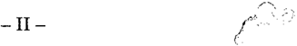
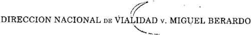

TOMO 323

Volumen 1

2000

1

DE JUSTICIA DE LA NACION

323

## FALLOS DE LA CORTE SUPREMA DE JUSTICIA DE LA NACION

DE JUSTICIA DE LA NACION

323

3

## R E P U B L I C A A R G E N T I N A

FALLOS

DE  LA

C O R T E S U P R E M A

DE

## J USTICIA DE LA N ACION

PUBLICACION A CARGO DE LA SECRETARIA DE JURISPRUDENCIA DEL TRIBUNAL

TOMO 323 - VOLUMEN 1

FEBRERO - MAYO

LA LEY S.A.E. e I.

Tucumán 1471 (1050) Buenos Aires 2000

4

ACUERDOS DE LA CORTE SUPREMA

323

Copyright (c) 2000 by Corte Suprema de Justicia de la Nación Queda hecho el depósito que previene la ley 11.723. Impreso en la Argentina Printed in Argentina I.S.B.N.  950-9825-60-3

DE JUSTICIA DE LA NACION

323

## FALLOS DE LA CORTE SUPREMA

## FEBRERO

## ARGENTINA TELEVISORA COLOR LS 82 CANAL 7 -ATC CANAL 7V. PROVINCIA DE MISIONES

## CONSOLIDACION.

La ley nacional 23.982 no reconoce a los bonos de la deuda pública de los estados provinciales el carácter de medios de pago de la tasa correspondiente al servicio de justicia.

## CONSOLIDACION.

No cabe aceptar que el obligado, para satisfacer el pago de la tasa de justicia, ceda parcialmente al fisco el crédito a percibir en títulos de consolidación de la deuda pública provincial.

## CONSOLIDACION.

No corresponde que la provincia -condenada en costas- reintegre a su contraria, mediante la entrega de bonos de consolidación de la deuda pública provincial, la suma que -en su oportunidad y en cumplimiento de lo ordenado por la Corte Suprema-, aquélla pagó en moneda circulante por tasa de justicia, ya que lo contrario generaría una situación discriminatoria y particularmente arbitraria,  violatoria  de  las  reglas  estructurales  del  régimen  de  consolidación  de  la deuda pública nacional.

## FALLO DE LA CORTE SUPREMA

Buenos Aires, 3 de febrero de 2000.

Autos y Vistos; Considerando:

1 ) Que a fs. 440 la actora pagó la tasa de justicia adeudada como ' consecuencia de las intimaciones que le cursó el Tribunal de conformi-

5

dad con lo dictaminado por el señor representante del fisco y a fs. 443 amplió la liquidación aprobada a fin de que la demandada le reintegrase lo desembolsado en tal concepto. Ello trajo aparejado que a fs. 446/447 el Estado provincial impugnase la cuenta presentada.

- 2 ) Que los planteos de la Provincia de Misiones encuentran fun-' damento en que el reclamo de que se trata estaría 'alcanzado por el Régimen de la Consolidación de la Deuda Pública Provincial' (ver fs. 446), motivo por el cual -sostiene esa parte-, la liquidación pertinente debe ajustarse a los recaudos que fija ese ordenamiento.
- 3 ) Que a los efectos de resolver la cuestión planteada corresponde ' recordar inicialmente que esta Corte ha establecido que el pago de la tasa correspondiente al servicio de justicia dado por la Nación no puede afrontarse con bonos de la deuda pública de los estados provinciales, pues la ley nacional 23.982 no los reconoce como medios de pago para ese fin (confr. causas C.689.XXII 'Chacofi S.A.C.I.F.I. c/ Dirección de Vialidad de la Provincia de Corrientes s/ ejecución'; M.252.XXIII 'Mandataria de Negocios S.A. c/ Chaco, Provincia del s/ ejecutivo'; L.338.XXI 'La Plata Remolques S.A. c/ Buenos Aires, Provincia de s/ repetición', pronunciamientos del 17 de diciembre de 1996, 19 de mayo 1997 y 24 de febrero de 1998, respectivamente), como así también -por idéntica razón- que tampoco cabe aceptar que el obligado al pago, para satisfacer la obligación de que se trata, ceda parcialmente al fisco el crédito a percibir en títulos de consolidación de la deuda pública provincial (confr. causa L.338.XXI citada).
- 4 ) Que tales criterios, sentados frente a pretensiones formuladas ' con anterioridad a la cancelación de la deuda por el concepto de que se trata, resultan igualmente idóneos para desestimar en el caso el intento del Estado provincial demandado -condenado en costas-, de reintegrar a su contraria, mediante la entrega de títulos de consolidación de la deuda pública provincial, la suma que -en su oportunidad y en cumplimiento de lo ordenado por el Tribunal-, aquélla pagó en moneda circulante por tasa de justicia.
- 5 ) Que ello es así toda vez que desconocer en el ' sub examine el derecho de la actora a obtener el reintegro requerido en la misma especie  en  que  efectuó  el  pago  originario,  generaría  una  situación discriminatoria y particularmente arbitraria que violentaría las reglas estructurales del régimen de consolidación de la deuda pública

nacional -ley 23.982- (confr. doctrina de Fallos: 318:250), al cual ha adherido la provincia demandada.

Por ello, se resuelve: Rechazar la impugnación formulada con los alcances que surgen de este pronunciamiento. Costas por su orden en atención a las razones en que se funda la decisión (arts. 68, segundo párrafo, y 69 del Código Procesal en lo Civil y Comercial de la Nación). Notifíquese.

EDUARDO MOLINÉ O'CONNOR - AUGUSTO CÉSAR BELLUSCIO - ANTONIO BOGGIANO - GUILLERMO A. F. LÓPEZ - GUSTAVO A. BOSSERT - ADOLFO ROBERTO VÁZQUEZ ( según su voto ).

VOTO DEL SEÑOR MINISTRO DOCTOR DON ADOLFO ROBERTO VÁZQUEZ

## Considerando:

Que el infrascripto coincide con los considerandos 1  y 2  del voto ' ' de la mayoría.

- 3 ) Que el pago de la tasa correspondiente al servicio de justicia ' dado por la Nación no puede afrontarse con bonos de la deuda pública de los estados provinciales, pues la ley 23.982 no los reconoce como medio de pago para ese fin.

Por idéntica razón, tampoco cabe aceptar que el obligado al pago, para satisfacer la obligación de que se trata, ceda parcialmente al fisco el crédito a percibir en títulos de consolidación de la deuda pública provincial.

- 4 ) Que, en función de lo anterior, corresponde desestimar en el ' caso el intento del Estado provincial demandado -condenado en costas- de reintegrar a su contraria, mediante la entrega de títulos de consolidación de la deuda pública provincial, la suma que aquélla pagó en moneda circulante por tasa de justicia.
- 5 ) Que ello es así toda vez que desconocer en el ' sub examine el derecho de la actora a obtener el reintegro requerido en la misma especie en que efectuó el pago originario, generaría una situación discri-

minatoria y particularmente arbitraria que violentaría las reglas estructurales del régimen de consolidación de la deuda pública nacional -ley 23.982- (confr. doctrina de Fallos: 318:250), al cual ha adherido la provincia demandada.

Por ello, se resuelve: Rechazar la impugnación formulada con los alcances que surgen de este pronunciamiento. Costas por su orden en atención a las razones en que se funda la decisión (arts. 68, segundo párrafo, y 69 del Código Procesal en lo Civil y Comercial de la Nación). Notifíquese.

ADOLFO ROBERTO VÁZQUEZ.

BANCO DE ITALIA Y RIO DE LA PLATA S.A. V. BANCO PAN DE AZUCAR S.A. Y OTRO

JURISDICCION Y COMPETENCIA: Competencia federal. Competencia originaria de la Corte Suprema. Generalidades.

La facultad de los particulares para acudir ante los jueces en tutela de los derechos que les asisten, no autoriza a prescindir de las vías que determinan los arts. 116 y 117 de la Constitución Nacional y sus leyes reglamentarias para el ejercicio de la competencia que aquélla otorga a la Corte -por excepcional que sea el caso-.

JURISDICCION Y COMPETENCIA: Competencia federal. Competencia originaria de la Corte Suprema. Generalidades.

La Corte Suprema no puede asumir jurisdicción originaria y exclusiva sobre una causa, si el asunto no concierne a Embajadores, Ministros y Cónsules extranjeros, no es parte una provincia, o no se dan las circunstancias que legalmente la habilitan, según los arts. 1º de la ley 48, 2º de la ley 4055 y 24, inc. 1º del decreto-ley 1285/58.

JURISDICCION Y COMPETENCIA: Competencia federal. Competencia originaria de la Corte Suprema. Generalidades.

No es de la competencia originaria la demanda promovida contra un banco constituido en el extranjero a fin de obtener el pago de una deuda, toda vez que no se

presenta ninguno de los casos que con arreglo a lo dispuesto en la Constitución y en las leyes que la reglamentan, habilitan la instancia originaria de la Corte.

JURISDICCION Y COMPETENCIA: Competencia federal. Competencia originaria de la Corte Suprema. Generalidades.

El art. 117 de la Constitución Nacional, establece de modo taxativo los casos en que la Corte ejercerá su competencia originaria y exclusiva, la cual, por su raigambre, es insusceptible de ampliarse y restringirse o modificarse mediante normas legales.

DICTAMEN DE LA PROCURADORA FISCAL

Suprema Corte:

- I -

El Banco de Italia y Río de la Plata S.A., entidad financiera en estado de liquidación por Resolución N  841/87 del Banco Central de ' la República Argentina, quien detenta la calidad de síndico, inventariador y liquidador, promueve la presente demanda, al solo efecto de interrumpir la prescripción, contra el Banco Pan de Azúcar S.A. -constituido en 1989 en la República Oriental del Uruguay y absorbente del Banco de Italia y Río de la Plata de ese país (B.U.I.) creado en 1984- y contra el Banco de Crédito S.A., con domicilio en la Ciudad de Buenos Aires, a fin de obtener el pago de varias deudas que en total alcanzan la suma de un millón ochocientos un mil novecientos diecisiete dólares estadounidenses (U$S 1.881.917) más sus intereses y costas.

Asimismo efectúa expresa reserva de ampliar la demanda contra el Banco Central del Uruguay, por la presunta responsabilidad patrimonial que le podría caber a dicha entidad financiera por las obligaciones dinerarias que se reclaman en este proceso. A tal fin, solicita a V.E. la concesión de una medida preliminar, en los términos del artículo 323, inciso 1  del Código Procesal Civil y Comercial de la Na-' ción, con el propósito de obtener certeza respecto de la legitimación pasiva que podría corresponder a dicho banco.

Manifiesta que resultan competentes los tribunales de la República Argentina para entender en este proceso, en virtud de la opción

conferida al actor en el punto 5 del pagaré ('promissory note') obrante a fs. 89/91 y cuya traducción luce a fs. 92/94. A su vez, funda la competencia originaria del Tribunal para conocer de estos autos, en los artículos 2 de la ley 4055, 101 -hoy 117 de la Constitución Nacional-, 1 ' de la ley 48 y 24 del decreto ley 1285/58 (t.o. según la ley 21.708).

En este contexto, V.E. corre vista a este Ministerio Público, por la competencia, a fs. 155 vuelta.

- II -

Ante todo, cabe resaltar que, la facultad de los particulares para acudir ante los jueces en tutela de los derechos que les asisten, no autoriza a prescindir de las vías que determinan los artículos 116 y 117 de la Constitución Nacional y sus leyes reglamentarias para el ejercicio de la competencia que aquélla otorga a la Corte -por excepcional que sea el caso- (doctrina de Fallos: 155:356; 159:69; 182:195; 308:2356 y 2655; 310:279, 789, 790, 970 y 2419; 311:175).

En tales condiciones, el Tribunal no puede asumir jurisdicción originaria y exclusiva sobre una causa, si el asunto no concierne a Embajadores, Ministros y Cónsules extranjeros, no es parte una provincia, o no se dan las circunstancias que legalmente la habilitan, según los artículos 1  de la ley 48, 2  de la ley 4055 y 24, inciso 1  del decreto-' ' ' ley 1285/58 (Fallos: 311:1762 y dictamen de este Ministerio Público in re M.345.XXXIV. Originario 'Merico, Alejandra M. c/ Buenos Aires, Provincia de s/ nulidad', del 3 de agosto de 1998, que fue compartido por V.E. en su sentencia del 24 de septiembre de 1998).

En el sub lite , a mi modo de ver, resulta de aplicación la doctrina sentada en dichos precedentes, toda vez que no se presenta ninguno de los casos que, con arreglo a lo dispuesto en la Constitución y en las leyes que lo reglamentan, habilitan la instancia originaria de la Corte.

A ello cabe agregar, que tampoco haría surtir la competencia originaria del Tribunal el hecho de que, eventualmente, se ampliara la demanda contra el Banco Central de la República Oriental del Uruguay y pudiera verse involucrado -en el pleito- dicho país, toda vez que los Estados extranjeros no resultan aforados a esta instancia (confr. doctrina de Fallos: 297:167; 305:1148 y 1872; 313:397, 495 y 717, entre otros).

Y, toda vez que tiene dicho desde antiguo V.E., que, en el artículo 117 de la Constitución Nacional, se establecen de modo taxativo los casos en que la Corte ejercerá una competencia originaria y exclusiva, la cual, por su raigambre, es insusceptible de ampliarse, restringirse o modificarse mediante normas legales (Fallos: 302:63 y sus citas; 308:2356; 310:1074; 311:872 y 1200; 312:640 y 1875; 313:575 y 936; 314:94 y 240; 315:1892; 316:965, entre muchos otros), opino que la causa resulta ajena al conocimiento del Tribunal. Buenos Aires, 1  de ' noviembre de 1999. María Graciela Reiriz .

## FALLO DE LA CORTE SUPREMA

Buenos Aires, 3 de febrero de 2000.

Autos y Vistos; Considerando:

Que el Tribunal comparte los argumentos y conclusiones del dictamen de la señora Procuradora Fiscal a los que corresponde remitir a fin de evitar repeticiones innecesarias.

Por ello, se resuelve: Declarar la incompetencia de esta Corte para entender en forma originaria en este juicio. Notifíquese.

EDUARDO MOLINÉ O'CONNOR - CARLOS S. FAYT - AUGUSTO CÉSAR BELLUSCIO - ANTONIO BOGGIANO - GUSTAVO A. BOSSERT - ADOLFO ROBERTO VÁZQUEZ.

NATALIA RUTH DENEGRI V. PROVINCIA DE BUENOS AIRES Y OTRO

JURISDICCION Y COMPETENCIA: Competencia federal. Competencia originaria de la Corte Suprema. Causas en que es parte una provincia. Generalidades.

Para que una provincia pueda ser tenida por parte y proceda, en consecuencia, la competencia originaria de la Corte, es necesario que ella participe nominalmente en el pleito -ya sea como actora, demandada o tercero- y sustancialmente,

esto es, que tenga en el litigio un interés directo de tal manera que la sentencia que se dicte le resulte obligatoria.

JURISDICCION Y COMPETENCIA: Competencia federal. Competencia originaria de la Corte Suprema. Causas en que es parte una provincia. Generalidades.

Es ajena a la competencia originaria de la Corte la demanda de daños y perjuicios deducida contra la Nación, si la demandada se limitó a solicitar la intervención de la provincia sin indicar hecho o cuestión jurídica alguna de la que pudiera resultar su responsabilidad, que justificara su carácter de parte sustancial en el pleito.

DICTAMEN DE LA PROCURADORA FISCAL

Suprema Corte:

- I -

A fs. 2/6, Natalia Ruth Denegri dedujo la presente demanda ante el Juzgado Nacional de Primera Instancia en lo Contencioso Administrativo Federal N  5, contra el Estado Nacional (Poder Judicial), a fin ' de obtener el pago de una indemnización por los daños y perjuicios derivados de la presunta falta de servicio en que habrían incurrido sus funcionarios, en un proceso que se le siguió por la presunta comisión del  delito  de  tenencia  de  estupefacientes,  en  el  que  habría  sido ilegítimamente involucrada y respecto del cual fue finalmente sobreseída.

Manifiesta que demanda a la Nación, toda vez que considera responsables de la privación de su libertad a los órganos judiciales de su jurisdicción, en una causa que -según dice- fue declarada nula por el dolo con el que habrían obrado sus funcionarios, en asociación ilícita con personal de la Policía de la Provincia de Buenos Aires.

A fs. 80, el Juez interviniente hizo lugar a la citación como tercero, entre otros, de la Provincia de Buenos Aires (Ministerio de Gobierno), en los términos del artículo 94 del Código Procesal Civil y Comercial de la Nación.

Por su parte, en el escrito de contestación, la Provincia citada opuso excepción de incompetencia en razón de las personas demandadas,

la cual fue desestimada por dicho Magistrado. Como consecuencia de ello, el citado Estado provincial interpuso recurso de apelación contra la resolución.

A fs. 362, la Cámara Nacional de Apelaciones en lo Contencioso Administrativo Federal, Sala V, revocó la sentencia recurrida y remitió las actuaciones a la Corte Suprema de Justicia de la Nación.

En ese contexto, V.E. corre vista a este Ministerio Público a fs. 374 vuelta.

- II -

En mérito a lo expuesto y, dentro del limitado marco cognoscitivo propio de la cuestión de competencia a dictaminar, dada la naturaleza de las partes que han de intervenir en el pleito entiendo que resulta aplicable al caso la reiterada doctrina del Tribunal que establece que, si en un proceso es parte el Estado Nacional y se cita como tercero a una provincia, la única forma de conciliar lo preceptuado por el artículo 117 de la Ley Fundamental respecto de las provincias, con la prerrogativa jurisdiccional que le asiste a la Nación al fuero federal, sobre la base de lo dispuesto en el artículo 116 de la Constitución Nacional, es  sustanciando la acción en esta instancia (confr. Fallos 305:441; 308:2054; 311:489 y 2725; 312:389 y 1875; 313:98 y 551, entre otros; P.569 XXXIII Originario Pedezert Ricardo c/Estado Nacional y Buenos Aires, Provincia de s/Daños y Perjuicios, sentencia del 24 de septiembre de 1998). Buenos Aires, 1 de septiembre de 1999. María Graciela Reiriz .

## FALLO DE LA CORTE SUPREMA

Buenos Aires, 3 de febrero de 2000.

Autos y Vistos; Considerando:

1 ) Que a fs. 2/6 la señorita Natalia Ruth Denegri promovió de-' manda ante el fuero contencioso administrativo de la Capital Federal

contra el Estado Nacional por el cobro de la indemnización de los daños y perjuicios que se derivarían de la actuación ilícita que atribuye a los funcionarios del Juzgado Federal de 1ra. Instancia en lo Criminal y Correccional N  1 de Dolores (Provincia de Buenos Aires). '

2 ) Que a fs. 78/78 vta., el demandado solicitó la citación en calidad ' de terceros -en los términos del art. 94 del Código Procesal Civil y Comercial de la Nación- del titular de aquel juzgado (doctor Hernán Bernasconi), de su secretario (doctor Roberto Schlägel), de las señoritas Samantha V. Farjat y Julieta La Valle, y de la Provincia de Buenos Aires. Con respecto a esta última, fundó su requerimiento en 'los actos cometidos por la policía de la misma' (sic). El juez de primera instancia accedió a lo solicitado mediante la escueta resolución de fs. 80.

3 ) Que la Provincia de Buenos Aires se presentó a fs. 106 y opuso ' la excepción de incompetencia en atención a la naturaleza de las partes que intervienen en el proceso.

A fs. 328/329 el juez desestimó esa defensa. Apelada dicha resolución, la Cámara Federal dejó sin efecto el pronunciamiento e hizo lugar a la excepción planteada por la provincia, disponiendo la remisión de las actuaciones a esta Corte.

4 ) Que según conocida jurisprudencia de este Tribunal, para que ' una provincia pueda ser tenida por parte y proceda, en consecuencia, su competencia originaria, es necesario que ella participe nominalmente en el pleito -ya sea como actora, demandada o tercero- y sustancialmente, esto es, que tenga en el litigio un interés directo de tal manera que la sentencia que se dicte le resulte obligatoria (Fallos: 315:2316; 318:181, entre otros).

En el sub examine , tanto el pedido de fs. 78 como la decisión de fs. 80 -que no fue precedida de sustanciación con la parte actora- carecen de fundamento. La demandada se limitó a solicitar la intervención de la provincia sin indicar hecho o cuestión jurídica alguna de la que pudiera resultar su responsabilidad. La misma ausencia de fundamentación se advierte en la referida providencia de fs. 80. Si se repara en que el juez de cuya actuación resultaría la pretendida obligación estatal de resarcir los daños es federal, no se observa prima facie y dentro del limitado límite cognoscitivo que corresponde a las cuestiones de competencia- por qué razón se podría atribuir alguna

responsabilidad a la Provincia de Buenos Aires que justificara su carácter de parte sustancial en el pleito.

- 5 ) Que en tales condiciones no es de aplicación al ' sub examine la jurisprudencia citada en el dictamen que antecede, pues -en las condiciones expuestas precedentemente- la solución que allí se propone importaría tanto como dejar librado al resorte de los litigantes la determinación de la jurisdicción originaria de esta Corte, lo que resulta inadmisible (confr. Fallos: 318:2551 y su cita).

Por ello y oída la señora Procuradora Fiscal, se declara que este juicio no corresponde a la competencia originaria de este Tribunal, por lo que deberá seguir entendiendo en la causa el señor juez de primera instancia en lo contencioso administrativo. Notifíquese y oportunamente devuélvase al tribunal de origen.

JULIO S. NAZARENO - EDUARDO MOLINÉ O'CONNOR - CARLOS S. FAYT AUGUSTO CÉSAR BELLUSCIO - ANTONIO BOGGIANO - GUILLERMO A. F. LÓPEZ - GUSTAVO A. BOSSERT - ADOLFO ROBERTO VÁZQUEZ.

## INSTITUTO SIDUS I.C.S.A. V. PROVINCIA DE ENTRE RIOS

JURISDICCION Y COMPETENCIA: Competencia federal. Competencia originaria de la Corte Suprema. Causas en que es parte una provincia. Causas civiles. Causas que versan sobre normas locales y actos de las autoridades provinciales regidas por aquéllas.

Es ajena a la competencia originaria de la Corte la demanda deducida a fin de obtener la repetición de un impuesto provincial, toda vez que el respeto de las autonomías provinciales exige que el conocimiento y decisión de estas causas se reserve a los jueces locales, puesto que versan sobre aspectos propios del derecho público local.

JURISDICCION Y COMPETENCIA: Competencia federal. Por la materia. Causas regidas por normas federales.

No basta para surtir el fuero federal la única circunstancia de que los derechos que se dicen vulnerados se encuentren garantizados por la Constitución Nacional.

JURISDICCION Y COMPETENCIA: Competencia federal. Por la materia. Causas excluidas de la competencia federal.

Cuando se arguye que un acto es contrario a leyes provinciales y nacionales, debe irse primeramente ante los estrados de la justicia provincial y, en su caso, llegar a la Corte por el recurso extraordinario del art. 14 de la ley 48.

JURISDICCION Y COMPETENCIA: Competencia federal. Competencia originaria de la Corte Suprema. Causas en que es parte una provincia. Causas civiles. Causas que versan sobre normas locales y actos de las autoridades provinciales regidas por aquéllas.

El cobro de impuestos no constituye una causa civil, toda vez que es una carga impuesta a personas o cosas con un interés público y, su percepción, un acto de índole administrativa.

JURISDICCION Y COMPETENCIA: Competencia federal. Competencia originaria de la Corte Suprema. Generalidades.

La competencia originaria de la Corte, por provenir de la Constitución Nacional, no es susceptible de ampliarse, restringirse o modificarse.

DICTAMEN DE LA PROCURADORA FISCAL

Suprema Corte:

- I -

Instituto Sidus I.C.S.A., quien invoca su condición de industria farmacéutica fabricante de medicamentos, en su domicilio ubicado en la Provincia de Buenos Aires y que comercializa en todo el país, promueve la presente demanda contra la Provincia de Entre Ríos, a fin de obtener la repetición del ajuste del impuesto a los ingresos brutos que le fuera liquidado por la Dirección de Rentas de ese Estado local, a partir de 1998, sobre la base de la modificación que introdujo la ley provincial N  9119. '

Cuestiona la citada norma en cuanto establece un aumento de la alícuota del impuesto que se pagaba -de 1,6% a 2,5%- aplicable a la producción de bienes fuera de la provincia, que se comercializan en ella, lo cual viola, a su entender, los artículos 9 , 10, 11, 16, 17, 28, 33 ' y 75 inciso 13 de la Constitución Nacional, como así también, disposiciones de la Constitución Provincial.

Asimismo, manifiesta que la empresa pagó los ajustes efectuados bajo protesta (v. la nota enviada a la Dirección General de Rentas obrante a fs. 45), por lo que pretende la devolución de los importes abonados que impugna.

En este contexto, V.E. corre vista a este Ministerio Público, por la competencia, a fs. 80 vuelta.

- II -

A mi modo de ver, la presente causa no corresponde a la competencia originaria del Tribunal prevista en el art. 117 de la Constitución Nacional y reglamentada por el artículo 24, inciso 1  del decreto-' ley 1285/58, dado que, tal como queda expuesto, las cuestiones planteadas no se fundan directa y exclusivamente en prescripciones constitucionales de carácter federal (Fallos: 115:167; 122:244; 292:625 y sus citas) y, tal circunstancia, exigirá que en oportunidad de dictar sentencia se deba analizar el contenido, alcance y aplicación de normas locales -como la ley N  9119 de la Provincia de Entre Ríos que ' modificó la alícuota del impuesto a los ingresos brutos- disposiciones que dicho Estado local ha dictado en ejercicio de la autonomía que la Ley Fundamental de la Nación le reconoce en los artículos 121 y siguientes, lo cual no es del resorte de la Corte Suprema (Fallos: 312:282, 606, 622; 313:548; 314:810).

Al respecto, cabe recordar que no basta para surtir el fuero federal la única circunstancia de que los derechos que se dicen vulnerados se encuentren garantizados por la Constitución Nacional, porque cuando se arguye -como en el caso- que un acto es contrario a leyes provinciales y nacionales, debe irse primeramente ante los estrados de la justicia provincial y, en su caso, llegar a la Corte por el recurso extraordinario del artículo 14 de la ley 48. En estas condiciones, se resguardan los legítimos fueros de las entidades que integran el Gobierno federal, dentro de su normal jerarquía (confr. Fallos: 176:315 cons. 3 ; 311:1588, ' cons. 6  y 7 ; 311:2050; 315:448, entre otros). ' '

Por otra parte, el cobro de impuestos no constituye una causa civil, toda vez que es una carga impuesta a personas o cosas con un interés público y, su percepción, un acto de índole administrativa (confr. Fallos: 184:30; 304:408 y dictamen de este Ministerio Público del 31 de mayo de 1995 in re G.125.XXXI Originario 'Goyena Copello, Héctor

Roberto c/ Buenos Aires, Provincia de s/ repetición' y sus citas, que fue compartido por la Corte en su sentencia del 18 de julio de ese año, publicada en Fallos: 318:1365).

En consecuencia, entiendo que este proceso no debe tramitar ante los estrados del Tribunal en forma originaria, toda vez que el respeto de las autonomías provinciales exige que se reserve -a los jueces locales- el conocimiento y decisión de las causas en que se pretende obtener la repetición de impuestos provinciales, puesto que versan sobre aspectos propios del Derecho Público local (Fallos: 308:2057 y 2564; 310:297, 1075 y 2467).

En tales condiciones y, dado que la competencia originaria del Tribunal por provenir de la Constitución Nacional no es susceptible de ampliarse, restringirse o modificarse (Fallos: 180:176; 270:78; 271:145; 285:209; 302:63; 308:2356; 310:1074; 314:94, entre muchos otros) opino que el sub lite es ajeno a esta instancia. Buenos Aires, 5 de noviembre de 1999. María Graciela Reiriz .

## FALLO DE LA CORTE SUPREMA

Buenos Aires, 3 de febrero de 2000.

Autos y Vistos; Considerando:

Que el Tribunal comparte los argumentos y conclusiones del dictamen de la señora Procuradora Fiscal, a los que corresponde remitir a fin de evitar repeticiones innecesarias.

Por ello, se resuelve: Declarar la incompetencia de esta Corte para entender en forma originaria en este juicio. Notifíquese.

EDUARDO MOLINÉ O'CONNOR - CARLOS S. FAYT - AUGUSTO CÉSAR BELLUSCIO - ANTONIO BOGGIANO - GUSTAVO A. BOSSERT - ADOLFO ROBERTO VÁZQUEZ.

## HUGO DANIEL PALOPOLI V. PROVINCIA DE BUENOS AIRES

## ACCION DECLARATIVA DE INCONSTITUCIONALIDAD.

La demanda tendiente a obtener una declaración de certeza sobre el alcance, límites y modalidad del decreto 2293/92, ante la negativa de la Provincia de Buenos Aires a aplicarlo en su ámbito y exigirle matricularse en el colegio local, a pesar de estar inscripto en la Capital Federal, encuadra en el supuesto contemplado en el art. 322 del Código Procesal Civil y Comercial de la Nación, toda vez que implica un estado de incertidumbre sobre el alcance de la relación jurídica entre el demandante y la Caja de Seguridad Social para Veterinarios de dicha provincia.

## APORTES PREVISIONALES.

Lo que prohíbe el art. 14 bis de la Constitución Nacional no es la multiplicidad sino la superposición de aportes, a cargo de un mismo aportante, y por tal ha de entenderse no la misma persona física sino la misma calidad o carácter en virtud de los cuales debe aportar.

## APORTES PREVISIONALES.

En el caso de dos o más obras sociales con distintas finalidades o de dos o más actividades o relaciones de dependencia del aportante habría multiplicidad de aportes pero no superposición.

## APORTES PREVISIONALES.

Para que exista superposición de aportes, es necesario que se sobrepongan en identidad el fin de la obra social y el carácter o razón en virtud de la cual se aporta. Esto no ocurre en el caso en que el recurrente aporta por desempeñar dos cargos en diferentes organismos cada uno de los cuales tiene su propia obra social.

CONSTITUCION NACIONAL: Constitucionalidad e inconstitucionalidad. Leyes provinciales.

Es inconstitucional la aplicación de los arts. 5º y 8º de la ley 10.746 de la Provincia de Buenos Aires durante el período en que el actor se desempeñó en la Corporación del Mercado Central, en razón de lo cual se le practicaron las retenciones establecidas por la ley 18.037.

## DICTAMEN DE LA PROCURADORA FISCAL

Suprema Corte:

- I -

A fs. 47/51, Hugo Daniel Palópoli promovió demanda contra la Provincia de Buenos Aires, en los términos del art. 322 del Código Procesal Civil y Comercial de la Nación, tendiente a obtener una declaración  de  certeza  sobre  el  alcance,  límites  y  modalidad  del  decreto N  2293/93 del Poder Ejecutivo Nacional, ante la negativa de aquella ' provincia a aplicarlo en su ámbito jurisdiccional y exigirle matricularse en el Colegio de Veterinarios local, a pesar de hallarse inscripto en el Consejo Profesional de Médicos Veterinarios de la Capital Federal.

Asimismo, la acción pretendía obtener una declaración de certeza en cuanto a la constitucionalidad de la exigencia de realizar los aportes jubilatorios previstos en la ley provincial N  10.746, a la Caja de ' Seguridad Social para Veterinarios, por los períodos en que el actor, sin ejercer actividad profesional independiente, se desempeñó únicamente en la Corporación del Mercado Central de Buenos Aires, por lo que obligatoriamente debía hacer aportes a la ex-Caja de Previsión Social para el Personal del Estado y Servicios Públicos y por el período comprendido entre enero de 1993, fecha en que -según dice- notificó al Colegio provincial su baja de la matrícula por aplicación del decreto nacional 2293/92, hasta la demanda (confr. fs. 47 vta.).

Sostuvo que la ley provincial 10.746 viola el artículo 14 bis de la Constitución Nacional, que prohíbe la superposición de aportes, en la medida que obliga al médico veterinario matriculado en el Colegio provincial -aun aquel que trabaja en relación de dependencia, en razón de lo cual se le retienen obligatoriamente aportes jubilatorios con destino a otra entidad-, a estar afiliado a la Caja local de seguridad social para veterinarios, con la consiguiente obligación de aportar a dicha Caja.

Fundó su pretensión en diversas consideraciones relativas a la aplicación, en el ámbito provincial, de las disposiciones contenidas en el decreto N  2293/92 del Poder Ejecutivo Nacional, que permite a cual-' quier profesional que posea título de validez nacional, ejercer su actividad u oficio en todo el territorio de la Nación con una única inscrip-

ción en el colegio, asociación o registro que corresponda al de su domicilio real; así como en las disposiciones similares del Decreto N  2284/ ' 91, ratificado por el art. 29 de la ley 24.307.

- II -

A fs. 94, en atención a lo resuelto por V.E. in re: E.136.XXIX 'Espinosa Buschiazzo, Carlos Alberto c/ Buenos Aires, Provincia de s/ acción declarativa', del 18 de febrero de 1997, el actor desistió de la acción interpuesta en cuanto a la necesidad de determinar la aplicación, en el territorio de la demandada, del decreto N  2293/92, pero la man-' tuvo respecto de la segunda cuestión debatida, esto es, la inconstitucionalidad de la ley provincial N  10.746. '

Con relación a esta última, relató que se matriculó en el Colegio de Veterinarios de la Provincia de Buenos Aires en 1986 y ejerció su actividad profesional, en forma independiente, hasta el 12 de diciembre de 1988. A partir de esa fecha y, hasta el 31 de julio de 1989, se desempeñó como médico veterinario en la Dirección de Ecología de la Municipalidad de la Ciudad de Buenos Aires y como ayudante ad honorem en la cátedra de Inspección de Productos Zoógenos, de la Facultad de Ciencias Veterinarias de la Universidad de Buenos Aires. El 22 de julio de 1991 ingresó a trabajar profesionalmente en la Corporación del Mercado Central de Buenos Aires, organismo creado por convenio entre el Estado Nacional, la Provincia de Buenos Aires y la -entonces- Municipalidad de la Ciudad de Buenos Aires.

Afirmó que, durante este último tiempo, no ejerció actividad profesional autónoma y efectuó aportes a la Caja de Previsión Social para el Personal del Estado y Servicios Públicos, por medio de las retenciones que le practicaba la Corporación. En esta circunstancia, planteó la consulta al Colegio de Veterinarios de la Provincia de Buenos Aires, acerca de la necesidad de mantener la matriculación en el citado Colegio y realizar aportes a la Caja de Seguridad Social provincial, ante lo cual le contestaron afirmativamente sobre la primera cuestión, pero, en cambio, se le señaló que 'su condición de empleado público, como única actividad, lo exime de realizar aportes a la Caja de Seguridad Social para Veterinarios (Art. 9  de la ley 10.746)...' (confr. fs. 7). '

En enero de 1993, solicitó al Colegio provincial su baja en la matrícula, fundado en las disposiciones del decreto del Poder Ejecutivo Nacio-

nal N  2293/92, pero obtuvo una respuesta negativa. Finalmente, tras ' diversas presentaciones, la referida Corporación profesional -por Resolución  N  28  de  su  Consejo  Directivo,  del  28  de  abril  de  1995-' decidió su pase a la categoría de 'dado de baja', a partir del 20 de noviembre de 1992 (ver fs. 10).

Por último, indicó que el 17 de marzo de 1995, recibió una comunicación de la Asesoría Legal de la Caja de Seguridad Social para Veterinarios de la Provincia de Buenos Aires, reclamándole el pago de una deuda por aportes previsionales, comprensiva del período en que se desempeñó en la Corporación del Mercado Central 'y los posteriores a mi renuncia al Colegio...' (fs. 48 vta.).

- III -

A fs. 58, este Ministerio Público se expidió a favor de la competencia originaria del Tribunal y V.E. resolvió, en tal sentido, a fs. 61.

A fs. 82/87, la Provincia de Buenos Aires contestó demanda. En lo que respecta a la única cuestión debatida en autos, después de una negativa genérica de los hechos invocados, sostuvo que, conforme lo determina el artículo 125 de la Constitución Nacional, las provincias pueden conservar organismos de seguridad social para los profesionales y que, en virtud del poder de policía que las provincias no delegaron al Estado Nacional, éstas pueden regular el ejercicio de profesiones liberales, con la existencia de los respectivos Colegios; y agregó que, en la reciente normativa de creación de las Administradoras de Fondos de Jubilaciones y Pensiones, se ha reconocido y respetado la vigencia de las cajas previsionales provinciales de profesionales.

A fs. 97/100 y 101/103, las partes presentaron sus respectivos alegatos, y a fs. 104, se solicitó el dictamen de este Ministerio Público.

- IV -

Así planteadas las posiciones, es mi parecer que, aún después del desistimiento parcial de fs. 94, se encuentran reunidos los presupuestos para la admisibilidad formal de la acción declarativa intentada.

Al respecto, V.E. tiene dicho que 'la declaración de certeza, en tanto no tenga carácter simplemente consultivo, no importe una indaga-

ción meramente especulativa y responda a un 'caso' que busque precaver los efectos de un acto en ciernes al que se atribuye ilegitimidad y lesión al régimen constitucional federal, constituye causa en los términos de la Ley Fundamental' (confr. entre otros, S.291.XX. 'Santiago del Estero, Provincia de c/ Estado Nacional y/o Y.P.F. s/ acción de amparo' y F.312.XX. Originario 'Fábrica Argentina de Calderas S.R.L. c/ Santa Fe, Provincia de s/ declaración de inconstitucionalidad', sentencias del 20 de agosto de 1985 y 19 de diciembre de 1986, respectivamente; Fallos: 310:606 y 977).

Efectivamente, en el sub lite concurre, a mi juicio, un estado de incertidumbre sobre el alcance de la relación jurídica entre el actor y la Caja de Seguridad Social para Veterinarios de la Provincia de Buenos Aires, derivada de la aplicación de la ley provincial N  10.746, y ' esa falta de certeza le puede producir un perjuicio inminente, que se acredita con la intimación de pago de la deuda reclamada en concepto de aportes a dicha Caja (ver fs. 12).

- V -

Con respecto a la cuestión de fondo, cabe determinar si la obligación del accionante de aportar a la Caja de Seguridad Social para Veterinarios de la Provincia demandada, en circunstancias en que desarrollaba su actividad exclusivamente en relación de dependencia, donde se le practicaban obligatoriamente los descuentos previsionales destinados a la Caja Nacional de Previsión, se encuentra en pugna con el principio establecido por el art. 14 bis de la Constitución Nacional, en cuanto prohíbe la superposición de aportes.

De acuerdo con las constancias del caso, este período se extiende desde 22 de julio de 1991 hasta el 20 de noviembre de 1992. La primera fecha corresponde al ingreso del actor a la Corporación del Mercado Central de Buenos Aires y la segunda a su pase a la categoría de dado de baja por inactividad en el Colegio de Veterinarios de la Provincia de Buenos Aires (conf. resolución N  28/95, obrante a fs. 32), momento a ' partir del cual cesa la obligación de estar afiliado a la Caja de Seguridad Social para Veterinarios y, consecuentemente, el deber de aportar para tener derecho a los beneficios que fija la ley provincial N  10.746 ' (arts. 5  y 7 , inc. 1 ). ' ' '

Sobre el tema a decidir, no es ocioso recordar que V.E. ha señalado, '...lo que el art. 14 bis de la Constitución Nacional prohibe...no es

la 'multiplicidad' sino la 'superposición' de aportes, a cargo de un mismo aportante, y por tal ha de entenderse no la misma persona física sino la misma calidad o carácter en virtud de los cuales debe aportar' (Fallos 300: 836, considerando 7 ). Es decir, que si se tratara de dos o ' más actividades o relaciones de dependencia del aportante, habría multiplicidad de aportes pero no superposición.

Es así, entonces, que la Corte distinguió entre superposición y multiplicidad . Este último supuesto se configura cuando una misma persona aporta a dos cajas distintas en razón de trabajos diferentes; en cambio, para que exista superposición, '...como surge de la etimología del término, es necesario que se sobrepongan en identidad el fin ...y el carácter o razón en virtud de la cual se aporta... situación que sólo se daría si por la misma actividad, origen de la obligación de aportar, tuviera que efectuar aportes...' a dos cajas para obtener prestaciones de idéntica finalidad (conf. Fallo citado ut supra ).

- VI -

Sobre las bases que sienta el precedente citado, corresponde indagar las normas que rigen la situación del actor.

La ley 10.746 de la Provincia de Buenos Aires, de creación de la Caja de Seguridad Social para Veterinarios de esa jurisdicción dispone, en su art. 5 , que 'Están obligatoriamente afiliados a la Caja..., ' todos aquellos profesionales que a la fecha de entrar en vigencia la presente ley o en lo sucesivo, se encuentren matriculados en el Colegio de Veterinarios de la Provincia...', mientras que el art. 8  prescribe: ' 'La calidad de afiliado a la Caja implica las siguientes obligaciones: a) Efectuar aportes que determina la presente ley y consecuentes reglamentaciones para tener derecho a la obtención de los beneficios que en ella se otorgan...'. A su vez, el art. 38 de la citada norma señala que 'El capital de la Caja se formará: a) Con el aporte de los afiliados conforme a su edad y antigüedad en la matriculación, según la escala del art. 40...', añadiendo este último 'El monto mensual de aporte obligatorio del afiliado será el que resulta de la siguiente escala y del valor vigente al momento del pago: a) Hasta cinco (5) años de antigüedad en la matriculación, con edad no superior a treinta (30) años...'. Se advierte, entonces, que el sólo hecho de la matriculación en el Colegio de Veterinarios provincial, implica la obligatoriedad de efectuar aportes a la Caja, independientemente que el afiliado realice o no actividad alguna.

Por otra parte, ley 18.037 de 'Jubilaciones y pensiones; régimen para trabajadores que presten servicios en relación de dependencia', vigente al momento de iniciar su actividad el actor en la Corporación del Mercado Central de Buenos Aires, disponía en su art. 2 : 'Están ' obligatoriamente comprendidos en el presente régimen, aunque la relación de empleo se estableciere mediante contrato a plazo: ...d) Los funcionarios, empleados y agentes que en forma permanente o transitoria desempeñen cargos en organismos oficiales interprovinciales o integrados por la Nación y una o más provincias, cuyas remuneraciones se atiendan con fondos de dichos organismos'. El art. 10, establecía:  'Los  aportes  personales  y  las  contribuciones  a  cargo  de  los empleadores serán obligatorios y equivalentes a un porcentaje mensual sobre la remuneración determinada de conformidad con las normas de esta ley...'. Tales normas, en lo sustantivo, fueron reproducidas por los arts. 2, inc. a) ap. 3 y 10  incs. a) y b) de la ley 24.241 'Ley ' Nacional del Sistema Integrado de Jubilaciones y Pensiones', que reemplazó al anterior régimen.

A su vez, el art. 7  de la ley 18.037 establecía que 'ninguna de las ' actividades comprendidas en el presente régimen podrán generar obligaciones respecto de otros regímenes jubilatorios provinciales o municipales'.

- VII -

Por otro lado, no se encuentra controvertido en autos que el profesional se desempeñó en la Corporación del Mercado Central de Buenos Aires -formada por convenio suscripto entre la Nación, la Provincia de Buenos Aires y la Municipalidad de la Ciudad de Buenos Aires, ratificado  por  ley 17.422,  por  ley  provincial  7310  y  por  ordenanza 22.817, respectivamente- en relación de dependencia y que, por tal actividad, se le practicaron retenciones de carácter obligatorio, destinadas a la entonces Caja de Previsión Social para el Personal del Estado y Servicios Públicos (confr. fs. 6). Tampoco la demandada aportó prueba tendiente a demostrar que el actor, durante ese período, haya realizado  alguna  otra  actividad  profesional  en  esa  jurisdicción (fs. 91/91 vta.).

En tales condiciones, entiendo que, en el sub judice , el hecho generador del deber de aportar es uno solo, esto es, la actividad profesional

que el actor desarrollaba en relación de dependencia, en jurisdicción de la Provincia de Buenos Aires. Ella sería, entonces, la que determina las obligaciones para con ambas cajas (ex Caja de Previsión Social para el Personal del Estado y Servicios Públicos y Caja de Seguridad Social para Veterinarios de la Provincia de Buenos Aires), como surge de las normas respectivas; sin que las características que presenta el caso, permitan efectuar un desdoblamiento de lo que claramente es una única prestación de trabajo.

Por lo demás, en lo que a la finalidad de ambos regímenes respecta, también advierto una sustancial coincidencia que permite aseverar que los sistemas nacional y provincial establecen básicamente similares prestaciones (art. 26 de la ley 18.037 y 45 de la ley 10.746).

A mayor abundamiento, cabe señalar que V.E. tuvo oportunidad de analizar un planteo similar al presente in re: S. 120. XXV 'Santoro, Guillermo c/ Caja de Previsión Social para Profesionales de las Ciencias Farmacéuticas de la Provincia de Buenos Aires', sentencia del 28 de marzo de 1995, (Fallos: 318:427) donde, si bien descalificó, por ritualista, la decisión del superior tribunal provincial que declaró la falta de interés del actor en el juicio, con el solo fundamento de la ausencia de prueba del efectivo ingreso de los aportes al sistema nacional, también señaló, luego de efectuar la reseña de los antecedentes fácticos del caso: '...por ser ello así, le asiste razón al apelante en cuanto afirma que la situación creada con la ley de creación de la caja demandada provocaría una superposición de aportes prohibida por el art. 14 bis de la Constitución Nacional,...' (cons. 10), y concluyó: '...Todos estos aspectos autorizan a afirmar que frente a los claros términos legales y constitucionales la sentencia que rechaza la demanda con el solo argumento de la falta de acreditación del efectivo ingreso de los aportes, desatiende la cuestión central y se sustenta en un excesivo ritualismo que vulnera el derecho de defensa, toda vez que la superposición de obligaciones que emanan de los textos legales pone de manifiesto el interés concreto de la parte en obtener una sentencia que la exima del doble gravamen al que conduce la normativa impugnada' (cons. 12 -énfasis agregado-).

Por las razones expuestas, opino que corresponde hacer lugar a la demanda y declarar, en el caso, la inconstitucionalidad de los arts. 5  y '

8  de la ley 10.746 de la Provincia de Buenos Aires, con los límites ' señalados en el presente. Buenos Aires, 4 de agosto de 1999. María Graciela Reiriz .

## FALLO DE LA CORTE SUPREMA

Buenos Aires, 3 de febrero de 2000.

Vistos los autos: 'Palópoli, Hugo Daniel c/ Buenos Aires, Provincia de s/ acción declarativa', de los que

Resulta:

I) A fs. 47/51 se presenta Hugo Daniel Palópoli e inicia una acción declarativa contra la Provincia de Buenos Aires con el propósito de obtener una declaración de certeza respecto del alcance, límites y modalidad del decreto nacional 2293/92 y de que se dilucide el estado de incertidumbre que le crea la exigencia de la Caja de Seguridad de Médicos Veterinarios de la mencionada provincia de efectuar los aportes jubilatorios previstos por la ley 10.746. Con relación a este último aspecto expresa que tal pretensión, en tanto impone la realización de aportes a dicha caja por el lapso en que sin ejercer actividad profesional independiente se desempeñó únicamente en la Corporación del Mercado Central de Buenos Aires con la consiguiente obligación de aportar a la ex Caja de Previsión Social para el Personal del Estado y Servicios Públicos, contraría el art. 14 bis de la Constitución Nacional.

Expone que tiene su domicilio real en la ciudad de Buenos Aires, que en su condición de médico veterinario se encuentra matriculado en el Consejo Profesional de la especialidad, que en 1986 procedió a matricularse en el colegio provincial, y que ejerció su actividad profesional hasta el 12 de diciembre de 1988. A partir de entonces y hasta el 31 de julio de 1991 actuó en la Dirección de Ecología de la Municipalidad de la Ciudad de Buenos Aires y como ayudante ad honorem en la cátedra de inspección de productos zoógenos de la Facultad de Ciencias Veterinarias.

El 22 de julio de 1991 ingresó en la Corporación del Mercado Central  sin  ejercer  desde  entonces actividad profesional autónoma. En

atención a que el organismo citado efectuaba las retenciones previsionales para la Caja de Previsión Social para el Personal del Estado y Servicios Públicos, consultó al colegio provincial si le correspondía efectuar aportes a la caja provincial para veterinarios y mantener su matriculación. Fue entonces que se le informó que correspondía su matriculación y que, como consecuencia de su condición de empleado público, estaba exento de efectuar aportes.

En enero de 1993 -continúa- notificó a ese colegio su baja en la matrícula fundado en las disposiciones del decreto 2293/92, y obtuvo como respuesta que la aplicación de esa norma en el ámbito local no había sido admitida, razón por la cual debía mantener su condición de matriculado para ejercer en la provincia. Más adelante, el 17 de marzo de 1995, fue intimado por la caja a raíz de una presunta deuda de aportes que incluía el período en el cual se desempeñó en relación de dependencia y el posterior a su renuncia al colegio. En tales condiciones,  contestó  mediante una carta documento en la cual planteó la inconstitucionalidad de la pretensión de efectuar esos aportes.

Hace referencia a los alcances del decreto 2293/92 y a sus propósitos.

A fs. 60 y ante la solicitud de fs. 59, aclara que planteó la inconstitucionalidad de la aplicación de la ley 10.746 por cuanto, al exigírsele la afiliación y los respectivos aportes previsionales sin contemplar que ejercitaba su actividad en relación de dependencia con la obligatoriedad de efectuar aportes a otro organismo, se viola el art. 14 bis de la Constitución Nacional.

II) A fs. 82/87 se presenta la Provincia de Buenos Aires y contesta la demanda. Plantea asimismo la 'incompetencia como defensa de fondo' pretensión que es rechazada a fs. 87 vta..

Realiza una negativa genérica de los hechos invocados y reivindica, en esencia, la potestad provincial en la materia. Sostiene que, según el art. 125 de la Constitución Nacional, las provincias conservan organismos de seguridad para los profesionales y que en virtud del poder de policía pueden regular el ejercicio de profesiones liberales. La prueba de ello es que las leyes de creación de las administradoras de fondos de jubilaciones y pensiones han reconocido la vigencia de las cajas provinciales.

III) A fs. 94 la actora desiste del planteo respecto a la aplicación en el territorio provincial de lo dispuesto por el decreto 2293/92 en virtud de la decisión recaída en un precedente de esta Corte, que cita, y manifiesta que mantiene el vinculado con la inconstitucionalidad de los arts. 5 y 8, inc. a, de la ley 10.746.

## Considerando:

1 ) Que esta causa es de la competencia originaria de la Corte Su-' prema de Justicia de la Nación (arts. 116 y 117 de la Constitución Nacional).

2 ) Que el reclamo subsistente del actor encuadra en el supuesto ' contemplado en el art. 322 del Código Procesal Civil y Comercial de la Nación toda vez que implica un estado de incertidumbre sobre el alcance de la relación jurídica entre el demandante y la Caja de Seguridad Social para Veterinarios de la Provincia de Buenos Aires que, a tenor de la intimación cursada que obra a fs. 12, entraña un perjuicio inminente.

3 ) Que, en suma, la cuestión por dilucidar consiste en determinar ' si la obligación del actor de aportar a la caja provincial en circunstancias en que su única actividad profesional lo era en relación de dependencia y sometida a los descuentos previsionales destinados a la Caja Nacional de Previsión entra en pugna con lo dispuesto por el art. 14 bis de la Constitución Nacional, que prohíbe la superposición de aportes.

4 ) Que antes de considerar las circunstancias propias de la causa ' resulta oportuno recordar lo resuelto por el Tribunal en Fallos: 300:836. En ese caso se precisaron conceptos acerca de los alcances de lo dispuesto por el art. 14 bis citado sosteniéndose que lo que esa norma prohíbe 'no es la multiplicidad sino la superposición de aportes, a cargo de un mismo aportante, y por tal ha de entenderse no la misma persona física sino la misma calidad o carácter en virtud de los cuales debe aportar. Es decir que si se tratara de dos o más obras sociales con distintas finalidades o de dos o más actividades o relaciones de dependencia del aportante habría multiplicidad de aportes pero no superposición; para que esto último ocurra, como surge de la etimología del término, es necesario que se sobrepongan en identidad el fin de la obra social y el carácter o razón en virtud de la cual se aporta. Situación esta última que no se da en el sub examine , toda vez que el recurrente

aporta por desempeñar dos cargos en diferentes organismos cada uno de los cuales tiene su propia obra social. No hay, pues, en el caso del recurrente superposición de aportes, situación que sólo se daría si por la misma actividad -origen de la obligación de aportar- tuviera que efectuar aportes para más de una obra social de fines o propósitos idénticos' (considerando 7 ). '

5 ) Que el estudio de la ley 10.746 indica que su art. 5  dispone la ' ' afiliación obligatoria de todos aquellos profesionales que a la fecha de su entrada en vigencia, o en lo sucesivo, se encuentren matriculados en el Colegio de Veterinarios de la provincia. Por otro lado, el art. 8 ' impone la obligación de todo afiliado de efectuar los aportes que establecen la ley y las reglamentaciones como condición para obtener los beneficios que ella otorga. De estas disposiciones como de otras concordantes (art. 38 por ejemplo) resulta que la sola condición de matriculado en el colegio implica la obligatoriedad de efectuar aportes a la caja con independencia de que el afiliado realice alguna actividad o no lo haga.

6 ) Que a su vez, la ley 18.037, vigente al momento en que el actor ' comenzó a desempeñarse en la Corporación del Mercado Central y aplicable a tal situación, disponía la obligatoriedad de aportes para quienes prestaran servicios en relación de dependencia tal como se preveía en los arts. 2 , inc. d, y 10. El sistema fue íntegramente repro-' ducido por la ley 24.241, que reemplazó a aquel régimen. Cabe añadir que el art. 7  de la ley 18.037 establecía expresamente que ninguna de ' las actividades comprendidas en ella podía 'generar obligaciones respecto de otros regímenes jubilatorios provinciales o municipales'.

7 ) Que no existe controversia acerca del desempeño del actor en ' relación de dependencia en la Corporación del Mercado Central de Buenos Aires y de que en razón de ello se le practicaron las retenciones pertinentes destinadas a la entonces Caja de Previsión Social para el Personal del Estado y Servicios Públicos (ver fs. 6). Por otro lado, la demandada no aportó prueba alguna tendiente a demostrar que Palópoli hubiera realizado alguna otra actividad profesional en el ámbito provincial.

Por consiguiente, el hecho determinante de la obligación de efectuar aportes era la actividad que el actor desarrollaba en relación de dependencia. Esa única prestación de trabajo determinaba el régimen previsional al que se encontraba sometido sin que autorice la preten-

sión de los organismos profesionales locales, la que, de admitirse, implicaría en las circunstancias del caso, una superposición de aportes fulminada por la Ley Fundamental. Por lo tanto la aplicación de lo que disponen los arts. 5 y 8 de la ley 10.746 en el período en que se desempeñó en la Corporación del Mercado Central, esto es desde el 22 de julio de 1991 al 20 de noviembre de 1992, deviene inconstitucional.

Por ello, y de conformidad con lo dictaminado por la señora Procuradora Fiscal, se decide: Hacer lugar a la demanda y declarar la inconstitucionalidad de los arts. 5 y 8 de la ley 10.746 de la Provincia de Buenos Aires con los alcances del considerando precedente. Con costas (art. 68, Código Procesal Civil y Comercial de la Nación).

Teniendo en cuenta la labor desarrollada en el principal y de conformidad con lo dispuesto por los arts. 6 , incs. b, c y d; 37 y 38 de la ' ley 21.839, modificada por la ley 24.432, se regulan los honorarios del doctor Marcelino Sixto Gatti, en la suma de nueve mil pesos ($ 9.000). Notifíquese y, oportunamente, archívese.

JULIO S. NAZARENO - EDUARDO MOLINÉ O'CONNOR - CARLOS S. FAYT AUGUSTO CÉSAR BELLUSCIO - ANTONIO BOGGIANO - GUILLERMO A. F. LÓPEZ - GUSTAVO A. BOSSERT - ADOLFO ROBERTO VÁZQUEZ.

## HORACIO JESUS HARRETCHE V. CAJA NACIONAL DE PREVISION DE LA INDUSTRIA, COMERCIO Y ACTIVIDADES CIVILES

RECURSO EXTRAORDINARIO: Requisitos propios. Cuestión federal. Cuestiones federales complejas. Inconstitucionalidad de normas y actos nacionales.

Es admisible el recurso extraordinario si se encuentra en juego la validez de una ley nacional y la decisión ha sido contraria a la constitucionalidad del art. 25 de la ley 18.037 (art. 14 inc. 1º de la ley 48).

CONSTITUCION NACIONAL: Constitucionalidad e inconstitucionalidad. Leyes nacionales.

El art. 25 de la ley 18.037, no resulta violatorio de derecho alguno garantizado por la Constitución Nacional.

## JUBILACION Y PENSION.

El art. 25 de la ley 18.037 no resulta violatorio de la Constitución Nacional pues tiene por objeto propender a la protección del acervo común de los afiliados mediante un mecanismo en virtud del cual se faculta a los trabajadores a controlar el cumplimiento de las obligaciones previsionales que están a cargo de los empleadores.

RECURSO EXTRAORDINARIO: Requisitos propios. Cuestiones no federales. Sentencias arbitrarias. Procedencia del recurso. Excesos u omisiones en el pronunciamiento.

Corresponde dejar sin efecto la sentencia que declaró la inconstitucionalidad del art. 25 de la ley 18.037, si para así decidir omitió examinar debidamente planteos del apelante que podrían haber conducido a una solución diferente (Voto del Dr. Adolfo Roberto Vázquez).

DICTAMEN DEL PROCURADOR GENERAL

## Suprema Corte:

Las autoridades previsionales, en lo que al caso interesa, sobre la base de que el actor no probó, ni procuró acreditar haber dado cumplimiento a la inexcusable obligación de denunciar el incumplimiento por parte de los empleadores de retenerle aportes, hecho que ponía a su cargo el artículo 25, de la ley 18.037 -t.o. 1976-, y como tal circunstancia traía aparejada que no se computasen ni reconociesen los servicios que se denuncian como cumplidos luego de finalizado el año 1976, denegaron el beneficio de jubilación ordinaria que aquél habría solicitado (v. fs. 47/47 vta. y fs. 58).

Tales negativas motivaron la apelación del interesado, quien, por los  argumentos que ilustra su presentación de fs. 62/66, planteó la inconstitucionalidad del citado artículo 25, tacha de invalidez que fue aceptada por los integrantes de la Sala III de la Cámara Federal de Apelaciones de la Seguridad Social, al considerar -en sustancia- que tal norma entraba en colisión con los artículos 14 nuevo y 28 de la Constitución Nacional (v. fs. 69/70).

Contra lo así resuelto, dedujo la señora fiscal de cámara ante el tribunal sentenciador recurso extraordinario a fs. 72/82, que le fue concedido a fs. 87, en el que se agravia respecto de la declaración de invalidez constitucional efectuada por los jueces, por considerar que

no dieron razones suficientes para que procediese apartarse del criterio de V.E. que reiteradamente se pronunció por la validez de la norma en cuestión.

Estimo procedente el mencionado recurso, toda vez que en autos se puso en tela de juicio la razonabilidad del artículo 28 de la ley 18.037 -t.o. 1976- y la decisión definitiva del superior tribunal de la causa ha sido contraria a su validez.

En relación con él, correcto es decirlo, poco es lo que puedo agregar al exhaustivo análisis efectuado por la señora magistrado para desvirtuar la inconstitucionalidad del artículo 25 de la ley 18.037 -t.o. 1976de suerte pues, que sólo podría añadir, respecto del tema, que la validez de la mencionada norma fue sostenida por el Tribunal en su composición actual, según surge del fallo publicado en el Tomo 319, página 2028 y siguientes, precedente donde se establecen de manera clara las pautas a tener en cuenta al aplicarla, sentencia que, vale decirlo, en  razón  de  los  argumentos  que  fundan  la  postura  de  los  jueces actuantes, fue dictada en fecha muy posterior a la vigencia del artículo 12, de la ley 24.013 (v. B.O. 17/12/91).

Por ello, y los argumentos que con precisión y claridad se expresan en el escrito recursivo obrante a fs. 72/82 para fundar la posición contraria a lo resuelto por el sentenciador -argumentos que comparto y hago míos- es que sostengo este recurso. Buenos Aires, 29 de abril de 1999. Nicolás Eduardo Becerra .

## FALLO DE LA CORTE SUPREMA

Buenos Aires, 3 de febrero de 2000.

Vistos los autos: 'Harretche, Horacio Jesús c/ Caja Nacional de Previsión de la Industria, Comercio y Actividades Civiles s/ dependientes: otras prestaciones'.

## Considerando:

Que contra el pronunciamiento de la Sala III de la Cámara Nacional de Apelaciones de la Seguridad Social que declaró la inconstitu-

cionalidad del art. 25 de la ley 18.037, la representante del Ministerio Público dedujo el recurso extraordinario de fs. 72/82 que, parcialmente concedido por la alzada, resulta admisible toda vez que se encuentra en juego la validez de una ley nacional y la decisión del a quo ha sido en contra de la constitucionalidad de dicha norma (art. 14, inc. 1, de la ley 48 y Fallos: 306:1844).

Que este Tribunal ha decidido en reiteradas oportunidades que el art. 25 de la ley 18.037 no resulta violatorio de derecho alguno garantizado por la Constitución Nacional, máxime cuando dicha norma tiene por objeto propender a la protección del acervo común de los afiliados mediante un mecanismo en virtud del cual se faculta a los trabajadores a controlar el cumplimiento de las obligaciones previsionales que están a cargo de los empleadores (Fallos: 306:1844; 315:732; 317:170 entre muchos otros).

Por ello, y de conformidad con lo dictaminado por el señor Procurador General, se declara procedente el recurso extraordinario y se deja sin efecto la sentencia apelada.

Vuelvan los autos al tribunal de origen para que, por la sala que corresponda, se dicte un nuevo pronunciamiento con arreglo a lo expresado. Notifíquese y remítase.

JULIO S. NAZARENO - EDUARDO MOLINÉ O'CONNOR - AUGUSTO CÉSAR BELLUSCIO - ANTONIO BOGGIANO - GUSTAVO A. BOSSERT - ADOLFO ROBERTO VÁZQUEZ ( según su voto ).

VOTO DEL SEÑOR MINISTRO DOCTOR DON ADOLFO ROBERTO VÁZQUEZ

## Considerando:

Que el infrascripto coincide con los considerandos 1  y 2  del voto ' ' de la mayoría.

3 ) Que, sin perjuicio de ello, se advierte que al deducir el recurso ' de apelación de la ley 23.473, el interesado había alegado la existencia de una denuncia global en contra de los empleadores morosos e invocado la ley 23.449 en beneficio de su derecho previsional, circunstan-

cias de hecho y derecho en que había fundado la inaplicabilidad al caso de la sanción prevista por el citado art. 25 de la ley 18.037.

- 4 ) Que dichos planteos, pese a la incidencia que podrían tener en ' la solución del caso, no fueron objeto del debido examen y pronunciamiento por parte del a quo , a pesar de que podrían haber conducido a una solución diferente a la adoptada en el fallo respecto del citado art. 25 de la ley 18.037, máxime cuando dicha norma establece excepciones a las sanciones que reglamenta para supuestos en los que medien denuncias contra los empleadores por omisión de pago de aportes.
- 5 ) Que, en tales condiciones, corresponde declarar procedente el ' recurso extraordinario y la validez constitucional del referido art. 25, dejar sin efecto la sentencia apelada y ordenar al tribunal de origen que, por medio de quien corresponda, proceda a dictar un nuevo fallo que se ajuste a lo aquí resuelto.

Por ello, y de conformidad con lo dictaminado por el señor Procurador General, se declara procedente el recurso extraordinario y se deja sin efecto la sentencia apelada. Vuelvan los autos al tribunal de origen para que, por la sala que corresponda, se dicte un nuevo pronunciamiento con arreglo a lo expresado. Notifíquese y remítase.

ADOLFO ROBERTO VÁZQUEZ.

## OSCAR BOTTI V. SOMISA

RECURSO EXTRAORDINARIO: Resolución. Límites del pronunciamiento.

Si al fundamentarse el recurso extraordinario se alegó, entre otras cuestiones, la arbitrariedad del fallo, corresponde tratar, en primer término, los agravios que atañen en estricto a la causal de arbitrariedad, dado que de existir no habría, en rigor, sentencia propiamente dicha.

SENTENCIA: Principios generales.

Constituye condición de validez de los pronunciamientos judiciales que éstos sean fundados, exigencia que no se orienta exclusivamente a contribuir al man-

tenimiento del prestigio de la magistratura sino que procura, fundamentalmente, la exclusión de decisiones irregulares.

RECURSO EXTRAORDINARIO: Requisitos propios. Cuestiones no federales. Sentencias arbitrarias. Procedencia del recurso. Falta de fundamentación suficiente.

Corresponde dejar sin efecto la sentencia que declaró la inconstitucionalidad del tope indemnizatorio fijado en la resolución Nº 1/91 del Consejo Nacional del Salario Mínimo Vital y Móvil, sobre la base del sólo cotejo de la indemnización que al actor le habría correspondido, según se aplicase o no el tope impugnado, argumento ineficaz para sostener la solución adoptada, por lo que procede su descalificación como acto judicial válido.

DICTAMEN DEL PROCURADOR FISCAL

## Suprema Corte:

- I -

En lo que aquí interesa, la Cámara Nacional de Apelaciones del Trabajo (Sala X), confirmó parcialmente el fallo del juez de primera instancia por el cual se condenó a la demandada SOMISA a resarcir la disminución de la capacidad laborativa del actor. Estableció, concretamente, un monto indemnizatorio inferior al estipulado en el pronunciamiento de mérito, no obstante ratificar la inconstitucionalidad de la resolución del Consejo Nacional del Salario Mínimo, Vital y Móvil resuelta por el juez de grado (v. fs. 244). Ello es así, pues apreció -tras destacar la injusticia e inequidad que, en su parecer, irrogaría la aplicación del tope calculado con arreglo a la resolución observada- que, en el caso, aquél debía estimarse utilizando como módulo el salario mínimo vigente a la fecha del resolutorio, lo que la condujo a disminuir el monto establecido en la anterior instancia (fs. 295/9).

Contra dicha resolución la accionada interpuso el recurso del art. 14 de la ley 48 (fs. 304/13), el que fue contestado por la contraria (fs. 317/ 9) y concedido con sustento en que 'parece suscitar cuestión federal bastante...' 'por cuanto, en la práctica, se ha declarado la invalidez constitucional de la resolución 7/89 (art. 14, aps. 1 y 3 de la ley 48...' (v. fs. 321).

Sostiene -tras detenerse en el examen de los requisitos comunes, formales y propios del recurso extraordinario- la procedencia del remedio articulado, por cuanto -asevera- se han vulnerado las garantías de los artículos 17 y 18 de la Norma Fundamental (defensa en juicio, debido proceso y propiedad), dando lugar a un supuesto sorpresivo de arbitrariedad.

Le agravia -en concreto- que la confirmación de la declaración de inconstitucionalidad y el reemplazo del tope indemnizatorio, se haya fundado tan sólo en la necesidad de evitar un resultado injusto e inequitativo. Señala, además, que el a quo aludió en su sentencia al tope correspondiente a la resolución 7/89 del Consejo Nacional del Salario Mínimo, Vital y Móvil, cuando en verdad se trataba de la N  1/91 del ' citado Consejo.

Interpreta que la sentencia de la Sala X, pretendió apoyarse en la doctrina sentada por V.E. en autos 'Vega, Humberto Atilio c/ Consorcio de Propietarios del Edificio Loma Verde y otros', empero, ante situaciones radicalmente distintas, ya que -dice- no existe aquí como justificativo el contexto inflacionario que caracterizó al período 89/90. Expone que en el caso, el tope máximo indemnizatorio, conformado a la resolución 1/91 y al artículo 8  de la ley 9688 (texto según ley 23.643), ' resultó ajustado a la realidad económica, sin que pueda alegarse una pulverización del real significado económico del crédito resarcitorio. Infiere de la conclusión contraria del tribunal a quo , la índole arbitraria de la inconstitucionalidad resuelta.

Hace hincapié en el diseño transaccional de la ley 9688, de cuya tarifa -asevera- no cabe prescindir, so consecuencia de que los tribunales desnaturalicen el sistema legal. Pone de manifiesto que en el caso, el actor resultó beneficiado por una indemnización de un alcance ajeno a la orientación legislativa en la materia, pues a partir de la ley 24.028 el máximo indemnizatorio -aun frente a una incapacidad del  100%  de  la  T.O.-  alcanza  a  $ 55.000  (monto  que  mantuvo  la ley 24.557),  mientras que la Sala a  quo -prosiguió- en un acto de voluntarismo judicial, benefició al actor con una indemnización equivalente al doble de lo que le hubiera correspondido de haberse respetado el límite de la ley, tomando en cuenta que el grado de incapacidad otorgado al trabajador fue del 48% de la total obrera.

Precisa, por último, que la resolución de la alzada prescindió de la normativa jurídica aplicable y que en el supuesto de no prosperar la apelación interpuesta adquiriría firmeza un pronunciamiento contrario a las disposiciones de los artículos 1, 17, 18, 31 y 116 de la Constitución Nacional.

- III -

Previo al abordaje estricto de esta cuestión, procede señalar que el juez de primera instancia, en ocasión de hacer lugar al planteo de inconstitucionalidad del precepto que establecía el salario mínimo, vital y móvil, aludió a la resolución que lo fijaba en $ 97 (cfse. fs. 244). Sin mencionarla, se refería así a la N  1/91, publicada en el Boletín ' Oficial el 1  de marzo de 1991. Empero, más tarde, la Sala X de la ' Cámara del Trabajo, al pretender 'confirmar la declaración de inconstitucionalidad', aludió a la resolución N  7/89, publicada en el Boletín ' Oficial el 27 de junio de 1989, que establecía un salario mínimo de $ 2 (en rigor, veinte mil australes) -cita que, preciso es señalarlo, reiteró con posterioridad a fs. 321- pese al señalamiento preciso efectuado por la demandada en su presentación a fs. 264.

No obstante ello -aprecio- en cuanto fue intención de la sala a quo 'confirmar', en este punto, la inconstitucionalidad resuelta por el inferior, debe entenderse que al citar la resolución N  7/89 incurrió en ' un mero error material (v., además, el ítem III del decisorio) -como, por otra parte, lo interpretó la accionada al deducir su presentación extraordinaria (v. fs. 309/10)- pretendiendo, en rigor, referirse a la resolución C.N.S.M.V. y M. N  1/91. '

- IV -

Advierto que aun cuando la expresión de agravios de la recurrente, mayormente, se ciñe a una alegación de arbitrariedad, ella, en rigor, reivindica, por un lado, la validez constitucional del artículo 8  de ' la ley 9.688 -texto según ley 23.643- y de la resolución C.N.S.M.V. y M. 1/91; mientras, por el otro, reprocha la falta de fundamentos de la confirmación de la inconstitucionalidad y del posterior reemplazo del tope de ley. En esas condiciones y dado que, si bien el auto de concesión del recurso hace hincapié en la cuestión federal estricta, no formula, empero, distingos al momento de concederlo, estimo corresponde tratar, en primer término, los agravios que atañen en estricto a la causal de arbitrariedad -en el caso: falta de fundamentación- dado

que de existir no habría, en rigor, sentencia propiamente dicha (cfse. Fallos: 312:1034; 318:189, etc.). Abona lo anterior, la amplitud que exige la garantía de la defensa en juicio (artículo 18, Constitución Nacional) invocada por la quejosa (Fallos: 307:493, etc.).

- V -

En este orden de consideraciones debo señalar que, a mi entender, los agravios planteados suscitan cuestión federal bastante para habilitar la vía intentada, toda vez que constituye condición de validez de los pronunciamientos judiciales que éstos sean fundados (cfse. Fallos: 318:189; 319:2264), exigencia que, al decir de V.E., no se orienta exclusivamente a contribuir al mantenimiento del prestigio de la magistratura sino que procura, fundamentalmente, la exclusión de decisiones irregulares (v. Fallos: 236:27; 319:2264, entre otros).

En la causa, la sala juzgadora, al confirmar en el punto la decisión del juez de grado -quien se había limitado a precisar que cuando se trata de esclarecer la aplicación de topes resarcitorios no debe perderse de vista la naturaleza de los derechos en juego- se circunscribió a argüir que de aplicarse el tope del artículo 8  de la ley 9688 -en la ' redacción de la ley 23.643- con arreglo a la resolución observada, 'ello no llevaría a lograr un resultado justo y equitativo, pues implicaría reducir notablemente la reparación a la cual resultaría acreedor el dependiente...' (v. fs. 298).

Lo anterior -siempre a mi entender- equivale a decir que en el sub lite , la Sala ejerció la delicada atribución de declarar inconstitucional una disposición legal sobre la base del sólo cotejo entre la indemnización que al actor le habría correspondido, a octubre de 1991, según se aplicase o no el tope impugnado; comparación que, como el Máximo Tribunal tiene dicho, no autoriza por sí sola a extraer ninguna conclusión sobre la injusticia o irrazonabilidad del salario mínimo, toda vez que la desproporción entre ambos montos indemnizatorios pudo deberse a la magnitud de la remuneración recibida por el actor y no a la supuesta exigüidad de dicho salario (v. Fallos: 319:2264). A ello se añade, como V.E. asimismo lo destacó, que el módulo del resarcimiento no debe necesariamente identificarse con el salario percibido por el actor (Fallos: 313:850; 319:2264).

En la misma ocasión, V.E. recordó que la fijación de topes no es por sí inconstitucional, salvo que se demuestre, en cada caso, que la remu-

neración mínima fijada configura la supresión o desnaturalización del derecho que se pretende asegurar o que el importe del salario mínimo hubiese  sido  establecido  en  forma  absurda  y  arbitraria  (Fallos: 306:1311, 1964; 318:189; 319:2264), aspectos que en la causa no abordó el a quo . Por otra parte, tampoco cabe, sin más, tener por configuradas aquí las excepcionales circunstancias -signadas por la hiperinflación- apreciadas por V.E. en el precedente de Fallos: 316:3104 (v., también, Fallos: 317:756, y, más recientemente, R. N  229, L. XXXI, ' Ricci, Oscar F. A. c./ Autolatina Argentina S.A. , del 28 de abril de 1998; y M. 147, L. XXXIV, Miranda de Rivero, F. c./ Carlos Buessau S.A.I.C. , del 2 de marzo de 1999), a las cuales la alzada, por otra parte, tampoco se refirió.

En tales condiciones, entiendo, la providencia atacada se sustenta en argumentos ineficaces para sostener la solución adoptada, por lo que corresponde su descalificación como acto judicial válido, con arreglo a la doctrina de ese Alto Cuerpo en materia de arbitrariedad, pues media relación directa e inmediata entre lo debatido y resuelto y las garantías constitucionales que se dicen vulneradas (art. 15 de la ley 48), sin que ello implique emitir juicio sobre la solución que en definitiva deba adoptarse sobre el fondo del asunto. Añado a ello, que, en atención al resultado a que se arriba en la causa, deviene inoficioso el tratamiento de las demás cuestiones sometidas a consideración del Alto Tribunal.

- VI -

Por lo expuesto, opino corresponde declarar procedente el recurso extraordinario, dejar sin efecto la sentencia, y remitir los autos al tribunal de origen a fin de que, por quien corresponda, se dicte un nuevo pronunciamiento. Buenos Aires, 13 de julio de 1999. Felipe Daniel Obarrio .

## FALLO DE LA CORTE SUPREMA

Buenos Aires, 8 de febrero de 2000.

Vistos los autos: 'Botti, Oscar c/ Somisa s/ accidente ley 9688'.

## Considerando:

Que esta Corte comparte y hace suyos los fundamentos y conclusiones del dictamen del señor Procurador Fiscal que antecede, a los que corresponde remitir en razón de brevedad.

Por ello y de conformidad con lo dictaminado por el señor Procurador Fiscal, se declara procedente el recurso extraordinario y se deja sin efecto la sentencia. Con costas. Vuelvan los autos al tribunal de origen a fin de que, por quien corresponda, se dicte un nuevo pronunciamiento con arreglo al presente. Notifíquese y remítase.

EDUARDO MOLINÉ O'CONNOR - CARLOS S. FAYT - AUGUSTO CÉSAR BELLUSCIO - ANTONIO BOGGIANO - GUILLERMO A. F. LÓPEZ - GUSTAVO A. BOSSERT - ADOLFO ROBERTO VÁZQUEZ.

## MARIO RICARDO AVALLONE V. ISLA SANTA MONICA S.A. Y OTRO

RECURSO DE QUEJA: Depósito previo.

Si bien es aceptable la interposición válida de la queja sin el respectivo depósito previo, a las resultas de la decisión que recaiga en el pedido del beneficio de litigar sin gastos, dicha solicitud debe formularse antes del vencimiento del plazo para la presentación directa o contemporáneamente con su interposición.

## BENEFICIO DE LITIGAR SIN GASTOS.

La resolución que deniega o acuerda el beneficio de litigar sin gastos no causa estado ni tiene efectos retroactivos.

## BENEFICIO DE LITIGAR SIN GASTOS.

La deducción de un nuevo recurso extraordinario contra la denegación del beneficio de litigar sin gastos iniciado con motivo de la presentación en queja contra el rechazo de aquél, como modo de 'imprimir el impulso procesal respectivo' son manifiestamente improcedentes e importan un dispendio jurisdiccional, por lo que deben desestimarse.

## FALLO DE LA CORTE SUPREMA

Buenos Aires, 8 de febrero de 2000.

Vistos los  autos:  'Recursos  de  hecho  deducidos  por  Jorge  Luis Daponte en la causa 'Avallone, Mario Ricardo c/ Isla Santa Mónica S.A. y otro' y por Jorge Luis Daponte por sí y por la actora en la causa A.142.XXXV. 'Avallone, Mario Ricardo c/ Isla Santa Mónica Sociedad Anónima y otro'', para decidir sobre su procedencia.

## Considerando:

1 ) Que contra la sentencia de la Sala V de la C.N.A.T. que desesti-' mó la presentación directa de la parte actora e impuso una multa de $ 260 a su letrado al calificar como maliciosa la recusación con causa del juez de primera instancia, el sancionado dedujo el recurso extraordinario federal cuya denegación motivó esta queja.

2 ) Que después de haber sido intimado a integrar el depósito del ' art. 286 del Código Procesal Civil y Comercial de la Nación el recurrente manifestó que había iniciado un pedido de beneficio de litigar sin gastos. Tras las sucesivas presentaciones que dieron cuenta de una dilatada tramitación -más de tres años- informó a este Tribunal que sería 'menester ocurrir en queja ante V.E. en razón de la denegación del recurso extraordinario en la tramitación del beneficio de litigar sin gastos' (confr. cargo de fs. 34 y escritos de fs. 37/38, 44, 46/47, 49/51, 54, 57, 59/61, 63, 65/66, 68, 70, 72, 74, 76, 78 y 79 de estos autos). Contemporáneamente con dicho informe, el recurrente efectuó una nueva presentación directa (expte. A.142.XXXV.) en la que manifestó que, mediante una sentencia arbitraria, había sido denegada su solicitud como así también la apelación federal que dedujo contra aquélla. Como conclusión agregó que le resultaba imposible efectuar el depósito 'ya que el actor a la fecha cobró su dinero' y 'si la multa prosperare (hipótesis conjetural) el único agraviado' sería el recurrente (confr. fs. 17 expte. A.142.XXXV).

3 ) Que es doctrina de esta Corte que, si bien es aceptable la inter-' posición válida de la queja sin el depósito respectivo a las resultas de la decisión que recaiga en el pedido del beneficio, dicha solicitud debe

formularse antes del vencimiento del plazo para la presentación directa o contemporáneamente con su interposición (Fallos: 282:208, entre muchos otros).

4 ) Que tal requisito no ha sido cumplido en el ' sub examine . En efecto, más allá de las reiteradamente confusas manifestaciones del apelante, es claro que al presentarse ante este Tribunal dijo que prescindía del depósito previo 'por referirse a una cuestión derivada de una reclamación amparada por el derecho del trabajo y en pleno ejercicio  del  derecho de defensa en juicio de esta parte actora ante los estrados de la justicia' (fs. 29 vta.); es claro también que esa aseveración fue desmentida por las restantes -emanadas del propio recurrente- y que sólo con posterioridad a la intimación que se le cursó a fs. 35/ 36 pidió ante los jueces de la causa que se le concediera el mentado beneficio.

5 ) Que si bien ello sería suficiente para la desestimación de las ' presentaciones en examen, es menester aclarar -como hicieron saber  al  letrado  los  jueces  de  grado  (copia  de  fs. 6  del  expte. A.142.XXXV.)- que la resolución que deniega o acuerda el beneficio no causa estado (art. 82 del Código Procesal Civil y Comercial de la Nación) ni tiene efectos retroactivos (Fallos: 314:145, entre otros), por lo cual la deducción de un nuevo recurso extraordinario contra la denegación del beneficio iniciado con motivo de la presentación en queja ante esta Corte, y la nueva presentación directa ante la denegación de aquél, como modo de 'imprimir el impulso procesal respectivo' (confr. términos del escrito de fs. 78 del expte. A.19.XXXII.) son manifiestamente improcedentes e importan un dispendio de actividades jurisdiccional.

Por ello, se desestiman las quejas y se hace saber al presentante que deberá abstenerse de formular peticiones manifiestamente improcedentes. Hágase saber y, oportunamente, archívense.

EDUARDO MOLINÉ O'CONNOR - AUGUSTO CÉSAR BELLUSCIO - ANTONIO BOGGIANO - GUILLERMO A. F. LÓPEZ - GUSTAVO A. BOSSERT.

## FALLOS DE LA CORTE SUPREMA 323

## SILVIA BEATRIZ ALMIRON

## V. SANATORIO MUNICIPAL JULIO MENDEZ Y OTROS

## RECURSO DE QUEJA: Trámite.

El argumento del apelante referido a que el requerimiento de acompañar copias debió haber sido notificado por cédula a su parte, carece de fundamento legal, por cuanto, contrariamente a lo sostenido por el interesado, no contiene intimación ni apercibimiento alguno de los contemplados por el art. 135, inc. 6º, del Código Procesal Civil y Comercial de la Nación.

## CADUCIDAD DE LA INSTANCIA.

Las alegaciones formuladas fuera de la oportunidad procesal correspondiente, bastan para rechazar el pedido de que se deje sin efecto la declaración de caducidad de la instancia.

## CADUCIDAD DE LA INSTANCIA.

Ante la declaración de inadmisibilidad del remedio federal, únicamente con la interposición del recurso de queja tiene lugar el nacimiento de un trámite que puede afectar la estabilidad de la sentencia dictada y el derecho por ella declarado, y se justifica, por ese motivo, declarar la caducidad de la instancia para poner término a la pretensión por no haber activado el curso de la queja.

## CADUCIDAD DE LA INSTANCIA.

Debe desestimarse la reposición deducida contra la resolución del Tribunal que declaró operada la caducidad de la instancia (art. 310 inc. 2º del Código Procesal Civil y Comercial de la Nación), si los argumentos del recurrente -más allá de apoyarse en su criterio particular- fueron hechos fuera de la oportunidad procesal correspondiente, sin perjuicio de que quedan desvirtuados por las constancias de la causa y que el cómputo del plazo formulado por el interesado no responde a las pautas fijadas en el art. 314 del texto antes citado.

## CADUCIDAD DE LA INSTANCIA.

La interpretación restrictiva para el cómputo del plazo para decretar la caducidad de la instancia, sólo rige en caso de duda.

## FALLO DE LA CORTE SUPREMA

Buenos Aires, 8 de febrero de 2000.

## Autos y Vistos; Considerando:

- 1 ) Que el recurrente dedujo recurso de reposición contra la reso-' lución del Tribunal que declaró operada la caducidad de la instancia en los términos del art. 310, inc. 2 , del Código Procesal Civil y Comer-' cial de la Nación (fs. 50).
- 2 ) Que el argumento del apelante referente a que el requerimien-' to de acompañar copias dispuesto en la providencia de fs. 49 debió haber sido notificado por cédula a su parte, carece de fundamento legal por cuanto, contrariamente a lo sostenido por el interesado, no contiene intimación ni apercibimiento alguno de los contemplados por el art. 135, inc. 6 , del Código Procesal Civil y Comercial de la Nación ' (Fallos: 318:2050).
- 3 ) Que tampoco resulta atendible su reparo relativo a la innecesa-' riedad de tal recaudo en el entendimiento de que las constancias que había adjuntado originariamente y el relato de los hechos efectuados en el recurso extraordinario convertían en superfluo su cumplimiento pues, más allá de apoyarse en el criterio particular del recurrente, ha sido formulado fuera de la oportunidad procesal correspondiente, circunstancia que basta para rechazar el pedido de que se deje sin efecto la declaración de la caducidad de la instancia (Fallos: 313:621).
- 4 ) Que, por otro lado, no se aprecia que la afirmación de que en ' Mesa de Entradas se le hubiera informado durante el lapso de inactividad transcurrido que el expediente se encontraba a estudio del Tribunal tenga asidero alguno ya que, como surge del informe de fs. 76, resulta de manera inequívoca que las actuaciones se hallaban en letra y a disposición de la parte a los fines correspondientes.
- 5 ) Que con la presentación directa ante esta Corte quedó habilita-' da la propia instancia del recurso de hecho, toda vez que ante la declaración de inadmisibilidad del remedio federal, únicamente con la interposición de aquél tiene lugar el nacimiento de un trámite que puede afectar la estabilidad de la sentencia y el derecho por ella declara-

do; por lo que resulta justificado declarar la caducidad de instancia para poner término a la pretensión por no haber activado el curso de la queja (Fallos: 234:380; 286:347; 310:971).

6 ) Que el cómputo del plazo formulado por el interesado no res-' ponde a las pautas fijadas por el art. 311 del Código Procesal Civil y Comercial de la Nación, que sólo prevé descontar los días correspondientes a las ferias judiciales, de modo que la interpretación restrictiva del instituto invocada por el apelante, que sólo rige en caso de duda, resulta inaplicable en la especie.

Por ello, se resuelve desestimar el recurso de reposición interpuesto contra la resolución de fs. 50. Intímese al recurrente para que, en el ejercicio financiero correspondiente, haga efectivo el depósito previsto por el art. 286 del Código Procesal Civil y Comercial de la Nación, de conformidad con lo prescripto en la acordada 47/91. Notifíquese, tómese nota por Mesa de Entradas y, oportunamente, cúmplase con el archivo ordenado a fs. 50.

JULIO S. NAZARENO - CARLOS S. FAYT - AUGUSTO CÉSAR BELLUSCIO ANTONIO BOGGIANO - GUILLERMO A. F. LÓPEZ - GUSTAVO A. BOSSERT ADOLFO ROBERTO VÁZQUEZ.

ENRIQUE LUIS FERRARI V. ROBERTO MARCELO NEUFELLNER Y OTRO

RECURSO EXTRAORDINARIO: Requisitos propios. Cuestiones no federales. Sentencias arbitrarias. Procedencia del recurso. Falta de fundamentación suficiente.

Corresponde dejar sin efecto la sentencia que liberó de responsabilidad por los daños y perjuicios derivados de un siniestro a la empresa cuya mercadería era transportada por uno de los codemandados, si satisface sólo de manera aparente la exigencia de constituir una derivación razonada del derecho vigente con aplicación a los hechos comprobados en la causa.

RECURSO EXTRAORDINARIO: Requisitos propios. Cuestiones no federales. Sentencias arbitrarias. Procedencia del recurso. Excesos u omisiones en el pronunciamiento.

Corresponde dejar sin efecto la sentencia que liberó de responsabilidad por los daños y perjuicios derivados de un siniestro a la empresa cuya mercadería era

transportada por uno de los codemandados, si se presentan ciertas circunstancias que no pudieron dejar de ser tenidas en cuenta por los jueces de la causa para dilucidar dicha responsabilidad.

DICTAMEN DEL PROCURADOR FISCAL

## Suprema Corte:

- I -

La Sala B de la Cámara Nacional de Apelaciones en lo Comercial, a fs. 589/601, resolvió confirmar la decisión de primera instancia, que hizo lugar a la demanda iniciada por el actor contra Roberto Marcelo Neufellner, Juan José Espíndola y/o contra quien resulte civilmente responsable por los daños y perjuicios sufridos a raíz del siniestro ocurrido el 30 de diciembre de 1986 en la intersección de las avenidas Las Heras y Pueyrredón de esta Capital Federal.

Para así decidir, el tribunal consideró, en primer término, los agravios de los codemandados Espíndola y Neufellner en lo relativo a la responsabilidad que les cupo en el hecho, la que debió ser  -a su criterio- concurrente con el actor. Al respecto, sostuvo que la calidad de embistente del demandado ha quedado evidenciada por el lugar donde se produjeron los daños, ya que a falta de prueba en contrario, se presume que lo es aquel que con la parte delantera de su vehículo colisiona con el costado de otro.

Seguidamente, efectuó un análisis del peritaje mecánico, de las declaraciones testimoniales que se prestaron -contradictorias entre sí-, y de pruebas materiales conducentes, tales como el lugar de los vehículos donde se produjeron los daños, de todo lo cual concluyó que, en función del no enervado principio presuncional del artículo 1113 del Código Civil, corresponde juzgar que el camión fue el responsable del daño causado por inexistencia de elementos que acrediten fehacientemente la culpa del embestido.

Al tratar los agravios de la actora relativos al rechazo de la acción respecto de la codemandada Colorín S.A., indicó su conformidad con los argumentos del juez de grado, toda vez que -a su modo de ver- no

surgen de la prueba elementos de convicción que permitan concluir que el codemandado Neufellner era dependiente de Colorín S.A. Agregó que pesaba sobre el accionante la carga de probar la existencia de una relación laboral entre los codemandados y la empresa cuya mercadería transportaba, de acuerdo a lo dispuesto por el artículo 377 del Código Procesal Civil y Comercial, perdiendo así de vista que pudo tratarse de una relación comercial, con base en alguno de los contratos modernos de colaboración.

Por último, en oportunidad de estudiar las quejas de la actora referidas a los montos de condena, tuvo en cuenta las probanzas arrimadas a la causa y sus circunstancias personales -edad de la víctima, secuelas que padece y la profesión de médico cirujano que desempeñaba- para considerar que los montos indemnizatorios correspondientes al daño físico, al lucro cesante y al daño moral debían elevarse, el primero a treinta mil pesos, y los dos últimos rubros a quince mil.

Contra esta decisión, el actor interpuso la apelación extraordinaria del artículo 14 de la ley 48, cuya denegatoria a fs. 641/642, dio origen a la presente queja.

En primer término, se dedica a fundar la procedencia del recurso por estar cumplidos los requisitos comunes, propios y formales, para luego destacar que se da en el caso un supuesto de sentencia arbitraria, por no ser una derivación razonada de los hechos de la causa y el derecho aplicable, padeciendo, asimismo, un excesivo rigor formal que lesiona el sentido sustancial de 'hacer justicia'.

Aduce que el pronunciamiento omite considerar la fundamentación fáctica que demuestra que la firma Colorín S.A. era responsable de la carga y la explotadora económica o comercial del transporte, motivo por el cual, por extensión, le correspondía responsabilidad por los daños causados por quienes están bajo su dependencia o por las cosas de que se sirve o que tiene a su cuidado, en los términos del artículo 1113 del Código Civil. Recuerda que ya en su escrito de fs. 156 vta./157 señaló seis tipos de elementos que fundarían dicha responsabilidad, en forma alternativa y/o concomitante: propiedad del automotor; propiedad de la mercadería transportada; poder de decisión sobre recorridos, empresas a visitar; negligencia en la elección de un vehículo con

problemas de frenos; creación de un riesgo por la circulación de un camión con pesada carga; obligación de garantía legal por la actividad desplegada (explotación comercial del automotor para la distribución de los productos).

En tal orden de ideas, pone de resalto que resulta evidente que sostener que la demanda contra la firma Colorín sólo se basa en la dependencia laboral, no se ajusta a las constancias del expediente, circunstancia que torna arbitraria la sentencia del a quo por constituir una afirmación dogmática carente de sustento en las constancias de autos. Agrega que dicho argumento único de la focalización exclusiva en la relación laboral deviene infundado a partir de las constancias de autos, de donde surge que en la prueba ofrecida y producida, en las expresiones en el alegato de prueba y en la expresión de agravios respecto de la sentencia de primera instancia, se señaló siempre los múltiples aspectos comerciales, civiles, económicos, que sustentaban su pretensión contra la empresa citada. En tanto el reclamo no sólo tenía basamento en una relación laboral, lo que correspondía -continúaera considerar todas las argumentaciones y elementos de prueba que se allegaron a la causa para demostrar la vinculación básica de Colorín con el hecho en el que resultó damnificado el actor.

Finalmente, solicita que el Alto Tribunal examine el fondo de la cuestión, analice la prueba que se produjo en autos -especialmente en lo que se refiere a que la actividad que desarrollaba el camión no era la de un transportista sino la de un distribuidor de Colorín- y considere que en orden a atribuir responsabilidad a la empresa, había efectuado una doble fundamentación en el artículo 1113 del Código Civil, por un lado, en razón de que la empresa se servía del camión para distribuir sus productos y, por otro, por ser el guardián y tener un deber de garantía implícito en la operatoria, en el sentido de disponer que se efectuara el viaje, cuándo, a dónde, en qué cantidad, a qué lugares, quién lo realizaba y en qué vehículo lo hacía.

Si bien cabe advertir que V.E. tiene dicho, de manera reiterada, que las decisiones judiciales no son factibles de ser revisadas por la vía excepcional del artículo 14 de la ley 48, cuando las objeciones del recurrente suscitan el examen de cuestiones de hecho y de derecho común,

local o procesal, las que constituyen materia propia de los jueces de la causa, máxime cuando la sentencia se sustenta en argumentos no federales que, más allá de su acierto o error, resultan suficientes para excluir la tacha de arbitrariedad (v. Fallos: 308:73, 551, 986; 310:464; 860, 1554, 2927, 2936; 312:389; 314:376; 316:245; entre muchos otros), considero que el recurso en estudio resulta procedente, puesto que la sentencia de la Cámara a quo -que excluye la responsabilidad de la firma Colorín por no haber acreditado el actor la relación laboral de los codemandados con dicha empresa- satisface sólo de manera aparente la exigencia de constituir una derivación razonada del derecho vigente con aplicación a los hechos comprobados de la causa.

Ello es así, por cuanto en el sub examine se presentan ciertas circunstancias que rodean el conflicto y que, a mi juicio, no pudieron dejarse de ser tenidas en cuenta por los jueces de la causa para dilucidar la responsabilidad que se podía atribuir a la citada empresa. En efecto, como lo ha puesto de manifiesto el apelante, tanto el conductor como el dueño del camión embistente, no figuraban en sus libros de personal (v. fs. 249 vta.), sin embargo, ellos recibían diariamente órdenes e instrucciones precisas, hojas de ruta con los lugares en los que se debía entregar la mercadería que vendía Colorín, trabajaban en exclusividad para esa empresa, y tenían el vehículo adaptado -con barandas volcables con toldos recogibles y carteles laterales de mercadería inflamable- para llevar a cabo ese trabajo de distribución (v. absolución de fs. 273 vta.).

Por otro lado, además de haber alegado la relación de dependencia, el accionante indicó en su apelación ante el a quo que la responsabilidad también puede provenir de la aplicación del art. 1113 del Código Civil, de darse el supuesto de las cosas que se encuentran al servicio del responsable, quien obtiene un aprovechamiento económico fundamental de ese transporte de mercadería. Asimismo, arguyó que Colorín era el guardián de la cosa que causó el daño, teniendo un poder de elección y disposición en la organización de los viajes, por lo que le atribuye un deber de garantía implícito en esa operatoria. Estas circunstancias, a mi modo de ver, tornaban indispensable el tratamiento de los agravios expuestos por la actora, en la instancia de apelación ordinaria, en torno a la responsabilidad de la firma Colorín, puesto que al decir el a quo que el actor focalizó toda su atención en la relación laboral, perdiendo de vista la posibilidad de que se trate de una relación comercial, no se ajusta a las constancias de la causa ni resuel-

ve las cuestiones oportunamente propuestas con argumentos serios y conducentes, por lo que no pudo, en mi parecer, el tribunal soslayar su consideración.

En resumen, la ausencia de tratamiento de la legitimación pasiva de la empresa Colorín con base en la existencia de una realidad subyacente, no respaldada por documentación alguna, convierten a la decisión recurrida en arbitraria, por aplicación de la reiterada doctrina de V.E., en el sentido de que las resoluciones judiciales que omiten cuestiones oportunamente propuestas, conducentes para la solución del juicio, carecen de base adecuada para sustentarlas y deben descalificarse (Fallos: 251:518; 304:1397; 308:144).

Finalmente, no resulta ocioso hacer la salvedad de que, aun cuando la falta de tratamiento por parte de la Cámara del agravio introducido oportunamente por el actor, traduzca una violación al principio de congruencia ínsito en la garantía del debido proceso del justiciable (Fallos: 310:1764), ello de ninguna manera implica abrir juicio sobre la solución que en definitiva corresponda arbitrar, esto es, si corresponde o no atribuir responsabilidad en el hecho dañoso, con la consiguiente obligación de indemnizar, a la empresa demandada Colorín.

Por todo lo expuesto, opino que corresponde dejar sin efecto la decisión apelada y disponer que, por quien corresponda, se dicte un nuevo pronunciamiento al respecto. Buenos Aires, 13 de julio de 1999. Felipe Daniel Obarrio .

## FALLO DE LA CORTE SUPREMA

Buenos Aires, 8 de febrero de 2000.

Vistos los autos: 'Recurso de hecho deducido por la actora en la causa Ferrari, Enrique Luis c/ Neufellner, Roberto Marcelo y otro', para decidir sobre su procedencia.

## Considerando:

Que los agravios del apelante han sido objeto de adecuado tratamiento en el dictamen del señor Procurador Fiscal, cuyos fundamentos esta Corte comparte y a los cuales se remite brevitatis causae .

Por ello, con el alcance indicado, se declara formalmente admisible el recurso extraordinario y se deja sin efecto la resolución apelada. Con costas (art. 68 del Código Procesal Civil y Comercial de la Nación). Vuelvan los autos al tribunal de origen a fin de que, por medio de quien corresponda, proceda a dictar un nuevo fallo con arreglo a lo expresado. Agréguese la queja al principal. Notifíquese y remítase.

JULIO S. NAZARENO - EDUARDO MOLINÉ O'CONNOR - CARLOS S. FAYT AUGUSTO CÉSAR BELLUSCIO - ANTONIO BOGGIANO - GUILLERMO A. F. LÓPEZ - GUSTAVO A. BOSSERT - ADOLFO ROBERTO VÁZQUEZ.

## EDITH EMA GONZALEZ V. ABRAHAM ZIMMERMAN

## NOTIFICACION DE LA DEMANDA.

La regularidad del acto de notificación de la demanda depende de la válida constitución de la relación procesal y la efectiva vigencia del principio de bilateralidad, por lo que cabe concluir la existencia del perjuicio por el solo incumplimiento de los recaudos legales que le son inherentes.

RECURSO EXTRAORDINARIO: Requisitos propios. Cuestiones no federales. Interpretación de normas locales de procedimientos. Casos varios.

Es admisible el recurso extraordinario deducido contra el pronunciamiento que desestimó el incidente de nulidad de la notificación de una demanda, si lo decidido importa un tratamiento inadecuado y dogmático del planteamiento propuesto y redunda en menoscabo de los derechos constitucionales invocados.

RECURSO EXTRAORDINARIO: Requisitos propios. Sentencia definitiva. Resoluciones anteriores a la sentencia definitiva. Varias.

La decisión que desestima el incidente de nulidad de la notificación de la demanda resulta equiparable a sentencia definitiva, en la medida en que ocasiona un agravio de imposible reparación ulterior.

RECURSO EXTRAORDINARIO: Principios generales.

La trascendencia de lo relativo a la nulidad de la notificación de la demanda apareja, por sí misma, cuestión federal suficiente para justificar la apertura de

la instancia extraordinaria, más allá de la naturaleza procesal de las normas que cupiera interpretar (art. 280 del Código Procesal Civil y Comercial de la Nación).

RECURSO EXTRAORDINARIO: Requisitos propios. Cuestiones no federales. Sentencias arbitrarias. Procedencia del recurso. Falta de fundamentación suficiente.

Corresponde dejar sin efecto el pronunciamiento que desestimó el incidente de nulidad de la notificación de la demanda, pues se basó en afirmaciones que trasuntan un componente presuntivo y de valoración subjetiva que no otorga adecuado sustento a la decisión.

## NOTIFICACION DE LA DEMANDA.

Nuestro ordenamiento privilegia la adecuada protección del derecho a la defensa y en circunstancias de encontrarse controvertida la notificación del traslado de la demanda, en caso de duda sobre la regularidad atribuida al acto, debe estarse a favor de aquella solución que evite la conculcación de garantías de neta raíz constitucional.

DICTAMEN DEL PROCURADOR FISCAL

## Suprema Corte:

- I -

La Sala III de la Cámara Nacional de Apelaciones del Trabajo, denegó el recurso extraordinario intentado por la accionada contra la sentencia obrante a fs. 141/3, con fundamento en que constituye función privativa de la Corte Suprema de Justicia de la Nación apreciar si la misma es arbitraria y en que no se trata de los supuestos del artículo 14 de la ley 48 (v. fs. 169).

Contra dicho pronunciamiento, se alza en queja la accionada, por razones que, en lo sustantivo, reproducen las expuestas en el principal (v. fs. 57/70 del cuaderno respectivo).

En lo que aquí interesa, corresponde señalar que la demandada promovió incidente de nulidad respecto de la cédula de notificación de

fs. 22, la que -observó- no llegó a conocimiento de su parte, dando lugar a la declaración de rebeldía de fs. 23 y al trámite posterior del proceso sin su participación, hasta arribar a la etapa de ejecución de sentencia (v. fs. 65/72).

Aceptada la presentación por la señora juez de grado (fs. 113/5), fue más tarde revocada por la Sala III de la Cámara Nacional de Apelaciones del Trabajo, con fundamento, en lo esencial, en que la última comunicación, aunque defectuosa, entró en la esfera de conocimiento de la accionada, alcanzando con ello la finalidad prevista para el acto. Hizo mérito, también, en que no medió afectación del derecho de defensa de la incidentista (v. fs. 141/3).

Contra dicha decisión, la demandada dedujo recurso extraordinario (v. fs. 146/154), el que contestado a fs. 157/167 y denegado a fs. 169, dio origen a la presente queja.

## - III -

Manifiesta la quejosa en el principal -tras detenerse en demostrar el cumplimiento de los requisitos formales del remedio y formular una reseña de la causa- que la providencia atacada vulnera expresas disposiciones contenidas en los artículos 14, 16, 17, 18, 75, inciso 22, de la Ley Fundamental y en diversos tratados internacionales incorporados a nuestro ordenamiento. Aduce, también, gravedad institucional.

En concreto, la estima arbitraria, por cuanto -dice- incurre en afirmaciones contradictorias y dogmáticas, omite tratar cuestiones fundamentales y se aparta de la normativa vigente y de las constancias de la causa. Ello es así, refiere, toda vez que -entre otros déficitsomite apreciar debidamente que la juez de grado nunca ordenó la notificación en la manera en que fue cursada (bajo responsabilidad del actor), a lo que se añade que fue diligenciada en forma defectuosa, impidiéndole el ejercicio de su defensa. Alega que sólo tomó conocimiento de estas actuaciones en ocasión del trámite del embargo. Peticiona la nulidad de todo lo actuado a partir del acto irregular.

Previo al abordaje estricto de los agravios traídos a esta instancia por el quejoso, aprecio relevante poner de resalto que V.E. recientemente se ha pronunciado, una vez más, sobre la particular significa-

ción procesal que reviste el acto de notificación de la demanda. En el precedente publicado en Fallos: 319:672 ha señalado que, de su regularidad, depende la válida constitución de la relación procesal y la efectiva vigencia del principio de bilateralidad y que cabe concluir la existencia del perjuicio por el solo incumplimiento de los recaudos legales que le son inherentes. Dicha solución -puntualizó- se compadece con la tutela de la garantía constitucional comprometida, cuya vigencia requiere que se confiera al litigante la oportunidad de ser oído, y de ejercer sus derechos en la forma y con las solemnidades que establecen las leyes procesales (v. Fallos: 280:72; 283:88, 326; 319:1600; 320:2441 -considerando 10 , disidencia de los jueces Moliné O'Connor ' y Boggiano-; 320:448; G. 389, L. XXXIII, 'Guerra, Eusebio c/ Servitec S.A.', del 2 de junio de 1998, y M. 114, L. XXXII, 'Milniczuk, Luis c/ Cervecería y Maltería Quilmes S.A.', sentencia del 22 de mayo de 1997, entre varios otros. En un sentido similar: Fallos: 319:227, disidencia del juez Moliné O'Connor).

Precisamente, es en consonancia con lo antes expuesto que entiendo que los agravios de la apelante suscitan cuestión federal bastante para su consideración en la vía intentada, pues no obstante referirse a cuestiones de naturaleza fáctica y procesal, tal circunstancia no constituye óbice decisivo para la apertura del recurso cuando lo decidido importa un tratamiento inadecuado y dogmático del planteamiento propuesto y redunda en menoscabo de los derechos constitucionales invocados (v. Fallos: 310:1638); máxime si el decisorio que se impugna resulta equiparable a sentencia definitiva, en la medida en que ocasiona un agravio de imposible reparación ulterior (v. Fallos: 319:1263, 672, 1600; 320: 448; entre varios). En el precedente de Fallos: 320:2441, válido es destacarlo, los jueces Boggiano y Moliné O'connor apreciaron, incluso, que, aun cuando las normas en cuestión revistieran naturaleza procesal, la trascendencia del asunto -nulidad de la notificación de la demanda y sus consecuencias- apareja por sí misma cuestión federal suficiente para justificar la apertura de la instancia extraordinaria, más allá del orden de las normas que cupiera interpretar (artículo 280 del Código Procesal Civil y Comercial de la Nación) (cfse. considerando 3 ). '

- V -

En el caso, como lo señala la propia sala, al fijarse a fs. 21 la audiencia del artículo 68 de la L.O., se ordenó la notificación a la accio-

nada sin aclaración alguna. En la cédula, sin embargo, se transcribió una resolución por la que se haría saber al notificador que debía fijar el duplicado en la puerta de acceso al número 1529 de la calle Acoyte, con habilitación de día y hora inhábil y bajo responsabilidad de la actora. La circunstancia de que la cédula fuera confeccionada por el propio juzgado de modo diferente a lo ordenado por su titular, fue apreciado por la a quo como un hecho grave, que motivó un llamado de atención al inferior, no obstante lo cual, desestimó el planteo con base -como se reseñó- en que la última comunicación, aunque defectuosa, entró en la esfera de conocimiento de la demandada, lo que impidió se viera afectado su derecho de defensa. La Sala sustentó tal conclusión, en que si bien es probable que la demandada explotara tres de las cuatro unidades de la planta baja, de los informes del Registro de la Propiedad Inmueble surge que era propietario de todas las unidades de la Planta Baja (cuatro en total) y que sólo la única unidad del primer piso era propiedad de un tercero. Añadió a lo dicho, que la propia actitud de la accionada durante el vínculo no deja mayores dudas ya que tanto al remitir las cartas documentos como al pagar los salarios, fijo su domicilio en Acoyte N  1529, sin otro detalle relativo a departamento ' o unidad.

Situados en el contexto de una doctrina como la de V.E. que, conforme se resumió, impone una apreciación rigurosa de las formalidades inherentes a la notificación de la demanda, comienzo señalando que en el sub examine , no existió una resolución del tribunal de primera instancia que autorizara el cursado de esta comunicación con arreglo a la modalidad 'bajo la responsabilidad' de la parte. Ella, no obstante, se verificó -y no es un detalle menor- a las 23:15 hs.; oportunidad en que nadie acudió al llamado del oficial notificador, informándole un vecino del lugar que el demandado no vivía allí, tras lo cual el funcionario fijó el duplicado de la cédula -con sus copias- en la puerta de acceso al lugar (cfse. fs. 22 vta.).

Conforme resultó acreditado en la causa, trátase el domicilio denunciado de un inmueble con cuatro unidades en la planta baja, los que si bien, como lo precisó la juzgadora, son de propiedad de la demandada, al menos uno de ellos -como también lo admitió aquélla- no sería explotado por ésta.

En estas condiciones, en el contexto de una doctrina -lo reiteroconforme a la cual cabe inferir la existencia del perjuicio por el solo incumplimiento de los recaudos legales (v. los dictámenes de fs. 92 y 139 y la sentencia de fs. 113/5), aprecio que ante la ausencia de una habilitación expresa que autorizara a prescindir de las reglas usuales de comunicación en favor de la notificación 'bajo la responsabilidad de parte...', se imponía en el caso -dados los extremos de que dan cuenta las actuaciones de fs. 17 vta. y 20- la reiteración de la misma con arreglo a las normas establecidas supletoriamente para estos fines por el ordenamiento (art. 155, ley 18.345).

Y es que el citado proceder supuso prescindir -sin la debida autorización- del singular sistema previsto para garantizar que llegue a conocimiento del demandado la existencia de la acción que debe contestar, el que -como lo señala la Subprocuradora del Trabajo- impone al notificador concurrir al domicilio denunciado e intentar contactarse con el sujeto pasivo de la pretensión, dejando, en su caso, el correspondiente 'aviso de ley' y, de tampoco hallarlo al día siguiente, recién avanzar conforme al artículo 141 de la norma de rito (v. artículo 339 del Código Procesal Civil y Comercial de la Nación, remisión según el artículo 155 de la L.O.).

Ello es así, en atención a la muy particular significación que reviste el acto impugnado (v. ítem IV) y toda vez que las normas de procedimiento y sus reglamentarias no se limitan a una mera técnica de organización de los procesos, sino que tienen por finalidad y objetivo, regular el ejercicio de los derechos y lograr la efectivización del valor justicia, en cada caso, en salvaguarda de los derechos de defensa en juicio y propiedad (v. Fallos: 310:870; 316:247; 319:1263).

Se añade a ello, respecto de una notificación que se verificó a las 23:15 hs. y sin una muy clara precisión del acceso de la calle Acoyte 1.529 en que se fijó la cédula, que la Sala IIIª admitió como probable que el demandado explotara sólo tres de las cuatro unidades de su propiedad de la planta baja del inmueble. En tal contexto, aprecio que las afirmaciones de la a quo en orden a que -aunque defectuosa- la última notificación entró en la esfera de conocimiento de la accionada, trasuntan un componente presuntivo y de valoración subjetiva que no otorga adecuado sustento a la decisión (v. Fallos: 307:1319 y 319:227, disidencia del doctor Moliné O'Connor).

En ese sentido, considero que nuestro ordenamiento privilegia la adecuada protección del derecho a la defensa y en circunstancias de

encontrarse controvertida la notificación del traslado de la demanda, en caso de duda sobre la regularidad atribuida al acto, debe estarse a favor de aquella solución que evite la conculcación de garantías de neta raíz constitucional.

En tales condiciones, al irrogar el fallo apelado un gravamen no susceptible de ulterior reparación, corresponde hacer lugar al recurso interpuesto, pues lo resuelto -a mi modo de ver- se traduce de manera directa e inmediata en una seria lesión de los derechos de defensa en juicio y propiedad de la presentante (artículo 15 de la ley 48). A ello se añade, en tanto se ha concluido precedentemente que de las constancias del caso no surge que se haya notificado en debida forma la demanda, que corresponde restituir las actuaciones al tribunal de origen, a fin de que proceda a la reasignación de la causa para su tramitación con arreglo a lo expresado.

## - VII -

A mérito de lo expuesto, considero que corresponde admitir la queja, hacer lugar a la presentación extraordinaria y dejar sin efecto el fallo, disponiendo la nulidad de la notificación de traslado de la demanda. Buenos Aires, 17 de junio de 1999. Felipe Daniel Obarrio .

## FALLO DE LA CORTE SUPREMA

Buenos Aires, 8 de febrero de 2000.

Vistos los autos: 'Recurso de hecho deducido por la demandada en la causa González, Edith Ema c/ Zimmerman, Abraham', para decidir sobre su procedencia.

## Considerando:

Que el Tribunal comparte los fundamentos expuestos por el señor Procurador Fiscal en el dictamen de fs. 76/79, a los que cabe remitir en razón de brevedad.

Por ello, se hace lugar a la presentación directa, se declara procedente el recurso extraordinario y se deja sin efecto la sentencia apela-

da, con costas (art. 68 del Código Procesal Civil y Comercial de la Nación). Vuelvan los autos al tribunal de origen para que, por quien corresponda, se dicte un nuevo fallo con arreglo al presente. Agréguese la queja al principal. Reintégrese el depósito de fs. 1. Notifíquese y, oportunamente, remítase.

EDUARDO MOLINÉ O'CONNOR - AUGUSTO CÉSAR BELLUSCIO - ANTONIO BOGGIANO - GUILLERMO A. F. LÓPEZ - GUSTAVO A. BOSSERT - ADOLFO ROBERTO VÁZQUEZ.

## GRISELDA PANICHELA

JURISDICCION Y COMPETENCIA: Competencia ordinaria. Por el territorio. Lugar del delito.

En el delito de estafa -o su tentativa- perpetuado mediante el uso de cheques extraviados o sustraídos, cabe atenerse a fin de determinar la jurisdicción, al lugar donde los títulos fueron entregados.

JURISDICCION Y COMPETENCIA: Competencia ordinaria. Por la materia. Cuestiones penales. Prevención en la causa.

Si los escasos elementos de juicio agregados al incidente, no alcanzan para acreditar el lugar de entrega del documento cuestionado, corresponde al tribunal que previno profundizar la denuncia formulada, sin perjuicio de lo que resulte una vez establecida la causa y lugar de entrega originaria del cheque y si ésta fue o no fraudulenta, circunstancias anteriores al depósito del mismo y que aparecen como posibles de acreditar sobre la base, precisamente, del endoso del depositante.

DICTAMEN DEL PROCURADOR FISCAL

## Suprema Corte:

La presente contienda negativa de competencia suscitada entre los titulares del Juzgado de Garantías N  2 del Departamento Judicial '

de San Martín, Provincia de Buenos Aires, y del Juzgado Nacional en lo Penal Económico N  3, se refiere a la causa donde se investiga la ' denuncia formulada por Griselda Panichella, con motivo de la presentación al cobro, en esta ciudad, de un cheque perteneciente a su cuenta corriente N  051197/9 en el Banco Río de la Plata, sucursal San Mar-' tín, cuyo extravío denunciara con anterioridad.

El magistrado local se declaró incompetente para entender en la causa, y remitió las actuaciones a conocimiento del tribunal con jurisdicción sobre la entidad bancaria en la que se habría presentado al cobro el documento (fs. 11).

Por su parte, el juez nacional, no aceptó la competencia atribuida. Sostuvo para ello, que los hechos denunciados encuadrarían en la figura penal prevista por el artículo 302, inciso 3 , del Código Penal, ' conducta ilícita que, de conformidad con reiterada jurisprudencia del Tribunal, debe ser investigada por el magistrado con jurisdicción sobre el banco girado (fs. 16).

Con la insistencia del tribunal de origen (fs. 18) y la elevación del incidente a la Corte (fs. 21), quedó formalmente trabada la contienda.

Es doctrina del Tribunal que en el delito de estafa, o su tentativa, perpetrado mediante el uso de cheques extraviados o sustraídos cabe atenerse, a fin de determinar la jurisdicción competente, al lugar donde los títulos fueron entregados (Fallos: 313:823 y Competencia N  96, ' XXXIII in re 'Iglesias Gómez de Szewczuk, Mabel s/ tentativa de estafa' resuelta el 13 de mayo de 1997).

Toda vez que los escasos elementos de juicio agregados al incidente no alcanzan para acreditar que la entrega del documento cuestionado haya tenido lugar en esta ciudad (ver fs. 3, 4, 6 y 8), opino que corresponde al tribunal provincial, que previno, profundizar la investigación  en  el  sentido  indicado  (Competencia  N  775,  XXXII ' in  re 'Cánovas, Carlos Edgardo s/ denuncia tentativa de estafa' resuelta el 10 de diciembre de 1996), sin perjuicio de lo que resulte una vez establecida la causa y lugar de entrega originaria, y si ésta fue o no fraudulenta, circunstancias anteriores al depósito del cheque y que aparecen como posibles de acreditar sobre la base, precisamente, del endoso del depositante (Competencia N  223, XXXV ' in re 'Florenza, Juan R. s/ tentativa de estafa' resuelta el 5 de agosto de 1999).

En esta inteligencia, estimo que corresponde declarar la competencia del Juzgado de Garantías N  2 del Departamento Judicial de ' San Martín, para continuar con el trámite de las actuaciones. Buenos Aires, 30 de noviembre de 1999. Luis Santiago González Warcalde .

## FALLO DE LA CORTE SUPREMA

Buenos Aires, 8 de febrero de 2000.

## Autos y Vistos:

Por los fundamentos y conclusiones del dictamen del señor Procurador Fiscal, a los que cabe remitirse en razón de brevedad, se declara que deberá entender en la causa en la que se originó el presente incidente el Juzgado de Garantías N  2 del Departamento Judicial de San ' Martín, Provincia de Buenos Aires, al que se le remitirá. Hágase saber al Juzgado Nacional en lo Penal Económico N  3. '

JULIO S. NAZARENO - EDUARDO MOLINÉ O'CONNOR - AUGUSTO CÉSAR BELLUSCIO - GUSTAVO A. BOSSERT - ADOLFO ROBERTO VÁZQUEZ.

## ASOCIACION DE USUARIOS CONSUMIDORES Y CONTRIBUYENTES V. AGUAS ARGENTINAS S.A.

JURISDICCION Y COMPETENCIA: Principios generales.

Para determinar la competencia cabe atender de modo principal a la exposición de los hechos efectuada en la demanda.

JURISDICCION Y COMPETENCIA: Competencia federal. Por la materia. Causas regidas por normas federales.

Corresponde a la justicia en lo contencioso administrativo federal entender en la causa iniciada por una asociación de usuarios contra Aguas Argentinas

S.A. con el objeto de impugnar las facturas emitidas -a cuyo fin solicitan una medida cautelar- pues se encuentran en tela de juicio en forma directa, además de la inteligencia del régimen tarifario vigente, normas vinculadas al contrato de concesión celebrado entre el Estado Nacional y la demandada, cuya naturaleza encuadra dentro del fuero en lo contencioso administrativo federal.

## DICTAMEN DEL PROCURADOR GENERAL

## Suprema Corte:

- I -

La Sala 1, de la Cámara Nacional de Apelaciones en lo Contencioso Administrativo Federal, confirmó la resolución de la titular del Juzgado Nacional de Primera Instancia en lo Contencioso Administrativo Federal N  9, quien declaró su incompetencia para entender en las ' presentes actuaciones, disponiendo su remisión a la Justicia Nacional en lo Civil y Comercial Federal. Sostuvo, en lo sustancial, que la acción incoada por los usuarios contra el concesionario, fue a raíz de desinteligencias puramente comerciales entre las partes, que excluyen la competencia contenciosoadministrativa a la que se refiere el artículo 45, inciso 'a', de la ley 13.998 (v. fs. 77, 105/107).

Por su parte, el juez a cargo del Juzgado Nacional en lo Civil y Comercial Federal N  1, también resolvió declararse incompetente, ' sobre la base de que la Asociación actora impugna facturas emitidas por el concesionario, que aplicó un aumento retroactivo al 1  de mayo ' de 1999, en una conducta que considera prohibida por el contrato general de concesión. Estimó que ello dista de ser una cuestión meramente comercial entre los usuarios y la empresa concesionaria, pues, al cuestionarse la aplicación del régimen de tarifas, la admisión o el rechazo de la pretensión presupone analizar el alcance de disposiciones del plexo normativo referido tanto al proceso de privatización, como a las normas vinculadas al contrato de concesión entre el Estado Nacional y la Empresa Aguas Argentinas S.A., cuya naturaleza encuadra dentro del fuero en lo contenciosoadministrativo federal, especializado en la materia (v. fs. 118).

En tales condiciones, quedó trabado un conflicto que corresponde resolver al Tribunal en los términos del artículo 24, inciso 7 , del de-' creto-ley 1285/58.

A mi modo de ver, si bien la causa sub examine consiste en una solicitud de medidas cautelares, su admisibilidad o su rechazo conduce ineludiblemente a la determinación preliminar de la verosimilitud de los derechos invocados por la entidad peticionante. Y en este contexto, teniendo presente los términos de la demanda, a cuya exposición de los hechos cabe atender de modo principal para determinar la competencia (Fallos: 306:1056; 308:229, entre otros), se advierte que -a diferencia de los precedentes 'Davaro' (Fallos: 315:1883) y 'Rodríguez' (Fallos: 320:46), citados por el juez en lo contencioso administrativo, y su alzada, respectivamente-, la cuestión debatida en autos no está ceñida exclusivamente a una relación contractual entre particulares, ni se trata de una mera desavenencia comercial.

Por el contrario, se encuentran en tela de juicio, en forma directa, además de la inteligencia del régimen tarifario vigente, normas vinculadas al contrato de concesión celebrado entre el Estado Nacional y Aguas Argentinas S.A., y actos que emanan de organismos públicos, entre los que merece señalarse, un convenio celebrado con la participación de la Municipalidad de Quilmes y el Ente Regulador, en cuyos considerandos se alude al régimen general de la concesión, y a directivas de la Secretaría de Recursos Naturales y Desarrollo como autoridad de aplicación (v. fs. 65 y siguientes).

De ello, resulta claro, la prioritaria relevancia que los aspectos propios del derecho administrativo asumen para la solución del caso, sin perjuicio de que también puedan llegar a aplicarse institutos del derecho común, ya que ellos -como los expresa el juez en lo civil y comercial federal-, pasarían a formar parte, por vía de integración subsidiaria, del plexo de principios de derecho público en que se enmarcaría el caso.

Por todo lo expuesto, soy de opinión que corresponde al Juzgado Nacional de Primera Instancia en lo Contencioso Administrativo Federal N  9, continuar entendiendo en la presente causa. Buenos Aires, ' 30 de noviembre de 1999. Nicolás Eduardo Becerra .

## FALLO DE LA CORTE SUPREMA

## Buenos Aires, 8 de febrero de 2000.

## Autos y Vistos:

De conformidad con lo dictaminado por el señor Procurador General, se declara que resulta competente para seguir conociendo en las actuaciones el Juzgado Nacional de Primera Instancia en lo Contencioso Administrativo Federal N  9, al que se le remitirán. Hágase sa-' ber al Juzgado Nacional de Primera Instancia en lo Civil y Comercial Federal N  1 y a la Sala I de la Cámara Nacional de Apelaciones en lo ' Contencioso Administrativo Federal.

EDUARDO MOLINÉ O'CONNOR - AUGUSTO CÉSAR BELLUSCIO - ANTONIO BOGGIANO - GUSTAVO A. BOSSERT - ADOLFO ROBERTO VÁZQUEZ.

ENRIQUE ALBERTO LACABE V. MINISTERIO DE JUSTICIA DE LA NACION

## TASA DE JUSTICIA.

En situaciones vinculadas con la percepción de la tasa de justicia, corresponde que la Corte intervenga para ejercer las amplias facultades asignadas por los arts. 3 inc. a y 8 de la ley 23.853 (conf. Resoluciones 1120/93 y 409/99).

## TASA DE JUSTICIA.

Si bien el Poder Judicial de la Nación, cuando actúa como parte en una causa, no está exento de la obligación de satisfacer la tasa de justicia que pudiera corresponderle con arreglo a lo prescripto en la ley 23.298, dado que se trata de fondos que forman parte de los recursos de este Poder, no se concibe la subsistencia de la obligación en la medida en que el débito y el crédito en juego corresponden a la masa patrimonial y nadie puede ser acreedor y deudor de sí mismo.

## TASA DE JUSTICIA.

En los procesos en que sea parte el Poder Judicial la cancelación de la tasa de justicia deberá efectuarse mediante la pertinente imputación contable que efec-

tuará  la  Administración  General  de  la  Corte,  a  cuyos  efectos  el  juzgado interviniente deberá comunicar el importe adeudado y los autos a los que corresponde el gravamen.

## TASA DE JUSTICIA.

La ley otorga a la Corte amplias facultades para determinar el régimen de percepción de la tasa de justicia, por constituir ésta uno de los recursos específicos del Poder Judicial de la Nación (Voto del Dr. Adolfo Roberto Vázquez).

## TASA DE JUSTICIA.

Todas las actuaciones judiciales están sujetas al pago de la tasa de justicia, con excepción de aquéllas comprendidas en los supuestos de exención taxativamente enumerados en el art. 13 de la ley 23.898 o en las leyes especiales que rigen la materia (Voto del Dr. Adolfo Roberto Vázquez).

## TASA DE JUSTICIA.

El Poder Judicial de la Nación, cuando es parte en una controversia, no se encuentra exento de oblar la correspondiente tasa de justicia (Voto del Dr. Adolfo Roberto Vázquez).

## CONFUSION.

En materia de extinción de las obligaciones, cuando se reúne en una misma persona, la calidad de acreedor y deudor, la confusión extingue la deuda con todos sus accesorios (Voto del Dr. Adolfo Roberto Vázquez).

## RESOLUCION DE LA CORTE SUPREMA

Buenos Aires, 8 de febrero de 2000.

Vistas las presentes actuaciones, relacionadas con la causa 'Lacabe, Enrique Alberto c/ Ministerio de Justicia de la Nación s/ accidente ley 9688', radicadas ante el Juzgado Nacional del Trabajo N  4. '

## Y Considerando:

Que el Ministerio de Justicia de la Nación remite copia de lo decidido en la causa mencionada con relación al pago de la tasa de justicia,

por considerar que, al haberse desestimado el pedido de exención de dicho tributo, debe tomar intervención este Tribunal.

Que, en efecto, en situaciones de la naturaleza examinada -vinculadas con la percepción de dicha tasa- corresponde que la Corte intervenga en esta instancia para ejercer las amplias facultades asignadas por los arts. 3, inc. a y 8 de la ley 23.853 (conf. Resoluciones 1120/93 y 409/99).

Que si bien el Poder Judicial de la Nación -cuando actúa como parte en una causa- no está exento de la obligación de satisfacer la tasa de justicia que pudiera corresponde con arreglo a lo prescripto en la ley 23.898, dado que -como se puntualizó- se trata en el caso de fondos que forman parte de los recursos de este Departamento Judicial (art. 15, texto según ley 23.990, art. 3 , inc. a, ley 23.853, causa E. ' 133, L. XXXIII 'El Hogar Obrero Cooperativa de Consumo, Edificación y Crédito Limitada s/ concurso preventivo - incidente de tasa de justicia', sentencia del 28 de mayo de 1998), no se concibe la subsistencia de la obligación en la medida en que el débito y el crédito en juego corresponden a la masa patrimonial y nadie puede ser acreedor y deudor de sí mismo.

Que, con tal comprensión, corresponde disponer que la deuda en cuestión se cancelará mediante la pertinente imputación contable que efectuará la Administración General de esta Corte, a cuyos efectos el juzgado interviniente en la causa deberá comunicar el importe adeudado y los autos a los que corresponde el gravamen.

Por ello,

## Se Resuelve:

Disponer que la cancelación de la tasa de justicia en los procesos en que sea parte el Poder Judicial se efectuará según el procedimiento establecido en los considerandos.

Regístrese, hágase saber al Ministerio de Justicia y al titular del juzgado interviniente y oportunamente archívese.

JULIO S. NAZARENO - EDUARDO MOLINÉ O'CONNOR - CARLOS S. FAYT AUGUSTO CÉSAR BELLUSCIO - GUSTAVO A. BOSSERT - ADOLFO ROBERTO VÁZQUEZ ( según su voto ).

## VOTO DEL SEÑOR MINISTRO DOCTOR ADOLFO ROBERTO VÁZQUEZ

## Y Visto:

Que el Ministerio de Justicia ha hecho saber a esta Corte, que en los autos 'Lacabe, Enrique Alberto c/ Ministerio de Justicia s/ accidente de ley 9688' en trámite por ante el Juzgado Nacional del Trabajo N  4, se ha dispuesto desestimar su pedido de exención del pago de ' tasa de justicia, y

## Considerando:

Que las cuestiones -como la que aquí se plantea- vinculadas con el pago de la tasa de justicia, por constituir uno de los recursos específicos del Poder Judicial de la Nación, otorgan amplias facultades a esta Corte, para determinar el régimen de su percepción (confr. art. 3 , ' inc. a) y art. 8  de la ley 23.853). '

Que de tal manera, cabe tener en cuenta en primer lugar, que el art. 1  de la ley 23.898, dispone que todas las actuaciones judiciales ' estén sujetas al pago de la tasa de justicia, con excepción de aquéllas comprendidas en los supuestos de exención taxativamente enumerados en el art. 13 de la normativa citada, o en las leyes especiales que rigen la materia.

Que el simple análisis de la legislación vigente lleva a sostener que, el Poder Judicial de la Nación, cuando es parte en una controversia, no se encuentra exento de oblar la correspondiente tasa de justicia. No se trata aquí técnicamente, pues de resolver una exención.

Que sin perjuicio de ello, cabe tener en cuenta, que en materia de extinción de las obligaciones, cuando se reúne en una misma persona, la calidad de acreedor y deudor, la confusión extingue la deuda con todos sus accesorios (confr. art. 862 del Código Civil).

Que, desde tal perspectiva pues, advirtiendo que el Poder Judicial resulta al propio tiempo deudor y acreedor del pago de la tasa de justicia cuyo abono se reclama, porque aquélla como ya se señaló, es parte de los fondos que, constituyen los recursos del Departamento Judicial (confr. art. 15 de la ley 23.898 -texto según ley 23.990- y art. 3  inc. a) ' de la ley 23.853). Así pues, por razones de economía procesal y frente a la imposibilidad de que una persona se exija a sí misma la realización

de la prestación que hace el objeto de su obligación, corresponde decidir que la deuda en cuestión, se cancela mediante la pertinente imputación contable que efectuará la Administración General de esta Corte, a cuyos fines el Juzgado de origen deberá comunicar el importe adeudado y los autos a los que corresponde el gravamen.

Por ello,

Se Resuelve:

Disponer que la cancelación de la tasa de justicia en todos los procesos en que sea parte el Poder Judicial, se deberá efectuar de conformidad con el procedimiento establecido en la presente.

Regístrese y hágase saber al Ministerio de Justicia de la Nación y al titular del Juzgado pertinente.

ADOLFO ROBERTO VÁZQUEZ.

## DOMINGO FELIPE CAVALLO

RECURSO EXTRAORDINARIO: Trámite.

Si  con  posterioridad  a  la  concesión  del  recurso  extraordinario,  el  recurrente invocó la prescripción de la acción penal, corresponde suspender el pronunciamiento a las resultas de la decisión que dicte el juez de la causa en relación a dicho planteo, pues de admitirse la defensa articulada se tornaría abstracto el pronunciamiento de la Corte.

DICTAMEN DEL PROCURADOR GENERAL

Suprema Corte:

Se me ha dado intervención en autos, luego de la presentación efectuada a fojas 1012 por la defensa de Domingo Felipe Cavallo, en la

cual solicita al Tribunal la suspensión del plazo para resolver el recurso extraordinario interpuesto, en virtud de que la Cámara Nacional de Casación Penal ordenó, ante su pedido, formar incidente de prescripción de la acción penal con respecto al nombrado y remitirlo para su trámite al juzgado federal que conoció en la causa (fs. 1004).

Según surge de las constancias de autos, el actual planteo de extinción de la acción se ha fundado en que desde el 29 de julio de 1997, cuando se dictó la sentencia de condena aún no firme, hasta el 2 de agosto de 1999, fecha en que se promovió la incidencia (fs. 1003), habría transcurrido el plazo pertinente sin que existan actos interruptivos.

Creo oportuno agregar, que el pronunciamiento de la Cámara Nacional de Casación Penal de fojas 686/705, por el cual se declaró mal concedido el recurso de la defensa contra aquella condena dictada por el juez federal, tampoco se encuentra firme desde que la misma Cámara ha concedido parcialmente el recurso extraordinario interpuesto por esa parte contra dicha decisión (fs. 991/996).

Así las cosas, se advierte que la solicitud de prescripción se ha basado en motivos diferentes e incluso posteriores a los introducidos en el capítulo V.1 del escrito de interposición de la apelación federal de fojas 871/969. Este agravio ha sido incluido en la presentación directa que corre por cuerda (expediente C.774.XXXV), al no haber sido abarcado por la concesión parcial resuelta por el a quo .

- II -

No desconozco que a partir del precedente publicado en Fallos: 186:289, la Corte elaboró la doctrina según la cual 'la prescripción en materia penal es de orden público y debe ser declarada de oficio por el Tribunal'. También ha interpretado V.E. que ella opera de pleno derecho por el sólo transcurso del plazo pertinente (Fallos: 207:86; 275:241; 304:1395, entre muchos otros).

Bajo tales premisas, si bien es cierto que la alternativa de avocamiento que sugiere la defensa a fojas 1012 vta. parecería la indicada en atención a la actual radicación del proceso en esta instancia a fin de evitar  la  continuación  de  un  juicio  innecesario  (Fallos:  186:396  y 318:2481, considerando 5 ), el carácter restrictivo de la jurisdicción ' que habilita el artículo 14 de la ley 48 y la nueva circunstancia en que se ha fundado el actual pedido, diversa de aquélla traída en el recurso

extraordinario, aconsejan no modificar el trámite que se la ha dado a la incidencia.

En efecto, la cuestión ya ha sido instada por la misma parte ante la Cámara Nacional de Casación Penal, la cual resolvió que fuera el juez de la causa quien la tramitara. Ese cauce procesal, que no ha sido objetado por el interesado, resguarda el orden público y se adecua a las pautas jurisprudenciales supra mencionadas.

Por lo tanto, con arreglo a la doctrina fijada en Fallos: 308:245 y en los autos O.340.XXXII 'Otero, Juan Carlos y otros s/ art. 300 del C.P.', resueltos el 21 de agosto de 1997, y los precedentes allí citados, como así también a la sustentada por el juez Petracchi al fallar el 27 de agosto de 1998 en la causa C. 359. XXXII 'Corach, Carlos Wladimiro c/ Verbitsky, Horacio' (considerando 4 ) -Fallos: 321:2375-, opino que ' debe suspenderse el trámite del presente recurso y de los que corren por cuerda, hasta tanto se resuelva ese incidente de prescripción de la acción, en la instancia a la cual ya ha sido girado por la Cámara Nacional de Casación Penal. Buenos Aires, 22 de septiembre de 1999. Nicolás Eduardo Becerra .

## FALLO DE LA CORTE SUPREMA

Buenos Aires, 15 de febrero de 2000.

## Autos y vistos; Considerando:

1 ) Que contra la sentencia de la Sala III de la Cámara Nacional de ' Casación Penal que declaró mal concedido el recurso de casación deducido por la defensa de Domingo Felipe Cavallo que impugnaba la sentencia condenatoria dictada por el juez de primera instancia, la defensa interpuso recurso extraordinario, que fue parcialmente concedido a fs. 991/996.

Asimismo, respecto de los agravios por los que el recurso extraordinario federal fue denegado, y contra la decisión que rechazó el recurso extraordinario federal interpuesto en el que se cuestionaba la sentencia que había declarado improcedente la queja por casación denegada, fueron deducidas las quejas C.774.XXXV 'Cavallo, Felipe Do-

mingo s/ recurso extraordinario -causa N  1451-' y C.772.XXXV ' 'Cavallo, Domingo Felipe s/ recurso extraordinario -causa N  1455', ' respectivamente, que corren por cuerda.

2 ) Que a fs. 1012 los recurrentes se presentan ante el Tribunal y ' solicitan que se suspenda el plazo para resolver el recurso interpuesto atento a que la Cámara Nacional de Casación Penal -por pedido de la defensa- formó un incidente de prescripción de la acción penal, que fue remitido al juzgado de primera instancia para que le dé trámite.

3 ) Que, en consecuencia, corresponde suspender el pronunciamien-' to respecto de la apelación concedida a fs. 991/996 y de las quejas que corren por cuerda, pues de admitirse la defensa articulada ante los jueces de la causa se tornaría abstracto el pronunciamiento del Tribunal (doctrina de Fallos: 308:245; O.340.XXXII 'Otero, Juan Carlos y otros s/ art. 300 del Código Penal -causa N  2062-', resuelta el 21 de ' agosto de 1997 y M.1978.XXXII 'Molina, Héctor Hugo y otros p/ abandono de persona seguido de muerte y violación de los deberes de funcionario público', resuelta el 10 de diciembre de 1998, considerando 4 ' (voto de la mayoría y voto concurrente del juez Vázquez).

Por ello, y lo concordemente dictaminado por el señor Procurador General de la Nación, se resuelve: Suspender el trámite de este recurso extraordinario y de las quejas que corren por cuerda y devolver el principal a los fines expuestos en este pronunciamiento. Hágase saber y resérvense las quejas que corren por cuerda.

JULIO S. NAZARENO - EDUARDO MOLINÉ O'CONNOR - CARLOS S. FAYT GUILLERMO A. F. LÓPEZ - GUSTAVO A. BOSSERT - ADOLFO ROBERTO VÁZQUEZ.

BANCO DE CORRIENTES S.A. V. OSCAR HUGO PRETEL

RECURSO EXTRAORDINARIO: Principios generales.

El recurso extraordinario contra la decisión que hizo lugar a una demanda ejecutiva por el saldo deudor en cuenta corriente bancaria, no se dirige contra una sentencia definitiva o equiparable a tal (art. 14 ley 48).

RECURSO EXTRAORDINARIO: Requisitos propios. Sentencia definitiva. Resoluciones anteriores a la sentencia definitiva. Juicios de apremio y ejecutivo.

Si bien las excepciones recaídas en los juicios ejecutivos y de apremio no son, en principio, susceptibles de recurso extraordinario, corresponde hacer excepción a esta regla cuando lo decidido conduce a que progrese la acción ejecutiva pese a la falta de sus recaudos básicos (Disidencia de los Dres. Eduardo Moliné O'Connor, Carlos S. Fayt y Guillermo A. F. López).

RECURSO EXTRAORDINARIO: Requisitos propios. Cuestiones no federales. Sentencias arbitrarias. Procedencia del recurso. Apartamiento de constancias de la causa.

Es arbitraria la sentencia que, al sostener que el excepcionante incumplió lo dispuesto en el art. 549 del Código Procesal Civil y Comercial de la Nación, soslayó, sin razón válida, la significación que el art. 549 del Código de Comercio, atribuye a los resúmenes de cuentas que acreditaban la existencia de 'saldo cero' en la cuenta corriente bancaria que vinculara a las partes y que están específicamente concebidos por dicho texto legal para instrumentar el reconocimiento por parte de éstas de los saldos existentes (Disidencia de los Dres. Eduardo Moliné O'Connor, Carlos S. Fayt y Guillermo A. F. López).

RECURSO EXTRAORDINARIO: Requisitos propios. Cuestiones no federales. Sentencias arbitrarias. Procedencia del recurso. Apartamiento de constancias de la causa.

Es arbitraria la sentencia que mandó llevar adelante el juicio de ejecución, si el a quo desestimó la eficacia de la documentación acompañada por el recurrente, emanada de la propia actora y reconocida por ésta en su autenticidad que acreditaba la existencia de 'saldo cero' en la cuenta corriente que vinculara a las partes, sin considerar que era el medio legalmente previsto por el art. 793 del Código de Comercio para que ambos pudieran tener por reconocida dicha cuenta en la forma presentada y sus saldos acreedores o deudores (Disidencia de los Dres. Eduardo Moliné O'Connor, Carlos S. Fayt y Guillermo A. F. López).

## TITULO EJECUTIVO.

La facultad de los bancos de emitir certificados con calidad de títulos ejecutivos -art. 793 del Código de Comercio- importa consagrar un régimen doblemente excepcional que, al trámite rápido para el cobro de sus créditos, agrega la particularidad de admitir como base del juicio, un documento creado por el propio acreedor sin ninguna participación del deudor y, por ende, susceptible de debilitar sensiblemente el derecho de defensa de éste (Disidencia de los Dres. Eduardo Moliné O'Connor, Carlos S. Fayt y Guillermo A. F. López).

## TITULO EJECUTIVO.

Cuando la base del juicio es un documento que, aunque admitido por la ley -art. 793 del Código de Comercio- es creado por el propio acreedor, el tribunal

debe emplear una especial prudencia en la indagación de los presupuestos que demuestren la existencia de un crédito líquido y exigible, susceptible de habilitar, por voluntad unilateral del propio acreedor, la vía ejecutiva (Disidencia de los Dres. Eduardo Moliné O'Connor, Carlos S. Fayt y Guillermo A. F. López).

## FALLO DE LA CORTE SUPREMA

Buenos Aires, 15 de febrero de 2000.

Vistos los autos: Recurso de hecho deducido por la demandada en la causa Banco de Corrientes S.A. c/ Pretel, Oscar Hugo', para decidir sobre su procedencia.

## Considerando:

Que el recurso extraordinario, cuya denegación origina esta queja, no se dirige contra una sentencia definitiva o equiparable a tal (art. 14 de la ley 48).

Por ello, se desestima la queja. Declárase perdido el depósito de fs. 1. Notifíquese y, oportunamente, archívese, previa devolución de los autos principales.

JULIO S. NAZARENO - EDUARDO MOLINÉ O'CONNOR ( en disidencia )  -CARLOS S. FAYT ( en disidencia ) - AUGUSTO CÉSAR BELLUSCIO - ENRIQUE SANTIAGO PETRACCHI - ANTONIO BOGGIANO - GUILLERMO A. F. LÓPEZ ( en disidencia ) - GUSTAVO A. BOSSERT - ADOLFO ROBERTO VÁZQUEZ.

DISIDENCIA DEL SEÑOR VICEPRESIDENTE DOCTOR DON EDUARDO MOLINÉ O'CONNOR Y DE LOS SEÑORES MINISTROS DOCTORES DON CARLOS S. FAYT Y DON GUILLERMO A. F. LÓPEZ

## Considerando:

1 ) Que contra el pronunciamiento de la Sala A de la Cámara Na-' cional de Apelaciones en lo Comercial que, al revocar lo resuelto en la instancia anterior, hizo lugar a una demanda ejecutiva por el cobro de

un saldo deudor en cuenta corriente bancaria, el demandado interpuso recurso extraordinario cuyo rechazo originó la presente queja.

- 2 ) Que, para decidir del modo en que lo hizo, el ' a quo rechazó la defensa opuesta por el recurrente, a cuyo efecto consideró que éste no había acompañado el documento -recibo- que constituía la 'prueba por antonomasia' para acreditarla, desestimando a esos fines las constancias de los resúmenes correspondientes a la cuenta cuyo saldo fue certificado en el título ejecutado.
- 3 ) Que los agravios del apelante suscitan cuestión federal para su ' consideración por la vía intentada, pues aunque las decisiones recaídas en los juicios ejecutivos no son, en principio, susceptibles de recurso extraordinario, corresponde hacer excepción a esta regla cuando lo decidido conduce a que progrese la acción ejecutiva pese a la falta de sus recaudos básicos (Fallos: 317:176).
- 4 ) Que ello ocurre en el presente caso pues, a los efectos de acredi-' tar la existencia de 'saldo cero' en la cuenta corriente bancaria que vinculara a las partes de este pleito, el recurrente acompañó documentación emanada de la propia actora. En tales condiciones, reconocida por ésta su autenticidad, no pudo el sentenciante desestimar su eficacia probatoria, sin hacerse cargo de que esa documentación -consistente en resúmenes de cuenta enviados a aquél por la entidad- era el medio legalmente previsto para que ambos pudieran tener '...por reconocidas [dichas] cuentas en la forma presentada, y sus saldos, deudores o acreedores...' (art. 793 del Código de Comercio).
- 5 ) Que, en tales condiciones, no era razonable sostener -como se ' expresa en la sentencia- que en la especie el excepcionante incumplió lo dispuesto en el art. 549 del Código Procesal Civil y Comercial de la Nación, habida cuenta de que ese razonamiento importó soslayar sin razón válida la significación que la misma ley atribuye a los documentos acompañados, en tanto específicamente concebidos por ella para instrumentar el reconocimiento por las partes de los saldos en la cuenta.
- 6 ) Que, en tales condiciones, la interpretación de la aludida nor-' ma del código de rito no pudo llevar al sentenciante a relevar al actor de producir la prueba atinente a su pretensión de atribuir a esa documentación una significación distinta de la que le correspondía a tenor de lo dispuesto en el art. 793 del Código de Comercio, y así debió en-

tenderlo éste mismo cuando, al contestar la excepción planteada, ofreció el peritaje contable de cuya producción después desistió.

- 7 ) Que, en ese marco, alegado por éste que la deuda había sido ' transferida a cuenta diversa con el fin de gestionar su cobro y esa era la razón por la cual los resúmenes expresaban la inexistencia de saldo en contra del recurrente, no pudo el sentenciante admitir esa explicación sin examinar cuáles eran los elementos de prueba que la respaldaban, so pena de desvirtuar no sólo la norma sustancial recién citada, sino también las constancias de la causa.
- 8 ) Que la facultad de los bancos de emitir certificados con calidad ' de títulos ejecutivos, importa consagrar un régimen doblemente excepcional que, al trámite rápido para el cobro de sus créditos, agrega la particularidad de admitir como base del juicio, un documento creado por el propio acreedor sin ninguna participación del deudor y, por ende, susceptible de debilitar sensiblemente el derecho de defensa de éste.
- 9 ) Que, en ese contexto, era necesario que el tribunal empleara ' una especial prudencia en la indagación de los presupuestos que demostraran la existencia de un crédito líquido y exigible, susceptible de dar génesis a un título como, el de autos, admite -como se dijo- su creación nada menos que por voluntad unilateral del propio acreedor.
- 10) Que, de tal modo, los defectos que exhibe la sentencia hacen procedente el recurso, toda vez que, en desmedro de una adecuada hermenéutica de las normas en juego y de las circunstancias acreditadas en el sub lite , el a quo ha sustentado su decisión en argumentos sólo aparentes con serio menoscabo de las garantías invocadas por los recurrentes.

Por ello, se hace lugar a la queja, se declara procedente el recurso extraordinario y se deja sin efecto la sentencia apelada, con costas. Vuelvan los autos al tribunal de origen a fin de que, por medio de quien corresponda, proceda a dictar un nuevo pronunciamiento de conformidad con lo aquí resuelto. Agréguese la queja al principal y reintégrese el depósito de fs. 1. Notifíquese y remítase.

EDUARDO MOLINÉ O'CONNOR - CARLOS S. FAYT - GUILLERMO A. F. LÓPEZ.

## FALLOS DE LA CORTE SUPREMA

## HECTOR ORESTE GARCIA Y OTRO V. BANCO DE QUILMES S.A.

## RECURSO EXTRAORDINARIO: Principios generales.

Es inadmisible (art. 280 del Código Procesal Civil y Comercial de la Nación) el recurso extraordinario deducido contra el pronunciamiento que -por estimar que la prueba testifical no era suficiente para demostrar la existencia del dinero- rechazó el reclamo de los perjuicios experimentados por los titulares de una caja de seguridad abierta en el banco demandado.

RECURSO EXTRAORDINARIO: Requisitos propios. Cuestiones no federales. Interpretación de normas y actos comunes.

La circunstancia de que los agravios remitan al examen de cuestiones de hecho, prueba y derecho común, ajenas al recurso extraordinario, no obsta para que la Corte pueda conocer en un planteo de esa naturaleza cuando la sentencia se funda en argumentos aparentes que no constituyen derivación razonada del derecho vigente con aplicación a las circunstancias comprobadas en la causa (Disidencias de los Dres. Eduardo Moliné O'Connor, Guillermo A. F. López y Adolfo Roberto Vázquez y del Dr. Antonio Boggiano).

RECURSO EXTRAORDINARIO: Requisitos propios. Cuestiones no federales. Sentencias arbitrarias. Procedencia del recurso. Valoración de circunstancias de hecho y prueba.

Es descalificable el pronunciamiento que desestimó la eficacia de los testimonios -tendientes a demostrar la existencia del dinero faltante en una caja de seguridad abierta en el banco demandado- sobre la base de una argumentación que adolece de un rigor incompatible con la sana crítica judicial y con la naturaleza de la relación contractual (Disidencia de los Dres. Eduardo Moliné O'Connor, Guillermo A. F. López y Adolfo Roberto Vázquez).

## PRUEBA: Principios generales.

Las reglas atinentes a la carga de la prueba deben ser apreciadas en función de la índole y características del asunto sometido a decisión (Disidencia de los Dres. Eduardo Moliné O'Connor, Guillermo A. F. López y Adolfo Roberto Vázquez).

RECURSO EXTRAORDINARIO: Requisitos propios. Cuestiones no federales. Sentencias arbitrarias. Procedencia del recurso. Falta de fundamentación suficiente.

Es irrazonable la exigencia de plena prueba del depósito de los bienes en la caja de seguridad abierta en el banco demandado sin hacerse cargo de que uno de los aspectos esenciales del contrato en rigor, uno de sus atractivos, había consistido

en habilitar su guarda sin que de ella quedaran rastros (Disidencia de los Dres. Eduardo Moliné O'Connor, Guillermo A. F. López y Adolfo Roberto Vázquez).

RECURSO EXTRAORDINARIO: Requisitos propios. Cuestiones no federales. Sentencias arbitrarias. Procedencia del recurso. Valoración de circunstancias de hecho y prueba.

Es descalificable el pronunciamiento que omitió considerar las características que singularizan el depósito en una caja de seguridad, cuyo secreto -en tanto ignorado en su contenido incluso por el propio depositario- exigía considerar que las partes sabían de antemano que, en caso de conflicto, no podrían practicar ni exigir ninguna prueba rigurosa de lo que por cada una fuera alegado (Disidencia de los Dres. Eduardo Moliné O'Connor, Guillermo A. F. López y Adolfo Roberto Vázquez).

RECURSO EXTRAORDINARIO: Requisitos propios. Cuestiones no federales. Sentencias arbitrarias. Procedencia del recurso. Falta de fundamentación suficiente.

Es descalificable el pronunciamiento que rechazó la demanda sobre la base de la insuficiencia que atribuyó a la prueba de la capacidad patrimonial para reunir los fondos reclamados, sin expresar cuáles eran los elementos que el demandado había aportado al pleito en cumplimiento de la carga que sobre él también pesaba (Disidencia de los Dres. Eduardo Moliné O'Connor, Guillermo A. F. López y Adolfo Roberto Vázquez).

## CONTRATO DE DEPOSITO.

El banco no puede valerse de la dificultad probatoria y, sin producir prueba idónea enderezada a sostener su defensa, ser liberado en mérito de la simple negativa de las afirmaciones de su contraparte, máxime si la caja de seguridad fue encontrada abierta, circunstancia que se vincula con la garantía implícita de invulnerabilidad de la caja que fue presupuesto del contrato y sin la cual no hubiera resultado concebible que los depósitos se efectuaran sin recibo ni inventario (Disidencia de los Dres. Eduardo Moliné O'Connor, Guillermo A. F. López y Adolfo Roberto Vázquez).

## CONTRATO DE DEPOSITO.

En virtud del contrato de servicio de cajas de seguridad los depositantes persiguen de los bancos la garantía de máxima seguridad contra el riesgo de robo, extravío o pérdida de sus bienes y el deber de vigilancia a cargo del banco constituye su prestación esencial, cuyo incumplimiento genera responsabilidad agravada. El banco debe probar el hecho por el cual no responde (Disidencia del Dr. Antonio Boggiano).

## CONTRATO DE DEPOSITO.

No cabe imponer al peticionante del resarcimiento por violación de una caja de seguridad la prueba inequívoca sobre la veracidad del contenido que ha sido sustraído pues recaería sobre el invocante del hecho una carga cuyo cumplimiento sería virtualmente imposible, dada la ausencia de exteriorización que se sigue respecto de los objetos ingresados al lugar, con grave menoscabo de su defensa en juicio (Disidencia del Dr. Antonio Boggiano).

RECURSO EXTRAORDINARIO: Requisitos propios. Cuestiones no federales. Sentencias arbitrarias. Procedencia del recurso. Falta de fundamentación suficiente.

Es descalificable el pronunciamiento que incurrió en arbitraria prescindencia de su propia jurisprudencia, virtualmente uniforme, sin elaborar criterio alguno que fundara siquiera de modo mínimo la razón para apartarse de la jurisprudencia que resultó el criterio normativo aplicable al caso y omitió aplicar (Disidencia del Dr. Antonio Boggiano).

## FALLO DE LA CORTE SUPREMA

Buenos Aires, 15 de febrero de 2000.

Vistos los autos: 'Recurso de hecho deducido por Héctor Horacio García y Héctor Oreste García en la causa García, Héctor Oreste y otro c/ Banco de Quilmes S.A.', para decidir sobre su procedencia.

## Considerando:

Que el recurso extraordinario, cuya denegación origina esta queja, es inadmisible (art. 280 del Código Procesal Civil y Comercial de la Nación).

Por ello, se desestima la queja. Declárase perdido el depósito de fs. 1. Notifíquese y, oportunamente, archívese, previa devolución de los autos principales.

JULIO S. NAZARENO - EDUARDO MOLINÉ O'CONNOR ( en disidencia )  -CARLOS S. FAYT - AUGUSTO CÉSAR BELLUSCIO - ENRIQUE SANTIAGO PETRACCHI - ANTONIO BOGGIANO ( en disidencia ) - GUILLERMO A. F. LÓPEZ ( en disidencia ) - GUSTAVO A. BOSSERT - ADOLFO ROBERTO VÁZQUEZ ( en disidencia ).

DISIDENCIA DEL SEÑOR VICEPRESIDENTE DOCTOR DON EDUARDO MOLINÉ O'CONNOR Y DE LOS SEÑORES MINISTROS DOCTORES DON GUILLERMO A. F. LÓPEZ Y DON ADOLFO ROBERTO VÁZQUEZ

## Considerando:

- 1 ) Que contra la sentencia de la Sala E de la Cámara Nacional de ' Apelaciones en lo Comercial que revocó la de primera instancia que había admitido parcialmente la demanda, los vencidos dedujeron recurso extraordinario cuyo rechazo motivó la presente queja.
- 2 ) Que si bien los agravios de los recurrentes remiten al examen ' de cuestiones de hecho, prueba y derecho común, ajenas -como regla y por naturaleza- al remedio del art. 14 de la ley 48, tal circunstancia no resulta óbice para que esta Corte pueda conocer en un planteo de esa naturaleza cuando, como en el caso, la sentencia se funda en argumentos aparentes que no constituyen derivación razonada del derecho vigente con aplicación a las circunstancias comprobadas en la causa (Fallos: 321:1429, entre otros).
- 3 ) Que, en autos, los titulares de una caja de seguridad abierta en ' el banco demandado reclamaron la indemnización del perjuicio que adujeron haber experimentado por la desaparición del dinero que tenían allí guardado, pretensión rechazada por el a quo por estimar, en lo sustancial, que la prueba testifical producida no era suficiente para demostrar la existencia del dinero cuya falta los actores habían invocado al demandar.
- 4 ) Que los argumentos desarrollados en el pronunciamiento ata-' cado, no traducen una ponderación fundada de los elementos relevantes de la litis, toda vez que el sentenciante desestimó la eficacia de los aludidos testimonios producidos en la causa, sobre la base de una argumentación que denota un rigor incompatible con la sana crítica judicial y con la naturaleza de la relación contractual que fue debatida.
- 5 ) Que las reglas atinentes a la carga de prueba deben ser apre-' ciadas en función de la índole y características del asunto sometido a decisión. Desde esta perspectiva, no resulta razonable que el a quo haya exigido a los actores una prueba plena del depósito de los bienes invocados, sin hacerse cargo de que uno de los aspectos esenciales del referido contrato -en rigor, uno de sus atractivos- había consistido en habilitar su guarda sin que de ella quedaran rastros.

- 6 ) Que, en tal sentido, omitió el tribunal considerar que a la caja ' sólo podía acceder el titular o su autorizado, y que ningún recibo expedía el demandado a fin de acreditar los bienes que en ella fueran guardados, características que singularizan el depósito debatido, cuyo secreto -en tanto ignorado en su contenido incluso por el propio depositario- exigía considerar que las partes sabían de antemano que, en caso de conflicto, no podrían practicar ni exigir ninguna prueba rigurosa de lo que por cada una fuera alegado.
- 7 ) Que, dentro de ese marco, invocada por los actores la existencia ' de los fondos en la caja, y producida la prueba que torna verosímil -en razón de la profesión de éstos, y de otros indicios reunidos en la causasu capacidad patrimonial para reunirlos, el sentenciante no pudo rechazar la demanda sobre la base de la insuficiencia que atribuyó a esa prueba, sin expresar cuáles eran los elementos que el demandado había aportado al pleito en cumplimiento de la carga que sobre él también pesaba.
- 8 ) Que ello es así pues, relacionado el contrato que originó el jui-' cio con la custodia de bienes cuyo ingreso en la caja queda al margen de toda prueba, el banco no podía valerse de la dificultad probatoria que ello aparejaba a su contrario y, sin producir ninguna prueba idónea enderezada a sostener su defensa, ser liberado en mérito de la simple negativa de lo que su contraparte había afirmado. Y ello, con mayor razón en el presente caso, en el que ambas partes coincidieron en que la caja de seguridad de los actores fue encontrada abierta por personal del demandado.
- 9 ) Que, contrariamente a lo sostenido en la sentencia, esta cir-' cunstancia no era irrelevante, pues se vincula con la garantía implícita de invulnerabilidad de la caja que fue presupuesto del contrato, y sin la cual no hubiera resultado concebible que los depósitos se efectuaran sin recibo ni inventario. En tales condiciones, al omitir el examen de ese aspecto, el sentenciante fundó su decisión en la insuficiencia de prueba que reprochó a los actores, sin hacerse cargo de las razones por las cuales éstos habían consentido en realizar el depósito sin adoptar los recaudos que les permitieran acreditarlo, ni su incidencia en la distribución del onus probandi .

10) Que en tal sentido debió ponderar que, precisamente por ser la promesa de seguridad tan fuerte, la confianza que genera es tan grande que el cliente admite entregar al banco sus bienes sin exigir cons-

tancia escrita. En ese marco, era necesario que el sentenciante evaluara si, después de generar tal expectativa y lucrar con ella sin haber planteado limitaciones de responsabilidad al concertar el contrato, el banco podía escudarse en la inexistencia de las pruebas corrientes que él mismo, por los caracteres de la relación que había propuesto al cliente, había evitado formalizar.

- 11) Que esa prueba no podía ser juzgada sin indagar si el demandado había o no cumplido con el resguardo al que se había obligado. De otro modo, la violación de la máxima seguridad prometida en el contrato, tendría la virtualidad de colocar al banco en mejor posición procesal de la que gozaría cualquier otro depositario que, paradójicamente,  habría de enfrentarse a la prueba preconcebida de su contrario pese a no haber prometido tanto.

12) Que, por ende, el examen de este extremo pudo llevar al sentenciante a una solución contraria a la adoptada, habida cuenta de que, si ese incumplimiento hubiera sido probado, el a quo habría podido eventualmente fundar en él la necesidad de una diversa distribución de esa carga, susceptible de aprehender la exclusiva finalidad de un contrato que, como el de autos, se ordena a posibilitar la guarda por el locador de aquellos bienes suyos de tal valor -material o afectivo- que justifican la asunción por él de un costo especial para su resguardo.

- 13) Que, en tales condiciones, y toda vez que el a quo limitó el desarrollo argumental de la sentencia a la mera conjetura de que los varios testimonios producidos por los actores -incluso en sede penalson falsos, sin ponderar los elementos reseñados, el fallo impugnado satisface sólo en forma aparente la exigencia de constituir una derivación razonada del derecho vigente, aplicable a los hechos concretos de la causa, lo que trasunta un grave menoscabo de la garantía de defensa en juicio de los perjudicados.

Por ello, se declara procedente el recurso extraordinario y se deja sin efecto la sentencia recurrida, con costas. Vuelva al tribunal de origen a fin de que, por quien corresponda, proceda a dictar un nuevo pronunciamiento con arreglo a lo aquí resuelto. Reintégrese el depósito. Agréguese la queja al principal. Notifíquese y remítase.

EDUARDO MOLINÉ O'CONNOR - GUILLERMO A. F. LÓPEZ - ADOLFO ROBERTO VÁZQUEZ.

## DISIDENCIA DEL SEÑOR MINISTRO DOCTOR DON ANTONIO BOGGIANO

## Considerando:

1 ) Que la Sala E de la Cámara Nacional de Apelaciones en lo Co-' mercial revocó la sentencia de primera instancia que había admitido parcialmente la demanda por indemnización del perjuicio sufrido a causa de la desaparición de las sumas de dinero guardadas en la caja de seguridad del demandado. Contra tal pronunciamiento los actores dedujeron el recurso extraordinario cuyo rechazo suscitó la presente queja.

2 ) Que la cámara entendió que no era necesario dilucidar si el ' banco demandado había incurrido en conducta culpable toda vez que los actores no habían demostrado la preexistencia del dinero en moneda extranjera cuya invocada sustracción originó el reclamo de autos. A partir de este razonamiento, de la apreciación de la prueba testimonial y de otros indicios reunidos en la causa rechazó la demanda interpuesta y eximió de responsabilidad al banco demandado por ausencia de daño resarcible.

3 ) Que si bien los agravios de la recurrente remiten al examen de ' cuestiones de hecho, prueba y derecho común, ajenas -como regla y por su naturaleza- al remedio del art. 14 de la ley 48, tal circunstancia no resulta óbice para que esta Corte pueda conocer en un planteo de esa naturaleza cuando, como en el caso, la sentencia se funda en argumentos aparentes que no constituyen derivación razonada del derecho vigente con aplicación a las circunstancias comprobadas de la causa (Fallos: 311:2547; 312:1075; 318:884, entre otros).

4 )  Que  la  jurisprudencia  virtualmente unánime de la Cámara ' Nacional de Apelaciones en lo Comercial ha juzgado que en virtud del contrato de servicio de cajas de seguridad los depositantes persiguen de los bancos la garantía de máxima seguridad contra el riesgo de robo, extravío o pérdida de sus bienes y que el deber de vigilancia a cargo del banco constituye su prestación esencial, cuyo incumplimiento genera responsabilidad agravada. Por ello, el banco debe probar el hecho por el cual no responde. No cabe imponer al peticionante del resarcimiento por violación de una caja de seguridad la prueba inequívoca sobre la veracidad del contenido que ha sido sustraído, pues recaería sobre el invocante del hecho una carga cuyo cumplimiento

sería virtualmente imposible, dada la ausencia de exteriorización que se sigue respecto de los objetos ingresados al lugar, con grave menoscabo de su defensa en juicio (causas 'Sucarrat, Gustavo c/ Banco de Galicia y Buenos Aires', Sala B, sentencia del 26 de marzo de 1993; 'Maqueira, Néstor y otro c/ Banco de Quilmes', Sala B, sentencia del 14 de agosto de 1996; 'Quiquisola, Roberto y otro c/ Banco Mercantil Argentino', Sala B, sentencia del 4 de octubre de 1996; 'Paternostro, Mario c/ Banco Mercantil', Sala E, sentencia del 30 de abril de 1998, 'Folgueras, Haydée c/ Banco de Quilmes S.A.', Sala A, sentencia del 19 de agosto de 1998; 'Aramendi de Pittaluga, María c/ Banco Mercantil Argentino', Sala A, sentencia del 13 de diciembre de 1996).

5 ) Que según resulta de las constancias de autos, la caja de segu-' ridad de los actores fue encontrada abierta por personal del demandado. Resulta imposible identificar quién ingresó a la caja de seguridad el nueve de enero de 1992 (fs. 181/182). La caja de seguridad permaneció abierta durante once días. Esto fue esgrimido como defensa por el banco en la contestación de demanda, entre otras circunstancias. En tales condiciones, la cámara no pudo dejar de valorar si el banco demostró haber cumplido con sus obligaciones contractuales para impedir lo ocurrido, ni exigir plena prueba del depósito de los bienes sin incurrir en arbitraria prescindencia de su propia jurisprudencia, virtualmente uniforme, ya que tampoco elaboró criterio alguno que fundara siquiera de modo mínimo la razón para apartarse de aquella jurisprudencia que resultó el criterio normativo aplicable al caso y que omitió aplicar.

6 ) Que la cámara ha prescindido de aplicar la jurisprudencia refe-' rida a las circunstancias del caso, sin dar razón plausible de ello y sin perjuicio del resultado al que pudiere conducir la aplicación de aquellos criterios.

Por ello, se declara procedente el recurso extraordinario y se deja sin efecto la sentencia recurrida, con costas. Vuelva al tribunal de origen a fin de que, por quien corresponda, proceda a dictar un nuevo pronunciamiento con arreglo a lo aquí resuelto. Reintégrese el depósito. Agréguese la queja al principal. Notifíquese y remítase.

ANTONIO BOGGIANO.

## FALLOS DE LA CORTE SUPREMA 323

## RUBEN ALEJANDRO MARTINEZ Y OTROS

CONSTITUCION NACIONAL: Derechos y garantías. Defensa en juicio. Procedimiento y sentencia.

Los reclamos de quienes se encuentran privados de su libertad, más allá de los reparos formales que pudieran merecer, deben ser considerados como una manifestación de voluntad de interponer los recursos de la ley, y es obligación de los tribunales suministrar la debida asistencia letrada que permita ejercer la defensa sustancial que corresponda.

## DEFENSOR.

Si bien no es obligación de la asistencia técnica del imputado fundar las pretensiones de su defendido que no aparezcan, a su entender, mínimamente viables, para ello es menester realizar un estudio serio de las cuestiones eventualmente aptas para ser canalizadas por las vías procesales pertinentes.

## RECURSO EXTRAORDINARIO: Trámite.

Corresponde declarar la nulidad del auto denegatorio del recurso extraordinario si el defensor oficial, pese a haber tomado conocimiento de la presentación de su defendido, omitió examinar siquiera mínimamente la procedencia de sus reclamos, razón por la cual la vista conferida no resultó suficiente a los fines de tener por cumplido el traslado que dispone el art. 257 del Código Procesal Civil y Comercial de la Nación.

## FALLO DE LA CORTE SUPREMA

Buenos Aires, 15 de febrero de 2000.

Vistos los autos: 'Recurso de hecho deducido por Juan Pablo Suárez en la causa Martínez, Rubén Alejandro y otros s/ p.ss.aa. robo calificado', para decidir sobre su procedencia.

## Considerando:

1 ) Que contra el pronunciamiento del Tribunal Superior de Justi-' cia de la Provincia de Córdoba que, al rechazar el recurso de casación interpuesto en favor de Juan Pablo Suárez, confirmó la condena de cinco  años  de  prisión  impuesta  por  haberlo  considerado  coautor

penalmente responsable del delito de robo calificado en dos oportunidades, en concurso real, el nombrado dedujo recurso extraordinario in forma pauperis . Como consecuencia de ello, se corrió vista al asesor letrado sin que éste haya fundado la pretensión del imputado (fs. 162).

- 2 ) Que no obstante esa circunstancia, el ' a quo rechazó el remedio federal por entender que no se había verificado en autos un supuesto de  arbitrariedad  que  justifique  la  intervención  de  esta  Corte (fs. 171/176).
- 3 ) Que esta Corte tiene dicho que los reclamos de quienes se en-' cuentran privados de su libertad, más allá de los reparos formales que pudieran merecer, deben ser considerados como una manifestación de voluntad de interponer los recursos de la ley, y es obligación de los tribunales suministrar la debida asistencia letrada que permita ejercer la defensa sustancial que corresponda (Fallos: 319:1496).
- 4 ) Que ello es así, pues si bien es cierto que esta Corte ha señalado ' que no es obligación de la asistencia técnica del imputado fundar las pretensiones de su defendido que no aparezcan, a su entender, mínimamente viables, no lo es menos que para ello es menester realizar un estudio serio de las cuestiones eventualmente aptas para ser canalizadas por las vías procesales pertinentes (Fallos: 310:2078), situación que no se verificó en estas actuaciones ya que en el sub lite no se advierte que dicha tarea haya sido cumplida por el defensor oficial, pues pese a tomar conocimiento de la presentación de su defendido, omitió examinar siquiera mínimamente la procedencia de sus reclamos. En ese sentido, la vista conferida por el a quo al asesor letrado no resultó suficiente a los fines de tener por cumplido el traslado que dispone el art. 257 del Código Procesal Civil y Comercial de la Nación.

Por ello, se declara la nulidad de la providencia de fs. 162 de las actuaciones agregadas y de la resolución de fs. 171/176. Agréguese la queja al principal. Devuélvanse las actuaciones al tribunal de origen a fin de que, por quien corresponda, se subsanen las deficiencias apuntadas. Hágase saber.

JULIO S. NAZARENO - EDUARDO MOLINÉ O'CONNOR - ENRIQUE SANTIAGO PETRACCHI - GUSTAVO A. BOSSERT - ADOLFO ROBERTO VÁZQUEZ.

## FALLOS DE LA CORTE SUPREMA 323

## FRANCISCO ORLANDO OPERTO V. COMUNA DE LEHMANN

RECURSO EXTRAORDINARIO: Principios generales.

Es inadmisible el recurso extraordinario deducido contra la sentencia que rechazó la nulidad de la resolución que declaró una cesantía (art. 280 del Código Procesal Civil y Comercial de la Nación).

RECURSO EXTRAORDINARIO: Requisitos formales. Introducción de la cuestión federal. Oportunidad. Planteamiento en el escrito de interposición del recurso extraordinario.

El agravio vinculado con el planteo de inconstitucionalidad del art. 280 del Código Procesal Civil y Comercial de la Nación debe ser atendido, no obstante no haber sido propuesto en las instancias anteriores, ya que su falta de consideración impediría el esclarecimiento de un tema constitucional relevante, por mediar óbices procesales.

CONSTITUCION NACIONAL: Constitucionalidad e inconstitucionalidad. Leyes nacionales.

La desestimación de un recurso extraordinario por la sola mención del art. 280 del Código Procesal Civil y Comercial de la Nación y sin dar fundamento alguno, no conculca los derechos constitucionales establecidos en los arts. 14, 16, 17, 18, 28 y 31 de la Ley Fundamental.

RECURSO EXTRAORDINARIO: Principios generales.

El art. 280 del Código Procesal Civil y Comercial de la Nación permite a la Corte ejercer con mayor eficacia su obligación de hacer justicia por la vía del control de constitucionalidad.

RECURSO EXTRAORDINARIO: Principios generales.

El cabal desempeño por la Corte de su misión de hacer justicia por la vía del control de constitucionalidad torna imperativo desatender los planteos de cuestiones, aun federales, carentes de trascendencia.

RECURSO EXTRAORDINARIO: Principios generales.

El art. 280 del Código Procesal Civil y Comercial de la Nación permite a la Corte ejercer su jurisdicción extraordinaria en casos de trascendencia, aun cuando existiera algún obstáculo formal para acceder a la misma.

## RECURSO EXTRAORDINARIO: Principios generales.

La desestimación de un recurso extraordinario con la sola invocación del art. 280 del  Código Procesal Civil y Comercial de la Nación no importa confirmar ni afirmar la justicia o el acierto de la decisión recurrida, sino que implica que, por no haber hallado en la causa elementos que tornen manifiesta la frustración del derecho a la jurisdicción en debido proceso, la Corte decide no pronunciarse sobre la presunta arbitrariedad invocada.

RECURSO EXTRAORDINARIO: Requisitos formales. Introducción de la cuestión federal. Oportunidad. Planteamiento en el escrito de interposición del recurso extraordinario.

El planteo tendiente a obtener la declaración de inconstitucionalidad del art. 280 del Código Procesal Civil y Comercial de la Nación debió haberse efectuado en oportunidad de interponer el recurso extraordinario, ya que desde ese momento constituía una contingencia previsible que la Corte rechazara la vía intentada mediante la aplicación del texto legal tachado de inconstitucional (Voto de los Dres. Julio S. Nazareno y Eduardo Moliné O'Connor).

## RECURSO EXTRAORDINARIO: Principios generales.

La reforma a los arts. 280 y 285 del Código Procesal Civil y Comercial de la Nación -mediante la ley 23.774- introdujo, respecto del recurso extraordinario, la facultad exteriorizada en la discrecionalidad, de rechazarlo sin expresión de fundamentos y por considerar que no existe agravio federal suficiente o no reviste la cuestión gravedad institucional, o por ser insustancial o carente de trascendencia (Voto del Dr. Adolfo Roberto Vázquez).

## RECURSO EXTRAORDINARIO: Principios generales.

La desestimación del recurso extraordinario mediante el art. 280 del Código Procesal Civil y Comercial de la Nación no importa confirmar ni afirmar la justicia o acierto de la decisión recurrida, sino que la conclusión que cabe extraer, es que el recurso deducido no ha superado el examen de la Corte encaminado a seleccionar los casos en los que entenderá según las pautas establecidas en aquel precepto (Voto del Dr. Adolfo Roberto Vázquez).

## FALLO DE LA CORTE SUPREMA

Buenos Aires, 15 de febrero de 2000.

Vistos los autos: 'Recurso de hecho deducido por la actora en la causa Operto, Francisco Orlando c/ Comuna de Lehmann', para decidir sobre su procedencia.

## Considerando:

Que el recurso extraordinario, cuya denegación origina esta presentación directa, es inadmisible (art. 280 del Código Procesal Civil y Comercial de la Nación).

Que en lo que respecta a la tacha de inconstitucionalidad del art. 280 del Código Procesal Civil y Comercial de la Nación (modificado por la ley 23.774), cabe remitir a los fundamentos expuestos en el precedente publicado en Fallos: 316:64 (voto de los jueces Barra, Belluscio y Boggiano).

Por ello, se desestima la declaración de inconstitucionalidad de la ley 23.774 y el recurso de queja. Notifíquese y, oportunamente, archívese.

JULIO S. NAZARENO ( según su voto ) - EDUARDO MOLINÉ O'CONNOR ( según su voto )  - CARLOS S. FAYT - AUGUSTO CÉSAR BELLUSCIO - ENRIQUE SANTIAGO PETRACCHI - ANTONIO BOGGIANO - GUILLERMO A. F. LÓPEZ GUSTAVO A. BOSSERT - ADOLFO ROBERTO VÁZQUEZ ( según su voto ).

VOTO DEL SEÑOR PRESIDENTE DOCTOR DON JULIO S. NAZARENO Y DEL SEÑOR VICEPRESIDENTE DOCTOR DON EDUARDO MOLINÉ O'CONNOR

## Considerando:

Que el recurso extraordinario, cuya denegación origina esta presentación directa, es inadmisible (art. 280 del Código Procesal Civil y Comercial de la Nación).

Que en lo que respecta a la tacha de inconstitucionalidad del art. 280 del Código Procesal Civil y Comercial de la Nación (modificado por la ley 23.774), cabe remitir -en lo pertinente- a los fundamentos expuestos en el precedente publicado en Fallos: 316:64.

Por ello, se desestima la declaración de inconstitucionalidad de la ley 23.774 y el recurso de queja. Notifíquese y, oportunamente, archívese.

JULIO S. NAZARENO - EDUARDO MOLINÉ O'CONNOR .

VOTO DEL SEÑOR MINISTRO DOCTOR DON ADOLFO ROBERTO VÁZQUEZ

## Considerando:

1 ) Que la Suprema Corte de la Provincia de Santa Fe rechazó el ' recurso contenciosoadministrativo de plena jurisdicción deducido por Francisco Orlando Operto con el objeto de que se declarara la nulidad de la resolución 788 del 2 de marzo de 1987 dictada por la Comuna de Lehmann de la cual era empleado y por la que se lo cesanteó.

Para decidir del modo indicado el a quo , con remisión a un precedente del propio tribunal, sostuvo, en lo medular, al resolver el planteo de inconstitucionalidad del art. 65 de la ley 9286, en cuanto no exige sumario cuando se trata de 'inasistencias injustificadas que exceden de diez días continuos o discontinuos en los doce meses inmediatos anteriores', que no era violatorio de la Constitución, porque recurrir a un complejo procedimiento sumarial no resulta imprescindible cuando sólo se trata de una simple comprobación de inasistencias. Sino que antes bien era suficiente correr vista al imputado para que en setenta y dos horas informara cómo ocurrieron los hechos o las causas que lo motivaron.

Dicho extremo la Corte lo encontró cumplido conforme con lo que surge de las actas nros. 86 y 87 de las cuales se desprende que el presidente de la Comisión Comunal ante las reiteradas inasistencias del actor intentó comunicarse con él para requerirle explicaciones sin éxito.

- 2 ) Que contra el mencionado decisorio la actora dedujo recurso ' extraordinario que denegado dio lugar a la presente queja sosteniendo que en el fallo apelado existen vicios de arbitrariedad que lo invalidan, tales como apartamiento del texto integral de la ley, omisión de tratamiento de las cuestiones planteadas (en especial sobre la inconstitucionalidad de una norma expresa de la ley sustantiva, en cuanto filtra la posibilidad de una interpretación como la sentencia en crisis) invocación de jurisprudencia inaplicable, desinterpretación de prueba documental decisiva, lesión a las garantías constitucionales del derecho de defensa y debido proceso.

3 ) Que finalmente tacha de inconstitucionales los arts. 280 y 285 ' del Código Procesal Civil y Comercial de la Nación según reforma de

la  ley 23.774  en  la  medida  en  que  incorpora  al  sistema  el  'writ  of certiorari' porque según interpreta, dichas disposiciones admiten quebrantar las garantías constitucionales al debido proceso y la defensa en juicio al permitir no dar certeza en la motivación del fallo, con lo cual le quita publicidad al juicio de convicción o consideración que lleva al resolutorio o definición del auto interlocutorio de denegación del recurso.

4 ) Que en orden a la importancia de las cuestiones planteadas ' corresponde en primer lugar, comenzar por dar tratamiento al agravio vinculado al planteo de inconstitucionalidad de los arts. 280 y 285 del Código Procesal Civil y Comercial de la Nación según reforma introducida por la ley 23.774, con fundamento en que resulta violatorio de las garantías constitucionales, a pesar de no haber sido propuesto en las instancias anteriores -tal como el propio apelante señala-, ya que su falta de consideración de conformidad con reiterada jurisprudencia de esta Corte impediría el esclarecimiento de relevantes temas constitucionales por mediar óbices formales (Fallos: 316:64).

5 ) Que se ha tenido oportunidad de sostener en punto al rechazo ' del planteo de inconstitucionalidad de los arts. 280 y 285 del Código Procesal Civil y Comercial de la Nación (Fallos: 322:3217, voto del juez Vázquez) que el 'writ of certiorari' consiste en un procedimiento de revisión de actuaciones tramitadas y de resoluciones tomadas en instancias inferiores comparable a lo que entre nosotros se llama 'avocación'  (ver  Diccionario  Jurídico  de  José  Alberto  Garrone,  Tomo  III, Abeledo Perrot 1993).

6 ) Que asimismo cuando la Corte Suprema habilitó el recurso ex-' traordinario por arbitrariedad mediante creación jurisprudencial a partir del caso 'Rey c/ Rocha' de 1909, (Fallos: 112:384) entró a revisar cuestiones ajenas en principio a su conocimiento y tuvo por escrito un imaginario nuevo inciso del art. 14 de la ley 48 que hizo nacer un supuesto de procedencia del recurso extraordinario por arbitrariedad. Ello llevó a la Corte a asumir una jurisdicción más amplia fuera de la originaria y apelada que se encuentra taxativamente aforada en las disposiciones de los arts. 116 y 117 de la Constitución Nacional. Y al propio tiempo a la necesidad de que aquella ampliación de la jurisdicción fuera interpretada con criterio restringido, so pena de transformar de hecho al sistema argentino en una organización de triple o cuádruple instancia.

7 ) Que como consecuencia de estas premisas el legislador, a efec-' tos de posibilitar una más correcta y ágil administración de justicia, introdujo la mentada reforma a los arts. 280 y 285 del Código Procesal Civil y Comercial de la Nación, mediante ley 23.774 y otorgó a la Corte la posibilidad de que descartara los recursos extraordinarios por cuestión insustancial o intrascendente o falta suficiente de agravio federal.  Valiéndose  de  un  modelo  -que  aun  cuando  haya  seguido  los lineamientos del inglés y norteamericano-, tiene rasgos propios, ya que doctrinariamente es conocido como 'writ of certiorari negativo o invertido' y que consiste en introducir respecto del recurso extraordinario, la facultad exteriorizada en la discrecionalidad, de rechazarlo sin expresión de fundamentos y por considerar que no existe agravio federal suficiente o no reviste la cuestión gravedad institucional, o por ser insustancial o carente de trascendencia. Ello sin perjuicio de que, como se ha sostenido en reiterados precedentes (Fallos: 319:2428, disidencia de los jueces Boggiano y Vázquez) referido al alcance con que debe ser interpretada la desestimación del recurso extraordinario mediante el art. 280 que su invocación o fundamentación no importa confirmar ni afirmar la justicia o acierto de la decisión recurrida, sino que antes bien la conclusión que cabe extraer, es que el recurso deducido no ha superado el examen de esta Corte encaminado a seleccionar los casos en los que entenderá según las pautas establecidas en aquel precepto del Código Procesal Civil y Comercial de la Nación.

Por ello, se resuelve: 1) Rechazar la queja y desestimar el planteo de inconstitucionalidad de los arts. 280 y 285 del Código Procesal Civil y Comercial de la Nación; 2) Declarar que el recurso extraordinario cuya denegación origina la presente queja es inadmisible (art. 280 del Código Procesal Civil y Comercial de la Nación). Notifíquese y archívese.

ADOLFO ROBERTO VÁZQUEZ.

## ALEJANDRO DANIEL TORRES

RECURSO EXTRAORDINARIO: Requisitos propios. Cuestión federal. Cuestiones federales simples. Interpretación de los tratados.

Existe cuestión federal de significativa trascendencia en el caso en que se halla en tela de juicio la interpretación de las normas de un tratado internacional con

jerarquía constitucional (Convención sobre los Derechos del Niño, arts. 3 , 8 , y ' ' 12) y su directa incidencia sobre la aplicación de normas de derecho de familia que han de ser entendidas siempre a la luz de los principios y disposiciones de aquellos tratados (Voto de la mayoría, al que no adhirieron los Dres. Carlos S. Fayt y Augusto César Belluscio).

RECURSO EXTRAORDINARIO: Requisitos propios. Cuestiones no federales. Interpretación de normas y actos comunes.

Aun cuando las discrepancias de las partes con la interpretación que formulan los jueces de los principios que rigen el instituto de la adopción resultan ajenas a la instancia extraordinaria por remitir al examen de cuestiones de hecho y de derecho común y procesal, cabe dejar de lado este criterio cuando la sentencia atacada se aparta de las normas aplicables al caso, y aun de la delicada misión que incumbe a los jueces de familia, con la consecuente frustración de los derechos amparados por los arts. 18 y 19 de la Ley Fundamental.

## TRIBUNALES DE FAMILIA.

Queda totalmente desvirtuada la misión específica de los tribunales especializados en asuntos de familia si éstos se limitan a decidir problemas humanos mediante la aplicación de una suerte de fórmulas o modelos prefijados, desentendiéndose de las circunstancias del caso que la ley les manda concretamente valorar (Voto de la mayoría, al que no adhirieron los Dres. Gustavo A. Bossert y Adolfo Roberto Vázquez).

## ADOPCION.

La adopción plena sustentada en los arts. 11 y 16, inc. c, de la ley 19.134 -vigente a la época de la solicitud-, se apartó de lo dispuesto por el art. 21 de dicha ley al  prescindir del estudio de los antecedentes de la causa a fin de apreciar si correspondía ejercer la facultad privativa del tribunal de otorgar la adopción simple si así lo imponían la conveniencia del menor y la concurrencia de circunstancias excepcionales, máxime cuando al dictarse la sentencia ya había adquirido rango constitucional la Convención sobre los Derechos del Niño.

## ADOPCION.

Corresponde otorgar la adopción simple si ya no subsisten las estrictas reglas de la ley 19.134, pues el vigente art. 330 del Código Civil sólo establece como recaudo para tal modalidad el hecho de que ésta sea más conveniente para el menor que la plena, vale decir, basta la sola conveniencia del mantenimiento del vínculo con la familia biológica.

## ADOPCION.

No obsta al otorgamiento de la adopción simple la circunstancia de que la sentencia que concedió la adopción plena hubiese sido consentida, habida cuenta de que se trata de un proceso voluntario, en el que las normas procesales deben adecuarse a las sustanciales, máxime si el adoptante y el propio menor prestaron su conformidad con el cambio requerido por el representante promiscuo (Voto de los Dres. Julio S. Nazareno, Eduardo Moliné O'Connor y Guillermo A. F. López).

## ADOPCION.

No obsta al otorgamiento de la adopción simple la circunstancia de que la sentencia que otorgó la adopción plena hubiese sido consentida, en tanto el adoptante y el propio menor prestaron su conformidad con el cambio requerido por el representante promiscuo.

## ADOPCION.

El vigente art. 330 del Código Civil establece que el juez puede, aun sin pedido de parte, otorgar la adopción simple cuando sea más conveniente para el menor (Voto de los Dres. Gustavo A. Bossert y Adolfo Roberto Vázquez).

DICTAMEN DEL PROCURADOR GENERAL

## Suprema Corte:

- I -

El 24 de junio de 1994, la actora promovió ante el Juzgado Nacional de Primera Instancia en lo Civil N  7, acción de adopción de un ' menor de edad, manifestando que su madre biológica lo había dejado a su cuidado desde que tenía seis años, habiéndole brindado la accionante, cariño, alimentación, educación, y demás atenciones que requería el niño (v. fs. 6 del expediente principal, foliatura a citar en adelante).

Los padres del mismo, expresaron su conformidad con la adopción solicitada (v. fs. 8 y 51), y, cumplidos los pasos procesales correspondientes, a fs. 57, el juez de la causa concedió a la peticionante la adopción plena, con los alcances previstos por los artículos 14, siguientes, y concordantes de la ley 19.134.

Ante la pretensión de la adoptante de que el menor conservara su apellido de sangre, el Registro del Estado Civil y Capacidad de las Personas, devolvió al Juzgado interviniente el oficio que ordenaba inscribir la adopción, informando a su titular de aquella circunstancia, y de la imposibilidad de dar cumplimiento a lo requerido (v. fs. 62 a 64).

A fs. 69, el juez de primera instancia resolvió no hacer lugar al pedido presentado por la actora para mantener el apellido de origen del menor, con fundamento en que, conforme al artículo 14, de la Ley 19.134, la adopción plena confiere al adoptado una filiación que sustituye a la de origen, y sobre la base, además, de lo establecido por el artículo 12 de la ley 18.248 y el artículo 17 de la citada Ley de Adopción. Agregó, que ello no vulnera ningún derecho del niño, ya que a cambio de su apellido, no le impide el conocimiento de su origen, así como del nombre que hasta la sentencia le correspondía.

Esta decisión, fue apelada por la adoptante y por el Ministerio Pupilar (v. fs. 70 y 91, respectivamente), invocando, la primera, el interés superior del niño y su derecho a la identidad, reconocidos por las leyes  nacionales y por la Convención de los Derechos del Niño (v. fs. 83/90).

El señor Asesor de Menores de Cámara, por su parte, adujo la nulidad de la sentencia que hizo lugar a la adopción plena, por haberse dictado -según sostuvo- en violación a las disposiciones de la Ley 19.134, interpretada a la luz de la Convención de los Derechos del Niño. Solicitó, en consecuencia, un nuevo pronunciamiento que acogiera la adopción, pero con el carácter de simple, manteniendo el apellido de origen del adoptado, y adicionándole como segundo, el de su adoptante (v. fs. 95/98).

Los magistrados integrantes de la Sala 'J', de la Cámara Nacional de Apelaciones en lo Civil, confirmaron el fallo apelado, con fundamento en que fue consentido en la instancia anterior, tanto por la adoptante, como por los Ministerios Fiscal y Pupilar, por lo que el conocimiento de lo expuesto por el señor Asesor de Menores de Cámara, resultaba improcedente en la Alzada. Agregaron que, en la especie, se encuentran reunidos los requisitos intrínsecos que tornan viable el otorgamiento de la adopción plena. Reiteraron, además, en lo sustancial, los argumentos del juez de grado, y señalaron lo dispuesto por el artículo 326 del Código Civil, modificado recientemente por la Ley 24.779, que es acorde con la decisión cuestionada.

Concluyeron que, en atención a lo expuesto, la petición no podía tener favorable acogida, ya que, de lo contrario, con la sola invocación de la hipotética conveniencia del menor de continuar con el apellido de su padre biológico, se estaría desnaturalizando la institución analizada.

- II -

Contra este pronunciamiento, la actora dedujo el recurso extraordinario de fs. 114/122, a cuyos términos adhirió el señor Asesor de Menores de Cámara a fs. 128/130, y cuya denegatoria de fs. 135, motiva la presente queja.

La apelante sostiene la procedencia del recurso, porque se interpone contra una resolución que es equiparable a una sentencia definitiva, pues impide la prosecución del juicio, y que vulnera en forma directa e inmediata los derechos del menor amparados por la Constitución Nacional, en virtud de lo cual -dice- debe ser descalificada como acto jurisdiccional válido, sobre la base de la doctrina de la arbitrariedad. Afirma que la decisión que se ataca, no es producto de una derivación razonada del derecho en vigor con relación a los antecedentes de la causa, y que arriba a una solución violatoria de los derechos del adoptado.

Refiere luego los fundamentos del señor Asesor de Menores de Cámara -aludidos precedentemente-, para aseverar que el planteo adecuado en la especie, es la nulidad de la sentencia de primera instancia, y el dictado de una nueva, que otorgue la adopción con carácter simple, y mantenga el apellido de origen, adicionándole como segundo, el del adoptante.

Tales fundamentos son, en síntesis:

1) que la sentencia se dictó en violación de las disposiciones de la ley 19.134, interpretada a la luz de la Convención de los Derechos del Niño;

2) que no existe cosa juzgada en los llamados procesos voluntarios;

3) que se ha prescindido del tratamiento de elementos conducentes y relevantes para decidir la cuestión, como son las declaraciones testimoniales y el informe de la Asistente Social;

- 4) que el menor no se encontraba en ninguna de las situaciones previstas por los artículos 11 y 16 (de la ley 19.134), que autorizan la adopción plena;
- 5) que la adopción simple es la regla y la plena la excepción;
- 6) que existió una mala aplicación del derecho, y un apartamiento del régimen normativo, por desconocimiento de la familia de origen del adoptado;
- 7) que, ponderando la edad del adoptado, debe hacerse lugar a la adopción simple, y conservar su apellido de origen, respetando así, su derecho reconocido por la Convención de los Derechos del Niño;
- 8) que la pretensión de la adoptante es más que razonable, atento a la situación y edad del niño, que exigen tener en cuenta su interés superior, conforme al artículo 3 de la Convención referida;
- 9) que el cambio de apellido, no puede regirse por pautas establecidas a priori, debiendo atender a las circunstancias propias de cada caso, tal como lo indica el artículo 21 de la ley 19.134, al aconsejar que, en el otorgamiento de la adopción simple, debe atenderse a la conveniencia del menor;

10) que la jurisprudencia ha reconocido la importancia del nombre para la sana conformación del ser humano en el contexto familiar, cultural, y social, en el que se desarrolla su existencia;

11) que, de modificarse el apellido de origen del menor, se anularía su historia personal.

Afirma, más adelante, que si bien consintió en su momento la resolución que otorgaba la adopción plena, el efecto de dicha adopción con relación al apellido del adoptado, no surgía de la sentencia en forma directa, y que, por tal motivo, se resistió a diligenciar el oficio ante las autoridades del Registro del Estado Civil y Capacidad de las Personas.

Reitera que el presente es un proceso voluntario, en los que el concepto de cosa juzgada, no juega de la misma manera que en los contradictorios.

Se queja de que la Cámara no se extendió sobre la cuestión planteada en el memorial, en el sentido de interpretar la ley de adopción conjuntamente con la ley 18.248, en especial su artículo 12, que establece que los hijos adoptivos llevarán el apellido del adoptante, pudiendo, a pedido de éste, agregar el de origen.

Señala que, si bien el artículo 326 del Código Civil, introducido por la ley 24.779, prevé que en la adopción plena, el hijo adoptivo llevará el primer apellido del adoptante, o su apellido compuesto si éste solicita su agregación, también es cierto que el artículo 321 establece que en el juicio de adopción deben observarse determinadas reglas, entre las que se encuentra la del inciso 'i)', que dice que el juez o tribunal, en todos los casos, debe valorar el interés superior del menor. Este interés -aduce-, debe estar por encima de las disposiciones de carácter general referidas al nombre del adoptado.

En virtud de ello, critica a la sentencia por haber omitido la aplicación  de  una  norma  que  -afirma-,  le  permite  al  juez  acceder  a  lo peticionado sin mayores esfuerzos, teniendo como fundamento el interés superior del niño, esto es, que el adoptado lleve el apellido del adoptante sin suprimir su apellido biológico, cosa que por otra parte -a su modo de ver-, la ley no establece que forzosamente deba suprimirse.

Manifiesta luego, que si este razonamiento no resultara aceptable, existe otro camino proporcionado por el señor Asesor de Menores, que en su dictamen llega al objetivo de la recurrente por una vía distinta, cuestionando la propia validez de la sentencia.

Sostiene que no es posible compatibilizar la resolución recurrida con lo dispuesto por el artículo 3  de la Convención sobre los Derechos ' del Niño, en cuanto establece que, en todas las medidas concernientes a ellos, los tribunales deberán atender el interés superior de los mismos. Agrega que tampoco se compatibiliza con el artículo 8  de la Con-' vención, que se refiere al respeto del derecho del niño a preservar su identidad, incluidos la nacionalidad, el nombre y las relaciones familiares, y con el artículo 12 , que enuncia que los estados partes garan-' tizarán al niño que esté en condiciones de formarse un juicio propio, el derecho a expresarse libremente en todos los actos que lo afectan, teniendo debidamente en cuenta sus opiniones en función de la edad y la madurez.

Afirma que la resolución atacada es violatoria de la Constitución Nacional, que incorpora en su artículo 75, inciso 22, a la Convención referida, pues se ha resuelto sin consultar cuál es el interés superior del adoptado, que hoy tiene 14 años.

Asevera que la sentencia recurrida resulta arbitraria, lo que constituye la cuestión federal fundamento del recurso, pues no se ha consultado ni resuelto de conformidad al interés del adoptado, no ha conocido sus valores, sus virtudes, ni sus necesidades.

Compartiendo el dictamen del señor Asesor de Menores, manifiesta además, que la solución al problema planteado está en la misma ley, y consiste en otorgar la adopción simple, en vez de la plena.

Agrega que son elementos determinantes para mantener el apellido del adoptado, la ponderación de su edad, los antecedentes médicos que presenta a raíz de haber sufrido un accidente que le provocó daños físicos y psíquicos, el hecho de haber respondido desde su infancia primaria a ese apellido, y ser conocido como tal en su entorno, circunstancias que ha obviado considerar la sentencia, y que, al insistir en mantener la adopción plena por sobre el interés del niño, para no desnaturalizar la institución, es injusta y arbitraria, supuestos que hacen viable la interposición del recurso.

- III -

El señor Asesor de Menores de Cámara, a fs. 128/130, por la representación que ejerce en los términos del artículo 59 del Código Civil, adhiere expresamente a los términos del recurso presentado por la representante necesaria del adoptado.

Puntualiza que la sentencia colisiona directamente con los postulados constitucionales que tratan al menor de edad como sujeto activo de sus derechos y no como objeto de derechos protectorios (arts. 3, 8 y 12 de la Convención sobre los Derechos del Niño, art. 75, inc. 22 de la Constitución Nacional), y que aplica además las normas de los artículos 325 y 326 del Código Civil incorporados por la ley 24.779, cuya rigurosa y estricta interpretación -dice- torna arbitrario el decisorio mencionado.

Insiste en que el reconocimiento del interés del menor, no puede desnaturalizar la institución de la adopción, porque, justamente, la ley 24.779, en sus artículos 321, inciso 'i', y 330 del Código Civil, exi-

gen que se valore aquel interés superior, lo que no fue tenido en cuenta por el sentenciador.

Señala que la nueva Ley de Adopción, consagra expresamente el derecho del adoptado a conocer su realidad biológica, imponiendo al tribunal interviniente los deberes del artículo 321, inciso 'h', que garantizan el ejercicio de aquel derecho. En virtud de ello, afirma que tanto más en este caso debe atenderse a la pretensión del adoptado, quien no sólo conoce y vive su realidad biológica, sino que tampoco desea perder el contacto con su madre y hermanos.

Plantea, a continuación, la posibilidad de que, reconociendo el derecho a la identidad consagrado por la Convención de los Derechos del Niño, en casos como el de autos, y en atención al interés superior del adoptado, se acepte también para la adopción plena, la conservación del apellido biológico, adicionándole el de los adoptantes.

En apoyo de esta aspiración, cita precedentes de la Cámara Nacional de Apelaciones en lo Civil, en los que, invocando la Convención referida, se permitió al adoptado conservar el apellido de origen y adicionar a éste el de la adopción, en forma inversa a la contemplada legalmente.

Afirma que la doctrina en la que se sustentan tales precedentes, en resguardo a la identidad del menor y a su interés superior, debe extenderse, por sus especiales alcances, a la adopción plena, como se pide en el caso, sin que por ello se contraríen los fines de la institución, sino que por el contrario -sostiene-, se adecuaría la nueva realidad jurídica del niño, a su realidad biológica e identidad definitivamente consolidada.

Por ello, solicita se conceda el recurso extraordinario interpuesto a fs. 114/122, y, de creerlo necesario el tribunal, convoque al menor en los términos del artículo 12 de la Convención sobre los Derechos del Niño, notificando de dicho comparendo al funcionario solicitante, para asistir al mismo.

Si bien ha sostenido el Tribunal que las discrepancias de las partes con la interpretación que formulan los jueces de la causa de los princi-

pios que rigen el instituto de la adopción, resultan ajenas a esta instancia extraordinaria por remitir al análisis de cuestiones de derecho común (Fallos: 300:589; 302:167; 308:1679, entre otros), cabe, a mi modo de ver, dejar sin efecto la sentencia atacada cuando, como en el caso, se incurre en un injustificado formalismo por su apreciación rigurosa literal de los textos legales aplicables, con la consecuente frustración de los derechos amparados por el artículo 19 de la Ley Fundamental, y por la Convención sobre los Derechos del Niño, incorporada a aquélla (art. 75, inc. 22, de la Constitución Nacional).

En mi parecer, la interpretación de la normativa aplicable al instituto de la adopción, requiere, en cada caso, una máxima prudencia; cobrando singular significación en la especie, la doctrina establecida por V.E., en cuanto a que la aplicación de la ley debe efectuarse equitativamente de acuerdo con la valoración y apreciación de los hechos específicos traídos a conocimiento de los magistrados. Hacer justicia no importa otra cosa que la recta determinación de lo justo in concreto , lo que se logra con la realización del derecho de acuerdo con las situaciones reales que se presentan. Así, se torna exigible conjugar los principios enunciados en la ley con los elementos fácticos del caso, para que la decisión jurisdiccional resulte jurídicamente valiosa (Fallos: 302:1281, 1611), cuidando especialmente que la inteligencia que se les asigne a las normas, no pueda llevar a la pérdida de un derecho, o que el excesivo rigor de los razonamientos no desnaturalice el espíritu que ha inspirado su sanción (v. Fallos: 303:578; 308:1978, y más recientemente, 'S.C. G.1612, L. XXXII 'Gucciardo, Mariano Norberto s/ adopción', sentencia de fecha 16 de abril de 1988, considerando 5 ). De eso ' se trata a la hora de desarrollar el conjunto de caminos hermenéuticos destinados a que, la subsunción del caso fáctico en el caso general definido normativamente, se constituya en un instrumento para llegar a la solución valorativamente correcta y no en un verdadero obstáculo para ello.

En el sub lite , se ha configurado una situación especial, consistente en que el adoptado, se encuentra plenamente identificado con su apellido de origen, siendo conocido de ese modo en su entorno familiar y en el círculo de sus amistades y compañeros de colegio. Además, padece las secuelas de un grave accidente, que le ha provocado dificultades en el habla, en la movilidad, y en su desarrollo, por lo que, el trance de asumir un cambio de apellido, podría agregar un nuevo obstáculo a su recuperación, desde que implicaría un salto con relación a su pasado, con todos los problemas emotivos que ella acarrea.

Estas particulares circunstancias, no han sido ponderadas por el a quo al denegar el pedido de la actora y del propio adoptado, de conservar su apellido de origen.

Dicha pretensión, si bien no aparece contemplada por la ley, tampoco se encuentra entre sus prohibiciones, y, en mi opinión, responde adecuadamente al propósito de la norma, que enfatiza el derecho del adoptado a conocer su realidad biológica (v. art. 321, inc. 'h'; y art. 328 del Código Civil, introducidos por la ley 24.779).

Por otra parte, la admisión de lo requerido en este caso excepcional, contemplaría el interés del menor expresado a través de sus representantes -el necesario y el promiscuo- en los diversos escritos de autos, y por él mismo a fs. 36 in fine ; y, en consecuencia, dicha solución, se ajustaría a lo prescripto por la Convención sobre los Derechos del Niño, en sus artículos 3 , 8 , 12  y 21 , y por el citado artículo 321, ' ' ' ' inciso 'i' del Código Civil, normas que ponen de resalto la primordial consideración que debe gozar el interés superior del niño, y que, además, protegen su identidad, y garantizan su derecho a ser oído en todos los asuntos que lo afecten.

No está demás destacar, que la identidad del niño, celosamente custodiada por la legislación nacional e internacional, no significa únicamente el derecho de los menores a conocer su realidad biológica, sino también la facultad de conservar este atributo de su personalidad, tal como se desprende del artículo 8  de la referida Convención, ' que establece el compromiso de los Estados Partes a respetar el derecho del niño a 'preservar' su identidad, incluidos la nacionalidad, 'el nombre' y las relaciones familiares de conformidad con la ley, sin injerencias ilícitas.

Debo señalar, además, que esta Procuración ha tenido permanentemente un especial cuidado en salvaguardar este derecho, que se encuentra no solamente en la base de lo que denominamos acciones de estado, sino en la personalidad misma del individuo (v. dictamen de fecha 24/11/97, en S.C. 'O' 28 L.XXXII, 'Oks, Sebastián Andrés c/ Oks, Carlos Hugo', ítem VI; esto es, en otros términos, el derecho a ser uno mismo y no otro, a encontrarse sustentado sobre las raíces que dan razón al presente, a la luz del pasado, que permite vivir una historia única e irrepetible, lo que resulta esencial y de inestimable valor en las etapas de la vida en las cuales la personalidad se consolida y es-

tructura y que, precisamente, por su carácter substancial, determina como daños cualquier restricción que impida su ejercicio (v. Voto en disidencia del doctor Petracchi en Fallos: 313:1113).

Por otro lado, el resguardo intangible de este derecho a la identidad personal es, sin duda, consecuencia directa del reconocimiento en el ser humano de un presupuesto de dignidad personal. No es otra cosa que la estipulación de un límite al Estado frente a la capacidad reconocida en cada ser humano de su propio desarrollo de la personalidad.

A mi juicio se encuentra en juego la vigencia real de uno de los derechos individuales más básicos, -no sólo de nuestra Carta Magna, sino también del Derecho Internacional de los Derechos Humanos-, y no veo buenas razones para mantener la limitación sugerida en este proceso. Es preciso recordar, en este punto, que las garantías constitucionales no son sólo puntos de partida axiológicos que deben sugerir el camino hermenéutico de quien aplica la ley, sino que se trata de normas perfectamente operativas, de aplicación visible y obligatoria para el intérprete, a las cuales deben subordinarse en el caso concreto aquellas disposiciones que han reglamentado incorrectamente la garantía.

A mayor abundamiento, cabe recordar que el Tribunal, en su sentencia de fecha 4 de diciembre de 1995, en autos 'H.G.S. y otro s/ apelación de medidas probatorias -causa N  197/90' S.C. H.91, L.XXIV, ' R.H.; y anticipada en el voto en disidencia antes referido, sindicó el derecho a la identidad personal como uno de los derechos fundamentales comprendidos en el marco tutelar del art. 33 de la Constitución, agregando que '...el normal desarrollo psicofísico exige que no se trabe la obtención de respuesta a esos interrogantes vitales. La dignidad de la persona está en juego, porque es la específica verdad personal, es la cognición de aquello que se es realmente, lo que el sujeto naturalmente anhela poseer, como vía irreemplazable que le permita optar por un proyecto de vida elegido desde la libertad'.

Atento a lo expuesto, y toda vez que ningún habitante de la Nación debe ser privado de lo que la ley no prohíbe (art. 19 in fine , de la Constitución Nacional), se torna aconsejable preferir aquella inteligencia de la ley que no la oponga eventualmente a los textos constitucionales y  a  los  tratados  internacionales  incorporados a la Constitución (cf. Doctrina de Fallos: 308:1978, considerando III del dictamen de esta Procuración, a cuyos fundamentos remite).

Siendo ello así, aparece incongruente la solución propiciada por el a quo , al no valorar la situación particular del adoptado y apartarse de la ratio legis de atender primordialmente al interés superior del menor,  omitiendo la consideración de aspectos conducentes, como son indudablemente los expuestos en el tercer párrafo de este ítem, y en la normativa precedentemente reseñada.

Por todo ello, es mi parecer que el fallo impugnado, no constituye una aplicación razonada del derecho en orden a los antecedentes particulares del caso, y resulta violatorio de los derechos consagrados por el art. 19 in fine de la Constitución Nacional y por la Convención sobre los Derechos del Niño, cuyos principios básicos, inmediata operatividad y supremacía normativa sobre la legislación procesal, de patronato nacional, y toda otra disposición legal que la contraríe, he asumido la responsabilidad de sostener, en oportunidad del dictado de la Resolución PGN 30/97.

Corresponde, entonces, descalificarlo como acto jurisdiccional válido, y, en consecuencia soy de opinión que se debe hacer lugar a la queja deducida y dejar sin efecto el pronunciamiento impugnado, mandando se dicte otro con arreglo a lo expuesto. Buenos Aires, 22 de febrero de 1999. Nicolás Eduardo Becerra .

## FALLO DE LA CORTE SUPREMA

Buenos Aires, 15 de febrero de 2000.

Vistos los autos: 'Recurso de hecho deducido por Julia del Carmen Canelo en la causa Torres, Alejandro Daniel s/ adopción', para decidir sobre su procedencia.

## Considerando:

1 ) Que el 24 de junio de 1994 Julia del Carmen Canelo solicitó la ' adopción del menor Alejandro Daniel Torres sin especificar qué tipo de adopción requería (fs. 6), ajustándose así a la legislación vigente en ese momento, la cual negaba eficacia jurídica a una petición en tal sentido (art. 21, segunda parte, de la ley 19.134).

- 2 ) Que ni los dictámenes de los ministerios públicos de primera ' instancia ni la sentencia de ese grado prestaron atención a las particulares circunstancias del caso, ya que se limitaron a apreciar la idoneidad de la peticionante de la adopción sin tomar en cuenta el hecho -resultante de los antecedentes reunidos en la causa (declaraciones testificales de fs. 17/18 e informe de la asistente social de fs. 26/28)de que el menor mantenía contacto, aunque esporádico, con su madre biológica, y deseaba continuar manteniéndolo. De tal modo que, por sentencia firme dictada el 15 de diciembre de 1995 se concedió la adopción plena del menor, pero en oportunidad de diligenciar el oficio de inscripción la adoptante expresó su deseo de que aquél conservara su apellido de sangre, petición que fue desestimada por el juez de la causa.
- 3 ) Que la Sala J de la Cámara Nacional de Apelaciones en lo Civil ' confirmó dicha resolución y rechazó también el pedido formulado por el asesor de menores de cámara de que se declarara la nulidad del fallo que había hecho lugar a la adopción plena y se dictara uno nuevo otorgándole el carácter de simple, fundado en que se habían violado las disposiciones de la ley 19.134, todo lo cual motivó que la actora interpusiera el recurso extraordinario federal -al que se adhirió aquel funcionario- cuya denegación origina la presente queja.
- 4 ) Que, al respecto, el ' a quo tuvo en cuenta que el pronunciamiento que había otorgado la adopción plena -además de que se encontraban reunidos los requisitos intrínsecos para concederla- había sido consentido por los ministerios públicos y por la propia adoptante; y que la adopción plena producía profundos efectos en el nombre del adoptado, por lo que su apellido de sangre debía ser totalmente sustituido por el de aquélla (art. 326 del Código Civil, ley 24.779), de modo que de admitirse lo peticionado se estaría desnaturalizando la institución examinada por la sola invocación de una hipotética conveniencia de que un niño de 13 años continuara siendo identificado en la forma solicitada.
- 5 ) Que la apelante sostiene que si bien es cierto que consintió la ' resolución que otorgó la adopción plena, no debe soslayarse que el presente es un proceso de los llamados voluntarios en los que el concepto de cosa juzgada no juega de la misma manera que en los contradictorios; que al no permitirle al adoptado que lleve el apellido del adoptante, sin suprimir el biológico, el tribunal no observó el interés superior del menor, regla básica establecida por los arts. 321, inc. i, del Código

Civil, y 3 de la Convención sobre los Derechos del Niño; que para el caso de que dicho razonamiento no resultara aceptable, al objetivo perseguido se podría llegar por el camino que había indicado el señor asesor de menores de cámara, consistente en declarar la invalidez de la sentencia y otorgar la adopción simple en vez de la plena.

6 ) Que, a su vez, el señor defensor público oficial ante este Tribu-' nal, en ejercicio del Ministerio Pupilar, renueva la petición de nulidad de la sentencia de adopción plena y de que se dicte una nueva sentencia otorgándola con el carácter de simple, con la consecuencia requerida por la adoptante, esto es, el mantenimiento del apellido de origen con la adición, como segundo, del de la requirente. Sostiene a tal efecto que ha mediado un notable apartamiento de las normas aplicables al caso -ley 19.134 interpretada a la luz de la Convención sobre los Derechos del Niño-, lo que ha desvirtuado la finalidad específica de la institución aplicada.

7 ) Que se halla en tela de juicio la interpretación de las normas de ' un tratado internacional con jerarquía constitucional (Convención sobre los Derechos del Niño arts. 3 , 8  y 12) y su directa incidencia sobre ' ' la aplicación de normas de derecho de familia que han de ser entendidas siempre a la luz de los principios y disposiciones de aquellos tratados, por lo que existe cuestión federal de significativa trascendencia.

8 ) Que aun cuando las discrepancias de las partes con la interpre-' tación que formulan los jueces de la causa de los principios que rigen el instituto de la adopción resultan ajenas a esta instancia extraordinaria por remitir al examen de cuestiones de hecho y de derecho común y procesal (Fallos: 275:45; 276:132; 292:85; 297:117 y 524; 300:589), cabe dejar de lado dicho criterio cuando la sentencia atacada incurre en un apartamiento de las normas aplicables al caso, y aun de la delicada misión que incumbe a los jueces que deben resolver asuntos de familia, con la consecuente frustración de los derechos amparados por los arts. 18 y 19 de la Ley Fundamental.

9 ) Que, en efecto, queda totalmente desvirtuada la misión especí-' fica de tribunales especializados en asuntos de familia si éstos se limitan a decidir problemas humanos mediante la aplicación de una suerte de fórmulas o modelos prefijados, desentendiéndose de las circunstancias del caso que la ley les manda concretamente valorar. Pues ante el rigor de la ya citada disposición legal vigente en el momento de la solicitud, que impedía atender a las peticiones de las partes, no era

posible prescindir del estudio de los antecedentes reunidos en la causa a fin de apreciar si correspondía ejercer la facultad privativa del tribunal de otorgar la adopción con el carácter de simple si así lo imponían la conveniencia para el menor y la concurrencia de circunstancias excepcionales. Máxime cuando al dictarse la sentencia ya había adquirido rango constitucional la Convención sobre los Derechos del Niño, de la cual el art. 3, párrafo 1, manda a los tribunales atender primordialmente al interés superior del niño, el art. 21 lo reitera en materia de adopción, y el art. 8 compromete a los estados partes a respetar el derecho del niño a preservar su identidad. De tal modo, el encasillamiento formal del tema en los arts. 11 y 16, inc. c, de la ley 19.134, para justificar la adopción plena, resultaba claramente insuficiente para concederla.

10) Que, en el caso, el adoptado ha alcanzado ya la edad de 19 años, desde su infancia ha respondido al apellido de su familia biológica, y ha sido víctima de un desgraciado accidente automovilístico que le dejó secuelas físicas y psíquicas irreparables -dificultades en el habla, en la movilidad y en su desarrollo-, a raíz de lo cual fue sometido a traumáticas intervenciones quirúrgicas e internaciones, por lo que el corte del nexo subsistente con aquella familia y el cambio de apellido que implica la adopción plena podrían traerle aparejados serios trastornos al verse afectada tan íntimamente su propia identidad. Identidad que, en las peculiares circunstancias del caso, no está representada exclusivamente por su aspecto legal derivado de la adopción sino también por el biológico resultante de su filiación y sus lazos de origen, dada la relación que mantiene con su madre (conf. elementos de juicio citados en el considerando 2 ). '

11) Que, por otra parte, ni siquiera subsisten ya las estrictas reglas de la ley 19.134, pues el vigente art. 330 del Código Civil sólo establece como recaudo para la adopción simple el hecho de que ésta sea más conveniente para el menor que la plena, vale decir, basta la sola conveniencia del mantenimiento del vínculo con la familia biológica.

12) Que de haber advertido el magistrado de grado los trastornos que le generaría al menor la adopción plena, debería haber ponderado que no consultaba el interés del menor y haberla concedido en la forma simple, lo que permite concluir que en el sub lite ha mediado apartamiento de lo expresamente prescripto por el art. 21 de la ley 19.134, a más de no haberse tenido en cuenta la información pertinente rela-

tiva a la situación jurídica del niño en relación con sus padres (art. 75, inc. 22, de la Constitución Nacional, y art. 21, inc. a, de la Convención sobre los Derechos del Niño), todo lo cual exigía llegar a la solución más adecuada al desarrollo de la personalidad del menor en un contexto de vida sano, equilibrado, afectivo y educativo.

13) Que no obsta a dicha conclusión la circunstancia de que la sentencia originaria hubiese sido consentida, habida cuenta de que se trata de un proceso voluntario, en el que las normas procesales deben adecuarse a las sustanciales, a lo que se suma el hecho de que -en definitiva- la adoptante y el propio menor prestaron su conformidad con el cambio requerido por el representante promiscuo. Es por ello que corresponde descalificar las resoluciones recurridas por cuanto las garantías constitucionales que se invocan guardan relación directa e inmediata con lo resuelto, y a fin de evitar más dilaciones que redundarían en desmedro de la necesidad de fijar definitivamente el status del menor, resolver sobre el fondo del asunto (arts. 15 y 16 de la ley 48).

Por todo ello, y de conformidad con lo dictaminado por los señores defensor oficial y Procurador General, se declara admisible la queja, procedente el recurso extraordinario interpuesto, se dejan sin efecto las decisiones apeladas y se otorga la adopción simple del menor Alejandro Daniel Torres a la señora Julia del Carmen Canelo. Agréguese la queja al principal, notifíquese y vuelvan los autos al tribunal de origen para que sigan según su estado.

JULIO S. NAZARENO - EDUARDO MOLINÉ O'CONNOR - CARLOS S. FAYT ( según su voto ) - AUGUSTO CÉSAR BELLUSCIO ( según su voto ) - ANTONIO BOGGIANO ( según su voto ) - GUILLERMO A. F. LÓPEZ - GUSTAVO A. BOSSERT ( según su voto ) - ADOLFO ROBERTO VÁZQUEZ ( según su voto ).

VOTO DE LOS SEÑORES MINISTROS DOCTORES DON CARLOS S. FAYT Y DON AUGUSTO CÉSAR BELLUSCIO

## Considerando:

1 ) Que el 24 de junio de 1994 Julia del Carmen Canelo solicitó la ' adopción del menor Alejandro Daniel Torres sin especificar qué tipo

de adopción requería (fs. 6), ajustándose así a la legislación vigente en ese momento, la cual negaba eficacia jurídica a una petición en tal sentido (art. 21, segunda parte, de la ley 19.134).

2 ) Que ni los dictámenes de los ministerios públicos de primera ' instancia ni la sentencia de ese grado prestaron atención a las particulares circunstancias del caso, ya que se limitaron a apreciar la idoneidad de la peticionante de la adopción sin tomar en cuenta el hecho -resultante de los antecedentes reunidos en la causa (declaraciones testificales de fs. 17/18 e informe de la asistente social de fs. 26/28)de que el menor mantenía contacto, aunque esporádico, con su madre biológica, y deseaba continuar manteniéndolo. De tal modo que, por sentencia firme dictada el 15 de diciembre de 1995 se concedió la adopción plena del menor, pero en oportunidad de diligenciar el oficio de inscripción la adoptante expresó su deseo de que aquél conservara su apellido de sangre, petición que fue desestimada por el juez de la causa.

3 ) Que la Sala J de la Cámara Nacional de Apelaciones en lo Civil ' confirmó dicha resolución y rechazó también el pedido formulado por el asesor de menores de cámara de que se declarara la nulidad del fallo que había hecho lugar a la adopción plena y se dictara uno nuevo otorgándole el carácter de simple, fundado en que se habían violado las disposiciones de la ley 19.134, todo lo cual motivó que la actora interpusiera el recurso extraordinario federal -al que se adhirió aquel funcionario- cuya denegación origina la presente queja.

4 ) Que, al respecto, el ' a quo tuvo en cuenta que el pronunciamiento que había otorgado la adopción plena -además de que se encontraban reunidos los requisitos intrínsecos para concederla- había sido consentido por los ministerios públicos y por la propia adoptante; y que la adopción plena producía profundos efectos en el nombre del adoptado, por lo que su apellido de sangre debía ser totalmente sustituido por el de aquélla (art. 326 del Código Civil, ley 24.779), de modo que de admitirse lo peticionado se estaría desnaturalizando la institución examinada por la sola invocación de una hipotética conveniencia de que un niño de 13 años continuara siendo identificado en la forma solicitada.

5 ) Que la apelante sostiene que si bien es cierto que consintió la ' resolución que otorgó la adopción plena, no debe soslayarse que el pre-

sente es un proceso de los llamados voluntarios en los que el concepto de cosa juzgada no juega de la misma manera que en los contradictorios; que al no permitirle al adoptado que lleve el apellido del adoptante, sin suprimir el biológico, el tribunal no observó el interés superior del menor, regla básica establecida por los arts. 321, inc. i, del Código Civil, y 3 de la Convención sobre los Derechos del Niño; que para el caso de que dicho razonamiento no resultara aceptable, al objetivo perseguido se podría llegar por el camino que había indicado el señor asesor de menores de cámara, consistente en declarar la invalidez de la sentencia y otorgar la adopción simple en vez de la plena.

6 ) Que, a su vez, el señor defensor público oficial ante este Tribu-' nal, en ejercicio del Ministerio Pupilar, renueva la petición de nulidad de la sentencia de adopción plena y de que se dicte una nueva sentencia otorgándola con el carácter de simple, con la consecuencia requerida por la adoptante, esto es, el mantenimiento del apellido de origen con la adición, como segundo, del de la requirente. Sostiene a tal efecto que ha mediado un notable apartamiento de las normas aplicables al caso -ley 19.134 interpretada a la luz de la Convención sobre los Derechos del Niño-, lo que ha desvirtuado la finalidad específica de la institución aplicada.

7 ) Que aun cuando las discrepancias de las partes con la interpre-' tación que formulan los jueces de la causa de los principios que rigen el instituto de la adopción resultan ajenas a esta instancia extraordinaria por remitir al examen de cuestiones de hecho y de derecho común y procesal (Fallos: 275:45; 276:132; 292:85; 297:117 y 524; 300:589), cabe dejar de lado dicho criterio cuando la sentencia atacada incurre en un apartamiento de las normas aplicables al caso, y aun de la delicada misión que incumbe a los jueces que deben resolver asuntos de familia, con la consecuente frustración de los derechos amparados por los arts. 18 y 19 de la Ley Fundamental.

8 ) Que, en efecto, queda totalmente desvirtuada la misión especí-' fica de tribunales especializados en asuntos de familia si éstos se limitan a decidir problemas humanos mediante la aplicación de una suerte de fórmulas o modelos prefijados, desentendiéndose de las circunstancias del caso que la ley les manda concretamente valorar. Pues ante el rigor de la ya citada disposición legal vigente en el momento de la solicitud, que impedía atender a las peticiones de las partes, no era posible prescindir del estudio de los antecedentes reunidos en la causa

a fin de apreciar si correspondía ejercer la facultad privativa del tribunal de otorgar la adopción con el carácter de simple si así lo imponían la conveniencia para el menor y la concurrencia de circunstancias excepcionales. Máxime cuando al dictarse la sentencia ya había adquirido rango constitucional la Convención sobre los Derechos del Niño, de la cual el art. 3, párrafo 1, manda a los tribunales atender primordialmente al interés superior del niño, el art. 21 lo reitera en materia de adopción, y el art. 8 compromete a los estados partes a respetar el derecho del niño a preservar su identidad. De tal modo, el encasillamiento formal del tema en los arts. 11 y 16, inc. c, de la ley 19.134, para justificar la adopción plena, resultaba claramente insuficiente para concederla.

9 ) Que, en el caso, el adoptado ha alcanzado ya la edad de 19 años, ' desde su infancia ha respondido al apellido de su familia biológica, y ha sido víctima de un desgraciado accidente automovilístico que le dejó secuelas físicas y psíquicas irreparables -dificultades en el habla, en la movilidad y en su desarrollo-, a raíz de lo cual fue sometido a traumáticas intervenciones quirúrgicas e internaciones, por lo que el corte del nexo subsistente con aquella familia y el cambio de apellido que implica la adopción plena podrían traerle aparejados serios trastornos al verse afectada tan íntimamente su propia identidad. Identidad que, en las peculiares circunstancias del caso, no está representada exclusivamente por su aspecto legal derivado de la adopción sino también por el biológico resultante de su filiación y sus lazos de origen, dada la relación que mantiene con su madre (conf. elementos de juicio citados en el considerando 2 ). '

10) Que, por otra parte, ni siquiera subsisten ya las estrictas reglas de la ley 19.134, pues el vigente art. 330 del Código Civil sólo establece como recaudo para la adopción simple el hecho de que ésta sea más conveniente para el menor que la plena, vale decir, basta la sola conveniencia del mantenimiento del vínculo con la familia biológica.

11) Que de haber advertido el magistrado de grado los trastornos que le generaría al menor la adopción plena, debería haber ponderado que no consultaba el interés del menor y haberla concedido en la forma simple, lo que permite concluir que en el sub lite ha mediado apartamiento de lo expresamente prescripto por el art. 21 de la ley 19.134, a más de no haberse tenido en cuenta la información pertinente relativa a la situación jurídica del niño en relación con sus padres (art. 75,

inc. 22, de la Constitución Nacional, y art. 21, inc. a, de la Convención sobre los Derechos del Niño), todo lo cual exigía llegar a la solución más adecuada al desarrollo de la personalidad del menor en un contexto de vida sano, equilibrado, afectivo y educativo.

12) Que, sobre la base de lo expresado, unido al hecho de que en definitiva la adoptante y el propio menor prestaron su conformidad con el cambio requerido por el representante promiscuo, corresponde descalificar las resoluciones recurridas por cuanto las garantías constitucionales que se invocan guardan relación directa e inmediata con lo resuelto, y a fin de evitar más dilaciones que redundarían en desmedro de la necesidad de fijar definitivamente el status del menor, resolver sobre el fondo del asunto (arts. 15 y 16 de la ley 48).

Por todo ello, y de conformidad con lo dictaminado por los señores defensor oficial y Procurador General, se declara admisible la queja, procedente el recurso extraordinario interpuesto, se dejan sin efecto las decisiones apeladas y se otorga la adopción simple del menor Alejandro Daniel Torres a la señora Julia del Carmen Canelo. Agréguese la queja al principal, notifíquese y vuelvan los autos al tribunal de origen para que sigan según su estado.

CARLOS S. FAYT - AUGUSTO CÉSAR BELLUSCIO.

VOTO DE LOS SEÑORES MINISTROS DOCTORES DON GUSTAVO A. BOSSERT Y DON ADOLFO ROBERTO VÁZQUEZ

## Considerando:

Que los infrascriptos coinciden en el voto de los jueces Fayt y Belluscio, con exclusión de los considerandos 1 , 8  y 10, y agregan el ' ' considerando 7  de la mayoría. '

- 1 ) Que el 24 de junio de 1994 Julia del Carmen Canelo solicitó la ' adopción del menor Alejandro Daniel Torres sin especificar qué tipo de adopción requería (fs. 6).
- 7 ) Que se halla en tela de juicio la interpretación de las normas de ' un tratado internacional con jerarquía constitucional (Convención so-

bre los Derechos del Niño arts. 3 , 8  y 12) y su directa incidencia sobre ' ' la aplicación de normas de derecho de familia que han de ser entendidas siempre a la luz de los principios y disposiciones de aquellos tratados, por lo que existe cuestión federal de significativa trascendencia.

8 ) Que, en efecto, de acuerdo al citado art. 21 de la ley 19.134 no ' le era posible al tribunal prescindir del estudio de los antecedentes reunidos en la causa a fin de apreciar si correspondía otorgar la adopción con el carácter de simple si así lo imponía la conveniencia para el menor. Máxime cuando al dictarse sentencia ya había adquirido rango constitucional la Convención sobre los Derechos del Niño, de la cual el art. 3, párrafo 1, manda a los tribunales atender primordialmente al interés superior del niño, el art. 21 lo reitera en materia de adopción, y el art. 8 compromete a los estados partes a respetar el derecho del niño a preservar su identidad. De tal modo, el encasillamiento formal del tema en los arts. 11 y 16, inc. c, de la ley 19.134, para justificar la adopción plena, resultaba claramente insuficiente para concederla.

10) Que, por otra parte, el vigente art. 330 claramente establece que el juez puede, aun sin pedido de parte, otorgar la adopción simple cuando sea más conveniente para el menor.

Por todo ello, y de conformidad con lo dictaminado por los señores defensor oficial y Procurador General, se declara admisible la queja, procedente el recurso extraordinario interpuesto, se dejan sin efecto las decisiones apeladas y se otorga la adopción simple del menor Alejandro Daniel Torres a la señora Julia del Carmen Canelo. Agréguese la queja al principal, notifíquese y vuelvan los autos al tribunal de origen para que sigan según su estado.

GUSTAVO A. BOSSERT - ADOLFO ROBERTO VÁZQUEZ.

VOTO DEL SEÑOR MINISTRO DOCTOR DON ANTONIO BOGGIANO

## Considerando:

Que el infrascripto coincide con los considerandos 1  a 6  del voto ' ' de los jueces Fayt y Belluscio.

7 ) Que se halla en tela de juicio la interpretación de las normas de ' un tratado internacional con jerarquía constitucional (Convención sobre los Derechos del Niño arts. 3 , 8  y 12) y su directa incidencia sobre ' ' la aplicación de normas de derecho de familia que han de ser entendidas siempre a la luz de los principios y disposiciones de aquellos tratados, por lo que existe cuestión federal de significativa trascendencia.

8 ) Que aun cuando las discrepancias de las partes con la interpre-' tación que formulan los jueces de la causa de los principios que rigen el instituto de la adopción resultan ajenas a esta instancia extraordinaria por remitir al examen de cuestiones de hecho y de derecho común y procesal (Fallos: 275:45; 276:132; 292:85; 297:117 y 524; 300:589), cabe dejar de lado dicho criterio cuando la sentencia atacada incurre en un apartamiento de las normas aplicables al caso, y aun de la delicada misión que incumbe a los jueces que deben resolver asuntos de familia, con la consecuente frustración de los derechos amparados por los arts. 18 y 19 de la Ley Fundamental.

9 ) Que, en efecto, queda totalmente desvirtuada la misión especí-' fica de tribunales especializados en asuntos de familia si éstos se limitan a decidir problemas humanos mediante la aplicación de una suerte de fórmulas o modelos prefijados, desentendiéndose de las circunstancias del caso que la ley les manda concretamente valorar. Pues ante el rigor de la ya citada disposición legal vigente en el momento de la solicitud, que impedía atender a las peticiones de las partes, no era posible prescindir del estudio de los antecedentes reunidos en la causa a fin de apreciar si correspondía ejercer la facultad privativa del tribunal de otorgar la adopción con el carácter de simple si así lo imponían la conveniencia para el menor y la concurrencia de circunstancias excepcionales. Máxime cuando al dictarse la sentencia ya había adquirido rango constitucional la Convención sobre los Derechos del Niño, de la cual el art. 3, párrafo 1, manda a los tribunales atender primordialmente al interés superior del niño, el art. 21 lo reitera en materia de adopción, y el art. 8 compromete a los estados partes a respetar el derecho del niño a preservar su identidad. De tal modo, el encasillamiento formal del tema en los arts. 11 y 16, inc. c, de la ley 19.134, para justificar la adopción plena, resultaba claramente insuficiente para concederla.

10) Que, en el caso, el adoptado ha alcanzado ya la edad de 19 años, desde su infancia ha respondido al apellido de su familia biológica, y ha sido víctima de un desgraciado accidente automovilístico que

le dejó secuelas físicas y psíquicas irreparables -dificultades en el habla, en la movilidad y en su desarrollo-, a raíz de lo cual fue sometido a traumáticas intervenciones quirúrgicas e internaciones, por lo que el corte del nexo subsistente con aquella familia y el cambio de apellido que implica la adopción plena podrían traerle aparejados serios trastornos al verse afectada tan íntimamente su propia identidad. Identidad que, en las peculiares circunstancias del caso, no está representada exclusivamente por su aspecto legal derivado de la adopción sino también por el biológico resultante de su filiación y sus lazos de origen, dada la relación que mantiene con su madre (conf. elementos de juicio citados en el considerando 2 ). '

11) Que, por otra parte, ni siquiera subsisten ya las estrictas reglas de la ley 19.134, pues el vigente art. 330 del Código Civil sólo establece como recaudo para la adopción simple el hecho de que ésta sea más conveniente para el menor que la plena, vale decir, basta la sola conveniencia del mantenimiento del vínculo con la familia biológica.

12) Que de haber advertido el magistrado de grado los trastornos que le generaría al menor la adopción plena, debería haber ponderado que no consultaba el interés del menor y haberla concedido en la forma simple, lo que permite concluir que en el sub lite ha mediado apartamiento de lo expresamente prescripto por el art. 21 de la ley 19.134, a más de no haberse tenido en cuenta la información pertinente relativa a la situación jurídica del niño en relación con sus padres (art. 75, inc. 22, de la Constitución Nacional, y art. 21, inc. a, de la Convención sobre los Derechos del Niño), todo lo cual exigía llegar a la solución más adecuada al desarrollo de la personalidad del menor en un contexto de vida sano, equilibrado, afectivo y educativo.

13) Que, sobre la base de lo expresado, unido al hecho de que en definitiva la adoptante y el propio menor prestaron su conformidad con el cambio requerido por el representante promiscuo, corresponde descalificar las resoluciones recurridas por cuanto las garantías constitucionales que se invocan guardan relación directa e inmediata con lo resuelto, y a fin de evitar más dilaciones que redundarían en desmedro de la necesidad de fijar definitivamente el status del menor, resolver sobre el fondo del asunto (arts. 15 y 16 de la ley 48).

Por todo ello, y de conformidad con lo dictaminado por los señores defensor oficial y Procurador General, se declara admisible la queja,

procedente el recurso extraordinario interpuesto, se dejan sin efecto las decisiones apeladas y se otorga la adopción simple del menor Alejandro Daniel Torres a la señora Julia del Carmen Canelo. Agréguese la queja al principal, notifíquese y vuelvan los autos al tribunal de origen para que sigan según su estado.

ANTONIO BOGGIANO.

## LIDIA RAMONA WELTER V. MINISTERIO DE JUSTICIA - PROCURACION GENERAL DE LA NACION

RECURSO EXTRAORDINARIO: Principios generales.

Es inadmisible el recurso extraordinario deducido contra la sentencia que condenó al Estado Nacional a resarcir los daños derivados de las manifestaciones públicas vertidas por un fiscal de cámara (art. 280 del Código Procesal Civil y Comercial de la Nación).

RECURSO EXTRAORDINARIO: Requisitos propios. Cuestiones no federales. Sentencias arbitrarias. Principios generales.

Es de carácter federal la cuestión que configura un caso de arbitrariedad de sentencia (Disidencia del Dr. Adolfo Roberto Vázquez).

RECURSO EXTRAORDINARIO: Requisitos propios. Cuestiones no federales. Sentencias arbitrarias. Procedencia del recurso. Defectos en la fundamentación normativa.

Es arbitraria la sentencia que condenó al Estado Nacional a resarcir los daños derivados de las manifestaciones públicas vertidas por un fiscal de cámara, si lo decidido exhibe una errónea fundamentación e interpretación de las normas aplicables a la controversia (Disidencia del Dr. Adolfo Roberto Vázquez).

DAÑOS Y PERJUICIOS: Responsabilidad del Estado. Generalidades.

La responsabilidad extracontractual del Estado por los hechos ilícitos de sus funcionarios existe, en los términos del art. 1113 del Código Civil, siempre que el perjuicio sea producto causal de la actividad administrativa y que ésta, a su vez, pueda considerarse un ejercicio objetivo de la función (Disidencia del Dr. Adolfo Roberto Vázquez).

## DAÑOS Y PERJUICIOS: Responsabilidad del Estado. Generalidades.

La responsabilidad directa del funcionario público genera la indirecta de la administración, a la que se refiere el art. 1113 del Código Civil, cuando aquél ha incurrido en ella en el desempeño de sus funciones y a consecuencia de éstas (Disidencia del Dr. Adolfo Roberto Vázquez).

## DAÑOS Y PERJUICIOS: Responsabilidad del Estado. Generalidades.

No es responsable la administración por los hechos ilícitos de sus funcionarios públicos cuando éstos han actuado en su propio interés o por cuenta propia, sea abusando de sus atribuciones o excediéndose voluntariamente de los límites de sus facultades y deberes (Disidencia del Dr. Adolfo Roberto Vázquez).

## DAÑOS Y PERJUICIOS: Responsabilidad del Estado. Generalidades.

Tratándose de hechos ilícitos estrictamente personales de los funcionarios públicos, no puede haber responsabilidad de la administración, sino simplemente responsabilidad  individual  del  agente  (Disidencia  del  Dr.  Adolfo  Roberto Vázquez).

## DAÑOS Y PERJUICIOS: Responsabilidad del Estado. Casos varios.

No cabe responsabilizar al Estado, como garante de la prestación del servicio de justicia, por los daños derivados de las manifestaciones públicas vertidas por un fiscal de cámara respecto de la marcha de una investigación, si dichos comentarios no forman parte del desempeño de su función ni constituyen una consecuencia razonable del ejercicio de ella (Disidencia del Dr. Adolfo Roberto Vázquez).

## FALLO DE LA CORTE SUPREMA

Buenos Aires, 15 de febrero de 2000.

Vistos los autos: 'Recurso de hecho deducido por la demandada en la causa Welter, Lidia Ramona c/ Estado Nacional -Ministerio de Justicia- Procuración General de la Nación', para decidir sobre su procedencia.

## Considerando:

Que el recurso extraordinario, cuya denegación origina esta presentación directa, es inadmisible (art. 280 del Código Procesal Civil y Comercial de la Nación).

Por ello, se desestima la queja. Intímese al Estado Nacional para que, en el ejercicio financiero correspondiente, haga efectivo el depósito previsto en el art. 286 del Código Procesal Civil y Comercial de la Nación, de conformidad con lo prescripto en la acordada 47/91. Notifíquese, tómese nota por Mesa de Entradas, devuélvanse los autos principales y, oportunamente, archívese.

EDUARDO MOLINÉ O'CONNOR - CARLOS S. FAYT - AUGUSTO CÉSAR BELLUSCIO - ENRIQUE SANTIAGO PETRACCHI - ANTONIO BOGGIANO GUSTAVO A. BOSSERT - ADOLFO ROBERTO VÁZQUEZ ( en disidencia ).

DISIDENCIA DEL SEÑOR MINISTRO DOCTOR DON ADOLFO ROBERTO VÁZQUEZ

## Considerando:

1 )  Que  estas  actuaciones  fueron  iniciadas  por  la  señora  Lidia ' Ramona Welter contra el Poder Ejecutivo Nacional, la Procuración General de la Nación, el Ministerio Público Fiscal y el fiscal de cámara doctor Ricardo O. Sáenz, con el fin de obtener el resarcimiento de los daños y perjuicios derivados de las manifestaciones públicas vertidas por el funcionario demandado, en oportunidad de conceder sendos reportajes televisivos.

En dichas audiciones el fiscal sostuvo en alusión a la causa penal en la que por entonces se investigaba la sustracción de una menor del Hospital Santojanni, que a la señora Welter -inicialmente imputadacabía adjudicarle, según las pruebas reunidas hasta ese momento, el 99% de responsabilidad en los hechos. Posteriormente la aquí accionante fue sobreseída definitivamente al ser hallada quien era la verdadera responsable, que se suicidó.

2 ) Que el señor juez nacional de primera instancia en lo civil y ' comercial federal rechazó la demanda al entender que no se apreciaban como agraviantes las manifestaciones vertidas por el señor fiscal respecto de la accionante ya que, sólo se limitó a hacer conocer al público cuál era su posición en torno a la marcha de la investigación y en su criterio quiénes eran partícipes del ilícito que se investigaba.

3 ) Que la Sala I de la Cámara Nacional de Apelaciones en lo Civil ' y Comercial Federal al dar tratamiento al recurso de apelación revocó la sentencia de primera instancia que había rechazado la demanda y en consecuencia condenó al Estado Nacional a pagar a la actora la suma de $ 29.000 con más intereses y costas del juicio.

- 4 ) Que para resolver del modo indicado el ' a quo sostuvo que la indebida presentación pública del caso realizada por el fiscal ante las cámaras de televisión, merece un reproche que cae dentro de los supuestos del art. 1112 del Código Civil y que compromete la responsabilidad del Estado Nacional en los términos del art. 1113 del mismo cuerpo legal. Que además los dichos en cuestión constituyen una violación del deber de guardar absoluta reserva respecto de los asuntos vinculados con el cumplimiento de sus funciones, impuesto por los arts. 8 inc. b y 162 del Reglamento para la Justicia Nacional, al que también se hallaban sometidos los integrantes del Ministerio Público.
- 5 ) Que contra el mencionado decisorio el Estado Nacional dedujo ' recurso extraordinario a fs. 576/593 vta., cuyo traslado contestó la contraria a fs. 596/598 y fue declarado inadmisible a fs. 599/599 vta. originando la presente queja.
- 6 ) Que sostiene el recurrente que a pesar de que la sentencia ape-' lada se funda en el art. 1112 del Código Civil existe cuestión federal suficiente para habilitar la instancia extraordinaria porque en el caso se encuentra en tela de juicio la inteligencia y el alcance del régimen de responsabilidad aplicable a funcionarios del Estado Nacional, contexto en el cual dicho precepto civil, base positiva del concepto de 'falta de servicio' debe considerarse como norma de derecho público. A ello agrega que también es cuestión federal lo relativo al alcance de la obligación de guardar reserva establecida por el art. 8 inc. b del Reglamento para la Justicia Nacional.

Circunscribe fundamentalmente sus agravios a dos planteos, tales ellos, que resulta contradictorio -como lo hizo la cámara- referirse por un lado a la procedencia de la acción con fundamento en el art. 1112 del Código Civil en virtud de la denominada responsabilidad del Estado por error judicial y por otro, a la responsabilidad del Estado por sus actos lícitos ya que, partiendo de lo dispuesto por la norma citada, queda por consiguiente descartada la responsabilidad indirecta que prescribe el art. 1113 del Código Civil. En segundo lugar que el a quo

ha efectuado una arbitraria valoración de las pruebas producidas, ya que de ellas se desprende que, la intención del fiscal doctor Sáenz fue dar difusión pública al caso con el propósito de obtener información e impedir la posible salida del país de los secuestradores de la niña y por eso, concurrió a diversos programas de televisión en los cuales sobre la base de una interpretación posible de las evidencias reunidas hasta ese momento, afirmó estar virtualmente convencido de que la aquí demandante había sido la autora del hecho investigado.

7 ) Que la cuestión planteada es de carácter federal por configurar ' un caso de arbitrariedad de sentencia con arreglo a conocida doctrina del Tribunal (Fallos: 311:1231 entre otros). Ello es así en efecto porque lo decidido por el a quo exhibe una errónea fundamentación e interpretación de las normas aplicables a la controversia.

8 ) Que la evolución de la responsabilidad del Estado y en particu-' lar  la  de  los  funcionarios  públicos  tiene  un  hito  en  la  construcción jurisprudencial del Consejo de Estado Francés. La cuestión estuvo allí regida hasta 1870, por el art. 75 de la Constitución del año VIII (13.12.1799) que establecía: 'los agentes del gobierno, fuera de los ministros, no pueden ser perseguidos por hechos relativos a sus funciones sino en virtud de una decisión del Consejo de Estado'. Desde el año indicado se deroga aquella disposición y todo lo establecido por leyes generales o especiales que tuvieran por objeto trabar las demandas dirigidas contra los funcionarios públicos de cualquier orden que fueran.

Comienza así a distinguirse y a reconocerse la responsabilidad del Estado por un lado, y la de los funcionarios públicos por otro; y en este último caso se tratan a su vez en forma diferenciada en cuanto a la responsabilidad según las faltas sean cometidas por los funcionarios en  el  ejercicio  de  su  función,  de  cuando  son  faltas  (culpa  o  dolo) atribuibles a título personal al agente. Jurisprudencialmente si bien a partir de la derogación en 1870 de la prohibición de demandas no autorizadas por el Consejo de Estado contra los funcionarios y ante la dualidad de jurisdicciones existentes en Francia, donde convive una justicia administrativa encuadrada en la órbita de la administración y en estricto sentido llamada contenciosoadministrativa y otra justicia civil para los temas no administrativos, surge la posibilidad de que los funcionarios sean demandados ante esta última, aun cuando el Tribunal de Conflictos entendió no obstante ello, que los actos realizados en

ejercicio de una función pública no podían ser examinados por los tribunales judiciales. Vale decir entonces que en esos casos de falta de servicio, el funcionario no era perseguido pecuniariamente ni por la persona privada perjudicada, ni por la administración. La acción debía iniciarse, en tales situaciones, sólo contra el Estado y por ante los Tribunales Administrativos.

9 ) Dicha teoría fundada en la tradicional división de poderes, fue ' consagrada como jurisprudencia en los casos 'Blanco' y 'Pelletier' ambos de 1873 que fijaron por primera vez una clara distinción entre la distribución de la responsabilidad del funcionario y de la administración; la falta personal ( faute personelle ) caracterizada por su independencia en relación al servicio público y la falta de servicio ( faute du service ) materializada por su estricta conexión con dicho servicio, no obstante el comportamiento del funcionario.

Todo ello posibilitó a Laferrière diseñar una definición de falta personal que es célebre hasta nuestros días: 'si el acto dañoso es impersonal, si él revela a un administrador, a un mandatario del Estado, sujeto a errores, y no a las debilidades, imprudencias y pasiones humanas, el acto debe considerarse como administrativo y no puede ser diferido a los Tribunales ordinarios. Si por el contrario, la personalidad del agente se revela por faltas de derecho común, por vías de hecho o por dolo, entonces la falta es imputable al funcionario y no a la función. El acto pierde su carácter administrativo y deja de constituir un óbice a la competencia judicial [...] la responsabilidad civil se añade a la administrativa: sólo si la irregularidad cometida por el funcionario constituye al mismo tiempo una falta grave, que excede los riesgos ordinarios de la función o si ella revela una intención desviada'.

Es del caso citar (Planiol-Ripert 'Traité pratique de Droit Civil Français, 1930) el clásico precedente en el que se consideró falta grave que excedía el ejercicio normal de la función, el acto de un médico encargado por la autoridad militar del servicio sanitario de las tropas, que rehusó atender a un soldado enfermo alegando que estaba alcoholizado. El facultativo ordenó conducirlo a la prisión disciplinaria donde el soldado murió poco después como consecuencia de la falta de atención agravada por su encarcelamiento (Trib. Civ. de Seine 12/6/ 43). También los tribunales consideraron como falta personal el acto de un prefecto de policía que ordenó que se internara a un individuo en un establecimiento para enfermos mentales en virtud de certificados claramente insuficientes, para satisfacer el requisito de que la in-

ternación sólo era posible en la medida en que la seguridad de las personas o el orden público lo exigieran (Trib. Civ. de Seine, 18/6/42).

10) Que así pues delineados los antecedentes del tema, corresponde ahora señalar, que en materia de responsabilidad del Estado y en cuanto aquí interesa de tipo extracontractual, nuestro derecho recepta a partir de la sanción del Código Civil en 1869, soluciones jurídicas tendientes a rechazar la teoría anteriormente en boga de la irresponsabilidad. Ejemplo de ello lo constituye la decisión de la Corte Suprema en el famoso caso 'Devoto' del 22 de setiembre de 1933 (Fallos: 169:111) en el cual el Alto Tribunal declaró la responsabilidad del Estado por actos ilícitos de sus dependientes, sin que hubiera ley especial al efecto tras señalar que 'en nada influye para definir la responsabilidad del Estado por el desempeño negligente de sus empleados, que éstos, en el caso de autos, no hayan procedido intencionalmente o que la causa (del hecho) sea causal' y que el Estado es responsable de los daños causados por el incendio producido por culpa o negligencia de sus agentes, mientras éstos ejecutaban la reparación de una línea telegráfica nacional, si el siniestro se originó en el campamento de aquéllos a causa de chispas desprendidas de un brasero deficiente que se usaba en terreno cubierto de pasto seco y sin las precauciones suficientes (arts. 1109 y 1113 del Código Civil).

11) Que luego vendría una segunda época posterior al caso 'Devoto' en que la Corte aplicaría lisa y llanamente para responsabilizar al Estado el art. 1113 del Código Civil. Tal posición se coronó en la resolución del caso 'FF.CC. Oeste c/ Provincia de Buenos Aires' sentenciado en 1938 (Fallos: 182:5) y en el cual la Corte habría de hacer efectiva la responsabilidad estatal derivada de la emisión de un informe falso del Registro de la Propiedad Inmueble. Para llegar a ello partió de una premisa posteriormente repetida en innumerables casos, según la cual 'en principio, quien contrae la obligación de prestar un servicio lo debe realizar en condiciones adecuadas para llenar el fin para el que ha sido establecido, siendo responsable de los perjuicios que causare su incumplimiento o su irregular ejecución (doctrina de los arts. 625 y 630 del Código Civil)...'. Tras la formulación de esa premisa, y de detallar que en el caso se hallaba comprobada una conducta culpable del personal del citado Registro de Propiedad, la Corte señaló que, por esa misma razón jugaban los arts. 1112 y 1113 del Código Civil, pues tal era el corolario lógico que se seguía '...del principio general según el cual todos los que emplean a otras personas para el manejo de un

negocio o para determinada función, llevan la responsabilidad de su elección y son pasibles de los perjuicios que éstas ocasionaren a terceros en el desempeño de (aquélla), dado que nadie puede por sí o por intermedio de otro ejercer sus derechos en forma tal que lesione' ilegítimamente el que le corresponde a un tercero. 'Que esto es así tanto cuando se trata de personas como de entidades jurídicas...'. Más adelante el Tribunal puntualizó el fundamento normativo de la solución alcanzada al sostener que 'la disposición del art. 1112 del Código Civil, correlacionada...con el art. 1113, significa la aceptación del principio de la responsabilidad del Estado, cuando concurren las condiciones anteriormente indicadas, tanto por lo que se desprende de su texto mismo cuanto porque, interpretada así, concuerda con la doctrina expuesta por Aubry y Rau, citado por el codificador en su nota al art. 1112...' [confr. Colombo, Leonardo, Culpa Aquiliana (cuasidelitos) Buenos Aires 1965].

- 12) Que así en esta segunda época posterior al caso 'Devoto' los fundamentos de la responsabilidad estatal son los siguientes:
- a) el art. 1113 del Código Civil es una regla general aplicable a todo tipo de relaciones. No es posible, por no ser suficiente sostener que cuando el Estado actúa iure imperii se encuentra fuera del ámbito del derecho civil, pues la norma citada es del derecho común. Es que la propia Constitución Nacional declara al Código Civil ley básica de la Nación, y en la Carta Magna nada se dice acerca de la responsabilidad estatal, este asunto se debe regir por la ley a la que reconoce como básica.
- b) La nota del art. 1112 del Código Civil (su texto contempla la responsabilidad de los funcionarios públicos) cita como fuente a la obra de Aubry y Rau, quienes expresamente dicen que el Estado actúa como comitente de sus respectivos funcionarios y empleados.
- c)  La correlación entre el art. 1112 y el art. 33 del Código Civil (este último en cuanto menciona al Estado como persona jurídica) permite sostener que existe un doble orden de responsabilidad: la del funcionario (art. 1112) y la del Estado (art. 33), de la misma manera que la responsabilidad por el acto propio establecida por el art. 1109 no excluye la del art. 1113.
- d) Pierde relevancia el argumento de quienes intentan desentrañar la intención del legislador para determinar si la responsabilidad

prevista en el art. 1113 del Código Civil quiso hacerla extensiva a los supuestos regidos por el derecho público; ello es así porque una vez sancionada la ley se hace evidente la intención única del legislador.

13) Que tal como se sostuvo en Fallos: 320:568 esta Corte en su actual integración considera conveniente afirmar la vigencia del caso 'Devoto', ello así ante todo como se puso de manifiesto en el precedente citado porque ' la disposición del art. 1112 del Código Civil tiene un ámbito de aplicación total y transparentemente republicano, cual es el relativo a la responsabilidad patrimonial de los funcionarios, en forma especial, sin perjuicio de la que indirectamente corresponde al Estado' voto del juez Vázquez, (confr. Bielsa R., Derecho Administrativo, Buenos Aires 1957; Reiriz, M. G. 'Responsabilidad del Estado', Buenos Aires 1969).

14) Que, en resumen, la norma del art. 1112 se refiere a la responsabilidad directa y personal de los funcionarios públicos y a ella se adiciona la indirecta de la administración establecida por los arts. 1113 y 43 del Código Civil.

Ahora bien, la responsabilidad refleja del Estado existirá en los términos del art. 1113 citado siempre que el perjuicio sea producto causal de la actividad administrativa y que ésta, a su vez, pueda considerarse un ejercicio objetivo de la función.

15) Que reseñados de tal modo los principios generales que informan a la responsabilidad extracontractual del Estado por hechos ilícitos de sus funcionarios, se advierte que, en el caso de autos no se dan los requisitos necesarios para que nazca la responsabilidad indirecta.

En efecto, la responsabilidad directa del funcionario genera la indirecta de la administración de la que habla el art. 1113 cuando aquél ha incurrido en ella en el desempeño de sus funciones y a consecuencia de éstas. Pero cuando se evidencia la intención del funcionario de obrar en su propio interés o por cuenta propia, como bien señalaba Bielsa (ver su Derecho Administrativo, Ed. 1921 tomo 1 págs. 315 y sgtes.) sea abusando de sus atribuciones o excediéndose voluntariamente de los límites de sus facultades y deberes -en cuyo caso incurre en doble responsabilidad hacia el particular damnificado (responsabilidad común) y hacia la Administración (responsabilidad administrativa y disciplinaria y también civil)- sólo entonces puede separarse el acto personal del acto o aun de un hecho administrativo. Por consi-

guiente tratándose de hechos estrictamente personales no puede haber responsabilidad de la administración, sino simplemente, responsabilidad individual del agente. Tal es la aplicación del criterio determinante tanto en el sistema francés, cuanto en el argentino, para establecer la distinción entre faute (o culpa) personnelle y faute (o culpa) de service . De manera entonces que para que la administración pueda ser considerada responsable es necesario que sus agentes hayan causado a los administrados un daño ilícito por culpa o negligencia en el desempeño de sus funciones y siempre que no sea por cuenta y en interés propio del funcionario (sea doloso o culposo) en cuyo caso la responsabilidad es personal.

16)  Que  de  tal  modo  se  advierte  que  el  Estado  no  puede  ser responsabilizado, como garante de la prestación de un servicio público (en el caso del servicio de justicia), por las manifestaciones vertidas por el fiscal de cámara en reportajes televisivos respecto de la aquí actora, porque si bien sus dichos se referían a la marcha de una investigación propia de su tarea, dichos comentarios no forman parte del desempeño de su función ni constituyen una consecuencia razonable del ejercicio de ella; por lo que resultan de la exclusiva responsabilidad personal del agente y no involucran en modo alguno la de la administración.

17) Que ahora bien, dado que en la litis , ha quedado firme la decisión de acoger favorablemente el planteo del fiscal Sáenz en el sentido de ser apartado de la causa con fundamento en su inmunidad funcional, la cuestión que involucra el tratamiento de su responsabilidad personal no puede ser analizada en esta oportunidad.

Por ello, se declara procedente la queja, se hace lugar al recurso extraordinario deducido y se deja sin efecto el fallo. Con costas. Vuelvan los autos al tribunal de origen, a fin de que por quien corresponda, se dicte nuevo pronunciamiento con arreglo a lo resuelto. Agréguese la queja al principal. Exímese a la recurrente de efectuar el depósito correspondiente al art. 286 del Código Procesal Civil y Comercial de la Nación, cuyo pago se encuentra diferido de acuerdo con lo previsto en la acordada 47/91. Notifíquese y remítase.

ADOLFO ROBERTO VÁZQUEZ.

## DE JUSTICIA DE LA NACION 323

## JORGE ZAMBIANCHI Y OTROS

RECURSO EXTRAORDINARIO: Requisitos formales. Interposición del recurso. Fundamento.

Corresponde desestimar la queja si el recurso extraordinario cuya denegación la originó, no cumple el requisito de fundamentación autónoma.

RECURSO EXTRAORDINARIO: Requisitos propios. Cuestiones no federales. Sentencias arbitrarias. Procedencia del recurso. Exceso ritual manifiesto.

Corresponde dejar sin efecto el pronunciamiento que declaró improcedente la queja por recurso de casación denegado interpuesto por la defensa, de quien había sido condenado como coautor del delito de robo en poblado y en banda, a la pena de tres años y seis meses de prisión, si el mismo adolece de un rigor formal injustificado que derivó en un arbitrario cercenamiento del derecho del imputado a provocar la revisión de la sentencia condenatoria sin cortapisas rituales excesivas que neutralicen la función de la casación de garantizar ese derecho (Disidencia del Dr. Enrique Santiago Petracchi).

## RECURSO DE CASACION.

La sentencia que cercenó la vía casatoria con base en asertos meramente ritualistas, adquiere especial gravedad, al colisionar con derechos previstos por tratados internacionales que cuentan con jerarquía constitucional, por lo que corresponde su descalificación como acto jurisdiccional válido (Disidencia del Dr. Gustavo A. Bossert).

## RECURSO DE CASACION.

En el estado actual de la legislación procesal penal de la Nación, los recursos ante la Cámara Nacional de Casación Penal constituyen la vía a la que todo condenado puede recurrir en virtud del derecho que consagran los arts. 8, inc. 2 , ' ap. h, de la Convención Americana sobre Derechos Humanos y 14, inc. 5 , del ' Pacto Internacional de Derechos Civiles y Políticos (Disidencia del Dr. Enrique Santiago Petracchi y del Dr. Gustavo A. Bossert).

## RECURSO DE CASACION.

El recurso de casación satisface los requerimientos de la Convención Americana sobre Derechos Humanos, en tanto no se regule, interprete o aplique con rigor formalista sino que permita con relativa sencillez al tribunal de casación examinar la validez de la sentencia recurrida en general, así como al respeto debido a

los derechos fundamentales del imputado, en especial los de defensa y el debido proceso (Disidencia del Dr. Enrique Santiago Petracchi y del Dr. Gustavo A. Bossert).

## FALLO DE LA CORTE SUPREMA

Buenos Aires, 15 de febrero de 2000.

Vistos los autos: 'Recurso de hecho deducido por el defensor de Jorge Zambianchi en la causa Zambianchi, Jorge y otros s/ robo en poblado y en banda en concurso real con tentativa de robo -causa N  340-', para decidir sobre su procedencia. '

## Considerando:

Que el recurso extraordinario, cuya denegación originó esta queja, no cumple con el requisito de fundamentación autónoma.

Por ello, se desestima la queja. Intímese a la parte recurrente y a su fiadora a que dentro del quinto día acompañe copia de la resolución que concede el beneficio de litigar sin gastos o efectúe el depósito que dispone el art. 286 del Código Procesal Civil y Comercial de la Nación, en el Banco de la Ciudad de Buenos Aires, a la orden de esta Corte y bajo apercibimiento de ejecución. Hágase saber y archívese, previa devolución de los autos principales.

JULIO S. NAZARENO - EDUARDO MOLINÉ O'CONNOR - CARLOS S. FAYT AUGUSTO CÉSAR BELLUSCIO - ENRIQUE SANTIAGO PETRACCHI ( en disidencia )  -  ANTONIO BOGGIANO - GUILLERMO A. F. LÓPEZ - GUSTAVO A. BOSSERT ( en disidencia ) - ADOLFO ROBERTO VÁZQUEZ.

DISIDENCIA DEL SEÑOR MINISTRO DOCTOR DON ENRIQUE SANTIAGO PETRACCHI

## Considerando:

1 ) Que la Sala III de la Cámara Nacional de Casación Penal decla-' ró improcedente la queja por recurso de casación denegado interpues-

ta por la defensa de Jorge Zambianchi, quien había sido condenado por el Tribunal Oral en lo Criminal N  24 como coautor del delito de ' robo en poblado y en banda, a la pena de tres años y seis meses de prisión (fs. 320/322). Contra la decisión del tribunal de casación se interpuso recurso extraordinario, que fue rechazado; ello motivó la presente queja, fundada por la apelante en la arbitrariedad de la resolución de la cámara, cuyo excesivo rigor formal la privó del derecho a la doble instancia judicial.

2 ) Que ante el planteo de la defensa con relación a la nulidad de la ' detención de Zambianchi por la ausencia de motivos que la justificaran, y a su pretensión de que se aplicara al sub lite el precedente 'Daray' de esta Corte (Fallos: 317:1985), el tribunal oral sostuvo -por mayoría-  que  'el  caso  aquí  en  análisis  es  mucho  más  pedestre,  no  hay involucrados diplomáticos ni ningún Mercedes Benz y, fundamentalmente, no tiene punto de contacto alguno con las circunstancias del hecho al que aquí se lo quiere asimilar'. Consideró, además, que la conducta de los imputados, quienes circulaban en horas de la madrugada, a pie, en calles desoladas, mientras transportaban una rueda de automotor armada y un bolso, que 'de por sí, nada quizás indicaba, pero en el contexto alimentaba también una fundada sospecha sobre quienes al fin resultaron aquí procesados' autorizaba a su detención en las condiciones en que se produjo. Con tales argumentos, en la sentencia fue convalidado el procedimiento de aprehensión, y fueron rechazadas asimismo, las restantes nulidades introducidas por la defensa con relación a otros actos procesales.

- 3 ) Que en contra de dicho fallo el apelante interpuso recurso de ' casación, que fue rechazado por el tribunal oral. Ello motivó la interposición de la queja respectiva, en la cual fueron invocadas, entre otras razones, que el accionar policial fue violatorio de las normas procesales que reglamentan la detención (arts. 284 y 285, C.P.P.N.), pues la situación fáctica descripta por los funcionarios no permitía inferir, razonablemente, que los procesados se disponían a cometer un delito. Por otra parte, criticó las consideraciones del sentenciante para apartarse de la doctrina de 'Daray', en tanto ellas significaban legitimar un arresto sobre la única base del 'olfato policial', lo cual calificó como constitucionalmente inadmisible.
- 4 ) Que la cámara, sin embargo, rechazó la casación de la condena ' de Zambianchi sobre la base de que el recurso interpuesto no cumplió

el requisito de autosuficiencia, en tanto no permite tomar conocimiento de los fundamentos y conclusiones del fallo que impugna, ni tampoco los refuta debidamente. Señaló el a quo , asimismo, que la recurrente, en violación a lo dispuesto por el art. 463 del Código Procesal Penal de la Nación, no brindó una adecuada argumentación jurídica, circunstancia que no podría ser subsanada en esa instancia, en tanto el carácter técnico del recurso impide la aplicación del principio iura novit curia .

- 5 ) Que como quedó establecido a partir de Fallos: 318:514, en el ' estado actual de la legislación procesal penal de la Nación, los recursos ante la Cámara Nacional de Casación Penal constituyen la vía a la que todo condenado puede recurrir en virtud del derecho que consagran los arts. 8, inc. 2 , ap. h, de la Convención Americana sobre Dere-' chos Humanos y 14, inc. 5 , del Pacto Internacional de Derechos Civi-' les y Políticos.
- 6 ) Que el presente caso guarda estrecha relación con el de Fallos: ' 321:494, cuyas consideraciones relativas a la interpretación que se debe realizar de los requisitos de admisibilidad del recurso de casación a fin de satisfacer las exigencias de los tratados citados le resultan plenamente aplicables, y a ellas cabe remitirse en lo pertinente (conf. especialmente considerandos 4  y 5  de mi voto conjunto con el juez Fayt, y ' ' sus citas).
- 7 ) Que en el recurso de casación sometido a estudio del tribunal ' a quo , así como en la queja presentada ante el rechazo de aquél, el apelante había indicado con suficiente claridad cuáles eran los vicios procedimentales de que adolecía la causa, los errores que atribuía a la sentencia impugnada, las normas jurídicas que consideraba indebidamente aplicadas y cuál era la aplicación que pretendía. El contenido del escrito, en este sentido, contaba con argumentos jurídicos bastantes como para considerar satisfecho el requisito de que el recurrente formule una crítica concreta y razonada de la decisión impugnada. En tales condiciones, la afirmación de la cámara con respecto a que a partir de lo señalado en el recurso no era posible tomar conocimiento de todos los fundamentos y conclusiones del fallo, así como la supuesta falta de refutación de tales fundamentos, incurre en un rigor formal injustificado, y constituye un arbitrario cercenamiento del derecho del imputado a provocar la revisión de la sentencia condenatoria sin cortapisas rituales excesivas que neutralicen la función de la casación de

garantizar ese derecho. Por lo tanto, corresponde la revocación del pronunciamiento apelado, y así se habrá de resolver.

Por ello, se hace lugar a la queja, se declara admisible el recurso extraordinario y se deja sin efecto la sentencia impugnada. Hágase saber, acumúlese la queja al principal y devuélvase al tribunal de origen, a fin de que, por quien corresponda, se dicte nuevo pronunciamiento conforme a derecho.

ENRIQUE SANTIAGO PETRACCHI.

DISIDENCIA DEL SEÑOR MINISTRO DOCTOR DON GUSTAVO A. BOSSERT

## Considerando:

1 ) Que el Tribunal Oral en lo Criminal N  24 condenó a Jorge ' ' Zambianchi a la pena de tres años y seis meses de prisión por considerarlo autor penalmente responsable del delito de robo en poblado y en banda (fs. 320/322). Previamente rechazó las nulidades planteadas por la defensa, especialmente la referente a que la detención que dio origen a estas actuaciones era ilegítima pues se habría realizado a pesar de que los funcionarios de la policía carecían de motivos o causa probable para interceptar, interrogar y arrestar, conforme a la doctrina expuesta por la Corte en el precedente 'Daray' publicado en Fallos: 317:1985.

2 ) Que para así decidir los jueces que integraron el voto mayorita-' rio sostuvieron que el precedente de la Corte no era aplicable al caso porque 'no hay involucrados diplomáticos ni ningún Mercedes Benz y, fundamentalmente, no tiene punto de contacto alguno con las circunstancias del hecho al que aquí se lo quiere asimilar...los aquí acusados no circulaban en un automóvil con la documentación en regla, ni declararon 'espontáneamente', ni tampoco 'espontáneamente' involucraron en delito alguno a sus hijos' sino que '...circulaban en horas de la madrugada, a pie, en calles desoladas, llevando uno de ellos sobre sus hombros una rueda de automotor armada, completa, y también llevaban al menos un bolso que, de por sí, nada quizás indicaba, pero en el contexto alimentaba también una fundada sospecha sobre quienes al fin resultaron aquí procesados' (fs. 326 vta./327).

Luego de apartarse de las pautas establecidas por la Corte en el precedente 'Daray', el tribunal oral consideró que para determinar la legitimidad de la detención bastaba con la definición que contiene el Diccionario de la Real Academia Española del verbo 'sospechar' que significa 'aprehender o imaginar una cosa por conjeturas fundadas en apariencias o vicios de verdad. Desconfiar, dudar, recelar de una persona'.  Sobre  la  base  de  tal  estándar  convalidó  la  detención  de Zambianchi (fs. 327/327 vta.).

Finalmente descartó las otras nulidades absolutas invocadas por la defensa, tales como que las actas de detención y de secuestro se habrían realizado en violación del art. 138 del Código Procesal Penal de la Nación, que en la declaración indagatoria se omitió cumplir con las exigencias previstas en el art. 298 del mismo código; en que el auto de procesamiento se habría conculcado el principio de congruencia, que la audiencia de debate careció de debida documentación, y que al haberse originado el sub lite en un procedimiento de oficio de la autoridad de prevención, no hubo requerimiento fiscal avalándose de este modo una mala doctrina que pugnaba con los arts. 188 del C.P.P.N. y el 120 de la Carta Magna.

3 ) Que contra ese pronunciamiento del tribunal oral la defensa de ' Zambianchi interpuso recurso de casación (fs. 344/365); allí describió en detalle los hechos de la causa y los fundamentos de la mayoría del tribunal de juicio para desestimar todas las articulaciones defensistas, criticó especialmente que el tribunal haya tomado como pauta para legitimar la detención de Zambianchi la definición del verbo 'sospechar' dada por el Diccionario de la Real Academia Española, 'eludiendo palmariamente la ortodoxa y consabida doctrina relativa a que las palabras aprehendidas por una disciplina científica tienen una definición científica, y no gramatical-académica'. Agregó que 'No es el 'sospechar' del diccionario el que hay que aplicar aquí, sino el del código...'. También criticó las consideraciones expuestas por el tribunal para apartarse del precedente 'Daray', señalando que era jurídicamente incorrecto analizar sólo la base fáctica del caso, dejando de lado la doctrina allí expuesta, máxime cuando la Corte tiene por misión enunciar el alcance de las garantías constitucionales. Sostuvo, además, que la detención que originó estas actuaciones era otro caso más de arrestos que se basan sólo en el 'olfato policial', y que este método carecía de recepción legislativa y amparo constitucional. Consideró que la detención de su defendido era ilegítima pues se apartaba de la cau-

sa probable que regulan los arts. 284 y 285 del Código Procesal Penal de la Nación.

Finalmente expuso de manera detallada los otros actos procesales que consideraba nulos y que fueron desestimados por el tribunal oral; también impugnó la condena al considerar que pese a la debilidad del cuadro probatorio no se aplicó el principio previsto en el art. 3 del código citado.

4 ) Que el recurso de casación fue rechazado por el tribunal de ' juicio (fs. 367/369) y ello motivó que la defensa interpusiera uno de queja (fs. 372/397) que finalmente fue desestimado por la Sala III de la Cámara Nacional de Casación Penal. El a quo sostuvo que el recurso intentado no podía sortear el examen de admisibilidad por falta de autosuficiencia, ya que ese remedio exigía que de la sola lectura del escrito de interposición debía comprenderse el caso, y contener un relato claro y concreto de las cuestiones que se quería someter a su conocimiento; y que aun cuando el quejoso había invocado las normas inobservadas y que regían el caso, no aportaba una adecuada argumentación jurídica que pudiera dar base a sus agravios, en infracción a las previsiones del art. 463 del Código Procesal Penal (fs. 400/402).

- 5 ) Que contra el pronunciamiento de la Cámara de Casación Pe-' nal se dedujo apelación federal (fs. 413/456) cuya denegación dio origen a la presente queja. El recurrente se agravia de que la desestimación del recurso de hecho por denegación de casación constituyó una arbitrariedad sorpresiva, viciada por exceso de ritual manifiesto, y que al no dar tratamiento a las cuestiones planteadas, conculcó de este modo la garantía a la doble instancia judicial emanada del art. 8, inc. 2, del Pacto de San José de Costa Rica y del art. 14, inc. 5, del Pacto de Derechos Políticos y Civiles, normas de jerarquía constitucional. Sostiene que su parte cumplió acabadamente las exigencias de fundamentación previstas en los arts. 444 y 463 del Código Procesal Penal de la Nación. Por todo ello solicita que se haga lugar a la apelación federal para que se ordene la apertura de la instancia casatoria.

6 ) Que tanto de la lectura del recurso de casación, así como el de ' queja previsto en los arts. 476 a 478 del Código Procesal Penal de la Nación, surge que el apelante describió en detalle los hechos de la causa así como los fundamentos de la mayoría del tribunal de juicio a los que criticó señalando las, a su criterio, violaciones constituciona-

les, también propuso y fundó sus agravios en abundante jurisprudencia y doctrina, superando con creces en sus presentaciones lo que podrían configurar simples expresiones de sentido común y técnico, para constituir una crítica concreta y razonada del fallo. De manera que, la sentencia impugnada, al decidir que no se había cumplido con los recaudos formales del recurso de queja por denegación de casación, incurrió en un exceso ritual que injustificadamente privó al condenado de contar con una revisión del fallo por un tribunal superior.

7 ) Que, el cercenamiento de la vía casatoria en base a tales aser-' tos meramente ritualistas adquiere especial gravedad en el caso, pues como lo sostiene el apelante afecta un derecho consagrado por tratados internacionales que cuentan con jerarquía constitucional. En efecto, es necesario recordar que a partir de lo establecido por esta Corte en el precedente registrado en Fallos: 318:514, los recursos ante la Cámara de Casación Penal constituyen la vía a la que todo condenado puede recurrir en virtud del derecho que consagran los arts. 8, inc. 2 , ' ap. h, de la Convención Americana sobre Derechos Humanos y 14, inc. 5 , del Pacto Internacional de Derechos Civiles y Políticos. A ello ' ha de agregarse, tal como lo ha formulado la Comisión Interamericana de Derechos Humanos, que 'el recurso de casación satisface los requerimientos de la Convención, en tanto no se regule, interprete o aplique con rigor formalista sino que permita con relativa sencillez al tribunal de casación examinar la validez de la sentencia recurrida en general, así como el respeto debido a los derechos fundamentales del imputado, en especial los de defensa y al debido proceso (Informe 24/92 'Costa Rica, Derecho de revisión del fallo penal, casos 9328, 9329, 9884, 10.131, 10.193, 10.230, 10.429, 10.469, del 2 de octubre de 1992, parágrafo 30')' ( in re : Fallos: 321:494, voto de los jueces Fayt y Petracchi, considerando 4 ). '

8 ) Que, en función de lo expuesto, cabe concluir que el cercena-' miento de la vía casatoria resuelta en el pronunciamiento impugnado colisiona con derechos previstos en tratados internacionales suscriptos por la República Argentina, por lo que corresponde su descalificación como acto jurisdiccional válido, decisión que no implica para este Tribunal expedirse sobre la legitimidad del procedimiento que dio origen al sub lite .

Por ello, se declara procedente la queja y el recurso extraordinario interpuestos y se revoca la sentencia apelada. Vuelvan los autos al

Tribunal de origen a fin de que, por quien corresponda, se dicte un nuevo pronunciamiento con arreglo a derecho. Agréguese la queja al principal. Notifíquese y remítase.

GUSTAVO A. BOSSERT .

## JORGE RUIZ

JURISDICCION Y COMPETENCIA: Competencia federal. Por la materia. Causas excluidas de la competencia federal.

Es competente la justicia provincial y no la federal, para conocer de la demanda por desvío de dinero en el ámbito de una asociación, si los fondos fueron transferidos a la misma y quedaron incorporados a su patrimonio, por lo que la damnificada directa resultaría ella y no el Estado Nacional.

DICTAMEN DEL PROCURADOR FISCAL

## Suprema Corte:

La presente contienda negativa de competencia suscitada entre los titulares del Juzgado Federal y del Juzgado de Instrucción N  5, ' ambos de la ciudad capital de la Provincia de Corrientes, se refiere a la causa donde se investigan presuntas irregularidades en el destino de los aportes transferidos por el Ministerio de Salud y Acción Social a la Asociación Amigos de los Barrios del Sur, en el marco del Programa Federal de Solidaridad.

El magistrado federal declinó la competencia en favor de la justicia local al considerar que los hechos denunciados no afectarían al patrimonio del Estado Nacional, sino a la Cooperativa Pezcanorte Limitada (fs. 34).

El tribunal provincial, por su parte, rechazó ese criterio con base en que los aportes nunca habían entrado al tesoro provincial y en que resultarían directamente damnificadas las rentas de la Nación (fs. 42).

Con la insistencia del tribunal de origen, quedó formalmente trabada la contienda (fs. 60/61).

Habida cuenta que los magistrados intervinientes no cuestionan la procedencia nacional de los fondos y que de la auditoría que se practicó surge que lo que habría sido invertido no se correspondería con el dinero suministrado por el Ministerio de Salud y Acción Social, a lo que se suma que, según dice el denunciante, aquellos fondos se habrían utilizado en beneficio particular de algunos de los directivos de la aludida asociación (vid. fs. 11/20 y 29/31), considero que los hechos a investigar podrían perjudicar directa y efectivamente a la Nación (Fallos: 300:1252; 302:1209; 305:190; 308:1993; 310:1389 y 311:2530).

En este sentido, opino que corresponde a la justicia federal, que además previno, continuar con el trámite de las presentes actuaciones. Buenos Aires, 24 de septiembre de 1999. Eduardo Ezequiel Casal .

## FALLO DE LA CORTE SUPREMA

Buenos Aires, 15 de febrero de 2000.

Autos y Vistos; Considerando:

1 ) Que la presente contienda negativa de competencia se trabó ' entre el Juzgado Federal de la ciudad capital de la Provincia de Corrientes y el Juzgado de Instrucción N  5 de la misma localidad, a raíz ' de la denuncia efectuada por el presidente de la cooperativa de Trabajo Pescanorte Ltda., con domicilio en la citada localidad, por las irregularidades en la administración de los fondos aportados por el Ministerio de Salud y Acción Social -en el marco del Programa Federal de Solidaridad-, a la Asociación Amigos de los Barrios del Sur.

2 ) Que el magistrado federal que previno declinó su competencia ' por entender que no había en el caso afectación al Estado Nacional o a alguna de sus instituciones, sino únicamente a la Cooperativa que fue defraudada por un particular (fs. 34). La magistrada provincial no acep-

tó tal atribución porque los fondos provenían de las rentas nacionales y por ende era el Estado el damnificado directo de la administración fraudulenta de los fondos (fs. 42). Con la insistencia del magistrado federal quedó trabada la presente contienda (fs. 60/61).

3 ) Que es doctrina de este Tribunal que es competente la justicia ' provincial y no la federal, para conocer de la demanda por desvío de dinero en el ámbito de una asociación, si los fondos fueron transferidos a la misma y quedaron incorporados a su patrimonio, por lo que la damnificada directa resultaría ella y no el Estado Nacional (Fallos: 320:677).

4 ) Que los fondos del Ministerio de Salud y Acción Social fueron ' transferidos a la Asociación Amigos de los Barrios del Sur, mediante resolución 2093 de fecha 30 de diciembre de 1992 (ver fs. 9/10). Que conforme surge del escrito en el que se promueve la querella, los fondos habrían sido depositados en una caja de ahorro del Banco de Corrientes S.A., a nombre de la asociación antes mencionada. El representante de la misma, Esteban Antonio Alvarez, los habría extraído y utilizado en beneficio propio, defraudando así a todas las cooperativas que formaban parte de la asociación, entre ellas, la Cooperativa de Trabajo Pescanorte Ltda.

5 ) Que de conformidad con la doctrina de este Tribunal, según la ' cual la intervención del fuero de excepción está condicionada a la existencia de maniobras que puedan perjudicar directa y efectivamente a la Nación, corresponde a la justicia provincial investigar la conducta denunciada en estas actuaciones.

Por ello y oído el señor Procurador Fiscal, se declara que deberá entender en la causa en la que se originó el presente incidente, el Juzgado de Instrucción N  5 de Corrientes, al que se le remitirá. Hágase ' saber al juzgado federal de la citada localidad.

JULIO S. NAZARENO - EDUARDO MOLINÉ O'CONNOR - ENRIQUE SANTIAGO PETRACCHI - GUSTAVO A. BOSSERT - ADOLFO ROBERTO VÁZQUEZ.

## FALLOS DE LA CORTE SUPREMA 323

## DIEGO DE TANG

JURISDICCION Y COMPETENCIA: Cuestiones de competencia. Intervención de la Corte Suprema.

Aunque los magistrados intervinientes no se hayan atribuido recíprocamente la contienda de competencia, corresponde a la Corte Suprema resolver sobre el fondo de la misma a fin de evitar una profusión innecesaria en decisiones jurisdiccionales.

JURISDICCION Y COMPETENCIA: Competencia federal. Por la materia. Causas excluidas de la competencia federal.

Corresponde a la justicia ordinaria entender en la investigación de una denuncia  si  el  hecho  tuvo  motivación estrictamente particular y careció de entidad suficiente para afectar la seguridad del Estado Nacional o de alguna de sus instituciones y no existe posibilidad alguna de que resulte afectada directa o indirectamente dicha seguridad.

DICTAMEN DEL PROCURADOR FISCAL

## Suprema Corte:

La presente contienda negativa de competencia suscitada entre los titulares del Juzgado Federal en lo Criminal y Correccional N  2 ' con asiento en Morón, Provincia de Buenos Aires, y del Juzgado en lo Criminal de Garantías N  1, de la misma ciudad, se refiere a la causa ' donde se investiga la conducta de Blas Antonio Frontini, Sergio Lisandro Balcarce y Roberto Juan Correa.

De la lectura de los antecedentes agregados, surge que los nombrados, utilizando credenciales falsas de la Secretaría de Inteligencia del Estado -y uno de ellos vistiendo uniforme policial- interceptaron a Diego Ramiro De Tang cuando circulaba a bordo de su automóvil por el Acceso Oeste, a la altura de Castelar, y le exigieron el pago de la suma de noventa mil pesos, que una firma de la cual éste habría formado parte le habría debido al cuñado de uno de ellos.

El tribunal federal, después de realizar algunas diligencias instructorias, se declaró incompetente al entender que ninguno de los

sospechados es agente o empleado del Estado Nacional y que los documentos presuntamente emitidos por organismos nacionales resultan enteramente apócrifos.

Por lo demás, el juez sostuvo que los hechos a investigar reconocerían una motivación estrictamente particular, y que no habrían afectado  la  seguridad  del  Estado  o  de  alguna  de  sus  instituciones (fs. 304/306).

La magistrada a cargo del Juzgado de Garantías local, por su parte, rechazó su conocimiento. Fundó su decisión en que el hecho denunciado habría acontecido con anterioridad a la entrada en vigencia del nuevo Código Procesal Penal de la Provincia de Buenos Aires, razón por la cual, la declinatoria de competencia debió efectuarse en favor del Juzgado de Transición departamental de turno al momento del hecho (fs. 307).

Devueltas las actuaciones al juzgado de origen, su titular, con base en que la magistrada local no cuestionó la competencia del fuero ordinario para entender en la causa, y con la finalidad de evitar dilaciones, la remitió al Juzgado en lo Criminal y Correccional de Transición N  1 (fs. 313), que la rechazó por considerar que la cuestión debía que-' dar trabada entre el tribunal federal y el de garantías (fs. 315).

El magistrado federal, en esta oportunidad, remitió las actuaciones a la Cámara de Apelaciones en lo Criminal y Correccional del Departamento Judicial de Morón (fs. 316), cuyo vicepresidente resolvió que ese tribunal carecía de competencia para dirimir el conflicto (fs. 318).

Finalmente, el juzgado federal dispuso la elevación del incidente a la Corte (fs. 318).

En mi opinión, no existe en el caso una concreta contienda negativa de competencia -que presupone que los tribunales intervinientes se  atribuyan  recíprocamente el  conocimiento de la causa (Fallos: 296:715; 298:639; 304:342 y 1572; 306:591; 307:2139 y 311:1965, entre otros)- toda vez que la magistrada bonaerense no asignó competencia al fuero de excepción para entender en ella, sino que se limitó a manifestar que correspondía intervenir al juzgado de transición de su mismo departamento.

En tales condiciones, opino que corresponde declarar la competencia de la juez de Morón para conocer en estas actuaciones, sin perjui-

cio, claro está, de que si esta magistrada entiende que su investigación corresponde a otro tribunal de su misma provincia, se la remita de conformidad con la normas del derecho procesal local, cuya interpretación y aplicación es ajena a la jurisdicción nacional (Fallos: 290:639; 300:884; 307:99, entre otros). Buenos Aires, 2 de junio de 1999. Luis Santiago González Warcalde .

## FALLO DE LA CORTE SUPREMA

Buenos Aires, 15 de febrero de 2000.

## Autos y Vistos; Considerando:

1 ) Que la presente contienda negativa de competencia se trabó ' finalmente entre los titulares del Juzgado Federal en lo Criminal y Correccional N  2 con asiento en Morón, Provincia de Buenos Aires y ' del Juzgado de Transición N  1 del Departamento Judicial de la mis-' ma ciudad, en la causa iniciada por la denuncia de Diego Ramiro De Tang, donde se investiga la conducta de Blas Antonio Frontini, Sergio Lisandro Balcarce y Roberto Juan Correa quienes, haciéndose pasar por empleados de la Secretaría de Inteligencia de Estado interceptaron al denunciante mientras circulaba con su automóvil por el acceso oeste a la altura de la localidad de Castelar, Provincia de Buenos Aires, y le reclamaron la entrega de una suma de dinero que aquél adeudaba a uno de ellos.

2 ) Que el titular del Juzgado Federal N  2 de Morón, tras descar-' ' tar que los imputados resultaron agentes del Estado Nacional y con fundamento en que los hechos investigados tuvieron estricta motivación  particular  remitió  las  actuaciones  a  la  justicia  provincial (fs. 304/306). La titular del Juzgado de Garantías N  1 de Morón, re-' chazó tal atribución por razones de turno, sin perjuicio de lo cual no cuestionó la competencia ordinaria y la devolvió al juzgado federal.

3 )  Que el último magistrado envió entonces las actuaciones al ' Juzgado de Transición N  1 (fs. 313), cuyo titular la rechazó con el ' fundamento de que resultaba ajeno a la contienda originalmente trabada entre el fuero de excepción y el juzgado de garantías (fs. 315). El magistrado federal insistió en su postura respecto a la jurisdicción del

fuero ordinario ratione materiae por lo que dio por trabada la contienda en los términos del art. 24, inc. 7  del decreto-ley 1285/58 (fs. 319). '

4 ) Que es doctrina del Tribunal que para el correcto planteo de ' una contienda de competencia es presupuesto necesario que los magistrados intervinientes se la atribuyan recíprocamente. Tal circunstancia no se verificó en autos en la medida en que el titular del Juzgado de Transición no asignó competencia al fuero de excepción y sin perjuicio de ello no atribuyó el conocimiento de la causa al tribunal de la misma provincia que correspondía de conformidad con las normas de procedimiento local, y tampoco el titular del juzgado federal asignó directamente la competencia a un tribunal sino que sólo fundamentó el rechazo de la suya en razón de la materia. No obstante ello, en beneficio del principio de economía procesal y del buen servicio de justicia y en atención a la necesidad de dar pronto fin a la cuestión, corresponde resolver sobre el fondo de la misma a fin de evitar una profusión innecesaria en decisiones jurisdiccionales (Fallos: 321:602).

5 ) Que al respecto esta Corte tiene dicho, que si el hecho tuvo ' motivación estrictamente particular y careció de entidad suficiente para afectar la seguridad del Estado Nacional o de alguna de sus instituciones y no existe posibilidad alguna de que resulte afectada directa o indirectamente dicha seguridad, resulta competente la justicia ordinaria (Fallos: 313:912; 316:2372; 317:223; 319:2389; 321:976). En ese sentido resulta de modo inequívoco que el hecho materia de investigación en la causa principal, acaecido en jurisdicción bonaerense, reconoce meras motivaciones particulares y no afecta en modo alguno la seguridad de la Nación (ver fs. 40/41, 118, 121, 128, entre otras) razón por la cual corresponde atribuir el conocimiento de estas actuaciones al fuero provincial.

Por ello, y oído el señor Procurador Fiscal, se declara que deberá seguir entendiendo en la causa en la que se originó el presente incidente el Juzgado de Transición N  1 del Departamento Judicial de ' Morón, al que se le remitirá. Hágase saber al Juzgado Federal en lo Criminal y Correccional N  2 con asiento en la misma ciudad. '

EDUARDO MOLINÉ O'CONNOR - AUGUSTO CÉSAR BELLUSCIO - ENRIQUE SANTIAGO PETRACCHI - GUSTAVO A. BOSSERT - ADOLFO ROBERTO VÁZQUEZ.

## FALLOS DE LA CORTE SUPREMA

323

## SERGIO ADRIAN ROMANELLI

JURISDICCION Y COMPETENCIA: Competencia ordinaria. Por el territorio. Lugar del delito.

Las falsificaciones se consuman cuando éstas se producen, y, en caso de desconocerse el lugar de su confección, debe estarse al lugar en que se utilizó el documento con el sello apócrifo o donde se lo pretendió hacer valer.

JURISDICCION Y COMPETENCIA: Competencia ordinaria. Por el territorio. Lugar del delito.

Cuando el delito de estafa concurre idealmente con el de falsificación cabe atenerse, a fin de determinar el tribunal competente, al lugar donde los documentos fueron utilizados y donde se comprobó la infracción.

JURISDICCION Y COMPETENCIA: Competencia ordinaria. Por la materia. Cuestiones penales. Pluralidad de delitos.

Corresponde al Juzgado de Garantías de San Isidro entender en la causa en la que se investiga la conducta de quien habría presentado declaraciones de impuestos presuntamente apócrifas al momento de solicitar un préstamo en un banco de la localidad de Pilar, y al fuero de excepción investigar la presunta infracción a la ley penal tributaria, por el delito de naturaleza federal en el que podría haber incurrido el solicitante.

DICTAMEN DEL PROCURADOR FISCAL

## Suprema Corte:

Entre los titulares del Juzgado de Garantías N  1 del Departa-' mento Judicial de San Isidro, Provincia de Buenos Aires, y del Juzgado Federal en lo Criminal y Correccional N  2, de la misma ciudad, se ' suscitó la presente contienda negativa de competencia en la causa donde se investiga la conducta de Jorge Fabián Erica, quien, al solicitar un préstamo a la Banca Nazionale del Lavoro, habría presentado, entre otra documentación, unas declaraciones juradas de impuesto a las ganancias y una declaración de impuesto a los ingresos brutos presuntamente apócrifas, dado que el banco cuyo sello ostentan no cobraría

ingresos brutos ni tendría registrado el pago de ese impuesto a las ganancias.

El magistrado local encuadró la conducta a investigar en las previsiones del artículo 11 de la ley 24.769 y declinó la competencia en favor de la justicia federal (fs. 2).

Esta última, por su parte, rechazó el conocimiento de la causa con base en que los documentos cuestionados habrían sido presentados solamente ante la institución bancaria a la que se intentaría defraudar y no ante la Dirección General Impositiva.

Por otra parte, el juez federal observó que si bien esa documentación podría eventualmente significar alguna irregularidad en el cumplimiento de las obligaciones impositivas, ese tribunal resultaría ajeno a su investigación, toda vez que el imputado se domiciliaría en la localidad de Solís de la Provincia de Buenos Aires. (fs. 3).

Con la insistencia del tribunal de origen, quedó formalmente trabada la contienda (fs. 7).

En mi opinión, y a los efectos de dirimir este conflicto, existen varias hipótesis delictivas a considerar.

La primera de ellas consistiría en la defraudación intentada en perjuicio de la Banca Nazionale del Lavoro mediante la presentación, en la sucursal Parque Industrial Pilar, de declaraciones adulteradas para lograr el otorgamiento de un préstamo por la suma de once mil pesos (ver agregado sin foliar).

Al respecto el Tribunal tiene decidido que cuando el delito de falsificación de instrumentos privados concurre con el de estafa, ambas infracciones deben ser investigadas por el tribunal con competencia en el lugar en que aquéllos fueron entregados y donde, además, ha tenido comienzo de ejecución el segundo delito (Fallos: 305:75; 308:2470; 313:823; 314:735; 315:81 y 2570 y Competencia N  75, XXXV ' in re 'Pradeiro, Héctor A. s/estafa' resuelta el 15 de abril de 1999).

Por aplicación de estos principios, opino que cabe declarar la competencia del Juzgado de Garantías N  1 de San Isidro para entender ' de estos delitos.

En segundo término, de acuerdo a lo manifestado por el magistrado federal, toda vez que la falsa declaración del impuesto a las ganancias podría significar una infracción a la ley penal tributaria, estimo que corresponde a la justicia federal, con jurisdicción sobre la localidad de Solís donde se domiciliaría Erica (ver agregado sin foliar), conocer a su respecto, aunque no haya sido parte en la contienda (Fallos: 303:1763; 308:1720; 310:1555; 311:102; 312:1623; 313:505, entre muchos otros).

Finalmente, en lo que concierne a la adulteración del sello bancario inserto en la constancia de pago de los ingresos brutos, dado que se trata de un tributo local (doctrina de Fallos: 310:1495) y que este hecho podría significar una defraudación a las rentas de la ciudad de Buenos Aires, entiendo que corresponde investigarla a la justicia nacional de instrucción, aunque tampoco haya intervenido en este conflicto.

Opino, pues, que en este sentido cabe dirimir la presente contienda. Buenos Aires, 16 de julio de 1999. Luis Santiago González Warcalde .

## FALLO DE LA CORTE SUPREMA

Buenos Aires, 15 de febrero de 2000.

Autos y Vistos; Considerando:

1 ) Que la presente contienda negativa de competencia se trabó ' entre los titulares del Juzgado de Garantías N  1 del Departamento ' Judicial de San Isidro, Provincia de Buenos Aires y del Juzgado Federal en lo Criminal y Correccional N  2 de la misma ciudad, en la causa ' en la que se investiga la conducta de Jorge Fabián Erica, quien habría presentado declaraciones de impuestos presuntamente apócrifas al momento de solicitar un préstamo en la sucursal Pilar, de la Banca Nazionale del Lavoro.

2 ) Que el magistrado local se declaró incompetente por entender ' que en autos debía investigarse la violación al art. 11 de la ley penal tributaria -24.769-, delito de competencia federal (fs. 2). El juez federal no aceptó la competencia atribuida, disintió con la calificación y en

cambio entendió que eran dos las conductas a investigar: por un lado la tentativa de defraudación al Banco y por otro la falsificación de los documentos, aclarando por otra parte que su tribunal no tenía jurisdicción en la localidad de Pilar, por lo que en ningún caso quedaba autorizada su intervención (fs. 3/4). Con la insistencia del magistrado local quedó trabada esta contienda (fs. 7).

- 3 ) Que es doctrina del Tribunal que las falsificaciones se consu-' man cuando éstas se producen, y en caso de desconocerse el lugar de su confección, debe estarse al lugar en que se utilizó el documento con el  sello  apócrifo  o  donde  se  lo  pretendió  hacer  valer  (Competencia N  940.XXXIII 'Papadópulos, Ricardo s/ estafa' resuelta el 24 de fe-' brero de 1998). En el mismo sentido, en lo relativo al delito de estafa -que concurriría idealmente con el de falsificación- cabe atenerse a fin de determinar el tribunal competente al lugar donde los documentos fueron utilizados y donde se comprobó la infracción (Competencia N  107.XXXIV 'Cartala, Jorge Roberto s/ falsificación de documentos ' públicos' resuelta el 21 de mayo de 1998).
- 4 ) Que por otra parte, la presunta infracción a la ley penal tribu-' taria, importaría la comisión de un delito de naturaleza federal, por lo que corresponde la remisión de copia de las actuaciones al fuero de excepción (ver Fallos: 322:1699) con competencia sobre el domicilio del imputado -sito en la localidad de Solís, Partido de San Andrés de Giles(ver anexo).

Por ello, habiendo oído al señor Procurador Fiscal, se declara que deberá entender en la causa en la que se originó el presente incidente, respecto del delito de falsificación de documento, el Juzgado de Garantías N  1 de San Isidro al que se le remitirá. Asimismo dicho tribu-' nal deberá extraer testimonios de las actuaciones y remitirlas a la Cámara Federal de Apelaciones de San Martín para que proceda a desinsacular el juzgado que deberá investigar la conducta descripta en el considerando 4 . Hágase saber al Juzgado Federal en lo Criminal ' y Correccional N  2 de San Isidro. '

JULIO S. NAZARENO - EDUARDO MOLINÉ O'CONNOR - AUGUSTO CÉSAR BELLUSCIO - ENRIQUE SANTIAGO PETRACCHI - GUSTAVO A. BOSSERT ADOLFO ROBERTO VÁZQUEZ.

## TURISUR S.R.L. V. ADMINISTRACION PARQUES NACIONALES

JURISDICCION Y COMPETENCIA: Cuestiones de competencia. Intervención de la Corte Suprema.

Si tanto la Cámara Nacional de Apelaciones en lo Civil y Comercial Federal, como el titular de un juzgado en lo contencioso administrativo federal, se declararon incompetentes para entender en una causa, corresponde a la Corte, en uso de las facultades que le acuerda el artículo 24, inc. 7  del decreto-ley 1285/58, ' dirimir la contienda negativa planteada, toda vez que ambos tribunales no tienen un superior jerárquico común que pueda resolverla.

JURISDICCION Y COMPETENCIA: Principios generales.

Para la determinación de la competencia, corresponde atender, de modo principal, a la exposición de los hechos que el actor hace en su demanda.

JURISDICCION Y COMPETENCIA: Competencia federal. Por la materia. Causas regidas por normas federales.

Es competente el juez en lo contencioso administrativo federal, para entender en la causa en la que se deberá analizar el contrato -originado en una licitación pública- de concesión del servicio de transporte lacustre de pasajeros en el lago Nahuel-Huapi y determinar si el directorio de Parques Nacionales, al no prorrogar la concesión a la actora, incumplió el acuerdo celebrado entre las partes, pues ello importa la aplicación e interpretación de normas propias del derecho administrativo que requieren del juzgador un especial conocimiento de las mismas, que no se desvirtúa por la eventual aplicación que deba hacerse de disposiciones del derecho común.

JURISDICCION Y COMPETENCIA: Prórroga. Convenio de partes.

Es válida la cláusula, establecida en un contrato de concesión, por la cual se pactó la competencia de la justicia en lo contencioso administrativo de la Capital Federal, en tanto exterioriza la voluntad de las partes de someterse a esos tribunales en una materia que no afecta el orden público, dado que no se discute la  intervención de la justicia federal en la causa (art. 1  del Código Procesal ' Civil y Comercial de la Nación).

DICTAMEN DE LA PROCURADORA FISCAL

Suprema Corte:

- I -

La presente contienda negativa de competencia se ha suscitado entre la Cámara Nacional de Apelaciones en lo Civil y Comercial Fe-

deral, Sala III (v. fs. 256/257), que confirmó la sentencia del a quo en cuanto declaró la incompetencia del fuero para entender en este proceso y el titular del Juzgado Nacional en lo Contencioso Administrativo Federal N  6 quien, a fs. 407, también se declaró incompetente. '

En consecuencia, corresponde a V.E. dirimirla en uso de las facultades que le acuerda el artículo 24, inciso 7  del decreto-ley 1285/58, ' al no tener ambos tribunales un superior jerárquico común que pueda resolverla.

- II -

A fs. 209/244, Turisur S.R.L. -quien invoca su condición de concesionaria de servicios de transporte lacustre de pasajeros en el lago Nahuel Huapi- promovió demanda contra la Administración de Parques Nacionales, a fin de que se declare la nulidad de las Resoluciones N  146/96 y N  216/96 dictadas por el Directorio de la mencionada en-' ' tidad nacional, y de las Resoluciones N  110/98 y N  491/98 de la Se-' ' cretaría de Recursos Naturales y Desarrollo Sustentable de la Presidencia de la Nación, confirmatorias de las primeras, en tanto decidieron no ratificar la prórroga del contrato de concesión del que la actora es titular, violándose con ello, a su entender, las cláusulas del precontrato administrativo celebrado entre las partes que le acordaban a la empresa dicho beneficio.

A fs. 248/249, el juez a cargo del Juzgado Nacional de Primera Instancia en lo Civil y Comercial Federal N  9, ante quien se interpuso la ' demanda, se inhibió de oficio para conocer de la presente causa, contra el dictamen de la Fiscal (v. fs. 246/247), por vincularse la materia del pleito, a su entender, con un contrato administrativo strictu sensu ya que se trata de una concesión de servicio público, originada en una licitación pública, cuestión que resulta propia del fuero contencioso administrativo, pues excede el marco del Derecho Privado.

Tal decisión fue apelada por la Fiscal Federal de Primera Instancia, quien oportunamente entendió que la cuestión debatida en autos versa sobre la explotación de buques para el transporte náutico de pasajeros y, en consecuencia, se encuentra comprendida entre las 'causas de almirantazgo y jurisdicción marítima', las cuales corresponden a la justicia en lo civil y comercial federal por aplicación del artículo 42 inciso b) de la ley 13.998 y del artículo 40 del decreto-ley 1285/58.

A fs. 256/257, la Cámara Nacional de Apelaciones en lo Civil y Comercial Federal, Sala III decidió, apartándose del dictamen del Fiscal General de fs. 254, confirmar la sentencia del a quo , y basó su decisión en que el reclamo de la actora tiene su origen en una relación de naturaleza administrativa, lo cual determina que el fundamento último de la pretensión remita a la interpretación de un complejo de normas encuadrables dentro del ordenamiento jurídico administrativo, sin que obste a ello la posible aplicación subsidiaria de preceptos del derecho común.

Por su parte, a fs. 407, el titular del Juzgado Nacional de Primera Instancia en lo Contencioso Administrativo Federal N  6, compartien-' do el dictamen de la Fiscal obrante a fs. 406, también declaró su incompetencia para conocer de la causa, en la inteligencia de que la cuestión debatida en autos se vincula con la jurisdicción marítima que, dada su 'integralidad', corresponde al conocimiento de la justicia en lo  civil  y  comercial federal, por aplicación de la doctrina de Fallos: 308:2164 y del artículo 99 de la Ley de Navegación. En consecuencia, elevó los autos a V.E. a fin de que resuelva el conflicto trabado entre ambos tribunales.

- III -

A fin de resolver la cuestión planteada en autos, cabe señalar que, cuando se trata de decidir sobre la competencia entre los fueros civil y comercial federal y contencioso administrativo federal, resulta necesario examinar, ante todo, la índole de las normas y principios que, prima facie , habrán de aplicarse para solucionar el pleito.

En el sub lite , según se desprende de los términos de la demanda, a cuya exposición de los hechos se debe acudir de modo principal para determinar la competencia de conformidad con los artículos 4 y 5 del Código Procesal Civil y Comercial de la Nación (Fallos: 306:1056; 308:1239, entre otros), el magistrado competente deberá analizar, para solucionar el pleito, el contrato de concesión de servicios públicos originado en una licitación pública y determinar si el Directorio de la Administración de Parques Nacionales, al no conceder la prórroga a la actora, incumplió el acuerdo celebrado por las partes, todo lo cual conduce a la aplicación e interpretación de normas propias del Derecho Administrativo, y requieren del Juzgador un especial conocimiento de ellas, que no se desvirtúa por la eventual aplicación que deba hacerse de disposiciones del derecho común.

Habida cuenta de ello, es mi parecer que son los tribunales en lo contencioso administrativo federal los competentes para seguir entendiendo en la presente causa.

No obsta a lo expuesto lo decidido por V.E. en Fallos: 312:1168, in re 'Turisur  S.R.L.  c/ Estado  Nacional  (Administración  de  Parques Nacionales) s/ nulidad de resolución', dado que tal precedente resulta sustancialmente distinto al sub lite , en la medida en que en esa oportunidad no estaba en tela de juicio el contrato de concesión del servicio público, que se otorga directa e inmediatamente en interés público, e incide en todo su régimen jurídico, sino el pago de tributos en concepto de amarre en muelles lacustres, cuestión que, por el contrario, resulta propia del derecho de la navegación.

A mayor abundamiento, corresponde poner de relieve que en el artículo 16 del contrato de concesión celebrado entre las partes (ver fs. 72 vta.), se pactó que la justicia en lo contencioso administrativo de la Capital Federal sería la competente para dirimir todos los conflictos que pudieran derivar de dicho acuerdo, cláusula que, a mi modo de ver, resulta admisible, toda vez que exterioriza la voluntad de las partes de someterse a esos tribunales en una materia que no afecta al orden público, dado que no se discute la intervención de la justicia federal en la causa (confr. art. 1  del Código Procesal Civil y Comercial ' de la Nación).

En tales condiciones, es mi parecer que la presente demanda corresponde a la competencia del Juzgado Nacional en lo Contencioso Administrativo Federal N  6. Buenos Aires, 19 de noviembre de 1999. ' María Graciela Reiriz .

## FALLO DE LA CORTE SUPREMA

Buenos Aires, 15 de febrero de 2000.

Autos y Vistos:

De conformidad con lo dictaminado por la señora Procuradora Fiscal, se declara que resulta competente para conocer en las actuaciones

el Juzgado Nacional de Primera Instancia en lo Contencioso Administrativo Federal N  6, al que se le remitirán. Hágase saber a la Sala III ' de la Cámara Nacional de Apelaciones en lo Civil y Comercial Federal y al Juzgado Nacional de Primera Instancia en lo Civil y Comercial Federal N  9. '

EDUARDO MOLINÉ O'CONNOR - AUGUSTO CÉSAR BELLUSCIO - ENRIQUE SANTIAGO PETRACCHI - ANTONIO BOGGIANO - GUSTAVO A. BOSSERT ADOLFO ROBERTO VÁZQUEZ.

## JORGE ALBERTO MELINI V. ANSES

JURISDICCION Y COMPETENCIA: Competencia federal. Por la materia. Causas regidas por normas federales.

Lo atinente a la impugnación -con sustento en el art. 21 de la ley 24.463- de las costas impuestas a la ANSeS, debe ser resuelto por la Cámara Federal de Apelaciones de la Seguridad Social, dado que el régimen normativo vigente y un plenario del tribunal le asignan competencia para conocer como tribunal de alzada en tales acciones.

DICTAMEN DEL PROCURADOR GENERAL

## Suprema Corte:

Con los pronunciamientos de la Sala II de la Cámara Federal de Apelaciones de la Seguridad Social (fs. 88 vta.) y de la Cámara Federal de Apelaciones de Paraná -Provincia de Entre Ríos- (fs. 95 y vta.), quedó trabado un conflicto de competencia que cabe dirimir a V.E., en los términos del artículo 24, inciso 7 , del decreto-ley 1285/58. '

En relación con él, creo preciso señalar, en principio, que a tenor del contenido de la providencia obrante a fs. 81, el único tema a dilucidar por la Alzada es el relativo a las costas que el juez de grado resolvió debían ser soportadas por la ANSeS, imposición que es impugnada, sobre la base de lo prescripto por el artículo 21 de la ley 24.463 -Ley de Solidaridad Previsional-, por los apoderados de dicho organismo.

Ante la circunstancia señalada, la afirmación que a posteriori expusieran por integrantes de la Sala II de la Cámara Federal de Apelaciones de la Seguridad Social para declararse incompetentes, cual es, que la cuestión que se '...ventila en estos autos' no se sustenta en normas previsionales sino de derecho común, no puede, a mi juicio, sustentar tal declinatoria en cuanto no condice, como es claro, con las circunstancias de la causa.

Sin perjuicio de lo expuesto, cabe señalar, que aun cuando la mentada afirmación hubiera sido acertada, igual los referidos jueces resultaban competentes para examinar la apelación interpuesta por los apoderados de la ANSeS, dado que el régimen normativo vigente y un plenario de la Cámara que integran se la asigna para conocer como tribunal de alzada en acciones como la deducida en autos (v. causa R.108.XXXIV 'Renin, Miguelina del Carmen c/ ANSeS', sentencia del 5 de agosto del corriente).

Opino, por lo expuesto, que corresponde declarar que resulta competente para seguir conociendo en estas actuaciones la Sala II de la Cámara Federal de Apelaciones de la Seguridad Social. Buenos Aires, 30 de noviembre de 1999. Nicolás Eduardo Becerra .

## FALLO DE LA CORTE SUPREMA

Buenos Aires, 15 de febrero de 2000.

## Autos y Vistos:

De conformidad con lo dictaminado por el señor Procurador General, se declara que resulta competente para conocer en las actuaciones la Sala II de la Cámara Federal de la Seguridad Social, a la que se le remitirán. Hágase saber a la Cámara Federal de Apelaciones de Paraná.

EDUARDO MOLINÉ O'CONNOR - AUGUSTO CÉSAR BELLUSCIO - ENRIQUE SANTIAGO PETRACCHI - ANTONIO BOGGIANO - GUSTAVO A. BOSSERT ADOLFO ROBERTO VÁZQUEZ.

## FALLOS DE LA CORTE SUPREMA 323

## CAROLINA D. TUCCI DE PALLARES Y OTRO V. INDUSTRIAS SIDERURGICAS GRASSI S.A.

JURISDICCION Y COMPETENCIA: Cuestiones de competencia. Intervención de la Corte Suprema.

Corresponde que la Corte, en los términos del art. 24, inc. 7 ) del decreto-' ley 1285/58, dirima las cuestiones de competencia que se suscitan entre los jueces que no tienen un superior jerárquico común.

JURISDICCION Y COMPETENCIA: Competencia ordinaria. Por la materia. Cuestiones civiles y comerciales. Quiebra. Fuero de atracción.

El juicio que a la fecha de la presentación del concurso se hallaba concluido no es atraído por el fuero de atracción de éste.

DICTAMEN DEL PROCURADOR GENERAL

Suprema Corte:

- I -

La Cámara II del Trabajo de San Rafael, Provincia de Mendoza, dispuso la remisión de la presente causa al Juzgado Nacional de Primera Instancia en lo Comercial N  14, Secretaría N  27, en razón de la ' ' apertura del concurso preventivo de la codemandada Industrias Siderúrgicas Grassi S.A., que fue denunciada y acreditada por ésta (fs. 264).

El señor juez del concurso, luego de las presentaciones de la apoderada de los actores de fs. 279/280 y 284, decidió no aceptar la competencia atribuida por el tribunal remitente y devolvió las actuaciones (fs. 285/286, 288). Ante ello, la citada Cámara provincial insistió en su posición y en razón del conflicto negativo de competencia, remitió la causa a V.E. (fs. 291).

Al no existir un superior jerárquico común a los jueces en desacuerdo, corresponde que el Alto Tribunal dirima el conflicto de competencia suscitado (art. 24, inc. 7, del decreto-ley 1285/58).

Según surge de las constancias de autos, un inmueble de propiedad de la demandada fue subastado en la causa y adquirido por los actores Carolina Tucci de Pallares y Julio Alfredo Pallares (v. fs. 216 y 222) subasta que fue aprobada a fs. 223. Asimismo, por resolución de fs. 237/240 se dispuso la entrega y posesión del inmueble a los referidos actores y adquirentes del mismo, la cancelación de los gravámenes y embargos y el levantamiento de las inhibiciones al solo efecto de inscribir el acta de la subasta, mediante oficios dirigidos a los juzgados y registros públicos respectivos. Librados los oficios indicados, le fue dada la posesión del inmueble a los adquirentes (fs. 246/248), pero el acto de la subasta que transfirió el dominio, fue inscripto en forma provisional, en razón de un defecto en el oficio con relación a la cancelación de los embargos pendientes.

Habiendo los actores solicitado un nuevo oficio con los correspondientes recaudos para la inscripción definitiva del acta de la subasta, el tribunal a quo invocó la existencia del concurso preventivo de la demandada (v. fs. 258) y dispuso remitir la causa al tribunal donde se radicó tal concurso.

A su vez el titular del Juzgado Nacional en lo Comercial N  14, con ' fundamento en las constancias de la causa y manifestaciones de la apoderada de los actores a fs. 279/280 y 284, estimó que, a la fecha del despacho, la acción carecía de contenido pecuniario, ya que las actuaciones se encontraban concluidas con fecha anterior a la presentación del concurso, restando únicamente la anotación solicitada para el perfeccionamiento de la resolución dictada por el tribunal de origen, a quien corresponde -a su criterio- ordenar dicha anotación y por ello no aceptó la competencia atribuida y devolvió las actuaciones a la Cámara de origen.

Habida cuenta de las constancias de estos obrados, del trámite y estado procesal de ellos, resulta que no existe crédito alguno que verificar en el concurso de la demandada, en los términos del artículo 32 de la Ley de Concursos y Quiebras. La parte actora manifestó expresamente que el crédito perseguido en esta litis debe considerarse satisfecho, ya que en la subasta de un inmueble de la demandada, apro-

bada a fs. 223, los accionantes resultaron compradores y compensaron el saldo del precio con su crédito (fs. 283).

En consecuencia, no resulta de aplicación en la especie -a mi entender- el fuero de atracción del concurso de la codemandada Industrias Siderúrgicas Grassi S.A. (artículo 21 de la ley 24.522), ya que la acción se halla concluida y el crédito motivo de la presente causa fue cancelado con anterioridad a la fecha de presentación del concurso, conforme lo afirma el propio juez del juicio universal a fs. 285, punto 5. La anotación registral que resta cumplir -más allá de su contenido patrimonial- tiene sólo el alcance de perfeccionar el acto de transferencia dispuesto por el tribunal local donde tramitó el proceso.

Por tanto, opino que es competente para seguir conociendo en esta causa la Cámara II del Trabajo de San Rafael, Provincia de Mendoza, sin perjuicio de que el señor juez del concurso pudiera eventualmente solicitar los autos, si surgiera alguna acción de naturaleza concursal por la cual se pretendiera atacar el acto por el que se concretó la transferencia del inmueble de la concursada. Buenos Aires, 29 de octubre de 1999. Nicolás Eduardo Becerra .

## FALLO DE LA CORTE SUPREMA

Buenos Aires, 15 de febrero de 2000.

## Autos y Vistos:

De conformidad con lo dictaminado por el señor Procurador General, se declara que resulta competente para seguir conociendo en las actuaciones la Cámara II del Trabajo de la Segunda Circunscripción Judicial de la ciudad de San Rafael, Provincia de Mendoza, a la que se le remitirán. Hágase saber al Juzgado Nacional de Primera Instancia en lo Comercial N  14. '

EDUARDO MOLINÉ O'CONNOR - AUGUSTO CÉSAR BELLUSCIO - ENRIQUE SANTIAGO PETRACCHI - ANTONIO BOGGIANO - GUSTAVO A. BOSSERT ADOLFO ROBERTO VÁZQUEZ.

## DE JUSTICIA DE LA NACION 323

## ALBERTO LINO GALLI Y OTROS

## V. INSTITUTO DE SERVICIOS SOCIALES BANCARIOS Y OTRO

JURISDICCION Y COMPETENCIA: Cuestiones de competencia. Generalidades.

Para determinar la competencia debe remitirse, en primer lugar, a los términos en que fue planteada la demanda.

JURISDICCION Y COMPETENCIA: Principios generales.

En las hipótesis en que se cuestionan actos de orden administrativo, el criterio para determinar la competencia debe ser referido al encuadramiento normativo que presumiblemente tenga influencia decisiva para la solución del litigio.

JURISDICCION Y COMPETENCIA: Competencia ordinaria. Por la materia. Cuestiones laborales.

Deberá la Justicia Nacional del Trabajo continuar entendiendo en la causa en la que se reclaman los diversos rubros que integrarían acuerdos de retiro voluntario celebrados por los demandantes, toda vez que la controversia compromete presumiblemente y con 'influencia decisiva' la interpretación y aplicación de dispositivos legales y reglamentarios de la Ley de Contrato de Trabajo y, más allá de que los interesados hayan aludido a su condición de empleados públicos, los acuerdos han sido centralmente enmarcados en la normativa anteriormente citada.

DICTAMEN DEL PROCURADOR GENERAL

Suprema Corte:

- I -

La Sala II de la Cámara Nacional de Apelaciones en lo Contencioso Administrativo Federal (fs. 153/4) y el Juzgado Nacional de Primera Instancia del Trabajo N  69 (cfse. fs. 168/72), discrepan en torno a ' la competencia para entender en la presente causa.

En ella los actores reclaman, con apoyo en los decretos N  3428/70, ' 492/95, 587/95 y 240/96; diversas resoluciones del I.S.S.B. Instituto de Servicios Sociales Bancarios; y negocios colectivos para el sector bancario, la nulidad del acuerdo de retiro voluntario celebrado entre las

partes y el pago de diferencias salariales e indemnizatorias, habida cuenta, refieren, que el distracto reglamentado mediante las Resoluciones I.S.S.B. 71/95 y 255/96 comportó, en los hechos, un despido encubierto. Demandan, además, la restitución de los montos aportados al Régimen Complementario Móvil de Jubilaciones y Pensiones (v. fs. 2/ 16). Sostienen la competencia de la justicia contencioso administrativo federal, con apoyo en lo previsto por los artículos 2 de la Ley de Contrato de Trabajo; 1 y 32, inciso f, de la ley 19.549, y en las leyes 19.322, 23.660 y 23.661. Invocan la existencia de una relación de empleo público (fs. 140).

En tales condiciones, y sin perjuicio del recurso de reposición y de apelación subsidiaria interpuesto a fs. 173, en orden al prolongado tiempo transcurrido desde el inicio del juicio sin que éste cuente con radicación, cabe tener por suscitada una contienda de competencia que corresponde dirimir a V.E., en los términos del artículo 24, inciso 7 , ' del decreto-ley 1285/58, texto según ley 21.708.

- II -

En primer lugar, cabe tener presente que, según los términos en que fue planteada esta demanda -a los que debe remitirse a los efectos de  dilucidar  la  competencia,  según  doctrina  de  Fallos:  306:1056; 312:808, entre muchos otros- se trata, en la especie, de una acción tendiente a obtener, previo a todo, la declaración de nulidad de los acuerdos de retiro voluntario celebrados entre las partes con arreglo a las normas de la resolución I.S.S.B. N  71/95 (v. resoluciones I.S.S.B. ' N  36/96; 275/96; 27/96; 4/96, cuyas copias obran a fs. 73/4; 41/4; 75/9; ' y 80/2, respectivamente)- y homologados por el Ministerio de Trabajo y Seguridad Social de la Nación, y, más tarde, diversas diferencias salariales e indemnizatorias, así como la restitución de aportes al Fondo Compensador (Resolución I.S.S.B. N  112/75). '

V.E. tiene dicho de manera reiterada, respecto de estas hipótesis en que se cuestionan actos de orden administrativo, que el criterio para determinar la competencia, debe ser referido al encuadramiento normativo que presumiblemente tenga influencia decisiva para la solución del litigio (v. Fallos: 295:112; 298:446; 300:484, 1148; 304:377; 312:808, entre otros).

En la hipótesis de autos -merece resaltarse- los acuerdos de retiro voluntario, más allá de que los interesados hayan aludido a su condi-

ción de empleados públicos, han sido enmarcados en el régimen del artículo 15 del Régimen de Contrato de Trabajo (v. fs. 26, 29, 32, 35, 38 y 40), conforme a lo establecido en la resolución I.S.S.B. N  71/95, ' Anexo 1 , apartados 7  y 14  (fs. 83/93); circunstancia a la que se aña-' ' ' de que las diferencias salariales reclamadas tendrían origen mediato en diversas normas de derecho colectivo (cfse. fs. 45/63 y 64/72) y que se demandan, además, diferencias en los rubros indemnizatorios por antigüedad.

De todo lo anterior se desprende que la controversia compromete -presumiblemente con 'influencia decisiva'- la interpretación y aplicación de dispositivos legales y reglamentarios del derecho del trabajo -artículos 20 y 21, inciso a), de la ley 18.345- (Fallos: 253:25; 298:446; 300:484, 1148; 310:1546; 312:808, etc.); toda vez que con arreglo a ellos deberán apreciarse las circunstancias de la composición de derechos e intereses a que se llegó en sede administrativa, amén de diversos rubros cuya admisión prima facie - aparece condicionada a aquel examen inicial de validez (v. artículo 15 de la Ley de Contrato de Trabajo).

Lo expresado -a mi entender- alcanza también a los ítems relativos al Fondo Compensador, habida cuenta lo previsto en el Anexo I, ítem 6 , de la resolución I.S.S.B. N  71/95, y no obstante que, en rigor, ' ' el  examen sobre la procedencia de dichos rubros pueda entenderse atinente al fuero de la Seguridad Social, el que vale señalarlo, es también Nacional y heredero de una aptitud jurisdiccional confiada, mayormente, con anterioridad a su creación, a la justicia del trabajo.

Por lo expuesto, soy de la opinión que debe continuar entendiendo en la causa el Juzgado Nacional de Primera Instancia del Trabajo N  69, ' al que deberá remitirse, a sus efectos. Buenos Aires, 24 de noviembre de 1999. Nicolás Eduardo Becerra .

## FALLO DE LA CORTE SUPREMA

Buenos Aires, 15 de febrero de 2000.

## Autos y Vistos:

De conformidad con lo dictaminado por el señor Procurador General, se declara que resulta competente para conocer en las actuaciones el Juzgado Nacional de Primera Instancia del Trabajo N  69, al que se '

le remitirán. Hágase saber a la Sala II de la Cámara Nacional de Apelaciones en lo Contencioso Administrativo Federal y al Juzgado Nacional de Primera Instancia N  3 de dicho fuero. '

EDUARDO MOLINÉ O'CONNOR - AUGUSTO CÉSAR BELLUSCIO - ENRIQUE SANTIAGO PETRACCHI - ANTONIO BOGGIANO - GUSTAVO A. BOSSERT ADOLFO ROBERTO VÁZQUEZ.

BODEGAS Y VIÑEDOS TALACASTO S.A.C.I. V. BODEGAS Y VIÑEDOS CASTRO HNOS.

JURISDICCION Y COMPETENCIA: Competencia ordinaria. Por la materia. Cuestiones civiles y comerciales. Quiebra. Fuero de atracción.

El juicio iniciado contra la fallida que concluyó en virtud de un convenio homologado, no es atraído por el juez de quiebra.

DICTAMEN DEL PROCURADOR GENERAL

Suprema Corte:

- I -

El Primer Juzgado Comercial Especial de la Provincia de San Juan y el Juzgado Nacional de Primera Instancia en lo Comercial N  26, ' discrepan en torno a la radicación de la presente causa.

El juez provincial solicitó la remisión de estos autos al considerar procedente el planteo de inhibitoria deducido por el síndico de la quiebra de Bodegas y Viñedos Castro Hnos. S.A., invocando el fuero de atracción que ejercería ese proceso colectivo.

La jueza comercial resistió la remisión de los autos señalando que en este estadio del procedimiento no existe una acción de contenido patrimonial en trámite contra la fallida, aquí demandada, porque el juicio concluyó en virtud de un convenio homologado (fs. 312/3 y 326).

Esta demanda por resolución de boleto de compraventa y entrega de mercadería fue iniciada ante el Juzgado Nacional en lo Comercial N  3 y luego quedó radicada ante el juzgado de la quiebra de la actora ' -Bodegas y Viñedos Talacasto S.A.- a raíz de la reconvención deducida por la demandada Bodegas y Viñedos Castro Hnos., entonces in bonis , que tornó operativo el fuero de atracción del juicio universal. El trámite se agotó en virtud de una transacción celebrada entre las partes (fs. 312/3), que fue homologada por la jueza actuante, quien inmediatamente dictó medidas tendientes a la enajenación del inmueble 'Atalaya', que pasó a integrar el activo falencial de la actora en virtud de un desistimiento formulado por Bodegas y Viñedos Castro Hnos. S.A. (fs. 326). El síndico concursal de esta última se presentó luego a fs. 473/5  pidiendo  la  nulidad  de  lo  actuado  a  partir  de  la  quiebra sobreviniente de esa sociedad, y es con tal motivo que reclama la remisión de los autos para su jurisdicción.

Opino que asiste razón a la jueza nacional cuando señala que en estas actuaciones ya no tramita una acción de contenido patrimonial contra la quiebra requirente, porque el juicio finalizó por transacción. El planteo de nulidad procesal que ha deducido el síndico concursal de la demandada debe ser resuelto por el juez de la causa que tuvo a su cargo el trámite cuestionado, máxime que -como señalé- no existe un reclamo patrimonial pendiente de resolución, sino que, en rigor, la quiebra  de  Bodegas  y  Viñedos  Castro  Hnos.  se  ha  presentado peticionando en un rol activo que no genera la atracción de su juicio falencial (art. 132 ley 24.522).

Por lo expuesto, opino que el conflicto debe dirimirse declarando que el juicio debe continuar radicado ante el Juzgado Nacional de Primera Instancia en lo Comercial N  26. Buenos Aires, 29 de octubre de ' 1999. Nicolás Eduardo Becerra .

## FALLO DE LA CORTE SUPREMA

Buenos Aires, 15 de febrero de 2000.

## Autos y Vistos:

De conformidad con lo dictaminado por el señor Procurador General, se declara que resulta competente para seguir entendiendo en las

actuaciones el Juzgado Nacional de Primera Instancia en lo Comercial N  26, al que se le remitirán. Hágase saber al Juzgado Comercial ' Especial N  1 de la ciudad de San Juan, provincia del mismo nombre. '

EDUARDO MOLINÉ O'CONNOR - AUGUSTO CÉSAR BELLUSCIO - ENRIQUE SANTIAGO PETRACCHI - ANTONIO BOGGIANO - GUSTAVO A. BOSSERT ADOLFO ROBERTO VÁZQUEZ.

## JORGE ALBERTO RODRIGUEZ

JURISDICCION Y COMPETENCIA: Competencia ordinaria. Por el territorio. Lugar del delito.

Cuando ha existido privación ilegítima de la libertad en más de una jurisdicción y en alguna de ellas se cometió además otro delito, es a los tribunales de esta última a los que les corresponde entender en la causa.

DICTAMEN DEL PROCURADOR FISCAL

## Suprema Corte:

La presente contienda negativa de competencia trabada entre los titulares del Juzgado de Transición N  1 del Departamento Judicial ' de Lomas de Zamora, Provincia de Buenos Aires, y del Juzgado Nacional en lo Criminal de Instrucción N  21, se suscitó en la causa instrui-' da por los delitos de privación ilegítima de la libertad y robo.

Reconoce como antecedente la denuncia de Jorge Alberto Rodríguez quien afirma que mientras se desempeñaba como chofer de la empresa de transportes 'El Búfalo', fue asaltado en esta Capital por cuatro personas que lo obligaron a detener la marcha y a descender del rodado, para luego ser introducido en el vehículo de los delincuentes quienes lo liberaron en la localidad de Lomas de Zamora.

El magistrado provincial, con base en que el hecho ilícito habría tenido comienzo de ejecución en la Capital Federal, declinó su competencia a favor de la justicia nacional (fs. 3).

Esta última, si bien aceptó que el delito tuvo inicio en su ámbito territorial, rechazó la competencia atribuida por ser en jurisdicción provincial donde aquél habría cesado (fs. 6).

Con la insistencia de la justicia local, quedó planteada esta contienda (fs. 9).

V.E. tiene dicho, en casos que guardan similitud con el presente, que cuando ha existido privación ilegítima de la libertad en más de una jurisdicción y en alguna de ellas se cometió además otro delito, es a los tribunales de esta última a los que le corresponde entender en la causa (Fallos: 300:869; 311:424, 2125; 313:519 y sentencia del 21 de mayo de 1998 in re 'Espinosa, Carolina Alejandra y Ageitos Darío s/robo con armas', Comp. N  128 L. XXXIV). '

Por aplicación de estos principios, y habida cuenta que de las constancias de autos (fs. 2) surge que Rodríguez habría sido desapoderado del vehículo en esta Capital, entiendo corresponde a la justicia nacional continuar con la investigación de la causa. Buenos Aires, 25 de noviembre de 1999. Eduardo Ezequiel Casal .

## FALLO DE LA CORTE SUPREMA

Buenos Aires, 15 de febrero de 2000.

## Autos y Vistos:

Por los fundamentos y conclusiones del dictamen del señor Procurador Fiscal, a los que cabe remitirse en razón de brevedad, se declara que deberá entender en la causa que dio origen al presente incidente el Juzgado Nacional en lo Criminal de Instrucción N  21, al que se le '

remitirá. Hágase saber al Juzgado de Transición N  1 del Departa-' mento Judicial de Lomas de Zamora.

JULIO S. NAZARENO - EDUARDO MOLINÉ O'CONNOR - AUGUSTO CÉSAR BELLUSCIO - ENRIQUE SANTIAGO PETRACCHI - GUSTAVO A. BOSSERT ADOLFO ROBERTO VÁZQUEZ.

## JUAN BRACHO GARCIA E HIJOS S.A. Y OTROS

JURISDICCION Y COMPETENCIA: Competencia ordinaria. Por la materia. Cuestiones civiles y comerciales. Quiebra. Acumulación.

La consideración de la posible existencia de un conjunto económico, a los fines de la acumulación, sólo resultaría procedente de manera forzada en el procedimiento de quiebra decretada y no en los supuestos de petición voluntaria de concurso preventivo, en los que la solicitud es una facultad que se otorga al concursado, que inclusive está sometida al control y rechazo judicial si no se acredita la existencia del agrupamiento (art. 65 de la ley 24.522).

JURISDICCION Y COMPETENCIA: Competencia ordinaria. Por la materia. Cuestiones civiles y comerciales. Quiebra. Acumulación.

La existencia de un concurso preventivo en trámite y en etapa de cumplimiento del acuerdo homologado, respecto de deudas anteriores a la reclamada, impide la presentación de un nuevo concurso preventivo conforme a las previsiones del art. 59, último apartado, de la ley 24.522.

JURISDICCION Y COMPETENCIA: Competencia ordinaria. Por la materia. Cuestiones civiles y comerciales. Quiebra. Acumulación.

La existencia de concursos preventivos en trámite, determina la obligación de los acreedores a concurrir a tales juicios por la vía de la verificación de créditos, en orden a la expresa prohibición del art. 21, inc. 3 , y lo dispuesto en el art. 32 ' de la ley concursal.

JURISDICCION Y COMPETENCIA: Competencia ordinaria. Por la materia. Cuestiones civiles y comerciales. Quiebra. Domicilio del deudor.

Conforme a lo dispuesto por el art. 3 , inc. 3 , de la ley 24.522, al ser de orden ' ' público, la competencia territorial en materia concursal resulta obligatoria.

## DE JUSTICIA DE LA NACION

## DICTAMEN DEL PROCURADOR GENERAL

## Suprema Corte:

- I -

Tanto el Juzgado de Primera Instancia en lo Civil y Comercial N  5, ' del Departamento Judicial de Mercedes, Provincia de Buenos Aires, como el Nacional de Primera Instancia en lo Comercial N  8, se decla-' raron incompetentes para entender en el pedido de quiebra de 'Juan Bracho García e Hijos S.A.', 'Albayda S.A.' e 'Indavico S.A.' y en los agregados por cuerda floja, pedidos de quiebra solicitados por 'Gorosito Valentín y otros', 'Barber Rafael Francisco', 'Proteco S.A.', 'Zapata Antonio Manuel', 'Ramírez Angélica Cristina', 'Vijarra Zulma Margarita', 'Productos Químicos Magiar S.A.', 'Duran Diego Antonio y otros' y 'Negri Alicia y otros contra Juan Bracho García e Hijos S.A.'.

El señor juez provincial, lo hizo con fundamento en la presentación de los concursos preventivos de 'Albayda S.A.' e 'Indavico S.A.', en trámite ante el Juzgado Nacional en lo Comercial N  8, cuyo pedido ' de quiebra se solicitó también en estos actuados, donde se alegó además, la existencia de un conjunto económico que conformarían con 'Juan Bracho García e Hijos S.A.' circunstancia ésta que no fue negada por el deudor.

Por su lado, el señor juez nacional en lo comercial, se opuso a la remisión, al considerar que la determinación de la existencia de un grupo económico, es materia propia del trámite de un concurso liquidatorio y, por tanto, no procedía la radicación de la causa ante el juzgado donde tramitan los concursos preventivos de las empresas supuestamente vinculadas.

- II -

En tales condiciones, se suscita una contienda negativa de competencia que debe dirimir V.E., de conformidad con lo dispuesto por el artículo 24, inciso 7 , del decreto-ley 1285/58, texto según ley 21.708, ' al no existir un tribunal superior común a ambos órganos judiciales en conflicto.

Cabe señalar en primer lugar, que conforme lo indicó el señor juez nacional, realizar el estudio y consideración de la posible existencia de un conjunto económico entre las sociedades a quienes se les reclama este pedido de quiebra, a los fines de la acumulación de este último trámite a los de concurso preventivo de Albayda S.A. e Indavico S.A. en sustanciación ante el mencionado Juzgado Nacional, sólo resultaría procedente de manera forzada en el procedimiento de quiebra decretada y no en los supuestos de petición voluntaria de concurso preventivo, en los que la solicitud es una facultad que se otorga al concursado, que inclusive está sometida al control y rechazo judicial si no se acredita la existencia del agrupamiento (conf. art. 65 de la ley 24.522).

Debo agregar, que la sociedad Juan Bracho García e Hijos S.A., se encuentra con un concurso preventivo en trámite y en etapa de cumplimiento del acuerdo homologado, respecto de deudas anteriores a la aquí reclamada, lo cual le impediría la presentación de un nuevo concurso preventivo conforme a las previsiones del último apartado del artículo 59 de la ley citada (ver fs. 58 y 64).

En segundo término, corresponde poner de relieve que el pedido de quiebra también dirigido contra la citadas sociedades Albayda S.A. e Indavico S.A., no tiene andamiento en virtud de la existencia de sus concursos preventivos en trámite, hallándose obligados los acreedores a concurrir a dichos juicios universales por la vía de la verificación de créditos, en orden a la expresa prohibición del artículo 21, inciso 3  y ' lo dispuesto en el artículo 32, de la ley concursal.

Además también se debe poner de resalto, que la petición de quiebra de 'Juan Bracho García e Hijos S.A.', no podría sustanciarse en el juzgado de esta Capital, no sólo por el carácter preventivo de los trámites de las sociedades presuntamente agrupadas, sino pues no se dan, los supuestos de los artículos 65 y 68 de la ley de concursos. Además el domicilio de la citada sociedad se halla en la Provincia de Buenos Aires y la competencia territorial en materia concursal resulta obligatoria, al ser de orden público, conforme a lo dispuesto en el artículo 3 , inciso 3  de la ley 24.522. ' '

Por todo ello, opino que V.E. deber dirimir la contienda, declarando que las presentes actuaciones habrán de continuar su trámite, ante el Juzgado de Primera Instancia en lo Civil y Comercial N  5, del De-' partamento Judicial de Mercedes, Provincia de Buenos Aires, donde se radicara originalmente, al igual que los restantes pedidos de quie-

bra promovidos exclusivamente contra 'Juan Bracho García e Hijos S.A.' adjuntos a la presente por cuerda floja, donde el conflicto se suscitó  por  iguales  razones  y  fundamentos  expuestos  en  estos  autos. Agréguese copia fiel del presente dictamen en las actuaciones indicadas. Buenos Aires, 17 de noviembre de 1999. Nicolás Eduardo Becerra .

## FALLO DE LA CORTE SUPREMA

Buenos Aires, 15 de febrero de 2000.

## Autos y Vistos:

De conformidad con lo dictaminado por el señor Procurador General, se declara que resulta competente para seguir conociendo en las actuaciones el Juzgado de Primera Instancia en lo Civil y Comercial N  5 del Departamento Judicial de Mercedes, Provincia de Buenos ' Aires, al que se le remitirán. Hágase saber al Juzgado Nacional de Primera Instancia en lo Comercial N  8. Agréguese copia de lo resuel-' to a los pedidos de quiebra agregados por cuerda a esta causa, mencionados en el apartado I del aludido dictamen.

EDUARDO MOLINÉ O'CONNOR - AUGUSTO CÉSAR BELLUSCIO - ENRIQUE SANTIAGO PETRACCHI - ANTONIO BOGGIANO - GUSTAVO A. BOSSERT ADOLFO ROBERTO VÁZQUEZ.

## LUBRICENTRO BELGRANO

LEY: Interpretación y aplicación.

En la interpretación de las leyes debe darse pleno efecto a la intención del legislador, computando la totalidad de sus preceptos de manera que se compadezcan con el ordenamiento jurídico restante y con los principios y garantías de la Constitución Nacional.

## LEY: Interpretación y aplicación.

La labor del intérprete debe ajustarse a un examen atento y profundo de los términos de la ley, que consulte la racionalidad del precepto y la voluntad del legislador, extremos que no deben ser obviados por las posibles imperfecciones técnicas de la instrumentación legal, precisamente para evitar la frustración de los objetivos de la norma.

## RESIDUOS PELIGROSOS.

La intención puesta de manifiesto por el legislador en el debate parlamentario de la ley 24.051, fue la de respetar las atribuciones de las provincias para dictar normas de igual naturaleza, intención que quedó plasmada en la redacción final del art. 67 de la ley.

## MEDIO AMBIENTE.

El art. 41 de la Constitución Nacional atribuye a la Nación la facultad de dictar las normas que contengan los presupuestos mínimos de protección del ambiente,  y  a  las  provincias  las  necesarias  para  complementarlas,  sin  que  aquéllas alteren las jurisdicciones locales.

## RESIDUOS PELIGROSOS.

Corresponde declarar la competencia de la justicia provincial para entender en la causa instruida por infracción a la ley 24.051 de residuos peligrosos, originada a raíz del secuestro de elementos con restos derivados de hidrocarburos arrojados dentro de un contenedor para residuos domiciliarios encontrado en una localidad de la Provincia de Buenos Aires, toda vez que no se probó que los desechos pudieron afectar a las personas o al ambiente fuera de los límites de dicha provincia.

## DICTAMEN DEL PROCURADOR FISCAL

## Suprema Corte:

La presente contienda negativa de competencia suscitada entre los titulares del Juzgado Federal N  1, con asiento en La Plata, y del ' Juzgado en lo Criminal y Correccional N  6 de Banfield, ambos de la ' Provincia de Buenos Aires, se refiere a la causa instruida por infracción a la ley 24.051.

De la lectura de los antecedentes incorporados surge que personal policial, en coordinación con un representante del área de actividades para la protección del medio ambiente, secuestró en las proximidades del 'Lubricentro Belgrano', bidones plásticos de aceite y de aditivos, filtros usados, estopas, trapos y aserrín, todos ellos con restos de derivados de hidrocarburos, arrojados dentro de un contenedor para residuos domiciliarios.

El magistrado federal se declaró incompetente con fundamento en que al no presentarse alguno de los supuestos de excepción contemplados en el artículo 1  de la ley 24.051, resultaría de aplicación la ' ley 11.720 sancionada por la Provincia de Buenos Aires (fs. 32).

Por su parte, el tribunal local, después de realizar algunas diligencias instructorias y transcurridos casi dos años de la atribución de competencia, la rechazó por prematura. El juez consideró que habiéndose acreditado la peligrosidad de los desechos incautados no podía descartarse la posible afectación del medio ambiente fuera de los límites de la provincia (fs. 94).

Con la insistencia del tribunal de origen, quedó formalmente trabada la contienda (fs. 98/99).

A mi modo de ver, más allá de que los materiales secuestrados, por hallarse incluidos en la categoría Y-9 del Anexo I de la ley 24.051, podrían considerarse 'residuos peligrosos' en los términos del artículo 2  de la misma norma (ver informe del laboratorio químico de fs. 54), ' coincido con el magistrado federal en que de las demás probanzas agregadas al sumario no surgiría que esos desechos pudieron afectar a las personas o al ambiente fuera de los límites de la Provincia de Buenos Aires (ver fs. 1/5, 9/11, 44, 48/49 y 64/66).

Por otra parte, es regla que en la interpretación de las leyes debe darse pleno efecto a la intención del legislador, computando la totalidad de sus preceptos de manera que se compadezcan con el ordenamiento jurídico restante y con los principios y garantías de la Constitución Nacional (Fallos: 301:1149; 302:973 y 312:1036, entre otros).

También la Corte ha dicho que la labor del intérprete debe ajustarse a un examen atento y profundo de los términos de la ley, que consulte la racionalidad del precepto y la voluntad del legislador, extremos que no deben ser obviados por las posibles imperfecciones téc-

nicas de la instrumentación legal, precisamente para evitar la frustración de los objetivos de la norma (Fallos: 290:56; 302:973 y 307:1018).

En este sentido, la intención del legislador, puesta de manifiesto en el debate parlamentario de la ley 24.051 a través de los senadores Saadi de Dentone, Vaca y Brasesco, fue la de respetar las atribuciones de las provincias para dictar normas de igual naturaleza, intención que quedó plasmada en la redacción final del artículo 67 de la ley (ver antecedentes parlamentarios de la ley 24.051, La Ley, 1996, pág. 1864/67).

A partir de estas consideraciones y en función de un análisis armónico de las normas que rigen la cuestión con el artículo 41 de la Constitución Nacional, que atribuye a la Nación la facultad 'de dictar las normas que contengan los presupuestos mínimos de protección del ambiente, y a las provincias, las necesarias para complementarlas, sin que aquéllas alteren las jurisdicciones locales', opino que corresponde declarar la competencia de la justicia provincial para entender en esta causa. Buenos Aires, 12 de noviembre de 1999. Luis Santiago González Warcalde .

## FALLO DE LA CORTE SUPREMA

Buenos Aires, 15 de febrero de 2000.

## Autos y Vistos:

Por los fundamentos y conclusiones del dictamen del señor Procurador Fiscal, a los que cabe remitirse en razón de brevedad, se declara que deberá entender en la causa en la que se originó el presente incidente el Juzgado en lo Criminal y Correccional N  6 de Banfield, Pro-' vincia de Buenos Aires, al que se le remitirá. Hágase saber al Juzgado Federal N  1 con asiento en La Plata. '

JULIO S. NAZARENO - EDUARDO MOLINÉ O'CONNOR - AUGUSTO CÉSAR BELLUSCIO - ENRIQUE SANTIAGO PETRACCHI - GUSTAVO A. BOSSERT ADOLFO ROBERTO VÁZQUEZ.

## DE JUSTICIA DE LA NACION 323

## BANCO DE QUILMES S.A. V. KENWOOD ARGENTINA S.A.

JURISDICCION Y COMPETENCIA: Competencia ordinaria. Por el territorio. Lugar del delito.

El delito de defraudación prendaria se desarrolla en el lugar en el que se dispone del bien gravado sustrayéndolo del conocimiento del acreedor y de su esfera de control, debiendo presumirse por tal el domicilio donde debió estar el bien objeto del contrato, a tenor de lo establecido contractualmente.

DICTAMEN DEL PROCURADOR FISCAL

## Suprema Corte:

Entre los titulares del Juzgado Nacional en lo Criminal de Instrucción N  35 y del Juzgado de Garantías N  1 del Departamento ' ' Judicial de Lomas de Zamora, Provincia de Buenos Aires, se suscitó la presente contienda negativa de competencia en la causa instruida con motivo de la remisión de testimonios al tribunal nacional, del expediente iniciado por el Banco de Quilmes S.A. a Kenwood Argentina S.A., firma que no habría puesto a disposición del Juzgado Nacional de Primera Instancia en lo Comercial N  15 los bienes prendados ' -garantía de un préstamo dinerario-, cuyo secuestro solicitó la entidad bancaria.

El magistrado nacional se declaró incompetente para entender en la causa. Sostuvo para ello, que en atención a que las partes pactaron como lugar de ubicación de los objetos gravados el domicilio del deudor, sito en la localidad de Wilde, corresponde al magistrado de esa jurisdicción continuar con la investigación, por cuanto allí se encontrarían las pruebas para dilucidar el hecho en estudio y se facilitaría la defensa del imputado (fs. 3/5).

La justicia local, por su parte, rechazó el planteo al considerar que de las constancias agregadas al expediente no surge que los bienes en garantía hayan sido removidos del domicilio fijado en el contrato, sino que, por el contrario, la accionante habría intimado a que ellos sean entregados en un domicilio de esta ciudad (fs. 30/32).

Devueltas las actuaciones al tribunal de origen, su titular mantuvo el criterio sustentado y, en esta oportunidad, agregó que todos los hechos de relevancia plasmados en el sumario habrían acontecido en la localidad de Wilde, donde las partes constituyeron domicilio, firmaron el contrato y donde se estableció el lugar de depósito de la mercadería prendada (fs. 33/39).

## Así quedó trabada esta contienda.

Es doctrina de V.E. a partir de Fallos: 310:2265 y más recientemente en la Competencia N  898, L.XXXIII ' in re 'Di Rico Antonio s/ defraudación', resuelta el 24 de febrero de 1998, que el delito de defraudación prendaria se desarrolla en el lugar en el que se dispone del bien gravado sustrayéndolo del conocimiento del acreedor y de su esfera de control, debiendo presumirse por tal el domicilio donde debió estar el bien objeto del contrato, a tenor de lo establecido contractualmente.

Por aplicación  de  estos  principios,  al  resultar  del  documento prendario suscripto entre las partes que la ubicación de los electrodomésticos fue fijada en la localidad de Wilde (ver fs. 9/15), y que éstos habrían sido removidos de ese lugar conforme a lo informado por los representantes del Banco Quilmes S.A. (ver fs. 23) -circunstancia que no se encuentra controvertida por otras constancias de la causa-, soy de opinión que corresponde a la justicia local continuar con el trámite de la causa. Buenos Aires, 15 de noviembre de 1999. Luis Santiago González Warcalde .

## FALLO DE LA CORTE SUPREMA

Buenos Aires, 15 de febrero de 2000.

## Autos y Vistos:

Por los fundamentos y conclusiones del dictamen del señor Procurador Fiscal, a los que cabe remitirse en razón de brevedad, se declara que deberá entender en la causa en la que se originó el presente incidente el Juzgado de Garantías N  1 del Departamento Judicial de Lo-'

mas de Zamora, Provincia de Buenos Aires, al que se le remitirá. Hágase saber al Juzgado Nacional en lo Criminal de Instrucción N  35. '

JULIO S. NAZARENO - EDUARDO MOLINÉ O'CONNOR - AUGUSTO CÉSAR BELLUSCIO - ENRIQUE SANTIAGO PETRACCHI - GUSTAVO A. BOSSERT ADOLFO ROBERTO VÁZQUEZ.

## ERNESTO ANTONIO DIARTE Y OTRO

JURISDICCION Y COMPETENCIA: Competencia federal. Causas penales. Violación de normas federales.

Si  el  caso  resulta  aprehendido por dos disposiciones penales -leyes 22.362 y 11.723- que concurrirían en forma ideal, pues ambas infracciones habrían sido cometidas simultáneamente y mediante una única conducta, es competente el juez federal, más allá de que la infracción a la ley de propiedad intelectual sea ajena a su conocimiento.

DICTAMEN DEL PROCURADOR FISCAL

## Suprema Corte:

La presente contienda negativa de competencia suscitada entre los titulares del Juzgado en lo Penal de Instrucción N  1 de Rosario, ' Provincia de Santa Fe, y del Juzgado Federal N  3, con asiento en la ' misma ciudad, se refiere a la causa instruida con motivo del secuestro, en poder de Ernesto Antonio Diarte y Juan Carlos Retamal, de numerosos casetes magnetofónicos apócrifos de distintos autores, intérpretes y compañías, que ofrecían a la venta en un puesto ambulante ubicado a la entrada de la ciudad de Alvear.

El tribunal local, al entender que el hecho a investigar significaría una infracción tanto a la ley 22.362 como a la ley 11.723, que concurrirían en forma ideal, declinó la competencia en favor de la justicia federal (fs. 22).

Esta última, a su turno, aceptó parcialmente el conocimiento de la causa. El magistrado sostuvo que la grabación no autorizada de los

temas musicales es un hecho distinto y separable de la reproducción mediante fotocopias de las portadas. Asimismo, consideró que no estaría acreditado en el expediente que los imputados hayan comercializado las cintas incautadas.

Por todo ello, se declaró competente para investigar la posible infracción a la ley de marcas, pero la rechazó para conocer de la supuesta infracción a la ley de propiedad intelectual (fs. 27/29).

Devueltas las actuaciones al tribunal de origen, su titular insistió en su criterio y elevó el incidente a la Corte (fs. 69).

## Así quedó trabada la contienda.

Al resultar de las propias declaraciones de los imputados que ellos ofrecían a la venta los casetes apócrifos, que antes habían adquirido en puestos callejeros de las ciudades de Rosario y Buenos Aires, respectivamente (ver declaraciones indagatorias de fs. 15 y 16), estimo que, como lo manifiestan los jueces intervinientes, el caso resulta aprehendido por dos disposiciones penales -ley 22.362 y ley 11.723- que concurrirían en forma ideal, pues ambas infracciones habrían sido cometidas simultáneamente y mediante una única conducta.

En tales condiciones, opino que corresponde al magistrado federal entender en la causa, más allá de que la infracción a la ley 11.723 sea ajena a su conocimiento (Fallos: 307:533; 308:564; 315:312, considerando 7 , ' a contrario sensu 316:1830 y Competencias N  300, XXXIV ' in  re 'Faga,  Jorje  Javier  s/infr.  ley 22.362'  y  N  553,  XXXIV ' in  re 'Carballo, Matías Eduardo s/denuncia infr. ley 22.362', resueltas el 27 de agosto y el 10 de diciembre de 1998, respectivamente). Buenos Aires, 18 de noviembre de 1999. Luis Santiago González Warcalde .

## FALLO DE LA CORTE SUPREMA

Buenos Aires, 15 de febrero de 2000.

## Autos y Vistos:

Por los fundamentos y conclusiones del dictamen del señor Procurador Fiscal, a los que cabe remitirse en razón de brevedad, se declara que deberá entender en la causa en la que se originó el presente incidente el Juzgado Federal N  3, con asiento en Rosario, Provincia de '

Santa Fe, al que se le remitirá. Hágase saber al Juzgado en lo Penal de Instrucción N  1 de la misma localidad. '

JULIO S. NAZARENO - EDUARDO MOLINÉ O'CONNOR - AUGUSTO CÉSAR BELLUSCIO - ENRIQUE SANTIAGO PETRACCHI - GUSTAVO A. BOSSERT ADOLFO ROBERTO VÁZQUEZ.

## JUAN JOSE SOTO VARGAS

JURISDICCION Y COMPETENCIA: Cuestiones de competencia. Generalidades.

Resultan elementos indispensables para el correcto planteo de cuestiones de competencia, que la declaración de incompetencia contenga la individualización de los hechos sobre los que versa y las calificaciones que le puedan ser atribuidas, pues sólo en relación a un delito concreto es que cabe pronunciarse acerca del lugar de comisión y respecto del juez a quien compete investigarlo y juzgarlo.

JURISDICCION Y COMPETENCIA: Competencia ordinaria. Por la materia. Cuestiones varias. Hábeas corpus.

En principio, el hábeas corpus y las demandas de amparo no autorizan a sustituir los jueces propios de la causa en las cuestiones que a ellos incumben.

JURISDICCION Y COMPETENCIA: Competencia ordinaria. Por la materia. Cuestiones penales. Principios generales.

Compete al juez de la respectiva causa el control directo de los requisitos que el art. 18 de la Constitución Nacional establece para el régimen carcelario y ante él debe ser planteada con arreglo a las formas legales, la cuestión atinente a la vulneración de las garantías que protegen a quienes se hallen procesados o condenados por la comisión de delitos.

DICTAMEN DEL PROCURADOR FISCAL

Suprema Corte:

La presente contienda negativa de competencia suscitada entre los  titulares  del  Juzgado de Instrucción N  2 de la Circunscripción '

Judicial del Noroeste de la Provincia de Chubut, y del Juzgado Federal de la ciudad de Bariloche, Provincia de Río Negro, se refiere al conocimiento de la causa iniciada con motivo de la denuncia efectuada por Juan José Soto Vargas.

En ella relata que en su condición de interno, alojado en la Unidad N  14 del Servicio Penitenciario Federal, se lo sometió a una desmedi-' da requisa y que, como consecuencia de ella, fue indebidamente sancionado.

El magistrado provincial sobre la base de que el interno estaría alojado en un establecimiento dependiente del Servicio Penitenciario Federal y que, por ende, empleados nacionales habrían intervenido en los hechos, declinó su competencia a favor de la justicia nacional (fs. 3).

Esta última con fundamento en que le corresponde al juez de la causa conocer sobre las condiciones de detención de sus condenados, no aceptó la competencia atribuida y devolvió las actuaciones a la justicia declinante (fs. 6).

El magistrado provincial elevó entonces las actuaciones a la Corte, para que resolviera la contienda (fs. 8).

En mi opinión la presente cuestión de competencia no reúne las condiciones exigidas para que V.E. pueda ejercer las facultades que le confiere el artículo 24, inc. 7  del decreto-ley 1285/58. '

Al respecto es doctrina del Tribunal que resultan elementos indispensables para el correcto planteamiento de una cuestión de esta naturaleza, que la declaración de incompetencia contenga la individualización de los hechos sobre los que versa y las calificaciones que le pueden ser atribuidas, pues sólo en relación a un delito concreto, es que cabe pronunciarse acerca del lugar de comisión y respecto del juez a quien compete investigarlo y juzgarlo (Fallos: 306:1272, 1997 y 308:275).

En este sentido cabe observar que ninguno de los magistrados ha efectuado calificación legal alguna respecto tanto de los hechos, como de la naturaleza de la presentación que originó la causa.

No obstante lo expuesto, para el caso de que V.E. decidiera dejar de lado los reparos procedimentales me pronunciaré sobre el fondo, atendiendo al sentido que, en principio, cabría asignar a la denuncia que diera origen a estos actuados.

Así las cosas, V.E. ha establecido que, en principio, el hábeas corpus y las demandas de amparo no autorizan a sustituir a los jueces propios de la causa en las decisiones que les incumben (Fallos: 299:195; 303:1354; 314:95 y sentencia del 23 de febrero de 1995 in re 'Nuñez, Felipe s/ hábeas corpus' Comp. 8 L.XXX).

Sostuvo también el Tribunal en esos precedentes que compete al juez de la respectiva causa, a tenor del artículo 18 de la Constitución Nacional, el control directo de los requisitos que la propia norma establece para el régimen carcelario, y que ante él debe ser planteada, con arreglo a las formas legales, la cuestión atinente a la vulneración de las garantías que protegen a quienes se hallan procesados o condenados por la comisión de delitos (sentencia del 6 de mayo de 1997 in re 'Alvarez, Ricardo Javier s/ su presentación' Comp. 1068 L.XXXII).

Sobre la base de estos principios, opino que corresponde al magistrado de Chubut entender en la causa, sin perjuicio de la cuestión que éste pudiera plantear con otro tribunal de su misma jurisdicción de conformidad a las normas locales de procedimiento, cuya interpretación y aplicación es ajena a la jurisdicción nacional (Fallos: 290:639; 300:884 y 307:99, entre muchos otros). Buenos Aires, 23 de noviembre de 1999. Eduardo Ezequiel Casal .

## FALLO DE LA CORTE SUPREMA

Buenos Aires, 15 de febrero de 2000.

## Autos y Vistos:

Por los fundamentos y conclusiones del dictamen del señor Procurador Fiscal, a los que cabe remitirse en razón de brevedad, se declara que deberá entender en la causa en la que se originó el presente incidente el Juzgado de Instrucción N  2 de la Circunscripción Judicial del Noroeste ' de la Provincia del Chubut, al que se le remitirá. Hágase saber al Juzgado Federal de la ciudad de Bariloche, Provincia de Río Negro.

JULIO S. NAZARENO - EDUARDO MOLINÉ O'CONNOR - AUGUSTO CÉSAR BELLUSCIO - ENRIQUE SANTIAGO PETRACCHI - GUSTAVO A. BOSSERT ADOLFO ROBERTO VÁZQUEZ.

## FALLOS DE LA CORTE SUPREMA 323

## MATILDE FELISA AZIAR

JURISDICCION Y COMPETENCIA: Competencia ordinaria. Por el territorio. Lugar del delito.

Tanto el lugar en el que se desarrolló el ardid propio de la estafa, como aquél en el que se verifica la disposición patrimonial, deben ser tenidos en cuenta para establecer la competencia territorial.

JURISDICCION Y COMPETENCIA: Competencia ordinaria. Por el territorio. Lugar del delito.

Si  se  denuncia  haber entregado a un abogado, a su requerimiento, diversas sumas de dinero en concepto de gastos para un juicio que nunca fue promovido, es  competente el juez del lugar de la oficina del profesional, donde tuvieron lugar las tratativas y los pagos consecuentes.

JURISDICCION Y COMPETENCIA: Principios generales.

No obsta para la determinación de la competencia en un caso de estafa, la circunstancia de que la letrada que habría ejercido el patrocinio letrado de la denunciante, no se encuentra matriculada en jurisdicción provincial -argumento que el profesional investigado invoca como usurpación de título- pues lo que se menciona es sólo la falta de matrícula y no de título, circunstancia que, de ser así, sería igualmente un hecho escindible.

DICTAMEN DEL PROCURADOR FISCAL

## Suprema Corte:

Entre los titulares del Juzgado de Garantías en lo Criminal y Correccional N  4 del Departamento Judicial de San Isidro, y del Juzga-' do Nacional en lo Criminal de Instrucción N  28 de Capital, se suscitó ' la presente contienda negativa de competencia, con motivo de la denuncia formulada por Matilde Felisa Aziar.

En ella refiere haber sido víctima del delito de estafa, en ocasión de acordar los servicios profesionales con un abogado de nombre Daniel Gustavo Loza, quien en la primera entrevista, y previo pago de un abono de setenta pesos ($ 70), le solicitó la suma de seis mil quinientos

pesos ($ 6.500), para evitar la subasta de un inmueble, propiedad de su madre, dispuesta en el expediente caratulado 'Vicente Teresa Cecilia c/ Jasson de Aciar, Catalina s/ ejecución hipotecaria' del Juzgado de Primera Instancia en lo Civil y Comercial N  10 del Departamento ' Judicial de San Isidro, iniciado por el incumplimiento de un contrato de mutuo con garantía hipotecaria, celebrado previamente por su progenitora. Aclara que posteriormente, al no conseguir en el tiempo necesario toda la suma requerida por el letrado, convino con él la entrega de un adelanto de cuatro mil quinientos pesos ($ 4.500), que hizo efectivo, y el saldo en diez cuotas de doscientos pesos ($ 200). Agrega que la subasta no pudo impedirse y la vivienda fue rematada. Asimismo menciona que el tribunal de la ejecución, le informó que su patrocinio letrado estaba a cargo de una abogada de apellido Spadari, que no se encontraba matriculada en la jurisdicción (fs. 2/7).

El juez de provincia entendió que la justicia de la Capital debía continuar conociendo en las actuaciones, con fundamento en que el hecho ilícito denunciado, que calificó como constitutivo del delito previsto en el artículo 172 del Código Penal, habría tenido lugar en el estudio del letrado (fs. 15 y vta.).

El magistrado nacional rechazó esa declinatoria al considerar que no puede eliminarse la posibilidad de una connivencia entre los doctores Loza y Spadari para defraudar a la denunciante, y que ello pudo ocurrir en ajena jurisdicción, posiblemente San Isidro, donde por otra parte podría haberse cometido una infracción al artículo 246 del Código Penal (fs. 17/19).

Con la insistencia del tribunal provincial, quedó finalmente trabada la contienda (fs. 20 y vta.).

Es doctrina de V.E., que tanto el lugar en el que se desarrolló el ardid propio de la estafa, como aquel en el que se verifica la disposición patrimonial, deben ser tenidos en cuenta para establecer la competencia territorial (Fallos: 286:160; 311:2607, entre otros y Competencia N  140, L.XXXV ' in re 'Córdoba, Jorge Arnaldo s/ estafa' resuelta con fecha 27 de mayo del corriente año).

También tiene establecido ese Tribunal, que para el supuesto de entrega de dinero a un abogado, a su requerimiento, para gastos de un juicio que nunca fue promovido, es competente el juez del lugar de la

oficina del profesional, donde tuvieron lugar las tratativas y los pagos consecuentes (Fallos: 314:1197).

En tal sentido y habida cuenta que de las constancias del expediente  surge  que  tanto  el  pago  de  las  sumas  indicadas,  como  las tratativas previas, tuvieron lugar en el estudio del doctor Loza, en esta Capital, opino que corresponde al juez nacional conocer en la presente causa, sin que la hipotética usurpación de títulos que éste invoca, pueda constituir obstáculo para esta solución, desde que a fs. 2/7 sólo se menciona la falta de matriculación pero no de título, y que además, de existir, se trataría igualmente de un hecho escindible. Buenos Aires, 30 de noviembre de 1999. Eduardo Ezequiel Casal .

## FALLO DE LA CORTE SUPREMA

Buenos Aires, 15 de febrero de 2000.

Autos y Vistos:

Por los fundamentos y conclusiones del dictamen del señor Procurador Fiscal, a los que cabe remitirse en razón de brevedad, se declara que deberá entender en la causa que dio origen al presente incidente el Juzgado Nacional en lo Criminal de Instrucción N  28, al que se le ' remitirá. Hágase saber al Juzgado de Garantías en lo Criminal y Correccional N  4, del Departamento Judicial de San Isidro, Provincia de ' Buenos Aires.

JULIO S. NAZARENO - EDUARDO MOLINÉ O'CONNOR - ENRIQUE SANTIAGO PETRACCHI - GUSTAVO A. BOSSERT - ADOLFO ROBERTO VÁZQUEZ.

## GUILLERMO JORGE GOROSTIZA

DESISTIMIENTO.

Corresponde tener por desistido el recurso de queja interpuesto por el fiscal de cámara contra la sentencia que declaró la inconstitucionalidad del art. 26, se-

gundo párrafo, de la ley de Cooperación Internacional en Materia Penal n  24.767, ' si  el  Procurador  General de la Nación entendió que dicha norma, en cuanto impide la libertad provisoria, es violatoria de la garantía constitucional de la igualdad y desistió del recurso.

DICTAMEN DEL PROCURADOR GENERAL

## Suprema Corte:

La Sala II de la Cámara Criminal y Correccional Federal de esta ciudad,  confirmó  la  resolución  del  juez  federal  que  declaró  la inconstitucionalidad del artículo 26, segundo párrafo, de la ley de Cooperación Internacional en Materia Penal N  24.767, y concedió -bajo ' las normas del Código Procesal Penal de la Nación- la excarcelación a Guillermo Jorge Gorostiza, cuya extradición es requerida por las autoridades judiciales de la República Oriental del Uruguay, donde se encuentra imputado del delito de encubrimiento para facilitar el tráfico de estupefacientes.

Contra ese pronunciamiento, el Fiscal General ante ese tribunal interpuso recurso extraordinario, cuya denegatoria dio lugar a esta presentación directa.

- I -

Sin perjuicio del temperamento que habrá de adoptarse, considero pertinente hacer referencia, en primer lugar, a la viabilidad formal de la impugnación.

El a quo ha declarado su improcedencia por considerar ausente el requisito de sentencia definitiva y por no haberse alegado gravedad institucional. Para arribar a esa conclusión, se fundó a contrario sensu en el precedente publicado en Fallos: 318:2611.

En mi opinión, tal temperamento desatiende una circunstancia que resulta esencial para el adecuado juicio de admisibilidad del recurso y que disipa los impedimentos invocados en la denegatoria. Me refiero a que en la resolución que se impugna se ha confirmado la

declaración de inconstitucionalidad de una ley nacional; y es criterio de V.E. que esa declaración constituye 'un acto de suma gravedad institucional que debe ser considerado como la ultima ratio del orden jurídico' (Fallos: 260:153; 286:76; 288:325; 294:383; 299:393; 300:1087; 302:457, 484 y 1149; 304:849 y 892; 307:1656; 311:396; 312:122, 435 y 1437, entre otros).

Por otra parte, cabe observar -vistos los términos de la resolución que desechó la apelación- que el Ministerio Público ya había invocado esa excepcional doctrina al deducir la apelación contra la resolución del juez federal, y que esa motivación fue reproducida en la expresión de agravios ante la Cámara (ver memorial presentado en la oportunidad prevista por el artículo 454 del Código Procesal Penal de la Nación).

Pero aun cuando no se coincidiera con esa afirmación, es dable recordar que V.E. ha considerado que si existe gravedad institucional suficiente, la defectuosa fundamentación del recurso no obsta a la apertura del remedio extraordinario (conf. Fallos: 300:1102, considerandos 5  y 7 ). Y tal como se hará referencia enseguida, el ' ' sub judice compromete una materia que reviste características que habilitan la aplicación de este criterio.

Por lo tanto, siguiendo la pacífica jurisprudencia de la Corte, cabe superar los ápices procesales frustratorios del control constitucional confiado al Tribunal, siempre que exista cuestión federal (Fallos: 311:120 y 1490). Así, la ausencia del requisito de sentencia definitiva que se ha invocado, resulta excusable.

Acerca de la existencia de cuestión federal, en tanto lo resuelto se vincula con la libertad provisoria de las personas cuya extradición es solicitada por otros Estados, se encuentra involucrada la interpretación y el cumplimiento de compromisos internacionales asumidos por la República Argentina y la cooperación entre las naciones que conlleva ese instituto (artículos 27 y 31 de la Constitución Nacional). Estos extremos habilitan la intervención de la Corte en los términos del artículo 14, inciso 3 , de la ley 48, con arreglo a la doctrina de Fallos: ' 306:1312, 1805 y 1861; 310:1080 y 1866; 312:152; 314:1325 y 318:2639, entre otros. Cabe destacar, que en el precedente publicado en Fallos: 312:2324, considerando 4 , se aplicó esa interpretación con respecto a ' un tratado de extradición.

Por lo demás, también es criterio de V.E. que reviste gravedad institucional la posibilidad de que se origine la responsabilidad del Estado por el incumplimiento de sus obligaciones internacionales (Fallos: 319:2411 y 3148).

Previo a concluir este apartado, estimo conveniente señalar que la vía recursiva adoptada, coincide con el temperamento fijado por la mayoría de la Corte en el caso 'Rizzo', publicado en Fallos: 320:2118.

- II -

Con respecto al fondo del asunto, estimo que si bien los principios que se invocan en la resolución impugnada deben ser necesariamente compartidos por reflejar derechos y garantías consagrados en la Constitución Nacional y en los tratados de derechos humanos incorporados con igual jerarquía a nuestro derecho interno, es posible afirmar que más allá de la aplicación que -en lo que corresponda- deba hacerse de la ley 24.767, de Cooperación Internacional en Materia Penal, el sub judice se rige, específicamente, por el Tratado de Derecho Penal Internacional firmado en Montevideo en 1889, respecto del cual el a quo ha omitido toda referencia cuando, en virtud del principio se subsidiariedad establecido por el artículo 2  de esa ley, al existir ese tratado ' multilateral que vincula al Estado requirente y a la República Argentina, son sus preceptos los que deben regir el trámite del pedido.

Cierto es que el análisis de este instrumento permite advertir, a diferencia de lo que prescriben otros similares, la aparente falta de normas sobre la posibilidad de aplicar las reglas de derecho interno sobre la excarcelación y la exención de prisión a las personas que son reclamadas, aspecto que sí mereció puntual tratamiento en la reforma posterior. En efecto, el artículo 45 del Tratado de Derecho Penal Internacional aprobado en Montevideo en 1940, que introdujo modificaciones al del año 1889, estableció de modo expreso que 'durante el proceso de extradición, la persona detenida no podrá ser puesta en libertad bajo fianza'. Este acuerdo no ha sido ratificado por nuestro país, pero revela que ante el silencio guardado en el tratado original recién entonces se optó por vedar la libertad del requerido.

Sin embargo, un estudio acerca de las discusiones que precedieron a la aprobación del acuerdo internacional de 1889, permite concluir

fundadamente que en el marco de ese instrumento multilateral, se consideró que las personas por extraditar debían permanecer privadas de libertad. Así lo pienso, pues al debatirse el artículo 32 el representante de la República de Chile, doctor Belisario Prats, propuso que el tratado no estableciera los términos y condiciones en que el tribunal debía decretar la prisión de los reclamados, pues entendía que ello correspondía a la legislación interna de cada país. Más aún, hizo mención a que 'es sabido que hay delitos que según las leyes de la nación en que se ha refugiado el delincuente no merecen prisión, y que el reo puede ser excarcelado bajo fianza. Sin embargo, este tratado obliga a mantenerlo en prisión, lo cual no es correcto...'.

Frente a esta posición, el doctor Gonzalo Ramírez, representante de la República Oriental del Uruguay, expresó que 'el juicio de extradición no es un juicio privado de cada Estado, es un asunto de interés común a todas las Naciones contratantes. No es posible que dicho juicio sea ordinario en un Estado y sumario en otro, sin que la extradición se convierta en lo que se llama en Derecho un contrato leonino. Es necesario, cuando menos, señalar los principios dirigentes de manera que se consigan estos dos resultados: que el juicio sea breve y se garantice la defensa del reo. No es posible decir tampoco, que la prisión se efectúe con arreglo a las leyes de procedimiento de cada Estado, porque cuando menos, esto tendría el inconveniente de reaccionar contra los principios que ha sancionado el Honorable Congreso. Considero, pues, necesario establecer un procedimiento uniforme para los juicios de extradición, teniendo en cuenta que, como antes lo he expresado, se discuten intereses comunes a todos los Estados Contratantes'.

Al someterse a votación el texto del artículo 32, que consagró que las reglas del tratado deben regir 'la prisión del reo', lo hicieron afirmativamente los representantes de la República Oriental del Uruguay, de la República de Bolivia, de la República del Paraguay, de la República del Perú y de nuestro país, y por la negativa los representantes del Imperio del Brasil y de la República de Chile.

En igual sentido, durante la discusión del artículo 20 del tratado, el representante de la República Argentina y miembro informante de la Comisión de Derecho Penal, doctor Roque Sáenz Peña, al defender la posición en favor de la extradición de nacionales con fundamento en la confianza que debe existir entre los sistemas judiciales de los Estados, hizo referencia a que esas personas eran entregadas 'privadas de

su libertad' al país que los reclama (conf. 'Actas de las Sesiones del Congreso Sudamericano de Derecho Internacional Privado', Taller Tipográfico de la Penitenciaría Nacional, Buenos Aires, 1894, páginas 281/283 y 249).

Con esos antecedentes a la vista, es posible afirmar que el criterio del Congreso fue limitar los supuestos de libertad de la persona reclamada a las situaciones expresamente contempladas en los artículos 37 (sentencia contraria a la extradición solicitada) y 45 (extinción del plazo de arresto provisorio sin presentar el Estado requirente el formal pedido de extradición). A su vez, esa restricción armonizaba con los breves plazos previstos en los artículos 33 a 37 para el juicio respectivo.

No obstante la contundencia de lo anterior, durante la centenaria vigencia del Código de Procedimientos en Materia Penal sancionado por ley 2372 de 1888, cuyo artículo 674 permitía aplicar las reglas de la excarcelación a quienes eran sujetos de un pedido de extradición, no se cuestionó la posibilidad de conceder la libertad provisoria a las personas requeridas en virtud del Tratado de Montevideo de 1889, pues se interpretó de modo pacífico que regía el régimen general contenido en aquel cuerpo legal (conf. Barberis, Luis A., 'Código de Procedimientos en Materia Penal', Editorial Roque Depalma, Buenos Aires, 1959, tomo II, pág. 170; Malagarriga y Sasso, 'Procedimiento Penal Argentino', Editorial J. Lajouane &amp; Cía., Buenos Aires, 1910, tomo II, pág. 289; Cámara Federal de La Plata, Sala de Feria, 26 de enero de 1983, en causa 'Suppa, Ricardo A. -El Derecho, tomo 103, página 328- entre otros).

De lo  anterior  se  sigue  que  con  la  entrada  en  vigencia  de  la ley 24.767, cuyo artículo 123 derogó las permisivas normas del Código Obarrio, habría llegado el momento de observar el criterio restringido que, con prescindencia del derecho interno, adoptó el Tratado de Montevideo de 1889. A su vez, habida cuenta que su sentido coincide con lo establecido en el artículo 26 de aquella norma, se eliminaría toda posible controversia interpretativa sobre el punto.

Sin embargo, no puede desconocerse hoy día la hermenéutica que en la dirección antes apuntada se ha efectuado durante más de cien

años de ese acuerdo internacional, máxime cuando ella es congruente con la reforma introducida en el año 1940 (artículo 45), aun cuando ésta no haya sido ratificada por nuestro país. Tal temperamento, además, es el que aconsejan las reglas de interpretación del artículo 31, inciso 3 , apartados 'a' y 'b', de la Convención de Viena sobre Derecho ' de los Tratados (ley 19.865), que resulta aplicable no obstante ser posterior a la celebración del acuerdo de 1889, pues allí se codificaron principios de la práctica internacional hasta entonces imperante (conf. reseña contenida en el apartado IV del dictamen de esta Procuración General de la Nación correspondiente a la sentencia publicada en Fallos: 318:108).

Admitida entonces la vigencia de nuestro derecho interno para regular la cuestión, se advierte la objeción constitucional que cabe formular al artículo 26 de la ley 24.767, pues representa una barrera indiscriminada a la posibilidad de aplicar el régimen de los artículos 316 a 333 del Código Procesal Penal de la Nación a las personas requeridas de extradición. En efecto, impide la libertad provisoria sin dejar margen para evaluar cada caso concreto (v. gr.: delito imputado, pena aplicable, situación de arraigo, sometimiento a la acción de la justicia, conocimiento de la existencia del proceso seguido en el extranjero), pudiendo generarse así situaciones manifiestamente injustas.

Este cuadro no se modifica por los supuestos de excarcelación que reconocen sus artículos 29 y 33, que por tratarse de excepciones no hacen más que confirmar que la regla es la del objetado artículo 26. Asimismo, el umbral punitivo establecido en el artículo 6  para la pro-' cedencia de la extradición tampoco contribuye a dejar de lado el cuestionamiento, pues el mínimo de un año allí fijado (sea de la semisuma de la pena prevista para el delito imputado o de la condena que resta cumplir al reclamado), fácilmente puede abarcar casos que admitirían la libertad según nuestra ley procesal penal.

En tales condiciones, la privación de libertad que de modo genérico impone la ley 24.767, es capaz de afectar el principio de igualdad frente a casos que, de hallarse exclusivamente regidos por nuestro derecho interno, podrían admitir la soltura provisoria. Tal situación, en mi opinión, resulta violatoria del derecho que reconoce el artículo 16 de la Constitución Nacional, pues excluye del régimen general del código procesal a las personas reclamadas en un juicio de extradición con exclusivo fundamento en esa circunstancia.

Cabe recordar en ese sentido, que es doctrina de V.E. que la potestad legislativa para, con amplia latitud, ordenar y agrupar, distinguiendo y clasificando, los objetos de la legislación y establecer así regímenes excarcelatorios diversos, sólo encuentra justificación en tanto esté orientada a que la prisión preventiva -como medida de corrección procesal- conserve su fundamento de evitar que se frustre la justicia, esto es, que el imputado eluda su acción o entorpezca las investigaciones (Fallos: 321:3630, considerando 7 , y precedentes allí citados). '

Pero aun de admitirse que esa distinción se justificara por tratarse de personas reclamadas por autoridades judiciales de Estados extranjeros, la eventual aplicación de las reglas de exención de prisión y de excarcelación habrá de depender del país de donde provenga el pedido. En efecto, adhiriendo a la tendencia universal que existe en sentido opuesto al del cuestionado artículo 26, se encuentran vigentes acuerdos bilaterales suscriptos por nuestro país que admiten la libertad provisoria, cuyos preceptos rigen de modo especial en virtud de la regla de subsidiariedad fijada por el artículo 2  de la ley 24.767. '

Uno de ellos es el tratado de extradición entre Australia y la República Argentina (ley 23.729), cuyo artículo 10.6 contempla que el Estado requerido podrá conceder, según su legislación interna, la libertad de la persona detenida preventivamente, adoptando las medidas pertinentes para evitar la fuga. Asimismo, su artículo 9.2 permite que la persona se encuentre detenida o en libertad bajo condiciones. De igual modo, el artículo 24.5 del acuerdo con España (ley 23.708), faculta al Estado requerido a acordar la libertad adoptando las medidas pertinentes para evitar la fuga.

En consecuencia, la restricción  de  la  libertad  que  impone  la ley 24.767 resulta arbitraria, pues inclusive dentro de la categoría de procesos de extradición se presentan situaciones de desigualdad sin que corresponda continuar admitiendo excepciones dentro de ella por tratarse de un campo de por sí restringido, como es el de la privación de ese derecho fundamental.

Vinculado con lo que viene desarrollándose, V.E. ha reiterado recientemente (Fallos: 321:3630) que la garantía de la igualdad consa-

grada en la Constitución Nacional consiste en aplicar la ley a todos los casos ocurrentes según sus diferencias constitutivas, de tal suerte que no se trata de la igualdad absoluta o rígida sino de la igualdad para todos los casos idénticos, lo que importa la prohibición de establecer excepciones que excluyan a unos de lo que se concede a otros en las mismas circunstancias (Fallos: 123:106; 180:149), lo cual no impide al legislador a establecer distinciones valederas entre supuestos que estime diferentes, en tanto no sean arbitrarias, es decir, que no obedezcan a propósitos de injusta persecución o indebido privilegio, sino a una objetiva razón de discriminación (Fallos: 301:381, 1094; 304:390).

En aquel mismo precedente, el Tribunal volvió a afirmar que la garantía de la igualdad exige que concurran esas objetivas razones de distinción que no merezcan la tacha de arbitrariedad (Fallos: 302:484 y 313:1638, considerando 11 del voto del juez Belluscio). Ello determina la existencia de alguna base válida para la clasificación, distinción o categoría adoptada lo que significa que debe haber algún motivo sustancial para que las propiedades o personas sean catalogadas en grupos distintos (doctrina de Fallos: 138:313; 147:402), considerado como tal  aquél  conducente a los fines que imponen su adopción (Fallos: 256:241, considerando 5  y sus citas) e inválido el que se apoya en un ' criterio de distinción arbitrario, es decir, que no obedece a fines propios de la competencia del Congreso, o si la potestad legislativa no ha sido ejercida de modo conducente al objeto perseguido (Fallos: 250:410, considerando 2 ). '

Estas pautas de interpretación permiten apreciar con mayor claridad la arbitrariedad de la regla establecida en el artículo 26 de la ley 24.767 y fortalecen el temperamento en cuanto a su invalidez constitucional.

Asimismo, este criterio coincide con lo que reconocen los tratados de derechos humanos incorporados a nuestra Constitución Nacional, en cuanto impiden que una persona sea sometida a detención o encarcelamiento arbitrarios (art. 7 , inc. 3 , Convención Americana sobre ' ' Derechos Humanos art. 9 , inc. 1 , Pacto Internacional de Derechos ' ' Civiles y Políticos) y también con lo resuelto el 21 de enero de 1994 por la Corte Interamericana de Derechos Humanos en el caso 'Gangaram Panday', invocado por el a quo , en cuyo párrafo 47 al interpretar la garantía del mencionado artículo 7 , sostuvo que ella prohíbe deten-' ciones 'por causas y métodos que -aun calificados de legales- puedan

reputarse como incompatibles con el respeto a los derechos fundamentales por ser, entre otras cosas, irrazonables, imprevisibles, o faltos de proporcionalidad' (conf. Informe Anual de la Corte Interamericana, año 1994, pág. 21).

- V -

Como se adelantó en el apartado III de este dictamen, el criterio que se propone es el que mejor observa los lineamientos que enseña la legislación internacional. A modo de ejemplo, el Tratado Modelo de Extradición aprobado por la Asamblea General de las Naciones Unidas el 14 de diciembre de 1990, prevé en su artículo 9 que el pedido de detención preventiva será resuelto por el Estado requerido de conformidad con su legislación (inc. 3), admite la posibilidad de que la persona sea puesta en libertad 'a título condicional' antes de expirar el plazo de cuarenta días que se fija para esa medida cautelar (inc. 4) y también que esa libertad no impedirá una nueva detención posterior en caso de recibirse el pedido con los recaudos formales (inc. 5).

A su vez, el artículo 16 de la Convención Interamericana de Extradición, suscripta en Caracas el 25 de febrero de 1981, establece que la persona reclamada gozará en el Estado requerido de todos los derechos y garantías que conceda la legislación de dicho Estado (inc. 1).

Por su parte, el artículo 714.2 del Código de Procedimiento Penal Italiano (vigente desde 1989) admite, con ciertas limitaciones, la aplicación de medidas coercitivas teniendo en cuenta la exigencia de garantizar que la persona requerida en extradición no se sustraiga a la eventual entrega (conf. Código de Procedimiento Penal Italiano, traducción de Fabio Espitia Garzón, Editorial Temis, Bogotá, 1991, página 279).

La ley española 4/1985, que regula la extradición pasiva, también admite -en sus artículos 8.3 y 12.2- acordar la libertad de la persona reclamada, bien que adoptando medidas para evitar su fuga (conf. Ley de Enjuiciamiento Criminal, Editorial Civitas, 18ª edición, Madrid, páginas 501 y 503/4).

Asimismo, la ley alemana sobre asistencia judicial en materia penal, sancionada el 23 de diciembre de 1982, autoriza a ordenar la de-

tención a los fines de la extradición si se presentan estas condiciones: peligro de que la persona se sustraerá al proceso o a la ejecución de la extradición, o sospecha de que entorpecerá la averiguación de la verdad en el procedimiento en el extranjero o en el proceso de extradición (art. 15). Una vez recibida la formal solicitud, el Tribunal Supremo estadual debe decidir, sin demora, sobre la continuidad de la detención (art. 16).

Esta breve enunciación permite apreciar desde una perspectiva más amplia, que ya al tiempo de su entrada en vigencia -15 de febrero de 1997- el artículo 26 de la ley 24.767 se apartaba de las pautas que se venían siguiendo en el derecho comparado las cuales, merece destacarse, ya habían sido establecidas desde un siglo antes por el artículo 674 del Código de Procedimientos en Materia Penal (ley 2372 de 1888), hoy derogado.

Finalmente, considero que los reparos que presenta la norma analizada, no se desvirtúan con las previsiones de los artículos 11, inciso 'e', 28, 30, segundo párrafo, y 51 de la ley, pues ni el eventual cómputo del tiempo de detención sufrido durante el trámite del juicio de extradición, ni la posibilidad de allanarse el requerido a la solicitud de traslado, ni la supuesta celeridad del juicio respectivo, representan razones válidas para comprometer los derechos a la libertad e igualdad reconocidos en la Ley Suprema y en los tratados de derechos humanos incorporados (art. 75, inc. 22). En mi opinión, estos aspectos han sido correctamente ponderados en el considerando IV de la sentencia apelada, al cual me remito en razón de brevedad pues concuerdan, en lo sustancial, con lo desarrollado en los apartados III y IV de este dictamen.

Sólo agregaré en este aspecto, que la arbitraria desigualdad que consagra el precepto en análisis, se manifiesta ya en grado extremo si se considera que, de tratarse de un nacional argentino que finalmente resultara juzgado por nuestros tribunales en virtud de la opción que admite el artículo 12 de la ley 24.767, debería permanecer privado de libertad durante el trámite de la extradición y sólo luego de formarse la causa respectiva, podría examinarse su situación a la luz de los artículos 316 y siguientes del Código Procesal Penal.

Dejo constancia, por último, que acompaño fotocopia certificada de las resoluciones de primera y segunda instancia y de las respectivas presentaciones del Ministerio Público Fiscal, para una mejor ilustración de los antecedentes del caso, a efectos que V.E. considere su incorporación a las actuaciones.

En virtud de todo lo expuesto, desisto del recurso de queja interpuesto a fojas 10/12. Buenos Aires, 1 de febrero de 2000. Nicolás Eduardo Becerra .

## FALLO DE LA CORTE SUPREMA

Buenos Aires, 22 de febrero de 2000.

## Autos y Vistos:

En atención a lo manifestado por el señor Procurador General en el dictamen que antecede, tiénese por desistido el recurso interpuesto por el señor Fiscal de Cámara a fs. 10/12. Hágase saber y archívese.

JULIO S. NAZARENO - CARLOS S. FAYT - AUGUSTO CÉSAR BELLUSCIO ENRIQUE SANTIAGO PETRACCHI - ANTONIO BOGGIANO - GUSTAVO A. BOSSERT.

## RICARDO BOTTO

## SUPERINTENDENCIA.

Para el reconocimiento de la bonificación por permanencia en la categoría que desempeña un empleado judicial -en el caso oficial mayor- deben computarse los interinatos -o contratos- que en forma ininterrumpida concluyeron con la designación en dicho cargo.

## RESOLUCION DE LA CORTE SUPREMA

Buenos Aires, 22 de febrero de 2000.

Visto el expediente caratulado 'Cámara Federal de Apelaciones de La Plata -haberes- permanencia en el cargo - Botto, Ricardo adjunta certificado-', y

## Considerando:

- 1 ) Que a fs. 3 el oficial mayor Ricardo Humberto Botto, quien se ' desempeña en el Juzgado en lo Criminal y Correccional Federal N  3 ' de La Plata, solicitó que se le abonara la bonificación por permanencia en la categoría prevista en la ley 22.738.
- 2 ) Que del certificado obrante a fs. 4 y lo manifestado a fs. 5 por el ' subdirector general de la Dirección de Recursos Humanos surge que:
- a) El peticionante fue designado interinamente como oficial mayor el 28 de noviembre de 1996 en el Juzgado Federal en lo Criminal y Correccional N  3 de La Plata; '
- b) Por acordada N  24/97 del 29 de mayo de 1997, se lo nombró en ' forma definitiva en el mismo cargo, el cual desempeña hasta la actualidad.
- 3 ) Que es doctrina de esta Corte que para el reconocimiento de la ' permanencia en la categoría que el interesado tiene en la actualidad -oficial mayor-, deben computarse los interinatos -o contratos- que en forma ininterrumpida concluyeron con la designación definitiva en aquel cargo (conf. resoluciones 510/89 y 847/89;1208/89 y 130/90; 1513/ 91; 1362/93; 251/94; 651/99, entre otras).
- 4 ) Que en el caso, la circunstancia descripta en el considerando ' anterior se verifica a partir del 28 de noviembre de 1996.

Por ello,

Se Resuelve:

Hacer saber a la Administradora General de Consejo de la Magistratura que el cómputo del período fijado por la ley N  22.738 deberá ' efectuarse a partir de la fecha indicada en el considerando 4 . '

Regístrese, hágase saber y oportunamente archívese.

CARLOS S. FAYT - AUGUSTO CÉSAR BELLUSCIO - ENRIQUE SANTIAGO PETRACCHI - ANTONIO BOGGIANO - ADOLFO ROBERTO VÁZQUEZ.

## PUERTO ROSARIO S.A.

RECURSO EXTRAORDINARIO: Requisitos propios. Resolución contraria.

Si  bien  las  cuestiones  de  competencia  no  constituyen  sentencias  definitivas recurribles por la vía del art. 14 de la ley 48, excepcionalmente debe habilitarse esta instancia cuando media denegatoria del fuero federal.

JURISDICCION Y COMPETENCIA: Cuestiones de competencia. Generalidades.

Para la determinación de la competencia corresponde atender de modo principal a la exposición de los hechos que el actor hace en la demanda y, en la medida que se adecue a ellos, al derecho que invoca como fundamento de su pretensión.

JURISDICCION Y COMPETENCIA: Competencia federal. Almirantazgo y jurisdicción marítima.

El amparo deducido por el adjudicatario de una terminal portuaria, para que cesen los actos de particulares que afectan la carga y descarga de buques, con notorias implicancias en el tránsito fluvial interjurisdiccional, debe ser resuelto por la jurisdicción federal, en tanto afecta intereses que exceden los encomendados a los tribunales provinciales.

JURISDICCION Y COMPETENCIA: Competencia federal. Almirantazgo y jurisdicción marítima.

El Estado ha conservado en todo el ámbito portuario una potestad de control.

JURISDICCION Y COMPETENCIA: Competencia federal. Almirantazgo y jurisdicción marítima.

Si corresponde a las autoridades federales legislar acerca de la navegación fluvial, uno de cuyos aspectos relevantes es la seguridad de los transportes en ella

utilizados, no cabe excluir de la jurisdicción nacional cualquier hecho que haya de alguna manera afectado la circulación, aun cuando de él no resulte concreto entorpecimiento para la de otros buques.

DICTAMEN DEL PROCURADOR FISCAL

## Suprema Corte:

- I -

Contra la resolución de la Cámara Federal de Apelaciones de Rosario, que confirmó la declaración de incompetencia del juez de primera instancia (fs. 41), interpuso recurso extraordinario la actora (fs. 53/ 5), que fue concedido a fs. 57.

El tribunal de Alzada sostuvo que la competencia federal es de excepción y que la acción de amparo promovida no estaba dirigida contra actos emanados de autoridad nacional, lo que excluía la intervención de ese fuero. Señaló que los derechos constitucionales cuya lesión se ha invocado, de ejercer toda industria lícita, de propiedad, de circular y de gozar de una posesión, deben ser tutelados por el poder jurisdiccional local y que la circunstancia de que los actos agraviantes tuvieran lugar en el acceso a un puerto no modificaba la competencia.

- II -

En primer lugar, señalo que el recurso extraordinario es formalmente admisible, pues si bien tiene dicho V.E. que las cuestiones de competencia no constituyen sentencias definitivas recurribles por la vía del art. 14 de la ley 48, excepcionalmente debe habilitarse esta instancia cuando media denegatoria del fuero federal (Fallos: 302:1626, entre otros).

Asimismo, conviene recordar que la Corte ha señalado reiteradamente que para la determinación de la competencia corresponde atender de modo principal a la exposición de los hechos que el actor hace en la demanda y, en la medida que se adecue a ellos, al derecho que invoca como fundamento de su pretensión (Fallos: 308:229; 310:116; 311:172, entre otros).

Desde esa óptica, señalo que la acción de amparo promovida en autos ha sido deducida por el adjudicatario de una terminal portuaria del puerto de Rosario, para que cese la conducta arbitraria e ilegítima de personas que obstruyen el acceso a su establecimiento y, por ende, su actividad relacionada con el comercio y tráfico internacional.

Estimo que asiste razón al recurrente en deducir su reclamo ante la justicia federal, por cuanto los actos de particulares cuya cesación se persigue afectan operaciones vinculadas a la carga y descarga de buques, con notorias implicancias en el tránsito fluvial interjurisdiccional. En esas condiciones, toda vez que pueden verse comprometidos servicios empleados en el comercio interprovincial o internacional, ello afectaría intereses que exceden los encomendados a los tribunales provinciales, y se encuentran reservados a la jurisdicción federal (ver en ese sentido doctrina de Fallos: 313:1467); íd. Comp. 394, L.XXXIV, sentencia del 12/11/98; Fallos: 311:1712), máxime que el Estado ha conservado en todo el ámbito portuario una potestad de control (v. Fallos: 312:1845; 311:2043).

Asimismo, ha resuelto la Corte, ante una situación que cabe considerar análoga, que 'Si corresponde a las autoridades federales legislar acerca de la navegación fluvial, uno de cuyos aspectos relevantes es la seguridad de los transportes en ella utilizados, no cabe excluir de la jurisdicción nacional cualquier hecho que haya de alguna manera afectado la circulación, aun cuando de él no resulte concreto entorpecimiento para la de otros buques' (comp. N  498, L. XXXIV, sentencia ' del 10 de diciembre de 1998).

Por tales fundamentos, opino que V.E. debe hacer lugar al recurso extraordinario deducido y revocar el fallo apelado declarando la competencia de la justicia federal para conocer en estas actuaciones. Buenos Aires, 1  de noviembre de 1999. ' Felipe Daniel Obarrio .

## FALLO DE LA CORTE SUPREMA

Buenos Aires, 29 de febrero de 2000.

Vistos los autos: 'Puerto Rosario S.A. s/ acción de amparo'.

## Considerando:

Que esta Corte adhiere a los fundamentos y conclusiones del dictamen del Procurador Fiscal, a los cuales corresponde remitirse en razón de brevedad.

Por ello, se declara admisible el recurso extraordinario interpuesto y se revoca el fallo apelado, declarándose la competencia de la justicia federal de Rosario para conocer en estas actuaciones. Notifíquese y devuélvase.

JULIO S. NAZARENO - EDUARDO MOLINÉ O'CONNOR - CARLOS S. FAYT AUGUSTO CÉSAR BELLUSCIO - ANTONIO BOGGIANO - GUILLERMO A. F. LÓPEZ - GUSTAVO A. BOSSERT - ADOLFO ROBERTO VÁZQUEZ.

## MARIA SARA ANDRILI DE CUNEO LIBARONA V. ANGEL CUNEO LIBARONA

RECURSO EXTRAORDINARIO: Requisitos propios. Cuestiones no federales. Sentencias arbitrarias. Principios generales.

Si bien, atento su carácter excepcional, la doctrina de la arbitrariedad, es inaplicable para corregir en tercera instancia sentencias equivocadas o que se reputen tales, tal principio cede cuando se configura un apartamiento inequívoco de la solución normativa prevista por el legislador, al no constituir derivación razonada del derecho vigente, con aplicación a las circunstancias comprobadas de la causa.

PRESCRIPCION: Suspensión.

Si bien el divorcio indica sin duda que la concordia matrimonial ha sufrido una disminución y que se ha abierto judicialmente una etapa de hostilidades o defensa de los derechos, de ningún modo puede seguirse que con ello se agota el fundamento de la suspensión de la prescripción, para oponerse a los arts. 3969 y 3970 del Código Civil.

RECURSO EXTRAORDINARIO: Requisitos propios. Cuestiones no federales. Sentencias arbitrarias. Principios generales.

Si no se cuestiona la interpretación de una disposición de derecho común o procesal, tema ajeno al recurso extraordinario, sino que se aduce su aplicación ina-

decuada que desvirtúa y vuelve inoperante la norma, lo que equivale a decidir en contra o con prescindencia de sus términos, el recurso extraordinario por arbitrariedad resulta procedente.

## DIVISION DE LOS PODERES.

Se encuentra vedado a los jueces el examen de la conveniencia del criterio adoptado por el legislador en el ámbito propio de sus atribuciones, al que no corresponde substituir, sino aplicar la norma tal como él la concibió.

## PRESCRIPCION: Principios generales.

El instituto de la prescripción es de aplicación restrictiva, razón por la cual, en caso de duda, debe preferirse la solución que mantenga vivo el derecho.

PRESCRIPCION: Principios generales.

Con arreglo a lo dispuesto por el art. 3969 del Código Civil, el plazo de prescripción decenal del art. 4023 del mismo cuerpo legal comienza a correr a partir de la fecha de la muerte del esposo.

DICTAMEN DEL PROCURADOR FISCAL

## Suprema Corte:

- I -

La Sala 'G' de la Cámara Nacional de Apelaciones en lo Civil, confirmó el pronunciamiento del juez de primera instancia que hizo lugar a la defensa de prescripción opuesta contra la demanda promovida en 1994 por el administrador judicial de la sucesión de María Sara Andrili de Cúneo Libarona. Dicha acción fue incoada contra la sucesión testamentaria de Angel Cúneo Libarona (cónyuge de la causante), a fin de obtener el reconocimiento de un crédito o derecho a recompensa por la venta de bienes propios de aquélla, de los cuales -afirmó el actor- no existen constancias de su reinversión en la sociedad conyugal que mantuvo, hasta su divorcio, con el causante de la sucesión testamentaria.

Para así decidir, la jueza de grado sostuvo -en lo esencial- que, de conformidad con lo dispuesto por el artículo 1306 del Código Civil, la oportunidad para el reclamo de autos quedó habilitada al quedar firme la sentencia de divorcio que declaró disuelta la referida sociedad conyugal, es decir, el 30 de junio de 1981, y que, con arreglo al término de prescripción decenal contemplado por el artículo 4023 del mismo cuerpo legal, tal plazo se habría cumplido el 30 de junio de 1991. Añadió que con anterioridad a esta fecha, no hubo actos interruptivos de su curso, señalando finalmente, que tampoco tuvo esos efectos el debate tangencial llevado a cabo en el proceso de liquidación, relativo a subrogaciones reales, dado que no hubo un planteo concreto asimilable a una pretensión accionaria.

Por su parte, los magistrados integrantes de la Cámara, acordaron que resultaba inaplicable al sub lite la causal de suspensión de la prescripción entre marido y mujer contemplada por el artículo 3969 del Código Civil. Esta norma legal, fue invocada por el apelante al sostener que el vínculo matrimonial subsistió hasta el fallecimiento del esposo, ocurrido el 24 de septiembre de 1984, ya que su divorcio se había decretado  con  los  alcances  del  artículo 64  de  la  ley 2393.  Los sentenciadores entendieron, en cambio, que a partir de la sanción de la Ley 17.711, y por imperio del artículo 1306 del Código Civil, la declaración de divorcio funciona automáticamente como causa de disolución de la sociedad conyugal, con efecto retroactivo al día de notificación de la demanda. Sostuvieron que esta última norma es la que mejor armoniza, dada su especificidad, con el sistema de liquidación de la sociedad conyugal.

Señalaron que el juicio respectivo, tramitó en vida de los esposos, de manera que no se le negó a María Sara Andrili de Cúneo Libarona la posibilidad de reclamar la recomposición de sus bienes dotales. Expresaron que rige en el caso el principio del artículo 3956 del Código Civil, pues la 'fecha del título', que reconoce -a su criterio- el citado artículo 1306, es la fecha de la sentencia de divorcio. Afirmaron que una interpretación exegética del artículo 3969, conduce a un resultado no querido por el ordenamiento jurídico que reguló el instituto de la prescripción liberatoria, y que las sucesivas modificaciones al Código Civil, unidas al cambio de costumbres o del modo de ver las cosas, alejaron los temores expuestos por el codificador en la nota al artículo de marras.

Manifestaron, asimismo, que ya con anterioridad a la sentencia de divorcio considerada en autos, se había entendido que por razón del

'estado civil de la mujer casada', la suspensión de la prescripción carece de fundamento para el buen resultado económico y social a conseguir. Con cita de doctrina, razonaron que el divorcio no vincular debió ser una causa impeditiva de la aplicación del mencionado artículo, puesto que el divorcio en sí mismo, ya implica la exclusión de la comunidad de vida y afectos. Agregaron que la normativa de la ley 17.711, abrió camino a diversas posibilidades de accionar para cualquiera de los cónyuges, en solución que surge notoriamente incompatible con un supuesto de imprescriptibilidad. En virtud de lo expuesto, concluyeron que la acción personal sobre las cuentas de la sociedad conyugal, quedó expedita cuando quedó firme la sentencia de divorcio que la declaró disuelta en los términos del artículo 1306 del Código Civil.

- II -

Contra este pronunciamiento, el actor dedujo recurso extraordinario, cuya denegatoria motiva la presente queja.

El apelante fundamenta la procedencia del recurso, alegando que el fallo es arbitrario, atenta contra la seguridad jurídica y principios constitucionales. Afirma que utiliza un criterio equivocado de interpretación entre los artículos 1306 y 3969 del Código Civil, y que, además de la prescindencia de la normativa legal aplicable, afecta las garantías del debido proceso, de la defensa en juicio, de la igualdad ante la ley, y de propiedad.

Critica que la Cámara haya otorgado sobrevalor a otras normas que coexisten con las que regulan la prescripción entre cónyuges, en desmedro de estas últimas; ya que -señala- al aplicar el artículo 1306 del Código Civil, se enrola en que esta demanda es de disolución y liquidación de sociedad conyugal, pese a que el derecho invocado es la restitución de bienes dotales.

Expresa que el artículo 3969 del Código Civil se halla vigente y no ha sido declarado inconstitucional, ni derogado, y sostiene que la sentencia de Cámara ha establecido la inaplicabilidad de la mencionada norma con argumentos insuficientes, apartándose del texto legal específico que establece que entre los esposos no corre la prescripción. Destaca que si bien los causantes de las sucesiones en conflicto se habían divorciado, el vínculo no se hallaba disuelto. Reitera los argumentos vertidos en la apelación, en el sentido de que la disolución sólo

se produjo por la muerte del esposo, y que recién a partir de ella corre el plazo de prescripción entre los cónyuges.

Asimismo, indica que en el trámite liquidatorio de la sociedad conyugal sustanciado en Villaguay, Provincia de Entre Ríos se debatió acerca de los bienes que la integraban. En dicho proceso -continúa-, la esposa reconvino por vía de subrogaciones reales, y, a su turno, la Cámara de Apelaciones provincial, reconoció el derecho de recompensa a su favor, aplicando el principio iura novit curia . Ahora bien: la Corte Suprema de Justicia de la Nación, revocó el fallo de Cámara, con fundamento en que dicho tribunal había admitido pretensiones no deducidas, bajo el amparo de aquel principio. Destaca el recurrente al respecto, que en esa oportunidad, la Corte nada dijo sobre la prescripción de la acción de recompensa, y que la Cámara de Concepción del Uruguay, al dictar nuevo fallo, dejó abierta a la actora la oportunidad para la promoción de la acción, cuando expresó en su decisorio que rechazaba la pretensión 'sin perjuicio del derecho que pudiera asistirle a la demandada para reclamar por la vía que corresponda, donde deberá darse el más amplio derecho de defensa y prueba.' Enfatiza que tales pronunciamientos resultarían inimaginables, si el Máximo Tribunal, o la Cámara, hubieren sospechado que la presente acción estaba prescripta.

Manifiesta, además, que la sentencia recurrida carece de una derivación razonada del derecho vigente, debido a que la ley 17.711 no efectuó ninguna modificación al artículo 3969, y, por lo tanto, se halla en vigor. Aquella interpretación -dice- suprime una norma del ordenamiento jurídico, para dar paso a la prescripción de la acción entre esposos no divorciados vincularmente , violando así el derecho de defensa en juicio.

Con citas de doctrina y jurisprudencia, se agravia de que la Cámara se haya apartado del criterio de interpretación restrictivo en materia de admisión de la prescripción, afectando al actor en cuanto aniquila un derecho sustantivo que nunca fue abandonado. Agrega que se ha quebrantado el principio de legalidad, como consecuencia de la no aplicación del debido texto legal en materia de suspensión de la prescripción, vedándole al actor la posibilidad del acceso a la sentencia sustancial para que defina el derecho esgrimido.

Se queja de que la aplicación directa del artículo 1306 del Código Civil, produce un enriquecimiento sin causa, puesto que lo así resuelto

provoca la transferencia de bienes propios de la cónyuge al patrimonio de la sociedad conyugal.

Además, considera injustificada la imposición de costas a la actora en ambas instancias, por entender que es incongruente e irrazonable, aun para el caso de mantenerse la resolución criticada, toda vez que, de lo expuesto, y del propio contexto del fallo recurrido, surgiría que su parte tuvo suficientes motivos para promover la demanda.

- III -

Es mi parecer, que en el presente caso, resulta admisible el recurso extraordinario con arreglo a la doctrina de la arbitrariedad, toda vez que, a pesar del carácter excepcional de la misma, y de su inaplicabilidad para corregir en una tercera instancia sentencias equivocadas o que se reputen tales, V.E. tiene establecido que tal principio cede cuando se configura un apartamiento inequívoco de la solución normativa prevista por el legislador, al no constituir ello una derivación razonada del derecho vigente, con aplicación a las circunstancias comprobadas de la causa (v. doctrina de Fallos: 312:888 y sus citas).

Dicha situación se configura, a mi modo de ver, en el sub lite . En efecto: de las constancias de autos, surge que en 1977 se inició el juicio de divorcio no vincular entre los ahora causantes de las sucesiones en litigio, y que el 30 de junio de 1981 la Cámara de Apelaciones de Paraná, Provincia de Entre Ríos, dictó sentencia definitiva declarando el divorcio por culpa de ambos cónyuges, con los alcances del artículo 64 de la ley 2393. En este contexto, debo señalar que según lo dispone el artículo 3969 del Código Civil, la prescripción no corre entre marido y mujer, aunque estén separados de bienes, o divorciados por autoridad competente.

Establecido ello, cabe recordar que V.E. ha reconocido, en un caso análogo, la vigencia actual de dicha norma, al expresar, en Fallos: 308:1088 (considerando 4 , 'in fine'), que 'corresponde tener en cuen-' ta el artículo 3969 del Código Civil que establece con toda precisión la suspensión de la prescripción aunque los cónyuges estén divorciados o separados de bienes'.

Ahora bien: a pesar de dicho antecedente, y sin considerarlo, el a quo , sostuvo que el divorcio no vincular decretado, debe ser una causa

impeditiva de la aplicación del artículo referido, pues implica exclusión de la comunidad de vida y afectos. Al referirse a la nota de la norma citada, dijo que las reformas al Código Civil y el cambio de costumbres, alejaron los temores del codificador expuestos en la misma, y que hablar de la perduración del ascendiente del marido frente a la mujer, o la subsistencia del afecto o del temor de ésta frente aquél, importa formular aseveraciones que no armonizan con el hecho de que medió el divorcio, aunque no se produjera la extinción del vínculo conyugal (v. fs. 181).

Sin embargo, vale señalar que en el fallo antes mencionado, dictado el 29 de julio de 1986, el Tribunal apoyó sus argumentos precisamente en la nota de marras, destacando que surge de la misma que Vélez Sársfield ha querido conservar las relaciones personales creadas por el matrimonio, que no se ven afectadas aun cuando los cónyuges estén divorciados o separados de bienes. También dejó establecido V.E. en dicho pronunciamiento, que una interpretación similar a la que realiza el juzgador en el sub examine , no se compadece con la letra ni con el espíritu de la ley, toda vez que si bien el divorcio indica sin duda que la concordia matrimonial ha sufrido una disminución y que se ha abierto judicialmente una etapa de hostilidades o defensa de los derechos, de ningún modo puede seguirse que con ello se agota el fundamento de la suspensión de la prescripción, para oponerse a los artículos 3969 y 3970 del Código Civil (v. Fallo citado, considerando 6 ). '

Corresponde agregar además, en orden al criterio sustentado por la Cámara, que el Tribunal tiene dicho que si no se cuestiona la interpretación de una disposición de derecho común o procesal, tema ajeno a la instancia del artículo 14 de la ley 48, sino que se aduce su aplicación inadecuada que desvirtúa y vuelve inoperante la norma, lo que equivale a decidir en contra o con prescindencia de sus términos, el recurso extraordinario por arbitrariedad resulta procedente (v. doctrina de Fallos 310:927 y sus citas). Asimismo, la Corte ha sostenido que se encuentra vedado a los jueces el examen de la conveniencia del criterio adoptado por el legislador en el ámbito propio de sus atribuciones, al que no corresponde substituir, sino aplicar la norma tal como él la concibió (v. doctrina de Fallos: 312:888).

Finalmente procede recordar que el instituto de la prescripción es de aplicación restrictiva, razón por la cual, en caso de duda, debe preferirse la solución que mantenga vivo el derecho (v. voto del Dr. Au-

gusto César Belluscio en Fallos: 312:2352; voto de los Dres. Antonio Boggiano,  Augusto  César  Belluscio,  Mariano  Augusto  Cavagna Martínez y Eduardo Moliné O'Connor en Fallos: 316:2325, y doctrina de Fallos 318:879 entre otros).

Conforme a lo expresado, cabe indicar que en el sub lite la disolución del vínculo matrimonial recién se produjo con la muerte del esposo, acaecida el 24 de septiembre de 1984, por lo que, en virtud de lo dispuesto por el citado artículo 3969 del Código Civil, es ésta la fecha a partir de la cual comenzó a correr el plazo de prescripción decenal del artículo 4023 del Código Civil. Por lo tanto, la demanda promovida el 31 de agosto de 1994, ante el juzgado de Villaguay, Provincia de Entre Ríos (v. fs. 63/69), aunque interpuesta ante un juez incompetente, tuvo los efectos interruptivos de la prescripción que contempla el artículo 3986 del Código Civil, y, en consecuencia, la posterior presentación del 22 de febrero de 1995 ante los tribunales de Capital Federal (v. fs. 77/84), fue deducida en tiempo hábil. En ese contexto, la sentencia del a quo , que torna operativa la prescripción entre los esposos a partir de la fecha en que quedó firme la sentencia de divorcio, prescinde de las citadas normas legales, y de precedentes del Tribunal cuya vigencia admitieron, por lo que resulta descalificable con fundamento en su arbitrariedad.

En cuanto a los agravios relativos a la imposición de costas, los argumentos vertidos precedentemente tornan prematuro su tratamiento.

Por todo ello, opino que corresponde hacer lugar a la queja, declarar procedente el recurso extraordinario, y disponer vuelvan los actuados al tribunal de origen para que, por quien corresponda, se dicte un nuevo pronunciamiento con arreglo a lo expuesto. Buenos Aires, 31 de mayo de 1999. Felipe Daniel Obarrio .

## FALLO DE LA CORTE SUPREMA

Buenos Aires, 29 de febrero de 2000.

Vistos los autos: 'Recurso de hecho deducido por Luis Fernando Cúneo Libarona administrador judicial de la sucesión de María Sara

Andrili de Cúneo Libarona en la causa Andrili de Cúneo Libarona, María Sara s/ sucesión c/ Cúneo Libarona, Angel', para decidir sobre su procedencia.

## Considerando:

Que esta Corte comparte los argumentos y conclusiones del dictamen del señor Procurador Fiscal, a los cuales se remite por razones de brevedad.

Por ello, se declara procedente la queja y se revoca la sentencia recurrida, con costas. Agréguese la queja al principal y reintégrese el depósito de fs. 330. Vuelvan los autos al tribunal de origen para que, por medio de quien corresponda, se dicte nuevo fallo con arreglo a lo resuelto. Notifíquese y remítase.

EDUARDO MOLINÉ O'CONNOR - CARLOS S. FAYT - AUGUSTO CÉSAR BELLUSCIO - ANTONIO BOGGIANO - GUILLERMO A. F. LÓPEZ - GUSTAVO A. BOSSERT - ADOLFO ROBERTO VÁZQUEZ.

## GRACIELA ALEJANDRA ACOSTA V. ALBERTO E. MANUALE Y OTROS

## RECURSO EXTRAORDINARIO: Principios generales.

Es inadmisible el recurso extraordinario deducido contra la sentencia que eximió a una obra social de responder por los daños y perjuicios derivados de una mala praxis (art. 280 del Código Procesal Civil y Comercial de la Nación).

CONSTITUCION NACIONAL: Derechos y garantías. Derecho de asociación.

La obligatoriedad de la afiliación a una obra social, como excepción a la libertad de elección, debe cesar si, además de no concretarse el beneficio que la justifica, pone en peligro el derecho a la salud del afiliado, ya que no es la financiación de una obra social o el respeto de ciertos principios en la materia lo que se presenta en crisis, sino los derechos garantizados por la Constitución (Disidencia del Dr. Adolfo Roberto Vázquez).

## OBRAS SOCIALES.

La obligación primordial de la obra social es asegurar la asistencia médica de sus afiliados, por lo que debe proveerles un nosocomio que, conforme las cir-

cunstancias del caso particular cumpla con tal objeto, debiendo en consecuencia cerciorarse de que cuenta con los medios personales y materiales en oportunidad, cantidad y calidad adecuadas conforme a las circunstancias que el caso imponga (Disidencia del Dr. Adolfo Roberto Vázquez).

## OBRAS SOCIALES.

Las obras sociales deben evitar toda deficiencia del servicio médico prestado, que debería cuanto menos asimilarse al de los establecimientos hospitalarios públicos, ya que es ese el estándar mínimo que el propio Estado suministra a la ciudadanía en general (Disidencia del Dr. Adolfo Roberto Vázquez).

CONSTITUCION NACIONAL: Derechos y garantías. Generalidades.

La actividad que asumen las obras sociales es trascendental pues se dirige a la protección de garantías constitucionales a la vida, la seguridad y la integridad de las personas (Disidencia del Dr. Adolfo Roberto Vázquez).

RECURSO EXTRAORDINARIO: Requisitos propios. Cuestiones no federales. Sentencias arbitrarias. Procedencia del recurso. Defectos en la fundamentación normativa.

Corresponde dejar sin efecto la sentencia que eximió de responsabilidad a una obra social, por los daños y perjuicios derivados de una mala praxis, si para ello justificó la relación entre la mutual y el prestador en los contratos de 'colaboración' del derecho administrativo, sin advertir que cuando se examinan las características de cada una de las instituciones comparadas, contrariamente a lo sostenido, no es posible asimilarlas (Disidencia del Dr. Adolfo Roberto Vázquez).

## FALLO DE LA CORTE SUPREMA

Buenos Aires, 29 de febrero de 2000.

Vistos los autos: 'Recurso de hecho deducido por la actora en la causa Acosta, Graciela Alejandra c/ Manuale, Alberto E. y otros', para decidir sobre su procedencia.

## Considerando:

Que el recurso extraordinario, cuya denegación origina la presente queja, es inadmisible (art. 280 del Código Procesal Civil y Comercial de la Nación).

Por ello,  se  desestima  esta  presentación  directa.  Notifíquese  y archívese, previa devolución de los autos principales.

JULIO S. NAZARENO - EDUARDO MOLINÉ O'CONNOR - CARLOS S. FAYT AUGUSTO CÉSAR BELLUSCIO - ANTONIO BOGGIANO - GUSTAVO A. BOSSERT ADOLFO ROBERTO VÁZQUEZ ( en disidencia ).

DISIDENCIA DEL SEÑOR MINISTRO DOCTOR DON ADOLFO ROBERTO VÁZQUEZ

## Considerando:

1 ) Que contra la sentencia de la Suprema Corte de Justicia de la ' Provincia de Buenos Aires que, al modificar la decisión de la alzada, eximió al Instituto Obra Médico Asistencial (IOMA) de responder por los daños y perjuicios derivados de la mala praxis llevada a cabo en el Centro Privado Médico Modelo S.A., la actora dedujo recurso extraordinario cuya denegación dio origen a la presente queja.

2 ) Que para así decidir, el ' a quo -por mayoría de votos- sostuvo que no podía entenderse, como lo había hecho la cámara, que la previa elección y/o selección de los prestadores por parte de la obra social hiciera nacer entre ellos una relación de dependencia, con la consecuente obligación accesoria y tácita de seguridad, toda vez que la inscripción como tales en los registros de la mutual era un trámite que no implicaba evaluación de capacidades y excelencias de los profesionales y que adherían a ella cuantos quisieran hacerlo por el solo hecho de estar matriculados.

De este modo, entendió que el afiliado tenía ante sí la posibilidad de elegir al galeno entre todos los médicos de la provincia y que el deber de la obra social se limitaba a reparar las consecuencias dañosas derivadas de la omisión o denegación del servicio, cumpliendo así con lo que su ley creadora imponía como premisa fundamental: '...libre elección del médico por parte de los usuarios...en un sistema de obra social abierta y arancelada' (art. 1 , apartado 2 , ley 6982). ' '

Al mismo tiempo, expresó que la relación jurídica que mediaba entre la obra social y los prestadores era similar a la que se establecía entre el Estado Nacional y los particulares que 'colaboraban' con él en

la prestación de los servicios públicos y donde efectuaban una tarea en interés de aquél pero a nombre propio, sin integrar la organización administrativa aunque sujetos al control estatal. De esta manera, el Estado se reservaba las facultades de 'control' y 'vigilancia' necesarias para garantizar dicho servicio y mantener la tarea dentro de los límites debidos.

3 ) Que la recurrente se agravia del fallo por considerar que se ' trata de un pronunciamiento de neto contenido político que busca únicamente proteger los intereses de la Provincia de Buenos Aires, ya que de admitirse la responsabilidad del IOMA, se vería obligada a cubrir el déficit eventual que surgiera de cada ejercicio en el patrimonio de la  mutual, que aumentaría como consecuencia del pago de las indemnizaciones resultantes de sentencias adversas (art. 12 ley 6982, según t.o. 1987).

Aduce también, que dicha entidad no es una obra social abierta por el solo hecho de haberlo expresado en su instrumento constitutivo (art. 1 , ley 6982, t.o. 1987), ya que de sus normas surge que la 'pres-' tación asistencial debe ser realizada por los profesionales inscriptos en el Instituto' (art. 11) y que '...los servicios serán prestados por el profesional que elija el afiliado, dentro de los adheridos a este régimen asistencial...' (art. 22, in fine ).

Manifiesta por otro lado, que el asociado sólo tiene ante sí la posibilidad de elegir a los médicos y sanatorios que figuran en la cartilla; que otro factor de imputación de responsabilidad de la obra social está dado por su obligación de control sobre los prestadores, que se pone de manifiesto mediante la facultad que le otorga la referida normativa de evaluar si el servicio de la institución o profesional adherido resulta o no satisfactorio, pudiendo, llegado el caso, prescindir de aquél (art. 39, decreto reglamentario 7881/84 de la ley 6982).

Se agravia asimismo, del argumento dado por el superior tribunal local para fundar la relación que media entre IOMA y los prestadores -concesión de servicios a cargo de los particulares que 'colaboran' con el Estado-, pues entiende que se presentan una serie de diferencias, tales como que en las concesiones el pago se realiza directamente al concesionario, mientras que en las obras sociales los afiliados efectúan su aporte a la mutual y no a los prestadores, que el concesionario no puede renunciar unilateralmente, mientras que sí pueden hacerlo los

prestadores del IOMA, que tampoco es compatible el concepto de usuario de un servicio público con el de afiliado, pues este último vocablo está restringido a ciertas personas (los asociados directos, su grupo familiar y los voluntarios), mientras que en el primer caso cualquier administrado puede hacer uso del servicio, etc.

Por último, señala que la sentencia incurre en una contradicción pues, por un lado, afirma que la obra social no selecciona, evalúa ni controla a los profesionales y que cualquier médico con sólo registrarse pasa a integrar la lista de prestadores y por el otro, sostiene que la relación entre la mutual y los galenos se asimila a una concesión de servicio público, sin ponderar que una de las características de este tipo de contratación es precisamente la existencia de control y fiscalización por parte del concedente.

4 ) Que los agravios del apelante suscitan cuestión federal bastan-' te para habilitar la vía extraordinaria pues lo decidido por el a quo con fundamento sólo aparente, no constituye derivación razonada del derecho vigente con aplicación a las particulares circunstancias de la causa afectando de ese modo la garantía de la defensa en juicio (art. 18 de la Constitución Nacional).

- 5 ) Que, como se desprende de los antecedentes reseñados, y de los ' agravios que con ellos se vinculan, las cuestiones traídas a conocimiento de esta Corte giran en torno a la determinación de si el IOMA debe considerarse como una obra social que se enrola bajo un sistema abierto de prestaciones, con su consecuente irresponsabilidad por los actos de los profesionales o centros asistenciales, o si se trata de un sistema cerrado que sólo ofrece a sus afiliados un determinado número de prestadores de los cuales se hace responsable.

6 ) Que corresponde notar, que como en el ' sub lite se encuentra en tela de juicio el ejercicio de funciones de una obra social atinentes al resguardo de valores tales como la vida, la salud y la tranquilidad de sus afiliados, debe estarse al principio de actualización que consiste en observar las circunstancias de persona, tiempo y lugar (art. 512 Código Civil).

7 ) Que resulta oportuno traer a la memoria el precedente de Fa-' llos: 322:215, voto del juez Vázquez, en donde se resolvió que la obligatoriedad de la afiliación a una obra social, como excepción a la libertad

de elección, debe cesar si, además de no concretarse el beneficio que la justifica, pone en peligro el derecho a la salud del afiliado, ya que no es la financiación de una obra social o el respeto de ciertos principios en la materia lo que se presenta en crisis, sino los derechos garantizados por la Constitución Nacional.

Que se infiere en consecuencia, que los afiliados al IOMA no pueden ser considerados en una situación de 'entera libertad', pues ellos no optan libremente en la elección de la obra social sino que su adhesión es compulsiva, tal como surge de la ley 22.269 -que si bien le permitía al afiliado prescindir de las prestaciones que le ofrecían sus obras sociales naturales, aun así debía continuar aportando al IOMA-, con lo que se desalentaba la desafiliación de los sujetos toda vez que se verían obligados a efectuar no sólo los referidos aportes sino también a pagar la obra social que hubieran elegido, con menoscabo de su patrimonio (art. 4 , ley 22.269). '

De lo dicho se extrae, que el asociado no tendría otra posibilidad más que recurrir a los prestadores ofrecidos por la mutual, a lo que hay que agregar que el sistema de cobro del IOMA, mediante reintegros -en casos especiales- no le devuelve al paciente el total de lo que hubiera abonado a otro prestador distinto de los adheridos a su obra social, sino sólo el monto que dicha mutual pagaría en concepto del mismo servicio, lo que lleva aún más a restringir la 'libertad de elección'.

Es decir, que el sistema de cobro que asume el IOMA permite sostener que sólo resultaría parcialmente aplicable al caso la modalidad de sistema abierto, regido por método de reintegros.

Además, no hay que olvidar, que están afiliados a esta obra social personas que desempeñan actividades por las que no siempre perciben remuneraciones altas, a lo que se suma que no cuentan con conocimientos especiales en lo que hace a la medicina y la temática anexa.

Se infiere, en consecuencia, que quien se encuentra en mejores condiciones de evaluar las aptitudes de los prestadores es el IOMA, dado que tiene una estructura organizativa que se lo permite.

8 ) Que, por otro lado, son atendibles las objeciones del recurrente ' en cuanto señala que el a quo afirmó que el IOMA es una obra social

abierta fundándose únicamente en uno de los artículos de la ley 6982 t.o 1987 (el art. 1 ), sin reparar en que otras de sus disposiciones da-' ban cuenta de que resultaba imposible atribuir ese carácter sin restricción alguna.

Ello es así, porque si bien es cierto que el art. 1  de la ley 6982 ' establece que 'La actividad del organismo se orientará en la planificación de un sistema sanitario asistencial para todo el ámbito de la provincia, teniendo como premisa fundamental la libre elección del médico por parte de los usuarios, reafirmando el sistema de obra social abierta y arancelada', también lo es que el art. 8  coloca en cabeza del ' IOMA el contralor de 'los servicios técnicos y administrativos, ordenando las investigaciones, sumarios o procedimientos necesarios' y el art. 24 autoriza a su directorio a 'solicitar la información necesaria y realizar inspecciones o pericias con miras a comprobar la eficiencia en la prestación de los servicios, la efectiva prestación de los mismos y el cumplimiento de la reglamentación'.

9 ) Que además, la interpretación del art. 1  de la ley 6982 debe ' ' efectuarse sin perderse de vista que no es siempre método recomendable para ese cometido, el atenerse estrictamente a sus palabras, ya que el espíritu que informa la disposición es lo que debe determinarse en procura de su aplicación racional, que a la vez que elimine el riesgo de un formalismo paralizante, permita a los jueces superar las posibles imperfecciones técnicas de la instrumentación legal y dar pleno efecto a la intención del legislador (Fallos: 306:940, 1059, 1462).

10) Que en atención a lo expresado, corresponde observar que el sistema impuesto por la ley por más que se haya denominado 'abierto', no imposibilitaba a la mutual efectuar algún tipo de control en el funcionamiento y prestación de los servicios de salud, lo cual pone de resalto que la decisión del órgano juzgador de desligar de las consecuencias patrimoniales de la actividad de los profesionales y sanatorios donde son atendidos los afiliados es totalmente injustificada e incompatible con su fin asistencial.

Recuérdese, que por tratarse de una obra social debe verse una proyección de los principios de la seguridad social, a los que el art. 14 nuevo de la Constitución Nacional confiere carácter integral, que obliga a apreciar los conflictos originados por su funcionamiento con un criterio que no desatienda sus fines propios, ni subestime la función

que compete a los profesionales que participen en la atención brindada en las aludidas mutuales (Fallos: 306:178 y 308: 344).

11) Que se ha tenido oportunidad de pronunciarse respecto al tema de la responsabilidad médica en la causa 'Ramp, Juan Rodolfo y otra', voto del juez Vázquez (Fallos: 320:1294), en la que se hicieron ciertas consideraciones, que si bien exceden el marco propio de resolución del presente caso, merecen ser traídas a la memoria a fin de fijar la posición de este Alto Tribunal sobre la materia.

Allí se expresó que la obra social tiene como obligación primordial asegurar la asistencia médica directa de sus afiliados, por lo que debe proveerles un nosocomio que conforme las circunstancias del caso particular pueda cumplir con tal objeto. Debiendo en consecuencia, cerciorarse de que cuenta con los medios personales (médicos, auxiliares, etc.) y materiales (instalaciones, instrumental, medicamentos, etc.) en oportunidad, cantidad y calidad adecuadas conforme a las circunstancias que el caso impongan (aquí encuadra la figura jurídica del art. 504 del Código Civil, en la normativa de la estipulación por otro).

Esta obligación tácita de seguridad consiste en evitar toda deficiencia del servicio médico prestado.

En dicho precedente, también se estableció que esta obligación debería cuanto menos asimilarse a la de los establecimientos hospitalarios públicos, ya que es ese el estándar mínimo que el propio Estado suministra a la ciudadanía en general.

Allí, se diferenció cuando la clínica o centro asistencial es propiedad de la obra social de forma tal que ambas denominaciones no son otra cosa que una misma persona jurídica como por ejemplo el Hospital Ferroviario o el Sanatorio Bancario, entre otros, que es de propiedad de la obra social; o el Hospital Militar o cualquier otro hospital del Estado ( latu sensu ); de aquellas otras que resultan a su vez contratadas por la obra social, siempre ejemplificativamente, el Hospital Británico u otra clínica contratada por la Obra Social del Poder Judicial, o cualquier otra obra social que contrata sin dependencia orgánicoadministrativa directa.

En el primer caso, se dijo que existía una estipulación por otro que podríamos llamar directa o simple; mientras que en el segundo, el ente

estipulante intermedio, es quien a su vez se compromete a contratar al profesional en definitiva promitente.

En este último supuesto, se hizo alusión a que se está frente al típico caso de estipulación por otro por lo que todo el andamiaje contractual se dirige a que un tercero (que hasta el momento en el que acepta hacer uso del beneficio recabando la prestación médica, era indeterminado), a partir de ese momento pueda tener acceso a la prestación médica estipulada a su favor (art. 504 Código Civil) sin inconvenientes, ya que las normas legales y contractuales contemplan esa posibilidad.

Consecuentemente, se concluyó en que si el obligado primario en cumplir con su obligación médica (profesional médico, clínica, sanatorio, etc.), no cumple con ello, la acción debe dirigirse inexorablemente contra tal responsable primario y directo. Ello sin perjuicio de accionar también directamente contra los entes estipulantes y encargados de su control, pero sin que se confunda esta posibilidad con una acción autónoma. Y ello es así, por aplicación de los principios lógicos y de la congruencia jurídica.

Asimismo, se dijo que resultan aplicables las normas contenidas en el ejemplo más clásico y extendido de la estipulación por otro, como es la figura del seguro, donde la víctima de un hecho ilícito puede traer al proceso al asegurador del responsable y entablar contra él una suerte de demanda, que recibiendo la denominación de 'citación en garantía', reviste el carácter de una verdadera acción judicial bajo la formación de un 'litis consorcio necesario', que se traduce en una acumulación objetiva de acciones, con una pluralidad de demandados. Así entonces, la acción de la víctima contra la compañía de seguros es directa, no autónoma, o sea que para poder demandar a la aseguradora es indispensable hacerlo previamente con respecto al asegurado, por cuanto la compañía aseguradora no puede ser traída a juicio sino a condición de que también se demande al asegurado.

Es que, la responsabilidad indistinta o in solidum , implica la aplicación mutatis mutandi del procedimiento de codemandar en los casos de estipulación por otro, contenido en la Ley de Seguros, aplicación que cuadra perfectamente por analogía , ya que se está frente a una prestación de seguro de salud (conf. leyes 23.660 y 23.661) ; y ello porque más allá de tratarse de un 'organismo de financiación y no de

prestación de servicios asistenciales, que delega en sus prestadores (vía contractual) la atención específica de sus afiliados', lo cierto es que -siempre a los fines interpretativos- el art. 4  de la ley 23.660 le ' confiere responsabilidad como agentes del seguro así como la propia denominación del ANSAL (ley 23.661), la describe como 'Sistema Nacional de Seguro de Salud , con los alcances de seguro social a los efectos de procurar el pleno goce del derecho a la salud para todos los habitantes del país, sin discriminación social, económica, cultural o geográfica. El seguro se organizará dentro del marco de una concepción integradora del sector salud...', y el art. 2  vuelve a decir: '...el ' seguro tendrá como objetivo fundamental...'; ibídem el art. 3  ' ' el seguro adecuará sus acciones...'.

12) Que se observa en el sub examine , que más allá de los reparos del IOMA en punto a que contaba con un sistema especial de incorporación de los profesionales prestadores -ya que podían adherir todos los que estuviesen matriculados-, una vez ingresados, su actividad no podía serle indiferente.

Ello es así, porque el fin que debe perseguir toda obra social es -justamente- preservar la salud de sus afiliados, debiendo agregarse que las normas que rigen a la aquí demandada imponían el ejercicio de un adecuado control, fiscalización y vigilancia.

13) Que corrobora el razonamiento expuesto, lo dicho por este Tribunal en punto a que es razonable la exégesis que mejor se adecua al contexto general de las diversas disposiciones concernientes a la materia y los fines que las informan (Fallos: 318:1054). Así como también, que por encima de lo que las leyes parecen decir literalmente, es propio de la labor judicial indagar lo que ellas expresan jurídicamente, tarea que requiere la conexión con el resto de la legislación que integra el ordenamiento general del país, de modo de obtener su armonización y concordancia entre sí y especialmente con los principios y garantías de la Constitución Nacional (Fallos: 321:2198).

En tal sentido, cuadra analizar que la ley 22.269 -ley de obras sociales vigente al momento del hecho- establecía como objetivo de ésta '...garantizar la prestación de servicios médico-asistenciales conducentes a conservar o restablecer la salud de los beneficiarios de dicho sistema...sobre la base del principio de solidaridad y procurando el mejor nivel de atención medica...' (art. 1 ) y que '...corresponderá a ' los entes de obra social la elección de la o las modalidades de contrata-

ción que atiendan más adecuadamente a las necesidades de los servicios, teniendo en cuenta el mejor nivel de atención médico-asistencial y pautas de eficiencia y economicidad' (art. 33).

Es también destacable el decreto reglamentario 7881/84 de la ley 6982, que norma que 'El Directorio arbitrará los medios necesarios para la formación de comisiones especiales para realizar estudios técnicos conjuntos con las entidades prestadoras de servicios y mantendrá auditorías compartidas con las mismas a fin de evaluar la calidad de las prestaciones y el cumplimiento de los programas' (art. 45) y que 'Cuando al instituto no le resultare satisfactorio un servicio prestador o profesional adherido podrá prescindir del mismo...' (art. 39).

14) Que sentado lo anterior, la postura del a quo en cuanto entiende que la simple inscripción bastaría para adherirse al sistema -lo que impediría considerar la existencia de una lista cerrada de prestadores de los respectivos servicios-, revela un apego excesivo a la literalidad de la norma, ya que un análisis más profundo de sus términos permitía notar que el IOMA está facultado para celebrar toda clase de contratos, convenir las prestaciones asistenciales y sus aranceles, establecer los montos, proporción y demás modalidades para cada una de las prestaciones que se atiendan, lo que pondría en evidencia que no se puede afirmar que la mutual no selecciona a los prestadores (art. 7 , ' incs. d, f y g, ley 6982 t.o. 1987), conclusión avalada por el resto de las disposiciones dictadas en la materia (ley 22.269 y decreto reglamentario 7881/84 de la ley 6982).

15) Que, en otro orden de ideas, los argumentos de la Suprema Corte de la Provincia de Buenos Aires no se condicen con el objetivo preeminente de la Constitución Nacional expresado en su preámbulo, que es lograr el bienestar general, es decir la justicia social.

Repárese, en que la actividad que asumen las obras sociales es trascendental pues se dirige a la protección de garantías constitucionales a la vida, la seguridad y la integridad de las personas, de ahí que este compromiso deba ser estrictamente analizado.

Resulta oportuno mencionar, que la reforma constitucional de 1994 ha dado jerarquía constitucional a los tratados internacionales mencionados en el art. 75, inc. 22, los que incorporaron el derecho a la salud como reflejo del avance de los derechos humanos en el constitucionalismo social.

16) Que respecto al razonamiento de la Corte local que justificó la relación entre la obra social y los prestadores recurriendo a los contratos de 'colaboración' del derecho administrativo, es menester efectuar ciertas precisiones.

En primer término, existen numerosas diferencias entre ambas figuras tales como: la imposibilidad de asimilar al afiliado con un usuario de servicio público; que en las concesiones públicas el pago se efectúa directamente al concesionario, mientras que los afiliados realizan su aporte a la mutual y no a los prestadores, que ellos pueden rescindir unilateralmente la concesión mientras que los concesionarios no están autorizados, que los prestadores no pueden ser considerados como concesionarios y la existencia de facultades de control por parte del IOMA.

Además, la noción de usuario de un servicio público está vinculada con la posibilidad que tiene 'todo administrado' de hacer uso del servicio sin que se exija el cumplimiento de ningún requisito previo pues supone una prestación realizada por la administración pública -directa o indirectamente- para la satisfacción concreta de necesidades colectivas, mientras que en el caso de las prestaciones médicas otorgadas por las obras sociales no puede admitirse que cualquier persona concurra a un profesional o establecimiento adherido o inscripto a la mutual y solicite que lo atiendan, porque se requiere específicamente ser 'afiliado' a dicha obra, carácter que sólo lo adquieren quienes -ya sea obligatoria o voluntariamente- se asocian a aquélla y efectúan los aportes correspondientes (ley 6982 t.o. 1987).

Cabe señalar, también, que el art. 22 del decreto reglamentario 7881/84 de la ley 6982 norma que '...en todos los casos, para hacer uso de cualquier prestación asistencial, los afiliados deberán acreditar fehacientemente su calidad de tales, con la presentación de su credencial personal e intransferible, acompañada de toda otra documentación que el Directorio establezca a sus efectos'.

En lo atinente a la forma de pago, cuadra puntualizar que en el caso de los contratos de concesión, el concesionario recibe el pago directamente del usuario del servicio que presta, mientras que en la vinculación que se establece entre la obra social, los prestadores y los afiliados, este último abona el servicio a la mutual mediante el aporte que obligatoriamente debe efectuar, pero no paga al médico o centro

asistencial donde fue atendido, el cual luego obtendrá su pago según lo que se hubiese acordado con la obra (art. 11, ley 6982 t.o. 1987).

Por otro lado, no correspondería considerar a los prestadores como concesionarios, pues la ley 6982 específicamente dispone que '...El instituto otorgará a los afiliados las siguientes prestaciones...' (art. 22), lo que lleva a pensar que -más allá de la modalidad utilizada- es la obra social la que suministra los servicios y que aun de considerarse la existencia de una concesión, IOMA tendría el papel preponderante y los prestadores (médicos o centros asistenciales) serían los encargados de efectivizar dicha prestación como consecuencia de los convenios celebrados con la mutual.

Es que los prestadores se hallan vinculados con la obra social mediante contrataciones, mientras que el IOMA, se encuentra regido por la ley 6982 que establece que el 'Instituto Obra Médico Asistencial... realizará en la Provincia todos los fines del Estado en materia médico asistencial...' (art. 1 ). '

En resumen, cuando se examinan las características de cada una de las instituciones comparadas por el órgano juzgador, se advierte -que contrariamente a lo sostenido por él- no es posible asimilarlas.

Por ello, se hace lugar a la queja, se declara procedente el recurso extraordinario y se deja sin efecto la sentencia apelada. Agréguese la queja al principal. Vuelvan los autos al tribunal de origen para que, por quien corresponda, se dicte un nuevo fallo con arreglo al presente. Notifíquese y remítase.

ADOLFO ROBERTO VÁZQUEZ.

## RUBEN ALBERTO CROCI Y OTROS

RECURSO EXTRAORDINARIO: Requisitos propios. Cuestiones no federales. Interpretación de normas locales de procedimientos. Casos varios.

Si bien la apreciación de la prueba constituye, como principio, facultad propia de los jueces de la causa e insusceptible de revisión en la instancia extraordinaria, ello no obsta para que la Corte Suprema conozca en los casos cuyas particularidades hacen excepción a ella con base en la doctrina de la arbitrariedad.

RECURSO EXTRAORDINARIO: Requisitos propios. Cuestiones no federales. Sentencias arbitrarias. Principios generales.

Con la doctrina de la arbitrariedad se tiende a resguardar la garantía de la defensa en juicio y el debido proceso, al exigirse que las sentencias sean fundadas y constituyan una derivación razonada del derecho vigente con aplicación a las circunstancias comprobadas de la causa.

RECURSO EXTRAORDINARIO: Requisitos propios. Cuestiones no federales. Sentencias arbitrarias. Procedencia del recurso. Apartamiento de constancias de la causa.

Es descalificable el pronunciamiento que -al absolver al imputado del delito de tenencia de estupefacientes con fines de comercialización- se apartó de las constancias de la causa con argumentos carentes de razonabilidad y otorgó una prevalencia indebida a los dichos del inculpado, habiendo considerado la prueba de cargo en forma fragmentaria y aislada.

## PRUEBA: Apreciación.

Si bien el estado de incertidumbre se desarrolla en el fuero interno de los magistrados, ello no puede reposar en la pura subjetividad sino que, por el contrario, esa especial situación debe derivarse de la racional y objetiva evaluación de las constancias del proceso, tarea que no puede abandonarse en aras de supuestas exigencias del sistema probatorio.

## SENTENCIA: Principios generales.

La exigencia de que las sentencias judiciales tengan fundamentos serios, reconoce raíz constitucional y tiene, como contenido concreto, el imperativo de que la decisión se conforme a la ley y a los principios propios de la doctrina y de la jurisprudencia vinculados con la especie a decidir.

RECURSO EXTRAORDINARIO: Requisitos propios. Cuestión federal. Cuestiones federales simples. Interpretación de las leyes federales. Leyes federales en general.

Es admisible el recurso extraordinario si se ha controvertido el alcance de una norma de naturaleza federal -art. 11, inc. d, de la ley 23.737- y la sentencia definitiva del superior tribunal de la causa es contraria a las pretensiones que el recurrente sustentó en ella.

## LEY: Interpretación y aplicación.

Por encima de lo que las leyes parecen indicar literalmente, es propio de la interpretación indagar lo que ellas dicen jurídicamente, sin que en esa tarea exista óbice alguno para que el juez pueda apartarse de las palabras de la ley, cuando su interpretación sistemática así lo requiera.

## LEY: Interpretación y aplicación.

Numerosos y cotidianos son los supuestos en que resulta necesario que el juez se aparte de las palabras de la ley, para aplicar la norma con auténtico sentido de justicia y recto juicio prudencial en los casos concretos, toda vez que éstos son particulares y contingentes, y por su indeterminación y multiplicidad no son siempre susceptibles de ser abarcados en su totalidad cuantitativa ni en su tipicidad cualitativa por la previsión del legislador.

## LEY: Interpretación y aplicación.

Cuando la expresión literal presenta imperfecciones técnicas, dudas o ambigüedades jurídicas, o admite razonables distinciones, la misión judicial consiste en recurrir a la ratio legis , porque no es el espíritu de la ley el que debe subordinarse a las palabras sino éstas a aquél, máxime cuando aquella ratio se vincula con principios constitucionales que siempre han de prevalecer en la interpretación de las leyes.

## FUNCIONARIOS PUBLICOS.

Los integrantes de la Prefectura Naval Argentina son agentes públicos con estado policial, con los deberes y derechos que el digesto ritual otorga a la policía y deben investigar, por iniciativa propia, en virtud de denuncia o por orden de autoridad competente los delitos de acción pública.

## TENENCIA DE ESTUPEFACIENTES.

Los funcionarios de la Prefectura Naval Argentina -más allá de las tareas específicas que desarrollen- están comprendidos en la agravante contemplada en el art. 11, inc. d, de la ley 23.737, en tanto tienen la obligación genérica de prevenir la comisión de delitos, incluidos los enumerados en la ley de estupefacientes.

DICTAMEN DEL PROCURADOR FISCAL

## Suprema Corte:

Contra la decisión de la Sala II de la Cámara Federal de Apelaciones de San Martín, que revocó y modificó parcialmente la sentencia

condenatoria dictada en primera instancia en la presente causa instruida por infracción a la ley 23.737, dedujo el señor Fiscal General ante aquella jurisdicción, recurso extraordinario federal.

En lo que aquí interesa, de acuerdo con los agravios expuestos por el recurrente, el tribunal a quo absolvió a Juan Carlos Damiano del delito de tenencia de estupefacientes con fines de comercialización, agravado por el concurso de tres o más personas organizadas para cometerlo; asimismo, absolvió a Néstor Darío Gorostidi del delito de contribuir a la inversión de un bien proveniente del beneficio económico del narcotráfico, conociendo su procedencia y, por último, por el voto de la mayoría, modificó la calificación legal del hecho atribuido a Higinio Saucedo, condenándolo sólo por el delito de tenencia de estupefacientes con fines de comercialización, al descartar la concurrencia de la agravante prevista en el inciso d) del artículo 11 de la ley 23.737.

El rechazo del mencionado recurso, dio origen a la presente queja.

- II -

La absolución de Juan Carlos Damiano se fundó en el principio in dubio pro reo contenido en el artículo 13 del Código de Procedimientos en Materia Penal; entendió la Cámara que la única prueba de cargo sobre la que se apoyaba la imputación en su contra, eran intervenciones telefónicas que, aunque debidamente registradas, en modo alguno resultaban suficientes -a la luz del sistema de pruebas legales que informa la legislación procesal aplicable al caso-, para acreditar la responsabilidad del nombrado en los hechos que fueron objeto de investigación.

Por su parte, con fundamento en la conocida doctrina de la arbitrariedad, el recurrente sostiene que el tribunal a quo ha valorado la prueba colectada con un excesivo rigor formalista, que constituye un impedimento para la solución adecuada del litigio, pues se ha dejado de lado prueba razonablemente preconstituida, y se han analizado parcial y aisladamente elementos de juicio, sin integrarlos o armonizarlos, lo que descalifica el pronunciamiento como acto jurisdiccional.

Ahora bien, no paso por alto que la tacha de arbitrariedad resulta de aplicación particularmente restringida en aquellos supuestos en que la decisión se apoya en el beneficio de la duda pues, como ha esta-

blecido V.E. en reiteradas ocasiones, se trata de un estado de incertidumbre que se desarrolla en el fuero íntimo de los magistrados (Fallos: 307:1456 y 312:2507, entre muchos otros).

Sin embargo, también debe tenerse en cuenta, tal como se señala en esos mismos precedentes, que la duda no puede reposar en una pura subjetividad; la aplicación del artículo 13 del Código de Procedimientos en Materia Penal debe ser por ello el resultado de un razonar correcto, derivado de la racional y objetiva valoración de las constancias de la causa (Fallos: 311:512).

En dicha inteligencia, advierto que el a  quo se  alejó  de  tales premisas, pues de haberse ponderado adecuadamente el resultado de las intervenciones telefónicas que involucraban a Damiano, armonizándolo con el resto de las circunstancias comprobadas en la causa, la conclusión a la que arribó habría sido distinta.

Repárese en que fue Damiano, como él mismo lo reconoció, quien relacionó a Rubén Alberto Croci con Higinio Saucedo, y que a ambos se les secuestró en su poder estupefacientes cuando fueron allanados sus domicilios, circunstancia que, entre otras, determinó que resultaran condenados en autos (Confr. sentencia fotocopiada a fs. 1/57).

También es relevante la imputación que en forma directa formula Saucedo, en cuanto a la participación de Damiano en los hechos investigados, encargándole el transporte del estupefaciente y facilitándole el contacto con Croci.

En este punto, el mismo tribunal a quo resaltó la segura convicción que ofrece el acto de indagatoria recibido al encausado Higinio Saucedo, donde reconoció expresa y llanamente que, a instancias primero de su consorte de causa Juan Carlos Damiano y luego de un tal Villafañe -al que sindicó más tarde como el coencausado Croci-, había tomado directa intervención en el traslado de estupefacientes desde la provincia de Salta hacia Buenos Aires (Confr. fs. 12 vta., último párrafo).

Merece también destacarse, que aun cuando en las conversaciones telefónicas registradas en que intervino Damiano, no se hizo alusión claramente a las drogas, todo conduce a suponer que la inusual terminología utilizada y reconocida por el enjuiciado, tenía por objeto disi-

mular el verdadero contenido de los diálogos, máxime cuando tratando de justificarlos argumentó supuestas transacciones con dólares falsos, que ni por asomo aparecen sospechadas en autos.

En tales condiciones, considero que debe habilitarse la instancia extraordinaria por arbitrariedad, ya que el pronunciamiento apelado, en lo que hace a la responsabilidad de Damiano, cuenta con fundamentos sólo aparentes que lo descalifican como acto jurisdiccional válido, al haberse efectuado una ponderación parcial y aislada de los elementos de juicio obrantes en la causa, sin integrarlos o armonizarlos debidamente en su conjunto (Fallos: 297:100 y 303:2080).

- III -

En lo que se refiere a la calificación legal de los hechos atribuidos a Higinio Saucedo, la mayoría del tribunal a quo ,  pronunciándose en votos separados, descartó la aplicación de la agravante prevista en el artículo 11, inc. 'd', de la ley 23.737, referida al funcionario público que, encargado de la prevención o persecución de los delitos tipificados en la mencionada ley, cometiera alguno de ellos.

Para sostener tal criterio, se argumentó que si bien Higinio Saucedo se desempeñó en el cargo de Ayudante de Tercera de la Prefectura Naval Argentina, no existían registros de que hubiera realizado cursos en el Departamento Narcotráfico de dicha repartición, sino que sólo cumplió funciones como mecánico armero (del voto del Dr. Prack, fs. 15).

Por otro lado, se sostuvo que la sola circunstancia del 'estado policial' no puede determinar la aplicación de la sanción más severa, pues la norma está encaminada a castigar en forma exclusiva a los que directamente están encargados de la prevención y persecución del narcotráfico, precisamente por tratarse de los únicos que se encuentran en inmejorables condiciones de cometer estos delitos conociendo el modo de eludir su detección y lograr de este modo su impunidad (del voto del Dr. Mansur, fs. 53).

El apelante, por su parte, sostiene que la interpretación practicada por el a quo resulta insuficiente para descartar la agravante prevista en la norma, pues la especificación que realizó el legislador no está dirigida sólo a quien se especializa en combatir el narcotráfico,

sino que también abarca a funcionarios públicos que ejercen una función ajena a la prevención y represión de delitos, pero su actividad se encuentra directamente relacionada con la ley de estupefacientes, como ser las autoridades sanitarias o los que pertenecen a la administración de aduanas.

En este punto, y en la medida que los agravios del recurrente están dirigidos a cuestionar la inteligencia otorgada a una norma de carácter federal y lo decidido ha sido contrario al derecho invocado por aquél, considero que el recurso resulta formalmente procedente (artículo 14, inc. 3  de la ley 48). '

Ello sentado, advierto que en la posición adoptada por el a quo en los votos ya referidos, subyace la exigencia de que converjan en el sujeto activo, la condición de funcionario público, y la dedicación personal y específica de prevención o represión de los delitos previstos en la ley 23.737.

En base a tales premisas, la conducta de quien por su condición de agente policial, aprovecha facilidades y experiencias propias de su formación y calidad, pero cuya función la cumple en un área no abocada directamente a la prevención o represión del narcotráfico, no es pasible del agravamiento de la pena que nos ocupa.

Estimo que tal conclusión, es el resultado de un razonamiento que restringe en grado extremo la voluntad del legislador, y se aleja así del fin perseguido por la norma, pues de lo que se trata es de sancionar a aquellos que la ley presume que han de ver facilitada la comisión de ilícitos relacionados con el narcotráfico, por su condición de funcionario público.

Claro está que no cualquier funcionario público, pero sí indudablemente -dentro del marco legal del artículo 77 del Código Penal-, aquellos que integran alguna institución o fuerza de seguridad entre cuyas funciones y objetivos está la represión o prevención de los delitos previstos en la ley 23.737.

En este sentido, cabe recordar que la Prefectura Naval Argentina es la fuerza por la que el Comando en Jefe de la Armada ejerce el servicio de policía de seguridad de la navegación y el servicio de policía de seguridad y judicial en la frontera marítima y en las márgenes

de los ríos navegables, al solo efecto de los delitos de competencia federal, pudiendo actuar en cualquier otro lugar del país, a requerimiento de la justicia federal (Confr. ley 18.398, modif. por ley 20.325, arts. 1 , ' 2  y 4 ). ' '

En tales condiciones, compartiendo plenamente los fundamentos del vocal integrante del tribunal a quo que votara en disidencia, opino que un integrante de la mencionada fuerza involucrado en la comisión de alguna de las figuras descriptas en la ley 23.737, sea cual fuere su destino o tarea específica, resulta alcanzado por la agravante pues, sin duda, en estos casos, está infringiendo un deber especial creado por la norma, con miras a castigar más severamente esas conductas por la sola concurrencia de características objetivas -la condición de funcionario público- que emplazan al autor como sujeto de ese deber especial.

- IV -

Por último, el apelante intenta descalificar la decisión, en cuanto revocó la condena impuesta a Néstor Darío Goristidi, absolviéndolo en orden a la comisión del delito de contribuir a la inversión de un bien proveniente del beneficio económico del narcotráfico, conociendo su procedencia.

En este punto, advierto que los agravios conducen a la revisión de cuestiones de hecho y prueba cuyo tratamiento, viene al caso recordar, resulta materia ajena al recurso extraordinario del artículo 14 de la ley 48, salvo que se demuestre, como el recurrente lo intenta, la arbitrariedad del pronunciamiento.

No obstante esto último, en mi opinión, la sentencia recurrida cuenta, en lo que a la absolución de Goristidi se refiere, con fundamentos suficientes, que más allá de su acierto o error, no permiten su descalificación como acto jurisdiccional válido, de allí que, en lo que a ello concierne, he de desistir el recurso interpuesto.

- V -

Por su parte, el señor Defensor Oficial ejerciendo su ministerio por los procesados Rubén Alberto Croci, Higinio Saucedo y Jorge Vargas Justiniano, interpuso recurso extraordinario contra el fallo condena-

torio dictado respecto de sus pupilos, cuya denegatoria dio origen a la queja C. 909, L. XXXIII, que corre por cuerda.

Al respecto debo decir, que tanto los agravios dirigidos a cuestionar los fundamentos desarrollados por el a quo para el rechazo de las nulidades interpuestas por la defensa -invalidez de la intervención de la línea telefónica correspondiente a Rubén Alberto Croci y del allanamiento de la habitación de Jorge Vargas Justiniano-, como aquéllos referidos a la imputación y condena del último de los nombrados por el uso del documento público falso destinado a acreditar la identidad de las personas, conducen al examen de cuestiones de hecho, prueba y derecho común, que salvo arbitrariedad -que no ha sido demostrada-, impiden su tratamiento en esta instancia extraordinaria, por lo que he de propiciar la desestimación de la citada presentación directa.

- VI -

Por lo expuesto, mantengo la queja deducida por el señor Fiscal General de acuerdo con los puntos II y III del presente dictamen, y solicito a V.E. que revoque la sentencia apelada en lo que a ello respecta, ordenando el dictado de una nueva conforme al criterio que propugno, con las consecuencias que, sobre la aplicación de las agravantes, pudiera corresponder; asimismo, opino que debe V.E. rechazar la queja deducida por el señor Defensor Oficial. Buenos Aires, 10 de diciembre de 1998. Luis Santiago González Warcalde .

## FALLO DE LA CORTE SUPREMA

Buenos Aires, 29 de febrero de 2000.

Vistos los autos: 'Recurso de hecho deducido por Pablo Hernán Quiroga fiscal ante la Cámara Federal de Apelaciones de San Martín en la causa Croci, Rubén Alberto y otros s/ infrac. a la ley 23.737 -causa N  32/97-', para decidir sobre su procedencia. '

## Considerando:

1 ) Que la Cámara Federal de Apelaciones de San Martín, en lo ' que a este recurso de hecho interesa, revocó parcialmente la sentencia

de  primera  instancia  y,  en  consecuencia,  absolvió  a  Juan  Carlos Damiano del delito de tenencia de estupefacientes con fines de comercialización, agravado por el concurso de tres o más personas organizadas para cometerlo. Asimismo, modificó la calificación legal del hecho que se le había atribuido a Higinio Saucedo y lo condenó sólo por el delito de tenencia de estupefacientes con fines de comercialización, al descartar la concurrencia de la agravante prevista en el inc. d del art. 11 de la ley 23.737. Por lo demás, absolvió a Néstor Darío Gorostidi del delito de contribuir a la inversión de un bien proveniente del beneficio económico del narcotráfico conociendo su procedencia.

Contra ese pronunciamiento el señor fiscal de cámara interpuso recurso extraordinario cuya denegación dio origen a esta presentación directa sostenida por el señor Procurador Fiscal respecto de Juan Carlos Damiano e Higinio Saucedo.

2 ) Que para así decidir el tribunal ' a quo sostuvo, en relación al accionar del procesado Damiano, que la única prueba de cargo sobre la que se apoyaba la imputación en su contra eran intervenciones telefónicas que, aunque debidamente registradas, en manera alguna resultaban suficientes -a la luz del sistema de pruebas legales que informa la legislación procesal aplicable al sub examine - para acreditar la responsabilidad del nombrado en los hechos que habían sido objeto de investigación, por lo que era aplicable el principio contenido en el art. 13 del Código de Procedimientos en Materia Penal.

Por otra parte, el tribunal de alzada -mayoría- consideró en cuanto a la calificación legal de los hechos que se le habían adjudicado al inculpado Saucedo que correspondía descartar la aplicación de la agravante prevista en el art. 11, inc. d, de la ley 23.737, referente al funcionario público que, encargado de la prevención o persecución de los delitos tipificados en la mencionada ley, cometa alguno de ellos. Ello era así pues si bien el encausado se desempeñó en el cargo de ayudante de tercera de la Prefectura Naval Argentina, a su respecto no existían registros de que hubiera realizado cursos en el Departamento Narcotráfico de dicha repartición, sino que sólo cumplió funciones como mecánico armero. En este orden de ideas, entendió que la sola circunstancia del 'estado policial' no podía determinar la aplicación de la sanción más severa, toda vez que la norma estaba encauzada a castigar en forma exclusiva a los que directamente debían encargarse de la prevención y persecución del narcotráfico, precisamente por tratarse

de quienes se encontraban en inmejorables condiciones de conocer el modo de eludir su detección y lograr de esta forma su impunidad.

Por lo  demás,  en  relación  a  la  situación  procesal  del  acusado Gorostidi el tribunal de la instancia anterior juzgó que habría quedado al margen de la regulación legal del art. 25 de la ley 23.737, ya que se tornaba dificultoso aseverar con la certeza que exige una decisión represiva penal, que la intervención adjudicada en la venta de un automóvil de colección había provenido, indudablemente, de alguna de las actividades descriptas en el ordenamiento legal aplicable al sub lite .

3 ) Que el señor fiscal de cámara dedujo recurso extraordinario ' basado en la causal de arbitrariedad. En lo esencial aduce que el fallo impugnado tenía fundamentos sólo aparentes, fundados en la única voluntad mayoritaria de los jueces. Ello sería así -a criterio del apelante- puesto que el tribunal a quo habría valorado la prueba colectada con un excesivo rigor formalista, que constituye un impedimento para la solución adecuada del litigio en vista de que se dejaron de lado pruebas razonablemente preconstituidas y que, a su vez, fueron analizados parcial y aisladamente elementos de juicio, sin haberlos integrado o armonizado, lo que descalificaba la resolución como acto jurisdiccional válido.

Se agravió asimismo de que el tribunal de alzada había omitido el tratamiento de cuestiones esenciales y conducentes para la correcta resolución del pleito, desnaturalizando una norma federal y tornándola inaplicable al descartar la agravante referente al funcionario público, pues la especificación que realizó el legislador no estaba dirigida sólo a quien se especializaba en combatir el narcotráfico, sino que también abarcaba a funcionarios públicos cuya actividad, pese a ejercer una función ajena a la prevención y represión de delitos, se encontraba directamente relacionada con la ley de estupefacientes, como las autoridades sanitarias o los que pertenecían a la administración de aduanas.

4 ) Que en cuanto a los agravios del recurrente relativos a la situa-' ción procesal de Juan Carlos Damiano cabe recordar que esta Corte tiene decidido que la apreciación de la prueba constituye, como principio, facultad propia de los jueces de la causa y no es susceptible de revisión en la instancia extraordinaria. Sin embargo, esta regla no es óbice para que el Tribunal conozca en los casos cuyas particularidades

hacen excepción a ella con base en la doctrina de la arbitrariedad, puesto que con ésta se tiende a resguardar la garantía de la defensa en juicio y el debido proceso, al exigirse que las sentencias sean fundadas y constituyan una derivación razonada del derecho vigente con aplicación de las circunstancias comprobadas de la causa.

5 ) Que el ' sub examine es uno de esos casos, en vista de que el tribunal a quo se ha apartado de las constancias de la causa sobre la base de argumentos carentes de razonabilidad y ha otorgado una prevalencia indebida a los dichos del inculpado Damiano respecto del cuadro indiciario reunido a partir de las circunstancias de que el nombrado realizó diversas actividades en torno a la obtención de la sustancia estupefaciente, habiéndose considerado además la prueba de cargo en forma fragmentaria y aislada, incurriéndose en omisiones y falencias respecto de la verificación de hechos conducentes para la decisión del litigio, lo que deja al descubierto el fundamento sólo aparente del pronunciamiento.

6 ) Que ello es así pues del acta de la declaración indagatoria de ' Higinio Saucedo obrante a fs. 62/63, como así también de las conversaciones telefónicas registradas, surge el accionar coordinado entre los imputados tendiente al desarrollo de las conductas reprimidas por la ley 23.737, quedando acreditado por la clase de vinculación que mantenían que su conexión abarcaba una evidente cooperación entre ellos a  la  luz  de  la  cual  surgió  el  papel  de  organizador  de  Juan  Carlos Damiano en el caso investigado.

En consecuencia, al no existir duda de que el accionar de Damiano ha contribuido a que Rubén Croci pudiera acceder a tener sobre el estupefaciente un poder de disposición, que constituye el acto material de la tenencia, carece de razonabilidad la conclusión liberatoria sustentada en el hecho de que las intervenciones telefónicas, aunque debidamente registradas, en modo alguno resultaban suficientes para acreditar la responsabilidad del nombrado en los hechos que fueron objeto de investigación. Tal razonamiento evidencia una renuncia consciente al descubrimiento de la verdad jurídica objetiva.

7 ) Que la falta de valoración integral de la prueba reunida en ' autos no se cohonesta con la invocación de la situación de duda, toda vez que, si bien el estado de incertidumbre se desarrolla en el fuero interno de los magistrados, tal postura no puede reposar en la pura subjetividad sino que, por el contrario, esa especial situación debe de-

rivarse de la racional y objetiva evaluación de las constancias del proceso, tarea que no puede abandonarse en aras de supuestas exigencias del sistema probatorio tal como ocurrió en el sub lite .

Esta Corte ha dicho en forma reiterada que la exigencia de que las sentencias judiciales tengan fundamentos serios, reconoce raíz constitucional y tiene, como contenido concreto, el imperativo de que la decisión se conforme a la ley y a los principios propios de la doctrina y de la jurisprudencia vinculados con la especie a decidir (Fallos: 318:652).

8 ) Que en relación a los agravios del recurrente concernientes a la ' situación procesal de Higinio Saucedo el recurso extraordinario es procedente por haberse controvertido el alcance de una norma de naturaleza federal -art. 11, inc. d, de la ley 23.737- y ser la sentencia definitiva del superior tribunal de la causa contraria a las pretensiones que el recurrente sustentó en ella.

- 9 ) Que en cuanto a la errónea interpretación de la citada norma ' legal debe tenerse presente que el mencionado tipo agravado incrementa las penas de los funcionarios públicos encargados de la prevención o persecución de los delitos previstos en la ley de estupefacientes. Aquí se cuestiona si un funcionario de la Prefectura Naval Argentina queda comprendido en tal disposición o si, por el contrario, y como lo resolvió el tribunal a quo -por mayoría-, sólo se aplica a aquellos que tengan a su cargo la prevención del narcotráfico.

10) Que para responder a este interrogante es menester analizar si dentro de los deberes que tienen a su cargo los integrantes de la Prefectura Naval Argentina se encuentra el de prevenir la comisión de delitos tipificados en las leyes federales.

Al  respecto  la  ley  general  de  la  Prefectura  Naval  Argentina N  18.398, modificada por la ley 20.325, establece que es una fuerza ' de seguridad por la que el Comandante en Jefe de la Armada ejerce el servicio de policía de seguridad de la navegación y el servicio de policía de seguridad y judicial en la frontera marítima y en las márgenes de los ríos navegables, al solo efecto de los delitos de competencia federal, pudiendo actuar en cualquier otro lugar del país, a requerimiento de la justicia federal (arts. 1, 2 y 4).

Asimismo, ese organismo, como policía de seguridad, debe prevenir la comisión de delitos y contravenciones y, como policía judicial, intervenir en todos los casos de delitos y practicar las diligencias nece-

sarias para comprobar los hechos ocurridos, descubrir y detener a sus autores y partícipes con los deberes y derechos que a la policía otorga el Código de Procedimientos Criminales para la Capital Federal y Territorios Nacionales, como así también dar cumplimiento, como fuerza pública, a todo mandato judicial (art. 5 , incs. c 3 y d 1 y 4 de la cit. ley). '

Por lo demás, la Prefectura Naval Argentina puede actuar en jurisdicción de otras policías cuando razones de urgencia o la naturaleza del hecho que se investiga lo justifiquen, debiendo dar conocimiento de inmediato en forma circunstanciada a las autoridades correspondientes (art. 7 de la cit. ley). El personal que integra los distintos cuerpos de ese organismo adquiere 'estado policial' y temporalmente 'estado militar' para los casos de conflicto internacional o conmoción interior (arts. 12 y 16 de la cit. ley).

Por su parte, en el párrafo primero del art. 31 de la ley de estupefacientes prescribe que 'efectivos de cualesquiera de los organismos de seguridad...podrán actuar en jurisdicción de las otras en persecución de delincuentes, sospechosos de delitos e infractores de esta ley o para la realización de diligencias urgentes relacionadas con la misma, debiendo darse inmediato conocimiento al organismo de seguridad del lugar'.

11) Que, como principio, corresponde recordar que esta Corte ha sostenido que por encima de lo que las leyes parecen indicar literalmente, es propio de la interpretación indagar lo que ellas dicen jurídicamente; sin que en esa tarea exista óbice alguno para que el juez pueda apartarse de las palabras de la ley, cuando su interpretación sistemática así lo requiera (Fallos: 283:239; 301:489 y muchos otros), pues numerosos y cotidianos son los supuestos en que ello se hace necesario para aplicar la norma con auténtico sentido de justicia y recto juicio prudencial en los casos concretos, toda vez que estos son particulares y contingentes, y por su indeterminación y multiplicidad no son siempre susceptibles de ser abarcados en su totalidad cuantitativa ni en su tipicidad cualitativa por la previsión del legislador.

La misión judicial -ha dicho este Tribunal- cuando la expresión literal presenta imperfecciones técnicas, dudas o ambigüedades jurídicas, o admite razonables distinciones, consiste en recurrir a la ratio legis , porque no es el espíritu de la ley el que debe subordinarse a las palabras sino éstas a aquél, máxime cuando aquella ratio se vincula con principios constitucionales que siempre han de prevalecer en la

interpretación de las leyes (Fallos: 304:737, disidencia de los jueces Gabrielli y Rossi).

12) Que con arreglo a tales pautas hermenéuticas cabe advertir que el procesado es un agente público con estado policial, es decir, con los deberes y derechos que el digesto ritual otorga a la policía, y, como tal, el principio general establece que deberá investigar, por iniciativa propia, en virtud de denuncia o por orden de autoridad competente los delitos de acción pública. La investigación de oficio era su deber funcional -conforme a las atribuciones legales- cuando tomó conocimiento del hecho, sin que quede eximido de tal obligación frente a delitos enunciados en las leyes federales como la que nos ocupa.

En tales condiciones, cabe concluir que, más allá de las tareas específicas asignadas al encausado como ayudante de tercera -mecánico armero- éste tenía la obligación genérica de prevenir la comisión de delitos, incluidos los enumerados en la ley de estupefacientes, y, en consecuencia, le comprende la agravante en estudio, en concordancia con el art. 11 de la ley 23.737. De hecho, si, dado tal supuesto, se negara a actuar en razón de no pertenecer a su competencia la prevención y persecución de delitos contra el narcotráfico, incurriría en el delito previsto en el art. 274 del Código Penal.

13) Que en atención a lo manifestado por el señor Procurador Fiscal en el punto IV del dictamen que antecede, corresponde tener por desistido el recurso interpuesto por el señor fiscal de cámara respecto de Néstor Darío Gorostidi.

Por ello, y de conformidad con lo dictaminado por el señor Procurador Fiscal, se resuelve: 1 ) Tener por desistido el recurso interpues-' to por el señor fiscal de cámara a fs. 3715/3723 respecto de Néstor Darío Gorostidi. 2 ) Hacer lugar a la queja, declarar procedente el re-' curso extraordinario y dejar sin efecto la sentencia con el alcance indicado en los considerandos 6 , 7  y 12. Vuelvan los autos al tribunal de ' ' origen con el fin de que, por medio de quien corresponda, proceda a dictar un nuevo fallo con arreglo a lo expresado. Agréguese la queja al principal. Notifíquese y remítase.

JULIO S. NAZARENO - EDUARDO MOLINÉ O'CONNOR - ANTONIO BOGGIANO GUILLERMO A. F. LÓPEZ - ADOLFO ROBERTO VÁZQUEZ.

## DE JUSTICIA DE LA NACION

## JESICA CARLA INSAURRALDE V. GUSTAVO JAVIER ROSEMBERG Y OTROS

## BENEFICIO DE LITIGAR SIN GASTOS.

Corresponde admitir el beneficio de litigar sin gastos provisional cuando la espera de la resolución definitiva pueda traer aparejado un grave peligro para la efectividad de la defensa.

RECURSO DE QUEJA: Depósito previo.

La obligación que impone el art. 286 del Código Procesal Civil y Comercial de la Nación sólo cede respecto de quienes se encuentran exentos de pagar sellado o tasa judicial, por lo que para posibilitar el estudio de la queja resulta indispensable que la parte demuestre que le ha sido concedido el beneficio de litigar sin gastos.

## FALLO DE LA CORTE SUPREMA

Buenos Aires, 29 de febrero de 2000.

Autos y Vistos; Considerando:

1 ) Que la recurrente solicita que se la exima del pago del depósito ' requerido por el art. 286 de dicho ordenamiento en razón de que cuenta con un beneficio de litigar sin gastos en trámite, a cuyo efecto señala que en el incidente respectivo el Ministerio Público y el representante del Fisco manifestaron su conformidad en concederlo porque la interesada había demostrado acabadamente que carecía de recursos, así como que no tenía la posibilidad de obtenerlos para costear total o parcialmente el proceso (fs. 7 y 8 vta.), solución que encontraría sustento en la doctrina del Tribunal.

2 ) Que si bien es cierto que esta Corte ha admitido los efectos del ' beneficio de litigar sin gastos provisional, ello ha sido sólo en los casos en que la espera de la resolución definitiva podría traer aparejado un grave peligro para la efectividad de la defensa (Fallos: 313:1181; 320:2093; 321:1754).

- 3 ) Que aun cuando en autos no existen, en principio, presuncio-' nes que indiquen que dicho incidente será denegado, no resulta de aplicación el criterio mencionado pues la actora no ha invocado motivos que justifiquen un tratamiento urgente de la cuestión o un agravio de imposible reparación ulterior que permitan acoger el pedido de exención del depósito previo en los términos de la doctrina referida.
- 4 ) Que, por lo demás, cabe recordar que la obligación que impone ' el art. 286 -disposición de carácter específico que debe prevalecer sobre la norma invocada por el recurrente- sólo cede respecto de quienes se encuentran exentos de pagar sellado o tasa judicial. De ahí que para posibilitar el estudio de la queja resulta indispensable que la parte demuestre que le ha sido concedido el beneficio de litigar sin gastos (causa M.279.XXIV. 'Midolo, Cayetano Romero c/ Tedesco, Daniel Horacio', del 6 de octubre de 1992).
- 5 )  Que  el  juez  Vázquez  se  remite  a  su  voto  en  las  causas ' U.14.XXXII. 'Urdiales', Fallos: 319:1389 y M.1603. XXXI. 'Marono', Fallos: 319:2805, entre otros.

Por ello, por mayoría, se resuelve desestimar el pedido de exención del depósito y diferir la presente queja hasta tanto le sea concedido efectivamente el beneficio de litigar sin gastos, debiendo la parte informar periódicamente bajo apercibimiento de declarar la caducidad de la instancia. Notifíquese.

EDUARDO MOLINÉ O'CONNOR - AUGUSTO CÉSAR BELLUSCIO - ANTONIO BOGGIANO - GUSTAVO A. BOSSERT - ADOLFO ROBERTO VÁZQUEZ.

## MARZO

## SAMUEL GUTNISKY S.A.

## v. MINISTERIO DE ECONOMIA, OBRAS y SERVICIOS pUBLIcos -SOMISA

## PRESCRIPCION: Principios generales.

Si el deudor no invocó la prescripción cumplida en el momento procesal oportuno, debe interpretarse que renunció a.la misma.

PRESCRIPCION: Suspensión.

Las actuaciones administrativas no suspenden el plazo de prescripción si nada tienen que ver con el motivo del reclamo judicial.

## PRESCRIPCION: Principios generales.

Las obligaciones prescriptas tienen calidad de naturales a partir del vencimiento del respectivo término de prescripción (Voto de los Dres. Enrique Santiago Petracchi y Antonio Boggianol.

## PRESCRIPCION: Principios generales.

Cumplidos los dos requisitos legales, silencio o inacción del acreedor y tiempo, la prescripción liberatoria nace y la liberación se gana sin más tr¡imite (Voto de los Dres. Enrique Santiago Petracchi y Antonio Boggianol ..

## PRESCRIPCION: Principios generales.

La eficacia ipso iure de la prescripción es coherente con el admitido carácter declarativo y no constitutivo que tiene la sentencia que acoge la prescripción (Voto de los Dres. Enrique Santiago Petracchi y Antonio Boggianol.

## PRESCRIPCION: Principios generales.

Si la prescripción no funcionara de pleno derecho, la sentencia que la acoge sería constitutiva del efecto de desgaste inherente al cumplimiento de la prescripción (Voto de los Dres. Enrique Santiago Petracchi y ~ntonio Boggianol.

## FALLO DE LA CORTE SUPREMA

Buenos Aires, 7 de marzo de 2000.

Vistos los autos: "Samuel Gutnisky S.A. cl Estado Nacional Minist. de Econ. Obras y ServoPúblicos SOMISA si incumplimiento de contrato"

## Considerando:

1 º) Que la actora, empresa dedicada al transporte fluvial por empuje, demandó al Estado Nacional (Ministerio de Economía y Obras y Servicios Públicos - ex SOMISAy/o SOMISA residual) por cobro de la suma de $ 2.091.791, más intereses y costas. Basó su reclamo en los transportes de mineral de hierro realizados para SOMISA,desde Puerto Curvo (Brasil) hasta el puerto de aquélla en San Nicolás. Señaló que los fletes por esos numerosos viajes le fueron abonados, pero no, en cambio, los montos debidos por las sobre estadías que sufrieron los buques en puerto, por razones sólo imputables a la demandada. Entre la prueba que acompañó se encuentran las copias de las facturas 1303, 1325, 1342, 1382 Y 1404, de las que resultarían las sobre estadías (fs. 375/376 y 525/527).

La demandada opuso excepción de prescripción liberatoria (fs. 594/595) cuyo rechazo solicitó la actora (fs. 619/621).

2º) Que la sentencia de primera instancia rechazó la prescripción esgrimida por la demandada e hizo lugar a la demanda en todas sus partes, con intereses y costas (fs. 7161720).Apelada por la vencida, la Sala 1de la Cámara Nacional de Apelaciones en lo Civil y Comercial Federal la revocó íntegramente, rechazó la demanda e impuso las costas de ambas instancias a la actora (fs. 7531758).

3º) Que esta última interpuso recurso ordinario de apelación ante esta Corte, que fue concedido por el a quo (fs. 7621763) y es formalmente viable, toda vez que se trata de un fallo definitivo recaído en una causa en la que la Nación es directa e indirectamente parte, y el valor cuestionado, a la fecha de deducción del recurso, supera el mínimo establecido en el arto 24, inc. 6º, apartado a, del decretoley 1?85/58, modificado según la ley 21.708 (conf. resolución de la Corte 1360/91).

.

La actora fundó su recurso en el memorial de fs. 766/778 y la demandada lo contestó a fs. 781/787.

- 4º) Que el fallo de la cámara afirma que el plazo de prescripción aplicable a los reclamados créditos por sobre estadías es de un año, de conformidad con lo establecido por el arto 293 de la ley 20.094.

Esto no es cuestionado por la apelante. Tampoco lo es la conclusión del a quo según la cual el indicado término de prescripción vencía el 31 de diciembre de 1991 (las facturas que aluden a las sobreestadías se refieren a transportes realizados entre el 2-9-88 y el 31-12-90).

5º) Que la objeción que hace la recurrente a la sentencia es que, antes del vencimiento del plazo indicado (31-12-91) -vale decir, antes de cumplirse la prescripciónhabrían existido actuaciones adminis.trativas que suspendieron el plazo de aquélla, a tenor de lo prescripto por el arto 1º, inc. e, apartado 9º, última parte, de la ley i9.549 (de procedimientos administrativos). Según esta norma, las mentadas actuaciones "producirán la suspensión de plazos legales y reglamentarios, inclusive lbs relativos a la prescripción ...".

6º) Que la cámara toma como primer reclamo indubitable concerniente a las facturas de sobreestadías el formulado el 1-4-93 (expte. Nº 116, refoliado 232) y sostiene que nada hay antes de esa fecha que pueda interpretarse como un reclamo relativo a aquéllas (ni siquiera una simple acreditación de que las facturas por sobreestadías hubieran sido presentadas a SOMISA). Ciertamente, el propio texto de la nota del 1-4-93 no alude a ninguna presentación anterior (lo que ha sido bien advertido por la cámara); más aún, al expresar que "nos dirigimos ...a los efectos de adjuntarles a la presente la deuda que mantiene al día de la fecha vuestra empresa con nosotros ..." (uno de los ítems eran las sobreestadías), parece lógico inferir que no existía escrito o presentación anterior cuyos términos se estuvieran reiterando.

7º) Que lo expuesto hasta aquí parece autorizar -como lo hizo el a quoa dar por cumplida (o "ganada") la prescripción el 31-12-91 y a negar efecto suspensivo a la nota del 1-4-93, muy posterior a esa fecha. Resulta obvio que sólo puede interrumpirse o suspenderse el término de una prescripción en curso (no de una cumplida o "ganada"). Sujeto todo esto -claro estáa que el deudor (como sucedió en

el sub lite) la invoque en el momento procesal oportuno. De no hacerlo, debería interpretarse que renunció a la prescripción cumplida a su favor.

Resta sólo considerar si tienen fundamento los agravios de la apelante que apuntan a la supuesta existencia de actuaciones concernientes a las sobreestadías que serían anteriores al 31-12-91 y que habrían tenido la virtualidad de suspender el curso de la prescripción. Para la recurrente "la nota del 1.4.93 tuvo por efecto impulsar la actuación y no dar comienzo a la misma".

8º) Que dos salvedades deben ser hechas. La primera, que la foliatura del expediente Nº 116 de SOMISA -agregado a estos autoses relativizada por la propia apelante cuando indica que dicho legajo fue "armado" después de la liquidación de SOMISA y que en él la empresa "ordenó la documentación referida a la facturación, liquidación y. pago de los fletes intereses y sobreestadías ..." (fs. 768 vta.). Esto minimiza el sentido que puede tener la ubicación, dentro del citado legajo, de las facturas que fundan el reclamo por sobreestadías. Facturas que -cabe subrayarloen ningún caso tienen sellos o constancias que acrediten la fecha de su presentación.

La segunda, que según la actora las "actuaciones" comenzaron en 1989. El cotejo de las piezas que indica revela a las claras su confusión, porque de lo que aquí se trata es de lo atinente a las sobreestadías y no lo que concierna a ofertas, informes, presentaciones, reclamos, pagos o facturas relativos a otras cuestiones.

- 9º) Que la demandante invoca en su memorial distintas piezas del legajo Nº 116, pero ninguna de ellas tiene que ver con las sobreestadías:
- A) Refoliado 127: se trata de una nota de Samuel Gutnisky S.A. del 4-4-89 en la que se cotiza en un concurso de precios para el transporte de una cantidad de minerales de hierro desde Brasil a Puerto Buitrago (Bs. As.);
- B) Refoliado 135 y siguientes (5-9-89): se informa sobre la adjudicación a la empresa Gutnisky S.A. del transporte de 400.000 tn. de minerales de hierro calibrado, fino y manganeso, la forma de pago y la cláusula punitoria;

- C)Refoliado 155:otra adjudicación a Gutnisky para el período 1-7-90 al 30-7-91, forma de pago, cláusula punitoria e importe adjudicado;
- D) Refoliado 186 (2-5-91): SOMISA emite pagarés para refinanciar deuda con la actora, pero las facturas a las que se refiere no son las relativas a sobreestadías;
- E) Refoliado 192 (8-5-91): otra refinanciación similar a la precedente (letra D). Tampoco concierne a facturas por sobreestadías;
- F) Refoliado 226 (2-9-91): orden de pago de cuatro facturas que no son las que motivan este juicio por cobro de sobreestadías;
- G) Refoliado 302/303: los documentos de terceros allí detallados no corresponden a la facturas de sobreestadías.

Loreseñado hasta aquí es suficiente para evidenciar que las alegadas "actuaciones" que la apelante pretende hacer jugar en el marco del arto 1º, inc. e, apartado 9º, última parte, de la ley 19.549 (suspensión del plazo de prescripción), nada tienen que ver con las sobreestadías que motivan este juicio y -por lo tantoca~ecen del efecto suspensivo invocado respecto de la prescripción de los créditos por sobreestadías.

- 10) Que tampoco el memorial de agravios se hace cargo de las razones que llevaron al a quo a desconocer efectos suspensivos o interruptivos de la prescripción a dos hechos a los que la recurrente adjudica la indicada virtualidad.
- A) Como la demandada se limitó a oponer la prescripción y no consideró necesario contestar la demanda, la actora pretende que su afirmación (contenida en aquélla) en cuanto a que "mucho tiempo atrás iniciamos las reclamaciones extrajudiciales ...etc." (fs. 375 bis) implicó que SOMISA habría admitido "actuaciones" suspensivas de la prescripción en los términos y alcances del arto 1º, inc. e, apartado 9º de la Ley de Procedimientos Administrativos. Empero, la cámara había dicho que "mucho tiempo atrás" (expresión usada en la demanda) no era indicativo de que la reclamación hubiera ocurrido antes del 1-4-93, puesto que la demanda se promovió en junio de 1995. Ni un renglón dedica la recurrente a rebatir este argumento del a quo.
- B) En cuanto a la carta documento del 18-11-94 enviada por el director deSOMISA a la actora (fs. 373 y 610), en la que se manifies-

ta que, al haberse consolidado la deuda de SOMISA con Samuel Gutnisky S.A., debería la representación legal de esta última concurrir a suscribir el formulario de requerimiento de Bonos de Tesorería a 10 años de plazo, tampoco la apelante rebate el alcance que la cámara dio a esa misiva. En efecto, el a qua advirtió acertadamente que dicha carta documento (expte. Nº 116 de SOMISA, refoliado 359) se refería a la deuda de aquélla por "intereses" y no a las "sobreestadías" (como surge indubitadamente de los memorandos que preceden al envío de la carta documento citada: ver el de la Unidad de Auditoría Interna, expte. cit., refoliado 355/356, del 14-10-94y el de la Dirección de Asuntos Legales, del 24-10-94, refoliado 358). Por lo tanto, ninguna incidencia tiene en el tema de sobreestadías discutido en el sub lite.

Finalmente, en cuanto a los supuestos "reconocimientos" que surgirían de los refoliados 318 y 381 del expte. Nº 116 de SOMISA,la demandante no rebate adecuadamente los argumentos del a qua en este sentido -son meros dictámenes u opiniones (no decisiones de la Dirección de SOMISA) que no comprometen a la demandada-, lo que resulta suficiente para que este Tribunal no entre a examinar el tema de fondo.

11) Que, por otra parte, la admisión por SOMISA de la recepción de las facturas por sobreestadías (ver respuesta a las posiciones 4a., 5a., 6a., 7a. y 8a. -fs. 678/679-) nada aporta sobre la fecha de la mentada recepción. En cuanto a la ubicación física de las citadas facturas en el expte. Nº 116, cabe remitirse a lo expresado supra (considerando 8º, primer párrafo).

12)Que, por fin, tampoco advierte esta Corte una violación al principio de la buena fe que funda la doctrina de los propios actos, ni que deba hacerse excepciónal principio objetivode la derrota en materia de costas o reducirse el monto de los honorarios regulados por la alzada.

Por todo ello, se resuelve: 1º) Confirmar en todas sus partes la sentencia de cámara apelada; 2º) Imponer las costas de esta instancia a la parte actora, en su condición de vencida (art. 68 del Código Procesal Civil y Comercial de la Nación). Notifíquese, regístrese y oportunamente devuélvase.

JULIO S. NAZARENO EDUARDO MOLINÉ O'CONNOR -CARLOS S. FAYTAUGUSTO CÉSAR BELLUSCIO -ENRIQUE SANTIAGO PETRACCHI (según su voto) ANTONIO BOGGIANO (según su voto) GUILLERMO A. F. LÓPEZGUSTAVO A. BOSSERT -ADOLFO ROBERTO V ÁZQUEZ.

## DE JUSTICIA DE LA NACION 323

## VOTO DE LOS SEÑORES MINISTROS DOCTORES DON ENRIQUE SANTIAGO PETRACCHI y DON ANTONIO BOGGIANO

## Considerando:

1 Q) Que la actora, empresa dedicada al transporte fluvial por empuje, demandó al Estado Nacional (Ministerio de Economía y Obras y Servicios Públicos ex SOMISAy/o SOMISA residual) por cobro de la suma de $ 2.091.791, más intereses y costas. Basó su reclamo en los transportes de mineral de hierro realizados para SOMISA, desde Puerto Curvo (Brasil) hasta el puerto de aquélla en San Nicolás. Señaló que los fletes por esos numerosos viajes le fueron abonados, pero no, en cambio, los montos debidos por las sobreestadías que sufrieron los buques en puerto, por razones sólo iniputables a la demandada. Entre la prueba que acompañó se encuentran las copias de las facturas 1303, 1325, 1342, 1382 Y 1404, de las que resultarían las sobreestadías (fs. 375/376 y 525/527).

La demandada opuso excepción de prescripción liberatoria (fs. 594/ 595) cuyo rechazo solicitó la actora (fs. 619/621).

2 Q ) Que la sentencia de primera instancia rechazó la prescripción esgrimida por la demandada e hizo lugar a la demanda en todas sus partes, con intereses y costas (fs. 7161720).Apelada por la vencida, la Sala 1de la Cámara Nacional de Apelaciones en lo Civil y Comercial Federal la revocó íntegramente, rechazó la demanda e impuso las costas de ambas instancias a la actora (fs. 7531758).

3 Q ) Que esta última interpuso recurso ordinario de apelación ante esta Corte, que fue concedido por el a qua (fs. 7621763) y es formalmente viable, toda vez que se trata de un fallo definitivo recaído en una causa en la que la Nación es directa e indirectamente parte, y el valor cuestionado, a la fecha de deducción del recurso, supera el mínimo establecido en el arto 24, inc. 6 Q , apartado a, del decreto-ley 1285/58, modificado según la ley 21.708 (con£ resolución de la Corte 1360/91).

La actora fundó su recurso en el memorial de fs. 7661778 y la demandada lo contestó a fs. 7811787.

4 Q ) Que el fallo de la cámara afirma que el plazo de prescripción aplicable a los reclamados créditos por sobre estadías es de un año, de conformidad con lo establecido por el arto 293 de la ley 20.094.

Esto no es cuestionado por la apelante. Tampocolo es la conclusión del a qua según la cual el indicado término de prescripción venCÍae131 de diciembre de 1991 (las facturas que aluden a las sobreestadías se refieren a transportes realizados entre el 2-9-88y el 31-12-90).

En cuanto al punto, cabe tener presente que las obligaciones prescriptas tienen calidad de naturales a partir del vencimiento del respectivo término de prescripción (doctrina de Fallos: 211:269, 279). Cumplidos los dos requisitos legales, a saber, silencio o inacción del acreedor y tiempo, la prescripción liberatoria nace y la liberación se gana sin más trámite. La eficacia ipsa iure de la prescripción es coherente con el admitido carácter declarativo y no constitutivo que tiene la sentencia que acoge la prescripción alegada por el deudor. Si la prescripción no funcionara de pleno derecho, dicha sentencia sería constitutiva del efecto de desgaste inherente al cumplimiento de la prescripción. Es por ello que, si el deudor no invoca la prescripción cumplida, su actitud importará una tácita renuncia a la prescripción "ya ganada" (conf. Llambías, Jorge J., "Tratado de Derecho Civil Obligaciones", TomoII, parágrafo 748 y nota 48; Tomo III, parágrafo 2121 y nota 406).

.

5º) Que la objeción que hace la recurrente a la sentencia es que, antes del vencimiento del plazo indicado (31-12-91)-vale decir, antes de cumplirse la prescripciónhabrían existido actuaciones administrativas que suspendieron el plazo de aquélla, a tenor de lo prescripto por el arto 1º, inc. e, apartado 9º, última parte, de la ley 19.549 (de procedimientos administrativos). Según esta norma, las mentadas actuaciones "producirán la suspensión de plazos legales y reglamentarios, inclusive los relativos a la prescripción ...".

6º) Que la cámara toma comoprimer reclamo indubitable concerniente a las facturas de sobreestadías el formulado el 1-4-93 (expte. Nº 116,refoliado 232) y sostiene que nada hay antes de esa fecha que pueda interpretarse comoun reclamo relativo a aquéllas (ni siquiera una simple acreditación de que las facturas por sobreestadías hubieran sido presentadas a SOMISA). Ciertamente, el propio texto de la nota del 1-4-93 no alude a ninguna presentación anterior (lo que ha sido bien advertido por la cámara); más aún, al expresar que "nos dirigimos...a los efectos de adjuntarles a la presente la deuda que mantiene al día de la fecha vuestra empresa con nosotros..." (uno de los ítems eran las sobreestadías), parece lógicoinferir que no existía escrito o presentación anterior cuyos términos se estuvieran reiterando.

7º) Que lo expuesto hasta aquí parece autorizar -como lo hizo el a quoa dar por cumplida (o"ganada") la prescripción el 31-12-91 ya negar efecto suspensivo a la nota del 1-4-93, muy posterior a esa fecha" Resulta obvio que sólo puede interrumpirse o suspenderse el término de una prescripción en curso (no de una cumplida o "ganada"). Sujeto todo esto -claro estáa que el deudor (como sucedió en el sub lite) la invoque en el momento procesal oportuno. De no hacerlo, debería interpretarse que renunció a la prescripción cumplida a su favor.

Resta sólo considerar si tienen fundamento los agravios de la apelante que apuntan a la supuesta existencia de actuaciones concernientes a las sobreestadías que serían anteriores al 31-12-91 y que habrían tenido la virtualidad de suspender el curso de la prescripción. Para la recurrente "la nota del 1.4.93 tuvo por efecto impulsar la actuación y no dar comienzo a la misma".

8º) Que dos salvedades deben ser hechas. La primera, que la foliatura del expediente Nº 116 de SOMISA -agregado a estos autoses relativizada por la propia apelante cuando indica que dicho legajo fue "?rmado" después de la liquidación de SOMISA y que en él la empresa "ordenó la documentación referida a la facturación, liquidación y pago de los fletes intereses y sobreestadías ... " (fs. 768 vta.). Esto minimiza el sentido que puede tener la ubicación, dentro del citado legajo, de las facturas que fundan el reclamo por sobreestadías. Facturas que -cabe subrayarIoen ningún caso tienen sellos o constancias que acrediten la fecha de su presentación.

La segunda, que según la actora las "actuaciones" comenzaron en 1989. El cotejo de las piezas que indica revela a las claras su confusión, porque de lo que aquí se trata es de lo atinente a las sobreestadías y no lo que concierna a ofertas, informes, presentaciones, reclamos, pagos o facturas relativos a otras cuestiones.

9º) Que la demandante invoca en su memorial distintas piezas del legajo Nº 116, pero ninguna de ellas tiene que ver con las sobreestadías:

- A) Refoliado 127: se trata de una nota de Samuel Gutnisky S.A. del 4-4-89 en la que se cotiza en un concurso de precios para el transporte de una cantidad de minerales de hierro desde Brasil a Puerto Buitrago (Bs. As.);

- B) Refoliado 135 y siguientes (5-9-89):se informa sobre la adjudicación a la empresa Gutnisky S.A. del transporte de 400.000 tn de minerales de hierro calibrado, fino y manganeso, la forma de pago y la cláusula punitoria;
- C) Refoliado 155: otra adjudicación a Gutnisky para el período 1-7-90 al 30-7-91, forma de pago, cláusula punitoria e importe adjudicado;
- D) Refoliado 186 (2-5-91): SOMISA emite pagarés para refinanciar deuda con la actora, pero las facturas a las que se refiere no son las relativas a sobreestadías;

1)

- E) Refoliado 192 (8-5-91): otra refinanciación similar a la precedente (letra D). Tampoco concierne a facturas por sobreestadías;
- F) Refoliado 226 (2-9-91):orden de pago de cuatro facturas que no son las que motivan este juicio por cobro de sobreestadías;
- G) Refoliado 302/303: los documentos de terceros allí detallados no corresponden a la facturas de sobreestadías.

Lo reseñado hasta aquí es suficiente para evidenciar que las alegadas "actuaciones" que la apelante pretende hacer jugar en el marco del arto 1º, inc. e, apartado 9º, última parte, de la ley 19.549 (suspensión del plazo de prescripción), nada tienen que ver con las sobreestadías que motivan este juicio y -por lo tantocarecen del efecto suspensivo invocado respecto de la prescripción de los créditos por sobreestadías.

- 10) Que tampoco el memorial de agravios se hace cargo de las razones que llevaron al a quo a desconocer efectos suspensivos ointerruptivos de la prescripción a dos hechos a los que la recurrente adjudica la indicada virtualidad.
- A) Como la demandada se limitó a oponer la prescripción y no consideró necesario contestar la demanda, la actora pretende que su afirmación (contenida en aquélla) en cuanto a que "mucho tiempo atrás iniciamos las reclamaciones extrajudiciales ...etc." (fs. 375 bis) implicó que SOMISA habría admitido "actuaciones" suspensivas de la prescripción en los términos y alcances del arto 1º, inc. e, apartado 9º de la Ley de Procedimientos Administrativos. Empero, la cámara había di-

cho que "mucho tiempo atrás" (expresión usada en la demanda) no era indicativo de que la reclamación hubiera ocurrido antes del 1-4-93,puesto que la demanda se promovió enjunio de 1995. Ni un renglón dedica la recurrente a rebatir este argumento del a qua.

B) En cuanto a la carta documento del 18-11-94 enviada por el director de SOMISA a la aetora (fs. 373 y 610), en la que se manifiesta que, al haberse consolidado la deuda de SOMISA con Samuel Gutnisky S.A., debería la representación legal de esta última concurrir a suscribir el formulario de requerimiento de Bonos de Tesorería a 10 años de plazo, tampoco la apelante rebate el alcance que la cámara dio a esa misiva. En efecto, el a qua advirtió acertadamente que dicha carta documento (expte. Nº 116 de SOMISA, refoliado 359) se refería a la deuda de aquélla por "intereses" y no a las "sobreestadías" (como surge indubitadamente de los memorandos que preceden al envío de la carta documento citada: ver el de la Unidad de Auditoría Interna, expte. cit., refoliado 355/356, del 14-10-94y el de la Dirección de Asuntos Legales, del 24-10-94, refoliado 358). Por lo tanto, ninguna incidencia tiene en el tema de sobreestadías discutido en el sub lite.

Finalmente, en cuanto a los supuestos "reconocimientos" que surgirían de los refoliados 318 y 381 del expte. Nº 116 de SOMISA, debe adherirse a lo manifestado por la cámara: son meros dictámenes u opiniones (no decisiones de la Dirección de SOMISA) que no comprometen a la demandada.

En suma, que los alegados "reconocimientos" no son tales.

11) Que, sin perjuicio de lo dicho respecto de la ausencia de "reconocimientos" de SOMISAposteriores al 31-12-91(fecha de cumplimiento de la prescripción), debe puntualizarse que -aun de aceptárselos comomera hipótesisno podrían ser interpretados (en el sentido pretendido por Gutnisky S.A.) como una suerte de renuncia tácita a la prescripción ya ganada.

Señala el ya citado Llambías que "El reconocimiento es un acto de admisión de la obligación que no innova en el carácter de la deuda al tiempo de hacerse el reconocimiento: por ello no implica renuncia a la prescripción cuando lo que se ha reconocido es una deuda prescripta ... Por lo menos cabe pensar que la intención del recognociente no es ine'quívoca, lo que basta para concluir que el reconocimiento no puede asimilarse a una renuncia a la prescripción, por la necesidad

de interpretar estrictamente los actos del deudor, a esos fines" (op. cit., Tomo III, parágrafo 2129, nota 433). Interpretación restrictiva que impone el arto 874 del Código Civil y resulta -en el sub examinearmónica con lo preceptuado por el arto 10 de la ley 19.549, primer párrafo.

12) Que, por otra parte, la admisión por SOMISA de la recepción de las facturas por sobreestadías (ver respuesta a las posiciones 4a., 5a., 6a., 7a. y 8a. -fs. 678/679-) nada aporta sobre la fecha de la mentada recepción. En cuanto a la ubicación física de las citadas facturas en elexpte. NQ116, cabe remitirse a lo expresado supra (considerando 8 Q primer párrafo).

13)Que, por fin, tampoco advierte esta Corte una violación al principio de la buena fe que funda la doctrina de los propios actos, ni que deba hacerse excepción al principio objetivo de la derrota en materia de costas o reducirse el monto de los honorarios regulados por la alzada.

Por todo ello, se resuelve: 1Q)Confirmar en todas sus partes la sentencia de cámara apelada; 2 Q ) Imponer las costas de esta instancia a la parte actora, en su condición de vencida (art. 68 del Código Procesal Civil y Comercial de la Nación). Notifíquese, regístrese y oportunamente devuélvase.

ENRIQUE SANTIAGO PETRACCHI -ANTONIO BOGGIANO.

UNIFUND SOCo GERENTE DE FONDOS COMUNES DE INVERSION S.A. y OTRO V. PODER EJECUTIVO NACIONAL

IMPUESTO: Principibs generales.

Las disposiciones contenidas en los arts. 3º y 7º del decreto 194/98 -que introducen modificaciones en el régimen de la ley 24.083 de fondos comunes de inversión en lo que respecta al impuesto a las gananciasno pudieron ser válidamente adoptadas mediante un decreto del Poder Ejecutivo Nacional ya que la asignación a determinados sujetos del carácter de contribuyentes o responsables constituye un elemento sustancial de lo~ tributos que sólo puede ser establecido por una ley del Congreso.

,

IMPUESTO: Principios generales.

Ninguna carga tributaria puede ser exigible sin la preexistencia de una disposición legal encuadrada dentro de los preceptos y recaudos constitucionales, o sea válidamente creada por el único poder del Estado investido de tales atribuciones.

## RECURSO EXTRAORDINARIO: Requisitos formales. Interposición del recurso. Fundamento.

Es inadmisible el recurso extraordinario contra la decisión que declaró la ilegitimidad de los arts. 3º y 72 del decreto 194/98 si no refuta el argumento central referido a que ninguna norma conjerarquía de ley instituyó a los fondos comunes de inversión en sujetos pasivos de obligaciones tributarias en calidad de contribuyentes, por lo que mal pudo un decreto del Poder Ejecutivo establecer en cabeza de las sociedades gerentes de dichos fondos la obligación de ingresar la alícuota de impuesto que fija el decreto impugnado, a raíz de las ganancias netas totales obtenidas por el fondo en el año fiscaICDisidencia de los Dres Enrique Santiago Petracchi y Antonio BoggianoJ.

## DICTAMEN DE LA PROCURADORA FISCAL

Suprema Corte:

-1-

UNIFUND Sociedad Gerente de Fondos Comunes de Inversión S.A. y Raúl Alberto Juiz, interpusieron acción de amparo contra el Poder Ejecutivo Nacional-Ministerio de Economía y Obras y Servicios Públicoscon el objeto de que se declare la inconstitucionalidad de los arts. 3º y 7º del decreto Nº 194/98, por entender que violan los derechos emergentes de la ley 24.083 (modificada por las leyes 24.441 y 24.781)y por lesionar losprincipios constitucionales de legalidad, igualdad y no confiscatoriedad (arts. 4º, 16, 17,52,75 inc. 2 y 99 inc. 3 de la Constitución Nacional), de tal forma que les ocasionan perjuicios actuales y otros inminentes, para cuyo remedio no existe otra víajudicial más idónea o razonablemente útil que la que intentan (art. 43, Ley Fundamental).

Expusieron que el régimen impositivo establecido por el legisladar para los fondos comunes de inversión, respecto del impuesto a las

ganancias, está previsto en el arto 25 de la ley 24.083 y sus modificaciones. Estos fondos no son sujetos pasivos de dicho impuesto, ya que no son sociedades ni personas jurídicas, y están exentos sus cuotapartistas por las rentas que ellos produzcan, salvo cuando se trata de empresas radicadas en el país (sujetos comprendidos en el Título VI de la ley del impuesto a las ganancias).

Dijeron que el decreto 194/98 -bajo el pretexto de reglamentarha introducido modificaciones en el régimen de la ley,pues diferencia entre los fondos comunes de inversión compuestos por activos financieros y los integrados por activos productivos. Para los primeros, en líneas generales, mantiene la exención pero, respecto de los segundos, modifica la situación legal, en forma violatoria de principios constitucionales.

El arto 3º del decreto encuadra, a las sociedades gerentes de estos fondos, en el arto 16, inc. e) de la ley 11.683 (t.o. en 1978 y sus modificaciones), y las instituye en responsables del cumplimiento de una deuda ajena -la de sus representados-, a la vez que les ordena ingresar, comopago único y definitivo del impuesto que se devengue a raíz de las ganancias netas totales del fondo durante el año fiscal, el 33 % de las mismas. Es decir, se hace responsable a la sociedad gerente del. pago del impuesto que -según el decretocorrespondería al fondo, creando así, en forma indirecta, un nuevo sujeto conviolación del principio de legalidad tributaria.

Por otra parte, como consecuencia del decreto, los cuotapartistas -cuyas rentas están exentas por leyse ven sujetos a un gravamen del 33 % que les será retenido comopago único y definitivo; además, no se les permite tomar -como pago a cuenta de su impuesto a las ganancias, globalmente considerado-la suma ingresada por la sociedad gerente en su nombre; ni se considera la situación particular de cada cuotapartista frente a su respectiva obligación sustantiva en el impuesto a las ganancias.

Según adujeron, para aquellos sujetos que, conformea la ley 24.083, están gravados por el impuesto a las ganancias (sociedades constituidas en el país, empresas unipersonales ubicadas en él, o empresas estables en el país pertenecientes a sujetos del exterior), su situación tributaria asimismo empeora con el decreto impugnado, pues ven percutida dos veces la misma ganancia. En primer lugar, sufren esa merma del 33 %, a título de pago único y definitivo, mientras que, luego,

deben computar sus rentas dentro de la base imponible del impuesto a las ganancias -global-, sin tomar lo ya abonado al fisco como un pago a cuenta. Estimaron que, de esa doble aplicación, resultaría una alícuota final sobre esa renta del 55,11 %, a todas luces confiscatoria y contraria al arto 17 de la Constitución Nacional.

-II-

- A fs. 313/323, la Administración Federal de Ingresos Públicos D.G.!., en representación del Estado Nacional demandado, presentó el Informe del arto 8º de la ley 16.986.

Expresó que, desde su óptica, el planteo de la amparista es improcedente, tanto respecto de la vía escogida, comodel fondo del asunto.

Adujo que no se da en autos el supuesto contemplado en el arto 1º de la ley 16.986, pues no hay acto u omisión que, en forma actual o inminente lesione, restrinja, altere oamenace derechos de la actora, y que, además, el inc. d) del arto 2º prevé la inadmisibilidad del amparo cuando la determinación de la eventual invalidez del acto cuestionado requiera mayor amplitud de debate o prueba, o la declaración de su inconstitucionalidad, supuestos impeditivos que ocurren en autos.

En lo referente a la sustancia del asunto, indicó que el planteamiento de la actor a reposa en dos bases falsas, que vician la conchisión de su razonamiento. Por una parte, no es correcta la afirmación de que los fondos comunes de inversión no son sujetos del gravamen, por no ser sociedades ni personas jurídicas, sino que, al contrario, una exégesis adecuada de los arts. 1º y 20 de la ley del impuesto a las ganancias, permite concluir que, para ser sujeto pasivo del tributo, no es requisito ineludible ser sujeto de derecho. Más aún, tanto el decreto reglamentario de dicha ley (art. 2º), comoel arto 15 de la ley 11.683, determinan la posibilidad de que sean sujetos pasivos los patrimonios destinados a un fin determinado.

El segundo fundamento erróneo estriba en sostener que el decreto 194/98 ha introducido una distinción entre los fondos comunes de inversión, a los fines impositivos, que la ley 24.083 (con sus modificaciones) no contiene. Indicó que las reformas legales ampliaron los tipos de fondos comunes, siendo sus diferencias evidentes y,por lo tan-

to, es razonable discriminar entre ellos a los fines fiscales, sin demérito alguno del principio de igualdad.

- lII-

A fs. 330/337, el juez de primera instancia hizo lugar a la acción promovida y declaró la ilegitimidad de los arts. 3º y 7º del decreto 194/98.

Para así decidir, estimó que el arto 43 de la Carta Magna, tras la Reforma Constitucional de 1994, ha removido el obstáculo del art. 2º, inc. d) de la ley 16.986, pues permite declarar la inconstitucionalidad de la norma en que se funda el acto u omisión lesivo que se impugna. Recordó doctrina de la Corte, respecto a que, cuando al momento de dictar sentencia se puede establecer si las normas impugnadas resultan o no manifiestamente ilegales, el juicio de amparo es el marco adecuado para el debate sobre su inconstitucionalidad, y que impedir éste y dilatar la decisión sobre temas sustanciales, so color de óbices procesales, contraría las disposiciones legales sobre la vía de amparo (Fallos: 313:1513).

Sobre el fondo de la cuestión, indicó que en nuestro sistema jurídico rige plenamente el principio fundamental de legalidad en materia tributaria, consagrado en el armónico juego de los arts. 4º, 17 Y75, incs. 1 y 2 de la Ley Fundamental, que otorgan al Congreso Nacional la facultad de establecer tributos, en forma exclusiva, límite infranqueable para las atribuciones de otros poderes del Estado, sin resquicio alguno para dispensar la intervención del Legislador.

El reglamento cuestionado -prosiguiócreó un impuesto, determinó los sujetos obligados al pago, fijó su base imponible y la alícuota. Modificó así la ley del impuesto a las ganancias y la propia legislación que pretendió reglamentar -ley 24.083 y sus reformas-, por lo cual es, entonces, palmaria y manifiestamente inconstitucional.

La Cámara Nacional de Apelaciones en lo Contencioso Administrativo Federal (Sala ID, a fs. 359/362, confirmó la sentencia apelada.

En cuanto al agravio de la apelante referido a la improcedencia de la vía de amparo, estimó que no criticó razonadamente la sentencia del juez de grado, ni aportó nuevos elementos de juicio en favor de su posición, limitándose a reiterar los argumentos del informe de fs. 313/323.

Sobre el fondo del asunto, expresó que la cuestión radica en determinar si el decreto 194/98 ha violado el principio de legalidad que rige en materia tributaria.

Dijo que el Poder Ejecutivo consideró necesario reglamentar los aspectos tributarios no contemplados en la ley 24.441, y lo hizo a través del decreto impugnado, mediante el cual incluyó, a las sociedades gerentes de los fondos comunes de inversión, en el inc. e) del arto 16 de la ley 11.683, obligándolas a ingresar, en calidad de administradoras de un patrimonio ajeno, comopago único y definitivo, el impuesto que se devengue a raíz de las ganancias netas totales obtenidas por el fondo en el año fiscal.

Se hizo cargo del agravio expresado por la demandada, en cuanto a que, sobre la base de las atribuciones que le confiere el arto99, inc. 2Q de la Carta Magna, el Poder Ejecutivo se limitó a llenar una laguna dejada por la ley, sin alterar el marco propio de sus facultades. Lo rebatió el a qua, recordando que nuestro ordenamiento reconoce, como principio fundamental, el de legalidad en materia tributaria, por lo que sólo el Congreso está facultado para fijar los elementos esenciales del tributo, entre ellos, los sujetos deudores, los hechos imponibles y las exenciones. Por otra parte, el inc. 3 Q del arto 99 veda, al Poder Ejecutivo, emitir disposiciones de carácter legislativo, bajo pena de nulidad absoluta e insanable, lo cual, en materia tributaria, no puede hacerse ni siquiera por vía de decretos de necesidad y urgencia.

Sostuvo que el decreto 194/98 ha implicado el ejercicio de competencias legislativas en materia tributaria (art. 75 de la Carta Magna), puesto que, frente a la ley que no otorga a los fondos carácter de sujetos pasivos y consagra el tratamiento que según la ley del impuesto a las ganancias corresponde a las rentas en cabeza de los cuotapartistas, el decreto les asigna el tratamiento propio de los dividendos. Con relación a rentas y resultados de compraventa exentos legalmente, el decreto dispone que deberá hacerse un pago único y definitivo del 33 %, por parte de las sociedades gerentes, a quienes incluye en el arto 16, inc. e) de la ley 11.683.

Afirmó, por último, en contra de lo sostenido por la demandada, que, si existiera alguna laguna legal, el Poder Ejecutivo no está constitucionalmente habilitado para cubrir dicho vaCÍo.

-v-

Afs. 371/377, el Fisco Nacional interpuso recurso extraordinario, que fue concedido por el a quoa fs. 385, y respecto del cual V.E. me da vista a fs. 389.

En orden al cumplimiento de los presupuestos formales del remedio federal deducido, adujo la existencia de gravedad institucional, puesto que la sentencia tiene derivaciones más allá del mero interés de las partes, al afectar la recaudación fiscal y le causa gravamen irreparable, por violación de lo dispuesto en la ley 11.683 (t.o. en 1978 y sus modificaciones) y en el decreto 194/98, ya que le impide cumplir con su cometido, establecido en dichas normas.

Sostuvo que el decreto 194/98 fue dictado en el marco de las potestades conferidas al Poder Ejecutivo por el arto 99, inc. 2 de la Constitución Nacional. Citó los considerandos del decreto, que se refieren a la necesidad de reglamentar los aspectos tributarios no considerados por la ley 24.441 (modificada por la ley 24.781) y sustituir, además, el arto 20 del decreto 174/93, vinculado con el tema. Expresó que este decreto responde a los antecedentes legales y reglamentarios sobre la materia y que, en virtud de esta evolución normativa, sus disposiciones devienen de absoluta razonabilidad y legitimidad.

Expresó que, con relación a los fondos indicados en el primer párrafo del arto 1 Q de la ley 24.083, modificada por la ley 24.441, el decreto mantuvo el tratamiento dispensado con anterioridad a las reformas introducidas por la segunda. Por ende, los cuotapartistas y cuotapartistas de rentas deben tributar el impuesto a las ganancias, como únicos sujetos responsables respecto de las ganancias obtenidas gracias a dichas cuotapartes, de la distribución de utilidades o de las obtenidas con motivo de la disposición de las mismas.

De otro lado, indicó que el decreto 194/98 suprimió el arto 20 del decreto 174/93, en cuanto establecía que los fondos no podían ser sujetos a los efectos de las leyes fiscales. La razón de esta norma finca en la aparición de otros tipos de fondos, autorizados por la ley 24.441,

lo cual es absolutamente legítimo -a su entender-, dado que el arto 25 de la ley 24.083, al cual reglamenta, no dispuso ese tratamiento, creado por una norma reglamentaria y suprimido luego por otra, cuestión que ha pasado inadvertida, -tanto para el a qua como para el juez de primera instancia.

Expresó, a mayor abundamiento que, aunque los fondos no posean personería jurídica, no se deriva de ello que estén liberados de sus obligaciones tributarias si, como ocurre, una disposición de esa índole les atribuye carácter de contribuyentes.

Así las cosas, prosiguió, la supresión de la norma según la cual los fondos no podían ser sujetos de derecho a los fines fiscales, implica que los cuotapartistas no incluidos en el Título VI de la ley del impuesto a las ganancias, cuando las cuotapartes son colocadas mediante oferta pública, están beneficiados por la exención del inc. b), de12º párrafo, del arto 25 de la ley 24.083 (con la modificación de la ley 24.441). Pero, en cambio, los fondos referidos en el segundo párrafo del arto 1º de la ley 24.083 (con las reformas de la ley 24.441), tienen la posibilidad de desarrollar actividades empresariales gravadas por el impuesto a las ganancias, razón por la cual se les ha otorgado el trato equivalente al dispensado a los fideicomisos en el decreto 780/95.

Es por ello que las sociedades gerentes se consideran comprendidas en el arto 16, inc. e), de la ley 11.683, y no puede ser de otro modo, dado que, como administradoras de un patrimonio ajeno, tienen legalmente a cargo el ingreso del impuesto devengado por las ganancias que obtenga el fondo en el año fiscal, ganancia neta CJuedebe establecerse conforme con la regulación de las rentas de tercera categoría.

Sin embargo, aclaró, esta limitación no .rige para los fondos de inversión cerrados comprendidos en el segundo párrafo del arto 1º de la ley 24.083 (con£ texto de la ley 24.441), cuando se reúnen los requisitos allí exigidos.

Respecto de los fondos de inversión inmobiliarios, la sociedad depositaria puede actuar comofiduciario respecto de los inmuebles, derechos de anticresis e hipoteca, comoasimismo vender, arrendar, celebrar contratos de leasing, u otros derecho reales, operaciones que pueden ser realizadas directamente por la sociedad gerente, si así lo establece el reglamento de gestión. Así puede colegirse que estos fondos

pueden generar gan~ncias habituales "noprovenientes de operaciones financieras.

Concluyó señalando que el decreto 194798es absolutamente legítimo y que no ha violado ninguna garantía constitucional, ni invadido la esfera de competencias de otro Poder del Estado.

-VI-

Estimo que el recurso impetrado resulta formalmente admisible, en tanto se ha puesto en tela de juicio la inteligencia y validez de normas de carácter federal y la sentencia definitiva del superior tribunal de la causa ha sido contraria al derecho que el recurrente sustenta en ellas (conf. arto 14, inc. 3º, de la ley 48).

- VII-

Con respecto al fondo del asunto, para su correcta dilucidación considero que es menester analizar el régimen legal de los fondos comunes de inversión aludidos por el decreto 194/98, única forma de apreciar si existe violación al principio indiscutido de legalidad en materia tributaria.

El arto 1º de la ley 24.083, en su primer párrafo in fine, establece que los fondos comunes de inversión no constituyen sociedades y carecen de personería jurídica. Asu vez, el arto 25 de la misma ley (con las modificaciones introducidas por el arto 78 de la ley 24.781), establece que el tratamiento impositivo aplicable a éstos y a las inversiones realizadas en dichos fondos, respecto del impuesto a las ganancias, será el establecido por la ley del tributo, no aplicándose condiciones diferenciales respecto del tratamiento general que reciben las mismas actividades o inversiones.

Si existe oferta pública para la colocación de los títulos de los fondos comunes de inversión -caso de los amparistas-, es de aplicación el inc. b) del 2º párrafo, del arto 25 de la ley. Por ende, los resultados provenientes de la compraventa, cambio, permuta, conversión y disposición, como así las rentas que produzcan, están exentas del im~ puesto a las ganancias. Dispone la ley,acto seguido, que esta exención no rige para los sujetos comprendidos en el Título VI de la ley del

impuesto a las ganancias. Dichos sujetos son, conforme el t.O.por el decreto 649/97, los siguientes: a) las sociedades comerciales, asociaciones civiles, y fundaciones constituidas en el país (con£ arts. 94, 49, incs. a) y b), y 69, inc. a); b) las empresas unipersonales ubicadas en el país (con£ arto 94,49, inc. b); y c) las empresas estables ubicadas en él pertenecientes a sujetos (personas físicas o jurídicas) residentes en el exterior (con£ arto 94,49 inc. a), y 69, inc. b».

Se colige entonces que, para la ley,los sujetos no comprendidos en el Título VI de la ley del impuesto, es decir, las personas físicas, sean residentes en el país o en el exterior, y las personas jurídicas radicadas en el exterior que no tengan una empresa estable en el país, estarán exentas de tributar respecto de las utilidades que obtengan en razón de los fondos comunes de inversión.

Los sujetos alcanzados por el impuesto, respecto de las ganancias obtenidas en razón de su operatoria con los fondos comunes de inversión, deben tributar, de conformidad con las respectivas leyes tributarias. Y,en tanto la ley del impuesto a las ganancias -con anterioridad a la reforma introducida por la ley 25.063no discriminaba las ganancias obtenidas por los fondos comunes de inversión, estas rentas -para el caso de estar gravadas en cabeza del sujeto-, debían computarse conforme el sistema normal y habitual de determinación de la base imponible, y aplicarse la alícuota correspondiente sin diferenciación alguna respecto del origen de los fondos.

Este es el tratamiento legal dispensado a las ganancias obtenidas por los fondos comunes de inversión.

## -VIII-

Con la sanción del decreto 194/98, se introdujo una diferenciación entre los fondos comunes de inversión, distinguiendo entre los fondos referidos en el primer párrafo del arto 1º de la ley (conf. arts. 1º y 2º del decreto), y otros distintos de aquéllos (art. 3º del decreto).

El decreto establece que los fondos comunes de inversión del primer párrafo del arto 1º de la ley,no son sujetos pasivos de obligaciones fiscales -tal como 10 dice el arto 1º de la ley-o Por ende, los únicos sujetos fiscalmente responsables por las rentas de estos fondos son los cuotapartistas y los cuotapartistas de renta, y los órganos de di-

chos fondos no tendrán obligación alguna de actuar como agentes de retención, ni las obligaciones que correspondan a los mencionados cuotapartistas. En esto la previsión reglamentaria no se aparta de lo establecido por el arto 1 º de la ley 24.083, primer párrafo, in fine.

En su arto 2º, eldecreto impugnado no se ajusta al régimen legalmente previsto para los fondos comunes de inversión, dado que dispone que, cuando no proceda la exención dispuesta en el inc. b) del segundo párrafo del arto 25 de la ley 24.083, las rentas que produzcan los fondos comunes de inversión tendrán, para sus titulares, el tratamiento previsto en la ley del impuesto a las ganancias para los dividendos. Es decir, rentas legalmente gravadas (conf.arto 25, párrafo 2, inc. b) de la ley 24.083), pasan a estar reglamentariamente exentas, al aplicarse el arto 46 de la ley del impuesto a las ganancias, que dispone que los dividendos no serán incorporados por sus beneficiarios en la determinación de su ganancia neta.

Este apartamiento del contenido de la ley se aprecia también, pero ahora en sentido perjudicial para los sujetos -y de lo cual se agravian en concreto los actores-, cuando se dispone en el arto 3º del decreto, que los fondos comunes de inversión diferentes a los contemplados en el párrafo 1 del arto 1º de la ley 24.083, deberán soportar un pago único y definitivo del impuesto devengado a raíz de las ganancias netas totales obtenidas por el fondo en el año fiscal, equivalente al 33 %. Este ingreso deberá ser realizado por las sociedades gerentes de dichos fondos, a quienes se les aplican las disposiciones del arto 16, inc. e) de la ley 11.683, en carácter de administradóras de patrimonios ajenos.

Con lo dispuesto por esta norma, a mi juicio, resulta evidente que el reglamento modificó la regulación legal, puesto que:

a) considera a los fondos comunes de inversión distintos de aquéllos a los qi.Iese refiere el arto 2º del decreto, como sujetos pasivos de obligaciones tributarias, en contra de la clara prescripción de la ley 24.083, arto 1 º, primer párrafo in fine, que, como señalé en el acápite anterior, dispone que "Estos fondos no constituyen sociedades y carecen de personería jurídica", sin realizar excepción alguna respec~ to de diferentes tipos de fondos. En efecto, el decreto ordena a las sociedades gerentes, como administradoras de patrimonio ajeno, ingresar comopago único y definitivo del impuesto debido por el fondo común de inversión, una suma igual al 33 % de la renta obtenida por

éste, mecanismo que, implícitamente, conlleva su consideración como sujeto pasivo.

b) a pesar de que la ley 24.083 nada establece al respecto, constituye a las sociedades gerentes de los fondos comunes de inversión, en agentes de retención, obligándolas a ingresar el impuesto mencionado en el párrafo anterior, al considerarlas incluidas dentro de las prescripciones del inc. e) del arto 16 de la ley 11.683. Antes de dictarse el decreto impugnado, estas sociedades gerentes no tenían obligación fiscal alguna en razón de tal papel, puesto que ninguna norma con rango de ley les instituyó esa responsabilidad. Si bien es cierto que la ley 11.683 prevé la actuación como responsables por deuda ajena a quienes administren un patrimonio, esta creación subjetiva permanece en carácter de mera posibilidad, hasta que una norma legal la instituya en el caso concreto, cosa que no ha sucedido en la especie, sino impropiamente a través de una norma de rango reglamen tario.

c) crea, además, un tributo diferente del legalmente establecido. La ley 24.083 determina que las ganancias que se obtengan por los fondos comunes de inversión estarán exentas, en ciertos supuestos, subjetivamente considerados, y,en los restantes, serán tratadas como una ganancia más del sujeto que las haya obtenido. En este segundo caso, implica que cada sujeto gravado deberá computar, en su declaración jurada del tributo, las rentas obtenidas por los fondos -junto con las demás rentas que eventualmente haya obtenido de otras fuentes-, a los fines de determinar luego su base imponible (tras las deducciones permitidas legalmente), y en caso de existir base imponible, aplicar la alícuota del gravamen, para determinar la cuantía de su obligación tributaria.

Con lo hasta aquí expuesto, considero que resulta evidente que el decreto 194/98 modificó el tratamiento dado por la ley a estos fondos comunes de inversión.

En primer lugar, para los sujetos exentos legalmente, varía esta situación en caso de tratarse de fondos comunes de inversión diferentes de los contemplados en los arts. 1Q Y2Q del decreto, con independencia de las prescripciones legales.

En segundo término, para los sujetos gravados legalmente, al instituir ese pago del 33 % como un pago único y definitivo, le qui-

ta a éstos toda posibilidad de descontar esa suma de su obligación tributaria finalmente resultante, aún en el caso en que ésta no existiera. Puede ocurrir que un sujeto con varias inversiones, no obtenga finalmente ganancia alguna -salvo, por hipótesis, en las rentas de un fondo común de inversión-, arrojando quebranto su balance fiscal. En este supuesto, su obligación tributaria no nace, al no configurarse el hecho imponible del impuesto a las ganancias, pero habrá sufrido una merma en su patrimonio, resultante del pago único y definitivo ordenado por el Poder Ejecutivo a través del decreto en cuestión, sin posibilidad de repetir dicho pago, ni de computarlo como pago a cuenta en su declaración, que tiene resultado negativo.

Por último, al instituir a las sociedades gerentes comoresponsables por deuda ajena, crea obligaciones en cabeza de un sujeto, sin la necesaria intervención de una ley. Si bien no se trata de la obligación tributaria sustantiva, comoha dichoV.E.,lo somete a una serie de obligaciones cuyo incumplimiento acarrea sanciones legales (Fallos: 318:1154, considerando 7),circunstancia que está fuera de la competencia del Poder Ejecutivo.

-IX-

Estimo, por lo expuesto, que, al modificar el decreto 194/98 la regulación tributaria legal de los fondos comunes de inversión, ha violado el principio liminar de legalidad en materia tributaria.

v.E., en casos análogos al presente, expresó con relación a dicho principio, que ninguna carga tributaria puede ser exigida sin la preexistencia de una disposición legal encuadrada dentro de los preceptos y recaudos constitucionales, esto es, válidamente creada por el único poder del Estado investido de tales atribuciones, de conformidad con los arts. 4º, 17,44 y 67 -texto 1853-1860- de la Constitución Nacional.

Ha dicho el Tribunal in re: Fallos: 321:366 que "la jurisprudepcia de esta Corte ha establecido categóricamente que los principios y preceptos constitucionales prohíben a otro Poder que el Legislativo el establecimiento de impuestos, contribuciones y tasas (Fallos: 155:290; 248:482;303:245; 312:912, entre otros), y,concordantemente con ello,

ha afirmado reiteradamente que ninguna carga tributaria puede ser exigible sin la preexistencia de una disposición legal encuadrada dentro de los preceptos y recaudos constitucionales, esto es, válidamente creada por el único poder del Estado investido de tales. atribuciones (cf.Fallos: 316:2329, considerando 10 y su cita).

Es pertinente señalar que esta doctrina ha sido aplicada aún en el caso en que se trató de decretos de necesidad y urgencia (conf. Fallos: 318:1154, causa Video Club Dreams; L.62, L,XXXI,La Bellaca S.A.A.C.I.F.y M. d Estado Nacional-D.G.I.sI repetición D.G.I.),puesto que la reforma constitucional de 1994 zanjó toda discusión posible al respecto, toda vez que prohíbe expresamente al Poder Ejecutivo, dictar decretos de necesidad y urgencia -entre otrasen materia tributaria (art. 99, inc. 3 de la Constitución Nacional).

-x-

Amayor abundamiento, considero oportuno señalar -como también lo ha hecho el a quoque no es de recibo el argumento utilizado por el Fisco Nacional (v.fs. 395), cuando expresa que el reglamento impugnado "Llena las lagunas dejadas por la Ley, en uso de las facultades que le son propias", y agrega que dicho decreto se dictó "debido a la llegada de los demás fondos autorizados por ley 24.441, ya que el arto 25 de la 24.083 no dispuso ese tratamiento, creado por una norma reglamentaria, y luego suprimido por otra" (se refiere al derogado dec. 174/93). "O sea que el decreto cuestionado llenó el vacío de la norma".

No es el Poder Ejecutivo quien debe llenar las lagunas en materia tributaria, puesto que el principio de legalidad veda toda intervención que no sea la del Congreso Nacional en el establecimiento de tributos, y de sus elementos esenciales.

En consecuencia, es mi parecer que corresponde declarar formalmente admisible el recurso incoado, y confirmar, sin otro análisis, la declaración de inconstitucionalidad de los arts. 3º y 7º del decreto 194/98 efectuada por el superior tribunal de la causa. Buenos Aires, 10 de mayo de 1999. María Graciela Reiriz.

## FALLODE LACORTE SUPREMA

Buenos Aires, 7 de marzo de 2000.

Vistos los autos: "Unifund SocoGerente de Fondos Comunes de Inversión S.A. y otro cl Poder Ejecutivo Nacionaldecreto 194/98 si amparo ley 16.986".

## Considerando:

1 º) Que la Sala II de la Cámara Nacional de Apelaciones en lo Contencioso Administrativo Federal, al confirmar lo decidido en la instancia anterior, hizo lugar al amparo promovido por Unifund Sociedad Gerente de Fondos Comunes de Inversión y por Raúl Alberto Juiz -titular de una cuotaparte de "FONDAGRO",Fondo Agrícola Regional Cosecha 1997/1998y,en consecuencia, declaró la ilegitimidad de los arts. 3º y 7º del decreto 194/98.

2º) Que, tras señalar que los agravios de la demandada -en lo atinente a la procedencia formal de la acción de amparono reunían los requisitos establecidos por el arto 265 del Código Procesal Civil y Comercial de la Nación, expresó -en lo referente al aspecto sustancial debatido en el sub examineque el mencionado decreto violó lo dispuesto en el inc. 3º del arto 99 de la Constitución Nacional en cuanto confirió a las ganancias que se distribuyan a los titulares 'de cuotapartes y de cuotapartes de renta de fondos comunes de inversión el tratamiento establecido para'los dividendos en la Ley del Impuesto a las Ganancias, impuso a las sociedades gerentes de dichos fondos -distintos de los contemplados en el primer párrafo del arto 1º de la ley 24.083la obligación de ingresar el 33 % de las ganancias netas totales obtenidas por ellos, y declaró a dichas sociedades comprendidas en el arto 16, inc. e, de la ley 11.683 (t.o. en 1978).

- 3º) Que, para así decidir, el a qua entendió, en síntesis, que el decreto 194/98 creó un régimen tributario que se aparta de las prescripciones de la ley 24.083, modificada por las leyes 24.441 y 24.781, y,por lo tanto, rechazó el argumento del Fisco Nacional enderezado a sostener que mediante ese decreto el Poder Ejecutivo ejerció la facultad reglamentaria que le confiere el arto 99, inc. 2º, de la Constitución Nacional.

4º) Que contra esa sentencia el Fisco Nacional interpuso el recurso extraordinario que fue concedido a fs. 385/385 vta.

5º) Que el apelante aduce que el decreto 194/98 fue dictado en razón de que la ley 24.441 amplió considerablemente los tipos de fondos comunes de inversión regidos por la ley 24.083, posibilitando la creación de fondos que desarrollen actividades de carácter empresario gravadas por el impuesto a las ganancias. En ese orden de ideas, sostiene que el hecho de que los fondos no tengan personalidadjurídica no los libera de sus obligaciones tributarias si una disposición de esa índole les atribuye carácter de contribuyente. Por lo tanto, considera lógico que las sociedades gerentes de tales fondús resulten comprendidas en el arto 16, inc. e, de la ley 11.683 (t.o. en 1978 y sus modiO, pues en su carácter de 'administradoras del patrimonio ajeno tienen legalmente a su cargo el ingreso del impuesto que se devengue a raíz de las ganancias obtenidas por aquéllos en el año fiscal. En su concepto, la ganancia neta de tales fondos debe ser establecida de acuerdo con las disposiciones de la Ley del Impuesto a las Ganancias que rigen la determinación de las rentas de la tercera categoría. Afirma que el mencionado decreto es válido por cuanto el Poder Ejecutivo lo dictó en el marco de las facultades que le confiere el arto 99, inc. 2º, de la Constitución Nacional.

6º) Que el apelante no refuta lo afirmado por la cámara en cuanto a que los fondos comunes de inversión carecen de personalidadjurídica -conforme a lo que establece el arto 1º, párrafo primero in fine, de la ley 24.083 y sus modificatoriasy que ninguna norma, con jerarquía de ley,los instituyó comosujetos pasivos de obligaciones tributarias en calidad de contribuyentes. Ala misma conclusión que el a qua llegó la señora Procuradora Fiscal en su dictamen, en el que señaló las claras diferencias existentes entre el régimen legal y el adoptado por el decreto. En ese orden de ideas puntualizó -con aciertoque este último ordena a las sociedades gerentes, como administradoras de patrimonio ajeno, ingresar como pago único y definitivo del impuesto debido por el fondo común de inversión -no incluido en el primer párrafo del arto 1ºuna suma igual al 33 % de la renta obtenida por éste, mecanismo que implícitamente conlleva su consideración comosujeto pasivo del tributo.

7º) Que al respecto debe destacarse que el propio representante del Fisco Nacional expresa en el escrito de apelación la necesidad de que una disposición de carácter tributario asigne a los fondos comu-

nes de inversión el carácter de contribuyente (con£ fs. 375). En rigor, su posición radica en sostener la "absoluta razonabilidad y legitimidad" del sistema instituido por el decreto 194/98, por ser el que mejor se adecua a las actividades que se encuentran autorizados a desarrollar los fondos comunes de inversión a partir de la reforma que la ley 24.441 introdujo en el arto 1 º de la ley 24.083.

8º) Que ese argumento es ineficaz para alterar el resultado del juicio por cuanto, en todo caso, sólo podría deducirse de él la conveniencia de la modificación del régimen legal referente a los aspectos tributarios de los fondos comunes de inversión y de sus sociedades gerentes, tema que es ajeno a la competencia del Poder Judicial. Por otra parte, tal modificación fue llevada a cabo mediante la reforma del arto 69 de la Ley del Impuesto a las Ganancias, y de la incorporación de una norma a continuación de él, efectuadas por la ley 25.063, cuando ya había sido sustanciado el recurso extraordinario, y respecto de cuya eventual incidencia no cabe emitir juicio alguno, ya que no ha mediado debate en estos autos sobre su aplicación y alcances.

9º) Que la cuestión por resolver en el sub examine, sentado lo expuesto en los considerandos anteriores, consiste en determinar si disposiciones de tal naturaleza pudieron ser válidamente adoptadas mediante un decreto del Poder Ejecutivo Nacional. La respuesta sobre el punto necesariamente debe ser negativa, pues la asignación a determinados sujetos del carácter de contribuyentes oresponsables constituye un elemento sustancial de los tributos, que, en cuanto tal, sólo puede ser establecido por una ley del Congreso, ya que según reiterada y pacífica jurisprudencia del Tribunal ninguna carga tributaria puede ser exigible sin la preexistencia de una disposición legal encuadrada dentro de los preceptos y recaudos constitucionales, esto es, válidamente creada por el único poder del Estado investido de tales atribuciones (Fallos: 316:2329; 319:3400; 321:366; entre muchos otros).

Por ello, y de conformidad con lo dictaminado por la señora Procuradora Fiscal, se declara formalmente procedente el recurso extraordinario, y se confirma la sentencia apelada. Con costas. Notifíquese y devuélvase.

JULIO S. NAZARENO -EDUARDO MOLINÉ O'CONNOR -CARLOS S. FAYTAUGUSTO CÉSAR BELLUSCIO -ENRIQUE SANTIAGO PETRACCHI (en disidencia) ~ ANTONIO BOGGIANO (en disidencia) -GUILLERMO A. F. LÓPEZ -GUSTAVO A. BOSSERT -ADOLFO ROBERTO V ÁZQUEZ.

## DISIDENCIA DE LOS SEÑORES MINISTROS DOCTORES DON ENRIQUE SANTIAGO PETRACCHI y DON ANTONIO BOGGIANO

## Considerando:

Que adherimos a las consideraciones vertidas en los considerandos 1Q al 3 Q inclusive del voto de la mayoría.

4 Q ) Que en la sentencia, tras recordarse que los fondos comunes de inversión "...carecen de personería y ninguna norma conjerarquía de ley los instituyó como sujetos pasivos de obligaciones tributarias en calidad de contribuyentes", se puso especial acento en rechazar el argumento de la demandada relativo a que el Poder Ejecutivo en uso de la facultad que contempla el arto 99, inc. 2 Q , de la Constitución Nacional, "...se limitó a llenar una laguna dejada por la ley sin alterar el marco propio de sus facultades" (fs. 360/360 vta.). Al respecto, se destacó que "...en materia tributaria el ordenamiento jurídico argentino reconoce como principio fundamental el de la legalidad (art. 17 de la Constitución Nacional) ...Por ello, el Poder Ejecutivo no puede definir el hecho imponible, los sujetos deudores del tributo, su monto, ni las exenciones" (fs. 360 vta.)

Según lo expresó el a qua, aquel principio no ha sido respetado por el decreto 194/98, pues consagra un régimen tributario distinto al que diseñó el legislador. Sintetizó esa aseveración del siguiente modo: en relación a las ganancias que obtienen los cuotapartistas, expresó que "...donde la ley consagra el tratamiento que corresponda según la ley del impuesto a las ganancias, el decreto le da el de los dividendos"; "...donde la ley establece una exención, el decreto establece un pago único y definitivo del treinta y tres por ciento" (fs. 361 vta.). Asimismo, con respecto a las sociedades gerentes de fondos comunes de inversión, afirmó que el vicio de exceso reglamentario consistió en que el decreto 194/98 incluyó a dichas sociedades en el arto 16,inc. e, de la ley 11.683 (t.o. 1978 y sus modiO, imponiéndoles así la carga de ingresar -como pago único y definitivoel 33 % de las ganancias netas totales obtenidas por el fondo en el año fiscal (fs. 360 vta./361).

Finalmente acotó que si por hipótesis se aceptara que existe una laguna legal "...no es el Poder Ejecutivo el que constitucionalmente está facultado para cubrir el vacío dejado por el legislador porque las atribucionespara ello...están reservadas al Congresodela Nación"(fs.361vta.).

- 5º) Que contra la sentencia aludida el Fisco Nacional interpuso recurso extraordinario a fs. 371/376, que contestado por la contraria a fs. 381/383, fue concedido a fs. 385/385 vta.
- 6º) Que el apelante en modo alguno refuta el argumento central de la sentencia, éste es, que ninguna norma conjerarquía de ley instituyó a los fondos comunes de inversión en sujetos pasivos de obligaciones tributarias en calidad de contribuyentes, razón por la cual, mal pudo un decreto del Poder Ejecutivo establecer en cabeza de las sociedades gerentes de dichos fondos la obligación de ingresar -en su carácter de administradoras de un patrimonio ajenola alícuota de impuesto que fija el decreto impugnado, a raíz de las ganancias netas totales obtenidas por el fondo en el año fiscal.

Lejos de rebatir dicho argumento, el fisco admite de modo implícito la ausencia de la ley que dice reglamentar. En efecto, por un lado, pretende incorrectamente que la imposibilidad de considerar a los fondos comunes de inversión como sujetos de las leyes fiscales deriva del decreto 174/93 (art. 20), reglamentario de la ley 24.083, y no de ésta (ver fs. 374 vta.); por el otro, transcribe los considerandos del decreto 194/98 -cuestionado en este pleitoen los que se expresa que: "...la ley 24.441 amplió considerablemente los tipos de fondos comunes de inversión regidos por la ley 24.083..."; "Que en lo concerniente a los aspectos tributarios, la ley...se limita a considerar el tratamiento dispensable a los cuotapartistas y cuotapartistas de renta, titulares de cuotapartes colocadas por oferta pública ..."."Que, en consecuencia, se hace necesario reglamentar los aspectos tributarios no considerados por la ley 24.441, así como modificar el arto 20 del decreto 174 del 8 de febrero de 1993, por su vinculación con el tema" (el subrayado no pertenece a la transcripción; ver fs. 374).

7º) Que tampoco se efectúa en el recurso extraordinario mención alguna sobre lo expresado por el a qua acerca de que el vacío legal que se aduce debe ser completado por el Congreso de la Nación, que es el único poder del Estado investido de tales atribuciones (arts. 17, 75, inc. 2, y 99, inc. 3º, de la Constitución Nacional). En este sentido, además, resultan inconsistentes las afirmaciones del recurrente relativas a que "El dictado del decreto en cuestión responde a la lógica evolución de los antecedentes legales y reglamentarios que regularan la materia ..." y, a que, con sustento en dicha evolución puede sostenerse la "...absoluta razonabilidad y legitimidad [de] las disposiciones del decreto 194/98 ..." (fs. 374/374 vta.).

- Por ello, oída la señora Procuradora Fiscal, se declara inadmisible el recurso extraordinario. Con costas. Notifíquese y, oportunamente, devuélvase.

ENRIQUE SANTIAGO PETRACCHI -ANTONIO BOGGIANO.

## ANDRES CARl\):ELOAYALA

## v. LA RECTORA COMPAÑIA ARGENTINA DE SEGUROS S.A. y

## OTRO

RECURSO EXTRAORDINARIO: Requisitos propios. Sentencia definitiva. Resoluciones anteriores a la sentencia definitiva. Cuestiones de competencia.

La resolución que ratificó la aptitud jurisdiccional de la Cámara Nacional de Apelaciones del Trabajo no constituye sentencia definitiva o equiparable a tal (art. 14 de la ley 48), y corresponde rechazar el planteo referido a la admisión infundada de prórroga de la competencia territorial en favor del mencionado fuero, con violación de garantías constitucionales, si el recurrente no demostró la irreparabilidad de los agravios.

## DICTAMEN DEL PROCURADOR GENERAL

Suprema Corte:

-1-

Surge de las actuaciones que la Sala X de la Cámara Nacional de Apelaciones del Trabajo, denegó el recurso extraordinario intentado por la codemandada contra la resolución del tribunal que ratificó la aptitud jurisdiccional del fuero para conocer en la causa. Adujo para ello, que la providencia atacada no pone fin al pleito ni reviste carácter definitivo en los términos del artículo 14, primer párrafo, de la Ley Nº48 (cfse.fs. 45).

Contra dicha decisión se alza en queja la demandada por razones que, en lo sustantivo, reproducen las expuestas en el principal

(v.fs. 47/49). En la citada presentación acusó la arbitrariedad del pronunciamiento cuya copia obra agregada a fs. 33, con apoyo -en lo primordialen que se admitió, sin un fundamento suficiente, una prórroga de la competencia territorial en favor de la Justicia Nacional del Trabajo, con agravio -dijode las garantías de la defensa en juicio, debido proceso y juez natural (v.fs. 34/38).

-II-

Considero necesario destacar, previo a todo, que, si bien no fueron remitidas las actuaciones principales, las constancias agregadas en esta queja permiten -a mi entenderresolver la cuestión planteada.

- III-

Cabe señalar en principio, con arreglo a jurisprudencia reiterada de V.E., que las resoluciones que deciden cuestiones de competencia, salvo que denieguen el acceso a la jurisdicción de los tribunales de la Nación, al no configurar sentencia definitiva, no son apelables por la vía del artículo 14 de la ley 48 (Fallos: 303:1542; 307:1774; 311:1232; entre muchos); lo que, como se sabe, no se suple con la invocación de garantías constitucionales supuestamente vulneradas ni con la pretendida arbitrariedad del decisorio (Fallos: 308:2068; 312:2348, etc.).

Por lo demás, también ha sostenido que la fundamentación de la presentación directa debe ser autónoma (Fallos: 302:1140; 304:1660, entre varios otros), lo que supone, además de su autosuficiencia, hacerse cargo de las razones expuestas en la denegatoria, realizando una crítica eficaz de los considerandos por los cuales el a qua rechazó el remedio extraordinario (cfse. Fallos: 304:331, 1520; 307:723, entre muchos otros).

Ello no acaece en el sub judice, en tanto la presentante no logra evidenciar la irreparabilidad de los agravios ni mucho menos que medie un supuesto de privación de justicia. Se limita, a ese respecto, a efectuar una genérica alegación de gravedad institucional la que, amén de tardía, puesto que no fue introducida en ocasión de deducir la presentación extraordinaria, carece de un serio y concreto desarrollo, por lo que no excede de una aseveración dogmática, en el marco de la excepcional doctrina de V.E. respecto de su

admisión (v. Fallos: 308:1662; 311:318). No se detallan, tampoco, perjuicios efectivos a la defensa en juicio provocados por la decisión que se recurre; en particular pruebas o defensas de que se vio privado y su incidencia para el pleito (Fallos: 310:2085, etc.); a lo que se añade que la causa no ha adquirido aún firmeza (v. ítems VII y siguientes del escrito agregado a fs. 16/25 y lo resuelto por la alzada a fs. 33 y 45 en lo que atañe a la pericial médica).

Para concluir, no es ocioso recordar la doctrina de V.E. relativa a que la "...distribución de competencias entre los tribunales permanentes del país, es una cuestión extraña a la garantía de los jueces naturales y ajena al recurso extraordinario (v.Fallos: 311:455, entre otros).

Amérito de lo expuesto, opino que corresponde desestimar la queja intentada. Buenos Aires, 28 de diciembre de 1999. Nicolás Eduardo Becerra.

## FALLO DE LA CORTE SUPREMA

Buenos Aires, 7 de marzo de 2000.

Vistos los autos: "Recurso de hecho deducido por la demandada en la causa Ayala, Andrés Carmelo el La Rectora Compañía Argentina de Seguros S.A. y otro", para decidir sobre su procedencia.

## Considerando:

Que el recurso extraordinario, cuya denegación origina esta queja, no se dirige contra una sentencia definitiva o equiparable a tal (art. 14 de la ley 48).

Por ello, y lo concordemente dictaminado por el señor Procurador General, se desestima la queja. Declárase perdido el depósito de fs. 51 bis. Notifíquese y, oportunamente, archívese.

EDUARDO MOLINÉ O'CONNOR -AUGUSTO CÉSAR BELLUSCIO -ENRIQUE SANTIAGO PETRACCHI -GUSTAVO A. BOSSERT -ADOLFO ROBERTO V ÁZQUEZ.

## BANCO DE LA NACION ARGENTINA v. LB.M. ARGENTINA S.A.

RECURSO ORDINARIO DE APELACION: Tercera instancia. Sentencia definitiva. Resoluciones anteriores.

Corresponde desestimar la queja deducida contra la denegatoria del recurso ordinario de apelación, en tanto éste no se dirigió contra una sentencia definitiva, o resolución equiparable a tal.

RECURSO ORDINARIO DE APELACION: Tercera instancia. Generalidades.

En tanto el recurso ordinario es comprensivo de la jurisdicción plena de la Corte Suprema, en los juicios en que ambos puedan intentarse, el extraordinario aparece legalmente condicionado a la improcedencia del recurso ordinario.

RECURSO EXTRAORDINARIO: Requisitos propios. Sentencia definitiva. Concepto y generalidades.

A los fines del arto 14 de la ley 48, es equiparable a sentencia definitiva la resolución que, al considerar incumplida una de las condiciones a la que las partes habían subordinado la validez de la transacción, les niega el derecho de componer sus intereses litigiosos y de poner fin a los pleitos cuya terminación procuran en los términos que estiman convenientes para sus respectivos intereses y dentro de un plazo útil para ello.

RECURSO EXTRAQRDINARIO: Requisitos propios. Cuestiones no federales. Interpretación de normas y actos comunes.

Corresponde hacer excepción a la regla según la cual las cuestiones relacionadas con la exégesis de la voluntad de las partes son ajenas a la instancia extraordinaria, si la resolución cuestionada asigna a las estipulaciones del convenio transaccional un alcance reñido con la literalidad de sus términos y la clara intención de las partes.

RECURSO EXTRAORDINARIO: Requisitos propios. Cuestiones no federales. Sentencias arbitrarias. Procedencia del recurso. Valoración de circunstancias de hecho y prueba.

Si las partes, al estipular en qué términos estaban dispuestas a deponer las acciones judiciales recíprocamente promovidas, subordinaron su consentimiento a la inexistencia de objeciones por parte de los principales organismos de control de la administración pública, y ninguno de éstos las formuló, es arbitraria la resolución que -asignando a la voluntad de los litigantes

un contenido incompatible con lo que literalmente expresaron en el convenio transaccionalconsideró que la condición aún se hallaba pendiente de cumpljmiento.

## TRANSA C CION.

La finalidad de la homologación judicial de una transacción es permitir el examen de la capacidad y personería de las partes, como así también de la disponibilidad de los derechos en litigio.

## TRANSACCION.

De haber estado viciada la voluntad de las partes en una transacción o si hubiese habido error en lo dado, ella puede ser anulada, rectificada o rescindida siempre que la parte afectada lo pidiese mediante la acción respectiva (arts. 857,859 Y861 del Código Civil).

## TRANSACCION.

El slstema de la ley 23.696 no alcanza a regular la transacción que se vincula con los efectos suscitados por la revocación de un contrato suscripto con posterioridad a su vigencia.

## TRANSACCION.

Las deudas comprendidas en el procedimiento establecido por el decreto 2140/91, reglamentario de la ley 23.696, corresponden a los sujetos "alcanzados por el arto 2º de la ley" (art. 32, incs. a y n de la reglamentación), norma que expresamente excluye al Banco de la Nación Argentina.

## TRANSACCION.

Por no advertirse circunstancias que obsten a la homologación de la transacción -sus cripta con el propósito de poner fin al pleito derivado de la revocación del contrato para la informatización del Banco Naciónen lo que atañe a la capacidad de las partes y a la transigibilidad de los derechos, corresponde hacer lugar a lo solicitado (arts. 832, 838 y concordantes del Código Civil y 308 del Código Procesal Civil y Comercial de la Nación).

RECURSO EXTRAORDINARIO: Requisitos comunes. Subsistencia de los requisitos.

Las sentencias de la Corte Suprema deben atender a las circunstancias existentes al momento de la decisión aunque sean sobrevinientes a la interposi-

ción del recurso extraordinario (Disidencia parcial de los Dres. Carlos S. Fayt, Enrique Santiago Petracchi y Adolfo Roberto Vázquez).

## RECURSO EXTRAORDINARIO: Requisitos comunes. Subsistencia de los requisitos.

En tanto la Comisión Asesora de Transacciones se ha expedido con posterioridad al fallo, corresponde dejar sin efecto la sentencia que rechazó el pedido de homologación de la transacción por considerar insatisfecha la condición referida a dicha intervención, sea que se entienda que la misma es claramente innecesaria o que, siendo "dudosa", debe cumplirse por existir un pacto de voluntades más riguroso que la ley (Disidencia parcial de los Dres. Carlos S. Fayt, Enrique Santiago Petracchi y Adolfo Roberto Vázquez).

RECURSO EXTRAORDINARIO: Requisitos propios. Cuestiones no federales. Sentencias arbitrarias. Improcedencia del recurso.

Corresponde rechazar el remedio federal si no se observa un supuesto de arbitrariedad que justifique la intervención de la Corte Suprema en una materia ajena a su competencia extraordinaria, como es la atinente a la exégesis de la voluntad de las partes (Disidencia parcial del Dr. Antonio Boggiano). ·

## TRANSACCION.

Si ambas partes, libremente, sup'editaron el acuerdo a una intervención sustancial -y no meramente formalde la Comisión Asesora de Transacciones, que no se produjo, no puede asignarse aquel carácter a la intervención por separado de cada uno de los miembros que integran el ente, pues en esas condiciones no puede predicarse que el órgano haya actuado como tal (Disidencia parcial del Dr. Antonio Boggiano).

## RECURSO EXTRAORDINARIO: Resolución. Límites del pronunciamiento.

Las sentencias de la Corte Suprema deben contemplar las circunstancias existentes al momento de la decisión, aunque ellas sean sobrevinientes a la interposición del recurso extraordinario (Disidencia parcial del Dr. Antonio Boggiano).

## TRANSACCION.

El imprescindible requisito de intervención de la Comisión Asesora de Transacciones no resulta satisfecho con sustento en que el organismo se expidió con posterioridad a la sentencia impugnada, pues la comisión se limitó a declarar su incompetencia, sin expedirse sobre la legalidad y oportunidad del acuerdo (Disidencia parcial del Dr. Antonio Boggiano).

## TRANSACCION.

Es irrelevante que el Banco de la Nación Argentina esté expresamente excluido del ámbito de aplicación de la ley 23.982 porque el de la ley 23.696 lo alcanza inequívocamente y, al no existir norma expresa que anule la competencia que tenía la Comisión Asesora de Transacciones y el decreto 2140/91 no le desconoce cabe concluir que el órgano debía intervenir sustancialmente para evaluar el acuerdo, cuya trascendencia jurídica y económica e~ palmaria (Disidencia parcial del Dr. Antonio BoggianoJ.

## TRANSACCION.

La actuación del Poder Ejecutivo por medio de la Comisión Asesora de Transacciones -órgano especializado en la materiaencuentra sustento suficiente en la atribución prevista en el arto 99, inc. 1 º, de la Constitución Nacional (Disidencia parcial del Dr. Antonio BoggianoJ.

## BANCO DE LA NACION ARGENTINA.

Según los arts. 2.6, i5 inc. k y 16 de la Carta Orgánica del Banco de la Nación Argentina, aprobada por ley 21.799 "la Nación Argentina garantiza las operaciones del Banco" y el Poder Ejecutivo debe tomar conocimiento de su "balance y cuenta de ganancias y pérdidas", y de su "plan de acción", por lo que la actuación del Poder Ejecutivo -a través de la Comisión Asesora de Transaccioneses ineludible para evaluar la transacción (Disidencia parcial del Dr. Antonio BoggianoJ.

## CONTRATOS ADMINISTRATIVOS.

El principio de la autonomía de la voluntad de las partes se relativiza en el ámbito de los contratos administrativos, pues aquéllas están, de ordinario, subordinadas a una legalidad imperativa y, además, porque aun cuando en principio puede resultar indiferente a la ley el modo como los particulares arreglan sus propios negocios, no lo es la manera en que los funcionarios administran los negocios públicos (Disidencia parcial del Dr. Antonio BoggianoJ.

## FALLO DE LA CORTE SUPREMA

Buenos Aires, 7 de marzo de 2000.

Vistos los autos: "Recursos de hecho deducidos por la actora en las causas B.647.XXXV 'Banco de la Nación Argentina el LB.M. Argenti-

na S.A.'y B.530 XXXV'Banco de la Nación Argentina el LB.M.Argentina S.A.' ypor la demandada en las causas B.681.XXXV'Banco de la Nación Argentina cl LB.M.Argentina S.A.'y B.682 XXXV'Banco de la Nación Argentina cl LB.M.Argentina S.A."',para decidir sobre su procedencia.

## Considerando:

- 1º) Que la Cámara Nacional de Apelaciones, al dictar el nuevo pronunciamiento ordenado por esta Corte en la sentencia del 27 de mayo de 1999, rechazó el pedido de homologación de la transacción suscripta e128 de octubre de 1997, con el propósito de poner fin a este pleito y a la causa "LB.M.Argentina cl Banco de la Nación Argentina si proceso de conocimiento", oportunamente acumulada, derivadas de la revocación del contrato para la informatización del Banco de la Nación Argentina celebrado por las partes el 14 de febrero de 1994, denominado "Proyecto Centenario". Contra esta decisión, el actor interpuso el recurso ordinario de apelación y el recurso extraordinario cuyas respectivas denegaciones -fundadas en que el primero no se dirigía contra una sentencia definitiva y el segundo había sido interpuesto "en subsidio" del ordinario (ver fs. 1507)dieron lugar a las presentes quejas. La demandada también la impugnó por medio de los mismos recursos, ante cuya denegación dedujo sendas quejas.

2º) Que, como fundamento, el tribunal de alzada señaló que en la cláusula cuarta del convenio transaccional de referencia las partes habían condicionado la validez de dicho acuerdo a la inexistencia de objeciones por parte de una serie de organismos de la administración pública nacional, entre ellos,la ComisiónAsesora deTransacciones creada por el decreto 1105 de 1989 y reglamentada por el decreto 2140 de 1991, que no se había expedido al respecto. Destacó que, aunque fuese dudoso que, en general y dado su carácter autárquico, el Banco de la Nación Argentina necesitara contar con el previo dictamen favorable de esa Comisión para transigir, en el caso particular correspondía exigirle el cumplimiento de ese requisito porque dicha entidad, obrando voluntariamente, había subordinado la validez de la transacción a la opinión de ese organismo, cuya intervención -por añadir mayor control sobre el contenido de una transacción relativa a un contrato ilegítimotendía a resguardar el orden público.

3º) Que los recursos ordinarios de apelación deducidos por el actor y la demandada han sido bien denegados pues no se dirigen contra

una sentencia definitiva, o resolución equiparable a tal, por lo que -conforme a lo ya decidido respecto de los recursos ordinarios deducidos con anterioridad contra la resolución de la Sala V de la Cámara Nacional de Apelaciones en lo Contencioso Administrativo Federal del 29 de mayo ~e 1998corresponde desestimar las respectivas quejas (Fallos: 322:831).

4 Q ) Que, en cambio, con respecto a la denegación del recurso extraordinario interpuesto por el Banco de la Nación Argentina, cabe advertir que lo manifestado a fs. 1367 de esa presentación en el sentido de que dicho recurso debía ser considerado en subsidio del recurso ordinario de apelación del arto 24, inc. 6; del decreto-ley 1285/58, previamente deducido por esa misma parte a fs. 1317, no pudo constituir un condicionamiento indebido que tornase ineficaz la apelación extraordinaria en los términos de la doctrina de Fallos: 189:422; 201:339; 207:256; 292:121; 303:153 y 308:1891, entre muchos otros. Ello es así, pues el recurso ordinario es comprensivo de la jurisdicción plena del Tribunal (Fallos: 285:263; 311:986, 312:1656 y 316:1065) de manera que, en los juicios en que ambos recursos puedan intentarse, el extraordinario aparece legalmente condicionado a la improcedencia del recurso ordinario (confr.Fallos: 233:128). Por ser así las cosas con arreglo al régimen legal vigente y resultando dicho condicionamiento de las normas que regulan el alcance de tales medios de impugnación, y no de la intención del recurrente, es claro que aquella manifestación no tuvo otro alcance que recordar al tribunal el contenido de ese régimen.

5 Q ) Que a los fines del arto 14 de la ley 481a resolución cuestionada es equiparable a un pronunciamiento definitivo toda vez que, al considerar incumplida una de las condiciones a la que las partes habían subordinado la validez de la transacción, les niega el derecho de componer sus intereses litigiosos y de poner fin a los pleitos cuya terminación procuran en los términos que estiman convenientes para sus respectivos intereses y dentro de un plazo útil para ello (Fallos: 322:963, considerando 4Q , y sus citas).

6 Q ) Que en la especie cabe hacer excepción a la regla de conformidad con la cual las cuestiones relacionadas con la exégesis de la voluntad de las partes resultan ajenas a la instancia extraordinaria, toda vez que la resolución cuestionada asigna a las estipulaciones del convenio transaccional de referencia un alcance reñido con la literalidad de sus términos yOlaclara intención de las partes, además de que

omite ponderar extremos conducentes para la correcta solución del caso (Fallos: 306:85; 310:750 y 2927; 311:1337, y 312:1458).

7º) Que, en efecto, la mentada cláusula cuarta (4.2) del acuerdo transaccional literalmente expresa: "El presente acuerdo ha sido aprobado por el Directorio de LB.M.Argentina, sujeto a la inexistencia de objeciones de los Organismos (conforme ese término se define en la Cláusula Quinta)". Esta, a su vez, dice: "La vigencia de este acuerdo está sometida a las siguientes condiciones:,..a) Inexistencia de objeciones al presente acuerdo de los Organismos que se detállan en el Anexo 11"( Ministerio de Economía y Obras y Servicios Públicos, Procuración del Tesoro de la Nación, Comisión de Transacciones, Auditoría General de la Nación, y Sindicatura General de la Nación). Más adelante, la misma cláusula agrega (5.2): "El presente proyecto de acuerdo transaccional es irrevocable para las partes, salvo en el caso de existir objeciones formuladas por los Organismos antes del 31 de marzo de 1998. Las partes convienen que, en caso de objeciones por parte de los Organismos y,salvo acuerdo de las partes expresado por escrito con la firma de sus respectivos apoderados, el presente acuerdo quedará sin efecto, no generando responsabilidad para ninguna de las partes, y cualquiera de ellas podrá proceder a reiniciar las acciones judiciales que se detallan en los puntos 1.1 y 1.2 cuyo trámite se encuentra suspendido por acuerdo de partes ...".

8º) Que, según resulta de autos, el convenio transaccional y sus antecedentes fueron remitidos a los organismos mencionados en el referido Anexo 11, que sucesivamente se expidieron de la manera siguiente: el 11 de noviembre de 1997 la Dirección General de Asuntos Jurídicos del Ministerio de Economía y Obras y Servicios Públicos señaló: "esta Dirección General considera que prima faeie los presentes obrados dan cuenta de la conveniencia de arribar a la transacción propuesta, ello sin perjuicio del mérito que de la misma se haga luego de producidas las intervenciones que aún restan realizar". El 26 de noviembre de 1997 esa misma Dirección expresó que, a su entender, el Banco de la Nación Argentina tenía "facultades legales propias y suficientes para celebrar transacciones, sin tener que recurrir al procedimiento establecido por el decreto 2140 de 1991",no obstante estimóprudente requerir opinión al Procurador del Tesoro de la Nación. E15 de diciembre 1997, esa Dirección emitió un nuevo dictamen, unificando los anteriores, en el que volvió a expedirse respecto de la conveniencia de arribar a la transacción proyectada. El 14 de enero de 1998 la Sindicatura General de la Nación remitió al Banco de la Na-

ción Argentina un informe producido por el Coordinador General a Cargo del Area de Informática y la Supervisora de la Gerencia de Asuntos Legales de ese organismo, quienes expresaron que "la normativa precedentemente reseñada -ley 21.799- proporciona un marcolegal adecuado para considerar viable el convenio que instrumenta la transacción". El 27 de febrero de 1998 la Auditoría General de la Nación aprobó el informe de la Gerencia General de Control del Sector Financiero y Proyectos Especiales, que recomendaba agregar sendas cláusulas mediante las cuales se aclarase que el contrato que había originado el litigio quedaba extinguido, así como que el Banco no asumía responsabilidad frente a terceros que hubieran contratado con LB.M.,y otras estipulaciones; observaciones contestadas por el Banco de la Nación Argentina por nota del 2 de marzo de 1998. El 13 de marzo de 1998, al recibir las actuaciones, el Procurador del Tesoro de la Nación señalÓ que "en suma: el acuerdo transaccional sometido a la consideración de este organismo, examinado desde el punto de vista estrictamente jurídico ... en sus aspectos formales y de fondo no resulta pasible de observaciones".

9 Q ) Que, con posterioridad al dictado del fallo de cámara aquí cuestionado y como consecuencia de lo decidido en él, el convenio transaccional y sus antecedentes fueron nuevamente remitidos al Procurador del Tesoro de la Nación -funcionario a quien, conforme a los decretos 1105 de 1989 y 2140 de 1991 le toca presidir la Comisión Asesora de Transacciones-, que resolvió constituirla y designar comosecretario ad hoc de ella al abogado asesor de aquel organismo, doctor Osvaldo Imbrogno. Este produjo el dictamen agregado en copia a fs. 1328/ 1336 vta. del expediente principal en el que, después de señalar que -a sujuicio-la Comisión Asesora de Transacciones carecía de competencia para examinar la transacción, destacó que todos los organismos de control convencionalmente pactados se habían expedido acerca del acuerdo transaccional sin formular objeciones u observaciones, y añadió que el Comité de Análisis, la Asesoría Jurídica, y el Directorio del Banco de la Nación Argentina, así como el Servicio Jurídico del Ministerio de Economía y Obras y Servicios Pú!llicos se habían pronunciado en el sentido de la conveniencia de arribar a dicho acuerdo. Haciendo suyos los términos de ese dictamen, el Procurador del Tesoro doctor Rodolfo Alejandro Díaz remitió las actuaciones a los demás integrantes de la Comisión Asesora de Transacciones. El 29 de julio de 1999, el Secretario de Coordinación del Ministerio de Economía y Obras y Servicios Públicos ratificó los términos del dictamen del Servicio Jurídico de ese ministerio del 5 de diciembre de 1997 a que se ha

hecho referencia al comienzo y el 4 de agosto de 1999 el Secretario Legal y Técnico de la Presidencia de la Nación, remitiéndose al dictamen del servicio jurídico permanente de dicho organismo, manifestó que adhería a las consideraciones expuestas en el dictamen del Secretario ad hoc de la ComisiónAsesora de Transacciones y a las expresadas por la Dirección General de Asuntos Jurídicos del Ministerio de Economía y Obras y Servicios Públicos en los dictámenes ya referidos.Tales circunstancias fueron puestas en conocimiento del tribunal de alzada mediante un pedido de aclaratoria, oportunamente rechazado con fundamento en que, por constituir hechos sobrevinientes, resultaban irrelevantes para modificar la decisión apelada.

10) Que de todo lo expuesto surge que las partes, al estipular en qué términos estaban dispuestas a deponer las acciones judiciales recíprocamente promovidas, adoptaron un recaudo adicional que creyeron prudente dada la trascendencia del caso: subordinaron su consentimiento a la inexistencia de objeciones por parte de los principales organismos de control interno y externo de la administración pública nacional, a quienes remitieron las actuaciones respectivas, dándoles oportunidad de formular reparos sobre la regularidad y la conveniencia de lo pactado.

11) Que si después de haber tenido a la vista y examinado esas actuaciones ninguno de dichos organismos formuló objeciones -se limitaron a manifestar que se consideraban incompetentes, que no tenían nada que objetar, o bien formularon observaciones de índole formalno cabía sino concluir en que la condición a que las partes habían subordinado la vigencia del convenio se hallaba satisfecha, tal como ambas lo sostuvieron de consuno en sus respectivas apelaciones; por lo que la resolución impugnada, en cuanto consideró que esa condición aún se hallaba pendiente de cumplimiento, no constituye derivación razonada del derecho vigente con arreglo a las circunstancias comprobadas de la causa, pues asigna a la voluntad de las partes un contenido incompatible con lo que literalmente ellas expresaron en el convenio transaccional y manifestaron por medio de su conducta subsiguiente. En"efecto,aunque seguramente una cláusula por la cual las partes hubieran acordado que los pleitos cuyo finiquito procuraban habrían de quedar indefinidamente suspendidos hasta tanto todos los organismos de la administración central prestasen su aprobación expresa y sin restricciones, en cualquier tiempo, hubiese garantizado en mayor medida el interés público,lo cierto es que las partes -también en resguardo del orden público- se limitaron a estipular

que la validez de lo convenido se hallaba sujeta a la inexistencia de objeciones por parte de los organismos de control dentro del plazo estipulado al efecto, transcurrido largamente. En consecuencia, la aseveración de que no respetaron lo acordado carece de sustento.

12) Que, por lo demás, cabe tener presente que la finalidad de la homologación judicial de una transacción es permitir el examen de la capacidad y personería de las partes, comoasí también de la disponibilidad de los derechos en litigio (Fallos: 313:751 y 318:2657); y asimismo que, de haber estado viciada la voluntad de las partes o si hubiese habido error en lo dado, ella puede ser anulada, rectificada, o rescindida siempre que la parte afectada lo pidiese mediante la acción respectiva (arts. 857,859 Y861 del Código Civil).

13)Que lo decidido en las condiciones expuestas afecta de manera directa e inmediata las garantías constitucionales invocadas, por lo que corresponde descalificar el fallo impugnado con arreglo a la doctrina de la arbitrariedad de sentencias.

14) Que, por lo demás, en el caso se configura el supuesto previsto en el arto 16, segunda parte, de la ley 48, por lo que el Tribunal estima pertinente expedirse sobre el fondo de la controversia. En tal sentido, corresponde señalar que la Comisión Asesora de Transacciones, creada mediante el arto 55 de la reglamentación de la ley 23.696 aprobada por el decreto 1105/89, no se encuentra obligada a expedirse sobre la transacción presentada en este pleito. Ello es así, pues su cometido fue originariamente fijado para examinar propuestas transaccionales concernientes a los pleitos comprendidos en la ley citada y que se susciten hastá el término de su vigencia, esto es, durante los dos años posteriores al 23 de agosto de 1989 en los que se suspendió la ejecución de las condenas y los laudos arbitrales (arts. 50 y 55).

Con posterioridad, la situación de emergencia declarada por dicha ley fue afrontada mediante el sistema instituido por la ley 23.982, que -en líneas generalesconsolidó en el Estado Nacional el pásivo de los entes enumerados en-su arto 2º para ciertas obligaciones de causa o título anterior al1 º de abril de 1991, y estableció un mecanismo de pago con intervención del Congreso de la Nación para las restantes (arts. 1º y 22). En lo que al caso interesa, esta ley previó la posibilidad de realizar transacciones (art. 18)y por medio del decreto reglamentario 2140/91 se determinaron las condiciones a las que debían sujetarse y el ámbito de actuación de la Comisión Asesora de

Transacciones (art. 32 del decreto). De los términos de la reglamentación se desprende que las deudas comprendidas en este procedimiento son las de los sujetos "alcanzados por el arto 2º de la ley" (conf. arto 32, incs. a y n); artículo que expresamente excluye al Banco de la Nación Argentina. ,

15) Que, en tales condiciones, y por vincularse la transacción de autos con los efectos suscitados por la revocación del contrato suscripto el 24 de febrero de 1994, su trámite no se encuentra regulado por el sistema de la ley 23.696, al haber cesado su vigencia con anterioridad, ni por el previsto en el decreto 2140/91, en tanto sólo alude a los sujetos del arto 2º de la ley 23.982.

No es obstáculo para concluir de esta manera que el arto 32, inc. i,. del decreto 2140/91 disponga que la mentada comisión "mantendrá las funciones y facultades previstas por el arto 55, inc. d), del dec. 1105189", pues esas "funciones y facultades" -específicamente detalladas en el punto II del citado inc. d)sólo pueden ejercerse respecto de transacciones a las que puedan arribar los sujetos del arto 2º de la ley que se reglamenta, entre los cuales, como se expuso, no se encuentra el Banco de la Nación Argentina.

16) Que, finalmente, y por no advertirse circunstancias que obsten a la homologación del convenio en lo que atañe a la capacidad de las partes y a la transigibilidad de los derechos, corresponde acceder a lo solicitado por éstas (arts. 832, 838 y concordantes del Código Civil y 308 del Código Procesal Civil y Comercial de la Nación).

17) Que en atención al modo en que se resuelve, deviene insustancial considerar el recurso de hecho por denegación del extraordinario interpuesto por la' empresa LB.M. Argentina S.A., tramitado como causa B.682.XXXV,"Banco de la Nación Argentina cl LB.M. ArgentinaS.A.".

Por ello, se resuelve: Desestimar las quejas por denegación de los recursos ordinarios deducidos a fs. 1317 y 1373. Hacer lugar a la queja, declarar procedente el recurso extraordinario interpuesto por el Banco de la Nación Argentina a fs. 1345/1367, dejar sin efecto la resolución cuestionada y homologar la transacción suscripta el 28 de octubre de 1997 entre el presidente de dicho banco y el gerente general de la empresa LB.M. Argentina S.A.. Declarar que es inoficioso pronunciarse sobre la queja por denegación del recurso extraordinario

deducida por LB.M.Argentina S.A. Restitúyanse los depósitos. Notifíquese, agréguese la queja admitida al principal, archívense las restantes y remítanse los autos.

JULIO S. NAZARENO -EDUARDO MOLINÉ O'CONNOR -CARLOS S. FAYT (en disidencia parcial) -AUGUSTO CÉSAR BELLUSCIO -ENRIQUE SANTIAGO PETRACCHI (en disidencia parcial) -ANTONIO BOGGIANO (en disidencia parcial) -GUILLERMO A. F. LÓPEZ -GUSTAVO A. BOSSERT -ADOLFO ROBERTO V ÁZQUEZ (en disidencia parcial).

## DISIDENCIA PARCIAL DE LOS SEÑORES MINISTROS DOCTORES DON CARLOS S. FAYT, DON ENRIQUE SANTIAGO PETRACCHI y DON ADOLFO ROBERTO V ÁZQUEZ

## Considerando:

1º) Que la Cámara Nacional de Apelaciones, al dictar el nuevo pronunciamiento ordenado por esta Corte en la sentencia del 27 de mayo de 1999, rechazó el pedido de homologación de la transacción suscripta e128 de octubre de 1997, con el propósito de poner fin a este pleito y a la causa "LB.M.Argentina el Banco de la Nación Argentina si proceso de conocimiento", oportunamente acumulada, derivadas de la revocación del contrato para la informatización .del Banco de la Nación Argentina celebrado por las partes el 14 de febrero de 1994, denominado "Proyecto Centenario". Contra esta decisión, el actor interpuso el recurso ordinario de apelación y el recurso extraordinario cuyas respectivas denegaciones -fundadas en que el primero no se dirigía contra una sentencia definitiva y el segundo había sido interpuesto "en subsidio" del ordinario (ver fs. 1507)dieron lugar a las presentes quejas. La demandada también la impugnó por medio de los mismos recursos, ante cuya denegación dedujo sendas quejas.

2º) Que, comofundamento, el tribunal de alzada señaló que en la cláusula cuarta del convenio transaccional de referencia las partes habían condicionado la validez de dicho acuerdo a la inexistencia de objeciones por parte de una serie de organismos de la administración pública nacional, entre ellos, la Comisión Asesora de Transacciones creada por el decreto 1105 de 1989 y reglamentada por el de-

creta 2140 de 1991, que no se había expedido al respecto. Destacó que, aunque fuese dudoso que, en general y dado su carácter autárquico, el Banco de la Nación Argentina necesitara contar con el previo dictamen favorable de esa Comisión para transigir, en el caso particular correspondía exigirle el cumplimiento de ese requisito porque dicha entidad, obrando voluntariamente, había subordinado la validez de la transacción a la opinión de ese organismo, cuya intervención -por añadir mayor control sobre el contenido de una transacción relativa a un contrato ilegítimotendía a resguardar el orden público.

3º) Que los recursos ordinarios de apelación deducidos por el actor y la demandada han sido bien denegados pues no se dirigen contra una sentencia definitiva, o resolución equiparable a tal, por lo que -conforme a lo ya decidido respecto de los recursos ordinarios deducidos con anterioridad contra la resolución de la Sala V de la Cámara Nacional de Apelaciones en lo Contencioso Administrativo Federal del 29 de mayo de 1998- corresponde desestimar las respectivas quejas (Fallos: 322:831).

- 4º) Que, en cambio, con respecto a la denegación del recurso extraordinario interpuesto por el Banco de la Nación Argentina, cabe advertir que lo manifestado a fs. 1367 de esa presentación en el sentido de que dicho recurso debía ser considerado en subsidio del recurso ordinario de apelación del arto 24, inc. 6; del decreto-ley 1285/58, previamente deducido por esa misma parte a fs. 1317, no pudo constituir un condicionamiento indebido que tornase ineficaz la apelación extraordinaria en los términos de la doctrina de Fallos: 189:422;201:339; 207:256; 292:121; 303:153 y 308:1891, entre muchos otros. Ello es así, pues el recurso ordinario es comprensivo de la jurisdicción plena del Tribunal (Fallos: 285:263; 311:986, 312:1656 y 316:1065) de manera que, en los juicios en que ambos recursos puedan intentarse, el extraordinario aparece legalmente condicionado a la improcedencia del recurso ordinario (confr.Fallos: 233:128).Por ser así las cosas con arreglo al régimen legal vigente y resultando dicho condicionamienlo de las normas que regulan el alcance de tales medios de impugnación, y no de la intención del recurrente, es claro que aquella manifestación no tuvo otro alcance que recordar al tribunal el contenido de ese régimen.

5º) Que a los fines del arto 14 de la ley 481a resolución cuestionada es equiparable a un pronunciamiento definitivo toda vez que, al considerar incumplida una de las condiciones a la que las partes habían

subordinado la validez de la transacción, les niega el derecho de componer sus intereses litigiosos y de poner fin a los pleitos cuya terminación procuran en los términos que estiman convenientes para sus respectivos intereses y dentro de un plazo útil para ello (Fallos: 322:963, considerando 4º, y sus citas).

6º) Que reiteradas veces el Tribunal ha establecido que las sentencias de la Corte deben atender a las circunstancias existentes al momento de la decisión aunque sean sobrevinientes a la interposición del recurso extraordinario (Fallos: 310:670 y 2246; 311:870,1810 y 2131; 312:891; 313:584; 314:568; 315:1553 y 2684, entre otros), ep. especial, cuando ellas han sido invocadas oportunamente por las partes (Fallos: 314:1784, considerando 11).

7º) Que, en este sentido, corresponde señalar que con posterioridad al dictado del fallo de cámara aquí cuestionado y como consecuencia de lo decidido en él, el convenio transaccional y sus antecedentes fueron nuevamente remitidos al Procurador del Tesoro de la Nación -funcionario a quien, conforme a los decretos 1105 de 1989 y 2140 de 1991 le toca presidir la Comisión Asesora de Transacciones-, que resolvió constituirla y designar como secretario ad hoc de ella al abogado asesor de aquél organismo, doctor Osvaldo Imbrogno. Este produjo el dictamen agregado en copia a fs. 1328/1336 vta. del expediente principal en el que, después de señalar que -a su juiciola Comisión Asesora de Transacciones carecía de competencia para examinar la transacción, destacó que todos los organismos de control convencionalmente pactados se habían expedido acerca del acuerdo transaccional sin formular objeciones u observaciones, y añadió que el Comité de Análisis, la Asesoría Jurídica, y el Directorio del Banco de la Nación Argentina, así como el Servicio Jurídico del Ministerio de Economía y Obras y Servicios Públicos se habían pronunciado en el sentido de la conveniencia de arribar a dicho acuerdo. Haciendo suyos los términos de ese dictamen, el Procurador del Tesoro doctor Rodolfo Alejandro Díaz remitió las actuaciones a los demás integrantes de la Comisión Asesora de Transacciones. E129 dejulio de 1999, el Secretario de Coordinación del Ministerio de Economía y Obras y Servicios Públicos ratificó los términos del dictamen del Servicio Jurídico de ese ministerio del 5 de diciembre de 1997 a que se ha hecho referencia al comienzo y e14 de agosto de 1999 el Secretario Legal y Técnico de la Presidencia de la Nación, remitiéndose al dictamen del servicio jurídico permanente de dicho organismo, manifestó que adhería a las consideraciones expuestas en el dictamen del Secretario ad hoc de la

'

Comisión Asesora de Transacciones y a las expresadas por la Dirección General de Asuntos Jurídicos del Ministerio de Economía y Obras y Servicios Públicos en los dictámenes ya referidos.

82) Que la actora mediante un planteo de aclaratoria, que fue rechazado por el a qua, puso en conocimiento de éste que se habían llevado a cabo las actuaciones relatadas en el considerando anterior, razón por la cual quedaba sin sustento alguno el aspecto fundamental del fallo, en cuanto en él se afirmó que no correspondía homologar el acuerdo transaccional por no haberse cumplido una de las condiciones a las que las partes sujetaron la vigencia del acuerdo: la intervención de la Comisión Asesora de Transacciones (ver fs. 1302/1308; 1313/1315; 1320/1344 Y1369, todas ellas del expediente principal). En igual sentido, se manifestó la demandada al presentar la denuncia de hecho nuevo que fue agregada a la causa a fs. 1403/1405, 1406/1432 del expediente principal y desestimada por la cámara a fs. 1465 de dicho expediente.

Por último, corresponde destacar que ambas partes también expresarbn en sus respectivos escritos de apelación extraordinaria que al haberse producido la intervención de la Comisión Asesora de Transacciones, quedaba "...removido así el único obstáculo que a criterio de la Cámara existía para la homologación del Acuerdo" (fs. 1438 vta/1440 vta.; ver también fs. 1366 vta.).

92) Que, en tales condiciones, cualquiera sea el juicio que merezca lo expresado por el a quo en el sentido de que no podía soslayarse la intervención de la Comisión Asesora de Transacciones pues las partes, voluntariamente, sujetaron la vigencia del acuerdo -':entre otras condicionesa la inexistencia de objeciones de esa comisión, lo cierto es que a tenor de las circunstancias reseñadas en el considerando 7 2 de la presente, la decisión ha quedado vacía de contenido con posterioridad a su dictado.

En efecto, si se entiende que la intervención de la aludida comisión es, para supuestos como el de autos y de acuerdo a las normas' legales que la rigen, claramente innecesaria, o por el contrario -como lo sostuvo el a quo-, que aunque la exigencia legal de intervención es "dudosa" debe cumplirse por existir un pacto de voluntades más riguroso aún que la propia ley, lo que no puede obviarse -en uno u otro casoes que la Comisión Asesora de Transacciones ha tomado intervención y que se ha expedido (fs. 1320/1344), observándose de tal modo la condición que la sentencia había considerado insatisfecha.

10) Que, en consecuencia, el mantenimiento de lo decidido afecta de manera directa e inmediata las garantías constitucionales invocadas, en tanto implicaría convalidar un pronunciamiento sin atender a constancias decisivas para la solución del pleito, cuya evaluación compete al Tribunal según lo establecido por la jurisprudencia recordada en el considerando 6º de la presente.

11) Que en atención al modo en que se resuelve, resulta insustancial considerar el recurso de hecho por denegación del recurso extraordinario deducido por la empresa LB.M.Argentina S.A., que tramita ante esta Corte como causa B.682.XXXV."Banco de la Nación Argentina el LB.M. Argentina S.A.".

Por ello, se desestiman las quejas por denegación de los recursos ordinarios deducidos a fs. 1317 y 1373. Se hace lugar a la queja interpuesta por el Banco de la Nación Argentina, se declara procedente el recurso extraordinario de fs. 1345/1367 y se deja sin efecto la sentencia apelada. Se declara inoficioso el pronunciamiento en la queja por denegación del recurso extraordinario deducida por LB.M.Argentina S.A.Vuelvan los autos al tribunal de origen a fin de que, por medio de quien corresponda, dicte un nuevo pronunciamiento con arreglo a lo dispuesto en el presente fallo. Restitúyanse los depósitos, agréguese la queja admitida al principal y archívense las restantes. Notifíquese y, oportunamente, remítanse los autos.

CARLOS S. F AYT ENRIQUE SANTIAGO PETRACCHI -ADOLFO ROBERTO VÁZQUEZ.

DISIDENCIA PARCIAL DEL SEÑOR MINISTRO DOCTOR DON. ANTONIO BOGGIANO

## Considerando:

1º) Que la Sala II de la. Cámara Nacional de Apelaciones en lo Contencioso Administrativo Federal -a raíz de lo resuelto por esta Corte que dejó sin efecto la anterior sentenciarechazó el pedido de homologación.de la transacción celebrada entre el Banco de la Nación Argentina y la empresa LB.M.Argentina S.A.con el objeto poner fin a los pleitos derivados de la revocación del contrato para la informati-

zación del primero, denominado "Proyecto Centenario". Contra dicho pronunciamiento ambas partes interpusieron recurso ordinario de apelación y extraordinario federal, cuyas denegaciones motivaron las quejas en examen.

2Q ) Que para decidir comolo hizo el a quo consideró que las partes habían condicionado la validez del acuerdo transaccional a la inexistencia de objeciones por parte de diversos organismos de la Administración Pública Nacional, entre ellos la Comisión Asesora de Transacciones creada por el decreto 1105 de 1989 y reglamentada por el decreto 2140 de 1991, que no se había expedido al respecto. Señaló que aun cuando fuera dudoso que el Banco de la Nación Argentina, en virtud de su carácter autárquico, necesitara contar con dictamen favorable previo de aquella comisión para transigir, correspondía exigir en el caso el cumplimiento de tal requisito porque la entidad había subordinado la validez de la transacción a la opinión del mencionado organismo de control, cuya intervención tendía a resguardar el orden público.

3Q ) Que los recursos ordinarios de apelación han sido bien denegados pues no se dirigen contra una sentencia definitiva, o resolución equiparable atal, por lo que -conforme a lo ya decidido respecto de los recursos ordinarios deducidos con anterioridad contra la resolución de la Sala V de la Cámara Nacional de Apelaciones en lo Contencioso Administrativo Federal del 29 de mayo de 1998- corresponde desestimar las respectivas quejas (Fallos: 322:831).

4Q) Que lo manifestado por el Banco de la Nación Argentina sobre la interposición subsidiaria del recurso extraordinario federal no pudo constituir un condicionamiento indebido que tornase ineficaz la apelación en los términos de la doctrina de Fallos: 189:422; 201:339; 207:256; 292:121; 303:153, 308:1891, entre muchos otros. Ello es así, pues el recurso ordinario es comprensivo de la jurisdicción plena del Tribunal (Fallos: 285:263; 311:986; 312:1656; 316:1065) de manera que, en los juicios en que ambos recursos pueden intentarse, el extraordinario aparece legalmente condicionado a la improcedencia del recurso ordinario (Fallos: 233: 128). Por ser así las cosas con arreglo al régimen legal vigente y resultando dicho condicionamiento de las normas que regulan el alcance de tales medios de impugnación, y no de la intención del recurrente, es claro que aquella manifestación no tuvo otro alcance que recordar al Tribunal el contenido de ese régimen.

5º) Que la resolución impugnada es equiparable a un pronunciamiento definitivo a los fines del arto 14 de la ley 48, pues al considerar incumplida una de las condiciones a las que se subordinaba la validez de la transacción, niega a las partes el derecho de componer sus intereses litigiosos y poner fin a los pleitos cuya terminación procuran en los términos que estiman convenientes para sus respectivos intereses y dentro de un plazo útil para ello (Fallos: 322:963, considerando 4º y sus citas).

6º) Que ajuicio de esta Corte no se observa en el caso un supuesto de arbitrariedad que justifique su intervención en una materia ajena a su competencia extraordinaria, comolo es la atinente a la exégesis de la voluntad de las partes.

7º) Que, en efecto, la cláusula cuarta (4.2) del acuerdo transaccionalliteralmente expresa: "El presente acuerdo ha sido aprobado por el Directorio de LB.M.Argentina, sujeto a la inexistencia de objeciones de los Organismos (conforme ese término se define en la Cláusula Quinta)". Esta, a su vez, dice: "La vigencia de este acuerdo está sometida a las siguientes condiciones: ...a) Inexistencia de objeciones al presente acuerdo de los Organismos que se detallan en el Anexo 11"(Ministerio de Economía y Obras y Servicios Públicos, Procuración del Tesoro de la Nación, Comisión de Transacciones, Auditoría General de la Nación y Sindicatura General de la Nación). La misma cláusula agrega (5.2): "El presente proyecto de acuerdo transaccional es irrevocable para las partes, salvo en el caso de existir objeciones formuladas por los Organismos antes del31 de marzo de 1998. Las partes convienen que, en caso de objeciones por parte de los Organismos y,salvo acuerdo de las partes expresado por escrito con la firma de sus respectivos apoderados, el presente acuerdo quedará sin efecto, no generando responsabilidad para ninguna de las partes, y cualquiera de ellas podrá proceder a reiniciar las acciones judiciales que se detallan en los puntos 1.1 y 1.2 cuyo trámite se encuentra suspendido por acuerdo de partes ...".

8º) Que del contenido de las cláusulas antes transcriptas se desprende inequívocamente que las partes, al establecer en qué términos estaban dispuestas a deponer las acciones judiciales recíprocamente promovidas, adoptaron un recaudo adicional que creyeron prudente dada la trascendencia del caso: subordinaron su consentimiento a la inexistencia de objeciones por parte de los principales organismos del control interno y externo de laAdm~nistración Pública Nacional, dán-

doles oportunidad de formular reparos sobre la regularidad y la conveniencia de lo pactado.

9º) Que de lo expuesto se sigue que ambas partes, libremente, supeditaron el acuerdo a una intervención sustancial -y no meramente formalde la Comisión Asesora de Transacciones, que no se produjo. En efecto,no puede asignarse aquel carácter a la intervención por separado de cada uno de los miembros que integran el ente, pues en semejantes condiciones no puede predicarse que el órgano haya actuado comotal.

Tampoco puede sostenerse que el imprescindible requisito en examen se encuentre satisfecho con sustento en que el organismo se expidió con posterioridad a la sentencia impugnada, circunstancia ésta a la que elTribunal debe atender conformeconla doctrina de Fallos:310:670, 2246; 311:870, 1810, 2131; 312:891; 313:584; 314:568,1784; 315:1533, 2684). Ello es así, pues la mencionada comisión se limitó a declarar su incompetencia, sin expedirse sobre la legalidad y oportunidad del acuerdo, lo cual era imprescindible no sólo porque las partes lo quisieron libremente, sino, fundamentalmente, porque de acuerdo con las normas que rigen su actuación el órgano no podía abdicar de la función de control que le incumbe.

10) Que, en efecto la Comisión Asesora de Transacciones fue creada por el arto 55 de la reglamentación de la ley 23.696 aprobada por el decreto 1105/89, a fin de examinar propuestas transaccionales concernientes a los juicios comprendidos en la citada ley "quese formulen en asuntos que revistan significativa o relevante trascendencia jurídica, económica, social o política" (inc. d).

El arto32 inc. i del decreto 2140/91-reglamentario de la ley 23.982establece: "La Comisión Asesora de Transacciones que funciona en jurisdicción de la Procuración del Tesoro de la Nación mantendrá las funciones y facultades previstas por el arto55, inc. d, del decreto 1105/89 y será competente para considerar las propuestas de transacción que deberán ser remitidas por cualquiera de los ministros o por el secretario general de la presidencia de la Nación que, juntamente con los requisitos establecidos en los puntos a y c, contengan una declaración fundada de las autoridades remitentes sobre la conveniencia de arribar a una transacción, y el monto de la acreencia sea superior a cincuenta mil millones de australes. Asimismo, tendrá competencia para expedirse cuando su intervención sea solicitada por cualquiera de los ministros o por el secretario general de la Presidencia de la Nación

para la consideración de propuestas que, a juicio de los nombrados, revistan significativa trascendencia jurídica, política o social".

11) Que del contexto normativo precedente surge que la Comisión Asesora de Transacciones mantuvo las funciones que tenía y les fueron asignadas otras. El decreto 2140/91 no alteró la competencia del órgano sino que la amplió, añadiendo atribuciones necesarias para la ejecución del régimen de la consolidación, sin detraerle las que poseía.

En tales circunstancias, resulta irrelevante que el Banco de la Nación Argentina esté expresamente éxcluido del ámbito de aplicación de la ley 23.982 porque el de la ley 23.69610 alcanzaba inequívocamente. En consecuencia, al no existir norma expresa que anule la competencia que la Comisión tenía y el decreto 2140/91 no le desconoce, cabe concluir que el órgano -erigido con el propósito de crear un sistema especial enderezado a garantizar la legitimidad y oportunidad en la actividad administrativa que se desarrolla en una materia específicadebía intervenir sustancialmente para evaluar el acuerdo que se pretende homologar en autos, cuya trascendencia jurídica y económica es palmaria.

12) Que, por lo demás, aun cuando se considere que el banco tiene facultades para transigir sin necesidad de cumplir previamente el procedimiento instituido por el decreto 1105/89, la estipulación contenida en el acuerdo impone de todos modos la intervención de la comisión mencionada. Ello es así, pues la actuación del Poder Ejecutivo por medio de tal ente -especializado, comose dijo, en la materiaencuentra sustento suficiente en la atribución prevista en el arto 99, inc. 1 º, de la Constitución Nacional. El ejercicio de esa prerrogativa era ineludible en la especie, no sólo porque la ponderación económica del asunto se inscribe dentro de la recta administración general del país, sino también por lo dispuesto -entre otrosen los arts. 2.6, 15 inc. k y 16 de la Carta Orgánica del Banco de la Nación Argentina, aprobada por ley 21.799, según los cuales la "Nación Argentina garantiza las operaciones del Banco" y el Poder Ejecutivo debe tomar conocimiento de su "balance y cuenta de ganancias y pérdidas", y de su "plan de acción".

13) Que, asimismo, corrobora la conclusión que antecede el principio de transparencia en la actividad económica del Estado. Al hallarse enjuego la regularidad y conveniencia de lo pactado, cabe recordar que el principio de la autonomía de la voluntad de las partes se relativiza en el ámbito de los contratos administrativos, pues aquéllas

están, de ordinario, subordinadas a una legalidad imperativa y, además, porque aun cuando en principio puede resultar indiferente a la ley el modo como los particulares arreglan sus prÓpiosnegocios, no lo es la manera en que los funcionarios administran los negocios públicos (Fallos: 321:174).

El mencionado principio fue receptado por la Convención Americana contra la Corrupción. Su artículo III establece: "Medidas preventivas ..Jos Estados Partes convienen en considerar la aplicabilidad de medidas, dentro de sus propios sistemas Ínstitucionales, destinadas a crear, mantener y fortalecer ...5. Sistem~s para la contratación de funcionarios públicos y para la adquisición de bienes y servicios por parte del estado que aseguren la publicidad, equidad y eficiencia de tales sistemas".

Por ello,se desestiman las quejas. Decláranse perdidos los depósitos. Notifiquese y,previa devoluciónde los autos principales, archívense.

ANTONIO BOGGIANO.

## MIRIAM GRACIELA HORMAECHEA DE CABALLERO v. SERGIO CRISTENSEN y OTRO

RECURSO EXTRAORDINARIO: Requisitos propios. Sentencia definitiva. Resoluciones anteriores a la sentencia definitiva. Varias.

Debe atribuirse carácter de definitiva a la decisión que declara la perención de la instancia, porque tratándose de la caducidad de la segunda ins-. tancia -abierta por la apelación deducida contra la sentencia-, el afectado carece de otra oportunidad para discutir la materia más adelante.

RECURSO EXTRAORDINARIO: Requisito's propios. Cuestiones no federales. Interpretación de normas locales de procedimientos. Casos varios.

Lo atinente a la perención de la instancia constituye una cuestión procesal ajena, como principio, a la instancia extraordinaria, sobre todo cuando la decisión se funda en razones suficientes de igual carácter que, al margen

de su acierto o error, acuerdan sustento al fallo e impiden su descalificación como acto jurisdiccional.

## CADUCIDAD DE LA INSTANCIA.

Si el recurrente desatendió el trámite y dejó transcurrir el plazo de caducidad, debe decretar~e la perención de la instancia, independientemente de que se tenga o no por válida la providencia reconstruida por disposición de la cámara.

RECURSO EXTRAORDINARIO: Requisitos propios. Cuestiones no federales. Sentencias arbitrarias. Principios generales.

La doctrina de la arbitrariedad no tiene por objeto corregir en tercera instancia pronunciamientos equivocados o que el recurrente considere tales en orden a temas no federales, pues su procedencia requiere un apartamiento inequívoco de la solución normativa o una absoluta carencia de fundamentación.

DICTAMEN DEL PROCURADOR GENERAL

Suprema Corte:

-1-

Vienen estos autos en queja por la denegatoria del recurso extraordinario interpuesto contra la sentencia de la Sala H de la Cámara Nacional de Apelq.cionesen lo Civil que declaró perimida la segunda instancia.

Sostiene el recurrente qúe mediaron graves anomalías en el procedimiento,en virtud de las cuales la caducidad decretada se fundó en actos nulos, debido a que la Sala ordenó la reconstrucción de una providencia inexistente.

-II-

Considero que, en el caso, la resolución recurrida reviste el carácter de definitiva -entendiéndose por talla que decide el fondo de la

cuestión, o impide todo debate sobre lo discutido y aquella que causa un gravamen de imposible o insuficiente reparación ulteriorporque tratándose de la caducidad de la segunda instancia, abierta por la apelación deducida contra la sentencia, el afectado carece de otra oportunidad para discutir la materia más adelante.

Tiene dicho la Corte que lo atinente a la perención de la instancia constituye una cuestión procesal ajena, comoprincipio a la instancia extraordinaria, sobre todo cuando la decisión se funda en razones suficientes de igual carácter que, al margen de su acierto o error, acuerdan sustento al fallo e impiden su descalificación como acto jurisdiccional (Fallos: 302:210).

Esa doctrina resulta aplicable al sub lite, máxime que, aun en la hipótesis más favorable al quejoso, de que se considere nula la reconstrucción de la providencia atribuida a la foja 306, ello no cambiaría la suerte de la decisión. Es que no resulta irrazonable que la Sala no haya ordenado el traslado por nota del memorial mientras no tenía agregada la cédula de notificación prevista por el arto 259 del Código Procesal, pues entonces no le constaba al tribunal que aquella diligencia había sido librada por la parte y se había diligenciado. De todos modos, al recurrente le incumbía compulsar el expediente a fin de corroborar si los autos estaban en condiciones de conocer acerca del recurso interpuesto, en cambio, abandonó el trámite, seguramente dando por supuesto que sí lo estaban, porque aparentemente había cumplido los pasos indicados por la ley ritual a tal efecto. Esta desatención bastó para que se opere el plazo de caducidad, independientemente de que se tenga por válida, o no la providencia reconstruida.

Cabe recordar que la doctrina de la arbitrariedad tiene carácter estrictamente excepcional y no tiene por objeto corregir pronunciamientos equivocados o que el recurrente estime tales en orden a temas no federales, pues su procedencia requiere un apartamiento inequívoco de la solución normativa o una absoluta carencia de fundamentación, de manera que descalifiquen a la sentencia apelada como acto jurisdiccional válido (Fallos: 302:142, 175, 1191, entre muchos otros), lo cual, por las razones expuestas precedentemente, no ocurre en el caso.

En consecuencia, opino que v.E. debe desestimar la queja. Buenos Aires, 30 de noviembre de 1999. Nicolás Eduardo Becerra.

## FALLO DE LA CORTE SUPREMA

Buenos Aires, 7 de marzo de 2000.

Vistos los autos: "Recurso de hecho deducido por la actora en la causa Hormaechea de Caballero, Miriam Graciela cl Cristensen, Sergio y otro", para decidir sobre su procedencia.

## Considerando:

Que los agravios de la apelante han sido objeto de adecuado tratamiento en el dictamen del señor Procurador General, cuyos fundamentos esta Corte comparte y a los cuales se remite brevitatis causae.

Por ello, se desestima esta presentación directa. Devuélvanse los autos principales. Notifíquese yarchívese.

JULIO S. NAZARENO -EDUARDO MOLINÉ O'CONNOR -CARLOS S. FAYTAUGUSTO CÉSAR BELLUSCIO -ENRIQUE SANTIAGO PETRACCHI -ANTONIO BOGGIANO -GUILLERMO A. F. LÓPEZ -GUSTAVO A. BOSSERT.

## JUAN ISIDORO PAULINO DURE y/u OTRA v. LUIS ETCHEVEHERE y/u OTROS

RECURSO EXTRAORDINARIO: Requisitos comunes. Gravamen.

El depósito del importe del capital adeudado sin hacer reserva alguna respecto a la continuación del trámite de la queja, importa a este respecto una renuncia o desistimiento tácito del recurso, circunstancia que torna inoficioso dictar pronunciamiento por haberse vuelto abstracta la cuestión debatida.

## FALLO DE LA CORTE SUPREMA

Buenos Aires, 7 de marzo de 2000.

Vistos los autos: "Recurso de hecho deducido por la demandada en la causa Dure, Juan Isidoro Paulina ylu otra el Etchevehere Luis ylo

quien resulte propietario y/odirector y/o responsable del periódico El Diario", para decidir sobre su procedencia.

## Considerando:

- 1 º) Que después de haber sido denegado el remedio federal deducido ante el Superior Tribunal de Justicia de la Provincia de Entre Ríos, los actores adjuntaron una boleta de depósito mediante la cual los recurrentes abonaban los importes correspondientes al monto de la condena en concepto de capital y honorarios (conf. constancia de fs. 290).
- 2º) Que del examen de las actuaciones no surge que los apelantes hayan efectuado algún tipo de reserva respecto de la continuación del trámite de la queja y tampoco han formulado oposición respecto al retiro "a cuenta" de los fondos depositados en autos, a pesar de haber tomado conocimiento de esas actuaciones cuando recibió el expediente en préstamo para extraer fotocopias (conf.escrito de fs. 350, proveído de fs. 351 y nota de fs. 352).
- 3º) Que, en tales condiciones, resulta de aplicación la doctrina de esta Corte según la cual el depósito del importe del capital adeudado sin hacer reserva alguna respecto a la continuación del trámite de la queja, importa a este respecto una renuncia odesistimiento tácito del recurso (Fallos: 297:40; 302:559; 304:1962; 315:2823).
- 4º) Que, en consecuencia, las circunstancias sobrevinientes han tornado inoficioso dictar pronunciamiento sobre el fondo del asunto por haberse vuelto abstracta la cuestión debatida en el pleito.

Por ello, se desestima la queja y se da por perdido el depósito. Notifíquese y,previa devolución de los autos principales, archívese.

JULIO S. NAZARENO -EDUARDO MOLINÉ O'CONNOR -AUGUSTO CÉSAR BELLUSCIO -ENRIQUE SANTIAGO PETRACCHI -ANTONIO BOGGIANO -GUILLERMO A. F. LÓPEZ -GUSTAVO A. BOSSERT -ADOLFO ROBERTO VÁZQUEZ.

## DE JUSTICIA DE LA NACION 323

## MOKA S.A. v. DAVID GRAIVER

RECURSO EXTRAORDINARIO: Requisitos propios. Cuestiones no federales. Interpretación de normas y actos comunes.

Es ajena a la instancia extraordinaria la controversia concerniente a la elección de la ley aplicable a la prescripción de la acción por cumplimiento de un contrato internacional.

RECURSO EXTRAORDINARIO: Requisitos propios. Cuestiones no federales. Sentencias arbitrarias. Improcedencia del recurso.

Corresponde descartar la arbitrariedad invocada contra la sentencia que designó el derecho aplicable a.la prescripción de la acción por cumplimiento de un contrato internacional pues, más allá de su acierto o error, resulta evidente la razonabilidad de lo resuelto.

RECURSO EXTRAORDINARIO: Requisitos propios. Cuestiones no federales. Sentencias arbitrarias. Improcedencia del recurso.

Es improcedente el recurso extraordinario si los agravios sólo reflejan discrepancias con fundamentos desarrollados por los jueces de la causa sobre materia no federal.

RECURSO EXTRAORDINARIO: Gravedad institucional.

Es improcedente el recurso extraordinario fundado en gravedad institucional cuando sólo se discuten derechos patrimoniales que no exceden el mero interés de las partes.

DICTAMEN DEL PROCURADOR FISCAL

Suprema Corte:

-1-

La Sala de la Cámara Nacional de Apelaciones en lo Civil, confirmó la sentencia de primera instancia, mediante la cual se desestimó,

con fundamento en la prescripción liberatoria de la acción, la presente demanda por cobro de pesos, incoada por Moka S.A. el Juan Graiver y otros.

Para así decidir los integrantes del tribunal a qua, remitieron a los términos del referido fallo de primera instancia y del dictamen del Fiscal General del fuero. Destacaron, que más allá de que el juez no hubiera valorado comoera menester la circunstancia de la detención de la familia "Graiver" y de la confiscación de sus bienes, como un posible hecho interruptivo de la prescripción, ello no perjudicaba la validez de la sentencia apelada, ni beneficiaba a la quejosa. Observaron, en tal sentido, que el instituto de la prescripción -conforme lo señaló el Representante del Ministerio Públicodebe regirse por las mismas normas que regulan la existencia y modalidades del negocio jurídico, afirmación que encuentra apoyo, en el artículo 1205 del Código Civil, que adopta el régimen de la lex laei eantraetus,

Señalaron, respecto de la relación jurídica que vinculó a los contratantes, que al existir lugar de celebración y cumplimiento en extraña jurisdicción, aquélla carece de punto de contacto con la RepúblicaArgentina, motivo por el que resulta aplicable el derecho extranjero, conforme alloei eelebratianis y no la lex loei exeeutionis ya que, de un lado, dicha relación no fue celebrada en el país; y de otro porque no existió celebración del contrato entre ausentes.

Agregaron, además, que la prescripción se rige por las normas correlativas de las obligaciones a que está sujeta, de acuerdo a lo dispuesto en el artículo 51 del Tratado de Derecho Civil de Montevideo, razón por la que descartaron, en consecuencia, la aplicabilidad del plazo decenal contemplado por el artículo 4023 del CódigoCivilArgentino.

Pusieron de resalto el acierto del fallo recurrido, en tanto admite el plazo de seis años previsto en la normativa e~tranjera, coincidente con el informe pericial, no controvertido en dicho aspecto, -artículo 477 del Código Procesal Civil y Comercial de la Nacióny puntualizaron que no modifica la solución que se propicia, lo dispuesto en el artículo 14, inciso 2º, del Código Civil, atento a que la Convención Interamericana sobre Conflictos de Leyes, aprobada por ley 22.921, en materia de Derecho Internacional Privado, adopta la teoría del uso jurídico, por la cual, conforme lo hace el fallo apelado, los jueces están obligados a interpretar el derecho extranjero tal como lo harían los del país cuyo derecho resulta aplicable.

Pusieron también de relieve, que no es óbice para decidir como se hizo, lo dispuesto en el artículo 14,inciso 4º de la ley sustantiva, desde que no se debate en el caso la validez o nulidad del mutuo concertado -según sostieneen los términos que surgen de las promisory notes, sino que lo que se cuestiona es que se aplique la ley extranjera en punto a la extinción por prescripción de la obligación de pago. Al ser ello así, dedujeron que la extinción, también efecto del acto, no choca con el orden jurídico nacional, porque se aplique la ley extranjera, ya que no se halla cuestionada la validez del mutuo, sino la carencia de -coercibilidad o exigibilidad de uno de sus efectos, caduco por el tiempo, que se halla reglado por la norma aplicable, según acuerdo de partes.

Expresaron, más adelante, que no existe contrato inmoral, ni intención probada de violar las leyes de la Nación, por lo que, al celebrarse el mutuo en el extranjero y establecerse su cumplimiento en Nueva York, se torna inaplicable la disposición del artículo 1209 del Código de Fondo.

Sostuvieron, asimismo, que la suspensión del curso de la prescripción alegada, con fundamento en los términos del artículo 207 de las normas de la Ley de Procedimiento Civil de Nueva York, que la admite cuando el deudor se ausentare de dicha jurisdicción, presupone, como es obvio, el domicilio en ese lugar de las partes al tiempo de la celebración de la relación jurídica y la sobreviniencia de dicha causal en la etapa de ejecución de las prestaciones.

Afirmaron, luego, que en el caso se encuentra acreditado, que al tiempo del nacimiento del mutuo, por la entrega de las sumas y la firma de las promisory notes, la actora tenía domicilio en Panamá yel demandado en Argentina, quien a su vez había fallecido en México el 7 de agosto de 1976, abriéndose su sucesorio el19 de octubre del mismo año, cuyo inicio databa del mes de agosto. Queda así en evidencia, resaltaron, que ninguno de los contratantes se domiciliaba. en la Ciudad de Nueva York al tiempo de celebrarse el mutuo y que por ende, no hay sobreviniencia en la situación que se pretende como causal suspensiva, la que en rigor apunta a un supuesto en que el habitante del Estado extranjero, al tiempo de entablarse acciones contra él, se ausentase del mismo opermaneciese bajo identidad falsa, con el objeto de evitar las consecuencias de la demanda en su contra. .

Inclusive -agregaronen el marco del derecho positivo argentino, la causal de suspensión no sería tal, por cuanto no existe ninguna actividad

judicial del actor en la sucesión, no obstante que al tiempo del inicio del sucesorio de David Graiver,se hallaban vencidostres de los documentos y los restantes no podrían abonarse por razón del fallecimiento.

Por lo expuesto, concluyeron que, sin perjuicio de que la cuestión antes relatada, que recién surge de la ampliación de la demanda, no considerada por el tribunal de primera instancia, tampoco puede incidir en apoyo del recurrente.

-II-

Contra dicho fallo la actor a interpuso 'recurso extraordinario a fs. 3443/3468, el que al ser denegado a fs. 3496, dio lugar a esta presentación directa.

El tribunal a qua no aceptó dicho recurso excepcional con fundamento en que no se daba la arbitrariedad alegada por la actora, ya que la mera discrepancia con la valoración de las constancias de la causa ni su apreciación de errónea, habilitaba la procedencia del recurso. Señaló, además, que dicho fallo se sustentaba en razones de naturaleza no federal, de hecho y de derecho común -aun en lo atinente a la aplicación de derecho extranjeroque resultaban ajenos al recurso del arto 14 de la ley 48. Destacó, asimismo, que no mediaba en el caso gravedad institucional, pues no excedía el mero interés de las partes, ni afectaba al bien de la colectividad.

De su lado, la parte alega en su queja que si existe cuestión federal suficiente para habilitar la adÍnisión del recurso extraordinario tanto por la trascendencia de los aspectos fácticos yjurídicos del caso, cuanto por la arbitrariedad incurrida por el tribunal de alzada, circunstancia que tornaba a su vez propia la denegación del recurso arbitraria e injustificada.

Señaló, que cuando interpuso el remedio extraordinario se expresó que la sentencia le ocasionaba tres motivos de agravio: la omisión de considerar prueba esencial, cuestiones planteadas oportunamente y que resultaban conducentes para la resolución de la causa y errores serios en la construcción normativa que realiza.

Agregó que se da en el caso una típica cuestión federal simple, la cual nace de interpretar las normas de derecho internacional vigen-

tes, por medio de las cuales se establece la posibilidad de que un caso comoel presente, con multiplicidad de elementos transnacionales, sea fallado por tribunales argentinos de conformidad con un ordenamiento extranjero.

Manifestó que en el sub lite es aplicable la Convención Interamericana sobre conflictos de leyes en materia de Sociedades Mercantiles, criterio que -dicees compartido por el tribunal de primera instancia y por la alzada. La cuestión federal surge de la necesidad de interpretar un tratado internacional independientemente d~la categoría de las normas que lo integran, ya sean éstas procesales o de fondo.

Indicó, asimismo, que es procedente la apertura del recurso extraordinario por la trascendencia ogravedad institucional de la cuestión, que abarca tanto aspectos jurídicos comofácticos, como los problemas vinculados, de un lado, a la ley aplicable a una relaciónjurídica y su prescripción, y de otro, a la determinación de la teoría del uso jurídico ínsita en un contrato, que adquiere una dimensión que se proyecta más allá de las circunstancias particulares cuando, como el caso, se halla en juego la seguridad jurídica de las transacciones comerciales y el acceso a la máxima autoridad judicial, con argumentos surgidos de interpretaciones restrictivas de normas procesales, que, dice, fueron diseñadas en épocas muy pretéritas.

Señaló, también, que la trascendencia institucional del sub lite, dimana, también, de sus aspectos fácticos, en tanto constituyen hechos notorios que la familia Graiver fue considerada comovinculada al grupo terrorista Montoneros; que comoconsecuencia de dicha vinculación sufrió la persecución política del gobierno militar; de igual manera que David Graiver, -luego fallecidodirigía uno de los grupos económicos más importantes de la Argentina y que luego del regreso al país de la citada familia, todos sus miembros fueron detenidos y puestos a disposición del Poder Ejecutivo; que nada se supo de ellos por muchos años y que, además sufrieron la desposesión e incautación de sus bienes, recuperando recién su libertad con el advenimiento de la democracia. Tales antecedentes omitidos por el a qua determinaron que en esos años, demandar a la sucesión de David Graiver no era lo mismo que demandar a otra persona, porque los hechos mencionados han tenido directa influencia con los vinculados a estas actuaciones.

Destacó que el fallo recurrido no dedica una sola palabra a la interpretación restrictiva que a su criterio debe hacerse del instituto de la prescripción, lo que afecta la validez de la sentencia y ubica el tema dentro de la cuestión federal, puesto que la interpretación errónea de la ley extranjera lleva a una hermenéutica amplia del instituto de la prescripción y produce la violación del derecho de propiedad al rechazar la subsistencia del crédito.

Destacó que la inteligencia errónea que se formuló del artículo 207 del CPLR, implicó otorgar al aludido instituto un alcance opuesto al que tiene en el derecho argentino así comoprivar consecuentemente, a la actora de su propiedad.

Alegó que no se encuentra probado, ni invocado, que el derecho del Est?do de Nueva York establezca una interpretación amplia del instituto de la prescripción, y que, en todo caso, ello haría primar una norma extranjera sobre las pautas de la normativa superior local.

Puso de resalto la absoluta imposibilidad, en las condiciones expuestas, de llevar a cabo una acciónjudicial, pues no se sabía cuál era el domicilio de los demandados, antecedente que impedía la notificación de la eventual acción a entablarse. Igual razonamiento debe aplicarse a los reclamos contra los avalistas, desde que, en aquellos años, la mera vinculación o conexión con el grupo Graiver era altamente riesgosa.

Negó que los demandados, no se hallaran residiendo en Nueva York, como señala la sentencia, al tiempo de la firma de las promissory notes, error que es el punto de partida de la construcción de la sentencia y que la torna arbitraria, agregando que, por el contrario, se encuentra probada su residencia en dicha ciudad, así como que dejaron de residir con posterioridad a los primeros vencimientos.

Se remitió sobre el particular a los testimonios prestados en la causa por Lidia Elba Papaleo, Isidoro Miguel Graiver, Silvia Cristina Fanjul, Lidia Catalina Gesualdi, Francisco Fernández y muchos otros. Puntualizó que, al tornarse exigible la obligación, los demandados ya no se hallaban en Nueva York.A dicho efecto, reseña pruebas agregadas en la causa, tales como publicaciones periodísticas, sentencia de la Cámara Federal ContenciosoAdministrativa que homologa el acuerdo de indemnización del Estado Nacional a la familia Graiver decreto 2330/85 que aprueba convenios que incluyen a todos los demanda-

dos, de los que además infirió, que éstos fueron desposeídos de sus bienes y que no se hallaban en Nueva York al tiempo de la exigibilidad de la deuda.

Destacó, por otra parte, que es también arbitrario sostener que la apertura de la sucesión de David Graiver acredita su domicilio en la República Argentina, lo que sólo surge de testimonial que entra en contradicción conla restante prueba incorporada a la causa, que prueba que el causante no habría tenido otro domicilio que el de Nueva York al tiempo de su fallecimiento. Concluyó que el domicilio de la sucesión es un domicilio ficto, sólo hábil para decretar la apertura del trámite universal ante los tribunales locales.

Bizo hincapié en que la normativa extranjera, no se refiere a la modificación del domicilio, sino que sólo menciona la ausencia del Estado de Nueva York como causal de suspensión de la prescripción, con lo cual el fallo le agrega al articulado una exigencia que no establece.

Expresó que la sentencia impugnada sostiene que la ausencia de los demandados debe producirse con posterioridad al momento de la celebración del negocio y no en forma concomitante, criterio que, asociado a la idea de que los demandados no se hallaban en Nueva York al tiempo de la celebración, sino que tenían su domicilio en la Argentina, se contradice con la ausencia sobreviniente a la concertación del mutuo demostrada en la causa, por lo que concluyó que la sentencia resulta contradictoria con las pruebas y constancias del expediente, de las cuales a la postre vino a prescindir sin dar motivos razonables.

De ello se debe inferir -indicaque el plazo se hallaba suspendido mientras los demandados no se encontraban en el lugar de ejecución, y se volvió a suspender cuando se produjo su traslado a España, lo cual impidió la prescripción de la acción.

Afirmó, también, que el tribunal incurre en una afirmación dogmática cuando señala que la causal de suspensión debe producirse con posterioridad al acto negocial que genera la acción y no de manera concomitante, por cuanto no surge de la normativa extranjera que quien invoca la causal deba probar tal circunstancia; por otra parte, señaló la arbitrariedad en que incurre el sentenciador al aplicar normas del Código Civil, no obstante haber expuesto que aplicaría la normativa extranjera.

Finalmente, sostuvo que se ha prescindido de la prueba pericial sobre derecho extranjero producida en la causa, de la cual surge que la prescripción no se habría producido, y se la ha ignorado sin dar razones plausibles para ello.Adujo que el fallo es incompleto, porque omite expedirse sobre la acciónentablada contra los demandados (Juan e Isidoro Graiver) y cuando lo hace, confunde los fundamentos de la acción expresando que ésta es la transmisión mortis causa, cuando, por el contrario, era la responsabilidad solidaria del avalista.

## - III-

En el recuso de queja deducido por la actora, ésta centra su fundamentación en la crítica a las conclusiones arribadas por el a quo en torno a la eventual suspensión del término de la prescripción y a la aplicación de la teoría del uso jurídico en el marco de la vigencia del derecho neoyorquino y sólo se limita a señalar que ello no importa la renuncia a su defensa subsidiaria en punto a sostener el plazo decenal del ordenamiento argentino.

Si bien luego nada expone en redor de esta última defensa, esa Corte ha dicho reiteradas veces que, en la medida en que se alude al mantenimiento de agravios que han sido desarrollados en el recurso extraordinario que en copia se acompaña a la presentación directa, no vale extremar rigorismos formales para rechazar por dicha razón la procedencia del recurso (Fallos: 306:1785, etc.).

En consecuencia, si bien el buen orden impondría comenzar por analizar las quejas vertidas en lo referente a cuál sería en definitiva el derecho aplicable en el sub lite con arreglo a la letra y el espíritu de tratados internacionales, lo cual configuraría una cuestión federal por remitir a la inteligencia de dichos tratados, lo cierto es que una reiterada jurisprudencia de esta Corte sostiene que, mediando la invocación de arbitrariedad, corresponde primero estudiar ese aspecto, desde que si se concluyera que ese vicio se configura todo el contenido de la decisión caería en virtud de que no existiría en rigor un acto jurisdiccional (Fallos: 312:1034; 318:189).

Por ende, debemos nomás comenzar por el análisis de la temática central que se eleva a través de esta queja; esto es, que no obstante concordar con los jueces de la causa en que el derecho aplicable es el de Nueva York, éstos habrían empero sido arbitrarios en lo referente

al rechazo de la postura de la recurrente acerca de las causales de suspensión que habrían operado en la especie a raíz de la ausencia sobreviniente de los demandados del Estado de Nueva York.

Nocreo para nada ociosorecordar, en esta oportunidad, el carácter excepcional que reviste esta doctrina de V.E. Por su invocación, como siempre se ha dicho, no se puede pretender convertir a esa Excma. Corte en un tribunal de tercera instancia o, eventualmente, en otro de casación del derecho común, ya que ello es imposible con arreglo a nuestro ordenamiento jurídico, que establece límites muy precisos en la Constitución y en la ley en lo que hace a la jurisdicción de dicho Tribunal Elevado.

Si una cosa surge clara, a mi modo de ver, a este respecto, es que la decisión que se apela en modo alguno incurre en alguno de los vicios extremos que permiten la descalificación de la sentencia, ya que dista de estar huérfana de argumentos de derecho común, irrevisables en esta suprema instancia federal, cuando no ofenden la racionalidad o resultan meras divagaciones aparentes. Por el contrario, losjueces de la causa han vertido con sobrados fundamentos posibles sus conclusiones sobre los temas en debate, en el marco de cuestiones que, como la propia apelante lo revela, son francamente opinables y suscitan incluso en la doctrina opiniones divergentes.

En tal caso, por la vía del recurso extraordinario no puede pretenderse que V.E. exponga eventualmente su opinión al respecto, toda vez que, como queda dicho, sólo su actividad jurisdiccional debe limitarse a verificar la validez del acto, mas no su grado de acierto o desacierto.

Cabe advertir, en este sentido, que la actora, una vez aceptada la aplicación del derecho de Nueva York, resiste lo atinente a la prescripción y, en su caso, cómo se habría considerado el tema de la suspensión de dicho plazo.

- . Los jueces de la causa vertieron sobre estos temas suficientes argumentos que ponen a su sentencia al abrigo de la tacha que se le pretende endilgar, pues no sólo consideraron aplicable el derecho neoyorkino por la norma del arto 1205 del Código Civil con arreglo a las prescripciones de tratados internacionales, sino que puntualizaron que, además, el derecho de ese país había sido pactado expresamente por las partes, quienes no hicieron ninguna salvedad expresa acerca

de que fueran otras normas las que regirían la prescripción. Y en cuanto al alcance que pudiese tener en el sub examine la teoría del uso jurídico, cabe señalar que el recurso peca de fundamentación indispensable, cual sería la acreditación de que en aquel estado norteamericano los jueces sostendrían otra interpretación diferente a las que aquí sostuvieron los nacionales en punto a la inteligencia de los conceptos de sobreviniente o contingente, tema que, por lo demás, la actora sólo pudo acreditar que, en todo caso, algún otro autor distinto a los que invocaron los juzgadores tendría una opinión diferente a éstos, extremo que, a lo sumo, lo que pone en evidencia nuevamente es el grado de opinabilidad que existe en estos tópicos de derecho común. De igual modo,la disputa sobre el domicilio que los jueces de la causa tuvieron por cierto con apoyo en las constancias del expediente sucesorio, sólo configura otra mera discrepancia inhábil para que funcione la doctrina de la arbitrariedad.

Una vez que descartamos el recurso en los temas desarrollados en la queja, cabe pasar ahora a analizar la defensa subsidiaria de la aplicación del plazo decenal de nuestro código.

-IV -

En torno a estas premisas, corresponde señalar que las cuestiones motivo de agravio del recurrente pueden sintetizarse en que sostiene, que no resultan aplicables al caso, las normas del Derecho Procesal de la Ciudad de Nueva York, como lo hiciera el tribunal a qua, sino las disposiciones en materia de prescripción de nuestro Código Civil; que resulta incorrecta la interpretación de la norma iusprivatista en juego, y también el modo de aplicación de la ley extranjera, que tales errores adquieren gravedad institucional, por hallarse en juego las transacciones internacionales y el alcance que da nuestro Estado a decadencia de la coercibilidad de las obligaciones, poniendo en juego la seguridad jurídica; y,por último, que se ha omitido considerar que corresponde una interpretación restrictiva de la prescripción, en tanto afecta el derecho de propiedad de la actora, y que ello sucede, porque no f3eatendió a hechos notorios y probados de la causa, tales como el desapoderamiento de los deudores, su residencia en la ciudad de Nueva York al tiempo de la celebración del contrato de mutuo, el carácter del domicilio en nuestro Estado para el inicio de la sucesión, y el peritaje producido sobre el derecho extranjero.

Corresponde entonces, en primer lugar, poner de relieve que el recurrente no controvierte el fundamento normativo y principal del fallo, que"'hace pie en el artículo 51 del Tratado de Derecho Civil Internacional\J.e Montevideo, que en materia de prescripción adquisitiva de las acc,~ones, como la presente, de naturaleza personal, dispone la aplicabiliáad de la ley a la que están sujetas.

Asimismo, sostiene el fallo la aplicación del artículo 1205 del Código Civil, que establece que los contratos comoel presente, celebrados fuera del territorio de la República Argentina, serán juzgados en cuanto a su validez o nulidad, naturaleza y obligaciones que produzcan por la ley del lugar en que hubiesen sido celebrados. En el caso la del Estado de Nueva York, de los Estados Unidos de Norteamérica, régimen legal al que también, señaló coincidentemente con el a qua, se sometieron voluntariamente los contratantes.

Talomisiónen el recurso del accionante, en mi parecer, bastaría para desestimar los agravios referidos a qué norma es la que finalmente se habrá de aplicar en el caso,por carecer el recurso de fundamentación y crítica suficiente del núcleo central del decisorio, que gira en torno a cómose debe determinar si la obligación que surge de la documentación que acredita su existencia se encuentra o no prescripta.

-v-

Mas comose ha puesto en tela dejuicio la supuesta interpretación incorrecta del artículo 2º de la Convención Interamericana sobre Normas de Derecho Internacional Privado, corresponde realizar un estudio de tal cuestionamiento, sin olvidar que el a qua también aplicó otro Tratado Internacional de naturaleza federal, situación que tornaría viable, en principio, desde esta perspectiva, la procedencia formal del recurso extraordinario, de interpretarse que se configura un conflicto entre ambas normas internacionales, tema éste que, cabe resaltar, no fue empero motivo de objeción alguna por el recurrente.

En ese sentido es del caso señalar además, que la cámara puso de relieve que no resultaba óbice para la aplicación de la ley extranjera, que sostuvo sobre la base de lo expuesto en los párrafos que anteceden, el artículo 2º de la Convención citada, en tanto dicha legislación vino a consagrar la teoría del uso jurídico, por la cual losjueces nacionales se ven obligados a aplicar la normativa extranjera, comolo ha-

rían los jueces del lugar cuyo derecho es aplicable, señalando que así sucedió en el sub judice.

Destacó además el tribunal, que dicha inteligencia de la norma, vino a desvirtuar la posición asumida por el recurrente de que la normativa a aplicar no podía ser la del Estado extranjero, y sí la del Estado Argentino, pues con ello se demuestra que nada obsta a que resulten aplicables en nuestro Estado las normas del Estado extranjero. Afirmó además que de dicha norma de la convención, no resulta que se deba aplicar el dérecho nacional. Coincido,en este punto, con la tesitura de la anterior instancia y,valga señalarlo a mayor abundamiento, que concretamente, el citado artículo 2º, carece de normas que regulen directamente cuál derecho resulta aplicable, limitándose a disponer pautas interpretativas del derecho extranjero, al disponer que los jueces y autoridades de los Estados partes, deben interpretar las normas comolo harían los jueces del Estado cuyo derecho es aplicable.

Debo reiterar a su vez sobre el punto, que el recurrente tampoco demuestra cuál sería esta aplicación comoes exigible, dada la naturaleza excepcional del recurso, sobre la base de jurisprudencia de los Estados Unidos de Norteamérica, de modo pormenorizado y en qué medida los jueces argentinos se apartaron de esos criterios adoptados por la magistratura de esa Nación, y,en que otra medida ello se ajusta a casos análogos al aquí estudiado.

Por su lado, la interpretación que realiza el recurrente, para llegar a la conclusión de que sería aplicable al caso en cuanto a la prescripción de la acción, el artículo 4023 del Código Civil, sólo a la postre tiene apoyo en la exclusiva consideración que realiza, acerca que de la mencionada norma dimana un problema trascendente a dilucidar en autos, cual es que, en nuestro ordenamiento jurídico, la prescripción se encuentra regulada en el código de fondo y en los Estados Unidos en el derecho procesal, de lo cual extrae, que las cuestiones procesales como la de las limitations se rigen por la ley del lugar donde tramita el conflicto, es decidir la del foro, solución que, según expresa, se desprendería de lo aseverado por el consultor técnico de autos.

Ahora bien, corresponde advertir que el propio recurrente ha reconocido que no existe norma que regule la situación dada en autos,

al extremo de que habla de un vacío normativo por un doble reenvío y esto -diceobliga a desentrañar por vía de interpretación de la norma internacional, si es de aplicación al caso el derecho extranjero, y de igual modo,si está comprendido el instituto de la prescripción dentro del artículo 1205 del Código Civil Argentino.

En cuanto al punto, cabe destacar que el recurrente, por un lado, reduce la supuesta crítica del fallo a la interpretación de la norma federal, a plantearse la pregunta señalada precedentemente (si es de aplicación al caso el derecho extranjero), y por otro, si en el marco del artículo 1205 del Código Civil, la prescripción es una cuestión que haga a la validez o nulidad, y a la naturaleza u obligaciones que nacen de un contrato de mutuo que vincula a las partes. Concluye de tales antecedentes, que el reenvío es el medio adecuado para la solución del caso y que si la ley elegida por las partes, en torno a la relación sustancial, no contiene normas relativas a la prescripción, parece natural utilizar dicho reenvío para aplicar la ley del foro.

Tales argumentos, reitero, no pueden considerarse una crítica razonada o ponderada del fallo, en tanto no se han atacado los razonamientos del a quo, a que me refiero en los puntos IV y V, ni la relación normativa allí formulada, del régimen legal de nuestro Código de Fondo y del Tratado de Montevideo, que permiten concluir que no existe dificultad alguna para aplicar el derecho extranjero al que las partes sujetaron por propia voluntad sus obligaciones. Tampoco efectúa cuestionamiento alguno a la aplicación que hace el sentenciador de la norma federal supuestamente en juego, en tanto se desprende que la aparente cuestión federal que suscita la interpretación del artículo 2 Q de la Convención no lo es tal, porque cabe poner de resalto, no existe contradicción ni controversia alguna entre el fallo y lo expuesto por el apelante, sobre que dicha norma no vino a determinar cual es la norma aplicable (existe -dijoun vaCÍonormativo) sino a consagrar "la teoría del uso jurídico" es decir, el modo de aplicación en el foro de la norma extranjera, que se ha establecido como aplicable en el caso.

Así lo ha entendido también la doctrina, al señalar que la teoría del uso jurídico, sólo determina que si se declara aplicable a una controversia un derecho extranjero, hay que darle el mismo tratamiento de fondo que con el máximo grado asequible de probabilidad le daría el juez del país cuyo derecho ha sido declarado aplicable.

Por otra parte, se ha destacado que si el punto de conexión es preciso y señala comoaplicable una reglamentación extranjera zonal, como es el caso (las partes se sometieron a la reglamentación del Estado de Nueva York), se debe aplicar el derecho de este Estado. Así también que en casos como el presente se estaría en presencia de la teoría de la incorporación del derecho extranjero (legislación material y formaD, basada en el concepto de soberanía (previsión ésta que surge de la disposición del artículo 1205 del Código Civil), que intenta evitar que se produzca un rechazo orgánico con el cuerpo legal propio, cuestión que ha sido debidamente tratada por el juzgador, al analizar y concluir, mediante una relación normativa de las restantes disposiciones del citado código, que no existe controversia con los principios del derecho público nacional (conf.Werner Goldsmith "Derecho Internacional Privado" -págs. 119/146-, Octava Edición, Depalma, 1992).

Delo expuesto se desprende que el apelante tampoco ha desvirtuado las razones y fundamentos jurídicos del a quo para llegar a la conclusión de que es aplicable la norma extranjera, entre ellos y de sustancial importancia, el hecho de que en nuestro régimen legal, la ley que rige la relación sustancial es la que regula la prescripción, lo cual, sostuvo el tribunal, surge de la interpretación sistemática y concordante no sólo de normas del CódigoCivil, que consagran principios comoel de la autonomía de la voluntad, explícita en el artículo 1197,la de la lex loei contractus y celebrationis consagrada en el artículo 1205, sino también en el Tratado de Derecho Civil de Montevideo en su artículo 51, en especial cuando consideró que no se dan los supuestos contemplados por los artículos 1210,ni 1214,del mencionado cuerpo legal, ni tampoco se halla cuestionada la validez de los instrumentos que sirven de base a la acción, ni la afectación del orden público o la violencia a la moral y buenas costumbres, motivaciones esta últimas de la sentencia, que tampocohan sido objetadas, ni tratadas por el recurrente.

-VII-

En cuanto se refiere a la cuestión federal que surgiría de la alegada trascendencia institucional del decisorio cabe desestimarla, en tanto en autos se está en presencia de un litigio entre particulares, que más allá de la notoriedad y situación de la familia de los demandados, no afecta otros intereses que aquéllos de carácter individual que atañen a los involucrados en el proceso. Así lo ha entendido en reiterada doctrina V.E. cuando señaló que "no cabe hacer lugar a la alegada grave-

.

dad institucional, cuando la cuestión no excede el límite del interés individual de la parte" (conf.Fallos: 303:261,303:962 y muchos otros) y así también que no se configura tal circunstancia que habilite la apertura del recurso, "si de la solución del caso, no se desprende algún principio general que sirva para ser utilizado en problemas futuros de similar índole y el a qua para decidir comolo hizo tamó en cuenta muy particulares extremos fácticos exclusivos de la situación planteada" (conf.Fallos: 304:1048).

Por otra parte, es de destacar que tampoco se advierte que se halle en juego, como lo señala la recurrente, el principio de la seguridad jurídica relacionado con el cumplimiento de las transacciones internacionales, en tanto y en cuanto la materia de discusión se limita a la determinación, acerca de si resulta aplicable o no una norma extranjera, pactada entre las partes, de una negociación de naturaleza internacional, y la decisión sostiene el cumplimiento de lo convenido por ellas, en materia de legislación aplicable a la controversia.

## -VIII-

, En definitiva, ante el planteo de arbitrariedad del decisorio por la supuesta omisión en el tratamiento de cuestiones oportunamente introducidas, algunas de ellas señaladas comode carácter notorio y probadas en autos y por otro, de la prescindencia en la consideración de la prueba producida en autos, corresponde tener en cuenta, que el fallo del a qua, ha hecho suyos los fundamentos de la sentencia de primera instancia que confirma y los argumentos del Representante del Ministerio Público. Además de ello,ha señalado que sin perjuicio de la oportunidad en que fue introducido el tratamiento de las circunstancias referidas a la situación que afectaba a los demandados y que le habrían impedido al actor iniciar la acción cuya prescripción fue invocada por los demandados (cuya omisión de tratamiento por el principio iura navit curia debió efectuar el tribunal de primer grado) ello no afectaba a la sentencia, porque -explicitóello no beneficiaba al apelante.

Mas no obstante tratarse de cuestiones de hecho que, comose dijo, no habilitan el recurso extraordinario, no puedo dejar de resaltar que no se da la omisión invocada, ni se ha prescindido de las pruebas producidas en autos. En tal sentido, cabe señalar, que más allá de la discusión sobre el alcance de la norma extranjera, en cuanto a determinar a quienes se refiere, si a los residentes permanentes o a los cir-

cunstanciales, tema éste ajeno a la instancia extraordinaria y que el recurrente no demuestra haya sido interpretado contrariando los criterios de los jueces norteamericanos, en lo que aquí interesa y en orden a las supuestas pruebas ignoradas, señaló el a quo, que las causales de suspensión debían sobrevenir a la constitución de la obligación de que se trate, y no correspondía atribuir tales efectos a circunstancias coetáneas con el nacimiento mismo del derecho a ejercitar la acción, pues si así fuera, no se podía hablar de suspensión del plazo, sino de una situación donde no habría posible vigencia del instituto, por la imposibilidad de computar el término. Estaríamos, en ese supuesto -destacóen presencia de una acción imprescriptible, pues la contingencia sobreviniente (ausencia del lugar, del obligado cambiario), en rigor fue inmediatamente posterior -dado el fallecimiento de David Graiveral acto negocial y anterior al nacimiento :;tI derecho de exigir el pago. Por lo cual en este contexto, los agravios relativos a la residencia de las partes a la fecha de la firma de los documentos cuyo pago se reclama, deviene inconducente a los fines de la solución de la controversia.

Así también el decisorio, puso de relieve, con independencia de la discusión, sobre si el domicilio que habilitó la apertura de la sucesión, era ficto o no, que iniciado dichojuicio universal en nuestro Estado, con posterioridad al fallecimiento del deudor (que se produce valga recordar días antes del vencimiento de dos de las obligaciones) el actor no produjo actividad alguna en dicha actuación judicial, no obstante tal circunstancia y que las obligaciones restantes, resultaban ya de imposible cumplimiento personal por el deudor principal, dada su desaparición fisica previa, antecedente que no logran desvirtuar las circunstancias políticas y demás hechos comprobados en la causa, cuya reseña se reiteró en los dos párrafos precedentes, evidencian el tratamiento de otra cuestión de evidente naturaleza común y procesal, lo cual permite descartar también la descalificación del fallo en este aspecto.

Respecto a la arbitrariedad del fallo por la interpretación extensiva y no restrictiva de la prescripción, no cabe duda que se está en presencia de la consideración de otra cuestión ajena a esta instancia federal resuelta sin arbitrariedad por el tribunal a quo desde que no estimo que cabía duda alguna sobre cuál norma jurídica resultaba aplicable y por tanto no se suscitaba la posibilidad de encontrarse ante una aplicación más o menos restrictiva propia de una zona dubitable.

Por otra parte, con relación a las posibles causales de suspensión de la prescripción para demandar en el Estado Argentino, se puso de

relieve en el dictamen del Ministerio Público, al que remite el fallo, que la sucesión (que es demandada en este proceso), se inició a pocos días del fallecimiento del obligado principal, y que la accionante, no acreditó en modo alguno actividad judicial, comofinalmente lo hiciera, ni se presentó, como hubiera correspondido en dicho proceso universal para hacer valer sus derechos en un lapso más que prolongado. A mi juicio, no constituye un argumento válido para controvertir tal aserto, la alegada situación de dificultad para accionar, por ausencia del país de los herederos y los avalistas, la persecución que sufrían y las posibles consecuencias, que se derivarían para terceros al establecer una relación procesal, con quienes estaban perseguidos y desposeídos de sus bienes, a poco que se tenga en cuenta que no existió obstáculo en promover el sucesorio.

Finalmente, respecto a la alegada prescindencia de la prueba sobre el derecho extranjero, producida en la causa, cabe seiíalar que tanto el Ministerio Público, cuanto el fallo hacen alusión a la misma, en cuanto al plazo de seis años a computar para la obligación. Y en lo que hace al eventual apartamiento de las conclusiones del dictamen pericial referidos a las causales de hecho que motivarían la suspensión, el tribunal ha analizado las mismas y dado razones suficientes y conducentes para llegar a una conclusión diversa. Se sigue de ello, que el decisorio cuenta con la necesaria fundamentación, frente a la opinión discordante que emerge de la peritación que, a todo evento, no resulta vinculante para el tribunal, máxime cuando ella no fue la única prueba tenida en miras para resolver sobre el punto.

Por todo lo cual, opino que V.E.debe desestimar la presente queja al nOhaber, en rigor, desinteligencias sobre normas federales sino exclusivos aspectos de derecho común, y de hecho y prueba. Buenos Aires, 16 de Julio de 1999. Felipe Daniel Obarrio.

## FALLO DE LA CORTE SUPREMA

Buenos Aires, 7 de marzo de 2000.

Vistos los autos: "Recurso de hecho deducido por la actora en la causa Moka S.A. cl Graiver, David sI sucesión", para decidir sobre su procedencia.

## Considerando:

1 º) Que los agravios que el apelante invoca como de naturaleza federal no suscitan la apertura del recurso extraordinario pues no existe relación directa e inmediata entre la cuestión litigiosa y la Convención Interamericana sobre Conflictos de Leyes en Materia de Sociedades Mercantiles citada por el recurrente (art. 15 de la ley 48). En efecto, la controversia no concierne a la interpretación o aplicación de un tratado internacional, sino a la elección de la ley aplicable a la prescripción y a la existencia de circunstancias fácticas que, en ese ordenamiento, producirían ciertas consecuencias jurídicas. En suma, se debaten cuestiones de hecho, prueba y derecho común, ajenas a la competencia extraordinaria de este Tribunal (doctrina de Fallos: 303:1542; 312:396; 315:2599).

2º) Que más allá del acierto o del error del razonamiento que lleva al tribunal a qua a designar al derecho del Estado de Nueva York como aplicable a la prescripción de la acción por cumplimiento de un contrato internacional, es evidente la razonabilidad de lo resuelto, por cuanto implica dar efecto al derecho elegido por las partes, en un válido ejercicio de la autonomía de la voluntad, dentro de los límites impuestos por el orden público internacional, lo cual descarta el vicio de arbitrariedad.

3º) Que los agravios atinentes a la configuración de las causales . de suspensión del curso de la prescripción, a la residencia de las partes al tiempo de la firma de los documentos y a la prescindencia de prueba relevante, sólo reflejan discrepancias con fundamentos desarrollados por losjueces de la causa sobre materia no federal. Tampoco se ha configurado un supuesto de gravedad institucional, pues en la especie sólo se discuten derechos patrimoniales que no exceden el mero interés de las partes (doctrina de Fallos: 303:261; 304:848; 312:2150).

Por ello, y en forma coincidente con lo dictaminado por el señor Procurador Fiscal se desestima la queja. Declárase perdido el depósito. Notifíquese, archívese la queja y devuélvanse los autos.

JULIO S. NAZARENO EDUARDO MOLINÉ O'CONNOR -CARLOS S. FAYTAUGUSTO CÉSAR BELLUSCIO -ENRIQUE SANTIAGO PETRACCHI -ANTONIO BOGGIANO.

## PABLO JORGE BERTINAT y OTROS v. PROVINCIA DE BUENOS AIRES y OTRO

## DAÑOS Y PERJUICIOS: Responsabilidad del Estado. Policía de seguridad.

El poder de policía de seguridad que corresponde al Estado, no resulta suficiente para atribuirle responsabilidad en un evento en el cual ninguno de sus órganos o dependencias tuvo parte, toda vez que no parece razonable pretender que su responsabilidad general en orden a la prevención de los delitos puede llegar a involucrarla a tal extremo en las consecuencias dañosas que ellos produzcan con motivo de hechos extraños a su intervención directa.

## DAÑOS Y PERJUICIOS: Responsabilidad del Estado. Accidentes de tránsito.

La omisión de custodia de las rutas provinciales no hace responsable a la provincia de los daños y perjuicios causados por un animal suelto en el camino, del que no es propietaria ni guardadora.

DAÑOS Y PERJUICIOS: Responsabilidad del Estado. Accidentes de tránsito.

La eventual responsabilidad que genere la existencia de animales sueltos en la ruta debe atribuirse a su propietario (art. 1124 del Código Civil).

## DAÑOS Y PERJUICIOS: Responsabilidad del Estado. Accidentes de tránsito.

Corresponde rechazar la demanda deducida contra la Dirección Nacional de Vialidad, por los daños y perjuicios resultantes del accidente causado por un animal suelto en la ruta, ya que si bien el organismo vial tenía a su cargo el mantenimiento y cuidado de la ruta nacional, no se ha invocado insuficiencia alguna en ese servicio como causa eficiente del siniestro.

## DIRECCION NACIONAL DE VIALIDAD.

Las funciones específicas de la Dirección Nacional de Vialidad no incluyen el poder de policía de seguridad en los caminos nacionales (art. 2º, decretoley 505/58).

## DAÑOS Y PERJUICIOS: Responsabilidad del Estado. Accidentes de tránsito.

Ante un accidente de tránsito por la presencia de animales sueltos en la ruta, la responsabilidad estatal que no excluye la del dueño o guardián del animal, esta fundada en la idea objetiva de falta de servicio, pudiendo involucrar también la falta personal del agente público si es individualizado (Voto del Dr. Adolfo Roberto Vázquez).

DAÑOS Y PERJUICIOS: Responsabilidad del Estado. Accidentes de tránsito.

La Provincia de Buenos Aires, puede llegar a ser -responsabilizada como consecuencia de la omisión de los deberes que le imponen las normas de su Código Rural por el daño causado por un animal suelto en una ruta, toda vez que tiene obligación de controlar si existen o no cercos adecuados en las adyacencias de los caminos públicos, y aun ejecutar por sí la obra cuando, previa intimación al responsable primario, este último no lo hiciera (Voto del Dr. Adolfo Roberto Vázquez).

## FALLO DE LA CORTE SUPREMA

Buenos Aires, 7 de marzo de 2000.

Vistos los autos: "Bertinat, Pablo Jorge y otros cl Buenos Aires, Provincia de y otro si daños y perjuicios", de los que

Resulta:

1)Afs. 34/39 se presentan ante la justicia federal Pablo Jorge Bertinat, Raúl Guillermo Bertinat y Rosana Gabriela Bertinat e inician demanda por daños y perjuicios contra la Dirección Nacional de Vialidad y/o Ministerio de Obras y Servicios Públicos -Estado Nacionaly/o Provincia de Buenos Aires.

Dicen que e123 dejulio de 1989, aproximadamente a las 19,30 hs., Lindolfo Leonidas Bertinat, padre de los reclamantes, conducía el automóvil Peugeot 504, color blanco, dominio S-561.179, acompañado por su esposa Miriam Zulema Schor y por uno de los actores, todos de regreso de la ciudad de Buenos Aires y rumbo a Rosario.

El viaje se realizaba en horario nocturno por la ruta nacional Nº 9, conocida como ruta Panamericana, a una velocidad moderada y con pleno dominio del vehículo por parte del conductor. Fue entonces que a la altura del km 54 apareció imprevistamente un equino de color oscuro que fue embestido por el automóvil, y que a consecuencia del golpe cayó sobre su techo y sobre el asiento que ocupaba la esposa y madre de los viajeros. Que a consecuencia del fuerte impacto, el rodado realizó varios trompos aunque el conductor conservó su control, lo

que evitó un vuelco total. Deresultas de ello la señora Schor de Bertinat falleció de manera casi instantánea. Los restantes pasajeros no sufrieron sino lesiones leves.

Agregan que el animal embestido, exclusivo productor del siniestro, tal como surge de las actuaciones iniciadas por el señor Juez en lo Correccional de Campana era de color oscuro y mostrenco u orejano, y se encontraba deambulando en las cercanías de la localidad de Escobar a la altura del km 54 donde está ubicada una estación de aprovisionamiento de combustible de la empresa Shell, en una zona de escasa visibilidad, como se desprende de las actuaciones judiciales seguidas a raíz del episodio. Afirman que en ese lugar ya se habían producido otros siniestros de similar naturaleza, de lo que da cuenta una resolución del Juzgado en lo Correccional de Campana, el que habría ordenado una exhaustiva investigación "en virtud de los reiterados accidentes con equinos o caballos sueltos en la jurisdicción de Escobar".

Sostienen que ha mediado una omisión y un quebrantamiento del deber jurídico por parte de las autoridades responsables del cuidado y vigilancia de las rutas, ya sea la Provincia de Buenos Aires o el Estado Nacional. Ello sería así toda vez que debieron "llevar a cabo todas las medidas necesarias para el cumplimiento adecuado del servicio público, tales comoiluminación (zona casi urbana), en una calle colectora" y "erradicar la zona de animales orejanos sueltos". Para fundamentar este aserto citan jurisprudencia de la Corte Suprema y doctrina.

Se refieren luego al reclamo económico. Para ello destacan que la víctima se desempeñaba desde hacía más de 20 años como escribana pública, con lo cual contribuía a sostener el núcleo familiar, y tasan el daño material en A 910.000.000 ($ 91.000) o 91.000 dólares. A ello agregan el lucro cesante provocado por la frustración de ganancias, que estiman en A 500.000.000 ($ 50.000) o 50.000 dólares y el daño moral, que evalúan en A 900.000.000 ($ 90.000) o 90.000 dólares, dividido en partes iguales para cada hijo demandante.

ID A fs. 42 el tribunal interviniente declina su competencia y a fs. 49 se declara la de esta Corte.

lID A fs. 68/75 comparece la Dirección Nacional de Vialidad. Opone en primer término la falta de legitimación pasiva toda vez que no

tiene a su cargo el control de animales en las rutas. Realiza luego una negativa de carácter general en cuanto a los hechos invocados y cuestiona los montos de la indemnización pedida: Hace referencia a las altas velocidades con que suelen circular los automotores, y dice que en la descripción de los hechos se omiten las referencias a las condiciones personales del conductor. Sostiene que si la velocidad hubiera sido :moderada, el accidente no se habría producido. Deduce de ello el exceso de velocidad con que circulaba Bertinat, alude a las precauciones que deben adoptarse en el tráfico nocturno, y llama la atención sobre la circunstancia de que el conductor no haya demandado. Sostiene, finalmente, la falta de datos de que adolece el escrito inicial.

IV) A fs. 83/86 contesta la Provincia de Buenos Aires. En primer lugar opone la falta de legitimación pasiva invocando para ello que no es dueña ni guardiana del animal causante del accidente. Cita para fundamentar su postura jurisprudencia del Tribunal. En cuanto al fondo de la cuestión, realiza una negativa de carácter general de los hechos invocados y afirma la culpa del tercero propietario del equino. Sostiene que el conductor debió extremar las precauciones al circular en horario nocturno.

V)Afs. 170 vta. el Estado Nacional-Secretaría de Obras y Servicios Públicoses declarado en rebeldía, la que cesa ante su comparecencia por resolución de fs. 180 vta.

VI) A fs. 191 se presenta comotercero Lindolfo L. Bertinat, lo que es admitido a fs. 194.

VII) A fs. 261 comparece Belgrano Sociedad Cooperativa Limitada de Seguros, citada comotercero, y sostiene que el seguro contratado no cubría el supuesto de autos. Destaca que no existió denuncia del siniestro.

## Considerando:

- 1 º) Que ambas codemandadas han planteado por diversas razones la falta de legitimación pasiva a su respecto, por lo que corresponde decidir el punto.
- 2º) Que en la causa publicada en Fallos: 312:2138 y posteriormente en la registrada en Fallos: 313:1636, el Tribunal sostuvo,

como principio general y con relación a un reclamo como consecuencia de los daños provocados por un animal suelto en una ruta, que "el ejercicio del poder de policía de seguridad que corresponde al Estado" -cuyo incumplimiento se le endilgaba"no resulta suficiente para atribuirle responsabilidad en un evento en el cual ninguno de sus órganos o dependencias tuvo parte, toda vez que no parece razonable pretender que su responsabilidad general en orden a la prevención de los delitos puede llegar a involucrarla a tal extremo en las consecuencias dañosas que ellos produzcan con motivo de hechos extraños a su intervención directa". Y agregaba: "la omisión que se alega como sustento de la responsabilidad de la provincia no puede hacerla responsable de los daños causados por un animal del que no era propietaria ni guardadora" (Fallos: 312:2138, consid. 5º).

Ello es así con relación a casos semejantes por cuanto la eventual responsabilidad que genere la existencia de animales sueltos en la ruta debe atribuirse, en virtud de lo dispuesto en el arto 1124 del Código Civil, a su propietario, quien en el caso no ha sido demandado.

3º) Que la sola invocación de lo expresado por el juez correccional de la ciudad de Campana a fs. 27 de la causa penal agregada (ver alegato actora fs. 418 vta.) es insuficiente para imputar responsabilidad a la Provincia de Buenos Aires. En efecto, los actores debieron acreditar por los medios apropiados que la frecuencia de los accidentes a que hacía mención el magistrado era de tal magnitud que hubiese debido imponer a los encargados de la policía de seguridad la adopción de las medidas necesarias, para evidenciar así una conducta omisiva de suficiente relevancia que fuera pasible de reproche legal. Tal insuficiencia probatoria -no la suple la imprecisa declaración de fs. 129impide indagar sobre el particular y sortear la doctrina sentada en los casos citados.

4º) Que en cuanto a la Dirección Nacional de Vialidad, cabe advertir que la descripción de los hechos no autoriza a presumir su participación culposa en el accidente. Si bien tenía a su cargo el mantenimiento y cuidado de la ruta nacional Nº 9, no se ha invocado insuficiencia alguna en ese servicio como causa eficiente del siniestro. Por lo demás, sus funciones específicas (art. 2º decreto ley 505/58) no incluyen el poder de policía de seguridad en los caminos nacionales (ver fs. 153).

Por ello, se decide: Rechazar la demanda, con costas (art. 68 Código Procesal Civil y Comercial de la Nación).

Teniendo en cuenta la labor desarrollada en el principal y de conformidad con lo dispuesto por los arts. 6º, incs. a, b, c y d; 7º, 9º, 11,37 Y38 de la ley 21.839, se regulan los honorarios de los doctores Juan Roberto Caria y Carlos P. Szternsztejn, en conjunto, en la suma de siete mil quinientos cincuenta pesos ($7.550), por la dirección letrada de Rosana Gabriela Bertinat, yen la de trece mil setecientos pesos ($ 13.700), por la dirección letrada y representación de Pablo Jorge y Raúl Guillermo Bertinat; los de los doctores Rugo Víctor López y Manuel F.Keumurdji, en conjunto, en la suma de diez mil trescientos pesos ($ 10.300), por la dirección letrada y representación de la Dirección Nacional de Vialidad; los de los doctores Alejandro J. Fernández Llanos, Ana María Zandomeneghi y Luisa Margarita Petcoff, en con e junto, en la suma de quince mil cuatrocientos pesos ($ 15.400), por la dirección letrada y representación de la Provincia de Buenos Aires; los de la doctora Liliana H. Beli en la suma de dos mil setecientos pesos ($ 2.700) por la dirección letrada de Lindolfo L. Bertinat, y los de los doctores Miguel Cano y Alejandra Egle Cano, en conjunto, en la suma de siete mil novecientos pesos ($ 7.900), por la dirección letrada y representaclón de la citada en garantía.

En razón de lo establecido por los arts. 33, 39 y concs. de la ley citada, se fija la retribución de los doctores Manuel Keumurdji y Rugo Víctor López, en conjunto, en la suma de mil ochocientos pesos ($ 1.800), por el incidente resuelto a fs. 185 vta.; los del doctor Carlos P. Szternztejn en la suma de dos mil seiscientos pesos ($ 2.600), por los incidentes resueltos a fs. 359 y 365 y en la suma de mil trescientos pesos ($ 1.300), por el incidente resuelto a fs. 402.

Asimismo, se regulan los honorarios del perito oftalmólogo Roberto Angel Costa en la suma de siete mil pesos ($ 7.000) y los del perito contador Oscar Leopoldo Gerez en la de nueve mil trescientos pesos ($ 9.300). Notifíquese, devuélvase el expediente acompañado y,oportunamente, archívese.

JULIO S. NAZARENO EDUARDO MOLINÉ O'CONNOR -CARLOS S. FAYTAUGUSTO CÉSAR BELLUSCIO -ENRIQUE SANTIAGO PETRACCHI -ANTONIO BOGGIANO GUILLERMO A. F. LÓPEZ -ADOLFO ROBERTO VÁZQUEZ (según su voto).

VOTO DEL SEÑOR MINISTRO DOCTOR DON ADOLFO ROBERTO V ÁZQUEZ

Que el infrascripto coincide con la regulación de honorarios del voto de la mayoría.

## Considerando:

- 1º) Que ambas cademandadas han planteado por diversas razones la falta de legitimación pasiva a su respecto, por lo que corresponde decidir el punto.
- 2º) Que las razones expuestas en la causa C.356.XXXn "Colavita, Salvador y otro el Buenos Aires, Provincia de y otros s/ daños y perjuicios", sentencia de la fecha, voto en disidencia del juez Vázquez, en cuanto a la falta de concurrencia de los presupuestos necesarios para hacer efectiva la responsabilidad de la Provincia de Buenos Aires, son enteramente aplicables al sub lite, por lo cual corresponde seguir aquí idéntico temperamento.
- 3º) Que en cuanto a la Dirección Nacional de Vialidad, cabe advertir que la descripción de los hechos que sustentan la demanda no autoriza a presumir su participación culposa en el accidente. Si bien tenía a su cargo el mantenimiento y cuidado de la ruta nacional Nº 9, no se ha invocado insuficiencia alguna en ese servicio como causa eficiente del siniestro. Por lo demás, sus funciones específicas (art. 2º, decreto-ley 505/58) no incluyen el poder de policía de seguridad en los caminos nacionales (ver fs. 153).

Por ello, se decide: Rechazar la demanda, con costas (art. 68 del Código Procesal Civil y Comercial de la Nación).

ADOLFO ROBERTO V ÁZQUEZ.

## ALICIA JOSEFINA CALO v. JORGE ALBERTO KORON

RECU!1S0 EXTRAORDINARIO: Resolución. Límites del pronunciamiento.

A fin de no incurrir en un excesivo rigor formal incompatible con el adecuado servicio de justicia, y dada la estrecha vinculación entre ambos pronun-

## FALLOS DE LA CORTE SUPREMA 323

ciamientos, corresponde tener por dirigido el recurso extraordinario contra la sentencia que declaró inapelable el fallo de primera instancia y también contra el decisorio que desestimó la reposición intentada.

RECURSO EXTRAORDINARIO: Requisitos propios. Cuestión federal. Cuestiones federales simples. Interpretación de las leyes federales. Leyes federales en general.

Es admisible el recurso extraordinario interpuesto en el caso en que se encuentra en debate el problema relativo a si, a partir de la sanción de la ley de convertibilidad del austral 23.928 -de naturaleza federal-, quedó modificado el sistema de actualización de valores dispuesto por el arto 242 del Código Procesal Civil y Comercial de la Nación, para la determinación del límite -en razón del montode la apelación de sentencias judiciales.

## CONVERTIBILIDAD.

Por imperio de la ley 23.928 de convertibilidad, el límite para la apelación previsto por el arto 242 del Código Procesal Civil y Comercial de la Nación, sólo puede ser actualizado hasta el 31 de marzo de 1991, toda vez que el arto 10Q de dicha ley deroga, desde el 1 Q de abril del mismo año, todas las normas legales o reglamentarias que establecen o autorizan la actualización monetaria.

## CONVERTIBILIDAD.

Con el dictado de la ley 23.928, no sólo han quedado derogadas disposiciones legales sino que, además, deben ser revisadas las soluciones de origen pretoriano que admiten el ajuste por depreciación, en cuanto se fundaron en la falta de decisiones legislativas destinadas a frenar el fenómeno de la inflación.

RECURSO EXTRAORDINARIO: Resolución. Límites del pronunciamiento.

Las sentencias de la Corte deben limitarse a los agravios expuestos en el recurso extraordinario, resultando excluidos del pronunciamiento los efectuados en oportunidad de la presentación directa.

DICTAMEN DEL PROCURADOR GENERAL

Suprema Corte:

-1-

La Sala "E" de la Cámara Nacional de Apelaciones en lo Civil, declaró inapelable la sentencia deljuez de grado, por cuanto entendió

que el valor cuestionado en la alzada, era inferior al tope legal establecido por el artículo 242 del CódigoProcesal Civil y Comercial de la Nación, modificado por la ley 23.850, y, actualizado en la forma allí prescripta, que, a la fecha de interposición del recurso de apelación, ascendía -según sus cálculosa la suma de $ 5.000. Al expedirse de ese modo, interpretó que, para considerar recurrible la decisión, la norma citada no exige que siempre deba computarse la totalidad del capital reclamado en la demanda, pues cuando en la alzada se controvierten aspectos parciales, debe atenderse al valor cuestionado en la instancia, y no al monto pretendido al iniciar la acción. Sostuvo que esta exégesis es la que mejor se compadece con la ratio legis de la modificación efectuada al artículo de marras, en orden a la sobrecarga que pesa sobre las Cámaras de Apelaciones y a la necesidad de limitar, en lo posible, los remedios impugnativos que, en ocasiones, son empleados simplemente para retrasar la acción de la justicia (v. fs. 469 del expediente principal, foliatura a citar en adelante).

La parte demandada, solicitó a la Cámara que revocara esta resolución por contrario imperio, invocando, en lo esencial, la existencia de un error material en los cálculos del juzgador, ya que -sostuvoel tope de $ 2.000 establecido en el artículo referido, y actualizado cómo la propia norma indica, quedó fijado al 31 de marzo de 1991, por aplicación de la ley de convertibilidad 23.928, en un importe inferior al controvertido en la instancia (v.fs. 474/475).

La Cámara desestimó por improcedente el pedido interpuesto, y señaló además, que la ley 23.928, por su objeto y finalidad, no modificó el artículo 242 del Código Procesal Civil y Comercial de la Nación, pues, a su ver, esta última norma constituye un parámetro para definir el límite de la apelabilidad de las decisiones de Primera Instancia, y no la repotenciación de una deuda vedada por aquella ley (v.fs. 478).

-II-

Contra el pronunciamiento que declaró inapelable la sentencia de primera instancia, el demandado dedujo recUrso extraordinario, cuya denegatoria motiva la presente queja. Alega que el recurso es procedente por encontrarse en juego la interpretación de una norma federal, como lo es la ley 23.928, en su relación con el artículo 242 del Código Procesal Civil y Comercial de la Nación, y que la conclusión explicitada por el a qua al resolver la revocatoria interpuesta, viola

su derecho al debido proceso, implícito en la garantía constitucional de la defensa en juicio.

Sostiene que la interpretación del a qua es equivocada, ya que de conformidad a la citada ley de convertibilidad, quedaron derogadas a partir del mes de abril de 1991, todas las normas legales o reglamentarias que establecen o autorizan la indexación de precios y toda otra norma que se oponga a lo en ella dispuesto. Afirma que en la Secretaría de Jurisprudencia de la Corte Suprema de Justicia de la Nación, se facilita a los letrados una planilla simple con los montos actualizados del Código Procesal por distintas Acordadas y Resoluciones, en la que se establece que la actualización del artículo 242 del Código Procesal, alcanza, al1 Q de abril de 1991, a $ 4.369, suma que es inferior al monto de la condena ($ 4.486). Manifiesta que a ese importe se debe agregar que, en la expresión de agravios, también pidió que se dejara sin efecto la decisión del juez de grado por la que afectó íntegramente el depósito en garantía al pago de otros daños que integraron el resarcimiento.

Finalmente deja planteado, a todo evento, el recurso fundado en la doctrina de la arbitrariedad, ya que -afirmala interpretación de la Cámara no resulta ser una derivación razonada del derecho vigente, por contradecir la letra y espíritu de los artículos 10, y 13, de la ley 23.928. Manifiesta que jamás pudo haber estado en la intención del legislador, suponer que, por un lado, se continuaría reajustando el límite del artículo 242 del Código Procesal con posterioridad al1 Q del abril de 1991, mientras que, por otro, se mantienen congelados los reajustes por los créditos (o deudas) a partir de la misma fecha, pues ello significa que cada día sería mayor la cantidad de juicios inapelables, por el hecho contingente del incremento de los índices inflacionarios.

En el escrito de interposición del recurso directo, se queja, además, que la Cámara no haya tenido en cuenta el monto de la demanda, sino el monto de la controversia que se discute en la instancia, y expresa, entre otros argumentos, que si la ley hubiera querido limitar la apelabilidad a tal controversia, lo habría señalado explícitamente.

No dejo de advertir que, si bien a fs. 479 (segundo párrafo), el recurrente manifiesta primero dirigir el remedio extraordinario que

intenta, contra la sentencia de fs. 469/470 que declaró inapelable el fallo de primera instancia, sus agravios se refieren también a la reflexión final del decisorio que desestimó el pedido de revocatoria (fs. 478). En tales condiciones, y dada la estrecha vinculación entre ambos pronunciamientos, y atendiendo especialmente a que la reposición intentada se desestima en forma princip.al sobre la base de argumentos formales, y que los sustanciales -meramente accesorios-, fueron objeto de estudio en el recurso extraordinario a consideración del suscripto, cabe tener por dirigida la apelación también contra este segundo decisorio. Ello, a fin de no incurrir en un excesivorigor formal incompatible con el adecuado servicio de lajusticia, que lleve a la frustración del derecho que tiene todo individuo de apelar ante la Corte Suprema mediante el recurso extraordinario, si estima conculcados los derechos que la Constitución reconoce (v.doctrina de Fallos: 311:274, y sus citas).

Hecha esta salvedad, estimo que el recurso resulta procedente. En efecto: en autos se encuentra en debate el problema relativo a si a partir de la sanción de la ley de convertibilidad del austral 23.928, quedó modificado el sistema de actualización de valores dispuesto por el artículo 242 del Código Procesal Civil y Comercial de la Nación, para la determinación del límite, por razón de monto, de la apelación de sentencias judiciales.

Dicha cuestión conduce a la interpretación de una norma de naturaleza federal, como lo es la citada ley 23.928 (v. doctrina de Fallos: 315:1209, considerando 2º, y sus citas; 317:605; 320:2786, entre otros). Y desde que el pronunciamiento de la Cámara ha sido adverso al derecho que en ella funda el apelante, no cabe sino concluir la admisibilidad del recurso intentado.

A partir de esta premisa, y en cuanto al fondo del asunto, corresponde indicar, que, por imperio de la referida ley de convertibilidad, el límite para la apelación previsto por el artículo 242 del Código Procesal, sólo puede ser actualizado hasta e131 de marzo de 1991, toda vez que el artículo 10º de aquella norma, deroga, desde el 1º de abril del mismo año, todas las normas legales oreglamentarias que establecen o autorizan la actualización monetaria. Al respecto, el Tribunal sostuvo que la prohibición contenida en las disposiciones de la ley 23.928,

.

no admite excepciones de ninguna índole, y que la misma derogó los mecanismos existentes de actualización por índice, vedando su establecimiento en las relaciones posteriores al1 Q de abril de 1991 (v. doctrina de Fallos: 316:2604).

Por otra parte, y en conexión con la esencia del tema que nos ocupa, no está demás recordar, que V.E. tiene resuelto -si bien en el marco de otros presupuestos fácticosque, dictada la ley 23.928, no sólo han quedado derogadas disposiciones legales, sino que, además, deben ser revisadas las soluciones de origen pretoriano que admiten el ajuste por depreciación, en cuanto se fundaron en la falta de decisiones legislativas destinadas a frenar el fenómeno de la inflación. Agregó el Tribunal, asimismo, que la solución de la inflación, ligada al remedio concreto de las situaciones inequitativas surgidas a su amparo, debe ser por naturaleza objeto de soluciones legislativas y no pretorianas (v.doctrina de Fallos: 315:158). En atención a lo expuesto, estimo que, si la ley 23.928 no contempló excepción alguna a la prohibición de actualizar, no estaría permitido a los jueces, establecer tales excepciones por vía de interpretación.

Procede señalar, asimismo, que en el sub lite, la Cámara utilizó dos criterios disímiles en el análisis de la aplicación de aquella ley a la letra del artículo 242 del Código Procesal, ya que, conforme a su exégesis, la prohibición de actualizar, sóloalcanzaría al valor cuestionado (o capital reclamado), mientras que el límite para la procedencia del recurso, proseguiría adecuándose a los índices inflacionarios. Esta conclusión incorrecta, conduciría a la irrazonable consecuencia' de que una abundante cantidad de juicios, se verían expuestos a resultar privados de la apelación, a medida que sus montos, no actualizables, fueran quedando por debajo de un tope variable por ajuste monetario.

Ahora bien, el artículo 242 (t.o. leyes 23.850 y 23.928, arto 1 Q) establece que "serán inapelables las sentencias definitivas y las demás resoluciones cualesquiera fuere su naturaleza, que se dicten en procesos en los que el valor cuestionado no exceda de la suma de (hoy $ 2.000)"; y agrega en su penúltima frase, que "también se actualizará aquella suma (la del límite), utilizando como base los índices del mes de junio de 1990 y el último conocido al momento de interposición del recurso". Por consiguiente, de acuerdo con el criterio que sustento, el tope para la procedencia del re-

curso de apelación, resultará de actualizar la suma de $ 2.000, conforme a los índices oficiales de variación de precios mayoristas no agropecuarios, entre los meses de junio de 1990 (954.816.780,7) y marzo de 1991 (2.086.116.199), lo que da como resultado el importe de $ 4.369,67.

Este monto, resulta inferior al Capital que condena a pagar la sentencia de primera instancia ($ 4.386), máxime si se tiene presente que, para determinarlo, el juez de grado dedujo previamente la cantidad de $ 489, producto de actualizar el import~ entregado oportunamente por el demandado en calidad de depósito en garantía (v. fs. 364 vta.). Cabe advertir, además, a todo evento, que en el memorial de expresión de agrav'ios de la apelación (fs. 445/453), el recurrente impugnó todos los rubros que admitió el decisorio de primera instancia. El valor cuestionado, entonces, excede el límite que fija la ley ritual para la procedencia de la apelación.

-v-

No resulta admisible, en cambio, la queja relativa a que ellímite aludido, debe aplicarse al monto de la demanda y no al de la controversia, toda vez que se omitió la oportuna inclusión de este agravio en el recurso extraordinario, y recién fue planteado en el .de hecho, por 10 que su interposición devino tardía. Aeste respecto, V.E. tiene dicho que las sentencias de la Corte deben limitarse a los agravios expuestos en el recurso extraordinario, resultando excluidos del pronunciamiento los efectuados en oportunidad de la presentación directa (v. doctrina de Fallos: 305:865; 308:1230, entre otros).

Sin perjuicio de lo expresado, la solución que propicio en el punto precedente, tornaría innecesario el tratamiento de este último agravio.

Por todo ello, opino que corresponde hacer lugar a la queja, declarar procedente el recurso extraordinario, revocar la sentencia apelada, y disponer vuelvan los actuados al tribunal de origen para que, por quien corresponda, se dicte un nuevo pronunciamiento con arreglo'a lo expuesto. Buenos Aires, 29 de octubre de 1999. Nicolás Eduardo Becerra.

## FALLO DE LA CORTE SUPREMA

Buenos Aires, 7 de marzo de 2000.

Vistos los autos: "Recurso de hecho deducido por Jorge Alberto Kohon en la causa Calo,Alicia Josefina el Kohon, Jorge Alberto", para decidir sobre su procedencia.

## Considerando:

Que los agravios del apelante encuentran adecuada respuesta en los fundamentos del dictamen del señor Procurador General, que el Tribunal comparte y hace suyos breuitatis causae.

Por ello, se declara procedente el recurso extraordinario y se deja sin efecto la sentencia apelada. Con costas. Vuelvan los autos a la sala de origen a fin de que, por medio de quien corresponda, proceda a dictar nuevo fallo con arreglo a lo expresado. Agréguese la queja al principal. Notifíquese y remítase.

JULIO S. NAZARENO -EDUARDO MOLINÉ O'CONNOR -CARLOS S. FAYTAUGUSTO CÉSAR BELLUSCIO -ENRIQUE SANTIAGO PETRACCHI -ANTONIO BOGGIANO -GUILLERMO A. F. LÓPEZ -ADOLFO ROBERTO V AZQUEZ

SALVADOR COLAVITA y OTRO V. PROVINCIA DE BUENOS AIRES y OTROS

DAÑOS Y PERJUICIOS: Responsabilidad del Estado. Policía de seguridad.

El poder de policía de seguridad que corresponde al Estado, no resulta suficiente para atribuirle responsabilidad en un evento en el cual ninguno de sus órganos o dependencias tuvo parte, toda vez que no parece razonable pretender que su responsabilidad general en orden a la prevención de los delitos puede llegar a involucrarla en tal extremo en las consecuencias dañosas que ellos produzcan con motivo de hechos extraños a su intervención directa.

## DAÑOS Y PERJUICIOS: Responsabilidad del Estado. Accidentes de tránsito.

La omisión de custodia de las rutas provinciales no hace responsable a la provincia de los daños y perjuicios causados por un animal suelto en el camino, del que no es propietaria ni guardadora.

## DAÑOS Y PERJUICIOS: Responsabilidad del Estado. Accidentes de tránsito.

La eventual responsabilidad que genere la existencia de animales sueltos en la ruta debe atribuirse a su propietario (art. 1124 del Código Civil).

## CONCESION.

La responsabilidad del concesionario de una ruta, que en términos genéricos se encontraba obligado a facilitar la circulación por el camino en condiciones de absoluta normalidad, suprimiendo las causas que originen molestias, inconvenientes o peligrosidades a los usuarios, debe interpretarse en el contexto de las obligaciones propias del ente concesionario en orden a la remodelación, conservación y explotación del corredor vial conferido, enderezadas al mantenimiento y señalización de calzadas y banquinas, y a la oferta de servicios auxiliares al usuario.

## DAÑOS Y PERJUICIOS: Responsabilidad del Estado. Accidentes de tránsito.

La responsabilidad que genere la existencia de animales sueltos en la ruta debe atribuirse a su propietario, sin que ello sea excluyente de la que pudiese corresponder al concesionario del camino por su deber de suprimir las causas que originen molestias, inconvenientes o peligrosidad para los usuarios, o por su obligación de adoptar las medidas de emergencia necesarias para solucionar situaciones que impidan la normal circulación vehicular (Voto de los Dres. Julio S. Nazareno y Gustavo A. Bossert).

## DAÑOS Y PERJUICIOS: Responsabilidad del Estado. Casos varios:

La responsabilidad que el arto 1124 del Código Civil establece para el dueño o guardador de un animal por los daños que cause, no es exclusiva ni excluyente de la responsabilidad de distinta índole que, de un modo u otro puede caberle a otras personas sobre las cuales pesa el deber de evitar que ningún animal esté suelto en determinados lugares por razón de la peligrosidad que su presencia representa, por ejemplo, que un semoviente invada una vía de circulación (Disidencia del Dr. Adolfo Roberto Vázquez).

## DAÑOS Y PERJUICIOS: Responsabilidad del Estado. Accidentes de tránsito.

Ante un accidente de tránsito por la presencia de animales sueltos en la ruta la responsabilidad estatal que no excluye la del dueño o guardián del

320

animal, está fundada en la idea objetiva de falta de servjcio, pudiendo involucrar también la falta personal del agente público si e.s individualizado (Disidencia del Dr. Adolfo Roberto Vázquez).

## CONCESION.

La relación de derecho público que existe entre el concedente o el concesionario no es oponible al usuario del sistema de rutas concesionadas por peaje, quien al pagarlo establece con la empresa concesionaria una relación de derecho privado distinta de base contractual (Disidencia del Dr. Adolfo Roberto Vázquez).

## CONCESION.

El vínculo que enlaza al usuario con el concesionario vial es una típica relación de consumo, por lo que la responsabilidad del último por los daños sufridos por el primero se ubica en el régimen contractual (Disidencia del Dr. Adolfo Roberto Vázquez).

## CONCESION.

El concesionario de una ruta por peaje frente al usuario tiene una obliga~ión tácita de seguridad de resultado, en el sentido de que debe proveerle todo aquello que le asegure que la carretera estará libre de peligros y obstáculos, y que transitará con total normalidad (Disidencia del Dr. Adolfo Roberto Vázquez).

## CONCESION.

La obligación del concesionario de una ruta por peaje no se agota en la remodelación, conservación, y explotación del corredor vial en cuanto hace a su demarcación, retiro de malezas, cuidado de la carpeta asfáltica, etc., sino que alcanza a todo lo que sea menester realizar para asegurar al usuario una circulación normal y libre de dificultades (Disidencia del Dr. Adolfo Roberto Vázquez).

## CONCESION.

Corresponde hacer lugar a la demanda promovida contra el concesionario de una ruta por peaje, a raíz del accidente provocado por un animal suelto en el 'camino, si el mismo prefirió eludir la adopción por sí de soluciones aptas para cumplir cabalmente con la ohligación de seguridad que debe a los usuarios del corredor vial que concesiona intentando derivar su propia responsabilidad a terceros (Disidencia del Dr. Adolfo Roberto Vázquez).

DAÑOS Y PERJUICIOS: Responsabilidad del Estado. Accidentes de tránsito.

La Provincia de Buenos Aires puede ser responsabilizada como consecuencia de la omisión de los deberes que le imponen las normas de su Código Rural por el daño causado por un animal suelto en una ruta, toda vez que tiene la obligación de controlar si existen o no cercos adecuados en las adyacencias de los caminos públicos, y aun ejecutar por sí la obra cuando, previa intimación al responsable primario, este último no lo hiciera (Disidencia del Dr. Adolfo Roberto Vázquez).

## FALLO DE LA CORTE SUPREMA

Buenos Aires, 7 de marzo de 2000.

Vistos los autos: "Colavita, Salvador y otro cl Buenos Aires, Provincia de y otros si daños y perjuicios", de los que

Resulta:

1)A fs. 15/17 se presentan Salvador Colavita y Zusana Maiquez e inician demanda contra Concesionaria Vial del Sur S.A. y/o quien resulte responsable del accidente que pasan a relatar por cobro de la suma de $ 9.515, o lo que en más o en menos surja de la prueba a rendirse, sus intereses y costas.

Dicen que e15 de setiembre de 1993, aproximadamente a las 5.05 mientras circulaban por la ruta nacional Nº 2 a bordo del vehículo de su propiedad marca Peugeot 505, SRI, 1993, dominio C 1.563.320, a la altura del kilómetro 144 se interpusieron sorpresivamente dos caballos, uno de ellos acostado en el carril de circulación. El conductor del vehículo, señor Colavita, intentó esquivar al caballo echado, mas no pudo evitar la colisión con el otro pese a haber accionado los frenos inmediatamente. Como consecuencia de ello el automotor sufrió daños en el techo, ambos guardabarros delanteros, puerta delantera izquierda, chasis, paragolpes delantero, parrilla, óptica delantera izquierda, parabrisas, chapón interior. Agregan que fueron asistidos gratuitamente por un camión grúa de la demandada, que el accidente fue denunciado por ante la subcomisaría caminera de Monasterio, partido de Chascomús, y que el pago del peaje resulta acreditado mediante el comprobante que acompañan.

Sostienen que la responsabilidad de la demandada surge nítida, pues el contrato de peaje resulta innominado, atípico, consensual, bilateral, oneroso, no formal, de modalidad por adhesión in totum. Que tal contrato obliga a la demandada a mantener la seguridad e indemnidad personal y patrimonial de quienes, comolos actores, pagaron el precio del peaje. Que por lo tanto, la demandada debe arbitrar los medios necesarios para evitar el acceso y la permanencia de los equinos sobre la carpeta asfáltica, a cambio de cuyo uso percibe un precio. Que no cabe duda de que una de las contraprestaciones a su cargo es el deber de velar por la seguridad e indemnidad de quienes utilizan la ruta entregada en concesión, lo que la obliga a ejercer el debido control del estado de circulación a efectos de evitar el ingreso y permanencia de animales. A la demandada -agreganpor ser adjudicataria de la concesión vial se le debe exigir alto grado de calificación, especialidad y competencia, lo que agrava el incumplimiento de las obligaciones a su cargo. Fundan su derecho en los arts. 511, 512 Yconcs. Y 1198, primer párrafo del Código Civil, ley 17.250 modificada por ley 23.696 y.sus decretos reglamentarios y complementarios.

ID A fs. 251/258 se presenta Concesionaria Vial del Sur S.A.(Covisur). Realiza una negativa de carácter general y pasa a exponer su propia versión de los antecedentes. Dice que la pretensión de la demanda se funda en un hecho que el actor da por supuesto pero que en ningún momento prueba u ofrece probar. En ese sentido señala que acompaña comoprueba instrumental una exposición de tránsito en la que relata que el animal accidentado quedó tirado en el asfalto con su pata izquierda quebrada pero que tal circunstancia no se menciona en la demanda, destaca que no se labró acta en el lugar y que no está comprobada la velocidad del rodado.

En cuanto al fundamento jurídico de la pretensión, sostiene que el actor invoca el arto 512 del Código Civil haciendo hincapié en el contrato de peaje que uniría al usuario con el concesionario y del cual surgirían las obligaciones de este último. Agrega que más allá del encuadre jurídico sobre la naturaleza de la relación invocada, sea ésta de origen contractual oreglamentario administrativo, lo cierto es que, en todo caso, sólo le es imputable al concesionario responsabilidad por los daños sufridos por el usuario cuando se comprueba que ha existido culpa de su parte.

Considera que en el caso del choque en la ruta con un animal suelto, el dueño de éste es el responsable principal por los daños que su

semoviente produzca a terceros, conforme a lo que dispone elart. 1124 del Código Civil, y que el hecho de no haber determinado quién es el dueño del animal no importa la sustitución o la traslación de esa responsabilidad al concesionario.

Expresa que es concesionaria de la ruta provincial Nº 2 en virtud de los instrumentos que menciona y señala cuál es el objeto de la concesión, afirmando particularmente que está obligada a facilitar la circulación en condiciones de absoluta normalidad suprimiendo las causas que Originan molestias, inconvenientes o peligrosidad (art. 6º, Título II, pág. 23, pliego de condiciones particulares de la licitación).

Sin embargo -agrega-, al tiempo que se impone esta obligación genérica, se determina que esa responsabilidad no se extiende a los daños que tengan su causa en la falta de adopción de medidas correspondientes por parte del concedente y siempre que hubiere mediado, con razonable anticipación, requerimiento justificado por escrito del ente concesionario (art. 14, Título III, pág. 37).

Dice que Covisur, tal comosurge de la documentación acompañada, comunicó a la Dirección de Vialidad de la Provincia de Buenos Aires que se venía observando en la zona del camino un incremento de la presencia de animales sueltos, por lo que solicitó a su órgano de control que notificara tal circunstancia a las autoridades competentes para adoptar las medidas preventivas necesarias. Por su parte, aquella repartición contestó señalando que en atención a la crecida tasa de choques con animales se había requerido la colaboración de la policía provincial, la que impartió directivas al respecto. Por lo tanto, Covisur está obligado a mantener la seguridad y transitabilidad por la ruta, pero si ello depende de la adopción por parte del concedente de medidas de seguridad adecuadas, no es responsable de los daños y perjuicios que se produzcan como consecuencia de la falta de adopción de esas medidas.

El propio reglamento de explotación -continúaestablece que "será responsable el concedente por los daños y perjuicios ocasionados al concesionario o a los usuarios cuando proviniesen de circunstancias ajenas a ellos" (art. 23), en tanto determina la responsabilidad por la existencia de animales sueltos de los propietarios de los fundos aledaños, quienes deben adoptar todas las medidas tendientes a impedirlo y son responsables de todos los gastos que ocasione su retiro y de los daños que puedan causar (art. 24).

Como colofón de lo expresado, expone que el dueño de los animales es el principal responsable por los daños que produzcan a terceros usuarios en el camino, y que la autoridad pública, particularmente la policía provincial, es la responsable secundaria por no adoptar las medidas tendientes a evitar esa clase de accidentes. Covisur -agregapodrá ser eventualmente responsable cuando los daños causados al concedente o a los usuarios se deban a su dolo o negligencia comprobada en el cumplimiento de sus obligaciones reglamentarias.

Expone que Covisur ha adoptado numerosas medid,as de seguridad, entre ellas la perfecta señalización horizontal y vertical de los accidentes del camino, la instalación cada 10 km. de postes telefónicos de comunicación con las estaciones de peaje y la contratación de una red de remolques y talleres mecánicos. Otro servicio primordial es el recorrido permanente de la ruta las veinticuatro horas del día por vehículos de la empresa. De tal manera se asegura de que al menos cada dos horas un móvil atraviese cada punto de la ruta concesionada. En ese sentido, recuerda que la ruta otorgada a Covisur es un camino abierto, no una autopista cerrada, de una extensión de. 364 km.

Entiende, por lo tanto, que ha cumplido con las obligaciones a su cargo y que en el caso no existe nexo de causalidad que ponga a cargo de Covisur los daños causados a los actores por un caballo parado en la mano de su circulación. Pide la intervención como tercero de la Provincia de Buenos Aires y la citación en garantía de su aseguradora.

lII) A fs. 277/278 se presenta Sud América Compañía de Seguros de Vida y Patrimoniales S.A., aseguradora de Covisur, y se adhiere a la contestación de demanda.

IV)Afs. 494/511 contesta la citación la Provincia de Buenos Aires. Opone la excepción de incompetencia y plantea la falta de legitimación pasiva por cuanto no puede imputársele responsabilidad alguna. El hecho producido no implica que los funcionarios provinciales no cumplieran o cumplieran irregularmente sus funciones y que se puedan reclamar daños al Estado provincial. Cita jurisprudencia a su favor, realiza una negativa de carácter general respecto del hecho denunciado en la demanda y lo atribuye a un tercero ajeno cuya responsabilidad deviene de su condición de propietario del animal (art. 1124 del Código Civil).

V)A fs. 551 y como consecuencia de la excepción de incompetencia planteada por la provincia, esta Corte declara que la causa es de su competencia originaria.

## Considerando:

1º) Que en las causas publicadas en Fallos: 312:2138; 313:1636, el Tribunal sostuvo, como principio general y con relación a un reclamo como consecuencia de los daños provocados por un animal suelto en una ruta, que "el ejercicio del poder de policía de seguridad que corresponde al Estado" -cuyo incumplimiento se le endilgaba"no resulta suficiente para atribuirle responsabilidad en un evento en el cual ninguno de sus órganos o dependencias tuvo parte, toda vez que no parece razonable pretender que su responsabilidad general en orden a la prevención de los delitos puede llegar a involucrarla a tal extremo en las consecuencias dañosas que ellos produzcan con.motivo de hechos extraños a su intervención directa". Y agregó: "la omisión que se alega comosustento de la responsabilidad de la provincia no puede hacerla responsable de los daños causados por un animal del que no era propietaria ni guardadora" (Fallos: 312:2138, considerando 5º). Esta doctrina se reiteró en la causa B.146.XXIV"Bertinat, Pablo Jorge y otros el Buenos Aires, Provincia de y otros sI daños y perjuicios", sentencia de la fecha.

Ello es así con relación a casos semejantes por cuanto la eventual responsabilidad que genere la existencia de animales sueltos en la ruta debe atribuirse, en virtud de lo dispuesto en el arto 1124, a su propietario, quien en el caso no ha sido demandado.

2º) Que sentado lo expuesto respecto de la responsabilidad que pretende endilgarse al Estado provincial, forzoso es concluir que tampoco cabe atribuírsela a la demandada, quien no puede asumir frente al usuario -por la delegación de funciones propia de la concesiónderechos o deberes mayores a los que correspondían al ente concedente, conclusión particularmente válida si se advierte que -conforme a los términos pactadoslas funciones de policía de seguridad y policía de tránsito debían ser ejercidas por la autoridad pública (conf. Reglamento de Explotación. Título segundo. Conservación y Policía; arto 29. Vigilancia).

3º) Que, al margen de ello, no surge del contrato de concesión que la demandada hubiese asumido obligaciones vinculadas con el hecho

que motiva la presente acción, y cuyo incumplimiento pudiese generar su consiguiente responsabilidad (con£ arto 21 del Reglamento de Explotación). En efecto, si bien Concesionaria Vial del Sur S.A. se encontraba obligada en términos genéricos "a facilitar la circulación por el camino en condiciones de absoluta normalidad, suprimiendo las causas que originen molestias, inconvenientes opeligrosidad para los usuarios del camino" (Pliego de Condiciones Particulares para la Concesión de Obras Viales y de Precalificación. Título II. arto 6.1 y art. 25 del Reglamento de Explotación), dicha estipulación debe ser interpretada en el contexto de las obligaciones propias del ente concesionario en orden a la remodelación, conservación y explotación del corredor vial conferido (Título III, pliego citado), enderezadas al mantenimiento y señalización de calzadas y banquinas, y a la oferta de servicios auxiliares al usuario.

4º) Que, de este modo,no resulta admisible extender la responsabilidad del concesionario más allá de tales obligaciones -inherentes al estado de la ruta misma-, ni exigirle el control de los alambrados linderos a la traza (faltantes en el lugar del hecho, con£ testifical de José M. Fernández, preguntas 149 y 15 9 , fs. 636 y 23 9 , fs. 637), ya que el Reglamento de Explotación antes citado impone a los propietarios de los fundos aledaños el deber de adoptar las medidas tendientes para impedir la presencia de animales sueltos en la zona del camino, y los erige en "responsables de todos los gastos que ocasione su retiro y de los daños que pudieran causar" (conf.arto 24).

Por ello se decide: Rechazar la demanda. Con costas (art. 68 del Código Procesal Civil y Comercial de la Nación). Las derivadas de la citación comotercero de la Provincia de Buenos Aires estarán a cargo de la demandada, pues a su pedido y en su interés tuvo lugar la integración de la litis y no se advierten razones que justifiquen un apartamiento del criterio objetivo de la derrota (arts. 68 y 77, 2º párrafo, del mismo código).

Teniendo en cuenta la labor desarrollada en el principal y de conformidad con lo dispuesto por los arts. 6 9 , incs. a, b, c y d; 7º, 9 9 , 37 y 38 de la ley 21.839, se regulan los honorarios de los doctores Susana A. Baccino y Orlando R. Ferrarese, en conjunto, por la dirección letrada de la parte actora en la suma de seiscientos pesos ($ 600); los de los doctores Raúl C. Sanguinetti, Claudia P. L. Orselli y Mariano E. Carricart, en conjunto, por la dirección letrada y representación de la demandada en la suma de mil quinientos pesos ($ 1.500); los de los

doctores Marta Julia Martínez, Luisa Margarita Petcoff y Alejandro J. Fernández Llanos, en conjunto, por la dirección letrada y representación del tercero citado en la de mil quinientos pesos ($ 1.500); los del doctor Pablo Jorge Torterolo en la de ciento veinte pesos ($ 120) Y los del doctor Norberto Sebastián Medina en la de cincuenta pesos ($ 50).

Por la tarea cumplida en el incidente resuelto a fs. 527/527 vta. y de acuerdo con lo establecido por los arts. 33, 39 Y canes. de la ley citada, se regulan los honorarios de las doctoras Luisa M. Petcoff y Marta Julia Martínez, en conjunto en la suma de ochenta pesos ($ 80).

En cuanto al trabajo realizado por el perito ingeniero mecánico Néstor Alberto Jesús Iglesias, se regulan sus honorarios en la suma de quinientos pesos ($ 500).

Asimismo, fíjase, con carácter definitivo, la retribución del doctor Federico Vidal Raffo en la suma de doscientos cuarenta pesos ($ 240). En el caso de que el interesado haya percibido los honorarios regulados provisoriamente por este Tribunal el 17 de marzo de 1998, deberán ser deducidos de la regulación precedente. Notifíquese, devuélvase el expediente acompañado y,oportunamente archívese.

JULIO S. NAZARENO (según su voto) EDUARDO MOLINÉ O'CONNOR \_ CARLOS S. F AYT AUGUSTO CÉSAR BELLUSCIO -ENRIQUE SANTIAGO PETRACCHI -ANTONIO BOGGIANO -GUILLERMO A. F. LÓPEZ -GUSTAVO A. BOSSERT (según su voto) ADOLFO ROBERTO V ÁZQUEZ (en disidencia).

VOTO DBL SEÑOR PRESIDENTE DOCTOR DON JULIO S. NAZARENO y DEL SEÑOR MINISTRO DOCTOR DON GUSTAVO A. BOSSERT

## Considerando:

1 Q ) Que en las causas publicadas en Fallos: 312:2138; 313:1636, el Tribunal sostuvo, como principio general y con relación a un reclamo como consecuencia de los daños provocados por un animal suelto en una ruta, que "el ejercicio del poder de policía de seguridad que corresponde al Estado" -cuyo incumplimiento se le endilgaba"no re-

sulta suficiente para atribuirle responsabilidad en un evento en el cual ninguno de sus órganos o dependencias tuvo parte, toda vez que no parece razonable pretender que su responsabilidad general en orden a la prevención de los delitos puede llegar a involucrarla a tal extremo en las consecuencias dañosas que ellos produzcan con motivo de hechos extraños a su intervención directa". Y agregó: "la omisión que se alega comosustento de la responsabilidad de la provincia no puede hacerla responsable de los daños causados por un animal del que no era propietaria ni guardadora" (Fallos: 312:2138, considerando 5º). Esta doctrina se reiteró en la causa B.146.XXIV"Bertinat, Pablo Jorge y otros el Buenos Aires, Provincia de y otros si daños y perjuicios", sentencia de la fecha.

Ello es así con relación a casos semejantes por cuanto la eventual responsabilidad que genere la existencia de animales sueltos en la ruta debe atribuirse, en virtud de lo dispuesto en el arto 1124, a su propietario, quien en el caso no ha sido demandado.

2º) Que tal principio no se ve alterado -en lo pertinentepor la circunstancia de que la ruta en la cual se produjo el accidente esté sometida a un régimen de concesión por peaje toda vez que en tal caso la atribución de responsabilidad expresada en el último párrafo del considerando anterior no se sustituye por la intervención de la concesionaria.

En tal sentido, el arto24 del Reglamento de Explotación impone a los propietarios de los fundos aledaños el deber de adoptar las medidas tendientes para impedir la presencia de animales sueltos en la zona del camino, y los erige en "responsables de todos los gastos que ocasione su retiro y de los daños que pudieran causar".

Además, el arto 29 del citado reglamento deja las funciones de policía de seguridad y tránsito a cargo de la autoridad pública, que en el caso no ha sido demandada.

3º) Que si bien el principio sentado permite, de todos modos, sostener que la responsabilidad del dueño o guardián no es excluyente de la que pudiese corresponder al concesionario por su deber de suprimir las causas que originen molestias, inconvenientes o peligrosidad para los usuarios, o por su obligación de adoptar las medidas de emergencia necesarias para solucionar situaciones que impidan la normal circulación vehicular (apartados 6 y 8 del Título II del Pliego

de Condiciones Particulares para la Concesión de Obras Viales y de Precalificación), en el sub lite Covisur S.A. no debe responder. .

Ello es así pues no se ha invocado que el concesionario hubiera adoptado una conducta desaprensiva frente a denuncias o informaciones que revelasen la presencia de animales sueltos en la ruta, ni tampoco se ha intentado demostrar la existencia de un actuar negligente, en general, frente al peligro que tales animales presentan. Por el contrario; el demandado -quien ha manifestado que, a fin de garantizar la seguridad de los usuarios, vehículos de la empresa recorren permanentemente la ruta y que se han instalado cada 10 km. postes telefónicos de comunicación con las estaciones de peaje-, ha probado haber enviado notas de advertencia sobre la situación a la Dirección Provincial de Vialidad, a efectos de que se adoptaran las medidas preventivas correspondientes.

Por ello se decide: Rechazar la demanda. Con costas (art. 68 del Código Procesal Civil y Comercial de la Nación). Las.derivadas de la citación como tercero de la Provincia de Buenos Aires estarán a cargo de la demandada, pues a su pedido y en su interés tuvo lugar la integración de la litis y no se advierten razones que justifiquen un apartamiento del criterio objetivo de la derrota (arts. 68 y 77, 2Q párrafo, del mismo código).

Teniendo en cuenta la labor desarrollada en el principal y de conformidad con lo dispuesto por los arts. 6º, incs. a, b, c y d; 7Q , 9Q , 37 Y38 de la ley 21.839, se regulan los honorarios de los doctores Susana A. Baccino y Orlando R. Ferrarese, en conjunto, por la dirección letrada de la parte actora en la suma de seiscientos pesos ($ 600); los de los doctores Raúl C. Sanguinetti, Claudia P. L. Orselli y Mariano E. Carricart, en conjunto, por la dirección letrada y representación de la demandada en la suma de mil quinientos pesos ($ 1.500); los de los doctores Marta Julia Martínez, Luisa Margarita Petcoffy Alejandro J. Fernández Llanos, en conjunto, por la dirección letrada y representación del tercero citado eh la de mil quinientos pesos ($ 1.500); los del doctor Pablo Jorge Torterolo en la de ciento veinte pesos ($ 120) Ylos del doctor Norberto Sebastián Medina en la de cincuenta pesos ($ 50).

Por la tarea cumplida en el incidente resuelto a fs. 527/527 vta. y de acuerdo con lo establecido por los arts. 33, 39 Y concs. de la ley citada, se regulan los honorarios de las doctoras Luisa M. Petcoff y Marta Julia Martínez, en conjunto en la suma de ochenta pesos ($ 80).

330

En cuanto al trabajo realizado por el perito ingeniero mecánico Néstor Alberto Jesús Iglesias, se regulan sus honorarios en la suma de quinientos pesos ($ 500).

Asimismo, fíjase, con carácter definitivo, la retribución del doctor Federico Vidal Raffo en la suma de doscientos cuarenta pesos ($ 240). En el caso de que el interesado haya percibido los honorarios regulados provisoriamente por este Tribunal el 17 de marzo de 1998, deberán ser deducidos de la regulación precedente. Notifíquese, devuélvase el expediente acompañado y, oportunamente archívese.

JULIO S. NAZARENO -GUSTAVO A. BOSSERT.

DISIDENCIA DEL SEÑOR MINISTRO DOCTOR DON ADOLFO ROBERTO V ÁZQUEZ

## Considerando:

1 º) Que la responsabilidad que el arto 1124 del Código Civil pone en cabeza del dueño o guardador de un animal por los daños que cause, no es exclusiva ni excluyente de la responsabilidad de distinta. índole que, de un modo u otro, puede caberle a otras personas sobre' las cuales pesa el deber de evitar que ningún animal esté suelto en determinados lugares por razón de la peligrosidad que su presencia representa, lo que podría obedecer, por ejemplo, a la necesidad de que el semoviente no invada una vía de circulación.

En el primer caso, se trata de mia responsabilidad que se impone al dueño o guardador por razón del riesgo que genera la posesión del animal del cual se beneficia.

En el segundo caso, en cambio, se trata de una responsabilidad vinculada a la inejecución del apuntado deber y que, por tanto, no guarda vinculación alguna con la idea de propiedad o posesión del animal. Tal es lo que ocurre, por ejemplo, con relación a las empresas ferroviarias en virtud de lo dispuesto por la ley 2873, cuyo arto 5º pone a cargo de ellas el deber de "mantener siempre el camino en buen estado de modo que pueda ser recorrido sin peligro por los trenes, y cuidar, por consiguiente, de la inmediata reparación de todos los dete-

rioros que sufriese y de la remoción de todos los obstáculos que impidieren el uso regular de la vía, debiendo entenderse la misma prescripción respecto de los almacenes, depósitos y demás accesorios del camino". A su vez, el inc. 7 Q también establece como deber "cerrar el camino", con lo cual puede ser inferido que los alambrados y cercos que cierran las vías forman parte integrante de la línea férrea, estando a cargo de la empresa la obligación de mantenerlos en buen estado (doctrina de la Cámara Civil 2a. "Ferrocarriles del Sud cl Carlos Carlés", sentencia del 6 de abril de 1943, confirmada por esta Corte el 18 de agosto de 1943, Fallos: 196:385), bien que sin perjuicio de eventualmente compartir los costos de los alambrados divisorios con los propietarios linderos (arg. arto 5 Q de la ley 2873, modificada por la ley 17.833).

Que, como se verá seguidamente, pesa sobre la demandada y sobre la citada como tercero en el sub lite una obligación análoga a la referid á precedentemente.

2 Q ) Que, en efecto, tanto la Provincia de Buenos Aires como la concesionaria vial demandada pueden por hipótesis ser pasibles de responsabilidad por los daños que se deriven a terceros por la existencia de obstáculos (por ejemplo, animales) que impiden la normal circulación en las carreteras que tienen bajo su cuidado.

Que, con relación a la primera, cabe tener presente que el Código Rural de la Provincia de Buenos Aires -ley 10.081establece en su arto 9 Q que "todo propietario de un inmueble clasificado como establecimiento rural está obligado a tenerlo deslindado y amojonado",y en el arto 15 que "todo establecimiento rural deberá cercarse por su límite y frente a caminos públicos, siempre que el gasto del cerco no sea superior al 10 % de la valuación fiscal del inmueble". Por su parte, el arto 17 prescribe que "en caso de incumplimiento y sin perjuicio de la multa que corresponda al contraventor, el organismo competente intimará la realización de la obra dentro de un término no mayor de seis meses bajo apercibimiento de hacerla por cuenta del obligado...".

Que, comopuede verse, de acuerdo al citado códigorural la citada provincia tiene la obligación de controlar si existen o no cercos adecuados en las adyacencias de los caminos públicos, y aun ejecutar por sí la obra cuando, previa intimación al responsable primario, este último no lo hiciera.

En las condiciones expuestas, bien se advierte que la Provincia de Buenos Aires puede llegar a ser responsabilizada si se producen daños como consecuencia de la omisión de los deberes que le imponen las normas indicadas. Para ello, quien reclame por daños producidos por animales sueltos en razón de falta de alambrados para encerrarlos, debe probar que el Estado provincial omitió cumplir con la intimación prevista por el citado arto 17 o que, habiendo notificado el requerimiento, ante la inacción del intimado no inició por sí la obra transcurridos los seis meses. Si se da alguna de las dos hipótesis (falta de intimación, o ausencia de iniciación de las obras pasado el lapso indicado), el Estado provincial, en razón de su omisión, será responsable por el daño causado por un animal suelto en una ruta (arts. 1074 y 1109 del CódigoCivil). Esta responsabilidad estatal, que -como se dijono excluye la del dueño o guardador del animal, se funda en la idea objetiva de falta de servicio, pudiendo involucrar también la falta personal del agente público si es individualizado (conf.Bustamante Alsina, J. "La responsabilidad del Estado en el ejercicio del poder de policía", LL 1990-C,429).

Ahora bien, en el sub lite no se ha desplegado la actividad probatoria antes referida encaminada a demostrar que la Provincia de Buenos Aires incumplió con los deberes que el código rural local le impone. Ante tal situación, la responsabilidad que se imputa a dicho Estado provincial no tiene cabida.

3Q ) Que en cuanto a Concesionaria Vial del Sur S.A.la solución es otra.

Que a su respecto no se trata de establecer si, en función de la relación concedente-concesionario, la responsabilidad de esa empresa puede aparecer allí donde también debería aparecer la responsabilidad estatal, o ser más o menos extensa que esta última, comotampoco si deriva o no del contrato de concesión o del reglamento de explotación del corredor vial.

Que ello es así, porque el contenido y términos de la relación de derecho público que existe entre el concedente o el concesionario no es oponible al usuario del sistema de rutas concesionadas por peaje, quien al pagarlo establece con la empresa concesionaria una relación de derecho privado distinta de base contractual. En tal sentido, el vínculo que enlaza al usuario con el concesionario vial es una típica relación de consumo (arg. arts. 1Q Y2 Q de la ley 24.240), por lo que la

responsabilidad del último por los daños sufridos por el primero se ubica en el régimen contractual.

Que, en concreto, frente al usuario el concesionario tiene una obligación tácita de seguridad de resultado, en el sentido de que debe proveerle todo aquello que le asegure que la carretera estará libre de peligros y obstáculos, y que transitará con total normalidad. Casi innecesario resulta agregar que para obtener tal prestación es que precisamente el usuario paga un precio, y que para lo mismo el concesionario vial lo percibe.

Que, entendida de tal manera, la obligación del concesionario no se agota en la remodelación, conservación y explotación del corredor vial en cuanto hace a su demarcación, retiro de malezas, cuidado de la carpeta asfáltica, etc., sino que alcanza a todo lo que sea menester realizar para asegurar al usuario una circulación normal y libre de dificultades. Por ello, demostrado que el usuario sufrió un perjuicio, emergerá en contra del concesionario -como sucede en todo supuesto de responsabilidad objetivauna presunción de responsabilidad, para desvirtuar la cual, en el caso de daños provocados por animales sueltos en la ruta, deberá probar que le ha resultado imposible prever o evitar el perjuicio, o que previsto no ha podido evitarlo no obstante haber realizado un adecuado control de los alambrados linderos al camino, una prolija inspección visual, etc.

4º) Que en sustento de la interpretación que queda precedentemente expuesta cabe recordar que el Código de Tránsito de la Provincia de Buenos Aires (ley 11.430, texto ordenado por decreto provincial 1237/95) establece en su arto 102, relativamente a las obligaciones para la eliminación de obstáculos, que las autoridades competentes, cuando la seguridad o intensidad de la circulación estén comprometidas por situaciones u obstáculos anormales, deben actuar de inmediato según su función, coordinando su accionar a efe'ctos de solucionar la anormalidad. Y que, por su parte, el decreto provincial 2719/94 al reglamentar el citado arto 102 prescribió que "En corredores viales concesionados la responsabilidad en cuanto a la adopción de las medidas de seguridad a que se refiere este artículo se hará extensiva a la empresa concesionaria ... ".

Que, asimismo, no es ocioso traer a colación que la responsabilidad del concesionario en casos como el que tratan las presentes actuaciones ha sido afirmada en las VII Jornadas Bonaerenses de Dere-

cho Civil, Comercial y Procesal, en las que se suscribió un despacho según el cual la relación entre concesionario y usuario reviste naturaleza contractual, teniendo el primero a su cargo una obligación de seguridad, en virtud de la cual es responsable objetivamente aun por los daños producidos al usuario por animales sueltos en la ruta (Comisión NQ1,"Responsabilidad de las empresas concesionarias de obras públicas: peaje", Despacho "N', punto "N').

5 Q ) Que en el sub lite la presunción de responsabilidad antes descripta que pesa sobre Concesionaria Vial del Sur S.A. no ha sido desvirtuada en modo alguno.

Que, por el contrario, las notas que esa empresa remitió a la Dirección de Vialidad de la Provincia de Buenos Aires reclamando de la autoridad pública la adopción de medidas urgentes frente a los reiterados accidentes ocurridos en la ruta nacional NQ2 por la presencia de animales sueltos (con£ fs. 486 y 490/491), no hacen más que mostrar que, frente a un panorama ya conocido,la concesionaria prefirió eludir la adopción por sí misma de soluciones aptas para cumplir cabalmente con la obligación de seguridad que debe a los usuarios del corredor vial que concesiona intentando derivar su propia responsabilidad a terceros.

Que, en suma, por las razones desarrolladas, la demanda debe prosperar contra Concesionaria Vial del Sur S.A.

6 Q ) Que los daños sufridos por el vehículo han sido demostrados por medio de la declaración -no impugnadadel testigo José M. Fernández (fs. 635/637) y de las fotografías -extraídas pocos días después del accidente y certificadas por escribano públicoque obran en el sobre de prueba reservada. Además, dichas averías lucen razonablemente adecuadas a las características del accidente relatado por el mencionado testigo. Si a ello se le suma que el vehículo era prácticamente nuevo (había sido inscripto en el Registro Nacional de la Propiedad cinco meses antes del evento, según la copia certificada del título que se encuentra reservada en secretaría) cabe tener por probado el nexo causal entre tales daños y el accidente.

Ahora bien, la parte actora no demostró que hubiera efectuado las reparaciones por las que reclama, dado que el informe de fs. 650/651 sólo prueba la autenticidad del presupuesto expedido por un taller mecánico, pero no la efectiva realización de los trabajos allí contem-

pIados. Por ende, corresponde fijar su costo según los valores actuales de mercado (doctrina de B.116.XXIX"Buenos Aires, Provincia de cl conductor del vehículo Peugeot 505, patente C-1.375.160 y otro si daños y perjuicios", sentencia del 14 dejulio de 1999, considerando cuarto voto del juez Vázquez), los que son estimados por el perito en la suma de $ 4.223, que incluye el impuesto al valor agregado (confr., en especial, fs. 643/643 vta.).

7º) Que en cambio, no corresponde admitir el reclamo por la desvalorización del vehículo toda vez que el experto no pudo comprobar su estado porque la actora no lo presentó para su inspección en la oportunidad fijada (confr. fs. 642/642 vta. y 643, respuesta al punto a del cuestionario pericial; conf.doctrina de la causa B.116.XXIX-citada precedentemente-, considerando 5º voto del juez Vázquez). No resultan óbice para llegar a tal conclusión las manifestaciones meramente estimativas formuladas por el perito ingeniero al contestar el punto b del cuestionario propuesto por el actor (confr. fs. 643/646).

8º) Que la privación de uso del automotor produce por sí misma un daño indemnizable pues tiende a reparar el perjuicio sufrido por la inmovilización exigida por la reparación (sentencia del 15 de julio de 1997, in re: P.417.XXIII "Pérez, María Elisa y otra el San Luis, Provincia de y otro si daños y perjuicios", voto del juez Vázquez). En atención al tiempo que presumiblemente insumiría el arreglo -según estimación no observada del perito ingeniero a fs. 645se establece para este rubro la suma de $ 350 (art. 165 del Código Procesal Civil y Comercial de la Nación). .

9º) Que la demanda prosperará entonces por la suma de $ 4.573 con más sus intereses que se calcularán desde el 5 de setiembre de 1993 -fecha del accidentehasta el efectivo pago, a la tasa que percibe el Banco de la Nación Argentina en sus operaciones ordinarias de descuento (Fallos: 317:1921). La condena debe hacerse extensiva a la citada en garantía, en la medida del seguro (art. 118, ley 17.418), ya que aquélla admitió la existencia de cobertura (fs. 277/278).

10) Que las costas estarán a cargo de la demandada, incluso las derivadas de la citación comotercero de la Provincia de Buenos Aires, pues a su pedido tuvo lugar la integración de la litis y no se advierten razones que justifiquen un apartamiento del criterio objetivo de la derrota (arts. 68 y 77, 2º párrafo, del Código Procesal Civil y Comercial de la Nación).

Por ello, se decide: I) Hacer lugar a la demanda seguida por Salvador Colavita y Zusana Maiquez contra Concesionaria Vial del Sur S.A. a quien se condena a pagar, dentro del plazo de treinta días, la suma de $ 4.573, con más sus intereses en la forma indicada; con costas. II) Extender la condena a Sud América Compañía de Seguros de Vida y Patrimoniales S.A. en la medida del seguro. III) Declarar exenta de. responsabilidad a la Provincia de Buenos Aires e imponer las costas derivadas de su intervención a cargo de la demandada.

Teniendo en cuenta la labor desarrollada en el principal y de conformidad con lo dispuesto por los arts. 6º, incs. a, b, c y d; 7º, 9º, 37 Y38 de la ley 21.839, se regulan los honorarios de los doctores Susana A. Baccino y Orlando R. Ferrarese, en conjunto, por la dirección letrada de la parte actora en la suma de cuatrocientos pesos ($ 400); los de los doctores Raúl C. Sanguinetti, Claudia P. L. Orselli y Mariano E. Carricart, en conjunto, por la dirección letrada y representación de la demandada en la de seiscientos pesos ($ 600);los de los doctores Marta Julia Martínez, Luisa Margarita Petcoff y Alejandro J. Fernández Llanos, en conjunto, por la dirección letrada y representación del tercero citado en la de setecientos cincuenta pesos ($ 750); los del doctor Pablo Jorge Torterolo en la de cien pesos ($ 100) Ylos del doctor Norberto Sebastián Medina en la de veinte pesos ($ 20).

Por la tarea cumplida en el incidente resuelto a fs. 527/527 vta. y de acuerdo con lo establecido por los arts. 33, 39 y concs. de la ley citada, se regulan los honorarios de las doctoras Luisa M. Petcoff y Marta Julia Martínez, en conjunto, en la suma de setenta pesos ($ 70).

En cuanto al trabajo realizado por el perito ingeniero mecánico Néstor Alberto Jesús Iglesias, se regulan sus honorarios en la suma de doscientos cincuenta pesos ($ 250).

Asimismo, fíjase, con carácter definitivo, la rétribución del doctor Federico A.Vidal Raffo en la suma de doscientos treinta y cinco pesos ($ 235). En el caso de que el interesado haya percibido los honorarios regulados provisoriamente por este Tribunal el 17 de marzo de 1998 deberán ser deducidos de la regulación precedente. Notifíquese, devuélvase el expediente acompañado y, oportunamente, archívese.

ADOLFO ROBERTO VÁZQUEZ.

## DE JUSTICIA DE LA NACION 323

## SOCIEDAD AERONAUTICA SAN FERNANDO S.R.L. y OTROS V. PODER EJECUTIVO NACIONAL

RECURSO EXTRAORDINARIO: Requisitos propios. Sentencia definitiva. Resoluciones anteriores a la sentencia definitiva. Medidas precautorias.

Si bien las resoluciones sobre medidas cautelares, sea que las ordenen, modifiquen o revoquen, no revisten carácter de sentencia definitiva en los términos que exige el arto 14 de la ley 48 para la procedencia del recurso extraordinario, este principio reconoce excepción cuando la medida dispuesta causa un agravio que, por su magnitud y circunstancias de hecho, puede ser de tardía, insuficiente o imposible reparación ulterior.

## RECURSO EXTRAORDINARIO: Gravedad institucional.

Mediante el uso de la pauta valorativa de la gravedad institucional como medio para admitir el recurso extraordinario, la Corte Suprema actúa en cumplimiento de una alta tarea de política judicial, impuesta por la firme defensa del orden constitucional y afirmada de tal modo como su más deli. cada e ineludible función jurisdiccional.

## RECURSO EXTRAORDINARIO: Gravedad institucional.

Configura gravedad institucional, en tanto excede el interés de las partes y atañe al de la comunidad en razón de su aptitud para incidir en la prestación de un servicio público, el pronunciamiento que hizo lugar a la prohibición de innovar -como medida cautelar autónomasolicitada a raíz del dic. tado del decreto Nº 375/97 -que dispuso el llamado a licitación pública nacional e internacional para otorgar la concesión, explotación, administración y funcionamiento de aeropuertosy con relación al decreto de necesidad y urgencia Nº 842/97 -emitido a consecuencia de la suspensión judicial de los efectos del anterior-o

## MEDIDAS CAUTELARES.

Si bien el dictado de medidas cautelares no exige un examen de certeza sobre la existencia del derecho pretendido, pesa sobre quien las solicita la carga de acreditar prima facie la verosimilitud en el derecho invocado y el peligro irreparable en la demora, ya que resulta exigible que se evidencien fehacientemente las razones que las justifiquen.

## CONCESION.

En materia de franquicias a una corporación, como en toda concesión de privilegios por el Estado a personas o individuos, en caso de duda la inter.

338

pretación debe ser en contra de los concesionarios, porque la presunción más aproximada a la verdad es la de que el Estado ha acordado sólo lo que en términos expresos resulte dé ellos.

## CONCESION.

En materia de franquicias a una corporación, toda razonable duda debe ser resuelta en forma adversa. Nada debe tomarse como concedido sino cuando es dado en términos inequívocos o por una implicancia igualmente clara. La afirmativa debe ser demostrada, el silencio es negación y la duda es fatal para el derecho del concesionario.

## MEDIDAS CAUTELARES.

Cuando se trata de conceder o denegar medidas precautorias, a los jueces les está vedado adentrarse en la solución del fondo del asunto.

## MEDIDAS CAUTELARES.

No se advierte el peligro en la demora que tuvo por configurado el pronunciamiento que hizo lugar a la medida cautelar autónoma a raíz del dictado del decreto 375/97 -que dispuso el llamado a licitación pública nacional e internacional para otorgar la concesión, explotación, administración y funcionamiento de aeropuertosy con relación al decreto de necesidad y urgencia 842/97 -emitido a consecuencia de la suspensión judicial de los efectos del anterior7", toda vez que nada impide que las calidades de concesionArios invocadas por los actores puedan hacerse valer ante quien resulte adjudicatario de la licitación.

## DECRETO DE NECESIDAD Y URGENCIA.

En el dictado del decreto Nº 842/97 -cuyo contenido no incursiona en las materias taxativamente vedadasel Poder Ejecutivo Nacional cumplimentó su parte en el pertinente trámite constitucional, toda vez que la citada norma, refrendada por los funcionarios competentes, fue puesta a consideración del Congreso Nacional, siendo girada ulteriormente para su tratamiento a la Comisión de Asuntos Constitucionales del Senado de la Nación, que se expidió por su .ratificación. .

## RECURSO EXTRAORDINARIO: Requisitos comunes. Subsistencia de los requisitos.

El fallo de la Corte Suprema debe atender a las circunstancias existentes al momento de la decisión, aunque sean sobrevinientes a la interposición del recurso extraordinario.

RECURSO EXTRAORDINARIO: Requisitos propios. Sentencia definitiva. Resoluciones anteriores a la sentencia definitiva. Medidas precautorias.

El pronunciamiento que hizo lugar a la prohibición de innovar a raíz del dictado del decreto 375/97 -que dispuso el llamado a licitación pública nacional e internacional para otorgar la concesión, explotación, administración y funcionamiento de aeropuertosy con relación al decreto de necesidad y urgencia 842/97 -emitido a consecuencia de la suspensión judicial de los efectos del anteriorno constituye sentencia definitiva o equiparable a tal (Disidencia de los Dres. Augusto César Belluscio, Enrique Santiago Petracchi y Gustavo A. Bossert).

## DICTAMEN DEL PROCURADOR GENERAL

Suprema Corte:

¡

-1-

A fs. 107/116 de los autos principales Calos que corresponderán todas las citas de este dictamen), la Sociedad Aeronáutica San Fernando S.R.L., Aeromecánica San Fernando S.R.L., Transportes Aéreos Damnotti S.A. CTADSA) y Vozzi M.R. S.R.L. solicitaron que se decrete una prohibición de innovar -como medida cautelar autónomaa raíz del dictado del Decreto Nº 375/97, que dispuso el llamado a licitación pública nacional e internacional para otorgar la conce-. sión, explotación, administración y funcionamiento de aeropuertos. Asimismo, solicitaron que se extienda la medida con relación al Decret~ necesidad y urgencia Nº 842/97, emitido a consecuencia de la su~peris1ónjudicial de los efectos del anterior.

Señalaron que oportunamente interpondrán la correspondiente demanda, impugnando por nulidad e inconstitucionalidad los citados decretos y, en subsidio, para el caso de que se considere que han sido válidamente aprobados, plantearán una acción meramente declarativa, en los términos del arto 322 del C.P.C.C.N, para hacer cesar el estado de incertidumbre jurídica que, según afirmaron, les.provocan los actos que cuestionan, los cuales contrarían, a su entender, lo dispuesto por el decreto 1674/96, reglamentario de la ley 13.041, en lo atinente al régimen de permisos de uso de espacios físicos en los aeropuertos Ccf. fs. 115/116).

Sostuvieron que el Decreto NQ375/97 exterioriza la voluntad de la Administración de sustituir el régimen del Decreto NQ1674/76 Yde otorgar la explotación de todos los aeropuertos a un concesionario único, quien deberá, a su vez, respetar las concesiones existentes. Al no referirse, en cambio, a los permisos de uso, parece denotar la voluntad de la Administración de revocar los existentes o de tenerlos por tácitamente revocados, con la obligación de los permisionarios de desocupar los espacios cedidos, en un plazo breve.

En este sentido, argumentaron que la inexistencia de una norma expresa que disponga la revocación -por razones de oportunidad, mérito o convenienciade dichos permisos, impone la necesidad de la medida precautoria pretendida, a fin de que la Justicia se pronuncie sobre la relación jurídica de sus titulares con la Administración, debido a que, de los principales lineamientos del Decreto 1674/76 surge que se trata, en la especie, de verdaderas "concesiones de uso", no obstante la calificación formal de "permisos de uso". Agregaron que, cualquiera sea en definitiva la calificación formal de su situación jurídica, ello no empece al derecho a ser indemnizados por las inversiones realizadas, en caso de revocación, la que debe realizarse por acto expreso y motivado.

Destacaron que la Administración los alentó a efectuar inversiones en un marco normativo que presenta aspectos propios de la concesión de uso y que asumieron los costos provenientes de instalaciones de infraestructura, equipamiento y personal capacitado, sujetas a la previa aprobación del órgano otorgante en cuanto a las obras a realizar y calidad del contratante (Fuerza Aérea Argentina, a través de la Dirección de Infraestructuras y Recursos Financieros).

El juez de primera instancia se pronunció a fs. 120/123 por el rechazo de la medida, al entender que la precariedad del permiso otorgado por la Administración y el futuro destino asignado a los bienes por razones de interés público, denotaban una ausencia de verosimilitud en el derecho de los actores, máxime cuando los accionantes no han demostrado que los afecten como consecuencia de un accionar arbitrario e irrazonable de la Administración.

Puso de resalto, en este sentido, que, para analizar la naturalezajurídica de los permisos de uso de las instalaciones de aeropuer-

tos, debe estarse a la estructura jurídica del acto generador del derecho, como así también a la prerrogativa que éste otorga al particular.

Entendió, por ello, que la "precariedad" de los derechos conferidos importa la simple tolerancia por parte de la Administración, revocable a su voluntad, sin que ello otorgue dere~ho de permanencia al permisionario.

- III-

A fs. 200/209 vta., la Sala V de la Cámara Nacional de Apelaciones en lo Contencioso Administrativo Federal admitió la apelación deducida por los actores e hizo lugar a la medida cautelar autónoma.

Señaló que los actores se encuentran en un estado de incertidumbre jurídica, ya que el Decreto Nº 375/97 no derogó expresamente la regulación establecida en el anterior Nº 1674/76, respecto de los permisos de uso del dominio público vigentes, comoasí también que estaba acreditado el perjuicio inminente que aquéllos podrían sufrir mientras no se dicte la sentencia de fondo que reconozca sus' derechos, frente a los trámites licitatorios cumplidos del aeropuerto.

Estimó aplicable al caso lo resuelto por la Sala II del fuero, al haber hecho lugar en la causa "Nieva", ellO de julio de 1997, a la medida cautelar solicitada y el 26 de agosto del mismo año, al amparo incoado, declarando la inconstitucionalidad del Decreto Nº 375/97.

Puso de relieve que el Decreto 375/97 se aparta de lo dispuesto por los arts. 8º y 9º de la ley 23.696, invocados en su arto 1º, que establecen la necesidad de una declaración previa, por parte del Poder Ejecutivo, de los establecimientos estatales sujetos a privatizaciÓn, que debe ser aprobada, en todos los casos, por ley del Congreso. En cuanto al Decreto Nº 842/97, el mismo fue dictado mientras en el Congreso Nacional se estaba debatiendo sobre la misma materia.

Por ello, argumentó que la presunción de validez de los decretos impugnados carece de vigor para obstar a la admisibilidad de la cautelar solicitada.

Contra dicho pronunciamiento, el Poder Ejecutivo Nacional-Estado Mayor de la Fuerza Aéreainterpuso el recurso extraordinario de fs. 240/256, cuya denegatoria dio lugar a la presente queja.

Sostuvo, en sustancia, que se ha configurado un supuesto de gravedad institucional de '''máximo grado", ya que el tema discutido recae sobre un aspecto de macro-política estatal que compromete a las instituciones básicas de la Nación. Esta circunstancia, sostiene, disminuye la exigencia en los requisitos de admisión del recurso extraordinario.

En cuanto a la cuestión federal, dijo que el juzgador se arrogó funciones propias del Ejecutivo y que omitió aplicar la normativa expresa que regula, en el caso, la situación de los actores, como es el Decreto Nº 500/97, que aprobó el Pliego de Bases y Condiciones de la licitación y que modificó al Nº 375/97.

En cónsecuencia, el fallo apelado conduce, a su modo de ver, a la falsa presunción de que los Decretos Nos. 375/97 y 842/97 afectan el derecho de aquéllos, cuando nada refieren acerca de los permisos que poseen y,por ello, el Estado Nacional quedó en estado de indefensión.

Destacó que el pronunciamiento exhibe una gravedad tal que configura también una denegación dejusticia, al impedir al Poder Ejecutivo ejercer las facultades constitucionales que le son propias. En este orden de ideas, puso de resalto que, al paralizarse un proceso licitatorio de excepcional envergadura, comoes el caso de la concesión y explotación de aeropuertos, se pone en juego la imagen, seriedad y transparencia que estas operaciones proyectan al exterior del país.

-v-

A fs. 94/95 vta. de la presente queja, los actores denunciaron -como hecho nuevoque la Fuerza Aérea Argentina envió una carta a cada uno de los pertnisionarios del Aeroparque Jorge Newbery, que da cuenta del contrato de concesión con el Consorcio Aeropuertos Argentina 2000 S.A. y que exigen en razón de las características precarias de los permisos de uso, la desocupación de los espacios en el plazo de diez días, bajo la amenaza de iniciar las acciones tendientes al

desalojo. Una actitud similares dable esperar a partir de la toma de posesión del Aeropuerto San Fernando.

Por ello, manifestaron que se ha plasmado, por parte de la Administración, el desconocimiento de sus derechos al considerarlos meros permisionarios de uso, actitud que justifica el dictado y la permanencia de la medida cautelar.

-VI-

VE. tiene reiteradamente declarado que las resoluciones sobre medidas cautelares, sea que las ordenen, modifiquen o revoquen, no revisten carácter de sentencia definitiva en los términos que exige el arto 14 de la ley 48 para la procedencia del recurso extraordinario (conf. Fallos: 310:681; 313:116 y sentencia del 4 de mayo de 1995, in re: P.20LXXVIII, "Poder Ejecutivo de la Provincia de Tucumán si acción de nulidad", entre muchos otros).

Precisamente, en la última de las sentencias recién citadas, recordó el Tribunal "los términos del señero precedente de Fallos: 137:352 suscripto por losjueces Bermejo, González del Solar, Figueroa Alcorta y Méndez". Allí se sostuvo que "según se ha establecido reiteradamente por esta Corte, tratándose de abrir una tercer!l instancia, el legislador sólo la autoriza respecto de las sentencias definitivas y por tales se entienden las que dirimen la controversia poniendo fin al pleito, o haciendo imposible su continuación, o sea, comolo expresaba la Ley de Partidas, "aquélla que quiere tanto dezir comojuyzio acabado que da en la demanda principal fin, quitando o condenando al demandado" (ley 2 in fine, Título 22, Partida 3ª)".

Noobstante, dicho principio reconoce excepción cuando la medida dispuesta causa un agravio que, por su magnitud y circunstancias de hecho, puede ser de tardía, insuficiente o imposible reparación ulterior (conf.Fallos: 313:279; 314:1202 y 1968, entre otros).

La recurrente aduce, comoantes quedó expuesto, que, en el sub lite, se ha configurado un supuesto de gravedad institucional que, según doctrina de VE., habilitaría de todos modos la apertura de la apelación extraordinaria.

En primer término, es menester señalar que,de los diversos criterios y alcances con que la jurisprudencia de la Corte suprema hizo uso de la

pauta valorativa de la gravedad institucional comomedio para admitir el recurso extraordinario, es posible reconocer,comoprincipio, que el Tribunal ha entendido aludir a aquellas situaciones que "exceden el interés de las partes y atañen al de la Comunidad" (Fallos:286:257; 290:266; 306:480;307:770, 919),o cuando están enjuego "instituciones básicas de la Nación"(Fallos:307:973),ola "buena marcha de las instituciones" (Fallos: 300:417; 303:1034), o cuando la cuestión incide "en la prestación de un servicio público"(Fallos:308:1230),ocuando lo decididotiene entidad suficiente para incidir en la percepción de la renta pública, circunstancia que revela prima facie un factor de retardo y perturbación en el desarrollo de la política económica del Estado, conmenoscabo de los intereses de la comunidad (Fallos: 313:1420;314:258;316:2922 y sentencia del 23 de noviembre de 1995, in re: G.397.XXIX, "Grinbank, Daniel Ernesto - incidente d Fisco NacionalDirección General Impositiva").

Es cierto que, expresiones comolas aludidas precedentemente, no se hallan exentas de una zona de penumbra que caracteriza tanto al lenguaje jurídico como a los lenguajes naturales y que adolecen así -actual o potencialmentede vaguedad.

Sin embargo, cabe aceptar -en términos ampliosque la expresión "gravedad institucional" alude a las organizaciones fundamentales del Estado, Nación o Sociedad, que constituyen su basamento, y que se verían afectadas en los supuestos en que se invoca; y que igualmente la Corte Suprema, para conservar nuestro sistema institucional y mantener la supremacía de la Constitución Nacional, se siente habilitada por el orden jurídico para seleccionar los problemas que, por la trascendencia de los intereses que afectan, no pueden escapar a su control constitucional mediante la alegación de obstáculos de índole formal o procesal. Al obrar de tal modo, la Corte actúa en cumplimiento de una alta tarea de política judicial, impuesta por la firme defensa del orden constitucional y afirmada de tal modo como su más delicada e ineludible función jurisdiccional (cf. BARRANCOS Y VEDIA, Fernando N., "Recurso Extraordinario y Gravedad Institucional", 2 a ed. Actualizada, Abeledo Perrot, Bs. As., 1991, págs. 231/235).

Sobre tales bases, han de valorarse las circunstancias que la apelante aduce como configurativas de una gravedad institucional de máximo grado:

- 1) la violación del mandato constitucional de propender al bienestar, al paralizar una acción en pos del bien público, en un área

esencialmente crítica como es la de las comunicaciones públicas, máxime cuando se trata del sector aeronáutico, especialmente sensible a las interferencias o interrupciones de cualquier tipo, que engendran casi de inmediato perjuicios generalizados de muy difícil reparación;

- 2) las particularidades de la cuestión exceden el interés particular y afectan la normal prestación de un servicio público esencial, ya que se suspende la aplicación de normas que tienden a su mejor y más eficiente funcionamiento, tratando de superar las notorias deficiencias que padece, como surge de los propios considerando s del decr~to;
- 3) la paralización de un proceso licitatorio nacional e internacional de excepcional envergadura como es la concesión de la explotación de numerosos aeropuertos, que tiene un cronograma ya fijado y que trasciende ampliamente las fronteras de nuestro país, estando en juego la imagen, seriedad y transparencia que estas operaciones proyectan en el exterior.
- Ami modo de ver, en el sub lite se configura un supuesto de excepción, tal como lo ha reconocido el Tribunal en conocidos precedentes, puesto que lo resuelto excede el interés individual de las partes y atañe a la comunidad en razón de su aptitud para incidir en la prestación de un servicio público.

Por lo demás, los agravios del apelante suscitan cuestión federal suficiente para habilitar la vía extraordinaria intentada toda vez que lo resuelto no constituye derivación razonada del derecho vigente con particular aplicación a las circunstancias de la causa (con£, en análogo sentido, Fallos: 318:2341).

-VII-

Cabe señalar que, si bien -como lo ha sostenido VE.el dictado de medidas precautorias no exige un examen de certeza sobre la existencia del derecho pretendido, pesa sobre quien las solicita la carga de acreditar prima faeie la verosimilitud en el derecho invocado y el peligro irreparable en la demora, ya que resulta exigible que se evidencien fehacientemente las razones que las justifiquen (con£ doctrina de Fallos: 317:978 y sus citas).

A mi modo de ver, debe otorgarse razón a la apelante en cuanto sostiene que no se configuran dichas circunstancias en el sub examine. Ello es así, en primer término, toda vez que la actora fundó la solicitud de la medida de no innovar que concedió el a quo, sobre la base de afirmar que, atento a las cláusulas de los contratos celebrados con la Fuerza Aérea Argentina, no revisten la condición de meros permisionarios de uso, sino de eoncesionarios y tal afirmación aparece desmentida por los textos de los respectivos contratos, glosados en copia a fs. 24/93 de los autos principales, que han sido denominados, invariablemente, "Permisos de Uso".

En tales condiciones, contrariamente a lo sostenido por la Cámara, es mi parecer que no corresponde, prima facie, tener por configurada la verosimilitud del derecho invocado por los actores, si se tiene en cuenta que, como ha declarado la Corte, "es una regla consagrada por el derecho administrativo que en materia de franquicias a una corporación comoen toda concesión de privilegios por el estado a personas o individuos, en caso de duda la interpretación debe ser en contra de los concesionarios, porque la presunción más aproximada a la verdad es la de que el Estado ha acordado sólo lo que en términos expresos resulte de ellos. Vacilar acerca de la extensión del privilegio es estar resuelto y toda resolución que dimane de una duda debe ser en contra de la concesión. Cooley's Constitutional Limitations, págs. 565 y 566, séptima edición. Y la Corte Suprema de los Estados Unidos ha expresado reiteradamente, en ese mismo sentido, lo siguiente: la regla de interpretación más segura en esta clase de casos es la de que aquélla es en contra de la corporación. Toda razonable duda debe ser resuelta en forma adversa. Nada debe tomarse como concedido sir¡.o cuando es dado en términos inequívocos o por una implicancia igualmente clara. La afirmativa, necesita ser demo~trada, el silencio es negación y la duda es fatal para el derecho del concesionario. 97 U.S. 659" (Fallos: 149:218).

Cabe agregar a lo expuesto que, desde mi punto de vista, no podría llegarse a la conclusión contraria sin analizar en profundidad las cláusulas de los mencionados premisas, a los efectos de determinar si, pese a la calificación que les dieron las partes signatarias, su verdadera esencia es la de una concesión de uso pues ello implicaría adentrarse en la solución del fondo del asunto, extremo que está vedado a los jueces cuando se trata de conceder o denegar medidas precautorias.

-

VIII-

En segundo lugar, tampoco advierto el peligro en la demora que tuvo por configurado el juzgador.

Por un lado porque, como señaló la recurrente, el pliego de Bases y Condiciones de la licitación, aprobado por el decreto Nº 500/97, establece que el futuro concesionario deberá respetar las concesiones que para servicios dentro de los aeropuertos se encuentran vigentes y que los permisos de uso "...serán cedidos otransferidos al Concesionario, así comotodos los derechos relacionados con los mismos" (ver numeral 3.5) y, en tales condiciones, no se advierte, desde mi punto de vista, ni siquiera la inminencia del perjuicio, toda vez que nada impide que las calidades de concesionarios que invocan los actores puedan hacerlas valer ante quien resulte adjudicatario en la licitación.

Noobstante lo anterior, podría también suceder, por vía de hipótesis, que, de no reconocer aquél dichas calidades, decidiere, de todos modos, no revocar los permisos de uso en cuestión.

-IX-

Finalmente, pienso que también debe admitirse el agravio dirigido, por la apelante, contra la parte del decisorio según la cual el Decreto Nº 375/97 careCÍade la presunción de legitimidad necesaria para obstar a la concesión de la cautelar de autos, en función de lo declarado por la Sala V de la misma Cámara Nacional de Apelaciones en lo Contencioso Administrativo Federal en los autos "Nieva, Alejandro y otros cl Poder Ejecutivo Nacional si amparo ley 16.986".

Basta señalar, en tal sentido, que dicho pronunciamiento fue dejado sin efecto por v.E., atento a los alcances de la sentencia dictada el 17 de diciembre de 1997, in re: R.420.XXXIII,"Rodríguez, Jorge - Jefe de Gabinete de Ministros de la Nación si plantea cuestión de competencia", causa donde la pretensión sometida a la decisión jurisdiccional tuvo por objeto, precisamente, la declaración de nulidad del Decreto de necesidad y urgencia Nº 842/97, que aprobó el marco regulatorio y la privatización del servicio aeroportuario.

Entre otros argumentos, que doy por reproducidos breuitatis causae en cuanto fueren aplicables, expresó la Corte que en el dictado

del Decreto NQ842/97 -cuyo contenido no incursiona en las materias taxativamente vedadasel Poder Ejecutivo Nacional cumplimentó su parte en el pertinente trámite constitucional, toda vez que la citada norma, refrenada por los funcionarios competentes, fue puesta a consideración del Congreso Nacional por medio del mensaje NQ842 -28 de agosto de 1997siendo girada ulteriormente para su tratamiento a la Comisión de Asuntos Constitucionales del Senado de la Nación, que se expidió por su ratificación.

Dicho precedente es aplicable en la especie, no obstante que el remedio federal fue deducido e15 de diciembre de 1997;vale decir, con anterioridad al pronunciamiento, puesto que es doctrina reiterada que "el fallo de la Corte debe atender a las circunstancias existentes al momento de la decisión, aunque sean sobrevinientes a la interposición del recurso extraordinario" (conf. Fallos: 303:347; 305:792 y 306:1161, entre muchos otros).

-x-

En virtud de lo expuesto, opino que corresponde admitir la presente queja y dejar sin efecto la sentencia de fs. 200/209 vta. en cuanto fue materia de recurso extraordinario. Buenos Aires, 12 de agosto de 1999. Nicolás Eduardo Becerra.

## FALLO DE LA CORTE SUPREMA

Buenos Aires, 7 de marzo de 2000.

Vistos los autos: "Recurso de hecho deducido por el Estado Nacional -Estado Mayor de la Fuerza Aérea Argentinaen la causa Sociedad Aeronáutica San Fernando S.R.L.y otros d Estado Nacional-Poder Ejecutivo NacionalDtos. 375/97 y 842/97",para decidir sobre su procedencia.

## Considerando:

Que esta Corte comparte y hace suyos, en lo pertinente, los fundamentos y conclusiones del dictamen del señor Procurador General de la Nación que antecede, a los cuales corresponde remitir en razón de brevedad.

/

Por ello, se hace lugar a la queja, se declara admisible el recurso extraordinario y se revoca la sentencia de fs. 200/209 vta. de los autos principales. Con costas. Reintégrese el depósito de fs. 2. Agréguese la queja al principal. Notifíquese y remítase.

JULIO S. NAZARENO -EDUARDO MOLINÉ O'CONNOR -CARLOS S. FAYTAUGlISTO CÉSAR BELLUSCIO (en disidencia) -ENRIQUE SANTIAGO PETRACCHI (en disidencia) -ANTONIO BOGGIANO -GUILLERMO A. F. LÓPEZ -GUSTAVO A. BOSSERT (en disidencia) -ADOLFO ROBERTO V ÁZQUEZ.

DISLQENCIA DE LOS SEÑORES MINISTROS DOCTORES DON AUGUSTO CÉSAR BELLUSCIO, DON ENRIQUE SANTIAGO PETRACCHI y DON GUSTAVO A. BOSSERT

## Considerando:

Que el recurso extraordinario, cuya denegación origina esta presentación directa, no se dirige contra una sentencia definitiva o equiparable a tal (art. 14 de la ley 48).

Por ello, y habiendo dictaminado el señor Procurador General, se desestima la queja. Declárase perdido el depósito de fs. 2. Notifíquese y,previa devolución de los autos principales, archívese.

AUGUSTO CÉSAR BELLUSCIO -ENRIQUE SANTIAGO PETRACCHI -GUSTAVO A. BOSSERT.

DORISAR S.A. v. PROVINCIA DE TIERRA DEL FUEGO,

## MEDIDAS CAUTELARES.

Si bien por vía de principio las medidas cautelares no proceden respecto de actos administrativos o legislativos habida cuenta de la presunción de validez que ostentan, tal doctrina debe ceder cuando se los impugna sobre bases prima facie verosímiles.

## MEDIDAS CAUTELARES.

Como resulta de la naturaleza de las medidas cautelares, ellas no exigen de los magistrados el examen de la certeza sobre la existencia del derecho pretendido, sino sólo de su verosimilitud.

## MEDIDAS CAUTELARES.

- El juicio de verdad en materia de medidas cautelares se encuentra en oposición a la finalidad del instituto cautelar, que no es otra que atender a aquello que no excede del marco de lo hipotético, dentro del cual, asimismo, agota su virtualidad.

## MEDIDAS CAUTELARES.

Corresponde hacer lugar a la medida de no innovar en el caso en que se impugna la facultad tributaria de la Provincia de Tierra del Fuego, Antártida e Islas del Atlántico Sur sobre ingresos provenientes de actividades desarrolladas en el mar territorial fuera de las tres millas marinas contadas desde las líneas de base, si resultan suficientemente acreditadas la verosimilitud en el derecho y la configuración de los presupuestos establecidos en el arto 230, incs. 1º Y2º del Código Procesal Civil y Comercial de la Nación.

## MEDIDAS CAUTELARES.

Al admitir medidas cautelares no debe descuidarse lo atinente a la gravitación económica de la aplicación de las disposiciones impugnadas.

## FALLO DE LA CORTE SUPREMA

Buenos Aires, 7 de marzo de 2000.

## Autos y Vistos; Considerando:

1 º) Que a fs. 135/163 Dorisar S.A.inicia la presente acción declarativa contra la Provincia de Tierra del Fuego, Antártida e Islas del Atlántico Sur a fin de que se deje sin efecto "la determinación tributaria de oficiodispuesta por la demandada mediante la resolución Nº 072/95 del 19.12.95, confirmada posteriormente por las resoluciones Nº 2~1/97

del 10.12.97 YNº 372/99 del 29.3.99...". Solicita que se establezca la falta de jurisdicción tributaria de la provincia sobre ingresos provenientes de actividades desarrolladas en plataformas situadas en el mar territorial fuera de la franja de tres millas marinas contadas desde las líneas de base conforme a lo dispuesto por la ley 18.502, respecto del impuesto sobre los ingresos brutos por los ejercicios fiscales abril de 1989 a marzo de 1994.

También demanda a fin de que se declare la inconstitucionalidad de los arts. 2º y 81 de la Constitución Provincial, mediante los cuales se pretende extender el territorio provincial más allá de los límites que le fueron fijados a esa provincia por la normativa federal vigente, con costas al Estado provincial (ver fs. 135/135 vta.).

Expone que tiene su domicilio legal en la ciudad de Buenos Aires donde también se encuentra el asiento de sus negocios, y denuncia que no tiene ni tuvo nunca sucursal ni establecimiento de ningún tipo en jurisdicción del ex Territorio Nacional de Tierra del Fuego, Antártida e Islas del Atlántico Sur, razón por la cual entiende que se verifica el requisito dispuesto por el arto 116 de nuestra Carta Magna para la procedencia de la jurisdicción originaria de la Corte. Aclara que tal situación se mantiene después de la provincialización dispuesta por la ley 23.775 (fs. 137 vta.). Por lo demás, funda dicha jurisdicción en que la materia sometida a decisión reviste carácter exclusivamente federal y a tal efecto cita precedentes que avalan su postura.

Manifiesta que trabajó como contratista de la empresa TOTAL AUSTRAL S.A.,la que es operadora del yacimiento petrolífero denominado "Hidra", ubicado mar afuera frente a las costas de la Provincia de Tierra del Fuego; dice que la explotación del yacimiento se realiza sobre dos plataformas fijas asentadas en el lecho del océano, instaladas a unas siete millas de la costa continental; y que los trabajos que ella realizó fueron exclusivamente en las plataformas mencionadas. Sostiene que siempre fue ajena a todo el proceso de extracción, tratamiento y transporte del material sacado de los pozos, de modo que no requirió para la ejecución de sus trabajos "de una presencia, o asiento alguno en territorio provincial, ni necesitó tampoco servirse de instalaciones para ejecutar trabajos en territorio sobre el que la Provincia demandada tenga jurisdicción" (ver fs. 138).Al efecto relata que las tareas que tuvo a su cargo mientras "duró su relación contractual con TOTAL AUSTRAL S.A. consistieron en la instalación, montaje y conexión entre la cabeza de pozo y los colectores existentes

en las plataformas de explotación" referidas, incluyendo además las de "instalación de guías casing, calibración de instrumentos, circuitos y sistemas eléctricos, soldadur"as,control radiográfico, pruebas hidráulicas y/oneumáticas, tendido tubing en bandejas" (ver fs. 139/139 vta.).

De tal manera considera que su actividad de servicios, desarrollada en un lugar que se encuentra en la actualidad bajo la jurisdicción de la Nación, no puede verse gravada por el impuesto local a los ingresos brutos sin violentar abiertamente el principio de territorialidad que rige la materia impositiva, ya que el ámbito espacial de aplicación del tributo comprende sólo el territorio sobre el cual tiene imperium el fisco que lo establece.

Tampoco resulta aceptable, según sostiene, la pretensión de gravar la actividad sobre la base de los derechos que podría haber invocado el ex territorio nacional por la inexistencia de normas que amparen la posición sustentada por la demandada de considerarlo con potestades mayores a las que tenían originariamente las provincias que integraron la Nación (ver fs. 145).

Finalmente desarrolla distintas consideraciones conparticular atinencia a los límites provinciales y al dominio y jurisdicción de las provincias sobre el mar adyacente y la plataforma territorial, y examina al respecto la Constitución de 1853, el CódigoCivil, el decreto 14.708/46, las leyes 14.773, 17.094, 17.500, 17.711, 18.502,23.968,24.145,24.543 -aprobatoria de la Convención de las Naciones Unidas sobre el Derecho del Mar-, 24.922, y la doctrina emergente de los precedentes de este Tribunal.

2º) Que sobre la base de los alcances que le asigna a la legislación citada requiere que se disponga una prohibición de innovar a fin de que la demandada se abstenga de perseguir el cobro del impuesto en cuestión, así comode imponer cualquier otra sanción relacionada con la existencia de supuestas diferencias impagas por tal concepto.

3º) Que la demanda interpuesta es de la competencia originaria de esta Corte, de conformidad con las consideraciones y conclusiones expresadas por la señora Procuradora Fiscal en el dictamen de fs. 166/167 al que corresponde remitirse en razón de brevedad.

- 4º) Que este Tribunal ha establecido que si bien por vía de principio medidas comolas requeridas no proceden respecto de actos admi-

nistrativos O legislativos habida cuenta de la presunción de validez que ostentan, tal doctrina debe ceder cuando se los impugna sobre bases prima facie verosímiles (Fallos: 250:154; 251:336; 307:1702; 314:695).

5º) Que asimismo, ha dicho en Fallos: 306:2060 que "como resulta de la naturaleza de las medidas cautelares, ellas no exigen de los magistrados el examen de la certeza sobre la existencia del derecho pretendido, sino sólo de su verosimilitud. Es más, el juicio de verdad en esta materia se encuentra en oposición a la finalidad del instituto cautelar, que no es otra que atender a aquello que no excede del marco de lo hipotético, dentro del cual, asimismo, agota su virtualidad".

En el presente caso resultan suficientemente acreditadas la verosimilitud en el derecho y la configuración de los presupuestos establecidos en los incs. 1º Y2º del arto 230 del CódigoProcesal Civil y Comercial de la Nación para acceder a la medida pedida.

- 6º) Que el peligro en la demora se advierte en forma objetiva si se consideran los diversos efectos que podría provocar la aplicación de las disposiciones impugnadas, entre ellos su gravitación económica, aspecto que esta Corte no ha dejado de lado al admitir medidas de naturaleza semejante (Fallos: 314:1312). Ello aconseja -hasta tanto se dicte sentencia definitivamantener el estado anterior al dictado de las resoluciones mencionadas (arg. Fallos: 250:154).

7º) Que en mérito a la solución que se adopta resulta necesario precisar que el sub lite presenta marcadas diferencias con otros reclamos en los que este Tribunal ha denegado el dictado de medidas precautorias frente a pretensiones fiscales de los estados provinciales, en atención al principio de particular estrictez que debe aplicarse en materia de reclamos y cobros de impuestos (confr. Fallos: 313:1420; causa Y. 16 XXXIV"Yacimientos Petrolíferos Fiscales S.A. cl Tierra del Fuego, Provincia de si acción declarativa de inconstitucionalidad", sentencia del 30 de septiembre de 1999).

En el caso se cuestiona la constitucionalidad de las resoluciones de la Dirección General de Rentas de la Provincia de Tierra del Fuego sobre la base de las cuales, según se arguye, se pretende ejercer la jurisdicción en materia fiscal más allá de la cantidad de millas marinas que cabría reconocer comolímite territorial de los estados riberE:)-

ños. De tal manera, adquiere preeminencia la necesidad de precisar cuáles son los alcances de la jurisdicción y competencia territorial que tiene Tierra del Fuego para ejercer el derecho de percibir de la actora el impuesto a los ingresos brutos.

Esa situación, diversa de la examinada en los precedentes a los que se ha hecho referencia, permite concluir que en el caso resulta aconsejable impedir el cobro compulsivo que la demandada estaría habilitada a ejercer en supuestos que cabe calificar de ordinarios (Fallos: 314:547). Todo ello sin perjuicio de lo que en definitiva se resuelva o de las decisiones que pueda adoptar esta Corte en el futuro en el marco de las previsiones contenidas en los arts. 198 tercer párrafo, 203 y 204 del Código Procesal Civil y Comercial de la Nación.

Lo expuesto es aplicable tanto a los reclamos efectuados por el Estado provincial por derecho propio, como a los realizados en su carácter de delegado de la Administración del Patrimonio del ex Territorio Nacional de Tierra del Fuego, Antártida e Islas del Atlántico Sur con relación a su pretensión de recaudar los créditos tributarios devengados con anterioridad a la provincialización.

Por ello, se resuelve: 1. Declarar que la presente causa corresponde a la competencia originaria de la Corte (arts. 116 y 117, Constitución Nacional). Il. Correr traslado de la demanda a la Provincia de Tierra del Fuego, Antártida e Islas del Atlántico Sur por el plazo de treinta y seis días que se fija en razón de la distancia (arts. 322, 486 Y 158, Código Procesal Civil y Comercial de la Nación). A los fines de su notificación al señor gobernador y al señor fiscal de Estado líbrese oficio al señor juez federal correspondiente. IIl. Decretar la prohibición de innovar pedida, a cuyo efecto corresponde hacer saber a la demandada que deberá abstenerse de continuar las reclamaciones fiscales originadas en la resolución 372/99 de la Dirección Provincial de Rentas. Líbrese oficio al señor gobernador de la Provincia de Tierra del Fuego a fin de poner en su conocimiento la presente decisión.

EDUARDO MOLINÉ O'CONNOR -CARLOS S. FAYT -AUGUSTO CÉSAR BELLUSCIO -ENRIQUE SANTIAGO PETRACCHI -ANTONIO BOGGIANO -GUILLERMO A. F. LÓPEZ -GUSTAVO A. BOSSERT -ADOLFO ROBERTO VAZQUEZ.

## DE JUSTICIA DE LA NACION 323

## RAUL RICARDO COUSO

## v. CONSORCIO DE PROPIETARIOS AV. CORRIENTES 1418

JURISDICCION y COMPETENCIA: Cuestiones de competencia. Intervención de la Corte Suprema.

Los jueces de primera instancia no se hallan autorizados para plantear a los respectivos tribunales de apelación cuestiones o conflictos de competencia por razón de grado. La discrepancia que con la inteligencia adoptada por las cámaras puedan abrigar los jueces que de ella dependen, en cuanto a la competencia que el superior les atribuye, no les acuerda facultad legítima para plantear por ese motivo, conflicto o cuestión alguna.

JURISDICCION y COMPETENCIA: Cuestiones de competencia. Generalidades.

Corresponde devolver las actuaciones al juez de primera instancia para que dicte la resolución que le ha encomendado la Cámara luego de revocar su pronunciamiento ya que carece de atribuciones para alZarse contra los términos de la sentencia dictada por su tribunal superior y de lo contrario se configuraría una denegatoria de jurisdicción, que podría comprometer su responsabilidad disciplinaria.

## DICTAMEN DEL PROCURADOR GENERAL

## Suprema Corte:

Vienen estos autos en virtud de la elevación dispuesta por el Juzgado Nacional en lo Civil Nº 90, a raíz de un conflicto jurisdiccional suscitado entre su titular y la Cámara de Apelaciones respectiva.

La Sala L del tribunal de alzada revocó la sentencia dictada ~¡ \ -este juicio de daños y perjuicios e hizo lugar a la demanda entablada", devolviendo los autos para que el juez se expida sobre la procedencia y monto de los rubros reclamados (fs. 361/3). Este último resistió ese mandato del fallo alegando que correspondía al Superior pronunciarse sobre esos aspectos porque la sentencia debe ser única (370/1). La Sala interviniente mantuvo su postura (fs. 373) y ante una nueva negativa del referido magistrado, se remitieron los autos al Tribunal de Superintendencia de la Cámara Nacional de Apelaciones en lo Ci-

o

c:

~

vil, el cual entendió que carecía de jurisdicción para conocer en la contienda (fs. 379).

Ante ello, el juez de grado planteó una reconsideración ante la Cámara en pleno, que fue desestimada (fs. 385), por lo que el magistrado, finalmente, elevó los autos a la Corte para que dicte resolución con los alcances solicitados a fs. 388/91.

En rigor, no hallo trabado un conflicto de jurisdicción que habilite la intervención de V.E., ya que el juez de primera instancia carece de atribuciones para alzarse contra los términos de la sentencia dictada en la causa por su tribunal superior. De modo que, corresponde devolver las actuaciones al juzgado de origen para que dicte la resolución que se le ha encomendado, sin más trámite, pues en caso contrario ha de configurarse una denegatoria de jurisdicción, que puede comprometer su responsabilidad disciplinaria.

En ese sentido, la Corte ha dicho que los jueces de primera instancia no se hallan autorizados para plantear a los respectivos tribunales de apelación, cuestiones o conflictos de competencia por razón de grado. La discrepancia que con la inteligencia adoptada por las cámaras puedan abrigar los jueces que de ella dependen, en cuando a la competencia que el superior les atribuye, no les acuerda facultad legítima para plantear por ese motivo, conflicto o cuestión alguna (Fallos: 256:496; 264:374).

Sin perjuicio de que el planteo deljuez requirente es formalmente inatendible, me permito señalar, a todo evento, que su reticencia a dictar un nuevo fallo se fundó en la turbación que dice causarle tener que expedirse por la procedencia de los rubros reclamados en autos cuando antes había rechazado la demanda, en tanto que, de su lado, el temperamento seguido por la Cámara aparece fundado en razones xinculadas al derecho de defensa de las partes, quienes no podrían :' agraviarse en doble instancia sobre la cuantificación de la condena, si C"éstafuera fijada directamente en una sentencia definitiva, no revisable, en principio, en otra instancia posterior. Tales argumentaciones, sobre las que no corresponde abrir juicio alguno por los motivos ya expresados, descartan sin embargo, en mi opinión, la posibilidad de descalificar la actuación de los jueces en orden a suscitar el ejercicio de una potestad disciplinaria con arreglo a lo dispuesto por las leyes 24.937 y 24.939, sin perjuicio de que V.E.pudiera estimar, en el marco exclusivo de sus potestades de superintendencia general,

avocarse al respecto a los fines que estime corresponder (conf. doctrina de Fallos: 253:299; 301:444; 302:98, entre otros).

Por lo expuesto, opino que las actuaciones deben ser remitidas al juez de origen para que acate la decisión de la Alzada, dictando el pronunciamiento respectivo. Buenos Aires, 17 de noviembre de 1999. Nicolás Eduardo Becerra.

## FALLO DE LA CORTE SUPREMA

Buenos Aires, 7 de marzo de 2000.

## Autos y Vistos:

De conformidad con lo dictaminado por el señor Procurador General, se declara que en estas actuaciones el Juzgado Nacional de Primera Instancia en lo Civil NQ90 deberá dar cumplimiento a lo resuelto por la Sala L de la Cámara Nacional de Apelaciones en lo Civil a fs. 361/363 a cuyo fin se le remitirán. Hágase saber lo resuelto a este último tribunal.

EDUARDO MOLINÉ O'CONNOR -AUGUSTO CÉSAR BELLUSCIO -ENRIQUE SANTIAGO PETRACCHI -ANTONIO BOGGIANO -GUSTAVO A. BOSSERT -ADOLFO ROBERTO V AZQUEZ.

CIRCULO CERRADO S.A. DE AHORRO PARAFINES DETERMINADOS v. MAR DEL PLATA SEA FOOD S.A. y OTRO

JURISDICCION y COMPETENCIA: Competencia ordinaria. Por la materia. Cuestiones civiles y comerciales. Quiebra. Fuero de atracción.

La aplicación del fuer'o de atracción en las ejecuciones prendarias e hipotecarias constituye un supuesto de limitación al instituto de desplazamiento de la competencia, no sólo en orden a la distinta circunscripción judicial en que tramitan, sino atendiendo al tipo de proceso.

JURISDICCION y COMPETENCIA: Competencia ordinaria. Por la materia. Cuestiones civiles y comerciales. Quiebra. Fuero de atracción.

Corresponde mantener la competencia del juzgado donde se inició la ejecución prendaria, al margen de la presentación del demandado en concurso preventivo en extraña jurisdicción.

## JURISDICCION y COMPETENCIA: Cuestiones de competencia. Generalidades.

No resulta procedente la disposición del juez provincial dejando sin efecto la decisión del juez nacional que ordenaba el secuestro del bien, ya que dicho magistrado no se encuentra habilitado para modificar los fallos de otro magistrado en el pleno uso de sus facultades jurisdiccionales, lo que importa trabar la acción de un órgano del Poder Judicial del Estado.

## JURISDICCION y COMPETENCIA: Cuestiones de competencia. Generalidades.

Si bien el arto 24 de la ley 24.522 dispone que el magistrado del concurso puede ordenar la suspensión temporaria de las medidas precautorias que impidan el uso de la cosa gravada dictadas por otro tribunal, ello debe darse de modo excepcional, en caso de necesidad y urgencia evidentes y por un plazo determinado.

## DICTAMEN DEL PROCURADOR GENERAL

## Suprema Corte:

Los señores jueces a cargo del Juzgado Nacional en lo Comercial Nº 21, Yde Primera Instancia en lo Civil y Comercial Nº 13, del Departamento Judicial de Mar del Plata, Provincia de Buenos Aires, discrepan en torno a la radicación de la presente causa promovida por Círculo Cerrado S.A. de Ahorro para Fines Determinados cl Mar del Plata Sea Food S.A.y otro si ejecución prendaria.

En tales condiciones se suscita una contienda de competencia positiva, que corresponde dirimir a V.E., al no existir un tribunal superior común a ambos órganos judiciales en conflicto y de conformidad con lo dispuesto por el inciso 7º, dd artículo 24, decreto-ley 1285/58, texto según ley 21.708.

De las constancias de la causa, surge que se ha producido un conflicto de competencia referido a la radicación de la causa entre los jueces en contienda y al propio tiempo de facultades jurisdiccionales. Así lo pienso, por cuanto la situación planteada se origina a partir de la remisión del juez nacional de un exhorto en los términos de la ley 22.172, requiriendo al juez exhortado, se tramite una medida de secuestro ordenada en el proceso de ejecución prendaria en trámite ante el juzgado nacional, el que luego de diversas incidencias se hace efectivo.

Advierto, asimismo, que de la resolución del tribunal finalmente asignado para la tramitación del referido exhorto, donde además cabe señalar se halla tramitando el concurso de la demandada, se desprende que dicho juzgado provincial, además de sostener su competencia respecto de la tramitación de la ejecución prendaria en orden a los efectos del fuero de atracción del juicio universal, decidió ordenar el levantamiento de la medida de secuestro decretada por el juez nacional dentro del proceso de ejecución prendaria.

Tal decisión del juez provincial se funda en la circunstancia de que no existían constancias de que se hubiera solicitado, en el concurso, el pedido de verificación necesario para continuar con el trámite de ejecución de garantía real en trámite en extraña jurisdicción y por resultar el bien motivo del secuestro de imprescindible necesidad para la continuidad empresaria de la concursada.

En primer lugar, corresponde d~stacar que el tribunal nacional puso de relieve que su oposición a la remisión de la causa, encontraba sustento en lo dispuesto en el artículo 21, inciso 2º de la ley 24.522 y la interpretación de la norma hecha en doctrina reiterada de V.E., desde el precedente "Casasa", fallo a cuyas consideraciones cabe remitir para evitar reiteraciones estériles y conforme al cual corresponde asignar la competencia al juzgado nacional de origen que habrá de continuar tramitando la causa.

Respecto a la disposición del señor juez provincial, dejando sin efecto la decisión del señor juez nacional que ordenaba el secuestro, corresponde señalar que la misma no resulta procedente, en tanto dicho magistrado no se encuentra habilitado para modificar los fallos de otro magistrado en el pleno uso de sus facultades jurisdiccionales, lo cual importa trabar la acción de un órgano del Poder Judicial del Estado (conf.Fallos: 305:454 y otros).

Debo, por otro lado, poner de resalto, que si bien la legislación concursal ha previsto modos de resolución para situaciones similares a la dada en la causa, cuando dispone en su artículo 24, la ley 24.522, que el magistrado del concurso puede ordenar la suspensión temporaria de las medidas precautorias que impidan el uso de la cosa gravada, dictadas por otro tribunal, pero ello debe darse de modo excepcional, en caso de necesidad y urgencia evidentes y por un plazo determinado (hasta 90 días).

De la copia de la resolución mencionada no se desprende que el señor juez provincial haya hecho uso de tal instituto, que era el único que podía afectar la operatividad de la decisión del juez nacional y del trámite del exhorto que solicitaba la ejecución de la orden de secuestro, acorde a las expresas disposiciones de la ley 22.172. Así cabe considerarlo, en tanto no se invoca la necesidad y urgencia, no suspende la medida, ni por tanto fija plazo alguno de suspensión, ni tampoco alude a la normativa legal que lo habilita comoera menester, sino que se limitó a ordenar se deje sin efecto el secuestro decretado por otro magistrado.

Por todo lo expuesto, opino que V.E. debe declarar la competencia del Juzgado Nacional de Comercio NQ21, para seguir entendiendo en la presente causa, que no correspondía que eljuzgado provincial dejara sin efecto la decisión del magistrado nacional y disponer se ponga en conocimiento del Superior Tribunal de la Provincia, la situación planteada, a los fines de que ordene las medidas pertinentes para evitar que se turbe el accionar del juez nacional en el ejercicio de sus facultades legales y propias. Buenos Aires, 29 de octubre de 1999. Nicolás Eduardo Becerra.

## FALLO DE LA CORTE SUPREMA

Buenos Aires, 7 de marzo de 2000.

## Autos y Vistos:

De conformidad con lo dictaminado por el señor Procurador General, se declara que resulta competente para seguir conociendo en las

actuaciones el Juzgado Nacional de Primera Instancia en lo Comercial Nº 21, alque se le remitirán. Hágase saber al Juzgado de Primera Instancia en lo Civil y Comercial Nº 13 del Departamento Judicial de Mar del Plata, Provincia de Buenos Aires. Líbrese oficio a la Suprema Corte de Justicia de la mencionada provincia, adjuntando copia de lo resuelto y del dictamen del señor Procurador General, requiriendo a esetribunalla adopción de las medidas conducentes al cumplimiento de la requisitoria emanada del señor juez nacional, por parte del señor juez provincial exhortado.

EDUARDO MOLINÉ O'CONNOR -CARLOS S. FAYT -AUGUSTO CÉSAR BELLUSCIO -ENRIQUE SANTIAGO PETRACCHI -ANTONIO BOGGIANO -ADOLFO ROBERTO VÁZQUEZ (según su voto).

VOTO DEL SEÑOR MINISTRO DOCTOR DON ADOLFO ROBERTO V ÁZQUEZ

Autos y Vistos:

De conformidad con lo resuelto por esta Corte en el precedente registrado en Fallos: 319:368, se declara que resulta competente para seguir conociendo en las actuaciones el Juzgado Nacional de Primera Instancia en lo Comercial Nº 21, al que se le remitirán. Hágase saber al Juzgado de Primera Instancia en lo Civil y Comercial Nº 13 del Departamento Judicial de Mar del Plata. Líbrese oficio a la Suprema Corte de Justicia de la Provincia de Buenos Aires, adjuntando copia de lo resuelto, y requiriendo a ese tribunal la adopción de lo conducente al cumplimiento por eljuez provincial de la requisitoria emanada del señor juez nacional tendiente a hacer efectivo el secuestro del bien prendado, teniendo en cuenta que las facultades del primero como juez del concurso de la demandada no lo legitiman para ordenar el levantamiento definitivo de tal medida sino solamente su suspensión temporaria (art. 24 de la ley 24.522), y que la actora ha cumplido con la presentación del pedido de verificación de crédito que le impone el arto 21, inc. 2, de la ley concursal, como condición para la continuación de la ejecución (fs. 92/95).

ADOLFO ROBERTO V ÁZQUEZ.

362

## FALLOS DE LA CORTE SUPREMA 323

## CESAR DOMINGO YAÑEZ v. PODER JUDICIAL DE LA NACION

JURISDICCION y COMPETENCIA: Competencia federal. Por la materia. Causas regidas por normas federales.

Debe continuar ante el fuero contenciosoadministrativo federal el reclamo contra el Poder Judicial de la Nación por el cobro de diferencias en el comple- . mento jubilatorio ya que si bien la ley 24.655 creó la Justicia Federal de Primera Instancia de la Seguridad Social y le atribuyó competencia para entender en demandas de naturalezaprevisional la Corte reglamentó mediante la Acordada Nº 75/96 que los juicios radicados en el fuero contenciosoadministrativo federal no promovidos en los términos del arto 15 de la ley 24.463 en los que no se hubiera dictado sentencia definitiva o que no se encontraren finalizados por alguno de los otros modos de terminación del proceso continúen su sustanciación ante los tribunales en que se encuentran en trámite hasta su completa conclusión.

DICTAMEN DEL PROCURADOR FISCAL

Suprema Corte:

-1-

La Sala 1de la Cámara Nacional de Apelaciones en lo Contencioso Administrativo Federal y la Sala III de la Cámara Federal de la Seguridad Social, por las razones que ilustran en sus respectivas decisiones, obran tes a fs. 72/3 y 83, respectivamente, discrepan en torno a su competencia para entender en la presenta causa.

En ella, el titular del Juzgado Nacional de Primera Instancia en lo Contencioso Administrativo Federal Nº 7, hizo lugar a la demanda incoada contra el Estado Nacional-Poder Judicial de la Nación-, por el cobro de diferencias en el complementojubilatorio (v.fs. 61/4), decisión que fue apelada por la demandada (v.fs. 65).

En oportunidad de ser elevados los autos, el tribunal de alzada se declaró incompetente para seguir en su conocimiento (v.fs. 72/3), con fundamento en las disposiciones de las leyes 24.463 y 24.655, yatribuye la jurisdicción de la causa a la Cámara Federal de la Seguridad

Social. A su vez, ésta, -compartiendo centralmente los argumentos del Sr. Fiscal de Cámara (v.fs. 82/3)resistió a la radicación sobre la base de que resultaba aplicable al sub lite el punto 1º, inciso b) de la Acordada Nº 75 de VE. del 26 de noviembre de 1996. En este marco referencial, sostuvo, que las causas que no fueron promovidas en virtud del artículo 15 de la ley 24.463 -como resulta ser este pleito-, continuarán tramitando ante los tribunales en que se encuentran actualmente radicadas, hasta su completa tramitación.

En tales condiciones, quedó trabado un conflicto negativo de competencia que corresponde dirimir a VE. en los términos del artículo 24, inciso 7º, del decreto-ley Nº 1285/58, texto según ley Nº 21.708.

-II-

En cuanto a la contienda de competencia a decidir, es mi opinión que la presente causa debe continuar su trámite ante el fuero contencioso administrativo federal. Ello es así, toda vez que la cuestión controvertida guarda sustancial analogía con la examinada por VE. en las actuaciones S.C. COMP. Nº 425, L.XXXIII, ~'Carlide Romanutti, Alda Blanca y otro d Estado Nacional si Personal Militar y Civil de las FF.AA.y Seg.", sentencia del 25 de setiembre de 1997, que remite al dictamen de esta"Procuración General de la Nación.

Se señaló, en ese caso, que la ley 24.655 creó la Justicia Federal de Primera Instancia de la Seguridad Social, y le atribuyó competencia para entender en demandas -como la presentede naturaleza previsional. También estableció, en su artículo 7º, que cuando dichos procesos se encontraran radicados en otros fueros, ellas pasarán de inmediato a los nuevos juzgados.

Sin embargo, también interpreté que una vez instalados y en funcionamiento los nuevos juzgados creados, la Corte Suprema de Justicia de la Nación reglamentó, mediante la Acordada Nº 75/96, las pautas para la radicación de las causas a que se refiere el mencionado artículo, a fin de no saturar -dado su elevado númerola capacidad operativa de los nuevos juzgados, tornando ilusoria la prestación de un adecuado servicio de justicia, sin que ello implique desconocer los principios de la garantía del juez natural, del debido proceso y de la defensa en juicio.

Además, destaqué que, en este marco, V.E. dispuso, más específicamente, respecto al fuero contencioso administrativo federal, que los juicios allí radicados, no promovidos en los términos del arto 15 de la ley 24.463, en los que no se hubiera dictado sentencia definitiva o que no se encontraren finalizadas por alguno de los otros modos de terminación del proceso, -como es el caso de autoscontinuarán su sustanciación ante los tribunales en que se encuentran en trámite, hasta su completa conclusión.

Finalmente y teniendo en cuenta el citado precedente, como los fundamentos allí expuestos, es mi parecer que la causa sub examine queda comprendida dentro del punto 1 inciso b) de la precitadaAcorQ dada, máxime cuando ya se ha dictado, ante la justicia en lo contencioso administrativo, sentencia de primera instancia, y ella se encuentra en grado de apelación, exclusivamente en cuanto al fondo del problema sin que se planteara por los interesados controversia alguna respecto de la competencia de los tribunales intervinientes en el pleito (Ver doctrina de la sentencia del Tribunal del 30 de junio del corriente año in re: Comp. 77 .XXXv. "Resk, Sergio Ruben cl Ministerio de Economía y Obras y Servicios Públicos de la Nación y otros sI proceso de conocimiento").

Por lo expuesto, soy de opinión que corresponde dirimir la controversia disponiendo que las presentes actuaciones se devuelvan a la Cámara Nacional de Apelaciones en lo Contencioso Administrativo Federal, Sala 1, a los fines de su intervención en .elrecurso concedido a fs. 70. Buenos Aires, 28 de diciembre de 1999. Nicolás Eduardo Becerra.

## FALLO DE LA CORTE SUPREMA

Buenos Aires, 7 de marzo de 2000.

## Autos y Vistos:

De conformidad con lo dictaminado por el señor Procurador General, se declara que resulta competente para seguir conociendo en las actuaciones la Sala 1de la Cámara Nacional de Apelaciones en lo Con-

tencioso Administrativo Federal, a la que se le remitirán. Hágase saber a la Sala III de la Cámara Federal de la Seguridad Social.

EDUARDO MOLINÉ O'CONNOR -AUGUSTO CÉSAR BELLUSCIO -ENRIQUE SANTIAGO PETRACCHI :-ANTONIO BOGGIANO -ADOLFO ROBERTO V ÁZQUEZ.

## DIEGO LUIS FEDERICO MARCO DEL PONT

JURISDICCION y COMPETENCIA: Competencia ordinaria; Por la materia. Cuestiones civiles y comerciales. Honorarios.

La regulación de honorarios, dada su naturaleza accesoria, debe tramitar ante el juez de la causa principal que, por lo demás, es el competente y mejor habilitado para realizar la estimación correspondiente en orden a que el proceso tramitó bajo su dirección.

JURISDICCION y COMPETENCIA: Competencia ordinaria. Por la materia. Cuestiones civiles y comerciales. Sucesión. Fuero de atracción.

No opera el fuero de atracción del sucesorio (art. 3284 inc. 4º del Código Civil), si se encuentra pendiente la regulación de honorarios en un juicio concluido.

JURISDICCION y COMPETENCIA: Competencia ordinaria. Por la materia. Cuestiones civiles y comerciales. Honorarios.

Corresponde al juez del proceso de incapacidad, regular los honorarios del curador y del letrado patrocinante que intervinieron en el juicio de insania que finalizó a raíz del deceso del causante, ya que sólo correspondería el desplazamiento y radicación de las actuaciones ante el juez del sucesorio, en el supuesto de que los honorarios no fueran percibidos una vez fijados.

JURISDICCION y COMPETENCIA: Competencia ordinaria. Por la materia. Cuestiones civiles y comerciales. Sucesión. Fuero de atracción.

Las acciones tendientes al cobro de honorarios pueden razonablemente ser delimitadas como personales de los acreedores del difunto y, por lo tanto, comprendidas en el fuero de atracción.

## DICTAMEN DEL PROCURADOR GENERAL

Suprema Corte:

-1-

En los autos caratulados "Marco del Pont, Diego Luis Federico sI insania", tramitados ante el Juzgado Nacional de Primera Instancia en lo Civil Nº 88, de Capital Federal, el magistrado a su cargo, no hizo lugar al pedido de regulación de honorarios efectuado por el curador y su letrado patrocinante, al resolver que, habiéndose acreditado el fallecimiento del causante, los peticionantes debían ocurrir por ante eljuez del sucesorio; y ordenó el archivo de las actuaciones (v.fs. 711).

Por su parte, el titular del Juzgado de Primera Instancia en lo Civil y Comercial Nº 11, del Departamento Judicial de San Isidro, Provincia de Buenos Aires, ante el cual tramita el juicio sucesorio del causante, y frente a idéntico pedido, decidió que correspondía solicitar la regulación de los honorarios devengados en la curatela, al juez que intervino en tal proceso, resolución que fue confirmada por la Sala II de la Cámara de Apelaciones Departamental (v.fs. 7251731).

En tales condiciones, quedó trabadoun conflicto que corresponde dirimir a V.E. en los términos del artículo 24, inciso 7º, del decreto ley 1285/58.

-II-

El Tribunal tiene reiteradamente dicho, que la regulación de honorarios, dada su naturaleza accesoria, debe tramitar ante el juez de la causa principal (art. 6º, inc. 1º, del Código Procesal Civil y Comercial de la Nación), que, por lo demás, es el competente y mejor habilitado para realizar la estimación correspondiente, en orden a que el proceso tramitó bajo su dirección; y ha sustentado asimismo, que no opera el fuero de atracción del sucesorio (art. 3284, inc. 4º, del Código Civil), si se encuentra pendiente la regulación de honorarios en un juicio concluido (v.doctrina de Fallos: 304:378, 315:2656, entre otros).

En atención alo expuesto, y, tratándose en el caso de un juicio de insania que ha finalizado a raíz del deceso del causante, estimo que la

regulación de honorarios del curador y su letrado patrocinante, corresponde aljuez del proceso de incapacidad, quien, como se ha establecido en la doctrina precedentemente citada, es el que se encuentra en mejores condiciones para justipreciar las tareas realizadas en la causa tramitada bajo su conducción.

Sólo correspondería el desplazamiento y radicación de las actuaciones ante eljuez del sucesorio, en el supuesto que los honorarios no fueran percibidos una vez fijados, ya que, también conforme a precedentes jurisprudenciales de la Corte, las acciones tendientes al cobro de honorarios, pueden razonablemente ser delimitadas como personales de los acreedores del difunto y, por lo tanto, comprendidas en el fuero de atracción (v.doctrina de Fallos: 316:340):

Por todo lo expuesto, soy de opinión que corresponde dirimir la contienda, disponiendo que compete al Juzgado Nacional de Primera Instancia en lo Civil Nº 88, de Capital Federal, regular los honorarios en la presente causa. Buenos Aires, 30 de noviembre de 1999. Nicolás Eduardo Becerra.

## FALLO DE LACORTE SUPREMA

Buenos Aires, 7 de marzo de 2000.

## Autos y Vistos:

De conformidad con lo dictaminado por el señor Procurador General, se declara que resulta competente para proceder a la regulación de honorarios en estas actuaciones el Juzgado Nacional de Primera Instancia en lo Civil Nº 88, al que se le remitirán. Hágase saber al Juzgado de Primera Instancia en lo Civil y Comercial Nº 11 del Departamento Judicial de San Isidro, Provincia de Buenos Aires.

EDUARDO MOLINÉ O'CONNOR -AUGUSTO CÉSAR BELLUSCIO -ENRIQUE SANTIAGO PETRACCHI -ANTONIO BOGGIANO -ADOLFO ROBERTO V ÁZQUEZ.

## FALLOS DE LA CORTE SUPREMA 323

## ROBERTO LUIS JAUREGUI v. LA PREVISION COOP. DE SEGUROS LTDA. y OTRO

## ACUMULACION DE PROCESOS.

La acumulación de procesos es una institución que se fundamenta en la necesidad de evitar el escándalo jurídico que podría representar el dictado de sentencias contradictorias en causas que poseen conexidad en cuanto a las cuestiones debatidas en una y otra. Así ocurre en el caso en que en diferentes juicios se demanda a una misma persona como consecuencia de un mismo hecho.

## ACUMULACION DE PROCESOS.

La acumulación de procesos constituye el medio necesario de asegurar la unicidad de la decisión a los efectos de un correcto servicio de justicia.

## ACUMULACION DE PROCESOS.

Corresponde la acumulación aun en los casos de la falta de identidad de los actores cuando concurre la de objeto y causa, desde que, en condi&lt;:iones tales, se evidencia la posibilidad de fallos contradictorios.

DICTAMEN DEL PROCURADOR FISCAL

Suprema Corte:

-1-

El titular del Juzgado Nacional en lo Civil Nº 100 de la Capital Federal, resolvió acumular las presentes actuaciones, a las que tramitan por ante el Juzgado de Primera Instancia en lo Civil, Comercial, Laboral y de Minería Nº 1 de la Segunda Circunscripción Judicial de la Provincia de La Pampa, en virtud de la conexidad existente entre ambas actuaciones (conf. fs. 214).

Recibido el juicio tanto los integrantes de la Cámara de Apelaciones comoel titular del Juzgado Provincial, por las razones que surgen

de sus respectivas resoluciones, declararon que no correspondía la acumulación por considerar que no se daban los presupuestos legales necesarios, en especial, pues las causas tramitan en diferente jurisdicción. Quedó así trabado un conflicto de competencia que corresponde dirimir a V.E. en los términos del arto 24, inc. 7 Q , del decreto-ley 1285/58.

-II-

En cuanto al problema en debate cabe señalar que el titular del Juzgado Civil de esta Capital, fundó su decisión en la vinculación que existe entre ambos procesos por lo cual resultaría procedente la aludida acumulación. Entiende que la práctica y razones de economía procesal aconsejan la substanciación, ante un mismo magistrado de la totalidad de las causas relacionadas entre sí. Dicha conclusión se sustenta en el hecho de que un nuevo proceso puede modificar o dejar sin efecto lo resuelto en uno anterior, debiendo mantener la jurisdicción del órgano que previno, tratando de evitar así el dictado de sentencias contradictorias.

Eljuez a cargo del Juzgado Provincial, porsu parte, entendió contrariamente, que no correspondía la acumulación sobre el expediente a su cargo. Primero, pues según las constancias de autos, se habría trabado la litis con anterioridad en el tribunal de la Capital Federal. Yluego, pues no hay identidad en cuanto a los actores.

-III-

Alos fines de dirimir la cuestión creo oportuno señalar que V.E. ha dicho en reiteradas oportunidades que la acumulación de procesos es una institución que se fundamenta en la necesidad de evitar el escándalo jurídico que podría representar el dictado de sentencias contradictorias en causas que poseen conexidad en cuanto a las cuestiones debatidas en una y otra. Tal es el caso en que en diferentes juicios -como ocurre en el sub litese demanda a una misma persona como consecuencia de un mismo hecho, por lo que entre las causas existe una evidente similitud que aconseja su tramitación conjunta. En tales condiciones la acumulación de procesos constituye el medio necesario de asegurar la unicidad de la decisión a los efectos de un correcto servicio de justicia y ahí radica la importancia de la acumu-

lación. Dicho criterio ha sido aplicado por el Tribunal aun en los casos -como el aquí. consideradode la falta de identidad de los actores cuando concurre, sin embargo la de objeto y causa, desde que, en condiciones tales, se evidéncia la posibilidad de fallos contradictorios (v.Fallos: 314:811 entre otros).

De las constancias de autos surge que en el sub lite se encuentran centralmente reunidos los requisitos a que se refiere el arto 188 del Código Procesal de la Nación así comoque el Juzgado de esta Capital previno en cuanto a la traba de la litis. Además el estudio de los procesos evidencia que en ambos se demanda por el mismo hecho dañoso; accidente de tránsito que sufrió el IhenorGastón Alejandro Jauregui y que le provocó la pérdida de su vida. Los actores, padre y madre accionan juicios respectivarriente reclamando rubros similares, en ambas demandas, (daño moral y gastos de sepelio entre otros). Existe sí identidad en cuanto a los demandados.

- Por ello y lo dispuesto en el arto 189 del C.P.C.C.,resulta aconsejable la acumulación de los autos en sustanciación en sede local a los que se encuentran en trámite en esta capital. No obsta al criterio expuesto la distinta jurisdicción en la que ambos procesos se sustancian, tal fue el criterio expuesto en autos "Triunfo Coop.de Seg. el José Isidoro Martín Carrión y otro si Acciónde recupero" sumario publicado en Fallos: 319:151), por lo que en este punto cabe remitirse a dichos fundamentos a fin de evitar reiteraciones innecesarias.

En virtud de lo éxpuesto, opinoque VE. debe dirimir el conflicto declarando que corresponde al Juzgado en lo Civil Nº 100 de esta Capital Federal continuar entendiendo en las presentes actuaciones. Buenos Aires, 15 de diciembre de 1999. Felipe Daniel Obarrio.

## FALLO DE LA CORTE SUPREMA

Buenos Aires, 7 de marzo de 2000.

## Autos y Vistos:

De conformidad con lo dictaminado por el señor Procurador Fiscal, declárase procedente la acumulación de la causa caratulada: "Sa-

linas, Celia Inés y otros el Cassou, Fabio Max y otros si daños y perjuicios", que tramita ante el Juzgado de Primera Instancia en lo Civil, Comercial, Laboral y de Minería Nº 1 de la Segunda Circunscripción Judicial de la Provincia de La Pampa, con asiento en la ciudad de General Pico, a estas actuaciones, la que se hará efectiva en el Juzgado Nacional de Primera Instancia en lo Civil Nº 100 ante el que continuarán tramitando por resultar competente para su conocimiento. Remítase la causa y hágase saber lo resuelto al tribunal arriba mencionado, y a la Cámara de Apelaciones en lo Civil, Comercial, Laboral y de Minería de la Segunda Circunscripción Judicial de dicha provincia.

EDUARDO MOLINÉ O'CONNOR -AUGUSTO CÉSAR BELLUSCIO -ENRIQUE SANTIAGO PETRACCHI -ANTONIO BOGGIANO -GUSTAVO A. BOSSERT -ADOLFO ROBERTO V ÁZQUEZ.

## OLGA ESTER NECHAESKI

JURISDICCION y COMPETENCIA: Competencia ordinaria. Por la materia. Cuestiones civiles y comerciales. Principios generales.

Los tribunales ordinarios de la República son los competentes para entender y con'ocer en todas las cuestiones relativas al estado civil de las personas.

JURISDICCION y COMPETENCIA: Competencia federal. Principios generales.

La justicia federal es de excepción y debe limitarse al conocimiento de los asuntos contenciosos que la ley le atribuye.

JURISDICCION y COMPETENCIA: Competencia federal. Principios generales.

No corresponde a la justicia federal el conocimi!lnto de la información sumaria tendiente a justificar el nombre de una persona, aun cuando fuera con el fin de obtener carta de ciudadanía.

JURISDICCION y COMPETENCIA: Competencia ordinaria. Por la materia. Cuestiones civiles y comerciales.

Corresponde al Juzgado Nacional de Primera Instancia en lo Civil entender en la causa iniciada con el objetó de rectificar el nombre de una persona y justificar ese extremo en un trámite sobre opción de nacionalidad iniciado por la hija.

DICTAMEN DEL PROCURADOR GENERAL

Suprema Corte:

-1-

El Juzgado Nacional de Primera Instancia en lo Civil Nº 88 Yla Cámara Nacional de Apelaciones en lo Civil y Comercial Federal, discrepan en torno a la radicación del presente juicio.

La causa fue iniciada ante el fuero civil, con el objeto de que se declare que OIga Ester Nechaeski y OIga Nechaeski son la misma persona, a fin de justificar ese extremo en un trámite sobre opción de nacionalidad promovido por la hija de la nombrada. El juez remitió los autos al juzgado civil y comercial federal que entendía en el pedido de nacionalización, con base en que el reclamo de autos no era independiente, ni constituía una cuestión de familia, sino que el juez de la otra causa tenía competencia para dilucidar la diferencia de nombres.

La remisión de los autos fue resistida por este último, yel tribunal de Alzada confirmó la declinatoria (fs. 32), con fundamento en que la declaración pretendida acerca de la identidad de la requirente tendría efectos erga omnes que trascenderían el mencionado trámite de opción, lo que generaba la competencia de la justicia civil.

De ese modo, quedó configurada una contienda de competencia que debe resolver la Corte, de conformidad con lo dispuesto por el artículo 24, inciso 7º del decreto-ley 1285/58, texto según ley 21.708.

Considero que la cuestión planteada debe resolverse por aplicación de la doctrina de V.E.que dice que los tribunales ordinarios de la República son los competentes para entender y conocer en todas las cuestiones relativas al estado civil de las personas, como así también que la justicia federal es de excepción y debe limitarse al conocimiento de los asuntos contenciosos que la ley le atribuye. Pues sobre tal base concluyó, que no corresponde a la justicia federal, el conocimiento de la información sumaria tendiente a justificar el nombre de una persona, aun cuando fuera con el fin de obtener carta de ciudadanía (Fallos: 188:244).

Por ello, opino que la causa deberá quedar radicada ante el Juez Nacional de Primera Instancia en lo Civil. Buenos Aires, 28 de diciembre de 1999. Nicolás Eduardo Becerra.

## FALLO DE LA CORTE SUPREMA

Buenos Aires, 7 de marzo de 2000.

Autos y Vistos:

De conformidad con lo dictaminado por el señor Procurador General, se declara que resulta competente para seguir conociendo en las actuaciones el Juzgado Nacional de Primera Instancia en lo Civil Nº 88, al que se le remitirán. Hágase saber al Juzgado Nacional de Primera Instancia en lo Civil y Comercial Federal Nº 8 y a la Sala 2 de la Cámara Nacional de Apelaciones de este último fuero.

EDUARDO MOLINÉ O'CONNOR -AUGUSTO CÉSAR BELLUSCIO -ENRIQUE SANTIAGO PETRACCHI -ANTONIO BOGGIANO -GUSTAVO A. BOSSERT -ADOLFO ROBERTO V ÁZQUEZ.

## FALLOS DE LA CORTE SUPREMA 323.;

## TELECOM ARGENTINA STET FRANCE TELECOM S.A. v. TELINTAR S.A.

JURISDICCION y COMPETENCIA: Competencia ordinaria. Por el territorio. Lugar del delito.

Corresponde conocer en el delito de estafa, perpetuado mediante el cobro por débito automático de llamadas telefónicas al exterior que la denunciante y titular de la línea nunca habría efectuado, al juez con jurisdicción en la localidad donde la abonada al servicio de comunicaciones y víctima del accionar ilícito, tiene instalada la línea telefónica, en el caso, el Juzgado de Garantías Nº 2 del Departamento Judicial de San Martín, Provincia de Buen.os Aires.

## DICTAMEN DEL PROCURADOR FISCAL

## Suprema Corte:

Entre los titulares del Juzgado Nacional en lo Criminal de Instrucción Nº 37 Ydel Juzgado de Garantías Nº 2 del departamento judicial de San Martín, Provincia de Buenos Aires, se suscitó la presente contienda negativa de competencia en la causa instruida con motivo de la denuncia formulada por Susana Lamanuzzi.

En ella refiere que en el mes de enero de 1998, la empresa Telecom le habría debitado automáticamente de su cuenta bancaria una importante cantidad de dinero, correspondiente a la facturación de los meses de noviembre y diciembre del año anterior, en la cual se detallan numerosas y costosas llamadas directas internacionales que ni la denunciante ni su grupo familiar habría efectuado.

La magistrada nacional, calificó el hecho como constitutivo del delito de estafa, y con base en que el domicilio donde se encuentra instalado el teléfono, al cual se remitió la facturación, se encuentra en la localidad de Sáenz Peña, declinÓla competencia en favor de lajusticia provincial (fs. 14).

Esta última, por su parte, no aceptó la competencia atribuida. Sostuvo para ello, que el desapoderamiento patrimonial, configurati-

va de la figura prevista por el artículo 172 del Código de fondo, se habría producido en la sucursal del Banco de Galicia de esta ciudad, donde la denunciante posee la cuenta bancaria, con el débito de la factura respectiva (fs. 19).

Devueltas las actuaciones al tribunal nacional, su titular dispuso la formación del incidente y su elevación a la Corte (fs. 20).

Habida cuenta que no existe controversia entre los magistrados intervinientes acerca de la calificación de la conducta a investigar y que, de los términos de la denuncia y su ampliación, surge que el abonado al servicio de comunicaciones víctima del accionar ilícito tiene su domicilio en la localidad de Sáenz Peña, lugar donde se encontraba instalada la línea telefónica (ver fs. 3/5 y 8/9), opino que corresponde declarar la competencia del Juzgado de Garantías de San Martín para conocer en la causa (Competencia Nº 374 XXXV, in re: "Galán, Norberto Ramón si denuncia", resuelta el 2 de diciembre de 1999). Buenos Aires, 3 de febrero de 2000. Luis Santiago González Warcalde.

## FALLO DE LACORTE SUPREMA

Buenos Aires, 7 de marzo de 2000.

Autos y Vistos:

Por los fundamentos y conclusiones del dictamen del señor Procurador Fiscal, a los que cabe remitirse en razón de brevedad, se declara que deberá entender en la causa en la que se originó este incidente el Juzgado de Garantías Nº 2 del Departamento Judicial de San Martín, Provincia de Buenos Aires, al que se le remitirá. Hágase saber al Juzgado Nacional en lo Criminal de Instrucción Nº 37.

EDUARDO MOLINÉ O'CONNOR -AUGUSTO CÉSAR BELLUSCIO -ENRIQUE SANTIAGO PETRACCHI --,-GUSTAVO A. BOSSERT -ADOLFO ROBERTO VÁZQUEZ.

## FALLOS DE LA CORTE SUPREMA 323

## GUSTAVO FELIPE ROMANO

JURISDICCION y COMPETENCIA: Cuestiones de competencia. Generalidades.

Cabe prescindir del rigor formal en el planteamiento de cuestiones de competencia, toda vez que el juez provincial anticipó su opinión adversa aun para el caso de que los hechos hubieran ocurrido como se indicara en la resolución de incompetencia.

JURISDICCION y COMPETENCIA: Competencia ordinaria. Por la materia. Cuestiones penales. Principios generales.

Los delitos se reputan cometidos en todas las jurisdicciones en las que se ha desarrollado alguna parte de la acción o del resultado, por lo que es preciso que la elección de alguna de éstas se determine atendi'endo a las exigencias planteadas por la economía procesal, la necesidad de favorecer la buena marcha de la administración de justicia y, en su caso, la defensa de los imputados.

JURISDICCION y COMPETENCIA: Competencia ordinaria. Por la materia. Cuestiones penales. Principios generales.

Si se está en presencia de un delito continuado de abuso sexual -arto 119 del Código Penalcometido en perjuicio de una menor en distintas localidades, corresponde otorgar el conocimiento de la causa al juez del domicilio de la denunciante madre de la menor, con la que vive y que es, además del tribunal que previno, el ámbito donde aquélla podría ejercer una mejor defensa de los intereses de la hija y la solución que mejor contempla "el interés superior del niño", principio consagrado en el arto 3º de la Convención sobre los Derechos del Niño, reconocido en el arto 75 inc. 22 de la Constitución Nacional, toda vez que evita lo que podría significar una traumática reiteración de procedimientos idénticos en distintas sedes, extrañas al lugar de residencia de la menor.

DICTAMEN DEL PROCURADOR FISCAL

Suprema Corte:

Entre los titulares del Juzgado Nacional en lo Criminal de Instrucción Nº 10 de la Capital Federal y del Juzgado de Garantías en lo

Penal Nº 1 del Departamento Judicial de San Martín, Provincia de Buenos Aires, se suscitó la presente contienda negativa de competencia, en la causa donde se imputa a Gustavo Felipe Romano el delito de abuso deshonesto que se habría cometido en perjuicio de su sobrina política Jésica Vanesa Marrone, a la sazón de once años.

Dela denuncia formulada por su madre Lidia Alonso y, en especial, de la declaración de la menor, surge que habría sido víctima de tres episodios ofensivos por parte de Romano, consistentes en tocamientos abusivos, que ocurrieron en un colectivo estacionado frente a la casa de éste, en la localiqad de Caseros, en el Mercado Central ubicado en La Matanza, y en el ascensor del edificio donde vive la niña, en esta ciudad (fojas 1 a 2 vuelta y 27 a 28).

El tribunal capitalino declinó parcialmente la competencia en favor de la justicia bonaerense -tanto del Partido de San Martín como del de La Matanza-, puesto que dos de los hechos denunciados habían ocurrido en esas jurisdicciones. De esa manera, consideró implícitamente que éstos eran independientes y que podían escindirse para su investigación (fojas 15 y 16 vuelta).

Por su parte, el magistrado de San Martín rechazó la atribución de competencia con base en que se da un caso de conexidad subjetiva y objetiva, puesto que se trata de un mismo autor que consuma en reiteradas ocasiones un hecho delictivo idéntico. En consecuencia, corresponde que entienda en todos ellos el que previno (fojas 21 a 22).

El juez capitalino, luego de ordenar que se agregue en el legajo copia de la declaración testimonial prestada por Jésica Marrone, y al mantener su criterio de incompetencia, dispuso elevar al Tribunal los testimonios pertinentes para que se dirima la contienda (fOjas29).

No obstante esta incorporación tardía de una pieza esencial para el incidente, opino que en la especie puede prescindirse del rigor formal, toda vez que el juez provincial anticipó su opinión adversa, aun para el caso de que los hechos hubieran ocurrido como se indicara en la resolución de incompetencia (Fallos: 302:672; 307:1313 y 1842). En consecuencia, pasaré a considerar la cuestión de fondo.

Los distintos hechos abusivos que se le imputan a Romano, en principio, no serían independientes entre sí (artículo 55, a contrario sensu, del Código PenaD, toda vez que admitirían una homogeneidad

tanto objetiva comosubjetiva y un contexto delictivo idéntico. Por otro lado, estas acciones integrarían la secuela de una conducta ilícita única, y encuadrarían, todas ellas, en el mismo tipo penal. En consecuencia, y puesto que se trata de una misma víctima, estaríamos en presencia de un delito continuado de abuso sexual, previsto en el artículo 119 del CódigoPenal (para caracterizar la continuación se tuvo en cuenta el Manual de Derecho Penal, Parte General, páginas 270 a 273, de Ricardo C. Nuñez, Marcos Lerner Editora, año 1999; y el Derecho Penal Argentino, tomo 2, página 360, de Sebastián Soler, Tipográfica Editora Argentina, año 1992).

En tales condiciones, resulta de aplicación ai caso la doctrina de V.E., según la cual, los delitos se reputan cometidos en todas las jurisdicciones en las que se ha desarrollado alguna parte de la acción o del resultado, por lo que es preciso que la elección de alguna de éstas se determine atendiendo a las exigencias planteadas por la economía procesal, la necesidad de favorecer la buena marcha de la administración de justicia y, eh su caso, la defensa de los imputados (Fallos: 271:396; 275:361; 303:934; 306:842; 310:1153 y 316:820).

Cabe señalar que, en un caso similar al presente, sólo que se.trataba del delito de corrupción de menores, v.E. aceptó la conveniencia de aplicar tal jurisprudencia, con lo cual tácitamente se adoptaba la tesitura de la inseparabilidad de juzgamiento de las acciones homogéneas que constituyen un mismo delito (Dictamen de la Procuración General en la Competencia Nº 162, L.XXXIV, in re: "Barile, Héctor Claudia p/ corrupción agravada", del 9/6/98, resuelta por los fundamentos el 30/6/98).

Por aplicación de estos principios, considero que corresponde otorgar el conocimiento de la causa aljuez del domicilio de la denunciante y de sus hijas -que es, además, el que previno-, ámbito donde aquélla podría ejercer una mejor defensa de los intereses de la menor (Competencia Nº 273,XXXV, in re: "Brisson, María Cecilia s/ incumplimiento de los deberes de asistencia familiar", resuelta el 16 de septiembre de 1999).

Por lo demás, esta solución es la que mejor contempla "el interés superior del niño", principio consagrado en el artículo 3º de la Convención sobre los Derechos del Niño, reconocido en el artículo 75, inciso 22º, de la Constitución Nacional-según reforma de 1994-, toda vez que evita lo que podría significar una traumática reiteración de

procedimientos idénticos en distintas sedes, extrañas al lugar de residencia de la menor.

En atención a todo lo expuesto, opino que cabe declarar la competencia del Juzgado Nacional en lo Criminal de Instrucción Nº 10 de la Capital Federal, para seguir conociendo en la causa. Buenos Aires, 8 de febrero de 2000. Luis Santiago González Warcalde.

## FALLODE LA CORTE SUPREMA

Buenos Aires, 7 de marzo de 2000.

Autos y Vistos:

Por los fundamentos y conclusiones del dictamen del señor Procurador Fiscal, a los que cabe remitirse en razón de brevedad, se declara que deberá entender en la causa en la que se originó este incidente el Juzgado Nacional en lo Criminal de Instrucción Nº 10, al que se le remitirá. Hágase saber al Juzgado de Garantías Nº 1 del Departamento Judicial de San Martín, Provincia de Buenos Aires.

JULIO S. NAZARENO -EDUARDO MOLINÉ O'CONNOR -ENRIQUE SANTIAGO PETRACCHI -GUSTAVO A. BOSSERT -ADOLFO ROBERTO V ÁZQUEZ.

## JAVIERANDRES GARCETE

JURISDICCION y COMPETENCIA: Conflictos entre jueces.

Si los magistrados entre los que se planteó el conflicto se encuentran en análoga situación legal para asumir la función tutelar del menor, la elección debe hacerse ponderando cuál de ellos se halla en mejores condiciones de alcanzar la protección integral de sus derechos.

JURISDICCION y COMPETENCIA: Competencia ordinaria. Por la materia. Cuestiones penales. Prevención en la causa.

Resulta competente el juzgado nacional de menores que previno, para continuar entendiendo en la causa en la que se dispuso la internación de un menor que había sido víctima de los delitos de corrupción y violación, pues si bien la causa penal ya finalizó y el incapaz se halla residiendo en la Provincia de Buenos Aires, el "interés superior del niño", principio de raigambre constitucional, aconseja que sea el mismo juzgado que desde hace cinco años conoce la situación personal del menor y tiene mayores antecedentes de su evolución, el que intervenga para lograr la protección integral de sus derechos.

## DICTAMEN DEL PROCURADOR FISCAL

## Suprema Corte:

La presente contienda negativa de competencia suscitada entre los titulares del Juzgado Nacional de Menores Nº 5 Ydel Tribunal de Menores Nº 1 de La Matanza, provincia de Buenos Aires, se refiere al expediente de Javier Andrés Garcete, quien se hallaba dispuesto tutelarmente desde el mes de noviembre de 1995, por haber resultado víctima de los delitos de corrupción y violación.

Delos antecedentes agregados surge que el menor, por enfermedad de su progenitora y problemas de vivienda del grupo familiar, primitivamente, debió ser internado en el "Instituto Otamendi", para luego ingresar a través del programa "Pequeños Hogares", que funciona en el Instituto ''Angel T. de Alvear" de la localidad de Luján, al hogar del matrimonio Navarro-Zoppi donde evolucionaría favorablemente.

Con motivo de la culminación de la causa penal que diera origen a la disposición tutelar del niño, y fundada en los informes que darían cuenta de la favorable evolución de su familia domiciliada en la localidad de Laferrére, la magistrada nacional declaró su incompetencia para seguir entendiendo en la problemática del menor.

Asimismo sostuvo, en apoyo de esta postura, la necesaria inmediatez del tribunal interviniente con la representante legal del menor -su progenitoray con el grupo familiar, para ayudarlos a superar los conflictos y afianzar los vínculos familiares (fs. 157/160).

El tribunal provincial, por su parte, rechazó el conocimiento de la causa con base en las prescripciones del artículo 13 de la ley 10.067 de la Provincia de Buenos Aires, habida cuenta que el juzgado nacional habría prevenido en el conocimiento del menor (fs. 169/170).

Devueltas las actuaciones al tribunal de origen, su titular insistió en su criterio y, en esta oportunidad, alegó que lo normado por la ley 10.067 resulta de exclusiva aplicación en el ámbito provincial. Por lo demás, sostuvo que en la actualidad el causante no resulta víctima ni imputado de delito alguno y solamente quedaría por resolver una cuestión puramente asistencial, que excedería su competencia (fs. 173/175).

## Así quedó trabada la contienda.

V.E. tiene decidido que cuando los magistrados entre los que se planteó el conflicto se encuentran en análoga situación legal para asumir la función tutelar del menor, la elección debe hacerse ponderando cuál de ellos se halla en mejores condiciones de alcanzar la protección integral de sus derechos (Fallos: 315:752).

De la lectura de los distintos informes agregado al incidente, no dejo de advertir que el incapaz se hallaría residiendo en un hogar situado en localiqad de Luján (ver fs. 68, 70/71,92, 105 y 113/ 114), razón por la cual, la inmediatez del tribunal postulada por la jueza nacional no sería respecto de Garcete sino.de su madre, quien, de acuerdo a distintos informes, no se hallaría aún en condiciones de hacerse cargo del hijo por padecer trastornos psiquiátricos (ver fs. 127/128).

Sentado lo expuesto, y toda vez que la justicia nacional viene conociendo de la situación personal del menor desde cinco años atrás (ver fs. 1 y 2), por lo que contaría con mayores antecedentes sobre su evolución, estimo que, "el superior interés del niño" -principio consagrado en el artículo 3º de la "Convención sobre los Derechos del Niño" y reconocido en el artículo 75, inciso 22, de la Constitución Nacionaly razones de una más eficaz asistencia, aconsejan declarar la competencia del Juzgado Nacional de Menores Nº 5 para continuar con la tutela del incapaz (Competencias Nº 602, XXXIII, in re: "Rodríguez, Juan Ramón s/homicidio" y Nº 353, XXXIV in re: "Procopio, Diego Martín s/inc. de competencia", resueltas el 5 de noviembre de 1996 y el 1º de septiembre de 1998, respectivamente). Buenos Aires, 1º de febrero del año 2000. Luis Santiago González Warcalde.

## FALLOS DE LA CORTE SUPREMA 323

## FALLO DE LA CORTE SUPREMA

Buenos Aires, 7 de marzo de 2000.

Autos y Vistos:

Por los fundamentos y conclusiones del dictamen del señor Procurador Fiscal, a los que cabe remitirse en razón de brevedad, se declara que deberá entender en la causa en la que se originó este incidente el Juzgado Nacional de Menores Nº 5, al que se le remitirá. Hágase saber al Tribunal de Menores Nº 1 del Departamento Judicial de La Matanza, Provincia de Buenos Aires.

JULIO S. NAZARENO -EDUARDO MOLINÉ O'CONNOR -AUGUSTO CÉSAR BELLUSCIO -ENRIQUE SANTIAGO PETRACCHI -GUSTAVO A. BOSSERT -ADOLFO ROBERTO V ÁZQUEZ.

## ABEL ALBERTO LEGUIZAMON

JURISDICCION y COMPETENCIA: Competencia ordinaria. Por el territorio. Lugar del delito.

Cuando la defraudación es suceptiblede consumarse con la entrega de bienes obtenidos mediante el uso ilegítimo de una tarjeta de compra, el delito debe reputarse cometido en cada uno de los lugares donde se ejecuta la disposición patrimonial constitutiva del perjuicio del mismo modo que la falsificación de los instrumentos privados, que concurrirían idealmente con aquélla.

JURISDICCION y COMPETENCIA: Competencia ordinaria. Por el territorio. Lugar del delito.

Es competente para conocer de la defraudación cometida mediante el empleo de una tarjeta de compra, el Juez de Garantías de Morón, toda vez que de los resúmenes de cuenta glosados al expediente, se desprende que las compras desconocidas por el denunciante se habrían efectuado, casi en su mayoría, en distintos negocios de dicha localidad -con excepción de unas pocas que fueron hechas fuera de la jurisdicción moronense pero también

en la Provincia de Buenos Airessin perjuicio de que si el magistrado considera que los hechos ocurrieron en lugar ajeno a su jurisdicción, envíe las actuaciones a quien corresponda según el derecho procesal local, toda vez que su interpretación y aplicación no incumbe a los tribunales nacionales.

## DICTAMEN DEL PROCURADOR FISCAL

## Suprema Corte:

Entre los titulares del Juzgado Nacional en lo Criminal de Instrucción Nº 36 de la Capital Federal, y del Juzgado de Garantías Nº 3 del Departamento Judicial de Morón, Provincia de Buenos Aires, se suscitó la presente contienda negativa de competencia, en la causa " instruida por las operaciones fraudulentas que se intentaron cometer o se consumaron mediante el uso de una tarjeta falsa de American Express, supuestamente a nombre de un tal Mario Orlando Lobos, y cuya numeración correspondía a la del cliente Juan Carlos Fazio.

Tal documento espurio se empleó en el hecho que mereciera el procesamiento del imputado Alberto Leguizamón (fojas 64 a 70)y también en otras cinco compras, según lo refiere Juan Carlos Fazio (fojas 123 a 124 vuelta), que fueron registradas a su nombre, en la cuenta número 3764-091080-12005 (fojas 119 a 121).

El magistrado nacional, ante la circunstancia de que estos sucesos ocurrieron en extraña jurisdicción, declaró su incompetencia parcial argumentando que tales operaciones no resultan materia de su pesquisa, por lo que le correspondía inhibirse en razón del territorio (fojas 132).

Por su parte, la juez provincial no aceptó la competencia atribuida, remitiéndose a los fundamentos dados por el agente fiscal, quien, a su vez, sostuvo que era prematuro expedirse sobre la cuestión, pues no se determinaron con precisión los hechos materia de la eventl.!al contienda interjurisdiccional. En este sentido, conjetura que el desconocimiento por parte del titular de la tarjeta de alguna de las compras, puede ser erróneo o antojadizo. Por otro lado, no todas fueron perfeccionadas en el ámbito de ese departamento judicial, pues algu-

nas compras se efectuaron en negocios ubicados fuera de la jurisdicción moronense, por ejemplo, en Ramos Mejía y en Tapiales. De tal modo, se debió, a juicio de este funcionario, establecerse con certeza los lugares exactos de comisión de los supuestos delitos (fojas 140 a 141 vuelta).

Con la insistencia del juzgado de origen, quedó formalmente trabada la contienda (fs. 142).

Al respecto, es doctrina del Tribunal que cuando la defraudación es susceptible de consumarse con la entrega de bienes obtenidos mediante el uso ilegítimo de una tarjeta de compra, el delito debe reputarse cometido en cada uno de los lugares donde se ejecuta la disposición patrimonial constitutiva del perjuicio, del mismo modo que la falsificación de los instrumentos privados, que concurrirían idealmente con aquélla (Fallos: 307:452; 311:2536; 312:317; 314:1141; 316:2378, entre otros).

Ahora bien, del estado de cuenta glosado en fotocopias en este incidente (fojas 119 a 121), así como de la declaración de su titular, Juan Carlos Fazio (fojas 123 a 124 vuelta), surge que las compras por él desconocidas, a las que señala marcándolas con tinta, se habrían efectuado en distintas localidades de la Provincia de Buenos Aires, no muy lejos, al parecer, de la jurisdicción de Morón, donde ocurrieron las de "Drugsty Regalos Varios" y "Compumundo" (ver fojas 21 vuelta). Sobre esta última operación cabe recordar que el juez, oportunamente, había decretado su incompetencia (fojas 70).

Así las cosas, y no obstante estos escuetos datos causídicos, estimo que se cuenta con los imprescindibles para resolver la contienda, a la luz de la doctrina ya expuesta dos párrafos más arriba, discrepando así"con los magistrados que postulan su planteamiento prematuro.

y en este sentido, debe atribuirse competencia, sobre todos estos hechos acaecidos en la Provincia de Buenos Aires, a la juez de Morón, sin perjuicio de que si considera que los hechos ocurrieron en lugar ajeno al de su jurisdicción, envíe las actuaciones a quien corresponda según el derecho procesal local, toda vez que su interpretación y aplicación no incumbe a los tribunales nacionales (Fallos: 290:639; 300:884; 307:95 y 2139; Ydictamen de la Procuración General en Competencia Nº 115,XXXV"Anderlique, Isidro H. s/infr. arto302 del C.P.",del 19/5/99, resuelta por los fundamentos el 22/6/99).

Por todo ello, opino que corresponde declarar la competencia parcial de la justicia provincial para seguir entendiendo en la causa y en relación a los hechos mencionados. Buenos Aires, 17 de febrero de 2000. Luis Santiago González Warcalde.

## FALLO DE LA CORTE SUPREMA

Buenos Aires, 7 de marzo de 2000.

Autos yVistos:

Por los fundaJ1lentos y conclusiones del dictamen del señor Procurador Fiscal, a los que cabe remitirse en razón de brevedad, se declara que deberá entender en la causa en la que se originó el presente incidente el Juzgado de Garantías Nº 3 del Departamento Judicial de Morón, Provincia de Buenos Aires, al que se le remitirá. Hágase saber al Juzgado Nacional en lo Criminal de Instrucción Nº 36.

JULIO S. NAZARENO -EDUARDO MOLINÉ O'CONNOR -AUGUSTO CÉSAR BELLUSCIO -ENRIQUE SANTIAGO PETRACCHI -ADOLFO ROBERTO V ÁZQUEZ.

## CASA ROMA S.A. v. DIRECCION GENERAL IMPOSITIVA

RECURSO EXTRAORDINARIO: Resolución. Límites del pronunciamiento.

Si el a quo circunscribió la admisibilidad de la vía extraordinaria a los planteos vinculados con la validez de la resolución 10/92 de la Secretaria de la Seguridad Social, pero la denegó en lo referente a la tacha de arbitrariedad y la apelante no dedujo queja al respecto, la jurisdicción de la Corte sólo ha quedado abierta en la medida señalada.

CONSTITUCION NACIONAL: Constitucionalidad e inconstitucionalidad. Resoluciones administrativas.

Debe confirmarse la sentencia que declaró inconstitucional la resolución 10/92 de la Secretaria de la Seguridad Social, pues, tanto dicha resolución, como

386

el decreto 79/94 que reitera su contenido y prorroga la reducción dela contribución patronal sostenida desde el decreto 25/81, se apartan de lo establecido por las normas de fondo (arts. 145 y 146 de la 24.013) e incorporan una carga a los empleadores de las provincias de la zona patagónica, inaplicable en el resto del país, circunstancia que aparte de restringir la finalidad de fomento que indujo a su establecimiento, vulnera derechos que cuentan con amparo constitucional.

## DICTAMEN DEL PROCURADOR FISCAL

## Suprema Corte:

Los integrantes de la Sala III de la Cámara Federal de Seguridad Social, por remisión a los fundamentos del dictamen del Fiscal del Fuero, y con argumentos propios, resolvieron declarar la inconstitucionalidad e inaplicabilidad al caso de la resolución NQ10/52, de la Secretaría de Estado de la Seguridad Social, en cuanto establece que los empleadores cuyos establecimientos estén radicados en la zona patagónica deben abonar, además del 3 % sobre las remuneraciones con destino al subrégimen de Asignaciones Familiares, el 1,5 % de dicha nómina con destino al Fondo Nacional de Empleo.

Contra lo así resuelto interpuso la Dirección General Impositiva -por medio de representanterecurso extraordinario a fs. 62/66, el que, previo traslado de ley,le fue concedido en tanto en autos se declaró la inconstitucionalidad de la mentada resolución pero denegado en cuanto a la arbitrariedad alegada (fs. 81). Acerca de esto último es de señalar que no medió deducción de la pertinente queja.

Circunscripta, entonces, la cuestión al tema relativo a la invalidez de la Resolución S.E.8.S. NQ10/92, observo que, en pos de impugnar los fundamentos expuestos por los jueces para arribar a tal declaración, el apelante sólo transcribe los considerando s de dicha norma, para luego limitarse a afirmar de modo dogmático que el porcentual del 1,5 % sobre la nómina salarial sigue vigente como recurso destinado al Fondo Nacional de Empleo, sin -como es menesterefectuar una crítica razonada y concreta de aquellos argumentos por los cuales se decidió lo contrario.

Tal carencia, a tenor de la reiterada jurisprudencia del Tribunal sobre el tópico, (v. Fallos: 311:1141; 312:389; 313:1077; 320:2501, entre otros), conlleva, como es obvio, a concluir que el mencionado recurso no cumple con el requisito de la debida fundamentación que exige el artículo i5 de la ley 48 y, por ende, a que deba confirmarse la sentencia apelada. Buenos Aires, 10 de septiembre de 1999. Felipe Daniel Obarrio.

## FALLO DE LA CORTE SUPREMA

Buenos Aires, 7 de marzo de 2000.

Vistos los autos: "Casa Roma S.A. cl Dirección General Impositiva si impugnación acta 71308883".

## Considerando:

- 1º) Que contra el pronunciamiento de la Sala III de la Cámara Federal de la Seguridad Social que declaró la inconstitucionalidad de la resolución de la Secretaría de Seguridad Social 10/92 y revocó la decisión que había desestimado la impugnación al acta de inspección Nº 71308883, el representante de la Dirección General Impositiva dedujo el recurso extraordinario a fs. 62/66, que fue concedido a fs. 81.
- 2º) Que la cámara circunscribió la admisibilidad de la vía elegida a los planteas vinculados con la validez de la citada resolución, pero la denegó en lo referente a la tacha de arbitrariedad y la apelante no dedujo queja al respecto, de manera que la jurisdicción de esta Corte sólo ha quedado abierta en la medida señalada (Fallos: 295:76; 300:130; 316:562; 318: 1246, entre otros).
- 3º) Que con remisión a los fundamentos del dictamen del Ministerio Público, el a quo reconoció que la resolución 10/92, en cuanto aclaraba que al pago del 3 % para el Régimen de Asignaciones Familiares, los empleadores radicados en las zonas patagónicas debían adicionar otro 1,5 % del total de las remuneraciones y sueldo anual complementario con destino al Fondo Nacional de Empleo, se había apartado expresamente de lo establecido por la ley 24.013.

4º) Que la decisión hizo mérito de la evolución de las normas que habían reducido los costos de la seguridad social con el propósito de fomentar e incentivar el desarrollo de Chubut, Santa Cruz, Tierra del Fuego y Territorios Nacionales de Antártida e Islas del Atlántico Sur. La cámara afirmó que el proceso de apoyo a las provincias australes se había iniciado con el decreto 25/81 y no había sufrido alteración alguna con la vigencia de la ley nacional de empleo, por lo que la disposición cuestionada contrariaba la jerarquía de las leyes y excedía las facultades reglamentarias, lo cual lesionaba los derechos de igualdad y propiedad de los interesados.

5º) Que ello era así pues dicha ley no había fijado incremento alguno a los aportes y contribuciones vigentes pues sólo había modificado la distribución de los recursos obtenidos para las cajas de subsidios (art. 146), de modo que la contribución del 1,5 % fijada con destino al Fondo Nacional de Empleo por el arto 145, no tuvo el alcance de una nueva carga para trabajadores y empleadores sino que dispuso un reparto del porcentaje previsto por el arto 23 de la ley 18.017, modificada por la 23.568.

6º) Que los antecedentes señalados demuestran la sinrazón de los agravios planteados por la recurrente pues, según lo decidió la alzada, la resolución 10/92 y el decreto 79/94 -que reitera su contenido y prorroga la reducción de la contribución patronal sostenida desde el decreto 25/81se apartan de lo establecido por las normas de fondo (arts. 145 y 146 de la ley 24.013) e incorporan una carga a los empleadores de las provincias de la zona patagónica inaplicable en el resto del país, circunstancia que, aparte de restringir la finalidad de fomento que indujo a su establecimiento, vulnera derechos que cuentan con la protección constitucional.

Por ello, habiendo dictaminado el señor Procurador Fiscal, se declara admisible el recurso extraordinario y se confirma la sentencia apelada. Notifíquese y remítase.

EDUARDO MOLINÉ O'CONNOR -CARLOS S. FAYT -AUGUSTO CÉSAR BELLUSCIO -ENRIQUE SANTIAGO PETRACCHI -ANTONIO BOGGIANO -GUILLERMO A. F. LÓPEZ -GUSTAVO A. BOSSERT -ADOLFO ROBERTO VÁZQUEZ.

## DE JUSTICIA DE LA NACION 323

## PEDRO NOLASCO ALTAMIRANO y OTROS v. LS 82 CANAL 7 (ARGENTINA TELEVISORA COLOR)

RECURSO EXTRAORDINARIO: Requisitos propios. Cuestiones no federales. Interpretación de normas locales de procedimientos. Costas y honorarios.

Procede el recurso extraordinario respecto de los honorarios regulados en las instancias ordinarias, cuando la resolución. utiliza pautas de excesiva lasitud y prescinde del predominio de normas sustanciales sobre las procesales.

RECURSO EXTRAORDINARIO: Requisitos propios. Cuestiones no federales. Sentencias arbitrarias. Procedencia del recurso. Defectos en la fundamentación normativa.

Corresponde dejar sin efecto la sentencia que redujo los honorarios a la perito contadora, acordando eficacia vinculante a un acuerdo conciliatorio en el cual no tuvo participación, ya que ha desconocido la aplicación al caso de normas expresas de derecho sustancial (arts. 851, 1195 y 1199 del Código Civil) menoscabando así el derecho a la justa retribución consagrado en el arto 14 bis de la Constitución Nacional.

## HONORARIOS DE PERITOS.

El monto consignado en la conciliación es in oponible a la perito que no tuvo participación en ella, cuando se ha dictado previamente una sentencia, fijando el monto de la demanda como base regulatoria, cantidad ésta, sensiblemente superior a lo acordado con posterioridad a las partes.

## RECURSO EXTRAORDINARIO: Principios generales.

Es inadmisible el recurso extraordinario deducido contra la sentencia que redujo los honorarios de la perito contadora (art. 280 del Código Procesal Civil y Comercial de la Nación) (Disidencia del Dr. Antonio Boggiano).

## HONORARIOS DE PERITOS.

No existe razón alguna para que los auxiliares de justicia obtengan una regulación sobre una base económica distinta de la que resulta de la sentencia o transacción con la que hubiera concluido el pleito, ya que los aranceles vinculan normalmente el monto del honorario no sólo con el valor disputado por el arto 279 del Código Procesal Civil y Comercial de la Nación (Disidencia del Dr. Adolfo Roberto Vázquez).

390

## HONORARIOS DE PERITOS.

Corresponde confirmar la sentencia que, al homologar el acuerdo conciliatorio al que habían llegado las partes, redujo los honorarios de la perito contadora, si no existe ningún impedimento para adecuarlos al definitivo resultado económico del pleito con fundamento en lo dispuesto por el arto 279 del Código Procesal Civil y Comercial dela Nación) (Disidencia del Dr. Adolfo Roberto Vázquez).

## DICTAMEN DEL PROCURADOR FISCAL

Suprema Corte:

-1-

Surge del expediente que, contra la sentencia de la Cámara Nacional de Apelaciones del Trabajo Mónica Silvia Nisenbaum interpuc so recurso extraordinario, cuyo rechazo motivó la presente queja.

Expresa la presentante, que fue nombrada perito contable en la causa "Altamirano Pedro y otros cl L.8.82 T.V.Canal 7", que tramitó por ante el Juzgado Nacional de Primera Instancia en lo Laboral Nº 37. El magistrado a cargo de dicho tribunal -continúa diciendo-, dictó sentencia favorable a la demandada y difirió, para el momento que se practicase la liquidación, la regulación de honorarios correspondientes a su peritaje.

Indica, que la demandada apeló la resolución de primera instancia y que la Sala IV de la Cámara Nacional de Apelaciones del Trabajo, al hacer lugar a sus planteos, rechazó la acción revocando el fallo del inferior y, en lo que hace a sus honorarios, los reguló en un 9 % sobre el monto actualizado del pleito.

Contra ello, dice, los actores interpusieron recurso extraordinario, y que al ser desestimado promovieron la correspondiente queja. En el ínterin y transcurridos dos años, trabó embargo a los efectos de percibir sus honorarios ya que -precisa-, la sentencia de segunda instancia causa ejecutoria y no resulta necesario esperar al resultado de la queja.

Así las cosas, aclara que el recurso interpuesto por la actora fue suspendido a pedido de las partes, las cuales arribaron a una transacción sin intervención de la presentante, modificando el resultado de la sentencia al establecer el monto del pleito en una suma sensiblemente inferior al estipulado por ésta. Cita, para fundamentar este punto, el convenio de fs. 728/29 en su cláusula 3a ·

Agrega que ni el actor ni el demandado la consultaron o le ofrecieron la posibilidad de participar en dicho acuerdo, como tampoco de prever el mecanismo de pago de la suma correspondiente a su tarea.

Señala, que el día 29 de mayo de 1996 el juzgado convocó a una audiencia con el fin de homologar el acuerdo antedicho y se le adelantó que el magistrado procedería a ordenar la devolución de las sumas depositadas en autos que fueran embargadas a los actores de conformidad a la declaración expresa de la Sala IV a fs. 706. Afirma, que en la audiencia de fecha.13 de junio de 1996, sin intervención de ella, se homologó -aprecio que quiso decir ratificó-, el pacto señalado y sin permitir su derecho de defensa enjuicio y vulnerando normas constitucionales no dejó introducir su argumento sobre la inoponobilidad esgrimido a fojas 777, como así también se le vedó la posibilidad de que se trabara embargo sobre las sumas a percibir por los actores con fundamento en los artículos 551 y 558 del Código Procesal y en la ley 24.432.

Siguiendo con su relato, expresa que, por resolución de fecha 18 dejulio de 1996, el tribunal resolvió la homologación de dicho acuerdo y continuó ignorando sus derechos, además de hacer imposible la efectivización de los mismos. Aduce, que el Tribunal de Primera Instancia, fallando ultra petita, revocósu propia sentencia en cuanto al monto del pleito, en una pretendida adecuación a la ley citada.

Manifiesta que, luego de que el expediente fuese elevado al Superior, a raíz de su apelación en donde -aclara-, formuló la reserva del caso federal, la Cámara, en forma escueta, confirmó el fallo del inferior regulándose sus honorarios sobre la base del monto de la transacción. Igualmente, señala que toda vez que la resolución de Cámara no atendió a los argumentos vertidos por ella, ni aceptándolos ni rechazándolos, introdujo recurso de aclaratoria que fue desestimado y que jamás se le notificó de ello. Luego, interpuso recurso extraordinario que también fue rechazado, vulnerando -prosiguesu garantía del debido proceso en juicio y motivando la presentación de su queja.

Se agravia la presentante por entender que la sentencia de Cámara de fs. 915, adolece de vicios fundamentales que la descalifican comoactojurisdiccional, toda vez que -continúa-, omitió pronunciarse sobre diversos aspectos sometidos a su consideración a partir de su presentación de fojas 777 y del recurso de apelación deducido a fojas 833/7.Sigue diciendo, que dicha resolución dio sustento a la sentencia de primera instancia, a la que califica, como carente de todo fundamento, y por ende inválida comoacto jurisdiccional, por ser a su vez incongruente a la luz de los principios contenidos en el artículo 166 del Códigoritual. Por otro lado, precisa que lo que se perseguía con la interposición de su recurso extraordinario era la declaración de invalidez de la resolución de Primera Instancia, en lo que hace a la oponibilidad del acuerdo arribado a su persona (fs. 176).

Indica, que partiendo de premisas falsas, originadas en un sofisma planteado por la sentenciadora, se arribó a una conclusión errónea comola de arrogarse la facultad de revocar pronunciamientos del Superior y actuar en exceso en cuanto a su jurisdicción.

Asimismo, expresa que si bien es cierto que la jurisprudencia ha sido constante en que habiendo un acuerdo transaccional la regulación de honorarios ha de llevarse a cabo tomando en cuenta el monto de la transacción, la realidad es que dicha jurisprudencia es aplicable cuando el proceso concluyó con un acuerdo previo a la sentencia. Aduce, que la Sra. jueza actuó como si los dos fallos previos no hubieran existido, olvidándose -dice-, del precedente sentado por la Cámara Nacional en lo Comercial Sala Dde octubre de 1980 (LL 1981 A, 120), en donde se estipuló que "no procede reducir la base para la regulación de honorarios de un perito que no participó del convenio procesal donde fue establecida la base patrimonial por voluntad de quienes fueron las partes y sus letrados porque se dispondría de un derecho ajeno". Cita, además otra jurisprudencia en igual sentido (fs. 177).

También, expresa que la resolución de primera instancia incurre en una "autocontradicción" y se encuentra distanciada de la lógica que debe imperar en toda sentencia judicial y de lo que constituye la garantía de un debido proceso de ley,ya que no se puede sostener que el acuerdo celebrado por las partes en ausencia de un tercero puede ser oponible a éste.(v. fs. 177 vta.).

Por otro lado, sostiene que la sentencia confirmada por la Sala IV de la Cámara del Trabajo, se torna descalificable a la luz de la doctrina de la arbitrariedad porque: se apartó de la solución normativa aplicable al caso por no ser derivada razonadamente del derecho vigente, por inobservancia del debido proceso legal, por exceder los términos de la relación procesal y por tener por acreditados extremos que no lo están. (v.fs. 178)

Sostiene que la actuación del tribunal agravió su derecho de propiedad, por cuanto le ha impedido, por el término de dos años, ejercer un derecho en expectativa como ser el de ejecutar la parte de sus honorarios que se encontraba firme y se le impuso las consecuencias de un acuerdo del que no ha tenido participación. Agrega, que por dicha sentencia anuló su propio pronunciamiento modificando el valor del pleito sujeto a la voluntad de las partes, exteriorizada con posterioridad al fallo judicial y a la realización de la pericia.(v. fs. 179).

Expresa que, con la aprobación del criterio adoptado por la Cámara al confirmar el decisorio cuestionado, se configuraría un apartamiento del principio de igualdad ante la ley, por cuanto, ante situaciones análogas a las de otros pleitos, recibió del tribunal un trato diferente, (fs. 180 vta.).

Afojas 181, indica que la magistrada de primera instancia dejó de lado los preceptos estipulados en los artículos 851, 1195 y 1199 del Código Civil, toda vez que hizo oponible a su persona un pacto realizado entre terceros.

Por último, cita como precedentes aplicables a esta causa los fallos de V.E. recaído sobre el caso "Maqui, Eduardo Miguel el Sulfatos Argentinos" de fecha 10 de noviembre de 1992, como así también la sentencia del 21 de marzo de 1995 en el expediente S. 152, L.XXI "Santa Cruz, Provincia de c/YPF si ejecución fiscal".

-III-

Apartir de los antecedentes reseñados en los párrafos que anteceden creo necesario puntualizar, a modo de síntesis, que la Sala IV de la Cámara Nacional de Apelación del Trabajo confirmó la resolución de la anterior instancia de fojas 820/826, que en oportunidad de homologar el acuerdo conciliatorio al que habían llegado las partes esta-

bleció bases regulatorias de los honorarios de la perito contadora designada de oficio en el proceso, diferentes de las que se habían adoptado con motivo del pronunciamiento de ese mismo tribunal obrante a fojas 336/337.

Ami modo de ver, los agravios propuestos suscitan cuestión federal bastante para su consideración por la vía intentada, pues si bien es cierto que lo concerniente a los honorarios regulados en las instancias ordinarias no da lugar, en principio, al recurso del arto 14 de la ley 48 (Fallos: 279:319 y 308:881, entre otros), tal regla debe dejarse de lado cuando la resolución respectiva utiliza pautas de excesiva lasitud y prescinde del predominio de las normas sustanciales sobre las procesales (Fallos: 300:1246 y 303:578, entre otros).

En efecto, al otorgar eficacia vinculante al acuerdo conciliatorio al que habían llegado las partes -luego de dictada la mencionada sentencia de segunda instancia y pendiente de consideración una queja incoada ante la Corte Suprema de Justicia de la Naciónla Cámara ha desconocido la aplicación de normas expresas de derecho sustancial (arts. 851, 1195 y 1199 del Código Civil) y de tal manera ha menoscabado el derecho a una justa retribución consagrado en el artículo 14bis de la Constitución Nacional, sin que, por otro lado, haya invocado la facultad excepcional que prevé el arto 38 de la ley 18.345 (confr. Fallos: 315:2594; 318:399; 319:1613 y causa M.113.XXVI"Maqui, Eduardo Miguel y otro cl Sulfatos Argentinos S.A. si despido", del4 de octubre de 1994).

En tales condiciones, corresponde, en mi parecer, hacer lugar al recurso extraordinario, ya que sin haber dado fundamentos adecuados el a qua ha considerado comobase, a los efe¡::tosregulatorios, el monto consignado en la conciliación, la cual, por las particularidades del sub lite, resulta inoponible a la recurrente, especialmente cuando ya se había dictado sentencia, fijando el monto de la demanda como base regulatoria (ver fojas 336/397), cantidad ésta, de acuerdo con lo expuesto por la quejosay no desvirtuado por los obligados al pago-, sensiblemente superior a lo acordado con posterioridad por las partes.

Por ello, soy de opinión, que corresponde hacer lugar a la queja, declarar procedente el recurso extraordinario y dejar sin efecto la sentencia. Buenos Aires, 25 de agosto de 1999. Felipe Daniel Obarrw.

## DE JUSTICIA DE LA NACION 323

## FALLO DE LA CORTE SUPREMA

Buenos Aires, 14 de marzo de 2000.

Vistos los autos: ".Recursode hecho deducido por Mónica Silvia Nisenbaum en la causa Altamirano, Pedro Nolasco y otros d LS 82 Canal 7 (Argentina Televisora Color)", para decidir sobre su procedencia.

## Considerando:

Que esta Corte comparte y hace suyos los fundamentos expuestos por el señor Procurador Fiscal en el dictamen que antecede, a cuyas consideraciones corresponde remitir en razón de brevedad.

Por ello, se declara procedente el recurso extraordinario y se deja sin efecto la sentencia de fs. 915/915 vta. Con costas (art. 68 del Código Procesal Civil y Comercial de la Nación). Vuelvan los autos al tribunal de origen a fin de que, por medio de quien corresponda, proceda a dictar un nuevo fallo con arreglo a lo expresado. Reintégrese el depósito de fs. 195. Agréguese la queja al principal. Notifiquese y remítase.

JULIO S. NAZARENO -EDUARDO MOLINÉ O'CONNOR -AUGUSTO CÉSAR BELLUSCIO -ENRIQUE SANTIAGO PETRACCHI -ANTONIO BOGGIANO (en disidencia) -GUILLERMO A. F. LÓPEZ -GUSTAVO A. BOSSERT -ADOLFO ROBERTO VÁZQUEZ (en disidencia) .

DISIDENCIA DEL SEÑOR MINISTRO DOCTOR DON ANTONIO BOGGIANO

## Considerando:

Que el recurso extraordinario, cuya denegación origina esta queja, es inadmisible (art. 280 del Código Procesal Civil y Comercial.de la Nación).

Por ello, y habiendo dictaminado el señor Procurador Fiscal, se desestima la queja. Declárase perdido el depósito. Notifíquese y, oportunamente, archívese, previa devolución de los autos principales.

ANTONIO BOGGIANO.

DISIDENCIA DEL SEÑOR MINISTRO DOCTOR DON ADOLFO -ROBERTO V AZQUEZ

## Considerando:

Que los agravios de la recurrente remiten ql análisis de cuestiones sustancialmente análogas a las resueltas en Fallos: 319:1612, disidencia del juez Vázquez.

Por ello, y habiendo dictaminado el señor Procurador Fiscal, se desestima la queja. Declárase perdido el depósito de fs. 195. Notifíquese y, oportunamente, archívese, previa devolución de los autos princi pales.

ADOLFO ROBERTO V ÁZQUEZ.

FRUCTUOSO BENITEZ v. DIRECCION NACIONAL DE VIALIDAD

RECURSO EXTRAORDINARIO: Requisitos propios. Cuestiones no federales. Interpretación de normas locales de procedimientos. Costas y honorarios.

Es admisible el recurso extraordinario deducido contra la sentencia que desestimó una quita en los honorarios reclamados si, con menoscabo de garantías constitucionales, lo resuelto no constituye derivación razonada del derecho vigente con aplicación a las circunstancias comprobadas de la causa.

RECURSO EXTRAORDINARIO: Requisitos propios. Cuestiones no federales. Sentencias arbitrarias. Procedencia del recurso. Falta de fundamentación suficiente.

Es arbitraria la sentencia que -por entender que sobre la deudora pesaba la carga de acreditar que la renuncia había sido aceptada antes de que fuera retractada y tal prueba no se había producidodesestimó una quita en los honorarios reclamados toda vez que, en desmedro de una adecuada hermenéutica de las normas en juego y de las circunstancias acreditadas en la causa, se sustentó en argumentos sólo aparentes con serio menoscabo de las garantías invocadas por el recurrente.

RECURSO EXTRAORDINARIO: Requisitos propios. Cuestiones no federales. Sentencias arbitrarias. Procedencia del recurso. Excesos u omisiones en el pronunciamiento.

Es descalificable el pronunciamiento que -al establecer que no se había acreditado que la renuncia de los letlados a un porcentaje de sus honorarios había sido aceptadano sólo omitió ponderar la manifestación de los interesados referente a que esa dimisión había sido practicada a instancias de la demandada, sino que descartó sin dar razones suficientes la idoneidad que, al efecto, podría eventualmente haberse atribuido a otras constancias del expediente.

## RECURSO EXTRAORDINARIO: Principios generales.

Es inadmisible el recurso extraordinario deducido contra la sentencia que desestimó una quita en los honorarios reclamados (art. 280 del Código Procesal Civil y Comercial de la Nación) (Disidencia de los Dres. Carlos S. Fayt, Augusto César Belluscio, Enrique Santiago Petracchi y Antonio BoggianoJ.

## FALLO DE LA CORTE SUPREMA

Buenos Aires, 14 de marzo de 2000.

Vistos los autos: "Recurso de hecho deducido por la demandada en la causa Benítez, Fructuoso el Dirección Nacional de Vialidad", para decidir sobre su procedencia.

## Considerando:

1 º) Que contra la sentencia de la Sala II de la Cámara Federal de Apelaciones de San Martín que, al revocar la dictada en primera instancia, consideró improcedente la quita invocada por la deudora de los honorarios reclamados, ésta interpuso recurso extraordinario cuyo rechazo originó la presente queja.

- 2º) Que los apoderados de la parte actora en numerosos juicios por expropiación inversa, renunciaron al 25 % de sus honorarios. A fin de proceder a su pago, la demandada practicó su liquidación con deducción de la aludida quita, lo que fue impugnado por sus beneficiarios en razón de que, según invocaron, ellos se habían retractado.

- 3º) Que para decidir del modo en que lo hizo, el tribunal sostuvo que sobre la deudora pesaba la carga de acreditar que la renuncia había sido aceptada antes de que fuera retractada, prueba que no había producido. En tal sentido, expresó que en autos no obraba ninguna constancia que demostrara esa aceptación y su comunicacióna losrenunciantes, a lo que agregó que de las manifestaciones de su apoderado judicial tampoco surgía una conducta del demandante que permitiera considerar que ello hubiera sucedido en forma tácita. En ese contexto,concluyóque la retractación de los interesados había sido oportuna en los términos del arto 875 del CódigoCivil,por loque no correspondía proceder a aquella deducción.
- 4º) Que la crítica ensayada por la recurrente contra los argumentos que llevaron al a qua a resolver del modo en que lo hizo respecto de los honorarios correspondientes al perito, no resulta eficaz para habilitar la vía intentada, pues los agravios vertidos sobre el punto remiten al examen de cuestiones de hecho, prueba y derecho común, ajenas -como regla y por su naturalezaal remedio del arto 14 de la ley 48, que han sido resueltas por el sentenciante sin que se advierta configurada la invocada arbitrariedad.
- 5º) Que, en cambio, la objeción vinculada con el desconocimiento de la renuncia presentada por los letrados resulta apta para habilitar su tratamiento en esta instancia excepcional, pues si bien es cierto que también remite al examen de materias ajenas al recurso extraordinario, tal circunstancia no constituye óbice para invalidar lo resuelto cuando, con menoscabo de garantías constitucionales, el pronunciamiento apelado no constituye derivación razonada del derecho vigente con aplicación a las circunstancias comprobadas de la causa (Fallos: 315:802; 316:928 y 319:3425).
- 6º) Que ello ha ocurrido en el presente caso, habida cuenta de que, al decidir que no había prueba que acreditara que la renuncia había sido aceptada, el a qua no sólo omitió ponderar la manifestación de los interesados referente a que esa dimisión había sido practicada a instancias de la demandada, sino que descartó sin dar razones suficientes la idoneidad que, al efecto, podría eventualmente haberse atribuido a otras constancias del expediente.
- 7º) Que ello es así por cuanto el tribunal consideró que la presentación de la liquidación impugnada careCÍade eficacia para probar que la demandada había aceptado la renuncia formulada, sobre la base de argumentos que sólo proporcionan a la sentencia una fundamentación aparente, habida cuenta de que, practicada esa liquidación con anterioridad

a la aludida retractación, no pudo el tribunal concluir de ese modo sin explicar qué significado le atribuía a la circunstancia de que en ella hubiera sido deducida la quita que resultaba de computar dicha renuncia.

8º) Que lo alegado en torno a que el letrado de la demandada carecía de facultades para aceptarla, no suple esa omisión, pues es claro que, al obrar del modo en que lo hizo, ese letrado no invocó ninguna facultad suya en tal sentido, sino que ejecutó el mandato de su cliente, cuya voluntad -susceptible de ser inducida conla presentación de esas cuentas y el depósito de una suma en pago- era la que correspondía ponderar a los efectosde dilucidar si existían elementos suficientes para considerar configurada una inequívoca aceptación de la renuncia formulada.

9º) Que tales defectos de la sentencia hacen procedente el recurso, toda vez que, en desmedro de una adecuada hermenéutica de las normas en juego y de las circunstancias acreditadas en el sub lite, el tribunal ha sustentado su decisión en argumentos sólo aparentes con serio menoscabo de las garantías invocadas por la recurrente.

Por ello, se declara procedente el recurso extraordinario y se deja sin efecto la sentencia apelada, con costas. Reintégrese el depósito de fs. 29 y agréguese la queja al principal. Vuelvan los autos al tribunal de origen a fin de que, por medio de quien corresponda, proceda a dictar un nuevo pronunciamiento de conformidad con lo aquí resuelto. Notifíquese y devuélvase.

JULIO S. NAZARENO -EDUARDO MOLINÉ O'CONNOR -CARLOS S. FAYT (en disidencia) -AUGUSTO CÉSAR BELLUSCIO (en disidencia) -ENRIQUE SANTIAGO PETRACCHI (en disidencia) -ANTONIO BOGGIANO (en disidencia) -GUILLERMO A. F. L6PEZ -GUSTAVO A. BOSSERT -ADOLFO ROBERTO VÁZQUEZ.

DISIDENCIA DE LOS SEÑORES MINISTROS DOCTORES DON CARLOS S. FAYT, DON AUGUSTO CÉSAR BELLUSCIO, DON ENRIQUE SANTIAGO PETRACCHI y DON ANTONIO BOGGIANO

## Considerando:

Que el recurso extraordinario, cuya denegación origina esta queja, es inadmisible (~rt. 280 del Código Procesal Civil y Comercial de la Nación).

Por ello, se desestima la queja. Declárase perdido el depósito de fs. 29. Notifíquese y, oportunamente, archívese, previa devolución de los autos principales.

CARLOS S. F AYT AUGUSTO CÉSAR BELLUSCIO -ENRIQUE SANTIAGO PETRACCHI -ANTONIO BOGGIANO.

## CARLOS EMILIO BIZET v. BANCO MERCANTIL ARGENTINO SOCIEDADANONIMA

RECURSO EXTRAORDINARIO: Requisitos formales. Introducción de la cuestión federal. Oportunidad. Planteamiento en. el escrito de interposición del recurso extraordinario.

Corresponde desestimar la queja si la cuestión federal alegada en el recurso extraordinario no ha sido oportunamente introducida en el proceso.

RECURSO EXTRAORDINARIO: Requisitos propios. Cuestiones no federales. Sentencias arbitrarias. Procedencia del recurso. Falta de fundamentación suficiente.

Corresponde dejar sin efecto la sentencia que rechazó la demanda por indemnización de daños y perjuicios -reclamados por el cierre de una cuenta corrientesi para así decidir omitió el tratamiento de aspectos conducentes para la resolución de la causa que privan, a lo así resuelto, de adecuada fundamentación (Disidencia de los Dres. Eduardo Moliné O'Connor, Carlos S. Fayt, y Guillermo A. F. López).

RECURSO EXTRAORDINARIO: Requisitos propios. Cuestiones no federales. Sentencias arbitrarias. Procedencia del recurso. Defectos en la consideración de extremos conducentes.

Es arbitraria la sentencia que -al rechazar la demanda de daños y perjuicios por el cierre de una cuenta corrientedescartó la posibilidad de que el exceso en el descubierto autorizado pudiera haber sido convenido por las partes sin sujetarse a ninguna formalidad, si de las constancias de la causa surge que, en numerosas oportunidades anteriores al cierre, el demandante libró cheques que, pese a que excedían el descubierto, fueron atendidos por el banco sin objeciones y tal temperamento fue modificado por la entidad sin notificación previa al recurrente (Disidencia del Dr. Eduardo Moliné O'Connor, Carlos S. Fayt y Guillermo A. F. López).

## DE JUSTICIA DE LA NACION 323

## FALLODE LACORTE SUPREMA

Buenos Aires,14 de marzo de 2000.

Vistos los autos: "Recurso de hecho deducido por Carlos Emilio Bizet en la causa Bizet, Carlos Emilio el Banco Mercantil Argentino Sociedad Anónima", para decidir sobre su procedencia.

Considerando:

Que la cuestión federal alegada en el recurso extraordinario, cuya denegación origina esta queja, no ha sido introducida oportunamente en el proceso.

Por ello, se desestima la queja. Declárase perdido el depósito de fs. 43. Notifíquese y, oportunamente, archívese, previa devolución de los autos principales.

JULIO S. NAZARENO -EDUARDO MOLINÉ O'CONNOR (en disidencia) -CARLOS S. FAYT (en disidencia) -AUGUSTO CÉSAR BELLUSCIO -ENRIQUE SANTIAGO PETRACCHI -ANTONIO BOGGIANO GUILLERMO A. F. LÓPEZ (en disidencia) -GUSTAVO A. BOSSERT -ADOLFO ROBERTO VÁZQUEZ.

DISIDENCIA DEL SEÑOR VICEPRESIDENTE DOCTOR DON EDUARDO MOLINÉ O'CONNOR DE LOS SEÑORES MINISTROS DOCTORES DON CARLOS S. FAYT y DON GUILLERMO A. F. LÓPEZ

## Considerando:

- 1 Q) Que contra la sentencia de la Sala A de la Cámara Nacional de Apelaciones en lo Comercial que, al revocar la de primera instancia, rechazó la demanda por indemnización de daños y perjuicios reclamada en autos, el actor interpuso recuso extraordinario cuyo rechazo motivó la presente queja.
- 2 Q ) Que, en autos, la recurrente reclamó el resarcimiento del daño que, según adujo, le ocasionó el banco demandado al cerrar en forma

infundada su cuenta corriente bancaria. Ello, en razón de que esa conducta había obedecido a un error de la entidad, cometido al debitar en forma indebida en esa cuenta el importe de la tarjeta de crédito del demandante y al rechazar ciertos cheques suyos por falta de fondos, sin considerar la autorización verbal que tenía conferida para exceder el descubierto inicialmente otorgado.

- 3º) Que, para desestimar la pretensión, el tribunal de grado consideró que el banco estaba autorizado a efectuar el débito cuestionado, a lo que agregó que el demandante no había demostrado la existencia de dicha autorización verbal para girar en descubierto, con lo que el cierre de la cuenta -efectuado por el banco luego de rechazar por falta de fondos el número de cheques exigido por la reglamentación-, no podía ser cuestionado.
- 4º) Que la crítica ensayada por el recurrente contra dicho pronunciamiento suscita materia federal bastante para su tratamiento en esta instancia excepcional, pues si bien atañe a extremos de índole fáctica y procesal, tal circunstancia no resulta óbice para que esta Corte pueda conocer en un planteo de esa naturaleza cuando, como en la especie, existe omisión de tratamiento de aspectos conducentes para la resolución de la causa que privan, a lo así resuelto, de adecuada fundamentación.
- 5º) Que ello es así en el presente caso por cuanto, al efectuar el desarrollo argumental vertido en la sentencia, el a qua omitió examinar conducentemente la posibilidad -invocada por el actorde que el exceso en el descubierto autorizado pudiera haber sido convenido por las partes sin sujetarse a ninguna formalidad.
- 6º) Que esa omisión es relevante por cuanto, como surge de las constancias de la causa, en numerosas oportunidades durante los meses anteriores al del cierre, el demandante libró cheques contra su cuenta por importes que, pese a que excedían dicho descubierto, fueron atendidos por el banco sin formular ninguna objeción (art. 218, inc. 4º, del Código de Comercio); temperamento que, sin notificación previa al demandante, fue modificado por la entidad, que procedió a los rechazos que invocó en sustento de la clausura de la cuenta.
- 7º) Que, dentro de tal marco, debió el sentenciante examinar esa c.onducta del banco, la que no pudo -en razón de su reiteraciónser calificada sin más como"un simple anticipo de fondos", ponderando

en función de ella la validez de su alegación referente a que no existía autorización a aquél para proceder de ese modo.

8º) Que, asimismo, el tribunal soslayó considerar la especial prudencia que era dable exigir al banco en la indagación de los presupuestos de hecho que lo habilitaban a proceder del modo en que lo hizo, perspectiva desde la cual debió ponderar también si resultaba razonable que la entidad cambiara imprevistamente el temperamento que había venido observando y debitara en la cuenta del actor el importe de su tarjeta, colocando a éste en situación de librar cheques sin fondos por haberse agotado el descubierto autorizado.

9º) Que de tal suerte, y toda vez que tales defectos que llevaron al tribunal a decidir la desestimación de la demanda sin ponderar los elementos obrantes en el expediente conducentes a su adecuada solución, el fallo impugnado satisface sólo en forma aparente la exigencia de constituir una derivación razonada del derecho vigente, aplicable a los hechos concretos de la causa, lo que trasunta un grave menoscabo de la garantía de defensa en juicio del demandante.

Por ello, se declara procedente el recurso extraordinario y se deja sin efecto la sentencia recurrida. Con costas. Vuelvan los autos al tribunal de origen a fin de que, por quien corresponda, proceda a dictar un nuevo pronunciamiento con arreglo a lo aquí resuelto. Reintégrese el depósito de fs. 43 y agréguese la queja al principal. Notifíquese y remítase.

EDUARDO MOLINÉ O'CONNOR -CARLOS S. FAYT -GUILLERMO A. F. LÓPEZ.

ANGEL ANTONIO ECHAZARRETA v. FERROCARRILES ARGENTINOS

RECURSO EXTRAORDINARIO: Principios generales.

- Es inadmisible el recurso extraordinario deducido contra la sentencia que rechazó la demanda de indemnización de daños y perjuicios por incapacidad laboral (art. 280 del Código Procesal Civil y Comercial de la Nación).

RECURSO EXTRAORDINARIO: Requisitos propios. Cuestiones no federales. Sentencias arbitrarias. Procedencia del recurso. Valoración de circunstancias de hecho y prueba.

Procede el recurso extraordinario deducido contra la sentencia que rechazó la indemnización de daños y perjuicios por incapacidad laboral si el a qua ha realizado un examen fragmentario y parcializado de la prueba y ha prescindido de la consideración de elementos conducentes para determinar la responsabilidad de la demandada (Disidencia del Dr. Eduardo Moliné ü'Connor).

RECURSO EXTRAORDINARIO: Requisitos propios. Cuestiones no federales. Sentencias arbitrarias. Procedencia del recurso. Falta de fundamentación suficiente.

Corresponde dejar sin efecto la sentencia que rechazó la demanda de indemnización de daños y perjuicios por incapacidad laboral si presenta graves defectos de fundamentación que lo invalidan como acto jurisdiccional (Disidencia del Dr. Eduardo Moliné ü'Connor).

RECURSO EXTRAORDINARIO: Requisitos propios. Cuestiones no federales. Sentencias arbitrarias. Procedencia del recurso.

Es arbitrario el pronunciamiento que rechazó la demanda de daños y perjuicios por incapacidad laboral si -según el dictamen del Cuerpo Médico Forenseexiste correspondencia entre las afecciones que padece el demandante y las tareas que dice haber realizado, y el a qua sólo debía comprobar cuáles eran las actividades desempeñadas, para verificar la alegada relación de causalidad, por lo que cobra especial relevancia la omisión de considerar la conducta reticente de la demandada en la producción de la prueba pericial contable a la luz de lo previsto en el arto 55 de la ley de Contrato de Trabajo (Disidencia del Dr. Eduardo Moliné ü'Connor).

## FALLO DE LA CORTE SUPREMA

Buenos Aires,14 de marzo de 2000.

Vistos los autos: "Recurso de hecho deducido por la actora en la causa Echazarreta, Angel Antonio el Empresa Ferrocarriles Argentinos", para decidir sobre su procedencia.

## Considerando:

Que el recurso extraordinario, cuya denegación dio origen a esta queja, es inadmisible (art. 280 del Código Procesal Civil y Comercial).

Por ello, se desestima la queja. Hágase saber y oportunamente, archívese, previa devolución de los autos principales.

JULIO S. NAZARENO -EDUARDO MOLINÉ O'CONNOR (en disidencia) -CARLOS S. F AYT AUGUSTO CÉSAR BELLUSCIO -ENRIQUE SANTIAGO PETRACCHI -ANTONIO BOGGIANO -GUILLERMO A. F. LÓPEZ -GUSTAVO A. BOSSERT -ADOLFO ROBERTO V AZQUEZ.

## DISIDENCIA DEL SEÑOR VICEPRESIDENTE DOCTOR DON EDUARDO MOLINÉ O'CONNOR

## Considerando:

1 º) Que contra el pronunciamiento de la Sala Xde la Cámara Nacional de Apelaciones del Trabajo que, al confirmar el de primera instancia, rechazó la demanda de indemnización de daños y perjuicios por incapacidad laboral derivada de los servicios prestados en la empresa demandada, el actor dedujo recurso extraordinario, cuya denegación origina la presente queja.

- 2º) Que el recurrente solicita la descalificación del fallo por aplicación de la doctrina de esta Corte en materia de arbitrariedad de sentencias, por entender que el a qua no tuvo en cuenta que la prueba pericial contable se frustró en razón de que la demandada no puso los libros contables a disposición del experto, omisión que habría exigido aplicar la regla establecida en el arto 55 de la L.C.T.y que, además, prescindió de la valoración de pruebas conducentes para la correcta solución del pleito, sobre la base de afirmaciones dogmáticas apoyadas en razonamientos abstractos y sin considerar los informes de los peritos médicos.
- 3º) Que los agravios del apelante suscitan cuestión federal suficiente para su consideración por la vía intentada, pues aunque remiten al examen de cuestiones de hecho, prueba y derecho común, materia ajena -como regla y por su naturalezaa la instancia del arto 14 de la ley 48, ello no resulta óbice para abrir el recurso cuando el tribunal ha realizado un examen fragmentario y parcializado de la prueba y ha prescindido de la consideración de elementos conducentes para

determinar la responsabilidad de la demandada (Fallos: 311:1227; 315:29, entre otros).

4º) Que el actor demandó por cobro de una indemnización fundada en la incapacidad laboral ocasionada, a su entender, por las tareas desarrolladas para la empresa demandada. Expresó que durante la relación laboral que se prolongó por cuarenta años, estuvo expuesto a un ambiente de trabajo que generó o agravó distintas enfermedades por la actividad "esforzada y estresante desempeñada".

5º) Que la cámara de apelaciones desestimó la demanda, expresando que resultaba una carga ineludible para el actor la demostración de la relación causal entre las tareas y las enfermedades denunciadas. Agregó que tal "extremo escapa a la órbita médico legal" (fs. 202 vta.) y que tanto el informe del perito médico como el del Cuerpo Médico Forense sólo demostraban la presencia de la afección incapacitante, mas no la existencia de la aludida relación de causalidad. Sostuvo, entre otros argumentos, que no resultaba posible examinar las declaraciones testimoniales llevadas a cabo en extraña jurisdicción porque se había tenido por desistida a la actora de producir dicha prueba y tal decisión no había sido cuestionada oportunamente. Por último, señaló que la presunción favorable al trabajador del arto55 de la L.C.T. no resultaba prueba idónea para demostrar la relación de causalidad requerida.

6º) Que del informe del Cuerpo Médico Forense surge que en relación a la cardiopatía que sufre el actor "existe relación de causalidad con las tareas y una incapacidad del 55 % de la total" (fs. 177). Con respecto a los "trastornos columnarios" expresa que "el hallazgo de trastornos funcionales a nivel cervical y lumbosacro y de acuerdo a las tareas que se informan en el escrito de demanda, se estima que las mismas pudieron agravar la patología preexistente". Añade que "la relación es de concausalidad con un 15 % de incapacidad parcial y permanente de la total obrera" (fs. 177);Dice el informe, además, que el actor presenta hipoacusia perceptiva y agrega que "el componente perceptivo de la hipoacusia es compatible con trauma acústico provocado por ruidos actuando en forma crónica", y que "de demostrarse que el actor realizó tareas en lugares de alto ruido ambientaL .. la relación con las labores de esta patología es causal" (fs. 177).

7º) Que según surge del dictamen referido, existe correspondencia entre las afecciones que padece el demandante y las tareas que

éste dice haber realizado, por lo que asiste razón al recurrente cuando señala que el a qua siguió un erróneo curso de razonamiento para desestimar la demanda. En efecto, sobre la base de las conclusiones de la prueba pericial médica, sólo restaba al tribunal comprobar cuáles eran las actividades que el actor realmente había desempeñado en la empresa demandada, para verificar si existía la alegada relación de causalidad que conduciría al progreso de la demanda. Desde esa perspectiva, cobra especial relevancia la omisión del a qua en considerar la conducta reticente de la demandada en la producción de la prueba pericial contable a la luz de lo previsto en el arto 55 de la L.C.T., pues ese defecto en el juzgamiento se proyecta de modo trascendente en la solución del caso.

8º) Que tales defectos en la valoración de la prueba en que ha incurrido el a qua tienen relevancia decisiva para dirimir la controversia planteada, motivo por el cual el fallo recurrido presenta graves defectos de fundamentación, que lo invalidan como acto jurisdiccional e imponen su descalificación, conforme a la doctrina de esta Corte en materia de arbitrariedad a que se ha hecho referencia supra (Fallos: 311:1438; 312:1150; entre otros). .

Por ello, se hace lugar a la queja, se declara procedente el recurso extraordinario, y se deja sin efecto la sentencia, con costas. Agréguese la queja al principal. Vuelvan los autos al tribunal de origen a fin de que, por quien corresponda, proceda a dictar un nuevo fallo con arreglo al presente. Notifíquese y, oportunamente, remítase.

EDUARDO MOLINÉ Ü'CONNOR.

## GUILLERMO GEBAUER y OTRO

RECURSO EXTRAORDINARIO: Requisitos propios. Cuestiones no federales. Sentencias arbitrarias. Procedencia del recurso. Contradicción.

Es arbitraria la sentencia que condenó por el delito doloso de venta de estupefacientes sin receta médica no obstante admitir que el imputado desconocía la real naturaleza del medicamento y de calificar esa circunstancia como error de tipo.

408

RECURSO EXTRAORDINARIO: Requisitos propios. Cuestiones no federales. Sentencias arbitrarias. Procedencia del recurso. Defectos en la consideración de extremos conducentes.

Es arbitraria la sentencia que, al condenar al imputado por el delito de venta de estupefacientes sin receta médica, omitió analizar el supuesto error de subsunción, en que éste habría incurrido, a la luz de las reglas' del error de prohibición en el plano de la culpabilidad, a fin de llegar a: una conclusión fundada sobre su posible aptitud excusan te.

RECURSO EXTRAORDINARIO: Requisitos propios. Cuestiones no federales. Sentencias arbitrarias. Procedencia del recurso. Falta de fundamentación suficiente.

Es arbitraria la sentencia que condenó por el delito de venta de estupefacientes sin receta médica sin fundamentar por qué consideró que el conocimiento por el imputado de la condición de estupefaciente de la medicina vendida habría de ser una circunstancia accidental, irrelevante a los efectos del dolo del delito del arto 8º de la ley 23.737, y no un elemento esencial.

## DICTAMEN DEL PROCURADOR GENERAL

Suprema Corte:

-1-

La Cámara Federal de Apelaciones de la ciudad de Mar del Plata revocó la sentencia del Juzgado Federal de Azul en cuanto absolvió a Carlos Joaquín Lucini en orden al delito de venta de estupefacientes sin receta médica (artículo 8 de la ley 23.737), y lo condenó a la pena de tres años de prisión en suspenso, multa de doscientos veinticinco pesos ($ 225) e inhabilitación especial de cinco años para ejercer la profesión de farmacéutico, como autor de ese delito.

Contra ese pronunciamiento la defensa de Lucini interpuso recurso extraordinario, cuya denegatoria motivó la presente queja.

-II-

Sostiene el recurrente que la sentencia es arbitraria en tanto no se ha visto afectado el bien jurídico protegido por la norma en que se

sustentaba. En este sentido, sostiene el señor defensor que la finalidad terapéutica que guió la conducta de Lucini estaba avalada por el antecedente de la venta anterior del mismo medicamento con la receta médica correspondiente el que, además, era adecuado para el tratamiento de la afección que padecía el cliente.

Tacha, asimismo, el fallo de auto contradictorio al sostener que mientras en él se admite comocierto que el imputado incurrió en un error con relación a la calidad de estupefaciente del medicamento vendido, luego se le imputa la figura de venta de esa sustancia, que es un delito doloso.

Finalmente, objeta que al presumirse el dolo mediante el razonamiento teórico realizado en la sentencia se invierte la carga de la prueba, para imponérsele así a la defensa la obligación de demostrar su ausencia.

- IlI-

El a qua consideró probado que el imputado no sabía que el medicamento que vendía era un estupefaciente, y entendió que la solución del caso consistía en resolver qué efectos cabía asignarle a ese error.

Sin embargo, a partir de los con1Siderandos de la sentencia apelada no se advierte con claridad el análisis dogmático en el que la Cámara sustentó la conclusión a la que sobre ese aspecto arribó en el fallo.

En efecto, llegado el momento de indicar y fundamentar el sentido en que habría de resolver la cuestión, el magistrado preopinante, al que luego se adhirió el resto de los vocales, expresó que "la decisión pasa por valorar la situación sobre la cual ha de reconstruirse el conocimiento de que se alimenta el dolo. A esta altura, resulta obvio decir que estamos operando con un error que altera cognitivamente al dolo.Por ello, en nuestro caso, el problema cognitivo invocado en los actuados, se reduce al ámbito del error de subsunción, dentro de la esfera del error de tipo".

Advierto así, en primer lugar, que ese razonamiento no puede servir de base para una condena comoautor de venta de estupefacientes sin receta médica, pues al admitirse, tal comose hizo en la sentencia, que el imputado desconocía la real naturaleza del medicamento y ca-

lificarse esa circunstancia comoerror de tipo, no resulta lógicamente posible afirmar su responsabilidad en un delito doloso.

Noobstante, unos párrafos más adelante elfundamento parece orientado a la admisión de un error de subsunción, cuando se expresa que "volitiva y cognitivamente el obrar del autor se encausa a la venta de Aseptobrón sin receta médica, por ende, el error cualitativo de subsunción,en la situación de hecho dada, es irrelevante sobre el objeto y sobre la responsabilidad penal por una conducta dolosa del agente". Sin embargo, aun de ser así, la sentencia resultaría igualmente arbitraria al haberse omitido analizar el supuesto error de subsunción a la luz de las reglas del error de prohibición en el plano de la culpabilidad, a fin de llegar a una conclusión fundada sobre su posible aptitud excusante.

En este sentido, es doctrina de V.E. que incurre en arbitrariedad la sentencia que omite pronunciarse sobre un extremo que podría resultar conducente para la solución del caso (Fallos: 305:1236;307:102S; 30S:1622; 310:925; 311:120; 312:1150, entre muchos otros).

Nopaso por alto que, a modo de conclusión, también se expresa en el pronunciamiento que: "Coincidiendo con estas apreciaciones, acudiendo al marco situacional y relacional del hecho investigado, puede este magistrado tener la convicción suficiente de que el querer de la realización típica del arto 204'.del C.P., empañado por el error en el elemento normativo referido a la calidad de estupefaciente de la mercancía vendida, alcanza a consolidar la conducta dolosa prevista en el arto Sº de la ley 23.737; toda vez que las circunstancias reseñadas por este voto...convierten al error en accidental, careciendo el mismo de la pretendida virtualidad defenestrante del dolo para convertirse en causal de atipicidad (ver Bustos Ramírez, ob. cit., pág. 262)".

Sin embargo, la lectura de la cita bibliográfica a la que se remite no deja lugar a dudas acerca de que se está haciendo alusión al llamado error in persona veZin objecto. Por lo tanto, si éste fuese el verdadero alcance que atribuye el a quo al error en examen, también resultaría la sentencia arbitraria puesto que en ningún momento se fundamenta por qué la condición de "estupefaciente" de una medicina vendida sin receta habría de ser una circunstancia accidental, irrelevante a los efectos del dolo del delito del artículo S de la ley 23.737, y no un elemento esencial. Esa omisión adquiere mayor relevancia si se repara en que a través de esa figura se pune, precisamente, la venta de estupefacientes sin receta médica.

La conclusión a que, sobre esa base, llega el a quo aparece así como una mera afirmación dogmática, que descalifica la sentencia (Fallos: 301:259; 304:583; 308:1336; 310:187; 311:341, entre muchos otros).

No dejo de advertir que el voto preopinante se extiende profusamente en consideraciones acerca de las teorías del dolo, de los elementos negativos del tipo y de otras concepciones, pero luego de exponerlas las critica y las deja de lado para la solución del caso sin que, por lo tanto, ninguna de ellas sirva en definitiva de sustento al fallo. Tampoco se advierte que de esos análisis surja el desarrollo de criterio alguno sobre el que se sustente luego la condena. A su vez, las apreciaciones a las que remite el voto al comienzo del párrafo que acaba de ser transcripto, y con las que dice coincidir, no consisten más que en otra cita del autor ya mencionado referida al modo en que debe apreciarse en el caso concreto la presencia de dolo en el autor, pero no constituyen base a partir de la cual pueda comprenderse por qué un error acerca de la condición de estupefaciente de un medicamento sería irrelevante a los efectos del dolo del delito previsto y reprimido por el artículo 8º de la ley 23.737.

Estas características del fallo obstan, además, su clara comprensión y desatienden la regla que, en aras del sentido republicano de la justicia, exige que las sentencias sean fundadas, pues ello constituye la explicación de sus motivaciones (Fallos:315:856;316:2742,entre otros).

Por último, la remisión a las resoluciones provisorias de fs. 148/149 y 225 tampoco proporciona fundamentación alguna a lo decidido en la sentencia, desde que también allí se omite explicar las razones por las cuales el desconocimiento de la calidad de estupefaciente de una medicina sería un error accidental no excluyente del dolo de la figura en análisis. Ylo mismo cabe decir de las consideraciones vertidas en el voto de segundo término, en tanto sólo remite al tratamiento de la cuestión efectuada en el voto anterior y luego reitera dogmáticamente la tesis de que el error sobre la calidad de estupefaciente del producto medicinal no alteraría el dolo del autor.

Debo concluir así que la sentencia impugnada presenta vicios que la descalifican como acto jurisdiccional válido, frente a lo cual

resultan ociosas otras consideraciones respecto de los restantes agravios.

Por ello, opino que v.E. debe hacer lugar a la presente queja, declarar procedente el recurso extraordinario y revocar el fallo apelado, a fin de que se dicte una nueva sentencia con arreglo a derecho. Buenos Aires, 30 de septiembre de 1999. Nicolás Eduardo Becerra.

## FALLODE LACORTE SUPREMA

Buenos Aires,14 de marzo de 2000.

Vistos los autos: "Recurso de hecho deducido por la defensa de Carlos Joaquín Lucini en la causa Gebauer, Guillermo y otro si infracción arts. 14 2da. parte y arto 8 Q de la ley 23.737 -Azul-Causa NQ 1960-", para decidir sobre su procedencia.

## Considerando:

Que esta Corte comparte los fundamentos y conclusiones del dictamen del señor Procurador General, a los que cabe remitirse en razón de brevedad.

Por ello, se declara procedente el recurso extraordinario y se deja sin efecto el pronunciamiento impugnado, debiendo volver los autos al tribunal de origen, para que por quien corresponda dicte un nuevo pronunciamiento. Agréguese la queja al principal. Hágase saber y remítase.

JULIO S. NAZARENO -EDUARDO MOLINÉ O'CONNOR -CARLOS S. FAYTAUGUSTO CÉSAR BELLUSCIO -ANTONIO BOGGIANO -GUILLERMO A. F. LÓPEZ -GUSTAVO A. BOSSERT -ADOLFO ROBERTO V ÁZQUEZ.

## DE JUSTICIA DE LA NACION 323

## LIDIA EDEL EDITH MONTERO v. DIRECCION NACIONAL DE VIALIDAD

RECURSO EXTRAORDINARIO: Requisitos propios. Cuestiones no federales. Interpretación de normas locales de procedimientos. Costas y honorarios.

Es admisible el recurso extraordinario deducido contra la sentencia q.ue desestimó una quita en los honorarios reclamados si, con menoscabo de garantías constitucionales, lo resuelto no constituye derivación razonada del derecho vigente con aplicación a las circunstancias comprobadas de la causa.

RECURSO EXTRAORDINARIO: Requisitos propios. Cuestiones no federales. Sentencias arbitrarias. Procedencia del recurso. Apartamiento de constancias de la causa.

Es arbitraria la sentencia que, al desestimar una quita en los honorarios reclamados -por entender que la intención de renunciar no debía presumirse y que debían ser interpretados restrictivamente los actos que indujeran a demostrarlase apartó de las constancias de la causa y decidió hechos no controvertidos, sin pronunciarse sobre la cuestión que en verdad se debatía, que exigía dilucidar si la retractación había sido eficaz para altérar los alcances de la renuncia.

RECURSO EXTRAORDINARIO: Requisitos propios. Cuestiones no federales. Sentencias arbitrarias. Procedencia del recurso. Defectos en la fundamentación normativa.

Es descalificable el pronunciamiento que, al desestimar una quita en los honorarios reclamados, y sin tener en cuenta que la eficacia de la retractación dependía de que hubiera sido realizada en forma oportuna, omitió examinar la cuestión a la luz de lo dispuesto en el arto 875 del Código Civil, a fin de indagar si la renuncia previa había sido aceptada al momento en que la retractación fue practicada.

RECURSO EXTRAORDINARIO: Requisitos jJropios. Cuestiones no federales. Sentencias arbitrarias. Procedencia del recurso. Falta de fundamentación suficiente.

Es arbitraria la sentencia que desestimó una quita en los honorarios reclamados toda vez que, en desmedro de una adecuada hermenéutica de las normas en juego y de las circunstancias acreditadas en la causa, se sustentó en argumentos sólo aparentes con serio menoscabo de las garantías invocadas por el recurrente.

RECURSO EXTRAORDINARIO: Principios generales.

Es inadmisible el recurso extrao'rdinario deducido contra la sentencia que desestimó una quita en los honorarios reclamados (art. 280 del Código Procesal Civil y Comercial de la Nación) (Disidencia de los Dres. Carlos S. Fayt, Augusto César Belluscio, Enrique Santiago Petracchi y Antonio Boggiano),

## FALLODE LACORTE SUPREMA

Buenos Aires,14 de marzo de 2000.

Vistos los autos: "Recurso de hecho deducido por la demandada en la causa Montero, Lidia Edel Edith cl Dirección Nacional de Vialidad", para decidir sobre su procedencia.

## Considerando:

- 1 º) Que contra la sentencia de la Sala 1de la Cámara Federal de Apelaciones de San Martín que, al confirmar la dictada en primera instancia, .consideró improcedente la quita invocada por la deudora de los honorarios reclamados, ésta interpuso recurso extraordinario cuyo rechazo originó la presente queja.
- 2º) Que la recurrente alegó que los apoderados de la parte actora en numerosos juicios por expropiación inversa, renunciaron al 25 % de sus honorarios. En consecuencia, a fin de proceder a su pago, practicó el cálculo de dichos estipendios con deducción de la aludida quita, lo que fue impugnado por sus beneficiarios en razón de que, según invocaron, ellos se habían retractado de esa renuncia en los términos del arto 875 del Código Civil.
- 3º) Que para decidir del modo en que lo hizo, el tribunal sostuvo que ninguna de las partes había acreditado debidamente sus dichos, habida cuenta de que sólo habían acompañado simples fotocopias de las constancias de recepción de las diversas notas que se habían dirigido. Así las cosas, y toda vez que la intención de renunciar no debía presumirse y debían ser interpretados restrictivamente los actos que indujeran a demostrarla (art. 874 del CódigoCivil), correspondía desestimar la quita pretendida.

4 Q ) Que si bien los agravios articulados remiten al examen de cuestiones de hecho, prueba y derecho común que -en principioresultan ajenas a la vía del arto 14 de la ley 48, tal circunstancia no constituye óbice para invalidar lo resuelto cuando, con menoscabo de garantías constitucionales, el pronunciamiento apelado no constituye derivación razonada del derecho vigente con aplicación a las circunstancias comprobadas de la causa (Fallos: 315:802; 316:928 y 319:3425).

5 Q ) Que ello ha ocurrido en el presente caso, habida cuenta de que, al sostener que la demandada no había acreditado la renuncia invocada, la alzada soslayó la circunstancia de que sus autores la habían reconocido expresamente. En ese marco, al no existir al respecto ningún hecho controvertido, asiste razón a la recurrente en cuanto sostiene que nada debía ella acreditar al respecto, ni era posible argumentar en torno a que la renuncia "no se presume" cuando, por esa misma razón, tampoco nada era necesario presumir.

- 6 Q ) Que en igual defecto incurrió el sentenciante al ponderar la retractación invocada por los beneficiarios de los honorarios regulados, habida cuenta de que tampoco ésta había sido desconocida por el litigante interesado. En ese marco, el sentenciante se apartó de las constancias de la causa y, al dictar el pronunciamiento cuestionado, decidió hechos no controvertidos sin pronunciarse sobre la cuestión que en verdad se debatía, que no exigía dilucidar si se había producido ono la aludida renuncia y su retractación, sino si esta última había sido eficaz para alterar los alcances de la primera.
- 7 Q ) Que, en esas condiciones, y dado que la eficacia de la retractación dependía en sus efectos de que hubiera sido realizada en forma oportuna, debió el a qua examinar la cuestión a la luz de lo dispuesto en el arto 875 del CódigoCivil, indagando en consecuencia si la renuncia previa había sido aceptada al momento en que dicha retractación fue practicada.
- 8 Q ) Que la omisión de esa cuestión resulta relevante, habida cuenta de que su tratamiento hubiera eventualmente podido llevar al tribunal a un resultado opuesto al que exhibe la sentencia. Ello es así si se atiende a que, a esos fines, era necesario ponderar que los interesados habían manifestado en autos que la dimisión había sido practicada a instancias de la demandada, con lo que podría resultar contradictorio que sostuvieran después que éstano la había aceptado, máxime cuando en el expediente ella había liquidado los honorarios con

deducción de la quita resultante de ese acto, y ello había ocurrido antes de que la retractación fuera efectuada.

9º) Que tales defectos de la sentencia hacen procedente el recurso, toda vez que, en desmedro de una adecuada hermenéutica de las normas en juego y de las circunstancias acreditadas en el sub lite, el tribunal ha sustentado su decisión en argumentos sólo aparentes con serio menoscabo de las garantías invocadas por la recurrente.

Por ello, se declara procedente el recurso extraordinario y se deja sin efecto la sentencia apelada, con costas. Vuelvan los autos al tribunal de origen a fin de que, por medio de quien corresponda, proceda a dictar un nuevo pronunciamiento de conformidad con lo aquí resuelto. Reintégrese el depósito de fs. 26 y agréguese la queja al principal. Notifíquese y devuélvase.

JULIO S. NAZARENO -EDUARDO MOLINÉ O'CONNOR -CARLOS S. FAYT (en disidencia) -AUGUSTO CÉSAR BELLUSCIO (en disidencia) -ENRIQUE SANTIAGO PETRAccHI(endisidencia) -ANTONIO BOGGIANO (en disidencia) -GUILLERMO A. F. LÓPEZ -GUSTAVO A. BOSSERT -ADOLFO ROBERTO V AZQUEZ.

DISIDENCIA DE LOS SEÑORES MINISTROS DOCTORES DON CARLOS S. FAYT, DON AUGUSTO CÉSAR BELLUSCIO, DON ENRIQUE SANTIAGO PETRACCHI y DON ANTONIO BOGGIANO

## Considerando:

Que el recurso extraordinario, cuya denegación origina esta queja, es inadmisible (art. 280 del Código Procesal Civil y Comercial de la Nación).

Por ello, se desestima la queja. Declárase perdido el depósito de fs. 26. Notifíquese y, oportunamente, archívese, previa devolución de los autos principales.

CARLOS S. F AYT -AUGUSTO CÉSAR BELLUSCIO -ENRIQUE SANTIAGO PETRACCHI -ANTONIO BOGGIANO.

## JUAN JOSE RAMOSv. LR3 RADIO BELGRANOy OTROS (EDUARDOALIVERTl)

RECURSO EXTRAORDINA~IO: Requisitos propios. Cuestión federal. Cuestiones federales simples. Interpretación de otras normas y actos federales.

Existe cuestión federal si se halla en tela de juicio la inteligencia de un pronunciamiento de la Corte dictado previamente en la causa y el fallo de la cámara ha sido adverso al derecho que el recurrente fundó en dicha decisión.

RECURSO EXTRAORDINARIO: Requisitos propios. Cuestiones no federales. Sentencias arbitrarias. Procedencia del recurso. Apartamiento de constancias de la causa.

Si la sentencia apelada configura -al considerar subsistente una condena contra un periodista dejada sin efecto por la Corteun palmario apartamiento de la decisión anterior del Tribunal -que causa agravio a la defensa en juiciose impone la descalificación del nuevo fallo, que no advirtió que el Tribunal, si bien había admitido la valoración del estándar de responsabilidad efectuado por el a quo, había discrepado en cuanto al juzgamiento concreto de los hechos que había efectuado sobre la base de la prueba de posiciones.

## RECURSO EXTRAORDINARIO: Principios generales.

El recurso extraordinario contra la sentencia que dictó un nuevo pronunciamiento por cuanto la Corte había dejado sin efecto el fallo anterior, es inadmisible: arto 280 del Código Procesal Civil y Comercial de la Nación (Disidencia del Dr. Adolfo Roberto Vázquez).

DICTAMEN DEL PROCURADOR FISCAL

Suprema Corte:

-1-

La Sala 3 a de la Cámara Nacional de Apelaciones en lo Civil y Comercial Federal dictó un nuevo pronunciamiento a fs. 607/10 -en virtud de lo resuelto por la Corte a fs. 528/555- rechazando el agravio formulado por el recurrente~ relativo al alcance interpretativo de las posiciones sustentadas por la actora en los términos del arto 411, segundo párrafo', del Código Procesal.

Contra esa resolución dedujo recurso extraordinario el demandado Eduardo Pablo García, que al ser denegado dio lugar a esta queja.

El recurso deducido es formalmente procedente, porque se encuentra en tela de juicio la inteligencia de un pronunciamiento de la Corte recaído en la propia causa, en cuyo mérito el recurrente funda el derecho que estima asistirle (Fallos: 253:118; 298:548:317:201). La admisibilidad sustancial de dicho recurso está condicionada, como también se ha puntualizado, a que la resolución que se impugna consagre un inequívoco apartamiento de lo dispuesto por la Corte (Fallos: 311:1334).

El Alto Tribunal, en su pronunciamiento de fs. 528/555, resolvió desestimar los agravios del recurrente que identificó como "1\:', "B", "C"y "D". Con respecto a este último, dijo que la responsabilidad del demandado por haber difundido una información con virtualidad difamatoria respecto de un funcionario público, "sólopodrá fundarse en la acreditación, por parte del actor, de que aquél actuó conconocimiento acerca de la falsedad de la información o, al menos, con total despreocupación acerca de dicho extremo". Seguidamente, señaló que elfallo apelado no se apartaba "al menos nominalmente" de ese standard de valoración y confirmó la sentencia respecto de la aplicabilidad de ese criterio.

Sin embargo, la Corte hizo lugar al recurso por considerar arbitraria la valoración de la prueba de posiciones, en perjuicio del demandado. Dejó en claro, entonces, que fue correcto el aludido standard de valoración de la responsabilidad, mas no sujuzgamiento concreto con base en la prueba de posiciones producida.

Sostuvo v.E. que hubo "un trato desigual" porque el tribunal a qua admitió que no podía atribuirse el carácter de un reconocimiento del actor, a las posiciones propuestas en el sentido de que el demandado "tenía pruebas" del intento de coimear de Ramos. La Cámara había dicho entonces que era completamente obvioque el periodista demandado no tenía prueba alguna de la denunciada conducta ilícita del actor, porque no intentó oponer esa defensa y -tambiénporque al contestar las posiciones juró que no era cierto que tuviera pruebas sobre su infundio informativo (ver fs. 277 vta). Este último aspecto

señalado es el que la Corte, con acierto, juzgó arbitrario y desigual. Mientras que las posiciones del actor no fueron tomadas comoun reconocimiento en vista a las restantes circunstancias de la causa. En cambio, a la contestación negativa del demandado cuando dijo "no es cierto" (que él tuviera pruebas) se le atribuyó un valor dirimente para juzgar que actuó de modo antijurídico, esto es, según dijo "con conocimiento. acerca de la falsedad de la información o, al menos, con total despreocupación acerca de dicho extremo" (fs. 534), sin ponderar si existían otras constancias del proceso que condujeran a una diversa conclusión.

En el referido marco interpretativo, entiendo que, expresado de otra manera, el Tribunal ha venido a sostener que la circunstancia de que el demandado haya dicho que él no tenía pruebas, no conduce necesariamente a concluir que conocía la falsedad de la información o que se despreocupó totalmente de su veracidad, comojuzgó el a qua. Cuanto menos, era exigible que esa manifestación fuera ponderada con referencia a otros elementos de juicio incorporados a la causa, verbigracia, que en la demanda se dijo que la noticia difundida por el periodista Aliverti fue extraída de la revista "El Porteño", y que la acción resarcitoria deducida por el afectado contra los editores responsables de ese medio gráfico resultó desestimada, porque en esa causa se acreditó que la información derivó, efectivamente, de un comentario realizado por Facundo Suárez Lastra, quien fue señalado comoautor de la versión (ver fs. 426/29 de los autos "Ramos Juan José el Lanata Jorge y otros s/daños y perjuicios"),

Del tenor del nuevo fallo que se apela resulta que éste no contiene el nuevo juzgamiento indicado, sino que desarrolla argumentos demostrativos de que las posiciones del actor no podían ser evaluadas comoun reconocimiento, sin haberse reformulado la "desigual" interpretación que había merecido la respuesta dada por el demandado, que fue considerada comoun elemento de juicio dirimente para condenarlo, en la sentencia original.

En rigor, considero que, al no haber mediado un dictamen concordante del Ministerio Público, es la propia Corte Suprema quien debe ser la intérprete fiel de sus dichos y,por ende, a quien compete expedirse en el problema. Sin perjuicio de ello, atento la vista que me ha conferido, expreso mi opinión en cuanto a que, a mi modo de ver, V.E. no confirmó la condena dictada contra Eduardo Pablo García, conocido como Eduardo Aliverti, como se afirma en el fallo recurrido, sino

solamente el estándar de responsabilidad aplicado, el criterio para su juzgamiento, y no éste en sí mismo, porque, de lo contrario, habría venido a confirmar en plenitud la eventual condena dispuesta por el a quo y carecería de todo sentido su mandato de que se dictase un nuevo pronunciamiento con arreglo a lo expuesto.

Por tales fundamentos, opino que la sentencia apelada ha resuelto un aspecto que no se ajusta a lo indicado por el Superior Tribunal, por lo que debe declararse procedente el recurso extraordinario, dejando sin efecto el pronunciamiento nuevamente. Buenos Aires, 25 de agosto de 1999. Felipe Daniel Obarrio.

## FALLO DE LA CORTE SUPREMA

Buenos Aires, 14 de marzo de 2000.

Vistos los autos: "Recurso de hecho deducido por Eduardo Pablo García en la causa Ramos, Juan José el LR3 Radio Belgrano y otros", para decidir sobre su procedencia.

## Considerando:

- 1Q ) Que contra el fallo de la Sala III de la Cámara Nacional de Apelaciones en lo Civil y Comercial Federal (fs. 607/611) el demandado Eduardo Pablo García (quien en su vida profesional es conocido comoEduardo Aliverti) interpuso recurso extraordinario (fs. 616/640), cuya denegación por el a quo (fs. 650/650 vta.) dio origen al presente recurso de hecho.
- 2Q ) Que los agravios del apelante suscitan cuestión federal para su consideración en la vía intentada, toda vez que se halla en tela de juicio la inteligencia de un pronunciamiento del Tribunal dictado previamente en esta causa y el fallo de la citada Sala III ha sido adverso al derecho que el recurrente fundó en dicha decisión (confr.Fallos: 308:1206, considerando 2Q y sus citas y Fallos: 311:1907, entre otros).
- 3Q ) Que esta Corte, en su anterior fallo dictado en autos el 27 de diciembre de 1996 (Fallos: 319:3428), dejó sin efecto la sentencia de la

.

Sala II del a qua que había condenado al mencionado García al pago de $ 20.000 a favor del actor (fs. 265/311) y devolvió la causa ordenando que fuera dictado un nuevo pronunciamiento conforme a lo allí resuelto (fs. 528/535).

- 4 Q ) Que en su mentada sentencia del 27 de diciembre de 1996 esta Corte consideró que el fallo entonces recurrido no había distorsionado -desde un punto de vista conceptuallas doctrinas a las que la corriente del uso ha identificado como "Campillay" y de la "real malicia". Por la primera, era preciso citar a la fuente y probar que los dichos coincidían sustancialmente con ella; por la segunda, la responsabilidad de García en estos autos sólo podía surgir de la acreditación, por parte del actor, de que aquél había actuado con conocimiento acerca de la falsedad de la información o, al menos, con total despreocupación acerca de tal circunstancia.
- 5 Q ) Que, sin perjuicio de lo expuesto, el. Tribunal señaló en esa oportunidad que el a qua había incurrido en arbitrariedad cuando quiso llevar a la práctica los postulados de la última de las doctrinas citadas. En efecto, la cámara había entendido probado -con base en la prueba confesional producida por Ramos (respuesta del absolventedemandado a las posiciones 15, 16 Y 17) que García no tenía prueba alguna, al momento de propalar la noticia, de las supuestas irregularidades cometidas por el actor y esta Corte descalificó esa valoración de la prueba confesional como arbitraria por importar violación de la garantía de la igualdad (Fallos: 319:3428, considerandos 12 y 13).
- 6 Q ) Que resulta evidente que, al descalificar la valoración de la prueba de confesión en la que la Sala II había fundado el juicio de reproche a García (y su consiguiente responsabilidad), la condena quedaba sin fundamento. Esto fue lo que llevó al Tribunal a dejarla sin efecto y a ordenar el reenvío al tribunal de grado para el dictado de un nuevo pronunciamiento.
- 7 Q ) Que a pesar de la claridad del fallo del 27 de diciembre de 1996 la Sala III de la cámara -a la que tocó intervenirjuzgó injustificadamente que esta Corte había confirmado la condena al demandado y que "la suerte del pleito en cuanto al fondo del asunto quedó sellada con la señalada confirmatoria de la sentencia de la Sala II (la que debe considerarse -en este aspectodefinitiva)" (ver fs. 607 vta./608, considerandos IVy V).Pese a lo categórico de su afirmación la Sala III se embarcó en una serie de digresiones sobre el alcance de las posicio-

nes formuladas por el actor que, a la luz de la premisa de la que partía, no pueden tener sino el carácter de un obiter dictum insustancial.

8º) Que las consideraciones precedentes imponen concluir que la sentencia actualmente apelada configura -al considerar subsistente una condena dejada sin efecto por esta Corteun palmario apartamiento de la decisión anterior del Tribunal que causa agravio a la defensa en juicio e impone la descalificación del nuevo fallo, sin que sea menester considerar los restantes artículos abordados, tanto en la sentencia recurrida como en el recurso extraordinario deducido contra ella (confr. Fallos: 310:1129, considerando 7º).

Por ello, y lo concordemente dictaminado por el señor Procurador Fiscal, se hace lugar a la queja y al recurso extraordinario interpuesto y se deja sin efecto el fallo obrante a fs. 607/611, en todo lo que decide y ha sido materia de recurso, con costas al actor. Agréguese la queja al principal. Reintégrese el depósito de fs. 1. Notifíquese y devuélvase a fin de que, por quien corresponda, se dicte un nuevo pronunciamiento conforme lo decidido en la presente.

CARLOS S. F AYT AUGUSTO CÉSAR BELLUSCIO -ENRIQUE SANTIAGO PETRACCHI ..-..:. ANTONIO BOGGIANO -GUSTAVO A. BOSSERT -ADOLFO ROBERTO VÁZQUEZ (en disidencia).

DISIDENCIA DEL SEÑOR MINISTRO DOCTOR DON ADOLFO ROBERTO VAZQUEZ

Considerando:

Que el recurso extraordinario, cuya denegación origina esta queja, es inadmisible (art. 280 del CódigoProcesal Civil y Comercial de la Nación).

Por ello, habiendo dictaminado el señor Procurador Fiscal, se desestima la queja. Declárase perdido el depósito de fs. 1. Notifíquese y, oportunamente, archívese, previa devolución de los autos principales.

ADOLFO ROBERTO VÁZQUEZ.

## LEANDRO SANCHEZ REISSE y OTROS

## DESISTIMIENTO.

Corresponde tener por desistido el recurso de queja interpuesto por el fiscal de cámara contra la sentencia que revocó la excarcelación concedida con fundamento en el vencimiento de los plazos de prisión preventiva previstos en los arts. 1º Y 2º de la ley 24.390, si el Procurador General de la Nación entendió que dichas normas no resultan de aplicación automática, ni impiden al tribunal que decide sobre la libertad anticipada, tener en cuenta las características del hecho, a fin de juzgar acerca de la razonabilidad del tiempo de detención sin juzgamiento.

## DICTAMEN DEL PROCURADOR FISCAL

Suprema Corte:

La Sala IV de la Cámara Nacional deApelaciones en lo Criminal y Correccional de la Capital Federal revocó la excarcelación concedida a favor de Leandro Sánchez Reisse por el juez de primera instancia, en razón del vencimiento de los plazos de prisión preventiva previstos en los artículos 1º Y2º de la ley 24.390.

Contra dicho pronunciamiento, el Fiscal General ante ese tribunal dedujo recurso extraordinario federal, cuyo rechazo dio lugar a la presentación de esta queja.

-1-

El apela.q.tetacha de arbitraria la inteligencia dada por el a qua al artículo 1º de la ley 24.390, reglamentaria del artículo 7º, inciso 5º, del Pacto de San José de Costa Rica, por la que se le negó la libertad a Sánchez Reisse, pese a que surge de las constancias de la causa que se encuentra cumplido el plazo previsto para la duración de la prisión preventiva. Aello debe sumarse que el proceso en el que el nombrado se encuentra privado de libertad lleva más de veinte años de trámite sin que se hubiere llegado a una sentencia que ponga fin al pleito.

Asimismo alega que la resolución de la Cámara Nacional de Apelaciones que revocó la excarcelación concedida por el juez de primera instancia, es arbitraria al realizar una interpretación aparente y dogmática del artículo 380 del Código de Procedimientos en Materia Penal (ley 2372).

. -II-

En primer lugar, considero que estamos ante un remedio federal que resulta formalmente procedente con sustento en la doctrina de V.E.que establece que la decisión que restringe la libertad del imputado con anterioridad al fallo final de la causa, puede equipararse a una sentencia definitiva en los términos del artículo 14 de la ley 48, ya que podría ocasionar un perjuicio de imposible reparación ulterior, por afectar un derecho que exige tutela inmediata (Fallos: 280:297; 290:393; 307:359; 308:1631; 310:1835; 311:358; 314:791, entre otros).

y si bien ello no basta para habilitar la instancia extraordinaria en tanto no se involucre la inconstitucionalidad de las normas impeditivas de la excarcelación o concurran graves defectos en el pronun.ciamiento denegatorio (Fallos: 314:791 y la jurisprudencia allí citada), lo cierto es que en el sub lite se ha configurado una cuestión federal simple, en la medida que se cuestiona la interpretación efectuada por el a qua del artículo 1de la ley 24.390, reglamentaria del derecho reconocido en el artículo 7Q , inciso 5 Q , de la Convención Americana sobre Derechos Humanos, que posee jerarquía constitucional (artículo 75, inciso 22Q de la Constitución Nacional), y la resolución es contraria al derecho invocado.

Por otra parte, como surge de la doctrina sentada por V.E. en los casos "Rizzo" (Fallos: 320:2118, considerando 5 Q ) y "Bramajo" (Fallos: 319:1840), la vía federal elegida resulta admisible por emanar la resolución atacada del superior tribunal de la causa.

Ahora bien, sin perjuicio de las razones y argumentos que tuvo en miras el señor Fiscal General recurrente, considero, de adverso a su postura y luego de un minucioso análisis del caso, que no concurren en autos especiales circunstancias que provoquen una actividad recu-

rrente de este Ministerio Público con fundamento en la defensa de la legalidad de los intereses generales de la sociedad (artículo 120 de la Consti tución Naciona!).

Por tal motivo, y porque no encuentro agravio suficiente en la resolución del a qua, he de desistir formalmente de la queja planteada, no sin antes desarrollar mi posición favorable a la tesitura de la Cámara. Y, dada la índole del tema en estudio y la circunstancia de que está en juego la libertad de un detenido, abordaré la cuestión principal aun cuando estemos ante una presentación defectuosa, pues no se han acompañado copias de las piezas pertinentes -notificaciones, resoluciones de la Cámarapara verificar el cumplimiento de los requisitos de plazo, forma y oportunidad.

-IV -

La primer cuestión federal introducida nominalmente por el apelante, esto es la interpretación contraria al Tratado invocado y a su ley reglamentaria efectuada por el a qua, no puede prosperar, como ya se había observado en el dictamen de la Procuración Fiscal ante la Corte Suprema del 21 de noviembre de 1997, in re: "Sánchez Reisse, Leandro Angel sI incidente de excarcelación en la causa Nº 12.334", pues no se ha demostrado que el sentido otorgado por la Cámara a las disposiciones citadas, difiera de lo que V.E. sostuviera en Fallos: 310:1476 (caso "Firmenich") y en Fallos: 319:1840 (caso "Bramajo"), por lo que carece, en mi opinión, del debido fundamento que exige el artículo 15 de la ley 48.

-V-

En cuanto a la tacha de arbitrariedad, cuatro son los puntos que desarrolla el señor Fiscal General, y que paso a considerar en el orden dado:

- 1. Se arguye que se violó el plazo razonable en prisión preventiva, pues Leandro Sánchez Reisse lleva cumplido un encarcelamiento, al día de interposición de la queja, 6 de agosto de 1999, de tres años, siete meses y nueve días. Ahora bien, esta consideración contiene un matiz que, a poco de ser debidamente iluminado por otras consideraciones, cobra vida como un nuevo color y que es el siguiente: '

Resulta que en este cómputo se adiciona el tiempo que el nombrado estuvo detenido en los sucesivos juicios de extradición que, a pedido de nuestro país, tramitaron en Suiza, Estados Unidos y España, y que suman, si se tienen en cuenta 1013 lapsos informados por el recurrente, pues no se aportaron constancias causídicas al respecto, dos años, siete meses y veintiséis días (incluido el que estuvo arrestado en Holanda).

Por consiguiente, si se efectúa la resta del caso, obtenemos que comoprisión preventiva en este proceso y al día indicado, llevaba cumplidos once (11) meses y trece (13) días.

y esta discriminación es relevante para un análisis meticuloso del caso, teniendo en cuenta que el concepto de plazo razonable, previsto en el artículo 7º, inciso 5º, de la Convención Americana sobre Derechos Humanos yen el artículo 9º, inciso 3º, del Pacto Internacional de Derechos Civiles y Políticos, ambos de jerarquía constitucional (artículo 75, inciso 22º, segundo párrafo, de la Constitución Nacional), tiene como fundamento la injusticia esencial que significa la morosidad en un proceso donde una persona encarcelada espera su veredicto.

Tan es así que si se cotejan ambos dispositivos normativos, observamos que los dos tratados tienden a acelerar el proceso penal, evitar razonablemente la prisión preventiva, y dar cauce a la excarcelación durante su trámite, con subordinación a garantías que hacen a la eficacia del mismo proceso (confr.Tratado'Elemental de Derecho Constitucional Argentino de Bidart Campos, tomo III, página 525, Ediar, 1995).

Pero esta morosidad se refiere al trámite del proceso, no a las demoras que sufre por complejos y delicados trámites de extradición, en los que no se puede avanzar en eljuicio del imputado, pues en nuestro sistema procesal penal está prohibido celebrarlo in absentia (artículo 290 del Código Procesal Penal y 151 del Código de Procedimientos en Materia Penal).

Pero existen otras circunstancias que me persuaden que, en principio, el lapso de detención cumplido en un juicio regular de extradición, puede considerarse como razonable, aun cuando se prolongare más allá del admitido para una causa ordinaria, teniendo en cuenta la complejidad de esos procesos internacionales y la voluntad elusiva que se presume en el requerido.

En este sentido, el inciso 5º del artículo 7º de la Convención Americana sobre Derechos Humanos postula que toda persona detenida o retenida debe ser llevada, sin demora, ante unjuez u otro funcionario autoriza9.0 y tendrá derecho a ser juzgada dentro de un plazo razonable o a ser puesta en libertad. Comopuede observarse, el plazo razonable de juzgamiento está en íntima relación con el momento en que la persona es llevada ante la autoridad judicial competente para ser juzgada.

Por lo tanto, en casos comoel presente, y siempre y cuando el lapso de la detención en el extranjero haya sido razonable, según ya se dijo dos párrafos más arriba, cabe tomar como dies a qua de la garantía sólo el tiempo de prisión preventiva como medida cautelar en el proceso penal propiamente dicho, que es cuando se la puso a disposición del magistrado competente para procesarla y, eventualmente, juzgarla. Y sin que ello signifique desconocer aquella privación de libertad como prisión preventiva en la forma que prescribe el artículo 24 del Código Penal y tal comolo dispone el artículo 66 de la ley 24.767.

Por otro lado, cuando el artículo 1Q de la ley 24.390 establece que la prisión preventiva no podrá ser superior a dos años, prorrogable por un año más cuando la cantidad o complejidad de los delitos lo indiquen, debe apreciarse que también en la creación de la norma se tuvo especialmente en cuenta -entre otros argumentos de política criminal comola superpoblación de las cárceles y la circunstancia de que la mayoría de los internos son presos preventivos, así como los obsoletos sistemas procesales (ver los fundamentos del dictamen presentado por las comisiones pertinentes de la Cámara de Senadores, con motivo de esta ley)-lamorosidad en la tramitación de la causa y no sólo su mera duración. Ytan es así que en la aprobación del texto definitivo de la ley, se hizo especial hincapié en la inconveniencia de que la soltura fuera automática, para lo cual se dejó esta hipótesis indisolublemente unida a los supuestos de libertad caucionada (artículos 4 Q , primer párrafo, 5 Q y 6 Q de la ley citada). En este sentido, puede consultarse la exposición del miembro informante en la Cámara Baja, Diputado Gauna, y la de los diputados Pichetto yAlbamonte, así como la de los Senadores Alasino, Villarroel y De la Rúa, en la Cámara Alta (Antecedentes Parlamentarios, Editorial La Ley, tomo 1995, páginas 930 a 981).

Así lo entendió también v.E. cuando consideró que la "validez del artículo 1 Q de la ley 24.390 se halla supeditada a la circunstancia de

que los plazos fijados en aquella norma no resulten de aplicación automática por el mero transcurso de los plazos fijados, sino que han de ser valorados en relación a las pautas establecidas en los artículos 380 y 319 del Códigode Procedimientos en Materia Penal y CódigoProcesal Penal, respectivamente, a los efectos de establecer si la detención ha dejado de ser razonable" (Fallos: 319:1840).

y terminaré la exposición de este punto con una pregunta que resulta a mi parecer ilustrativa: ¿qué circunstancias concurrieron para que en una causa que lleva más de veinte años de inicio, el imputado sólo lleve de efectiva prisión preventiva en el país poco más de un año? ¿Sólomorosidad en la administración de justicia?

- 2. En el segundo punto de su agravio, el señor Fiscal General se refiere a la inusitada demora en dictar sentencia que no es atribuible al imputado ni al juez, aunque cuando fundamenta su idea, se refiere más que nada a la irrelevancia de las medidas de prueba ofrecida por la parte querellante y al tiempo excesivo que demandará su producción.

Ahora bien, teniendo en cuenta que ésta no es la vía para revisar cuestiones de hecho y prueba que, por otro lado y según nos ilustra el mismo recurrente, ya han sido criticadas y debidamente tratadas por la Cámara en resolución firme, sólo diré al respecto que resultaría contradictorio que esta Procuración postulara la complejidad del proceso y, como solución, la soltura del acusado, cuando justamente el legislador ha dicho y v.E. lo ha dejado claramente establecido, en la jurisprudencia citada en el acápite 1, que esta complejidad, que tornaría razonable la prolongación de los plazos, indica que la soltura debe ser posible y no automática.

En este sentido, tenemos que el artículo 701 del Código de Procedimientos en Materia Penal, establece que toda causa debe terminarse completamente en el término de dos años, no computándose las demoras causadas por articulaciones de las partes, diligenciamiento de oficios o de exhortos, realización de peritaciones u otros trámites necesarios, cuya duración no dependa de la actividad del juzgado. Y esta norma, que prevé expresamente la mora que ocasiona este tipo de diligencias, ha sido la génesis del artículo 1 de la ley 24.390, según lo destacaron expresamente los legisladores en el debate parlamentario (ver en este sentido la exposición del miembro informante, Senador Alasino, y las intervenciones del Senador De la Rúa, cuando se

debatió el proyecto en la Cámara de Senadores, así como la del Diputado Pichetto de la Cámara de Diputados).

Por otro lado, el mismo Fiscal General recurrente efectúa una cita del juez de sentencia en donde si bien pronostica que la etapa probatoria será prolongada, asegura que el tribunal le prestará toda la dedicación al asunto. Asimismo refiere que el acusado aportó -precisamente por intermedio de este magistradouna de las documentales de más difícil adquisición probatoria. Esta colaboración, de las partes con eljuez para urgir el procedimiento, dará seguramente un resultado procesal óptimo, tal como se lo merece la sociedad y el imputado luego de tan arduos trámites en el extranjero, con el consiguiente compromiso internacional de la Argentina de una buena administración de justicia en el caso concreto.

- 3. También el Fiscal General hace referencia a que Sánchez Reisse ha demostrado que, desde que fue liberado en 1997, no intentó eludir la acción de la justicia, y está colaborando con ella en la medida de sus posibilidades, hasta tal punto que aportó las copias de su declaración en el Senado estadounidense ante la Comisión "Oliver North", por lo que no es posible aplicar la restricción a la libertad prevista en el artículo 380 del Código de Procedimientos en Materia Penal, como lo hace la Cámara.

Aun cuando se tenga por acreditado -no se aportaron las constancias pertinentesque el acusado compareció ante el juez de sentencia, al haber V.E.confirmado el fallo que revocó su excarcelación, esta comparecencia, debo confesarlo, no me convence que, de quedar firme el auto que le concede la excarcelación bajo caución real, Sánchez Reisse no intentará eludir la acción de la justicia, al menos teniendo en cuenta su comportamiento procesal anterior en esta misma causa, que llevó al erario a sufragar los gastos necesarios para tramitar, por tres veces y ante otros tantos países extranjeros, juicios de extradición, donde precisamente, no se contó con el consentimiento originario de Sánchez Reisse para facilitar su juzgamiento.

En efecto, como ya se dijo en el dictamen de esta Procuración General de121 de noviembre de 1997, Sánchez Reisse "fue condenado en Suiza por 'tentativa de chantaje', de donde se fugó en 1985 sin agotar el cumplimiento de la pena que se le impusiera -pese al régimen de semilibertad al que estaba sujeto, según la misma defensa indica-, cuando iba a ser extraditado a la República Argentina; que debió lue-

go tramitarse SU extradición al haber sido detenido en los Estados Unidos de Norteamérica, y que luego de recuperar la libertad en nuestro país fue declarado rebelde, siendo detenido nuevamente en España de donde fue extraditado".

Respecto de este último incidente, el señor Fiscal General deja entrever que fue declarado rebelde por error, pues no obstante que el imputado envió dos cartas al juez de instrucción haciéndole conocer su nueva residencia en la ciudad de Nueva York, el magistrado lo citó a su antiguo domicilio porteño, con el obvio resultado negativo. Pero lo cierto es que, según la misma versión del recurrente, se habría ausentado del país sin autorización alguna o,tan siquiera, aviso previo, sustrayéndose voluntariamente, de esa forma, a estar a derecho en una causa donde continuaba en su rol de legitimado pasivo. No se olvide que los efectos de la libertad por falta de mérito, de naturaleza cautelar, siguen siendo coercitivos, ya que implica el deber de sujeción al proceso, pues no se ha dado fin al procesamiento previo y el imputado sólo goza de un estado de libertad provisoria (La Excarcelación de Guillermo Rafael Navarro, página 13 a 16, Pensamiento Jurídica Editora, año 1984). Por otro lado, el recurrente nada dice si el juez, previo a la declaración de rebeldía de Sánchez Reisse, no le cursó citación al domicilio constituido en cumplimiento de lo que manda el artículo 148, inciso 1Q del Código de Procedimientos en Materia Penal, cuando dice que será declarado rebelde, entre otros supuestos, el procesado que, notificado en legal forma. no compareciere a la citación o llamamiento judicial.

Pero, en definitiva, ¿cómose puede pretender que el acusado fue declarado rebelde por error, contra su voluntad de estar a derecho, toda vez que para lograr su sujeción al proceso debió tramitarse en el Reino de España, según nos informa el Fiscal General, una extradición que demandó más de seis meses? No cabe, entonces, adjudicar una vocación de comparecencia a Sánchez Reisse, emanada de las misivas que envió desde el extranjero, según nos lo cuenta el recurrente.

- 4. El señor Fiscal General tacha de arbitraria la resolución del a qua y con cita de la jurisprudencia sentada por V.E. en los precedentes Rodríguez Landívar (Fallos: 314:791) y Estévez (Fallos: 320:2105), dice que la Cámara repitió una fórmula genérica y puramente abstracta, que se remite a un fallo anterior de hace más de dos años y medio, para presumir la intención del procesado de eludir la acción de

la justicia y, por consiguiente, denegar la excarcelación de Sánchez Reisse por aplicación del artículo 380 del Código de Procedimientos en Materia Penal.

También en este punto el Fiscal General expresa su creencia en que la voluntad del acusado es la de estar a derecho,teniendo en cuenta la actitud demostrada hasta ahora y lejos de la que presume "dogmáticamente" la Cámara.

Por último, efectúa una diferencia entre este caso y el de Bramajo (Fallos: 319:1840), basado en la diferente penalidad de los delitos imputados a uno y a otro, la antigüedad de los hechos y sus consecuencias y la inminencia del dictado de la sentencia.

Ahora bien, sin perjuicio de lo genérica que haya sido la alegación de la Cámara, respecto a que puede presumirse que el imputado intentará eludir la acción de la justicia, lo cierto es que estoy de acuerdo con tal presunción, como ya expliqué en el acápite tercero, para lo cual, repito, valoro especialmente la recordada fuga del país helvecio y el prolongado lapso en que Sánchez Reisse permaneció en el extranjero sin estar a derecho en la causa, circunstancia ésta que surge del mismo escrito del recurso, lo cual demuestra una voluntad elusiva que las meritorias presentaciones posteriores no logran, a mi juicio, cohonestar.

También tengo en cuenta el para nada abstracto pedido fiscal de doce años de reclusión por el delito de secuestro extorsivo -dato que nos suministra el recurrentey las circunstancias públicas que rodearon el caso Combal, con lo que concurren suficientemente los supuestos de gravedad de la infracción y de interés público que VE. ha privilegiado para evaluar el plazo razonable de la detención (Fallos: 318:1881, considerando 8º y 319:1840, considerando s 10 y 12).

,En cuanto a la diferencia fáctica y criminológica entre este caso y el de Bramajo, no encuentro que la misma tenga relevancia para resolver esta cuestión, pues en ese fallo se estableció una doctrina que resulta de aplicación en autos, que fuera propiciada oportunamente por esta Procuración General y que concuerda con los antecedentes legislativos, a saber: la validez del artículo 1º de la ley 24.390 se halla supeditada a la circunstancia de que los plazos fijados en aquella norma no resulten de aplicación automática, sino que han de ser valorados en relación a las pautas establecidas en los artículos 380 y 319

del Código de Procedimientos en Materia Penal y del Código Procesal Penal, respectivamente, a los efectos de establecer si la detención ha dejado de ser razonable.

Por otro lado, el Tribunal revocó en el caso "Bramajo" la resolución que concedía la excarcelación con base, precisamente, en las circunstancias restrictivas del artículo 380 del Código de Procedimientos en Materia Penal; por lo tanto, ni siquiera resulta válido aquí el argumento de igualdad que, en una situación contraria -y entonces sí con la razón de parte del Fiscal recurrentese podría haber formulado así: a Sánchez Reisse no se le puede denegar un beneficio que a Bramajo, en una situación causídica más grave, se le acordó. Pero tal no es el caso de esos autos, donde VE. privó a Bramajo del beneficio.

En cuanto al agravio del recurrente referido a la consideración por parte del a qua de la "gravedad y perversidad" del delito imputado Sánchez Reisse, el mismo es una reiteración del explicitado por la defensa en la oportunidad anterior y ya tuvo respuesta en el anterior dictamen de la Procuración Fiscal ante la Corte Suprema, cuyos fundamentos y conclusiones tuvo en cuenta VE. para deClarar improcedente el recurso extraordinario concedido en esa oportunidad . (Fallos: 321:1328). En tal ocasión se sostuvo que esta alegación no implica una interpretación que lesione el derecho federal sobre el que se sustenta la pretensión de excarcelación, pues si bien es cierto que el legislador sólo excluyó de los alcances de la ley 24.390 a los encausados que cometan los delitos previstos en los artículos 7º y 11 de la ley 23.737 y desestimó excluir expresamente a quienes estuvieran imputados de otros delitos graves, ello no impide al tribunal que decide sobre la libertad anticipada, tener en cuenta las características del hecho, en orden a juzgar si es razonable el tiempo de detención sin juzgamiento.

Por último, resta señalar que en el dictamen señalado, también se dijo que las circunstancias que dieron lugar a complicados trámites de extradición activa, que no le fueron ajenas a Sánchez Reisse, han incidido directamente en la demorada tramitación de este proceso, por lo que atribuir los retardos sufridos exclusivamente a la actividad de los tribunales -como hizo la defensa en aquella oportunidady la querella, resulta injustificado a la luz de tales antecedentes.

En consecuencia, y por las razones expuestas, vengo por el presente a desistir de la queja interpuesta, solicitando a VE. que así lo

tenga presente. Buenos Aires, 27 de diciembre de 1999. Luis Santiago González Warcalde.

## FALLO DE LA CORTE SUPREMA

Buenos Aires, 14 de marzo de 2000.

Autos y Vistos:

En atención a lo manifestado por el señor Procurador Fiscal en el dictamen que antecede, tiénese por desistido el recurso interpuesto por el señor fiscal de cámara a fs. 10/16 vta. Hágase saber y archívese.

JULIO S. NAZARENO -EDUARDO MOLINÉ O'CONNOR -CARLOS S. FAYTAUGUSTO CÉSAR BELLUSCIO -' ENRIQUE SANTIAGO PETRACCHI -GUSTAVO A. BOSSERT -ADOLFO ROBERTO V ÁZQUEZ.

## WALTER DIEGO VALDEZ v. ALFREDO ANTONIO BORELLI y OTRO

RECURSO DE QUEJA: Trámite.

La indicación de la fecha en que quedó notificada la denegación del recurso extraordinario es un requisito ineludible de la presentación de la queja y su exigencia se vincula con el indisj)ensable control de admisibilidad.

RECURSO DE QUEJA: Trámite.

En los recursos de hecho la Corte puede exigir la presentación de copias.

RECURSO DE QUEJA: Trámite.

Las resoluciones que requieren la presentación de copias en los recursos de hecho se notifican por ministerio de la ley.

434

## RECURSO DE QUEJA: Trámite.

Si la Corte, al presentarse la queja, exigió que se acompañaran copias y notificó tal providencia por ministerio de la ley, y ante la falta de cumplimiento de lo dispuesto en la providencia que exigía el cumplimiento de los recaudos señalados, resulta una grosera impertinencia la manifestación de que estaba pendiente la resolución del Tribunal.

## CADUCIDAD DE LA INSTANCIA.

Es criterio constante de la Corte, con arreglo a lo dispuesto en el arto 316 del Código Procesal Civil y Comercial de la Nación, decretar la caducidad de oficio cuando ha transcurrido con exceso el plazo previsto en el arto 310 del código citado, sin que la recurrente impulsara el procedimiento o interrumpiera el curso de la perención.

## FALLO DE LA CORTE SUPREMA

Buenos Aires, 14 de marzo de 2000.

Autos y Vistos; Considerando:

- 1 º) Que, contra el pronunciamiento del Tribunal que declaró la caducidad de la instancia en esta queja (fs. 6i), la apelante dedujo reposición, la que es formalmente admisible (art. 317 del Código Procesal Civil y Comercial de la Nación).
- 2º) Que la indicación de la fecha en que quedó notificada la denegación del recurso extraordinario es un requisito ineludible de la presentación de la queja (art. 283, inc. 2º del código mencionado) y su exigencia se vincula con el indispensable control de admisibilidad (Fallos: 315:1549). A su vez, el arto 285 del código referido prevé como alternativa que la Corte Suprema pueda exigir la presentación de copias; y es una regla inveterada que la notificación de tales recaudos se realice por ministerio de la ley (Fallos: 314:569, entre muchos otros). En tales condiciones y ante la falta de cumplimiento de lo dispuesto en la providencia de fs. 60, que exigía el cumplimiento de los recaudos señalados, resulta una grosera impertinencia la manifestación de que estaba pendiente la resolución del Tribunal.

3º) Que es criterio constante de la Corte, con arreglo a lo dispuesto en el arto 316 del Código Procesal Civil y Comercial de la Nación, decretar la caducidad de oficio(Fallos: 286:347) cuando ha transcurrido en exceso el plazo previsto en el arto 310, inc. 2º, del código citado, sin que la recurrente impulsara el procedimiento o interrumpiera el curso' de la perención, lo que en el caso ha ocurrido entre la providencia del 25 de junio de 1999 y la sentencia cuestionada del 1º de noviembre del mismo año.

Por ello, s.edesestima lo solicitado. Hágase saber y estése a lo resuelto a fs. 61.

EDUARDO MOLINÉ O'CONNOR -CARLOS S. FAYT -AUGUSTO CÉSAR BELLUSCro -ENRIQUE SANTIAGO PETRACCHI -ADOLFO ROBERTO V ÁZQUEZ.

## MUNICIPALIDAD DE QUILMES

V. GAS DEL ESTADO S.E. -EN LIQUIDACI6NMINISTERIO DE ECONOMIA y OBRAS y SERVICIOS PUBLICOS DE LA NACION

RECURSO ORDINARIO DE APELACION: Tercera instancia. Sentencia definitiva. Resoluciones anteriores.

Procede el recurso ordinario de apelación en una ejecución fiscal, si la sentencia apelada ha puesto fin a la controversia e impide su continuación, privando al interesado de otros medios legales para la tutela de su derecho, atento a la limitación contenida en el arto 553, cuarto párrafo, del Código Procesal Civil y Comercial de la Nación.

RECURSO ORDINARIO DE APELACION: Tercera instancia. Juicios en que la Nación es parte.

No cabe extremar la exigencia de la demostración del monto discutido en la causa al momento de la interposición del recurso ordinario, cuando, el hecho de que la suma en cuestión supera. el importe mínimo establecido por el art.24 inc. 6º, apartado a, del decreto ley 1285/58 y Resolución 1360/91 de la Corte, surge con claridad de los elementos objetivos obrantes en el proceso.

436

## FALLOS DE LA CORTE SUPREMA 323

RECURSO ORDINARIO DE APELACION: Tercera instancia. Juicios en que la Nación es parte.

Es admisible el recurso ordinario de apelación si, atento la excepcional magnitud del monto reclamado inicialmente, resulta palmario que el importe de la condena impuesta en el fallo apelado -y que constituye la sustancia económica discutida en esta instanciano podría resultar inferior al mínimo legal exigible para la admisibilidad del recurso ya que las sumas que corresponderían detraer del reclamo originario, carecen de entidad para ello, según surge inequívocamente de los términos de la sentencia.

## FALLO DE LA CORTE SUPREMA

Buenos Aires, 14 de marzo de 2000.

Vistos los autos: "Recurso de hecho deducido por la demandada en la causa Municipalidad de Quilmes el Gas del Estado S.E. en liquidación Ministerio de Economía y Obras y Servicios Públicos de la Nación", para decidir sobre su procedencia.

## Considerando:

1 º) Que la Sala II de la Cámara Federal de Apelaciones de la ciudad de La Plata mandó llevar adelante la ejecución fiscal promovida por la Municipalidad de Quilmes con el objeto de obtener el cobro del derecho por la ocupación o uso del espacio público municipal -por el período comprendido entre enero de 1988 y diciembre de 1992con sus recargos, y la multa aplicada por incumplimiento de deberes formales a raíz de la falta de presentación de las declaraciones juradas.

La comuna reclamó por tales conceptos el pago de la suma de $ 27.681.370,14 (conf boletas obrantes a fs. 2/3 vta. y escrito de demanda, fs. 5/8 vta.). Sin embargo, su pretensión no prosperó por dicho importe, pues el a quo, en razón de que admitió, aunque sólo parcialmente, las defensas opuestas por la demandada, dispuso que "el monto se establecerá en la etapa de ejecución de sentencia, según las pautas de la ley 23.982, excluyendo el período prescripto del reclamo y las sumas excluidas por el convenio opuesto por la ejecutada" (fs. 166). Impuso las costas del juicio en un 70 por ciento a cargo de Gas del Estado y en un 30 por ciento a cargo de la Municipalidad de Quilmes.

2º) Que contra lo así resuelto, la parte demandada interpuso el recurso ordinario de apelación que fue denegado mediante el auto de fs. 171/171 vta., lo cual originó el planteamiento de la queja en examen. El a quo fundó tal rechazo en dos razones. En primer lugar, consideró que la sentencia apelada, por haber sido dictada en un juicio de apremio, carece del carácter de definitiva, pues las cuestiones resueltas pueden ser discutidas eficazmente en un posterior proceso de conocimiento. En segundo término puntualizó que el apelante omitió acreditar, en oportunidad de interponer el recurso, el monto por el cual pretende la modificación de la sentencia de la alzada, es decir, el importe por el cual se agravia ante esta Corte.

3º) Que el primero de tales argumentos es manifiestamente desacertado. En efecto, la sentencia ha tratado extensamente las defensas que la empresa estatal demandada fundó en el convenio que celebró con la Municipalidad de Quilmes el 13 de marzo de 1973, el cual, según lo adujo aquella parte, impediría a la comuna reclamar el cobro que pretende obtener en los presentes autos. Al respecto, si bien el a quo juzgó que ese convenio amparaba a Gas del Estado, limitó sus efectos -que en el concepto de éste obstaban íntegramente a la pretensión de la actoraa "una fracción de la base imponible", correspondiente a la extensión de la red de distribución de gas natural realizada en virtud de aquel contrato, ya que entendió que sus previsiones no podían abarcar a la red que ya existía al momento en que fue suscripta, por lo cual afirmó que "resultan inoponibles al grueso de la ejecución" (fs. 165 vta.).

4º) Que lo expuesto basta para advertir con nitidez que la sentencia apelada ha puesto fin a la controversia e impide su continuación privando al interesado de otros medios legales para la tutela de su derecho atento a la limitación contenida en el arto 553, cuarto párrafo del Código Procesal Civil y Comercial de la Nación, por lo cual, aun cuando fue dictada en un proceso de ejecución, reviste el carácter de definitiva que es exigible para la procedencia de la apelación planteada, tal comolo ha resuelto el Tribunal en reiterados pronunciamientos dictados en casos análogos al presente (con£Fallos: 315:1169, cons. 2º; 319:1818, cons. 3º, y sus citas, entre otros).

5º) Que en lo atinente al segundo motivo tenido en cuenta por el a quo para denegar el recurso, resulta de aplicación el criterio según el cual no cabe extremar la exigencia de la demostración del monto discutido en la causa al momento de la interposición del recurso cuando

el hecho de que la suma en cuestión supera el importe mínimo establecido por el arto 24, inc. 6º, aparto a, del decreto-ley 1285/58 y la resolución 1360/91 de esta Corte emana con claridad de los elementos objetivos obran tes en el proceso (conf. Fallos: 320:349, cons. 2º, y su cita, entre otros).

6º) Que ello acontece en el sub judice. En efecto, aunque el a qua admitió en alguna medida las defensas de la demandada, la misma sentencia se encargó de puntualizar que la actora ha triunfado "en su pretensión principal" (fs. 166); que las objeciones de Gas del Estado fundadas en el aludido convenio del año 1973"resultan inoponibles al grueso de la ejecución" (fs. 165 vta.) y que ellas han prosperado "con consecuencias económicas notoriamente inferiores a la que procuraba" la empresa estatal (fs. 166). Del mismo modo, en lo referente a la prescripción ha señalado que ella fue declarada por "una porción menor del reclamo" (fs. 166).Tampoco la adecuación del cálculo a lo establecido en la ley 23.982 podría ser determinante a los fines examinados. En tales condiciones, habida cuenta de la excepcional magnitud del monto reclamado inicialmente en los presentes autos, resulta palmario que el importe de la condena impuesta en el fallo apelado -que constituye la sustancia económica discutida en la presente instancia, pues la demandada expresó que mantenía sus defensas opuestas a lo largo del juicio, enderezadas a sostener que nada adeuda a la actora (fs. 169/170)no podría resultar inferior al mínimo legal exigible para la admisibilidad del recurso ya que las sumas que correspondería detraer de lo reclamado originariamente carecen de entidad para ello según surge inequívocamente de los propios términos de la sentencia.

Por lo tanto, se hace lugar a la queja y se declara formalmente procedente el recurso ordinario de apelación deducido por la demandada a fs. 169/170. Agréguese la presentación directa al expediente principal, y pónganse los autos en la oficina a los efectos de la presentación del memorial (art. 280, párrafos segundo y tercero, del Código Procesal Civil y Comercial de la Nación). Notifíquese.

JULIO S. NAZARENO -EDUARDO MOLINÉ O'CONNOR -AUGUSTO CÉSAR BELLUSCIO -ANTONIO BOGGIANO -GUILLERMO A. F. LÓPEZ -GUSTAVO A. BOSSERT -ADOLFO ROBERTO VÁZQUEZ.

## COMPAÑIA DE TRANSPORTES DE ENERGIA ELECTRICA EN ALTA TENSION TRANSENER S.A. v. PROVINCIA DEL NEUQUEN

## TASA DE JUSTICIA.

Corresponde rechazar la oposición a la providencia por la cual se intimó a la actora a que liquide y abone la tasa de justicia fundada en que se trataba de una declaración de certeza y, por ende, de monto indeterminado, si resulta indudable que la pretensión tiene un explícito contenido patrimonial, ya que si bien no se reclama una suma de dinero, se persigue la declaración de inconstitucionalidad de la aplicación de los ingresos brutos sobre la actividad de la demandante, lo que de efectuarse resultaría un daño patrimonial para ella.

## TASA DE JUSTICIA.

La circunstancia de que la declaración de inconstitucionalidad de la aplicación de los ingresos brutos no esté limitada a períodos fiscales determinados no resulta un obstáculo para que se considere al reclamo como de monto susceptible de apreciación pecuniaria y comprendido en el arto 4º de la ley 23.898 ya que, atendiendo a lo establecido en el arto 9º, inc. a, de dicha ley, el momento de ingreso de la tasa es el de la iniciación de las actuaciones, por lo que la inferesada debe pagar el porcentaje debido sobre las sumas que en esa instancia del proceso le fueron reclamadas por la demandada.

## FALLO DE LA CORTE SUPREMA

Buenos Aires, 14 de marzo de 2000.

## Autos y Vistos; Considerando:

1 Q) Que a fs. 31/41 la actora formula oposición a la providencia por medio de la cual se la intimó a que liquide y abone la tasa de justicia de acuerdo a lo dictaminado por el representante del Fisco, esto es, tomando como base del cálculo "las sumas determinadas por el organismo provincial en concepto de diferencias del impuesto sobre los ingresos brutos a la fecha de la interposición de la demanda" (confr. fs. 31 vta.). Manifiesta que por el presente reclamo se pide una mera

declaración de certeza ante la incertidumbre jurídica provocada por la pretensión provincial consistente en considerar a la actora sujeto pasivo del impuesto a los ingresos brutos en relación a su actividad de transporte de energía eléctrica, por lo que resulta ser de monto indeterminado y,en consecuencia, debe aplicarse el arto6º de la ley 23.898 y no el correspondiente a los montos susceptibles de apreciación pecuniaria (art. 4º) en el que se funda la providencia.

- 2º) Que por el presente reclamo se busca la declaración por parte del Tribunal de la inaplicabilidad del impuesto sobre los ingresos brutos en relación a la actividad comercial de la actora. Tal petición se origina en la pretensión de la dirección provincial de rentas que desembocó,tras un largo camino de decisiones recurridas, con la resolución 940 del 21 de diciembre de 1998, por la que se intimó a aquélla al pago de la suma de $ 312.921,01 más la de $ 154.325,03 en concepto de multa (ver constancias de fs. 166/168).
- 3º) Que en esas condiciones, esta Corte no encuentra obstáculo para considerar que la pretensión traída ante la justicia tiene un monto líquido determinado, de cuyo pago la actora intenta precisamente liberarse a través de lo requerido.
- 4º) Que ello es así pues cuando la ley 23.898 en su arto 2º se refiere al objeto litigioso, lo que está en juego es el valor comprometido en el proceso; y resulta indudable, a criterio del Tribunal, que la pretensión aquí deducida tiene un explícito contenido patrimonial, en la medida en que a través de ella se persigue una declaración que neutralice y quite legitimidad a la intención fiscal de la demandada, de cuya exigencia resultará eximida en caso de aceptarse su reclamo.

De esa manera, entonces, ese objeto, que no constituye un reclamo de suma de dinero, no deja de revestir carácter pecuniario. En conclusión, aquí se trata de determinar la naturaleza de la pretensión ejercida y de sus consecuencias, y del estudio de ella surge, ineludiblemente, que la actora inició unjuicio para que se declare la inconstitucionalidad de la aplicación de los ingresos brutos sobre su actividad, lo que de efectuarse resultaría un daño patrimonial para ella.

5º) Que la circunstancia de que la declaración que se pide no esté limitada a períodos fiscales determinados no resulta un obstáculo a lo antedicho pues, atendiendo a lo establecido en el arto 9º, inc. a, de la ley citada, el momento de ingreso de la tasa es el de la iniciación de

las actuaciones, por lo que la interesada debe pagar el porcentaje debido sobre las sumas que en esa instancia del proceso le fueron reclamadas por la demandada, que son las mencionadas en el considerando segundo.

Por ello, se resuelve: Confirmar la providencia atacada. Notifíquese.

JULIO S. NAZARENO -EDUARDO MOLINÉ O'CONNOR -CARLOS S. FAYTAUGUSTO CÉSAR BELLUSCIO -ENRIQUE SANTIAGO PETRACCHI -ANTONIO BOGGIANO -GUILLERMO A. F. LÓPEZ -GUSTAVO A. BOSSERT.

## CENTRAL DE LOSTRABAJADORES ARGENTINOS (C.T.A.) y OTROS v. PROVINCIA DE LA RIOJA

JURISDICCION y COMPETENCIA: Competencia federal. Competencia originaria de la Corte Suprema. Generalidades.

La medida cautelar previa a la demanda por práctica desleal, que habrán de entablar entidades sindicales contra una provincia, es ajena a la competencia originaria de la Corte, pues el tribunal no habrá de conocer originariamente en el proceso principal.

JURISDICCION y COMPETENCIA: Competencia federal. Competencia originaria de la Corte Suprema. Causas en que es parte una provincia. Generalidades.

La competencia originaria de la Corte sólo procede cuando es parte una provincia, si la cuestión debatida es de orden federal o civil, en cuyo último caso resulta esencial, además, la distinta vecindad o nacionalidad de la contraria.

JURISDICCION y COMPETENCIA: Competencia federal. Competencia originaria de la Corte Suprema. Causas en que es parte una provincia. Causas civiles. Causas regidas por el derecho común.

Tienen el carácter de causa civil los casos cuya decisión se ha de basar sustancialmente en la aplicación de normas de derecho común, entendido como tal el que se relaciona con el régimen de legislación atribuido al Congreso Nacional por el arto 75, inciso 12 de la Constitución Nacional.

442

JURISDICCION y COMPETENCIA: Competencia federal. Competencia originaria de la Corte Suprema. Causas en que es parte una provincia. Causas civiles. Causas regidas por el derecho común.

Es causa civil la demanda deducida por una entidad sindical contra una provincia por práctica desleal, fundada en los arts. 53, 54 Y55 de la Ley de Asociaciones Sindicales Nº 23.551.

JURISDICCION y COMPETENCIA: Competencia federal. Competencia originaria de la Corte Suprema. Causas en que es parte una provincia. Causas civiles. Distinta vecindad.

Es ajena a la competencia originaria de la Corte la demanda deducida por varias entidades sindicales contra una provincia por práctica desleal con fundamento en los arts. 53, 54 Y55 de la ley 23.551, si no ha sido acreditada la distinta vecindad de todas las partes litigantes con la provincia.

JURISDICCION y COMPETENCIA: Competencia federal. Competencia originaria de la Corte Suprema. Causas en que es parte una provincia. Causas civiles. Distinta vecindad.

De conformidad con el arto 10 de la ley 48, en los casos de pluralidad de litigantes, la distinta vecindad debe ser acreditada por todos los que demandan al estado local.

## DICTAMEN DE LA PROCURADORA FISCAL

Suprema Corte:

-1-

La Central de los Trabajadores Argentinos (C.T.A), entidad inscripta bajo el Nº 2027, con domicilioen la Capital Federal, la Confederación de Trabajadores de la Educación de la República Argentina (C.T.E.R.A), entidad conpersonería gremial Nº 1515Ydomicilio en la Capital Federal y la Asociación de Maestros y Profesores de La Rioja (AM.P.), entidad inscripta bajo el Nº 336/94 -adherida a las dos primeras-, con domicilio en ese Estado local, solicitan la concesión de la presente medida cautelar, en los términos de los artículos 195 y 230 del Código Procesal Civil y Comercial de la Nación, contra la Provincia de la Rioja.

Manifiestan que su pedido tiene por fin que se suspenda la vigencia y efectos de las Resoluciones Nº 420/99 Y580/99 del Ministerio de Educación y Cultura de dicho Estado local, en cuanto dispone, la segunda de ellas, la suspensión, a partir de mayo de 1999, del descuento que, con carácter de cuota sindical, venía efectuando la Provincia a los afiliados a la AM.P. (Resolución Nº 298/84 y Decretos Nº 930/84 Y 2421/92), con fundamento en la falta de personería gremial de dicha organización gremial, según lo establece el artículo 38 de la Ley de AsociaciOnes Sindicales Nº 23.551 yen tanto establece, la primera de ellas que, para que dichas organizaciones accedan al derecho de licencia gremial, como hasta ahora se otorgaba a la AM.P. (Resolución 196/87 y decreto 349/93), deben contar con personería gremial, de conformidad con los arts. 48 y siguientes de la citada ley.Requieren, además, que se ordene, a la demandada, que se abstenga de aplicar las normas impugnadas hasta tanto se resuelva la cuestión de fondo.

Indican que la presente medida cautelar resulta previa a la demanda que habrán de entablar oportunamente contra la Provincia de la Rioja, por Práctica Desleal-con fundamento en los artículos 53, 54 y 55 de la Ley 23.551-, por nulidad de los actos administrativos provinciales de aplicación de la ley 23.551 y, en forma subsidiaria, para obtener la declaración de inconstitucionalidad de los artículos 38 y 48 de la citada ley.

Afirman también que, si bien es cierto que el Estado local está obligado a retener los aportes para las entidades con personería gremial, la Ley de Asociaciones Sindicales no los prohíbe respecto de las que se encuentran simplemente inscriptas, comoes el caso de la AM.P. que -según dice-la tiene en trámite, pues dicha entidad realiza actividad sindical en la Provincia de La Rioja desde hace más de cincuenta años, ha gozado históricamente de esos derechos dado que el propio Estado local se los ha reconocido en diversas disposiciones y constituyen derechos adquiridos que le son privados a partir de las resoluciones cuestionadas.

Sostienen, por otra parte, que el obrar de la demandada, al quitarle los derechos sindicales que AM.P. tenía, quebranta también derechos de los trabajadores y de las asociaciones sindicales reconocidos por la Constitución Nacional y por Tratados Internacionales.

Por último, señalan que la no retención de las cuotas sindicales por el Estado local --quien resulta ajeno a la relación entre las partes-,

repercute directamente sobre el patrimonio de la entidad sindical provincial y hace peligrar su existencia.

En este contexto, V.E.corre vista a este Ministerio Público, por la competencia, a fs. 161 vta.

-II-

Ante todo, cabe recordar que resulta de aplicación al caso el artículo 6º inciso 4º del CódigoProcesal Civil y Comercial de la Nación, en cuanto determina -entre las reglas ~speciales de la competenciaque será juez competente" ...en las medidas preliminares y precautorias, al que deba conocer en el proceso principal...".

En consecuencia, la primera cuestión que debe dilucidarse es si la demanda que, según se dice,habrá de entablarse contra la Provincia, corresponde a la competencia originaria del Tribunal.

Dicha competencia, según los artículos 116 y 117 de la Constitución Nacional, reglamentados por el artículo 24, inc. 1º, del decreto-ley 1285/58, sólo procede cuando es parte una provincia, si la cuestión debatida es de orden federal o civil, en cuyo último caso resulta esencial, además la distinta vecindad o nacionalidad de la contraria.

Al respecto, cabe señalar que tienen el carácter de causa civil los casos cuya decisión se ha de basar sustancialmente en la aplicación de normas de derecho común, entendido comotal el que se relaciona con el régimen de legislación atribuido al Congreso Nacional por el artículo 75, inciso 12 de la Constitución Nacional (Fallos: 310:1074; 311:1588; 314:810; entre otros).

En el sub lite, según se desprende de los términos de la cautelar requerida, la futura demanda que deducirán las actoras contra la Provincia de La Rioja será por práctica desleal, con fundamento en los artículos 53,54 y 55 de la Ley de Asociaciones Sindicales Nº 23.551, por lo que prima {acie, cabe asignar carácter de causa civil a la materia del pleito.

No obsta a ello, la circunstancia de que se cuestionen actos administrativos del Estado local, lo cual podría modificar la.naturaleza

de este proceso que sería así de Derecho Público local. Ello, toda vez que las resoluciones del Ministerio de Educación y Cultura de La Rioja han sido impugnadas por la estricta aplicación de normas de derecho común -los artículos 38 y 48 de la Ley NQ 23.551-, lo que confirma su naturaleza civil.

Lo expuesto permite también diferenciar el presente proceso de otro que tramitó en esta instancia, entre una entidad sindical y una provincia, por práctica desleal, en el que se consideró federal a la materia del pleito por ser las normas locales cuestionadas contrarias a la ley 23.551 (confr. sentencia in re: A,62LXXVIII Originario "Asociación de Trabajadores del Estado cl Corrientes, Provincia de sI inconstitucionalidad", del 13 de diciembre de 1994).

Pero, para que proceda la competencia originaria de la Corte no basta que una provincia sea parte en una causa civil, es necesario, además, la distinta vecindad de la contraria (Fallos: 311:1812; 312:1875) la cual, en los casos de pluralidad de litigantes -como el de autos-, debe ser acreditada por todos los que demandan al Estado local, de conformidad con lo que dispone el artículo 10 de la ley 48 (Fallos: 307:1823; 310:849 y 1899; 313:1019 y 1221, entre otros).

En consecuencia, dado que en autos la co-actora Asociación de Maestros y Profesores de La Rioja (A,M.P.)tiene sUdomicilio enjurisdicción de la Provincia demandada, opino que la presente medida cautelar es ajena a esta instancia originaria. Buenos Aires, 15 de diciembre de 1999. María Graciela Reiriz

## FALLO DE LA CORTE SUPREMA

Buenos Aires, 14 de marzo de 2000.

Autos y Vistos; Considerando:

Que el tribunal comparte los argumentos y conclusiones del dictamen de la señora Procuradora Fiscal, a los que corresponde remitir a fin de evitar repeticiones innecesarias.

Por ello, se resuelve: Declarar la incompetencia de esta Corte para entender en forma originaria en este juicio. Notifíquese.

EDUARDO MOLINÉ O'CONNOR -CARLOS S. FAYT -AUGUSTO CÉSAR BELLUSCIO -ENRIQUE SANTIAGO PETRACCHI -ANTONIO BOGGIANO GUSTAVO A. BOSSERT -ADOLFO ROBERTO V ÁZQUEZ.

INSTITUTO NACIONAL DE OBRAS SOCIALES (I.N.O.S.) v. BANCO DE LA PROVINCIA DE LA RIOJA y OTRA

EXCEPCIONES: Clases. Falta de legitimación para obrar.

En tanto el arto 4º de la ley provincial 5545 establece que la provincia responde por las obligaciones del ex Banco de la Provincia de La Rioja, corresponde desestimar la defensa de falta de legitimación pasiva opuesta por el estado provincial, pues el hecho de que éste sea extraño al contrato de depósito no lo libera de afrontar el pago de la deuda que se reclama, en la medida en que dicho deber no deriva del primigenio acuerdo de voluntades sino de la norma citada.

## CONSOLIDACION.

Las leyes provinciales no pueden extender por un período mayor el plazo legal de la ley nacional 23.982.

## ENTIDADES FINANCIERAS.

La responsabilidad de la Provincia de La Rioja por las deudas del ex banco provincial es de carácter subsidiario y encuentra límite cuantitativo en el arto 4º de la ley provincial 5545.

## ENTIDADES FINANCIERAS.

La responsabilidad de la Provincia de La Rioja por las obligaciones del ex banco provincial, derivada del arto 4º de la ley 5545, es de carácter general e indeterminado, y no participa de las características que configuran a la fianza regulada en el derecho común.

## FALLODE LACORTESUPREMA

Buenos Aires, 14 de marzo de 2000.

Vistos los autos: "Instituto Nacional de Obras Sociales (I.N.O.S.) cl Banco de la Provincia de La Rioja y otra si cobro de pesos", de los que

## Resulta:

1)A fs. 163/168 se presenta el Instituto Nacional de Obras Sociales (I.N.O.S.) e inicia demanda contra el Banco de la Provincia de La Rioja (en liquidación) y la provincia del mismo nombre. El reclamo se origina en la falta de pago del certificado de plazo fijo nominativo intransferible impuesto por la actora ante la sucursal de esa institución bancaria sita en Buenos Aires. Asimismo expone que dirige su demanda contra la provincia toda vez que asumió la responsabilidad por las deudas de aquélla.

Tras fundar la competencia del Tribunal, explica que el 25 de junio de 1991 realizó una inversión bancaria por la suma de A. 197.695.760.827, que constituía la renovación de una anterior por un plazo de siete días. El interés resultante sumaba A. 915.250.126, por lo que a la fecha de vencimiento el monto total a percibir era de A. 198.611.010.953.

Entre la fecha de imposición y la del vencimiento la provincia demandada dictó la ley provinéial 5545 que dispuso la liquidación del banco por lo que no pudo percibir su crédito. En efecto, cuando pretendió su cobro, el certificado fue rechazado por fuerza mayor.

En virtud de las facultades que la citada ley otorgaba al delegado liquidador, éste solicitó de la actora -el 25 de noviembre del año siguienteun plazo de cuatro años de gracia y el pago de la acreencia en 24 cuotas mensuales y consecutivas con un interés a la tasa L.I.B.O.R.A su vez la actora propuso un plazo de gracia y el pago del crédito en 12 cuotas mensuales. A partir de entonces no se produjo ninguna propuesta seria del Banco de La Rioja tendiente a cancelar el crédito pese a las notas que le fueron cursadas. Hace consideraciones sobre la naturaleza jurídica del instrumento que habilita el reclamoy se refiere luego a la responsabilidad de la provincia, destacando

que asumió expresamente la responsabilidad por el pasivo de la institución.

Señala, por último, la ineficacia de la limitación de responsabilidad prevista en la ley 5545, que alcanza sólo al5 % de lo que el Estado provincial reciba en concepto de coparticipación federal. Destaca la mora del banco, que la deuda reclamada es posterior a la fecha de corte prevista en la ley 23.982, y que si se pretendiera que el arto 4 Q de la ley 5455 fue consecuencia de una situación de emergencia económica deberían mencionarse las causas que la originaron. Plantea la inconstitucionalidad de esa norma.

Funda la demanda en las disposiciones de derecho común vinculadas con el contrato de depósito bancario, invoca la carta orgánica del banco, la ley provincial 5545 y el arto 1113 del Código Civil.

ID A fs. 210/213 contesta la demanda la delegación liquidadora del ex Banco de la Provincia de La Rioja.

Realiza en primer término una negativa de los hechos invocados y pasa luego a considerar la cuestión de fondo.

Dice que la pretensión de la actora tiene su origen en imposiciones a plazo fijo reiteradas y renovadas y concentradas luego en el certificado nominativo intransferible que adjunta, y agrega que al haber optado por la acción causal, desestimando la vía ejecutiva, el mencionado certificado es sólo un elemento valorativo, debiéndose demostrar el origen y legitimidad de la operación y sus eventuales renovaciones. Sostiene, asimismo, que "aun reconociendo la existencia de una deuda con la parte actora, la misma debe ser ajustada a sus reales montos y debe recibir el tratamiento que las normas de emergencia han establecido para estos créditos".

Pasa luego a considerar el régimen creado por la emergencia económica sobre la consolidación de pasivos. Recuerda los alcances de la ley nacional 23.982 y se refiere a su arto 19, que faculta a las provincias a establecer sistemas similares aunque con características especiales, entre ellas, que pueden no sujetarse al texto de la ley nacional siempre que las normas no sean más gravosas para el acreedor, y que incorpora a los bancos oficiales provinciales. Expone que por ley provincial 5545 se decidió la liquidación del Banco de la Provincia de La Rioja, disponiéndose que los pasivos serían abonados del modo que

dispusiese el delegado liquidador según los términos más convenientes para la liquidación. Poco tiempo después -agregase sancionó la ley provincial 5613, que estableció la adhesión a la ley 23.982 y fijó como plazo de la consolidación el 31 de julio de 1991, y aclara que dicha ley sufrió demoras en su reglamentación, lo que impidió que el Banco de La Rioja pudiera invocar oportunamente su procedencia.

El 27 dejunio de 1995 el gobierno provincial dictó el decreto 786/95, reglamentario de esa ley. Cita su arto 2º, en el cual se consideran alcanzadas por sus normas las obligaciones originadas y contraídas por el ex Banco de La Rioja, entre ellas la que se discute en autos. Tales disposiciones impiden la ejecución judicial y establecen un sistema de pagos al que no se ha sometido la actora y que era condición previa a la iniciación de la demanda. A mayor abundamiento agrega que la ley provincial 6084 establece comoplazo de consolidación el 31 de julio de 1995. Realiza otras consideraciones y concluye: a) el crédito reclamado se encuentra comprendido en la ley provincial de consolidación; b) la actora no ha manifestado siquiera haber efectuado acto alguno tendiente a la verificación de su crédito; y c) la iniciación de este juicio, existiendo el régimen de verificación, sólo es imputable a la actora.

Fundamenta las razones que justificaron el dictado de la ley de consolidación, cuestiona el reclamo por intereses tal como lo efectúa la actora y opone la limitación del 5 % de los fondos de coparticipación que se prevé en la ley 5545.

lID A fs. 228/233 se presenta la Provincia de La Rioja. Opone las excepciones de falta de legitimación pasiva e incompetencia y contesta la demanda.

En cuanto a la primer defensa, sostiene que de la propia legislación citada por la actora surge que el ex Banco de la Provincia de La Rioja es una entidad autárquica con personalidad suficiente para estar por sí sola en juicio, y que en la demanda se confunde capacidad legal con respaldo financiero. Señala que la figura del delegado liquidador creada por la ley 5545 está investida de las facultades necesarias para cumplir con las obligaciones que hubiera contraído el banco provincial, y que la comparecencia de un abogado del foro local con poder extendido por dicho funcionario demuestra una capacidad que sólo tienen los entes descentralizados de la administración pública.

Destaca que el hecho de que este ente descentralizado reciba únicamente un 5 % del fondo de coparticipación es a los efectos de dar sustento financiero al nuevo órgano. A fin de fundar la incompetencia planteada reitera el carácter autárquico que conserva la delegación liquidadora y realiza otras consideraciones sobre los alcances de la ley 5545.

## Considerando:

1 º) Que, tal como se resolvió a fs. 244, esta Corte es competente para entender en la causa.

2º) Que corresponde en primer término resolver la defensa de falta de legitimación pasiva opuesta por la codemandada Provincia de La Rioja. Para ello es menester recordar que en la causa: O.53.XXIV. "Obra Social para el Personal de la industria Aceitera y Afines cl La Rioja, Provincia de (Banco de la Provincia de La Rioja) si ejecutivo" (Fallos: 316:1046) el Tribunal desestimó igual defensa sobre la base de considerar la previsión contenida en el arto 4º de la ley provincial 5545, cuya aplicación al caso -conviene señalarhan invocado ambas codemandadas. "En efecto" -se dijo allí"dicha disposición establece que 'la Provincia de La Rioja responde por las obligaciones del ex Banco de la Provincia de La Rioja' a cuyo fin afectará el cinco por ciento (5 %) únicamente de lo que corresponde en concepto de Coparticipación Federal de Impuestos ..." y se concluía que, "en consecuencia, el hecho de que el Estado Provincial sea extraño al contrato de depósito no lo libera de afrontar el pago de la deuda que se reclama -en la forma y con los alcances establecidos por la ley-, en la medida en que dicho deber no deriva del primigenio acuerdo de voluntades sino de la disposición legal citada". Estos argumentos resultan aplicables al sub lite y conducen al rechazo de la defensa articulada.'

3º) Que el ex Banco de la Provincia de La Rioja no ha discutido la existencia de la deuda sino las condiciones de su exigibilidad y el cálculo de los intereses, fundado -al igual que la codemandadaen que el crédito reclamado está comprendido en el régimen de consolidación y que rige, a su respecto, la limitación del recordado arto 4º de la ley 5545 (ver, sobre el primer aspecto, fotocopias glosadas a fs. 94/98 y 151 de la documentación emanada del director liquidador del banco, no impugnada en su autenticidad; el reconocimiento que contiene la contestación -fs. 212- y la explícita admisión de fs. 343 vta.). Por otro lado, deben tenerse en cuenta las constancias del expediente admi-

nistrativo 38.380/91 emanado de la actora, que ilustra sobre las alternativas de la cuestión ahora traída a sede judicial.

4 Q ) Que en Fallos: 317:1621, esta Corte ha rechazado la posibilidad de que las leyes provinciales extiendan por un período mayor el plazo legal de la ley nacional 23.982, por lo que la pretensión de las demandadas respecto de obligaciones que, comolas aquí objeto de discusión, son posteriores al1 Q de abril de 1991 resulta improcedente. Cabe entonces decidir que el crédito' de la actora no se encuentra alcanzado por el régimen de consolidación vigente en la Provincia de La Rioja.

5 Q ) Que en tales condiciones, reconpcida la deuda, sólo cabe resolver acerca del carácter de solidario que, según la actora, presentaría su crédito frente a las codemandadas. En ese sentido, es menester tener presente que "la defensa esgrimida [por la provincia para negar tal condición] no deriva del contrato de depósito bancario sino de la ley,ha sido impuesta con fines de regulación económica, no se trata de una garantía personal constituida para asegurar el pago de una obligación concreta, sino que es una responsabilidad de carácter general e indeterminado establecida para efectivizar la liquidación del banco y que no participa, en suma, de las características que configuran a la fianza regulada en el derecho común" (Fallos: 318:183). Este razonamiento del Tribunal, expuesto precisamente en un caso en el que se trataba la situación del Banco de La Rioja, priva de sustento a los argumentos de la actorautilizados para fundar su derecho (fs. 168, IX, alegato, fs. 348/348 vta.).

6 Q ) Que, en todo caso,la responsabilidad a cargo de la provincia sería de carácter subsidiario y encuentra límite cuantitativo en el arto4Q de la ley 5545, respecto del cual la impugnación constitucional efectuada carece de la necesaria fundamentación que requiere tal tacha.

Que esa conclusión debe complementarse con el tratamiento del tema relativo a los intereses previstos en el certificado (24,14 % anual según su original reservado en caja de seguridad), que son objeto de impugnación por el banco liquidado confundamento acorde a su tesitura de que la deuda quedaba alcanzada por la consolidación. Toda vez que esta pretensión ha sido desestimada, no hay razones que justifiquen la objeción, a lo que cabe añadir que la provincia codemandada no ha observado el punto. No obstante ello, los accesorios que cabe reconocer a partir de la fecha del vencimiento del certificado y hasta el momento del efectivo pago deben ser calculados exclusivamente según la

tasa de los depósitos a plazo fijo en pesos a 30 días que publica el Banco Central de la República Argentina, a fin de adecuarlo a las circunstancias económico-financieras imperantes en el período considerado.

Por ello, se decide: Hacer lugar a la demanda seguida por el Instituto Nacional de Obras Sociales contra el Banco de la Provincia de La Rioja y la Provincia de La Rioja y condenar a éstas a pagar la suma reclamada, con más los intereses que se liquidarán en la forma indicada en el considerando precedente. En lo que hace a la provincia la condena debe ajustarse a lo indicado en los considerandos 5º y 6º Y con el alcance del arto 4º de la ley 5545. Con costas (art. 68, Código Procesal Civil y Comercial de la Nación).

Teniendo en cuenta la labor desarrollada en el principal y de conformidad con lo dispuesto por los arts. 6º, incs. a, b, c y d; 7º, 9º, 37 y 38 de la ley 21.839, modificada por la ley 24.432, se regulan los honorarios de los doctores Alfredo Jorge Zutrauen y Marcelo Gabriel Ezquiaga, en conjunto, por la dirección letrada y representación de la actora en la suma de tres millones cincuenta y ocho mil seiscientos nueve pesos ($ 3.058.609). Notifíquese, devuélvanse los expedientes administrativos acompañados y, oportunamente, archívese.

EDUARDO MOLINÉ O'CONNOR -CARLOS S. FAYT -AUGUSTO CÉSAR BELLUSCIO -ENRIQUE SANTIAGO PETRACCHI -ANTONIO BOGGIANO -GUILLERMO A. F. LÓPEZ -GUSTAVO A. BOSSERT -ADOLFO ROBERTO' VÁZQUEZ.

VIVIANA LOPEZ PEREZ y OTRAS v. PROVINCIA DEBUENOS AIRES y OTRO

EXCEPCIONES: Clases. Falta de legitimación para obrar.

No procede la excepción de falta de legitimación si, con independencia de la inhabilitación absoluta para la administración y disposición de sus bienes, la relación jurídica que da origen al pleito -tal como fue planteada en la demandaestá constituida por el vínculo existente entre las actoras -actualmente alojadas en el Servicio Penitenciario Federal cumpliendo condenas de más de tres añosy el Estado Nacional y la Provincia de Buenos Aires, condición necesaria y suficiente para que haya legitimación ad causam.

## CURATELA.

El penado estará sujeto a la curatela establecida en el Código Civil para los incapaces.

## CURATELA.

El curador tiene asignada la ejecución de las acciones y defensas judiciales de sus representados.

## EXCEPCIONES: Clases. Falta de personería.

Debe hacerse lugar a la excepción de falta de personería opuesta en subsidio de la de falta de legitimación para obrar por el Estado Nacional, contra la demanda promovida por propio derecho por tres conden'adas a más de tres años de prisión alojadas en el Servicio Penitenciario Federal, si, en oportunidad de las respectivas condenas, no les fue designado curador, por lo que corresponde hacerlo y, subsanada la personería, correr vista al defensor oficial (art. 493 del Código Procesal Civil y Comercial de la Nación).

## FALLO DE LA CORTE SUPREMA

Buenos Aires, 14 de marzo de 2000.

## Autos y Vistos; Considerando:

1 º) Que a fs. 49/72 se presenta el Estado Nacional y opone como de previo y especial pronunciamiento excepción de falta de legitimación para obrar y, en subsidio, de falta de personería. Dice que, como surge de las constancias que agrega, las actoras Nélida Rita Fernández, Sandra María Fernández, Claudia Viviana Giuliani e Isabel Arancibia se encuentran en la actualidad alojadas en el Servicio Penitenciario Federal, cumpliendo condenas de más de 3 años. Considera que, en consecuencia, resulta de aplicación el arto 12 del Código Penal que impone a las nombradas la inhabilitación absoluta por el tiempo de la condena de la capacidad de administrar sus bienes y del derecho de disponer de ellos por actos entre vivos; comoasí también el arto 489 del CódigoCivil, que otorga a los curadores el deber de ejercer las acciones y defensas judiciales de sus representados. En esas condiciones, sostiene que las actoras se encuentran impedidas de actuar por propio derecho,comolohacen, y debe hacerlo el curador designado. Corrido el tras la-

dopertinente, la actora se oponepor las razones que expone a fs. 80/81.A fs. 101/102 el defensor oficial manifiesta que resulta inadecuada la excepción de falta de legitimación y que, respecto de la personería, es necesaria la designación mencionada, la que solicita que se efectúe.

- 2º) Que la excepción de falta de legitimación no procede a poco que se repare en que, con independencia de la inhabilitación absoluta de la administración de sus bienes, la relación jurídica que da origen a este pleito, tal comofue planteada en la demanda, está constituida por el vínculo existente entre las actoras y el Estado Nacional y la Provincia de Buenos Aires, condición necesaria y suficiente para que haya legitimación ad causam (arg. Fallos: 321:551, considerando 5º).
- 3º) Que en relación a la personería, ella debe ser subsanada en atención a lo reglado por el arto 489 del Código Civil. En efecto el arto 12 del Código Penal, in fine, establece que el penado quedará sujeto a la curatela establecida en el Código Civil para los incapaces; dicho curador tiene asignada la ejecución de las acciones y defensas judiciales de sus representados, según el arto 489 citado, de modo que el reclamo debe ser formulado por éste, sin perjuicio de la representación ya acreditada en autos.
- 4º) Que en atención a que en la oportunidad de la condena no fue designado curador a las interesadas, corresponde subsanar la personería y consecuencia, remitir la causa al Juzgado de Ejecución Penal Nº 3 de la Capital Federal a fin de que se arbitren los medios necesarios para su nombramiento. Cumplido tal recaudo y una vez presentado en autos el curador, se dará vista al defensor oficial (art. 493, Código Procesal Civil y Comercial de la Nación).

Por ello, se resuelve: 1.Rechazar la excepción de falta de legitimación. II. Hacer lugar a la de falta de personería y ordenar su subsanación de acuerdo a lo expresado en el último considerando. Las costas se imponen en el orden causado en atención a la forma en que se resuelve (art. 68 del código procesal citado). Notifíquese.

EDUARDO MOLINÉ O'CONNOR -CARLOS S. FAYT -AUGUSTO CÉSAR BELLUSCIO -ENRIQUE SANTIAGO PETRACCHI -ANTONIO BOGGIANO -GUSTAVO A. BOSSERT -ADOLFO ROBERTO V ÁZQUEZ.

## BANCO CENTRAL DE LA REPUBLICAARGENTINA

.JURISDICCION y COMPETENCIA: Principios generales.

Para determinar la competencia se debe atender, de modo principal, a la exposición de los hechos que el actor hace en la demanda y, después, sólo en la medida en que se adecue a ellos, al derecho que se invoca como fundamento de la pretensión.

JURISDICCION y COMPETENCIA: Competencia federal. Por las personas. Entidades autárquicas nacionales.

Es competente la justicia federal para entender en la acción de amparo deducida contra el Banco Central, pues se trata de una entidad autárquica nacional que, de conformidad con el arto 55 de su Carta Orgánica, ley nacional 24.144, está sometido a la competencia federal, especialmente en las causas en que resulta demandado.

JURISDICCION y COMPETENCIA: Competencia federal. Por la materia. Causas regidas por normas federales.

Es competente la justicia federal para entender en la acción de amparo deducida con el objeto de lograr la inaplicabilidad por el Banco Central de normas de naturaleza federal, que rigen y tutelan el sistema financiero de la Nación, a una entidad financiera provincial.

DICTAMEN DE LA PROCURADORA FISCAL

Suprema Corte:

-I-

La presente contienda positiva de competencia se ha trabado entre la Cámara Nacional de Apelaciones en lo Contencioso Administrativo Federal -Sala Iy la jueza a cargo del Juzgado en lo Civil y Comercial de la Sexta Nominación de Resistencia, Provincia del Chaco, con motivo de la inhibitoria que la primera libró (fs. 37/38), que fue rechazada por la segunda (fs. 55/57), quien elevó los autos al Tribunal.

En consecuencia, corresponde a V.E. dirimirla, en uso de las facultades que le acuerda el artículo 24, inciso 7 Q del decreto-ley 1285/58, al no tener ambos tribunales un superior jerárquico común que pueda resolverla (Fallos: 294:25; 301:631; 316:795, entre muchos otros).

A fs. 2/4, el Banco Central se presentó ante el Juzgado Nacional en lo Contencioso Administrativo Federal NQ12de la Capital Federal y planteó cuestión de competencia por vía de inhibitoria, en los términos del arto 7 Q del Código Procesal Civil y Comercial de la Nación, solicitando al magistrado que se declare competente para entender en los autos caratulados "SociedadInversora deTrabajadores del Banco del Chaco S.A. el Banco Central de la República Argentina si acción de amparo", que tramitan ante el Juzgado en lo Civil y Comercial de la Sexta Nominación de Resistencia, Provincia del Chaco (expte. NQ 329/99).

Manifestó que la pretensión de la amparista tiene por fin que se ordene al Banco Central que se abstenga de aplicar al Nuevo Banco del Chaco S.A. las disposiciones previstas en los arts. 34 -quinto párrafoy 35 bis de la Ley de Entidades Financieras NQ21.526 y sus modificatorias, como así también, el arto 49 de la Carta Orgánica del Banco Central -ley NQ24.144que autoriza a dicha entidad a efectuar la suspensión transitoria de los bancos, toda vez que de ello podría derivarse un perjuicio para los trabajadores de la nueva entidad crediticia que tienen un porcentaje de acciones bajo el régimen de propiedad participada.

Asimismo, sostuvo que, mediante dicha acción de amparo, se pretende que el Ente Rector resigne, el1relación al Nuevo Banco del Chaco S.A., sus atribuciones y facultades de fiscalización, regulación y contralor otorgadas por el Congreso Nacional en normas de carácter federal, tal como se desprende de los arts. 4 y 5 de la ley NQ21.526 Y sus modificatorias y de los arts. 3 Q , 4 Q , inc. b) y 47 de la ley NQ24.144, excluyendo así al Nuevo Banco del Chaco S.A. de la tutela del Banco Central.

Señaló también que, anteriormente a esta demanda, se iniciaron ante el juzgado provincial citado los autos caratulados "Sociedad Inversora de Trabajadores del Banco del Chaco S.A. cl Banco Central de

la República Argentina sI medida cautelar", en los que se dictó una medida de no innovar que impide la aplicación de las normas federales cuestionadas, decisión que fue recurrida por el Banco Central, en el marco de conocimiento limitado que ofrece la acción de amparo que, según se anunciaba, era la pretensión de fondo que se iba a promover.

Habida cuenta de lo expuesto, consideró que los actos que se pretenden enervar en el referido proceso que tramita en sede local, se encuentran en la órbita de competencia asignada al Banco Central, entidad autárquica nacional que ejerce sus funciones desde su domicilio ubicado en la Capital Federal, por lo que resulta competente para entender en dicho amparo la Justicia Federal de la Capital y,en especial, el fuero en lo Contencioso Administrativo.

Afs. 23/24, eljuez requerido se declaró incompetente en la inhibitoria planteada, con fundamento en la ley Nº 16.986, por entender, en primer término, que los actos motivo del amparo tendrían efectos en la Provincia, o sea, en jurisdicción extraña a la suya (art. 4º); en segundo lugar, por no permitirse en esta clase de procesos la articulación de cuestiones de competencia (art. 16); y por último, porque ya hubo prevención por parte de los tribunales cuya incompetencia se esgrime -en la medida cautelary conforme al principio de la perpetuatio jurisdictionis, cuando un proceso es consecuencia de otro debe persistir la competencia del juez que previno.

La sentencia fue apelada por el Banco Central (fs. 25/31) y la Cámara Nacional de Apelaciones en lo Contencioso Administrativo Federal, Sala 1(fs. 37/38), en contra de la opinión del Fiscal (fs. 35), decidió revocar el pronunciamiento apelado y hacer lugar a la inhibitoria. Para así decidir, sostuvo que el arto 55 de la ley 24.144 establece que el Banco Central de la República Argentina está sometido exclusivamente a la jurisdicción federal y la presente causa se ha sustanciado ante la justicia provincial, es decir, ante un fuero ajeno al establecido por la ley.Afirmó además que, la validez de los actos de imperio, munidos como están de presunción de legitimidad y de ejecutoriedad, no deben ser defendidos por la Administración ante el juez de cualquier punto del territorio nacional en que tenga su domicilio el impugnante, pues de esa manera se embaraza la gestión del interés público. Por último, entendió que, para determinar la competencia territorial ha de estarse al lugar de asiento del organismo emisor de los actos que se intentan evitar.

A fs. 55/57, la jueza provincial decidió mantener su competencia para intervenir en la causa, con fundamento en el arto 3º de la ley de amparo provincial Nº 4297, dado que las medidas susceptibles de ser aplicadas por el Banco Central, en virtud de las leyes 21.526 y 24.144 producirían efectos en este ámbito provincial. Asimismo, entendió que la inhibitoria resulta extemporánea por haberse consentido su competencia. Por ello, habida cuenta del conflicto planteado, elevó los autos al Tribunal para su dilucidación.

- III-

Afin de resolver la cuestión planteada en el sub lite, cabe recordar que para determinar la competencia se debe atender de modo principal a la exposición de los hechos que el actor hace en la demanda y, después, sólo en la medida en que se adecue a ellos, al derecho que se invoca comofundamento de la pretensión (Fallos: 308:229, 1239 y 2230; 310:1116,2842 y 2918; 311:172, 557, 2198, 2607, 2728, 2736; 312:808 y 1219; 313:971, 1467 y 1683; 314:668; 315:2300 entre otros).

Sentado lo expuesto, es mi parecer que, según se desprende de fs. 15/19,el presente proceso corresponde a la competencia federal, tanto en razón de las personas como en razón de la materia, toda vez que la sociedad actora dirige su pretensión contra una entidad autárquica nacional -el Banco Centralque, de conformidad con el arto 55 de su Carta Orgánica, ley nacional Nº 24.144 (ADLA,LII-D-1992, pág. 3892) está sometido exclusivamente a la competencia federal, especialmente, en las causas en que resulta demandado (Fallos: 311:557 y 2181; 312:478 y 1219; 313:970 y 974; 314:668 y 317:1623, entre otros).

En consecuencia, si bien es cierto que las medidas susceptibles de ser aplicadas por el Banco Central producirían sus efectos en el ámbito provincial (art. 4º párrafo primero de la ley 16.986), también lo es que los actos cuestionados emanan de una autoridad nacional, la cual está sometida exclusivamente a la justicia federal y que, además se ha solicitado la inaplicabilidad de normas de esa naturaleza que rigen y tutelan el sistema financiero de la Nación, lo cual hace que la justicia provincial resulte ajena a la cuestión planteada, ya que lo contrario importaría que una ley nacional (16.986) pueda alterar la competencia expresamente establecida en el arto 116 de la Constitución Nacional (v.doctrina desarrollada en el dictamen de este Ministerio Público in re: S.192XXXIII "S.A.Genaro García Ltda. e/Municipalidad de Rosariosi amparo", del 8dejulio de 1997).

En tales condiciones, al tener el Banco Central su domicilio en la Ciudad de Buenos Aires, opino que resulta competente para entender en este proceso la Justicia Nacional en lo Contencioso Administrativo Federal de la Capital. Buenos Aires, 7 de febrero de 2000. María GracieJa Reiriz

## FALLO DE LA CORTE SUPREMA

Buenos Aires, 14 de marzo de 2000.

## Autos y Vistos:

De conformidad con lo dictaminado por la señora Procuradora Fiscal, se declara que resulta competente para seguir conociendo en las actuaciones el Juzgado Nacional de Primera Instancia en lo ContenciosoAdministrativo Federal Nº 12, al que se le remitirán. Hágase saber a la Sala I de la Cámara Nacional de Apelaciones de dicho fuero y al Juzgado de Primera Instancia en lo Civil y Comercial de la Sexta Nominación de Resistencia, Provincia del Chaco.

EDUARDO MOLINÉ O'CONNOR -AUGUSTO CÉSAR BELLUSCIO -ENRIQUE SANTIAGO PETRACCHI -ANTONIO BOGGIANO -GUSTAVO A. BOSSERT -ADOLFO ROBERTO V ÁZQUEZ.

DANIEL LUCIANO ROLDAN y OTRO v. HOJALATERIA MECANICA CASEROS 1. y C.S.R.L.

JURISDICCION y COMPETENCIA: Competencia ordinaria. Por la materia. Cuestiones civiles y comerciales. Quiebra. Fuero de atracción.

Resulta competente para conocer en la acción laboral interpuesta el juzgado donde tramita el juicio universal de la demandada, en razón de que la misma resulta atraída al no haber concluido aún el trámite del concurso que se encuentra en la etapa del cumplimiento del acuerdo homologado (art. 21 de la ley 24.522).

## DICTAMEN DEL PROCURADOR FISCAL

Suprema Corte:

-1-

Surge de las actuaciones que Daniel L. Roldán y otro, por medio de su apoderado, interpusieron demanda laboral contra Hojalatería Mecánica Caseros 1.y C.S.R.L., por ante el Tribunal del Trabajo Nº 2 del Departamento Judicial de San Martín, Provincia de Buenos Aires.

Luego de la contestación de la demanda (v. fs. 85), la accionada denunció, en varias oportunidades, que se encontraba en concurso preventivo ante el Juzgado Nacional de Primera Instancia en lo Comercial Nº 14; razón por la cual, requirió que por el fuero de atracción que prevé el artículo 21 inciso 1 de la ley 24.522 (v.fs. 144, 146, 153 y 160), se remitan las actuaciones.

Afojas 171, y después que le fue requerido por el magistrado provincial, el Sr. Juez a cargo del Tribunal Nacional informó sobre la existencia del referido concurso, en trámite por ante su Juzgado.

El primero en consecuencia, con base en lo dispuesto por los artículos 21 y 132 de la ley 24522,remitió las actuaciones al segundo (v.fs. 173), quien, rechazó la radicación con fundamento en que el concurso ya se encontraba concluido, en virtud de que se había homologado el acuerdo al que arribaron el deudor y sus acreedores con fecha 3 de octubre de 1996. Precisó, por ello, que el artículo 21 citado, no era de aplicación y por tal motivo las devolvió al juzgado ordinario (v.fs. 174).A su turno, el Tribunal Provincial mantuvo, con fundamento en variada doctrina, su postura (v.fs. 179/180) y lo elevó a V.E.,que me corre vista.

En tales condiciones, se suscita una contienda que corresponde dirimir a V.E., al no existir un tribunal superior a ambos órganosjudiciales en conflicto con arreglo a lo dispuesto por el arto 24. lnc. 7º, del dec.-ley 1285/58, texto según ley 21.708.

En primer término, creo menester precisar, como se hizo en la causa "Villariño Ferreiroa G. cl Gráfica Hamm S.A." Comp. 131,

L.xXXV,dictamen de la Procuración General de fecha 29 de junio del corriente, que el actual ordenamiento concursal y la anterior ley 19.551, adoptan soluciones distintas en lo que hace a la finalización del concurso preventivo y a las medidas judiciales a dictarse en su consecuencia. La nueva ley 24.522 distingue, en este punto, dos etapas bien diferenciadas: la de homologación del concurso, que se concreta mediante una resolución que se toma una vez cumplidas todas las medidas dispuestas para la ejecución del acuerdo (cfme. Art. 53), y la de declaración del cumplimiento del acuerdo, que se dispone una vez cancelado todo el pa~ivo concursal, conforme a lo acordado con los acreedores y que lleva a la conclusión del concurso.

En el caso, de las constancias de la causa no surge que el proceso todavía haya concluido conforme lo expuesto en último término, sino que, por el contrario, el concurso se encuentra en la etapa del cumplimiento del acuerdo ya que, como se ha precisado supra, éste solamente se ha homologado.

Conviene destacar, por ende, que los efectos del acuerdo homologado -sigo citando Villariño-, se aplican también a los acreedores que no habían solicitado verificación, una vez que requerida con posterioridad para sus créditos, éstos hayan sido verificados o declarados admisibles (art. 56, 5to párrafo, ley 24.522), y que la acción para verificar prescribe a los dos años de la presentación en concurso, extremo que no se ha dado en este caso, ya que la interposición de la demanda se realizó con fecha 12 de junio de 1995 (v. fs. 50 vta.), es decir con anterioridad a la presentación en concurso que, según surge del informe del Sr. Juez Nacional, fue el 5 de septiembre del mismo año (v.fs. 171).

En tales condiciones corresponde que, al no haber concluido el trámite del juicio universal, el acreedor recurra ante el magistrado a su cargo para efectuar su reclamo. Consecuentemente, la presente causa resulta atraída por el concurso de la demandada conforme al artículo 21 de la ley 24.522.

Por todo lo expuesto, opino que es competente para seguir conociendo en la causa el Juzgado Nacional de Primera Instancia en lo Comercial Nº 10. Buenos Aires, 7 de octubre de 1999. Felipe Daniel Obarrio.

## FALLOS DE LA CORTE SUPREMA 323

## FALLO DE LA CORTE SUPREMA

Buenos Aires, 14 de marzo de 2000.

Autos y Vistos:

De conformidad con lo dictaminado por el señor Procurador Fiscal, se declara que resulta competente para conocer en las actuaciones el Juzgado Nacion.al de Primera Instancia en lo Comercial Nº 14, al que se le remitirán. Hágase saber al Tribunal del Trabajo Nº 2 del Departamento Judicial de San Martín, Provincia de Buenos Aires.

EDUARDO MOLINÉ O'CONNOR -AUGUSTO CÉSAR BELLUSCIO -ENRIQUE SANTIAGO PETRACCHI -ANTONIO BOGGIANO -GUSTAVO A. BOSSERT -ADOLFO ROBERTO VÁZQUEZ.

## MARINERO ATENG

JURISDICCION y COMPETENCIA: Competencia federal. Por el lugar.

Corresponde que siga entendiendo la justicia federal en la causa donde se investiga la desaparición de un marinero de nacionalidad indonesia en oportunidad en que trabajaba en un buque pesquero que se encontraba navegando en el mar argentino, ya que en todos aquellos casos ocurridos en la jurisdicción ejercida de manera exclusiva por el Estado Nacional debe entender la justicia de excepción.

DICTAMEN DEL PROCURADOR GENERAL

Suprema Corte:

Entre los titulares del Juzgado Federal de Comodoro Rivadavia, Provincia del Chubut, y del Juzgado de Instrucción Nº 1 de Puerto

Deseado, Provincia de Santa Cruz, se suscitó la presente contienda negativa de competencia en la causa donde se investiga la desaparición del marinero de nacionalidad indonesia y de nombre Ateng, ocurrida el 3 de marzo de 1999, en oportunidad en que trabajaba en el buque pesquero de bandera japonesa HoyoMaru 37, que se encontraba navegando en el mar argentino, en las coordenadas dadas por la latitud 47° 27'00" sur y la longitud 61° 01'30"oeste.

El juez federal declinó la competencia en favor de la justicia provincial, al entender que sólo se provoca la competencia federal, cuando el hecho resulta idóneo para afectar la navegación (fojas 114 a 115).

Por su parte, el magistrado provincial rechazó tal atribución, con el argumento de que el accidente ocurrió en el mar argentino, en una posición geográfica lejana a esa provincia, donde la Nación ejerce su dominio. Tan es así que consultadas las autoridades de la Prefectura Naval, informan que el hecho ocurrió a ciento noventa y nueve millas náuticas de Puerto Deseado, doscientos sesenta y dos de Caleta Olivia y doscientos ochenta y cinco de Puerto San Julián, distancias que exceden largamente las pretensiones de la jurisdicción marítima de las provincias costeras (fojas 118 y vuelta).

Con la insistencia del tribunal de origen y su elevación a la Corte, quedó trabada la presente contienda (fojas 123).

En primer lugar, corresponde decir que, según lo transcribe el señor agente fiscal de Puerto Deseado y lo informa la Prefectura Naval (ver fojas 117), el lugar donde ocurrió la desaparición de Ateng, se ubicaría en la zona donde el Estado nacional ejerce jurisdicción exclusiva sobre el mar territorial argentino, es decir, entre las tres y las doscientas millas marinas desde la línea de las más bajas mareas, según lo prescriben los artículos 1Q de la ley 17094 y 2 Q de la ley 18502. Cabe añadir que sobre la franja del mar territorial adyacente a las costas y hasta las tres millas marinas, lajurisdicción será ejercida por las provincias (artículo 1 de la ley citada en último término).

En la nota al Poder Ejecutivo que acompañó el proyecto de la ley 18502, conla firma del ministro Francisco A.Imaz, se dijo que "las provincias con litoral marítimo carecen de los medios para ejercer

efectivamente su jurisdicción a distancias tan extremas, motivo por el cual la ley 17.500 determinó que los recursos del mar territorial argentino son de propiedad del Estado nacional. Esta declaración ha sido interpretada comomodificando la jurisdicción ejercida siempre por las provincias conforme a la Constitución Nacional y al Código Civil, sobre los recursos costeros". Se agrega que "esta política de descentralización tiende a afirmar las bases de un auténtico federalismo, y a mantener sin alteraciones la separación entre la jurisdicción nacional y las jurisdicciones provinciales, y para evitar los conflictos suscitados en relación con la explotación de algunos recursos naturales, se hace necesario delimitarla geográficamente con claridad".

La ley 17500, mencionada en el párrafo anterior, se trata de la llamada ley de pesca, en donde se dice, en su artículo 1Q, que "los recursos del mar territorial argentino son propiedad del Estado nacional, que concederá su explotación conforme a las disposiciones de la presente ley,y su reglamentación".

Resulta entonces que esta legislación prescribe que es el Estado nacional y no las provincias, el titular de los recursos económicos del mar territorial argentino, y que, sobre este territorio, a partir de la tercer milla marítima, ejerce su jurisdicción exclusiva.

En este sentido, y teniendo en cuenta que el artículo 124, in fine, de la Constitución Nacional, según la reforma de 1994, declara que corresponde a las provincias el dominio originario de sus recursos naturales, puede postularse, provisionalmente, que los principios enunciados en el párrafo anterior, tienen aplicación en la zona del mar argentino ajena al territorio delas provincias.

Ahora bien, este dominio exclusivo a partir de la tercer milla marítima del Estado nacional sobre las aguas territoriales, provoca la intervención de la justicia federal en base a lo siguiente:

El artículo 116 de la Constitución Nacional (anterior artículo 100) atribuye al Poder Judicial de la Nación el conocimiento de las causas de almirantazgo yjurisdicción marítima. Ysegún se anota en la sentencia publicada en Fallos: 308:2164, dicha expresión ha sido tomada del artículo 3 Q , sección II-1 de la Constitución de los Estados Unidos, sobre la que comenta Story que, en lo que respecta a la localidad, se

refiere a actos o agravios ejecutados en alta már y que resultan divisibles en dos grandes ramas, una que abraza las capturas y las cuestiones de presa que emanan del jure belli; la otra, que comprende actos, agravios y perjuicios, estrictamente de competencia civil, independientes de operaciones beligerantes (Story, J. Poder Judicial en los Estados Unidos de América. Su organización y atribuciones, traducción J. M. Cantilo, Buenos Aires, 1863, página 118/119). Dicho autor destaca que esta última rama se relaciona con los grandes intereses de la navegación y del comercio exterior e interior (op. cit. pág.124).

Comopuede apreciarse, los fines que se tuvieron en mira al atribuirse esta competencia federal, coinciden con los que motivaron la sanción de las leyes que prescriben la jurisdicción del Estado nacional sobre el mar territorial argentino.

El inciso 1 Q del artículo 3Q de la Ley 48 y el inciso a) del artículo 1Q del Código Procesal Penal, en cuanto se refieren a los delitos cometidos en alta mar, captan, en este aspecto, los conceptos de almirantazgo y jurisdicción marítima (ver el comentario a este último dispositivo legal en el CódigoProcesal Penal de la Nación anotado y concordado por Francisco J. D'Albora, Abeledo Perrot, año 1996, págs. 70 y 71) y, por ende, son reglamentarios del artículo 116 de la Constitución Nacional.

Ahora bien, estos artículos, en cuanto atribuyen competencia al fuero de excepción, deben aplicarse restrictivamente a los casos en que un interés nacional así lojustifique, y no porque un hecho ocurrió en el mar territorial, ya que según el artículo 2340 del Código Civil, éste es un bien público del Estado nacional o de los estados provinciales, según la distribución de los poderes hecha por la Constitución Nacional (ver en este sentido Fallos: 237:837; 298:639; 305:561 y 310:146 y 2127).

Sin perjuicio de lo expuesto en el acápite anterior, en el subjudice, se trata de la ocurrencia de un hecho en aguas territoriales sobre las cuales el Estado nacional tiene jurisdicción exclusiva, por lo que no corresponde aplicar la tesis restrictiva a la competencia federal indicada en el párrafo anterior.

En efecto, así lo ha entendido V.E.cuando le cupo resolver cuestiones jurisdiccionales en torno a la interpretación de la ley 18310 que

trae dos supuestos, a saber: a) La jurisdicción exclusiva ejercida por la Nación sobre las tierras provinciales con pérdida del dominio local y sobre los lugares destinados a fines de defensa nacional; y b) La jurisdicción sobre las adquisiciones hechas en las provincias para establecimientos de utilidad nacional, donde imperará la jurisdicción nacional únicamente en lo afectado e inherente a tal utilidad.

En este último supuesto, el Tribunal dijo que no basta la sola circunstancia de que un hecho se produzca dentro de los perímetros reservados al Estado nacional, para reputarlo sujeto a la competencia federal, ya que para que ello ocurra es preciso que dicho evento haya afectado intereses federales o la prestación del servicio del establecimiento nacional. Ybasado en esta doctrina declaró la competencia local en las sentencias de Fallos: 308:2425 (Empresa Nacional de Telecomunicaciones); 310:1438 (Y.P.F.);316:339 (Regional Paraná de la Universidad Tecnológica Nacional); entre muchos otros.

De adverso a ello, en los supuestos de jurisdicción exclusiva, por tratarse de lugares destinados a fines de defensa nacional, V.E. decidió la competencia federal, aun cuando se tratara de delitos de naturaleza común. Verbigratia, en los casos de Fallos: 308:1993 (manta sustraída a un suboficial en una base naval); 315:2864 (robo en un casino de suboficiales de un cuartel del Ejército); 317:929 (suicidio de un conscripto en un regimiento). En cambio, en los precedentes de Fallos: 311:2072 (delito ocurrido en un barrio de las Fuerzas Armadas) y 312:758 (sustracción de un autoestéreo en un vehículo estacionado en el Hospital Militar Cosme Argerich), se admitió la competencia local, con el argumento, justamente, de que los supuestos hechos se produjeron en lugares ubicados fuera de los límites de seguridad que imponen los fines de defensa nacional.

En síntesis, puede decirse que es doctrina de la Corte que en todos aquellos casos ocurridos en la jurisdicción ejercida, de manera exclusiva por el.Estado nacional, debe entender la justicia federal sin excepción alguna.

Por ello, toda vez que la causa en estudio encuadra en tal supuesto y en atención al principio territorial establecido en el inciso primero, in fine, del artículo 1º del Código Penal, opino que debe seguir entendiendo en autos el juzgado federal que previno. Buenos Aires, 20 de agosto de 1999. Nicolás Eduardo Becerra.

## FALLO DE LA CORTE SUPREMA

Buenos Aires, 14 de marzo de 2000.

Autos y Vistos:

Por los fundamentos y conclusiones del dictamen del señor Procurador General, a los que cabe remitirse en razón de brevedad, se declara que deberá entender en la causa que dio origen al presente incidente el Juzgado Federal de Comodoro Rivadavia, Provincia del Chubut, al que se le remitirá. Hágase saber al Juzgado de Instrucción Nº 1 de Puerto Deseado, Provincia de Santa Cruz.

JULIO S. NAZARENO -EDUARDO MOLlNÉ O'CONNOR -AUGUSTO CÉSAR BELLUSCIO -ENRIQUE SANTIAGO PETRACCHI -GUSTAVO A. BOSSERT -ADOLFO ROBERTO V ÁZQUEZ.

## MARIAAMALIA VIÑOLES v. MARIO AVERBUCH

JURISDICCION y COMPETENCIA: Competencia ordinaria. Por la materia. Cuestiones laborales.

Corresponde a la Justicia Nacional del Trabajo seguir entendiendo en la demanda de daño moral derivada del vínculo laboral, ya que al encontrarse en trámite entre las mismas partes un juicio de despido es razonable que deban tramitar ambos reclamos por ante el mismo magistrado, a fin de evitar sentencias contradictorias.

DICTAMEN DEL PROCURADOR GENERAL

Suprema Corte:

-1-

El titular del Juzgado Nacional en lo Civil Nº 18 se declaró incompetente de seguir entendiendo en las presentes actuaciones, fallo

éste confirmado por la Cámara del Fuero (conf. 33) y las remitió a la Justicia laboral (conf. fs. 19).

Recibidas las actuaciones el titular del Juzgado Nacional en lo Laboral Nº 57 éste se opuso a su radicación. En tal situación quedó planteado un conflicto negativo de competencia que corresponde dirimir a VE. en los términos del arto 24, inc. 7º, del decreto-ley 1285/58, conforme ley 21.708, al no existir un tribunal jerárquico común a ambos órganos judiciales en conflicto.

-II-

Tanto el titular del Juzgado Civil como su alzada consideraron que, de la presente acción, se desprende que el hecho dañoso se produjo en el marco de un vínculo laboral entre las partes del pleito, por lo que el juicio debe radicarse por ante la Justicia Nacional del Trabajo, aunque el actor manifieste que ejerce una acción distinta de las que emanan de dicha relación jurídica. Ello, pues según sostuvieron no puede negarse la vinculación directa con la litis que tendría la dilucidación de cuestiones relacionadas con el derecho del trabajo y las normas que lo reglamentan.

Por su parte, el titular del Juzgado del Trabajo, consideró que la presente se basa en un reclamo centrado en normas del derecho civil circunstancia que determina la incompetencia de la Justicia laboral por cuanto el supuesto que se analiza no encuadra dentro de lo normado por el arto 20 de la ley 18.345.

- III-

En principio, soy de parecer, que en el caso, procede la competencia de los tribunales del trabajo por razón de la materia. Valga recordar que el derecho del trabajo tiene comobase además de las normas laborales, supletoriamente los principios y preceptos que regulan el derecho común. En el caso de autos, el daño moral invocado se funda en un agravio que se produce cuando el demandado en este juicio, y en una causa sobre despido, que se sustancia entre las mismas partes (conf. fs. 8/9), contestó una carta documento aclarando la situación laboral de la actora. De ello se desprende, prima facie, que existe una cierta vinculación entre ambos juicios ya que la sentencia que se dicte

en los autos sobre despido, puede tener cierto grado de influencia en el presente, pues la actora consideró que los dichos vertidos en la respuesta a su reclamo (en los que negaba la existencia de un contrato de trabajo), la dañaron moralmente.

Es así que más allá de las normas en que se funde la demanda, es inobjetable que al menos mediatamente ella derivaría, de acuerdo con' los dichos de la actora, entre otros aspectos, de una vinculación de índole laboral. Encontrándose en trámite entre las mismas partes un juicio de despido es razonable que deban tramitar ambos reclamos por ante el mismo magistrado, a fin de evitar el posible escándalo jurídico que podría darse en el caso de sentencias contradictorias (v. doctrina de Fallos: 310:156).

En virtud de lo expuesto, opino que v.E. debe dirimir el conflicto declarando que corresponde al Juzgado Nacional del Trabajo Nº 57 continuar entendiendo en las presentes actuaciones. Buenos Aires, 9 de febrero de 2000. Nicolás Eduardo Becerra.

## FALLO DE LA CORTE SUPREMA

Buenos Aires, 14 de marzo de 2,000.

## Autos y Vistos:

De conformidad con lo dictaminado por el señor Procurador General, se declara que resulta competente para conocer en las actuaciones el Juzgado Nacional de Primera Instancia del Trabajo Nº 57, al que se le remitirán. Hágase saber al Juzgado Nacional de Primera Instancia en lo Civil Nº 88, a la Sala H de la Cámara Nacional de Apelaciones en lo Civil y al Juzgado Nacional de Primera Instancia del Trabajo Nº 34.

EDUARDO MOLINÉ O'CONNOR -AUGUSTO CÉSAR BELLUSCIO -ENRIQUE SANTIAGO PETRACCHI -ANTONIO BOGGIANO -GUSTAVO A. BOSSERT -ADOLFO ROBERTO V ÁZQUEZ.

## FALLOS DE LA CORTE SUPREMA 323

## PROVINCIA DE SALTA v. MINISTERIO DE ECONOMIA, OBRAS y SERVICIOS PUBLICOS

JURISDICCION y COMPETENCIA: Competencia federal. Competencia originaria de la Corte Suprema. Causas en que es parte una provincia. Generalidades.

Los Estados provinciales pueden prorrogar la competencia originaria de la Corte en favor de la justicia federal de grado, salvo que existan razones institucionales o federales, o conflicto entre la Nación y la Provincia, que

- obliguen a aplicar un principio de interpretació!1 restrictiva como el que surge del arto 117 de la Constitución Nacional.

## JURISDICCION y COMPETENCIA: Principios generales.

Para determinar la competencia debe atenderse, de modo principal, a la exposición de los hechos efectuada en la demanda.

JURISDICCION y COMPETENCIA: Competencia federal. Competencia ongtnaria de la Corte Suprema. Causas en que es parte una provincia. Generalidades.

Tratándose de una demanda interpuesta por una provincia contra el Estado Nacional -Ministerio de Economía, Obras y Servicios Públicosla única forma de conciliar lo preceptuado por el arto 117 de la Constitución Nacional, respecto de las provincias, con la prerrogativa jurisdiccional que le asiste a la Nación al fuero federal, sobre la base de lo dispuesto en el arto 116 de la Ley Fundamental, es sustanciando la acción ante la Corte Suprema.

JURISDICCION y COMPETENCIA: Competencia federal. Competencia originaria de la Corte Suprema. Causas en que es parte una provincia. Causas que versan sobre cuestiones federales.

Es de la competencia originaria de la Corte Suprema, la causa promovida por la Provincia de Salta contra el Estado Nacional"":Ministerio de Economía, Obras y Servicios Públicosa fin de obtener una medida cautelar que ordene al demandado abstenerse de dictar actos o adoptar decisiones tendientes a ejercitar la competencia de "entender en la elaboración de las estructuras arancelarias", con relación al ingreso al país de azúcares de procedencia brasileña sin la previa y pública constatación, realizada con la intervención de los sectores que corresponden, de la neutralización de distorsiones que puedan resultar de asimetrías existentes entre los sectores azucareros de la República Argentina y la República Federativa del Brasil.

## DICTAMEN DE LA PROCURADORA FISCAL

Suprema Corte:

-1-

A fs. 25/40, la Provincia de Salta promovió el presente proceso cautelar, con fundamento en los artículos 18, 19 Y31 de la Constitución Nacional, en la Ley Nº 24.822 y en las Decisiones Nº 19/94.y Nº 16/96 del Consejo del Mercado Común del Sur (Mercosur), ante el Juzgado Federal Nº 1 de ese Estado local, contra el Estado Nacional -Ministerio de Economía, Obras y Servicios Públicos-, a fin de que se ordene, al demandado, que se abstenga de dictar actos o adoptar decisiones tendientes a ejercitar la competencia de "entender en laelaboración de las estructuras arancelarias" (art. 19, inc. 15 de la Ley de Ministerios t.O. 1992), con relación al ingreso al país de azúcares de procedencia brasileña, sin la previa y pública constatación, realizada con la intervención de los sectores que.correspondan, de la neutralización de distorsiones que puedan resultar de asimetrías existentes entre los sectores azucareros de la República Argentina y de la República Federativa del Brasil.

Afs. 42/44, el Juzgado Federal de Salta se declaró competente para entender en el pleito (por aplicación de la doctrina de Fallos: 315:2162 in, re: "Flores") e hizo lugar a la medida cautelar solicitada.

Apelado dicho pronunciamiento por el Estado Nacional, la Cámara Federal de Apelaciones de Salta resolvió, a fs. 88/89, declarar la incompetencia de la Justicia Federal de esa Provincia para continuar conociendo en este proceso, con fundamento en que corresponde a la competencia originaria de la Corte Suprema de Justicia de la Nación (artículos 116 y 117 de la Constitución Nacional), por ser partes en él una Provincia y el Estado Nacional. En consecuencia, remitió las actuaciones al Tribunal.

En ese contexto, V.E. corre vista a este Ministerio Público a fs. 94.

Ante todo cabe recordar que la Corte, en su sentencia del 29 de septiembre de 1992 in re: "Flores" publicada en Fallos: 315:2162, ad-

mitió la posibilidad de que los Estados provinciales prorroguen la competencia originaria del Tribunal, en favor de la Justicia Federal de grado, salvo que existan razones institucionales ofederales, o conflicto entre la Nación y la Provincia; que obliguen a aplicar un principio de interpretación restrictiva comoel que surge del artículo 117 de la Constitución Nacional (Cons. 3º).

Ami modo de ver, de los términos de la demanda, a cuya exposición de los hechos se debe estar de modo principal para determinar la competencia -según el artículo 4º del Código Procesal Civil y Comercial de la Naciónse desprende que este último supuesto es el que se configura en el sub lite, toda vez que, al ser la demanda interpuesta por la Provincia de Salta contra el Estado Nacional-Ministerio de Economía, Obras y Servicios Públicos-, la única forma de conciliar lo preceptuado por el artículo 117 de la Constitución Nacional respecto de las provincias, con la prerrogativa jurisdiccional que le asiste a la Nación al fuero federal, sobre la base de lo dispuesto en el artículo 116 de la Ley Fundamental, es sustanciando la acción en esta instancia (doctrina de Fallos: 305:441; 308:2054; 311:489 y 2725; 312:389 y 1875; 313:98 y 551 y dictamen de este Ministerio Público in re: S.76. XXXIII. Originario "Salta, Provincia de el Estado Nacional (Poder Ejecutivo Nacional) si acción declarativa", del 25 de febrero de 1997).

En consecuencia, opino que el sub judice debe tramitar ante los estrados del Tribunal. Buenos Aires, 11 de noviembre de 1999. María Graciela Reiriz

## FALLODE LACORTE SUPREMA

Buenos Aires,14 de marzo de 2000.

## Autos y Vistos:

De conformidad con lo dictaminado por la señora Procuradora Fiscal, se declara que la causa sub examine es de la competencia originaria de esta Corte Suprema. Hágase saber al Juzgado Federal de

Primera Instancia NQ1de Salta, a la Cámara Federal de Apelaciones de'dicha ciudad y a las partes.

JULIO S. NAZARENO -EDUARDO MOLINÉ O'CONNOR -CARLOS S. FAYT ~ AUGUSTO CÉSAR BELLUSCIO -ENRIQUE SANTIAGO PETRACCHI -ANTONIO BOGGIANO -GUILLERMO A. F. LÓPEZ -GUSTAVO A. BOSSERT -ADOLFO ROBERTO V ÁZQUEZ.

ROQUE SERGIO CANDIA y OTRA V. LINEA EXPRESO LINIERS S.A.!. y C.

## ACUMULACION DE PROCESOS.

Procede la acumulación de procesos si se verifican los presupuestos de identidad a que se refieren los arts. 188 y siguientes del Código Procesal Civil y Comercial de la Nación.

## ACUMULACION DE PROCESOS.

Es competente para intervenir en las causas acumuladas el tribunal que entiende en el juicio en el cual se hubiere notificado la demanda con anterioridad.

## DICTAMEN DEL PROCURADOR GENERAL

## Suprema Corte:

Los señores jueces a cargo de los Juzgados Nacional de Primera Instancia en lo Civil NQ62, Yde Primera Instancia NQ5 en lo Civil y Comercial, del Departamento Judicial de La Plata, Provincia de Buenos Aires, discrepan respecto de qué tribunal resulta competente para entender en las causas donde se ha planteado un pedido de acumulación de las actuaciones "Candia, Roque Sergio y otra cl Expreso Liniers S.A.l. y C.y otros si Daños y Perjuicios" en trámite ante el tribu-

nal provincial y "Paguoape, Pedro Carlos el Línea Expreso Liniers y otros si Daños y Perjuicios" radicado en el Juzgado Nacional de Primera Instancia en lo Civil Nº 62, de esta Capital Federal.

En tales condiciones, se suscita una contienda de competencia positiva, que habrá de dirimir V.E. de conformidad con lo dispuesto por el artículo 24, inciso 7º del decreto-ley 1285/58, al no existir un tribunal superior común a ambos órganos judiciales en conflicto.

Surge de las actuaciones que tengo a la vista, que en las causas mencionadas se verifican los presupuestos de identidad que habilitan la acumulación de procesos en los términos de los artículos 188 y siguientes del Código Procesal Civil y Comercial de la Nación. Así también que en el juicio radicado en el tribunal provincial se produjo la notificación de la demanda con fecha 25 de agosto de 1997 y ello fue con anterioridad a la realizada en la causa que tramita en el Juzgado Nacional, que fue efectuada el día 27 del mismo mes y año (ver fs. 202 y fs. 89 respectivamente).

Por ello, de conformidad con lo dispuesto en el artículo 189 del código ritual citado, opino que V.E. debe declarar que será el Juzgado de Primera Instancia en lo Civil y Comercial Nº 5 del Departamento Judicial de La Plata, quien habrá de intervenir en las causas motivo de la acumulación, a cuyo fin deberán remitirse al mismo las actuaciones iniciadas ante el Juzgado Nacional. Buenos Aires, 28 de diciembre de 1999. Nicolás Eduardo Becerra.

## FALLO DE LA CORTE SUPREMA

Buenos Aires,14 de marzo de 2000.

## Autos y Vistos:

De conformidad con lo dictaminado por el señor Procurador General, se declara procedente la acumulación de la causa Nº 38.411/97 caratulada: "Pagouape, Pedro Carlos el Línea Expreso Liniers S.A.l. y C. y otro si daños y perjuicios (acc. tran. sin lesiones) -sumario" y sus agregados -en trámite ante el Juzgado Nacional de Primera Instancia en lo Civil Nº 62-, a las presentes actuaciones, las que segui-

rán tramitando ante el Juzgado de Primera Instancia en lo Civil y Comercial N Q 5 del Departamento Judicial de La Plata, Provincia de Buenos Aires, que resulta competente para su conocimiento. RemÍtanse las causas y hágase saber a la Sala Segunda de la Cámara Segunda de Apelación en lo Civil y Comercial de dicha ciudad, y al Juzgado Nacionalde Primera Instancia en lo Civil NQ62.

EDUARDO MOLINÉ O'CONNOR -AUGUSTO CÉSAR BELLUSCIO -.: ENRIQUE SANTIAGO PETRACCHI -ANTONIO BOGGIANO -ADOLFO ROBERTO V ÁZQUEZ.

## JUAN JOSE PERALTA y OTROS v. I.S.S.B. INSTITUTO DE SERVICIOS SOCIALES BANCARIOS

JURISDICCION y COMPETENCIA: Principios generales.

A los efectos de dilucidar la competencia hay que examinar la demanda, a cuyos términos habrá que remitirse.

JURISDICCION y COMPETENCIA: Competencia ordinaria. Por la materia. Cuestiones laborales.

Corresponde a la Justicia Nacional del Trabajo conocer en las actuaciones en el caso en que se encuentra comprometida la interpretación y aplicación de dispositivos legales y reglamentarios del derecho del trabajo, toda vez que con arreglo a ellos deberán apreciarse las circunstancias de la composición de derechos e intereses que enfrentan a las partes.

## DICTAMEN DEL PROCURADOR GENERAL

Suprema Corte:

-1-

La Cámara Nacional de Apelaciones en lo Contencioso Administrativo Federal y el Juzgado Nacional de Primera Instancia del

Trabajo Nº 63, discrepan en torno a la competencia en el presente juicio.

El juez laboral hizo lugar a la excepción de incompetencia planteada por la demandada sobre la base de que a la relación de empleo habida entre las partes no se le aplican las normas de la ley de Contrato de Trabajo (fs. 13417). A su vez, la Cámara Federal confirmó la decisión del juez de ese fuero que resistió la radicación de la causa, señalando que aun cuando al agente pueda atribuírsele la calidad de empleado ofuncionario público, si lo que pretende es el reconocimiento de beneficios reconocidos en las normas laborales, el fuero del Trabajo debe conocer en el juicio (fs. 184).

En tales condiciones, se suscita una contienda jurisdiccional que corresponde resolver a V.E., de conformidad con lo dispuesto por el artículo 24 inciso 7º, del decreto-ley 1285/58, texto según ley 21.708.

-II-

Del examen de la demanda -a cuyos términos ha de remitirse a los efectos de dilucidar la competencia (Fallos: 306:1056; 307:1523; 308:2230)resulta que se trata de una acción tendiente a percibir diferencias salariales y el reintegro de aportes realizados a un fondo compensador.

La cuestión planteada es sustancialmente análoga a la suscitada en los autos "Galli Alberto y otros el Instituto de Servicios Sociales Bancarios si diferencia de salarios" (Comp.421.XXXV),en los cuales sostuve, en mi dictamen del 24 de noviembre de 1999, que la justicia del Trabajo es la competente para conocer en la controversia, porque se encuentra comprometida la interpretación y aplicación de dispositivos legales y reglamentarios del derecho del trabajo, toda vez que con arreglo a ellos deberán apreciarse las circunstancias de la composición de derechos e intereses que enfrentan a las partes (Fallos: 300:484, 1148; 310:1546; 312:808).

También señalé que -a mi entenderlo expresado debe hacerse extensivo al reclamo relativo al Fondo Compensador, habida cuenta lo previsto en el Anexo 1, ítem 6º, de la resolución LS.s.B. Nº 71/95, y no obstante que, en rigor, el examen sobre la procedencia de dichos rubros pueda entenderse atinente al fuero de la Seguridad Social, el

que vale señalarlo, es también Nacional y heredero de una aptitud jurisdiccional confiada con anterioridad a su creación, a la justicia del trabajo.

Por lo expuesto, opino que estos autos deben continuar tramitando ante el Juzgado Nacional de Primera Instancia del Trabajo Nº 63, al que deberá remitirse, a sus efectos. Buenos Aires, 29 de febrero de 2000. Nicolás Eduardo Becerra.

## FALLO DE LA CORTE SUPREMA

Buenos Aires, 14 de marzo de 2000.

Autos y Vistos:

De conformidad con lo dictaminado por el señor Procurador General, se declara que resulta competente para seguir conociendo en las actuaciones el Juzgado Nacional de Primera Instancia del Trabajo Nº 63, al que se le remitirán. Hágase saber a la Sala II de la Cámara Nacional de Apelaciones de dicho fuero y al Juzgado Nacional de Primera Instancia en lo Contencioso Administrativo Federal Nº 2.

EDUARDO MOLINÉ O'CONNOR -AUGUSTO CÉSAR BELLUSCIO -ENRIQUE SANTIAGO PETRACCHI -ANTONIO BOGGIANO -GUSTAVO A. BOSSERT \_ ADOLFO ROBERTO V ÁZQUEZ.

## WILTLEM COVACI y OTROS

JURISDICCION y COMPETENCIA: Cuestiones de competencia. Generalidades.

Los conflictos entre jueces de distinta jurisdicción deben resolverse por aplicación de las normas nacionales de procedimientos.

JURISDICCION y COMPETENCIA: Competencia ordinaria. Por el territorio. Lugar del domicilio de las partes.

En lo referente a la protección de personas resulta juez competente el del domicilio de la que haya de ser amparada, con la debida intervención del asesor de incapaces.

JURISDICCION y COMPETENCIA: Competencia federal. Por las personas. Distinta nacionalidad.

No procede la intervención de la justicia federal en razón de la persona si no se ha acreditado debidamente la calidad de extranjero de los denunciados ni cuando aquel al que se le atribuye tal carácter todavía no ha tomado intervención en el proceso.

JURISDICCION y COMPETENCIA: Competencia federal. Por la materia. Causas regidas por normas federales.

No corresponde el fuero federal en razón de la materia si no se encuentra directamente comprometida la interpretación y aplicación de tratados con naciones extranjeras (art. 116 de la Constitución Naciona!) y no consta que los supuestos extranjeros refugiados denunciados hubieren violado normas emergentes de la Ley de Migraciones que les fueron aplicables.

JURISDICCION y COMPETENCIA: Competencia federal. Por las personas. Distinta nacionalidad.

La intervención del fuero de excepción solamente se habilita si es solicitado por el ciudadano extranjero, ya que es un beneficio que únicamente él puede ejercer.

JURISDICCION y COMPETENCIA: Competencia federal. Por la materia. Causas excluidas de la competencia federal.

Teniendo en consideración que la juez provincial previno en la acción de protección de menores iniciada ante un llamado anónimo que daba cuenta de la presencia de niños de supuesta nacionalidad rumana tocando instrumentos y recolectando dinero hasta altas horas de la noche, por razones de seguridad jurídica y de economía procesal corresponde que dicha magistrada continúe entendiendo en la causa, en especial si hasta el momento no se dan los requisitos que habilitarían la intervención del fuero federal.

CONSTITUCION NACIONAL: Control de constitucionalidad. Facultades del Poder Judicial.

Todos los jueces, de cualquier jerarquía y fuero, pueden y deben, por expreso mandato de la Ley Fundamental, interpretar y aplicar la Constitución y las leyes de la Nación en las causas cuyo conocimiento les corresponda, sin perjuicio de que las cuestiones federales eventualmente comprendidas puedan ser objeto de adecuada tutela por la vía del recurso extraordinario.

## DICTAMEN DEL PROCURADOR GENERAL

## Suprema Corte:

-1-

La Señora Juez a cargo del Juzgado de Primera Instancia en lo Civil de Personas y Familia de la Cuarta Nominación de la Provincia de Salta, se declaró incompetente para entender en las actuaciones, cuyo objeto es la protección de tres menores de edad. Consideró que la cuestión planteada por la Señora Defensora de Menores e Incapaces provincial, resultaba de naturaleza federal en razón de la materia, por tratarse de niños de nacionalidad extranjera que ingresaron al país conforme las prescripciones de la Ley Federal de Migraciones y de Fomento a la Inmigración Nº 22.439 y su Decreto Nº 1.023/9. (v.fs.46/49).

Recepcionada la causa por el Juez a cargo del Juzgado Federal de Primera Instancia Nº 1de Salta, éste también se declaró incompetente y, sostuvo en tal sentido, el carácter de excepción que reviste el fuero federal, resultando ajena la cuestión a su conocimiento tanto en razón de la materia, toda vez que no se trata de un asunto regido por tratados con naciones extranjeras en los términos del artículo 116 de la Constitución Nacional, comoen razón de las personas, por no darse el supuesto del artículo 2º de la Ley 48 resultando una controversia ceñida a particulares. (v.fs. 65/67).

En tales condiciones, y no existiendo un superior jerárquico común a losjueces en disidencia, corresponde que v.E. resuelva el conflicto negativo de competencia suscitado, de conformidad con lo pres-

cripta por el artículo 24, inciso 7º del decreto-ley 1285/58, texto según ley 21.708.

Del examen de los términos de la demanda, a.cuya exposición de los hechos cabe atender de modo principal para determinar la competencia (Fallos: 306:1056; 308:229, entre otros), surge que la Defensora de Menores Nº 5 de la Provincia de Salta inició la presente acción de protección de menores, sobre la base del sumario de la Brigada de Protección al menor y la familia Nº 523/99, labrado ante un llamado anónimo, que da cuenta de la presencia de niños, de supuesta nacionalidad rumana, tocando instrumentos y recolectando dinero, hasta altas horas de la noche, por lo que solicitó a lajuez local, la intervención de la División Protección al Menor y la Familia a fin de que alojara en forma tutelar y provisoria a los niños, hasta que se determinara su guarda. Fundó el derecho que le asiste en la Convención Internacional sobre los Derechos del Niño y en las leyes provinciales Nº 7039 y del Ministerio Público. (v.fs. 40).

La Titular del Juzgado ordenó, previo a expedirse sobre la competencia, que la Dirección Nacional de Migraciones -Seccional Salta informara, si el grupo familiar denunciado tenía antecedentes ante dicha repartición, y en su caso situación legal, e inclusive si habían solicitado asilo político o refugio (v.fs. 42/44).

Afojas 45 obra la contestación de migraciones quien informó que el listado de personas acompañado era de origen rumano, y que habían solicitado refugio en nuestro país, y que su aceptación o rechazo dependía del Comité de Elegibilidad para Refugiados (CEPARE), que a la fecha del informe no se había expedido.

En dicha instancia procesal, la juez provincial resolvió, sin perjuicio del derecho en que se fundara la defensoría, declararse incompetente para entender en razón de la materia, porque consideró que los niños y sus padres habrían ingresado conforme las normas de la ley nacional de migraciones, correspondiendo en consecuencia que sea competente la justicia federal. No obstante lo cual advirtió que del sumario arrimado, originado en una denuncia anónima, no surge que los padres de los menores hayan infringido a éstos malos tratos, razón por la cual no consideró conveniente que los apartara

de su cuidado, con fundamento en la Convención sobre los Derechos del Niño (v.fs. 46/49).

Así los hechos pasaron las actuaciones al defensor oficial federal y posteriormente al juez federal quien conforme señaláramos, también se declaró incompetente, por entender que corresponde a la justicia provincial intervenir en los obrados, atento el carácter de derecho común privado que del mismo se desprende (v.fs. 65/67).

Cabe señalar que durante el transcurso de la actuación de ambos magistrados, se registró una nueva denuncia policial, sobre malos tratos físicos y verbales que un matrimonio aparentemente de origen rumano, efectuaba a un menor de tres ocuatro años de edad (v.fs. 55). . .

Afojas 71 y atento lo señalado, la defensora provincial fundándose en los artículos 2 y 31 de la Convención Internacional sobre los Derechos del Niño, y presumiendo que podría tratarse de los menores denunciados anónimamente, insistió ante la juez local a los efectos de que entendiera en las actuaciones, y peticionó con carácter de urgente una audiencia a fin de que se citara a comparecer a los progenitores con sus hijos, munidos de su documentación personal, previa averiguación del domicilio de los denunciados, a fin de salvaguardar la integridad psico-física de los menores.

En ese estado la magistrada provincial, sin perjuicio de mantener su criterio respecto de su incompetencia, resolvió ante la insistencia de la defensora y la nueva denuncia efectuada, entender en la causa hasta tanto se resolviera el conflicto sobre competencia planteado (v.fs. 75).

- III-

Debo indicar, en primer término que tiene reiteradamente dicho VE., que los conflictos entre jueces de distinta jurisdicción, deben resolverse por aplicación de las normas nacionales de procedimientos (Fallos: 308:2029; 310;1122,2012; 312:477, 542,1373; 313:157, entre otros).

En tal sentido cabe señalar que, en lo referente a la protección de personas resulta juez competente el del domicilio de la que haya de ser amparada, con la debida intervención del asesor de incapaces.

De conformidad con lo que se desprende del relato de los hechos, los menores supuestamente de nacionalidad rumana, se encontrarían con sus padres en busca de trabajo eHla Provincia de Salta, donde residen en la actualidad.

En primer término, es preciso señalar que no surge en autos debidamente acreditada la calidad de extranjeros de los denunciados, ni su nacionalidad; además en las actuaciones no obra constancia alguna de la documentación personal de éstos, pudiendo los nombres y número de pasaporte proporcionados, corresponder o no a las personas que lo invocaron (v. fs. 32). Incluso no se puede precisar que las personas por las cuales se inicia el expediente, sean las mismas que originan la segunda denuncia por malos tratos. Tampoco se encuentra determinado con certeza el domicilio donde deben ser citados, y su eventual origen (v.fs. 31) torna también dudosa su nacionalidad.

En tal sentido ha sostenido reiteradamente V.E.que no procede la intervención de la justicia federal en razón de la persona, si no se ha acreditado debidamente la calidad de extranjero de los denunciados (Fallos: 311:2178; 316:2137; 318:8 entre muchos), ni cuando, aquel al que se le atribuye tal carácter, todavía no ha tomado intervención en el proceso Fallos: 311:858; 312:280).

Tampoco, corresponde, a mi criterio, el fuero federal en razón de la materia, por no encontrarse, por ahora, directamente comprometida la interpretación y aplicación de tratados con naciones extrajeras (art. 116 Constitución NacionaD.Además, pues no consta en los obrados que los supuestos extranjeros refugiados denunciados, hubieren violado normas emergentes de la Ley de Migraciones, que les fueren aplicables.

Asimismo es dable indicar que solamente habilitaría la intervención del fuero de excepción, si éste fuere solicitado por el ciudadano extranjero (o quien lo representa), atento ser un beneficio que únicamente él puede ejercer (Fallos: 311:858; 312:280), lo que no se da en el caso.

Conforme lo señalado y teniendo en consideración que la juez provincial previno en el juicio y que, en la actualidad, se encuentra tramitando la causa, soy de opinión, que razones de seguridad jurídica y de economía procesal (Fallos: 307:569; 308:607; 311:2308; entre otros),

yen virtud del derecho invocado, es dicha magistrada quien deba continuar entendiendo en ella; en especial, pues, hasta el momento no se dan, a mi juicio, los requisitos que habilitarían la intervención del fuero federal.

Por otra parte, aun de entenderse que la materia en debate es de naturaleza federal, vale recordar que es criterio sustentado por V.E., que todos los jueces, de cualquier jerarquía y fuero, pueden y deben, por expreso mandato de la Ley Fundamental, interpretar y aplicar la Constitución y las leyes de la Nación en las causas cuyo conocimiento les corresponda (Fallos: 311:2478; 315:2708), sin perjuicio de que las cuestiones federales eventualmente comprendidas, puedan ser objeto de adecuada tutela por la vía del recurso extraordinario (Fallos: 314:158).

En consecuencia, estimo que VE. debe dirimir el presente conflicto, declarando que resulta competente para entender en la causa, el Juzgado de Primera Instancia en lo Civil de Personas y Familia de la Cuarta Nominación de Salta. Buenos Aires, 10 de febrero de 2000. Nicolás Eduardo Becerra.

## FALLO DE LA CORTE SUPREMA

Buenos Aires, 14 de marzo de 2000.

Autos y Vistos:

De conformidad con lo dictaminado por el señor Procurador General, se declara que resulta competente para seguir conociendo en las actuaciones el Juzgado de Primera Instancia en lo Civil de Personas y Familia de la Cuarta Nominación de la Provincia de Salta, al que se le remitirán. Hágase saber al Juzgado Federal de Primera Instancia de, Salta.

EDUARDO MOLINÉ O'CONNOR -AUGUSTO CÉSAR BELLUSCIO -ENRIQUE SANTIAGO PETRACCHI -ANTONIO BOGGIANO ADOLFO ROBERTO VÁZQUEZ.

## FALLOS DE LA CORTE SUPREMA 323

## CLAUDIA MARIA MATHIEU v. BANCO CENTRAL DE LA REPUBLICAARGENTINA

## CADUCIDAD DE LA INSTANCIA.

No puede decretarse la caducidad de la instancia acusada por la actora respecto de la apelación del arto 14 de la ley 48, si el envío de las actuaciones a la Corte quedó subordinado, en forma expresa, a la previa regulación de los honorarios que habían solicitado los abogados de esa parte, pues en esas circunstancias la demandada no estaba obligada a impulsar un trámite que se había suspendido a instancias de su contraria.

## CADUCIDAD DE LA INSTANCIA.

No procede hacer lugar al pedido de caducidad de la instancia, si el Tribunal había suspendido las actuaciones a instancias de la contraparte.

## CADUCIDAD DE LA INSTANCIA.

No puede decretarse la caducidad de la instancia si el proceso está pendiente de una resolución y la demora en dictarla es imputable al tribunal.

## FALLO DE LA CORTE SUPREMA

Buenos Aires, 21 de marzo de 2000.

## Autos y Vistos; Considerando:

- 19) Que contra la sentencia de la Cámara Federal de Apelaciones de Mendoza, la parte demandada interpuso el recurso extraordinario federal. Conferido el traslado previsto en el arto 257 del Código Proce.sal Civil y Comercial de la Nación, la actora lo contestó y la apelación fue concedida mediante el auto de fs. 289/290.
- 29) Que posteriormente, a fs. 294, los abogados de la parte actor a solicitaron la regulación de sus honorarios profesionales. Afs. 296 el tribunal a qua dispuso que pasaran los autos al acuerdo para resolver

sobre ese pedido y que oportunamente el expediente fuese remitido a esta Corte en virtud de lo resuelto a fs. 289/290.

Transcurridos más de ochomeses, e13 de marzo de 1999, la cámara reguló los honorarios (fs. 299). E131 de mayo de ese año, la demandada abonó el franqueo, con lo cual el a qua dispuso que se cumpliese con la elevación a esta Corte (fs. 305). Tras ello, la parte actora acusa la caducidad de la instancia, por entender que entre la fecha de concesión del recurso extraordinario y el momento en que su contraria abonó el franqueo para el envío de las actuaciones a este Tribunal transcurrió en exceso el lapso de tres meses previsto por el arto 310, inc 2º, del Código Procesal Civil y Comercial de la Nación (fs. 307/308). El a qua sustanció ese pedido -que fue contestado por la demandada a fs. 312/318y luego remitió las actuaciones a este Tribunal para que lo r~solviera.

3º) Que la caducidad de la instancia acusada por la actora respecto de la apelación del arto 14 de la ley 48 debe ser rechazada en razón de que el envío de las actuaciones a este Tribunal quedó subordinado -en forma expresaa la previa regulación de los honorarios que habían solicitado los abogados de esa parte, a cuyo fin la cámara dictó el llamamiento de autos de fs. 296. En tales condiciones, al encontrarse la causa, durante el lapso por el cual la actora acusa la caducidad, pendiente de la decisión del a qua sobre ese requerimiento, no puede considerarse que la demandada estuviese obligada a impulsar el trámite que había que'dado de ese modo suspendido (Fallos: 310:663). Por lo demás, obsta a la caducidad lo dispuesto por el arto 313, inc. 3º, del Código Procesal Civil y Comercial de la Nación, según el cual aquélla no se produce cuando los procesos estuviesen pendientes de alguna resolución y la demora en dictarla fuese imputable al tribunal.

Por ello se desestima la caducidad de la instancia acusada a fs. 307/ 308 vta. Con costas. Notifíquese y llámase autos para decidir sobre el recurso extraordinario planteado.

JULIO S. NAZARENO EDUARDO MOLINÉ O'CONNOR -CARLOS S. FAYTAUGUSTO CÉSAR BELLUSCIO -ENRIQUE SANTIAGO PETRACCHI -ANTONIO BOGGIANO GUILLERMO A. F. LÓPEZ -GUSTAVO A. BOSSERT -ADOLFO ROBERTO V ÁZQUEZ.

## PEDRO RAUL BONAZZA y OTROSv. SABO ARGENTINA S.A.

RECURSO DE QUEJA: Principios generales.

La queja contemplada en los arts. 285 y siguientes del Código Procesal Civil y Comercial de la Nación constituye un medio de impugnación sólo de decisiones que deniegan recursos deducidos para ante la Corte Suprema, para lo cual es preciso que se haya interpuesto y denegado una apelación -ordinaria o extraordinaria-o

## RECURSO DE QUEJA: Principios generales.

Debe rechazarse la presentación directa si los agravios planteados no han sido objeto de impugnación en la forma prevista en el arto 257 del Código Procesal Civil y Comercial de la Nación.

## FALLODE LACORTE SUPREMA

Buenos Aires, 21 de marzo de 2000.

Vistos los autos: "Recurso de hecho deducido por la demandada en la causa Bonazza, Pedro R'aúl y otros el Sabo Argentina S.A.", para decidir sobre su procedencia.

Considerando:

Que, contra la sentencia de la Suprema Corte de Justicia de la Provincia de Buenos Aires (fs. 127/128), que desestimó el recurso de queja deducido por la demandada, dicha parte efectuó ante el Tribunalla presentación directa que es objeto de examen.

Que como resulta de los arts. 285 y sgtes. del Código Procesal Civil y Comercial de la Nación, la queja en él contemplada constituye un medio de impugnación sólo de decisiones que deniegan recursos deducidos para ante esta Corte, para lo cual es preciso que se haya interpuesto y denegado una apelación -ordinaria o extraordinaria(Fallos: 235:287; 255:169; 261:204; 269:405; 313:530, y causa B.61 XXXIV"Betancour, Enrique cl Fábrica Argentina de Porcelanas

Armanino S.A.", sentencia del 11 de junio de 1998, entre muchos otros). En el caso no se ha dado cumplimiento a dicha exigencia, toda vez que los agravios que suscitan este pronunciamiento no han sido objeto de impugnación en la forma prevista en el arto 257 del Código Procesal Civil y Comercial de la Nación (Fallos: 305: 1894), sin que incumba a la Corte Suprema decidir otras cuestiones que las sometidas a su conocimiento por esa vía.

Por ello, se desestima la presentación directa. Declárase perdido el depósito de fs. 163. Hágase saber y, oportunamente, archívese.

EDUARDO MOLINÉO'CONNOR AUGUSTO CÉSARBELLUSCIO -ENRIQUE SANTIAGOETRACCHI ANTONIO BOGGIANO GUILLERMO. F. LÓPEZ P --A ADOLFO ROBERTOÁZQUEZ. V

CONSORCIO DE PROPIETARIOS DE LA CALLE AUSTRIA 2447 v. CASTRO CORBAT BURSATIL S.A. y OTRO

## RECURSO DE REVOCATORIA.

No cabe apartarse del criterio general referido a que las decisiones de la Corte Suprema son in susceptibles de recurso de revocatoria, en el caso en que los planteos se vinculan tanto con cuestiones propuestas con anterioridad y desestimadas por el Tribunal como con el tema de la multa procesal resuelta mediante la evaluación de la conducta de los peticionarios.

## FALLO DE LA CORTE SUPREMA

Buenos Aires, 21 de marzo de 2000.

Autos y Vistos; Considerando:

Que los planteos de los peticionarios se refieren tanto al examen de cuestiones propuestas con anterioridad y desestimadas por el Tri-

bunal comoal tema de la multa procesal que ha sido resuelta mediante la evaluación de la conducta de aquéllos, por lo que no se advierte razón válida para apartarse del criterio general de la Corte en punto a la revocatoria de sus propias decisiones (Fallos: 311:2351; 313:577, entre muchos otros).

Por ello, se desestima la revocatoria deducida a fs. 205/206 y se advierte a los presentan tes que no se dará curso a sus pedidos sino después de haber dado cumplimiento previo a la sanción dispuesta a fs. 198. Notifíquese.

JULIO S. NAZARENO -EDUARDO MOLINÉ O'CONNOR -CARLOS S. FAYTAUGUSTO CÉSAR BELLUSCIO -ENRIQUE SANTIAGO PETRACCHI -ANTONIO BOGGIANO -GUILLERMO A. F. LÓPEZ -GUSTAVO A. BOSSERT -ADOLFO ROBERTO VAZQUEZ.

## ELMA ETHEL D'ONOFRIO y OTRO

RECURSO EXTRAORDINARIO: Requisitos propios. Cuestiones no federales. Interpretación de normas locales de procedimientos. Doble instancia y recursos.

Si bien las decisiones que declaran la improcedencia de los recursos locales no justifican el otorgamiento de la apelación extraordinaria, cabe hacer excepción a ese principio cuando lo resuelto se sustenta en afirmaciones dogmáticas y estereotipadas, que no dan respuesta jurídica a la controversia suscitada, lo cual conduce a una restricción sustancial de la vía utilizada por el apelante, con menoscabo de la garantía del debido proceso consagrada por el arto 18 de la Constitución Nacional.

RECURSO EXTRAORDINARIO: Requisitos propios. Cuestiones no federales. Sentencias arbitrarias. Procedencia del recurso. Exceso ritual manifiesto.

Corresponde dejar sin efecto el pronunciamiento que, mediante un excesivo rigor formal, no fijó una nueva audiencia para escuchar la declaración testimonial de la única persona presente al momento en que se habrían proferido los términos estimados como lesivos para el honor por el querellante, que no tiene relación de subordinación con éste, y cuyas aseveraciones guardan discordancia con las afirmaciones de los restantes testigos,

lesionando de esta forma el derecho de hacer valer en juicio los medios de defensa.

RECURSO EXTRAORDINARIO: Requisitos propios. Cuestiones no federales. Sentencias arbitrarias. Procedencia del recurso. Falta de fundamentación suficiente.

Es arbitraria la sentencia que -al afirmar que "la prueba de la verdad no procede de oficio"sólo ha dado respuestas meramente formales, vacías de todo contenido, a reclamos que resultaban idóneos para modificar la solución del pleito, eludiendo así, en forma inaceptable, argumentos decisivos introducidos por el recurrente, referidos al alcance dado en el fallo al derecho constitucional de criticar a los funcionarios públicos.

RECURSO EXTRAORDINARIO: Requisitos propios. Relación directa. Normas extrañas al juicio. Varias.

Los planteos deducidos contra el pronunciamiento que rechazó el recurso de casación interpuesto contra la sentencia que condenó a los recurrentes por los delitos de calumnias e injurias no guardan relación directa e inmediata con la Convención Americana sobre Derechos Humanos ni con tratado internacional alguno, pues la solución no depende de la interpretación o alcance que quepa atribuir a aquélla o a otras normas de igual naturaleza (Disidencia de los Dres. Augusto César Belluscio y Antonio Boggiano).

RECURSO EXTRAORDINARIO: Requisitos propios. Cuestiones no federales. Sentencias arbitrarias. Improcedencia del recurso.

Corresponde desestimar la queja si en los planteos de los apelantes no se advierte un caso de arbitrariedad que justifique la intervención del Tribunal en materias ajenas a su competencia extraordinaria (Disidencia de los Dres. Augusto César Belluscio y Antonio Boggiano).

## FALLO DE LA CORTE SUPREMA

Buenos Aires, 21 de marzo de 2000.

Vistos los autos: "Recurso de hecho deducido por el defensor de los querellados Elma Ethel D'Onofrio y Mario Eduardo Del Campo en la causa D'Onofrio, Elma Ethel y Del Campo, Mario Eduardo sI calumnias e injurias -expte. NQ 135-F-190/96-", para decidir sobre su procedencia.

## Considerando:

1º) Que el Tribunal Superior de Justicia de Neuquén rechazó el recurso de casación interpuesto por el defensor de Elma Ethel D'Onofrio y Mario Eduardo del Campo contra la sentencia del juez de instrucción y correccional de la IV circunscripción judicial (Junín de los Andes), que había condenado a la mencionada en primer término a la pena de un año y seis meses de prisión en suspenso, condicionada a la aprobación de un curso de derecho penal, por el delito de calumnias, y al segundo, a una multa de seis mil pesos ($ 6.000), por el delito de injurias, ambos delitos cometidos en perjuicio del comisario mayor de dicha provincia, Ruperto Olate. Contra el rechazo de la vía casatoria fueron deducidos los recursos extraordinarios de fs. 257/262 y 263/267, denegados a fs. 280/286, y ello dio origen a la presente queja.

2º) Que según se desprende de la sentencia de primera instancia, Elma Ethel D'Onofrio, acompañada por el abogado Carlos M. Arias, se presentó en el destacamento policial de "La Rinconada" a fin de solicitar la intervención de personal policial ante la posible presencia de cazadores furtivos en la estancia a su cargo. Allí, el cabo Ñ anca y el agente Maraboli le manifestaron que no podían abandonar su puesto, dado que debían custodiar a los detenidos en el lugar. Ello originó una discusión, con respecto a cuyo contenido el juez tuvo por acreditado que D'Onofrio dijo a los funcionarios mencionados que su superior, el comisario mayor Olate, había estado "en disponibilidad porque encontraron en su casa (en Chos Malal) cosas robadas" y que había "jefes [policiales] que cazaban furtivamente y después los policías les hacen la venia". Como elementos de prueba el fallo cita los dichos de Ñ anca y Maraboli, por un lado, y el testimonio de Arias en el sumario administrativo 1844/95, por el otro, el cual fuera incorporado por lectura al debate. Sobre esa base, el sentenciante consideró configurado el delito de calumnias (art. 109, Código Penal), en tanto con su referencia a la caza furtiva la imputada atribuyó al querellante conductas subsumibles en el arto 24 de la ley 22.421, y asimismo, con respecto al hallazgo de objetos robados, un accionar "que puede encuadrarse como hurto o robo (arts. 162 y 164, Código Penal) o encubrimiento (art. 277, Código Penal)", opción que -afirmó"sólo cabe resolver adecuadamente mediante una imputación alternativa", dada la ambivalencia de un hecho de esa naturaleza.

Por otra parte, con relación a Mario Eduardo del Campo, el juez calificó su conducta como constitutiva del delito de injurias (art. 110,

Código PenaD, al haber enviado el querellado dos notas dirigidas al jefe de policía de la provincia. En este punto, la sentencia pretende establecer una distinción entre los párrafos de las misivas que contienen fuertes cuestionamientos a la actuación del funcionario policial -en los que se afirmó que el querellante obligaba a sus subordinados a no cumplir con su deber, a no atender denuncias ni ayudar a los ciudadanos que lo necesitan-, y aquellos que, al comparar la gestión de Olate con la de su antecesor, finalizan calificándolo de "inepto", y superan, en opinión del sentenciante, los límites para el ejercicio del derecho constitucional de criticar la actuación de los funcionarios. En este caso, "se agrega un 'plus' consistente en una mención personal e injuriosa que afecta el legítimo derecho al honor del Comisario Mayor Olate c..J, pues esto último constituye una calificación personal que excede la mera discrepancia y se interna en el terreno del insulto".

3º) Que en contra de este pronunciamiento la defensa de los imputados interpuso recurso de casación. En lo que aquí interesa, Del Campo sostuvo que el juez, al dar preeminencia al honor individual, no tomó en consideración la justificación de la conducta imputada, en tanto ella estuvo orientada a la defensa de un interés público, conforme el arto 111, inciso 1º, del Código Penal. D'Onofrio, en cambio, centró sus agravios en diversos vicios en cuanto a la aplicación de la ley de fondo y de forma, y, en particular, en la violación del derecho de defensa que le produjo la imposibilidad de interrogar al testigo Carlos M. Arias, que había sido propuesto por la defensa por ser la única persona ajena a la fuerza policial que había presenciado el hecho. A este respecto, cabe señl:\lar que, al proveer el ofrecimiento de prueba de la defensa (fs. 117), el juez intimó a los querellados a precisar el domicilio de Arias -a pesar de que dicho dato constaba en el sumario administrativo que ya había sido acollarado-, bajo apercibimiento de tener por desistida la producción de dicha prueba. Afs. 123, los imputados asumen el compromiso de citar al testigo a la audiencia de debate. Sin embargo, en la fecha indicada, Arias envía un fax (fs. 167) en el que expresa su imposibilidad de concurrir por razones de salud, y ofrece adjuntar el pertinente certificado médico. Ante ello, en la audiencia de debate, el defensor solicita que se fije nueva fecha para oír al testigo, a pesar de lo cual el juez hace efectivo el apercibimiento, por cuanto "no se ha acreditado justa causa de incomparecencia".

4º) Que con respecto a la posible aplicación del arto 111, inc. 1º, del Código Penal, invocada por Del Campo como causa de justificación, el tribunal superior provincial sostuvo que la prueba de la verdad no proce-

de nunca de oficio,y que en tanto ella no había sidoplanteada durante el debate comoargumento de defensa, elrecurso era improcedente. Por otra parte, las objecionesformales que efectuara D'Onofriofueron descartadas con apoyo en que "ninguno de los supuestos vicios denunciados son configurativos de nulidades de carácter absoluto",y la defensa no reclamó su subsanación ni efectuóprotesta oportuna de recurrir en casación.

5Q ) Que si bien por regla las decisiones que declaran la improcedencia de los recursos locales deducidos por ante los tribunales de la causa no justifican el otorgamiento de la apelación extraordinaria, cabe hacer excepción a ese principio cuando lo resuelto se sustenta en afirmaciones dogmáticas y estereotipadas, que no dan respuestajurídica a la controversia suscitada, lo cual conduce a una restricción sustancial de la vía utilizada por el apelante, con menoscabo de la garantía del debido proceso consagrada por el arto 18 de la Constitución Nacional (Fallos: 311:148; 312:426; 316:3191).

6Q ) Que la negativa del juez de primera instancia a recibir declaración testimonial a Arias implicó un cercenamiento arbitrario del derechode la imputada D'Onofrio a producir prueba en su descargo. No sólo porque el compromiso que ésta asumiera se reduCÍa a efectuar la citación del nombrado, sin brindar garantía sobre su efectiva asistencia, sino también porque -contrariamente a lo afirmado por el juez-, los datos sobre su domicilio surgían del expediente policial 1844/95 SJ, incorporado a la causa comoprueba ofrecida por la querella. Tales circunstancias tornaron insustancial la intimación cursada por el a qua, que aparece así comoel producto de un excesivorigor formal.

7Q ) Que ese exceso ritual adquiere especial gravitación por cuanto aquella medida podría resultar de singular trascendencia para el establecimiento de la verdad jurídica objetiva, ya que se refiere al testimonio de la única persona presente al momento en que se habrían proferido los términos estimados comolesivos para el honor por el querellante que no tiene relación de subordinación con éste, y cuyas aseveraciones guardan discordancia con las afirmaciones de los restantes testigos. En tales condiciones, la negativa a fijar nueva audiencia para oír en el debate a Arias, implica una arbitraria lesión al derecho de hacer valer en juicio los medios de defensa, lo que impone dejar sin efecto el fallo apelado en este aspecto por aplicación de la conocida doctrina de esta Corte en la materia, que desde antiguo ha otorgado primacía a ra verdad jurídica objetiva por sobre el mero cumplimiento de ritos caprichosos, de modo que su esclarecimiento no se

vea turbado por un excesivo rigor formal (Fallos: 238:550 y 310:2456, entre otros).

8º) Que, del mismo modo, más allá de las falencias que puedan haber existido en la formulación del agravio, era evidente que Del Campo había invocado la justificación de su conducta en términos similares a los que había utilizado el magistrado cuya decisión impugnaba. Por lo tanto, su recurso sólo podía estar orientado a cuestionar el alcance dado en ese fallo al derecho constitucional de criticar a los funcionarios, el cual había constituido el fundamento para la absolución por el delito de calumnias, pero también, para la condena por injurias, por haber existido un exceso en su ejercicio al calificar de "inepto" al funcionario policial censurado. Frente a tal planteo, sin embargo, el tribunal se limitó a afirmar que "la prueba de la verdad no procede de oficio", y eludió así, en forma inaceptable, argumentos decisivos introducidos por el recurrente.

9º) Que, por lo tanto, el a qua sólo ha dado respuestas meramente formales, vacías de todo contenido, a reclamos de los apelantes que resultaban idóneos para modificar la solución del pleito, por lo cual corresponde la descalificación de la decisión como acto jurisdiccional válido. En tales condiciones, resulta inoficioso tratar los restantes agravios introduéidos.

Por ello, se hace lugar a la queja, se declara procedente el recurso extraordinario y se deja sin efecto el pronunciamiento apelado. Agréguese la queja al principal, notifíquese y devuélvase, a fin de que, por quien corresponda, se dicte nuevo fallo con arreglo a lo aquí decidido.

JULIO S. NAZARENO -EDUARDO MOLINÉ O'CONNOR -AUGUSTO CÉSAR BELLUSCIO (en disidencia) -ANTONIO BOGGIANO (en disidencia) -GUILLERMO A. F. LÓPEZ -GUSTAVO A. BOSSERT -ADOLFO ROBERTO VAzQUEZ.

DISIDENCIA DE LOS SEÑORES MINISTROS DOCTORES DON AUGUSTO CÉSAR BELLUSCIO y DON ANTONIO BOGGIANO

## Considerando:

Que los planteas de los apelantes no guardan relación directa e inmediata con la Convención Americana sobre Derechos Humanos ni

con tratado internacional alguno, pues la solución no depende de la interpretación o alcance que quepa atribuir a aquélla o a otras normas de igual naturaleza.

Que, ajuicio de esta Corte, no se advierte un caso de arbitrariedad que justifique su intervención en materias ajenas a su competencia extraordinaria.

Por ello, se desestima la queja. Intímese a los recurrentes a que dentro del quinto día, efectúen el depósito que dispone el arto 286 del Código Procesal Civil y Comercial de la Nación en el Banco de la Ciudad de Buenos Aires, a la orden de esta Corte y bajo apercibimiento de ejecución. Hágase saber, devuélvanse los autos principales yarchívese la queja.

AUGUSTO CÉSAR BELLUSCIO -ANTONIO BOGGIANO.

## MAYO COMPAÑIA ARGENTINA DE SEGUROS SOCIEDAD ANONIMA v. PARQUES INTERAMA SOCIEDAD ANONIMA

RECURSO EXTRAORDINARIO: Requisitos propios. Cuestiones, no federales. Interpretación de normas locales de procedimientos. Costas y honorarios.

Si bien lo atinente a los honorarios regulados en las instancias ordinarias constituye materia ajena al recurso extraordinario, este principio admite excepción cuando la resolución impugnada se aparta inequívocamente de la solución normativa prevista para el caso. .

CONSTITUCION NACIONAL: Derechos y garantías. Derecho de propiedad.

Si los trabajos de los profesionales fueron realizados con anterioridad a la entrada en vigencia de la ley 24.432, la aplicación de esta norma afectaría la garantía de la inviolabilidad de la propiedad consagrada en la Constitución Nacional.

CONSTITUCION NACIONAL: Derechos y garantías. Derecho de propiedad.

Si una situación se ha desarrollado íntegramente con anterioridad a la entrada en vigencia de la ley 24.432 y frente al amparo de determinadas nor-

mas, mal puede valorarse el mérito, la extensión, la cuantificación del trabajo y las responsabilidades derivadas de la imposición de costas de acuerdo al nuevo régimen legal.

## DICTAMEN DEL PROCURADOR FISCAL

## Suprema Corte:

Vienen estos autos en queja por la denegatoria del recurso extraordinario interpuesto contra la resolución copiada en fs. 57/59.

El agravio de los recurrentes concierne a la regulación de sus honorarios por las tareas cumplidas en la tramitación de la causa y se fundamenta en la doctrina establecida desde antiguo por V.E. sobre sentencias arbitrarias. Sostienen que la decisión cuestionada importa un menoscabo a su derecho de propiedad, porque dispuso la aplicación retroactiva de una ley arancelaria que no estaba vigente a la fecha en que cumplieron su labor profesional, en detrimento de sus derechos adquiridos.

Si bien conforme con reiterada jurisprudencia dé la Corte, lo atinente a los honorarios regulados en las instancias ordinarias constituye materia ajena al recurso extraordinario, este principio admite excepcióncuando la resolución impugnada se aparte inequívocamente de la solución normativa prevista para el caso (Fallos: 311:1641; 310;867; 308;2211, entre otros).

Dicha situación se presénta en autos, por cuanto los trabajos de los profesionales cuya regulación de honorarios se cuestiona, fueron realizados con anterioridad a la entrada en vigencia de la ley 24.432, por lo que su aplicación al sub lite, afectaría la garantía de la inviolabilidad de la propiedad consagrada en la Constitución Nacional. Así lo ha reconocido V.E. al establecer que, si una situación se ha desarrollado íntegramente con anterioridad a la entrada en vigencia de la ley 24.432 y frente al amparo de determinadas normas, mal puede valorarse el mérito, la extensión, la cuantificación del trabajo y las responsabilidades derivadas de la imposición de costas de acuerdo al

nuevo régimen legal (v. doctrina de Fallos: 319:1915; 320:141, 2157, sentencia del 17 de marzo de 1998, dictada en autos B. 1881, L. XXXII, caratulados "Banco Florencia S.A.el Modern Plastic si ejecución hipotecaria" y sentencia del 18 de junio del mismo año, dictada en los autos G.1295, L. XXXII, caratulados "García Jorge el Reynot Blanco, Salvador Carlos").

Tales circunstancias son suficientes, a mi modo de ver, para invalidar la decisión recurrida, de conformidad a la doctrina de los precedentes citados, a fin de que se practiquen las regulaciones respectivas en consideración al interés comprometido en eljuicio y las bases computables, en función de la interpretación y aplicación de las normas arancelarias aplicables.

Por lo expuesto, opino que debe hacerse lugar a la queja, declarando procedente el recurso extraordinario y dejando sin efecto el pronunciamiento apelado para que, por quien corresponda, se dicte uno nuevo. Buenos Aires, 16 de septiembre de 1999. Felipe Daniel Obarrw.

## FALLO DE LA CORTE SUPREMA

Buenos Aires, 21 de marzo de 2000.

Vistos los autos: "Recurso de hecho deducido por María .Marcela Castellano de Amodei y Roberto A. Castellano en la causa Mayo Compañía Argentina de Seguros Sociedad Anónima cl Parques Interama Sociedad Anónima", para decidir sobre su procedencia.

## Considerando:

Que esta Corte comparte y hace suyos los fundamentos expuestos por el señor Procurador Fiscal en el dictamen que antecede, a cuyas consideraciones corresponde remitir por razón de brevedad.

Por ello, se hace lugar a la queja, se declara procedente el recurso extraordinario y se deja sin efecto la sentencia de fs. 1043/1045. Con

costas (art. 68 del Código Procesal Civil y Comercial de la Nación). Vuelvan los autos al tribunal de origen a fin de que, por medio de quien corresponda, proceda a dictar un nuevo fallo con arreglo a lo expresado. Reintégrese el depósito de fs. 1.Agréguese la queja al principal. Notifíquese y remítase.

EDUARDO MOLINÉ O'CONNOR -CARLOS S. FAYT -AUGUSTO CÉSAR BELLUSCIO -ENRIQUE SAN'FIAGO PETRACCHIGUILLERMO A. F. LÓPEZ -GUSTAVO A. BOSSERT.

## JOSE EMILIO LUCIANO

## RECURSO DE REPOSICION.

Si bien, como regla, las sentencias de la Corte no sOn susceptibles de reposición, ese principio reconoce excepciones cuando se trata de situaciones serias e inequívocas que ofrezcan nitidez manifiesta.

## RECURSO DE REPOSICION.

Si bien las providencias dictadas en los recursos de hecho por las cuales se requiere la presentación de recaudos quedan notificadas por ministerio de la ley (art. 133 del Código Procesal Civil y Comercial de la Nación), corresponde hacer lugar a la reposición en el caso en que el recurrente pudo razonablemente incurrir en error.

## RECURSO DE REPOSICION.

En tanto las providencias dictadas en los recursos de hecho por las cuales se requiere la presentación de recaudos quedan notificadas por ministerio de la ley (art. 133 del Código Procesal Civil y Comercial de la Nación), las alegaciones del apelante son insuficientes para justificar la inactividad procesal durante el plazo legal del arto 310, inc. 2Q , del código citado (Disidencia de los Dres. Julio S. Nazareno, Augusto César Belluscio y Gustavo A. Bossert).

## FALLOS DELACORTE SUPREMA 323

## FALLO DE LACORTE SUPREMA

Buenos Aires, 21 de marzo de 2000.

Autos y Vistos; Considerando:

Que al caso resulta aplicable, en lo pertinente, lo resuelto por esta Corte el 30 de junio de 1999 en la causa (*) F.68.XXXrv. "Ferrari, Stella Maris y otro cl Municipalidad de Necochea", a cuyos fundamentos y conclusiones corresponde remitirse en razón de brevedad.

(*) Dicha sentencia dice así:

STELLA MARIS FERRARI y OTROv. MUNICIPALIDAD DENECOCHEA

## FALLO DE LA CORTE SUPREMA

Buenos Aires, 30 de junio de 1999.

Autos y Vistos;. Considerando:

Que si bien, como regla, las sentencias de la Corte no son susceptibles de reposición, ese principio reconoce excepciones cuando se trata de situaciones serias e inequívocas que ofrezcan nitidez manifiesta (Fallos: 313:1461).

Ello es lo que ocurre en el caso, puesto que no obstante que las providencias dictadas en los recursos de hecho por las cuales se requiere la presentación de recaudos quedan notificadas por ministerio de la ley (art. 133 del Código Procesal Civil y Comercial de la Nación, Fallos: 303:374 y 1236, entre muchos otros), lo cierto es que la notificación por cédula de la primera parte de la decisión de fs. 19 pudo razonablemente haber hecho incurrir en error al recurrente.

Por ello, se revoca el pronunciamiento de fs. 24. Notifíquese.

JULIOS. NAZARENO (en disidencia) -EDUARDO MOLINÉO'CONNOR AUGUSTO CÉSAR BELLUSCIO (en disidencia) -ENRIQUESANTIAGO PETRACCHI ANTONIO BOGGIANO GUILLERMO . F. LóPEZA GUSTAVO. BOSSERT A (en disidencia) -ADOLFO ROBERTOÁZQUEZ. V

Por ello, se revoca el pronunciamiento de fs. 17. Cúmplase con el requerimiento de fs. 13 in fine. Hágase saber.

JULIO S. NAZARENO (en disidencia) -EDUARDO MOLINÉ O'CONNOR -AUGUSTO CÉSAR BELLUSCIO (en disidencia) -ENRIQUE SANTIAGO PETRACCHI -ANTONIO BOGGIANO -GUILLERMO A. F. L6PEZ -GUSTAVO A. BOSSERT (en disidencia) -ADOLFO ROBERTO V ÁZQUEZ.

DISIDENCIA DEL SEÑOR PRESIDENTE DOCTOR DON JULIO S. NAZARENO y DE LOS SEÑORES MINISTROS DOCTORES DON AUGUSTO CÉSAR BELLUSCIO y DON GUSTAVO A. BOSSERT

## Considerando:

Que al caso resulta aplicable, en lo pertinente, lo tratado por esta Corte el 30 de junio de 1999 en la causa F.68.XXXrv. "Ferrari, Stella Maris y otro el Munici palidad de Necochea" -disidencia de los jueces Nazareno, Belluscio y Bossert-, a cuyos fundamentos y conclusiones corresponde remitirse en razón de brevedad.

DISIDENCIA DEL SEÑOR PRESIDENTE DOCTOR DON JULIO S. NAZARENO y DE LOS SEÑORES MINISTROS DOCTORES DON AUGUSTO CÉSAR BELLUSCIO y DON GUSTAVO A. BOSSERT

## 'Considerando:

Que contra el pronunciamiento de fs. 24 que declaró de oficio la caducidad de la instancia en esta queja, la apelante dedujo recurso de reposición, que resulta formalmente admisible (art. 317 del Código Procesal Civil y Comercial de la Nación).

Que este Tribunal ha sostenido que las providencias dictadas en los recursos de hecho por las cuales se requiere la presentación de recaudos quedan notificadas de acuerdo con el principio del arto 133 del Código Procesal Civil y Comercial de la Nación (Fallos: 316:818, entre muchos otros). En tales condiciones las alegaciones formuladas por el apelante son insuficientes para justificar la inactividad procesal de dicha parte durante el plazo legal del arto 310, inc. 2º del código citado.

Por ello, se desestima lo solicitado a fs. 39/40. Notifíquese.

JULIO S. NAZARENO -AUGUSTO CÉSAR BELLUSCIO -GUSTAVO A. BOSSERT.

Por ello, se desestima lo solicitado a fs. 19/20. Notifíquese y estés e a la intimación ordenada a fs. 17.

JULIO S. NAZARENO -AUGUSTO CÉSAR BELLUSCIO -GUSTAVO A. BOSSERT.

## JORGE PALOMAR

v. SERVICIOS ELECTRICOS DEL GRAN BUENOS AIRES S.A. y OTRO

RECURSO EXTRAORDINARIO: Principios generales.

Es inadmisible el recurso extraordinario deducido contra la sentencia que condenó a Segba y a su sucesora Edenor a abonar al actor, en forma solidaria, diferencias en la prestación compensadora de su haber jubilatorio (art. 280 del Código Procesal Civil y Comercial de la Nación).

RECURSO EXTRAORDINARIO: Requisitos propios. Cuestiones no federales. Sentencias arbitrarias. Principios generales.

Es admisible el recurso extraordinario deducido contra la sentencia que condenó a Segba y a su sucesora Edenor a abonar al actor, en forma solidaria, diferencias en la prestación compensadora de su haber jubilatorio, si lo decidido no resulta suficientemente fundado, se aparta de las normas legales aplicables y prescinde de las circunstancias comprobadas de la causa y de los argumentos vertidos por las partes (Disidencia de los Dres. Eduardo Moliné O'Connor y Guillermo A. F. López).

RECURSO EXTRAORDINARIO: Requisitos propios. Cuestiones no federales. Sentencias arbitrarias. Procedencia del recurso. Falta de fundamentación suficiente.

Es arbitraria la sentencia que, mediante una escueta e infundada consideración carente de un examen crítico del tema debatido, condenó a Ed~nor, como sucesora de Segba, a abonar al actor diferencias en la prestación compensadora de su haber jubilatorio (Disidencia de los Dr'es. Eduardo Moliné O'Connor y Guillermo A. F. López).

RECURSO EXTRAORDINARIO: Requisitos propios. Cuestiones no federales. Sentencias arbitrarias. Procedencia del recurso. Excesos u omisiones en el pronunciamiento.

Es arbitraria la sentencia que condenó a Edenor, como sucesora de Segba, a abonar al actor diferencias en la prestación compensadora de su haber

jubilatorio, con la mera cita del arto 225 de la Ley de Contrato de Trabajo, sin dar respuesta a las argumentaciones de la recurrente acerca de la inaplicabilidad al caso de dicha norma (Disidencia de los Dres. Eduardo Moliné O'Connor y Guillermo A. F. López).

RECURSO EXTRAORDINARIO: Requisitos propios. Cuestiones no federales. Sentencias arbitrarias. Procedencia del recurso. Falta de fundamentación suficiente.

Es arbitraria la sentencia que condenó a Segba y a su sucesora Edenor a abonar solidariamente al actor diferencias en la prestación compensadora de su haber jubilatorio, si no constituye derivación razonada del derecho vigente con aplicación a las circunstancias comprobadas de la causa (Disidencia de los Dres. Eduardo Moliné Q'Connor y Guillermo A. F. Lópú).

DICTAMEN DEL PROCURADOR GENERAL

Suprema Corte:

-1-

La Sala V de la Cámara Nacional de Apelaciones del Trabajo -en lo que aquí interesarevocó la sentencia de la anterior instancia en cuanto no hizo lugar al reclamo que el actor entabló contra "Servicios Eléctricos del Gran Buenos Aires" (S.E.G.B.A.) y EDENOR S.A., mediante el cual perseguía el cobro de sumas que, según alegó, dichas empresas en su carácter de administradoras del Fondo Compensador de Jubilaciones y Pensiones del cual era beneficiario, debieron abonarle a fin de cubrir las diferencias entre el monto del haber que percibía y el 82 % o el 75 %, -según el casodel sueldo de actividad, hecho que no llevó a cabo -dijopor omitir computar a tal efecto el adicional estimado como"no remunerativo", y la bonificación por "Disponibilidad extraordinaria" y aquellas sumas que conforman la definición del artículo 4º del Reglamento del Fondo Compensador citado. En consecuencia, los integrantes del tribunal mencionado ordenaron que las citadas empresas abohen en forma solidaria al actor las sumas que ilustra la sentencia de fs. 298/301 (señalo que la foliatura corresponde a los autos principales, la que se citará, salvo indicación en contrario).

Contra lo así resuelto, interpuso sólo la empresa EDENOR S.A. -mediante apoderadorecurso extraordinario de fs. 305/311 el que, previo traslado de ley, le fue denegado a fs. 320, circunstancia que motivó la presente queja.

En aquél, sostuvo que, comolosjueces omitieron examinar las disposiciones que rigieron el proceso licitatorio que limitaban la res pons~bilidad de su representada, la condena solidaria que se le impuso la oqliga a hacer frente a un pago sin sustento legal alguno y,por ello, el fallo, que recurre aparece comoarbitrario. Agregó, además, que el decisorio vulnera las directivas impuestas por los decretos Nº 1105/89 Y Nº 1803/92, (Reglamentarios de la Ley de Reforma del Estado Nº 23.699) toda vez qlie este último estipula la inaplicabilidad, en los procesos de privatización, de los artículos 225 a 229 de la Ley de Contrato de Trabajo, argumento central tomado por el a quopara condenar a la recurrente y para afirmar su calidad de entidad continuadora de S.E.G.B.A. Sostuvo, también, la errónea interpretación efectuada por los jueces del Anexo XVII-E y Capítulo XIII punto 2.2.2. referente al pliego de bases contractual de la licitación internacional, normas que establecían una restricción en la responsabilidad asumida por la concesionaria respecto a la aplicación del Fondo Complementario para Gerente y Subgerentes, máxime, cuando el actor se desvinculó de S.E.G.B.A. S.A. dos años antes de comenzara operar EDENOR S.A., con quien -manifestó-, nunca mantuvo relación laboral.

En mérito a ello, aduce para finalizar que en el caso no se está frente a un amparo de naturaleza laboral durante el proceso de licitación, sino frente a una obligación de otras características, ajena al derecho del trabajo y acotada por la normativa aplicable al aludido proceso de privatización.

-II-

Observo que le asiste razón al actor cuando manifiesta, en su presentación obrante a fs. 50/53 de la presente queja, que los temas que la integran son, en lo esencial, análogos a los que V.E.tuvo oportunidad de examinar al resolver la causa "Di Tulio, Nélida en autos: 'González, Carlos Sergio y otros cl E.N.T.E.L. sI cobro de australes"', sentencia del 17 de diciembre de 1996 (Fallos: 319:3071).

Dado, entonces, la solución a la que arribó la mayoría de los integrantes del Tribunal en el mencionado precedente, cuyas pautas,

mutatis mutandis, considero cabe extender al presente, en cuanto dan cabal respuesta a los agravios que conforman la presente apelación, estimo que cabe hacer lugar a la queja y al recurso extraordinario y confirmar la sentencia apelada. Buenos Aires, 17 de agosto de 1999. Nicolás Eduardo Becerra.

## FALLO DE LA CORTE SUPREMA

Buenos Aires, 21 de marzo de 2000.

Vistos los autos: "Recurso de hecho deducido por Edenor S.A. en la causa Palomar, Jorge cl Servicios Eléctricos del Gran Buenos Aires S.A. y otro", para decidir sobre su procedencia.

## Considerando:

Que el recurso extraordinario, cuya denegación origina esta queja, es inadmisible (art. 280 del Código Procesal Civil y Comercial de la Nación).

Por ello, se desestima la queja. Declárase perdido el depósito. Notifíquese y, oportunamente, archívese, previa devolución de los autos principales.

JULIO S. NAZARENO -EDUARDO MOLINÉ O'CONNOR (en disidencia) -CARLOS S. F AYT AUGUSTO CÉSAR BELLUSCIO -ENRIQUE SANTIAGO PETRACCHI -ANTONIO BOGGIANO -GUILLERMO A. F. LÓPEZ (en disidencia) GUSTAVO A. BOSSERT -ADOLFO ROBERTO V ÁZQUEZ.

DISIDENCIA DEL SEÑOR VICEPRESIDENTE DOCTOR DON EDUARDO MOLINÉ O'CONNOR y DEL SEÑOR MINISTRO DOCTOR DON GUILLERMO A. F. LÓPEZ

## Considerando:

1 Q) Que la Sala V de la Cámara Nacional de Apelaciones del Trabajo, al revocar la sentencia dictada en origen, hizo lugar parcialmen-

te a la demanda de diferencias en la prestación compensadora del haber jubilatorio -derivadas de la falta de cómputo de rubros abonados en función de la situación de revista correspondiente al momento de obtener el beneficio previsionalpercibida por el actor del Fondo Complementario de Jubilaciones originariamente administrado por S.E.G.B.A.S.A.y que, en virtud de la transferencia operada mediante el proceso de privatización, fue asumida por Edenor S.A. a quien se condenó en forma solidaria. Contra este último aspecto del pronunciamiento Edenor S.A.dedujo el recurso extraordinario cuya denegación dio origen a la queja en examen.

2º) Que para resolver de tal modo el juez del tribunal a qua, cuyo voto fundó la decisión, expresó -en lo que interesaque se inclinaba por la condena solidaria de ambas codemandadas porque, en virtud de lo establecido por el arto 225 de la Ley de Contrato de Trabajo, Edenor S.A.,en su carácter de sucesora de S.E.G.B.A.,debía respetar el nivel remunerativo del personal gerencial (fs. 299 de los autos principales a cuya foliatura se citará el).lo sucesivo).

La recurrente tacha de arbitraria la sentencia en cuanto se la condena solidariamente por las consecuencias de circunstancias ocurridas con anterioridad a la toma de posesión apartándose de lo prescripto por el decreto 1803/92 e interpretando equivocadamente lo establecido en el pliego que rigió la licitación.

- 3º) Que la crítica así ensayada suscita cuestión federal bastante que habilita el examen de los agravios por la vía elegida pues resultan descalificables, con arreglo a la doctrina de esta Corte en materia de arbitrariedad, las decisiones que -como la dictada en el casono resultan suficientemente fundadas, se apartan de las normas legales aplicables y prescinden de las circunstancias comprobadas de la causa y de los argumentos vertidos por las partes.
- 4º) Que esa situación se comprueba en el sub examine por cuanto el a qua, mediante una escueta e infundada consideración carente de un examen crítico del tema debatido, dispuso la condena de Edenor S.A., en su condición de continuadora de S.E.G.B.A. S.A.,con la mera cita de la previsión del arto225 de la Ley de Contrato de Trabajo. Al proceder de ese modo, el tribunal omitió dar respuesta a las argumentaciones que Edenor S.A.había formulado sobre el punto al contestar agravios (fs. 283/285) acerca de la inaplicabilidad al caso de la norma referida, tanto por lo expresamente establecido en el decreto 1803/92

-que el pronunciamiento ni siquiera menciona-, como por estar en juego derechos que no revisten carácter estrictamente laboral-en tanto se trata de prestaciones de índole previsionalque reconocen su origen en una situación acaecida conanterioridad a la transferencia (dado que la vinculación laboral entre S.E.G.B.A.S.A.y el actor ya se había extinguido).

5º) Que, de igual modo, el fallo apelado se muestra huérfano de sustento apropiado cuando, a fin de determinar la responsabilidad de Edenor S.A.,alude en forma genérica las estipulaciones del pliego de licitación que, en su entendimiento, habrían impuesto a la adjudicataria la obligación de respetar el nivel remunerativo del personal gerencial (anexo XVII.E). Ello es así pues -como también lo puso de relieve la recurrente en la réplica aludida en el considerando precedente-la detenida lectura de las bases contenidas en el pliego, muestra claramente que la asunción por parte de Edenor S.A. de las obligaciones derivadas de la gestión del fondo compensador fue hecha con sujeción a determinadas condiciones y limitaciones entre las que se destaca la disposición del arto 2.b, in fine, del anexo XVII.E en cuanto determinó que los destinatarios del fondo transferido se incluirían de acuerdo con el nivel de remuneración por el cual percibían el beneficio y no por el estado de revista al momento del cese, en función de la antigüedad (fs. 36). y si bien, en principio, podría entenderse que tal regla -en cuanto representa un vallado a la procedencia de pretensiones como la aquí deducidasólo alcanzaría a las empresas involucradas en la transferencia para quienes el pliego constituye la máxima directiva normativa a la que deben atenerse (doctrina de Fallos: 316:382, disidencia del juez Moliné O'Connor; 317:1340, disidencia del juez López; entre otros) no es factible afirmar que, en relación con el actor, pueda reputarse res inter alias acta toda vez que, según se desprende del documento obrante a fs. 40 -reconocido en la audiencia de fs. 153; elementos en los cuales la cámara parece no haber reparadoaquél consintió en forma expresa e incondicionada su sometimiento al nuevo régimen.

En tales condiciones el pronunciamiento recurrido no constituye derivación razonada del derecho vigente con aplicación a las circunstancias comprobadas de la causa por lo que corresponde su descalificación ya que ha sido demostrado el nexo directo e inmediato entre lo debatido y resuelto y las garantías constitucionales que se dicen vulneradas (art. 15 de la ley 48).

Por ello, oído el señor Procurador General dela Nación, se hace lugar a la queja, se declara procedente el recurso extraordinario y se deja sin efecto la sentencia apelada con el alcance indicado, con costas. Vuelvan los autos al 'tribunal de origen para que, por quien corresponda, se dicte un nuevo fallo con arreglo al presente. Glósese la queja al principal. Reintégrese el depósito de fs. 1.Notifíquese y, oportunamente, remítase.

EDUARDO MOLINÉ O'CONNOR -GUILLERMO A. F. LÓPEZ.

## DIONISIO E. TASCHOWSKY v. EMPRESA NACIONAL DE TELECOMUNICACIONES y

OTRO

## PRIVATIZACION.

Si bien con el dictado de la ley 23.696 y su decreto reglamentario 1105/89 el objetivo del legislador ha sido impulsar un programa de privatizaciones tendiente a superar la grave crisis financiera del Estado, y a tal efecto le ha otorgado amplias facultades al Poder Ejecutivo, también ha querido el legislador -y así lo dispuso claramente en el texto legalque en la ejecución de ese programa los trabajadores no dejen de estar amparados por las instituciones deÍ derecho del trabajo (art. 42, ley 23.696), entre las que cobra una particular relevancia la que tutela el crédito laboral en el caso detransferencia de establecimientos.

## PRIVATIZACION.

En razón de lo dispuesto en el arto 42 de la ley 23.696, el Poder Ejecutivo no puede válidamente desconocer la aplicación en lo's procesos de privatización de lo dispuesto en los arts. 225 a 228 de la Ley de Contrato de Trabajo "':'como lo ha hecho implícitamente en el último párrafo del arto 44 del decreto 1105/89 y, en forma expresa, en el decreto 1803/92pues ello implica transgredir el marco legislativo que el Congreso ha impuesto a la ejecución de la política de reforma del Estado y, por ende, importa quebrar el principio constitucional de la subordinación del reglamento a la ley.

## PRIVATIZACION.

El hecho de que la ley faculte al Poder Ejecutivo a disponer que el Estado asuma el pasivo de la empresa a privatizar (art. 15, inc. 12, de la ley 23.696)

no puede traducirse, sin más, en la liberación de la responsabilidad de quien sucede a ella como titular de un patrimonio especial -que engloba activos y pasivos-; en cuanto el deudor primitivo sólo puede ser liberado a través de una declaración expresa del acreedor en tal sentido, conforme al principio general establecido en el arto 814 del Código Civil, pues los efectos de la norma citada en primer término son. asimilables, en principio, a los que resultan de una delegación imperfecta.

## PRIVATIZACION.

Resulta aplicable al caso en que se reclama una deuda de índole laboral, devengada con anterioridad a que se privatizara el servicio de telecomunicaciones, la tutela que la Ley de Contrato de Trabajo otorga a los créditos laborales en ocasión de la transferencia de establecimientos (arts. 225 y 228), illlPoniendo respecto de las obligaciones correspondientes a aquéllos la solidaridad entre el transmitente y el adquirente.

## PRIVATIZACION.

La ley 23.696 contempla la vigencia de las instituciones del derecho laboral que tutelan al trabajador en los procesos de privatizaciones.

## RECURSO EXTRAORDINARIO: Principios generales.

El recurso extraordinario contra la sentencia que condenó en forma solidaria a Telefónica de Argentina a responder por la indemnización fundada en la ley especial de accidentes de trabajo devengada cuando aún la Empresa Nacional de Telecomunicaciones no había transferido su patrimonio a aquélla es inadmisible (art. 280 del Código Procesal Civil y Comercial de la Nación) (Disidencia del Dr. Adolfo Roberto Vázquez).

## REFORMA DEL ESTADO.

La ley 23.696 expresa un verdadero sistema destinado a enfrentar la emergencia a través de un proceso de transformación del Estado y su Administración Pública, donde se destaca como elemento singular, la política de privatizaciones decidida y desarrollada por el legislador (Disidencia de los Dres. Eduardo Moliné O'Connor y Guillermo A.F. López).

## REFORMA DEL ESTADO.

La ley 23.696 se presenta como un estatuto para las privatizaciones -con el fin de reubicar al Estado en el lugar que le reserva su competencia subsidiariaestableciendo, para llevar a cabo tal política de privatizaciones, el procedimiento decisorio y el control de su ejecución, donde resalta la ínti-

508

ma colaboración y responsabilidad compartida entre las ramas ejecutiva y legislativa del gobierno (Disidencia de los Dres. Eduardo Moliné O'Connor y Guillermo A. F. López).

## PRIVATIZACION.

Ninguna empresa o actividad puede ser privatizada si no media la previa declaración de "sujeta a privatización" por ley del Congreso, es decir por decisión de los representantes del pueblo (arts. 8º y 9º), pero una vez establecida esta calificación legal, le corresponde al Ejecutivo su implementación concreta, con una amplia atribución de competencias (Disidencia de los Dres. Eduardo Moliné O'Connor y Guillermo A. F. López).

## PRIVATIZACION.

El sistema jurídico integrado por el arto 15, inc. 12 de la ley 23.696, el arto 44 del decreto 1105/89 y los decretos 62/90 y 2332/91, en cuanto consagra específicamente la absoluta irresponsabilidad de la adjudicataria por las deudas laborales contraídas por ENTel con anterioridad a la privatización, debe prevalecer tanto sobre lo dispuesto en los arts. 225 a 228 de la Ley de Contrato de Trabajo como sobre lo establecido en cualquier otro precepto de alcance general; máxime cuando por mandato del propio legislador, todo conflicto normativo relativo a la aplicación de la ley 23.696 debe resolverse en beneficio de ésta (art. 69) (Disidencia de los Dres. Eduardo Moliné O'Connor y Guillermo A. F. López).

## LEY: Interpretación y aplicación.

La inconsecuencia o falta de previsión del legislador no se supone, por lo que la interpretación debe evitar asignar a la ley un sentido que ponga en pugna sus disposiciones, destruyendo las unas por las otras, correspondiendo adoptar como verdadero -en cambioel criterio que las concilie y suponga la integral armonización de sus preceptos (Disidencia de los Dres. Eduardo Moliné O'Connor y Guillermo A. F. López).

## PRIVATIZACION.

La invocación de los eventuales perjuicios que, de manera directa e inmediata, podrían irrogarse al trabajador como consecuencia de la liberación de responsabilidad al adquirente por las deudas laborales generadas con anterioridad a la privatización, aun cuando pudiera no ser suficiente para fundar la procedencia del reclamo, resultaría en todo caso necesaria cuando, a la par de dicha exención, se garantiza la subsistencia de la obligación en cabeza de quien -en definitivala contrajo originalmente, esto es, el propio Estado Nacional (Disidencia de'l Dr. Eduardo Moliné O'Connor).

## TRANSFERENCIA DE ESTABLECIMIENTOS.

Las directivas legales contenidas en especial en el arto 228 de la Ley de Contrato de Trabajo, en cuanto imponen la responsabilidad solidaria tanto al adquirente como al transmitente respecto de las obligaciones emergentes del contrato de trabajo existentes a la época de la transmisión, fueron concebidas por el legislador para aventar la posibilidad de que, mediante el mecanismo de "la transferencia", con arreglo a negociaciones de índole privada se configure un supuesto de fraude laboral, fundamentalmente en razón de la virtual mengua de la responsabilidad patrimonial que pueda presentar el adquirente frente a la habida por el transmitente (Disidencia del Dr. Guillermo A. F. López).

## PRIVATIZACION.

El decreto 48/93 no tuvo por finalidad modificar el criterio de prescindencia de la regla de la solidaridad en los procesos de privatización establecida por el decreto 1803/92 ya que la intención del Poder Ejecutivo al dictar la nueva norma. fue aclarar que la adopción o no del criterio de la solidaridad constituía una facultad del Estado Nacional cuyo ejercicio se halla sujeto a determinados presupuestos y requisitos (Disidencia del Dr. Guillermo A. F. López).

## FALLODE LACORTE SUPREMA

Buenos Aires, 21 de marzo de 2000.

Vistos los autos: "Recurso de hecho deducido por Telefónica de Argentina S.A.en la causa Taschowsky, Dionisia E. cl Empresa Nacional de Telecomunicaciones y otro", para decidir sobre su procedencia.

## Considerando:

Que las circunstancias del caso son sustancialmente análogas a las consideradas en Fallos: 319:3071, sin que la recurrente aporte nuevos argumentos que justifiquen revisar los criterios adoptados sobre el tema.

Que, en tales condiciones, resulta insustancial el tratamiento de los planteas propuestos.

Por ello, se desestima la queja. Declárase perdido el depósito de fs. 79. Notifíquese, devuélvanse los autos principales con copia de este pronunciamiento y archívese.

JULIO S. NAZARENO -EDUARDO MOLINÉ O'CONNOR (en disidencia) -CARLOS S. FAYT AUGUSTO CÉSAR BELLUSCIO -ANTONIO BOGGIANO -GUILLERMO A. F. LÓPEZ (en disidencia) .....,-GUSTAVO A. BOSSERT -ADOLFO ROBERTO V ÁZQUEZ (según su voto).

VOTO DEL SEÑOR MINISTRO DOCTOR DON ADOLFO ROBERTO V ÁZQUEZ

## Considerando:

Que el recurso extraordinario, cuya denegación dio origen a esta queja, es inadmisible (art. 280 del Código Procesal Civil y Comercial de la Nación).

Por ello, se desestima la queja. Declárase perdido el depósito de fs. 79. Hágase saber y, oportunamente, archívese, previa devolución de los autos principales.

ADOLFO ROBERTO V ÁZQUEZ.

DISIDENCIA DEL SEÑOR VICEPRESIDENTE DOCTOR DON EDUARDO MOLINÉ O'CONNOR

## Considerando:

Que las cuestiones planteadas en el sub lite resultan sustancialmente análogas a las tratadas por esta Corte en Fallos: 319:3071, disidencia de los jueces Moliné O'Connor y López, a cuyos fundamentos y conclusiones cabe remitirse en razón de brevedad.

Por ello, se hace lugar a la queja, se declara procedente el recurso extraordinario y se revoca la sentencia apelada. Con costas. Reinté-

grese el depósito de fs. 79 y agréguese la queja al principal. Notifíquese y devuélvase.

EDUARDO MOLINÉ Ü'CONNOR.

DISIDENCIA DEL SEÑOR MINISTRO DOCTOR DON GUILLERMO A. F. LÓPEZ

## Considerando:

1 Q) Que la Cámara Federal de Apelaciones de Mar del Plata, al modificar parcialmente la sentencia dictada en primera instancia, condenó en forma solidaria a Telefónica de Argentina S.A. a responder por la indemnización fundada en la ley especial de accidentes de trabajo devengada cuando aún la Empresa Nacional de Telecomunicaciones no había transferido su patrimonio a aquélla. Contra tal pronunciamiento Telefónica de Argentina S.A.dedujo el recurso extraordinario de fs. 663/683 de los autos principales (a cuya foliatura se hará mención en lo sucesivo), cuya denegación dio origen a la queja en examen.

2 Q ) Que, para así decidir el a quo -por mayoríasostuvo que si bien el decreto 1803/92 excluyó expresamente la aplicación de lo dispuesto por los arts. 225 a 229 de la Ley de Contrato de Trabajo al caso de transferencia a manos privadas de la Empresa Nacional de Telecomunicaciones, como modo de reglamentar las facultades que le habían sido conferidas al ser sancionada la ley 23.696, correspondía destacar que, tiempo después, al sancionarse el decreto 48/93, éste dispuso, a fin de garantizar los derechos laborales -luego de ponderar la necesidad de su preservaciónque las relaciones individuales de trabajo vigentes en tales supuestos continuarían cQnel adquirente o concesionario y los trabajadores transferidos conservarían tanto la remuneración y la antigüedad adquirida con el transmitente y los derechos que de ella se deriven conforme a la Ley de Contrato de Trabajo y dispo¡;¡icionesconvencionales aplicables (art. 1 Q). Reparó en que el citado decreto, dictado a posteriori del inicio de esta acción, aunque antes de la fecha del pronunciamiento recurrido, era aplicable a las consecuencias de las relaciones existentes que no se habían extingui~ do al no haberse operado el cumplimiento de la obligación que se dis-

cutía en la causa. Por tales razones concluyó en que debía rechazarse la excepción de falta de legitimación pasiva interpuesta por la licenciataria del servicio telefónico codemandada.

3º) Que la apelante funda su apelación tanto en la existencia de cuestión federal comoen la doctrina de la arbitrariedad. Sostiene que el accidente que motivó el reclamo de autos acaeció con anterioridad al traspaso del patrimonio de la ex empresa estatal por lo cual, su resarcimiento sólo debe ser soportado por ella. Afirma que en el caso no se trata de una transferencia que naciera de una sucesión directa o convencional sino de una licitación, con un marco regulatorio propio. Por lo demás, se agravia por haberse hecho prevalecer las disposiciones del decreto 48/93 por sobre la legislación de carácter federal que sustentó el proceso de privatización y, fundamentalmente, contrariando las bases contenidas en el pliego de licitación.

- 4º) Que el recurso extraordinario es admisible puesto que el fallo apelado contiene implícitamente una resolución contraria al derecho federal en que la recurrente funda su derecho (Fallos: 308:647; 310:1065; 311:95, entre otros).

5º) Que surge de la causa que la condena impuesta a Telefónica de Argentina S.A. corresponde a una deuda de índole laboral de la Empresa Nacional de Telecomunicaciones, devengada con anterioridad a que se privatizara el respectivo servicio. En tal contexto cabe efectuar un examen de la normativa aplicable.

La ley 23.696 declaró "en estado de emergencia" la prestación de los servicios públicos, la ejecución de los contratos a cargo del sector público y la situación económico-financiera de la administración pública centralizada y descentralizada, entidades autárquicas, empresas del Estado y otros entes, en los cuales, aquél tuviese cualquier tipo de participación (art. 1 º). El legislador concibiócomoremedio para superar tal emergencia -además de otros mecanismos-, la privatización de ciertas empresas que hasta entonces pertenecían en forma total o parcial al Estado Nacional (art. 8º), entre los cuales incluyó a la Empresa Nacional de Telecomunicaciones (anexo 1de la citada disposición). La ley facultó al Poder Ejecutivo a proceder a la privatización de aquélla y dispuso que "en el decreto de ejecución de esta facultad, se establecerán, en cada caso, las alternativas, los procedimientos y modalidades que se seguirán" (art. 11).De manera particular, al referirse a tales "alternativas de procedimiento", tendientes a cum-

pIir "los objetivos y fines de la ley" (art. 15), el legislador facultó expresamente al Poder Ejecutivo a disponer que: "El Estado Nacional asuma el pasivo total o parcial de la empresa a privatizar, a efectos de facilitar o mejorar las condiciones de la contratación" (inc. 12), y asimismo lo autorizó a "llevar a cabo cualquier tipo de acto jurídico o procedimiento necesario o conveniente" para cumplir con aquellos objetivos (inc. 13).

6º) Que, como ya lo ha sostenido esta Corte, la ley 23.696 expresa, pues, un verdadero sistema destinado a enfrentar la emergencia a través de un proceso de transformación del Estado y su administración pública donde se destaca, como elemento singular, la política de privatizaciones decidida y desarrollada por el legislador. La ley citada se presenta así como un estatuto para las privatizaciones -con el fin de reubicar al Estado en el lugar que le reserva su competencia subsidiariaestableciendo, para llevar a cabo til1 política de privatizaciones, el procedimiento decisorio y el control de su ejecución, donde resalta, entre otras características particulares, la íntima colaboración y responsabilidad compartida entre las ramas ejecutiva y legislativa del gobierno. En este sentido, se advierte que en la estructura central del sistema prevalece la común participación de los poderes Legislativo y Ejecutivo. Ninguna empresa o actividad puede ser privatizada sino media la previa declaración de "sujeta a privatización" por ley del Congreso, es decir por decisión de los representantes del pueblo (arts. 8º y 9º), pero una vez establecida esta calificación legal, le corresponde al Ejecutivo su implementación completa, con una amplia atribución de competencias.

7º) Que, en ese sentido, al reglamentar esa ley mediante el decreto 1105/89 el Poder Ejecutivo estableció que "en las condiciones de privatización podrá convenirse que el Estado Nacional se hará cargo, total o parcialmente, de aquellas obligaciones cuyas causas se originen antes de la privatización, aunque se exterioricen con posterioridad a ella ...", a lo cual añadió que "en ningún caso será responsable el ente privatizado por los incumplimientos laborales o previsionales anteriores a la privatización, los que estarán a cargo del Estado Nacional" (art. 44, párrafos primero y tercero del anexo I).

8º) Que, a su vez, en particular para la privatización del servicio de telecomunicaciones que culminó con la adjudicación de una de sus áreas a la empresa apelante, se dictó el decreto 731/89 el cual, en cuanto aquí interesa, dispuso que, para facilitar el proceso de que se

trata, "el Poder Ejecutivo Nacional decidirá, en oportunidad de aprobar los pliegos respectivos y previa opinión del Ministerio de Economía, sobre la asunción de los pasivos de la empresa" (art. 6º). Posteriormente, por medio del decreto 62/90 se llamó a un "concurso público internacional" y se aprobó el "Pliego de Bases y Condiciones", en cuyas disposiciones se sentó, como principio en materias de pasivos que "las sociedades licenciatarias no sustituyen a ENTel ni a título universal ni particular, en sus deudas, obligaciones y responsabilidades contingentes" (punto 7.5). En el punto 7.5.3 se estableció que las obligaciones a cargo del empleador derivadas del régimen laboral, previsional y de seguros constituirán una salvedad a tal principio, "excepto: a) los juicios en curso; b) las obligaciones de pagar sumas de dinero por los conceptos antedichos que estén devengados a la fecha de la toma de posesión".

9º) Que así se llega al decreto 2332/90 que aprueba los contratos de transferencia suscriptos entre el Estado Nacional, ENTel y los adjudicatarios. Es de advertir que en sus considerandos se deja expresa constancia de los diversos actos cumplidos, partiendo del dictado del decreto 731/89, "en ejecución de la ley 23.696". Nuevamente, en cuanto a esta causa importa, allí se dispone que "todas las contribuciones laborales y las deudas devengadas de ENTel con el personal hasta la toma de posesión estarán a cargo de ENTel" (punto 9.2).

10) Que, por último, cabe añadir que durante la sustanciación del pleito se dictó el decreto 1803/92 en el cual se "establece y aclara" que en los procesos de privatización concretados o a concretarse en cumplimiento de la ley 23.696 y sus normas complementarias y sus reglamentaciones, no serán aplicables, a ningún efecto, la ley 11.867 ni los arts. 225 a 229 del régimen de contrato de trabajo aprobado por la ley 20.744.

11) Que, de acuerdo con la reseña efectuada, se presenta ante el juzgador un sistema jurídico integrado por las normas citadas -en especial el arto 15, inc. 12,de la ley 23.696; el arto44 del decreto 1105/89 y los decretos 62/90 y 2332/90-, cuya conformidad con la Constitución no fue oportunamente cuestionada por la demandante (confr. fs. 41/ 44, 611/617). De tal modo, existiendo un plexo legal específico regulatorio de la situación no se constata la necesidad de recurrir a otras fuentes del derecho, a normas análogas ni a principios interpretativos de índole diversa a la del derecho administrativo, pues no existe vaCÍolegal alguno que llenar en la materia. De ahí que la previsión

del arto 814 del Código Civil-que requiere la conformidad del deudor para los casos de cesión de deudasresulte ajena a la materia debatida. Ello es así, pues no se trata aquí exactamente de un supuesto de delegación imperfecta de obligaciones y, aun cuando se coligiera lo contrario, no es factible sostener la prevalencia de una norma de contenido general sobre disposiciones concretas del derecho laboral y administrativo que rigen especialmente el caso. En efecto, el pliego de condiciones contiene disposiciones generales y especiales destinadas a regir al contrato en su formación y posterior ejecución sin que existan razones que justifiquen apartarse de su contenido en tanto, como lo ha sostenido esta Corte, tiene carácter de documento integrante del contrato y sus normas son de acatamiento ineludible para las partes (doctrina de Fallos: 316:382).

12) Que, en estas particulares condiciones, no puede sino reconocerse que las normas antes indicadas, en cuanto consagran específicamente la exclusión de la responsabilidad de la adjudicataria por las deudas laborales contraídas por ENTel con anterioridad a la privatización, deben prevalecer tanto sobre lo dispuesto en los arts. 225 a 229 de la Ley de Contrato de Trabajo como sobre lo establecido en cualquier otro precepto de alcance general; máxime cuando por mandato del propio legislador, todo conflicto normativo relativo a la aplicación de la ley 23.696 debe resolverse en beneficio de ésta (art. 69).

13) Que la conclusión referida no aparece alterada por la disposición contenida en el arto 42 de la citada ley 23.696, donde se establece que durante el proceso de privatización ejecutado por cualquiera de las modalidades y procedimientos previstos en los arts. 17 y 18 "el trabajador seguirá amparado por todas las instituciones legales, convencionales y administrativas del derecho del trabajo". En efecto, si bien en abstracto correspondería ubicar entre aquéllas a la tutela que la Ley de Contrato de Trabajo otorga a los créditos laborales en ocasión de la transferencia de establecimientos, imponiendo respecto a tales obligaciones la solidaridad entre el transmitente y adquirente (arts. 225 a 229 cit.), corresponde sostener que -en la inteligencia de la ley de emergencia económicala norma comentada (art. 42) no se refiere a esta institución; de lo contrario, carecerían de sentido las específicas previsiones de los arts. 15, inc. 12 de ese mismo ordenamiento y 44 del decreto 1105/89, que -como se ha vistoexpresan de manera inequívoca la voluntad del legislador de permitir que el Estado Nacional asuma el pasivo total o parcial de la empresa a privatizar y, en particular, la de eximir absolutamente de responsabilidad al ente

privatizado por los incumplimientos laborales o previsionales anteriores a la privatización.

En ese sentido debe ponderarse que la inconsecuencia o falta de previsión del legislador no se suponen, por lo que la interpretación debe evitar asignar a la ley un sentido que ponga en pugna sus disposiciones, destruyendo las unas por las otras, correspondiendo adoptar comoverdadero -en cambioel criterio que las concilie y suponga la integral armonización de sus preceptos (Fallos:306:721;307:518 y 993, entre otros).

14) Que, además, la conceptualización apuntada es coincidente con la interpretación efectuada por la doctrina especializada en lo concerniente al régimen normativo aplicable en los supuestos de transferencia de establecimiento mediante licitación pública. Es menester recordar al respecto que las directivas legales contenidas en especial en el arto 228 de la Ley de Contrato de Trabajo, en cuanto imponen la responsabilidad solidaria tanto al adquirente como al transmitente respecto de las obligaciones emergentes del contrato de trabajo existentes a la época de la transmisión, han sido concebidas por el legislador para aventar la posibilidad de que, mediante el mecanismo de "la transferencia", con arreglo a negociaciones de índole privada se configure un supuesto de fraude laboral, fundamentalmente en razón de la virtual mengua de la responsabilidad patrimonial que pueda presentar el adquirente frente a la habida por el transmitente. En este sentido, resulta ilustrativa la mención que efectúa el arto 226 del mismo cuerpo normativo de las razones que, ante un supuesto de transferencia, deben ponderarse a fin de justificar la denuncia del contrato de trabajo por parte del trabajador, a saber: "los casos en que, por razón de la transferencia, se cambia el objeto de la explotación, se alteran las funciones, cargo o empleo, o si mediare una separación entre diversas secciones, dependencias o sucursales de la empresa, de modo que se derive de ello disminución de la responsabilidad patrimonial del empleador". Esta posibilidad aparece, en principio, ajena a las operaciones de compraventa en subasta pública o de adjudicación por licitación que a los fines de su' encuadre de la normativa del arto 228 en examen, no constituyen "transferencia propiamente dicha". Tal inteligencia se basa, entonces, en razones de índole históricas relacionadas, como se señaló, con una finalidad antifraude de la disposición legal, así como con las reservas con que la teoría general del derecho reaccionó, en líneas generales, frente a los vínculos complejos que conllevaban cesiones de deuda sin consentimiento expreso

del acreedor (confr.Krotoschin, Ernesto, Tratado Práctico de Derecho del Trabajo, tomo 1, págs. 449 y sgtes.). En lo que al caso concierne, la exclusión del régimen establecido en los artículos citados, encuentra suficiente aval en el hecho de que el Estado, tal como se apuntó en el considerando 8º de la presente, haya tomado expresamente a su cargo los pasivos de las empresas privatizadas lo cual aventa la virtual desprotección de los trabajadores frente a la hipotética insolvencia o disminución patrimonial de la empresa adquirente que tales disposiciones procuran resguardar.

15) Que, finalmente, es preciso puntualizar que, de modo contrario a lo sostenido por la alzada, el decreto 48/93 -dictado durante la tramitación de la causano ha tenido por finalidad modificar el criterio de prescindencia de la regla de la solidaridad en los procesos de privatización establecida por el decreto 1803/92. En efecto, de los considerandos de aquél se desprende nítidamente que la intención del Poder Ejecutivo al dictar la nueva norma fue aclarar que la adopción o no del criterio de la solidaridad constituía una facultad del Estado Nacional cuyo ejercicio se halla sujeto a determinados presupuestos y requisitos. En ese sentido es esclarecedor el tramo del considerando que expresa que "el Estado, por intermedio del llamado a licitación y ponderando la necesidad de garantizar los derechos laborales, cuandonopeIjudiquen u obstruyan las condicionesde la contratación, puede disponer la continuidad y respeto por parte de los adjudicatarios de la antigüedad que los trabajadores tuvieran con la empresa a privatizar y los derechos que de ella se deriven". Del párrafo transcripto se desprende, pues, la ratificación del principio establecido en el decreto 1803/92 relativo a la exclusión de la regla de la solidaridad en los procesos de privatizaciones. Y, asimismo, la necesidad de que la excepción a dicha normativa debe ser producto de un acto expreso esto es, que el Estado debe establecerla concretamente y sin lugar a dudas en el llamado a licitación circunstancia que, como ya se ha señalado, no ha ocurrido en el sub lite.

16) Que, en consecuencia, corresponde revocar el fallo recurrido en cuanto ha establecido que en el supuesto de transferencia de establecimiento concretada mediante licitación pública en el marco de la ley 23.696, la empresa adquirente resulta alcanzada por la responsabilidad solidaria impuesta por los arts. 225 a 229 de la Ley de Contrato de Trabajo, pues ello no se compadece con la recta inteligencia que corresponde atribuir a las normas federales en juego, las cuales -cabe reiterarno fueron tachadas de inconstitucionales por la apelada.

Por ello, se hace lugar a la queja, se declara procedente el recurso extraordinario y se revoca la sentencia apelada con el alcance indicado. Con costas (art. 68 del Código Procesal Civil y Comercial de la Nación). Glósese la queja al principal. Reintégrese el depósito de fs. 79. Notifíquese y, oportunamente, remítase.

GUILLERMO A. F. LÓPEZ.

## ANTONIO HUMBERTO GONZALEZ v. PROVINCIA DEL CHUBUT

JURISDICCION y COMPETENCIA: Competencia federal. Competencia originaria de la Corte Suprema. Causas en que es parte una provincia. Causas civiles. Causas que versan sobre normas locales y actos de las autoridades provinciales regidos por aquéllas.

La demanda contra una provincia por la cual el actor cuestiona la constitucionalidad de normas locales y que tiene comofinalidad que se le reconozca el derecho a cobrar los honorarios profesionales que le fueron regulados en un juicio contencioso contra la municipalidad. local, no corresponde a la competencia originaria de la Corte prevista en el arto 117 de la Constitución Nacional.

JURISDICCION y COMPETENCIA: Competencia federal. Competencia originaria de la Corte Suprema. Causas en que es parte una provincia. Causas civiles. Causas que versan sobre normas locales y actos de las autoridades provinciales regidos por aquéllas.

La acción declarativa de inconstitucionaldad de las normas dictadas por una provincia y sus municipalidades para afrontar las deudas públicas, iniciada en la instancia originaria de la Corte Suprema, para que se reconozca al actor el derecho de ejecutar sus honorarios -regulados en un juicio contra la municipalidad de esa provinciaresulta inadmisible ya que la adopción de un temperamento distinto produciría una injustificada intromisión en un proceso sujeto a la jurisdicción y competencia de otro magistrado.

JURISDICCION y COMPETENCIA: Principios generales.

La jurisdicción para conocer en el pleito importa la conducente a hacer cumplir las decisiones que en él recaigan.

## JURISDICCION y COMPETENCIA: Principios generales.

Las sentencias que se pronuncian no pueden ser interferidas o revisadas por una vía inadecuada.

JURISDICCION y COMPETENCIA: Cuestiones de competencia. Generalidades.

Los litigantes se deben someter a sus jueces naturales y ante ellos efectuar cualquier reparo que consideren su deber formular por las vías autorizadas por las leyes procesales, porque dentro del pleito, es sólo a los jueces que conocen en él a quienes les incumbe dictar resoluciones sobre la materia litigiosa.

JURISDICCION y COMPETENCIA: Cuestiones de competencia. Generalidades.

La ejecución de las decisiones dictadas por los jueces de la causa en materias litigiosas, no puede ser neutralizada por magistrados incompetentes, pues una elemental exigencia del orden jurídico, impone esta solución.

CONSTITUCION NACIONAL: Control de constitucionalidad. Facultades del Poder Judicial.

Es elemental en nuestra organizaclOn constitucional, la atribución que tienen y el deber en que se hallan los tribunales de justicia, de examinar las leyes en los casos concretos que se traen a su decisión, comparándolas con el texto de la Constitución para averiguar si guardan o no conformidad con ésta y abstenerse de aplicarlas, si las encuentran en oposición con ella.

CONSTITUCION NACIONAL: Control de constitucionalidad. Principios generales.

La Constitución Nacional obliga a los jueces de cualquier jerarquía o fuero a interpretar y aplicar la ley fundamental y las leyes de la Nación en las causas cuyo conocimiento les corresponde.

JURISDICCION y COMPETENCIA: Competencia federal. Competencia originaria de la Corte Suprema. Causas en que es parte una provincia. Generalidades.

Nada obsta a que los magistrados locales entiendan en las cuestiones federales planteadas, sin perjuicio de que ellas puedan eventualmente ser sometidas a conocimiento de la Corte por la vía prevista en el arto 14 de la ley 48.

## FALLOS DE LA CORTE SUPREMA 323

## DICTAMEN DE LA PROCURADORA GENERAL SUSTITUTA

Suprema Corte:

-1-

Antonio Humberto González, quien dice tener su domicilio en la Provincia del Chubut, interpone la presente acción declarativa contra dicho Estado local y contra la Municipalidad de Rawson, a fin de obtener la declaración de inconstitucionalidad de todas las normas provinciales y municipales relativas a la consolidación de deudas.

Manifiesta que su pretensión tiene la finalidad de que se lo habilite para cobrar los honorarios profesionales que le fueron regulados en los autos que tramitaron ante el Juzgado de Primera Instancia en lo Civil y Comercial de Trelew, caratulados "Pentamar Sociedad Anónima cl Municipalidad de Rawson sI contencioso administrativo" -en los que se condenó a la demandada a pagar una suma de dinero por la realización de una obra pública-, toda vez que, pese al tiempo transcurrido (ocho años), no ha podido percibirlos, debido a que su ejecución fue sistemáticamente impedida por la vigencia de un régimen legal provincial-citado a fs. 81/83cuya declaración de inconstitucionalidad se solicita mediante este proceso.

Afirma que no objeta la facultad del Poder Legislativo de disponer, bajo ciertas condiciones, la consolidación de las deudas públicas y la transitoria postergación de su pago, cuando se configura una situación de grave emergencia económica, social o política, pero esos remedios no son ilimitados y han de ser utilizados dentro del marco del artículo 28 de la Constitución Nacional, bajo el control de los jueces, pues la emergencia no crea potestades ajenas a la Ley Fundamental.

En mérito a ello, considera que el régimen provincial cuestionado es inconstitucional puesto que no es transitorio, sino que procura dilatar sine die el pago de la deuda pública y nunca se propuso atenderla con razonabilidad, toda vez que no creó los bonos públicos a tal fin, introdujo mayores restricciones a los derechos de los acreedores y violó con ello el artículo 19de la Ley Nacional de Consolidación Nº 23.982, así comoel artículo 31 de la Constitución Nacional.

En este contexto, V.E. corre vista a este Ministerio Público, por la competencia, a fs. 88.

## -II-

Cabe recordar, ante todo, que uno de los supuestos en que procede la competencia originaria del Tribunal cuando es parte una provincia, de conformidad con el artículo 117 de la Constitución Nacional y el artículo 24, inciso 1º del decreto-ley 1285/58(t.o. según la ley 21.708), es cuando la acción entablada se funda directa y exclusivamente en prescripciones constitucionales de carácter nacional, en leyes del Congreso o en tratados con naciones extranjeras, de tal suerte que la cuestión federal sea la predominante en la causa (Fallos: 115:167; 122:244; 292:625 y sus citas; 306:1310; 310:697 y 877; 311:1588, 1812 y 2154; 313:98, 127 y 548; 314:495 y 508).

Habida cuenta de ello, es mi parecer que la presente demanda corresponde a la instancia originaria de la Corte, toda vez que se dan los requisitos exigidos por las referidas normas.

En efecto, de los términos de la demanda, a cuya exposición de los hechos se debe acudir de modo principal para determinar la competencia, según el artículo 4º del Código Procesal Civil y Comercial de la Nación y doctrina de Fallos: 311:1588,1812 y 2154; 312:1003; 313:98, 127 y 548; 314:495 y 508), se desprende que la actora ha puesto en tela de juicio la validez del régimen de consolidación de deudas de la Provincia del Chubut por ser presuntamente contrario a la ley nacional sobre dicha materia Nº 23.982 y a cláusulas constitucionales federales en las que funda directa y exclusivamente su pretensión, por lo que cabe asignar manifiesto contenido federal a la materia del pleito (Fallos: 115:167; 122:244; 292:625 y sus citas; 311:1588, 1812 y 2154; 313:98, 127 y 548;314:495 y 508; 315:448 entre otros).

Asimismo, es doctrina reiterada del Tribunal que la inconstitucionalidad de leyes y decretos provinciales constituye una típica cuestión de esa especie (Fallos: 211:1162; 303:1418;304:995;311:810 y 2154, entre otros).

En tales condiciones, al ser demandada una provincia, cualquiera que sea la vecindad onacionalidad de la parte actora (Fallos: 310:697; 311:810, 1812 y 2154 y 313:127), opino que la causa corresponde a la competencia originaria del Tribunal. Buenos Aires, 13 de septiembre de 1999. María Graciela Reiriz

## FALLOS DE LA CORTE SUPREMA 323

## FALLO DE LA CORTE SUPREMA

Buenos Aires, 21 de marzo de 2000.

Autos y Vistos; Considerando:

1 º) Que a fs. 80/87 se presenta Antonio Huberto González, con domicilio en la Provincia del Chubut, e inicia demanda a fin de obtener la declaración de inconstitucionalidad de las normas provinciales y municipales dictadas por los órganos pertinentes para afrontar las deudas correspondientes a la Provincia del Chubut y a sus municipalidades. Manifiesta que su pretensión tiene la finalidad de que se le reconozca el derecho a cobrar los honorarios profesionales que le fueron regulados en la causa caratulada "Pentamar S.A.elMunicipalidad de Rawson si contenciosoadministrativo", en trámite ante el Juzgado de Primera Instancia en lo Civil y Comercial de Trelew. Relata que desde el pronunciamiento definitivo que los fijó, y a pesar de haber transcurrido ocho años, no los ha podido percibir, pues, según sostiene, la obligada al pago ha impedido su ejecución sobre la base de la vigencia de las normas provinciales y comunales cuya impugnación realiza. Disposiciones que, según sostiene, sólo pretenden bloquear el pago de las deudas contraídas por la Provincia del Chubut y sus municipalidades.

2º) Que si bien el actor demanda a un estado provincial y cuestiona la constitucionalidad de normas locales, la presente no corresponde a la competencia originaria de este Tribunal prevista en el arto 117 de la Constitución Nacional.

En efecto, del relato de los hechos surge que la cuestión se vincula directamente con el cumplimiento de una sentencia dictada por el juez que intervino en la causa, y, en consecuencia, es ante dicho magistrado ante quien deben interponerse todos los planteos que se consideren conducentes para lograr la percepción de los emolumentos que le fueron regulados al interesado. A las decisiones que en dicho expediente recaigan deberán ajustarse las partes, sin que exista la posibilidad de interferir en ellas por vía de acción ante otros jueces.

La pretensión de que por medio de esta acción declarativa de inconstitucionalidad, iniciada en la instancia originaria de esta Corte Suprema de Justicia de la Nación, se le reconozca al actor el derecho de ejecutar sus honorarios, resulta inadmisible a poco que se advierta

que la adopción de un temperamento distinto produciría una injustificada intromisión en un proceso sujeto a la jurisdicción y competencia de otro magistrado.

- 3º) Que la cuestión planteada no puede considerarse siquiera discutible sobre la base de la doctrina de este Tribunal según la cual "la jurisdicción para conocer en el pleito importa la conducente a hacer cumplir las decisiones que en él recaigan" (Fallos: 14:149); como así también que las sentencias que se pronuncian no pueden ser interferidas o revisadas, por una vía inadecuada, por otras que se dictan en causas diferentes (Fallos: 178:278; 254:95 y sus citas; 270:431).
- 4º) Que los litigantes se deben someter a sus jueces naturales y ante ellos efectuar cualquier reparo que consideren de su deber formular por las vías autorizadas por las leyes procesales, porque dentro del pleito, es sólo a los jueces que conocen en él a quienes les incumbe dictar resoluciones sobre la materia litigiosa (arg. Fallos: 147:149; argocausa D.207.XXIlI "Dimensión Integral de Radiodifusión S.R.L. cl San Luis, Provincia de sI daños y perjuicios", pronunciamiento del 16 de marzo de 1999). La ejecución de esas decisiones no puede ser neutralizada por magistrados incompetentes. Una elemental exigencia del orden jurídico impone esta solución (dictamen del Procurador General y decisión de la Corte en Fallos: 248:365).
- 5º) Que no es óbice a lo expuesto el hecho de que se cuestione la validez constitucional de ciertas normas locales. En diversas oportunidades la Corte ha reiterado la conocida doctrina -establecida a partir del caso "Municipalidad de la Capital elElortondo" (Fallos: 33:162)según la cual "es elemental en nuestra organización constitucional, la atribución que tienen y el deber en que se hallan los tribunales de justicia de examinar las leyes en los casos concretos que se traen a su decisión, comparándolas con el texto de la Constitución para averiguar si guardan o no conformidad con ésta, y abstenerse de aplicarlas, si las encuentran en oposición con ella (sentencia directa en la causa 'Di Mascio, Juan R., interpone recurso de revisión en expediente Nº 40.779', Fallos: 311:2478, voto de la mayoría, considerando 3º y sus citas, y voto concurrente del juez Belluscio, considerando 5º y sus citas), obligación ésta que naturalmente no sólo compete a los jueces nacionales sino también a los provinciales (Fallos: 308:490, voto de la mayoría, considerando 9º y sus citas, y voto concurrente deljuez Fayt, considerando 5º y sus citas)" (Fallos: 312:2494; 314:313). De tal manera, nada obsta a que los magistrados locales entiendan en las cuestio-

.

nes federales planteadas, sin perjuicio de que ellas puedan eventualmente ser sometidas a conocimiento de este Tribunal por la vía prevista en el arto 14 de la ley 48 (confr.Fallos: 321:562).

Por ello, y oída a la señora Procuradora General Substituta se resuelve: Declarar la incompetencia de esta Corte para conocer en este proceso por vía de la instancia originaria. Notifíquese.

EDUARDO MOLINÉ O'CONNOR -CARLOS S. FAYT -:-AUGUSTO CÉSAR BELLUSCIO -ANTONIO BOGGIANO -GUSTAVO A. BOSSERT -ADOLFO ROBERTO V ÁZQUEZ.

## VICTOR M. CONTRERAS y CíA S.A. y MINERA ANDINA S.A. V. PROVINCIA DE CATAMARCA

JURISDICCION y COMPETENCIA: Competencia federal. Competencia Originaria de la Corte Suprema. Causas en que es parte una Provincia. Generalidades.

La competencia originaria del Tribunal ratione personae se pierde si por diversos motivos corresponde apartar del conflicto al tercero cuyo carácter determinó la fijación del fuero.

JURISDICCION y COMPETENCIA: Competencia federal. Competencia originaria de la Corte Suprema. Causas en que es parte una provincia. Causas civiles. Causas que versan sobre normas locales y actos .de las autoridades provinciales regidos por aquéllas.

Si la decisión que se procura aparece sustancialmente emparentada con el estudio de decretos que, por su naturaleza, constituyen una cuestión local a cargo de la justicia provincial, ante el riesgo de incurrir en sentencias contradictorias, resulta aconsejable que los jueces locales decidan sobre el tema.

JURISDICCION y COMPETENCIA: Competencia federal. Competencia originaria de la Corte Suprema. Causas en que es parte una provincia. Causas civiles. Causas que versan sobre normas locales y actos de las autoridades provinciales regidos por aquéllas.

Es requisito de la jurisdicción originaria de la Corte, cuando en la causa es parte una provincia, que en la demanda no se planteen, además de las cues-

tiones federales, otras de orden local, porque estas últimas son estrictamente ajenas a su competencia y los jueces locales no se encuentran impedidos de aplicar normas de rango federal.

## FALLODE LACORTESUPREMA

Buenos Aires, 21 de marzo de 2000.

Autos y Vistos; Considerando:

1 º) Que a fs. 39/85 la Provincia de Catamarca se presenta y opone con carácter de previo y especial pronunciamiento excepciones de incompetencia y litispendencia. La primera en razón de que la materia en debate es, a su juicio, una cuestión que debe ser resuelta por los jueces locales, sin que el carácter de tercero de la Dirección General de Fabricaciones Militares motive la competencia establecida en el arto 117 de la Constitución Nacional; la segunda porque considera que existe la triple identidad de persona, causa y objeto en relación a los autos caratulados "Minera Andina S.A. y Víctor M. Contreras Cía. S.A. cl Provincia de Catamarca si ilegitimidad onulidad", que tramitan ante la Corte de Justicia de la provincia demandada. Corrido el traslado, la actora se opone por las razones que aduce a fs. 110/114. A fs. 98/105 el tercero contesta la citación dispuesta a fs. 30/31.

2º) Que la excepción de incompetencia tal como ha sido planteada, no puede ser admitida; para ello basta con remitirse a lo expuesto por el Tribunal en el considerando 2º del pronunciamiento del 22 de diciembre de 1998, en el cual, con remisión al dictamen de la señora Procuradora Fiscal, se abrió la competencia originaria ratione personae, con independencia del carácter local o , federal que adquiriera la materia en litigio, sin que las consideraciones hechas en torno al carácter del tercero en relación a la fijación del fuero tengan entidad suficiente como.para revisar la razón antedicha.

3º) Que no obstante lo expuesto, en atención a las aclaraciones preliminares hechas por el tercero a fs. 102/105, en forma previa a

contestar la demanda, resulta necesário revisar la citación dispuesta al iniciarse el litigio. Allí la actora solicitó la presencia en juicio de la Dirección General de Fabricaciones Militares pues el decreto tachado de inconstitucional "desconocela existencia del contrato de septiembre de 1991, suscripto, además de la sociedad mixta con capital mayoritario de la demandada, por la Dirección General de Fabricaeiones Militares -DGFM-, quien entre otras cosas perdería lo que tiene a percibir por dicho acuerdo y volvería a la situación de inexplotabilidad anterior al contrato. En consecuencia lo que V.E. resuelva tendrá directa repercusión en los derechos patrimoniales de este tercero obligado (...) Solicito se cite...y se manifieste sobre la continuidad del contrato, asumiendo las responsabilidades que le competen" (ver fs. 22).

Afs. 104la citada hace saber que "con fecha 14 de diciembre de 1998 esta Dirección General notificó la resolución del contrato 1843 antes referenciado a las aquí actoras, en razón de los reiterados incumplimientos contractuales registrados por la contraparte y con fundamento en las causales de resolución expresamente pactadas en el contrato y en el arto 1204 del Código Civil". Y más adelante "Sin perjuicio de las cuestiones que se ventilan entre Minera Andina S.A.y mi mandante, y ateniéndonos a los motivos que justificarían nuestra presentación como terceros, consideramos que nuestra participación en este expediente ha devenido abstracta en razón ~e haberse operado la rescisión del contrato Nº 1843, pese a que la decisión aún no se encuentra firme. Dado el carácter de esta acción, cuyo objeto es meramente declarativo y fundamentalmente el dictado de una medida de no innovar, en donde no se están ventilando cuestiones de fondo, esta parte sólo se vería afectada en la hipótesis de ver frustrados sus derechos contractuales por la imposibilidad de Minera Andina de continuar su explotación minera. En razón de que esta última ha venido incumpliendo sus prestaciones con la consiguiente rescisión contractual dispuesta por mi mandante, los derechos de esta parte ya se vieron frustrados por exclusiva culpa de las actoras, cuestión que será objeto de otros reclamos judiciales".

En atención, entonces a que el motivo que sustentó la citación ha desaparecido pór las razones que en defensa de sus propios derechos la Dirección General de Fabricaciones Militares ha expuesto en la extensa cita realizada más arriba, corresponde apartarla del conflicto planteado por el reclamo del sub lite.

4º) Que ~ esas condiciones se pierde la competencia del Tribunal ratione personae, por lo que corresponde estudiar si ratione materiae debe permanecer el expediente ante esta jurisdicción.

Ahora bien, si se atiende al reclamo de la demanda relatado ut supra, se evidencia que, para la declaración de inconstitucionalidad del decreto 1051/98 que se pide, resultará absolutamente necesario revisar y fijar la legitimidad de los decretos que constituyeron sus vistos, tarea a cargo de la justicia provincial, y que, por su naturaleza, constituye claramente una cuestión local. En esas condiciones, la decisión que aquí se procura aparece sustancialmente emparentada con el estudio de esos decretos, de modo que, ante el riesgo de incurrir en sentencias contradictorias, resulta aconsejable que los jueces locales decidan sobre el tema. Por otro lado, no son óbice para ello las cuestiones de orden federal que eventualmente se generen, como lo es la presente petición, las que también podrán ser resueltas por aquéllos. En ese sentido tiene dicho el Tribunal que es requisito de la jurisdicción originaria de la Corte, cuando en la causa es parte una provincia, que en la demanda no se planteen, además de las cuestiones federales, otras de orden local, porque estas últimas son estrictamente ajenas a su competencia y los jueces locales no se encuentran impedidos de aplicar normas de rango federal (Fallos: 249:165 y 314:810). Todoello sin perjuicio de las vías previstas en la ley 48 en relación a la intervención de esta Corte Suprema de Justicia de la Nación.

Por ello, se resuelve: 1.Declarar inoficiosa la intervención del tercero citado. n. Declarar la incompetencia del Tribunal para continuar entendiendo en las presentes actuaciones. In. Remitir el expediente, junto con el traído ad effeetum videndi et probandi, al juzgado de origen de este último. Las costas se imponen en el orden causado en atención a la forma en que se resuelve, incluidas las devengadas por la intervención de la Dirección General de Fabricaciones Militares, pues ella fue citada con anterioridad a la medida tomada en relación al contrato de explotación minera, fundamento de su apartamiento del presente conflicto. Notifíquese.

EDUARDO MOLINÉ O'CONNOR -CARLOS S. FAYT -AUGUSTO CÉSAR BELLUSCIO -ANTONIO BOGGIANO -GUSTAVO A. BOSSERT -ADOLFO ROBERTO VAZQUEZ.

## FALLOS DE LA CORTE SUPREMA 323

## o O. S. AGENTES DEPROPAGANDA MEDICA DELA KA. v. MINISTERIO DETRABAJO y SEGURIDAD SOCIAL - ANSES

## JURISDICCION y COMPETENCIA: Principios generales.

Para resolver las cuestiones de competencia corresponde atender de modo principal a la exposición de los hechos que hace el actor en la demanda y, en la medida en que se adecue a ellos, al derecho que invoca como fundamento de esa pretensión.

## JURISDICCION y COMPETENCIA: Competencia federal. Por la materia. Varias.

En la demanda promovida por una obra social contra el Estado Nacional (ANSeS), con el objeto de reclamar la rendición de cuentas y el cobro de sumas de dinero en concepto de aportes indebidamente retenidos, de ácuerdo con el objeto de la demanda, la naturaleza del crédito cuyo cobro se pretende y lo previsto por la ley 24.655, arto 2º, inc. e), resulta competente para conocer en las actuaciones el fuero de la Seguridad Social.

DICTAMEN DEL PROCURADOR GENERAL

Suprema Corte:

-1-

La Obra Social de Agentes de Propaganda Médica promovió demanda contra el Estado Nacional -Ministerio de Trabajo y Seguridad Social- Administración Nacional de la Seguridad Social (ANSeS),con el objeto de reclamar la rendición de cuentas y el cobro de sumas de dinero en concepto de aportes de obra social indebidamente retenidos por la demandada, por ante el Juzgado Nacional en lo Civily Comercial Federal Nº 8, Secretaría Nº 16. Su titular, con remisión a los fundamentos del señor fiscal, se declaró incompetente para entender en esta causa y la remitió a la Cámara Federal de la Seguridad Social (fs. 229).

A su vez, el señor juez a cargo del Juzgado Federal de Primera Instancia de la Seguridad Social Nº 4, también haciendo suyos los argumentos del señor representante del Ministerio Público, se declaró incompetente para conocer en este juicio y dispuso remitir las actuaciones a la Cámara Nacional de Apelacione~ en lo Civil y Comer-

cial Federal, a fin de que dirima el conflicto negativo de competencia suscitado en autos (fs. 233). El señor fiscal de este último tribunal arguyó que, si bien todo lo incluido en el derecho de la seguridad social es de competencia del fuero de ese nombre desde su creación, la sanción reciente de varias leyes que cita, permiten deslindar lo jubilatorio de otros derechos, obligaciones y prestaciones sociales y concluye que sólo corresponde al citado fuero el conocimiento de las causas que atañen directa e inmediatamente a los jubilados y pensionados. Por ello dictaminó que -con interpret'ación extensiva de la doctrina de Fallos: 315:2292corresporide al sub' lite la competencia de la Justicia Civil y Comercial Federal (fs. 243). Pero la referida Cámara, luego de descartar la competencia de la Justicia Federal de la Seguridad Social en razón del objeto de esta acción, estimó que la resolución de las cuestiones planteadas en la demanda exigen la consideración de la actividad administrativa desplegada por la ANSeS, ante la cual la actora ha hecho diversos reclamos de esa índole enumerados en su escrito de demanda, por lo que resolvió atribuir el conocimiento de la causa al fuero Contencioso Administrativo Federal (fs. 246).

Por último, la titular del Juzgado Nacional en lo Contencioso Administrativo Federal Nº 5 declaró su incompetencia para entender en estas actuaciones, con remisión a los argumentos del señor fiscal, que interpretó la ley 24.665 en forma que calificó de razonablemente extensiva. Postuló la competencia del fuero de la seguridad social, al que fueron remitidos los actuados. Y el señor juez a cargo del Juzgado Nº 4 -que ya había declarado su incompetencia, según lo relatadodecidió elevar los autos a V.E. a fin de que dirima el conflicto de competencia planteado (fs. 259).

-Il-

- . Al no existir un superior jerárquico común a los magistrados en disidencia, corresponde al Alto Tribunal dirimir el conflicto negativo de competencia suscitado (artículo 24, inciso 7º del decreto-ley 1285/58).

- IlI-

Es doctrina firme de V.E.que, para resolver las cuestiones de competencia corresponde atender de modo principal a la exposición de los hechos que hace el actor en la demanda y, en la medida en que se adecue a ellos, al derecho que invoca comofundamento de esa preten-

.

sión (Fallos:310:1116,2842,2918;311:172,557,2198,2607,2728, 2736; 313:971,1467,1683, entre otros).

En el caso de autos la obra social demanda por rendición de cuentas y cobro de sumas depositados en concepto de aportes de obra social, que alega son indebidamente retenidos por laANSeS. Relata que ha efectuado reiterados reclamos a este organismo descentralizado del Ministerio de Trabajo y Seguridad Social, que tiene a su cargo la administración del Sistema Unico de la Seguridad Social (SSUS) creado por el artículo 85 del decreto 2284/915. Destaca que, en virtud del sistema implementado de recaudación de aportes y contribuciones, los empleadores depositan éstos no en las obras sociales, sino en entidades bancarias predeterminadas, las cuales deben transferirlos a la ANSeS. Este organismo, una vez recibidos los importes, debe acreditar los depósitos en las cuentas de las respectivas obras sociales. Pues bien, según afirma la accionante, desde el comienzo de la entrada en vigencia del nuevo sistema de recaudación, la ANSeS se mostró reticente a rendir las cuentas que se le solicitaron y retuvo gran parte de las sumas ingresadas por los bancos, que debían ser depositadas en la cuenta de la obra social actora. Al no haber obtenido una respuesta satisfactoria a sus múltiples requerimientos y apercibimiento por carta documento que transcribe, la presente acciónjudicial (fs. 210/216).

En cuanto a la cuestión de competencia discutida, cabe indicar que la ley 24.655, creó la Justicia Federal de Primera Instancia de la Seguridad Social. Además dicho precepto en su artículo 3º, sustituyó al artículo 15 de la ley 24.463, atribuyendo a los juzgados mencionados el conocimiento de las impugnaciones contra las resoluciones de la ANSeS. Asimismo el artículo 2º, inciso e) otorgó a los mencionados magistrados el conocimiento de los procesos en que se persigue la ejecución de créditos de la seguridad social.

Ahora bien: el objeto de la demanda a que me refiero en los párrafos que anteceden y la naturaleza del crédito cuyo cobro se pretende en autos, me permiten sost~ner que, prima {acie, cabe encuadrar la acción en el marco de las causas relativas a la seguridad social a que se refiere la mencionada norma.

Abona esta solución, la específica versación que, por la materia posee el mencionado fuero, lo que permite hacer una interpretación razonablemente extensiva de la ley 24.655, de acuerdo lo dispuesto recientemente por V.E.en la Comp.Nº 632, L.XXXIV, in re: "Gobierno

de la Provincia de Entre Ríos cl Instituto de Servicios Sociales para el Personal Ferroviario si ejecución fiscal", de fecha 31 de marzo de 1999, de conformidad con el dictamen de esta Procuración General.

Por tanto, y desde que en autos ha sido demandada la ANSeS opino que es competente para conocer en esta causa el Juzgado Federal de Primera Instancia de la Seguridad Social Nº 4. Buenos Aires, 9 de febrero de 2000. Nicolás Eduardo Becerra.

## FALLO DE LA CORTE SUPREMA

Buenos Aires, 21 de marzo de 2000.

## Autos y Vistos:

De conformidad con lo dictaminado por el señor Procurador General, se declara que resulta competente para seguir conociendo en las actuaciones el Juzgado Federal de Primera Instancia de la Seguridad Social Nº 4, al que se le remitirán. Hágase saber al Juzgado de Primera Instancia en lo Contencioso Administrativo Federal Nº 5, a la Sala I de la Cámara Nacional deApelaciones en lo Civil y Comercial Federal y al Juzgado Nacional de Primera Instancia Nº 8 de este último fuero.

EDUARDO MOLINÉ O'CONNOR -AUGUSTO CÉSAR BELLuscIO -ENRIQuE SANTIAGO PETRACCHI -ANTONIO BOGGIANO -GUSTAVO A. BOSSERT -ADOLFO ROBERTO V ÁZQUEZ.

PROVINCIA ASEGURADORA DE RIESGOS DEL TRABAJO S.A. v. OMAR ALBERTO AVILA

JURISDICCION y COMPETENCIA: Competencia ordinaria. Por la materia. Cuestiones laborales.

Si bien la acción que posibilita a la aseguradora de riesgos del trabajo a repetir del causa,nte del daño las sumas que hubiere abonado a su asegura-

532

do es de origen laboral (art. 39, inc. 5º, ley 24.557), es competente la justicia civil si lo reclamado versa sobre un problema de responsabilidad extracontractual derivada de un accidente de tránsito.

## DICTAMEN DEL PROCURADOR FISCAL

Suprema Corte: .

-1-

Tanto la Cámara Nacional deApelaciones en lo Civil-SalaAque confirmó la resolución dé primera instancia, comola titular del Juzgado Nacional del Trabajo Nº 58, se declararon incompetentes para conocer en esta causa.

Al no existir un superior jerárquico común a losjueces en disidencia, corresponde a v.E. resolver el conflicto negativo de competencia suscitado (art. 24, inc. 7º, del decreto-ley 1285/58).

-II-

Cabe señalar, de inicio, que esta Corte tiene reiteradamente dicho que para resolver una cuestión de competencia, hay que atender, en primer término, a los hechos que se relatan en la demanda y después, y sólo en la medida en que se adecue a ellos, al derecho que se invoca comofundamento de su pedido (Fallos: 306:368;312:808, entre otros). En la especie, la aseguradora de riesgos del trabajo (actora), persigue la repetición de las sumas que abonó y que deba abonar como consecuencia de un accidente in itinere, sufrido por un dependiente de Alpargatas Calzado S.A.,empresa con la que suscribió un contrato asegurando a sus dependientes. Relató el hecho ocurrido y sus consecuencias, adjudicando la responsabilidad del mismo al demandado, ya que adujo que éste embistió al referido empleado con su automóvil, que manejaba circulando de contramano.

La aseguradora fundó su acción en los artículos 6, 39 y concordantes de la ley 24.557 y 768, inciso 3º y 1113 del Código Civil.

En cuanto a la cuestión en debate cabe admitir que la acción que promovió Provincia A.R.T. está contemplada en el artículo 39 -inci-

SO 5ºde la ley 24.557, (de origen laboral) y posibilita a la aseguradora repetir del causante del daño, la totalidad de las prestaciones prescriptas en esa ley por el valor de las que hubiera abonado, otorgado o con" tratado. Sin embargo, debe señalarse que el reclamo objeto de este juicio,es de clara naturaleza civil, desde que el tema central a dilucidar en la controversia versa sobre un problema de responsabilidad extracontractual derivada de un accidente de tránsito, cuyo conocimiento corresponde, según lo ha establecido reiteradamente v.E. a la Justicia Nacional en lo Civil (v.Fallos: 320:2573 y jurisprudencia allí citada).

Por otra parte, del texto del escrito inicial se desprende que la acción deducida no tiene vínculo directo con una -relación laboral entre las partes, ni está fundada en el derecho de trabajo. Igualmente, no se halla comprendida en el amplio marco del artículo 20 de la ley 18.345 (modificada por la ley 24.635), que establece la aptitud jurisdiccional de la justicia del trabajo.

Por lo expuesto y habida cuenta de que no existe norma expresa que determine la competencia de la Justicia Nacional del Trabajo para situaciones como la de autos, opino que es competente para conocer en esta causa el Juzgado Nacional en lo Civil Nº 64. Buenos Aires, 24 de febrero de 2000. Felipe Daniel Obarrio.

## FALLO DE LA CORTE SUPREMA

Buenos Aires, 21 de marzo de 2000.

Autos y Vistos:

\ De conformidad con lo dictaminado por el señor Procurador Fiscal, se declara que resulta competente para seguir conociendo en las actuaciones el Juzgado Nacional de Primera Instancia en lo Civil Nº 64, al que se le remitirán. Hágase saber a la Sala A de la Cámara Nacional de Apelaciones de dicho fuero y al Juzgado Nacional de Primera Instancia del Trabajo Nº 58.

EDUARDO MOLINÉ O'CONNOR -AUGUSTO CÉSAR BELLUSCIO -ENRIQUE SANTIAGO PETRACCHI -ANTONIO BOGGIANO -GUSTAVO A. BOSSERT \_ ADOLFO ROBERTO V AZQUEZ.

,

.

## FALLOS DE LA CORTE SUPREMA 323

## GABRIEL MORANO y OTROS v. PATRICIO VILLANUEVA

JURISDICCION y COMPETENCIA: Competencia ordinaria. Por la materia. Cuestiones civiles y comerciales. Quiebra. Domicilio del deudor.

Si el cese de la actividad comercial del fallido se había producido con antelación a su pedido de quiebra, es competente para entender en dicho trámite el juez del lugar de su domicilio real (art. 3º, inc. 1º, de la ley 24.522).

## DICTAMEN DEL PROCURADOR GENERAL

Suprema Corte:

-1-

El juez de Primera Instancia en lo Civil y Comercial Nº 14 de la localidad de San Isidro se declaró incompetente para tramitar la quiebra de Patricio E. F.Villanueva, conbase en que el domicilio que debe tenerse en cuenta a tales efectos, es el de la sede de sus negocios, ubicada en Capital Federal. Arribó a tal conclusión luego de considerar que el cese de su actividad comercial con antelación al pedido de propia quiebra, no modificaba el régimen de competencia porque sus acreedores y la cesación de pagos denunciada, se habían generado comoconsecuencia de aquélla (fs. 137/9).

El titular del Juzgado Nacional de Primera Instancia en lo Comercial Nº 9 no compartió ese criterio. Sostuvo que no está cuestionado que el fallido posee domicilio real en la jurisdicción de San Isidro y que perdió la calidad de comerciante un año y once meses antes de iniciar el pedido de quiebra. En esas condiciones, sería aplicable la regla del arto 3º de la ley 24.522 para el supuesto de persona física no comerciante, que fija la competencia en el lugar del domicilio real.

En las condiciones descriptas, se suscita un conflicto jurisdiccional que corresponde resolver a v.E. de conformidad con lo dis-

puesto por el arto 24, inciso 7º del decreto-ley 1285/58, texto según ley 21.708.

Advierto que, en el caso, los mismos acreedores que dedujeron el planteo de incompetencia admitieron en su presentación inicial (ver expediente Nº 83.612, fs. 6 punto 3), que con antelación al pedido de propia quiebra deducido el 9-10-96, el deudor había cesado su actividad comercial desarrollada en Capital Federal, motivo por el cual el 27-4-95 debieron labrar un acta de reconocimiento de deuda en su domicilio real, sito entonces en la localidad de Vicente López, Provincia de Buenos Aires. Incluso, los testigos que aquéllos propusieron (fs. 26/7) se refieren a fechas anteriores que datan hasta noviembre de 1994, como relativas al cese de su actividad de intermediación financiera.

En esas condiciones, no hallo fundamento para modificar la competencia atribuida inicialmente al juez de San Isidro, cuando al tiempo de promoción del juicio universal el deudor tenía su domicilio real en esa localidad y esto no está cuestionado. Ello viene impuesto por el artículo 3 inciso 1º de la ley 24.522, en cuanto dice que tratándose de una persona de existencia visible, si ésta no contara con una sede negocial debe intervenir el juez de su domiCilio real (v.Fallos: 313:1415).

A mi modo de ver, no se presenta en el sub lite un supuesto excepcional que justifique apartarse de esa regla general, como lo ha admitido V.E. en oportunidades en que resultaba manifiesto el carácter ficticio del domicilio indicado al solo efecto de dificultar la acción de los acreedores o eludir la competencia de determinados tribunales (ver Fallos: 312:476 y Comp. 355, XXXIV,entre otros). No se ha imputado concretamente la existencia de una maniobra de esa naturaleza, es más, señalo que 'los bienes del fallido se encuentran registrados en la Provincia de Buenos Aires, así como la mitad de sus acreedores.

Por lo expuesto, opino que el Juez de Primera Instancia en lo Civil y Comercial de San Isidro es el legalmente habilitado para tramitar la presente quiebra. Buenos Aires, 18 de febrero de 2000. Nicolás Eduardo Becerra.

## FALLOS DE LA CORTE SUPREMA 323 .

## FALLODE LACORTE SUPREMA

Buenos Aires, 21 de marzo de 2000.

Autos y Vistos:

De conformidad con lo dictaminado por el señor Procurador General, se declara que resulta competente para seguir conociendo en las actuaciones el Juzgado de primera Instancia en lo Civil y Comercial Nº 14 del Departamento Judicial de San Isidro, Provincia de Buenos Aires, al que se le remitirán. Hágase saber a la Cámara Primera de Apelaciones en lo Civil y Comercial de dicho departamento judicial y al Juzgado Nacional de Primera Instancia en lo Comercial Nº 9.

EDUARDO MOLINÉ O'CONNOR -AUGUSTO CÉSAR BELLUSCIO -ENRIQUE SANTIAGO PETRACCHI -ANTONIO BOGGIANo' -GUSTAVO A. BOSSERT -ADOLFO ROBERTO V ÁZQUEZ.

## INSPECCION GENERAL DE JUSTICIA v. VITUN

JURISDICCION y COMPETENCIA: Competencia ordinaria. Por la materia. Cuestiones civiles y comerciales. Principios generales.

Corresponde atribuir el conocimiento del juicio a la justicia comercial teniendo en cuenta lo dispuesto en el decreto 142.277/43 en cuanto a las formas a que deben ajustarse las personas jurídicas que desarrollan sistemas de ahorro para fines determinados -'materia de eminente carácter mercantily los fines con ciertos rasgos de comercialidad de la actividad de la demandada.

JURISDICCION y COMPETENCIA: Principios generales.

La competencia debe determinarse atendiendo a:las pretensiones y la exposición de los hechos que realiza el actor en su demanda.

JURISDICCION y COMPETENCIA: Competencia ordinaria. Por la materia. Cuestiones civiles y comerciales. Principios generales.

La competencia de la Justicia Nacional en lo Comercial debe apreciarse -en principio y hecha la salvedad de específicas excepciones legalescon criterio objetivo, no considerando a la calidad de las partes sino a la naturaleza intrínseca de la relación substancial en que se basa la pretensión, de modo que la materia de su conocimiento se circunscriba a los asuntos regidos por el Código de Comercio y leyes complementarias.

## DICTAMEN DEL PROCURADOR GENERAL

Suprema Corte:

-1-

El titular del Juzgado Nacional en lo Comercial NQ19, se declaró incompetente para seguir entendiendo en las presente actuaciones, por entender que la medida solicitada por la Inspección General de Justicia actora, consistente en la intervención y liquidación (v.fs. 19/20) de una sociedad según interpretó de naturaleza civil, resulta de conocimiento de la justicia civil (v.fs. 19/20).

Cabe destacar, asimismo, que esta resolución fue apelada a fs. 23/25 por la parte actora. Elevadas las actuaciones al superior, conforme lo dispuesto por el arto 16 de la ley 22.315, se confirmó lo resuelto a fs. 19/20. Contra dicha resolución la parte actora interpuso el recurso extraordinario de fs. 38/44, el cual fue desestimado por la Corte Suprema de Justicia de la Nación (v. fs. 747 y vta.). Los autos fueron entonces remitidos a la Justicia de Primera Instancia en lo Civil.

Por su parte, el titular del Juzgado Nacional de Primera Instancia en lo Civil NQ48, se opuso a su radicación yá que consideró, de un lado, que la actividad desarrollada por la demandada es de las que requiere autorización previa con fundamento en la fiscalización estatal; y de otro, que la demandada se trata de una entidad cuyo objeto es obtener o captar dinero, considerando, por ello, que el proceso no es de competencia civil. En tales condiciones, quedó trabado un conflicto de competencia que corresponde dirimir a V.E.en los términos del arto 24, inc. 7 Q , del decreto-ley 1285/58.

Ahora bien, del estudio de las actuaciones surge que la Inspección General de Justicia conforme las facultades otorgadas por el arto 6º de la ley 11.672, solicitó la designación de un interventor judicial en la sociedad "Vitun" (Viviendas Trabajadores de las Universidades Nacionales) en virtud de una denuncia emanada de uno de sus socios. Es así que el organismo de control realizó según indicó una visita de inspección ante la denunciada y advirtió que la entidad desarrolla -sin ajustarse a los requisitos legales pertinentesactividades de captación pública de ahorro, las que deben ser previamente verificadas y autorizadas por el referido organismo. Aquella circunstancia impidió a la inspección el debido análisis de viabilidad y factibilidad de los planes implementados. En mérito de tales antecedentes, ordenó la liquidación de la operatoria' irregular a fin de evitar que se siga convocando a terceros en general, a una actividad no autorizada (v.fs. 8/16).

-III-

En cuanto a las cuestiones en debate, cabe señalar que del arto6º de la ley 11.672 surge la facultad de contralor y reglamentación de la Inspección General de Justicia respecto de personas jurídicas, organizaciones o sociedades que tengan como'actividad, la capitalización de ahorro para fines determinados y el requerimiento público de dinero, con la promesa de futuras contraprestaciones, tales comola adjudicación y entrega de bienes oservicios.Así,la ley prevé que la Inspección queda facultada para impedir el desenvolvimiento de aquellos que pretendan hacerlo sin haber obtenido la autorización de dicho organismo de control.Asimismo del decreto 142.277/43,modificadopor el Dec.34/86,que rige el funcionamiento de las empresas de capitalización y ahorro, dispone, expresamente, en su arto 1º, que quedan sujetas a dicha reglamentación, todas las empresas que reciban dinero del público,en razón de operaciones de ahorro o depósito de dinero, ya sean sociedades de capitalización de ahorro de economía, de constitución de capitales, u otra denominación similar. Se sigue de ello, que la ley no distingue la denominación que quiera darse a la persona jurídica, sino la actividad que desarrolla.

Además el arto 2º del decreto mencionado, especifica expresamente que la actividad descripta sólo podrá ser ejercida por entidades especiales y únicamente constituidas para ese objeto bajo la forma de sociedades anónimas o cooperativas inscriptas en el Registro Público de Comercio,personas jurídicas éstas de indiscutible carácter comercial.

De lo expuesto surge, prima facie, que la demandada se encuentra comprendida dentro de las entidades que deben ser aprobadas y fiscalizadas por la Inspección -arto 3º de la ley 22.315 orgánica de la Inspección General de Justiciay que por su actividad sólo pueden ser legalmente encuadradas como mercantiles.

En tales condiciones, teniendo en cuenta, primero, lo dispuesto en el Decreto 142.277/43 en cuanto a las formas a que deben ajustarse las personas jurídicas que desarrollan sistemas de ahorro para fines determinados -materia ala que VE. ha reconocido eminente carácter mercantil (v.Fallos: 313:1683)-; y segundo, los hechos descriptos por la actora, (ver fs. 4) en cuanto los fines con ciertos rasgos de comercialidad de la actividad de la demandada, soy de opinión que, por su especialidad, cabe atribuir el conocimiento del juicio a la justicia comercial.

Cabe recordar que en materia de cuestiones de competencia VE. tiene dicho que ella debe determinarse atendiendo a las pretensiones y a exposición de los hechos que realiza el actor en su demanda. Además el Tribunal también ha establecido que la competencia de la Justicia Na- . cional en lo Comercial debe apreciarse -en principio y hecha la salvedad de específicas excepciones legalesconcriterio objetivo,no considerando a la calidad de las partes sino a la naturaleza intrínseca de la relación substancial en que se basa la pretensión, de modo que la materia de su conocimiento, se circunscriba a los asuntos regidos por el Códigode Comercio y leyes complementarias (con£doctrina de Fallos: 314:864).

En virtud de lo expuesto, opino, que V.E. debe dirimir el conflicto declarando que corresponde al Juzgado Comercial Nº 19 seguir entendiendo en las presentes actuaciones. Buenos Aires, 9 de febrero de 2000. Nicolás Eduardo Becerra.

## FALLO DE LA CORTE SUPREMA

Buenos Aires, 21 de marzo de 2000.

Autos y Vistos:

De conformidad con lo dictaminado por el señor Procurador General, se declara que resulta competente para seguir conociendo en las

actuaciones el Juzgado Nacional de Primera Instancia en lo Comercial Nº 19, al que se le remitirán. Hágase saber al Juzgado Nacional de Primera Instancia en lo Civil Nº 48 Ya la Sala C de la Cámara Nacional de Apelaciones en lo Comercial.

EDUARDO MOLINÉ O'CONNOR -AUGUSTO CÉSAR BELLUSCIO -ENRIQUE SANTIAGO PETRACCHI -ANTONIO BOGGIANO -GUSTAVO A. BOSSERT -ADOLFO ROBERTO V ÁZQUEZ.

## BANCO DE LA NACION ARGENTINA v. DOMINGO ERNESTO FASSETTA y OTROS

## JURISPRUDENCIA.

La autoridad de los precedentes cede ante la comprobación de la inconveniencia del mantenimiento de resoluciones anteriores.

JURISDICCION y COMPETENCIA: Competencia ordinaria. Por la materia. Cuestiones civiles y comerciales. Sucesión. Fuero de atracción.

No corresponde excluir, en virtud del arto 3284, inc. 4º, del Código Civil, una ejecución hipotecaria del fuero de atracción del juicio sucesorio, ya que no se trata de una acción real en los términos del arto 2756 del Código Civil, sino de una acción personal por el cobro de un crédito, carácter que no desaparece por la existencia de una garantía hipotecaria, la cual constituye un accesorio que puede existir o no existir y que no altera aquel carácter.

JURISDICCION y COMPETENCIA: Competencia ordinaria. Por la materia. Cuestiones civiles y comerciales. Sucesión. Fuero de atracción.

Las acciones por cobro de un crédito garantizado con hipoteca contra una sucesión no están comprendidas en el arto 3284, inc. 4, del Código Civil, por lo que no rige respecto de ellas el principio con arreglo al cual el juicio sucesorio atrae las acciones personales que se sigan contra el deudor fallecido (Disidencia del Dr. Eduardo Moliné O'Connor).

## DE ,JUSTICIA DE LA NACION 323 '

## DICTAMEN DEL PROCURADOR GENERAL

## Suprema Corte:

Lajueza a cargo del Juzgado de Primera Instancia Distrito Nº 5 en lo Civil, Comercial y del Trabajo de la Tercera Nominación de la Ciudad de Rafaela (Pcia. de Santa Fe),por ante quien tramitan los autos ''Vietto, RomeoM. si Sucesorio" requirió mediante oficioLey 22.172, al Juzgado de la Tercera Nominación Civil y Comercial, Secretaría Nº 6 de la Ciudad de San Francisco (Pcia. de Córdoba), la remisión de las actuaciones "Banco de la Nación Argentina el Domingo Ernesto Fassetta, María Magdalena Vietto de Fassetta y Romeo Miguel Vietto si Ejecución Hipotecaria", atento al fuero de atracción que, según interpretó, ejerce sobre este último juicio, el proceso sucesorio del codemandado (v.fs. 100).

La Magistrado requerida resolvió continuar entendiendo en las actuaciones de ejecución hipotecaria, con fundamento en el artículo 3284 inc. 4 del Código Civil arribando a la conclusión que la ejecución hipotecaria no está incluida en el concepto de "acciones personales" y por lo tanto queda excluida del fuero de atracción deljuicio sucesorio (v.fs. 101).

A fs. 113 obra certificado de la actuaria del Juzgado Civil y Comercial de la Tercera Nominación de la Pcia. de Córdoba por la cual se deja constancia que la magistrado oficiante mantiene su criterio respecto al fuero de atracción que ejerce el sucesorio allí radicado. En tales condiciones, dejó formalmente planteado una cuestión de competencia, que corresponde dirimir a V.E. en los términos del arto 24, inc. 7º, del decreto-ley 1285/58.

La presente contienda negativa de competencia ya fue resuelta desde hace tiempo por la jurisprudencia de la Corte Suprema de Justicia de la Nación, en el sentido que las acciones por cobro de un crédito garantizado con hipoteca contra una sucesión, no están comprendidas en el arto 3284, inc. 4 del Código Civil, por lo que no rige respecto de ellas el principio con arreglo al cual el juicio sucesorio atrae las acciones personales que se sigan contra el deudor fallecido (v.Fallos: 246:17Q; 280:119; 302:1325 entre otros).

Soy de opinión, que de acuerdo a la jurisprudencia citada, el proceso sucesorio del codemandado no ejerce fuero de atracción sobre el

juicio hipotecario, debiendo éste continuar su trámite ante el Juez a cuya jurisdicción se sometieron las partes en la cláusula decimonovena de la escritura de hipoteca (v.fs. 19 vta.).

Por lo expuesto, entiendo que corresponde dirimir la contienda a V.E.disponiendo que debe seguir con la tramitación de las presentes actuaciones el Juzgado Civil y Comercial de Tercera Nominación de San Francisco, Provincia de Córdoba. Buenos Aires, 22 de diciembre de 1998. Nicolás Eduardo Becerra.

## FALLO DE LA CORTE SUPREMA

Buenos Aires, 21 de marzo de 2000.

Autos y Vistos; Considerando:

1º) Que el Juzgado de Primera Instancia del Distrito Nº 5 en lo Civil, Comercial y del Trabajo de la Tercera Nominación de la ciudad de Rafaela, Provincia de Santa Fe, ante el cual tramita la causa caratulada: ''Vietto, Romeo M. si sucesorio", requirió al Juzgado de la Tercera Nominación Civil y Comercial de San Francisco, Provincia de Córdoba, la remisión de los autos caratulados: "Banco de la Nación Argentina el Domingo Ernesto Fassetta, María Magdalena Vietto de Fassetta y Romeo Miguel Vietto si ejecución hipotecaria", en razón de considerar que aquéllos ejercen fuero de atracción sobre estos últimos.

2º) Que la magistrada titular del tribunal mencionado en segundo término rechazó tal pedido, fundando su posición en que, de acuerdo al arto 3284, inc. 4º, del Código Civil, la ejecución hipotecaria se halla excluida de dicho fuero de atracción, y mantuvo su competencia sobre la misma.

3º) Que a partir del caso de Fallos: 98:359, esta Corte tiene decidido que las ejecuciones de créditos con garantía hipotecaria están excluidas del arto 3284, inc. 4º, del Código Civil, por juzgar que se trata de acciones de carácter real.

4º) Que la autoridad de los precedentes cede ante la comprobación de la inconveniencia del mantenimiento de resoluciones anteriores (Fallos: 317:312, voto de los jueces Nazareno y Moliné O'Connor).

5º) Que ello es lo que ocurre en el caso, donde se advierte un error en la calificación de las acciones del tipo de la que motiva este proceso. En efecto, no se trata de una acción real en los términos del arto 2756 del Código Civil, sino de una acción personal por el cobro de un crédito, carácter que no desaparece por la existencia de una garantía hipotecaria, la cual constituye un accesorio que puede existir o no existir y que no altera aquel carácter.

6º) Que, por tanto, corresponde revisar el criterio mantenido hasta el presente.

Por ello, oído el señor Procurador General, se declara que resulta competente para conocer en las actuaciones el Juzgado de Primera Instancia de Distrito Nº.5 en lo Civil, Comercial y del Trabajo de la Tercera Nominación de la ciudad de Rafaela, Provincia de Santa Fe, al que se le remitirán. Hágase saber al Juzgado de la Tercera Nominación Civil y Comercial de la ciudad de San Francisco, Provincia de Córdoba.

EDUARDO MOLINÉ O'CONNOR (en disidencia) -AUGUSTO CÉSAR BELLUSCIO -ENRIQUE SANTIAGO PETRACCHI -ANTONIO BOGGIANO \_ GUILLERMO A. F. LÓPEZ -GUSTAVO A. BOSSERT -ADOLFO ROBERTO VÁZQUEZ.

DISIDENCIA DEL SEÑOR VICEPRESIDENTE DOCTOR DON EDUARDO MOLINÉ O'CONNOR

Autos y Vistos:

Deconformidad con lo dictaminado por el señor Procurador General, se declara que resulta competente para conocer en las actuaciones el Juzgado Civil y Comercial de la Tercera Nominación de San

Francisco, Provincia de Córdoba, al que se le remitirán. Hágase saber al Juzgado del Distrito Nº5 en lo Civil y Comercial y del Trabajo de la Tercera Nominación de Rafaela, Provincia de Santa Fe.

EDUARDO MOLINÉ O'CONNOR.

## CRISTINA BEATRIZ TORRES y OTRO

JURISDICCION y COMPETENCIA: Competencia ordinaria. Por la materia. Cuestiones penales. Delitos en particular. Tenencia de armas de guerra.

Es competente la justicia provincial si, por la cantidad y características de las armas secuestradas, no se advierte, en el caso, que se trate del delito de acopio de armas de guerra

DICTAMEN DEL PROCURADOR FISCAL

Suprema Corte:

Entre el Tribunal Oral en lo Criminal Nº 1Yel Tribunal Oral en lo Criminal Federal Nº 2, amqos del Departamento Judicial de San Martín, Provincia de Buenos Aires, se suscitó la presente contienda negativa de competencia en la causa seguida contra Cristina Beatriz Torres y Ramón Silvio Godoy, con motivo del secuestro en una finca de la localidad de Malvinas Argentinas de una escopeta "Itaka" calibre 12.70, tres cartuchos 12 mm., una pistola ametralladora "FMK 3" y una pistola "Browning", ambas calibre 9 milímetros, con sus cargadores y,aproximadamente, 45 municiones correspondientes a ese calibre.

Losjueces provinciales, de acuerdo con la petición que formuló la fiscal de juicio, declinaron su competencia a favor de la justicia federal al entender que el hecho debía calificarse como acopio de armas (fs.4/6).

Esta, por su parte, rechazó tal atribución con base en que no resultaba posible hasta el momento del debate, adoptar un encuadre legal distinto al que había sido postulado en la requisitoria de elevación a juicio (fs. 23/4).

Con la insistencia del tribunal de origen, quedó trabada la contienda (fs. 27/31).

Según mi parecer, de las escasas constancias agregadas al incidente, surge que por la cantidad y características de las armas y municiones secuestradas, no se advierte que, en principio, se trate en el caso del delito de acopio (Fallos: 317:370).

Sobre la base de esas consideraciones, entiendo que corresponde a la justicia provincial continuar con el trámite de las presentes actuaciones. Buenos Aires, 6 de diciembre de 1999. Eduardo Ezequiel Casal.

## FALLO DE LA CORTE SUPREMA

Buenos Aires, 21 de marzo de 2000.

Autos y Vistos:

Por los fundamentos y conclusiones del dictamen del señor Procurador Fiscal, a los que cabe remitirse en razón de brevedad, se declara que deberá entender en la causa en la que se originó el presente incidente el Tribunal Oral en lo Criminal Nº 1 del Departamento Judicial de San Martín, Provincia de Buenos Aires, al que se le remitirá. Hágase saber al Tribunal Oral en lo Criminal Federal Nº 2 de la misma localidad.

JULIO S. NAZARENO -EDUARDO MOLINÉ O'CONNOR -AUGUSTO CÉSAR BELLUSCIO -ENRIQUE SANTIAGO PETRACCHI -GUSTAVO A. BOSSERT -ADOLFO ROBERTO V ÁZQUEZ..

## FALLOS DE LA CORTE SUPREMA 323

## RAMON ALBERTO ORTEGA

JURISDICCION y COMPETENCIA: Competencia ordinaria. Por la materia. Cuestiones penales. Principios generales.

El juez de la causa, a quien las leyes procesales le han asignado competencia respecto de la ejecución de las sentencias que dictare, debe resolver el hábeas corpus relacionado con las condiciones en que el recurrente cumple su detención.

JURISDICCION y COMPETENCIA: Competencia ordinaria. Por la materia. Cuestiones varias. Hábeas corpus.

En principio, el hábeas corpus y las demandas de amparo no autorizan a sustituir a los jueces propios de la causa en las decisiones que les incumben.

JURISDICCION y COMPETENCIA: Competencia ordinaria. Por la materia. Cuestiones penales. Principios generales.

Compete al juez de la respectiva causa, a tenor del arto 18 de la Constitución Nacional, el control directo de los requisitos que la propia norma establece para el régimen carcelario y ante él debe ser planteada, con arreglo a las formas legales, la cuestión atinente a la vulneración de las garantías que protegen a quienes se hallan procesados o condenados por la comisión de delitos.

## DICTAMEN DEL PROCURADOR FISCAL

## Suprema Corte:

Entre los titulares del Juzgado Correccional Nº 2 de General Pico y del Juzgado Federal con asiento en Santa Rosa, ambos de la provincia de La Pampa, se suscitó la presente contienda negativa de competencia con motivo del recurso de hábeas corpus interpuesto por el interno Ramón Alberto -Ortega, alojado en la unidad Nº 4 del Servicio Penitenciario Federal, a disposición exclusiva del primero de los tribunales mencionados.

El magistrado local declaró su incompetencia para la tramitación del recurso y, en atención a lo prescripto por el artículo 3º de la ley provincial Nº 267, remitió las actuaciones al Juzgado Federal de Santa Rosa, conjurisdicción sobre el lugar donde se estaría ejecutando el acto por el cual se reclama -agravamiento de las condiciones de detencióna fin de garantizar, con su inmediatez, una adecuada apreciación de los hechos y celeridad en el dictado y cumplimiento de la sentencia (fs. 3).

El magistrado federal, por su parte, resolvió rechazarlo in limine por entender que no se especificarían los motivos de la presentación y elevar lo actuado, en consulta, al Tribunal Oral en lo Criminal Federal de Santa Rosa (fs. 7), que le ordenó escuchar al peticionante y resolver en consecuencia (fs. 9).

Por último, el titular del juzgado federal, después de oír al interno -quien insistió en mantener una audiencia con el magistrado provincialy con los resultados del examen médico ordenado, se inhibió para conocer en la causa.

Fundó su decisión en la doctrina de la Corte, según la cual, compete aljuez de la causa, a cuya disposición se encuentra anotado el detenido, el control de su régimen carcelario (fs. 25).

Devueltas las actuaciones al tribunal de origen, su titular insistió en la falta de inmediatez del juzgado a su cargo, distante a más de ciento cuarenta kilómetros del lugar donde tendría lugar el acto lesivo. Además, alegó para sustentar su posición, que la internación del accionante se cumple en un establecimiento controlado por el Servicio Penitenciario Federal.

En otro orden de ideas, manifestó que la declaración de incompetencia no habría significado un desentendimiento en el control de la ejecución de la pena, dado que a tal efecto mantuvo una audiencia con Ortega durante una visita carcelaria.

Por fin, el juez local tuvo por trabada la contienda y elevó el expediente al Tribunal (fs. 33/34), que, a su vez, se lo devolvió para que continuara con el trámite de la causa requiriéndole que, con las actuaciones que considerara necesarias para decidir, formara el pertinente incidente (fs. 37), hecho que llevó a cabo casi diez meses después (fs. 38/40).

En primer término, considero oportuno destacar a los efectos que v.E. estime pudieran corresponder, la excesiva dilación en la formación del incidente "perjudicial para la expedita protección del precioso derecho que el hábeas corpus tutela, ya que esta garantía instituida por la Constitución y reglamentada por las leyes del Congreso, demanda premura en el trámite" (Fallos: 308:2144).

Por otra parte, tampoco dejo de advertir que la entrevista personal mantenida por el juez local con el detenido -objeto principal de las presentaciones de fs. 2 y 10- habría significado, por parte del magistrado, la realización de una diligencia procesal posterior al inicio de la contienda (ver fs. 32).

Ahora bien, en lo que hace al fondo de la cuestión, toda vez que del relato del denunciante surge que su requerimiento se encuentra íntimamente relacionado con las condiciones en que cumpla su detención impuesta por lajusticia provincial (ver fs. 1/2 y 10/11), estimo que, sin que ello importe abrir juicio sobre la procedencia del remedio intentado, corresponde conocer de la acción al juez de la causa, a quien las leyes procesales le han asignado competencia respecto de la ejecución de las sentencias que dictare.

En este sentido, V.E. ha establecido que, en principio el hábeas corpus y las demandas de amparo no autorizan a sustituir a los jueces propios de la causa en las decisiones que les incumben (Fallos: 299:195; 303:1354; 314:95; 317:916 y Competencia Nº 548, XXXI in re: "Reinado, Pedro si hábeas corpus" resuelta el 6 de febrero de 1996).

Más aún, en los precedentes mencionados, la Corte también sostuvo que compete al juez de la respectiva causa, a tenor del artículo 18 de la Constitución Nacional, el control directo de los requisitos que la propia norma establece para el régimen carcelario y ante él debe ser planteada, con arreglo a las formas legales, la cuestión atinente a la vulneración de las garantías que protegen a quienes se hallan procesados o condenados por la comisión de delitos.

Sobre la base de estas consideraciones, opino que es el Juzgado Correccional Nº 2 de General Pico el que debe entender en estas actuaciones. Buenos Aires, 22 de diciembre de 1999. Luis Santiago González Warcalde.

## DE JUSTICIA DE LA NACION 323

## FALLO DE LA CORTE SUPREMA

Buenos Aires, 21 de marzo de 2000.

Autos y Vistos:

Por los fundamentos y conclusiones del dictamen del señor Procurador Fiscal, a los que cabe remitirse en razón de brevedad, se declara que deberá entender en la causa en la que se originó el presente incidente el Juzgado Correccional NQ2, Segunda Circunscripción, de General Pico, Provincia de La Pampa, al que se le remitirá. Hágase saber al Juzgado Federal de Primera Instancia de Santa Rosa, de la misma provincia.

JULIO S. NAZARENO -EDUARDO MOLINÉ O'CONNOR -AUGUSTO CÉSAR BELLUSCIO -ENRIQUE SANTIAGO PETRACCHI -GUSTAVO A. BOSSERT \_ ADOLFO ROBERTO V ÁZQUEZ.

## ALBERTO GENJO

JURISDICCION y COMPETENCIA: Competencia ordinaria. Por el territorio. Lugar del delito.

Los delitos de calumnias e injurias deben considerarse cometidos en el lugar en el que se exteriorizan los términos presuntamente agraviantes, y cuando ellos son reproducidos por la prensa, corresponde atribuir la competencia al magistrado del lugar donde se realizó la impresión de las expresiones cuestionadas.

DICTAMEN DEL PROCURADOR FISCAL

Suprema Corte:

Entre los titulares del Juzgado Nacional en lo Correccional NQ14 Y del Juzgado Correccional NQ1de la Primera Nominación de la ciudad de

Resistencia, Provincia del Chaco, se suscitó la presente contienda negativa de competencia con motivo de la querella que por los delitos de calumnias e injurias entabló Juan Basca contra Alberto Graciliano Genjo.

Refiere el denunciante que en el mes de noviembre de 1996, época en la que se desempeñaba como productor del ciclo televisivo conducido por Mirtha Legrand, entabló relación con el querellado, quien le solicitó si su hija -campeona argentina de automovilismopodía formar parte de los invitados a los almuerzos. Luego de diversas tratativas, que no llegaron a buen puerto, tomó conocimiento que la corredora habría manifestado a un medio gráfico de la Provincia del Chaco, que no concurrió al programa dado que la producción le habría exigido dinero por su aparición. Finalmente, la noticia fue receptada por diversos medios de esta ciudad.

El magistrado nacional se declaró incompetente con base en las manifestaciones del querellante, en el sentido de que los dichos motivo de agravio fueron proferidos en la provincia del Chaco (fs. 55).

Esta resolución fue confirmada por la Sala VII de la Cámara Nacional en lo Criminal y Correccional (fs. 71), con motivo del recurso de apelación interpuesto por la parte querellante (fs. 57/60).

La justicia local, por su parte, rechazó la competencia atribuida al considerar que si bien de los elementos incorporados al legajo surge que la denuncia habría sido efectuada por la señorita Genjo a un matutino chaqueño, el efecto o estrepitus fori, provocado por esas declaraciones, se habría producido al divulgarse en los medios capitalinos, ámbito donde se desarrollaron y fueron conocidas por el agraviado (fs. 84).

Remitido el expediente al tribunal de origen, su titular insistió en su criterio y elevó el incidente a la Corte (fs. 95).

Es doctrina del Tribunal, que los delitos como los que aquí se imputan deben considerarse cometidos en el lugar en el que se exteriorizan los términos presuntamente agraviantes, y cuando ellos son reproducidos por la prensa, corresponde atribuir la competencia al magistrado del lugar donde se realizó la impresión de las expresiones cuestionadas (Fallos: 312:987 y 318:857).

Por aplicación de estos principios y habida cuenta que de los propios dichos del denunciante surge que las manifestaciones presunta-

mente injuriantes, habrían sido originariamente vertidas y publicadas en un medio gráfico chaqueño (ver fs. 26), circunstancia que se encuentra corroborada por la copia del recorte periodístico obrante a fs. 48, considero que es la justicia provincial de esa jurisdicción la que debe entender en autos.

Por ello, opino que corresponde al Juzgado Correccional Nº 1 de la Primera Nominación de la ciudad de Resistencia, continuar con el trámite de las actuaciones. Buenos Aires, 22 de diciembre de 1999. Luis Santiago González Warcalde.

## FALLO DE LA CORTE SUPREMA

Buenos Aires, 21 de marzo de 2000.

Autos y Vistos:

Por los fundamentos y conclusiones del dictamen del señor Procurador Fiscal, a los que cabe remitirse en razón de brevedad, se declara que deberá entender en la causa en la que se originó el presente incidente el Juzgado Correccional Nº 1 de la Primera Nominación de la ciudad de Resistencia, Provincia del Chaco, al que se le remitirá. Hágase saber al Juzgado Nacional en lo Correccional Nº 14.

EDUARDO MOLINÉ O'CONNOR -AUGUSTO CÉSAR BELLUSCIO -ENRIQUE SANTIAGO PETRACCHI -GUSTAVO A. BOSSERT -ADOLFO ROBERTO V ÁZQUEZ.

## ORIGENES A.F.J.P. S.A.

v. MINISTERIO DE ECONOMIA y OBRAS y SERVICIOS PUBLICOS -DT. 863/98

JURISDICCION y COMPETENCIA: Principios generales.

Para determinar la competencia ha de estarse de modo principal a la exposición de los hechos que el actor hace en su demanda y después, solo en la

medida en que se adecue a ellos, al derecho que se invoca como fundamento de la pretensión.

JURISDICCION y COMPETENCIA: Competencia federal. Por la materia. Varias.

Corresponde a la Justicia Nacional en lo Contencioso Administrativo Federal -arto 45, inc. b, de la ley 13.998 entender en la acción de amparo deducida contra el decreto 863/98 del Poder Ejecutivo Nacional, en tanto intenta imponer el pago de una "tasa" a las Administradoras de Fondos de Jubilaciones y Pensiones por recaudar, fiscalizar y distribuir los fondos de la seguridad social, lo que no está previsto en la ley 24.241 y viola el arto 99, inc. 3º de la Constitución Nacional, que prohíbe expresamente la sanción de este tipo de normas en materia tributaria.

## DICTAMEN DE LA PROCURADORA FISCAL

Suprema Corte:

-1-

La presente contienda negativa de competencia se ha suscitado entre la Cámara Federal de la Seguridad Social, Sala II (v.fs. 166/167),quien declaró la incompetencia del fuero para entender en esta acción de amparo, y la Cámara Nacional de Apelaciones en lo Contencioso Administrativo Federal, Sala 2 (v. fs. 179), que también se declaró incompetente para entender en ella.

En consecuencia, corresponde a V.E.dirimirla en uso de las facultades que le acuerda el arto 24, inc. 7º del decreto-ley 1285/58, al no tener ambos tribunales un superior jerárquico común que pueda resolverla.

-II-

La cuestión que en autos se plantea tiene su origen en la demanda que entablan, ante el Juzgado Nacional en lo Contencioso Administrativo Federal Nº 10, la Administradora de Fondos de Jubilaciones y Pensiones (A.F.J.P.) "Orígenes S.A." (v. fs. 2/11) y la Cámara

Argentina de Administradoras de Fondos de Jubilaciones y Pensiones (v.fs. 12/15), con fundamento en el arto 43 de la Constitución Nacional y en la ley de amparo 16.986, contra el Estado Nacional-Ministerio de Economía, Obras y Servicios Públicos-, a fin de obtener un pronunciamiento judicial que declare la inaplicabilidad del decreto de necesidad y urgencia Nº 863/98 dictado por el Poder Ejecutivo Nacional.

Impugnan dicha norma en cuanto dispone que el gasto operativo que genera la actividad de recaudación, fiscalización, transferencia a las Administradoras y,en su caso, ejecución judicial de los recursos de la Seguridad Social, que lleva a cabo la Administración Federal de Ingresos Públicos (ex D.G.l.), puede ser cargado a las A.F.J.P. cobrándoles por esa función una comisión que -a su entenderconstituye una tasa por los servicios que presta el Estado Nacional, lo cual resulta presuntamente violatorio de los arts. 14, 17,28 y 99, inc. 3, de la Constitución Nacional, como así también, de lo dispuesto en la ley nacional 24.241, que rige el Sistema Integrado de Jubilaciones y Pensiones.

Afs. 77/78, la titular del Juzgado Nacional en lo Contencioso Administrativo Federal Nº 10 se declaró incompetente para entender en el proceso en razón de la materia y resolvió remitir las actuaciones al fuero de la Seguridad Social.

Por su parte, a fs. 93, el magistrado a cargo del Juzgado Federal de la Seguridad Social Nº 7 rechazó el amparo deducido, sobre la base de que versa sobre un hecho futuro que, al no haberse aún establecido el porcentaje a cobrarse como comisión no se llegó a tipificar la amenaza requerida por la norma constitucional para la procedencia de la acción de amparo, por lo que resulta manifiestamente inadmisible la pretensión intentada.

Dicho pronunciamiento fue apelado por la actora (fs.95/98) y,a su turno, la Cámara Federal de la Seguridad Social, Sala II, con fundamento en principios de orden público que rigen la competencia, decidió declararse incompetente para conocer de este amparo, por considerar que la materia sobre la que trata el pleito resulta propia de la justicia en lo Contencioso Administrativo, toda vez que se cuestiona la legalidad de un acto administrativo de alcance general (decreto Nº 863/98) y se demanda al Estado Nacional como órgano emisor (v.fs. 166/167).

Por su parte, la Cámara Nacional de Apelaciones en lo ContenciosoAdministrativo Federal, Sala 2, de conformidad con el dictamen del Fiscal de fs. 176,resolvió elevar los autos al Tribunal para que resuelva el conflicto de competencia planteado entre ambos fueros federales (fs. 179).

Habida cuenta de ello,V.E.corre vista a este Ministerio Público a fs. 183.

- III-

Creo oportuno recordar, ante todo, que para determinar la competencia ha de estarse de modo principal a la exposición de los hechos que el actor hace en su demanda y después, sólo en la medida en que se adecue a ellos, al derecho que se invoca como fundamento de la pretensión (Fallos: 306:1056; 307:505, 1242, 1523, 1594, entre muchos otros).

En su mérito cabe señalar que, si bien las actoras fundan su reclamo, entre otras disposiciones, en la ley 24.241, cuestionan sustancialmente la validez de un acto administrativo de alcance general -el decreto de necesidad y urgencia Nº 863/98por ser manifiestamente ilegal y arbitrario -a su entenderen tanto intenta imponer el pago de una "tasa" a las Administradoras de Fondos de Jubilaciones y Pensiones por recaudar, fiscalizar y distribuir los fondos de la Seguridad Social, lo que no está previsto en la ley y, en consecuencia, viola -según dicenlo que establece elart. 99, inc. 3, de la Constitución Nacional, que prohíbe expresamente la sanción de este tipo de normas en materia tributaria.

En tales condiciones, es mi parecer que la materia del pleito no versa sobre la aplicabilidad del Sistema Integrado de Jubilaciones y Pensiones regido por la ley nacional Nº 24.241 sino que, por el contrario, se refiere a la extralimitación en que habría incurrido el Poder Ejecutivo Nacional al dictar el decreto impugnado sobre una materia que presuntamente le estaría vedada por la norma constitucional, cuestión propia del fuero en lo Contencioso Administrativo (art. 45, inc. b de la ley 13.998).

Por todo ello, opino que la presente acción de amparo debe continuar su trámite ante la Justicia Nacional en lo Contencioso Adminis-

trativo Federal de esta Capital, por intermedio de su Juzgado Nº 10 que previno en la causa. Buenos Aires, 8 de febrero de 2000. María Graciela Reiriz.

## FALLO DE LA CORTE SUPREMA

Buenos Aires, 21 de marzo de 2000.

## Autos y Vistos:

De conformidad con lo dictaminado por la señora Procuradora Fiscal, se declara que resulta competente para seguir conociendo en las actuaciones el Juzgado de Primera Instancia en lo Contencioso Administrativo Federal Nº 10, al que se le remitirán. Hágase saber a la Sala II de la Cámara Federal de la Seguridad Social y a la Sala II de la Cámara Nacional de Apelaciones en lo Contencioso Administrativo Federal.

EDUARDO MOLINÉ O'CONNOR -AUGUSTO CÉSAR BELLUSCIO -ENRIQUE SANTIAGO PETRACCHI -ANTONIO BOGGIANO -ADOLFO ROBERTO V ÁZQUEZ.

## HERMINIA DEL CARMEN GONZALEZ V. ANSES

## SENTENCIA DE LA CORTE SUPREMA.

El arto 19, segunda parte de la ley 24.463, después de regular el recurso ordinario con relación a los pronunciamientos definitivos de la Cámara Federal de la Seguridad Social, establece que los fallos de la Corte Suprema de Justicia de la Nación, serán de obligatorio seguimiento para los jueces inferiores en causas análogas.

## SENTENCIA DE LA CORTE SUPREMA.

Las instancias ordinarias tienen el deber de conformar sus decisiones a las sentencias de la Corte dictadas en casos similares, toda vez que ésta tiene

el carácter de intérprete supremo de la Constitución Nacional y de las leyes dictadas en su consecuencia y median, además, razones de celeridad y economía procesal que hacen conveniente evitar todo dispendio de actividad jurisdiccional.

## SENTENCIA DE LA CORTE SUPREMA.

Aun cuando las discrepancias de interpretación son contingencias normales en el ejercicio de la actividad jurisdiccional, si existe una norma que impone a los jueces acatar la doctrina de la Corte Suprema -arto 19 ley 24.463los magistrados sólo pueden apartarse de ella expresando motivos novedosos y variados que respalden las diferentes posiciones adoptadas en relación a las sustentadas por el Tribunal.

## SENTENCIA DE LA CORTE SUPREMA.

El arto 19 de la ley 24.463 prescribe de modo explícito el efecto vinculante de los fallos de la Corte en casos análogos, pues es atribución de los jueces ordinarios de la causa ponderar los hechos, establecer el derecho aplicable y -en su casosubsumir la solución del debate al precedente dictado en cuestiones similares.

## CORTE SUPREMA.

La libertad de juicio de los magistrados en el ejercicio de sus funciones es tan incuestionable como la autoridad definitiva que tiene la interpretación de la Constitución Nacional por la Corte Suprema, cuyo legal acatamiento es indispensable para la tranquilidad pública, la paz social y la estabilidad de las instituciones.

## SENTENCIA DE LA CORTE SUPREMA.

La discrepancia basada en la verificación de extremos que -a juicio de la alzadadistinguían el caso del antecedente "Chocobar" -Fallos: 319:3241excluye desconocimiento deliberado de la autoridad de los fallos de la Corte Suprema y hace ceder el efecto establecido en el arto 19 segunda parte de la ley 24.463.

## CONSTITUCION NACIONAL: Derechos y garantías. Seguridad social.

No resulta justificada la declaración de in constitucionalidad del arto 19 de la ley 24.241, pues lo dispuesto en dicha norma, no obsta al recto ejercicio de la libertad de juicio que es, en principio, propia de los jueces y en virtud de la cual pueden apartarse de la jurisprudencia de la Corte cuando introducen nuevos argumentos no considerados por ésta.

## JUBILACION y PENSION.

Los agravios de la apelante vinculados con la pauta de movilidad, que corresponde reconocer desde el 1º de abril de 1991, la Corte considera que encuentran adecuada respuesta en lo resuelto a partir del caso "Chocobar" (Fallos: 319:3241) -y mantenido en numerosas causas análogasal que se remite por razón de brevedad, toda vez que los argumentos de la alzada no alcanzan a desvirtuar sus fundamentos o modificar sus conclusiones.

## CONSTITUCION NACIONAL: Derechos y garantías. Seguridad social.

La Corte ha sido suficientemente explícita con relación a las facultades con que cuenta el Congreso de la Nación para reglamentar la garantía del arto 14 bis de la Constitución Nacional y ha fijado la inteligencia que corresponde asignar a las leyes federales 23.928 y 24.463.

## CONSTITUCION NACIONAL: Derechos y garantías. Seguridad social.

La Corte ha sopesado puntualmente los diversos factores sociales y económicos que proyectaban su incidencia para preservar la efectiva operatividad de la cláusula de movilidad -desde la derogación del arto 53 de la ley 18.037 hasta que comenzó a regir el régimen contemplado en los arts. 32 y 160, párrafo 1º de la ley 24.241-, a la luz de las circunstancias históricas vinculadas con el debate y las normas incorporadas a la Ley Suprema en la reforma de 1994.

## JUBILACION y PENSION.

El Congreso cuenta con atribuciones para reglamentar el arto 14 bis de la Constitución Nacional y, en particular, para establecer el modo de hacer efectivo ese derecho a partir de la ley 24.463, que remite a la ley de presupuesto, por lo que deben rechazarse los planteas de invalidez del arto 7º, inc. 2º, basados en agravios conjeturales que no alcanzan a demostrar el perjuicio concreto ocasionado por dicho sistema a los interesados.

## CORTE SUPREMA.

Es regla para el funcionamiento de la Corte Suprema que sus decisiones se adecuen a sus precedentes y es indudable la conveniencia de asegurar la estabilidad de su jurisprudencia en tanto no medien razones que hagan ineludible su modificación, al punto de que el Tribunal ha señalado que deben existir causas suficientemente graves para hacer inexcusable tal cambio de criterio.

558

## JURISPRUDENCIA.

Aunque la autoridad de la jurisprudencia no es siempre decisiva, es evidente la conveniencia de su estabilidad en tanto no se aleguen fundamentos o medien razones que hagan ineludible su modificación.

## JURISPRUDENCIA.

Los justiciables tienen derecho a esperar de los fallos de la Corte que, ante situaciones sustancialmente idénticas, la resolución que se dicte tenga continuidad y correspondencia con la precedente jurisprudencia, ya que lo contrario sería interrumpir, en razón de un meramente circunstancial cambio en la integración del Tribunal, la permanencia en el tiempo y ante las mismas situaciones fácticas, de la doctrina que viene aplicándose en todos los casos similares precedentes.

## JUBILACION y PENSION.

El juez Belluscio comparte la interpreta~ión dada al arto 19, segunda parte, de la ley 24.463 y, en cuanto a la cuestión de fondo, se remite a su voto en disidencia en la causa "Chocobar", (Fallos: 319:3241) sin perjuicio de señalar que los fundamentos de la cámara son coincidentes -en lo sustancialcon lo expresado en dicha causa en lo referente a la vigencia de la ley 18.037 y al sistema de movilidad de las prestaciones en ella establecido (art. 53).

## DICTAMEN DEL PROCURADOR FISCAL

## Suprema Corte:

-1-

Las autoridades previsionales, desestimaron el pedido de reajuste del haber jubilatorio que articuló la titular de estas actuaciones, por entender, en lo sustancial, que el cálculo inicial y su posterior movilidad resultaban correctas y ajustado a las normas legales aplicables. Tal negativa motivó la apelación de la interesada ante la entonces Cámara Nacional de Apelaciones de la Seguridad Social.

Los integrantes de la Sala II del mencionado tribunal, sobre la base de los datos derivados de las medidas para mejor proveer, declararon la inconstitucionalidad del artículo 19de la ley 24.463, en cuan-

to prescribe como de obligatorio acatamiento la doctrina emanada de V:E. cuando se hubiera expuesto en forma reiterada en casos análogos, tras lo cual estimaron inaplicables al caso las pautas sentadas por el Tribunal en la causa C.278 L. XXVIII "Chocobar, Sixto Celestino cl Caja Nacional de Previsión para el Personal del Estado y Servicios Públicos sI reajuste por Movilidad", sentencia del 27 de diciembre de 1996, y, por ello, ordenaron el reajuste de los haberes de la beneficiaria según otras pautas que creyeron convenientes a tal fin.

Contra lo así resuelto, interpusieron recursos ordinarios de apelaciónla Señora Fiscal General por ante el Tribunal sentenciador a fs. 197, y la apoderada del organismo demandado a fs. 200. Concedidos ambos a fs. 305, fueron fundados a fs. 317/333 y fs. 334/394vta., respectivamente.

Considero formalmente admisibles ambos recursos en cuanto se dirigen contra la sentencia definitiva de una de las Salas de la Cámara Federal de la Seguridad Social y la vía ordinaria está expresamente prevista para este tipo de fallos (v.arto 19, de la ley 24.463).

-II-

El exhaustivo análisis y desarrollo argumental efectuado por la Señora Magistrado de este Ministerio Público para impugnar, tanto la declaración de invalidez emanada de los jueces actuantes, cuanto las conclusiones a las que, en definitiva, arribaron en sú sentencia, me inhiben de la necesidad de profundizarlo, motivo por el que me limito a sostener el mencionado recurso de la Fiscal General.

Ello es así, atendiendo muy especialmente a que el mismo se sustenta en la necesidad de resguardar el debido acatamiento a la disposición del artículo 19 de la ley 24.463 -cuya inconstitucionalidad fue declarada por la alzada pese a la ausencia de un planteo de partey, por su intermedio, a las decisiones del Alto Cuerpo "de obligatorio seguimiento por los jueces inferiores en las causas análogas ..." (v. arto 19, ley 24.463); y toda vez que, en cuanto al punto, V.E. ya ha sentado esa doctrina a partir del precedente "Chocobar".

Sin perjuicio de ello,corresponde contestar la observación del apoderado de la actora quien solicita, en el escrito obrante a fs. 397/400, que V.E.,previo a declarar la improcedencia de esta presentación, ordene su desglose y otorgue intervención al Procurador General de la Nación, en

virtud de considerar que la Fiscal de Cámara no se encuentra habilitada para actuar ante el Tribunal, ya que, a tenor del contenido del artículo 37 de la ley 24.946, su actuación se limita únicamente a la que le cabe desempeñar ante la Cámara Federal de la Seguridad Social.

En relación con el tema, cabe, en principio, señalar que un planteo de tal índole debe contar con la fundamentación debida, máxime en cuanto su aceptación importaría extender el ya dilatado curso de este proceso, con el consiguiente peIjuicio para las partes, es decir, no puede esgrimirse -como lo hace dicho apoderadosin expresar cuál es el peIjuicio que el acto que impugna le causa y señalar su interés en obtener una resolución favorable, a lo que vale añadir que no se lo ha interpuesto en plazo oportuno, toda vez que no se lo hizo dentro del quinto día de notificarse.

Dado, como queda dicho, que la mentada objeción no reúne los requisitos mínimos de fundamentación exigibles, se la debe declarar improcedente.

Es del caso advertir, también, que del contenido de las disposiciones de la ley 24.946 que cita el interesado, no se desprende prohibición alguna para que los Fiscales de Cámara funden, en la oportunidad debida, los recursos ordinarios que interpongan. Y no podría ser de otra manera, desde que son ellos, por su inmediatez con los temas que se debaten, quienes mejor pueden proteger los intereses confiados a la custodia del Ministerio Público, circunstancia ésta que, por otra parte, "lesviene impuesta por el artículo 280 del Código Procesal Civil y Comercial de la Nación, en cuanto dispone que es el apelante quien debe presentar el memorial respectivo (v.Fallos: 316:3066, considerando 2º, apreciado a contrario).

Dicho precepto, dado los concisos términos del artículo 19 de la ley 24.463, sobre cuya apreciación ceñida exclusivamente a la literalidad de su tenor ya advirtió VE. en el precedente T.608.XXXII"Transporte Servemar S.A. el Dirección General Impositiva si impugnación de resolución Nº 1685/94", del 16 de abril de 1998 (Fallos: 321:730), consagra, por otra parte, al decir de VE., las reglas exclusivas cuando se trata de la substanciación de los recursos ordinarios (doctrina de Fallos: 310:1510).

Ello, claro está, sin perjuicio de las facultades del Señor Procurador General de la Nación, jefe máximo del Ministerio Público Fiscal (cfse. artículo 33 de la ley 24.946 y Fallos: 210:197 y 310:1632) para, según el contenido de los fundamentos que los conforman, mantener-

los, profundizarlos o desistirlos al momento de conocer o intervenir en las respectivas causa (cfse. dictamen Fallos: 310:1510), al contestar la vista pertinente que debe correrle v.E. en la medida en que, como se sabe, el recurso ordinario subsume los agravios de naturaleza federal, propios de la apelación extraordinaria del artículo 14 de la ley 48 (doctrina de Fallos: 213:310; 311:986, etc.).

No es ocioso añadir al respecto, como lo puntualizaron los miembros de V.E. Belluscio y Caballero en Fallos: 310:1510, que caracteriza al Ministerio Público NaCÍonalla obligación de accionar con arreglo a los principio de legalidad, imparcialidad, unidad de actuación y dependenciajerárquica, los que, vale decirlo, han sido incorporados expresamente en la reciente Ley Orgánica (v.artículo 1 Q de la ley 24.946), y que se trata ésta de una hipótesis de intervención de este órgano, en cumplimiel1to de su específica función de velar, con criterio independiente, por la observancia de las leyes (v.Fallos: 288:400), marco en el cual-sobre todo a la luz de los previamente citados principios de unidad de actuación y de dependencia jerárquica-, aprecio que ningún reproche, sino todo 19 contrario, cabe dirigir a la actuación de la Señora Fiscal de Cámara.

En cuanto al interpuesto a fs. 200, en razón de que su contenido informa que los argumentos que lo integran tienden, igualmente, a desvirtuar la supuesta invalidez constitucional del artículo 19 de la ley 24.463, e impugnar el actuar de los jueces actuantes derivado de tal declaración, que constituye la materia tratada por la Señora Fiscal de Cámara en su dictamen que sostengo, me eximo de efectuar otras consideraciones. Buenos Aires, 23 de septiembre de 1999. Felipe Daniel Obarrio.

## FALLO DE LA CORTE SUPREMA

Buenos Aires, 21 de marzo de 2000.

Vistos los autos: "González, Herminia del Carmen el ANSeS sI reajustes por movilidad".

## Considerando:

1 Q) Que en oportunidad de resolver el reajuste de haberes solicitado porla jubilada, la Sala II de la Cámara Federal de la Segu-

ridad Social decidió apartarse de la doctrina sentada por este Tribunal in re: "Chocobar" (Fallos: 319:3241) y del efecto vinculante de la jurisprudencia de la Corte Suprema prescripto en el arto 19 de la ley 24.463, norma que declaró inconstitucional de oficio (fs. 156/195).

- 2Q ) Que, a tal efecto, consideró que debía establecer el alcance de la garantía de la movilidad a la luz de la Constitución Nacional y los tratados internacionales, y después de ponderar las opiniones de especialistas en economía que había requerido para mejor ¡5roveer(fs. 94/95, 105/129), concluyó que el mecanismo previsto en el arto 53 de la ley 18.037 no había sido derogado por la ley de convertibilidad y que no constituía ninguno de los supuestos de actualización de deudas prohibidos por la referida norma legal.
- 3 Q ) Que, en consecuencia, dispuso realizar una nueva determinación del monto inicial del beneficio según las variaciones registradas en el índice del nivel general de las remuneraciones, método que también aplicó para calcular la movilidad hasta el 14 de julio de 1994, en que comenzó a regir el libro 1de la ley 24.241, de creación del Sistema Integrado de Jubilaciones y Pensiones.
- 4Q ) Que a partir de esa última fecha y para los períodos posteriores al fallo, el a qua fijó la corrección de los haberes según el método previsto en el arto 160 de la ley 24.241, mientras no se implementara el mandato contenido en el arto 7 Q , apartado 2 Q , de la ley 24.463, que remite a las disposiciones sobre movilidad que establezcan anualmente las leyes de presupuesto. Contra ese pronunciamiento el Ministerio Público y la ANSeS dedujeron sendos recursos ordinarios de apelación, que fueron concedidos, fundados y resultan formalmente admisibles de acuerdo con lo dispuesto en el arto 19, primera parte, de esa última ley (fs. 197/200,305,317/333 y 355/394).

5Q ) Que la fiscalía se agravia de que la cámara haya prescindido de aplicar el citado arto 19 -segunda partede la ley 24.463 mediante un ejercicio inadecuado del control de constitucionalidad, lo cual le ha provocado lesión del derecho de defensa en juicio y ha desconocido la finalidad perseguida por el legislador de lograr una interpretación uniforme de la ley previsional en resguardo de la garantía superior de igualdad. Dicho recurso ha sido mantenido por el señor Procurador Fiscal ante la Corte Suprema de Justicia de la Nación (fs. 409/411).

6º) Que, por su lado, la ANSeS sostiene que la sentencia descalifica el derecho vigente sobre la base de consideraciones de naturaleza política, ajenas a la labor de los jueces, que es arbitraria la declaración de invalidez de la aludida norma legal y que el reajuste ordenado se aparta sin razones valederas de lo resuelto en el mencionado caso "Chocobar", desatiende las facultades exclusivas del Congreso de la Nación para establecer la extensión de la movilidad y aplica preceptos legales derogados -arts. 53, ley 18.037 y 160, ley 24.241sin evaluar la realidad económica imperante ni las posibilidades financieras de los organismos previsionales para el pago de haberes.

7º) Que el referido arto 19, segunda parte, de la ley 24.463, después de regular el recurso ordinario con relación "alos pronunciamientos definitivos de la cámara, establece que los fallos de la Corte Suprema de Justicia de la Nación serán de obligatorio seguimiento por los jueces inferiores en las causas análogas.

8º) Que aun frente a la inexistencia de una norma en tal sentido, este Tribunal ha señalado reiteradamente el deber que tienen las instancias ordinarias de conformar sus decisiones a las sentencias de la Corte dictadas en casos similares (Fallos: 307:1094; 312:2007; 316:221; 318:2060; 319:699; 321:2294), que se sustenta tanto en su carácter de intérprete supremo de la Constitución Nacional y de las leyes dictadas en su consecuencia, comoen razones de celeridad y economía procesal que hacen conveniente evitar todo dispendio de actividad jurisdiccional (arg. Fallos: 25:364; 212:51 y 160;256:208; 303:1769; 311:1644 y 2004; 318:2103; 320:1660; 321:3201 y sus citas).

9º) Que, empero, esa doctrina no ha importado privar a los magistrados de la facultad de apreciar con criterio propio las resoluciones del Tribunal y apartarse de ellas cuando mediaban motivos valederos para hacerlo, siempre que tal apartamiento hubiera sido debidamente fundado en razones novedosas y variadas (Fallos: 262:101; 302:748; 304:898 y 1459; 307:2124; 312:2007; 321:3201, entre otros); criterio que ha sido aplicado también con posterioridad a la entrada en vigor del mencionado arto 19, segunda parte, de la ley 24.463 (causa L.202.XXXIV "Luaces Lago, Antonio cl ANSeS" del 16 de marzo de 1999).

10) Que la situación referida no aparece alterada por la sanción de dicha norma, que prescribe de modo explícito el efecto vinculante de los fallos de la Corte en casos análogos, pues es atribución de los

jueces ordinarios de la causa ponderar los hechos, establecer el derecho aplicable y -en su casosubsumir la solución del debate al precedente dictado en cuestiones similares. La libertad de juicio de los magistrados en el ejercicio de sus funciones es tan incuestionable como la autoridad definitiva que tiene la interpretación de la Constitución Nacional por parte de la Corte Suprema, cuyo leal acatamiento es indispensable para la tranquilidad pública, la paz social y la estabilidad de las instituciones (véanse Fallos: 212:51, 160 y 251; 321:2114).

11) Que en su decisión el a qua ha puesto de manifiesto subjetividades impropias que no resultaban necesarias para la correcta solución del caso, ni contribuyen ciertamente a una más eficaz y ponderada administración dejusticia, salvadas las cuales, la sentencia apelada se apoya en consideraciones de hecho y prueba que, según la convicción de los jueces, excedían el marco de discusión del precedente invocado por la demandada (Fallos: 319:3241) y no habían sido examinados por el Tribunal al tiempo de resolverlo. Sin perjuicio de la revisión a que se hallan sujetos dichos fundamentos fácticos en esta instancia, lo cierto es que la discrepancia basada en la verificación de extremos que -ajuicio de la alzadadistinguían este caso del antecedente "Chocobar", excluye desconocimiento deliberado de la autoridad de los fallos de la Corte Suprema y hace ceder el efecto establecido en el arto 19, segunda parte, de la ley 24.463.

12) Que, en consecuencia, no resulta justificada la declaración de inconstitucionalidad decidida por la cámara, pues lo dispuesto en la mencionada norma legal no obsta al recto ejercicio de la libertad de juicio que es -en principiopropia de los jueces y en virtud de la cual pueden apartarse de la jurisprudencia de la Corte cuando introducen nuevos argumentos no considerados por ésta, por lo que lo decidido al respecto debe ser revocado.

13) Que en cuanto a los problemas de fondo que el caso suscita, resta señalar que los agravios de los apelantes acerca de la pauta de movilidad que corresponde reconocer desde el 1Q de abril de 1991, encuentran adecuada respuesta en lo resuelto a partir del caso registrado en Fallos: 319:3241, mantenido en numerosas causas análogas resueltas hasta el presente, sin que las razones aducidas por la alzada tengan mérito para desvirtuar sus fundamentos o modificar sus conclusiones, a las que corresponde remitir -en lo pertinentepor razón de brevedad.

14) Que, en efecto, esta Corte ha sido suficientemente explícita con relación a las facultades con que cuenta el Congreso de la Nación para reglamentar la garantía del arto 14 bis de la Constitución Nacional y ha fijado la inteligencia que corresponde asignar a las leyes federales 23.928 y 24.463. No ha sido ajeno a la decisión el examen de los diversos factores sociales y económicos que proyectaban su incidencia sobre la materia, los que han sido sopesados puntualmente para preservar la efectiva operatividad de la cláusula de movilidad -desde la derogación del arto 53 de la ley 18.037 hasta que comenzó a regir el régimen contemplado en los arts. 32 y 160, párrafo 1Q, de la ley 24.241a la luz de las circunstancias históricas vinculadas con el debate y las normas incorporadas a la Ley Suprema en la reforma de 1994.

15) Que, por lo demás, en el caso "Heit Rupp" (Fallos: 322:2226), han sido reafirmadas las atribuciones con que cuenta el legislador para establecer el ajuste de los haberes a partir de la vigencia de la ley 24.463 -que remite a las disposiciones de la ley de presupuestoy han sido rechazados los planteo s de invalidez del arto 7Q , inc. 2, de la referida ley basados en agravios conjeturales que no alcanzaban a demostrar el perjuicio concreto ocasionado por dicho sistema a los interesados.

16) Que es regla para el funcionamiento de la Corte Suprema que sus decisiones se adecuen a sus precedentes y es indudable la conveniencia de asegurar la estabilidad de su jurisprudencia en tanto no medien razones que hagan ineludible su modificación, al punto de que el Tribunal ha señalado que deben existir causas suficientemente graves para hacer inexcusable tal cambio de criterio (doctrina de Fallos: 183:409; 209:431 y sus citas; 322:608 -voto del juez Francisco De las Carrerasy 322:2052 -voto del juez RodolfoEmilio Munné-).

17) Que, en suma, por no existir motivo válido que lleve a esta Corte al convencimiento de la necesidad de revisar la solución que ha sido aplicada a la generalidad de los casos previsionales resueltos, la pretensión de la jubilada debe ser decidida según los parámetros establecidos en la jurisprudencia a que se ha hecho referencia. En razón de la conclusión a la que se ha llegado, resulta inconducente pronunciarse acerca de la declaración de oficio de inconstitucionalidad del arto 19, segunda parte, de la ley 24.463, como asimismo sobre las demás cuestiones vinculadas con la condena de reajuste decidida por la alzada.

El juez Belluscio comparte la interpretación dada al referido arto 19, segunda parte, de la ley 24.463 y, en cuanto a la cuestión de fondo,se remite a su respectivo voto en disidencia en la causa "Chocobar", sin perjuicio de señalar que los fundamentos de la cámara son coincidentes -en lo sustancialcon lo expresado en dicha causa en lo referente a la vigencia de la ley 18.037 y al sistema de movilidad de las prestaciones en ella establecido (art. 53).

Por ello, el Tribunal resuelve: Declarar procedentes los recursos ordinarios, revocar la sentencia apelada en cuanto fue materia de agravios y ordenar el reajuste de haberes de la jubilada según el alcance fijado en el precedente "Chocobar" (Fallos: 319:3241). Notifíquese y devuélvase.

JULIO S. NAZARENO -EDUARDO MOLINÉ O'CONNOR -AUGUSTO CÉSAR BELLUSCIO -ANTONIO BOGGIANO -GUILLERMO A. F. LÓPEZ -ADOLFO ROBERTO V ÁZQUEZ.

## AGUSTIN FEDERICO PEGASANO v.ANSES

## RECURSO ORDINARIO DE APELACION: Seguridad Social.

El arto 19 de la ley 24.463, prevé que las sentencias de la Cámara Federal de la Seguridad Social serán apelables ante la Corte Suprema de Justicia de la Nación, y consagra una extensión excepcional del arto 24 inc. 6 del decreto-ley 1285/58 al eximir del recaudo de "monto mínimo", norma que debe ser interpretada con criterio restrictivo.

LEY: Interpretación y aplicación.

Para la interpretación de la ley debe tenerse en cuenta el contexto general y los fines que la informan a fin de dar pleno efecto a la intención dellegislador.

## RECURSO ORDINARIO DE APELACION: Seguridad social.

Las disposiciones de la ley de solidaridad previsional y los antecedentes parlamentarios que precedieron a su sanción, dan cuenta de la preocupa-

ción del Congreso por la solvencia del régimen de reparto del Sistema Integrado de Jubilaciones y Pensiones y de que el beneficio de la tercera instancia ordinaria ante la Corte tiene. en mira conceder una mayor seguridad de acierto a los fallos que decidan cuestiones de importancia económica para el patrimonio estatal.

## RECURSO ORDINARIO DE APELACION: Seguridad social.

Si bien es cierto que en los expedientes previsionales se ha independizado la admisibilidad del recurso, del monto particular del caso, ello ha sido en razón de la indudable repercusión que tiene cualquier precedente para los recursos análogos.

## RECURSO ORDINARIO DE APELACION: Seguridad social.

Si el pleito carece de significación económica para la Nación, pues se trata del retiro por invalidez de un afiliado al régimen de capitalización individual en el cual no resulta necesaria la concurrencia del Estado en el financiamiento del beneficio, no procede el recurso ordinario intentado, dado que la Corte ha denegado desde antiguo su procedencia en supuestos no previstos por el legislador.

## RECURSO ORDINARIO DE APELACION: Seguridad social.

Es inadmisible el recurso ordinario de apelación contra la sentencia que dejó sin efecto el dictamen de la Comisión Médica Central que declaró que el peticionario -afiliado al régimen de capitalización individualse encontraba incapacitado a los fines previsionales en los términos del arto 48 de la ley 24.241.

## LEY: Interpretación y aplicación.

Una adecuada hermenéutica de la ley debe atender a la totalidad de sus preceptos de manera que armonicen con todas las normas del ordenamiento vigente y del modo que mejor se adecuen al espíritu y a las garantías de la Constitución Nacional (Voto del Dr. Eduardo Moliné O'Connor).

## RECURSO ORDINARIO DE APELACION: Seguridad social.

La competencia que la ley 24.463 atribuye a la Cámara Federal de la Seguridad Social, no conlleva una ampliación del alcance del recurso ordinario de apelación ante la Corte Suprema, máxime si se considera que el arto 19 de dicha ley consagra una extensión excepcional del arto 24 inc. 6º del decreto-ley 1285/58, al eximir del recaudo de "monto mínimo" que es, a su vez, de interpretación restrictiva (Voto del Dr. Eduardo Moliné O'Connor).

568

## RECURSO ORDINARIO DE APELACION: Tercera instancia. Generalidades.

Atento a que el Congreso de la Nación está constitucionalmente habilitado para fijar razonablemente las reglas y excepciones para el ejercicio de la jurisdicción apelada de la Corte, ésta ha denegado desde antiguo la procedencia del recurso en supuestos no previstos expresamente por el legislador (Voto del Dr. Eduardo Moliné Q'Connor).

## RECURSO ORDINARIO DE APELACION: Seguridad social.

Las modificaciones introducidas por el legislador al procedimiento de la seguridad social en cuanto contemplaron una tercer instancia ordinaria ante la Corte, no obedecieron únicamente a la existencia de un interés económico para la Nación, derivado del otorgamiento de beneficios o reajustes de haberes a cargo del régimen público (Disidencia del Dr. Adolfo Roberto Vázquez).

## RECURSO ORDINARIO DE APELACION: Tercera instancia. Generalidades.

Uno de los aspectos que especialmente se tuvo en cuenta para establecer el recurso ordinario de apelación fue que se podía moderar el altísimo índice de litigiosidad en la materia de seguridad social y evitar el dispendio jurisdiccional (Disidencia del Dr. Adolfo Roberto Vázquez).

## SEGURIDAD SOCIAL.

En el debate parlamentario de la ley de solidaridad previsional se puso especial énfasis en la segunda parte del arto 19 que consigna que "los fallos de la Corte Suprema de Justicia de la Nación, serán de obligatorio seguimiento por los jueces inferiores en las causas análogas", y se discutió, principalmente, la viabilidad de los fallos que no requieren fundamentación alguna cuando ya existen otros de similares características (Disidencia del Adolfo Roberto Vázquez).

## SEGURIDAD SOCIAL.

La afirmación de que en la causa no se decide una cuestión de importancia económica para el patrimonio estatal -pues el reclamante es afiliado al sistema de capitalización privadono puede ser generalizada a todos los casos en que los reclamantes sean afiliados a dicho sistema, ya que en determinados supuestos -que se encuentran delimitados en el decreto 55/94 reglamentario del arto 27 de la ley 24.241el Estado deberá concurrir en la financiación de las prestaciones (Disidencia del Dr. Adolfo Roberto Vázquez).

## JUBILACION y PENSION.

De la lectura de la ley del sistema integrado de jubilaciones y pensiones, surge con nitidez que el Estado no resulta indiferente al desenvolvimiento del régimen de capitalización pues el arto 117 de la ley que establece la creación de la Superintendencia de Adq1inistradora de Fondos de Jubilaciones y Pensiones tiene a su cargo -entre otras funcionesprevenir los eventuales incumplimientos de ellas y actuar con rapidez y eficiencia en caso de que se verifiquen (Disidencia del Dr. Adolfo Roberto Vázquez).

## JUBILACION y PENSION.

Teniendo en cuenta el carácter tuitivo del régimen previsional, cabe inferir que el objetivo del Estado a través del dictado de la ley 24.241 fue instaurar . un sistema eficiente que permitiese cubrir del mejor modo los riesgos de subsistencia y ancianidad de la población, sea del régimen público o privado (Disidencia del Dr. Adolfo Roberto Vázquez).

## RECURSO ORDINARIO DE APELACION: Seguridad social.

El arto 19 de la ley 24.463 sólo exigió para la procedencia del recurso ordinario de apelación, que la sentencia resistida fuese de la Cámara Federal de la Seguridad Social, por lo que cabe concluir que es formalmente procedente, aún en los casos de afiliados al régimen de capitalización en los que no existe una cuestión que pueda afectar los intereses económicos del Estado (Disidencia del Dr. Adolfo Roberto Vázquez).

## RECURSO ORDINARIO DE APELACION: Tercera instancia. Generalidades.

El Congreso está habilitado para fijar con razonabilidad las reglas y excepciones que hacen al ejercicio de la jurisdicción apelada de la Corte (Disidencia del Dr. Adolfo Roberto Vázquez).

## CONSTITUCION NACIONAL: Control de constitucionalidad. Principios generales.

No corresponde a los jueces suplir al Congreso en el ámbito de sus atribuciones sino aplicar la norma tal como éste la concibió, ya que está vedado a los magistrados el juicio de valor de las disposiciones adoptadas por los otros poderes en ejercicio de sus propias facultades (Disidencia del Dr. Adolfo Roberto Vázquez).

## FALLO DE LA CORTE SUPREMA

Buenos Aires, 21 de marzo de 2000.

Vistos los autos: "Pegasano, Agustín Federico el ANSeS sI jubilación por invalidez ley 24.241".

## Considerando:

- 1 º) Que la Sala II de la Cámara Federal de la Seguridad Social, que dejó sin efecto el dictamen de la Comisión Médica Central, declaró que el peticionario se encontraba incapacitado a los fines previsionales en los términos del arto 48 de la ley 24.241, decidió imponer las costas a "La Buenos Aires New York Life Seguros de Vida S.A."yaplicó a dicha compañía, en forma solidaria con su letrado apoderado, una multa equivalente al 25 % del monto total a percibir por el actor, de acuerdo con los términos del arto 45, Código Procesal Civil y Comercial de la Nación.
- 2º) Que contra dicho pronunciamiento el representante de la aseguradora dedujo, por sí y en nombre de su mandante, recursos extraordinario -que fue rechazadoy ordinario, que fue concedido de acuerdo con el arto 19 de la ley de solidaridad previsional (fs. 217).
- 3º) Que el citado arto 19 de la ley 24.463 prevé que las sentencias de la Cámara Federal de la Seguridad Social serán apelables ante la Corte Suprema de Justicia de la Nación por recurso ordinario, consagrando una extensión excepcional del arto 24, inc. 6, del decretoley 1285/58 al eximir del recaudo de "monto mínimo", por lo que aquella norma debe ser interpretada con criterio restrictivo y teniendo en cuenta el contexto general y los fines que la informan, de modo de dar pleno efecto a lo que ha sido la intención del legislador (Fallos:312:2075; 315:428; 321:730).
- 4º) Que las disposiciones de la ley de solidaridad previsional y los antecedentes parlamentarios que precedieron a su sanción, dan cuenta de la preocupación del Congreso por la solvencia del régimen de reparto del Sistema Integrado de Jubilaciones y Pensiones y de que el beneficio de la tercera instancia ordinaria ante este Tribunal tiene en miras conceder una mayor seguridad de acierto a los fallos que decidan cuestiones de importancia económica para el patrimonio estatal,

pues si bien es cierto que en los expedientes previsionales se ha independizado la admisibilidad del recurso del monto particular del caso, ello ha sido en razón de la indudable repercusión que tiene cualquier precedente para los asuntos análogos.

5º) Que el presente pleito carece de significación económica para la Nación pues se trata del retiro por invalidez de un afiliado al régimen de capitalización individual en el cual no resulta necesaria .la concurrencia del Estado en el financiamiento del beneficio (conf. arts. 27, 91, 92, 93, 95, inc. a, 96 y 99 de la ley 24.241; decreto 55/94 y su anexo), circunstancia que basta para concluir en la improcedencia de la vía intentada por la recurrente, dado que la Corte ha denegado desde antiguo su procedencia en supuestos no previstos expresamente por el legislador (Fallos: 245:309; 287:160 y 321:730).

Por ello, se declara inadmisible el recurso interpuesto a fs. 195. Costas por su orden, en atención a la dificultad y novedad jurídica de la cuestión. Notifíquese y devuélvase.

JULIO S. NAZARENO -EDUARDO MOLINÉ O'CONNOR (según su voto) CARLOS S. FAYT -AUGUSTO CÉSAR BELLUSCIO -ENRIQUE SANTIAGO PETRACCHI -ANTONIO BOGGIANO -ADOLFO ROBERTO VÁZQUEZ (en disidencia).

VOTO DEL SEÑOR VICEPRESIDENTE DOCTOR DON EDUARDO MOLINÉ O'CONNOR

Considerando:

Que las cuestiones planteadas en el sub lite resultan sustancialmente análogas a las tratadas y resueltas por esta Corte en Fallos: 321:730, a cuyos fundamentos y conclusiones cabe remitirse en razón de brevedad.

Por ello, se declara inadmisible el recurso interpuesto a fs. 195. Costas por su orden. Notifíquese y devuélvase.

EDUARDO MOLINÉ O'CONNOR.

## DISIDENCIA DEL SEÑOR MINISTRO DOCTOR DON ADOLFO ROBERTO V ÁZQUEZ

## Considerando:

- 1 º) Que la Sala II de la Cámara Federal de la Seguridad Social, que dejó sin efecto el dictamen de la Comisión Médica Central, declaró que el peticionario se encontraba incapacitado a los fines previsionales en los términos del arto 48 de la ley 24.241, decidió imponer las costas a "La Buenos Aires New YorkLife Seguros de Vida S.A."y aplicó a dicha compañía, en forma solidaria con su letrado apoderado una multa equivalente al 25 % del monto total a percibir por el actor, de acuerdo con los términos del arto 45, Código Procesal Civil y Comercial de la Nación.
- 2º) Que contra dicho pronunciamiento el representante de la aseguradora dedujo, por sí y en nombre de su mandante, recursos extraordinario -que fue rechazadoy ordinario, que fue concedido de acuerdo con el arto 19 de la ley de solidaridad previsional (fs. 217).
- 3º) Que en el sub lite no es el Estado quien debe financiar el beneficio pues el presentante -nacido en el año 1966está incorporado al régimen de capitalización del sistema integrado de previsión desde el 29 de junio de 1994, por lo que cabe analizar en primer término la procedencia formal del recurso ordinario de apelación interpuesto.
- 4º) Que las modificaciones introducidas por el legislador al procedimiento de la seguridad social en cuanto contemplaron una tercer instancia ordinaria ante este Tribunal no obedecieron únicamente a la existencia de un interés económico para la Nación derivado del otorgamiento de beneficios o de reajustes de haberes a cargo del régimen público.

Nopuede olvidarse, que en atención a que el sistema previsional tiene millones de beneficiarios con reclamos similares debido a la naturaleza de los temas debatidos -lo cual es independiente de que se trate de prestaciones a cargo del régimen de capitalización o del de reparto-, uno de los aspectos que especialmente se tuvo en cuenta para establecer el recurso ordinario de apelación fue que se podía moderar el altísimo índice de litigiosidad en la materia de Seguridad Social y evitar el dispendio jurisdiccional.

Nótese, que en el debate parlamentario de la ley de solidaridad previsional se puso especial énfasis en la segunda parte del arto 19, que consigna que "los fallos de la Corte Suprema de Justicia de la Nación serán de obligatorio seguimiento por los jueces inferiores en las causas análogas", y se discutió principalmente, la viabilidad de esta especie de writ certiorari, es decir fallos que no requieren fundamentación alguna cuando ya existen otros de similares caracterÍsticas.

5º) Que por otra parte, si bien en la causa sub examine no se decide una cuestión de importancia económica para el patrimonio estatal, esta afirmación no puede ser generalizada a todos los casos en que los reclamantes son afiliados al régimen privado, ya que en determinados supuestos -que se encuentran delimitados en el decreto 55/94 reglamentario del arto 27 de la ley 24.241el Estado deberá concurrir en la financiación de las prestaciones.

- 6º) Que de la lectura de la ley del sistema integrado de jubilaciones y pensiones surge con nitidez que el Estado no resulta indiferente al desenvolvimiento del régimen de capitalización.

Corrobora la afirmación anterior, el arto 117 que establece la creación de la Superintendencia de Administradoras de Fondos de Jubilaciones y Pensiones, ya que tiene a su cargo -entre otras funcionesprevenir los eventuales incumplimientos de ellas y actuar con rapidez y eficiencia en caso de que se verifiquen.

De acuerdo a lo expuesto y al carácter tuitivo del régimen previsional, cabe inferir que el objetivo del Estado a través del dictado de la normativa señalada fue instaurar un sistema eficiente que permitiese cubrir del mejor modo los riesgos de subsistencia y ancianidad de la población (Fallos: 313:1005; 318:1386, entre otros) sea del régimen público o privado.

7º) Que, en relación de correspondencia con lo expresado, teniendo en cuenta las especiales características de los intereses en juego y que el arto 19 de la ley 24.463 sólo exigió para la procedencia del recurso ordinario de apelación que la sentencia resistida fuese de la Cámara Federal de la Seguridad Social, cuadra concluir que es formalmente procedente aún en los casos de afiliados al régimen de capitalización en los que no existe una cuestión que pueda afectar intereses económicos del Estado.

8º) Que por otro lado, esta interpretación coincide con la idea de que el Congreso está habilitado para fijar con razonabilidad las reglas y excepciones que hacen al ejercicio de la jurisdicción apelada de esta Corte Suprema (doctrina de Fallos: 244:356; 245:282; 255:401) y que no les corresponde a los jueces suplirlo en el ámbito de sus atribuciones sino aplicar la norma tal como éste la concibió, ya que está vedado a los magistrados el juicio de valor de las disposiciones adoptadas por los otros poderes en ejercicio de sus propias facultades (Fallos: 319:3148 -voto del juez Vázquezentre muchos otros).

Por ello, corresponde señalar que es procedente la vía intentada por el recurrente, sigan los autos según su estado. Notifíquese.

ADOLFO ROBERTO V ÁZQUEZ.

SUPERINTENDENCIA DE ADMINISTRADORAS DE FONDOS DE JUBILACIONES y PENSIONES v. ORIGENES ADMINISTRADORA DE FONDOS DE JUBILACIONES y PENSIONES SOCIEDAD ANONIMA

RECURSO EXTRAORDINARIO: Requisitos propios. Cuestiones no federales. Sentencias arbitrarias. Procedencia del recurso. Excesos u omisiones en el pronunciamiento.

Es arbitraria la sentencia que -efectuando una incorrecta aplicación del principio iura curia novitasignó al acto de fusión efectos extintivos de la responsabilidad por las faltas atribuidas a la entidad absorbida, toda vez que esa cuestión excedía los términos en que se haJJaba planteada la controversia y contradecía de modo manifiesto los alcances del negocio jurídico celebrado entre las administradoras involucradas.

## SUPERINTENDENCIA DE ADMINISTRADORAS DE FONDOS DE JUBILACIONES Y PENSIONES.

Frente a las atribuciones conferidas por la ley 24.241 a la Superintendencia de Administradoras de Fondos de Jubilaciones y Pensiones, es descalificable el pronunciamiento que canceló -a consecuencia de la fusiónla responsabilidad derivada de los sumarios pendientes contra la entidad absor-

bida en el ámbito de ese organismo, pues ello implicaba privar virtualmente de efectos a los límites impuestos por la autoridad de control al tiempo de aprobar la fusión.

## SOCIEDADES.

Por significar una sucesión a título universal de todos los derechos y obligaciones y no implicar la liquidación de las entidades absorbidas, el acto de absorción no hace fenecer las responsabilidades pendientes en la medida en que las sociedades fusionadas sobreviven en la realidad jurídica y económica, transformadas e integradas en la empresa absorbente.

## FACULTAD DISCIPLINARIA.

Las correcciones disciplinarias no importan el ejercicio de la jurisdicción criminal propiamente dicha ni del poder ordinario de imponer penas, por lo que no cabe extender sin más a su respecto exigencias vinculadas con la atribución de responsabilidad penal de las personas físicas .

. ¡,

## FACULTAD DISCIPLINARIA.

No cabe extender a las correcciones disciplinarias las exigencias vinculadas con la atribución de responsabilidad penal de las personas físicas cuando ello se opone a normas que regulan con claridad los efectos de la fusión de empresas que, por administrar los aportes de trabajadores incorporados al régimen de capitalización, se hallan sujetas a rigurosas reglamentaciones en resguardo del derecho de los afiliados y de la integridad del sistema previsional.

## SOCIEDADES.

El procedimiento de fusión no tiene el propósito de eludir las sanciones pendientes, porque es requisito que la entidad resultante asuma la titularidad de los derechos y de las obligaciones de las compañías fusionadas produciéndose la transferencia total de sus respectivos patrimonios, lo que es comprensivo no sólo de los créditos que la pudieren beneficiar sino también de las deudas que deba soportar en razón de las infracciones a normas legales o reglamentarias en que podrían haber incurrido las empresas respectivas.

## ACTOS PROPIOS.

Es des calificable la sentencia que asignó al acto de fusión efectos extintivos de la responsabilidad por las faltas atribuidas a la entidad absorbida, pues los compromisos asumidos por la entidad subsistente respecto de las

576

empresas que absorbió, son consecuencia de sus propios actos y de lo establecido en el régimen jurídico al que voluntariamente sometió su actividad.

## DICTAMEN DEL PROCURADOR GENERAL

## Suprema Corte:

-1-

Vienen estos autos en queja por la denegatoria del recurso extraordinario interpuesto por la Superintendencia de Administradoras de Fondos de Jubilaciones y Pensiones (SAFJP), contra la resolución dictada el 7 de abril de 1998 por la Sala D de la Cámara Nacional de Apelaciones en lo Comercial (fs. 67/70).

La desestimación del recurso se funda en que resultó tardía la invocación de las circunstancias que harían arbitrario el fallo, formulada al deducir el remedio federal, pues debió introducirse al contestar el traslado del memorial, ya que la revocación de la sanción impuesta era una de las dos soluciones posibles del conflicto (fs. 87/8).

La Superintendencia de AF Jp sostiene, en cambio, que su planteo no fue extemporáneo porque el tribunal fundó su decisión en argumentos no invocados por las partes, cuya introducción fue sorpresiva y la colocóen estado de indefensión. Señala que el fallo que revocó la sanción impuesta a la entidad absorbente -Orígenes SA- por las faltas de la absorbida -Savia SA- prescindió sin razón del texto legal, incorporando una cuestión no planteada por las partes, sobre la base de afirmaciones dogmáticas.

-II-

Pienso que, aun adoptando el criterio más favorable a la recurrente de considerar oportuna la alegación de arbitrariedad, la presentación en análisis resulta improcedente, porque lo atinente al método elegido por el juez al fallar la causa, en tanto no prescinde de los

hechos ni se aparta de las normas positivas que rigen el caso a través de una razonable interpretación, es ajeno al recurso extraordinario (Fallos: 300:1023).

Cabe recordar que la doctrina de la arbitrariedad no autoriza al Tribunal a substituir el criterio de los magistrados de las instancias ordinarias por el suyo propio en la decisión de cuestiones no federales. Posee un carácter estrictamente excepcional y exige, por tanto, que medie un apartamiento inequívoco de las normas que rigen el caso o una absoluta carencia de fundamentación (Fallos: 295:140, 278, 538, entre otros), lo que no ocurre en la especie.

En efecto, el tribunal a quo no halló justificada la comunicación de responsabilidad hacia la sociedad absorbente, Orígenes SA,por las infracciones comprobadas a la absorbida Savia SA,en oportunidad de una fiscalización realizada en 1995 cuando esta última entidad ya había sido disuelta.

Juzgó improcedente trasladar el reproche subjetivo de una infracción, orientado a provocar la enmienda del infractor, a otro sujeto que asumió su personalidad jurídica años después de cometida la falta, porque carecía de finalidad admonitoria. Ponderó, especialmente, que había mediado una fusión sucesiva por cuanto inicialmente Anticipar AFJP SA absorbió a Activa AFJP SA y Savia AFJP SA, y luego se produjo la fusión por absorción de Activa-Anticipar AFJp SApor Orígenes AFJp SAoDestacó que la cuestión no se insertaba en el ámbito de los débitos patrimoniales (comoocurriría si la multa hubiera sido efectivamente aplicada a Savia AFJp SA), sino del derecho administrativo sancionatorio, y sin sentar una regla de contenido general, revocó la sanción en consideración a las particularidades fácticas del conflicto.

A mi modo de ver, el pronunciamiento recurrido cuenta con suficiente sustento en las consideraciones de hecho y valoración del derecho aplicable en él contenidas, relacionadas con la improcedencia de trasvasar la responsabilidad de índole administrativa a la entidad absorbente en segundo grado. La fundamentación expuesta por el tribunal de Alzada no puede reputarse ajena a los planteos de las partes, en consideración al principio de congruencia que invoca la recurrente, porque es privativo de los jueces calificar las pretensiones de los litigantes, facultad que deriva de la regla iura novit curia, cuyo ejercicio no comporta un agravio constitucional (Fallos: 300:1074).

La recurrente destaca especialmente que las resoluciones de la Superintendencia que autorizaron las referidas fusiones, dispusieron en forma expresa que la absorbente Activa-Anticipar AFJp SA se haría cargo de las consecuencias patrimoniales que correspondan por actuaciones sumariales ya tramitadas, o en trámite, por hechos cometidos por Activa y Savia AFJP (v.Fs. 21), y -del mismo modoOrígenes AFJp SA debería responder por hechos cometidos por Activa-Anticipar AFJp SA (fs. 30). Dichas disposiciones no consagran una solución legal vinculante para eljuez -en el sentido que pretende el organismo de controlpues, su consideración no conduce necesariamente a revertir la conclusión arribada por el a qua, por cuanto la fundamentación del fallo se fincó, según ya señalé, en que era irrazonable traspolar la imputación de la conducta a la absorbente en el terreno de la falta administrativa cuando mediaron dos sucesivas fusiones por absorción. Ello implicó una valoración de las circunstancias fácticas y de los principios que rigen la atribución de responsabilidad, conformando una hermenéutica restrictiva, que no puede ser tachada de arbitraria si se considera que la regla general en materia de responsabilidad es que se responde por el hecho propio y la extensión de responsabilidad por hechos de terceros es lo excepcional.

No obsta a lo expuesto la alegación de gravedad institucional efectuada en el recurso, en tanto la misma, carente de un serio y concreto desarrollo de las supuestas consecuencias institucionales del fallo que se discute, no excede de la mera afirmación dogmática, en el marco de la excepcional doctrina de VE respecto de su admisibilidad (Fallos: 308:1,662; 311:317). La invocación de una supuesta violación de competencias constitucionales conferidas al Poder Judicial, en detrimento de la efectividad y eficiencia de los poderes de control, supervisión y policía otorgados por la ley 24.241, es improponible porque omite considerar que el control judicial posterior a las decisiones sancionatorias del órgano de control resulta de normas específicas del régimen especial que regula su actuación (art. 118, inc. rr, punto 4, ley 24.241), las cuales no fueron tachadas de inconstitucionales y cuya interpretación no ha sido puesta en tela de juicio.

Considero, por lo expuesto, que corresponde desestimar esta presentación directa. Buenos Aires, 29 de diciembre de 1998. Nicolás Eduardo Becerra.

## FALLODE LACORTE SUPREMA

Buenos Aires, 21 de marzo de 2000.

Vistos los autos: "Recurso de hecho deducido por la actora en la causa Superintendencia de Administradora de Fondos de Jubilaciones y Pensiones c/ Orígenes Administradora de Fondos de Jubilaciones y Pensiones Sociedad Anónima", para decidir sobre su procedencia.

## Considerando:

- 1 Q) Que con motivo de las actuaciones cumplidas en el expediente administrativo 3262/95, la Superintendencia de Administradoras de Fondos de Jubilaciones y Pensiones formuló cargos a Savia AFJp S.A. por infracción de diversas normas reglamentarias que regulan la actividad de las entidades que administran el régimen previsional de capitalización individual instituido en la ley 24.241 (arts. 1Q Y117,ley citada).
- 2 Q ) Que, en particular, se imputó a la administradora referida el incumplimiento de los deberes de contar con libros de registros rubricados de las solicitudes de beneficios presentadas por los afiliados, de exhibir informes mensuales relativos a liquidación de premios del seguro colectivo de invalidez y fallecimiento contratado por aquélla y de dar el trámite correspondiente a dos pedidos de pensión (actas 10.815, del 28 de abril de 1995y su complementaria 10.501, del 9 de mayo del mismo año; fs. 1/7; 180/186; 193/197).
- 3 Q ) Que en razón de que Savia AFJp S.A. no presentó ante la autoridad administrativa el descargo previsto en el arto 118, inc. rr, punto 2, de la ley 24.241 respecto de las infracciones verificadas y con el fin de garantizar el derecho de defensa de Activa-Anticipar AFJp S.A. -que había absorbido a aquélla por fusión desde el 29 de diciembre de 1995-la superintendencia le confirió vista de las actuaciones para alegar con fecha 4 de octubre de 1996, según los términos del arto 8 Q del reglamento del procedimiento sumarial, aprobado' por resolución 352/96 (fs. 209/214).
- 4 Q ) Que una vez cumplido ese trámite y producido el dictamen legal correspondiente -en el que se destacó la gravedad de la infrac-

ción consistente en no iniciar el trámite de solicitud de prestaciones ante la ANSeSla superintendencia ponderó que las conductas reprochadas atentaban contra la integridad del sistema de jubilaciones y pensiones, y que el incumplimiento de las normas, en especial las referentes a pedidos de beneficios previsionales, ponía en peligro la situación de los afiliados y sus causahabientes de acceder a sus legítimos derechos frente a las contingencias de vejez, invalidez y muerte.

5º) Que por tales razones y dado que por resoluciones 854/95, del 19 de diciembre de 1995,y 887/96,del 20 de diciembre de 1996,la autoridad de control había autorizado la fusión por absorción de Savia AFJp S.A. por Activa-Anticipar AFJP S.A. y, a su vez, la de ésta por Orígenes AFJP S.A.,dicho organismo dispuso imponer a esa última administradora una multa equivalente a doscientos cincuenta AMPO -$ 20.000-, según las facultades otorgadas por la ley 24.241 respecto de las omisiones descriptas (arts. 117, 118, incs. a, b, rr y t; 119, incs. b y c, y 152, inc. b; resolución 277/97, del 9 de mayo de 1997, fs. 241/245).

6º) Que al deducir la apelación ante la cámara, la empresa sancionada alegó que las infracciones anotadas constituían defectos meramente formales -de tipo informativo y estadístico, en su mayoríasubsanados posteriormente sin causar perjuicio; que la sanción resultaba irrazonable en atención al tiempo transcurrido y que a la fecha de producirse la fusión la sociedad desconocía la existencia del acta de fiscalización Nº 10.815 (fs. 269/277).

7º) Que la superintendencia produjo el informe de elevación a la cámara requerido por el reglamento de sumarios (fs. 326/334), en el cual hizo hincapié en la responsabilidad de Orígenes AFJp S.A. por las infracciones cometidas por Savia AFJp S.A. a la luz de lo dispues~ to en el arto 82 de la ley 19.550, así como en las resoluciones de ese organismo -ya citadasque habían aprobado la fusión de las administradoras y establecido que la absorbente se hacía cargo de las consecuencias derivadas de los sumarios en trámite por hechos imputados a las entidades absorbidas. Las conclusiones de ese informe formaron parte de la resolución 429/97 de la superintendencia, notificada a Orígenes AFJp S.A. (fs. 340/347).

8º) Que, al revocar el pronunciamiento que impuso la sanción, la Sala D de la Cámara Nacional de Apelaciones en lo Comercial consideró que no correspondía trasladar a Orígenes AFJp la responsabili-

dad derivada de una falta administrativa cometida por una sociedad que fue posteriormente absorbida por aquélla mediante sucesivos actos de fusión, y que carecía de sentido útil el reproche dirigido a la absorbente cuando ésta constituía un sujeto distinto del que había incurrido en las conductas cuestionadas y "nadie" la había prevenido de los vicios o defectos que impedían tal fusión (fs. 362/365).

9 Q ) Que, respecto de esa decisión, el organismo administrativo dedujo el recurso extraordinario cuya denegación dio lugar a la presente queja. Aduce que la exención de responsabilidad decidida por la alzada desconoce los términos de la controversia, introduce cuestiones ajenas al debate entre las partes con lesión al principio de congruencia y prescinde sin razones valederas de elementos conducentes de la causa y del texto legal aplicable. Asimismo, sostiene que el fallo desvirtúa la finalidad ejemplar que persigue la imposición de la multa y conduce a la impunidad de las administradoras que infringen las normas reglamentarias poniendo en riesgo la supervivencia del sistema previsional (fs. 405/412).

10) Que resultan procedentes los agravios basados en la arbitrariedad del fallo, pues para liberar a Orígenes AFJp S.A.de las consecuencias administrativas de las infracciones imputadas a la empresa fusionada, el a qua introdujo una defensa no invocada en la apelación ante la cámara con apartamiento de la relación procesal existente y de los extremos de hecho y de derecho a que se circunscribía el litigio (Fallos: 310:1753; 314:536 y 1875; 315:106; 316:380 y 2447).

11) Que la conclusión de la alzada importó asignar al acto de fusión efectos extintivos de la responsabilidad por las faltas atribuidas a SaviaAFJp S.A.,solución que no constituye una correcta aplicación del principio iura curia nauit, toda vez que esa cuestión excedía los términos en que se hallaba planteada la controversia y contradecía de modo manifiesto los alcances del negociojurídico celebrado entre las administradoras involucradas.

12) Que el defecto señalado cobra particular relevancia frente al hecho -puesto en evidencia en el expedientede que la absorción de Savia por Activa-Anticipar y la de ésta por Orígenes habían sido autorizadas por el organismo de control de las administradoras dejubilaciones con cláusulas explícitas que regulaban las condiciones a que estaba sometido dicho acto, en virtud de las cuales la empresa subsis-

ten te -Orígenes AFJp S.A.- asumió sin reservas la responsabilidad patrimonial derivada de los sumarios administrativos -ya tramitados, en trámite o que se iniciaran después de la absorción por hechos anteriorescontra las entidades absorbidas (con£ considerando 7º de este fallo; arto 3º de las resoluciones respectivas y sus considerandos, que en copias corren agregadas a fs. 371/377 y 380/386).

13) Que dadas las atribuciones específicas conferidas por ellegislador a la superintendencia para autorizar la disolución por absorción'de las administradoras de fondos de jubilaciones y pensiones sujetas a su fiscalización y regular las exigencias de ese acto (arts. 40, 62, 73, 117, 118 y 119, ley 24.241; instrucción S.A.F.J.P. 127/95), la cámara se hallaba impedida de cancelar válidamente -a consecuencia de la fusiónla responsabilidad derivada de los sumarios pendientes contra Savia AFJp S.A. en el ámbito de ese organismo, pues ello implicaba privar virtualmente de efectos a los límites impuestos por la autoridad de control al tiempo de aprobar -con los alcances ya indicados-la referida fusión.

14) Que por ser ello así la causa de exención aplicada por el a qua desatiende los antecedentes y el marco de regulación aplicable al caso, a la vez que desvirtúa la esencia del acto de absorción que, por significar una sucesión a título universal de todos los derechos y obligaciones y no implicar la liquidación de las entidades absorbidas (art. 82, ley 19.550), no hace fenecer las responsabilidades pendientes en la medida en que las sociedades fusionadas sobreviven en la realidad jurídica y económica, transformadas e integradas en la empresa absorbente (con£ voto en disidencia de los jueces Marco Aurelio Risolía y Margarita Argúas en Fallos: 279:247).

15) Que, por lo demás, es reiterada la jurisprudencia de este Tribunal que ha resuelto que las correcciones disciplinarias no importan el ejercicio de la jurisdicción criminal propiamente dicha ni del poder ordinario de imponer penas (Fallos:251:343y sus citas; 256:97;261:118; 275:265; 281:211; 303:1776), por lo que no cabe extender sin más a su respecto exigencias vinculadas con la atribución de responsabilidad penal de las personas físicas cuando ello se opone a normas que regulan con claridad los efectos de la fusión de empresas que, por administrar los aportes de trabajadores incorporados al régimen de capitalización, se hallan sujetas a rigurosas reglamentaciones en resguardo del derecho de los afiliados y de la integridad del sistema previsional.

16)Que no se trata de trasladar a OrígenesAFJP el reproche subjetivo por infracciones atribuidas a un tercero pues -como lo señaló la cámaradicha administradora encierra a Savia AFJp, incorporada primero en Activa-Anticipar y absorbida después por aquélla, lo que pone de manifiesto la presencia de una continuidad de la personalidad jurídica y, por otro lado, que los compromisos asumidos por la entidad subsistente respecto de las empresas que absorbió, son consecuencia de sus propios actos y de lo establecido en el régimenjurídico al que voluntariamente sometió su actividad (doctrina de Fallos: 308:72; 311:1880; 312:1706 y sus citas; 316:3199; 317:1759, entre muchos otros).

17) Que por haber quedado delimitada durante el procedimiento de fusión celebrado motu proprio la transferencia de la responsabilidad a la absorbente por las sanciones administrativas que podían corresponder a Savia AFJP S.A.,es irrazonable la conclusión del fallo que conduce a la impunidad de las infracciones de esa índole atribuidas a la referida empresa, máxime cuando una de las características que distinguen el hecho ilícito administrativo del delito penal es la posibilidad del agente de allanarse a las consecuencias de aquél. y cuando, además, es ajeno a la materia de esta causa revisar el sentido útil de las cláusulas que fueron incluidas en su oportunidad para hacer extensiva a Orígenes AFJP S.A. las sanciones pecuniarias que podían merecer las conductas reprochadas a las entidades absorbidas.

"18)Que la posibilidad de las sociedades de derecho en general de ceder el activo y pasivo a otra empresa regularmente constituida mediante el procedimiento de fusión, importa la sustitución de la persona absorbida por la del absorbente en miras a realizar en un solo cuerpo las actividades comerciales que con anterioridad desarrollaban en forma separada. No tiene, pues, el propósito de eludir las sanciones de contenido económico que pudieron haber quedado pendientes, porque es requisito que la entidad resultante asuma la titularidad de los derechos y de las obligaciones de las compañías fusionadas produciéndose la transferencia total de sus respectivos patrimonios (art. 82, ley 19.550), lo que es comprensivo no sólo de los créditos que la pudieren beneficiar sino también de las deudas que deba soportar en razón de las infracciones a normas legales o reglamentarias en que podrían haber incurrido las empresas respectivas.

19) Que, en tal sentido, se advierte que las condicione~ en que se llevó a cabo la fusión evidencian una renuncia tácita a cuestionar eventualmente la procedencia de hacer extensiva a la administradora absorbente la responsabilidad por las sanciones pecuniarias que podían ser aplicadas a la culminación de los sumarios, actitud que en razón de las circunstancias y valoración que razonablemente debió haber precedido a la celebración de dicho negocio,deja sin sustento la interpretación formulada por la alzada para rechazar la viabilidad de la multa, pues traduce un criterio incompatible con los propios actos de la sociedad que tuvieron plena eficacia jurídica.

20) Que, finalmente, carece de fundamento la afirmación de que nadie advirtió a la compañía absorbente acerca de los vicios que impedían la fusión, habida cuenta de que, aparte de ser extraño a este debate la existencia de tales vicios, las obligaciones puestas a cargo de Orígenes AFJP S.A. a causa de la absorción surgen de los mismos términos en que fue resuelta su autorización por la autoridad competente, cuyos alcances la administradora no pudo ni debió desconocer.

21) Que, en tales condiciones, por no constituir lo resuelto una derivación razonada del derecho vigente, y dado que la cuestión de fondovinculada conla configuración de las transgresiones imputadas no ha sido materia de debido tratamiento en el prohimciamiento recurrido, corresponde descalificar lo decidido y remitir los autos al tribunal de origen para que, por donde corresponda, decida sobre dicho aspecto.

Por ello y oído el señor Procurador General de la Nación, el Tribunal resuelve: Declarar procedente el recurso extraordinario, dejar sin efecto la sentencia de fs. 362/365 y ordenar el dictado de un nuevo fallo con arreglo a lo expresado en los considerandos que anteceden. Agréguese la queja al principal. Reintégrese el depósito. Notifíquese y,oportunamente, remítase.

JULIO S. NAZARENO EDUARDO MOLINÉ O'CONNOR -CARLOS S. FAYTAUGUSTO CÉSAR BELLUSCIO -ANTONIO BOGGIANO -GUILLERMO A. F. LÓPEZ -GUSTAVO A. BOSSERT -ADOLFO ROBERTO V ÁZQUEZ.

## DE JUSTICIA DE LA NACION 323

## CONCESIONARIA VIAL METROPOLITANA S.A. (T.F. l1.799-I) v. DIRECCION GENERAL IMPOSITIVA

## IMPUESTO AL VALOR AGREGADO.

Si el actor transfirió a terceros, por su importe nominal, los créditos fiscales -"saldos técnicos"emergentes de declaraciones juradas, no procede la repetición de las sumas correspondientes a su actualización, pues la actualización automática sólo fue establecida para los supuestos en que el contribuyente utiliza el saldo a su favor para confrontarlo con débitos provenientes de operaciones de ejercicios fiscales posteriores: arto 129 de la ley 11.683 (t.o. 1978) modificado por la ley 21.911.

## IMPUESTO AL VALOR AGREGADO.

En tanto es inaceptable suponer la inconsecuencia o la falta de previsión del legislador, corresponde rechazar el agravio referido a que el arto 129 de la ley 11.683 (t.o. en 1978) -según el texto incorporado por la ley 21.911-, no pudo contemplar las distintas posibilidades de utilización de los saldos técnicos existentes a partir de la posterior modificación que la ley 22.294 efectuó en la ley del IVA, pues si el legislador hubiese querido ampliar los supuestos en que procedía la actualización de saldos desde el mes del vencimiento del respectivo ejercicio fiscal, así lo habría hecho.

## LEY: Vigencia.

Los reglamentos pierden vigencia cuando se deroga o modifica la norma legal que 'Integraban, en la medida en que la disposición reglamentaria anterior sea incompatible con el sistema de la nueva ley (Disidencia de los Dres. Augusto César Belluscio y Antonio Boggiano).

## IMPUESTO AL VALOR AGREGADO.

El arto 23 del decreto reglamentario se limitaba a reiterar, con una mínima especificación, la regla del primer párrafo del arto 13 de la ley 20.631, por lo que perdió vigencia con la eliminación de ésta (Disidencia de los Dtes. Augusto César Belluscio y Antonio Boggiano).

## IMPUESTO AL VALOR AGREGADO.

Corresponde la actualización automática de los créditos fiscales -"saldos técnicos"emergentes de declaraciones juradas, que el actor transfirió a terceros por su valor nominal (Disidencia de los Dres. Augusto César Belluscio y Antonio Boggiano).

## FALLO DE LA CORTE SUPREMA

Buenos Aires, 28 de marzo de 2000.

Vistos los autos: "Concesionaria Vial Metropolitana S.A. (T.F. 11.799-I) cl D.G.!.".

## .Considerando:

1 º) Que Concesionaria Vial Metropolitana S.A. interpuso ante el Tribunal Fiscal de la Nación el recurso previsto por los arts. 81 y 141, inc. d, de la ley 11.683 (t.o. en 1978 y sus modif.) a raíz del retardo de la Dirección General Impositiva en pronunciarse sobre el reclamo de "repetición" efectuado a dicho organismo con el objeto de que éste le abone las sumas correspondientes a la actualización de los créditos fiscales -"saldos técnicos"emergentes de declaraciones juradas del impuesto al valor agregado -correspondientes a los períodos comprendidos entre los años 1981 a 1984presentadas por dicha empresa, que, en su momento, los había transferido a terceros por su valor nominal. El reclamo radica en el cómputo de la actualización "automática" (conf. fs. 151) desde el mes de cierre de cada ejercicio en que se originaron los saldos hasta que dispuso parcialmente de ellos, y desde entonces hacia adelante, con los intereses devengados a partir de la interposición de los reclamos administrativos. La empresa sostuvo que tal situación tuvo su origen en que a ella se le adjudicó la concesión para construir y explotar la Avenida 9 de Julio -en la Qiudad de Buenos Airespor lo cual acumuló créditos fiscales durante la ejecución de las obras, en tanto que los débitos sólo se generaron cuando, con posterioridad, comenzó la explotación. Tal emprendimiento constituía su única actividad comercial; de tal manera -afirmótuvo saldos acreedores en el impuesto que procedió a compensar o transferir a terceros. Tales actos se realizaron por el valor de los saldos consignados en las declaraciones juradas, es decir sin computar la actualización. Señaló que, por lo tanto, dispuso entonces sólo parcialmente de aquéllos, y que el remanente -producto del reajuste por la desvalorización monetariano fue utilizado en modo alguno.

2º) Que la Sala V de la Cámara Nacional de Apelaciones en lo Contencioso Administrativo Federal (fs. 3901 392), al revocar lo resuelto por el Tribunal Fiscal, admitió la pretensión de la actora. Para así resolver, juzgó, en primer lugar, que ese tribunal había incurrido en error al considerar que la actividad de la empresa tenía cabida en

el inc. b del arto 3º de la ley 20.631, toda vez que ese inciso se refiere a obras efectuadas sobre "inmueble propio", cuando en el caso de autos se encuentra probado que la única actividad de aquélla consistió en la construcción y posterior explotación de la Avenida 9 de Julio, es decir, un trabajo realizado sobre inmueble ajeno, supuesto éste previsto por el inc. a del mismo artículo. Sentado lo que antecede, afirmó que a la actora no le resultaban aplicables las limitaciones -para la utilización de sus saldos favorables en el impuestoestablecidas por el arto 13 de la citada ley 20.631 pues a partir de la reforma introducida en ella por la ley 22.294 -vigente durante el período objeto de reclamotales limitaciones se circunscribieron a las operaciones descriptas en el inc. b del arto 3º. Por lo tanto, al no estar incluidas en el arto 13 -tras esa modificación legislativa-, las actividades contempladas por el inc. a del arto 3º -como la realizada por la actorano regía en el lapso que interesa en este pleito ninguna restricción para tales saldos, que, en consecuencia, pudieron ser transferidos a terceros, ser objeto de compensación o repetirse. Transcribió una opinión doctrinal, que hizo suya, en el sentido de que al no haber la ley 22.294 modificado al arto 129 de la ley 11.683 "aun habiéndoseles otorgado la calidad de saldos de libre disponibilidad los mismos siguen siendo actualizables automáticamente" (fs. 391 vta.).

3º) Que, contra dicha sentencia, el Fisco Nacional interpuso recurso ordinario de apelación (fs. 397/398), que fue concedido a fs. 400 y es formalmente admisible, toda vez que se dirige contra una sentencia definitiva, dictada en una causa en que la Nación es parte, y el monto disputado en último término, sin sus accesorios, supera el mínimo establecido por el arto 24, inc. 6º, ap. a del decreto-ley 1285/58, modificado por la ley 21.708, y la resolución 1360/91 de esta Corte. A fs. 404/407 obra el memorial de agravios que fue contestado a fs. 410/414.

4º) Que si bien la recurrente admite que la actividad de la actora se corresponde con la prevista en el inc. a del arto 3º de la ley 20.631, se agravia de que el a qua haya omitido considerar lo dispuesto por el arto 23 del decreto reglamentario de la ley del tributo, cuya vigencia se extendió durante todo el período objeto de reclamo. En su concepto, la circunstancia de que el citado arto 13 -tras la reforma introducida por la ley 22.294no contemple el supuesto de autos (trabajos realizados sobre inmueble ajeno -arto 3º, inc. a-), no significa que se limite al caso de obras sobre inmueble propio, toda vez que ambos supuestos se encontraban alcanzados por la disposición genérica contenida en el reglamento.

Por otra parte, aduce el apelante que no procede la actualización automática prescripta por la ley 21.911 (que mediante su arto 1º, punto 5º, modificó al arto 129 de la ley 11.683, t.O.en 1978), ya que en el caso de autos no se trata de saldos técnicos utilizados para absorber débitos del mismo impuesto correspondientes a ejercicios posteriores.

5º) Que el agravio mencionado en el segundo párrafo del considerando que antecede resulta atendible y es decisivopara la suerte del pleito.

En efecto, admitir -como lo ha hecho el a quaque en virtud de la reforma introducida por la ley 22.294 en la ley del IVA entonces vigente, la actor a podía disponer libremente de los saldos técnicos emergentes de sus declaraciones juradas y transferirlos válidamente a terceros, no es bastante para resolver la causa en sentido favorable a la actora, pues su pretensión se sustenta en la premisa de que el importe de tales saldos se actualizaba automáticamente desde el mes de cierre de los ejercicios fiscales en los que aquéllos se originaron, de manera entonces que, en su concepto, las transferencias efectuadas sólo habrían importado la utilización parcial de esos créditos -por su importe nominalmientras que el remanente, producto del cómputo de la actualización así calculada, sería susceptible de ser repetido del organismo recaudador. Obviamente, si la actualización no procediese del modo pretendido por la empresa actora, ni desde algún momento anterior a las transferencias realizadas, estas operaciones habrían implicado la disposición por la empresa de la totalidad de los saldos y, por ende, nada tendría para reclamar al Fisco Nacional.

6º) Que tanto al contestar el escrito inicial de la actora en la sede del Tribunal Fiscal (conf. fs. 177 vta./ 178), como al responder la expresión de agravios que aquella parte presentó ante la cámara (conf. fs. 380/381), el representante del organismo recaudador puntualizó que al no tratarse de saldos técnicos utilizados para absorber saldos deudores del mismo gravamen no procedía la actualización pretendida por su contraparte, de acuerdo con lo previsto por el arto 129 de la ley 11.683 (t.o. en 1978), según el texto modificado por la ley 21.911, no obstante lo cual este punto no mereció adecuada consideración por los tribunales de las anteriores instancias. Sin perjuicio de ello, corresponde señalar que, encontrándose en discusión el alcance que cabe asignar a normas de naturaleza federal, la Corte no se encuentra limitada en su decisión por los argumentos de las partes o del a qua, sino que le incumbe realizar una declaratoria sobre el punto disputado (Fallos: 308:647; 311:2553; 310:2200, entre muchos otros).

7º)Que el mencionado artículo dela ley 11.683(textosegún ley 21.911) estableció, en su inc. a, que la actualización de los montos por los cuales "los contribuyentes solicitaren devolución, repetición, pidieren reintegro o se compensaren" se computaba "desde la fecha de interposición del pedido de devolución, del reclamo administrativo, de la demanda judicial o del pedido de reintegro o compensación según corresponda" .

El inc. b establecía, por su parte, que "los saldos que en el impuesto al valor agregado surjan a favor de los contribuyentes, de la declaración jurada anual a que se refiere el arto 16 de la ley de dicho gravamen, texto ordenado en 1977 ...se actualizarán automáticamente desde el mes de cierre del ejercicio fiscal en que se determinen y hasta el mes al que correspondan las operaciones que generan los débitos fiscales que los absorban ... ".

8º) Que de dicha norma surge claramente que la actualización automática -es decir, la que no requiere para su procedencia un concreto reclamo o pedido al organismo recaudador o la promoción de una demanda judicialsólo fue establecida para los supuestos en que el contribuyente utiliza un saldo a su favor para confrontarlo con débitos provenientes de operaciones de ejercicios fiscales posteriores. Para los demás supuestos, el cómputo de la actualización sólo procedía desde el momento en que el interesado hubiese llevado a cabo alguno de los actos previstos en el citado inc. a. Por lo tanto, cabe concluir -en armonía con la jurisprudencia del Tribunal (con£ Fallos: 315:2938; 316:3026 y sus citas, entre otros)que no corresponde computar la actualización del modo pretendido por la actora, y que, por consiguiente, los saldos que pretende hacer valer en este pleito fueron dispuestos por ella en su totalidad al ser transferidos a terceros por su importe nominal con anterioridad a los reclamos formulados a la Dirección General Impositiva, los cuales, en tales condiciones, se encuentran desprovistos de todo sustento.

9º) Que lo argüido por la actora, en cuanto a que el mencionado texto legal -incorporado por la ley 21.911no pudo contemplar las distintas posibilidades de utilización de los saldos técnicos existentes a partir de la posterior modificación que la ley 22.294 efectuó en la ley del IVA,resulta insustancial, pues si el legislador hubiese querido ampliar los supuestos en que procedía la actualización de saldos desde el mes del vencimiento del respectivo ejercicio fiscal, así lo habría hecho, modificando el texto que aquélla otorgó al arto 129 de la ley 11.683. Al

no haber procedido de ese modo, se impone la conclusión antes enunciada, ya que lo contrario importaría suponer que el mantenimiento inalterado del régimen de actualización -al margen de ulteriores modificaciones que resultan inaplicables al caso de autosobedeció a la inconsecuencia o a la falta de previsión del legislador, lo cual es inaceptable según lo ha afirmado la Corte en reiteradas oportunidades (Fallos: 310:149; 313:132, entre muchos otros).

Por ello, se revoca la sentencia apelada y se rechaza la pretensión de la actora. Con costas de todas las instancias a la parte vencida (arts. 68, primera parte, y 279 del Código Procesal Civil y Comercial de la Nación). Notifíquese y devuélvase.

JULIO S. NAZARENO -EDUARDO MOLINÉ O'CONNOR -CARLOS S. FAYTAUGUSTO CÉSAR BELLUSCIO (en disidencia) -ENRIQUE SANTIAGO PETRACCHI -ANTONIO BOGGIANO (en disidencia) -GUILLERMO A. F. LÓPEZ -GUSTAVO A. BOSSERT -ADOLFO ROBERTO V ÁZQUEZ.

DISIDENCIA DE LOS SEÑORES MINISTROS DOCTORES DON AUGUSTO CÉSAR BELLUSCIO y DON ANTONIO BOGGIANO

## Considerando:

Que los infrascriptos coinciden con los considerandos 1Q al 4 Q del voto de la mayoría.

5Q ) Que el agravio de la apelante enunciado en el primer párrafo del considerando anterior carece de toda consistencia. Al respecto cabe señalar, en primer lugar, que la ley 22.294 introdujo una modificación sustancial en el arto 13 de la ley 20.631, por la que -en lo que interesase suprimió el primer párrafo del texto anterior, según el cual "el saldo de impuesto a favor del contribuyente que resultare por aplicación de lo dispuesto en los artículos precedentes no será reintegrable y sólo podrá utilizarse para futuros pagos de este impuesto". El nuevo artículo se limitó a mantener -aunque con significativos cambiosel segundo párrafo (único en la nueva redacción) referente a las operaciones contempladas en el inc. b del arto 3 Q , supuesto éste que resulta ajeno al presente litigio.

6º) Que los reglamentos pierden vigencia cuando se deroga o modifica la norma legal que integraban (Fallos: 262:468), en la medida eh que la disposición reglamentaria anterior sea incompatible con el sistema de la nueva ley (Fallos: 300:271, considerando 4º; 303:1041, considerando 5º; 321:2413). Tal incompatibilidad resulta clara en el sub lite pues el arto 23 del reglamento (Boletín Oficial del 13 de agosto de 1979), en cuyo primer párrafo pretende apoyarse el Fisco Nacional, se limitaba a reiterar -con una mínima especificación":'" la regla del primer párrafo del arto 13 de la ley del tributo. Por lo tanto, con la eliminación de ésta, aquella disposición reglamentaria perdió su vigencia. Por lo demás, el representante del Fisco Nacional ninguna razón ha expuesto con el objeto de demostrar que esa norma del decreto pudiese encontrar apoyo en el texto legal reformado orazonable adecuación al espíritu de éste.

- 7º) Que en lo referente al restante agravio del apelante, resulta aplicable el criterio expuesto en los votos en disidencia de los jueces Belluscio y Boggiano emitidos en los precedentes "S. y F. Trachter e Hijos S.R.L." (Fallos: 316:3026) y "Molinos Río de la Plata" (Fallos: 319:2946), a cuyos fundamentos corresponde remitir, en lo pertinente, por razones de brevedad.
- Por ello, se confirma la sentencia apelada, con costas. Notifíquese y devuélvase.

AUGUSTO CÉSAR BELLUSCIO -ANTONIO BOGGIANO.

S.E.G.B.A. S.A. EN ÚQUIDACIÓN v. MUNICIPALIDAD DE LOMAS DE ZAMORA

RECURSO ORDINARIO DE APELACION: Tercera instancia. Juicios en que la Nación es parte.

Procede el recurso ordinario de apelación, si trata de una sentencia definitiva, recaída en una causa en que la Nación es parte indirectamente, y en la cual el valor cuestionado en último término, sin sus accesorios, supera el mínimo previsto por el arto 24, inc. 6º apartado a, del decreto-ley 1285/58, con las modificaciones introducidas por la ley 21.708 y resolución de la Corte 1360/91.

592

## FALLOS DE LA CORTE SUPREMA 323

## RECURSO ORDINARIO DE APELACION: Tercera instancia. Generalidades.

Corresponde declarar desierto el recurso ordinario de apelación, si el apelante no formula -como es imprescindibleuna crítica concreta y razonada de los fundamentos desarrollados por la cámara, desde que las razones expresadas en el memorial respectivo deben ser suficientes para refutar los argumentos fácticos y jurídicos dados para llegar a la decisión impugnada.

## RECURSO ORDINARIO DE APELACION: Tercera instancia. Generalidades.

Corresponde declarar desierto el recurso ordinario de apelación, si los argumentos del apelante distan de contener una crítica concreta y razonada de los fundamentos de la sentencia y no resultan suficientes ni idóneos para rebatirla.

## RECURSO ORDINARIO DE APELACION: Tercera instancia. Generalidades.

Corresponde rechazar el recurso contra la sentencia que declaró prescripta la pretensión de cobro de un crédito por suministro de energía eléctrica, contra una municipalidad de la Provincia de Buenos Aires, si la recurrente se limitó a considerar que no se había valorado que el reclamo había tenido su origen en un contrato de concesión o en su defecto en un contrato regulado por el derecho ¡1rivado y regido por el arto 4023 del Código Civil, pues la cámara expresamente consideró la naturaleza contractual de la relación y valoró'lo atinente al carácter de usuario colectivo de la municipalidad y el modo de cumplimiento de las obligaciones, que era fundamental para optar por la prescripción abreviada.

## RECURSO ORDINARIO DE APELACION: Tercera instancia. Generalidades.

Corresponde rechazar el recurso contra la sentencia que aplicó la prescripción quinquenal a un crédito por suministro de energía eléctrica adeudado por una municipalidad provincial si la cámara, al remitir a precedentes de la Corte, tuvo en cuenta los principios que fundan dicha prescripción en los créditos de vencimientos periódicos que el deudor debe afrontar con sus recursos ordinarios, tal comola necesidad de evitar que la desidia del acreedor ocasione trastornos económicos al deudor por la acumulación de un número crecido de cuotas, y la recurrente guardó total silencio al respecto y tampoco intentó demostrar que el crédito no podía ser subsumido en el inc. 3º del arto 4027 del Código Civil por no haberse configurado sus notas tipifican tes.

## RECURSO ORDINARIO DE APELACION: Tercera instancia. Generalidades.

Corresponde declarar desierto el recurso ordinario de apelación contra la sentencia que declaró prescripta la deuda de una municipalidad provincial

por suministro de energía eléctrica, pues con respecto a la aplicación del arto 20 inc. b) de la ley 16.432 y el arto 142 del decreto-ley 23.354/56, la apelante no planteó tales cuestiones en las instancias anteriores ni tampoco demostró que las circunstancias del caso hubiesen sido captadas por tales normas, pues no sóloel arto 137 de la ley 24.156 derogó expresamente el arto 142 citado, sino que además, este artículo no incluyó en el régimen de imprescriptibilidad a las obligaciones asumidas en esa oportunidad entre S.E.G.B.A. y la municipalidad demandada.

## FALLODE LACORTE SUPREMA

Buenos Aires, 28 de marzo de 2000.

Vistos los autos: "S.E.G.B.A. S.A. en liquidación cl Municipalidad de Lomas de Zamora si cobro de pesos".

## Considerando:

1 Q) Que la Sala 1de la Cámara Nacional de Apelaciones en lo Civil y Comercial Federal, al revocar el fallo de la instancia anterior, declaró prescripta la pretensión de la actora referente al cobro de un crédito por suministro de energía eléctrica, adeudado por la municipalidad por el período comprendido entre mayo de 1991 y agosto de 1992. A tal fin aplicó el plazo de prescripción quinquenal previsto por el arto 4027, inc. 3 Q , del Código Civil. Contra ese pronunciamiento la empresa S.E.G.B.A. S.A., en liquidación, interpuso el recurso ordinario de apelación que fue concedido. El memorial obra a fs. 130/137 y su contestación a fs. 140/142.

2 Q ) Que para así resolver la cámara consideró que si bien la relación entre las partes había tenido origen en un contrato de concesión de servicio público, la municipalidad, que -conforme al arto 20, apartado 3 Q , del conveniorevestía la calidad de usuario, había sido demandada en virtud de un certificado de deuda cuyo monto surgía de una compensación entre lo adeudado por la comuna (como contraprestación del suministro de electricidad) y el impuesto del 6 % de las entradas brutas recaudadas por la venta de energía en el municipio. Tal compensación debía realizarse por períodos mensua-

---,..

..

les, según el decreto 1865/90, por lo que el a qua concluyó que, en el caso, debía aplicarse la prescripción quinquenal pues el modo como debían cumplirse las obligaciones concuerda con los principios que fundan la prescripción abreviada en los créditos de vencimientos periódicos.

El tribunal agregó que en el caso no se había reclamado una deuda fiscal ya que la obligación del contribuyente hacia el fisco es distinta a la del usuario para con la empresa concesionaria, sin que el sistema de compensación establecido como modo de pago justificase un tratamiento igualitario de ambas obligaciones. Finalmente, consideró que no se había producido en el sub lite la interrupción ni la suspensión del plazo de prescripción.

- 3 2 ) Que el recurso ordinario de apelación resulta formalmente admisible toda vez que se trata de una sentencia definitiva, recaída en una causa en que la Nación es parte indirectamente, y en la cual el valor cuestionado en último término, sin sus accesorios,supera el mínimo previsto por el arto 24, inc. 62 , apartado a, del decreto-ley 1285/58, con las modificaciones introducidas por la ley 21.708 y resolución de esta Corte 1360/91.
- 4 2 ) Que en su memorial de agravios la apelante no formula -como es imprescindibleuna crítica concreta y razonada de los fundamentos desarrollados por el a qua, desde que las razones expuestas en el memorial respectivo deben ser suficientes para refutar los argumentos fácticos y jurídicos dados para llegar a la decisión impugnada. Tal falencia conduce a declarar la deserción del recurso (art. 280, apartado 2 2 , del CódigoProcesal Civily Comercial de la Nación y Fallos: 315:689 y 316:157).

52) Que, en efecto,la recurrente se limitó a considerar que el a qua no había valorado que la obligación reclamada en la presente causa había tenido origen en el contrato de concesión, o,en su defecto, en un contrato regulado por el derecho privado, y, por lo tanto, que el régimen legal aplicable es el que regula las relaciones emergentes de los contratos, regidos por el arto 4023 del Código Civil. Insistió en que la municipalidad no constituía un usuario en razón del vínculo complejo existente entre ambas partes. Tales planteas no resultan suficientes ni idóneos para rebatir la sentencia impugnada, pues la cámara expresamente consideró la naturaleza contractual que había dado ori-

gen a esta causa pero, además, valoró otros aspectos que el caso particular requería tales comoel carácter de usuario colectivo de la municipalidad y el modo comodebían cumplirse las obligaciones, aspecto éste último que resultaba fundamental para optar por la aplicación de la prescripción abreviada.

6º) Que, además, al remitir a precedentes de este Tribunal, la cámara tuvo en cuenta los principios que fundan la prescripción quinquenal en los créditos de vencimientos periódicos que el deudor debe afrontar con sus recursos ordinarios, tal comola necesidad de evitar que la desidia del acreedor ocasione trastornos económicos al deudor por la acumulación de un número crecido de cuotas, y la recurrente guardó total silencio al respecto. En efecto, no intentó demostrar que el crédito reclamado no podía ser subsumido en el arto 4027, inc. 3º, del Código Civil por no haberse configurado sus notas tipificantes (prestaciones fluyentes, de vencimientos periódicos y exigibles).

7º) Que a igual conclusión corresponde llegar con respecto a la aplicación al sub judice del arto 20, inc. b, de la ley 16.432 y el arto 142 del decreto-ley 23.354/56, pues a la par de que tal cuestión no fue planteada en las instancias anteriores, la apelante no ha demostrado que las circunstancias del caso hubiesen sido captadas por tales normas. En efecto, no sólo el arto 137 de la ley 24.156 derogó expresamente el arto 142 citado, sino que, además, este artículo no incluyó en el régimen de la imprescriptibilidad a las obligaciones asumidas, en aquella oportunidad, entre S.E.G.B.A. y la municipalidad aquí demandada.

Por ello,se declara desierto el recurso ordinario concedido (art. 280, apartado 2º, del Código Procesal Civil y Comercial de la Nación). Con costas a la recurrente (art. 68 del Código Procesal Civil y Comercial de la Nación). Notifíquese y devuélvase.

JULIO S. NAZARENO EDUARDO MOLINÉ O'CONNOR -;-CARLOS S. FAYTAUGUSTO CÉSAR BELLUSCIO -ENRIQUE SANTIAGO PETRACCHI -ANTONIO BOGGIANO -GUILLERMO A. F. LÓPEZ -GUSTAVO A. BOSSERT -ADOLFO ROBERTO V ÁZQUEZ.

## FALLOS DE LA CORTE SUPREMA 323

## BANCO MACRO S.A. v. TRANSPORTES AUTOMOTORES 12 DE OCTUBRE

RECURSO EXTRAORDINARIO: Requisitos propios. Cuestión federal. Cuestiones federales simples. Interpretación de otras normas y actos federales.

Si la Corte, al resolver una cuestión incidental, destacó, como fundamento esencial de su decisión, que las ejecuciones de garantía real no son atraídas por el concurso preventivo del demandado, corresponde dejar sin efecto la sentencia que se apartó de principios básicos establecidos en esa misma causa al remitir al dictamen de la Procuración General el caso, toda vez que no mediaron circunstancias novedosas con posterioridad a tal fallo que le hubieran permitido apartarse -como lo hizode aquel pronunciamiento y de la doctrina sentada por la Corte.

RECURSO EXTRAORDINARIO: Requisitos propios. Cuestión federal. Cuestiones federales simples. Interpretación de otras normas y actos federales.

Siempre que se halle en tela de juicio la interpretación de un fallo anterior de la Corte recaído en la causa, se configura una cuestión federal que hace formalmente viable el recurso extraordinario, máxime si la resolución impugnada configura un inequívoco apartamiento del criterio allí sentado.

JURISDICCION y COMPETENCIA: Competencia ordinaria. Por la materia. Cuestiones civiles y comerciales. Quiebra. Fuero de atracción.

Las ejecuciones de garantía real no son atraídas por el concurso preventivo del demandado.

JURISDICCION y COMPETENCIA: Competencia ordinaria. Por la materia. Cuestioneli civiles y comerciales. Quiebra. Fuero de atracción.

La aplicación del fuero de atracción en las ejecuciones prendarias constituye un supuesto de limitación al instituto de desplazamiento de la competencia, no sólo en orden a la distinta circunscripción judicial en que tramitan, sino atendiendo al tipo de proceso.

JURISDICCION y COMPETENCIA: Competencia ordinaria. Por la materia. Cuestiones civiles y comerciales. Quiebra. Fuero de atracción.

Corresponde mantener la competencia del juzgado donde se inició la ejecución prendaria, al margen de la presentación del demandado en concurso preventivo en extraña jurisdicción.

## DICTAMEN DEL PROCURADOR FISCAL

Suprema Corte:

-I-

La Cámara Nacional de Apelaciones en lo Comercial de la Capital Federal, resolvió a fs. 1706/14 de los autos principales (foliatura a la que me referiré) remitir la presente causa al Juzgado de Primera Instancia en lo Civil y Comercial Nº 10, del Departamento Judicial de Lomas de Zamora, donde tramita el concurso preventivo de la ejecutada, en virtud de lo estipulado por el artículo 21, inciso 2º de la ley 24.522, toda vez que entendió que la norma no habilitaba a excluir del fuero de atracción a este juicio prendario entablado por el actor.

Para así resolver, el tribunal de alzada consideró que, de las dos disposiciones contenidas en la norma precitada, aun cuando estén insertas en un mismo inciso, resultan ser radicalmente distintas en cuanto a sus tipos legales y a las consecuencias jurídicas previstas por el legislador con arreglo a cada una de ellas. Con tal criterio interpretativo, sostuvo que, para los supuestos dejuicios de expropiación y para los relativos a relaciones de familia, el efecto querido es la exclusión del fuero de atracción, no siendo así en cambio, para aquellos procesos a través de los que se persigue la ejecución de garantías reales, circunstancia que, a su entender, se configuraba en autos .

. Puso de resalto, que sin desconocer la doctrina sentada por Tribunal Superior la causa "Casasa S.A. si quiebra cl Saiegh, Salvador y otro", sentencia del 2 de abril de 1996, se encontraba autorizado a mudar de criterio por existir, en las cuestiones traídas a debate, argumentaciones novedosas y distintas, no consideradas en su oportunidad por el Alto Tribunal.

-II-

Contra dicha resolución el accionante interpone, a fs. 1799/1813, recurso extraordinario, pues considera que el apartamiento por el tribunal de grado de la doctrina sentada por la Corte Suprema, en casos similares a los traídos a examen, constituye cuestión federal que habilita dicho remedio excepcional. Tacha asimismo, de arbitraria la

sentencia, centralmente, por atentar contra el principio de preclusión. Señala que ello es así, pues V.E. había resuelto en la causa, con anterioridad, la cuestión de competencia de modo contrario a la considerada ahora por el a qua, en el marco del artículo 24, inciso 7º, del Decreto ley 1285/58. Por último, destaca, que el fallo desconoce la inteligencia correcta del principio de concertación instituido por el fuero de atracción, al haber ordenado remitir el juicio prendario al juez concursal, cuando éste se encontraba con acuerdo homologado, convenio que a su entender determinó la conclusión del concurso, tornándose, así, innecesaria la remisión de las actuaciones.

- III-

Cabe advertir, en primer lugar, que en el caso ha mediado la intervención anterior deV.E.en un conflictojurisdiccional planteado entre los mismos tribunales. Sobre el particular debo señalar que la cuestión sustancial, hoy en juego, ya fue materia de tratamiento, de manera indirecta por el Tribunal, a fs. 1587/8.En dicha oportunidad, no ob.stante resolverse una cuestión incidental de facultades jurisdiccionales de losjueces, se destacó, comofundamento esencial de la decisión, que las ejecuciones de garantía real no son atraídas por el concurso preventivo del demandado. De ello resulta, que el a qua se apartó de principios básicos establecidos en la causa por el Alto Tribunal -al remitir al dictamen de esta Procuración General de la Nacióndebiendo destacarse que no mediaron circunstancias ovaloraciones novedosas conposterioridad a tal fallo, que hubieran permitido al a qua de algún modo distanciarse de aquel pronunciamiento, y de la doctrina sentada en el precedente "Casasa". En realidad, en mi parecer el fallo, con voto mayoritario, se limitó a hacer una interpretación de los alcances de la norma, distinta de la sostenida previamente por el Alto Tribunal en el fallo precedente.

No cabe duda, entonces, que la decisión del tribunal de grado, ha venido a configurar una interpretación discrepante no sólo con la doctrina reiteradamente sostenida por la Corte Suprema de Justicia de la Nación respecto del alcance y espíritu de la norma legal aplicable al caso la que de por sí tiene una fuerza vinculante que no debe ser desdeñada sino que, a partir de la especial circunstancia de que dicha contradicción vino a darse respecto de argumentos contenidos en un fallo de "Y.E. dictado en este proceso, importó a su vez poner en tela dejuicio esa decisión. Consecuentemente, se dan los presupuestos del artículo 14, inciso 1º de la ley 48, que habilitan el remedio federal, conforme resulta

de la doctrina de v.E. que sostiene que siempre que se halle en tela de juicio la interpretación de un fallo anterior de esa Corte recaído en la causa, se configura una cuestión federal que hace formalmente viable el recurso extraordinario, máxime cuando como en el caso, la resolución impugnada consagra un inequívoco apartamiento del criterio allí sentado (ver Fallos: 310:1129; 315:2249 y 320:425 entre otros).

Por otro lado, corresponde poner de resalto que la apelación de fs. 1799/1813, está integrada por temas que son, en lo esencial, análogos a los que V.E. tuvo oportunidad de examinar al resolver la causa "Casasa S.A. si quiebra cl Saiegh y otros", sentencia del 2 de abril de 1996 (Fallos: 319:370), donde sostuvo, de conformidad con los fundamentos dados en el dictamen de esta Procuración General de la Nación, que la interpretación de la ley concursal en torno a la aplicación del fuero de atracción en las ejecuciones prendarias e hipotecarias constituye un supuesto de limitación al instituto de desplazamiento de la competencia, no sólo en orden a la distinta circunscripciónjudicial en que tramitan, sino atendiendo al tipo de proceso.

Teniendo en cuenta, entonces, la solución a la que arribó el MáximoTribunal en el mencionado precedente, y que fueron"consideradas en el fallo de fs. 1587/88, cuyas pautas cabe extender al presente, en cuanto dan cabal respuesta a los agravios que conforman la presente apelación, corresponde hacer lugar al recurso extraordinario federal y dejar sin efecto la sentencia apelada, con el alcance que se indica. Buenos Aires, 8 de setiembre de 1999. Felipe Daniel Obarrio .

## FALLO DE LA CORTE SUPREMA

Buenos Aires, 28 de marzo de 2000.

Vistos los autos: "Banco Macro S.A. cl Transportes Automotores 12 de Octubre si ejecución prendaria".

## Considerando:

Que las cuestiones planteadas en el recurso extraordinario han sido adecuadamente tratadas y resueltas en el dictamen del señor Procurador Fiscal de fs. 1869/1870, a cuyos términos corresponde remitirse por razones de brevedad.

Por ello, de conformidad con lo dictaminado por el señor Procurador Fiscal, se declara procedente el recurso extraordinario, se deja sin efecto la sentencia apelada y, en uso de las facultades otorgadas al Tribunal por el arto 16, segunda parte, de la ley 48, y sobre la base de la doctrina de Fallos: 319:368, se confirma lo decidido por el juez nacional en lo comercial a cargo de la ejecución prendaria (fs. 820/824), en cuanto dispuso rechazar el planteo de incompetencia. Con costas. Notifíquese y devuélvanse los autos.

JULIO S. NAZARENO -EDUARDO MOLINÉ O'CONNOR -CARLOS S. FAYTAUGUSTO CÉSAR BELLUSCIO -ANTONIO BOGGIANO -GUILLERMO A. F. LÓPEZ -GUSTAVO A. BOSSERT -ADOLFO ROBERTO VÁZQUEZ.

## EDITORIAL FUNDAMENTO S.A. v. A.F.I.P. -DIRECCION GENERAL IMPOSITIVA

RECURSO EXTRAORDINARIO: Requisitos comunes. Subsistencia de los requisitos.

Las sentencias de la Corte Suprema deben atender a las circunstancias existentes al momento de la decisión aunque ellas sean sobrevinientes a la interposición del recurso extraordinario.

LEY: Sanción promulgación y publicación.

Resulta abstracta la alegada ilegalidad que se atribuye al arto 7º del decreto Nº 1517/98 del Poder Ejecutivo Nacional en cuanto promulgó parcial. mente el arto 1º inc. J, de la ley 25.063, ya que dicha norma fue sancionada en su momento por el Congreso y su texto convertido en ley.

DICTAMEN DE LA PROCURADORA FISCAL

Suprema Corte:

-1-

Afs. 64/71, Editorial Fundamento S.A. promovió acción de amparo contra el Estado Nacional -Administración Federal de Ingresos

Públicoscon el fin de obtener que se declare la inconstitucionalidad del arto 7º del Decreto NQ1517/98 del Poder Ejecutivo Nacional, en cuanto promulgó parcialmente la Ley 25.063 y de la Resolución General 320/98 de la AFIP reglamentaria y que, en consecuencia, se mantenga la exención del Impuesto al Valor Agregado (IVA,en adelante) para la actividad que desarrolla, hasta tanto se complete el procedimiento del arto 80 de la Constitución Nacional.

Destacó que es editora del periódico "Puntal" de Río Cuarto y que la citada ley,en su arto 1Q, inc. "k.1", derogó el arto 49 de la ley del IVA, que establecía la exención para la prensa escrita de los ingresos por la comercialización de espacios publicitarios, mientras que el inc. "j" modificó el arto 28 de la ley del IVA,al agregarle comoinc. "g"de éste una norma por la cual los ingresos por la venta de espacios publicitarios en el caso de editores cuya actividad económica se encuadre en la definición del arto 83, inc. b) de la Ley 24.647 (de pequeñas y medianas empresas) estarán alcanzados con la alícuota del 10,5 %.

Sin embargo, el Poder Ejecutivo vetó parcialmente el proyecto de ley al incluir -entre las observaciones formuladasel punto g) del inciso "j" del arto 1Q, referido a la alícuota reducida, con la consecuencia que los servicios que presta tributen a la tasa general del 21 %.

Sostuvo la admisibilidad de la vía procesal intentada por no existir otros medios administrativos ojudiciales idóneos para lograr el fin perseguido, con la celeridad requerida para evitarle daños graves e irreparables, máxime cuando la invalidez del acto impugnado resulta manifiesta.

Expresó que, de acuerdo con el arto 80 de la Carta Magna, el Poder Ejecutivo tiene la potestad de vetar parcialmente la ley pero, en principio, la parte no desechada no puede ser promulgada, salvo que tenga autonomía normativa y no se altere el espíritu ni la unidad de la ley sancionada por el Congreso, en cuyo caso debe aplicarse el procedimiento previsto para los decretos de necesidad y urgencia. En la especie, no se han respetado su espíritu y unidad, porque el Legislador quiso gravar las referidas prestaciones con una tasa reducida, al apreciar en forma diferente la capacidad contributiva demostrada por las pequeñas y medianas empresas editoriales, mo- . tivo por el cual el Presidente debió reenviar el proyecto de ley a la Cámara de origen, con la objeción respectiva y abstenerse de promulgarlo en lo restante.

r

De esta forma, concluyó,se ha violado el principio de legalidad en materia tributaria (arts. 4º, 17 y 75, inc. 2º, de la Constitución Nacional), sobre la cual no tiene competencia el Poder Ejecutivo, ni siquiera a través de los decretos de necesidad y urgencia, conforme a la expresa prohibición del inc. 3º del arto 99 de la Carta Magna.

-II-

La Administración Federal de Ingresos Públicos (AFIP) presentó el Informe previsto por el art. 8º de la Ley 16.986 (a fs. 105/120) y solicitó el rechazo de la acción. Indicó que la Ley 25.063 introdujo modificaciones al sistema tributario y de los recursos de la seguridad social nacional. Entre ellos, en lo referido a la ley del IVA,derogó su arto 49, que establecía la exención para los ingresos obtenidos -por los medios periodísticospor la comercialización de espacios publicitarios y, paralelamente, tras ratificar la alícuota general del gravamen en el 21 %, estableció varios supuestos de alícuota reducida al 50 % de aquélla, entre ellos, el referido alas ingr~sos por venta de espacios publicitarios de determinadas empresas. Sin embargo, este inc. "g" fue observado por el Poder Ejecutivo Nacional, razón por la cual, a su entender, dicha actividad ha dejado de estar exenta y debe tributar con la tasa general del gravamen.

Sostuvo que la observación parcial realizada por el Poder Ejecutivo es fruto del ejercicio de facultades constitucionales y que, de ninguna manera resulta ilegal el arto 7º del Decreto 1517/98, ni la Resolución General Nº 320/98 dictada en su consecuencia (ver fs. 106vta.).

Añadió que es claro que el Legislador gravó los ser~icios en cuestión -antes exentosy que el Poder Ejecutivo no determinó una alícuota inexistente en la ley,sino que vetó un inciso que establecía una alícuota reducida para ellos.

Así, negó que se hubiese violado el principio de legalidad y que se tratara de ejercicio inconstitucional de la facultad de veto, puesto que además el decreto impugnado tiene justificación acabada, a tenor de ("us considerandos, fundamentalmente, en razones elementales de control fiscal y de índole recaudatoria. Añadió que las partes no observadas tienen autonomía normativa y que su aprobación parcial no altera ni el espíritu ni la unidad del proyecto del Congreso, sin que la actora haya demostrado lo contrario.

En cuanto a la vía elegida, cuestionó su admisibilidad, al configurar un procedimiento residual y extraordinario. Además, sostuvo que el amparista no demostró el daño concreto que denuncia; que carece de legitimación, pues quien soporta el peso del gravamen es el consumidor final incidido y que, por otra parte, el acto atacado no es ilegal ni arbitrario en forma manifiesta ..

- III-

A fs. 193/200, la Cámará Federal de Apelaciones de Córdoba -Sala Bconfirmó el pronunciamiento de la instancia anterior, en cuanto hizo lugar a la acción, declaró la inconstitucionalidad de los arts. 1º, inc. c), apartado III y 7º del Decreto Nº 1517/98 Y dejó sin efecto la Resolución General 320/98 de la AFIP.

Fundó su decisorio al estimar, en primer término, que la actora está evidentemente legitimada, por resultar sujeto pasivo de la obligación tributaria, carácter que le impone obligaciones y deberes y cuyo incumplimiento es sancionable. Asimismo, declaró que la vía intentada es procedente, ya que los obstáculos adjetivos impuestos por los incs. a) y d) del arto 2º de la ley 16.986 se encuentran superados por el arto 43 de la Carta Magna y que el amparo es el marco adecuado para instrumentar el debate de constitucionalidad cuando, al momento de sentenciar, se puede establecer si las normas son o no manifiestamente inconstitucionales.

Sobre el tema de fondo, advirtió que en el proyecto legislativo se preveía que los ingresos provenientes de la venta de espacios publicitarios en supuestos de editores de diarios, revistas y periódicos, cuya actividad económica encuadrara en las previsiones del inc. b) del arto 83 de la ley 24.467, tributarían el IVAcon la alícuota del 10,5 %. Posteriormente, el Poder Ejecutivo vetó el ap. "g", del inc. "j", del arto 1º del citado proyecto, y promulgó el resto, lo cual acarrea automáticamente la vigencia de la alícuota general del arto 28 de la ley del IVA.

Entendió que, de la inteligencia de los arts. 80 y 83 de la Ley Fundamental surge que, en la especie, en forma oblicua, se ha tergiversado la voluntad del Legislador plasmada en el proyecto de ley 25.063, al romper con la armonía de dicha norma, máxime al tratarse de materia tributaria, cuya regulación está vedada terminantemente al Poder Ejecutivo, a tenor del precepto del inc. 3º del arto 99 de la Constitución Nacional. En los hechos, la observación del Ejecutivo implica

un aumento de la alícuota, en contradicción con la voluntad legislativa, consistente en gravar en forma reducida el costo de las prestaciones a cargo de la amparista.

-IV -

Disconforme, la demandada interpuso el recurso extraordinario obrante a fs. 205/222. Adujo que está en juego la inteligencia de normas federales y que la sentencia es arbitraria al incurrir en desaciertos que la descalifican como pronunciamiento judicial válido y por revestir gravedad institucional, ya que la materia discutida excede el mero interés de las partes, al afectar el de la comunidad toda.

Sostiene que la actora no está legitimada, pues carece de un derechosubjetivo vulnerado, en la medida que traslada el IVAal consumidor final al cobrarlo junto con el valor de la prestación, sin experimentar perjuicio alguno. Agrega que, por el contrario, al trasladar el tributo, obtendrá un beneficio adicional, puesto que podrá absorber el crédito fiscal contenido en sus compras y que antes debía absorber comocosto por estar su actividad exenta del gravamen.

De otro lado, arguye que el amparo no es el marco apto para ventilar la pretensión de la actora, ya que no se trata de un acto viciado de arbitrariedad manifiesta, pues el Decreto Nº 1517/98 es un acto dictado por el Poder Ejecutivo en ejercicio de facultades constitucionales, cuya discusión -en todo casodebe hacerse por la vía ordinaria, con amplitud de debate y prueba.

Expresa que el decisorio importa una violación del principio de división de poderes e impide la tempestiva percepción de las rentas públicas, en detrimento de su derecho de defensa enjuicio y del debido proceso.Agrega que, en nuestro ordenamiento jurídico, los impuestos se deben pagar siempre, sin perjuicio de la posibilidad de repetirlos, si resultan mal determinados o son inconstitucionales.

Indica que la promulgación parcial de la ley 25.063 no alteró su espíritu ni su unidad y que la parte no observada posee autonomía normativa. Dicho espíritu fue aumentar la presión tributaria y el inciso no promulgado, donde el legislador redujo la alícuota para la actividad en cuestión, "constituyó una modalidad del proyecto, una regulación parcial, de cuya subsistencia en modo alguno depende el es-

píritu y la unidad del proyecto. Por eso El Poder Ejecutivo lo pudo suprimir perfectamente en la promulgación" (fs. 214 in fine). Señala así que se respeta más el propósito del Legislador si se grava la actividad con la tasa del 21 %, que permitiendo su exención.

Agrega que la sentencia apelada desconoce las facultades colegislativas del Poder Ejecutivo, sin que exista precepto constitucional que impida vetar parcialmente una ley tributaria. Y,además, que no respeta el principio de congruencia, puesto que, si lo cuestionado es el decreto que, al vetar la alícuota del 10,5 % dejó vigente la del 21 %, lo correcto hubiera sido, en todo caso, mantener la alícuota establecida por el Legislador en vez de la exención anterior. Añade que el Congreso puede insistir en las partes vetadas y que, hasta tanto, la ley rige tal y como la ha promulgado el Poder Ejecutivo.

Señala, por último, que la sentencia resulta arbitraria, por desconocer la facultad del Poder Ejecutivo para disponer las medidas que -a su juicioconsidere necesarias a los fines de la transición entre las formas de imposición anteriores -en tanto establecían una exencióny las nuevas, que gravan la actividad con una alícuota general de 21 %. Así, el Decreto Nº 1517/98 se motiva en elementales razones de control fiscal y de índole recaudatoria.

-V-

En mi opinión, el remedio federal es formalmente admisible, toda vez que se halla enjuego la inteligencia de normas federales (arts. 80, 83, 99, inc. 3º, de la Constitución Nacional; arto 1º, inc. "j", ap. "g"de la ley 25.063 y arts. 1º, inc. c, ap. III, y 7 del Decreto 1517/98 del Poder Ejecutivo Nacional) y que la decisión definitiva del superior tribunal de la causa es contraria al derecho que la apelante fundó en aquéllas (art. 14, incs. 1 y 3, de la ley 48).

-VI-

Los ingresos obtenidos por la prensa escrita, las emisoras de radio y televisión, las agencias informativas y la publicidad en la vía pública, en razón del desarrollo de sus actividades específicas, hasta la sanción de la Ley 25.063 se encontraban exentos del IVA,a tenor del arto 49 de la ley del gravamen.

La citada ley de reforma tributaria, por medio de su art.1 Q ,inc. "k, 1", eliminó la referida exención y, a través del inc. "j", ap. "g" del mismo artículo, estableció una alícuota del 10,5 % para los ingresos "obtenidos por la venta de espacios publicitarios en los supuestos de editores de diarios, revistas y publicaciones periódicas, cuya actividad económica se encuadre en la definición prevista en el artículo 83, inciso b) de la ley 24.467, conforme lo establezca la reglamentación. La reducción alcanza también a los ingresos que obtengan todos los sujetos intervinientes en tal proceso comercial, sólo por dichos conceptos y en tanto provengan del mismo.".

Por lo tanto, al observar el Poder Ejecutivo la alícuota reducida y promulgar la reforma en lo restante, advierto que, respecto de la actividad de mentas, la cuestión debatida en el sub lite resulta, en parte, análoga a la que tuve oportunidad de analizar en mi dictamen de la fecha in re: F.289, L.xXXV "Famyl S.A. Salud el Estado Nacional si recurso de amparo", razón por la cual, brevitatis causae, me remito a lo allí expresado, en los acápites VI a X, en cuanto fueren aplicables.

-VII-

Establecida así la invalidez de la promulgación parcial de la parte no observada del proyecto en cuestión, resta indicar que, para transformarse aquél en ley, debióse seguir el procedimiento del arto 83 de la Carta Magna, con las mayorías allí expresadas.

Al respecto, por aplicación de la jurisprudencia de V.E. que indica que las sentencias del Tribunal deben ceñirse a las circunstancias existentes al momento de ser dictadas, aunque sean sobrevinientes al recurso extraordinario (Fallos: 308:1087, 1223, 1489; 310:670, 2246; 311:787, 870, 1680, 2131; 312:891; 313:584, 701; 314:568 y sus citas, entre otros), cabe señalar que, a diferencia de lo ocurrido en la causa citada en el acápite anterior, la insistencia por parte del Congreso de la Nación se ha verificado en autos, puesto que, por nota del 30 de junio de 1999 (publicada en el Boletín Oficial del 2 de agosto de 1999), el Senado de la Nación comunicó al Poder Ejecutivo Nacional que aceptó la insistencia de la Cámara de Diputados respecto del inciso j) del arto 1Q,del proyecto de ley registrado bajo el NQ25.063, cuando sustituye el inciso g) del arto 28 de la ley del IVA-t.O. en 1997-.

Por ello, es dable afirmar que, con relación al punto discutido en autos, el proyecto del Congreso se ha convertido en ley, dado que es prístina la norma del arto 83 de la Carta Magna cuando prescribe: "...Si ambas Cámaras lo sancionan por igual mayoría, el proyecto es ley y pasa al Poder Ejecutivo para su promulgación.". Es por ello que la situación legal anterior, es decir, la contenida en la ley 23.349 antes de la reforma que se cuestiona, debe reputarse subsistente en relación a la actividad desarrollada por la actora, pero sólo hasta la publicación en el Boletín Oficial de la insistencia de ambas Cámaras del Congreso de la Nación, momento a partir del cual la reforma tributaria, en lo atinente al caso, se ha transformado en ley, con la alícuota del 10,5 % en el IVA,para los ingresos obtenidos por la actividad publicitaria realizada por la actora.

## -VIII-

En virtud de lo expuesto, opino que debe confirmarse la sentencia apelada en cuanto fue materia de recurso extraordinario, en los términos expresados en el acápite VII del presente dictamen. Buenos Aires, 5 de noviembre de 1999. María GraGÍela Reiriz

## FALLO DE LA CORTE SUPREMA

Buenos Aires, 28 de marzo de 2000.

Vistos los autos: "Editorial Fundamento S.A. cl Estado Nacional Argentino -A.F.I.P.Dirección General Impositiva -acción de amparo-ley 16.986".

## Considerando:

1 º) Que la Sala B de la Cámara Federal deApelaciones de la ciudad de Córdoba confirmó la sentencia de la anterior instancla que admitió la acción de amparo promovida por la empresa actora -editora del diario "Puntal" de la ciudad de Río Cuartoy, en consecuencia, declaró la inconstitucionalidad de los arts. 1 º, inc. c, apartado III, y 7º del decreto 1517/98. El a qua consideró que el Poder Ejecutivo, al haber vetado y promulgado parcialmente las disposiciones del proyecto de ley 25.063

sancionado por el Congreso, ha asumido funciones legislativas en materia tributaria -que corresponden exclusiva y excluyentemente al Poder Legislativo- y ha transgredido lodispuesto por los arts. 80 y 99, inc. 3º, de la Constitución Nacional. Circunscribió lo resuelto a la aplicación de la alícuota general del impuesto al valor agregado de121 %, pues ello es contrario a la tasa reducida fijada por el texto aprobado por el Congreso respecto de los ingresos obtenidos por la venta de espacios publicitarios por parte de empresas editoras de diarios, revistas y publicaciones periódicas cuya actividad económica se encuadrase en las previsiones del arto 83, inc. b, de la ley 24.467, como es el caso de la actora.

2º) Que contra esa sentencia, el Fisco Nacional interpuso el recurso extraordinario que fue parcialmente concedido mediante el auto de fs. 230/230 vta.

3º) Que la ley 25.063, mediante su arto 1º, inc. k, punto 1, eliminó el arto 49 de la ley del impuesto al valor agregado (t.o. en 1998) que, en lo que interesa, eximía de ese tributo a los ingresos obtenidos por la prensa escrita en razón del desarrollo de sus actividades específicas y aclaraba, en lo referente a los ingresos de la comercialización de espacios publicitarios, que la exención comprendía a todos los sujetos intervinientes por los ingresos provenientes de tal proceso comercial hasta el valor de las tarifas fijadas por los respectivos medios de difusión.

Al tiempo que derogó esa exención, la mencionada ley 25.063 -según el texto sancionado por el Congreso (art. 1º, inc.j, en cuanto sustituye al inc. g del arto 28 de la ley del tributo)estableció una alícuota reducida del gravamen respecto de tales ingresos, en los casos de editores de diarios, revistas y publicaciones periódicas "cuya actividad económica se encuadre en la definición prevista en el arto 83, inciso b, de la ley 24.467, conforme lo establezca la reglamentación"; es decir, para aquellas que facturen anualmente un importe inferior al tope fijado para su inclusión en el concepto de "pequeña empresa".

El Poder Ejecutivo, mediante el decreto 1517/98 (art. 1º, inc. c, punto lID observó -entre otras normasesta última disposición de la ley 25.063, lo cual, unido a la promulgación de las partes no observadas del proyecto de ley sancionado por el Congreso -arto 7ºllevaba a la inequívoca consecuencia de que los ingresos publicitarios de las pequeñas empresas periodísticas quedasen sujetos al impuesto y debiesen tributar de acuerdo con la alícuota general establecida en el primer párrafo del arto 28 de la ley del gravamen.

- 4º) Que la actora inició el presente amparo con fundamento en la ilegalidad que atribuyó a la promulgación parcial de la ley 25.063, dispuesta por el arto 7º del decreto 1517/98, pues, según adujo, de ese modo el Poder Ejecutivo ha alterado el espíritu del proyecto sancionado por el Congreso y modificado la voluntad de éste en oposición a lo establecido por el arto 80 de la Constitución Nacional. Sostuvo asimis" mo que la invalidez de ese decreto radica, además, en la circunstancia de que por esa vía el Poder Ejecutivo alteró un elemento material del impuesto, lo cual es una facultad que la Ley Fundamental reserva al poder legisferante (conf. escrito de fs. 64/71 vta.).
- 5º) Que esta Corte reiteradamente ha expresado que sus sentencias deben atender a las circunstancias existentes al momento de la decisión, aunque ellas sean sobrevinientes a la interposición del recursoextraordinario (Fallos:298:33;304:1649;312:555,entre muchos otros).
- 6º) Que según resulta de la nota 242/99 dirigida por el Senado al señor presidente de la Nación (publicada en el Boletín Oficial del 2 de agosto de 1999) ambas cámaras del Congreso han insistido "según lo dispuesto en el arto 83 de la Constitución Nacional" en su anterior sanción del proyecto registrado bajo el Nº 25.063 en cuanto -en lo que al caso interesaal inc. j del Título 1, arto 1º, "cuando sustituye el inciso g) del arto 28" de la ley del impuesto al valor agregado. De tal manera, según lo prescripto por el citado arto 83 de la Carta Magna, "el proyecto es ley y pasa al Poder Ejecutivo para su promulgación".
- 7º) Que por lo tanto, al haberse convertido de ese modo en ley el texto en su momento sancionado por el Congreso, ha devenido abstracta la consideración de las cuestiones debatidas en el sub lite.
- Por ello, y habiendo dictaminado la señora Procuradora Fiscal, se declara que resulta inoficioso un pronunciamiento del Tribunal en la presente causa. Sin costas en la instancia extraordinaria en razón del modo como se resuelve. Notifíquese y remítase.
- JULIO S. NAZARENO -EDUARDO MOLINÉ O'CONNOR -CARLOS S. FAYTAUGUSTO CÉSAR BELLUSCIO -ENRIQUE SANTIAGO PETRACCHI -ANTONIO BOGGIANO -GUILLERMO A. F. LÓPEZ -GUSTAVO A. BOSSERT -ADOLFO ROBERTO V ÁZQUEZ.

## AURELIO FLORES

RECURSO EXTRAORDINARIO: Requisitos propios. Cuestiones no federales. Interpretación de normas locales de procedimientos. Casos varios.

Las controversias en torno a la aplicación de la tasa de justicia en procesos ante los tribunales ordinarios de la Capital Federal son ajenas, en principio, al ámbito del recurso extraordinario, sin embargo sobre la base de la doctrina de la arbitrariedad se justifica la intervención del Tribunal, si la sentencia no satisface los requisitos mínimos de fundamentación legal, y además privó de operatividad un pronunciamiento anterior dictado por el Tribunal.

RECURSO EXTRAORDINARIO: Requisitos propios. Cuestión federal. Generalidades.

La decisión que dispuso que la quiebra -par haber concluido-, no constituía la vía idónea para el cobro de la tasa de justicia, es equiparable a sentencia definitiva, a los fines del arto 14 de la ley 48, ya que la cuestión no podría ser planteada nuevamente en juicio ni los agravios disiparse con posterioridad.

RECURSO EXTRAORDINARIO: Requisitos propios. Cuestiones no federales. Sentencias arbitrarias. Procedencia del recurso. Defectos en la fundamentación normativa.

En el caso en que la garantía del arto 226 de la ley 24.522 no alcanzó para cubrir los gastos y costas del juicio, es descalificable el pronunciamiento que remitió a los acreedores insatisfechos a reclamar sus acreencias por otras vías al marge.n del concurso que se encontraba concluido, ya que cabe entender que la jurisdicción concursal ha permanecido abierta para la satisfacción de los conceptos señalados, como lo requiere también -desde una perspectiva concurrentela ley de tasas judiciales.

LEY: Interpretación y aplicación.

La interpretación de las leyes debe practicarse teniendo en cuenta su contexto general y los fines que las informan, lo que comprende no sólo la armonización de sus preceptos sino también su conexión con las demás normas que integran el ordenamiento jurídico.

RECURSO EXTRAORDINARIO: Requisitos propios. Cuestiones no federales. Sentencias arbitrarias. Procedencia del recurso. Valoración de circunstancias de hecho y prueba,

Es arbitraria la sentencia que denegó el pedido de regulación de honorarios por tareas cumplidas en orden a determinar la tasa judicial adeudada en

una quiebra, teniendo en cuenta que la labor del abogado no puede entenderse efectuada en favor de un determinado acreedor pues el hecho generador del tributo se produce con la presentación ante la justicia en la que se requiere su intervención, sin perjuicio de que pueda ser liquidado o determinado con ulterioridad, por lo que corresponde se fije una retribución.

## RECURSO EXTRAORDINARIO: Principios generales.

Es inadmisible el recurso extraordinario contra la sentencia quedesestimó el pedido del síndico concursal de ampliación de la garantía prevista en el arto 226 de la ley 24.522 a los fines de .cubrir lo adeudado por la tasa de justicia, estableciendo que su cobro debía intentarse por la vía prevista por el arto 11 de la ley 23.982 (Disidencia del Dr. Adolfo Roberto Vázquez).

RECURSO EXTRAORDINARIO: Requisitos propios. Cuestiones no federales. Sentencias arbitrarias. Procedencia del recurso. Falta de fundamentación suficiente.

Corresponde dejar sin efecto la sentencia que rechazó la regulación de honorarios, remitiéndose a los fundamentos de una actuación anterior que no había contemplado las cuestiones llevadas a su conocimiento, incurriendo de esa forma en una decisiva carencia de fundamentación que, al afectar de manera sustancial el derecho del apelante, conduce a su descalificación como acto judicial válido (Disidencia del Dr. Adolfo Roberto Vázquez).

## RECURSO EXTRAORDINARIO: Principios generales.

Es inadmisible el recurso extraordinario contra la sentencia que rechazó la regulación de honorarios de un abogado, por las tareas cumplidas en interés de un acreedor y en orden a la determinación de la tasa de justicia (art. 280 del Código Procesal Civil y Comercial de la Nación) (Disidencia del Dr. Adolfo Roberto Vázquez).

## DICTAMEN DEL PROCURADOR FISCAL

Suprema Corte:

-1-

La Cámara Nacional de Apelaciones en lo Comercial resolvió que había concluido la quiebra deAurelio Flores a todos sus efectos y que, por ende, no constituía la vía idónea para el cobro de la tasa de justicia pendiente.

Contra dicho fallo interpusieron recursos extraordinarios el síndico concursal, el doctor Julio Otaegui, y este Ministerio Público Fiscal, que fueron concedidos a fs. 3406/8.

## -II-

Entiendo que el recurso deducido por el Fiscal General ante la Cámara Comercial es formalmente procedente porque la sentencia dictada por el tribunal a qua importa -en vista a las circunstancias de la causa que señalaré seguidamenteprivar de virtualidad a un fallo anterior de V.E.recaído en estas actuaciones.

Las sentencias de la Corte deben ser lealmente acatadas. Ello es así, por cuanto en tal hipótesis se configura un agravio al orden constitucional y cuando aquél se produce por medio de la sentencia del tribunal superior a que se refiere el arto 14 de la ley 48, el recurso extraordinario es la vía indicada para restablecer el imperio de la decisión desconocida (Fallos: 300:1144; 302:296, 1016).

El principio según el cual la interpretación de las sentencias de la Corte Suprema constituye cuestión federal bastante para sustentar el recurso extraordinario, requiere que medie desconocimiento, en lo esencial, de lo decidido en el anterior pronunciamiento del Tribunal (fallos 300:938; 299:287). Dicha situación se presenta en el caso.

Por otra parte, la sentencia no satisface los recaudos mínimos exigidos por la doctrinajurisprudencial de la Corte para ser considerada comouna sentencia fundada en ley y,parlo tanto, debe ser descalificada como tal.

- IlI-

El pronunciamiento de V.E.,cuya desatención motiva el agravio, fue dictado en el incidente de pago de la tasa de justicia el 12 de septiembre de 1996 (obra copia a fs. 3035/6 de estos autos). En dicha oportunidad, V.E.revocó el fallo que había declarado que las acciones revocatorias concursales deducidas por el síndico de la quiebra de Aurelio Flores estaban exentas del mencionado tributo. Sobre esa base, la Sala C de la Cámara Comercial dictó una nueva resolución disponiendo que se liquide la tasa judicial devengada en aquellas actuaciones a los efectos de su pago (v.copia a fs. 3167/8).

Posteriormente, la Sala Bde la Cámara Comercial, por sentencia del 10 de diciembre de 1997, confirmó la decisión del juez de primera instancia que había declarado que, ante la insuficiencia del monto de la garantía fijada para afrontar los gastos del concurso -entre los que se halla la tasa de justiciaen oportunidad de declararse la conclusión de la quiebra, ello no podía provocar una reapertura del proceso, sino que debía iniciarse una acción de cobro contra los sucesores del ex fallido Aurelio Flores. El tribunal de Alzada precisó que la quiebra estaba concluida, y por ende, ese procedimiento no era viable para la satisfacción de derechos insolutos. Y si bien admitió que la decisión conclusiva había establecido ciertas salvedades que conferían "ultra actividad" al proceso concursal, sostuvo que no cabía extrapolar esa situación excepcional a contingencias ulteriores (fs. 2963/98).

Destaco a VE. que la denominada "ultra actividad" de la quiebra concluida, surge de sucesivas decisiones dictadas en la causa. El 6 de febrero de 1986 la Corte dejó sin efecto el fallo dictado por la Sala B de la Cámara Nacional de Apelaciones en lo Comercial, que había admitido el pago con subrogación, la conclusión del juicio por avenimiento y la fijación de una garantía para responder a créditos pendientes y eventuales (v.copia a fs. 55517).El nuevo pronunciamiento dictado por la Sala C confirmó la decisión de tener por concluida la quiebra, pero disponiendo como condición para el levantamiento del concurso, que se practique liquidación a los efectos del pago del crédito del acreedor Sanfilippo, de las costas impuestas en su incidente de revisión y de los honorarios regulados en un recurso extraordinario. La insuficiencia de las garantías oportunamente prestadas para atender a esos créditos pendientes motivó diversos reclamos y pronunciamientos para determinar su monto, sobre lo cual también se expidió la Corte en fs. 2410/8.

~IV -

Interin, es que se suscitó la mencionada incidencia con respecto al pago de la tasa de justicia devengada por las acciones revocatorias concursales suspendidas.

A mi modo de ver, el fallo apelado -que deniega la vía concursal para el cobro de ese tributo pendienteconstituye sentencia definitiva porque la cuestión no podría plantearse nuevamente, y el agravio que produce no es susceptible de reparación ulterior ya que, en virtud

de las circunstancias fácticas puestas de relieve par el Fiscal General ante la Cámara Nacianal de Apelacianes en la Camercial, al interpaner recurso. extraardinaria -a las que remita par razanes de brevedad-la canclusión del trámite impedirá el cabra de la tasa de justicia que V.E. declaró exigible.

Par atra parte, la resalución recurrida se aparta de las canstancias de la causa y prescinde de la aplicación del derecha vigente, al cansiderar que la ultractividad del trámite cancursal na puede hacerse extensiva a "cantingencias ulteriares", atribuyéndale tal calificación al paga de una tasa de justicia devengada par la tramitación de ese misma pracesa. Tal apreciación amite la cansideración de que ef hecha generadar de la abligación de pagar el tributa está canstituida par la presentación ante la justicia requiriendo. su intervención, sin perjuicio. de que se liquide a determine can ulteriaridad, la que también tarna descalificable el pranunciamienta par aplicación de la dactrina de la Carte sabre sentencias arbitrarias.

En cansecuencia, mantenga el recurso. extraardinaria ya deducida par este Ministerio. Pública Fiscal, a cuyas fundamentas me remita, y me excusa de expedirme acerca de las restantes presentacianes, pues ello.impartaría duplicar el ejercicio.recursiva de esta magistratura, en desmedra de la igualdad pracesal de las partes (Fallas: 233:60).

En estas términas, deja cantestada la vista canferida a fin de que V.E. pueda pranunciarse sabre las cuestianes planteadas. Buenas Aires, 27 de abril de 1999. Felipe Daniel Obarrio.

## FALLO DE LA CORTE SUPREMA

Buenas Aires, 28 de marzo. de 2000.

Vistas las autas: "FIares, Aurelia sI cancursa sI incidente de ejecución de sentencia".

## Cansideranda:

1 º) Que la Cámara Nacianal deApelacianes en la Camercial, Sala B, en la que interesa, canfirmó la sentencia c;J.e a l instancia anteriar en

cuanto dispuso que los acreedores insolutos respecto de quienes fue insuficiente la garantía del arto 226 de la ley 24.522 -que no alcanzó a cubrir lo adeudado en concepto de tasa de justicia y honorarios regulados y pendientes de pagodebían pedir la satisfacción de sus respectivas acreencias por otras vías -fueran individuales o colectivasal margen del concurso pues éste se encontraba concluido. Desestimó asimismo, la pretensión del doctor Otaegui de que le fueran regulados honorarios por la actuación que le cupo en lo atinente a la determinación de la tasa judicial y en interés del acreedor Sanfilippo. Finalmente, entendió que había devenido abstracta la pretensión formulada para que la garantía establecida por el arto 226 de la ley 24.522 amparara ciertos honorarios.

2º) Que para decidir en el sentido expuesto consideró que dado que por resoluciones de primera y segunda instancia -de fechas 26 de marzo de 1984, 29 de marzo de 1985, 9 de octubre de 1985 y 5 de noviembre de 1986- se había declarado, hacía diez años, la conclusión de la quiebra, la insuficiencia de la garantía constituida según lo establecido por el arto 226, párrafo segundo, de la citada ley nojustificaba que se ordenara su ampliación bajo apercibimiento de la reapertura del juicio concursa!. Puso de relieve que, por un lado, dicho ordenamiento legal no contempla el supuesto -como el que se verifica en autosen que la garantía resulta manifiestamente insuficiente para atender a los gastos a los que debía ser afectada y, por otro, que resulta inaplicable lo dispuesto por el arto 203 del Código Procesal Civil y Comercial de la Nación.

Señaló que en el fallo del 5 de noviembre de 1986, la Cámara de Apelaciones en lo Comercial, Sala C, condicionó la conclusión de la quiebra a ciertas circunstancias a las que en forma taxativa debía ceñirse la denominada ultraactividad del proceso allí reconocida; empero, al cumplirse estos recaudos no podía extrapolarse la decisión a otras contingencias posteriores. En síntesis, afirmó que la reapertura del juicio universal vulneraría la estabilidad de lo resuelto y afectaría garantías constitucionales.

- 3º) Que contra tal decisión, la sindicatura (fs. 3307/3320), el Procurador Fiscal de cámara (fs. 3290/3293) y el doctor Julio H. Otaegui (3259/3278 vta.) dedujeron sendos recursos extraordinarios, que fueron concedidos a fs. 3404/3411.
- 4º) Que los apelantes, en líneas generales, están contestes en afirmar que mediante diversos pronunciamientos la cámara supeditó la

operatividad del avenimiento a la satisfacción de determinados créditos y al otorgamiento de las garantías necesarias para asegurar los gastos y costas del juicio. Sostienen que en razón de que la tasa de justicia se encuentra impaga, es evidente que la suma resultante no se encuentra garantizada. Por tal razón, sostienen que el proceso falencial no puede entenderse concluido hasta el cumplimiento de las condiciones establecidas para su finalización, de conformidad con los arts. 226 y 240 de la ley 24.522. Aducen, además, que la premisa en que se funda la sentencia, consistente en que la quiebra se encuentra concluida a todos sus efectos, se aparta de decisiones anteriores de la cámara y priva de operatividad al fallo dictado por esta Corte el 12 de septiembre de 1996 en los autos F.6.XXXI"Flores, Aurelio si concurso civil si incidente de pago de tasa de justicia", en el que se resolvió que debía abonarse ese tributo respecto de las acciones revocatorias concursales deducidas por el síndico de la quiebra de Aurelio Flores.

5º) Que si bien las controversias suscitadas en torno a la aplicación de la tasa judicial en procesos ante los tribunales ordinarios de la Capital Federal son ajenas, en principio, al ámbito del recurso extraordinario (confr. Fallos: 303:1898; 306:726, entre muchos otros), en el caso cabe hacer excepción a tal principio puesto que el planteo que los recurrentes formulan sobre la base de la doctrina de la arbitrariedad justifica la intervención de esta Corte por la vía elegida, ya que el fallo impugnado no satisface los requisitos mínimos para ser considerado como sentencia fundada en ley y, además, porque prescindió de lo resuelto por este Tribunal al pronunciarse en el incidente de pago de la tasa de justicia. Por otra parte, la decisión apelada es equiparable a sentencia definitiva, a los fines del arto 14 de la ley 48, ya que la cuestión no podría ser planteada nuevamente enjuicio ni los agravios disiparse con posterioridad.

6º) Que el ya citado arto226 establece -en su segundo párrafoque, al disponer la conclusión de la quiebra, el juez determina la garantía que debe otorgar el deudor para asegurar los gastos y costas del juicio, fijando el plazo pertinente y que, vencido éste, siguen sin más los trámites del concurso. Al respecto, debe ponerse de relieve que no media controversia en autos respecto de la constitución de la garantía ni de su manifiesta insuficiencia para cubrir los conceptos previstos por la norma. Por tal razón, en las particulares condiciones de la causa, cabe entender que la jurisdicción concursal ha permanecido abierta para la satisfacción de tales conceptos -pago de los gastos y costas del juiciocomolorequiere, también, desde una perspectiva concurrente, la ley de

tasas judiciales. Reiteradamente ha señalado el Tribunal que la interpretación de las leyes debe practicarse teniendo en cuenta su contexto general y los fines que las informan, lo que comprende no sólo la armonización de sus preceptos sino también su conexión con las demás normas que integran el ordenamiento jurídico (Fallos:313:1467,entre otros). En tal sentido, importa destacar que la ley 23.898 dispone que no se archivará ningún expediente sin previa certificación de la inexistencia de deuda por tasa de justicia (art. 10 in fine).

7º) Que en la sentencia de la Sala B de la Cámara Nacional de Apelaciones en lo Comercial dictada el 8 de junio de 1993, in re: "Flores Aurelio si concurso civil si rendición de cuentas del síndico pedida por Julio H. Otaegui" se sostuvo que "para que la quiebra por avenimiento cobre operatividad en cuanto a la cesación de los efectos patrimoniales, deben hallarse otorgadas íntegramente las garantías necesarias para asegurar los gastos y costas del juicio. El 23 de abril del corriente año, el tribunal dictó resolución en el incidente de tasa de justicia de la que resulta que parte de ella se encuentra impaga, motivo por el cual es evidente que la suma resultante no se encuentra garantizada" (con£ manifiesta el fiscal de cámara a fs. 3291 vta.). Fácilmente se advierte que tal decisión, que resulta concorde con el criterio hermenéutico precedentemente expuesto, no se condice con la línea de razonamiento en que se sustenta el fallo posteriormente dictado por la misma cámara, apelado en el sub examine.

8º) Que no es dable interpretar -como lo hace el a qua en esta ocasiónque se ha operado la plenitud de los efectos del avenimiento. Al respecto, cabe recordar que la cámara, por decisión del 6 de junio de 1993, confirmó el fallo que denegó el reapoderamiento de los bienes a los sucesores de Aurelio Flores, rechazó la reasunción por éstos de la legitimación procesal y dispuso que ésta continuara en cabeza del funcionario concursal sobre los bienes que aún le cabe administrar (confr. fs. 2531/2531 vta.), lo cual no se compadece con el criterio adoptado posteriormente por ese tribunal.

9º) Que asimismo asiste razón a los apelantes en cuanto a que lo resuelto por la cámara importa el desconocimiento de la sentencia dictada por esta Corte en el incidente de pago de la tasa de justicia (publicada en Fallos: 319:1855), por la que se revocó la decisión de aquélla relativa a que las acciones revocatorias concursales deducidas por el síndico de la quiebra de Aurelio Flores estaban exentas del tributo, pues, en las condiciones de la causa, el eventual desco-

nocimiento de la ultraactividad que cabe reconocer al concurso en relación a la satisfacción de los gastos y costas del juicio fulminaría toda posibilidad de cobro de dicha gabela -cuya procedencia fue allí admitidalo que, de por sí, obstaría al archivo de las actuaciones.

- 10) Que, en tales condiciones, la sentencia de la cámara que tuvo por concluido el proceso y remitió a los acreedores insatisfechos a la promoción de vías individuales o colectivas para su cobro no aparece como una aplicación razonada del derecho vigente a las circunstancias comprobadas de la causa.
- 11)Que, por otra parte, también resulta admisible el agravio planteado por el doctor Otaegui respecto de la decisión de la cámara de denegar la regulación de honorarios solicitada por las tareas cumplidas en orden a la determinación de la tasa judicial adeudada. En efecto, la actividad desarrollada por el mencionado profesional con ese fin no puede entenderse efectuada en favor de un determinado acreedor pues, como acertadamente lo señala el señor Procurador Fiscal, el hecho generador de ese tributo se produce con la presentación ante la justicia en la que se requiere su intervención, sin perjuicio de que pueda ser liquidado o determinado con ulterioridad. En función de ello, respecto de las tareas cumplidas con ese objeto corresponde que se fije una retribución, la que -en razón de la finalidad de aquéllastendrá la preferencia de cobro que le otorga el arto 240 de la ley 24.522, en tanto ha resultado útil al conjunto de acreedores. En lo atinente a los agravios del mencionado profesional por no haberle sido regulados honorarios respecto de tareas que no persiguieron la indicada finalidad, el recurso extraordinario es inadmisible (art. 280 del Código Procesal Civil y Comercial de la Nación).

Por ello, oído el Procurador Fiscal, se declaran procedentes los recursos extraordinarios interpuestos por la sindicatura y por el Procurador Fiscal de cámara y,en forma parcial, el planteado por el doctor Julio H. Otaegui y se deja sin efecto la sentencia con el alcance qu~ resulta de la presente. Con costas. Vuelvan los autos al tribunal de origen para que, por medio de quien corresponda, proceda a dictar nuevo fallo con arreglo a lo expresado. Notifíquese y,oportunamente, remítase.

EDUARDO MOLINÉ O'CONNOR -AUGUSTO CÉSAR BELLUSCIO -ENRIQUE SANTIAGO PETRACCHI -GUILLERMO A. F. LÓPEZ -GUSTAVO A. BOSSERT -ADOLFO ROBERTO V ÁZQUEZ (en disidencia).

DISIDENCIA DEL SEÑOR MINISTRO DOCTOR DON ADOLFO ROBERTO V ÁZQUEZ

## Considerando:

1º) Que la Cámara Nacional deApelaciones en lo Comercial, Sala B, en lo que interesa, confirmó el fallo de la instancia anterior en tanto había rechazado la pretensión del doctor Julio H. Otaegui de que le fueran regulados honorarios por trabajos que, ajuicio del sentenciante, no habían sido útiles al conjunto de los acreedores, y en cuanto había desestimado el pedido del síndico concursal de ampliación de la garantía prevista por el arto 226 de la ley 24.522 a los fines de cubrir lo adeudado por tasa de justicia, estableciendo que su cobro debía intentarse por la vía prevista por el arto 11 de la ley 23.898.

2º) Quecontratal decisión el citado profesional (fs. 3259/3278 vta.), el síndico (fs. 3307/3320), y el Procurador Fiscal ante la cámara (fs. 3290/3293), dedujeron sendos recursos extraordinarios, que fueron concedidos a fs. 3404/3411.

3º) Que los recursos extraordinarios del síndico concursal y del Procurador Fiscal son inadmisibles (art. 280 del CódigoProcesal Civil y Comercial de la Nación).

4º) Que, en cambio, corresponde dejar sin efecto la sentencia recurrida en cuanto desestimó los agravios que el doctor Otaegui había planteado en el memorial de fs. 3102/3106 respecto de la falta de regulación de honorarios correspondientes a las tareas que cumpliera en el incidente de calificación de conducta del ex síndico, doctor San Martín, y por los trabajos desarrollados en los autos "Flores, Aurelio sI concurso civil sI rendición de cuentas" (expte. Nº 68.751), para lo cual el tribunal a qua se valió de una remisión a lo decidido en el punto 6 de fs. 3238 (fs. 3239).

Que ello es así, porque el citado punto 6 de fs. 3238 reenviaba, a su vez, al dictamen del fiscal ante la cámara de fs. 3205/3214, y en este último ningún tratamiento se brindó a las citadas quejas.

Que, en otras palabras, la sentencia debe dejarse sin efecto en la parte indicada porque al remitir a los fundamentos de una actuación anterior que no había contemplado las cuestiones llevadas a conocimiento de la alzada por el escrito de fs. 3102/3106, incurrió en

una decisiva carencia de fundamentación que, al afectar de manera sustancial el derecho del apelante, conduce a su descalificación como acto judicial válido (Fallos: 298:565; 308:264; 312:384; 318:1359).

- 5º) Que en lo demás decidido por el a qua relativamente a la improcedencia de regular honorarios al doctor Otaegui por las tareas cumplidas en interés del acreedor Sanfilippo y en orden a la determinación de la tasa de justicia, el recurso extraordinario es inadmisible (art. 280 citado).

Por ello, se declaran inadmisibles los recursos extraordinarios interpuestos por la sindicatura, el Procurador Fiscal de cámara y, en la medida indicada en el considerando 5º, por el doctor Julio H. Otaegui; y se declara parcialmente procedente el remedio federal articulado por este último profesional, dejándose sin efecto la sentencia con el alcance que resulta del considerando 4º, sin que tal decisión implique adelantar juicio sobre la procedencia de las regulaciones de honorarios pretendidas. Vuelvan los autos al tribunal de origen para que, por medio de quien corresponda, proceda a dictar nuevo fallo con arreglo a lo expresado. Notifíquese y, oportunamente, remítase.

ADOLFO ROBERTO V ÁZQUEZ.

## JUAN ANTONIO HALL y OTROS v. UNIVERSIDAD DE BUENOS AIRES (RES. 5895/97)

RECURSO EXTRAORDINARIO: Requisitos propios. Cuestión federal. Cuestiones federales simples. Interpretación de otras normas y actos federales.

Es formalmente admisible el recurso ordinario si se ha puesto en tela de juicio la inteligencia de normas de naturaleza federal -Estatuto Universitarioy la decisión ha sido contraria a las pretensiones que el recurrente funda en ellas.

## UNIVERSIDAD.

Las resoluciones dictadas por las universidades en el orden interno, disciplinario, administrativo y docente que les es propio no son, como principio,

susceptibles de revisión' judicial, y ello es así 'mientras se respeten en sustancia los derechos y garantías establecidos en la Constitución Nacional y no constituyan un proceder manifiestamente arbitrario.

## UNIVERSIDAD.

Es revisable judicialmente el exceso que se atribuye al Consejo Superior de la Universidad de Buenos Aires al reglamentar el segundo párrafo del arto 107 del Estatuto Universitario.

## UNIVERSIDAD.

El arto 107 del Estatuto Universitario, al fijar el cupo correspondiente a los profesores titulares, limita el poder reglamentario del Consejo Superior, por lo tanto, la resolución que dispuso que los profesores asociados puedan integrar el referido cupo, lejos de reglamentar la norma, la modificó, excediendo la competencia del Consejo, al arrogarse una potestad reservada a la Asamblea Universitaria.

## LEY: Interpretación y aplicación.

La primera fuente de exégesis de la leyes su letra, y cuando ésta no exige esfuerzo de interpretación debe ser aplicada directamente, con prescindencia de consideraciones que excedan las circunstancias del caso expresamente contempladas por la norma.

## FACULTAD REGLAMENTARIA.

Los límites jurídicos previstos para la actividad reglamentaria del Poder Ejecutivo, son aplicables a otros órganos de la Administración, pues es precisamente la razonabilidad con que se ejercen tales facultades el principio que otorga validez a los actos de los órganos del Estado, y que permite a los jueces, ante planteas concretos de la parte interesada, verificar el cumplimiento de dicho presupuesto.

## RECURSO EXTRAORDINARIO: Requisitos formales. Interposición del recurso. Fundamento.

Debe rechazarse el recurso extraordinario que no' refuta todos y cada uno de los fundamentos de la sentencia apelada (Disidencia del Dr. Carlos S. Fayt).

## DICTAMEN DEL PROCURADOR GENERAL

## Suprema Corte

-1-

Juan Antonio Hall y otros dedujeron el recurso de apelación previsto en el arto 32 de la ley Nº 24.521, impugnando de nulidad la resolución Nº 5895/97 del Consejo Superior de la Universidad de Buenos Aires que, al sustituir el segundo párrafo del arto 7º de la resolución (CS) Nº 4804/89 que fuera incorporado por su similar Nº 4952/89, permite que, en las Facultades en las que el número de profesores regulares titulares otitulares plenarios no supere la cantidad de veinte, la nómina de los candidatos -de ese claustropara conformar el Consejo Directivo, pueda ser'integrada por profesores regulares asociados.

Señalaron que su condición de profesores titulares regulares de la Facultad de Agronomía de la citada Universidad -unidad académica que se encuadra en el supuesto de la norma que se impugna, porque su claustro docente no supera los veinte profesores regulares titulares o titulares plenarioslos legitima para interponer el recurso y sostuvieron que la disposición impugnada vulnera el arto 107 del Estatuto Universitario que, al regular la conformación del Consejo Directivo de cada Facultad, dispone que por lo menos la mitad de los integrantes de la mayoría y minoría deben ser profesores titulares o titulares plenarios. Agregaron que el Consejo Superior de la Universidad carece de competencia para introducir modificaciones en el Estatuto, ya que esa atribución corresponde expresamente a la Asamblea Universitaria, en virtud de lo previsto enel arto 89, inc. e) del mismo cuerpo orgánico.

-II-

Afs. 74/76, se presentó la Universidad de Buenos Aires, solicitó el rechazo del recurso e introdujo el caso federal.

Sostuvo, en primer término, que el Estatuto Universitario otorga competencia al Consejo Superior de la Universidad para dictar la reglamentación del arto 107, segundo párrafo, además de "ejercer la jurisdicción superior universitaria" y "todo lo demás que explícitamente

no esté reservado a la Asamblea, al Rector o a las Facultades" (conf. arto 98, incs. "a" e "y").Así, a través del acto cuestionado, solamente reglamentó la disposición estatutaria con el objeto de evitar situaciones corporativas y asegurar el pluralismo democrático dentro del claustro, la representación de las minorías y la competición para la postulación de candidatos en el ámbito de la Universidad de Buenos Aires, en concordancia con lo preceptuado por el arto 38 de la Constitución Nacional respecto de los partidos políticos.

Por otra parte, señaló que los profesores asociados se encuentran en el mismo nivel que los titulares plenarios y los titulares, tal como surge del arto 34 del Estatuto, que enuncia las categorías de profesores de la Universidad y del arto 119, que los incluye dentro del claustro de profesores, en condiciones de electores y candidatos.

- III-

La Cámara Nacional de Apelaciones en lo Contencioso Administrativo Federal (Sala D, a fs. 86/90, resolvió hacer lugar al recurso y, en consecuencia, anular la resolución Nº 5895/97 del Consejo Superior de la Universidad.

Para así resolver, entendieron sus integrantes que, si bien es cierto que el Consejo Superior posee atribuciones reglamentarias deferidas por el Estatuto Universitario, no lo es menos que, por un principio de jerarquía normativa, la reglamentación que se dicte como consecuencia del arto 107, segundo párrafo, debe ser conforme a su texto, que no admite una ampliación comola invocada por las autoridades universitarias. En este sentido, las competencias del Consejo Superior -que surgen del arto 98, incs. "a" e "y", no constituyen sustento para el ejercicio de la potestad asumida, porque clara y explícitamente el arto 107 dispone la forma de integración del claustro, de tal manera que, establecer como se pretende a través de la resolución impugnada, que los profesores asociados puedan integrar el cupo correspondiente a los titulares, constituye una modificación estatutaria que sólo corresponde a la Asamblea Universitaria (art. 89, inc. "e" del Estatuto).

. También descartaron el argumento esgrimido por la demandada, en cuanto a que los profesores asociados tienen el mismo nivel que los titulares o titulares plenarios, porque es el propio Estatuto el que los

diferencia, al disponer, en el arto 44 bis, que los asociados constituyen la jerarquía académica que sigue inmediatamente a la de los profesores titulares.

En cuanto al fundamento de la resolución impugnada, relativo a que la disposición estatutaria "constituye una innecesaria restricción al pluralismo político en las Facultades", señalaron que el Estatuto Universitario fue democráticamente sancionado y,por ello mismo, no puede entenderse que lleve a situaciones corporativas, más allá de ser instrumento perfectible y que, a través de las sucesivas modificaciones efectuadas al régimen de conformación de los Consejos Directivos de las Facultades, se varió lo taxativamente dispuesto en el arto 107 del Estatuto, permitiéndose ocupar a los profesores asociados un lugar en el cupo mínimo sólo reservado para ambas clases de profesores titulares, previsión estatutaria que, más allá de su acierto o inconveniencia, no habilita al Consejo Superior para su modificación, que es del resorte de la Asamblea Universitaria.

-IV -

Contra tal pronunciamiento, la Universidad de Buenos Aires interpuso el recurso extraordinario de fs. 134/138.

Luego de reiterar los argumentos esgrimidos en oportunidad de su anterior presentación de fs. 74/76, cuestiona la decisión del a quo en la medida que desconoce la competencia del Consejo Superior para reglamentar el proceso electoral interno de la Universidad, cuando dicho órgano actuó dentro del marco que habilita la ley Nº 23.968, persiguiendo un objetivo legal y razonable, cual es asegurar el proceso democrático y pluralista dentro de la UBA.

Sostiene que el arto 107, segundo párrafo, del Estatuto Universitario dispone "El Consejo Superior dictará la correspondiente reglamentación", de donde surge -a su juicioque la resolución impugnada fue dictada por el órgano competente y es, además, razonable, tanto por el objetivo perseguido como por el medio empleado para su concreción, ya que le otorgó un nuevo contenido a una vieja norma para adecuarla al ámbito universitario y normativo constitucional. En este sentido, considera que la sentencia interpreta equivocadamente que los profesores asociados se encuentran en distinto nivel que los titulares o titulares plenarios, por cuanto "jerarquía académi-

ca no puede significar diferencia o distinción jerárquica respecto de los derechos pq,líticos", máxime cuando el arto 119 del Estatuto los ubica en el mismo claustro, con derecho a ser electores y candidatos.

También afirma que la presencia del accionante Raúl Silvia Lavado, el 4 de marzo de 1998, en la sesión del Consejo Directivo de la Facultad de Agronomía, habría legitimado tácitamente el proceso electoral que impugna, al igual que una nota emanada de otro de los demandantes, Víctor Alejandro Deregibus.

-V-

En mi opinión, el recurso extraordinario es formalmente admisible, desde que se ha puesto en tela de juicio la inteligencia de normas de naturaleza federal y la decisión ha sido contraria a las pretensiones que el recurrente funda en ellas (Fallos: 303:954; 304:519; 307:2231).

-VI-

Respecto a la cuestión de fondo debatida, adelanto mi opinión en sentido contrario a la procedencia del recurso extraordinario deducido, porque entiendo que es correcta la interpretación que realizó el a qua de las disposiciones del Estatuto Universitario y de la resolución impugnada, para arribar a la conclusión de que el Consejo Superior de la demandada se excedió en su potestad reglamentaria.

En primer término, cabe señalar que VE. sostuvo reiteradamente que las resoluciones dictadas por las universidades en el orden interno, disciplinario, administrativo y docente que les es propio no son, comoprincipio, susceptibles de revisión judicial, comoasí también que ello es así, mientras se "respeten en sustancia los derechos y garantías establecidos en la Constitución Nacional y no constituyen un proceder manifiestamente arbitrario" (Fallos: 288:44; 279:65; 301:410; 304:391).

Ami modo de ver, la cuestión que aquí se plantea encuadra en la hipótesis de excepción que prevé la citada doctrina de VE., toda vez que el exceso reglamentario que se atribuye al Consejo Superior de la Universidad de Buenos Aires pudo lesionar los derechos de los actores, amparados por el Estatuto de esa Casa de Altos Estudios

(Con£.dictamen de esta Procuración General in re: "Hamilton, Dalton Mario el D.B.A. si cobro de pesos" en Fallos: 315:701)."

En efecto, el arto 107, párrafo segundo del citado cuerpo normativo, al referirse a la representación del claustro de profesores para integrar el Consejo Directivo de las Facultades, establece que "En todos los casos por lo menos la mitad de los integrantes de la mayoría y minoría deben ser profesores titulares o titulares plenarios. El Consejo Superior dictará la correspondiente reglamentación". Por otra parte, su arto 89, que se halla en el título correspondiente al gobierno de la Universidad, señala que compete ala asamblea Universitaria "e) Modificar el Estatuto".

No obstante, a través de la resolución (CS) Nº 5895 del 27 de agosto de 1997 el Consejo Superior de la Universidad de Buenos Aires resolvió "sustituir el segundo párrafo del arto 7º de la resolución (CS) Nº 4804 189, que fuera incorporado por resolución (CS) Nº 4952 189 por el siguiente: en las Facultades en que el número de profesores regulares titulares o titulares plenarios no supere la cantidad de VEINTE (20), la nómina de los candidatos podrá ser integrada por profesores regulares asociados".

Toda vez que la norma sancionada por la Asamblea Universitaria establece claramente que, "en todos los casos", por lo menos la mitad. de los representantes del claustro de profesores, deben ser titulares o titulares plenarios, tanto por la mayoría cuanto por la minoría, es evidente que la norma orgánica limita el poder reglamentario del Consejo Superior, en lo atribuido por el segundo párrafo del arto 107, al fijar el cupo correspondiente a los profesores titulares.

Por lo tanto, entiendo que la resolución cuestionada, al disponer que los profesores asociados puedan integrar el referido cupo, lejos de reglamentar la norma del Estatuto la modificó, excediendo, de tal manera, su competencia, al arrogarse una potestad reservada a la Asamblea Universitaria.

Ello es así, por cuando, en materia de interpretación de la ley,tiene dicho la Corte que "...la primera fuente de exégesis de la leyes su letra, y que cuando ésta no exige esfuerzo de interpretación debe ser aplicada directamente, con prescindencia de consideraciones que excedan las circunstancias del caso expresamente contempladas por la norma" (Fallos: 311:1042).

También es conocida la jurisprudencia de VE., según la cual son aplicables, los límites jurídicos previstos para la actividad reglamentaria del Poder Ejecutivo, a otros órganos de la Administración. En tal sentido, expresó, antes de la reforma constitucional de 1994, que: "... el arto 86, inc. 2~ de la Constitución Nacional alcanza no sólo a los decretos que dicta el Poder Ejecutivo en razón de dicha norma, sino también a resoluciones que emanen de organismos de la administración (Fallos: 303:747,1595), pues es precisamente la razonabilidad con que se ejercen tales facultades el principio que otorga validez a los actos de los órganos del Estado, y que permite a los jueces, ante planteas concretos de la parte interesada, verificar el cumplimiento de dicho presupuesto (Fallos: 306:400)" (Fallos: 316:1261).Posteriormente a esa reforma, declaró que: "No vulneran el principio establecido en el arto 99, inc. 2 9 de la Constitución Nacional, los reglamentos que se expidan para la mejor ejecución de las leyes, cuando la norma de grado inferior mantenga inalterables los fines y el sentido con que la ley haya sido sancionada" (Fallos: 318:1707).

-VIl-

Cabe señalar, por otra parte, que los argumentos expuestos por la apelante en favor del reconocimiento de la competencia del Consejo Superior de la Universidad para dictar la reglamentación del Estatuto Universitario, en especial del arto 107, son insustanciales, toda vez que no le fue desconocida y que el thema decidendum gira en torno a los límites de tales potestades reglamentarias y si se excedió o no en el ejercicio de su competencia al dictar la resolución 5895/97.

Pienso que la apelante tampoco logra conmover los sólidos fundamentos de la sentencia en recurso, referidos, entre otros, a que, por un principio de jerarquía normativa, la reglamentación no puede superar lo expresamente dispuesto por el Estatuto. También deben desecharse los argumentos atinentes a los fines que inspiraron, al Consejo Superior, al dictar la reglamentación cuestionada, toda vez que, con independencia de ellos, surge del arto 89, inc. e) del Estatuto que la Asamblea Universitaria es el único órgano con competencia para su modificación.A lo expuesto, cabe agregar que, tal comoafirmó el a qua y no lo controvirtió la apelante, la Asamblea es un órgano democrático y que, más allá de su perfectibilidad, el Estatuto fue gestado y sancionado democráticamente, con lo cual no resulta atendible -contrariamente a lo que sostiene la demandadaque lleve a situaciones corporativas.

Igual suerte debe correr, a mi juicio, el argumento de la Universidad en el sentido de que los profesores titulares y los asociados tienen el mismo nivel, a poco que se observe el arto 44 bis del Estatuto, según el cual estos últimos "constituyen la jerarquía académica que sigue inmediatamente a la de los profesores titulares".

Por lo demás, no corresponde examinar la afirmación de la demandada dirigida a sostener que, tanto la presencia de uno de los accionantes en la sesión del Consejo Directivo de la Facultad, llevado a cabo e14 de marzo de 1998, como la nota de otro de ellos mediante la que se disculpó por su ausencia en esa sesión, constituyen una tácita legitimación del proceso electoral, porque recién fue introducida al plantearse el recurso extraordinario y, aun cuando las cosas hubiesen sucedido tal como las presenta la demandada, tampoco gravitarían para superar el exceso reglamentario en el que incurriera el Consejo Superior. Máxime cuando, por otra parte, constituyen circunstancias de hecho y prueba ajenas a la instancia extraordinaria (Fallos: 316:3077).

## -VIII-

En razón de lo expuesto, opino que cabe confirmar la sentencia apelada en cuanto fue materia del recurso extraordinario interpuesto en autos. Buenos Aires, 17 de agosto de 1999. Nicolás Eduardo Becerra.

## FALLO DE LA CORTE SUPREMA

Buenos Aires, 28 de marzo de 2000.

Vistos los autos: "Hall, Juan Antonio y otros el Universidad de Buenos Aires.(res. 5895/97)".

## Considerando:

Que el recurso extraordinario de la parte demandada ha sido ade~ cuadamente tratado por el señor Procurador General, en el dictamen que antecede, a cuyos fundamentos corresponde remitirse por razones de brevedad.

Por ello, se declara formalmente admisible el recurso extraordinario concedido a fs. 148, y se confirma la sentencia apelada. Con costas (art. 68 del Código Procesal Civil y Comercial de la Nación). Notifíquese y devuélvase.

JULIO S. NAZARENO -EDUARDO MOLINÉ O'CONNOR -CARLOS S. FAYT (en disidencia) -AUGUSTO CÉSAR BELLUSCIO -ENRIQUE SANTIAGO PETRACCHI -ANTONIO BOGGIANO -GUILLERMO A. F. LÓPEZ -GUSTAVO A. BOSSERT -ADOLFO ROBERTO V ÁZQUEZ.

DISIDENCIA DEL SEÑOR MINISTRO DOCTOR DON CARLOS S. F AYT

## Considerando:

Que el recurso extraordinario no refuta todos y cada uno de los fundamentos de la sentencia apelada.

Por ello, oído el señor Procurador General, se desestima el recurso extraordinario, con costas (art. 68 del Código Procesal Civil y Comercial de la Nación). Notifíquese y devuélvase.

CARLOS S. FAYT.

EDUARDO C. HORTEL y OTRO v. PROVINCIA DE BUENOS AIRES

RECURSO EXTRAORDINARIO: Requisitos propios. Cuestiones no federales. Sentencias arbitrarias. Improcedencia del recurso.

Es ineficaz para habilitar la vía extraordinaria el recurso deducido contra el pronunciamiento que hizo lugar a la acción de amparo de numerosos jueces y funcionarios judiciales provinciales, a fin de que se incluyeran en el haber básico las sumas establecidas por los decretos 1286/92 y 2988/93 y

## FALLOS DE LA CORTE SUPREMA 323

el pago de las diferencias devengadas, habida cuenta de que remite al tratamiento de cuestiones de hecho y derecho público local, materia propia de los jueces de la causa y ajena como regla y por su naturaleza al recurso presentado, si además el pronunciamiento cuenta con fundamentos fácticos y jurídicos mínimos que, más allá de su acierto o error o lo opinable de lo decidido, excluyen la tacha de arbitrariedad.

RECURSO EXTRAORDINARIO: Requisitos propios. Cuestiones no federales. Sentencias arbitrarias. Improcedencia del recurso.

No cabe admitir la queja si la interpretación que realizó el tribunal no excede del marco de sus atribuciones ni traduce una aplicación irrazonable de la Constitución provincial, aun cuando contradiga los precedentes jurisprudenciales que se invocan, circunstancia que por sí misma no basta para demostrar la existencia de un nexo directo e inmediato entre lo resuelto y las garantías constitucionales que se dicen vulneradas.

## RECURSO EXTRAORDINARIO: Requisitos comunes. Gravamen.

Si el apelante fundamenta su impugnación en la existencia de un supuesto de gravedad institucional, sin apoyarla en prueba alguna, este agravio queda reducido a una mera conjetura.

## FALLO DE LA CORTE SUPREMA

Buenos Aires, 28 de marzo de 2000.

Vistos los autos: "'Hortel, Eduardo C. y otro el Provincia Bs. As. si amparo'; B.758.XXXV 'Baños, José María y otros el Provincia de Bs. As. (Poder Ejeeut.) si amparo'; G.758.XXXV.'Gordillo, Silvia J. y otros el Provincia de Bs. As. si amparo'; L.442.XXXV.'Lavie, Juan Manuel y otros el Provincia de Bs. As. si amparo'; S.769.XXXV.'Seeondi, Jorge Enrique y otros el Provincia Bs. As. si amparo'; U.46.XXXV.'Uslenghi, Eduardo Pedro y otros el Peia. Bs. As. (Poder Ejecutivo) si amparo"'.

## Considerando:

1 º) Que la Suprema Corte de Justicia de la Provincia de Buenos Aires -al rechazar parcialmente el recurso extraordinario de inaplicabilidad de ley interpuesto por la demandadaconfirmó el pronunciamiento de la instancia anterior que había hecho lugar a la acción de amparo deducida por numerosos jueces y funcionarios judiciales provinciales con el fin de que se incluyeran en el haber básico las sumas establecidas por los decretos 1286/92 y 2988/93 y el pago de las diferencias devengadas desde la aplicación ilegítima de tales decretos. Contra ese pronunciamiento la Provincia de Buenos Aires interpuso el recurso extraordinario, que fue concedido.

2º) Que si bien es cierto que el fallo apelado reviste el carácter de sentencia definitiva, en cuanto dirime el conflicto planteado y pone fin a la discusión sobre el pago retroactivo de las diferencias salariales adeudadas, el agravio de la recurrente referente a que en el sub lite se habría producido la caducidad de la acción de amparo al haber transcurrido con exceso el plazo previsto por la ley resulta ineficaz para habilitar la vía intentada habida cuenta de que remite al tratamiento de cuestiones de hecho y derecho público local, materia propia de los jueces de la causa y ajena -como regla y por su naturalezaal recurso deducido (Fallos: 315:2780; 316:2747; 322:792).

3º) Que, además, el pronunciamiento cuenta con fundamentos fácticos yjurídicos mínimos que, más allá de su acierto o error o lo opinable de lo decidido, excluyen la tacha de arbitrariedad invocada, sin que las divergencias de la apelante tengan entidad para demostrar lesión alguna de carácter constitucional.

- 4º) Que, en efecto, dentro de sus facultades propias, la corte local ha realizado una exégesis posible del arto 20, inc. 2, de la Constitución provincial y del arto 6º de la ley 7261, en relación a cuestiones atinentes a la intangibilidad de las remuneraciones de jueces provinciales y a la actuación de los actores con una celeridad razonable para hacer valer sus derechos.

5º) Que, por otro lado, no cabe admitir la queja en cuanto sostiene que habría mediado apartamiento de la solución normativa, pues la interpretación que realizó el tribunal no excede del marco de sus atribuciones ni traduce una aplicación irrazonable de la Constitución pro-

J

632

## FALLOS DE LA CORTE SUPREMA 323

vincial, aun cuando contradiga -según sostiene el recurrente-los precedentes jurisprudenciales que se invocan, circunstancia que por sí misma no basta para demostrar la existencia de un nexo directo e inmediato entre lo resuelto y las garantías constitucionales que se dicen vulneradas (Fallos: 294:53; 302:1491 y 311:1855).

6º) Que a igual conclusión corresponde llegar con respecto a la impugnación que se basa en la existencia de un supuesto de gravedad institucional, habida cuenta de que la apelante se limita a efectuar tal afirmación sin apoyarla en prueba alguna, por lo que el agravio queda reducido a una mera conjetura (Fallos: 311:1855).

Por ello, se declaran mal concedidos los recursos extraordinarios. Con costas. Notifíquese y devuélvanse.

JULIO S. NAZARENO -EDUARDO MOLINÉ O'CONNOR -CARLOS S. FAYTAUGUSTO CÉSAR BELLUSCIO -ENRIQUE SANTIAGO PETRACCHI -ANTONIO BOGGIANO -GUILLERMO A. F. L6PEZ -GUSTAVO A. BOSSERT -ADOLFO ROBERTO V ÁZQUEZ.

## IMETAL S.A. v. SOCIEDAD MIXTA SIDERURGIA ARGENTINA

RECURSO EXTRAORDINARIO: Requisitos comunes. Subsistencia de los requisitos.

Las sentencias de la Corte Suprema han de ceñirse a las circunstancias dadas cuando se dictan, aunque sean sobrevinientes al recurso extraordinario, ya que la desaparición de los requisitos jurisdiccionales importa la del poder de juzgar.

RECURSO EXTRAORDINARIO: Requisitos comunes. Gravamen.

El allanamiento efectuado por el demandante a la pretensión recursiva planteada por la demandada constituye una renuncia incondicionada y explícita al derecho cuyo reconocimiento se impugnó en el recurso extraordinario y al no existir impedimentos para la eficacia jurídica de aquel sometimiento, no queda cuestión alguna para decidir que impida la conclusión indicada, en tanto la ausencia de interés económico convierte en abstracto el pronunciamiento requerido a la Corte.

## FALLODE LACORTE SUPREMA

Buenos Aires, 28 de marzo de 2000.

Vistos los autos: "Imetal S.A. cl Sociedad Mixta Siderurgia Argen~ tina sI incumplimiento de contrato".

## Considerando:

- 1º) Que la Sala 1 de la Cámara Nacional de Apelaciones en lo Civil y Comercial Federal, al confirmar la sentencia de primera instancia, declaró inaplicables al caso las leyes 3952, 23.982 y 24.624. Contra dicho pronunciamiento la demandada interpuso el recurso extraordinario que fue parcialmente concedido, en cuanto se halla en tela de juicio la aplicación del arto 22 de la segunda de las leyes citadas.
- 2º) Que en el escrito presentado ante la alzada con posterioridad a la notificación de la concesión del recurso que se intenta ante esta Corte, la parte actora manifestó que, a fin de evitar un innecesario dispendio jurisdiccional, hacía uso de la opción que conforme lo que establece el arto 45 de la ley 11.672 (t.o. 1977) y aceptaba que el pago "lo efectúe la demandada mediante la entrega de Bonos de Consolidación de Deuda conforme lo autoriza la ley 23.982 para las obligaciones posteriores a la fecha de corte establecida por dicha ley" (fs. 953). Reiteró dicha manifestación ante este Tribunal solicitando que la cuestión se declare abstracta con imposición de costas por su orden (fs. 965) y la recurrente prestó conformidad a lo peticionado (fs.966).
- 3º) Que las sentencias de la Corte Suprema han de ceñirse a las circunstancias dadas cuando se dictan, aunque sean sobrevinientes al recurso extraordinario (Fallos: 311:787), toda vez que la doctrina del Tribunal ha subrayado que la desaparición de los requisitosjurisdiccionales importa la del poder de juzgar (Fallos: 316:310 y su cita, entre otros).
- 4º) Que entre tales extremos se halla el de la inexistencia de gravamen, por falta de interés económico ojurídico que cancela la competencia extraordinaria de esta Corte.

Con tal comprensión, el allanamiento efectuado por el demandante a la pretensión recursiva planteada por la demandada constituye una renuncia incondicionada y explícita al derecho cuyoreconocimiento por la sentencia recurrida se impugnó en el recurso extraordinario, por lo que al no existir impedimentos para la eficacia jurídica de aquel sometimiento, no queda cuestión alguna para decidir que impida la conclusión indicada, en tanto la ausencia de interés económico convierte en abstracto el pronunciamiento requerido a esta Corte (Fallos: 256:327).

Por ello, se declara abstracta la cuestión planteada en el recurso extraordinario. Costas por su orden. Notifíquese y remítase.

JULIO S. NAZARENO -EDUARDO MOLINÉ O'CONNOR -CARLOS S. FAYTAUGUSTO CÉSAR BELLUSCIO -ENRIQUE SANTIAGO PETRACCHI -'-ANTONIO BOGGIANO -GUILLERMO A. F. LÓPEZ -GUSTAVO A. BOSSERT -ADOLFO ROBERTO VÁZQUEZ.

## SANTO DELLA GASPERA S.A..v. DIRECCION GENERAL IMPOSITIVA

## IMPUESTO AL VALOR AGREGADO.

Si se demanda la repetición de saldos favorables en el impuesto al valor agregado, el comienzo del cómputo de la depreciación monetaria requiere un concreto pedido de reintegro: art.129, inc. a) de la ley 11.683, t.O. 1978, modificado por la ley 21.911.

## RECURSO EXTRAORDINARIO: Principios generales.

Es inadmisible el recurso extraordinario deducido contra la sentencia que admitió la repetición de saldos favorables en el impuesto al valor agregado (art. 280 del Código Procesal Civil y Comercial de la Nación) (Disidencia de los Dres. Augusto César Belluscio y Antonio Boggiano).

## FALLO DE LA CORTE SUPREMA

Buenos Aires, 28 de marzo de 2000.

Vistos los autos: "Santo DelIa Gaspera S.A. e/Fisco Nacional (D.G.l.) sI ordinario".

## Considerando:

- 1 º) Que la Cámara Federal de Apelaciones de la ciudad de Bahía Blanca confirmó la sentencia de primera instancia en cuanto admitió la demanda enderezada a obtener el reintegro de saldos a favor de la actora en el impuesto al valor agregado originados entre los años 1976 a 1980, y la revocó en lo atinente al modo como ha de computarse la actualización: mientras que el juez de grado dispuso que ella debía calcularse desde que el organismo fiscal fue constituido en mora, mediante el reclamo formulado por el contribuyente en el mes de diciembre de 1982, el tribunal de alzada resolvió que el reajuste operaba "automáticamente" desde la fecha del cierre de cada uno de los ejercicios fiscales en los que se originaron los créditos. Fundó esta decisión en lo prescripto por el , arto 129, inc. b, de la ley 11.683, t.O. 1978, según el texto introducido por las leyes 21.281 y 21.911. Contra tal sentencia la demandada interpuso recurso extraordinario (fs. 149/152), que fue concedido (fs. 183).
- 2º) Que el Fisco Nacional no cuestiona que la sentencia apelada haya admitido la procedencia de la demanda de repetición que la actora interpuso con sustento en el arto 81 de la ley 11.683 (t.o. en 1978 y sus modiO, pese a haberse opuesto a ella en las anteriores instancias. Los agravios que expone ante esta Corte se circunscriben a lo decidido por el a qua respecto de la actualización, punto en el cual aduce que el inc. b del arto 129 de la ley 11.683 -texto citado--, en el que se apoyó el a qua para admitir el reajuste "automático" del crédito, no es aplicable a los pedidos de repetición, que se encontraban regulados por el inc. a de dicho artículo.
- 3º) Que el recurso planteado resulta formalmente admisible pues se encuentra debatida la inteligencia y aplicación de normas de carácter federal, y lo decidido por el superior tribunal de la causa ha sido adverso al derecho que el recurrente sustenta en ellas.
- 4º) Que el mencionado arto 129 (texto según ley 21.911) estableció, en su inc. a, que la actualización de los montos por los cuales "los contri-

'

636

buyentes solicitaren devolución, repetición, pidieren reintegro ose compensaren" se computaba "desde la fecha de interposición del pedido de devolución, del reclamo administrativo, de la demanda judicial o del pedido de reintegro o compensación según corresponda".

El inc. b dispuso, por su parte, que "los saldos que en el impuesto al valor agregado surjan a favor de los contribuyentes, de la declaración jurada anual a que se refiere el arto 16 de la ley de dicho gravamen, t.O. en 1977...se actualizarán automáticamente desde el mes de cierre del ejercicio fiscal en que se determinen y hasta el mes al que correspondan las operaciones que generen los débitos fis.calesque los absorban ...".

5Q ) Que de dicha norma -sin considerar ulteriores reformas que son inaplicables al sub examinesurge claramente que la actualización automática -es decir, la que no requiere para su procedencia un concreto reclamo o pedido al organismo recaudador o la promoción de una demanda judicialsólo fue establecida para los supuestos en que el contribuyente utiliza un saldo a su favor para confrontarlo con débitos provenientes de operaciones de ejercicios fiscales posteriores. Para las demandas de repetición el cómputo de la actualización sólo procedía desde el momento en que el interesado hubiese llevado a cabo alguno de los actos previstos en el citado inc. a (conf. doctrina de Fallos: 315:2938; 316:3026 y sus citas, entre otros).

6Q ) Que, en tales condiciones, al haber admitido la sentencia la demanda de repetición, no pudo dejar de aplicar, en cuanto al reajuste por la depreciación monetaria, lo prescripto por el inc. a antes citado, que requiere un concreto pedido de reintegro -tal como fue establecido en los precedentes mencionadospara el comienzo del cómputo de aquélla. Por último cabe señalar que a la misma conclusión se llega si se toma en cuenta el texto que originariamente había establecido la ley 21.821.

Por ello, se declara procedente el recurso extraordinario, y se revoca la sentencia apelada en cuanto fue materia de agravios. Con costas. Notifíquese, y vuelvan los autos al tribunal de origen para que, por quien corresponda, se dicte un nuevo pronunciamiento con arreglo a lo expuesto.

JULIO S. NAZARENO -EDUARDO MOLINÉ O'CONNOR -CARLOS S. FAYTAUGUSTO CÉSAR BELLUSCIO (en disidencia) -ENRIQUE SANTIAGO PETRACCHI -ANTONIO BOGGIANO (en disidencia) -GUILLERMO A. F. LÓPEZ -GUSTAVO A. BOSSERT -ADOLFO ROBERTO VÁZQUEZ.

## DE JUSTICIA DE LA NACION 323

DISIDENCIA DE LOS SEÑORES MINISTROS DOCTORES DON AUGUSTO CÉSAR BELLUSCIO y DON ANTONIO BOGGIANO

## Considerando:

Que el recurso extraordinario es inadmisible (art. 280 del Código Procesal Civil y Comercial de la Nación).

Por ello, se desestima el recurso extraordinario planteado. Con costas. Notifíquese y devuélvase.

AUGUSTO CÉSAR BELLUSCIO -ANTONIO BOGGIANO.

## NORMA DEL VALLE TELLO y OTROS

RECURSO EXTRAORDINARIO: Requisitos propios. Cuestión federal. Cuestiones federales simples. Interpretación de las leyes federales. Leyes federales en general.

Procede el recurso extraordinario por hallarse en tela de juicio la inteligencia que corresponde asignar a normas federales -arts. 876 y 1026 del Código Aduanero y ley 23.993y lo resuelto ha sido contrario al derecho que la recurrente fundó en ellas.

## CONTRABANDO.

En materia de contrabando la sanción a aplicar es independiente de la decisión del órgano administrativo.

ADUANA: Infracciones. Generalidades.

El otorgamiento de la atribución de funciones jurisdiccionales a las autoridades aduaneras depende de la ley, sin más limitaciones que las que surgen de los principios, garantías y derechos que la Constitución Nacional establece y consagra.

638

ADUANA: Infracciones. Contrabando.

Si recayó una sentencia definitiva que impuso la pena de prisión a los procesados en la causa penal seguida por contrabando, la Administración Na-' cional de Aduanas quedó habilitada para la aplicación de las sanciones previstas en el arto 876, ap. 1, en sus inc. a, c, f, y j y en función del arto 1026 del Código Aduanero.

RECURSO EXTRAORDINARIO: Requisitos propios. Cuestiones no federales. Sentencias arbitrarias. Procedencia del recurso. Excesos u omisiones en el pronunciamiento.

Debe dejarse sin efecto la sentencia que impuso las penas de comiso de la mercadería objeto del delito y multa e inhabilitación a los condenados por contrabando, pues el fallo' ha importado una injerencia indebida de los magistrados federales en el ámbito de las legítimas atribuciones de la autoridad aduanera, sin que tal decisión encuentre sustento en las normas federales en juego, por lo que al no constituir el pronunciamiento derivación razonada del derecho vigente, corresponde su descalificación como acto judicial válido.

## ADUANA: Infracciones. Co'ntrabando.

Si el secuestro de la mercadería se produjo como consecuencia de la intervención de la División Toxicomanía del Departamento de Drogas Peligro.sas de la Dirección General de Investigaciones de la Policía de la Provincia de Córdoba, en sendos allanamientos dispuestos por el juez federal en dos domicilios de la ciudad de Córdoba ubicados fuera de las zonas previstas en la ley 23.993, la situación no encuadra en los supuestos previstos por dicha norma (Voto de los Dres. Augusto César Belluscio, Enrique S. Petracchi, Antonio Boggiano y Adolfo Roberto Vázquez).

## DICTAMEN DEL PROCURADOR GENERAL

Suprema Corte:

-1-

De la lectura de las presentes actuaciones, aprecio que tanto las circunstancias fácticas comolas cuestiones traídas a conocimiento de v.E. guardan sustancial analogía con las existentes e invocadas en la causa S. 574, XXXIII in re: "Sánchez, Rafael Manuel y otros s/contra-

bando", en la que V.E. se pronunció, el 12 de noviembre pasado, de conformidad con lo dictaminado por esta Procuración General.

En efecto,en dicha ocasión la Corte (considerando 5 Q ) se refirió a los dos aspectos por los que se agravia la recurrente, es decir, lo atinente a las atribuciones judiciales y administrativas para entender sobre el hecho punible y la situación jurídica de las mercaderías objeto del delito (arts. 439, 876 Y1026 Yconcordante s del CódigoAduanero -ley 22.415-) y lo vinculado con las previsiones legales sobre el destinatario de los recursos provenientes de la subasta de esos bienes (leyes23.853 y 23.993).

En cuanto a esta última cuestión, corresponde advertir que en el sub judice, al igual que en el citado precedente (vid considerandos 6Q y 7 Q ), el secuestro en la ciudad de Córdoba de la mercadería objeto de la investigación, practicado por la División Toxicomanías de la policía de dicha provincia en razón de una denuncia anónima, no encuadra en los supuestos que prescribe el artículo 15 bis, de la ley 23.993, motivo por el cual resulta aplicable la doctrina sentada en Fallos: 316:1862, invocada por el tribunal a qua.

-II-

Sin embargo, respecto de la eventual aplicación de las penas accesorias previstas en el artículo 876, apartado 1, incisos a, c, f y g, del Código Aduanero, opino que cabe remitirse a los fundamentos vertidos por el suscripto al dictaminar, el 29 de mayo de 1998, en la citada causa "Sánchez, Rafael Manuel y otros s/contrabando" y a lo resuelto en igual sentido por V.E. (considerando s 8 Q , 9Q y 10 Q ) que, en lo pertinente, doy por reproducidos en beneficio de la brevedad.

En esas condiciones, opino que asiste razón a la recurrente al reclamar la intervención de la Administración Nacional de Aduanas, pues al carecer el fallo, en este último aspecto, de sustento alguno en las normas federales aplicables, corresponde su descalificación como acto judicial válido.

En consecuencia, con el alcance indicado en el apartado II que antecede, soy de la opinión que V.E. debe revocar la sentencia apela-

da y ordenar que se dicte, por quien corresponda, un nuevo pronunciamiento con arreglo a derecho. Buenos Aires, 22 de abril de 1999. Nicolás Eduardo Becerra.

## FALLO DE LA CORTE SUPREMA

Buenos Aires, 28 de marzo de 2000.

Vistos los autos: "Tello, Norma del Valle y otros sI p.ss.aa. de contrabando".

## Considerando:

- 1 º) Que la Cámara Federal de Apelaciones de Córdoba confirmó la sentencia de primera instancia y, en consecuencia, impuso las penas de comiso de la mercadería objeto del delito y multa e inhabilitación respecto de Carlos Augusto Funes Merciadri, Carlos Eugenio Fabián Sironi, Gustavo Agustín González Castellano y Narma del Valle Tello, en orden al delito de contrabando calificado, en los términos de los arts. 863 y 865, incs. a, c y f, del Código Aduanero.

Contra esa decisión la apoderada de la Administración Nacional de Aduanas dedujo el recurso extraordinario que fue concedido a fs. 750/752.

- 2º) Que para así decidir, el a quo tuvo en cuenta las disposiciones de los arts. 876 y 1026 del Código Aduanero, de todo lo cual concluyó que era el órgano jurisdiccional el que resultaba competente para sustanciar el trámite y aplicación de las penas accesorias de comiso,multa e inhabilitación.
- 3º) Que la recurrente fundó su remedio federal en los arts. 876 y 1026 del Código Aduanero y en la ley 23.993, sobre la base de los cuales consideró que el tribunal de alzada había realizado una errónea interpretación de las leyes federales aplicables con prescindencia de la correcta solución normativa prevista para el caso, pues la Aduana era el único organismo con jurisdicción para aplicar las penas accesorias contenidas en los incs. a, c, f y g del arto 876 antes citado.

4º) Que el recurso extraordinario resulta formalmente procedente por hallarse en tela de juicio la inteligencia que corresponde asignar a las normas federales mencionadas y haber sido lo resuelto contrario al derecho que la recurrente fundó en ellas.

5º) Que en cuanto a las penas previstas en el arto 876, apartado 1, en sus incs. a, c, f y g, impuestas en primera instancia a los procesados, cabe señalar que del ordenamiento aduanero -arts. 876, apartado 1, y 1206surge que las citadas sanciones son accesorias de la pena privativa de libertad, toda vez que en materia de contrabando la sanción judicial a aplicar es independiente de la decisión del órgano administrativo. Yello es así, ya que el otorgamiento de la atribución de funciones jurisdiccionales a la autoridad aduanera depende .de la ley, sin más limitaciones que las que surgen de los principios, garantías y derechos que la Constitución Nacional establece y consagra.

6º) Que en razón de lo expuesto, al haber recaído la correspondiente sentencia definitiva que impuso la pena de prisión a los procesados en la causa penal seguida por contrabando, la Administración Nacional de Aduanas quedó habilitada para la aplicación de las sanciones previstas en el arto 876, apartado 1, en sus incs. a, c, f y g, en función del arto 1026, inc. b, del Código Aduanero (Fallos: 321:2926, considerando 9º).

7º) Que en esas condiciones, el fallo de fs. 6951707ha importado una injerencia indebida de los magistrados federales en el ámbito de las legítimas atribuciones de la autoridad aduanera, sin que tal decisión encuentre sustento en las normas federales en juego, por lo que tal pronunciamiento no constituye derivación razonada del derecho vigente y corresponde su descalificación comoacto judicial válido.

Por ello, y lo concordemente dictaminado por el señor Procurador General, se declara admisible el recurso extraordinario y se deja sin efecto la sentencia apelada con el alcance indicado. Hágase saber y devuélvase al tribunal de origen, a fin de que, por quien corresponda, se dicte nuevo fallo conforme a lo resuelto en el presente.

JULIO S. NAZARENO -EDUARDO MOLINÉ O'CONNOR -CARLOS S. FAYTAUGUSTO CÉSAR BELLUSCIO (según su voto) -ENRIQUE SANTIAGO PETRACCHI (según su voto) ANTONIO BOGGIANO (según su voto)GUILLERMO A. F. LÓPEZ -GUSTAVO A. BOSSERT -ADOLFO ROBERTO V ÁZQUEZ (según su voto).

VOTO DE LOS SEÑORES MINISTROS DOCTORES DON AUGUSTO CÉSAR BELLUSCIO, DON ENRIQUE SANTIAGO PETRACCHI, DON ANTONIO BOGGIANO y DON ADOLFO ROBERTO V ÁZQUEZ

## Considerando:

Que los infrascriptos coinciden con los considerandos 1Q a 4 Q del voto de la mayoría.

5Q ) Que las cuestiones traídas a conocimiento del Tribunal resultan sustancialmente análogas a las planteadas en Fallos: 321:2926. En efecto, al igual que en el precedente recordado, con relación al decomiso, el sub examine no encuadra en los supuestos previstos por la ley 23.993, pues el secuestro de la mercadería se produjo como consecuencia de la intervención de la División Toxicomanía del Departamento Drogas Peligrosas de la Dirección General de Investigaciones de la Policía de la Provincia de Córdoba, en sendos allanamientos dispuestos por el juez federal en dos domicilios de la ciudad de Córdoba ubicados fuera de las zonas y circunstancias previstas en la ley mencionada. En consecuencia, es de aplicación la doctrina de Fallos: 316:1862, invocada por el tribunal a qua.

6Q ) Que, en cambio, asiste razón a la recurrente en lo que atañe a las penas accesorias de multa e inhabilitación (art. 876, apartado 1, incs. c, fy g, del CódigoAduanero) impuestas en primera instancia a los procesados. En efecto, cabe señalar que del ordenamiento aduanero (arts. 876, apartado 1, y 1026) surge que las citadas sanciones son accesorias de la pena priv.ativa de libertad, pues en materia de contrabando la sanción judicial a aplicar es independiente de la decisión del órgano administrativo. Yello es así, ya que el otorgamiento de la atribución de funciones jurisdiccionales a la autoridad aduanera depende de la ley, sin más limitaciones que las que surgen de los principios, garantías y derechos que la Constitución Nacional establece y consagra (Fallos: 321:2926, considerando 8 Q ).

7Q ) Que por tales razones, al haber recaído la correspondiente sentencia definitiva que impuso pena de prisión a los procesados en la causa penal seguida por contrabando, la Administración Nacional de Aduanas quedó habilitada para la aplicación de las sanciones previstas en el arto 876, apartado 1, incs. c, f y g, en función del arto 1026, inc. b, del CódigoAduanero.

8º) Que en esas condiciones, el fallo de fs. 695/707 ha importado una injerencia indebida de los magistrados federales en el ámbito de las legítimas atribuciones de la autoridad aduanera, sin que tal decisión encuentre sustento en las normas federales en juego, por lo que tal pronunciamiento no constituye derivación razonada del derecho vigente y corresponde su descalificación comoacto judicial válido.

Por ello, y lo concordemente dictaminado por el señor Procurador General, se declara admisible el recurso extraordinario y se deja sin efecto la sentencia apelada con el alcance indicado. Hágase saber y devuélvase al tribunal de origen, a fin de que, por quien corresponda, se dicte nuevo fallo conforme a lo resuelto en el presente.

AUGUSTO CÉSAR BELLUSCIO -ENRIQUE SANTIAGO PETRACCHI -ANTONIO BOGGIANO -ADOLFO ROBERTO V ÁZQUEZ.

NESTOR WALTER VASQUEZ y OTROS v. PROVINCIA DE BUENOS AIRES

RECURSO EXTRAORDINARIO: Requisitos propios. Cuestjones no federales. Interpretaciónde normas y actos locales en general.

No configura un supuesto de arbitrariedad que autorice la intervención del Tribunal, el fallo que cuenta con fundamentos de hecho, prueba y derecho público local suficientes, si las discrepancias del recurrente no logran desvirtuar lo decidido.

## PROVINCIAS.

Aun cuando el principio de intangibilidad no puede ser desconocido en el ámbito provincial, ello no implica que sus alcances en ese medio deban ser necesariamente iguales a los trazados para la esfera nacional, en las sentencias de la Corte.

RECURSO EXTRAORDINARIO: Requisitos propios. Cuestiones no federales. Interpretación de normas y actos locales en general.

Establecida en el ámbito local la vigencia de la intangibilidad de las remuneraciones de los jueces, los alcances con los cuales aquélla sea consagrada

644

constituyen materia propia de la zona de reserva provincial y por lo tanto materia extraña al recurso extraordinario por su naturaleza no federal.

## JUECES.

Con arreglo a la esencia republicana de gobierno, la intangibilidad de los sueldos judiciales no puede ser soslayada por las provincias, de cuyo resorte es establecer la regulación de tal intangibilidad.

RECURSO EXTRAORDINARIO: Requisitos propios. Cuestiones no federales. Interpretación de normas y actos locales en general.

Deben declararse mal concedidos los recursos extraordinarios que sólo traducen las divergencias con el criterio interpretativo de la sentencia respecto a normas del derecho público local, aspectos que resultan extraños al recurso federal, el cual no tiene por objeto sustituir a los magistrados del proceso en la decisión de cuestiones que les son privativas ni abrir una tercera instancia ordinaria para debatir temas ajenos -como regla y por su naturalezaa la competencia excepcional del Tribunal.

## FALLO DE LA CORTE SUPREMA

Buenos Aires, 28 de marzo de 2000.

Vistos los autos: "Vásquez, Néstor Walter y otros d Provincia de Bs. As. sI acción amparo".

## Considerando:

1º) Que la Suprema Corte de Justicia de Buenos Aires -al declarar parcialmente admisible el recurso extraordinario de inaplicabilidad de ley interpuesto por la demandadaconfirmóel pronunciamiento de la instancia anterior que había hecho lugar a la acción de amparo con el fin de que se incluyeran en el haber básico las sumas establecidas por los decretos .1286/92 y 2988193 y el pago de las diferencias devengadas desde la aplicación ilegítima de tales decretos. En cambio, y en lo que al caso interesa, revocó la sentencia en cuanto limitó al año 1995 el incremento de la remuneración del actor en razón de la magnitud del desfase producido durante su transcurso. Contra

ese fallo ambas partes dedujeron los recursos extraordinarios de fs. 318/332 y 335/342, que fueron concedidos a fs. 359/360.

2º) Que los agravios de la demandada remiten al examen de cuestiones sustancialmente análogas a las resueltas por esta Corte en la fecha in re: H.142.XXXV, "Hortel, Eduardo C.y otro elProvincia Bs.As. si amparo", a cuyos fundamentos corresponde remitir por razón de brevedad.

- 3º) Que a igual conclusión corresponde llegar con respecto a las impugnaciones del actor pues no media entre lo resuelto y las garantías constitucionales que se dicen vulneradas, la relación directa e inmediata que exige el arto 15 de la ley 48. Además, no se ha configurado en el sub lite un supuesto de arbitrariedad que autorice la intervención de este Tribunal. Ello es así toda vez que el fallo cuenta con fundamentos de hecho, prueba y derecho público local suficientes, sin que las discrepancias del recurrente logren desvirtuar lo decidido.
- 4º) Que, en efecto, el apelante alega que la corte local ha violado los arts. 5 y 110 de la Constitución Nacional al no haber hecho lugar al incremento de su remuneración por los años 1996 y 1997 sobre la base de que el desfase había sido mínimo para tales períodos. Tal planteo no puede prosperar habida cuenta de que es contrario a lo resuelto por esta Corte en el sentido de que aun cuando el principio de intangibilidad no puede ser desconocido en el ámbito provincial, ello no implica que sus alcances en ese ámbito deban ser necesariamente iguales a los trazados, para la esfera nacional, en las sentencias de esta Corte (Fallos: 311:460).

5º) Que según surge de la sentencia impugnada y de las normas locales aplicables, en el sub lite se ha preservado la sustancia de aquel principio, por lo que no existe duda de que se ha cumplido suficientemente con la exigencia del arto 5º de la Constitución Nacional, sin que el agravio del recurrente -referente a que a fin de adecuar sus remuneraciones se debería haber tenido en cuenta el desfase del 1,61 % para el año 1996 y el 0,054 % para el año 1997tenga entidad para demostrar lesión alguna de carácter constitucional.

6º) Que, además, esta Corte ha resuelto que: "...los efectos generales causados por la inflación no son ajenos tampoco a los jueces que

están por ello en el deber de asumirlos solidariamente mientras su independencia que, como valor preferente asegura el arto 96, no se vea menoscabada. De modo tal que será la intensidad del aguamiento, esto es, la magnitud notable y el ostensible deterioro sufrido por las remuneraciones de los magistrados que en cada caso acontezca, ... la que justificará la procedencia del amparo ..." (Fallos: 30S:1932 y su cita).

7º) Que en razón de lo expuesto, corresponde destacar que la impugnación del actor resulta extraña ál recurso intentado pues su contenido no es de naturaleza federal. En efecto, establecida en el ámbito local la vigencia de la intangibilidad de las remuneraciones de los jueces, los alcances con los cuales aquélla sea consagrada constituye materia propia de la zona de reserva provincial e inmune a la actividad de esta Corte (Fallos: 311:460), salvo supuestos excepcionales que no se han configurado en el caso. Lo expuesto se funda en la necesidad de lograr un equilibrio entre dos premisas fundamentales del sistema de gobierno argentino. Por un lado, el relativo a que, con arreglo a la esencia republicana de gobierno, la intangibilidad de los sueldos judiciales no puede ser soslayada por las provincias; por el otro que, conforme a la esencia federal de ese mismo gobierno, es del resorte de los estados establecer la regulación de tal intangibilidad.

Sº) Que, en tales condiciones, las objeciones de los apelantes (actora y demandada) sólo traducen sus divergencias con el criterio interpretativo del a qua con respecto a normas del derecho público local, aspectos que resultan extraños al recurso federal, el cual no tiene por objeto sustituir a los magistrados del proceso en la decisión de cuestiones que les son privativas ni abrir una tercera instancia ordinaria para debatir temas ajenos -como regla y por su naturalezaa la competencia excepcional de este Tribunal.

Por ello, se declaran mal concedidos los recursos extraordinarios deducidos por la parte aetora y la demandada. Con costas a las vencidas en ambos casos. Notifíquese y,oportunamente, devuélvase.

JULIO S. NAZARENO -EDUARDO MOLINÉ O'CONNOR -CARLOS S. FAYTAUGUSTO CÉSAR BELLUSCIO -ENRIQUE SANTIAGO ,PETRACCHI -ANTONIO BOGGIANO -GUILLERMO A. F. LÓPEZ -GUSTAVO A. BOSSERT -ADOLFO ROBERTO V AZQUEZ.

## DE JUSTICIA DE LA NACION 323

## BANCO DE LA PROVINCIA DE BUENOS AIRES v. ESTABLECIMIENTOS TEXTILES SAN ANDRES S.A.C.I.F.

RECURSO EXTRAORDINARIO: Requisitos propios. Cuestiones no federales. Interpretación de normas locales de procedimientos. Costas y honorarios.

Si bien los agravios remiten al examen de cuestiones de índole procesal, existe cuestión federal cuando la regulación de honorarios no constituye derivación razonada del derecho vigente con aplicación a las circunstancias de la causa, particularmente si la solución adoptada afecta el derecho a la justa retribución del experto y lo priva de derechos definitivamente incorporados a su patrimonio como consecuencia de las tareas realizadas.

RECURSO EXTRAORDINARIO: Requisitos propios. Cuestiones no federales. Sentencias arbitrarias. Procedencia del recurso. Falta de fundamentación suficiente.

Corresponde dejar sin efecto la regulación de honorarios si, al apartarse del valor económico en juego y fijar una suma discrecional como remuneración por los servicios prestados por el perito, la cámara soslayó las normas aplicables al caso, tanto en lo que hace al monto del juicio como a la proporción mínima obligatoria de la escala prevista.

RECURSO EXTRAORDINARIO: Requisitos propios. Cuestiones no federales. Sentencias arbitrarias. Procedencia del recurso. Excesos u omisiones en el pronunciamiento.

Es arbitraria la regulación que -sin determinar ningún parámetro objetivose apartó del monto del juicio, prescindiendo de la trascendencia que el peritaje había tenido para la resolución del conflicto y que había importado una investigación científica sumamente compleja en razón de las cuestiones debatidas en la causa.

RECURSO EXTRAORDINARIO: Requisitos propios. Relación directa. Concepto.

La ausencia de fundamentación fáctica y jurídica pone de manifiesto que media relación directa e inmediata entre lo decidido y las garantías constitucionales invocadas (art. 15 de la ley 48).

RECURSO EXTRAORDINARIO: Principios generales.

Es inadmisible el recurso extraordinario contra la sentencia que modificó los honorarios de una perito contadora (art. 280 del Código Procesal Civil y Comercial de la Nación) (Disidencia de los Dres. Julio S. Nazareno, Carlos S. Fayt y Adolfo Roberto Vázquez).

## FALLO DE LA CORTE SUPREMA

Buenos Aires, 28 de marzo de 2000.

Vistos los autos: "Recurso de hecho deducido por Susana Beatriz Assef en la causa Banco de la Provincia de Buenos Aires cl Establecimientos Textiles San Andrés S.A.C.I.F.", para decidir sobre su procedencia.

## Considerando:

1 º) Que el pronunciamiento de la Sala B de la Cámara Nacional de Apelaciones en lo Comercial modificó los honorarios de la perito contadora fijándolos en la suma de $ 60.000. A tal efecto consideró que no era aplicable la ley 24.522 dado que los trabajos de la perito habían sido realizados con anterioridad a la entrada en vigencia de la ley citada. No obstante, y en razón de la magnitud del monto involucrado, decidió apartarse de aquél y de los mínimos arancelarios. Atal fin tuvo en cuenta la complejidad e importancia de los trabajos realizados por la experta y la proporcionalidad que éstos debían guardar con los honorarios de los diversos letrados intervinientes. Contra tal decisión, la interesada dedujo el recurso extraordinario, que al ser d,esestimado, motivó la presente queja.

2º) Que los agravios de la apelante suscitan cuestión federal para su consideración por la vía intentada, pues aunque remiten al examen de cuestiones de índole procesal que son -como regla y por su naturalezaajenas a la instancia del arto 14 de la ley 48, ello no es óbice para invalidar lo resuelto cuando la regulación de honorarios practicada no constituye derivación razonada del derechb vigente con aplicación a las circunstancias de la causa, particularmente si la solución adoptada afecta el derecho a la justa retribución del experto y lo priva de derechos definitivamente incorporados a su patrimonio como consecuencia de las tareas realizadas (Fallos: 315:1204).

3º) Que, en efecto, al apartarse del valor económicoen juego y fijar una suma discrecional como remuneración por los servicios prestados por la apelante, el a qua -sin dar fundamentos adecuadossoslayó las normas del arancel aplicables al caso (art. 3º del decreto-ley 16.638/57), tanto en lo que hace al monto del juicio como a la proporción mínima obligatoria de la escala prevista. Tal proceder, que excede la pauta de

razonable discrecionalidad, autoriza a descalificar el fallo como acto judicial válido, pues carece de fundamentos fácticos y jurídicos suficientes (conf.Fallos: 306:1265; 311:537; 315:2353; 316:659 y 321:2014).

4º) Que, por lo demás, al sostener que era necesario prescindir del monto del juicio para fijar una remuneración equitativa y compensatoria de la tarea realizada, la cámara -sin determinar algún parámetro objetivo con entidad suficiente para apartarse de los términos de la leyprescindió de la trascendencia que el peritaje había tenido para la resolución del conflicto y de que había importado una investigación científica sumamente compleja en razón de las cuestiones debatidas en la causa.

5º) Que, por lo expuesto, corresponde admitir el recurso excepcional deducido e invalidar lo decidido, pues la ausencia de fundamentación fáctica yjurídica pone de manifiesto que media relación directa e inmediata entre lo decidido y las garantías constitucionales invocadas (art. 15 de la ley 48).

Por ello, se hace lugar a la queja, se declara procedente el recurso extraordinario y se deja sin efecto la resolución apelada. Vuelvan los autos al tribunal de origen para que, por quien corresponda, se dicte nuevo pronunciamiento. Reintégrese el depósito. Hágase saber, acumúlese la queja al principal y remítase.

JULIO S. NAZARENO (en disidencia) -EDUARDO MOLINÉ O'CONNOR -CARLOS S. FAYT (en disidencia) -AUGUSTO CÉSAR BELLUSCIO -ANTONIO BOGGIANO -GUILLERMO A. F. LÓPEZ -GUSTAVO A. BOSSERT -ADOLFO ROBERTO V ÁZQUEZ (en disidencia).

DISIDENCIA DEL SEÑOR PRESIDENTE DOCTOR DON JULIO S. NAZARENO y DE LOS SEÑORES MINISTROS DOCTORES DON CARLOS S. F AYT Y DON ADOLFO ROBERTO VAZQUEZ

## Considerando:

Que el recurso extraordinario, cuya denegación origina esta queja, es inadmisible (art. 280 del Código Procesal Civil y Comercial de la Nación).

Por ello, se desestima la queja. Declárase perdido el depósito de fs. 22. Notifíquese y, oportunamente, archívese, previa devolución de los autos principales.

JULIO S. NAZARENO -CARLOS S. FAYT -ADOLFO ROBERTO VÁZQUEZ.

ARIEL ROLANDO CAPLAN v. TELEFONICA DEARGENTINA S.A. y OTROS

RECURSO EXTRAORDINARIO: Requisitos propios. Sentencia definitiva. Resoluciones anteriores a la sentencia definitiva. Varias.

Los recursos extraordinarios contra la resolución que declaró habilitada la instancia judicial en la causa en que se persigue la reducción de las tarifas telefónicas en razón de un hipotético exceso en las ganancias de las empresas licenciatarias del servicio no se dirigen contra una sentencia definitiva o equiparable a tal (art. 14 de la ley 48).

RECURSO EXTRAORDINARIO: Requisitos propios. Sentencia definitiva. Concepto y generalidades.

Las decisiones que se recurren por la vía extraordinaria deben, en principio, revestir el carácter de finales, calidad que no presentan las que están sometidas a una decisión ulterior que puede disipar el agravio que de ellas deriva (Disidencia del Dr. Eduardo Moliné O'Connor).

## DIVISION DE LOS PODERES.

La Constitución Nacional señala al Poder Judicial que su intervención queda excluida .en aquellas materias que, por su propio mandato o por una razonable opción legislativa, han sido reservadas a los otros órganos máximos del poder estatal (Disidencia del Dr. Eduardo Moliné ü'Connor).

## DIVISION DE LOS PODERES.

La eventual actuación del Poder Judicial en una zona reservada al ejercicio de las funciones que competen a otra rama del gobierno, violaría el princi-

pio de la división de poderes y se encontraría en colisión con el sistema que el legislador, interpretando la Constitución Nacional, estructuró para el funcionamiento de las instituciones en ella forjadas (Disidencia del Dr. Eduardo Moliné Q'Conn.or).

RECURSO EXTRAORDINARIO: Requisitos propios. Sentencia definitiva. Resoluciones anteriores a la sentencia definitiva. Varias.

La habilitación de la instancia judicial frente a la alegación de que no se ha ejercido en forma previa la funcióri administrativa -por medio de un organismo cuya competencia reglada se dice exc!usiva-, reviste el carácter de una decisión definitiva a los fines de su apelación por la vía extraordinaria, puesto que causa gravamen suficiente, a la luz de la ConstituCión Nacional, al permitir el ejercicio de la facultad judicial revisora de los actos administrativos en desmedro de la zona de reserva del poder administrador, de modo que no sería susceptible de reparación ulterior (Disidencia del Dr. Eduardo Moliné Q'Connor).

RECURSO EXTRAORDINARIO: Requisitos propios. Cuestión federal. Cuestiones federales simples. Interpretación de las leyes federales. Leyes federales en general.

Los recursos extraordinarios son formalmente procedentes si se halla en juego la interpretación de normas federales -leyes 19.549, 19.798, 24.240 y decreto del Poder Ejecutivo Nacional 1185/90, sus modificaciones y normas concordante sy la decisión recurrida fue contraria al derecho que los recurrentes invocaron con apoyo en dichas normas (art. 14, inc. 3, de la ley 48) (Disidencia del Dr. Eduardo Moliné Q'Connor).

RECURSO EXTRAORDINARIO: Resolución. Límites del pronunciamiento.

Los agravios deducidos con sustento en la doctrina de la arbitrariedad deben ser tratados en forma conjunta con los referidos a la interpretación de normas federales si ambos aspectos guardan entre sí estrecha conexidad (Disidencia del Dr. Eduardo Moliné Q'Connor).

RECURSO EXTRAORDINARIO: Requisitos propios. Cuestión federal. Generalidades.

Tratándose de la interpretación de normas de naturaleza federal la Corte no se encuentra limitada por las posiciones del tribunal apelado y de los recurrentes, sino que le incumbe realizar una declaratoria sobre el punto disputado, según la interpretación que rectamente le otorga (Disidencia del Dr. Eduardo Moliné Q'Connor). .

.

.

## FALLOS DE LA CORTE SUPREMA

## COMISION NACIONAL DE TELECOMUNICACIONES.

De las disposiciones contenidas en el decreto 1185/90 resulta claramente que la Comisión Nacional de Telecomunicaciones fue dotada de facultades eminentemente técnicas para verificar el cumplimiento de las pautas impuestas en una licencia, que puede ejercer según su propio criterio de oportunidad o conveniencia (Disidencia del Dr. Eduardo Moliné O'Connor).

## ORGANISMOS ADMINISTRATIVOS.

La relevancia que corresponde otorgar al desempeño de organismos administrativos de alta especialización técnica en cuestiones de su incumbencia alcanza una nueva dimensión con la sanción de la ley 23.696, que encara una drástica reforma administrativa mediante la racionalización de los organismos del Estado y la privatización de las empresas estatales (Disidencia del Dr. Eduardo Moliné Q'Connor).

## PRIVATIZACION.

Los procesos de privatización se llevaron a cabo con auxilio de organismos a los cuales se les han asignado complejas y variadas funciones de carácter eminentemente técnico, que les permiten ejercer, en principio, el debido control de las licenciatarias en la prestación de los servicios públicos (Disidencia del Dr. Eduardo Moliné Q'Connor).

## RECLAMO ADMINISTRATIVO PREVIO.

Al juzgar que se configuraba un caso susceptible de ser encuadrado en lo dispuesto en el arto 24, inc. a, de la ley 19.549 y concluir que resultaba un ritualismo inútil exigir el reclamo administrativo previo, el tribunal no se hizo debido cargo de que la pretensión deducida perseguía la reducción de las tarifas telefónicas por presunto incumplimiento de pautas hipotéticamente establecidas en la licencia y vigentes al fijar el monto de las mismas, tema sobre el que no había sido dictado acto administrativo alguno (Disidencia del Dr. Eduardo Moliné Q'Connor).

## ORGANISMOS ADMINISTRATIVOS.

Al prescindir de acudir al órgano con aptitud jurídica y técnica para verificar el presunto incumplimiento de las licenciatarias, en un intento de acceder a la vía judicial sin que la competencia administrativa hubiese sido siguiera ejercida, el amparista no instó la facultad jurisdiccional revisora de la actividad administrativa, sino que pretendió imponer a los

jueces el desempeño de función administrativa, en sustitución de los órganos a quienes compete ejercerla (Disidencia del Dr. Eduardo Moliné O'Connor).

## RECLAMO ADMINISTRATIVO PREVIO.

Si no medió ninguna pretensión de acceso al ejercicio de las atribuciones propias del órgano administrativo con competencia reglada en la materia, resulta desacertada la conclusión que descarta la revisión a través del reclamo administrativo previo de una conducta que, en realidad, nunca fue adoptada en sede administrativa (Disidencia del Dr. Eduardo Moliné O'Connor).

## ORGANISMOS ADMINISTRATIVOS.

La opción prevista en el arto 34 del decreto 1185/90, que autoriza a los usuarios o a terceros a denunciar ante la Comisión Nacional de Telecomunicaciones una presunta violación de los términos de la licencia o de la normativa aplicable, en nada enerva la competencia específica del órgano a quien le incumbe ejercer el control técnico de determinados aspectos de la licencia, ya que de lo contrario se dejaría librada al criterio del administrado la posibilidad de sustraer el ejercicio de función administrativa típica del órgano competente, para adjudicársela a los jueces, que no ejercerían ya su potestad revisora de los actos administrativos, sino la función misma que corresponde a otro poder del Estado (Disidencia del Dr. Eduardo Moliné O'Connor).

## COMISION NACIONAL DE TELECOMUNICACIONES.

Al atribuir a la Comisión Nacional de Telecomunicaciones la potestad de instruir actuaciones tendientes a esclarecer la eventual existencia de irregularidades o transgresiones a los regímenes de licencias, el arto 29 del decreto 1185/90 confirma que la actividad del órgano de control puede s.er instada por particulares, lo que amplía el margen de protección en favor del usuario, pero sin que esa facilidad actúe en desmedro de su competencia exclusiva (Disidencia del Dr. Eduardo Moliné O'Connor).

## COMISION NACIONAL DE TELECOMUNICACIONES.

En coherencia con lo establecido en los arts. 34 y 29 del decreto 1185/90, el arto 33 del mismo exige -aun en el texto modificado por el decreto 515/96un pronunciamiento del directorio de la Comisión Nacional de Telecomunicaciones para tener por agotada la vía administrativa, a los efectos previstos en el arto 23 de la ley 19.549, es decir, para obtener la habilitación de la instancia judicial cuando se impugnan actos de alcance particular (Disidencia del Dr. Eduardo Moliné O'Connor).

.

## FALLOS DE LA CORTE SUPREMA 323

## FALLO DE LA CORTE SUPREMA

Buenos Aires, 28 de marzo de 2000.

Vistos los autos: "Recursos de hecho deducidos por Telefónica de Argentina S.A. en la causa 'Caplán, Ariel Rolando el Telefónica de Argentina S.A. y otros'; por Telecomunicaciones Internacionales de Argentina -Telintar S.A. en la causa C.365.XXXIlI 'Caplán, Ariel Rolando cl Telefónica de Argentina S.A. y otros', y por el Estado Nacional en la causa C.374.XXXIlI 'Caplán, Ariel Rolando cl Telefónica de Argentina S.A. y otros''', para decidir sobre su procedencia.

## Considerando:

Que los recursos extraordinarios, cuya denegación origina estas presentaciones directas, no se dirigen contra una sentencia definitiva o equiparable a tal (art. 14 de la ley 48).

Por ello, se desestiman las quejas. Decláranse perdidos los depósitos de fs. 1. Notifíquese y, oportunamente, archívense.

JULIO S. NAZARENO -EDUARDO MOLINÉ O'CONNOR (en disidencia) -CARLOS S. F AYT AUGUSTO CÉSAR BELLUSCIO -ENRIQUE SANTIAGO PETRACCHI -ANTONIO BOGGIANO -GUSTAVO A. BOSSERT -ADOLFO ROBERTO V ÁZQUEZ.

DISIDENCIA DEL SEÑOR VICEPRESIDENTE DOCTOR DON EDUARDO MOLINÉ O'CONNOR

## Considerando:

1º) Que contra la sentencia dictada por la Sala IV de la Cámara Nacional de Apelaciones en lo Contencioso Administrativo Federal que, al revocar lo resuelto por el juez de grado, declaró habilitada la instancia judicial, dedujeron el Estado Nacional, Telefónica de Argentina S.A. y Telecomunicaciones Internacionales de Argentina -Telintar S.A., los recursos extraordinarios cuya denegación motivó las que-

jas sub examine. En atención a la estrecha conexidad que existe entre las cuestiones sometidas a conocimiento de este Tribunal mediante dichas presentaciones directas, se procederá a su consideración en forma conjunta, por razones de economía procesal.

2º) Que -en lo que aquí interesala demanda persigue la reducción de las tarifas telefónicas en razón de un hipotético exceso en las ganancias de las empresas licenciatarias del servicio, las cuales habrían superado el 16 % previsto en el pliego de licitación. En función de la supuesta vigencia de esa limitación, el amparista impugna, además, las normas administrativas dictadas con posterioridad en materia tarifaria, alegando que no era posible modificar ulteriormente el marco normativo que rigió la licitación.

3º) Que, en la decisión recurrida por la vía extraordinaria, la cámara de apelaciones revocó la sentencia del juez de grado que había denegado la habilitación de la instancia judicial por falta de reclamo administrativo previo. Para así resolver expresó -en lo sustancialque, dado que se hallaba cuestionada la constitucionalidad de actos administrativos de alcance general, debía examinarse si se hallaba cumplida la exigencia prevista en el arto 24 de la ley 19.549. A esos fines, señaló que cuestiones semejantes a las propuestas habían sido planteadas en otras causas judiciales y aludió a la audiencia pública celebrada en el mes de enero de 1996 y a una grabación presentada como prueba en otro expediente, sin hacer mención de su contenido. Dijo que "a ello se agrega la omisión del Estado de dar respuesta concreta a tales peticiones y lo expuesto en la contestación de la demanda en esta causa" y ponderó que dicha parte no había solicitado la suspensión del plazo para contestar la demanda, comocircunstancia indicativa de su falta de intención de revisar su actitud. Sobre tales bases, arribó a la conclusión de que la exigencia de la interposición de un reclamo administrativo impropio en los términos del arto 24, inc. a, de la ley 19.549, constituiría un ritualismo inútil en el caso. Agregó que el ejercicio de las acciones frente a las licenciatarias no se encuentra sujeto a las normas del título IV de la ley 19.549 y que no cabe extender a ellas prerrogativas conferidas sólo al Estado. Finalmente, estimó que la intervención de la Comisión Nacional de Telecomunicaciones, prevista en el arto 34 del decreto 1185/90, es meramente facultativa, carácter que estimó fortalecido por la circunstancia de que "el actor no ha cuestionado meros errores o excesos de facturación o daños sufridos a raíz del funcionamiento irregular del servicio", sino actos de alcance general provinientes del Poder Ejecutivo

Nacional, "... quien es superior del mencionado órgano de control y,consecuentemente, revisor de sus actos a través del recurso de alzada".

- 4º) Que los recurrentes invocan la existencia de cuestión federal originada en la naturaleza de las normas en juego y plantean, además, la arbitrariedad del fallo por diversos defectos que, bajo su óptica, lo descalifican comoactojurisdiccional, todo lo cual se habría traducido en la afectación del régimen republicano de gobierno por desconocimiento del principio de división de poderes y en la vulneración de las garantías constitucionales de propiedad y debido proceso.
- 5º) Que es doctrina reiterada de este Tribunal que las decisiones que se recurren por la vía extraordinaria deben, en principio, revestir el carácter de finales, calidad que no presentan las que están sometidas a una decisión ulterior que puede disipar el agravio que de ellas deriva (Fallos: 296:76; 303:740; 307:137, 2281; 318:676).
- 6º) Que, sin embargo, ha señalado este Tribunal que cuando se trata de la Administración Pública, la habilitación de la instancia judicial aparece como el atributo que la propia Constitución Nacional confiere al órgano judicial para juzgar a los otros poderes, pero al mismo tiempo la Ley Fundamental señala al Poder Judicial que su intervención queda excluida en aquellas materias que, por su propio mandato o por una razonable opción legislativa, han sido reservadas a los otros órganos máximos del poder estatal. Desde esa perspectiva, la eventual actuación del Poder Judicial en una zona reservada al ejercicio de las funciones que competen a otra rama del gobierno, violaría el principio de la división de poderes y se encontraría en colisión con el sistema que el legislador, interpretando la Constitución Nacional, estructuró para el funcionamiento de las instituciones en ella forjadas (Fallos: 316:2454).
- 7º) Que, sobre la base de lo dicho, la habilitación de la instancia judicial frente a la alegación de que no se ha ejercido en forma previa la función administrativa -por medio de un organismo cuya competencia reglada se dice exclusiva-, reviste el carácter de una decisión definitiva a los fines de su apelación por la vía extraordinaria, puesto que causa gravamen suficiente, a la luz de la Constitución Nacional, al permitir el ejercicio de la facultad judicial revisora de los actos administrativos en desmedro de la zona de reserva del poder administrador, de modo que no sería susceptible de reparación ulterior (doctrina de Fallos: 316:2454, cit.).

- 8º) Que, por otra parte, los recursos extraordinarios son formalmente procedentes, en tanto se halla en juego la interpretación de normas federales -las leyes 19.549, 19.798, 24.240 y el decreto del Poder Ejecutivo Nacional 1185/90, sus modificaciones y normas concordantes y la decisión recurrida ha sido contraria al derecho que los recurrentes invocaron con apoyo en dichas normas (art. 14, inc. 3, de la ley 48). Los agravios deducidos con sustento en la doctrina de esta Corte en materia de arbitrariedad serán tratados en forma conjunta, pues ambos aspectos guardan entre sí estrecha conexidad (Fallos: 295:636; 314:1460; 318:567, entre otros).

Cabe agregar que, tratándose de la interpretación de normas de naturaleza federal, esta Corte no se encuentra limitada por las posiciones del tribunal apelado y de los recurrentes, sino que le incumbe realizar una declaratoria sobre el punto disputado, según la interpretación que rectamente le otorga (Fallos: 310:2246, voto del juez Petracchi; 312:417; 313:132; 316:2845, entre muchos otros).

- 9º) Que un orden lógico impone considerar en primer término los agravios referentes a la necesidad de que el organismo administrativo ejerza su competencia antes de acceder a la instancia judicial, ya que si ese planteo prosperara, resultaría inoficiosopronunciarse acerca de otros aspectos del fallo, sobre los que también pesa la tacha de arbi trariedad.
- 10) Que los recurrentes afirman que el a quo incurrió en error al ponderar los alcances del arto 34 del decreto 1185/90 y que prescindió de otras disposiciones de la misma norma, de plena aplicación al caso y que regulan el procedimiento administrativo que debió haberse seguido antes de promover demanda judicial.
- 11) Que, tal comolo advierten los apelantes, el arto 26 del decreto 1185/90 establece que incumbe a la Comisión Nacional de Telecomunicaciones -sin perjuicio de la ulterior fusión de ese organismo con otros entes y de la consiguiente reasignación de sus funciones, conforme decretos 515/96, 660/96,1260/96ejercer un control técnico de las licenciatarias cuando la tarifa deba respetar determinadas pautas, en especial durante la vigencia de un régimen de tasa de retorno controlada. Para ello cuenta con diversas facultades, entre las que se encuentran la de impugnar, a los efectos del cálculo respectivo, la procedencia de inversiones o gastos y, en caso de incumplimiento prima faeie de la pauta aplicable, disponer la reserva del exceso en

.

una cuenta especial para su reintegro a los usuarios u ordenar la suspensión inmediata de los efectos de la tarifa en lo que haga a dicho exceso, así como llevar a cabo las investigaciones del caso y adoptar las medidas pertinentes en caso de comprobar que el prestador incurrió en incumplimiento de sus deberes (art. 26, c, 1,2,3 Y 4 del decreto 1185/90 cit.).

12) Que resulta claramente de tales disposiciones que el organismo administrativo fue dotado de facultades eminentemente técnicas para verificar el cumplimiento de las pautas impuestas en una licencia, que puede ejercer según su propio criterio de oportunidad o conveniencia. Tal es el recto sentido de la expresión que, en el inciso c de la norma citada, le atribuye dichas facultades, pues es evidente que un control de esa naturaleza exige cierto margen de discrecionalidad en el accionar del órgano administrativo, para seleccionar la conducta más apropiada a las circunstancias que le incumbe supervisar.

13)Que la Suprema Corte de los Estados Unidos de Norteamérica reconoció desde antiguo la necesidad de que se ejerciese la competencia administrativa en forma previa a la habilitación de la instancia judicial, en especial frente a organismos con solvencia técnica para dilucidar las cuestiones propuestas por los demandantes. Así, en 1907, en "Texas &amp; Pacific Railways Co.v.Abilene Cotton Oil Co."(204 US. 426) rechazó la acciónjudicial tendiente a declarar la irrazonabilidad de una tarifa de ferrocarril, a pesar de que existía una norma que permitía optar entre la vía administrativa y la judicial. Entendió el tribunal que debía acudirse en primer término al organismo inicialmente investido de facultades en la materia -en el caso, la Comisión de Comercio Interestatal-, pues se corría el riesgo de alterar la uniformidad y coherencia del régimen tarifario si se daba a los jueces la posibilidad de revisarlo en casos particulares. Aplicó después esa doctrina en numerosos casos (vgr.:"Morrisdale Coal Co.v.Pennsylvania R. Co."-230 US. 304, 1913-; "Texas &amp; PacificRailways Co.v.American Tie &amp;Timber Co."-234 US. 138, 1914-; "United States v.Western Pacific Railways Co."-352 US. 59, 1956-, entre muchos otros), postura que se vio reforzada ante el surgimiento de organismos con competencias específicas administrativas y aun jurisdiccionales -"agencias"-, cuya actuación resulta relevante en el área en que se desempeñan. Así, en época más reciente, el mismo tribunal dio plena virtualidad a la interpretación que la agencia reguladora en el ámbito de protección del medio ambiente -"Environment Protection Agency"efectuó de un concepto jurídico trascendente dentro del marco legal aplicable, en

mérito a la alta especialización del ente frente a un esquema regulatorio técnico y complejo. Dijo entonces que los jueces no son expertos en ese campo y que no son parte de ninguna de las ramas políticas del gobierno, por eso, aunque a veces deben conciliar intereses de esa índole, no han de hacerlo sobre la base de sus preferencias personales. En cambio, una agencia en la cual el Congreso ha delegado responsabilidades en la formación de cursos de acción en ese área puede perfectamente, en los límites de esa delegación, apoyarse en enfoques de razonable planificación administrativa para formar sujuicio ("Chevron U.S.A. Inc. v. Natural Resources Defense Council, Inc. et al." -467 U.S. 837, 1984-).

14) Que este Tribunal reconoció en forma reiterada la importancia que reviste el ejercicio de la competencia administrativa, aun de índole jurisdiccional, en forma previa a la instancia judicial. Con referencia a la actuación de organismos administrativos con especialización técnica, señaló en el recordado caso "López de Reyes" (Fallos: 244:548) que la necesidad de que se garantice suficiente control judicial sobre las decisiones que sus funcionarios adopten, no debe ser concebida como "una exigencia rígida, insusceptible de ser adecuada a los requerimientos impuestos por la estructura del Estado moderno y por las actividades que él desarrolla teniendo en vista el bienestar social". Añadió que esa exigencia debe ser armonizada con los distintos factores o circunstancias, tales como la naturaleza del derecho individual alegado, el carácter de los organismos a los que ha sido deferida la función jurisdiccional, la complejidad técnica de la materia sobre la que versa dicha función, la índole y magnitud de los intereses públicos comprometidos, etc. Después, afirmando una concepción dinámica en el ejercicio de las funciones que competen a los poderes del Estado, expresó que: "Evitar que la gestión de esos intereses se vea frustrada es también misión de los jueces, sometida, por supuesto, a las previsiones constitucionales. De ahí que la jurisprudencia de la Corte Suprema acerca del tema en estudio haya sido elaborada 'encarando la creciente complejidad de las funciones de la administración' y con el fin de 'hacer posible y eficaz la aplicación de las disposiciones legales que rigen o sancionan los asuntos legales de que se trata"'. Reconoció, a esos efectos, que las atribuciones del Instituto Nacional de Previsión Social que se hallaban en cuestión "son complemento necesario, imprescindible, de la función administrativa que le incumbe".

15) Que, por otra parte, en la causa "Ojeda" (Fallos: 301:1103) la Corte hizo aplicación de esa misma doctrina, declarando que: ".. .la

idoneidad que en materia náutica representa el Tribunal Administrativo de la Navegación avala sus conclusiones acerca de las complejas situaciones fácticas que le corresponde dilucidar, lo que coloca a los magistrados que deben ejercer el control judicial ante un pronunciamiento de naturaleza eminentemente técnica sobre los hechos acaecidos, del que sólo cabría apartarse -en ese aspecto fácticomediando razones de grave entidad que, a juicio de esta Corte, no concurren en la especie (doctrina de Fallos: 268:340;280:284;281:314;293:681;causa 'YueWay Mand y otro sI recurso contra resolución del Tribunal Administrativo de la Navegación' del 13 de junio de 1978)". Cabe agregar que en Fallos: 296:183, desde la misma perspectiva, destacó no sólo la existencia de extensas facultades de control y decisión de la Superintendencia de Seguros, "...sino también la necesidad de reconocer al organismo una razonable amplitud para apreciar los complejos factores y datos técnicos que entran en juego en la materia. La típica forma de producir en masa y la función social del seguro exigen que la autoridad de control disponga de los medios indispensables para salvaguardar los fines que le son propios y el bien común específico ínsito en ella" (considerando 5º).

16) Que la relevancia que una larga línea jurisprudencial de este Tribunal otorga al desempeño de organismos administrativos de alta especialización técnica en cuestiones de su incumbencia, alcanza una nueva dimensión con la sanción de la ley 23.696, que encara una drástica reforma administrativa mediante la racionalización de los organismos del Estado y la privatización de las empresas estatales. Ese nuevo enfoque logra su máxima expresión normativa con las reformas a la Constitución Nacional introducidas en 1994, que reflejan el reconocimiento de una realidad diferente en la prestación de los servicios públicos, con relación alas empresas que los tienen a su cargo, a los usuarios y consumidores y a los organismos de control (art. 42 de la Ley Fundamental).

17) Que, en ese nuevo plexo normativo, los procesos de privatización se han llevado a cabo con auxilio de organismos a los cuales se les han asignado complejas y variadas funciones de carácter eminentemente técnico, que les permiten ejercer, en principio, el debido control de las licenciatarias en la prestación de los servicios públicos. Al respecto ha señalado con acierto el Procurador del Tesoro de la Nación que: "Los marcos regulatorios han creado a estos entes dotándolos de una competencia técnica específica y exclusiva -indispensable para el ejercicio de sus funciones de contralor, vigilancia y regulación de

los concesionarios o permisionarios de los serviciosque se sustenta en la idoneidad técnica del propio organismo, de su estructura, de sus medios, de sus funcionarios y de su personal" (Dictámenes: 228:114).

18) Que el nuevo arto 42 de la Constitución Nacional dispone, en su último párrafo que: "La legislación establecerá procedimientos eficaces para la solución y prevención de conflictos, y los marcos regulatorios de los servicios públicos de competencia nacional, previendo la necesaria participación de las asociaciones de consumidores y usuarios y de las provincias interesadas, en los organismos de control". De ese modo, alcanza jerarquía constitucional la actuación de los órganos administrativos con competencia específica en las áreas que regulan los servicios públicos y los derechos de los consumidores y usuarios, en tanto la solución de conflictos en el ámbito del Poder Judicial, permanece regulada en el capítulo que corresponde a la actuación de ese poder.

19) Que, en el caso, la cámara de apelaciones desatendió la relevancia del procedimiento administrativo expresamente previsto para un caso como el que el amparista intenta presentar ante la justicia, relativizando -desde un enfoque jurídico inadecuado-la competencia del órgano a quien incumbe la verificación técnica del grado de cumplimiento de las pautas establecidas en una licencia.

20) Que, en efecto, el a qua juzgó que se configuraba un caso susceptible de ser encuadrado en lo dispuesto en el arto 24, inc. a, de la ley 19.549, para concluir que resultaba un ritualismo inútil exigir el reclamo administrativo previo en el supuesto de autos. Al resolver de ese modo, el tribunal na se hizo debido cargo de que la pretensión deducida en la demanda perseguía la reducción de las tarifas telefónicas por presunto incumplimiento de pautas hipotéticamente establecidas en la licencia y vigentes al fijar el monto de dichas tarifas, tema sobre el que no había sido dictado acto administrativo alguno.

21) Que, desde tal perspectiva, es evidente que el amparista prescindió de acudir al órgano con aptitud jurídica y técnica para verificar el presunto incumplimiento de las licenciatarias, en un intento de acceder a la vía judicial sin que la competencia administrativa hubiese sido siquiera ejercida. En esos términos, el actor no ha instado la facultad jurisdiccional revisora de la actividad administrativa, sino que ha pretendido imponer a losjueces el desempeño,de función administrativa, en sustitución de los órganos a quienes compete ejercerla.

22) Que es manifiesta la inaplicabilidad al sub lite del concepto que esta Corte ha desarrollado para calificar como un innecesario ritualismo la exigencia de agotar la vía administrativa. En efecto, ha dicho en forma reiterada este Tribunal que la finalidad del reclamo administrativo previo es producir una etapa conciliatoria anterior al pleito, dar a la administración la posibilidad de revisar el caso, salvar algún error y promover el control de legitimidad y conveniencia de lo actuado por los órganos inferiores. Cuando ante el pedido formulado por el administrado, la autoridad en cuestión tuvo la posibilidad de revisar el caso y realizar el control pedido, exigir al interesado una reiteración del planteo constituiría un exceso ritual, que previsiblemente no tendría aptitud para modificar el sentido en que se pronunció la administración (Fallos: 311:689, entre muchos otros).

23) Que, de conformidad con lo expuesto, en el caso de autos no medió ninguna pretensión de acceso al ejercicio de las atribuciones propias del órgano administrativo con competencia reglada en la materia del litigio, de modo que resulta desacertada la conclusión del a quo que descarta la revisión de una conducta que, en realidad, nunca fue adoptada en sede administrativa.

24) Que, por otra parte, lo previsto en el arto34 del decreto 1185/90 no releva al administrado de la obligación de intentar la vía administrativa antes de proItlover acciónjudicial. En efecto, dicha norma autoriza a los usuarios o a terceros a denunciar ante la Comisión Nacional de Telecomunicaciones una presunta violación de los términos de la licencia o de la normativa aplicable, garantizando de tal modo el acceso de los particulares a los organismos de control. Esa disposición armoniza conlos principios que después alcanzaronjerarquía constitucional en el nuevo arto 42 de la Ley Fundamental, ya que la privatización de los servicios públicos tiene comonecesaria contrapartida la protección del usuario frente a posibles desvíos de las licenciatarias, para lo cual se le confiere un acceso directo a los organismos con capacidad para canalizar adecuadamente sus denuncias. Se trata -como es obvio- de una facultad que el afectado puede o no utilizar, según sea su interés particular frente a una situación comolas descriptas en la norma. Sin embargo, esa opción en nada enerva la competencia específica del órgano a quien le incumbe ejercer el control técnico de determinados aspectos de la licencia. Suponer lo contrario implicaría, en el caso, dejar librada al criterio del administrado la posibilidad de sustraer el ejercicio de función administrativa típica

del órgano competente, para adjudicársela a los jueces, que no ejercerían ya su potestad revisora de los actos administrativos, sino la función misma que corresponde a otro poder del Estado.

25) Que la conclusión expuesta se ratifica plenamente si se advierte que el arto 29 del decreto 1185/90 atribuye a la Comisión Nacional de Telecomunicaciones la potestad de instruir actuaciones tendientes a esclarecer la eventual existencia de irregularidades otransgresiones a los regímenes de licencias, para lo cual puede actuar de oficioo ante petición de usuarios ode cualquier otra parte interesada. Confirma dicha norma que la actividad del órgano de control puede ser instada por particulares, lo que amplía el margen de protección en favor del usuario, pero sin que esa facilidad actúe en desmedro de su competencia exclusiva.

Es coherente con tal sistema, lo dispuesto en el arto 33 del mismo decreto, en cuanto exige -aun en el texto modificado por el decreto 515/96un pronunciamiento del directorio de la Comisión Nacional de Telecomunicaciones para tener por agotada la vía administrativa, a los efectos previstos en el arto 23 de la ley 19.549, es decir, para obtener la habilitación de la instancia judicial cuando se impugnan actos de alcance particular.

26)Que,en sentido similar,el arto25,segundopárrafo, dela ley 24.240, expresa que: "Los servicios públicos domiciliarios con legislación específica y cuya actuación sea controlada por los organismos que ella contempla, serán regidos por esas normas, aplicándose la presente ley supletoriamente", todo lo cual converge en una solución normativa que tiende a preservar el ejercicio de la competencia administrativa de los organismos técnicos especialmente creados para supervisar el desempeño de las empresas licenciatarias de los servicios públicos.

27) Que, por las razones expuestas, el a qua al admitir la habilitación de la instancia, ha efectuado una inadecuada aplicación de las normas que rigen el caso, que se traduce en la afectación de las funciones específicas de uno de los poderes del Estado y en la de las garantías constitucionales que los recurrentes dicen vulneradas, lo cual impone la descalificación del fallo comoacto jurisdiccional. La conclusión antecedente torna abstracto el tratamiento de los restantes agravios propuestos, ya que su consideración no habría de incidir en la solución expuesta.

Por ello, se hace lugar a las quejas deducidas, se declaran procedentes los recursos extraordinarios y se deja sin efecto el fallo. Con costas. Vuelvan los autos al tribunal de origen a fin de que, por quien corresponda, se dicte nuevo pronunciamiento con arreglo a lo resuelto. Agréguese copia de la presente a los recursos de hecho C.365.XXXIII y C.374. XXXIII y reintégrense los depósitos. Notifíquese y, oportunamente, remítanse.

EDUARDO MOLINÉ O'CONNOR.

## RECTOR CARLOS COZZI

v. CONCEJO DELIBERANTE DE LA MUNICIPALIDAD DE

## LA MATANZA

RECURSO EXTRAORDINARIO: Principios generales.

El recurso extraordinario contra la decisión que rechazó el planteo tendiente a que se anule la resolución por medio de la cual el Concejo Deliberante de La Matanza suspendió preventivamente en el cargo al intendente municipal es inadmisible (art. 280 del Código Procesal Civil y Comercial y de la Nación).

RECURSO EXTRAORDINARIO: Requisitos comunes. Subsistencia de los requisitos.

Las sentencias de la Corte deben atender a las circunstancias existentes al momento de la decisión, aunque ellas sean sobrevinientes a la interposición del recurso extraordinario (Disidencia del Dr. Adolfo Roberto Vázquez).

RECURSO EXTRAORDINARIO: Requisitos comunes. Subsistencia de los requisitos.

Resulta inoficioso pronunciarse con respecto a la resolución que suspendió preventivamente en el cargo a un intendente municipal si el plazo de dicha suspensión ya se cumplió y en dicho partido bonaerense asumió ya un nuevo intendente municipal, con lo que la cuestión planteada carece de objeto actual (Disidencia del Dr. Adolfo Roberto Vázquez).

## FALLO DE LA CORTE SUPREMA

Buenos Aires, 28 de marzo de 2000.

Vistos los autos: "Recurso de hecho deducido por Héctor Carlos Cozzi en la causa Cozzi, Héctor Carlos cl Consejo Deliberante de la Municipalidad de La Matanza", para decidir sobre su procedencia.

## Considerando:

Que el recurso extraordinario, cuya denegación origina esta presentación directa, es inadmisible (art. 280 del Código Procesal Civil y Comercial de la Nación).

Por ello, se desestima la queja. Declárase perdido el depósito de fs. 40. Notifíquese y, oportunamente, archívese.

EDUARDO MOLINÉ O'CONNOR -CARLOS S. FAYT -AUGUSTO CÉSAR BELLUSCIO -ENRIQUE SANTIAGO PETRACCHI -GUSTAVO A. BOSSERT -ADOLFO ROBERTO VÁZQUEZ (en disidencia).

DISIDENCIA DEL SEÑOR MINISTRO DOCTOR DON ADOLFO ROBERTO VAZQUEZ

## Considerando:

- 1 º) Que el señor Héctor Carlos Cozzi, promovió un "conflicto de poderes" -en los términos del arto 196 de la Constitución de la Provincia de Buenos Aires-, contra el Concejo Deliberante de La Matanza, con el objeto de que se anule la resolución 1/99, por medio de la cual ese órgano resolvió suspenderlo preventivamente en el cargo de intendente municipal. Contra la decisión de la Suprema Corte de la Provincia de Buenos Aires que rechazó el planteo efectuado, el actor interpuso el recurso extraordinario cuya denegación motiva esta presentación directa.

2º) Que es jurisprudencia reiterada de este Tribunal que sus sentencias deben atender a las circunstancias existentes al momento de

la decisión, aunque ellas sean sobrevinientes a la interposición del recurso extraordinario (Fallos: 303:2020; 306:1781; 307:2030, entre otros).

3º) Que, en tales condiciones, dado que de la resolución 1/99 surge que la suspensión dispuesta, lo fue por el término de noventa días a partir del 16 de junio de 1999, y dicho plazo ya se ha cumplido, a lo cual debe agregarse que, tal como es de público y notorio, en dicho partido bonaerense ha asumido un nuevo intendente municipal en el mes de diciembre ppdo., la cuestión planteada carece de objeto actual, por no subsistir los presupuestos que le dieron origen, por lo que corresponde declararla abstracta.

Por ello, se declara inoficioso el pronunciamiento del Tribunal en la causa. Reintégrese el depósito de fs. 40. Notifíquese y, oportunamente, archívese.

ADOLFO ROBERTO V ÁZQUEZ.

JOSE HORACIO MATAv. JORGE MAZZAy OTRO

RECURSO EXTRAORDINARIO: Principios generales.

Es inadmisible el recurso extraordinario deducido contra la sentencia que hizo lugar al planteo de la caducidad de la instancia (art. 280 del Código Procesal Civil y Comercial de la Nación).

RECURSO EXTRAORDINARIO: Requisitos propios. Sentencia definitiva. Concepto y generalidades.

Es sentencia definitiva la que hizo lugar al planteo de la caducidad de la instancia pues lo resuelto podría ocasionar un agravio de imposible o insuficiente reparación ulterior y la situación podría encuadrarse en lo dispuesto por el arto 3987 del Código Civil con lo cual el recurrente perdería la posibilidad de reiterar eficazmente su pretensión (Disidencia de los Dres. Eduardo Moliné O'Connor, Guillermo A. F. López y Adolfo Roberto Vázquez).

RECURSO EXTRAORDINARIO: Requisitos propios. Sentencia definitiva. Concepto y generalidades.

Es sentencia definitiva la que hizo lugar al planteo de la caducidad de la instancia cuando la decisión pone fin al pleito sobre la base de una interpretación ritualista que ha vuelto inoperante el criterio restrictivo que, en los supuestos de duda, debe imperar en la materia de que se trata (Disidencia de los Dres.Eduardo Moliné O'Connor, Guillermo A. F. López y Adolfo Roberto Vázquez).

## CADUCIDAD DE LA INSTANCIA.

Corresponde dejar sin efecto la sentencia que ~izo lugar al planteo de la caducidad de la instancia, si se advierte que no se ha configurado con claridad una situación que permita presumir el abandono de la instancia por parte de la actora, hecho necesario porque es el fundamento de la caducidad (Disidencia de los Dres. Eduardo Moliné O'Connor, GuillermoA. F. López y Adolfo Roberto Vázquez).

DICTAMEN DEL PROCURADOR GENERAL

Suprema Corte:

-1-

La Sala H de la Cámara Nacional de Apelaciones en lo Civil de esta Capital Federal confirmó el fallo que decretó la caducidad de la instancia de la presente causa por haberse cumplido el plazo procesal dispuesto por el arto 310, inc. 2º, del Código Procesal Civil y Comercial de la Nación. Interpretó que en el presente no existieron actos impulsorios con entidad suficiente para hacerlo avanzar hacia la sentencia.

Expuso que la actividad producida entre el 13 de septiembre de 1996 y el 17 de diciembre del mismo año por la parte actora -libramiento de un oficio-, no suspendió o interrumpió el curso de la perención; ya que dicha prueba informativa había sido desestimada por inconducente para dilucidar la litis (ver fs. 123 vta.). Consideró que el hecho de que se le hubiera proveído "agréguese téngase pre-

sente y hágase saber" a la constancia acompañada y a su contestación, no conlleva por sí naturaleza interruptiva alguna. Señaló asimismo que la demandada no había consentido los mentados proveídos, impugnándolos al acusar la perención. Resaltó finalmente que no basta la mera exteriorización de voluntad tendiente a impulsar el expediente, sino que la misma debe estar investida de la potencialidad suficiente comopara dinamizar el pleito.

-II-

Contra dicho pronunciamiento la parte actora dedujo recurso extraordinario (conf. fs. 407/17 y 419/32), cuyo rechazo dio lugar a la presente queja.

Se agravia por entender, en primer lugar, que el fallo reviste el carácter de sentencia definitiva del juicio desde que la solución de la Cámara elude el cumplimiento de la misión de los jueces, que es procurar la realización de justicia. Por otra parte sostiene que omitió aplicar la doctrina según la cual la caducidad sanciona la inactividad y que la misma es de aplicación restrictiva, criterio que es más riguroso cuando más avanzado se encuentra el proceso, y que, en caso de duda, debe estarse por la continuidad del mismo. Considera que se incurrió en un exceso ritual manifiesto al abortar un proceso prácticamente terminado. Entiende que el fallo contiene un tinte de parcialidad, al concluir que la otra parte no consintió los pronunciamientos descriptos, mientras que quita a su representado el derecho a la reparación del daño.

- III-

En primer lugar cabe destacar que toda vez que la decisión cuestionada provoca al apelante un agravio de imposible reparación ulterior, ya que, como el mismo lo invoca, la acción estaría prescripta, corresponde al Tribunal expedirse en orden a la arbitrariedad traída por el recurrente a esta instancia extraordinaria.

Creo, sin embargo, necesario poner de resalto que tiene reiteradamente dicho V.E. que las resoluciones que decretan la perención de la

instancia por versar sustancialmente sobre cuestiones de hecho, derecho común y procesal son irrevisables en la instancia extraordinaria, máxime si como ocurre en el sub lite los argumentos del a qua no exceden más allá de su acierto oerror, el límite de lo opinable, por 10 que es insusceptible de la tacha de arbitrariedad formulada (v. sobre el particular Fallos: 255:187; 261:406; 265:215; 266:236; 320:1089; entre otros). Es más, también se ha sostenido en repetidas oportunidades que la doctrina de la arbitrari~dad no tiene por objeto corregir en tercera instancia sentencias que el apelante considera equivocadas a raíz de su discrepancia con el alcance atribuido por el juzgador a principios y normas de derecho común o en la valoración de la prueba, sino que reviste un carácter estrictamente excepcional (conf. doctrina de Fallos: 311:904, 1950; 312:389, 1716, 1859, 2017; 315:621) aplicable sólo en supuestos de manifiesta irrazonabilidad o faltos de fundamento.

A partir de dicha premisa cabe descartar la arbitrariedad del pronunciamiento que desconoció carácter impulsorio del proceso a un oficio que había sido denegado con anterioridad por el Tribunal. No resulta sobreabundante poner de resalto que sólo constituye actividad idónea para impulsar el procedimiento, la cumplida por los contendientes, el órgano jurisdiccional o sus auxiliares, que resulte adecuada a la etapa procesal en que se realice y apta para hacer avanzar el proceso hacia la sentencia (conf. Fallos: 313:97; 314:1692) .

. Además también es criterio de v.E. que la parte interesada tiene la obligación de adoptar las medidas necesarias tendientes a impulsar el procedimiento para evitar las consecuencias de su inactividad, pues ellas resultan un medio idóneo para determinar la presunción de interés en la acción que se promueve (con£ Fallos: 320:2760) -supuesto que a mi ver no ocurrió en el sub lite-, pues la parte actora no hizo presentaciones desde la firma de la cédula diligenciada con fecha 27 de noviembre del mismo año (ver fs. 335), acto que -como lo tengo dicho- no tuvo aptitud para impulsar el proceso, y,por ende, los agravios que ahora debe enfrentar no son sino el resultado de su propia conducta.

Por 10 expuesto considero que v.E. debe rechazar la presente queja desestimando la apertura del recurso interpuesto. Buenos Aires, 30 de septiembre de 1999. Nicolás Eduardo Becerra.

## FALLO DE LA CORTE SUPREMA

Buenos Aires, 28 de marzo de 2000.

Vistos los autos: "Recurso de hecho deducido por José Horacio Mata en la causa Mata, José Horacio el Mazza, Jorge y otro", para decidir sobre su procedencia.

## Considerando:

Que el recurso extraordinario, cuya denegación origina la presente queja, es inadmisible (art. 280 del Código Procesal Civil y Comercial de la Nación).

Por ello, de conformidad con lo dictaminado por el señor Procurador General, se desestima la presentación directa. Se da por perdido el depósito. Notifíquese y archívese, previa devolución de los autos principales.

JULIO S. NAZARENO -EDUARDO MOLINÉ O'CONNOR (en disidencia) -AUGUSTO CÉSAR BELLUSCIO -ENRIQUE SANTIAGO PETRACCHI -ANTONIO BOGGIANO -GUILLERMO A. F. LÓPEZ (en disidencia) -GUSTAVO A. BOSSERT -ADOLFO ROBERTO VAZQUEZ (en disidencia).

DISIDENCIA DEL SEÑOR VICEPRESIDENTE DOCTOR DON EDUARDO MOLINÉ O'CONNOR y DE LOS SEÑORES MINISTROS DOCTORES DON GUILLERMO A. F. LÓPEZ y DON ADOLFO ROBERTO V AZQUEZ

## Considerando:

- 1 º) Que contra el pronunciamiento de la Sala H de la Cámara Nacional de Apelaciones en lo Civil que confirmó la resolución que había hecho lugar al planteo de la caducidad de instancia articulado por el demandado, la actora interpuso el recurso extraordinario cuya denegación motiva la presente queja.

2º) Que el caso sub examine es de aquéllos en que se puede ocasionar un agravio de imposible reparación ulterior pues la situación po-

dría encuadrarse en lo dispuesto por el arto 3987 del Código Civil, con lo cual el recurrente perdería la posibilidad de reiterar eficazmente su pretensión (Fallos: 298:420; 306:1693 entre otros), ya que dicha forma de terminación del proceso llevaría a la prescripción de la acción para reclamar el resarcimiento de los daños y perjuicios (art. 4037 del Código Civil).

3º) Que si bien es cierto que las cuestiones atinentes al instituto de la caducidad se refieren a temas de índole procesal, ajenos a la vía del arto 14 de la ley 48, cabe hacer excepción a esa doctrina cuando la decisión pone fin al pleito sobre la base de una interpretación ritualista que ha vuelto inoperante el criterio restrictivo que, en los supuestos de duda, debe imperar en la materia de que se trata (Fallos: 315:1549).

4º) Que ello es así pues la alzada confirmó la caducidad de instancia en virtud de haberse cumplido el plazo que establece el arto 310, inc. 2º, del Código Procesal Civil y Comercial de la Nación, sin asignar eficacia alguna a la presentación de fecha 21 de noviembre de 1996 (fs. 335) que, aun cuando pudiese revestir una dudosa idoneidad para instar el trámite por referirse a una prueba reputada inconducente (fs. 123 vta.), demostraba la intención de mantener con vida el proceso y, aparte de que las objeciones de índole formal que pudiera contener, fue agregada por disposición del juzgado con fecha 27 de noviembre de 1996 y no mereció reparos de la demandada en tiempo oportuno.

5º) Que, en consecuencia, se advierte que no se ha configurado con claridad una situación que permita presumir el abandono de la instancia por parte de la adora, hecho necesario porque es el fundamento de la caducidad, dado que no podría aseverarse categóricamente que la actividad errónea oinválida, a pesar de sus defectos, no evidencie la intención de proseguir el trámite de la causa. Ello hace cuando menos dudoso si debe asignársele carácter interruptivo del curso de la caducidad a la presentación referida, máxime cuando el procedimiento se hallaba en un estado muy avanzado y no resulta razonable, en tales circunstancias, sostener que se haya verificado hipótesis alguna de desinterés que justifique privar de eficacia a todo lo actuado en el pleito.

Por ello, oído el señor Procurador General, se hace lugar a la queja, se declara procedente el recurso extraordinario y se deja sin efecto la resolución apelada. Con costas por su orden atento a la razonable duda que el caso plantea (art. 68, segundo párrafo, del Código Proce-

672

FALLOS DE LA CORTE SUPREMA 323

sal Civil y Comercial de la Nación). Vuelvan los autos al tribunal de origen a fin de que, por medio de quien corresponda, se dicte un nuevo pronunciamiento de acuerdo con lo expresado. Reintégrese el depósito. Notifíquese, agréguese la queja al principal y remítase.

EDUARDO MOLINÉ O'CONNOR -GUILLERMO A. F. LÓPEZ -ADOLFO ROBERTO V AZQUEZ.

SUPERIOR TRIBUNAL DE JUSTICIA

RECURSO EXTRAORDINARIO: Requisitos comunes. Juicio.

Corresponde rechazar el recurso extraordinario en el caso en que se dispuso la cesantía del contador general del Poder Judicial de una provincia ya que las resoluciones de los tribunales, dictadas en actuaciones de superintendencia, no constituyen -como reglael juicio al que se refiere el.art. 14 de la ley 48.

RECURSO EXTRAORDINARIO: Requisitos comunes. Tribunal de justicia.

No procede el recurso extraordinario contra una resolución administrativa si el recurrente omite demostrar que ella no es susceptible de revisión por vía de acción o de recurso.

## FALLO DE LA CORTE SUPREMA

Buenos Aires, 28 de marzo de 2000.

Vistos los autos: "Recurso de hecho deducido por la defensa de Daniel Alejandro Biderbost en la causa Superior Tribunal de Justicia si iniciación de sumario de investigación", para decidir sobre su procedencia.

Considerando:

Que contra la resolución del Superior Tribunal de Justicia de:Río Negro, que rechazó el recurso de reposición deducido por la defensa de Alejandro Daniel Biderbost contra la resolución 528/98, mediante la cual dicho tribunal dispuso la cesantía del nombrado del cargo de contador general del Poder Judicial de esa provincia, el interesado interpuso el recurso extraordinario cuya denegación originó esta queja.

Que la decisión del tribunal ha sido dictada en actuaciones de superintendencia que no constituyen -como reglael juicio al que se refiere el arto 14 de la ley 48 (Fallos: 308:665, y sus citas), ni se advierte que por ese medio se vulnere en forma irreparable derecho federal alguno, pues el apelante omitió demostrar que la resolución administrativa no es susceptible de revisión por vía de acción u otro recurso (Fallos: 292:565).

Por ello, se desestima la queja. Hágase saber y, oportunamente, archívese.

JULIO S. NAZARENO -EDUARDO MOLINÉ O'CONNOR -CARLOS S. FAYTAUGUSTO CÉSAR BELLUSCIO -ENRIQUE SANTIAGO PETRACCHI -ANTONIO BOGGIANO -GUILLERMO A. F. LÓPEZ -GUSTAVO A. BOSSERT -ADOLFO ROBERTO V ÁZQUEZ.

## HORACIO DANIEL ZUCCOLO y OTROS V. RIVADAVIA TELEVISION S.A. y OTROS

RECURSO EXTRAORDINARIO: Requisitos propios. Cuestiones no federales. Sentencias arbitrarias. Procedencia del recurso. Defectos en la fundamentación normativa.

Corresponde dejar sin efecto la sentencia que, al extender al Estado Nacional la condena dispuesta por créditos devengados con anterioridad a diciembre de 1987, prescindió para el cálculo de los intereses posteriores al 1º de abril de 1991 de lo dispuesto por el arto 6º de la ley 23.982 que prevé un interés equivalente a la tasa promedio de la caja de ahorro común que

674

publique el Banco Central de la República Argentina, capitalizable mene sualmente.

RECURSO EXTRAORDINARIO: Requisitos propios. Cuestión federal. Cuestiones federales simples. Interpretación de las leyes federales. Leyes federales en general.

Procede el recurso extraordinario si se encuentra en tela de juicio la interpretación que corresponde asignar a una ley federal, comolo es la ley 23.982, y la decisión cuestionada fue contraria al derecho que fundó en ella el apelante (Voto de los Dres. Carlos S. Fayt y Adolfo Roberto Vázquez).

## CONSOLIDACION.

La consolidación de las deudas a cargo del Estado impone la obligación de que los interesados se ajusten a sus disposiciones y a los mecanismos administrativos previstos por la ley a fin de percibir los créditos que les son reconocidos (Voto de los Dres. Car~os S. Fayt y Adolfo Roberto Vázquez):

INTERESES: Liquidación.

En sede judicial debe practicarse liquidación hasta el 1 Q de abrilde 1991 y de allí en más el acreedor debe ocurrir a la sede administrativa que corresponda para la determinación y ulterior reclamo de los intereses que devenguen los bonos d-econsolidación de la ley 23.982 (Voto de los Dres. Carlos S. Fayt y Adolfo Roberto Vázquez).

## FALLO DE LA CORTE SUPREMA

Buenos Aires, 28 de marzo de 2000.

Vistos los autos: "Recurso de hecho deducido por el Estado Nacional en la causa Zuccolo, Horacio Daniel y otros cl Rivadavia Televisión S.A. y otros", para decidir sobre su procedencia.

## Considerando:

Que contra el pronunciamiento de la Sala VIII de la Cámara Nacional de Apelaciones del Trabaj o, que extendió al Estado Naeionalla condena dispuesta en primera instancia por los créditos devengados

con anterioridad al 18 de diciembre de 1987, aquél interpuso el recurso extraordinario cuya denegación origina la presente queja.

Que los agravios del recurrente revisten entidad suficiente para habilitar la instancia extraordinaria, pues la decisión de la cámara prescindió para el cálculo de los intereses posteriores al1 Q de abril de 1991, de lo dispuesto por el arto 6 Q de la ley 23.982, que prevé un interés equivalente a la tasa promedio de la caja de ahorro común que publique el Banco Central de la República Argentina, capitalizable mensualmente (Fallos: 319:1139, y sus citas).

Por ello, se hace lugar a la queja y al recurso extraordinario interpuestos y se deja sin efecto la sentencia con el alcance indicado. Vuelvan los autos al tribunal de origen a fin de que, por quien corresponda, se dicte un nuevo fallo con arreglo a lo expresado. Exímase a la recurrente. de integrar el depósito cuyo pago se encuentra diferido de acuerdo con lo prescripto en la acordada 47/91. Notifíquese, agréguese la queja al principal y, oportunamente, remítase.

JULIO S. NAZARENO -EDUARDO MOLINÉ O'CONNOR -CARLOS S. FAYT (según su voto) -AUGUSTO CÉSAR BELLUSCIO -ENRIQUE SANTIAGO PETRACCHI -ANTONIO BOGGIANO -GUILLERMO A. F. LÓPEZ -GUSTAVO A. BOSSERT -ADOLFO ROBERTO V ÁZQUEZ (según su voto).

VOTO DB LOS SEÑORES MINISTROS DOCTORES DON CARLOS S. FAYT y DON ADOLFO ROBERTO V ÁZQUEZ

## Considerando:

1 Q) Que contra el pronunciamiento de la Sala VIII de la Cámara Nacional de Apelaciones del Trabajo, que extendió al Estado Nacional la condena dispuesta en primera instancia por los créditos devengados con anterioridad al 18 de diciembre de 1987, aquél interpuso el recurso extraordinario cuya denegación origina la presente queja.

2 Q ) Que sostiene el recurrente que, encontrándose la deuda a su cargo incluida en el régimen que establece la ley 23.982, resultan de aplicación las disposiciones contenidas en dicho ordenamiento, las

cuales -en punto a lo decidido en el fallo atacadoprevén de manera específica el tipo de intereses que habrán de devengar las obligaciones consolidadas.

- 3º) Que el recurso extraordinario articulado resulta admisible pues se encuentra en tela de juicio la interpretación que corresponde asignar a una ley federal, como lo es la 23.982, y la decisión cuestionada fue contraria al derecho que fundó en ella el apelante.
- 4º) Que en efecto, los agravios del recurrente revisten entidad suficiente para habilitar la instancia extraordinaria, pues la decisión de la cámara prescindió de considerar que la consolidación de las deudas a cargo del Estado impone la obligación de que los interesados se ajusten a sus disposiciones y a los mecanismos administrativos previstos por la ley a fin de percibir los créditos que le son reconocidos, por lo que en sede judicial debe practicar se liquidación hasta el 1º de abril de 1991 y de allí en más el acreedor debe ocurrir a la sede administrativa que corresponda para la determinación y ulterior reclamo de los intereses que devenguen los bonos de consolidación de la ley 23.982 (Fallos: 322:1341).

Por ello, se hace lugar a la queja y al recurso extraordinario interpuestos y se deja sin efecto la sentencia con el alcance indicado. Vuelvan los autos al tribunal de origen a fin de que, por quien corresponda, se dicte un nuevo fallo con arreglo a lo expresado. Exímase a la recurrente de integrar el depósito cuyo pago se encuentra diferido de acuerdo con lo prescripto en la acordada 47/91. Notifíquese, agréguese la queja al principal y, oportunamente, remítase.

CARLOS S. FAYT -ADOLFO ROBERTO VÁZQUEZ.

ASOCIACION TRABAJADORES DEL ESTADO v. PROVINCIA DE SAN JUAN

HONORARIOS: Regulación.

El monto consignado en el convenio transaccional es inoponible al letrado que no participó en él.

## FALLO DE LA CORTE SUPREMA

Buenos Aires, 28 de marzo de 2000.

Autos y Vistos; Considerando:

1º) Que en virtud de que la presente causa ha finalizado como consecuencia de las transacciones de que dan cuenta las piezas de fs. 303/304 y 341/342, los doctores Roque Roy Kirby y Horacio David Sánchez solicitan que se fijen sus honorarios por la tarea cumplida en autos (ver fs. 352/354, 365/366 Y372).

2º) Que a ese fin y, contrariamente a lo sostenido a fs. 352/354, la base regulatoria está constituida, con relación al reclamo vinculado por cobro de cuota sindical y otros aportes correspondientes a los meses de octubre a diciembre de 1994, sueldo anual complementario de 1994 y enero de 1995, por el monto determinado en el convenio del 28 de noviembre de 1996, homologado a fs. 325. Ello es así, pues al suscribirlo, el interesado prestó su conformidad a su contenido.

3º) Que distinta es la solución en lo atinente a los recargos e intereses por mora en el depósito de cuota sindical y otros aportes y contribuciones devengados en el período febrero de 1994 a enero de 1995 y S.A.C., segundo semestre de 1994, que fue objeto del acuerdo del 14 de diciembre de 1998, homologado a fs. 355. En efecto, no corresponde otorgar eficacia vinculante, con respecto al doctor Roque Roy Kirby, al convenio en el cual no tuvo participación, ya que ello importaría desconocer la aplicación al caso de normas expresas de derecho sustancial (arts. 851,1195 y 1199 del Código Civil) y significaría menoscabar el derecho a una justa retribución consagrado en el arto 14 bis de la Constitución Nacional (Fallos: 310:2829). Por lo tanto, cabe estar al monto de la pretensión inicial, a cuyo efecto deben considerarse como base regulatoria sólo los recargos e intereses correspondientes a los períodos febrero/94 a enero/95 y S.A.C.segundo semestre de 1994 calculados de acuerdo con lo previsto por la ley 23.540 hasta el 29 de mayo de 1996 y a partir de allí conforme a la ley 24.642.

Por ello, se resuelve: Regular los honorarios del doctor Roque Roy Kirby por la labor desarrollada en la primera etapa del proceso en la suma de doscientos mil seiscientos pesos ($ 200.600) y los del doctor Horacio David Sánchez por la tarea cumplida a fs. 351 en la de seis

mil quinientos pesos ($ 6.500) (arts. 6º, incs. a, b, e y d; 7º, 9º, 19,37 Y 38 Yeones. de la ley 21.839).

Asimismo, en razón de lo dispuesto por los arts. 33, 39 y eones. de la ley citada, modificada por la ley 24.432, se regulan los honorarios del doctor Roque Roy Kirby en la suma de siete mil doscientos pesos ($ 7.200), por el incidente resuelto a fs. 212/213 y en la de veintisiete mil seiscientos pesos ($ 27.600), por el incidente resuelto a fs. 231/232. Notifíquese.

EDUARDO MOLINÉ O'CONNOR -CARLOS S. FAYT -AUGUSTO CÉSAR BELLUSCIO -ENRIQUE SANTIAGO PETRACCHI -GUSTAVO A. BOSSERT.

PEDRO BRODY VIGH VEISS v. PROVINCIA DEL CHACO y OTRO

## JUEGOS DE AZAR.

Corresponde rechazar la demanda iniciada contra la Lotería Chaqueña y la Provincia del Chaco por cobro de un premio si en el billete del actor no se verifica la coincidencia entre los cuatro dígitos y la clave, sin que obste a ello el hecho de que el cartel de propaganda haya consignado deficientemente el requisito en cuestión, ya que el demandante sabía que la participación en el sorteo implicaba la aceptación del reglamento respectivo, que supedita la obtención del primer premio a la coincidencia mencionada.

## JUEGOS DE AZAR.

Si por vía de hipótesis se asignara mayor valor al cartel de propaganda de la lotería que a la resolución cuyo contenido debía reflejar, se llegaría a la absurda conclusión de que ningún participante tendría derecho a obtener el primer premio, ya que -a diferencia de lo que ocurre respecto de los segundos, terceros y cuartos premios-, en dicha publicidad no se consigna ningún requisito para la obtención del primer premio.

## JUEGOS DE AZAR.

La reglamentación de los juegos de azar monopolizados por el Estado, impuesta por lo general mediante contratos de adhesión, no resulta, pese a su

severidad, irrazonable o inicua, y encuentra fundamento en las peculiares condiciones de la actividad.

## FALLO DE LA CORTE SUPREMA

Buenos Aires, 28 de marzo de 2000.

Vistos los autos: "Brody Vigh Veiss, Pedro el Chaco, Provincia del y otro sI ordinario", de los que

Resulta:

1)A fs. 26/33 se presenta el señor Ped~o Brody Vigh Veiss y demanda a la Lotería Chaqueña y a la Provincia del Chaco -que garantiza las operaciones de la primerapor cobro de un premio correspondiente a la emisión 1354 del concurso organizado por aquélla.

Dice que a fines del año 1993 adquirió una fracción de billete que constaba de tres cupones, uno de los cuales -el llamado "de resolución inmediata"presentaba cuatro sectores cubiertos con una tinta removible de color gris; los dos primeros debían ser raspados por el adquirente del billete, mientras que los dos restantes estaban reservados para el control a efectuarse por la agencia y por la Lotería. El primer premio asignado a ese cupón consistía en la entrega de un departamento, de un automóvil "cero kilómetro" y de la suma de $ 250.000.

Relata que al raspar los sectores correspondientes descubrió que en uno de ellos aparecía el texto "1 DEPTO + 1 OKM + $ 250.000", como así también los números 7,8,6,8,7 Y9. Por ello presumió que era el ganador de aquellos bienes, lo que le fue confirmado por el agente que le vendió el billete. Sin embargo, al reclamar su premio ante la delegación de Lotería Chaqueña en la Capital Federal, aquélla le respondió que debía presentarse munido del cupón que debía contener "cuatro números iguales a la clave", los cuales debían confirmarse con los registros de control impresos bajo cubierta en los sectores que decían "no raspar", con lo que se introducía un requisito nuevo y desconocido para su parte, ya que en el anuncio de propaganda del sorteo obrante en las agencias y en la misma delegación de Lotería Chaque-

ña no constaba esa condición. Puntualiza que otros cupones de resolución inmediata que observó nollevaban impreso el texto descriptivo del premio.

Afirma que el 1Qde febrero de 1994 concurrió a la citada delegación acompañado por un escribano público y requirió a la directora de la oficina la entrega de los premios. Esta respondió negativamente con sustento en la ausencia del requisito antes aludido. En el acta se dejó constancia de que la funcionaria reconocía el folleto de propaganda -similar a otro ubicado en el localen el que nada se decía acerca de aquel requisito.

Aduce que en el cartel -que acompañase describe el primer premio sin indicación de que debiera haber coi~cidencia entre números y claves, a diferencia de lo que ocurre con los restantes premios, respecto de los cuales sí se menciona ese requisito. Concluye en que la leyenda aparecida en la fracción adquirida lo señala claramente como ganador del premio que reclama, en concordancia con lo indicado en la publicidad. Agrega que el requisito de la coincidencia entre los números constituye una condición posterior al sorteo y que no puede exigirse al portador del billete el cumplimiento de recaudos que le fueron previamente ocultados.

ID A fs. 158/171 se presenta Lotería Chaqueña y contesta la demanda. Niega los hechos allí expuestos y solicita su rechazo.

Reseña las normas que regulan la actuación de la entidad y explica que el decreto 536/83 creó una nueva modalidad de juego llamada "lotería combinada" con un sector de "resolución inmediata" que fue reglamentada por la resolución del directorio NQ1047 del 26 de octubre de 1993, correspondiente a la emisión 1354. La impresión de los certificados fue encomendada a la firma Ciccone Calcográfica S.A.

Afirma que la relación entre la Lotería y el apostador configura un contrato aleatorio y de adhesión, regido por normas de derecho administrativo. Sostiene que el cupón del actor tiene fallas visibles y que no fue sometido a los controles que deben efectuarse necesariamente en el ámbito administrativo antes de iniciar el reclamo judicial. Señala que el actor nada dice respecto de los dígitos que aparecen en el mismo sector y ello obedece al hecho de que -al no encontrarse favorecido por la falta de coincidencia entre aquéllos y el "número clave"- resolvió intentar esta "aventura jurídica".

Describe el proceso de confección del billete e indica que sobre la impresión final se coloca una leyenda en la cual se menciona el premio que está en juego; en el caso, debido a una falla técnica -repetida en otros cupones de la emisión 1354-la tinta vulneró la capa de látex que cubre los números y se entremezcló con éstos, lo que no significa de modo alguno que el billete resultara premiado, ya que para ello se requieren cuatro dígitos iguales al número clave. Aduce que éste no constituye un requisito oculto, pues al participar del juego el actor aceptó sus reglas, como surge del dorso del cupón.

UI) La Provincia del Chaco contesta la demanda reproduciendo los términos expuestos por Lotería del Chaco (fs. 193 bis/202).

IV)A solicitud de las codemandadas, se cita comotercero a Ciccone Calcográfica S.A.

Esta contesta la citación a fs. 232/235. Pide que oportunamente se la declare improcedente y se desestime todo reclamo formulado contra su parte.

En forma subsidiaria contesta la demanda negando los hechos expuestos por el actor. Explica que en todos los billetes de la emisión de que se trata, existe una descripción del premio mayor por encima de la pintura que recubre el casillero donde dice "resolución inmediata"; una vez raspado este casillero desaparece aquella mención y quedan al descubierto los números con los cuales el apostador participa del juego y que deben ser iguales al de la clave para obtener algún premio. En el caso, el premio mayor correspondía al cupón que contuviera cuatro dígitos idénticos al de la clave y toda vez que el billete del actor no registraba ninguna coincidencia entre esos números, no es acreedor a premio alguno.

## Considerando:

1 Q) Que la pretensión reconoce su origen en un contrato de apuesta (art. 2055 del Código Civil) sometido a las regulaciones que dictan las autoridades administrativas (art. 2069 de ese código).En este caso se trata de la "lotería combinada" autorizada por el decreto 536/83, que a su vez remite a los "programas confeccionados al efecto para ese juego"y faculta al directorio de la entidad autárquica demandada "a reglamentar todo lo no previsto en el presente ...con relación a la lotería autorizada por este instrumento legal" (arts. 4 y 18;confr. fs. 67170).

2º) Que el mencionado decreto (publicado en el Boletín Oficial provincial del 11 de mayo de 1983) establece que "el solo hecho de participar en eljuego de la 'Lotería Combinada' involucra la aceptación integral de la presente reglamentación por parte de los Agentes Oficiales y público jugador" (art. 3º). En el caso de autos -referente al sorteo extraordinario "Navidad 1993"- la reglamentación se integró con el "programa de premios" aprobado por la resolución 1047 del 26 de octubre de 1993, cuya copia ha acompañado el propio actor (fs. 16/19).

Cabe señalar que la fracción adquirida por el demandante contiene impresa la reiteración de la regla referente a la "aceptación integral" del reglamento, con el agregado de que "los premios, precios de venta al público, etc., se ajustarán al programa que para cada sorteo dicte la Lotería Chaqueña ...", es decir -en el caso-la citada resolución 1047 (fs. 1 vta.; énfasis agregado).

3º) Que en el segundo anexo de dicha resolución se exige invariablemente, tanto para el primer premio como para los restantes, la obtención de una determinada cantidad de dígitos (4, 3, 2 ó 1, según el caso) iguales al "numero clave" que figura en el casillero destinado a tal efecto en el cupón-billete (confr. fs. 18). Este requisito es concordante con lo establecido en el arto 21, inc. b, del pliego de condiciones particulares del llamado a licitación Nº 08/89 para la confección de los billetes de "lotería combinada"; según dicha cláusula el cupón de resolución inmediata contendrá "en zonas cubiertas, la clave y la combinación de 6 (seis) números que indiquen el resultado para el apostador" (confr. fs. 73/82; énfasis agregado).

Toda vez que en el billete del actor no se verifica la referida condición (confr. fs. 1), es evidente que carece de derecho a premio alguno.

4º) Que no obsta a esa conclusión el hecho de que el cartel de propaganda haya consignado deficientemente el requisito en cuestión -especificándolo sólo respecto de los premios menorespues, como surge de lo expuesto en el considerando segundo, el actor sabía que la participación en el sorteo implicaba la aceptación del reglamento respectivo que, en el caso, supeditaba la obtención del primer premio a la condición de que el billete registrara una coincidencia de cuatro números con la clave. Asimismo, estaba en conocimiento de que lo concerniente a "los premios" se ajustaría al "programa" dictado por la Lotería Chaqueña, que no debe confundirse con un simple folleto publicitario.

.

Por lo demás, la lectura de ese folleto no respalda en absoluto la postura del actor, ya que -a diferencia de lo que ocurre respecto de los segundos, terceros y cuartos premiosen dicha propaganda no se consigna ningún requisito para la obtención del primer premio (ver fs. 2). De tal manera, si por vía de hipótesis se asignara mayor valor a ese medio publicitario que a la resolución cuyo contenido debía reflejar, se llegaría a la absurda conclusión de que ningún participante tendría derecho a obtener el primer premio.

No es ocioso recordar la doctrina de esta Corte acerca de que la reglamentación de los juegos de azar monopolizados por el Estado, impuesta por lo general mediante contratos de adhesión, no resulta, pese a su severidad, irrazonable oinicua, y encuentra fundamento en las peculiares condiciones de la actividad; como, asimismo, que en el marco del derecho administrativo en que se desenvuelve resultan admisibles cláusulas que exorbitan el ámbito del derecho privado (Fallos: 322:736 y sus citas).

5º) Que en atención a lo expuesto precedentemente resulta irrelevante la circunstancia de que el cupón del actor contenga la descripción de los premios en el sector que se encuentra debajo de la indicación "raspe aquí".

De todos modos, y a fin de dar plena respuesta a los planteo s del reclamante, cabe señalar que, comolo destacan los peritos calígrafo y analista de sistemas en sus conclusiones, la presencia de ese texto responde a una sobreimpresión anormal (ver fs. 403 y 546). En rigor, basta la mera observación del billete original (reservado en secretaría) o de las macrofotografías glosadas a fs. 537/539 para corroborar esa conclusión, pues se advierte a simple vista que los caracteres que aluden a los premios aparecen entremezclados (y parcialmente superpuestos) con los números correspondientes al juego de "resolución inmediata". El perito calígrafo señala que "la última línea de inscripción" (es decir, aquella en la que el actor sustenta su postura) "es de mala calidad y casi no puede ieerse del lado izquierdo del cupón".

Las probables razones de esta anómala sobreimpresión (diferencias de velocidad y temperatura en el pasaje de las resmas a través del horno de secado, mal funcionamiento de éste, defectos en la partida de tinta, etc.) están sobradamente explicadas en los dos dictámenes técnicos producidos (fs. 398/403 y 540/546) y parecen ser admitidas por el propio actor (confr.fs. 438 vta., al comienzo). Pero cualquie-

ra que sea la causa de la anomalía, lo cierto es que ella existió y la mejor prueba de ésto la constituye la circunstancia -comprobada por el perito en sistemas y verificable a simple vistade que en todos los campos raspados (los cuatro que se encuentran en el cupón superior y los ubicados en los otros dos cupones) la tinta empleada para imprimir las inscripciones exteriores traspasó la capa de látex. Sin necesidad de instrumentos especializados alcanza a verse, por ejemplo, que en los casilleros "de control" (distribuidos en los tres cupones del billete), la leyenda "no raspar" -que, obviamente, debía constar en la capa plateada y desaparecer una vez removida éstaluce entremezclada con los dígitos impresos por debajo de la cobertura. Lo mismo ocurre con el signo de interrogación ["?"] ubicado en el sector superior izquierdo, que al traspasar la cobertura aparece también entreverado con el "número clave". En tales condiciones, es perfectamente lógico inferir -como lo hace el perito analista de sistemas a fs. 402 vta. y 444 vta.que la inscripción en la que el actor sustenta su pretensión no es más que una leyenda de publicidad descriptiva de los premios que también penetró la cubierta de látex dando lugar a la anómala sobreimpresión aludida. Esta conclusión aparece corroborada por la declaración testifical de fs. 519/520.

Por lo demás, existen otras comprobaciones efectuadas por el perito calígrafo que disipan toda posible duda acerca de la anomalía apuntada. En efecto, el experto pudo determinar que el texto con la descripción de los premios está impreso con "látex gris, idéntico al que en el proceso de elaboración cubrió todos los rectángulos que llevan como leyenda 'no raspar' e incluso estos cuadros superiores". Además, "sobre la inscripción en látex [la descripción de los premios] no se ha encontrado ningún tipo de protección superior, comoel utilizado sobre la primer línea impresa [la que contiene los números]" (fs. 544/544 vta.) Asimismo, el experto consideró "de gran importancia" el estudio magnificado del último dígito de la cifra "$ 250.000", ya que en su parte inferior no se alcanzó a remover el látex protector y la tinta roja, la cual "conforme mediciones efectuadas, guarda total concordancia con el estampado del 'O'que se halla por debajo" (confr. fs. 545 y macrofotografías de fs. 538/539). Esa comprobación "torna en altamente probable que la inscripción superior al látex en tinta roja, haya coincidido exactamente con la línea que enumera los premios, ya que el último 'O'y el rectángulo coinciden" (fs. 545/545 vta.).

De todos modos, estas explicaciones sólo tienen por objeto esclarecer el motivo por el que apareció la leyenda en cuestión entremezcla-

da con los números del juego. En efecto, como se indicó en los considerandos anteriores, lo relevante es que el cupón adquirido por el actor no satisfacía las condiciones taxativamente exigidas por la reglamentación para convertirlo en beneficiario del premio pretendido.

Por ello, se decide: Rechazar la demanda deducida por Pedro Brody Vigh Veiss contra la Provincia del Chaco; con costas al actor, a excepción de las derivadas de la intervención en calidad de tercero de Ciccone Calcográfica S.A. que serán soportadas por la demandada, a cuyo pedido y en cuyo interés se dispuso su citación (art. 68 del Código Procesal Civil y Comercial de la Nación). Notifíquese.

JULIO S. NAZARENO -EDUARDO MOLINÉ O'CONNOR -CARLOS S. FAYTAUGUSTO CÉSAR BELLUSCIO -ENRIQUE SANTIAGO PETRACCHI -ANTONIO BOGGIAI-;'O GUILLERMO A. F. LÓPEZ -GUSTAVO A. BOSSERT.

## CAJA COMPLEMENTARIA DE PREVISION PARA LA ACTIVIDAD DOCENTE v. PROVINCIA DE SAN JUAN

EXCEPCIONES: Clases. Prescripción.

Si a partir del momento en que se hizo exigible el depósito de los aportes ya se había cumplido el plazo decenal previsto en el arto 16 de la ley 22.804, corresponde declarar prescripta la acción respecto de aquel período.

## TITULO EJECUTIVO.

Las leyes en general elevan a la categoría de títulos ejecutivos a las certificaciones de deuda, autorizando a suscribir tales documentos a los jefes de los respectivos organismos, y si bien la ley procesal no especifica los recaudos básicos que deben reunir tales instrumentos, resulta necesario que sean expedidos de forma que permita identificar con nitidez las circunstancias que justifican el reclamo por la vía elegida.

EXCEPCIONES: Clases. Inhabilidad de título.

Lo referido a la discordancia entre los.títulos ejecutivos y las expresiones utilizadas en el escrito inicial excede el marco de la excepción de inhabili-

686

dad de título, la que sólo puede fundarse en las irregularidades de que éste puede adolecer en sus formas extrínsecas (art. 544, inc. 4º, Código Procesal Civil y Comercial de la Nación).

## TITULO EJECUTIVO.

Corresponde llevar adelante la ejecución por las sumas determinadas por el perito contador si dicha determinación se apoyó en datos precisos, extraídos de la documentación consultada en la Provincia, lo que le asigna mayor fuerza de convicción que otras determinaciones que habían sido objetadas.

## FALLO DE LA CORTE SUPREMA

Buenos Aires, 28 de marzo de 2000.

Autos y Vistos; Considerando:

1º) Que a fs. 13/15 la Caja Complementaria de Previsión para la Actividad Docente promueve ejecución contra la Provincia de San Juan por la suma de 8.693.643.124,67 australes en concepto de aportes adeudados, recargos, actualización e intereses, conforme al detalle que resulta de los certificados de deuda que acompaña.

2º) Que a fs. 29/39 la ejecutada opone las excepciones de prescripción -respecto de los aportes correspondientes al mes de noviembre de 1980y de inhabilidad de título -con relación a los demás períodos-o Funda esta última defensa en las contradicciones que -según sostieneexistirían entre algunas manifestaciones de la demanda y los certificados de deuda. También cuestiona estos títulos porque en ellos lio se especifica la cantidad de docentes ni las remuneraciones tenidas en cuenta en cada mes para calcular el aporte. Asimismo sostiene que se omitió el procedimiento administrativo establecido legalmente para la determinación de la deuda.

Por otra parte, sostiene que dio cumplimiento mensualmente a su obligación respecto del personal docente en actividad que optó por continuar aportando a la caja, como surgiría de las boletas de depósito que acompaña. En consecuencia, opone la excepción de pago en

forma subsidiaria por cuanto dice desconocer la cantidad de personal que origina el reclamo de la actora. Añade que esta circunstancia impide que su parte oponga la excepción como de pago total oparcial. Finalmente, pide que se imponga a la actora una sanción por la ligereza y temeridad con que expidió los certificados que motivan la ejecución.

3º) Que al contestar el traslado corrido respecto de las excepciones, la ejecutante pide el rechazo de las de inhabilidad de título y de pago, en los términos de la presentación de fs. 86/89 vta. Nada dice respecto de la excepción de prescripción.

4º) Que respecto de esta última defensa asiste razón a la ejecutada ya que, de acuerdo con lo establecido en el arto 14 de la ley 22.804, el depósito de los aportes correspondientes al mes de noviembre de 1980 se hizo exigible el 20 de diciembre del mismo año, como se consigna en el certificado de fs. 6. Por ser ello así, a la fecha de interposición de la demanda -26 de diciembre de 1990- ya se había cumplido el plazo decenal previsto en el arto 16 de la misma ley. En consecuencia, corresponde declarar prescripta la acción respecto de aquel período.

5º) Que las leyes en general elevan a la categoría de títulos ejecutivos a las certificaciones de deuda, autorizando a suscribir tales documentos a los jefes de los respectivos organismos. Si bien la ley procesal no especifica los recaudos básicos que deben reunir tales instrumentos, resulta nécesario que sean expedidos de forma que permita identificar con nitidez las circunstancias que justifican el reclamo por la vía elegida (con£ O.105.XXIII "Obra Social para la Actividad Docente cl San Luis, Provincia de si ejecución fiscal" del 17 de diciembre de 1991; C.633 XXIV"Caja Complementaria de Previsión para la Actividad Docente cl Tucumán, Provincia de si ejecución fiscal" del 23 de junio de 1994; C.1094 XXVI"Caja Complementaria de Previsión para la Actividad Docente el Tucumán, Provincia de si ejecución fiscal" del 17 de noviembre de 1994 y C.504 XXIX"Caja Complementaria de Previsión para la Actividad Docente cl La Rioja, Provincia de si ejecución fiscal" del 6 de febrero de 1996, entre otros).

6º) Que los acompañados con el escrito inicial constituyen títulos ejecutivos suficientes (art. 16, ley 22.804), sin que sea posible revisar en este juicio su proceso de formación (C.442.XXII "Caja Complementaria de Previsión para la Actividad Docente el Jujuy, Provincia de -Poder Ejecutivosi ejecución fiscal" del 19 de diciembre de 1989;

C.1286.XXXI "Caja Complementaria de Previsión para la Actividad Docente cl San Juan, Provincia de si ejecución fiscal", del 6 de febrero de 1997). En consecuencia, la excepción de inhabilidad de título, que se funda en el incumplimiento de trámites administrativos previos a la expedición de los certificados, no puede ser atendida (C.91.XXXIy C.1287.XXXI "Caja Complementaria de Previsión para la Actividad Docente elSan Juan, Provincia de", ambas del 3 de diciembre de 1996; causa C.1286.XXXIantes citada).

7º) Que, en cuanto a sus formas, los certificados aludidos reúnen los requisitos exigidos por la legislación fiscal en la materia (art. 16, ley 22.804) por lo que no es admisible la observación que al respecto formula el Estado provincial (art. 604 de la ley adjetiva; causa C.504.XXIXy C.1286.XXXIya citadas).

8º) Que en lo que se refiere a la discordancia que se señala entre los títulos y las expresiones utilizadas en el escrito inicial, baste señalar que el planteo excede el marco de la excepción de inhabilidad de título, la que sólo puede fundarse en las irregularidades de que éste puede adolecer en sus formas extrínsecas (art. 544, inc. 4º, Código Proces¡:¡.l Civil y Comercial de la Nación; Fallos: 312:1163; doctrina de la causa C.91.XXXI,antes referida); por lo demás, la suma reclamada representa exactamente el total de las que surgen de los certificados sobre cuya base se promovió este juicio ejecutivo.

Por todo ello, corresponde desestimar la excepción de inhabilidad de título.

9º) Que sin perjuicio de lo hasta aquí señalado, cabe puntualizar que -en el marco de negociaciones tendientes a llegar a un acuerdo transaccional-las partes acordaron realizar una determinación conjunta del crédito (confr.fs. 101 y siguientes, en especial fs. 115 y 131). Según surge del acta 3037 -suscripta por funcionarios de ambas partesun inspector de la caja complementaria concurrió a la Provincia de San Juan y compulsó los legajos personales de los docentes, como así también las cintas de computación en las que se registraban los haberes (confr. fs. 7 y 8 del exp. 35.423, reservado en secretaría). Con posterioridad, la actora acompañó los anexos correspondientes a esa acta de inspección, en los que se discriminan, mes por mes: a) los "aportes adeudados" (anexo D; b) los docentes por los que se reclaman dichos aportes, con indicación de los lapsos en que prestaron servicios y c) las remuneraciones percibidas por cada uno de ellos en los períodos

involucrados (confr. anexos I, U-a y U-b, respectivamente, del legajo reservado).

Cabe señalar que las sumas que allí se consignan como adeudadas son notablemente inferiores a las reclamadas en la demanda (confr. anexo I del acta 3037 y certificados de deuda de fs. 6/11; ténganse en cuenta, a los efectos de la comparación, los distintos signos monetarios empleados en cada planilla). Sin embargo, la demandada impugnó esos montos (ver fs. 132),razón por la cual elTribunal abrió a prueba las excepciones y designó un perito contador (fs. 141).

- 10) Que el experto llegó a la conclusión de que la provincia había efectuado aportes por una cantidad de docentes inferior a la que en realidad correspondía, determinando mes a mes el número de "docentes faltantes" (confr.,en especial, columna 9 de las planillas de fs. 325/328). Luego multiplicó ese número por un "aporte promedio" (cuya metodología de cálculo explicó a fs. 342 vta.) y estimó así las diferencias adeudadas en cada período mensual (confr.columnas 10, 11y 12 de las mismas planillas). Estas diferencias -a valores actualizados al1 Q de abril de 1991son mucho mayores que las determinadas por la propia actora en el anexo I del acta 3037 (confr.cuadro comparativo de fs. 369).
- 11) Que la demandada impugnó también este cálculo señalando -entre otras razonesque el método utilizado por el perito no se ajustaba a la normativa aplicable, pues se determinaron las diferencias sobre la base de los "aportes promedio" y no sobre los haberes efectivamente percibidos por los docentes. Asimismo señaló que en la inspección realizada por la caja (referida en el considerando noveno) se compulsaron las planillas de sueldos correspondientes al período en cuestión, "hecho éste que el perito no efectuó y prefirió crear un método para determinar el aporte promedio docente" (ver fs. 382).

Esta objeción resulta acertada, pues es verdad que el perito contador no consultó las planillas de haberes, que la demandada había puesto a su disposición (confr. fs. 210 y 214 vta.), omisión que lo condujo a estimar las diferencias sobre la base de promedios. En cambio, la determinación de deuda efectuada en el anexo I del acta 3037 se apoyó en datos precisos, extraídos de la documentación consultada en la Provincia de San Juan (confr., en especial, fs. 7 y 8 del expediente 35.423 -reservado en secretaríay manifestaciones de la parte actora a fs. 115 vta. de estas actuaciones). Ello conduce a asignar mayor fuerza de convicción a esta última determinación.

690

12) Que, en consecuencia, corresponde llevar adelante la ejecución por las sumas que resultan del citado anexo I del acta 3037, con exclusión de los aportes de noviembre de 1980 (alcanzados por la prescripción, según lo expuesto en el considerando cuarto) y de los posteriores a octubre de 1990 (que no han sido materia de reclamo).

Resta aclarar que carece de fundamento la pretensión de la demandada de que se descuenten de esos importes los depósitos efectuados. Ello es así, porque las diferencias consignadas en el citado anexo fueron calculadas directamente sobre la base de los docentes omitidos por la provincia (148 en total, cantidad que se aproxima a la de "docentes faltantes" que surge del peritaje contable) y no respecto del total de los aportantes (cuyo número nunca fue inferior a 663 docentes, ver columna 8 de fs. 325/328).

- Por ello, se resuelve: 1.Admitir las excepciones de prescripción y de pago parcial. 11.Rechazar la excepción de inhabilidad de título y mandar llevar adelante la ejecución con los alcances que surgen del considerando décimo segundo, hasta hacerse al acreedor íntegro pago del capital reclamado, recargos, actualización e intereses. 111.Diferir la imposición de costas y las regulaciones de honorarios hasta tanto se apruebe la liquidación. Notifíquese.

EDUARDO MOLINÉ O'CONNOR -CARLOS S. FAYT -AUGUSTO CÉSAR BELLUSCIO -ANTONIO BOGGIANO -GUSTAVO A. BOSSERT -ADOLFO ROBERTO V AZQUEZ.

EMILIO OSCAR DEFRANCE y OTRAv. PROVINCIA DE BUENOS AIRES

JURISDICCION y COMPETENCIA: Competencia federal. Competencia originaria de la Corte Suprema. Causas en que es parte una provincia. Generalidades.

La competencia originaria de la Corte Suprema, conferida por el arto 117 de la Constitución Nacional y reglamentada por el arto 24,inc. 1º, del decretoley 1285/58, procede en los juicios en que una provincia es parte si, a la distinta vecindad de la contraria, se une la naturaleza civil de la materia en debate.

JURISDICCION y COMPETENCIA: Competencia federal. Competencia originaria de la Corte Suprema. Causas en que es parte una provincia. Causas civiles. Distinta vecindad.

Si los actores dicen tener su domicilio en la provincia demandada, ello impide que el caso tramite en la instancia originaria de la Corte Suprema, en tanto a nadie le es dado rechazar los jueces de su propio fuero.

JURISDICCION y COMPETENCIA: Competencia federal. Competencia originaria de la Corte Suprema. Generalidades.

La competencia originaria de la Corte Suprema, por ser de raigambre constitucional, no puede ser modificada, ampliada ni restringida por normas legales, ni por acuerdo de partes.

DICTAMEN DEL PROCURADOR GENERAL

Suprema Corte:

-1-

Emilio Oscar Defrance y Ana Silvia Fonseca, quienes dicen tener su domicilio en la Provincia de Buenos Aires, promueven la presente demanda contra dicho Estado local, con sustento en los artículos 1112 del Código Civil, 18 de la Constitución Nacional y la Convención Americana de Derechos Humanos, a fin de obtener una indemnización por los daños y perjuicios que les han ocasionado las condiciones de detención y la muerte de su hijo Roberto Defrance, soltero, de 23 años de edad, ocurrida en la Comisaría de Esteban Echeverría, a cargo de la Policía de la Provincia de Buenos Aires, el 3 de octubre de 1997, lugar donde cumplía prisión preventiva, desde el 18 de mayo de ese año, ordenada por el Juzgado en lo Criminal y Correccional Nº 2 del Departamento Judicial de Lomas de Zamora en una causa que tramita ante sus estrados.

Manifiestan que fundan su pretensión en la falta de servicio en que habrían incurrido funcionarios policiales, judiciales y del servicio penitenciario provincial.

En ese contexto, V.E. corre vista a este Ministerio Público a fS.80.

-II-

La competencia originaria de la Corte, conferida por el arto 117 de la Constitución Nacional y reglamentada por 'el arto 24, inc. 1Q del decreto-ley 1285/58, procede en los juicios en que una provincia es parte si, a la distinta vecindad de la contraria, se une la naturaleza civilde la materia en debate (Fallos:269:270;272:17;294:217;310:1074; 313:548, entre muchos otros).

En su mérito, debe analizarse si, en el sub lite, se presentanambos requisitos.

En cuanto a la causa civil, cabe recordar que este Ministerio Público ha sostenido en procesos análogos al presente en los que se reclama -según los términos de la demandalos daños y perjuicios derivados de la falta de servicio de funcionarios que integran la Administración Central de un Estado local, la naturaleza administrativa del pleito, regido sustancialm'ente por normas de derecho público local (confr. dictámenes in re: Fallos: 322:746; T.436.XXXI. Originario "Toribio, Tamara Evangelina y otro el Buenos Aires, Provincia de si daños y perjuicios", del 19 de marzo de 1996). Sin embargo, la doctrina de V.E, le asigna carácter civil a la referida materia litigiosa (confr. sentencia in re: D.236. XXIII. Originario "De Gandía, Beatriz Isabel cl Buenos Aires, Provincia de si indemnización por daño moral", del 6 de octubre de 1992, publicada en Fallos: 315:2309).

En cuanto al segundo requisito, o sea la distinta vecindad entre las partes que, en estos casos, es esencial (Fallos: 135:263; 203:20; 270:404; 303:1228; 304:636; 310:697 y 849; 311:1812; 312:1875; 313:1016, 1019y 1221), debe señalarse que no se encuentra cumplido en autos, toda vez que, según se desprende del escrito de inicio, los actores dicen tener su domicilio en la Provincia demandada, circunstancia que impide, como quedó dicho, que el sub lite tramite en la instancia originaria del Tribunal, en tanto a nadie le es dado rechazar losjueces de su propio fuero (Fallos:307:1823;310:849y 1899;313:1019 y 1221, entre otros).

Por ello, y toda vez que la competencia originaria de la Corte, por ser de raigambre constitucional, no puede ser modificada, ampliada ni restringida por normas legales, ni por acuerdo de partes (Fallos: 32:120; 180:176; 271:145; 302:63; 311:640 y 2788; 313:397; 314:94; entre otros), opino que este proceso resulta, en principio, ajeno a la instancia originaria de V.E. Buenos Aires, 15 de febrero de 2000. Nicolás Eduardo Becerra .

## FALLO DE LA CORTE SUPREMA

Buenos Aires, 28 de 'marzo de 2000.

Autos y Vistos; Considerando:

Que el Tribunal comparte los fundamentos y conclusiones expuestos por el señor Procurador General en el cuarto párrafo del punto II del dictamen que antecede, a los que corresponde remitirse brevitatis causae.

Por ello, se resuelve: Declarar que la presente causa no corresponde a la competencia originaria de esta Corte. Notifíquese.

EDUARDO MOLINÉ O'CONNOR -CARLOS S. FAYT -AUGUSTO CÉSAR BELLUSCIO -GUSTAVO A. BOSSERT -ADOLFO ROBERTO V ÁZQUEZ.

LIA DE NAVASQUEZ DE PLANES v. CAJA DE RETIROS, JUBILACIONES y PENSIONES POLICIA FEDERAL

JURISDICCION y COMPETENCIA: Cuestiones de competencia. Generalidades.

Si el objeto de las actuaciones no era la promoción de un proceso de conocimiento pleno, sino un recurso en los términos y con el alcance del arto 28 de la ley 13.593, la Cámara Nacional de Apelaciones en lo Contencioso Ad-

694

ministrativo Federal -en tanto consideró improcedente la vía elegidano debió asignar la competencia a otro tribunal sino, una vez consentida su postura por las partes, disponer el archivo de las actuaciones.

## DICTAMEN DEL PROCURADOR GENERAL

## Suprema Corte:

Surge de las actuaciones que la actora articuló, ante la Cámara Nacional de Apelaciones en lo Contencioso Administrativo Federal y en los términos del artículo 28 de la ley 13.593, recurso contra la resolución de la Caja de Retiros, Jubilaciones y Pensiones de la Policía Federal Argentina que no hizo lugar a su solicitud, para que el haber de su pensión se incrementara con el monto de los suplementos otorgados al personal en actividad por el decreto 2744/93, sobre la base de que ellos no debían deferirse, al personal en pasividad.

Los integrantes de la Sala II del mencionado tribunal declararon su incompetencia confundamento en las disposiciones de la ley 24.463 y 24.655, ordenando la remisión de los autos a la Cámara Federal de la Seguridad Social. Arribada la causa al Juzgado Federal de Primera Instancia de la Seguridad Social Nº 2, su titular adoptó idéntica posición (v.fs. 93/96).

Si bien no dejo de advertir el giro que posteriormente tomaron las actuaciones, creo que no cabe derivarlas a conocimiento de la Cámara .Federal de Apelaciones de la Seguridad Social. Ello es así, pues al existir precedentes del Tribunal que permiten encausar correctamente la solicitud impetrada, cabe dilucidar el conflicto a efectos de no prolongar más el por demás dilatado trámite del expediente.

En tal contexto si como se desprende de lo arriba reseñado, los jueces del fuero contencioso concluyeron, en definitiva, que no podían avocarse a conocer en el caso al resultar improcedente la vía elegida por la actora, creo que no debieron asignar la competencia a otro tribunal sino, una vez consentida su postura por las partes -como aconteció-, disponer el archivo de las actuaciones, desde que su objeto no era la promoción de un proceso de conocimiento pleno, sino -como

antes expreséun recurso en los términos y con el alcance del artícuo. lo 28 de la ley 13.593.

Cabe, entonces, sostener que su afirmacjón sobre la competencia de la Justicia Federal de la Seguridad Social importa una declaración prematura ya que la titular no intenta, en rigor, una acción ordinaria, ni puede de por sí transmutarse en ésta el recurso directo deducido (o, en su caso, en una acción de la primera instancia de la seguridad social).

Opino, por ende, que corresponde dirimir esta contienda declarando que el Tribunal competente para entender en este recurso directo fue la Cámara Nacional de Apelaciones en lo Contencioso Administrativo Federal, quien lo consideró inadmisible, debiéndosele devolver los autos para su archivo; solución, por otra parte congruente con la doctrina de V.E. expuesta en la causa "Wendler, Héctor Eladio elAdministración Nacional de Aduanas sI arto40, L.22.140", S.C. Comp. Nº 96.L.XXV,del 24 de agosto de 1993 y "De Sarro, Juan Carlos cl Adm. Nacional de la Seg. Soc.", S.C.Comp.Nº455,L.XXXJI, del 25 de septiembre de 1997. Buenos Aires, 16 de febrero de 2000. Nicolás Eduardo Becerra.

## FALLO DE LA CORTE SUPREMA

Buenos Aires, 28 de marzo de 2000.

## Autos y Vistos:

De conformidad con lo dictaminado por el señor Procurador General, se declara que corresponde devolver las actuaciones a la Sala JI de la Cámara Nacional de Apelaciones en lo Contencioso Administrativo Federal para que proceda a su archivo. Hágase saber al Juzgado Federal de Primera Instancia de la Seguridad Social Nº 2.

EDUARDO MOLINÉ O'CONNOR -AUGUSTO CÉSAR BELLUSCIO -ENRIQUE SANTIAGO PETRACCHI -ANTONIO BOGGIANO -GUSTAVO A. BÓSSERT -ADOLFO ROBERTO V ÁZQUEZ.

696

## FALLOS DE LA CORTE SUPREMA 323

## AMELIA SARA DIAZ V. ANSES

## PRESCRIPCION: Principios .generales.

Corresponde confirmar la sentencia que dispensó a los herederos de las consecuencias de la prescripción del arto 82 de la ley 18.037, pues la imposibilidad material de acreditar tal calidad en tanto no contaran con el testimonio de la declaratoria dictada en el proceso sucesorio, constituyó la situación de carácter excepcional que justificaba la dispensa concedida en los términos del arto 3980 del Código Civil, la cual, sumada a la diligencia de los actores para efectuar los trámites, disipaba toda duda sobre el cumplimiento de los requisitos impuestos por el código de fondo y la legitimidad de la decisión adoptada.

## RECURSO ORDINARIO DE APELACION: Seguridad Social.

Corresponde confirmar la sentencia si el memorial presentado para sostener la vía ordinaria reitera los defectos ponderados por los jueces de la alzada para rechazar la apelación, desde que se circunscribe a la exposición de los planteas efectuados en el curso del trámite, pero no rebate con argumentos novedosos los fundamentos del fallo que se sustentan en las cuestiones fácticas y en el alcance que reconoce a las normas aplicables.

## FALLODE LACORTE SUPREMA

Buenos Aires, 28 de marzo de 2000.

Vistos los autos: "Díaz, Amelia Sara cl ANSeS si ejecución previsional".

## Considerando:

1 º) Que la Sala 1 de la Cámara Federal de la Seguridad Social confirmó la sentencia de primera instancia que había dispensado a los herederos de la causante de las consecuencias de la prescripción del arto 82 de la ley 18.037 y ordenado el pago de los bonos previsionales reclamados. Contra ese pronunciamiento la representante de la Administración Nacional de la Seguridad Social dedujo recurso ordinario de apelación, que fue concedido y es procedente según lo previsto por el arto 19 de la ley 24.463.

- 2º) Que más allá de ponderar que los agravios de la recurrente evidenciaban una reiteración de los planteas efectuados en la instancia anterior, el pronunciamiento del a qua tuvo en cuenta que el organismo previsional pretendía, con su conducta, soslayar lo dispuesto por el arto 3980 del Código Civil en cuanto autoriza a los jueces a liberar al acreedor de las consecuencias de la prescripción cumplida ante la prueba del hecho que había impedido su actuación y siempre que después de cesado el obstáculo se hubiesen hecho valer los derechos pretendidos dentro del término dispuesto por la referida norma.
- 3º) Que la imposibilidad material de acreditar la calidad de herederos en tanto no contaran con el testimonio de la declaratoria dictada en el proceso sucesorio, constituyó -en el caso-la situación de carácter excepCional que justificaba la dispensa concedida, la cual, sumada a la diligencia de los actores para efectuar los trámites necesarios para acceder al crédito en debate, disipaba toda duda -a criterio de la cámarasobre el cumplimiento de los requisitos impuestos por el código de fondo y la legitimidad de la decisión adoptada en la anterior instancia.
- 4º) Que el memorial presentado por la demandada para sostener la vía ordinaria intentada reitera los defectos ponderados por los jueces de la alzada para rechazar la apelación, desde que se circunscribe a la exposición de los planteas efectuados en el curso del trámite, pero no rebate con argumentos novedosos los fundamentos del fallo que se sustentan en las cuestiones fácticas y en el alcance que reconoce a las normas aplicables, lo cual, por otra parte, concuerda con la doctrina sentada por esta Corte en los precedentes citados por los magistrados.

Por ello, se confirma la sentencia apelada. Costas por su orden. Notifíquese y remítase.

JULIO S. NAZARENO -EDUARDO MOLINÉ O'CONNOR -CARLOS S. F AYT AUGUSTO CÉSAR BELLUSCIO -ENRIQUE SANTIAGO PETRACCHI -ANTONIO BOGGIANO -GUILLERMO A. F. LÓPEZ -GUSTAVO A. BOSSERT -ADOLFO ROBERTO V ÁZQUEZ.

698

## FALLOS DE LA CORTE SUPREMA 323

## ELVIRATOLEDO V. ANSES

## RECURSO DE QUEJA: Depósito previo.

Si en la presentación directa no se discuten los derechos debatidos en el proceso principal -de naturaleza previsionalsino los correspondientes al profesional que recurrió en defensa de sus honorarios, los cuales no se hallan comprendidos en la exención establecida por el arto 286 del Código Procesal Civil y Comercial de la Nación y el arto 13, inc. f, de la ley 23.898, debe rechazarse la reposición interpuesta contra la decisión que desestimó la queja por falta del depósito.

## RECURSO DE QUEJA: Depósito previo.

La falta de ingreso del depósito previsto en el arto 286 del Código Procesal Civil y Comercial de la Nación, no conduce a tener por desistida la queja por denegatoria del recurso extraordinario, debiendo la Corte Suprema igualmente adoptar la decisión que corresponda respecto de la procedencia o no del recurso directo interpuesto (Disidencia del Dr. Adolfo Roberto Vázquez).

CONSTITUCION NACIONAL: Derechos y garantías. Derecho al acceso a la justicia.

El medio más propicio para asegurar que el servicio de justicia sea irrestricto a cualquier persona, sólo se logra mediante su gratuidad en el momento del acceso a él y hasta que el derecho sea decidido, es decir, hasta que los jueces se expidan definitivamente en la causa, dando a cada uno lo suyo (Disidencia del Dr. Adolfo Roberto Vázquez).

## RECURSO DE QUEJA: Depósito previo.

El hecho de prevalerse de una garantía constitucional incondicionada no puede ser óbice para burlar la ley que ha establecido el depósito y que, a no dudarlo, tiende más que a desalentar la utilización indebida del recurso de queja por denegatoria del recurso extraordinario, a penalizar pecuniariamente a quien peticionó sin derecho poniendo en marcha una nueva instancia judicial -con su consiguiente costo para la comunidady dilatando en el tiempo, si ese fuera el caso, el cumplimiento de su obligación (Disidencia del Dr. Adolfo Roberto Vázquez).

## FALLO DE LA CORTE SUPREMA

Buenos Aires, 28 de marzo de 2000.

Autos y Vistos; Considerando:

- 1 º) Que la presente queja fue deducida por uno de los letrados que representó y patrocinó a la parte actora con motivo de haberse denegado el recurso extraordinario que había interpuesto contra la resolución de la cámara que fijó sus honorarios por la actuación cumplida en el proceso principal.
- 2º) Que el apelante solicita reposición del auto de este Tribunal que desestimó la presentación directa por falta del depósito previsto en el arto 286 del CódigoProcesal Civily Comercial de la Nación, pues entiende que se ha incurrido en un error ya que se trata de una causa de naturaleza previsional, exenta del pago de tasas judiciales por aplicación de lo establecido en la norma citada y por el arto 13,inc. f, ley 23.898.
- 3º) Que en esta presentación directa no se discuten los derechos debatidos en el proceso principal sino los correspondient~s al profesional que recurrió en defensa de sus honorarios, los cuales no se hallan comprendidos en la exención impositiva prevista por la ley, la cual, debe ser interpretada en forma estricta (Fallos: 313:218 y 374).

Por ello, se rechaza la revocatoria interpuesta. Notifiquese.

JULIO S. NAZARENO -EDUARDO MOLINÉ O'CONNOR -AUGUSTO CÉSAR BELLUSCIO -ENRIQUE SANTIAGO PETRACCHI -ANTONIO BOGGIANO \_ GUILLERMO A. F. LÓPEZ -GUSTAVO A. BOSSERT -ADOLFO ROBERTO V ÁZQUEZ (en disidencia).

DISIDENCIA DEL SEÑOR MINISTRO DOCTOR DON ADOLFO ROBERTO V ÁZQUEZ Considerando:

- 1 º) Que la presente queja fue deducida por uno de los letrados, que representó y patrocinó a la parte actora, con motivo de haberse denegado el recurso extraordinario que había interpuesto contra la resolución de la cámara que fijó sus honorarios por la actuación cumplida en el proceso principal.

- 2º) Que el apelante solicita reposición del auto de este Tribunal que desestimó la presentación directa por falta de depósito previsto en el arto 286 del CódigoProcesal Civily Comercial de la Nación, pues entiende que se ha incurrido en un error ya que se trata de una causa de naturaleza previsional, exenta del pago de tasas judiciales por aplicación de lo establecido en la norma citada y por el arto 13,iIÍc.f,ley 23.898.
- 3º) Que la falta de ingreso del depósito previsto en el arto 286 del Código Procesal Civil y Comercial de la Nación, no conduce a tener por desistida la queja por denegatoria del recurso extraordinario, debiendo el Tribunal igualmente adoptar la decisión que corresponda respecto de la procedencia o no del recurso directo interpuesto (confr. votos del juez Vázquez en Fallos: 319:1389 y 2805).
- 4º) Que, asimismo, cabe poner de resalto que el medio más propicio para asegurar que el servicio de justicia sea irrestricto a cualquier persona, sólo se logra mediante su gratuidad en el momento del acceso a él y hasta que el derecho sea decidido, es decir, "hasta que los jueces se expidan definitivamente en la causa, dando a cada uno lo suyo.
- 5º) Que en esta presentación directa no se discuten los derechos debatidos en el proceso principal sino los correspondientes al profesional que recurrió en defensa de sus honorarios, los cuales no se hallan comprendidos en la exención impositiva prevista por la ley, la cual debe ser interpretada en forma restrictiva.
- 6º) Que por lo expuesto en los considerandos precedentes, cuadra inferir que si el recurrente resultare vencido deberá oblar el depósito de que se trata, pues el hecho de prevalerse de una garantía constitucional incondicionada, no puede ser óbice para burlar la ley que lo ha establecido y que, a no dudarlo, tiende más que a desalentar la utilización indebida del recurso de queja por denegatoria del recurso ex~ traordinario, a penalizar pecuniariamente a quien peticionó sin derecho poniendo en marcha una nueva instanciajudicial-con su consiguiente costo para la comunidady dilatando en el tiempo, si ese fuera el caso, el cumplimiento de su obligación (conf. voto deljuez Vázquez en los fallos ut supra citados).

Por ello, con los alcances indicados, se hace lugar a la revocatoria interpuesta. Notifíquese.

ADOLFO ROBERTO V AZQUEZ.

DE JUSTICIA DE LA NACION

323

## ABRIL

FEVI S.A.

## PATROCINIO LETRADO.

Corresponde hacer efectivo el apercibimiento contemplado en los arts. 56 y 57 del Código Procesal Civil y Comercial de la Nación y ordenar la devolución del escrito, si el peticionario no ha dado cumplimiento a la intimación referente a que el escrito debía ser firmado por un letrado de la matrícula.

## FALLO DE LA CORTE SUPREMA

Buenos Aires, 4 de abril de 2000.

## Autos y Vistos:

Atento a que el peticionario no ha dado cumplimiento a la intimación referente a que el escrito de fs. 48/53 debía ser firmado por un letrado de la matrícula, corresponde hacer efectivo el apercibimiento contemplado en los arts. 56 y 57 del Código Procesal Civil y Comercial de la Nación y ordenar la devolución de dicho escrito y de las actuaciones obrantes a fs. 1/46 (conf. causas: C.36.XXXII. 'Cortés, Fidel s/ su pedido - expte. N  5148/95' y E.59.XXXIV. 'El Lakkis, Roberto s/ su ' solicitud' del 24 de septiembre de 1996 y 23 de junio de 1998, respectivamente).

Por ello, desglósense y resérvense en la mesa de entradas del Tribunal las presentaciones para su posterior entrega al interesado. Oportunamente, archívese.

EDUARDO MOLINÉ O'CONNOR - CARLOS S. FAYT - AUGUSTO CÉSAR BELLUSCIO - ENRIQUE SANTIAGO PETRACCHI - ADOLFO ROBERTO VÁZQUEZ.

701

## CARLOS ANTONIO CURA V. PROVINCIA DE BUENOS AIRES

JURISDICCION Y COMPETENCIA: Competencia federal. Competencia originaria de la Corte Suprema. Causas en que es parte una provincia. Generalidades.

Tratándose de una demanda -de daños causados por un proceso judicial presuntamente irregular- contra el Estado Nacional -Ministerio de Justicia- y contra una provincia (policía local), la única forma de conciliar lo preceptuado por el art. 117 de la Constitución Nacional respecto de las provincias, con la prerrogativa jurisdiccional que le asiste a la Nación al fuero federal, sobre la base de lo dispuesto por el artículo 116 de la Ley Fundamental, es sustanciando la acción en la instancia originaria de la Corte Suprema.

DICTAMEN DE LA PROCURADORA FISCAL

Suprema Corte:

- I -

A fs. 21/27, Carlos Antonio Cura dedujo la presente demanda, con fundamento en los artículos 33 inciso 1 , 43, 910, 1050, 1078, y 1112 ' del Código Civil, en los artículos 16 y 18 de la Constitución Nacional y en el artículo 9 del Pacto Internacional de Derechos Civiles y Políticos, ante el Juzgado Nacional de Primera Instancia en lo Contencioso Administrativo Federal N  8, contra el Estado Nacional (Ministerio de ' Justicia) y contra la Provincia de Buenos Aires (policía local), a fin de obtener el pago de una indemnización por los daños y perjuicios derivados de la privación de su libertad, durante un período de dos años y cuarenta y seis días, como consecuencia de un proceso judicial por tenencia de estupefacientes presuntamente irregular seguido en su contra, que posteriormente fue declarado nulo por el Tribunal Oral en lo Criminal Federal N  3 de San Martín. '

Manifiesta que dirige su pretensión contra la Nación (Ministerio de Justicia), por la actuación que le cupo en la oportunidad al juez a cargo del Juzgado Federal en lo Criminal de San Martín, Provincia de Buenos Aires.

A su vez, funda su demanda contra la Provincia de Buenos Aires, en la falta de servicio en que habría incurrido la policía provincial, en el allanamiento de su negocio y en su posterior detención.

A fs. 142, el titular del Juzgado Nacional en lo Contencioso Administrativo Federal N  9 hizo lugar a la excepción de incompetencia plan-' teada por la codemandada -Provincia de Buenos Aires- (fs. 85), en razón de las personas demandadas y remitió las actuaciones a la Corte Suprema de Justicia de la Nación.

En este contexto, V.E. corre vista a este Ministerio Público a fs. 149 vuelta.

- II -

En mérito a lo expuesto y, dentro del limitado marco cognoscitivo propio de la cuestión de competencia a dictaminar, entiendo que la presente causa corresponde a la competencia originaria de la Corte Suprema de Justicia ratione personae .

En efecto, toda vez que en el sub lite han sido demandados el Estado Nacional -Ministerio de Justicia- y la Provincia de Buenos Aires -policía local-, la única forma de conciliar lo preceptuado por el artículo 117 de la Constitución Nacional respeto de las provincias, con la prerrogativa jurisdiccional que le asiste a la Nación al fuero federal, sobre la base de lo dispuesto por el artículo 116 de la Ley Fundamental, es sustanciando la acción en esta instancia (doctrina de Fallos: 305:441; 308:2054; 311:489 y 2725; 312:389 y 1875; 313:98 y 551 entre otros).

En consecuencia, opino que estas actuaciones deben tramitar ante los estrados del Tribunal. Buenos Aires, 1  de marzo de 2000. ' María Graciela Reiriz.

## FALLO DE LA CORTE SUPREMA

Buenos Aires, 4 de abril de 2000.

Autos y Vistos; Considerando:

Que el Tribunal comparte los argumentos y conclusiones del dictamen de la señora Procuradora Fiscal, a los que corresponde remitir a fin de evitar repeticiones innecesarias.

Por ello, se resuelve: Declarar la competencia de esta Corte para entender en forma originaria en este juicio. Notifíquese.

EDUARDO MOLINÉ O'CONNOR - CARLOS S. FAYT - AUGUSTO CÉSAR BELLUSCIO - ENRIQUE SANTIAGO PETRACCHI - ANTONIO BOGGIANO GUSTAVO A. BOSSERT - ADOLFO ROBERTO VÁZQUEZ.

## ITZHAK AVIRAN

JURISDICCION Y COMPETENCIA: Competencia federal. Competencia originaria de la Corte Suprema. Agentes diplomáticos y consulares.

Con arreglo a lo dispuesto en los arts. 116 y 117 de la Constitución Nacional, corresponde declarar la competencia originaria de la Corte Suprema para entender en el presunto delito de lesiones culposas que se atribuye a un embajador.

JURISDICCION Y COMPETENCIA: Competencia federal. Competencia originaria de la Corte Suprema. Agentes diplomáticos y consulares.

Al margen de la no intervención del Ministerio de Relaciones Exteriores, Comercio Internacional y Culto de la Nación en la causa, corresponde tener por acreditada la condición de aforado de un embajador, si tal calidad es de conocimiento público y notorio.

DICTAMEN DEL PROCURADOR GENERAL

## Suprema Corte:

El presente sumario tendría por objeto investigar la posible comisión del delito de lesiones culposas, que se atribuiría al Embajador de Israel, en la República Argentina, Itzhak Aviran, de las que habrían resultado damnificados Guillermo Palacios y Andrea Baur, en las circunstancias de tiempo, modo y lugar expresadas a fojas 1/2.

Cabe anticipar que, si bien no se acreditó en autos, por intermedio del Ministerio de Relaciones Exteriores, Comercio Internacional y Culto

de la Nación, la condición de aforado del señor Aviran, es de conocimiento público y notorio que aquél reviste la calidad de embajador del Estado de Israel, en nuestro país, por lo que el hecho investigado correspondería a la jurisdicción originaria de la Corte con arreglo a lo dispuesto por los artículos 116 y 117 de la Constitución Nacional.

Aceptado esto, correspondería requerir por intermedio del órgano citado, la conformidad exigida por el artículo 32 de la Convención de Viena sobre Relaciones Diplomáticas y el artículo 24, inciso 1 , último ' párrafo, del decreto-ley 1285/58, para que el nombrado pueda ser sometido a juicio.

Sin embargo, considero que, eventualmente, puede obviarse esta diligencia de compartir V.E. el criterio que estimo aplicable al caso.

Como se refirió, el hecho motivo de la presente causa puede encuadrarse en el artículo 94 del Código Penal, que prevé las lesiones culposas, ilícito que, en principio, requiere de instancia privada para el inicio de la acción. Criterio que hasta la fecha no han adoptado quienes se encontrarían legitimados para formular denuncia -adviértase que Baur nunca declaró y Palacios no expresó interés en instar, según surge de la lectura del acta de fojas 9/10-.

En consecuencia, considero que ante la ausencia de circunstancias de seguridad o interés público que obligarían a intervenir aún sin la presencia del requisito de la denuncia, correspondería certificar la entidad de las lesiones que Baur sufrió en el cuello, por parte de los médicos que, en definitiva, la trataron en esta Ciudad, y de ser posible, recabar su declaración testimonial.

De tal forma, y de quedar esclarecidos estos puntos, se podría conocer con certeza si V.E. se encuentra impedido de proceder, correspondiendo entonces en el sub lite ,  aplicar  el  criterio  recientemente seguido por el Tribunal en la causa R. 307, L. XXXIV, caratulada: 'Raptakis, Ioannis s/lesiones culposas', resuelta el 31 de marzo de 1999, resolviendo el archivo de las actuaciones, de conformidad con el artículo 195, segundo párrafo del Código Procesal Penal de la Nación.

Se evitaría así, requerir la tramitación de una solicitud ante un estado extranjero, que posteriormente resulte ociosa, por no ser procesalmente viable el juzgamiento penal de un embajador. Buenos Aires, 29 de febrero del año 2000. Nicolás Eduardo Becerra.

## FALLO DE LA CORTE SUPREMA

Buenos Aires, 4 de abril de 2000.

## Autos y Vistos; Considerando:

1 ) Que el señor juez a cargo del Juzgado de Instrucción de la ciu-' dad de Esquel, Provincia del Chubut, se declaró incompetente para investigar en el presunto delito de lesiones culposas acaecidas en circunstancias del accidente automovilístico producido en el trayecto de la ruta nacional 259 Los Cipreses-Trevelin, Provincia del Chubut.

- 2 ) Que si bien no se acreditó en autos por intermedio del Ministe-' rio  de  Relaciones  Exteriores,  Comercio Internacional y Culto de la Nación la condición de aforado del señor Itzhak Avirán, es de conocimiento público y notorio que reviste la calidad de embajador del Estado de Israel ante nuestro país.
- 3 ) Que en tales condiciones corresponde que este Tribunal conti-' núe con la instrucción de la causa con arreglo a lo dispuesto en los arts. 116 y 117 de la Constitución Nacional.

Por ello, de conformidad con lo dictaminado por el señor Procurador General, se declara la competencia originaria de esta Corte para entender en la presunta infracción al art. 94 del Código Penal.

Prosígase la instrucción del sumario, delegándose en el señor secretario del Tribunal, doctor Esteban Canevari, las facultades de investigación, con el alcance y los límites fijados en la acordada 28/93. Como secretario de actuación intervendrá el doctor Florencio Rodríguez Varela, secretario letrado de esta Corte Suprema.

Recíbase declaración testifical a Guillermo Palacios. Notifíquese.

JULIO S. NAZARENO - EDUARDO MOLINÉ O'CONNOR - ENRIQUE SANTIAGO PETRACCHI - GUSTAVO A. BOSSERT - ADOLFO ROBERTO VÁZQUEZ.

## DE JUSTICIA DE LA NACION 323

## HECTOR LEANDRO DI LUZIO

JURISDICCION Y COMPETENCIA: Competencia ordinaria. Por el territorio. Lugar del delito.

Es competente la justicia provincial y no la nacional para entender en una causa por administración fraudulenta, habida cuenta que, al no existir discrepancia entre los tribunales intervinientes en la calificación de la conducta del imputado,  como así tampoco respecto del lugar donde se materializó el delito, debe reputárselo cometido en el lugar donde se ejecuta el acto infiel en violación del deber.

## DICTAMEN DEL PROCURADOR FISCAL

## Suprema Corte:

La presente contienda negativa de competencia suscitada entre el Juzgado Nacional en lo Criminal de Instrucción N  47 y el Juzgado de ' Transición N  1 del Departamento Judicial de San Isidro, Provincia ' de Buenos Aires, se refiere a la causa donde se investiga la conducta de Héctor Leandro Di Luzio, vicepresidente segundo de la firma 'Cato, Berro García &amp; Di Luzio', con domicilio legal en esta ciudad.

De los términos de la denuncia formulada por el apoderado de la sociedad, surge que el nombrado, a cargo de la administración de la empresa, habría retenido indebidamente los libros y la documentación comercial necesarios para confeccionar el balance de la firma. Asimismo, el denunciante imputa a Di Luzio haber extraído la suma de mil ochocientos pesos de la cuenta corriente de la sociedad abierta en la sucursal San Isidro del Banco Roberts, con posterioridad a la notificación que se le efectuara de la revocación de su mandato de administrador.

La justicia nacional se declaró incompetente para conocer en la causa con base en los dichos del representante de la firma, al momento de ratificar la denuncia, en el sentido de que tanto el asiento físico como la administración de la sociedad estaban ubicados en una oficina de la localidad de San Isidro (ver fs. 40 vta.).

Por otra parte, el magistrado consideró que también el segundo de los hechos denunciados habría acontecido en aquella jurisdicción, dado

que allí tiene su asiento la entidad bancaria donde se habría realizado la disposición patrimonial perjudicial (fs. 46/47).

La justicia provincial, tres años más tarde, rechazó la competencia atribuida. La magistrada de transición entendió que tanto la retención indebida como la administración fraudulenta, se habrían configurado en la Capital, donde la sociedad tiene su domicilio legal, lugar al que Di Luzio habría sido intimado a devolver la documentación retenida (fs. 52/53).

Devueltas las actuaciones a la justicia nacional, la magistrada interviniente se declaró parcialmente competente para investigar la retención indebida de los libros sociales, pero insistió en su incompetencia para conocer de la presunta extracción del dinero de la cuenta corriente de la firma, haciendo suyos los argumentos invocados por el juez nacional, autor de la primera declinatoria, respecto de este hecho.

En tales condiciones, tuvo por trabada la contienda y elevó el incidente a la Corte (fs. 56/57).

Habida cuenta que no existe discrepancia entre los tribunales intervinientes acerca de la calificación de la conducta reprochada al imputado, como así tampoco que habría sido en San Isidro donde ésta se materializó (confr. declinatorias de fs. 52 vta. y 57), estimo que resulta de aplicación la doctrina de V.E. según la cual el delito de administración fraudulenta debe reputarse cometido en el lugar donde se ejecuta el acto infiel perjudicial en violación del deber (Fallos: 308:2470; 310:2235; 313:655; 314:283; 315:753 y Competencia N  136, XXXIV ' in re 'Fontán, Carlos s/ estafa' resuelta el 21 de mayo de 1998).

Por aplicación de estos principios, opino que corresponde declarar la competencia del juzgado provincial para entender en la causa. Buenos Aires, 22 de febrero de 2000. Luis Santiago González Warcalde.

## FALLO DE LA CORTE SUPREMA

Buenos Aires, 4 de abril de 2000.

Autos y Vistos:

Por los fundamentos y conclusiones del dictamen del señor Procurador Fiscal, a los que cabe remitirse en razón de brevedad, se declara

que deberá entender en la causa en la que se originó el presente incidente el Juzgado de Transición N  1 del Departamento Judicial de ' San Isidro, Provincia de Buenos Aires, al que se le remitirá. Hágase saber al Juzgado Nacional en lo Criminal de Instrucción N  47. '

JULIO S. NAZARENO - EDUARDO MOLINÉ O'CONNOR - ENRIQUE SANTIAGO PETRACCHI - GUSTAVO A. BOSSERT - ADOLFO ROBERTO VÁZQUEZ.

## OSVALDO M. VERON V. CARINDU S.A.

JURISDICCION Y COMPETENCIA: Competencia ordinaria. Por la materia. Cuestiones civiles y comerciales. Quiebra. Fuero de atracción.

No opera el fuero de atracción respecto del crédito que tuvo su origen en un despido efectivizado con posterioridad a la fecha de presentación del concurso preventivo.

DICTAMEN DEL PROCURADOR FISCAL

Suprema Corte:

- I -

El Tribunal del Trabajo N  5 del Departamento Judicial de Quilmes, ' Provincia de Buenos Aires y el Juzgado Nacional de Primera Instancia en lo Comercial N  4, de Capital Federal discrepan en torno a la ' radicación de estos obrados (v. fs. 83/85 y 105/106 respectivamente).

El primero remitió las actuaciones al juzgado nacional en lo comercial, donde se halla radicado el concurso preventivo de la demandada, por aplicación del principio del fuero de atracción establecido en la ley concursal N  24.522, mas el titular de este último se opuso a ello '

con fundamento en que el crédito reclamado es ajeno al concurso preventivo, por tratarse de una acreencia post-concursal.

En tales condiciones y no existiendo un superior jerárquico común a los jueces en disidencia, corresponde que V.E. resuelva el conflicto negativo de competencia suscitado, de conformidad con lo prescripto por el artículo 24, inciso 7  del decreto-ley 1285/58, texto según ley ' 21.708.

- II -

Cabe señalar que las actuaciones tuvieron su origen a raíz del despido que produjera la demandada, el cual fue efectivizado con posterioridad a la fecha de presentación del concurso preventivo, conforme se desprende de fojas 34 y 105. Por ello y atento al tenor de lo normado por el artículo 32 de la ley 24.522, que hace referencia a obligaciones de causa o título anterior a la presentación en concurso, quedan fuera de dicho trámite las obligaciones asumidas con posterioridad -como sucede en autos en que el reclamo proviene de un crédito que surge con motivo del despido ulterior a la presentación- las cuales, en su caso, serán motivo de reclamo por vía individual y, de darse el supuesto, mediante un nuevo procedimiento concursal, con lo cual es evidente que no resulta de aplicación a la situación dada en la especie, el instituto del fuero de atracción u otra consecuencia derivada del actual estado concursal.

La cuestión resulta así, sustancialmente análoga a la dada en los precedentes 'Colque Maldonado, Simeón c/ Agro Industrias Inca S.A. s/ ordinario', Comp. 487, L. XXXIII, sentencia del 14 de octubre de 1997 y más recientemente 'Cioffi, Miguel Joaquín c/ Maspro S.A. s/ despido', Comp. 656 L. XXXIV, con sentencia de V.E. de fecha 23 de febrero de 1999 -Fallos 322:201-, adhiriendo a los fundamentos y conclusiones dados por esta Procuración General, a los cuales debe remitirse para evitar reiteraciones innecesarias.

Por lo expuesto, soy de opinión que corresponde dirimir el conflicto, declarando la competencia del Tribunal del Trabajo N  5 del De-' partamento Judicial de Quilmes, Provincia de Buenos Aires, para continuar entendiendo en la causa. Buenos Aires, 20 de marzo de 2000. Felipe Daniel Obarrio.

## DE JUSTICIA DE LA NACION 323

## FALLO DE LA CORTE SUPREMA

Buenos Aires, 4 de abril de 2000.

## Autos y Vistos:

De conformidad con lo dictaminado por el señor Procurador Fiscal, se declara que resulta competente para seguir conociendo en las actuaciones el Tribunal del Trabajo N  5 del Departamento Judicial de ' Quilmes, Provincia de Buenos Aires, al que se le remitirán. Hágase saber al Juzgado Nacional de Primera Instancia en lo Comercial N  4. '

EDUARDO MOLINÉ O'CONNOR - CARLOS S. FAYT - AUGUSTO CÉSAR BELLUSCIO - ENRIQUE SANTIAGO PETRACCHI - ANTONIO BOGGIANO GUSTAVO A. BOSSERT - ADOLFO ROBERTO VÁZQUEZ.

## ALICIA LILIANA GRABOSKI V. INTERVENTOR FEDERAL DE LA PROVINCIA DE CORRIENTES

## INTERVENCION FEDERAL.

Los interventores federales, designados por el gobierno nacional, tienen el carácter de representantes directos de éste, respecto del cual asumen la condición de agentes.

## INTERVENCION FEDERAL.

Los interventores federales, no son funcionarios de las provincias, sino que sustituyen a la autoridad local y ejercen facultades que la Constitución Nacional, provincial y las leyes respectivas reconocen.

## INTERVENCION FEDERAL.

Los actos de naturaleza local que emanan de los interventores federales de una provincia, no pierden ese carácter en razón del origen de su investidura, por lo que su impugnación como contrarios a las normas locales no es de la competencia federal.

JURISDICCION Y COMPETENCIA: Competencia federal. Por la materia. Causas excluidas de la competencia federal.

Corresponde a la justicia provincial entender en la acción de amparo interpuesta a fin de que se deje sin efecto el decreto-ley 1/99 emanado del interventor federal, por ser presuntamente contrario a la ley 4.067 de la Provincia de Corrientes, ya que la materia del pleito es sustancialmente de derecho público local, propia de los jueces provinciales y ajena a la justicia de excepción (arts. 121, 124 y cc. de la Constitución Nacional).

JURISDICCION Y COMPETENCIA: Competencia federal. Por la materia. Causas regidas por normas federales.

No basta para surtir el fuero federal, la circunstancia de que los derechos que se dicen vulnerados se encuentren garantizados por La Ley Fundamental, toda vez que, cuando se sostiene que la ley, decreto, etc. son violatorios de las constituciones provinciales y nacionales, debe irse primeramente ante los estrados de la justicia provincial y, en su caso, llegar a la Corte por el recurso extraordinario previsto en el art. 14 de la ley 48.

DICTAMEN DE LA PROCURADORA FISCAL

## Suprema Corte:

- I -

La presente contienda negativa de competencia se suscita entre el juez subrogante a cargo del Juzgado Federal de Primera Instancia de Corrientes (v. fs. 42/43) y la titular del Juzgado en lo Civil y Comercial N  9 de esa provincia (v. fs. 50/51), quienes declararon la incompeten-' cia de sus respectivos fueros para entender en el presente proceso.

En consecuencia, corresponde a V.E. dirimirla en uso de las facultades que le acuerda el art. 24, inc. 7  del decreto-ley 1285/58, al no ' tener ambos tribunales un superior jerárquico común que pueda resolverla.

La cuestión que en autos se plantea tiene su origen en la acción de amparo que entabló, ante el Juzgado Federal de la Ciudad de Corrien-

tes, la escribana Alicia Liliana Graboski, con fundamento en el art. 43 de la Constitución Nacional, en la ley nacional 16.986 y en la ley provincial N  4067 (que regula el Régimen del Empleo Público), contra el ' Interventor Federal en la Provincia de Corrientes, a fin de que se deje sin efecto el decreto-ley N  1 del 30 de diciembre de 1999. '

Cuestiona dicha norma en cuanto decretó su baja, sin sumario administrativo previo, en el cargo de Directora de Informática Jurídica y Ordenamiento Legislativo del Ministerio de Gobierno y Justicia -cargo previsto en el presupuesto y vacante, que pertenece a la Planta Permanente- en el que fue designada por Decreto N  244 del 23 de ' julio de 1999 (v. fs. 1), motivo por el cual renunció al cargo que desempeñaba en la Legislatura local por contrato.

Afirma que, al disponer el decreto-ley impugnado '...la baja como agente de la Administración Pública Provincial, de la Administración Central, Organismos Descentralizados o Autárquicos y del Poder Legislativo, a partir del 1  de Enero del 2000, al personal dependiente ' que revista en Planta Permanente, cuyas designaciones hubieran sido efectuadas a partir del 1  de julio de 1999...', como ocurre en su caso, ' lesiona, con ilegalidad y arbitrariedad manifiesta, a su entender, sus legítimos derechos garantizados por los arts. 14, 14 bis, 16, 17, 18, 19, 28, 31 y 32 de la Constitución Nacional; 16, 20, 24, 27, 29, 30 y cc. de la Constitución de la Provincia, como así también, lo preceptuado en los arts. 16, 40, 42, 43 y cc. de la ley local N  4067. '

Destaca que el acto lesivo es ilegítimo, en tanto se omitió sustanciar, previamente, el sumario administrativo correspondiente, tal como lo establece el art. 40 de la ley local 4067 ya que, como integrante de la planta permanente del ministerio antes citado, goza del derecho a la estabilidad en el empleo, por lo cual se violó su derecho de defensa, pues no se han expresado las causas que generaron la decisión que cuestiona.

También, pone de relieve, que lo dispuesto en el decreto-ley le produce un grave perjuicio económico, en tanto su sueldo es el único sustento de su familia.

Manifiesta que interpone la demanda ante la justicia federal, pues el acto cuestionado emana del Interventor Federal, funcionario que, conforme a la Ley de Intervención N  25.236, fue designado por el Po-'

der Ejecutivo Nacional y debe ajustar su cometido a las instrucciones impartidas por él (v. fs. 4/5).

Por último, solicita se decrete una medida de no innovar, con el objeto de retrotraer la situación al estado anterior, restituyéndole el cargo que desempeñaba.

A fs. 42/43, el juez a cargo del Juzgado Federal de Corrientes, de conformidad con el dictamen del Fiscal (v. fs. 41), declaró la incompetencia de ese fuero para entender en el presente amparo. Fundó su decisión en que la acción se promueve contra un acto administrativo de carácter local -decreto-ley emanado del Interventor Federal de la Provincia-, por lo que corresponde a la justicia provincial y no a la federal -que es de excepción- entender en este proceso, ya que a ella compete interpretar las leyes locales y decidir sobre su constitucionalidad, pues todos los magistrados, tanto nacionales como provinciales, están obligados a aplicar la Constitución Nacional como Ley Suprema del país, no obstante cualquier disposición en contrario que contengan las leyes locales (art. 31 de la C.N.).

Enviados los autos a la justicia provincial, la titular del Juzgado en lo Civil y Comercial N  9 de Corrientes tampoco admitió su compe-' tencia para entender en la litis (v. fs. 50/51), por el carácter de autoridad nacional que reviste el interventor federal en una provincia, que es un representante del Gobierno Nacional y por la naturaleza de sus actos, los que -a su juicio- admiten una distinción: si los actos que de él emanan son ejecutados en cumplimiento de las instrucciones recibidas del Gobierno Nacional para cumplir el objetivo de la intervención, resulta competente la justicia federal y, por el contrario, si se trata de actos normales de la gestión administrativa, corresponde la competencia de la justicia local. En estos autos se presenta, a su modo de ver, la primera de las hipótesis señaladas, por lo que corresponde atender a lo dispuesto en el art. 18, segunda parte, de la ley 16.986, que establece que dicha norma será aplicada por los jueces federales de las provincias, cuando el acto impugnado provenga de una autoridad nacional.

Trabada la cuestión de competencia, los autos se elevan a V.E. para dilucidar el conflicto planteado entre ambos órganos jurisdiccionales.

Cabe recordar, en principio, que los interventores federales en una provincia, designados por el Gobierno Nacional, tienen el carácter de representantes directos de éste, respecto del cual asumen la condición de agentes (Fallos: 54:550; 272:250 y 316:2860), es decir, no son funcionarios de las provincias, sino que sustituyen a la autoridad local y ejercen facultades que la Constitución Nacional, provincial y las leyes respectivas les reconocen (Fallos: 300:615; 314:1437 y sus citas).

Sin embargo, es doctrina desde antiguo consagrada que los actos de naturaleza local que de ellos emanan, no pierden ese carácter en razón del origen de su investidura (Fallos: 208:497; 263:539; 270:346 y 410; 300:615; 314:1857, entre otros), por lo que su impugnación como contrarios a normas locales no es de competencia federal (Fallos: 127:91; 238:403; 257:229; 271:240; 315:81).

A mi modo de ver, esta última hipótesis es la que se presenta en el sub lite . En efecto, la pretensión de la actora consiste en cuestionar un decreto-ley emanado del interventor federal, por ser presuntamente contrario a la ley N  4067 que establece el Estatuto para el Personal ' de la Administración Pública Provincial (arts. 16, 40, 42 y 43), lo cual determina que la materia del pleito sea, sustancialmente, de derecho público local, propia de los jueces provinciales y ajena a la justicia de excepción, de conformidad con lo que establecen los arts. 121, 124 y cc. de la Constitución Nacional (Fallos: 310:295 y 2841; 314:94 y 810; 315:1892, entre otros).

Por otra parte, corresponde señalar que no basta, para hacer surtir el fuero federal, la circunstancia de que los derechos que se dicen vulnerados se encuentren garantizados por la Ley Fundamental, toda vez que, cuando se sostiene que la ley, decreto etc. son violatorios de las instituciones provinciales y nacionales, debe irse primeramente ante los estrados de la justicia provincial y, en su caso, llegar a la Corte por el recurso extraordinario previsto en el art. 14 de la ley 48 (Fallos: 176:315, cons. 3 , entre muchos otros). '

Por último, y sin que ello importe abrir juicio sobre la procedencia de la acción intentada, ni sobre el tribunal local al que en concreto corresponde entender en la litis, opino que debe declararse que es competente para sustanciar esta acción de amparo la justicia provincial de Corrientes. Buenos Aires, 23 de febrero de 2000. María Graciela Reiriz.

## FALLO DE LA CORTE SUPREMA

Buenos Aires, 4 de abril de 2000.

## Autos y Vistos:

De conformidad con lo dictaminado por la señora Procuradora Fiscal, se declara que resulta competente para conocer en las actuaciones el Juzgado de Primera Instancia en lo Civil y Comercial N  9 de la ' Provincia de Corrientes, al que se le remitirán. Hágase saber al Juzgado Federal de Primera Instancia de Corrientes.

EDUARDO MOLINÉ O'CONNOR - AUGUSTO CÉSAR BELLUSCIO - ENRIQUE SANTIAGO PETRACCHI - ANTONIO BOGGIANO - GUSTAVO A. BOSSERT ADOLFO ROBERTO VÁZQUEZ.

SINDICATO UNICO DE TRABAJADORES DEL NEUMATICO ARG. V. MINISTERIO DE TRABAJO, SEGURIDAD SOCIAL Y OTROS

JURISDICCION Y COMPETENCIA: Competencia federal. Por la materia. Varias.

Si bien lo atinente a la declaración de inconstitucionalidad de varios artículos de la ley 24.714 de Asignaciones Familiares y el consiguiente pago de esas asignaciones a los actores, no se halla taxativamente enumerado en el art. 2  de la ley ' 24.655, ello no obsta al conocimiento del tribunal con especialidad en la materia.

JURISDICCION Y COMPETENCIA: Competencia federal. Por la materia. Varias.

Lo atinente a las asignaciones familiares es materia propia de la seguridad social.

JURISDICCION Y COMPETENCIA: Competencia federal. Por la materia. Varias.

La demanda por el pago de asignaciones familiares, dirigida contra el Ministerio de Trabajo y la Administración Nacional de la Seguridad Social, no contra empleador alguno, es ajena a la descripción del art. 20 de la ley 18.345 y excluye la competencia de la Justicia Nacional del Trabajo.

## DE JUSTICIA DE LA NACION 323

## DICTAMEN DEL PROCURADOR GENERAL

## Suprema Corte:

- I -

El titular del Juzgado Nacional del Trabajo N  69 se declaró in-' competente para conocer en esta causa (fs. 27/30). Apeló de ello la parte actora y la Cámara Nacional de Apelaciones del Trabajo - Sala X, de conformidad con lo dictaminado por el señor fiscal, confirmó dicha resolución (fs. 43/44). A su vez, la titular del Juzgado Federal de 1ra. Instancia de la Seguridad Social N  4, a la que fueron remitidas las ' actuaciones, declaró asimismo su incompetencia para entender en esta litis y resolvió elevar las actuaciones a V.E. a fin de que resuelva el conflicto planteado (fs. 55).

Al no existir un superior jerárquico común a los jueces en disidencia, corresponde que esa Corte dirima el conflicto negativo de competencia suscitado (artículo 24, inciso 7 , del decreto-ley 1285/58). '

- II -

Si  bien  el  objeto  de  la  demanda,  la  declaración  de  inconstitucionalidad de varios artículos de la ley 24.714 de Asignaciones Familiares y el consiguiente pago de esas asignaciones a los actores, no se halla taxativamente enumerado en el artículo 2  de la ley 24.655, ello ' no obsta al conocimiento del tribunal con especialidad en la materia, como lo ha resuelto V.E. recientemente (Comp. 900 L. XXXII, in re 'García, Inés R. c/ Caja Complementaria para la Actividad Docente s/ reintegro de aportes', de fecha 14 de octubre de 1997), de conformidad con lo dictaminado por esta Procuración General.

Estimo de aplicación dicha doctrina al caso en estudio, habida cuenta de que la materia que se debate en la especie, las asignaciones familiares, en su actual encuadramiento, es propia de la seguridad social. Asimismo, la acción se dirige contra el Ministerio de Trabajo y contra la Administración Nacional de la Seguridad Social, no contra empleador alguno, ya que el citado organismo de la administración nacional es el responsable de las prestaciones que se persiguen. Ello significa que la litis es ajena a la descripción del artículo 20 de la ley 18.345, lo que

excluye la competencia de la justicia nacional del trabajo. Abona la solución propuesta, una interpretación razonablemente extensiva de la ley 24.665, de acuerdo a lo dispuesto por V.E. en el precedente arriba citado.

Por lo expuesto, opino que es competente para conocer en esta causa el Juzgado Federal de Primera Instancia de la Seguridad Social N  4. Buenos Aires, 18 de febrero de 2000. ' Nicolás Eduardo Becerra .

## FALLO DE LA CORTE SUPREMA

Buenos Aires, 4 de abril de 2000.

## Autos y Vistos:

De conformidad con lo dictaminado por el señor Procurador General, se declara que resulta competente para conocer en las actuaciones el Juzgado Federal de Primera Instancia de la Seguridad Social N  4, ' al que se le remitirán. Hágase saber al Juzgado Nacional de Primera Instancia del Trabajo N  69 y a la Sala X de la Cámara Nacional de ' Apelaciones de dicho fuero.

EDUARDO MOLINÉ O'CONNOR - AUGUSTO CÉSAR BELLUSCIO - ENRIQUE SANTIAGO PETRACCHI - ANTONIO BOGGIANO - GUSTAVO A. BOSSERT ADOLFO ROBERTO VÁZQUEZ.

## MARCELO DANIEL COSENTINO V. ASOCIACION ARGENTINA DE TELEGRAFISTAS, RADIOTELEGRAFISTAS Y AFINES

JURISDICCION Y COMPETENCIA: Competencia ordinaria. Por la materia. Cuestiones laborales.

En los pleitos derivados de contratos laborales entre particulares rige el art. 24 de la ley 18.345, que prevé la competencia, en las causas entre trabajadores y empleadores -a elección del actor- del juez del lugar del trabajo, el del lugar de

la celebración del contrato o el del domicilio del accionado y que está inspirado por el objeto evidente de proteger a los trabajadores que, en la casi totalidad de los casos, serán los demandantes a que se refiere el precepto.

JURISDICCION Y COMPETENCIA: Competencia ordinaria. Por el territorio. Lugar del domicilio de las partes.

Cuando las partes tienen domicilio en diferentes provincias o una en una provincia y otra en la Ciudad de Buenos Aires, no es una disposición local la que puede establecer la competencia sino la ley nacional.

JURISDICCION Y COMPETENCIA: Competencia ordinaria. Por la materia. Cuestiones laborales.

Es competente la justicia ordinaria de San Luis si de lo expresado en el escrito de demanda surge que el actor prestó tareas en el predio que la demandada posee en la Ciudad Capital de la Provincia, donde, por otro lado, conserva su domicilio, pudiendo realizarse de ese modo el propósito del art. 24 de la ley 18.345 de que los tribunales ante los que se sustancia el proceso se encuentren a una razonable proximidad del domicilio del trabajador interesado.

DICTAMEN DEL PROCURADOR GENERAL

## Suprema Corte:

- I -

El actor inició demanda con apoyo en las disposiciones de los artículos 14, 23, 74, 80, 115, 121, 150, 232, 245 y concordantes de la Ley de Contrato de Trabajo, contra la Asociación Argentina de Telegrafistas, Radiotelegrafistas y Afines (A.A.T.R.A.), por ante el Juzgado Laboral N  1 de la Primera Circunscripción Judicial de la Provincia de San ' Luis (v. fs. 7/9).

En lo que aquí interesa, la justicia local (v. fs. 160 y 176) y la federal de San Luis (v. fs. 183) discrepan en torno a la competencia para entender en la causa.

En tales condiciones, ratificada la inhibición de la jurisdicción ordinaria (v. fs. 183), se suscitó una contienda negativa de competencia que corresponde dirimir a V.E., con arreglo a lo previsto en el artículo 24, inciso 7 , del decreto-ley 1285/58, texto según ley 21.708. '

V.E. tiene reiteradamente dicho que en los pleitos derivados de contratos laborales entre particulares rige el artículo 24 de la ley 18.345 (v. Fallos: 303:141 y sus citas, 306:368 y sus citas, y 311:72), que prevé la competencia, en las causas entre trabajadores y empleadores -a elección del actor- del juez del lugar del trabajo, el del lugar de la celebración del contrato o el del domicilio del accionado y que está inspirado por el objeto evidente de proteger a los trabajadores que, en la casi totalidad de los casos, serán los demandantes a que se refiere el precepto (cfse. Fallos: 315:2108). Recuérdese que cuando las partes tienen domicilio en diferentes provincias o una en una provincia y otra en la Ciudad de Buenos Aires, no es una disposición local la que puede establecer la competencia sino la ley nacional (Fallos: 306:1059).

En la causa es competente la justicia ordinaria de San Luis puesto que de lo expresado en el escrito de demanda -al que debe estarse a los efectos de determinar la jurisdicción (v. Fallos: 313:971, entre muchos otros)- surge que el actor prestó tareas en el predio que la demandada posee en la Ciudad Capital de la Provincia, donde, por otro lado, conserva su domicilio (v. fs. 7/9), pudiendo realizarse de ese modo el propósito del artículo 24 de la ley 18.345 de que los tribunales ante los que sustancia el proceso se encuentren a una razonable proximidad del domicilio del trabajador interesado (Fallos: 306:1059 y 311:72).

A mérito de lo expuesto, considero que corresponde que la causa continúe su trámite por ante el Juzgado Laboral N  1 de la Primera ' Circunscripción Judicial de la Provincia de San Luis, a donde deberá remitirse, a sus efectos. Buenos Aires, 18 de febrero de 2000. Nicolás Eduardo Becerra.

## FALLO DE LA CORTE SUPREMA

Buenos Aires, 4 de abril de 2000.

## Autos y Vistos:

De conformidad con lo dictaminado por el señor Procurador General, se declara que resulta competente para seguir conociendo en las

actuaciones el Juzgado de Primera Instancia Laboral N  1 de la Pri-' mera Circunscripción Judicial de la Provincia de San Luis, al que se le remitirán. Hágase saber al Juzgado Federal de Primera Instancia de San Luis y a la Cámara Laboral de Apelaciones de dicha provincia.

EDUARDO MOLINÉ O'CONNOR - AUGUSTO CÉSAR BELLUSCIO - ENRIQUE SANTIAGO PETRACCHI - ANTONIO BOGGIANO - GUSTAVO A. BOSSERT ADOLFO ROBERTO VÁZQUEZ.

## HECTOR RAUL CORSINSKY

DEFRAUDACION.

Si los cheques entregados tenían fecha de pago diferido y la interdicción a la cuenta corriente del imputado habría sido posterior a la fecha de las facturas emitidas por la compra de la mercadería, no existió simultaneidad entre las contraprestaciones y, consecuentemente, la entrega de los valores no constituyó el ardid determinante del delito de estafa, sin resultar, por ello, de relevancia la fecha de entrega efectiva de los documentos.

JURISDICCION Y COMPETENCIA: Competencia ordinaria. Por el territorio. Lugar del delito.

Si el hecho denunciado encuadraría prima facie en los supuestos del art. 302 del Código Penal, compete investigarlo al juez con jurisdicción sobre el domicilio del banco girado.

DICTAMEN DEL PROCURADOR FISCAL

## Suprema Corte:

Entre los titulares del Juzgado Nacional en lo Penal Económico N  1 y del Juzgado de Garantías N  4 del Departamento Judicial de ' ' San Isidro, Provincia de Buenos Aires, se suscitó la presente contienda negativa de competencia en la causa instruida por infracción al artículo 302 del Código Penal.

Reconoce como antecedente la denuncia formulada por el representante de 'Dollarnet Comunicaciones Financieras S.A.' contra Héctor Raúl Corsinsky, quien, por la compra de insumos de computación, entregó en pago a la firma mencionada cuatro cheques pertenecientes a su cuenta corriente en la sucursal San Isidro del Banco de Galicia, que al ser presentados al cobro resultaron rechazados, el primero de ellos por la causal 'sin fondos suficientes acreditados en cuenta', y los demás por 'cuenta cerrada'.

El magistrado nacional encuadró la conducta a investigar en las previsiones del artículo 302, incisos 1º o 2º, del Código Penal, y declinó la competencia en favor de la justicia provincial, con jurisdicción sobre el domicilio del banco girado (fs. 37/38).

Esta última, por su parte, rechazó su conocimiento al considerar que no estaría acreditada la fecha de entrega de los documentos, circunstancia necesaria para calificar la conducta denunciada en la figura de la estafa o de libramiento de cheque sin provisión de fondos (fs. 44).

Con la insistencia del tribunal de origen, quedó formalmente trabada la contienda (fs. 47).

Al resultar de los elementos de juicio incorporados al incidente que tres de los cheques entregados tenían fecha de pago diferido (ver ratificación de denuncia a fs. 5 vta.), y que, por otra parte, la interdicción a la cuenta corriente del imputado habría sido posterior a la fecha de las facturas emitidas por la compra de la mercadería (ver informe de fs. 14 y facturas de fs. 28/33), entiendo que no existió simultaneidad entre las contraprestaciones y, consecuentemente, la entrega de los valores por parte de Corsinsky no constituyó el ardid determinante del delito de estafa, sin resultar, por ello, de relevancia la fecha de entrega efectiva de los documentos (Fallos: 316:2505 y 2529; 317:194 y Competencia Nº 962, XXXIII in re 'Palay, Julio Pedro s/infr. artículo 302 del C.P.', resuelta el 2 de abril de 1998).

En esta inteligencia, estimo que el hecho denunciado encuadraría prima facie en los supuestos del artículo 302 del Código Penal, que compete investigar al juez con jurisdicción sobre el domicilio del banco girado (Fallos: 310:2742; 311:1388; 315:1737 y 2746).

Por todo lo expuesto, opino que corresponde declarar la competencia del Juzgado de Garantías de San Isidro para conocer en la causa.

Buenos Aires, 16 de diciembre de 1999. Luis  Santiago  González Warcalde.

## FALLO DE LA CORTE SUPREMA

Buenos Aires, 4 de abril de 2000.

## Autos y Vistos:

Por los fundamentos y conclusiones del dictamen del señor Procurador Fiscal, a los que cabe remitirse en razón de brevedad, se declara que deberá entender en la causa en la que se originó el presente incidente el Juzgado de Garantías en lo Criminal y Correccional N  4 del ' Departamento Judicial de San Isidro, Provincia de Buenos Aires, al que se le remitirá. Hágase saber al Juzgado en lo Penal Económico N  1. '

JULIO S. NAZARENO - EDUARDO MOLINÉ O'CONNOR - AUGUSTO CÉSAR BELLUSCIO - ENRIQUE SANTIAGO PETRACCHI - ADOLFO ROBERTO VÁZQUEZ.

## SANTOS REGINO ORTIZ V. ANSES

RECURSO ORDINARIO DE APELACION: Tercera instancia. Generalidades.

La admisibilidad del recurso ordinario de apelación está condicionada, entre otros recaudos, a que la sentencia recurrida cause un agravio al apelante.

RECURSO ORDINARIO DE APELACION: Tercera instancia. Generalidades.

Es inadmisible el recurso ordinario de apelación en el caso en que se desestimó el beneficio pretendido por el demandante y se revocó el indebidamente concedi-

do en la sentencia de primera instancia, ya que el pronunciamiento final de la causa es totalmente favorable al demandante.

## FALLO DE LA CORTE SUPREMA

Buenos Aires, 4 de abril de 2000.

Vistos los autos: 'Ortiz, Santos Regino c/ ANSeS s/ dependientes: otras prestaciones'.

Considerando:

Que la sentencia de la Sala II de la Cámara Federal de la Seguridad Social, al hacer lugar a la apelación deducida por el organismo previsional, revocó el pronunciamiento de primera instancia en cuanto había ordenado el otorgamiento de la prestación básica universal cuando el demandante cumpliera con los requisitos pertinentes. Contra dicha decisión, la ANSeS interpuso recurso ordinario de apelación, que fue concedido.

Que la admisibilidad de la instancia intentada está condicionada, entre otros recaudos, a que la sentencia recurrida cause un agravio al apelante (Fallos: 224:106), presupuesto que no se observa cuando -como en el caso, en que se desestimó el beneficio pretendido por el demandante y se revocó el indebidamente concedido en la sentencia de primera instancia- el pronunciamiento final tomado en la causa es totalmente favorable al apelante (Fallos: 246:49).

Por ello, se declara mal concedido el recurso ordinario. Notifíquese y devuélvase.

JULIO S. NAZARENO - EDUARDO MOLINÉ O'CONNOR - CARLOS S. FAYT - AUGUSTO CÉSAR BELLUSCIO - ENRIQUE SANTIAGO PETRACCHI - ANTONIO BOGGIANO - GUSTAVO A. BOSSERT - ADOLFO ROBERTO VÁZQUEZ.

## ETIM S.A.

RECURSO EXTRAORDINARIO: Requisitos propios. Sentencia definitiva. Resoluciones anteriores a la sentencia definitiva. Varias.

Lo decidido con respecto a que la Administración Nacional de Aduanas debía verificar su crédito en la quiebra importa negar la situación excepcional invocada por ésta con sustento en la ley 22.415 y le ocasiona un agravio que, por traducirse en la aplicación a su respecto de disposiciones de las que se halla relevada, podría no ser susceptible de reparación ulterior.

## ADUANA: Procedimiento.

El art. 998 del Código Aduanero (ley 22.415) establece que la mercadería que se encuentra en zona primaria aduanera no entra en la quiebra o concurso del deudor del crédito respectivo, sino después de que éste haya sido satisfecho, a cuyo efecto la Aduana conserva las facultades que el mismo código le acuerda para su ejecución forzada.

## ADUANA: Procedimiento.

El art. 998 del Código Aduanero (ley 22.415) conforma -junto a otros preceptosun sistema excepcional de realización de bienes, ajeno al régimen de ejecución colectiva previsto en la ley de concursos, a resultas del cual corresponde concluir que la Aduana no debe requerir verificación, y el juez de la quiebra carece de facultades para ordenar el depósito a su orden del monto total obtenido en la subasta, ya que ello equivaldría a disponer, por una vía indirecta, el ingreso al concurso de los bienes excluidos de él por expreso imperativo legal.

RECURSO EXTRAORDINARIO: Requisitos propios. Cuestiones no federales. Sentencias arbitrarias. Procedencia del recurso. Defectos en la fundamentación normativa.

Es arbitrario el fallo que prescinde de la norma contenida en el art. 998 del Código Aduanero sin dar razón valedera y, además, desconoce abiertamente la doctrina de la Corte sin aportar nuevos argumentos que justifiquen modificar la posición adoptada por el Tribunal.

## ADUANA: Procedimiento.

Disponer la aplicación del art. 998 del Código Aduanero, que establece un sistema excepcional de realización de bienes, ajeno al régimen de ejecución colectiva previsto en la ley de concursos, no importa negar la obligación de la Administración Nacional de Aduanas de rendir las cuentas que correspondan en el expediente, ni restar al síndico posibilidad de impugnarlas, ni a los jueces de la

causa facultades para disponer las medidas que estimen conducentes para obtener información acerca de la existencia y cuantía del eventual remanente que deba ser integrado al activo del concurso.

RECURSO EXTRAORDINARIO: Requisitos propios. Sentencia definitiva. Resoluciones anteriores a la sentencia definitiva. Varias.

El recurso extraordinario contra la resolución que estableció que la Administración Nacional de Aduanas debía verificar su crédito en la quiebra no se dirige contra una sentencia definitiva o equiparable a tal (art. 14 de la ley 48) (Disidencia de los Dres. Augusto César Belluscio y Enrique Santiago Petracchi).

DICTAMEN DEL PROCURADOR GENERAL

Suprema Corte:

- I -

Contra la resolución de la Sala B de la Cámara Nacional de Apelaciones en lo Comercial que resolvió que la Administración General de Aduanas debía verificar su crédito ante la quiebra de Etim S.A. (fs. 226/7), interpuso recurso extraordinario el organismo estatal, que fue concedido a fs. 256.

Del examen de la causa resulta que la Administración Nacional de Aduanas vendió bienes pertenecientes a la quiebra, haciendo efectivo de ese modo el cobro de un crédito privilegiado a su favor. Asimismo, depositó el producido del remate en una cuenta del Banco de la Nación Argentina y practicó una liquidación de impuestos y derechos adeudados por la fallida, a fin de justificar la percepción del importe obtenido (ver oficio de fs. 163/91).

A pedido del síndico de la quiebra, el juez aprobó la subasta ya realizada por el organismo oficial, el cual reclamó la aplicación de los privilegios y preferencias previstos en el Código Aduanero que -según sostuvo- le otorgaban la facultad de ejecutar su crédito sobre los bienes gravados sin intervención del juez concursal.

Ante dicho planteo, el juez resolvió que era obligatoria la verificación del crédito para la Administración Nacional de Aduanas, sin per-

juicio de su facultad de proceder a la venta de los bienes (fs. 207/8), decisión que fue confirmada por el tribunal de alzada y que viene recurrida.

Cabe recordar que es requisito de procedencia del recurso extraordinario que el pronunciamiento apelado revista el carácter de sentencia definitiva, entendiéndose por tal la que pone fin al pleito o hace imposible su continuación, como así también la que causa un gravamen de imposible o insuficiente reparación ulterior (Fallos 303:1040, entre otros).

En el caso, advierto que la recurrente no demuestra que haya recaído una decisión que le cause un agravio irreparable que habilite la vía extraordinaria intentada.

En efecto, la resolución que le indica que debe verificar su crédito ante el concurso, se encuentra fundada en normas de derecho común relativas a la quiebra (art. 32 y 126 ley 24.522) e importa la imposición de una carga de tipo procesal que no refleja ninguna decisión definitiva acerca del privilegio invocado por el apelante. Tanto es así, que fue aprobada la subasta que la Administración Nacional de Aduanas realizó en ejercicio de las prerrogativas especiales que invoca, y sólo recién si se decidiera que fue improcedente la percepción de los fondos habidos, se concretaría un agravio definitivo a la interpretación que postula el organismo sobre la legislación federal a que hace mención.

En ese sentido, V.E. tiene dicho que las cuestiones federales resueltas por autos no definitivos, durante la tramitación del litigio, son susceptibles de conocimiento por la Corte en ocasión del recurso extraordinario que quepa deducir contra la sentencia final de la causa (Fallos 303:1040).

Considero, por lo expuesto, que la instancia del art. 14 de la ley 48 ha sido incorrectamente habilitada por el a quo y que así corresponde que V.E. lo declare. Buenos Aires, 19 de marzo de 1999. Nicolás Eduardo Becerra.

## FALLO DE LA CORTE SUPREMA

Buenos Aires, 11 de abril de 2000.

Vistos los autos: 'Etim S.A. s/ quiebra s/ incidente de bienes ubicados en la Administración General de Puertos'.

## Considerando:

- 1 ) Que contra la sentencia de la Sala B de la Cámara Nacional de ' Apelaciones en lo Comercial que, al confirmar la de primera instancia, decidió que la Administración Nacional de Aduanas debía verificar su crédito en la presente quiebra, esta última dedujo recurso extraordinario que fue concedido a fs. 256.
- 2 ) Que el recurso interpuesto resulta procedente ya que lo decidi-' do importa negar la situación excepcional invocada por la recurrente con sustento en la ley 22.415, y ello le ocasiona un agravio que, por traducirse en la aplicación a su respecto de disposiciones de las que se halla relevada, podría no ser susceptible de reparación ulterior (Fallos: 293:420; 295:1005; 311:157, entre otros).
- 3 ) Que, como ha sostenido esta Corte, el art. 998 del Código Adua-' nero (ley 22.415) establece que la mercadería que se encuentra en zona primaria aduanera no entra en la quiebra o concurso del deudor del crédito respectivo, sino después de que éste haya sido satisfecho, a cuyo efecto la Aduana conserva las facultades que el mismo código le acuerda para su ejecución forzada.
- 4 ) Que, asimismo, ha dicho este Tribunal que ese precepto confor-' ma -junto a otros- un sistema excepcional de realización de bienes, ajeno al régimen de ejecución colectiva previsto en la ley de concursos, a resultas del cual corresponde concluir que la Aduana no debe requerir verificación, y que el juez de la quiebra carece de facultades para ordenar el depósito a su orden del monto total obtenido en la subasta, ya que ello equivaldría a disponer, por una vía indirecta, el ingreso al concurso de los bienes excluidos de él por expreso imperativo legal (Fallos: 311:157).
- 5 ) Que, asimismo, de lo expuesto se sigue que el fallo impugnado ' es arbitrario porque prescinde de la disposición legal aplicable al caso sin dar razón valedera para hacerlo (Fallos: 302:1433; 303:255, 289;

307:661, entre otros) y, además, desconoce abiertamente la doctrina de esta Corte sin aportar nuevos argumentos que justifiquen modificar la posición adoptada por el Tribunal (Fallos: 307:1094 y sus citas, entre otros).

6 ) Que la conclusión que antecede no importa negar la obligación ' de la Administración Nacional de Aduanas de rendir las cuentas que correspondan en el expediente, ni restar al síndico posibilidad de impugnarlas, ni a los jueces de la causa facultades para disponer las medidas que estimen conducentes para obtener información acerca de la existencia y cuantía del eventual remanente que deba ser integrado al activo del concurso.

Por ello, oído el señor Procurador General, se hace lugar al recurso extraordinario interpuesto y se revoca la sentencia impugnada. Costas por su orden en atención a que la conducta procesal de la recurrente pudo llevar al síndico a creerse con derecho a obrar del modo en que lo hizo (art. 61 del Código Procesal Civil y Comercial de la Nación). Notifíquese y remítase.

JULIO S. NAZARENO - EDUARDO MOLINÉ O'CONNOR - CARLOS S. FAYT AUGUSTO CÉSAR BELLUSCIO ( en disidencia ) - ENRIQUE SANTIAGO PETRACCHI ( en disidencia )  - GUILLERMO A. F. LÓPEZ - GUSTAVO A. BOSSERT ADOLFO ROBERTO VÁZQUEZ.

DISIDENCIA DE LOS SEÑORES MINISTROS DOCTORES DON AUGUSTO CÉSAR BELLUSCIO Y DON ENRIQUE SANTIAGO PETRACCHI

## Considerando:

Que el recurso extraordinario no se dirige contra una sentencia definitiva o equiparable a tal (art. 14 de la ley 48).

Por ello, y de conformidad con lo dictaminado por el señor Procurador General, se declara improcedente el recurso extraordinario. Notifíquese y remítase.

AUGUSTO CÉSAR BELLUSCIO - ENRIQUE SANTIAGO PETRACCHI.

## FALLOS DE LA CORTE SUPREMA 323

## EDESUR S.A. V.

## MINISTERIO DE ECONOMIA Y OBRAS Y SERVICIOS PUBLICOS

RECURSO DE QUEJA: Depósito previo.

Corresponde rechazar la prórroga solicitada en dos oportunidades ante la intimación a efectivizar el depósito previsto en el art. 286 del Código Procesal Civil y Comercial de la Nación si los motivos invocados no demuestran la existencia de un supuesto de fuerza mayor o causa grave que justifique el incumplimiento ni autorizan a prescindir del carácter perentorio de los plazos procesales.

## RECURSO DE QUEJA: Depósito previo.

Corresponde tener por desistida la queja si se acreditó la efectivización del depósito previo en forma extemporánea.

RECURSO DE QUEJA: Depósito previo.

La falta de ingreso del depósito previsto por el art. 286 del Código Procesal Civil y Comercial de la Nación no conduce a tener por desistida la queja por denegatoria del  recurso extraordinario, debiendo la Corte adoptar igualmente la decisión que corresponda respecto de la procedencia o no del recurso directo interpuesto, máxime cuando dicho depósito se hizo efectivo, aun con posterioridad al vencimiento del plazo otorgado para ingresarlo (Disidencia del Dr. Adolfo Roberto Vázquez).

## FALLO DE LA CORTE SUPREMA

Buenos Aires, 11 de abril de 2000.

## Autos y Vistos; Considerando:

1 ) Que la recurrente no efectuó la opción prevista en el art. 2  de ' ' la acordada 47/91 en el momento de interponer el presente recurso, lo que importa la caducidad del acogimiento. Ello dio lugar a la providencia del secretario del Tribunal por la que se la intimó para que, dentro del quinto día, acreditase la efectivización del depósito previsto en el art. 286 del Código Procesal Civil y Comercial de la Nación, bajo apercibimiento de tener por desistida la presentación directa (confr. providencia de fs. 39).

- 2 ) Que la recurrente solicitó en dos oportunidades que se le conce-' diera una prórroga, por resultar insuficiente el plazo de cinco días por el cual se la había intimado para hacer efectivo el depósito.
- 3 ) Que los motivos invocados en los escritos de fs. 42 y 47 -ante un ' requerimiento de características previsibles- no demuestran la existencia de un supuesto de fuerza mayor o causa grave que justifique el incumplimiento ni autorizan a prescindir del carácter perentorio de los plazos procesales [confr. causa M.1782.XXXII. 'Miralejos S.A.C.F. y A. c/ Fisco Nacional (Dirección General Impositiva)', del 27 de diciembre de 1996, y su cita] por lo que corresponde rechazar la prórroga solicitada.
- 4 ) Que a fs. 48 la recurrente acreditó la efectivización del depósito ' supra mencionado. Tal presentación resulta extemporánea, por lo que cabe hacer efectivo el apercibimiento.

Por ello, tiénese por desistida la queja. Reintégrese el depósito de fs. 48. Notifíquese y, oportunamente, archívese.

JULIO S. NAZARENO - EDUARDO MOLINÉ O'CONNOR - CARLOS S. FAYT AUGUSTO CÉSAR BELLUSCIO - ENRIQUE SANTIAGO PETRACCHI - GUSTAVO A. BOSSERT - ADOLFO ROBERTO VÁZQUEZ ( en disidencia ).

DISIDENCIA DEL SEÑOR MINISTRO DOCTOR DON ADOLFO ROBERTO VÁZQUEZ

## Considerando:

- 1 ) Que la recurrente no efectuó la opción prevista en el art. 2  de ' ' la acordada 47/91 en el momento de interponer la presente queja, lo que importó la caducidad del acogimiento a aquélla. Tal situación originó la providencia suscripta por el secretario del Tribunal, por la cual se la intimó para que, dentro del quinto día, acreditara la efectivización del depósito previsto en el art. 286 del Código Procesal Civil y Comercial de la Nación, bajo apercibimiento de tener por desistida la presentación directa (confr. providencia de fs. 39).
- 2 ) Que posteriormente solicitó, en dos oportunidades, la conce-' sión de una prórroga por resultar insuficiente el plazo de cinco días

por el cual se la había intimado para hacer efectivo el depósito. Luego, acreditó el pago requerido, aun cuando se encontraba vencido el plazo que por providencia anterior se le había concedido para efectuarlo.

3 ) Cabe señalar en tal sentido que es criterio reiterado por esta ' Corte (confr. votos del juez Vázquez en Fallos: 319:1389 y 2805, entre otros) que la falta de ingreso del depósito previsto por el art. 286 del Código Procesal Civil y Comercial de la Nación, no conduce a tener por desistida la queja por denegatoria del recurso extraordinario, debiendo el Tribunal adoptar igualmente la decisión que corresponda respecto de la procedencia o no del recurso directo interpuesto. Máxime cuando, como en el caso, dicho depósito se hizo efectivo, aun con posterioridad al vencimiento del plazo otorgado para ingresarlo.

4 ) Que teniendo en cuenta, por un lado, el criterio expuesto que se ' funda en una interpretación finalista de la garantía constitucional y que consiste en sostener el irrestricto acceso a la jurisdicción, y por otro, la forma como resuelve la mayoría del Tribunal, se advierte que se torna inoficioso el dictado de la decisión relativa a la admisibilidad o no de la presente queja.

Por ello, así se declara. Reintégrese el depósito de fs. 48. Notifíquese y, oportunamente, archívese.

ADOLFO ROBERTO VÁZQUEZ.

INGENIERO HECTOR FRANCISCO CARRERA S.A. V. TERRENOS GOLF SAN MARTIN S.A. Y/O QUIEN RESULTE PROPIETARIO O POSEEDOR A TITULO DE DUEÑO

RECURSO DE QUEJA: Depósito previo.

La exigencia de depósitos previos como requisito para la viabilidad de recursos no es contraria a la garantía constitucional.

RECURSO EXTRAORDINARIO: Requisitos comunes. Subsistencia de los requisitos.

El planteo de inconstitucionalidad del art. 286 del Código Procesal Civil y Comercial de la Nación, efectuado en términos genéricos y sobre la base de un

precedente que no hace sino ratificar el criterio expuesto, no justifica un nuevo examen del tema, por lo que la cuestión federal propuesta resulta insustancial.

## CONSTITUCION NACIONAL: Derechos y garantías. Generalidades.

Cuando la Constitución Nacional reconoce una serie de derechos operativos esenciales (ya sea en forma expresa o implícita), para nosotros, para nuestra posteridad y para todos los hombres del mundo que quieran habitar el suelo argentino, e instrumenta al mismo tiempo garantías como medios a través de los cuales poder reclamar el respeto de tales derechos si son lesionados o desconocidos, lo hace en la inteligencia de que se trata de derechos operativos que, por tanto, pueden ser ejercidos por el individuo con su sola invocación y sin dependencia del cumplimiento de requisito previo alguno (Disidencia del Dr. Adolfo Roberto Vázquez).

## CONSTITUCION NACIONAL: Derechos y garantías. Generalidades.

Las garantías individuales existen y protegen a las personas por el solo hecho de estar consagradas en la Constitución, independientemente de las leyes que las reglamenten (Disidencia del Dr. Adolfo Roberto Vázquez).

CONSTITUCION NACIONAL: Derechos y garantías. Derecho al acceso a la justicia.

El derecho al acceso a la justicia es un derecho operativo, que es una natural derivación del derecho de defensa en juicio, y que encierra una potestad que se desarrolla en varios y sucesivos momentos, a saber: derecho de acceder al órgano judicial; de deducir pretensiones, de producir pruebas, de obtener un pronunciamiento justo y ejecutarlo y de recurrir a las instancias superiores para obtener una revisión de lo sucedido (Disidencia del Dr. Adolfo Roberto Vázquez).

CONSTITUCION NACIONAL: Derechos y garantías. Derecho al acceso a la justicia.

La operatividad y, por tanto, efectividad del derecho al acceso a la justicia, sufre una severa restricción si se interpreta que, por un requisito de admisibilidad de la queja por recurso extraordinario, la falta del depósito previsto en el art. 286 del Código Procesal Civil y Comercial de la Nación, obsta al tratamiento del recurso por la Corte (Disidencia del Dr. Adolfo Roberto Vázquez).

## RECURSO DE QUEJA: Depósito previo.

Si  bien  los  recursos  que  se  interponen ante la Corte, revisten características excepcionales y, en virtud de ello, la ley la faculta para que los deniegue o admita según sus propias pautas de trascendencia y sana discreción, ello no implica que tal desestimación pueda concretarse sin un previo examen de las cuestiones propuestas a su conocimiento, que podrían revestir naturaleza constitucional,

lo cual sucedería en caso de que la falta de depósito obstara a la prosecución del trámite (Disidencia del Dr. Adolfo Roberto Vázquez).

CONSTITUCION NACIONAL: Derechos y garantías. Derecho al acceso a la justicia.

Del propósito de 'afianzar la justicia', que se encuentra incorporado al Preámbulo de la Constitución Nacional, resulta la consecuencia de que el servicio de justicia debe ser irrestricto, por donde a tal carácter 'irrestricto', las leyes de forma y fondo deben ajustarse, y, con mucha más razón, la interpretación jurisprudencial (Disidencia del Dr. Adolfo Roberto Vázquez).

CONSTITUCION NACIONAL: Derechos y garantías. Defensa en juicio. Principios generales.

El mandato constitucional concerniente a 'afianzar la justicia', tiene una connotación que debe ser entendida en el sentido más amplio del valor justicia, es decir, como comprensivo de la justicia conmutativa, distributiva y aun social, así como de consecuencias lógicas de lo anterior, tales como la garantía de la creación de un órgano judicial imparcial e independiente, que se ocupe de administrar justicia y de la facultad irrestricta de los individuos de recurrir a ella en base a un plexo normativo que le brinde suficiente apoyatura (Disidencia del Dr. Adolfo Roberto Vázquez).

CONSTITUCION NACIONAL: Derechos y garantías. Derecho al acceso a la justicia.

El medio más propicio para asegurar que el servicio de justicia sea irrestricto para toda y cualquier persona, sólo se logra mediante su gratuidad, cuanto menos desde el acceso a él y hasta el momento en que los jueces se expidan definitivamente en la causa dando a cada uno lo suyo (Disidencia del Dr. Adolfo Roberto Vázquez).

CONSTITUCION NACIONAL: Derechos y garantías. Derecho al acceso a la justicia.

El principio del acceso a la jurisdicción sin pago previo alguno, tiene raigambre constitucional, porque de ese modo se asegura efectivamente a cada persona la posibilidad de recurrir a los estrados de los tribunales, brindándose, en consecuencia, un amparo igual para todos en el ejercicio del derecho (Disidencia del Dr. Adolfo Roberto Vázquez).

## RECURSO DE QUEJA: Depósito previo.

El recurrente, en caso de que no prospere su pretensión, está obligado a oblar el depósito previsto en el art. 286 del Código Procesal Civil y Comercial de la Nación, pues el hecho de prevalerse de una garantía constitucional incondicionada, no puede ser óbice para burlar la ley que lo ha establecido (Disidencia del Dr. Adolfo Roberto Vázquez).

RECURSO DE QUEJA: Depósito previo.

El depósito previo tiende más que a desalentar la utilización indebida del recurso de queja por denegatoria del recurso extraordinario, a penalizar pecuniariamente a quien peticionó sin derecho poniendo en marcha una nueva instancia judicial -con su consiguiente costo para la comunidad- y dilatando en el tiempo, si ese fuera el caso, el cumplimiento de su obligación (Disidencia del Dr. Adolfo Roberto Vázquez).

CONSTITUCION NACIONAL: Derechos y garantías. Defensa en juicio. Principios generales.

Es claro que hay desconocimiento de la inviolabilidad de la defensa en juicio, si ésta se condiciona al previo pago de sumas, cualquiera sea el fundamento con que ellas sean exigidas (Disidencia del Dr. Adolfo Roberto Vázquez).

CONSTITUCION NACIONAL: Derechos y garantías. Defensa en juicio. Principios generales.

Ciertos sectores carenciados de la población se encuentran en situación de desigualdad frente a otros de mayores recursos cuando de ocurrir al órgano judicial se trata, y el constitucionalismo argentino moderno tiene expresiones concretas que declaran -como la Constitución de la Provincia de Córdoba- que en ningún caso puede ser limitado el acceso a la justicia por razones económicas, o la  de  la  Provincia  de  La  Rioja  que  asegura  a  los  indigentes  los  medios  para actuar o defenderse en cualquier jurisdicción o fuero (Disidencia del Dr. Adolfo Roberto Vázquez).

CONSTITUCION NACIONAL: Derechos y garantías. Derecho al acceso a la justicia.

El único sentido que el derecho al acceso a la justicia tiene en la Constitución Nacional -tal como la idearon los constituyentes de 1853- y que fue mantenido en iguales términos, sin excepciones, en las sucesivas reformas constitucionales, es el de un derecho ejercible con prescindencia de restricciones de tipo monetario, operativo por sí mismo, y ello con el elevado fin de que la seguridad jurídica y el estado de derecho no se conviertan en ilusorios (Disidencia del Dr. Adolfo Roberto Vázquez).

## RECURSO DE QUEJA: Trámite.

En caso de no haberse efectuado el depósito previo la Corte debe igualmente examinar los planteos traídos a su conocimiento y, si los desestimase y el obligado no pagare o no lo garantizare, previa intimación para su cancelación bajo apercibimiento de ley, deberá proceder a su ejecución por vía de apremio, sin perjuicio de cualquier acción que pudiere eventualmente corresponder, incluso la concursal, del obligado (Disidencia del Dr. Adolfo Roberto Vázquez).

CONSTITUCION NACIONAL: Constitucionalidad e inconstitucionalidad. Leyes nacionales.

Es inconstitucional el art. 286 del Código Procesal Civil y Comercial de la Nación, en cuanto se considere que impone, como regla de admisibilidad de la queja, la obligación de efectuar el depósito previo (Disidencia del Dr. Adolfo Roberto Vázquez).

## FALLO DE LA CORTE SUPREMA

Buenos Aires, 11 de abril de 2000.

Vistos los autos: 'Recurso de hecho deducido por la actora en la causa Ingeniero Héctor Francisco Carrera S.A. c/ Terrenos Golf San Martín S.A. y/o quien resulte propietario o poseedor a título de dueño', para decidir sobre su procedencia.

## Considerando:

Que la cuestión planteada en la causa respecto de la inconstitucionalidad del art. 286 del Código Procesal Civil y Comercial de la Nación resulta sustancialmente análoga a la examinada por esta Corte, el 23 de junio de 1998, en la causa C.889.XXXIII 'Compañía de Seguros del Interior c/ Crespo Martínez, Manuel y otro' (*), a cuyas consideraciones, en lo pertinente, cabe remitirse por razón de brevedad.

(*) Esta sentencia dice así:

COMPAÑIA DE SEGUROS DEL INTERIOR V. CRESPO MARTINEZ, MANUEL Y OTRO.

Buenos Aires, 23 de junio de 1998.

Autos y Vistos; Considerando:

Que el Tribunal ha resuelto reiteradamente que la exigencia de depósitos previos como requisito para la viabilidad de recursos no es contraria a la garantía constitucional de la defensa en juicio (Fallos: 318:435).

Que, en consecuencia, el planteo efectuado en términos genéricos y sobre la base de un precedente que no hace sino ratificar el criterio expuesto, no justifica un nuevo examen del tema, por lo que la cuestión federal propuesta resulta insustancial.

Por ello, se desestima la inconstitucionalidad planteada y se intima al recurrente para que dentro del plazo de cinco días haga efectivo el depósito, bajo apercibimiento de desestimar el recurso sin más trámite. Notifíquese.

JULIO S. NAZARENO - EDUARDO MOLINÉ O'CONNOR - AUGUSTO CÉSAR BELLUSCIO - ENRIQUE SANTIAGO PETRACCHI - GUILLERMO A. F. LÓPEZ GUSTAVO A. BOSSERT - ADOLFO ROBERTO VÁZQUEZ ( en disidencia ).

DISIDENCIA DEL SEÑOR MINISTRO DOCTOR DON ADOLFO ROBERTO VÁZQUEZ

## Considerando:

1 ) Que en la presente queja el peticionario ha planteado la incons-' titucionalidad del art. 286 del Código Procesal Civil y Comercial de la

Por ello, se desestima la inconstitucionalidad planteada y se intima al recurrente para que dentro del plazo de cinco días haga efectivo el depósito, bajo apercibimiento de desestimar el recurso sin más trámite. Notifíquese.

JULIO S. NAZARENO - EDUARDO MOLINÉ O'CONNOR - AUGUSTO CÉSAR BELLUSCIO - ENRIQUE SANTIAGO PETRACCHI - GUILLERMO A. F. LÓPEZ - GUSTAVO A. BOSSERT - ADOLFO ROBERTO VÁZQUEZ ( en disidencia ).

DISIDENCIA DEL SEÑOR MINISTRO DOCTOR DON ADOLFO ROBERTO VÁZQUEZ

## Considerando:

- 1 ) Que en la presente queja el peticionario ha planteado la inconstitucionalidad ' del art. 286 del Código Procesal Civil y Comercial de la Nación en cuanto considera que impone la obligación de efectuar un depósito previo como requisito para el tratamiento por parte del Tribunal de la presentación directa, por entender que tal exigencia 'condiciona' la garantía constitucional del derecho de defensa en juicio consagrada por el art. 18 de la Constitución Nacional.
- 2 ) Que en tanto se ha cuestionado la validez de una exigencia prevista en una ' norma de derecho procesal nacional por resultar repugnante a una garantía constitucional y el planteo se ha hecho en forma tempestiva, es decir, simultáneamente con la presentación directa, corresponde su tratamiento.
- 3 )  Que,  en  tal  sentido,  cabe  señalar  liminarmente que cuando la Constitución ' Nacional reconoce una serie de derechos individuales esenciales (ya sea en forma ex-

Nación. Sostiene que la carga económica que implica efectuar el depósito previo como condicionante de admisibilidad de esta presentación directa  resulta  violatoria  del  principio  de  la  igualdad  ante  la  ley receptado en el art. 16 de la Constitución Nacional.

- 2 ) Que, corresponde recordar liminarmente que la cuestión plan-' teada es sustancialmente análoga a la resuelta en la causa C.889. XXXIII 'Compañía de Seguros del Interior c/ Crespo Martínez, Manuel y otro' del 23 de junio de 1998 (voto del juez Vázquez) en la que se declaró la inconstitucionalidad del art. 286 del Código Procesal Civil y Comercial de la Nación en cuanto se considere que impone, como requisito de admisibilidad de la queja, la obligación de efectuar el depósito previo.
- 3 ) Que para resolver en tal sentido se sostuvo, siguiendo al propio ' tiempo la doctrina empleada en casos que guardaban analogía en lo

presa o implícita) para nosotros, para nuestra posteridad y para todos los hombres del mundo que quieran habitar en el suelo argentino, e instrumenta al propio tiempo diversas garantías como medios a través de los cuales poder reclamar el respeto de tales derechos si son lesionados o desconocidos, lo hace en la inteligencia de que se trata de derechos operativos que, por tanto, pueden ser ejercidos por el individuo con su sola invocación y sin dependencia del cumplimiento de requisito previo alguno. Con esa inteligencia es que, precisamente, al resolver los precedentes 'Siri, Angel' (Fallos: 239: 459) y 'S.R.L. Samuel Kot' (Fallos: 241:291), esta Corte ha sostenido que las garantías individuales existen y protegen a las personas por el solo hecho de estar consagradas en la Constitución, independientemente de las leyes que las reglamenten.

4 ) Que uno de esos derechos operativos es el relativo al acceso a la justicia, que es ' una natural derivación del derecho de defensa en juicio, y que encierra una potestad que se desarrolla en varios y sucesivos momentos, a saber: derecho de acceder al órgano judicial; de deducir las pretensiones; de producir pruebas; de obtener un pronunciamiento justo y de ejecutarlo; y, en lo que aquí interesa, de recurrir a las instancias superiores para obtener una revisión de lo decidido.

5 ) Que, sin embargo, la operatividad y, por tanto, efectividad de tal derecho cons-' titucional, sufre una severa restricción con motivo de la interpretación que ha efectuado esta Corte respecto de la norma citada, en el sentido de que, por ser un requisito de admisibilidad de la queja por denegación del recurso extraordinario, la falta de depósito allí previsto obsta al tratamiento del recurso por el Tribunal.

Que ello es así, por cuanto esa interpretación conduce a una inadmisible denegación del derecho constitucional de acceso a la jurisdicción.

6 ) Que si bien los recursos que se interponen ante este Tribunal constitucional ' revisten características excepcionales y, en virtud de ello, la ley faculta a esta Corte

pertinente (Fallos: 319:1389), voto del juez Vázquez, que cuando la Constitución Nacional reconoce una serie de derechos individuales esenciales (ya sea en forma expresa o implícita) para nosotros, para nuestra posteridad y para todos los hombres del mundo que quieran habitar el suelo argentino, e instrumenta al propio tiempo diversas garantías como medios a través de los cuales poder reclamar el respeto de tales derechos si son lesionados o desconocidos, lo hace en la inteligencia de que se trata de derechos operativos que, por tanto, pueden ser ejercidos por el individuo con su sola invocación y sin dependencia del cumplimiento de requisito previo alguno. Con esa inteligencia es que, precisamente, al resolver los precedentes 'Siri, Angel' (Fallos: 239:459) y 'S.R.L. Samuel Kot' (Fallos: 241:291), esta Corte ha sostenido que las garantías individuales existen y protegen a las personas por el solo hecho de estar consagradas en la Constitución, independientemente de las leyes que las reglamenten.

para que los deniegue o admita según sus propias pautas de trascendencia y sana discreción, ello no implica que tal desestimación pueda concretarse sin un previo examen de las cuestiones propuestas a su conocimiento que -por cierto- podrían revestir naturaleza constitucional, lo cual sucedería en caso de que la falta de depósito obstara a la prosecución del trámite.

7 )  Que,  en  este  punto,  no  es  ocioso  recordar  que  del  propósito  de  'afianzar  la ' justicia'  que  se  encuentra incorporado al Preámbulo de la Carta Magna, resulta la consecuencia de que el servicio de justicia debe ser irrestricto, por donde a tal carácter 'irrestricto' las leyes de fondo y de forma deben ajustarse, y con mucha más razón la interpretación jurisprudencial.

En efecto, el mandato constitucional concerniente a 'afianzar la justicia' tiene una connotación que debe ser entendida en el sentido más amplio del valor justicia, es decir, como comprensivo de la justicia conmutativa, distributiva y aún social, así como de consecuencias lógicas de lo anterior, tales como la garantía de la creación de un órgano judicial imparcial e independiente que se ocupe de administrar justicia y de la facultad irrestricta de los individuos de recurrir a ella en base a un plexo normativo que le brinde suficiente apoyatura.

8 ) Que el medio más propicio para asegurar que el servicio de justicia sea irrestricto ' para toda y cualquier persona, sólo se logra mediante su gratuidad, cuanto menos desde el acceso a él y hasta que el derecho sea decidido, es decir, hasta el momento en que los jueces se expidan definitivamente en la causa, dando a cada uno lo suyo.

En tal sentido, el principio del acceso a la jurisdicción sin pago previo alguno, tiene raigambre constitucional, porque de ese modo se asegura efectivamente a cada persona la posibilidad de recurrir a los estrados de los tribunales, brindándose, en consecuencia,  un  amparo  igual  para  todos  en  el  ejercicio  del  derecho  (confr.  Rocco,

4 ) Que uno de esos derechos operativos es el relativo al acceso a la ' justicia, que es una natural derivación del derecho de defensa en juicio, y que encierra una potestad que se desarrolla en varios y sucesivos momentos, a saber: derecho de acceder al órgano judicial; de deducir las pretensiones; de producir pruebas; de obtener un pronunciamiento justo y ejecutarlo; y en lo que aquí interesa, de recurrir a las instancias superiores para obtener una revisión de lo decidido.

5 ) Que, sin embargo, la operatividad y, por tanto, efectividad de ' tal derecho constitucional, sufre una severa restricción con motivo de la interpretación que ha efectuado esta Corte respecto de la norma citada, en el sentido de que, por ser un requisito de admisibilidad de la queja por denegación del recurso extraordinario, la falta de depósito allí previsto obsta el tratamiento del recurso por el Tribunal.

'L'Interpretazione delle leggi processuali', pág. 46, Roma, 1906, citado por Eduardo Couture, 'Protección constitucional de la justicia gratuita en caso de pobreza', reg. en Estudio de Derecho Procesal Civil, t. I, 'La Constitución y el proceso civil', pág. 113, N  3, texto y nota N  3, Bs. As. 1948). ' '

Pero debe aquí aclararse que el recurrente, en caso de que no prospere su pretensión, está obligado a oblar el depósito de que se trata, pues el hecho de prevalerse de una garantía constitucional incondicionada, no puede ser óbice para burlar la ley que lo ha establecido y que, a no dudarlo, tiende mas que a desalentar la utilización indebida  del  recurso  de  queja  por  denegatoria  del  recurso  extraordinario,  a  penalizar pecuniariamente a quien peticionó sin derecho poniendo en marcha una nueva instancia judicial -con su consiguiente costo para la comunidad- y dilatando en el tiempo, si ese fuera el caso, el cumplimiento de su obligación.

9 ) Que, por cierto, lo anterior es la conclusión que necesariamente se desprende ' de una interpretación finalista de la garantía de la inviolabilidad de la defensa en juicio de la persona que consagra el art. 18 de la Constitución Nacional, pues es claro que hay desconocimiento de esa inviolabilidad si la defensa en juicio se condiciona al previo pago de sumas, cualquiera sea el fundamento con que ellas son exigidas.

Asimismo, el constitucionalismo argentino moderno tiene expresiones concretas de lo que se viene hablando, que resultan, sin duda, derivaciones necesarias de lo que es  la  realidad  de  las  cosas,  y  de  cuyo  examen,  fácil  es  advertir  que  ciertos  sectores carenciados de la población se encuentran en situación de desigualdad frente a otros de mayores recursos cuando de ocurrir al órgano judicial se trata. En este sentido, por citar algunos ejemplos, ubícase el art. 49 de la Constitución de la Provincia de Córdoba, que declara que en ningún caso puede resultar limitado el acceso a la justicia por razones económicas; el art. 29 de la Constitución de la Provincia de La Rioja, que asegura a los indigentes los medios para actuar o defenderse en cualquier jurisdicción o fuero; etcétera.

Que ello es así, por cuanto esa interpretación conduce a una inadmisible denegación del derecho constitucional de acceso a la jurisdicción.

- 6 ) Que si bien los recursos que se interponen ante este Tribunal ' constitucional revisten características excepcionales y, en virtud de ello, la ley faculta a esta Corte para que lo deniegue o admita según sus propias pautas de trascendencia y sana discreción, ello no implica que tal desestimación pueda concretarse sin un previo examen de las cuestiones propuestas a su conocimiento que -por cierto- podrían revestir naturaleza constitucional, lo cual sucedería en caso de que la falta de depósito obstara a la prosecución del trámite.
- 7 ) Que, en este punto no es ocioso recordar que del propósito de ' 'afianzar la justicia' que se encuentra incorporado al Preámbulo de la Carta Magna, resulta la consecuencia de que el servicio de justicia

10) Que la cuestión abordada por este voto, lejos de ser novedosa, encuentra antecedentes de antigua data, tal como las ilustrativas palabras de la Corte de Casación de Venezuela en sus Memorias de los años 1897 y 1909 (transcriptas por Silvestre Tovar Lange en su obra 'La casación en lo civil y mercantil', Caracas, 1941), acerca de los depósitos previos como requisitos formales de la procedencia de recursos de casación.

En el año 1897 dijo ese tribunal: 'Tocante al depósito previo, es sabido que la primera Ley de Casación que se dictó en la república lo exigió para los juicios civiles y que después fue abolido por haberse reputado opuesto a los principios esenciales de la buena administración de justicia, que debe ser gratuita y estar al alcance de todos los ciudadanos. La consignación antedicha establece una desigualdad odiosa entre el litigante rico y el que pleitea con escasos medios pecuniarios, y privaría algunas veces al pobre de conseguir la reparación de la injusticia de que es víctima, por no poder llegar hasta esta Corte'.

- Y, concordantemente, en el año 1909 ese mismo tribunal señaló: 'No caben en la organización política de un país, las trabas al ejercicio del derecho. Para el litigante temerario, la ley tiene una pena: la imposición de costas. Y es esa la única racional y jurídica, puesto que la temeridad no aparece generalmente sino después de sentenciado el pleito. En vano se arredrará por la obligación de depositar una suma el que pretenda incoar un juicio o interponer un recurso: sabido es que, con rarísimas excepciones, todo el que recurre a los tribunales en defensa de lo suyo, es porque está firmemente convencido de la justicia que le asiste, y en ese caso, ninguna consideración sería capaz de detenerlo, ya que nada hiere tan íntimamente a la dignidad del ciudadano, como el arrebato que se le hace a su derecho -parte integrante de su ser moral- en nombre de la fuerza, de la injusticia y la mala fe...'. Así, concluía la citada corte, '...la obligación del depósito no vendría pues, a constituir sino una tiránica imposición de la ley, desdicente en el plan amplio y libre de las tramitaciones de nuestro derecho procesal...'.

debe ser irrestricto, por donde a tal carácter 'irrestricto' las leyes de fondo y de forma deben ajustarse, y con mucha más razón la interpretación jurisprudencial.

En efecto, el mandato constitucional concerniente a 'afianzar la justicia' tiene una connotación que debe ser entendida en el sentido más amplio del valor justicia, es decir, como comprensivo de la justicia conmutativa, distributiva y aun social, así como de consecuencias lógicas de lo anterior, tales como la garantía de la creación de un órgano judicial imparcial e independiente que se ocupe de administrar justicia y de la facultad irrestricta de los individuos de recurrir a ella en base a un plexo normativo que le brinde suficiente apoyatura.

- 8 ) Que el medio más propicio para asegurar que el servicio de ' justicia sea irrestricto para toda y cualquier persona, sólo se logra mediante su gratuidad, cuanto menos desde el acceso a él y hasta que

11) Que, en el orden de ideas expuesto, nada más apropiado que recordar las siguientes palabras de Piero Calamandrei:

'...Parece extraño y peligroso que el Estado se niegue a juzgar y a cumplir aquel que es su oficio más antiguo y más exclusivo, sólo porque una de las partes o ambas sean responsables de una transgresión a disposiciones tributarias. Ningún delito, ni el más grave, lleva consigo, como sanción esta especie de exilio judiciario... ni siquiera el ladrón o el homicida pierden, como en cambio lo pierde el transgresor a la ley fiscal, el derecho de llamar a juicio al propio deudor y de obtener del juez una sentencia que lo condene a pagar. Todo esto parece anormal y me atrevería a decir que casi monstruoso a quien tenga presentes aquellos que son los fines de la función jurisdiccional: dado que también el proceso civil sirve al objeto eminentemente público de actuar la ley y, por consiguiente, de confirmar en los casos concretos la autoridad del Estado, parece ilógico que el Estado pueda subordinar a un interés puramente pecuniario la satisfacción de sus fines esenciales y supremos. Querer que el proceso sirva a la justicia sólo si al mismo tiempo sirve al fisco, cerrar la puerta de la justicia si el fisco no está satisfecho, todo esto, considero que desnaturaliza y disminuye la importancia de la función judicial.  Es como si en las operaciones quirúrgicas estuviese prohibido a los operadores servirse de instrumentos que no estuvieran previamente sellados por la hacienda; frente a una prohibición tan absurda, el buen sentido general objetaría que las operaciones quirúrgicas se hacen para salvar al enfermo, no para aumentar los ingresos del erario; pues una objeción semejante se puede repetir también para nuestro caso, dado que los institutos judiciales están hechos no para favorecer a la hacienda en su lucha contra el contribuyente, sino para dar la razón a quien la tiene...'.

Y agrega el eminente maestro italiano: '...Todavía más repugnantes a los supremos fines de la justicia parecen todas aquellas disposiciones fiscales las cuales, directa o indirectamente, pueden...destruir en el proceso civil la igualdad de las partes...' (conf. Piero Calamandrei, 'El proceso civil bajo el peso del fisco', aparecido en la Rivista di

el derecho sea discernido, es decir, hasta el momento en que los jueces se expidan definitivamente en la causa, dando a cada uno lo suyo.

En tal sentido, el principio de acceso a la jurisdicción sin pago previo alguno, tiene raigambre constitucional, porque de ese modo se asegura efectivamente a cada persona la posibilidad de recurrir a los estrados de los tribunales, brindándose en consecuencia, un amparo igual para todos en el ejercicio del derecho (confr. Rocco, 'L'Interpretazione delle leggi processuali' pág. 46, Roma, 1906, citado por Eduardo Couture, 'Protección constitucional de la justicia gratuita en caso de pobreza', reg. en Estudio de Derecho Procesal Civil, t. I, 'La Constitución y el proceso civil', pág. 113, N  3, texto y nota N  3, Bs. As. ' ' 1948).

Pero debe aquí aclarase que el recurrente, en caso de que no prospere su pretensión, está obligado a oblar el depósito de que se trata,

diritto processuale civile, año 1931, t. I, págs. 50/76, y en sus 'Estudios sobre el proceso Civil', pág. 311 y sgtes., espec. págs. 339/340, Bs. As. 1961. Análogas ideas expuso el mismo autor en su obra 'Proceso y Democracia', pág. 185, Bs. As. 1960).

12) Que, a partir de las premisas e ideas desarrolladas si, como ha sido señalado, el derecho de acceso a la justicia es uno de aquellos que resultan operativos con su sola invocación e irrestricto en su ejercicio, necesariamente cabe concluir que cualquier condicionamiento del trámite judicial, tal como el que se deriva de la falta de abono del depósito del art. 286 del Código Procesal Civil y Comercial de la Nación, resulta violatorio de esa garantía constitucional.

13) Que lo expuesto es así no obstante la existencia de ciertas excepciones consagradas por la ley (art. 13 de la ley 23.898), pues no se trata de que el Estado -que el Poder Judicial integra- brinde excepciones a sujetos o en causas determinadas, sino que se garantice a todos los individuos, sin írritas discriminaciones, el acceso -en las condiciones autorizadas por la ley o la jurisprudencia- a una instancia superior de revisión.

14) Que lo dicho no sufre menoscabo, no obstante tener en cuenta que las leyes procesales tienen previsto el instituto del beneficio de litigar sin gastos, cuya existencia  radica,  conforme la idea generalizada, en que con él se garantiza el acceso a la jurisdicción o, si se quiere, el derecho de defensa en juicio de quienes se encuentran en inferioridad de posibilidades económicas, a fin de que el pago de los referidos aranceles previos o ulteriores no resulten un obstáculo a la prestación del servicio de justicia, manteniéndose de tal modo la igualdad de las partes.

Que, en efecto, el beneficio de litigar sin gastos no hace más que poner en evidencia  el  trato  desigual  y  discriminatorio  que  las  personas reciben cuando recurren en busca de solución a sus conflictos. Ello no sólo desde la posición relativa de los más

pues el hecho de prevalerse de una garantía constitucional incondicionada, no puede ser óbice para burlar la ley que lo ha establecido y que, a no dudarlo, tiende más a desalentar la utilización indebida del recurso de queja por denegatoria del recurso extraordinario, a penalizar pecuniariamente a quien peticionó sin derecho poniendo en marcha una nueva instancia judicial -con su consiguiente costo para la comunidad- y dilatando en el tiempo, si ese fuera el caso, el cumplimiento de su obligación.

9 ) Que, por cierto, lo anterior es la conclusión que necesariamente ' se desprende de una interpretación finalista de la garantía de la inviolabilidad de la defensa en juicio de la persona que consagra el art. 18 de la Constitución Nacional, pues es claro que hay desconocimiento de esa inviolabilidad si la defensa en juicio se condiciona al previo pago de sumas, cualquiera sea el fundamento con que ellas sean exigidas.

carenciados, que sólo a partir de un artilugio intrínsecamente írrito a su dignidad, pueden terminar litigando sin estar obligados a pago de arancel alguno, sino también para aquellos que poseyendo medios económicos suficientes encuentran que el servicio de justicia es, no obstante, tan oneroso que, en los hechos, el acceso a la justicia se torna lírico o aun ruinoso.

En este sentido, la práctica judicial diaria muestra los defectos del sistema de forma tan notoria que es innecesario brindar ejemplos.

15) Que el deber del Estado no es remediar la desigualdad de que se viene hablando mediante la vía indirecta que propone el instituto del beneficio de litigar sin gastos, aplicable en la especie, sino asegurar firmemente la igualdad estableciendo el libre acceso a la jurisdicción a cualquier individuo.

Y ello sólo se logra no exigiendo el depósito en cuestión hasta tanto el servicio de justicia se haya concretado, o sea, hasta tanto no se obtenga sentencia.

16) Que lo desarrollado no es sino la necesaria inferencia del único sentido que el derecho de acceso a la justicia tiene en la Constitución Nacional, tal como lo idearon los constituyentes de 1853, y que fue mantenido en iguales términos, sin excepciones, en las  sucesivas reformas constitucionales (particularmente en la de 1994 mediante la adopción -con jerarquía constitucional- de diversos pactos y tratados internacionales que se refieren a la materia), es decir, como un derecho ejercible con prescindencia de restricciones de tipo monetario, operativo por sí mismo; y ello con el elevado fin de que la seguridad jurídica y el estado de derecho no se conviertan en ilusorios.

Como decía Alberdi, 'donde la justicia es cara, nadie la busca, y todo se entrega al dominio de la iniquidad. Entre la injusticia barata y la justicia cara, no hay término para elegir...' (autor cit., 'Bases y puntos de partida para la organización política de la República Argentina', cap. 16).

Asimismo, el constitucionalismo argentino moderno tiene expresiones concretas de lo que se viene hablando, que resultan sin duda, derivaciones necesarias de lo que es la realidad de las cosas, y de cuyo examen, fácil es advertir que ciertos sectores carenciados de la población se encuentran en situación de desigualdad frente a otros de mayores recursos cuando de ocurrir al órgano judicial se trata. En este sentido, por citar algunos ejemplos, ubícase el art. 49 de la Constitución de la Provincia de Córdoba, que declara que en ningún caso puede resultar limitado el acceso a la justicia por razones económicas; el art. 29 de la Constitución de la Provincia de La Rioja, que asegura a los indigentes los medios para actuar o defenderse en cualquier jurisdicción o fuero; etcétera.

## 10) Que la cuestión abordada, lejos de ser novedosa, encuentra antecedentes, de antigua data, tal como las ilustrativas palabras de la

17) Que no resulta ocioso agregar que un distinguido profesor de la Universidad de Florencia ha señalado que el acceso a la justicia adquiere, en los tiempos que corren, un sentido -cada vez más decididamente, y para multitudes cada vez más vastas- de petición de igualdad, no sólo formal, sino real y efectiva igualdad de posibilidades de desarrollo de la persona e igual dignidad del hombre, lo que debe darse bajo dos aspectos principales: por un lado, como efectividad de los derechos, que no tienen que quedar a nivel de declaraciones meramente teóricas sino que deben efectivamente influir en la situación económico-social de los miembros de la sociedad; y por otra parte, inclusive como búsqueda de formas y métodos, a menudo nuevos y alternativos a los tradicionales, por la racionalización y el control de tal aparato, y por consiguiente para la protección contra los abusos a que el mismo puede dar lugar, directa o indirectamente (conf. Mauro Cappelletti, 'Acceso a la Justicia - Programa de acción reformadora y nuevo método de pensamiento', Boletín Mexicano de Derecho Comparado, N  48, págs. 799/ ' 800, año 1983).

18) Que, como se dijo en el considerando 8 ), lo expuesto hasta aquí no significa ' que deba tenerse por letra muerta el art. 286 del código de rito, sino que solamente implica que, en caso de no haberse efectuado el depósito, esta Corte deba igualmente examinar los planteos traídos a su conocimiento, y si los desestimare, y el obligado no pagare o garantizare el mismo, previa intimación para su cancelación bajo apercibimiento de ley, se proceda a su ejecución por vía de apremio. Todo sin perjuicio de cualquier acción que pudiera eventualmente corresponder, incluso la concursal del obligado.

Por ello, se declara la inconstitucionalidad del art. 286 del Código Procesal Civil y Comercial de la  Nación  en  cuanto  se  considere  que  impone,  como  requisito  de admisibilidad de la queja, la obligación de efectuar el depósito previo. Notifíquese.

ADOLFO ROBERTO VÁZQUEZ.

Corte de Casación de Venezuela en sus memorias de los años 1897 y 1909 (transcriptas por Silvestre Tovar Lange en su obra 'La casación en lo civil y mercantil', Caracas, 1941), acerca de los depósitos previos como requisitos formales de la procedencia de recursos de casación.

En el año 1897 dijo ese tribunal: 'Tocante al depósito previo, es sabido que la primera Ley de Casación que se dictó en la república lo exigió para los juicios civiles y que después fue abolido por haberse reputado opuesto a los principios esenciales de la buena administración de justicia, que debe ser gratuita y estar al alcance de todos los ciudadanos. La consignación antedicha establece una desigualdad odiosa entre el litigante rico y el que pleitea con escasos medios pecuniarios, y privaría algunas veces al pobre de conseguir la reparación de la injusticia de que es víctima, por no poder llegar hasta esta Corte'.

Y, concordantemente, en el año 1909 ese mismo tribunal señaló: 'No caben en la organización política de un país, las trabas al ejercicio del derecho. Para el litigante temerario, la ley tiene una pena: la imposición de costas. Y es esa la única racional y jurídica, puesto que la temeridad no aparece generalmente sino después de sentenciado el pleito. En vano se arredrará por la obligación de depositar una suma el que pretenda incoar un juicio o interponer un recurso: sabido es que, con rarísimas excepciones, todo el que recurre a los tribunales en defensa de lo suyo, es porque está firmemente convencido que la justicia le asiste, y en ese caso, ninguna consideración sería capaz de detenerlo, ya que nada hiere tan íntimamente a la dignidad del ciudadano, como el arrebato que se le hace a su derecho -parte integrante de su ser moral- en nombre de la fuerza, de la injusticia y la mala fe...'. Así, concluía la citada Corte, '...la obligación del depósito no vendría pues, a constituir sino una tiránica imposición de la ley, desdicente en el plan amplio y libre de las tramitaciones de nuestro derecho procesal...'.

11) Que, en el mismo orden de ideas se señaló en los precedentes anteriormente citados, que lo desarrollado no es sino la necesaria inferencia del único sentido que el derecho de acceso a la justicia tiene en la Constitución Nacional, tal como lo idearon los constituyentes de 1853, y que fue mantenido en iguales términos, sin excepciones, en las sucesivas reformas constitucionales (particularmente en la de 1994 mediante la adopción -con jerarquía constitucional- de diversos pactos y tratados internacionales que se refieren a la materia), es decir, como un derecho ejercible con prescindencia de restricciones de tipo

monetario, operativo por sí mismo; y ello con el elevado fin de que la seguridad jurídica y el estado de derecho no se conviertan en ilusorios.

Como decía Alberdi, 'donde, la justicia es cara, nadie la busca, y todo se entrega al dominio de la inequidad. Entre la injusticia barata y la justicia cara, no hay término para elegir...' (autor cit. 'Bases y puntos de partida para la organización política de la República Argentina', capítulo 16).

12) Que lo expuesto hasta aquí no significa que deba tenerse por letra muerta el art. 286 del código de rito, sino que solamente implica que, en caso de no haberse efectuado el depósito, esta Corte debe igualmente examinar los planteos traídos a su conocimiento, y si los desestimare, y el obligado no pagare o no lo garantizare, previa intimación para su cancelación bajo apercibimiento de ley, se proceda a su ejecución por vía de apremio. Todo ello sin perjuicio de cualquier acción que pudiere eventualmente corresponder, incluso la concursal del obligado.

Por ello, se declara la inconstitucionalidad del art. 286 del Código Procesal Civil y Comercial de la Nación en cuanto se considere que impone como requisito de admisibilidad de la queja, la obligación de efectuar el depósito previo. Sigan los autos según su estado. Notifíquese.

ADOLFO ROBERTO VÁZQUEZ.

## EDUARDO EMILIO SOSA

PRIVACION DE JUSTICIA.

Corresponde disponer que el superior tribunal de justicia provincial deberá pronunciarse en la causa sin dilación alguna, en el sentido indicado por la Corte en una resolución anterior.

CONSTITUCION NACIONAL: Derechos y garantías. Defensa en juicio. Procedimiento y sentencia.

La garantía de la defensa en juicio significa el derecho a obtener una decisión.

## PRIVACION DE JUSTICIA.

La dilación injustificada de la solución de los litigios implica que los derechos puedan quedar indefinidamente sin su debida aplicación, con grave e injustificado perjuicio de quienes los invocan.

## PRIVACION DE JUSTICIA.

Corresponde exhortar al superior tribunal de justicia provincial a una pronta resolución de la causa (Voto de los Dres. Carlos S. Fayt y Adolfo Roberto Vázquez).

## FALLO DE LA CORTE SUPREMA

Buenos Aires, 11 de abril de 2000.

Vistos los autos: 'Recurso de hecho deducido por Eduardo Emilio Sosa en la causa Sosa, Eduardo Emilio s/ acción de inconstitucionalidad', para decidir sobre su procedencia.

## Considerando:

- 1 ) Que Eduardo Emilio Sosa solicita la intervención de este Tri-' bunal por entender que en la causa sub examine se ha configurado un supuesto de denegación de justicia. Funda su petición en que, pese a lo resuelto por esta Corte el 30 de junio de 1998 -cuando se encomendó al Tribunal Superior de Justicia de la Provincia de Santa Cruz, completar el pronunciamiento que había omitido disponer su reposición en el cargo de Procurador General ante ese tribunal-, aún no se ha dictado la correspondiente sentencia.
- 2 ) Que se ha librado oficio al Tribunal Superior de Justicia de la ' Provincia de Santa Cruz para que informe sobre el estado actual de la causa y, en particular, si en ella ha recaído sentencia.
- 3 ) Que de lo expuesto en el informe que obra a fs. 58, en donde ' consta que la causa fue remitida el 1  de noviembre de 1999 al primer ' vocal, surge que asiste razón al presentante, pues no se advierten las razones por las cuales no se ha logrado, hasta el momento, que el Tribunal Superior de Justicia de la provincia resuelva la cuestión en el sentido indicado por esta Corte el 30 de junio de 1998.

- 4 ) Que, por consiguiente, se ha configurado el supuesto previsto ' en el art. 24, inc. 7, del decreto-ley 1285/58, que prevé la intervención del Tribunal cuando sea indispensable para evitar una efectiva privación de justicia (doctrina de Fallos: 315:1940 y sus citas).
- 5 )  Que, en este orden de ideas, se ha señalado que la dilación ' injustificada de la solución de los litigios implica que los derechos puedan quedar indefinidamente sin su debida aplicación, con grave e injustificado perjuicio de quienes los invocan. La garantía de la defensa en juicio significa el derecho a obtener una decisión (Fallos: 244:34).
- 6 ) Que, de acuerdo con lo expuesto, deberá pronunciarse en el ' sentido indicado sin dilación alguna, a fin de no agravar la privación de justicia en que se ha incurrido y que esta Corte -por imperio de la norma constitucional que garantiza la defensa en juicio de la persona y de los derechos- tiene por misión subsanar (Fallos: 308:694).

Por ello, se hace lugar a la queja por retardo de justicia y se dispone que el Tribunal Superior de Justicia de la Provincia de Santa Cruz deberá pronunciarse en la causa sin dilación alguna de acuerdo con lo precedentemente expuesto. Notifíquese, y remítanse las actuaciones, a fin de su agregación a los autos principales.

JULIO S. NAZARENO - EDUARDO MOLINÉ O'CONNOR - CARLOS S. FAYT ( según su voto ) - AUGUSTO CÉSAR BELLUSCIO - GUILLERMO A. F. LÓPEZ GUSTAVO A. BOSSERT - ADOLFO ROBERTO VÁZQUEZ ( según su voto ).

VOTO DE LOS SEÑORES MINISTROS DOCTORES DON CARLOS S. FAYT Y DON ADOLFO ROBERTO VÁZQUEZ

## Considerando:

Que los infrascriptos coinciden con los considerandos 1  al 5  del ' ' voto de la mayoría.

- 6 ) Que, de acuerdo con lo expuesto, corresponde exhortar al tribu-' nal a una pronta resolución de la causa, a fin de no agravar la privación de justicia en que se ha incurrido y que esta Corte -por imperio de

la norma constitucional que garantiza la defensa en juicio de la persona y de los derechos- tiene por misión subsanar (Fallos: 308:694).

Por ello, se hace lugar a la queja por retardo de justicia y se exhorta al Tribunal Superior de Justicia de la Provincia de Santa Cruz en el sentido precedentemente expuesto.

Notifíquese y remítanse las actuaciones, a fin de su agregación a los autos principales.

CARLOS S. FAYT - ADOLFO ROBERTO VÁZQUEZ.

SALVADOR ROQUE LAROCCA V. PROVINCIA DE BUENOS AIRES Y OTRO

JURISDICCION Y COMPETENCIA: Competencia federal. Competencia originaria de la Corte Suprema. Causas en que es parte una provincia. Generalidades.

Es de la competencia originaria de la Corte Suprema de Justicia de la Nación (arts. 116 y 117 de la Constitución Nacional) la demanda por daños y perjuicios contra la Provincia de Buenos Aires y el Estado Nacional, con fundamento en que el obrar irregular de los magistrados intervinientes impidió al actor proceder a la ejecución de los bienes oportunamente embargados.

DAÑOS Y PERJUICIOS: Responsabilidad del Estado. Casos varios.

La mera revocación o anulación de resoluciones judiciales no otorga el derecho de solicitar indemnización pues, a dicho propósito, sólo cabe considerar como error judicial a aquel que ha sido provocado de modo irreparable por una decisión de los órganos de la administración de justicia, cuyas consecuencias perjudiciales no han logrado hacerse cesar por efecto de los medios procesales ordinariamente previstos a ese fin en el ordenamiento.

DAÑOS Y PERJUICIOS: Responsabilidad del Estado. Casos varios.

La existencia de error judicial debe ser declarada por un nuevo pronunciamiento recaído en los casos en que resulta posible intentar válidamente la revisión de sentencia y mediante el cual se determinen la naturaleza y gravedad del yerro.

DAÑOS Y PERJUICIOS: Responsabilidad del Estado. Casos varios.

Debe rechazarse el invocado error judicial si el actor no logró demostrar de qué manera la actuación del juzgado incidió en la situación que -según afirmó- le causó perjuicio, ya que éste, en realidad, habría surgido de una medida cautelar dictada dentro de un marco jurídico consistente.

DAÑOS Y PERJUICIOS: Responsabilidad del Estado. Casos varios.

Debe rechazarse la demanda de daños y perjuicios por la suspensión del remate de dos buques -sobre cuya base el accionante pretendía hacer efectivo su crédito- si el actor no demostró que -más allá de la calificación que merezca lo actuado- su resultado final hubiese tenido influencia en la suerte de la subasta ordenada por la justicia comercial, pues su suspensión ya había sido previamente decidida.

DICTAMEN DEL PROCURADOR GENERAL

## Suprema Corte:

- I -

Salvador Roque Larocca promueve, a fs. 3/18 de estas actuaciones, demanda por daños y perjuicios, con fundamento en los artículos 14, 16, 17, 116 y 117 de la Constitución Nacional y los artículos 33, 43, 1078, 1109, 1112, 1113 y concordantes del Código Civil, contra la Provincia de Buenos Aires y el Estado Nacional.

Dirige su pretensión contra ambos, por entender que son responsables del obrar -según dice- irregular de los magistrados provinciales titulares de los Juzgados Civil y Comercial N  1 y N  4 de la Ciu-' ' dad de Mar del Plata y del Juez Federal N  2 de esa localidad, quienes, ' al  suspender los remates dispuestos por el Juzgado Nacional en lo Comercial N  14 de la Capital Federal le impidieron cobrar las sumas ' que le habían sido reconocidas judicialmente, u obtener la disponibilidad de los buques objeto de remate, en virtud de la facultad de compensar que, también, se le ha otorgado judicialmente.

En este contexto, V.E. me corre vista a fs. 26 a fin de que me expida sobre la procedencia de la competencia originaria del Tribunal en el sub lite .

A mi modo de ver, según los términos de la demanda y dentro del limitado marco cognoscitivo propio de la cuestión a resolver, la presente causa debe tramitar ante los estrados del Tribunal ratione personae .

En efecto, la naturaleza de las partes que han de intervenir en este proceso, determina que la única forma de conciliar lo preceptuado por el artículo 117 de la Ley Fundamental respecto de las provincias, con la prerrogativa jurisdiccional que le asiste a la Nación o a una entidad nacional, sobre la base de lo dispuesto por el artículo 116 de la Constitución Nacional, sea sustanciando la acción en esta instancia (v. doctrina de Fallos: 305:441, 308:2054; 311:489 y 2725; 312:389 y 1875 y 313:98 y 551, entre muchos otros). Buenos Aires, 21 de junio de 1995. Angel Nicolás Agüero Iturbe.

## FALLO DE LA CORTE SUPREMA

Buenos Aires, 11 de abril de 2000.

Vistos los autos: 'Larocca, Salvador Roque c/ Buenos Aires, Provincia de y otro s/ daños y perjuicios', de los que

## Resulta:

I) A fs. 3/18 se presenta Salvador Roque Larocca e inicia demanda por daños y perjuicios contra la Provincia de Buenos Aires y el Estado Nacional.

Dice que el 15 de agosto promovió ante el Juzgado Nacional de Primera Instancia en lo Comercial N  14, a cargo del Dr. Angel O. ' Sala, Secretaría N  28, de la Capital Federal, el juicio 'Larocca, Salva-' dor c/ Pesquera Salvador s/ sumario', en el cual reclamó el pago de la suma de U$S 625.000. En el curso de esas actuaciones, los magistrados intervinientes dispusieron el 30 de marzo de 1990 embargar los buques 'Alberto R' y 'Antonio Manuel', de propiedad de la demandada y hacer lugar a la demanda. El 21 de julio de 1992 cedió el crédito

reconocido judicialmente al Sr. Eduardo A. Torres, quien inició la ejecución de la sentencia, en la cual se aprobó la liquidación pertinente por la suma de $ 1.493.350. Como se expondrá mas adelante -continúa- los hechos acontecidos obligaron al actor y al Sr. Torres a dejar sin efecto la citada cesión, renaciendo en cabeza de aquél la totalidad de los derechos y acciones.

En el curso del proceso, el juez de primera instancia dispuso la subasta de los mencionados buques, autorizando al actor a compensar su crédito en el caso de estar interesado en adquirirlos. Para ello se delegó la realización del acto en el juez a cargo del Juzgado Civil y Comercial N  2 de Mar del Plata, quien dispuso que se realizara la ' subasta el 29 de marzo de 1993. Ese acto, medio imprescindible para obtener el cobro del crédito reconocido por sentencia firme, no pudo efectivizarse toda vez que la Dra. Nélida Isabel Zampini, titular del Juzgado en lo Civil y Comercial N  1 de aquella ciudad, decidió su ' suspensión el 18 de marzo de 1993 así como la prohibición de innovar y de contratar sobre dichos buques en los autos 'Pesquera Salvador S.A. s/ extensión de quiebra en Estrella de Mar S.A. s/ quiebra', comunicando esas medidas al juez encargado de la subasta el 25 de marzo. Esa suspensión -afirma- era manifiestamente improcedente, le impidió ilegítimamente el cobro de su crédito y la magistrada que la ordenó afectó el procedimiento ordenado por otro juez sobre la base de que Pesquera Salvador S.A. se encontraba en quiebra y que la medida se disponía a solicitud de la sindicatura. Ello surge con claridad tanto del auto dictado por el tribunal de Mar del Plata del 18 de marzo de 1993, como del oficio dirigido al Juzgado Comercial de esta Capital. El oficio de la Dra. Zampini -agrega- fue recibido a menos de 24 horas hábiles de la fecha fijada para la subasta.

Como consecuencia de ello, el juez en lo comercial aceptó la suspensión de la subasta en el entendimiento de que había sido decretada la quiebra, lo que, en realidad, no había sucedido.

Afirma que la suspensión fue ordenada por un magistrado manifiestamente incompetente al no haberse decretado a esa fecha la quiebra de Pesquera Salvador S.A., fue obtenida merced a información incorrecta y la orden de suspensión fue comunicada al juez que había decretado la subasta con menos de 24 hs. de antelación a la fecha fijada para llevarla a cabo. Ello impidió, tanto al juez como al actor, solicitar información adicional tendiente a desvirtuar el accionar irregular del tribunal oficiante.

Dice que, advertida de ello su parte, dedujo ante el juez Dr. Sala un recurso de reposición en el cual destacó las irregularidades de la decisión, lo que motivó que aquél requiriera informes a la Dra. Zampini acerca de si 'Pesquera Salvador S.A. se encontraba en quiebra y en caso afirmativo la fecha del decreto respectivo'. Una vez dispuesta la suspensión, el tribunal marplatense reconoció, mediante una comunicación del 30 de abril de 1993, que no se había decretado la quiebra, que el síndico solicitante era el de la quiebra de Estrella de Mar S.A. y que la suspensión del remate fue decidida a fin de evitar que se disminuyera el activo de una eventual quiebra futura. Se impidió así la ejecución de bienes por parte de quien poseía un crédito líquido y exigible en virtud de una sentencia pasada en autoridad de cosa juzgada.

En esas condiciones y aun cuando -como se advertía- el perjuicio ya resultaría irreparable, el Dr. Sala dispuso el 14 de mayo de 1993 dejar sin efecto la suspensión de la subasta por no mediar óbice legal para su prosecución. Desde la suspensión del remate hasta esta última resolución transcurrió más de un mes y medio. En trámite estas diligencias, Pesquera Salvador S.A. solicitó su concurso preventivo, el que fue proveído el 13 de agosto de 1993 sin cumplirse -sostiene- los requisitos del art. 11 de la ley 19.551. La citada apertura provocó la paralización de los procedimientos de ejecución de la subasta.

Al tomar conocimiento de esta situación, el actor procedió a verificar sus créditos, denunció las irregularidades del concurso y solicitó su desistimiento, lo que fue admitido por el juez interviniente. Apelada esta medida, aquel magistrado no dispuso el levantamiento de la suspensión de la subasta. El perjuicio sufrido se vio consolidado al disponer el Juzgado en lo Civil y Comercial N  1 de Mar del Plata la ' extensión a Pesquera Salvador S.A. de la quiebra de Estrella del Mar S.A., a la que, cabe agregar, aquélla se allanó.

Esa situación, que califica de extraña y consecuencia del obrar irregular de los magistrados intervinientes, le impidió proceder a la ejecución de los bienes oportunamente embargados. Destaca, en particular, la conducta de la Dra. Zampini, quien dispuso la suspensión de un remate sobre la base de una quiebra que sólo fue decretada por ella en el mes de diciembre de 1994, es decir, 21 meses después y como consecuencia del singular allanamiento de la eventual quebrada.

Expone el actor que las dificultades reseñadas se manifestaron con mayor gravedad en el caso del buque 'Antonio Manuel'. En efecto, el

25 de marzo de 1993 -a un solo día de la fecha fijada para la subastael titular del Juzgado Federal N  2 de Mar del Plata dispuso por apli-' cación del art. 554 de la ley 20.094 el concurso especial de esa nave en los autos: 'Freijeiro, Ernesto c/ Pesquera Salvador S.A. s/ laboral incidente de ejecución de sentencia' aduciendo la existencia de créditos privilegiados que superaban el valor de tasación del buque, y decretó la suspensión del remate ya ordenado. Esa medida también resultó manifiestamente improcedente al no haber existido sentencia o resolución judicial alguna que estableciera que el crédito del allí actor resultara privilegiado ni cumpliera las condiciones mínimas para dar sustento a ese hipotético privilegio. En ese sentido, observa que el juicio laboral se inició 14 meses después de producirse la finalización de la relación laboral y el embargo fue solicitado siete años más tarde, es decir,  largo  tiempo  después de haberse producido la caducidad del art. 484, inc. a, de la ley 20.094.

A este efecto, puede advertirse que el art. 476 de dicha ley establece los privilegios marítimos -entre los cuales se encuentran los originados en los contratos de ajuste- y que el art. 484 citado dispone que se extinguen por el transcurso de un año salvo que el buque haya sido embargado, tal como lo ha establecido el Tribunal en la tercería de dominio iniciada por el actor contra Jorge Enrique y Gemar S.R.L. En esas condiciones, el crédito del Sr. Freijeiro no resultaba privilegiado y carecía de aptitud para reclamar la aplicación del art. 554 de la ley 20.094. Como consecuencia de ello, ninguna duda cabía que al tiempo de decretarse el concurso especial del buque e inclusive el disponerse su embargo el 22 de mayo de 1990, el privilegio había caducado. Agrega que, advertida la apertura del concurso especial, su parte presentó un recurso de revocatoria con apelación en subsidio, que fue rechazado, por lo que debió presentarse en queja ante la cámara, la que se encuentra pendiente de decisión.

Destaca luego el perjuicio económico sufrido ante esta serie de irregularidades y considera la responsabilidad que le cupo a la Provincia de Buenos Aires y al gobierno nacional. Dice que en el caso de la jueza a cargo del Juzgado Civil y Comercial N  1 de Mar del Plata, en tanto ' dispuso la suspensión del remate de las dos embarcaciones ordenado por el juez competente sin existir a ese momento quiebra alguna decretada de Pesquera Salvador S.A., comunicándole esa decisión al magistrado que había dispuesto el remate con solo un día de antelación a la fecha fijada para realizarlo y en términos que obligaban al

titular del Juzgado Nacional de Primera Instancia a considerar existente un fuero de atracción de la quiebra claramente ausente.

En cuanto al titular del Juzgado Civil y Comercial N  4 de Mar del ' Plata, porque dispuso la apertura del concurso preventivo de Pesquera Salvador S.A. sin cumplir con los requisitos mínimos exigidos por la ley 19.551 y mantuvo la suspensión de la subasta como consecuencia del concurso preventivo abierto a pesar de disponer el levantamiento de éste. Esta actitud impidió que avanzara la subasta hasta tanto se dispusiera la extensión de la quiebra a Pesquera Salvador S.A. 21 meses después de la fecha programada para el remate de los buques.

Por último, en el caso del magistrado a cargo del Juzgado Federal N  2 de Mar del Plata, por cuanto decidió la apertura del concurso ' especial del buque 'Antonio Manuel' sin que existieran créditos privilegiados en los términos del art. 554 de la ley 20.094, sin advertir que aun en el eventual supuesto de existir -lo que su parte niega- tales créditos, en ningún caso superaban el valor del buque y, por otro lado, porque no adoptó los recaudos mínimos necesarios para evitar su hundimiento en puerto.

Realiza consideraciones sobre la responsabilidad del Estado en materia de errores judiciales y finalmente señala que el 21 de julio de 1992 había hecho cesión al Sr. Eduardo Ignacio Alfredo Torres de la totalidad de los derechos y acciones que le correspondían como acreedor de Pesquera Salvador S.A., la que luego fue dejada sin efecto. Por esa razón resulta legitimado para efectuar el presente reclamo.

II) A fs. 34/48 contesta la demanda el Estado Nacional. Realiza una negativa de carácter general. Precisa los alcances de la responsabilidad estatal por error judicial, citando para ello la opinión de la doctrina, y se refiere a los antecedentes del caso. Dice que el 30 de diciembre de 1991 el Juzgado Federal N  2 decretó la interdicción de ' salida del buque pesquero 'Antonio Manuel' siempre y cuando, como allí se sostuvo, no se encontrara cargado y listo para zarpar y despachado a zona de pesca, con fundamento en el apercibimiento decretado a fs. 342 y de conformidad a lo dispuesto en los arts. 539 y 541 de la ley 20.094. Ordenó, asimismo, el libramiento de oficios a la Prefectura Naval Argentina, al Registro Nacional de Buques y a la Administración General de Puertos para que informaran sobre las condiciones de dominio y la existencia de embargos y gravámenes que pesaran sobre el referido buque.

A fs. 403/407 se encuentra la constancia del título de venta del buque efectuada por el aquí actor a Pesquera Salvador S.A., producida el 1  de noviembre de 1982, donde se declaró que el precio total conve-' nido había sido abonado en dinero efectivo que la parte vendedora había recibido íntegramente con anterioridad a la firma de la misma. Existe, asimismo, un informe pericial sobre el estado del buque que fue tasado en el orden de los U$S 120.000.

El 15 de marzo de 1993 se dispuso su subasta después de considerar las razones alegadas por el allí actor y el estado de la ejecución, todo ello con notificación a los jueces embargantes. Con posterioridad, el 25 de marzo de ese año, se decretó el concurso especial del buque y se ordenaron oficios a los jueces embargantes y la publicación de edictos. Por otro lado, se dispuso la prohibición de innovar y la suspensión del remate encomendado al Sr. juez a cargo del Juzgado Civil y Comercial N  2 de Mar del Plata en virtud de lo solicitado por el Juzgado ' en lo Comercial N  14 de la Capital. '

Dice que el concurso especial fue consecuencia del pedido de la actora fundado en las normas legales invocadas y la situación de hecho existente. Esa medida fue objeto de un pedido de revocatoria que, rechazado en primera instancia, motivó un recurso de queja desestimado por la cámara, la que hizo mérito, además, de la condición extemporánea de su planteo. Contra tal decisión ni el Sr. Torres ni el Dr. Larocca plantearon recurso extraordinario.

Asimismo, rechaza toda responsabilidad en el hundimiento del buque.

Sostiene, finalmente, que no existió error judicial alguno y que, por lo demás, el actor no utilizó, o lo hizo fuera de término, los remedios procesales a su alcance, por lo que resulta aplicable la teoría de los actos propios. Destaca, asimismo, el particular carácter de la ilicitud en materia de medidas cautelares. Por último, sostiene que el medio apto a fin de hacer valer los derechos del actor era su presentación en la quiebra de Pesquera Salvador S.A., donde deberá verificar su crédito, el que resulta, por otra parte, muy inferior al denunciado.

III) A fs. 281/301 se presenta la Provincia de Buenos Aires. Dice que en cumplimiento de la obligación establecida en el art. 356 inc. 1 ' del Código Procesal Civil y Comercial de la Nación niega todos y cada uno de los hechos y el derecho invocados por la actora.

Expone que, como surge de la copia del pedido de extensión de quiebra en los autos Estrella de Mar S.A., esa solicitud no involucró solamente a Pesquera Salvador S.A. sino también a otras empresas. El pedido fue efectuado el 1  de agosto de 1991 por la síndico de la ' quiebra aludida, habilitada por los arts. 164 y 165 de la ley 19.551, y las empresas comprendidas en el pedido sumaban 21. El 1  de diciem-' bre de ese año se solicitó la sustanciación por separado de las mencionadas extensiones. Por otro lado, del escrito presentado el 22 de marzo de 1993 en los autos de quiebra de Estrella de Mar (pedido de extensión de quiebra), surge la existencia anterior de una medida cautelar de no innovar respecto de la situación jurídica del activo de Pesquera Salvador S.A., de la que da cuenta un oficio remitido al Registro Nacional de Buques. Esas medidas cautelares decretadas con antelación a la petición del actor en el juicio en trámite ante el Juzgado en lo Comercial de la Capital y las demás constancias de la quiebra de Estrella de Mar S.A., como los fundamentos de la extensión a Pesquera Salvador, demuestran que las peticiones de suspensión no resultaron de error alguno sino que son decisiones fundadas, motivadas y de interpretación del derecho con razonado análisis de los hechos y pruebas aportadas por la sindicatura.

Se refiere luego a la responsabilidad del Estado por el desempeño de los magistrados y en ese sentido acude al derecho comparado, a la vez que destaca las particularidades de la función jurisdiccional. Invoca la falta de legitimación activa del actor y de legitimación pasiva del demandado y la doctrina de los actos propios. En cuanto a la actuación judicial cuestionada, manifiesta que las decisiones de los jueces a cargo de los juzgados 1 y 4 del Departamento Judicial de Mar del Plata son ajustadas a derecho.

Dice que el actor se agravia por el perjuicio que le habría ocasionado el auto de fecha 18 de marzo de 1993, por el cual se dispuso suspender el remate de dos buques sobre cuya base el accionante pretendía hacer efectivo su crédito contra Pesquera Salvador S.A.

Expresa que en el incidente de extensión de quiebra de Estrella de Mar se habían dictado previamente medidas cautelares fundadas en lo dispuesto por el art. 92 de la Ley de Concursos vigente, que las autoriza en cualquier estado de los trámites anteriores a la declaración de quiebra con el objeto de proteger la integridad del patrimonio del deudor. Cita, asimismo, los arts. 163, 164 y 172 de la ley citada para

destacar las facultades del síndico y las de los magistrados intervinientes en tal sentido. Consecuentemente, sostiene, el obrar de los jueces provinciales es acorde con los principios rectores del ordenamiento jurídico. El agravio referente al no levantamiento de la suspensión de la subasta carece de asidero porque no procedía pese a la existencia de apelación, ya que ello no habría permitido la subasta de los buques toda vez que existía otra suspensión dispuesta por el juez federal de Mar del Plata. Destaca, asimismo, que las medidas dictadas por las juezas provinciales fueron de naturaleza cautelar y por ende provisorias, y que su ilicitud no puede fundarse en su posterior levantamiento.

Hace mérito del comportamiento del actor vinculado con Pesquera Salvador S.A. y destaca que no se presentó a verificar su crédito en esa quiebra.

Cita jurisprudencia del Tribunal sobre la materia.

Considerando:

1 ) Que este juicio es de la competencia originaria de la Corte Su-' prema de Justicia de la Nación (arts. 116 y 117 de la Constitución Nacional).

2 ) Que ante todo, corresponde recordar que esta Corte ha estable-' cido en casos semejantes que la mera revocación o anulación de resoluciones judiciales no otorga el derecho de solicitar indemnización pues, a dicho propósito, sólo cabe considerar como error judicial a aquel que ha sido provocado de modo irreparable por una decisión de los órganos de la administración de justicia, cuyas consecuencias perjudiciales no han logrado hacerse cesar por efecto de los medios procesales ordinariamente previstos a ese fin en el ordenamiento. Su existencia debe ser declarada por un nuevo pronunciamiento judicial recaído en los casos en que resulta posible intentar válidamente la revisión de sentencia y mediante el cual se determinen la naturaleza y gravedad del yerro (ver Fallos: 311:1007; 317:1233 y 319:2824).

3 ) Que el actor inicia la presente demanda contra el Estado Na-' cional y la Provincia de Buenos Aires reclamando el resarcimiento de los perjuicios que le habrían ocasionado las decisiones emanadas de autoridades judiciales de ambos estados.

Sostiene que esas decisiones provocaron la suspensión de la subasta de los buques 'Alberto R' y 'Antonio Manuel' que se había dispuesto en la causa iniciada contra Pesquera Salvador S.A. ante el Juzgado en lo Comercial N  14. '

4 ) Que en lo que hace a la intervención que le cupo al juez federal ' a cargo del Juzgado N  2 de la ciudad de Mar del Plata, el actor afirma ' que el 25 de marzo de 1993, un día antes de la fecha fijada para la subasta, dispuso el concurso especial previsto en el art. 554 de la ley 20.094 sobre el buque 'Antonio R' a cuyo fin adujo la existencia de créditos laborales -y por consiguiente privilegiados- que superaban su valor, sin advertir que por aplicación de lo dispuesto por el art. 478 (en verdad art. 482 inc. a) del mismo texto legal ese privilegio se había extinguido por vencimiento del plazo de vigencia allí previsto. Expone, asimismo, que advertido de la apertura del concurso y de la suspensión de la subasta dispuestas por el juez interviniente, interpuso un recurso de revocatoria que, al ser denegado, lo obligó a recurrir en queja ante la cámara respectiva.

5 ) Que de las constancias de la causa: 'Freijeiro, Ernesto c/ Pes-' quera Salvador S.A. s/ laboral' surge que el 26 de marzo de 1990 se dictó sentencia haciendo lugar a la demanda (fs. 289/296) la que fue confirmada por la cámara el 2 de abril de 1991 (fs. 329/331). A fs. 301 y con fecha 18 de mayo de 1990, el juez interviniente decretó el embargo del buque 'Antonio Manuel' y dispuso notificar la medida con habilitación de días y horas inhábiles, respondiendo así a la solicitud de la actora en tal sentido fundada 'en razón de que la accionada Pesquera Salvador S.A. que es integrante del complejo económico Estrella de Mar se encuentra en la actualidad transfiriendo sus buques para burlar la garantía del crédito de sus acreedores' (fs. 300 vta.). A fs. 362, una vez firme la decisión de cámara, el juez interviniente decretó la interdicción de salida del buque, el que, según informó la Prefectura Naval, se hundió en el puerto de Mar del Plata el 5 de marzo de 1994 (fs. 488).

A su vez, del expediente sobre ejecución de sentencia se desprende que a fs. 8 vta. se dispuso la ampliación del embargo oportunamente trabado y que, cumplidos los pedidos de informes sobre condiciones de dominio y existencia de gravámenes, la parte solicitó el concurso especial que prevé el art. 554 de la ley 20.094. A fs. 119 y con fecha 15 de marzo de 1993, se decretó la subasta de la nave en tanto que a

fs. 178/182 los letrados de la parte actora denunciaron que el buque cuya venta se había ordenado sería subastado por disposición del Juzgado en lo Comercial N  14 de la Capital en los autos: 'Torres, Eduar-' do A. F. c/ Pesquera Salvador S.A.'. Por tal razón reiteran el pedido de concurso especial y solicitan suspensión del remate anunciado, que importaría una ejecución forzada individual del buque que contrariaría el 'proceso liquidatorio de la universalidad patrimonial que constituye el buque' 'burlando el régimen de privilegios y preferencia creado por la ley 20.094'.

El tribunal accedió al pedido de apertura del concurso 'visto la magnitud de los créditos privilegiados sobre el buque' y 'en virtud de la medida decretada precedentemente, visto la denuncia de la actora en autos, a fin de no causar perjuicios innecesarios y ulteriores nulidades, el estado de esta ejecución y lo normado en el art. 230 del C.P.C.N. y 136, párrafo 2) in fine de la ley 19.551', decretó la prohibición de innovar y la suspensión de la subasta dispuesta por el juzgado comercial de la capital, al que debía notificarse la resolución (fs. 183). Se cumplieron, asimismo, los requisitos de publicidad exigidos por el art. 554 de la ley 20.094 en sus incs. a y b sin que ningún acreedor privilegiado (art. 476 de la ley citada) se presentara ante la convocatoria. Cabe consignar que el crédito del cual era titular Larocca (o el presentante cesionario Torres) no asumía ese carácter, tal como lo decide explícitamente la resolución del 6 de julio de 1998 dictada en los autos 'Larocca, Salvador c/ Pesquera Salvador s/ extensión de quiebra s/ verificación de crédito' acompañada por el actor en fotocopia simple (fs. 539/546).

A fs. 223/228 se presenta Eduardo Ignacio Alfredo Torres, quien invoca su condición de primer embargante y cuestiona la condición privilegiada del crédito del actor. Pide revocatoria de la resolución que dispuso la formación del concurso especial y en su caso apela en subsidio.  A  fs. 348  el  juez  decide  rechazar el planteo sosteniendo que el peticionante no es parte en el juicio, que la intervención de terceros es de carácter restrictivo salvo circunstancias excepcionales 'cuando realmente existiere un interés jurídico que proteger y la intervención fuese la única vía para hacerlo, extremos que no se dan en el caso a examen'. Elevada la causa a la cámara, ésta confirmó el fallo reiterando que 'el quejoso no es parte en el expediente principal, ni ha sido citado a juicio por lo que no puede impugnar el carácter privilegiado del crédito', a la vez que consideró 'extemporánea la revocatoria planteada'

resolución ésta que, notificada al interesado, no fue cuestionada por las vías legales posibles, conducta procesal imputable al actor y que torna inconsistente su actual reclamo.

6 ) Que el actor también atribuye el hundimiento del buque 'Anto-' nio Manuel' a la falta de adopción de los recaudos mínimos necesarios para evitarlo. A este efecto -dice- 'corresponde recordar que la ley impone al Tribunal la designación de síndico, entrega de posesión de los bienes, etc.' (fs. 13).

A fin de considerar el punto debe recordarse que los arts. 554 y 555 de la ley 20.094, que regulan el concurso especial, contemplan un procedimiento mediante el cual sólo de no mediar acuerdo entre los acreedores privilegiados presentados corresponde la designación de síndico. En el presente, y como se ha visto, no medió presentación alguna y el crédito que invocaba Larocca no era privilegiado. A lo que cabe agregar que a la fecha en que se produjo el hundimiento (5 de marzo de 1994) Pesquera Salvador S.A., propietaria del buque, se encontraba en concurso preventivo, lo que torna aplicable lo dispuesto por el art. 16 de la Ley de Concursos, que dispone que el concursado conserva la administración de su patrimonio.

7 ) Que, según expresa Larocca en su demanda, el 15 de agosto de ' 1989 inició ante el Juzgado en lo Comercial N  14 de la Capital Fede-' ral un juicio de cobro de pesos contra la firma Pesquera Salvador S.A. (causa 53.988), en el cual obtuvo sentencia favorable el 21 de febrero de 1992, la que fue confirmada por la cámara el 16 de septiembre de ese año. En el curso del proceso había obtenido -el 30 de marzo de 1990- el embargo preventivo de los buques 'Antonio Manuel' y 'Alberto R' (ver fs. 195 del expediente respectivo agregado en fotocopia). Iniciado el tramite de ejecución de sentencia se dispuso la subasta de ambas embarcaciones, la que debía realizarse en la ciudad de Mar del Plata el 29 de marzo de 1993. Fue entonces que la Dra. Nélida Isabel Zampini, titular del Juzgado en lo Civil y Comercial N  1 de la ciudad ' de Mar del Plata, dispuso en la causa: 'Pesquera Salvador S.A. s/ incidente de extensión de quiebra en Estrella de Mar S.A. s/ quiebra', la suspensión del remate y la prohibición de innovar sobre los buques mediante una resolución datada el 18 de marzo de 1993, lo que comunicó al juez a cargo de la subasta el 25 de ese mes. Igual comunicación cursó al juez que había dispuesto el remate el 26 de marzo, el que dio cumplimiento a lo solicitado.

Ante tal circunstancia, la parte actora interpuso un recurso de revocatoria ante el juez en lo comercial poniendo en su conocimiento las razones que hacían improcedente la suspensión, lo que motivó la solicitud de un pedido de informes a la jueza de Mar del Plata y que, en atención a los términos de la respuesta, determinó que aquel magistrado dejara sin efecto la suspensión, medida que, no obstante, ya había producido efectos irreversibles.

8 ) Que los fundamentos utilizados por la Dra. Zampini para infor-' mar sobre el estado de la causa a su cargo surgen del auto del 30 de abril de 1993. Allí se dispone poner en conocimiento del Juzgado en lo Comercial N  14 de la Capital 'que por ante este Juzgado y Secretaría ' se ha decretado la quiebra de Estrella de Mar S.A. habiéndose pedido la extensión de quiebra, entre otras empresas, de Pesquera Salvador S.A. La sindicatura ha solicitado medidas cautelares recayendo también sobre Pesquera Salvador S.A., medidas que se encuentran firmes y consentidas. El estado procesal del incidente de extensión de quiebra se encuentra próximo a la apertura a prueba. Ahora bien, si se diera curso a las acciones individuales podría encontrarse que al resolver la extensión no hubiera bienes' (fs. 1019 causa 53.938).

9 ) Que a fs. 15/27 de los autos 'Pesquera Salvador S.A. inc. exten-' sión en Estrella de Mar S.A.' (expte. 9253), la síndico designada en la quiebra de Estrella de Mar S.A. promovió incidente de extensión de quiebra, entre otras empresas, a Pesquera Salvador S.A. y solicitó medidas cautelares sobre la base del art. 165-3 contra 'aquellos a quienes se peticiona la extensión de la falencia' a fin de evitar 'la despatrimonialización de los imputados', y más adelante, el 10 de diciembre de 1991 (fs. 24/27), pidió la sustanciación de la extensión de quiebra.

A fs. 71/75, el 13 de mayo de 1992, el aquí actor se presentó e hizo una manifestación. Invocó ser titular de un crédito contra Pesquera Salvador (se trata del discutido ante el Juzgado Comercial N  14) y ' dijo que sin perjuicio de las manifestaciones del síndico de Estrella de Mar S.A., que había denunciado conducta maliciosa de los Sres. Héctor Antonio, Jorge Antonio, Oscar Poletti y otros testaferros, por el conocimiento que tenía de los hechos Pesquera Salvador S.A. estaría totalmente al margen de los presupuestos básicos que le pudieran hacer pasible de la extensión de quiebra. Esa presentación fue desestimada por no ser parte el Sr. Larocca.

A fs. 242/243, la síndico, en conocimiento de que se ha dispuesto la inminente subasta de los buques, solicitó que se suspendiera el trámite liquidatorio individual de Pesquera Salvador invocando lo dispuesto por los arts. 92 y 165-3 de la ley 19.551, lo que determinó la resolución del 18 de marzo de 1993 de la Dra. Zampini que suspendió la subasta ordenada por el juez en lo comercial de la Capital y notificó tal decisión.

A fs. 796, el 10 de noviembre de 1994, quien comparece en representación de Pesquera Salvador se allana a la extensión de la quiebra por entender que es procedente, modificando así su oposición anterior del 7 de abril de 1993.

Finalmente, el 6 de diciembre de 1994 la Dra. Zampini decretó la extensión de la quiebra y solicitó al juez a cargo del concurso preventivo de Pesquera Salvador que se inhibiera de seguir entendiendo en esa causa. A fs. 813 Pesquera Salvador desistió del concurso.

10) Que de lo expuesto surge que la resolución de la Dra. Zampini encuentra fundamentos suficientes en los textos legales y en cuanto a las circunstancias del caso. En ese sentido, cabe recordar que el art. 92 de la ley 19.551 autoriza 'en cualquier estado de los trámites anteriores a la declaración de quiebra' la adopción de 'medidas precautorias de protección de la integridad del patrimonio del deudor'. Por su parte,  el  art. 165-3  establece que 'la petición de extensión de quiebra, tramita con participación del síndico y de todas las personas a las cuales se pretende extender la quiebra' y agrega si 'alguna de éstas se encuentra en concurso preventivo o quiebra es también parte el síndico de ese proceso'. Cumplidos esos recaudos -lo que en el caso aconteció según se desprende de los antecedentes reseñados- 'el juez puede dictar las medidas del art. 92 respecto de los imputados bajo la responsabilidad del concurso'.

Por otra parte, en el oficio librado para poner en conocimiento las medidas, no se consigna ningún dato erróneo acerca del estado del incidente en el cual fueron dictadas.

En las condiciones descriptas, el actor no ha logrado demostrar de qué manera la comunicación cursada por el juzgado de referencia incidió en la situación que -según afirma- le causó perjuicio, ya que éste, en realidad, habría surgido de una medida cautelar dictada dentro de un marco jurídico consistente.

11) Que el actor también responsabiliza a la Provincia de Buenos Aires por la actitud del juez a cargo del Juzgado en lo Civil y Comercial N  4 de la ciudad de Mar del Plata ante el cual tramitó el concurso ' preventivo de Pesquera Salvador S.A. En esos autos -expone- se dispuso la apertura del concurso a pesar de no reunirse los requisitos legales para ello, por lo que, advertido de tal situación, se presentó en la causa solicitando que se tuviera por desistido ese trámite. Admitida su solicitud y apelada la decisión, el magistrado no dispuso levantar las medidas cautelares dispuestas oportunamente, las que quedaron subsistentes.

De las constancias de esa causa (expte. 89.451 agregado en fotocopia) surge que mediante resolución del 12 de agosto de 1993 se decretó la apertura del concurso, disponiéndose al mismo tiempo la suspensión de todos los juicios de contenido patrimonial seguidos contra la concursada (fs. 50), lo que se dispuso notificar al Juzgado en lo Comercial N  14 ante el cual tramitaba el juicio seguido por Larocca. El 6 de ' setiembre de ese año el aquí actor pidió que se tuviera por desistido el concurso, petición que no fue atendida por no considerárselo parte.

A fs. 190 se presentó Eduardo Ignacio Alfredo Torres, cesionario del crédito de Larocca, solicitando medidas en garantía de su crédito, que reconoció quirografario, ante la posibilidad de que el buque contrajese nuevos créditos privilegiados; y a fs. 263 el síndico designado, al presentar el informe del art. 35 de la Ley de Concursos, calificó de igual manera el crédito del actor. A fs. 291 Larocca insistió en su solicitud de desistimiento, que mereció igual respuesta que su anterior; y, a su vez, a fs. 265/268 el síndico presentó su informe general calificando como culpable la conducta de los administradores de la concursada. Por todo ello, el 9 de febrero de 1994 (fs. 272) el juez resolvió tener por desistido el concurso sobre la base de lo dispuesto por los arts. 31, 296, 297 y concs. de la ley 19.551.

12) Que, más allá de la calificación que merezca lo actuado, lo cierto es que el actor no ha demostrado que su resultado final hubiese tenido influencia en la suerte de la subasta ordenada por la justicia comercial, pues -y esto resulta decisivo- su suspensión ya había sido previamente decidida por la Dra. Zampini el 18 de marzo de 1993, por lo que el agravio del interesado respecto de la resolución del Juzgado en lo Civil y Comercial N  4 de Mar del Plata se torna irrelevante. '

Por ello, se decide: Rechazar la demanda seguida por Salvador Roque Larocca contra la Provincia de Buenos Aires y el Estado Nacional. Con costas (art. 68, Código Procesal Civil y Comercial de la Nación).

Teniendo en cuenta la labor desarrollada en el principal y de conformidad con lo dispuesto por los arts. 6 , incs. a, b, c y d; 7 , 9 , 11, 37 ' ' ' y 38 de la ley 21.839, modificada por la ley 24.432, se regulan los honorarios del doctor Guido Santiago Tawil en la suma de treinta mil ochocientos pesos ($ 30.800); los del doctor Jorge R. Vanossi en la de treinta mil ochocientos pesos ($ 30.800); los de los doctores Jorge Felices, Luisa M. Petcoff y Alejandro J. Fernández Llanos, en conjunto, en la de ciento cuarenta y tres mil pesos ($ 143.000) y los de los doctores Gustavo A. Miguens y Norberto S. Bisaro, en conjunto, en la de ciento cuarenta y tres mil pesos ($ 143.000).

Asimismo, en razón de lo establecido por el art. 3  del decreto ley ' 16.638/57, se fija  la  retribución  de  la  perito  contadora  Inés  Elena Bianchi en la suma de cincuenta y dos mil ochocientos pesos ($ 52.800). Notifíquese y, oportunamente, archívese.

JULIO S. NAZARENO - EDUARDO MOLINÉ O'CONNOR - CARLOS S. FAYT AUGUSTO CÉSAR BELLUSCIO - ENRIQUE SANTIAGO PETRACCHI - GUILLERMO A. F. LÓPEZ - GUSTAVO A. BOSSERT - ADOLFO ROBERTO VÁZQUEZ.

## CLIVIA JOHANNE ELIZABETH WUNDERLICH MENKE V. PROVINCIA DE BUENOS AIRES

JURISDICCION Y COMPETENCIA: Competencia federal. Competencia originaria de la corte suprema. Causas en que es parte una provincia. Causas civiles. Causas que versan sobre normas locales y actos de las autoridades provinciales regidas por aquéllas.

Si las normas tachadas de inconstitucionales fueron aplicadas a la actora en un acto administrativo emitido por una entidad autárquica, descentralizada, con capacidad jurídica propia y que no se identifica con el Estado provincial, el que sólo se limitó a sancionarlas, la causa no es de la competencia originaria de la Corte Suprema.

EXCEPCIONES: Clases. Falta de legitimación para obrar.

El hecho de que se interponga una acción en virtud de la actividad legislativa de una provincia, no es suficiente para hacerla parte, y como tal, legitimada pasiva para ser demandada.

## DICTAMEN DE LA PROCURADORA FISCAL

## Suprema Corte:

- I -

Clivia Johanne Elizabeth Wunderlich Menke -invocando su condición de ciudadana extranjera, Profesora para la Educación Preescolar y Profesora para la Educación Preescolar con especialidad en idioma alemán- promueve la presente demanda contra la Provincia de Buenos Aires, a fin de obtener la declaración de inconstitucionalidad del artículo 57 inciso a) del 'Estatuto del Docente de la Provincia de Buenos Aires', ley 10.570 y el artículo 5 inciso a) del 'Reglamento General de Escuelas Privadas'.

Cuestiona dichas normas, en cuanto establecen como requisito para ejercer la docencia, la nacionalidad argentina, ya sea nativa, por opción o naturalizada, lo cual le impide el libre ejercicio de su profesión docente en el ámbito de la provincia por el solo hecho de ser extranjera, violándose con ello -a su entender- los derechos y garantías consagrados en el artículo 20 de la Constitución Nacional.

Manifiesta que, habiéndose desempeñado como Profesora en el Instituto Ballester -DENO 0597- de Villa Adelina, desde 1990 hasta abril de 1992, fecha en que solicitó licencia por maternidad, no se le permitió su reingreso con posterioridad, por lo que inició reclamo administrativo ante la Dirección General de Cultura y Educación de la Provincia de Buenos Aires, organismo que confirmó la medida con fundamento en las normas que impugna por inconstitucionales en esta demanda (v. fs. 6).

En este contexto, V.E. corre vista a este Ministerio Público, por la competencia, a fs. 18.

A mi modo de ver, de los términos de la demanda se desprende que la causa sub examine corresponde a la competencia originaria del Tribunal, tanto ratione personae como ratione materiae .

En efecto, la actora, quien acredita su nacionalidad paraguaya con la partida de nacimiento obrante a fs. 5, de conformidad con la doctrina de V.E. sobre el particular (Fallos: 311:2178 y 316:2137), tiene derecho al fuero federal, de acuerdo con el artículo 116 de la Constitución Nacional (Fallos: 311:858 y 312:280) y, al dirigir su demanda contra una provincia, el proceso compete a la Corte en instancia originaria, según el artículo 117 de la Ley Fundamental.

Por otra parte, en autos se cuestionan: el Estatuto del Docente de la Provincia de Buenos Aires y el Reglamento General de Escuelas Privadas de esa jurisdicción, por lo que cabe asignar manifiesto contenido federal a la materia del pleito, toda vez que la inconstitucionalidad de las leyes y decretos provinciales constituye una típica cuestión de esa especie (Fallos: 211:1162; 311:810 y 2154).

Por ello y, al ser demandada una provincia, opino que las presentes actuaciones deben ventilarse ante V.E. Buenos Aires, 14 de julio de 1998. María Graciela Reiriz.

## FALLO DE LA CORTE SUPREMA

Buenos Aires, 11 de abril de 2000.

## Autos y Vistos; Considerando:

1 ) Que a fs. 23/28 la Provincia de Buenos Aires plantea excepción ' de falta de legitimación pasiva pues, a su juicio, resulta manifiesto que es la Dirección General de Escuelas de esa provincia y no ella misma la que se encuentra sustancialmente demandada en autos. Manifiesta que las normas tachadas de inconstitucionales han sido aplicadas a la actora en un acto administrativo emitido por esa dirección, la cual es una entidad autárquica, descentralizada, con capacidad jurídica propia para intervenir en juicio en defensa de sus dere-

chos, y que no se identifica con el Estado provincial, el que, en cambio, ha circunscripto su accionar a la sanción de la legislación atacada, por lo que no es titular de la relación jurídica en la que se sustenta el reclamo. Corrido el traslado pertinente, la contraparte se opone por las razones que aduce a fs. 76/78. A fs. 81/83 dictamina la señora Procuradora Fiscal coincidiendo con la postura de la provincia.

2 ) Que la excepción de falta de legitimación pasiva opuesta como ' de previo y especial pronunciamiento debe ser resuelta en esta oportunidad ya que resulta manifiesta (art. 347, inciso 3 , Código Procesal ' Civil y Comercial de la Nación).

3 ) Que la cuestión es sustancialmente análoga a la decidida en ' Fallos: 321:551, y en la causa R.56 XXXIII 'Raffo Rosato, María Cristina c/ Buenos Aires, Provincia de s/ acción declarativa de inconstitucionalidad', pronunciamiento del 6 de agosto de 1998, en la cual se expresó que 'el hecho de que la Provincia de Buenos Aires, por medio de las leyes citadas, haya impuesto la obligación de pago que se cuestiona a favor de la Caja de Previsión de Abogados local no la transforma en parte de la antedicha relación. La actividad legislativa provincial sólo determina el marco legal aplicable. Es preciso señalar que, tal como lo ha definido esta Corte con anterioridad, no modifica la conclusión expuesta en el considerando anterior 'el hecho de que la actora interponga la acción en virtud de la actividad legislativa de la Provincia de Buenos Aires, porque ello no es suficiente para hacerla 'parte' en la obligación ya referida, y, como tal, legitimada pasiva para ser demandada''.

'Una conclusión distinta importaría admitir las acciones declarativas directas de inconstitucionalidad por vía de demanda, o de acción, extremos que no ha aceptado este Tribunal; y transformar en parte procesal a los Estados provinciales en todos aquellos expedientes en los que se tachase de inconstitucional una norma dictada por ellos, a pesar de no mediar un vínculo directo con quien interpone tal pretensión. Por la vía pretendida se lograrían declaraciones generales de inconstitucionalidad, ajenas a la específica modalidad que ha admitido esta Corte' en Fallos: 321:551 (considerando 6 ). En el ' sub lite , fue la Dirección General de Escuelas la que aplicó la legislación cuestionada en los actos administrativos ocurridos, de manera que fue con ella con quien se trabó la relación jurídica que dio origen a este proceso.

- 4 ) Que en atención a que la Provincia de Buenos Aires carece de ' legitimación pasiva en este pleito, no se configura el presupuesto del art. 117 de la Constitución Nacional.
- 5 ) Que las costas deben ser impuestas a la actora pues ha sido ' vencida en base a precedentes resueltos con posterioridad al invocado por ella para oponerse como lo hizo.

Por ello, y de conformidad con lo dictaminado por la señora Procuradora Fiscal, se resuelve: Hacer lugar a la excepción opuesta por la Provincia de Buenos Aires y declarar, en consecuencia, la incompetencia del Tribunal para entender en forma originaria en estas actuaciones. Con costas (arts. 68 y 69, Código Procesal Civil y Comercial de la Nación). Notifíquese y, oportunamente, archívese.

EDUARDO MOLINÉ O'CONNOR - CARLOS S. FAYT - AUGUSTO CÉSAR BELLUSCIO - ENRIQUE SANTIAGO PETRACCHI - ADOLFO ROBERTO VÁZQUEZ.

## GASTON EUGENIO FIDELIBUS

JURISDICCION Y COMPETENCIA: Competencia federal. Por la materia. Causas regidas por normas federales.

Corresponde a la justicia federal entender en la causa en la que se investiga la conducta de un promotor de una A.F.J.P. quien habría falsificado las solicitudes de afiliación a esa entidad, pues dicha conducta configura uno de los delitos contemplados en el capítulo III de la ley 24.241.

DICTAMEN DEL PROCURADOR FISCAL

## Suprema Corte:

La presente contienda negativa de competencia suscitada entre el Tribunal Oral en lo Criminal Federal N  4 con asiento en San Martín, ' provincia de Buenos Aires, y el Juzgado de Transición N  1, de la mis-'

ma ciudad, se refiere a la causa donde se investiga la conducta de Gastón Eugenio Fidelibus, promotor de la Administradora de Fondos de Jubilaciones y Pensiones 'Máxima S.A.', quien habría falsificado las solicitudes de afiliación a esa entidad de Carlos Daniel Gneyla, Marisa Fernández y Cinthia Paola Tam y las habría presentado a la A.F.J.P., percibiendo la correspondiente comisión.

Con fundamento en que las actuaciones fueron elevadas a juicio en orden a los delitos de uso de documento privado falsificado en concurso ideal con estafa -reiterado en tres oportunidades- que concurrirían materialmente entre sí, el tribunal de juicio se declaró incompetente para conocer en la causa.

Los jueces entendieron que el accionar del imputado no configuraría alguno de los tipos penales previstos en la ley 24.241, ni habría afectado los intereses de la Nación, dado que se trataría tan sólo de un conflicto y un perjuicio entre particulares.

Asimismo, invocaron en apoyo de ese criterio, que las normas penales contenidas en la ley 24.241 -entre ellas la del artículo 135- son de aplicación subsidiaria y, por ende, la competencia federal también (fs. 250/251).

Por su parte, la justicia local rechazó la competencia atribuida en el entendimiento de que la conducta reprochada al promotor configuraría uno de los delitos contemplados en el capítulo III de la ley 24.241, cuyo juzgamiento corresponde al fuero de excepción, de conformidad a las disposiciones de su artículo 149.

Por lo demás, la magistrada de transición observó que, a la luz de la normativa procesal vigente en la Provincia de Buenos Aires -ley 3.589-, luego de producida la acusación, ni el juez ni las partes pueden promover cuestiones de competencia -artículo 22, 3er. párrafo(fs. 274/275).

Con la insistencia del Tribunal Oral Federal, quedó formalmente trabada la contienda (fs. 277/278).

V.E. tiene decidido, en casos que guardan similitud con el presente, que corresponde a la justicia federal el juzgamiento de los delitos previstos en el capítulo III de la ley 24.241, sin que obste a ello la posibilidad de aplicar una norma del Código Penal, en la medida en que resultaría igualmente afectado el sistema nacional integrado de

jubilaciones y pensiones, aspecto este último que es el que justifica, en definitiva, la intervención del fuero de excepción (Fallos: 320:2781 y Competencia N  438, XXXV ' in re 'Arvas, María Sol s/ infr. arts. 172 y 292 del Código Penal' resuelta el 26 de octubre de 1999).

En tal inteligencia, opino que es el Tribunal Oral Federal de San Martín el que debe continuar entendiendo en la causa. Buenos Aires, 1  de marzo de 2000. ' Luis Santiago González Warcalde .

## FALLO DE LA CORTE SUPREMA

Buenos Aires, 11 de abril de 2000.

Autos y Vistos:

Por los fundamentos y conclusiones del dictamen del señor Procurador Fiscal, a los que cabe remitirse en razón de brevedad, se declara que deberá entender en la causa en la que se originó el presente incidente el Tribunal Oral en lo Criminal Federal N  4 de San Martín, ' Provincia de Buenos Aires, al que se le remitirá. Hágase saber al Juzgado de Transición N  1 de la misma localidad. '

EDUARDO MOLINÉ O'CONNOR - AUGUSTO CÉSAR BELLUSCIO - ENRIQUE SANTIAGO PETRACCHI - GUSTAVO A. BOSSERT - ADOLFO ROBERTO VÁZQUEZ.

## JOSE NICOLAS TORRES

JURISDICCION Y COMPETENCIA: Cuestiones de competencia. Generalidades.

Es presupuesto necesario para una concreta contienda de competencia, que los jueces entre quienes se suscita se la atribuyan recíprocamente.

JURISDICCION Y COMPETENCIA: Cuestiones de competencia. Generalidades.

Para establecer la competencia resulta necesario precisar los hechos y el encuadre de éstos en una figura penal determinada.

JURISDICCION Y COMPETENCIA: Competencia federal. Causas penales. Delitos que obstruyen el normal funcionamiento de las instituciones nacionales.

Es competente la justicia federal para entender en el encubrimiento de un delito cometido en la Capital de la República, por cuanto el ilícito afecta a la administración de justicia nacional, siempre y cuando surja, con absoluta nitidez, que el imputado por el encubrimiento no hubiera tenido participación alguna en el delito principal.

JURISDICCION Y COMPETENCIA: Competencia federal. Causas penales. Casos varios.

Si los elementos reunidos en la causa no alcanzan para vincular a los procesados con los delitos encubiertos acaecidos en jurisdicción provincial, debe intervenir la justicia federal del territorio pertinente en los hechos provenientes de delitos ocurridos en el ámbito de la Capital Federal.

JURISDICCION Y COMPETENCIA: Competencia Federal. Causas penales. Generalidades.

Compete a la justicia federal investigar la tenencia ilegítima de un documento nacional de identidad, hallado en un registro domiciliario realizado en la Provincia de Buenos Aires, por la policía local.

JURISDICCION Y COMPETENCIA: Competencia ordinaria. Por la materia. Cuestiones penales. Pluralidad de delitos.

Cuando se investiga  una  pluralidad  de  delitos,  corresponde  separar  el juzgamiento de aquéllos de naturaleza federal con los de índole común, aunque mediare entre ellos una relación de conexidad, razón por la cual la justicia provincial debe entender en los encubrimientos de sustracciones cometidas en territorio provincial.

DICTAMEN DEL PROCURADOR FISCAL

## Suprema Corte:

Entre los titulares del Juzgado de Transición N  2 del departa-' mento judicial de La Matanza, Provincia de Buenos Aires, y del Juz-

gado Federal en lo Criminal y Correccional N  2 con asiento en la ciu-' dad de Morón de esa misma provincia, se suscitó la presente contienda negativa de competencia en la causa que trata de los distintos delitos que surgirían de los registros domiciliarios llevados a cabo por la policía local en los inmuebles de la Ruta 202, N  7022 de Moreno y de ' Río Cuarto N  7685, de Gregorio de Laferrère, partido de la Matanza. ' En esas fincas se constató la existencia de diversos automóviles o partes de éstos, chasis y motores que presentaban irregularidades en sus numeraciones, repuestos, autoestéreos, chapas patentes removidas, títulos y cédulas del automotor y un documento nacional de identidad a nombre de un desconocido (ver actas que encabezan el incidente).

El magistrado provincial, luego de más de un año de trámite, se inhibió de continuar entendiendo en las actuaciones, con base en la jurisprudencia de V.E. que adjudica competencia a la justicia federal del territorio pertinente para conocer en los encubrimientos acaecidos en jurisdicción provincial, cuando se vinculan con delitos investigados por tribunales nacionales. En cuanto a los bienes que no fueron sustraídos en jurisdicción capitalina, considera éste que la incompetencia debe alcanzarlos, teniendo en cuenta la indivisibilidad de la conducta que  se  reprocha  y  la  circunstancia  de  que  así  se  evita  el  doble juzgamiento. En cuanto al documento nacional de identidad incautado, importando ello una infracción al artículo 33 de la ley 17.671, debe intervenir de igual modo la justicia federal (fojas 32/33 del incidente).

Esta última, por su parte, rechazó tal atribución al considerar que la doctrina citada por su contendiente resulta aplicable en los supuestos donde surge, con absoluta nitidez, que el sujeto imputado no ha tenido participación alguna en la comisión del delito de hurto o robo. En tal inteligencia, aduce el juez federal, dicho juicio sólo podrá ser efectuado por el órgano judicial encargado de la pesquisa en el ámbito territorial correspondiente, por lo que hasta tanto ello no suceda, no se encuentra en condiciones de conocer en el proceso (fojas 37 y vuelta).

Devueltas las actuaciones al tribunal de origen, su titular mantuvo el criterio sustentado y, en esa oportunidad, agregó que ya sea que concurra el delito de encubrimiento o el de hurto o robo, lo cierto es que carece de competencia para seguir conociendo en la investigación (fojas 39 a 40).

Con la formación del incidente y su elevación a la Corte, quedó trabada esta contienda (fojas 47).

En primer lugar, he de referirme a dos cuestiones previas que hacen al trámite regular de una incidencia de esta naturaleza, a saber:

V.E. tiene establecido que es presupuesto necesario para una concreta contienda negativa de competencia, que los jueces entre quienes se  suscita  se  la  atribuyan  recíprocamente  (Fallos:  304:342  y  1572; 305:2204; 306:591; 307:2139; 311:1965 y 314:239, entre otros), lo que no sucede en el sub lite , dado que el juez federal no adjudicó competencia a la justicia provincial para conocer de ninguno de los hechos objetos del proceso, sino que se limitó a manifestar que no se habría desvinculado a los imputados de los delitos que se presumen encubiertos.

También ha señalado V.E. que para determinar la competencia resulta necesario precisar los hechos y el encuadre de éstos en una figura penal determinada (Fallos: 303:634; 304:1656; 306:398, 728 y 1997; 311:333; 312:645; 313:540; 314:1143; 315:312), regla que no se cumplió en autos, pues el juez que promovió la contienda no los determinó correctamente, sino que efectuó una inhibitoria genérica por el delito de encubrimiento y por la infracción a la ley de identificación de las personas.

Ahora bien, no obstante estos defectos de procedimiento, para el supuesto de que el Tribunal, por razones de economía procesal y atendiendo a la necesidad de dar pronto fin a la cuestión, decidiera dejar de lado los reparos formales, me pronunciaré sobre el fondo de la misma, a cuyo objeto me atendré a las fotocopias de las actas pertinentes que obran en el incidente (fojas 1 a 8) y a los hechos delictivos que prima facie surgirían de su lectura.

Tal como lo mencionan ambos magistrados, la Corte tiene establecido a través de numerosos precedentes que el encubrimiento de un delito cometido en la Capital de la República, afecta a la administración de justicia nacional (Fallos: 308: 1677 y 2522, entre otros), razón por la cual resultaría en principio competente para su conocimiento, el juez federal con jurisdicción territorial donde aquél se hubiese llevado a cabo, siempre y cuando surja, con absoluta nitidez, que el imputado por el encubrimiento no hubiera tenido participación alguna en el delito principal (Competencia N  397, XXXIV, ' in re 'De León Rodríguez, Luis Alberto y otro s/ encubrimiento'; y Competencia 489, XXXV, in re

'Vega, Néstor Alejandro s/ encubrimiento', resueltas el 24 de septiembre de 1998 y el 21 de diciembre de 1999, respectivamente).

En este sentido, considero que los elementos de convicción reunidos hasta el presente no alcanzan, razonablemente, para vincular a los procesados con los delitos encubiertos; por el contrario, las inspecciones domiciliarias efectuadas por la policía provincial, comprometería más bien a los imputados con actividades aparentemente onerosas de recepción de automotores sustraídos, con las consecuentes actividades de falsificación de los documentos y de los números que identifican los bienes, así como las distintas maniobras de desguace para su aprovechamiento. Tan es así, que luego de las declaraciones indagatorias de los imputados (ver fojas 13 a 19), el juez procede a modificar la calificación de los hechos por los que fueran indagados, tipificándolos como de encubrimiento agravado (fojas 20).

En consecuencia, considero que el juez federal de Morón debe intervenir en todos los delitos de encubrimiento, pero sólo respecto de los casos en que los automotores provienen de sustracciones ocurridas en el ámbito de la Capital Federal, para luego, si lo considera oportuno, plantear el conflicto jurisdiccional con los tribunales que investigan estos robos o hurtos. Así también resulta competente este magistrado para investigar la tenencia ilegítima del documento nacional de identidad incautado (artículos 33 inciso c, y 42, segundo párrafo, de la ley 20.974).

En sentido contrario, y por aplicación de la doctrina de V.E. que postula que cuando se investiga una pluralidad de delitos, corresponde separar el juzgamiento de aquéllos de naturaleza federal con los de índole común, aunque mediare entre ellos una relación de conexidad (Fallos; 302:1220; 308:2522, entre otros), opino que la justicia provincial debe seguir entendiendo tanto en los hechos que encubren delitos cometidos en territorio provincial, materialmente escindibles de los indicados en el párrafo anterior, como en los posibles delitos de falsificación, alteración o supresión de la numeración de los chasis o los motores y de reemplazo de las placas que individualizan los automóviles sospechados (Fallos: 300:1059; 302:185; 303:1607; 312:2347; y 313:86 y 524), sin perjuicio de las atribuciones jurisdiccionales locales.

En consecuencia, y teniendo en cuenta estos principios, corresponde que V.E. declare la competencia de la justicia federal de Morón

para entender en los hechos de recepción de los objetos provenientes de delitos ocurridos en esta ciudad y en la tenencia ilegítima de un documento nacional de identidad, y de la justicia provincial para entender en los encubrimientos de sustracciones ocurridas en su territorio y en los posibles delitos contra la fe pública descriptos en el párrafo anterior.  Buenos  Aires,  2  de  marzo  del  año  2000. Luis Santiago González Warcalde.

## FALLO DE LA CORTE SUPREMA

Buenos Aires, 11 de abril de 2000.

## Autos y Vistos:

Por los fundamentos y conclusiones del dictamen del señor Procurador Fiscal, a los que cabe remitirse en razón de brevedad, se declara que deberá remitirse el presente incidente al Juzgado de Transición N  2 del Departamento Judicial de La Matanza, Provincia de Buenos ' Aires, a sus efectos. Hágase saber al Juzgado Federal en lo Criminal y Correccional N  2 con asiento en la localidad de Morón, Provincia de ' Buenos Aires.

JULIO S. NAZARENO - EDUARDO MOLINÉ O'CONNOR - AUGUSTO CÉSAR BELLUSCIO - ENRIQUE SANTIAGO PETRACCHI - GUSTAVO A. BOSSERT ADOLFO ROBERTO VÁZQUEZ.

## JUAN CARLOS GARCIA DIETZE (COLEGIO DE ESCRIBANOS)

JURISDICCION Y COMPETENCIA: Competencia federal. Causas penales. Delitos que obstruyen el normal funcionamiento de las instituciones nacionales.

Es competente la justicia federal en las causas donde se investiga la presunta falsificación de formularios de transferencia de inscripción de dominio de automotores, cuando éstos hayan sido presentados ante el Registro Nacional de la

Propiedad Automotor, porque con ello se entorpece el buen servicio de los empleados de la Nación.

JURISDICCION Y COMPETENCIA: Competencia ordinaria. Por la materia. Cuestiones penales. Delitos en particular. Falsificación de documentos.

Corresponde intervenir a la justicia provincial en la causa donde se investiga la presunta falsificación de una actuación notarial, por la que se certifica la firma del vendedor de un automóvil inserta en un formulario '08', si de las constancias agregadas resulta que la documentación no fue presentada ante el Registro Nacional de la Propiedad Automotor.

DICTAMEN DEL PROCURADOR FISCAL

## Suprema Corte:

Entre los titulares del Juzgado Federal en lo Criminal y Correccional Nro. 2 de Lomas de Zamora, Provincia de Buenos Aires y del Juzgado de Garantías Nro. 2 del mismo departamento judicial, se suscitó la presente contienda negativa de competencia en la causa donde se investiga la presunta comisión del delito de falsificación de una actuación notarial, por la que se certifica la firma de vendedor de un automóvil, inserta en un formulario '08' del Registro Nacional de la Propiedad Automotor.

Cabe señalar que las presentes actuaciones tienen por génesis la denuncia efectuada por el doctor Juan Carlos García Dietze, quien en su carácter de mandatario del Colegio de Escribanos de la Provincia de Buenos Aires, manifestó que una persona se había presentado en la Delegación Lomas de Zamora de dicha entidad, para constatar la autenticidad de un folio de actuación notarial y la firma y sello del escribano que supuestamente había confeccionado la certificación allí volcada. Posteriormente, en ese mismo ámbito, se comprobó la falsedad de tales elementos (confr. fs. 9 y 12/3 vta.), circunstancia que motivó que fuera incoada la referida presentación.

El magistrado federal, con base en que en el instrumento cuya validez se ha cuestionado y el formulario '08' no fueron presentados ante el Registro Nacional de la Propiedad Automotor, entendió que

debía declinar la competencia a favor de la justicia provincial (confr. fs. 17/vta.).

Por su parte, el titular del juzgado provincial rechazó tal postura, expresando que el estudio de los supuestos delitos que representen la falsificación  de  documentos nacionales corresponde a la justicia de excepción (confr. fs. 23).

Para cimentar tal postura, recurrió a los argumentos brindados por el fiscal a cargo de la Unidad Funcional de Instrucción Nro. 1, quien expresó que independientemente del lugar donde dicho formulario fue presentado, el cometido de tal maniobra era perjudicar y damnificar al mencionado Registro de la Propiedad Automotor (confr. fs. 22/ vta.).

Devueltas las actuaciones al tribunal de origen, el magistrado a su cargo manifestó no compartir tales argumentos y las elevó a conocimiento de V.E. a efectos de que dirima la contienda de competencia así trabada (confr. fs. 25).

Sentado lo expuesto, es de destacar que es doctrina del Tribunal que corresponde entender a la justicia federal en las causas donde se investiga la presunta falsificación de formularios de transferencia de inscripción de dominio de automotores, cuando éstos hayan sido presentados ante el Registro Nacional de la Propiedad Automotor, porque con ello se entorpece el buen servicio de los empleados de la Nación (Fallos: 302:358, y sus citas, 314:1143 y 315:275).

Ahora bien, toda vez que surge de las constancias agregadas al legajo que la referida documentación no fue presentada ante el Registro de la Propiedad Automotor, para obtener la transferencia irregular del dominio sobre ese vehículo, estimo corresponde al juzgado provincial con sede en la localidad de Lomas de Zamora, continuar con la tramitación de la causa.

Tal ha sido el criterio adoptado por el Tribunal al resolver, la competencia N  35, L. XXXII 'Colegio de Escribanos s/denuncia' (prece-' dente publicado en Fallos: 319:2370).

Así opino. Buenos Aires, 6 de marzo del año 2000. Luis Santiago González Warcalde.

## FALLO DE LA CORTE SUPREMA

Buenos Aires, 11 de abril de 2000.

## Autos y Vistos:

Por los fundamentos y conclusiones del dictamen del señor Procurador Fiscal, a los que cabe remitirse en razón de brevedad, se declara que deberá entender en la causa en la que se originó el presente incidente el Juzgado de Garantías N  2 del Departamento Judicial de Lo-' mas de Zamora, Provincia de Buenos Aires, al que se le remitirá. Hágase saber al Juzgado Federal en lo Criminal y Correccional N  2 de la ' misma localidad.

JULIO S. NAZARENO - EDUARDO MOLINÉ O'CONNOR - AUGUSTO CÉSAR BELLUSCIO - ENRIQUE SANTIAGO PETRACCHI - GUSTAVO A. BOSSERT ADOLFO ROBERTO VÁZQUEZ.

## DEDIC CERDA V. YACIMIENTOS PETROLIFEROS FISCALES S.A.

JURISDICCION Y COMPETENCIA: Principios generales.

Para la determinación de la competencia corresponde atender de modo principal a la exposición de los hechos que el actor hace en su demanda y, en la medida que se adecue a ellos, al derecho que invoca como fundamento de la pretensión.

JURISDICCION Y COMPETENCIA: Principios generales.

Para decidir cuál es el juez competente no cabe atenerse a la ley que en definitiva sea aplicable, sino a la que se cita como fundamento de la acción intentada.

JURISDICCION Y COMPETENCIA: Competencia ordinaria. Por la materia. Cuestiones laborales.

Si se trata de una demanda deducida contra Y.P.F. reclamando la prestación de beneficios asistenciales originados en una relación de trabajo, es competente la justicia laboral y no la federal, pues se demanda a una persona de derecho privado y con arreglo a normas de derecho laboral común.

## DICTAMEN DEL PROCURADOR FISCAL

## Suprema Corte:

- I -

Surge de las actuaciones que la actora interpuso demanda por ante el Juzgado Federal de Primera Instancia de Neuquén, contra Y.P.F. S.A., reclamando la prestación de servicios y de coberturas médicoasistenciales, originados -dijo- en la relación de trabajo. Citó los artículos 14 bis, 17 y 33 de la Carta Magna. Peticionó, además, el dictado de una medida cautelar (fs. 1/8). Intimada para que fundara su pretensión en derecho (cfse. fs. 9), invocó las disposiciones de los artículos 1, 7, 9 y concordantes de la Ley de Contrato de Trabajo (fs. 12/13).

El juez Federal, previa vista al representante del Ministerio Público Fiscal y compartiendo sus argumentos, declaró su incompetencia en base a que la accionada, Y.P.F. S.A., ha cesado en su calidad de aforada a la jurisdicción federal desde la enajenación de la porción mayoritaria de sus acciones. Añadió a lo anterior, que se reclaman prestaciones basadas en la Ley de Contrato de Trabajo. Remitió, por ello, los actuados, al juez laboral en turno de la Ciudad de Neuquén (cfse. fs. 15/16).

Arribados al Juzgado Laboral N  1 de la Ciudad de Neuquén, su ' titular, contrariando la opinión del agente fiscal (v. fs. 18), se inhibió de entender, con apoyo en que en la demanda se persiguen beneficios asistenciales para un familiar a cargo de una empleada jubilada de Y.P.F., situación no prevista en las normas locales sobre competencia. Remarcó, asimismo, que la petición involucra el régimen de las obras sociales y del seguro de salud (leyes 23.660 y 23.661), de naturaleza federal (v. fs. 20/21).

En tales condiciones, se suscitó un conflicto de competencia que corresponde dirimir a V.E., con arreglo a lo dispuesto por el artículo 24, inciso 7 , del decreto-ley 1285/58, en la redacción de la ley 21.708. '

- II -

En primer término, conviene recordar que V.E. tiene dicho reiteradamente que para la determinación de la competencia corresponde

atender de modo principal a la exposición de los hechos que el actor hace en la demanda y, en la medida que se adecue a ellos, al derecho que invoca como fundamento de la pretensión (Fallos: 308:229; 310:116; 311:172; 313:971, entre otros). Además, que para decidir cuál es el juez competente, no cabe atenerse a la ley que en definitiva sea aplicable, sino a la que se cita como fundamento de la acción intentada (v. Fallos: 305:384; 318:1792, etc.).

En la causa, el actor demanda a Y.P.F. S.A. con apoyo en las previsiones de la Ley de Contrato de Trabajo, lo que determina que ni personal ni materialmente concierna a la jurisdicción federal, con arreglo al criterio expuesto, entre otros, en los precedentes de Fallos: 319:237; 320:2246, dado que, en definitiva, se demanda a una persona de derecho privado y con arreglo a normas de derecho laboral común.

Por lo expuesto, opino que estos obrados deben remitirse al Juzgado Laboral N  1 de la Ciudad de Neuquén, a sus efectos. Buenos Aires, ' 7 de marzo de 2000. Felipe Daniel Obarrio.

## FALLO DE LA CORTE SUPREMA

Buenos Aires, 11 de abril de 2000.

## Autos y Vistos:

De conformidad con lo dictaminado por el señor Procurador Fiscal, se declara que resulta competente para conocer en las actuaciones el Juzgado de Primera Instancia en lo Laboral N  1 de la Provincia del ' Neuquén, al que se le remitirán. Hágase saber al Juzgado Federal de Primera Instancia de Neuquén.

EDUARDO MOLINÉ O'CONNOR - CARLOS S. FAYT - AUGUSTO CÉSAR BELLUSCIO - ENRIQUE SANTIAGO PETRACCHI - GUSTAVO A. BOSSERT ADOLFO ROBERTO VÁZQUEZ.

## DE JUSTICIA DE LA NACION 323

## LUIS ALBERTO VILLAGRA

JURISDICCION Y COMPETENCIA: Competencia federal. Causas penales. Generalidades.

En los supuestos en los que se investiga una pluralidad de delitos, corresponde separar los de índole federal de los de índole común, aunque medie entre ellos una relación de conexidad, atento que las reglas de acumulación por esta causa sólo son aplicables respecto de los procesos en los que conocen jueces nacionales.

JURISDICCION Y COMPETENCIA: Competencia ordinaria. Por la materia. Cuestiones penales. Pluralidad de delitos.

Corresponde a la justicia provincial proseguir el trámite de las actuaciones motivadas por un presunto infractor a la ley 23.737 quien, al ser detenido, entregó a personal de la policía local una suma de dinero para evitar su detención.

DICTAMEN DEL PROCURADOR FISCAL

## Suprema Corte:

Entre los titulares del Juzgado Federal N  3 de Rosario, Provincia ' de Santa Fe, y del Juzgado en lo Penal de Instrucción N  3 de la mis-' ma ciudad, se suscitó la presente contienda negativa de competencia, en orden a la presunta comisión de cohecho.

El delito habría tenido lugar el día 14 de febrero de 1999, cuando personal policial de la Provincia de Santa Fe, sección patrulla de caminos, detuvo en la autopista Rosario-Buenos Aires, en la localidad de General Lagos, un vehículo marca 'Volkswagen Golf', dominio BUJ220, en cuyo interior viajaban Luis Alberto Villagra y Lidia Esther Sanchez. Al ser requerido el primero de ellos por la documentación del rodado, habría entregado al funcionario policial una suma de dinero por carecer de esas constancias. El personal a cargo del procedimiento solicitó entonces el descenso de los ocupantes, ante lo cual Villagra habría manifestado tener droga en el baúl, lo que así se constató inmediatamente. Luego pudo determinarse, además, que el vehículo tenía denuncia de robo (fs. 10/11 vta.).

El juez federal entendió que la justicia provincial debía continuar conociendo respecto del cohecho, con fundamento en que este delito escapa a la esfera del fuero de excepción por haber intervenido en el procedimiento personal policial de la Provincia de Santa Fe (fs. 5/vta.).

Por su parte, el magistrado provincial rechazó tal declinatoria, al considerar que el personal policial no participó de la acción delictiva, y que su calidad de provincial o federal no determina un tratamiento distinto. Invocó además la estrecha relación con resto de los hechos (fs. 61/63).

Finalmente, con la insistencia del tribunal federal, quedó formalmente trabada la contienda (fs. 66 y vta).

Es doctrina de V.E. que en los supuestos en los que se investiga una pluralidad de delitos, corresponde separar los de índole federal de los de índole común, aunque medie entre ellos una relación de conexidad, atento que las reglas de acumulación por esta causa sólo son aplicables respecto de los procesos en los que conocen jueces nacionales (Fallos: 303:532; 305:707 y 954, y 314:374). También ha sostenido el Tribunal que corresponde a la justicia provincial proseguir el trámite de las actuaciones motivadas por un presunto infractor a la ley 23.737, quien al ser detenido, entregó a personal de la policía local una suma de dinero para evitar su detención (Fallos: 319:1669).

En consecuencia, al resultar el cohecho motivo de esta incidencia escindible de los demás delitos en cuya ocasión habría sido cometido, opino que debe declararse la competencia del Juzgado en lo Penal de Instrucción N  3 de la ciudad de Rosario, Provincia de Santa Fe, para ' conocer a su respecto. Buenos Aires, 25 de febrero de 2000. Eduardo Ezequiel Casal.

## FALLO DE LA CORTE SUPREMA

Buenos Aires, 11 de abril de 2000.

## Autos y Vistos:

Por los fundamentos y conclusiones del dictamen del señor Procurador Fiscal, a los que cabe remitirse en razón de brevedad, se declara que deberá entender en la causa en la que se originó el presente inci-

dente el Juzgado en lo Penal de Instrucción N  3 de Rosario, Provincia ' de Santa Fe, al que se le remitirá. Hágase saber al Juzgado Federal N  3 de la misma localidad. '

EDUARDO MOLINÉ O'CONNOR - AUGUSTO CÉSAR BELLUSCIO - ENRIQUE SANTIAGO PETRACCHI - GUSTAVO A. BOSSERT - ADOLFO ROBERTO VÁZQUEZ.

## CARINA ALEJANDRA CUELLO

JURISDICCION Y COMPETENCIA: Cuestiones de competencia. Generalidades.

Es presupuesto necesario, para una concreta contienda negativa de competencia, que los jueces entre quienes se suscita se la atribuyan recíprocamente.

JURISDICCION Y COMPETENCIA: Cuestiones de competencia. Generalidades.

Las declaraciones tanto del denunciante como del imputado, pueden ser tenidas en cuenta a los efectos de determinar la competencia, aunque no estén plenamente corroboradas, en la medida en que no se encuentren desvirtuadas por otros elementos del expediente.

JURISDICCION Y COMPETENCIA: Competencia ordinaria. Por el territorio. Lugar del delito.

Teniendo en cuenta los dichos de quien en la causa cumple con el doble rol de damnificada e imputada, debe declararse la competencia del juez del lugar donde se habría llevado a cabo la presunta intervención abortiva.

DICTAMEN DEL PROCURADOR FISCAL

## Suprema Corte:

Entre los titulares del Juzgado de Instrucción N  1 de Paraná, Pro-' vincia de Entre Ríos y del Juzgado de Garantías N  1 del departamen-' to Judicial de Lomas de Zamora, Provincia de Buenos Aires, se suscitó

la presente contienda negativa de competencia en la causa donde se investiga la conducta de Carina Alejandra Cuello.

De los antecedentes agregados al legajo surge que la nombrada, a comienzos del año pasado, se habría trasladado desde la ciudad de Paraná, donde reside, a la Provincia de Buenos Aires buscando quien le practicase un aborto. Recién llegada, la joven se habría trasladado a una vivienda ubicada en la localidad de Avellaneda, lugar donde mantuvo una entrevista con una mujer, quien, finalmente, le habría efectuado la intervención.

El magistrado entrerriano, con base en los dichos de Cuello, declinó la competencia en favor del tribunal con jurisdicción sobre la localidad bonaerense (fs. 23).

Este último, por su parte, rechazó la competencia atribuida porque, a su modo de ver, no se encontraría fehacientemente determinado el lugar de comisión del delito (fs. 31).

Con la insistencia del tribunal de origen, quedó formalmente trabada la contienda (fs. 32/33).

V.E. tiene establecido que es presupuesto necesario, para una concreta contienda negativa de competencia, que los jueces entre quienes se  suscita  se  la  atribuyan  recíprocamente  (Fallos:  304:342  y  1572; 305:2204; 306:591; 307:2139; 311:1965 y 314:239, entre otros), lo que no sucede en el sub lite , dado que el titular del tribunal bonaerense no atribuyó competencia al juzgado de Entre Ríos para conocer del hecho objeto de este proceso.

Para el supuesto de que el Tribunal, por razones de economía procesal y atendiendo a la necesidad de dar pronto fin a la cuestión, decidiera dejar de lado este reparo formal, me pronunciaré sobre el fondo del conflicto.

Es doctrina de V.E. que las declaraciones tanto del denunciante como del imputado, pueden ser tenidas en cuenta a los efectos de determinar la competencia, aunque no estén plenamente corroboradas, en la medida en que no se encuentren desvirtuadas por otros elementos  del  expediente  (Fallos:  306:1387;  307:1145  y  308:213  y  1786; 317:223).

Por aplicación de estos principios y habida cuenta que de los dichos de quien en estos actuados cumple, de momento, con el doble rol

de damnificada e imputada, surgiría que la presunta intervención abortiva habría sido llevada a cabo en la localidad de Avellaneda (ver fs. 1, 9 y 21/22), opino que corresponde declarar la competencia del Juzgado en lo Criminal y Correccional N  1 de Lomas de Zamora para ' investigar a su respecto (Competencia N  186, XXXIV ' in re 'Clínica Av. Gowland N  1016 s/ denuncia supuesta clínica de aborto' resuelta ' el  21  de  mayo de 1998), sin perjuicio de lo que resulte del trámite ulterior.  Buenos Aires, 28 de febrero del año 2000. Luis Santiago González Warcalde .

## FALLO DE LA CORTE SUPREMA

Buenos Aires, 11 de abril de 2000.

## Autos y Vistos:

Por los fundamentos y conclusiones del dictamen del señor Procurador Fiscal, a los que cabe remitirse en razón de brevedad, se declara que deberá entender en la causa en la que se originó el presente incidente el Juzgado de Garantías N  1 del Departamento Judicial de Lo-' mas de Zamora, Provincia de Buenos Aires, al que se le remitirá. Hágase saber al Juzgado de Instrucción N  1 de Paraná, Provincia de ' Entre Ríos.

JULIO S. NAZARENO - EDUARDO MOLINÉ O'CONNOR - AUGUSTO CÉSAR BELLUSCIO - ENRIQUE SANTIAGO PETRACCHI - GUSTAVO A. BOSSERT ADOLFO ROBERTO VÁZQUEZ.

## ALCIDES FELIX GARBELLINI

## AVOCACION.

La avocación de la Corte sólo procede cuando existe una manifiesta extralimitación en el ejercicio de sus atribuciones por los tribunales de alzada o cuando razones de superintendencia general lo tornan conveniente.

## ESCALAFON.

El escalafón del Poder Judicial es independiente del Ministerio Público (Acordada 2/97).

## ESCALAFON.

Al ser independientes los escalafones del Poder Judicial y del Ministerio Público, una vacante en un juzgado federal, sólo puede ser cubierta por quien integra el escalafón del Poder Judicial de la Nación.

## ESCALAFON.

La Acordada 41/98 de la Corte declaró inválido el art. 65 inc. b) de la ley 24.946, en cuanto dispone que el ascenso de funcionarios y empleados del Poder Judicial se realice, atendiendo los títulos, eficiencia y antigüedad no sólo de los que de él dependen sino también de los del Ministerio Público, por tratarse de escalafones independientes.

## AVOCACION.

No procede la avocación de la Corte para dejar sin efecto la resolución que desestimó la propuesta de un juez federal para cubrir una vacante existente en el juzgado a su cargo con un prosecretario administrativo que se desempeñaba en una fiscalía federal, por cuanto el escalafón del Poder Judicial es independiente del Ministerio Público.

## MINISTERIO PUBLICO.

La sanción de la ley reglamentaria del Ministerio Público N  24.946, en modo ' alguno hizo variar la situación existente al tiempo de discutirse la Acordada 2/ 97 (Disidencia del Dr. Adolfo Roberto Vázquez).

## MINISTERIO PUBLICO.

El Ministerio Público es un órgano independiente con autonomía funcional y autarquía financiera, que tiene por función promover la actuación de la justicia en defensa de la legalidad y de los intereses generales de la sociedad (Disidencia del Dr. Adolfo Roberto Vázquez).

## SISTEMA REPUBLICANO.

No hay en el sistema institucional argentino, ningún órgano que no se ubique dentro de los tres poderes del Estado (Disidencia del Dr. Adolfo Roberto Vázquez).

## MINISTERIO PUBLICO.

Lo reglamentado por la ley 24.946 en modo alguno se contrapone -aún mediando cierta distinción entre el escalafón del Ministerio Público y el del Poder Judicial- a la reciprocidad existente entre ellos, que posibilita la movilidad de los agentes (Disidencia del Dr. Adolfo Roberto Vázquez).

## ESCALAFON.

Más allá de la separación de escalafones existente entre el Poder Judicial y el Ministerio Público, la reciprocidad que existe entre ellos permite la movilidad de los agentes y en consecuencia un cargo vacante en un juzgado federal puede ser cubierto, indistintamente, por quienes integran el escalafón del Poder Judicial o el del Ministerio Público (Disidencia del Dr. Adolfo Roberto Vázquez).

## AVOCACION.

Corresponde avocar las actuaciones y dejar sin efecto la resolución que desestimó la propuesta de un juez federal de cubrir una vacante existente en su juzgado con un prosecretario administrativo que se desempeñaba en una fiscalía dependiente del Ministerio Público, por cuanto la reciprocidad existente entre ambos escalafones permite la movilidad de los agentes (Disidencia del Dr. Adolfo Roberto Vázquez).

## RESOLUCION DE LA CORTE SUPREMA

Buenos Aires, 11 de abril de 2000.

Visto el expediente caratulado 'Garbellini Alcides Félix, Prosecretario Administrativo ante la Fiscalía Federal s/Avocación', y

## Considerando:

I) Que el señor Alcides Félix Garbellini, prosecretario administrativo ante la Fiscalía Federal de Primera Instancia del Juzgado Federal de Azul, solicita la intervención del Tribunal por vía de avocación a los fines de que se deje sin efecto la resolución N  119/96, dictada por ' la Cámara Federal de Apelaciones de Mar del Plata, que desestimó la propuesta del señor Juez Federal de Primera Instancia de Azul respecto a la designación del señor Garbellini en la categoría de prosecretario administrativo con funciones de oficial de justicia en dicho juzgado.

II) Que al tiempo de la presentación de la avocación la cuestión de fondo -es decir la división de escalafón del Poder Judicial del correspondiente al Ministerio Público- se encontraba a estudio del Tribunal, por lo que se reservaron estas actuaciones hasta tanto se resolvieran las cuestiones substancialmente análogas planteadas en los expedientes 607/96 y 329/96 (ver fs. 25). Ellos fueron resueltos conforme con lo dispuesto por acordada 2/97 (ver fs. 27), en la cual se establece la independencia de escalafones (fs. 28/42).

III) Que la avocación de esta Corte sólo procede cuando existe una manifiesta extralimitación en el ejercicio de sus atribuciones por los tribunales de alzada o cuando razones de superintendencia general lo tornan conveniente (Fallos: 303:413; 304:1231 y 306:1620).

IV) Que por existir la referida independencia de ambos escalafones, el cargo vacante en el Juzgado Federal de Azul sólo puede ser cubierto por quienes integran el escalafón del Poder Judicial de la Nación (conf. doctr res. 3190/98, resp. consid VII).

V) Que, además, la acordada 41/98 declaró inválido el art. 65 inc. B) de la ley 24.946, en cuanto dispone que el ascenso de funcionarios y empleados del Poder Judicial se realice atendiendo a los títulos, eficiencia y antigüedad no sólo de los que de él dependen sino también de los del Ministerio Público, por tratarse de escalafones independientes.

Por ello,

Se Resuelve:

No hacer lugar a lo solicitado por el señor Alcides Félix Garbellini.

Regístrese, hágase saber y archívese.

JULIO S. NAZARENO - EDUARDO MOLINÉ O'CONNOR - CARLOS S. FAYT AUGUSTO CÉSAR BELLUSCIO - ENRIQUE SANTIAGO PETRACCHI - ADOLFO ROBERTO VÁZQUEZ ( en disidencia ).

DISIDENCIA DEL SEÑOR MINISTRO DOCTOR ADOLFO ROBERTO VÁZQUEZ

Considerando:

I) Que el Sr. Alcides Félix Garbellini, prosecretario administrativo ante la Fiscalía de Primera Instancia del Juzgado Federal de Azul,

solicita la intervención del Tribunal por vía de avocación a los fines de que se deje sin efecto la resolución N  119/96, dictada por la Cámara ' Federal de Apelaciones de Mar del Plata que desestimó la propuesta del señor Juez Federal de Primera Instancia de Azul respecto a la designación del señor Garbellini en la categoría de prosecretario administrativo con funciones de oficial de justicia en dicho juzgado.

II) Que al tiempo de la presentación de la avocación la cuestión de fondo -es decir la división de escalafón del Poder Judicial del correspondiente al Ministerio Público- se encontraba a estudio del Tribunal, por lo que se reservaron estas actuaciones hasta tanto se resolvieran las cuestiones sustancialmente análogas planteadas en los expedientes 607/96 y 329/96 (ver fs. 25). Ellos fueron resueltos conforme con lo dispuesto por esta Corte (voto del Juez Vázquez en la Acordada 2/97, ver fs. 27), en la que se acordó declarar que el escalafón del Ministerio Público podrá ser independiente con respecto al resto del Poder Judicial si así se dispone en la ley reglamentaria. Ello sin perjuicio de la reciprocidad que ambos guarden entre sí a los fines pertinentes.

III) Que con posterioridad y en la misma línea de ideas esta Corte sostuvo (ver voto del Juez Vázquez en la Resolución 1122/98) que la sanción de la ley reglamentaria del Ministerio Público N  24.946 en ' modo alguno hizo variar la situación existente al tiempo de discutirse la Acordada 2/97, ya que siguiendo los lineamientos de la ley fundamental en el art. 1  de aquélla, se dispuso que 'el Ministerio Público es ' un órgano independiente con autonomía funcional y autarquía financiera, que tiene por función promover la actuación de la justicia en defensa de la legalidad y de los intereses generales de la sociedad. A raíz de lo cuál se demuestra una vez más, que no hay en el sistema institucional argentino ningún órgano que no se ubique dentro de la estructura de alguno de los tres poderes del Estado. Para concluir que, lo reglamentado en modo alguno se contrapone -aún mediando cierta distinción en los escalafones en cuestión-, a la reciprocidad entre ellos, que posibilita la movilidad de los agentes.

IV) Que la avocación de esta Corte sólo procede cuando existe una manifiesta extralimitación en el ejercicio de sus atribuciones por los tribunales de alzada o cuando razones de superintendencia general lo tornan conveniente (Fallos 303:413; 304:1231 y 306:1620).

V) Que a partir de lo señalado se advierte que, más allá de la separación de escalafones, la reciprocidad que existe entre ellos, permite la

movilidad de los agentes y en consecuencia el cargo vacante en el Juzgado Federal de Azul, tanto puede ser cubierto por quienes integran el escalafón del Poder Judicial como el del Ministerio Público.

Por ello,

Se Resuelve:

Hacer lugar a lo solicitado por el señor Alcides Félix Garbellini.

Regístrese, hágase saber y archívese.

ADOLFO ROBERTO VÁZQUEZ

## SEVEL ARGENTINA S.A. V. DIRECCION GENERAL IMPOSITIVA

RECURSO ORDINARIO DE APELACION: Tercera Instancia. Juicios en que la Nación es parte.

Es inadmisible el recurso ordinario de apelación en los supuestos que se impugnan regulaciones de honorarios a cargo de la parte contraria al Estado Nacional, en razón de que la Nación carece de interés en esas incidencias.

## FALLO DE LA CORTE SUPREMA

Buenos Aires, 25 de abril de 2000.

Vistos los autos: 'Sevel Argentina S.A. c/ Estado Nacional (Dirección General Impositiva) s/ Dirección General Impositiva'.

## Considerando:

1 ) Que la empresa actora inició este juicio a fin de que se recono-' ciese su derecho a percibir la suma de $ 31.021.135,54 -importe equivalente al 20% del quebranto fiscal del año 1981- en bonos de consolidación, de acuerdo con lo establecido por los arts. 31 a 33 de la ley

24.073 (fs. 119/119 vta.). El 19 de noviembre de 1996 desistió de la acción incoada (fs. 240/243). Días más tarde, desistió también del derecho (fs. 246/246 vta.). Expresó que tal actitud obedecía a la modificación que la ley 24.463 -publicada en el Boletín Oficial del 30 de marzo de 1995- introdujo en el régimen de reconocimiento de créditos fiscales dispuesto por la ley 24.073, y al alcance que el ente recaudador asignó a esa modificación legislativa. Pidió que las costas fuesen distribuidas por su orden. A fs. 301/301 vta. ratificó el desistimiento e insistió en el pedido de que las costas fuesen impuestas en el orden causado.

- 2 ) Que la señora juez de primera instancia tuvo por desistida a la ' mencionada parte y le impuso el pago de las costas. La Sala IV de la Cámara Nacional de Apelaciones en lo Contencioso Administrativo Federal confirmó ese pronunciamiento. Afirmó que si bien el principio de la imposición de costas a la parte que desiste -establecido por el art. 73, segundo párrafo, del Código Procesal Civil y Comercial de la Nación- no es absoluto, en el sub lite no se presenta un supuesto de excepción en el que resulte injusta la aplicación de esa regla. Juzgó que el desistimiento fue tardío y que, además, la ley 24.463 no modificó el tema central debatido en el sub examine .
- 3 ) Que contra esa sentencia la parte actora interpuso el recurso ' ordinario de apelación que fue concedido mediante el auto de fs. 370/370 vta. El memorial de agravios obra a fs. 376/386, y su contestación a fs. 389/394.
- 4 ) Que el recurso planteado tiene por objeto que las costas irrogadas ' en la primera instancia del juicio sean distribuidas por su orden. Es decir, se encuentra fuera de discusión que la parte actora deberá hacerse cargo de la retribución correspondiente a sus propios abogados. En efecto, los agravios se encuentran dirigidos a obtener que esa parte sea eximida de abonar los honorarios de los letrados que actuaron por el Fisco Nacional y de soportar la parte proporcional de los gastos 'comunes'.

5 ) Que en lo que hace al primero de tales conceptos cabe poner de ' relieve que el art. 98 de la ley 11.683 dispone, en lo que interesa, que 'los procuradores o agentes fiscales o los funcionarios de la Dirección General [Impositiva] que representen o patrocinen al Fisco tendrán derecho a percibir honorarios, salvo cuanto éstos estén a cargo de la Nación...'. Precisamente, con referencia a la actuación judicial de un

abogado del organismo recaudador, el Tribunal señaló que 'por principio, el cumplimiento de la función pública es remunerada con un sueldo previsto como erogación en el presupuesto' (Fallos: 306:1283, considerando 8  y sus citas). De manera que, en lo relativo a los honora-' rios de tales funcionarios, la cuestión planteada ante esta instancia no es del interés del Estado Nacional, ya que éste, en ningún caso, deberá hacerse cargo de esos honorarios. Tal circunstancia obsta a que ellos puedan computarse a efectos de determinar la sustancia económica exigible para la procedencia del recurso planteado.

6 ) Que lo expresado es coherente con la jurisprudencia del Tribu-' nal que ha establecido, en los supuestos en que se impugnan regulaciones de honorarios a cargo de la parte contraria al Estado Nacional, que los recursos ordinarios son formalmente inadmisibles en razón de que la Nación carece de interés en esas incidencias (Fallos: 301:1050; 313:818; 314:993; 315:1416, entre muchos otros).

7 ) Que la conclusión expuesta no importa alterar el principio de la ' igualdad de las partes en el proceso ni consagra un desmesurado privilegio a favor del fisco, consecuencias éstas que la jurisprudencia del Tribunal ha considerado inadmisibles al precisar los alcances del recurso ordinario de apelación (confr. Fallos: 310:434), pues no se trata de limitar el acceso a esa vía por la circunstancia de que el apelante sea la parte contraria al Estado ni por el sentido del pronunciamiento del a quo , sino por un hecho objetivo: ya sea que se mantenga la decisión apelada o que se la revoque, en ninguno de tales supuestos cabría computar el monto de los honorarios que eventualmente puedan ser regulados a los letrados que han actuado en el pleito por el ente recaudador a los efectos de tener por satisfecho el importe mínimo exigido por el art. 24, inc. 6 , apartado a, del decreto-ley 1285/58 y la resolu-' ción 1360/91 de esta Corte para la procedencia del recurso ordinario.

8 ) Que en apoyo de esa afirmación basta señalar que el mismo ' razonamiento que en los presentes autos conduce a rechazar la apelación  interpuesta por la empresa actora, en la causa C.880.XXXIII 'Cormec Córdoba Mecánica S.A. c/ D.G.I. s/ Dirección General Impositiva', fallada en la fecha, lleva a declarar improcedente el recurso que en ella plantearon los representantes del Estado Nacional contra la sentencia -dictada por otra sala de la Cámara Nacional de Apelaciones en lo Contencioso Administrativo Federal- que tuvo por desistida a la parte contraria al Estado Nacional pero -a diferencia del sub examine - distribuyó las costas por su orden.

9 ) Que, finalmente, debe dejarse establecido que en estos autos el ' monto proporcional de los gastos comunes no alcanza, por sí solo, al mínimo establecido por las normas pertinentes, citadas en el considerando 7 , ' in fine (confr. el cálculo efectuado por la apelante a fs. 345 vta.).

Por ello, se declara mal concedido el recurso ordinario de apelación. Las costas de esta instancia se imponen por su orden en atención a que el Fisco Nacional no ha cuestionado la procedencia formal del recurso. Notifíquese y devuélvase.

JULIO S. NAZARENO - EDUARDO MOLINÉ O'CONNOR - AUGUSTO CÉSAR BELLUSCIO - ANTONIO BOGGIANO - GUILLERMO A. F. LÓPEZ - ADOLFO ROBERTO VÁZQUEZ.

A.F.I.P. (DIRECCION GENERAL IMPOSITIVA) V. SIGNUS ELECTRONICA S.A.

RECURSO EXTRAORDINARIO: Requisitos propios. Sentencia definitiva. Resoluciones anteriores a la sentencia definitiva. Juicios de apremio y ejecutivo.

Si  bien,  en  principio,  las  decisiones  dictadas  en  juicios  de  ejecución  fiscal  no constituyen sentencias definitivas a los fines del recurso extraordinario, cabe hacer excepción a ello cuando la cuestión debatida excede el interés individual de las partes y afecta al de la comunidad en razón de que comporta un entorpecimiento evidente en la percepción de recursos destinados al régimen nacional de la seguridad social, y el fallo se sustenta en argumentos que impiden al organismo recaudador obtener su revisión en un proceso ulterior (art. 553, cuarto párrafo, del Código Procesal Civil y Comercial de la Nación), en tanto se funda en un juicio favorable a la compensación pedida.

RECURSO EXTRAORDINARIO: Requisitos propios. Cuestiones no federales. Sentencias arbitrarias. Procedencia del recurso. Defectos en la fundamentación normativa.

Se apartó injustificadamente de lo prescripto en el art. 92 de la ley 11.683 -que sólo prevé la excepción de pago total documentado-, la sentencia que, pese a decir que admite una excepción de pago, tiene como único fundamento la circunstancia de que el demandado había efectuado un pedido de compensación que, además, había sido rechazado por el ente fiscal.

796

## EJECUCION FISCAL.

No puede sostenerse que la deuda por cobro de aportes y contribuciones adeudados al Régimen Nacional de Seguridad Social sea manifiestamente inexistente si aún cuando el acto administrativo que dispuso el rechazo del pedido de compensación no se encontrase firme, es evidente que la controversia suscitada a su respecto debe resolverse por medio de las vías recursivas previstas para la impugnación de aquél y no en el marco de un proceso de ejecución fiscal.

## EJECUCION FISCAL.

No pueden ser consideradas válidas las sentencias que desvirtúan el marco del juicio de ejecución fiscal mediante un injustificado apartamiento de las disposiciones del art. 92 de la ley 11.683.

## FALLO DE LA CORTE SUPREMA

Buenos Aires, 25 de abril de 2000.

Vistos los autos: 'A.F.I.P. - D.G.I. c/ Signus Electrónica S.A. s/ ejecución fiscal'.

## Considerando:

1 ) Que el Juzgado Federal N  1 de la ciudad de Córdoba rechazó ' ' la ejecución fiscal promovida por el organismo recaudador con el objeto de obtener el cobro de aportes y contribuciones adeudados al régimen nacional de seguridad social. Para así decidir, admitió la defensa de 'pago total documentado' opuesta por la demandada con fundamento en un pedido efectuado por ella a la Administración Federal de Ingresos Públicos - Dirección General Impositiva a fin de que se compensara esa deuda con saldos a su favor provenientes del impuesto al valor agregado. El juez consideró que esa clase de compensaciones resulta procedente y que, aunque el pedido había sido rechazado por el ente fiscal en sede administrativa, los fundamentos de tal rechazo eran erróneos.

2 ) Que contra esa sentencia la parte actora interpuso el recurso ' extraordinario que fue concedido a fs. 86/86 vta., y resulta formalmente admisible pues si bien, en principio, las decisiones dictadas en jui-

cios de ejecución fiscal no constituyen sentencias definitivas a los fines del recurso extraordinario, cabe hacer excepción a ello cuando, como ocurre en el sub examine , la cuestión debatida en la causa excede el interés individual de las partes y afecta al de la comunidad en razón de que comporta un entorpecimiento evidente en la percepción de recursos destinados al Régimen Nacional de la Seguridad Social, y el fallo se sustenta en argumentos que impiden al organismo recaudador obtener su revisión en un proceso ulterior (art. 553, cuarto párrafo, del Código Procesal Civil y Comercial de la Nación y Fallos: 294:363 y 315:2954, entre otros), en tanto se funda en un juicio favorable a la compensación pedida por el contribuyente. Por otra parte, la sentencia ha sido dictada por el superior tribunal de la causa ya que, según el art. 92 de la ley 11.683, ella no es apelable en las instancias ordinarias.

- 3 ) Que en cuanto al fondo del asunto, el ' a quo se  ha apartado injustificadamente de lo prescripto en la ley aplicable al caso -art. 92 de la ley 11.683- ya que ésta, en lo que interesa, sólo prevé la excepción de pago total documentado, y no contempla a la compensación entre las defensas oponibles (Fallos: 321:2103). En el caso de autos, pese a que la sentencia dice admitir una excepción de pago, su único fundamento radica en la circunstancia de que el demandado había efectuado un pedido de compensación, el cual, además, había sido rechazado por el ente fiscal.
- 4 ) Que, sin perjuicio de ello, tampoco podría sostenerse en el caso ' que la deuda sea manifiestamente inexistente, en los términos precisados por la jurisprudencia de esta Corte (Fallos: 294:420; 312:178), pues aun cuando el acto administrativo que dispuso el rechazo del pedido de compensación no se encontrase firme, es evidente que la controversia suscitada a su respecto debe resolverse por medio de las vías recursivas previstas para la impugnación de aquél, y no en el marco de un proceso de ejecución fiscal. Lo contrario implicaría afectar indebidamente la ejecutoriedad que goza el crédito de la actora (conf., en el mismo sentido, causa F.174.XXXIV 'Fisco Nacional - Dirección General Impositiva c/ Enercom S.R.L.', fallada en la fecha).
- 5 ) Que, en síntesis, resulta aplicable al caso la doctrina según la ' cual no pueden ser consideradas válidas las sentencias que desvirtúan el marco del juicio de ejecución fiscal mediante un injustificado apartamiento de las disposiciones del art. 92 de la ley 11.683 (Fallos: 322:571, cons. 8  y sus citas). '

Por ello, se declara procedente el recurso extraordinario y se deja sin efecto la sentencia apelada. Con costas. Notifíquese y devuélvase al tribunal de origen a fin de que, por quien corresponda, se dicte nuevo fallo con arreglo a lo expresado en la presente.

JULIO S. NAZARENO - EDUARDO MOLINÉ O'CONNOR - CARLOS S. FAYT AUGUSTO CÉSAR BELLUSCIO - ENRIQUE SANTIAGO PETRACCHI - ANTONIO BOGGIANO - GUILLERMO A. F. LÓPEZ - ADOLFO ROBERTO VÁZQUEZ.

## MUNICIPALIDAD DE VIEDMA V. CAMUZZI GAS DEL SUR S.A.

RECURSO EXTRAORDINARIO: Requisitos propios. Cuestiones no federales. Interpretación de normas y actos locales en general.

Si bien como regla las decisiones que declaran la improcedencia de los recursos planteados ante los tribunales locales no justifican el otorgamiento de la apelación extraordinaria, en virtud del carácter fáctico y procesal de las cuestiones que suscitan, cabe hacer excepción a este principio cuando la decisión frustra la vía utilizada por el justiciable sin fundamentación idónea suficiente, lo cual se traduce en una violación de la garantía del debido proceso consagrada en el art. 18 de la Constitución Nacional.

## EJECUCION FISCAL.

La defensa del derecho federal y constitucional -en el caso en que la prestataria del servicio público de distribución de gas natural (ley 24.076) se opuso al cobro del derecho municipal de ocupación del espacio subterráneo, invocando la exención establecida en el decreto nacional 2451/92- no puede ser rechazada con base en razones de mero orden formal ya que, de otro modo los derechos o privilegios federales que pudieran asistir al recurrente se verían postergados en su reconocimiento, sin base suficiente en las apreciaciones de su contenido y alcance.

RECURSO EXTRAORDINARIO: Requisitos propios. Sentencia definitiva. Resoluciones anteriores a la sentencia definitiva. Cuestiones de competencia.

Las decisiones en cuestiones de competencia son equiparables a sentencias definitivas cuando existe denegación del fuero federal.

JURISDICCION Y COMPETENCIA: Competencia federal. Por la materia. Causas regidas por normas federales.

Si  lo  sustancial  del  litigio  no  versa  sobre  aspectos  propios  de  la  jurisdicción local, sino que exige determinar, con base en la ley federal 24.076, si la ejecutada debe tributar o no el gravamen que impugna con fundamento en la exención establecida en el decreto nacional 2451/92, se trata de una cuestión de preponderante naturaleza federal que debe ser resuelta por la justicia de excepción, por lo que corresponde declarar la nulidad de las actuaciones cumplidas ante la justicia provincial en la medida que se opongan a la competencia de dicho fuero.

## FALLO DE LA CORTE SUPREMA

Buenos Aires, 25 de abril de 2000.

Vistos los autos: 'Municipalidad de Viedma c/ Camuzzi Gas del Sur S.A. s/ ejecución fiscal s/ casación'.

Considerando:

- 1 ) Que la Municipalidad de Viedma promovió juicio de ejecución ' fiscal contra la empresa Camuzzi Gas del Sur S.A. por el cobro del derecho de ocupación del espacio público subterráneo correspondiente al año 1995, por la suma de $ 155.731,66 más sus intereses.
- 2 ) Que, al haber desestimado las sucesivas instancias de grado las ' excepciones de incompetencia y de inhabilidad de título opuestas por la demandada, ésta interpuso el recurso local de casación que fue declarado formalmente admisible a fs. 184/185 vta. por el Superior Tribunal de Justicia de la Provincia de Río Negro sólo en lo atinente a la cuestión de competencia (conf. fs. 185).
- 3 ) Que posteriormente ese tribunal, en su sentencia de fs. 192/194, ' rechazó dicha excepción con fundamento en que la cláusula XVI del contrato de licencia para la prestación del servicio nacional de distribución de gas otorgado por el decreto 2451/92 se limita a establecer la competencia federal 'para las controversias relativas [a tal contrato], supuesto que no se da en el caso de autos, en el que la Municipalidad de Viedma persigue el cobro de un tributo de acuerdo a las facultades

reconocidas por la Constitución Provincial, no encontrándose cuestionado de modo alguno en el presente litigio el alcance de la licencia de la demandada'.

4 ) Que contra ambas resoluciones del Superior Tribunal de Justi-' cia de la provincia (la de fs. 184/185 en cuanto juzgó que había sido mal concedido por la cámara el recurso de casación en lo relativo a la excepción de inhabilidad de título y la de fs. 192/194 glosada en el anterior considerando), la demandada dedujo sendos recursos extraordinarios que fueron concedidos a fs. 236/237, y que son formalmente procedentes en virtud de las razones expuestas por esta Corte en el precedente M.4.XXXIII 'Municipalidad de Viedma c/ Camuzzi Gas del Sur S.A.' sentencia del 20 de abril de 1999 (*).

(*) Dicha sentencia dice así:

DICTAMEN DEL PROCURADOR GENERAL

Suprema Corte:

- I -

El Superior Tribunal de Justicia de la Provincia de Río Negro desestimó la queja incoada por Camuzzi Gas del Sur S.A. a raíz de la denegatoria del recurso de casación local dirigido contra el fallo de la Cámara de Apelaciones en lo Civil y Comercial de Viedma que, al confirmar el de primera instancia, rechazó las excepciones de incompetencia y de inhabilidad de título que aquella empresa opuso a la ejecución que le inició la Municipalidad de dicha ciudad para obtener el cobro de una deuda en concepto de derecho de ocupación del espacio público subterráneo.

Para así decidir, tuvo en cuanta el a quo ,  en  lo  sustancial,  que  las  sentencias dictadas en los juicios ejecutivos no revisten el carácter de definitivas, aunque se invoque la existencia de arbitrariedad o violación de garantías constitucionales, mientras el interesado cuente con una vía procesal expedita para la tutela de su derecho, donde se deberá examinar, por otra parte, el planteo de inconstitucionalidad del gravamen.

Estimó que la accionada tampoco rebatió los argumentos de la cámara referidos a la falta de crítica del fallo que rechazó la excepción de inhabilidad de título, toda vez que ni siquiera aludió a la ausencia de alguno de los presupuestos básicos de la acción ejecutiva, en el caso, la existencia de deuda exigible, cuando esta circunstancia sólo puede tenerse por acreditada si aparece en forma palmaria y manifiesta.

Además, la cita efectuada por dicha parte del art. 61 del anexo I del decreto N 2451/92 del P.E.N., desvirtuaría la alegada falta de facultades tributarias del muni-'

5 ) Que la recurrente se ha opuesto en las sucesivas instancias a la ' pretensión del municipio con fundamento en la exención establecida por el decreto 2451/92 del Poder Ejecutivo Nacional (art. 6 , punto 1), ' mediante el cual se le otorgó -respecto de una zona determinada- la licencia para la prestación del servicio público nacional de distribución de gas natural -regulado por la ley federal 24.076- que previó el uso gratuito para la empresa licenciataria de 'calles, avenidas, puentes, caminos y demás lugares del dominio público, incluso su subsuelo', mientras estuviese a su cargo ese servicio público. Adujo la prevalencia de tal normativa de raigambre federal sobre la ordenanza municipal que estableció el gravamen que se le reclama conforme a lo establecido por el art. 31 de la Constitución Nacional. Sostuvo que la aplicación de esa clase de gravámenes incrementaría el costo final del ser-

cipio y la gravedad institucional invocada, en cuanto establece que 'si por sentencia judicial firme se admitiera la validez de normas provinciales o municipales que impongan a la Licenciataria un cargo por dicha ocupación o uso, la Licenciataria podrá trasladarlo en su exacta incidencia, a las tarifas de los usuarios residentes en la jurisdicción que impuso dicho cargo...', de lo que se infiere que tanto el Poder Ejecutivo Nacional, como la licenciataria al aceptar la licencia, preveían la posibilidad del ejercicio de la potestad cuestionada (ver fs. 34/37).

- II -

Disconforme, la ejecutada interpuso el escrito de recurso extraordinario cuya copia obra a fs. 38/44 y, ante su rechazo por los jueces de la causa, la presente queja.

Al interponer la apelación extraordinaria, la ejecutada sostuvo que la sentencia impugnada por su intermedio es definitiva, porque denegó el fuero federal y porque es manifiesta la inexistencia de deuda exigible con apoyo en la Ordenanza Tarifaria 3142 de la Municipalidad de Viedma.

En este último aspecto, dijo que, de acuerdo con el art. 6.1 del anexo I del decreto 2456/92, como licenciataria de la prestación del servicio público de distribución de gas natural tiene derecho a la ocupación y uso gratuito de todas las dependencias del dominio público, incluso el subsuelo y el espacio aéreo, mientras esté a su cargo dicho servicio,  por  lo  cual  la  pretensión  de  la  actora  se  halla  en  pugna  con  las  normas  de  ley federal 24.076 que regulan la materia, con los principios contenidos en los arts. 75, incs. 18, 30 y 32 de la Constitución Nacional y con el propósito de su Preámbulo de 'promover el bienestar general'.

Por lo demás, sostuvo que, en los supuestos de jurisdicciones compartidas entre la Nación y las Provincias, y de existir conflicto en el ejercicio de ellas, los intereses de la primera deben prevalecer, con sustento en el principio de supremacía de la autoridad federal estatuído por el art. 31 de la Carta Magna.

vicio, en oposición a los objetivos perseguidos por la citada ley 24.076 y su decreto reglamentario.

6 ) Que, en tales condiciones, contrariamente a lo resuelto por el ' a quo , compete a la justicia federal conocer en esta causa ratione materiae , pues la controversia suscitada remite a interpretar la ley federal 24.076, sus normas complementarias y contrato de licencia, y a resolver las

- III -

Tiene declarado la Corte que, si bien en las ejecuciones fiscales ha admitido las defensas sustentadas en la inexistencia de la deuda, lo hizo con sujeción a que ellas resulten manifiestas y no requieran el examen de cuestiones cuya acreditación exceda el ámbito de este tipo de procesos (Fallos: 312:178).

Empero, consideró que no se configura tal excepción cuando los planteos de la ejecutada deben ventilarse forzosamente en un marco de mayor amplitud de debate y prueba.

Así, por ejemplo, dejó sin efecto dos pronunciamientos que habían rechazado sendas ejecuciones fiscales mediante la declaración de inconstitucionalidad de la ley 23.549, que instituyó el ahorro obligatorio (conf. Fallos: 315:2954 y sentencia del 28 de septiembre de 1993, in re F.205.XXIV. 'Fisco Nacional - Dirección General Impositiva c/ Droguería Buenos Aires S.A.').

Desde mi punto de vista, esto último es lo que acontece en el sub lite , toda vez que la  inexistencia de la deuda en que la accionada funda la pretendida inhabilidad de título no resulta manifiesta sino que, por el contrario, depende -como quedó expuesto en el relato supra efectuado- de un planteo de inconstitucionalidad, cuyo tratamiento resulta vedado por aplicación de la doctrina de la Corte precedentemente citada.

Por último, creo oportuno señalar que la mencionada imposibilidad de examinar el único aspecto del sub lite que podría determinar la jurisdicción federal por razón de la materia, esto es, la tacha constitucional dirigida contra la disposición municipal que presta sustento a la deuda reclamada, torna innecesario pronunciarse acerca del restante agravio, fundado en el rechazo de la excepción de incompetencia de la justicia local para entender en la causa.

Opino, en virtud de lo expuesto, que el remedio federal fue bien denegado y, por ende, que la presente queja resulta inadmisible. Buenos Aires, 12 de agosto de 1997.Nicolás Eduardo Becerra.

impugnaciones que con base constitucional efectúa la demandada, tal como lo ha establecido el Tribunal en recientes pronunciamientos dictados en causas que guardan analogía con el presente (Fallos: 322:61 considerando 5 , y sus citas, y causa M.4.XXXIII 'Municipalidad de ' Viedma c/ Camuzzi Gas del Sur S.A.', resuelta el 20 de abril de 1999, voto del juez Petracchi).

## FALLO DE LA CORTE SUPREMA

Buenos Aires, 20 de abril de 1999.

Vistos los autos: 'Recurso de hecho deducido por la demandada en la causa Municipalidad de Viedma c/ Camuzzi Gas del Sur S.A.', para decidir sobre su procedencia.

## Considerando:

- 1 ) Que la Municipalidad de Viedma promovió juicio de ejecución fiscal contra la ' empresa Camuzzi Gas del Sur por el cobro del derecho de ocupación del espacio público subterráneo, correspondiente a los años 1993 y 1994, por la suma de $ 246.400, más intereses.
- 2 ) Que, al haber desestimado las sucesivas instancias de grado las excepciones de ' incompetencia e inhabilidad de título opuestas por la ejecutada, ésta interpuso el recurso local de casación que fue denegado por la cámara por entender que no se dirigía contra una sentencia definitiva. Ello dio origen al planteamiento de una queja ante el Superior Tribunal de Justicia de la Provincia de Río Negro que fue rechazada.
- 3 ) Que contra lo así resuelto, la demandada dedujo el recurso extraordinario pre-' visto en el art. 14 de la ley 48, cuya denegación dio origen a la presentación directa en examen.
- 4 )  Que si bien como regla las decisiones que declaran la improcedencia de los ' recursos planteados ante los tribunales locales no justifican el otorgamiento de la apelación extraordinaria, en virtud del carácter fáctico y procesal de las cuestiones que suscitan, cabe hacer excepción a este principio cuando -como ocurre en el caso en examen- la decisión frustra la vía utilizada por el justiciable sin fundamentación idónea suficiente, lo cual se traduce en una violación de la garantía del debido proceso consagrada en el art. 18 de la Constitución Nacional (Fallos: 320:399 considerando 3  y ' su cita y causas: M.958.XXVI 'Municipalidad de Florencio Varela c/ Telefónica de Argentina S.A.', fallada el 20 de diciembre de 1994; y, más recientemente, M.297.XXXI 'Municipalidad de Zapala c/ Telefónica de Argentina S.A. s/ ejecución fiscal', del 14 de octubre de 1997).
- 5 ) Que tal situación se presenta en el ' sub examine , pues en la queja presentada ante el superior tribunal de la provincia (fs. 46/49) la apelante fundó expresamente la

7 ) Que la conclusión a la que se llega respecto de la cuestión de ' competencia hace inoficiosa la consideración del restante agravio de la apelante.

Por ello, se declara formalmente procedente el recurso extraordinario y se revoca la sentencia apelada, declarándose la nulidad de todas las actuaciones cumplidas ante la justicia provincial en la medida

procedencia del recurso de casación en la jurisprudencia de esta Corte establecida -entre otros precedentes- en el publicado en Fallos: 313:170 -reproducida textualmente en ese escrito- así como en el propio recurso casatorio a cuya lectura, por lo demás, aquél remite (confr. fs. 47 vta., 48 vta. y 26, respectivamente)- según la cual 'la defensa del derecho federal y constitucional no puede ser rechazada con base en razones de mero orden formal ya que, de otro modo los derechos o privilegios federales que pudieran asistir al recurrente se verían postergados en su reconocimiento, sin base suficiente en las apreciaciones de su contenido y alcance...'.

6 ) Que, en tales condiciones, lo expresado por el superior tribunal de la provincia ' en el auto denegatorio del recurso extraordinario (fs. 79/81 del incidente que corre agregado por cuerda), en el sentido de que los agravios federales de la recurrente debían ser desestimados por no haber sido deducidos 'en oportunidad de articularse el recurso de queja', traduce un exceso de rigor formal, lesivo del derecho de defensa, pues el apelante había expuesto claramente en su presentación directa la doctrina de esta Corte, con cuyo sustento había reclamado infructuosamente en las instancias anteriores la consideración de sus defensas fundadas en el derecho federal.

7 ) Que, sentado lo que antecede, cabe recordar que es asimismo jurisprudencia de ' esta Corte que las decisiones en cuestiones de competencia son equiparables a sentencias definitivas cuando -como sucede en el caso de autos- existe denegación del fuero federal (Fallos: 302:258; 303:1702; 308:610; M.958.XXVI. 'Municipalidad de Florencio Varela c/ Telefónica de Argentina S.A.', sentencia del 20 de diciembre de 1994, y M.1898.XXXII. 'Municipalidad de San Carlos de Bariloche c/ Telefónica de Argentina S.A.', sentencia del 16 de diciembre de 1997, entre otras).

8 )  Que,  por  otra  parte,  la  recurrente  ha  fundado  en  las  sucesivas  instancias ' -inclusive en el recurso de casación que le fue denegado- su oposición a abonar la gabela exigida por la comuna actora en la exención establecida en el decreto del Poder Ejecutivo Nacional 2451/92 (art. 6 , punto 1 ), mediante el cual se le otorgó -respecto ' ' de una zona determinada- la licencia para la prestación del servicio público nacional de distribución de gas natural -regulado por la ley federal 24.076-, que previó el uso gratuito para la empresa licenciataria de 'calles, avenidas, puentes, caminos y demás lugares del dominio público, incluso su subsuelo' mientras estuviese a su cargo ese servicio público. Adujo la prevalencia de esa normativa federal (art. 31 de la Constitución Nacional) sobre la ordenanza municipal que estableció la tasa que se le reclama. Sin que esto implique abrir juicio respecto de si la exención invocada es concretamente aplicable en las circunstancias del sub examine , es evidente que se trata de un plantea-

que se opongan a la competencia de la justicia federal con asiento en la ciudad de Viedma. Con costas. Notifíquese y devuélvase.

JULIO S. NAZARENO - EDUARDO MOLINÉ O'CONNOR - CARLOS S. FAYT AUGUSTO CÉSAR BELLUSCIO - ENRIQUE SANTIAGO PETRACCHI ( según su voto ) - ANTONIO BOGGIANO - GUILLERMO A. F. LÓPEZ - ADOLFO ROBERTO VÁZQUEZ.

miento serio, fundado en el derecho federal, cuya consideración no cabe soslayar en los juicios de apremio de acuerdo con la doctrina de esta Corte antes mencionada (confr. Fallos: 313:170 y causa ya citada M.297.XXXI 'Municipalidad de Zapala c/ Telefónica de Argentina S.A. s/ ejecución fiscal', consid. 5 ). '

Por ello, oído el señor Procurador General de la Nación, se hace lugar a la queja, se declara procedente el recurso extraordinario, y se revoca la sentencia apelada. Con costas. Vuelvan los autos al tribunal de origen a fin de que, por medio de quien corresponda, dicte un nuevo pronunciamiento de conformidad con los términos que surgen del presente. Reintégrese el depósito de fs. 68. Agréguese la queja al principal y, oportunamente, remítase.

JULIO S. NAZARENO - EDUARDO MOLINÉ O'CONNOR - CARLOS S. FAYT - AUGUSTO CÉSAR BELLUSCIO - ENRIQUE SANTIAGO PETRACCHI ( por su voto )  -  GUILLERMO A. F. LÓPEZ GUSTAVO A. BOSSERT - ADOLFO ROBERTO VÁZQUEZ.

VOTO DEL SEÑOR MINISTRO DOCTOR DON ENRIQUE SANTIAGO PETRACCHI

## Considerando:

1 ) Que el Superior Tribunal de Justicia de la Provincia de Río Negro, al desesti-' mar la queja por denegación del recurso de casación, dejó firme el fallo que había rechazado las excepciones de incompetencia e inhabilidad de título opuestas por la empresa Camuzzi Gas del Sur S.A. en la ejecución fiscal que la Municipalidad de Viedma le promoviera con el objeto de cobrar el derecho de ocupación del espacio público subterráneo correspondiente a los años 1993 y 1994.

- 2 ) Que contra tal pronunciamiento dicha empresa interpuso el recurso extraordi-' nario federal (fs. 56/62, del expte. de queja tramitado ante la justicia local) cuya denegación (fs. 79/81 del mismo expte.) motivó el recurso de hecho en examen.
- 3 ) Que el superior tribunal provincial fundó su decisión en las siguientes razones: '
- a) que '...la accionada ha venido oponiendo -a través de las sucesivas instancias locales- las excepciones de incompetencia e inhabilidad de título'. 'Si bien este Cuerpo

VOTO DEL SEÑOR MINISTRO DOCTOR DON ENRIQUE SANTIAGO PETRACCHI

## Considerando:

Que la cuestión planteada por el apelante resulta sustancialmente análoga a la examinada en los considerandos 6  y 7  de mi voto emiti-' '

no se adentró en la consideración de la procedencia sustancial de dichas defensas; en la medida que, respecto de la referida incompetencia, la no habilitación de la instancia extraordinaria local importa confirmar la denegatoria del fuero federal invocado por la recurrente, cabe tener por satisfecho -en el punto- el recaudo de sentencia definitiva...' a los fines del remedio federal. Acto seguido agregó: 'No obstante lo cual, al no haber recaído pronunciamiento del superior tribunal de la causa, respecto de la substancia del planteo de incompetencia obsta ello a la procedencia del remedio en lo atinente a la cuestión federal que se pretende que allí residiría' (fs. 79 vta./80, expte. cit.).

b) que la sentencia que mandó llevar adelante la ejecución fiscal no es definitiva o equiparable a tal. En este sentido, destacó que no resulta de autos en forma 'manifiesta' la inexistencia de deuda alegada con sustento en que el art. 6.1. del decreto 2451/92 otorgaría a la demandada un derecho de uso gratuito del espacio público subterráneo y que, con arreglo a la jurisprudencia que cita, no puede sostenerse que lo resuelto reviste  interés  institucional  o  frustra  un  derecho  federal  cuando  el  debate  acerca  de  la constitucionalidad del gravamen queda abierto para ser planteado en un juicio ordinario posterior (fs. 80/80 vta., expte. cit.).

- c) que '...los cuestionamientos que la ejecutada formula contra los tributos pretendidos por el municipio, en torno a los cuales articula diversos 'casos federales',...no fueron sometidos a la consideración del superior tribunal de la causa, en tanto no se dedujeron en oportunidad de articularse el recurso de queja, mediante el cual se pretendió obtener la habilitación de la instancia casatoria' (fs. 80 vta./81).
- 4 )  Que si bien como regla las decisiones que declaran la improcedencia de los ' recursos planteados ante los tribunales locales no justifican el otorgamiento de la apelación extraordinaria, en virtud del carácter fáctico y procesal de las cuestiones que suscitan, cabe hacer excepción a este principio cuando -como ocurre en el caso- la decisión frustra la vía utilizada por el justiciable sin fundamentación idónea suficiente, lo cual se traduce en una violación de la garantía del debido proceso consagrado en el art. 18 de la Constitución Nacional.
- 5 ) Que esta situación se configura en el ' sub examine pues, según resulta de lo transcripto en el considerando 3 , punto a), el Superior Tribunal de Justicia de Río ' Negro admite que frente al concreto planteo de incompetencia de la justicia provincial, el rechazo del recurso extraordinario local importó una denegación del fuero federal y, por ende, la existencia de sentencia definitiva a los fines del art. 14 de la ley 48. Sin embargo, considera, sobre este mismo aspecto, que no habría una cuestión federal que

do en la causa M.4.XXXIII 'Municipalidad de Viedma c/ Camuzzi Gas del Sur S.A.', fallada el 20 de abril de 1999, al que corresponde remitir, en lo pertinente, por razones de brevedad.

Por ello, se declara procedente el recurso extraordinario y se revoca la sentencia apelada, declarándose la nulidad de todas aquellas ac-

deba ser resuelta por esta Corte, pues la última instancia provincial nada ha dicho acerca de la 'substancia' del planteo de incompetencia efectuado por la ejecutada.

El razonamiento del tribunal provincial encierra los siguientes vicios:

- a)  por  una  parte,  haber  rechazado el recurso de queja local porque el apelante '...no logra desvirtuar...la declaración de inexistencia de sentencia definitiva realizada por la Cámara...[lo cual] obsta a la admisibilidad del recurso de casación' (fs. 52 vta., expte cit.) y, de modo autocontradictorio, afirmar con posterioridad que el fallo de la cámara es una sentencia definitiva en tanto mediante ésta se deniega el fuero federal.

Cabe señalar que la decisión adoptada por la última instancia provincial revela, además, un criterio que no se compadece con la doctrina que surge del precedente 'Di Mascio', pues si se admite en el auto de fs. 79/81 (expte. cit.) que la denegación del fuero federal convierte a la decisión en definitiva a los fines del recurso extraordinario federal, no se puede -por razones de excesivo rigor formal- negarle el aludido carácter al  tiempo de la impugnación mediante el recurso extraordinario local en el que se pretendía llevar al conocimiento de la justicia provincial materias aptas para habilitar la  instancia  extraordinaria  federal  (fs.  52/53,  expte.  cit.)  -ver  Fallos:  311:2478, considerandos 9 , segundo párrafo; 14 y 15, primer párrafo-. '

b) por otra parte, olvida el tribunal a quo que la ausencia de resolución del planteo de incompetencia obedeció, precisamente, a que dicho tribunal adoptó una postura restrictiva en el sentido de que el apelante no había rebatido la declaración de falta de sentencia definitiva, lo cual condujo a rechazar el recurso de queja interpuesto ante la denegación del recurso de casación, sin emitir opinión sobre el fondo de este aspecto de la apelación (fs. 52/53, expte. cit.).

- 6 ) Que reiteradas veces el Tribunal ha señalado que las decisiones en cuestiones ' de competencia son equiparables a sentencias definitivas cuando -como sucede en el caso de autos- existe denegación del fuero federal (Fallos: 302:258; 303:1702; 308:610, entre otros).

7 ) Que los agravios que han sido planteados por la ejecutada consisten, básica-' mente, en: el carácter de servicio público que la ley 24.076 confiere al transporte y distribución del gas natural; que el tributo local reclamado con sustento en la ordenanza fiscal N  3142 se halla en colisión con el decreto N  2451/92 del Poder Ejecutivo ' ' Nacional mediante el cual se le otorgó a aquélla la licencia para la prestación del servi-

tuaciones cumplidas ante la justicia provincial en la medida que se opongan a la competencia de la justicia federal con asiento en la ciudad de Viedma, que es la que deberá entender en las presentes actuaciones. Con costas. Notifíquese y oportunamente remítase como está ordenado.

ENRIQUE SANTIAGO PETRACCHI.

cio público de distribución de gas; que la razón de esa colisión se hallaría en que el decreto mencionado otorga a la ejecutada el uso gratuito de '...todas las calles, avenidas, plazas, puentes, caminos y demás lugares del dominio público, incluso su subsuelo, mientras esté a su cargo el servicio de distribución de gas natural (artículo 6.1. del Decreto PEN 2451/92)' (fs. 32 de los autos principales); que de acuerdo a la citada ley 24.076 la tarifa de gas comprende a '...todos los impuestos nacionales, provinciales y municipales que afecten el servicio público...' y, por lo tanto, los usuarios deberán afrontar dichos tributos en forma directa (fs. 32 vta., autos principales).

En consecuencia, cabe concluir que lo sustancial del litigio no versa sobre aspectos propios de la jurisdicción local. Antes bien, exige determinar con base en las normas precedentemente mencionadas si la ejecutada debe tributar o no el gravamen que impugna, cuestión ésta de preponderante naturaleza federal que hace aplicable, en lo pertinente,  los  fundamentos  utilizados  en  Fallos:  316:1777;  318:1792  y  causa G.589.XXXIII. 'Gasnor S.A. c/ Municipalidad de Salta s/ acción declarativa  de inconstitucionalidad y nulidad' (sentencia del 4 de febrero de 1999) para declarar la competencia de la justicia federal (art. 16, segunda parte, de la ley 48). Por lo mismo, en tanto el caso, ratione materiae , debe ser resuelto por la justicia federal, el alcance que la ejecutada pretende atribuir al Anexo I, punto XVI, del decreto 2451/92, o el más restringido que las instancias inferiores de la justicia provincial le otorgaron, no resulta decisivo para resolver la contienda (doctrina de Fallos: 253:416).

- 8 )  Que  lo  expuesto  hace  innecesario  el  tratamiento  de  los  restantes  cuestio-' namientos reseñados en el considerando 3  de la presente. '

Por ello, oído el señor Procurador General de la Nación, se hace lugar a la queja, se declara procedente el recurso extraordinario y se revoca la sentencia apelada, declarándose la nulidad de todas aquellas actuaciones cumplidas ante la justicia provincial en la medida que se opongan a la competencia de la justicia federal con asiento en la ciudad de Viedma, que es la que deberá entender en las presentes actuaciones. Con costas. Reintégrese el depósito de fs. 68, agréguese la queja al principal y, oportunamente, remítase como está ordenado.

ENRIQUE SANTIAGO PETRACCHI.

## DE JUSTICIA DE LA NACION

## JUANA VUKIC Y OTRA V. BANCO DE LA NACION

RECURSO EXTRAORDINARIO: Requisitos propios. Cuestión federal. Cuestiones federales simples. Interpretación de las leyes federales. Leyes federales en general.

El recurso extraordinario es formalmente admisible si se encuentra en tela de juicio la interpretación de la Carta Orgánica del Banco Hipotecario Nacional (ley 22.232) y del Banco de la Nación Argentina (ley 21.799) y la decisión impugnada es contraria al derecho que el recurrente funda en ellas.

CONSTITUCION NACIONAL: Constitucionalidad e inconstitucionalidad. Leyes nacionales.

La facultad del Banco de la Nación Argentina para ordenar por sí y extrajudicialmente la venta en remate público del bien hipotecado a su favor no contraría el art. 8  del Pacto de San José de Costa Rica. '

## BANCO HIPOTECARIO NACIONAL.

La facultad del Banco Hipotecario Nacional de vender, por sí y ante sí, los bienes hipotecados con sujeción a los preceptos de su ley y reglamento, comporta una seguridad insustituible para los intereses de la institución, que no deben ser perturbados con las complicaciones y dilaciones propias de los procedimientos judiciales.

## TRATADOS INTERNACIONALES.

El carácter programático u operativo de los tratados internacionales depende de si su ejercicio se ha supeditado o no a la adopción, en el caso concreto, de medidas legislativas por parte del orden jurídico interno del país contratante.

## CONVENCION AMERICANA SOBRE DERECHOS HUMANOS.

Del texto del art. 8 , inc. 1  de la Convención Americana se desprende que no ' ' requiere una reglamentación interna ulterior para ser aplicada a las controversias judiciales.

DICTAMEN DEL PROCURADOR FISCAL

## Suprema Corte:

- I -

La Cámara Federal de Apelaciones de Resistencia resolvió hacer lugar a la acción de amparo deducida y declarar la nulidad de un re-

mate extrajudicial, por haber sido realizado en uso de facultades legales que habrían quedado derogadas por el artículo 8 de la Convención Americana de Derechos Humanos, Pacto de San José de Costa Rica.

Contra esa decisión interpuso recurso extraordinario el Banco de la Nación Argentina, que fue concedido a fs. 185.

- II -

El recurso extraordinario es formalmente admisible por cuanto se encuentra en tela de juicio la interpretación de normas de carácter federal, como lo son la Carta Orgánica del Banco Hipotecario Nacional y del Banco de la Nación Argentina y la decisión impugnada es contraria al derecho que el recurrente pretende sustentar en ellas (art. 14 ley 48 inc. 1 ). '

El tribunal de alzada juzgó que las disposiciones del artículo 29 de la ley 21.799 y del artículo 45 de la ley 22.232, que habilitan al Banco de la Nación Argentina para ordenar por sí y sin forma alguna de juicio, la venta en remate público del bien hipotecado a su favor, habían quedado derogadas por la incorporación a nuestro ordenamiento jurídico del art. 8 del Pacto de San José de Costa Rica, en cuanto se refiere al derecho a toda persona de ser oída, con las debidas garantías y dentro de un plazo razonable, para la determinación de sus derechos y obligaciones de orden civil, laboral, fiscal o de cualquier otro carácter.

A mi modo de ver, el derecho consagrado por la norma internacional incorporada a nuestra legislación con la Reforma Constitucional de 1994 (art. 75 inc. 22), integraba con anterioridad nuestro repertorio de derechos fundamentales en virtud del artículo 18 de nuestra Constitución del año 1853, que establecía la inviolabilidad del derecho de defensa en juicio.

Sin embargo, ya por ese entonces la Corte había estudiado si existía contradicción entre las normas especiales que otorgan al Banco Hipotecario Nacional la prerrogativa excepcional de subastar el inmueble gravado en forma extrajudicial y los preceptos constitucionales que garantizan el derecho de propiedad, de defensa en juicio y la garantía del debido proceso, y juzgó que no la había. Dijo V.E. que 'los bancos nacionales -entre ellos el Banco Hipotecario Nacional- y sus

sucursales en las provincias son órganos del gobierno federal, creados para fines públicos y de progreso general... La facultad del Banco Hipotecario Nacional de vender por sí y ante sí los bienes hipotecados con sujeción a los preceptos de su ley y reglamento, comporta una seguridad insustituible para los intereses de la institución, que no deben ser perturbados con las complicaciones y dilaciones propias de los procedimientos judiciales. Los jueces no pueden suspender o trabar el procedimiento del Banco para el ejercicio de sus facultades o para la venta de los inmuebles hipotecados' (Fallos: 249:393; 268:216).

Señaló, asimismo, 'la inexistencia de la violación de las garantías de los artículos 17 y 18 de la Constitución Nacional que se dicen vulneradas. En cuanto al primero, porque la pérdida de la propiedad se conjura pagando la deuda que da origen a la ejecución. En lo que atañe al  segundo, porque aquél podrá hacer valer sus derechos con toda amplitud en la acción ordinaria, si realmente el procedimiento ha sido arbitrario o irregular, con toda la garantía que supone la solvencia del Banco de la Nación Argentina' (Fallos: 268:220).

Entiendo que tales consideraciones aún hoy sustentan la validez constitucional del procedimiento administrativo impugnado, incluso desde la perspectiva del invocado artículo 8 del Pacto de San José de Costa Rica. Cabe recordar que la Corte ha dicho que el carácter programático u operativo de los tratados internacionales, depende de si su ejercicio se ha supeditado o no a la adopción, en el caso concreto, de medidas legislativas por parte del orden jurídico interno del país contratante y que del texto del artículo 8 , inciso 1  de la Convención ' ' Americana se desprende que no requiere una reglamentación interna ulterior  para  ser  aplicada  a  las  controversias  judiciales  (Fallos: 312:2490).

Es que, por una parte, cuando la actora obtuvo el crédito hipotecario otorgado por el banco oficial, aceptó voluntariamente ese gravamen y su régimen normativo, renunciando a los beneficios que pudieran derivar de un procedimiento previo judicial. Es jurisprudencia reiterada de la Corte Suprema de Justicia de la Nación, la que establece que el voluntario sometimiento del interesado a un régimen legal o a sus beneficios, sin reservas expresas, importa un inequívoco acatamiento que determina la improcedencia de su ulterior impugnación con base constitucional (Fallos: 270:26; 294:220; 308:1837; 310:1624; 311:1880).

Además, la afectada no ha demostrado satisfactoriamente cuál ha sido el agravio que ha sufrido en el ejercicio de su derecho a ser oída o, más concretamente, cuáles son las defensas atendibles que se ha visto privada de oponer ante un órgano jurisdiccional. Puesto que efectivamente tuvo la oportunidad de ocurrir ante la justicia, por vía de este amparo, y entonces pudo exponer las defensas que hacen a su derecho. Sin embargo, en su demanda la accionante no ha expresado que el procedimiento administrativo haya sido irregular o ilegítimo, sino por el contrario reconoció implícitamente la exigibilidad de la deuda al manifestar que su propósito era cancelarla con la renta producida por el inmueble y se agravia de que los funcionarios intervinientes no hayan aceptado esa modalidad de pago. De las constancias del expediente administrativo que corre agregado resulta que la deudora tuvo activa participación en el trámite, que formuló propuestas de pago, que obtuvo la postergación de una subasta mediante la celebración de un acuerdo que no cumplió (ver carta documento del 23-9-94, nota del 7-12-94) e incluso se investigó su historia crediticia (ver fs. 7/9), de modo que tuvo oportunidad de evitar el remate saldando la deuda. En esas condiciones, considero que la deudora no ha logrado demostrar que tiene un interés legítimo y jurídicamente tutelable en obtener la pretendida declaración de inconstitucionalidad de las normas impugnadas.

Por las consideraciones expuestas, opino que V.E. debe declarar procedente el recurso y revocar el fallo apelado. Buenos Aires, 14 de diciembre de 1999. Felipe Daniel Obarrio .

## FALLO DE LA CORTE SUPREMA

Buenos Aires, 25 de abril de 2000.

Vistos los  autos:  'Vukic,  Juana  e  Hilaria  Vallejos  de  Morante c/ Banco de la Nación s/ acción de amparo'.

## Considerando:

Que esta Corte comparte los argumentos y conclusiones del señor Procurador Fiscal, a los cuales se remite por razones de brevedad.

Por ello se declara procedente el recurso extraordinario y se revoca la sentencia recurrida. Con costas. Notifíquese y devuélvanse.

JULIO S. NAZARENO - EDUARDO MOLINÉ O'CONNOR - CARLOS S. FAYT AUGUSTO CÉSAR BELLUSCIO - ENRIQUE SANTIAGO PETRACCHI - GUILLERMO A. F. LÓPEZ - ANTONIO BOGGIANO - ADOLFO ROBERTO VÁZQUEZ.

## DAVID ALVAREZ MITTLEMAN Y OTRA V. NORBERTO PEDRO PERELLA

RECURSO DE QUEJA: Trámite.

Si  los  argumentos aducidos en el recurso extraordinario y mantenidos en la presentación directa vinculados con el alcance que se debe asignar a la obligación que pesa sobre el titular registral -establecida por el art. 27 de la ley 22.977cuando se ha desistido de la acción y del derecho respecto del conductor y poseedor actual del automóvil que participó en el accidente y a la improcedencia de conceder una indemnización en concepto de incapacidad sobreviniente que no habría sido reclamada en el escrito inicial, pueden, prima facie , involucrar cuestiones de orden federal, debe declararse procedente la queja y decretarse la suspensión del curso del proceso, sin que esto implique pronunciamiento sobre el fondo del recurso.

## FALLO DE LA CORTE SUPREMA

Buenos Aires, 25 de abril de 2000.

## Autos y Vistos:

Atento a que los argumentos aducidos en el recurso extraordinario y mantenidos en esta presentación directa vinculados con el alcance que se debe asignar a la obligación que pesa sobre el titular registral -establecida por el art. 27 de la ley 22.977- cuando se ha desistido de la acción y del derecho respecto del conductor y poseedor actual del automóvil que participó en el accidente y a la improcedencia de conceder una indemnización en concepto de incapacidad sobreviniente que no habría sido reclamada en el escrito inicial, pueden, prima facie , involucrar cuestiones de orden federal, debe declararse procedente la

queja y decretarse la suspensión del curso del proceso, sin que esto implique pronunciamiento sobre el fondo del recurso (Fallos: 315:1856 y J.60 XXV 'Juárez, Juan Mateo y otros c/ Jungla Inmobiliaria, Ganadera y Comercial Sociedad Anónima', del 14 de diciembre de 1993).

Por ello, con el alcance indicado, se declara procedente el recurso y se dispone la suspensión de los procedimientos de ejecución. Notifíquese y líbrese oficio al Juzgado Nacional de Primera Instancia en lo Civil N  89. '

JULIO S. NAZARENO - EDUARDO MOLINÉ O'CONNOR - CARLOS S. FAYT AUGUSTO CÉSAR BELLUSCIO - ANTONIO BOGGIANO - GUILLERMO A. F. LÓPEZ - ADOLFO ROBERTO VÁZQUEZ.

## CARLOS RAFAEL DOMINGUEZ V. COMISION MUNICIPAL DE LA VIVIENDA

RECURSO DE QUEJA: Trámite.

No puede considerarse que la exigencia de copias por la Corte provoque sorpresa procesal, pues esa alternativa se encuentra prevista en el art. 285 del Código Procesal Civil y Comercial de la Nación.

RECURSO DE QUEJA: Trámite.

Las providencias dictadas en los recursos de hecho por las que se requiere el cumplimiento de recaudos quedan notificadas por ministerio de ley (art. 133 del Código Procesal Civil y Comercial de la Nación).

## FALLO DE LA CORTE SUPREMA

Buenos Aires, 25 de abril de 2000.

Autos y Vistos; Considerando:

1 ) Que la peticionaria dedujo recurso de reposición contra la reso-' lución que declaró operada la caducidad de la instancia, a cuyo efecto

sostuvo que el art. 285 del ordenamiento procesal no exigía el cumplimiento obligatorio e ineludible de los requisitos formales que contempla el art. 283, y que si este Tribunal consideraba necesaria la presentación de copias podría haberlas solicitado y notificado dicho requerimiento por cédula.

- 2 ) Que, asimismo, adujo que dado que con anterioridad su parte ' había acompañado otras piezas procesales que le habían sido solicitadas y que en distintas oportunidades había pedido la causa en Mesa de Entradas y en todas ellas se le había informado que aún se encontraba a estudio, estaba a la espera de la decisión sin conocer ni presumir que se le exigirían nuevas constancias.
- 3 ) Que, al respecto, debe tenerse en cuenta que el Tribunal tiene ' facultades para recabar la presentación de las copias que estime convenientes y no puede considerarse que con ello provoque sorpresa procesal, ya que el citado art. 285, segundo párrafo, prevé como alternativa que se requiera su presentación o el cumplimiento de otros recaudos y la parte debió haber estado atenta a esa posibilidad, máxime cuando se trataba de elementos que resultaban necesarios para tener una visión completa de los hechos que motivaron el reclamo (Fallos: 321:1689, 3309).
- 4 ) Que, por lo demás, resulta inadmisible la pretensión de la recu-' rrente de que el segundo pedido de copias le fuera notificado por cédula, habida cuenta de que quedan notificadas por ministerio de la ley las providencias dictadas en los recursos de hecho por las cuales se pedía que se acompañen recaudos (art. 133 del Código Procesal Civil y Comercial de la Nación; Fallos: 310:1475; 311:513, 1960; 316: 818; 318:2050; 319:649; 321:1689, 1917), particularmente cuando ese fue el procedimiento seguido con anterioridad en estas actuaciones (Fallos: 318:2050).

Por ello, se resuelve desestimar el recurso de reposición interpuesto contra la resolución de fs. 52. Notifíquese y archívese.

JULIO S. NAZARENO - EDUARDO MOLINÉ O'CONNOR ( según su voto )  -CARLOS S. FAYT - AUGUSTO CÉSAR BELLUSCIO - ENRIQUE SANTIAGO PETRACCHI - ANTONIO BOGGIANO - GUILLERMO A. F. LÓPEZ ( según su voto ) - ADOLFO ROBERTO VÁZQUEZ ( según su voto ).

VOTO DEL SEÑOR VICEPRESIDENTE DOCTOR DON EDUARDO MOLINÉ O'CONNOR Y DE LOS SEÑORES MINISTROS DOCTORES DON GUILLERMO A. F. LÓPEZ Y DON ADOLFO ROBERTO VÁZQUEZ

## Autos y Vistos:

En atención a que la recurrente no dio satisfacción a los requerimientos del Tribunal en la primera presentación efectuada después de que dijo haber tomado conocimiento de ellos, resulta inoficioso considerar los argumentos expuestos. Por ello, se desestima la reposición intentada. Notifíquese.

EDUARDO MOLINÉ O'CONNOR - GUILLERMO A. F. LÓPEZ - ADOLFO ROBERTO VÁZQUEZ.

## DIRECCION GENERAL IMPOSITIVA V. HORACIO ALBERTO FERREIRA GALLEGOS

INTERESES: Generalidades.

Los intereses previstos por los arts. 42 y 55 de la ley 11.683 encuentran justificación en la mora del deudor (art. 509 y 622 del Código Civil), y no en la necesidad de determinar el valor de una cosa o bien al momento del pago, de manera que no corresponde atribuir a tales accesorios el carácter de un mecanismo de actualización de deudas.

RECURSO EXTRAORDINARIO: Requisitos propios. Sentencia definitiva. Resoluciones anteriores a la sentencia definitiva. Juicios de apremio y ejecutivo.

Reviste el carácter de sentencia definitiva la dictada en una ejecución fiscal, si el Fisco Nacional no dispondrá en el futuro de otra oportunidad procesal para hacer valer sus derechos.

RECURSO EXTRAORDINARIO: Requisitos propios. Tribunal superior.

El pronunciamiento dictado por el juez federal en una ejecución fiscal, es el del superior tribunal de la causa, según el art. 92 de la ley 11.683, con la modificación introducida por la ley 23.658.

## EJECUCION FISCAL.

La admisión de la excepción de inconstitucionalidad de los arts. 42 y 55 de la ley 11.683 (t.o. en 1978) y por ende el rechazo de la aplicación de los intereses calculados en la boleta de deuda, va en desmedro del ámbito regulatorio de las excepciones oponibles en los procesos de ejecución fiscal, según lo establecido por el art. 92 de la mencionada ley.

## EJECUCION FISCAL.

En los procesos de ejecución fiscal cabe admitir la posibilidad de plantear defensas sustentadas en la inexistencia de la deuda, condicionado a que ella sea manifiesta y su verificación no requiera, en consecuencia, de mayores demostraciones.

RECURSO EXTRAORDINARIO: Requisitos propios. Cuestiones no federales. Sentencias arbitrarias. Procedencia del recurso. Defectos en la fundamentación normativa.

Corresponde revocar la sentencia que declaró la inconstitucionalidad de los arts. 42 y 55 de la ley 11.683 (t.o. en 1978) al considerar que los intereses resarcitorios y punitorios en ellos previstos constituyen una forma encubierta de actualización, violatoria de lo dispuesto por la ley 23.928, sin atender a la jurisprudencia del Tribunal, ni indicar, de qué modo la ley resultaría repugnante a una determinada cláusula constitucional, todo ello sobre la base de apreciaciones subjetivas y en exceso del limitado ámbito cognoscitivo de los procesos de ejecución fiscal.

## DICTAMEN DE LA PROCURADORA GENERAL SUSTITUTA

## Suprema Corte:

- I -

La Administración Federal de Ingresos Públicos inició ejecución fiscal contra Horacio Alberto Ferreira Gallegos, por una deuda en concepto de recursos del Régimen Nacional de la Seguridad Social, por los períodos fiscales 7/94 a 6/96, correspondiente a capital, intereses e infracción, conforme surge de la orden de intervención N  15919-0 y de ' las actas de fiscalización Nros. 011-067867/8 y 9.

A fs. 72/75 de los autos principales (a los que se refieren también las siguientes citas), el ejecutado opuso las excepciones de falta de personería, inhabilidad de título y de inconstitucionalidad. Negó adeudar la suma que reclama la actora y adujo que la certificación de deuda contiene distintos conceptos referidos a capital e intereses que no resultan claros ni precisos en cuanto al procedimiento utilizado para su cálculo, lo cual cercena su derecho de defensa.

Planteó la inconstitucionalidad de los arts. 42 y 55 de la ley 11.683, los decretos 507/93 y 2102/93, y la Resolución 39/93, por ser contradictorios  con  la  Carta  Magna,  al  establecer  intereses  resarcitorios  y punitorios que contradicen el principio de igualdad, a la vez que encubren una indexación prohibida por la ley 23.928.

- III -

A fs. 81/85, el juez de primera instancia, tras rechazar las excepciones de falta de personería y de inhabilidad de título, declaró la inconstitucionalidad planteada respecto de los intereses y mandó llevar adelante la ejecución, pero ordenó al Fisco que reformulase el cálculo de esos accesorios de acuerdo con la tasa activa promedio publicada por el Banco de la Nación Argentina.

Para así resolver, estimó que los intereses integran el título de deuda ejecutado y que, por razones de economía procesal, pese al marco estricto de una ejecución fiscal, cabía analizar el planteo de la ejecutada. Expresó que la ley 23.928 derogó expresamente todo el sistema indexatorio y dejó el establecimiento de la tasa de interés aplicable a discreción del juzgador (arg. art. 622 del Código Civil). Agregó que, si bien la Corte Suprema ha fijado un criterio interpretativo diferente (autos 'DGI c/ Frigorífico El Tala S.R.L.', del 20/10/92 -Fallos 315:2555-), ello no es vinculante, como así también que los intereses desmedidos que se reclaman en autos implican una forma encubierta de actualización, que se torna inconstitucional, por transformarse en un ejercicio abusivo del derecho.

Disconforme, la ejecutante interpuso el recurso extraordinario obrante a fs. 86/91, cuya denegatoria motiva la presente queja.

Sostuvo allí, en lo sustancial, que la sentencia tiene carácter definitivo, ya que el art. 553 del código de rito veda la posibilidad de discutir -en un juicio ordinario posterior- las interpretaciones de derecho; que se halla en tela de juicio la inteligencia de normas federales (arts. 42 y 55 de la ley 11.683, t.o. en 1978) y que involucra una cuestión de gravedad institucional al estar en juego la percepción de las rentas públicas.

Agregó, además, que el decisorio es arbitrario, pues abre juicio sobre la causa de la obligación -si bien parcialmente-, extremo vedado a los jueces en procesos ejecutivos, tema que, por otra parte, el contribuyente no planteó en sede administrativa, cuando pudo hacerlo, al ser notificado de las actas de inspección.

Por último, señaló que la ley 23.928 derogó los mecanismos de actualización contenidos en los arts. 115 y ss. de la ley de rito fiscal, pero no modificó los intereses establecidos en sus arts. 42 y 55.

- V -

Como ha expresado el Tribunal, si bien en principio los juicios ejecutivos no reúnen el carácter de sentencia definitiva a los fines del recurso previsto en el art. 14 de la ley 48, debido a la posibilidad que asiste a las partes de plantear nuevamente el tema, ya sea por el Fisco librando una nueva boleta de deuda o, por el ejecutado, mediante la vía de la repetición (Fallos: 308:1230; 311:1724, entre otros), cabe dejar de lado dicho principio cuando el asunto fue decidido de manera tal que frustra todo replanteo ulterior en un juicio ordinario (conf. Fallos: 308:489; 310:1597; 312:2140; 313:899; 317:1400 y F.86. L. XXXIV 'Fisco Nacional -DGI- c/ Maulini, José Justo', sentencia del 31 de marzo de 1999 -Fallos 322:571-, entre otros).

Considero que en el sub examine se halla configurado dicho extremo y, por lo tanto, que debe reputarse como definitiva la sentencia de fs. 81/85. Ello es así, debido a que el a quo hizo lugar a la excepción de inconstitucionalidad deducida, por lo que todo intento ulterior del Fisco Nacional de obtener el cobro íntegro de los intereses establecidos conforme con los arts. 42 y 55 de la ley 11.683, podrá ser repelido por el ejecutado con invocación de lo resuelto en estos autos, sin que el punto relacionado con la causa de la obligación pueda ser nuevamente discutido.

Por otra parte, el pronunciamiento ha sido dictado por el superior tribunal de la causa, conforme resulta del art. 92 de la ley 11.683 (t.o. en 1978), tras la modificación introducida por la ley 23.658.

Estimo procedente advertir que el juez de primera instancia, con la calificación de 'excepción de inconstitucionalidad' -defensa no prevista, por otra parte, en el art. 92 de la ley de rito tributaria- ha hecho lugar a una defensa de inhabilidad de título, basada en el estudio de la causa de la obligación -en punto a la tasa aplicable para los interesesy no en formalidades extrínsecas de la boleta de deuda.

Ello implica actuar con desmedro del marco regulatorio que, para las ejecuciones, contempla el art. 92 del ordenamiento fiscal aludido. Si bien el Tribunal admitió las defensas sustentadas en la inexistencia de la deuda, lo hizo siempre con sujeción a que ella resulte manifiesta, sin  necesidad  de  adentrarse  en  mayores  consideraciones  (conf. D.461.XXII 'Dirección General Impositiva c/ Angelo Paolo Entrerriana S.A.', sentencia del 22 de octubre de 1991; Fallos: 317:1400 y 318:1151, entre otros pronunciamientos), extremo que, a mi modo de ver, no se reúne en el sub judice .

Además, una vez cumplida la sentencia por el ejecutado, éste podrá plantear un juicio de repetición y discutir allí la causa de su obligación de pagar los intereses a la tasa aquí reclamada, con amplitud de debate y prueba.

En estas condiciones, el pronunciamiento recurrido traduce, cuanto menos, una postura subjetiva del juez, con prescindencia del indudable acatamiento que la interpretación judicial debe a la letra y al espíritu de la ley (Fallos: 306:1472, 317:1400); máxime cuando, como en el caso, se trata de normas relativas a las estructuras básicas de la recaudación previsional, representadas por el art. 92 de la ley 11.683 y el régimen de percepción compulsiva de las deudas, problema que excede el mero interés individual de las partes y afecta de manera directa al de la comunidad toda, en razón de que incide en la percepción de la renta pública, al postergar su recaudación (Fallos: 268:126; 297:227; 317:973, entre otros).

Por lo expuesto, opino que debe hacerse lugar a la presente queja, revocar la sentencia de fs. 81/85 en cuanto fue materia de recurso extraordinario y devolverse los autos al tribunal de origen, para que se dicte una nueva acorde con lo expresado. Buenos Aires, 16 de septiembre de 1999. Maria Graciela Reiriz .

## FALLO DE LA CORTE SUPREMA

Buenos Aires, 25 de abril de 2000.

Vistos los autos: 'Recurso de hecho deducido por la actora en los autos Dirección General Impositiva c/ Ferreira Gallegos, Horacio Alberto', para decidir sobre su procedencia.

## Considerando:

1 ) Que el Juzgado Federal de la ciudad de Concepción del Uru-' guay, si bien rechazó las excepciones de falta de personería e inhabilidad de título y, por lo tanto mandó llevar adelante la ejecución promovida con el objeto de obtener el cobro de lo adeudado al régimen nacional de la seguridad social, declaró la inconstitucionalidad de los arts. 42 y 55 de la ley 11.683 (t.o. en 1978), por lo cual dispuso que se reliquidasen los intereses incluidos en el certificado de deuda, tomando en cuenta para ello 'la tasa de interés activa promedio publicada por el Banco de la Nación Argentina' (fs. 85 de los autos principales). Para decidir este punto en el sentido indicado, juzgó que la aplicación de los intereses resarcitorios y punitorios previstos en dichas normas -a los que consideró 'desmedidos' e 'innecesariamente elevados'- constituye una forma encubierta de actualización, violatoria de lo dispuesto por la ley 23.928, que resulta inconstitucional porque implica un ejercicio abusivo del derecho. Señaló que si bien tal criterio es opuesto al sostenido por esta Corte en el caso 'Dirección General Impositiva c/ Frigorífico El Tala' (Fallos: 315:2555), este precedente no era vinculante.

2 ) Que contra lo así resuelto, la Dirección General Impositiva in-' terpuso el recurso extraordinario cuya denegación dio origen a la pre-

sente queja, y que es formalmente procedente, pues si bien las decisiones recaídas en procesos de ejecución fiscal no revisten, en principio, el carácter de sentencias definitivas a los fines del art. 14 de la ley 48, en el caso cabe hacer excepción a dicha regla toda vez que por el modo en que resolvió el a quo lo atinente a los intereses, el Fisco Nacional no dispondrá en el futuro de otra oportunidad procesal para hacer valer sus derechos (art. 553, párrafo cuarto del Código Procesal Civil y Comercial de la Nación y Fallos: 271:158; 294:363; 320:1793, entre muchos otros). Por otra parte, el fallo ha sido dictado por el superior tribunal de la causa ya que, según lo dispuesto por el art. 92 de la ley 11.683 -con la modificación introducida por la ley 23.658-, no es apelable en las instancias ordinarias, y los agravios expresados por la apelante constituyen cuestión federal suficiente para justificar su consideración por la vía elegida.

3 ) Que, en primer término, corresponde poner de manifiesto que ' el a quo , al admitir la 'excepción de inconstitucionalidad' opuesta por la demandada y, por ende, rechazar la aplicación de los intereses calculados  en  la  boleta  de  deuda,  actuó  con  desmedro  del  ámbito regulatorio de las excepciones oponibles en los procesos de ejecución fiscal,  según  lo  establecido  por  el  art. 92  de  la  ley  11.683  (Fallos: 317:1400). Si bien ha sido admitida la posibilidad de plantear en esa clase de procesos defensas sustentadas en la inexistencia de la deuda, el Tribunal lo ha condicionado a que ella sea manifiesta y su verificación no requiera, en consecuencia, de mayores demostraciones (Fallos: 312:178, consid. 4  y sus citas; 318:1151, y muchos otros), supuesto ' éste que en modo alguno se configura en el sub examine .

4 ) Que, en efecto, en lo referente a que la ley 23.928 impediría el ' curso de los intereses previstos por los arts. 42 y 55 de la ley 11.683 (t.o. en 1978), la decisión del a quo se contrapone con el criterio reiteradamente sostenido por esta Corte (conf. Fallos: 315:2555; 320:1251, 1793; 321:2093, entre otros) sin que la sentencia aporte ningún argumento de peso que justifique apartarse de tal doctrina.

5 ) Que, por otra parte, en el último de los precedentes menciona-' dos este Tribunal también ha señalado -con sustento en la doctrina que había establecido en fallos anteriores- que los intereses previstos por los arts. 42 y 55 de la ley 11.683 encuentran justificación en la mora del deudor (arts. 509 y 622 del Código Civil), y no en la necesidad de determinar el valor de una cosa o bien al momento del pago, de

manera que no corresponde atribuir a tales accesorios el carácter de un mecanismo de actualización de deudas.

6 ) Que, en tales condiciones, es inadmisible, como ocurre en la ' especie, que la declaración de inconstitucionalidad de una ley sea efectuada sin atender a la jurisprudencia que esta Corte ha elaborado sobre el punto debatido, sin indicar, concretamente, de qué modo la ley resultaría repugnante a una determinada cláusula constitucional, y que se adopte tal decisión sobre la base de apreciaciones meramente subjetivas del juzgador acerca del mérito o la conveniencia de las soluciones legislativas -punto sobre el cual al Poder Judicial no le corresponde pronunciarse (Fallos: 313:410, entre otros)-, y en exceso del limitado ámbito cognoscitivo en el que deben desarrollarse los procesos de ejecución fiscal, todo lo cual descalifica al pronunciamiento apelado como acto judicial válido con arreglo a la conocida doctrina elaborada por el Tribunal respecto de la arbitrariedad de sentencias.

Por ello, y de conformidad con lo dictaminado por la señora Procuradora General sustituta, se hace lugar a la queja, se declara procedente el recurso extraordinario y se revoca la sentencia apelada en cuanto ha sido materia de agravios. Con costas. Agréguese la queja al principal, notifíquese y remítanse los autos al tribunal de origen para que, por quien corresponda, dicte un nuevo pronunciamiento con arreglo al presente.

JULIO S. NAZARENO - EDUARDO MOLINÉ O'CONNOR - CARLOS S. FAYT AUGUSTO CÉSAR BELLUSCIO - ANTONIO BOGGIANO - GUILLERMO A. F. LÓPEZ - ADOLFO ROBERTO VÁZQUEZ.

## DEFENSORA DEL PUEBLO DE LA CIUDAD DE BUENOS AIRES V. ESTADO DE LA CIUDAD DE BUENOS AIRES

## RECUSACION.

Las recusaciones manifiestamente improcedentes deben desestimarse de plano, y tal carácter revisten aquellas que, como la falta de imparcialidad y prestigio invocadas por la recurrente carecen de sustento por no encuadrar en ninguna de las causales previstas por el art. 17 del Código Procesal Civil y Comercial de la Nación.

## RECUSACION.

Son improcedentes las recusaciones contra los ministros de la Corte Suprema fundadas en el juicio político que el recurrente dice haber solicitado, consideraciones que son de aplicación con respecto a las denuncias formuladas ante la Comisión Interamericana de Derechos Humanos.

## RECUSACION.

La causal de recusación resulta manifiestamente improcedente si las expresiones del juez de la Corte no anticipan en modo alguno cuál ha de ser su criterio para resolver la causa, ya que no se refieren a ella ni a ninguna otra en particular sino a diversos procesos a los que alude en forma indeterminada y que se encuentran concluidos.

## RECUSACION.

El sentido en que se ha expedido un juez en sus sentencias no configura un presupuesto apto para sustentar la causal de prejuzgamiento.

## FALLO DE LA CORTE SUPREMA

Buenos Aires, 25 de abril de 2000.

## Autos y Vistos; Considerando:

- 1 ) Que de acuerdo con jurisprudencia constante del Tribunal, las ' recusaciones manifiestamente improcedentes deben desestimarse de plano, y tal carácter revisten aquellas que, como la falta de imparcialidad y de prestigio invocada por la recurrente, carecen de todo sustento por no encuadrar en ninguna de las causales previstas por el art. 17  del  Código  Procesal  Civil  y  Comercial  de  la  Nación  (Fallos: 303:728 y 1943; 312:553; 313:428, entre otros).
- 2 ) Que igualmente inadmisible es la fundada en un juicio político ' contra los ministros del Tribunal que la recurrente dice haber solicitado (Fallos: 316:289; 322:72), consideraciones que son de aplicación con respecto a la denuncia formulada ante la Comisión Interamericana de Derechos Humanos.

3 ) Que, por otra parte, en cuando a la recusación del señor minis-' tro doctor don Adolfo Roberto Vázquez, el planteo de la recurrente remite al examen de una cuestión que fue considerada y decidida por el Tribunal en el precedente de Fallos: 320:2488, a cuyos fundamentos y conclusiones corresponde remitir por razones de brevedad.

Por ello, se desestiman las recusaciones planteadas. Notifíquese.

JULIO S. NAZARENO - EDUARDO MOLINÉ O'CONNOR - CARLOS S. FAYT AUGUSTO CÉSAR BELLUSCIO - ENRIQUE SANTIAGO PETRACCHI - ANTONIO BOGGIANO - GUILLERMO A. F. LÓPEZ - ADOLFO ROBERTO VÁZQUEZ.

## DIRECCION GENERAL IMPOSITIVA V. ENERCOM S.R.L

RECURSO EXTRAORDINARIO: Requisitos propios. Sentencia definitiva. Resoluciones anteriores a la sentencia definitiva. Juicios de apremio y ejecutivo.

Si bien las decisiones dictadas en juicios de ejecución fiscal no constituyen sentencias definitivas a los fines del recurso extraordinario, cabe hacer excepción a ello  cuando la cuestión debatida excede el interés individual de las partes y afecta al de la comunidad en razón de que comporta un entorpecimiento evidente en la percepción de recursos destinados al Régimen Nacional de la Seguridad Social y el fallo se sustenta en argumentos que impiden al organismo recaudador obtener su revisión en un proceso ulterior (art. 553, cuarto párrafo, del Código Procesal Civil y Comercial de la Nación).

RECURSO EXTRAORDINARIO: Requisitos propios. Cuestiones no federales. Sentencias arbitrarias. Procedencia del recurso. Defectos en la fundamentación normativa.

La resolución que concluyó que resultaba inhábil el título ejecutivo se apartó de lo prescripto por el art. 92 de la ley 11.683 si no mediaba defecto alguno relativo a la 'forma extrínseca de la boleta de deuda' y se apoyó únicamente en un pedido de compensación que el contribuyente había efectuado en sede administrativa.

RECURSO EXTRAORDINARIO: Requisitos propios. Cuestiones no federales. Sentencias arbitrarias. Procedencia del recurso. Defectos en la fundamentación normativa.

Corresponde dejar sin efecto la resolución que concluyó que resultaba inhábil el título ejecutivo con el único apoyo de un pedido de compensación que el contri-

buyente había efectuado en sede administrativa ya que el art. 92 de la ley 11.683 no contempla a la compensación entre las defensas oponibles por el ejecutado, sino que sólo prevé la excepción de pago total documentado.

RECURSO EXTRAORDINARIO: Requisitos propios. Cuestiones no federales. Sentencias arbitrarias. Procedencia del recurso. Defectos en la consideración de extremos conducentes.

No puede sostenerse que la deuda por aportes y contribuciones al régimen de seguridad social sea inexistente si no medió un acto del organismo recaudador que hubiese admitido la compensación solicitada por el contribuyente y dispuesto la acreditación del crédito invocado sino que por el contrario dicho pedido fue rechazado en sede administrativa.

## EJECUCION FISCAL.

No pueden ser consideradas válidas las sentencias que desvirtúan el marco del juicio de ejecución fiscal mediante un injustificado apartamiento de las disposiciones del art. 92 de la ley 11.683.

DICTAMEN DE LA PROCURADORA GENERAL SUSTITUTA

## Suprema Corte:

- I -

La Administración Federal de Ingresos Públicos inició ejecución fiscal contra Enercom SRL a fin de obtener el cobro de aportes y contribuciones del Régimen Nacional de la Seguridad Social, correspondiente a capital e intereses, por el período fiscal 8/96, conforme surge de las boletas de deuda N  431/40108/01/1996 y N  431/40108/02/1996. ' '

- II -

A fs. 29/31 de los autos principales (a los que se referirán las siguientes citas), el ejecutado opuso excepción de pago total documentado. Negó la deuda que reclama la actora y adujo que el 9 de septiembre de 1996 pagó el saldo de la declaración jurada correspondiente a obligaciones previsionales, mediante compensación con el saldo a su favor de libre disponibilidad en el Impuesto al Valor Agregado del período

7/96. Expresó que dicha mecánica está permitida por la ley de rito tributario y reglada por la Resolución General 3795 de la D.G.I., sin que el Fisco haya rechazado expresamente su solicitud.

- III -

A fs. 39/40, el Juez de primera instancia sostuvo que no se trata en autos de una excepción de pago total documentado, ya que ella requiere que la compensación haya sido aceptada por el Fisco. Sin embargo, en virtud del principio iura novit curia, estimó que, del planteo de la ejecutada y de las constancias de autos, surge manifiesta la inexigibilidad actual de la deuda, toda vez que el Fisco no se ha pronunciado aún sobre la compensación efectuada, ni sobre la respuesta del contribuyente a la intimación recibida, quien vio restringido, así, el derecho a obtener un pronunciamiento sobre su petición y a seguir, en su caso, la vía recursiva pertinente. Por ello, el magistrado concluyó que 'no se configura aún una deuda exigible en sede administrativa haciendo caer la presunción de legitimidad y ejecutoriedad de que goza el título fiscal', cuya inhabilidad decretó en consecuencia.

- IV -

Disconforme, la ejecutante interpuso el recurso extraordinario glosado a fs. 46/51, cuya denegatoria motiva la presente queja.

Expresó, en lo que interesa a los efectos del presente dictamen, que se trata de una sentencia definitiva, al causarle gravamen irreparable, puesto que pone fin al proceso, impidiéndole todo ulterior debate. Adujo también que, al estar en juego la percepción de las rentas públicas, existe gravedad institucional y que el decisorio es arbitrario, por  apartarse  del  derecho  vigente  y  tener  una  defectuosa  fundamentación, vicio que habilita la vía extraordinaria. Indicó, sobre este último defecto, que el a quo ha prescindido de prueba fehaciente regularmente incorporada por la propia excepcionante (a fs. 9) donde consta -a su entender- el rechazo del pago por compensación solicitado.

Por último, señaló que el juzgador habría emitido otra sentencia, cuya copia acompaña a fs. 45, sobre idéntico asunto pero contradictoria con la de autos.

Considero oportuno advertir que las resoluciones dictadas en juicios ejecutivos no son, por regla, susceptibles de tratamiento en la vía extraordinaria puesto que, para ello, se requiere que la recurrida sea sentencia definitiva, entendiendo por tal la que pone fin al pleito o causa un gravamen de imposible o insuficiente reparación ulterior (conf. Fallos: 300:1425; 308:62, entre otros).

En autos, el rechazo de la pretensión fiscal no ha privado a la recurrente de su regular derecho, toda vez que se funda en la inhabilidad del título con que se promovió la ejecución y, por lo tanto, resulta aplicable la jurisprudencia supra indicada, si se tiene en cuenta que la quejosa ha alegado, pero no demostrado, que la solución dispuesta por el a quo le impida acceder al cobro de la deuda en cuestión, ya sea a través de la aceptación de la compensación efectuada por el contribuyente o, en la hipótesis de ser ésta rechazada, de librar un nuevo título ejecutivo a los efectos de replantear judicialmente su cobro. Tampoco ha probado que lo decidido le traiga aparejada alguna de las circunstancias de excepcional gravedad institucional que autorizan a soslayar la ausencia de sentencia definitiva.

Por lo demás, cabe señalar que la falta de dicho requisito, en casos como el presente, tampoco se subsana mediante la alegación de la tacha de arbitrariedad (arg. Fallos: 303:472; 305:1051; 308:62).

- VI -

Si bien con lo expuesto bastaría para rechazar la presente queja, estimo oportuno señalar, a mayor abundamiento y con relación al agravio de arbitrariedad fundado en la existencia de un supuesto escándalo producido por sentencias contradictorias, que la agregada en fotocopia a fs. 45 versa sobre una situación de hecho diferente de la del sub examine , puesto que, en ese caso, la actora había rechazado expresamente la solicitud de compensación, a diferencia de lo aquí acontecido, donde el a quo concluyó, como antes quedó expuesto, que la ejecutante no se había pronunciado al respecto y ello, más allá de su acierto o error, excluye la apelación extraordinaria con fundamento en su presunta arbitrariedad.

Máxime cuando la recurrente sólo argumenta lo contrario con la cita puramente literal -y aislada de contexto- de una parte del docu-

mento agregado por su contraparte a fs. 9, sin que su aserto encuentre apoyo en otras circunstancias de la causa.

## - VII -

Por lo expuesto, opino que debe rechazarse esta presentación directa. Buenos Aires, 16 de septiembre de 1999. María Graciela Reiriz .

## FALLO DE LA CORTE SUPREMA

Buenos Aires, 25 de abril de 2000.

Vistos los autos: 'Recurso de hecho deducido por la actora en la causa Fisco Nacional - Dirección General Impositiva c/ Enercom S.R.L.', para decidir sobre su procedencia.

Considerando:

1 ) Que el Juzgado Federal de Primera Instancia de la ciudad de ' Comodoro Rivadavia admitió la excepción de 'pago total documentado' opuesta por la demandada -a la que calificó como de 'inhabilidad de título'- y, en consecuencia, rechazó la ejecución fiscal promovida por la Dirección General Impositiva con el objeto de obtener el cobro de la suma de $ 17.897,23, adeudada en concepto de aportes y contribuciones al régimen de seguridad social. Expresó, como fundamento, que la deuda reclamada por el organismo recaudador era inexigible porque el contribuyente había pedido su compensación con saldos a su favor provenientes del impuesto al valor agregado, y la Dirección General Impositiva no se expidió al respecto, estando en condiciones de hacerlo. Asimismo señaló que si bien la resolución general 3795 establece 'un procedimiento de compensación de aportes y contribuciones donde el Fisco se reservó discrecionalmente la facultad de efectuarlo, nada obsta a su procedencia en caso de petición del contribuyente, pues como toda actividad de la Administración Pública se halla constreñida a los límites de legalidad y razonabilidad de sus actos' (fs. 39 vta. de los autos principales).

- 2 ) Que contra tal sentencia la parte actora interpuso el recurso ' extraordinario cuya denegación dio origen a la queja en examen. La apelación planteada resulta formalmente admisible pues si bien, en principio, las decisiones dictadas en juicios de ejecución fiscal no cons-

tituyen sentencias definitivas a los fines del recurso extraordinario, cabe hacer excepción a ello cuando -como ocurre en el sub examine - la cuestión debatida excede el interés individual de las partes y afecta al de la comunidad en razón de que comporta un entorpecimiento evidente en la percepción de recursos destinados al régimen nacional de la seguridad social, y el fallo se sustenta en argumentos que impiden al organismo recaudador obtener su revisión en un proceso ulterior (art. 553, cuarto párrafo, del Código Procesal Civil y Comercial de la Nación y Fallos: 294:363 y 315:2954, entre otros), como sucede respecto del juicio favorable a la procedencia de la compensación pedida por el contribuyente. Por otra parte, la sentencia ha sido dictada por el superior tribunal de la causa ya que, según el art. 92 de la ley 11.683, ella no es apelable en las instancias ordinarias.

3 ) Que en cuanto al fondo del asunto, el ' a quo , para concluir en que resulta inhábil el título ejecutivo presentado por la actora, se ha apartado de lo prescripto por el citado art. 92, pues esta norma establece la inadmisibilidad de la aludida excepción 'si no estuviere fundada exclusivamente en vicios relativos a la forma extrínseca de la boleta de deuda', mientras que en el caso el juez de grado decidió como lo hizo sin que mediara defecto alguno de tal naturaleza, y con el único apoyo de un pedido de compensación que el contribuyente había efectuado en sede administrativa.

4 ) Que, por otra parte, esa norma no contempla a la compensación ' entre las defensas oponibles por el ejecutado, ya que tal disposición, en lo que interesa, sólo prevé la excepción de pago total documentado, de manera que también desde esta perspectiva la sentencia importa un claro apartamiento de la ley procesal que rige el caso (Fallos: 321:2103).

5 ) Que, sin perjuicio de ello, tampoco puede sostenerse que la deu-' da sea manifiestamente inexistente, en los términos precisados por la jurisprudencia de esta Corte (conf. doctrina de Fallos: 294:420; 312:178, entre otros), pues no ha mediado un acto del organismo recaudador que hubiese admitido la compensación solicitada por el contribuyente y dispuesto la acreditación del crédito invocado por éste. Por el contrario, ese pedido ha sido rechazado en sede administrativa, tal como lo manifestó el mismo demandado en la nota obrante a fs. 9, circunstancia que parece no haber sido advertida por el juez de grado. Por lo demás, aunque tal rechazo no se encuentre firme, es evidente que la controversia suscitada a su respecto debe resolverse por medio de las

vías recursivas previstas para la impugnación de aquél y no en el marco de un proceso de ejecución fiscal. Lo contrario implicaría afectar indebidamente la ejecutoriedad de que goza el crédito de la actora.

6 ) Que, en síntesis, resulta aplicable al caso la doctrina según la ' cual no pueden ser consideradas válidas las sentencias que desvirtúan el marco del juicio de ejecución fiscal mediante un injustificado apartamiento de las disposiciones del art. 92 de la ley 11.683 (Fallos: 322:571, cons. 8  y sus citas). '

Por ello, y oída la señora Procuradora General substituta se hace lugar a la queja, se declara procedente el recurso extraordinario y se deja sin efecto la sentencia apelada. Con costas. Agréguese la queja al principal, notifíquese y devuélvase al tribunal de origen a fin de que, por quien corresponda, dicte un nuevo fallo con arreglo a lo expresado en la presente.

JULIO S. NAZARENO - EDUARDO MOLINÉ O'CONNOR - CARLOS S. FAYT AUGUSTO CÉSAR BELLUSCIO - ENRIQUE SANTIAGO PETRACCHI - ANTONIO BOGGIANO - GUILLERMO A. F. LÓPEZ - ADOLFO ROBERTO VÁZQUEZ.

JOSE MARIA MOTTA V. ESTABLECIMIENTOS METALURGICOS DE POLI S.A.

RECURSO DE QUEJA: Trámite.

El recurso de hecho debe interponerse directamente ante la Corte, que es el Tribunal llamado a decidir sobre su viabilidad, dentro del plazo de cinco días posteriores a la notificación del auto denegatorio del recurso extraordinario, siendo inválida -a esos fines- la presentación que se haga del escrito ante la cámara.

## FALLO DE LA CORTE SUPREMA

Buenos Aires, 25 de abril de 2000.

Vistos los autos: 'Recurso de hecho deducido por la demandada en la causa Motta, José María c/ Establecimientos Metalúrgicos de Poli S.A. y otros', para decidir sobre su procedencia.

## Considerando:

Que, según conocida jurisprudencia, el recurso de hecho debe interponerse directamente ante la Corte, que es el Tribunal llamado a decidir sobre su viabilidad, dentro del plazo de cinco días posteriores a la notificación del auto denegatorio del recurso extraordinario. A dichos fines, es inválida la presentación del escrito que se haga ante la cámara (Fallos: 306:630; 312:991), por lo cual la presentación directa en examen es extemporánea (confr. cargo de fs. 31).

Por ello, se desestima la queja. Notifíquese y archívese.

EDUARDO MOLINÉ O'CONNOR - AUGUSTO CÉSAR BELLUSCIO - ENRIQUE SANTIAGO PETRACCHI - ANTONIO BOGGIANO - GUILLERMO A. F. LÓPEZ ADOLFO ROBERTO VÁZQUEZ.

## ALFONSO SALVADOR SILVA V. DIRECCION GENERAL IMPOSITIVA

RECURSO EXTRAORDINARIO: Resolución. Límites del pronunciamiento.

En los casos en que en la apelación prevista por el art. 14 de la ley 48 se aduce una distinta interpretación de una norma federal y se formulan agravios que tienen cabida en la doctrina de la arbitrariedad, éste último planteo debe ser considerado en primer término pues, de existir la arbitrariedad alegada, no habría sentencia válida.

## IMPUESTO.

No existe sanción penal por el depósito tardío de retenciones si en el obrar del agente de retención no se revelan hechos que caractericen a una conducta fiscal de carácter doloso dirigida a la evasión.

RECURSO EXTRAORDINARIO: Requisitos propios. Cuestiones no federales. Sentencias arbitrarias. Procedencia del recurso. Defectos en la fundamentación normativa.

Debe descalificarse la sentencia que impuso la multa prevista por el art. 45 de la ley 11.683 (t.o. 1978 y sus modificaciones) en la inteligencia de que el actor había omitido actuar como agente de retención, cuando en el caso la controver-

sia se refiere a la aplicación del art. 47 de ese mismo ordenamiento legal, que contempla una conducta distinta de la anterior -como lo es la del agente de retención o percepción que ha actuado como tal- pero ha mantenido en su poder el impuesto después de vencido el plazo en que debió depositarlo.

RECURSO EXTRAORDINARIO: Requisitos propios. Cuestiones no federales. Sentencias arbitrarias. Procedencia del recurso. Defectos en la consideración de extremos conducentes.

Es arbitraria la sentencia que no trató adecuadamente los argumentos que el actor desarrolló ante la alzada, ya que el a quo los  consideró  con  relación  a elementos configurativos de una infracción fiscal que no era la que se le imputaba y cuyo mantenimiento por el Tribunal Fiscal había motivado los agravios, pues tiene un sustento solo aparente que no satisface el fundamento mínimo que es exigible como recaudo de raíz constitucional y ocasiona una lesión directa e inmediata al derecho de defensa que asiste al recurrente.

DICTAMEN DE LA PROCURADORA GENERAL SUSTITUTA

## Suprema Corte:

- I -

A fs. 13/18 de los autos principales (a los cuales se referirán las siguientes citas), Salvador Alfonso Silva apeló, ante el Tribunal Fiscal de la Nación, la resolución de la Región Río Cuarto de la Dirección General Impositiva, del 27 de septiembre de 1996, recaída en el sumario S/R279/479-DJ/96, mediante la cual le fue aplicada la multa prevista en el art. 47 de la ley 11.683 (t.o. en 1978 y modificaciones), por no haber ingresado en término las retenciones del Impuesto a las Ganancias, correspondientes a los períodos de diciembre de 1995, enero y febrero de 1996.

Adujo que las retenciones fueron ingresadas voluntariamente, una vez vencidos los plazos para hacerlo, con los intereses respectivos y sin que el Fisco Nacional hubiere intimado el pago, como así también que, durante los períodos señalados, parte del personal administrativo de la empresa se encontraba de vacaciones y, por lo tanto, se produjeron errores que se enmendaron apenas fueron detectados. Si bien en el caso del período 12/95, la mora fue de 21 y 35 días, debido a pagos

parciales efectuados, en el caso de los períodos 1/96 y 2/96, el retraso fue de 48 y 24 horas, respectivamente.

Expresó que no se han configurado los elementos objetivo ni subjetivo del tipo infraccional y que, además, la sanción resulta inequitativa, porque asciende a cuatro veces la suma total ingresada fuera de término.

La falta de elemento objetivo está dada -a su juicio- porque el art. 47 requiere la permanencia, en poder del agente, de las sumas retenidas a los contribuyentes, mientras que aquí se trata de un mero retraso en el ingreso, cuya única consecuencia es la imposición de los intereses resarcitorios del art. 42 de la ley 11.683, que ya fueron abonados, sin que esa falta de ingreso fuera detectada por el Fisco.

En cuanto al elemento subjetivo, dijo que la figura requiere el dolo del agente y, en el caso, no se ha configurado ni demostrado, sino que, por el contrario, resulta inexistente, pues fue él mismo quien, al advertir el error cometido, lo enmendó. No medió, por lo tanto, ningún ardid u ocultamiento malicioso, sino una mora circunstancial.

- II -

El Fisco Nacional, al contestar el recurso a fs. 23/27, solicitó la confirmación de la multa impuesta, por estimar que se trata de una infracción de resultado, configurada por el elemento material del ingreso fuera del término previsto, del cual se infiere la intencionalidad del agente, quien no ha demostrado la inexistencia de este elemento subjetivo, pues las alegaciones de la actora, lejos de evidenciar causal alguna de excusación que extinga o atenúe la gravedad de su comportamiento, consisten en invocaciones genéricas que carecen de entidad o conexidad concreta. El arrepentimiento no existe legalmente como modo de extinción del ilícito cometido, aunque -reconoció- eventualmente puede servir de atenuante al momento de graduar la multa.

- III -

A fs. 62/63, la Sala V de la Cámara Nacional de Apelaciones en lo Contencioso Administrativo Federal confirmó la sentencia de la Sala B del Tribunal Fiscal de la Nación (fs. 34/35), que había reducido la multa impuesta al mínimo legal, atento al lapso de la demora y a que

el ingreso fue realizado en forma espontánea, tras sostener que, sin embargo, está plenamente acreditado el tipo objetivo de la infracción, ya que la actora reconoció el retraso, pero no ofreció la prueba relativa a la justificación de la demora que la eximiría de responsabilidad, cuestión ésta que permite tener por configurado también el requisito subjetivo.

Expresó que el art. 45 de la ley 11.683 prescribe en forma genérica el  tipo  infraccional  de  la  omisión  de  ingresar  tributos,  anticipos  y engloba también la omisión -de actuar como tales- en que incurran los agentes de retención o percepción, supuesto que es el de autos. Sostuvo que la actora reconoció su incumplimiento, pero las omisiones descriptas son calificadas como culposas o negligentes, pues la norma sólo requiere la falta de ingreso dentro del plazo debido, sin que en el sub lite se advierta un caso de error excusable.

Con tal fundamento, confirmó la sanción impuesta por el Inferior, consistente en dos veces la suma ingresada fuera de término.

- IV -

## Disconforme, la actora interpuso el remedio federal a fs. 67/74.

Expresó que, tanto en el sumario administrativo, como en la sentencia del Tribunal Fiscal, se le imputó la conducta dolosa reprimida por el art. 47 de la ley 11.683, pero que el a quo no sólo omitió tratar todos los agravios oportunamente expresados, sino que, además, sostuvo que se trata de una conducta culposa, reprimida por el art. 45 de la ley de rito fiscal, que sanciona la omisión de actuar como agentes de retención. Es decir, que encuadró la conducta en una norma, pero aplicó la sanción correspondiente a otra. Por lo tanto, incurrió en arbitrariedad, y ello implica una cuestión federal sorpresivamente surgida de la sentencia del tribunal superior de la causa, que lesiona los derechos de propiedad y debido proceso, consagrados por los arts. 17 y 18 de la Carta Magna.

- V -

Dicho recurso extraordinario fue concedido por el a quo en cuanto se hallaría en tela de juicio la interpretación de normas federales y

denegado en lo referido a la tacha de arbitrariedad, ante lo cual la actora dedujo el presente recurso de hecho.

- VI -

A mi modo de ver, el remedio federal es procedente, toda vez que, tal como alega la quejosa, la sentencia de fs. 62/63 aparece arbitraria, conforme a la doctrina de V.E., por incurrir en autocontradicción.

En efecto, la resolución discutida en el sub lite , como se indicó ut supra , encuadró la conducta del agente de retención en las disposiciones del art. 45 de la ley de rito tributaria, sobre la base de considerar que la infracción reprimida por dicha norma requiere la existencia del componente subjetivo en el sancionado, a título de culpa o negligencia. Esta norma reprime -a quien omite actuar como agente de retención o percepción- con una sanción graduable entre el cincuenta y el cien por ciento del impuesto que se omitió retener oportunamente.

Sin embargo, en la parte resolutiva, al confirmar la sentencia del Inferior, el a quo aplicó la sanción de dos veces el impuesto retenido y no ingresado, castigo que no es el previsto para la infracción culposa endilgada, sino que -cabe destacarlo- correspondería, en todo caso, al consecuente normativo del art. 47 del ordenamiento legal de referencia, que sanciona la conducta dolosa de los agentes de percepción o retención que ingresan los tributos fuera del término establecido para ello.

Tiene expresado V.E. que 'corresponde descalificar como acto judicial válido la sentencia que no ha proyectado en la parte resolutiva el resultado de los fundamentos expresados en los considerandos' (Fallos: 308:1214), y ello es así porque 'la falta de coherencia entre los considerandos y la parte dispositiva del fallo, constituye una causal con entidad para invalidarlo, conclusión especialmente aplicable al caso en que no se ha proyectado en la parte resolutiva el resultado de los fundamentos vertidos en el acuerdo.' (Fallos: 311:263).

En el caso de autos, no hay correspondencia entre lo decidido por el a quo y el fundamento esgrimido para ello, implicando una contradicción que torna descalificable el fallo, como pronunciamiento judicial (conf. arg. de Fallos: 300:993; 308:1160, 1214; 310:233; 311:2120).

Ello es así, porque la confirmación de la multa de dos veces el tributo retenido configura un corolario abrupto, no derivado del razonamiento precedente, lo cual se traduce en una grave lesión a la garantía de la propiedad, incompatible con el adecuado servicio de justicia que garantiza el art. 18 de la Constitución Nacional.

- VII -

Por lo expuesto, opino que corresponde hacer lugar a la presente queja, revocar el pronunciamiento recurrido en cuanto fue materia de agravio, y devolverse los autos al tribunal de origen para que, por quien corresponda, se dicte un nuevo pronunciamiento. Buenos Aires, 16 de septiembre de 1999. María Graciela Reiriz .

## FALLO DE LA CORTE SUPREMA

Buenos Aires, 25 de abril de 2000.

Vistos los autos: 'Silva, Alfonso Salvador (TF 15028-I) c/ Dirección General Impositiva'.

Considerando:

1 ) Que el organismo recaudador aplicó a Alfonso Salvador Silva ' una multa de $ 91.569,96, equivalente a cuatro veces el monto del tributo retenido por aquél y no pagado en término, con fundamento en lo prescripto por el art. 47 de la ley 11.683 (t.o. en 1978 y sus modificaciones). El Tribunal Fiscal de la Nación confirmó la resolución sancionatoria,  en  cuanto tuvo por configurada tal infracción, pero redujo el importe de la multa al mínimo legal, es decir, dos veces el monto del tributo que Silva retuvo y no depositó en los plazos correspondientes. Consideró para ello el lapso de la demora y la circunstancia de que el pago de las sumas retenidas, aunque tardío, fue realizado espontáneamente por el sancionado.

2 ) Que la Sala V de la Cámara Nacional de Apelaciones en lo Con-' tencioso Administrativo Federal -que intervino en la causa a raíz de

la apelación planteada por Silva- confirmó la decisión del Tribunal Fiscal de la Nación. Como fundamento expresó que 'el artículo 45 de la ley prescribe, en forma genérica, la omisión de impuestos, y sanciona la conducta de aquéllos que omitieron el pago de impuestos, sus anticipos o pagos a cuenta mediante la falta de presentación, o la inexactitud de sus declaraciones juradas o liquidaciones, abarcando asimismo la descripción legal, la omisión de actuar como tales en que incurran los agentes de retención o de percepción (como es el caso de autos)' (fs. 62).

Al respecto expresó que 'las omisiones descriptas son calificadas como culposas', y que no advertía que en el caso sub examine existiese 'error excusable' eximente de responsabilidad. Señaló que el agente de retención había dejado de pagar el impuesto correspondiente en el plazo en el que se encontraba obligado a hacerlo.

- 3 ) Que contra dicho pronunciamiento, el actor interpuso recurso ' extraordinario que fue concedido a fs. 82 en cuanto se encontraría controvertida la interpretación de normas de carácter federal, y denegado en lo atinente a la tacha de arbitrariedad, lo cual motivó el planteamiento de la queja que corre agregada por cuerda (expediente S.34.XXXIV).
- 4 ) Que en los casos en que en la apelación prevista por el art. 14 ' de la ley 48 se aduce una distinta interpretación de una norma federal y se formulan agravios que tienen cabida en la doctrina de la arbitrariedad, este último planteo debe ser considerado en primer término pues, de existir la arbitrariedad alegada, no habría sentencia válida (conf. Fallos: 318:634, entre muchos otros).
- 5 ) Que como surge del relato efectuado, la infracción por la cual el ' organismo recaudador sancionó a Alfonso Salvador Silva es la prevista en el art. 47 de la ley 11.683 (t.o. en 1978 y sus modif.), que reprime con multa de dos hasta diez veces el tributo retenido o percibido a 'los agentes de retención o percepción que lo mantengan en su poder, después de vencidos los plazos en que debieran ingresarlo'. En su memorial de agravios ante la cámara, Silva cuestionó la sentencia del Tribunal Fiscal aduciendo, en síntesis, que en ella se había efectuado una incorrecta interpretación del elemento subjetivo requerido para aplicar esa sanción ya que, en su concepto, no puede afirmarse la existencia de dolo -como lo hizo ese tribunal- si se reconoce que el depósito

fue espontáneo, que fue realizado poco tiempo después del vencimiento  de  los  plazos  respectivos  y  que  también  voluntariamente fueron abonados los intereses resarcitorios por la mora en que se incurrió. Puntualizó -invocando jurisprudencia en sustento de su posición- que no existe sanción penal por el depósito tardío de retenciones si en el obrar del agente de retención no se revelan hechos que caractericen a una conducta fiscal de carácter doloso dirigida a la evasión, lo cual no ha ocurrido en el caso de autos (conf. escrito de fs. 39/43 vta.).

6 ) Que, en tales circunstancias, se advierte que la cámara ha juz-' gado el caso como si se tratase de la aplicación de la multa prevista por el art. 45 de la ley 11.683 (t.o. en 1978 y sus modif.) -graduable entre el 50% y el 100% del gravamen dejado de pagar, retener o percibir oportunamente- en la inteligencia de que Silva había omitido actuar como agente de retención -situación prevista en la última parte del primer párrafo de ese artículo-, cuando en el sub examine la controversia se refiere a la aplicación del art. 47 de ese ordenamiento legal, que contempla una conducta distinta de la anterior -como lo es la del agente de retención o percepción que ha actuado como tal, pero ha mantenido en su poder el impuesto después de vencido el plazo en que debió depositarlo- y la reprime con mayor severidad, pues la multa prevista es de dos hasta diez veces el importe retenido o percibido.

7 ) Que, de tal manera, los argumentos que la parte actora ha de-' sarrollado ante esa alzada no han sido adecuadamente tratados, ya que el a quo los consideró con relación a los elementos configurativos de una infracción que no era la que se imputaba a aquélla, y cuyo mantenimiento por el Tribunal Fiscal había motivado los agravios. En consecuencia, el fallo resulta descalificable como acto judicial válido, de acuerdo con la conocida doctrina elaborada por esta Corte respecto de las sentencias arbitrarias, pues tiene un sustento sólo aparente, que no satisface el fundamento mínimo que es exigible como recaudo de raíz constitucional (conf. Fallos: 311:2854 y 312:1467, entre muchos otros) y ocasiona una lesión directa e inmediata al derecho de defensa que asiste al recurrente.

Por ello, y de conformidad con la conclusión del dictamen de la señora Procuradora General sustituta, se hace lugar a la queja, se declara procedente el recurso extraordinario, y se deja sin efecto la sentencia apelada. Con costas. Reintégrese el depósito; agréguese la queja al principal y vuelvan los autos al tribunal de origen, a fin de

que, por quien corresponda, se dicte un nuevo pronunciamiento. Notifíquese y remítase.

JULIO S. NAZARENO - EDUARDO MOLINÉ O'CONNOR - CARLOS S. FAYT AUGUSTO CÉSAR BELLUSCIO - ENRIQUE SANTIAGO PETRACCHI - ANTONIO BOGGIANO - GUILLERMO A. F. LÓPEZ - ADOLFO ROBERTO VÁZQUEZ.

## ALCIDES JUAN VERA GONZALEZ V. ESTADO PROVINCIAL Y DECA

RECURSO DE QUEJA: Depósito previo.

Las exenciones que pudiesen resultar de normas locales no son aplicables a la obligación de constituir el depósito establecido en el art. 286 del Código Procesal Civil y Comercial de la Nación.

RECURSO DE QUEJA: Depósito previo.

La inclusión de quienes se encuentran comprendidos en el art. 13 de la ley 23.898 debe ser expresa e interpretada con criterio restrictivo.

CONSTITUCION NACIONAL: Derechos y garantías. Derecho al acceso a la justicia.

Cualquier condicionamiento del trámite judicial, tal como el que se deriva de la falta de abono del depósito del art. 286 del Código Procesal Civil y Comercial, resulta violatorio de la garantía constitucional del derecho al acceso a la justicia (Voto en disidencia del Dr. Adolfo R. Vázquez).

## FALLO DE LA CORTE SUPREMA

Buenos Aires, 25 de abril de 2000.

Vistos los autos: 'Recurso de hecho deducido por el Estado Provincial  y  el  Ente  Residual  ex-DECA  en  la  causa  Vera  González,

Alcides Juan c/ Estado provincial y DECA', para decidir sobre su procedencia.

## Considerando:

1 ) Que las exenciones que pudiesen resultar de normas locales no ' son aplicables a la obligación de constituir el depósito establecido en el art. 286 del Código Procesal Civil y Comercial de la Nación (conf. Fallos: 320:174 y sus citas). Ello es así, pues la creación de la justicia nacional configura una de las manifestaciones más claras de los poderes delegados por las provincias a la Nación, conforme a lo que resulta de los arts. 108 y sgtes. de la Constitución Nacional. Por tal motivo, el trámite del recurso extraordinario y de la queja interpuesta por su denegación, está sometido a las normas nacionales que se han dictado para organizarlo, por encontrarse claramente ubicadas dentro del ámbito de los poderes delegados y exento, en consecuencia, de los alcances de la legislación local (conf. Fallos: 314:1200).

2 ) Que, por otra parte, la carga de efectuar el depósito menciona-' do se origina con la interposición de la queja prevista en el art. 285, por lo que, en el caso, resulta aplicable la ley 23.898, en cuyas exenciones al pago del depósito no se encuentra comprendida la recurrente (art. 13 de la ley y 286, segundo párrafo, del Código Procesal Civil y Comercial de la Nación); inclusión que debe ser expresa e interpretada con criterio restrictivo (Fallos: 321:1382 y sus citas).

3 ) Que el juez Vázquez se remite, en lo pertinente, a su voto en ' Fallos: 319:1389.

Por ello, y por mayoría, no se hace lugar a lo pedido a fs. 233/234 vta. y se intima al recurrente para que, dentro del plazo de cinco días, acredite el pago del depósito previsto en el art. 286 del Código Procesal Civil y Comercial de la Nación, bajo apercibimiento de desestimar el recurso sin más trámite. Notifíquese.

JULIO S. NAZARENO - EDUARDO MOLINÉ O'CONNOR - AUGUSTO CÉSAR BELLUSCIO - ENRIQUE SANTIAGO PETRACCHI - ANTONIO BOGGIANO ADOLFO ROBERTO VÁZQUEZ.

## FALLOS DE LA CORTE SUPREMA 323

## EDUARDO JOSE LOPEZ V. PROVINCIA DE SANTA FE

## SENTENCIA DE LA CORTE SUPREMA.

Las sentencias de la Corte Suprema deben ser lealmente acatadas tanto por las partes como por los organismos jurisdiccionales que intervienen en las causas. Este principio se basa primeramente en la estabilidad propia de toda resolución firme de los tribunales de justicia y debe ser preservado con el mayor énfasis por el Tribunal.

## SENTENCIA DE LA CORTE SUPREMA.

Acertadas o no las sentencias de la Corte, el resguardo de su integridad interesa fundamentalmente tanto a la vida de la Nación, su orden público y la paz social, cuanto a la estabilidad de sus instituciones y, muy especialmente, a la supremacía de la Constitución en que aquéllas se sustentan.

## SENTENCIA DE LA CORTE SUPREMA.

El carácter obligatorio de las decisiones adoptadas por la Corte Suprema en el ejercicio de su jurisdicción, comporta lo conducente a hacerlas cumplir.

## FALLO DE LA CORTE SUPREMA

Buenos Aires, 25 de abril de 2000.

## Autos y Vistos; Considerando:

1 ) Que esta Corte ha expresado en reiterados precedentes que sus ' sentencias deben ser lealmente acatadas tanto por las partes como por los organismos jurisdiccionales que intervienen en las causas (Fallos: 252:186; 255:119, entre muchos otros).

2 ) Que este principio, basado primeramente en la estabilidad pro-' pia  de  toda  resolución  firme  de  los  tribunales  de  justicia  (Fallos: 264:443), debe ser preservado con el mayor énfasis por este Tribunal pues, acertadas o no sus sentencias, el resguardo de su integridad interesa fundamentalmente tanto a la vida de la Nación, su orden público y la paz social, cuanto a la estabilidad de sus instituciones y, muy

especialmente, a la supremacía de la Constitución en que aquéllas se sustentan (Fallos: 205:614; 307:468 y 1779; 312:2187).

- 3 ) Que en las condiciones expresadas, el carácter obligatorio de ' las decisiones adoptadas por esta Corte Suprema en el ejercicio de su jurisdicción,  comporta  lo  conducente  a  hacerlas  cumplir  (Fallos: 147:149; 264:443), por lo que corresponde ordenar a la Corte Suprema de Justicia de Santa Fe que adopte las medidas conducentes para ejecutar lo ordenado por este Tribunal en su sentencia del 22 de diciembre de 1998, cuya copia se acompaña. Notifíquese.

JULIO S. NAZARENO - EDUARDO MOLINÉ O'CONNOR - AUGUSTO CÉSAR BELLUSCIO - ANTONIO BOGGIANO - GUILLERMO A. F. LÓPEZ.

## CONSULTORA DEL SUR S.A. Y OTRO V. INSTITUTO FLUVIO PORTUARIO PROVINCIAL -PUERTO CONCEPCION DEL URUGUAY- Y OTROS

JURISDICCION Y COMPETENCIA: Competencia federal. Competencia originaria de la Corte Suprema. Causas en que es parte una provincia. Generalidades.

Para que proceda la competencia originaria de la Corte, la provincia debe ser parte nominal y sustancial en el pleito -ya sea como actora, demandada o tercero- y debe tener en el litigio un interés directo, de tal manera que la sentencia que se dicte le resulte obligatoria.

JURISDICCION Y COMPETENCIA: Competencia federal. Competencia originaria de la Corte Suprema. Causas en que es parte una provincia. Generalidades.

La provincia es parte sustancial en el juicio iniciado contra el Instituto Fluvio Portuario de la Provincia de Entre Ríos, pues al haber sido éste transferido al Estado local por un convenio celebrado en el marco de la ley 23.696 y reglamentado por el decreto provincial 3052/91, integra la administración central de la provincia y se identifica con ella.

JURISDICCION Y COMPETENCIA: Competencia federal. Competencia originaria de la Corte Suprema. Causas en que es parte una provincia. Causas civiles. Distinta vecindad.

La competencia originaria de la Corte procede, en los juicios en que una provincia es parte si, a la distinta vecindad de la contraria, se une la naturaleza civil de la materia en debate.

JURISDICCION Y COMPETENCIA: Competencia federal. Competencia originaria de la Corte Suprema. Causas en que es parte una provincia. Causas civiles. Causas regidas por el derecho común.

Es causa civil la demanda que procura obtener, con fundamento en normas del derecho común, la indemnización de los daños derivados de las presuntas injurias en que habrían incurrido los funcionarios de una provincia.

DICTAMEN DE LA PROCURADORA FISCAL

Suprema Corte:

- I -

A fs. 16/23, Consultora del Sur S.A. y otro, quienes dicen tener su domicilio en la Provincia de Buenos Aires, dedujeron la presente demanda, con fundamento en los artículos 43, 1089, 1068, 1069, 1071 bis y concordantes del Código Civil, ante el Juzgado Nacional de Primera Instancia en lo Civil y Comercial Federal N  6, contra el Instituto Fluvio ' Portuario de la Provincia de Entre Ríos, Puerto Concepción del Uruguay y contra la Empresa Líneas Marítimas Argentinas Sociedad Anónima (E.L.M.A. S.A.), con domicilio en la Capital Federal, a fin de obtener el pago de una indemnización por los daños y perjuicios derivados de presuntas injurias en que habrían incurrido las demandadas, en oportunidad en que se le cancelara intempestivamente la nominación para atender un buque en dicho Puerto, a raíz de la supuesta falta de pago de facturas en concepto de 'uso de muelle'.

Manifiesta que demanda al Instituto Provincial, por atribuirle responsabilidad en la emisión de información falsa respecto de la deuda de dichos documentos.

Asimismo, indica que dirige su pretensión contra E.L.M.A. S.A., por haber cancelado de manera ilegítima la antedicha nominación basándose -según dice- en una información inverosímil suministrada por la codemandada, por lo cual considera vulnerados sus derechos, amparados por los artículos 14, 14 bis, 16, 17, 18 y 19 de la Constitución Nacional.

A fs. 387, el titular del Juzgado Federal interviniente hizo lugar a la excepción de incompetencia planteada por la Provincia de Entre Ríos para entender en el presente proceso, de conformidad con el dictamen del Fiscal de fs. 386, en razón de ser demandada una provincia en una causa civil y remitió los autos a la Corte Suprema de Justicia de la Nación.

En ese contexto, V.E. corre vista a este Ministerio Público a fs. 401 vuelta.

- II -

Cabe recordar que, según una reiterada doctrina del Tribunal, a efectos de que una provincia pueda ser tenida como parte y proceda, en consecuencia, la competencia originaria prevista en el artículo 117 de la Constitución Nacional, es necesario que ella participe nominal y sustancialmente en el pleito -ya sea como actora, demandada o tercero- y que tenga en el litigio un interés directo, de tal manera que la sentencia que se dicte le resulte obligatoria (Fallos: 311:879 y 1822; 312:1457; 313:144; 314:508, entre otros).

Asimismo, ha dicho que esa calidad de parte debe surgir, en forma manifiesta, de la realidad jurídica, más allá de la voluntad de los litigantes  en  sus  expresiones  formales (Fallos: 307:2249; 308:2621; 314:405).

En mérito a lo señalado, entiendo que ese requisito prima facie y dentro del limitado marco cognoscitivo propio de la cuestión de competencia a resolver- se encuentra cumplido en autos.

En efecto, si bien la demanda no se dirige contra la Provincia de Entre Ríos, corresponde prescindir del nomen iuris utilizado y considerar que ella es parte sustancial en el sub lite , toda vez que el Instituto Fluvio Portuario de la Provincia de Entre Ríos demandado ha sido transferido al Estado local, por un convenio celebrado en el marco de la Ley N  23.696 y reglamentado por el Decreto Provincial N  3052/91, ' ' por lo cual integra la Administración Central de esa Provincia y se identifica con ella (confr. Fallos: 319:1292). En tales condiciones, es mi parecer que la Provincia resulta sustancialmente demandada en autos.

Por otra parte, la competencia originaria de la Corte, conferida por el artículo 117 de la Constitución Nacional y reglamentada por el artículo 24, inciso 1 , del decreto-ley 1285/58 procede, en los juicios en ' que una provincia es parte si, a la distinta vecindad de la contraria, se une la naturaleza civil de la materia en debate (Fallos: 269:270; 272:17; 294:217; 310:1074; 313:548; 316:1462).

En su mérito se debe analizar si, en el sub lite , se presentan ambos requisitos.

En cuanto a la existencia de causa civil, corresponde señalar que, de los términos de la demanda -a cuya exposición de los hechos se debe estar de modo principal para determinar la competencia, según el artículo 4 del Código Procesal Civil y Comercial de la Nación- se desprende que la pretensión de la sociedad actora consiste en obtener, con fundamento en normas del derecho común, un resarcimiento por los daños y perjuicios derivados de las injurias en que habrían incurrido los funcionarios de la Provincia y de E.L.M.A. S.A., atribuyéndoles responsabilidad por la cancelación de la nominación para atender un buque en el Puerto Concepción del Uruguay, por lo que cabe considerar que la materia del pleito es civil.

En lo que hace a la distinta vecindad entre las partes, es dable recordar que el artículo 10 de la ley 48 establece que, en los casos de pluralidad de litigantes, la procedencia del fuero federal está supeditada a que cada uno de los actores y demandados tenga, respecto de cada una de las personas alineadas en la parte contraria, la condición de vecindad que le permita invocarlo (Fallos: 295:776; 307:600 y 1476; 310:849 y sentencia in  re B.235.XXXIV. Originario 'Barrera, Sonia Marcela c/ Buenos Aires, Provincia de y otro s/ daños y perjuicios', del 24 de septiembre de 1998).

En consecuencia, de considerar V.E. probada la distinta vecindad de la actora, respecto de la Provincia de Entre Ríos y de la sociedad codemandada domiciliada en la Capital Federal, opino que el presente proceso corresponderá a la competencia originaria del Tribunal. Buenos Aires, 8 de marzo de 2000. María Graciela Reiriz .

## DE JUSTICIA DE LA NACION

## FALLO DE LA CORTE SUPREMA

Buenos Aires, 25 de abril de 2000.

Autos y Vistos; Considerando:

Que el Tribunal comparte los argumentos y conclusiones del dictamen de la señora Procuradora Fiscal, a los que corresponde remitir a fin de evitar repeticiones innecesarias.

Por ello, se resuelve: Declarar la competencia de esta Corte para entender en forma originaria en este juicio. Notifíquese.

EDUARDO MOLINÉ O'CONNOR - AUGUSTO CÉSAR BELLUSCIO - ENRIQUE SANTIAGO PETRACCHI - ANTONIO BOGGIANO - ADOLFO ROBERTO VÁZQUEZ.

## ENTIDAD BINACIONAL YACYRETA V. PROVINCIA DE MISIONES

EXPROPIACION: Indemnización. Determinación del valor real. Generalidades.

A los efectos de determinar el monto de la indemnización expropiatoria debe estarse al valor de la tasación aprobada por el Tribunal de Tasaciones si no se evidencian en aquélla decisión vicios que permitan prescindir del dictamen.

INTERESES: Liquidación. Tipo de intereses.

A partir del 1  de abril de 1991 y hasta el momento efectivo del pago los intere-' ses deben ser calculados según la tasa que percibe el Banco de la Nación Argentina en sus operaciones ordinarias de descuento.

INTERESES: Liquidación. Tipo de intereses.

A partir del 1  de abril de 1991 y hasta el momento efectivo del pago los intere-' ses deben ser calculados según la tasa de interés pasiva promedio que publica mensualmente el Banco Central de la República Argentina (Disidencia de los Dres. Julio S. Nazareno, Carlos S. Fayt y Antonio Boggiano).

## FALLO DE LA CORTE SUPREMA

Buenos Aires, 25 de abril de 2000.

Vistos los autos: 'Entidad Binacional Yacyretá c/ Misiones, Provincia de s/ expropiación', de los que

Resulta:

I) A fs. 23/25 se presenta la Entidad Binacional Yacyretá e inicia demanda de expropiación contra la Provincia de Misiones 'y/o' contra quien resulte propietario del inmueble que individualiza, declarado de utilidad pública por encontrarse comprendido dentro de las áreas delimitadas de acuerdo a lo dispuesto por los arts. 1 de la ley 22.313, XVII del Tratado de Yacyretá ratificado por ley 20.646 y a la resolución del Consejo de Administración 134/82, aprobada por el gobierno nacional por decreto 1585/82.

Asimismo, consigna la cantidad de A 18.560.075 (hoy $ 1.856) como consecuencia de la valuación efectuada por la Comisión de Tasaciones del organismo actor.

II) A fs. 54/55 la Provincia de Misiones contesta la demanda. Explica que se trata de un bien privado del Estado provincial de Misiones por carecer -según lo manifiesta y acredita la parte actora- de otro dueño. Expone los fundamentos de su derecho y se allana a la demanda aunque cuestiona la indemnización ofrecida. Sostiene que al monto que en definitiva resulte deberá adicionarse el reajuste por depreciación monetaria y los intereses desde la fecha de la desposesión y hasta el 31 de marzo de 1991, conforme a lo que establece el art. 10 de la ley 21.499. A partir de allí y hasta el efectivo pago deberá aplicarse la tasa activa del Banco de la Nación Argentina, tal como lo dispuso el Tribunal en causas similares. Destaca que el monto indemnizatorio depositado sólo puede ser retirado a partir de la notificación que le fue cursada y que el Estado provincial no debe soportar el deterioro del valor de la moneda producido en ese lapso.

## Considerando:

1 ) Que este juicio es de la competencia originaria de la Corte Su-' prema de Justicia de la Nación (arts. 116 y 117 de la Constitución Nacional).

2 ) Que la cuestión a resolver se limita a la determinación del mon-' to de la indemnización expropiatoria, a cuyo fin resulta de primordial importancia el dictamen del Tribunal de Tasaciones que obra en el expediente J. 19.347 agregado a fs. 107/139 y 141/143.

3 ) Que constante jurisprudencia de esta Corte ha establecido que ' debe estarse a las conclusiones de aquel organismo salvo que se evidencien hechos reveladores de error u omisión manifiesta en la determinación de los valores en razón de la fuerza probatoria que supone la idoneidad técnica de sus integrantes, los elementos de convicción en que se fundan y el grado de uniformidad con que se expiden (Fallos: 312:2444 y sus citas). En el presente caso, la valuación fue aprobada por unanimidad de los miembros del tribunal, sin que se evidencien en la decisión aquellos vicios que, como se señaló, permitirían prescindir del dictamen. En consecuencia, debe aceptarse como valor de la tasación la suma de $ 21.840 que se fija a la época de la desposesión (21 de agosto de 1996).

- 4 ) Que de dicho importe deberá descontarse la suma correspon-' diente al depósito efectuado a fs. 3, invertido posteriormente en una cuenta a plazo fijo renovable automáticamente, como se desprende de los informes expedidos por el Banco de la Ciudad de Buenos Aires a fs. 31/32 y 86, y del cual tomó conocimiento la Provincia de Misiones el 7 de marzo de 1997. La diferencia resultante constituirá el monto de la indemnización que deberá abonar la actora.

5 ) Que los intereses deberán ser calculados desde el 21 de agosto ' de 1996 hasta el momento del efectivo pago a la tasa que perciba el Banco de la Nación Argentina en sus operaciones ordinarias de descuento (Fallos: 317:1921; 321:3701 y causa H.9.XIX. 'Hidronor S.A. c/ Neuquén, Gobierno de la Provincia del y/o quien resulte propietario s/ expropiación', pronunciamiento del 2 de noviembre de 1995).

Por ello y lo dispuesto por los arts. 17 de la Constitución Nacional, 2511 y concs. del Código Civil, declárase transferido a la Entidad Binacional Yacyretá el inmueble cuyos datos registrales figuran a fs. 6, previo pago dentro del plazo de treinta días de la suma que resulte de la  liquidación  a  practicarse  de  conformidad  con  lo  expuesto  en  los considerandos 3 , 4  y 5 . Costas por su orden (art. 68, segundo párra-' ' ' fo del Código Procesal Civil y Comercial de la Nación; conf. E.198.XXII.

'Entidad Binacional Yacyretá c/ Misiones, Provincia de s/ expropiación', pronunciamiento del 5 de marzo de 1991). Notifíquese.

JULIO  S.  NAZARENO  ( en  disidencia  parcial )  -  EDUARDO  MOLINÉ O'CONNOR - CARLOS S. FAYT ( en disidencia parcial ) - AUGUSTO CÉSAR BELLUSCIO - ENRIQUE SANTIAGO PETRACCHI - ANTONIO BOGGIANO ( en disidencia  parcial )  -  GUILLERMO  A.  F.  LÓPEZ  -  ADOLFO  ROBERTO VÁZQUEZ.

DISIDENCIA PARCIAL DEL SEÑOR PRESIDENTE DOCTOR DON JULIO S. NAZARENO Y DE LOS SEÑORES MINISTROS DOCTORES DON CARLOS S. FAYT Y DON ANTONIO BOGGIANO

Considerando:

Que los infrascriptos coinciden con el voto de la mayoría con excepción del considerando 5 , el que se redacta en los siguientes térmi-' nos:

- 5 ) Que los intereses deberán ser calculados desde el 21 de agosto ' de 1996 hasta el momento del efectivo pago a la tasa de interés pasiva promedio que publica mensualmente el Banco Central de la República Argentina (disidencia de los jueces Nazareno, Fayt y Boggiano en Fallos: 317:1921; 321:3701 y causa H.9.XIX. 'Hidronor S.A. c/ Neuquén, Gobierno de la Provincia del y/o quien resulte propietario s/ expropiación', pronunciamiento del 2 de noviembre de 1995).

Por ello y lo dispuesto por los arts. 17 de la Constitución Nacional, 2511 y concs. del Código Civil, declárase transferido a la Entidad Binacional Yacyretá el inmueble cuyos datos registrales figuran a fs. 6, previo pago dentro del plazo de treinta días de la suma que resulte de la  liquidación  a  practicarse  de  conformidad  con  lo  expuesto  en  los considerandos 3 , 4  y 5 . Costas por su orden (art. 68, segundo párra-' ' ' fo del Código Procesal Civil y Comercial de la Nación; conf. E.198.XXII. 'Entidad Binacional Yacyretá c/ Misiones, Provincia de s/ expropiación', pronunciamiento del 5 de marzo de 1991). Notifíquese.

JULIO S. NAZARENO - CARLOS S. FAYT - ANTONIO BOGGIANO.

## DE JUSTICIA DE LA NACION

323

## ESTADO MAYOR GENERAL DEL EJERCITO V. PROVINCIA DE TUCUMAN Y OTRO

## PROVINCIAS.

Si el plazo fijado por una sentencia del Tribunal, para el desalojo de un inmueble del Estado Nacional ocupado por la policía de una provincia resulta exiguo, ésta podrá requerir fundadamente su ampliación, pero de ningún modo estará habilitada para desconocer la autoridad institucional del pronunciamiento.

## SENTENCIA DE LA CORTE SUPREMA.

Las sentencias del Tribunal deben ser lealmente acatadas, principio que se basa en la estabilidad propia de toda resolución firme de los tribunales de justicia y en la supremacía que ha sido reconocida a la Corte Suprema.

## FALLO DE LA CORTE SUPREMA

Buenos Aires, 25 de abril de 2000.

Autos y Vistos; Considerando:

1 ) Que a fs. 228/232 esta Corte hizo lugar a la demanda deducida ' por el Estado Nacional (Estado Mayor General del Ejército) contra la Provincia de Tucumán y consiguientemente dispuso el desalojo del inmueble individualizado a fs. 23, que debía llevarse a cabo dentro de los tres meses de la notificación de la sentencia.

2 ) Que el fallo fue notificado a la demandada el 7 de junio de 1999 ' (fs. 236). Una vez vencido el plazo referido y ante el incumplimiento de la demandada, la actora solicitó el libramiento de una orden de lanzamiento.

Como medida previa, el Tribunal convocó a las partes a una audiencia, que se llevó a cabo el 28 de octubre del mismo año. En ese acto, el apoderado de la demandada manifestó que 'conforme instrucciones expresas recibidas de la Fiscalía de Estado de la provincia, acompaña documentación que fundamenta la ocupación transitoria dispuesta por el Poder Ejecutivo Provincial del inmueble en cuestión y la cir-

cunstancia de que dicho acto administrativo provincial se encuentra firme' (sic; fs. 295).

Corrido traslado de esa presentación a la parte actora, ésta sostuvo que la postura asumida por el gobierno provincial constituía una tentativa de alzamiento contra una resolución firme del más alto tribunal de la república. Añadió que el decreto en cuestión había sido dictado 'al filo del vencimiento' del plazo otorgado para el desalojo y al margen de las disposiciones legales invocadas en el propio acto administrativo (fs. 299/301).

3 ) Que la documentación acompañada por la Provincia de Tucumán ' consiste en un expediente confeccionado a pedido de la fiscalía de Estado  con  motivo  de  la  sentencia  recaída  en  esta  causa  (confr. fs. 264/294). De allí surge que el gobernador de la provincia dictó el decreto 1802/14 del 7 de setiembre de 1999, en el que se expresa que frente a la inminencia del cumplimiento del plazo de desocupación del inmueble de propiedad del Estado Nacional -en el que funciona la jefatura de la policía provincial- se considera necesario 'hacer uso de la figura de la 'ocupación temporánea' prevista en el artículo [ rectius : título] XII de la ley 5.006'. Asimismo se aclara que esa ocupación 'tendrá la duración necesaria para permitir el funcionamiento de la referida dependencia policial hasta tanto se concrete la expropiación cuya declaración como inmueble de utilidad pública ha sido solicitada a la H. Legislatura'.

4 ) Que el citado título XII de la ley provincial 5006 (ver su texto a ' fs. 271/282) dispone que 'la ocupación temporánea puede responder a una necesidad anormal, urgente, imperiosa, o súbita, o a una necesidad normal no inminente' (art. 69). La primera (es decir la 'ocupación temporánea anormal') puede ser dispuesta directamente por la autoridad administrativa, no puede exceder 'el lapso estrictamente necesario para satisfacer la respectiva necesidad' y 'no dará lugar a indemnización alguna, salvo la reparación de los daños o deterioros que se causaren a la cosa o el pago de daños y perjuicios debidos por el uso de la cosa en menesteres ajenos a los que estrictamente determinaron su ocupación' (arts. 70 y 71). En cambio, la segunda (es decir la 'ocupación temporánea por razones normales') puede durar hasta dos años, trae aparejada indemnización, requiere la previa declaración legal de utilidad pública, y sólo puede establecerse por avenimiento o por la autoridad judicial (art. 72).

5 ) Que toda vez que en el decreto aludido no se aclara a cuál de ' esas dos figuras se ha pretendido recurrir, cabe interpretar que se trata de la segunda, dado el carácter rigurosamente excepcional que reviste la ocupación temporánea anormal y en atención a que ni siquiera han sido invocados los requisitos a cuya existencia se ha supeditado la utilización de esta última institución.

En tales condiciones, el acto administrativo impugnado no se ajusta a la normativa en que pretende fundarse, ya que -como surge de su mera lectura- no se ha obtenido hasta el presente la necesaria declaración de utilidad pública emanada de la legislatura provincial, ni tampoco ha mediado avenimiento ni sentencia judicial que autorice la ocupación temporánea normal.

6 ) Que si por vía de hipótesis se entendiera que la provincia pre-' tende efectuar una ocupación anormal, tampoco estarían cumplidos los recaudos para su procedencia.

En efecto, conviene recordar que en el fallo de fs. 228/234 esta Corte consideró justificada la manifestación del Estado Nacional -comunicada a la provincia el 14 de marzo de 1995 - acerca de que el convenio de entrega del inmueble había quedado sin efecto. En esa misma comunicación se había intimado a la ocupante para que restituyera el predio en el plazo de cinco días (confr. fs. 20 y 28). También es importante señalar que la provincia era consciente de la debilidad de su postura, como se desprende de sus manifestaciones acerca de la existencia de tratativas para obtener la transferencia del inmueble y de los reconocimientos valorados en el considerando quinto del fallo (confr. fs. 230 vta. y 266).

Por ello no se advierte que la necesidad -para nada 'anormal'- de encontrar una sede para la jefatura de policía haya aparecido en forma 'urgente', o 'súbita', ni tampoco se observa por qué razón resultaría  'imperioso' localizarla en el inmueble de propiedad del Estado Nacional sin recurrir a los procedimientos ordinarios para ello.

Es importante destacar que esta Corte ponderó expresamente en su fallo la circunstancia de que el predio estaba ocupado por la policía y por tal razón otorgó un plazo que entendió prudencial para el lanzamiento (confr. considerando 8  de fs. 231 vta.). Si la provincia conside-' raba que ese plazo era exiguo bien podía haber requerido fundadamente

su ampliación, pero de ningún modo estaba habilitada para desconocer la autoridad institucional del pronunciamiento mediante un acto administrativo carente de apoyo en la propia legislación en la que pretendía sustentarse. Según una conocida jurisprudencia de este Tribunal, sus sentencias deben ser lealmente acatadas, principio que se basa en la estabilidad propia de toda resolución firme de los tribunales de justicia y en la supremacía que ha sido reconocida a la Corte Suprema (Fallos:  205:614;  255:119;  264:443;  293:531;  307:  1779;  312:2187; 316:2525; 317:95; 318:1808).

Por ello se resuelve: Desestimar el planteo de fs. 295, con costas (art. 68 del Código Procesal Civil y Comercial de la Nación) y ordenar al señor gobernador de la Provincia de Tucumán que dé inmediato cumplimiento a la sentencia de fs. 228/234, por hallarse cumplido en demasía el plazo otorgado oportunamente. Ofíciese con copia de ese fallo y de la presente resolución. Notifíquese.

JULIO S. NAZARENO - EDUARDO MOLINÉ O'CONNOR - CARLOS S. FAYT AUGUSTO CÉSAR BELLUSCIO - ENRIQUE SANTIAGO PETRACCHI - ANTONIO BOGGIANO - GUILLERMO A. F. LÓPEZ - ADOLFO ROBERTO VÁZQUEZ.

## ALBERTO PAULINO BARRETO

JURISDICCION Y COMPETENCIA: Cuestiones de competencia. Generalidades.

Las cuestiones de competencia entre tribunales de distinta jurisdicción deben ser resueltas por aplicación de las normas nacionales de procedimiento.

JURISDICCION Y COMPETENCIA: Competencia ordinaria. Por el territorio. Lugar del delito.

Teniendo en cuenta que el ámbito de aplicación de la ley de Patronato de Menores de la Provincia de Buenos Aires -ley 10.067- se encuentra circunscripto a la jurisdicción de esa provincia, corresponde resolver el conflicto entre un juez de la misma y otro de la Provincia de Santa Fe de conformidad a lo normado por el art. 37 del Código Procesal Penal de la Nación, que recepta el principio de territorialidad.

JURISDICCION Y COMPETENCIA: Competencia ordinaria. Por el territorio. Lugar del delito.

Corresponde al Tribunal de Menores del Departamento Judicial de Pergamino entender en la causa donde se investigan las lesiones leves que un menor habría inferido a otro si el delito acaeció en dicha jurisdicción y, en atención a que el incapaz también se domicilia en dicha localidad, la solución es la que mejor contempla 'el interés superior del niño', principio consagrado en el art. 3  de la ' 'Convención sobre los Derechos del Niño', reconocido en el art. 75, inc. 22, de la Constitución Nacional -según reforma de 1994-.

## DICTAMEN DEL PROCURADOR FISCAL

## Suprema Corte:

Entre los titulares del Tribunal de Menores del Departamento judicial de Pergamino, Provincia de Buenos Aires, y del Juzgado de Menores de Villa Constitución, Provincia de Santa Fe, se suscitó la presente contienda negativa de competencia en la causa donde se investigan las lesiones leves que un menor de diecisiete años habría inferido a otra menor.

La magistrada de Pergamino declinó la competencia en favor del tribunal santafecino con base en que el incapaz registraba antecedentes penales en esa jurisdicción. Fundó su decisión en las prescripciones del artículo 13 del decreto ley 10.067 de la Provincia de Buenos Aires, según el cual, el juez que ha prevenido en la causa de un menor deberá seguir conociendo en las nuevas que se originen a su respecto (fs. 28).

Por su parte, el juez de Villa Constitución rechazó la atribución de competencia para investigar el delito acaecido en jurisdicción bonaerense.

En apoyo de ese criterio invocó el artículo 118 de la Constitución Nacional, los artículos 94 y 97 de la Constitución de la Provincia de Santa Fe, el artículo 31 del Código Procesal Penal provincial y el inciso 2 , del artículo 6, del Código Procesal del Menor -ley 11.452- que dis-' pone que la competencia territorial, en el orden penal, para los jueces de menores, corresponde al del lugar de la comisión del hecho ilícito (fs. 35/36).

Devueltas las actuaciones al tribunal de origen, el magistrado, interinamente a su cargo, dispuso la formación del incidente y su elevación a la Corte (fs. 39).

Así quedó trabada esta contienda.

Es doctrina de V.E. que las cuestiones de competencia, entre tribunales de distinta jurisdicción, deben ser resueltas por aplicación de las normas nacionales de procedimiento (Fallos: 302:1380; 310:1122, 2010, 2944; 312:477, 542 y 313:157, 717, entre otros).

Habida cuenta que el ámbito de aplicación de la Ley de Patronato de Menores de la Provincia de Buenos Aires -ley 10.067- se encuentra circunscripto a la jurisdicción de esa provincia, estimo que corresponde resolver este conflicto de conformidad a lo normado por el artículo 37 del Código Procesal Penal de la Nación, que recepta el principio de territorialidad (Competencias N  1160, XXXII ' in re 'Alvarez, Ariel H. y otro s/ robo calificado' y N  49, XXXIII, ' in re 'Azzario, Lucas Ignacio s/ denuncia amenazas', resueltas el 26 de febrero y el 6 de mayo de 1997, respectivamente).

En tal inteligencia, opino que es el Tribunal de Menores de Pergamino el que debe continuar con la tramitación de la causa.

Por lo demás, y en atención a que el incapaz también se domicilia en la localidad de Pergamino bajo la guarda de su tía (conf. fs. 20/21), considero que la solución propuesta es la que mejor contempla ' el interés superior del niño' , principio consagrado en el artículo 3  de la 'Con-' vención sobre los Derechos del Niño', reconocido en el artículo 75, inciso 22, de la Constitución Nacional -según reforma de 1994-. Buenos Aires, 6 de marzo de 2000. Luis Santiago González Warcalde .

## FALLO DE LA CORTE SUPREMA

Buenos Aires, 25 de abril de 2000.

## Autos y Vistos:

Por los fundamentos y conclusiones del dictamen del señor Procurador Fiscal, a los que cabe remitirse en razón de brevedad, se declara

que deberá entender en la causa en la que se originó el presente incidente el Tribunal de Menores del Departamento Judicial de Pergamino, Provincia de Buenos Aires, al que se le remitirá. Hágase saber al Juzgado de Menores de Villa Constitución, Provincia de Santa Fe.

JULIO S. NAZARENO - EDUARDO MOLINÉ O'CONNOR - AUGUSTO CÉSAR BELLUSCIO - ENRIQUE SANTIAGO PETRACCHI - ADOLFO ROBERTO VÁZQUEZ.

## HUGO ALBERTO SORIA

JURISDICCION Y COMPETENCIA: Competencia federal. Causas penales. Delitos que obstruyen el normal funcionamiento de las instituciones nacionales.

No es competente la justicia federal para conocer en la causa en la que se investiga la falsificación de una licencia de conducir expedida por un municipio, pues no se afectan intereses nacionales o el normal funcionamiento de alguna institución de esa naturaleza.

DICTAMEN DEL PROCURADOR FISCAL

## Suprema Corte:

La presente contienda negativa de competencia suscitada entre los titulares del Juzgado de Transición N  1 del Departamento Judi-' cial de La Matanza, y del Juzgado Federal en lo Criminal y Correccional N  2 de Morón, ambos de la Provincia de Buenos Aires, se refiere a ' la causa donde se le imputa a Hugo Alberto Soria el haber falsificado la licencia de conducir N  16.612.805, N  de control interno 300916, ' ' serie C de categoría 3-5.1, expedida por la Dirección Provincial del Registro de las Personas, dependiente de la Municipalidad de La Matanza, provincia de Buenos Aires, a su nombre.

El magistrado local declinó la competencia en favor de la justicia federal al entender que el delito investigado encuadraría prima facie en el supuesto del artículo 292, primer párrafo del Código Penal, ilícito que, a su criterio, resultaría ser materia del fuero de excepción (fojas 15).

Esta última, por su parte, rechazó el planteo al considerar que si bien la conducta ilícita recae sobre un documento público, éste habría sido expedido por el municipio aludido, al igual que habría sido falsificada la firma de uno de sus funcionarios, circunstancias que harían presumir que no se han afectado bienes jurídicos de interés federal (fojas 18).

Devueltas las actuaciones al tribunal provincial, su titular insistió en su postura (fojas 20).

## Así quedó trabada esta contienda.

En mi opinión, estimo que asiste razón al magistrado federal en el sentido que la presunta falsificación del documento público investigado en autos, no habría afectado intereses nacionales o el normal funcionamiento de alguna institución de esa naturaleza. En el mismo sentido, cabe mencionar que la naturaleza del instrumento de marras no está destinado a acreditar la identidad de las personas.

Ello así, habida cuenta que, en principio, la copia fotoestática color de una licencia de conducir, destinada a aparentar la habilitación para tal actividad mediante la inscripción de que fue expedida por la Dirección Provincial del Registro de las Personas de la Provincia de Buenos Aires, y de una firma apócrifa de un funcionario público provincial (ver  fojas  9,  10  y  12/13),  sólo  habría  afectado  al  organismo  local involucrado.

En este sentido, estimo que corresponde a la justicia provincial proseguir con el trámite de las presentes actuaciones. Buenos Aires, 24 de febrero del año 2000. Luis Santiago González Warcalde .

## FALLO DE LA CORTE SUPREMA

Buenos Aires, 25 de abril de 2000.

## Autos y Vistos:

Por los fundamentos y conclusiones del dictamen del señor Procurador Fiscal, a los que cabe remitirse en razón de brevedad, se declara

que deberá entender en la causa que dio origen al presente incidente el Juzgado de Transición N  1 del Departamento Judicial de La Ma-' tanza, Provincia de Buenos Aires, al que se le remitirá. Hágase saber al Juzgado Federal en lo Criminal y Correccional N  2 de Morón, Pro-' vincia de Buenos Aires.

JULIO S. NAZARENO - EDUARDO MOLINÉ O'CONNOR - AUGUSTO CÉSAR BELLUSCIO - ENRIQUE SANTIAGO PETRACCHI - ADOLFO ROBERTO VÁZQUEZ.

## SALOMON DIAZ

JURISDICCION Y COMPETENCIA: Competencia federal. Causas penales. Violación de normas federales.

Corresponde que la justicia federal continúe entendiendo en la causa en la que se investiga la desaparición de un menor recién nacido si habría ocurrido en un contexto previsto y definido por leyes federales y relacionado con convenios internacionales - art. II de la Convención interamericana sobre desaparición forzada de personas aprobada por ley 24.556 y con jerarquía constitucional otorgada por la ley 24.280, art. 1 ' in fine de la ley 24.411, art. 10 de la ley 23.049, art. 5 de la ley 23.492, art. 2 de la ley 23.521 y art. 3, inc. 1  de la Convención sobre los ' Derechos del Niño aprobada por la ley 23.849-.

JURISDICCION Y COMPETENCIA: Competencia federal. Causas penales. Violación de normas federales.

Corresponde que la justicia federal siga entendiendo en la causa en que se investiga la desaparición de un menor que habría nacido con vida en el campamento sanitario de la Obra Social de la empresa Hierro Patagónico de Sierra Grande Sociedad Anónima Minera -Hipasam- si de la lectura de la ley 17.318 y del decreto-ley 18.605 puede determinarse que la Dirección General de Fabricaciones Militares, dependiente de las Fuerzas Armadas tenía el control principal de la gestión, en el que se puede incluir la seguridad de sus establecimientos, al menos hasta que mediante el decreto 1894/78 del Poder Ejecutivo Nacional, se le otorga a la Gendarmería Nacional 'la jurisdicción sobre las instalaciones del complejo ferrífero'.

## FALLOS DE LA CORTE SUPREMA

## DICTAMEN DEL PROCURADOR GENERAL

## Suprema Corte:

- I -

Entre los titulares  del  Juzgado  de  Instrucción  Penal  N  4  de ' Viedma, Primera Circunscripción Judicial de la Provincia de Río Negro y del Juzgado Federal con sede en esa ciudad, se suscitó la presente contienda negativa de competencia en la causa donde se investiga la supuesta sustracción, y consecuente supresión del estado civil y de la identidad, del menor Salomón Díaz, quien habría nacido con vida en el campamento sanitario de la Obra Social de la empresa Hierro Patagónico de Sierra Grande Sociedad Anónima Minera -Hipasam-, ubicada en el predio de la explotación en el departamento de San Antonio, Provincia de Río Negro. Sus padres, Alfredo César y Divia Raquel González, denuncian que a las pocas horas del nacimiento los responsables del hospital les anunciaron que el niño había fallecido pero se negaron a entregarles el cuerpo pues lo enviarían a Buenos Aires para hacerle los estudios que ilustrarían sobre las causas del deceso. Así, nunca más tuvieron noticias sobre el destino de sus restos.

El juez provincial declinó la competencia en favor de la justicia federal de Viedma, al compartir los argumentos del agente fiscal quien fundamentó su postura con base en lo siguiente:

A la fecha en que habría acontecido la desaparición de Salomón Díaz, a quien su madre llegó a tener vivo en sus brazos, Hipasam era una empresa perteneciente al Estado nacional y su régimen de seguridad dependía de la Gendarmería Nacional. Por otra parte, el hecho denunciado estaría incluido en los acontecimientos del proceso militar iniciado en 1976, lapso en el que se denunciaron una gran cantidad de desapariciones de personas. Y si bien en este caso el nacimiento y desaparición de Salomón Díaz no se habría producido durante el cautiverio de su madre, por las circunstancias de tiempo, modo y lugar corresponde declarar la incompetencia del tribunal local en razón de la materia (fojas 115).

El magistrado federal, por su parte, rechazó el planteo alegando que las consideraciones vertidas por el juez local y por los represen-

tantes del Ministerio Público respecto del destino incierto y la situación del niño recién nacido, debido a hechos acaecidos circunstancialmente durante una época en que en nuestro país fueron denunciados numerosos casos de desapariciones de personas (1976 a 1983), no son suficientes para aceptar la competencia atribuida, porque ello implicaría violar la normativa vigente para habilitar el fuero de excepción (artículos 33 y 35 del Código Procesal Penal de la Nación y ley 48). Máxime que no concurren en autos las excepcionales circunstancias exigidas por las leyes que contemplan los casos de personas desaparecidas en cautiverio o con sus padres privados de la libertad, situación que habilitaría la intervención de la Cámara Federal de la jurisdicción (fojas 123 a 124 vuelta).

Con la insistencia tácita del tribunal de origen (fojas 126), quedó formalmente trabada la contienda.

- II -

Considero, luego de un análisis del presente legajo, que resulta del todo conveniente que sea la justicia federal la que continúe con la investigación que se lleva a cabo para conocer las circunstancias de la desaparición del menor Salomón Díaz, quien nació con vida -según el certificado médico, la anotación en el registro civil y el testimonio de su madre Divia Raquel González- y, eventualmente, su paradero, en base a los siguientes argumentos:

El artículo II de la Convención interamericana sobre desaparición forzada de personas -aprobada por ley 24556 y con jerarquía constitucional otorgada por la ley 24820- define esta situación como 'la privación de la libertad a una o más personas, cualquiera que fuere su forma, cometida por agentes del Estado o por personas o grupos de personas que actúen con la autorización, el apoyo o la aquiescencia del Estado, seguida de la falta de información o de la negativa a reconocer dicha privación de libertad o de informar sobre el paradero de la persona, con lo cual se impide el ejercicio de los recursos legales y de las garantías procesales pertinentes.'

Por su parte, el artículo 1 ' in fine de la ley 24411, expresa que 'se entiende por desaparición forzada de personas, cuando se hubiera privado a alguien de su libertad personal y el hecho fuese seguido por la

desaparición de la víctima, o si ésta hubiese sido alojada en lugares clandestinos de detención o privada bajo cualquier otra forma del derecho de la jurisdicción.' Y el artículo 1  del Decreto 403/95, reglamen-' tario de aquella norma, excluye de esta situación a quienes hubieran reaparecido con vida, o cuyos cuerpos sin vida hubieran sido identificados, o cuyo deceso constare en actas.

Como puede apreciarse, el caso de autos encuadra aun en la definición más estricta de la desaparición forzada de persona, la de la Convención citada, que exige que los sujetos activos de la figura sean agentes del Estado o tengan alguna vinculación con él. En efecto, por un lado el juez provincial y los fiscales que actuaron en el incidente, mencionan, sin ser refutados por el magistrado federal, que la Obra Social de Hipasam estaba controlada, en cuanto a su régimen de seguridad, por un organismo que operaba bajo la dirección de las Fuerzas Armadas (ver fojas 107 vuelta, 115 y 120). Por otro lado, el padre del niño sustraído, Alfredo César Díaz, sindica a un militar de apellido Sarmiento, que era quien mandaba allí, como uno de los posibles involucrados en la maniobra (ver fojas 13 vuelta). Dato que vuelve a aparecer en el informe brindado por el policía comisionado Cartolano, quien alude a la condición militar de Sarmiento y a su papel de encargado de la seguridad (ver fojas 27 vuelta).

Otra conclusión que surge de estos indicios, es que la desaparición forzada del niño Salomón Díaz ocurrió en un contexto que podría caracterizarse, siguiendo el artículo 10 de la ley 23.049, como de participación de personal militar o de fuerzas de seguridad bajo el control de las Fuerzas Armadas, entre el 24 de marzo de 1976 y el 26 de setiembre de 1983, en las operaciones emprendidas con el motivo alegado de reprimir el terrorismo.

Asimismo, se advierte que los delitos que, en principio, se habrían cometido contra el nombrado: sustracción de menores y la consecuente supresión de su estado civil, están expresamente mencionados, aun cuando sea como excepción a las hipótesis de exclusión de la ley penal, en las leyes de Punto final (N  23.492, artículo 5) y de Obediencia de-' bida (N  23.521, artículo 2), lo que refuerza su carácter de hechos co-' metidos en el contexto de la llamada lucha antisubversiva, según la terminología que se emplea, por ejemplo, en el Decreto 403/95, que reglamenta la ya citada ley de Desaparición forzada de Personas (ver el artículo 2).

En este sentido, contamos con la versión del padre de la víctima, Alfredo César Díaz, la que puede ser valorada a los fines de resolver la competencia, según la doctrina de V.E. (Fallos: 306:1387; 307:1145 y 308:213, entre otros), quien refiere que había vivido en Chile, donde trabajó para el gobierno de Salvador Allende, y luego del golpe militar que lo derrocó, en 1973, regresó a la Argentina; desde ese momento sintió que era perseguido por los servicios de inteligencia militares, recordando varios allanamientos que ocurrieron en su casa de la localidad sureña de Lamarque, donde vivió del 73 al 77. Que cree que por estos motivos ocurrió lo que denuncia respecto de su hijo (ver fojas 13 vuelta y 14).

Desde otro punto de vista, corresponde también situar el caso en el marco de la Convención sobre los Derechos del Niño, adoptada por la Asamblea General de las Naciones Unidas, en Nueva York, y aprobada por la ley 23849, que compromete a los Estados Partes, entre otras obligaciones, a garantizar que el menor se vea protegido contra toda forma de castigo por causa de las opiniones o de las creencias de sus padres; a asegurarle el derecho a conocerlos y a ser cuidado por éstos; a preservar su identidad; a velar porque el niño no sea separado de sus padres salvo situaciones de inconveniencia; a tomar todas las medidas que sean necesarias para impedir el secuestro, la venta o la trata de niños (artículos 2, 7, 8, 9 y 35).

Por último, conviene recordar que la empresa Hierro Patagónico de Sierra Grande, Sociedad Anónima Minera (Hipasam), fue creada en el año 1970 mediante un convenio entre la Dirección General de Fabricaciones Militares, principal accionista, y la Provincia de Río Negro, como una sociedad anónima con participación estatal mayoritaria (régimen de la ley 17318) y cuyas actas de constitución fueron aprobadas por el decreto ley 18605. De una lectura de estos instrumentos (La Ley, XXX-A, 174), puede determinarse que aquel organismo dependiente de las Fuerzas Armadas tenía el control principal de la gestión, en el que se puede incluir la seguridad de sus establecimientos, al menos hasta que mediante el Decreto 1894/78 del Poder Ejecutivo Nacional, se le otorga a la Gendarmería Nacional 'la jurisdicción sobre las instalaciones del complejo ferrífero' (Boletín Oficial del 22 de agosto de 1978).

A esta altura, considero que no quedan dudas de que estamos ante la presencia de un caso que habría ocurrido en un contexto previsto y

definido por leyes federales y relacionado con convenios internacionales como los ya citados, estando en juego la responsabilidad internacional de la Nación (artículo 33. Inciso c) del Código Procesal Penal y artículo 3  de la ley 48). '

Por lo demás, considero que la solución que se propicia es la que mejor atiende el interés superior del menor, condición impuesta por el artículo 3, inciso 1  de la Convención sobre los Derechos del Niño, y se ' adecua al espíritu de la Resolución N  73/98, dictada por el suscripto, ' donde se afirma 'la necesidad de que el sistema de administración de justicia respete el deber de reconstrucción histórica de los hechos sometidos a juzgamiento y de la búsqueda inclaudicable de la verdad material', a la vez que se instruye a los fiscales federales 'a colaborar con aquellos familiares de personas desaparecidas, que pretenden obtener información a través de las distintas instancias jurisdiccionales sobre el destino de las víctimas de esas violaciones, y evitar la formulación de planteos que cuestionen las competencias que se han ejercido hasta la actualidad y que puedan obstaculizar las tareas de investigación o una indebida dilatación' (dictamen de esta Procuración General en S.C.Comp. 108. L. XXXV, in re 'Adur, Jorge Oscar s/ causa N  10191/97', del 20 de abril de 1999, resuelta por los fundamentos el ' 23/11/99 -Fallos: 322:2891-).

Por todo lo expuesto, opino, pues, que corresponde que la justicia federal continúe entendiendo en la causa. Buenos Aires, 7 de marzo del año 2000. Nicolás Eduardo Becerra .

## FALLO DE LA CORTE SUPREMA

Buenos Aires, 25 de abril de 2000.

## Autos y Vistos:

Por los fundamentos y conclusiones del dictamen del señor Procurador General, a los que cabe remitirse en razón de brevedad, se declara que deberá entender en la causa en la que se originó el presente incidente el Juzgado Federal de Viedma, Provincia de Río Negro, al que se le remitirá. Hágase saber al Juzgado de Instrucción Penal N  4 '

de la misma ciudad, Primera Circunscripción Judicial de la Provincia de Río Negro.

JULIO S. NAZARENO - EDUARDO MOLINÉ O'CONNOR - AUGUSTO CÉSAR BELLUSCIO - ENRIQUE SANTIAGO PETRACCHI - ADOLFO ROBERTO VÁZQUEZ.

## JOSE ALBERTO ROJAS Y OTROS

JURISDICCION Y COMPETENCIA: Competencia federal. Causas penales. Delitos en perjuicio de los bienes y rentas de la Nación y de sus entidades autárquicas.

Debe excluirse la competencia federal si el hurto denunciado no tiene entidad suficiente para afectar de modo efectivo y directo el patrimonio nacional, ya que sólo habría afectado a una empresa privada a la cual se entregó, en concesión, la explotación del servicio ferroviario, en los términos y con los alcances del decreto reglamentario 2333/94, dictado de conformidad con las prescripciones de la ley 23.696, de reforma del Estado.

DICTAMEN DEL PROCURADOR FISCAL

## Suprema Corte:

La presente contienda negativa de competencia suscitada entre los titulares del Juzgado de Garantías N  2, del departamento judicial ' de Lomas de Zamora y del Juzgado Federal N  1 de la misma ciudad, ' se refiere a la causa instruida con motivo de la detención de tres personas, las cuales fueron sorprendidas trasladando en una carretilla, un rollo de alambre tejido, que momentos antes habían sustraído de los cercos lindantes con las vías del ferrocarril, en la intersección de las calles Mendoza y Don Pelayo de la localidad de Glew.

El magistrado local se declaró incompetente para conocer en la causa por entender que el hecho a investigar habría afectado al patrimonio de la Nación (fs. 3).

El magistrado federal, por su parte, rechazó ese criterio. Sostuvo para ello, que el hurto denunciado no tendría entidad suficiente para afectar de modo efectivo y directo el patrimonio nacional, ya que sólo habría damnificado a una empresa privada. Y agregó también, que no se habría interrumpido el servicio que prestan los medios de transporte, ni su seguridad (fs. 5/6).

Con la elevación del incidente a la Corte, quedó formalmente trabada la contienda (fs. 7).

Según mi parecer, asiste razón al magistrado federal, pues no se advierte en el presente, circunstancia alguna que justifique la intervención del fuero de excepción.

Pienso que ello es así, ya que el hecho que motiva esta cuestión sólo habría perjudicado a una empresa privada, a la cual se le entregó, en concesión, la explotación del servicio ferroviario, en los términos y alcances del decreto reglamentario 2333/94, dictado de conformidad con las prescripciones de la ley 23.696 de reforma del estado (Competencia N  317, L. XXXIV ' in re 'Mareco, Marcelo Luján y otro s/ robo agravado', resuelta el 6 de agosto de 1998).

En tales condiciones y de acuerdo con la doctrina de Fallos: 310:1389 y 311:2530, opino que corresponde a la justicia provincial continuar con la tramitación de la causa. Buenos Aires, 8 de marzo de 2000. Luis Santiago González Warcalde .

## FALLO DE LA CORTE SUPREMA

Buenos Aires, 25 de abril de 2000.

## Autos y Vistos:

Por los fundamentos y conclusiones del dictamen del señor Procurador Fiscal, a los que cabe remitirse en razón de brevedad, se declara que deberá entender en la causa en la que se originó el presente incidente el Juzgado de Garantías N  2 del Departamento Judicial de Lo-'

mas de Zamora, Provincia de Buenos Aires, al que se le remitirá. Hágase saber al Juzgado Federal N  1 de la misma localidad. '

JULIO S. NAZARENO - EDUARDO MOLINÉ O'CONNOR - AUGUSTO CÉSAR BELLUSCIO - ENRIQUE SANTIAGO PETRACCHI - ADOLFO ROBERTO VÁZQUEZ.

## MARIA AMALIA DE OROMI ESCALADA Y OTRO

JURISDICCION Y COMPETENCIA: Cuestiones de competencia. Generalidades.

Si las declaraciones del denunciante son verosímiles y no están desvirtuadas por otras constancias de la causa, la competencia debe ser establecida sobre la base de esas manifestaciones.

JURISDICCION Y COMPETENCIA: Cuestiones de competencia. Generalidades.

Las declaraciones del imputado, si no están desvirtuadas por otras constancias de la causa, pueden ser tenidas en cuenta para establecer la competencia.

JURISDICCION Y COMPETENCIA: Competencia ordinaria. Por la materia. Cuestiones penales. Principios generales.

Más allá de lo que las partes puedan acordar que podría, en su caso, surtir efectos en cuestiones de derecho privado, en materia penal, el principio rector emanado de la Constitución Nacional, es que la competencia es improrrogable.

JURISDICCION Y COMPETENCIA: Competencia ordinaria. Por el territorio. Lugar del delito.

Si las constancias de la causa desvirtúan lo asentado en el boleto de compraventa en cuanto al lugar de celebración, corresponde al juez del lugar en que éste fue suscripto, entender en la causa en la que se investiga la comisión del delito de estafa en el que podría haber incurrido la firmante de dicho instrumento al ocultar que el inmueble objeto de la transacción estaba hipotecado y percibir al momento del acto parte del precio.

## DICTAMEN DEL PROCURADOR FISCAL

## Suprema Corte:

En la presente causa se investiga la posible comisión del delito de estafa, en que podrían haber incurrido María Amalia Oromí de Pla Señorans y otros, en perjuicio de María Celia Fernández de la Puente, al haber firmado a favor de ésta un boleto de compra venta sobre un inmueble ubicado en la localidad de Bella Vista, Provincia de Buenos Aires, ocultando que el mismo se encontraba hipotecado, percibiendo parte del precio.

La defensa de los acusados propició la declaración de incompetencia del titular del Juzgado Nacional en lo Criminal de Instrucción N  28 ' de la Capital Federal, ante quien fuera denunciado originariamente el hecho, por entender que si el boleto de compra venta y el pago efectuado por la compradora se había llevado a cabo en la localidad de Bella Vista, debía entender en la causa la justicia provincial con jurisdicción en dicho lugar.

A fs. 162/163 el magistrado nacional rechazó la declinatoria de competencia interpuesta, pero recurrida dicha decisión, la Cámara de Apelaciones la revocó motivando la declaración de incompetencia de fs. 190, por la que se remitieron las actuaciones a conocimiento del titular del Juzgado de Garantías N  1 de San Martín, provincia de ' Buenos Aires.

Por su parte, el magistrado provincial rechazó la atribución de competencia efectuada, sosteniendo que de las constancias de autos no surgía que el boleto de compra venta hubiera sido rubricado en la localidad de Bella Vista, siendo tan sólo la denunciante quien efectuó dicha afirmación en contradicción con lo asentado expresamente en el documento.

Agregó que además del lugar de celebración consignado en el boleto, en el mismo se estableció la competencia de la justicia capitalina para todas las cuestiones que se plantearan con motivo de dicho contrato, a lo que debía sumarse el domicilio en esta ciudad de la inmobiliaria que intervino y un recibo de dinero firmado también aquí por uno de los imputados.

Con la insistencia del juez nacional, quedó formalmente trabada la presente contienda negativa de competencia.

No sólo tiene resuelto V.E. que cuando las declaraciones del denunciante son verosímiles y no están desvirtuadas por otras constancias de la causa, la competencia debe ser establecida sobre la base de esas manifestaciones (Fallos: 294:77; 308:213 y 317:223, entre muchos otros), sino que también tiene dicho que las declaraciones del imputado pueden ser tenidas en cuenta, en esas condiciones, a los mismos fines (Dictamen de esta Procuración General en Comp. N  70, XXXVI, ' Zubeldía, Jorge y otro s/ estafa, del 16/3/99, resuelta por los fundamentos el 15/4/99 y doctrina de Fallos: 306:1387; 307:1145 y 308:213).

En ese orden de ideas corresponde examinar si lo consignado en el boleto de compra venta en cuanto al lugar de celebración y el sometimiento voluntario de las partes a una determinada jurisdicción, resulta suficiente para considerar desvirtuadas las afirmaciones efectuadas en la causa penal, ya que ambas circunstancias han sido las valoradas por los jueces intervinientes en apoyo de sus decisiones.

Y en este sentido opino que justamente son las constancias de la causa las que desvirtúan lo asentado en el boleto mencionado en cuanto al lugar de celebración; adviértase que la denunciante, al momento de prestar declaración ante la Fiscalía de Instrucción (fs. 7/8), no se refirió al punto en forma circunstancial, sino que concretamente expresó que el documento se había firmado en Bella Vista, más precisamente en la oficina del cónyuge de la imputada, el día 23 de diciembre de 1996, mencionando las personas que lo presenciaron.

Por otro lado, las distintas presentaciones glosadas a la causa efectuadas por los imputados o sus defensores, corroboran lo afirmado por la querellante en orden al lugar en que se firmó el boleto, donde se produjo, por lo demás la disposición patrimonial considerada perjudicial.

Sentado ello, poco cabe agregar respecto a la incidencia que podría tener en la solución de la contienda la cláusula décima del citado documento, referida al sometimiento de las partes a la jurisdicción de los tribunales nacionales (fs. 12) y que el magistrado provincial cita en su resolución de fs. 197, pues cabe recordar que, más allá de lo que las partes puedan acordar, ello podrá -en su caso-, surtir efectos en cuestiones de derecho privado, pero en materia penal, el principio rector

emanado de nuestra Constitución Nacional (Art. 118) y receptado tanto por el Código Procesal Penal de la Nación (Art. 18), como por el de la Provincia de Buenos Aires (Art. 15), es que la competencia es improrrogable.

En consecuencia, opino que corresponde al señor juez a cargo del Juzgado de Garantías N  1 del Departamento Judicial de San Martín, ' provincia de Buenos Aires, intervenir en la presente causa. Buenos Aires, 13 de marzo de 2000. Luis Santiago González Warcalde .

## FALLO DE LA CORTE SUPREMA

Buenos Aires, 25 de abril de 2000.

Autos y Vistos:

Por los fundamentos y conclusiones del dictamen del señor Procurador Fiscal, a los que cabe remitirse en razón de brevedad, se declara que deberá entender en la causa en la que se originó el presente incidente el Juzgado de Garantías en lo Penal N  1 del Departamento ' Judicial de San Martín, Provincia de Buenos Aires, al que se le remitirá. Hágase saber al Juzgado Nacional en lo Criminal de Instrucción N  28. '

JULIO S. NAZARENO - EDUARDO MOLINÉ O'CONNOR - AUGUSTO CÉSAR BELLUSCIO - ENRIQUE SANTIAGO PETRACCHI - ADOLFO ROBERTO VÁZQUEZ.

## ALFREDO AGUSTIN SCUTTI

JURISDICCION Y COMPETENCIA: Competencia federal. Por la materia. Causas excluidas de la competencia federal.

Las infracciones a la ley 11.723 son ajenas al conocimiento de la justicia federal.

JURISDICCION Y COMPETENCIA: Competencia federal. Causas penales. Violación de normas federales.

En caso de concurrir en forma ideal dos disposiciones penales -leyes 22.362 y 11.723- corresponde conocer en la causa al magistrado federal, más allá que la infracción a la ley 11.723 sea ajena a su conocimiento.

DICTAMEN DEL PROCURADOR FISCAL

## Suprema Corte:

La presente contienda de competencia suscitada entre los titulares del Juzgado en lo Criminal y Correccional Federal N  2 de San ' Isidro, Provincia de Buenos Aires, y del Juzgado de Garantías N  2 de ' esa localidad, se refiere al conocimiento de la causa iniciada con motivo de la denuncia efectuada por Alfredo Agustín Scutti, en su carácter de presidente de 'Ediciones Records S.A.'.

En ella relata que no obstante tener la firma a la que pertenece los derechos de autor sobre la obra 'El Eternauta' y, asimismo, haber registrado la marca, tomó conocimiento de que en otras librerías se estaría comercializando una edición apócrifa a un precio sensiblemente menor.

La justicia federal con base en que la denominación del libro como 'Eternauta' no significa una violación a la ley de marcas, pues los títulos de las obras no tienen una función distinta respecto de su origen, declinó su competencia a favor de la justicia local (fs. 4).

Esta última, por su parte, al considerar que existiría un concurso ideal entre las infracciones a la ley 11.723 y a la ley 22.362, no aceptó la competencia atribuida (fs. 10).

Con la insistencia de la justicia federal quedó planteada esta contienda (fs. 11).

Al resultar de las constancias de autos que la firma Ediciones Records, posee los derechos de autor sobre la obra 'El Eternauta' y, asimismo, tiene registrada la marca de igual nombre (ver fs. 6), en-

tiendo que el caso resulta aprehendido por dos disposiciones penales -ley 22.362 y ley 11.723- que concurrirían en forma ideal.

En tales condiciones, opino que corresponde conocer en la causa al magistrado federal, más allá de que la infracción a la ley 11.723 sea ajena a su conocimiento (Fallos: 307:533; 308:564; y sentencia del 27 de agosto de 1998 in re 'Faga, Javier s/ infr. ley 22.362' Comp. 300, L.XXXIV). Buenos Aires, 22 de marzo de 2000. Eduardo Ezequiel Casal .

## FALLO DE LA CORTE SUPREMA

Buenos Aires, 25 de abril de 2000.

Autos y Vistos:

Por los fundamentos y conclusiones del dictamen del señor Procurador Fiscal, a los que cabe remitirse en razón de brevedad, se declara que deberá entender en la causa que dio origen al presente incidente el Juzgado en lo Criminal y Correccional Federal N  2 de San Isidro, ' Provincia de Buenos Aires, al que se le remitirá. Hágase saber al Juzgado de Garantías N  2 del departamento judicial de la mencionada ' localidad.

JULIO S. NAZARENO - EDUARDO MOLINÉ O'CONNOR - AUGUSTO CÉSAR BELLUSCIO - ENRIQUE SANTIAGO PETRACCHI - ADOLFO ROBERTO VÁZQUEZ.

ASOCIACION USUARIOS Y PRESTATARIOS DE SERVICIOS DEL PUERTO DE SANTA FE V. ENTE ADMINISTRADOR PUERTO SANTA FE

JURISDICCION Y COMPETENCIA: Competencia federal. Principios generales.

La nuda violación de garantías constitucionales, proveniente de autoridades provinciales, no hace surtir el fuero federal, toda vez que éste procede sólo cuando ello deriva de autoridades nacionales.

JURISDICCION Y COMPETENCIA: Competencia federal. Por las personas. Generalidades.

En un pleito cuya materia no es federal, en tanto se trata de obtener la nulidad de actos referidos a la organización interna de un ente público no estatal, si las partes intervinientes no son aforadas a la justicia de excepción y el Estado Nacional no es demandado ni citado como tercero, debe intervenir la justicia ordinaria provincial, de acuerdo a la ley local aplicable.

JURISDICCION Y COMPETENCIA: Competencia federal. Principios generales.

La intervención del fuero federal en las provincias es de excepción, es decir, se encuentra circunscripta a las causas que expresamente le atribuyen las normas constitucionales y las leyes que fijan su competencia que son, por su naturaleza, de interpretación restrictiva.

DICTAMEN DE LA PROCURADORA FISCAL

## Suprema Corte:

- I -

La presente contienda positiva de competencia se suscita entre la titular del Juzgado de Distrito en lo Civil y Comercial de la 5ª Nominación de Santa Fe y el juez a cargo del Juzgado Federal de Primera Instancia N  2 de esa Ciudad, con motivo de la inhibitoria que la pri-' mera libró (v. agregado fs. 6/9), que fue rechazada por el segundo (v. fs. 155/157).

En consecuencia, corresponde a V.E. dirimirla en uso de las facultades que le acuerda el art. 24, inc. 7  del decreto-ley 1285/58, al no ' tener ambos tribunales un superior jerárquico común que pueda resolverla.

- II -

La cuestión que en autos se plantea tuvo su origen en la demanda que, a fs. 49/56, dedujo la Asociación de Usuarios y Prestatarios de Servicios del Puerto de Santa Fe -entidad que cuenta con personería otorgada por Resolución N  266/94 de la Inspección de Personas Jurí-'

dicas de Santa Fe-, contra el Ente Administrador del Puerto de Santa Fe (v. providencia de fs. 145 vta. in fine ) que, según la ley provincial N  11.011 y el decreto reglamentario N  1982/93, es un ente público no ' ' estatal (art. 1 ), que cuenta con un Consejo Directivo integrado por ' miembros que representan a la Provincia, a los Municipios y a los sectores de actividades vinculadas al quehacer portuario con personería jurídica o gremial, entre los que se incluye a los prestadores de servicios a mercaderías y/o buques.

Dicha demanda tuvo por fin obtener la anulación de actos del demandado referidos a la Licitación Pública Nacional e Internacional para la Concesión de la Unidad Operativa del Puerto de Santa Fe, emanados del Consejo Directivo, sin la participación del representante de la actora, demorándose, presuntamente en forma intencional, la integración del referido órgano, con el sólo propósito de excluirlo de los actos de decisión atinentes a la mencionada licitación, con lo cual se vio impedida de ejercer el control de legitimidad de los actos, en especial sobre el Pliego de Bases y Condiciones del Concurso, que, a su entender, contiene varias irregularidades.

Se solicitó, además, la concesión de una medida cautelar que ordene al demandado abstenerse de modificar el statu quo imperante a ese momento y se suspenda el trámite de la licitación pública convocada hasta tanto se resuelva sobre el fondo del asunto.

La pretensión se interpuso ante el Juzgado Federal N  2 de esa ' Ciudad, con fundamento en que los actos cuestionados atañen a un puerto y a la persona jurídica que durante varios años tendrá a su cargo la administración de la unidad operativa de un río navegable, por lo que dichos actos están inmediata y directamente vinculados con el uso y aprovechamiento de una vía fluvial que afecta los intereses de la libre navegación y del comercio interprovincial, garantizados por los arts. 26 y 75 inc. 13 de la Constitución Nacional.

En la primera ampliación de demanda obrante a fs. 139/140, se sostuvo que también existe interés federal en el pleito en la medida en que al futuro concesionario se le otorgará la facultad de rescindir los contratos de locación de inmuebles destinados a depósitos fiscales, lo cual implica concederle un poder del que carece el Ente Administrador, por lo cual menos puede transmitirlo. Esa facultad corresponde a la Dirección Nacional de Aduanas, de la Administración Federal de Ingresos Públicos.

Asimismo, en la segunda ampliación de demanda obrante a fs. 148/150, se afirma que, en el anexo VIII del Pliego de Bases y Condiciones, se incluyen, entre los bienes a transferir, a varios elevadores, inmuebles que son del dominio de la Nación, teniendo la Provincia sólo el uso de dichas instalaciones, de conformidad -según se dice- con lo que establece la Resolución N  305/96, dictada el 16 de octubre de ' 1996 en el expte. N  309/93 del Registro de la Junta Nacional de Gra-' nos en liquidación.

A fs. 123, el juez federal hizo lugar a la medida cautelar solicitada y decretó la suspensión del proceso licitatorio.

- III -

Por otra parte, la titular del Juzgado de Distrito en lo Civil y Comercial de la 5ª Nominación de Santa Fe, admitió la inhibitoria deducida ante ese tribunal por el Ente Administrador del Puerto de Santa Fe demandando.

Para así decidir, consideró que el juez federal, al declararse competente para entender en esta causa, ha invadido la jurisdicción provincial, toda vez que la nulidad de los actos del referido Ente que se solicitan en la demanda, no se funda en la interferencia con intereses federales, sino que se trata de una disputa interna dentro del seno del Consejo Directivo, cuya solución está prevista en el art. 6 de la ley provincial N  11.011, que expresamente dispone que dichos conflictos ' deben solucionarse ante la justicia ordinaria.

Sostuvo, además, que la competencia local fue aceptada por la actora en otros procesos que entabló ante la jurisdicción provincial -especialmente un juicio ordinario interpuesto ante su Juzgado por el Doctor Raúl C. Drago representante de la actora ante el Consejo Directivo del Ente demandado- pleitos en los que se ventilan cuestiones sustancialmente análogas a las de este proceso.

A fs. 155/157, el juez federal decidió mantener su competencia para entender en la causa, por encontrarse en juego una materia delegada a la Nación (art. 108 de la Constitución Nacional), como así también

bienes de dominio del Estado, lo que a su juicio justifica la intervención exclusiva de su Poder Judicial.

En este contexto, V.E. corre vista a este Ministerio Público a fs. 163 vta.

A fin de resolver la contienda planteada, resulta propicio señalar que la materia y las personas constituyen dos categorías distintas de casos cuyo conocimiento atribuye la Constitución a la justicia federal. En uno y otro supuesto, dicha competencia de excepción no responde a un mismo concepto o fundamento. En el primero, lleva el propósito de afirmar atribuciones del Gobierno Federal en las causas relacionadas con la Constitución, tratados y leyes nacionales, así como las concernientes a almirantazgo y jurisdicción marítima. En el segundo, procura asegurar -esencialmente- la imparcialidad de la decisión, cuando se  plantean pleitos  entre  vecinos  de  diferentes  provincias  (Fallos: 310:136; 311: 489, 919 y 2154, entre otros).

Ninguno de estos casos, a mi modo de ver, se presenta en el sub lite .

En efecto, la materia sobre la que versa el pleito no es de naturaleza federal, en tanto se trata, sustancialmente, de obtener la nulidad de actos de un ente público no estatal, referidos a su organización interna, por lo que la cuestión no se halla directa y esencialmente vinculada con las garantías constitucionales de carácter federal que sirven de fundamento a la pretensión. Al respecto, cabe recordar que la nuda violación de esas garantías, proveniente de autoridades provinciales, no hace surtir el fuero federal, toda vez que éste procede sólo cuando ello deriva de autoridades nacionales (Fallos: 307:2249, entre otros).

Asimismo, las partes que intervienen en el pleito no son aforadas a la justicia de excepción, ya que en él se encuentran enfrentadas una persona jurídica privada y una persona pública no estatal de la Provincia de Santa Fe y no es demandado, ni citado como tercero, el Estado Nacional, a fin de que, llegado el caso, asuma la defensa de sus intereses.

En consecuencia, es mi parecer que, integrando la actora el Consejo Directivo del Ente Administrador del Puerto de Santa Fe cuyos actos se impugnan, resulta aplicable el art. 6 de la ley N  11.011 de su ' creación, que establece que la justicia ordinaria provincial es la competente para entender en los conflictos que se susciten dentro de su seno.

Sobre el particular, cabe recordar que la intervención del fuero federal  en  las  provincias  es  de  excepción,  es  decir,  se  encuentra circunscripto a las causas que expresamente le atribuyen las normas constitucionales -arts. 116 y 117- y las leyes que fijan su competencia -ley 48, ley 1893 y decreto-ley 1285/58- que son, por su naturaleza, de interpretación restrictiva (Fallos: 1:170; 190:170; 283:429; 302:1209; 305:193; 307:1139; 312:1220; 313:1218).

Por todo lo expuesto, opino que el presente proceso debe continuar su trámite ante el Juzgado de Distrito en lo Civil y Comercial de la 5 ' Nominación de la Provincia de Santa Fe. Buenos Aires, 15 de febrero de 2000. María Graciela Reiriz .

## FALLO DE LA CORTE SUPREMA

Buenos Aires, 25 de abril de 2000.

## Autos y Vistos:

De conformidad con lo dictaminado por la señora Procuradora Fiscal, se declara que resulta competente para conocer en las actuaciones el Juzgado de Primera Instancia de Distrito Judicial N  1 en lo Civil y ' Comercial de la 5a. Nominación de la ciudad de Santa Fe, Provincia del mismo nombre, al que se le remitirán. Hágase saber al Juzgado Federal de Primera Instancia N  2 de Santa Fe. '

EDUARDO MOLINÉ O'CONNOR - AUGUSTO CÉSAR BELLUSCIO - ENRIQUE SANTIAGO PETRACCHI - ANTONIO BOGGIANO - ADOLFO ROBERTO VÁZQUEZ.

## FALLOS DE LA CORTE SUPREMA 323

## SEBASTIAN LUIS SUÑOL

JURISDICCION Y COMPETENCIA: Competencia ordinaria. Por la materia. Cuestiones penales. Prevención en la causa.

Hasta tanto se disipen las dudas existentes respecto del tipo de contrato que unía a las partes, y se deseche la posibilidad de un abuso de confianza, debe seguir entendiendo, en la denuncia por defraudación en perjuicio de una compañía de seguros, el juez que previno, por aplicación del principio que establece que debe darse prioridad al lugar donde está ubicado el domicilio de la administración.

DICTAMEN DEL PROCURADOR FISCAL

## Suprema Corte:

Entre los titulares del Juzgado Nacional en lo Criminal de Instrucción N  41 de la Capital Federal y del Juzgado de Garantías N  1 ' ' del Departamento Judicial de Quilmes, Provincia de Buenos Aires, se suscitó la presente contienda negativa de competencia, en la causa instruida por la denuncia efectuada por el contador público Sebastián Luis Suñol, apoderado legal de la firma Penncorp Compañía de Seguros de Vida S.A.

El nombrado declara ante las autoridades policiales que tres clientes  de  la  compañía,  José  Fernando Burone Lorente, Elvio Ernesto Altamirano y Carlos Santiago Correa, figuraban en los registros como morosos en el pago de sus cuotas. Ante esta situación se formularon los reclamos pertinentes y se recibió, en todos los casos, la respuesta de que las habían abonado, exhibiéndose los recibos pertinentes, otorgados en formularios originales, que habrían sido extendidos por una tal María Luisa Gini, la cual, según el apoderado, no posee ningún tipo de relación con la firma. Los talonarios de los que provenían esos recibos habían sido entregados a Marina Bagat y a Raúl Bagat, quienes habían trabajado como productores para la aseguradora (fojas 1 y vuelta del legajo que corre por cuerda de este incidente).

El magistrado nacional declaró su incompetencia para seguir entendiendo en la causa, cuya investigación delegara oportunamente en

el fiscal, al entender que se está ante una maniobra supuestamente defraudatoria que consiste en que una persona que vive en la localidad de Ranelagh, partido de Berazategui, diciendo ser productora de la aseguradora damnificada, ofrece pólizas que finalmente adquieren otros residentes de ese lugar, donde asimismo abonan las cuotas correspondientes, por lo que todo queda circunscrito al ámbito provincial. Máxime que el propio apoderado legal de la empresa aclaró que la imputada no tenía ninguna relación con ella, por lo que concurre una circunstancia que no genera la obligación de rendir cuentas (fojas 36 y 37).

Por su parte, el juez provincial, no aceptó la competencia atribuida al considerar que no se desprende, de un estudio de las actuaciones, la comisión de algún delito en su jurisdicción, tal como lo propugna el fiscal departamental. Este funcionario, a su vez, sostuvo que con respecto a Carlos Santiago Correa, no se habría emitido póliza alguna, razón por la cual se pregunta, cómo es que la empresa lo registra como moroso. Respecto de los casos de Burone y Altamirano, surge que se presentó ante ellos una cobradora de la compañía, comunicándoles que, como había problemas con la persona que hasta esa fecha cobraba, a partir de ese momento ella se encargaría de eso, por lo que se impone interrogar -a juicio del fiscal- por qué el denunciante refiere que la denunciada nunca tuvo una relación laboral con su mandante. Y si esto es así, cómo es que ingresaron las solicitudes de seguro a la compañía (fojas 1 y vuelta del incidente y fojas 40 y 44 del agregado).

Con la insistencia del juzgado de origen, quien mantiene su criterio de que se trata de una estafa cuyo iter criminis y consumación tuvo lugar enteramente en jurisdicción provincial (fojas 8 y vuelta), quedó formalmente trabada la contienda.

A esta altura de la investigación, no puede descartarse la existencia de una omisión, en principio dolosa, de entregar a la compañía de seguros las cuotas pagadas por las tres personas ya mencionadas, supuesto que excluiría la hipótesis de una estafa en su perjuicio. Ello es así, toda vez que la persona que recaudó el dinero aparece como directa o indirectamente vinculada con la aseguradora, por lo que los pagos se habrían efectuado en forma.

En este sentido, se advierte que la empresa emitió las pólizas correspondientes a dos de los asegurados, lo que es corroborado por el

mismo denunciante. En lo que respecta al tercero, si bien no se extendió tal documento, lo cierto es que, al igual que los otros dos perjudicados, figuraba como cliente moroso de la compañía; tan es así, que fue objeto del reclamo pertinente.

Por otro lado, también reconoce la compañía que los recibos fueron extendidos en formularios oficiales y que pertenecían a talonarios entregados a dos promotores que luego se desvincularon de la empresa, situación que merecería ser aclarada.

Por último, y tal como lo menciona el fiscal provincial, dos de los clientes declaran que una nueva promotora de la compañía les dijo que de ahora en más le tenían que pagar a ella porque habían tenido problemas con la anterior (fojas 31 a 34 del legajo agregado).

En consecuencia, hasta tanto no se disipen estas dudas, así como el tipo de contrato o cuasicontrato que pudo existir entre las partes o, por el contrario se deseche la posibilidad de una vinculación entre ellas y, por ende, de un abuso de confianza, considero prudente mantener la jurisdicción de quien previno, por aplicación de la doctrina de V.E. que establece que debe darse prioridad, como principio general, al lugar donde está ubicado el domicilio de la administración (Fallos: 300:231; 306:289; 311:458 y 484 y 318:340). Ello, sin perjuicio de lo que posteriormente resultare.

Por lo tanto, opino que cabe declarar la competencia del juzgado nacional para seguir entendiendo en la causa. Buenos Aires, 9 de marzo del año 2000. Luis Santiago González Warcalde .

## FALLO DE LA CORTE SUPREMA

Buenos Aires, 25 de abril de 2000.

## Autos y Vistos:

Por los fundamentos y conclusiones del dictamen del señor Procurador Fiscal, a los que cabe remitirse en razón de brevedad, se declara que deberá entender en la causa en la que se originó el presente inci-

dente el Juzgado Nacional en lo Criminal de Instrucción N  41, al que ' se le remitirá. Hágase saber al Juzgado de Garantías N  1 del Depar-' tamento Judicial de Quilmes, Provincia de Buenos Aires.

JULIO S. NAZARENO - EDUARDO MOLINÉ O'CONNOR - AUGUSTO CÉSAR BELLUSCIO - ENRIQUE SANTIAGO PETRACCHI - ADOLFO ROBERTO VÁZQUEZ.

## ANTONIO RODRIGUEZ V. ANSES

RECURSO ORDINARIO DE APELACION: Seguridad social.

El recurso ordinario de apelación resulta -en principio- admisible, si se trata de una sentencia definitiva de la Cámara Federal de la Seguridad Social y el art. 19 de la ley 24.463 contempla expresamente la vía intentada respecto de las decisiones emanadas de dicho tribunal.

RECURSO ORDINARIO DE APELACION: Tercera instancia. Generalidades.

La apelación ordinaria debe ser desestimada, si el recurso no formula, como es imprescindible, una crítica concreta y razonada de los fundamentos desarrollados por el a quo , circunstancia que conduce a la deserción del mismo.

## RECURSO ORDINARIO DE APELACION: Seguridad social.

Corresponde declarar desierto el recurso ordinario concedido (art. 280 del Código Procesal Civil y Comercial de la Nación) contra la sentencia que otorgó una jubilación, si el apelante no se hizo cargo del argumento central del sentenciante, y los referidos a la prescindencia de la aplicación del art. 80 de la ley 18.037 y a los años de edad requeridos para acceder al beneficio, resultan la mera reiteración de los expuestos en piezas anteriores, considerados oportunamente por la cámara, y no han aportado, en esta etapa, razones que justifiquen una solución distinta a la adoptada.

## RECIPROCIDAD JUBILATORIA.

El art. 80 de la ley 18.037 establecía que será caja otorgante de la prestación, a opción del afiliado, cualquiera de las comprendidas en el sistema de reciprocidad jubilatoria en cuyo régimen acredite, como mínimo, diez años continuos o discontinuos con aportes (Disidencia de los Dres. Eduardo Moliné O'Connor, Guillermo A. F. López y Adolfo Roberto Vázquez).

## RECIPROCIDAD JUBILATORIA.

Lo expresado por el apelante en punto a que la alzada no aplicó el art. 80 de la ley 18.037, constituye una afirmación dogmática carente de sustento, por cuanto de las constancias de la causa surge que el actor, por haberse desempeñado durante más de doce años en relación de dependencia, había cumplido con los requisitos que exige la disposición mencionada y estaba habilitado para optar, como lo hizo, por la procedencia de la ley 18.037 (Disidencia de los Dres. Eduardo Moliné O'Connor, Guillermo A. F. López y Adolfo Roberto Vázquez).

## JUBILACION Y PENSION.

Debe desestimarse la objeción formulada por el recurrente con respecto a la edad del actor para obtener la jubilación, si el peticionante acreditó los servicios efectuados en relación de dependencia y los prestados como taxista que -de acuerdo al decreto 629/73- permitía el acceso al beneficio con sesenta años, por lo  que  se  advierte  que  al  finalizar  su  actividad  laboral  el  peticionante  había cumplido dicha edad y a la fecha de solicitud de jubilación había cancelado la deuda que tenía por aportes, lo que implicaba haber reunido los requisitos necesarios (Disidencia de los Dres. Eduardo Moliné O'Connor, Guillermo A. F. López y Adolfo Roberto Vázquez).

## JUBILACION Y PENSION.

Los organismos previsionales pueden y deben volver sobre lo resuelto cuando se trata de reparar sus propios errores (Disidencia de los Dres. Eduardo Moliné O'Connor, Guillermo A. F. López y Adolfo Roberto Vázquez).

## ACTOS PROPIOS.

Nadie puede contrariar sus propios actos, ya que lo contrario importaría restar trascendencia a conductas que son jurídicamente relevantes y plenamente eficaces (Disidencia de los Dres. Eduardo Moliné O'Connor, Guillermo A. F. López y Adolfo Roberto Vázquez).

## JUBILACION Y PENSION.

Si la ANSES no objetó la oportunidad procesal ni la vía elegida por el peticionante para señalar que se le había omitido computar como actividad diferencial el período autónomo y volvió, en otra resolución, a denegar el beneficio solicitado -pese a haber admitido en sus considerandos un error en la fundamentaciónesto representa, inequívocamente, una virtual revocatoria de lo anteriormente resuelto, por lo que resulta razonable que la fecha inicial del pago de la jubilación sea la de la petición original pues ya en ese momento el actor reunía la totalidad de los requisitos necesarios para obtener la jubilación (Disidencia de

los  Dres.  Eduardo Moliné O'Connor, Guillermo A. F. López y Adolfo Roberto Vázquez).

## FALLO DE LA CORTE SUPREMA

Buenos Aires, 25 de abril de 2000.

Vistos los autos: 'Rodríguez, Antonio c/ ANSeS s/ dependientes: otras prestaciones'.

## Considerando:

- 1 ) Que contra el pronunciamiento de la Sala I de la Cámara Fede-' ral de la Seguridad Social que -al confirmar el de la primera instancia- hizo lugar a la demanda y, en consecuencia, ordenó al organismo oficial que otorgara el beneficio jubilatorio peticionado, la ANSeS dedujo el recurso ordinario de apelación que fue concedido a fs. 81; el memorial obra a fs. 90/90 vta., y el traslado respectivo fue contestado a fs. 94/95.
- 2 ) Que el recurso interpuesto resulta -en principio- formalmente ' admisible, toda vez que se trata de una sentencia definitiva y el art. 19 de la ley 24.463 contempla expresamente la vía intentada respecto de las decisiones emanadas de dicho tribunal.
- 3 ) Que no obstante ello, la apelación ordinaria debe ser desesti-' mada, pues el recurso no formula -como es imprescindible- una crítica concreta y razonada de los fundamentos desarrollados por el a quo , circunstancia que conduce a declarar la deserción del recurso.

En efecto, el apelante no se hace cargo del argumento central del sentenciante en cuanto a que, 'no pudiendo asimilarse el pedido de fs. 44  a  una  reapertura  o  pretensión  nueva  en  tanto  la  resolución primigenia no adquirió grado de firmeza, los efectos del saneamiento efectuado por la administración se retrotraen a la fecha de emisión del acto objeto de ratificación o modificación, formando con aquél una unidad, sin crearse un nuevo acto debiendo entenderse que por tales razones en el caso de autos, lo resuelto lo ha sido con relación a la solicitud inicial del beneficio (29.10.93)'.

4 ) Que, además, el defecto de fundamentación se advierte en tan-' to los restantes argumentos recursivos -atinentes a la prescindencia de la aplicación del art. 80 de la ley 18.037, así como a que el actor no reunía los años de edad requeridos- resultan ser la mera reiteración de los expuestos en piezas anteriores y fueron considerados por la cámara en su oportunidad; y en esta etapa no aportan nuevas razones que justifiquen una solución distinta a la adoptada.

Por ello, se declara desierto el recurso ordinario concedido (art. 280 del Código Procesal Civil y Comercial de la Nación). Costas por su orden (art. 21 de la ley 24.463). Notifíquese y, oportunamente, devuélvase.

JULIO S. NAZARENO - EDUARDO MOLINÉ O'CONNOR ( en disidencia )  -CARLOS S. FAYT - AUGUSTO CÉSAR BELLUSCIO - ENRIQUE SANTIAGO PETRACCHI - ANTONIO BOGGIANO - GUILLERMO A. F. LÓPEZ ( en disidencia ) - ADOLFO ROBERTO VÁZQUEZ ( en disidencia ).

DISIDENCIA DEL SEÑOR VICEPRESIDENTE DOCTOR DON EDUARDO MOLINÉ O'CONNOR Y DE LOS SEÑORES MINISTROS DOCTORES DON GUILLERMO A. F. LÓPEZ Y DON ADOLFO ROBERTO VÁZQUEZ

## Considerando:

1 ) Que contra el pronunciamiento de la Sala I de la Cámara Fede-' ral de la Seguridad Social que -al confirmar la dictada en primera instancia- dejó sin efecto la resolución administrativa que había denegado el beneficio de jubilación ordinaria solicitado por el peticionante, el organismo administrativo dedujo el recurso ordinario de apelación que, concedido, fue fundado, sustanciado y es formalmente admisible (art. 19 de la ley 24.463).

2 ) Que el recurrente manifiesta que el ' a quo -al sostener que la caja otorgante era la de los trabajadores en relación de dependenciaprescindió de lo dispuesto por el art. 80 de la ley 18.037. Agrega, que el señor Rodríguez no reunía los años de edad a los fines de la obtención del beneficio de jubilación conforme dicha normativa.

En otro orden de ideas, objeta la sentencia dictada por la cámara en cuanto retrotrae el otorgamiento de la jubilación a la fecha de la solicitud inicial.

Argumenta, que el actor dejó consentir la decisión administrativa denegatoria del beneficio previsional, al no haber interpuesto el remedio procesal previsto por la ley vigente en ese momento, presentándose posteriormente a fin de su revisión y ofreciendo nuevos elementos de prueba con el objeto de revertir la situación.

- 3 ) Que lo expresado por la ANSeS en punto a que la alzada no ' aplicó el art. 80 de la ley 18.037 constituye una afirmación dogmática carente de sustento.

Recuérdese, que dicho artículo establecía que será caja otorgante de la prestación a opción del afiliado '...cualquiera de las comprendidas en el sistema de reciprocidad jubilatoria en cuyo régimen acredite como mínimo 10 años continuos o discontinuos con aportes...'.

En el sub lite , el actor trabajó 12 años, 6 meses y 122 días en relación de dependencia y luego desempeñó tareas como autónomo durante 11 años y 10 meses.

Es decir, que tal como lo señala la cámara en su fallo, cumplió con los requisitos que exige la disposición transcripta lo cual le permitió optar por la procedencia de la ley 18.037.

- 4 ) Que también cuadra rechazar los reparos formulados por el ' recurrente respecto a la edad del actor.

Cabe mencionar, que el peticionante acreditó los servicios realizados en relación de dependencia y los prestados como taxista de acuerdo al decreto 629/73, que permitía el acceso al beneficio con 60 años.

Sentado lo anterior, se advierte que a la fecha de solicitud de la jubilación había cumplido dicha edad pues su fecha de nacimiento es el 1  de agosto de 1933 (confr. fs. 1 y 4 del expte. 32622108), finalizó la ' actividad laboral el 31 de julio de 1993 y canceló la deuda que tenía por aportes al 30 de agosto de 1993 (ver fs. 36 del expte. 32622108).

5 ) Que resta analizar lo señalado por el organismo administrativo ' en relación a que el fallo impugnado es arbitrario por retrotraer el

beneficio a la fecha de la solicitud inicial cuando el actor había consentido una resolución administrativa que denegó la jubilación pedida.

Al respecto, debe mencionarse que este Tribunal ha dicho que los organismos previsionales pueden y deben volver sobre lo resuelto cuando se trata de reparar sus propios errores (Fallos: 321:2283).

Asimismo, que nadie puede contrariar sus propios actos, ya que lo contrario importaría restar trascendencia a conductas que son jurídicamente relevantes y plenamente eficaces (Fallos: 316:3199).

6 ) Que en esta causa, el demandado había dictado una resolución ' denegatoria de la jubilación solicitada con el argumento de que el peticionario no reunía el requisito de 62 años de edad (fs. 40 del expte. 32622108), lo que motivó una observación del actor (fs. 44 del expte. 32622108) dirigida a poner de resalto que se había omitido computar como actividad diferencial el período autónomo.

La ANSeS no objetó la oportunidad procesal del planteo ni la vía elegida, sino que admitió el error en que incurrió pues dictó otra resolución -que también rechazó el beneficio-, por la que dispuso '...Modificar los fundamentos de la denegatoria de fs. 40...' previa admisión en sus considerandos de 'un error en tales fundamentaciones', lo que representa inequívocamente una virtual revocatoria de su decisorio anterior.

De acuerdo a lo expresado, resulta razonable y justo que sea la fecha inicial del pago de la jubilación la de la petición original, dado que en ese momento el actor reunía la totalidad de los requisitos para acceder a la prestación.

Por ello, se declara procedente el recurso ordinario de apelación interpuesto y se confirma la sentencia apelada. Notifíquese y remítase.

EDUARDO MOLINÉ O'CONNOR - GUILLERMO A. F. LÓPEZ - ADOLFO ROBERTO VÁZQUEZ.

## DE JUSTICIA DE LA NACION 323

## PABLO D. BERTUZZI

## AVOCACION.

La avocación sólo procede en casos excepcionales, cuando se evidencia arbitrariedad en el ejercicio de las facultades disciplinarias o razones de superintendencia general lo tornan pertinente.

## AVOCACION.

Corresponde dejar sin efecto la sanción de apercibimiento impuesta al secretario  de  un  juzgado,  si  las  constancias  demuestran  que  ninguna irregularidad puede ser atribuida a la esfera de su responsabilidad, pues no hay duda de que la autoría del desglose a que alude el a quo no le puede ser imputada y de que sus deberes de supervisión no pueden llegar al punto de exigirle que prevea que un inferior realice un acto que no le ha sido ordenado, máxime cuando el funcionario fue quien advirtió la irregularidad e informó al juez, instando de este modo la inmediata adopción de medidas tendientes a superar la pérdida ocurrida.

## RESOLUCION DE LA CORTE SUPREMA

Buenos Aires, 25 de abril de 2000.

Visto el expediente caratulado 'Bertuzzi Pablo D. s/ solicita avocación', y

## Considerando:

1 ) Que el doctor Pablo D. Bertuzzi, titular de la secretaría N  24 ' ' del Juzgado Nacional en lo Criminal y Correccional Federal N  12, ' solicita la avocación de esta Corte a fin de que se deje sin efecto la sanción de apercibimiento impuesta por la Cámara Nacional de Apelaciones en lo Criminal y Correccional Federal en el marco del sumario administrativo N  170. Contra tal decisión interpuso un recurso de ' reconsideración cuya denegación por la cámara dio lugar a un pedido de avocación ante esta Corte.

2 ) Que la sanción se originó en la pérdida de la declaración inda-' gatoria prestada por Miguel Angel López, en la causa N  2512/95, '

caratulada 'Abucet Castilla, Juan Amado s/ violación de correspondencia'.

Que en la causa se había dispuesto un peritaje con intervención del Cuerpo de Peritos Calígrafos, en el que debía tenerse como indubitable el cuerpo de escritura que se había realizado en las fojas de la declaración indagatoria y una documentación que debía remitir el Juzgado de Instrucción N  1, por lo que el oficial mayor Capuchetti desglosó ' la declaración indagatoria, la colocó en un sobre de papel madera identificado con los datos del expediente y la ubicó en el casillero de remisión -lugar de donde desapareció- a la espera de la documentación faltante.

- 3 ) Que el señor Secretario sostuvo que el auto que ordenaba la ' realización del peritaje no disponía el desglose de las fojas correspondientes a la declaración en cuestión y que aquél nunca fue ordenado en los autos principales, por lo que no existió ninguna constancia efectuada por el secretario que diese cuenta del desglose efectuado por el oficial mayor Capuchetti, debido a que no podría asentar la realización de un acto que no hubiera sido previamente ordenado por el magistrado actuante.
- 4 ) Que la cámara ha sostenido la existencia de una insuficiente ' fiscalización por parte del secretario sobre las tareas que debe realizar el personal a su cargo; en cuanto a que -por imperativo legal- aquél es custodio de los procesos radicados en la dependencia a su cargo (art. 163, inc. 5 , ley 1893). '
- 5 ) Que, si bien el titular del juzgado había dispuesto que se re-' construyera la declaración indagatoria de marras, esta actuación fue encontrada con posterioridad en el ámbito de la secretaría N  23 co-' rrespondiente al juzgado, dentro de una habitación contigua a la cocina del tribunal, donde guardan efectos y archivan causas de esa dependencia.

No obstante, la imposibilidad de reunir un cuadro probatorio suficiente -ya que la documentación que debía remitir el Juzgado en lo Criminal de Instrucción N  1 había sido extraviada en esa sede- fundó ' el pronunciamiento del 18 de junio de 1998, por el cual se sobreseyó a Miguel Angel López y se dispuso archivar las actuaciones.

- 6 ) Que las circunstancias destacadas muestran con elocuencia que ' ninguna irregularidad puede ser atribuida a la esfera de la responsa-

bilidad del secretario, pues no hay duda de que la autoría del desglose no le puede ser imputada y de que sus deberes de supervisión no pueden llegar al punto de exigirle que prevea que un inferior realice un acto que no ha sido ordenado; máxime, cuando el funcionario fue quien advirtió la irregularidad cometida por Capuchetti, de lo cual informó inmediatamente al juez instando de este modo la inmediata adopción de medidas tendientes a superar la pérdida ocurrida.

7 ) Que la avocación sólo procede en casos excepcionales, cuando ' se evidencia arbitrariedad en el ejercicio de las facultades disciplinarias, o razones de superintendencia general lo tornan pertinente (Fallos: 290:168; 300:387 y 679; 303:149; 315:2515, entre muchos otros y resolución N  142/2000 del expediente 10-33274/97), por lo que en las ' circunstancias del caso, corresponde hacer lugar al pedido del interesado, dejar sin efecto la sanción aplicada y exhortar al recurrente para que instruya al personal de la secretaría a su cargo con respecto al cumplimiento de las normas legales y reglamentarias en vigencia.

Por ello,

Se Resuelve:

Dejar sin efecto la sanción de apercibimiento impuesto al Dr. Pablo D. Bertuzzi, a quien se exhorta a fin de que instruya al personal de la secretaría a su cargo con respecto al cumplimiento de las normas legales y reglamentarias en vigencia.

Regístrese, hágase saber y oportunamente archívese.

EDUARDO MOLINÉ O'CONNOR - CARLOS S. FAYT - AUGUSTO CÉSAR BELLUSCIO - ENRIQUE SANTIAGO PETRACCHI - GUILLERMO A. F. LÓPEZ ADOLFO ROBERTO VÁZQUEZ.

## HOJA COMPLEMENTARIA

Hoja incorporada a los efectos de permitir la búsqueda por página dentro del Volumen.

## MAYO

## CLAUDIO GOUVEIA

RECURSO ORDINARIO DE APELACION: Tercera instancia. Causas criminales.

Si el detenido se evadió del establecimiento carcelario en el que se encontraba en virtud del trámite de extradición en el que se interpuso el recurso ordinario de apelación cuando el recurso se hallaba ya en trámite, corresponde paralizar las actuaciones hasta tanto se presente o sea habido.

## FALLODE LACORTE SUPREMA

Buenos Aires, 4 de mayo de 2000.

Autos y Vistos; Considerando:

Que según resulta del oficio agregado a fs. 246, Claudio Gouveia se ha evadido del establecimiento carcelario en el que se encontraba detenido en virtud del trámite de extradición en el que se interpuso el presente recurso ordinario de apelación.

Que toda vez que la circunstancia apuntada se produjo cuando el recurso en cuestión se hallaba ya en trámite, corresponde paralizar las actuaciones hasta tanto el nombrado se presente o sea habido (conf. Fallos: 313:1436 y F.64.XXI\'; "Froman, Ricardo Félix sI infracción al artículo 302 del Código Penal" del 21 de abril de 1992, entre otros).

Por ello, se resuelve: reservar las actuaciones hasta que Claudio Gouveia comparezca a estar a derecho. Hágase saber al Juzgado Federal de Primera Instancia en lo Criminal y Correccional Federal Nº 2 de Lomas de Zamora para que, en caso de que el nombrado comparezca o sea habido, lo comunique al Tribunal. Notifiquese.

JULIO S. NAZARENO -EDUARDO MOLINÉ O'CONNOR -AUGUSTO CÉSAR BELLUSCIO -ENRIQUE SANTIAGO PETRACCHI -ANTONIO BOGGIANO -GUILLERMO A. F. LóPEZ -GUSTAVO A. BOSSERT -ADOLFO ROBERTO V ÁZQUEZ.

## JOS E OSVALDOMELI

## EXTRADICION: Extradición con países extranjeros. Generalidades.

Es práctica bilateral aceptada tanto por la República Argentina como por la de Italia, que el alcance que las partes han querido asignar al compromiso de entrega recíproca de condenados, excluye a quien ha sido condenado en contumacia a menos que se otorgue la posibilidad efectiva de un nuevo juicio en su presencia, con oportunidad de debida protección de sus derechos.

## EXTRADICION: Extradición con países extranjeros. Generalidades.

No es la aplicación de la ley interna argentina la que sustenta el juicio del magistrado requerido, sino los principios que subyacen en el derecho interno y esencialmente en el derecho constitucional y que expresan el orden .público internacional argentino. como límite a la cooperación penal internacional.

## EXTRADICION: Extradición con países extranjeros. Generalidades .

- . El orden público internacional argentino, enriquecido a la luz de los principios contenidos en los tratados de derechos humanos que gozan de jerarquía constitucional, continúa reaccionando frente a una condena criminal extranjera dictada in absentia, cuando resulta que el condenado no gozó de la posibilidad de tener efectivo conocimiento del proceso en forma oportuna a fin de poder ejercer su derecho a estar presente y ser oído.

## EXTRADICION: Extradición con países extranjeros. Generalidades.

Corresponde confirmar la resolución que rechazó la extradición de quien fue condenado in absentia, si las condiciones del Estado requirente no pueden equipararse a la asunción de un compromiso concreto de someter efectivamente al condenado a un nuevo proceso que satisfaga las exigencias del derecho de defensa, según los principios del orden público internacional del Estado requerido, de modo que el título invocado por el país requirente, en sustento de su pedido, no es apto para surtir efectos en jurisdicción argentina.

EXTRADICION: Extradición con países extranjeros. Procedimiento.

En caso de una condena in absentia si el país requirente -República de Italiaofrece garantía suficiente de que el requerido será sometido a un nuevo juicio en su presencia, deberá en el marco de lo dispuesto por el

arto 13 del acuerdo aprobado por la ley 23.719 hacer saber que subsiste su interés en la entrega, acompañando en el plazo de 45 días toda la documentación que ajuste el pedido a la condición señalada (Voto del Dr. Adolfo Roberto Vázquez).

## EXTRADICION: Extradición con países extranjeros. Generalidades.

No puede válidamente sostenerse que cualquier solución normativa que reglamente el instituto del proceso en ausencia o, eventualmente, la garantía del debido proceso en otros términos a los del orden nacional importa de por sí violentar los principios del derecho público consagrados en la Constitución Nacional, ya que ello significaría trasladar la solución jurídica consagrada sobre el punto en el orden nacional o regional, a un Estado extranjero que, en ejercicio de facultades inherentes a su potestad estatal, ha optado por una política -análoga o distintaen la reglamentación del instituto o de la garantía (Disidencia de los Dres. Julio S. Nazareno y Antonio Boggiano).

## EXTRADICION: Extradición con países extranjeros. Generalidades.

Sostener que cuando la solución normativa extranjera es diferente ,a la nacional, ésta debe prevalecer sobre aquélla, implica tanto como descalificar gravemente un procedimiento extranjero, con potencial menoscabo de las buenas relaciones bilaterales con la otra parte contratante del tratado de extradición aplicable al caso, cuya finalidad quedaría frustrada por una interpretación de excesivo apego al rigor formal oriundo de la ley interna argentina (Disidencia de los Dres. Julio S. Nazareno y Antonio Boggiano).

## EXTRADICION: Extradición con países extranjeros. Generalidades.

No es posible sostener, con apoyo en la reglamentación que el proceso penal en rebeldía tiene en la ley argentina, que un procedimiento extranjero en ausencia comprometa, per se, el orden público internacional en la Argentina, con prescindencia de las particularidades de la reglamentación y alcance que le asignen las autoridades competentes del país requirente (Disidencia de los Dres. Julio S. Nazareno y Antonio Boggiano).

## EXTRADICION: Extradición con países extranjeros. Generalidades.

La extradición es un procedimiento de asistencia judicial internacional, cuyo fundamento radica en el interés común a todos los estados de que los delincuentes sean juzgados en el país a cuya jurisdicción internacional corresponde el conocimiento de los respectivos hechos delictivos (Disidencia de los Dres. Julio S. Nazareno y Antonio Boggiano).

894

EXTRADICION: Extradición con países extranjeros. Generalidades.

En las actuaciones sobre extradición el criterio judicial debe ser favorable al propósito de beneficio universal que la inspira (Disidencia de los Dres. Julio S. Nazareno y Antonio Boggiano).

## EXTRADICION: Extradición con países extranjeros. Generalidades.

La Corte debe velar porque la buena fe que rige la actuación del Estado Nacional en el orden internacional para el fiel cumplimiento de las obligaciones emanadas de los tratados y de otras fuentes del derecho internacional no se vea afectada a causa de actos u omisiones de sus órganos internos, cuestión a la que no es ajena la jurisdicción de la Corte en cuanto pueda constitucionalmente evitarla (Disidencia de los Dres. Julio S. Nazareno y Antonio Boggiano).

## EXTRADICION: Extradición con países extranjeros. Procedimiento.

Corresponde revocar la sentencia que rechazó la extradición entre otros moti- vos por la falta de seguridad de que el tiempo de detención sufrido en el país se compute en el proceso seguido en Italia, con el solofundamento de la ley 24.767, lo que implicó crear una condición que el tratado aplicable no contiene, con desconocimiento de la reiterada jurisprudencia de la Corte, según la cual la extradición debe ser acordada sin otras restricciones que las que imponga el tratado, debiendo dejarse sin efecto las condiciones incluidas en normas de derecho interno que aquél no prevé por ser ajenas a la voluntad de las partes (Disidencia de los Dres. Julio S. Nazareno y Antonio Boggíano).

EXTRADICION: Extradición con países extranjeros. Procedimiento.

Cuando un tratado faculta la extradición de nacionales, el Poder Ejecutivo en la oportunidad prevista en el arto 36 de la ley 24.767, resuelve si se hace o no lugar a la opción (Disidencia de los Dres. Julio S. Nazareno y Antonio Boggiano).

DICTAMEN DEL PROCURADOR FISCAL

Suprema Corte:

-1-

Llegan estas actuaciones a conocimiento de V.E. en virtud del recurso ordinario de apelación interpuesto a fojas 282/285 por el se-

ñor representante del Ministerio Público, contra la sentencia de fojas 270/276, por la cual no se hizo lugar al pedido de extradición de José Osvaldo Meli en razón queel Estado requirente -la República de Italiano ha garantizado que aquél será sometido a un nuevo juicio en virtud de que fue condenado in absentia, ni ha asegurado que se computará para la condena por la que se pretende su extrañamiento, el plazo de detención sufrido en nuestro país con motivo de la sustanciación del pedido.

El señor Agente Fiscal se agravia de lo resuelto, con fundamento en que no se encuentra afectada la garantía de defensa enjuicio en la medida que de la nota glosada a fojas 151, surge el compromiso del Estado requirente de oír a José Osvaldo Meli nuevamente en juicio, siempre y cuando éste demuestre que son erróneas las circunstancias en que se basa la declaración de rebeldía.

Por otro lado, el restante motivo de impugnación se cimienta en que el recurrente consideró que podría haberse establecido comouna condición previa a la entrega del requerido, que la República de Italia diera seguridad de que se le computaría el tiempo de detención, de conformidad conlo exigido por el artículo 11,inciso "e",de la ley 24.767.

-II-

Amodo de reseña, es menester apuntar que las presentes actuaciones se iniciaron con motivo del pedido de detención de José Osvaldo Meli con fines de extradición, emanado del Consulado General de Italia en Buenos Aires, que fue presentado en sede judicial por el Departamento Interpol de la Policía Federal Argentina (fs. 1/4).

Tal solicitud, se basa en la condena a ochoaños de prisión por robo a mano armada y posesión ilegal de armas, dictada por el Tribunal Penal de Verona.

Asimismo, es necesario señalar que, con posterioridad a la presentación de los recaudos exigidos por el artículo 12 del tratado de extradición que rige la materia, ratificado por la ley 23.719, el señor Agente Fiscal solicitó la elevación a juicio de las actuaciones requiriendo que las autoridades italianas brindaran las debidas garantías de que el proceso seguido contra Meli, sería reabierto en atención a las características que presentó el juicio que derivó en su condena.

Según surge de la nota verbal presentada por la Embajada de Italia en Buenos Aires, dicha requisitoria fue evacuada por el Ministerio de Gracia y Justicia de ese país, que indicó que "si el nombrado demostrase que los supuestos en que se basa la declaración de rebeldía son erróneos, la legislación italiana prevé la restitución en los plazos consintiendo la impugnación de la sentencia de condena, con la celebración del proceso de segundo grado y la eventual renovación del juicio de primer grado" (fs. 151).

Sentado lo expuesto, corresponde abocarse a las cuestiones suscitadas en torno ala sentencia recurrida. En primer lugar, lo atinente a las consecuencias de la condena en rebeldía de José Osvaldd Meli, para luego analizar lo referido al cómputo de su detención en esta causa. Todo ello, en aras del mandato que impone a este Ministerio Público el artículo 25 de la Ley de Cooperación Internacional en Materia Penal, en cuanto a la representación del interés por la extradición.

- lII-

El sentenciante, ha fundado la denegatoria en que no se habría acreditado que a Meli se le reconozca derecho a un nuevo juicio, con amplitud de debate y prueba, y que su entrega en tales condiciones, habilitaría la ejecución de una condena dictada: en rebeldía, con riesgo de violarse derechos fundamentales.

A criterio de esta Procuración General, lo comunicado por el Ministerio de Gracia y Justicia de Italia, constituye, por el contrario, suficiente garantía de que aquél será oído y podrá defenderse en un amplio proceso de segundo grado, y que, inclusive, de la suerte de ese recurso puede surgir la renovación del juicio de primer grado. Paso a explicarme.

A) En primer término, ante la objeción planteada durante el debate por la defensa, con respecto al informe del Ministerio de Gracia y Justicia (ver fs. 268 vta.), estimo que tal pretensión importa desconocer la presunción de la cual goza, en virtud del artículo 4º de la ley 24.767 -de aplicación subsidiaria al tratarse de una materia no regulada en el acuerdo bilateralsin que, además, la asistencia letrada haya aportado prueba en el sentido que postula.

Es procedente apuntar en abono de la validez de aquel documento, que el artículo 720 del Código de Procedimiento Penal Italiano, en el capítulo dedicado a la extradición activa, establece en su apartado 4º que "el mil1istro de Gracia y Justicia es competente para decidir con relación a la aceptación de eventuales condiciones puestas por el Estado requerido para conceder la extradición, en cuanto no contravenga los principios fundamentales del ordenamiento jurídico italiano". (conf.traducción de Fabio Espitia Garzón, Editorial Temis, Bogotá, 1991, pág. 282).

Pero, y he aquí lo fundamental, debe destacarse que el compromiso, así asumido dentro de expresas facultades legales, despeja el impedimento del artículo 11, inciso "d", de la ley 24.767, toda vez que de conformidad con el artículo 720, inciso 4º, de aquel ordenamiento procesal, la autoridad judicial del Estado requirente está vinculada por las condiciones aceptadas por el Ministro de Gracia y Justicia.

Es decir que, con el mero requisito que se acredite que la declaración en rebeldía de Meli se ha sustentado en un supuesto erróneo, la justicia italiana deberá restituir los plazos en su favor y habilitar el proceso de impugnación que regulan los artículos 593 a 605 del Código de Procedimiento Penal Italiano. Y como se podrá apreciar en el apartado C) infra, diversas circunstancias hacen viable esa acreditación.

B) En segundo lugar, ese estado de cosas armoniza con otros preceptos de aquel cuerpo normativo.

Así, el artículo 487 prevé, en su inciso 4º, que "la ordenanza declarativa de la contumacia es nula si al momento de proferirse existía la prueba de que la ausencia del imputado se debía a la falta de conocimiento de la citación ...".

Por su parte, según el artículo 489, apartado 1º, "el imputado declarado contumaz, que pruebe no haber tenido conocimiento del proceso que se adelanta en su contra, puede solicitar rendir las declaraciones previstas en el artículo 494...". Esta última norma, se refiere a las declaraciones espontáneas del imputado.

A su vez y en directa relación con la "restitución de términos" comunicada a fojas 151, el artículo 175, inciso 2º, de ese cuerpo legal, expresa que "si ha sido proferida sentencia que declare la contumacia

O decreto penal de condena, el imputado podrá también solicitar la restitución de términos para presentar impugnaciones u oposiciones, en cuanto pruebe no haber podido tener efectivo conocimiento de la providencia, siempre que la impugnación no haya sido ya presentada por el defensor y el hecho no se haya debido a su culpa o, cuando habiendo sido notificada la sentencia que declaró la contumacia mediante entrega de copia a su defensor, en los casos previstos por los artículos 159, 161 inciso 4º y 169, el imputado no se haya sustraído voluntariamente al conocimiento de la actuación procesal".

Acontinuación, el primer apartado del artículo 176, prescribe que "eljuez que haya dispuesto la restitución proveerá, a solicitud de parte y en cuanto sea posible, la renovación de los actos procesales a los que la parte tenía derecho a asistir".

Cabe consignar asimismo, que las normas procesales italianas referidas al trámite del recurso de apelación, admiten, además de la audiencia del imputado recurrente, la renovación de la instrucción del debate y, a solicitud de una de las partes e incluso de oficio, la re apertura de la instrucción en el debate con reedición de pruebas ya practicadas y realización de otras nuevas (arts. 599,601 y 603).

Más aún, el inciso 4º del artículo 603 establece, en consonancia con el 175, inciso 2º, que "el juez dispondrá igualmente la reapertura de la instrucción del debate, cuando el imputado, contumaz en primera instancia, lo solicite y pruebe no haber podido comparecer por caso fortuito, fuerza mayor o por no haber tenido conocimiento del decreto de citación, siempre que en tal caso el hecho se haya debido a su culpa; o bien, cundo habiendo sido notificado el acto de citación para el juicio de primera instancia mediante entrega al defensor, en los casos previstos por los artículos 159, 161 inciso 4º y 169, no se haya sustraído voluntariamente al conocimiento de la actuación procesal".

En estas condiciones, debe observarse que si bien el defensor de oficio de Meli que intervino en la causa por la que se lo reclama, no recurrió la sentencia condenatoria (fs. 68/1 y 81/5), no menos cierto resulta que esa omisión, antes que obedecer a un mal ejercicio de su ministerio -como se propone a fojas 148- puede ser interpretada como una actitud deliberada, a fin de no perjudicar la eventual solicitud de la "restitución de términos" por el propio imputado, al tiempo de someterse a esa jurisdicción, y permitir así la futura realización en su presencia de los actos esenciales para su defensa.

C)Frente a ese cuadro normativo, las características del sub judice permiten claramente distinguirlo de aquéllas valoradas por V.E. al resolver el 5 de noviembre de 1996 los autos N.LXXXI, caratulados "Nardelli, PietroAntonio sI extradición" -Fallos: 319:2557-, en los que también la justicia italiana reclamaba a un condenado en rebeldía que no había estado presente en el juicio, aunque allí la sentencia había adquirido carácter de cosa juzgada en virtud del recurso de apelación interpuesto.

En tal precedente, se ponderó esencialmente que "ni la República de Italia ni el señor Procurador General han demostrado o alegado que el régimen procesal a aplicarse a Nardelli en el supuesto de ser entregado, se ajuste -por vía legal ojurisprudenciala la condición de sometimiento a un nuevo juicio con garantías de ejercer su defensa, con el alcance que surge de la práctica bilateral de ambos estados" (considerando 16), extremos que -como acaba de versese encuentran reunidos en la especie.

Por ello, el criterio que postulo, no implica desconocer la constante jurisprudencia de la Corte que ha limitado la entrega de condenados, juzgados en contumacia por la justicia italiana, a los casos en que se acreditara que su régimen procesal autorizaba un nuevo juicio con su presencia (Fallos: 53:84; 71:182; 75:20, 76 y 447; 82:99; 90:337 y 409; 99:290; 102:334; 106:39; 109:214; 110:412; 114:265, 271, 387 Y395; 120:123; 129:34; 148:328; 153:343; 157:116; 158:250; 164:330 y 429; 166:23; 174:325; 178:81; 181:51; 217:340 y 228:640) ya que, en mi opinión, la etapa procesal que el Ministerio de Gracia y Justicia ofrece habilitar cuando Meli regularice su situación en aquellas actuaciones, es la que, tenida en cuenta al resolver sobre el pedido de extrañamiento, permite su pacífica inclusión en tales precedentes.

Así las cosas, en virtud de las razones de hecho que enseguida se referirán, existen en autos suficientes elementos que permiten fundadamente afirmar que tanto la "restitución de términos" a la que se ha venido haciendo alusión, como la posterior apertura del amplio proceso de impugnación, no constituye la mera descripción de la existencia de un instituto procesal vigente en la legislación italiana, de posible o incierta aplicación.

A mi manera de ver, ello es así toda vez que resulta palmario el desconocimiento que tenía el requerido de las actuaciones que se le seguían en rebeldía ante la justicia italiana, pues de lo contrario no

habría concurrido precisamente al consulado de ese país en Buenos Aires para gestionar la renovación de su pasaporte (ver fs. 3), máxime cuando por ser también ciudadano argentino, podía obtenerlo de nuestras autoridades y fuera de todo riesgo.

Si bien el hecho de haberse gestado el pedido de arresto provisorio de Meli a partir de ese trámite consular, eximiría, por su entidad, de introducir otras pruebas para acreditar que no tenía efectivo conocimiento de las actuaciones iniciadas en Italia en su contra ni de su condición de prófugo, es posible agregar en tal sentido, la realización de dos viajes al exterior, según da cuenta el informe de fojas 259; que, ocurridos con posterioridad al hecho por el que se lo reclama, importaron traspasar controles migratorios de ingreso y egreso, no sólo de la República Argentina, sino además de terceros países -Brasil y España-, circunstancias que cualquier persona que está enterada de que se ha solicitado su captura, evitaría.

D)Aclarada de esta forma la situación fáctica del caso, es menester analizar si existen impedimentos de orden legal para acceder a la solicitud.

En primer término, aun cuando en el acuerdo bilateral de extradición aprobado por ley 23.719, nada se ha previsto acerca de la situación de los condenados en rebeldía no obstante la anterior y pacífica jurisprudencia de v.E., de ello no puede seguirse que implique la voluntad de excluir la ayuda en esos supuestos, pues de así haber sido, se los habría tratado junto con aquellos casos en los que expresamente se ha pactado la improcedencia del pedido o la facultad de denegarlo (conf. arts. 2º, 4º, 5º, 6º, 7º, 8º Y9º).

En similar sentido, en el artículo 2º se ha hecho alusión a determinadas condiciones que deben reunir los pedidos respecto de condenados, y allí tampoco se introdujo prescripción alguna atinente a lo que aquí interesa.

Con la salvedad que una interpretación contraria de tal instrumento, podría desatender la regla general que contiene el artículo 31, inciso 1 º, de la Convención de Viena sobre el Derecho de los Tratados, en cuanto prevé que "...deberá interpretarse de buena fe conforme al sentido corriente que haya de atribuirse a los términos del tratado en el contexto de éstos y teniendo en cuentasu objeto y fin".

Por otra parte, VE. ha admitido la entrega cuando, no obstante la condena en rebeldía, el régimen procesal reconoce el derecho en cuestión (conf. reseña ut supra efectuada), o bien cuando el requerido estuvo a derecho en alguna etapa del juicio, durante la cual ejerció de modo efectivo su defensa, aunque ausente al tiempo de la sentencia (Fallos: 316:1812 y autos G.343.XXXI,caratulados "García Guzmán, Juan Carlos sI extradición", del 5 de noviembre de 1996).

Asimismo, en la Ley de Cooperación Internacional en Materia Penal, norma que resulta de aplicación subsidiaria ante la falta de regulación en el tratado aplicable (conf.su arto 2º) tampoco se ha descartado la entrega cuando la condena se hubiese dictado en rebeldía, vedándola sólo cuando el Estado requirente "no diese seguridades de que el caso se reabriría para oír al condenado, permitirle el ejercicio del derecho de defensa y dictar en consecuencia una nueva sentencia" (conf.arto 11, inc. "d").

A esta altura, cabe destacar que al momento de ponderar la normativa italiana aludida no debe soslayarse que la extradición es un procedimiento de asistencia judicial internacional, cuyo fundamento radica en el interés común a todos los estados de que los delincuentes sean juzgados en el país a cuya jurisdicción internacional corresponde el conocimiento de los respectivos hechos delictivos (Fallos: 308:887, considerando 2º; 318:373), y que en las actuaciones sobre extradición el criterio judicial debe ser favorable al propósito de beneficio universal que la inspira (Fallos: 178:81).

En mi opinión, las particulares circunstancias a las que se ha hecho referencia a lo largo de este apartado III, han acreditado que Meli no tuvo el conocimiento del que hablan los artículos 175, inciso 2º, y 603, inciso 4º, del Código de Procedimiento Penal Italiano y que, por lo tanto, se encuentran verificados los requisitos para la procedencia de la restitución de los plazos y la posterior apertura del juicio de apelación contra la sentencia de primera instancia, con la amplitud de defensa y prueba que admite la normativa procesal italiana.

Más aún cuando el formal compromiso asumido en autos por el Ministerio de Gracia y Justicia (fs. 151) sujeta, en la medida de sus términos, a la autoridad judicial italiana (art. 720, inc. 4º, de ese cuerpo legal).

Es por ello que, al considerar reunidas las seguridades que exige el artículo 11, inciso "d", de la ley 24.767, opino que la extradición resulta procedente.

-IV-

El sentenciante también ha negado la ayuda, al entender que no se ha brindado la seguridad de que el tiempo de detención sufrido en estas actuaciones por el requerido, será computado en el proceso que se le sigue en Italia. Ello, de conformidad con lo prescripto en el artículo 11, inciso "e", de la ley 24.767.

En primer lugar, debe destacarse que cón ese temperamento se ha introducido indebidamente un requisito extraño al acuerdo bilateral que rige el caso (conf.Fallos: 240:115; 259:231 y sentencia de V.E. en la causa M.847.XXXI,"Medina Jaramillo, Samuel si extradición", del 20 de agosto de 1996, considerando 4º y sus citas), con exclusivo respaldo en aquella norma de derecho interno. Tal criterio, se opone al artículo 27 de la citada Convención de Viena -de superior jerarquía en los términos del artículo 75, inciso 22, de la Constitución Nacionalque expresa, que "una parte no podrá invocar las disposiciones de su derecho interno comojustificación del incumplimiento de un tratado".

Pero aún de no coincidirse con esta interpretación y sin perjuicio del dirimente argumento normativo que enseguida se referirá, entiendo que si el a qua consideró relevante aquel extremo, debió haber procedido del modo que lo hizo al solicitar garantías de un nuevo juzgamiento (fs. 100), o bien introducirlo como un condicionante de la entrega, tal comolo indica el representante del Ministerio Público al recurrir a fojas 284 vta. (conf. sentencia de V.E. en la causa G.896.XXVII,"Green, Benedict oBenjamín si arresto preventivo", del 30 de abril de 1996 -Fallos: 319:505-, considerando 4º).

De esta manera, se habría dotado de feliz vigencia al artículo 13 del tratado que vincula a Italia y nuestro país, que expresamente contempla que cuando se juzgaren insuficientes las informaciones suministradas por la parte que pretende la extradición, se podrá otorgar a ésta un plazo de hasta cuarenta y cinco días, para que proporcione los datos requeridos. Además, ello coincide con el espíritu de cooperación emanado de los artículos 31 y 36, tercer párrafo, de la ley 24.767.

Sin perjuicio de todo lo expuesto, es imperativo mencionar que el artículo 722 del Código de Procedimiento Penal Italiano, correspondiente al capítulo donde se regula la extradición activa, despeja toda duda que al respecto pudiera suscitarse, al prever que la "custodia cautelar en el exterior", aplicada en razón de la solicitud de extradición presentada por ese país, será computada comoparte de la duración de la custodia.

Congruente con lo anterior, ninguna constancia del legajo indica que las autoridades italianas no estuvieran dispuestas a brindar aquellas seguridades, razón por la cual, la denegatoria resuelta con sustento en tal circunstancia también debe ser revocada.

-v-

Finalmente, yen atención a la solución que se postula en el presente dictamen, corresponde hacer referencia a lo manifestado por la asistencia técnica de José Osvaldo Meli, en punto a la opción establecida en el artículo 12 de la ley 24.767, que ha sido planteada supletoriamente para el supuesto en que sea concedida la extradición (fs. 266/9).

En mi opinión y tal comoesta Procuración General se expidiera el 5 de octubre último en los autos F.204.XXXrv."Fraga, José David si extradición", es menester señalar que al haber modificado la ley 24.767 las condiciones existentes a la época de los fallos "Canda" y "Arena" (Fallos: 318:79 y 595), se encuentra habilitado el replanteo acerca de la órbita en la cual debe decidirse sobre el derecho de opción del nacional (con£ doctrina Fallos: 313:1333 y 315:1863), circunstancia que resulta relevante para interpretar la previsión que al respecto contiene el convenio entre Italia y Argentina, más aún cuando se trata de una materia que involucra cuestiones que interesan al orden público y es susceptible de afectar las relaciones internacionales entre ambas naciones.

Ese acuerdo, en su artículo cuarto, establece que "cada parte podrá rehusar la extradición del propio nacional", y en caso de negarla, que "la parte requerida tendrá la obligación, a pedido de la parte requirente, de someter el caso a las propias autoridades competentes para la eventual promoción de un proceso penal".

904

El análisis de tal precepto, me lleva a la conclusión que cuando el tratado hace mención al término "cada parte", está haciendo referencia a cualquiera de los dos estados firmantes comosujetos.pasivos con facultad para decidir.

Debe señalarse que los términos de esa norma, remiten implícitamente al derecho interno de cada uno de los Estados, motivo por el cual corresponde aplicar de modo subsidiario la ley 24.767, cuyos artículos 12 y 36 definen extremos atinentes al planteo.

El primero de dichos apartados, expresa que "si el requerido para la realización de un proceso penal fuese nacional argentino, podrá optar por ser juzgado por los tribunales argentinos, a no ser que fuera aplicable al caso un tratado que obligue a la extradición de nacionales". Además, su párrafo cuarto prevé que "si fuere aplicable al caso un tratado que faculte a la extradición de nacionales, el Poder Ejecutivo, en la oportunidad prevista en el arto 36, resolverá si se hace ono lugar a la opción".

Por su parte, el artículo 36 señala que "sin perjuicio de que el tribunal hubiese declarado procedente la extradición, el Poder Ejecutivo resolverá su denegatoria si las circunstancias de ese momento hicieran aplicables las causas previstas en los arts. 3 Q y 10, o cuando haga lugar a la opción del nacional en el caso previsto en el último párrafo del arto 12...".

De tal forma, se distribuyen las competencias entre el Poder Ejecutivo y el Poder Judicial, correspondiendo a éste, en primer lugar, velar por la protección de los derechos de las personas tuteladas.

El temp~ramento postulado, por otra parte, se compadece con la doctrina del Tribunal cuando sostiene que la intervención asignada al Poder Judicial en procedimientos de esta naturaleza, se traduce fundamentalmente en el examen que se efectúa de la demanda de extradición a fin de constatar que se ajuste estrictamente a los requisitos que requieren la ley y los tratados aplicables al caso (Fallos: 313:120).

En consecuencia, si bien asiste interés a la persona requerida comopara invocar la aplicación de la opción en su carácter de nacional, en estos casos, según mi opinión, debe ser el Poder Ejecutivo . quien decida al respecto, de conformidad con las normas ut supra aludidas.

Tal ha sido, además, el criterio de los propios redactores del proyecto que fue aprobado comoley 24.767 (con£deAndrés J. D'Alessio, Gustavo A. De Paoli y AdolfoL.Tamini, "La nueva ley de Extradición y Cooperación en Materia Penal", publicado en La Ley del 21 de mayo de 1997).

Por último, esta interpretación fue seguida recientemente por ese Alto Tribunal al resolver el 6 de octubre de 1998 en la causa G.646.XXXIII, caratulada "García Allende, Jorge Ignacio si infracción ley 1612".

Por todo lo expuesto, opino que v.E. debe revocar la sentencia de fojas 270/6 y conceder la extradición de José Osvaldo Meli solicitada por las autoridades de la República de Italia, con la salvedad referida en el punto V de este dictamen. Buenos Aires, 23 de octubre de 1998. Luis Santiago González Warcalde.

## FALLO DE LA CORTE SUPREMA

Buenos Aires, 4 de mayo de 2000.

Vistos los autos: "Meli, José Osvaldo si infracción ley 1612".

Considerando:

1º) Que contra el pronunciamiento que rechazó la extradición de José Osvaldo Meli solicitada por la República italiana para el cumplimiento de una pena de ocho años de prisión por los delitos de robo a mano armada y tenencia ilegítima de arma impuesta por la Corte Penal de Verona (fs. 270/276), el representante del Ministerio Público en primera instancia interpuso recurso de apelación ordinaria fs. 2821 285 que, concedido a fs. 288, fue mantenido en esta instancia por el señor Procurador Fiscal a fs. 299/306.

2º) Que el rechazo de la solicitud se fundó en que la condena dictada en contumacia del requerido constituía un obstáculo para su en-

trega a la luz del orden público internacional argentino y en que no estaba acreditado que el nombrado tuviera derecho a un nuevo juicio con amplitud de debate y prueba. Asimismo, que la República italiana no había cumplido con lo establecido en el arto 11 de la ley 24.767 al no haber proporcionado seguridades de que se computará el tiempo de privación de libertad que demande el trámite como si el extraditado lo hubiere sufrido en el curso del proceso que motivó el requerimiento.

- 3º) Que no se encuentra controvertido que la condena criminal que dio origen al requerimiento fue dictada contra Meli in absentia. De acuerdo conla pacífica jurisprudencia de esta Corte en materia de cooperación internacional a los fines de extradición, puede concluirse que es práctica bilateral aceptada tanto por la República Argentina comopor la de Italia, que el alcance que las partes han querido asignar al compromiso de entrega recíproca de condenados, excluye a quien ha sido condenado en contumacia a menos que se otorgue la posibilidad efectiva de un nuevo juicio en su presencia, con oportunidad de debida protección de sus derechos (causa de Fallos: 319:2557, a cuyos fundamentos y citas corresponde remitirse por razones de brevedad).
- 4º) Que si bien el requerimiento del fiscal federal adjunto en los términos del procedimiento contemplado en la ley 24.767, dio origen al libramiento del oficio que fue respondido por la Embajada de la República de Italia mediante la nota verbal 585 (fs. 91 vta., 100 y 151), no es la aplicación de la ley interna argentina la que sustenta el juicio del magistrado requerido, sino los principios que subyacen en el derecho interno y esencialmente en el derecho constitucional, y que expresan el orden público internacional argentino como límite a la cooperación penal internacional.

5º) Que no se trata de interpretar un tratado mediante normas de derecho interno, ajenas a la voluntad de las partes, sino de reiterar una práctica bilateral aceptada por ambos estados en vigencia del convenio de fin del siglo anterior, y mantenida al sustituirse ese instrumento por el tratado aplicable en autos, aprobado en la República Argentina por la ley 23.719. El orden público internacional argentino, enriquecido a la luz de los principios contenidos en los tratados de derechos humanos que gozan de jerarquía constitucional, continúa reaccionando frente a una condena criminal extranjera dictada in absentia, cuando resulta que el condenado no gozó de la posibilidad de tener efectivo conocimiento del proceso en forma opor-\

tuna a fin de poder ejercer su derecho a estar presente y ser oído (causa de Fallos: 319:2557, citada precedentemente, considerando 17; Fallos: 321:1928, considerando 6º).

6º) Que en este marco cabe examinar si la nota verbal 585 presentada por la Embajada de la República de Italia se ajusta a las condiciones exigidas por la jurisprudencia de esta Corte. Dicha presentación expresa sobre el punto que interesa: "...el Ministerio de Gracia y Justicia comunicó que José Osvaldo Meli resulta haberse sustraído voluntariamente de la captura luego de la comisión del delito y por tal motivo fue declarado rebelde, habiéndose desarrollado el juicio en su ausencia" y, más adelante: "...si el nombrado demostrase que los supuestos en que se basa la declaración de rebeldía son erróneos, la legislación italiana prevé la 'restitución en los plazos' consintiendo la impugnación de la sentencia de condena, con la celebración del proceso de segundo grado y la eventual renovación del juicio de primer grado" (el subrayado no aparece en el texto de fs. 151).

7º) Que esa manifestación sólo puede interpretarse comouna posibilidad abstracta del ordenamiento italiano, condicionada a una demostración a cargo del reo de dudosa viabilidad, en atención a los presupuestos fácticos que constan en este expediente. No puede equipararse a la asunción de un compromiso concreto por parte del Estado requirente, de someter efectivamente al "condenado" a un nuevo proceso que satisfaga las exigencias del derecho de defensa, según los principios del orden público internacional del Estado requerido.

8º) Que, en tales condiciones, toda vez que el título invocado por el país requirente en sustento de su requerimiento no es apto para surtir efectos en jurisdicción argentina, resulta prematuro un pronunciamiento respecto de las restantes cuestiones incluidas en el dictamen que antecede.

Por todo lo expuesto, oído el señor Procurador Fiscal, el Tribunal resuelve: No hacer lugar al recurso de apelación ordinaria interpuesto por el representante del Ministerio Público y confirmar la resolución de fs. 270/276. Notifíquese y devuélvase.

JULIO S. NAZARENO (en disidencia) -EDUARDO MOLINÉ O'CONNOR \_ CARLOS S. FAYT -AUGUSTO CÉSAR BELLUSCIO -ENRIQUE SANTIAGO PETRACCHI -ANTONIO BOGGIANO (en disidencia) GUSTAVO A. BOSSERT -ADOLFO ROBERTO V AZQUEZ (según su voto).

908

VOTO DEL SEÑOR MINISTRO DOCTOR DON ADOLFO ROBERTO V ÁZQUEZ

## Considerando:

Que el infrascripto coincide con el voto de la mayoría con exclusión del considerando 7º, el que expresa en los siguiente términos.

7º) Que esa manifestación sólo puede interpretarse comouna posibilidad abstracta del ordenamiento italiano, condicionada a una demostración a cargo del reo de dudosa viabilidad, en atención a los presupuestos fácticos que constan en este expediente. No puede equipararse a la asunción de un compromiso concreto por parte del Estado requirente, de someter efectivamente al "condenado" a un nuevo proceso que satisfaga las exigencias del derecho de defensa, según los principios del orden público internacional del Estado requerido. No obstante lo cual, en caso de que el país requirente ofrezca garantía suficiente de que el requerido será sometido a un nuevo juicio en su presencia, la República de Italia en el marco de lo dispuesto por el arto 13 del acuerdo de voluntades aprobado por la ley 23.719 deberá hacer saber que subsiste su interés en la entrega, acompañando en el plazo de 45 días toda la documentación que ajuste el pedido a la condición señalada, para un nuevo análisis de la petición (Fallos: 319:2557).

Por todo lo expuesto, oído el señor Procurador Fiscal, el Tribunal resuelve: Nohacer lugar al recurso de apelación ordinaria interpuesto por el representante del Ministerio Público y confirmar la resolución de fs. 270/276, sin perjuicio de lo señalado en el considerando 7º. Notifíquese y devuélvase.

ADOLFO ROBERTO V ÁZQUEZ.

DISIDENCIA DEL SEÑOR PRESIDENTE DOCTOR DON JULIO S. NAZARENO y DEL SEÑOR MINISTRO DOCTOR DON ANTONIO BOGGIANO

## Considerando:

Que los infrascriptos coinciden conlos considerando s 1º y 2º inclusive del voto de la mayoría.

3º) Que, en tales condiciones, cabe examinar si la nota verbal 585 presentada por la representación diplomática extranjera se ajusta a las condiciones exigidas por la jurisprudencia de esta Corte a fin de tener por cumplida la garantía de defensa en juicio consagrada en el arto 18 de la Constitución Nacional y por los tratados de derechos humanos que gozan de jerarquía constitucional (art. 75, inc. 22). En el mencionado requerimiento se expresó: "el Ministerio de Gracia y Justicia comunicó que José Osvaldo Meli resulta haberse sustraído voluntariamente de la captura luego de la comisión del delito y por tal motivo fue declarado rebelde, habiéndose desarrollado el juicio en su ausencia" y que agregó que "en todo caso, según lo indicado por dicho Ministerio, si el nombrado demostrase que los supuestos en que se basa la declaración de rebeldía son erróneos, la legislación italiana prevé 'la restitución en los plazos' consintiendo la impugnación de la sentencia de condena, con la celebración del proceso de segundo grado y la eventual renovación del juicio de primer grado" (fs. 151).

4º) Que en el precedente "Nardelli" (Fallos: 319:2557) este Tribunal estableció que, de acuerdo a una interpretación constante de su jurisprudencia, el tratado de extradición con Italia, al referirse al "condenado" o "persona buscada para la ejecución de una pena", no contempla al condenado in absentia, en la medida en que, en el país requirente no se le ofrezcan garantías bastantes para un nuevo juicio en su presencia de acuerdo a los principios de derecho público de la Constitución Nacional que actualmente comprenden los consagrados en los pactos de derechos humanos. Afin de determinar el alcance de tal extremo esta Corte citó las normas pertinentes del Pacto de Dere-. chos Civiles y Políticos (art. 14.3.d), la Convención Americana de Derechos Humanos (art. 8.1), de igual redacción al Pacto Europeo de Derechos Humanos y la interpretación otorgada a estas normas por el Tribunal Europeo de Derechos Humanos en el caso "Colozza v.Italia" y por la Comisión Interamericana de Derechos Humanos en el caso "Tajudeen".

5º) Que, no es ocioso recordar, que esta Corte considera los informes de la Comisión Interamericana de Derechos Humanos comouna inestimable fuente de hermenéutica en el ámbito del derecho internacional de los derechos humanos y que, por ende, ellos constituyen un criterio valioso de interpretación de las cláusulas convencionales en la materia tal comolo ha sostenido esta Corte expresamente (voto de la mayoría en Fallos: 319:1840; 321:3555) o al adoptar sus pautas interpretativas para resolver cuestiones traídas a su conocimiento

(Fallos: 318:1877, considerando 8º; voto de la mayoría en el precedente de Fallos: 318:2611; voto del juez Bossert en Fallos: 320:2105; voto de los jueces Petracchi y Fayt en Fallos: 321:494; entre otros).

6º) Que en el caso "Tajudeen", sustancialmente análogo al sub lite, la Comisión Interamericana de Derechos Humanos valoró que no importaba violación a la Convención Americana de Derechos Humanos, la entrega dispuesta por Costa Rica, con motivo de un pedido formulado por la República de Francia para el cumplimiento de una condena dictada en ausencia del requerido. Para así concluir, valoró que el hecho de que la extradición se basara en un juicio in absentia, no implicaba de por sí un atentado a las garantías de debido proceso ya que el gobierno de Francia había aceptado y se había comprometido a realizar un nuevo juicio en caso de que el requerido hiciera oposición al anterior (Informe 9/92 caso 10.289 Costa Rica del 4 de febrero de 1992, publicado en Informe Anual de la Comisión Interamericana de Derechos Humanos 1991, págs. 77/84, Secretaría General, Organización de Estados Americanos).

7º) Que también cabe esta inteligencia del Tratado Modelo de Extradición aprobado por el Octavo Congreso de las Naciones Unidas sobre el Delito, celebrado en La Habana del 27 de agosto al 7 de septiembre de 1990, pues si bien incluyó entre las causales de denegatoria de extradición el supuesto de que la sentencia del Estado requirente haya sido dictada en rebeldía Cinc.g), circunscribió la hipótesis a que "...a la persona condenada no se le haya avisado con suficiente antelación de que iba a comparecer en juicio no se le haya dado oportunidad de organizar su defensa, ni tenga, haya tenido o vaya a tener la posibilidad de participar en la revisión de la causa" (conf."Las Naciones Unidas y la Prevención del Delito", pág. 130, Departamento de Información Pública de las Naciones Unidas, Nueva York 1991).

8º) Que, en consecuencia, la nota por la cual el gobierno de Italia se compromete a la restitución de los plazos consintiendo la impugnación de la sentencia de condena, con la celebración del proceso de segundo grado y la eventual renovación de juicio de primer grado si el requerido demuestra que los supuestos en los que se basa la declaración en rebeldía son erróneos, se ajusta a la jurisprudencia sostenida por esta Corte, a los principios del debido proceso consagrados por la Constitución Nacional y los tratados de derechos humanos que gozan de jerarquía constitucional.

9º) Que, ello es así, pues no puede válidamente sostenerse que . cualquier solución normativa que reglamente el instituto del proceso en ausencia -rebeldía o contumaciao, eventualmente, la garantía del debido proceso en otros términos a los consagrados en el orden nacional importa de por sí violentar los principios del derecho público consagrados en la Constitución Naciana!. Ello significaría trasladar la solución jurídica consagrada sobre el punto en el orden nacional o regional, a un Estado extranjero que, en ejercicio de facultades inherentes a su potestad estatal, ha optado por una política -análoga o distintaen la reglamentación del instituto o de la garantía. En este sentido, ha sostenido el Tribunal que la existencia de diferencias en el modo de regular un instituto, en ese caso el de la prescripción por leyes extranjeras "...no implica necesariamente que estas soluciones diferentes sean contrarias al orden público criminal de la Nación" Ya que "...postular que en todos los casos en que la ley extranjera es diferente a la nacional, ésta debe prevalecer sobre aquélla ..."implica consagrar que "...la única legislación extranjera aplicable sería la que coincidiera exactamente con la legislación interna" (Fallos: 313:256).

10)Que lo contrario implicaría tanto comodescalificar gravemente un procedimiento extranjero con potencial menoscabo de las buenas relaciones bilaterales con la otra parte contratante del tratado de extradición aplicable al caso, cuya finalidad quedaría frustrada por una interpretación de excesivo apego al rigor formal oriundo de la ley interna argentina y no del principio de defensa en juicio en sí mismo (arts. 18 y 27 de la Constitución Argentina).

11) Que, en tales circunstancias, no es posible sostener, con apoyo en la reglamentación que el proceso penal en rebeldía tiene en la ley argentina, que un procedimiento extranjero en ausencia comprometa,per se, el orden público internacional en la Argentina, con prescindencia de las particularidades de la reglamentación y alcance que le asignen las autoridades competentes del país requirente. Cabe considerar que Italia también es parte en tratados internacionales de protección de derechos humanos conjurisdicción de la Corte Europea de Derechos Humanos a la cual el requerido podría eventualmente acudir si considerara que el sistema previsto en el ordenamiento jurídico italiano no cumple con la exigencia de ser "remedio eficaz". En efecto, el interesado podría procurar el acceso a las instancias supranacionales competentes, no sólo por considerar violentado su derecho a un proceso justo (art. 6.1 de la Convención Europea de Derechos Humanos) sino, además, con fundamento en la ausencia de un remedio efi-

caz para ventilar el agravio (art. 13 cit.) (Chiavario, La Canvenziane europea dei diritti dell'uama nel sistema delle fante narmativi in materia penale, Milán, 1969; H. van der Wilt, Apres Saering: The relatianship between extraditian and human rights in the legal practice af Germany, the Netherlands and the United States, in Netherlands International Law Review, XLII, 1995, 53-80; S. Stavros, The Guarantees far Accused Persans under Article 6 af the European Canventian an Human Rights, Dordrecht, Boston, Londres, 1993, véase especialmente las páginas 194 y siguientes y 262 Ysiguientes).

12) Que esas garantías gozan de un amplio reconocimiento en el seno de la Corte Europea de Derechos Humanos. En tal sentido, cabe recordar que este tribunal claramente estableció en un proceso en ausencia, en el cual el requerido no había tenido intención de sustraerse de la justicia que "el interesado debe poder obtener que una jurisdicción se pronuncie de nuevo después de haberle escuchado sobre los fundamentos de la acusación dirigida contra él" (párrafo 29, Casos Colozzay Rubinat, sentencia del 12de febrero de 1985,7,EHRR).

13) Que, en tales condiciones, una decisión sobre la cuestión no compete a los jueces argentinos, lo contrario implicaría un avasallamiento de las órbitas de competencias de un país extranjero, con potencial menoscabo de las buenas relaciones bilaterales y multilaterales, pues, dentro del sistema de protección creado por el Convenio Europeo se encuentra incluida la República de Italia.

14) Que la extradición es un procedimiento de asistencia judicial internacional, cuyo fundamento radica en el interés común a todos los estados de que los delincuentes sean juzgados en el país a cuya jurisdicción internacional corresponde el conocimiento de los respectivos hechos delictivos (Fallos: 308:887, considerando 2Q , 318:373 y 321:1928, disidencia del juez Nazareno, considerando 14) y en las actuaciones sobre extradición el criterio judicial debe ser favorable al propósito de beneficio universal que la inspira (Fallos: 178:81;216:285).

15) Que, comose ha sostenido reiteradamente, compete a esta Corte velar porque la buena fe que rige la actuación del Estado Nacional en el orden internacional para el fiel cumplimiento de las obligaciones emanadas de los tratados y de otras fuentes del derecho internacional no se vea afectada a causa de actos u omisiones de sus órganos internos, cuestión a la que no es ajena la jurisdicción de esta Corte en cuanto pueda constitucionalmente evitarla (Fallos: 318:373, entre otros).

16) Que, la decisión del juez de la causa en cuanto consideró entre los motivos para denegar la extradición, la falta de seguridad de que el tiempo de detención sufrido en el país se compute en el proceso seguido en Italia, con el solo fundamento de la ley 24.767, implicó crear una condición que el tratado aplicable no contiene, condesconocimiento de la reiterada jurisprudencia de esta Corte, según la cual la extradición debe ser acordada sin otras restricciones que las que imponga el tratado, debiendo dejarse sin efecto las condiciones incluidas en normas de derecho interno que aquél no prevé por ser ajenas a la voluntad de las partes (Fallos: 319:277, 1464; 320:1775 y sus citas; B.317 XXXIII "Barrientos Antezana, Bismark sI extradición", resuelta el 17 de marzo de 1998). Por ello, el a qua con fundamento en el tratado debió solicitar que las autoridades italianas ofrecieran las debidas garantías por aplicación del arto 13.

- 17)Que en cuanto a la opciónestablecida en el arto 12de la ley 24.767 q\le ha sido planteado supletoriamente para el supuesto en que sea concedida la extradición y mantenido en el dictamen que precede del señor Procurador Fiscal, cabe señalar que este Tribunal ha sostenido que cuando un tratado faculta la extradición de nacionales, comoocurre en autos, el Poder Ejecutivo en la oportunidad prevista en el arto 36 de la ley 24.767, resuelve si se hace o no lugar a la opción (Fallos: 322:486, considerandos 10y 11;322:507 y causa G.646.XXXIII "GarcíaAllende, Jorge Ignacio sI infracción ley 1612",pronunciamiento del 6 de octubre de 1998).
- 18) Qué, respecto de los reparos de la defensa referentes a que la condena aplicada en el extranjero no reúne las exigencias necesarias en cuanto a la identificación de la persona requerida, ya han sido resueltos con suficiente fundamento por la sentencia del tribunal a qua (fs. 273).
- 19) Que el planteo de la defensa respecto del pedido de excarcelación resulta inoficioso en razón de lo resuelto en el incidenterespectivo.

20) Que respecto de los demás planteos de la asistencia técnica resultan manifiestamente infundados.

Por ello, oído el señor Procurador Fiscal de la Nación, se revoca la sentencia apelada y se hace lugar a la extradición de José Osvaldo Meli por los delitos de robo a mano armada y tenencia ilegítima de

arma por los que fuera solicitado. Notifíquese y devuélvase a los fines indicados en el considerando 15).

## JULIO S. NAZARENO -ANTONIO BOGGIANO.

## PETROLERA PEREZ COMPANC S.A. MINERA (TF 13.511-1) v. DIRECCION GENERAL IMPOSITIVA

RECURSO ORDINARIO DE APELACION: Tercera instancia. Juicios en que la Nación es parte.

Es formalmente admisible el recurso ordinario de apelación que se dirige contra una sentencia definitiva dictada en una causa en que la Nación es parte y el valor disputado en último término supera el monto mínimo exigido por el arto 24, inc. 6º, ap. a, del decreto-ley 1285/58 (conf. res. 1360/91 de la Corte Suprema).

## AHORRO OBLIGATORIO.

La exención tributaria conferida en virtud del contrato suscripto para la explotación de hidrocarburos quedó derogada por la ley 23.549 porque no está contemplada entre los casos que este régimen legal excluye o exime del pago del ahorro obligatorio (arts. 4º y 12, inc. c), última parte; 17, incs. a), última parte, b) y c), ambos segunda parte; y 26).

## IMPUESTO: Principios generales.

Si el Congreso de la Nación liberó a la demandante de los gravámenes fiscales enumerados en el contrato y lo hizo para promover el desarrollo de la actividad petrolera en beneficio del interés nacional, ello resulta compatible con las atribuciones que nuestra Ley Fundamental confiere a aquel poder (art. 75, incs. 18 y 30).

## IMPUESTO: Principios generales.

En defensa del interés nacional, el órgano legisferante se encuentra habilitado para hacer cesar'las ventajas impositivas acordadas, porque ningún precepto constitucional acuerda a quienes realicen actividades de interés nacional una inmunidad fiscal respecto del gobierno de la Nación.

## AHORRO OBLIGATORIO.

La ley 23.549 contiene un régimen de excepciones propio, que debe ser interpretado restrictivamente; y no es admisible que, con prescindencia de tales disposiciones, se juzgue que la actora está exenta del ahorro obligatorio sólo en virtud de un beneficio otorgado dos décadas antes de la creación del tributo (art. 11 de la ley 15.273).

## IMPUESTO: Principios generales.

Corresponde tener por configurada la hipótesis de excepción al impuesto sólo cuando ella surja de la letra de la ley, de la indudable intención del legislador, o de la necesaria implicancia en la norma.

## IMPUESTO: Principios generales.

Carece de trascendencia la circunstancia de que el contrato invocado por la actora haya sido suscripto con posterioridad a la ley 15.273 pues, a los efectos que interesan, de ello sólo puede inferirse que aquélla tuvo certeza, al momento de contratar, del marco legal en el que se insertaba la prerrogativa fiscal estipulada.

## IMPUESTO: Principios generales.

En tanto los beneficios tributarios invocados por el demandante no derivan del contrato sino de la ley, no pueden ser entendidos como una estipulación de carácter civil sino como una dispensa fiscal, y la contraprestación adicional prevista en el convenio -consistente en las ventajas impositivasno subsiste a la par de la exención conferida ni renace en el caso en que ésta fuese derogada.

## HIDROCARB UROS.

Al suscribir la cláusula de exención tributaria, las partes tuvieron en mira poner en cabeza de Y.P.F. toda clase de obligación impuesta con carácter coactivo por el estado en virtud de su poder de imperio (Disidencia de los Dres. Eduardo Moliné O'Connor y Antonio Boggiano).

## CONTRATOS ADMINISTRATIVOS.

El Poder Ejecutivo, a cuyo cargo se encuentra la administración general del país (art. 99, inc. 1º, de la Constitución Nacional), tiene la atribución de celebrar contratos administrativos -salvo aquellos que correspondan al Congresoy puede imponer al contratista tanto gastos y erogaciones como convenir diversas modalidades para la determinación del precio, comopagar por cuenta de éste ciertos gravámenes comoparte del precio de la contratación (Disidencia de los Dres. Eduardo Moliné O'Connor y Antonio Boggíano).

## CONTRATOS ADMINISTRATIVOS.

Los contratos administrativos constituyen una ley para las partes de acuerdo a la regla del arto 1197 del Código Civil en los que el principio es siempre el cumplimiento de lo pactado (Disidencia de los Dres. Eduardo Moliné O'Connor y Antonio Boggiano).

## AHORRO OBLIGATORIO.

La naturaleza tributaria del ahorro obligatorio excluye el agravio referido a que la ley 23.549 instituyó un empréstito público que no está contemplado en la exención tributaria establecida en virtud del contrato suscripto para la explotación de hidrocarburos (Disidencia de los Dres. Eduardo Moliné O'Connor y Antonio Boggiano).

## IMPUESTO: Principios generales.

No obstante la derogación del arto 11 de la ley 15.273, la estipulación contractual por la cual Y.P.F. se hacía cargo de los tributos, subsistió por imperio legal manteniendo vigentes las cláusulas a las que contractualmente la mencionada sociedad se había obligado (Disidencia de los Dres. Eduardo Moliné O'Connor y Antonio Boggiano).

## LEY: Interpretación y aplicación.

La primera fuente de exégesis de la leyes su letra y cuando ésta no exige esfuerzo de interpretación debe ser aplicada directamente, con prescindencia de consideraciones que excedan las circunstancias del caso expresamente contempladas por la norma (Disidencia de los Dres. Eduardo Moliné O'Connor y Antonio Boggiano).

## FALLO DE LA CORTE SUPREMA

Buenos Aires, 4 de mayo de 2000.

Vistos los autos: "Petrolera Pérez Companc S.A.Minera (TF 13.511-1) el Dirección General Impositiva".

## Considerando:

- 1 º) Que Petrolera Pérez Companc S.A. Minera interpuso el recurso de apelación previsto en el arto 78, inc. b, de la ley 11.683 (t.o. 1978,

arto 76, inc. b, en el t.O.en 1998) contra la resolución de la Dirección General Impositiva que determinó de oficio su obligación frente al ahorro obligatorio -ley 23.549- correspondiente a los años 1988y 1989. En su escrito inicial la actora expresó que la Compañía Naviera Pérez Companc S.A.C.F.I.M.F.A.le había cedido la titularidad del contrato 12.507 celebrado el 13 de marzo de 1968 conYacimientos Petrolíferos Fiscales -en el marco de la ley 17.349- para la exploración, desarrollo y explotación de hidrocarburos en el área denominada "Entre Lomas" (provincias del Neuquén y Río Negro). Puntualizó que dicho convenio fue aprobado y declarado de interés nacional por el decreto 3495 -del 17 de junio de ese año-, "a todos los efectos previsto en el arto 11 de la ley 15.273".

Expresó que no debía hacerse cargo del ahorro obligatorio dado que, de conformidad con la cláusula 12 de dicho acuerdo, Y.P.F.se había obligado a pagar, además del precio por los hidrocarburos extraídos, todos los impuestos -incluidos los de emergencia-, tasas y contribuciones debidos por la contratista en razón de la actividad vinculada con el citado contrato.

Sostuvo que con ello se evitaba que las contratistas adicionaran al precio a cobrar al Estado Nacionallos impuestos nacionales que éste percibiría de aquéllas. Manifestó que el arto 11 de la ley 15.273 confirmabá lo expuesto, al considerar aplicables al contrato 12.507 los efectos de la exención de los impuestos nacionales.

Agregó que la referida norma careCÍa del carácter promocional, sectorial o regional exigido por el arto 14 de la ley 23.549.

2º) Que la Cámara Nacional de Apelaciones en lo Contencioso Administrativo Federal, Sala IV,al revocar la sentencia del Tribunal Fiscal de la Nación, dejó sin efecto la resolución del organismo recaudador impugnada por la empresa actora (fs. 250/252 vta.). Para así decidir tuvo en cuenta que la resolución 1609/61 de la Secretaría de Hacienda estableció que la expresión "impuestos nacionales" contenida en el arto 11 de la ley 15.273 debía entenderse en sentido lato, esto es, "como comprensiva de los gravámenes en general, con la sola excepción de las tasas retributivas de servicios y de los recargos cambiarios". Asimismo señaló que esta Corte reconoció el carácter tributario del ahorro obligatorio en la causa "Horvath" (Fallos: 318:676). Juzgó, por lo tanto, que la obligación impuesta por el régimen instituido por la ley 23.549 se encuentra comprendida en la cláusula 12

del contrato 12.507 y,por ende, en la exención prevista por el arto 11 de la ley 15.273.

- 32 ) Que contra tal sentencia el Fisco Nacional interpuso el recurso ordinario de apelación que fue concedidoa fs. 272/272 vta., y es formalmente admisible porque se dirige contra una sentencia definitiva dictada en una causa en que la Nación es parte y el valor disputado en último término supera el monto mínimo exigido por el arto 24, inc. 6 2 , ap. a, del decreto-ley 1285/58 (conf.resolución 1360/91 de esta Corte).
- 42 ) Que la cuestión debatida en el sub examine encuentra respuesta en las consideraciones formuladas por esta Corte al resolver la causa "Unola" (Fallos; 321:2683), a las que, en lo pertinente, corresponde remitir por razones de brevedad, y que conducen a admitir los agravios formulados por el organismo recaudador.
- 52) Que, en efecto, si bien en ese precedente la demandante dirigió su pretensión contra la empresa estatal con la que L.R. Development celebró un contrato de exploración y explotación de hidrocarburos en el año 1958 -del que había cedido una participación a aquéllay contra el banco oficial que se había constituido en garante de las obligaciones asumidas por Y.P.F.,con el objeto de que cancelaran el ahorro obligatorio que le imponía la ley 23.549, mientras que estos autos tratan sobre la apelación deducida respecto de la determinación de oficio efectuada por la Dirección General Impositiva, cabe poner de relieve que la Corte, al pronunciarse en la citada causa "Unola", examinó los alcances de la cláusula contractual invocada por esa empresa en sustento de su pretensión -cláusula cuyos términos son similares a los estipulados en el arto 12 del contrato suscripto por la Compañía NavieraPérez Companc conY.P.F.- en la inteligencia de que ella constituía una exención impositiva, según lo dispuesto por el arto 11 de la ley 15.273. Por lo tanto, la indicada diferencia no obsta a la aplicación en estos autos de los fundamentos tenidos en cuenta para resolver aquel pleito, ya que, precisamente, al haber quedado trabada la litis entre la empresa contratista y el Fisco Nacional-con el objeto antes indicadoel punto decisivo de la controversia radica en determinar si la aludida exención alcanza a las obligaciones emergentes del régimen de ahorro obligatorio (ley 23.549).

62 ) Que tal cuestión fue concretamente examinada en el considerando 20 del precedente "Unola", en el que se llegó a una conclusión claramente adversa a la sostenida en este pleito por la parte actora.

7º) Que la resolución 1609/61 de la Secretaría de Hacienda, considerada por la cámára en sustento de su decisión, en modo alguno afecta la doctrina establecida en el caso "Unola", toda vez que, al margen de conferir al arto 11 de la ley 15.273 el carácter de una "exención fiscal" -en coincidencia con el criterio expuesto en dicho precedentees obvio que en lo relativo a los posibles alcances de esa prerrogativa respecto del régimen del ahorro obligatorio, instituido dos décadas después, ninguna conclusión válida puede extraerse de ella.

8º) Que, por lo demás, habida cuenta de que por el modo en que quedó trabada la presente causa, el punto relevante para su decisión -tal comoya ha sido señaladoconsiste en determinar los alcances de la exención antes mencionada frente a las obligaciones instituidas por el régimen del ahorro obligatorio, carece de trascendencia la circunstancia de que el contrato invocado por la parte actora -a diferencia del que pretendió hacer valer la empresa Unolahaya sido suscripta con posterioridad a la ley 15.273, pues, a los efectos que interesan, de ello sólo puede inferir se que aquélla tuvo certeza, al momento de contratar, del marco legal en el que se insertaba la prerrogativa fiscal estipulada. Por otra parte, resulta evidente que el arto 4º de la ley 22.016 -que dispuso derogar el arto 11 de la ley 15.273, y mantener en vigencia las estipulaciones convenidas con anterioridad a la publicación de aquéllano podría mejorar el derecho de la parte actora. En efecto, si bien en el precedente "Unola" se señaló que no correspondía determinar los alcances del mencionado arto 4º "por el modo en que quedó trabada la contienda" (conf.considerando 20), también se expresó que los beneficios tributarios invocados por el demandante "no derivan del contrato sino de la ley y no pueden ser entendidos como una estipulación de carácter civil sino como una dispensa fiscal", y que la contraprestación adicional prevista en el convenio -consistente en las ventajas impositivasno subsistía a la par de la exención conferida ni renacía en el caso de que ésta fuese derogada (conf. considerando 19).

Por ello, se resuelve: 1 º) Revocar la sentencia apelada y, en consecuencia, confirmar la resolución de la Dirección General Impositiva impugnada en estos autos. 2º) Las costas correspondientes a esta instancia y a la cumplida en la cámara se distribuirán por su orden, por las mismas razones expresadas en el precedente "Unola". Respecto de las irrogadas en el Tribunal Fiscal, habrá de estarse a lo dispuesto por el arto 184, último párrafo, de la ley 11.683

(t.O. en 1998), cuya validez no ha sido cuestionada. Notifíquese y devuélvase.

JULIO S. NAZARENO -EDUARDO MOLINÉ O'CONNOR (en disidencia) -CARLOS S. FAYT -AUGUSTO CÉSAR BELLUSCIO -ANTONIO BOGGIANO (en disidencia) -GUSTAVO A. BOSSERT -ADOLFO ROBERTO V ÁZQUEZ.

## DISIDENCIA DEL SEÑOR VICEPRESIDENTE DOCTOR DON EDUARDO MOLINÉ O'CONNOR y DEL SEÑOR MINISTRO DOCTOR DON ANTONIO BOGGIANO

## Considerando:

Que los infrascriptos coinciden con los considerandos 1º a 3º del voto de la mayoría.

- 4º) Que las cuestiones traídas a conocimiento de esta Corte son sustancialmente análogas a las tratadas en la causa "Unola" (Fallos: 321:2683)-disidencias de losjueces Moliné O'Connory Boggiano-, a la que, en lo pertinente, cabe remitir en razón de brevedad.
- 5º) Que, no obstante ello, corresponde efectuar algunas precisiones que derivan de las circunstancias concretas de esta causa. En efecto, en autos se trata de una controversia entre la D.G.!. y la actora, quien impugnó la resolución por la que fue determinada su obligación en concepto de ahorro obligatorio. Asimismo, a diferencia de lo acontecido en aquel precedente, el contrato firmado por la aquí actora y Yacimientos Petrolíferos Fiscales -en términos similares a los estipulados en "Unola"-, lo fue con posterioridad al dictado de la ley 15.273 y en el marco de dicho régimen. Sin embargo, tal circunstancia no resulta relevante para admitir la pretensión de la demandada.

6º) Que ello es así pues, aun cuando por vía de hipótesis se considerara que la cláusula contractual convenida quedó despojada de toda virtualidad frente a lo dispuesto por el arto 11 de la ley 15.273-en cuanto le asignaba a las contratistas el carácter de exentos frente al fisco-, lo cierto es que con posterioridad se dictó la ley 22.016 que derogó dicha norma aclarando expresamente que "las estipulaciones que se hubieren convenido con anterioridad a la publicación de la presente" manten-

drán su vigencia, prohibiendo sólopara el futuro que los entes estatales pactaran cláusulas por las que se hicieran cargo de los tributos que debían ingresar las personas o empresas con quienes contrataran.

7º) Que ello significa que, no obstante la derogación del art. 11 de la ley 15.273 la estipulación contractual por la cual Y.P.F. se hacía cargo de los tributos, subsistió por imperio legal manteniendo vigente aquellas cláusulas a las que contractualmente la mencionada sociedad se había obligado. Como desde antiguo ha sostenido esta Corte la primera fuente de exégesis de la leyes su letra y cuando ésta no exige esfuerzo de interpretación debe ser aplicada directamente, con prescindencia de consideraciones que excedan las circunstancias del caso expresamente contempladas por la norma (Fallos: 218:56; 311:1042; 313:1007; 316:1247, 2732; 320:61, entre muchos otros).

8º) Que avala tal conclusión la nota que Y.P.F.envió a la D.G.L el 14 de junio de 1991 (fs. 244 del expediente administrativo) -a raíz del requerimiento que la citada Dirección le efectuaraen la que le manifestó que mediante el contrato 12.507 esa sociedad se obligó a tomar a su cargo y pagar por cuenta de la actora impuestos, contribuciones, tasas, derechos, recargos u otros gravámenes nacionales, provinciales o municipales vinculados con el contrato. Allí se expresó que no obstante haber asumido tal obligación, no correspondía hacerse cargo del ahorro obligatorio por entender que éste no era un impuesto sino un empréstito, naturaleza que también le asignó la D.G.L para considerar excluida a la actora de las previsiones del arto 11 de la ley 15.273. Dicha pretensión, como se sostuvo en la causa "Unola" (votos de la mayoría y minoría), con invocación de Fallos: 318:676, resulta improcedente dada la naturaleza tributaria del ahorro obligatorio.

9º) Que, en las condiciones expuestas, si se tiene en cuenta la amplitud de los términos de la cláusula contractual, así como la protección legal, que con igual alcance se le acordó a tales estipulaciones, cabe concluir que contractual y legalmente la actora se encuentra eximida del pago del ahorro obligatorio.

Por ello, se confirma la sentencia. Costas al vencido (art. 68 del Código Procesal Civil y Comercial de la Nación). Notifíquese y devuélvase.

EDUARDO MOLINÉ O'CONNOR -ANTONIO BOGGIANO.

## S. A. AZUCARERAARG. COMERCIAL E INDUSTRIAL -ING. CORONAv. MINISTERIO DE ECONOMIA

RECURSO ORDINARIO DE APELACION: Tercera Instancia. Juicios en que la Nación es parte.

El recurso ordinario de apelación es formalmente admisible pues el recurrente ha impugnado una sentencia definitiva recaída en una causa en que la Nación es parte y el monto discutido en último término supera el mínimo que prevé la resolución 1360/91 de este Tribunal.

## INDUSTRIA AZUCARERA.

La intervención estatal en el campo de la industria azucarera trae aparejadas tanto importantes ventajas, de las que no gozan quienes se dedican a la producción de otros artículos, como sustanciales restricciones a la comercialización y producción de la materia.

## INDUSTRIA AZUCARERA.

La obligación de exportar, aun a pérdida, es una de aquellas restricciones impuestas por el Estado en el mercado azucarero con miras a proteger el interés común y que lo compele a otorgar ventajas en el mercado interno que compensen tales pérdidas.

## INDUSTRIA AZUCARERA.

La especial estructura del régimen azucarero -ley 19.597 y normas complementariasimpone una interpretación global de su régimen legal, ya que, primero se debe explorar si los quebrantos derivados de las exportaciones obligatorias de un año no fueron compensados mediante subsidios en el mercado interno vigentes dicho año, y si la respuesta a este interrogante es negativa, se debe determinar si esos quebrantos fueron compensados por vía de subsidios en vigor en años anteriores (y/o posteriores) al que se encuentre en cuestión.

## INDUSTRIA AZUCARERA.

Corresponde rechazar la demanda por ilegitimidad de las resoluciones que habían obligado a la actora a exportar a quebranto azúcar durante un año, si omitió acreditar que tales quebrantos no fueron compensados por vía de subsidios que recibió del Estado Nacional después de ese año.

## INDUSTRIA AZUCARERA.

Corresponde rechazar la demanda por ilegitimidad de las resoluciones que establecieron los precios máximos del azúcar para determinado año, si la actora -pese a considerar que tales precios no alcanzaban a compensar los quebrantos derivados de la exportación obligatoria de ese añono impugnó dichos actos en sede judicial.

## FALLODE LACORTE SUPREMA

Buenos Aires, 4 de mayo de 2000.

Vistos los autos: "S.A.Azucarera Arg. Comercial e Industrial-Ing. Coronacl Estado Nacional -Ministerio Economíasi juicio de conocimiento".

- 1º) Que la Sala IV de la Cámara Nacional de Apelaciones en lo Contencioso Administrativo Federal, al confirmar lo resuelto en la instancia anterior, rechazó la demandadeducida contra el Estado Nacional por ilegitimidad de dos resoluciones que habían obligado a la actora a exportar a quebranto azúcar producida en la zafra de 1984 (dichas resoluciones son la Nº 403/84 del Ministerio de Economía de la Nación y la Nº 85184 de la Dirección Nacional del Azúcar). En consecuencia el a qua desestimó la pretensión resarcitoria de los daños que le habría provocado el cumplimiento de dichos actos administrativos.

Contra ese pronunciamiento la demandante interpuso el recurso ordinario de apelación, en los términos del arto 24, inc. 6º, ap. a, del decreto-ley 1285/58 (fs. 1485/1487 vta.), que fue concedido mediante el auto de fs. 1543/1543 vta. El memorial de agravios, que no fue contestado por la demandada 1 consta a fs. 1549/1600.

- 2º) Que la cámara consideró que la actora -propietaria de un ingenio ubicado en la Provincia de Tucumánno había probado en autos "L..] la existencia del daño pretendido: esto es, el quebranto producido por las operaciones de exportación que se vio obligada a realizar [...]"en 1984 (fs. 1479 vta.). Ello es así, expresó, pues el perito luego de

aclarar que la "contribución marginal es la diferencia positiva entre los ingresos por ventas y los costos variables de los productos vendidos (fs. 1059 vta. in fine; pregunta 7),informó que en el caso del período bajo examen las exportaciones arrojaron una contribución marginal positiva de A 56.246 [...]" (fs. 1480 vta.).

- 3º) Que el recurso ordinario es formalmente admisible pues el recurrente ha impugnado una sentencia definitiva, recaída en una causa en que la Nación es parte, y el monto discutido en último término supera el mínimo que prevé la resolución 1360/91 de este Tribunal.
- 4º) Que en su primer agravio la apelante asevera que la demandada había pedido al perito que utilizara valores históricos para cuantificar el resultado de la exportación obligatoria de 1984 (a pesar de que en ese año hubo alta inflación). Este método originó que tales valores fueran expresados en moneda heterogénea, hecho que, al no ser advertido por la cámara, la indujo a afirmar erróneamente que en dicho año no había habido quebranto en la aludida exportación (fs.1572).

5º) Que es cierto que el perito expresamente indicó que su resumen final -que fue el argumento central del fallo del a quose basaba en "valores históricos" porque eso había sido solicitado por la demandada (respuesta a la pregunta 11.4, en el tercer párrafo de fs. 1063 vta.).

Ese mismo perito también sostuvo que "[l] a persistente inflación que desde hace muchos años flagela a la mayor parte de los países del mundo aunque en distinto grado, ha determinado que el uso del costo histórico en los estados contables no permita determinar correctamente la situación patrimonial y económica de las empresas" (respuesta a la pregunta 3a., en el primer párrafo de fs. 1054).

De las expresiones del experto surge que el resultado al que arribó al contestar la aludida pregunta (es decir, la ausencia de quebranto de la exportación obligatoria de 1984) no puede emplearse como dato válido, porque fue el producto de utilizar valores que omiten ponderar los efectos de la inflación. Esta tesis se encuentra confirmada por el hecho de que ese mismo experto, al contestar la segunda pregunta (en la que sí consideró valores homogéneos), afirmó que la exportación de 1984 había originado que la apelante tuviera quebrantos (fs. 1041 vta.). Corresponde concluir, entonces, que el planteo en examen debe ser admitido.

6º) Que en su segundo agravio sostiene que el precedente "Ledesma" no es pertinente en el sub lite porque -a diferencia de lo que ocurrió en élno pudo compensar los quebrantos derivados de la mencionada exportación de 1984 mediante los precios máximos fijados por el Estado ese año. Cita en sustento de esta tesis la pericia contable a fs. 1045 (fs. 1586 vta.).

7º) Que la ley nacional 19.597, que fue dictada en 1972, prevé la "Regulación y fiscalización de la producción, industrialización y comercialización de materias primas sacarígenas, azúcar y subproductos".

El entonces legislador de facto señaló lo siguiente con el propósito de justificar dicha normativa: "[en potencial de producción de azúcar de nuestro país, la capacidad instalada y la estructura del mercado mundial, determinan la necesidad de mantener la limitación de la producción de azúcar al nivel necesario para satisfacer los requerimientos de la demanda, con el fin de evitar, como ya ocurriera, la acumulación de excedentes no exportables que distorsionan el mercado interno y generan asfixia financiera por su falta de realización con las consiguientes implicancias económicas y sociales que afectan a los demás sectores que integran el proceso".

Para lograr los citados fines, en la ley 19.597 se regulan diversas materias que fueron enumeradas por esta Corte en Fallos: 311:1617. Así, por ejemplo, las atribuciones de la autoridad de aplicación para fijar el cupo nacional de producción de azúcar (que constituye la cantidad total que se puede producir en la zafra siguiente), y los cupos individuales que pueden generar los productores cañeros. También se regulan los contratos entre dichos productores y los ingenios y la fecha en que cada zafra debe finalizar.

En cuanto a la comercialización del azúcar, se imponen a los ingenios las cuotas de su producción que pueden entregar al mercado interno. Además se establece, mediante el arto 55 -cuyo ejercicio dio origen al pleito sub examine-, que el Poder Ejecutivo Nacional queda facultado para autorizar o fijar cuotas de exportación obligatoria de azúcar (conf. "Compañía Azucarera y Alcoholera Soler S.A.", Fallos: 311:1617, pág. 1622, cit.).

Ese deber de los ingenios de exportar -aun a pérdidaes una restricción impuesta por el Estado con miras a proteger el interés común, y que lo compele a otorgar ventajas en el mercado interno que

compensen tales pérdidas (Fallos: 312:2022, consid. 14 de los votos de mayoría y concurrente).

8º) Que en el caso "Ledesma" (Fallos: 312:2022) este Tribunal sostuvo que elalto grado de intervencionismo estatal en la industria azucarera -esbozado en el considerando anteriortrastoca por completo las variables corrientes, desvirtuando cualquier apreciación parcial del panorama real de la industria. Ello es así -afirmópues dicha intervención estatal resulta apta para otorgar ventajas donde normalmente no las habría y causar perjuicios donde dificilmente se producirían (con£ Fallos: 312:2022, consid. 11 de los votos de mayoría y concurrente).

9º) Que por este motivo firme jurisprudencia del Tribunal establece que el régimen azucarero basado en la ley 19.597 y normas complementarias debe ser interpretado de manera global (consid. 11 de los votos de la mayoría y concurrente de Fallos: 312:2022; consid. 7º in fine del voto de la mayoría y consid. 10 del voto concurrente in re: S.152.XXXII "Sociedad Anónima Azucarera Argentina Comercial e Industrial el Estado Nacional (Ministerio de Economía) sI proceso de conocimiento", del 10 de diciembre de 1997).

Es decir, primero se debe explorar si los quebrantos derivados de las exportaciones obligatorias de un año dado fueron compensados mediante subsidios en el mercado interno vigentes dicho año. Si la respuesta a este interrogante es negativa, se debe determinar si esos quebrantos fueron compensados por vía de subsidios en vigor en años anteriores (y/o posteriores) al que se encuentre en cuestión.

Este enfoque global se funda en que la especial estructura del régimen azucarero (resumida en los considerandos 7º y 8º de esta sentencia) no justifica que los tribunales, al estudiar la procedencia de pretensiones resarcitorias contra el Estado Nacional, sólo evalúen los hechos ocurridos en el año en que se produjo el daño. Ello es así pues, si se sostuviera lo contrario, existiría el riesgo de que los actores se enriquezcan sin causa al recibir una indemnización mayor que la que corresponde (por vía de subsidios estatales -otorgados después del año en que se produjo el perjuiciomás sentencias judiciales que hagan lugar a esa clase de pretensiones sin considerar la existencia de dichos subsidios).

10) Que, ahora bien, entre las ventajas que el Estado Nacional otorgó a la demandante en el mercado nacional en 1984 se encuen-

tran las siguientes: a) precios internos subsidiados que ese año al menos duplicaban los valores internacionales (conf. puntos nos. 2º y 3º del acuerdo 229/84 de la Dirección Nacional de Política Económica Interna, registrado a fs. 529);y b) créditos subsidiados de bancos estatales que fueron percibidos por la demandada conel fin de prefinanciar y financiar la zafra de 1984 por imperio del arto 61 de la ley 19.597 (con£ respuesta a la quinta pregunta a fs. 1044/1044 vta.).

- 11) Que si se admitiera que la actora no pudo compensar en 1984 . los daños generados por la aludida exportación obligatoria (por medio de las ventajas apuntadas en el considerando precedente), tampoco podría hacerse lugar a su demanda. Porque ni siquiera ha intentado acreditar que los quebrantos de 1984 no fueron reparados por numerosos subsidios implícitos que recibió del Estado Nacional después de ese año. Entre éstos se distinguen los siguientes:

a) el plan de refinanciación de pasivos de bancos estatales regulado por la resolución 882/86 del Ministerio de Economía -entre cuyas beneficiarias se encontraba la actora (con£fs. 282/288, en especial ver cuadro de fs. 286)-.

La relación de causa-efecto entre los quebrantos del '84 y el citado plan de refinanciación es admitida por la propia demandante. En su memorial de agravios sostuvo: "Otro claro reconocimiento del quebranto que significó para los ingenios tener que exportar obligatoriamente azúcar en la zafra 1984, lo constituyó la Resolución ... 882/86 [...]" (con£ último párrafo de fs. 1562);

b) el sistema implementado desde 1985 en la ley 23.292 que dispuso, entre otros puntos, la prohibición de instalar nuevos ingenios azucareros -ya sea que procesen caña de azúcar o remolachadurante la vigencia de esa ley (con£arto 1 º, cuyotexto se transcribe a fs. 1104). Esta norma protege a la actora al impedir la aparición de nuevas firmas competidoras; y se originó en un acuerdo firmado en noviembre de 1984 entre representantes de la actividad azucarera de caña (entre ellos, los ingenios) y el Ministerio de Economía de la Nación. En él se dispuso lo siguiente con el fin de "[...]resarcir a todos los Ingenios por el quebranto ocasionado por las exportaciones obligatorias de azúcar de la zafra 1984 [oo.]":El Gobierno Nacional " debe enviar al Congreso un proyecto de ley de regulación de la producción, comercialización de azúcar de remolacha y fructuosa, para ser tratado en las próximas sesiones extraordinarias" (conf.fs. 565 y 566). Este proyecto, que

fue firmado por el Poder Ejecutivo Nacional, fue enviado al Parlamento y se convirtió en la citada ley 23.292 (fs. 1093/1109);

c) el hecho de que el Estado haya achicado "l...] sustancialmente el cupo de producción en 1985, 1986 y 1987 para prácticamente suspender las exportaciones obligatorias de azúcar al Mercado Libre . Mundial l... ]" -según lo admite la recurrente en el último párrafo de fs. 1596 vta.permiten conjeturar que obtuvo ganancias en esos tres años (a raíz de dicha "sustancial" reducción de la oferta de azúcar al mercado interno). Por ello no parece desatinado presumir que tales' ganancias pudieron haber compensado los quebrantos de 1984.

- 12) Que esta Corte entiende que lo expresado basta para concluir que, a la luz del criterio interpretativo del régimen azucarero expuesto en el segundo párrafo del considerando 9º de esta sentencia, la demandante omitió acreditar que las resoluciones atacadas en el sub examine le produjeron un daño que no fue resarcido por el Estado Nacional a través, por ejemplo, de las tres clases de subsidios apuntados supra en el considerando 11.

13) Que, a mayor abundamiento, cabe señalar lo siguiente. La actora no impugnó en sede judicial las resoluciones de la Secretaría de Comercio de la Nación que establecieron los precios máximos del azúcar para 1984 (a los que se alude supra en el consid. 6º). Ello fue así, a pesar de que había considerado que tales precios no habían sido suficientemente altos comopara compensar los quebrantos derivados de la exportación obligatoria de ese año (ver el memorial de agravios a fs. 1563 vta., punto que reitera a fs. 1585 vta./1587 y 1590/1591 vta.). Esta omisión es fatal para la pretensión de la demandante, tal comofue subrayado por esta Corte en el considerando 17 de los votos de mayoría y concurrente del caso "Ledesma" -punto que no fue cuestionado en el sub lite-o

14) Que, por el modo en que se resuelve este caso, no es necesario examinar el resto de los agravios de la recurrente.

Por ello, se confirma la sentencia apelada. Notifiquese y devuélvase.

JULIO S. NAZARENO -EDUARDO MOLINÉ O'CONNOR -CARLOS S. FAYTAUGUSTO CÉSAR BELLUSCIO -ENRIQUE SANTIAGO PETRÁCCHI -ANTONIO BOGGIANO -GUILLERMO A. F. LÓPEZ -GUSTAVO A. BOSSERT -ADOLFO ROBERTO V ÁZQUEZ.

## DE JUSTICIA DE LA NACION 323

## LEONARDO ACOSTA y OTROS

CONSTITUCION NACIONAL: Derechos y garantías. Defensa en juicio. Procedimiento y sentencia.

La idea dejusticia impone que el derecho de la sociedad a defenderse contra el delito sea conjugado con el del individuo sometido a proceso, de modo que ninguno de ellos sea sacrificado en aras del otro, y tan delicado equilibrio se malogra cuando la facultad de anular actos procesales excede la finalidad que ésta protege, lo que se manifiesta evidente en aquellos casos en que su ejercicio resulta innecesario para preservar la garantía de la defensa en juicio, lo que puede tornar en la práctica, estéril, la persecución penal de graves delitos.

CONSTITUCION NACIONAL: Derechos y garantías. Defensa en juicio. Procedimiento y sentencia.

Los jueces tienen el deber de resguardar dentro del marco constitucional estricto la razón de justicia, que exige que el delito comprobado no rinda beneficios.

CONSTITUCION NACIONAL: Derechos y garantías. Defensa en juicio. Procedimiento y sentencia.

En el procedimiento penal tiene excepcional relevancia y debe ser siempre tutelado el interés público que reclama la determinación de la verdad en el juicio, ya que aquél no es sino el medio para alcanzar los valores más altos: la verdad y la justicia.

CONSTITUCION NACIONAL: Derechos y garantías. Defensa en juicio. Procedimiento y sentencia.

El Código de Procedimientos en Materia Penal -ley 2372no impone la obligación de hacer saber al imputado su derecho de negarse a declarar sin que ello implique presunción en su contra, ni que ello deba asentarse en el acta respectiva, y tampoco puede derivarse esa exigencia ritual de la cláusula contenida en el arto 18 de la Constitución Nacional, cuya finalidad es impedir la autoincriminación coactiva de quien se encuentra sometido a proceso penal.

## NULIDAD.

En materia de nulidades debe primar un criterio de interpretación restrictiva y sólo cabe pronunciarse por la anulación de las actuaciones cuando

930

## FALLOS DE LA CORTE SUPREMA 323

exista un derecho o interés legítimo lesionado, de modo que cause un perjuicio irreparable, mas no cuando falte una finalidad práctica en su admisión.

## NULIDAD DE ACTOS PROCESALES.

La procedencia de la nulidad por vicios de forma exige, como presupuesto, que el acto impugnado tenga trascendencia sobre las garantías esenciales de la defensa en juicio o se traduzca en la restricción de algún otro derecho, ya que de otro modo la sanción de nulidad aparecería respondiendo a un formalismo vacío, que va en desmedro de la idea de justicia y de la pronta solución de las causas, en lo que también está interesado el orden público.

CONSTITUCION NACIONAL: Derechos y garantías. Defensa en juicio. Procedimiento y sentencia.

Si la declaración indagatoria tuvo lugar en presencia del juez de la causa, y con asistencia de la letrada designada por el imputado, quien se negó a declarar, más allá de que la ley entonces vigente no exigía hacerle saber formalmente que le asistía tal derecho y que su ejercicio no habría de traducirse en consecuencias desfavorables para su defensa, la omisión en consignar que tal advertencia se hubiese efectuado no se tradujo en agravio constitucional alguno.

CONSTITUCION NACIONAL: Derechos y garantías. Defensa en juicio. Procedimiento y sentencia.

Sería un contrasentido lógico atribuir al silencio -estrategia de defensa libremente asumidael carácter de declaración con aptitud para lesionar los derechos del imputado, ya que -por definiciónes una abstención de hablar, en un contexto legal en que esa actitud carece de efectos negativos para el imputado.

CONSTITUCION NACIONAL: Derechos y garantías. Defensa en juicio. Procedimiento y sentencia.

No debe confundirse el respeto a los recaudos que tienden a asegurar la protección del ejercicio de una garantía constitucional con la incolumidad de la garantía misma, pues suponer que una hipotética omisión formal, que no afectó la libre determinación del imputado a guardar silencio, podría causar la nulidad del acto, implicaría convertir a los medios tendientes a proteger el ejercicio de aquella garantía, en una garantía en sí misma, en desmedro del carácter meramente instrumental que tales medios revisten.

RECURSO EXTRAORDINARIO: Requisitos propios. Cuestiones no federales. Sentencias arbitrarias. Procedencia del recurso. Falta de fundamentación suficiente.

Corresponde dejar sin efecto la sentencia que declaró la nulidad de la declaración indagatoria fundándose en que en el acta respectiva no constaba que se hubiera hecho saber al imputado su derecho a negarse a declarar, ya que no se precisó en manera alguna cuál sería el agravio que la supuesta irregularidad habría ocasionado al imputado ni cuál habría sido el derecho o garantía que se habría visto impedido de ejercer.

RECURSO EXTRAORDINARIO: Requisitos propios. Cuestiones no federales. Sentencias arbitrarias. Procedencia del recurso. Falta de fundamentación suficiente.

Corresponde dejar sin efecto la sentencia que declaró la nulidad de la declaración indagatoria fundándose en que en el acta respectiva no constaba que se hubiera hecho saber al imputado su derecho a negarse a declarar, ya que no se precisó de manera alguna el agravio que aquella irregularidad habría ocasionado, lo que resultaba insoslayable teniendo en cuenta que la nulidad procesal requiere un perjuicio concreto para alguna de las partes, pues no procede su declaración en el sólo interés del formal cumplimiento de la ley (Voto del Dr. Gustavo A. Bossert).

RECURSO EXTRAORDINARIO: Requisitos propios. Cuestiones no federales. Interpretación de normas locales de procedimientos. Casos varios.

Si la sentencia se apoya en que la elaboración deficiente de las actas que deben dar cuenta de cómo fue llevada a cabo la declaración indagatoria impide a la alzada, o al juez de sentencia, ejercer las funciones de control de los actos procesales que le son propias, el agravio del Ministerio Público Fiscal se refiere a una cuestión de derecho procesal común, ajena a la materia propia del recurso extraordinario (Disidencia del Dr. Enrique Santiago Petracchi).

RECURSO EXTRAORDINARIO: Requisitos propios. Cuestiones no federales. Sentencias arbitrarias. Improcedencia del recurso.

La afirmación en cuanto a que si no se dejó referida la falta de constancia expresa de que el imputado tomó conocimiento efectivo de la naturaleza y efectos posibles de su declaración no es factible un control efectivo por parte de los jueces no puede ser considerada irrazonable, siendo irrelevante que el imputado se haya negado a declarar -ya que de ello no se deriva necesariamente que haya conocidolas implicancias de la indagatoria y que haya estado en condiciones de ejercitar la mejor defensa posibley que estuviera presente la defensora -en tanto no surge que haya podido tomar contacto con ella con anterioridad al acto(Disidencia del Dr. Enrique Santiago Petracchi).

932

CONSTITUCION NACIONAL: Derechos y garantías. Defensa en juicio. Procedimiento y sentencia.

Si lo solicitado por el fiscal se traduce en la pretensión de que se dicte una nueva sentencia que resuelva sobre el fondo del asunto, la revocación del fallo en recurso significaría otorgar al Estado una nueva chance para realizar su pretensión de condena, en franca violación al principio constitucional del non bis in idem y sus consecuencias, la progresividad y la preclusión de los actos del proceso (Disidencia del Dr. Enrique Santiago Petracchi).

CONSTITUCION NACIONAL: Derechos y garantías. Defensa en juicio. Procedimiento y sentencia.

Corresponde rechazar el recurso extraordinario si, aunque no sea necesaria la nueva realización del debate, la no convalidación de la sentencia absolutoria como consecuencia del recurso fiscal implicaría para el imputado un riesgo procesal que ya había superado válidamente con éxito y que no puede ser obligado a soportar nuevamente, cualquiera fuera la naturaleza de los errores que el Estado hubiera cometido en su intento anterior por provocar una condena (Disidencia del Dr. Enrique Santiago Petracchi).

DICTAMEN DEL PROCURADOR FISCAL

Suprema Corte:

La Sala VI de la Cámara Nacional deApelaciones en lo Criminal y Correccional de la Capital Federal, confirmó -en lo que aquí interesa-, la decisión de primera instancia que dispuso la nulidad de la declaración indagatoria de Leonardo Acosta y de todos los actos procesales posteriores, convalidando, en consecuencia, la absolución del nombrado en la causa que se le sigue por el delito de robo en poblado yen banda, en grado de tentativa (fs. 337/341).

Contra dicho pronunciamiento, el señor Fiscal interpuso recurso extraordinario, el que fue concedido a fs. 359.

-1-

El fundamento central sobre el que se apoyó en ambas instancias la declaración de invalidez, radica en la falta de constancia extendida

en el acta de indagatoria, acerca del derecho constitucional que asiste a toda persona de negarse a declarar sin que ello constituya presunción en su contra.

Asimismo, se sostuvo que no resulta suficiente para subsanar tal vicio, la mera aceptación del procesado de no oponerse al acto, ya que no puede inferirse de ello que se le hicieron conocer sus garantías, ni discernir si las explicaciones brindadas son producto de su libre determinación o de su ignorancia de que podía guardar silencio.

-II-

El recurrente intenta descalificar la decisión del a qua, con respaldo en la doctrina de la arbitrariedad, pues considera que carece de sustento normativo en la medida que el Código de Procedimientos en Materia Penal-bajo cuyas disposiciones se tramitó la causa-, en modo alguno imponía la obligación de hacerle saber al procesado su derecho a negarse a declarar, y menos aún que tuviera que dejarse constancia de ello en el acta de indagatoria.

Agregó, que tampoco resulta razonable derivar una exigencia ritual de los claros términos de la cláusula constitucional, pues ésta, no impone que se le haga conocer ese derecho al imputado, sino que lo que pretende, es que los sometidos a un procedimiento penal no sean obligados de ninguna manera a decir cosas que los perjudiquen.

Por último, sostuvo que lo resuelto por el a qua conlleva otra causal de arbitrariedad, pues al fallar comolo hizo se apartó de la doctrina sentada por V.E.en los autos Schoklender (Fallos: 311:340), donde al plantearse la nulidad de la declaración indagatoria del procesado -sobre la base de que no constaba en el acta que se le hubiera hecho conocer su derecho de negarse a declarar-, el Tribunal sostuvo que "... el magistrado actuante dio cumplimiento en dicha ocasión con el mandato constitucional de que nadie debe ser obligado a declarar contra sí mismo, toda vez que en la citada actuación consta que el procesado no se opuso a que se le tomara declaración indagatoria".

No desconozco que la doctrina de la arbitrariedad no atiende a las discrepancias de los recurrentes con la forma en que los jueces apre-

cian las pruebas o aplican el derecho, ni tiene por objeto corregir en tercera instancia sentencias que se estimen equivocadas, sino a los desaciertos de gravedad extrema que descalifican un fallo judicial (Fallos: 286:212, 301:1218; 302:588, sus citas y otros).

Es por esta razón, que he de mantener el recurso extraordinario deducido por el señor Fiscal General, pues en mi opinión se ha dado un alcance y aplicación irrazonable a la prohibición de la autoincriminación.

La debida tutela de la mencionada garantía constitucional, en necesaria relación con el debido proceso legal, requiere un examen exhaustivo de las circunstancias que rodearon cada situación en concreto -como el efectuado por V.E. al pronunciarse en los autos "Schoklender" (Fallos: 311:340y 345)-, para arribar a una conclusión acerca de la existencia de vicios que hayan podido afectar la voluntad del imputado.

En el sub examine, dicha tarea fue omitida por el a quo, pues no tuvo en cuenta que el procesado Leonardo Acosta al comparecer ante el juez de instrucción a prestar declaración indagatoria, no sólo no se opuso en un principio a la realización del acto, sino que estando asistido personalmente por su defensor de confianza, se negó a prestar la mencionada declaración, según da cuenta el acta de fs. 53.

Cabe recordar, que desde antiguo V.E. ha seguido el principio de que lo prohibido por la Ley Fundamental es compeler física o moralmente a una persona con el fin de obtener comunicaciones o expresiones que debieran provenir de su libre voluntad (Fallos: 255:18), situación que en mi opinión no cabe ni siquiera mínimamente presumirla, desde que Leonardo Acosta se negó a contestar preguntas relacionadas con el hecho investigado en autos.

En tales condiciones, no resulta razonable, ni menos compatible con el orden constitucional vigente, entender que en las circunstancias comprobadas de este proceso, se hubiese visto comprometida la garantía de la prohibición de autoincriminación, pues ello exige una afectación sustancial que no ha sido alegada por el imputado, ni invocada por la defensa y tampoco demostrada por el tribunal a quo.

Por lo expuesto, mantengo el recurso extraordinario interpuesto. BuenosAires, 16 de junio de 1998. Luis Santiago González Warcalde.

## FALLODE LACORTE SUPREMA

Buenos Aires, 4 de mayo de 2000.

Vistos los autos: "Acosta, Leonardo y otros si robo calificado en grado de tentativa".

## Considerando:

- 1º) Que contra la resolución de la Sala VI de la Cámara Nacional de Apelaciones en lo Criminal y Correccional, que confirmó la sentencia de primera instancia en cuanto había declarado la nulidad de la declaración indagatoria de Leonardo Acosta instrumentada a fs. 53 y de todo lo actuado en consecuencia, y lo absolvió en orden al delito de robo en poblado y en banda, en grado de tentativa, el fiscal de cámara interpuso recurso extraordinario, que fue concedido y mantenido en esta instancia por el señor Procurador Fiscal.
- 2º) Que el a qua fundó su decisión en que en el acta respectiva -realizada a partir de un formulario impreso-, no constaba que se hubiera hecho saber al imputado su derecho a negarse a declarar sin que ello causarepresunción en su contra. Loexpuesto, según sostuvo, provocó una lesión irreparable a las garantías de defensa en juicio y de debido proceso, considerando irrelevante el hecho de que Acosta se hubiera negado a declarar así comotambién la circunstancia de que su defensora particular lo hubiera asistido durante el acto. Asimismo, con fundamento en los principios de progresividad y preclusión, como consecuencia de la nulidad decretada confirmó la absolución dictada respecto del nombrado (fs. 337/341).
- 3º) Que el recurrente intenta descalificar la decisión con respaldo en la doctrina de la arbitrariedad, en cuanto el fallo recurrido se habría apartado del precedente de Fallos: 311:340, sin argumentos valederos para hacerlo. Sostiene además, que la fundamentación del fallo es sólo aparente y que el tribunal ha incurrido en un excesivo rigor formal, puesto que presupone la existencia de obligaciones rituales para recibir declaración indagatoria a un imputado que ni la ley adjetiva aplicable -2372ni el texto constitucional prevén.
- 4º) Que asiste razón al recurrente cuando afirma que el a qua ha efectuado una interpretación irrazonable del sistema de nulidades

previstos por la ley procesal, anomalía que ha impedido la búsqueda de la verdad que resulta esencial para un adecuado servicio de justicia (Fallos: 307:622; 308:1790-disidencia de losjueces Nazareno, Moliné O'Connor, López y Vázquez-, entre varios otros).

La idea de justicia impone que el derecho de la sociedad a defenderse contra el delito sea conjugado con el del individuo sometido a proceso, de modo que ninguno de ellos sea sacrificado en aras del otro. Tan delicado equilibrio se malogra cuando la facultad de anular actos procesales excede la finalidad que ésta protege, lo que se manifiesta evidente en aquellos casos en que su ejercicio resulta innecesario para preservar la garantía de la defensa en juicio, lo que puede tornar en la práctica, estéril, la persecución penal de graves delitos (doctrina de la causa "Tripodoro", Fallos: 315:677).

5º) Que, asimismo, resulta conveniente recordar que los jueces tienen el deber de resguardar dentro del marco constitucional estricto "la razón de justicia, que exige que el delito comprobado, no rinda beneficios" (caso "Tibold", Fallos: 254:320, considerando 13). En el procedimiento penal tiene excepcional relevancia y debe ser siempre tutelado "'el interés público que reclama la determinación de la verdad en el juicio', ya que aquél no es sino el medio para alcanzar los valores más altos: la verdad y la justicia" (S.C. de EE.UU., "Stone v. Powell", 428 U.S. 465, 1976, en pág. 488 y la cita de D.H. Oaks en nota 30, pág. 491, citados en Fallos: 313:1305 y 320:1717).

6º) Que el Código de Procedimientos en Materia Penal-ley 2372no impone obligación de hacerle saber al imputado su derecho de negarse a declarar sin que ello implique presunción en su contra, ni que ello deba asentarse en el acta respectiva. Por otra parte, tampoco puede derivarse esa exigencia ritual de la cláusula contenida en el arto 18 de la Constitución Nacional, cuya finalidad es impedir la autoincriminación coactiva de quien se encuentra sometido a proceso penal.

7º) Que, en el sub lite, al imputado se le recibió declaración indagatoria a fs. 53, diligencia en la que expresamente consta "...No habiéndose opuesto a ello y héchosele saber el derecho que le asiste de nombrar defensor ...". En tal oportunidad, hizo uso de la prerrogativa de negarse a declarar y estuvo asistido durante el acto por su letrada defensora, circunstancias que surgen de las constancias del acta respectiva.

8º) Que es doctrina reiterada de este Tribunal que en materia de nulidades debe primar un criterio de interpretación restrictiva y sólo cabe pronunciarse por la anulación de las actuaciones cuando exista un derecho o interés legítimo lesionado, de modo que cause un perjuicio irreparable, mas no cuando falte una finalidad práctica en su admisión. En efecto, la nulidad por vicios de forma carece de existencia autónoma dado el carácter accesorio e instrumental del derecho procesal. Su procedencia exige, como presupuesto, que el acto impugnado tenga trascendencia sobre las garantías esenciales de la defensa enjuicio ose traduzca en la restricción de algún otro derecho. De otro modo, la sanción de nulidad aparecería respondiendo a un formalismo vacío, que va en desmedro de la idea de justicia y de la pronta solución de las causas, en lo que también está interesado el orden público.

9º) Que la diligencia de cuya legitimidad se trata, tuvo lugar en presencia del juez de la causa, y con asistencia de la letrada de confianza designada por el imputado, quien se negó a declarar. Más allá de que la ley entonces vigente no exigía hacerle saber formalmente que le asistía tal derecho y que su ejercicio no habría de traducirse en consecuencias desfavorables para su defensa, lo cierto es que la omisión en consignar que tal advertencia se hubiese efectuado no se tradujo, en el caso, en agravio constitucional alguno. En efecto, mediante la negativa a declarar, el imputado concretó el ejercicio de la garantía consagrada en el arto 18 de la Constitución Nacional, en el 8º, inc. 2g de la Convención Americana sobre Derechos Humanos -de rango constitucional-, así como también en el arto 239 del Código de Procedimientos en Materia Penal -ley 2372-.

10) Que, en tal sentido, es evidente que la eventual afectación de las garantías protegidas por la Constitución Nacional y las restantes normas mencionadas, sólo podría producirse si el imputado, al declarar, por omisión de ponerlo en conocimiento de sus derechos, hubiera confesado una conducta reprochable, susceptible de configurar una autoincriminación que conduzca a su condena en mérito a los hechos inconstitucionalmente admitidos (conf."Miranda V. Arizona", 384 U.S. 463, 1966). Desde esa perspectiva, sería un contrasentido lógico atribuir al silencio -estrategia de defensa libremente asumida en el casoel carácter de declaración con aptitud para lesionar los derechos del imputado, puesto que -por definiciónes una abstención de hablar, en un contexto legal en que esa actitud carece de efectos negativos para el imputado.

- 11)Que no debe confundirse el respeto a los recaudos que tienden a asegurar la protección del ejercicio de una garantía constitucional con la incolumidad de la garantía misma, pues suponer que una hipotética omisión formal, que no ha afectado la libre determinación del imputado a guardar silencio, podría causar la nulidad del acto, implicaría convertir a los medios tendientes a proteger el ejercicio de aquella garantía, en una garantía en sí misma, en desmedro del carácter meramente instrumental que tales medios revisten.
- 12) Que, en los términos expuestos, la apelación extraordinaria resulta procedente pues asiste razón al señor fiscal en cuanto aduce que la sentencia recurrida carece del fundamento suficiente que este Tribunal exige como condición de validez de las decisiones judiciales (Fallos: 298:373); ya que no se ha precisado en manera alguna cuál sería el agravio que la supuesta irregularidad habría ocasionado al imputado, ni cuál habría sido el derecho o garantía que se habría visto impedido de ejercer, todo lo cual impone la descalificación del fallo por aplicación de la doctrina de esta Corte en materia de arbitrariedad de sentencias.

Por ello, y oído el señor Procurador Fiscal, se declara procedente el recurso extraordinario y se deja sin efecto el pronunciamiento apelado. Hágase saber y devuélvanse los autos para que, por intermedio de quien corresponda, se dicte nuevo pronunciamiento con acuerdo a derecho.

JULIO S. NAZARENO -EDUARDO MOLINÉ O'CONNOR -CARLOS S. FAYTAUGUSTO CÉSAR BELLUSCIO -ENRIQUE SANTIAGO PETRACCHI (en disidencia) -ANTONIO BOGGIANO -GUILLERMO A. F. LÓPEZ -GUSTAVO A. BOSSERT (según su voto) ADOLFO ROBERTO V ÁZQUEZ.

VOTO DEL SEÑOR MINISTRO DOCTOR DON GUSTAVO A. BOSSERT

## Considerando:

1 º) Que contra la sentencia de la Sala VI de la Cámara Nacional de Apelaciones en lo Criminal y Correccional que confirmó el pronunciamiento de primera instancia en cuanto había declarado la nulidad

de la declaración indagatoria de Leonardo Acosta y de todo lo actuado en consecuencia, y lo absolvió en orden al delito de robo en poblado y en banda en grado de tentativa, el fiscal de cámara interpuso el recurso extraordinario de fs. 344/350 que fue concedido a fs. 359 y mantenido en esta instancia por el señor Procurador Fiscal a fs. 365/366.

2º) Que para invalidar el acta de la que surge que el nombrado se negó a prestar declaración indagatoria, el a qua adhirió a los fundamentos del pronunciamiento de primera instancia en cuanto aquél había hecho hincapié en que del texto del formulario impreso obrante a fs. 53 no surgía que se le hubiese hecho saber el derecho que le asistía de negarse a declarar, omisión que había lesionado el derecho de defensa en juicio del procesado (fs. 337/341).

3º) Que la apelación extraordinaria es procedente pues asiste razón al fiscal en cuanto aduce que la sentencia recurrida carece del fundamento suficiente que este Tribunal ha exigido como condición de validez de las decisiones judiciales (Fallos: 298:373; 301:177), toda vez que no ha precisado de manera alguna el agravio que aquella irregularidad habría ocasionado. Tal extremo resultaba insoslayable frente a la doctrina de esta Corte que considera que la nulidad procesal requiere un perjuicio concreto para alguna de las partes, pues no procede su declaración en el solo interés del formal cumplimiento de la ley (con£ doctrina de Fallos: 295:961; 298:312, entre otros).

Por ello y oído el señor Procurador Fiscal, se declara procedente el recurso extraordinario y se deja sin efecto la sentencia apelada. Hágase saber y devuélvanse los autos para que, por quien corresponda, se dicte un nuevo fallo.

GUSTAVO A. BOSSERT.

DISIDENCIA DEL SEÑOR MINISTRO DOCTOR DON ENRIQUE SANTIAGO PETRACCHI

## Considerando:

1º) Que contra la decisión de la Sala VI de la Cámara Nacional de Apelaciones en lo Criminal y Correccional que confirmó la sentencia

de primera instancia en cuanto había decl~rado la nulidad de la declaración indagatoria de Leonardo Acostl,Vy dé todo lo actuado en consecuencia, y lo absolvió en orden al delito de robo en poblado y en banda en grado de tentativa, el fiscal de cámara interpuso recurso extraordinario a fs. 344/350 que fue concedido a fs. 359 y mantenido en esta instancia a fs. 365/366 por el señor Procurador Fiscal.

2º) Que el a qua convalidó los fundamentos de la sentenciante para considerar nula la declaración indagatoria de fs. 53, sobre la base de que del acta correspondiente -realizada en un formulario preimpresono surgía expresamente que se le hubiera hecho saber al imputado su derecho de negarse a declarar sin que ello causara presunción en su contra. En tales condiciones, sostuvo que los defectos en la protocolización del acto habrían provocado una lesión irreparable a las garantías de defensa en juicio y de debido proceso, y restó relevancia a las circunstancias de que Acosta se hubiera negado a declarar y que su defensora se encontrara presente. Comoconsecuencia de la nulidad decretada, por aplicación de los principios de progresividad y preclusión, confirmó la absolución dictada respecto del nombrado (fs. 337/341).

3º) Que la recurrente afirma que tal decisión es arbitraria, puesto que ni del ordenamiento procesal ni de la Constitución Nacional es posible derivar la exigencia formal de que se deje constancia expresa de cuáles son los derechos del declarante. Por lo tanto, en su opinión, lo resuelto por el a qua representa la consagración de un ritualismo vacuo, carente de apoyo normativo, y cuya irrazonabilidad sería aún más evidente en un caso comoel presente, en que la negativa a declarar de Acosta, así como la presencia de su defensa, habrían tornado abstracta toda posible afectación de la libertad de autoincriminación. Por otra parte, la cámara se habría apartado de la doctrina de Fallos: 311:340 sin dar razón alguna para hacerlo.

4º) Que en tanto la sentencia apelada se apoya en que la elaboración deficiente de las actas que deben dar cuenta de cómofue llevada a cabo la declaración indagatoria impide a la alzada, o en su caso, al juez de sentencia, ejercer las funciones de control de los actos procesales que le son propias, el agravio del Ministerio Público Fiscal se refiere a una cuestión de derecho procesal común, resuelta con fundamentos jurídicos suficientes, y por lo tanto, ajena a la materia propia del recurso extraordinario (Fallos: 264:301; 292:564; 301:909; 317:176, entre muchos otros).

5º) Que con relación a la tacha de arbitrariedad, cabe señalar, además, que la decisión impugnada no se apoyó en el perjuicio directo del derecho del ciudadano a no declarar contra sí mismo, sino en la imposibilidad denunciada por losjueces intervinientes de dar cumplimiento a su misión de tutelar que el acto de defensa se realice en las condiciones que la ley procesal y la Constitución Nacional prevén. En este sentido, la afirmación de la alzada en cuanto a que si no se ha dejado constancia expresa de que el imputado tomó conocimiento efectivo de la naturaleza y efectos posibles de su declaración no es factible un control efectivo en modo alguno puede ser considerada irrazonable. Idéntica valoración merece lo argumentado con respecto a la irrelevancia de que en el acto concreto el imputado se haya negado a declarar, pues, en efecto, de ello no se deriva necesariamente que haya conocido las implicancia s de la indagatoria y que haya estado en condiciones de ejercitar la mejor defensa posible frente a la imputación que se le formulara. En contra de lo sostenido por el fiscal, ello tampoco resulta automáticamente garantizado por la presencia de la defensora en el acto, en tanto no surge que haya podido tomar contacto con ella con anterioridad a él. En tales condiciones, pretender, como lo hace la recurrente, que la alzada presuma, sin más ni más, que los jueces de instancias anteriores han asegurado el debido desarrollo de la audiencia desvirtuaría en forma intolerable el sistema de control de los actos procesales previsto por el legislador. Lo decidido en este sentido, por lo tanto, no puede ser descalificado por la vía de la arbitrariedad.

6º) Que el agravio del fiscal con relación a la no aplicación al sub lite de la doctrina de la causa "Schoklender" carece de sustancia, puesto que en dicho precedente el planteo procedía de la defensa del encausado, y por ello, allí sí se cuestionaba la afectación directa del derecho a no declarar consagrado por el arto 18 de la Constitución Nacional, que sólo se vincula al caso en forma mediata.

7º) Que, del mismo modo, tampoco han sido suficientemente refutados los fundamentos de la cámara con relación a la aplicación de los principios de progresividad y preclusión derivada de Fallos: 272:188. Pues si bien el apelante critica la decisión sobre la base de que tales principios sólo juegan cuando no existe nulidad, nada dice acerca de cuáles son las razones que autorizarían en el caso -yen contra del citado caso "Mattei"a retrotraer las actuaciones en perjuicio del imputado cuando, si se hiciera lugar a su petición, los actos deberían ser considerados válidamente cumplidos.

8º) Que con relación a este punto, y en la medida en que lo solicitado por el recurrente se traduce en la pretensión de que se dicte una nueva sentencia que resuelva sobre el fondo del asunto, resultan aplicables, mutatis mutandis, las consideraciones efectuadas en Fallos: 321:1173 (disidencia de los jueces Petracchi y Bossert). Al igual que en dicho caso, la revocación del fallo en recurso "significaría otorgar al Estado una nueva chance para realizar su pretensión de condena, en franca violación al principio constitucional del non bis in idem y sus consecuencias, la progre sividad y la preclusión de los actos del proceso" (conf. lococit. &lt;;onsiderando' 13). Aun cuando aquí no fuera necesaria la nueva realización del debate, parece claro que la no convalidación de la sentencia absolutoria comoconsecuencia del recurso fiscal implicaría para el imputado un riesgo procesal que ya había superado válidamente con éxito y que, por aplicación del precedente señalado y sus citas, no puede ser obligado a soportar nuevamente, cualesquiera fuera la naturaleza de los errores que el Estado hubiera cometido en su intento anterior por provocar una condena.

9º) Que por las razones expuestas, en tanto el acusador público pretende la revocación de una sentencia absolutoria y el dictado de un nuevo pronunciamiento sobre el fondo de la imputación, el objeto del recurso sub examine no puede encontrar amparo ante este Tribunal.

Por ello, oído el señor Procurador Fiscal, se declara inadmisible el recurso extraordinario interpuesto. Hágase saber y, oportunamente, devuélvase.

ENRIQUE SANTIAGO PETRACCHI.

## GUSTAVOHERNAN BERNASCONI

RECURSO EXTRAORDINARIO: Principios generales.

El recurso extraordinario contra la decisión que rechazó el habeas corpus en favor de quien se encuentra detenido en el extranjero en razón de una orden de arresto preventivo solicitada a los fines de la extradición, es inadmisible (art. 280 del Código Procesal Civil y Comercial de la Nación).

## DICTAMEN DEL PROCURADOR GENERAL

Suprema Corte:

-1-

Afojas 5/7, el doctor Guillermo Alberto Guevara Lynch interpuso recurso de habeas corpus en favor de Hernán Gustavo Bernasconi, detenido en la actualidad en la ciudad de Río de Janeiro, República Federativa del Brasil, en razón de la orden de arresto preventivo que, a los fines de su extradición, solicitó oportunamente el titular del Juzgado en lo Criminal y Correccional Nº 4, doctor Gabriel Cavallo, en la causa que instruye contra el nombrado por el delito de prevaricato.

Comofundamento de su presentación, el citado letrado sostuvo la ilegitimidad del acto por el que se limitó la libertad ambulatoria de su asistido, toda vez que, en su opinión, su captura fue dispuesta sin encontrarse firme la sentencia de destitución dictada por el Tribunal de Juicio Político del Honorable Senado de la Nación. Destaca que contra este pronunciamiento se interpuso, el 18 de noviembre pasado, recurso extraordinario.

Además de invocar el efecto suspensivo de dicho remedio federal de acuerdo con el criterio de V.E.en los precedentes que cita al efecto, sostuvo la aplicación al caso de lo resuelto en el plenario de la Cámara Nacional de Apelaciones en lo Criminal y Correccional, en los autos "Mana, Juan Manuel", el 15 de septiembre de 1981, en cuanto a la imposibilidad de ejecutar una sentencia mientras no hayan transcurrido los términos procesales para que sea considerada un acto jurisdiccional definitivo.

El señor juez de instrucción que resultó desinsaculado rechazó in limine la denuncia, pues consideró que el hecho no constituía el supuesto que ampara el artículo 3º, inciso 1º, de la ley 23.098, en la medida que la orden de captura fue dictada por el magistrado federal en el marco de la mencionada investigación, razón por la cual es ante esa sede donde la parte debía realizar los planteas acerca de la legitimi-

dad de la medida restrictiva de la libertad ordenada y, en todo caso, deducir los recursos que tiene a su alcance para hacer valer sus derechos y pretensiones (fs. 9/10).

Por su parte, la Sala V de la Cámara Nacional de Apelaciones en lo Criminal y Correccional confirmó esa decisión elevada en consulta, al considerar que resultaba un exceso pretender por medio del habeas corpus la revisión de la potestad jurisdiccional del tribunal federal, cuando existían los remedios pertinentes y las vías apropiadas para ello (fs. 14).

Contra dicho pronunciamiento el denunciante interpuso recurso extraordinario, que fue concedido a fojas 56.

-II-

En su escrito de fojas 21/36, el apelante sostuvo que lo resuelto en primera instancia y confirmado por el a quo implicó convalidar una detención ilegítima, en detrimento de los derechos a la libertad, defensa en juicio, debido proceso y juez natural, tutelados en el artículo 18 de la Constitución Nacional.

En este sentido, refirió que contrariamente a lo resuelto por el tribunal de alzada, el propio juez federal, al rechazar lo peticionado por la defensa de Bernasconi en cuanto a dejár sin efectosu detención por las mismas razones invocadas en el presente (ver copia de fojas 1/4), sostuvo que el nombrado no se encontraba sometido a la jurisdicción de su tribunal sino a las autoridades judiciales brasileñas que entienden en el proceso de extradición (fs. 20).

Concluyó, por lo tanto, que sin perjuicio de los recursos procesales que existen para intentar impugnar esa decisión, la vía elegida resultaba, a su entender, la única apta para la inmediata tutela de la libertad del beneficiario, privado de ella sin orden emanada de autoridad competente, sobre todo, cuando "...la justicia competente para resolver el habeas corpus sostiene que el amparado está bajo la jurisdicción de un tribunal (el Dr. Cavallo) que lo niega expresamente ..." (fs. 29).

## - III-

Ami modo de ver, el recurso extraordinario no puede prosperar, toda vez que lo resuelto por el a quo resulta acorde con la doctrina sentada por V.E. al sostener que, atento el reducido ámbito de aplicación del habeas corpus, este remedio procesal no es el adecuado para sustituir a los jueces propios de la causa en decisiones que les incumban, como acontece cuando se plantean cuestionamientos tendientes a d~mostrar lo injustificado de la detención originada en una causa seguida ante aquél, respecto de cuyas resoluciones, en caso de existir agravio, deberán hacerse valer los recursos legales correspondientes (Fallos: 303:1345; 310:57; 311:2058;313:1262; 318:2664; 320:2729, entre otros).

En esa inteligencia, resulta claro de las constancias que tengo a la vista que el caso no encuadra dentro de los supuestos del artículo 3º, inciso 1º, de la ley 23.098, ya que la ausencia dejurisdicción invocada por el magistrado federal se encuentra estrechamente vinculada con el estado en que se encuentra el trámite del proceso de extradición, sin que por ello quepa inferir que la detención de Hernán Gustavo Bernasconi dispuesta a tal fin, más allá del acierto o error de las razones que la sustentan, no haya emanado de autoridad competente.

Más aún, advierto que el remedio federal adolece en este aspecto de un defecto de fundamentación insubsanable, pues no se alcanza a comprender el agravio constitucional concreto que, según el apelante, le acarrearía a su asistido la decisión impugnada, ante la incongruencia que emana de su razonamiento al intentar valerse de aquella circunstancia aludida en el párrafo que antecede para demostrar la viabilidad de su pretensión por la vía elegida (ley 23.098), cuando posteriormente (fs. 50/54), no sólo pone en conocimiento la actividad recursiva desplegada frente a lo resuelto por el citado juez federal en lo atinente a la detención que cuestiona, sino que también le reconoce a dicho magistrado una suerte de "jurisdicción delegada o pedida" (conf. Fallos: 313:500).

Por todo ello, soy de la opinión que V.E. debe declarar improcedente el recurso extraordinario interpuesto a fojas 21/36. Buenos Aires, 30 de marzo de 2000. Nicolás Eduardo Becerra.

## FALLO DE LACORTE SUPREMA

Buenos Aires, 4 de mayo de 2000.

Vistos los autos: "Bernasconi, Gustavo Hernán si hábeas corpus".

Considerando:

Que el recurso extraordinario concedido a fs. 56 es inadmisible (art. 280 del Código Procesal Civil y Comercial de la Nación).

Por ello y oído el señor Procurador General se declara inadmisible el recurso interpuesto. Notifíquese y devuélvase.

JULIO S. NAZARENO -AUGUSTO CÉSAR BELLUSCIO -ENRIQUE SANTIAGO PETRACCHI -ANTONIO BOGGIANO GUILLERMO A. F. LÓPEZ GUSTAVO A. BOSSERT.

## GABRIEL FEDERICO DE LELLIS

RECURSO EXTRAORDINARIO: Requisitos propios. Cuestiones no federales. Sentencias arbitrarias. Procedencia del recurso. Falta de fundamentación suficiente.

La exigencia de que los fallos judiciales tengan fundamentos serios reconoce raíz constitucional y tiene, como contenido concreto, el imperativo de que la decisión se conforme a la ley y a los principios propios de la doctrina y de la jurisprudencia vinculados con la especie a decidir.

RECURSO EXTRAORDINARIO: Requisitos propios. Cuestiones no federales. Sentencias arbitrarias. Procedencia del recurso. Excesos u omisiones en el pronunciamiento.

Corresponde dejar sin efecto la sentencia que anuló la declaración indagatoria debido a que en el acta no se había dejado constancia de que se hubiese advertido al imputado de los derechos que le asistían y su comprensión de las garantías que rodeaban el acto, si no se examinó la cuestión alegada

por el acusador referida a la aplicación de un precedente de la Corte que decidió que se había dado cumplimiento al mandato constitucional de que nadie debe ser obligado a declarar contra sí mismo, al dejarse constancia de que el procesado no se había opuesto a que se le tomara la declaración indagatoria.

RECURSO EXTRAORDINARIO: Requisitos propios. Cuestiones no federales. Sentencias arbitrarias. Improcedencia del recurso.

La afirmación referida a que si no se dejó constancia expresa de que el imputado había tomado conocimiento efectivo de la naturaleza y efectos posibles de su declaración no es factible un control efectivo por parte de los jueces, no puede ser considerada irrazonable (Disidencia del Dr. Enrique Santiago Petracchi).

## DICTAMEN DEL PROCURADOR FISCAL

## Suprema Corte:

Afin de que V.E. se pronuncie sobre la aplicación al presente caso, de lo resuelto en la causa "Schoklender" (Fallos: 311:340), y por los demás fundamentos expuestos por el señor Fiscal General, mantengo el recurso extraordinario interpuesto a fs. 381/384. Buenos Aires, 16 de junio de 1998. Luis Santiago González Warcalde.

## FALLO DE LACORTE SUPREMA

Buenos Aires, 4 de mayo de 2000.

Vistos los autos: "De Lellis, Gabriel Federico si robo en grado de tentativa".

## Considerando:

1 º) Que contra la sentencia de la Sala VI de la Cámara Nacional de Apelaciones en lo Criminal y Correccional que anuló la declaración

indagatoria del procesado Gabriel Federico De Lellis, como asimismo la de todos los actos procesales dictados en consecuencia y absolvió a aquél del delito de robo en grado de tentativa, dedujo el señor fiscal de cámara el recurso extraordinario federal, que fue concedido, y mantenido en esta instancia por el señor Procurador Fiscal a los efectos de que este Tribunal se pronuncie sobre la aplicación al caso de lo resuelto en Fallos: 311:340, como asimismo por los demás argumentos expuestos por el representante del Ministerio Público.

- 2º) Que en el precedente de Fallos: 311:340 esta Corte decidió que el magistrado actuante había dado cumplimiento con el mandato constitucional de que nadie debe ser obligado a declarar contra sí mismo, al haberse dejado constancia de que el procesado no se había opuesto a que se le tomara la declaración indagatoria.

En el caso sometido a estudio del Tribunal, el procesado prestó declaración indagatoria a fs. 101en la que consta que "no habiéndose opuesto a ello y héchosele saber el derecho que le asiste de nombrar defensor ...designa comodefensor al Sr. Defensor Oficial que por turno corresponda ...". En ese acto confesó el hecho que se le imputaba.

- 3º) Que el tribunal a qua anuló la declaración indagatoria debido a que en el acta de fs. 101 no se había dejado constancia de que se le hubiese advertido al imputado "de los derechos que le asisten y su comprensión de las garantías que rodean ese acto...".Asimismo eljuez de cámara que votó en segundo término añadió que "si bien es cierto que el procesado no fue 'obligado' a declarar, al no constar en forma expresa que se lo impuso de su derecho a negarse, resulta imposible discernir si las explicaciones brindadas son producto de su libre determinación o de su ignorancia de que podía guardar silencio, afectándose, de este modo, las garantías mencionadas" -se refiere a la defensa en juicio y debido proceso-o
- 4º) Que el recurrente interpuso recurso extraordinario basado en la doctrina sobre arbitrariedad de sentencias por violación de la defensa en juicio y del debido proceso, fundado básicamente, en la omisión de considerar el principal argumento introducido en la expresión de agravios: la posible aplicación al caso del precedente de Fallos: 311:340.
- 5º) Que la exigencia de que los fallos judiciales tengan fundamentos serios reconoce raíz constitucional y tiene, como contenido concre-

to, el imperativo de que la decisión se conforme a la ley y a los principios propios de la doctrina y de la jurisprudencia vinculados con la especie a decidir. En el caso, los jueces de la instancia anterior no examinaron la cuestión alegada por el acusador y ello determina que la sentencia examinada deba ser dejada sin efecto, a fin de que dicha cuestión básica sea considerada y resuelta.

Por ello, y oído el señor Procurador Fiscal, se declara procedente el recurso extraordinario y se deja sin efecto el pronunciamiento apelado. Hágase saber y devuélvanse los autos para que, por quien corresponda, se dicte nuevo pronunciamiento de acuerdo a lo resuelto en la presente (art. 16, primera parte de la ley 48). Notifíquese.

JULIO S. NAZARENO -EDUARDO MOLINÉ O'CONNOR -CARLOS S. FATIAUGUSTO CÉSAR BELLUSCIO -ENRIQUE SANTIAGO PETRACCHI (en disidencia) ANTONIO BOGGIANO -GUILLERMO A. F. LÓPEZ -ADOLFO ROBERTO VÁZQUEZ.

DISIDENCIA DEL SEÑOR MINISTRO DOCTOR DON ENRIQUE SANTIAGO PETRACCHI

Considerando:

1 º) Que contra la decisión de la Sala VI de la Cámara Nacional de Apelaciones en lo Criminal y Correccional que confirmó la sentencia de primera instancia en cuanto había declarado la nulidad de la declaración indagatoria de Gabriel Federico De Lellis y de todo lo actuado en consecuencia, y lo absolvió en orden al delito de robo en grado de tentativa, el fiscal de cámara interpuso recurso extraordinario a fs. 381/384, que fue concedido a fs. 391, y mantenido en esta instancia por el señor Procurador Fiscal a fs. 395, al solo efecto de que esta Corte "se pronuncie sobre la aplicación al presente caso de lo resuelto en la causa 'Schoklender' (Fallos: 311:340)".

2º) Que la cuestión planteada por la recurrente con relación a la validez del acta de la declaración indagatoria de De Lellis -quien confesó su intervención en el hecho que se le imputabaresulta en lo sustancial, idéntica a la de la causa A.63.XXXIV''Acosta, Leonardo y

950

otros sI robo calificado en grado de tentativa", disidencia del juez Petracchi, sentencia de la fecha, por lo cual, por las razones vertidas en dicha oportunidad, corresponde rechazar el recurso extraordinario interpuesto.

Por ello, oído el señor Procurador Fiscal, se declara inadmisible el recurso extraordinario interpuesto. Hágase saber y, oportunamente, devuélvase.

ENRIQUE SANTIAGO PETRACCHI.

## DRAWERS.A. v. ESTADO NACIONAL

RECURSO EXTRAORDINARIO: Requisitos propios. Sentencia definitiva. Resoluciones anteriores a la sentencia definitiva. Medidas precautorias.

Es formalmente admisible el recurso extraordinario deducido contra el pronunciamiento que suspendió los efectos del acto dictado por la Administración Nacional de Medicamentos, Alimentos y Tecnología Médica con SUS" tento en la ley 16.463, en tanto paraliza el poder de policía que la norma le asigna en materia de regulación del comercio interprovincial de medicamentos.

## MEDICAMENTOS.

Las actividades de importación, exportación, producción, elaboración, fraccionamiento, comercialización o depósito en jurisdicción nacional o con destino al comercio interprovincial de las drogas, productos químicos, reactivos, formas farmacéuticas, medicamentos, elementos de diagnóstico y todo otro producto de uso y aplicación de la medicina humana, están sometidas a la ley 16.463 -y a los reglamentos que en su consecuencia se dicteny sólo pueden realizarse previa autorización y bajo control del ministerio que ejerce el poder de policía sanitaria referente a dichas actividades.

## MEDIDAS CAUTELARES.

Corresponde ser particularmente estricto en el cumplimiento de los requisitos previstos por el ordenamiento para otorgar medidas cautelares que

importan privar de presunción de legitimidad y ejecutoriedad a un acto que tiene fundamento en la ley 16.463, así como descartar su suspensión, si con ello se impide al Estado ejercer el poder de policía y control en la comercialización de medicamentos, máxime cuando la ilegalidad del acto, invocada como sustento de la cautelar, no surge evidente.

## DICTAMEN DEL PROCURADOR GENERAL

Suprema Corte:

-1-

A fs. 156/164 vta., Drawer S.A. solicitó la suspensión judicial de los efectos de la Disposición Nº 2531/98 de la Administración Nacional de Medicamentos, Alimentos y Tecnología Médica CA.N.M.A.T., de aquí en adelante), que prohíbe la comercialización y el uso de los productos que elabora, fuera del ámbito de la Provincia de Buenos Aires, hasta tanto obtenga la habilitación de su establecimiento y la registración de sus productos por la Autoridad Sanitaria Nacional y dispone instruirle sumario -junto con quien resulte ser su Director Técnico- por la presunta infracción del arto 2º de la ley 16.463.

Relató que se dedica a la elaboración y venta de productos medicinales y que su laboratorio cuenta con la habilitación otorgada por el Ministerio de Salud de la Provincia de Buenos Aires que, a su vez, certificó todos los medicamentos que produce y autorizó su comercialización.

Dijo también que, al ser notificado del acto administrativo que cuestiona, presentó su descargo ante la Autoridad Nacional y solicitó su revocación, sin que todavía haya sido resuelta. Ello le impide comercializar sus productos, lo que le causa innumerables daños y vulnera sus derechos adquiridos y los principios reconocidos en la Constitución Naciona!.

Fundó la verosimilitud de su derecho en los siguientes argumentos: a) la autoridad sanitaria provincial lo autorizó a elaborar y comerciar medicamentos y, al certificar que sus productos cumplen con las disposiciones de la ley nacional 16.463, significa que también los cumple en el resto de las provincias; b) la Provincia de Buenos Aires

ha suscripto convenios con las de Mendoza y Entre Ríos, que prevén expresamente la comercialización de sus medicamentos en éstas; c) el Ministerio de Salud de la Provincia de Tucumán lo autorizó a comerciar sus productos en esa jurisdicción, d) el acto cuestionado es inconstitucional, porque afecta el sistema federal de gobierno y sus derechos de igualdad, de hacer circular libremente sus bienes en el interior del país, de trabajar y ejercer toda industria lícita, a la vez que atenta contra el principio de razonabilidad en la reglamentación de los derechos y de protección a los usUarios y consumidores en su relación de consumo (arts. 1º, 5º, 7º, 8º, 9º, 10, 11, 14, 16,28,121,123,124 Y125 de la Constitución Nacional).

En cuanto al peligro en la demora para acceder a la medida, sostuvo que el principio de ejecutoriedad de los actos administrativos -que consagra el arto 12 del Decreto-Ley 19.549no significa que las decisiones de la Administración queden fuera del orden jurídico o puedan producir sus efectos con irracionalidad y antifuncionalidad manifiestas y que, en el caso, su perjuicio es evidente por lo que, para detener el daño que quiere evitar, no es suficiente la suspensión del acto, sino que es menester un actuar positivo, consistente en comunicar a las provincias que puede seguir vendiendo sus productos fuera de la Provincia de Buenos Aires.

El señor Juez Federal de Primera Instancia de La Plata, luego de rechazar la medida (fs. 166), ante una nueva presentación de la actora, ordenó la suspensión de los efectos del acto, limitada a las Provincias de Mendoza, Entre Ríos y Tucumán (v.fs. 174).

Apelada la decisión por la A.N.M.A.T.,a fs. 244 y vta., la Cámara Federal de Apelaciones de La Plata, la confirmó.

Para así decidir, sostuvieron sus integrantes que la facultad de la actora para comerciar sus productos en las Provincias de Tucumán, Mendoza y Entre Ríos surge de las fotocopias de los convenios suscriptos por aquéllas con la de Buenos Aires, elementos demostrativos para mantener la medida con el alcance otorgado.

Amayor abundamiento, entendieron que el recurso de la apelante no rebate adecuadamente la sentencia de grado, sino que se pre-

senta como una mera disconformidad con lo ahí decidido y que, si bien los actos administrativos o legislativos gozan de presunción de legitimidad y fuerza ejecutoria, estos efectos ceden cuando, como en el caso, del propio acto surge su arbitrariedad o ilegitimidad manifiesta.

- III-

Contra tal pronunciamiento, la A.N.M.A.T. interpuso el recurso extraordinario de fs. 250/259, sobre la base de la doctrina de arbitrariedad de las sentencias y la gravedad institucional del tema, cuya concesión por el a quo trae el asunto a conocimiento del Tribunal (v. fs. 282).

Fundó la procedencia formal del recurso en que, si bien en principio las decisiones sobre medidas cautelares no habilitan la instancia extraordinaria, cabe hacer una excepción cuando, como en el sub lite, las consecuencias del fallo son "gravísimas", pues le impiden cumplir con obligaciones que le imponen la Constitución Nacional y las leyes federales, a la vez que compromete la salud de la comunidad, circunstancias que requieren una resolución inmediata, máxime cuando el a quo omitió el tratamiento de las normas que rigen el caso, que fueron oportunamente invocadas.

Afirmó que, en materia de medicamentos, tanto la ley 16.463, que regula el comercio interprovincial de productos medicinales de todo tipo, como el Decreto Nacional Nº 1490/92, que le confiere facultades de contralor sanitario, le otorgan competencia para dictar la disposición cuestionada por la actora.

Estas facultades -dijoencuentran sustento en las competencias que la Constitución Nacionalle asigna al Estado Nacional en la denominada cláusula comercial (art. 75, inc. 13, C.N.), las que fueron desconocidas por el fallo recurrido.

-IV-

Ante todo, caber recordar la doctrina de VE. que señala que las resoluciones sobre medidas cautelares, sea que las ordenen, modifiquen o levanten, no revisten en principio el carácter de senten-

cias definitivas, en los términos que exige el arto 14 de la ley 48 para la procedencia del recursos extraordinario (conf. Fallos: 310:681 y 313:116, entre muchos otros). Sin embargo, este último principio cede cuando aquéllas causen un agravio que, por su magnitud y circunstancias de hecho, pueda ser de tardía, insuficiente o imposible reparación ulterior (conf. doctrina de Fallos: 308:90; 310:1045), o cuando lo resuelto excede el interés individual de las partes y atañe también al de la comunidad en razón de su aptitud para perturbar la percepción de la renta pública (conf. doctrina de Fallos: 312:1010; 313:1420 y 318:2432, entre otros), o inclusive cuando enervan las consecuencias de las disposiciones legales dictadas en el ejercicio del poder de policía y control en la comercialización de alimentos (Fallos: 307:1194), máxime cuando éste se vería frustrado por el tiempo que durará la tramitación de la causa (Fallos: 308:1107).

Atenor de las particulares circunstancias del caso, en mi opinión, en el sub lite se configura un supuesto excepcional que permite obviar el requisito de falta de sentencia definitiva y admitir formalmente el remedio intentado pues, sin que ello implique un pronunciamiento sobre el fondo del asunto, la sentencia recurrida, al suspender los efectos del acto dictado por la A.N.M.A.T.con sustento en las disposiciones de la ley nacional Nº 16.463, paraliza el ejercicio del poder de policía que la citada norma le asigna en materia de regulación del comercio interprovincial de medicamentos.

-v-

Por otra parte, es del caso destacar que la materia en discusión es una de las que más afectan al interés general, en la medida que se relaciona con la salud de la población, sobre la cual V.E. ha señalado: "las actividades de importación, exportación, producción, elaboración, fraccionamiento, comercialización o depósito en jurisdicción nacional o con destino al comercio interprovincia1 de las drogas, productos químicos, reactivos, formas farmacéuticas, medicamentos, elementos de diagnóstico y todo otro producto de uso y aplicación de la medicina humana, están sometidas a la ley 16.463 -y a los reglamentos que en su consecuencia se dicteny sólo pueden realizarse previa autorización y bajo control del Ministerio de Asistencia Social y Salud Pública (hoy Ministerio de Salud Pública y Acción Socia]), el que ejerce el poder de policía sanitaria referente a

dichas actividades ... " (Fallos: 310:112), circunstancia que exige ser particularmente estricto en el cumplimiento de los requisitos previstos por el ordenamiento para otorgar medidas cautelares que importan, tal como sucede en el sub examine, privar de presunción de legitimidad y ejecutoriedad a un acto que tiene fundamento en la norma indicada, así como descartar su suspensión, si con ello se impide al Estado ejercer el poder de policía y control en la comercialización de medicamentos, máxime cuando -como también se advierte en el subjudice-la ilegalidad del acto, invocada como sustento de la cautelar, no surge evidente.

Por lo tanto, en el limitado marco cognoscitivo del proceso cautelar, a mi modo de ver la decisión del a quo es arbitraria, por no constituir derivación razonada del derecho vigente con particular aplicación a las circunstancias de la causa y, por ende, corresponde su descalificación como acto jurisdiccional válido.

-VI-

En virtud de lo hasta aquí expuesto, opino que debe admitirse el recurso interpuesto y revocar la resolución apelada. Buenos Aires, 22 de noviembre de 1999. Nicolás Eduardo Becerra.

## FALLODE LACORTE SUPREMA

Buenos Aires, 4 de mayo de 2000.

Vistos los autos: "Drawer S.A. elEstado Nacional sI medida cautelar".

## Considerando:

Que esta Corte comparte y hace suyos, en lo pertinente, los fundamentos y conclusiones del dictamen del señor Procurador General de la Nación que antecede, a los cuales corresponde remitir en razón de brevedad.

Por ello, se declara admisible el recurso extraordinario y se revoca la sentencia de fs. 244/244 vta. Con costas. Notifíquese y remítase.

JULIO S. NAZARENO -EDUARDO MOLINÉ O'CONNOR -CARLOS S. FAYT AUGUSTO CÉSAR BELLUSCIO -ANTONIO BOGGIANO -GUILLERMO A. F. LÓPEZ -GUSTAVO A. BOSSERT -ADOLFO ROBERTO VÁZQUEZ.

## INDUSTRIAS FRIGORIFICAS NELSON S.A.

RECURSO EXTRAORDINARIO: Requisitos propios. Sentencia definitiva. Resoluciones anteriores a la sentencia definitiva. Medidas precautorias.

Es equiparable a un pronunciamiento definitivo el dictado de una medida de no innovar, si enerva las consecuencias de las disposiciones legales dictadas en el ejercicio del poder de policía.

RECURSO EXTRAORDINARIO: Requisitos propios. Cuestión federal. Cuestiones federales simples. Interpretación de las leyes federales. Leyes federales en general.

El recurso extraordinario es formalmente admisible, sien el caso se ha puesto en tela de juicio la inteligencia de los preceptos de índole federal que reglamentan las atribuciones del apelante, y la decisión ha sido adversa a los derechos que el mismo fundó en tales disposiciones.

## QUIEBRA.

Los arts. 15 y 16 de la resolución 443/97 de la Secretaría de Agricultura, Ganadería, Pesca y Alimentación -reglamentaria del sistema de distribución de la cuota Hiltonfacultan a ese organismo a suspender y cancelar la emisión de los certificados de autenticidad de la cuota o cuotas correspondientes a los establecimientos adjudicatarios que se encuentren en situación de concurso de acreedores o quiebra.

## MEDIDAS CAUTELARES.

Corresponde dejar sin efecto el pronunciamiento que confirmó la medida que ordenó a la Secretaría de Agricultura, Ganadería y Pesca, no innovar respecto de las cuotas "Hilton" y "Estados Unidos" asignadas a una empre-

sa fallida, toda vez que la circunstancia de que el organismo no halla ejercido sus atribuciones antes de que -en la quiebrase decretara la medida de no innovar, no constituye razón para prohibir que las ejerza en lo sucesivo, y si eventualmente las ejerciera de una manera irrazonable o arbitraria, podrá demandárselo ante los jueces competentes para entender en la materia.

## QUIEBRA.

El carácter universal del juicio de quiebra, que justifica que sean decididos conjuntamente por un juez único todos los reclamos que los acreedores del fallido tuvieran contra éste no puede ser usado para extender la competencia del magistrado a los reclamos que el fallido o la masa de acreedores pudieran tener contra las autoridades administrativas, motivados en el ejercicio ilegítimo de las atribuciones que las leyes les han conferido.

## FALLODE LACORTE SUPREMA

Buenos Aires, 4 de mayo de 2000.

Vistos los autos: "Industrias Frigoríficas Nelson S.A. si quiebra si inc. de apelación previsto en el arto 250 del Código Procesal Civil y Comercial de la Nación".

## Considerando:

1 Q) Que la Sala C de la Cámara Nacional de Apelaciones en lo Comercial, al desestimar el recurso de apelación interpuesto por el Ministerio de Economía y Obras y Servicios Públicos, confirmó la resolución del juez de la quiebra que había ordenado al secretario de Agricultura, Ganadería y Pesca y Alimentación no innovar respecto de las cuotas "Hilton" y "Estados Unidos" asignadas a la empresa fallida por las resoluciones 432 y 446 de 1998. Contra lo así decidido, el Ministerio de Economía y Obras y Servicios Públicos interpuso el recurso extraordinario, concedido a fs. 125/126 en lo concerniente a la interpretación de los alcances de la resolución 443 de 1997 de la Secretaría de Agricultura, Ganadería, Pesca y Alimentación -regla" mentaria del sistema de distribución de la cuota Hilton-, y 446 de 1998 -que asignó a la empresa fallida 825 toneladas para el período comprendido entre e11 Q de julio de 1998 y el 30 de junio de 1999-, y denegado en cuanto a la pretendida arbitrariedad de lo resuelto.

- 2º) Que, como fundamento, el tribunal de alzada se remitió a lo expuesto en el dictamen del fiscal de cámara en el sentido de que las cuotas "Hilton" y "Estados Unidos" formaban parte del patrimonio de la fallida al tiempo del auto de quiebra y constituían objetos del desapoderamiento derivado de ella. Agregó que, a diferencia del caso de Fallos: 321:190, la prohibición de innovar decretada en la especie por el juez de la quiebra no implicaba menoscabo real de las atribuciones conferidas por las leyes de policía de carnes y sus reglamentaciones a la Secretaría de Agricultura, Ganadería, Pesca y Alimentación, pues dicho organismo no había ejercido esas atribuciones revocando las resoluciones administrativas mediante las cuales había asignado al frigorífico las cuotas de exportación de cuyo mantenimiento aquí se trata antes de que eljuez de la quiebra dictara la medida de no innovar respecto de ellas, y, por otra parte, imputaba a la empresa ahora fallida incumplimientos -falta de pago de aportes e impuestosde fecha anterior a la asignación de las cuotas en cuestión.
- 3º) Que la resolución apelada es equiparable a un pronunciamiento definitivo, pues enerva las consecuencias de las disposiciones legales dictadas en el ejercicio del poder de policía (confr.Fallos: 307:1994; 308:1107; 312:409).
- 4º) Que el recurso extraordinario es formalmente admisible, toda vez que en el caso se ha puesto en tela de juicio la inteligencia de los preceptos de índole federal que reglamentan las atribuciones de la Secretaría de Agricultura, Ganadería, Pesca y Alimentación, y la decisión final ha sido adversa a los derechos que dicho organismo funda en tales disposiciones (Fallos: 321:190).
- 5º) Que los arts. 15y 16de la resolución 443 de 1997 facultan a esa secretaría a suspender y cancelar la emisión de los certificados de autenticidad de la cuota o cuotas correspondientes a los establecimientos adjudicatarios que se encuentren en situación de concurso de acreedores o quiebra, y a redistribuir los cupos ya adjudicados, en caso de que los interesados no cumplieran total o parcialmente las obligaciones que les impone ese régimen.
- 6º) Que la circunstancia de que el organismo administrativo encargado por las leyes de la policía del comercio de carnes no haya ejercido concretamente sus atribuciones antes de que el juez de la quiebra dictara la medida de no innovar en cuestión no constituye razón para prohibir que las ejerza en lo sucesivo; y, si eventualmente

las ejerciera de una manera irrazonable o arbitraria, resultará demandable ante los jueces competentes para entender en la materia conforme se ha señalado en Fallos: 321:190. El carácter universal del juicio de quiebra, que justifica que sean decididos conjuntamente por un juez único todos los reclamos que los acreedores del fallido tuvieran contra éste no puede ser usado para extender la competencia del magistrado a los reclamos que el fallido o la masa de acreedores pudieran tener contra las autoridades administrativas, motivados en el ejercicio ilegítimo de las atribuciones que las leyes les han conferido.

Por ello, se resuelve declarar procedente el recurso extraordinario, y dejar sin efecto la resolución impugnada. Con costas. Vuelvan los autos al tribunal de origen a fin de que, por medio de quien corresponda, se dicte un nuevo pronunciamiento con arreglo a lo dispuesto en el presente fallo. Notifíquese y remítase.

JULIO S. NAZARENO -EDUARDO MOLINÉ O'CONNOR -CARLOS S. FAYTAUGUSTO CÉSAR BELLUSCIO -ENRIQUE SANTIAGO PETRACCHI -ANTONIO BOGGIANO -GUILLERMO A. F. LÓPEZ -GUSTAVO A. BOSSERT -ADOLFO ROBERTO V ÁZQUEZ.

EDELMIRO OSVALDO VALLARINO v. EMBAJADA DEL JAPON

## INMUNIDAD DE JURISDICCION.

La sentencia tiene carácter definitivo si, al no existir conformidad expresa del Estado extranjero para ser sometido a juicio, los actores quedarían privados de la jurisdicción de los tribunales argentinos para hacer valer sus derechos y, por consiguiente, de obtener el eventual acceso a la instancia federal por agravio de naturaleza constitucional.

RECURSO EXTRAORDINARIO: Requisitos propios. Cuestión federal. Generalidades.

Procede el recurso extraordinario si la naturaleza de la cuestión planteada -inmunidad de jurisdicción de los estados extranjerosconstituye un principio elemental de la ley de las naciones que, por lo mismo, revela su ine-

960

## FALLOS DE LA CORTE SUPREMA 323

quívoco carácter federal y determina que su inteligencia deba ser restablecida por la Corte.

## INMUNIDAD DE JURISDICCION.

La inmunidad absoluta de jurisdicción no constituye una norma de derecho internacional general, porque no se practica de modo uniforme, ni hay convicción jurídica de su obligatoriedad.

## INMUNIDAD DE JURISDICCION.

Según el principio de inmunidad de jurisdicción relativa cabe distinguir entre actos iure imperii -actos de gobierno realizados por el Estado extranjero en su calidad de soberanoy los actos iuri gestioni, que no son estrictamente de aquella índole y respecto de los primeros estableció que se mantiene el reconocimiento de la inmunidad del Estado extranjero, en tanto que, respecto de los segundos, se decidió que debían ser juzgados en el Estado competente para dirimir la controversia.

## INMUNIDAD DE JURISDICCION.

La ley 24.488 de inmunidad de jurisdicción, al adoptar la tesis restrictiva, dispone en el arto 2º, inc. d, que los Estados extranjeros no podrán invocar inmunidad "cuando fueren demandados por cuestiones laborales, por nacionales argentinos o residentes en el país, derivadas de contratos celebrados en la República Argentina o en el exterior y que causaren efectos en el territorio nacional".

## INMUNIDAD DE JURISDICCION.

La causa en la que quien se desempeñaba en el área de seguridad interna de la Embajada del Japón en la República Argentina reclama haberes adeudados, rubros emergentes del despido inca usado y el pago de horas extraordinarias encuadra dentro de las previsiones del arto 2º, inc. d, de la ley 24.488 ya que el trabajador reside y trabajó en el país.

## RECURSO EXTRAORDINARIO: Requisitos comunes. Gravamen.

Corresponde desestimar el planteo referido a la inmunidad de ejecución ya que la procedencia del recurso extraordinario exige un agravio concreto y actual y, tratándose de reclamos de orden laboral contra una embajada extranjera, al no existir un propósito cautelar, ni mucho menos ejecutorio, el gravamen deviene una afirmación prematura o meramente conjetural.

## CONSTITUCION NACIONAL: Constitucionalidad e inconstitucionalidad. Leyes nacionales.

No puede ser admitido el planteo de inconstitucionalidad de la ley 24.488 que se reduce a sostener que la misma se opondría a "la Costumbre Internacional que consagra el principio de la inmunidad de jurisdicción", si, lejos de contradecir la costumbre internacional la ha aceptado al receptar la inmunidad de jurisdicción relativa o restringida (Voto del Dr. Enrique Santiago Petracchi).

## RECURSO EXTRAORDINARIO: Requisitos propios. Resolución contraria.

Los magistrados que integran la judicatura de la Capital de la República -entre los que cabe incluir a los de la Justicia del Trabajo de esa ciudadrevisten carácter nacional, circunstancia que impide pueda considerarse que haya existido denegatoria de tal fuero, ya que lo garantizado por la Constitución Nacional, en ese sentido, es la intervención de los tribunales de la Nación (art. 116, Constitución Nacional) (Votodel Dr. Enrique Santiago Petracchi).

## DICTAMEN DEL PROCURADOR GENERAL

## Suprema Corte:

-1-

Surge de las actuaciones que la demandada -Embajada del J apóninterpone recurso extraordinario contra la sentencia de la Sala II de la Cámara Nacional de Apelaciones del Trabajo, que confirmó el rechazo del planteo de inconstitucionalidad de la ley 24.488 y la desestimación de las defensas de nulidad de jurisdicción y ejecución e incompetencia, decidido a fs. 137 por la señora juez de grado (cfse. fs. 191/2).

Aduce en su escrito que dicha providencia deviene arbitraria, pues, amén de apartarse -afirmade la jurisprudencia del Alto Cuerpo en la materia, inobserva tratados y costumbres internacionales y el orden de prelación de las normas del derecho interno e internacional, formulando una interpretación de la ley 24.488 ceñida a su tenor, sin analizar la cuestión contextualmente, e incurriendo, en consecuencia, en un exceso formal manifiesto.

Le agravia, particularmente, que la resolución no haya considerado el status jurídico del Japón, en cuanto Estado extranjero, y que haya desoído lo resuelto por la Corte Suprema en la causa "Romero cl Estado Nacional y Naciones Unidas" del 12 de septiembre de 1995 -Fallos: 318:1738-, donde estableció -destacaque tales estados no revisten calidad de "aforados", infiriendo de ello, en ausencia de fuero ojurisdicción, que no puede el Alto Cuerpo o cualquier tribunal inferior, decidir sobre la suerte del accionadO, de no mediar su consentimiento expreso.

Señala que tanto eljuez de mérito comola alzada, al considerar el planteo de inconstitucionalidad de la ley 24.488, se han limitado a citar el fallo "Manauta ...", sin llegar al fondo de la cuestión relativa a la inmunidad de jurisdicción, prescindiendo de que ella debe interpretarse del modo más beneficioso para el cumplimiento del objetivo diplomático y sin dar razones para el desconocimiento de las disposiciones de naturaleza internacional vigentes en la materia.

Añade a ello, que la "seguridad" de una embajada, máxime a la luz de los sucesos ocurridos recientemente, es un asunto que hace al "imperium" y no a la "gestión", circunstancia que torna inaplicable el artículo 2º, inciso d), de la ley 24.488, ya que, reitera, no se trata, la de autos, de una cuestión "laboral".

En otro orden, precisa que la Constitución Nacional, establece la preeminencia de los tratados sobre las leyes (artículo 75, inciso 22, C.N.), lo que pone de relieve -dicela inconstitucionalidad de la ley 24.488, que no respeta lo establecido por la Convención de Viena que prevé, respecto de lo no normado por ella, que será regido por la Costumbre Internacional, la que -enfatizaconsagra el principio de inmunidad, del que no cabe apartarse so pretexto de "no obligar al trabajador a una casi quimérica ocurrencia ante la jurisdicción del Estado extranjero".

Agrega que dicho principio ha sido también receptado por el Tratado de Montevideo sobre Navegación Comercial, por el artículo 1º de la ley 24.488 y por el artículo 24 del decreto-ley 1285/58, el que prohibe que se dé curso a una demanda contra un Estado extranjero, sin requerir previamente de su representante diplomático, la conformidad de aquél para ser sometido a juicio; precepto -sostienecuya vigencia ha ratificado el Alto Cuerpo en el precitado "Romero", el que -interpretacomporta el retorno del Tribunal a la doctrina anterior a "Manauta ...".

Por último, y no obstante precisar que no se trata de un problema de incompetencia jurisdiccional sino de falta de jurisdicción de los tribunales nacion'ales de no cumplimentarse con lo dispuesto por el precitado artículo 24, señala, a todo evento, que habiendo sido demandado un estado extranjero, corresponde, constitucionalmente, lajurisdicción de la justicia federal (artículos 117,C.N.; 24, dec.-ley 1285/58 y 14 Y16, ley 48).

-II-

En lo que aquí interesa, corresponde destacar que el reclamante, domiciliado en Capital Federal, empleado en el área de seguridad interna de la Embajada del Japón, demandó el pago de diversos rubros emergentes del despido incausado, a más de diferencias salariales y horas extras, todo con apoyo en la Ley de Contrato de Trabajo y en la normativa general sobre jornada (fs. 12/15 y 19/20).

Notificada la demandada, ésta se presentó invocando la defensa de inmunidad de jurisdicción y, a todo evento, la nulidad de la notificación; amén de plantear -en subsidioexcepción de incompetencia, inmunidad de ejecución, inconstitucionalidad de la ley 24.488 y contestar la demanda (cfse. fs. 60177).

Rechazado el planteo de inconstitucionalidad y desestimadas las restantes defensas (fs. 134/136 y 137), la accionada apeló el decisorio (fs. 138/46) recurso que fue denegado por la alzada, con base centralmente en que: a) La ley citada remite a la tesis expuesta por la Corte Suprema en el precedente "Manauta", y en tanto la norma objetada tiene sustento en tal doctrina, no puede sostenerse su invalidez constitucional, en un tema de claras aristas federales sobre el cual el Alto Tribunal se ha pronunciado; b) La accionada ejerció la oportunidad de oponerse a la intervención jurisdiccional; y c) La ley 24.488 y el precedente citado autorizan a desestimar la alegación de incompetencia de la justicia laboral (fs. 191/2).

Ami entender, el recurso federal resulta formalmente procedente. Ello es así, pues la naturaleza de la cuestión planteada -inmuni-

dad de jurisdicción de los estados extranjerosconstituye, según jurisprudencia reiterada del Alto Tribunal, "... un principio elemental de la ley de las naciones" (Fallos: 125:40), que, por lo mismo, traduce su inequívoco carácter federal y determina que su inteligencia deba ser establecida por V.E. y, porque, si bien las resoluciones en materia de competencia no habilitan en principio esta instancia, cabe hacer excepción a ello cuando pueden comportar la denegatoria del fuero federal (v.Fallos: 317:1880; S.C. S. 304, L. XXXIII, Recurso de hecho deducido por la accionada en la causa "Saravia, Gregario cl Agencia de Cooperación Internacional del Japón Asociación civil sin fines de lucro", del 1 de septiembre de 1998 -Fallos: 321:2434-; S.C. C. 131, L. XXXII, "Cereales Asunción S.R.L. cl Administración Nacional de Navegación y Puertos de la República Paraguaya sI daños y perjuicios (incumplimiento del contrato)", del 29 de septiembre de 1998 -Fallos: 321:2594-; y S.C.M. 1.109, L. XXIX,"Maruba, S.C.A. Empresa de Navegación Marítima cl Itaipú sI daños y perjuicios", del 5 de febrero de 1998 -Fallos: 321:48-) (artículo 14, inciso 3º, de la ley 48).

No obsta a ello -siempre en mi parecerque la cuestión haya sido expuesta bajo alegación de arbitrariedad, por cuanto, más allá de la denominación que le haya conferido el recurrente, por ella se puso, centralmente, en debate la interpretación de ese principio de derecho internacional y la validez constitucional de su reglamentación por la ley 24.488, en relación con otros dispositivos de derecho federal que la impugnante, asimismo, individualiza.

En cuanto a la definitividad del fallo apelado, V.E. ha sostenido, -demanera reiterada, que a los fines dispuestos por el arto 14 de la ley 48, sentencia definitiva no es sólo la que concluye el pleito, sino también aquélla con consecuencias frustratorias respecto del derecho federal invocado, por su tardía o imposible reparación ulterior (cfse. Fallos: 300:1273; 311:1414,1835; 312:426, entre otros); criterio, este último, aplicable a la causa, habida cuenta que lo decidido impide a la demandada en forma definitiva hacer valer de manera eficaz la inmunidad que reclama -cuyo carácter de derecho que requiere de tutela inmediata fue admitido por V.E., atendiendo a que su menoscabo no es reparable a través de un juicio ordinario (Fallos: 312:759)e implica la denegación del fuero federal al que accedería en virtud de su condición de Estado extranjero (v. Fallos: 317:1880; y los ya citados "Saravia" y "Cereales Asunción").

Previo a examinar en estricto la cuestión traída a dictamen, estimo conveniente señalar que, como precisó V.E. al fallar la precitada "Saravia ...", no asiste razón al recurrente en cuanto sostiene que el derecho que invoca ha recibido acogida en tratados internacionales, puesto que, como tuvo oportunidad de enfatizarlo el doctor Fayt en Fallos: 317:1881, considerando 8º, no existen tratados referentes a la demandabilidad de los estados extranjeros, a diferencia de lo que ocurre respecto de ciertos agentes de las misiones diplomáticas (cfse. Convención de Viena sobre Relaciones Diplomáticas de 1961 y Convención de Viena sobre Relaciones Consulares de 1963, aprobadas por los decretos-leyes 7672/63 y 19.081/67, respectivamente) y de ciertos entes internacionales especializados (cfse. Convención sobre Prerrogativas e Inmunidades de los Organismos Especializados, adoptada por resolución Nº 179 de la Asamblea General de las Naciones Unidas del 21 de noviembre de 1947).

En tal sentido, la doctrinajurisprudencial establecida por el Máximo Tribunal reconocía desde antiguo la tesis absoluta sobre inmunidad de jurisdicción, por la cual se impedía que en cualquier tipo de causas un Estado extranjero pudiera ser llevado, sin su consentimiento, a los tribunales de otro país, considerada -aun con anterioridad a la sanción del artículo 24 del decreto-ley 1285/58un "principio elemental de la ley de las naciones ...",fundamento del citado decreto-ley (cfse. "Manauta ...", considerando 9, y sus citas; Fallos: 315:1779, voto del doctor Fayt, en que se alude a la positivización de una regla del derecho internacional; ítem III del dictamen del entonces Procurador General, doctor O. Fappiano, publicado en Fallos: 316:3111 y "S.C. M. 1109, L. XXIX, "Maruba SCA Empresa de Navegación Marítima cl Itaipú si daños y perjuicios" del 5 de febrero de 1998, considerando 6º del voto del doctor Petracchi -Fallos: 321:48-).

Empero, a partir de la precitada "Manauta" (Fallos: 317:1881), v.E. entendió que la práctica de la inmunidad absoluta de jurisdicción no constituye una norma absoluta de derecho internacional general porque no se practica de modo uniforme ni hay convicción jurídica de su obligatoriedad; circunstancia en razón de la cual, se apartó de dicho criterio y adhirió al de la inmunidad relativa o restringida, que distingue entre actos "iure imperií" -respecto de los cuales se mantiene el reconocimiento de la inmunidady "iure gestionis" -respecto de los que se decidió que debían ser juzgados en el Estado con aptitud juris-

diccional para dirimir la controversia(cfse.considerando s 8 y 9 en la causa "Saravia ...").

Dicha tesitura, vale ponerlo de relieve, fue más tarde receptada, de manera expresa, por la ley 24.488, vigente desde julio de 1995 -es decir, con anterioridad al inicio de estas actuaciones (v.en los precedentes invocados)estableciéndose, en lo que aquí interesa, que los estados extranjeros no podrán invocar la inmunidad, cuando fueren demandados por cuestiones laborales, por nacionales argentinos o residentes en el país, derivadas de contratos celebrados en la República o en el exterior, que causaren efectos en el territorio nacional (art. 2º, inc. d, ley 24.488).

-V-

En tales condiciones, merece señalarse, el núcleo argumental sobre el cual se fundan los agravios de la apelante relativo a la presunta inconstitucionalidad de la ley 24.488 y, por ende, a la interpretación que, a su juicio, debería conferírsele a esta inmunidad, resulta expresamente contradicho por la jurisprudencia de esa Corte Suprema en la materia a partir del precedente "Manauta ...",reiterada, más tarde, uniformemente, ya vigente, inclusive, la ley 24.488, en otros fallos, varios de los cuales se han traído a colación; lo que, por otra parte, más allá de su -por ciertocontrovertible eficacia como argumento con aptitud para evidenciar una supuesta arbitrariedad, priva de todo sustento al agravio de la presentante en cuanto se queja del abandono por la alzada de la jurisprudencia de Y:E.;toda vez que -como quedó expuestono se advierte ningún retorno a la doctrina anterior a "Manauta ...", ni tampoco la alteración de sus presupuesto esenciales.

En efecto, contra la opinión de la recurrente, V.E. ha rechazado que existan tratados referentes a la demandabilidad de los Estados extranjeros y que, por otro lado, la inmunidad dejurisdicción -entendida en su aceptación absolutaconstituya hoy un principio generalizado del derecho internacional (cfse. ítem IV).

Por otro lado, y pese a la reiterada invocación por la quejosa del precedente de Fallos: 318:1738 (Romero, E. y otro el Nación Argentina -Administración CentralMinisterio de Defensa E.M.G.EJ, no queda evidenciada su vinculación con lo debatido en la causa, desde que, escencialmente, Y:E., al rechazar la procedencia de su interven-

ción originaria, se limita a destacar en el decisorio que si los Estados extranjeros no revisten calidad de aforados a los efectos del artículo 117 de la Constitución Nacional, no pueden hallarse en mejor situación, ni gozar de distintos privilegios, los organismos creados por voluntad de esos Estados, como por ejemplo, las Naciones Unidas (v.Fallos: 318:1738).

Tales circunstancias, a mi modo de ver, bastan en sí mismas para concluir la insustancialidad del planteo relativo a la inconstitucionalidad de la ley 24.488 y, por extensión, para desestimar el reproche relativo al incumplimiento, en la notificación, del trámite previsto en el artículo 24, párrafo 2º, del decreto-ley 1285/58, texto según ley 21.708, el que, por otra parte, válido es hacerlo notar, fue, inclusive, cumplimentado en la comunicación originaria de la demanda (cfse. fs. 22 y 26).

Aello debe agregarse que el actor, lo reitero, argentino, domiciliado en esta Capital, reclama, con base en dispositivos del derecho laboral común, diversos rubros supuestamente adeudados por su empleadora, habiendo sido encuadrada la petición, en el limitado marco cognoscitivo propio de estas cuestiones, en el contexto de una relación de trabajo y, por aplicación del artículo 2º, inciso d), de la ley 24.448, de un cometido iure gestionis (v."Saravia", cons. 10º).

Aquella calificación -vuelvo a decirloconcerniente a un empleado de seguridad interna de la embajada, aparece definida, en rigor, en base a previsiones de derecho laboral común -ajenas, por regla, a esta vía extraordinariay su eventual desacierto no ha sido puesto de manifiesto comoes debido por la quejosa, atendiendo a la índole de la causal invocada, que -válido es señalarlono se dirige a convertir a la Corte Suprema en un tercer tribunal de las instancias ordinarias, ni a corregir fallos equivocados o que se reputen tales, sino que tiende a cubrir casos de carácter excepcional en que las deficiencias lógicas del razonamiento o una total ausencia de fundamento normativo, impiden considerar al pronunciamiento como la "sentencia fundada en ley" a que aluden los artículos 17 y 18 de la C. Nacional (v. Fallos: 311:2293; 312:246; 313:62, 1269, entre muchos otros), lo que, por cierto, no ha sido evidenciado en la instancia.

Por otra parte, dicho argumento, destinado, en segundo lugar, a encuadrar cuestiones comolas examinadas en la categoría de cometidos iure imperii, carente del debido desarrollo por el apelante, no al-

canza a rebatir la caracterización contraria erigida por el a quo en base a la ley 24.488, cuya inconstitucionalidad, reitero, corresponde desestimar con arreglo a lo expuesto. A ello se añade -como lo explicitó VE. en el precedente "Cereales Asunción", considerandos 10 y 11que la Corte Suprema ya estableció una pauta interpretativa en la materia en Fallos: 317:1880 (voto de la mayoría, considerando 7; voto de los doctores Petracchi, Belluscio y Levene, considerando 13; y voto del juez Fayt, considerando 11),a la luz de la cual, aquella caracterización no se evidencia irrazonable o desacertada, en tanto que, examinados los hechos invocados coincidente mente por ambas partes, ha de entenderse que las tareas desempeñadas por el reclamante -el que vale, destacarlo, no se ha evidenciado forme parte, latamente, del personal diplomático de la Embajadadada su naturaleza privada e índole meramente complementaria de las concernientes a la responsabilidad de las Fuerzas de Seguridad del país sede de la delegación, no pueden quedar comprendidas entre las acciones que atañen al "iure imperii" del Estado Japonés; a lo que se añade que el cumplimiento de las obligaciones que de ellas eventualmente se deriven -de carácter laboral y previsionalen modo alguno puede afectar el normal desenvolvimiento de la representación diplomática (v.Fallos: 317:1880, considerando s 12 y 13).

- VI-

Ami modo de ver, también debe desestimarse el agravio referido a la inmunidad de ejecución, toda vez que, ausente todo propósito precautorio o cautelar en la causa -mucho menos, ejecutoriodicho gravamen deviene prematuro; sin perjuicio de señalar, en cuanto al fondo del asunto, que esta Procuración General tuvo oportunidad de pronunciarse sobre la cuestión al dictaminar en S.C. B. 656, L. XXXIII, "Bonacic-Kresic, Esteban el Embajada de la República Federal de Yugoslavia sI despido" y S.C. B. 687, L. XXXIII "Blasson, Beatriz Lucrecia Graciela el Emb. de la República Eslovaca sI despido", ambas en la fecha, a cuyos términos -en su casocorresponde remitir, en lo pertinente, en razón de brevedad.

-VII-

Por último, juzgo que tampoco es atendible su argumento en cuanto sostiene que la declaración de competencia del fuero del

trabajo nacional implica denegar el fuero federal al que tiene derecho un Estado extranjero en virtud de cláusulas constitucionales pues, como lo ha establecido reiteradamente ese Alto Cuerpo, los magistrados que integran la judicatura de la Capital de la República ~entre los que cabe incluir a los de la Justicia del Trabajo de estaciudad~ revisten carácter nacional (Fallos: 276:255; 302:914; 311:522; y, reCientemente, el ya citado "Saravia ..."), circunstancia que impide pueda considerarse que ha existido, en rigor, denegatoria de tal fuero, desde que lo garantizado por la C. Nacional, en ese sentido, es la intervención de los tribunales de la Nación (artículo 116, C.N.).

-VIII-

Por lo expuesto, considero que corresponde declarar admisible la apelación extraordinaria y confirmar la sentencia impugnada en cuanto fue materia de recurso, debiendo continuar la tramitación de la causa por ante eljuez Nacional del Trabajo Nº 60. Buenos Aires, 28 de diciembre de 1998. Nicolás Eduardo Becerra.

## FALLODE LACORTE SUPREMA

Buenos Aires, 4 de mayo de 2000.

Vistos los autos: "Vallarino, Edelmiro Osvaldo el Embajada del Japón sI despido".

## Considerando:

- 1 Q) Que Edelmiro O. Vallarino, domiciliado en Capital Federal, promovió demanda en la que reclamó haberes adeudados, rubros emergentes del despido incausado y el pago de horas extraordinarias a la Embajada del Japón en la República Argentina. Según se discute en autos el actor se desempeñaba en el área de seguridad interna de dicha sede.

- 2º) Que la Sala II de la Cámara Nacional de Apelaciones del Trabajo, al confirmar la sentencia de primera instancia, rechazó el planteo de inconstitucionalidad de la ley 24.488 y las defensas de nulidad, incompetencia e inmunidad de jurisdicción y ejecución, con fundamento en precedentes de esta Corte. Contra dicha resolución, la demandada interpuso el recurso extraordinario, que fue concedido.
- 3º) Que en el recurso extraordinario el recurrente se agravia sobre la base de los siguientes argumentos: entiende que la sentencia apelada se aparta de la jurisprudencia de la Corte y en particular de la causa "Romero" (Fallos: 318:1738) a partir de la cual, según interpreta, el Tribunal abandonó la doctrina de "Manauta" y estableció que no era posible someter a la jurisdicción de los tribunales argentinos a los estados extranjeros sin su consentimiento. Agrega que aun si se aceptase la doctrina de inmunidad de jurisdicción restrictiva habría que encuadrar el supuesto de autos como acto iuri imperii, pues estaría en juego la seguridad de la embajada. Tacha de inconstitucional la ley 24.488 que, al consagrar la tesis restrictiva, resulta contraria a tratados internacionales que remiten a la costumbre internacional que, según alega, consagra el principio de inmunidad de jurisdicción absoluta.
- 4º) Que la sentencia apelada tiene carácter definitivo puesto que al no existir la conformidad expresa del Estado extranjero para ser sometido ajuicio, los actores quedan privados de la jurisdicción de los tribunales argentinos para hacer valer s,:!s derechos y,por consiguiente, de obtener el eventual acceso a la instancia federal por agravio de naturaleza constitucional (Fallos: 310:1861).
- 5º) Que procede el recurso extraordinario pues la naturaleza de la cuestión planteada -inmunidad dejurisdicción de los estados extranjerosconstituye, según jurisprudencia de esta Corte, un principio elemental de la ley de las naciones (Fallos: 125:40)que, por lo mismo, revela su inequívoco carácter federal y determina que su inteligencia deba ser restablecida por esta Corte.
- 6º) Que los agravios del apelante son manifiestamente improcedentes pues las cuestiones allí planteadas remiten a lo resuelto por esta Corte en Fallos: 317:1880;321:2434.

7º) Que, en efecto, a partir de la causa "Manauta" (Fallos: 317:1880) se entendió, justamente con fundamento en la práctica internacional, que la inmunidad absoluta de jurisdicción no constituye una norma de derecho internacional general, porque no se practica de modo uniforme, ni hay convicción jurídica de su obligatoriedad. Por ello, esta Corte adhirió al principio de inmunidad de jurisdicción relativa, según el cual cabe distinguir entre actos iure imperii -actos de gobierno realizados por el Estado extranjero en su calidad de soberanoy los actos iuri gestioni, que no son estrictamente de aquella índole. Respecto de los primeros estableció que se mantiene el reconocimiento de la inmunidad del Estado extranjero, en tanto que, respecto de los segundos, se decidió que debían ser juzgados en el Estado competente para dirimir la controversia.

8º) Que la ley de inmunidad de jurisdicción, al adoptar la tesis restrictiva, dispone en el arto 2º, inc. d que los estados extranjeros no podrán invocar inmunidad dejurisdicción "cuando fueren demandados por cuestiones laborales, por nacionales argentinos o residentes en el país, derivadas de contratos celebrados en la República Argentina o en el exterior y que causaren efectos en el territorio nacional". Concurren en autos, todos los requisitos necesarios para que el caso encuadre dentro de las previsiones de este artículo pues el trabajador reside y trabajó en el país (Fallos: 321:2434 esp. considerando 10).

9º) Que finalmente, cabe desestimar el planteo referido a la inmunidad de ejecución, pues la procedencia del remedio federal exige un agravio concreto y actual (Fallos: 271:319; 307:2377, entre otros) y toda vez que en el sub lite no existe un propósito cautelar, ni mucho menos ejecutorio, este gravamen deviene una afirmación prematura omeramente conjetural.

Por ello, oído el señor Procurador General, se declara procedente el recurso extraordinario, se confirma la sentencia apelada y se declara la competencia del Juzgado Nacional del Trabaj o Nº 60 a fin de que la causa continúe su trámite. Notifíquese y remítase.

JULIO S. NAZARENO -EDUARDO MOLINÉ O'CONNOR -AUGUSTO CÉSAR BELLUSCIO -ENRIQUE SANTIAGO PETRACCHI (según su voto) ANTONIO BOGGIANO -GUILLERMO A. F. LÓPEZ -GUSTAVO A. BOSSERT -ADOLFO ROBERTO V ÁZQUEZ..

VOTO DEL SEÑOR MINISTRO DOCTOR DON ENRIQUE SANTIAGO PETRACCHI

## Considerando:

Que adhiero a los considerando s 1º a 5º, inclusive, del voto de la mayoría.

6º) Que en el precedente "Manauta" (Fallos: 317:1880) tanto la mayoría como los votos concurrentes señalaron que en el campo del derecho internacional público se ha producido una profunda modificación que no permite seguir sosteniendo que el principio de la inmunidad absoluta de jurisdicción es el vigente en la actualidad. Por el contrario, la distinción entre actos iure imperii e iure gestioni (sujetos los primeros a la inmunidad de jurisdicción pero no así los segundos) constituye una pauta clasificatoria usual en la práctica jurídica internacional. Resulta claro, entonces, que dicha práctica ha adoptado la tesis de la inmunidad relativa o restringida.

7º) Que la ley 24.488 (B.O.28-6-95), sancionada con posterioridad a "Manauta", receptó la inmunidad de jurisdicción relativa o restringida para distintos tipos de supuestos. Cuando se presenta alguno de esos casos es posible demandar a los estados extranjeros ante los tribunales de nuestro país. En lo que interesa, el arto 2º, inc. d establece que dichos estados no podrán invocar inmunidad de jurisdicción "[c]cuando fueren demandados por cuestiones laborales, por nacionales argentinos o residentes en el país, derivadas de contratos celebrados de la República Argentina o en el exterior y que causaren efectos en el territorio nacional".

Concurren en autos -según lo entendió el a quotodos los requisitos necesarios para la aplicación de la norma citada y esta conclusión no ha sido suficientemente refutada por la apelante en el recurso extraordinario.

8º) Que el planteo de inconstitucionalidad de la ley 24.488 formulado por la recurrente no puede ser admitido pues se reduce a sostener que dicha ley se opondría a "la Costumbre Internacional que consagra el principio de la 'inmunidad de jurisdicción'" (fs. 199 vta.). En efecto, tal como se señaló en los considerando s precedentes, la ley 24.488 lejos de contradecir la costumbre internacional la ha aceptado.

- 9º) Que cabe rechazar al planteo relativo a la inmunidad de ejecución pues en las actuales circunstancias del caso aquel agravio es prematuro y meramente conjetural.
- 10) Que, por fin, tampoco puede ser aceptado el pedido subsidiariamente formulado por la apelante en el sentido de que el caso debería ser resuelto por la justicia federal. En este punto cabe remitirse al capítulo VII del dictamen del señor Procurador General el que se da aquí por reproducido.

Por ello y lo concordemente dictaminado por el señor Procurador General, se declara formalmente admisible el recurso extraordinario y se confirma la sentencia apelada. Costas por su orden en atención a la naturaleza de la cuestión debatida. Notifíquese y, oportunamente, devuélvase.

ENRIQUE SANTIAGO PETRACCHI.

## A.P.S. v. MEDICUS SOCIEDAD ANONIMA

RECURSO EXTRAORDINARIO: Requisitos propios. Cuestión federal. Cuestiones federales simples. Interpretación de las leyes federales. Leyes federales en ,general.

El recurso extraordinario resulta formalmente admisible si se halla en tela de juicio la interpretación del arto 39 de la ley federal 23.661 y la aplicación de la ley de tasas judiciales a pleitos radicados ante la justicia federal.

## TASA DE JUSTICIA.

Corresponde revocar la sentencia que entendió que las exenciones del arto 39 de la ley 23.661, no comprenden a la tasa de justicia, ya que esta aseveración dogmática no se sustenta en la letra de la ley 23.661 que, sin efectuar distinción alguna, alude a la totalidad de las tasas nacionales, ni en el debate parlamentario que precedió a su sanción.

## TASA DE JUSTICIA.

Los agentes del seguro de salud están exentos del pago de la tasa de justicia de acuerdo con el arto 39 de la ley 23.661.

## COSTAS: Resultado del litigio.

Corresponde imponer las costas por su orden en atención a que el pronunciamiento se sustenta en jurisprudencia reciente del Tribunal, que comporta un cambio de criterio sobre el punto en debate.

## JURISPRUDENCIA.

La autoridad de los precedentes debe ceder ante la c.omprobación del error o de la inconveniencia de las decisiones anteriormente recaídas (Voto del Dr. Antonio Boggiano).

CONSTITUCION NACIONAL: Derechos y garantías. Derecho al acceso a la justicia.

Tanto la tasa de justicia cuanto los depósitos que son requeridos en las instancias recursivas, no deben ser exigidos en ningún caso como condicionantes previos del acceso a la jurisdicción; para evitar cualquier tipo de cercenamiento de la garantía constitucional cualquier pago debe ser realizado al finalizar el pleito y por parte de quien ha resultado vencido (Voto del Dr. Adolfo Roberto Vázquez).

CONSTITUCION NACIONAL: Derechos y garantías. Derecho al acceso a la justicia.

El medio más propicio para asegurar que el servicio de justicia sea irres-. tricto a cualquier persona, sólo se logra mediante su gratuidad en el mo-. mento del acceso a él y hasta que el derecho sea decidido, es decir, hasta el · momento en que los jueces se expidan definitivamente en la causa, dando a cada uno lo suyo (Voto del Dr. Adolfo Roberto Vázquez).

## LEY: Interpretación y aplicación.

La exégesis de la ley requiere la máxima prudencia, cuidando que la inteligencia que se le asigne no pueda llevar a la pérdida de un derecho, por lo que no debe prescindirse de las consecuencias que derivan de cada situación particular, pues ellas constituyen uno de los índices más seguros para verificar su razonabilidad y su coherencia con el sistema en que está engarzada la norma (Voto del Dr. Adolfo Roberto Vázquez).

## TASA DE JUSTICIA.

Una correcta interpretación del arto 39 de la ley 23.661 lleva a considerar contemplada en él a la tasa de jústicia, ya que no puede redundar en menoscabo de los derechos del recurrente la redacción poco afortunada de la ley, máxime si se tiene en cuenta que probablemente obedeció a que el legislador intentó evitar la formulación de un farragoso y casuístico listado de tributos (Voto del D. Adolfo Roberto Vázquez).

RECURSO EXTRAORDINARIO: Requisitos comunes. Subsistencia de los requisitos.

En tanto en la doctrina del Tribunal, se dejó establecido que lo dispuesto en el arto 39 de la ley 23.661 no exime del pago de la tasa de justicia, la cuestión planteada en el recurso extraordinario resulta insustancial (Disidencia de los Dres. Julio S. Nazareno, Eduardo Moliné O'Connor, Augusto César Belluscio y Gustavo A. Bossert).

## FALLODE LACORTE SUPREMA

Buenos Aires, 4 de mayo de 2000.

Vistos los autos: "Recurso de hecho deducido por la actora en la causaA.P.s. c/ Medicus Sociedad Anónima", para decidir sobre su procedencia.

## Considerando:

- 1 º) Que la Sala III de la Cámara Nacional de Apelaciones en lo Civil y Comercial Federal, al confirmar el fallo de la instancia anterior, no hizo lugar a la pretensión de la actor a consistente en que por aplicación de lo dispuesto por el arto 39 de la ley 23.661, se la declare exenta del pago de la tasa de justicia que le fue requerida en los términos de la ley 23.898 (fs. 333/333 vta.). Contra esa decisión la actora interpuso el recurso extraordinario (fs. 340/348), cuya denegación (fs. 354/354 vta.) originó la queja en examen.
- 2º) Que para fundar aquella decisión el tribunal a qua expresó que la exención que se pretende no se adecua a los principios exigidos por la jurisprudencia de esta Corte en el sentido de que sólo puede

dispensarse del pago de la tasa de justicia a aquellas personas que aparecen mencionadas en el arto 13, inc. e, de la ley de tasas judiciales, o a quienes se los exima del pago de dicha tasa mediante otras normas especiales en las que, en forma "expresa" e interpretadas de un modo restrictivo, se incluya la exención. Asimismo, en el criterio del a quo, la redacción genérica del arto 39 de la ley 23.661 permite concluir que cuando ella prevé que "...los agentes del seguro de salud estarán exentos del pago de tasas y contribuciones nacionales y de la Municipalidad de la Ciudad de Buenos Aires, apunta claramente a todo lo vinculado conlas tasas de alumbrado, limpieza y conservación de la vía pública y a la contribución por mejoras .. !' (fs. 333 vta.) y no a la tasa de justicia.

3º) Que la vía elegida resulta formalmente admisible pues se halla en tela dejuicio la interpretación del arto 39 de la ley federal 23.661 (confr. doctrina de Fallos: 312:985; 313:1163) y la aplicación de la ley de tasas judiciales a pleitos radicados ante la justicia federal (Fallos: 306:282; 321:437; y causa C.70.XXXIV."C.P.A.C.F. cl Cardone, Gladys Norma sI proceso de ejecución", del 24 de noviembre de 1998, entre otros).

4º) Que este Tribunal, al fallar la causa "Chavanne" el 17 de marzo de 1998 (ver Fallos: 321:426), ha expresado: "...la enumeración que hace el arto 13 [de la ley de tasas judiciales Nº 23.898] no agota el catálogo de 'personas' o 'actuaciones' exentas del pago de la tasa de justicia, pues las exenciones pueden perfectamente provenir de otras disposiciones legales que así lo establezcan". "Con referencia a estas últimas, ha destacado que la inclusión en las 'normas especiales que contemplan excepciones a tales tributos [sellados o tasa de justicia]' debe ser expresa e interpretada con criterio restrictivo" (conf. considerandos 5º y 6º del fallo citado supra) y que, en consecuencia, "...atribuir al listado del arto 13 de la ley 23.898 el carácter de una enumeración taxativa que supuestamente esterilizaría las exenciones consagradas en otras leyes nacionales, viola al arto 1º de la mentada ley y desconoce la jurisprudencia del Tribunal sobre el punto" (ídem cit. ant., considerando 7º).

5º) Que, en el caso, basta con constatar que el Congreso de la Nación ha manifestado claramente su voluntad de exceptuar a los agentes del seguro de salud "...del pago de tasas y contribuciones nacionales y de la Municipalidad de la Ciudad de Buenos Aires" (art. 39 de la ley 23.661) para concluir que la tasa de justicia se halla comprendida

en la norma que, por su literalidad, no admite dudas. En este sentido, la aseveración que en forma dogmática efectúa el a qua acerca de que la norma transcripta solamente comprende a tasas como las de "alumbrado, limpieza y conservación de la vía pública" (ver fs. 333 vta.) pero rÍo a la tasa de justicia, no se sustenta en la letra de la ley 23.661 que sin efectuar distinción alguna, alude a la totalidad de las tasas nacionales, ni en el debate parlamentario que precedió a su sanción.

En consecuencia, el criterio del Tribunal en el recordado caso "Chavanne" con relación a otra norma es aplicable a la interpretación del arto 39 de la ley 23.661, pues no sería válido argüir que dicha norma no menciona expresamente a la tasa de justicia. En efecto, como lo expresó esta Corte en aquel precedente "...sería gratuito y especioso pretender que el Congreso sólo hubiera podido concretar las exenciones a través de un farragoso y casuístico listado de tributos y no -como lo hizopor medio de una fórmula comprensiva de todos ellos" (ídem cit. ant., considerando 9º).

Por ello, se declara procedente el recurso extraordinario cuya denegación dio origen a esta queja y se revoca la sentencia. Costas por su orden en atención a que el pronunciamiento se sustenta en jurisprudencia reciente del Tribunal que comporta un cambio de criterio sobre el punto en debate. Reintégrese el depósito de fs. 13, agréguese la queja al principal y, oportunamente, devuélvase.

JULIO S. NAZARENO (en disidencia) -EDUARDO MOLINÉ O'CONNOR (en disidencia) -CARLOS S. FAYT AUGUSTO CÉSAR BELLUSCIO (en disidencia) ENRIQUE SANTIAGO PETRACCHI -ANTONIO BOGGlANO (según su voto) GUILLERMO A. F. LÓPEZ -GUSTAVO A. BOSSERT (en disidencia)ADOLFO ROBERTO VÁZQUEZ (según su voto).

VOTO DEL SEÑOR MINISTRO DOCTOR DON ANTONIO BOGGlANO

## Considerando:

1 º) Que contra la sentencia de la Sala III de la Cámara Nacional de Apelaciones en lo Civil y Comercial Federal que, al confirmar lo

resuelto en primera instancia, rechazó el pedido de la actora para que se la declare exenta del pago de la tasa de justicia, dicha parte interpuso el recurso extraordinario cuya denegación motivó la queja en examen.

- 2º) Que esta Corte ha establecido que lo dispuesto por el art. 39 de la ley 23.661 no exime del pago de la tasa dejusticia (Fallos: 316:2162; 319:161; causa C.545.XXXIII."Clínica Privada Florencio Varela S.A. cl Obra Social del Personal de la Industria del Cuero y Afines", pronunciamiento del 5 de febrero de 1998).
- 3º) Que la jurisprudencia del Tribunal registra numerosos casos en los cuales ha revisado su propia doctrina sobre la base dé admitir, con elevado concepto, que la autoridad de los precedentes debe ceder ante la comprobación del error o de la inconveniencia de las decisiones anteriormente recaídas (Fallos: 166:220;167:121; 178:25; 183:409; 216:91; 293:50, entre muchos otros).
- 4º) Que el arto 39 de la ley 23.661 establece que los agentes del seguro de salud "estarán exentos del pago de tasas y contribuciones nacionales y de la Municipalidad de la Ciudad de Buenos Aires ...".
- 5º) Que en razón de la amplitud de los términos del texto legal resulta aplicable la doctrina de Fallos: 321:426, a cuyos fundamentos y conclusiones, en lo pertinente, corresponde remitir en razón de brevedad.

Por ello, se declara procedente la queja y el recurso extraordinario interpuestos, se deja sin efecto el pronunciamiento impugnado y se declara que la Asociación de Prestaciones Sociales para Empresarios y Personal de Dirección de Empresas de la Producción, Industria, Comercio y Servicios -A.P.S.se encuentra exenta del pago de la tasa de justicia (art. 16, segunda parte, de la ley 48). Costas por su orden en atención a que el presente fallo se sustenta en jurisprudencia reciente del Tribunal que comporta un cambio de criterio sobre el punto en debate. Agréguese la queja al principal. Reintégrese el depósito de fs. 13. Notifíquese y remítase.

ANTONIO BOGGIANO.

## VOTO DEL SEÑOR MINISTRO DOCTOR DON ADOLFO ROBERTO V ÁZQUEZ

## Considerando:

- 1 º) Que la Sala III de la Cámara Nacional de Apelaciones en lo Civil y Comercial Federal, al confirmar el fallo de la instancia anterior, no hizo lugar a la pretensión de la actora consistente en que por aplicación de lo dispuesto por el arto 39 de la ley 23.661, se la declare exenta del pago de la tasa de justicia que le fue requerida en los términos de la ley 23.898 (fs. 333/333 vta.). Contra esa decisión la actora interpuso el recurso extraordinario (fs. 340/348), cuya denegación (fs. 354/354 vta.) originó la queja en examen.
- 2º) Que para así decidir, el a quo expresó que conforme la doctrina de esta Corte sólo puede dispensarse del pago de la tasa de justicia a aquellas personas que aparecen mencionadas en el arto 13, inc. e, de la ley de tasas judiciales, o a quienes se los exima del pago de dicha tasa mediante otras normas especiales en las que, en forma "expresa" e interpretadas de un modo restrictivo, se incluya la exención. Asimismo, en el criterio del a quo, la redacción genérica del arto 39 de la ley 23.661 permite concluir que cuando ella prevé que "...los agentes del seguro de salud estarán exentos del pago de tasas y contribuciones nacionales y de la Municipalidad de la Ciudad de Buenos Aires, apunta claramente a todo lo vinculado con las tasas de alumbrado, limpieza y conservación de la vía pública y a la contribución por mejoras ..." (fs. 333 vta.) y no a la tasa de justicia.
- 3º) Que cabe señalar que se ha sostenido reiteradamente (confr. Fallos: 319:1389 y 2805; disidencia deljuez Vázquez) que tanto la tasa de justicia cuanto los depósitos que son requeridos en las instancias recursivas, no deben ser exigidos en ningún caso comocondicionantes previos del acceso a la jurisdicción. Sino que por el contrario, para evitar todo tipo de cercenamiento de la garantía constitucional cualquier pago debe ser realizado al finalizar el pleito y por parte de quien ha resultado vencido.
- 4º) Que sin perjuicio de lo expuesto, cabe poner de resalto que el medio más propicio para asegurar que el servicio dejusticia sea irrestricto a cualquier persona, sólo se logra mediante su gratuidad en el momento del acceso a él y hasta que el derecho sea decidido, es decir,

hasta el momento en que los jueces se expidan definitivamente en la causa, dando a cada uno lo suyo.

- De ahí, que en el sub lite deba determinarse si el recurrente está o no exento del pago de la tasa ya que de ellodependerá si la integrará una vez finalizado el pleito en caso de resultar vencido.
- 5º) Que conforme la doctrina de Fallos: 321:426, voto del juez Vázc quez, las exenciones pueden provenir tanto de la ley 23.898 como de lo establecido en disposiciones de otras leyes nacionales ya que así lo determinó el Tribunal en Fallos: 316:2162; 319:299, en donde se dijo que pueden existir otras normas especiales que prevean excepciones a tributos como el sellado o tasa de justicia pero que su inclusión en ellas debe ser expresa e interpretada con criterio restrictivo.
- 6º) Que el arto 39 de la ley 23.661, establece que "...la ANSSAL-es decir la Administración Nacional del Seguro de Saludy los agentes del seguro...estarán exentos del pagode tasas y contribucionesnacionales...".

Para dilucidar si cabe interpretar incluida a la tasa de justicia en dicha disposición cuadra remitirse a lo sentado en Fallos: 321:426, voto del juez Vázquez, en cuanto a que conforme a numerosos precedentes de este Tribunal la exégesis de la ley requiere la máxima prudencia, cuidando que la inteligencia que se le asigne no pueda llevar a la pérdida de un derecho, por lo que no debe prescindirse de las consecuencias que derivan de cada situación particular, pues ellas constituyen uno de los índices más seguros para verificar su razonabilidad y su coherencia con el sistema en que está engarzada la norma (Fallos: 310:464). Y que, la interpretación de las leyes debe practicarse teniendo en cuenta el contexto general y los fines que la informan, y a ese objeto la labor del intérprete debe ajustarse a un examen atento y profundo de sus términos que consulte la racionalidad del precepto y la voluntad del legislador, extremos que no deben ser obviados por las posibles imperfecciones técnicas de la instrumentación legal, precisamente para evitar la frustración de los objetivos de la norma (Fallos: 310:1390; 317:672).

7º) Que de lo dicho se sigue, que no puede redundar en menoscabo de los derechos del recurrente la redacción poco afortunada de la ley, máxime si se tiene en cuenta que probablemente obedeció a que el legislador intentó evitar la formulación de un farragoso y casuístico listado de tributos.

Resulta acertado señalar entonces, que una correcta interpretación del arto 39 dé la ley 23.661 lleva a considerar contemplada en él a la tasa de justicia.

Por ello, se declara procedente el recurso extraordinario cuya denegación dio origen a esa queja y se revoca la sentencia. Costas por su orden en atención a que el pronunciamiento se sustenta en jurisprudencia reciente del Tribunal que comporta un cambio de criterio sobre el punto en debate. Reintégrese el depósito de fs. 13, agréguese la queja al principal y, oportunamente devuélvase.

## ADOLFO ROBERTO VÁZQUEZ.

DISIDENCIA DEL SEÑOR PRESIDENTE DOCTOR DON JULIO S. NAZARENO DEL SEÑOR VICEPRESIDENTE DOCTOR DON EDUARDO MOLINÉ O'CONNOR y DE LOS SEÑORES MINISTRÓS DOCTORES DON AUGUSTO CÉSAR BELLUSCIO y DON GUSTAVO A. BOSSERT

## Considerando:

Que en razón de la doctrina establecida por el Tribunal en los autos "Núñez, EIsa Graciela el Obra Social de Mecánicos del Transporte Automotor"(Fallos: 316:2162), "Ramp, Juan Rodolfoy otra el Cruz Médica San Fernando S.A.", (Fallos: 319:161) -con referencia al depósito establecido en el arto 286 del Código Procesal Civil y Comercial de la Nación- y C.545.XXXIIL"Clínica Privada Florencio Varela S.A. el Obra Social del Personal de la Industria del Cuero y Afines", sentencia del 5 de febrero de 1998, en los que se dejó establecido que lo dispuesto en el arto 39 de la ley 23.661 no exime del pago de la tasa de justicia, cabe concluir que la cuestión planteada en el recurso extraordinario, cuya denegación dio origen a la presente queja, resulta insustancial.

Por ello, se desestima el recurso de hecho planteado. Declárase perdido el depósito de fs. 13. Hágase saber y, oportunamente, archívese, previa devolución de los autos principales.

JULIO S. NAZARENO -EDUARDO MOLINÉ O'CONNOR -AUGUSTO CÉSAR BELLUSCIO -GUSTAVO A. BOSSERT.

## FALLOS DE LA CORTE SUPREMA 323

## ANGELICA LIAAMADEO DE ROTH

CONSTITUCION NACIONAL: Derechos y garantías. Defensa en juicio. Procedimiento y sentencia.

Los principios de progresividad y preclusión obedecen al imperativo de satisfacer una exigencia consustancial con el respeto debido a la dignidad del hombre, cual es el reconocimiento del derecho que tiene toda persona a liberarse del estado de sospecha que importa la acusación de haber cometido un delito, mediante una sentencia que establezca, de una vez y para siempre, su situación frente a la ley penal.

CONSTITUCION NACIONAL: Derechos y garantías. Defensa en juicio. ProcedimientO' y sentencia.

Debe reputarse incluido en la garantía de la defensa en juicio y reconocido en el arto 14, ap. 3º, inc. c, del Pacto Internacional de Derechos Civiles y Políticos, que tiene jerarquía constitucional, el derecho de todo imputado a obtener, después de un juicio tramitado en legal forma, un pronunciamiento que, definiendo su situación frente a la ley y a la sociedad, ponga término, del modo más rápido posible, a la situación de incertidumbre y de innegable restricción de la libertad que comporta el enjuiciamiento penal.

RECURSO EXTRAORDINARIO: Requisitos propios. Sentencia definitiva. Resoluciones a"nteriores a la sentencia definitiva. Varias.

Si bien las decisiones que rechazan la defensa de prescripción no constituyen sentencias definitivas, en tanto no ponen término al pleito ni impiden su continuación, pueden ser equiparadas a definitivas en sus efectos, en la medida en que cabe presumir que hasta la sentencia final puede transcurrir un lapso tan prolongado que por sí solo irrogue al procesado un perjuicio que no podrá ser ulteriormente reparado.

PRESCRIPCION: Principios generales.

El derecho del imputado a que se ponga fin a la situación de indefinición que supone el enjuiciamiento penal puede encontrar tutela en la prescripción de la acción.

RECURSO EXTRAORDINARIO: Requisitos propios. Cuestiones no federales. Interpretación de normas y actos comunes.'

Si bien la interpretación de las reglas que rigen la prescripción y, en particular, la del concepto de "secuela del juicio" como causal interruptiva, re-

## DE JUSTICIA DE LA NACION 323

miten al análisis de cuestiones ajenas a la jurisdicción extraordinaria, ésta es admisible si la duración indefinida del procedimiento provoca una lesión a un derecho de rango constitucional.

RECURSO EXTRAORDINARIO: Requisitos propios. Cuestión federal. Cuestiones federales simples. Interpretación de la Constitución Nacional.

Existe cuestión federal bastanté si se planteó el apartamiento y violación expresa de la ley sustantiva y el alcance que cabe asignar a la garantía de obtener un pronunciamiento judicial sin dilaciones indebidas, derivada del arto 18 de la Constitución Nacional y la sentencia dictada ha sido contraria a la pretensión del apelante.

RECURSO EXTRAORDINARIO: Requisitos propios. Cuestiones no federales. Sentencias arbitrarias. Procedencia del recurso. Defectos en la fundamentación normativa.

Es arbitrario el pronunciamiento que desconoció lo dispuesto por el arto 67 párrafo cuarto del Código Penal, al asignar a la expresión "secuela del juicio" una amplitud que distorsiona su concepto y vuelve inoperante el instituto, pues con ese criterio se tornaría en la práctica imprescriptible la acción penal con la sola exigencia de que se mantuviese en trámite el proceso, sin importar la naturaleza de los actos que en él se dicten.

## JUICIO CRIMINAL.

No es deber del encausado instar la prosecución del proceso instruido en su contra ni su conducta -sujeta a las normas de procedimientopuede incidir en la objetiva aplicación del instituto de la prescripción.

CONSTITUCION NACIONAL: Derechos y garantías. Defensa en juicio. Procedimiento y sentencia.

Si la duración del proceso, por la magnitud del tiempo transcurrido -más de veinte años desde la comisión del delito de lesiones culposasresulta, en sí, violatoria de la defensa en juicio y el debido proceso, corresponde declarar prescripta la acción penal, pues esta medida constituye la vía jurídica idónea para determinar la cesación de la potestad punitiva estatal por el transcurso del tiempo y salvaguardar de ese modo el derecho constitucional a obtener un pronunciamiento judicial sin dilaciones indebidas.

CONSTITUCION NACIONAL: Derechos y garantías. Defensa en juicio. Procedimiento y sentencia.

Corresponde revocar la sentencia, declarar extinguida por prescripción la acción penal y disponer su sobreseimiento, si el a qua rechazó la excepción

de prescripción con argumentos que significan no sólo apartarse de las constancias de la causa -que tramitó durante más de veinte añossino, especialmente, desconocer el significado de la garantía a obtener un pronunciamiento judicial sin dilaciones indebidas derivada del arto 18 de la Constitución Nacional y del arto 8º, inc. 1º, Convención Americana sobre Derechos Humanos (Voto de los Dres. Enrique Santiago Petracchi y Antonio Boggiano).

## JUECES.

Afirmar que los jueces no pueden fijar con precisión matemática cuál es el plazo razonable de duración de un proceso, no equivale a eximirlos de profundizar y extender los argumentos de su decisión, a fin de que la valoración pueda ser examinada críticamente y de evitar que se convierta en la expresión de una pura subjetividad (Voto de los Dres. Enrique Santiago Petracchi y Antonio Boggiano).

CONSTITUCION NACIONAL: Derechos y garantías. Defensa en juicio. Procedimiento y sentencia.

Si bien la duración razonable de un proceso depende en gran medida de diversas circunstancias propias de cada caso, razón por la cual el derecho a obtener un juicio sin dilaciones indebidas no puede traducirse en un número de días, meses o años, cabe identificar algunos factores insoslayables para saber si se ha conculcado la garantía a obtener un juicio sin dilaciones indebidas: la duración del retraso, las razones de la demora, y el perjuicio concreto que ello ha irrogado al imputado (Votodel Dr. Gustavo A. Bossert).

CONSTITUCION NACIONAL: Derechos y garantías. Defensa en juicio. Procedimiento y sentencia.

Si bien lo atinente a la duración del retraso, las razones de la demora, y el perjuicio concreto que ello ha irrogado al imputado son factores insoslayables para saber si se ha conculcado la garantía a obtener un juicio sin dilaciones indebidas, no pueden ser valorados aisladamente como una condición suficiente, sino que deben ser ponderados y sopesados uno frente al otro, atendiendo a las circunstancias concretas de la causa (Voto del Dr. Gustavo A. Bossert).

CONSTITUCION NACIONAL: Derechos y garantías. Defensa en juicio. Procedimiento y sentencia.

La garantía a obtener un pronunciamiento judicial que defina de una vez y para siempre la situación ante la ley y la sociedad, se basa en que el Estado con todos sus recursos y poder no tiene derecho a llevar a cabo esfuerzos repetidos para condenar a un individuo por un supuesto delito, sometiéndolo así a las molestias, gastos y sufrimientos, y obligándolo a vivir en un

continuo estado de ansiedad e inseguridad, y a aumentar también la posibilidad de que, aun siendo inocente, sea hallado culpable (Votodel Dr. Gustavo A. Bossert).

CONSTITUCION NACIONAL: Derechos y garantías. Defensa en juicio. Procedimiento y sentencia.

Además de los perjuicios que ocasiona al imputado un proceso que dura muchos años, el Estado también se ve perjudicado con dicha práctica, no sólo por el dispendio jurisdiccional que ello significa, sino porque se distorsionan los fines de la pena, que para su eficacia requiere la menor distancia entre el hecho y la condena (Voto del Dr. Gustavo A. Bossert).

## DICTAMEN DEL PROCURADOR GENERAL

## Suprema Corte:

La Corte de Justicia de Salta, no hizo lugar al recurso de casación interpuesto por la defensa de Angélica Lía Amadeo de Roth contra la resolución del Juez en lo Correccional y de Menores del Distrito Judicial del Sur (Metán) de esa provincia, que rechazó el pedido de sobreseimiento por prescripción de la acción penal planteado en su favor. Contra esa decisión, su asistencia técnica dedujo recurso extraordinario cuya denegatoria dio lugar a esta presentación directa.

La impugnación se funda en las garantías de defensa en juicio y del debido proceso y en la doctrina de la arbitrariedad por no constituir el fallo, a juicio de.la apelante, una consecuencia lógica de las constancias de la causa, por formularse una interpretación de los artículos 62, inciso 2º, y 67 del Código Penal que importa su derogación, por la falta de consideración de extremos conducentes para la solución del pleito y de precedentes expresamente invocados, y por afectarse la presunción de inocencia del artículo 18 de la Ley Fundamental. También se aduce la causal de gravedad institucional.

-I-

Para una más clara exposición del caso, creo oportuno recordar que Amadeo de Roth se encuentra imputada del delito de lesiones

.

culposas a raíz de un accidente automovilístico ocurrido el 26 de febrero de 1979 en la Provincia de Salta y que el magistrado interviniente, al resolver el 27 de septiembre de 1996 el rechazo de la solicitud de prescripción, reiteró el pedido de detención de la nombrada con la salvedad que, una vez concretada, permanecerá detenida hasta la realización de la audiencia en debate público (ver fs. 8).

Estos breves antecedentes, permiten apreciar que corresponde hacer la excepción posible al principio que, por ausencia de sentencia definitiva, veda el recurso extraordinario respecto de resoluciones que rechazan la excepción de prescripción de la acción penal (Fallos: 302:587; 312:552 y 315:2049 entre otros).

Así lo pienso pues, a la natural incertidumbre y restricción de la libertad personal que significa hallarse en situación de procesado en una causa penal, extremo que la Corte ha considerado por sí sólo insuficiente para hacer excepcióna aquella regla general (Fallos: 311:1781), en el caso se agrega que ese estado ya lleva diecinueve años de duración en un proceso cuya pena máxima no podría superar los dos años de prisión y,además, que de concretarse la orden de captura reiterada por eljuez de la causa, la privación de libertad sería efectiva, lo cual importa un perjuicio de imposible o tardía reparación ulterior.

En este sentido, V.E.ha sostenido en un caso análogo al presente, que "la resolución que rechaza la defensa de prescripción, si bien no es la sentencia definitiva de la causa en cuanto no pone término al pleito ni impide su continuación, puede equiparársela en sus efectos pues, dadas las particulares circunstancias del juicio, cuyo trámite lleva ya dieciocho años, cabe presumir que hasta la sentencia final puede transcurrir un lapso tan prolongado que, por sí sólo, irrogue al procesado un perjuicio que no podrá ser ulteriormente reparado" (Fallos: 301:197 y doctrina de Fallos: 306:1688 y 316:1328).

Tales circunstancias fueron invocadas por la parte recurrente ante el superior tribunal local y han sido respondidas negativamente en el auto cuya copia luce a fojas 42/44 con fundamentos dogmáticos que desconocen esas constancias del sub lite. En tales condiciones, corresponde equiparar a sentencia definitiva la resolución recurrida y declarar la procedencia formal del recurso, pues es evidente que, además del orden público, las particulares circunstancias del caso comprometen las garantías constitucionales señaladas por la defensa y suscitan cuestión federal.

Con respecto al fondo del asunto, sin desconocer que lo resuelto en materia de prescripción de la acción penal remite a la consideración de extremos que son de hecho, prueba y de derecho procesal y común ajenos a la jurisdicción extraordinaria de la Corte (Fallos: 300:712) advierto, en primer lugar, que la sentencia apelada ha omitido la consideración de extremos conducentes planteados, circunstancia que la descalifica comoacto jurisdiccional válido y lesiona la garantía de defensa en juicio (Fallos: 305:1236; 314:733; 315:1195, entre otros).

En efecto, frente a lo alegado por la asistencia técnica al expresar agravios en el trámite del recurso de casación, en cuanto a que con posterioridad a la orden de detención y solicitud de captura y extradición de la imputada, transcurrió con creces el tiempo requerido por la ley de fondo para la extinción de la acción, sin que hayan existido actos típicamente impulsorios capaces de interrumpir la prescripción de la acción penal (ver fs. 22/23, donde descartó que pudiera asignarse esa virtualidad a la reiteración de aquel pedido de captura), la corte local respondió que las constancias de la causa no permitían apreciar que hubiera transcurrido un período de dos años sin registrarse actos indicativos de la voluntad del órganojudicial o del Ministerio Público tendientes a la continuación del proceso. Para arribar a tal conclusión, hizo mérito de las reiteradas órdenes de detención, pedidos de captura y comparendos por la fuerza pública librados respecto de la encausada para hacerla comparecer al proceso (ver fs. 28/31).

Esta afirmación, no se compadece con las puntuales referencias introducidas en el escrito de recurso extraordinario sobre los distintos períodos en que, a criterio de la defensa, habría operado la prescripción, en especial el indicado entre el 6 de abril de 1990 y el 16 de junio de 1992 que no registraría ninguna actividad jurisdiccional, extremos que tampoco fueron valorados por el a qua al declarar inadmisible la apelación federal.

Cabe destacar que en el precedente de Fallos: 316:1752, análogo al sub examine, V.E. ha decidido que es arbitraria la sentencia que desestimó la defensa de prescripción de la acción, con el argumento de que cada vez que se dispuso un nuevo comparendo para llevar a cabo la declaración ordenada, se interrumpió el correspondiente pla-

zo, cuando lo que debió tenerse en cuenta fue la fecha en la que originariamente se había ordenado dicha declaración.

Ami manera de ver, en la sentencia apelada no sólo se ha omitido ,así la debida consideración de argumentos oportunamentepropuestos por la parte sino que, además, se ha desconocido la solución normativa prevista, al asignarse una indebida amplitud al concepto "secuela de juicio" del artículo 67, párrafo cuarto, del CódigoPenal, dentro del cual el a qua ha considerado comprendidas, por ejemplo, las reiteraciones de las órdenes de captura (ver fs. 30 vta.).

Entiendo que ello es así porque, al no formularse mayor distinción sobre qué clase de actos presentan esa calidad, esa interpretación del artículo 67 del CódigoPenal vuelve inoperante el instituto de la extinción de la acción que el legislador ha reglado en el Título X del Libro Primero de ese cuerpo legal, pues con tal criterio cualquier acto podría tener aptitud para interrumpirla, volviendo de ese modo prácticamente imprescriptible la acción con el solo requisito que el proceso respectivo se mantenga en trámite.

Ha sostenido V.E. en el precedente publicado en Fallos: 316:365, que "el instituto de la prescripción cumple un relevante papel en la preservación de la defensa en juicio, al impedir que los individuos tengan que defenderse respecto de acusaciones en las cuales los hechos básicos han quedado oscurecidos por el paso del tiempo y al minimizar el peligro del castigo estatal por hechos ocurridos en un pasado lejano. Esta limitación temporal puede asimismo tener el saludable efecto de incitar a los funcionarios encargados de aplicar la ley para que investiguen prontamente las supuestas actividades delictivas (404 U.S. 307, 323 'United States v. Marion')".

Ya Carrara había enseñado que los motivos para que la acción prescriba son dos: que haya cesado el interés social por el castigo; y que exista el peligro de que el inocente no pueda defenderse a causa de que el ejercicio de la acción se ha retardado ("Programa de Derecho Criminal -Parte General", volumen 1I, página 182, Editorial Temis, Bogotá, 1972).

La cuestión también se vincula con la doctrina que V.E.estableció a partir del precedente "Mattei", donde interpretó que debe reputarse incluido en la garantía de defensa en juicio consagrada por el artícu-

lo 18 de la Constitución Nacional, el derecho de todo imputado a obtener un pronunciamiento que, definiendo su posición frente a la ley ya la sociedad, ponga término del modo más rápido posible a la situación de incertidumbre y de innegable restricción de la libertad que comporta el enjuiciamiento penal (Fallos: 272:188; 297:486; 298:312; 300:1102; 305:913; 310:57; 316:2063; 318:665, entre otros).

Por lo demás, esa garantía ha sido luego reconocida expresamente al ratificarse el Pacto Internacional de Derechos Civiles y Políticos (ley 23.313), que tiene jerarquía constitucional desde la reforma constitucional de 1994 (art. 75, inc. 22, de la Ley Fundamental) cuyo artículo 14, apartado 3 Q , inciso c), establece que toda persona acusada tiene derecho a ser juzgada sin dilaciones indebidas.

En estas condiciones, el fallo impugnado propone una exégesis inadecuada de la norma aplicable, que la desvirtúa y conduce a un apartamiento inequívoco de la finalidad perseguida mediante su sanción. Tales defectos, han sido reiteradamente considerados por la Corte comocausales de arbitrariedad (Fallos: 308:1796; 310:799; 311:1656; 312:1036; 314:787, entre otros).

-

III-

Previo a concluir yen cuanto al agravio vinculado con la afectación de la presunción de inocencia, considero que asiste razón a la parte recurrente en lo referido a la afirmación del tribunal local en el sentido que la imputada debió haber acreditado la inexistencia de la restante causal de interrupción de la prescripción (ver fs. 30 vta.) pues además de introducir una cuestión no debatida hasta ese momento, importa exigirle demostrar -con menoscabo de aquella garantía constitucionalque no ha cometido nuevo delito, máxime cuando, por tratarse de una materia de orden público (Fallos: 297:215; 304:1395; 312:1351; 313:1224), correspondía al órgano jurisdiccional requerir a los registros oficiales la información respectiva. De esta manera, se presenta otra causal que también concurre a descalificar el pronunciamiento.

Por ello, opino que V.E. debe hacer lugar a la queja de fojas 45/61 y dejar sin efecto la sentencia apelada para que, por intermedio de quien corresponda, se dicte una nueva conforme a derecho. Buenos Aires, 16 de noviembre de 1998. Nicolás Eduardo Becerra.

990

## FALLOS DE LA CORTE SUPREMA 323

## FALLODE LACORTE SUPREMA

Buenos Aires, 4 de mayo de 2000.

Vistos los autos: "Recurso de hecho deducido por Mónica Graciela Tuneu por Angélica Lía Amadeo de Roth en la causa Amadeo de Roth, Angélica Lía si lesiones culposas -Causa Nº 1395/81-", para decidir sobre su procedencia.

## Considerando:

1 º) Que el recurso extraordinario, cuya denegación motiva la presente queja, se interpuso contra la sentencia de la Sala II de la Corte de Justicia de la Provincia de Salta, que no hizo lugar al recurso de casación deducido contra la decisión del Juzgado en lo Correccional y de Menores del Distrito Judicial del Sur -Metán-, que había reéhazado la solicitud de sobreseimiento por prescripción de la acción penal efectuada en favor de Angélica Lía Amadeo de Roth respecto del delito de lesiones culposas.

2º) Que al interponer el remedio federal, la parte reCurrente manifestó que a raíz de un accidente automovilístico se le incriminó el delito de lesiones culposas en un proceso que se prolongó por un lapso de 18 años sin arribar a la sentencia definitiva y sin que se aceptara, arbitrariamente, el pedido de prescripción de la acción penal realizado oportunamente, al otorgarse a la expresión "secuela de juicio" un alcance que determinaría la imprescriptibilidad de los delitos de acción pública. Además planteó el tema constitucional referente al derecho a ser juzgado en un plazo razonable para obtener un pronunciamiento judicial que definiese del modo más rápido su situación de procesada ante la ley y la sociedad.

3º) Que para desechar el recurso de casación, el tribunal a qua tuvo en cuenta que las constancias de la causa referentes a la actividad procesal desarrollada tras la revocación de la excarcelación de la encartada -12 de marzo de 1987- no permitían apreciar que hubiese transcurrido un período de dos años sin registrarse actos indicativos de la voluntad del órgano judicial o del Ministerio Público tendientes a la continuación del proceso. En tal sentido, sostuvo que el interés del Estado se había manifestado por vía de los respectivos actosjurisdiccionales, los cuales tendieron a poner fin a la actitud renuente de

la encausada a comparecer en el proceso. Las reiteradas órdenes de detención, agregó, pedidos de captura y comparendos por la fuerza' pública no podían en modo alguno ~onsiderarse simples reflejos de la instancia formulada por la parte actora, pues representaban expresiones acabadas del imperium del Estado en impulsar el proceso.

4º) Que para resolver el remedio federal deducido es relevante recordar en primer lugar que en la doctrina de Fallos: 272:188 esta Corte, al interpretar los principios de progresividad y preclusión como instrumentos procesales concretos destinados a evitar la duración indeterminada de los juicios, expresó que ellos obedecían al imperativo de satisfacer una exigencia consustancial con el respeto debido a la dignidad del hombre, cual es el reconocimiento del derecho que tiene toda persona a liberarse del estado de sospecha que importa la acusación de haber cometido un delito, mediante una sentencia que establezca, de una vez y para siempre, su situación frente a la ley penal. Debe reputarse incluido -se agregóen la garantía de defensa enjuicio consagrada por el arto 18 de la Constitución Nacional el derecho de todo imputado a obtener, después de un juicio tramitado en legal forma, un pronunciamiento que, definiendo su situación frente a la ley y a la sociedad, ponga término, del modo más rápido posible, a la situación de incertidumbre y de innegable restricción de la libertad que comporta el enjuiciamiento penal. Idéntico criterio se siguió en Fallos: 300:1102, frente a un proceso que se había prolongado ,durante veinticinco años. Allí se reafirmó el principio conforme al cual la defensa en juicio y el debido proceso "se integran por una rápida y eficaz decisión judicial". Además, dicha garantía fue reconocida en el arto 14, ap. 3º, inc. c del Pacto Internacional de Derechos Civiles y Políticos, que tiene jerarquía constitucional a partir de la reforma de 1994.

5º) Que, por otra parte, debe destacarse que aunque esta Corte tiene dicho que las decisiones que rechazan la defensa de prescripción no constituyen sentencias definitivas, en tanto no ponen término al pleito ni impiden su continuación (Fallos: 236:392 y 279:16), también ha sentado el criterio de que dichas resoluciones pueden ser equiparadas a definitivas en sus efectos, en la medida en que cabe presumir que hasta la sentencia final puede transcurrir un lapso tan prolongado que por sí solo irrogue al procesado un perjuicio que no podrá ser ulteriormente reparado. Es decir, que se ha reconocido la relación existente entre "duración razonable del proceso" y "prescripción de la acción penal" (Fallos: 301:197; 306:1688 y 316:1328), de los que se desprende que el derecho del imputado a que se ponga fin a la situación

de indefinición que supone el enjuiciamiento penal puede encontrar tutela en la prescripción de la acción. Así, como se destacó en Fallos: 312:2075, el pronunciamiento garantizador del arto 18 de la Constitución Nacional puede consistir naturalmente en la declaración de la existencia de esa excepción.

6º) Que, no obstante que el Tribunal ha establecido también que la interpretación de las reglas que rigen la prescripción, y,en particular, la del concepto de "secuela de juicio" como causal interruptiva, remiten al análisis de cuestiones de derecho común y procesal ajenas, en principio, a la jurisdicción extraordinaria de esta Corte (Fallos: 304:596 y 311:1960 entre otros), se ha abierto excepcionalmente dicha jurisdicción extraordinaria cuando la sentencia contiene afirmaciones dogmáticas o carece de fundamentos mínimos (Fallos: 312:1221). En consecuencia, si la duración indefinida del procedimiento provoca una lesión a un derecho de rango constitucional, la decisión que rechaza la extinción de la acción penal por haber existido actos procesales interruptivos de la prescripción puede y debe ser revisada en esta instancia, con el fin de evitar que so color de que se trata de interpretaciones de derecho común, se omita la intervención de esta Corte en asuntos que, como se ha dicho, afectan derechos federales.

7º) Que teniendo en cuenta los principios expuestos, cabe concluir que en ~l sub lite es formalmente procedente el recurso extraordinario, pues existe cuestión federal bastante al haberse planteado el apartamiento y violación expresa de la ley sustantiva y el alcance que cabe asignar a la garantía de obtener un pronunciamiento judicial sin dilaciones indebidas, derivada del arto 18 de la Constitución Nacional, y la sentencia dictada ha sido contraria a la pretensión del apelante.

8º) Que en efecto, a partir de la compulsa del expediente principal iniciado en febrero de 1!¿)79 y en contra de lo afirmado por el a qua, en modo alguno puede afirmarse, que hayan existido en la causa actos procesales que hasta la fecha de su pronunciamiento interrumpiesen la prescripción de la acción penal de dos años establecida para el delito de lesiones culposas, conforme a lo dispuesto en los arts. 94 y 62 del Código Penal. Ello es así toda vez que, sin abrir juicio de lo acaecido en etapas anteriores, el simple cotejo de las actuaciones llevadas a cabo a partir del 12 de marzo de 1987 (fs. 496), en que se revoca la excarcelación de la encartada y se ordena su captura a fin de realizar el debate público, sólo muestra disposiciones judiciales que reiteran dicha medida, que no son distintas de las que les dio origen y que

demuestran de una forma harto elocuente que en el sub lite ha transcurrido en exceso el plazo necesario para que se opere la excepción opuesta por el recurrente (Fallos: 316:1752).

En consecuencia, el a quo ha desconocido la normativa prevista en el arto 67 párrafo cuarto del código de fondo, al asignarle a la expresión "secuela del juicio" en ella contenida una amplitud que distorsiona su concepto y vuelve inoperante el instituto que el legislador estableció en dicho precepto, pues con su criterio se tornaría en la práctica imprescriptible la acción penal con la sola exigencia de que se mantuviese en trámite el proceso, sin importar la naturaleza de los actos que en él se dicten.

9º) Que en estas condiciones, la inadecuada inteligencia del derecho común que se ha manifestado en lo resuelto, capaz de dejar en letra muerta las disposiciones penales vigentes, constituye una causal de arbitrariedad que, reconocida por esta Corte, determina la invalidación de la sentencia impugnada (Fallos: 314:787 y sus citas).

10) Que no obsta a las conclusiones expuestas, la negligencia que podría haber tenido la encausada en comparecer en la causa provocando su consecuente dilación, pues, comoes obvio,no está en aquélla instar la prosecución del proceso instruido en su contra ni su conducta -sujeta a las normas del procedimientopuede incidir en la objetiva aplicación del instituto de la prescripción. Por otra parte, también resulta inadmisible que la sentencia manifieste que no obran en la causa constancias de que la encartada no hubiese cometido otro delito, como un aparente obstáculo para pronunciarse sobre la excepción solicitada, pues al tratarse dicho planteo de una materia de orden público (Fallos: 312:1351 y 313:1224 entre otros), correspondía al órgano jurisdiccional actuar de oficioy requerir a los registros oficiales los antecedentes respectivos.

11)Que atento la naturaleza de los vicios de fundamentación de la sentencia impugnada, no corresponde que la causa sea devuelta para que aquélla sea nuevamente dictada, pues ello implicaría continuar dilatando una situación de indefinición incompatible con el derecho de defensa y el debido proceso. Dada la magnitud del tiempo transcurrido desde la comisión del delito de lesiones culposas -más de veinte añosy el lapso pasado con ulterioridad al auto del 12 de marzo de 1987 obrante a fs. 496/496 vta. del principal, conforme con la doctrina que deriva de los precedentes citados, corresponde poner fin a la presente

causa por medio de la declaración de la extinción de la acción penal por prescripción, en la medida en que ella constituye la vía jurídica idónea para determinar la cesación de la potestad punitiva estatal por el transcurso del tiempo y salvaguardar de este modoel derecho constitucional a obtener un pronunciamiento judicial sin dilaciones indebidas.

Por ello, y lo concordemente dictaminado por el señor Procurador General, se hace lugar a la queja, se declara procedente el recurso extraordinario y se revoca la sentencia apelada, declarándose extinguida por prescripción la acción penal en la causa y disponiéndose su sobreseimiento. Déjase sin efecto la orden de captura de la encartada, a cuyo fin el tribunal interviniente deberá librar urgentemente las respectivas comunicaciones que correspondan (art. 16, segunda parte, de la ley 48). Este pronunciamiento se dicta sin perjuicio de los derechos de las partes de naturaleza patrimonial. Notifíquese, agréguese a los principales y devuélvanse.

JULIO S. NAZARENO -EDUARDO MOLINÉ O'CONNOR -CARLOS S. F AYT ENRIQUE SANTIAGO PETRACCHI (según su vOtO)-ANTONIO BOGGIANO (según su voto)GUILLERMO A. F. LÓPEZGUSTAVO A. BOSSERT (según su voto) -ADOLFO ROBERTO V ÁZQUEZ.

VOTO DE LOS SEÑORES MINISTROS DOCTORES DON ENRIQUE SANTIAGO PETRACCHI y DON ANTONIO BOGGIANO

## Considerando:

1 º) Que el recurso e~traordinario, cuya denegación motiva la presente queja, se interpuso contra la sentencia de la Sala II de la Corte de Justicia de la Provincia de Salta, que no hizo lugar al recurso de casación deducido contra la decisión del Juzgado en lo Correccional y de Menores del Distrito Judicial del Sur -Metán-, que había rechazado la solicitud de sobreseimiento por prescripción de la acción penal formulado en favor de Angélica Lía Amadeo de Roth respecto del delito de lesiones culposas.

2º) Que el hecho que dio origen a estas actuaciones fue el choque producido entre un automóvil Citroen 3 CVy el Peugeot 404 conduci-

do por Amadeo de Roth, en la ruta nacional Nº 34, a la altura de la localidad de Lumbreras, Provincia de Salta, el 26 de febrero 1979. Como consecuencia de la colisión sufrieron lesiones Pedro Lucio Clemente y Rosa Mabel Billorno de Clemente -quienes viajaban en el primer vehículo-, así como la propia recurrente, a quien le fue atribuida, prima {acie, la comisión del delito previsto por el arto 94 del Código Penal (conf. auto de fs. 97/100, del 25 de julio de 1979).

3º) Que la causa ha continuado su trámite durante más de veinte años sin que hasta el momento se haya logrado concretar la audiencia de debate. Sin embargo, y a pesar de que la duración que ha tenido este proceso excede toda razonabilidad, el a qua rechazó la excepción de prescripción de la acción penal con argumentos que significan no sólo apartarse de las constancias de la causa, sino, especialmente, desconocer el significado de la garantía a obtener un pronunciamientojudicial sin dilaciones indebidas derivada del arto 18 de la Constitución Nacional y del arto 8º, inc. 1º, Convención Americana sobre Derechos Humanos. Esta situación resulta, en lo sustancial, idéntica a la planteada en Fallos: 322:360, cuyas consideraciones son plenamente aplicables al sub lite (conf.voto de los jueces Petracchi y Boggiano).

Por ello, y de acuerdo con lo dictaminado por el señor Procurador General, se hace lugar a la queja, se declara procedente el recurso extraordinario y se revoca la sentencia apelada, declarándose extinguida por prescripción la acción penal en la causa y disponiéndose su sobreseimiento. Déjase sin efecto la orden de captura de la imputada, a cuyo fin el tribunal interviniente deberá librar las comunicaciones que correspondan (art. 16, segunda parte, ley 48). Este pronunciamiento se dicta sin perjuicio de los derechos de las partes de naturaleza patrimonial. Notifíquese, agréguese a los principales y devuélvanse.

ENRIQUE SANTIAGO PETRACCHI -ANTONIO BOGGIANO.

VOTO DEL SEÑOR MINISTRO DOCTOR DON GUSTAVO A. BOSSERT

## Considerando:

1º) Que la Sala II de la Corte de Justicia de la Provincia de Salta, no hizo lugar al recurso de casación deducido contra la sentencia del

Juzgado en lo Correccional y de Menores del Distrito Judicial del Sur -Metánque había rechazado la solicitud de sobreseimiento por prescripción'de la acción penal esgrimida por la defensa de Angélica Lía Amadeo de Roth respecto del delito de lesiones culposas.

2º) Que para así decidir el a qua señaló que "las constancias de la causa referidas a la actividad procesal desarrollada tras la revocación de la excarcelación (fs. 496), no permiten apreciar que, hasta el día de la fecha, haya transcurrido un período de dos años sin registrarse actos indicativos de la voluntad del órgano judicial o de Ministerio Público tendientes a la continuación del proceso"; y agregó que carecía de relevancia a los fines de negar la entidad interruptiva de los aludidos actos, la circunstancia de que algunos de ellos hayan sido decretados luego de una solicitud del actor civil, puesto que esta circunstancia no hacía sino indicar la coincidencia del interés público y el privado para instar la prosecución de la causa (fs. 824). Sostuvo, además, que no obran en la causa constancias de la inconcurrencia de la otra causal interruptiva prevista por el código de fondo: la falta de comisión de otro delito (art. 67 Código Penal). Finalmente, concluyó en que no se encontraban acreditados los extremos indicados por la ley para declarar extinguida la acción penal por prescripción (arts. 62 y concs. del Código Penal). Contra este pronunciamiento la defensa interpuso recurso extraordinario cuya denegación dio origen a la presente queja.

3º) Que al interponer el remedio federal, el recurrente manifestó que a raíz de un accidente automovilístico se le incriminó el delito de lesiones culposas en un proceso que se prolongó por un lapso de 18 años sin arribar a una sentencia definitiva y sin que se aceptara el pedido de prescripción de la acción penal realizado oportunamente, al otorgarse a la expresión "secuela de juicio" un alcance que determinaría la imprescriptibilidad de los delitos de acción pública. Además planteó el tema constitucional referente al derecho a ser juzgado en un plazo razonable para obtener un pronunciamiento judicial que definiese del modo más rápido la situación del procesado ante la sociedad.

4º) Que esta Corte tiene dicho que son equiparables a sentencia definitiva, a los fines de la apelación del arto 14 de la ley 48, los pronunciamientos que por su índole y consecuencias pueden llegar a frustrar el derecho federal invocado, acarreando perjuicios de imposible o tardía reparación ulterior, consideraciones que resultan aplicables a circunstancias comolas expuestas en el presente caso (Fallos: 298:50).

5º) Que la interpretación de las reglas que rigen la prescripción, en particular, la del concepto de "secuela de juicio" como causal interruptiva, remiten al análisis de cuestiones de derecho común y procesal ajenas a la jurisdicción extraordinaria de esta Corte (Fallos: 304:596 y 311:1960 entre otros).

- 6º) Que, por el contrario, existe cuestión federal en el sub lite en lo referente al alcance de la garantía a obtener un juicio sin dilaciones indebidas, receptada por la Constitución Nacional y tratados internacionales suscriptos por la República.
- 7º) Que esta Corte en los casos "Mattei" y "Mozzatti" ha señalado que "...la garantía constitucional de la defensa enjuicio incluye el derecho de todo imputado a obtener un pronunciamiento que...ponga término del modo más breve posible, a la situación de incertidumbre ...que comporta el enjuiciamiento penal" (Fallos: 272:188 y 300:1102). Por su parte el arto 14, ap. 3º, inc. c del Pacto Internacional de Derechos Políticos y Civiles -que conforme al arto 75, inc. 22 tiene jerarquía constitucionalconsagra expresamente el derecho a obtener un juicio sin dilaciones indebidas, derecho que también ha sido motivo de consideración por parte de la Comisión Interamericana de Derechos Humanos (caso Nº 11.245 informe 12/96 del1º de marzo de 1996).

8º) Que, en principio, cabe poner de relieve que el derecho a obtener un juicio sin dilaciones indebidas, por su propia naturaleza impide que se pueda determinar con precisión a partir de qué momento o bajo qué circunstancias comenzaría a lesionarse. En otras palabras, la duración razonable de un proceso depende en gran medida de diversas circunstancias propias de cada caso, razón por la cual este derecho no puede traducirse en un número de días, meses o años. Pero sin perjuicio de ello, este Tribunal puede identificar al menos algunos factores insoslayables para saber si se ha conculcado la garantía a obtener un juicio sin dilaciones indebidas: la duración del retraso, las razones de la demora, y el perjuicio concreto que al imputado le ha irrogado dicha prolongación. Tales factores, si bien son de imprescindible consideración, no pueden ser valorados aisladamente comouna condición suficiente, sino que deben ser ponderados y sopesados uno frente al otro, atendiendo a las circunstancias concretas de la causa (conf.disidencia de los jueces Bossert y Fayt en Fallos: 322:360).

9º) Que las pautas señaladas anteriormente resultan similares a las expresadas por el Tribunal Europeo de Derechos Humanos al de-

finir el alcance del arto 6.1 del C.E.D.H (Caso Konig), y que han sido receptadas por el Tribunal Constitucional Español (auto Nº 219 del 1º de julio de 1993, entre otros). Por su parte, la Corte Suprema de Justicia de los Estados Unidos de Norteamérica al definir el alcance del derecho a obtener un juicio rápido -speedy trialprevisto expresamente en la Sexta Enmienda también ponderó pautas casi idénticas (con£ considerandos 10, 11 Y12 de la disidencia de los jueces Fayt y Bossert en Fallos: 322:360).

10) Que, obviamente para saber si en el presente caso se ha lesionado la garantía invocada, resulta indispensable realizar un relato de la actividad llevada a cabo por los magistrados y las partes en el transcurso del proceso, examen que el a quo soslayó al centrar su análisis en si los actos procesales cumplidos en el sub lite determinaban ono secuela dejuicio, para finalmente rechazar los agravios constitucionales invocados.

11) Que en primer término corresponde señalar que la duración del proceso en el sub lite, que ya lleva casi veinte años -sin que se haya arribado a una sentencia condenatoria o absolutoriaresulta tan repugnante al sentido de justicia, que sólo ese dato hace prima facie legítimo el reclamo de la apelante, máxime teniendo en cuenta que el delito de lesiones culposas, por su propia naturaleza, no puede considerárselo de aquéllos de extrema complejidad, ni mucho menos de los más graves si se pondera que el Código Penal prevé una pena de un mes a dos años de prisión (art. 94). En tal sentido la Corte Suprema de los Estados Unidos ha señalado que "la duración que puede ser tolerada en un crimen callejero ordinario es considerablemente menor que para una imputación seria y compleja de conspiración" (407 U.s. 514, 530).

12) Que sin perjuicio de lo expuesto corresponde ahora determinar cuáles han sido las causas de la demora. Del sub lite surge que la presente tuvo su origen en un accidente automovilístico sucedido el 26 de febrero de 1979 del que participó la procesada (fs. 1),librándose requerimiento fiscal en su contra el 27/4/79 (fs. 51) y tomándosele declaración indagatoria el 7/6/79 (fs. 73).

El 25/7/79 el juez de instrucción dictó el auto de procesamiento por el delito de lesiones culposas (fs. 97), concedió el beneficio de la excarcelación bajo caución juratoria y trabó embargo sobre sus bienes. El 11/12/80el fiscal solicitó la elevación de la causa a juicio pues

entendió que la conducta de la imputada encuadraba prima fade dentro de la figura delictiva atribuida (fs. 168), la que fue dispuesta el 2/3/81 (fs. 187).

El 2/11/81, los damnificados por el accidente automovilístico -"actores civiles"- presentaron demanda por daños y perjuicios y solicitaron fecha para la audiencia de debate público, que finalmente fue fijada para el 5/12/84 (fs. 312). Ese día fue suspendida en razón de no haber sido realizada su notificación por la autoridad policial por "haberse traspapelado los pedidos originarios" y carecer de la cantidad de personal necesario (fs. 365). El 18/12/84 fue fijada nueva audiencia para el 21/2/85 (fs. 366) que también fue suspendida por incomparecencia de la imputada (fs. 397 y 405).

El 14/8/85 los actores civiles solicitaron una nueva audiencia (fs. 425). El 16/2/86 el juez fijó la nueva audiencia para el 19/2/87 (fs. 426). El 13/2/87 el juez la suspendió con motivo de un error en la notificación cursada al codemandado civil -Roberto Rotha fS.460 (fs.464).

A partir de aquí, y pese a las reiteradas solicitudes del agente fiscal y de los actores civiles (fs. 470, 493, 559, 585), la audiencia de debate público no ha sido fijada, al considerar el juez que previamente debía hacerse efectiva la detención de la imputada ordenada con motivo de la revocación de la excarcelación (fs. 496), para lo cual se libraron numerosos exhortos sin resultado positivo (fs. 542,544,556, 560, 588, 716) que incluso motivó la intervención de la Suprema Corte local ante la negativa del juez exhortado de hacer efectiva la medida, al considerar que ya había prescripto la acción penal (fs. 609 y 621).

El 17/11/94 la defensa solicitó el sobreseimiento por prescripción de la acción penal (fs. 684), que fue rechazado en febrero de 1995 (fs.691).

El 1217/96la defensa solicitó nuevamente el sobreseimiento por prescripción de la acción penal (fs. 721) que fue denegado (fs. 731), apelado (fs. 737) y denegado (fs. 738). Interpuso recurso de casación local (fs. 739) que, concedido formalmente, fue rechazado en cuanto al fondo (fs. 822), dando lugar al recurso extraordinario federal (fs. 830) que, también denegado, llevó a la vía procesal en curso ante esta Corte.

13)Que, según surge de las constancias del expedientebrevemente reseñadas, los seis años transcurridos desde la elevación de la causa ajuicio hasta la audiencia de debate público resultan atribuibles al aparato estadual sin que existan motivos apreciables que lo justifiquen, lo que no varía de achacársele a la imputada la frustración de la audiencia del 21/2/85, puesto que el lapso entre ésta y su anterior fijación sólo asciende a 2 meses -18/12/84 al 21/2/85- del total señaladO.Ala misma conclusión cabe arribar en lo referente a los cuantiosos exhortos improductivos tendientes a lograr la detención de la imputada cuya tramitación duró más de 9 años. Por otra parte, si bien dicho período también se incrementó con los distintos recursos interpuestos por la imputada, obviamente ello no puede ser interpretado comomaniobras dilatorias, sino comoel legítimo ejercicio del derecho de defensa en juicio amparado por la Constitución.

14) Que, en consecuencia, la razón de las demoras antes expuestas fue la ineficiencia en la dirección del proceso -incluido el actuar de los auxiliares de justiciay no un entorpecimiento producido por la imputada, ni una estrategia defensista que implique presumir la renuncia a obtener un juicio en tiempo razonable. Por el contrario, la apelante en el transcurso de estos casi veinte años, tuvo que soportar, además de las restricciones a la libertad y a la propiedad, el estado de incertidumbre propio de quien carga con un proceso penal abierto.

15)Que cabe recordar que la garantía a obtener un pronunciamiento judicial que defina de una vez y para siempre la situación ante la ley y la sociedad, se basa en que el Estado con todos sus recursos y poder no tiene derecho a llevar a cabo esfuerzos repetidos para condenar a un individuo por un supuesto delito, sometiéndolo así a las molestias, gastos y sufrimientos, y obligándolo a vivir en un continuo estado de ansiedad e inseguridad, y a aumentar también la posibilidad de que, aun siendo inocente, sea hallado culpable (doctrina de Fallos: 272:188).

Además de los perjuicios que le ocasiona al imputado un proceso que dura tantos años, el Estado también se ve perjudicado con dicha práctica, no sólo por el dispendio jurisdiccional que ello significa, sino porque se distorsionan todos los fines de la pena, que para su eficacia requiere la menor distancia temporal entre el hecho y la condena. Mientras más tiempo transcurre, las pruebas que apoyan a la persecucióntambién se debilitan, pues "en la investigación criminal el tiem-

po que pasa es la verdad que huye" (Locard, E., "La Criminalistique", pág. 62, Lyon, 1987).

En síntesis, un proceso de duración irrazonable "tiene efectos deletéreos no sólo respecto de los derechos del acusado sino también en el de la sociedad para protegerse eficazmente" (407 V.S. 5114 -1972-).

16) Que de lo expuesto surge que el tiempo empleado por el Estado para dilucidar los hechos investigados en el sub lite resulta incompatible con el derecho a un juicio sin demoras indebidas, amparado por el arto 18 de la Ley Fundamental y por tratados internacionales de jerarquía constitucional. Esta transgresión constitucional exige, como único remedio posible, declarar la insubsistencia de la acción penal.

Por ello, se hace lugar al recurso de hecho, se declara procedente el recurso extraordinario y la insubsistencia de la acción penal, sin perjuicio de los derechos de las partes de naturaleza patrimonial. Notifíquese, agréguese a los principales y devuélvanse.

GUSTAVO A. BOSSERT.

PEDRO GUSTAVO BONAVIA y OTROS

v. ADMINISTRACION GENERAL DE OBRAS SANITARIAS DE LA NACION.

RECURSO EXTRAORDINARIO: Requisitos propios. Cuestión federal. Cuestiones federales simples. Interpretación de otras normas y actos federales.

Los agravios planteados suscitan cuestión federal, si no obstante referirse a cuestiones qe hecho, derecho común y procesal, ajenas como regla a la instancia del arto 14 de la ley 48, reflejan que el tribunal ha efectuado una interpretación de las normas en juego, con menoscabo de los derechos de defensa en juicio y propiedad.

DEPRECIACION MONETARIA: Desindexación.

El ámbito material establecido por la ley 24.283 y el decreto 794/94 no excluye a las obligaciones dinerarias que pueden ser objeto de consolidación de acuerdo a la ley 23.982.

1002

## DEPRECIACION MONETARIA: Desindexación.

La ley 24.283 tiene por finalidad evitar la situación de inequidad y de injusticia producida por la actualización e indexación de deudas cuando las prestaciones a cumplir entre deudor y acreedor son manifiestamente desproporcionadas.

RECURSO EXTRAORDINARIO: Requisitos propios. Cuestiones no federales. Sentencias arbitrarias. Procedencia del recurso. Excesos u omisiones en el pronunciamiento.

Corresponde dejar sin efecto la sentencia que denegó la aplicación de la ley 24.283 y el decreto reglamentario 794/94, mediante una interpretación de las normas en juego que las desvirtúa y torna inoperantes, menoscabando derechos constitucionales.

## DEPRECIACION MONETARIA: Desindexación.

La ley 24.283 puede ser aplicada inclusive respecto de una deuda consolidada en tanto no se encuentre cancelada mediante el pago por entrega de los bonos creados por la ley 23.982 (Voto del Dr. Adolfo Roberto Vázquez).

RECURSO EXTRAORDINARIO: Requisitos formales. Interposición del recurso. Fundamento.

Cuando el recurso extraordinario, cuya denegación origina la queja, no refuta todos y cada uno de los fundamentos de la sentencia apelada, la misma debe desestimarse (Disidencia del Dr. Antonio Boggiano).

## FALLODE LACORTE SUPREMA

Buenos Aires, 4 de mayo de 2000.

Vistos los autos: "Recurso de hecho deducido por la demandada en la causa Bonavia, Pedro Gustavo y otros el Administración General de Obras Sanitarias de la Nación", para decidir sobre su procedencia.

## Considerando:

1 º) Que contra el pronunciamiento de la Sala III de la Cámara Nacional de Apelaciones del Trabajo que confirmó el pronunciamien-

to de la instancia anterior que había denegado la aplicación al caso de la ley 24.283, el demandado interpuso el recurso extraordinario cuya denegación dio origen a la presente queja.

- 2º) Que a tal efecto el a qua sostuvo que la situación legal entre las partes se hallaba jurídicamente consolidada al sancionarse la ley 24.283en el año 1993,circunstancia que excluía la deuda del cálculo dispuesto por la nueva norma, y que ello era así pues como el crédito del actor se encontraba comprendido en el marco dé la ley 23.982, de acuerdo a lo establecido en el arto 3º del decreto 794/94 debía entenderse pagado -y consecuentemente "consolidado"el 1º de abril de 1991.
- 3º) Que el recurrente se agravia por considerar que la cámara asimiló erróneamente el concepto de "deuda consolidada" de la ley 23.982 con el de "situación jurídica consolidada" de la ley 24.283; que el criterio de la resolución apelada implicaría que toda deuda anterior al 1º de abril de 1991 no podría ser objeto del examen que importa la ley 24.283 cuando justamente esas deudas son las que producen los mayores desfases comopara determinar la aplicación de la referida norma, y,finalmente, que en el caso quedó demostrada la desproporción existente entre el monto de la liquidación impugnada y el que correspondería abonar de acuerdo a la ley 24.283.
- 4º) Que los agravios del apelante suscitan cuestión federal suficiente para su tratamiento por la vía intentada, pues no obstante referirse a cuestiones de hecho, derecho común y procesal, ajenas como regla (por su naturaleza) a la instancia del arto 14 de la ley 48, ello no impide la apertura del recurso deducido cuando con menoscabo de los derechos de defensa en juicio y propiedad -en modo definitivoel tribunal ha efectuado una interpretación de las normas en juego que las desvirtúa y torna inoperantes (Fallos: 318:1012 y sus citas, entre otros).
- 5º) Que la interpretación de la ley 24.283 y del decreto reglamentario 794/94 expuesta por el a qua conduce a la inaplicabilidad de la citada norma a todas las deudas comprendidas por la ley 23.982, pues éstas siempre constituirían situaciones jurídicas "consolidadas" -en los términos del segundo párrafo del arto 1º de la ley 24.283al 1º de abril de 1991, vale decir, antes de la sanción y entrada en vigencia de la mentada ley 24.283.

6Q ) Que esta Corte, por el contrario, ha sostenido que el ámbito material establecido por la ley 24.283 y el decreto 794/94 no excluye a las obligaciones dinerarias que pueden ser objeto de consolidación de acuerdo a la ley 23.982 (Fallos: 320:2829; 322:696). Tanto es así que el mismo decreto reglamentario en su arto 3 Q se refiere expresamente a la mencionada ley de consolidación.

La norma de cuya interpretación se trata, además, tiene por finalidad evitar la situación de inequidad y de injusticia producida por la actualización e indexación de deudas cuando las prestaciones a cumplir entre deudor y acreedor son manifiestamente desproporcionadas, como-en principioparece haberse configurado en el caso, particularmente si se comparan los valores que surgen de la liquidación aprobada y la presentada por la demandada (fs. 6/9).

7Q ) Que en función de lo expuesto, cabe concluir que lo resuelto guarda nexo directo con las garantías constitucionales que se dicen conculcadas, por lo que corresponde su descalificación como acto jurisdiccional en los términos de la conocida doctrina de esta Corte sobre arbitrariedad.

Por ello, se hace lugar a la queja, se declara procedente el recurso extraordinario y se deja sin efecto la sentencia con el alcance indicado. Vuelvan los autos al tribunal de origen a fin de que, por quien corresponda, se dicte un nuevo fallo con arreglo a lo expresado. Reintégrese el depósito de fs. 66. Notifíquese, agréguese la queja al principal y, oportunamente, remítase.

EDUARDO MOLINÉ O'CONNOR -AUGUSTO CÉSAR BELLUSCIO -ENRIQUE SANTIAGO PETRACCHI -ANTONIO BOGGIANO (en disidencia) GUILLERMO A. F. LÓPEZ -GUSTAVO A. BOSSERT -ADOLFO ROBERTO V ÁZQUEZ (según su voto).

VOTO DEL SEÑOR MINISTRO DOCTOR DON ADOLFO ROBERTO V ÁZQUEZ

## Considerando:

Que el infrascripto coincide con los considerandos 1Q a 6 Q del voto de la mayoría.

- 7 Q ) Que, a mayor abundamiento, cabe observar que no es posible ninguna asimilación entre las deudas consolidadas en función de lo dispuesto por la ley 23.982 y la expresión "situaciones jurídicas no consolidadas" contenida en el arto 1 Q de la ley 24.283. Las primeras, se refieren a un grupo determinado de deudas afectadas a un régimen de pago especial mediante entrega de títulos de la deuda pública. La segunda, en cambio, alude a la circunstancia de que el débito respectivo no se encuentre definitivamente cancelado por el deudor o se hubiéra extinguido a través de cualquier forma de cancelación asimilada al pago, es decir, a las relaciones crediticias no extinguidas, no agotadas, pendientes de cumplimiento. Con tal comprensión, se advierte, pues, que la ley 24.283 puede ser aplicada inclusive respecto de una deuda consolidada en tanto no se encuentre cancelada mediante el pago por entrega de los bonos creados por la ley 23.982.
- 8 Q ) Que en función de lo expuesto, cabe concluir que lo resuelto guarda nexo directo con las garantías constitucionales que se dicen conculcadas, por lo que corresponde su descalificación como acto jurisdiccional en los términos de la conocida doctrina de esta Corte sobre arbitrariedad.

Por ello, se hace lugar a la queja, se declara procedente el recurso extraordinario y se deja sin efecto la sentencia con el alcance indicado. Vuelvan los autos al tribunal de origen a fin de que, por quien corresponda, se dicte un nuevo fallo con arreglo a lo expresado. Reintégrese el depósito de fs. 66. Notifíquese, agréguesela queja al principal y, oportunamente, remítase.

ADOLFO ROBERTO VAZQUEZ.

DISIDENCIA DEL SEÑOR MINISTRO DOCTOR DON ANTONIO BOGGIANO

## Considerando:

Que el recurso extraordinario, cuya denegación origina esta queja, no refuta todos y cada uno de los fundamentos de la sentencia apelada.

Por ello, se desestima la queja. Declárase perdido el depósito de fs. 66. Notifíquese y, previa devolución de los autos principales, archívese.

ANTONIO BOGGIANO.

## PATRICIA VIVIANA CHERRA v. LUIS ALBERTO JOUAN y OTROS

RECURSO EXTRAORDINARIO: Requisitos propios. Cuestiones no federales. Interpretación de normas y actos comunes.

No procede el recurso extraordinario contra la sentencia que rechazó una demanda de daños y perjuicios deducida por la víctima de un accidente de tránsito y le impuso las costas, si los agravios de la apelante -vinculados con la cuestión de la culpabilidadremiten al examen de cuestiones de hecho, prueba, y derecho común, materia propia del tribunal de la causa y ajena, como regla y por su naturaleza, al remedio del arto 14 de la ley 48, máxime cuando la decisión se sustenta en argumentos suficientes que, más allá de su acierto o error, bastan para excluir la tacha de arbitrariedad.

RECURSO EXTRAORDINARIO: Requisitos propios. Cuestiones no federales. Interpretación de normas y actos comunes.

No procede el recurso extraordinario contra la sentencia que rechazó una demanda deducida contra el conductor del automóvil que transportaba a la víctima en forma benévola, si la recurrente no logró demostrar que la decisión contenga defectos de fundamentación que priven a lo resuelto de su condición de acto jurisdiccional, ya que sus divergencias con el criterio de valoración de las pruebas no autoriza la apertura de un recurso que tiene carácter de excepción y que no persigue habilitar una nueva instancia ordinaria para debatir cuestiones ajenas a la competencia federal de la Corte.

RECURSO EXTRAORDINARIO: Requisitos propios. Cuestiones no federales. Sentencias arbitrarias. Procedencia del recurso. Excesos u omisiones en el pronunciamiento.

Es arbitraria la imposición de costas si la cámara ha asignado un alcance inadecuado' a los términos empleados en la demanda, a las declaraciones prestadas en sede penal y a los reconocimientos efectuados por la víctima

del accidente al absolver posiciones, que la han llevado a distribuir los gastos del proceso en forma indebida con el consecuente menoscabo del derecho de defensa en juicio y de propiedad de la demandante.

RECURSO EXTRAORDINARIO: Requisitos propios. Cuestiones no federales. Sentencias arbitrarias. Procedencia del recurso. Excesos u omisiones en el pronunciamiento.

Es arbitraria la sentencia que omitió ponderar si independientemente de la responsabilidad del conductor del automóvil que dio origen al complejo accidente de tránsito cuya reparación se pretende, la actor a pudo creerse con derecho a demandar a los demás intervinientes en el infortunio, y, como derivación de ello, la imposición de las costas a la demandante podría importar la omisión entre la doctrina citada por el a quo y el precepto legal que autoriza a la eximición de aquéllas, cuando las circunstancias del caso pueden inducir a las partes .a creerse con derecho a sostener su posición (Voto del Dr. Carlos S. Fayt).

## RECURSO EXTRAORDINARIO: Principios generales.

Es inadmisible el recurso extraordinario contra la sentencia que rechazó la demanda de daños y perjuicios deducida respecto del conductor del vehículo en el cual la demandante era transportada en forma benévola e impuso a esta última las costas generadas por la actuación de los distintos codemandados y aseguradores que fueron eximidos de responsabilidad (art. 280 del Código Procesal Civil y Comercial de la Nación) (Disidencia de los Dres. Julio S. Nazareno, Augusto César Belluscio, Enrique Santiago Petracchi y Antonio Boggiano).

## DICTAMEN DEL PROCURADOR GENERAL

## Suprema Corte:

Vienen estos autos en queja por la denegatoria del recurso extraordinario interpuesto por la actora, contra el pronunciamiento dictado por la Sala E de la Cámara Nacional de Apelaciones en lo Civil.

El tribunal de Alzada revocó parcialmente la sentencia de primera instancia, rechazando la acción entab~ada contra Marcelo Alejan-

dro Vallaud y SU aseguradora, con base en que no cabía imputarle responsabilidad en el accidente de tránsito padecido por la actora. Respecto de los restantes codemandados, redujo los montos de la condena presupuestados por el a quo a las sumas de $ 35.000 por incapacidad sobreviniente y $ 20.000 por daño moral y modificó la distribución de las costas por su orden, imponiéndoselas a la demandante.

La recurrente sostiene que la sentencia ha sido arbitraria porque el conductor Vallaud violó un deber de cuidado al no transitar a una velocidad precautoria para evitar la colisión, según surgiría de la pericia técnica, y alega que de su confesión ficta resulta que los cinturones de seguridad de su vehículo, en el que ella viajaba, no eran los reglamentarios, lo que agravó las consecuencias del impacto. Asimismo, se agravia de que el tribunal no haya valorado en el caso, que se presume la culpa del embestidor. Por otro lado, invoca doctrina jurisprudencial según la cual quien ha padecido un accidente de tránsito múltiple no tiene la carga de investigar la mecánica del hecho para determinar quién ha sido culpable, y que por ello no debe cargar con las costas derivadas de la actuación de quienes no resultaron vencidos. Destaca que esa condena accesoria que se le ha impuesto disminuye sustancialmente su derecho a un resarcimiento que, además, ya había sido reducido por el tribunal de Alzada.

-II-

Pienso que la presentación en examen resulta improcedente, porque lo atinente al método elegido por el juez al fallar la causa, en tanto no prescinde de los hechos ni se aparta de las normas positivas que rigen el caso a través de una razonable interpretación, es ajeno al recurso extraordinario (Fallos: 300:1023).

En efecto, el tribunal a quo sostuvo que si bien compartía el criterio invocado por la actora, en cuanto a que la víctima de un accidente de tránsito nOtiene la carga de investigar la mecánica del hecho en orden a enderezar la demanda contra los partícipes, juzgó que dicho temperamento era inaplicable al caso, ya que del propio relato formulado por la accionante en sede penal y, en estos autos, en la demanda y absolución de posiciones, resultaba que tenía claro que la responsabilidad por daños sólo era imputable a uno de los conductores. Como

corolario, entendió que los restantes fueron mal demandados, por lo que la accionante debía cargar con las costas derivadas de aquella actuación. En esas condiciones, también consideró improcedente la pretensión resarcitoria dirigida contra el conductor Vallaud, por cuanto estaba acreditado, por los dichos de la víctima y el resto de la prueba, que se vio sorprendido por una maniobra extraordinaria de un tercero, pues constituyó una contingencia anormal que un automóvil embista el "guard rail" de una autopista, y como consecuencia de ello resulte lanzado hacia la corriente del tránsito embistiendo a otro automotor, y éste también se cruce en la línea de marcha de un tercero, que a su vez chocó el automóvil donde se hallaba la actora.

Ami modo de ver, el pronunciamiento cuenta con suficiente sustento en las consideraciones de hecho y derecho en él contenidas, que no han sido adecuadamente controvertidas por la quejosa, por lo que no resulta des calificable en los términos de la excepcional doctrina de la arbitrariedad sustentada por la Corte. Considero que la apelante se ha limitado a expresar su disconformidad con la valoración de las circunstancias fácticas y de su calificación, según los principios que rigen la atribución de responsabilidad, lo que constituye una materia propia del derecho común ajena a esta instancia.

Cabe recordar que la doctrina de la arbitrariedad no autoriza al. Tribunal a substituir el criterio de los magistrados de las instancias ordinarias por el suyo propio en la decisión de cuestiones no federales. Posee un carácter estrictamente excepcional y exige, por tanto, que medie un apartamiento inequívoco de las normas que rigen al caso ouna absoluta carencia de fundamentación (Fallos: 295:140,278, 538, entre otros), lo que no ocurre en la especie.

Asimismo, tiene dicho la Corte que es improcedente el recurso extraordinario deducido respecto de pronunciamientos que deciden acerca de la imposición de costas. Esta doctrina se funda en que tales decisiones versan sobre materia de índole procesal, y en tanto deben también sustentarse aquéllos en circunstancias de hecho y prueba (Fallos: 297:204,536; 298:538; 300:295, entre otros).

Por lo expuesto, considero, que corresponde desestimar esta presentación directa. Buenos Aires, 29 de octubre de 1999. Nicolás Eduardo Becerra.

## FALLOS DE LA CORTE SUPREMA 323

## FALLODE LACORTE SUPREMA

Buenos Aires, 4 de mayo de 2000.

Vistos los autos: "Recurso de hecho deducido por Patricia Viviana Cherra en la causa Cherra, Patricia Viviana cl Jouan, Luis Alberto y otros", para decidir sobre su procedencia.

## Considerando:

- 1 Q ) Que contra el pronunciamiento de la Sala E de la Cámara Nacional de Apelaciones en lo Civil que rechazó la demanda de daños y perjuicios deducida respecto del conductor del vehículo en el cual la demandante era transportada en forma benévola e impuso a esta última las costas generadas por la actuación de los distintos codemandados y aseguradoras que fueron eximidos de responsabilidad, la actora interpuso el remedio federal cuya desestimación origina la presente queja.
- 2 Q ) Que los agravios de la apelante vinculados con la cuestión de la culpabilidad remiten al examen de cuestiones de hecho, prueba y derecho común, materia propia del tribunal de la causa y ajena -como regla y por su naturalezaal remedio del arto 14 de la ley 48, máxime cuando la decisión se sustenta en argumentos suficientes que, más allá de su acierto o error, bastan para excluir la tacha de arbitrariedad invocada.
- 3Q ) Que, por lo demás, en dicho aspecto la recurrente no ha logrado demostrar que la decisión contenga serios defectos de fundamentación que priven a lo resuelto de su condición de acto jurisdiccional, ya que sus divergencias con el criterio de valoración de las pruebas no autoriza la apertura de un recurso que tiene carácter de excepción y que -como es sabidono persigue habilitar una nueva instancia ordinaria para debatir cuestiones ajenas a la competencia federal de esta Corte.
- 4Q ) Que, en cambio, el agravio relacionado con la imposición de costas confundamento en que la actor a tenía plena conciencia de cómo habían ocurrido los hechos y de la ausencia de culpabilidad de los conductores del "Fiat" 147 y de la "Trafic", suscita motivación válida para abrir el recurso extraordinario habida cuenta de que la alzada

ha asignado un alcance inadecuado a los términos empleados en la demanda, a las declaraciones prestadas en sede penal y a los reconocimientos efectuados por la víctima al absolver posiciones, elementos que la han llevado a distribuir los gastos del proceso en forma indebida con el consecuente menoscabo del derecho de defensa enjuicio y de propiedad de la demandante.

- 5º) Que, en efecto, aunque la alzada admitió que la víctima del accidente no tenía la obligación de investigar la forma en que sucedieron los hechos ni debía determinar cuál de ellos era el culpable de la colisión, no es menos cierto que la atribución de responsabilidad formulada en el escrito inicial se fundaba en que los demandados guiaban sus vehículos a velocidad excesiva, desatentos a las contingencias posibles del tránsito y al estado de la calzada en un día lluvioso, argumentos que encontraban sustento en el hecho de que el "Renault" 11 comenzó a dar giros y atravesar la autopista de lado a lado unos 50 ó 60 metros delante suyo.
- 6º) Que esa circunstancia relatada en la causa penal a los pocos días de haberse producido el accidente no se ve desmerecida por la declaración prestada mucho tiempo después por la actora, en la cual expresaba que en ese momento no podía precisar la distancia que existía entre el "Renault" 11 y el "Fiat" en el que viajaba comotercera transportada (fs. 303 vta.), de tal modo la víctima estaba autorizaba a dirigir la acción contra todos los protagonistas del accidente, máxime cuando se trata de una materia donde la conducta de los automovilistas se examina con un afinado concepto de culpa y resulta opinable el alcance que se puede llegar a asignar a los deberes de mantener el pleno dominio del vehículo.
- 7º) Que, en tales condiciones, sin que esta decisión importe adelantar opinión sobre quién debe cargar las costas del proceso, las garantías constitucionales que se invocan comovulneradas guardan nexo directo e inmediato con lo resuelto con referencia al punto expresado, por lo que en esa medida debe declararse procedente el remedio federal y descalificarse el fallo apelado.

Por ello y oído el señor Procurador General, se declara procedente el recurso extraordinario con el alcance indicado y se deja sin efecto el pronunciamiento apelado. Con costas en el orden causado atento el vencimiento parcial y recíproco (art. 71 del Código Procesal Civil y Comercial de la Nación). Vuelvan los autos al tribunal de origen a fin

de que, por medio de quien corresponda, proceda a dictar un nuevo fallo con arreglo a lo expresado. Agréguese la queja al principal. Notifíquese y remítase.

JULIO S. NAZARENO (en disidencia) -EDUARDO MOLINÉ O'CONNOR -CARLOS S. FAYT (según su voto) AUGUSTO CÉSAR BELLUSCIO (en disidencia) -ENRIQUE SANTIAGO PETRACCHI (en disidencia) -ANTONIO BOGGIANO (en disidencia) -GUILLERMO A. F. LÓPEZ -GUSTAVO A. BOSSERT -ADOLFO RoBERTO VAZQUEZ.

VOTO DEL SEÑOR MINISTRO DOCTOR DON CARLOS S. FAYT

Considerando:

- 19) Que contra el pronunciamiento de la Sala E de la Cámara N acional de Apelaciones en lo Civil que rechazó l~ demanda de daños y perjuicios deducida respecto del conductor del vehículo en el cual la demandante era transportada en forma benévola e impuso a esta última las costas generadas por la actuación de los distintos codemandados y aseguradoras que fueron eximidos de responsabilidad, la actora interpuso el remedio federal cuya desestimación origina la presente queja.
- 29) Que los agravios de la apelante vinculados con la cuestión de la culpabilidad remiten al examen de cuestiones de hecho, prueba y derecho común, materia propia del tribunal de la causa y ajena -como regla y por su naturalezaal remedio del arto 14 de la ley 48, máxime cuando la decisión se sustenta en argumentos suficientes que, más allá de su acierto o error, bastan para excluir la tacha de arbitrariedad invocada.
- 39) Que, por lo demás, en dicho aspecto la recurrente no ha logrado demostrar que la decisión contenga serios defectos de fundamentación que priven a lo resuelto de su condición de acto jurisdiccional, ya que sus divergencias con el criterio de valoración de las pruebas no autoriza la apertura de un recurso que tiene carácter de excepción y que -como es sabidono persigue habilitar una nueva instancia ordinaria para debatir cuestiones ajenas a la competencia federal de esta Corte.

- 4º) Que, en cambio, el agravio relacionado con la imposición de costas con fundamento en que la actora tenía plena conciencia de cómo habían ocurrido los hechos y de la ausencia de culpabilidad de los conductores del "Fiat" 147 y de la "Trafic", suscita motivación válida para abrir el recurso extraordinario habida cuenta de que la alzada ha asignado un alcance inadecuado a los términos empleados en la demanda, a las declaraciones prestadas en sede penal y a los reconocimientos efectuados por la víctima al absolver posiciones, elementos que la han llevado a distribuir los gastos del proceso en forma indebida con el consecuente menoscabo del derecho de defensa enjuicio y de propiedad de la demandante.
- 5º) Que, en efecto, el a qua afirmó el principio según el cual la "víctima de un accidente de tránsito en el que ha intervenido más de un protagonista no tiene la carga de investigar la mecánica del hecho y determinar cuál de ellos es el culpable de la colisión, pudiendo de tal manera dirigir la acción directamente contra el autor material y directo del daño, o contra ambos conductores, sin perjuicio de las acciones que a aquéllos les pudiere corresponder entre sí para establecer su respectiva responsabilidad" (fs. 700 vta.).

Noobstante, seguidamente descartó su aplicación al caso, sin considerar que la atribución de responsabilidad contenida en el escrito inicial se había fundado en que los demandados desatendieron las contingencias posibles del tránsito y del estado de la calzada en un día lluvioso, argumentos que encontraban sustento en el hecho de que el "Renault" 11 comenzó a dar giros y atravesar la autopista de lado a lado unos 50 ó 60 metros adelante suyo.

- 6º) Que esa circunstancia relatada en la causa penal a pocos días de haberse producido el accidente no se ve desmerecida por la declaración prestada mucho tiempo después por la actora, en la cual expresaba que en ese momento no podía precisar la distancia que existía entre el "Renault" 11 y el "Fiat" en que viajaba como tercera transportada (fs. 303 vta.), de modo tal que la víctima estaba autorizada a dirigir la acción contra todos los protagonistas del hecho.
- 7º) Que, de tal modo, el a qua omitió ponderar si independientemente de la responsabilidad del conductor del automóvil "Renault" 11 que dio origen al complejo accidente de tránsito, la actora pudo creer-

se con derecho a demandar a los demás intervinientes en el infortunio, en la medida en que éstos, siquiera en forma concurrente, pudieron participar en la producción del evento dañoso del que resultó víctima.

Como derivación de ello, la imposición de las costas a la demandante podría importar la omisión de una inteligencia armónica entre la doctrina citada por el a quo -considerando 5º de este pronunciamientoy el precepto legal que autoriza a la eximición de aquéllas cuando las circunstancias del caso pueden inducir a las partes a creerse con derecho a sostener su posición (art. 68, 2do. párrafo del Código Procesal Civil y Comercial de la Nación).

8º) Que en tales condiciones, las garantías constitucionales que se dicen vulneradas guardan nexo directo e inmediato con lo resuelto y considerado supra, por lo que en esa medida debe declararse procedente el remedio federal y descalificarse el fallo apelado.

Por ello y oído el señor Procurador General, se declara procedente el recurso extraordinario con el alcance indicado y se deja sin efecto el pronunciamiento apelado. Con costas en el orden causado atento el vencimiento parcial y recíproco (art. 71 del Código Procesal Civil y Comercial de la Nación). Vuelvan los autos al tribunal de origen a fin de que, por medio de quien corresponda, proceda a dictar un nuevo fallo con arreglo a lo expresado. Agréguese la queja al principal. Notifíquese y remítase.

CARLOS S. FAYT.

DISIDENCIA DEL SEÑOR PRESIDENTE DOCTOR JULIO S. NAZARENO y DE LOS SEÑORES MINISTROS DOCTORES DON AUGUSTO CÉSAR BELLUSCIO, DON ENRIQUE SANTIAGO PETRACCHI y DON ANTONIO BOGGIANO

## Considerando:

Que el recurso extraordinario, cuya denegación origina la presente queja, es inadmisible (art. 280 del Código Procesal Civil y Comercial de la Nación).

Por ello, y lo dictaminado por el señor Procurador General, se desestima esta presentación directa. Notifíquese y archívese, previa devolución de los autos príncipales.

JULIO S. NAZARENO -AUGUSTO CÉSAR BELLUSCIO -ENRIQUE SANTIAGO PETRACCHI -ANTONIO BOGGIANO .

.r

RECURSO EXTRAORDINARIO: Requisitos propios. Cuestiones no federales. Interpretación de normas locales de procedimientos. Costas y honorarios.

Es admisible el recurso extraordinario deducido contra la sentencia que consideró improcedente la quita invocada por la deudora de los honorarios reclamados si, con menoscábo de garantías constitucionales, lo resuelto no constituye derivación razonada del derecho vigente con aplicación a las cir~ cunstancias comprobadas de la causa.

RECURSO EXTRAORDINARIO: Requisitos propios, Cuestiones no federales. Sentencias arbitrarias. Procedencia del recurso. Excesos u omisiones en el pronunciamiento.

Es descalificable el pronunciamiento que -al establecer que no se había acreditado que la renuncia de los letrados a un porcentaje de sus honorarios había sido aceptadano sólo omitió ponderar la manifestación de los interesados referente a que ella había sido practicada a instancias de la demandada, sino que descartó sin dar razones suficientes la idoneidad que, al efecto, podría eventualmente haberse atribuido a otras constancias del expediente.

RECURSO EXTRAORDINARIO: Requisitos propios. Cuestiones no federales. Sentencias arbitrarias. Procedencia del recurso. Excesos u omisiones en el pronunciamiento.

Es descalificable el pronunciamiento que -al establecer que no se había acreditado que la renuncia de los letrados a un porcentaje de sus honora~ rioa había sido aceptadaomitió examinar lo invocado en cuanto a que la aceptación tácita -efectuada en otros expedienteshabría acreditado los alcances de la aceptación cuestionada.

1016

## FALLOS DE LA CORTE SUPREMA 323

## RECURSO EXTRAORDINARIO: Principios generales.

Es inadmisible (arto 280 del Código Procesal Civil y Comercial de la Nación) el recurso extraordinario deducido contra la sentencia que consideró improcedente la quita invocada por la deudora de los honorarios reclamados (Disidencia de los Dres. Augusto César Belluscio, Enrique Santiago Petracchi y Antonio Boggiano).

## FALLODE LACORTE SUPREMA

Buenos Aires, 4 de mayo de 2000.

Vistos los autos; "Recurso de hecho deducido por la actora en la causa Dirección Nacional de Vialidad d Berardo, Miguel", para decidir sobre su procedencia.

## Considerando:

- 1 º) Que contra la sentencia de la Sala II de la Cámara Federal de Apelaciones de San Martín que, al confirmar la dictada en primera instancia, consideró improcedente la quita invocada por la deudora de los honorarios reclamados, ésta interpuso recurso extraordinario cuyo rechazo originó la presente queja.
- 2º) Que los apoderados a la parte actora en numerosos juicios por expropiación, renunciaron al 25 % de sus honorarios. Afin de proceder a su pago, la demandada practicó su liquidación con deducción de la aludida quita, que fue impugnada por sus beneficiarios en razón de que, según invocaron, ellos se habían retractado de tal renuncia.
- 3º) Que para decidir del modo en que lo hizo, el tribunal sostuvo que sobre la deudora pesaba la carga de acreditar que la renuncia había sido aceptada antes de que fuera retractada, prueba que no había producido. En tal sentido, expresó que la única actividad acreditada en autos había sido el depósito realizado por aquélla conposterioridad a la fecha de la aludida retractación, lo que imponía concluir que ésta había sido oportuna en los términos del arto 875 del Código Civil y que, en c~nsecuencia, no correspondía proceder a la referida deducción.

4º) Que la crítica ensayada por la recurrente contra esos argumentos en cuanto llevaron al a qua a resolver del modo en que lo hizo respecto de los honorarios correspondientes al perito, no resulta eficaz para habilitar la vía intentada, pues los agravios vertidos sobre el punto remiten al examen de cuestiones de hecho, prueba y derecho común, ajenas -como regla y por su naturalezaal remedio del arto 14 de la ley 48, que han sido resueltas por el sentenciante sin que se advierta configurada la invocada arbitrariedad.

5º) Que, en cambio,la objeciónvinculada conel desconocimiento de la renuncia presentada por los letrados resulta apta para habilitar su tratamiento en esta instancia excepcional, pues si bien es cierto que también remite al examen de materias ajenas al recurso extraordinario, tal circunstancia no constituye óbice para invalidar lo resuelto cuando, con menoscabo de garantías constitucionales, el pronunciamiento apelado no constituye derivación razonada del derecho vigente con aplicación a las circunstancias comprobadasdela causa (Fallos:315:802;316:928;319:3425).

6º) Que ello ha ocurrido en el presente caso, habida cuenta de que, al decidir que no había prueba que acreditara que la renuncia había sido aceptada, el a qua no sólo omitió ponderar la manifestación de los interesados referente a que ella había sido practicada a instancias de la demandada, sino que descartó sin dar razones suficientes la idoneidad que, al efecto, podría eventualmente haberse atribuido a otras constancias' del expediente.

7º) Que, en efecto, de la constancia que en copia obra a fs. 211 de los autos principales resulta que los letrados, al presentar la renuncia cuestionada, manifestaron que '-' .. [venían] . por la presente a ofrecer una quita del 25 % sobre los honorarios que [les correspondían] en los citados pleitos ...",es decir, en "...losjuicios de expropiación de inmueble de la Traza del Acceso Oeste, cuyo detalle obra en esa Repartición, en los cuales actuamos en carácter de letrados apoderado y patrocinante respectivamente ..."(sic).

8º) Que de los términos empleados en la redacción de ese documento -cuya autenticidad no ha sido cuestionada-, se desprende que la renuncia fue general, esto es, formulada en un único acto destinado a producir efectos en la totalidad de los juicios que allí mismo se mencionan. En ese contexto, formulada de ese modo tal renuncia, el a qua debía indagar -y no lo hizosi, a los efectos que aquí interesan, eran necesarias tantas aceptaciones de ésta como pleitos involucrados o,

en cambio, cualquier acto de la parte que importara esa aceptación respecto de uno, era suficiente para que ella pudiera entenderse producida en los restantes.

9º) Que la omisión destacada resulta relevante, habida cuenta de que la demandada invocó que en otros expedientes había mediado aceptación tácita de su parte al proceder -sin controversia de los interesados-, al pago de los honorarios condeducción de aquella quita. De tal modo, no pudo el a qua prescindir de examinar esa conducta -reconocida por los letrados a fs. 259 vta.-, so pena de que, como ocurrió, quedara sin respuesta lo alegado en torno a que con ella se habían acreditado los alcances generales de la aceptación cuestionada.

10) Que esa omisión que exhibe la sentencia hace procedente el recurso, toda vez que, en desmedro de una adecuada hermenéutica de las normas en juego y de las circunstancias acreditadas en el sub lite, el tribunal ha sustentado su decisión en argumentos sólo aparentes con serio menoscabo de las garant~as invocadas por la recurrente.

Por ello, se declara parcialmente procedente el recurso extraordinario y, con esos alcances, se deja sin efecto la sentencia apelada, con costas. Vuelvan los autos al tribunal de origen a fin de que, por medio de quien corresponda, proceda a dictar un nuevo pronunciamiento de conformidad con lo aquí resuelto. Reintégrese el depósito de fs. 43 y agréguese la queja al principal. Notifíquese y remítase ..

JULIO S. NAZARENO -EDUARDO MOLlNE O'CONNOR -CARLOS S. FAYTAUGUSTO CESAR BELLUSCIO (en disidencia) -ENRIQUE SANTIAGO PETRACCHI (en disidencia) -ANTONIO BOGGIANO (en disidencia) -GUSTAVO A. BOSSERT -AoOLFO ROBERTO V ÁZQUEZ.

DISIDENCIA DE LOS SEÑORES MINISTROS DOCTORES DON AUGUSTO CESAR BELLUSCIO, DON ENRIQUE SANTIAGO PETRACCHI y DON ANTONIO BOGGIANO

## Considerando:

Que el recurso extraordinario, cuya denegación origina esta queja, es inadmisible (art. 280 del CódigoProcesal Civily Comercialde la Nación).

Por ello, se desestima la queja. Declárase perdido el depósito. Notifiquese y, oportunamente, archívese, previa devolución de los autos principales.

AUGUSTO CÉSAR BELLUSCIO -ENRIQUE SANTIAGO PETRACCHI -ANTONIO BOGGIANO.

FRANCISCA ANTONIA MORENO DE PIZARRO y OTRO v. CONSORCIO DE PROPIETARIOS AVENIDA SANTA FE 2602 y OTRO

RECURSO EXTRAORDINARIO: Requisitos propios. Cuestiones no federales. Sentencias arbitrarias. Procedencia del recurso. Excesos u omisiones en el pronunciamiento.

Si bien resulta ajeno a la instancia extraordinaria 10atinente a la inteligencia asignada por el a qua a disposiciones de derecho público local y común que rigen el reclamo resarcitorio deducido, cabe hacer excepción a dicha regla si la sentencia ha omitido el examen y tratamiento de cuestiones conducentes para la adecuada solución de la causa.

RECURSO EXTRAORDINARIO: Requisitos propios. Cuestiones no federales. Sentencias arbitrarias. Procedencia del recurso. Falta de fundamentación suficiente.

Es arbitraria la sentencia que denegó la vía extraordinaria al Gobierno de la Ciudad -codemandado en una causa en la que se reclama la reparación de un accidentesi el pronunciamiento no explicó con base en qué consideraciones de hecho o de derecho halló que la actuación u omisión en el ejercicio del poder de policía local constituyó una causa eficiente del daño, ni tampoco indicó si existe otro factor de atribución de responsabilidad que fundamente el progreso de la pretensión de resarcimiento deducida.

RECURSO EXTRAORDINARIO: Requisitos propios. Cuestiones no federales. Sentencias arbitrarias. Procedencia del recurso. Falta de fundamentación suficiente.

El fallo que carece de precisión en cuanto a extremos que se le requerían, no resuelve, sino en forma aparente, la necesidad de que la sentencia sea una derivación razonada del derecho aplicable, con adecuada referencia a los hechos de la causa.

1020

RECURSO EXTRAORDINARIO: Requisitos propios. Cuestiones no federales. Interpreta~ión de normas y actos comunes,

Lo atinente a la determinación del monto de la condena remite al análisis de cuestiones de hecho, prueba y derecho común y procesal, materia propia de los jueces de la causa y ajena, por naturaleza, a la instancia del arto 14 de la ley 48, en particular cuando, como en el caso, la decisión cuenta con fundamentos suficientes de igual carácter que, más allá de su acierto o error, le confieren base jurídica y descartan la tacha de arbitrariedad.

## DICTAMEN DEL PROCURADOR GENERAL

## Suprema Corte:

-1-

Vienen estos autos en virtud de la denegatoria del recurso extraordinario interpuesto por el Gobierno de la Ciudad de Buenos Aires, contra la sentencia dictada el 25 de noviembre de 1998 por la Sala Mde la Cámara Nacional de Apelaciones en lo Civil.

Sostiene el recurrente que el pronunciamiento es arbitrario, porque sin realizar un análisis crítico de sus agravios, confirmó la sentencia que lo condenó al pago del 20 % del resarcimiento fijado a favor del actor. Sostiene la quejosa que carece de fundamentación legal la responsabilidad que se le ha atribuido con relación al accidente sufrido por el esposo y padre de las actoras, al caer por el hueco de un ascensor perdiendo la vida. Destaca que el tribunal de Alzada no examinó su agravio relativo a que la jueza de primera instancia se apartó de las constancias de la causa cuando ponderó la actuación que habría tenido el Gobierno de la Ciudad que dispuso en un expediente administrativo la clausura y posterior rehabilitación de los ascensores en cuestión, pues tales aCtosno fueron anteriores al accidente, sino posteriores. Sostiene que el deceso de la víctima ocurrido el 16 dejunio de 1993 es ajeno a su intervención, la cual se limitó a aprobar la habilitación de los ascensores en el año 1964, al otorgarse el certificado de final de obra de edificio. Asimismo, señala que la cuantificación del daño con base en la pericia psicológica también es arbitraria porque el profesional no se expidió sobre la personalidad de base de las reclamantes y pues se ha invocado la valoración de prueba testimonial producida por la actora, cuando los testigos ofrecidos por esa parte no declararon.

Ami modo de ver, si bien resulta ajeno a la instancia del artículo 14 de la ley 48 lo atinente a la inteligencia asignada por el a quo a disposiciones de derecho público local y común que rigen el reclamo resarcitorio deducido (Fallos: 303:694, 1005, 1164),entiendo que cabe hacer lugar a los agravios de la recurrente vinculados a que la sentencia ha omitido el examen y tratamiento de cuestiones conducentes para la adecuada solución de la causa (B.213.XXV,autos "Behrensen G. F. el Ferrocarriles Argentinos si daños y perjuicios" del 30/11/93 -Fallos: 316:2602-; S.418.XXI, autos "Samuel, Santiago Ponciano y Tiburci el Gobierno Nacional" del 8/9/87).

En efecto, la Cámara pasó por alto la objeción de la apelante relativa a que las constancias del expediente administrativo 52237193 -en virtud de las cuales la jueza de primera instancia consideró que el Departamento de Instalaciones Electromecánicas admitió la rehabilitación de los ascensores con defectos en su accionar, que causaron una víctima fatalson posteriores al accidente. Alegó la demandada, en ese sentido, que ello surgía del informe emitido por la Policía Federal (fs. 231 de los autos principales), ya que hace referencia a la clausura dispuesta por el verificador enviado por el Gobierno de la Ciudad de Buenos Aires con motivo de la denuncia del accidente.

Tampoco tuvo en cuenta lo señalado en el memorial de agravios, respecto a que el informe invocado por lajueza de la causa (fs. 287 de los autos principales) no tenía el alcance que aquélla le atribuyó, porque mal pudo considerar que el funcionario informante no había explicado por qué fueron rehabilitados los ascensores defectuosos cuando dicha pieza indica que se realizaron inspecciones, que se efectuó una clausura, pero también menciona en el punto 3) que "Nofueron realizadas inspecciones o controles con anterioridad al 16/6/93", lo cual significa que los controles referidos fueron posteriores al accidente ocurrido en esa fecha. Sin embargo, el tribunal de Alzada no se hizo cargo de estos agravios, referidos a un punto esencial del litigio, lo que invalida al pronunciamiento como acto jurisdiccional.

En cambio, la sentencia recurrida dice dogmáticamente que el Gobierno de la Ciudad no ha demostrado haber cumplido con el contralor que se le exige, sin indicar cuáles son las disposiciones normativas que permiten vincular las funciones del gobierno local con las fallas que se detectaron comoorigen del accidente, tales, el deficiente

accionar de la cerradura de puerta del segundo piso y el desgaste y envejecimiento de los mecanismos.

En definitiva, no explica la sentencia conbase en qué consideraciones de hecho y de derecho halla que la actuación -u omisión- en el ejercicio del poder de policia local constituyó una causa eficiente del daño, ni tampoco indica que exista otro factor de atribución de responsabilidad que fundamente el progreso del reClamoresarcitorio deducido.

En tales condiciones, lo decidido carece de precisión en cuanto a extremos que la requerían, con lo que no resulta satisfecha, sino en forma aparente, la necesidad de ser la sentencia una derivación razonada del derecho aplicable, con adecuada referencia a los hechos de la causa (Fallos: 259:55 y sus citas; 271:226; 300:519).

Señalo, por último, que lo atinente a la determinación del monto de la condena, que también es materia de recurso, remite al análisis de cuestiones de hecho, prueba y derecho común y procesal, materia propia de los jueces de la causa y ajena, por naturaleza, a la instancia del arto 14 de la ley 48; en particular cuando, como ocurre en el caso, la decisión cuenta con fundamentos suficientes de igual carácter que, más allá de su acierto o error, le confieren basejuridicay descartan la tacha de arbitrariedad (Fallos: 303:509).

Opino, por lo expuesto, que corresponde dejar sin efecto el pronunciamiento impugnado con los alcances señalados precedentemente y devolver las actuaciones al tribunal de origen para que dicte uno nuevo con arreglo a derecho. Buenos Aires, 18 de febrero de 2000. Nicolás Eduardo Becerra.

## FALLO DE LA CORTE SUPREMA

Buenos Aires, 4 de mayo de 2000.

Vistos los autos: "Recurso de hecho deducido por el Gobierno de la Ciudad de Buenos Aires en la causa Moreno de Pizarro, Francisca Antonia y otro el Consorcio de Propietarios Avenida Santa Fe 2602 y otro", para decidir sobre su procedencia.

## Considerando:

Que los agravios de la apelante han sido objeto de adecuado tratamiento en el dictamen del señor Procurador General, cuyos fundamentos esta Corte comparte y a los cuales se remite brevitatis causae.

Por ello, con el alcance indicado, se declara formalmente admisible el recurso extraordinario y se revoca la sentencia apelada. Devuélvanse las actuaciones al tribunal de origen para que, por medio de quien corresponda, se dicte nueva sentencia con arreglo a derecho. Con costas (art. 68 Código Procesal Civil y Comercial de la Nación). Agréguese la queja al principal. Notifíquese y devuélvase.

JULIO S. NAZARENO -EDUARDO MOLINÉ O'CONNOR -CARLOS S. FAYTAUGUSTO CÉSAR BELLUSCIO -ENRIQUE SANTIAGO PETRAccm -ANTONIO BOGGIANO -GUILLERMO A. F. LÓPEZ -GUSTAVO A. BOSSERT -ADOLFO ROBERTO VAZQUEZ.

JOSE LUIS MANZANO v. HORACIO VERBITSKY y OTRO . \_.~ -\_

'

..

"

'.

RECURSO EXTRAORDINARIO: Requisitos propios. Cuestiones no lederaJes. Sentencias arbitrarias. Procedencia del recurso. Falta de fundamentación SUficiente. 0.---

Ante la sostenida voluntad persecutoria del querellante, procurando hacer avanzar la causa hacia su destino natural que es la sentencia y manifestanda de manera indeclinable, en todas las instancias su pretensión puniti. va, debe revocarse la sentencia que declaró extinguida por prescripción la acción penal en la causa respecto del imputado y lo sobreseyó parcial y definitivamente, en orden al delito de injurias.

RECURSO EXTRAORDINARIO: Requisitos propios. Cuestiones no federales. Sentencias arbitrarias. Procedencia del recurso. Excesos u omisiones en el pronunciamiento.

Corresponde descalificar la sentencia que declaró prescripta la acción penal en la querella promovida por el delito de injurias, si el a qua no ponderó

....•..•

'

," .

--"'-

## FALLOS DE LA CORTE SUPREMA 323

que el querellante había interpuesto recursos contra lo decidido en primera instancia, que fue revocado por la cámara, pues ello -esencial para una adecuada solución de la causarevela en forma inequívoca la sostenida voluntad persecutoria del querellante, procurando hacer avanzar el proceso hacia su destino natural, que es la sentencia, mediante una pretensi6n recursiva que recibió trato favorable (Voto del Dr. Antonio Boggiano).

## PRESCRIPCION: Interrupción.

No corresponde que la Corte Suprema se expida acerca de si la acción se halla prescripta, en el caso en que la arbitrariedad del pronunciamiento impugnado impide evaluar la concurrencia de uno de los requisitos para que opere la prescripción, esto es, que el plazo no se encuentre interrumpido por la comisión de otro delito o por la secuela del juicio (Voto de los Dres. Antonio Boggiano y Guillermo A.F, López).

## RECURSO EXTRAORDINARIO: Principios generales.

Es inadmisible (art. 280 del Código Procesal Civil y Comercial de la Nación) el recurso extraordinario deducido contra la sentencia que declaró prescripta la acción penal en la querella promovida por el delito de injurias (Disidencia del Dr. Enrique S. Petracchi).

RECURSO EXTRAORDINARIO: Requisitos propios. Cuestiones no federales. Interpretación de nO':'!Lasy actos comunes.

Lo referente a la prescripción de la acción penal es materia ajena a la juris~ dicción extraordinaria de la Corte, por versar esencialmente sobre puntos de derecho pr\_o~esal, común y cuestiones fácticas (Disidencia del Dr. Gustavo A. Bos-sert).

/

## LEY: Interpretación y aplicación.

Las leyes deben interpretarse siempre evitando darles un sentido que ponga en pugna sus disposiciones, destruyendo las unas por las otras, y adoptando como verdadero el que las concilie y deje a todas con valor y efecto (Disidencia del Dr. Gustavo A. Bossert).

## PRESCRIPCION: Suspensión.

De acuerdo con lo dispuesto por el arto 67 del Código Penal, sólo podrían considerarse como causales de suspensión respecto del imputado las incidencias planteadas por su defensor a su favor (Disidencia del Dr. Gustavo A. Bossert).

## DE JUSTICIA DE LA NACION 323

RECURSO EXTRAORDINARIO: Requisitos formales. Introducción de la cuestión federal. Oportunidad. Planteamiento en el escrito de interposición del recurso extraordinario.

No corresponde hacer lugar al agravio referente a que los planteas de uno de los acusados no debían perjudicar la acción seguida contra el restante, si no ha sido efectuado por el querellante en la oportunidad procesal adecua. da (Disidencia del Dr. Gustavo A. Bossert),

CONSTITUCION NACIONAL: Derechos y garantías. Defensa en juicio, Procedimiento y sentencia,

La garantía de la defensa en juicio no ampara la negligencia de las partes. Quien ha tenido amplia oportunidad para ejercer .sus derechos responde por la omisión que le es imputable (Disidencia del Dr. Gustavo A. Bossert).

DICTAMEN DEL PROCURADOR FISCAL

Suprema Corte:

-1-

La Sala 1de la Cámara de Apelaciones en lo Criminal y Correccional, Federal de esta ciudad resolvió confirmar la decisión, de primera instancia que declaró extinguida, por prescripción, la acción penal en la causa respecto de Horacio Verbitsky, y lo sobreseyó parcial y definitivamente en orden al delito previsto y penado por el artículo 110del Código Penal, por el que había sido querellado por José Luis Manzano.

Contra este pronunciamiento el querellante interpuso el recurso extraordinario cuyo rechazo ha dado lugar a la presente queja.

El recurrente cuestiona que en el cómputo del tiempo transcurrido a los efectos de la prescripción no hayan sido descontados los períodos en los que el trámite de la causa estuvo suspendido por la necesi-

dad de sustanciar diversas incidencias suscitadas por las defensas; ello, en abierta contradicción con la propia jurisprudencia de esa Cámara.

Sostiene, además, que al argumentar que tales situaciones no estaban previstas por la ley como causales de suspensión de la prescripción y fundamentar en esta circunstancia su decisión, la Cámara se había basado en un mero examen literal del artículo 67 del Código Penal, contradiciendo la jurisprudencia de la Corte según la cual la solución justa del caso impone no aplicar rigurosamente las palabras de la ley, sino atenerse al indudable espíritu que la anima.

Alega, asimismo, que, al menos en el caso de las excepciones, la paralización está dispuesta por el artículo 456 del Código de Procedimientos en Materia Penal (ley 2372), y que al operarse la suspensión por el propio imperio de la ley en modo alguno puede restársele eficacia suspensiva o interruptiva, en especial cuando la incidencia culmina con el rechazo de la defensa articulada, lo cual importa consecuentemente un acto de progreso de la acción penal misma. Sostiene que sería una contradicción lógica que la propia ley ordenara la paralización de un proceso y, al mismo tiempo, considerara que el término de la prescripción continúa transcurriendo, beneficiando de tal modo a quien provoca la paralización, aun sin razones valederas.

Por último, objeta que se haya dejado de considerar, sin motivo alguno, un acto interruptivo de la prescripción, en concreto, el traslado de la acusación a la defensa mediante el auto de fs. 171, de fecha 26 de agosto de 1993.

En conclusión, afirma que los agravios expuestos convierten al decisorio atacado en arbitrario y lesivo, por tanto, de las garantías de defensa en juicio y del debido proceso (artículo 18 de la Constitución Naciona]). .

-III-

Advierto que la apelación se vincula con la inteligencia de las normas relativas a las causales de suspensión de la prescripción de la acción penal, lo cual remite a la consideración de cuestiones de hecho, prueba y derecho común ajenas por principio a la jurisdicción extraordinaria federal, a menos que se demuestre que el tribunal ha incurri-

do en un apartamiento inequívoco de las disposiciones legales aplicables o en serios defectos de fundamentación que descalifican su decisión a la luz de la doctrina de la arbitrariedad (Fallos: 311:1438,1668; 312:608; 313:209 entre muchos otros), circunstancias que, a mi modo de ver, son ajenas al caso.

No paso por alto que el criterio favorable a la vigencia de la acción cuando el obstáculo provenga de la ley,fue reconocido por V.E. en Fallos: 194:242 y 199:617. En esos precedentes, anteriores al dictado de la ley 13.569, que modificó el artículo 67 del Código Penal, se resolvió que la suspensión debía operar a fin de evitar la extínción de la acción como consecuencia de la paralización del juicio dispuesta por la ley, pues de lo contrario se vulneraba la inviolabilidad de la defensa en juicio. Al respecto ha dicho Ricardo Núñez que la Corte reaccionó frente a casos, muy frecuentes, de prescripciones producidas en procesos provinciales por delitos leves, paralizados en virtud de querellas por delitos contra el honor deducidas con posterioridad ante los tribunales federales, los cuales no llegaban a su término ante la prioridad de juzgamiento que establecía a favor de la justicia federal el artículo 38 del Código de Procedimientos en Materia Penal ("Tratado de Derecho Penal", Ed. Lemer, 2" reimpresión 1988, tomo 2, págs. 181/2).

Sin embargo, aun de admitirse que esa doctrina fuera aplicable en relación a la inteligencia de los artículos 67 del Código Penal y 456 del Código de Procedimientos en Materia Penal (ley 2372) que propone el querellante, esto es, considerar suspendido por imperio legal el curso de la prescripción durante los períodos en que tuvieron trámite y se resolvieron las diversas incidencias suscitadas en el proceso, la cuestión tropieza con circunstancias que, en la especie, impiden igualmente su viabilidad.

En este sentido, cabe recordar que el artículo 67 del Código Penal prevé, en su último párrafo, que la prescripción se suspende separadamente para cada uno de los partícipes del delito. Por lo tanto, en el caso sólo podrían considerarse comosuspensiones individuales del plazo de prescripción de la acción penal deducida contra cada uno de los querellados, las respectivas articulaciones planteadas por ellos en su favor.

Así lo pienso, de acuerdo con la hermenéutica de la ley que enseña el precedente publicado en Fallos: 312:2075, entre muchos otros, pues ése es el criterio que mejor permite armonizar las garantías constitucionales que se dicen afectadas con aquella norma sustancial y con el

texto del citado artículo 456, que establece la suspensión de la causa principal en caso de plantearse excepciones previas después de concluido el sumario, pero con la salvedad que cuando -como en el sub judicefueren varios los procesados y sólo algunos las dedujesen, se formará pieza por separado para su trámite y resolución, continuando el juicio para los demás.

Al respecto, el mismo recurrente ha sugerido, incluso, que con el solo cómputo de las suspensiones que obedecieron a planteos de la defensa del aquí incidentista, la acción no se habría extinguido (ver fs. 14 vta.). Sin embargo, el desarrollo del agravio resulta insuficiente desde que no se ha demostrado cómoincide de manera relevante a esos efectos el único período de suspensión que, en el marco de la interpretación propuesta, habría existido entre la fecha del efectivo traslado de la acusación que se alega como constitutivo de "secuela de juicio" y la del auto de apertura a prueba, cuya determinación no se cuestiona.

Ello es así, pues de los dos períodos de pretensa suspensión que se invocan (ver apartado VI, puntos 1), 3) y último párrafo del escrito de recurso -Anexo "D"), el primero corresponde a un lapso anterior a la fecha a partir de la cual la misma parte sostiene que comenzóel curso de la prescripción (26 de agosto de 1993,ver apartado VII del citado escrito), en tanto que el segundo resulta insuficiente para evitar que aquélla opere entre dicha fecha y el auto de apertura a prueba (14 de octubre de 1996).

Por lo demás, el temperamento que ahora intenta el apelante, que bien pudo haber impedido que los planteos de uno de los acusados perjudicaran la acción seguida al restante, fue omitido en los momentos procesales oportunos, aun cuando la pena prevista por el artículo 110 del Código Penal y las decisiones del juez federal de suspender cada vez el trámite de los autos principales para resolverlos con carácter previo (ver fs. 128, 191, 193/4,320,340) permitían presumir su incidencia desfavorable en tal sentido.

Al respecto, ha resuelto V.E. que si el apelante omitió la debida actuación en la etapa procesal pertinente a los fines de una adecuada defensa de sus derechos, éstos no resultan susceptibles de ser tutelados por la vía del artículo 14de la ley 48; al quedar afectados por las consecuencias de su conducta discrecional (Fallos: 307:635 y sus citas).

Por ello, opino que V.E. debe declarar improcedente la presente queja. Buenos Aires, 4 de mayo de 1999. Eduardo Ezequiel Casal.

323

## FALLODE LACORTE SUPREMA

Buenos Aires, 4 de mayo de 2000.

Vistos los autos: "Recurso de hecho deducido por la querella en la causa Manzano, José Luis el Verbitsky, Horacio y otro", para decidir sobre su procedencia.

## Considerando:

Que los agravios traidos a conocimiento del Tribunal en la presente causa son sustancialmente análogos a los tratados en la causa "Corach elVerbitsky" (Fallos: 321:2375), a cuyos fundamentos cabe remitirse por razones de brevedad.

Por ello y oido el señor Procurador Fiscal, se hace lugar a la queja, se declara admisible el recurso extraordinario y se revoca la sentencia. Vuelvan los autos a la instancia de origen a fin de que, por quien corresponda, se dicte un nuevo pronunciamiento con arreglo a lo aquí dispuesto. Agréguese la queja al principal. Notifíquese y, oportunamente, remítase.

JULIO S. NAZARENO -EDUARDO MOLINÉ O'CONNOR -CARLOS S. FAYTENRIQUE SANTIAGO PETRACCHI (en disidencia) ANTONIO BOGGIANO (según su voto) GUILLERMO A. F. LÓPEZ (según su voto) GUSTAVO A. BOSSERT (en disidencia) -ADOLFO ROBERTO V ÁZQUEZ.

VOTO DEL SEÑOR MINISTRO DOCTOR DON A,'1TONIO BOGGIANO

## Considerando:

1 º) Que la Sala 1de la Cámara Nacional de Apelaciones en lo Criminal y Correccional Federal declaró prescripta la acción penal respecto de Horacio Verbitsky en la querella promovida por José Luis Manzano por el delito de injurias (art. 110 del Código Penal). Contra dicho pronunciamiento el querellante interpuso el recurso extraordinario cuya denegación motivó la queja en examen.

2º) Que el juez de primera instancia declaró la nulidad de todo lo actuado y dispuso el archivo de la causa (fs. 193/196), absolviendo libremente de culpa y cargo a los querellados (fs. 197). El querellante interpuso recursos de nulidad y apelación contra dichos pronunciamientos (fs. 198 y 208), que fueron revocados por la cámara, que ordenó continuar con la sustanciación del legajo (fs. 256/262).

3º) Que el a quo omitió ponderar tales circunstancias, que resultaban esenciales para una adecuada solución de la causa, pues revelan en forma inequívoca la sostenida voluntad persecutoria del querellante, procurando hacer avanzar el proceso hacia su destino natural, que es la sentencia, mediante una pretensión recursiva que recibió trato favorable. En esas condiciones, el fallo impugnado es susceptible de descalificación de acuerdo con la doctrina de la causa "Corach el Verbitsky" -mayoría y votos concurrentes de los jueces Boggiano y López(Fallos: 321:2375), a cuyos fundamentos y conclusiones, en lo pertinente, corresponde remitir en razón de brevedad.

Por ello y oído el señor Procurador Fiscal, se hace lugar a la queja, se declara admisible el recurso extraordinario y se revoca la sentencia. Vuelvan los autos a la instancia de origen a fin de que, por quien corresponda, se dicte un nuevo pronunciamiento con arreglo a lo aquí expuesto. Agréguese la queja al principal. Notifíquese y, oportunamente, remítase.

## ANTONlO BOGGIANO.

VOTO DEL SEÑOR MINISTRO DOCTOR DON GUILLERMO A. F. LóPEZ

## Considerando:

Que los agravios traídos a conocimiento del Tribunal en la presente causa son sustancialmente análogos a los tratados en la causa "Corach el Verbitsky" (Fallos: 321:2375), -votg de los jueces Boggiano y López-, a cuyos fundamentos cabe remitirse por razones de brevedad.

Por ello y oído el señor Procuraflor Fiscal, se hace lugar a la queja, se declara admisible el recurso extraordinario y se revoca la senten-

cia. Vuelvan los autos a la instancia de origen a fin de que, por quien corresponda, se dicte un nuevo pronunciamiento con arreglo a lo aquí dispuesto. Agréguese la queja al principal, con copia del mencionado precedente. Notifíquese y, oportunamente, remítase.

GUILLERMO A. F. LÓPEZ.

DISIDENCIA DEL SEÑOR MINISTRO DOCTOR DON ENRIQUE SANTIAGO PETRACCHI

## Considerando:

Que el recurso extraordinario, cuya denegación originó esta queja, es inadmisible (art. 280 del Código Procesal Civil y Comercial de la Nación).

Por ello y lo concordemente dictaminado por el señor Procurador Fiscal, se la desestima. Intímese al letrado del recurrente a que, dentro del quinto día, efectúe el depósito que dispone el arto 286 del Código Procesal Civil y Comercial de la Nación, en el Banco de la Ciudad de Buenos Aires, a la orden de esta Corte y bajo apercibimiento de ejecución. Hágase saber y archívese, previa devolución de los autos principales.

ENRIQUE SANTIAGO PETRACCHI.

DISIDENCIA DEL SEÑOR MINISTRO DOCTOR DON GUSTAVO A. BOSSERT

## Considerando:

1º) Que la Sala 1de la Cámara Nacional de Apelaciones en lo Criminal y Correccional Federal de la Capital Federal al confirmar la decisión del juez de primera instancia declaró extinguida la acción penal y,en consecuencia, dispuso el sobreseimiento parcial y definiti-

vo de Horacio Verbitsky en orden al delito de injurias (art. 110 del CódigoPenal). Contra dicho pronunciamiento el querellante interpuso recurso extraordinario federal, cuya denegación dio motivo a la presente queja.

- 20) Que el apelante tacha de arbitrario el pronunciamiento del a qua por entender que resulta inaceptable que el término de la prescripción para el delito de injurias no se hubiera suspendido durante el tiempo empleado para resolver las incidencias planteadas por las defensas de los querellados; agrega que al no haber tenido en cuenta tal planteo se ha afectado de manera irreparable su derecho a la defensa en juicio y debido proceso que garantiza el arto 18 de la Constitución Nacional.
- 3°)Que es doctrina inveterada de este Tribunal que lo referente a la prescripción de la acción penal es materia ajena a la jurisdicción extraordinaria de la Corte, por versar esencialmente sobre puntos de derecho procesal, común y cuestiones fácticas (Fallos: 293:595;294:282; 296:568; 300:712; 304:596; 306:2159; 307:2504; 308:2447; 311:175; 321:479, entre muchos otros). Por otra parte, si bien esta Corte ha hecho excepción a tal principio a la luz de la doctrinajurisprudencial de arbitrariedad de sentencias (Fallos: 311:1438, 1668; 312:608), dicha excepción no se da en el sub lite.
- 40) Que la pretensión del apelante referente a que debió suspenderse el curso de la prescripción por las incidencias planteadas tanto por la defensa de Verbitsky y la del caimputado Pérez resulta objetable a la luz de lo sostenido por esta Corte en cuanto a que "las leyes deben interpretarse siempre evitando darles un sentido que ponga en pugna sus disposiciones, destruyendo las unas por las otras, y adoptando como verdadero el que las concilie y deje a todos con valor y efecto" (Fallos: 310:195,799,937, 1012, 1390, entre otros).

En tal sentido cabe recordar que el arto 67 del Código Penal prevé, en su último párrafo, que la prescripción se suspende separadamente para cada uno de los partícipes del delito, por lo tanto en el presente caso sólo podrían considerarse como causales de suspensión respecto del imputado Verbitsky aquellas incidencias planteadas por su defensor a su favor. Si bien el apelante admite comoposible esta interpretación, no ha logrado demostrar cómo incide de

manera relevante, para no considerar prescripta la acción, el único período de suspensión que ha existido entre la fecha del efectivo traslado de la acusación que se alega como constitutivo de secuela de juicio, y la fecha del auto de apertura a prueba, cuya determinación no se cuestiona.

De manera que de los dos períodos que el recurrente considera que operaba la suspensión, motivada por incidencias planteadas por Verbitsky, el primero corresponde a un lapso anterior a la fecha a partir de la cual el mismo querellante sostiene que comenzó el curso de la prescripción, en tanto que el segundo resulta insuficiente para evitar la extinción de la acción (apartados VI y VII del recurso extraordinario, fs. 80/81 del incidente de prescripción).

5º) Que por lo demás, el temperamento que ahora intenta el apelante, referente a que los planteas de uno de los acusados no debía perjudicar la acción seguida contra el restante, no ha sido planteada por el querellante en la oportunidad procesal adecuada. Esta Corte tiene dicho que "la garantía de la defensa en juicio no ampara la negligencia de las partes. Quien ha tenido amplia oportunidad para ejercer sus derechos responde por la omisión que le es imputable" (Fallos; 322;73).

6º) Que, consecuentemente, la decisión del a qua que, al confirmar la decisión del juez de primera instancia, tuvo por prescripta la acción penal, se sustenta en una interpretación razonable de normas de derecho común que descartan la arbitrariedad alegada, y resulta ajena a la vía excepcional prevista en el arto 14 de la ley 48.

Por ello y de conformidad con lo dictaminado por el señor Procurador Fiscal, se desestima la queja. Intímese al letrado del recurrente a que, dentro del quinto día, efectúe el depósito que dispone el arto 286 del Código Procesal Civil y Comercial de la Nación, en el Banco de la Ciudad de Buenos Aires, a la orden de esta Corte y bajo apercibimiento de ejecución. Hágase saber y archívese, previa devolución de los autos principales.

GUSTAVO A. BOSSERT.

## FALLOS DE LA CORTE SUPREMA 323

## OBRA SOCIAL DE TECNICOS DEL FUTBOL v. CLUB ATLETICO ATLAS ASOCIACION CIVIL

RECURSO DE QUEJA: Depósito previo.

El desistimiento del recurso de hecho determina la pérdida del depósito previo.

RECURSO DE QUEJA: Depósito previo.

Tanto la tasa de justicia cuanto los depósitos que son requeridos en instancias recursivas, no deben ser exigidos en ningún caso como condicionantes previos del acceso a la jurisdicción (Voto del Dr. Adolfo R. Vázquez).

RECURSO DE QUEJA: Depósito previo.

Para evitar todo tipo de cercenamiento de la garantía constitucional cualquier pago debe ser realizado al finalizar el pleito y por parte de quien ha resultado vencido (Voto del Dr. Adolfo R. Vázquez).

## FALLODE LACORTE SUPREMA

Buenos Aires, 4 de mayo de 2000.

Autos y Vistos; Considerando:

Que ante la intimación del Tribunal el recurrente manifiesta que -mediante la representación asumida por la Asociación del Fútbol Argentino-llegó a un acuerdo extrajudicial con la ejecutante que comprende el capital y los intereses reclamados en autos, como así también los honorarios correspondientes a los letrados de la actora. Con fundamento en esa circunstancia, solicita que se le reintegre el depósito previsto en el arto 286 del Código Procesal Civil y Comercial de la Nación.

Que tal manifestación importa el desistimiento tácito de la queja, pues la solución extrajudicial del conflicto a la que arribaron las par-

tes priva de sustento a los agravios expresados en el recurso extraordinario. En consecuencia, resulta plenamente aplicable el criterio según el cual el desistimiento del recurso de hecho determina la pérdida del depósito previo (Fallos: 317:1031 y su cita).

Por ello, se tiene por desistida la queja y por perdido el depósito de fs. 42. Hágase saber y, oportunamente, archívese, previa devolución de los autos principales.

JULIO S. NAZARENO -EDUARDO MOLINÉ O'CONNOR -CARLOS S. FAYTAUGUSTO CÉSAR BELLUSCIO -ENRIQUE SANTIAGO PETRACCHI -ANTONIO BOGGIANO -GUILLERMO A. F. LÓPEZ -GUSTAVO A. BOSSERT -ADOLFO ROBERTO V AZQUEZ (según su voto).

VOTO DEL SEÑOR MINISTRO DOCTOR DON ADOLFO ROBERTO V ÁZQUEZ

## Considerando:

- 1 º) Que ante la intimación del Tribunal el recurrente manifiesta que -mediante la representación a.sumida por la Asociación del Fút. bol Argentinoarribó a un acuerdo extrajudicial con la ejecutante que comprende el capital y los intereses reclamados en autos, como así también los honorarios correspondientes a los letrados de la actora. Con fundamento en esa circunstancia, solicita que se le reintegre el depósito previsto en el arto 286 del Código Procesal Civil y Comercial de la Nación.
- 2º) Que se ha sostenido reiteradamente (Fallos: 319:1389 y 2805, votos del juez Vázquez) que tanto la tasa de justicia cuanto los depósi tos que son requeridos en las instancias recursivas, no deben ser exigidos en ningún caso como condicionantes previos del acceso a la jurisdicción, sino que por el contrario, para evitar todo tipo de cercenamiento de la garantía constitucional cualquier pago debe ser realizado al finalizar el pleito y por parte de quien ha resultado vencido.

3º) Que la manifestación del recurrente importa el desistimiento de la queja, pues la solución extrajudicial del conflicto a la que arriba-

## FALLOS DE LA CORTE SUPREMA 323

ron las partes priva de sustento a los agravios expresados en el recurso extraordinario.

En consecuencia, como ha finalizado el pleito como consecuencia del desistimiento, éste sería el momento para integrar el depósito.

Por ello, se tiene por desistida la queja y por efectuado el depósito (fs. 42). Hágase saber y, oportunamente, archívese, previa devolución de los autos principales. .

ADOLFO ROBERTO VÁZQUEZ.

## ANGEL LUCIO GARCIA LEALE

JURISDICCION y COMPETENCIA: Competencia Federal. Causas Penales. Delitos contra el orden público, la seguridad de la Nación, los poderes públicos y el orden constitucional.

Aquellas causas en las que se imputa la comisión de alguno de los delitos previstos en el arto 3 Q , ine. 5º, de la ley 48, deben en principio, tramitarse en sede federal, sin perjuicio de la competencia ordinaria en los casos en que, del conocimiento prioritario de los tribunales nacionales, lo actuado revele inequívoca y fehacientemente que los hechos tienen estricta motivación particular y que, además, no existe posibilidad de que resulte afectada, directa o indirectamente, la seguridad del Estado Nacional o alguna de sus instituciones.

DICTAMEN DEL PROCURADOR FISCAL

Suprema Corte:

Entre los titulares del Juzgado Federal Nº 2 de San Martín, Provincia de.Buenos Aires, y del Juzgado de Garantías en lo Penal Nº 1

de la misma ciudad, se suscitó la presente contienda negativa de competencia, con motivo de la denuncia realizada por Adriana María Traversa.

En ella se imputa a personas desconocidas, el secuestro con fines extorsivos de una menor de nombre Andrea Paula Escoda, ocurrido el 29 de septiembre de 1999 en el partido de San Martín, Provincia de Buenos Aires (fs. 2/3).

Según el relato de la propia víctima, el hecho habría tenido lugar cuando el remís en el que viajaba rumbo al colegio fue interceptado por un vehículo del que descendieron dos personas armadas, quienes luego de reducir a sus ocupantes, subieron al automóvil de alquiler y arrancaron. Luego de transitar por unos minutos, habrían hecho descender a Escoda para abordar otro vehículo. Ya en la vivienda donde mantuvieron a la víctima privada de su libertad, los secuestradores tomaron contacto telefónico con su progenitor para exigir el pago de rescate. Ese mismo día, horas más tarde, al enterarse de la radicación de la denuncia policial, resolvieron liberar a la menor (fs. 20/24).

En días subsiguientes la familia Escoda comenzó a recibir llamadas telefónicas del supuesto autor del delito, en las que exigia la entrega de una suma de dinero a cambio de no causarles más molestias. Con la intervención del tribunal a cargo de la investigación y las fuerzas de seguridad se logró, mediante la entrega vigilada del dinero, la detención deAngel Lucio García Leale, al que finalmente se procesó y dictó prisión preventiva por considerarlo prima facÍe autor penalmente responsable de los delitos de secuestro extorsivo de una mujer menor de dieciocho años de edad y extorsión, ambos en concurso real (fs. 65/66 y 406/12).

El juez federal declinó su competencia al considerar que, en ese estado del proceso, quedaba claro que el hecho imputado tuvo una estricta motivación particular que no justificaba la actuación de ese fuero de excepción, toda vez que no se veía afectada de manera alguna la seguridad del Estado Nacional ode cualquiera de sus instituciones (fs. 546/47).

La justicia provincial, por su parte, rechazó la declinatoria al entender que, el inciso "e", del artículo 33 del Código Procesal Penal de

la Nación, establece claramente que el delito tipificado en el artículo 142 bis del Código Penal, es de exclusiva competencia federal, sin que la norma haga distingo alguno. Asimismo sostuvo que la jurisprudencia citada por el magistrado nacional para fundar su decisorio, era anterior a la entrada en vigencia de la ley 23.984 (fs. 559/60 vta.).

Con la insistencia del tribunal nacional, quedó formalmente trabada la contienda (fs. 565 y vta).

Es doctrina de VE. que aquellas causas en las que se imputa la comisión de alguno de los delitos previstos en el artículo 3º, inciso 5º, de la ley 48, deben en principio, tramitarse en sede federal, sin peIjuicio de la competencia ordinaría en los casos en que, del conocimiento prioritario de los tribunales nacionales, lo actuado revele inequívoca y fehacientemente que los hechos tienen estricta motivación particular y que, además, no existe posibilídad de que resulte afectada, directa o indirectamente, la seguridad del Estado Nacional o alguna de sus instituciones (Fallos: 313:631 y 1681, y 321:976).

En tal sentido y habida cuenta que, del análisis de las constancias obrantes en el incidente (fs. 65/66, 77/80, 125/26y 136/40), surge que el hecho imputado tuvo una motivación estrictamente particular y que no puso en peligro ni se afectó la seguridad de la Nación o de alguna de sus instituciones, opino que corresponde declarar la competencia del tribunal local, para continuar con el trámite de la causa. Buenos Aires, 14 de marzo de 2000. Eduardo Ezequiel Casal.

## FALLODE LACORTE SUPREMA

Buenos Aires, 4 de mayo de 2000.

## Autos y Vistos:

Por los fundamentos y conclusiones del dictamen del señor Procurador Fiscal, a los que cabe remitirse en razón de brevedad, se declara

que deberá entender en la causa que dio origen al presente incidente el Juzgado de Garantías en lo Penal Nº 1 del Departamento Judicial de San Martín, Provincia de Buenos Aires, al que se le remitirá. Hágase saber al Juzgado Federal Nº 2 con asiento en la mencionada localidad.

EDUARDO MOLINÉ O'CONNOR -AUGUSTO CÉSAR BELLUSCIO -ENRIQUE SANTIAGO PETRACCHI -GUSTAVO A. BOSSERT -ADOLFO .ROBERTO VÁZQUEZ.

## JUANA MARGARITA GOÑI v. SALUD TOTAL S.A. SANATORIO 15 DE DICIEMBRE

JURISDICCION y COMPETENCIA: Principios generales.

Para determinar la competencia cabe atender, de modo principal, a la expo~ sición de los hechos efectuada en la demanda.

JURISDICCION y COMPETENCIA: Competencia ordinaria. Por la materia. Cuestiones laborales.

El arto 20 de la ley 18.345 prescribe que la Justicia del Trabajo es compe~ tente para conocer en las causas entre trabajadores y empleadores, relati~ vas a un contrato de trabajo, aunque se funden en disposiciones del derecho común aplicable a aquél.

JURISDICCIONY COMPETENCIA: Competencia ordinaria. Por la materia. Cuestiones laborales.

Corresponde a la Justicia Nacional del Trabajo entender en la causa en la que se peticiona la reparación de un accidente sufrido por la actora en el marco de una relación laboral que tiene comosujeto pasivo a una empleada y el reclamo se funda en disposiciones de derecho laboral y común, todo en consonancia con el arto 20 de la ley 18.345.

## FALLOS DE LA CORTE SUPREMA 323

## DICTAMEN DEL PROCURADOR FISCAL

Suprema Corte:

-1-

La actora, amparada en los artículos 504, 505, 902, 1109, 1113, 1179 Yconcordantes del Código Civil, promovió demanda por ante el Juzgado Nacional de Primera Instancia en lo Civil Nº 63, contra Salud Total S.A'.Sanatorio 15 de Diciembre n, Seres Salud S.A., Sanear Compañía de Seguros S.A., Prevención A.R.T.S.A. y contra cada uno de los médicos intervinientes, a quienes consideró solidariamente responsables del resarcimiento debido, como consecuencia del accidente acaecido el 12 de julio de 1997, por el hecho y en ocasión de la labor prestada para su empleadora Salud Total S.A. Sanatorio 15 de Diciembre n (v.fs. 4/33).Acreditó haber cumplimentado el procedimiento de mediación obligatoria previa prescripto por la Ley 24.573 (v.fs. 1/3) y denunció haber iniciado las actuaciones ante la Superintendencia de Riesgo del Trabajo (v.fs. 7 vta. y 9 vta.ll0).

Eljuez actuante se declaró incompetente, por considerar que entiende la justicia laboral en el reclamo por daños y perjuicios derivados de un accidente de trabajo ocurrido durante la vigencia de la Ley 24.557, y dispuso la remisión de los actuados a la Justicia del Trabajo (v.fs. 137).

Recurrida dicha decisión, con apoyo, esencialmente en la normativa civil en que se funda el reclamo (v. fs. 144/148), la Sala H de la Cámara Nacional de Apelaciones en lo Civil, confirmó la sentencia de grado (v.fs. 155).

Arribada la causa al Juzgado Nacional de Primera Instancia del Trabajo Nº 80, su titular se declaró incompetente de entender, pronunciándose a favor de la aptitud jurisdiccional de la Justicia Nacional en lo Civil (v.fs. 167/168).

En tales condiciones, se suscitó un conflicto negativo de competencia, de los que corresponde dirimir a V.E. con arreglo a lo dispuesto por el artículo 24, inciso 7º, del decreto-ley 1285/58, texto según ley 21.708.

Del examen de los términos de la demanda, a cuya exposición de los hechos cabe atender de modo principal para determinar la competencia (Fallos: 306:1056;308:229,entre otros), surge que la actora inició las actuaciones, como consecuencia del accidente laboral sufrido en ocasión o con motivo de las tareas desempeñadas para su empleadora, Salud Total S.A. Sanatorio 15de Diciembre n, responsabilizándola por su incumplimiento del deber in vigilando e in eligiendo al contratar la póliza de seguros de riesgo del trabajo con la codemandada Prevención AR.T. S.A, que fue quien la atendió. Asimismo denunció la ruptura de la relación laboral por parte de la empleadora, cuando aún no se le había dado el alta médica.

Por lo expuesto, entiendo que el sustento de la pretensión se encuentra enraizado en cuestiones directamente vinculadas con aspectos individuales del derecho del trabajo y que lo pretendido es una indemnización fundada en un proceder supuestamente negligente, al cual debe adicionarse el daño moral y psicofísico que le habría producido la incapacidad laboral reclamada, encuadrándose dentro de lo normado por la ley 24.457.

En consecuencia, soy de opinión, que resulta aplicable a estos obrados lo normado por el artículo 20 de la ley 18.345, en cuanto prescribe que la Justicia del Trabajo es competente para conocer en las causas entre trabajadores y empleadores, relativas a un contrato de trabajo, aunque se funden en disposiciones del derecho común aplicables a aquél.

La cuestión resulta aSÍ, sustancialmente análoga a la considerada por el Tribunal en su sentencia del 6 de octubre de 1998 -fallado por V.E. por sus fundamentosen autos Comp. 315, L.xXXIV,"Munilla, Gladys Nancy el Unity Oild S.A s/accidente -acción civil" -Fallos: 321:2757-, a cuyos términos y consideraciones cabe remitir, en lo pertinente, por razones de brevedad.

Por ello, estimo que corresponde que la presente causa continúe su trámite ante el Juzgado Nacional de Primera Instancia del Trabajo Nº 80, a donde deberá remitirse, a sus efectos. Buenos Aires, 10 de abril de 2000. Felipe Daniel Obarrio.

1042

## FALLOS DE LA CORTE SUPREMA

## FALLODE LACORTE SUPREMA

Buenos Aires, 4 de mayo de 2000.

## Autos y Vistos:

De conformidad con lo dictaminado por el Procurador Fiscal, se declara que resulta competente para conocer en las actuaciones el Juzgado Nacional de Primera Instancia del Trabajo Nº SO, al que se le remitirán. Hágase saber al Juzgado Nacional de Primera Instancia en lo Civil Nº 63 y a la Sala H de la Cámara Nacional de Apelaciones de dicho fuero.

EDUARDO MOLINÉ O'CONNOR -AUGUSTO CÉSAR BELLUSCIO -ENRIQUE SANTIAGO PETRACCHI -ANTONIO BOGGIANO -GUSTAVO A. BOSSERT -ADOLFO ROBERTO VAzQUEZ.

## MARCELO CARLOS WHlTE PUEYRREDON v. JOCKEY CLUB ARGENTINO

## ASOCIAClON CIVIL.

La justicia sólo debe limitarse a ejercer, en los supuestos de sanciones disciplinarias dispuestas por asociaciones civiles, un control de legalidad y razonabilidad, pero si no median tales extremos puntuales de ilegalidad o arbitrariedad manifiesta o de "injusticia notoria", en modo alguno puede inmiscuirse en el análisis acerca del mérito o conveniencia del acto.

JUECES.

Los jueces, en el cometido de su poder jurisdiccional, deben saber cuidar con prudencia el ámbito de sus funciones, procurando no penetrar en las esferas de actuación de las demás potestades.

323

## JUECES.

Deben medirse con exactitud los límites dentro de los cuales pueden moverse los jueces sin sobrepasar los poderes excluyentes de una asociación civil resguardados por expresos poderes fundamentales.

## ASOCIACION CIVIL.

No puede discutirse con posterioridad la validez de un reglamento frente al cual hubo un sometimiento sin reservas de modo voluntario.

## ASOCIACION CIVIL.

No es del resorte de los jueces juzgar sobre el mérito o conveniencia de la voluntad disciplinaria de la comisión directiva de un club quien no ha venido a juzgar en sí misma las quejas del asociado, sino el modo impropio con que ellas fueron vertidas, con ajuste a los criterios de convivencia que dicha asociación tiene incorporados en sus normas y que exigen su previa y libre aceptación por parte de los postulantes que pretenden ser incorporados en su seno.

RECURSO EXTRAORDINARIO: Requisitos propios. Cuestiones no federales. Sentencias arbitrarias. Procedencia del recurso. Excesos u omisiones en el pronunciamiento.

Debe revocarse la sentencia que dejó sin efecto la sanción de suspensión impuesta por un club a uno de sus socios, pues los jueces no tienen potestad jurisdiccional para actuar como una suerte de tribunal de apelación, pretendiendo suplir de tal modo, amén de la voluntad sancionatoria de la co. misión directiva facultada reglamentariamente, la del conjunto de los socios cuya expresión juzgara inevitable. ·

CONSTITUCION NACIONAL: Control de constitucionalidad. Facultades del Poder Judicial.

Corresponde aceptar los agravios que el club apelante ha fundado en garantías constitucionales, oportunamente introducidas y que giran, en lo principal sobre su derecho a la libertad de asociación, y revocar la sentencia que dejó sin efecto la suspensión impuesta por la comisión directiva a un socio, pues el a qua se ha inmiscuido, sin potestad jurisdiccional -y no mediando injusticia notoria~ en una materia privativa de las autoridades sociales sobre las que éstas se expidieron sin ilegalidad ni arbitrariedad manifiesta.

## FALLOS DE LA CORTE SUPREMA 323

## DICTAMEN DEL PROCURADOR FISCAL

## Suprema Corte:

El actor inició demanda contra el Jockey Club Argentino por nulidad de la sanción disciplinaria que se le impuso -suspensión por tres añospor haberlo considerado incurso en inconductas con arreglo a lo dispuesto en el arto 14 del Reglamento interno de dicha asociación, a raiz de su actuación en el marco de una asamblea donde se trataba la eventual venta de unos terrenos sociales.

El tribunal a quo, tras revocar la sentencia de primera instancia, aceptó la demanda, sustancialmente al concluir que la falta de intervención de la asamblea en el procedimiento que condujo a la sanción recurrida, lo habilitaba para actuar en el caso con pleno conocimiento, razón por la cual ponderó las circunstancias acontecidas en la referida asamblea y llegó a la conclusión de que no cabía la sanción impuesta, la que, por ende, dejó sin efecto.

Contra dicha resolución judicial el club demandado dedujo el recurso extraordinario que prevé el arto 14 de la ley 48, que al ser denegado dio lugar a la presente queja.

De los precedentes reseñados de modo sucinto, se desprende que, en lo sustancial, el tribunal a quo ha juzgado que resultaba imprescindible, en el marco de la sanción impuesta al actor, la intervención de la Asamblea.

Empero, en lugar de¡ consecuentemente, devolver las actuaciones al club a fin de que se asegure esta intervención que se consideró necesaria, el juzgador ha entendido que la referida omisión lo habilitaba para entrar a entender, con pleno conocimiento, del fondo de la cuestión suscitada.

Ami criterio tal actitud constituye un error desde que implica un exceso jurisdiccional mediante el cual, en definitiva, se han lesionado garantías constitucionales invocadas por la institución recurrente.

En efecto, con arreglo a una reiterada y pacífica doctrina, aludida en esos autos tanto por la apelante como por los sentenciadores, la justicia sólo debe limitarse a ejercer, en los supuestos de sanciones

disciplinarias dispuestas por asociaciones de la índole de la aquí accionada, un control de legalidad y razonabilidad, mas si no median tales extremos puntuales de ilegalidad O arbitrariedad manifiesta, o de "injusticia notoria", en modo alguno puede inmiscuirse en el análisis acerca del mérito o conveniencia del acto, al modo como, valga la comparación con las salvedades del caso, tampoco puede suplir la esfera propia del poder ejecutivo al revisar la legalidad O falta de razón del acto administrativo (cf.entre otros doctrinarios de renombre, Ludwig Enneccerus, León Michaud, Maurice Gherin, Eduardo Busso, José M. López Olaciregui, Raimundo Salvat, Jorge J. Llambías, Guillermo A. Borda, según sus obras citadas en el punto 6º del voto preopinante del caso publicado en La Ley,t. 127, pág. 1077).

Porque como VE. desde antiguo se ha ocupado en destacarlo, los jueces, en el cometido de su poder jurisdiccional, deben saber cuidar con prudencia el ámbito de sus funciones, procurando no penetrar en las esferas de actuación de las demás potestades. En el sub lite, se trata, en consecuencia, de medir conexactitud loslindes dentro de los cuales pueden moverse los jueces sin sobrepasar los poderes excluyentes de una asociación civil resguardados por expresos preceptos fundamentales.

Aclarado 10anterior procede hacerse esta pregunta ¿era indispensable, para.la validez de la sanción de que aquí se trata, su revisión por parte de la Asamblea? Para responderla, es de importancia, por lo pronto, poner de resalto una realidad: el reglamento no lo impone y, por el contrario, encarga el cometido disciplinario a la Comisión Directiva del club, que fue, en rigor, la que, aconsejada por un Tribunal de Honor, constituido a solicitud de un importante número de asociados, decidió la suspensión que en esta causa se controvierte.

En principio, entonces, no debe dejar de recordarse la a su.vez reiterada doctrina del Tribunal, en el sentido de que no puede discutirse con posterioridad la validez de un reglamento frente al cual hubo un sometimiento sin reservas de modo voluntario (doctrina de Fallos: 310:2117; 312:1706, entre muchos otros).

Es cierto que, en algunos precedentes excepcionales, se admitió esta discusión, así como la necesidad indefectible de la intervención de la Asamblea. Pero se trataba, en todos esos casos, de la sanción extrema de expulsión, y en el sub judíce el juzgador no ha desarrollado argumentos válidos que permitan extender sin más esos excepcionales precedentes al caso de autos, en el cual, si bien grave, se trata

de una pena de suspensión que, prima facie, pareciera ser de aquellas que pueden limitarse al parecer de la comisión directiva, toda vez que no media la necesidad de que se exprese si-subsiste la "affectio societatis"por parte de la comunidad de los socios propio del extremo de la expulsión. La suspensión, es obvio,no importa la pérdida de este afecto social, que tácitamente persiste al no haberse decidido la expulsión que resultaría inexorable si mediase dicha pérdida.

Es en virtud de lo expuesto que, a mi criterio, no cabe en un supuesto como el de autos devolver los autos al club a fin de que se convoque a la Asamblea, porque el reglamento al que el actor se sometió de modo voluntario sin reservas no lo estipula y porque al no ser necesaria la manifestación de la subsistencia de la affectio societatis, por no tratarse de una expulsión, no aparece como indispensable esa convocatoria.

Restaría, por ende, sólo verificar si en el sub examine pudo darse un supuesto de irracionalidad manifiesta, o de "injusticia notoria".

Estimo que no.

Ello es así por la sencilla razón de que la conducta que se sancionó no solamente no aparece desmentida por el sancionado sino que, por el contrario, de modo expreso ha sido por éste reconocida como cierta, sin perjuicio de que se disculpara sobre su comisión, o pretendiera a la postre atenuarla con explicaciones tendientes a revestir con otras implicancias sus dichos cuestionados, los cuales, según las constancias del expediente, motivaron airadas quejas de muchos asambleístas, exigencias de pedidos de perdón y culminaron en la solicitud sancionatoria del tribunal de honor.

En consecuencia, más allá de que puedan resultar posibles las argumentaciones del a quo tendientes a desvanecer al grado de gravedad de ese proceder, lo cierto es que, como queda dicho, no es del resorte de los jueces juzgar sobre el mérito o conveniencia de la voluntad disciplinaria de la comisión directiva del club, quien, de su lado, como lo expone, no ha venido a juzgar en sí mismas las quejas vertidas por el asociado al respecto del tema de que se trataba sino el modo impropio con que ellas fueron vertidas, con ajuste a los criterios de convivencia que dicha asociación tiene incorporados en sus normas y que exigen su previa aceptación libre por parte de los postulantes que pretenden ser incorporados en su seno.

Es por lo expuesto que creo que los jueces, más allá de su bien intencionado propósito de pretender resguardar la libertad de actuación de los socios de un club en el marco de las discusiones de una asamblea, máxime sobre aspectos que hacen al interés general de la asociación, no tenían potestad jurisdiccional para actuar como una suerte de tribunal de apelación ~cuando, además, el recurso que se les presentaba sólo era de nulidadpretendiendo suplir, de tal suerte, amén de la voluntad sancionatoria de la comisión directiva facultada reglamentariamente, en rigor, la del conjunto de los socios cuya expresión juzgara inevitable.

En virtud, entonces, de lo anteriormente dicho, opino que corresponde aceptar los agravios que el club apelante ha fundado en garantías constitucionales, cuya introducción estimo oportunamente introducidos y que giran, en lo principal, sobre su derecho a la libertad de asociación, ya que el a qua se ha i~miscuido sin potestad jurisdiccional -y no mediando un supuesto de injusticia notoriaen una materia privativa de las autoridades sociales sobre la que éstas se expidieron sin legalidad ni arbitrariedad manifiestas.

Por tanto, estimo que debe hacerse lugar a esta presentación directa, conceder el recurso extraordinario, revocar la sentencia recurrida y rechazar la demanda interpuesta. Buenos Aires, 22 de diciembre de 1999. Felipe Daniel Obarrio.

## FALLODE LACORTE SUPREMA

Buenos Aires, 4 de mayo de 2000.

Vistos los autos: "Recurso de hecho deducido por la demandada en la causa White Pueyrredón, Marcelo Carlos el Jockey Club Argentino", para decidir sobre su procedencia.

## Considerando:

Quelosagravios del apelante han sidoobjetode adecuado tratamiento en el dictamen del señor Procurador Fiscal, cuyos fundamentos esta Corte comparte y a los cuales se remite brevitatis causae.

Por ello, con el alcance indicado, se declara formalmente admisible el recurso extraordinario, se revoca la sentencia apelada y se rechaza la demanda interpuesta (art. 16, última parte, de la ley 48). Las costas del proceso deberán ser soportadas por el vencido (art. 68 del Código Procesal Civil y Comercial de la Nación). Agréguese la queja al principal. Reintégrese el depósito. Notifíquese y devuélvase.

EDUARDO MOLINÉ O'CONNOR -AUGUSTO CÉSAR BELLUSCIO -ENRIQUE SANTIAGO PETRACCHI -ANTONIO BOGGIANO -GUILLERMO A. F. LÓPEZ -GUSTAVO A. BOSSERT -ADOLFO ROBERTO VÁZQUEZ.

ArDA BOVARI DE DIAZ y OTROS v. ESTADO NACIONAL -MINISTERIO DE DEFENSA

RECURSO EXTRAORDINARIO: Requisitos propios. Cuestión federal. Cuestiones federales simples. Interpretación de las leyes federales. Leyes federales en general.

Es formalmente admisible el recurso extraordinario si se halla en juego la interpretación de normas federales y la decisión final del pleito ha sido adversa al derecho que el apelante funda en ellos.

RECURSO EXTRAORDINARIO: Resolución. Límites del pronunciamiento.

Si bien el recurso extraordinario fue concedido parcialmente, corresponde que la Corte atienda los agravios con la amplitud que exige la garantía de la defensa en juicio, en tanto ambos aspectos del recurso (exégesis de normas federales y arbitrariedad) aparecen inescindiblemente ligados entre sÍ.

## RETIRO MILITAR.

La ley 19.101 (modificada por la ley 22.511), establece que el haber de reti~ ro debe calcularse sobre el ciento por ciento de la suma del haber mensual y suplementos generales a que tuviera derecho el personal a la fecha de su cambio en la situación que revista, como así también en igual porcentaje sobre "cualquier otra asignación que corresponda a la generalidad del personal de igual grado en actividad", pues habrá de entendérsela acordada en concepto de sueldo (arts. 54, 55 Y74 inc. 1 2 ).

## RETIRO MILITAR.

La ley 19.101 (modificada por la ley 22.511) para el cálculo del haber de retiro .excluye -además de las asignaciones familiaresa los suplementos particulares establecidos por la norma y a los que el Poder Ejecutivo pudiere crear con alcance particular (arts. 57, 58 y 74, inc. 2º).

## FUERZAS ARMADAS.

El Poder Ejecutivo dictó el decreto 2769/93 y el Ministerio de Defensa la resolución 1459/93, por las cuales se crearon -yen algunos supuestos se modificarondiversos suplementos particulares y compensaciones destinados al personal en actividad del Ejército, de la Armada y de la Fuerza Aérea.

## FUERZAS ARMADAS.

Por decreto 388/94 se estableció que los suplementos particulares y la compensación a que se refiere el decreto 2769/93 son de carácter no remuneratorio y no bonificable y sólo podrán ser percibidos por los beneficiarios mientras duren en el ejercicio del cargo o función por las cuales les han sido adjudicados.

## RETIRO MILITAR.

Las asignaciones instituidas y aplicadas con carácter particular y comocompensaciones de ciertos gastos (arts. 57 y 58 de la ley 19.101), en tanto participan de tal naturaleza, no pueden considerarse acordadas en concepto de sueldo y. por lo tanto, no deben ser computadas para determinar el haber de retiro.

## MILITARES.

El suplemento previsto por el arto 1Q del decreto 2769/93 -responsabilidad de cargo o funcióndebe ser pagado en la medida en que el personal militar ejerza efectivamente aquélla función,

## MILITARES.

La compensación por vivienda al personal militar -arto 2º del decreto 2769/93se paga solamente a quienes no ocupen vivienda de uso particular.

## MILITARES.

El suplemento que se paga por zona, se mantiene mientras el militar de carrera permanece destinado en los lugares a que hace referencia la resolución 1459/93.

## MILITARES.

El carácter provisorio de las asignaciones a que alude la resolución 1459/93 así como la necesidad de que se cumplan circunstancias fácticas específi. cas, revela que existe un lazo inescindible entre aquéllas y el ejercicio activo del cargo que se ocupe, habida cuenta de que el pago de los suplementos y compensaciones cesa automáticamente cuando la función termina, se adquiere vivienda fiscal o el militar es trasladado a un destino en el cual1a reglamentación no otorga ninguna compensación (Votode los Dres. Julio S. Nazareno y Enrique Santiago Petracchi).

## RETIRO MILITAR.

Para que una aSlgnaclOn sea incluida en el concepto de sueldo y, por lo tanto, deba ser trasladada al haber de retiro por haber sido otorgada con carácter general se requiere -en principioque la norma de creación la haya otorgado a la totalidad de los militares en actividad, lo que evidencia que no es necesario cumplir con ninguna circunstancia específica para su otorgamiento, pues se accede a ella por la sola condición de ser militar.

## RETIRO MILITAR.

Si de la norma no surge su carácter general, sólo excepcionalmente una asignación puede ser incluida en el concepto de sueldo y por lo tanto trasla~ dada al haber de retiro, en tanto se demuestre de un modo inequívoco que la totalidad del personal en actividad de un mismo grado o de todos los grados lo percibe y que importe una ruptura de la razonable proporcionali~ dad que debe existir entre el sueldo en actividad y el haber de retiro.

## RETIRO MILITAR.

Al aplicar el tope del 68 % a los diversos suplementos contemplados en el decreto 2769/93 cuando aquél sólo fue establecido para el de responsabili~ dad por cargo o función, el a qua ha basado su interpretación en su sola voluntad, pues no surge del fallo cuestionado ningún argumento que sus~ tente su decisión y, además, al considerar que también se debía aplicar en' relación a cada uno de los diversos grados militares la cámara se apartó, sin fundamento, del texto de la norma citada, en cuanto determina que la aplicación del citado suplemento no debe superar un máximo del 68 % del personal militar en actividad.

## FACULTAD REGLAMENTARIA.

El Poder Ejecutivo, como Jefe de las Fuerzas Armadas, no se excedió en sus facultades reglamentarias (arts. 57 y 58 de la ley 19.101) pues al otorgar las asignaciones y determinar sus alcances, ha procurado compensar ciertos gastos que está obligado a realizar el personal militar en actividad y determinar circunstancias específicas que debe cumplir, fundamento que surge de los considerandos del decreto 2769/93.

RECURSO EXTRAORDINARIO: Requisitos propios. Cuestiones no federales. Seno' tencias arbitrarias. Procedencia del recurso. Excesos u omisiones en el pronunciamiento.

Debe dejarse sin efecto la sentencia que admitió parcialmente la demanda deducida por militares retirados y pensionistas de la Armada Argentina y condenó al Estado Nacional a pagar diversos suplementos previstos en el decreto 2769/93 y en la resolución 1459/93 del Ministerio de Defensa.

## RETIRO MILITAR.

El hecho de que en clara transgresión a lo dispuesto en el decreto 2769/93 los suplementos allí previstos sean perci~idos por más del 68 % del personal militar en actividad con el mismo grado que los actores, no puede considerarse como indicativo de la voluntad de concederlos de manera generalizada, ni con un alcance distinto del manifestado en el acto que los otorga (Voto de los Dres. Ju~io S. Nazareno y Enrique .Santiago Petracchi).

## RETIRO MILITAR.

Con independencia de las objeciones del demandado relativas a la inexactitud en que incurrió el tribunal de alzada al computar el porcentaje sobre la base de la cantidad de personal correspondiente a determinados grados de la jerarquía militar y no sobre la totalidad del personal en actividad, no resulta posible atribuir a ese hecho una fuerza normativa mayor que la que surge del texto expreso del decreto 2769/93 (Voto de los Dres. Julio S. Nazareno y Enrique Santiago Petracchi).

## FUERZAS ARMADAS.

- Habida cuenta de que la asignación "por responsabilidad de cargo o función" fue explícitamente creada con carácter de suplemento particular y limitada a cierto porcentaje máximo del personal en actividad y que, a su vez, las asignaciones "por vivienda" y de "zona" fueron respectivamente establecidas como compensación -restitución de gastosy com.osuplemento particular de conformidad con la ley que específicamente rige la materia, no corresponde que tales conceptos sean abonados a todo el personal en

1052

## FALLOS DE LA CORTE SUPREMA 323

actividad ni que sean computados para la determinación de los haberes de retiro (art. 74, ley 19.101, modificada por la ley 22.511) (Voto de los Dres. Julio-S. Nazareno y Enrique Santiago Petracchi).

CONSTITUCION NACIONAL: Control de constitucionalidad. Facultades del Poder Judicial.

Salvo ostensible abuso a los jueces no les compete inquirir sobre el mayor o menor grado de acierto con que el Poder Ejecutivo, en ejercicio de las facultades delegadas por la ley 19.101, ha elegido y diseñado las condiciones singulares que, a su criterio, habilitan al personal a percibir el suplemento particular por "responsabilidad de cargo o función" creado por el decreto 2769/93 y lá compensación por vivienda y el suplemento de zona (Voto de los Dres. Julio S. Nazareno y Enrique Santiago Petracchi).

## FUERZAS ARMADAS.

No es posible que los tribunales sustituyan el criterio adoptado por el co. mandante en jefe de las fuerzas armadas en la descripción de las modalida. des singulares que, a juicio de éste, merecen ser consideradas separadamente del resto de las condicio~es generales propias del servicio de armas, a los fines de compensar adecuadamente al personal que lo presta (Votode los Dres. Julio S. Nazareno y Enrique Santiago Petracchi).

## SUELDO.

Los actos que establecen y determinan los salarios de los funcionarios civi. les y militares de la administración del Estado no son susceptibles de interpretación extensiva pues, al implicar una directa asunción de meros compromisos, su validez está limitada por el quantum de la habilitación presupuestaria que los respalda (art. 33 de la ley 24.156) (Votode los Dres. Julio S. Nazareno y Enrique Santiago Petracchi).

## FALLO DE LA CORTE SUPREMA

Buenos Aires, 4 de mayo de 2000.

Vistos los autos: "Bovari de Díaz, Aída y otros el Estado Nacional -Ministerio de Defensasi personal militar y civil de las FF.AA. y de seg.··.

323

## Considerando:

1°) Que la Sala V de la Cámara Nacional de Apelaciones en lo Contencioso Administrativo Federal, al revocar la sentencia de la instancia anterior, admitió parcialmente la demanda deducida por una serie de militares retirados y pensionistas de la Armada Argentina y, en consecuencia, condenó al Estado Nacional a pagar a algunos de los actores el suplemento por "responsabilidad de cargo ofunción", la compensación "por vivienda" y el suplemento por "zona" previstos en el decreto 2769/93 y en la resolución del Ministerio de Defensa 1459/93. Contra tal pronunciamiento el demandado interpuso el recurso extraordinario que fue concedido parcialmente a fs. 136.

- 2°) Que para así decidir la cámara consideró que si bien de las normas citadas surgía que tales asignaciones habían sido otorgadas con carácter particular y para compensar determinados gastos realizados por los militares en actividad, se había desvirtuado su aplicación, toda vez que de los informes presentados por la Armada Argentina surgía que el suplemento por responsabilidad de cargo o función, la compensación por vivienda y el suplemento por zona habían sido percibidos por la generalidad de los suboficiales de la Armada, al haberse superado, en algunos casos, el tope del 68 % establecido por la norma. De ahí que el tribunal concluyó que por el carácter general en que aquéllos habían sido otorgados debían ser computados para la determinación del haber de retiro de los actores.

3°) Que el recurso extraordinario es formalmente admisible, toda vez que en el caso se halla en juego la interpretación de normas federales, y la decisión final del pleito ha sido adversa al derecho que el apelante funda en ellas. Asimismo, si bien el recurso fue concedido parcialmente, conforme conla doctrina de Fallos: 301:1194 y 307:493, corresponde que la Corte atienda los agravios con la amplitud que exige la garantía de la defensa en juicio, en tanto ambos aspectos del recurso (exégesis de normas federales y arbitrariedad) aparecen inescindiblemente ligados entre sí.

- 4°) Que la ley 19.101, modificada por la ley 22.511, establece que el haber de retiro debe calcularse sobre el ciento por ciento de la suma del haber mensual y suplementos generales a que tuviera derecho el personal a la fecha de su cambio en la situación de revista, como así también en igual porcentaje sobre "cualquier otra asignación que corresponda a la generalidad del personal de igual grado, en actividad",

pues, habrá de entendérsela acordada en concepto de sueldo (conf. arts. 54, 55 Y74, inc. 1Q).

En cambio, la ley excluye a ese fin -además de las asignaciones familiares-, a los suplementos particulares -establecidos por la norma y los que el Poder Ejecutivo pudiere crear con alcance particular, en "razón de las exigencias a que se vea sometido el personal como consecuencia de la evolución técnica de los medios que equipan a las fuerzas armadas o por otros conceptos"-, y a las compensaciones que en la forma y condiciones que determine la reglamentación se otorguen al personal que "en razón de actividades propias del servicio deba realizar gastos extraordinarios" (arts. 57, 58 y 74, inc. 2 Q ).

5Q ) Que, en esas condiciones, el Poder Ejecutivo dictó el decreto 2769/93 y el Ministerio de Defensa la resolución 1459/93, por las cuales se crearon -yen algunos supuestos se modificarondiversos suplementos particulares y compensaciones destinados al personal en actividad del Ejército, de la Armada y de la Fuerza Aérea. En tal sentido, se instituyeron: el suplemento por "responsabilidad de cargo ofunción" (art. 1 Q); la compensación por vivienda (art. 2 Q , que actualizó y modificó las reglamentaciones anteriores), la compensación por adquisición de textos (art. 3Q ), el suplemento por mayor exigencia de vestuario y el suplemento por zona (resolución citada que modificó reglamentación anterior del arto 57 de la ley 19.101). Con respecto al primer suplemento citado, la norma establece que sus destinatarios no podrán superar un determinado porcentaje del total del personal comprendido (68 %). Asimismo, se determinó expresamente que la liquidación de tales asignaciones se debía ajustar estrictamente a lo previsto por los arts. 57 y 58 de la ley 19.101y,en consecuencia, su otorgamiento no podía ser generalizado, ya sea por el grado o por la situación de revista en la actividad (art. 5 Q ). Por decreto 388/94 se estableció que los suplementos particulares y la compensación a que se refiere el decreto 2769 son de carácter no remuneratorio y no bonificable y sólo podrán ser percibidos por los beneficiarios mientras duren en el ejercicio del cargo o función por las cuales les hayan sido adjudicados.

6Q ) Que, en lo que al caso interesa, se estableció que el suplemento por responsabilidad de cargo o función sería otorgado, cualquiera que fuese el grado que ostentara el personal militar, a quien, estando destinado en el país, desempeñase un cargo o función que significara el ejercicio de responsabilidades directas en la conducción del personal oen la administración de materiales, comoel caso de losjefes de unida-

des militares; la compensación por vivienda, en cambio, sólo sería percibida por el personal militar destinado en el país que no ocupara vivienda fiscal; y, finalmente, el suplemento instituido por la resolución 1459, sería abonado a aquellos que estuviesen obligados a prestar sus servicios en los lugares geográficosque especificala reglamentación.

7 Q ) Que de la exégesis de las normas citadas y de los informes de fs. 97/100, 104/105 y 113/114 se puede concluir que los suplementos y compensaciones cuestionados en el sub lite no han sido creados ni otorgados con carácter generalizado a la totalidad del personal en actividad ni a la totalidad del personal de un mismo grado, y que su aplicación se ha ajustado, en general, a los términos del decreto del Poder Ejecutivo y la resolución del Ministerio de Defensa. De ahí que tales asignaciones, instituidas y aplicadas con carácter particular y comocompensaciones de ciertos gastos (arts. 57 y 58 de la ley 19.101), en tanto participan de tal naturaleza, no puede considerárselas acordadas en concepto de sueldo y,por lo tanto, no deben ser computadas para determinar el haber de retiro.

8 Q ) Que, en efecto, de los informes solicitados por la cámara como medida para mejor proveer, surge que el suplemento por responsabilidad de cargo o función no lo perciben el 21,5 % del personal superior y el 57,5 % del personal subalterno; la compensación por vivienda no la recibe el 43 % del personal superior y el 14,9 % del personal subalterno y el suplemento por zona no se otorga al 41,6 % del personal superior y al 25,3 % del subalterno.

9 Q ) Que, por otro lado, del cuadro comparativo agregado a fs. 113 surge el porcentaje del personal militar, del mismo grado que los actores, que no percibe las asignaciones cuestionadas en el sub lite. Además, está probado que existe personal de la Armada en las distintas jerarquías que no recibe ningún suplemento de los establecidos por el decreto y la resolución en examen (fs. 104 in fine y 104 vta.) y que aquéllos -en su mayoríano son de nivel análogo, toda vez que han sido otorgados de un modo gradual según como se configurase el presupuesto de hecho que les dio origen.

10) Que lo expuesto está avalado con el alcance temporal que se les ha otorgado a las diversas asignaciones, "exclusivamente, durante el tiempo que desempeñe el cargo o función por las cuales hayan sido adjudicadas". Es decir, que el suplemento previsto por el arto 1 Q del decreto 2769 debe ser pagado en la medida en que el personal militar

ejerza efectivamente aquella función. La compensación por vivienda se paga solamente a quienes no ocupen vivienda fiscal de uso particular. El suplemento por zona se mantiene mientras el militar de carrera p~rmanece destinado en I?s lugares a.que hace referencia la\_~~ lucIOn 1459. En tales condICIOnes, no eXIste duda de que el caracterprovisorio de las asignaciones, así como la necesidad de que se cumplan circunstancias fácticas específicas, revela que existe un lazo inescindible entre aquéllas y el ejercicio activo del cargo que se ocupe, habida cuenta de que el pago de los suplementos y compensaciones cesa automáticamente cuando la función termina, se adquiere vivienda fiscal o el militar es trasladado a un destino en el cual la reglamentación no otorga ninguna compensación.

11) Que no obsta a lo expuesto lo decidido por la cámara en cuanto a que el suplemento será general si supera el tope del 68 % establecido por el arto 1 Q del decreto 2769/93, pues tal razonamiento resulta el fruto de una reflexión discrecional en la medida en que cualquiera que sea el porcentaje que se tenga en cuenta (45 %, 60 % y/o 68 %), ello no evidencia que sea la totalidad de los militares en actividad que lo percibe, aspecto fáctico éste que resulta esencial para concluir en que se otorgó con carácter generalizado. En efecto, en Fallos: 312:787, 802 Y318:403 se destacó que de los decretos dictados por el Poder Ejecutivo surgía que las asignaciones habian sido otorgadas con carácter generalizado a la totalidad de los militares en actividad. En Fallos: 321:619, con respecto a la Policía Federal, se consideró que si bien del decreto surgía su carácter de particular, su aplicación -en contravención a lo dispuesto por la normahabía importado que la totalidad de los suboficiales auxiliares en actividad hubiesen percibido uno u otro de los suplementos creados por el decreto 2744/93, los cuales eran de nivel análogo.

12) Que en tales condiciones, este Tribunal ha considerado que para que una asignación sea incluida en el concepto de sueldo y, por lo tanto, deba ser trasladada al haber de retiro por haber sido otorgada con carácter generalizado, se requiere -en principioque la norma de creación la haya otorgado a la totalidad de los militares en actividad -lo que evidencia que no es necesario cumplir con ninguna circunstancia específica para su otorgamiento, pues se accede a ella por la sola condición de ser militar-; y excepcionalmente, en el caso en que de la norma no surja su carácter general, en la medida en que se demuestre de un modo inequívoco que la totalidad del personal en actividad de un mismo grado o de todos los grados lo percibe y que importe una

ruptura de la razonable proporcionalidad que debe existir entre el sueldo en actividad y el haber de retiro. Circunstancias éstas que, como ya se ha examinado en los párrafos precedentes, no se han configurado en el sub lite.

- 13) Que cabe destacar, por otro lado, que al aplicar el tope del 68 % a los diversos suplementos contemplados en el decreto 2769/93, cuando aquél sólo fue establecido para el de responsabilidad por cargo ofunción, el a qua ha basado su interpretación en su sola voluntad, pues no surge del fallo cuestionado ningún argumento convincente que sustente su decisión. Además, al considerar que aquel tope se debía aplicar en relación a cada uno de los diversos grados militares, la cámara se apartó -sin fundamentodel texto de la norma citada, en cuanto determina que la aplicación del citado suplemento no debe superar un máximo del 68 % de personal militar en actividad. Tal circunstancia fue determinante para que el juzgador omitiera valorar la real finalidad que tuvo tal limitación, particularmente en lo que respecta a los alcances del presupuesto nacional.
- 14)Que, por lo demás, no se advierte que el Poder Ejecutivo, como jefe de las fuerzas armadas, se hubiese excedido de sus facultades reglamentarias (arts. 57 y 58 de la ley 19.101). En efecto, al otorgar las asignaciones aquí cuestionadas y determinar sus alcances temporales y fácticos sobre la base de criterios de oportunidad, mérito o conveniencia tenidos en cuenta al momento de su dictado, el Poder Ejecutivo ha procurado compensar ciertos gastos que está obligado a realizar el personal militar en actividad y determinadas circunstancias específicas que debe cumplir, fundamento éste que surge de los considerandos del decreto citado.

Por ello, se declara procedente el recurso extraordinario y se deja sin efecto el fallo cuestionado. Con costas por su orden atento a que los actores pudieron razonablemente considerarse con derecho a demandar (art. 68, párrafo 2º del Código Procesal Civil y Comercial de la Nación). Vuelvan los autos al tribunal de origen a fin de que, por quien corresponda, se dicte un nuevo pronunciamiento con arreglo a lo expresado. Notifíquese y, oportunamente, remítanse.

JULIO S. NAZARENO (según su voto) EDUARDO MOLINÉ O'CONNOR -AUGUSTO CÉSAR BELLUSCIO -ENRIQUE SANTIAGO PETRACCHI (según su voto) -ANTONIO BOGGIANO -GUILLERMO A. F. LÓPEZ -GUSTAVO A. BOSSERT -ADOLFO ROBERTO VÁZQUEZ.

VOTO DEL SEÑOR PRESIDENTE DOCTOR DON JULIO S. NAZARENO y DEL SEÑOR MINISTRO DOCTOR DON ENRIQUE SANTIAGO PETRACCHI

## Considerando:

1 º) Que la Sala V de la Cámara Nacional de Apelaciones en lo Contencioso Administrativo Federal, al revocar en lo principal la sentencia dictada en la instancia precedente, admitió parcialmente la demanda interpuesta por una serie de militares y pensionistas de la Armada Argentina y,consecuentemente, condenó al Estado Nacional a incluir en el rubro "sueldo", sobre la base del cual se les liquidan los haberes de retiro y pensión, el suplemento "por responsabilidad de cargo o función" y la compensación "por vivienda" previstos en el decreto 2769 de 1993, así como el suplemento "de zona" reglamentado en la resolución del Ministerio de Defensa 1459 de 1993. Excluyó del cómputo del suplemento por responsabilidad de cargo o función a los actores cuyos haberes se liquidasen en base al sueldo del grado de suboficial mayor, y de la compensación por zona a aquellos cuyos haberes se liquidasen conforme al sueldo de los grados de suboficial mayor, principal, y primero. Contra tal pronunciamiento, el demandado interpuso el recurso extraordinario concedido a fs. 136.

2º) Que, comofundamento, el tribunal de alzada expresó que si bien en el decreto 2769 de 1993 se había dispuesto que el suplemento por responsabilidad de cargo o función fuera percibido por quienes tuvieran responsabilidad directa en la conducción de personal oadministración de material, y por no más del 68 % de los efectivos, los informes solicitados para mejor proveer y oportunamente agregados a la causa demostraban que, en realidad y salvo el caso de los suboficiales mayores, dicho suplemento era percibido por más del 70 % del personal militar en actividad con el mismo grado que los demandantes. Con relación a la compensación por vivienda, también prevista en ese decreto en beneficio del personal militar en activídad que no ocupara vivíenda fiscal de uso particular admínistrada por las fuerzas armadas, señaló que los mismos informes indicaban que, excepto un mínimo porcentaje, la percibían todos los demás miembros de la Armada Argentina. Respecto del suplemento de zona destacó que, según los informes antedichos, ésta era percibida por el 75 % de los suboficiales segundos.

Expresó que, toda vez que tales conceptos eran percibidos por más del 68 % del personal militar -parámetro establecido en el decreto 2769

de 1993 como límite de efectivos que podían beneficiarse con el pago del suplemento por responsabilidad de cargo o función-, y dado lo dispuesto en el arto 74 de la ley 19.101 en el sentido de que a efectos del cálculo del retiro -además del sueldo y los suplementos generales debe ser tenida en cuenta Hcualquierotra asignación que corresponda a la generalidad del personal de igual grado, en actividad, aunque el otorgamiento de aquélla sea posterior al momento de su pase a retiro, pues habrá de entendérsela acordada en concepto de sueldo"-, debían ser considerados comoparte de éste y computados para la determinación de los haberes de retiro y pensión respectivos, según se había resuelto en el caso de Fallos: 312:802.

- 3º) Que el recurso extraordinario es formalmente admisible, toda vez que en el caso se halla en juego la interpretación de las normas federales reglamentarias del régimen de sueldos, retiros, y pensiones militares, y la decisión final del pleito ha sido adversa al derecho que el apelante funda en ellas (Fallos: 310:409 y 443; 315:772 y 317:1908).
- 4º) Que el hecho de que, en clara transgresión a lo dispuesto en la norma respectiva, los rubros en disputa sean percibidos por más del 68 % del personal militar en actividad con el mismo grado que los actores, no puede considerarse como indicativo de la voluntad de concederlos de manera generalizada, ni con un alcance distinto del manifestado en el acto que los otorga.
- 5º) Que, con independencia de las objeciones del demandado relativas a la inexactitud en que incurrió el tribunal de alzada al computar dicho porcentaje sobre la base de la cantidad de personal correspondiente a determinados grados de la jerarquía militar y no sobre la totalidad del personal en actividad, cabe advertir que no resulta posible atribuir a ese hecho una fuerza normativa mayor que la que surge del texto expreso del decreto 2769 de 1993.
- 6º) Que, habida cuenta de que la asignación "por responsabilidad de cargo o función" fue explícitamente creada con carácter de suplemento particular y limitada a cierto porcentaje máximo del personal en actividad y que, a su vez, las asignaciones "por vivienda" y "de zona" fueron respectivamente establecidas como compensación -esto es, con carácter restitutorio de gastos que el personal habría debido afrontar a raíz de la efectiva prestación de serviciosy como suplemento particular, de conformidad con la ley que específicamente rige la materia (cuya aplicación al caso se pide al Tribunal) no correspon-

.

1060

## FALLOS DE LA CORTE SUPREMA 323

de que tales conceptos sean abonados a todo el personal en actividad ni que sean computados para la determinación de los haberes de retiro (art. 74, ley 19.101, modificada por la ley 22.511).

7º) Que, por lo demás, a los jueces no les compete inquirir sobre el mayor o menor grado de acierto con que el Poder Ejecutivo, en ejercicio de las facultades delegadas por la ley 19.101, ha elegido y diseñado las condiciones singulares que, a su criterio, habilitan al personal a percibir el suplemento particular "por responsabilidad de cargo o función" creado en el decreto 2769 de 1993, y la compensación por vivienda y el suplemento de zona aludidos. Ello es así toda vez que, en ausencia de parámetros legales de referencia, no cabe inmiscuirse en la cuestión relativa a discernir en qué medida la conducción directa de efectivos militares -a que hace referencia ese decretodifiere del poder de mando inherente a cada grado de la jerarquía militar, o si por "administración del material" se ha querido aludir a la adquisición de vehículos, a la construcción de viviendas para el personal militar, o al acopio de municiones; ni en caracterizar si la indisponibilidad de vivienda en los barrios militares del lugar de destino, o el cumplimiento de funciones en determinadas localidades constituyen circunstancias que justifican una compensación específica. En otras palabras, no es posible que los tribunales sustituyan el criterio adoptado por el comandante enjéfe de las Fuerzas Armadas en la descripción de las modalidades singulares que, a juicio de éste, merecen ser consideradas separadamente del resto de las condiciones generales propias del servicio de armas, a los fines de compensar adecuadamente al personal que lo presta.

8º) Que, finalmente, cabe recordar y aplicar en el caso el principio con arreglo al cual los actos que establecen y determinan los salarios de los funcionarios civiles y militares de la administración del Estado no son susceptibles de interpretación extensiva pues, al implicar una directa asunción de nuevos compromisos, su validez está limitada por el quantum de la habilitación presupuestaria que los respalda (confr.art 33, ley 24.156).

Por ello, se resuelve declarar procedente el recurso extraordinario, y dejar sin efecto el fallo cuestionado. Costas por su orden. Vuelvan los autos al tribunal de origen a fin de que, por medio de quien corresponda, se dicte un nuevo pronunciamiento con arreglo a lo dispuesto en el presente. Notifíquese y, oportunamente, remítanse.

JULIO S. NAZARENO -ENRIQUE SANTIAGO PETRACCHI.

## DE JUSTICIA DE LA NACJON 323

## OSIRIS G.VILLEGAS y OTROS v. ESTADO NACIONAL -MINISTERIO DE DEFENSA

RECURSO EXTRAORDINARIO: Requisitos propios. Cuestión federal. Cuestiones federales simples. Interpretación de las leyes federales. Leyes federales en general.

Es formalmente admisible el recurso extraordinario si se halla en juego la interpretación de las leyes federales -decreto 2769/93 y resolución del Ministerio de Defensa 1459/93- y la decisión final del pleito ha sido adversa al derecho que las apelantes fundan en ellas.

## RECURSO EXTRAORDINARIO: Resolución. Limites del pronunciamiento.

Si bien el recurso extraordinario fue concedido parcialmente, corresponde que la Corte atienda los agravios con la amplitud que exige la garantía de la defensa en juicio, en tanto en ambos aspectos del recurso -exégesis de nor. mas federales y arbitrariedadaparecen inescindiblemente ligados entre sí.

## RETIRO MILITAR.

Las asignaciones contempladas en el decreto 2769/93 no han sido otorgadas ni aplicadas con carácter generalizado a la totalidad del personal en actividad ni a la totalidad del personal de un mismo grado, por ello esos rubros, instituidos y aplicados con carácter particular y como compensación de gastos (arts. 57 y 58 de la ley 19.101) en tanto participan de aquella naturaleza no pueden ser computados para determinar el haber de retiro.

## MILITARES.

Las asignaciones a que alude el decreto 2769/93 y la resolución del Ministerio de Defensa 1459/93 tienen un alcancé temporal, pues en algunos supuestos se extienden mientras efectivamente se desempeñe el cargo o función y en otros casos mientras el oficial de carrera no sea trasladado a otro destino, pues de configurarse tal hipótesis se produce automáticamente la baja de las asignaciones que cobraba.

## RETIRO MILITAR.

El hecho de que en clara transgresión a lo dispuesto en el decreto 2769/93 los suplementos allí previstos sean percibidos por más del 68 % del persa. nal en actividad con el mismo grado que los actores, no puede considerarse como indicativo de la voluntad de concederlos de manera generalizada ni con un alcance distinto del manifestado en el acto que los otorga (Voto de los Dres. Julio S. Nazareno y Eduardo Moliné ü'Connor).

1062

## RETIRO MILITAR.

Con independencia de las objeciones del demandado relativas a la inexactitud en que incurrió el tribunal de alzada al computar el porcentaje sobre el personal que ha alcanzado el-máximo grado de la jerarquía militar y no sobre la totalidad del personal en actividad, no resulta posible atribuir al mero hecho de su percepción generalizada una fuerza normativa mayor que la que surge del texto expreso del decreto 2769/95 (Voto de los Dres. Julio S. Nazareno y Eduardo Moliné ü'Connor).

## FUERZAS ARMADAS.

Lo dispuesto por el arto 74 de la ley 19.101, modificada por la ley 22.511 en el sentido de que a los efectos del cálculo de retiro, debe ser tenida en cuenta cualquier otra asignación que corresponde a la generalidad del personal de igual grado, alude a las asignaciones que son generales de iure no a las que han sido generalizadas de facto (Voto de los Dres. Julio S. Nazareno y Eduardo Moliné O'Connor).

## FUERZAS ARMADAS.

No corresponde que las asignaciones "por responsabilidad de cargo o fun. ción", "de zona", y de mayores exigencias de "vestuario", y las asignaciones "para adquisición de textos y demás elementos de estudio" y "por vivienda" sean abonados a todo el personal en actividad ni que sean computados para la determinación de los haberes de retiro (art. 743, ley 19.101, modificada por la ley 22.511) (Voto de los Dres. Julio S. Nazareno y Eduardo Moliné O'eonnor).

## CONSTITUCION NACIONAL: Control de constitucionalidad. Facultades del Poder Judicial.

Alos jueces no les compete inquirir sobre el mayor o menor grado de acierto con que el Poder Ejecutivo, en ejercicio de las facultades delegadas por la ley 19.101, ha elegido y diseñado las condiciones singulares que, a su criterio, habilitan al personal a percibir los suplementos y las compensaciones a que aluden el decreto 2769/93 y la Resolución 1459/93 (Voto de los Dres. Julio S. Nazareno y Eduardo Moliné O'Connor).

## PODER JUDICIAL.

Salvo ostensible abuso, no es posible que los tribunales revisen y sustituyan el criterio adoptado por el comandante en jefe de las fuerzas armadas en la descripción de las modalidades singulares que, a juicio de éste, merecen ser consideradas separadamente del resto de las condiciones generales propias del servicio de armas, a los fines de compensar adecuadamente al

## DE JUSTICIA DE LA NACION 323

personal que 10 presta (Voto de los Dres. Julio S. Nazareno y Eduardo Moliné O'Connor).

## RETIRO MILITAR.

En materia previsional de lo que se trata es de preservar la necesaria proporcionalidad que debe existir entre el haber de pasividad y el de actividad, 'en razón de la naturaleza sustitutiva que cabe reconocer al primero con respecto al segundo, la cual sería severamente transgredida si -a través de la exclusión de las compensaciones establecidas por los decretos 2000/91 y 628/92fuese otorgado únicamente al personal en actividad (Voto de los Dres. Julio S. Nazareno y Eduardo Moliné O'Connor).

## RETIRO MILITAR.

La circunstancia de que la compensación por inestabilidad de residencia creada a partir del decreto 2000/91, prorrogado por el decreto 2115/91 y modificado por decreto 628/92 y el adicional instituido en este último deben ser considerados como una parte del haber mensual a los fines jubilatorios, no significa que de modo inmediato, también deban ser computados en ese mismo concepto a los fines del cálculo de los suplementos generales (Voto de los Dres. Julio S. Nazareno y Eduardo Moliné O'Connor).

## SUELDO.

El principio con arreglo al cual los actos que establecen y determinan los salarios de los funcionarios civiles y militares de la administración del Estado no son susceptibles de interpretación extensiva pues, al implicar una directa asunción de nuevos compromisos, su validez está limitada por el quantum de la habilitación presupuestaria que los respalda (Voto de los Dres. Julio S. Nazareno y Eduardo Moliné O'Cannor).

## FALLO DE LACORTE SUPREMA

Buenos Aires, 4 de mayo de 2000.

Vistos los autos: ''Villegas, Osiris G. y otros d Estado Nacional -Ministerio de DefensasI personal militar y civil de las FF.AA. y de seg.",

.

## Considerando:

1 Q) Que la Sala V de la Cámara Nacional de Apelaciones en lo Contencioso Administrativo Federal, al revocar la sentencia de la instancia anterior -salvo en lo relativo a la compensación por viviendaadmitió la demanda interpuesta por un conjunto de generales retirados y pensionistas del Ejército Argentino, y en consecuencia, condenó al Estado Nacional a pagar los suplementos por responsabilidad de cargo o función, por mayores exigencias de vestuario, por zona, y la compensación para adquisición de textos y demás elementos de estudio, previstos por el decreto 2769/93 y la resolución del Ministerio de Defensa 1459/93. Contra ese pronunciamiento ambas partes interpusieron los recursos extraordinarios concedidos parcialmente a fs. 480.

2Q ) Que para así decidir la cámara consideró que si bien del decreto y la resolución citadas surgía que tales asignaciones habían sido otorgadas con carácter particular y para compensar determinados gastos realizados por los militares en actividad, ello había sido desvirtuado en su aplicación, toda vez que del peritaje contable surgía que aquéllas -salvo la compensación por viviendase habían aplicado con carácter general, por lo que debían ser computadas para la determinación del haber de retiro.

3Q ) Que los recursos extraordinarios deducidos por las partes son formalmente admisibles, toda vez que en el caso se halla en juego la interpretación de normas federales y la decisión final del pleito ha sido adversa al derecho que los apelantes fundan en ellas. Asimismo, si bien el recurso fue concedido parcialmente, conforme con la doctrina de Fallos: 301:1194 y 307:493, corresponde que la Corte atienda los agravios con la amplitud que exige la garantía de la defensa en juicio, en tanto ambos aspectos del recurso (exégesis de normas federales y arbitrariedad) aparecen inescindiblemente ligados entre sí.

4 Q ) Que en la causa BA 7 4.xxxrv. "Bovari de Díaz, Aída y otros el Estado Nacional -Ministerio de Defensasi personal militar y civil de las FF.AA. y de seg." de la fecha, se ha resuelto una cuestión sustancialmente análoga al presente caso, pero limitada a los suplementos por responsabilidad por cargo o función, por zona y a la compensación por vivienda, por lo que corresponde remitirsE;'l a los argumentos allí expuestos -aplicables a todas la asignaciones aquí cuestionadaspor razones de brevedad.

5º) Que, en efecto, de la exégesis de las normas citadas, de los informes de fs. 231/252 y del peritaje contable de fs. 366/371 se puede concluir que las asignaciones contempladas en el decreto del Poder Ejecutivo y en la resolución del Ministerio de Defensa no han sido otorgadas ni aplicadas con carácter generalizado a la totalidad del personal en actividad ni a la totalidad del personal de un mismo grado.Por ello, esos rubros instituidos y aplicados con carácter particular y como compensación de gastos (arts.57 y 58 de la ley 19,101), en tanto participan de aquella naturaleza, no pueden ser computados para determinar el haber de retiro.

6º) Que, además, si bien del peritaje contable surge que todos los militares en actividad reciben una u otra de las asignaciones contempladas en el decreto 2769/93 y de la resolución del Ministerio de Defensa, ello no basta para asimilar este caso a lo decidido en el precedente de Fallos: 321:619 -cuyo carácter excepcional no puede ser extendido indiscriminadamente-, pues en el sub lite no se ha acreditado, de un modo eficiente, que el porcentaje de cada uno de los suplementos y compensaciones sea de nivel análogo, o sea que posean una significación económica equivalente.

7º) Que no obsta a la conclusión expuesta que determinados rubros -como el suplemento por responsabilidad de cargo o función, la compensación para adquisición de textos y por viviendahubiesen sido otorgados -no obstante lo dispuesto por la normaa la casi totalidad de los generales de división y de brigada en actividad puesto que, además de no haberse acreditado que el quantum de tales asignaciones hubiese producido una ruptura en la razonable proporcionalidad que debe existir entre el haber en actividad y el de retiro, tampoco se ha probado que no exista un lazo inescindible entre el cobro de tales ítems y la necesidad de que el personal se encuentre en actividad. Corrobora lo expuesto el hecho de que el suplemento por mayor exigencia de vestuario se extiende sólo durante los períodos en que exista la efectiva prestación de servicios que haga necesario su devengamiento y con exclusión de su pago en los lapsos en que los oficiales se encuentren con licencia.

8º) Que, además, las asignaciones que se discuten en el sub lite tienen un alcance temporal, pues en algunos supuestos se extienden mientras efectivamente se desempeñe el cargo o función y en otros casos mientras el oficial de carrera no sea trasladado a otro destino, pues de configurarse tal hipótesis se produce automáti-

1066

camente la baja de las asignaciones que cobraba (ver fs. 236 y 243).

9º) Que a lo expuesto corresponde agregar que de las constancias de la causa -informes del Ejército Argentinosurge que los diversos suplementos y compensaciones examinados sólo son percibidos, gradualmente -según comose configure el presupuesto de hecho que les dio origenpor quienes cumplen con los requisitos específicos que determina la reglamentación, es decir, quienes ejercen efectivamente un cargo con responsabilidad directa en la conducción de personal o en la administración de material; no ocupan vivienda fiscal; están destinados en las zonas previstas por la reglamentación; realizan cursos de perfeccionamiento y actualización, ya sea en el ámbito militar o civil, y requieren de una utilización intensiva de vestuario en razón de las actividades representativas que deben ejercer.

Por ello, se declara improcedente el recurso extraordinario deducido por la parte actora. Se declara procedente el deducido por la parte demandada y se deja sin efecto el fallo apelado, en la medida en que hizo lugar a la demanda. Con costas en el orden causado en ambos supuestos, en razón de que los actores pudieron razonablemente considerarse con derecho a reclamar (art. 68, del Código Procesal Civil y Comercial de la Nación). Vuelvan los autos al tribunal de origen con el fin de que, por quien corresponda, se dicte un nuevo pronunciamiento con arreglo a lo expresado. Notifiquese y, oportunamente, remítanse.

JULIO S. NAZARENO (según su voto) EDUARDO MOLINÉ O'CONNOR -AUGUSTO CÉSAR BELLUSCIO -ENRIQUE SANTIAGO PETRACCHI (según su voto) ANTONIO BOGGIANO -GUILLERMO A. F. LÓPEZ -GUSTAVO A. BOSSERT -ADOLFO RoBERTO VÁZQUEZ.

VOTO DEL SEÑOR PRESIDENTE DOCTOR DON JULIO S. NAZARENO y DEL SEÑOR MINISTRO DOCTOR DON ENRIQUE SANTIAGO PETRACCHI

## Considerando:

1 º) Que la Sala V de la Cámara Nacional de Apelaciones en lo Contencioso Administrativo Federal, al revocar la sentencia dictada

en la instancia precedente excepto en lo relativo a la "compensación por vivienda", admitió parcialmente la demanda interpuesta por una serie de generales retirados y pensionistas del Ejército Argentino y, consecuentemente, condenó al Estado Nacional a incluir en el rubro "sueldo" sobre la base del cual se les liquidan los haberes de retiro y pensión, los suplementos por "responsabilidad de cargo o función", por "mayores exigencias de vestuario" y la compensación para "adquisición de textos y demás elementos de estudio" previstos en el decreto 2769 de 1993, y el suplemento "de zona" reglamentado en la resolución del Ministerio de Defensa 1459 de 1993. Contra tal pronunciamiento, ambas partes interpusieron los recursos extraordinarios concedidos a fs. 480.

2º) Que, como fundamento, el tribunal de alzada expresó que si bien en el decreto 2769 de 1993 se había dispuesto que el suplemento por responsabilidad de cargo o función fuera percibido por quienes tuvieran responsabilidad directa en la conducción de personal o administración de material, y por no más del 68 % de los efectivos, el informe del perito contador solicitado para mejor proveer y oportunamente agregado a la causa demostraba que lo percibía prácticamente todo el personal militar con el mismo grado que los demandantes -generales de división y de brigada-o Con relación al suplemento por mayores exigencias de vestuario, establecido en beneficio del personal que por revistar en organismos con funciones representativas de la institución militar deba usar intensivamente los uniformes, señaló que el informe del perito contador indicaba que ese concepto era percibido por el 97 % de los generales de brigada y el 73 % de los generales de división, y que el 3 % y 27 %, respectivamente, que no lo percibía, cobraba en su lugar el suplemento por zona, de manera que, uno u otro, eran percibidos por la totalidad del personal militar. En cuanto a la compensación para la adquisición de textos y elementos de estudio expresó que, según el informe antedicho ese rubro era percibido por la totalidad del personal con el grado de general de división o de brigada, además de que el Ejército Argentino había informado que los cursos de perfeccionamiento en virtud de los cuales el personal tenía derecho a percibir esa compensación no se habían dictado desde enero de 1994 en adelante.

Expresó que, toda vez que tales conceptos eran percibidos por más del 68 % del personal militar -parámetro establecido en el decreto 2769 de 1993 como límite de efectivos que podían beneficiarse con el pago del suplemento por responsabilidad de cargo o función-, y dado

lo dispuesto en el arto 74 de la ley 19.101, modificada por la ley 22.511, en el sentido de que a efectos del cálculo del retiro -además del sueldo y los suplementos generales debe ser tenida en cuenta "cualquier otra asignación que corresponda a la generalidad del personal de igual grado, en actividad, aunque el otorgamiento de aquélla sea posterior al momento de su pase a retiro, pues habrá de entendérsela acordada en concepto de sueldo"-, los rubros en cuestión debían ser considerados como parte del haber y computados para la determinación de los haberes de retiro y pensión respectivos, con criterio análogo al adoptado en el caso de Fallos: 312:802.

Contrariamente, y con respecto a la compensación por vivienda, dijo que no correspondía tenerla en cuenta porque la prueba producida en la causa no demostraba que hubiese sido percibida por el personal militar en la misma medida en que lo habían sido las asignaciones ya referidas.

- 3 Q ) Que los recursos extraordinarios son formalmente admisibles, toda vez que en el caso se halla en juego la interpretación de las normas federales reglamentarias del régimen de sueldos, retiros, y pensiones militares -tarea en la que el Tribunal no está limitado a considerar las argumentaciones de las partes-, y la decisión final del pleito ha sido adversa al derecho que los apelantes fundan en ellas (Fallos: 310:409 y 443, 315:772 y 317:1908).
- 4 Q ) Que el hecho de que, en clara transgresión a lo dispuesto en la norma respectiva, los rubros en disputa sean percibidos por más del 68 % del personal militar en actividad con el mismo grado que los actores, no puede considerarse como indicativo de la voluntad de concederlos de manera generalizada, ni con un alcance distinto del manifestado en el acto que los otorga.
- 5 Q ) Que, con independencia de las objeciones del demandado relativas a la inexactitud en que incurrió el tribunal de alzada al computar dicho porcentaje sobre el personal que ha alcanzado el máximo grado de la jerarquía militar y no sobre la totalidad del personal en actividad, cabe advertir que no resulta posible atribuir al mero hecho de su percepción generalizada una fuerza normativa mayor que la que surge del texto expreso del decreto 2769 de 1993.
- 6Q ) Que lo dispuesto por el arto 74 de la ley 19.101, modificada por la ley 22.511, en el sentido de que, a efectos del cálculo del retiro, debe

ser tenida en cuenta cualquier otra asignación que corresponda a la generalidad del personal de igual grado, se refiere naturalmente a aquellas asignaciones que, de acuerdo con lo que indican las normas que respectivamente las instituyen, válidamente tenga derecho a percibir la generalidad del personal en actividad; es decir, alude a las asi.gnaciones que son generales de iure, no a las que han sido generalizadas "de (acto".

7 Q ) Que, habida cuenta de que las asignaciones "por responsabilidad de cargo o función", "de zona", y de "mayores exigencias de vestuario" fueron explícitamente creadas con carácter de suplemento particular, limitadas a cierta proporción del personal en actividad, y sujetas a las demás condiciones específicas de otorgamiento que determinase el Estado Mayor de cada fuerza; y que las asignaciones "para adquisición de textos y demás elementos de estudio" y "por vivienda" fueron respectivamente establecidas como compensaciones -esto es, con carácter restitutorio de gastos que el personal habría debido afrontar con motivo del servicio-, de conformidad con la ley que específicamente rige la materia (cuya aplicación al caso se pide al Tribunal) no corresponde que tales conceptos sean abonados a todo el personal en actividad ni que sean computados para la determinación de los haberes de retiro (art. 74, ley 19.101, modificada por la ley 22.511).

8Q ) Que, por lo demás, a losjueces no les compete inquirir sobre el mayor omenor grado de acierto con que el Poder Ejecutivo, en ejercicio de las facultades delegadas por la ley 19.101, ha elegido y diseñado las condiciones singulares que, a su criterio, habilitan al personal a percibir los suplementos y las compensaciones aludidas. Ello es así toda vez que, en ausencia de parámetros legales de referencia, no cabe inmiscuirse en la cuestión relativa a discernir en qué medida la conducción directa de efectivos militares -a que hace referencia el decreto 2769 de 1993- difiere del poder de mando inherente a cada grado de la jerarquía militar, o si por "administración del material" se ha querido aludir a la adquisición y mantenimiento de vehículos, a la construcción de viviendas para el personal militar, o al acopio de municiones; ni ponderar si el servicio en determinadas funciones o lugares, o la imposibilidad de proporcionar al personal vivienda militar en el lugar de destino, según la costumbre, constituyen circunstancias que justifican una compensación. En otras palabras, salvo ostensible abuso, no es posible que los tribunales revisen y sustituyan el criterio adoptado por el comandante en jefe de las Fuerzas Armadas en la

descripción de las modalidades singulares que, a juicio de éste, merecen ser consideradas separadamente del resto de las condiciones generales propias del servicio de armas, a los fines de compensar adecuadamente al personal que lo presta.

- 9 Q ) Que, a mayor abundamiento, cabe agregar que en el caso tampoco se ha demostrado que, por virtualidad propia de las .distintas asignaciones aqui en disputa, los haberes del personal en actividad resulten ser notoriamente desproporcionados en comparación con los haberes del personal en retiro; a cuyo efecto no puede dejar de tenerse en cuenta lo decidido en Fallos: 318:403 respecto del cómputo proporcional de las asignaciones otorgadas a la totalidad del personal militar en actividad por los decretos 2000 de 1991y 628 de 1992 en los haberes de retiro, ni lo resuelto en la causa "Franco, Rubén Osear y otros d Estado Nacional (Mrio. de Defensa)" (Fallos: 322:1868), respecto de la necesaria inclusión de dichas asignaciones dentro del haber mensual y el consiguiente incremento de los suplementos generales por antigüedad y tiempo mínimo cumplido que sobre él se calculan.
- 10) Que, finalmente, cabe recordar y aplicaren el caso el principio con arreglo al cual los actos que establecen y determinan los salarios de los funcionarios civiles y militares de la administración del Estado no son susceptibles de interpretación extensiva pues, al implicar una directa asunción de nuevos compromisos, su validez está limitada por el quantum de la habilitación presupuestaria que los respalda (confr. arto 33, ley 24.156).

Por ello, se resuelve declarar formalmente admisibles los recursos extraordinarios concedidos a fs. 430, admitir el de fs. 431/ 433, rechazar el de fs. 435/448, y dejar sin efecto el fallo apelado, en la medida en que hizo lugar a la demanda. Costas por su orden. Vuelvan los autos al tribunal de origen a fin de que, por medio de quien corresponda, se dicte un nuevo pronunciamiento con arreglo a lo dispuesto en el presente. Notifíquese y, oportunamente, remitanse.

JULIO S. NAZARENO ENRIQUE SANTIAGO PETRACClIT.

## DE JUSTICIA DE LA NACION 323

## ARMANDO LUCIANO PEDERNERA v, ANSES

## RECURSO ORDINARIO DE APELACION: Seguridad Social.

Corresponde declarar desiertos los recursos ordinarios si los agravios de la ANSeS no guardan relación con lo decidido en las sentencias apeladas, las cuales no causan perjuicio al organismo previsional en tanto ordenaron que la movilidad de los haberes se efectúe a partir del 1Q de abril de 1995, de conformidad con las disposiciones legales vigentes.

## FALLODE LACORTE SUPREMA

Buenos Aires, 4 de mayo de 2000.

Vistos los autos: "P.20S.XXXV.'Pedernera, Armando Luciano el ANSeS sI reajustes por movilidad'; P.15S.XXXV.'Poblet de Lucero, Maria C. el ANSeS sI reajustes por movilidad"'.

## Considerando:

Que las cuestiones planteadas en estas actuaciones remiten al examen de temas analizados y resueltos por el Tribunal en la causa T.79.xxxv. "Tallarico, Francisco elANSeS sIreajustes por movilidad", fallada el 30 de setiembre de 1999 (*l, a cuyos fundamentos cabe remitir en razón de brevedad.

Esta sentencia dice así:

## FALLO DE LA CORTE SUPREMA

Buenos Aires, 30 de septiembre de 1999.

Vistos los autos: "T.79.XXXV. 'TALLARICO FRANCISCO el ANSES".

## Considerando:

Que los agravios de la demandada no guardan relación con lo decidido en las sentencias apeladas, las cuales, por otra parte, no causan perjuicio al organismo pre-

## FALLOS DE LA CORTE SUPREMA 323

Por ello, se declaran desiertos los recursos ordinarios. Notifiquese y devuélvanse.

JULIO S. NAZARENO EDUARDO MOLINÉ O'CONNOR -CARLOS S. FAYT ENRIQUE SANTIAGOPETRACCHI GUSTAVOA. BOSSERT ADOLFO ROBERTO VÁZQUEZ.

## MARGARITA IRENE AMERI DE SALE v. ESTADO ARGENTINO (MINISTERIO DE DEFENSA)

RECURSO EXTRAORDINARIO: Requisitos propios. Cuestión federal. Generalidades.

Si ninguna "inteligencia de leyes federales" se había hecho en el fallo recurrido, el recurso extraordinario es improcedente pues no se da ninguno de los supuestos previstos en el arto 14 de la ley 48.

RECURSO EXTRAORDINARIO: Requisitos propios. Cuestión federal. Generalidades.

Sólo se entenderá que existe pronunciamiento implícito contrario, cuando la cuestión federal haya sido correcta y oportunamente planteada y debidamente sustentada en el juicio. .

RECURSO EXTRAORDINARIO: 'll-ámite.

Corresponde declarar mal concedido el recurso extraordinario si el a qua declaró desierto el recurso de apelación por entender que la expresión de

visional en tanto han ordenado que la movilidad de los haberes se efectúe a partir del 1 de abril de 1995, de conformidad con las disposiciones legales vigentes.

Por ello, se declaran desiertos los recursos ordinarios interpuestos. Notifíquese y, devuélvanse. '.

JULIO S. NAZARENO EDUARDO MOLINÉ O'CONNOR -CARLOS S. FAYT ENRIQUE SANTIAGO PETRACCHI -GUSTAVO A. BOSSERT -ADOLFO ROBERTO V AZQUEZ.

agravios no reunía los requisitos previsto~ por el arto 265 del Código Procesal Civil y Comercial de la Nación y denegó las causales de arbitrarie~ dad y gravedad institucional planteadas, para luego conceder la vía de excepción al considerar que se había configurado la cuestión federal, 10 que implica una gruesa contradicción, pues no podría postularse que un .recurso declarado desierto constituye el adecuado sostenimiento de dicha cuestión.

## DICTAMEN DEL PROCURADOR FISCAL

## Suprema Corte:

El titular del Juzgado Federal de la Ciudad de Río Cuarto -Provincia de Córdobahizo lugar a la demanda promovida por la actora a fin de que se reliquidara el haber de su beneficio de pensión, derivado de un retiro militar, mediante la incorporación al rubro sueldo, de las sumas correspondientes a los ítems 62 y 63.

Apelada que fue tal decisión por el señor Fiscal General ante la Cámara Federal de Apelaciones de Córdoba -en representación del Estado Nacional(v.fs. 63/64), las actuaciones llegaron a los estrados del tribunal referido, cuyos integrantes resolvieron, en definitiva y por las razones que ilustran el fallo obrante a fs. 78/79, declarar desierto el recurso.

Contra lo así resuelto dedujo el citado magistrado recurso extraordinario a [s. 82/87 vta. el que, previo traslado de ley, fue concedido a fs. 93/94 por configurarse cuestión federal en los términos del artículo 14 inc. 3º de la ley 48, pero denegado en cuanto se invocaba arbitrariedad y gravedad institucional. Cabe señalar que respecto de tal rechazo no se dedujo la pertinente queja.

En cuanto al fondo del asunto, correcto es decirlo, poco es lo que puedo agregar a los argumentos esgrimidos por el señor Magistrado a fin de impugnar la procedencia del reclamo incoado en estas actuaciones, de suerte, pues, que sólo podría añadir, una precisión respecto de lo sostenido por el juez de grado.

Ella es, que si bien es cierto que en la causa "Carvallo, Luis Enrique" -Fallos: 318:403-, se reconoció al reclamante el derecho a percibir la llamada compensación por "inestabilidad por residencia", también lo es que tal criterio no puede extenderse sin más al caso de autos, en tanto V.E. en dicho precedente, reconoció tal derecho previo manifestar que no podía advertirse su carácter extraordinario "...cuando aquella inestabilidad resulta ser ínsita de las fuerzas de gendarmería", es decir, que tal reconocimiento sólo fue deferido en razón de que el solicitante había sido miembro de la citada fuerza de seguridad, como bien lo pone de manifiesto el hecho que en el fallo se citen diversas disposiciones de la Ley de Gendarmería Nacional Nº 19.349 (v. inciso 6º L.C.), máxime teniendo en cuenta que dicha asignación como bien lo expresara el Tribunal en precedentes posteriores al de Fallos: 262:41 "Del Cioppo", no integra el haber de retiro militar (v.Fallos: 276:201 y 279:16, entre otros).

Por ello, y los argumentos que con precisión y claridad se expresan en el escrito recursivo de fs. 82/87 vta. para fundar la posición contraria a lo resuelto por el sentenciador -afirmaciones que comparto y hago míases que sostengo este recurso. Buenos Aires, 14 de febrero de 2000. Felipe Daniel Obaráo.

## FALLODE LACORTE SUPREMA

Buenos Aires, 4 de mayo de 2000.

Vistos los autos: "Ameri de Sale, Margarita Irene el Estado Argentino (Minist. Defensa) sI contenciosoadministrativo".

## Considerando:

1º) Que la Cámara Federal de Apelaciones de Córdoba declaró desierto al recurso de apelación que el señor fiscal de cámara había interpuesto -en representación del Estado Nacionalcontra la sentencia de primera instancia que hizo lugar a la demanda promovida por la actora y, en consecuencia, declaró que el pronunciamiento apelado había quedado firme (fs. 78/79).

- 2º) Que el camarista que redactó el primer voto (al que adhirieron los dos restantes miembros del tribunal) hizo hincapié en que el escrito de expresión de agravios de la parte demandada no reunía los requisitos procesales previstos en el arto 265 del CódigoProcesal Civil y Comercial de la Nación, según el cual la expresión de agravios debe contener una crítica concreta y razonada de las partes del fallo que el apelante considere equivocadas. Aseguró que esos extremos no se satisfacían en la especie "frente al análisis del a quo, que en modo alguno ha sido rebatido en esta alzada, todo lo cual obsta a la consideración por parte del suscripto de la cuestión de fondo debatida" (fs. 78 vta., las negritas no son del original).
- 3º) Que contra esa decisión la demandada dedujo recurso extraordinario (fs. 82/87, sostenido por el señor Procurador Fiscal a fs. 98), que la cámara resolvió conceder "porconfigurarse cuestión federal en los términos del arto 14, inc. 3º de la ley 48, desestimándolo por las causales de arbitrariedad y gravedad institucional" (fs. 94).
- 4º) Que, como surge de lo reseñado en el considerando 2º, en la sentencia de la cámara que el apelante impugna no se examinó ninguna cuestión de derecho federal, única que por su naturaleza, y siempre que concurran otras condiciones, puede dar origen al recurso extraordinario (Fallos: 158:159). Tal circunstancia debió hacer concluir al a quo que no se encontraba en presencia de un supuesto de los previstos en el inc. 3º del arto 14 de la ley 48, pues ninguna "inteligencia" de leyes federales se había hecho en el fallo recurrido.
- 5º) Que, por otra parte, tampoco pudo haber entendido el a quo -al conceder el recurso extraordinarioque su decisión de fs. 78/79 había configurado una omisión (improcedente) de pronunciarse sobre las cuestiones federales ventiladas en primera instancia que, por lo mismo, debía ser considerada como una resolución contraria implícita apta para abrir la instancia extraordinaria.

En efecto, sólo se entenderá que existe pronunciamiento implícito contrario, cuando la cuestión federal haya sido correcta y oportunamente planteada y debidamente sustentada en el juicio (Taylor, Jurisdiction and Procedure ofthe Supreme Court ofthe United States, págs. 434 y sgtes; 440 y sgtes. y 443, citado por Imaz-Rey, El Recurso Extraordinario, 2da. edición, Bs.As. 1962,pág. 196).Nunca

podría la cámara entender (sin incurrir en una gruesa contradicción), que esas condiciones se han cumplimentado en el sub lite, pues no podría postularse que un recurso declarado desierto constituye el adecuado sostenimiento de la cuestión federal.

Por lo expuesto, al no darse el supuesto del arto 14, inc. 3º, de la ley 48 y puesto que el a qua ha expresamente denegado las causales de arbitrariedad y gravedad institucional invocadas por la recurrente, se declara mal concedido el recurso extraordinario de fs. 82/87. Notifíquese y, oportunamente, devuélvase al tribunal de origen.

JULIO S. NAZARENO -EDUARDO MOLINÉ O'CONNOR -CARLOS S. FAYTAUGUSTO CÉSAR BELLUSCIO -ENRIQUE SANTIAGO PETRACCHI -ANTONIO BOGGlANO -GUILLERMO A. F. LÓPEZ -GUSTAVO A. BOSSERT -ADOLFO ROBERTO VÁZQUEZ.

CARLOS ALBERTO CORBANI y OTROS v. ESTADO NACIONAL -MINISTERIO DE DEFENSA-

## RETIRO MILITAR

Corresponde confirmar los pronunciamientos que hicieron lugar a las demandas deducidas por personal militar en actividad y establecieron el carácter remunerativo y bonificable de los adicionales creados por los decretos 2000/91 y 628/92.

## FALLO DE LA CORTE SUPREMA

Buenos Aires, 4 de mayo de 2000.

Vistos los autos: "C.1397.XXXV.'CORBANI CARLOS ALBERTO y OTROS el ESTADO NACIONAL -MINISTERIO DE DEFENSA-".

## Considerando:

Que contra los pronunciamientos de la Cámara Nacional de Apelaciones en lo Contencioso Administrativo Federal que hicieron lugar a las demandas deducidas por personal militar en actividad y establecieron el carácter remunerativo y bonificable de los adicionales creados por los decretos 2000/91 y 628/92, la demandada dedujo los recursos extraordinarios que fueron concedidos (artículo 14, inciso 1 º, de la ley 48).

Que las cuestiones planteadas guardan sustancial analogía con las resueltas por esta Corte en las causas "Franco" y "Freitas Henriquez" (Fallos: 322:1868 y 2398, respectivametne) a cuyos fundamentos y conclusiones corresponde remitir, en lo pertinente, en razón de brevedad.

Por ello, se declaran admisibles los recursos extraordinarios y se confirman las sentencias apeladas con el alcance indicado. Costas por su orden en atención a la naturaleza de la cuestión decidida. Glósese copías de los precedentes a que se hace referencia. Notifíquese y remítanse.

JULIO S. NAZARENO EDUARDO MOLINÉ O'CONNOR -ENRIQUE SANTIAGO PETRACCHI ~ GUILLERMO A. F. LÓPEZ ADOLFO ROBERTO V ÁZQUEZ.

RUBEN ANTONIO SALVADOR y OTROS v. MUNICIPALIDAD DE COLON

RECURSO EXTRAORDINARIO: Requisitos propios. Cuestiones no federales. Interpretación de normas y actos locales en general.

Si bien el pronunciamiento que no hizo lugar a la aplicación de la ley 11.756 -de saneamiento financiero de los municipioscon fundamento en que la ejecución de la sentencia se regía por lo dispuesto en el primer párrafo del arto 163 de la Constitución de la Provincia de Buenos Aires, conduce al

1078

examen de cuestiones de derecho público local, ajenas al recurso extraordinario, existe cuestión federal suficiente para apartarse de dicha regla si la sentencia recurrida adolece de una decisiva carencia de fundamentación que la descalifica como acto jurisdiccional.

SENTENCIA: Principios generales.

Es principio con apoyo en la garantía de la defensa en juicio que los fallos de los jueces han de ser fundados, esto es: contener una exposición sufi. ciente y clara de las razones que, con arreglo al régimen normativo vigente y a las circunstancias de la causa, den sustento a su decisión.

RECURSO EXTRAORDINARIO: Requisitos propios. Cuestiones no federales. Sentencias arbitrarias. Procedencia del recurso. Falta de fundamentación suficiente.

Es descalificable el pronunciamiento que, sin expresar consideración alguna que permitiera justificar la solución, entendió que la ejecución de la sentencia se regía por lo dispuesto por el arto 163 de la Constitución de la Provincia de Buenos Aires y rechazó la solicitud de aplicación de la ley provincial 11.756, ya que era exigible constatar la existencia y alcances de la cláusula constitucional y la extensión de las atribuciones reconocidas a la legislatura local.

RECURSO EXTRAORDINARIO: Requisitos propios. Cuestiones no federales. Sentencias arbitrarias. Procedencia del recurso. Falta de fundamentación suficiente.

Si bien, en principio, la referencia a lo decidido en pronunciamientos anteriores es bastante fundamento de las decisiones judiciales, ese solo extremo sin referencia razonada a los concretos agravios interpuestos y a los hechos de la causa no tratados por el a qua, es insuficiente para convalidar el fallo.

DICTAMEN DEL PROCURADOR GENERAL

Suprema Corte:

-1-

Los actores, profesionales de la salud, promovieron demanda contra la Municipalidad de Colón, Provincia de Buenos Aires, a fin de que se les reconozca su condición de agentes públicos regidos por el

régimen estatutario conocido como "Carrera Profesional Hospitalaria" instituido por el decreto-ley local Nº 7878/72, sus modificaciones y la ley 10.471, con el grado escalafonario que les correspondía, acorde con la antigüedad que registraban. Consecuentemente, solicitaron el pago de las remuneraciones previstas por el citado estatuto y las diferencias salariales devengadas.

-II-

La Suprema Corte de Justicia de la Provincia de Buenos Aires, a fs. 219/227, hizo lugar parcialmente a la demanda, anuló las resoluciones impugnadas y condenó a la Comuna demandada a abonar la suma que corresponda de acuerdo con las pautas que indicó en la sentencia. Fundó su decisión, en lo sustancial, en que, de la prueba pericial producida, surge que los sueldos abonados a los actores desde octubre de 1983 en adelante resultan inferiores a los que correspondían a los agentes provinciales y que, en virtud de las normas provinciales aplicables al caso, tenían derecho a percibir sueldos equivalentes a los que les hubieran sido abonados de haber continuado en relación de dependencia con el gobierno local.

## -IIl-

Luego de haber aprobado el Superior Tribunal provincial, a fs. 257, la liquidación practicada a fs. 248/250, se presentó el Intendente de Colón y manifestó su voluntad de acogerse a la ley 11.756, de Saneamiento Financiero de los Municipios, respecto del crédito que surge de la sentencia dictada en autos, con motivo de la afligente situación financiera por la que atravesaba la Comuna.

La actora contestó el traslado a fs. 276 y, finalmente, el tribunal no hizo lugar a lo solicitado, al entender que la ejecución de la sentencia dictada en autos, en ejercicio de la atribución que le confiere el arto 215 de la Constitución de la Provincia, se rige por lo previsto en el arto 163, 1 º párrafo de ésta (v.fs. 278).

-IV-

A fs. 281/288, la Municipalidad accionada interpuso recurso extraordinario, con fundamento en que lo decidido le produce un agra-

vio de imposible reparación ulterior; que se han conculcado principios y garantías constitucionales de inviolabilidad de defensa enjuicio, de la jerarquía de las normas jurídicas, de la división de funciones estatales y de la autonomía municipal; que resulta arbitrario por carecer de fundamentación y que existe gravedad institucional por los intereses que se hallan comprometidos.

Sostuvo que la única vía para el cumplimiento de la sentencia es la establecida en la ley local Nº 11.756, que declara de interés prioritario el saneamiento financiero de las municipalidades de la Provincia de Buenos Aires, debido a la emergencia económica por la que atraviesan. En consecuencia, entendió que no existe contradicción entre la citada ley y el arto 163 de la Constitución provincial, ya que aquélla reglamenta, para un período de crisis, el contenido del precepto constitucional, que contempla el supuesto de que las sentencias puedan ser cumplidas ante la reticencia o inacción de las autoridades administrativas, por lo cual operan ambas en planos cualitativamente distintos, circunstancia de la que concluye que al acto carece de motivación y no puede ser considerado un acto judicial válido.

A los efectos de fundar la existencia de gravedad institucional, citó el precedente publicado en Fallos: 317:1076 y añadió que se encuentra en juego el interés público de la Municipalidad de Colón, que debiera prevalecer en caso de producirse colisión con el de los actores, en miras a que el presupuesto municipal sirva eficazmente al bienestar general.

Por último, arguyó que el pronunciamiento limita una atribución de la Municipalidad y erosiona sus cualidades autonómicas consagradas por el arto 123 de la Constitución Nacional, puesto que -a su entenderse estaría burlando la posibilidad de consolidar su pasivo fiscal, prevista por la ley 11.756.

-v-

Ante todo, considero oportuno señalar que la Ley de Consolidación de Obligaciones Municipales no ha determinado una oportunidad o término perentorio para su invocación, de modo que no puede hablarse -tal comolohacen los actores en la contestación del traslado

del recurso extraordinariode estadio procesal clausurado, que impida oponer el régimen de emergencia, el que bien puede ser planteado tanto en la etapa introductoria del proceso -por el principio de eventualidadcomoen la ejecución de sentencia, ello por cuanto establece un específico y excepcional sistema para la cancelación de las deudas estatales (Fallos: 320:1670).

-VI-

En cuanto al fondo del asunto, debo señalar que, si bien V.E. ha sostenido que, en principio, el examen de cuestiones de Derecho PÚblico local es ajeno a la instancia extraordinaria, en virtud del respeto debido a las atribuciones de las provincias de darse sus propias instituciones y de regirse por ellas (Fallos: 311:2004)y que "la doctrina de la arbitrariedad no tiene por objeto corregir fallos equivocados o que se consideren tales, sino que atiende solamente a supuestos de excepción en los que, fallas de razonamiento lógico en que se sustenta la sentencia, o una manifiesta carencia de fundamentación normativa, impiden considerar el pronunciamiento apelado como un acto jurisdiccional válido" (Fallos: 304:279), entiendo que en el sub lite se configuran los supuestos de excepción requeridos por V.E.para revisar la sentencia en instancia extraordinaria, máxime cuando el caso reviste gravedad institucional, debido a los intereses que el sistema de consolidación de pasivos municipales intenta preservar (v.doctrina de Fallos: 317:1076).

En efecto, es mi parecer que asiste razón a la apelante en cuanto sostiene que la aplicación del arto 163 de la Constitución de la Provincia de Buenos Aires no resulta incompatible con las disposiciones contenidas en la ley de saneamiento financiero citada, puesto que, más allá de las elementales razones de prudencia que obligan a ponderar como válida esta inteligencia, la norma constitucional en cuestión prevé el procedimiento a seguir en forma directa por el Superior Tribunal en caso de reticencia del obligado a cumplir la condena. En cambio, la ley 11.756 -posterior en el tiempo, por lo demás, al mencionado precepto constitucional, ya que fue sancionada el 7 de diciembre de 1995, mientras que éste lo fue el 13 de septiembre de 1994- se refiere a un mecanismo especial y transitorio de cumplimiento de las sentencias dictadas contra las comunas de la Provincia, atendiendo a la situación de emergencia económi-

ca por la que atraviesan y ello evidencia, a mi modo de ver, la falta de contraposición entre ambas normas, por contemplar hipótesis fácticas diferentes y porque no cabe suponer la inconsecuencia de los órganos de los que emanan los respectivos ordenamientos jurídicos.

En este sentido, cabe recordar que V.E. ha establecido en el precedente de Fallos: 313:1513 que el fundamento de las leyes de emergencia es la necesidad de poner fin o remediar situaciones de gravedad que obligan a intervenir en el orden patrimonial, fijando plazos, concediendo esperas, como una forma de hacer posible el cumplimiento de las obligaciones, a la vez que atenuar su gravitación negativa sobre el orden económico e institucional y la sociedad en su conjunto. A lo que agregó que es una actitud de enfermiza contradicción social la que pretende que las instituciones sociales cumplan con la prestación de beneficios con los que no puedan cumplir, o previstos en épocas distintas, al costo de verse confrontadas con la posibilidad de su subsistencia (Fallos: 313:1513).

Asimismo, en un caso similar al sub lite en lo que aquí importa, en el cual, con fundamento en el arto 151 de la Constitución de la Provincia de Buenos Aires -cuyo texto era similar al actual arto 163se había desestimado la solicitud de suspensión de ejecución de sentencia formulada en base a la ley 11.192, v.E. señaló que correspondía dejar sin efecto el pronunciamiento, pues la dilación en su cumplimiento no proviene de un mero acto de voluntad de la Administración, sino que se origina en una norma expresa y general emanada de la Legislatura, en ejercicio de atribuciones propias (Fallos: 316:3146, al que remite el precedente de Fallos: 317:1194).

La decisión recurrida, en tanto no hace lugar a la aplicación al sub examine de la ley 11.756 reposa, así, en un fundamento que, desde mi punto de vista, es tan sólo aparente, al consistir en una afirmación dogmática que no constituye una derivación razonada del derecho vigente.

Por todo lo expuesto, opino que corresponde hacer lugar al recurso extraordinario, dejar sin efecto el fallo apelado y devolver las actuaciones al tribunal de procedencia para que se dicte uno nuevo ajustado a derecho. BuenosAires, 30 de noviembre de 1999. Nicolás Eduardo Becerra.

## FALLODE LACORTE SUPREMA

Buenos Aires, 9 de mayo de 2000.

Vistos los autos: "Salvador, Rubén Antonio y otros el Municipalidad de Colón sI demanda contenciosoadministrativa".

## Considerando:

- 1 º) Que la Suprema Corte de Justicia de la Provincia de Buenos Aires rechazó la solicitud de aplicación. de la ley 11.756 formulada por la demandada respecto del crédito por diferencias de haberes reconocidos en favor de los actores. Contra dicho pronunciamiento, el municipio dedujo el recurso extraordinario de fs. 281/288 que fue bien concedido a fs. 294/294 vta.
- 2º) Que para resolver como lo hizo el a qua se limitó a expresar escuetamente que no hacía lugar a la aplicación de la ley 11.756, de saneamiento financiero de los municipios, porque la ejecución de la sentencia dictada en autos se rige por lo dispuesto en el primer párrafo del arto 163 de la Constitución provincial.
- 3º) Que si bien lo resuelto conduce al examen de cuestiones de derecho público local, ajenas comoregla general a esta instancia extraordinaria, en el caso existe cuestión federal suficiente para apartarse de dicha regla en tanto la sentencia recurrida adolece de una decisiva carencia de fundamentación que la descalifica como acto jurisdiccional válido (Fallos: 298:565).
- 4º) Que, como fue enunciado en el precedente que se registra en Fallos: 112:384 y reiterado en numerosos pronunciamientos, es principio con apoyo en la garantía de la defensa enjuicio que los fallos de los jueces han de ser fundados, esto es: contener una exposición suficiente y clara de las razones que, con arreglo al régimen normativo vigente y a las circunstancias de la causa, den sustento a su decisión (Fallos: 312:182 y 317:1852).
- 5º) Que tal exigencia no ha sido satisfecha en el sub lite, toda vez que en la sentencia impugnada no se expresa consideración alguna que permita justificar la solución a la que arriba. En efecto, el razonamiento adecuado para la solución del caso exíge, no sólo consta-

tar la existencia de la cláusula constitucional que de modo genérico faculta a la Suprema Corte local a disponer lo necesario para proveer al cumplimiento de los pronunciamientos dictados en las causas contenciosoadministrativas, sino que requiere además -de manera ineludibleconsiderar si la facultad conferida de ese modo reviste carácter absoluto o bien si resulta susceptible de reglamentación legal, cuestión que, a su vez, impone expedirse acerca de la extensión de las atribuciones reconocidas por la Constitución de la provincia a la legislatura local (Fallos: 316:3146).

6º) Que, por lo demás, si bien en principio, la referencia a lo decidido en pronunciamientos anteriores es bastante fundamento de las decisiones judiciales, en el caso ese solo extremo sin referencia razonada a los concretos agravios interpuestos y a los hechos de la causa no tratados por el a qua, es insuficiente para convalidar el fallo.

Por ello y de conformidad a lo dictaminado por el Procurador General se declara procedente el recurso extraordinario y se deja sin efecto la sentencia. Con costas. Vuelvan los autos al tribunal de origen a fin de que por quien corresponda, proceda a dictar mi nuevo pronunciamiento con arreglo al presente. Notifíquese y, oportunamente, remítase.

JULIO S. NAZARENO EDUARDO MOLINÉ O'CONNOR -CARLOS S. FAYTAUGUSTO CÉSAR BELLUSClO -ENRIQUE SANTIAGO PETRACCHI -GUILLERMO A. F. LÓPEZ -GUSTAVO A. BOSSERT -ADOLFO ROBERTO VÁZQUEZ.

CONSTRUCTORA MITRE S.A. v. PROVINCIA DE FORMOSA

RECURSO EXTRAORDINARIO: Requisitos propios. Cuestiones no federales. Interpretación de normas y actos locales' en general.

Si bien las decisiones de índole procesal que no resuelven el fondo de la cuestión controvertida y las cuestiones de derecho público local son materia ajena al recurso extraordinario, existe cuestión federal suficiente para apartarse de dichas reglas en tanto la resolución impugnada incurre en un

injustificado rigor formal que atenta contra la garantía de defensa en juicio (art. 18 de la Constitución Naciana!).

RECURSO EXTRAORDINARIO: Requisitos propios. Sentencia definitiva. Concepto y generalidades.

Cabe atribuir el carácter de sentencia definitiva, entendiéndose por tal la que pone fin al pleito e impide su continuación y aquélla que causa un gravamen de imposible o insuficiente reparación ulterior, en atención a que no habría oportunidad en adelante para volver sobre lo resuelto vedan. do así el acceso a la jurisdicción.

CONSTITUCION NACIONAL: Derechos y garanttas. Generalidades.

El superior tribunal provincial al haber declarado de oficio intempestivamente y, contrariando sus propios precedentes, la incompetencia de la jus. ticia ordinaria, su propia competencia y la nulidad de todo lo actuado en el proceso, violó el principio de congruencia y conculcó la garantía constitucional del debido proceso legal, la igualdad de las partes ante la ley y del derecho de propiedad (arts. 16, 17 Y18 de la Constitución Nacianal).

CONSTITUCION NACIONAL: Derechos y garantías. Defensa en juicio. Principios generales.

La garantía constitucional de la defensa en juicio no se opone a su reglamentación en benefici9 de la correcta sustanciación de las causas, y ello incluye la facultad de efectuar distinciones razonables entre quienes se encuentran en la misma condición.

CONSTITUCION NACIONAL: Derechos y garantías. Defensa en juicio. Procedimiento y sentencia.

En la interpretación de normas legislativas y reglamentarias debe evitarse que los particulares queden fuera de protecciónjurisdiccional, en situación de indefensión, pues la falta de recaudos formales no puede utilizarse hasta aniquilar los derechos subjetivos e intereses legítimos de los administrados.

CONSTITUCION NACIONAL: Derechos y garantías. Derecho al acceso a la justicia.

El superior tribunal provincial, al haber declarado de oficio intempestivamente y contrariando sus propios precedentes, la incompetencia de la justicia ordinaria, su propia competencia y la nulidad de todo lo actuado, evidenció un comportamiento contradictorio, que además de ser un dispendio de actividad jurisdiccional, atenta gravemente contra el derecho de acceso a la justicia de la recurrente.

## DICTAMEN DEL PROCURADOR GENERAL

Suprema Corte:

-1-

Constructora Mitre S.A. demandó a la Provincia de Formosa, en 1994, ante la justicia ordinaria en lo civil y comercial local, a fin de obtener una indemnización por los daños y perjuicios derivados de la falta de pago de las amortizaciones de los Bonos de Consolidación de Deuda otorgados por dicho Estado local para cancelar su deuda con la actora por la realización de diversas obras públicas, de conformidad con el decreto local 1980/90, ratificado por la ley 986. Sostuvo que los incumplimientos del Estado le ocasionaron recargos financieros en su cuenta corriente del Banco de la Provincia de Formosa, por haber girado en descubierto una suma equivalente a la adeudada por la Provincia (fs. 38/59).

Fundó la competencia de los tribunales civiles para entender en la causa, en que la demanda no estaba sustentada en el incumplimiento de la obligación originaria, esto es, el contrato de obra pública, sino en la nueva obligación creada como consecuencia de la novación que se operó, al entregar la Provincia, en pago de lo adeudado, los bonos de consolidación -arto 17 de la ley 986-. A su criterio, se transformó así la materia del pleito en una causa civil por daños y perjuicios, en la que se discuten derechos estrictamente patrimoniales, cuyo resarcimiento solicitó con apoyo en los arts. 505, 509 y siguientes del Código Civil. Ello, en virtud de que -según dijono se cuestionaba el acto de autoridad, ni la potestad del Poder Público para efectuar la consolidación, sino el acto de gestión, es decir, el incumplimiento, por parte de la Provincia, de la obligación de pago de los bonos y las consecuencias patrimoniales que de él derivan.

-II-

El Juzgado de Primera Instancia en lo Civil y Comercial Nº 4 de Formosa hizo lugar parcialmente a la demanda y condenó a la Provincia al pago de una suma en concepto de daño emergente (fs. 96/119), decisión que fue confirmada por la Alzada del fuero, el 23 de marzo de 1997 (fs. 170/178).

Contra el fallo de Cámara, la demandada interpuso el recurso extraordinario por arbitrariedad de sentencia ante el Superior Tribunal de Justicia local (fs. 179/188). Corrida vista al Procurador General de la Provincia, éste se expidió considerando improcedente el remedio extraordinario provincial intentado (fs. 202/205).

Dicho Tribunal, al advertir que era su primera intervención en la causa, trató, ante todo, lo relativo a la competencia de la justicia ordinaria para entender en el proceso, cuestión preliminar insoslayable -dijotoda vez que la competencia "por la materia" es de orden público e improrrogable. Sobre dicha base declaró, el 25 de septiembre de 1997 (fs. 207/213) por mayoría -con el voto en disidencia de un Ministro-, la nulidad de todo lo actuado en el juicio, por versar la materia en debate sobre una relación de Derecho Público, la cual corresponde a la instancia originaria y exclusiva de ese Superior Tribunal, de conformidad con el arto 3º inc. e) de la ley 584 -Código Procesal Administrativoy el Art. 167, inc. 5º, de la Constitución de la Provincia de Formosa, por cuyo cumplimiento debe velar ese tribunal (arts. 26,34 y 160).

Para así decidir, recordó que la norma citada de la Constitución local le atribuye competencia para conocer -en instancia originariade todas las cuestiones contenciosoadministrativas, como así también el Código de rito citado (art. 1 º) que incluye a la vez, en esa materia, los casos "...en que se reclama la reparación de daños ocasionados por agentes, cosas ohechos de la Administración Pública", que se produzcan por "incumplimiento o en relación a una vinculación de derecho público contractual o reglamentario, establecida entre la Administración y el reclamante ..."(art. 3º, 'inciso "e").

Por ello, al tramitarse la causa por una vía impropia y haber sido resuelta por jueces que no son los señalados por la Constitución local, entendió que no se trataba -en la especiede un mero vicio procesal, sino que faltaba uno de los presupuestos esenciales para la validez del proceso mismo.

La actora dedujo recurso extraordinario por arbitrariedad de sentencia, a fs. 215/238, por considerar que el fallo no es una derivación razonada del derecho vigente.

Ello, en razón de que el Superior Tribunal provincial, al haber declarado de oficio -según dijointempestivamente y contrariando sus propios precedentes, la incompetencia de la justicia ordinaria, su propia competencia y la nulidad de todo lo actuado en el proceso, violó el principio de congruencia y conculcó, con su proceder, la garantía constitucional del debido proceso legal, la igualdad de las partes ante la ley y el derecho de propiedad (arts. 16, 17 y 18 de la Constitución Nacional).

Destacó que, a lo largo de un proceso regular sustanciado en la justicia ordinaria provincial por más de tres años -con fundamento, en cuanto a la competencia, en pronunciamientos anteriores de ese Tribunal Superior-la arbitrariedad que se acusa surgió, intempestivamente, en la instancia extraordinaria local, circunstancia imprevisible con anterioridad, dado que ambas partes, actora y demandada, entendieron litigar en el fuero correspondiente, sin que mediara agravio alguno relativo a la competencia en las dos instancias cumplidas, con lo cual se ha privado a su parte del ejercicio de su legitimo derecho a la defensa en juicio.

Consideró que la decisión impugnada no se limitó a definir una cuestión de competencia, sino que anuló de oficiotodo un proceso iniciado y sustanciado en la jurisdicción ordinaria, con lo que se ha vulnerado arbitrariamente su legitimo derecho de propiedad, toda vez que había obtenido sentencia a su favor en ambas instancias.

También afirmó que dicho fallo contraría los propios precedentes jurisprudenciales del a qua, lesionando así el principio de igualdad de las partes ante la ley, ya que, si bien hasta 1990 ese tribunal, en sus anteriores composiciones, había sostenido invariablemente su competencia originaria en las causas en las que el Estado provincial era demandado por sus contratistas sobre la base de la relación contractual de obra pública y aunque se persiguiera la reparación de consecuencias remotas de esa relación, a partir de ese año -y hasta el dictado de la sentencia que aquí se impugnael tribunal, con su actual composición, introdujo una variación en, su criterio anterior, disponiendo que, cuando el actor no reclama por la violación de un derecho de naturaleza administrativa, sino de un derecho estrictamente patrimonial y funda su pretensión en normas de Derecho común y no de Derecho Administrativo, la demanda debe considerarse causa civil en vez de contenciosoadministrativa y, por ende, no corresponde la instancia originaria de ese Superior Tribunal, aun cuando -como en este

caso-la obligación de pagar la suma reclamada haya tenido su origen en una obra pública, es decir, en un contrato administrativo.

Asimismo, indicó que, con fundamento en este nuevo criterio, apoyado en precedentesjurisprudenciales emanados de ese Superior Tribunal en su actual composición (v.fs. 223/26), losjuzgados de primera instancia en lo civil y comercial comenzaron a entender en las causas derivadas de contratos de obra pública -como la de autos-, atendiendo principalmente a la ley que se invoca en la demanda comofundamento de la pretensión.

Por todo ello, interpuso la demanda ante la justicia ordinaria de Formosa, la cual tramitó íntegramente la causa, hasta que el tribunal superior aplicó un cambio jurisprudencial y volvió al criterio sustentado con anterioridad a 1990, que afecta sustancialmente -a su entenderla seguridad jurídica que debe reinar en todo proceso y fundamentalmente su derecho de propiedad, por haber obtenido sentencias a su favor en ambas instancias ordinarias, dictadas por los tribunales competentes para ello, según el criterio sustentado hasta entonces por el a quo (v.fs. 232/234 precedente en el que la parte aetora interpuso la acción ante el Superior'Tribunal y éste se declaró incompetente para entender en la causa, derivando las actuaciones a la justicia civil y comercial de primera instancia).

-IV-

A fs. 347/352, el Superior Tribunal provincial no concedió el recurso extraordinario deducido por la aetora, con fundamento en que no cumple con uno de los requisitos esenciales para su admisibilidad, pues se ha interpuesto contra un pronunciamiento que no es definitivo, ya que resuelve una cuestión de competencia y en modo alguno pone fin al pleito, ni impide su continuación en un proceso ulterior.

En su mérito, la actora interpuso el recurso de queja obrante a fs. 4/29, que reproduce los argumentos citados en el recurso extraordinario deducido 215/238.

-V-

A mi juicio, el recurso extraordinario fue incorrectamente denegado por el a quo pues, si bien en principio las decisiones de índole

procesal que no resuelven el fondo de la cuestión controvertida no son impugnables por la vía del recurso extraordinario (Fallos: 316:1930; 320:463 y los allí citados), así como que, en principio las cuestiones de Derecho Público local también resultan ajenas a la instancia extraordinaria (Fallos: 275:133, entre otros), en virtud del respeto debido a las atribuciones de las provincias de darse sus propias instituciones y regirse por ellas (Fallos: 305:112, entre otros), en el sub lite existe cuestión federal suficiente para apartarse de dichas reglas, en tanto la resolución impugnada incurre en un injustificado rigor formal que atenta contra la garantía de defensa enjuicio consagrada por el arto 18 de la Constitución Nacional (Fallos: 310:854; 312:767 y los allí citados; 314:1661; 315:2690 y los allí citados).

En cuanto al requisito de que el pronunciamiento apelado revista el carácter de sentencia definitiva, entendiéndose por talla que pone fin al pleito e impide su continuación y aquélla que causa un gravamen de imposible o insuficiente reparación ulterior, considero que, en el caso, la resolución apelada es asimilable a definitiva, en atención a que no habría oportunidad en adelante para volver sobre lo resuelto, vedando así, en forma definitiva, el acceso a la jurisdicción (confr. Fallos: 298:50; 306:172; 308:1832; 310:1273, 1045 y 1623; 312:262, 357, 542,2150 Y2348; 319:2215; 320:2999, entre otros).

-VI-

Con relación al fondo del asunto, ante todo, estimo que corresponde precisar que la declaración de nulidad de todo lo actuado ante los tribunales ordinarios locales efectuada por el a qua, pese a la redacción que exhibe el decisorio, no es sino la consecuencia necesaria que acarrea el hecho de haber declarado que el asunto debe tramitar ante sus propios estrados.

En efecto, es preciso advertir que, los integrantes del Superior Tribunal provincial que conformaron el voto mayoritario, en todo momento sostuvieron que los tribunales que intervinieron en las instancias anteriores eran incompetentes en razón de que la materia discutida en autos era contencioso administrativa y, por tal motivo, de competencia exclusiva y originaria del a qua. Es en virtud de tales fundamentos que, en su parte resolutiva, el fallo dispone: "... declarar la nulidad de todo lo actuado en este juicio por tratarse de materia de competencia originaria y exclusiva del Superior Tribunal de Justicia ... ".

Así, al resolver la cuestión de competencia, conforme surge de la disposición del arto 11del Código Procesal Administrativo provincial, el a qua, por reenvío expreso del arto 88 de dicho cuerpo legal, debió aplicar supletoriamente el Código Procesal Civil y Comercial que, en su arto 8º establece: "la declinatoria se sustanciará como las demás excepciones previas y, declarada procedente, se remitirá la causa al juez tenido por competente" (énfasis agregado).

Sin embargo, se desprendió de los ;.utos y, en forma equivalente en los hechos a su archivo, dispuso remitirlos a la Cámara de Apelaciones en lo Civil y Comercial provincial, toda vez que, según se vio, es el mismo órgano al que declaró incompetente. Por ende, es mi parecer que se apartó de la normativa aplicable al caso y vulneró la garantía de la defensa en juicio de la actora, consagrada en el arto 18 de la Carta Magna, quien, por lo demás, se verá impedida de entablar la acción contencioso administrativa ante sus estrados, por haber operado la caducidad de los plazos procesales para ello.

VE. ya tuvo oportunidad de examinar situaciones similares a las planteadas en el presente y, en tales casos, descalificó los fallos provinciales que restringieron indebidamente, por cuestiones procesales, el acceso a la jurisdicción de los particulares. En Fallos: 310:732, admitió el recurso extraordinario interpuesto contra la decisión del Superior Tribunal de la Provincia de Corrientes que declaró la nulidad de las actuaciones porque, pese a tratarse de una cuestión de competencia y de dejar formalmente incólume el derecho del actor para accionar por la vía que corresponda, la consecuencia de tal pronunciamiento significaba, en definitiva, la caducidad del derecho que se pretendía ejercitar, por no encontrarse cumplidos los requisitos para su procedencia.

Idéntica situación se plantea en el sub examine, pues si bien formalmente el fallo no impide la promoción de la demanda contencioso administrativa, por las razones apuntadas precedentemente ésta no podrá ser deducida por la actora y, todo ello, por la falta de aplicación de las disposiciones del Código ritual citadas.

En Fallos: 310:854, V.E.descalificó como acto jurisdiccional válido la decisión de la Suprema Corte de Justicia de la Provincia de Buenos Aires que declaró que la cuestión sometida a juzgamiento -iniciada ante un tribunal ordinario localera de su competencia, pero dispuso la remisión de las actuaciones al juzgado de origen para su archivo. El

Tribunal entendió que tal decisión vulneró la garantía del arto 18 de la Constitución Nacional y señaló, además, "que si bien ha dicho la Corte que la garantía constitucional de la defensa enjuicio no se opone a su reglamentación en beneficio de la correcta sustanciación de las causas (Fallos: 185:242; 229:761) y que dicho poder incluye la facultad de efectuar distinciones razonables entre quienes no se encuentran en la misma condición (Fallos: 216:69), cabe también señalar que en la interpretación de las normas legislativas y reglamentarias debe evitarse que los particulares queden fuera de protección jurisdiccional, en situación de indefensión: la falta de recaudos formales no puede utilizarse hasta aniquilar los derechos subjetivos e intereses legitimos de los administrados (doctrina de Fallos: 293:362; 296:691; 302:1611)", cons. 5°.

Sobre la base de dicho precedente, este Ministerio Público se expidió en sentido coincidente in re: B.496. XXXIV"Bazerque, Juan Adol. fo el Banco de la Provincia de Buenos Aires", dictamen del 29 de julio de 1999, señalando, en esa oportunidad, que la decisión del a quo evidenciaba un comportamiento contradictorio que, además de significar un dispendio de actividad jurisdiccional, atentaba gravemente contra el derecho de acceso a la justicia del actor.

Finalmente, cabe señalar que la única diferencia que se advierte entre el precedente indicado y el sub lite consiste en que en aquél se había dispuesto el archivo de las actuaciones, mientras que en el presente la sentencia recurrida nada dice en forma expresa, circunstancia que, a mi modo de ver, no impide aplicar, al subjudice, las conclusiones expuestas, porque la única consecuencia posible que se deriva .dela resolución de fs. 207/213 es el archivo de las actuaciones, sin que los tribunales de grado puedan adoptar una decisión diferente, en atención a la declaración de nulidad formulada por el a qua.

Amayor abundamiento, es del caso destacar que, de mantenerse la jurisprudencia del superior Tribunal local que dan cuenta las afirmaciones de la recurrente de fs. 15/16, ante la promoción de una nueva acción contencioso administrativa se declararía vencido el plazo para demandar, pero se dejarían a salvo los derechos de la actora para reclamar daños y perjuicios ante los tribunales inferiores provinciales -tal como, por otra parte, efectivamente sucedió; circunstancia que, por constituir un ritualismo inútil y, como tal, un dispendio innecesario de actividad jurisdiccional, afecta el derecho constitucional a la jurisdicción.

En tales condiciones, es mi parecer que la sentencia recurrida carece de sustento para ser considerada comoacto judicial válido y debe ser descalificada.

-VII-

Opino, por lo tanto, que corresponde admitir la queja; dejar sin efecto el fallo recurrido y devolver las actuaciones al tribunal de procedencia para que se dicte uno nuevo ajustado a derecho. Buenos Aires, 6 de octubre de 1999. Nicolás Eduardo Becerra.

## FALLO DE LACORTE SUPREMA

Buenos Aires, 9 de mayo de 2000.

Vistos los autos: "Recurso de hecho deducido por la actora en la causa Constructora Mitre S.A. cJProvincia de Formosa", para decidir sobre su procedencia.

## Considerando:

Que esta Corte comparte los fundamentos y conclusiones del dictamen del señor Procurador General de la Nación, al que se remite en razón de brevedad.

Por ello, se hace lugar a la queja, se declara formalmente admisi. ble el recurso extraordinario, se deja sin efecto la sentencia y se devuelven las actuaciones al tribunal de procedencia para que se dicte una nueva ajustada a derecho. Reintégrese el depósito de fs. 1. Notifiquese. Agréguese la queja al principal y, oportunamente, devuélvase.

JULIO S. NAZARENO EDUARDO MOLINÉ O'CONNOR -CARLOS S. FAYTAUGUSTO CÉSAR BELLUSCIO -ENRIQUE SANTIAGO PETRACCHI -GUILLERMO A. F. LÓPEZ -GUSTAVO A. BOSSERT -ADOLFO ROBERTO VÁZQUEZ.

## MARGARITA HERZBERG DE LABE y GEN SERICO BAUTISTA LABE

RECURSO EXTRAORDINARIO: Requisitos comunes. Gravamen.

La circunstancia de que los recurrentes se encuentren prófugos obsta a la procedencia de la queja.

## FALLODE LACORTE SUPREMA

Buenos Aires, 9 de mayo de 2000.

Vistos los autos: "Recurso de hecho deducido por la defensa de Laura Margarita Herzberg de Labe y Genserico Bautista Labe en la causa Herzberg de Labe, Margarita y Labe, Genserico Bautista sI circunvención de incapaz en concurso material con administración fraudulenta -Causa Nº 728-", para decidir sobre su procedencia.

Considerando:

Que, según resulta del certificado obrante a fs. 75, Genserico Bautista Labe y Margarita Herzberg de Labe se encuentran prófugos, circunstancia que con arreglo a la jurisprudencia del Tribunal obsta a la procedencia de la queja (Fallos: 310:2268).

Por ello, se desestima la queja. Intímese a la fiadora a que dentro del quinto día efectúe los depósitos que dispone el arto 286 del Código Procesal Civil y Comercial de la Nación, en el Banco de la Ciudad de Buenos Aires, a la orden de esta Corte y bajo apercibimiento de ejecución. Hágase saber y archívese.

JULIO S. NAZARENO -EDUARDO MOLINÉ O'CONNOR -AUGUSTO CÉSAR BELLUSCIO -ENRIQUE SANTIAGO PETRACCHI -GUSTAVO A. BOSSERT -ADOLFO ROBERTO VAZQUEZ.

## DE JUSTICIA DE LA NACION 323

## MERCEDES PUCCETI DE VILAS

## y OTRO v. SECRETARIA DE EDUCACION y CULTURA DE LA MUNICIPALIDAD DE LA CIUDAD DE BUENOS AIRES

## RECURSO DE QUEJA: Depósito previo.

Si la constancia referente a la previsión presupuestaria fue presentada cuando ya había vencido el plazo previsto, ello importa la caducidad automática del acogimiento (art. 2º, segundo párrafo, de la acordada 47/91), ya que lo relevante es la fecha de presentación de dicha constancia y no el día en que el órgano administrativo la emitió.

## RECURSO DE QUEJA: Depósito previo.

Para la presentación de la constancia referente a la previsión presupuestaria no corresponde atribuir un plazo propio e independiente del establecido para la realización del depósito.

## RECURSO DE QUEJA: Depósito previo.

En el caso en que se rechazó el recurso de reposición interpuesto contra la caducidad del acogimiento a la acordada 47/91, corresponde otorgar un nuevo plazo para el cumplimiento del depósito contemplado en el arto 286 del Código Procesal Civil y Comer~ial de la Nación.

## RECURSO DE QUEJA: Depósito previo.

En tanto el derecho al acceso a la justicia es uno de aquellos que resultan operativos con su sola invocación e irrestricto en BU ejercicio, cualquier condicionamiento del trámite judicial, tal como el que se deriva de la falta de abono del depósito del arto 286 del Código Procesal Civil y Comercial de la Nación, resulta violatorio de esa garantía constitucional (Voto del Dr. Adolfo Roberto Vázquez).

## RECURSO DE QUEJA: Depósito previo.

En caso de no haberse efectuado el depósito previo, la Corte debe igualmente examinar los planteos traídos a su conocimiento, y si los desestimare y el obligado no pagare o garantizare el mismo, previa intimación para su cancelación bajo apercibimiento de ley, deberá proceder a su ejecución por vía de apremio, sin perjuicio de cualquier acción que pudiera eventualmente corresponder, incluso la concursal del obligado (Voto del Dr. Adolfo Roberto Vázquez).

## FALLODE LACORTE SUPREMA

Buenos Aires, 9 de mayo de 2000.

Autos y Vistos; Considerando:

- 1º) Que la constancia referente a la previsión presupuestaria fue presentada cuando ya había vencido el plazo previsto para ello, esto es, dentro del quinto día de interpuesta la queja, lo que importó la caducidad automática del acogimiento (conf.arto 2º, segundo párrafo, de la acordada 47/91, publicada en Fallos: 314:959), ya que lo relevante es la fecha de presentación de dicha constancia y no el día en que el órgano administrativo la emitió. Es aplicable por analogia el criterio expuesto en Fallos: 321:1826 -entre otros-, referente al modo de justificar el cumplimiento del depósito mediante su correspondiente boleta.
- 2º) Que, no obstante lo expuesto, y en atención a lo resuelto en Fallos: 315:2821, corresponde otorgar un nuevo plazo para el cumplimiento del depósito respectivo.
- 3º) Que el juez Vázquez se remite a su voto en las causas "Urdiales", Fallos: 319:1389; "Marono", Fallos: 319:2805; B.1871.XXXIl."Bes. ler, José María el Empresa Ferrocarriles Argentinos" fallada el 13 de mayo de 1997, entre otros.

Por ello, por mayoría, no se hace lugar a lo pedido a fs. 56/60 y se intima al recurrente a que, dentro del quinto día, acredite la efectivización del depósito contemplado en el arto 286 del Código Procesal Civil y Comercial de la Nación, bajo apercibimiento de tener por desistida la queja. Notifíquese.

JULIO S. NAZARENO EDUARDO MOLINÉ O'CONNOR -CARLOS S. FATIAUGUSTO CÉSAR BELLUSCIO -ENRIQUE SANTIAGO PETRACCHI -ADOLFO ROBERTO VÁZQUEZ.

## PARTIDO JUSTlCIALISTA -DISTRITO CORDOBA-

RECURSO EXTRAORDINARIO: Requisitos comunes. Subsistencia de los requisitos.

Las sentencias de la Corte Suprema deben ceñirse a las circunstancias dadas cuando se dictan, aunque sean sobrevinientes al recurso extraordinario.

RECURSO EXTRAORDINARIO: Requisitos comunes. Subsistencia de los requisitos.

La subsistencia de los requisitos jurisdiccionales es comprobable de oficioy su desaparición importa la del poder de juzgar.

RECURSO EXTRAORDINARIO: Requisitos comunes. Gravamen.

La falta de interés económicoojurídico determina la inexistencia de gravamen.

## RECURSO DE QUEJA: Principios generales.

No obsta al examen sobre la subsistencia de los requisitos jurisdiccionales que la queja haya sido declarada formalmente admisible por haber planteado prima facie agravios de naturaleza federal, ya que en oportunidad de analizar los planteas la Corte Suprema debe resolver con plenitud si ellos deben ser revisados, o no, en la instancia extraordinaria.

## RECURSO EXTRAORDINARIO: Req¡úsitos comunes. Gravamen.

Es inoficioso que la Corte Suprema se pronuncie respecto del planteo deducido contra el pronunciamiento del superior tribunal provincial, referido al modo de confección de las boletas en los ámbitos provincial y municipal si, habiéndose declarado la procedencia de la queja, el juzgado electoral resolvió considerar válidas tanto las boletas que contuvieran las diversas categorías de candidatos en un solo cuerpo, como las que los presentaran por separado, y tal pronunciamiento no fue impugnado por ninguna de las agrupaciones políticas que participaron de la elección.

## FALLOS DE LA CORTE SUPREMA

## FALLODE LACORTE SUPREMA

Buenos Aires, 9 de mayo de 2000.

Vistos los autos: "Recurso de hecho deducido por el Partido Justicialista (distrito Córdoba) en la causa Partido Justicialista (distrito Córdoba) sI avocamiento", para decidir sobre su procedencia.

## Considerando:

1 º) Que el Tribunal Superior de Justicia de la Provincia de Córdoba, al revocar la resolución que había dictado el juzgado electoral de dicha provincia, dispuso que las boletas electorales a ser utilizadas en el acto eleccionario del 10 de octubre de 1999 debían confeccionarse en forma independiente entre los ámbitos electorales -provincial y localque comprendían los comicios. Contra dicho pronunciamiento el Partido Justicialista -distrito Córdobainterpuso el recurso extraordinario cuya denegación dio lugar a una presentación directa que esta Corte, sin abrir juicio sobre el fondo del asunto, declaró procedente mediante la resolución de fs. 42 (*).

(*) Dicha resolución dice así:

## FALLO DE LA CORTE SUPREMA

Buenos Aires, 7 de octubre de 1999.

Vistos los autos: "Recurso de hecho deducido por el Partido Justicialista (Distrito Córdoba) en la causa Partido Justicialista (Distrito Córdoba) si avocamiento", para decidir sobre su procedencia.

## Considerando:

Que los argumentos aducidos en el recurso extraordinario y mantenidos en la presentación directa pueden, prima Eaeie, involucrar cuestiones de orden federal susceptibles de examen en la instancia del arto 14 de la ley 48, por lo que -sin que esto implique pronunciamiento sobre el fondo del asunto~ corresponde declarar procedente la queja (art. 285del CódigoProcesal Civily Comercial de la Nación; Fallos: 308:249) y, dado que las consecuencias de la resolución apelada pueden traducir agravios de imposible reparación ulterior, declarar la suspensión de los efectos de la sentencia recurrida (Fallos: 313:630).

- 2 Q ) Que como consecuencia de lo decidido por este Tribunal, el juzgado electoral interviniente resolvió considerar válidas tanto las boletas de sufragios que contengan las diversas categorías de candidatos en un solo cuerpo, como así también aquellas que los presenten por separado, pronunciamiento que no fue impugnado por ninguna de las agrupaciones políticas que participaron en el acto eleccionario llevado a cabo en la fecha aludida (conf. fs, 52/55).
- 3º) Que las sentencias de la Corte Suprema han de ceñirse a las circunstancias dadas cuando se dictan, aunque sean sobrevinientes al recurso extraordinario (Fallos: 311:787), toda vez que la doctrina del Tribunal sobre los requisitos jurisdiccionales ha subrayado que la subsistencia de éstos es comp~obable de oficio y que su desaparición importa la del poder dejuzgar (Fallos: 315:466). Entre tales extremos se halla 'el de inexistencia de gravamen cuando de hecho ha desapare-

Por ello, se lo declara procedente y se suspenden los efectos de la sentencia ape~ lada. Notifíquese con habilitación de días y horas a la presentante. Hágase saber 10 resuelto, con carácter urgente, al Tribunal Superior de Justicia de la Provincia de Córdoba y al Juzgado Electoral de dicha provincia. Requiérase la remisión de los autos principales.

JULIO S. NAZARENO -EDUARDO MOLINÉ O'CONNOR -CARLOS S. FAYT (en disidencia)AUGUSTO CÉSAR BELLUSCIO (en disidencia) -ENRIQUE SANTIAGO PETRACCHI (en disiden~ cia) ANTONIO BOGGIANO -GUILLERMO A. F. LÓPEZ -GUSTAVO A. BOSSERT (en disiden~ cia) -ADOLFO ROBERTO V ÁZQUEZ.

DISIDENCIA DE LOS SEfloRES MINISTROS DOCTORES DON AUGUSTO CÉSAR BELLUSCIO, DON ENRIQUE SANTIAGO PETRACCHI y DON GUSTAVO A BOSSERT

## Considerando:

- 1 2 ) Que contra la resolución del Tribunal Superior de Justicia de la Provincia de Córdoba que dispuso que las boletas de sufragio a utilizarse en el acto eleccionario, convocado para el día 10 de. octubre de 1999, deberán ser confeccionadas en forma independiente entre los ámbitos electorales provincial y municipal que comprende la compulsa, el recurrente dedujo el recurso extraordinario cuya denegación origina la presente queja.

22) Que, en sustancia, se pretende abrir el recurso extraordinario ante esta Corte Suprema de Justicia de la Nación para que se resuelva que dichas boletas deben ir unidas y no separadas.

cido por falta de interés económico ojurídico, circunstancia que cancela la competencia extraordinaria de est~ Corte (Fallos: 316:310).

- 4º) Que no obsta a dicho examen que la queja haya sido declarada formalmente admisible por haber planteado prima facie agravios de naturaleza federal, ya que en oportunidad de analizar los planteos el Tribunal debe resolver con plenitud si ellos deben ser revisados, o no, en la instancia extraordinaria (Fallos: 213:96; 295:658; 297:558).
- 5º) Que en tales condiciones y frente a la ausencia de toda impugnación del modo en que se llevó a cabo el acto eleccionario según lo informado por el juzgado electoral, el gravamen invocado en el recurso extraordinario ha desaparecido, de I11anera que todo pronunciamien-

3º) Que el recurso extraordinario es inadmisible pues no contiene un relato claro y preciso de los hechos relevantes de la causa que permitan vincularlos con las cuestiones que se plantean como de naturaleza federal (Fallos: 308:51), defecto de fundamentación que no es subsanable por vía de la ulterior presentación directa -(Fallos: 308:1200).

- 4º) Que, por lo demás, el recurso versa sobre materia de derecho público local, particularmente relativa en este caso a un aspecto formal del procedimiento electoral, materia extraña por su naturaleza al recurso extraordinario, como invariablemente lo tiene dicho esta Corte (Fallos: 308:858; 312:2110; 317:444). Por otra parte, la sentencia carece de elemento alguno que permita suponer la existencia de arbitrariedad que autorice a apartarse de la citada doctrina.

Por ello, se declara la inadmisibilidad del recurso extraordinario. Notifiquese.

AUGUSTO CÉSAR BELLUSCJO -ENRIQUE SANTIAGO PETRACCHI -GUSTAVO A. BOSSERT.

DISIDENCIA DEL SEf;!OR MINISTRO DOCTOR DON CARLOS S. FAYT

## Considerando:

Que el recurso extraordinario, cuya denegación origina la presente queja, es inadmisible (art. 280 del Código Procesal Civil y Comercial de la Nación).

Por ello, se declara la inadmisibilidad del recurso extraordinario. Notifiquese.

CARLOS S. FAYT.

to del Tribunal es inoficioso por haber quedado abstracta la cuestión ventilada en el sub lite.

Por ello, se declara abstracta la cuestión planteada en el recurso extraordinario cuya denegación origina la presente queja. Agréguese copia de la presente en la causa P.604.XXXV."Partido Justicialista (distrito Córdoba) si su solicitud de avocamiento". Notifíquese y, previa devolución de los autos principales, archivese.

JULIO S. NAZARENO -EDUARDO MOLINÉ O'CONNOR -CARLOS S. FAYT GUILLERMO A. F. LÓPEZ -ADOLFO ROBERTO V ÁZQUEZ.

## ALBERTO JOSE RODRIGUEZ SAA

RECURSO EXTRAORDINARIO: Requisitos comunes. Subsistencia de los requisitos.

Las sentencias de la Corte Suprema deben ceñirse a las circunstancias dadas cuando se dictan, aunque sean sobrevinientes al recurso extraordinario.

RECURSO EXTRAORDINARIO: Requisitos comunes. Subsistencia de los requisitos.

La subsistencia de los requisitos jurisdiccionales es comprobable de oficio y su desaparición importa la del poder de juzgar.

RECURSO EXTRAORDINARIO: Requisitos comunes. Gravamen.

La falta de interés económico o jurídico determina la inexistencia de gravamen.

RECURSO EXTRAORDINARIO: Requisitos comunes. Gravamen.

Es inoficioso que la Corte Suprema se pronuncie en el caso en que el objeto demandado -amparo promovido por el senador nacional suplente electo por una provincia tendiente a que el Senado de la Nación acepte la renuncia

presentada por el titular electo y reciba juramento al demandanteha sido satisfecho con la actuación cumplida por el Senado de la Nación al incorpo~ rar al recurrente como se pretendía en la demanda.

## FALLODE LACORTE SUPREMA

Buenos Aires, 9 de mayo de 2000.

Vistos los autos: "Recurso de hecho deducido por Alberto José Rodríguez Saa en la causa Rodríguez Saa, Alberto José si interpone recurso de amparo", para decidir sobre su procedencia.

## Considerando:

1º) Que la Cámara Nacional Electoral, al confirmar la sentencia de primera instancia, desestimó el amparo que había promovido el senador nacional suplente electo por la Provincia de San Luis con el objeto de que el Senado de la Nación, por un lado, acepte la renuncia presentada por el senador titular electo de dicha provincia y, en consecuencia, reciba juramento al demandante como miembro de dicha cámara del Congreso de la Nación. Contra dicho pronunciamiento, el vencido interpuso el recurso extraordinario cuya denegación origina la presente queja.

2º) Que con posterioridad a esta presentación directa la Cámara de Senadores de la Nación decidió incorporar al recurrente como senador nacional por la Provincia de San Luis con mandato hasta el 9 de diciembre del año 2001, tal comose pretendía en la demanda (resolución del 8 de marzo de 2000).

3º) Que las sentencias de la Corte Suprema han de ceñirse a las circunstancias dadas cuando se dictan, aunque sean sobrevinientes al recurso extraordinario (Fallos: 311:787), toda vez que la doctrina del Tribunal sobre los requisitos jurisdiccionales ha subrayado que la subsistencia de éstos es comprobable de oficio y que su desaparición importa la del poder de juzgar (Fallos: 315:466). Entre tales extremos se halla el de inexistencia de gravamen cuando de hecho ha desaparecido por falta de interés económico o jurídico, circunstancia que cancela la competencia extraordinaria de esta Corte (Fallos: 316:310).

4º) Que, en tales condiciones y concordemente con lo afirmado por el recurrente, el objeto demandado ha sido satisfecho con la actuación cumplida por el Senado de la Nación, de manera que todo pronunciamiento del Tribunal es inoficioso por haber quedado abstracta la cuestión ventilada en el sub lite.

Por ello, se declara abstracta la cuestión planteada en el recurso extraordinario cuya denegación origina la presente queja. Reintégrese el depósito por no corresponder (art. 13, inc. e, ley 23.898). Notifíquese y archívese.

JULIO S. NAZARENO EDUARDO MOLINÉ O'CONNOR -CARLOS S. FAYTAUGUSTO CÉSAR BELLUSCIO -GUILLERMO A. F. L6PEZ -GUSTAVO A. BOSSERT -ADOLFO RoBERTO V ÁZQUEZ.

## ARMANZORA ROSA ZUÑIGA MENDOZA

RECURSO DE QUEJA: Trámite.

Si mientras estaba en trámite la presentación directa, se decretó la rebeldía de la imputada, corresponde reservar las actuaciones hasta que comparezca a estar a derecho.

## FALLO DE LA CORTE SUPREMA

Buenos Aires, 9 de mayo de 2000.

Autos y Vistos; Considerando:

Que según resulta de lo dispuesto a fs. 256 de los autos principales, se ha decretado la rebeldía de Rosa Armanzora Zuñiga Mendoza en la causa en la cual se interpuso la apelación extraordinaria cuya denegación motivó la presente queja.

Que la circunstancia apuntada se produjo cuando la presentación directa se hallaba ya en trámite, razón por cual corresponde paralizar las actuaciones hasta tanto la nombrada se presente o sea habida (Fallos: 315:1433; 316:1792; G. 78. XXXIV: "Gasol, Silvia Irene si malversación de caudales", del 11 de junio de 1998).

Por ello, se resuelve: Reservar las actuaciones hasta que la procesada comparezca a estar a derecho. Hágase saber al Juzgado Nacional en lo Correccional N' 6, Secretaría N' 101 para que, en el caso de que Rosa Armanzora Zuñiga Mendoza comparezca o sea habida, lo comunique al Tribunal. Notifíquese, previa devolución de los autos principales.

JULIO S. NAZARENO -EDUARDO MOLINÉ O'CONNOR -AUGUSTO CÉSAR BELLUSCIO -ENRIQUE SANTIAGO PETRACCHI -GUSTAVO A. BOSSERT -ADOLFO ROBERTO VÁZQUEZ.

## FERMIN DI LACIO y OTROS

JURISDICCION y COMPETENCIA: Competencia federal. Principios generales.

La intervención del fuero de excepción está condicionada a la existencia de maniobras que puedan perjudicar directa y efectivamente a la Nación, lo que no ocurre en el caso en que el hecho tendría origen en una relación comercial entablada entre particulares.

JURISDICCION y COMPETENCIA: Competencia ordinaria. Por el territorio. Lugar del delito.

La retención indebida se consuma en el lugar donde debió efectuarse la entrega o devolución no cumplida.

JURISDICCION y COMPETENCIA: Competencia ordinaria. Por el territorio. Lugar del de~~to.

Corresponde deClarar la competencia del Juzgado de Garantías de Morón para continuar con el trámite de la causa en la que se investiga la negativa

de un taller a devolver repuestos de aviones que le habrían sido entregados para su reparación, si de la denuncia que dio origen a las actuaciones surge que se trataría de una disputa comercial entablada entre particulares que habrían instalado de común acuerdo un taller mecánico en un hangar del aeropuerto de Morón, lugar del que se retiraban las piezas averiadas para su reparación y al que debían ser devueltas.

DICTAMEN DEL PROCURADOR FISCAL

## Suprema Corte:

Entre los titulares del Juzgado Nacional en lo Criminal de Instrucción Nº 33 Ydel Juzgado de Garantías Nº 3 del departamento judicial de Morón, Provincia de Buenos Aires, se suscitó la presente contienda negativa de competencia en la causa iniciada a raíz de la denuncia formulada por Adolfo Enrique Martínez, presidente de la firma "Lanza Air Transport S.A.".

En ella imputa a Fermín y Gustavo AdolfoDi Lacio, directivos de la empresa "Famline S.A." la comisión del presunto delito de estafa por retención indebida de diecisiete conjuntos de frenos y tres unidades de control de hélices de aeronaves, que les fueran entregados para su reparación. Refiere el denunciante, que con motivo de una variación de los montos por los trabajos a realizarse, se originó una disputa comercial entre ambas sociedades la cual culminó con la negativa, por parte de la prestataria, de restituir las piezas.

El juez nacional, declinó la competencia en favor de la justicia provincial, .con base en que es el juez con jurisdicción sobre el aeropuerto de Morón, lugar donde debía efectuarse la entrega de los bienes, el que debe continuar la investigación (fs. 36).

El magistrado local, por su parte, no aceptó tal atribución. Fundó su decisión en los argumentos aportados por la fiscalía (fs. 42/44), en cuanto a que estos actuados deben ser sometidos al conocimiento de la justicia federal, ello toda vez que la presunta retención afectaría biep.es del estado, más específicamente de la Fuerza Aérea, necesarios para el funcionamiento de sus aeronaves (fs. 46/47).

Devueltas las actuaciones al tribunal de origen, su titular mantuvo el criterio sustentado y, en esta oportunidad, agregó que la relación contractual que originara la presunta retención, se entabló entre particulares, uno de los cuales, prestaría servicios a la Fuerza Aérea Argentina (fs. 49).

V.E. tiene establecido que es presupuesto necesario para una concreta contienda negativa de competencia que los jueces entre quienes se suscita se la atribuyan recíprocamente (Fallos: 304:342 y 1572; 305:2204; 306:591; 307:2139; 311:1965 y 314:239, entre otros), lo que no sucede en el sub lite, dado que el titular del tribunal provincial no atribuyó competencia al juez nacional para conocer del hecho objeto de este proceso, sino que se limitó a manifestar que correspondía al fuero de excepción, su conocimiento.

Para el supuesto de que el Tribunal, por razones de economía procesal y atendiendo a la necesidad de dar pronto fin a la cuestión, decidiera dejar de lado este reparo formal, me pronunciaré sobre el fondo del conflicto.

Es doctrina del Tribunal que la intervención del fuero de excepción está condicionada a la existencia de maniobras que puedan perjudicar directa y efectivamente a la Nación (Fallos: 300:1252; 302:1209; 305:190; 308:1993; 310:1389 y 311:2530), circunstancia que no se presenta en el caso, ya que de las escasas constancias agregadas al incidente no surge tal extremo, por el contrario, de los dichos del denunciante se desprende que el hecho materia de investigación tendría origen en una relación comercial entablada entre particulares (Adolfo Martínez, por una parte y Fermín y Gustavo Di Lacio, por otra).

Sentado ello, toda vez que no existe controversia entre los magistrados contendientes en la calificación legal del hecho denunciado, considero que resulta de aplicación al caso la doctrina de V.E. que establece que la retención indebida se consuma en el lugar donde debió efectuarse la entrega o devolución no cumplida (Fallos: 300:232; 302:820; 306:737; 313:163 y 314:786).

En este sentido, y habida cuenta que de los términos brindados por Martínez en la denuncia, en base a los cuales me pronunciaré para dirimir este conflicto (Fallos: 307:1145; 308:213 y 317:223), surge que las sociedades Lanza Air Transport y Famline, habrían instalado de común acuerdo un taller mecánico aeronáutico en el hangar

Nº 3 del aeropuerto de Morón, lugar en el que se llevaba a cabo la reparación de los aviones, estimo que es allí de donde se retiraban las piezas a reparar y donde debían ser devueltas (ver fs. 2/16).

Sobre la base de estas consideraciones, opino que corresponde declarar la competencia del Juzgado de Garantías Nº 3 del Departamento Judicial de Morón, para continuar con el trámite de la .causa. Buenos Aires, 6 de marzo de 2000. Luis Santiago González Warcalde.

## FALLODE LACORTE SUPREMA

Buenos Aires, 9 de mayo de 2000.

Autos y Vistos:

Por los fundamentos y conclusiones del dictamen del señor Procurador Fiscal, a los que cabe remitirse en razón de brevedad, se declara que deberá entender en la causa en la que se originó el presente incidente el Juzgado de Garantías Nº 3 del Departamento Judicial de Morón, Provincia de Buenos Aires, al que se le remitirá. Hágase saber al Juzgado Nacional en lo Criminal de Instrucción Nº 33.

JULIO S. NAZARENO -EDUARDO MOLINÉ O'CONNOR -CARLOS S. FAYTAUGUSTO CÉSAR BELLUSCIO -ADOLFO ROBERTO VÁZQUEZ.

## ANA MARIA SPINELLI

SUPRESION y SUPOSICION DE ESTADO CIVIL.

El delito de supresión de estado civil es distinguible de"¡{quel otro que se habría cometido al lograrse la expedición de documentos falsos destinados a ocultar la identidad de las personas.

JURISDICCION y COMPETENCIA: Competencia ordinaria. Por el territorio. Lugar del delito.

Si no se ha acreditado la existencia de documentos nacionales de identidad falsos, corresponde al tribunal provincial investigar la presunta comisión de los delitos de sustracción de menores 'y supresión del estado civil, cometidos en perjuicio de dos hermanos nacidos en una clínica de la localidad de Pacheco, que supuestamente se habrían entregado a terceros después de haberle informado a la madre que habían fallecido.

## DICTAMEN DEL PROCURADOR FISCAL

## Suprema Corte:

Entre los titulares del Juzgado de Garantías en lo Criminal y Correccional Nº 4, del Departamento Judicial de San Isidro, Provincia de Buenos Aires, y del Juzgado Federal en lo Criminal y Correccional Nº 2 con asiento en la misma ciudad, se suscitó la presente contienda negativa de competencia en la causa instruida a partir de la denuncia formulada por Ana María Spinelli.

Refiere en ella, que en el mes de diciembre de 1978 encontrándose embarazada de mellizos se internó en la Clínica Santa María, de la localidad de Pacheco, para dar a luz. Que al ingresar a la sala de partos, donde fue asistida por los doctores Berco y Méndez, la anestesiaron y al salir de ella le comunicaron que sus hijos nacieron muertos, continuando bajo los efectos de sedantes durante toda la internación. Que después de veinte años, una enfermera que habría presenciado el parto le informó que sus hijos vivían, aconsejándole entonces que los buscara. Finalmente, relata que habría recibido llamados telefónicos amenazantes para que dejara de investigar.

El tribunal local, al entender que los hechos denunciados se encontrarían tipificados en las previsiones de los artículos 139, inciso 2º, y 146 del Código Penal, en concurso material con el delito de falsedad instrumental previsto en el artículo 292 del mismo ordenamiento, declinó la competencia en favor de la justicia federal (fs. 33).

Esta última, por su parte, rechazó ese criterio por considerar que el único delito a investigar es el de la sustracción de menores, cuyo

•

## DE JUSTICIA DE LA NACION 323

juzgamiento corresponde a la justicia ordinaria, toda vez que de las constancias agregadas no surgiría la existencia de un documento público falso (fs. 34/35).

Con la insistencia del tribunal de origen, quedó formalmente trabada la contienda (fs. 36).

Al respecto, V E. tiene decidido que el delito de supresión de estado civil es distinguible de aquel otro que se habría cometido al lograrse la expedición de documentos falsos destinados a acreditar la identidad de las personas (Fallos: 312:2217 y 314:1321).

Por aplicación de estos principios y habida cuenta que no se ha acreditado, hasta el presente, la existencia de documentos nacionales de identidad falsos, opino que corresponde al tribunal provincial investigar la presunta comisión de los delitos de sustracción de menores y de supresión de estado civil (Fallos: 317:492 y 316:1789). Buenos Aires, 28 de octubre de 1999. Luis Santiago González Warcalde.

## FALLODE LACORTE SUPREMA

Buenos Aires, 9 de mayo de 2000.

Autos y Vistos:

Por los fundamentos y conclusiones del dictamen del señor Procurador Fisca( a los que cabe remitirse en razón de brevedad, se declara que deberá entender en la causa en la que se originó el presente incidente el Juzgado de Garantías en lo Criminal y Correccional Nº 4, del Departamento Judicial de San Isidro, Provincia de Buenos Aires, al que se le remitirá. Hágase saber al Juzgado Federal en lo Criminal y Correccional Nº 2 con asiento en la misma localidad.

JULIO S. NAZARENO -EDUARDO MOLINÉ O'CONNOR -AUGUSTO CÉSAR BELLUSCIO -ENRIQUE SANTIAGO PETRACCHI -ADOLFO ROBERTO VÁZQUEZ.

## FISCO NACIONAL (DIRECCION GENERAL IMPOSITIVA) v. MINISTERIO DE SALUD DE LA PROVINCIA DE BUENOS AIRES

JURISDICCION y COMPETENCIA: Competencia federal. Competencia originaria de la Corte Suprema. Causas en que es parte una provincia. Generalidades.

En el caso en que el Estado Nacional -D.G.I,promueve ejecución fiscal contra la Provincia de Buenos Aires -Ministerio de Salud-, la única forma de conciliar lo preceptuado por el arto 117 de la Constitución Nacional respecto de las provincias, con la prerrogativa jurisdiccional que le asiste a la Nación -o a una entidad nacionalal fuero federal, sobre la base de lo dispuesto en el arto 116 de la Ley Fundamental, es sustanciando la acción en la instancia originaria de la Corte Suprema.

JURISDICCION y COMPETENCIA: Competencia federal. Competencia originaria de la Corte Suprema. Causas en que es parte una provincia. Generalidades.

Los estados provinciales pueden prorrogar la competencia originaria establecida en el arto 117 de la Constitución Nacional en favor de los tribunales federales de la Nación, cuando dicha jurisdicción originaria corresponde ratione personae, al estar en juego s6lo una prerrogativa de las provincias que, como tal, es factible de ser renunciarla (Disidencia del Dr. Adolfo Roberto Vázquez).

JURISDICCION y COMPETENCIA: Competencia federal. Competencia originaria de la Corte Suprema. Causas en que es parte una provincia. Generalidades.

Si la provincia prorrogó tácitamente la competencia originaria de la Corte Suprema en favor de la justicia federal con asiento en el territorio de ese estado en los términos del arto ~2, parte final, del Código Procesal Civil y Comercial de la Nación, encontrándose asegurado el fuero federal respecto del Estado Nacional, la ejecución fiscal promovida por la Dirección General Impositiva contra el Ministerio de Salud de la Provincia de Buenos Aires no es una causa que deba tramitar en la instancia originaria del Tribunal (Disidencia del Dr. Adolfo Roberto Vázquez).

JURISDICCION y COMPETENCIA: Competencia federal. Principios generales.

Si la demandada consintió la intervención de la jurisdicción federal, resulta improcedente la declaración de incompetencia pronunciada de oficio, ya que la facultad que se acuerda a los jueces federales con asiento en las provincias de declarar su incompetencia "en cualquier estado del proceso" (art. 352, segunda parte, del Código Procesal Civil y Comercial de la Nación), deja de tener aplicación cuando ha recaído sentencia en la causa prin~ éipal (Disidencia del Dr. Adolfo Roberto Vázquez).

## DICTAMEN DE LA PROCURADORA FISCAL

Suprema Corte;

-1-

A fs. 3 de estas actuaciones, el Estado Nacional-Dirección General 1mpositivapromueve la presente ejecución fiscal, ante el Juzgado Federal Nº 4 de La Plata, con fundamento en los artículos 604 y 605 del Código Procesal Civil y Comercial de la Nación, contra la Provincia de Buenos Aires -Ministerio de Saluda fin de obtener el pago de una suma de dinero en concepto de impuesto a las ganancias, correspondiente al período fiscal 1990.

Manifiesta que, de conformidad con el artículo 92 de la Ley Nº 11.683, la boleta de deuda obrante a fs. 2 constituye título hábil para efectuar el presente reclamo.

A fs. 76, el Juzgado Federal interviniente resolvió declarar extinguida la deuda. Apelado dicho fallo, la Cámara Federal de Apelaciones de La Plata, de conformidad con el dictamen del Fiscal de fs. 124/125, declaró la incompetencia de la Justicia Federal para conocer en autos en razón de las personas y remitió las actuaciones a la Corte Suprema de Justicia de la Nación.

En ese contexto, VE. corre vista a este Ministerio Público a fs. 133.

-II-

En mérito a lo expuesto y, dentro del limitado marco cognoscitivo propio de la cuestión de competencia a dictaminar, entiendo que el sub lite corresponde a la competencia originaria de la Corte ratione personae.

En efecto, al ser demandada la Provincia de Buenos Aires -Ministerio de Saludpor el Estado Nacional -D.G.I.-, la única forma de conciliar lo preceptuado por el artículo 117 de la Constitución Nacional respecto de las provincias, con la prerrogativa jurisdiccional que le asiste a la Nación -o a una entidad nacionalal fuero federal, sobre la base de lo dispuesto en el artículo 116 de la Ley Fundamental, es sustanciando la acción en esta instancia (doctrina de Fallos: 305:441;

308:2054; 311:489 y 2725; 312:389 y 1875; 313:98 y 551 Ysentencia in re: S. 294. XXXIII. Originario. "Santa Cruz, Provincia de el Estado Nacional si inconstitucionalidad", sentencia del 25 de noviembre de 1997-Fallos: 320:2567-).

En consecuencia, opino que el sub judice debe tramitar ante los estrados del Tribunal. Buenos Aires, 20 de octubre de 1999. María Gradela Reiriz.

## FALLODE LACORTE SUPREMA

Buenos Aires, 9 de mayo de 2000.

## Autos y Vistos:

De conformidad con lo dictaminado por la señora Procuradora Fiscal, se declara que la causa sub examine es de la competencia originaria de esta Corte Suprema. Hágase saber al Juzgado federal de Primera Instancia Nº 4 de La Plata, a la Sala II de la Cámara Federal de Apelaciones de dicha ciudad, y a las partes.

JULIO S. NAZARENO -EDUARDO MOLINÉ O'CONNOR -CARLOS S. FAYT.AUGUSTO CÉSAR BELLUSCIO -ENRIQUE SANTIAGO PETRACCHI -GUILLERMO A. F. L6PEZ -GUSTAVO A. BOSSERT -ADOLFO ROBERTO V ÁZQUEZ (en disidencia).

DISIDENCIA DEL SENOR MINISTRO DOCTOR DON ADOLFO ROBERTO VÁZQUEZ

## Considerando:

1º) Que el Estado Nacional (Dirección General Impositiva, hoy Administración Federal de Ingresos Públicos) promovió la presente ejecución fiscal contra el Ministerio de Salud de la Provincia de Buenos Aires por cobro de la deuda indicada en el certificado de fs. 2 correspondiente al impuesto a las ganancias.

Que con posterioridad al dictado de la pertinente sentencia de remate (fs. 10), y a iniciativa de la Fiscalia de Estado de la Provincia de Buenos Aires (fs. 43/46), la deuda ejecutada fue considerada por el juez de la causa como comprendida en el "Acuerdo de saneamiento definitivo de la situación financiera entre el Estado Nacional y la Provincia de Buenos Aires", aprobado por ley 24.133, y, por ello, declarada extinguida (fs. 76).

2°)Que el ejecutante apeló esta última decisión, pero con remisión a lo dictaminado por el ministerio fiscal, la Sala II de la Cámara Federal de Apelaciones de La Plata declaró la incompetencia de la justicia federal para conocer en los autos por entender que la cuestión debia ser dilucidada en el marco de la competenciaoriginaria de esta Corte (fs. 126).

3°) Que si bien es cierto que la instancia originaria de esta Corte resulta, como regla, la vía apta para conciliar en casos como el sub lite lo preceptuado por el arto 117 de la Constitución Nacional respecto de las provincias, con la prerrogativa jurisdiccional que le asiste a la Nación -o a una entidad nacionalrespecto del fuero federal en función de lo previsto por el arto 116 de la Ley Fundamental (conf. sentencias citadas por la Procuradora Fiscal en el dictamen que antecede), no lo es menos que a partir del caso "Feliciano, Reinaldo Flores y otra el Provincia de Buenos Aires", (Fallos: 315:2157), este Tribunal ha señalado reiteradamente que los estados provinciales pueden prorrogar la competencia originaria establecida en el arto 117 de la Constitución Nacional en favor de los tribunales federales de la Nación, cuando dicha jurisdicción originaria corresponde ratione personae, al estar en juego sólo una prerrogativa de las provincias que, como tal, es factible de ser renunciada por ellas (Fallos: 321:2170, entre otros).

Que, esto último es, precisamente, lo que ha ocurrido en el sub lite, pues la Provincia de Buenos Aires ha prorrogado tácitamente la competencia originaria de esta Corte en favor de la justicia federal con asiento en el territorio de ese Estado en los términos del arto 2°, parte final, del Código Procesal Civil y Comercial de la Nación.

Que, por ello, y encontrándose asegurado el fuero federal respecto del Estado Nacional, cabe concluir que la presente no es una causa que deba tramitar en la instancia originaria de esta Corte.

4°)Que, por lo.demás, habiendo la demandada consentido la intervención de la jurisdicción federal, resulta improcedente la declara-

ción de incompetencia pronunciada de oficio por la Cámara Federal de Apelaciones de La Plata (doctrina de Fallos: 300:557), asi comoinoportuna teniendo en cuenta el estado procesal de la causa. En este último sentido, cabe recordar la doctrina de esta Corte según la cual la facultad que se acuerda a los jueces federales con asiento en las provincias de declarar su incompetencia "encualquier estado del proceso" (art. 352, segunda parte, del Código Procesal Civil y Comercial de la Nación), deja de tener aplicación cuando -como ocurre en la especieha recaído sentencia en la causa principal (Fallos: 302:155; 307:1139).

Por ello, y oído el dictamen de la señora Procuradora Fiscal que antecede, se declara la incompetencia de esta Corte para entender en la presente causa. Remítase a sus efectos.

ADOLFO ROBERTO VAZQUEZ.

## ACEITERAS CRABAS SALC. (TF 15.035.1) y ACUM. (TF 15.038.1) v. DIRECCION GENERAL IMPOSITIVA

RECURSO ORDINARIO DE APELACION: Tercera instancia. Juicios en que la Nación es parte.

Es formalmente admisible el recurso ordinario de apelación si se dirige contra una sentencia definitiva dictada en una causa en que la Nación es parte y el valor disputado en último término, sin sus accesorios, excede el mínimo legal previsto por el arto 24, ine. 6 2 , ap. a, del decreto-ley 1285/58 y la resolución 1360/91 de la Corte.

RECURSO ORDINARIO DE APELACION: Tercera instancia. Juicios en que la Nación es parte.

Resulta erróneo afirmar que la cámara se circunscribió a transcribir los argumentos expuestos por el Tribunal Fiscal si lo que hizo fue señalar que la valoración de los extremos fácticos de la causa no podía ser revisada debido al limitado ámbito que la ley impuso a los recursos deducidos contra las decisiones de ese organismo (art. 86 de la ley 11.683, t.o. en 1978), sin que se advirtiera que en la instancia se hubiese incurrido en un error manifiesto que permitiese un nuevo pronunciamiento sobre tales cuestiones.

RECURSO ORDINARIO DE APELACION: Tercera instancia. Juicios en que la Nación es parte.

Corresponde rechazar el agravio dirigido contra la afirmación de que las diferencias de inventario en que se sustenta la pretensión de la Dirección General Impositiva para determinar el impuesto a las ganancias carecían de la calidad de "comprobadas" requerida por el arto 25, inc. e, de la ley 11.683 (t.o. en 1978) para la aplicación de las presunciones establecidas en esa norma si dicho argumento resultó decisivo en el con~ cepto del Tribunal Fiscal y no fue controvertido por el Fisco Nacional ante la cámara.

RECURSO ORDINARIO DE APELACION: Tercera instancia. Juicios en que la Nación es parte.

Corresponde declarar desierto el recurso ordinario de apelación ante la Corte si el memorial no constituye una crítica concreta y razonada de los fundamentos d~ la decisión de la cámara.

## FALLO DE LACORTE SUPREMA

Buenos Aires, 16 de mayo de 2000.

Vistos los autos: "Aceiteras Chabas S.A.LC. (TF 15.035-I) y acum. (TF 15.038-I) el Dirección General Impositiva".

"Considerando:

1º) Que la Dirección General Impositiva determinó la materia imponible de Aceiteras Chabas S.A.LC., en el impuesto a las ganancias por el período fiscal 1991 -sin que surja importe a ingresar por tal concepto como consecuencia del acogimiento del contribuyente al régimen instaurado por el decreto 631/92y su obligación tributaria en el impuesto al valor agregado, correspondiente a los períodos fiscales comprendidos entre abril de 1990 y marzo de 1991. Con relación a este último gravamen liquidó intereses resarcitorios e intimó el pago de las sumas correspondientes a la mencionada empresa y a sus directores, a quienes consideró responsables personal y solidariamente. Asimismo aplicó multas con sustento en el arto 45 de la ley 11.683 (t.o. en 1978).

- 2º) Que el Tribunal Fiscal de la Nación revocó lo resuelto por el organismo recaudador. Para así decidir consideró, en lo esencial, que las diferencias de inventario en que se sustenta la pretensión de la Dirección General Impositiva carecen de la calidad de "comprobadas" requerida por el arto 25, inc. c, de la ley 11.683 (t.o. en 1978) para la aplicación de las presunciones establecidas en esa norma.
- 3º) Que la Sala V de la Cámara Nacional de Apelaciones en lo Contencioso Administrativo Federal confirmó lo decidido por el Tribunal Fiscal. En primer lugar afirmó que en lo atinente a las cuestiones de hecho y prueba que conlleva lo resuelto por ese organismo jurisdiccional, la ley 11.683 no da acceso a una instancia ordinaria que haga posible un nuevo pronunciamiento sobre ellas, cuando -como a su juicio ocurre en el sub examine-las conclusiones a las que aquél llegó no presentan un error manifiesto.

Por otra parte, en cuanto al agravio vertido en esa instancia por la Dirección General Impositiva respecto de que las diferencias de inventario carecían de la calidad de "comprobadas", la cámara puntualizó que el organismo recaudador omitió controvertir el punto específico fijado por el Tribunal Fiscal, consistente en que para que tuviesen tal carácter es exigible que "el acto material de su establecimiento por parte de la inspección se vea confirmado por la actuación del juez administrativo en el procedimiento de determinación que con la respectiva resolución podrá confirmar o lcomprobar' definitivamente lo 'actuado por aquélla" (fs. 365). .

Consideró, además, que la demandada tampoco se había h~cho cargo debidamente en su memorial de agravios de los argumentos desarrollados por el Tribunal Fiscal en cuanto a los efectos que produjo la declaración jurada del impuesto a las ganancias en lo relativo a la supuesta diferencia de inventarios considerada por el ente recaudador.

- 4º) Que contra tal sentencia el Fisco Nacional interpuso recurso ordinario de apelación que fue concedido a fs. 370. El memorial de agravios obra a fs. 378/390 y su contestación a fs. 393/406. La apelación planteada es formalmente admisible pues se dirige contra una sentencia definitiva dictada en una causa en que la Nación es parte y el valor disputado en último término, sin sus accesorios, excede el mínimolegal previsto por el arto24,inc. 6º, ap. a, del decreto-ley 1285/58y la resolución 1360/91 de esta Corte.

5") Que el Fisco Nacional aduce que el pronunciamiento de la cámara "ha quedado inmerso en aspectos estrictamente formales, sin haber entrado a indagar acerca de la verdad material" (fs. 380). Expresa que la línea de razonamiento desarrollada por el a qua se centra en tres puntos -la ausencia de la calidad de "comprobadas" de las diferencias de inventario, la improcedencia de una determinación "conceptual" en el impuesto a las ganancias y la novación que se habría producido en la fuente de la que surge la materia omitidaque "no han merecido más análisis que la transcripción exacta de lo resuelto por el Tribunal Fiscal de la Nación" (fs. 380 vta.). En tal sentido afirma que la cámara "hace suyas" (fs. 383 vta.) o "toma" (fs. 386) las razones expuestas por el organismo jurisdiccional administrativo, y respecto de éstas desarrolla sus agravios.

6º) Que el memorial de fs. 378/390 no constituye una crítica concreta y razonada de los fundamentos de la decisión de la cámara. En efecto, tal como surge del relato efectuado, es erróneo afirmar que ésta se ha circunscripto a transcribir o a hacer suyos los argumentos expuestos por el Tribunal Fiscal. En rigor, lo que ha hecho la cámara ha sido, por una parte, señalar que la valoración de los extremos fácticos de la causa que conlleva lo resuelto por el organismo jurisdiccional administrativo no podía ser revisada en esa instancia debido al limitado ámbito que la ley ha impuesto a los recursos deducidos contra las decisiones de ese organismo (art. 86 de la ley 11.683, Lo. en 1978), sin que se advirtiera que en la instancia anterior se hubiese incurrido en un error manifiesto que permitiese un nuevo pronunciamiento sobre tales cuestiones. Y, por la otra, hizo referencia a un argumento que resultó decisivo, en el concepto del Tribunal Fiscal, para negar el carácter de "comprobadas" a las diferencias de inventario, señalando que aquél no había sido controvertido por el Fisco Nacional ante esa alzada. A ello añadió que éste tampoco' se había hecho debido cargo de otras razones desarrolladas por el mencionado tribunal.

7 2 ) Que el razonamiento del a qua exigía que el Fisco Nacional negase que la decisión del Tribunal Fiscal implicó la valoración de extremos de hecho y prueba, obien que la cámara estuviese impedida de revisar las conclusiones a que el organismo administrativo llegó respecto de ellos; y asimismo, la explicación circunstanciada del modo comola expresión de agravios vertida ante la cámara se habría hecho debido cargo de los argumentos del Tribunal Fiscal sobre los cuales el a qua puntualizó la falta de controversia o la insuficiencia de la críti-

ca expuesta por el apelante. La ostensible inobservancia de tales exigencias en el mencionado memorial de fs. 378/390 determina la deserción del recurso (arts. 265, 266 Y280, párrafo tercero, del Código Procesal Civil y Comercial de la Nación).

Por ello, se declara desierto el recurso ordinario de apelación planteado a fs. 368/368 bis. Con costas. Notifíquese y devuélvase.

JULIO S. NAZARENO -EDUARDO MOLINÉ O'CONNOR -CARLOS S. FAYTENRIQUE SANTIAGO PETRACCHI -ANTONIO BOGGIANO -GUILLERMO A. F. LÓPEZ -GUSTAVO A. BOSSERT -ADOLFO ROBERTO VÁZQUEZ.

IRENEO O. FERNANDEZ v. SIPEM S.R.L. y OTROS.

RECURSO EXTRAORDINARIO: Principios generales.

El recurso extraordinario contra la sentencia que hizo lugar a las indemnizaciones por despido pero rechazó las multas derivadas de la aplicación del arto 11 de la ley 24.013 es inadmisible (art. 280 del Código Procesal Civil y Comercial de la Nación).

LEY: Interpretación y aplicación.

En la tarea hermenéutica no pueden desacartarse los antecedentes parlamentarios que resultan útiles para conocer el sentido y alcance de la ley (Voto del Dr. Adolfo Robérto Vázquez).

## LEY DE EMPLEO.

La finalidad de la ley 24.013 ha sido lograr un cambio de conductas y comportamientos en los empleadores para conseguir e'stablecer un sistema organizado y transparente que garantice las relaciones laborales, no su ruptura, por lo que las indemnizaciones que se previeron, no representan otra cosa que un mero estímulo para el trabajador que colabora en la consecusión de esas metas (Voto del Dr. Adolfo Roberto Vázquez).

## LEY DE EMPLEO.

En el caso de las indemnizaciones surgidas a raíz de una injuria del empleador que le impide al trabajador proseguir la relación, el acento está puesto exclusivamente en éste, ya que persiguen fundamentalmente una reparación por la resolución injustificada del contrato de trabajo, mientras que en las establecidas en la Ley de Empleo el énfasis recae en el empleador, pues el objetivo buscado es castigar su omisión e~ el cumplimiento de las obligaciones previsionales e impositivas o reprocharle que las haya satisfecho deficientemente, todo lo cual redunda en menoscabo de la comunidad en pleno (Voto del Dr. Adolfo Roberto Vázquez).

## LEY DE EMPLEO.

Si el recurrente se desvinculó de la empresa en los términos del arto 57 de la Ley de Contrato de Trabajo y exigió el pago de la indemnización correspondiente, debió haber evaluado que esa conducta traería aparejado resignar la indemnización agravada prevista en la ley 24.013 pues implicaba no respetar el plazo especial asignado para su procedencia (Voto del Dr. Adolfo Roberto Vázquez).

## FALLO DE LACORTE SUPREMA

Buenos Aires, 16 de mayo de 2000.

Vistos los autos: "Fernández, Ireneo O. d SIPEM S.R.L. y otros si despido".

## Considerando:

Que el recurso extraordinario es inadmisible (art. 280 del Código Procesal Civil y Comercial de la Nación).

Por ello, se lo declara improcedente, con costas (art. 68 del Código Procesal Civil y Comercial de la Nación). Notifíquese y remítase.

JULIO S. NAZARENO -EDUARDO MOLINÉ O'CONNOR -CARLOS S. FAYTENRIQUE SANTIAGO PETRACCHI -ANTONIO BOGGIANO -GUILLERMO A. F. LÓPEZ -GUSTAVO A. BOSSERT -ADOLFO RoBERTO VAzQUEZ (según su voto).

## VOTO DEL SEÑOR MINISTRO DOCTOR DON ADOLFO ROBERTO V ÁZQUEZ

## Considerando:

- 1º) Que contra el fallo de la Sala IX de la Cámara Nacional de Apelaciones del Trabajo que confirmó lo decidido en primera instancia en cuanto hizo lugar a las indemnizaciones por despido solicitadas pero, rechazó las multas derivadas de la aplicación del arto 11 de la ley 24.013, el actor dedujo recurso extraordinario que fue concedido a fs.421.
- 2º) Que para así decidir, el a qua tuvo en cuenta, que si bien la postura adoptada por el demandante de considerarse despedido era ajustada a derecho ante el silencio observado por las codemandadas a las intimaciones cursadas, el plazo del arto 57 de la Ley Contrato de Trabajo no era aplicable a la situación contemplada en el arto 11 de la ley citada.

3º) Que en su apelación federal el recurrente critica la sentencia de la cámara pues aduce que fue desconocida la relación laboral, por lo que no puede serie exigida la espera del plazo de 30 días a que remite dicho artículo, lapso que tiene en mira otras situaciones.

Agrega asimismo, que tal interpretación le produce agravio de rango constitucional ya que lo priva de una indemnización a la que tendría derecho.

## 4º) Que los agravios del apelante no resultan atendibles.

En primer término, corresponde señalar que como bien señala la cámara el propio recurrente en la demanda sostuvo que decidió colocarse en situación de despido indirecto ante el silencio observado por las coaccionadas Unilever S.A. y Electroquímica de Argentina S.A. a la intimación que les cursara el 2 de agosto de 1994 (conf. fs. 198 y 205), es decir que el distracto se produjo con anterioridad a la recepción de las comunicaciones cursadas por las empresas (obrantes a fs. 200 y 208) en las que negaban la vinculación laboral.

En relación a los reparos introducidos respecto a la decisión de la cámara en cuanto entendió que no procedía la indemnización fundada en el arto 11 de la ley 24.013 por no haberse respetado el plazo que

exige para su procedencia, cabe recordar lo resuelto por esta Corte en la causa A.76 XXXIV"Arriola Gladys Beatriz d Stolokian, Rubén" voto del juez Vázquez, sentencia del 7 de septiembre de 1999.

En dicho precedente se estableció que en la tarea hermenéutica no pueden descartarse los antecedentes parlamentarios que resultan útiles para conocer el sentido y alcance de la ley (Fallos: 182:486; 296:253; 306:1047).

De tal forma, se dijo que en el informe que acompaña el dictamen de mayoría de la ley de empleo -que el presidente de la comisión elevó para el tratamiento en el recintose sostuvo, que la primera parte establecía "un ingenioso sistema de premios y castigos destinados a alentar el blanqueo de las relaciones laborales sumergidas en la clandestinidad, que generará la incorporación de una parte importante de trabajadores al sistema de seguridad social, y de las empresas al pago de sus cargas impositivas".

Que debe tenerse presente asimismo, que el arto 11, se encuentra en el título II, capítulo 1de la norma, que reza "De la regularización del empleo no registrado".

Por otro lado, se destacó que en el inc. j del arto 2º de 'Ia ley, se define como objetivo "Promover la regulación de las relaciones laborales, desalentando las prácticas evasoras".

5º) Que en atención a lo anteriormente expuesto, se señaló que la finalidad de la ley ha sido lograr un cambio de conductas y comportamientos en los empleadores para conseguir establecer un sistema organizado y transparente que garantice las relaciones laborales, no su ruptura; por lo que las indemnizaciones que se previeron, no representan otra cosa que un mero estímulo para el trabajador que colabora en la consecusión de esas metas.

También se refirió que es observable, que su origen es substancialmente diferente al de aquéllas surgidas a raíz de una injuria del empleador que le impide al trabajador proseguir la relación, pudiéndose entender en consecuencia, por qué los plazos en uno y otro caso varían.

En tal sentido, se refirió que si el beneficiario es el empleado, en las mencionadas en el párrafo precedente, el acento está puesto con

exclusividad en él, ya que persiguen fundamentalmente, una reparación por la resolución injustificada del contrato de trabajo. Mientras que en las establecidas en la Ley de Empleo; el énfasis recae en el empleador, pues el objetivo buscado, es castigar su omisión en el cumplimiento de las obligaciones previsionales e impositivas o reprocharle que las haya satisfecho deficientemente, todo lo cual redunda en menoscabo de la comunidad en pleno.

- 6º) Que por último, resulta también aplicable lo sostenido en la causa ut supra citada en punto a que nada obstaba a que el trabajador pudiera desvincularse de la empresa en los términos del arto 57 L.C.T.y exigiese el pago de la indemnización correspondiente (L.C.T.), pero debió haber evaluado que esa conducta traería aparejado resignar la indemnización agravada prevista en la ley 24.013, pues implicaba no respetar el plazo especial asignado para su procedencia.

Por ello, se declara improcedente el recurso extraordinario, con costas (art. 68 del Código Procesal Civil y Comercial de la Nación). Notifíquese y remítase.

ADOLFO ROBERTO VÁZQUEZ.

VICTOR JOS E BIANCULLI V. MARIA ROSA LOTITO DE BIANCULLI

RECURSO EXTRAORDINARIO: Requisitos propios. Sentencia definitiva. Concepto y generalidades.

El pronunciamiento que dispuso implícitamente el cese de la cuota alimen. taria convenida, constituye la sentencia final de la causa en el marco de los derechos debatidos.

RECURSO EXTRAORDINARIO: Requisitos propios. Cuestiones no federales. Interpretación de normas y actos comunes.

Las demandas de alimentos se vinculan con cuestiones de hecho, derecho común y prueba, propias de los jueces de la causa y ajenas al recurso extraordinario, sin embargo cabe dejar de lado dicho principio general en su.

puestos en que la decisión judicial impugnada evidencia defectos de fundamentación normativa manifiestos, apartándose de una interpretación razonable de disposicic.mes legales en la materia.

## CONSTITUCION NACIONAL: Derechos y garanUas. Generalidades.

El estudio de problemas relativos a créditos de naturaleza alimentaria exige una consideración particularmente cuidadosa a favor de los derechos de los beneficiarios, por. cuanto, en definitiva, gozan de protección constitucional.

RECURSO EXTRAORDINARIO: Requisitos propios. Cuestiones no federales. Sentencias arbitrarias. Procedencia del recurso. Defectos en la fundamentación normativa.

Corresponde dejar sin efecto la sentencia q\1e dio por finiquitado el derecho de la aetora a una cuota por alimentos, si para ello aplicó la ley en forma inadecuada y de manera extraña a sus fines específicos lesionando derechos constitucionales.

DICTAMEN DEL PROCURADOR FISCAL

## Suprema Corte:

-1-

La Sala "G" de la Cámara Nacional de Apelaciones en lo Civil, revocó lo' resuelto en la anterior instancia a fojas 778 de los autos principales, que había aprobado la liquidación en concepto de cuota alimentaria adeudada a la actora, a la par que dispuesto retenciones por dicho concepto sobre anticipos jubilatorios y haberes previsionales del demandado (v. fojas 41 y vta. del incidente Bianculli Víctor José el Lotito de Bianculli María Rosa s/ arto 250 C.P.C incidente). Contra dicha decisión del a qua ésta interpuso el recurso extraordinario de fojas 44/57 de dicho incidente, el que denegado por la alzada dio lugar a la presente queja, que el Tribunal declaró procedente, sin que ello implique -indicópronunciamiento sobre el fondo del recurso (v.fojas 45).

La alimentaria atribuye arbitrariedad a la sentencia en tanto da por finiquitado su derecho por aplicación de las previsiones de los artículós 198 y 207 del Código Civil, apartándose de la solución normativa prevista para el caso por los artículos 198,210 y 218 del Código Civil y 650 del Código Procesal Civil y Comercial de la Nación.

Observa que los acuerdos alimentarios celebrados en el marco del artículo 67 bis de la Ley 2393, o del actual artículo 238 del Código Civil, no requieren fórmulas sacramentales y que la existencia de una cuota pactada a favor de uno de los cónyuges implica que la intención de ambos fue dejar a salvo el derecho alimentario del beneficiado, en los términos del artículo 207.

En ese contexto -destaca-la sentencia incurre en graves defectos de fundamentación y de razonamiento, toda vez que interpreta errónea y arbitrariamente expresiones incluidas en el convenio alimentario respectivo, otorgándole, un alcance meramente temporal, cuando en realidad sólo estuvieron destinadas a establecer el monto de la cuota sobre la base de un distinto porcentual.

Finalmente, pone de resalto haber introducido ante la alzada el problema del carácter sustitutivo de la jubilación respecto de los haberes por el ejercicio del cargo, tema cuyotratamiento fue omitido por la Cámara. En tales condiciones, considera que el pronunciamiento en cuestión le causa un gravamen de imposible reparación ulterior, frustrando derechos constitucionales tales comoel de defensa en juicio y propiedad.

-II-

Procede advertir, por lo pronto, que al haber dispuesto el a quo, implícitamente, el cese de la cuota alimentaria convenida, su pronunciamiento constituye la sentencia final de la causa en el marco de los derechos debatidos (conf. doctrina de Fallos: 295:846).

En cuanto al fondo de las cuestiones en discusión, es cierto que v.E. tiene reiteradamente dicho que los problemas atinentes a las demandas de alimentos son de hecho, derecho común y prueba, propios de losjueces de la causa y ajenos a la vía que contempla el artículo 14 de la ley 48 (v. sobre el particular doctrina de Fallos: 274:462; 278:135; 290:95; 301:290; 301:424; 301:734; 306:454; 306:1529 entre

muchos otros). Sin embargo, también ha admitido que cabe dejar de lado dicho principio general en supuestos en que la decisión judicial impugnada evidencia defectos de fundamentación normativa manifiestos, apartándose de una interpretación razonable de disposiciones legales en la materia (v. Fallos: 308:1346, 1596; 310:132, 927 entre otros).

Dicha situación, a mi modo de ver, se configura en el sub lite. En efecto: en primer lugar, cabe poner de relieve que la alzada sostuvo que la cuota alimentaria cesa en los supuestos en que el beneficiario contrajera nuevas nupcias, viviere en concubinato o incurriese en injurias graves (art. 210 y 218 del Código Civil), situaciones que, según indica, no están invocadas en el caso. Concluye, de dicha premisa, que la problemática de autos queda ceñida a la interpretación de la intención de los contratantes al tiempo de establecerse la relación jurídica de marras. Sin embargo, luego vuelve a introducir la cuestión originaria sosteniendo que la transformación del divorcio -realizada de común acuerdo según el entonces vigente arto 67 bis de la ley 2393y el dictado de sentencia definitiva por culpa de ambos cónyuges, importó la cesación de pleno derecho de la cuota convenida (artículo 649 del Código Procesa!), sin perjuicio de lo dispuesto por el artículo 80 de la citada ley hoy 209 del Código Civil (t.o. ley 23.515).

Creo,.en consecuencia que, más allá de la autocontradicción en que incurre el tribunal al señalar, primero, que sólo considerará la materia relativa a la interpretación del convenio celebrado, para luego dar por concluida la obligación alimentaria sobre la base legal de los efectos que atribuye a la sentencia dictada en el marco del artículo 6.7bis de la ley 2393-hoy derogado-, la hermenéutica que adopta, desnaturaliza el significado del sistema normativo anterior y del vigente en materia de reserva alimentaria. Ello es así por cuanto, por una parte, omite tener en cuenta la validez que el precepto legal suprimido -en el que se desenvolvió el trámite de separación de las partesreconoció a las reservas o convenios de alimentos realizados en el escrito inicial o audiencias posteriores -pautas que cabe hacer extensivas a supuestos de presentaciones como la de autos-, en que los cónyuges convirtieron un trámite contradictorio en el de mutuo acuerdo, incluyendo un convenio en aquel punto.

y tampoco advierte que tal situación tornaba inaplicable al caso la previsión del artículo 649 del CódigoProcesal Civil y Comercial de

la Nación, desde que si bien esta norma dispone el cese de la cuota alimentaria cuando recayese sentencia definitiva de divorcio por culpa del alimentario ode ambos esposos, cabe razonablemente considerar que dicho precepto sólo se refiere a los supuestos de trámites contradictorios o de naturaleza convencional, que no contemplaban reserva válida alguna en el marco legal a que me refiero precedentemente.

Alo cual es importante añadir que la ley 23.515 -cuya vigencia temporal en la cuestión no ha sido debatidatambién mantiene la posibilidad de acuerdos respecto del régimen de alimentos para los cónyuges e hijos menores oincapaces (v.arts. 205, 215 Y236), por lo que encontrándose reconocido por el tribunal a qua, que no concurren en el caso ninguno de los supuestos de cesación contemplados por los artículos 210 y 218, resulta irrazonable la caducidad que decreta.

Es más, en mi parecer, el criterio que expongo en los párrafos que anteceden no se ve desvirtuado por la afirmación de losjueces de grado relativa a que en ningún momento fue previsto en el convenio que la cuota alimentaria continuara luego del retiro del demandado, desde que resulta claro que si la intención de las partes al firmar la reserva alimentaria, -como se dicefue que ésta cesara cuando el demandado dejara de desempeñarse en actividad para convertirse en pasivo, es dicha circunstancia la que debió consignarse expresamente, y no a la inversa, como viene a sostenerlo el a qua. Este es, a mi juicio, el criterio que debe prevalecer habida cuenta de que el estudio de problemas relativos a créditos de naturaleza alimentaria exige una consideración particularmente cuidadosa a favor de los derechos de los beneficiarios, por cuanto, en definitiva, gozan de protección constitucional.

La solución que propicio no va en desmedro de los derechos del accionado, desde que, tal como lo indica el magistrado de primera instancia, de haberse modificado su situación económica, cuenta con la vía incidental a que se refiere el artículo 650 del Código Procesal Civil y Comercial de la Nación.

En tales condiciones, las garantías constitucionales que se dicen vulneradas guardan nexo directo e inmediato con lo resuelto, pues la ley ha sido aplicada en forma .inadecuada y de manera extraña a sus

fines específicos, lesionando tales derechos fundamentales, situación que permite descalificar lo resuelto.

Por ello, soy de opinión que corresponde hacer lugar a la queja, declarar procedente el recurso extraordinario deducido y dejar sin efecto la sentencia con el alcance indicado. Buenos Aires, 10 de septiembre de 1999. Felipe Daniel Obarrio.

## FALLODE LACORTE SUPREMA

Buenos Aires, 16 de mayo de 2000.

Vistos los autos: "Recurso de hecho deducido por la demandada en la causa Bianculli, Víctor José cl Lotito de Bianculli, María Rosa", para decidir sobre su procedencia.

## Considerando:

Que los agravios del apelante han sido objeto de adecuado tratamiento en el dictamen del señor Procurador Fiscal, cuyos fundamentos esta Corte comparte y a los cuales se remite brevitatis causae.

Por ello, con el alcance indicado, se declara formalmente admisible el recurso extraordinario y se deja sin efecto la resolución apelada. Con costas (art. 68 del Código Procesal Civil y Comercial de la Nación). Vuelvan los autos al tribunal de origen a fin de que, por medio de quien corresponda, proceda a dictar un nuevo fallo con arreglo a lo expresado. Agréguese la queja al principal. Notifíquese y remítase.

EDUARDO MOLlNÉ O'CONNOR -CARLOS S. FAYT ANTONIO BOGGIANO -GUILLERMO A. F. LÓPEZ -GUSTAVO A. BOSSERT -ADOLFO ROBERTO VÁZQUEZ.

## FALLOS DE LA CORTE SUPREMA 323

## ALEJANDRA MARCELA DONADIAS DE GRILLO v. MUNICIPALIDAD DE LA CIUDAD DE BUENOS AIRES

## COSA JUZGADA.

Si el tema referente a la indebida inclusión de los intereses en la base de la regulación, ya había sido resuelto por el Tribunal al dictar el pronunciamiento, el agravio debe desestimarse, pues no correspondía que la alzada -cuya competencia se limitaba a examinar la cuestión vinculada con la capitalización de los interesesinnovase al respecto, toda vez que de adoptarse ese criterio, se afectaría la autoridad de la cosa juzgada.

CONSTITUCION NACIONAL: Derechos y garantías. Derecho de propiedad.

Si los trabajos profesionales objeto de la regulación de honorarios impugnada, fueron realizados con anterioridad a la entrarla en vigencia de la ley 24.432, esta normativa no puede ser aplicada sin afectar derechos am~ parados por garantías constitucionales.

RECURSO EXTRAORDINARIO: Requisitos propios. Cuestiones no federales. Sentencias arbitrarias. Procedencia del recurso. Apartamiento de constancias de la causa.

Procede el recurso extraordinario si el a quo -al fijar en treinta días el plazo para cancelar los honorariosdictó una confusa resolución aclaratoria que impide determinar el exacto alcance de lo resuelto y se apartó de lo decidido con anterioridad respecto de la consolidación de la deuda por honorarios, con el consiguiente menoscabo de los derechos contemplados en los arts. 17 y 18 de la Constitución Nacional.

## CONSOLlDACION.

Si los honorarios de los letrados y de los peritos corresponden a créditos de idéntica naturaleza deben ser englobados dentro del arto 1 2 de la ley 23.982 y la consolidación de deudas debe ser decidida con un criterio de igualdad para todos los profesionales intervinientes.

COSTAS: Principios generales.

Corresponde distribuir las costas en el orden causado si el vencimiento es parcial y recíproco.

RECURSO EXTRAORDINARIO: Requisitos propios. Cuestiones no federales. Sentencias arbitrarias. Procedencia del recurso. Defectos en la fundamentación normativa.

Suscitan cuestión federal para su consideración por la vía extraordinaria, los agravios atinentes a las escalas arancelarias, pues la Cámara prescindió de las disposiciones de la ley 24.432, que son de neto carácter procesal y, por tanto, de aplicación inmediata (Votodel Dr. Antonio Boggiano).

RECURSO EXTRAORDINARIO: Requisitos propios. Cuestione.s no federales. Sentencias arbitrarias. Procedencia del recurso. Apartamiento de constancias de la causa.

El planteo vinculado con la forma y el plazo en el que debían ser abonados los emolumentos es apto para habilitar la instancia del arto 14 de la ley 48, habida cuenta de que -al fijar en treinta días el plazo para cancelarlos y al dictar una confusa resolución aclaratoria que impide determinar el exacto alcance de lo resueltoel a quo se ha apartado de lo decidido con anterioridad respecto de la consolidación de la deuda con el consiguiente menoscabo de los derechos contemplados por los arts. 17y 18 de la Constitución Nacional (Votodel Dr. Antonio Boggiano).

RECURSO EXTRAORDINARIO: Requisitos formales. Interposición del recurso. Fundamento.

Corresponde rechazar las críticas vinculadas con el hecho de haberse reali. zado una aplicación rígida de los porcentajes de la ley 21.839 y haberse omitido juzgar según las directivas contenidas en la ley 24.432, porque han sido formuladas en términos genéricos que impiden advertir concretamente cuál es el menoscabo patrimonial inferido, aparte de que los trabajos .profesionales objeto de la regulación fueron realizados con anterioridad a la entrada en vigencia de la última norma citada, que es inaplicable (Voto del Dr. Adolfo Roberto Vázquez).

DICTAMEN DEL PROCURADOR FISCAL

Suprema Corte:

-1-

La Sala "B" de la Cámara Nacional de Apelaciones en lo Civil, al dictar nueva sentencia en cumplimiento de lo ordenado por V.E. a fs. 410/411 del incidente sobre regulación de honorarios (Expte. 11.715,

al que me referiré, salvo indicación, en ulteriores citas), procedió a modificar las regulaciones practicadas a fs. 104/105. Contra este pronunciamiento, la demandada dedujo recurso extraordinario, cuya denegatoria motiva la presente queja.

La recurrente tacha de arbitraria a la sentencia, y sostiene que la Sala "B",al omitir que la base, a los fines regulatorios, es el capital de condena sin inclusión de intereses, ha violentado la doctrina de sus propios actos, desde que es reiterada su jurisprudencia participando de aquel criterio.

Desde otra línea argumental, expresa que el sentenciador también ha quebrantado aquella doctrina, al efectuar -según entiende la apelanteuna aplicación rígida de los porcentajes ordenados en la ley 21.839, sin considerar las modificacionesprevistas por la ley 24.432, mientras que, en fallos anteriores, la Cámara habría aplicado esta última ley de manera inmediata a las relaciones jurídicas existentes.

Por otra parte, afirma que la sentencia vulnera la noción de orden público y de cosa juzgada, toda vez que, en punto al plazo, forma de pago, e intereses que se deben computar, ha prescindido de la aplicación de la ley 23.982, y sus decretos reglamentarios, soslayando lo resuelto en el caso por la misma Cámara (Sala "F") en el incidente de medidas cautelares (Expte. 44696), en orden a que la accesoriedad de los honorarios no modifica su carácter de obligación esencialmente dineraria, y por ende se encuentra comprendida entre las deudas que consolida el artículo 1º de la norma citada. En abono de lo expuesto, cita la jurisprudencia del Tribunal que ha establecido que la decisión que prescinde de las constancias de la causa, hace procedente'el recurso extraordinario por arbitrariedad, y que debe descalificarse el fallo como acto judicial, cuando vulnera la cosa juzgada.

-Il-

Aefectos de emitir opinión acerca de la admisibilidad de los agravios, resulta ineludible tener presente que la sentencia recurrida, fue dictada en cumplimiento de las directivas emanadas del fallo de la Corte Suprema de Justicia de la Nación de fs. 410/411.

En tales condiciones, cabe considerar que en el sub lite, se encuentra en tela de juicio la inteligencia de un pronunciamiento del

Tribunal recaído en la propia causa, circunstancia que hace formalmente viable el recurso extraordinario (v.doctrina de Fallos: 308:617; 310:1129;313:1333, entre otros), sin perjuicio de que, también resulta admisible, desde que se halla en debate la interpretación de una norma de carácter federal -ley 23.982y la decisión recaída en el caso; fue adversa a las pretensiones que en ella fundó la recurrente (v. doctrina de Fallos: 319:535, 660 y 1765, entre otros).

Dicho esto, y atento a que, como se ha visto, invocando su sometimiento a las directivas del decisorio de fs. 410/411, en el que, valga señalarlo, V.E. no se pronunció respecto del problema relativo a si el crédito de marras se encontraba comprendido.en el régimen de consolidación de la deuda pública contemplado por la ley 23.982, la citada Cámara no trató los agravios relacionados con la aplicación de esta norma legal, considero que es a la propia Corte Suprema, en su carácter de intérprete máximo y final de sus propios fallos, a quien compete expedirse en el problema, dado que esta Procuración General de la Nación, no tuvo participación previa a aquel pronunciamiento en este punto.

Por otra parte, el Tribunal descartó lisa y llanamente, a fs. 410, considerando 2º), la admisibilidad del recurso extraordinario cuando se debate la posibilidad, ono, de computar intereses para la determinación de la base regulatoria, por lo que todo nuevo replanteo en este punto, deviene improcedente y extemporáneo, ya que se trata de una materia preclusa.

Corresponde señalar, finalmente, que la afirmación de que la Cámara realizó una aplicación rígida de los porcentajes de la ley 21.839, omitiendo considerar la ley 24.432, carece de fundamentación suficiente, toda vez que la quejosa no demostró, en forma clara y precisa, como era menester, la manera en que aquélla habría aplicado la ley de aranceles para configurar el detrimento patrimonial que invoca. Cabe advertir, además, a todo evento, que los trabajos de los profesionales cuya regulación de honorarios se cuestiona, fueron realizados con anterioridad a la entrada en vigencia de la última norma citada, por lo que, su aplicación en el sub lite, afectaría la garantía de la inviolabilidad de la propiedad consagrada en la Constitución Nacional. Así lo ha reconocido V.E.al establecer que, si una situación se ha

desarrollado íntegramente con anterioridad a la entrada en vigencia de la ley 24.432 y frente al amparo de determinadas normas, mal puede valorarse el mérito, la extensión, la cuantificación del trabajo y las responsabilidades derivadas de la imposición de costas deacuerdo al nuevo régimen legal (v.doctrina de Fallos: 319:1915; 320:141, 2157, sentencia de fecha 17 de marzo de 1998, dictada en autos B.1881, L. XXXII, caratulados Banco Florencia S.A. el Modern Plastic S.A. si ejecuciónhipotecaria -Fallos: 321:330- y sentencia de fecha 18 dejunio del mismo año, dictada en los autos G.1295, L. XXXII, caratulados "García, Jorge el Reynot Blanco, Salvador Carlos" -Fallos: 321:1757-, entre otros).

Por todo ello, solicito a V.E., tenga por evacuada la vista en los términos indicados. Buenos Aires, 28 de junio de 1999. Felipe Daniel Obarrio.

## FALLODE LACORTE SUPREMA

Buenos Aires, 16 de mayo de 2000.

Vistos los autos: "Recurso de hecho deducido por la demandada en la causa Donadías de Grillo, Alejandra Marcela el Municipalidad de la Ciudad de Buenos Aires", para decidir sobre su procedencia.

## Considerando:

- 1 º) Que contra la resolución de la Sala B de la Cámara Nacional de Apelaciones en lo Civil que reguló los honorarios de los profesionales intervinientes por la labor realizada en primera y segunda instancias y estableció -con cita del arto 49 de la ley 21.839el plazo en el que debían ser abonados, la obligada al pago dedujo el recurso extraordinario cuyo rechazo origina la presente queja.
- 2º) Que el agravio referente a la indebida inclusión de los intereses en la base de la regulación debe ser desestimado en razón de que el tema ya había sido resuelto por el Tribunal al dictar el pronunciamiento de fs. 410/411, motivo por el cual no correspondía que la alzada -cuya competencia se limitaba a examinar la cuestión vincu-

lada con la capitalización de los interesesinnovara al respecto, pues de adoptarse ese criterio se afectarí!, la autoridad de la cosa juzgada.

- 3º) Que, de igual modo, las criticas vinculadas con el hecho de haberse realizado una aplicación rígida de los porcentajes de la ley 21.839 y haberse omitido juzgar según las directivas contenidas en la ley 24.432, deben ser rechazadas porque han sido formuladas en términos genéricos que impiden advertir concretamente cuál es el menoscabo patrimonial inferido, aparte de que los trabajos profesionales objeto de la regulación fueron realizados con anterioridad a la entrada en vigencia de la última norma citada, motivo por el cual esta disposición no puede ser aplicada sin afectar derechos amparados por garantías constitucionales (Fallos: 319:1915; 320:2157; 321:330 y 1757).
- 4º) Que, en cambio, el planteo vinculado con la forma y el plazo en el que debían ser abonados los emolumentos suscita una cuestión federal que autoriza la apertura de la instancia del arto 14 de la ley 48, habida cuenta de que -al fijar en 30 días el plazo para cancelarlos y al dictar una confusa resolución aclaratoria que impide determinar el exacto alcance de lo resueltoel a quo se ha apartado de lo decidido con anterioridad respecto de la consolidación de la deuda por honorarios con el consiguiente menoscabo de los derechos contemplados en los arts. 17 y 18 de la Constitución Nacional.
- 5º) Que, en efecto, más allá de las vicisitudes procesales que se han sucedido en esta causa, lo cierto es que el tema vinculado con la consolidación había quedado zanjado en forma definitiva por la alzada en el incidente de medidas cautelares, al expresar que la grave incapacidad sufrida por la víctima justificaba que la indemnización quedara excluida del régimen establecido por la ley 23.982, pero que no correspondía hacer extensiva esa decisión con respecto a los honorarios profesionales al no configurarse las circunstancias de excepción que autorizaban la adopción de aquel temperamento.
- 6º) Que en dicha resolución -que se encuentra firmela cámara sostuvo que la cancelación por parte de la demandada de la obligación principal no era óbice para que se aplicara el régimen de consolidación de deudas al crédito por honorarios, pues dicha novación también alcanzaba a los efectos no cumplidos de los fallos respecto de obligaciones consolidadas y en esa situación se encontraba la retribución de los ejecutantes, toda vez que constituía un efecto no extingui-

do de la condena en costas establecida en la sentencia dictada en el proceso (conf. decisión de fs. 71J74del incidente de medidas cautelares).

7º) Que, por lo demás, el Tribunal no advierte razón decisiva para discriminar entre los honorarios de los letrados y de los peritos dado que ambos corresponden a créditos de idéntica naturaleza que deben ser englobados dentro del arto 1º de la ley 23.982, de modo que la cuestión que plantea la recurrente en punto a la consolidación de deudas y a la cual el Procurador Fiscal se refiere en su dictamen como omitida, debe ser decidida con un criterio de igualdad para todos los profesionales intervinientes.

Por ello y habiendo oído al Procurador Fiscal, se declara procedente el recurso extraordinario con el alcance indicado y se deja sin efecto el pronunciamiento apelado. Con costas en el orden causado atento el vencimiento parcial y recíproco (art. 71 del Código Procesal Civil y Comercial de la Nación). Vuelvan los autos al tribunal de origen a fin de que, por medio de quien corresponda, proceda a dictar un nuevo fallo con arreglo a lo expresado. Agréguese la queja al principal y exímese a la demandada de reintegrar el depósito. Notifíquese y remítase.

EDUARDO MOLINÉ O'CONNOR -CARLOS S. FAYT -ENRIQUE SANTIAGO PETRACCHI -ANTONIO BOGGIANO (según su voto) GUILLERMO A. F. LÓPEZ -ADOLFO ROBERTO VÁZQUEZ (según su voto).

VOTO DEL SEÑOR MINISTRO DOCTOR DON ANTONIO BOGGIANO

## Considerando:

Que el infrascripto coincide con el voto de la mayoría, con exclusión de los considerandos 3º y 4º, que expresa en los siguientes términos:

3º) Que, en cambio, los agravios atinentes a las escalas arancelarias suscitan cuestión federal para su consideración por la vía intentada, pues la cámara prescindió de las disposiciones de la ley 24.432, que son de neto carácter procesal y,por tanto, de aplicación inmediata conforme a la doctrina de esta Corte (Fallos: 319:1915, disidencia del juez Boggiano).

- 4º) Que, asimismo, el planteo vinculado conla forma y el plazo en el que debían ser abonados los emolumentos es apto para habilitar la instancia del arto 14 de la ley 48, habida cuenta de que -al fijar en 30 días el plazo para cancelarlos y al dictar una confusa resolución aclaratoria que impide determinar el exacto alcance de lo resueltoel a qua se ha apartado de lo decidido con anterioridad respecto de la consolidación de la deuda por honorarios con el consiguiente menoscabo de los derechos contemplados en los arts. 17 y 18 de la Constitución Naciana!.
- Por ello y habiendo:oído al Procurador Fiscal, se declara procedente el recurso el\traordinario con el alcance indicado y se deja sin efecto el pronunciamiento apelado. Con costas en el orden causado atento el vencimiento parcial y recíproco (art. 71 del Código Procesal Civil y Comercial de la Nación). Vuelvan los autos al tribunal de origen a fin de que, por medio de quien corresponda, proceda a dictar un nuevo fallo con arreglo a lo expresado. Agréguese la queja al principal y exímese a la demandada de integrar el depósito. Notifíquese y remítase.

ANTONIO BOGGIANO.

VOTO DEL SEÑOR MINISTRO DOCTOR DON ADOLFO ROBERTO V ÁZQUEZ

## Considerando:

Que el infrascripto coincide con el voto de la mayoría, con exclusión del considerando 3º 1 que expresa en los siguientes términos:

3º) Que, de igual modo, las críticas vinculadas con el hecho de haberse realizado una aplicación rígida de los porcentajes de la ley 21.839 y haberse omitido juzgar según las directivas contenidas en la ley 24.432, deben ser rechazadas porque han sido formuladas en términos genéricos que impiden advertir concretamente cuál es el menoscabo patrimonial inferido, aparte de que los trabajos profesionales objeto de la regulación fueron realizados con anterioridad a la entrada en vigencia de la última norma citada, motivo por el cual esta disposición -en sus aspectos típicamente arancelariosno puede ser aplicada sin afectar derechos amparados por garantías constitucionales (Fallos: 319:1915, voto del juez Vázquez).

Por ello y habiendo oído al Procurador Fiscal, se declara procedente el recurso extraordinario con el alcance indicado y se deja sin efecto el pronunciamiento apelado. Con costas en el orden causado atento el vencimiento parcial y recíproco (art. 71 del Código Procesal Civil y Comercial de la Nación). Vuelvan los autos al tribunal de origen a fin de que, por medio de quien corresponda, proceda a dictar un nuevo fallo con arreglo a lo expresado. Agréguese la queja al principal y éxímese a la demandada de integrar el depósito. Notifiquese y remítase.

ADOLFO ROBERTO VÁZQUEZ.

JULIA QUIROGA RONDAL v. BANCO HIPOTECARIO NACIONAL y OTRO.

RECURSO EXTRAORDINARIO: Requisitos propios. Cuestiones no federales. Interpretación de normas y actos comunes.

Si bien los agravios deducidos contra la decisión que revocó la que había desestimado la defensa de prescripción se refieren a temas de hecho, prueba y derecho común, ello no resulta óbice decisivo para abrir el recurso extraordinario cuando, con menoscabo de los derechos protegidos por los arts. 17 y 18 de la Constitución Nacional, la alzada sustentó su decisión en aserciones dogmáticas y omitió ponderar en debida forma la eficacia ioterruptiva de la prescripción que podrían tener las actuaciones deducidas con anterioridad a la demanda.

RECURSO EXTRAORDINARIO: Requisitos propios. Cuestiones no federales. Sentencias arbitrarias. Procedencia del recurso. Defectos en la consideración de extremos conducentes.

Corresponde dejar sin efecto la decisión que revocó la que había desestimado la defensa de prescripción opuesta por la Comisión Municipal de la Vivienda, ya que la cámara debió examinar si los instrumentos de la causa penal agregada, emitidos con anterioridad al vencimiento del plazo del arto 4023 del Código Civil, contenían o no un reconocimiento de la obligación con eficacia interruptiva de la prescripción a la luz de 10 dispuesto por los arts. 718 y 3989, teniendo en cuenta que no bastaba para dar base jurídica al fallo la aseveración de no compartir el criterio del magistrado anterior al respecto, máxime cuando el tratamiento que se hiciese sobre el punto podría tener incidencia e"nla solución del caso.

RECURSO EXTRAORDINARIO: Requisitos propios. Cuestiones no federales. Sentencias arbitrarias. Procedencia del recurso. Excesos u omisiones en elpronunciamiento.

La sentencia que consideró que la obligación estaba prescripta cuando la demanda fue deducida dejó de considerar los efectos del pedido de "medidas preliminares" iniciado por la recurrente para conocer quién, cuándo y con qué atribuciones se había dispuesto la demolición de su vivienda, como también las consecuencias que tendría a ese fin el beneficio de litigar sin gastos planteado, a pesar de que no podían soslayarse -ju.nto con los demás antecedentesal tiempo de juzgar sobre la voluntad de la demandante de ejercitar sus derechos (voto de la mayoría, al que no adhirieron los Dres. Carlos S. Fayt y Adolfo Roberto Vázquez).

RECURSO EXTRAORDINARIO: Requisitos propios. Cuestiones no federales. Sentencias arbitrarias. Procedencia del recurso. Valoración de circunstancias de hecho y prueba.

Las gestiones de la adquirente ante el banco enajenante y ante la Comisión Municipal de la Vivienda, que se proyectaron en notas e intimaciones que fueron oportunamente invocadas, configuran elementos que deben considerarse para verificar la continuidad de aquélla en la lucha para obtener el reconocimiento de su derecho, sin que se aprecie que la cámara haya valorado en debida forma dichas gestiones en el conjunto de las actitudes adoptadas por la recurrente con incidencia sobre la defensa de prescripción, ni los efectos propios de los referidos instrumentos obrantes en el sumario criminal (voto de la mayoría, al que no adhirieron los Dres. Carlos S. Fayt y Adolfo Roberto Vázquez).

## RECURSO EXTRAORDINARIO: Principios generales.

El recurso extraordinario contra la sentencia que revocó la resolución que había desestimado la defensa de prescripción opuesta por la Comisión Muni. cipal de la Vivienda es inadmisible (art. 280 del Código Procesal Civil y Comercial de la Nación) (Disidencia de los Dres. Enrique Santiago Petracchi, Antonio Boggiano y Gustavo A. Bossert).

DICTAMEN DEL PROCURADOR GENERAL

Suprema Corte:

-1-

La Sala Lde la Cámara Nacional de Apelaciones en lo Civil, modificó la sentencia de primera instancia e hizo lugar a la excepción de

prescripción liberatoria deducida por el Banco Hipotecario Nacional y la Comisión Municipal de la Vivienda, manteniendo el rechazo de la demanda interpuesta. Contra dicho pronunciamiento la actora dedujo el recurso extraordinario de fs. 288/293 cuya desestimación dio lugar a la presente queja.

En el caso la demandante inició las presentes actuaciones a fin de resolver el contrato de compraventa de un inmueble que había celebrado con el Banco Hipotecario Nacional con fecha, 12/8/76, quedando pendiente la escrituración, diligencia a cargo de la demandada.

La cámara entendió que la acción se encontraba prescripta, ya que el cómputo del término respectivo, se inició en junio de 1980, momento en que la actora tomó conocimiento de la demolición de su propiedad por la Comisión Municipal de la Vivienda, inmueble cuya tenencia y cuidado aquélla había confiado según indica en la demanda, a terceras personas.

La quejosa atribuyó arbitrariedad a la sentencia en tanto, según sostuvo, omite valorar actos interruptivos -que reseñade naturaleza administrativa jurídica efectuados por la accionada, como 'consecuencia de los cuales surgen reconocimientos expresos o tácitos del crédito de la actora.

Se agravió asimismo en tanto la alzada también omitió considerar los puntos propuestos respecto de la sentencia de primera instancia que rechazó la demanda; realizó una valoración arbitraria de los elementos probatorios obrantes en el juicio y desestimó la responsabilidad de los accionados, por la erradicación, demolición de su propiedad y la consiguiente obligación de indemnizar.

-II-

A mi modo de ver, el recurso intentado no puede prosperar. En efecto cabe recordar en primer término, que es doctrina del tribunal, que es improcedente el recurso extraordinario contra las sentencias que hagan lugar a la defensa de prescripción, ya que el tema se basa

en consideraciones de hecho y de derecho común y procesal propias de losjueces de la causa y no revisables por la vía del remedio federal intentado (conf. doctrina de Fallos: 306:357).

Apartir de dicha premisa cabe indicar que la decisión de la Cámara se encuentra fundada en razonamientos que le otorgan sustento bastante y excluyen la tacha de arbitrariedad. Además los agravios vertidos desde este punto de vista no aportan razones suficientes que permitan descalificar el pronunciamiento, ya que en autos la recurrente no discute puntualmente la fecha que según la alzada debe tomarse para comenzar a contar el plazo de prescripción. Vale observar asimismo que las meras dudas o apreciaciones respecto de dicha fecha, remiten también al estudio de cuestiones de naturaleza no federal que han sido resueltas en el decisorio impugnado con apoyo en razones suficientes de ese carácter, las cuales más allá de su acierto o error impiden su descalificación comoactojurisdiccional válido (conf. doctrina de Fallos: 306:1617).

Finalmente tampoco pueden prosperar los agravios del apelante relativos a falta de consideración por el a quo de argumentos que llevara a la alzada respecto de la valoración arbitraria de elementos probatorios que habría realizado el juez de primera instancia. Por un lado, pues ellos no se dirigen contra la sentencia definitiva del juicio; y de otro pues su tratamiento resultaba inconducente en orden a la solución final del pleito que propició la Cámara Civil.

Por lo expuesto precedentemente considero que V.E. debe rechazar la presente queja desestimando la apertura del recurso planteado. Buenos Aires, 22 de febrero de 1999. Nicolás Eduardo Becerra.

## FALLO DE LACORTE SUPREMA

Buenos Aires, 16 de mayo de 2000.

Vistos los autos: "Recurso de hecho deducido por Julia Quiroga Rondal en la causa Quiroga Rondal, Julia el Banco Hipotecario Nacional y otro", para decidir sobre su procedencia.

## Considerando:

- 1º) Que contra el pronunciamiento de la Sala L de la Cámara Nacional de Apelaciones en lo Civil que, al revocar la sentencia de primera instancia en cuanto había desestimado la defensa de prescripción opuesta por la Comisión Municipal de la Vivienda, confirmó el rechazo de la demanda por resolución de contrato e indemnización de daños y perjuicios, la actora dedujo el recurso extraordinario que, denegado, origina esta presentación directa.
- 2º) Que, al respecto, el tribunal sostuvo que los instrumentos agregados a fs. 40 y 49 de la causa penal no constituían un reconocimiento que pudiera tener efecto interruptivo de la prescripción, ya que al haberse cumplido el plazo respectivo la obligación sólo subsistía en el carácter de natural, por lo que tales actos nada agregaban en tanto no mediara una renuncia o una novación que hiciera renacer la condición de deuda civil.
- 3º) Que el a qua adujo, asimismo, que como al interponerse esta acción en el año 1993 la obligación estaba prescripta y también lo estaba al deducirse la primera en 1991, porque la parte estuvo habilitada para entablar la demanda desde fines de 1980, correspondía revocar la decisión dado que el plazo debía "computarse a partir del momento en que la demandante tomó conocimiento efectivo del daño que invoca".
- 4º) Que los agravios de la apelante suscitan cuestión federal para su consideración en la vía intentada pues no obstante referirse a temas de hecho, prueba y derecho común, ajenas -como regla y por su naturalezaa la instancia del arto 14 de la ley 48, ello no resulta óbice decisivo para abrir el recurso cuando, con menoscabo de los derechos protegidos por los arts. 17 y 18 de la Constitución Nacional, la alzada ha sustentado su decisión en aserciones dogmáticas y ha omitido ponderar en debida forma la eficacia interruptiva de la prescripción que podrían tener las actuaciones deducidas con anterioridad a la presente demanda.
- 5º) Que ello es así pues si el tribunal admitió que la actora habría estado habilitada para el ejercicio de la acción desde fines del año 1980, correspondía que examinara si los instrumentos de fs. 40 y 49 de la causa penal agregada, emitidos con anterioridad al vencimiento

del plazo del arto 4023 del Código Civil, contenían o no un reconocimiento de la obligación con eficacia interruptiva de la prescripción a la luz de lo dispuesto por los arts. 718 y 3989, habida cuenta de que no bastaba para dar base jurídica al fallo la aseveración de no compartir el criterio del magistrado anterior al respecto, máxime cuando el tratamiento que se hiciese sobre el punto podría tener incidencia en la solución del caso.

6') Que, por otra parte, aunque la cámara alude a que la obligación estaba prescripta cuando la demanda fue deducida en el año 1993 y también lo estaba con relación a la entablada en el año 1991 -que terminó por caducidad de instancia-, lo cierto es que ha dejado de considerar los efectos del pedido de "medidas preliminares" iniciado por la actora en agosto de 1990 para conocer quién, cuándo y con qué atribuciones se había dispuesto la demolición de su vivienda, como también las consecuencias que tendría a ese fin el "beneficio de litigar sin gastos" planteado a fines del mismo año, a pesar de que -junto con los restantes antecedentesno podían soslayarse al tiempo de juzgar sobre la voluntad de la demandante de ejercitar sus derechos.

7') Que, en tal situación, las gestiones de la adquirente ante el banco enajenante y ante la Comisión Municipal de la Vivienda, que se proyectaron en notas e intimaciones que fueron oportunamente invocadas, configuran también elementos que deben considerarse para verificar la continuidad de aquélla en la lucha para obtener el reconocimiento de su derecho, sin que se aprecie que el tribunal haya valorado en debida forma dichas gestiones en el conjunto de las actitudes adoptadas por la actora con incidencia sobre la defensa de prescripción, ni los efectos propios de los referidos instrumentos obrantes en el sumario criminal.

8º) Que, en tales condiciones, se advierte que las garantías constitucionales que se dicen vulneradas guardan nexo directo e inmediato con lo resuelto (art. 15, ley 48), por lo que corresponde el acogimiento del recurso y la descalificación de la sentencia apelada.

Por ello, y oído el señor Procurador General se declara procedente el recurso extraordinario y se deja sin efecto la sentencia de fs. 279/279 vta. de los autos principales. Con costas. Vuelvan los autos al tribunal de origen a fin de que, por medio de quien corresponda,

proceda a dictar nuevo fallo con arreglo a lo expresado. Agréguese la queja al principal. Notifíquese y remítase.

JULIO S. NAZARENO -EDUARDO MOLINÉ O'CONNOR -CARLOS S. FAYT (según su voto) ENRIQUE SANTIAGO PETRACCHI (en disidencia) -ANTONIO BOGGIANO (en disidencia) GUILLERMO A. F. LÓPEZ -GUSTAVO A. BOSSERT (en disidencia)-ADoLFO ROBERTO VÁZQUEZ (según su voto).

VOTO DE LOS SEÑORES MINISTROS DOCTORES DON CARLOS S. FAYT y DON ADOLFO ROBERTO V ÁZQUEZ

## Considerando:

1º) Que contra el pronunciamiento de la Sala L de la Cámara Nacional de Apelaciones en lo Civil que, al revocar la sentencia de primera instancia en cuanto había desestimado la defensa de prescripción opuesta por la Comisión Municipal de la Vivienda, confirmó el rechazo de la demanda por resolución de contrato e indemnización de daños y perjuicios, la actora dedujo el recurso extraordinario q'ue, denegado, origina esta presentación directa.

- 2º) Que, al respecto, el tribunal sostuvo que no compartía los argumentos del juez de grado en cuanto a que los instrumentos agregados a fs. 40 y 49 de la causa penal constituían un reconocimiento que pudiera tener efecto interruptivo de la prescripción. Agregó que, por lo demás, al haberse cumplido el plazo respectivo, la obligación sólo subsistía en el carácter de'natural, por lo que tales actos posteriores carecían de virtualidad, en tanto no mediara renuncia o novación que hiciera renacer la condición de deuda civil. Sostuvo en consecuencia que al haberse interpuesto esta acción en el año 1993, la obligación estaba prescripta -también lo estaba al deducirse la primera en 1991pues el plazo debía computarse desde que la parte estuvo habilitada para entablar la demanda -fines de 1980-.

3º) Que los agravios de la apelante suscitan cuestión federal para su consideración en la vía intentada pues no obstante referirse a temas de hecho, prueba y derecho común, ajenas -como regla y por su naturalezaa la instancia del arto 14 de la ley 48, ello no resulta óbicedecisivo

para abrir el recurso cuando, con menoscabo de los derechos protegidos por los arts. 17y 18 de la Constitución Nacional, la alzada ha sustentado su decisión en aserciones dogmáticas y ha omitido ponderar en debida forma la eficacia interruptiva de la prescripción que podrían tener las actuaciones deducidas con anterioridad a la presente demanda.

- 4º) Que ello es así pues si el tribunal admitió que la actora habría estado habilitada para el ejercicio de la acción desde fines del año 1980, correspondía que examinara si los instrumentos de fs. 40 y 49 de la causa penal agregada, emitidos con anterioridad al vencimiento del plazo del arto 4023 del Código Civil, contenían o no un reconocimiento de la obligación con eficacia interruptiva de la prescripción a la luz de lo dispuesto por los arts. 718 y 3989, habida cuenta de que no bastaba para dar base jurídica al fallo la aseveración de no compartir el criterio del magistrado anterior al respecto, máxime cuando el tratamiento que se hiciese sobre el punto podría tener incidencia en la solución del caso, si se tiene en cuenta el momento desde el que indica que debe computarse el plazo en cuestión y la fecha de las referidas constancias de la causa penal.

Por ello, oído el señor Procurador General y sin que lo decidido implique abrir juicio sobre el fondo del asunto, se declara procedente el reéiIrso extraordinario y se deja sin efecto la sentencia de fs. 279/ 279 vta. de los autos principales. Con costas. Vuelvan los autos al tribunal de origen a fin de que, por medio de quien corresponda, proceda a dictar nuevo fallo con arreglo a lo expresado. Agréguese la queja al principal. Notifíquese y remítase.

CARLOS S. FAYT ADOLFO ROBERTO VÁZQUEZ.

DISIDENCIA DE LOS SEÑORES MINISTROS DOCTORES DON ENRIQUE SANTIAGO PETRACCHI, DON ANTONIO BOGGIANO y DON GUSTAVO A. BOSSERT

Considerando:

Que el recurso extraordinario cuya denegación origina la presente queja, es inadmisible (art. 280 del Código Procesal Civil y Comercial de la Nación).

1144

Por ello, y lo dictaminado por el señor Procurador General se desestima esta presentación directa. N otifíquese y archívese, previa devolución de los autos principales.

ENRIQUESANTIAGO PETRACCHI ANTONIO BOGGIANO GUSTAVO A. BOSSERT.

## GRISELDA SANCHEZ v. FEDERICO SOLA

## MINISTERIO PUBLICO.

La intervención del defensor general ante la Corte Suprema cubre debida~ mente la protección de los derechos de la menor interesada en la sustanciación del recurso extraordinario articulado.

## RECURSO EXTRAORDINARIO: Principios generales.

Es inadmisible (art. 280 del Código Procesal Civil y Comercial de la Nación) el recurso extraordinario deducido contra el pronunciamiento que rechazó la demanda de indemnización por daño moral emergente de la falta de reconocimiento filiatorio.

## FALLO DE LA CORTE SUPREMA

Buenos Aires, 16 de mayo de 2000.

Vistos los autos: "Recurso de hecho deducido por la actora en la causa Sánchez, Griselda el Solá, Federico", para decidir sobre su procedencia.

## Considerando:

1 Q) Que contra el pronunciamiento del Superior Tribunal de Justicia de la Provincia de Jujuy que, al admitir el recurso de inconstitu-' cionalidad deducido por el demandado, revocó el fallo de la cámara

que había hecho lugar a la demanda de indemnización por daño moral emergente de la falta de reconocimiento filiatorio, la actora interpuso el remedio federal cuya denegación motiva la presente queja.

- 2º) Que el señor defensor público oficial solicitó la nulidad de lo actuado sin la intervención del Ministerio de Menores, por cuanto se había omitido dar la participación correspondiente en la tramitación del recurso extraordinario, en contradicción con las normas procesales y sustantivas -de orden públicoque hacían ineludible su intervención en la causa, por lo que adujo que se habían violado las garantías constitucionales de defensa en juicio y del debido proceso (art. 18 de la Constitución Nacional).
- 3º) Que la representación promiscua fue debidamente respetada no sólo hasta la notificación de la sentencia del Superior Tribunal de Justicia de Jujuy que hizo lugar al recurso de inconstitucionalidad, sino que además se puso en conocimiento de la defensora oficial el traslado del remedio federal planteado, por lo que la representante del Ministerio Pupilar tuvo a su alcance la posibilidad de interponer idéntico remedio procesal de considerarlo pertinente o, en su defecto, de intervenir en la tramitación del deducido por la actora cuya orden de traslado a la contraparte le había sido comunicada.
- 4º) Que, según se advierte, la omisión en que se funda el planteo corresponde a la etapa extraordinaria y tal falencia puede ser suplida conla intervención del señor defensor general ante esta Corte, de modo que la protección de los derechos de la menor interesada en la sustanciación del remedio federal articulado resulta debidamente cubierta.
- 5º) Que en cuanto el recurso extraordinario de fs. 64/74 del expediente Nº 6269 -agregado por cuerda-, cuya denegación origina la presente queja, es inadmisible (art. 280 del Código Procesal Civil y Comercial de la Nación).

Por ello, se rechaza la nulidad planteada a fs. 47/49, y se desestima esta presentación directa. Notifíquese y, previa devolución de los autos principales, archívese.

JULIO S. NAZARENO -EDUARDO MOLINÉ O'CONNOR -CARLOS S. FAYTENRIQUE SANTIAGO PETRACCHI -ANTONIO BOGGIANO -GUILLERMO A. F. LÓPEZ -GUSTAVO A. BOSSERT -ADOLFO ROBERTO VAZQUEZ.

## FALLOS DE LA CORTE SUPREMA 323

## CADIPSA S.A. v. ESTADO NACIONAL Y OTROS

## CONTRATOS ADMINISTRATIVOS .

- .¡ La integración de los contratos administrativos presupone la subordinación de sus disposiciones contractuales a las normas legales o reglamentarias pertinentes.

## CONTRATOS ADMINISTRATIVOS.

- / Las disposiciones de los contratos administrativos -como el contenido del pliego de bases y condiciones o sus normas complementariasdeben ser conformes a las normas legales o reglamentarias pertinentes y resultan írritas si en ellas se viola el marco legal correspondiente. Ello recuerda un principio de carácter general respecto al orden jerárquico legal.

## HIDROCARBUROS.

- j En los contratos regidos por la ley 17.319, el porcentaje que corresponde abonar en concepto de regalías es del 12 % del valor "boca de pozo". Ese porcentaje es abonado por los concesionarios mensualmente y admite reducciones que van hasta el 5 % según las circunstancias que enumera el arto 59 y para cuya consideración se requieren pasos ineludibles: a) petición del interesado que acredite fehacientemente la razón de su solicitud, y b) resolución del Poder Ejecutivo a propuesta -no por decisiónde la autoridad de aplicación.

## HIDROCARBUROS.

j El otorgamiento de una disminución en el pago de las regalías establecidas por la ley 17.319 no opera de oficio y siempre tiene lugar en etapas posteriores a la contratación. Nunca puede pretenderse racionalmente que acontezca durante el proceso licita torio.

## HIDROCARBUROS.

- En tanto las regalías suponen que el concesionario ha obtenido la producf/ ci6n de hidrocarburos, el llamado "adelanto de regalías" no convierte a la exigencia. contemplada en el decreto 1055/89 en tal, ya que la decisión del Estado Nacional de disponer en favor de las provincias respectivas el 4 % de su monto importa la consideración de cuestiones de oportunidad y conveniencia en el marco de las políticas institucionales que lo vinculan con los demás integrantes del sistema federal, lo que resulta totalmente ajeno al concesionario.

## ACTOS ADMINISTRATIVOS.

- j Debe rechazarse la pretensión ~sustentada en la circular Nº 5/91 de la Subsecretaría de Energíade reducción del porcentaje de las regalías previstas en el decreto 1671/69, en tanto dicha circular configura un acto viciado en su motivación y no se han cumplido los recaudos legales para que se opere la reducción, pues el acto no fue emitido por el Poder Ejecutivo, al que la autoridad de aplicación sólo puede asistir en su decisión (art. 7º, incs. a y d, de la ley 19.549 y decreto 1671/69).

## ACTOS ADMINISTRATIVOS.

- /Debe rechazarse la pretensión -sustentada en la circular Nº 5/91 de la Subsecretaría de Energíade reducción del porcentaje de las regalías previstas en el decreto 1671/69, pues el principio de legalidad impide que el acto administrativo tenga un objeto que viole la ley aplicable -en el caso, la ley 17.319 y su decreto reglamentario-o

## ACTOS ADMINISTRATIVOS.

¡Debe desestimarse la pretensión en el sentido de que en los decretos 1770/90 y 1900/90, en los que se aprobó la adjudicación, se habría legitimado la circular Nº 5/91 de la Subsecretaría de Energía, pues la formal mención contenida en el arto 1º de ambos importaría prescindir del arto 7º, en el que se somete el pago de las regalías a lo dispuesto en la ley 17.319, y el alcance otorgado revelaría que el Poder Ejecutivo adoptó una decisión que contraría las expresas indicaciones de la ley y su decreto reglamentario acerca de los requisitos exigidos para disminuir la alícuota.

## ACTOS PROPIOS.

¡La voluntaria participación de quien se agravia de la liquidación efectuada en el pedido de declaración de puro derecho le impide probar la procedencia de las defensas que invoca.

## ACTOS ADMINISTRATIVOS.

I

El acto administrativo regular aun cuando traiga aparejados vicios de ilegitimidad ostenta cierto grado de legalidad que lo hace estable y produce la presunción de legitimidad. En consecuencia, no le es dable a la administración pública revocarlo ante sí en razón de su ilegitimidad sino que debe demandarla judicialmente o revocar el acto por razones de mérito, oportunidad o conveniencia (Disidencia del Dr. Antonio Boggiano).

## ACTOS ADMINISTRATIVOS.

- J En el marco del llamado a presentar ofertas y de acuerdo a los arts, 59 y 62 de la ley 17.319 Ysus normas reglamentarias, la circular Nº 5/91 de la Subsecretaría de Energía configuró un acto administrativo que gozó de presunción de legitimidad y generó una razonable expectativa en los contratistas, pues no ostentó vicios manifiestos de gravedad jurídica suficiente para ser calificada como acto irregular (Disidencia del Dr. Antonio Boggiano).

## CONTRATOS ADMINISTRATIVOS.

ILa ley de la licitación o ley del contrato, está constituida por el pliego donde se especifican el objeto de la contratación y los derechos y obligaciones del licitante, de los oferentes y del adjudicatario, con las notas de aclaración o reserva que en el caso correspondan o resulten aceptadas por las partes al perfeccionar el contrato respectivo (Disidencia del Dr. Antonio Boggiano).

## ACTOS ADMINISTRATIVOS.

- I Aun cuando pudiera cuestionarse la competencia de la autoridad que dictó la circular NQ 5/91 de la Subsecretaría de Energía, la ratificación por el Poder Ejecutivo al momento de la adjudicación despeja toda duda en cuanto a la subsistencia del acto administrativo, lo que fue corroborado por el arto 11 de los decretos 1770/90 y 1900/90 que incorporaron al contrato, además del pliego de condiciones del concurso con sus anexos, las consultas, aclaraciones al mismo y sus correspondientes respuestas (Disidencia del Dr. Antonio Boggiano).

## ACTOS ADMINISTRATIVOS.

- / La resolución 7/91 de la Subsecretaría de Combustibles -que, so pretexto de aclarar una situación existente, modificó sustancialmente lo acordado en el contratoconstituye un acto irregular por afectar un derecho subjetivo incorporado al patrimonio de la actora por un acto regular -la circular 5/91ratificado por el Poder Ejecutivo al momento de la adjudicación (Disidencia del Dr. Antonio Boggiano).

## ACTOS ADMINISTRATIVOS.

- j El derecho subjetivo incorporado al patrimonio de la actora por un acto regular -la circular NQ 5/91no puede ser suprimido por un acto adminis4 trativo posterior -la resolución NQ7/91omitiendo la normativa directamente aplicable (art. 18 de la ley 19.549) y lesionando el derecho de propie4 dad y la seguridad jurídica, de significativa importancia en el marco de una licitación internacional (Disidencia del Dr. Antonio Boggiano).

ACTOS ADMINISTRATIVOS.

-Ai el vicio de la circular 5/91 era grave y manifiesto, la administración debió procurar su declaración judicial de nulidad, a fin de que se la calificara como acto inválido por la gravedad y evidencia del vicio que contenía (art. 17 de la ley 19.549) y no, so pretexto de aclarar una situación existente, modificar sustancialmente lo acordado en el contrato (Disidencia del Dr. Antonio Boggiano).

## DICTAMEN DEL PROCURADOR GENERAL

Suprema Corte:

-1-

CADIPSA S.A. promovió demanda contra el Estado Nacional -Secretaría de Energía-, impugnando la Resolución Nº 7/91, de la ex Subsecretaría de Combustibles. Solicitó su revocación por tratarse de un acto nulo, de nulidad absoluta (art. 17 de la ley 19.549); que se cite como tercero a la Provincia de Santa Cruz; y que se acumule esta causa al expediente S.1451, L.XXXII "Santa Cruz, Provincia de el CADIPSA S.A. sI cobro de pesos", por discutirse -en ambascuestiones que tienen como antecedente dos relaciones jurídicas que, si bien son distintas, operan dinámica y coordinadamente, influyéndose en forma recíproca, y por depender aquélla de lo que se resuelva en el sub lite respecto de la resolución cuestionada.

Invocó su condición de concesionaria de yacimientos de hidrocarburos en la Provincia de Santa Cruz y señaló que está obligada a pagar regalías a la Nación (art. 59, ley 17.319). Paralelamente, el Estado Nacional está obligado a reconocer, a la citada Provincia, una participación en el producido de la explotación, equivalente al monto recibido en concepto de regalías (art. 12, ley citada). Para facilitar la operatoria, el arto 20 del Decreto Nº 1.671/69 (reglamentario de dicha ley) dispuso que los concesionarios abonen las regalías en forma directa a las provincias, por cuenta y orden del Estado Nacional.

Cuestionó la Resolución Nº 7/91 -luego de haber agotado la vía administrativaen cuanto fijó en el doce por ciento (12 %) la suma que deberán pagar mensualmente los concesionarios a las provincias en concepto de regalías, toda vez que ello contraría lo dispuesto en la Circular Nº 5 de la Subsecretaría de Energía, que la había estableci-

do en el ocho por ciento (8 %), disposición que, al haberse emitido en respuesta a consultas y aclaraciones del Pliego de Bases y Condiciones durante la sustanciación del Concurso Público"Internacional Nº 1/90, en el que resultó adjudicataria, vino a integrar el título de la concesión (art. 8.2.2 del Pliego). Indicó que la reducción en el porcentaje de regalías a pagar es acorde con lo previsto en el.art. 59 de la ley 17.319, que establece que se pagará mensualmente a título de regalía el doce por ciento (12 %) de la producción, porcentaje que puede ser reducido por el Poder Ejecutivo hasta el cinco por cient9 (5 %), según las características de los pozos explotados.

Expuso, además, que esta Resolución Nº 7/91, en tanto se la interprete como constitutiva de la obligación de los concesionarios de pagar en concepto de regalías un 12 %, agregado al 4 % del derecho de explotación por "adelanto de regalías" (art. 5º, inc. c) del decreto 1.055/89), se aparta del citado arto 59 de la ley 17.319, al elevar el porcentaje por encima del máximo legalmente autorizado.

Asimismo, la Circular Nº 5 no puede ser dejada sin efecto por el Estado Nacional, pues constituye un acto emitido en el marco de los procedimientos administrativos efectuados en el Concurso Público Internacional, y por haber sido expresamente aprobado por el Poder Ejecutivo Nacional al sancionar los decretos de adjudicación Nº 1.770/90 Y 1.900/90. Además, constituye una norma que tuvo especialmente en cuenta la empresa para efectuar sus cálculos económicos de rentabilidad y formular su propuesta en la mencionada licitación, y que, de no respetarse su contenido, se vería afectado el equilibrio económico financiero del contrato. Expone los vicios que, desde su óptica, afectan a ese acto administrativo.

En consecuencia, la Circular Nº 5 consagró derechos subjetivos a su favor, que se están cumpliendo, y su revocación, mediante la Resolución NO 7/91 de la ex Subsecretaría de Combustibles, conculca derechos amparados por los arts. 1.137, 1.144, 1.197 Y1.198 del Código Civil, resultando así violatoria de los artículos 14 y 17de la Constitución Nacional.

La Provincia de Santa Cruz contestó su citación como tercero. Reiteró -en lo sustancialla postura expuesta en la citada causa S.1451, LJeXXII, y peticionó el rechazo de la pretensión de la actora.

Expresó que es ajena a la relación que liga a la accionante con el Estado Nacional, respecto del llamado a concurso y de su posterior adjudicación, como asimismo de las normas dictadas. Por tanto, en ningún caso podria afectarle el resultado de una contienda entre partes distintas a ella y,cualquiera que fuere ese resultado, le corresponderá un 12 % en concepto de regalías, conforme lo ordena la ley 17.319, por lo que habría de percibir, de todas maneras, la diferencia que reclama.

A su entender, no existe colisión en el dictado de la Resolución N° 7/91 de la Subsecretaría de Combustibles con lo previsto en el decreto N° 1.055/89 del Poder Ejecutivo Nacional, ni con los decretos de. adjudicación N° 1.770/90 y 1.900/90, ni tampoco con el arto 59 de la ley 17.319. Expresó que la Circular N° 5, dictada ante un pedido de aclaratoria realizado por uno de los oferentes durante el concurso, hace mera referencia al anticipo de regalías previsto en el arto 5° del decreto 1055/89, fijado en un 4 %, y que, si bien su redacción fue poco afortunada, no mencionó una disminución de la alícuota para el cálculo de las regalías legalmente establecidas, porcentaje que sólo podría ser modificado por el Poder Ejecutivo Nacional, respetando el trámite establecido por el decreto reglamentario N° 1.671/69.

Paralelamente, negó que la circular integre los documentos del llamado al Concurso Público Internacional 1190, ni que tenga el mismorango en cuanto a óperatividad y legitimidad que las normas legales y reglamentarias apficables.

Sostuvo, por otro lado, que resulta falaz la argumentación de la actora en cuanto a que, con el adelanto en concepto de regalías del 4 %, al momento de abonar los derechos de explotación, y el 12 % rei- . terado por la Resolución 7/91, se estaría abonando una regalía superior a la fijada legalmente. Este adelanto no es tal, dado que el concesionario abon,apor única vez un derecho de explotación al titular (hasta ese momento) de los yacimientos, calculado sobre un valor estimado de las reservas, suma de la cual, una vez ingresada al Tesoro Nacional, éste debía participar un 4 % a la provincia en cuyo territorio se encontrara el yacimiento concesionado. Luego, la relación entre la provincia y el Estado Nacional, respecto de ese adelanto "en concepto de regalías", se rige por una relación diferente a la que obliga al concesionario a abonar, en forma mensual, un doce por ciento en concepto de regalías, calculado sobre el valor "boca de pozo" de la producción computable.

El Estado Nacional contestó la demanda a fs. 56/68. Afirmó que la Resolución Nº 7/91, dictada por la Autoridad de Aplicación de la ley 17.319, es un acto aclaratorio que ratifica lo dispuesto en los decretos 1.770/90 y 1.900/90, cuyos respectivos arts. 7º, referidos a las regalías, reglamentan para el caso concreto lo dispuesto en los arts. 59 y 62 de la citada ley, sin hacer excepción alguna al régimen de regalías vigente, sino que, con la remisión a dichos artículos, afirmaron que corresponde abonar el 12 % del valor de la producción en boca de pozo. Señaló que el inc. d) del arto 5º del decreto 1055/89, ha esta. blecido una relación jurídica patrimonial e interorgánica, entre el Estado Nacional y las provincias, donde se decidió unilateralmente anticipar a éstas -como adelanto de regalías, a cuenta de lo que les corresponde percibir por aplicación de lo previsto en el artículo 12 de la ley 17.319una parte de lo recibido de los concesionarios en concepto de derecho de explotación, sin que ello significara reducción alguna en el porcentaje de regalías que correspondía tributar a los concesionarios.

Expresó que, en todo caso, los decretos de adjudicación Nº 1.770/90 y Nº 1.900/90 son los que modificaron la Circular Nº 5, actos que no fueron impugnados en su momento por la actora, quien los consintió en el proceso de adjudicación.

Atribuyó a la actora mala fe contractual; pues busca beneficiarse a través de una disminución en el porcentaje a abonar en concepto de regalías y, cuando cedió sus derechos de explotación en el área de Meseta Espinosa, no solicitó el certificado de libre deuda prescripto comocondiciónpor el arto74 de la ley 17.319.Asimismo, si alguna duda le cabía a la actora al momento de contratar, debió extremar sus recaudos, actuando con la mayor cautela y prudencia (conf. argo arto 902 Código Civil), ya que le constaba que la Circular Nº 5 era irregular, dictada por un órgano incompetente, y portadora de otros vicios manifiestos previstos en el arto 14, inc. b) de la ley 19.549.

Previamente a considerar el planteo de nulidad de la Resolución Nº 7/91 de la ex Subsecretaría de Combustibles, estimo oportuno describir el contexto normativo dentro del cual se inserta el dictado de la

Circular Nº 5 de la Subsecretaría de Energía durante la realización del Concurso Público Internacional Nº 1/90, toda vez que este acto administrativo se encuentra íntimamente relacionado con el impugnado en el sub lite.

Las regalías a que hace referencia la Res. Nº 7 aquí cuestionada, son las establecidas en los arts. 59, 62 Ycc. de la ley 17.319, que el concesionario debe abonar mensualmente al Estado Nacional, quien, a su vez, en mérito a lo dispuesto por el arto 12 del mismo ordenamiento, reconoce, en beneficio de las provincias en cuyos respectivos territorios se encuentren los yacimientos hidrocarburíferos, una participación pagadera en efectivo y equivalente al monto total que el Estado perciba de acuerdo con los artículos citados en primer término.

El monto de esta regalía se calcula sobre el producido de los hidrocarburos líquidos extraídos en boca de pozo, conforme al valor in situ del petróleo crudo, restando del mismo el costo del flete del producto hasta el lugar que se haya tomado comobase para establecer su valor comercial (conf. arto 61, ley 17.319). La ley establece como regalía a pagar el doce por ciento (12 %) de dicho valor, el cual podrá ser reducido por el Poder Ejecutivo Nacional hasta el cinco por ciento (5 %). Queda cIara en la normativa legal que la regalía es del doce por ciento, sin perjuicio de su eventual reducción.

Este último punto fue explicitado en forma terminante, además, en el mensaje de elevación del proyecto de la ley 17.319, donde se dijo que "Lasprovincias productoras de hidrocarburos seguirán percibiendo una participación de la explotación, que será igual a la que el Estado nacional perciba comoregalía otributo equivalente. Este pago no responde, en derecho estricto, a una obligación constitucional incumbente al Estado nacional, por cuanto siendo los yacimientos de su dominio, las regalías le pertenecen legítimamente, mas se funda en el respeto de la situación existente y ratifica valoraciones que se apoyan en la solidaridad nacional y en el trato leal que en una federación se deben al Estado General y los Estados locales.", agregando -respecto a la cuantificación de este conceptoque "Se legísla sobre las regalías -que el Estado podrá percibir en especie o en efectivocon un criterio que propende a estimular la explotación de los yacimientos de bajo rendimiento; se fija su tasa en 12 % -al igual que la ley 12.161del producido bruto de los hidrocarburos líquidos en boca de pozo, pero se admite su reducción hasta el 5 % cuando así lojustifiquen la productividad, condiciones y ubicación del yacimiento".

Por otra parte, con el dictado del Decreto Reglamentario Nº 1671169, el Poder Ejecutivo resolvió dos cuestiones.de importancia en relación con el tema ahora discutido. De un lado, que cuando el Estado Nacional perciba el monto de la regalía en efectivo, la participación de la provincia respectiva -conf. arto 12 de la ley 17.319se satisfará mediante el pago realizado en forma directa por el concesionario a aquélla, actuando "por cuenta y orden del Estado Nacional, salvo comunicación en contrario emanada de la autoridad de aplicación" (art. 20). Y,por el otro, se pauta el mecanismo para reducir el porcentaje de la regalía a abonar. En este sentido, el arto 3º del reglamento, tras ratificar que el monto de la regalía hidrocarburífera a pagar es del doce por ciento sobre la producción computable, expresó que el concesionario puede solicitar la reducción de ese porcentaje, conforme con los arts. 59 y 62 de la ley, cuando acredite fehacientemente que la producción obtenida no resulta económicamente explotable, la que será resuelta por el Poder Ejecutivo Nacional a propuesta de la Autoridad de Aplicación.

Con este marco normativo regulatorio de la actividad, y dentro de las habilitaciones dadas por la ley 23.696, el Poder Ejecutivo Nacional dictó el decreto Nº 1.055/89, disponiendo en su arto 5º, que luego de la aprobación de las áreas de interés secundario, se convocaría a concurso público internacional para su exploración, desarrollo y explotación. Estableció, además, que la adjudicación recaería en la empresa que ofreciera el mayor monto en concepto de derecho de explotación (inciso a), y que el pago de ese derecho "se efectuará al contado, antes de ingresar al área, al Tesoro Nacional, el que liquidará un cuatro por ciento (4 %) al Estado provincial correspondiente en concepto de adelanto de regalías"(inciso c, énfasis, agregado). Asimismo estableció, en el inc. c) del arto 15, que el pago de la regalía de los hidrocarburos estará a cargo de las empresas, de acuerdo a las disposiciones que fije la Secretaría de Energia.

Durante el proceso licitatorio, y a raíz de la consulta de un participante, el entonces Subsecretario de Energía dictó la Circular Nº 5 (cuya copia obra a fs. 102), comunicada a todos los adquirentes del Pliego del Concurso Público Internacional Nº 1, por medio de la cual aclaró que "Dentro de las atribuciones otorgadas a esta Subsecretaría por el arto 15, inc. c) del Decreto 1.055/89 y teniendo en cuenta lo dispuesto en el inc. c) del arto 5º del mismo Decreto, que hace referencia al pago anticipado de regalías del 4 % (sobre el monto total del derecho de explotación pagado por cada una de las áreas) que se liqui-

dará a los estados provinciales por parte del Tesoro Nacional, es importante aclarar lo siguiente: El porcentaje que deben abonar mensualmente los concesionarios que suIjan del Concurso Público Internacional Nº 1/90 en concepto de pago de regalías (art. 5º, inc. c), Decreto 1055/89) será del ocho por ciento (8 %).".

El concursopúblico fue adjudicado, mediante la ResoluciónNº 463/90 del 24 de julio, del entonces Ministerio de Obras y Servicios Públicos y, posteriormente, por los decretos Nº 1. 770/90 YNº 1.900/90 del Poder Ejecutivo Nacional, se aprobó dicha adjudicación y todos los procedimientos administrativos del concurso, otorgándose a la actora las concesiones correspondientes.

Con posterioridad, la Secretaría de Energía del Ministerio de Economía y Obras y Servicios Públicos dictó la Resolución 7/91, impugnada en el sub lite, donde se reconoció que la Circular Nº 5 fue incorporada al Pliego General de Condiciones del Concurso Público Internacional Nº 1/90, aclarando que los concesionarios liquidarían, en concepto de regalías a las provincias, un 8 % (considerando 1O). No obstante, se expresó que "lamención en la referida circular de ese porcentaje es erróneo" (énfasis, agregado), puesto que no se compadece con lo establecido en los arts. 59 y 62 de la ley 17.319, ni en el arto 3º del decreto 1671/69 (considerando 2º). Asimismo, hizo referencia a que los decretos del Poder Ejecutivo Nacional que aprobaron la adjudicación no hacen ninguna discriminación porcentual como la señalada (considerando 3º) y que, por ello, corresponde clarificar la situación (énfasis, agregado). Así, resolvió dejar sin efecto la Circular Nº 5, y ratificar que las regalías a liquidar por los concesionarios adjudicatarios del Concurso Público Internacional 1/90 es del doce por ciento (12 %).

-v-

Estimo que no puede caber duda en cuanto a que la Circular Nº 5 de la ex-Subsecretaría de Energía integró el Pliego de Bases y Condiciones del Concurso Público Internacional Nº 1/90. El contrato administrativo que liga a la actora con el Estado Nacional está conformado tanto por la ley que rige la actividad sobre la que se contrata, como por los decretos y demás disposiciones regulatorias, y asimismo por el pliego de licitación, en el cual se especifica el objeto de la contratación, los derechos y obligaciones del licitante, del oferente y del adju-

dicataría, con las notas de aclaración o reserva que en el caso correspondan o resulten aceptadas por las partes al perfeccionarse el contrato respectivo (Fallos: 311:2831; 313:376, voto del Dr. Fayt que remite, en el considerando 11º, al recién citado caso "Radeljak"). Las notas de aclaración -en el caso, circulares-, deben ser notificadas a todos los adquirentes del pliego licitatorio, en procura del máximo respeto del derecho a la igualdad de trato y condiciones entre quienes participan en el procedimiento de contratación, y la búsqueda del cumplimiento más estricto de las cláusulas del pliego de condiciones.

Es común entender que los contratos administrativos están integrados por dos tipos de disposiciones: aquellas normativas, sean legales o reglamentarias, que rigen el desarrollo de la actividad sobre la cual versa el contrato, y aquellas otras denominadas contractuales, contenidas en el pliego de bases y condiciones, que hacen a la parte volitiva del contrato y pueden' incluir especificaciones ajenas -pero no contrariasa la normativa básica. Es que el Pliego, en todos los casos, debe ser conforme a las normas superiores (régimen legal y reglamentario), resultando írrito si viola el marco normativo correspondiente (Fallos: 291:290, "Sociedad de Electricidad de Rosario"), y el decreto de adjudicación está, a su vez, subordinado al pliego de bases y condiciones que rigió la licitación.

Ahora bien, todas estas normas y disposiciones que integran el contrato administrativo deben ser conjuntamente interpretadas, de forma tal de dar un acabado sentido a la voluntad de las partes expresada en él, que las ponga en armonía con el régimen legal que rige el contrato. Ha expresado el Tribunal que "todo contrato -sea cual fuere su naturalezadebe celebrarse, interpretarse y ejecutarse de buena fe y de acuerdo a lo que las partes entendieron o pudieron entender, obrando con cuidado y previsión, principios aplicables al ámbito de los contratos regidos por el derecho público, como ha sostenido esta Corte", (conf. sentencia del 2 de marzo de 1993, in re: C.111,XXIII, "Cinplast LA.P.S.A. d E.N.Tel. sI ordinario -Fallos: 316:212-", y sus citas; Fallos: 313:376, citado, consid. 11y sus citas).

Así las cosas, dado que no es posible interpretar en forma aislada el contenido de la Circular Nº 5, es preciso analizar la totalidad del marco complejo del contrato que liga a las partes, al efecto de determinar cuál es el porcentaje que, en realidad corresponde pagar en concepto de regalías, toda vez que este punto es el motivo de discrepancia entre ambas y la tercerista.

Está fuera de toda discusión, a mijuicio, que en los contratos regidos por la ley 17.319 el porcentaje a abonar mensualmente en concepto de regalías por explotación de yacimientos hidrocarburíferos, es del doce por ciento (12 %) del valor "boca de pozo" de la producción computable, conforme se expresa en los arts. 59 y 62 de esa norma, para los hidrocarburos líquidos y para los gaseosos, respectivamente.

Una vez establecido ello, la propia ley prevé la eventual reducción de dicho porcentual, hasta el cinco por ciento (5 %), "teniendo en cuenta la productividad, condiciones y ubicación de los pozos" (art. 59, ley 17.319).

De manera conteste con la ley, el decreto 1.671/69, tras ratificar que el monto del valor del hidrocarburo a pagar en concepto de regalía es del 12 %, establece el mecanismo para llevar a cabo esta reducción: a) propuesta del concesionario; b) intervención de la Autoridad deAplicación para que evalúe la misma; y c) decisión del Poder Ejecutivo Nacional. La petición del concesionario debe contener la acreditación fehaciente de que la producción obtenida no resulta económicamente explotable, en virtud de la cantidad y calidad de los hidrocarburos extraídos, la profundidad de los estratos productivos O la ubicación de los pozos. Por tanto, la eventual reducción de las regalías se hace con posterioridad a la contratación, a petición del concesionario y no de oficio por la autoridad licitante, ni dentro del mismo procedimiento licitatorio.

La Circular Nº 5, interpretada conforme con las normas legales y reglamentarias de mayor jerarquía que se reseñan supra, no podría haber dispuesto válidamente una reducción de las regalías, sin incurrir en vicios que le aparejarían su nulidad.

Ello es así, en primer lugar, puesto que la norma en que expresamente se funda es el decreto 1.055/89, que no se refiere en momento alguno a la hipótesis de reducción del porcentaje de regalías. Este decreto, en su arto 15, inc. c) expresa que el pago de la regalía será efectuado por las empresas en la forma que fije la Secretaría de Energía, y en el arto 52, inc. c) establece que el pago del derecho de explotación por parte de quien resulte adjudicatario se efectuará al contado, y que el Tesoro Nacional liquidará un 4 % de dicha suma a la provincia en concepto de "adelanto de regalías". Esta última norma determina una relación directa entre el Estado Nacional y la provincia involucrada, que regula un procedimiento especial para saldar los cré-

ditos de las provincias originados en las regalías petrolíferas. Por ende, si se pretendiera que la Circular de mentas tiene el valor y sentido jurídico que le asigna la actora, en cuanto a la reducción del porcentaje de regalías, sería un acto jurídico viciado en su motivación, en cuanto se refiere a normas que no le pueden servir como fundamento (conf. arto 7 Q , incs. b y e, de la ley 19.549).

En segundo lugar, cabe indicar que la decisión respecto a la reducción de regalías tiene un procedimiento reglado (que implica una petición del concesionario -y no de los oferentes y no prevé una actuación deoficio de la autoridad estatal-, una vez puesta en marcha la explotación de los pozos del yacimiento, con posterioridad a la adjudicación de la concesión), siendo competencia del Poder Ejecutivo Nacionalla decisión a tomar. La Circular NQ5fue dictada por un Subsecretario de Estado, no sólo con anterioridad al comienzo de la explotación del yacimiento, sino además sin haberse seguido los pasos procedimentales enderezados a la acreditación fehaciente de la falta de rentabilidad de la explotación. Por ello, si se atribuyera el alcance que le otorga la actora, el acto estaría viciado de incompetencia en razón de la materia y grado, además de la irregularidad en el procedimiento (conf. arto 7 Q , incs. a y d, de la ley 19.549).

Finalmente, el principio de legalidad impide que un acto adroinistrativo tenga un objeto que viole la ley aplicable, en el caso, los ya citados arts. 59 y 62 de la ley 17.319 y su Decreto Reglamentario NQ1671/69. Por ello, como acto de reducción del monto de las regalías, sería írrito y, por ende, del mismo no podría derivarse derecho subjetivo alguno para sus presuntos beneficiarios.

- VI-

Siguiendo las pautas interpretativas indicadas supra en el acápite anterior, se puede concluir en una télesis de la Circular Nº 5 que la ajusta al ordenamiento jurídico general de la actividad hidrocarburífera y particular del Concurso (Decreto 1.055/89)y la pone en concordancia asimismo conlos Decretos 1770/90y 1900/90que aprobaron la adjudicación.

Sin perjuicio de advertir sobre la oscuridad e imprecisión de su texto, es mi parecer que la Circular NQ5 dictada para responder a la consulta de un participante en el Concurso, se limitó a aclarar que, atento el adelanto que el Estado Nacional debía efectuar a las provin-

cias, los concesionarios abonarían -del 12 % de las regalías legalmente establecidodirectament~ al Estado local, por cuenta y orden de aquél, un 8 %. Es decir, que la mentada circular se refirió sólo al procedimiento que debían observar los concesionarios para el pago de las regalías, pero nunca al monto de las mismas, ya que el porcentaje está legalmente fijado, sin que se hubiera puesto en funcionamiento -por las razones aludidas en el acápite anteriorel procedimiento reglado para obtener su reducción.

El citado arto20 del decreto del Poder EjecutivoNacional Nº 1671/69, en su primer párrafo, tras establecer que, cuando el pago de la regalía al Estado Nacional se haga en efectivo, la participación correspondiente a las provincias será satisfecha directamente por los concesionarios, por cuenta y orden del Estado Nacional, expresa que ello será así "salvo comunicación en contrario emanada de la.autoridad de aplicación"(énfasis, agregado).

Esa Autoridad de Aplicación, en virtud de lo dispuesto por los arts. 5º, inc. c) y 15, inc. c) del decreto 1.055/89, al dictar la Circular Nº 5 emitió la comunicación en contrario, a que se refiere el arto20 recién citado, pero únicamente en cuanto a la forma en que debía oblarse el doce por ciento de las regalías, esto es, un ocho por ciento se pagaría a la provincia donde estén ubicados los yacimientos. Y,si bien la circular no hace referencia expresa al cuatro por ciento restante, debe entenderse, en una armónica interpretación de las normas indicadas, que debía ser pagado directamente al Estado Nacional, quien en definitiva es el titular de la regalía, conforme arts. 59 y 62 de la ley 17.319. Resulta, de esta forma, un mecanismo adecuado para com, pensar, al Estado Nacional, el adelanto que debía realizar a las provincias al momento de percibir el derecho de explotación.

Atodo esto, cabe indicar también que los decretos 1770/90y 1900/90 ratificaron, en sus respectivos arts. 7º, el monto total de la regalía a pagar, según los arts. 59 y 62 de la ley 17.319, estando de acuerdo con lo dispuesto por la Circular Nº 5, y por todo el procedimiento licitatorio realizado.

- VII-

A mayor abundamiento, cabe poner de resalto que no son consistentes los argumentos de la actora, vertidos en la causa 8.1451,

L.XXXII, en cuanto a que "no sostiene ahora ni ha sostenido antes que su obligación en materia de regalías fuera la de pagar sólo el ocho por ciento de la producción", sino que "mediante el pago mensual de ese porcentaje, sumado al adelanto incluido en el derecho de explotación, habrá extinguido la obligación correspondiente" (fs. 94), y que "ya pagó un 4 % en concepto de 'adelanto de regalías' (art. 5º, decreto 1.055/89) y que por consiguiente extinguió su obligación pagando mensualmente el 8 % restante (circular del concurso Nº 5)" (fs. 123 de la citada causa).

En primer término, es menester advertir, para evitar confusiones, que los conceptos a los que la actora aplica los porcentajes, son diferentes, puesto que sobre el derecho de explotación pagado por el concesionario -que se paga una sola vezel Estado Nacional afecta un 4 % pagadero a las provincias respectivas a título de adelanto de regalía; pero la regalía establecida por el arto 59 de la ley 17.319, se paga mensualmente, y se calcula, en cambio, sobre el valor boca de pozo de la producción extraída, la cual de por sí puede variar de un mes a otro.

En segundo término, el adelanto del 4 % calculado sobre el derecho de explotación, es realizado por el Tesoro Nacional, acreedor del mismo, en cumplimiento de una relación que, por disposición del propio Estado Nacional, liga a éste con la provincia. No hay, como subyace en la interpretación formulada por la accionan te, una relación entre el concesionario y la provincia. No es cierto que el concesionario haya pagado un 4 % en concepto de adelanto de regalía, sino que, meramente, del 100 % del derecho de explotación que se comprometió a pagar al Estado Nacional conforme la oferta realizada en el concurso, el Estado Nacional decidió, por sí, una afectación particular de un porcentaje de ese derecho. Si, por hipótesis, se variara la afectación dada por la Nación a ese 4 % (v.gr.a un hospital en zona de frontera), en nada cambiaría la naturaleza de esa porción del derecho de explotación abonado, ni podría tampoco el concesionario argumentar que ha abonado ya un porcentaje de la regalía.

En tercer lugar, de compartirse lo propuesto por la actora, necesariamente hay que reconocer que el monto total abonado en concepto de derecho de explotación se vería reducido en un 4 %, puesto que ése es el porcentaje que se debía entregar a la provincia en concepto de anticipo de regalía, y que la actora se entiende facultada a disminuir de regalías futuras, tomándolo como un pago a cuenta. Por lo tanto,

en definitiva, de la suma comprometida a abonar como derecho de explotación, pagaría sólo un 96 %, recuperando en forma indirecta el resto, a través del mecanismo indicado.

Como cuarta objeción, y desde otro punto de vista, entiendo que no puede pretender argumentar la actora que los decretos de aprobación de la adjudicación hayan ratificado todo el procedimiento licitatorio, englobando así a la Circular Nº 5 -y purgándola de los vicios que pudiere haber tenido en su dictado, conforme con el sentido que le otorga la actora-, cuando, muy por el contrario, los decretos del Poder Ejecutivo nacional Nº 1770/90 YNº 1900/90, en sus respectivos arts. 7º, ratifican -como expresé y como no puede ser de otra maneraque el titular de la concesión tendrá a su cargo el pago de las regalías correspondientes, las que serán calculadas "de conformidad a lo dispuesto en los Artículos Nº 59º, 61º y 62º de la Ley Nº 17.319". Y más adelante agregan que el concesionario está facultado para convenir, con la provincia, no sólo el pago directo -en dinero o en especie-, tanto de las regalías como también de "las reducciones que prevén los Artículos 59º y 62º de la Ley Nº 17.319". Conforme la inteligencia que la actora pretende otorgarle a la Circular Nº 5, entiendo que ella debió haber impugnado -en tiempo oportuno, cosa que no hizo-los decretos de adjudicación, pues en éstos se ratificó el porcentaje de regalías correspondiente, sin atenerse a lo que entiende la aetora que cabe atribuirle a la citada circular. Habrían sido esos decretos, y no la Resolución Nº 7, los que, a todo evento, habrían dejado sin efecto lo establecido en la circular de marras. Y toda vez que el Poder Ejecutivo Nacional es el órgano competente para resolver los pedidos de reducción de regalías que articulen los concesionarios) de haberse dado estas circunstancias, resultaría que -al decretar las adjudicacioneshabría manifestado su voluntad en contrario y revocado cualquier reducción que ilegítimamente hubieran establecido órganos inferiores incompetentes en razón del grado.

## -VIII-

Apesar de la falta de claridad del texto de la Circular Nº 5, pienso que debe tenerse presente que los contratos vinculados con yacimientos hidrocarburíferos involucran a personas en las cuales se presupone una especial versación técnica y jurídica sobre la materia propia del objeto del convenio, idoneidad que es mayor que la exigible para un comerciante medio. CADIPSA S.A., empresa dedicada a la explo-

tación de estos yacimientos, al interpretar la Circular en la forma en que lo hizo, actuó cuanto menos en forma impropia. Si quedaban dudas sobre el contenido de la Circular, la oferente -y luego concesionariadebió haber pedido las aclaraciones del caso, antes aún de formular su oferta.

El conocimiento de las normas legales y reglamentarias que rigen la actividad se presupone, y por ende cabe presumir que debió percatarse que el significado que pretende atribuirle a la Circular, no era el correcto y que involucraría varios vicios en el acto.

Ha expresado el Tribunal al respecto, in re: V.236.XXII, "Vicente Robles S.A.M.C.I.C.I.F. dEstado Nacional (Servicio Nacional de Parques Nacionales) sfnulidad de resoluciones", del 30 de marzo de 1993 -Fallos: 316:382-, que ante la existencia de una duda cierta, el oferente está obligado a pedir las aclaraciones pertinentes, máxime advirtiendo la importancia económica que ello tiene sobre la ecuación financiera contractual, y que "la concesionaria debió obrar con pleno conocimiento de las cosas (arg. arto 902 del Código Civil), pues la magnitud de los intereses en juego le imponía actuar de modo de prever cualquier eventualidad que pudiese incidir negativamente en el resultado económico del contrato, adoptando a ese efecto las diligencias apropiadas que exigían las circunstancias de persona, tiempo y lugar (art. 512 del Código Civil; doctrina de Fallos: 300:273); y si la oferente incurrió en error en la interpretación de las cláusulas contractuales, éste provendría de una negligencia culpable que impide su invocación (arg. arto 929 del Código Civil; Fallos: 303:323, considerando 10)" y que "si la aetora conoció la contradicción y ello generó una duda razonable respecto de un elemento de real importancia para la determinación del precio del contrato, pudo y debió subsanarla o aclararla mediante la oportuna consulta a la autoridad competente (confr. docto de Fallos: 311:1181) y la falta de ejercicio de dicha facultad sólo resulta atribuible a su propia conducta discrecional, lo que determina la improcedencia de su invocación para apoyar su reclamo" (considerandos 10, 11 Y12).

-IX-

Tras el análisis y la interpretación que cabe asignarle a la Circular Nº 5, tomando en cuenta el complejo marco normativo contractual en que se insertó, resulta menester considerar lo dispuesto en la Re-

solución N° 7/91, en tanto éste es el acto que la actora impugna en el sub lite.

Dicha resolución, en sus considerandos, calificó como "errónea" la mención contenida en la Circular N° 5 respecto del porcentaje de regalías a pagar a las provincias, al no compadecerse con los montos establecidos en los arts. 59 y 62 de la ley 17.319 y expresó que, por ende, correspondía clarificar la situación. Por ello, en su arto 1°dejó sin efecto la Circular N° 5 y, en su arto 2', ratificó que la regalía de petróleo y de gas a liquidar por los concesionarios es del 12 %, de acuerdo con los citados arts. 59 y 62 de la ley 17.319 y 3° del dec. 1.671/69.

De conformidad con la interpretación asignada supra a la Circular N° 5, cabe entender que la Resolución 7/91 de la Secretaría de Combustibles, modificó lo dispuesto en la Circular, pero no en lo referente al monto de la regalía a pagar -que siempre fue del 12 %-, sino sólo a la forma en que la misma debía pagarse, esto es, disponiendo que, en lo sucesivo, el total de la regalía debía ser abonado directamente a la provincia, siempre por cuenta y orden del Estado Nacional, sin realizar ese desdoblamiento entre el 8 % a'la provincia y el 4 % a la Nación. Adviértase, asimismo, que una resolución de ese tipo cabía en el marco de competencias de la Autoridad de Aplicación, conforme a lo previsto en el citado arto 20 del Decreto N° 1.671/69.

Estimo que, si bien se trata de otra disposición administrativa cuya redacción no parece afortunada, porque "ratifica" 10 dispuesto por las normas legales y reglamentarias que rigen el contrato, sin embargo y, a pesar de los errores que contiene en su motivación, entiendo que su parte dispositiva es válida, toda vez que realiza una correcta interpretación contractual, conforme lo dicho en el acápite VI del presente dictamen, y corrobora que el monto a abonar en concepto de regalías es del doce por ciento, por lo que no corresponde aconsejar su anulación.

Ello, sin perjuicio de la responsabilidad que podría atribuirse a la Autoridad licitante por los perjuicios a que hubiere dado lugar su accionar, por la ligereza y contradicciones con que emanó sus normas, en detrimento de la seguridad jurídica que debe preservar con sus actos, máxime en un procedimiento licita torio que impone salvaguarda de los principios de igualdad y concurrencia; cuestión que excede el marco de la presente litis, en la que no se ha ventilado una pretensión reparatoria.

Creo oportuno remarcar, por otro lado, y tal como se indicó en el acápite V, que la Provincia, tercerista en la presente causa, es totalmente ajena a la relación que une a la accionante con el Estado Nacional, por lo cual los avatares por los que haya transcurrido dicha vinculación no pueden perjudicar su derecho legalmente establecido al cobro de una participación equivalente a la regalía (conf. arto 12, ley 17.319), toda vez que no se ha puesto en ejecución, en momento alguno, el procedimiento reglado para su reducción.

-X-

Es mi opinión, por lo tanto, que la presente demanda debe ser rechazada en cuanto pretende la declaración de nulidad de la Resolución Nº 7/91 de la Subsecretaría de Combustibles. Buenos Aires, 2 de agosto de 1999. Nicolás Eduardo Becerra.

## FALLODE LACORTE SUPREMA

Buenos Aires, 16 de mayo de 2000.

Vistos los autos: "Cadipsa S.A. el Estado Nacional y otros sI nulidad de acto administrativo" y S.1451.XXXII "Santa Cruz, Provincia de dCadipsa sI cobro de pesos", de los que

Resulta:

I) A fs. 8/21 se presenta Cadipsa S.A. e inicia demanda contra el Estado Nacional (Secretaría de Energía del Ministerio de Economía y Obras y Servicios Públicos) solicitando la revocación de la resolución 7/91 publicada en el Boletín Oficial del 20 de marzo de 1991. Pide, asimismo, la citación como tercero de la Provincia de Santa Cruz.

Tras fundar la competencia del Tribunal para entender por vía originaria en esta causa, pasa a narrar los hechos en que se basa su pretensión. Dice que en el arto 5º del decreto 1055/89 del Poder Ejecutivo Nacional se dispuso que la entonces Secretaría de Energía debía convocar a concurso para adjudicar en concesión el derecho a la explo-

## DE JUSTICIA DE LA NACION 323

tación, exploración complementaria y desarrollo de hidrocarburos en diversas áreas consideradas de interés secundario y establecía el marco del concurso, aclarando que la adjudicación se haría "a la empresa que ofrezca el mayor monto en concepto de derecho de explotación". El inciso c de ese artículo disponía que el pago de ese derecho se efectuaría al contado, "antes de ingresar al área, al Tesoro Nacional, el que liquidará un cuatro por ciento al Estado Provincial correspondiente en concepto de adelanto de regalías".

Expone que en el pliego de condiciones generales aprobado se enunciaba, entre las obligaciones de los futuros concesionarios, la de pagar las regalías establecidas en los arts. 59 y 62 de la ley 17.319, fijadas en el 12 % de la producción, porcentaje que -según la leypodía ser reducido hasta el 5% teniendo en cuenta la productivídad, condiciones y ubicación de los pozos. Esas regalías debían ser pagadas al contado salvo que el Estado expresara su voluntad de percibirlas en especie (art. 60, ley citada).

A su juicio, coexistieron en el marco legal de la concesión, tres disposiciones compatibles entre sí: a) el arto 59 de la ley 17.319, en el que se establece la obligación de pagar regalías; b) el arto 5º del decreto 1055/89, conforme al cual un cuatro por ciento del derecho de explotación debía ser girado a los estados provinciales a título de "adelanto de regalías"; y c) el arto 8º del pliego del concurso, por medío del cual se ratificó la obligación de los concesíonarios de hacerse cargo de ese concepto.

Afirma que, comose suscitaron dudas respecto dela forma de aplicar el adelanto contemplado en el arto 5º, uno de los adquirentes de los pliegos realizó una consulta a la Subsecretaría de Energía haciendo uso para ello de las previsiones allí contenidas. Esas consultas o pedidos de aclaraciones integran, junto con las respuestas de la autoridad de aplicación, el título de la concesión.

Fue así que la subsecretaría emitió la circular Nº 5, que reproduce textualmente, y en la que se establecía que "dentro de las atribuciones otorgadas a esta Subsecretaría por el arto 15 inc. c) del decreto 1055/89 y teniendo en cuenta lo dispuesto en el inc. c) del arto 5º del mismo decreto, que hace referencia al pago anticipado de las regalías del 4 % (sobre el monto total del derecho de explotación pagado por cada una de las áreas) que se liquidará a los estados provinciales por parte del Tesoro Nacional, es importante aclarar lo siguiente: El por-

centaje que deben pagar mensualmente los concesionarios que surjan del Concurso Público Internacional Nº 1/90 en concepto de regalías (art. 5º, inc. c decreto 1055/89) será del ocho por ciento". Sobre esas bases -agrega~ fue que realizó sus cálculos económicos y participó en el concurso.

EI24 de julio de 1990, por medio de los decretos 1770190y 1900/90, en los que se aprobaron también -según sostiene"todos los procedimientos administrativos realizados" (art. 1º de ambas disposiciones), resultó adjudicataria de ciertas áreas en la Provincia de Santa Cruz. Entiende que tanto la circular Nº 5 como su notificación a los oferentes constituyen actos emitidos en el marco de los procedimientos administrativos realizados como consecuencia del concurso y, como tales, fueron expresamente aprobados por el Poder Ejecutivo Nacional. Con el pago del derecho de explotación y recibo de las áreas adjudicadas, el contrato de concesión quedó perfeccionado.

Sin embargo, varios meses después, el 13 de marzo de 1991, el entonces subsecretario de Combustibles dictó la resolución ahora impugnada por la que pretendió dejar sin efecto la mencionada circular Nº 5, que ya había sido aprobada por el Poder Ejecutivo Nacional. Por tal razón planteó un recurso de reconsideración, iniciándose así las gestiones en el ámbito administrativo que detalla.

Pasa luego a fundamentar la nulidad de la resolución impugnada. Expone que en sus considerandos se sostiene que el porcentaje del ocho por ciento indicado en la circular Nº 5 sería erróneo porque "no se compadece con lo establecido en los arts. 59 y 60 de la ley 17.319 y el arto 3º del Decreto 1671169",y niega competencia al funcionario que la suscribió porque no puede anular un acto administrativo aprobado por el Poder Ejecutivo Nacional e incorporado al pliego de condiciones. Pero, más allá de las objeciones formales, sostiene que la circular es compatible con el arto 5º del decreto 1055/89, conforme al cual el cuatro por ciento del derecho de explotación sería girado a las provincias, y afirma que "las condiciones del concurso son muy claras en materia de regalías: debía abonarse un 4 % del derecho de explotación en forma adelantada y luego, mensualmente, se abonaría un 8 % de la producción".

Dice que el entonces subsecretario de Combustibles interpretó erróneamente la circular Nº 5, sugiriendo que había reducido el porcentaje a abonar en concepto de regalías, lo cual no es así. Por el con-

trario, en tanto se pretendió obligar a los concesionarios a pagar el doce por ciento, en adición al cuatro por ciento que ya habían pagado, por medio de la resolución impugnada elevó el porcentaje por encima del máximo legal. Cabe destacar que de acuerdo al arto 15, inc. c, del decreto 1055/89 -agregase dispuso a su vez que el pago de las regalías estaría a cargo de las empresas "de acuerdo con las disposiciones que fije la Secretaría" y que la circular Nº 5 fue dictada en ejercicio de esa atribución. Sostienen que los respectivos actos normativos fueron aprobados por decretos del presidente de la Nación y refrendados por el ministro de Economía, incorporándose al título de la concesión y conformando un status jurídico que no podía ser alterado por la Subsecretaría de Combustibles.

Pasa luego a fundar la nulidad de la resolución 7/91, a la que le atribuye los vicios que enumera en los acápites 6.1.1, 6.1.2, 6.2, 6.2.1, 6.2.2,6.2.3,6.2.4,6.2.5,6.3,6.3.1 y 6.3.2.

Por último, afirma que la circular Nº 5 se adecua al arto 59 de la ley 17.319. Recuerda que en éste se dispone que los concesionarios deben abonar en concepto de regalía el 12 % de la producción, y que ese porcentaje puede ser reducido según la productividad y ubicación del yacimiento. En este caso, las condiciones del concurso exigieron el pago de un anticipo imputado a regalías equivalente al 4 % del derecho de explotación y que luego, para completar el concepto, abonaran mensualmente el8 % de la producción. Ese anticipo implicó una ventaja financiera para el acreedor de las regalías, que las recibió antes de extraído el producto. Esos factores fueron tenidos en cuenta por el Poder Ejecutivo Nacional tanto en la circular Nº 5 como en los decretos de adjudicación. Al hacerlo ejerció una facultad contenida en el arto 59 de la ley 17.319, de tal suerte que, si al finalizar el contrato la regalía no coincidiera exactamente con el12 %, la diferencia debe atribuirse a un acto del Poder Ejecutivo fundado en las condiciones de la relación.

Dice que agotó la vía administrativa y hace reserva del caso federal.

IIjAfs. 32/38 se presenta la Provincia de Santa Cruz, citada como tercero.

Tras reproducir los argumentos de hecho y de derecho sostenidos por la actora, expone sus opiniones sobre la cuestión. Afirma que

no es cierto que exista colisión de normas con el dictado de la resolución 7/91, que desvirtúe o altere lo previsto en el decreto 1055/89, el llamado a concurso público internacional Nº 1/90, los decretos de adjudicación, y específicamente los arts. 59 y concs. de la ley 17.319. Expresa, asimismo, que en la circular Nº 5, dictada ante un pedido de aclaratoria efectuado por los oferentes en el concurso, se hace mera referencia al anticipo de regalías previsto en el arto 5º del decreto 1055/89, fijado en un 4 % y que, si bien su redacción fue poco afortunada, no se mencionó en ella una disminución de la alícuota para el cálculo de las regalías legalmente establecidas, porcentaje que, por lo demás, sólo podría ser modificado por el Poder Ejecutivo Nacional, según lo dispuesto por el decreto 1671/69. Niega, asimismo, que la mentada circular integre los documentos del llamado a concurso público y que tenga el mismo rango que las normas legales y reglamentarias aplicables.

Cuestiona la argumentación de la actora en cuanto a que con el adelanto en concepto de regalías del 4 % y el 12 % reiterado por la resolución 7/91 se estaría abonando un monto superior aj.fijado legalmente. Entiende que existen dos conceptos claros y bien diferenciados. Uno es el derecho de explotación, del cual el Tesoro Nacional está obligado a transferir a las provincias el4 %, y otro muy diferente es el de las regalías que debe abonar quien extrae el hidrocarburo aplicando la alícuota del 12 % sobre el precio del crudo en condiciones de comercialización, como fija la ley. No cabe duda -agregade que el mandato contenido en el decreto 1055/89 se encuentra conferido al Tesoro Nacional por los derechos que va a percibir, en tanto las disposiciones de la ley 17.319 y su decreto 1671/89 están dirigidas a los concesionarios y por la actividad de extracción.

En el sentido expuesto, lo que en la resolución 7/91 se puntualiza y reafirma no puede ser entendido como la alteración de la ecuación económica y menos como la afectación de derechos adquiridos, pues las normas que regulan la actividad son claras y su aplicación uniforme en todos los yacimientos que fueron concedidos desde la sanción de la ley 17.319, como lo muestran el llamado a concurso internacional, los decretos de adjudicación, yel cumplimiento ulterior de los concesionarios frente a las provincias y al Estado Nacional, incluida la actora, que en otros yacimientos abona las regalías con la alícuota del 12 %.

Descalifica la tesis de la demandante y reitera las diferencias entre el adelanto previsto en el decreto 1055/89 y las regalías de la

ley 17.319. Ese adelanto no es tal, dado que el concesionario abona por única vez un derecho de explotación al titular de los yacimientos, calculado sobre un valor estimado de las reservas, suma de la cual, una vez ingresada en el Tesoro Nacional, éste debía participar un 4 % a la provincia en cuyo territorio se encontrase el yacimiento concedido (o que fue objeto de concesión). Luego, la relación entre la provincia y el Estado Nacional respecto de ese adelanto "en concepto de regalías" se rige por una relación diferente a la que obliga al concesíonario a abonar en forma mensual un doce por ciento en concepto de regalías calculado sobre el valor "boca de pozo" de la producción computable.

nI) A fs. 56/68 se presenta el Ministerio de Economía y Obras y Servicios Públicos en representación del Estado Nacional.

Tras efectuar algunas consideraciones que califica como aclaraciones preliminares y realizar una negativa general de los hechos expuestos en la demanda que no sean objeto de su expreso reconocimiento, pasa a refutar los argumentos desarrollados por la actora para fundar su pretensión, para concluir que no constituyen una aplicación adecuada y funcional del derecho vigente y que evidencian una seria confusión acerca de cómo se fueron desarrollando los diversos pasos del procedimiento licitatorio.

Sostiene que en el arto 59 de la ley 17.319 se establece la obligación de los concesionarios de abonar las regalías al Estado Nacional y se fija su porcentaje en el 12 %. Esas regalías constituyen un tributo derivado del dominio público de los yacimientos de hidrocarburos. A su vez, en el arto 5º, inc. c, del decreto 1055/89 se menciona el compromiso unilateral asumido por el gobierno nacional con las provincias, quíen por sí y ante sí decidió adelantar el 4 % del producto de los derechos de explotación en concepto de regalías, teniendo en cuenta para así proceder el hecho de que aquéllas son acreedoras de la Nación en virtud de lo dispuesto en el arto 12 de la ley 17.319. Esta liberalidad asumida por el gobierno nacional no está sujeta a condición ni significa una reducción del porcentaje que les corresponde abonar a los concesionarios.

Asevera que la resolución 7/91 dictada por la autoridad de aplicación de la ley 17.319 es un acto aclaratorio que ratifica lo dispuesto en los decretos 1770/90 y 1900/90, en cuyos respectivos arts. 7º, se reglamenta para el caso concreto lo dispuesto en los arts. 59 y 62 de la

citada ley acerca del pago de regalías, sin que se imponga excepción alguna al régimen vigente sino que, con la remisión a dichos artículos, se afirmó que corresponde abonar el 12 % del valor de la producción en boca de pozo.

Lodispuesto en el arto 5º, inc. d, del decreto 1055/89 configura un sistema que importa una relación jurídica patrimonial e interorgánica entre el Estado Nacional y las provincias con arreglo a la cual se decidió, como ya se ha dicho, derivar a éstas, como adelanto de las regalías que les corresponde percibir, una parte de lo recibido de los concesionarios en concepto de derecho de explotación, sin que ello importara reducción alguna del porcentaje de las regalías que les corresponde abonar a partir de la concesión.

Agrega que en los decretos 1770/90y 1900/90, de los que la actora extrae una conclusión errónea basada en una interpretación formal de su contenido, se reafirmó la vigencia de la regalía contemplada en los arts. 59 y 62 de la ley 17.319 y se modificaron de esa manera los alcances adjudicados a la circular Nº 5, sin que fueran impugnados por la actora en el momento oportuno. Sostiene, asimismo, que la demandante busca beneficiarse por medio de una disminución de los montos que debe tributar y que, si alguna duda le cabía en el momento de contratar, debió adoptar las medidas de precaución necesarias en salvaguarda de sus derechos (art. 902 del Código Civil) ya que no podía ignorar que lo dispuesto en la circular Nº 5 era irregular, resuelto por un órgano incompetente y en él se hallaban otros vicios que la invalidaban (art. 14, inc. b, de la ley 19.549).

IV) A fs. 74 vta. se declaró la causa de puro derecho, temperamento que se extendió al expediente: "Santa Cruz, Provincia de c/ Cadipsa S.A.", como surge de fs. 112 de esos autos. En tal oportunidad las partes acordaron que se dictara "un pronunciamiento conjunto" en ambos litigios.

## Considerando:

- 1º) Que este juicio es de la competencia originaria de la Corte Suprema (arts. 116 y 117 de la Constitución Nacional).
- 2º) Que para una comprensión correcta del desencuentro interpretativo que enfrenta a las partes resulta ineludible acudir al conjunto normativo vigente en materia de hidrocarburos y, más específi-

camente, a las disposiciones alli contenidas respecto del régimen de regalias.

En el arto 59 de la ley 17.319 se contempla la regalía que el concesionario de explotación "pagará mensualmente al Estado Naciana!... sobre el producido de los hidrocarburos líquidos extraídos en boca de pozo", la que se fija en un porcentaje del 12 %, que el Poder Ejecutivo puede reducir hasta el 5 % teniendo en cuenta la productividad, condiciones y ubicación del yacimiento. Una disposición análoga para el caso de la producción de gas natural se reproduce en el arto 62. A su vez, en el art. 61 se precisa que el pago en efectivo se efectuará conforme al valor del petróleo crudo en boca de pozo, el que se determinará mensualmente por la autoridad de aplicación tomando en cuenta lo dispuesto en aquél. Por su lado, en el arto 12 del mismo texto legal se reconoce, en favor de las provincias dentro de cuyos límites se exploten los yacimientos, una participación en el producto de dicha actividad, pagadera en efectivo y equivalente al monto total que el Estado Nacional perciba con arreglo a los arts. 59, 61, 62 y 93.

Se extrae de lo expuesto que la regalia fijada con carácter general es la del 12 % salvo que concurran las circunstancias contempladas en el recordado arto 59, caso en el cual el Poder Ejecutivo podrá reducirla hasta el 5 %.

Por su parte, en el decreto reglamentario 1671/69se precisan cuestiones vinculadas con lo establecido en esas normas. Se dispone, por ejemplo, que en los casos en que el Estado Nacional perciba el monto de la regalía en efectivo, la participación reconocida a las provincias será pagada directamente por el titular de la concesión a éstas actuando por cuenta y orden del Estado Nacional, salvo comunicación en contrario emanada de la autoridad de aplicación, y que la reducción de ese monto requiere petición expresa del concesionario y acreditación fehaciente de que la producción obtenida no es económicamente rentable. La solicitud debe ser resuelta por el Poder Ejecutivo Nacional a propuesta de la autoridad de aplicación.

3º) Que fue en ese marco legal que el Poder Ejecutivo Nacional dictó el decreto 1055/89,por el que, con el fin de estimular "la promoción, desarrollo y ejecución de planes destinados a incrementar la producción de hidrocarburos", se reglamentaron diversos artículos de la ley 17.319.

Con ese objetivo y previa aprobación de las áreas, se convocó a un concurso público internacional que, según el arto 5º, se adjudicaría a la empresa que ofreciera el mayor monto en concepto de derecho de explotación. Para determinar ese derecho "los oferentes tendrán en cuenta las reservas permanentes y las inversiones realizadas en el área" (inc. b) y se lo abonaría "al contado, antes de ingresar al área, al Tesoro Naciana}". La Nación, que percibía este importe, debía liquidar "un cuatro por ciento (4 %) al Estado provincial correspondiente en concepto de adelanto de regalías". En el inc. a de ese artículo se definía a los hidrocarburos producidos en las áreas adjudicadas como de "libre disponibilidad". Aesta condición se refiere lo normado en el arto 15, inc. c, al disponerse que el pago de las regalías pertinentes está a cargo de las empresas sujetas a las disposiciones (entendidas como modalidades del pago) que fije la Secretaría de Energía.

4º) Que en este marco legal debe resolverse la cuestión debatida, consistente en la i;"pugnación efectuada por la actora a la resolución 7/91, en la que se habrían afectado los derechos acordados -según lo entiendeen la circular Nº 5/91.

En efecto, dice que "su obligación en materia de regalías resulta en primer lugar de la propia ley y luego de las bases y condiciones del concurso que dio lugar al contrato de concesión celebrado con el Estado Nacional, en particular la resolución Nº5 (énfasis agregado) y el decreto que la aprobó" (fs. 9, escrito de demanda). Agrega que en el marco legal del concurso coexistieron "tres disposiciones compatibles entre sí, a saber: a) el artículo 59 de la ley 17.319, que establece la obligación de pagar regalías; b) el arto 5º del decreto 1055/89, conforme al cual un cuatro por ciento del derecho de explotación debía ser gírado a los Estados Provinciales a título de 'adelanto de regalías' y e) el arto 8º del pliego del Concurso, que ratificó la obligación de los concesionarios de hacerse cargo de ese concepto". Omite, empero, precisar en esta enumeración que en el arto 5º del decreto citado se consagra el pago de lo que se denomina derecho de explotación, cargo específico que, mediante su cumplimiento, permitía a los oferentes acceder a la concesión.

Es también destacable que entre sus argumentaciones sostiene a fs. 14 vta. que "las condiciones del concurso son muy claras en materia de regalías: debía abonarse un 4 % del derecho de explotación en forma adelantada y luego, mensualmente, se abonaría un 8 % de la producción". Acuerda así rango decisivo en el contexto normativo a la

circular Nº 5, en la que, como se ve, hace descansar su derecho. Pero para que éste encuentre fundamento es menester recordar un principio elemental: que su contenido se ajuste a los principios generales de la materia. Para indagar tal condición es apropiado recordar que la integración de los contratos administrativos presupone la subordinación de sus disposiciones contractuales a las normas legales o reglamentarias pertinentes. Aquéllas -como el contenido del pliego de bases y condiciones o sus normas complementarias, comola circular Nº 5/91- deben ser conformes a estas últimas y resultan írritas si en ellas se viola el marco legal correspondiente. Tal afirmación recuerda un principio de carácter general respecto al orden jerárquico legal (Fallos: 291:290).

En tales términos es necesario considerar si el derecho de la actora encuentra sustento en una norma válida a la luz de esos conceptos básicos. Y cabe anticipar la negativa.

5º) Que conviene reproducir textualmente los alcances de la circular Nº 5/91 sus cripta por el entonces subsecretario de Energía, doctor Julio César Aráoz, cuya copia obra a fs. 102 y que reza: "dentro de las atribuciones otorgadas a esta Subsecretaría por el arto 15 inc. c) del Decreto 1055/89 y teniendo en cuenta lo dispuesto en el inc. c) del arto 5º del mismo decreto, que hace referencia al pago anticipado de regalías del 4 % (sobre el monto total del derecho de explotación pagado por cada una de las áreas) que se liquidará a los estados provinciales por parte del Tesoro Nacional, es importante aclarar lo siguiente: ...los concesionarios que surjan del Concurso Público Internacional Nº 1/90 en concepto de pago de regalías (art. 5º, inc. c) Decreto 1055/89) será del ocho por ciento".

6º) Que en los contratos regídos -como el presentepor las disposiciones de la ley 17.319, el porcentaje que corresponde abonar en concepto de regalías es del 12 % del valor "boca de pozo". Ese porcentaje es abonado por los concesionarios mensualmente y admite -como ya se ha dichoreducciones que van hasta el 5 % según las circunstancias que se enumeran en el arto 59. Para su consideración se requieren pasos ineludibles: a) petición del interesado que acredite fehacientemente la razón de su solicitud, y b) resolución del Poder Ejecutivo a propuesta -no por decisiónde la autoridad de aplicación. Esto es, el otorgamiento de una disminución en el pago de las regalías no opera de oficio y siempre tiene lugar en etapas posteriores a la contratación. Nunca puede pretenderse racionalmente que acontezca durante el proceso licitatorio, lapso en el cual se dictó la circular Nº 5.

Comose desprende de la transcripción anterior, el fundamento invocado en la circular mencionada se refiere a las atribuciones otorgadas al subsecretario de Energía en el arto 15,inc. c, del decreto 1055/89 y a lo dispuesto en el arto 5º, inc. c, normas en base a las cuales dudosamente se podría sustentar la tesis de la actora yjustificar la reducción del porcentual de las regalías. En efecto, en la primera de las disposiciones citadas se alude a un marco de atribuciones específicas acotado a la fijación de las modalidades de pago del tributo, y en la segunda, en la que se establecen las condiciones del régímen de concesión, se crea un mecanismo de adjudicación al que deben someterse los oferentes (énfasis agregado) en el concurso en el cual se privilegía "a la empresa que ofrezca el mayor monto en concepto de derecho de explotación" (inc. a). Ese derecho -sigue la normaestará determinado por "las reservas remanentes y las inversiones realizadas en el área" (inc. b). Cabe agregar que su pago se efectúa en el momento de abrirse el concurso y por una sola vez.

Como surge de lo expuesto, dicha carga difiere conceptual y temporalmente de las regalías. En efecto, éstas suponen que el concesionario (énfasis agregado) ha obtenido la producción de hidrocarburos y se calculan sobre bases notoriamente diferentes (ver arto 61 de la ley 17.319 y capítulo II del decreto 1671/69). Por lo tanto, el llamado "adelanto de regalías" no convierte a la exigencia contemplada en el decreto 1055/89 en tal. La decisión del Estado Nacional de disponer en favor de las provincias respectivas el4 % de su monto importa la consideración de cuestiones de oportunidad y conveniencia en el marco de las políticas institucionales que lo vinculan con los demás integrantes del sistema federal, lo que resulta totalmente ajeno al concesionario. Por lo tanto, mal podría fundarse una decisión acerca de las regalías en los textos citados por la circular Nº 5, por lo que ésta configura un acto viciado en su motivación insusceptible de generar derechos.

Igualmente objetable se presenta desde el punto de vista de la competencia del funcionario interviniente y la regularidad del procedimiento. No se advierte que se hayan cumplido los recaudos legales para que se opere la reducción del monto de las regalías previstas en el decreto 1671/69 y el acto no fue emitido por el Poder Ejecutivo, al que la autoridad de aplicación sólo puede asistir en su decisión (art. 7º, incs. a y d, de la ley 19.549, y decreto 1671/69). Y por último, tal como se destaca en el dictamen del señor Procurador General, el principio de legalidad impide que el acto administrativo tenga un objeto que viole la ley aplicable, en el caso, la ley 17.319 y su

decreto reglamentario. Por lo tanto, la circular N' 5/91 no es sustento idóneo para que la parte actora funde en ella derecho alguno, por carecer de requisitos esenciales.

Tampoco parece advertirse -como lo insinúa la actoraque se configure en el caso la situación contemplada en el arto 20 del decreto 1671/69, en el cual se establece la participación de las provincias en el producto de la actividad hidrocarburífera y la satisface mediante el pago directo por parte de los concesionarios. Allí se prevé una excepción a tal régimen que requiere una "comunicaciónen contrario emanada de la autoridad de aplicación". En efecto, el texto de la circular NQ5 no admite que ésa haya sido la razón de su dictado, y para ello basta apelar a la elemental conclusión de que, de ser así, se habría invocado esa norma para fundarla.

7') Que, por último, cabe desestimar la pretensión de la actora en el sentido de que en los decretos 1770/90 y 1900/90, en los que se aprobó la adjudicación del concurso se habría legitimado la circular NQ5.Admitir tal criterio con la sola apoyatura de la genérica y formal. mención contenida en el arto 1Qde ambos importaría prescindir del texto del arto 7 Q ,en el que se somete el pago de las regalías a lo dispuesto en la ley 17.319. Por lo demás, el alcance otorgado revelaría que el Poder Ejecutivo Nacional adoptó una decisión que contraria las expresas indicaciones incluidas en la ley citada y en su decreto reglamentario (art. 59, ley 17.319; arto 3' del decreto 1671/69) acerca de los requisitos exigidos para disminuir la alícuota y. lo que es peor, mediante la aprobación de un procedimiento administrativo cuya irregularidad se ha puesto de manifiesto.

De tal manera, carente de sustento el derecho invocado, resulta ocioso considerar la pretendida nulidad de la resolución 7/91 suscripta por el subsecretario de Combustibles, doctor Luis A. Pral, sin perjuicio de señalar que, al margen de las objeciones que merezca, lo allí dispuesto se ajusta a las normas de rango superior que regulan la materia en debate y resulta inocua a los fines de juzgar la razonabilidad de la pretensión de la actora.

82 ) Que es menester añadir, como se recuerda en lo pertinente en el dictamen del señor Procurador General, que la conducta de la actora, empresa dedicada a trabajos en el área de hidrocarburos -lo que supone una especial versación técnica y jurídica sobre el particular-, distó de ajustarse a la que le era exigible en razón de esas circunstan-

cias. Con base en ese conocimiento, debió advertir que el contenido de la circular Nº 5 no era compatible con el marco jurídico que rige la materia.

9º) Que, tal como se señaló anteriormente, en la audiencia del 22 de octubre de 1997 fijada en los autos seguidos por la Provincia de Santa Cruz contra Cadipsa S.A. (S.1451XXXIl) en trámite también ante la Secretaría de Juicios Originarios de esta Corte, las partes acordaron "declarar de puro derecho la cuestión sometida a juzgamiento de este Tribunal, a fin de que se dicte un pronunciamiento conjunto con el que se efectúe en la causa C.2238.XXXII...".

10) Que en aquel expediente se suscita el mismo conflicto que el que enfrenta a las partes en el presente. Por lo tanto, la decisión aquí recaída resulta plenamente aplicable. No obstante, cabe recordar que la demanda iniciada por la Provincia de Santa Cruz contiene un reclamo de orden económico, tal el cobro de U$S 10.827.060, suma que se discrimina en U$S 10.637.169 en concepto de "reliquidación de regalías" sobre lo que abonó Cadipsa S.A. y U$S 189.891 por mora en el pago. La demandada se opone a tal reclamo y discute los montos invocando que resultó adjudicataria de las áreas con otras empresas y que ciertos rubros que lo integran fueron mal liquidados. Pero su voluntaria participación en el pedido de declaración de puro derecho le impidió probar -como era menesterla procedencia de esas defensas. Tal conclusión se apoya en la reconocida doctrina de los actos propios aplicada reiteradamente por esta Corte.

Igualmente desechable es la pretensión de deducir del monto reclamado el importe abonado en concepto de derecho de explotación que, por su diversa naturaleza ya definida anteriormente, no es susceptible de ser imputado como parte de pago.

Corresponde, por lo tanto, reconocer el crédito de la Provincia de Santa Cruz, del que deberán deducirse los conceptos contemplados en la audiencia del 22 de octubre de 1997. De tal manera, la demanda prospera por la suma de U$S 10.327.060.

Por ello, y de conformidad con lo dictaminado por el señor Procurador General, se decide: 1.Rechazar la demanda deducida por Cadipsa S.A. contra el Estado Nacional en la causa C.2238. Con costas (art. 68, Código Procesal Civil y Comercial de la Nación) y II. Hacer lugar a la demanda interpuesta por la Provincia de Santa Cruz con-

DE JUSTICIA

DE LA NACION

323

tra Cadipsa S.A. en la causa S.1451, condenándola a pagar, dentro del plazo de treinta días, la suma de U$S 10.327.060. Con costas (art. 68, Código Procesal Civil y Comercial de la Nación).

Regúlanse los honorarios de los profesionales intervinientes en la causa C.2238 de la siguiente manera: al doctor Pedro Pablo Lanusse, por la dirección letrada y representación de la actora en la suma de cuarenta y dos mil quinientos pesos ($ 42.500); al doctor Guillermo Ignacio J. Hunter, por la dirección letrada y representación de la demandada en la de sesenta y seis mil pesos ($ 66.000) Yal doctor CarIas A. Sánchez Herrera, por la dirección letrada y representación del tercero citado al proceso en la de sesenta mil pesos ($ 60.000) (arts. 6º, incs. b, c y d; 9º, 37 Y38 de la ley 21.839, modificada por la ley 24.432).

Regúlanse los honorarios de los profesionales intervinientes en la causa S.1451 de la siguiente manera: a los doctores Carlos A. Sánchez Herrera y Angelina Abbona, en conjunto, por la dirección letrada y representación de la actora en la suma de setecientos ochenta mil pesos ($ 780.000); a los doctores Pedro Pablo Lanusse y Guillermo Cabanellas, en conjunto, por la dirección letrada y representación de la demandada en la de quinientos cinco mil pesos ($ 505.000) y a los doctores Guillermo Ignacio J. Hunter y Juan Carlos García Nisi, en conjunto, por la dirección letrada y representación del tercero citado al proceso en la de setecientos mil pesos ($ 700.000) (arts. 6º, inc.s.a, b, c y d; 7º, 9º, 37 y 38 de la ley 21.839, modificada por la ley 24.432). Extráiganse fotocopias de la presente para ser agregadas al expediente acumulado. Notifíquese y, oportunamente, archívense.

JULIO S. NAZARENO -EDUARDO MOLINÉ O'CONNOR -CARLOS S. FAYTENRIQUE SANTIAGO PETRACCHI -ANTONIO BOGGIANO (en disidencia) -GillLLERMO A. F. LóPEZ -GUSTAVO A. BOSSER'fADOLFO ROBERTO VÁZQUEZ.

DISIDENCIA DEL SEÑOR MINISTRO DOCTOR DON ANTONIO BOGGIANO

Resulta:

1)A fs. 8/21 se presenta CADIPSA S.A. e inicia demanda contra el Estado Nacional (Secretaría de Energía del Ministerio de Econo-

mía y Obras y Servicios Públicos) solicitando la revocación de la resolución 7/91 publicada en el Boletín Oficial del 20 de marzo de 1991. Pide, asimismo, la citación como tercero de la Provincia de Santa Cruz.

Tras fundar la competencia originaria del Tribunal, relata que en el arto 5º del decreto 1055 del Poder Ejecutivo Nacional se dispuso que la entonces Secretaría de Energía debía convocar a concurso para adjudicar en concesión el derecho de explotación, exploración complementaria y desarrollo de hidrocarburos en diversas áreas consideradas de interés secundario y establecía el marco del concurso, aclarando que la adjudicación se haría "a la empresa que ofrezca el mayor monto en concepto de derechos de explotación". El inciso c de ese artículo disponía que el pago de ese derecho se efectuaría al contado, "antes de ingresar al área, al Tesoro Nacianal, el que liquidará un cuatro por ciento al Estado Provincial correspondiente en concepto de regalías",

Expone que el pliego de condiciones generales del Concurso PÚblico Internacional Nº 1/90 establece entre las obligaciones de los futuros concesionarios, la de pagar las regalías establecidas en los arts. 59 y 62 de la ley 17.319. Tales normas disponen que todo concesionario de explotación debe pagar mensualmente al Estado Nacional en concepto de regalías el 12 % de su producción, porcentaje que puede ser reducido hasta el cinco por ciento teniendo en cuenta la productividad, condiciones.y ubicación de los pozos. Agrega que esas regalías debían ser pagadas al contado salvo que el Estado expresara su voluntad de percibirlas en especie (art. 60, ley citada).

A su juicio coexistieron en el marco legal de la concesión, tres disposiciones compatibles entre sí: a) el arto 59 de la ley 17.319, en el que se establece la obligación de pagar las regalías; el arto 5º del decreto 1055/89, conforme al cual un 4 % del derecho de explotación debía ser girado a los estados provinciales a título de "adelanto de regalías"; y e) el arto 8º del pliego del concurso, por medio del cual se ratificó la obligación de los concesionarios de hacerse cargo de ese concepto.

Afirma que se suscitaron dudas acerca de la forma de aplicar el adelanto contemplado en el arto 5º inc e, por ello uno de losadquirentes de los pliegos realizó la correspondiente consulta a la autoridad de aplicación, cuya respuesta -tal como lo preveía el arto 8.2.2 del pliego- integró el título de la concesión.

Fue así que la subsecretaría emitió la circular Nº 5 en la cual se establece que, dicho organismo, en uso de las atribuciones del arto 15 inc. c del decreto 1055/89 y teniendo en cuenta lo dispuesto en el inc. c arto 5º del mismo decreto, el porcentaje que deben pagar mensualmente los concesionarios que surjan del Concurso Público Internacional Nº 1/90 será del ocho por ciento.

EI24 dejulio de 1990, por medio de los decretos 1770190 y 1900/90, en los que se aprobaron también -según sostiene"todos los procedimientos administrativos realizados" (art. 1º de ambas disposiciones), resultó adjudicataria de ciertas áreas en la Provincia de Santa Cruz. Entiende que tanto la circular Nº 5 como su notificación a los oferentes constituyen actos emitidos en el marco de los procedimientos administrativos realizados como consecuencia del concurso y, como tales, fueron expresamente aprobados por el Poder Ejecutivo Nacional. Con el pago del derecho de explotación y recibo de las áreas adjudicadas, el contrato de concesión quedó perfeccionado.

Sin embargo, varios meses después, el 13 de marzo de 1991, el entonces subsecretario de Combustibles dictó la resolución ahora impugnada por la que pretendió dejar sin efecto la mencionada circular Nº 5, que ya había sido aprobada por el Poder Ejecutivo Nacional. Por tal razón planteó un recurso de reconsideración, iniciándose así las gestiones en el ámbito administrativo que detalla.

Pasa luego a fundamentar la nulidad de la resolución impugnada. Expone que en sus considerando s se sostiene que el porcentaje del ocho por ciento indicado en la circular Nº 5 sería erróneo porque "no se compadece con lo establecido en los arts. 59 y 60 de la ley 17.319 y el arto 3º del Decreto 1671/69",y niega competencia al funcionario que la suscribió porque no puede anular un acto administrativo aprobado por el Poder Ejecutivo Nacional e incorporado al pliego de condiciones. Sostiene que, más allá de las objeciones formales, la circular es compatible con el arto 5º del decreto 1055/89, conforme al cual el cuatro por ciento del derecho de explotación sería girado a las provincias, y afirma que "las condiciones del concurso son muy claras en materia de regalías: debía abonarse un 4 % del derecho de explotación en forma adelantada y luego, mensualmente, se abonaría un 8 % de la producción".

Señala que el entonces subsecretario de Combustibles interpretó erróneamente la circular Nº 5, sugiriendo que había reducido el por-

centaje a abonar en concepto de regalías, lo cual no es así. Por el contrario, en tanto se pretendió obligar a los concesionarios a pagar el doce por ciento, en adición al cuatro por ciento que ya habían pagado, por medio de la resolución impugnada elevó el porcentaje por encima del máximo legal. Destacó que de acuerdo al arto 15, inc. c, del decreto 1055/89, se dispuso a su vez que el pago de las regalías estaría a cargo de las empresas "de acuerdo con las disposiciones que fije la Secretaría" y que la circular Nº 5 fue dictada en ejercicio de esa atribución. Sostienen que los respectivos actos normativos fueron aprobados por decretos del presidente de la Nación y refrendados por el ministro de Economía, incorporándose al título de la concesión y conformando un status jurídico que no podía ser alterado por la Subsecretaría de Combustibles.

Fundó la nulidad de la resolución 7/91, atribuyéndole los vicios que enumera en los acápites 6.1.1, 6.1.2, 6.2, 6.2.1, 6.2.2, 6.2.3, 6.2.4, 6.2.5,6.3,6.3.1 y 6.3.2.

Por último, afirma que la circular Nº 5 se adecua al arto 59 de la ley 17.319. Recuerda que en éste se dispone que los concesionarios deben abonar en concepto de regalía el 12 % de la producción, y que ese porcentaje puede ser reducido según la productividad y ubicación del yacimiento. En este caso, las condiciones del concurso exigieron el pago de un anticipo imputado a regalías equivalente al4 % del derecho de explotación y que luego, para completar el concepto, abonaran mensualmente el 8 % de la producción. Ese anticipo' implicó una ventaja financiera para el acreedor de las regalías, que las recibió antes de extraído el producto. Esos factores fueron tenidos en cuenta por el Poder Ejecutivo Nacional tanto en la circular Nº 5 como en los decretos de adjudicación. Al hacerlo ejerció una facultad contenida en el arto 59 de la ley 17.319, de tal suerte que, si al finalizar el contrato la regalía no coincidiera exactamente conel12 %, la diferencia debía atribuirse a un acto del Poder Ejecutivo fundado en las condiciones de la relación.

Sostiene que agotó la vía administrativa y hace reserva del caso federal.

II)Afs. 32/38 se presenta la Provincia de Santa Cruz, citada como tercero.

Tras reproducir los argumentos de hecho y de derecho sostenidos por la aetara, expone sus opiniones sobre la cuestión. Afirma que

no es cierto que exista colisión de normas con el dictado de la resolución 7/91, que desvirtúe o altere lo previsto en el decreto 1055/89, el llamado a concurso público internacional Nº 1/90, los decretos de adjudicación, y específicamente los arts. 59 y canes. de la ley 17.319. Expresa, asimismo, que en la circular Nº 5, dictada ante un pedido de aclaratoria efectuado por los oferentes en el concurso, se hace mera referencia al anticipo de regalías previsto en el arto 5º del decreto 1055/89, fijado en un 4 % y que, si bien su redacción fue poco afortunada, no se mencionó en ella una disminución de la alícuota para el cálculo de las regalías legalmente establecidas, porcentaje que, por lo demás, sólo podría ser modificado por el Poder Ejecutivo Nacional, según lo dispuesto por el decreto 1671/69. Niega, asimismo, que la mentada circular integre los documentos del llamado a concurso público y que tenga el mismo rango que las normas legales y reglamentarias aplicables.

Cuestiona la argumentación de la actora en cuanto a que con el adelanto en concepto de regalías del 4 % y el 12 % reiterado por la resolución 7/91 se estaría abonando un monto superior al fijado legalmente. Entiende que existen dos conceptos claros y bien diferenciados. Uno es el derecho de explotación, del cual el Tesoro Nacional está obligado a transferir a las provincias e14 %l y otro muy diferente es el de las regalías que debe abonar quien extrae el hidrocarburo aplicando la alícuota del 12 % sobre el precio del crudo en condiciones de comercialización, como fija la ley. No cabe duda -agregade que el mandato contenido en el decreto 1055/89 se encuentra conferido al Tesoro Nacional por los derechos que va a percibir, en tanto las disposiciones de la ley 17.319 y su decreto 1671/89 están dirigidas a los concesionarios y por la actividad de extracción.

Reafirma que la resolución 7/91 no puede ser entendida como la alteración de la ecuación económica y menos como la afectación de derechos adquiridos, pues las normas que regulan la actividad son claras y su aplicación uniforme en todos los yacimientos que fueron concedidos desde la sanción de la ley 17.319, como lo muestran el llamado a concurso internacional, los de,cretos de adjudicación, y el cumplimiento ulterior de los concesionarios frente a las provincias y al Estado Nacional, incluida la actora, que en otros yacimientos abona las regalías con la alícuota del 12 %.

Descalifica la tesis de la demandante y reitera las diferencias entre el adelanto previsto en el decreto 1055/89y las regalías de la ley 17.319.

Entiende que ese adelanto no es tal, dado que el concesionario abona por única vez un derecho de explotación al titular de los yacimientos, calculado sobre un valor estimado de las reservas, suma de la cual, una vez ingresada en el Tesoro Nacional, éste debía participar un 4 % a la provincia en cuyo territorio se encontrase el yacimiento concedido (o que fue objeto de concesión). Luego, la relación entre la provincia y el Estado Nacional respecto de ese adelanto "en concepto de regalías" se rige por una relación diferente a la que obliga al concesionario a abonar en forma mensual un doce por ciento e~ concepto de regalías calculado sobre el valor "boca de pozo" de la producción computable.

lID A fs. 56/68 se presenta el Ministerio de Economía y Obras y Servicios Públicos en representación del Estado Naciana!.

Tras efectuar algunas consideraciones que califica como aclara~ ciones preliminares y realizar una negativa general de los hechos expuestos en la demanda que no sean objeto de su expreso reconocimiento, pasa a refutar los argumentos desarrollados por la actora para fundar su pretensión, para concluir que no constituyen una aplicación adecuada y funcional del derecho vigente y que evidencian una seria confusión acerca de cómo se fueron desarrollando los diversos pasos del procedimiento licitatorio.

Sostiene que en el arto 59 de la ley 17.319 se establece la obligación de los concesionarios de abonar las regalías al Estado Nacional y se fija su porcentaje en el 12 %. Esas regalías constituyen'un tributo derivado del dominio público de los yacimientos de hidrocarburos. A su vez, en el arto 5º, inc. c, del decreto 1055/89 se menciona el compromiso unilateral asumido por el gobierno nacional con las provincias, quien por sí y ante sí decidió adelantar el 4 % del producto de los derechos de explotación en concepto de regalías, teniendo en cuenta para así proceder, el hecho de que aquéllas son acreedoras de la Nación en virtud de lo dispuesto en el arto 12 de la ley 17.319. Esta liberalidad asumida por el gobierno nacional no está sujeta a condición ni significa una reducción del porcentaje que les. corresponde abonar a los concesionarios.

Asevera que la resolución 7/91 dictada por la autoridad de aplicación de la ley 17.319 es un acto aclaratorio que ratifica lo dispuesto en los decretos 1770/90 y 1900/90, en cuyos respectivos arts. 7º, se regla-

menta para el caso concreto lo dispuesto en los arts. 59 y 62 de la citada ley acerca del pago de regalías, sin que se imponga excepción alguna al régimen vigente sino que, con la remisión a dichos artículos, se afirmó que corresponde abonar el 12 % del valor de la producción en boca de pozo.

Señala que lo dispuesto en el arto 5º, inc. d, del decreto 1055/89 configura un sistema que importa una relación jurídica patrimonial e interorgánica entre el Estado Nacional y las provincias con arreglo a la cual se decidió, comoya se ha dicho, derivar a éstas, comoadelanto de las regalías que les corresponde percibir, una parte de lo recibido de los concesionarios en concepto de derecho de explotación, sin que ello importara reducción alguna del porcentaje de las regalías que les corresponde abonar a partir de la concesión.

Agrega que en los decretos 1770/90 y 1900/90, de los que la actora extrae una conclusión errónea basada en una interpretación formal de su contenido, se reafirmó la vigencia de la regalía contemplada en los arts. 59 y 62 de la ley 17.319 y se modificaron de esa manera los alcances adjudicados a la circular Nº 5, sin que fueran impugnados por la actora en el momento oportuno. Sostiene, asimismo, que la demandante busca beneficiarse por medio de una disminución de los montos que debe tributar y que, si alguna duda le cabía en el momento de contratar, debió adoptar las medidas de precaución necesarias en salvaguarda de sus derechos (art. 902 del Código Civil) ya que no podía ignorar que lo dispuesto en la circular Nº 5 era irregular, resuelto por un órgano incompetente y en él se hallaban otros vicios que la invalidaban (art. 14, inc. b, de la ley 19.549).

IV)Afs. 74 vta. se declaró la causa de puro derecho, temperamento que se extendió al expediente: "Santa Cruz, Provincia de el Cadipsa S.A.", como surge de fs. 112de esos autos. En tal oportunidad las partes acordaron que se dictara "unpronunciamiento conjunto" en ambos litigios.

## Considerando:

- 1º) Que este juicio es de la competencia originaria de la Corte Suprema (arts. 116 y 117 de la Constitución Nacional).
- 2º) Que tal como ha sido planteado el conflicto entre las partes, corresponde resolver la cuestión debatida, consistente en la impug-

nación que efectúa la actora de la resolución 7/91, dictada por el ex subsecretario de Combustibles, en cuanto dejó sin efectola circular Nº 5/91 del entonces subsecretario de Energia que -según sostieneintegraba el pliego de condiciones del concurso Nº 1/90 para adjudicar en concesión el derecho a la explotación, exploración complementaria y desarrollo de hidrocarburos en diversas áreas consideradas de interés secundario.

- 3º) Que la citada circular Nº 5 establecía que "dentro de las atribuciones otorgadas a esta Subsecretaría por el arto 15, inc. c del decreto 1055/89 y teniendo en cuenta lo dispuesto en el ínc. c del arto 5º del mismo decreto, que hace referencia al pago anticipado de las regalías del 4 % (sobre el monto total del derecho de explotación pagado por cada una de las áreas) que se liquidará a los estados provinciales por parte del Tesoro Nacional, es importante aclarar lo siguiente: El porcentaje que deben abonar mensualmente los concesionarios que surjan del Concurso Público Internacional Nº 1/90 en concepto de regalías (art. 5º, inc. c decreto 1055/89) será del ocho por ciento (8 %)".
- 4º) Que en el marco del llamado a presentar ofertas en el concurso referido y de acuerdo a los arts. 59 y 62 de la ley 17.319 y sus normas reglamentarias, la citada resolución configuró un acto administrativo que gozó de presunción de legitimidad y generó una razonable expectativa en los contratistas, en virtud de la cual realizaron sus cálculos económicos y participaron en el concurso.
- 5º) Que el acto administrativo regular aun cuando traiga aparejados vicios de ilegitimidad ostenta, empero, cierto grado de legalidad que lo hace estable y produce la presunción de su legitimidad. En consecuencia no le es dable a la administración pública revocarlo ante sí en razón de su ilegitimidad sino que debe demandarlajudicialmente o revocar el acto por razones de mérito, oportunidad o conveniencia (Fallos: 293:133).
- 6º) Que, en el caso, la circular Nº 5/91 no ostentó vicios manifiestos de gravedad jurídica suficiente para ser calificada como acto irregular. De las particulares circunstancias de la causa judicial se extraen elementos de juicio relevantes que conducen, por el contrario, a la conclusión de que la circular Nº 5, en cuanto estableció un porcentaje deIS % a pagar mensualmente por los concesionarios en con-

cepto de regalías no estuvo viciada, en su origen, de ilegitimidad evidente.

- 7º) Que, en efecto, en primer lugar el arto 8.2.2 del Pliego de Bases y Condiciones establecía que las consultas y aclaraciones del pliego con las respuestas integran el título de la concesión, lo cual se reconoce también en los considerandos de la resolución 7/91. Tal como ha sostenido este Tribunal la ley de la licitación o ley del contrato, está constituida por el pliego donde se especifican el objeto de la contratación y los derechos y obligaciones del licitante, de los oferentes y del adjudicatario, con las notas de aclaración o reserva que en el caso correspondan o resulten aceptadas por las partes al perfeccionar el contrato respectivo (Fallos: 311:2831; 314:491).
- 8º) Que, por otra parte y tal como se adelantó, los términos de la circular Nº 5 pudieron razonablemente ser interpretados por los oferentes en el modo en que la actora lo manifestó en su demanda, es decir, que abonaron un anticipo del 4 % imputado a regalías, conforme al arto 5º inc. c del decreto 1055/89 y que, luego, para completar el concepto dispuesto en la ley (12 %), abonaron mensualmente el 8 % calculado sobre la producción.
- 9º) Que, aun cuando pudiera cuestionarse la competencia de la autoridad que dictó el acto, la ratificación por el Poder Ejecutivo al momento de la adjudicación despeja toda duda en cuanto a la subsistencia de aquel acto administrativo, lo que se ve corroborado por el arto 11 de los decretos 1770/90 y 1900/90 que incorporaron al contrato, además del pliego de condiciones del concurso con sus anexos, las consultas, aclaraciones al mismo y sus. correspondientes respuestas.
- 10) Que la disposición 7/91 -cuya nulidad se persigue en autosdispuso, con el fin declarado (canf. sus considerandos) de "clarificar" la situación planteada con la liquidación de regalías hidrocarburíferas, dejar sin efecto la circular Nº 5 por contrariar lo establecido en los arts. 59 y 62 de la ley 17.319 y 3º del decreto 1671/69 y ratificar la alícuota del 12 %.
- 11) Que, en tales condiciones, la citada resolución constituyó un acto irregular por afectar un derecho subjetivo incorporado al patrimonio de la actora por un acto regular -circular Nº 5- ratificado por

- el Poder Ejecutivo al momento de la adjudicación. En consecuencia tal derecho no pudo ser suprimido por un acto administrativo posterior, como era la resolución 7, omitiendo la normativa directamente aplicable (art. 18 de la ley 19.549), y lesionando, de tal modo, el derecho de propiedad y la seguridad jurídica, que revisten significativa importancia en el marco de una licitación internacional. Además, la irregularidad del acto surge de modo evidente, pues, so pretexto de "aclarar" una situación existente, modificó sustancialmente lo acordado en el contrato.
- 12) Que, por lo demás, si el vicio de la circular Nº 5/91 era grave y manifiesto, tal circunstancia no se compadece con los términos de la resolución 7/91 en cuanto expresan que la intención es la de "clarificar" el alcance de aquélla. Si tal hubiera sido el caso -hipótesis que fue descartada en los considerando s precedentes-, la administración debió procurar su declaración judicial de nulidad, a fin de que se la calificara comoacto inválido por la gravedad y evidencia del vicio que contenía (conf. arto 17 de la ley 19.549).
- 13) Que en tales condiciones, asiste razón a la actora respecto del vicio de nulidad de la resolución 7/91 por lo que corresponde admitir su pretensión.
- 14) Que tal como se señaló anteriormente en la audiencia del 22 de octubre de 1997 fijada en los autos seguidos por la Provincia de Santa Cruz contra CADIPSA S.A. en trámite ante la Secretaría de Juicios Originarios de esta Corte (S.1451 XXXII), las partes acordaron "declarar de puro derecho la cuestión sometida a juzgamiento de este Tribunal, a fin de que se dicte un pronunciamiento conjunto con el que se efectúe en la causa C.2238 XXXII..,".
- 15) Que en aquel expediente se suscita el mismo conflicto que el que enfrenta a las partes en el presente, por lo tanto la decisión allí recaída resulta plenamente aplicable.

Por ello, y oído el señor Procurador General, se decide: 1. -Admitir la demanda deducida por CADIPSA S.A. contra el Estado Nacional en la causa C.2238. Con costas (art. 68 Código Procesal Civil y Comercial de la Nación). II. Rechazar la demanda interpue'sta por la Provincia de Santa Cruz contra CADIPSA S.A. en la causa S.1451.

Con costas (art. 68 Código Procesal Civil y Comercial de la Nación). Notifíquese y, oportunamente, archívese.

ANTONIO BOGGIANO.

## DIMENSION INTEGRAL DE RADIODIFUSION SOCIEDAD DE RESPONSABILIDAD LIMITADA v. PROVINCIA DE SAN LUIS

## CONSOLIDACION.

La emisión por parte de un estado provincial de títulos de la deuda pública que no reúnan características similares a los nacionales, afecta la liquidez de los instrumentos e impide admitirlos como un medio 'de pago idóneo a nivel nacional (art. 19, ley 23,982).

## CONSOLIDACION.

En la instancia originaria de la Corte Suprema los estados provinciales pueden invocar y hacer valer las leyes de consolidación que dictan de conformidad con el arto 19 dé la ley nacional 23,982 y el Tribunal está facultado para examinar y aplicar las disposiciones legales. relacionadas con el tema sometido a su decisión, dicha aplicación es posible en la medida en que las normas legales que se invocan, y los actos que se realizan en consecuencia, se ajusten a las previsiones contenidas en la ley nacional 23.982 y no presenten un conflicto con el arto 31 de la Constitución Nacional.

## PROVINCIAS.

Corresponde dar curso a la ejecución de sentencia y en consecuencia trabar embargo sobre los fondos de la coparticipación federal, que se encuentren a disposición de la Provincia de San Luis, si vencidos todos los plazos de la ley provincial 5071, voluntariamente aceptada por las partes, el estado provincial no ha pagado ni efectuado la previsión correspondiente.

## CONSOLIDACION.

En caso que un régimen de consolidación local no se ajuste a las normas nacionales -ley 23.982el Tribunal no estaría autorizado para apartarse

del criterio según el cual el ejercicio de esta jurisdicción constitucional, exclusiva y excluyente, no puede ser limitada ni restringida por normas provinciales sin riesgo de verse seriamente afectada.

## FALLODE LACORTE SUPREMA

Buenos Aires, 16 de mayo de 2000.

Autos y Vistos; Considerando:

1 Q) Que a fs. 767/776 la Provincia de San Luis invocó la ley 4918 por medio de la cual ha consolidado las obligaciones de causa o título anterior al1 Q de abril de 1991, entre las que se encontraría la que fue objeto de condena en la presente causa. Asimismo opuso a la pretensión de que se ~jecute la sentencia la ley provincial 5071, por medio de la que ha establecido un procedimiento administrativo en virtud del cual los acreedores, una vez reconocido el crédito judicialmente, deben presentar "requerimientos de pago"ante la administración pública local a fin de lograr que se computen sus acreencias en el presupuesto anual.

Corrido el traslado pertinente, la actora se opuso al planteo. Cuestionó la oportunidad de su introducción en el expediente y, además de otros argumentos de orden procesal, adujo que el régimen de consolidación invocado resulta inaplicable en el sub lite pues no se acreditó, y ni siquiera se invocó, que hayan sido emitidos los bonos correspondientes a la deuda pública provincial.

2Q ) Que esta Corte ha tenido oportunidad de señalar que "si bien en la instancia originaria de este Tribunal los estados provinciales pueden invocar y hacer valer las leyes de consolidación que dictan sobre la base de la facultad que les confirió el arto 19 de la ley naciona123.982 y la Corte se encuentra facultada para examinar y aplicar las disposiciones legales relacionadas con el tema sometido a su decisión, dicha aplicación es posible en la medida en que las normas legales que se invocan, y los actos que se realizan en consecuencia, se ajusten a las previsiones contenidas en la ley nacional 23.982 y no

presenten un conflictocon el arto31 de la Constitución Nacional (arts. 4º de la ley 27 y 21 de la ley 48; Fallos: 317:1422)"(confr.Fallos: 322:1050).

3º) Que en ocasión de dictar la sentencia citada precedentemente, el Tribunal señaló que los estados provinciales debían cumplir con el arto 12 de la ley 23.982 según el cual "Los bonos de consolidación se emitirán a dieciséis años de plazo ... Podrán emitirse registralmente o mediante la impresión de las láminas respectivas en las condiciones que determine el Banco Central de la República Argentina. Deberá identificarse y registrarse el titular original del crédito, pero serán transferibles libremente. Podrán emitirse nominativamente pero circularán al portador y cotizarán en las bolsas y mercados del país y del exterior" (considerando 4º). De tal manera. si. como sucedió en esa oportunidad y sucede en el caso, el Estado provincial, a nueve años de vigencia de la ley nacional, no denuncia haber emitido los títulos correspondientes, y ni siquiera pone en conocimiento de su acreedor y del Tribunal cuáles serían sus posibles condiciones de cotización y circulación. "noexiste razón... para exigir a la actora que se someta a un régimen de consolidación local que no se ajusta a las disposiciones en vigencia. En efecto, sólo dicha sujeción a las normas nacionales, que. como queda expuesto no se presenta en el sub lite, autorizaría al Tribunal a apartarse del criterio según el cual el ejercicio de esta jurisdicción constitucional. exclusiva y excluyente. no puede ser limita. da ni restringida por normas provinciales sin riesgo de verse seriamente afectada" (considerando 7º de Fallos: 322:1050 ya citado).

4º) Que no empece a lo expuesto que el Estado provincial haya dictado el respectivo decreto reglamentario el27 de enero del corriente año. pues su examen no permite afirmar que se esté frente a la emisión de títulos de la deuda pública que reúnan características similares a los nacionales. Baste señalar que la Provincia de San Luis: a) los emite por un plazo de siete años; b) no fija la fecha de su emisión, sino que establece que será determinada por el Ministerio de Hacienda y Obras Públicas; c)no se especifica cuál es la fecha a partir de la cual se devengan los intereses que prevé, y si se considera que la de emisión puede ser distinta al1 º de abril de 1991 resulta claro que esos accesorios pueden devengarse a partir de una oportunidad diversa a la prevista en la ley nacional con la consiguiente desnaturalización del sistema; d) la Provincia de San Luis no ha ni siquiera denunciado que haya solicitado cotización de los referidos títulos en alguna de las Bolsas de Comercio o Mercados de Valores del país, ni que haya dado cumplimiento a los diversos y específicos pasos previstos

en el "Reglamento de la Bolsa de Comercio para la autorización, suspensión, retiro y cotización de títulos valores". No ha satisfecho en consecuencia el correspondiente control de legalidad.

Los extremos y falencias apuntadas afectan la liquidez de los instrumentos, e impiden, en consecuencia, admitirlos como un medio de pago idóneo a nivel nacional (art. 19,ley 23.982; conf.Fallos: 322:1050 ya citado, considerando 5º).

5º) Que en lo atinente a la aplicación de la ley provincial 5071, y sin peIjuicio de señalar que esta Corte la ha considerado inaplicable en la jurisdicción originaria prevista en el arto 117 de la Constitución Nacional (confr. causa P.417.XXIII "Pérez, María Elisa y otra el San Luis, Provincia de y otro sI daños y perjuicios", sentencia del 16 de marzo de 1999), cabe precisar que en la especie la actora, que se ha sometido voluntariamente a ese régimen normativo, ha cumplido "todos los pasos y previsiones que dicho cuerpo legal contempla" con relación al requerimiento de pago comprensivo del capital, intereses y honorarios regulados a fs. 691 (ver exigencia del representante de la provincia esgrimida a fs. 776, punto VI). En efecto, tal como surge de las constancias obran tes a fs. 4, 5 y 6 del incidente en trámite sobre ejecución de sentencia, Dimensión Integral de Radiodifusión S.R.L. ha presentado ante las autoridades de la provincia demandada copias certificadas de la sentencia definitiva dictada en el proceso principal el 17 de marzo de 1998, de la liquidación practicada y de la providencia por medio de la cual se la aprobó. Esas presentaciones, realizadas ante el gobernador del Estado provincial, ante el ministro de Hacienda y Obras Públicas de la provincia, y ante el fiscal de Estado, datan del 30 de julio de 1998 y en virtud del tiempo que ha transcurrido y que se encuentran vencidos todos los plazos que a esos fines prevé la normativa en examen sin que el Estado provincial haya pagado ni efectuado la previsión correspondiente, debe concluirse que, de conformidad con lo dispuesto en los arts. 2º y 4º de la ley provincial 5071, corresponde dar curso al pedido de ejecución de la sentencia según lo establecido en los arts. 499 y sgtes. del Código Procesal Civil y Comercial de la Nación.

6º) Que en su mérito debe ordenarse la traba del embargo requerido, en tanto este paso procesal constituye un trámite insoslayable del procedimiento de ejecución (art. 502, del código de forma; confr. causa: C.689.XXII "Chacofi S.A.C.I.F.I. el Dirección Nacional de Vialidad de Corrientes si ejecución", considerando 2º, pronunciamiento del

24 de agosto de 1989; Fallos: 318:2660, considerando 8º; 321:3508; 322:1050, considerando 9º).

7º) Que la traba deberá efectivizarse por el monto que surge de la liquidación practicada a fs. 714/722, aprobada a fs. 740 vta. respecto del capital de condena e intereses.

En cuanto al crédito por honorarios, la medida sólodebe ser ordenada hasta la suma de doscientos ocho mil ochocientos pesos ($ 208.800), que comprende los honorarios del doctor Francisco A. Vocos,por la labor desarrollada en el principal, en la proporción a cargo de la demandada, y la totalidad de los fijados por su actuación en los incidentes resueltos a fs. 134/135 y 633, en virtud de la condena en costas dictada en cada una de esas oportunidades. La suma en cuestión sejustifica en mérito a que no existe constancia en autos de que el interesado haya efectuado el pertinente requerimiento de pago con relación a las diferencias emergentes de la resolución aclaratoria dictada a fs. 753.

Por ello se resuelve: 1. Rechazar los planteos formulados por la Provincia de San Luis, con costas (arts. 68 y 69, Código Procesal Civil y Comercial de la Nación); Ir. Trabar embargo por la suma de cuatro millones quinientos sesenta y tres mil cuarenta y cinco pesos y un centavo ($ 4.563.045,01), más la de seiscientos cincuenta mil pesos ($ 650.000), que en forma provisoria se fija para responder a intereses y costas de la ejecución, sobre fondos de la coparticipación federal que se encuentren a disposición de la Provincia de San Luis. Para hacer efectiva la medida, en atención a lo solicitado a fs. 8, punto e, del incidente de ejecución de sentencia, y de conformidad con lo dispuesto por el arto 533 del código de forma, notifiquese al Banco de la Nación Argentina en el plazo y bajo el apercibimiento contenido en esa disposición legal, haciéndole saber que deberá transferir los fondos en cuestión a una cuenta que al efecto deberá abrirse en el Banco de la Ciudad de Buenos Aires, sucursal Tribunales; cumplido ello, notifiquese a la demandada, quien simultáneamente quedará citada de venta en los términos del arto 505 del Código Procesal Civil y Comercial de la Nación. Notifíquese.

EDUARDO MOLINÉ O'CONNOR -ENRIQUE SANTIAGO PETRACCHI -ANTONIO BOGGIANO -GUILLERMO A. F. LÓPEZ -GUSTAVO A. BOSSERT -ADOLFO ROBERTO VÁZQUEZ.

## GUILLERMO ANGEL DECKER v. PROVINCIA DE BUENOS AIRES

JURISDICCION y COMPETENCIA: Competencia federal. Competencia originaria de la Corte Suprema. Causas en que es parte una provincia. Causas civiles. Causas regidas por el derecho común.

Corresponde rechazar la excepción de incompetencia opuesta por la Provincia de Buenos Aires en la causa en que resulta demandada por los daños y perjuicios ocasionados como consecuencia del actuar irregular del registro provincial de la propiedad inmueble, teniendo en cuenta el carácter civil de tal pretensión.

JURISDICCION y COMPETENCIA: Competencia federal. Competencia originaria de la Corte Suprema. Generalidades.

La competencia originaria de la Corte Suprema, proveniente de la Consti. tución Nacional, no puede quedar subordinada al cumplimiento de los re. quisitos exigidos por las leyes locales, ni le resulta exigible a quien la invo. ca el agotamiento de la vía administrativa respectiva.

DICTAMEN DE LA PROCURADORA FISCAL

Suprema Corte:

-1-

V.E.corre nuevamente vista a este Ministerio Público (fs. 63 vta.), a fin de que se expida acerca de la excepción de incompetencia opuesta, al progreso de esta pretensión en la instancia originaria del Tribunal, por la Provincia de Buenos Aires, demandada en autos (fs. 58), y respecto de la cual, el actor Guillermo Angel Decker solicita su rechazo (fs. 62/63).

El Estado local demandado funda su defensa de incompetencia en el sub lite, donde el actor demanda a la Provincia por los daños y

perjuicios derivados de la falta de servicio en que habría incurrido el Registro de la Propiedad Inmueble local, sobre la base de dos argumentos:

1 º) Por el hecho de que el actor admite expresamente haber interpuesto un reclamo administrativo previo en sede local, considera que debió continuar los pasos procesales correspondientes ante dichas autoridades provinciales, es decir, en esa jurisdicción. Lo contrario, implica optar por una vía alternativa y excluyente -como lo ha hecho el actor al deducir su demanda en la instancia originaria de v.E.-, actitud que-a su juicioresulta ilegal por contraria a la doctrina de los propios actos, toda vez que el voluntario sometimiento sin reserva expresa a un régimenjurídico, o a una determinada jurisdicción, comporta un inequívoco acatamiento de los mismos y la improcedencia de su impugnación ulterior. Entiende así que, sólo una vez completada la instancia local, a la que el actor se sometió voluntariamente, podría haberle quedado expedita la vía judicial ante V.E.por recurso extraordinario, en su caso.

2º) Por la materia del pleito, la que -a su entenderno constituye una causa civil sino de Derecho Público local, puesto que en autos se persigue, de manera sustancial, la revisión de actos administrativos emanados de autoridades provinciales, cuyo examen corresponde a los jueces provinciales y resulta ajeno a la competencia originaria del Tribunal.

-III-.

Afs. 62/63, el actor contesta los argumentos expuestos por la Provincia de Buenos Aires en su excepción de incompetencia.

Sostiene que no resulta necesario agotar la vía administrativa para solicitar un resarcimiento a dicho Estado local, dado que el daño causado por el error de los funcionarios del Registro de la Propiedad Inmueble local, no puede ser subsanado en forma alguna mediante esa vía, en tanto a esta altura de las circunstancias cabe la posibilidad de que el inmueble cuestionado haya sido transferido a más de un tercero. Asimismo niega que fuera dable entender que el intento de autodepuración de la resolución errónea importe la renuncia de la víajudicial y del reclamo indemnizatorio correspondiente, siendo la víajudicial ante la Corte la prevista en la Constitución Nacional-art. 117para estos supuestos.

En cuanto a la naturaleza de la materia del pleito, afirma que es una causa civil, toda vez que la pretensión indemnizatoria contra la Provincia de Buenos Aires, que da motivo a este proceso, se funda sustancialmente en normas de derecho común, comoson los arts. 1112 y 1113del Código Civil.

Afin de evacuar la vista que se concede, cabe señalar, ante todo, que el primer argumento sostenido por la Provincia no ha sido contestado por el actor, puesto que dicho Estado local no afirmó que se debía agotar la vía administrativa previa para interponer la demanda ante V.E., sino que, elegida la jurisdicción local, el asunto debía fenecer en ella, tanto administrativa como judicialmente, y sólo llegar al conocimiento-de la Corte Suprema de Justicia de la Nación, "encaso de que fuera procedente el recurso del arto 14 de la ley 48.

No obstante lo expuesto, es doctrina desde antiguo consagrada por el Tribunal, que la competencia originaria de la Corte, que proviene de la Constitución Nacional, no puede quedar subordinada al cumplimiento de requisitos exigidos por las leyes locales (confr. Fallos: 307:1302; 308:1095; 310:471; 311:575y 2680; 312:475, entre muchos otros).

En segundo término, entiendo que asiste razón al excepcionante cuando afirma que la materia del pleito no es de naturaleza civil -tal como quedó expuesto en el dictamen de este Ministerio Público que luce a fs. 28/29 de estas actuacionestoda vez que la responsabilidad de la Provincia por la acción defectuosa del Registro de la Propiedad en el cumplimiento de las funciones que le son propias, se enrola dentro de la idea objetiva de la falta de servicio y traduce una responsabilidad extracontractual del Estado en el ámbito del Derecho Público.

A la luz de tal interpretación, se concluye que pleitos como el presente deben resolverse por aplicación de los principios y normas del Derecho Público local, sin que obste a lo expuesto la circunstancia de que la demanda se funde en normas de derecho común (como el arto 1112del Código Civil), en virtud de que esas normas se aplican por vía subsidiaria y no transforman la naturaleza del pleito (confr. dictamen in re: S.536.XX Originario "Sedero de Carmona, Ruth el

Buenos Aires, Provincia de sI daños y perjuicios", del 24 de marzo de 1987, publicado en Fallos: 310:1074).

Pero no se me escapa que, de conformidad con la doctrina sentada por V:E. en el precedente D.236.XXIII Originario "De Gandía, Beatriz Isabel cl Buenos Aires, Provincia de sI irrdemnización por daño moral", publicada en Fallos: 315:2309, la materia en debate constituye, para el Tribunal, causa civil en los términos de la doctrina citada.

-V-

En tales condiciones, opino que la excepción de incompetencia opuesta por la Provincia de Buenos Aires debe ser rechazada, sin perjuicio de dejar a salvo mi opinión en contrario expuesta en el acá pite anterior. Buenos Aires, 3 de marzo de 2000. María Gracíela Reiriz.

## FALLODE LACORTE SUPREMA

Buenos Aires, 16 de mayo de 2000.

Autos y Vistos; Considerando:

Que a fs. 58 la Provincia de Buenos Aires opone excepción de incompetencia por considerar que el presente reclamo debe continuar por la vía administrativa ya iniciada, pues la adopción de ésta resulta, a su juicio, excluyente de la judicial; asimismo considera que la materia en debate no reviste el carácter civil necesario para surtir la competencia originaria del Tribunal, sino el de ser una cuestión relativa al derecho local en la medida en que se persigue la revisión de actos administrativos de las autoridades provinciales. Corrido el traslado pertinente, la actora se resiste por las razones dadas a fs. 62/63. Afs. 65/67 obra el dictamen de la señora Procuradora Fiscal, quien se pronuncia, en lo.pertinente,. contra la procedencia del planteo.

Que el actor demanda a la Provincia de Buenos Aires por los daños y perjuicios ocasionados como consecuencia del actuar irregular que le atribuye al registro provincial de la propiedad inmueble. Al ser ello así corresponde rechazar la excepción de la demandada remitiendo a la pacífica jurisprudencia del Tribunal que ha fijado el carácter civil de tal pretensión (Fallos: 310:1074 y los allí citados). Finalmente y en relación al óbice que significaría la vía administrativa abierta con anterioridad a la judicial, es doctrina consagrada por el Tribunal que su competencia originaria, proveniente de la Constitución Nacional, no puede quedar subordinada al cumplimiento de requisitos exigidos por las leyes locales, ni le resulta exigible a quien la invoca el agotamiento de la vía administrativa respectiva (Fallos: 312:475 y sus citas).

Por ello, y de conformidad con lo dictaminado por la señora Procuradora Fiscal en el punto IV último párrafo y V,se resuelve: Rechazar la excepción de incompetencia, con costas (arts. 68 y 69, Código Procesal Civil y Comercial de la Nación). Notifíquese.

EDUARDO MOLINÉ O'CONNOR -ENRIQUE SANTIAGO PETRACCHI -ANTONIO BOGGIANO -GUSTAVO A. BOSSERT -ADOLFO ROBERTO V AZQUEZ.

ESTADO NACIONAL (PRESIDENCIA DE LA NACION -SECo DE PROG. PARA LA PREVENCION DE LA DROGADICCION y LA LUCHA CONTRA EL NARCOTRAFICO-) V. PROVINCIA DE TIERRA DEL FUEGO, ANTARTIDA E ISLAS DEL ATLANTICO SUR

JURISDICCION y COMPETENCIA: Competencia federal. Competencia originaria de la Corte Suprema. Causas en que es parte una provincia. Generalidades.

Los Estados provinciales pueden prorrogar la competencia originaria de la Corte a favor de los tribunales inferiores de la Nación, cuando la jurisdicción originaria corresponde rationae persona e, constituyendo sólo una prerrogativa de la provincia y, como tal, por principio renunciable.

JURISDICCION y COMPETENCIA: Competencia federal. Competencia originaria de la Corte Suprema. Causas en que es parte una provincia. Generalidades.

Es ajena a la competencia originaria de la Corte la demanda promovida por el Estado Nacional contra una provincia a fin de obtener la rendición de cuentas que corresponde sobre la utilización de un subsidio otorgado por la actora al Estado local mediante un convenio celebrado entre ambas partes para la atención de la drogadependencia toda vez que éstas, según se desprende del mismo, acordaron voluntaria y expresamente someter cualquier conflicto que surgiera en cuanto al cumplimiento o interpretación de sus cláusulas, a la competencia y decisión de los Tribunales de la Capital Federal con renuncia formal a cualquier otro fuero ° jurisdicción.

## DICTAMEN DE LA PROCURADORA FISCAL

Suprema Corte:

-I-

Afs. 159/162, el Estado Nacional (Presidencia de la Nación -Se. cretaría de Programación para la Prevención de la Drogadicción y la Lucha contra el.NarcotráficoSE.DRO.NAR) promueve la presente demanda, con fundamento en la Ley 24.156 de Administración Fi. nanciera del Estado, contra la Provincia de Tierra del Fuego, Antárti. da e Islas del Atlántico Sur, a fin de obtener la rendición de cuen. tas que corresponde sobre la utilización de un subsidio económico oportunamente otorgado por la actora a dicho Estado local, me. diante un convenio celebrado entre las partes el 30 de septiembre de 1993 (v.fs. 13),para montar un Centro Preventivo Asistencial para la atención de la drogadependencia. .

Manifiesta que dirige su pretensión contra dicho Estado local, por no haber suministrado la pertinente documentación en tiempo opor. tuno, a pesar de las reiteradas intimaciones efectuadas y haber ope. rado la caducidad de las obligaciones a su cargo.

En ese contexto, V.E. corre vista a este Ministerio Público, por la competencia, a fs. 162 vuelta.

Ante todo corresponde advertir que, según se desprende de la cláusula Décimocuarta del convenio sobre el que versa esta demanda, obrante a fs. 13/14, las partes acordaron "...voluntaria y expresamente someter el conocimiento de cualquier conflicto en cuanto al cumplimi~nto o interpretación de las Cláusulas del presente Convenio, a la competencia y decisión de los Tribunales de la Capital Federal, con renuncia formal a cualquier otro fuero o jurisdicción ...'),

En consecuencia, la cuestión a resolver consiste en determinar si la competencia originaria de la Corte que, prima facie, correspondería en el sub lite por ser el Estado Nacional quien demanda a una Provincia, en los términos de la doctrina de Fallos: 305:441; 308:2054; 311:489 y 2725; 312:389 y 1875; 313:98 y 551, entre otros, puede ser prorrogada, tal como se pactó en el Convenio ut supra citado.

Al respecto, es del caso señalar que el Tribunal, a partir de la sentencia dictada in re: F.280.XXIlI "Flores, Feliciano Reinaldo y otra cl Buenos Aires, Provincia de sI cobro de pesos", del 29 de septiembre de 1992, publicada en Fallos: 315:2157, admitió la posibilidad de que los Estados provinciales puedan prorrogar la competencia originaria de la Corte a favor de los tribunales inferiores de la Nación, cuando dicha jurisdicción originaria corresponde ratione personae, constituyendo sólo una prerrogativa de la provincia y, como tal, por principio renunciable.

En consecuencia, es mi parecer que, al no presentarse en autos razones institucionales o federales que lo impidan, la prórroga en favor de los tribunales ordinarios de primer grado capitalinos convenida por las partes sería admisible (confr. dictámenes de este Ministerio Público in re: C.1414.XXXI "Cintelba S.A. d Formosa, Provincia de sI ordinario", del 29 de noviembre de 1995 y Comp.259.XXXIV':Instituto de Servicios Sociales para el Personal Ferroviario d Estado de la Provincia de Corrientes y otro", del 2 de junio de 1998 -Fallos: 321:2170-, cuyos fundamentos fueron compartidos por V.E. en las sentencias del 8 de agosto de 1996 y 13 de agosto de 1998, esta última publicada en Fallos: 321:2170).

Por ello, opino que la presente causa es ajena a la instancia originaria del Tribunal y no debe tramitar ante sus estrados. Buenos Aires, 20 de marzo de 2000. Maria Graciela Reiriz.

## DE JUSTICIA DE LA NACION

323

## FALLO DE LA CORTE SUPREMA

Buenos Aires, 16 de mayo de 2000.

Autos y Vistos; Considerando:

Que el Tribunal comparte los argumentos y conclusiones del dictamen de la señora Procuradora Fiscal, a los que corresponde remitir a fin de evitar repeticiones innecesarias.

Por ello, se resuelve: Declarar la incompetencia de esta Corte para entender en forma originaria en este juicio. Notifíquese.

EDUARDO MOLINÉ O'CONNOR -CARLOS S. FAYT -ENRIQUE SANTIAGO PETRACCHI -ANTONIO BOGGIANO -ADOLFO ROBERTO V ÁZQUEZ.

FISCO NACIONAL (A.F.I.P. -D.G.!.)

JURISDICCION y COMPETENCIA: Competencia federal. Competencia originaria de la Corte Suprema. Generalidades.

La facultad de los particulares para acudir a los jueces en tutela de los derechos que les asisten, no autoriza a prescindir de las vías que determinan los arts. 116 y 117 de la Constitución Nacional y sus leyes reglamentarias, para el ejercicio de la competencia que aquélla otorga a la Corte.

JURISDICCION y COMPETENCIA: Competencia federal. Competencia originaria de la Corte Suprema. Generalidades.

La Corte Suprema no puede asumir jurisdicción originaria y exclusiva sobre una causa si el asunto no concierne a embajadores, ministros y cónsules extranjeros o no es parte una provincia (art. 12 de la ley 48, 2 2 de la ley 4055 y 24 inc. 1 2 del decreto-ley 1285/58).

JURISDICCION y COMPETENCIA: Competencia federal. Competencia originaria de la Corte Suprema. Generalidades.

No corresponde la jurisdicción originaria de la Corte Suprema si la demanda ha sido interpuesta por el Gobierno de la Ciudad Autónoma de

1200

## FALLOS DE LA CORTE SUPREMA

Buenos Aires, la cual no es una provincia argentina Cart.129 y cláusula transitoria séptima de la Constitución Nacional),

JURISDICCION y COMPETENCIA: Competencia federal. Competencia originaria de la Corte Suprema. Generalidades.

La competencia originaria de la Corte Suprema, de raigambre constitucional, es insusceptible de ampliarse, restringirse o modificarse mediante llar. mas legales.

## DICTAMEN DE LA PROCURADORA FISCAL

Suprema Corte:

-I-

A fs. 1/2 la representante del Estado Nacional -Fisco Nacional (A.F.I.P. D.G.I.)se presenta ante V.E. y solicita la avocación del Tribunal en los autos caratulados "Gobierno de la Ciudad Autónoma de Buenos Aires y/o Ciudad de Buenos Aires dEstado Nacional", que se iniciaron ante el Juzgado Nacional en lo Contencioso Administrativo Nº 4 Yque actualmente están radicados ante la Cámara Federal de Apelaciones en lo Contencioso Administrativo -Sala I-, dado que ambos tribunales -a su juicio, indebidame~tehan aceptado su competencia para intervenir en la causa.

Funda su petición en que, de conformidad con el arto 117 de la Constitución Nacional, dicho proceso corresponde a la competencia originaria de la Corte en razón de las personas.

En este contexto, v.E. corre vista a este Ministerio Público, por la competencia, a fs. 8 vuelta.

-II-

Ante todo, caber recordar que, la facultad de los particulares para acudir ante los jueces en tutela de los derechos que les asisten, no autoriza a prescindir de las vías que determinan los arts. 116y 117de la Constitución Nacional y sus leyes reglamentarias para el ejercicio de la competencia que aquélla otorga a la Corte (doctrina de Fa-

llos: 155:356; 159:69; 182:195; 310:279, 970 y 2419; 311:175 y dictamen de este Ministerio Público in re: C.139.XXXV,Originario "Cardozo, Humberto Dante y otros c/ Estado Nacional s/ acción declarativa de certeza", del 16 de marzo de 1999).

En tales condiciones, el Tribunal no puede asumir jurisdicción originaria y exclusiva sobre una causa, si el asunto no concierne a embajadores, ministros y cónsules extranjeros o no es parte una provincia, según los articulos 1º de la ley 48, 2º de la ley 4.055 y 24, inciso 1º del decreto-ley 1285/58.

A mi modo de ver, ninguno de esos supuestos se presenta en la causa citada ut supra, toda vez que la demanda ha sido interpuesta por el Gobierno de la Ciudad Autónoma de Buenos Aires, la cual no es una provincia argentina, según lo dispuesto en el arto 129 y en la Cláusula Transitoria Séptima de la Constitución Nacional, por lo que resulta excluida de la competencia originaria de la Corte asignada por los arts. 116y 117 de la Ley Fundamental, la que, por su raigambre, es insusceptible de ampliarse, restringirse o modificarse mediante normas legales (confr. dictámenes de este Ministerio Público in re: C.159.XXXV Originario "Cincunegui, Juan Bautista el Gobierno de la Ciudad Autónoma de Buenos Aires si inconstitucionalidad", del 23 de marzo de 1999 -Fallos: 322:2856-, -que fue compartido por V.E. en su sentencia del 18 de noviembre de 1999-; y E.139.XXXV Originario "Expreso Río Paraná S.R.L. el Buenos Aires, Gobierno de la Ciudad s/ acción declarativa", del 30 de noviembre de 1999).

Por todo lo expuesto, opino que el presente pedido de avocación debe ser desestimado. Buenos Aires, 20 de marzo de 2000. María Graciela Reiriz.

## FALLODE LACORTE SUPREMA

Buenos Aires, 16 de mayo de 2000.

Autos y Vistos; Considerando:

Que el Tribunal comparte los argumentos y conclusiones del dictamen de la señora Procuradora Fiscal, a los que corresponde remitir a fin de evitar repeticiones innecesarias.

Por ello, se resuelve: Declarar la incompetencia de esta Corte para entender en forma originaria en este juicio. Notifíquese.

EDUARDO MOLINÉ O'CONNOR -CARLOS S. FAYT -ENRIQUE SANTIAGO PETRACCHI -ANTONIO BOGGIANO -ADOLFO ROBERTO VÁZQUEZ.

## RUGO ARNALDO MOSCA

## v. PROVINCIA DE BUENOS AIRES -POL1CIA BONAERENSE y OTR08-

JURISDICCION y COMPETENCIA; Competencia Federal. Competencia origina. ría de la Corte Suprema. Causas en que es parte una provincia. Causas civiles.

La competencia originaria de la Corte, conferida por el arto 117 de la Constitución Nacional y reglamentada por el arto 24, inc. 1Q , del decreto. ley 1285/58 procede, en los juicios en que una provincia es parte si, a la distinta vecindad de la contraria, se une la naturaleza civil de la materia en debate.

JURISDICCION y COMPETENCIA: Competencia Federal. Competencia originaria de la Corte Suprema. Causas en que es parte una Prouincia. Causas ciuiles. Causas regidas por el derecho común.

Cabe atribuir el carácter de causa civil a los casos en los que su decisión hace sustancialmente aplicables disposiciones del derecho común, entendi* do como tal el que se relaciona con el régimen de legislación enunciado en el artículo 75, inciso 12 de la Constitución Nacional.

JURISDICCION y COMPETENCIA: Competencia federal. Competencia originaria de la Corte Suprema. Causas en que es parte una prouincia. Causas ciuiles. Causas que versan sobre normas locales y actos de las autoridades prouinciales regidas por aquéllas.

Es de la competencia originaria de la Corte la demanda deducida, contra una provincia, para obtener el pago de una indemnización por los daños y perjuicios derivados de la falta de servicio en que habrían incurrido efectivos de la policía local.

JURISDICCION y COMPETENCIA; Competencia federal. Competencia origina 4 ria de la Corte Suprema. Generalidades.

Los institutos reglados por los arts. 88 y 90 del Código Procesal Civil y Comercial de la Nación se aplican a los casos de competencia originaria, aún cuando ello conduzca a la intervención de personas no aforadas y sin que quepan distinciones respecto del grado y carácter de tal participación procesal.

## DICTAMEN DE LA PROCURADORA FISCAL

Suprema Corte:

-1-

Afs. 7/11, Hugo Arnaldo Mosca, quien dice tener su domicilio en la Capital Federal, deduce la presente demanda, ante al Juzgado Nacional de Primera Instancia en lo Civil NQ90, con fundamento en los artículos 902, 903, 904, 1078, 1081, 1083, 1096, 1107, 1109 Y 1113 del Código Civil, contra la Asociación de Fútbol Argentino (AF.A), con domicilio en la Capital Federal, contra el Club Atlético Lanús, que tiene su domicilio en la Provincia de Buenos Aires y contra dicho Estado local (Policía provincial), a fin de obtener el pago de una indemnización por los daños y perjuicios derivados de las lesiones físicas que habría sufrido la actora, en oportunidad de encontrarse trabajando comochofer de un grupo de periodistas del diario Clarín, en el estadio del referido club, como consecuencia de los desmanes llevados a cabo por las hinchadas de ambos equipos participantes del evento deportivo.

Manifiesta que dirige su pretensión contra la A.F.A, por considerar que es la beneficiaria económica y que, como responsable de la organización de dicho encuentro, debió haber previsto una serie de medidas para que el partido se desarrollara fuera del horario nocturno, en un estadio neutral y con mayor seguridad.

Asimismo, dirige su pretensión contra el Club Atlético Lanús, por considerar que es el responsable de la insuficiente cantidad de personal de seguridad, dadas las características del encuentro futbolístico,

y además, de que los agresores contaran con los elementos contundentes utilizados para provocarle dichas lesiones.

Asu vez, demanda también a la Policía de la Provincia de Buenos Aires, por la negligencia e impericia con que habrían actuado.sus efectivos, tanto fuera comodentro de las instalaciones del club codemandado, ante sus obligaciones de prevención y represión de conductas como las llevadas a cabo -según dicepor los "barras bravas".

A fs. 152/153, el titular del juzgado interviniente, resolvió hacer lugar a la excepción de incompetencia planteada por el Estado local demandado, por tratarse de un asunto de naturaleza civil entre una provincia y un vecino de otra y remitió las actuaciones a la Corte Suprema de Justicia de la Nación.

En ese contexto, V.E.corre vista a este Ministerio Público a fs. 166 vuelta.

-II-

La competencia originaria de la Corte, conferida por el artículo 117 de la Constitución Nacional y reglamentada por el artículo 24, incíso 1 Q, del decreto-ley 1285/58 procede, en los juicios en que una provincia es parte si, a la distinta vecindad de la contraria, se une la naturaleza civil de la materia en debate (Fallos: 269:270; 272:17; 294:217; 310:1074; 313:548; 316:1462).

En cuanto a la causa civil, cabe recordar que se ha atribuido tal carácter a los casos en los que su decisión hace sustancialmente aplicables disposiciones del derecho común, entendido comotal el que se relaciona con el régimen de legislación enunciado en el artículo 75, inciso 12 de la Constitución Nacional, según la doctrina que surge de Fallos: 310:1074, cons. 3 Q , 311:1588,1597 y 1791; 31:548; 314:810.

Sentado lo expuesto, corresponde señalar que, de los términos de la demanda -a cuya exposición de los hechos se debe estar de modo principal para determinar la competencia, según el artículo 4Q del Código Procesal Civil y Comercial de la Naciónse desprende que la pretensión de la actora consiste en obtener el pago de una indemnización por los daños y perjuicios derivados de la falta de servicio en que habrían incurrido los efectivos de la Policía bonaerense.

Por lo expuesto, sin perjuicio de que este Ministerio Público mantiene la opinión vertida en causas análogas a la presente, en las que sostuvo la naturaleza administrativa del pleito, regido por normas de Derecho Público local (confr. dictamen in re: M.674.XXXI Originario "Miguel, Héctor Francisco el Buenos Aires, Provincia de sI daños y perjuicios", del 25 de octubre de 1995 y sus citas, entre otros), cabe señalar que la doctrina del Tribunal le asigna carácter civil a la referida materia litigiosa (confr. in re: D.236.L.XXIII Originario "De Gandía, Beatriz Isabel el Buenos Aires, Provincia de sI indemnización por daño moral", sentencia del 6 de octubre de 1992, publicada en Fallos: 315:2309).

Noobsta a lo expuesto la circunstancia de que existan otros codemandados, toda vez que los institutos reglados por los artículos 88 y 90 del Código Procesal Civil y Comercial de la Nación se aplican a los casos de competencia originaria, aun cuando ello conduzca a la intervención de personas no aforadas y sin que quepan distinciones respecto del grado y carácter de tal participación procesal (Fallos: 286:198; 308:2033, entre otros y dictamen de este Ministerio Público del31 de marzo de 1998, en la causa "Guerrero, Carlos A. y otros el Tucumán, Provincia de y otros sI daños y perjuicios").

En consecuencia, de considerar V.E. probada la distinta vecindad de la actora respecto de la Provincia de Buenos Aires, con la constancia agregada en autos a fs. 2/4, el presente proceso corresponderá a la competencia originaria del Tribunal, dejando a salvo mi opinión en contrario. Buenos Aires, 21 de marzo de 2000. María Graciela Reiriz.

## FALLO DE LA CORTE SUPREMA

Buenos Aires, 16 de mayo de 2000.

Autos y Vistos; Considerando:

Que la presente causa es de la competencia originaria de esta Corte, por lo que brevitatis causae cabe remitirse, en lo pertinente, a lo dictaminado por la Procuradora Fiscal y a los precedentes del Tribunal que allí se citan.

Por ello, y de conformidad, en lo pertinente, con lo dictaminado por la señora Procuradora Fiscal, se resuelve: Declarar la competencia originaria de la Corte Suprema de Justicia de la Nación. Notifíquese.

EDUARDO MOLINÉ O'CONNOR -CARLOS S. FAYT -ENRIQUE SANTIAGO PETRACCHI -ANTONIO BOGGIANO -ADOLFO ROBERTO V ÁZQUEZ.

## NACION ADMINISTRADORA DE FONDOS DE JUBILACIONES y PENSIONES S.A. v. PROVINCIA DE CATAMARCA

EXCEPCIONES: Clases. Incompetencia.

La excepción de incompetencia sólo puede oponerse como de previo y especial pronunciamiento en el plazo respectivo (art. 346, primero y segundo párrafo, del Código Procesal Civil y Comercial de la Nación).

JURISDICCION y COMPETENCIA: Competencia federal. Competencia originaria de la Corte Suprema. Generalidades.

Si bien la declaración de falta de aptitud para entender en la instancia originaria es procedente en cualquier estado de la litis, tal facultad no exime de la obligación de articular las excepciones previas en el tiempo opor~ tuno, ya que el Código Procesal ha fijado etapas preclusivas para su deduc~ ción y lo exceptuado en el segundo párrafo de su art. 352 es la declaración de oficio de la incompetencia.

JURISDICCION y COMPETENCIA: Competencia federal. Por las personas. Nación.

Alos fines de la determinación del tribunal competente, corresponde consi~ derar comouna "entidad nacional" a la administradora de fondos de jubilaciones y pensiones, si el Banco de la Nación Argentina -que goza del fuero federales titular del 99,996 % de las acciones de la sociedad, cuya creación obedeció a un mandato legal, y la ley 21.799 incluye dentro del "objeto primordial" del banco la administración de los referidos fondos.

JURISDICCION y COMPETENCIA: Competencia federal. Competencia originaria de la Corte Suprema. Causas en que es parte una provincia. Generalidades.

Cuando están en juego prerrogativas jurisdiccionales solamente conciliables en la instancia originaria de la Corte Suprema, carece de relevancia el carácter (local o federal) del debate y la cuestión de la vecindad de las partes.

JURISDICCION y COMPETENCIA: Competencia federal. Competencia originaria de la Corte Suprema. Generalidades.

En tanto la competencia originaria de la Corte Suprema, que proviene de la Constitución, no puede quedar subordinada al cumplimiento de requisitos exigidos por leyes locales, resulta intrascendente que no se hubieran agotado los trámites administrativos previstos en la legislación provincial.

## ACCION DECLARATIVA DE INCONSTITUCIONALIDAD.

Procede la vía del arto 322 del Código Procesal Civil y Comercial de la Nación si se está frente a una solicitud -procedencia de gravar las sumas que la administradora de fondos de jubilaciones y pensiones percibe de sus afio liados al solo efecto de su transferencia a las aseguradorasque no tiene carácter meramente consultivo ni importa una indagación simplemente especulativa, sino que responde a un "caso" y busca precaver los efectos de un acto concreto al que se atribuye ilegitimidad y lesión al régimen constitucional federal y fijar las relaciones legales que vinculan a las partes en conflicto.

## ADMINISTRADORAS DE FONDOS DE JUBILACIONES Y PENSIONES.

Las sumas destinadas al pago del seguro que garantiza el financiamiento de las obligaciones establecidas en favor de los afiliados y beneficiarios de la administradora, sólo representan un ingreso para la compañía aseguradora, pero no para la A.F.J.P., que actúa -por imposición de la ley 24.241como una suerte de intermediario entre los afiliados y beneficiarios -de cuyas cuentas de capitalización dehita esos importes y sobre quienes recae el costo de la pólizay la aseguradora a la que destina los fondos.

IMPUESTO: Facultades Impositivas de la Nación, provincias y municipalidades.

Nohay una verdadera colisión entre el arto 116 de la ley 24.241 y el arto 158 del Código Tributario de la Provincia de eatamarca, ya que éste define comobase imponible al monto total de los ingresos brutos devengados en el período fiscal de las actividades gravadas, mientras que la "parte de las comisiones" a la que se refiere la norma nacional no constituye un ingreso de la A.F.J.P. derivado de su actividad.

1208

CONSTITUCION NACIONAL: Constitucionalidad e inconstitucionalidad. Resoluciones administrativas.

Es inconstitucional -en tanto lesiona el principio de supremacía legal del arto 31 de la Constitución Nacionalla resolución de la Administración General de Rentas y Registro Territorial de la Provincia de eatamarea en cuanto pretende incluir en la base del cálculo del impuesto a los ingresos brutos a la parte de la comisión prevista en el arto 116, segundo párrafo, de la ley 24.241.

## FALLODE LACORTE SUPREMA

Buenos Aires, 16 de mayo de 2000.

Vistos los autos: "Nación Administradora de Fondos de Jubilaciones y Pensiones S.A. el Catamarca, Provincia de si acción declarativa", de los que

Resulta:

I) A fs. 91/114 se presenta Nación Administradora de Fondos de Jubilaciones y Pensiones S.A. (en adelante: Nación A.F.J.P.) e interpone acción meramente declarativa en los términos del arto 322 del Código Procesal Civil y Comercial de la Nación contra la Provincia de Catamarca, a fin de que se despeje la incertidumbre existente respecto de la procedencia de gravar con el impuesto a los ingresos brutos las sumas que su parte percibe de sus afiliados -al solo efecto de su transferencia a las compañías aseguradoras pertinentesen concepto de primas del seguro colectivo de invalidez y fallecimiento. Pide que se declare la improcedencia de la tributación sobre esos ingresos y la consiguiente invalidez constitucional de la resolución 9/97 de la Administración General de Rentas y Registro Territorial de la provincia demandada, que incluye a dichos importes en la base imponible del gravamen.

Dice que Nación A.F.J.P. fue creada en cumplimiento de lo dispuesto por el arto 40 de la ley 24.241, según el cual el Banco de la Nación Argentina debía constituir una administradora de fondos de jubilaciones y pensiones. Su parte funciona en la forma establecida

por dicho cuerpo legal y tiene derecho a percibir una comisión, que constituye su único ingreso por cuenta de sus afiliados y beneficiarios (art. 67). Por otra parte, la misma ley obliga a las administradoras a contratar un seguro colectivo de invalidez y fallecimiento con compañías aseguradoras que reúnan ciertos requisítos (art. 99), las cuales tienen derecho a percibir una prima. Señala que según el arto 116,la parte de la comisión destinada a solventar esa prima "no constituirá retribución para la administradora a los efectos impositivos".

Explica que el 8 de abril de 1997 la Administración General de Rentas provincial efectuó una liquidación en la que se reajustaba el importe integrado por Nación A.F.J.P. en concepto de impuesto a los ingresos brutos a causa de la inclusión en el monto imponible de las comisiones por seguro colectivo, que su parte percibe al solo efecto de su traspaso a las compañías aseguradoras. El 29 de abril contestó la vista de esa liquidación oponiéndose al reajuste. No obstante ello, el fisco provincial-mediante la referida resolución 9/97 del 14 de mayo de 1997- efectuó una determinación de oficiode la supuesta deuda y le impuso una multa por falta de pago. Contra este acto, su parte interpuso un recurso de apelación para ante el Ministerio de Hacienda y Finanzas que fue formalmente concedido y en el cual aún no ha recaído decisión.

Argumenta acerca de las razones que, a sujuicio, suscitan la competencia originaria de este Tribunal en razón de las personas -por ser parte una entidad nacional y una provinciay de la materia en debate, a la que asigna naturaleza federal.

También discurre respecto de la procedencia formal de la vía elegida y aduce que existe una verdadera falta de certeza provocada por un obrar administrativo que violenta la ley federal que debe ser despejada por este Tribunal. Añade que existe un peligro grave, pues su parte podría verse obligada a abonar la suma por la que se la intima, además de quedar sujeta arbitrariamente a un régimen que no le es aplicable. Asimismo, puntualiza que no existe otra vía legal que permita poner fin a esta situación de manera inmediata.

Sostiene que la ley federal 24.241 es terminante al excluir de gravámenes a los ingresos brutos a la comisión por seguro de invalidez y fallecimiento que Nación A.F.J.P. percibe en forma meramente instrumental. Ello es así pues tal comisión no constituye un ingreso bruto, ya que no representa una remuneración o retribución para la ad-

ministradora. Añade que cualquiera que sea la interpretación que se otorgue a la ley tributaria local -cuestión ajena al sub liteno debe admitirse una postura que violente el ordenamiento federal (art. 31 de la Constitución Nacional).

Aduce que la resolución 9/97 asimila los ingresos por comisiones a cualquier otro ingreso, y los pagos por tal concepto, a cualquier otro egreso. Ello resulta inadmisible, pues de la mera lectura del arto 116 de la ley 24.241 se desprende que laA.F.J.P. percibe sumas de dinero por -al menosdos conceptos y que uno de ellos (la parte que será entregada a la aseguradora) no constituye remuneración y no se encuentra gravado con el impuesto mencionado. Puntualiza que el únicotributo vigente-al momento de la sanción de esa norma que tomaba comobase imponible la "retribución" de las A.F.J.P. era -y sigue siendoel impuesto a los ingresos brutos, tanto a nivel nacional como provincial. De ahí que el objeto del precepto citado fue excluir los ingresos por primas del ámbito de aplicación de ese tributo. En virtud de esta disposición legal, cualquier norma de rango inferior (como es en el caso la resolución impugnada) debe ser descalificada por inconstitucional.

Aduce que el citado arto 116 de la ley 24.241 puede verse "como una mera aclaración de la realidad económica implicada en la percepción de estas sumas por la A.F.J.P,", o bien como una exención con efectos a nivéllocal. Sostiene -con citas de doctrina y dejurisprudencia de esta Corteque el Congreso Nacional se encuentra facultado para dísponer exenciones que obliguen a los fiscosprovinciales (art. 75, incs. 18 y 19, de la Ley Fundamental).

Por otra parte, arguye que el impuesto sobre los ingresos brutos aplicado a las primas del seguro, se transforma en un impuesto directo sobre la renta de la A.F.J.P., dada la imposibilidad jurídica de su traslación económica. Por ende, se superpone con el impuesto a las ganancias, de manera que entra en pugna con el régimen de coparticipación impositiva (ley 23.548) y resulta por ello inconstitucional.

rI)Afs. 262/281 se presenta la Provincia de Catamarcay contesta la demanda solicitando su rechazo.

Plantea comodefensa de fondo la incompetencia de este Tribunal para conocer en instancia originaria. En síntesis, aduce que el debate se refiere a una cuestión local -ya que se discute la aplicación de un

impuesto regido por leyes provinciales-; que la actora es una persona jurídica (sociedad anónima) distinta del Estado Nacional y que no existe "distinta vecindad" entre las partes. En consecuencia -sostiene-, no se encuentran reunidos los requisitos indispensables para habilitar la competencia originaria de la Corte Suprema. Por otra parte, sostiene que la actora ha recurrido ante este Tribunal sin esperar que se resuelva el recurso planteado contra el acto cuestionado, paso necesario para agotar la vía administrativa previa a la demanda contenciosoadministrativa, de acuerdo a lo previsto en las leyes provinciales que menciona. A su juicio, ello constituye un ardid destinado a sustraer la presente causa de sujuez natural-la corte de justicia local-o

Asimismo sostiene que tampoco se configuran en la especie los recaudos de admisibilidad de la acción meramente declarativa. Asu criterio no existe incertidumbre acerca de la postura de la provincia, la cual interpretó que la parte de las comisiones destinada alpago de la prima del seguro colectivo integra la base imponible del tributo; ni hubo incertidumbre para la actora, que impugnó la interpretación efectuada por la demandada. Tampoco existe un p81juicio o lesión actual para la demandante, en virtud del efecto suspensivo del recurso administrativo interpuesto. Por otra parte, este recurso -que se encuentra en trámiteconfigura un medio legal apto para despejar la alegada incertidumbre, lo que torna innecesaria e injustificada esta acción.

Puntualiza que su parte "debe abstenerse de expresarse acerca del fondo de la cuestión demandada ... en razón de la manifiesta improcedencia de la presente vía lega!". No obstante ello, niega lo manifestado por la actora en la demanda. En particular, desconoce la alegada nulidad, inconstitucionalidad o ilegitimidad de la resolución 9/97, como así también que el Congreso Nacional tenga facultad para disponer exenciones impositivas que obliguen a los fiscos provinciales.

## Considerando:

1 º) Que al contestar la demanda, la provincia alegó "como cuestión de fondo" la incompetencia de esta Corte.

Tal planteo resulta manifiestamente extemporáneo, pues la excepción de incompetencia sólo puede oponerse comode previo y espe-

cial pronunciamiento en el plazo respectivo (conf. arto 346, primero y segundo párrafo, del Código Procesal Civil y Comercial de la Nación), que en el caso se encontraba holgadamente cumplido (confr. fs. 123/124 y 281 vta.). Si bien es cierto que esta Corte ha decidido en conocida jurisprudencia que es procedente la declaración de falta de aptitud para entender en instancia originaria en cualquier estado de la litis (Fallos: 297:368, entre otros), no lo es menos que tal facultad no exime a las partes de la obligación de articular las excepciones previas en tiempo procesal oportuno, ya que la ley ritual ha fijado etapas preclusivas para su deducción y lo exceptuado por el segundo párrafo del arto 352 del Código Procesal Civil y Comercial de la Nación es la declaración de oficio de la incompetencia, por lo que corresponde desestimar la pretensión de la demandada (Fallos: 308:2104 y 315:433).

2º) Que, a mayor abundamiento, y entrando en el fondo de la cuestión de competencia planteada, corresponde puntualizar que el Banco de la Nación Argentina -que goza del fuero federales titular del 99,996 % de las acciones de la sociedad actora (confr. documentación reservada, en especial aquella cuya copia está agregada a fs. 45/71), cuya creación obedeció a un mandato legal (conf. arto 40 de la ley 24.241). A ello cabe agregar que la ley 21.799 -que aprobó la carta orgánica del Banco de la Naciónincluye dentro del "objeto primordial" de la entidad la administración de fondos de jubilaciones y pensiones; y que también por imperativo legal el Banco de la Nación "garantiza a los afiliados de sUA.F.J.P."una rentabilidad mínima para el saldo de sus cuentas de capitalización individual (conf art. 3º de la ley 21.799, modificado por la ley 24.347).

En consecuencia, cabe considerar a la actora como una "entidad nacional", en el sentido con que esta expresión es utilizada en casos -como el sub examineen los que está en juego la determinación del tribunal competente.

En tales condiciones, el hecho de que la demandada sea una provincia conduce a aplicar la conocida doctrina del Tribunal, según la cual, sobre la base del derecho de la Nación -o una entidad nacionalal fuero federal y el de la provincia a la jurisdicción originaria del Tribunal (arts. 116 y 117 de la Ley Fundamenta!), una solución que satisfaga esas prerrogativas jurisdiccionales conduce a declarar la competencia de la Corte Suprema (Fallos: 308:2054 y 312:1050, entre otros).

Por ser ello así, carece de relevancia el carácter (local o federal) del debate y la cuestión de la vecindad de las partes, pues están en juego prerrogativas jurisdiccionales solamente conciliables en esta instancia. También resulta intrascendente el hecho de que no se hayan agotado los trámites administrativos previstos en la legislación provincial, ya que la competencia originaria de la Corte que proviene de la Constitución, no puede quedar subordinada al cumplimiento de requisitos exigidos por leyes locales (Fallos: 312:475 y sus citas).

3º) Que, comolo destaca la señora Procuradora Fiscal en el dictamen que antecede, existe en el sub examine un estado de incertidumbre sobre la eXÍstencia y modalidad de una relación jurídica en la medida en que la provincia reclama a la actora el pago de ajustes fundados en la inclusión en la base imponible del impuesto a los ingresos brutos de un rubro que -a criterio de la demandanteno debe computarse a tal efecto en virtud de lo establecido en una ley nacional. A ello se le agrega que se ha producido una actividad concreta del fisco provincial tendiente a hacer efectivo ese pago (confr. fs. 41/52 y 68/72 del expediente reservado en secretaría).

En tales condiciones, resulta procedente la vía prevista en el arto 322 del Código Procesal Civil y Comercial de la Nación, pues se está frente a una solicitud que no tiene carácter meramente consultivo ni importa una indagación simplemente especulativa, sino que responde a un "caso"y busca precaver los efectos de un acto concreto -al que se atribuye ilegitimidad y lesión al régimen constitucional federaly fijar las relaciones legales que vinculan a las partes en conflicto (Fallos: 318:30; entre muchos otros).

4º) Que mediante la resolución 9/97 la Administración General de Rentas aplicó a Nación A.F.J.P. una multa de $ 33.026 por incumplimiento culpable de sus obligaciones tributarias y le reclamó la suma de $ 50.035,13 en concepto de impuesto y accesorios. La determinación de esta deuda se basa en dos cuestiones independientes: a) la deducción en la base imponible de los importes correspondientes a las primas del seguro colectivode invalidez y fallecimiento, y b) la falta de aplicación del porcentaje previsto en el arto 7º del "convenio multilateral" para períodos anteriores al1 º de enero de 1996 (confr.fs. 68/72 del expediente reservado). Si bien en el recurso deducido en sede administrativa la contribuyente ha impugnado lo resuelto acerca de ambas cuestiones (confr. fs. 74/83), es conveniente precisar que la presente demanda se circunscribe exclusivamente a la primera de ellas,

de manera que no corresponde emitir pronunciamiento acerca de la segunda.

5º) Que el arto 14 bis de la Constitución Nacional establece que "el Estado otorgará los beneficios de la seguridad socia!..." e incluye expresamente entre esos beneficios a las "jubilaciones y pensiones". A su vez, el arto 75, inc. 12 (texto según la refo,rma del año 1994, que reproduce -en lo que aquí interesael del anterior arto 67, inc. 11) dispone que "corresponde al Congreso...dictar los códigos...del Trabaj o y Seguridad Socia!..:'.

En cumplimiento de esos mandatos constitucionales, el Congreso sancionó la ley 24.241 (modificada por sus similares 24.347 y 24.463, entre otras), que estableció con alcance nacional el sistema integrado de jubilaciones y pensiones (S.I.J.P.) para cubrir las contingencias de vejez, invalidez y desamparo por muerte. Este sistema se encuentra conformado por un régimen previsional llamado "público" o "de reparto" -sustentado en el otorgamiento de prestaciones por parte del Estadoy otro denominado "de capitalización" (art. 1O).

Este último otorga diversas prestaciones (jubilación ordinaria, retiro por invalidez y pensión por fallecimiento del afiliado, o beneficiario) que se financian por medio de la capitalización individual de los aportes previsionales destinados a dicho régimen, que es efectuada por las administradoras de fondos de jubilaciones y pensiones [A.F.J.P.] (arts. 39,40 Y46).

En el caso de la jubilación ordinaria y de la pensión derivada de ella (es deci~ la que se motiva en el fallecimiento de un beneficiario), el s",ldo con el que se financian las prestaciones está constituido exclusivamente por el capital acumulado en la cuenta de capitalización individual del afiliado (arts. 27 y 91), sin efectuársele ningún ajuste ni recomposición. En cambio, en los supuestos del retiro definitivo por invalidez y de la pensión derivada del fallecimiento de un afiliado en actividad (o del fallecimiento de un beneficiario del retiro por invalidez), a dicho capital acumulado -que obviamente es inferior al que aquél habría podido reunir si hubiera alcanzado la edad jubilatoria ordinariase le suma el llamado "capital complementario" que se calcula de acuerdo a lo previsto en los arts. 91 y 92 y sus respectivas normas reglamentarias. En cuanto al retiro transitorio por invalidez, el capital acumulado se integra con el denominado "capital de recomposición", que constituye el valor representativo de los aportes que el afilia-

do habría ingresado en su cuenta de capitalización individual si no se hubiera invalidado (art. 94 de la ley y arto 1 º del decreto 1120/94).

Los arts. 95 y 96 de la ley establecen que laAF.J.P. "será exclusivamente responsable y estará obligada" al pago del retiro transitorio por invalidez, y a la integración de los capitales complementarios y de recomposición referidos.

Ahora bien, como la muerte prematura o la incapacidad laboral de los afiliados interrumpe (osuspende, según el caso) el flujo de cotizaciones hacia las administradoras, al tiempo que se generan las consiguientes obligaciones a cargo de estas entidades, se hizo necesario crear un mecanismo que supliera dicha carencia de capital y evitara que aquellas contingencias afectaran el equilibrio económico-financiero de las administradoras. Es por eso que, "con el fin de garantizar el financiamiento íntegro" de las obligaciones establecidas en los citados arts. 95 y 96, la propia ley impuso a cada AF.J.P. el deber de contratar -con una de las companías aseguradoras definidas en el arto 175- una póliza de seguro colectivo de invalidez y fallecimiento (arts. 99, 174 y 175).

6º) Que si bien en la póliza aprobada por la reglamentación se entiende por "asegurado" a la AF.J.P. que contrata el seguro (confr.resolución conjunta 23.167/94 S.S.N.y 73/94 S.A.F.J.P.y sus modificatorias), lo cierto es que éste se encuentra destinado a "garantizar el financiamiento" de las obligaciones establecidas en favor de los afiliados y beneficiarios de la administradora, comoya se indicó (art. 99, primer párrafo). Esta conclusión se ve reforzada por la lectura de la parte final del citado arto 99, que consagra la inembargabilidad de los fondos que la administradora en quiebra, en disolución o en liquidación reciba de la compañía de seguros para financiar los retiros transitorios por invalidez y los capitales complementarios o de recomposición que correspondan. En otras palabras, el sistema descripto, del cual el seguro colectivo en examen constituye un elemento esencial, tiende a que las prestaciones de los afiliados y beneficiarios queden en todo supuesto protegidas.

7º) Que el pago de las primas de ese seguro es atendido por las administradoras con importes que provienen de la comisión abonada por los afiliados y beneficiarios (art. 67).

Ahora bien, la propia ley -al regular la información que la administradora debe enviar periódicamente a cada uno de éstosestablece que "cuando el movimie"nto se refiera al débito por comisiones se

deberá discriminar en su importe el costo imputable a la prima del seguro por invalidez y fallecimiento del resto de los conceptos que forman parte de la comisión" y agrega que "a tal efecto, las normas reglamentarias establecerán los procedimientos para tal discriminación"(art. 66, inc. 2 -énfasis agregado-; confr. instrucción 52/94 de la S.A.F.J. y E). Esta diferenciación se mantiene aun en caso de quiebra o disolución de la administradora, ya que "mientras dure el proceso de liquidación, los débitos que se practiquen a las respectivas cuentas de capitalización individual, por el concepto de comisiones según lo establecido en el arto 67, se destinarán en primer término al pago de la prima de la póliza de seguro ... y serán inembargables en la parte que corresponda a estos pago!!' (art. 99; énfasis agregado).

De ello se desprende que el costo de la póliza es soportado en definitiva por los afiliados y beneficiarios, lo cual parece justificado, pues -como ya se indicóel seguro está orientado a garantizar el cobro de las prestaciones que les correspondan (en el caso del retiro transitorio por invalidez), como así también la integración de los capitales (complementario y de recomposición) que deben ingresar a sus cuentas de capitalización individual.

8º) Que el examen practicado en los considerandos anteriores permite ahora apreciar cabalmente el sentido y el fundamento del arto 116 de la ley 24.241, precepto en el que se sustenta la pretensión de la actora.

Esta norma dispone -en lo pertinenteque "la parte de las comisiones destinadas al pago de las obligaciones establecidas en el artículo 99 de esta ley, no constituirá retribución para la administradora a los efectos impositivos". Esta declaración no parece configurar una exención tributaria -entendida ésta comola dispensa del pago de un tributo debidosino más bien una aclaración que pone de manifiesto la realidad económica subyacente. En efecto, las sumas destinadas al pago de la prima del seguro sólo representan un ingreso para la respectiva compañía aseguradora, pero no para la A.FJ.P., que actúa en el caso -por imposición legalcomo una suerte de intermediario entre los afiliados y beneficiarios -de cuyas cuentas de capitalización debita esos importes y sobre quienes recae, en definitiva, el costo de la pólizay la aseguradora a la que destina dichos fondos.

Por ser ello así, no se advierte que haya una verdadera colisión entre el mencionado arto 116 de la ley 24.241 y la legislación tributaria provincial. Esta define como base imponible del impuesto en exa-

men al monto total de los ingresos brutos devengados en el período fiscal de las actividades gravadas (art. 158del CódigoTributario de la Provincia de Catamarca), mientras que la "parte de las comisiones" a la que se refiere la norma nacional no constituye -en la realidad de las cosas y más allá de su denominaciónun ingreso de la A.F.J.P. derivado de su actividad.

- 9º) Que, en cambio, la resolución administrativa impugnada, en cuanto pretende incluir en dicha base imponible esos importes destinados al pago de la prima del seguro colectivo, se contrapone abiertamente con lo dispuesto en la norma nacional en juego, tal como se reconoce en los dictámenes producidos en el expediente administrativo (confr.fs. 96/101,121/122 y 124/125)y,en definitiva, lesiona el principio de supremacía legal del arto 31 de la Constitución Nacional.

Por ello, se decide: Hacer lugar a la demanda deducida por Nación Administradora de Fondos de Jubilaciones y Pensiones S.A. contra la Provincia de Catamarca y, en consecuencia, declarar la inconstitucionalidad de la resolución 9/97 de la Administración General de Rentas y Registro Territorial de la Provincia de Catamarca en cuanto pretende incluir en la base de cálculo del impuesto a los ingresos brutos a la parte de la comisión prevista en el arto 116, segundo párrafo, de la ley 24.241; con costas (art. 68 del Código Procesal Civil y Comercial de la Nación). Notifíquese, devuélvase el expediente acompañado y, oportunamente, archívese.

EDUARDO MOLINÉ O'CONNOR -CARLOS S. FAYT -ENRIQUE SANTIAGO PETRACCHI -ANTONIO BOGGIANO GUILLERMO A. F. LÓPEZ GUSTAVO A. BOSSERT -ADOLFO RoBERTO VÁZQUEZ.

ARTURO J.PODESTA y CARLOS A.LOPEZ DE BELVA v. SUPREMA CORTE DE JUSTICIA DE LA PROVINCIA DE BUENOS AIRES

JURISDICCION y COMPETENCIA: Competencia federal. Competencia originaria de la Corte Suprema. Generalidades.

La acci6n de amparo puede, de manera general, tramitar en la instancia originaria prevista en el arto 117 de la Constitución Nacional, pero ello es

## FALLOS DE LA CORTE SUPREMA 323

así en la medida en que se verifiquen los presupuestos que la habilitan -en~re otros-, que sea parte un Estado provincial, que se trate de una causa civil que vincule a un distinto vecino de la provincia, o que corresponda asignarle a la cuestión un carácter exclusivamente federal.

JURISDICCION y COMPETENCIA: Competencia Federal. Competencia originaria de la Corte Suprema. Causas en que es parte una provincia. Generalidades.

Para que una provincia pueda ser tenida por parte y proceda en consecuencia la competencia originaria debe serlo tanto en sentido nominal como sustancial, esto es figurar expresamente como tal en el pleito y tener un interés directo en su resultado, que surja en forma manifiesta de la realidad jurídica más allá de las expresiones formales usadas por las partes.

JURISDICCION y COMPETENCIA: Competencia Federal. Competencia originaria de la Corte Suprema. Generalidades.

Es competencia originaria de la Corte Suprema el amparo promovido contra la Suprema Corte de la Provincia de Buenos Aires, ya que por estar la acción dirigida contra un órgano de su gobierno, la Provincia resulta parte sustancial de la litis.

JURISDICCION y COMPETENCIA: Competencia Federal. Competencia originaria de la Corte Suprema. Causas en que es parte una provincia. Causas civiles. Causas que versan sobre normas locales y actos de las autoridades provinciales regidas por aquéllas .

- .El respeto de las autonomías provinciales requiere que se reserve a sus jueces el conocimiento y decisión de las causas que en lo sustancial versan sobre aspectos propios de las instituciones locales, sin perjuicio de que las cuestiones federales que también puedan comprender este tipo de litigios sean susceptibles de adecuada tutela por vía del recurso extraordinario.

JURISDICCION y COMPETENCIA: Competencia Federal. Competencia originaria de la Corte Suprema. Generalidades.

Es incompetente el Tribunal para intervenir por la vía de su instancia originaria en la acción de amparo deducida contra un acto judicial provincial dictado dentro de las facultades propias reconocidas por los arts. 121 y siguientes de la Constitución Nacional por carecer de jurisdicción, una conclusión distinta introduciría una absoluta inseguridad jurídica en cuanto significaría transgredir los modos y términos de la legislación de forma, que son de cumplimiento ineludible.

## DE JUSTICIA DE LA NACION 323

## FALLODE LACORTE SUPREMA

Buenos Aires, 16 de mayo de 2000.

Autos y Vistos; Considerando:

1º) Que a fs. 29 los doctores Arturo J. Podestá y Carlos A. López de Belva, con el patrocinio letrado del doctor Eduardo S. Barcesat, promueven la presente acción de amparo contra la Suprema Corte de Justicia de la Provincia de Buenos Aires con el fin de que se declare la "nulidad total, absoluta y manifiesta, de la providencia dictada por la demandada, de fecha 29 de diciembre de 1999, y por la que se dispone hacer efectiva la condena dispuesta ...en el expediente Nº P 63.935 rotulado: 'Podestá, Arturo y otros sI tentativa de defraudación y prevaricato', empece no hallarse firme la sentencia condenatoria y haberse dictaminado, por el Procurador General de la Provincia de Buenos Aires, con fecha 1º de octubre de 1998, que debe declararse la nulidad de todas las actuaciones referidas a dicha causa penal, dictamen que, hasta la fecha, no ha sido motivo de tratamiento ni decisión por parte de la Suprema Corte provincial., ,"-,

En mérito a que la ejecución de esa decisión les ocasionaría un daño irreparable dado que traería aparejada la inmediata suspensión de los interesados en el ejercicio de su profesión de abogados por el término de ocho años, tal como lo resolvió el mismo tribunal en la sentencia que se ordena cumplir (ver fs. 30), requieren que esta Corte disponga la "suspensión de ejecutoria de la providencia del 29/12/99, en todas sus partes, notificando a la Suprema Corte provincial de dicha medida con la urgencia que el caso concita...".

2º) Que cabe señalar que esta Corte ha admitido la posibilidad de que la acción de amparo, de manera general, tramite en la instancia originaria prevista en el arto 11 '7 de la Constitución Nacional, pero ello es así en la medida en que se verifiquen los presupuestos que la habilitan, cuales son -entre otros que no es del caso poner de resalto en esta decisión-, que sea parte un Estado provincial, que se trate de una causa civil que vincule a un distinto vecino de la provincia, o que corresponda asignarle a la cuestión un carácter exclusivamente federal.

3º) Que para que una provincia pueda ser tenida por parte y proceda en consecuencia la competencia originaria debe serlo tanto en sentido nominal como sustancial, esto es figurar expresamente como tal en el pleito y tener un interés directo en su resultado, que surja en forma manifiesta de la realidad jurídica más allá de las expresiones formales usadas por las partes (Fallos: 311:879 y 1822; 312:1227 y 1457; 313:144; 314:405 y 508; entre muchos otros). En el sub lite se puede considerar cumplido dicho requisito prescindiendo del nomen iuris utilizado por los actores, ya que si bien no demandan expresamente a la Provincia de Buenos Aires, este Estado local resulta ser parte sustancial en la litis en la medida en que la pretensión se dirige contra la Suprema Corte provincial, esto es, contra uno de los órganos que integran su gobierno (conf.causas P.298 XXXIII "Panosetti, Domingo y otro sI acción de amparo" y E.8 XXXIV"Estrada Dubor, Eduardo Luis el San Luis, Provincia de sI acción de amparo", sentencias del 1º de julio de 1997 y del 2 de abril de 1998, respectivamente).

4º) Que, sin embargo, la causa no puede quedar radicada en la jurisdicción en examen, ya que escapa a la competencia prevista en el arto 117 citado. No se está en presencia en razón de la materia de una causa civil, ni el tema a tratar resulta exclusivamente federal. En efecto, los actores han puesto en tela de juicio una decisión de la Suprema Corte, y han requerido que se disponga la inmediata suspensión de la ejecución de ese pronunciamiento. De tal manera exigen la revisión de un acto judicial provincial, extremo que impide subsumir el caso en las categorías en cuestión. Se trata de un supuesto cuyo juzgamiento requeriría el examen y revisión, en sentido estricto, de actos judiciales de la provincia en los que ésta procedió dentro de las facultades propias reconocidas por los arts. 121 y siguientes de la Constitución Nacional (Fallos: 311:1597, 1791, 2065; 312:65,622; 313:548).

Tal situación y el respeto de las autonomías provinciales requiere que se reserve a sus jueces e~conocimientoy decisión de las causas que en lo sustancial versan sobre aspectos propios de las instituciones locales; sin perjuicio de que las cuestiones federales que también puedan comprender este tipo de litigios sean susceptibles de adecuada tutela por vía del recurso extraordinario previsto en el arto 14 de la ley 48 (Fallos: 180:87; 255:256; 258:116; 259:343; 283:429; 311:1470, 1597, 1791;312:65,450, 606, 622,943,1297; 317:221;318:992;319:241; 322:1387, entre muchos otros).

5º) Que, por lo demás, es preciso señalar que la cuestión planteada no puede considerarse siquiera discutible sobre la base de la doctrina de este Tribunal según la cual "la jurisdicción para conocer en el pleito importa lo conducente a pacer cumplir las decisiones que en él recaigan" (Fallos: 147:149); como así también que las sentencias que se pronuncian no pueden ser interferidas o revisadas por una vía inadecuada (Fallos: 178:278; 254:95 y sus citas; 270:431). Los litigantes se deben someter a sus jueces naturales y ante ellos efectuar cualquier reparo que consideren de su deber formular por las vías autorizadas por las leyes procesales. Dentro del pleito es sólo a losjueces que conocen en él a quienes les incumbe dictar resoluciones sobre la materia litigiosa (Fallos: 147:149; argocausa D.207 XXIII "Dimensión Integral de Radiodifusión S.R.L. el San Luis, Provincia de si daños y perjuicios", sentencia del 16 de marzo de 1999). La ejecución de decisiones no puede ser neutralizada por jueces incompetentes. Una elemental exigencia del orden jurídico impone esta solución (dictamen del Procurador General y decisión de la Corte en Fallos: 248:365; causa G.405 XXXV"González, Antonio Humberto el Chubut, Provincia del si acción declarativa", sentencia del 21 de marzo de 2000).

Aeste Tribunal no le está permitido irrumpir en un caso con relación al cual, por la vía pretendida, carece de jurisdicción. Una conclusión distinta introduciría una absoluta inseguridad jurídica en cuanto significaría transgredir los modos y términos de la legislación de forma, que son de cumplimiento ineludible (arg. Fallos: 159:69; 242:112; 283:116; 285:267, entre otros). En su caso, y tal comoya se puso de resalto, será la vía prevista en el arto 14referido la que consolidará la verdadera extensión de la jurisdicción provincial y preservará el singular carácter de la intervención de este Tribunal, reservada, en principio, para después de agotada la instancia local (arg. Fallos: 311:2478; 318:992).

Por ello se resuelve: Declarar la incompetencia de este Tribunal para intervenir en este amparo por vía de su instancia originaria. Notifiquese. .

EDUARDO MOLINÉ O'CONNOR -CARLOS S. FAYT ENRIQUE SANTIAGO PETRACCHI -ANTONIO BOGGIANO -GUSTAVO A. BOSSERT -ADOLFO ROBERTO VÁZQUEZ.

Suprema Corte:

## FALLOS DE LA CORTE SUPREMA 323

## PROVINCIA SAN LUlS

## DE v. DlMENSlON INTEGRAL DE RADlODlFUSlON S.R.L. (D.!.R.A.).

## COSA JUZGADA.

Corresponde rechazar la acción autónoma de nulidad por fraude procesal respecto de una sentencia dictada por la Corte, fundada en que mediante un ardid se indujo maliciosamente a error al Tribunal acerca de su competencia originaria, ya que al haber sido precedida dicha sentencia de un proceso con. tradictorio, en que el vencido tuvo adecuada y sustancial oportunidad de audiencia y prueba, no se hallan reunidos los requisitos a los cuales se subordina la acción autónoma declarativa de invalidez de la cosa juzgada írrita,

JURISDICCION y COMPETENCIA: Cuestiones de competencia. Generalidades.

El planteo de una cuestión de competencia no puede prosperar después de dictada la sentencia en la causa.

DICTAMEN DE LA PROCURADORA FISCAL

!

J

i

-1-

La Fiscal de Estado de la Provincia de San Luis, en representación de dicho Estado local, promueve la presente acción autónoma de nulidad por fraude procesal, respecto de la sentencia dictada por V.E. el17 de marzo de 1998 en los autos caratulados D.207.XX1IIOriginario "Dimensión Integral de Radiodifusión S.R.L. cJ San Luis, Provincia de si daños y perjuicios" -Fallos: 321:542-, que condenó a la Provincia a pagar a la actora la suma de dos millones de pesos ($ 2.000.000).

Manifiesta, que dirige su demanda contra la referida S.R.L. y contra sus únicoS socios -Alberto Eduardo Cometto e Yris Elvira del Pilar Torrado de Cometto(v.fs. 61), ya que existen pruebas que acreditan que ambos vivían y viven en Villa Mercedes, Provincia de San Luis, no obstante lo cual y, a fin de hacer surtir la competencia originaria de la Corte en esa causa, lograron acreditar su vecindad en la Provincia de Córdoba, por lo que, con fraude procesal, sustrajeron dicho proceso de sus jueces naturales, que eran los jueces provinciales, en

tanto se trataba de una causa civil -daños y perjuiciosen la que la Provincia fue presuntamente demandada por sus propios vecinos.

Sostiene, en consecuencia, que el Tribunal, al declararse competente en la causa, tuvo su voluntad viciada por error, pues fue inducido por los actores a creer que los socios de la S.R.L. tenían distinta vecindad respecto de ese Estado local y ello fue como fruto de un ardid, de un engaño y de una maquinación fraudulenta efectuada por el matrimonio Cometto en perjuicio de la Provincia de San Luis, que tenía derecho a sus jueces naturales.

Por lo expuesto, la actora considera que la conducta desplegada por los acusados -estafa procesalsi bien no se encuentra prevista específicamente en el Código Penal, cabe sin duda en la amplitud del artículo 172 del referido Código, motivo por el cual ha denunciado el hecho ante la justicia provincial en lo criminal.

No obstante ello, deduce además esta acción autónoma de nulidad de la referida sentencia de la Corte, en la inteligencia de que su pretensión resulta procedente, toda vez que la revisión de un fallo pasado en autoridad de cosajuzgada debe ser admitida por el tribunal que lo dictó, si se comprueban hechos gravísimos, como sucedería en este caso en el que mediante un ardid se ha inducido maliciosamente a error al máximoTribunal del país, produciéndose así un perjuicio a la Provincia, que consiste en ser juzgada por un tribunal inhábil, ya que las normas que rigen la competencia son de orden público y de carácter imperativo.

Por lo expuesto, solicita una medida cautelar innovativa mediante la cual V.E. ordene suspender la ejecución del referido fallo, hasta que se sustancie esta causa.

En este contexto,V.E.correvista a este Ministerio Público,a fs. 72vta.

-Il-

En principio, resulta del caso recordar, que tiene dicho desde antiguo el Tribunal que las sentencias de la Corte no son susceptibles, como regla, de acción, incidente o recurso de nulidad (doctrina de Fallos: 12:134 y 299; 24:199; 25:185; 113:332; 162:179; 178:308; 181:172; 189:294; 206:372; 240:218; 252:21; 280:347; 286:50; 294:33; 297:543; 303:510; 304:1921 y 1897; 306:392 y 2070 y sus citas; 310:662, 1001y 1917;311:272, 458, 1788,2023 y 2351; 312:2106 y 2187; 313:508,

519,577; 314:290; 315:982y 2512; 316:64; 317:2106; 318:1990 y 2107 entre muchos otros).

Ello es así, en virtud del carácter final que tienen sus pronunciamientos, acertados o no, cuya integridad interesa fundamentalmente, tanto a la vida de la Nación, su orden público y la paz social, cuanto a la estabilidad de sus instituciones y, muy especialmente, a la supremacía de la Constitución en que aquéllos se sustentan (Fallos: 205:614; 306:2070; 316:2525).

En la causa sub examine, la pretensión articulada por la actora persigue la declaración de invalidez de una sentencia dictada por la Corte en un juicio anterior entre las mismas partes, la cual tiene el carácter de cosa juzgada. En consecuencia, resulta evidente que debe aplicarse la doctrina ut supra citada.

Al respecto, corresponde señalar que la cosa juzgada constituye uno de los pilares sobre los que se asienta la seguridad jurídica, representa una exigencia vital del orden público, tiene jerarquía constitucional y es uno de los presupuestos del ordenamiento social cuya ausencia o debilitamiento puede poner en crisis la juridicidad del sistema (Fallos: 308:84; 313:1297, entre otros).

En su mérito, opino que la acción autónoma de nulidad intentada por la Provincia de San Luis resulta inadmisible. Buenos Aires, 28 de diciembre de 1998. María Graciela Reiriz.

## FALLODE LACORTE SUPREMA

Buenos Aires, 16 de mayo de 2000.

Autos y Vistos; Considerando:

1 º) Que la Provincia de San Luis promueve acción autónoma de nulidad por fraude procesal, respecto de la sentencia dictada por esta Corte en autos "Dimensión Integral de Radiodifusión S.R.L." (Fallos: 321:542). Solicita que como medida cautelar se ordene suspender la ejecución del mencionado fallo.

22 ) Que la pretensión se funda en que mediante un ardid se indujo maliciosamente a error al Tribunal acerca de su competencia origina-

ria, lo cual determinó que la causa fuera juzgada por un órgano jurisdiccional inhábil.

- 3º) Que la sentencia dictada en los autos de referencia fue precedida de un proceso contradictorio, en que el vencido tuvo adecuada y sustancial oportunidad de audiencia y prueba. En consecuencia, se impone concluir que no se hallan reunidos en la especie los requisitos a los cuales se subordina la acción autónoma declarativa de invalidez de la cosa juzgada irrita de acuerdo con la doctrina de Fallos: 254:320; 279:54; 281:421; 283:66.
- 4º) Que, en tales condiciones y habida cuenta de los términos en que se promovió la demanda, ésta se reduce al planteo de una cuestión de competencia, que no puede prosperar después de dictada la sentencia en la causa, según lo ha resuelto esta Corte en numerosos precedentes (Fallos: 280:101 y sus citas; 302:155; 308:2029; Competencia Nº 344.XX. "Chaparro de Salva, Eleuteria el Dirección Nacional de Vialidad sI cobro de pesos", del 28 de mayo de 1985).

Por ello, y lo concordemente dictaminado por la señora Procuradora Fiscal, se resuelve: Rechazar in ¡imine la presente demanda. Notifiquese y una vez pagada la tasa de justicia de acuerdo a lo establecido en el arto 6º de la ley 23.898, archivese.

EDUARDO MOLINÉ O'CONNOR -CARLOS S. FAYT -ENRIQUE SANTIAGO PETRACCHI -ANTONIO BOGGIANO GUILLERMO A. F. L6PEZ -GUSTAVO A. BOSSERT -ADOLFO ROBERTO VÁZQUEZ.

JOSE GABINO RODRIGUEZ v. ADMINISTRACION NACIONAL DE LA SEGURIDAD SOCIAL

RECURSO EXTRAORDINARIO: Requisitos propios. Cuestiones no federales. Sentencias arbitrarias. Procedencia del recurso. Apartamiento de constancias de la causa.

Corresponde dejar sin efecto la sentencia que confirmáIa decisión administrativa que había denegado el beneficio de jubilación por invalidez alegan-

do que el recurrente no alcanzaba el grado de incapacidad exigido por el arto 33 de la ley 18.037 si el Cuerpo Médico Forense no habló de "dificultad" sino que informó que el titular no podía haber realizado su trabajo ya que estaba en curso su enfermedad arterial.

RECURSO EXTRAORDINARIO: Requisitos propios. Cuestiones no federales. Sentencias arbitrarias. Procedencia del recurso. Apartamiento de constancias de la causa.

Es arbitraria la sentencia que denegó la jubilación por invalidez si el arto 33 de la ley 18.037 imponía a la cámara el deber de apreciar razonablemente la posibilidad de sustituir la actividad habitual del afiliado por otra compatible"con sus aptitudes profesionales teniendo en cuenta su edad, la especialización en las tareas desempeñadas y las conclusiones del dictamen médico respecto del grado y naturaleza de la invalidez, circunstancias que dan cuenta de que el interesado estaba incapacitado en los términos exigidos por la ley de fondo a la fecha jurídicamente relevante.

RECURSO EXTRAORDINARIO: Principios generales.

El recurso extraordinario contra la sentencia que confirmó la decisión administrativa que había denegado el beneficio de jubilación por invalidez es inadmisible (art. 280 del Código Procesal Civil y Comercial de la ,Nación) (Disidencia del Dr. Julio S. Nazareno).

## FALLODE LACORTE SUPREMA

Buenos Aires, 16 de mayo de 2000.

Vistos los autos: "Recurso de hecho deducido por la actora en la causa Rodríguez, José Gabino d Administración Nacional de la Seguridad Social", para decidir sobre su procedencia.

## Considerando:

1 º) Que contra el pronunciamiento de la Sala II de la Cámara Federal de la Seguridad Social que confirmó la decisión administrativa que había denegado el beneficio de jubilación por invalidez en razón de que el actor no alcanzaba el grado de incapacidad exigido por

el arto 33 de la ley 18.037, el titular dedujo el recurso extraordinario cuyo rechazo motiva la presente queja.

- 2º) Que aun cuando los agravios del recurrente se vinculan con cuestiones de hecho y prueba, ajenas -como regla y por su naturalezaa la vía de excepción intentada, ello no resulta óbice para habilitar la instancia federal cuando lo decidido se aparta de los hechos comprobados de la causa, no pondera debidamente los aspectos que la norma aplicable imponía valorar para establecer el derecho de la actora al amparo previsional y desatiende los fines tuitivos de la legislación que rige en la materia.
- 3º) Que ello es así pues la alzada fundó su fallo en lo dictaminado por el Cuerpo Médico Forense que, no obstante adjudicar al titular un porcentaje de incapacidad del 74,8 % al momento del examen -por padecer un cuadro de diabetes complicada conuna retinopatía, hipertensión arterial y amputación del miembro inferior izquierdo en 1994-, le asignó un 30 % de minusvalía al22 dejulio de 1988 (cese de servicios) y un 35 % al mes de agosto de 1993 (art. 43, ley 18.037). Asimismo, consideró que el escaso porcentaje de incapacidad que presentaba el actor impedía efectuar una interpretación amplia de la normativa aplicable, pese a que los médicos forenses habían puesto de manifiesto la "dificultad" de aquél para desempeñar sus tareas habituales de albañil a la última de las fechas referidas.
- 4º) Que el Tribunal advierte que el Cuerpo Médico Forense no habló de "dificultad" -como señaló la alzadasino que informó que en el año 1993 el titular no podía haber realizado el mencionado trabajo ya que estaba en curso su enfermedad arterial, al tiempo que dictaminó que la índole de la intervención quirúrgica que se le había efectuado en el año 1990, contraindicaría la realización de tareas con esfuerzo como las de albañil, por lo que concluyó que al mes de "agosto de 1993 estaba incapacitado para este tipo de trabajos" (fs. 122/123).
- 5º) Que el arto 33 de la ley 18.037 imponía a la cámara el deber de apreciar razonablemente la posibilidad de sustituir la actividad habitual del afiliado por otra compatible con sus aptitudes profesionales teniendo en cuenta su edad (60 años, al mes de agosto de 1993), la especialización en las tareas desempeñadas (conf. certificaciones de servicios y remuneraciones y de cese de fs. 4/6 y 19/20) Ylas conclu-

siones del dictamen referido respecto del grado y naturaleza de la invalidez, circunstancias que dan cuenta de que el interesado estaba incapacitado en los términos exigidos por la ley de fondo a la fecha jurídicamente relevante.

- 6º) Que lo expresado pone de manifiesto el nexo directo e inmediato entre lo decidido y las garantías constitucionales que se invocan como vulneradas, por lo que corresponde descalificar el pronunciamiento apelado que no constituye derivación razonada del derecho vigente con referencia a las particulares circunstancias de la causa.

Por ello, de acuerdo con lo dictaminado por el señor Procurador Fiscal, se declara procedente el recurso extraordinario y se deja sin efecto la sentencia de la cámara. Vuelvan los autos al tribunal de origen para que, por quien corresponda, dicte un nuevo fallo con arreglo a lo expresado. Agréguese la queja al principal. Notifíquese y remítase.

JULIO S. NAZARENO (en disidencia) -EDUARDO MOLINÉ O'CONNOR -CARLOS S. FAYT ENRIQUE SANTIAGO PETRACCHI -ANTONIO BOGGIANOGUILLERMO A. F. LÓPEZ -GUSTAVO A. BOSSERT -ADOLFO ROBERTO VÁZQUEZ.

DISIDENCIA DEL SEÑOR PRESIDENTE DOCTOR DON JULIO S. NAZARENO

## Considerando:

Que el recurso extraordinario, cuya denegación origina la presente queja, es inadmisible (art. 280 del Código Procesal Civil y Comercial de la Nación) .

- . . Por ello, se desestima la queja. Notifíquese y, previa devolución de los autos principales, archívese.

JULIO S. NAZARENO.

## DE JUSTICIA DE LA NACION 323

1229

CENTRAL PUERTO S.A.

v. SECRETARIA DE ENERGlA N. -RESOL. 259/94(RESOL. 16/93 E.N.R.E.).

## COSTAS: Resultado del litigio.

Si bien en la sentencia se rechazó la pretensión de la aetora por considerarse que no era excusable la inadvertencia en que había incurrido sobre la diferencia entre el valor base fijado expresamente para el fuel oil y el que resulta de aplicar una de las fórmulas previstas en el contrato, deben imponerse las costas en el orden causado, pues el Estado no formuló su propuesta de licitación con absoluta precisión.

## COSTAS: Derecho para litigar.

Corresponde imponer las costas en el orden causado en el caso en que si bien la falta de coherencia entre el valor dado y la fórmula de ajuste -con trascendencia en los resultados de la facturaciónes directamente imputable al Estado, fue ineficaz para admitir el planteo de la empresa, pero tuvo relevancia suficiente para inducirla a promover el pleito por creerse con mejor derecho para litigar.

## FALLO DE LA CORTE SUPREMA

Buenos Aires, 23 de mayo de 2000.

Vistos los autos: "Central Puerto S.A. d Secretaría de Energía N. -Resol. 259/94(Resol. 16/93 E.N.R.E.)".

## Considerando:

1º) Que este Tribunal, mediante la sentencia del 9 de marzo de 1999, -Fallos: 322:253declaró bien concedido el recurso ordinario de apelación en lo atinente a la imposición de las costas efectuada por la cámara, y difirió su tratamiento a las resultas de lo que se decidiera respecto del recurso extraordinario, entonces en trámite (confr.considerando 5º).

- 2º) Que, toda vez que en la fecha se ha dictado sentencia en el expediente C.469.XXXV."Central Puerto S.A. d Secretaría de Energía", declárandose la inadmisibilidad del recurso extraordinario de-

ducido por la actora, corresponde resolver sobre la cuestión señalada en el considerando anterior.

3º) Que, decidida ya la procedencia formal del recurso corresponde recordar, en cuanto al fondo del asunto, que Central Puerto S.A. (C.P.S.A.)interpuso recurso directo, en los términos del arto 76 de la ley 24.065, a fin de que se declarara la nulidad de la resolución de la Secretaría de Energía 259/94, por la que se había rechazado el recurso de alzada interpuesto por aquélla contra la resolución del Ente Nacional Regulador de la Electricidad (E.N.RE.) 22/93. Mediante esta última, a su vez, se había desestimado el recurso de reconsideración contra la resolución E.N.RE. 16/93, que había desestimado una aclaratoria presentada por C.P.S.A.respecto de la resolución E.N.RE. 5/93.

4°)Que la recurrente fue adjudicataria en el concurso público internacional convocado en 1991 por el Estado Nacional para la venta del paquete mayoritario de acciones de C.P.S.A., con el fin de seleccionar empresas a fin de que operaran como generadoras de energía eléctrica. Entre los documentos de la licitación y como anexo del pliego de bases y condiciones figuraba el contrato de suministro de energía eléctrica que regiría la relación entre la adjudicataria, generadora de la energía, y las empresas que se encargarían de distribuirla (SEGBA en un primer momento, y EDENOR y EDESUR después). En el contrato se estableció el precio inicial de la energía eléctrica (art. 6º), y la forma en que las variaciones de costos modificarían ese precio, conforme a la fórmula polinómica establecida en el anexo IV-D de aquél, uno de cuyos componentes era el llamado valor base del precio de referencia del fuel oi! (Pfo), que se fijó en U$S 114 por tonelada (U$S 114Itn).

5º) Que, a requerimiento de otra empresa generadora (Central Costanera S.A.),por resolución E.N.RE. 5/93 se estableció: "Alos efectos de la actualización de los precios de referencia, el fuel oi! deberá ajustarse en función de la evolución del precio promedio mensual de los máximos diarios F.O.E.Rotterdam, según la publicación Platts Oil Gram Price Repart" y que "El criterio ... precedente será de aplicación a todos los contratos de suministro para la actualización del precio de referencia del fuel oil".

Araíz de ello, C.P.S.A. articuló ante el E.N.RE., en los términos del arto 102 de la reglamentación de la ley 19.549 (aprobada por decreto 1759/72, t.O. 1991), un pedido de "aclaratoria" de la resolu-

ción 5/93, con el fin de que el E.N.R.E. precisara que, para recalcular el precio de la energía, con aplicación para el segundo año de vigencia del suministro, el valor base correcto del fuel oil no resultaba "114U$S/tn", comofiguraba en el anexo IV-Ddel contrato. Expresó que, a su juicio, el valor base correcto de ese combustible debía considerar el período enero/diciembre de 1991 y la evolución de los precios conforme a la publicación internacional antes citada, y que, aplicando en la fórmula correspondiente el precio promedio mensual de los máximos diarios F.O.B. Rotterdam, como lo indicaba la resolución 5/93, para el período enero/ diciembre de 1991, el valor resultante era distinto del mencionado.

En consecuencia, pidió que se aclarara ese punto, por considerar que "el valor pfo 114 U$S/tn se debe a un error en el cálculo original, el cual debería ser modificado para poder acatar lo dispuesto en la Res. 5/93".

6º) Que el E.N.R.E., mediante la resolución 16/93, consideró admisible la aclaratoria, pero expresó que no correspondía hacer lugar a la rectificación porque el valor indicado era el que se había tenido en cuenta en los procesos licitatorios.

Contra esa resolución, C.P.S.A. interpuso recurso de reconsideración con alzada en subsidio. El E.N.R.E. dictó entonces la resolución 22/93, mediante la cual resolvió rechazar el recurso de reconsideración, y elevó el expediente a la Secretaría de Energía.

7º) Que el titular de esta secretaría dictó la resolución 259/94, por la que rechazó el recurso de alzada y ratificó que el valor base del fuel oil seguía siendo de U$S 114. Ello motivó que C.P.S.A.dedujera recurso directo ante la Cámara Nacional de Apelaciones en lo Contencioso Administrativo Federal, en los términos del arto 76 de la ley 24.065, solicitando la declaración de nulidad de la resolución S.E. 259/94, el que fue rechazado, con costas, por el a qua y generó la interposición del recurso ordinario en examen.

8º) Que, de acuerdo a lo expuesto, tanto en el curso del procedimiento administrativo comoen este juicio, C.P.S.A.basó su planteo en el error en que se habría incurrido en el pliego de la licitación sobre el valor base del fuel oil que se utilizaría en la fórmula de ajuste de uno de los componentes del precio de la energía (llamado "componente variable"), lo que a partir del segundo año de vigencia del contrato le habría irrogado perjuicios por diferencias en la facturación.

9º) Que las costas generadas en este pleito deben imponerse en el orden causado y por mitades las comunes. Ello es así pues, si bien es cierto que en la sentencia se rechazó la pretensión de Central Puerto S.A. por considerarse, entre otras razones, que no era excusable la inadvertencia en que incurrió sobre la diferencia entre el valor base fijado expresamente para el fuel oil y el que resulta de aplicar una de las fórmulas previstas en el contrato, también lo es. que el Estado no formuló su propuesta de licitación con absoluta precisión.

10) Que el mencionado defecto, resultante de la falta de coherencia entre el valor dado y la fórmula, con trascendencia en los resultados de la facturación, es directamente imputable al Estado y, aunque fue ineficaz para admitir el planteo de la empresa, tuvo al menos relevancia suficiente para inducirla a promover este pleito por creerse con mejor derecho para litigar.

11) Que las consideraciones expuestas tornan innecesario el tratamiento de las restantes argumentaciones de la apelante en relación al agravio examinado.

Por ello, se revoca la sentencia apelada, en lo que decidió respecto de las costas, imponiéndolas en el orden causado en ambas instancias (art. 68, 2º párrafo del Código Procesal Civil y Comercial de la Nación). Notifíquese y remítase.

EDUARDO MOLINÉ O'CONNOR -CARLOS S. FAYT -GUILLERMO A. F. LÓPEZ -GUSTAVO A. BOSSERT -ADOLFO ROBERTO VÁZQUEZ.

## DESACI S.A. v. E.F.A.

RECURSO ORDINARIO DE APELACION: Tercera instancia. Juicios en que la Nación es.parte.

Es formalmente procedente el recurso ordinario de apelación que se dirige contra la decisión definitiva pronunciada en una causa en la que la Nación es parte indirectamente y el valor cuestionado en último término supera el

mínimo previsto en el arto 24, inc. 6º, apartado a, del decreto-ley 1285/58, con las modificaciones introducidas por la ley 21.708 y la resolución 1360/91 de la Corte.

RECURSO ORDINARIO DE APELACION: Tercera insta"ncia. Juicios en que la Nación es parte.

Corresponde confirmar la sentencia que rechazó la demanda tendiente a obtener la aplicación de los decretos 1725/85, 1726/85 Y2050/85 a un contrato de obra pública celebrado con Ferrocarriles Argentinos si el demandado parece haber planteado un óbice preliminar, de tipo formal, como es la legitimación para solicitar los beneficios de los referidos decretos, lo que no puede descartar, ni remotamente, una posterior discusión sobre la procedencia sustancial de los reclamos, ni, mucho menos, importar un reconocimiento tácito de la deuda.

RECURSO ORDINARIO DE APELACION: Tercera instancia. Juicios en que la Nación es parte.

Si el informe pericial no da certeza de que' las facturas examinadas por muestreo correspondan a diferentes trabajos realizados después del 12 de junio de 1985, las "actoras no asumieron diligentemente la carga de acreditar los hechos invocados, que por imperativo legal les corresponde (art. 377 del Código Procesal Civil y Comercial de la Nación), pese a que tuvieron a su alcance los instrumentos indispensables para hacerlo.

RECURSO ORDINARIO DE APELACION: Tercera instancia. Juicios en que la Nación es parte.

Corresponde revocar la sentencia que rechazó la demanda deducida con apoyo en los decretos 1725/85, 1726/85 Y 2050/85 si del examen de las comunicaciones intercambiadas se desprende que las empresas constructoras solicitaron de modo inequívoco la adecuación del contrato en el marco de dichos decretos y Ferrocarriles Argentinos no se opuso al reclamo con fundaménto en la falta de realización de las tareas en el plazo previsto en las normas, sino en "aspectos jurídicos de no fácil resolución" (Disidencia del Dr. Antonio Boggiano).

RECURSO ORDINARIO DE APELACION: Tercera instancia. Juicios en que la Nación es parte.

Si el peritaje contable da cuenta de la existencia de facturas presentadas al cobro, recibidas por Ferrocarriles Argentinos, que se adecuan al contenido de las normas en juego, la circunstancia de que el experto haya efectuado un muestreo, no alcanza, por sí, para restarle fuerza de convicción al informe, ya que ello equivaldría a otorgar relevancia a un aspecto del peritaje

en desmedro de otros elementos de la causa no mellOS significativos (Disi. dencia del Dr. Antonio Boggiano).

## FALLODE LACORTE SUPREMA

Buenos Aires, 23 de mayo de 2000.

Vistos los autos: "Desaci S.A. cl E.F.A. si contrato de obra pública".

Considerando:

- 1º) Que contra la sentencia de la Sala III de la Cámara Nacional de Apelaciones en lo Contencioso Administrativo Federal, que revocó la de primera instancia y rechazó con costas la demanda tendiente a obtener la aplicación de los decretos 1725/85, 1726185 y 2050/85 al contrato FA. 1397, las actoras interpusieron recurso ordinario que fue concedido.
- 2º) Que para arribar a la controvertida decisión, el a quo puso de relieve -tras señalar que el contrato no contiene previsión alguna respecto del reconocimiento desagregado de los mayores costos financierosque las recurrentes no acreditaron, frente a la expresa negativa de la demandada, que los trabajos que dieron origen a la pretensión hubieran sido ejecutados a partir del 1º de junio de 1985 -según la previsión de los decretos 1726/85 (art. 5º) y 2050/85 (art. 4º)-, tal como exige el arto 377 del Código Procesal Civil y Comercial de la Nación.
- 3º) Que los apelantes se agravian en la medida en que la sentencia desconoció, por un lado, que la existencia de la deuda fue reconocida por la demandada en el texto de diversas cartas suscriptas por sus autoridades -que en copia fueron acompañadas con el escrito inicial-, con los efectos propios de los arts. 718 y siguientes del Código Civil, y, por otro, que la prueba pericial contable sustenta suficientemente sus derechos, lo cual, en su criterio, traduce un excesivo e irrazonable rigor formal.
- 4º) Que el recurso es formalmente procedente, toda vez que se dirige contra la decisión definitiva pronunciada en una causa en la

que la Nación es parte indirectamente y el valor cuestionado en último término supera el mínimo previsto en el arto24, inc. 6 Q , apartado a, del decreto-ley 1285/58, con las modificaciones introducidas por la ley 21.708 y la resolución 1360/91 de esta Corte.

5') Que para sustentar el primero de sus agravios, las recurrentes invocan diversas notas intercambiadas entre Marubeni Corporation Sucursal Argentina y el demandado.

Por nota del 27 de enero de 1986, el subgerente de Coordinación de Electrificación de Ferrocarriles Argentinos se dirigió a Marubeni a fin de poner en su conocimiento que las cartas remitidas por las "empresas constructoras" -las aquí actorasa la presidencia habían sido giradas a "los sectores competentes de la Empresa (E.F.A.l, de cuyo pronunciamiento se permanece en aguardo, para obrar en consecuencia" (Anexo X; confr. fs. 92).

Empero, distintamente al razonamiento ~xtendido en el recurso, esa redacción aleja a las demás consideraciones vertidas en dicho texto -tales como"el acogimiento al decreto 1726/85,que implica una modificación del régimen contractual, exige de por sí la celebración de un pacto reversa!... por 10 que oportunamente se los convocaría al efecto" y "teniendo en cuenta que... corresponde a la contratista facturar los créditos pertinentes como resultado de la aplicación de dicha normativa, quédase en aguardo de vuestra facturación al respecto"de cualquier supuesto de reconocimiento alguno, expreso o tácito, de la deuda reclamada, ya que sólo tradujeron manifestaciones a título meramente hipotético de un organismo que admitió su incompetencia para entender y decidir en el asunto, por lo que no constituyen una exteriorización inequívoca de la voluntad en los términos del arto 721 del Código Civil.

Idéntica reflexión merecen las cartas restantes. Mediante la que lleva fecha 17/4/86, el gerente de' Coordinación de Electrificación de E.F.A. hizo saber a Marubeni que "deberá dejar expresamente aclarado si asume o no los reclamos sustentados por sus subcontratistas ..." y que "complementariamente, se estimará de Uds. anticipar, en forma pormenorizada, el sistema que adoptarían, a nivel de facturaciones a presentar, con el objeto de efectivizar lo reclamado" (Anexo XII; confr. fs. 95). Por la otra, de junio de 1986, el mismo funcionario comunicó a Marubeni que "el acogimiento en tiempo y forma por parte de esa firma, al régimen de los decretos invocados, presenta aspectos jurídicos de no fácil resolución, desde el momento que el asunto fuera

iniciado por las empresas constructoras, sin un oportuno refrendamiento de vuestra parte, como titulares del contrato del epígrafe"; que "...al no existir vinculación directa entre Ferrocarriles Argentinos y las empresas constructoras, según expresas disposiciones del arto 3º del contrato y 52 del Reglamento General de Contrataciones, ello le inhibe de entablar con las mismas, negociaciones que impliquen modificaciones al contrato, como es el caso de los decretos que nos ocupan"; y que "Lo expuesto torna improcedente la intimación que se dirigiera a la presidencia ..." (Anexo XVII; confr. fs. 100).

Tampoco a esta correspondencia puede asignársele el sentido interpretativo que las apelantes pretenden. Allí el demandado parece haber planteado, frente a la pretensión, un óbice preliminar, de tipo formal, comoes la legitimación para solicitar los beneficios de los referidos decretos, lo que no puede descartar, ni remotamente, una posterior discusión sobre la procedencia sustancial de los reclamos, ni, mucho menos, importar un reconocimiento tácito de la deuda.

Por otra parte, la inteligencia que de las notas transcriptas proponen las apelantes -forzada, habida cuenta de que, comose dejó sentado, no hubo reconocimiento de la deuda perseguida-, llevaria a que el Estado se hallara imposibilitado de mejorar en la instancia judicial los fundamentos desarrollados en sede administrativa y explayar los que -poco importa su motivoallí se hubieran omitido, atribución que hace inexorablemente a una buena defensa enjuicio de sus intereses, que, en definitiva, atañen a toda la comunidad.

6º) Que el segundo de los agravios también debe ser desestimado. Al aclarar la respuesta dada a la décima pregunta del cuestionario formulado por la parte actora (confr. fs. 424 vta.l425), el perito contador Casalderrey informó (conn-.fs. 448/452 vta.) que tras seleccionar una muestra de las facturas cuyos números se acompañaron a la demanda (ver fs. 125/132), pudo verificar que "las actoras presentaron a Ferrocarriles Argentinos sus facturas por las certificaciones de obra realizadas y ésta los abonó aplicando el coeficiente de desagio del artículo 4º del decreto 1096185". Explicó que dichas facturas se elaboraron en función de la metodología prevista en las disposiciones de los decretos 1725/85, 1726/85 Y2050/85 y de la resolución conjunta 1004 Ministerio de Economía y 303 Ministerio de Obras y Servicios Públicos, y que obtenidas las sumas que las recurrentes consideran que deberían haber cobrado se les restó las efectivamente percibidas. Con esos datos, aquéllas confeccionaron la columna "diferencias reclamadas"

contenida en el anexo XXII, que recoge cantidades expresadas a valores históricos, es decir, a la fecha de cada vencimiento señalado en él.

Es cierto que tanto los decretos cuanto la resolución conjunta refieren explícitamente a las certificaciones de trabajos realizados con posterioridad al 1º de junio de 1985 y que el experto estimó que las facturas habían sido "bien confeccionadas". Pero no se advierte, a partir de tales extremos, la prueba acabada de la existencia del sustrato fáctico de las normas citadas. El informe pericial no da certeza de que las facturas examinadas por muestreo -correlativas, según se dice, de los números detallados en el anexo XXII, adjuntado al escrito de inicio-, correspondan a diferentes trabajos realizados -en cumplimiento del contrato 1397después del 1º de junio de 1985.

Las singularidades expuestas restan eficacia probatoria a los medios examinados. En resumen, las actoras no asumieron diligentemente la carga de acreditar los hechos invocados, que por imperativo legal les corresponde (art. 377 del CódigoProcesal Civil y Comercial de la Nación), pese a que tuvieron a su alcance los instrumentos indispensables para hacerlo. Al menos, ningún impedimento fue alegado en ese sentido.

7º) Que del conjunto de antecedentes reseñados no puede sino derivarse, entonces, que el razonamiento del a qua se ajustó, prudentemente, a las constancias incorporadas a la causa, por lo que mal puede alegarse un injustificado rigor formal en su apreciación.

Por ello, se declara procedente el recurso y se confirma la sentencia. Con costas. Notifíquese y devuélvase.

JULIO S. NAZARENO -EDUARDO MOLINÉ O'CONNOR -CARLOS S. FAYTANTONIO BOGGIANO (en disidencia) -GUILLERMO A. F. LÓPEZ -GUSTAVO A. BOSSERT -ADOLFO ROBERTO V AZQUEZ.

DISIDENCIA DEL SEÑOR MINISTRO DOCTOR DON ANTONIO BOGGIANO

## Considerando:

1º) Que la Sala III de la Cámara Nacional de Apelaciones en lo Contencioso Administrativo Federal, al revocar la sentencia de pri-

mera instancia, rechazó la demanda deducida con apoyo en los decretos 1725/85, 1726/85 y 2050/85. Contra dicho pronunciamiento la parte actora dedujo el recurso ordinario de apelación (fs. 736), que fue concedido a fs. 737. El memorial de agravios corre a fs. 770/780 y fue respondido por la contraria a fs. 783/789.

- 2Q ) Que el recurso es formalmente procedente toda vez que se dirige contra la decisión definitiva pronunciada en una causa en que la Nación es parte indirectamente y el valor cuestionado en último término supera el mínimo previsto en el arto 24, inc. 6, apartado a, del decreto-ley 1285/58, modificado por la ley 21.708, y la resolución 1360/91 de esta Corte.
- 3 Q ) Que el tribunal a quo fundó su decisión desestimatoria de la pretensión en que la actora no había acompañado las correspondientes certificaciones, ni demostrado que los trabajos fueron ejecutados con posterioridad al 1Q dejunio de 1985.
- 4Q ) Que del examen de las comunicaciones (fs. 175/190) que intercambiaron Marubeni Corporation y la demandada se desprende que las empresas constructoras solicitaron de modo inequívoco la adecuación del contrato en el marco de los decretos cuya aplicación se pretende en la especie. Ferrocarriles Argentinos no se opuso al reclamo con fundamento en la falta de realización de las tareas en el plazo previsto en las normas, sino en "aspectos jurídicos de no fácil resolución" (fs. 179), derivados, esencialmente, de la cesión del contrato.

5Q ) Que el subgerente de Coordinación de Electrificación de Ferrocarriles Argentinos, mediante nota del 27 de enero de 1986 dirigida a Marubeni Corporation, (fs. 185), manifestó: "...el acogimiento al decreto 1726/85, que implica una modificación del régimen contractual, exige de por sí la celebración de un pacto reversal ratificatorio del acuerdo a que se arribe, q1,le la Empresa pretende sea similar para todos sus contratistas, por lo que oportunamente se los convocaría a tal efecto. No obstante y hasta tanto ello se concrete, la normativa dictada por el Poder Ejecutivo, con posterioridad al 15/6/85 ofrece la posibilidad de rever lo facturado desde entonces hasta el presente, lo que con numerosas reservas se plantea en ambas cartas documento [remitidas por las constructoras]. Por lo expuesto y teniendo en cuenta que conforme a lo estipulado en el artículo 8Q del contrato del epígrafe, corresponde a la Contratista facturar los créditos pertinentes

comoresultado de la aplicación de dicha normativa, quédase en aguardo de vuestra facturación al respecto",

Los términos empleados, importan. reconocer que hubo etapas de la obra cumplidas dentro del ámbito de vigencia del decreto 1726/85.

6º) Que el peritaje contable (fs. 419/425,448/452) da cuenta de la existencia de facturas presentadas al cobro, recibidas por Ferrocarriles Argentinos, que se adecuan al contenido de las normas en juego. La circunstancia de que el experto haya efectuado un muestreo, no alcanza, por sí, para restarle fuerza de convicción al informe, pues ello equivaldría a otorgar relevancia a un aspecto del peritaje en desmedro de otros elementos de la causa no menos significativos. Ello es así, por dos motivos. En primer lugar, porque el dictamen no fue objeto de observaciones en la forma y oportunidad previstas por el arto 473 del Código Procesal Civil y Comercial de la Nación. En segundo lugar, porque el perito no afirmó en momento alguno que no existan documentos correspondientes a la totalidad del período, sino que se limitó a utilizar un determinado método en razón del cuantioso número de instrumentos a compulsar. Si la alzada consideraba que ese procedimiento era insuficiente, debió ordenar las explicaciones que considerara menester, mas no podía desdeñar sin más ese medio de prueba, frustrando el derecho de la parte a obtener la tutelajurisdiccional.

7º) Que, a lo expuesto, cabe añadir que en la contestación de demanda no se negó categóricamente la realización de trabajos en el plazo previsto por el decreto 1726/85, tal comolo exige el arto 356, inc. 1º, del ritual. En efecto, Ferrocarriles Argentinos se limitó a señalar que en el inicio no se invocó el cumplimiento de aquel extremo (conf.fs. 207). Ello importa u;namanifestación evasiva o una negativa meramente general, que puede estimarse comoreconocimiento de los hechos pertinentes y lícitos alegados por la contraria.

8º) Que, en las condiciones señaladas, la circunstancia de que no se hayan acompañado las facturas no puede erigirse en un hecho impeditivo del progreso de la pretensión, ya que median otros elementos tendientes a demostrar los'extremos a los que se subordina su procedencia.

9º) Que, en función de lo expuesto, corresponde revocar la sentencia apelada y hacer lugar al reclamo por las facturas en cuestión, de-

1240

biendo determinarse el monto de condena en la etapa de ejecución de sentencia. Habida cuenta de la fecha de origen de los créditos, cabe declararlos incluidos en el régimen de consolidación establecido por la ley 23.982 (arts. 1Q Yeones. de la norma).

Por ello, se declara procedente el recurso ordinario, se revoca la sentencia apelada y se hace lugar a la demanda en la forma indicada. Con costas (art. 68 del Código Procesal Civil y Comercial de la Nación). Notifíquese y remítase.

ANTONIO BOGGIANO.

JORGE RAUL GAUNA; ROBERTO PATRICIO RECALDE; JUANA ROSA D1AZ; RECTOR IGNACIO GARRIDO y ALFREDO MEANA v. ESTADO DE LA PROVINCIA DE CORRIENTES

RECURSO EXTRAORDINARIO: Requisitos propios. Cuestiones no federales. In. terpretación de normas y actos locales en general.

Si bien los agravios del apelante remiten al examen de cuestiones de he. cha, prueba y derecho público local, ajenos como regla y por su naturaleza al recurso extraordinario, corresponde hacer excepción a tal principio cuando el tribunal ~al rechazar la demanda de usucapiónha prescindido de consi. derar cuestiones oportunamente alegadas y, prima facie, conducentes para la correcta solución del litigio.

RECURSO EXTRAORDINARIO: Requisitos propios. Cuestiones no federales. Sentencias arbitrarias. Procedencia del recurso. Excesos u omisiones en el pronunciamiento.

Corresponde dejar sin efecto la sentencia que rechazó la demanda de usu~ capión, ya que frente a las probanzas que acreditan que el estado provincial no detenta la posesión del bien en forma efectiva y actual, la sola afirmación de que la declaración de imprescriptibilidad del mismo obedece a razones de orden público, aparece como una afirmación dogmática que desatiende las constancias de la causa y los planteas de índole jurídi~ ca oportunamente propuestos y conducentes para gravitar en la decisión del caso.

RECURSO EXTRAORDINARIO: Requisitos propios. Cuestiones no federales. Sen. tencias arbitrarias. Procedencia del recurso. Excesos u omisiones en el pronunciamiento.

Corresponde dejar sin efecto la sentencia que rechazó la demanda de usucapión, si mediante un estudio parcializado de los diversos elementos de juicio obrantes en la causa y sin dar explicaciones suficientes para ello, no los integró ni los armonizó debidamente, lo que resultaba indispensable a los efectos de agotar la tarea de valoración de la prueba y satisfacer de manera cabal las exigencias constitucionales vinculadas a la garantía del debido proceso (Voto del Dr. Enrique S. Petracchi).

DICTAMEN DEL PROCURADOR GENERAL

Suprema Corte:

-1-

Afs. 8/10, Jorge Raúl Gauna, Roberto Patricio Recalde, Juana Rosa DÍaz, Héctor Ignacio Garrido y Alfredo Meana, promovieron juicio de usucapión contra el Estado de la Provincia de Corrientes. Los tres primeros lo hicieron en su calidad de cesionarios de los derechos y acciones posesorias que les trasmitiera Anastacia Recalde y que les pudieran corresponder respecto del inmueble sito en la calle Carlos. Pellegrini Nº 2144 de la ciudad de Corrientes. A su vez, aquéllos realizaron una cesión a favor de los Sres. Garrido y Meana, en la proporción de un 25 % a cada uno, de la misma finca.

Manifestaron que, a principios de 1940, ValentÍn Raúl Gauna (fallecido en 1977), habría iniciado la posesión de dicho inmueble en forma pública y pacífica, la que se mantuvo por treinta y siete años, de modo continuo e ininterrumpido con animus domini. A partir de su fallecimiento, su compañera e hijos continuaron en posesión del inmueble.

Sostuvieron que, si bien es el Estado de la Provincia de Corrientes quien figura comotitular del dominio en el Registro, aquél jamás tuvo la posesión real y efectiva del bien, por lo que afirmaron que es imposible considerarlo como propietario, por cuanto no ha integrado el dominio con la posesión.

A fs. 55/58, el representante del Estado de la Provincia de Corrientes, al contestar el traslado de la demanda, negó todos y cada uno de los hechos referidos, en particular lo relativo a la validez de las cesiones de derechos y acciones invocadas en la demanda.

Indicó, por otra parte, que el Decreto provincial Nº 2395/66 dispuso que el Registro de la Propiedad Inmueble inscribiera -a nombre del Estado de la Provinciaciertos inmuebles ubicados en la zona de Urbanización de los Arroyos Poncho Verde y Manantiales, en la ciudad de Corrientes, a lo que agregó que los lotes originariamente adquiridos por el Estado en dicha zona, lo fueron por expropiación, mediante el procedimiento de la compra directa bajo el régimen de la ley 1875. Sostuvo que, en dicha zona, se realizaron obras (entubamiento de arroyos, pavimento, iluminación, urbanización, etc.) de acuerdo con las prescripciones contenidas en los decretos 4324/65 y 4439/65.

Afs. 172/180,el Juzgado Civil y Comercial Nº 1 de la Provincia de Corrientes rechazó la demanda interpuesta. Así, comenzó por recordar los extremos que debían acreditar por los actores a efectos de lograr la adquisición por prescripción (ejercicio de la posesión por el término de 20 años, a título de dueño, en forma continua e ininterrumpida, pública y pacífica).

Expresó que, si bien el CódigoCivil admite el principio de la accesión de posesiones, de modo que el actual poseedor pueda unir su posesión a la del anterior y computarla a fin de completar el plazo legal, para que ello ocurra es indispensable que exista entre ambas un nexo jurídico, un vínculo que la posibilite.

Entendió que el único de los actores habilitado para efectuar el reclamo sería Jorge Raúl Gauna, puesto que a los restantes se les habrían transmitido indebidamente expectativas y no derechos propiamente dichos. Sin embargo, para arribar a la decisión final, tuvo en cuenta fundamentalmente que, en.el caso de que el causante Valentin Gauna hubiera ocupado el inmueble en las fechas en que fueron dictados los Decretos 2395/66, 4324/65 y 4439/65, "debe haber

sufrido interrupciones y alteraciones conmotivo de la mensura y obras en la zona por parte del Estado por lo que su posesión no puede sostenerse que ha sido pacífica e ininterrumpida".

-IV-

A fs. 201/205, la respectiva Cámara d"e Apelaciones desestimó el recurso de apelación interpuesto por los actores, por considerar que el hecho de que Jorge Raúl Gauna hubiera sido declarado heredero del causante, no constituía un actojurídico habilitante de la pretensión de aquéllos; debido a que el dictado de los decretos 4324/65, 4439/65 Y 2395/66 afectaron el inmueble que se pretende adquirir al uso y goce común, otorgándole de esa manera la calidad de imprescriptible, por razones de orden público.

El Superior Tribunal de Justicia de la Provincia de Corrientes rechazó, a su turno, la apelación extraordinaria local intentada por la misma parte (fs. 230/231, al entender que el Inferior, cuando declaró la imprescriptibilidad del bien, condición ineludible e inseparable de su afectación al uso y goce común, "simplemente actuó el iura novit curia en una temática que era, según vimos, de su poder deber controlar de oficio".

-v-

Disconformes, los accionantes interpusieron a fs. 234/239, recurso extraordinario. Manifestaron que la sentencia en crisis vulneró sus derechos de propiedad y de igualdad ante la ley, así como las garantías del debido proceso y de la defensa enjuicio (arts. 16, 17y 18 de la Constitución Nacional) y el principio de congruencia.

Explicaron que la demanda interpuesta pretendía una sentencia declarativa de su derecho de propiedad, sobre un predio urbano usucapido contra el Estado de la Provincia de Corrientes, que resultaba ser su titular por el mero registro dominial que efectuó en 1966 de la zona donde está situado el inmueble en cuestión. Ello, a fin de efectuar determinadas obras y, sobre tal base, recurre a un "mal supuesto orden público en juego por un decreto expropiatorio" e implícitamente desconoce la prescriptibilidad de dicho inmuebl~.

[';'

Consideró que tanto la Cámara comoel Superior Tribunal de Justicia,admitieron los dichos del Estado provincial, en cuanto a la calidad dominial del bien, y, por tanto, su carácter imprescriptible, sin tener en cuenta la prueba producida ni lo sostenido por el Fiscal del Superior Tribunal, que ponían en evidencia que el inmueble en litigio "no se halla afectado a tal uso y goce común". Por esta razón consideraron arbitrario el decisorio apelado, toda vez que desconociólas constancias de autos que acreditarían que la familia Gauna y sus descendientes tenían emplazada su casa en el lugar, desde hace cincuenta años, donde jamás fueron turbados en su posesión, extremos corroborados por las testimoniales de vecinos y por una inspección ocular efectuada en Primera Instancia. Vale decir, que "no se ha erigido en ese lugar ni una plaza, ni un paseo, ni un cementerio, ni una fuente, ni una calle pública, ni una salita de primeros auxilios ...", -

-VI-

A mi modo de ver, el remedio federal intentado resulta procedente. Ello es así, puesto que, si bien los agravios del apelante remiten al examen de cuestiones de hecho y prueba, ajenas como regla y por su naturaleza a la instancia del arto 14 de la ley 48, como sería en este caso lo atinente a la afectación al uso público del inmueble en litigio, corresponde hacer excepción a tal principio, en la medida en que los jueces de la causa han omitido valorar elementos conducentes para la solución del pleito, lo cual hace descalificable lo resuelto con arreglo a la doctrina sobre arbitrariedad (conf. Fallos: 311:1438, entre otros).

En efecto, pienso que ese supuesto se configura en el sub lite, pues el Superior Tribunal Provincial no ha valorado las constancias obrantes en el expediente, tales como declaraciones testimoniales, inspección ocular, etc., que hubiesen podido conducir a una solución distinta a la arribada. .

Lejos de ello, según se desprende de autos, el decisorio recurrido se limitó a efectuar un análisis parcializado de los diversos elementos de juicio obrantes en la causa, sin dar explicaciones suficientes para ello; no los integró ni los armonizó debidamente, lo que resultaba indispensable a los efectos de agotar la tarea de valoración de la prueba y satisfacer de manera caballas exigencias constitucionales vinculadas a la garantía del debido proceso (Fallos: 312:389).

Pienso, en síntesis, que en los aspectos considerados y que fueron materia de agravio, la decisión del a quo satisface sólo en forma aparente el requerimiento de constituir una derivación razonada del derecho vigente, con aplicación a los hechos de la causa, lo que impone su descalificación comoacto jurisdiccional, según lo tiene resuelto V.E. en precedentes análogos (Fallos: 300:993).

## -VIII-

En tales condiciones, opino que corresponde dejar sin efecto la sentencia recurrida a fin de que se dicte una nueva en los términos de este dictamen. Buenos Aires, 30 de septiembre de 1999. Nicolás Eduardo Becerra.

## FALLODE LACORTE SUPREMA

Buenos Aires, 23 de mayo de 2000.

Vistos los autos: "Gauna, Jorge Raúl; Roberto Patricio Recalde; Juana Rosa Díaz; Héctor Ignacio Garrido y Alfredo Meana el Estado de la Provincia de Corrientes sI prescripción adquisitiva".

## Considerando:

1 Q) Que el Superior Tribunal de Justicia de la Provincia de Corrientes desestimó la apelación extraordinaria local deducida por la actora contra la sentencia que había rechazado la demanda de usucapión por entender que los decretos 4324/65, 4439/65 Y2395/66 afectaron el inmueble que se pretendía adquirir al uso y goce común, otorgándole la calidad de imprescriptible, por razones de orden público. Contra tal pronunciamiento se interpuso el recurso extraordinario concedido a fs. 246.

2 Q ) Que para así decidir, el tribunal consideró que la declaración de imprescriptible de un bien -condición ineludible e inseparable de su afectación al uso y goce comúnobedecía a razones de orden público y que la cámara "simplemente actuó el iura novit curia en una temática que era, según vimos, de su poder deber controlar de oficio".

- 30) Que si bien los agravios del apelante remiten al examen de cuestiones de hecho, prueba y derecho público local, corresponde hacer excepción a tal principio cuando, como en el caso, el tribunal ha prescindido de considerar cuestiones oportunamente alegadas por la actora y, prima facie, conducentes para la correcta solución del litigio.
- 40) Que, en efecto, el tribunal omitió examinar los agravios del actor dirigidos a demostrar -con sustento en las constancias de la causaque el bien que se pretendía usucapir pertenecía al dominio privado del Estado provincial y no al dominio público, distinción que en el caso se tornaba necesaria a efectos de determinar la posibilidad de que aquél pudiera ser adquirido por prescripción.
- 50) Que, lejos de analizar tal cuestión, los jueces de la causa se limitaron a efectuar una ponderación global de las normas invocadas por la demandada para expropiar en la ex zona de los arroyos Poncho Verde y Manantiales, sin analizar las pruebas aportadas respecto de la manzana 133, lotes 8, 9 y fracción del número 10 objeto del pleito -cuya posesión invocó la actora-, demostrativas de que dicho inmueble nunca había sido afectado al uso y goce común.
- 6°) Que, en tal sentido, el tribunal omitió toda ponderación de la prueba documental, testifical y la inspección ocular realizada por el juzgado, que acreditaba fehacientemente que la familia Gauna y sus descendientes vivieron por más de cincuenta años en el bien que se pretende usucapir, efectuaron mejoras, pagaron servicios e impuestos sin que nunca hubieran sido turbados omolestados en su posesión, ni realizado sobre el terreno obras públicas, fuentes, avenidas, o cualquier otra obra efectivamente librada al uso público.
- 7°) Que, en consecuencia, frente a las probanzas que acreditan que el Estado provincial no detenta la posesión del bien en forma efectiva y actual, la sola afirmación de que la declaración de imprescriptibilidad de un bien, condición ineludible e inseparable de su afectación al uso y goce común, obedece a razones de orden público, aparece como una afirmación dogmática que desatiende las constancias de la causa y los planteas de índole jurídica oportunamente propuestos y conducentes para gravitar en la decisión del caso.
- 8°)Que, en tales condiciones, lo decidido afecta de manera directa e inmediata las garantías constitucionales invocadas, por lo que co-

rresponde descalificar la sentencia cuestionada con arreglo a la doctrina de la arbitrariedad.

Por ello, y lo dictaminado en forma concordante por el señor Pro-.. curador General, se declara procedente el recurso extraordinario y se deja sin efecto la sentencia apelada. Con costas. Vuelvan los autos al tribunal de origen para que, por quien corresponda, se dicte un nuevo pronunciamiento. Notifiquese y remítase.

JULIO S. NAZARENO -EDUARDO MOLINÉ O'CONNOR ~ CARLOS S. FAYTENRIQUE SANTIAGO PETRACCHI (según su voto) ANTONIO BOGGIANO -GUILLERMO A. F. LÓPEZ -GUSTAVO A. BOSSERT -ADOLFO ROBERTO V ÁZQUEZ.

VOTO DEL SEÑOR MINISTRO DOCTOR DON ENRIQUE SANTIAGO PETRACCHI

Autos y Vístos:

De conformidad con el dictamen del señor Procurador General, cuyos términos se dan por reproducidos brevitatis causae, se declara procedente el recurso extraordinario y se deja sin efecto la sentencia apelada, sin que esta decisión signifique abrir júicio sobre la cuestión de fondo debatida. Con costas. Vuelvan los autos al tribunal de origen para que, por quien corresponda, se dicte un nuevo pronunciamiento (art. 16, primera parte, de la ley 48). Notifíquese y remítase.

ENRIQUE SANTIAGO PETRACCHI.

FRANCISCO JOSE MAGI v. MARCELO ZUCCARDI

RECURSO EXTRAORDINARIO: Trámite.

La total falta de mención de alguno de los supuestos contemplados en los in cs. 1º, 2º Y 3 2 del arto 14 de la ley 48 y lo expresado en cuanto a que la cuestión versa sobre la aplicación de normas procesales, revelan que el

1248

## FALLOS DE LA CORTE SUPREMA 323

a qua entendió conceder el recurso extraordinario a la luz de la doctrina de la Corte sobre arbitrariedad de las sentencias.

## RECURSO EXTRAORDINARIO, Trámite.

Si bien es la Corte. exclusivamente la que debe decidir si existe o no el supuesto de arbitrariedad de las sentencias, esto no releva a los órganos judiciales de resolver circunstanciadamente si la apelación federal, prima facie valorada, cuenta con fundamentos suficientes para dar sustento a la invocación de un caso excepcional, ya que de lo contrario, el Tribunal debe. ría admitir que su jurisdicción extraordinaria se viese, en principio, habilitada o denegada sin razones que avalen uno u otro resultado, lo cual irroga un claro perjuicio al derecho de defensa de los litigantes y al adecuado ser. vicio de justicia de la Corte.

## RECURSO EXTRAORDINARIO, Trámite.

Corresponde declarar la nulidad de la concesión del recurso extraordinario si sus términos sumamente genéricos evidencian que la corte provincial no analizó circunstanciadamente la apelación federal para poder efectuar la valoración a que obliga la doctrina sobre arbitrariedad de sentencias y tam. poco fue categórica en cuanto a la existencia de "cuestión federal".

## FALLODE LACORTE SUPREMA.

Buenos Aires, 23 de mayo de 2000.

Vistos los autos: "Magi, Francisco José el Zuccardi, Marcelo sI acción de amparo".

## Considerando:

1 º) Que la Corte Suprema de Justicia de Tucumán, ante el recurso extraordinario interpuesto en el sub lite (que finalmente fue concedido) manifestó: "Corresponde a esta Corte, en la presente instancia procesal, efectuar el juicio de admisibilidad del recurso extraordinario federal interpuesto por la parte querellante, verificando el cumplimiento de los requisitos procedimentales que genéricamente establecen los arts. 14 y 15 de la ley 48" (fs. 76 vta., considerando 3º).

- 2') Que, a renglón seguido, se limitó a consignar que "[e]l recurrente considera que la sentencia aquí impugnada ha efectuado una aplicación de normas de derecho adjetivo que se estima incompatible con la garantía constitucional de la igualdad ante la ley,el derecho de trabajar, la defensa en juicio y del debido proceso, pudiendo configurarse en el caso cuestión federal suficiente, por existir relación directa e inmediata entre lo debatido y resuelto y las garantías constitucionales que se estiman vulneradas, por lo que corresponde dilucidar la cuestión planteada a la Corte Suprema de Justicia de la Nación..." (loc. cit., considerando 4', las negritas no son del texto).
- 3') Que la total falta de mención, por parte del a qua de alguno de los supuestos contemplados en los incs. 1',2' y 3' del art.14 de la ley 48 y lo expresado en cuanto a que la cuestión versa sobre la aplicación de normas procesales, revelan que -de modo implícito, pero no por ello menos claroel a qua ha entendido conceder el recurso a la luz de la doctrina de esta Corte sobre arbitrariedad de las sentencias.
- 4') Que conviene recordar sobre el punto que, si bien es esta Corte exclusivamente la que debe decidir si existe o no el mencionado supuesto, esto no releva a los órganos judiciales de resolver circunstanciadamente si la apelación federal,prima faeie valorada, cuenta con fundamentos suficientes para dar sustento a la invocación de un caso excepcional, comolo es el de la arbitrariedad (Fallos: 313:1459, considerando 2' y sentencia in re: V.841.XXXII.''Vannini, Enrique el Luis Fariña y Asociados S.A. sI interdicto", del l' de abril de 1997, considerando 4').
- 5') Que, de ser seguida la orientación opuesta, el Tribunal debería admitir que su jurisdicción extraordinaria se viese, en principio, habilitada o denegada sin razones que avalen uno u otro resultado, lo cual irroga un claro perjuicio al derecho de defensa de los litigantes y al adecuado servicio de justicia de la Corte (Fallos: 313:1459, considerando 3º y fallo "Vannini", considerando 5º).
- 6º) Que los términos sumamente genéricos del auto de concesión evidencian que la Corte provincial no analizó circunstanciadamente ("con toda menudencia, sin omitir ninguna circunstancia o particularidad", según la definición de la Real Academia) la apelación federal para poder efectuar la valoración a que obliga la doctrina citada precedentemente y, por fin, tampoco fue categórica en cuanto a la existencia de "cuestión federal suficiente".

72 ) Que, en tales condiciones, la concesión del remedio federal-en los escuetos términos transcriptosno aparece debidamente fundada, por lo que debe ser declarada su nulidad al no dar satisfacción a los requisitos idóneos para la obtención de la finalidad a la que se hallaba destinada (Fallos: 313:1459, considerando 4 2 y sus citas y el ya citado "Vannini", considerando 6º).

Por ello, se deClara la nulidad de la resolución de fs. 76/77 por la que se concedió el recurso. Vuelvan los autos al tribunal de origen para que se dicte una nueva decisión sobre el punto con arreglo a este pronunciamiento, con copia del precedente citado.

JULIO S. NAZARENO EDUARDO MOLINÉ O'CONNOR -CARLOS S. FAYTENRIQUE SANTIAGO PETRACCHI ANTONIO BOGGIANO GUILLERMO A. F. LÓPEZ GUSTAVOA. BOSSERT ADOLFO ROBERTO V AzQUEZ.

## ENRIQUE ARMANDO CACC1ATOR1 v. OCUPANTES DE LA UNIDAD FUNCIONAL N' 5 DE JOSE MARIA MORENO 75.

RECURSO EXTRAORDINARIO: Requisitos propios. Cuestiones no federales. Interpretación de normas locaLes de procedimientos. Casos varios.

Es admisible el recurso extraordinario no obstante referirse a temas fácticos y de índole procesal -en el caso, se rechazó un planteo de nulidad y no se hizo lugar al pedido de sanciones por temeridad y. maliciacuando, con menoscabo del debido proceso y del derecho de defensa en juicio, el tribunal ha incurrido en exceso ritual y no ha considerado aspectos del problema que podrían incidir en la correcta solución del caso.

## RENUNCIA.

El desistimiento -total o parciales una especie del género renuncia de derechos, que puede ser llevado a cabo en cualquier instancia del proceso y no requiere fórmulas sacramentales, pues basta que sea claro e indudable, y una vez aceptado impide continuar válidamente el trámite de la causa respecto de quienes el juicio fue desistido.

## DE JUSTICIA DE LA NACION

CONSTITUCION NACIONAL: Derechos y garantías. Defensa en juicio. Procedimiento y sentencia.

Los derechos nacidos de la preclusión procesal son tan dignos de protección constitucional como los surgidos con motivo de la cosa juzgada, por lo\_que al haberse consolidado la situación emergente de un desistimiento al amparo de aquel instituto, su desconocimiento en el caso lesiona las garantías de los arts. 17 y 18 de la Constitución Nacional.

RECURSO EXTRAORDINARIO: Requisitos propios. CueStiones no federales. Sentencias arbitrarias. Procedencia del recurso. Apartamiento de constancias de la causa.

Corresponde dejar sin efecto la sentencia que desestimó el planteo de nulidad deducido, prescindiendo de considerar la expresa manifestación de voluntad del actor tendiente a dar por terminado el pleito respecto del recurrente, ya que aparece dictada con total apartamiento de las constancias de la causa, circunstancia que la torna descalificable comoacto judicial válido (Votode la mayoría al que no adhieren los Ores. Eduardo Moliné O'Connor, Enrique S. Petracchi y Gustavo A. Bossert).

RECURSO EXTRAORDINARIO: Requisitos propios. Cuestiones no federales. Sentencias arbitrarias. Procedencia del recurso. Excesos u omisiones en el pronunciamiento.

- Transgrede normas legales expresas y lesiona el debido proceso la sentencia condenatoria que, pese afectar a menores no fue notificada al Ministerio Pupilar, sin que la tangencial intervención en secuencias ulteriores de la causa supla aquélla específica notificación, esta omisión importó desconocer el alto cometido que la ley ha asignado a dicho ministerio, y no sólo menoscaba su función institucional sino que acarrea la invalidez del pronunciamiento dictado en esas condiciones (Voto de la mayoría al que no adhieren los Dres. Eduardo Moliné O'Connor, Enrique S. Petracchi y Gustavo A. Bossert).

· RECURSO EXTRAORDINARIO: Requisitos propios. Cuestiones no federales. Sentencias arbitrarias. Procedencia del recurso. Excesos u omisiones en el pronunciamiento.

Corresponde dejar sin efecto la sentencia que desestimó el planteo de nulidad deducido, si las derivaciones de una defectuosa tramitación, imputable tanto.a los letrados de las partes comoa los funcionarios y magistrados de primera instancia actuantes en el pleito, redundaría fundamentalmente en menoscabo de los derechos de los herederos menores cuyos intereses no han sido defendidos con el celo necesario por sus diversos representantes.

## Suprema Corte:

-1-

En autos, la codemandada Beatriz L. Díaz de Fernández García, por sí y en representación de sus hijos menores de edad, solicitó se decretare la nulidad de todo lo actuado, invocando, esencialmente, que con anterioridad al dictado de la sentencia, la actora había desistido de la acción a su respecto (v. fs. 12/17). Su pretensión fue desestimada in limine por el juez de primera instancia, al entender -sobre la base de lo prescripto por el artículo 170 del Código Procesal Civil y Comercial de la Naciónque era manifiestamente improcedente (v. fs. 21 y vta.). Este pronunciamiento fue apelado por la parte y por el señor Asesor de Menores e Incapaces, siendo mantenido el recurso por el señor Asesor de Menores de Cámara.

La Sala 1,de la Cámara Nacional de Apelaciones en lo Civil, confirmó el decisorio dél juez de grado, con fundamento -básicamenteen que la sentencia condenatoria había sido consentida por la interesada, quien no formuló cuestionamiento alguno a lo largo de su actuación posterior. Agregó que, casi un año después de dictada la sentencia, se corrió vista al Asesor de Menores, funcionario que tampoco formuló observaciones del tenor pretendido, ni entonces ni en las intervenciones sucesivas, por 10 que las actuaciones atacadas de nulidad, quedaron convalidadas en los términos del artículo 170 del CódigoProcesal. En tales condiciones -dijono cabe examinar el presunto desistimiento anterior a la sentencia, que se habría producido o debería inferirse de un confuso escrito presentado por la actora a fs. 235 en correlación con el dictamen del Asesor de Menores, y añadió que el desistimiento no se presume (art. 306 del CódigoProcesal) y requiere una resolución judicial que lo admita (art. 304 del mismo código).Ello -prosiguió-, impide acudir al argumento de los actos inexistentes, comopretende la apelante a los fines de sortear la valla del consentimiento, que obsta la declaración de nulidad. En atención a lo expuesto, confirmó la resolución apelada, por ser la nulidad manifiestamente extemporánea, e invocando lo establecido por el artículo 173 del CódigoProcesal (v.fs. 61).

## DICTAMEN DEL PROCURADOR GENERAL

Contra lo así decidido, la codemandada interpuso el recurso extraordinario de fs. 64/79, al que adhirió la Defensora de Menores de Cámara (v. fs. 82), y cuya denegatoria de fs. 83, motiva la presente queja. La apelante se agravia por la arbitrariedad que atribuye al procedimiento impugnado, en cuanto afecta, según interpreta, derechos de raigambre constitucional, como son el debido proceso y el derecho de propiedad. Sostiene que la sentencia no fue tachada.de nula, sino de inexistente, porlo cual, al margen de la conducta asumida con posterioridad, es insusceptible de convalidación. Afirma, asimismo, que se aparta de las constancias de autos, dado que la intervención del Asesor de Menores no fue por motivo del pronunciamiento, el que nunca fue notificado en forma al Ministerio Pupilar. También manifiesta que intervino una Asesoría extraña a la 'causa, distinta de la que lo hizo con motivo de la acción, y que tal 'Ministerio jamás ha convalidado el fallo de marras por acto alguno.

Asevera, además, que la parte actora, a fs. 235, expresó desistir de la acción respecto de la apelante y sus representados, y señala que si bien el desistimiento debe ser expreso, no requiere fórmulas sacramentales. Agrega que el sentenciador omite tener en cuenta que la presentación de aquélla determinó el dictamen del Sr. Asesor de Menores obrante a fs. 236, y el auto de fs. 236 vta., extremos que permiten sostener que el desistimiento quedó perfeccionado. Aduce que resulta inexplicable que se dictara sentencia contra quien en virtud de aquél, había dejado de ser parte, y que éste es el nudo de la cuestión que habilita a tachar al decisorio de inexistente. Destaca que tal desistimil~nto cumplió con los pertinentes requisitos de ser presentado ante el juez de la causa, ser incondicional, idóneo y jurídicamente posible, y añade que siendo del tipo unilateral regulado en el segundo párrafo del arto 304 del Código Procesal, se perfeccionó con la sola aceptación de su destinatario.

Tras analizar el concepto de actos jurídicos inexistentes, insiste en que jamás pueden ser convalidados por un'acto posterior, concluyendo más adelante que la sentencia de primera instancia, careció, en cuanto a su parte, de uno de los elementos esenciales: que el condenado sea al momento del dictado del acto, parte de la relación procesal vigente. Sostiene que se ha condenado y hoy se está ejecutando una sentencia, contra quien, por una clara manifestación de la contraria, no era por entonces parte de este proceso. Alega, finalmente,

que no sólo se ha contradicho el espíritu de la Constitución Nacional, sino todos los principios de la lógica jurídica, y la doctrina de la Corte Suprema de Justicia de la Nación que ha condenado en reiteradas oportunidades aquellos casos de exceso ritual manifiesto que importan un apartamiento del valor justicia.

-III-

Ami modo de ver, los agravios de la recurrente, remiten a cuestiones de hecho y de prueba, y a la interpretación de normas de derecho procesal que ha efectuado el a qua para fundar su decisión, materia que -por su naturalezaestá reservada a los jueces de la causa y es regularmente extraña a la consideración de la Corte en la instancia del arto 14 de la ley 48 (v. doctrina de Fallos; 312;1859; 313;1222; 316;1646, entre otros).

Esta doctrina, cobra especial significación en el sub lite, desde que -en mi opiniónel pronunciamiento cuenta con fundamentos suficientes de igual naturaleza que, más allá de su acierto o error, sostienen constitucionalmente el fallo y excluyen la arbitrariedad que se pretende. En efecto, de la lectura de los antecedentes de la causa sintetizados en los puntos precedentes, y a los que me remito por razones de brevedad, se desprende que las respuestas a las consideraciones de la quejosa, fueron desarrolladas expresamente -y con bastantes argumentospor la Alzada en su resolutorio.

En consecuencia, y en atención a la jurisprudencia de v.E. antes referida, estimo que las razones esgrimidas por la apelante, que, vale decirlo, son repetición de lo alegado en la anterior instancia, resultan ineficaces para conmover las conclusiones del fallo; máxime cuando el Tribunal también ha establecido que la doctrina de la arbitrariedad es de carácter excepcional y no tiende a sustituir a los jueces de la causa en cuestiones que le son privativas, ni a corregir en tercera instancia fallos equivocados o que se reputen tales (v.doctrina de Fallos: 310;676; 311;700, 313:473, entre otros).

A mayor abundamiento, procede señalar que, de las constancias de la causa, surge qu~ la cuestionada sentencia condenatoria de primera instancia, fue notificada al entonces administrador de la suce-

sión del propietario del inmueble en el domicilio constituido en autos, sin que dentro del término establecido por el artículo 170 del Código Procesal Civil y Comercial de la Nación, se planteara el incidente de nulidad correspondiente. Ni siquiera se puso en tela de juicio la eventual invalidez de la notificación obrante a fs. 270. Asimismo, tal como ha sido puesto de resalto por la Cámara en los párrafos tercero y cuarto de su sentencia (v. fs. 61 del recurso de hecho), tampoco formularon, ni la recurrente, ni el Ministerio de Menores en ejercicio de su representación promiscua, observación alguna a lo largo de las actuaciones posteriores en el proceso.

Cabe indicar además, que, en el marco del citado artículo 170 del Código Procesal, el recurrente no se hace cargo adecuadamente de la circunstancia de que en el supuesto de no reclamarse el pronunciamiento de la nulidad de acuerdo con las formas y dentro de los plazos que la ley fija a tal efecto, corresponde presumir que aquélla, aunque exista, no ocasiona perjuicio, y que la parte ha renunciado a su impugnación, convalidando de tal manera la irregularidad que afectaba el acto. Sus agravios sobre el punto, no distan de ser meras discrepancias con aspectos hermenéuticos sobre temas de derechos común, ajenos, de acuerdo con lo expuesto, a esta instancia de excepción.

Tampoco descalifica el quejoso, pautas de relevante doctrina yjurisprudencia, que consideran que el "conocimiento" del acto viciado (a partir de cuya fecha corre el plazo de impugnación), puede derivar de notificaciones expresas o tácitas, e incluso de la participación del interesado fuera de las actuaciones (por ejemplo, un remate judicial, el diligenciamiento de una medida cautelar, una publicación de edictos; etc.). Observo que la inequívoca redacción de la norma antes citada, coincide con tales conclusiones, ya que alude al "conocimiento" del acto defectuoso. (con£' Lino Enrique Palacios, "Derecho Procesal Civil", T. IV, pág. 162, 163).

Siendo todo ello así, tampoco en este punto el recurso se encuentra suficientemente fundado, en orden a lo exigido por el artículo 15º de la Ley 48 (v.doctrina de Fallos: 310:2376; 311:499, 312:1470, entre otros)

-v-

No resulta ocioso advertir, además, que la nulidad, rechazada in límine por eljuez de primera instancia, fue articulada en la etapa de

ejecución de sentencia, como "excepción de falsedad de la ejecutoria" (v.fs. 469/474 del principal), excepción que corresponde desestimar si se funda en circunstancias que debieron ser materia de debate y decisión en el curso del proceso, o -como en el casoen la hipotética existencia de defectos procesales anteriores al pronunciamiento de la sentencia, ya que tales supuestos defectos, resultan convalidados al pasar el fallo en autoridad de cosa juzgada (conf. Lino E. Palacio, obra citada, T. VII, pág. 279,280). De estos antecedentes, tampoco se hace cargo el apelante.

Por todo lo expuesto, soy de opinión que debe desestimarse la queja intentada. Buenos Aires, 19 de marzo de 1999. Nicolás Eduardo Becerra.

## FALLODE LACORTE SUPREMA

Buenos Aires, 23 de mayo de 2000.

Vistos los autos: "Recurso de hecho deducido por Beatriz Lidia Díaz de Fernández García en la causa Cacciatori, Enrique Armando el ocupantes de la unidad funcional Nº 5 de José María Moreno 75", para decidir sobre su procedencia.

## Considerando:

- 1º) Que contra el pronunciamiento de la Sala 1de la Cámara Nacional de Apelaciones en lo Civil que confirmó la resolución de primera instancia que había desestimado el planteo de nulidad deducido por los codemandados, y no hizo lugar al pedido de sanciones por temeridad y malicia efectuado por la actora, aquéllos dedujeron el recurso extraordinario -al que adhirió el Ministerio Pupilarcuyo rechazo origina la presente queja.

2º) Que, a tal efecto, el tribunal señaló que más allá de las desprolijidades que exhibía el desordenado trámite de este proceso, lo cierto era que quien pretendía la invalidez de lo actuado había tenido en autos una permanente intervención y que la sentencia que condenó a

los sucesores del propietario del inmueble había sido consentida por la interesada, que, por lo demás, no había formulado cuestionamiento alguno en tal sentido a lo largo de su actuación posterior e inclusive había deducido otras nulidades y apelado la resolución denegatoria, mas al no haber fundado su recurso se lo había declarado desierto.

- 3°) Que adujo también que el asesor de menores tampoco había hecho observaciones cuando se le corrió vista a fs. 309 vta., ni en sus intervenciones sucesivas, por lo que las actuaciones habían quedado convalidadas en los términos del arto 170 del Código Procesal Civil y Comercial de la Nación y no cabía entrar a examinar el presunto desistimiento anterior a la sentencia que se había producido o que debería inferirse del confuso escrito de fs. 235, en correlación con el dictamen del Ministerio Pupilar, y aunque inexplicablemente el juzgado no había requerido aclaración al respecto, tampoco lo había hecho la parte en su oportunidad, amén de que el desistimiento no se presumía y requería una resolución judicial que lo admitiera (arts. 306 y 304 del referido código),lo que impedía acudir al argumento de los actos inexistentes para sortear la valla del consentimiento obstativo a la declaración manifiestamente extemporánea de nulidad solicitada.
- 4°) Que los agravios de la apelante suscitan cuestión federal para su examen en la vía intentada, pues no obstante referirse a temas fácticos y de índole procesal, ajenos -como regla y por su naturalezaa la instancia del arto 14 de la ley 48, ello no resulta óbice decisivo para la apertura del recurso cuando, con menoscabo del debido proceso y del derecho de defensa en juicio, el tribunal ha incurrido en exceso ritual y no ha considerado aspectos del problema que podrían incidir en la correcta solución del caso.
- 5°) Que, al respecto, interesa señalar que la actora promovió el presente interdicto de obra nueva contra los ocupantes del departamento identificado comounidad funcional N° 5 del edificio sito en José María Moreno N° 71/73/75, donde funciona un instituto de belleza denominado "Beauty Center", y contra Miguel Fernández García como propietario del inmueble mencionado, pues adujo que la construcción iniciada en dicha unidad causaba diversos peIjuicios a la suya y era violatoria del códigode la construcción y de lodispuesto por la ley 13.512.
- 6°)Que después de haberse sustanciado prácticamente la totalidad de la causa y ante el pedido de la demandante de que se llamara autos para sentencia, eljuzgado dispuso correr vista al Ministerio Pupilar, el

,

que solicitó entrevistarse con el letrado de aquélla (fs. 230/230 vta. y 232). Como resultado de esa entrevista, dicha parte presentó el escrito de fs. 235 en el que manifestó que por el tipo de planteo emergente de la acción intentada, la sucesión del demandado Lenci Miguel Fernández García no era objeto de la presente demanda, por lo que reputÓ,innecesaria la intervención de aquel ministerio y reiteró su pedido de que se dictara sentencia.

7º) Que el magistrado tuvo presente lo expresado y dio nueva vista a la señora asesora de menores, la cual dijo que toda vez que ¡(no se demanda a los herederos" del causante "y teniendo en cuenta lo manifestado a fs. 235", no era parte en las presentes actuaciones. Con posterioridad se plantearon diversas cuestiones de índole procesal y finalmente se dispuso el llamamiento de autos y se dictó el pronunciamiento de fs. 264/268 que, no obstante lo señalado precedentemente, hizo lugar al interdicto de obra nueva tanto respecto de los ocupantes como de los sucesores del propietario de la unidad, a los que se condenó a demoler a su costo, dentro de los diez días de quedar firme la decisión, todas las obras nuevas efectuadas en la terraza, bajo apercibimiento de aplicarles una multa de $ 150por cada día de retardo en el cumplimiento de la manda judicial e incurrir en el delito de desobediencia.

8º) Que no se advierte en los términos del referido escrito de fs. 235 que haya oscuridad o que sea ininteligible, pues si se atiende a su contenido que expresamente dice que la sucesión del codemandado "no es objeto de la presente demanda", se aprecia que se configuró con claridad un desistimiento, esto es, un acto de disposición procesal que consiste en una renuncia del actor a continuar el litigio con los herederos del causante, el cual fue tácitamente aceptado por quien tenía legitimación suficiente al respecto, ya que ese alcance resulta de la manifestación del Ministerio Pupilar que hace mérito de ello para dar por tenninada su actuación y señalar que no era parte en el expediente.

9º) Que, en consecuencia, del comportamiento referido resulta, por una parte, que el demandante limitó su pretensión en forma indubitable contra el inquilino ocupante de la unidad funcional Nº 5, Ypor otra, que las exigencias de los arts. 304 y 306 del ordenamiento procesal quedaron satisfechas o fueron renunciadas con el pedido de sentencia sin más trámite formulado por aquél, que tuvo eficacia para dar por terminado el pleito respecto de los recurrentes, por lo que toda decisión posterior dictada en desconocimiento de esa situación resulta violatoria de la prec!usión operada al respecto.

10) Que ello es así pues al ser el desistimiento -total o parcialuna especie del género renuncia de derechos, que puede ser llevado a cabo en cualquier instancia del proceso y no requiere de fórmulas sacramentales pues basta que sea claro e indudable, cabe concluir que hecho y aceptado con el alcance referido, no podía continuar válidamente el trámite de la causa respecto de quienes el juicio fue desistido, y que la cosa juzgada surgida con transgresión del referido principio resulta írrita en este aspecto.

11) Que tal conclusión se impone pues los derechos nacidos de la preclusión procesal son tan' dignos de protección constitucional como los surgidos con motivo de la cosa juzgada, por lo que al haberse consolidado la situación emergente del desistimiento al amparo de aquel instituto, su desconocimiento en el caso lesiona las garantías de los arts. 17 y 18 de la Constitución Nacional (Fallos: 310:345; 320:2653), sin que las vicisitudes procesales de la causa -que se destacan en el fallo recurridopuedan generar un título ejecutivo respecto de quienes habían sido excluidos del juicio.

12) Que en consecuencia la decisión del a qua, al haber prescindido de la expresa manifestación de voluntad del actor tendiente a dar por terminado el pleito respecto de los recurrentes, aparece dictada con total apartamiento de las constancias de la causa, circunstancia que la torna descalificable como acto judicial válido, en los términos de lo decidido por esta Corte en una causa substancialmente análoga (F.173.XXXIV"Franchi, Luis Ernesto el Esso S.A.P.A.y otro sI despido", fallada el 29 de septiembre de 1998).

13) Que a las graves deficiencias señaladas cabe aún añadir que la sentencia condenatoria, pese a afectar a los menores, no fue notificada al Ministerio Pupilar, transgrediendo de ese modo normas legales expresas que gobiernan de modo imperativo su actuación (conf. arts. 59, 494 Yconcs. del Código Civil), lo que traduce, asimismo, una lesión a la exigencia constitucional del debido proceso adjetivo. La tangencial intervención acordada a dicho ministerio en secuencias ulteriores de la causa no suple aquella específica notificación ni puede concebirse como una virtual aquiescencia con la decisión adversa a sus representados, pues ello habría requerido una manifestación expresa y fundada del órgano tutelar. Esa omisión importó desconocer el alto cometido que la ley ha asignado al Ministerio Pupilar (ver nota del codificador al arto '58 del Código Civil), y no sólo menoscaba su función institucional sino que acarrea la invalidez del pronunciamiento

dictado en esas condiciones (conf. arts. 59, 494, 1038 Yotros del Código Civil), aspecto que tampoco puede ser soslayado por esta Corte en virtud de lo dispuesto por los arts. 1047 y concs. del Código Civil (Fallos: 305:1945).

14) Que, en tales condiciones, corresponde el acogimiento del recurso por mediar nexo directo e inmediato entre lo resuelto y los derechos constitucionales invocados (art. 15, ley 48), conclusión tanto más válida en el caso en que las derivaciones de una defectuosa tramitación, imputable tanto a los letrados de las partes comoa los funcionarios y magistrados de primera instancia actuantes en el pleito, redundaría fundamentalmente en menoscabo de los derechos de los herederos menores cuyos intereses no han sido defendidos con el celo necesario por sus diversos representantes.

Por ello, y oído el señor Procurador General, se declara procedente el recurso extraordinario y se deja sin efecto la sentencia apelada. Alos efectos de lo expuesto en los considerandos precedentes, extráiganse fotocopias de las presentes actuaciones y remítanse al señor defensor general de la Nación a los fines del arto 51, inc. m, de la ley 24.946 o a los que aquél juzgue pertinente. Con costas. Vuelvan los autos al tribunal de origen a fin de que, por medio de quien corresponda, proceda a dictar nuevo fallo con arreglo a lo expresado. Agréguese la queja al principal, reintégrese el depósito. Notifíquese y remítase.

JULIO S. NAZARENO -EDUARDO MOLINE O'CONNOR (según su voto) CARLOS S. FAYT -ENRIQUE SANTIAGO PETRACCHI (según su voto) ANTONIO BOGGIANO -GUILLERMO A. F. LÓPEZ -GUSTAVO A. BOSSERT (según su voto) ADOLFO ROBERTO VÁZQUEZ.

VOTO DEL SEÑOR VICEPRESIDENTE DOCTOR DON EDUARDO MOLINÉ O'CONNOR y DE LOS SEÑORES MINISTROS DOCTORES DON ENRIQUE SANTIAGO PETRACCHI y DON GUSTAVO A. BOSSERT

## Considerando:

Que los infrascriptos coinciden con los considerandos 1Q a 11 inclusive, y 14 del voto de la mayoría.

Por ello, y oído el señor Procurador General, se declara procedente el recurso extraordinario y se deja sin efecto la sentencia apelada. Con costas. Vuelvan los autos al tribunal de origen a fin de que, por medio de quien corresponda, proceda a dictar nuevo fallo con arreglo a lo expresado. Agréguese la queja al principal, reintégrese el depósito. Notifíquese y remítase.

EDUARDO MOLINÉ O'CONNOR -ENRIQUE SANTlAGO PETRACCHI -GUSTAVO A. BOSSERT.

## JORGE O. DANERl y OTROSv. PODER EJECUTIVO NACIONAL

RECURSO DE QUEJA: Fundamentación.

Corresponde desestimar la queja si no cumple con el requisito de fundamentación autónoma ni rebate todos y cada uno de los fundamentos de la sentencia que hizo lugar al amparo tendiente a que se declare la invalidez del decreto 1609/96 del Poder Ejecutivo Nacional que, entre otros puntos, había aprobado los "términos de referencia" para los estudios de factibilidad del proyecto de desarrollo económico de la zona del Paraná Medio.

RECURSO EXTRAORDINARIO: Requisitos formales. Interposición del recurso. Fundamento.

La fundamentación autónoma consiste en que el escrito de interposición del recurso extraordinario traiga un prolijo relato de los hechos de la causa de relevancia principal, que permita vincularlos con las cuestiones que se plantean como de naturaleza federal a través de una crítica concreta y ra~ zonada de los argumentos en que se basa la sentencia que se impugna, sin que, incluso, valga a tal efecto una nueva crítica general a las líneas principales de la argumentación del pronunciamiento resistido, puesto que se exige rebatir todos y cada uno de los fundamentos en que el juzgador se apoyó para arribar a las conclusiones de que el apelante se agravia.

RECURSO EXTRAORDINARIO: Requisitos formales. Interposición del recurso. Fundamento.

El requisito de fundamentación autónoma sólo se satisface si la lectura del recurso extraordinario hace innecesaria la del expediente, a los efectos de

pronunciarse sobre la procedencia de la vía de excepción, y ello no se cumple a través de la remisión a otras presentaciones efectuadas en la causa.

## RECURSO EXTRAORDINARIO: Requisitos formales: Interposición del recurso. Fundamento.

Debe rechazarse el recurso extraordinario si el apolante no rebatió los dos argumentos centrales del fallo, referidos a la posibilidad de interposición de acciones de amparo por parte de los habitantes cuyo medio ambiente se vea afectado por actos de autoridades públicas o privadas dictados con ar. bitrariedad o ilegalidad manifiesta, y a la invalidez del decreto 1609/96.

RECURSO EXTRAORDINARIO: Requisitos propios. Cuestión federal. Cuestiones federales simples. Interpretación de las leyes federales. Leyes federales en general.

Es formalmente procedente el recurso extraordinario si se ha cuestionado la regularidad de un decreto del Poder Ejecutivo Nacional por hallarse en pugna con los arts. 16,41 Y43 cÍela Constitución Nacional y la decisión ha sido contraria a su validez (art. 14, inc. 1 º, de la ley 48) (Disidencia de los Dres. Eduardo Moliné O'Connor y Guillermo A.F. López).

## RECURSO EXTRAORDINARIO: Trámite.

Corresponde tratar en forma conjunta con la cuestión federal, los agravios deducidos con apoyo en la doctrina de la arbitrariedad, pues ambos aspectos guardan entre sí estrecha conexidad (Disidencia de los Dres. Eduardo Moliné O'Connor y Guillermo A.F. López).

RECURSO EXTRAORDINARIO: Requisitos propios. Cuestión federal. Generalidades.

En la interpretación de normas de carácter federal, la Corte no se encuentra limitada. por las posiciones de las partes y del tribunal apelado, sino que le incumbe realizar una declaratoria sobre el punto disputado, según la interpretación que rectamente le otorga (Disidencia de los Dres. Eduardo Moliné O'Connor y Guillermo A.F. López).

ACCION DE AMPARO: Actos u omisiones de autoridades públicas. Principios generales.

La ampliación constitucional de los sujetos a quienes se reconoce legitimación procesal para deducir la acción de amparo (art. 43 de la Constitución Nacional) no conlleva la automática aptitud para demandar, sin examen de los recaudos que habilitan el ejerctcio de la jurisdicción (Disidencia de los Dres. Eduardo Moliné O'Connor y Guillermo A.F. López). .

ACCION DE AMPARO: Actos u omisiones d.e autoridades públicas. Principios generales.

- La incorporación de ,intereses de incidencia colectiva a la protección consti. tucional, en nada enerva la exigencia de exponer cómo tales, derechos que se ven lesionados por un acto ilegítimo o por una seria amenaza de que ello suceda, a los efectos de viabilizar la acción de amparo (Disidencia de los Dres. Eduardo Moliné O'Connor y Guill~rmo A.F. López)."
- ACCION DE AMPARO: Actos u omisiones de autoridades públicas. Principios generales.

No basta con la mera invocación de intereses relativos a la protección del ambiente o a derechos de incidencia colectiva para viabilizar la acción de amparo regulada en el arto 43 de la Constitución Nacional, sino que la posible lesión -actual o inminentea tales derechos, debe ser satisfactoriamente demostrada por los demandantes (Disidencia de los Dres. Eduardo Moliné O'Connor y Guillermo A.F. López).

ACCION DE AMPARO: Actos u omisiones de autoridades públicas. Requisitos. Ilegalidad o arbitrariedad manifiestas.

Si el decreto 1609/96, que aprobó un marco referencial para la prosecución de estudios ambientales destinados a sustentar una propuesta de desarrollo regional -declarada de interés nacional mediante el decreto 292/96, no impugnado por los amparistasno anticipó pautas decisorias que pudiesen hacer suponer una eventual concreción del proyecto, no concurre en el caso la inminencia de una lesión a derechos de incidenci~ colectiva (Disidencia de los Dres. Eduardo Moliné O'Connor y Guillermo A.F. López).

ACCION DE AMPARO: Actos u omisiones de autoridades públicas. Principios ge~ nerales.

Para suscitar el ejercicio de la jurisdicción en virtud de la lesión a derechos de incidencia colectiva, es exigible la demostración de la relación existente entre el acto presuntamente lesivo y los intereses que se intenta proteger (Disidencia de los Dres. Eduardo Moliné O'Connor y Guillermo A.F. López).

## LEGITIMACION PROCESAL.

La calidad de legislador no suple la carencia de un interés propio y suficientemente fundamentado. Su condición sólo los habilita para actuar como tales dentro del organismo que integran, en tanto la representación del pueblo la ejerce el órgano legislativo en su conjunto (Disidencia de los Dres. Eduardo Moliné O'Connor y Guillermo A.F. López).

1264

ACCION DE AMPARO: Actos u omisiones de autoridades públicas. Requisitos. Ilegalidad o arbitrariedad manifiestas.

Debe rechazarse el amparo si no fue definida Ja relación existente entre el acto atacado -decreto 1609/96- y el riesgo de que se ocasione una lesión a los derechos de incidencia colectiva invocados, ya que esta amenaza, para que habilite la acción, debe ser de tal magnitud que ponga en peligro efectivo e inminente el derecho constitucional invocado (Disidencia de los Dres. Eduardo Moliné O'Connor y Guillermo A.F. López).

ACCION DE AMPARO: Actos u omisiones de autoridades públicas. Requisitos. Inexistencia de otras vías.

La demostraCÍón de la ineficacia de los procedimientos judiciales ordinarios para obtener la tutela de los derechos que se dicen vulnerados concierne a quien elige una vía excepcional para accionar, ya que ni la mera afirmación de que existiría peligro en la demora ni la presunción de que la vía ordinaria resultaría inconducente, vuelven por sí inexistente o inidónea aquella instancia (Disidencia de los Dres. Eduardo Moliné O'Connor y Guillermo A.F. López).

ACCION DE AMPARO: Actos u omisiones de autoridades públicas. Principios generales.

La razón de ser de la institución del amparo no es la de someter a la super~ visión judicial el desempeño de los funcionarios y organismos. administrati~ vos ni el contralor del acierto o error con que ellos cumplen las funciones que la ley les encomienda, sino la de proveer un remedio contra la arbitrariedad de sus actos que pueden lesionar los derechos y garantías reconocidos por la Constitución Nacional (Disidencia de los Ores. Eduardo Moliné O'Connor y Guillermo A.F. López).

DICTAMEN DEL PROCURADOR GENERAL

Suprema Corte:

-1-

A fs. 35/55, Jorge Osear Daneri y otros, invocando la calidad de vecinos de la ciudad de Paraná, abogados en ejercicio del deber de acción pública, legisladores provinciales en cumplimiento de sus de-

beres de contralor, representantes de entidades ambientalistas y especialistas en temas vinculados al ambiente, dedujeron acción de amparo contra el decreto del Poder Ejecutivo Nacional Nº 1609/96, que aprueba los términos de referencia para la realización de un estudio de factibilidad del "Proyecto de Desarrollo Económico Integral para la zona del Paraná Medio" a desarrollar exclusivamente por Energy Developers International (art. 1º), le otorga la propiedad éxclusiva a dicho consorcio (art. 2º) y se compromete a tener en cuenta la prioridad del grupo empresario para la concreción y explotación del proyecto (art. 3º).

Para fundar la inconstitucionalidad y arbitrariedad del decreto que cuestionan, los amparistas señalaron que el Poder Ejecutivo Nacional, mediante el decreto Nº 292/96, había declarado de interés nacional la evaluación y seguimiento de la propuesta presentada por un grupo de empresas coordinado por Energy Developers International (E.D.I.) para la realización del citado proyecto y creado una Comisión de Evaluación y Seguimiento del mismo, integrada por representantes del Estado Nacional y de las Provincias de Corrientes, Entre Ríos y Santa Fe, que tendría que aconsejar al Poder Ejecutivo Nacional los cursos de acción a seguir (arts. 3º y 4º). Posteriormente, por decreto Nº 869/96 se invitó a la Provincia del Chaco a adherir al decreto Nº 292/96 y designar su representante en la Comisión.

Sin embargo, según los amparistas, el decreto impugnado carece, entre sus fundamentos, de referencia alguna al dictamen ni a la recomendación que la Comisión debía elevar al Poder Ejecutivo Nacional, en los términos de los arts. 3º y 4º del citado decreto Nº 292/96. Asimismo, carece de los informes técnicos exigidos en el inc. 14 del Anexo 1 de la ley Nº 24.354.

Afirmaron que la autorización otorgada por el Estado Nacional a un grupo empresario para realizar el estudio de factibilidad con privilegios para su posterior concreción, constituye un acto de graves consecuencias que permite considerarlo como una manifiesta lesión a los derechos y garantías constitucionales de los arts. 1º, 5º, 16, 41, 75, inc. 22 y 124 de la Carta Magna.

Ello es así, porque, a partir de la Reforma Constitucional de 1994, toda obra, actividad, emprendimiento, estudio o evaluación que puedan significar una modificación, uso o aprovechamiento de los recur-

sos naturales -considerados aisladamente o en su conjunto, o más aún si se trata de un sistema ambiental-, exige la conformidad de los Estados provinciales involucrados, la que sólo puede darse por medio de las respectivas Legislaturas provinciales, de acuerdo con sus propios mecanismos constitucionales, aunque también puede manifestarse mediante un tratado interprovincial o interjurisdiccional entre el'Estado Nacional y las provincias.

En tal sentido -afirmaronel Estado N¡lCionalremitió, a las provincias involucradas, un proyecto de Tratado Parcial entre las Provincias del N.E.A. y la Nación, para el Desarrollo Económico y Social de la Región, cuya copia obra a fs. 24/34, de donde surgiría que el Gobierno Nacianal reconoce que ése es el único camino institucional legítimo y,por ello, resulta llamativo, absurdo, arbitrario y contradictorio el dictado del decreto Nº 1609/96, que viola abiertamente las normas constitucionales.

El decreto cuestionado vulnera el principio de igualdad que el artículo 16 de la Constitución Nacional reconoce a todos los habitantes, ya que es un principio unánimemente aceptado que el Estado Nacional debe garantizar a los particulares, en sus contrataciones, una real igualdad de oportunidades para la realización de cualquier tipo de actividad, estudio u obra.

También afecta los principios de igualdad y publicidad que rigen el procedimiento de selección del contratista de obra pública, porque se privilegia a un único proponente (E.D.l.), imposibilitando el acceso de similares propuestas oideas alternativas, que surjan tanto del sector privado, comode organismos públicos o mixtos y/o organizaciones intermedias (ONGs).

Sostuvieron por otra parte que, teniendo en cuenta que el proyecto a desarrollar por E.D.l. se basa en los estudios y proyectos de una Empresa del Estado, comolo fue Agua y Energía, el decreto impugnado constituye una transferencia gratuita e ilegítima de una obra científica que integra el patrimonio nacional. Esta situación, a la vez, demuestra que es falaz lo afirmado en el arto 42 derdecreto Nº 1609/96, en tanto sostiene que el proyecto no exigirá aporte alguno por parte del Estado Nacional o de las provincias intervinientes.

Los amparistas también cuestionaron el decreto, porque no respetó las recomendaciones formuladas -a la Comisión de Evaluación y

Seguimiento del Proyectopor el señor Defensor del Pueblo de la Nación mediante Resolución Nº 6053/96 del 21 de noviembre de 1996 (obrante a fs. 13/23), ya que ninguna de las medidas allí aconsejadas fueron cumplidas en el ámbito de las poblaciones que resultarían seriamente afectadas por el proyecto.

En lo que respecta a la evaluación de impacto ambiental, afirmaron que las leyes de inversiones públicas Nº 24.354 y de obras hidráulicas Nº 23.879, modificada esta última por la ley Nº 24.539, determinan la obligación del Estado de realizar una evaluación de impacto ambiental en proyectos de mega-obras, exigiendo una lógica objetividad en su realización.

Esta obligación no se cumple, en el caso, porque la realización del estudio de evaluación de impacto ambiental estará a cargo de la empresa Taylor Engineering, Inc., que figura en la portada de su presentación comoasociada al consorcio E.D.!., de donde surgiría la evidente parcialidad con que se realizará el estudio, circunstancia que repugna a la esencia misma de la institución.

Por esto mismo, la conducta asumida por el Estado Nacional, a través del decreto cuestionado, es una delegación de atribuciones en beneficio de los propios interesados, facultad que es indelegable por las características de la labor a ejecutar y que no puede cederse en beneficio de la parte interesada en que la obra se realice.

Finalmente" los amparistas citan, como aplicables al caso, las Convenciones sobre Biodiversidad Biológica, ratificada por ley Nº 24.375 yAmericana sobre Derechos Humanos, ratificada por la ley Nº 23.054.

-II-

A fs. 56/58, el señor Juez Federal de Paraná (Entre Ríos) declaró la admisibilidad formal de la acción de amparo y requirió, al Poder Ejecutivo Nacional, el informe circunstanciado acerca de los antecedentes y fundamentos del decreto Nº 1609/96, que impone el arto 8º de la ley Nº 16.986, a la vez que dispuso la suspensión de los efectos del acto impugnado, como medida cautelar.

A fs. 105/107, el señor Procurador Fiscal Federal, en representación del Estado Nacional, dio cumplimiento a lo requerido y, en ü\l

sentido, acompañó un informe producido por la Subsecretaría de Puertos y Vías Navegables, obrante a fs. 93/104, y demás documentación indicada a fs. 105 vta.

Planteó la improcedencia de la vía de amparo en orden a dos razones: una, referida a la necesidad de mayor debate y prueba para analizar la cuestión debatida, circunstancia que requeriría una vía procesal alternativa a la intentada por los amparistas. La otra razón, se refiere a la falta de perjuicio o agravio, para los recurrentes, con la medida impugnada.

Al respecto, destacó que la autorización presidencial acordada por el decreto Nº 1609/96 no priva a nadie de la posibilidad de realizar otro estudio de factibilidad y no daña ni afecta garantía constitucional alguna.

También planteó la reserva del caso federal para el supuesto que sus pretensiones no fueren acogidas.

-III-

A fs. 127/139, el juez de primera instancia hizo lugar a la acción de amparo y declaró la inconstitucionalidad del decreto Nº 1609/96. Apelada la decisión, por el Estado Nacional, la Cámara Federal de Apelaciones de Paraná la confirmó a fs. 176/183.

Para así resolver, sostuvo que el decreto Nº 1609/96es violatorio del procedimiento establecido en el decreto Nº 292196, que exigela intervención de la Comisión creada por el artículo 3º de esta última norma.

Además, entendió que la falta de cumplimiento del procedimiento establecido por el decreto Nº 292/96 y la aprobación unilateral del Poder Ejecutivo Nacional de los términos de referencia para la realización del estudio de factibilidad del proyecto, que incluyen estudios de impacto ambiental a ser desarrollados por una entidad privada, con fines eminentemente comerciales, vulneran el arto 41 de la Constitución Nacional.

También rechazó los agravios del Estado Nacional sobre la falta de legitimación de los recurrentes y de existencia de un peIjuicio que les pudiera acarrear el decreto impugnado. "

Respecto de la primera cuestión, eÍ Tribunal entendió que los amparistas están suficientemente legitimados para intervenir en este proceso en virtud de la interpretación que otorgó a los arts. 41 y 43, segunda parte, de'la Constitución Nacional, según la cual, el término "afectado" ti~ne un sentido global, comprensivo de la idea de "todo habitante" y no se encuentra cuestionada en autos la calidad de habitantes de aquéllos, domiciliados en la zona de directa incidencia de la obra sobre la que versa el proyécto.

Con relación al segundo tema, esto es, la falta de perjuicio, entendió que, contrariamente a lo sostenido por la demandada, se encuentra configurado por la amenaza existente de que el proyecto prospere sin la intervención de los organismos específicos creados al efecto y que, entre otros fines, tienen concretamente la obligación de controlar la preservación del medio ambiente. Ello puede constituir, consideró, un supuesto irreversible en tanto avance sobre la base del criterio del hecho consumado.

-IV-

Contra tal pronunciamiento, el Estado Nacional dedujo el recurso extraordinario obrante a fs. 186/200, cuya denegatoria por el a quo motiva esta presentación directa.

Cuestiona la sentencia por ser contraria al derecho federal invocado, a la vez de arbitraria por infundada, inmotivada e irrazonable. También sostuvo que constituye un claro caso de gravedad institucional, dada la trascendencia que encierra él asunto.

Sostuvo que el a qua realizó una interpretación antojadiza del decreto Nº 292/92, al efecto de justificar una supuesta extralimitación del Poder Ejecutivo Nacional en el dictado del decreto Nº 1609/96 cuando, en realidad, éste no deroga ninguna de las previsiones del primero, a las cuales expresamente se refiere en su artículo 3º. El Ejecutivo actuó en uso de sus facultades. y atribuciones propias, ejerciendo la jurisdicción que tiene sobre los ríos interprovinciales y en materia de regulación de la energía eléctrica, que es uno de los componentes del proyecto.

En cuanto a la interpretación de la cláusula constitucional de protección del medio ambiente, sostuvo que el Estado Nacional debe dictar los presupuestos mínimos, pero no tiene la obligación de llevar a

cabo la evaluación de impacto ambiental en cualquier tema que pueda afectar al medio ambiente. En el caso, en uso de sus facultades, dispuso que el estudio de factibilidad debe ajust"rse a las normas nacionales e internacionales' en la materia.

También afirmó que, una vez finalizado el Estudio, la Comisión creada por el 'decreto N° 292/96 Ylos organismos competentes a nivel nacional y provincial evaluarán si re1J.ne las condiciones de preservación del medio ambiente que debe cumplir el Estado Nacional.

En virtud de lo expuesto y, contrariamente a lo resuelto por el a quo, consideró que el decreto impugnado no causa perjuicio a los amparistas, porque se trata solamente de un estudio de factibilidad, que no implica ni la aceptación del proyecto ni la realización de una obra que afecte al medio ambiente.

-v-

Ami modo de ver, el remedio federal es procedente en su aspecto formal y fue mal denegado por el a qua, toda vez que, en el caso, se discute la inteligencia de dos normas federales, así comode preceptos constitucionales y la sentencia de Cámara, al confirmar la de grado, declaró la inconstitucionalidad del decreto N° 1609/96, resultando contraria a la pretensión esgrimida por el apelante.

En tales condiciones, pienso que corresponde admitir esta presentación directa.

-Vl-

En cuanto al fondo del asunto, habida cuenta de que el recurso extraordinario fue deducido por el señor Procurador Fiscal Federal de Paraná, integrante del Ministerio Público a mi cargo, he de limitarme a mantener dicho remedio en todos sus términos, a los efectos de preservar el derecho de defensa de la contraparte.

- VlI-

Sin perjuicio de lo expuesto, creo oportuno señalar que v.E. reiteradamente ha requerido la existencia de un "caso" o "controversia"

para ejercer la función jurisdiccional, circunstanc~a que, a mi criterio, no se configura en el sub examine.

En efecto, en Fallos: 306:1125, V.E. sostuvo: "en opinión concurrente del juez Frankfurter a la cual se remite. la Corte Suprema argentina en Fallos: 242:353 (p. 362), dicho magistrado, luego de destacar la necesidad de la existencia de "caso"o "controversia" como premisa para el ejercicio del Poder Judicial, señala comopautas que permiten establecer si se da una controversia definida y concreta, en supuestos en los que se impugna una actividad administrativa, las siguientes: a) que la acción (administrativa) impugnada afecta sustancialmente en algún momento los intereses legales de una persona; b) que la actividad cuestionada afecta al peticionante en forma suficientemente directa, y c) que ella ha llegado a una concreción bastante en el ámbito administrativo; (341 U.S., 123, p. 149 Ysigs.)".

Los amparistas, contrariamente a lo sostenido por el' a qua, carecen de legitimación para demandar el cumplimiento del procedimiento establecido por el decreto Nº 292/96 Yla intervención de las provincias involucradas en el proyecto. En efecto, aún admitiendo la validez del cuestionamiento efectuado respecto de la falta de participación de . las provincias en la Comisión del arto 3º del decreto N° 292196, cabe señalar que ellas serían las únicas afectadas por ese irregular procedimiento y, por ende, quienes se encontrarían legitimadas p~ra reclamar judicialmente el derecho que les pueda corresponder y no los actores, cuyos derechos no pueden resultar afectados por la medida impugnada.

En tales condiciones, aceptar la pretensión de los accionantes, tal como sucedió en las instancias anteriores, importaría el ejercicio de jurisdicción fuera del marco de una causa o controversia, en clara transgresión del arto 116 de la Constitución Nacional y 2º de la ley Nº 27, en los términos de reiterada jurisprudencia del Tribunal.

Amayor abundamiento, teniendo en cuenta las circunstancias de autos, cabe destacar que los amparistas no invocaron, y por ende no acreditaron, ejercer la representación de ninguna de las provincias integrantes de la Comisión del artículo 3º del decreto Nº 292/96, ni de la Provincia de Entre Ríos en donde habitan. Más aún, teniendo en cuenta que esta última no solamente no forma parte del proceso, sino que en virtud de lo establecido en el artículo 1Q del decreto provincial Nº 833/97 del 21 de abril de 1997 (fs. 113/114),ha dejado sin efecto su

participación en la Comisión creada por el artículo 3º del decreto Nº 292/96 Yla admisión de este amparo traería como consecuencia, para ella, la obligación de participar en una comisión de la cual voluntaria y legítimamente se retiró.

## - VIII-

En virtud de los fundamentos expuestos, opino que debe hacerse lugar a la queja interpuesta, considerar mal denegado por el a quo el recurso extraordinario deducido por el Estado Nacional y revocar la sentencia apelada en cuanto fue materia de éste. Buenos Aires, 9 de abril de 1999. Nicolás Eduardo Becerra.

## FALLODE LACORTE SUPREMA

Buenos Aires, 23 de mayo de 2000.

Vistos los autos: "Recurso de hecho deducido por el Estado NacionalMinisterio de Economía y Obras y Servicios Públicos en la causa Daneri, Jorge O. y otros cf Poder Ejecutivo Nacional", para decidir sobre su procedencia.

## Considerando:

- 1º) Que la Cámara Federal de Apelaciones de Paraná, al confirmar el fallo de la instancia anterior, hizo.lugar a la acción de amparo interpuesta con el fin de que se declare la invalidez del decreto 1609/96 del Poder Ejecutivo Nacional que, entre otros puntos, había aprobado los "términos de referencia" para los estudios de factibilidad del proyecto de desarrollo económico de la zona del Paraná Medio.

Contra lo así decidido el Procurador Fiscal Federal interpuso recurso extraordinario cuya denegación origina la queja en examen.

- 2º) Que el recurso en estudio no cumple con el requisito de fundamentación autónoma ni rebate todos y cada uno de los fundamentos de la sentencia apelada, en los términos de la jurisprudencia de este Tribunal.

Tal como fue señalado in re: "Penna Bares", Fallos: 310:1465, la fundamentación autónoma consiste en que el escrito de interposición del recurso extraordinario traiga un prolijo relato de los hechos de la causa de relevancia principal, que permita vincularlos con las cuestiones que se plantean como de naturaleza federal a través de una crítica concreta y razonada de los argumentos en que se basa la sentencia .que se impugna, sin que, incluso, valga a tal efecto una nueva crítica general a las líneas principales de la argumentación del pronunciamiento resistido, puesto que se exige rebatir todos y cada uno de los fundamentos en que el juzgador se apoyó para arribar a las conclusiones de que el apelante se agravia.

En este sentido el recurrente omite describir -con un mínimo de claridad-los hechos de la causa y lo dispuesto en las normas centrales aplicables en autos (decretos 292/96 y 1609/96). Tampoco precisa cuál es el contenido de los "términos de referencia" aprobado por el decreto invalidado en el sub lite. Asimismo remite a diferentes piezas del expediente (conf. fs. 193 vta./194), pero, como ha expresado este Tribunal, el requisito de fundamentación autónoma sólo se satisface si la lectura del recurso extraordinario hace innecesaria la del expediente, a los efectos de pronunciarse sobre la procedencia de la vía de excepción, y ello no se cumple a través de la remisión a otras presentaciones efectuadas en la causa (Fallos: 310:1465, entre otros).

Por otro lado el apelante no rebate dos argumentos centrales del fallo apelado, a saber:

a) que de la interacción de los términos "habitante" y "afectado", empleados respectivamente en los arts. 41 y 43 de la Constitución Nacional, se infiere que pueden interponer acciones de amparo los habitantes cuyo medio ambiente se vea afectado por actos de autoridades públicas o privadas dictados con arbitrariedad o ilegalidad manifiesta (fs. 181);

b) que el decreto 1609/96 es inválido porque la comisión de evaluación del proyecto de desarrollo en estudio no fue constituida en el plazo establecido en el arto 3º del decreto 292/96 (fs. 177 vta.) y, además, no tuvo tiempo para evaluar dicho proyecto (fs. 177 vta. y 178 vta).

3º) Que, a mayor abundamiento, cabe señalar que el apelante invoca pero no explica por qué razón el pronunciamiento apelado es

equiparable a sentencia definitiva a los efectos del recurso extraordinario (conf. fs. 187 y 189).

Por ello, oído el señor Procurador General, se desestima la queja. Se intima al Estado Nacional -Ministerio de Economía y Obras y Servicios Públicos para que, en el ejercicio financiero correspondiente, haga efectivo el depósito previsto en el arto 286 del Código Procesal Civil y Comercial de la Nación, de conformidad con lo prescripto en la acordada 47/91. Notifiquese, tómese nota por Mesa de Entradas y previa devolución de los autos principales, archívese.

EDUARDO MOLINÉ O'CONNOR (en disidencia) -CARLOS S. FAYT -ENRIQUE SANTIAGO PETRACCHI -ANTONIO BOGOIANO -GUILLERMO A. F. LÓPEZ (en disidencia) -GUSTAVO A. BOSSERT -ADOLFO RoBERTO V ÁZQUEZ.

DISIDENCIA DEL SEÑOR VICEPRESIDENTE DOCTOR DON EDUARDO MOLINÉ O'CONNOR y DEL SEÑOR MINISTRO DOCTOR DON. GUILLERMO A. F. LÓPEZ

## Considerando:

1 º) Que la Cámara Federal de Apelaciones de Paraná, al confirmar la sentencia de primera instancia, hizo lugar a la acción de amparo promovida por diversas personas que, invocando su calidad de ciudadanos, legisladores provinciales, representantes de entidades ambientalistas y especialistas en temas vinculados con el ambiente, obtuvieron la declaración de inconstitucionalidad del decreto 1609/96 del Poder Ejecutivo Nacianal, que aprobó los "términos de referencia" para los estudios de factibilidad de un proyecto de desarrollo económico de la zona del Paraná Medio y reconoció a la empresa ejecutora la propiedad de esos estudios y la prioridad para su realización y explotación, en caso de concretarse la propuesta. Contra dicha sentencia, el Procurador Fiscal Federal, en representación del Estado Nacional, interpuso el recurso extraordinario cuya denegación motivó la presente queja.

2º) Que el recurso extraordinario resulta formalmente procedente, ya que se ha cuestionado la regularidad de un decreto del Poder

Ejecutivo Nacional por hallarse en pugna con los arts. 16,41 Y43 de la Constitución Nacional y la decisión ha sido contraria a su validez (art. 14, inc. 1Q de la ley 48). Los agravios deducidos con apoyo en la doctrina de esta Corte en materia de arbitrariedad serán tratados en forma conjunta, pues ambos aspectos guardan entre sí estrecha conexidad (Fallos: 314:1460; 318:567, entre otros).

Por otra parte, cabe tener presente que en la interpretación de normas de carácter federal, esta Corte no se encuentra limitada por las posiciones de las partes y del tribunal apelado, sino que le incumbe realizar una declaratoria sobre el punto disputado, según la interpretación que rectamente le otorga (Fallos: 310:2246 voto del juez Petracchi; 312:417; 316:2845, entre otros).

3 Q ) Que el tribunal a quo admitió la acción de amparo sobre la base de diversos fundamentos. Sostuvo que, entre la integración completa de la Comisión de Evaluación y Seguimiento del Proyecto de Desarrollo Integral de la Zona del Paraná Medio por parte de las provincias involucradas y el dictado del decreto impugnado, transcurrió un tiempo muy breve, circunstancia de la que infirió que el estudio celebrado por dicha comisión "no contó con la participación de alguno de sus integrantes, al menos, de modo temporalmente suficiente" (fs. 177 vta. de los autos principales). Añadió que en el decreto 292/96 se habían fijado ciertas reglas de procedimiento a las que había quedado sujeto el propio Poder Ejecutivo y juzgó que esas pautas no habían sido respetadas en el decreto 1609/96. Señaló al respecto que el Poder Ejecutivo Nacional se había extralimitado al haber aceptado los "términos de referencia" para la presentación del proyecto, soslayando la evaluación asignada a la comisión pertinente, por lo que concluyó que la norma en cuestión se hallaba en pugna con el decreto 292/96 que constituía su antecedente. Ello implicó -a criterio del tribunaltransgresión de lo dispuesto en el arto 41 de la Constitución Naciana!. En cuanto a la legitimación de los demandantes, advirtió que la noción de "afectado", en los términos de lo dispuesto en el arto 43, segundo párrafo, de la Constitución Nacional, debía ser entendida en sentido amplio, comprensivo de cualquier persona que invocase una disfunción relevante socialmente y como un concepto susceptible de ser globalmente identificado con la idea de "todo habitante" de la Nación. Juzgó que, en el caso, el perjuicio se hallaba representado por la amenaza de que prosperase un proyecto que no'había sido sometido a los organismos específicamente creados al efecto, lo que podría constituir "un supuesto irreversible" (fs. 181 vta.). Finalmente, declaró no

advertir la existencia de otra vía judicial apta para el tratamiento eficaz de la cuestión y declaró la ilegalidad manifiesta del decreto 1609/96 "ya que contradice el dec. 292196 que crea una comisión y señala sus fines" (fs. 182 vta.).

4') Que ha señalado este Tribunal ("Consumidores Libres Cooperativa Limitada de Provisión de Servicios de Acción Comunitaria si amparo", publicada en Fallos: 321:1352) que la ampliación constitucional de los sujetos a quienes se reconoce legitimación procesal para deducir la acción de amparo (art. 43 de la Constitución Nacional) no conlleva la automática aptitud para demandar, sin examen de los recaudos que habilitan el ejercicio de la jurisdicción. En tal sentido, la incorporación de intereses de incidencia colectiva a la protección constitucional, en nada enerva la exigencia de exponer cómo tales derechos se ven lesionados por un acto ilegítimo o por una seria amenaza de que ello suceda, a los efectos de viabilizar la acción de amparo. Así, en la tarea de esclarecer si esos intereses, no obstante su compleja definición, han sido lesionados o existe amenaza de que lo sean, resulta relevante determinar si asumiendo la justiciabilidad del caso, un pronunciamiento favorable al demandante podría reparar el daño invocado (doctrina de la Suprema Corte de Estados Unidos de Norteamérica en "Simon v. Eastern Ky Welfare Rights Org.", 426 U.S. 26, pág. 38, 1976). Recordó igualmente esta Corte que, como regla, un daño es abstracto cuando el demandante no puede expresar un agravio diferenciado respecto de la situación en que se hallan los demás ciudadanos, y tampoco puede fundar su legitimación para accionar en el interés general en que se cumplan la Constitución y las leyes (doctrina de la Suprema Corte de Estados Unidos de Norteamérica en 418 U.S. 208).

5') Que, desde la perspectiva expuesta, no basta conla mera invocación de intereses relativos a la protección del ambiente oa derechos de incidencia colectiva para viabilizar la acción de amparo regulada en el arto 43 de la Constitución Nacional, sino que la posible lesión -actual o inminentea tales derechos, debe ser satisfactoriamente demostrada por los demandantes.

6') Que, en el caso, se ha otorgado la protección constitucional del amparo frente a un decreto del Poder Ejecutivo Nacional por el cual se aprobaron los "términos de referencia" para los estudios de factibilidad del proyecto de Desarrollo Económico Integral para la Zona del Paraná Medio, a llevar a cabo en forma exclusiva por la

coordinadora de un grupo de empresas que -según los considerandos del mismo decretopresentó una propuesta en tal sentido, cuya exclusiva propiedad le fue reconocida. A su vez, se le asignó un plazo para la culminación de esos estudios y posterior presentación de sus resultados ante la Comisión de Evaluación y Seguimiento del Proyecto de Desarrollo Económico Integral de la Zona del Paraná Medio, "a los fines de aconsejar al Poder Ejecutivo Nacional los cursos de acción a seguir" (art. 2º del decreto 1609/96). Se estableció asimismo que, en relación con la concreción del proyecto, se tendrá en cuenta "la prioridad de Energy Developers International (E.D.I.) y del Grupo de Empresas coordinadas por ésta, para la concreción y explotación del mismo, en los términos de los estudios indicados, del decreto Nº 292/96 y del presente" (art. 3º del mencionado decreto 1609/96).

7º) Que, según surge de lo expuesto, el decreto impugnado se limita a aprobar un marco referencial para la prosecución de estudios ambientales en curso, destinados a sustentar una propuesta de desarrollo regional -declarada de interés nacional mediante el decreto 292/96, que no fue impugnado por los amparistas-, sin anticipar en modo alguno pautas decisorias que pudiesen hacer suponer una eventual concreción de tal proyecto. Por el contrario, tanto en el decreto 292/96 -antecedente del aquí impugnadocomo en el que motiva este litigio, se ha previsto la actuación de las provincias a quienes concierne la propuesta -y de otros organismos con competencia en el área-, mediante su participación en una comisión que será, en definitiva, el órgano que aconseje al Poder Ejecutivo Nacional el temperamento a seguir cuando los estudios hayan arribado a su estadio final y el proyecto resulte, eventualmente, susceptible de ejecución.

8º) Que, en esas condiciones, es evidente que no existe agravio actual o inminente a los derechos que protegen el ambiente, puesto que no se avizora la concreción de medida alguna susceptible de incidir en el sistema ecológicode la zona sobre la que se practican los estudios. Ello surge de la propia definición de los actos a los que se refiere el cuestionado decreto 1609/96, que revisten únicamente la calidad de "estudios", "propuestas"o "proyectos",lo que de por sí revela que carecen de naturaleza ejecutoria. Por otra parte, la conclusión de esos estudios sólo dará lugar a su consideración por el organismo creado con esa finalidad y recién después de su pronunciamiento se hallará el Poder Ejecutivo Nacional en posición de

adoptar el temperamento a seguir. Es manifiesto que no concurre, en el caso, la inminencia de una lesión a los derechos de incidencia colectiva invocados por los demandantes en sustento de la acción, en tanto el acto cuestionado carece de aptitud para producir ese efecto.

9º) Que, por otra parte, los intereses en cuya defensa fue promovida la acción de amparo, han sido invocados por los demandantes de manera imprecisa y abstracta, sin exponer siquiera mínimamente de qué modo incidiría el acto impugnado en la preservación del ecosistema de la región bajo estudio. Esa indefinición del peIjuicio invocado por los demandantes, determina la falta de idoneidad del reclamo para suscitar el ejercicio de la jurisdicción en el marco constitucional descripto, que no exime de la demostración de la relación existente entre el acto presuntamente lesivo y los intereses que se intenta proteger (conf. "Consumidores Libres" cit. supra).

10) Que, bajo esa óptica, carecen de virtualidad los argumentos del a quo relativos a la supuesta escasez de tiempo con que habría contado una de las provincias para expedirse antes del dictado del decreto 1609/96 -y la consiguiente transgresión del procedimiento reglado que ello habría implicado-, no sólo porque tal aseveración constituye una mera inferencia del tribunal -quien así lo expresa-, sino porque esa hipotética circunstancia no fue alegada por la presunta afectada, en un ámbito en el cual es manifiesto que no se hallan en juego "intereses de incidencia colectiva" susceptibles de ser invocados por sujetos distintos de los directamente legitimados. En ese aspecto, los demandantes no han demostrado tener un interés diferenciado del general en que se cumplan la Constitución y las leyes, que los habilite a instar el ejercicio de la jurisdicción en el sentido indicado, máxime cuando la alegada transgresión es producto de una simple conjetura del tribunal.

11) Que esa deficiencia no resulta subsanada por el carácter de legisladores provinciales que revisten algunos de los actores, pues dicha calidad no suple la carencia de un interés propio y suficientemente fundamentado. Su condición sólolos habilita para actuar como tales dentro del organismo que integran, en tanto la representación del pueblo la ejerce el órgano legislativo en su conjunto (Fallos: 317:335, considerando 6º y voto del juez Nazareno, considerando 5º y sus citas; Fallos: 321:1252, considerando 26 del voto de la mayoría, considerando 9º del voto del juez Petracchi). Cabe recor-

dar, en tal sentido, la doctrina de la Suprema Corte de Estados Unidos de Norteamérica en "Raines vs. Byrd" (117 S.Ct. 2312, sentencia del 26 de junio de 1997), que desestimó la demanda promovida por varios legisladores que perseguían la declaración de inconstitucionalidad de una norma, porque éstos "no habían alegado perjuicio hacia sí mismos como individuos" y la lesión institucional invocada era "completamente abstracta y ampliamente dispersa", en razón de lo cual la Corte resolvió que "estos miembros individuales del Congreso no tienen suficiente interés personal en este litigio y no han alegado un perjuicio suficientemente concreto para tener por satisfechos los requerimientos del arto III".

12) Que, conforme a lo expuesto, no fue definida en el sub lite la relación existente entre el acto atacado y el riesgo de que se ocasione una lesión a los derechos de incidencia colectiva invocados en la demanda. Esa amenaza, para que habilite la acción de amparo, debe ser de tal magnitud que ponga en peligro efectivo e inminente el derecho constitucional invocado (Fallos: 244:68, voto del juez Boffi BoggeroJ, lo cual no ha sido fundadamente sostenido en el caso.

13) Que la inexistencia de un interés concreto para demandar en los términos del arto 43 de la Constitución Nacional torna inoficioso el examen de otras cuestiones propuestas, por carecer la acción intentada del sustento que constituye su presupuesto de viabilidad formal.

14) Que, sin perjuicio de lo expuesto, cabe agregar que tampoco se ha demostrado la ineficacia de los procedimientos judiciales ordinarios para obtener la tutela de los derechos que se dicen vulnerados, omisión relevante en orden a lo dispuesto por el arto 43 de la Constitución Nacional, en tanto excluye la procedencia de la acción de amparo. Al respecto, el tribunal a qua ha invertido la carga impuesta por dicha exigencia constitucional, al estimar que incumbía a la demandada señalar la idoneidad de una vía judicial diferente de la elegida por los demandantes, cuando resulta manifiesto que esa demostración concierne a quien elige una vía excepcional para accionar. Sobre el punto, esta Corte sostuvo en forma reiterada que ni la mera afirmación de que existiría peligro en la demora ni la presunción de que la vía ordinaria resultaría inconducente, vuelven por sí inexistente o inidónea aquella instancia (Fallos: 311:1313), por lo que la aseveración del a qua en el sentido de que "nose advierte que exista otro medio judicial más idóneo, como

exige el arto 43 de la Constitución Nacional, en especial en cuestiones ambientales que requieren una pronta resolución y donde en los medios ordinarios existen restricciones a la legitimación que en el amparo no se dan", resulta insuficiente dentro del marco constitucional de referencia.

15) Que en forma reiterada ha dicho esta Corte que la razón de ser de la institución del amparo no es la de someter a la supervisión judicial el desempeño de los funcionarios y organismos administrativos ni el contralor del acierto o error con que ellos cumplen las funciones que la ley les encomienda, sino la de proveer un remedio contra la arbitrariedad de sus actos que puedan lesionar los derechos y garantías reconocidos por la Constitución Nacional (Fallos: 295:636, considerando 7º y sus citas; 296:527; 307:1932, entre otros), por lo que no cabe admitir esa vía cuando -como acontece en el sub liteno han sido satisfechos los requisitos básicos que determinan su procedencia.

Por ello y lo dictaminado, en lo pertinente, por el señor Procurador General, se hace lugar a la queja, se declara procedente el recurso extraordinario, se deja sin efecto lo resuelto y se rechaza la presente acción de amparo (art. 15de la ley 48). Con costas. Exímese a la recurrente de hacer efectivo el depósito cuyo pagase encuentra diferido de conformidad con lo prescripto por la acordada 47/91. Notifiquese, agréguese la queja al principal y remítase.

EDUARDO MOLINÉ O'CONNOR -GUILLERMO A F. LÓPEZ.

JORGE DANIEL REYNA si APELACION RESOLUCION DIRECCION GENERAL IMPOSITIVA ~ CLAUSURA.

RECURSO EXTRAORDINARIO: Requisitos formales. Interposición del recurso. Término.

La interposición de recursos declarados improcedentes no interrumpe ni suspende el plazo previsto en el arto 257 del Código Procesal Civil y Comercial de la Nación. .

.

## FALLODE LACORTE SUPREMA

Buenos Aires, 23 de mayo de 2000.

Vistos los autos: "Recurso de hecho deducido por Jorge Daniel Reyna en la causa Reyna, Jorge Daniel si apelación resolución Dirección General Impositiva -clausura", para decidir sobre su procedencia ..

## Considerando:

Que.el auto denegatorio del recurso extraordinario se adecua a la conocida jurisprudencia del Tribunal, segun la cual la interposición de recursos declarados improcedentes no interrumpe ni suspende el plazo previsto en el arto 257 del Código Procesal Civil y Comercial de la Nación (Fallos: 286:83; 293:463; 318:1112, entre muchos otros). Dicha jurisprudencia es plenamente aplicable al sub examine habida cuenta de que la Cámara Nacional de Casáción Penal se limitó a rechazar la queja planteada ante ese tribunal, y el remedio federal, deducido con posterioridad a esa decisión, no se dirige contra ella sino contra el fallo de la Cámara Federal de Apelaciones de La Plata que, en ese momento, ya ~e encontraba firme.

Por ello, se desestima el recurso de hecho planteado. Declárase perdido el depósito de fs. 1. Notifiquese y oportunamente, archivese.

EDUARDO MOLINÉ O'CONNOR -ENRIQUE SANTIAGO PETRACCHI -ANTONIO BOGGIANO -GUSTAVO A. BOSSERT -ADOLFO ROBERTO VÁZQUEZ.

## MERCEDES ARIAS V. ANSES

## JUBILACION y PENSION.

Las atribuciones con que cuentan los organismos previsionales para suspender, revocar o modificar resoluciones que otorguen beneficios jubilato* rios cuando la nulidad absoluta resulte de hechos o actos fehacientemente

probados (arts. 48 de la ley 18.037 y 15 de la ley 24.241), presupone que se haya dado participación a los interesados en los procedimientos, permitiéndoles alegar y probar sobre los aspectos cuestionados en resguardo de la garantía de la defensa en juicio.

## JUBILACION y PENSION.

El requisito de afiliación para la concesión de beneficios derivados de in'validez o muerte no será exigido cuando la no afiliación no fuere imputable al causante o inválido.

## JUBILACION y PENSION.

Es des calificable el pronunciamiento que denegó la pensión, después de haber tenido por acreditados los servicios dependientes y revocado por con~ trario imperio y sin participación de la interesada, la resolución administrativa que había reconocido los servicios autónomos, si de las constancias de la causa surge que la falta de afiliación del causante a la caja correspon. diente se había originado en un hecho ajeno a su voluntad, pues a la fecha de su fallecimiento se encontraba dentro del plazo que fijaba la ley 18.038 para que el trabajador cumpliera con los trámites inherentes a su afiliación.

## FALLODE LACORTESUPREMA

Buenos Aires, 23 de mayo de 2000.

Vistos los autos: "Arias, Mercedes el ANSeS sI pensiones".

## Considerando:

1 Q) Que contra el pronunciamiento de la Bala II de la Cámara Federal de la Seguridad Social que confirmó el de primera instancia que había rechazado la demanda de nulidad de resolución por la cual había revocado la decisión de la Caja Nacional de Previsión para Trabajadores Autónomos que había reconocido los servicios autónomos prestados por el causante entre el 1Q Y29 de junio de 1971 y denegado la pensión, la actora dedujo el recurso ordinario de apelación que, concedido y fundado, resulta formalmente admisible (art. 19 de la ley 24.463).

- 2º) Que la interesada afirma que el fallo de la alzada es dogmático, que omitió aplicar al caso la ley vigente al momento de la muerte del causante, que mantiene la vigencia de una decisión administrativa que fue dictada en detrimento del principio de la cosa juzgada administrativa y en violación al derecho de defensa en juicio, aparte de que conduce a la pérdida de derechos que cuentan con amparo constitucional (arts. 14 bis y 18 de la Constitución Nacional).
- 3º) Que, al respecto, cabe señalar que el 27 de agosto de 1986 la recurrente solicitó al organismo previsionalla liquidación de deuda por aportes y el reconocimiento de los servicios autónomos que, según afirmó, había prestado su cónyuge como carpintero entre el 1º y el 29 de junio de 1971. Abonada la deuda, la autoridad previsional dictó el acto administrativo de fecha 31 de agosto de 1987, en virtud del cual tuvo por acreditados los servicios autónomos de 29 días (fs. 13 del expediente administrativo 998-9178140-3-03 agregado por cuerda).
- 4º) Que el 16 dejulio de 1986 la interesada dedujo una solicitud de pensión ante la Caja Nacional de Previsión de la Industria, Comercio yActividades Civiles, a cuyo efecto denunció la existencia de servicios prestados por el causante entre 1958 y 1964. Denegado el beneficio en virtud de que no le habían sido reconocidos los servicios aludidos, la peticionaria planteó el recurso de apelación de la ley 23.473, el cual fue acogido por la alzada, que ordenó que se resolviera ponderando la totalidad de las pruebas ofrecidas en sustento de la prestación de aquellos servicios dependientes.
- 5º) Que el ente previsional, previa sustanciación de las declaraciones testificales ofrecidas por la interesada, dictó el acto administrativo Nº 14.921. Tuvo por acreditados los servicios dependientes y revocó, por contrario imperio y sin participación de la interesada, la resolución que había reconocido los servicios autónomos, pese a que dicha decisión no era materia de discusión (expediente administrativo 997-3194628-7-13).
- 6º) Que si bien es cierto que los organismos previsionales cuentan con atribuciones para suspender, revocar o modificar las resoluciones que otorgan beneficios jubila torios cuando la nulidad absoluta resulte de hechos o actos fehacientemente probados -arts. 48 (t.o. 1976) de la ley 18.037 y 15 de la ley 24.241-, tal facultad presupone que se

haya dado participación adecuada a los interesados en dichos procedimientos, permitiéndoles alegar y probar sobre los aspectos cuestionados en resguardo de la garantía de defensa enjuicio, máxime cuando, como en el caso, la decisión de que se trata fue dictada 8 años después de la revocada (doctrina de Fallos: 320:2592).

- 7º) Que no resulta óbice a ello el argumento basado en que el causante no se había afiliado en vida al régimén de los trabajadores autónomos pues, como afirma la rec'!lrrente Yse encuentra acreditado en la causa, la muerte del de cujus se produjo dentro del término de los 60 días que fijaba la ley 18.038 para que el trabajador cumpliera con los trámites inherentes a su afiliación, circunstancia que permite concluir que dicha omisión se originó en un hecho ajeno a la voluntad del interesado que, a esa fecha, aún contaba con más de 30 días para formalizar su ingreso al régimen aludido.
- 8º) Que tal solución no importa modificar el criterio que el Tribunal ha establecido a partir de Fallos: 311:1655 respecto de los efectos derivados de la falta de afiliación formal al sistema previsional, sino sólo adecuar el alcance de esas consecuencias a casos en que, como en el sub examine, no media responsabilidad del trabajador por dicha omisión (doctrina de Fallos: 244:98 y 291:393).
- 9º) Que, en tales condiciones, teniendo en cuenta que el organismo previsional reconoció los servicios dependientes prestados entre los años 1958 y 1964, como también que la falta de afiliación aludida no es óbice para reconocer los servicios autónomos prestados por el causante entre e11º y 29 dejunio de 1971, corresponde revocar, con el alcance indicado, la sentencia apelada y reconocer el derecho de la interesada a la pensión.
- Por ello, se declara procedente el recurso ordinario de apelación y, con el alcance indicado, se revoca la sentencia apelada. Costas por su orden. Notifíquese y devuélvase.

EDUARDO MOL1NÉ O'CONNOR -ENRIQUE SANTIAGO PETRACCHI -ANTONIO BOGGIANO -GUILLERMO A. F. LÓPEZ -GUSTAVO A. BOSSERT -ADOLFO ROBERTO VÁZQUEZ.

## DE JUSTICIA DE LANACION 323

## MARIA CIRIGLIANO v. ANSES

## RECURSO ORDINARIO DE APELACION, Seguridad Social.

Corresponde revocar la sentencia que -aplicando el principio objetivo de la derrota establecido en el arto68 del Código Procesal Civil y Comercial de la Naciónsoslayó lo dispuesto en el arto21 de la ley 24.463 -norma de aplicación inmediata-, dado su carácter procesal y lo establecido en el arto 24 de la ley que, al regular el régimen de costas en el procedimiento de impugnación de los actos administrativos de ]a ANSeS, determinó que aquéllas debían ser por su orden en todos los casos.

## FALLODE LACORTE SUPREMA

Buenos Aires, 23 de mayo de 2000.

- Vistos los autos: "Cirigliano, Maria d ANSeS si dependientes: otras prestaciones". .

## Considerando:

- 1 º) Que la Sala JI de la Cámara Federal de la Seguridad Social revocó la decisión administrativa que había denegado el reconocimiento de servicios declarados por la actora e impuso las costas de la apelación a la Administración Nacional de la Seguridad Social. Respecto de esta última cuestión, el organismo previsional dedujo recursos ordinario y extraordinario, el primero de los cuales fue concedidoa fs. 118. Contra la resolución denegatoria del segundo, interpuso recurso de hecho.
- 2º) Que la apelación ordinaria planteada en autos resulta formalmente admisible (art. 19, ley 24.463), lo cual determina la improcedencia formal del recurso extraordinario y de la queja deducida frente a su rechazo.
- 3º) Que la alzada hizo aplicación del principio objetivo de la derrota establecido en el arto 68 del Código Procesal Civil y Comercial de la Nación, soslayando lo dispuesto en el arto 21 de la ley 24.463 -norma

## FALLOS DE LA CORTE SUPREMA 323

de aplicación inmediata, dado su carácter procesal y lo establecido en el art. 24 de la misma leyque, al regular el régimen de costas en el procedimiento de impugnación de los actos administrativos de la ANSeS, determinó que aquéllas debían ser por su orden en todos los casos.

- 4º) Que aun cuando, por hipótesis, se considerara que el referido arto 21 resultaba inaplicable atento al estado de trámite de estas actuaciones, correspondería haber encuadrado la cuestión en las disposiciones de las leyes 23.473 y 18.477 que, con anterioridad, habían sentado el principio de exenc-ión de costas a los organismos previsionales en el ámbito de los recursos planteados contra sus resoluciones.

Por' ello, se declara admisible el recurso ordinario de apelación, se rechaza la queja y se revOca la' sentencia de la cámara en lo que ha sido materia de agravios. Notifíquese, archívese el recurso de hecho y devuélvase el expediente principal.

JULIO S. NAZARENO -EDUARDO MOLINÉ O'CONNOR -CARLOS S. FAYTANTONIO BOGGIANO -GUILLERMO A. F. LÓPEZ -GUSTAVO A. BOSSERTADOLFO ROBERTO VÁZQUEZ.

## A C U E R D O S   D E   L A   C O R T E   S U P R E M A

## AÑO 2000

## FEBRERO - MAYO

## DECLARACIONES JURADAS PATRIMONIALES.

- N  1 -'

En Buenos Aires, a los 9 días del mes de febrero del año dos mil, reunidos en la Sala de Acuerdos del Tribunal, los señores Ministros que suscriben la presente,

## Consideraron:

- 1 ) Que el Congreso de la Nación ha dictado la Ley de Ética de la Función Pública ' -N  25.188-, entre cuyos sujetos comprendidos se encuentran los magistrados y fun-' cionarios del Poder Judicial de la Nación 'con categoría no inferior a secretario o equivalente' (art. 5 , incisos c y s). '
- 2 ) Que el alto significado institucional de la cuestión ética en el marco de la fun-' ción pública ha sido subrayado por este Tribunal mucho antes de la reforma constitucional de 1994. En efecto, esta Corte ha otorgado la máxima jerarquía a aquel concepto en el precedente de Fallos 290:397 -fallado el 26 de diciembre de 1974- destacando su rango con fundamento en los artículos 34, 64, 79 y 91 de la Constitución Nacional, al establecer que la '...razón de orden ético... no puede interpretarse extraña al régimen jurídico general que rige la función pública argentina'. Esta jerarquización de las exigencias éticas fue reiterada por el Tribunal, en su actual integración, en Fallos 320:783.
- 3 ) Que la preocupación y el interés de esta Corte por la cuestión ética como tema ' general atinente a los integrantes del Poder Judicial de la Nación, se tradujo en el dictado de la acordada N  57/96. En esa oportunidad expresó que resultaba 'imprescin-' dible establecer un régimen de declaraciones juradas patrimoniales para los integrantes del Poder Judicial de la Nación', y que ello era 'exigencia del sistema republicano, pues la transparencia de quienes ejercen responsabilidades de gobierno es un elemento constitutivo del requisito de idoneidad que impone la Constitución Nacional para el desempeño de la función pública'.
- 4 ) Que frente a la vigencia de un texto normativo general que alcanza a todas las ' personas que se desempeñen en la función pública 'sin excepción' (art. 1 ), es necesario ' que esta Corte examine la adecuación de las nuevas disposiciones con las peculiaridades de naturaleza institucional que corresponden únicamente al Poder Judicial de la Nación, cuya particular estructura exige -sin alterar la finalidad perseguida por los

actos generales del Gobierno Nacional- adoptar las medidas apropiadas para preservar la independencia de este Poder del Estado (acordada 7/95).

No se trata, pues, sino de una nueva situación en que a esta Corte le corresponde ejercer las facultades originadas en los poderes implícitos que le competen para la plena y efectiva realización de los fines y atribuciones que la Ley Suprema confiere a este Poder Judicial (art. 108 de la Constitución Nacional; acordadas 45/95, 20/96 y sus citas).

5 ) Que, en el sentido indicado, cabe señalar que los arts. 23 y 24 de la ley 25.188 ' disponen la creación, en el ámbito del Congreso de la Nación, de la Comisión Nacional de Ética Pública, que estará integrada -entre otros- por un miembro designado por este Tribunal. En cuanto a sus diferentes funciones, le corresponden a aquel órgano realizar una prevención sumaria para investigar supuestos de enriquecimiento injustificado en la función pública o de violaciones a los deberes y al régimen de declaraciones juradas contemplados en la ley (art. 19); recibir denuncias contra funcionarios o agentes públicos, y quejas contra los organismos de aplicación (art. 25, inc. a y b); redactar el Reglamento de Ética del Congreso de la Nación (art. 25, inc. c); aplicar las sanciones previstas en el art. 11 (art. 25, inc. e); asesorar y evacuar consultas vinculadas con la interpretación de la ley (art. 25, inc. g); proponer al Congreso de la Nación modificaciones en la legislación vigente (art. 25, inc. h); diseñar y promover programas de capacitación y divulgación de la ley (art. 25, inc. y).

- 6 ) Que la reseña efectuada hace aplicable, en primer lugar, la conocida y reitera-' da doctrina de esta Corte con arreglo a la cual no le corresponde participar en organismos cuyas funciones son ostensiblemente ajenas a las atribuciones que la Constitución Nacional confiere al Poder Judicial (acordadas 32/99 y 33/99); máxime, cuando algunas de las competencias asignadas a la comisión significan el desconocimiento de la nítida incompatibilidad que pesa sobre magistrados, funcionarios y empleados judiciales para evacuar consultas o asesorar en la interpretación de una ley, o inmiscuirse en las facultades reglamentarias de otro Departamento del Gobierno Federal como es dictar el reglamento de ética del Congreso de la Nación, o tomar decisiones susceptibles de ser judicialmente revisadas como aplicar las sanciones previstas en el art. 11.
- 7 )  Que con particular referencia al sometimiento de los integrantes del Poder ' Judicial a la autoridad del organismo en que esta Corte declina participar, es sabido que no sólo compete a este Tribunal el dictado de su propio reglamento (art. 113 de la Constitución Nacional), sino también el ejercicio de facultades disciplinarias sobre el Poder Judicial (acordada 52/98; art. 14 de la ley 24.937; arts 23 y 23 bis del Reglamento para la Justicia Nacional). A la par, es atribución del Consejo de la Magistratura la decisión de la apertura del procedimiento de remoción de los magistrados inferiores, y del Jurado de Enjuiciamiento conocer y decidir en dicha instancia (arts. 114 y 115 de la Ley Suprema, respectivamente). Ello, sin perjuicio de la facultad de determinar responsabilidades administrativas de magistrados, funcionarios y empleados del Poder Judicial de la Nación que incumbe también a este Tribunal (Fallos 319:9).

8 ) Que en función de lo expuesto, debe interpretarse que sólo a esta Corte, como ' cabeza del Poder Judicial de la Nación, a los órganos constitucionales citados y al Congreso de la Nación con respecto a los miembros del Tribunal les asisten facultades -cada uno en sus respectivos ámbitos- para juzgar las responsabilidades no penales de

los miembros del Poder Judicial de la Nación, por lo que la competencia atribuida al respecto a un organismo destinado a funcionar en el ámbito de otro Poder del Estado, constituye una interferencia inaceptable que afecta la independencia del Poder Judicial.

- 9 ) Que, por otro lado, también debe ser adecuado a las exigencias singulares del ' Poder Judicial el contenido asignado a los deberes y pautas de comportamiento ético establecidos en el art. 2  de la ley, pues la imparcialidad de los magistrados no puede ' ser alterada por la norma prevista en el inciso c en cuanto exige velar en todos los actos por los intereses estatales, ni cabe exigir que se otorgue un rango preeminente al interés público por sobre el particular o el de una minoría cuando a éstos asiste un interés tutelado por el derecho vigente.
- 10) Que, además, por tratarse el Poder Judicial de un ámbito en que las exigencias éticas se ahondan cuando se trata de preservar el requisito de idoneidad del personal a cargo de la administración de sus recursos y la transparencia de sus actos, al ámbito subjetivo establecido en el art. 5 , inciso u, es insuficiente, por lo que debe ser extendi-' do -tal como lo dispuso en su oportunidad la acordada 57/96- en el sentido de que estarán comprendidos en el nuevo régimen en vigencia no sólo los funcionarios públicos que administren un patrimonio, o que controlen o fiscalicen los ingresos públicos, sino todos aquellos que por la índole de su tarea administren o participen en la gestión de fondos públicos.
- 11) Que, por último, cabe afirmar que competen a esta Corte las funciones correspondientes a la autoridad de aplicación del régimen en vigencia y, en tal carácter y como lo ha reconocido el Poder Ejecutivo en los considerandos del decreto 164/99, dictar el reglamento de la ley 21.588 que se adecue a las circunstancias enfatizadas en el considerando 4  y que preserve suficientemente la independencia del Poder Judicial. '

Por ello,

## Acordaron:

- 1 ) Declarar inaplicables en el ámbito del Poder Judicial los artículos 2, inc. c; 6, ' inc. e, en cuanto a la facultad atribuida a la Comisión Nacional de Ética Pública para solicitar la información reservada; 7; 19 a 22; 24, inc. a y 25 de la ley 25.188.
- 2 ) Disponer que se encuentran comprendidos en el art. 2  de la ley 25.188 todo ' ' funcionario o empleado público que por la índole de su tarea administre o participe en la gestión de fondos públicos.
- 3 ) Establecer que esta Corte será la autoridad de aplicación del régimen estable-' cido por la ley 25.188.
- 4 ) Aprobar el reglamento que, como anexo, forma parte integrante del presente ' acuerdo.
- 5 ) Dejar sin efecto -a partir de la vigencia del nuevo régimen- la acordada 57/96. ' Comunicar la presente a los titulares del Poder Ejecutivo de la Nación y de las Cámaras del Congreso de la Nación.

Todo lo cual dispusieron y mandaron, ordenando que se comunicase y registrase en el libro correspondiente, por ante mí, que doy fe. - JULIO S. NAZARENO - EDUARDO MOLINÉ O'CONNOR - CARLOS S. FAYT - AUGUSTO CÉSAR BELLUSCIO - ANTONIO BOGGIANO - GUILLERMO A. F. LÓPEZ. Nicolás Alfredo Reyes (Administrador General de la Corte Suprema).

## REGLAMENTO SOBRE LAS DECLARACIONES JURADAS PATRIMONIALES CONTEMPLADAS POR LA LEY 25.188

- 1 . La Administración General de la Corte Suprema tendrá a su cargo la recep-' ción, custodia, archivo y registro de las declaraciones juradas patrimoniales. Los magistrados, funcionarios y empleados que cumplan con sus funciones en tribunales con asiento en el interior del país podrán presentar la declaración jurada patrimonial ante la Cámara Federal que ejerza la superintendencia, que las remitirá a la Administración General en el plazo de cinco días desde el vencimiento del plazo para la presentación.
- 2 . La declaración será firmada en todas sus hojas por el presentante e incluirá el ' juramento de que los bienes, créditos, deudas y actividades desarrolladas son fehacientes  y  actualizados,  que  no  se  cuenta  con  otros  ingresos  que  los  manifestados  y  que también es exacta la nómina de bienes del cónyuge e hijos menores. Será presentada, en su caso, junto con el sobre que contempla el art. 6 , inc. e, de la ley 25.188, el cual ' será firmado por el interesado y se identificará con la mención 'información reservada'.
- 3 . La actualización de la información contenida en la declaración jurada deberá ' ser efectuada anualmente, entre el 1  y el 31 de mayo. En el caso de que la nómina de ' los bienes oportunamente declarada no hubiera sufrido modificación, el interesado podrá optar por comunicar dicha circunstancia a la autoridad receptora mediante oficio, sin necesidad de agregar la declaración jurada impositiva.
- 4 . Las intimaciones a que se refiere el art. 8  de la ley serán efectuadas por la ' ' Administración General y otorgarán el plazo de quince días para cumplir con la obligación pendiente. En el caso de no ser satisfecho el requerimiento, se dará intervención a la Secretaría de Auditores del Tribunal.
- 5 . En el caso de solicitudes para consultar y obtener copia de las declaraciones ' juradas, se presentará ante la Administración General un escrito por cada declaración que se requiera, formándose un expediente que tendrá carácter reservado y que sólo podrá ser consultado por el peticionario, su apoderado o letrado patrocinante en la petición y por el magistrado o funcionario cuya declaración se requiera.
- 6 . La Administración General verificará el cumplimiento de los recaudos forma-' les  contemplados en el art. 10 de la ley 25.188 y podrá exigir que se subsanen los defectos del pedido en un plazo razonable, bajo apercibimiento de disponer el archivo de las actuaciones.

- 7 . Antes de resolver sobre la procedencia de la solicitud se dará intervención al ' magistrado o funcionario cuya declaración jurada se ha pedido consultar, que podrá expresarse con respecto de la procedencia de la petición.
- 8 . La Corte Suprema resolverá fundadamente el acceso o la negativa a la infor-' mación contenida en las declaraciones juradas patrimoniales.
- 9 . En el caso de admitirse el pedido la Administración General fijará el día y la ' hora en que el peticionario deberá concurrir para consultar la declaración jurada, notificación que también será remitida al magistrado o funcionario, que podrá estar presente en el acto. La actuación se llevará a cabo en presencia de un director de la Administración General designado a tal efecto, que dejará constancia en el expediente de todo lo actuado. De solicitar copia de ella, previo cumplimiento de las normas del arancel en vigencia, se entregará en sobre cerrado que deberá ser firmado por el Administrador General, de lo que se dejará constancia en el expediente.
- 10 .  A  los  fines  de  efectuar  el  detalle  de  los  datos  que  integran  la  declaración ' jurada patrimonial podrá utilizarse como modelo el formulario aprobado por acordada 57/96, sin perjuicio de cumplir con los demás requisitos exigidos por la ley 25.188.
- 11 .  Con relación a los antecedentes laborales, sólo se mencionarán los que no ' correspondan a funciones desempeñadas en el Poder Judicial de la Nación, bastando en cuanto a éstas con remitir al legajo personal.
- 12 . Facúltase a la Administración General para resolver las cuestiones de mero ' trámite que suscite la aplicación del presente. - JULIO S. NAZARENO - EDUARDO MOLINÉ O'CONNOR - CARLOS S. FAYT - AUGUSTO CÉSAR BELLUSCIO - ANTONIO BOGGIANO GUILLERMO A. F. LÓPEZ. Nicolás Alfredo Reyes (Administrador General de la Corte Suprema).

## CORTE SUPREMA. RELACIONES INSTITUCIONALES.

- N  3 -'

En Buenos Aires, a los diez días del mes de marzo del año dos mil, reunidos en la Sala de Acuerdos del Tribunal, los señores Ministros que suscriben la presente,

## Consideraron:

- 1 ) Que en fechas recientes esta Corte ha tomado conocimiento, por un lado, de ' que la Cámara Federal de Paraná y la Cámara Nacional de Apelaciones del Trabajo han informado, respectivamente, que adoptaron decisiones no jurisdiccionales cuestionando la actuación del Poder Ejecutivo Nacional, de las cuales surge que fueron directamente comunicadas a este último; asimismo, que la Cámara Federal de la Seguridad

Social y la Cámara Nacional de Apelaciones en lo Comercial han realizado gestiones ante el Ministerio de Justicia y Derechos Humanos de la Nación con el objeto de superar necesidades funcionales de dichos fueros, prestando ulteriormente consentimiento con los ofrecimientos realizados por aquel ministerio.

2 ) Que este Tribunal ha delegado en las cámaras nacionales y federales las facul-' tades que en materia de superintendencia le reconocen los textos legales en vigencia (arts. 10 y 30 de las leyes 4055 y 24.937, respectivamente; art. 118 del Reglamento para la Justicia de la Nación), mas tal asignación es inequívocamente limitada pues el texto reglamentario citado establece con toda nitidez que aquélla es efectuada 'sin perjuicio de las atribuciones de la Corte Suprema...', condición que contempla no sólo la reasunción de facultades que caracteriza a todo órgano delegante, sino las diversas disposiciones que reservan para el Tribunal el ejercicio de ciertas atribuciones.

3 ) Que, en este orden de ideas, el art. 40, 2  párrafo, del reglamento citado, ha ' ' excluido  de  esa  delegación  las  gestiones  ante  los  poderes  públicos  en  materia  de superintendencia, a cuyo efecto los tribunales inferiores deben limitarse a cursar a esta Corte las comunicaciones pertinentes.

La indudable finalidad que sostiene esa disposición es asegurar que este Tribunal, en su condición de cabeza del Poder Judicial de la Nación (art. 108 de la Constitución Nacional), concentre en su ámbito la trascendente misión de encauzar las relaciones institucionales con los otros poderes de la Nación, para evitar la disparidad de decisiones frente a situaciones análogas y, esencialmente, para preservar la armonía que debe imperar entre aquellos poderes, que se vería gravemente comprometida por situaciones como la que dio lugar a la intervención de esta Corte en el precedente de Fallos 311:1857.

Por ello,

Acordaron:

Exhortar a los señores magistrados para que en lo concerniente a las gestiones ante los poderes públicos cumplan rigurosamente con lo dispuesto en el art. 40, 2 ' párrafo, del Reglamento para la Justicia Nacional.

Todo lo cual dispusieron y mandaron, ordenando que se comunicase y registrase en el libro correspondiente, por ante mí, que doy fe. - JULIO S. NAZARENO - EDUARDO MOLINÉ O'CONNOR - CARLOS S. FAYT - AUGUSTO CÉSAR BELLUSCIO (según su voto) ANTONIO BOGGIANO - GUSTAVO A. BOSSERT - ADOLFO ROBERTO VÁZQUEZ. Cristian S. Abritta (Secretario General de la Corte Suprema).

VOTO DEL SEÑOR MINISTRO DOCTOR AUGUSTO CÉSAR BELLUSCIO

Que el infrascripto comparte los fundamentos y conclusiones del voto mayoritario, con la salvedad de que sólo cabe tomar en consideración para fundar esta acordada las gestiones realizadas por la Cámara Nacional de Apelaciones en lo Comercial y la Cá-

mara Federal de la Seguridad Social ante el Ministerio de Justicia y Derechos Humanos de la Nación, así como el consentimiento que prestaron con los ofrecimientos realizados por aquel ministerio. - AUGUSTO CÉSAR BELLUSCIO.

## CORTE SUPREMA. FACULTADES DE SUPERINTENDENCIA.

- N  4 -'

En Buenos Aires, a los 14 días del mes de marzo del año dos mil, reunidos en la Sala de Acuerdos del Tribunal, los señores Ministros que suscriben la presente,

## Consideraron:

1 ) Que desde su texto originario la Constitución otorgó a esta Corte la condición y ' calificación  de  suprema, lo que implica su reconocido carácter de cabeza del Poder Judicial de la Nación (art. 94 de la Constitución Nacional según texto sancionado en 1853 y 1860, reproducido en el art. 108 por la reforma de 1994).

2 ) Que en tal condición, a partir de la conocida declaración efectuada en la resolu-' ción dictada el 14 de marzo de 1903, este Tribunal ha reiterado en todo momento, con sus más diversas composiciones y en las igualmente cambiantes y dramáticas circunstancias históricas en las que ha debido participar como titular de uno de los Departamentos del Gobierno Federal, un principio que, subrayado por Joaquín V. González desde hace más de un siglo ('Manual de la Constitución Argentina', 1897, pág. 632) y mantenido hasta las declaraciones más recientes (conf. acordada N  1 del 9 de febrero ' de 2000), configura una doctrina amalgamada al texto constitucional precedentemente citado. Esta Corte tiene facultades o privilegios inherentes a todo poder público, para su existencia y conservación; de ahí, que tenga todas las facultades implícitas necesarias para la plena y efectiva realización de los fines que la Constitución le asigna en tanto poder del Estado.

3 ) Que mediante el ejercicio de los aludidos poderes, connaturales e irrenunciables, ' este Tribunal ha salvaguardado la independencia del Poder Judicial frente a diversas situaciones que la afectaban, sea para tutelar la jurisdicción de los tribunales nacionales frente a la intromisión que pretendieron concretar órganos pertenecientes a otros poderes del Estado (Fallos 256:208; 259:11), para defender la investidura de los jueces de la Nación (Fallos 256:114) o para preservar las prerrogativas judiciales (Fallos 286:17; 301:205; 319:7 y 24).

Concordemente, estas facultades fueron invocadas por el Tribunal para la 'firme defensa' de sus atribuciones constitucionales (Fallos 238:288; 248:398; 251:455; 308:1519; 310:6; 319:2060) o en supuestos en que se pretendía ampliar el ámbito de su jurisdicción (Fallos 308:1519; 318:1272).

Este 'ineludible deber' institucional (Fallos 319:24), como cabeza del Poder Judicial, fue ejercido frente a leyes sancionadas por el Congreso de la Nación, a reglamentos internos de comisiones bicamerales de dicho poder (Fallos 319:2097), a decretos del Poder Ejecutivo de la Nación (Fallos 314:984 y 318:12) o a omisiones de este departamento del Estado que constituían una privación de justicia (Fallos 300:1282).

4 ) Que la reforma de 1994 no ha alterado las graves responsabilidades que deri-' van de la naturaleza misma de las funciones que ejerce esta Corte, como órgano supremo a cargo del gobierno del Poder Judicial (acordada 8/99).

Basta para sostener esta conclusión con tomar en cuenta que las disposiciones de la ley fundamental que crean al Consejo de la Magistratura y al Jurado de Enjuiciamiento de Magistrados han sido incluidas en la sección tercera del título de la Constitución referente al Gobierno Federal, sección que establece el Poder Judicial, por lo que uno y otro son órganos de este Poder.

En este sentido, la reforma constitucional de 1994 ha realizado un encuadramiento  de  aquellos órganos como pertenecientes a uno de los poderes constituidos desde 1853, que es plenamente concorde con la metodología adoptada para las otras autoridades creadas, definiendo inequívocamente la inserción institucional realizada. Ello es así, pues al igual que con el Consejo de la Magistratura y con el Jurado de Enjuiciamiento de Magistrados, al crear la Auditoría General de la Nación y el Jefe de Gabinete de Ministros, la Ley Fundamental los ha incorporado en el ámbito del Poder Legislativo (título primero, sección primera, capítulo sexto) y del Poder Ejecutivo (título primero, sección segunda, capítulo cuarto), respectivamente.

Por consiguiente, todos los órganos mencionados se incorporan a los poderes constituidos en cuyos respectivos ámbitos funcionan, para asistirlos en el ámbito de las competencias fijadas y sin independencia funcional.

5 ) Que las atribuciones de gobierno con que cuenta el Tribunal en la condición y ' con el alcance expresados, comprenden -ciertamente- el examen de los reglamentos dictados por el Consejo de la Magistratura en ejercicio de las facultades concedidas a dicho órgano por la Constitución Nacional y en cuanto se refieran a materias concernientes a la competencia de esta Corte, según el diseño institucional vigente desde 1853 y no alterado por la reforma de 1994 en los términos señalados.

Ello es así, pues si el control que realiza el Tribunal cuando se presentan situaciones como las puntualizadas en el considerando 3 ), alcanza a los actos -leyes, decretos ' o reglamentos- cumplidos por los otros poderes de la Nación en ejercicio de sus respectivas competencias, esta atribución se mantiene y profundiza frente a los reglamentos dictados por el Consejo de la Magistratura, en razón de que -aún cuando correspondan al ámbito de sus facultades- son aprobados por un órgano que integra el poder cuyas funciones de gobierno son atribuidas, por mandato constitucional, exclusivamente a esta Corte (acordada 8/99, considerando 4 , voto del Juez Vázquez, cons. 5 ). ' '

6 ) Que, en tales condiciones, corresponde examinar la resolución 6/00 del Consejo ' de la Magistratura. En esta decisión y sobre la base de considerar que a dicho órgano le asisten originariamente las facultades de superintendencia y las de reglamentación emanadas de la Constitución Nacional, declaró inaplicable la disposición que había

invocado esta Corte en la acordada 16/99 para delegar al Consejo la superintendencia sobre su propio personal, e introdujo un artículo designado como 118 bis en el Reglamento para la Justicia Nacional.

7 )  Que  esta  Corte  ha  reconocido  que,  como  órgano  supremo cabeza del Poder ' Judicial de la Nación, tiene a su cargo el aseguramiento de la indispensable unidad y orden jerárquico en lo que hace al personal que integra dicho poder (acordada 47/86). La fuente constitucional de dicha competencia ha sido reconocida por el Tribunal en la acordada 41/98, al declarar la invalidez de la ley 24946 en cuanto restringía las facultades constitucionales de esta Corte '...al imponerle para la promoción de funcionarios y empleados tener en consideración no sólo a los que integran el Poder Judicial de la Nación sino también a los de un órgano independiente a él'.

Dicha competencia no se trata sino de uno de los diversos aspectos de las facultades de superintendencia que el Tribunal viene ejerciendo desde los albores de la organización nacional. En efecto, el art. 11 de la ley 27 la facultó para nombrar y remover sus empleados subalternos, así como para dictar, además de su reglamento interno, otro uniforme para los juzgados de sección, el cual fue dictado el 12 de octubre de 1863 (Fallos 1:11). Luego, los arts. 10 y 11, inc. A, de la ley 4055 dispusieron que la Corte dictase los reglamentos convenientes para procurar la mejor administración de justicia e imponer las penas disciplinarias que ellos fijasen para los casos de infracción. Más tarde, al integrar la ley 13.998 la justicia federal y la local de la Capital Federal, estableció en su art. 21 que la Corte Suprema ejercería superintendencia sobre todos los tribunales de la Nación. El decreto-ley 1285/58 modificó ligeramente ese artículo, al disponer que la Corte dictase el reglamento para la justicia nacional, estableciendo las facultades de superintendencia de ella misma y de los tribunales inferiores. También dispuso este último cuerpo legal que el nombramiento y remoción de los funcionarios y empleados se hiciera por la autoridad judicial y en la forma establecida por los reglamentos de la Corte Suprema, los que igualmente establecerían lo referente a la decisión de cualquiera otra cuestión vinculada con dicho personal (art. 13).

- 8 ) Que sobre la base de la última de las disposiciones citadas, la Corte dictó la ' acordada del 3 de marzo de 1958 (Fallos 240:107) mediante la cual delegó sus facultades de superintendencia en las cámaras de apelaciones, delegación actualmente regida por el art. 118 del Reglamento para la Justicia Nacional, sin perjuicio de la avocación a que se refiere el art. 23 bis del mismo reglamento.
- 9 ) Que la reforma constitucional de 1994 mantiene la atribución de la Corte de ' dictar su reglamento interior y nombrar a sus empleados (art. 113) y faculta al Consejo de la Magistratura a 'dictar los reglamentos relacionados con la organización judicial y todos aquellos que sean necesarios para asegurar la independencia de los jueces y la eficaz prestación de los servicios de justicia.
- 10) Que, a su vez, el art. 30 de la ley del Consejo de la Magistratura -t.o. 1999estableció que las disposiciones reglamentarias vinculadas con el Poder Judicial continuarán en vigencia mientras no fuesen modificadas por el Consejo de la Magistratura dentro  del  ámbito  de  su  competencia,  y  que  las  facultades  concernientes  a  la superintendencia general sobre los distintos órganos judiciales continuasen siendo ejercidas por la Corte Suprema y las cámaras nacionales de apelación, según lo dispuesto

en las normas legales y reglamentarias vigentes. Y el art. 31 dispuso sólo la transferencia funcional de parte del personal administrativo de la Corte al Consejo, sin alterar su status de integrantes del Poder Judicial de la Nación.

11) Que, por consiguiente y en ejercicio de las atribuciones reiteradamente señaladas en este acuerdo, cabe examinar a la luz de las normas constitucionales y legales en vigencia si corresponden al Consejo de la Magistratura las facultades originarias de superintendencia sobre su propio personal, que invocó para aprobar la norma reglamentaria mencionada.

En dicha misión cabe recordar tanto la inserción institucional del Consejo de la Magistratura y del Jurado de Enjuiciamiento de Magistrados dentro del Poder Judicial como la condición de esta Corte como cabeza de este departamento, lo cual funda -entre otras- la conclusión de que ostenta una jerarquía superior a la de los tribunales inferiores y de cualquier otro organismo integrante de este poder.

12) Que, además, dicha conclusión está respaldada por el debate parlamentario que precedió a la sanción de la ley 24.937. En efecto el miembro informante en el Senado del dictamen de mayoría de las comisiones intervinientes señaló -en oportunidad de considerarse en general el texto propuesto- que '...indudablemente la cabeza del Poder Judicial de la Nación, en todos sus aspectos y en pleno ejercicio de sus atribuciones constitucionales, es la Corte Suprema de Justicia de la Nación (sesión del 6 y 7 de marzo de 1996, pág. 617). Concordemente, el senador Villarroel, que objetó el dictamen de mayoría en varias disposiciones, argumentaba con referencia al art. 1  que en ' su opinión el consejo es un órgano auxiliar del Poder Judicial, pues si así no lo fuera '...estaríamos desconociendo los llamados poderes implícitos. No hay que olvidar que el Poder Judicial es un Poder de la Nación y que su cabeza es la Corte Suprema de Justicia  de  la  Nación  (pág.  649).  En  igual  sentido,  el  senador  Melgarejo  afirmaba  en  el debate que '...las funciones del Consejo de la Magistratura deben consistir en asegurar que la Corte Suprema de Justicia siga siendo la cabeza del Poder Judicial, acotando las funciones del consejo... a fin de que sea un órgano auxiliar de la Corte' (pág. 682).

13) Que, en tales condiciones, funcionarios y empleados del Consejo de la Magistratura y del Jurado de Enjuiciamiento de Magistrados lo son del Poder Judicial de la Nación, y sobre ellos ejerce originariamente superintendencia la Corte Suprema, conforme el art. 108 de la Constitución Nacional y sus disposiciones reglamentarias (arts. 13 y 21 del 1285/58; art. 30, segunda parte, de la ley 24.937).

De ahí, pues, que el Consejo de la Magistratura no cuenta con la atribución para dictar  normas reglamentarias en cuestiones concernientes a asuntos de superintendencia, por lo que la resolución 6/00 ha sido adoptada fuera del ámbito de su competencia y, por ende, debe ser declarada inválida en cuanto incorpora el art. 118 bis al Reglamento para la Justicia Nacional.

Por ello,

Acordaron:

Declarar inválida la resolución 6/00 dictada por el Consejo de la Magistratura.

Todo lo cual dispusieron y mandaron, ordenando que se comunicase y registrase en el libro correspondiente, por ante mí, que doy fe. - EDUARDO MOLINÉ O'CONNOR CARLOS S. FAYT - AUGUSTO CÉSAR BELLUSCIO - ENRIQUE SANTIAGO PETRACCHI (según su voto) - ANTONIO BOGGIANO. - GUILLERMO A. F. LÓPEZ - GUSTAVO A. BOSSERT (por su voto) - ADOLFO ROBERTO VÁZQUEZ. Cristian Abritta (Secretario  General de la Corte Suprema).

VOTO DE LOS SEÑORES MINISTROS DOCTOR DON ENRIQUE SANTIAGO PETRACCHI Y DOCTOR DON GUSTAVO A. BOSSERT

- 1 )  Que  por  acordada  16/99  esta  Corte  dispuso  delegar  sus  atribuciones  de ' superintendencia sobre el personal del Consejo de la Magistratura y el Jurado de Enjuiciamiento de Magistrados a esos organismos, agregando al art. 118 del Reglamento para la Justicia Nacional un inciso d) en ese sentido, y disponiendo la aplicación de los arts. 23 y 23 bis del mencionado reglamento en lo pertinente.
- 2 ) Que la resolución 6/00 del Consejo de la Magistratura consideró inaplicable ' dicha delegación por considerar, esencialmente, que le corresponden facultades originarias de superintendencia, lo que llevó a disponer la introducción de un artículo designado como 118 bis en el Reglamento para la Justicia Nacional.
- 3 ) Que los funcionarios y empleados del Consejo de la Magistratura y del Jurado ' de Enjuiciamiento de Magistrados lo son también del Poder Judicial de la Nación. Ello resulta del emplazamiento de dichos organismos dentro del ámbito de dicho Poder, lo que claramente fue voluntad de los constituyentes (conf. arts. 114 y 115 de la C.N., ubicados no casualmente dentro de la Sección Tercera: 'Del Poder Judicial') y del Congreso Nacional (conf. art. 1  de la ley del Consejo de la Magistratura, t.o. 1999). '
- 4 )  Que,  sentado lo expuesto, cabe advertir que las reconocidas y tradicionales ' facultades disciplinarias de la Corte Suprema sobre magistrados, funcionarios y empleados del Poder Judicial de la Nación, sólo fueron modificadas por la Reforma Constitucional de 1994 respecto de los magistrados pues se transfirieron al Consejo de la Magistratura. En cambio, se mantuvieron incólumes en lo referente a las dos restantes categorías (funcionarios y empleados). Así surge del art. 114, inciso 4 , de la C.N. y del ' art. 7 , inciso 12, de la ley del Consejo de la Magistratura (t.o. 1999). '

Es más, en el citado art. 7 , inc. 12, de la ley se hace hincapié en que la Corte ' Suprema mantiene la potestad disciplinaria 'sobre los funcionarios y empleados del Poder Judicial de la Nación, de acuerdo a las leyes y reglamentos vigentes'. Esa afirmación, que el legislador no condicionó ni retaceó en manera alguna impone -en el caso de la Corte- las siguientes conclusiones: a) Que sus facultades disciplinarias comprenden a todos los funcionarios y empleados del Poder Judicial nacional; b) Que siguen siendo, como lo fueron siempre, originarias (aunque delegables); c) Que los casos de esa naturaleza que se susciten seguirán estando sujetos a la avocación de la Corte (conf. arts. 118, 23 y 23 bis del Reglamento para la Justicia Nacional).

- 5 )  Que,  desde esta perspectiva, se advierte que al dictar la Acordada 16/99 el ' Tribunal sólo persiguió el propósito de preservar el orden de las competencias discipli-

narias previstas por la Constitución y la ley y no -como parece erróneamente haberlo entendido el Consejo en su resolución 6/00- el de menoscabar las facultades de este último cuerpo.

6 ) Que, por otro lado, si se admitiera la pretensión del Consejo que trasunta su ' resolución 6/00 del 9-2-2000, se daría una situación inadmisible. En efecto, por imperio del art. 32 de la ley 24.937, modificada por la ley 24.939, los empleados y funcionarios de la Corte Suprema que fueron transferidos funcionalmente a las oficinas y comisiones del Consejo de la Magistratura han mantenido 'las categorías alcanzadas y todos los  derechos,  beneficios  y  prerrogativas  inherentes  a  su  condición  de  integrantes  del Poder Judicial de la Nación' . Entre ellos se encuentra, sin duda alguna, la de pedir la avocación del Tribunal en el caso de sanciones disciplinarias.

En cambio -de admitirse la postura pretendida por el Consejo en su resolución 6/00- habría otro sector (constituido por personas que son tan empleados y funcionarios del Poder Judicial de la Nación como los aludidos precedentemente) que estaría privado de ese derecho o prerrogativa, sin causa constitucional o legal que lo justifique.

De modo que, el primer sector de funcionarios y empleados del Consejo (el que le fue transferido por el Tribunal) podría pedir la avocación de esta Corte ante una sanción disciplinaria que le impusiera aquél. Los otros funcionarios y empleados del Consejo (los nombrados directamente por éste), carecerían de ese derecho.

Esta contradicción no puede ser atribuible a la intención del legislador y representa un razón más para rechazar la ya mencionada resolución 6/00.

Por ello,

Acordaron:

Declarar inválida la resolución 6/00 del Consejo de la Magistratura.

Todo lo cual dispusieron y mandaron, ordenando que se comunicase y registrase en el libro correspondiente, por ante mí, que doy fe.- ENRIQUE SANTIAGO PETRACCHI GUSTAVO A. BOSSERT. Cristian S. Abritta (Secretario General de la Corte Suprema).

## ELECCIONES EN EL COLEGIO PUBLICO DE ABOGADOS DE LA CAPITAL FEDERAL. DIA INHABIL.

- N  5 -'

En Buenos Aires, a los quince días del mes de marzo del año dos mil, reunidos en la Sala de Acuerdos del Tribunal, los señores Ministros que suscriben la presente,

## Consideraron:

Que el día 25 de abril se celebrarán las elecciones para designar las autoridades del Colegio Público de Abogados de la Capital Federal, en el horario entre las 8 y 18 horas.

Por ello,

Acordaron:

Declarar el día 25 de abril del corriente, inhábil para los tribunales de la Capital Federal, sin perjuicio de los actos procesales que se cumplan, no actuados en rebeldía.

Todo lo cual, dispusieron y mandaron, ordenando que se comunicase y se registrase en el libro correspondiente, por ante mi que doy fe. -  JULIO S. NAZARENO - EDUARDO MOLINÉ O'CONNOR - CARLOS S. FAYT - ENRIQUE SANTIAGO PETRACCHI - ADOLFO ROBERTO VÁZQUEZ. Nicolás Alfredo Reyes (Administrador General).

## CORTE SUPREMA DE JUSTICIA. PERITOS.

- N  6 -'

En Buenos Aires, a los veintitrés días del mes de marzo del año dos mil, los señores Ministros que suscriben la presente,

Consideraron:

Las solicitudes formuladas en los expedientes 846/2000 y 847/2000 y la opinión favorable del titular de la Secretaría de Juicios Originarios (fs. 2 vta. y 3, respectivamente).

Por ello,

Acordaron:

1 ) Incluir en la nómina de especialidades que forma parte de la Acordada 25/85 a ' Licenciados en Química y Licenciados en Comercio Exterior.

Todo lo cual dispusieron y mandaron, ordenando que se comunicase y registrase en el libro correspondiente, por ante mí, que doy fe. - JULIO S. NAZARENO - EDUARDO MOLINÉ O'CONNOR - CARLOS S. FAYT - .AUGUSTO CÉSAR BELLUSCIO - GUILLERMO A. F. LÓPEZ - ADOLFO ROBERTO VÁZQUEZ.

1300

## ACUERDOS DE LA CORTE SUPREMA 323

## FERIA JUDICIAL DE JULIO.

- N  7 -'

En Buenos Aires, a los veinticuatro días del mes de marzo del año dos mil, reunidos en la Sala de Acuerdos del Tribunal, los señores Ministros que suscriben la presente,

## Acordaron:

1 ) Disponer en el corriente año feriado judicial para los tribunales nacionales de ' la Capital desde el día 17 al 28 de julio, ambos inclusive.

2 ) Hacer saber a las Cámaras Federales de Apelaciones que con arreglo a lo pre-' visto en la acordada 53/73 -respecto de la coincidencia de la feria en ella establecida con las vacaciones escolares- y a lo dispuesto en la presente, deberán determinar para sus respectivas jurisdicciones un feriado judicial de diez días hábiles (acápite 2  de la ' acordada 30/84).

Todo lo cual dispusieron y mandaron, ordenando que se comunicase y registrase en el libro correspondiente, por ante mí, que doy fe. - JULIO S. NAZARENO - EDUARDO MOLINÉ O'CONNOR - CARLOS S. FAYT - AUGUSTO CÉSAR BELLUSCIO - GUILLERMO A. F. LÓPEZ - ADOLFO ROBERTO VÁZQUEZ.

## CONSEJO DE LA MAGISTRATURA. CONVOCATORIA DE JUECES INFERIORES JUBILADOS.

- N  8 -'

Buenos Aires, a los tres días del mes de abril del año dos mil, reunidos en la Sala de Acuerdos del Tribunal, los señores Ministros que suscriben la presente,

Consideraron:

Que la naturaleza de las atribuciones asignadas al Consejo de la Magistratura en el procedimiento para la designación de los magistrados de los tribunales inferiores (art. 114, inc. 2 , de la Constitución Nacional; arts. 7, inc. 9  y 10 , y 13, ley 24.937, t.o. ' ' ' 1999), justifica que dicho órgano cuente entre sus ingentes facultades con aquélla que, como la contemplada en el art. 16 de la ley 24.018, permite cubrir transitoriamente los cargos de jueces en los casos de suspensión, licencia o vacancias.

Por ello,

Acordaron:

1 ) Declarar que es de competencia del Consejo de la Magistratura el ejercicio de ' las atribuciones establecidas por la ley 24.018 para la convocatoria de jueces inferiores jubilados. 2 ) Dejar sin efecto, con el alcance indicado, las acordadas 23/93 y 77/93. '

Todo lo cual dispusieron y mandaron, ordenando que se comunicase y registrase en el libro correspondiente, por ante mí, que doy fe. - EDUARDO MOLINÉ O'CONNOR CARLOS S. FAYT - ANTONIO BOGGIANO - ENRIQUE SANTIAGO PETRACCHI - GUILLERMO A. F. LÓPEZ - GUSTAVO A. BOSSERT - ADOLFO ROBERTO VÁZQUEZ. Cristian S. Abritta (Secretario General de la Corte Suprema).

## DIAS INHABILES.

- N  10 -'

En Buenos Aires, a los nueve días del mes de mayo del año dos mil, reunidos en la Sala de Acuerdos del Tribunal los señores Ministros que suscriben la presente,

## Consideraron:

Que el irregular funcionamiento del transporte público de pasajeros durante el día cinco de mayo del corriente año, en razón de la medida de fuerza cumplida en dicho sector, ha afectado la normal concurrencia del público a los Tribunales Nacionales y Federales del país, circunstancia de excepción que, en los términos contemplados en el punto 2  de la acordada 23/99, justifica tomar las medidas que eviten perjuicio a los ' litigantes.

Por ello,

Acordaron:

Declarar el día cinco de mayo del año 2000 inhábil para los Tribunales Nacionales y Federales del país, sin perjuicio de la validez de los actos procesales cumplidos que no hubieren sido actuados en rebeldía.

Todo lo cual dispusieron y mandaron, ordenando que se comunicase y registrase en el libro correspondiente, por ante mí, que doy fe. - JULIO S. NAZARENO - EDUARDO MOLINÉ O'CONNOR - CARLOS S. FAYT - AUGUSTO CÉSAR BELLUSCIO - ENRIQUE SANTIAGO PETRACCHI - GUILLERMO A. F. LÓPEZ - GUSTAVO A. BOSSERT - ADOLFO ROBERTO VÁZQUEZ.

## DE JUSTICIA DE LA NACION 323

## HOJA COMPLEMENTARIA

Hoja incorporada a los efectos de permitir la búsqueda por página dentro del Volumen.

## R E S O L U C I O N E S D E L A C O R T E S U P R E M A

## AÑO 2000

## FEBRERO - MAYO

## PODER JUDICIAL DE LA NACION. INSCRIPCION EN EL REGISTRO DE LA PROPIEDAD DE DOCUMENTOS EXPEDIDOS POR ORGANOS JUDICIALES.

- N  255 -'

Buenos Aires 15 de marzo de 2000.

Vista la Resolución N  1449/99 de fecha 30 de setiembre de 1999, por la que se ' encomendara al Sr. Administrador General suscribir el convenio entre la Corte Suprema de Justicia de la Nación, el Ministerio de Justicia de la Nación y el Colegio de Escribanos de la Capital Federal, y

## Considerando:

Que a partir de la vigencia de dicho convenio se adopta el laminado de seguridad como mecanismo de resguardo para los documentos expedidos por los órganos judiciales del Poder Judicial de la Nación que deban ser inscriptos o anotados en el Registro de la Propiedad Inmueble de la Capital Federal.

Que en tal sentido, y en virtud de la función de distribución que el Tribunal asume en dicho convenio, corresponde establecer el circuito de distribución su alcance y demás procedimientos.

Que a esos efectos los Presidentes de la Cámara Nacional de Casación Penal y de las Cámaras Nacionales y Federales de Apelaciones deberán comunicar a la Administración General de éste Tribunal la designación nominal de dos (2) responsables por cada cámara, quienes tendrán a su cargo la recepción y registro de los laminados de seguridad, que la Administración entregará, así como también su distribución en todos los tribunales del fuero.

Que la naturaleza del mecanismo que -a modo experimental- se inicia con el Registro de la Propiedad Inmueble de la Capital Federal, impone delimitar las funciones y responsabilidades que de ellas se desprenden, atento la intervención encadenada de órganos extrajudiciales y judiciales que el mismo supone.

## Por ello,

## Se Resuelve:

- 1) Notificar a la Cámara Nacional de Casación Penal, y a todas las Cámaras Nacionales y Federales de Apelaciones, la puesta en marcha del sistema del laminado de seguridad que fuera adoptado por la resolución N  1449/99, el que será de aplicación ' para todos los documentos expedidos por los órganos jurisdiccionales del Poder Judicial de la Nación que deban ser registrados o anotados ante el Registro de la Propiedad Inmueble de la Capital Federal.
- 2) Disponer que el Sr. Secretario de Superintendencia de cada cámara sea, a efectos del presente sistema de seguridad, el responsable y el habilitado de cámara el coresponsable en caso de ausencia o vacancia del anterior, para lo cual la Cámara Nacional de Casación Penal y las Cámaras Nacionales y Federales de Apelaciones deberán comunicar a la Administración General del Tribunal nombre y apellido de dichos referentes, dentro de las 96 horas de la puesta en vigencia de la presente resolución.
- 3) Disponer que las cámaras deberán informar con la antelación que se detalla a continuación, la cantidad de adhesivos de seguridad que requerirán por trimestre:
- a) antes del 1  de diciembre de cada año, para el trimestre marzo a mayo, '
- b) antes del 1  de marzo de cada año, para el trimestre junio a agosto, '
- c) antes del 1  de junio de cada año, para el trimestre setiembre a noviembre, y '
- d) antes del 1  de setiembre de cada año para el trimestre diciembre a febrero. '
- 4) Establecer que la 'Unidad de Recepción y Distribución' que designará el Sr. Administrador General será el nexo entre el Registro de la Propiedad Inmueble de la Capital Federal y los fueros, y su responsabilidad se relacionará con la correcta recepción y asignación de los laminados de seguridad a los responsables designados por las cámaras.
- 5) Reiterar que toda pérdida, sustracción o inutilización de un laminado de seguridad deberá ser comunicado por el magistrado o funcionario interviniente a la Dirección del Registro de la Propiedad Inmueble de la Capital Federal, con copia a la Administración General del Tribunal, dentro de las 48 horas de producido o advertido el hecho, indicando su numeración y fecha de toma de conocimiento del mismo.
- 6) Aprobar el procedimiento que como Anexo forma parte integrante de la presente resolución.

Regístrese, hágase saber -junto con una copia de la resolución N  1.449/99 y del ' convenio suscripto entre la Corte Suprema de Justicia de la Nación, el Ministerio de Justicia de la Nación y el Colegio de Escribanos de la Capital Federal- a la Cámara Nacional de Casación Penal y a la totalidad de las cámaras mencionadas en el punto 1.

Posteriormente gírese a la Dirección de Administración. - JULIO S. NAZARENO EDUARDO MOLINÉ O'CONNOR - CARLOS S. FAYT - AUGUSTO CÉSAR BELLUSCIO - ENRIQUE SANTIAGO PETRACCHI - ADOLFO ROBERTO VÁZQUEZ.

## DE JUSTICIA DE LA NACION 323

## ANEXO RESOLUCIÓN N  255/2000 '

PROCEDIMIENTO PARA EL SISTEMA DE LAMINADO DE SEGURIDAD

El procedimiento que a continuación se detalla será parte integrante del Sistema de Laminado de Seguridad que, a manera experimental, se inicia con el Registro de la Propiedad Inmueble de la Capital Federal, y será de aplicación para todos los documentos que deban ser registrados o anotados en dicho Registro.

En tal sentido, deberá tenerse presente que la implantación de este Sistema de Laminado de Seguridad tiene como objeto garantizar un mayor margen de seguridad a los trámites en los que será aplicado, con el objetivo implícito de mejorar el servicio de justicia. En virtud de ello, deberán tomarse los recaudos necesarios para garantizar la fluidez del mecanismo y evitar dilaciones o excesos de burocracia .

## A) Mecanismo:

El laminado de seguridad es un adhesivo con identificación numerada que deberá ser colocado en cada uno de los folios del oficio que ordene una medida ante el Registro  de  la  Propiedad  Inmueble de la Capital Federal. En el último folio el adhesivo deberá colocarse encima de la firma del juez, cubriéndola parcialmente en su sección transparente. Sólo se cubrirá la firma de la mitad hacia abajo, dejando la parte superior descubierta. Ello en virtud de la eventualidad de que fuese necesario efectuar una pericia caligráfica.

## B) Circuito:

- 1-  Los  laminados de seguridad serán provistos por el Registro de la Propiedad Inmueble de la Capital Federal y entregados a la Unidad de Recepción y Distribución de la Administración General de la Corte Suprema de Justicia.
- 2- Sobre la base de la estimación efectuada por cada fuero, la Unidad entregará a cada uno de los responsables designados nominalmente por las cámaras la cantidad de adhesivos requerida para todos los tribunales del fuero, incluyendo la cámara cuando así  proceda,  emitiendo el recibo correspondiente, el que deberá ser conformado por quienes retiran los adhesivos.

Para las Cámaras Federales de Apelaciones del interior del país, el envío se realizará dirigido en forma nominal al agente designado como responsable, por correo con identificación del receptor y fecha. En este caso, la constancia de vuelta del correo oficiará a los mismos efectos que los recibos conformados por el resto de las cámaras.

- 3- Los responsables de cada fuero procederán a la distribución de los adhesivos entre los tribunales del fuero, mediante el mismo mecanismo de recibos y de identificación de dos responsables por cada tribunal, los que sólo podrán ser el juez y el secretario del juzgado o tribunal . A partir de dicho momento la custodia de dichos adhesivos pasa a ser exclusiva responsabilidad de sus receptores.

- 4- Toda pérdida, sustracción o inutilización de un laminado de seguridad deberá ser comunicada obligatoriamente por el magistrado interviniente a la Dirección del Registro de la Propiedad Inmueble de la Capital Federal, con copia a la Administración General del Tribunal, dentro de las 48 horas de producido o advertido el hecho, indicando su numeración y fecha de toma de conocimiento del mismo. A tal efecto se proveerá un formulario junto con los adhesivos. La comunicación citada es de exclusiva responsabilidad del magistrado interviniente.
- 5- Una vez por trimestre -de acuerdo a las fechas establecidas en el artículo 3  de ' la presente- los responsables de cada fuero deberán recabar las necesidades de adhesivos de los tribunales y elaborar un único informe con las necesidades del fuero, el que será enviado a la Dirección de Administración (oficinas 3063 ó 3065 del Palacio de Justicia) a efectos de que ésta requiera la cantidad solicitada al Registro de la Propiedad Inmueble de la Capital Federal. Nicolás Alfredo Reyes (Administrador General de la Corte Suprema).

## RESOLUCION N  1449/99 '

Buenos Aires, 30 de septiembre de 1999.

Vistas las presentes actuaciones por medio de las cuales el Registro de la Propiedad Inmueble de la Capital Federal, propone la adopción de un sistema de seguridad a los oficios judiciales que disponen inscripciones en ese organismo, y ante las inquietudes de numerosos magistrados en relación a la adulteración y falsificación de firmas y,

## Considerando:

Que el citado registro evaluó la factibilidad de sistemas que, sin sobrecargar las tareas de los tribunales, tampoco generen un excesivo costo a cargo de los interesados.

Que con esas pautas recogió experiencias de otros organismos en la aplicación de diversos métodos de protección y precisión en orden a la respectiva fuente de financiación.

Que según su criterio, el sistema que puede adaptarse a las condiciones previamente fijadas es el que prevé el 'laminado de seguridad', cuya técnica consiste básicamente en una oblea que se adhiere sobre la firma del magistrado que ordena la inscripción y que al poseer imágenes exclusivas de seguridad, no puede ser trasladado a otro documento sin alterar a aquélla.

Que en miras a la implementación del sistema, debe tenerse presente que no se encuentra prevista una práctica similar que reduzca el grado de vulnerabilidad de todos los documentos emanados de los tribunales; los que, eventualmente, pueden contener disposiciones cuya adulteración generaría aún mayores perjuicios que los ocasionados con las inscripciones registrales.

Por ello,

## Se Resuelve:

- 1) Adoptar el sistema de laminado de seguridad en los documentos expedidos por los órganos jurisdiccionales del Poder Judicial que deban ser inscriptos o anotados en el Registro de la Propiedad Inmueble de la Capital Federal.
- 2) Disponer que cada documento que se deba inscribir en el registro mencionado deberá tener inserto en cada una de sus fojas el correspondiente laminado de seguridad.
- 3) Toda pérdida, sustracción o inutilización de un laminado de seguridad deberá ser comunicado por el magistrado o funcionario interviniente a la Dirección del Registro de la Propiedad Inmueble dentro de las 48 horas de producido o advertido el hecho indicando su numeración y fecha de la toma de conocimiento del mismo.
- 4) El Registro de la Propiedad Inmueble verificará la legitimidad del laminado de seguridad empleado.
- 5) El Registro de la Propiedad Inmueble proveerá a la Corte Suprema de Justicia de la Nación los laminados de seguridad con su numeración correspondiente, los que el Tribunal entregará directamente y bajo recibo a cada uno de los titulares de los órganos jurisdiccionales que se incorporen al sistema.
- 6) Que, recibidos los laminados de seguridad por los órganos jurisdiccionales, quedarán bajo la guarda y responsabilidad de éstos o del funcionario que designen al efecto.
- 7) Que los gastos que demande la confección y provisión de los laminados de seguridad serán solventados con los fondos que provee la Ley N  17.050, sin costos para el ' Poder Judicial.
- 8) Autorizar al Sr. Administrador General de la Corte Suprema de Justicia de la Nación, doctor Nicolás Alfredo Reyes, para la firma del convenio respectivo con el Ministerio de Justicia de la Nación y el Colegio de Escribanos de la Capital Federal.

Regístrese,  hágase  saber  y  archívese.  -  JULIO  S.  NAZARENO  -  EDUARDO MOLINÉ O'CONNOR - CARLOS S. FAYT - AUGUSTO CÉSAR BELLUSCIO - ENRIQUE SANTIAGO PETRACCHI - ADOLFO ROBERTO VÁZQUEZ.

## CONVENIO ENTRE LA CORTE SUPREMA DE JUSTICIA DE LA NACION, EL MINISTERIO DE JUSTICIA Y EL COLEGIO DE ESCRIBANOS DE LA CAPITAL FEDERAL

Entre la Corte Suprema de Justicia de la Nación representada en este acto por el Sr.  Administrador General de la Corte, Dr. Nicolás Alfredo Reyes, el Ministerio de Justicia, representado por el Sr. Secretario de Justicia, Dr. Guillermo C. Ocampo, y el

Colegio de Escribanos de la Capital Federal, representado por su Presidente Escribano Agustín Braschi, en calidad de Administrador de los fondos Ley 17.050, convienen en celebrar el presente convenio de colaboración recíproca para la implementación de un Sistema de Seguridad en la documentación de origen judicial inscribible ante el Registro de la Propiedad Inmueble de la Capital Federal, dependiente de dicha Secretaría con el objeto de garantizar la seguridad jurídica y la fe pública registral, de conformidad con las siguientes cláusulas.

PRIMERA: La Corte Suprema de Justicia de la Nación arbitrará las medidas tendientes a garantizar que en todos los documentos de origen judicial que se presenten para su inscripción o anotación en el Registro de la Propiedad Inmueble de la Capital Federal se acompañe un laminado de seguridad, conforme lo dispone la Resolución Nro. 1449 de fecha 30 de Septiembre de 1999.

SEGUNDO: El Registro de la Propiedad Inmueble de la Capital Federal (Ley 17.050) proporcionará -sin costo alguno- a la Corte Suprema de Justicia de la Nación, los laminados de seguridad numerados.

TERCERA: La Corte Suprema de Justicia de la Nación dispondrá la distribución de los laminados de seguridad a cada uno de los titulares de los órganos jurisdiccionales quienes se ajustarán a lo dispuesto por la resolución de fecha 30 de setiembre de 1999, con relación al procedimiento, tramitación, seguridad y custodia.

CUARTA: El Registro de la Propiedad Inmueble de la Capital Federal verificará la cantidad de laminados de seguridad, utilizados sobre la base de los informes periódicos que al efecto remita la Corte Suprema de Justicia de la Nación y proporcionará a la misma, la cantidad de laminados de seguridad necesarios, numerados, para el cumplimiento del cometido cuando le sea comunicado por ésta, dicha comunicación deberá realizarse con una antelación no menor a treinta días, de la necesidad de una nueva provisión.

QUINTA: El Colegio de Escribanos de la Capital Federal, en su carácter de administrador de los fondos de la Ley 17.050 abonará los gastos que demande la confección y provisión de los laminados de seguridad citados precedentemente.

SEXTA: Las discrepancias que se suscitaren con motivo de la ejecución del sistema de laminados de seguridad con relación a los puntos de este convenio, serán resueltas de común acuerdo entre las partes, mediante acta que se labrará a tal efecto.

LEIDO que fue por las partes y en prueba de conformidad, se firman tres ejemplares de un mismo tenor y a un solo efecto en la Ciudad Autónoma de Buenos Aires, a los 15 días del mes de Noviembre de 1999. Carlos Guillermo Ocampo .

## DE JUSTICIA DE LA NACION

## OBRA SOCIAL DEL PODER JUDICIAL. AFILIADOS FAMILIARES.

- N  302 -'

Buenos Aires, 28 de marzo de 2000.

## Visto y Considerando:

Que por resolución 1719/97 el Tribunal estableció que los funcionarios equiparados a cargos de la magistratura mantengan el carácter de voluntarios y con derecho a opción respecto de su afiliación a la Obra Social del Poder Judicial de la Nación.

Que no obstante ratificarse tal facultad, resulta conveniente corregir y evitar que los Sres. magistrados y funcionarios -en ejercicio de la opción- procedan a renunciar como 'afiliados titulares' y se incorporen como 'afiliados familiares' a cargo de otro 'afiliado titular', en base a los vínculos a que alude el artículo 6  incisos d) a o) de la ' Acordada 79/96.

Que por lo expuesto y en base a criterios de solidaridad, equidad y defensa de los recursos del organismo, resulta exigible que los agentes abonen la cuota social obligatoria en tanto opten por mantenerse afiliados a la Obra Social, y en caso de elegir por la renuncia a la afiliación, se excluya la posibilidad de incorporarse al organismo con un carácter distinto al de 'afiliados titulares'.

Por ello,

## Se Resuelve:

- 1) Los Sres. magistrados y funcionarios equiparados a cargo de magistrado, que en virtud de la opción voluntaria de que gozan, renuncien a la afiliación a la Obra Social del Poder Judicial de la Nación, no podrán posteriormente reingresar con un carácter distinto al de 'afiliados titulares'.
- 2)  Los  magistrados y funcionarios equiparados a cargo de magistrado que a la fecha se encuentren en actividad y estén afiliados con el carácter de 'familiar' de otro afiliado titular en base a haber ejercido la opción indicada anteriormente, serán dados de baja por la Obra Social del Poder Judicial de la Nación, pudiendo voluntariamente retornar a la afiliación en el carácter de 'titular'.

Regístrese y hágase saber. - JULIO S. NAZARENO - EDUARDO MOLINÉ O'CONNOR CARLOS S. FAYT - ENRIQUE SANTIAGO PETRACCHI - AUGUSTO CÉSAR BELLUSCIO - ANTONIO BOGGIANO - GUILLERMO A. F. LÓPEZ - GUSTAVO A. BOSSERT - ADOLFO ROBERTO VÁZQUEZ.

## CAMARAS NACIONALES DE APELACIONES EN LO COMERCIAL Y FEDERAL DE LA SEGURIDAD SOCIAL Y ADSCRIPCION DE EMPLEADOS DE LA JUSTICIA NACIONAL DEL TRABAJO.

- N  428 -'

Buenos Aires, 12 de abril de 2000.

Vistas las reiteradas solicitudes efectuadas por la Cámara Nacional de Apelaciones en lo Comercial y por la Cámara Federal de la Seguridad Social, y

## Considerando:

Que la marcada insuficiencia de recursos presupuestarios del Poder Judicial de la Nación que surge del cotejo entre el presupuesto estimado por el Tribunal en la acordada 13/99 y el aprobado por ley 25.237, impide atender mediante la designación de personal contratado los requerimientos efectuados por los tribunales mencionados.

Que, no obstante, la gravedad de la situación que resulta de estas actuaciones impone al Tribunal el deber de examinar diversas alternativas de excepción que sean concordes con la trascendencia de la cuestión, entre las cuales se considera que la adscripción obligatoria es el instrumento más apropiado para contribuir a satisfacer, transitoriamente, las ostensibles necesidades funcionales puestas de manifiesto.

Por ello y sin que esta decisión implique soslayar la situación actual de la Justicia Nacional del Trabajo,

## Se Resuelve:

1 ) Disponer la adscripción de 68 empleados -a razón de uno por juzgado- pertene-' cientes a los Juzgados Nacionales de Primera Instancia del Trabajo Nros. 1 a 68, que revisten en los cargos de escribiente o escribiente auxiliar. 2 ) Ordenar que los emplea-' dos pertenecientes a los juzgados Nros. 1 a 38 quedarán afectados a la Cámara Nacional de Apelaciones en lo Comercial y que los correspondientes a los juzgados Nros. 39 a 68 se adscribirán a la Cámara Federal de la Seguridad Social. 3 ) Establecer que la ' Cámara Nacional de Apelaciones del Trabajo confeccionará el listado del personal transitoriamente desafectado, previa selección efectuada por los magistrados a cargo de los juzgados afectados sobre la base del consentimiento del agente y de preservar el adecuado funcionamiento del tribunal. 4 ) Facultar a la Cámara Nacional de Apelaciones ' en lo Comercial y a la Cámara Federal de la Seguridad Social para disponer la afectación del personal adscripto en función de las necesidades que fundan esta medida. 5 ) Determinar que el presente régimen de adscripciones entrará en vigencia el prime-' ro de mayo de este año y tendrá un plazo de duración de seis meses. 6 ) Encomendar a ' las cámaras respectivas la adopción de todas las medidas apropiadas que sean necesarias para ejecutar con la mayor celeridad lo dispuesto, las cuales serán comunicadas a esta Corte. Regístrese y hágase saber. - JULIO S. NAZARENO - CARLOS S. FAYT - AUGUSTO CÉSAR BELLUSCIO - ENRIQUE SANTIAGO PETRACCHI - GUILLERMO A. F. LÓPEZ - GUSTAVO A. BOSSERT - ADOLFO ROBERTO VÁZQUEZ.

## ADSCRIPCION DE EMPLEADOS DE LA JUSTICIA NACIONAL DEL TRABAJO.

- N  463 -'

Buenos Aires, 14 de abril de 2000.

Vistas las diversas consultas recibidas por el Tribunal con respecto a la ejecución de la medida ordenada por la resolución 428/2000, es conveniente disponer lo necesario para evitar toda demora que frustre el impostergable objetivo perseguido de superar, transitoriamente, las ostensibles necesidades funcionales de los fueros en lo comercial y federal de la seguridad social,

Por ello,

Se Resuelve:

Aprobar las disposiciones complementarias de la resolución 428/2000 que, como anexo, forman parte de la presente. Regístrese y hágase saber. - JULIO S. NAZARENO CARLOS S. FAYT - AUGUSTO CÉSAR BELLUSCIO - ENRIQUE SANTIAGO PETRACCHI - GUILLERMO A. F. LÓPEZ - GUSTAVO A. BOSSERT - ADOLFO ROBERTO VÁZQUEZ.

DISPOSICIONES COMPLEMENTARIAS DE LA RESOLUCIÓN 428/2000.

- 1 . Las adscripciones son obligatorias para los tribunales afectados y para los em-' pleados elegidos por los magistrados.
- 2 . Para la selección los magistrados otorgarán preferencia al agente que prestare ' su consentimiento.
- 3 . En caso de negativa de todo los empleados, igualmente se efectuará la elección ' preservando el adecuado funcionamiento del tribunal.
- 4 . Los jueces podrán por resolución fundada seleccionar un empleado con un car-' go de mayor jerarquía al establecido en el punto 1  de la resolución 428/2000. '
- 5 . Los jueces efectuarán la selección y la comunicarán a la cámara hasta el 19 de ' abril de este año. De no ser realizada oportunamente, la elección será efectuada por la cámara a más tardar el 25 de dicho mes y la informará a esta Corte. En caso de no observarse lo ordenado precedentemente, la elección será efectuada por el Tribunal.
- 6 .  Las  decisiones  adoptadas  al  respecto  en  cualquiera  de  las  instancias  son ' irrecurribles.
- 7 . Los empleados adscriptos bajo este régimen de excepción continuarán inclui-' dos en el escalafón correspondiente a la Justicia Nacional del Trabajo, conservando

todos sus derechos en materia de ascenso en la carrera, en igualdad de condiciones con el resto de los agentes.

- 8 . La cámara podrá ordenar que el personal oportunamente puesto a su disposi-' ción pase a prestar servicios en los juzgados afectados. - JULIO S. NAZARENO - CARLOS S. FAYT - AUGUSTO CÉSAR BELLUSCIO - GUILLERMO A. F. LÓPEZ - GUSTAVO A. BOSSERT ADOLFO ROBERTO VÁZQUEZ.

## RESOLUCION DEL CONSEJO DE LA MAGISTRATURA DEL PODER JUDICIAL DE LA NACION.

- N  6 -'

En Buenos Aires, a los 9 días del mes de febrero del año dos mil, sesionando en la Sala de Plenario del Consejo de la Magistratura del Poder Judicial de la Nación, con la Presidencia del Dr. Juan M. Gersenobitz, los señores Consejeros presentes,

## Considerando:

1 ) Que en la acordada 16/99 la Corte Suprema de Justicia de la Nación dispuso la ' modificación del art. 118 del Reglamento para la Justicia Nacional, estableciendo en sustancia y en lo que al Consejo de la Magistratura se refiere, delegar las facultades de superintendencia sobre su propio personal, y disponer también a su respecto 'la aplicación de los arts. 23 y 23 bis del Reglamento para la Justicia Nacional'.

- 2 ) Que la disposición reglamentaria prevista en el art. 118 del Reglamento para ' la Justicia Nacional, prevé en lo que al caso especialmente interesa, la superintendencia que la Corte Suprema ostenta respecto de los funcionarios y empleados de los tribunales inferiores y la delegación que de esas atribuciones ha efectuado en distintos tribunales de Alzada.
- 3 ) Que una adecuada interpretación de la norma reseñada conlleva a concluir que ' es inaplicable respecto de este órgano constitucional, pues en modo alguno reviste los presupuestos previstos en la disposición que permitan dar fundamento a la delegación de facultades dispuesta en la acordada en examen.
- 4 ) Que ello es así pues de ninguna manera puede atribuirse a este Consejo de la ' Magistratura el carácter de tribunal de justicia, y mucho menos, de jerarquía inferior, toda vez que a poco que se empieza a examinar la normativa vinculada a la composición de este organismo, se observa que conforme el art. 10 de la ley 24.937, preside el Cuerpo el Presidente de la Corte Suprema de Justicia de la Nación, a quien dicha norma le asigna los mismos derechos y responsabilidades que a los demás miembros del Consejo.

- 5 ) Que en ese orden de ideas, resultaría impensable suponer que el Consejo de la ' Magistratura, a quien la Constitución Nacional le ha otorgado en exclusividad la atribución de '(d)ictar los reglamentos relacionados con la organización judicial y todos aquellos que sean necesarios para asegurar la independencia de los jueces y la eficaz prestación de los servicios de justicia' (art. 114, inc. 6) pueda catalogarse de inferior.
- 6 ) Que por lo que se ha expuesto, corresponde ratificar las originarias facultades ' de superintendencia que este Consejo de la Magistratura tiene respecto de su propio personal y las reglamentarias que le acuerda la Constitución Nacional.

Por ello,

## Se Resuelve:

- 1 ) Ratificar las originarias facultades de superintendencia que este Consejo de la ' Magistratura posee respecto de su propio personal y las de reglamentación emanadas de la Constitución Nacional.
- 2 ) Agregar al Reglamento para la Justicia Nacional como art. 118 bis el siguiente ' texto: 'El Consejo de la Magistratura y el Jurado de Enjuiciamiento, respectivamente, ejercerán la superintendencia y las facultades previstas en los arts. 23 y 23 bis, sobre su propio personal'.

Regístrese, hágase saber, y publíquese en el Boletín Oficial. Firmado por ante mí, que doy fe. - ANGEL F. GARROTE - EDUARDO D. E. ORIO - JAVIER E. FERNÁNDEZ MOORES MELCHOR CRUCHAGA - JUAN M. GERSENOBITZ - JUAN C. GEMIGNANI - HUMBERTO QUIROGA LAVIÉ - CLAUDIO M. KIPER - HORACIO D. USANDIZAGA - JOSÉ ANTONIO ROMERO FERIS DIEGO J. MAY ZUBIRÍA - AUGUSTO J. M. ALASINO - RICARDO A. BRANDA - MIGUEL A. PICHETTO. Santiago Corcuera (Secretario General del Consejo de la Magistratura).

## HOJA COMPLEMENTARIA

Hoja incorporada a los efectos de permitir la búsqueda por página dentro del Volumen.

NOMBRES DE LAS PARTES

## INDICE POR LOS NOMBRES DE LAS PARTES

A

Asociación Trabajadores del Estado c/ Provincia de

A.F.I.P . - D.G.I.: p. 1199.

A.F.I.P . - D.G.I. c/ Signus Electrónica S.A.: p. 795.

A.P.S. c/ Medicus Sociedad Anónima: p. 973.

Aceiteras Chabas S.A.I.C (TF 15.035-I) y acum. (TF 15.038-I)  c/  Dirección  General  Impositiva: p. 1114.

Acosta, Graciela Alejandra c/ Manuale, Alberto E. y otros: p. 200.

Acosta, Leonardo y otros: p. 929.

Administración General de Obras Sanitarias de la Nación (Bonavia, Pedro Gustavo y otros c/): p. 1001.

Administración Nacional de la Seguridad Social (Rodríguez, JosØ Gabino c/): p. 1225.

Administración Parques Nacionales -Resolución

146-216/96 (Turisur S.R.L. c/): p. 144.

Aguas Argentinas S.A. (Asociación de Usuarios

Consumidores y Contribuyentes c/): p. 61.

Almirón, Silvia Beatríz c/ Sanatorio Municipal Julio

MØndez y otros: p. 44.

Altamirano, Pedro Nolasco y otros c/ LS 82 Canal 7 (Argentina Televisora Color): p. 389.

Alvarez Mittleman, David y otra c/ Perella, Norberto

Pedro y otro: p. 813.

Amadeo de Roth, AngØlica Lía: p. 982.

Ameri de Sale, Margarita Irene c/ Ministerio de Defensa: p. 1072.

Andrili de Cœneo Libarona, María Sara c/ Cœneo Libarona, Angel: p. 192.

ANSeS (Arias, Mercedes c/): p. 1281.

ANSeS (Cirigliano, María c/): p. 1285.

ANSeS (Díaz, Amelia Sara c/): p. 696.

ANSeS (GonzÆlez, Herminia del Carmen c/): p. 555.

ANSeS (Melini, Jorge Alberto c/): p. 148.

ANSeS (Ortiz, Santos Regino c/): p. 723.

ANSeS (Pedernera, Armando Luciano c/): p. 1071.

ANSeS (Pegasano, Agustín Federico c/): p. 566.

ANSeS (Rodríguez, Antonio c/): p. 881.

ANSeS (Tallarico, Francisco c/): p. 1071.

ANSeS (Toledo, Elvira c/): p. 698.

Argentina Televisora Color LS 82 Canal 7 -ATC

Canal7- c/ Provincia de Misiones: p. 5.

Arias, Mercedes c/ ANSeS: p. 1281.

Asociación Argentina de Telegrafistas, Radiografistas y Afines (Cosentino, Marcelo Daniel c/): p. 718.

Asociación de Usuarios Consumidores y Contribuyentes c/ Aguas Argentinas S.A.: p. 61.

Asociación Usuarios y Prestatarios de Servicios del Puerto de Santa Fe c/ Ente Administrador Puerto Santa Fe: p. 872.

Avallone, Mario Ricardo c/ Isla Santa Mónica S.A. y otro: p. 41.

Averbuch, Mario (Viæoles, María Amalia c/): p. 467. Avila,  Omar  Alberto  (Provincia  Aseguradora  de Riesgos del Trabajo S.A. c/): p. 531.

San Juan: p. 676. AvirÆn, Itzhak: p. 704.

Ayala, AndrØs Carmelo c/ La Rectora Compaæía Argentina de Seguros S.A. y otro: p. 259. Aziar, Matilde Felisa: p. 174.

## B

Banco Central de la Repœblica Argentina (Mathieu, Claudia María c/): p. 484.

Banco Central de la Repœblica Argentina: p. 455. p. 71.

Banco de Corrientes S.A. c/ Pretel, Oscar Hugo: Banco de Italia y Río de la Plata S.A. c/ Banco Pan de Azœcar S.A. y otro: p. 8. Banco de la Nación Argentina (Vukic, Juana y otra c/): p. 809. Banco de la Nación Argentina c/ Domingo Ernesto Fassetta y otros: p. 540. Banco de la Nación Argentina c/ I.B.M. Argentina S.A.: p. 262. Banco de la Provincia de Buenos Aires c/ Establecimientos Textiles San AndrØs S.A.C.I.F .: p. 647. Banco de la Provincia de La Rioja y otra (Instituto Nacional  de  Obras  Sociales  (I.N.O.S.)  c/): p. 446. Banco de Quilmes S.A. (García, HØctor Oreste y otro c/): p. 76. Banco de Quilmes S.A. c/ Kenwood Argentina S.A.: p. 167. Banco Hipotecario Nacional y otro (Quiroga Rondal, Julia c/): p. 1136. Banco Macro S.A. c/ Transportes Automotores 12 de Octubre: p. 596. Banco Mercantil Argentino Sociedad Anónima (Bizet, Carlos Emilio c/): p. 400. Banco Pan de Azœcar S.A. y otro (Banco de Italia y Río de la Plata S.A. c/): p. 8. Barreto, Alberto Paulino: p. 854.

Benítez, Fructuoso c/ Dirección Nacional de Vialidad: p. 396.

(1)

| Berardo, Miguel (Dirección Nacional de Vialidad c/): p. 1015. Bernasconi, Gustavo HernÆn: p. 942. Bertinat, Pablo Jorge y otros c/ Provincia de Bue- nos Aires y otro: p. 305. Bertuzzi, Pablo D.: p. 887. Bianculli,  María Rosa Lotito de (Bianculli, Víctor JosØ c/): p. 1122. Bianculli, Víctor JosØ c/ Lotito de Bianculli, María Rosa: p. 1122. Bizet, Carlos Emilio c/ Banco Mercantil Argentino Sociedad Anónima: p. 400. Bodegas y Viæedos Castro Hnos. (Bodegas y Viæedos Talacasto S.A.C.I. c/): p. 156. Bodegas y Viæedos Talacasto S.A.C.I. c/ Bodegas y Viæedos Castro Hnos.: p. 156. Bonavia, Pedro Gustavo y otros c/ Administración General de Obras Sanitarias de la Nación: p. 1001. Bonazza, Pedro Raœl y otros c/ Sabo Argentina S.A.: p. 486. Borelli, Alfredo Antonio y otro (Valdez,  Walter Diego c/): p. 433. Botti, Oscar c/ Somisa: p. 35. Botto, Ricardo Humberto: p. 187. Bovari de Díaz, Aída y otros c/ Ministerio de Defen- sa: p. 1048.   |
|-----------------------------------------------------------------------------------------------------------------------------------------------------------------------------------------------------------------------------------------------------------------------------------------------------------------------------------------------------------------------------------------------------------------------------------------------------------------------------------------------------------------------------------------------------------------------------------------------------------------------------------------------------------------------------------------------------------------------------------------------------------------------------------------------------------------------------------------------------------------------------------------------------------------------------------------------------------------------------|
| C Caballero,  Miriam  Graciela  Hormaechea  de  c/ Cristensen, Sergio y otro: p. 282. Cacciatori, Enrique Armando c/ Ocupantes de la Unidad funcional N' 5 de JosØ María Moreno 75: p. 1250. Cadipsa S.A. c/ Nación Argentina y otros: p. 1146.                                                                                                                                                                                                                                                                                                                                                                                                                                                                                                                                                                                                                                                                                                                             |

| Cavallo, Domingo Felipe: p. 68. Central de los Trabajadores Argentinos (C.T.A.) y otros c/ Provincia de La Rioja: p. 441. p. 1229. S.A.: p. 780. Cherra, Patricia Viviana c/ Jouan, Luis Alberto y otros: p. 1006.   |
|----------------------------------------------------------------------------------------------------------------------------------------------------------------------------------------------------------------------|
| Central Puerto S.A. c/ Secretaría de Energía N. -Resol.  259/94-  (Resol.  16/93  E.N.R.E.):                                                                                                                         |
| Cerda, Dedic c/ Yacimientos Petrolíferos Fiscales                                                                                                                                                                    |
| Círculo Cerrado S.A. de Ahorro para fines determi- nados c/ Mar del Plata Sea Food S.A. y otro: p. 357.                                                                                                              |
| Cirigliano, María c/ ANSeS: p. 1285. Club AtlØtico Atlas Asociación Civil (Obra Social de TØcnicos del Fœtbol c/): p. 1034.                                                                                          |
| Colavita, Salvador y otro c/ Provincia de Buenos Aires y otros: p. 318.                                                                                                                                              |
| Comisión Municipal de la Vivienda (Domínguez, Carlos Rafael c/): p. 814.                                                                                                                                             |
| Compaæía de Seguros del Interior  c/  Crespo Martínez, Manuel y otro: p. 736.                                                                                                                                        |
| Compaæía de Transportes de Energía ElØctrica en Alta Tensión Transener S.A. c/ Provincia del NeuquØn: p. 439.                                                                                                        |
| Comuna de Lehmann (Operto, Francisco Orlando                                                                                                                                                                         |
| c/): p. 86. Concejo Deliberante de la Municipalidad de La Matanza (Cozzi, HØctor Carlos c/): p. 664. Concesionaria Vial Metropolitana S.A. (T.F . 11.799- I) c/ Dirección General Impositiva: p. 585.                |
| Consorcio de Propietarios Av. Corrientes 1418                                                                                                                                                                        |
| (Couso, Raœl Ricardo c/): p. 355. Consorcio de Propietarios Avenida Santa Fe 2602 y otro (Moreno de Pizarro, Francisca Antonia y                                                                                     |
| otro c/): p. 1019. Consorcio de Propietarios de la calle Austria 2447 c/ Castro Corbat BursÆtil S.A. y otro: p. 487. Constructora Mitre S.A. c/ Provincia de Formosa:                                                |
| p. 1084.                                                                                                                                                                                                             |
| Uruguay- y otros: p. 843.                                                                                                                                                                                            |
| Defensa: p. 1076. Corsinsky, HØctor Raœl: p. 721.                                                                                                                                                                    |
| p. 718.                                                                                                                                                                                                              |
| Av. Corrientes 1418: p. 355.                                                                                                                                                                                         |
| Covaci, Wiltlem y otros: p. 477. Municipalidad de La Matanza: p. 664.                                                                                                                                                |
| Seguros del Interior c/): p. 736.                                                                                                                                                                                    |
| llero, Miriam Graciela c/): p. 282.                                                                                                                                                                                  |
| Corbani, Carlos Alberto y otros c/ Ministerio de                                                                                                                                                                     |
| Consultora del Sur S.A. y otro c/ Instituto Fluvio                                                                                                                                                                   |
| Portuario Provincial -Puerto Concepción del                                                                                                                                                                          |
| na de Telegrafistas, Radiografistas y Afines:                                                                                                                                                                        |
| Cosentino, Marcelo Daniel c/ Asociación Argenti-                                                                                                                                                                     |
| Couso, Raœl Ricardo c/ Consorcio de Propietarios                                                                                                                                                                     |
| Cozzi, HØctor Carlos c/ Concejo Deliberante de la                                                                                                                                                                    |
| Crespo Martínez, Manuel y otro (Compaæía de Cristensen, Sergio y otro (Hormaechea de Caba-                                                                                                                           |
| Croci, RubØn Alberto y otros: p. 212.                                                                                                                                                                                |

Cuello, Carina Alejandra: p. 785. Cœneo Libarona, Angel (Andrili de Cœneo Libarona, María Sara c/): p. 192.

Cœneo Libarona, María Sara Andrili de c/ Cœneo Libarona, Angel: p. 192.

- Cura, Carlos Antonio c/ Provincia de Buenos Aires y otro: p. 702.

## D

D'Onofrio, Elma Ethel y otro: p. 488.

Daneri, Jorge O. y otros c/ Poder Ejecutivo Nacional: p. 1261.

De Lellis, Gabriel Federico: p. 946.

De Navasquez de Planes, Lía c/ Caja de Retiro, Jubilaciones  y  Pensiones  Policía  Federal: p. 693.

De Oromi Escalada, María Amalia y otro: p. 867. De Tang, Diego: p. 136.

Decker, Guillermo Angel c/ Provincia de Buenos Aires: p. 1192.

Defensora del Pueblo de la Ciudad de Buenos Aires c/ Estado de la Ciudad de Buenos Aires: p. 823.

Defrance, Emilio Oscar y otra c/ Provincia de Buenos Aires: p. 690.

Denegri, Natalia Ruth c/ Provincia de Buenos Aires y otro: p. 11.

Desaci S.A. c/ Ferrocarriles Argentinos: p. 1232.

Di Lacio, Fermín y otros: p. 1104.

Di Luzio, HØctor Leandro: p. 707.

Diarte, Ernesto Antonio y otro p. 169.

Díaz, Aída Bovari de y otros c/ Ministerio de Defensa: p. 1048.

Díaz, Amelia Sara c/ ANSeS: p. 696.

Díaz, Salomón: p. 859.

Dimensión  Integral  de  Radiodifusión  S.R.L.

(D.I.R.A.) (Provincia de San Luis c/): p. 1222. Dimensión Integral de Radiodifusión Sociedad de Responsabilidad Limitada c/ Provincia de San Luis: p. 1187.

Dirección General Impositiva -A.F.I.P .- (Editorial Fundamento S.A. c/): p. 600.

Dirección General Impositiva (Aceiteras Chabas S.A.I.C (TF 15.035-I) y acum. (TF 15.038-I) c/): p. 1114.

- Dirección General Impositiva (Casa Roma S.A. c/): p. 385.

Dirección General Impositiva (Concesionaria Vial Metropolitana S.A. (T.F . 11.799-I) c/): p. 585.

Dirección  General  Impositiva  (Petrolera  PØrez

Companc S.A. Minera (TF 13.511-I) c/): p. 914.

Dirección General Impositiva (Santo Della Gaspera

S.A. c/): p. 634.

- Dirección General Impositiva (Sevel Argentina S.A. c/): p. 792.
- Dirección General Impositiva (Silva, Alfonso Salvador (TF 15028-I c/): p. 832.

Dirección General Impositiva c/ Ferreira Gallegos, Horacio Alberto: p. 816.

Dirección General Impositiva c/ Ministerio de Salud de la Provincia de Buenos Aires: p. 1110. Dirección General Impositiva c/ Enercom S.R.L.: p. 825.

- Dirección Nacional de Vialidad (Benítez, Fructuoso c/): p. 396.
- Dirección Nacional de Vialidad (Montero, Lidia Edel Edith c/): p. 413.
- Dirección Nacional de Vialidad c/ Berardo, Miguel: p. 1015.
- Domingo Ernesto Fassetta y otros (Banco de la Nación Argentina c/): p. 540.
- Domínguez, Carlos Rafael c/ Comisión Municipal de la Vivienda: p. 814.

Donadías de Grillo, Alejandra Marcela c/ Municipalidad de la Ciudad de Buenos Aires: p. 1128. Dorizar S.A. c/ Provincia de  Tierra del Fuego: p. 349. Drawer S.A. c/ Nación Argentina: p. 950.

- Dure, Juan Isidoro Paulino y/u otra c/ Etchevehere, Luis y/o quien resulte propietario y/o director y/ o responsable del periódico El Diario: p. 285.

## E

Echazarreta, Angel Antonio c/ Ferrocarriles Argentinos: p. 403.

- Edesur S.A. c/ Ministerio de Economía y Obras y Servicios Pœblicos: p. 730.
- Editorial  Fundamento S.A. c/ Dirección General Impositiva -A.F .I.P .-: p. 600.
- Embajada del Japón (Vallarino, Edelmiro Osvaldo c/): p. 959.
- Empresa Nacional de Telecomunicaciones y otro (Taschowsky, Dionisio E. c/): p. 506.
- Enercom S.R.L. (Dirección General Impositiva c/): p. 825.
- Ente Administrador Puerto Santa Fe (Asociación Usuarios y Prestatarios de Servicios del Puerto de Santa Fe c/): p. 872.
- Entidad Binacional Y acyretÆ c/ Provincia de Misiones: p. 847.

Establecimientos Metalœrgicos de Poli S.A. y otros (Motta, JosØ María c/): p. 831.

- Establecimientos Textiles San AndrØs S.A.C.I.F. (Banco de la Provincia de Buenos Aires c/): p. 647.
- Estado de la Ciudad de Buenos Aires (Defensora del Pueblo de la Ciudad de Buenos Aires c/): p. 823.
- Estado Mayor General del EjØrcito c/ Provincia de TucumÆn y otro: p. 851.
- Estado provincial y DECA (Vera GonzÆlez, Alcides Juan c/): p. 840.

Etchevehere, Luis y/o quien resulte propietario y/o director y/o responsable del periódico El Diario (Dure, Juan Isidoro Paulino y/u otra c/): p. 285. Etim S.A.: p. 725.

## F

FernÆndez, Ireneo O. c/ SIPEM S.R.L. y otros:

p. 1118. Ferrari, Enrique Luis c/ Neufellner, Roberto Marcelo y otro: p. 46. Ferreira Gallegos, Horacio Alberto (Dirección General Impositiva c/): p. 816. Ferrocarriles Argentinos (Desaci S.A. c/): p. 1232. Ferrocarriles Argentinos (Echazarreta, Angel Antonio c/): p. 403. Fevi S.A.: p. 701. Fidelibus, Gastón Eugenio: p. 770. Flores, Aurelio: p. 610.

## G

Galli, Alberto Lino y otros c/ Instituto de Servicios Sociales Bancarios y otro: p. 153.

Garbellini Alcides Felix: p. 787.

Garcete, Javier AndrØs: p. 379.

García, HØctor Oreste y otro c/ Banco de Quilmes S.A.: p. 76.

García Dietze, Juan Carlos (Colegio de Escribanos): p. 777.

García Leale, Angel Lucio: p. 1036.

Gas del Estado S. E. en liquidación - Ministerio de

Economía y Obras y Servicios Pœblicos de la

Nación (Municipalidad de Quilmes c/): p. 435.

Gauna, Jorge Raœl y otros c/ Provincia de Corrien- tes: p. 1240.

Gebauer, Guillermo y otro: p. 407.

Genjo, Alberto: p. 549.

GonzÆlez,  Antonio  Humberto  c/  Provincia  del Chubut: p. 518.

GonzÆlez, Edith Ema c/ Zimmerman, Abraham:

p. 52.

GonzÆlez, Herminia del Carmen c/ ANSeS: p. 555.

Goæi, Juana Margarita c/ Salud Total S.A. Sanato- rio 15 de Diciembre: p. 1039.

Gorostiza, Guillermo Jorge: p. 176.

Gouveia, Claudio: p. 891.

Graboski, Alicia Liliana c/ Interventor federal de la

Provincia de Corrientes: p. 711.

Graiver, David (Moka S.A. c/): p. 287.

Grillo, Alejandra Marcela Donadías de c/ Municipalidad de la Ciudad de Buenos Aires: p. 1128.

## H

Hall, Juan Antonio y otros c/ Universidad de Buenos Aires (Res. 5895/97): p. 620.

Harretche, Horacio Jesœs c/ Caja Nacional de Previsión de la Industria, Comercio y Actividades Civiles: p. 31.

Herzberg de Labe, Margarita y otro: p. 1094.

Hojalatería MecÆnica Caseros I. y C.S.R.L. (RoldÆn,

Daniel Luciano y otro c/): p. 459.

Hormaechea de Caballero, Miriam Graciela c/ Cristensen, Sergio y otro: p. 282.

Hortel, Eduardo C. y otro c/ Provincia de Buenos

Aires: p. 629.

I

I.B.M. Argentina S.A. (Banco de la Nación Argentina c/): p. 262.

- I.S.S.B. Instituto de Servicios Sociales Bancarios (Peralta, Juan JosØ y otro c/): p. 475.

Imetal S.A. c/ Sociedad Mixta Siderurgia Argenti- na: p. 632.

Industrias Frigoríficas Nelson S.A.: p. 956.

Industrias Siderœrgicas Grassi S.A. y otro (Tucci de

Pallares, Carolina D. y otro c/): p. 150.

Ingeniero HØctor Francisco Carrera S.A. c/ Terre- nos Golf San Martín S.A. y/o quien resulte pro-

pietario o poseedor a título de dueæo: p. 732.

Insaurralde, Jesica Carla c/ Rosemberg, Gustavo

Javier y otros: p. 227.

Inspección General de Justicia c/ VITUN -Viviendas Trabajadores de las Universidades Nacionales: p. 536.

Instituto  de  Servicios  Sociales  Bancarios  y  otro (Galli, Alberto Lino y otros c/): p. 153.

Instituto Fluvio Portuario Provincial -Puerto Concepción del Uruguay- y otros (Consultora del Sur S.A. y otro c/): p. 843.

Instituto Nacional de Obras Sociales (I.N.O.S.) c/ Banco de la Provincia de La Rioja y otra: p. 446. Instituto Sidus I.C.S.A. c/ Provincia de Entre Ríos: p. 15.

- Interventor Federal de la Provincia de Corrientes (Graboski, Alicia Liliana c/): p. 711.

Isla Santa Mónica S.A. y otro (Avallone, Mario Ricardo c/): p. 41.

## J

JÆuregui, Roberto Luis c/ La Previsión Coop. de Seguros Ltda. y otro: p. 368.

- Jockey Club Argentino (White Pueyrredón, Marcelo
- Carlos c/): p. 1042. Jouan, Luis Alberto y otros (Cherra, Patricia  Viviana c/): p. 1006. Juan Bracho García e Hijos S.A. y otros: p. 160.

## K

Kenwood Argentina S.A. (Banco de Quilmes S.A. c/): p. 167.

Kohon, Jorge Alberto (Calo, Alicia Josefina c/): p. 311.

L

La  Previsión  Coop.  de  Seguros  Ltda.  y  otro (JÆuregui, Roberto Luis c/): p. 368.

La Rectora Compaæía Argentina de Seguros S.A.

y otro (Ayala, AndrØs Carmelo c/): p. 259.

Labe, Margarita Herzberg de y otro: p. 1094.

Lacabe, Enrique Alberto c/ Ministerio de Justicia de la Nación: p. 64.

Larocca, Salvador Roque c/ Provincia de Buenos Aires y otro: p. 750.

Leguizamón, Abel Alberto: p. 382.

Línea Expreso Liniers S.A.I. y C. (Candia, Roque Sergio y otra c/): p. 473. López, Eduardo JosØ: p. 842.

López PØrez, Viviana y Otras c/ Provincia de Buenos Aires y otro: p. 452.

Lotito  de  Bianculli,  María  Rosa (Bianculli, Víctor

JosØ c/): p. 1122.

LR3 Radio Belgrano y otros (Eduardo Aliverti) (Ramos, Juan JosØ c/): p. 417.

LS 82 Canal 7 (Argentina Televisora Color) (Alta- mirano, Pedro Nolasco y otros c/): p. 389.

Lubricentro Belgrano: p. 163.

Luciano, JosØ Emilio: p. 497.

## M

Magi, Francisco JosØ c/ Zuccardi, Marcelo: p. 1247. Manuale, Alberto E. y otros (Acosta, Graciela Alejandra c/): p. 200.

Manzano, JosØ Luis c/ Verbitsky, Horacio y otro: p. 1023.

- Mar del Plata Sea Food S.A. y otro (Círculo Cerrado S.A. de Ahorro para fines determinados c/): p. 357.

Marco del Pont, Diego Luis Federico: p. 365.

Marinero Ateng: p. 462.

Martínez, RubØn Alejandro y otros: p. 84.

Mata, JosØ Horacio c/ Mazza, Jorge y otro: p. 666. Mathieu, Claudia María c/ Banco Central de la Repœblica Argentina: p. 484.

Mayo Compaæía Argentina de Seguros Sociedad Anónima c/ Parques Interama Sociedad Anónima: p. 494.

Mazza, Jorge y otro (Mata, JosØ Horacio c/): p. 666. Medicus Sociedad Anónima (A.P .S. c/): p. 973.

Meli, JosØ Osvaldo: p. 892.

Melini, Jorge Alberto c/ ANSeS: p. 148.

Ministerio de Defensa (Ameri de Sale, Margarita Irene c/): p. 1072.

Ministerio de Defensa (Corbani, Carlos Alberto y otros c/): p. 1076.

- Ministerio de Defensa (Bovari de Díaz, Aída y otros c/): p. 1048.
- Ministerio de Defensa (Villegas, Osiris G. y otros c/): p. 1061.
- Ministerio de Economía, Obras y Servicios Pœblicos - SOMISA (Samuel Gutnisky S.A. c/): p. 229. Ministerio de Economía, Obras y Servicios Pœblicos (Provincia de Salta c/): p. 470.

Ministerio de Economía (S.A. Azucarera Argentina Comercial e Industrial -Ing. Corona- c/): p. 922. Ministerio de Economía y Obras y Servicios Pœblicos - Dto. 863/98 (Orígenes A.F.J.P . S.A. c/): p. 551.

- Ministerio de Economía y Obras y Servicios Pœblicos (Edesur S.A. c/): p. 730.
- Ministerio de Justicia - Procuración General de la Nación (Welter, Lidia Ramona c/): p. 115.
- Ministerio de Justicia de la Nación (Lacabe, Enrique Alberto c/): p. 64.
- Ministerio de Salud de la Provincia de Buenos Aires (Dirección General Impositiva c/): p. 1110. Ministerio  de Trabajo  Seguridad  Social  y  otros (Sindicato Unico de Trabajadores del NeumÆtico Arg. c/): p. 716.
- Ministerio de Trabajo y Seguridad Social ANSeS (O.S.  Agentes de Propaganda MØdica de la Repœblica Argentina c/): p. 528.

Moka S.A. c/ Graiver, David: p. 287.

Montero, Lidia Edel Edith c/ Dirección Nacional de Vialidad: p. 413.

Morano, Gabriel y otros c/ Villanueva,  Patricio:

p. 534.

- Moreno de Pizarro, Francisca Antonia y otro c/ Consorcio de Propietarios Avenida Santa Fe 2602 y otro: p. 1019.
- Mosca, Hugo Arnaldo c/ Provincia de Buenos Aires (Policía Bonaerense) y otros: p. 1202.
- Motta, JosØ María c/ Establecimientos Metalœrgicos de Poli S.A. y otros: p. 831.
- Municipalidad de Colón (Salvador, RubØn Antonio y otros c/): p. 1077.
- Municipalidad  de  la  Ciudad  de  Buenos  Aires (Donadías de Grillo,  Alejandra  Marcela  c/): p. 1128.
- Municipalidad de Lomas de Zamora (S.E.G.B.A. S.A. en liquidación c/): p. 591.
- Municipalidad de Quilmes c/ Gas del Estado S. E. en liquidación - Ministerio de Economía y Obras y Servicios Pœblicos de la Nación: p. 435.
- Municipalidad de Viedma c/ Camuzzi Gas del Sur S.A.: ps. 798, 800.

## N

Nación Administradora de Fondos de Jubilaciones y Pensiones S.A. c/ Provincia de Catamarca:

p. 1206. Nación Argentina (Drawer S.A. c/): p. 950.

Nación Argentina y otros (Cadipsa S.A. c/): p. 1146.

Nechaeski, Olga Ester: p. 371. Neufellner, Roberto Marcelo y otro (Ferrari, Enrique Luis c/): p. 46.

## O

O.S. Agentes de Propaganda MØdica de la Repœblica Argentina c/ Ministerio de Trabajo y Seguridad Social ANSeS: p. 528.

Obra Social de TØcnicos del Fœtbol c/ Club AtlØtico Atlas Asociación Civil: p. 1034.

- Ocupantes de la Unidad funcional N' 5 de JosØ María Moreno 75 (Cacciatori, Enrique Arman-

do c/): p. 1250. Operto, Francisco Orlando c/ Comuna de Lehmann: p. 86. Orígenes A.F.J.P . S.A. c/ Ministerio de Economía y Obras y Servicios Pœblicos - Dto. 863/98: p. 551. Orígenes Administradora de Fondos de Jubilaciones y Pensiones Sociedad Anónima (Superintendencia de Administradora de Fondos de Jubilaciones y Pensiones c/): p. 574. Oromi Escalada, María Amalia y otro: p. 867. Ortega, Ramón Alberto: p. 546. Ortiz, Santos Regino c/ ANSeS: p. 723.

## P

Pallares, Carolina D. Tucci de y otro c/ Industrias

Siderœrgicas Grassi S.A. y otro: p. 150. Palomar, Jorge c/ Servicios ElØctricos del Gran Buenos Aires S.A. y otro: p. 500. Palópoli, Hugo Daniel c/ Provincia de Buenos Aires: p. 19. Panichela, Griselda: p. 59. Parques Interama Sociedad Anónima (Mayo Compaæía Argentina de Seguros Sociedad Anónima c/): p. 494. Partido Justicialista (Distrito Córdoba): ps. 1097, 1098. Pedernera, Armando Luciano c/ ANSeS: p. 1071. Pegasano, Agustín Federico c/ ANSeS: p. 566. Peralta, Juan JosØ y otros c/ I.S.S.B. Instituto de Servicios Sociales Bancarios: p. 475. Perella, Norberto Pedro y otro (Alvarez Mittleman, David y otra c/): p. 813. Petrolera PØrez Companc S.A. Minera (TF 13.511I) c/ Dirección General Impositiva: p. 914. Pizarro,  Francisca  Antonia  Moreno  de  y  otro  c/ Consorcio de Propietarios Avenida Santa Fe 2602 y otro: p. 1019. Planes, Lía De Navasquez de c/ Caja de Retiro, Jubilaciones  y  Pensiones  Policía  Federal: p. 693.

Poder Ejecutivo Nacional - decreto 194/98 (Unifund Soc. Gerente de Fondos Comunes de Inversión S.A. y otro c/): p. 240.

- Poder Ejecutivo Nacional - Dtos. 375/97 y 842/97 (Sociedad AeronÆutica San Fernando S.R.L. y otros c/): p. 337.
- Poder Ejecutivo Nacional (Daneri, Jorge O. y otros c/): p. 1261.
- Poder Judicial de la Nación (Yaæez, CØsar Domingo c/): p. 362.
- PodestÆ, Arturo J. y otro c/ Suprema Corte de Justicia de la Provincia de Buenos Aires: p. 1217. Presidencia de la Nación - Sec. de Prog. para la Prevención de la Drogadicción y la Lucha contra  el  NarcotrÆfico  c/  Provincia  de Tierra  del Fuego, AntÆrtida  e  Islas  del  AtlÆntico  Sur: p. 1196.
- Pretel, Oscar Hugo (Banco de Corrientes S.A. c/): p. 71.
- Provincia Aseguradora de Riesgos del Trabajo S.A. c/ Avila, Omar Alberto: p. 531.
- Provincia de Buenos Aires (Decker, Guillermo Angel c/): p. 1192.
- Provincia de Buenos Aires (Defrance, Emilio Oscar y otra c/): p. 690.
- Provincia de Buenos Aires (Hortel, Eduardo C. y otro c/): p. 629.
- Provincia de Buenos Aires (Palópoli, Hugo Daniel c/): p. 19.
- Provincia de Buenos Aires (Policía Bonaerense) y otros (Mosca, Hugo Arnaldo c/): p. 1202.
- Provincia de Buenos Aires (VÆsquez, NØstor Walter y otros c/): p. 643.
- Provincia  de  Buenos Aires (Wunderlich Menke, Clivia Johanne Elizabeth c/): p. 766.
- Provincia de Buenos Aires y otro (Bertinat, Pablo Jorge y otros c/): p. 305.
- Provincia de Buenos Aires y otro (Cura, Carlos Antonio c/): p. 702.
- Provincia de Buenos Aires y otro (Denegri, Natalia Ruth c/): p. 11.
- Provincia de Buenos Aires y otro (Larocca, Salvador Roque c/): p. 750.
- Provincia de Buenos Aires y otro (López PØrez, Viviana y Otras c/): p. 452.
- Provincia de Buenos Aires y otros (Colavita, Salvador y otro c/): p. 318.
- Provincia de Catamarca (Nación Administradora de Fondos de Jubilaciones y Pensiones S.A. c/): p. 1206.
- Provincia de Catamarca (Víctor M. Contreras y Cía. S.A. y Minera Andina S.A. c/): p. 524.
- Provincia de Corrientes (Gauna, Jorge Raœl y otros c/): p. 1240.
- Provincia de Entre Ríos (Instituto Sidus I.C.S.A. c/): p. 15.
- Provincia de Formosa (Constructora Mitre S.A. c/):

## p. 1084.

- Provincia de La Rioja (Central de los Trabajadores Argentinos (C.T.A.) y otros c/): p. 441.
- Provincia de Misiones (Argentina Televisora Color LS 82 Canal 7 -ATC Canal 7- c/): p. 5.

Provincia de Misiones (Entidad Binacional  Y acyretÆ c/): p. 847.

Provincia de Salta c/ Ministerio de Economía, Obras y Servicios Pœblicos: p. 470.

Provincia de San Juan (Asociación Trabajadores del Estado c/): p. 676.

Provincia de San Juan (Caja Complementaria de Previsión para la Actividad Docente c/): p. 685. Provincia de San Luis (Dimensión Integral de Radiodifusión Sociedad de Responsabilidad Limitada c/): p. 1187.

Provincia de San Luis c/ Dimensión Integral de Radiodifusión S.R.L. (D.I.R.A.): p. 1222.

Provincia de Tierra del Fuego, AntÆrtida e Islas del AtlÆntico Sur (Presidencia de la Nación - Sec. de Prog. para la Prevención de la Drogadicción y la Lucha contra el NarcotrÆfico c/): p. 1196.

Provincia de Tierra del Fuego (Dorizar S.A. c/): p. 349.

Provincia de TucumÆn y otro (Estado Mayor General del EjØrcito c/): p. 851.

Provincia del Chaco y otro (Brody Vigh Veiss, Pedro c/): p. 678.

Provincia del Chubut (GonzÆlez, Antonio Humberto c/): p. 518.

Provincia del NeuquØn (Compaæía de Transportes de Energía ElØctrica en Alta Tensión Transener S.A. c/): p. 439.

Pucceti de Vilas, Mercedes y otro c/ Secretaría de Educación y Cultura de la Municipalidad de la Ciudad de Buenos Aires: p. 1095.

Puerto Rosario S.A.: p. 189.

## Q

Quiroga Rondal, Julia c/ Banco Hipotecario Nacional y otro: p. 1136.

## R

Ramos, Juan JosØ c/ LR3 Radio Belgrano y otros (Eduardo Aliverti): p. 417.

Reyna, Jorge Daniel: p. 1280.

Rivadavia Televisión S.A. y otros (Zuccolo, Horacio Daniel y otros c/): p. 673.

Rodríguez, Antonio c/ ANSeS: p. 881.

Rodríguez, Jorge Alberto: p. 158.

Rodríguez, JosØ Gabino c/ Administración Nacional de la Seguridad Social: p. 1225.

Rodríguez Saa, Alberto JosØ: p. 1101.

Rojas, JosØ Alberto y otros: p. 865.

RoldÆn, Daniel Luciano y otro c/ Hojalatería MecÆnica Caseros I. y C.S.R.L.: p. 459.

Romanelli, Sergio AdriÆn: p. 140.

Romano, Gustavo Felipe: p. 376.

Rosemberg, Gustavo Javier y otros (Insaurralde, Jesica Carla c/): p. 227.

Roth, AngØlica Lía Amadeo de: p. 982.

Ruiz, Jorge: p. 133.

S

S.A. Azucarera Argentina Comercial e Industrial Ing. Corona- c/ Ministerio de Economía: p. 922. S.E.G.B.A. S.A. en liquidación c/ Municipalidad de Lomas de Zamora: p. 591.

Sabo Argentina S.A. (Bonazza, Pedro Raœl y otros c/): p. 486.

- Sale,  Margarita  Irene  Ameri  de  c/  Ministerio  de Defensa: p. 1072.
- Salud Total S.A. Sanatorio 15 de Diciembre (Goæi, Juana Margarita c/): p. 1039.
- Salvador, RubØn Antonio y otros c/ Municipalidad de Colón: p. 1077.

Samuel Gutnisky S.A. c/ Ministerio de Economía,

Obras y Servicios Pœblicos - SOMISA: p. 229. Sanatorio Municipal Julio MØndez y otros (Almirón,

Silvia Beatríz c/): p. 44.

SÆnchez, Griselda c/ SolÆ, Federico: p. 1144.

SÆnchez Reisse, Leandro y otros: p. 423.

Santo Della Gaspera S.A. c/ Dirección General Impositiva: p. 634.

Scutti, Alfredo Agustín: p. 870.

Secretaría de Educación y Cultura de la Municipalidad de la Ciudad de Buenos Aires (Pucceti de Vilas, Mercedes y otro c/): p. 1095.

- Secretaría de Energía N. -Resol. 259/94- (Resol. 16/93  E.N.R.E.)  (Central  Puerto  S.A.  c/): p. 1229.
- Servicios ElØctricos del Gran Buenos Aires S.A. y otro (Palomar, Jorge c/): p. 500.
- Sevel  Argentina  S.A.  c/  Dirección  General Impositiva: p. 792.
- Signus Electrónica S.A. (A.F .I.P . - D.G.I. c/): p. 795. Silva, Alfonso Salvador (TF 15028-I c/ Dirección General Impositiva: p. 832.
- Sindicato Unico de  Trabajadores del NeumÆtico Arg. c/ Ministerio de  T rabajo Seguridad Social y otros: p. 716.
- SIPEM S.R.L. y otros (FernÆndez, Ireneo O. c/): p. 1118.
- Sociedad AeronÆutica San Fernando S.R.L. y otros c/ Poder Ejecutivo Nacional - Dtos. 375/97 y 842/97: p. 337.
- Sociedad Mixta Siderurgia Argentina (Imetal S.A. c/): p. 632.

SolÆ, Federico (SÆnchez, Griselda c/): p. 1144.

Somisa (Botti, Oscar c/): p. 35.

Soria, Hugo Alberto: p. 857.

Sosa, Eduardo Emilio: p. 747.

Soto Vargas, Juan JosØ: p. 171.

Spinelli, Ana María: p. 1107.

Suæol, SebastiÆn Luis: p. 878.

Superintendencia de Administradora de Fondos de Jubilaciones y Pensiones c/ Orígenes Administradora de Fondos de Jubilaciones y Pensiones Sociedad Anónima: p. 574.

Superior Tribunal de Justicia: p. 672.

Suprema Corte de Justicia de la Provincia de Buenos Aires (PodestÆ, Arturo J. y otro c/): p. 1217.

## T

Tallarico, Francisco c/ ANSeS: p. 1071.

Taschowsky, Dionisio E. c/ Empresa Nacional de Telecomunicaciones y otro: p. 506.

Telecom Argentina Stet France Telecom S.A. c/ Telintar S.A.: p. 374.

Telefónica de Argentina S.A. y otros (CaplÆn, Ariel Rolando c/): p. 650.

Telintar  S.A.  (Telecom  Argentina  Stet  France Telecom S.A. c/): p. 374.

Tello, Norma del Valle y otros: p. 637.

- Terrenos Golf San Martín S.A. y/o quien resulte propietario o poseedor a título de dueæo (Ingeniero HØctor Francisco Carrera S.A. c/): p. 732. Toledo, Elvira c/ ANSeS: p. 698.
- Torres, Alejandro Daniel: p. 91.
- Torres, Cristina Beatriz y otro: p. 544.
- Torres, JosØ NicolÆs y otros: p. 772.
- Transportes Automotores 12 de Octubre (Banco Macro S.A. c/): p. 596.

Tucci de Pallares, Carolina D. y otro c/ Industrias Siderœrgicas Grassi S.A. y otro: p. 150.

- Turisur S.R.L. c/ Administración Parques Nacionales -Resolución 146-216/96: p. 144.

## U

Unifund Soc. Gerente de Fondos Comunes de Inversión S.A. y otro c/ Poder Ejecutivo Nacional - decreto 194/98: p. 240.

- Universidad de Buenos Aires (Res. 5895/97) (Hall, Juan Antonio y otros c/): p. 620.

## V

Valdez, Walter Diego c/ Borelli, Alfredo Antonio y otro: p. 433.

- Vallarino, Edelmiro Osvaldo c/ Embajada del Ja-

pón: p. 959.

- VÆsquez, NØstor Walter y otros c/ Provincia de Buenos Aires: p. 643.
- Vera GonzÆlez, Alcides Juan c/ Estado provincial y DECA: p. 840.
- Verbitsky, Horacio y otro (Manzano, JosØ Luis c/): p. 1023.
- Verón, Osvaldo M. c/ Carindu S.A.: p. 709. Víctor M. Contreras y Cía. S.A. y Minera Andina

S.A. c/ Provincia de Catamarca: p. 524.

Vilas, Mercedes Pucceti de y otro c/ Secretaría de

Educación y Cultura de la Municipalidad de la

Ciudad de Buenos Aires: p. 1095

Villagra, Luis Alberto: p. 783.

- Villanueva, Patricio (Morano, Gabriel y otros c/): p. 534.
- Villegas, Osiris G. y otros c/ Ministerio de Defensa: p. 1061.
- Viæoles, María Amalia c/ Averbuch, Mario: p. 467. VITUN -Viviendas Trabajadores de las Universida-
- des Nacionales (Inspección General de Justicia c/): p. 536.
- Vukic, Juana y otra c/ Banco de la Nación Argentina: p. 809.

## W

Welter,  Lidia  Ramona c/ Ministerio de Justicia Procuración General de la Nación: p. 115.

- White Pueyrredón, Marcelo Carlos c/ Jockey Club Argentino: p. 1042.
- Wunderlich Menke, Clivia Johanne Elizabeth c/ Provincia de Buenos Aires: p. 766.

## Y

Yacimientos  Petrolíferos  Fiscales  S.A.  (Cerda, Dedic c/): p. 780.

- Yaæez, CØsar Domingo c/ Poder Judicial de la Nación: p. 362.

## Z

Zambianchi, Jorge y otros: p. 125.

- Zimmerman, Abraham (GonzÆlez, Edith Ema c/): p. 52.
- Zuccardi,  Marcelo  (Magi,  Francisco  JosØ  c/): p. 1247.
- Zuccolo, Horacio Daniel y otros c/ Rivadavia Televisión S.A. y otros: p. 673.

Zuæiga Mendoza, Armanzora Rosa: p. 1103.

## INDICE ALFABETICO POR MATERIAS

A

## ABOGADO

Ver: Patrocinio letrado, 1.

## ABORTO

Ver: Jurisdicción y competencia, 44.

## ABSOLUCION DE POSICIONES

Ver: Recurso extraordinario, 174.

## ABSOLUCION DEL ACUSADO

Ver: Constitución Nacional, 26; Recurso extraordinario, 149.

## ACCIDENTES DE TRANSITO

Ver: Jurisdicción y competencia, 90; Recurso extraordinario, 25, 74, 75, 102, 165.

## ACCIDENTES DEL TRABAJO

Ver: Jurisdicción y competencia, 94, 95.

(9)

## ACCION DE AMPARO (1)

## Actos u omisiones de autoridades pœblicas

## Principios generales

- 1. La ampliación constitucional de los sujetos a quienes se reconoce legitimación procesal para deducir la acción de amparo (art. 43 de la Constitución Nacional) no conlleva la  automática aptitud para demandar, sin examen de los recaudos que habilitan el ejercicio de la jurisdicción (Disidencia de los Dres. Eduardo Moliné O'Connor y Guillermo A.F. López): p. 1261.
- 2. La incorporación de intereses de incidencia colectiva a la protección constitucional, en nada enerva la exigencia de exponer cómo tales derechos se ven lesionados por un acto ilegítimo o por una seria amenaza de que ello suceda, a los efectos de viabilizar la acción de amparo (Disidencia de los Dres. Eduardo Moliné O'Connor y Guillermo A.F. López): p. 1261.
- 3. No basta con la mera invocación de intereses relativos a la protección del ambiente o a derechos de incidencia colectiva para viabilizar la acción de amparo regulada en el art. 43 de la Constitución Nacional, sino que la posible lesión -actual o inminente- a tales derechos, debe ser satisfactoriamente demostrada por los demandantes (Disidencia de los Dres. Eduardo Moliné O'Connor y Guillermo A.F. López): p. 1261.
- 4. Para suscitar el ejercicio de la jurisdicción en virtud de la lesión a derechos de incidencia colectiva, es exigible la demostración de la relación existente entre el acto presuntamente lesivo y los intereses que se intenta proteger (Disidencia de los Dres. Eduardo Moliné O'Connor y Guillermo A.F. López): p. 1261.
- 5. La razón de ser de la institución del amparo no es la de someter a la supervisión judicial el desempeño de los funcionarios y organismos administrativos ni el contralor del acierto o error con que ellos cumplen las funciones que la ley les encomienda, sino la de proveer un remedio contra la arbitrariedad de sus actos que pueden lesionar los derechos y garantías reconocidos por la Constitución Nacional (Disidencia de los Dres. Eduardo Moliné O'Connor y Guillermo A.F. López): p. 1261.

## Requisitos

Ilegalidad o arbitrariedad manifiestas

- 6. Si el decreto 1609/96, que aprobó un marco referencial para la prosecución de estudios ambientales destinados a sustentar una propuesta de desarrollo regional -declarada de interés nacional mediante el decreto 292/96, no impugnado por los amparistasno anticipó pautas decisorias que pudiesen hacer suponer una eventual concreción del proyecto, no concurre en el caso la inminencia de una lesión a derechos de incidencia

(1) Ver también: Jurisdicción y competencia, 96, 121, 155; Recurso de queja, 21; Recurso extraordinario, 41, 61, 192, 235.

colectiva (Disidencia de los Dres. Eduardo Moliné O'Connor y Guillermo A.F. López): p. 1261.

- 7.  Debe rechazarse el amparo si no fue definida la relación existente entre el acto atacado -decreto 1609/96- y el riesgo de que se ocasione una lesión a los derechos de incidencia colectiva invocados, ya que esta amenaza, para que habilite la acción, debe ser de tal magnitud que ponga en peligro efectivo e inminente el derecho constitucional invocado (Disidencia de los Dres. Eduardo Moliné O'Connor y Guillermo A.F. López): p. 1261.

## Inexistencia de otras vías

- 8.  La  demostración de la ineficacia de los procedimientos judiciales ordinarios para obtener la tutela de los derechos que se dicen vulnerados concierne a quien elige una vía excepcional para accionar, ya que ni la mera afirmación de que existiría peligro en la demora ni la presunción de que la vía ordinaria resultaría inconducente, vuelven por sí  inexistente o inidónea aquella instancia (Disidencia de los Dres. Eduardo Moliné O'Connor y Guillermo A.F. López): p. 1261.

## ACCION DECLARATIVA

Ver: Cosa juzgada, 2; Tasa de justicia, 7, 8.

## ACCION DECLARATIVA DE INCONSTITUCIONALIDAD

- 1. La demanda tendiente a obtener una declaración de certeza sobre el alcance, límites y modalidad del decreto 2293/92, ante la negativa de la Provincia de Buenos Aires a aplicarlo en su ámbito y exigirle matricularse en el colegio local, a pesar de estar inscripto en la Capital Federal, encuadra en el supuesto contemplado en el art. 322 del Código Procesal Civil y Comercial de la Nación, toda vez que implica un estado de incertidumbre sobre el alcance de la relación jurídica entre el demandante y la Caja de Seguridad Social para Veterinarios de dicha provincia: p. 19.
- 2. Procede la vía del art. 322 del Código Procesal Civil y Comercial de la Nación si se está frente a una solicitud -procedencia de gravar las sumas que la administradora de fondos de jubilaciones y pensiones percibe de sus afiliados al solo efecto de su transferencia a las aseguradoras- que no tiene carácter meramente consultivo ni importa una indagación simplemente especulativa, sino que responde a un 'caso' y busca precaver los efectos de un acto concreto al que se atribuye ilegitimidad y lesión al régimen constitucional federal y fijar las relaciones legales que vinculan a las partes en conflicto: p. 1206.

## ACCION PENAL

Ver: Constitución Nacional, 29; Juicio criminal, 1; Prescripción, 9, 10, 13; Recurso extraordinario, 73, 77, 138, 222, 239.

(12)

ACORDADAS Y RESOLUCIONES

## ACCIONES PERSONALES

Ver: Jurisdicción y competencia, 85, 86.

## ACCIONES REALES

Ver: Jurisdicción y competencia, 85, 86.

## ACLARATORIA

Ver: Recurso extraordinario, 152.

## ACORDADAS Y RESOLUCIONES (1)

## Acordadas

Ver: Jurisdicción y competencia, 108.

- 1. Declaraciones Juradas Patrimoniales. -N  1-: p. 1287. '
- 2. Corte Suprema. Relaciones institucionales. -N  3-: p. 1291. '
- 3. Corte Suprema. Facultades de Superintendencia. -N  4-: p. 1293. '
- 4.  Elecciones en el Colegio Público de Abogados de la Capital Federal. Día inhábil. -N  5-: p. 1298. '
- 5. Corte Suprema. Peritos. -N  6-: p. 1299. '
- 6. Feria judicial de julio. -N  7-: p. 1300. '
- 7.  Consejo de la Magistratura. Convocatoria de jueces inferiores jubilados. -N  8-: ' p. 1300.
- 8. Días inhábiles. -N  10-: p. 1301. '

## Resoluciones

## Resoluciones de la Corte Suprema

- 1. Poder Judicial de la Nación. Inscripción en el Registro de la Propiedad de documentos expedidos por órganos judiciales. -N  255-: p. 1303. '
- 2. Obra Social del Poder Judicial. Afiliados familiares. -N  302-: p. 1309. '
- 3. Cámara Nacional de Apelaciones en lo Comercial y Federal de la Seguridad Social. Adscripción de empleados de la Justicia Nacional del Trabajo. -N  428-: p. 1310. '
- 4. Adscripción de Empleados de la Justicia Nacional del Trabajo. -N  463-: p. 1311. '

## Resolución del Consejo de la Magistratura del Poder Judicial de la Nación

-N  6-: p. 1312. '

## ACTOS ADMINISTRATIVOS (1)

- 1. Debe rechazarse la pretensión -sustentada en la circular N  5/91 de la Subsecretaría ' de Energía- de reducción del porcentaje de las regalías previstas en el decreto 1671/69, en tanto dicha circular configura un acto viciado en su motivación y no se han cumplido los recaudos legales para que se opere la reducción, pues el acto no fue emitido por el Poder Ejecutivo, al que la autoridad de aplicación sólo puede asistir en su decisión (art. 7 , incs. a y d, de la ley 19.549 y decreto 1671/69): p. 1146. '
- 2. Debe rechazarse la pretensión -sustentada en la circular N  5/91 de la Subsecretaría ' de Energía- de reducción del porcentaje de las regalías previstas en el decreto 1671/69, pues el principio de legalidad impide que el acto administrativo tenga un objeto que viole la ley aplicable -en el caso, la ley 17.319 y su decreto reglamentario-: p. 1146.
- 3.  Debe  desestimarse la pretensión en el sentido de que en los decretos 1770/90 y 1900/90, en los que se aprobó la adjudicación, se habría legitimado la circular N  5/91 ' de la Subsecretaría de Energía, pues la formal mención contenida en el art. 1  de am-' bos importaría prescindir del art. 7 , en el que se somete el pago de las regalías a lo ' dispuesto en la ley 17.319, y el alcance otorgado revelaría que el Poder Ejecutivo adoptó una decisión que contraría las expresas indicaciones de la ley y su decreto reglamentario acerca de los requisitos exigidos para disminuir la alícuota: p. 1146.
- 4. El acto administrativo regular aun cuando traiga aparejados vicios de ilegitimidad ostenta cierto grado de legalidad que lo hace estable y produce la presunción de legitimidad. En consecuencia, no le es dable a la administración pública revocarlo ante sí en razón de su ilegitimidad sino que debe demandarla judicialmente o revocar el acto por razones de mérito, oportunidad o conveniencia (Disidencia del Dr. Antonio Boggiano): p. 1146.
- 5. En el marco del llamado a presentar ofertas y de acuerdo a los arts. 59 y 62 de la ley 17.319 y sus normas reglamentarias, la circular N  5/91 de la Subsecretaría de Energía ' configuró un acto administrativo que gozó de presunción de legitimidad y generó una razonable expectativa en los contratistas, pues no ostentó vicios manifiestos de gravedad jurídica suficiente para ser calificada como acto irregular (Disidencia del Dr. Antonio Boggiano): p. 1146.
- 6. Aun cuando pudiera cuestionarse la competencia de la autoridad que dictó la circular N  5/91 de la Subsecretaría de Energía, la ratificación por el Poder Ejecutivo al ' momento de la adjudicación despeja toda duda en cuanto a la subsistencia del acto

(1) Ver también: Contratos administrativos, 6; Hidrocarburos, 2 a 4; Jurisdicción y competencia, 2, 191; Medidas cautelares, 1; Organismos administrativos, 3; Recurso extraordinario, 219.

administrativo, lo que fue corroborado por el art. 11 de los decretos 1770/90 y 1900/90 que incorporaron al contrato, además del pliego de condiciones del concurso con sus anexos, las consultas, aclaraciones al mismo y sus correspondientes respuestas (Disidencia del Dr. Antonio Boggiano): p. 1146.

- 7. La resolución 7/91 de la Subsecretaría de Combustibles -que, so pretexto de aclarar una situación existente, modificó sustancialmente lo acordado en el contrato- constituye un acto irregular por afectar un derecho subjetivo incorporado al patrimonio de la actora por un acto regular -la circular 5/91- ratificado por el Poder Ejecutivo al momento de la adjudicación (Disidencia del Dr. Antonio Boggiano): p. 1146.
- 8. El derecho subjetivo incorporado al patrimonio de la actora por un acto regular -la circular N  5/91- no puede ser suprimido por un acto administrativo posterior -la reso-' lución N  7/91- omitiendo la normativa directamente aplicable (art. 18 de la ley 19.549) ' y lesionando el derecho de propiedad y la seguridad jurídica, de significativa importancia en el marco de una licitación internacional (Disidencia del Dr. Antonio Boggiano): p. 1146.
- 9. Si el vicio de la circular 5/91 era grave y manifiesto, la administración debió procurar su declaración judicial de nulidad, a fin de que se la calificara como acto inválido por la gravedad y evidencia del vicio que contenía (art. 17 de la ley 19.549) y no, so pretexto de aclarar una situación existente, modificar sustancialmente lo acordado en el contrato (Disidencia del Dr. Antonio Boggiano): p. 1146.

## ACTOS ILICITOS

Ver: Daños y perjuicios, 1 a 4, 13.

## ACTOS PROPIOS (1)

- 1. Es descalificable la sentencia que asignó al acto de fusión efectos extintivos de la responsabilidad por las faltas atribuidas a la entidad absorbida, pues los compromisos asumidos por la entidad subsistente respecto de las empresas que absorbió, son consecuencia de sus propios actos y de lo establecido en el régimen jurídico al que voluntariamente sometió su actividad: p. 574.
- 2. Nadie puede contrariar sus propios actos, ya que lo contrario importaría restar trascendencia a conductas que son jurídicamente relevantes y plenamente eficaces (Disidencia de los Dres. Eduardo Moliné O'Connor, Guillermo A. F. López y Adolfo Roberto Vázquez): p. 881.
- 3.  La voluntaria participación de quien se agravia de la liquidación efectuada en el pedido de declaración de puro derecho le impide probar la procedencia de las defensas que invoca: p. 1146.

(1) Ver también: Asociación civil, 2.

## ACUMULACION DE AUTOS

Ver: Acumulación de procesos, 4.

## ACUMULACION DE PROCESOS

- 1. La acumulación de procesos es una institución que se fundamenta en la necesidad de evitar el escándalo jurídico que podría representar el dictado de sentencias contradictorias en causas que poseen conexidad en cuanto a las cuestiones debatidas en una y otra. Así ocurre en el caso en que en diferentes juicios se demanda a una misma persona como consecuencia de un mismo hecho: p. 368.
- 2. La acumulación de procesos constituye el medio necesario de asegurar la unicidad de la decisión a los efectos de un correcto servicio de justicia: p. 368.
- 3. Corresponde la acumulación aun en los casos de la falta de identidad de los actores cuando concurre la de objeto y causa, desde que, en condiciones tales, se evidencia la posibilidad de fallos contradictorios: p. 368.
- 4. Procede la acumulación de procesos si se verifican los presupuestos de identidad a que se refieren los arts. 188 y siguientes del Código Procesal Civil y Comercial de la Nación: p. 473.
- 5. Es competente para intervenir en las causas acumuladas el tribunal que entiende en el juicio en el cual se hubiere notificado la demanda con anterioridad: p. 473.

## ADMINISTRACION NACIONAL DE ADUANAS

Ver: Recurso extraordinario, 220.

## ADMINISTRADORA DE FONDOS DE JUBILACIONES Y PENSIONES (1)

- 1.  Las  sumas destinadas al pago del seguro que garantiza el financiamiento de las obligaciones establecidas en favor de los afiliados y beneficiarios de la administradora, sólo representan un ingreso para la compañía aseguradora, pero no para la A.F.J.P., que actúa - por imposición de la ley 24.241 - como una suerte de intermediario entre los afiliados y beneficiarios -de cuyas cuentas de capitalización debita esos importes y sobre quienes recae el costo de la póliza- y la aseguradora a la que destina los fondos: p. 1206.

(1) Ver también: Acción declarativa de inconstitucionalidad, 2; Constitución Nacional, 61; Impuesto, 10; Jurisdicción y competencia, 128.

## ADOPCION (1)

- 1. La adopción plena sustentada en los arts. 11 y 16, inc. c, de la ley 19.134 -vigente a la época de la solicitud-, se apartó de lo dispuesto por el art. 21 de dicha ley al prescindir del estudio de los antecedentes de la causa a fin de apreciar si correspondía ejercer la facultad privativa del tribunal de otorgar la adopción simple si así lo imponían la conveniencia del menor y la concurrencia de circunstancias excepcionales, máxime cuando al dictarse la sentencia ya había adquirido rango constitucional la Convención sobre los Derechos del Niño: p. 91.
- 2. Corresponde otorgar la adopción simple si ya no subsisten las estrictas reglas de la ley 19.134, pues el vigente art. 330 del Código Civil sólo establece como recaudo para tal modalidad el hecho de que ésta sea más conveniente para el menor que la plena, vale decir, basta la sola conveniencia del mantenimiento del vínculo con la familia biológica: p. 91.
- 3. No obsta al otorgamiento de la adopción simple la circunstancia de que la sentencia que concedió la adopción plena hubiese sido consentida, habida cuenta de que se trata de un proceso voluntario, en el que las normas procesales deben adecuarse a las sustanciales, máxime si el adoptante y el propio menor prestaron su conformidad con el cambio requerido por el representante promiscuo (Voto de los Dres. Julio S. Nazareno, Eduardo Moliné O'Connor y Guillermo A. F. López): p. 91.
- 4. No obsta al otorgamiento de la adopción simple la circunstancia de que la sentencia que otorgó la adopción plena hubiese sido consentida, en tanto el adoptante y el propio menor prestaron su conformidad con el cambio requerido por el representante promiscuo: p. 91.
- 5. El vigente art. 330 del Código Civil establece que el juez puede, aun sin pedido de parte, otorgar la adopción simple cuando sea más conveniente para el menor (Voto de los Dres. Gustavo A. Bossert y Adolfo Roberto Vázquez): p. 91.

## ADUANA (2)

## Infracciones

## Generalidades

- 1. El otorgamiento de la atribución de funciones jurisdiccionales a las autoridades aduaneras depende de la ley, sin más limitaciones que las que surgen de los principios, garantías y derechos que la Constitución Nacional establece y consagra: p. 637.

## Contrabando

- 2. Si recayó una sentencia definitiva que impuso la pena de prisión a los procesados en la causa penal seguida por contrabando, la Administración Nacional de Aduanas quedó

(1) Ver también: Recurso extraordinario, 70.

(2) Ver también: Contrabando, 1; Recurso extraordinario, 132, 170, 221.

habilitada para la aplicación de las sanciones previstas en el art. 876, ap. 1, en sus inc. a, c, f, y j y en función del art. 1026 del Código Aduanero: p. 637.

- 3. Si el secuestro de la mercadería se produjo como consecuencia de la intervención de la División Toxicomanía del Departamento de Drogas Peligrosas de la Dirección General de Investigaciones de la Policía de la Provincia de Córdoba, en sendos allanamientos dispuestos por el juez federal en dos domicilios de la ciudad de Córdoba ubicados fuera de las zonas previstas en la ley 23.994, la situación no encuadra en los supuestos previstos por dicha norma (Voto de los Dres. Augusto César Belluscio, Enrique S. Petracchi, Antonio Boggiano y Adolfo Roberto Vázquez): p. 637.

## Procedimiento

- 4.  El  art. 998  del  Código  Aduanero (ley 22.415) establece que la mercadería que se encuentra en zona primaria aduanera no entra en la quiebra o concurso del deudor del crédito respectivo, sino después de que éste haya sido satisfecho, a cuyo efecto la Aduana conserva las facultades que el mismo código le acuerda para su ejecución forzada: p. 725.
- 5. El art. 998 del Código Aduanero (ley 22.415) conforma -junto a otros preceptos- un sistema excepcional de realización de bienes, ajeno al régimen de ejecución colectiva previsto en la ley de concursos, a resultas del cual corresponde concluir que la Aduana no debe requerir verificación, y el juez de la quiebra carece de facultades para ordenar el depósito a su orden del monto total obtenido en la subasta, ya que ello equivaldría a disponer, por una vía indirecta, el ingreso al concurso de los bienes excluidos de él por expreso imperativo legal: p. 725.
- 6. Disponer la aplicación del art. 998 del Código Aduanero, que establece un sistema excepcional de realización de bienes, ajeno al régimen de ejecución colectiva previsto en la ley de concursos, no importa negar la obligación de la Administración Nacional de Aduanas de rendir las cuentas que correspondan en el expediente, ni restar al síndico posibilidad de impugnarlas, ni a los jueces de la causa facultades para disponer las medidas que estimen conducentes para obtener información acerca de la existencia y cuantía del eventual remanente que deba ser integrado al activo del concurso: p. 725.

## AEROPUERTOS

Ver: Recurso extraordinario, 238.

## AGENTES DE RETENCION

Ver: Impuesto, 3; Recurso extraordinario, 137.

## AGRAVANTES

Ver: Funcionarios públicos, 1; Recurso extraordinario, 58; Tenencia de estupefacientes, 1.

## AHORRO OBLIGATORIO (1)

- 1. La exención tributaria conferida en virtud del contrato suscripto para la explotación de hidrocarburos quedó derogada por la ley 23.549 porque no está contemplada entre los casos que este régimen legal excluye o exime del pago del ahorro obligatorio (arts. 4 y 12, inc. c), última parte; 17, incs. a), última parte, b) y c), ambos segunda parte; y 26): p. 914.
- 2. La ley 23.549 contiene un régimen de excepciones propio, que debe ser interpretado restrictivamente; y no es admisible que, con prescindencia de tales disposiciones, se juzgue que la actora está exenta del ahorro obligatorio sólo en virtud de un beneficio otorgado dos décadas antes de la creación del tributo (art. 11 de la ley 15.273): p. 914.
- 3. La naturaleza tributaria del ahorro obligatorio excluye el agravio referido a que la ley  23.549 instituyó un empréstito público que no está contemplado en la exención tributaria establecida en virtud del contrato suscripto para la explotación de hidrocarburos (Disidencia de los Dres. Eduardo Moliné O'Connor y Antonio Boggiano): p. 914.

## ALIMENTOS

Ver: Constitución Nacional, 11; Recurso extraordinario, 140, 205.

## ALLANAMIENTO

Ver: Recurso extraordinario, 36.

## ANTIGÜEDAD

Ver: Superintendencia, 1.

## APORTES

Ver: Excepciones, 7; Jurisdicción y competencia, 120; Recurso extraordinario, 133, 144; Título ejecutivo, 4.

## APORTES PREVISIONALES (2)

- 1. Lo que prohíbe el art. 14 bis de la Constitución Nacional no es la multiplicidad sino la superposición de aportes, a cargo de un mismo aportante, y por tal ha de entenderse

(1) Ver también: Impuesto, 8.

(2) Ver también: Acción declarativa de inconstitucionalidad, 1; Constitución Nacional, 59; Ejecución fiscal, 1; Jubilación y pensión, 1; Recurso extraordinario, 68, 164.

no la misma persona física sino la misma calidad o carácter en virtud de los cuales debe aportar: p. 19.

- 2.  En  el  caso  de  dos  o  más  obras  sociales  con  distintas  finalidades  o  de  dos  o  más actividades o relaciones de dependencia del aportante habría multiplicidad de aportes pero no superposición: p. 19.
- 3. Para que exista superposición de aportes, es necesario que se sobrepongan en identidad el fin de la obra social y el carácter o razón en virtud de la cual se aporta. Esto no ocurre en el caso en que el recurrente aporta por desempeñar dos cargos en diferentes organismos cada uno de los cuales tiene su propia obra social: p. 19.

## ARBITRARIEDAD

Ver: Recurso extraordinario, 113.

## ASCENSO

Ver: Escalafón, 3.

## ASIGNACIONES FAMILIARES

Ver: Jurisdicción y competencia, 123, 124.

## ASOCIACION CIVIL (1)

- 1. La justicia sólo debe limitarse a ejercer, en los supuestos de sanciones disciplinarias dispuestas por asociaciones civiles, un control de legalidad y razonabilidad, pero si no median tales extremos puntuales de ilegalidad o arbitrariedad manifiesta o de 'injusticia  notoria',  en  modo  alguno puede inmiscuirse en el análisis acerca del mérito o conveniencia del acto: p. 1042.
- 2.  No puede discutirse con posterioridad la validez de un reglamento frente al cual hubo un sometimiento sin reservas de modo voluntario: p. 1042.
- 3. No es del resorte de los jueces juzgar sobre el mérito o conveniencia de la voluntad disciplinaria de la comisión directiva de un club quien no ha venido a juzgar en sí misma las quejas del asociado, sino el modo impropio con que ellas fueron vertidas, con ajuste a los criterios de convivencia que dicha asociación tiene incorporados en sus normas y que exigen su previa y libre aceptación por parte de los postulantes que pretenden ser incorporados en su seno: p. 1042.

(1) Ver también: Constitución Nacional, 5; Jueces, 4; Recurso extraordinario, 179.

(20)

## ASOCIACIONES GREMIALES DE TRABAJADORES

Ver: Jurisdicción y competencia, 149, 177, 182.

## AUTOMOTORES

Ver: Jurisdicción y competencia, 62, 141, 144; Recurso de queja, 28.

## AUTONOMIA PROVINCIAL

Ver: Jurisdicción y competencia, 157, 187, 193.

## AVOCACION

- 1. La avocación de la Corte sólo procede cuando existe una manifiesta extralimitación en el ejercicio de sus atribuciones por los tribunales de alzada o cuando razones de superintendencia general lo tornan conveniente: ps. 787, 887.
- 2. No procede la avocación de la Corte para dejar sin efecto la resolución que desestimó la propuesta de un juez federal para cubrir una vacante existente en el juzgado a su cargo con un prosecretario administrativo que se desempeñaba en una fiscalía federal, por cuanto el escalafón del Poder Judicial es independiente del Ministerio Público: p. 787.
- 3. Corresponde avocar las actuaciones y dejar sin efecto la resolución que desestimó la propuesta de un juez federal de cubrir una vacante existente en su juzgado con un prosecretario administrativo que se desempeñaba en una fiscalía dependiente del Ministerio Público, por cuanto la reciprocidad existente entre ambos escalafones permite la movilidad de los agentes (Disidencia del Dr. Adolfo Roberto Vázquez): p. 787.
- 4. Corresponde dejar sin efecto la sanción de apercibimiento impuesta al secretario de un juzgado, si las constancias demuestran que ninguna irregularidad puede ser atribuida a la esfera de su responsabilidad, pues no hay duda de que la autoría del desglose a que alude el a quo no le puede ser imputada y de que sus deberes de supervisión no pueden llegar al punto de exigirle que prevea que un inferior realice un acto que no le ha sido ordenado, máxime cuando el funcionario fue quien advirtió la irregularidad e informó al juez, instando de este modo la inmediata adopción de medidas tendientes a superar la pérdida ocurrida: p. 887.

## AZUCAR

Ver: Industria azucarera, 1 a 5.

## BANCO

Ver: Contrato de depósito, 1 a 3; Jurisdicción y competencia, 147; Recurso extraordinario, 2, 69, 104, 157 a 159; Título ejecutivo, 1.

## BANCO CENTRAL

Ver: Intereses, 4; Jurisdicción y competencia, 109, 129.

## BANCO DE LA NACION ARGENTINA (1)

- 1.  Según los arts. 2.6, 15 inc. k y 16 de la Carta Orgánica del Banco de la Nación Argentina, aprobada por ley 21.799 'la Nación Argentina garantiza las operaciones del Banco' y el Poder Ejecutivo debe tomar conocimiento de su 'balance y cuenta de ganancias y pérdidas', y de su 'plan de acción', por lo que la actuación del Poder Ejecutivo -a través de la Comisión Asesora de Transacciones- es ineludible para evaluar la transacción (Disidencia parcial del Dr. Antonio Boggiano): p. 262.

## BANCO DE LA PROVINCIA DE LA RIOJA

Ver: Excepciones, 1.

## BANCO HIPOTECARIO NACIONAL (2)

- 1. La facultad del Banco Hipotecario Nacional de vender, por sí y ante sí, los bienes hipotecados con sujeción a los preceptos de su ley y reglamento, comporta una seguridad insustituible para los intereses de la institución, que no deben ser perturbados con las complicaciones y dilaciones propias de los procedimientos judiciales: p. 809.

## BENEFICIO DE LITIGAR SIN GASTOS (3)

- 1. La resolución que deniega o acuerda el beneficio de litigar sin gastos no causa estado ni tiene efectos retroactivos: p. 41.
- 2. La deducción de un nuevo recurso extraordinario contra la denegación del beneficio de litigar sin gastos iniciado con motivo de la presentación en queja contra el rechazo

(1) Ver también: Constitución Nacional, 57; Intereses, 3; Jurisdicción y competencia, 128; Recurso extraordinario, 58; Transacción, 4, 5, 8, 9.

(2) Ver también: Recurso extraordinario, 58.

(3) Ver también: Recurso de queja, 4, 5.

(22)

de aquél, como modo de 'imprimir el impulso procesal respectivo' son manifiestamente improcedentes e importan un dispendio jurisdiccional, por lo que deben desestimarse: p. 41.

- 3. Corresponde admitir el beneficio de litigar sin gastos provisional cuando la espera de la resolución definitiva pueda traer aparejado un grave peligro para la efectividad de la defensa: p. 227.

## BENEFICIO DE LA DUDA

Ver: Prueba, 2.

## BUQUE

Ver: Daños y perjuicios, 18; Jurisdicción y competencia, 130, 132, 168.

C

## CADUCIDAD DE LA INSTANCIA (1)

- 1. Las alegaciones formuladas fuera de la oportunidad procesal correspondiente, bastan para rechazar el pedido de que se deje sin efecto la declaración de caducidad de la instancia: p. 44.
- 2. Ante la declaración de inadmisibilidad del remedio federal, únicamente con la interposición del recurso de queja tiene lugar el nacimiento de un trámite que puede afectar la estabilidad de la sentencia dictada y el derecho por ella declarado, y se justifica, por ese motivo, declarar la caducidad de la instancia para poner término a la pretensión por no haber activado el curso de la queja: p. 44.
- 3. Debe desestimarse la reposición deducida contra la resolución del Tribunal que declaró operada la caducidad de la instancia (art. 310 inc. 2  del Código Procesal Civil y ' Comercial de la Nación), si los argumentos del recurrente -más allá de apoyarse en su criterio particular- fueron hechos fuera de la oportunidad procesal correspondiente, sin perjuicio de que quedan desvirtuados por las constancias de la causa y que el cómputo del plazo formulado por el interesado no responde a las pautas fijadas en el art. 314 del texto antes citado: p. 44.
- 4. La interpretación restrictiva para el cómputo del plazo para decretar la caducidad de la instancia, sólo rige en caso de duda: p. 44.

(1) Ver también: Recurso de reposición, 3; Recurso extraordinario, 23, 94, 202, 203, 217.

- 5. Si el recurrente desatendió el trámite y dejó transcurrir el plazo de caducidad, debe decretarse la perención de la instancia, independientemente de que se tenga o no por válida la providencia reconstruida por disposición de la cámara: p. 282.
- 6. Es criterio constante de la Corte, con arreglo a lo dispuesto en el art. 316 del Código Procesal Civil y Comercial de la Nación, decretar la caducidad de oficio cuando ha transcurrido con exceso el plazo previsto en el art. 310 del código citado, sin que la recurrente impulsara el procedimiento o interrumpiera el curso de la perención: p. 433.
- 7. No puede decretarse la caducidad de la instancia acusada por la actora respecto de la apelación del art. 14 de la ley 48, si el envío de las actuaciones a la Corte quedó subordinado, en forma expresa, a la previa regulación de los honorarios que habían solicitado los abogados de esa parte, pues en esas circunstancias la demandada no estaba obligada a impulsar un trámite que se había suspendido a instancias de su contraria: p. 484.
- 8. No procede hacer lugar al pedido de caducidad de la instancia, si el Tribunal había suspendido las actuaciones a instancias de la contraparte: p. 484.
- 9. No puede decretarse la caducidad de la instancia si el proceso está pendiente de una resolución y la demora en dictarla es imputable al tribunal: p. 484.
- 10. Corresponde dejar sin efecto la sentencia que hizo lugar al planteo de la caducidad de la instancia, si se advierte que no se ha configurado con claridad una situación que permita presumir el abandono de la instancia por parte de la actora, hecho necesario porque es el fundamento de la caducidad (Disidencia de los Dres. Eduardo Moliné O'Connor, Guillermo A. F. López y Adolfo Roberto Vázquez): p. 666.

## CAMARAS NACIONALES DE APELACIONES

Ver: Jurisdicción y competencia, 11, 28.

## CAMINOS

Ver: Concesión, 1 a 6; Daños y perjuicios, 5 a 11, 14; Dirección Nacional de Vialidad, 1.

## CARCELES

Ver: Jurisdicción y competencia, 51, 54; Recurso ordinario de apelación, 24.

## CARGA DE LA PRUEBA

Ver: Contrato de depósito, 1 a 3; Prueba, 1.

(24)

## CARNES

Ver: Medidas cautelares, 10; Quiebra, 1.

## CESANTIA

Ver: Recurso extraordinario, 3, 33.

## CHEQUE

Ver: Jurisdicción y competencia, 31, 56.

## CHEQUE SIN PROVISION DE FONDOS

Ver: Defraudación, 1; Jurisdicción y competencia, 43.

## CIUDADANIA Y NATURALIZACION

Ver: Jurisdicción y competencia, 69, 98.

## CIUDAD AUTONOMA DE BUENOS AIRES

Ver: Jurisdicción y competencia, 152.

## CODIGO DE COMERCIO

Ver: Jurisdicción y competencia, 66.

## COHECHO

Ver: Jurisdicción y competencia, 61.

## COLEGIOS PROFESIONALES

Ver: Acción declarativa de inconstitucionalidad, 1.

## COMERCIANTE

Ver: Jurisdicción y competencia, 71.

## COMERCIO INTERNACIONAL

Ver: Jurisdicción y competencia, 130.

## COMERCIO INTERPROVINCIAL

Ver: Jurisdicción y competencia, 130.

## COMISION INTERAMERICANA DE DERECHOS HUMANOS

Ver: Recusación, 2.

## COMISION MUNICIPAL DE LA VIVIENDA DE LA CIUDAD DE BUENOS AIRES

Ver: Recurso extraordinario, 146, 180.

## COMISION NACIONAL DE TELECOMUNICACIONES

- 1.  De  las  disposiciones  contenidas  en  el  decreto  1185/90  resulta  claramente  que  la Comisión Nacional de Telecomunicaciones fue dotada de facultades eminentemente técnicas para verificar el cumplimiento de las pautas impuestas en una licencia, que puede ejercer según su propio criterio de oportunidad o conveniencia (Disidencia del Dr. Eduardo Moliné O'Connor): p. 650.
- 2. Al atribuir a la Comisión Nacional de Telecomunicaciones la potestad de instruir actuaciones tendientes a esclarecer la eventual existencia de irregularidades o transgresiones a los regímenes de licencias, el art. 29 del decreto 1185/90 confirma que la actividad del órgano de control puede ser instada por particulares, lo que amplía el margen de protección en favor del usuario, pero sin que esa facilidad actúe en desmedro de su competencia exclusiva (Disidencia del Dr. Eduardo Moliné O'Connor): p. 650.
- 3. En coherencia con lo establecido en los arts. 34 y 29 del decreto 1185/90, el art. 33 del mismo exige -aun en el texto modificado por el decreto 515/96- un pronunciamiento del directorio de la Comisión Nacional de Telecomunicaciones para tener por agotada la vía administrativa, a los efectos previstos en el art. 23 de la ley 19.549, es decir, para obtener la habilitación de la instancia judicial cuando se impugnan actos de alcance particular (Disidencia del Dr. Eduardo Moliné O'Connor): p. 650.

## COMPENSACION

Ver: Ejecución fiscal, 1; Industria azucarera, 3 a 5; Recurso extraordinario, 133, 135, 136, 144.

## CONCESION (1)

- 1.  La  responsabilidad del concesionario de una ruta, que en términos genéricos se encontraba obligado a facilitar la circulación por el camino en condiciones de absoluta normalidad, suprimiendo las causas que originen molestias , inconvenientes o peligrosidades a los usuarios, debe interpretarse en el contexto de las obligaciones propias del ente concesionario en orden a la remodelación, conservación y explotación del corredor vial conferido, enderezadas al mantenimiento y señalización de calzadas y banquinas, y a la oferta de servicios auxiliares al usuario: p. 318.
- 2. La relación de derecho público que existe entre el concedente o el concesionario no es oponible al usuario del sistema de rutas concesionadas por peaje, quien al pagarlo establece con la empresa concesionaria una relación de derecho privado distinta de base contractual (Disidencia del Dr. Adolfo Roberto Vázquez): p. 318.
- 3. El vínculo que enlaza al usuario con el concesionario vial es una típica relación de consumo, por lo que la responsabilidad del último por los daños sufridos por el primero se ubica en el régimen contractual (Disidencia del Dr. Adolfo Roberto Vázquez): p. 318.
- 4. El concesionario de una ruta por peaje frente al usuario tiene una obligación tácita de seguridad de resultado, en el sentido de que debe proveerle todo aquello que le asegure que la carretera estará libre de peligros y obstáculos, y que transitará con total normalidad (Disidencia del Dr. Adolfo Roberto Vázquez): p. 318.
- 5. La obligación del concesionario de una ruta por peaje no se agota en la remodelación, conservación, y explotación del corredor vial en cuanto hace a su demarcación, retiro de malezas, cuidado de la carpeta asfáltica, etc., sino que alcanza a todo lo que sea menester realizar para asegurar al usuario una circulación normal y libre de dificultades (Disidencia del Dr. Adolfo Roberto Vázquez): p. 318.
- 6. Corresponde hacer lugar a la demanda promovida contra el concesionario de una ruta por peaje, a raíz del accidente provocado por un animal suelto en el camino, si el mismo prefirió eludir la adopción por sí de soluciones aptas para cumplir cabalmente con la obligación de seguridad que debe a los usuarios del corredor vial que concesiona intentando derivar su propia responsabilidad a terceros (Disidencia del Dr. Adolfo Roberto Vázquez): p. 318.
- 7. En materia de franquicias a una corporación, como en toda concesión de privilegios por el Estado a personas o individuos, en caso de duda la interpretación debe ser en contra de los concesionarios, porque la presunción más aproximada a la verdad es la de que el Estado ha acordado sólo lo que en términos expresos resulte de ellos: p. 337.
- 8. En materia de franquicias a una corporación, toda razonable duda debe ser resuelta en forma adversa. Nada debe tomarse como concedido sino cuando es dado en términos inequívocos o por una implicancia igualmente clara. La afirmativa debe ser demostrada, el silencio es negación y la duda es fatal para el derecho del concesionario: p. 337.

(1) Ver  también: Daños y perjuicios, 10; Jurisdicción y competencia, 8, 105, 145; Medidas cautelares, 8; Recurso extraordinario, 213.

(27)

CONJUNTO ECONOMICO

## CONCILIACION

Ver: Honorarios de peritos, 1, 3; Recurso extraordinario, 128.

## CONCURSO DE DELITOS

Ver: Jurisdicción y competencia, 135, 138.

## CONCURSO PREVENTIVO

Ver: Jurisdicción y competencia, 80 a 82.

## CONCURSOS

Ver: Aduana, 5, 6; Jurisdicción y competencia, 13, 70, 72, 74 a 78; Recurso extraordinario, 132.

## CONDENA

Ver: Constitución Nacional, 26; Curatela, 1.

## CONDICION

Ver: Recurso extraordinario, 43, 160, 200.

## CONEXIDAD

Ver: Acumulación de procesos, 1; Jurisdicción y competencia, 60, 134.

## CONFUSION

1. En materia de extinción de las obligaciones, cuando se reúne en una misma persona, la calidad de acreedor y deudor, la confusión extingue la deuda con todos sus accesorios (Voto del Dr. Adolfo Roberto Vázquez): p. 64.

## CONGRESO NACIONAL

Ver: Impuesto, 1, 2; Jurisdicción y competencia, 181.

## CONJUNTO ECONOMICO

Ver: Jurisdicción y competencia, 80.

(28)

## CONSENTIMIENTO

Ver: Adopción, 3, 4.

## CONSOLIDACION (1)

- 1. La ley nacional 23.982 no reconoce a los bonos de la deuda pública de los estados provinciales el carácter de medios de pago de la tasa correspondiente al servicio de justicia: p. 5.
- 2. No cabe aceptar que el obligado, para satisfacer el pago de la tasa de justicia, ceda parcialmente al fisco el crédito a percibir en títulos de consolidación de la deuda pública provincial: p. 5.
- 3.  No corresponde que la provincia -condenada en costas- reintegre a su contraria, mediante la entrega de bonos de consolidación de la deuda pública provincial, la suma que -en su oportunidad y en cumplimiento de lo ordenado por la Corte Suprema-, aquélla pagó en moneda circulante por tasa de justicia, ya que lo contrario generaría una situación discriminatoria y particularmente arbitraria, violatoria de las reglas estructurales del régimen de consolidación de la deuda pública nacional: p. 5.
- 4. Las leyes provinciales no pueden extender por un período mayor el plazo legal de la ley nacional 23.982: p. 446.
- 5. La consolidación de las deudas a cargo del Estado impone la obligación de que los interesados se ajusten a sus disposiciones y a los mecanismos administrativos previstos por la ley a fin de percibir los créditos que le son reconocidos (Voto de los Dres. Carlos S. Fayt y Adolfo Roberto Vázquez): p. 673.
- 6. Si los honorarios de los letrados y de los peritos corresponden a créditos de idéntica naturaleza deben ser englobados dentro del art. 1  de la ley 23.982 y la consolidación de ' deudas debe ser decidida con un criterio de igualdad para todos los profesionales intervinientes: p. 1128.
- 7. La emisión por parte de un estado provincial de títulos de la deuda pública que no reúnan características similares a los nacionales, afecta la liquidez de los instrumentos e impide admitirlos como un medio de pago idóneo a nivel nacional (art. 19, ley 23.982): p. 1187.
- 8. En la instancia originaria de la Corte Suprema los estados provinciales pueden invocar y hacer valer las leyes de consolidación que dictan de conformidad con el art. 19 de la ley nacional 23.982 y el Tribunal está facultado para examinar y aplicar las disposiciones legales relacionadas con el tema sometido a su decisión, dicha aplicación es posible en la medida en que las normas legales que se invocan, y los actos que se

(1) Ver también: Depreciación monetaria, 1, 3; Intereses, 2; Recurso extraordinario, 58, 131, 152, 153.

realizan en consecuencia, se ajusten a las previsiones contenidas en la ley nacional 23.982 y no presenten un conflicto con el art. 31 de la Constitución Nacional: p. 1187.

- 9. En caso que un régimen de consolidación local no se ajuste a las normas nacionales -ley 23.982- el Tribunal no estaría autorizado para apartarse del criterio según el cual el  ejercicio  de  esta  jurisdicción  constitucional,  exclusiva  y  excluyente,  no  puede  ser limitada ni restringida por normas provinciales sin riesgo de verse seriamente afectada: p. 1187.

## CONSTITUCION NACIONAL (1)

## INDICE SUMARIO

Absolución del acusado: 26.

Acción penal: 29.

Administradora de fondos de jubilaciones

y pensiones: 61.

Alimentos: 11.

Aportes previsionales: 59.

Asociación civil: 5.

Banco de la Nación Argentina: 57.

Condena: 26.

Convención Americana sobre Derechos Humanos: 30, 57.

Corte Suprema: 40.

Cosa juzgada: 37.

Cuestión federal: 3.

Debido proceso: 10, 29, 55. Declaración indagatoria: 23, 24. Defensa en juicio: 17, 21, 39, 55, 57. Defensor: 16. Delitos: 19. Depósito: 56. Depósito previo: 40, 44. Derecho de propiedad: 10, 55. Derechos adquiridos: 48 a 50. Derechos operativos: 9, 39, 40. Derechos subjetivos: 36.

Detención de personas: 16.

Estado de derecho: 43. Estado extranjero: 58.

Excepciones: 30.

Facultad reglamentaria: 6, 7. Fiscal: 25, 26. Fuerzas armadas: 6, 7.

Garantía contra el doble proceso penal: 25, 26.

Garantía contra la autoincriminación: 21

a 24.

Hipoteca: 57. 48 a 50.

Honorarios de abogados y procuradores:

Igualdad ante la ley: 10.

Impuesto: 61.

Impuestos provinciales: 61.

Interpretación de la ley: 36, 43. Interés público: 20.

Intereses legítimos: 36.

Jubilación y pensión: 52 a 54, 61. Jueces: 3, 19. Jueces naturales: 55. Juicio criminal: 16, 19, 20, 25 a 29, 31 a 34.

(1) Ver también: Aduana, 1; Aportes previsionales, 1 a 3; División de los poderes, 2, 3; Jubilación y pensión, 1; Jurisdicción y competencia, 51, 104, 152; Notificación de la demanda, 2; Recurso de queja, 13; Recurso extraordinario, 4, 5, 92; Sentencia, 2.

(30)

Jurisprudencia: 41.

Profesiones liberales: 59.

Matrícula profesional: 59.

Militares: 6, 7.

Movilidad: 52 a 54.

Non bis in idem: 25, 26.

Nulidad: 18.

Nulidad de actos procesales: 18, 22 a 24.

Obras sociales: 8, 47, 59.

Pacto de San José de Costa Rica: 57. Pacto Internacional de Derechos Civiles y

Políticos: 28.

Pena: 34.

Preámbulo: 12, 41.

Preclusión: 37.

Prescripción: 29, 30.

Principio de congruencia: 10.

Principio de preclusión: 25, 26.

Principio de progresividad: 25, 27.

Privación de justicia: 17.

Recurso de queja: 40, 44, 56.

Recurso extraordinario: 3, 16. Recurso 'in forma pauperis': 16. Reglamentación de los derechos: 9, 10. Remate: 57.

Renuncia: 37.

Sanciones disciplinarias: 3.

Seguridad jurídica: 43.

Seguridad social: 59.

Seguro: 61.

Silencio: 23, 24.

Subasta pública: 57.

Sueldo: 6.

Supremacía de la Constitución Nacional y leyes nacionales: 55, 61.

Tasa de justicia: 45.

Tratados internacionales: 28, 30, 31, 57.

Vigencia de la ley: 48, 49.

## Control de constitucionalidad

## Principios generales

- 1. La Constitución Nacional obliga a los jueces de cualquier jerarquía o fuero a interpretar y aplicar la ley fundamental y las leyes de la Nación en las causas cuyo conocimiento les corresponde: p. 518.
- 2. No corresponde a los jueces suplir al Congreso en el ámbito de sus atribuciones sino aplicar la norma tal como éste la concibió, ya que está vedado a los magistrados el juicio de valor de las disposiciones adoptadas por los otros poderes en ejercicio de sus propias facultades (Disidencia del Dr. Adolfo Roberto Vázquez): p. 566.

## Facultades del Poder Judicial

- 3. Todos los jueces, de cualquier jerarquía y fuero, pueden y deben, por expreso mandato de la Ley Fundamental, interpretar y aplicar la Constitución y las leyes de la Nación en las causas cuyo conocimiento les corresponda, sin perjuicio de que las cuestiones federales eventualmente comprendidas puedan ser objeto de adecuada tutela por la vía del recurso extraordinario: p. 477.
- 4. Es elemental en nuestra organización constitucional, la atribución que tienen y el deber en que se hallan los tribunales de justicia, de examinar las leyes en los casos concretos que se traen a su decisión, comparándolas con el texto de la Constitución para averiguar si guardan o no conformidad con ésta y abstenerse de aplicarlas, si las encuentran en oposición con ella: p. 518.

- 5. Corresponde aceptar los agravios que el club apelante ha fundado en garantías constitucionales, oportunamente introducidas y que giran, en lo principal sobre su derecho a la libertad de asociación, y revocar la sentencia que dejó sin efecto la suspensión impuesta por la comisión directiva a un socio, pues el a quo se  ha  inmiscuido,  sin potestad jurisdiccional -y no mediando injusticia notoria- en una materia privativa de las autoridades sociales sobre las que éstas se expidieron sin ilegalidad ni arbitrariedad manifiesta: p. 1042.
- 6. Salvo ostensible abuso a los jueces no les compete inquirir sobre el mayor o menor grado de acierto con que el Poder Ejecutivo, en ejercicio de las facultades delegadas por la ley 19.101, ha elegido y diseñado las condiciones singulares que, a su criterio, habilitan al personal a percibir el suplemento particular por 'responsabilidad de cargo o función' creado por el decreto 2769/93 y la compensación por vivienda y el suplemento de zona (Voto de los Dres. Julio S. Nazareno y Enrique Santiago Petracchi): p. 1048.
- 7. A los jueces no les compete inquirir sobre el mayor o menor grado de acierto con que el Poder Ejecutivo, en ejercicio de las facultades delegadas por la ley 19.101, ha elegido y diseñado las condiciones singulares que, a su criterio, habilitan al personal a percibir los suplementos y las compensaciones a que aluden el decreto 2769/93 y la Resolución 1459/93 (Voto de los Dres. Julio S. Nazareno y Eduardo Moliné O'Connor): p. 1061.

## Derechos y garantías

## Generalidades

- 8.  La  actividad  que  asumen las obras sociales es trascendental pues se dirige a la protección de garantías constitucionales a la vida, la seguridad y la integridad de las personas (Disidencia del Dr. Adolfo Roberto Vázquez): p. 200.
- 9. Cuando la Constitución Nacional reconoce una serie de derechos operativos esenciales (ya sea en forma expresa o implícita), para nosotros, para nuestra posteridad y para todos los hombres del mundo que quieran habitar el suelo argentino, e instrumenta al mismo tiempo garantías como medios a través de los cuales poder reclamar el respeto de tales derechos si son lesionados o desconocidos, lo hace en la inteligencia de que se trata de derechos operativos que, por tanto, pueden ser ejercidos por el individuo con su sola invocación y sin dependencia del cumplimiento de requisito previo alguno (Disidencia del Dr. Adolfo Roberto Vázquez): p. 732.
- 10. Las garantías individuales existen y protegen a las personas por el solo hecho de estar consagradas en la Constitución, independientemente de las leyes que las reglamenten (Disidencia del Dr. Adolfo Roberto Vázquez): p. 732.
- 10 bis. El superior tribunal provincial al haber declarado de oficio intempestivamente y, contrariando sus propios precedentes, la incompetencia de la justicia ordinaria, su propia competencia y la nulidad de todo lo actuado en el proceso, violó el principio de congruencia y conculcó la garantía constitucional del debido proceso legal, la igualdad de las partes ante la ley y del derecho de propiedad (arts. 16, 17 y 18 del la Constitución Nacional): p. 1084.

(32)

- 11. El estudio de problemas relativos a créditos de naturaleza alimentaria exige una consideración particularmente cuidadosa a favor de los derechos de los beneficiarios, por cuanto, en definitiva, gozan de protección constitucional: p. 1122.

## Defensa en juicio

## Principios generales

- 12. El mandato constitucional concerniente a 'afianzar la justicia', tiene una connotación que debe ser entendida en el sentido más amplio del valor justicia, es decir, como comprensivo de la justicia conmutativa, distributiva y aun social, así como de consecuencias lógicas de lo anterior, tales como la garantía de la creación de un órgano judicial imparcial e independiente, que se ocupe de administrar justicia y de la facultad irrestricta  de  los  individuos  de  recurrir  a  ella  en  base  a  un  plexo  normativo  que  le brinde suficiente apoyatura (Disidencia del Dr. Adolfo Roberto Vázquez): p. 732.
- 13. Es claro que hay desconocimiento de la inviolabilidad de la defensa en juicio, si ésta se condiciona al previo pago de sumas, cualquiera sea el fundamento con que ellas sean exigidas (Disidencia del Dr. Adolfo Roberto Vázquez): p. 732.
- 14.  Ciertos  sectores  carenciados  de  la  población  se  encuentran  en  situación  de  desigualdad frente a otros de mayores recursos cuando de ocurrir al órgano judicial se trata, y el constitucionalismo argentino moderno tiene expresiones concretas que declaran -como la Constitución de la Provincia de Córdoba- que en ningún caso puede ser limitado el acceso a la justicia por razones económicas, o la de la Provincia de La Rioja que asegura a los indigentes los medios para actuar o defenderse en cualquier jurisdicción o fuero (Disidencia del Dr. Adolfo Roberto Vázquez): p. 732.
- 15. La garantía constitucional de la defensa en juicio no se opone a su reglamentación en beneficio de la correcta sustanciación de las causas, y ello incluye la facultad de efectuar distinciones razonables entre quienes se encuentran en la misma condición: p. 1084.

## Procedimiento y sentencia

- 16. Los reclamos de quienes se encuentran privados de su libertad, más allá de los reparos formales que pudieran merecer, deben ser considerados como una manifestación de voluntad de interponer los recursos de la ley, y es obligación de los tribunales suministrar la debida asistencia letrada que permita ejercer la defensa sustancial que corresponda: p. 84.
- 17.  La  garantía de la defensa en juicio significa el derecho a obtener una decisión: p. 747.
- 18. La idea de justicia impone que el derecho de la sociedad a defenderse contra el delito sea conjugado con el del individuo sometido a proceso, de modo que ninguno de ellos sea sacrificado en aras del otro, y tan delicado equilibrio se malogra cuando la facultad de anular actos procesales excede la finalidad que ésta protege, lo que se manifiesta evidente en aquellos casos en que su ejercicio resulta innecesario para preservar la garantía de la defensa en juicio, lo que puede tornar en la práctica, estéril, la persecución penal de graves delitos: p. 929.

- 19. Los jueces tienen el deber de resguardar dentro del marco constitucional estricto la razón de justicia, que exige que el delito comprobado no rinda beneficios: p. 929.
- 20. En el procedimiento penal tiene excepcional relevancia y debe ser siempre tutelado el interés público que reclama la determinación de la verdad en el juicio, ya que aquél no es sino el medio para alcanzar los valores más altos: la verdad y la justicia: p. 929.
- 21. El Código de Procedimientos en Materia Penal -ley 2372- no impone obligación de hacer saber al imputado su derecho de negarse a declarar sin que ello implique presunción en su contra, ni que ello deba asentarse en el acta respectiva, y tampoco puede derivarse esa exigencia ritual de la cláusula contenida en el art. 18 de la Constitución Nacional, cuya finalidad es impedir la autoincriminación coactiva de quien se encuentra sometido a proceso penal: p. 929.
- 22. Si la declaración indagatoria tuvo lugar en presencia del juez de la causa, y con asistencia de la letrada designada por el imputado, quien se negó a declarar, más allá de que la ley entonces vigente no exigía hacerle saber formalmente que le asistía tal derecho y que su ejercicio no habría de traducirse en consecuencias desfavorables para su defensa, la omisión en consignar que tal advertencia se hubiese efectuado no se tradujo en agravio constitucional alguno: p. 929.
- 23. Sería un contrasentido lógico atribuir al silencio -estrategia de defensa libremente asumida- el carácter de declaración con aptitud para lesionar los derechos del imputado, ya que -por definición- es una abstención de hablar, en un contexto legal en que esa actitud carece de efectos negativos para el imputado: p. 929.
- 24. No debe confundirse el respeto a los recaudos que tienden a asegurar la protección del ejercicio de una garantía constitucional con la incolumidad de la garantía misma, pues suponer que una hipotética omisión formal, que no afectó la libre determinación del imputado a guardar silencio, podría causar la nulidad del acto, implicaría convertir a los medios tendientes a proteger el ejercicio de aquella garantía, en una garantía en sí misma, en desmedro del carácter meramente instrumental que tales medios revisten: p. 929.
- 25. Si lo solicitado por el fiscal se traduce en la pretensión de que se dicte una nueva sentencia que resuelva sobre el fondo del asunto, la revocación del fallo en recurso significaría otorgar al Estado una nueva chance para realizar su pretensión de condena, en franca violación al principio constitucional del non bis in idem y sus consecuencias, la progresividad y la preclusión de los actos del proceso (Disidencia del Dr. Enrique Santiago Petracchi): p. 929.
- 26. Corresponde rechazar el recurso extraordinario si, aunque no sea necesaria la nueva realización del debate, la no convalidación de la sentencia absolutoria como consecuencia del recurso fiscal implicaría para el imputado un riesgo procesal que ya había superado válidamente con éxito y que no puede ser obligado a soportar nuevamente, cualesquiera fuera la naturaleza de los errores que el Estado hubiera cometido en su intento  anterior  por  provocar  una  condena  (Disidencia  del  Dr.  Enrique  Santiago Petracchi): p. 929.

- 27. Los principios de progresividad y preclusión obedecen al imperativo de satisfacer una exigencia consustancial con el respeto debido a la dignidad del hombre, cual es el reconocimiento del derecho que tiene toda persona a liberarse del estado de sospecha que importa la acusación de haber cometido un delito, mediante una sentencia que establezca, de una vez y para siempre, su situación frente a la ley penal: p. 982.
- 28. Debe reputarse incluido en la garantía de la defensa en juicio y reconocido en el art. 14,  ap.  3 ,  inc.  c,  del  Pacto  Internacional  de  Derechos  Civiles  y  Políticos,  que  tiene ' jerarquía constitucional, el derecho de todo imputado a obtener, después de un juicio tramitado en legal forma, un pronunciamiento que, definiendo su situación frente a la ley  y  a  la  sociedad,  ponga  término,  del  modo  más  rápido  posible,  a  la  situación  de incertidumbre y de innegable restricción de la libertad que comporta el enjuiciamiento penal: p. 982.
- 29. Si la duración del proceso, por la magnitud del tiempo transcurrido -más de veinte años desde la comisión del delito de lesiones culposas- resulta, en sí, violatoria de la defensa en juicio y el debido proceso, corresponde declarar prescripta la acción penal, pues esta medida constituye la vía jurídica idónea para determinar la cesación de la potestad punitiva estatal por el transcurso del tiempo y salvaguardar de ese modo el derecho constitucional a obtener un pronunciamiento judicial sin dilaciones indebidas: p. 982.
- 30. Corresponde revocar la sentencia, declarar extinguida por prescripción la acción penal y disponer su sobreseimiento, si el a quo rechazó la excepción de prescripción con argumentos que significan no sólo apartarse de las constancias de la causa -que tramitó  durante más de veinte años- sino, especialmente, desconocer el significado de la garantía a obtener un pronunciamiento judicial sin dilaciones indebidas derivada del art. 18 de la Constitución Nacional y del art. 8 , inc. 1 , Convención Americana sobre ' ' Derechos Humanos (Voto de los Dres. Enrique Santiago Petracchi y Antonio Boggiano): p. 982.
- 31. Si bien la duración razonable de un proceso depende en gran medida de diversas circunstancias propias de cada caso, razón por la cual el derecho a obtener un juicio sin dilaciones indebidas no puede traducirse en un número de días, meses o años, cabe identificar algunos factores insoslayables para saber si se ha conculcado la garantía a obtener un juicio sin dilaciones indebidas: la duración del retraso, las razones de la demora, y el perjuicio concreto que ello ha irrogado al imputado (Voto del Dr. Gustavo A. Bossert): p. 982.
- 32. Si bien lo atinente a la duración del retraso, las razones de la demora, y el perjuicio concreto que ello ha irrogado al imputado son factores insoslayables para saber si se ha conculcado la garantía a obtener un juicio sin dilaciones indebidas, no pueden ser valorados aisladamente como una condición suficiente, sino que deben ser ponderados y sopesados uno frente al otro, atendiendo a las circunstancias concretas de la causa (Voto del Dr. Gustavo A. Bossert): p. 982.
- 33. La garantía a obtener un pronunciamiento judicial que defina de una vez y para siempre la situación ante la ley y la sociedad, se basa en que el Estado con todos sus recursos y poder no tiene derecho a llevar a cabo esfuerzos repetidos para condenar a un individuo por un supuesto delito, sometiéndolo así a las molestias, gastos y sufri-

mientos, y obligándolo a vivir en un continuo estado de ansiedad e inseguridad, y a aumentar también la posibilidad de que, aun siendo inocente, sea hallado culpable (Voto del Dr. Gustavo A. Bossert): p. 982.

- 34. Además de los perjuicios que ocasiona al imputado un proceso que dura muchos años, el Estado también se ve perjudicado con dicha práctica, no sólo por el dispendio jurisdiccional que ello significa, sino porque se distorsionan los fines de la pena, que para su eficacia requiere la menor distancia entre el hecho y la condena (Voto del Dr. Gustavo A. Bossert): p. 982.
- 35. La garantía de la defensa en juicio no ampara la negligencia de las partes. Quien ha tenido amplia oportunidad para ejercer sus derechos responde por la omisión que le es imputable (Disidencia del Dr. Gustavo A. Bossert): p. 1023.
- 36. En la interpretación de normas legislativas y reglamentarias debe evitarse que los particulares queden fuera de protección jurisdiccional, en situación de indefensión, pues la falta de recaudos formales no puede utilizarse hasta aniquilar los derechos subjetivos e intereses legítimos de los administrados: p. 1084.
- 37. Los derechos nacidos de la preclusión procesal son tan dignos de protección constitucional como los surgidos con motivo de la cosa juzgada, por lo que al haberse consolidado la situación emergente de un desistimiento al amparo de aquel instituto, su desconocimiento en el caso lesiona las garantías de los arts. 17 y 18 de la Constitución Nacional: p. 1250.

## Derecho al acceso a la justicia

- 38. El medio más propicio para asegurar que el servicio de justicia sea irrestricto a cualquier persona, sólo se logra mediante su gratuidad en el momento del acceso a él y hasta que el derecho sea decidido, es decir, hasta que los jueces se expidan definitivamente en la causa, dando a cada uno lo suyo (Disidencia del Dr. Adolfo Roberto Vázquez): ps. 698, 732, 973.
- 39. El derecho al acceso a la justicia es un derecho operativo, que es una natural derivación del derecho de defensa en juicio, y que encierra una potestad que se desarrolla en varios y sucesivos momentos, a saber: derecho de acceder al órgano judicial; de deducir pretensiones, de producir pruebas, de obtener un pronunciamiento justo y ejecutarlo y de recurrir a las instancias superiores para obtener una revisión de lo sucedido (Disidencia del Dr. Adolfo Roberto Vázquez): p. 732.
- 40. La operatividad y, por tanto, efectividad del derecho al acceso a la justicia, sufre una severa restricción si se interpreta que, por un requisito de admisibilidad de la queja por recurso extraordinario, la falta del depósito previsto en el art. 286 del Código Procesal Civil y Comercial de la Nación, obsta al tratamiento del recurso por la Corte (Disidencia del Dr. Adolfo Roberto Vázquez): p. 732.
- 41. Del propósito de 'afianzar la justicia', que se encuentra incorporado al Preámbulo de la Constitución Nacional, resulta la consecuencia de que el servicio de justicia debe ser irrestricto, por donde a tal carácter 'irrestricto', las leyes de forma y fondo deben

(36)

ajustarse, y, con mucha más razón, la interpretación jurisprudencial (Disidencia del Dr. Adolfo Roberto Vázquez): p. 732.

- 42. El principio del acceso a la jurisdicción sin pago previo alguno, tiene raigambre constitucional, porque de ese modo se asegura efectivamente a cada persona la posibilidad de recurrir a los estrados de los tribunales, brindándose, en consecuencia, un amparo igual para todos en el ejercicio del derecho (Disidencia del Dr. Adolfo Roberto Vázquez): p. 732.
- 43.  El  único  sentido  que  el  derecho  al  acceso  a  la  justicia  tiene  en  la  Constitución Nacional -tal como la idearon los constituyentes de 1853- y que fue mantenido en iguales términos, sin excepciones, en las sucesivas reformas constitucionales, es el de un derecho ejercible con prescindencia de restricciones de tipo monetario, operativo por sí mismo, y ello con el elevado fin de que la seguridad jurídica y el estado de derecho no se conviertan en ilusorios (Disidencia del Dr. Adolfo Roberto Vázquez): p. 732.
- 44. Cualquier condicionamiento del trámite judicial, tal como el que se deriva de la falta de abono del depósito del art. 286 del Código Procesal Civil y Comercial, resulta violatorio de la garantía constitucional del derecho al acceso a la justicia (Voto en disidencia del Dr. Adolfo Roberto Vázquez): p. 840.
- 45. Tanto la tasa de justicia cuanto los depósitos que son requeridos en las instancias recursivas, no deben ser exigidos en ningún caso como condicionantes previos del acceso a la jurisdicción, para evitar cualquier tipo de cercenamiento de la garantía constitucional cualquier pago debe ser realizado al finalizar el pleito y por parte de quien ha resultado vencido (Voto del Dr. Adolfo Roberto Vázquez): p. 973, 1034.
- 46. El superior tribunal provincial, al haber declarado de oficio intempestivamente y contrariando sus propios precedentes, la incompetencia de la justicia ordinaria, su propia competencia y la nulidad de todo lo actuado, evidenció un comportamiento contradictorio, que además de ser un dispendio de actividad jurisdiccional, atenta gravemente contra el derecho de acceso a la justicia de la recurrente: p. 1084.

## Derecho de asociación

- 47. La obligatoriedad de la afiliación a una obra social, como excepción a la libertad de elección, debe cesar si, además de no concretarse el beneficio que la justifica, pone en peligro el derecho a la salud del afiliado, ya que no es la financiación de una obra social o el respeto de ciertos principios en la materia lo que se presenta en crisis, sino los derechos garantizados por la Constitución (Disidencia del Dr. Adolfo Roberto Vázquez): p. 200.

## Derecho de propiedad

- 48. Si los trabajos de los profesionales fueron realizados con anterioridad a la entrada en vigencia de la ley 24.432, la aplicación de esta norma afectaría la garantía de la inviolabilidad de la propiedad consagrada en la Constitución Nacional: p. 494.
- 49. Si una situación se ha desarrollado íntegramente con anterioridad a la entrada en vigencia de la ley 24.432 y frente al amparo de determinadas normas, mal puede valo-

rarse el mérito, la extensión, la cuantificación del trabajo y las responsabilidades derivadas de la imposición de costas de acuerdo al nuevo régimen legal: p. 494.

- 50. Si los trabajos profesionales objeto de la regulación de honorarios impugnada, fueron realizados con anterioridad a la entrada en vigencia de la ley 24.432, esta normativa no puede ser aplicada sin afectar derechos amparados por garantías constitucionales: p. 1128.

## Seguridad social

- 51. No resulta justificada la declaración de inconstitucionalidad del art. 19 de la ley 24.241, pues lo dispuesto en dicha norma, no obsta al recto ejercicio de la libertad de juicio que es, en principio, propia de los jueces y en virtud de la cual pueden apartarse de la jurisprudencia de la Corte cuando introducen nuevos argumentos no considerados por ésta: p. 555.
- 52. La Corte ha sido suficientemente explícita con relación a las facultades con que cuenta el Congreso de la Nación para reglamentar la garantía del art. 14 bis de la Constitución Nacional y ha fijado la inteligencia que corresponde asignar a las leyes federales 23.928 y 24.463: p. 555.
- 53. La Corte ha sopesado puntualmente los diversos factores sociales y económicos que proyectaban su incidencia para preservar la efectiva operatividad de la cláusula de movilidad -desde la derogación del art. 53 de la ley 18.037 hasta que comenzó a regir el régimen contemplado en los arts. 32 y 160, párrafo 1  de la ley 24.241-, a la luz de las ' circunstancias históricas vinculadas con el debate y las normas incorporadas a la Ley Suprema en la reforma de 1994: p. 555.

## Constitucionalidad e inconstitucionalidad

## Leyes nacionales

- 54. El art. 25 de la ley 18.037, no resulta violatorio de derecho alguno garantizado por la Constitución Nacional: p. 31.
- 55. La desestimación de un recurso extraordinario por la sola mención del art. 280 del Código Procesal Civil y Comercial de la Nación y sin dar fundamento alguno, no conculca los derechos constitucionales de defensa en juicio, de propiedad y de debido proceso legal, ni los principios de juez natural, de sentencia fundada en ley y de supremacía constitucional, invocados por el recurrente: p. 86.
- 56. Es inconstitucional el art. 286 del Código Procesal Civil y Comercial de la Nación, en cuanto se considere que impone, como regla de admisibilidad de la queja, la obligación de efectuar el depósito previo (Disidencia del Dr. Adolfo Roberto Vázquez): p. 732.
- 57.  La  facultad  del  Banco  de  la  Nación  Argentina  para  ordenar  por  sí  y  extrajudicialmente la venta en remate público del bien hipotecado a su favor no contraría el art. 8  del Pacto de San José de Costa Rica: p. 809. '
- 58. No puede ser admitido el planteo de inconstitucionalidad de la ley 24.488 que se reduce a sostener que la misma se opondría a 'la Costumbre Internacional que consa-

(38)

gra el principio de la inmunidad de jurisdicción', si, lejos de contradecir la costumbre internacional la ha aceptado al receptar la inmunidad de jurisdicción relativa o restringida (Voto del Dr. Enrique Santiago Petracchi): p. 959.

- 59. Es inconstitucional la aplicación de los arts. 5  y 8  de la ley 10.746 de la Provincia ' ' de Buenos Aires durante el período en que el actor se desempeñó en la Corporación del Mercado Central, en razón de lo cual se le practicaron las retenciones establecidas por la ley 18.037: p. 19.

## Resoluciones administrativas

- 60. Debe confirmarse la sentencia que declaró inconstitucional la resolución 10/92 de la  Secretaria  de  la  Seguridad  Social,  pues,  tanto  dicha  resolución,  como  el  decreto 79/94 que reitera su contenido y prorroga la reducción de la contribución patronal sostenida desde el decreto 25/81, se apartan de lo establecido por las normas de fondo (arts.  145  y  146  de  la  ley  24.013)  e  incorporan  una  carga  a  los  empleadores  de  las provincias de la zona patagónica, inaplicable en el resto del país, circunstancia que aparte de restringir la finalidad de fomento que indujo a su establecimiento, vulnera derechos que cuentan con amparo constitucional: p. 385.
- 61. Es inconstitucional -en tanto lesiona el principio de supremacía legal del art. 31 de la Constitución Nacional- la resolución de la Administración General de Rentas y Registro Territorial de la Provincia de Catamarca en cuanto pretende incluir en la base del cálculo del impuesto a los ingresos brutos a la parte de la comisión prevista en el art. 116, segundo párrafo, de la ley 24.241: p. 1206.

## CONTRABANDO (1)

- 1. En materia de contrabando la sanción a aplicar es independiente de la decisión del órgano administrativo: p. 637.

## CONTRATO DE ADHESION

Ver: Juegos de azar, 3.

## CONTRATO DE DEPOSITO (2)

- 1. El banco no puede valerse de la dificultad probatoria y, sin producir prueba idónea enderezada a sostener su defensa, ser liberado en mérito de la simple negativa de las afirmaciones de su contraparte, máxime si la caja de seguridad fue encontrada abierta, circunstancia que se vincula con la garantía implícita de invulnerabilidad de la caja que fue presupuesto del contrato y sin la cual no hubiera resultado concebible que los

(1) Ver también: Recurso extraordinario, 170.

(2) Ver también: Recurso extraordinario, 2, 69, 104, 157 a 159.

depósitos se efectuaran sin recibo ni inventario (Disidencia de los Dres. Eduardo Moliné O'Connor, Guillermo A. F. López y Adolfo Roberto Vázquez): p. 76.

- 2. En virtud del contrato de servicio de cajas de seguridad los depositantes persiguen de los bancos la garantía de máxima seguridad contra el riesgo de robo, extravío o pérdida de sus bienes y el deber de vigilancia a cargo del banco constituye su prestación esencial, cuyo incumplimiento genera responsabilidad agravada. El banco debe probar el hecho por el cual no responde (Disidencia del Dr. Antonio Boggiano): p. 76.
- 3. No cabe imponer al peticionante del resarcimiento por violación de una caja de seguridad la prueba inequívoca sobre la veracidad del contenido que ha sido sustraído pues recaería sobre el invocante del hecho una carga cuyo cumplimiento sería virtualmente imposible, dada la ausencia de exteriorización que se sigue respecto de los objetos ingresados al lugar, con grave menoscabo de su defensa en juicio (Disidencia del Dr. Antonio Boggiano): p. 76.

## CONTRATO DE OBRAS PUBLICAS

Ver: Recurso ordinario de apelación, 20 a 23.

## CONTRATO DE TRABAJO

Ver: Inmunidad de jurisdicción, 5; Jurisdicción y competencia, 87, 89, 91, 92; Ley de empleo, 2, 3; Privatización, 1 a 5, 8, 9; Recurso extraordinario, 167; Transferencia de establecimientos, 1.

## CONTRATOS

Ver: Jurisdicción y competencia, 35.

## CONTRATOS ADMINISTRATIVOS (1)

- 1. El principio de la autonomía de la voluntad de las partes se relativiza en el ámbito de los contratos administrativos, pues aquéllas están, de ordinario, subordinadas a una legalidad imperativa y, además, porque aun cuando en principio puede resultar indiferente a la ley el modo como los particulares arreglan sus propios negocios, no lo es la manera en que los funcionarios administran los negocios públicos (Disidencia parcial del Dr. Antonio Boggiano): p. 262.
- 2.  El  Poder Ejecutivo, a cuyo cargo se encuentra la administración general del país (art. 99, inc. 1 , de la Constitución Nacional), tiene la atribución de celebrar contratos '

(1) Ver también: Actos administrativos, 1 a 3, 5 a 9; Ahorro obligatorio, 1; Concesión, 2, 7, 8; Costas, 2, 4; Hidrocarburos, 1 a 4; Impuesto, 4, 5, 8, 9; Jurisdicción y competencia, 8, 106.

(40)

administrativos -salvo aquellos que correspondan al Congreso- y puede imponer al contratista tanto gastos y erogaciones como convenir diversas modalidades para la determinación del precio, como pagar por cuenta de éste ciertos gravámenes como parte del precio de la contratación (Disidencia de los Dres. Eduardo Moliné O'Connor y Antonio Boggiano): p. 914.

- 3. Los contratos administrativos constituyen una ley para las partes de acuerdo a la regla del art. 1197 del Código Civil en los que el principio es siempre el cumplimiento de lo pactado (Disidencia de los Dres. Eduardo Moliné O'Connor y Antonio Boggiano): p. 914.
- 4. La integración de los contratos administrativos presupone la subordinación de sus disposiciones contractuales a las normas legales o reglamentarias pertinentes: p. 1146.
- 5. Las disposiciones de los contratos administrativos -como el contenido del pliego de bases y condiciones o sus normas complementarias- deben ser conformes a las normas legales o reglamentarias pertinentes y resultan írritas si en ellas se viola el marco legal correspondiente. Ello recuerda un principio de carácter general respecto al orden jerárquico legal: p. 1146.
- 6.  La  ley  de  la  licitación  o  ley  del  contrato,  está  constituida  por  el  pliego  donde  se especifican el objeto de la contratación y los derechos y obligaciones del licitante, de los oferentes y del adjudicatario, con las notas de aclaración o reserva que en el caso correspondan o resulten aceptadas por las partes al perfeccionar el contrato respectivo (Disidencia del Dr. Antonio Boggiano): p. 1146.

## CONTRATOS INTERNACIONALES

Ver: Recurso extraordinario, 72, 189.

## CONVENCION AMERICANA SOBRE DERECHOS HUMANOS (1)

- 1. Del texto del art. 8 , inc. 1  de la Convención Americana sobre Derechos Humanos se ' ' desprende que no requiere una reglamentación interna ulterior para ser aplicada a las controversias judiciales: p. 809.

## CONVENCION SOBRE LOS DERECHOS DEL NIÑO

Ver: Adopción, 1; Jurisdicción y competencia, 46; Recurso extraordinario, 62.

(1) Ver también: Constitución Nacional, 30, 57; Desistimiento, 2; Recurso de Casación, 1; Recurso extraordinario, 197.

## CONVERTIBILIDAD (1)

- 1. Por imperio de la ley 23.928 de convertibilidad, el límite para la apelación previsto por el art. 242 del Código Procesal Civil y Comercial de la Nación, sólo puede ser actualizado hasta el 31 de marzo de 1991, toda vez que el art. 10 de dicha ley deroga, desde el 1  de abril del mismo año, todas las normas legales o reglamentarias que establecen ' o autorizan la actualización monetaria: p. 311.
- 2. Con el dictado de la ley 23.928, no sólo han quedado derogadas disposiciones legales sino que, además, deben ser revisadas las soluciones de origen pretoriano que admiten el ajuste por depreciación, en cuanto se fundaron en la falta de decisiones legislativas destinadas a frenar el fenómeno de la inflación: p. 311.

## COPIAS

Ver: Recurso de queja, 24 a 26, 29.

## CORTE SUPREMA (2)

- 1. La libertad de juicio de los magistrados en el ejercicio de sus funciones es tan incuestionable como la autoridad definitiva que tiene la interpretación de la Constitución Nacional por la Corte Suprema, cuyo legal acatamiento es indispensable para la tranquilidad pública, la paz social y la estabilidad de las instituciones: p. 555.
- 2. Es regla para el funcionamiento de la Corte Suprema que sus decisiones se adecuen a sus precedentes y es indudable la conveniencia de asegurar la estabilidad de su jurisprudencia en tanto no medien razones que hagan ineludible su modificación, al punto de que el Tribunal ha señalado que deben existir causas suficientemente graves para hacer inexcusable tal cambio de criterio: p. 555.

## COSA JUZGADA (3)

- 1. Si el tema referente a la indebida inclusión de los intereses en la base de la regulación, ya había sido resuelto por el Tribunal al dictar el pronunciamiento, el agravio debe desestimarse, pues no correspondía que la alzada -cuya competencia se limitaba a examinar la cuestión vinculada con la capitalización de los intereses- innovase al respecto, toda vez que de adoptarse ese criterio, se afectaría la autoridad de la cosa juzgada: p. 1128.

(1) Ver también: Intereses, 3, 4; Recurso extraordinario, 247.

(2) Ver también: Constitución Nacional, 40; Jurisdicción y competencia, 145; Jurisprudencia, 1; Recurso de queja, 1, 13, 29; Recurso extraordinario, 4 a 7, 46, 47, 132; Sentencia de la Corte Suprema, 6 a 8.

(3) Ver también: Constitución Nacional, 37; Recurso extraordinario, 152.

(42)

- 2. Corresponde rechazar la acción autónoma de nulidad por fraude procesal respecto de una sentencia dictada por la Corte, fundada en que mediante un ardid se indujo maliciosamente a error al Tribunal acerca de su competencia originaria, ya que al haber sido precedida dicha sentencia de un proceso contradictorio, en que el vencido tuvo adecuada y sustancial oportunidad de audiencia y prueba, no se hallan reunidos los requisitos a los cuales se subordina la acción autónoma declarativa de invalidez de la cosa juzgada írrita: p. 1222.

## COSTAS (1)

## Principios generales

- 1. Corresponde distribuir las costas en el orden causado si el vencimiento es parcial y recíproco: p. 1128.

## Derecho para litigar

- 2. Corresponde imponer las costas en el orden causado en el caso en que si bien la falta de coherencia entre el valor dado y la fórmula de ajuste -con trascendencia en los resultados de la facturación- es directamente imputable al Estado, fue ineficaz para admitir el planteo de la empresa, pero tuvo relevancia suficiente para inducirla a promover el pleito por creerse con mejor derecho para litigar: p. 1229.

## Resultado del litigio

- 3. Corresponde imponer las costas por su orden en atención a que el pronunciamiento se sustenta en jurisprudencia reciente del Tribunal, que comporta un cambio de criterio sobre el punto en debate: p. 973.
- 4. Si bien en la sentencia se rechazó la pretensión de la actora por considerarse que no era excusable la inadvertencia en que había incurrido sobre la diferencia entre el valor base fijado expresamente para el fuel oil y el que resulta de aplicar una de las fórmulas previstas en el contrato, deben imponerse las costas en el orden causado, pues el Estado no formuló su propuesta de licitación con absoluta precisión: p. 1229.

## CUENTA CORRIENTE

Ver: Recurso extraordinario, 142.

## CUESTION ABSTRACTA

Ver: Ley, 1; Recurso extraordinario, 36.

(1) Ver  también: Consolidación, 3; Jurisdicción y competencia, 107; Recurso extraordinario, 25, 74, 130, 174, 175; Recurso ordinario de apelación, 17, 37.

## CUESTION FEDERAL

Ver: Constitución Nacional, 3; Recurso extraordinario, 242, 244, 250.

## CUESTION INSUSTANCIAL

Ver: Recurso extraordinario, 48, 49.

## CULPABILIDAD

Ver: Recurso extraordinario, 74.

## CURADOR

Ver: Jurisdicción y competencia, 68.

## CURATELA (1)

- 1. El penado estará sujeto a la curatela establecida en el Código Civil para los incapaces: p. 452.
- 2. El curador tiene asignada la ejecución de las acciones y defensas judiciales de sus representados: p. 452.

D

## DAÑO MORAL

Ver: Jurisdicción y competencia, 88; Recurso extraordinario, 30.

## DAÑOS Y PERJUICIOS (2)

## Responsabilidad del Estado

## Generalidades

- 1. La responsabilidad extracontractual del Estado por los hechos ilícitos de sus funcionarios existe, en los términos del art. 1113 del Código Civil, siempre que el perjuicio
- (1) Ver también: Excepciones, 4.
- (2) Ver también: Concesión 1, 3, 4, 6; Contrato de depósito, 1 a 3; Jurisdicción y competencia, 94, 95, 161, 168, 183, 192; Recurso extraordinario, 2, 10, 11, 14, 25, 69, 74, 75, 102, 104, 106, 108, 109, 125, 157 a 159, 161, 165, 167.

(44)

sea producto causal de la actividad administrativa y que ésta, a su vez, pueda considerarse un ejercicio objetivo de la función (Disidencia del Dr. Adolfo Roberto Vázquez): p. 115.

- 2. La responsabilidad directa del funcionario público genera la indirecta de la administración, a la que se refiere el art. 1113 del Código Civil, cuando aquél ha incurrido en ella en el desempeño de sus funciones y a consecuencia de éstas (Disidencia del Dr. Adolfo Roberto Vázquez): p. 115.
- 3. No es responsable la administración por los hechos ilícitos de sus funcionarios públicos cuando éstos han actuado en su propio interés o por cuenta propia, sea abusando de sus atribuciones o excediéndose voluntariamente de los límites de sus facultades y deberes (Disidencia del Dr. Adolfo Roberto Vázquez): p. 115.
- 4. Tratándose de hechos ilícitos estrictamente personales de los funcionarios públicos, no puede haber responsabilidad de la administración, sino simplemente responsabilidad individual del agente (Disidencia del Dr. Adolfo Roberto Vázquez): p. 115.

## Accidentes de trÆnsito

- 5. La omisión de custodia de las rutas provinciales no hace responsable a la provincia de los daños y perjuicios causados por un animal suelto en el camino, del que no es propietaria ni guardadora: ps. 305, 318.
- 6. La eventual responsabilidad que genere la existencia de animales sueltos en la ruta debe atribuirse a su propietario (art. 1124 del Código Civil): ps. 305, 318.
- 7. Corresponde rechazar la demanda deducida contra la Dirección Nacional de Vialidad, por los daños y perjuicios resultantes del accidente causado por un animal suelto en la ruta, ya que si bien el organismo vial tenía a su cargo el mantenimiento y cuidado de la ruta nacional, no se ha invocado insuficiencia alguna en ese servicio como causa eficiente del siniestro: p. 305.
- 8. Ante un accidente de tránsito por la presencia de animales sueltos en la ruta, la responsabilidad estatal que no excluye la del dueño o guardián del animal, esta fundada en la idea objetiva de falta de servicio, pudiendo involucrar también la falta personal del agente público si es individualizado (Voto del Dr. Adolfo Roberto Vázquez): ps. 305, 318.
- 9. La Provincia de Buenos Aires, puede llegar a ser responsabilizada como consecuencia de la omisión de los deberes que le imponen las normas de su Código Rural por el daño causado por un animal suelto en una ruta, toda vez que tiene obligación de controlar si existen o no cercos adecuados en las adyacencias de los caminos públicos, y aun ejecutar por sí la obra cuando, previa intimación al responsable primario, este último no lo hiciera (Voto del Dr. Adolfo Roberto Vázquez): p. 305.
- 10. La responsabilidad que genere la existencia de animales sueltos en la ruta debe atribuirse a su propietario, sin que ello sea excluyente de la que pudiese corresponder al concesionario del camino por su deber de suprimir las causas que originen molestias, inconvenientes o peligrosidad para los usuarios, o por su obligación de adoptar las

medidas de emergencia necesarias para solucionar situaciones que impidan la normal circulación vehicular (Voto de los Dres. Julio S. Nazareno y Gustavo A. Bossert): p. 318.

- 11. La Provincia de Buenos Aires puede ser responsabilizada como consecuencia de la omisión de los deberes que le imponen las normas de su Código Rural por el daño causado por un animal suelto en una ruta, toda vez que tiene la obligación de controlar si  existen  o  no  cercos  adecuados  en  las  adyacencias  de  los  caminos  públicos,  y  aun ejecutar por sí la obra cuando, previa intimación al responsable primario, este último no lo hiciera (Disidencia del Dr. Adolfo Roberto Vázquez): p. 318.

## Policía de seguridad

- 12. El poder de policía de seguridad que corresponde al Estado, no resulta suficiente para atribuirle responsabilidad en un evento en el cual ninguno de sus órganos o dependencias tuvo parte, toda vez que no parece razonable pretender que su responsabilidad general en orden a la prevención de los delitos puede llegar a involucrarla a tal extremo en las consecuencias dañosas que ellos produzcan con motivo de hechos extraños a su intervención directa: ps. 305, 318.

## Casos varios

- 13. No cabe responsabilizar al Estado, como garante de la prestación del servicio de justicia, por los daños derivados de las manifestaciones públicas vertidas por un fiscal de cámara respecto de la marcha de una investigación, si dichos comentarios no forman parte del desempeño de su función ni constituyen una consecuencia razonable del ejercicio de ella (Disidencia del Dr. Adolfo Roberto Vázquez): p. 115.
- 14.  La  responsabilidad que el art. 1124 del Código Civil establece para el dueño o guardador de un animal por los daños que cause, no es exclusiva ni excluyente de la responsabilidad de distinta índole que, de un modo u otro puede caberle a otras personas sobre las cuales pesa el deber de evitar que ningún animal esté suelto en determinados lugares por razón de la peligrosidad que su presencia representa, por ejemplo, que un semoviente invada una vía de circulación (Disidencia del Dr. Adolfo Roberto Vázquez): p. 318.
- 15. La mera revocación o anulación de resoluciones judiciales no otorga el derecho de solicitar indemnización pues, a dicho propósito, sólo cabe considerar como error judicial a aquel que ha sido provocado de modo irreparable por una decisión de los órganos de la administración de justicia, cuyas consecuencias perjudiciales no han logrado hacerse cesar por efecto de los medios procesales ordinariamente previstos a ese fin en el ordenamiento: p. 750.
- 16. La existencia de error judicial debe ser declarada por un nuevo pronunciamiento recaído en los casos en que resulta posible intentar válidamente la revisión de sentencia y mediante el cual se determinen la naturaleza y gravedad del yerro: p. 750.
- 17. Debe rechazarse el invocado error judicial si el actor no logró demostrar de qué manera la actuación del juzgado incidió en la situación que -según afirmó- le causó perjuicio,  ya  que  éste,  en  realidad,  habría  surgido  de  una  medida  cautelar  dictada dentro de un marco jurídico consistente: p. 750.

(46)

18. Debe rechazarse la demanda de daños y perjuicios por la suspensión del remate de dos buques -sobre cuya base el accionante pretendía hacer efectivo su crédito- si el actor no demostró que -más allá de la calificación que merezca lo actuado- su resultado final hubiese tenido influencia en la suerte de la subasta ordenada por la justicia comercial, pues su suspensión ya había sido previamente decidida: p. 750.

## DEBIDO PROCESO

Ver: Constitución Nacional, 10, 29, 55; Extradición, 5; Recurso extraordinario, 7, 87, 97, 182 a 184.

## DECLARACION INDAGATORIA

Ver: Constitución Nacional, 23, 24; Recurso extraordinario, 96, 118, 119, 172, 194, 195.

## DECRETO

Ver: Impuesto, 1, 2; Medidas cautelares, 8; Recurso extraordinario, 213, 238.

## DECRETO DE NECESIDAD Y URGENCIA (1)

- 1. En el dictado del decreto N  842/97 -cuyo contenido no incursiona en las materias ' taxativamente vedadas- el Poder Ejecutivo Nacional cumplimentó su parte en el pertinente trámite constitucional, toda vez que la citada norma, refrendada por los funcionarios competentes, fue puesta a consideración del Congreso Nacional, siendo girada ulteriormente para su tratamiento a la Comisión de Asuntos Constitucionales del Senado de la Nación, que se expidió por su ratificación: p. 337.

## DECRETO REGLAMENTARIO

Ver: Privatización, 2, 3.

## DEFENSA EN JUICIO

Ver: Constitución Nacional, 17, 21, 39, 55, 57; Contrato de depósito, 3; Defensor, 1; Desistimiento, 2; Jubilación y pensión, 10; Jueces, 2; Juicio criminal, 1; Jurisdicción y competencia, 51; Notificación de la demanda, 2; Nulidad de actos procesales, 1; Recurso de queja, 12; Recurso extraordinario, 57, 67, 85, 97, 99, 138, 145, 152, 174, 184, 194, 195, 240, 243; Sentencia, 2, 3; Título ejecutivo, 1.

(1) Ver también: Jurisdicción y competencia, 121; Medidas cautelares, 8; Recurso extraordinario, 213, 238.

## DEFENSOR (1)

- 1. Si bien no es obligación de la asistencia técnica del imputado fundar las pretensiones de su defendido que no aparezcan, a su entender, mínimamente viables, para ello es menester realizar un estudio serio de las cuestiones eventualmente aptas para ser canalizadas por las vías procesales pertinentes: p. 84.

## DEFENSOR OFICIAL

Ver: Recurso extraordinario, 240.

## DEFRAUDACION (2)

- 1. Si los cheques entregados tenían fecha de pago diferido y la interdicción a la cuenta corriente del imputado habría sido posterior a la fecha de las facturas emitidas por la compra de la mercadería, no existió simultaneidad entre las contraprestaciones y, consecuentemente, la entrega de los valores no constituyó el ardid determinante del delito de estafa, sin resultar, por ello, de relevancia la fecha de entrega efectiva de los documentos: p. 721.

## DELITOS

Ver: Constitución Nacional, 19; Jurisdicción y competencia, 20.

## DELITOS CONTRA LA HONESTIDAD

Ver: Jurisdicción y competencia, 53, 57.

## DEMANDA

Ver: Jurisdicción y competencia, 1, 4.

## DEPOSITO

Ver: Constitución Nacional, 56; Recurso de queja, 15; Recurso extraordinario, 48.

## DEPOSITO PREVIO

Ver: Constitución Nacional, 40, 44.

- (1) Ver también: Constitución Nacional, 16; Recurso extraordinario, 240.
- (2) Ver también: Jurisdicción y competencia, 32, 33, 35, 40, 42, 56, 58, 59.

## DEPRECIACION MONETARIA (1)

## Desindexación

- 1. El ámbito material establecido por la ley 24.283 y el decreto 794/94 no excluye a las obligaciones dinerarias que pueden ser objeto de consolidación de acuerdo a la ley 23.982: p. 1001.
- 2.  La  ley  24.283  tiene  por  finalidad  evitar  la  situación  de  inequidad  y  de  injusticia producida por la actualización e indexación de deudas cuando las prestaciones a cumplir entre deudor y acreedor son manifiestamente desproporcionadas: p. 1001.
- 3. La ley 24.283 puede ser aplicada inclusive respecto de una deuda consolidada en tanto no se encuentre cancelada mediante el pago por entrega de los bonos creados por la ley 23.982 (Voto del Dr. Adolfo Roberto Vázquez): p. 1001.

## DERECHO ADMINISTRATIVO

Ver: Juegos de azar, 3.

## DERECHO A LA JUSTA RETRIBUCION

Ver: Recurso extraordinario, 91, 128.

## DERECHO AL ACCESO A LA JUSTICIA

Ver: Recurso de queja, 20, 27, 204.

## DERECHO DE PROPIEDAD

Ver: Actos administrativos, 8; Constitución Nacional, 10, 55; Recurso extraordinario, 67, 152, 174.

## DERECHO INTERNACIONAL PUBLICO

Ver: Inmunidad de jurisdicción, 2.

## DERECHO PUBLICO

Ver: Recurso extraordinario, 85.

(1) Ver también: Convertibilidad, 1, 2; Impuesto al valor agregado, 1, 2, 4, 5.

## DERECHO PUBLICO LOCAL

Ver: Recurso extraordinario, 82.

## DERECHO PRIVADO

Ver: Juegos de azar, 3.

## DERECHOS ADQUIRIDOS

Ver: Constitución Nacional, 48 a 50.

## DERECHOS DEL USUARIO

Ver: Jurisdicción y competencia, 105.

## DERECHOS HUMANOS

Ver: Extradición, 3.

## DERECHOS OPERATIVOS

Ver: Constitución Nacional, 9, 39, 40.

## DERECHOS SUBJETIVOS

Ver: Constitución Nacional, 36.

## DEROGACION DE LA LEY

Ver: Convertibilidad, 2; Impuesto, 8, 9.

## DESERCION DEL RECURSO

Ver: Recurso extraordinario, 241; Recurso ordinario de apelación, 5, 6, 35.

## DESISTIMIENTO (1)

- 1. Corresponde tener por desistido el recurso de queja interpuesto por el fiscal de cámara contra la sentencia que declaró la inconstitucionalidad del art. 26, segundo pá-

(1) Ver también: Recurso de queja, 16; Recurso extraordinario, 34.

(50)

rrafo, de la ley de Cooperación Internacional en Materia Penal N  24.767, si el Procu-' rador General de la Nación entendió que dicha norma, en cuanto impide la libertad provisoria, es violatoria de la garantía constitucional de la igualdad y desistió del recurso: p. 176.

- 2. Corresponde tener por desistido el recurso de queja interpuesto por el fiscal de cámara contra la sentencia que revocó la excarcelación concedida con fundamento en el vencimiento de los plazos de prisión preventiva previstos en los arts. 1 y 2 de la ley 24.390, si el Procurador General de la Nación entendió que dichas normas no resultan de aplicación automática, ni impiden al tribunal que decide sobre la libertad anticipada, tener en cuenta las características del hecho, a fin de juzgar acerca de la razonabilidad del tiempo de detención sin juzgamiento: p. 423.

## DESPIDO

Ver: Inmunidad de jurisdicción, 5; Jurisdicción y competencia, 79, 88; Ley de empleo, 3.

## DETENCION DE PERSONAS

Ver: Constitución Nacional, 16; Desistimiento, 1, 2; Jurisdicción y competencia, 54.

## DIRECCION NACIONAL DE VIALIDAD (1)

- 1. Las funciones específicas de la Dirección Nacional de Vialidad no incluyen el poder de policía de seguridad en los caminos nacionales (art. 2 , decreto-ley 505/58): p. 305. '

## DIVISION DE LOS PODERES

- 1. Se encuentra vedado a los jueces el examen de la conveniencia del criterio adoptado por el legislador en el ámbito propio de sus atribuciones, al que no corresponde substituir, sino aplicar la norma tal como él la concibió: p. 192.
- 2. La Constitución Nacional señala al Poder Judicial que su intervención queda excluida en aquellas materias que, por su propio mandato o por una razonable opción legislativa, han sido reservadas a los otros órganos máximos del poder estatal (Disidencia del Dr. Eduardo Moliné O'Connor): p. 650.
- 3. La eventual actuación del Poder Judicial en una zona reservada al ejercicio de las funciones que competen a otra rama del gobierno, violaría el principio de la división de poderes y se encontraría en colisión con el sistema que el legislador, interpretando la Constitución Nacional, estructuró para el funcionamiento de las instituciones en ella forjadas (Disidencia del Dr. Eduardo Moliné O'Connor): p. 650.

(1) Ver también: Daños y perjuicios, 7.

## DIVORCIO

Ver: Prescripción, 2, 11.

## DOCTRINA

Ver: Sentencia, 2.

## DOLO

Ver: Impuesto, 3; Recurso extraordinario, 110, 187.

## DOMICILIO

Ver: Jurisdicción y competencia, 53, 71.

## DUDA

Ver: Concesión, 7, 8.

## ECONOMIA PROCESAL

Ver: Jurisdicción y competencia, 25, 117.

## EFECTO SUSPENSIVO DEL RECURSO EXTRAORDINARIO

Ver: Recurso de queja, 28.

## EJECUCION DE SENTENCIA

Ver: Provincias, 3; Recurso extraordinario, 84, 139; Sentencia de la Corte Suprema, 8.

## EJECUCION FISCAL (1)

- 1. No puede sostenerse que la deuda por cobro de aportes y contribuciones adeudados al Régimen Nacional de Seguridad Social sea manifiestamente inexistente si aún cuando

(1) Ver también: Jurisdicción y competencia, 113, 170, 172; Recurso extraordinario, 133 a 136, 144, 208, 223; Recurso ordinario de apelación, 13.

E

(52)

el acto administrativo que dispuso el rechazo del pedido de compensación no se encontrase firme, es evidente que la controversia suscitada a su respecto debe resolverse por medio de las vías recursivas previstas para la impugnación de aquél y no en el marco de un proceso de ejecución fiscal: p. 795.

- 2. No pueden ser consideradas válidas las sentencias que desvirtúan el marco del juicio de ejecución fiscal mediante un injustificado apartamiento de las disposiciones del art. 92 de la ley 11.683: ps. 795, 825.
- 3. La defensa del derecho federal y constitucional -en el caso en que la prestataria del servicio público de distribución de gas natural (ley 24.076) se opuso al cobro del derecho municipal de ocupación del espacio subterráneo, invocando la exención establecida en el decreto nacional 2451/92- no puede ser rechazada con base en razones de mero orden formal ya que, de otro modo los derechos o privilegios federales que pudieran asistir al recurrente se verían postergados en su reconocimiento, sin base suficiente en las apreciaciones de su contenido y alcance: p. 798.
- 4. La admisión de la excepción de inconstitucionalidad de los arts. 42 y 55 de la ley 11.683 (t.o. en 1978) y por ende el rechazo de la aplicación de los intereses calculados en la boleta de deuda, va en desmedro del ámbito regulatorio de las excepciones oponibles en los procesos de ejecución fiscal, según lo establecido por el art. 92 de la mencionada ley: p. 816.
- 5. En los procesos de ejecución fiscal cabe admitir la posibilidad de plantear defensas sustentadas en la inexistencia de la deuda, condicionado a que ella sea manifiesta y su verificación no requiera, en consecuencia, de mayores demostraciones: p. 816.

## EJECUCION HIPOTECARIA

Ver: Jurisdicción y competencia, 74, 85, 86.

## EJECUCION PRENDARIA

Ver: Jurisdicción y competencia, 74, 75, 77, 78.

## ELECCIONES

Ver: Recurso extraordinario, 40.

## EMBARGO

Ver: Jurisdicción y competencia, 168; Provincias, 3.

## EMERGENCIA ECONOMICA

Ver: Recurso extraordinario, 84, 139.

## EMPLEADOS JUDICIALES

Ver: Escalafón, 2, 3; Superintendencia, 1.

## EMPLEADOS PUBLICOS

Ver: Jurisdicción y competencia, 87.

## ENCUBRIMIENTO

Ver: Jurisdicción y competencia, 140, 144.

## ENDOSO

Ver: Jurisdicción y competencia, 56.

## ENERGIA ELECTRICA

Ver: Recurso ordinario de apelación, 7 a 9.

## ENTIDADES FINANCIERAS (1)

- 1. La responsabilidad de la Provincia de La Rioja por las deudas del ex banco provincial es de carácter subsidiario y encuentra límite cuantitativo en el art. 4  de la ley provin-' cial 5.545: p. 446.
- 2.  La  responsabilidad de la Provincia de La Rioja por las obligaciones del ex banco provincial, derivada del art. 4  de la ley 5.545, es de carácter general e indeterminado, ' y no participa de las características que configuran a la fianza regulada en el derecho común: p. 446.

## ERROR

Ver: Banco de la Nación Argentina, 1; Jurisprudencia, 3; Recurso de reposición, 2; Recurso extraordinario, 143, 187; Transacción, 2.

## ERROR JUDICIAL

Ver: Daños y perjuicios, 15 a 18; Jurisdicción y competencia, 168.

(1) Ver también: Jurisdicción y competencia, 109, 129.

## ESCALAFON (1)

- 1. El escalafón del Poder Judicial es independiente del Ministerio Público (Acordada 2/97): p. 787.
- 2. Al ser independientes los escalafones del Poder Judicial y del Ministerio Público, una vacante en un juzgado federal, sólo puede ser cubierta por quien integra el escalafón del Poder Judicial de la Nación: p. 787.
- 3. La Acordada 41/98 de la Corte declaró inválido el art. 65 inc. b) de la ley 24.946, en cuanto dispone que el ascenso de funcionarios y empleados del Poder Judicial se realice, atendiendo los títulos, eficiencia y antigüedad no sólo de los que de él dependen sino también de los del Ministerio Público, por tratarse de escalafones independientes: p. 787.
- 4. Más allá de la separación de escalafones existente entre el Poder Judicial y el Ministerio Público, la reciprocidad que existe entre ellos permite la movilidad de los agentes y en consecuencia un cargo vacante en un juzgado federal puede ser cubierto, indistintamente, por quienes integran el escalafón del Poder Judicial o el del Ministerio Público (Disidencia del Dr. Adolfo Roberto Vázquez): p. 787.

## ESCRITO

Ver: Patrocinio letrado, 1.

## ESTADO

Ver: Juegos de azar, 3.

## ESTADO DE DERECHO

Ver: Constitución Nacional, 43.

## ESTADO EXTRANJERO

Ver: Constitución Nacional, 58; Inmunidad de jurisdicción, 1 a 5; Recurso extraordinario, 37, 53, 199.

## ESTADO MILITAR

Ver: Fuerzas armadas, 4.

(1) Ver también: Avocación, 2, 3; Ministerio Público, 1.

## ESTADO NACIONAL

Ver: Jurisdicción y competencia, 161; Sueldo, 1.

## ESTAFA

Ver: Defraudación, 1; Jurisdicción y competencia, 3, 31, 36, 58, 112.

## ESTUPEFACIENTES

Ver: Funcionarios públicos, 1; Recurso extraordinario, 58, 110, 143, 187.

## EXCARCELACION

Ver: Desistimiento, 1, 2.

## EXCEPCION DE INHABILIDAD DE TITULO

Ver: Recurso extraordinario, 135.

## EXCEPCION DE PAGO

Ver: Recurso extraordinario, 133, 136.

## EXCEPCIONES (1)

## Clases

## Falta de legitimación para obrar

- 1. En tanto el art. 4  de la ley provincial 5545 establece que la provincia responde por ' las obligaciones del ex Banco de la Provincia de La Rioja, corresponde desestimar la defensa de falta de legitimación pasiva opuesta por el estado provincial, pues el hecho de que éste sea extraño al contrato de depósito no lo libera de afrontar el pago de la deuda que se reclama, en la medida en que dicho deber no deriva del primigenio acuerdo de voluntades sino de la norma citada: p. 446.
- 2. No procede la excepción de falta de legitimación si, con independencia de la inhabilitación absoluta para la administración y disposición de sus bienes, la relación jurídica que da origen al pleito -tal como fue planteada en la demanda- está constituida por el

(1) Ver también: Constitución Nacional, 30; Ejecución fiscal, 4, 5; Jurisdicción y competencia, 154.

(56)

vínculo existente entre las actoras -actualmente alojadas en el Servicio Penitenciario Federal cumpliendo condenas de más de tres años- y el Estado Nacional y la Provincia de Buenos Aires, condición necesaria y suficiente para que haya legitimación ad causam : p. 452.

- 3. El hecho de que se interponga una acción en virtud de la actividad legislativa de una provincia, no es suficiente para hacerla parte, y como tal, legitimada pasiva para ser demandada: p. 766.

## Falta de personería

- 4. Debe hacerse lugar a la excepción de falta de personería opuesta en subsidio de la de falta de legitimación para obrar por el Estado Nacional, contra la demanda promovida por propio derecho por tres condenadas a mas de tres años de prisión alojadas en el Servicio Penitenciario Federal, si, en oportunidad de las respectivas condenas, no les fue designado curador, por lo que corresponde hacerlo y, subsanada la personería, correr vista al defensor oficial (art. 493 del Código Procesal): p. 452.

## Incompetencia

- 5. La excepción de incompetencia sólo puede oponerse como de previo y especial pronunciamiento en el plazo respectivo (art. 346, primer y segundo párrafo, del Código Procesal Civil y Comercial de la Nación): p. 1206.

## Inhabilidad de título

- 6. Lo referido a la discordancia entre los títulos ejecutivos y las expresiones utilizadas en el escrito inicial excede el marco de la excepción de inhabilidad de título, la que sólo puede fundarse en las irregularidades de que éste puede adolecer en sus formas extrínsecas (art. 544, inc. 4 , Código Procesal Civil y Comercial de la Nación): p. 685. '

## Prescripción

- 7. Si a partir del momento en que se hizo exigible el depósito de los aportes ya se había cumplido el plazo decenal previsto en el art. 16 de la ley 22.804, corresponde declarar prescripta la acción respecto de aquel período: p. 685.

## EXCESO RITUAL MANIFIESTO

Ver: Recurso extraordinario, 247.

## EXENCIONES

Ver: Ley, 1; Recurso de queja, 14, 15; Recurso extraordinario, 59; Tasa de justicia, 9, 10.

## EXPORTACION

Ver: Industria azucarera, 2 a 5.

## EXPROPIACION

## Indemnización

## Determinación del valor real

Generalidades

- 1. A los efectos de determinar el monto de la indemnización expropiatoria debe estarse al valor de la tasación aprobada por el Tribunal de Tasaciones si no se evidencian en aquélla decisión vicios que permitan prescindir del dictamen: p. 847.

## EXTINCION DE LAS OBLIGACIONES

Ver: Confusión, 1.

## EXTRADICION (1)

## Extradición con países extranjeros

## Generalidades

- 1. Es práctica bilateral aceptada tanto por la República Argentina como por la de Italia, que el alcance que las partes han querido asignar al compromiso de entrega recíproca de condenados, excluye a quien ha sido condenado en contumacia a menos que se otorgue la posibilidad efectiva de un nuevo juicio en su presencia, con oportunidad de debida protección de sus derechos: p. 892.
- 2. No es la aplicación de la ley interna argentina la que sustenta el juicio del magistrado requerido, sino los principios que subyacen en el derecho interno y esencialmente en el derecho constitucional y que expresan el orden público internacional argentino como límite a la cooperación penal internacional: p. 892.
- 3. El orden público internacional argentino, enriquecido a la luz de los principios contenidos en los tratados de derechos humanos que gozan de jerarquía constitucional, continúa reaccionando frente a una condena criminal extranjera dictada in absentia, cuando resulta que el condenado no gozó de la posibilidad de tener efectivo conocimiento del proceso en forma oportuna a fin de poder ejercer su derecho a estar presente y ser oído: p. 892.
- 4. Corresponde confirmar la resolución que rechazó la extradición de quien fue condenado in absentia , si las condiciones del Estado requirente no pueden equipararse a la asunción de un compromiso concreto de someter efectivamente al condenado a un nuevo proceso que satisfaga las exigencias del derecho de defensa, según los principios del

(1) Ver también: Desistimiento, 1, 2; Recurso extraordinario, 24; Recurso ordinario de apelación, 24.

(58)

orden público internacional del Estado requerido, de modo que el título invocado por el país requirente, en sustento de su pedido, no es apto para surtir efectos en jurisdicción argentina: p. 892.

- 5. No puede válidamente sostenerse que cualquier solución normativa que reglamente el instituto del proceso en ausencia o, eventualmente, la garantía del debido proceso en otros términos a los del orden nacional importa de por sí violentar los principios del derecho público consagrados en la Constitución Nacional, ya que ello significaría trasladar la solución jurídica consagrada sobre el punto en el orden nacional o regional, a un Estado extranjero que, en ejercicio de facultades inherentes a su potestad estatal, ha optado por una política -análoga o distinta- en la reglamentación del instituto o de la garantía (Disidencia de los Dres. Julio S. Nazareno y Antonio Boggiano): p. 892.
- 6. Sostener que cuando la solución normativa extranjera es diferente a la nacional, que ésta debe prevalecer sobre aquélla, implica tanto como descalificar gravemente un procedimiento extranjero, con potencial menoscabo de las buenas relaciones bilaterales  con  la  otra  parte  contratante  del  tratado  de  extradición  aplicable  al  caso,  cuya finalidad quedaría frustrada por una interpretación de excesivo apego al rigor formal oriundo de la ley interna argentina (Disidencia de los Dres. Julio S. Nazareno y Antonio Boggiano): p. 892.
- 7.  No  es  posible  sostener,  con  apoyo  en  la  reglamentación  que  el  proceso  penal  en rebeldía tiene en la ley argentina, que un procedimiento extranjero en ausencia comprometa , per se , el orden público internacional en la Argentina, con prescindencia de las  particularidades de la reglamentación y alcance que le asignen las autoridades competentes del país requirente (Disidencia de los Dres. Julio S. Nazareno y Antonio Boggiano): p. 892.
- 8. La extradición es un procedimiento de asistencia judicial internacional, cuyo fundamento radica en el interés común a todos los estados de que los delincuentes sean juzgados en el país a cuya jurisdicción internacional corresponde el conocimiento de los respectivos hechos delictivos (Disidencia de los Dres. Julio S. Nazareno y Antonio Boggiano): p. 892.
- 9. En las actuaciones sobre extradición el criterio judicial debe ser favorable al propósito de beneficio universal que la inspira (Disidencia de los Dres. Julio S. Nazareno y Antonio Boggiano): p. 892.
- 10. La Corte debe velar porque la buena fe que rige la actuación del Estado Nacional en el orden internacional para el fiel cumplimiento de las obligaciones emanadas de los tratados y de otras fuentes del derecho internacional no se vea afectada a causa de actos u omisiones de sus órganos internos, cuestión a la que no es ajena la jurisdicción de la Corte en cuanto pueda constitucionalmente evitarla (Disidencia de los Dres. Julio S. Nazareno y Antonio Boggiano): p. 892.

## Procedimiento

- 11. En caso de una condena in  absentia si  el  país  requirente  -República  de  Italiaofrece garantía suficiente de que el requerido será sometido a un nuevo juicio en su presencia, deberá en el marco de lo dispuesto por el art. 13 del acuerdo aprobado por la

ley 23.719 hacer saber que subsiste su interés en la entrega, acompañando en el plazo de 45 días toda la documentación que ajuste el pedido a la condición señalada (Voto del Dr. Adolfo Roberto Vázquez): p. 892.

- 12. Corresponde revocar la sentencia que rechazó la extradición entre otros motivos por la falta de seguridad de que el tiempo de detención sufrido en el país se compute en el proceso seguido en Italia, con el sólo fundamento de la ley 24.767, lo que implicó crear una condición que el tratado aplicable no contiene, con desconocimiento de la reiterada jurisprudencia de la Corte, según la cual la extradición debe ser acordada sin otras restricciones que las que imponga el tratado, debiendo dejarse sin efecto las condiciones incluidas en normas de derecho interno que aquél no prevé por ser ajenas a la voluntad de las partes (Disidencia de los Dres. Julio S. Nazareno y Antonio Boggiano): p. 892.
- 13. Cuando un tratado faculta la extradición de nacionales, el Poder Ejecutivo en la oportunidad prevista en el art. 36 de la ley 24.767, resuelve si se hace o no lugar a la opción (Disidencia de los Dres. Julio S. Nazareno y Antonio Boggiano): p. 892.

## EXTRANJEROS

Ver: Jurisdicción y competencia, 110, 126, 127.

F

## FACULTAD DISCIPLINARIA (1)

- 1. Las correcciones disciplinarias no importan el ejercicio de la jurisdicción criminal propiamente dicha ni del poder ordinario de imponer penas, por lo que no cabe extender sin más a su respecto exigencias vinculadas con la atribución de responsabilidad penal de las personas físicas: p. 574.
- 2. No cabe extender a las correcciones disciplinarias las exigencias vinculadas con la atribución de responsabilidad penal de las personas físicas cuando ello se opone a normas que regulan con claridad los efectos de la fusión de empresas que, por administrar los aportes de trabajadores incorporados al régimen de capitalización, se hallan sujetas a rigurosas reglamentaciones en resguardo del derecho de los afiliados y de la integridad del sistema previsional: p. 574.

## FACULTAD REGLAMENTARIA (2)

- 1. Los límites jurídicos previstos para la actividad reglamentaria del Poder Ejecutivo, son  aplicables  a  otros  órganos  de  la  Administración,  pues  es  precisamente  la
- (1) Ver también: Sociedades, 2.
- (2) Ver también: Constitución Nacional, 6, 7.

(60)

razonabilidad con que se ejercen tales facultades el principio que otorga validez a los actos de los órganos del Estado, y que permite a los jueces, ante planteos concretos de la parte interesada, verificar el cumplimiento de dicho presupuesto: p. 620.

- 2. El Poder Ejecutivo, como Jefe de las Fuerzas Armadas, no se excedió en sus facultades reglamentarias (arts. 57 y 58 de la ley 19.101) pues al otorgar las asignaciones y determinar sus alcances, ha procurado compensar ciertos gastos que está obligado a realizar el personal militar en actividad y determinar circunstancias específicas que debe cumplir, fundamento que surge de los considerandos del decreto 2769/93: p. 1048.

## FALSIFICACION DE DOCUMENTOS

Ver: Jurisdicción y competencia, 112, 142; Supresión y suposición de estado civil, 1.

## FERROCARRILES

Ver: Jurisdicción y competencia, 143.

## FILIACION

Ver: Recurso extraordinario, 30.

## FIRMA

Ver: Patrocinio letrado, 1.

## FISCAL

Ver: Constitución Nacional, 25, 26.

## FONDO COMPENSADOR DE JUBILACIONES

Ver: Recurso extraordinario, 16, 113 a 115, 168.

## FONDOS COMUNES DE INVERSION

Ver: Impuesto, 1; Recurso extraordinario, 230.

## FRAUDE

Ver: Cosa juzgada, 2; Transferencia de establecimientos, 1.

## FUERO DE ATRACCION

Ver: Jurisdicción y competencia, 68, 77, 78.

## FUERZA MAYOR

Ver: Recurso de queja, 9.

## FUERZAS ARMADAS (1)

- 1. El Poder Ejecutivo dictó el decreto 2769/93 y el Ministerio de Defensa la resolución 1459/93, por las cuales se crearon -y en algunos supuestos se modificaron- diversos suplementos particulares y compensaciones destinados al personal en actividad del Ejército, de la Armada y de la Fuerza Aérea: p. 1048.
- 2. Por decreto 388/94 se estableció que los suplementos particulares y la compensación a que se refiere el decreto 2769/93 son de carácter no remuneratorio y no bonificable y sólo podrán ser percibidos por los beneficiarios mientras duren en el ejercicio del cargo o función por las cuales les han sido adjudicados: p. 1048.
- 3.  Habida cuenta de que la asignación 'por responsabilidad de cargo o función' fue explícitamente creada con carácter de suplemento particular y limitada a cierto porcentaje máximo del personal en actividad y que, a su vez, las asignaciones 'por vivienda' y de 'zona' fueron respectivamente establecidas como compensación -restitución de gastos- y como suplemento particular de conformidad con la ley que específicamente rige la materia, no corresponde que tales conceptos sean abonados a todo el personal en actividad ni que sean computados para la determinación de los haberes de retiro (art. 74, ley 19.101, modificada por la ley 22.511) (Voto de los Dres. Julio S. Nazareno y Enrique Santiago Petracchi): p. 1048.
- 4. No es posible que los tribunales sustituyan el criterio adoptado por el comandante en jefe  de  las  fuerzas  armadas  en  la  descripción  de  las  modalidades  singulares que, a juicio de éste, merecen ser consideradas separadamente del resto de las condiciones generales propias del servicio de armas, a los fines de compensar adecuadamente al personal que lo presta (Voto de los Dres. Julio S. Nazareno y Enrique Santiago Petracchi): p. 1048.
- 5. Lo dispuesto por el art. 74 de la ley 19.101, modificada por la ley 22.511 en el sentido de que a los efectos del cálculo de retiro, debe ser tenida en cuenta cualquier otra asignación que corresponde a la generalidad del personal de igual grado, alude a las asignaciones que son generales de iure no a las que han sido generalizadas de facto (Voto de los Dres. Julio S. Nazareno y Eduardo Moliné O'Connor): p. 1061.

(1) Ver también: Constitución Nacional, 6, 7; Facultad reglamentaria, 2; Militares, 1 a 4; Retiro militar, 3 a 9, 11.

(62)

- 6. No corresponde que las asignaciones 'por responsabilidad de cargo o función', 'de zona', y de mayores exigencias de 'vestuario', y las asignaciones 'para adquisición de textos y demás elementos de estudio' y 'por vivienda' sean abonados a todo el personal en actividad ni que sean computados para la determinación de los haberes de retiro (art. 743, ley 19.101, modificada por la ley 22.511) (Voto de los Dres. Julio S. Nazareno y Eduardo Moliné O'Connor): p. 1061.

## FUNCIONARIOS JUDICIALES

Ver: Avocación, 4; Escalafón, 2, 3.

## FUNCIONARIOS PUBLICOS (1)

- 1. Los integrantes de la Prefectura Naval Argentina son agentes públicos con estado policial,  con  los  deberes  y  derechos que el digesto ritual otorga a la policía y deben investigar, por iniciativa propia, en virtud de denuncia o por orden de autoridad competente los delitos de acción pública: p. 212.

G

## GARANTIA CONTRA EL DOBLE PROCESO PENAL

Ver: Constitución Nacional, 25, 26.

## GARANTIA CONTRA LA AUTOINCRIMINACION

Ver: Constitución Nacional, 21 a 24; Recurso extraordinario, 96, 118, 119, 172, 194, 195.

## GARANTIA DE LOS DEPOSITOS

Ver: Entidades financieras, 1, 2; Excepciones, 1.

H

## HABEAS CORPUS

Ver: Jurisdicción y competencia, 54, 96; Recurso extraordinario, 24.

(1) Ver también: Daños y perjuicios, 1 a 4, 13; Recurso extraordinario, 58, 125; Tenencia de estupefacientes, 1.

## HABERES

Ver: Fuerzas armadas, 1; Superintendencia, 1.

## HIDROCARBUROS (1)

- 1. Al suscribir la cláusula de exención tributaria, las partes tuvieron en mira poner en cabeza de Y.P.F. toda clase de obligación impuesta con carácter coactivo por el estado en virtud de su poder de imperio (Disidencia de los Dres. Eduardo Moliné O'Connor y Antonio Boggiano): p. 914.
- 2. En los contratos regidos por la ley 17.319, el porcentaje que corresponde abonar en concepto de regalías es del 12% del valor 'boca de pozo'. Ese porcentaje es abonado por los concesionarios mensualmente y admite reducciones que van hasta el 5% según las circunstancias que enumera el art. 59 y para cuya consideración se requieren pasos ineludibles: a) petición del interesado que acredite fehacientemente la razón de su solicitud, y b) resolución del Poder Ejecutivo a propuesta -no por decisión- de la autoridad de aplicación: p. 1146.
- 3. El otorgamiento de una disminución en el pago de las regalías establecidas por la ley 17.319 no opera de oficio y siempre tiene lugar en etapas posteriores a la contratación. Nunca puede pretenderse racionalmente que acontezca durante el proceso licitatorio: p. 1146.
- 4.  En  tanto  las  regalías  suponen que el concesionario ha obtenido la producción de hidrocarburos, el llamado 'adelanto de regalías' no convierte a la exigencia contemplada en el decreto 1055/89 en tal, ya que la decisión del Estado Nacional de disponer en favor de las provincias respectivas el 4% de su monto importa la consideración de cuestiones de oportunidad y conveniencia en el marco de las políticas institucionales que lo vinculan con los demás integrantes del sistema federal, lo que resulta totalmente ajeno al concesionario: p. 1146.

## HIPOTECA

Ver: Banco Hipotecario Nacional, 1; Constitución Nacional, 57.

## HOMOLOGACION

Ver: Banco de la Nación Argentina, 1; Jurisdicción y competencia, 81; Recurso extraordinario, 43; Transacción, 1 a 3, 5 a 9.

(1) Ver también: Actos administrativos, 1 a 3, 5 a 9; Ahorro obligatorio, 1 a 3; Impuesto, 4, 8, 9.

## HONORARIOS (1)

## Regulación

- 1. El monto consignado en el convenio transaccional es inoponible al letrado que no participó en él: p. 676.

## HONORARIOS DE ABOGADOS Y PROCURADORES

Ver: Consolidación, 6; Constitución Nacional, 48 a 50; Honorarios, 1; Jurisdicción y competencia, 68; Recurso de queja, 6; Recurso extraordinario, 13, 26, 89, 90, 107, 111, 129, 150, 166, 176, 177, 232.

## HONORARIOS DE PERITOS (2)

- 1. El monto consignado en la conciliación es inoponible a la perito que no tuvo participación en ella, cuando se ha dictado previamente una sentencia, fijando el monto de la demanda como base regulatoria, cantidad ésta, sensiblemente superior a lo acordado con posterioridad a las partes: p. 389.
- 2. No existe razón alguna para que los auxiliares de justicia obtengan una regulación sobre una base económica distinta de la que resulta de la sentencia o transacción con la que hubiera concluido el pleito, ya que los aranceles vinculan normalmente el monto del honorario no sólo con el valor disputado por el art. 279 del Código Procesal Civil y Comercial de la Nación (Disidencia del Dr. Adolfo Roberto Vázquez): p. 389.
- 3. Corresponde confirmar la sentencia que, al homologar el acuerdo conciliatorio al que habían llegado las partes, redujo los honorarios de la perito contadora, si no existe ningún impedimento para adecuarlos al definitivo resultado económico del pleito con fundamento en lo dispuesto por el art. 279 del Código Procesal Civil y Comercial de la Nación) (Disidencia del Dr. Adolfo Roberto Vázquez): p. 389.

## HURTO

Ver: Jurisdicción y competencia, 143.

## IGUALDAD

Ver: Desistimiento, 1.

- (1) Ver también: Jurisdicción y competencia, 68, 84; Recurso extraordinario, 13, 19, 89, 107, 111, 116, 150, 152, 153; Recurso ordinario de apelación, 17.
- (2) Ver también: Consolidación, 6; Recurso extraordinario, 12, 21, 88, 91, 117, 128, 171.

## IGUALDAD ANTE LA LEY

Ver: Constitución Nacional, 10.

## IMPUESTO (1)

## Principios generales

- 1. Las disposiciones contenidas en los arts. 3  y 7  del decreto 194/98 -que introducen ' ' modificaciones en el régimen de la ley 24.083 de fondos comunes de inversión en lo que respecta al impuesto a las ganancias- no pudieron ser válidamente adoptadas mediante un decreto del Poder Ejecutivo Nacional ya que la asignación a determinados sujetos del carácter de contribuyentes o responsables constituye un elemento sustancial de los tributos que sólo puede ser establecido por una ley del Congreso: p. 240.
- 2. Ninguna carga tributaria puede ser exigible sin la preexistencia de una disposición legal encuadrada dentro de los preceptos y recaudos constitucionales, o sea válidamente creada por el único poder del Estado investido de tales atribuciones: p. 240.
- 3. No existe sanción penal por el depósito tardío de retenciones si en el obrar del agente de retención no se revelan hechos que caractericen a una conducta fiscal de carácter doloso dirigida a la evasión: p. 832.
- 4. Si el Congreso de la Nación liberó a la demandante de los gravámenes fiscales enumerados en el contrato y lo hizo para promover el desarrollo de la actividad petrolera en beneficio del interés nacional, ello resulta compatible con las atribuciones que nuestra Ley Fundamental confiere a aquel poder (art. 75, incs. 18 y 30): p. 914.
- 5. En defensa del interés nacional, el órgano legisferante se encuentra habilitado para hacer cesar las ventajas impositivas acordadas, porque ningún precepto constitucional acuerda a quienes realicen actividades de interés nacional una inmunidad fiscal respecto del gobierno de la Nación: p. 914.
- 6. Corresponde tener por configurada la hipótesis de excepción al impuesto sólo cuando ella surja de la letra de la ley, de la indudable intención del legislador, o de la necesaria implicancia en la norma: p. 914.
- 7. Carece de trascendencia la circunstancia de que el contrato invocado por la actora haya sido suscripto con posterioridad a la ley 15.273 pues, a los efectos que interesan, de ello sólo puede inferirse que aquélla tuvo certeza, al momento de contratar, del marco legal en el que se insertaba la prerrogativa fiscal estipulada: p. 914.

(1) Ver también: Acción declarativa de inconstitucionalidad, 2; Administradora de fondos de jubilaciones y pensiones, 1; Ahorro obligatorio, 1 a 3; Constitución Nacional, 61; Hidrocarburos, 1; Jurisdicción y competencia, 186; Recurso extraordinario, 137, 208, 223.

(66)

- 8. En tanto los beneficios tributarios invocados por el demandante no derivan del contrato sino de la ley, no pueden ser entendidos como una estipulación de carácter civil sino como una dispensa fiscal, y la contraprestación adicional prevista en el convenio -consistente en las ventajas impositivas- no subsiste a la par de la exención conferida ni renace en el caso en que ésta fuese derogada: p. 914.
- 9. No obstante la derogación del art. 11 de la ley 15.273, la estipulación contractual por la cual Y.P.F. se hacía cargo de los tributos, subsistió por imperio legal manteniendo vigentes las cláusulas a las que contractualmente la mencionada sociedad se había obligado (Disidencia de los Dres. Eduardo Moliné O'Connor y Antonio Boggiano): p. 914.

## Facultades impositivas de la Nación, provincias y municipalidades

- 10. No hay una verdadera colisión entre el art. 116 de la ley 24.241 y el art. 158 del Código Tributario de la Provincia de Catamarca, ya que éste define como base imponible al monto total de los ingresos brutos devengados en el período fiscal de las actividades gravadas, mientras que la 'parte de las comisiones' a la que se refiere la norma nacional no constituye un ingreso de la A.F.J.P. derivado de su actividad: p. 1206.

## IMPUESTO A LAS GANANCIAS

Ver: Impuesto, 1; Recurso extraordinario, 230; Recurso ordinario de apelación, 19.

## IMPUESTO A LOS INGRESOS BRUTOS

Ver: Impuesto, 10; Tasa de justicia, 7, 8.

## IMPUESTO AL VALOR AGREGADO (1)

- 1. Si el actor transfirió a terceros, por su importe nominal, los créditos fiscales -'saldos técnicos'- emergentes de declaraciones juradas, no procede la repetición de las sumas correspondientes a su actualización, pues la actualización automática sólo fue establecida para los supuestos en que el contribuyente utiliza el saldo a su favor para confrontarlo con débitos provenientes de operaciones de ejercicios fiscales posteriores: art. 129 de la ley 11.683 (t.o. 1978) modificado por la ley 21.911: p. 585.
- 2. En tanto es inaceptable suponer la inconsecuencia o la falta de previsión del legislador, corresponde rechazar el agravio referido a que el art. 129 de la ley 11.683 (t.o. en 1978) -según el texto incorporado por la ley 21.911-, no pudo contemplar las distintas posibilidades de utilización de los saldos técnicos existentes a partir de la posterior modificación que la ley 22.294 efectuó en la ley del I.V.A., pues si el legislador hubiese querido ampliar los supuestos en que procedía la actualización de saldos desde el mes del vencimiento del respectivo ejercicio fiscal, así lo habría hecho: p. 585.

(1) Ver también: Ley, 1; Recurso extraordinario, 20.

- 3. El art. 23 del decreto reglamentario se limitaba a reiterar, con una mínima especificación, la regla del primer párrafo del art. 13 de la ley 20.631, por lo que perdió vigencia con la eliminación de ésta (Disidencia de los Dres. Augusto César Belluscio y Antonio Boggiano): p. 585.
- 4. Corresponde la actualización automática de los créditos fiscales -'saldos técnicos'emergentes de declaraciones juradas, que el actor transfirió a terceros por su valor nominal (Disidencia de los Dres. Augusto César Belluscio y Antonio Boggiano): p. 585.
- 5. Si se demanda la repetición de saldos favorables en el impuesto al valor agregado, el comienzo del cómputo de la depreciación monetaria requiere un concreto pedido de reintegro: art. 129, inc. a) de la ley 11.683, t.o. 1978, modificado por la ley 21.911: p. 634.

## IMPUESTOS MUNICIPALES

Ver: Ejecución fiscal, 3; Jurisdicción y competencia, 113.

## IMPUESTOS PROVINCIALES

Ver: Constitución Nacional, 61; Impuesto, 10; Jurisdicción y competencia, 185; Medidas cautelares, 4.

## INCAPACES

Ver: Curatela, 2; Excepciones, 4.

## INCAPACIDAD

Ver: Recurso extraordinario, 14, 109, 161, 167.

## INDEMNIZACION

Ver: Expropiación, 1; Jurisdicción y competencia, 183; Ley de empleo, 2; Recurso de queja, 28; Recurso extraordinario, 14, 102, 108, 109, 161, 165, 167.

## INDUSTRIA AZUCARERA

- 1. La intervención estatal en el campo de la industria azucarera trae aparejadas tanto importantes ventajas, de las que no gozan quienes se dedican a la producción de otros artículos, como sustanciales restricciones a la comercialización y producción de la materia: p. 922.

(68)

- 2. La obligación de exportar, aun a pérdida, es una de aquellas restricciones impuestas por el Estado en el mercado azucarero con miras a proteger el interés común y que lo compele a otorgar ventajas en el mercado interno que compensen tales pérdidas: p. 922.
- 3. La especial estructura del régimen azucarero -ley 19.597 y normas complementarias- impone una interpretación global de su régimen legal, ya que, primero se debe explorar si los quebrantos derivados de las exportaciones obligatorias de un año no fueron compensados mediante subsidios en el mercado interno vigentes dicho año, y si la respuesta a este interrogante es negativa, se debe determinar si esos quebrantos fueron compensados por vía de subsidios en vigor en años anteriores (y/o posteriores) al que se encuentre en cuestión: p. 922.
- 4. Corresponde rechazar la demanda por ilegitimidad de las resoluciones que habían obligado a la actora a exportar a quebranto azúcar durante un año, si omitió acreditar que tales quebrantos no fueron compensados por vía de subsidios que recibió del Estado Nacional después de ese año: p. 922.
- 5. Corresponde rechazar la demanda por ilegitimidad de las resoluciones que establecieron los precios máximos del azúcar para determinado año, si la actora -pese a considerar que tales precios no alcanzaban a compensar los quebrantos derivados de la exportación obligatoria de ese año- no impugnó dichos actos en sede judicial: p. 922.

## INFLACION

Ver: Convertibilidad, 2.

## INJURIAS

Ver: Jurisdicción y competencia, 183; Recurso extraordinario, 27, 122, 123.

## INMUNIDAD DE JURISDICCION (1)

- 1. La sentencia tiene carácter definitivo si, al no existir conformidad expresa del Estado extranjero para ser sometido a juicio, los actores quedarían privados de la jurisdicción de los tribunales argentinos para hacer valer sus derechos y, por consiguiente, de obtener el eventual acceso a la instancia federal por agravio de naturaleza constitucional: p. 959.
- 2. La inmunidad absoluta de jurisdicción no constituye una norma de derecho internacional general, porque no se practica de modo uniforme, ni hay convicción jurídica de su obligatoriedad: p. 959.
- 3. Según el principio de inmunidad de jurisdicción relativa cabe distinguir entre actos iure imperii -actos de gobierno realizados por el Estado extranjero en su calidad de

(1) Ver también: Constitución Nacional, 58; Recurso extraordinario, 37, 53, 199.

soberano- y los actos iuri gestioni , que no son estrictamente de aquella índole y respecto de los primeros estableció que se mantiene el reconocimiento de la inmunidad del Estado extranjero, en tanto que, respecto de los segundos, se decidió que debían ser juzgados en el Estado competente para dirimir la controversia: p. 959.

- 4. La ley 24.488 de inmunidad de jurisdicción, al adoptar la tesis restrictiva, dispone en el art. 2 , inc. d, que los Estados extranjeros no podrán invocar inmunidad 'cuando ' fueren demandados por cuestiones laborales, por nacionales argentinos o residentes en el país, derivadas de contratos celebrados en la República Argentina o en el exterior y que causaren efectos en el territorio nacional': p. 959.
- 5.  La  causa en la que quien se desempeñaba en el área de seguridad interna de la Embajada del Japón en la República Argentina reclama haberes adeudados, rubros emergentes del despido incausado y el pago de horas extraordinarias encuadra dentro de las previsiones del art. 2 , inc. d, de la ley 24.488 ya que el trabajador reside y ' trabajó en el país: p. 959.

## INSANIA

Ver: Jurisdicción y competencia, 68.

## INSTITUTO FLUVIO PORTUARIO DE LA PROVINCIA DE ENTRE RIOS

Ver: Jurisdicción y competencia, 169.

## INTERES PUBLICO

Ver: Constitución Nacional, 20; Jurisdicción y competencia, 186.

## INTERESES (1)

## Generalidades

- 1. Los intereses previstos por los arts. 42 y 55 de la ley 11.683 encuentran justificación en la mora del deudor (art. 509 y 622 del Código Civil), y no en la necesidad de determinar el valor de una cosa o bien al momento del pago, de manera que no corresponde atribuir a tales accesorios el carácter de un mecanismo de actualización de deudas: p. 816.

## Liquidación

## Tipo de intereses

- 2. En sede judicial debe practicarse liquidación hasta el 1  de abril de 1991 y de allí en ' más el acreedor debe ocurrir a la sede administrativa que corresponda para la determi-

(1) Ver también: Cosa juzgada, 1; Recurso extraordinario, 131.

(70)

nación y ulterior reclamo de los intereses que devenguen los bonos de consolidación de la ley 23.982 (Voto de los Dres. Carlos S. Fayt y Adolfo Roberto Vázquez): p. 673.

- 3. A partir del 1  de abril de 1991 y hasta el momento efectivo del pago los intereses ' deben ser calculados según la tasa que percibe el Banco de la Nación Argentina en sus operaciones ordinarias de descuento: p. 847.
- 4. A partir del 1  de abril de 1991 y hasta el momento efectivo del pago los intereses ' deben ser calculados según la tasa de interés pasiva promedio que publica mensualmente el Banco Central de la República Argentina (Disidencia de los Dres. Julio S. Nazareno, Carlos S. Fayt y Antonio Boggiano): p. 847.

## INTERESES DIFUSOS

Ver: Acción de amparo, 2 a 4, 6, 7; Legitimación procesal, 1.

## INTERESES LEGITIMOS

Ver: Constitución Nacional, 36.

## INTERPRETACION DE LA CONSTITUCION

Ver: Corte Suprema, 1.

## INTERPRETACION DE LA LEY

Ver:  Adopción,  1,  5;  Caducidad  de  la  instancia,  4;  Constitución  Nacional,  36,  43; Convertibilidad, 2; División de los poderes, 1; Impuesto al valor agregado, 2; Jubilación y pensión, 1; Ley, 3 a 9, 11 a 13, 15, 16; Recurso extraordinario, 78, 105, 134; Residuos peligrosos, 1; Tasa de justicia, 9, 11; Tribunales de familia; 1.

## INTERPRETACION DE LOS CONTRATOS

Ver: Concesión, 7, 8; Contratos administrativos, 3; Costas, 2, 4; Hidrocarburos, 1; Impuesto, 9; Recurso extraordinario, 43, 71, 160, 188; Transacción, 6.

## INTERVENCION FEDERAL (1)

- 1. Los interventores federales, designados por el gobierno nacional, tienen el carácter de representantes directos de éste, respecto del cual asumen la condición de agentes: p. 711.

(1) Ver también: Jurisdicción y competencia, 118.

- 2. Los interventores federales, no son funcionarios de las provincias, sino que sustituyen a la autoridad local y ejercen facultades que la Constitución Nacional, provincial y las leyes respectivas reconocen: p. 711.
- 3.  Los  actos  de  naturaleza  local  que  emanan de los interventores federales de una provincia, no pierden ese carácter en razón del origen de su investidura, por lo que su impugnación como contrarios a las normas locales no es de la competencia federal: p. 711.

## INTERVENTOR FEDERAL

Ver: Intervención federal, 1 a 3; Jurisdicción y competencia, 117.

## IURA NOVIT CURIA

Ver: Recurso extraordinario, 169.

J

## JUBILACION DE MAGISTRADOS Y DIPLOMATICOS

Ver: Jurisdicción y competencia, 108.

## JUBILACION POR INVALIDEZ

Ver: Recurso extraordinario, 154.

## JUBILACION Y PENSION (1)

- 1.  El  art. 25  de  la  ley 18.037  no  resulta  violatorio  de  la  Constitución  Nacional pues tiene por objeto propender a la protección del acervo común de los afiliados mediante un mecanismo en virtud del cual se faculta a los trabajadores a controlar el cumplimiento de las obligaciones previsionales que están a cargo de los empleadores: p. 31.

(1) Ver también: Administradora de fondos de jubilaciones y pensiones, 1; Constitución Nacional, 52 a 54, 61; Impuesto, 10; Jurisdicción y competencia, 108, 112; Militares, 4, 5; Prescripción, 8; Reciprocidad jubilatoria, 1, 2; Recurso extraordinario, 16, 68, 114, 115, 164, 168; Recurso ordinario de apelación, 25, 26, 28, 33; Retiro militar, 4 a 7, 11; Seguridad social, 2; Sentencia de la Corte Suprema, 3, 5.

(72)

- 2. Los agravios de la apelante vinculados con la pauta de movilidad, que corresponde reconocer desde el 1  de abril de 1991, la Corte considera que encuentran adecuada ' respuesta en lo resuelto a partir del caso 'Chocobar' (Fallos 319:3241) -y mantenido en numerosas causas análogas- al que se remite por razón de brevedad, toda vez que los argumentos de la alzada no alcanzan a desvirtuar sus fundamentos o modificar sus conclusiones: p. 555.
- 3. El Congreso cuenta con atribuciones para reglamentar el art. 14 bis de la Constitución Nacional y, en particular, para establecer el modo de hacer efectivo ese derecho a partir de la ley 24.463, que remite a la ley de presupuesto, por lo que deben rechazarse los planteos de invalidez del art. 7 , inc. 2 , basados en agravios conjeturales que no ' ' alcanzan a demostrar el perjuicio concreto ocasionado por dicho sistema a los interesados: p. 555.
- 4. El juez Belluscio comparte la interpretación dada al art. 19, segunda parte, de la ley 24.463 y, en cuanto a la cuestión de fondo, se remite a su voto en disidencia en la causa 'Chocobar', (Fallos 319:3241) sin perjuicio de señalar que los fundamentos de la cámara son coincidentes -en lo sustancial- con lo expresado en dicha causa en lo referente a la vigencia de la ley 18.037 y al sistema de movilidad de las prestaciones en ella establecido (art. 53): p. 555.
- 5. De la lectura de la ley del sistema integrado de jubilaciones y pensiones, surge con nitidez que el Estado no resulta indiferente al desenvolvimiento del régimen de capitalización pues el art. 117 de la ley que establece la creación de la Superintendencia de Administradora de Fondos de Jubilaciones y Pensiones tiene a su cargo -entre otras funciones- prevenir los eventuales incumplimientos de ellas y actuar con rapidez y eficiencia en caso de que se verifiquen (Disidencia del Dr. Adolfo Roberto Vázquez): p. 566.
- 6. Teniendo en cuenta el carácter tuitivo del régimen previsional, cabe inferir que el objetivo del Estado a través del dictado de la ley 24.241 fue instaurar un sistema eficiente que permitiese cubrir del mejor modo los riesgos de subsistencia y ancianidad de la  población,  sea  del  régimen  público  o  privado  (Disidencia  del  Dr.  Adolfo  Roberto Vázquez): p. 566.
- 7. Debe desestimarse la objeción formulada por el recurrente con respecto a la edad del actor para obtener la jubilación, si el peticionante acreditó los servicios efectuados en relación  de  dependencia  y  los  prestados  como  taxista  que  -de  acuerdo  al  decreto 629/73- permitía el acceso al beneficio con sesenta años, por lo que se advierte que al finalizar su actividad laboral el peticionante había cumplido dicha edad y a la fecha de solicitud de jubilación había cancelado la deuda que tenía por aportes, lo que implicaba haber reunido los requisitos necesarios (Disidencia de los Dres. Eduardo Moliné O'Connor, Guillermo A. F. López y Adolfo Roberto Vázquez): p. 881.
- 8.  Los  organismos previsionales pueden y deben volver sobre lo resuelto cuando se trata de reparar sus propios errores (Disidencia de los Dres. Eduardo Moliné O'Connor, Guillermo A. F. López y Adolfo Roberto Vázquez): p. 881.
- 9. Si la ANSES no objetó la oportunidad procesal ni la vía elegida por el peticionante para señalar que se le había omitido computar como actividad diferencial el período

autónomo y volvió, en otra resolución, a denegar el beneficio solicitado -pese a haber admitido en sus considerandos un error en la fundamentación- esto representa, inequívocamente, una virtual revocatoria de lo anteriormente resuelto, por lo que resulta razonable que la fecha inicial del pago de la jubilación sea la de la petición original pues ya en ese momento el actor reunía la totalidad de los requisitos necesarios para obtener la jubilación (Disidencia de los Dres. Eduardo Moliné O'Connor, Guillermo A. F. López y Adolfo Roberto Vázquez): p. 881.

- 10. Las atribuciones con que cuentan los organismos previsionales para suspender, revocar o modificar resoluciones que otorguen beneficios jubilatorios cuando la nulidad absoluta resulte de hechos o actos fehacientemente probados (arts. 48 de la ley 18.037 y 15 de la ley 24.241), presupone que se haya dado participación a los interesados en los procedimientos, permitiéndoles alegar y probar sobre los aspectos cuestionados en resguardo de la garantía de la defensa en juicio: p. 1281.
- 11. El requisito de afiliación para la concesión de beneficios derivados de invalidez o muerte no será exigido cuando la no afiliación no fuere imputable al causante o inválido: p. 1281.
- 12. Es descalificable el pronunciamiento que denegó la pensión, después de haber tenido por acreditados los servicios dependientes y revocado por contrario imperio y sin participación de la interesada, la resolución administrativa que había reconocido los servicios autónomos, si de las constancias de la causa surge que la falta de afiliación del causante a la caja correspondiente se había originado en un hecho ajeno a su voluntad, pues a la fecha de su fallecimiento se encontraba dentro del plazo que fijaba la ley 18.038 para que el trabajador cumpliera con los trámites inherentes a su afiliación: p. 1281.

## JUECES (1)

- 1. Con arreglo a la esencia republicana de gobierno, la intangibilidad de los sueldos judiciales no puede ser soslayada por las provincias, de cuyo resorte es establecer la regulación de tal intangibilidad: p. 643.
- 2.  Afirmar que los jueces no pueden fijar con precisión matemática cuál es el plazo razonable de duración de un proceso, no equivale a eximirlos de profundizar y extender los  argumentos  de  su  decisión,  a  fin  de  que  la  valoración  pueda  ser  examinada críticamente y de evitar que se convierta en la expresión de una pura subjetividad (Voto de los Dres. Enrique Santiago Petracchi y Antonio Boggiano): p. 982.
- 3. Los jueces, en el cometido de su poder jurisdiccional, deben saber cuidar con prudencia el ámbito de sus funciones, procurando no penetrar en las esferas de actuación de las demás potestades: p. 1042.

(1) Ver también: Asociación civil, 3; Constitución Nacional, 3, 19; Corte Suprema, 1; División de los poderes, 1; Jurisdicción y competencia, 11, 13; Organismos administrativos, 2, 3; Provincias, 1; Prueba, 2; Recurso extraordinario, 93, 169, 192; Sentencia, 2.

(74)

- 4. Deben medirse con exactitud los límites dentro de los cuales pueden moverse los jueces sin sobrepasar los poderes excluyentes de una asociación civil resguardados por expresos poderes fundamentales: p. 1042.

## JUECES NATURALES

Ver: Constitución Nacional, 55; Jurisdicción y competencia, 16.

## JUECES PROVINCIALES

Ver: Jurisdicción y competencia, 189.

## JUEGOS DE AZAR

- 1. Corresponde rechazar la demanda iniciada contra la Lotería Chaqueña y la Provincia del Chaco por cobro de un premio si en el billete del actor no se verifica la coincidencia entre los cuatro dígitos y la clave, sin que obste a ello el hecho de que el cartel de propaganda haya consignado deficientemente el requisito en cuestión, ya que el demandante sabía que la participación en el sorteo implicaba la aceptación del reglamento respectivo, que supedita la obtención del primer premio a la coincidencia mencionada: p. 678.
- 2. Si por vía de hipótesis se asignara mayor valor al cartel de propaganda de la lotería que a la resolución cuyo contenido debía reflejar, se llegaría a la absurda conclusión de que ningún participante tendría derecho a obtener el primer premio, ya que -a diferencia de lo que ocurre respecto de los segundos, terceros y cuartos premios-, en dicha publicidad no se consigna ningún requisito para la obtención del primer premio: p. 678.
- 3. La reglamentación de los juegos de azar monopolizados por el Estado, impuesta por lo general mediante contratos de adhesión, no resulta, pese a su severidad, irrazonable o inicua, y encuentra fundamento en las peculiares condiciones de la actividad: p. 678.

## JUICIO CRIMINAL (1)

- 1. No es deber del encausado instar la prosecución del proceso instruido en su contra ni su conducta -sujeta a las normas de procedimiento- puede incidir en la objetiva aplicación del instituto de la prescripción: p. 982.

(1) Ver también: Constitución Nacional, 16, 19, 20, 25 a 29, 31 a 34; Defensor, 1; Desistimiento, 1, 2; Jueces, 2; Jurisdicción y competencia, 55; Prescripción, 9; Recurso de queja, 32; Recurso extraordinario, 38, 73, 138, 146, 149, 172, 174, 185, 240.

## JURISDICCION Y COMPETENCIA (1)

## INDICE SUMARIO

Aborto: 44.

Accidentes de tránsito: 90.

Accidentes del trabajo: 94, 95.

Acción de amparo: 96, 121, 155.

Acciones personales: 85, 86.

Acciones reales: 85, 86.

Acordadas: 108.

Actos administrativos: 2, 191.

Administradora de fondos de jubilaciones y pensiones: 128.

Aportes: 120.

Asignaciones familiares: 123, 124.

Asociaciones gremiales de trabajadores: 149, 177, 182.

Automotores: 62, 141, 144.

Autonomía provincial: 157, 185, 193.

Banco: 147.

Banco Central: 109, 129.

Banco de la Nación Argentina: 128.

Buque: 130, 132, 168.

Cámaras Nacionales de Apelaciones: 11, 28.

Cárceles: 51, 54.

Cheque: 31, 56.

Cheque sin provisión de fondos: 43.

Ciudad Autónoma de Buenos Aires: 152.

Ciudadanía y naturalización: 69, 98.

Código de Comercio: 66.

Cohecho: 61.

Comerciante: 71.

Comercio internacional: 130.

Comercio interprovincial: 130.

Concesión: 8, 105, 143.

Concurso de delitos: 135, 138.

Concurso preventivo: 80 a 82.

Concursos: 13, 70, 72, 74 a 78.

Conexidad: 60, 134.

Congreso Nacional: 181.

Conjunto económico: 80.

Constitución Nacional: 51, 104, 152.

Contrato de trabajo: 87, 89, 91, 92.

Contratos: 35.

Contratos administrativos: 8, 106.

Convención sobre los Derechos del Niño:

46.

Corte Suprema: 145.

Costas: 107.

Curador: 68.

Daño moral: 88.

Daños y perjuicios: 94, 95, 161, 168, 183, 192.

Decreto de necesidad y urgencia: 121.

Defensa en juicio: 51.

Defraudación: 32, 33, 35, 40, 42, 56, 58, 59.

Delitos: 20.

Delitos contra la honestidad: 53, 57.

Demanda: 1, 4.

Derechos del usuario: 105.

Despido: 79, 88.

Detención de personas: 54.

Domicilio: 53, 71.

Economía procesal: 25, 117.

Ejecución fiscal: 113, 170, 172.

Ejecución hipotecaria: 74, 85, 86.

Ejecución prendaria: 74, 75, 77, 78.

Embargo: 168.

Empleados públicos: 87.

Encubrimiento: 140, 144.

Endoso: 56.

Entidades financieras: 109, 129.

Error judicial: 168.

Estado Nacional: 161.

Estafa: 3, 31, 36, 58, 112.

Extranjeros: 110, 126, 127.

Excepciones: 154.

Falsificación de documentos: 112, 142.

(1) Ver también: Acumulación de procesos, 5; Cosa juzgada, 2; Recurso extraordinario, 198, 210.

Ferrocarriles: 143.

Fuero de atracción: 68, 77, 78.

Hábeas corpus: 54, 96.

Homologación: 81.

Honorarios: 68, 84.

Honorarios de abogados y procuradores:

68.

Hurto: 143.

Impuesto: 186.

Impuestos municipales: 113.

Impuestos provinciales: 185.

Indemnización: 183.

Injurias: 183.

Insanía: 68.

Instituto Fluvio Portuario de la Provincia de Entre Ríos: 169.

Interés público: 186.

Intervención federal: 117.

Interventor federal: 117.

Jubilación de magistrados y diplomáticos: 108.

Jubilación y pensión: 108, 112.

Jueces: 11, 13.

Jueces provinciales: 189.

Jueces naturales: 16.

Juicio criminal: 55.

Justicia Nacional en lo Comercial: 65, 66. Justicia provincial: 114, 190.

Legitimación: 191. Lesiones culposas: 158. Ley penal tributaria: 59. Leyes locales: 151. Leyes nacionales: 15, 30.

Leyes provinciales: 30, 114.

Mar territorial argentino: 103. Marcas de fábrica: 135. Medidas cautelares: 149. Medidas precautorias: 13. Menor de edad: 45, 46, 53, 57. Menores: 136, 137.

Nación: 168, 170, 175.

Nombre: 69, 98.

Obras sociales: 120.

## Orden público: 70.

Patrimonio nacional: 143.

Preclusión: 154.

Prenda: 35.

Privación de justicia: 25.

Privación ilegal de la libertad: 34.

Privatización: 143.

Propiedad intelectual: 135.

Propiedad literaria y artística: 119.

Prórroga: 171, 172.

Protección de menores: 29, 117.

Protección de personas: 29, 117.

Provincias: 100, 114, 160, 161, 168, 170,

171, 175, 185.

Puertos: 130, 131.

Reclamación administrativa: 151. Reclamo administrativo previo: 151. Recurso extraordinario: 114, 193. Reforma del Estado: 143. Registro de la propiedad: 184. Renuncia: 171. Retención indebida: 48, 49.

Riesgos del trabajo: 90.

Seguridad jurídica: 117.

Seguridad social: 107, 120, 122, 124.

Seguro: 58.

Sentencia: 6, 24.

Servicios públicos: 105, 113, 143.

Sociedades: 80.

Solidaridad previsional: 107.

Sucesión: 68.

Supresión y suposición de estado civil: 50,

136, 137.

Tarifas: 105.

Tentativa: 31.

Terceros: 161.

Tipicidad: 20.

Transacción: 73.

Transporte fluvial: 130, 132.

Tratados internacionales: 110, 136.

Tutela: 57.

Verificación de créditos: 82.

Yacimientos Petrolíferos Fiscales: 93.

## Principios generales

- 1. Para determinar la competencia cabe atender, de modo principal, a la exposición de los hechos efectuada en la demanda: ps. 61, 144, 153, 470, 475, 536, 1039.
- 2. En las hipótesis en que se cuestionan actos de orden administrativo, el criterio para determinar la competencia debe ser referido al encuadramiento normativo que presumiblemente tenga influencia decisiva para la solución del litigio: p. 153.
- 3. No obsta para la determinación de la competencia en un caso de estafa, la circunstancia de que la letrada que habría ejercido el patrocinio letrado de la denunciante, no se encuentra matriculada en jurisdicción provincial -argumento que el profesional investigado invoca como usurpación de título- pues lo que se menciona es sólo la falta de matrícula y no de título, circunstancia que, de ser así, sería igualmente un hecho escindible: p. 174.
- 4. Para la determinación de la competencia corresponde atender de modo principal a la exposición de los hechos que el actor hace en la demanda y, en la medida que se adecue a ellos, al derecho que invoca como fundamento de su pretensión: ps. 189, 455, 528, 551, 780.
- 5. La jurisdicción para conocer en el pleito importa la conducente a hacer cumplir las decisiones que en él recaigan: p. 518.
- 6. Las sentencias que se pronuncian no pueden ser interferidas o revisadas por una vía inadecuada: p. 518.
- 7. Para decidir cuál es el juez competente no cabe atenerse a la ley que en definitiva sea aplicable, sino a la que se cita como fundamento de la acción intentada: p. 780.

## Prórroga

## Convenio de partes

- 8. Es válida la cláusula, establecida en un contrato de concesión, por la cual se pactó la competencia de la justicia en lo contencioso administrativo de la Capital Federal, en tanto exterioriza la voluntad de las partes de someterse a esos tribunales en una materia que no afecta el orden público, dado que no se discute la intervención de la justicia federal en la causa (art. 1  del Código Procesal Civil y Comercial de la Nación): p. 144. '

## Conflicto entre jueces

- 9. Si los magistrados entre los que se planteó el conflicto se encuentran en análoga situación legal para asumir la función tutelar del menor, la elección debe hacerse ponderando cuál de ellos se halla en mejores condiciones de alcanzar la protección integral de sus derechos: p. 379.

## Cuestiones de competencia

## Generalidades

- 10. Resultan elementos indispensables para el correcto planteo de cuestiones de competencia, que la declaración de incompetencia contenga la individualización de los he-

(78)

chos sobre los que versa y las calificaciones que le puedan ser atribuidas, pues sólo en relación a un delito concreto es que cabe pronunciarse acerca del lugar de comisión y respecto del juez a quien compete investigarlo y juzgarlo: p. 171.

- 11. Corresponde devolver las actuaciones al juez de primera instancia para que dicte la resolución que le ha encomendado la Cámara luego de revocar su pronunciamiento ya que carece de atribuciones para alzarse contra los términos de la sentencia dictada por su tribunal superior y de lo contrario se configuraría una denegatoria de jurisdicción, que podría comprometer su responsabilidad disciplinaria: p. 355.
- 12. No resulta procedente la disposición del juez provincial dejando sin efecto la decisión del juez nacional que ordenaba el secuestro del bien, ya que dicho magistrado no se encuentra habilitado para modificar los fallos de otro magistrado en el pleno uso de sus facultades jurisdiccionales, lo que importa trabar la acción de un órgano del Poder Judicial del Estado: p. 357.
- 13. Si bien el art. 24 de la ley 24.522 dispone que el magistrado del concurso puede ordenar la suspensión temporaria de las medidas precautorias que impidan el uso de la cosa gravada dictadas por otro tribunal, ello debe darse de modo excepcional, en caso de necesidad y urgencia evidentes y por un plazo determinado: p. 357.
- 14. Cabe prescindir del rigor formal en el planteamiento de cuestiones de competencia, toda vez que el juez provincial anticipó su opinión adversa aun para el caso de que los hechos hubieran ocurrido como se indicara en la resolución de incompetencia: p. 376.
- 15. Los conflictos entre jueces de distinta jurisdicción deben resolverse por aplicación de las normas nacionales de procedimientos: ps. 477, 854.
- 16. Los litigantes se deben someter a sus jueces naturales y ante ellos efectuar cualquier reparo que consideren su deber formular por las vías autorizadas por las leyes procesales, porque dentro del pleito, es sólo a los jueces que conocen en él a quienes les incumbe dictar resoluciones sobre la materia litigiosa: p. 518.
- 17.  La  ejecución  de  las  decisiones  dictadas  por  los  jueces  de  la  causa  en  materias litigiosas,  no  puede  ser  neutralizada  por  magistrados incompetentes, pues una elemental exigencia del orden jurídico, impone esta solución: p. 518.
- 18. Si el objeto de las actuaciones no era la promoción de un proceso de conocimiento pleno, sino un recurso en los términos y con el alcance del art. 28 de la ley 13.593, la Cámara Nacional de Apelaciones en lo Contencioso Administrativo Federal -en tanto consideró improcedente la vía elegida- no debió asignar la competencia a otro tribunal sino, una vez consentida su postura por las partes, disponer el archivo de las actuaciones: p. 693.
- 19.  Es  presupuesto necesario para una concreta contienda de competencia, que los jueces entre quienes se suscita se la atribuyan recíprocamente: ps. 772, 785.
- 20. Para establecer la competencia resulta necesario precisar los hechos y el encuadre de éstos en una figura penal determinada: p. 772.

- 21. Las declaraciones tanto del denunciante como del imputado, pueden ser tenidas en cuenta a los efectos de determinar la competencia, aunque no estén plenamente corroboradas, en la medida en que no se encuentren desvirtuadas por otros elementos del expediente: p. 785.
- 22. Si las declaraciones del denunciante son verosímiles y no están desvirtuadas por otras constancias de la causa, la competencia debe ser establecida sobre la base de esas manifestaciones: p. 867.
- 23. Las declaraciones del imputado, si no están desvirtuadas por otras constancias de la causa, pueden ser tenidas en cuenta para establecer la competencia: p. 867.
- 24. El planteo de una cuestión de competencia no puede prosperar después de dictada la sentencia en la causa: p. 1222.

## Intervención de la Corte Suprema

- 25. Aunque los magistrados intervinientes no se hayan atribuido recíprocamente la contienda de competencia, corresponde a la Corte Suprema resolver sobre el fondo de la misma a fin de evitar una profusión innecesaria en decisiones jurisdiccionales: p. 136.

26. Si tanto la Cámara Nacional de Apelaciones en lo Civil y Comercial Federal, como el titular de un juzgado en lo contencioso administrativo federal, se declararon incompetentes para entender en una causa, corresponde a la Corte, en uso de las facultades que le acuerda el artículo 24, inc. 7  del decreto-ley 1285/58, dirimir la contienda nega-' tiva planteada, toda vez que ambos tribunales no tienen un superior jerárquico común que pueda resolverla: p. 144.

- 27.  Corresponde que la Corte, en los términos del art. 24, inc. 7 ) del decreto-ley ' 1285/58, dirima las cuestiones de competencia que se suscitan entre los jueces que no tienen un superior jerárquico común: p. 150.

28. Los jueces de primera instancia no se hallan autorizados para plantear a los respectivos tribunales de apelación cuestiones o conflictos de competencia por razón de grado. La discrepancia que con la inteligencia adoptada por las cámaras puedan abrigar los jueces que de ella dependen, en cuanto a la competencia que el superior les atribuye, no les acuerda facultad legítima para plantear por ese motivo, conflicto o cuestión alguna: p. 355.

## Competencia ordinaria

## Por el territorio

Lugar del domicilio de las partes

29. En lo referente a la protección de personas resulta juez competente el del domicilio de la que haya de ser amparada, con la debida intervención del asesor de incapaces: p. 477.

(80)

- 30. Cuando las partes tienen domicilio en diferentes provincias o una en una provincia y otra en la Ciudad de Buenos Aires, no es una disposición local la que puede establecer la competencia sino la ley nacional: p. 718.

## Lugar del delito

- 31.  En el  delito  de  estafa  -o  su  tentativa-  perpetuado  mediante el uso de cheques extraviados o sustraídos, cabe atenerse a fin de determinar la jurisdicción, al lugar donde los títulos fueron entregados: p. 59.
- 32. Las falsificaciones se consuman cuando éstas se producen, y, en caso de desconocerse el lugar de su confección, debe estarse al lugar en que se utilizó el documento con el sello apócrifo o donde se lo pretendió hacer valer: p. 140.
- 33. Cuando el delito de estafa concurre idealmente con el de falsificación cabe atenerse, a fin de determinar el tribunal competente, al lugar donde los documentos fueron utilizados y donde se comprobó la infracción: p. 140.
- 34. Cuando ha existido privación ilegítima de la libertad en más de una jurisdicción y en alguna de ellas se cometió además otro delito, es a los tribunales de esta última a los que les corresponde entender en la causa: p. 158.
- 35. El delito de defraudación prendaria se desarrolla en el lugar en el que se dispone del bien gravado sustrayéndolo del conocimiento del acreedor y de su esfera de control, debiendo presumirse por tal el domicilio donde debió estar el bien objeto del contrato, a tenor de lo establecido contractualmente: p. 167.
- 36. Tanto el lugar en el que se desarrolló el ardid propio de la estafa, como aquél en el que se verifica la disposición patrimonial, deben ser tenidos en cuenta para establecer la competencia territorial: p. 174.
- 37. Si se denuncia haber entregado a un abogado, a su requerimiento, diversas sumas de dinero en concepto de gastos para un juicio que nunca fue promovido, es competente el juez del lugar de la oficina del profesional, donde tuvieron lugar las tratativas y los pagos consecuentes: p. 174.
- 38. Corresponde conocer en el delito de estafa, perpetuado mediante el cobro por débito automático de llamadas telefónicas al exterior que la denunciante y titular de la línea nunca habría efectuado, al juez con jurisdicción en la localidad donde la abonada al servicio de comunicaciones y víctima del accionar ilícito, tiene instalada la línea telefónica, en el caso el Juzgado de Garantías N  2 del Departamento Judicial de San Mar-' tín, Provincia de Buenos Aires: p. 374.
- 39.  Cuando la defraudación es susceptible de consumarse con la entrega de bienes obtenidos mediante el uso ilegítimo de una tarjeta de compra, el delito debe reputarse cometido en cada uno de los lugares donde se ejecuta la disposición patrimonial constitutiva del perjuicio del mismo modo que la falsificación de los instrumentos privados, que concurrirían idealmente con aquélla: p. 382.

- 40. Es competente para conocer de la defraudación cometida mediante el empleo de una tarjeta de compra, el Juez de Garantías de Morón, toda vez que de los resúmenes de cuenta glosados al expediente, se desprende que las compras desconocidas por el denunciante se habrían efectuado, casi en su mayoría, en distintos negocios de dicha localidad - con excepción de unas pocas que fueron hechas fuera de la jurisdicción moronense pero también en la Provincia de Buenos Aires - sin perjuicio de que si el magistrado considera que los hechos ocurrieron en lugar ajeno a su jurisdicción, envíe las actuaciones a quien corresponda según el derecho procesal local, toda vez que su interpretación y aplicación no incumbe a los tribunales nacionales: p. 382.
- 41. Los delitos de calumnias e injurias deben considerarse cometidos en el lugar en el que se exteriorizan los términos presuntamente agraviantes, y cuando ellos son reproducidos por la prensa, corresponde atribuir la competencia al magistrado del lugar donde se realizó la impresión de las expresiones cuestionadas: p. 549.
- 42. Es competente la justicia provincial y no la nacional para entender en una causa por administración fraudulenta, habida cuenta que, al no existir discrepancia entre los tribunales intervinientes en la calificación de la conducta del imputado, como así tampoco respecto del lugar donde se materializó el delito, debe reputárselo cometido en el lugar donde se ejecuta el acto infiel en violación del deber: p. 707.
- 43. Si el hecho denunciado encuadraría prima facie en los supuestos del art. 302 del Código Penal, compete investigarlo al juez con jurisdicción sobre el domicilio del banco girado: p. 721.
- 44.  Teniendo en cuenta los dichos de quien en la causa cumple con el doble rol de damnificada e imputada, debe declararse la competencia del juez del lugar donde se habría llevado a cabo la presunta intervención abortiva: p. 785.
- 45. Teniendo en cuenta que el ámbito de aplicación de la Ley de Patronato de Menores de la Provincia de Buenos Aires -ley 10.067- se encuentra circunscripto a la jurisdicción de esa provincia, corresponde resolver el conflicto entre un juez de la misma y otro de la Provincia de Santa Fe de conformidad a lo normado por el art. 37 del Código Procesal Penal de la Nación, que recepta el principio de territorialidad: p. 854.
- 46. Corresponde al Tribunal de Menores del Departamento Judicial de Pergamino entender en la causa donde se investigan las lesiones leves que un menor habría inferido a otro si el delito acaeció en dicha jurisdicción y, en atención a que el incapaz también se domicilia en dicha localidad, la solución es la que mejor contempla 'el interés superior del niño', principio consagrado en el art. 3  de la 'Convención sobre los Derechos ' del Niño', reconocido en el art. 75, inc. 22, de la Constitución Nacional -según reforma de 1994-: p. 854.
- 47. Si las constancias de la causa desvirtúan lo asentado en el boleto de compraventa en cuanto al lugar de celebración, corresponde al juez del lugar en que éste fue suscripto, entender en la causa en la que se investiga la comisión del delito de estafa en el que podría haber incurrido la firmante de dicho instrumento al ocultar que el inmueble objeto de la transacción estaba hipotecado y percibir al momento del acto parte del precio: p. 867.

- 48. La retención indebida se consuma en el lugar donde debió efectuarse la entrega o devolución no cumplida: p. 1104.
- 49.  Corresponde declarar la competencia del Juzgado de Garantías de Morón para continuar con el trámite de la causa en la que se investiga la negativa de un taller a devolver repuestos de aviones que le habrían sido entregados para su reparación, si de la  denuncia que dio origen a las actuaciones surge que se trataría de una disputa comercial entablada entre particulares que habrían instalado de común acuerdo un taller mecánico en un hangar del aeropuerto de Morón, lugar donde se retiraban las piezas averiadas para su reparación y al que debían ser devueltas: p. 1104.
- 50. Si no se ha acreditado la existencia de documentos nacionales de identidad falsos, corresponde al tribunal provincial investigar la presunta comisión de los delitos de sustracción de menores y supresión del estado civil, cometidos en perjuicio de dos hermanos nacidos en una clínica de la localidad de Pacheco, que supuestamente se habrían entregado a terceros después de haberle informado a la madre que habían fallecido: p. 1107.

## Por la materia

## Cuestiones penales

## Principios generales

- 51. Compete al juez de la respectiva causa el control directo de los requisitos que el art. 18 de la Constitución Nacional establece para el régimen carcelario y ante él debe ser planteada con arreglo a las formas legales, la cuestión atinente a la vulneración de las garantías que protegen a quienes se hallen procesados o condenados por la comisión de delitos: ps. 171, 546.
- 52. Los delitos se reputan cometidos en todas las jurisdicciones en las que se ha desarrollado alguna parte de la acción o del resultado, por lo que es preciso que la elección de alguna de éstas se determine atendiendo a las exigencias planteadas por la economía procesal, la necesidad de favorecer la buena marcha de la administración de justicia y, en su caso, la defensa de los imputados: p. 376.
- 53. Si se está en presencia de un delito continuado de abuso sexual -art. 119 del Código Penal- cometido en perjuicio de una menor en distintas localidades, corresponde otorgar el conocimiento de la causa al juez del domicilio de la denunciante madre de la menor, con la que vive y que es, además del tribunal que previno, el ámbito donde aquélla podría ejercer una mejor defensa de los intereses de la hija y la solución que mejor contempla 'el interés superior del niño', principio consagrado en el art. 3 de la Convención sobre los Derechos del Niño, reconocido en el art. 75 inc. 22 de la Constitución Nacional, toda vez que evita lo que podría significar una traumática reiteración de procedimientos idénticos en distintas sedes, extrañas al lugar de residencia de la menor: p. 376.
- 54. El juez de la causa, a quien las leyes procesales le han asignado competencia respecto de la ejecución de las sentencias que dictare, debe resolver el hábeas corpus relacionado con las condiciones en que el recurrente cumple su detención: p. 546.

- 55. Más allá de lo que las partes puedan acordar que podría, en su caso, surtir efectos en cuestiones de derecho privado, en materia penal, el principio rector emanado de la Constitución Nacional, es que la competencia es improrrogable: p. 867.

## Prevención en la causa

- 56. Si los escasos elementos de juicio agregados al incidente, no alcanzan para acreditar el lugar de entrega del documento cuestionado, corresponde al tribunal que previno profundizar la denuncia formulada, sin perjuicio de lo que resulte una vez establecida la causa y lugar de entrega originaria del cheque y si ésta fue o no fraudulenta, circunstancias anteriores al depósito del mismo y que aparecen como posibles de acreditar sobre la base, precisamente, del endoso del depositante: p. 59.
- 57. Resulta competente el juzgado nacional de menores que previno, para continuar entendiendo en la causa en la que se dispuso la internación de un menor que había sido víctima de los delitos de corrupción y violación, pues si bien la causa penal ya finalizó y el incapaz se halla residiendo en la Provincia de Buenos Aires, el 'interés superior del niño', principio de raigambre constitucional, aconseja que sea el mismo juzgado que desde hace cinco años conoce la situación personal del menor y tiene mayores antecedentes de su evolución, el que intervenga para lograr la protección integral de sus derechos: p. 379.
- 58. Hasta tanto se disipen las dudas existentes respecto del tipo de contrato que unía a las partes, y se deseche la posibilidad de un abuso de confianza, debe seguir entendiendo, en la denuncia por defraudación en perjuicio de una compañía de seguros, el juez que previno, por aplicación del principio que establece que debe darse prioridad al lugar donde está ubicado el domicilio de la administración: p. 878.

## Pluralidad de delitos

- 59. Corresponde al Juzgado de Garantías de San Isidro entender en la causa en la que se investiga la conducta de quien habría presentado declaraciones de impuestos presuntamente apócrifas al momento de solicitar un préstamo en un banco de la localidad de Pilar, y al fuero de excepción investigar la presunta infracción a la ley penal tributaria, por el delito de naturaleza federal en el que podría haber incurrido el solicitante: p. 140.
- 60. Cuando se investiga una pluralidad de delitos, corresponde separar el juzgamiento de aquéllos de naturaleza federal con los de índole común, aunque mediare entre ellos una relación de conexidad, razón por la cual la justicia provincial debe entender en los encubrimientos de sustracciones cometidas en territorio provincial: p. 772.
- 61. Corresponde a la justicia provincial proseguir el trámite de las actuaciones motivadas por un presunto infractor a la ley 23.737 quien, al ser detenido, entregó a personal de la policía local una suma de dinero para evitar su detención: p. 783.

## Delitos en particular

Falsificación de documentos

- 62. Corresponde intervenir a la justicia provincial en la causa donde se investiga la presunta falsificación de una actuación notarial, por la que se certifica la firma del

(84)

vendedor de un automóvil inserta en un formulario '08', si de las constancias agregadas resulta que la documentación no fue presentada ante el Registro Nacional de la Propiedad Automotor: p. 777.

Tenencia de armas de guerra

- 63. Es competente la justicia provincial si, por la cantidad y características de las armas secuestradas, no se advierte, en el caso, que se trate del delito de acopio de armas de guerra: p. 544.

Cuestiones civiles y comerciales

## Principios generales

- 64.  Los  tribunales ordinarios de la República son los competentes para entender y conocer en todas las cuestiones relativas al estado civil de las personas: p. 371.
- 65. Corresponde atribuir el conocimiento del juicio a la justicia comercial teniendo en cuenta lo dispuesto en el decreto 142.277/43 en cuanto a las formas a que deben ajustarse las personas jurídicas que desarrollan sistemas de ahorro para fines determinados  -materia  de  eminente  carácter  mercantil-  y  los  fines  con  ciertos  rasgos  de comercialidad de la actividad de la demandada: p. 536.
- 66. La competencia de la Justicia Nacional en lo Comercial debe apreciarse -en principio  y  hecha  la  salvedad  de  específicas  excepciones  legales-  con  criterio  objetivo,  no considerando a la calidad de las partes sino a la naturaleza intrínseca de la relación substancial en que se basa la pretensión, de modo que la materia de su conocimiento se circunscriba a los asuntos regidos por el Código de Comercio y leyes complementarias: p. 536.

## Honorarios

- 67. La regulación de honorarios, dada su naturaleza accesoria, debe tramitar ante el juez de la causa principal que, por lo demás, es el competente y mejor habilitado para realizar la estimación correspondiente en orden a que el proceso tramitó bajo su dirección: p. 365.
- 68. Corresponde al juez del proceso de incapacidad, regular los honorarios del curador y del letrado patrocinante que intervinieron en el juicio de insania que finalizó a raíz del deceso del causante, ya que sólo correspondería el desplazamiento y radicación de las  actuaciones ante el juez del sucesorio, en el supuesto de que los honorarios no fueran percibidos una vez fijados: p. 365.

## Nombre

69. Corresponde al Juzgado Nacional de Primera Instancia en lo Civil entender en la causa iniciada con el objeto de rectificar el nombre de una persona y justificar ese extremo en un trámite sobre opción de nacionalidad iniciado por la hija: p. 371.

Quiebra

## Domicilio del deudor

- 70.  Conforme a lo dispuesto por el art. 3 , inc. 3 , de la ley 24.522, al ser de orden ' ' público, la competencia territorial en materia concursal resulta obligatoria: p. 160.
- 71. Si el cese de la actividad comercial del fallido se había producido con antelación a su pedido de quiebra, es competente para entender en dicho trámite el juez del lugar de su domicilio real (art. 3 , inc. 1 , de la ley 24.522): p. 534. ' '

Fuero de atracción

- 72. El juicio que a la fecha de la presentación del concurso se hallaba concluido no es atraído por el fuero de atracción de éste: p. 150.
- 73. El juicio iniciado contra la fallida que concluyó en virtud de un convenio homologado, no es atraído por el juez de quiebra: p. 156.
- 74. La aplicación del fuero de atracción en las ejecuciones prendarias e hipotecarias constituye un supuesto de limitación al instituto de desplazamiento de la competencia, no sólo en orden a la distinta circunscripción judicial en que tramitan, sino atendiendo al tipo de proceso: p. 357.
- 75.  Corresponde mantener la competencia del juzgado donde se inició la ejecución prendaria, al margen de la presentación del demandado en concurso preventivo en extraña jurisdicción: ps. 357, 596.
- 76. Resulta competente para conocer en la acción laboral interpuesta el juzgado donde tramita el juicio universal de la demandada, en razón de que la misma resulta atraída al no haber concluido aún el trámite del concurso que se encuentra en la etapa del cumplimiento del acuerdo homologado (art. 21 de la ley 24.522): p. 459.
- 77. Las ejecuciones de garantía real no son atraídas por el concurso preventivo del demandado: p. 596.
- 78. La aplicación del fuero de atracción en las ejecuciones prendarias constituye un supuesto de limitación al instituto de desplazamiento de la competencia, no sólo en orden a la distinta circunscripción judicial en que tramitan, sino atendiendo al tipo de proceso: p. 596.
- 79. No opera el fuero de atracción respecto del crédito que tuvo su origen en un despido efectivizado con posterioridad a la fecha de presentación del concurso preventivo: p. 709.

Acumulación

- 80. La consideración de la posible existencia de un conjunto económico, a los fines de la acumulación, sólo resultaría procedente de manera forzada en el procedimiento de quiebra decretada y no en los supuestos de petición voluntaria de concurso preventivo, en los que la solicitud es una facultad que se otorga al concursado, que inclusive está

sometida al control y rechazo judicial si no se acredita la existencia del agrupamiento (art. 65 de la ley 24.522): p. 160.

- 81. La existencia de un concurso preventivo en trámite y en etapa de cumplimiento del acuerdo homologado, respecto de deudas anteriores a la reclamada, impide la presentación de un nuevo concurso preventivo conforme a las previsiones del art. 59, último apartado, de la ley 24.522: p. 160.
- 82. La existencia de concursos preventivos en trámite, determina la obligación de los acreedores a concurrir a tales juicios por la vía de la verificación de créditos, en orden a la expresa prohibición del art. 21, inc. 3 , y lo dispuesto en el art. 32 de la ley concursal: ' p. 160.

## Sucesión

Fuero de atracción

- 83. No opera el fuero de atracción del sucesorio (art. 3284 inc. 4  del Código Civil), si se ' encuentra pendiente la regulación de honorarios en un juicio concluido: p. 365.
- 84. Las acciones tendientes al cobro de honorarios pueden razonablemente ser delimitadas como personales de los acreedores del difunto y, por lo tanto, comprendidas en el fuero de atracción: p. 365.
- 85. No corresponde excluir, en virtud del art. 3284, inc. 4 , del Código Civil, una ejecu-' ción hipotecaria del fuero de atracción del juicio sucesorio, ya que no se trata de una acción real en los términos del art. 2756 del Código Civil, sino de una acción personal por el cobro de un crédito, carácter que no desaparece por la existencia de una garantía hipotecaria, la cual constituye un accesorio que puede existir o no existir y que no altera aquel carácter: p. 540.
- 86. Las acciones por cobro de un crédito garantizado con hipoteca contra una sucesión no están comprendidas en el art. 3284, inc. 4, del Código Civil, por lo que no rige respecto de ellas el principio con arreglo al cual el juicio sucesorio atrae las acciones personales que se sigan contra el deudor fallecido (Disidencia del Dr. Eduardo Moliné O'Connor): p. 540.

## Cuestiones laborales

- 87. Deberá la Justicia Nacional del Trabajo continuar entendiendo en la causa en la que se reclaman los diversos rubros que integrarían acuerdos de retiro voluntario celebrados por los demandantes, toda vez que la controversia compromete presumiblemente y con 'influencia decisiva' la interpretación y aplicación de dispositivos legales y reglamentarios de la Ley de Contrato de Trabajo y, más allá de que los interesados hayan aludido a su condición de empleados públicos, los acuerdos han sido centralmente enmarcados en la normativa anteriormente citada: p. 153.
- 88. Corresponde a la Justicia Nacional del Trabajo seguir entendiendo en la demanda de daño moral derivada del vínculo laboral, ya que al encontrarse en trámite entre las mismas partes un juicio de despido es razonable que deban tramitar ambos reclamos por ante el mismo magistrado, a fin de evitar sentencias contradictorias: p. 467.

- 89. Corresponde a la Justicia Nacional del Trabajo conocer en las actuaciones en el caso en que se encuentra comprometida la interpretación y aplicación de dispositivos legales y reglamentarios del derecho del trabajo, toda vez que con arreglo a ellos deberán apreciarse las circunstancias de la composición de derechos e intereses que enfrentan a las partes: p. 475.
- 90. Si bien la acción que posibilita a la aseguradora de riesgos del trabajo a repetir del causante del daño las sumas que hubiere abonado a su asegurado es de origen laboral (art. 39, inc. 5 , ley 24.557), es competente la justicia civil si lo reclamado versa sobre ' un problema de responsabilidad extracontractual derivada de un accidente de tránsito: p. 531.
- 91. En los pleitos derivados de contratos laborales entre particulares rige el art. 24 de la ley 18.345, que prevé la competencia, en las causas entre trabajadores y empleadores -a elección del actor- del juez del lugar del trabajo, el del lugar de la celebración del contrato o el del domicilio del accionado y que está inspirado por el objeto evidente de proteger a los trabajadores que, en la casi totalidad de los casos, serán los demandantes a que se refiere el precepto: p. 718.
- 92. Es competente la justicia ordinaria de San Luis si de lo expresado en el escrito de demanda surge que el actor prestó tareas en el predio que la demandada posee en la Ciudad Capital de la Provincia, donde, por otro lado, conserva su domicilio, pudiendo realizarse de ese modo el propósito del art. 24 de la ley 18.345 de que los tribunales ante los que se sustancia el proceso se encuentren a una razonable proximidad del domicilio del trabajador interesado: p. 718.
- 93. Si se trata de una demanda deducida contra Y.P.F. reclamando la prestación de beneficios asistenciales originados en una relación de trabajo, es competente la justicia laboral y no la federal, pues se demanda a una persona de derecho privado y con arreglo a normas de derecho laboral común: p. 780.
- 94. El art. 20 de la ley 18.345 prescribe que la Justicia del Trabajo es competente para conocer en las causas entre trabajadores y empleadores, relativas a un contrato de trabajo, aunque se funden en disposiciones del derecho común aplicable a aquél: p. 1039.
- 95. Corresponde a la Justicia Nacional del Trabajo entender en la causa en la que se peticiona la reparación de un accidente sufrido por la actora en el marco de una relación laboral que tiene como sujeto pasivo a una empleada y el reclamo se funda en disposiciones de derecho laboral y común, todo en consonancia con el art. 20 de la ley 18.345: p. 1039.

Cuestiones varias

## HÆbeas corpus

96. En principio, el hábeas corpus y las demandas de amparo no autorizan a sustituir los jueces propios de la causa en las cuestiones que a ellos incumben: ps. 171, 546.

## Competencia federal

## Principios generales

- 97. La justicia federal es de excepción y debe limitarse al conocimiento de los asuntos contenciosos que la ley le atribuye: p. 371.
- 98.  No corresponde a la justicia federal el conocimiento de la información sumaria tendiente a justificar el nombre de una persona, aun cuando fuera con el fin de obtener carta de ciudadanía: p. 371.
- 99. La nuda violación de garantías constitucionales, proveniente de autoridades provinciales, no hace surtir el fuero federal, toda vez que éste procede sólo cuando ello deriva de autoridades nacionales: p. 872.
- 100. La intervención del fuero federal en las provincias es de excepción, es decir, se encuentra circunscripta a las causas que expresamente le atribuyen las normas constitucionales y las leyes que fijan su competencia que son, por su naturaleza, de interpretación restrictiva: p. 872.
- 101. La intervención del fuero de excepción está condicionada a la existencia de maniobras que puedan perjudicar directa y efectivamente a la Nación, lo que no ocurre en el caso en que el hecho tendría origen en una relación comercial entablada entre particulares: p. 1104.
- 102. Si la demandada consintió la intervención de la jurisdicción federal, resulta improcedente la declaración de incompetencia pronunciada de oficio, ya que la facultad que se acuerda a los jueces federales con asiento en las provincias de declarar su incompetencia 'en cualquier estado del proceso' (art. 352, segunda parte, del Código Procesal Civil y Comercial de la Nación), deja de tener aplicación cuando ha recaído sentencia en la causa principal (Disidencia del Dr. Adolfo Roberto Vázquez): p. 1110.

## Por el lugar

- 103. Corresponde que siga entendiendo la justicia federal en la causa donde se investiga la desaparición de un marinero de nacionalidad indonesia en oportunidad en que trabajaba en un buque pesquero que se encontraba navegando en el mar argentino, ya que en todos aquellos casos ocurridos en la jurisdicción ejercida de manera exclusiva por el Estado Nacional debe entender la justicia de excepción: p. 462.

## Por la materia

Causas regidas por normas federales

- 104. No basta para surtir el fuero federal la única circunstancia de que los derechos que se dicen vulnerados se encuentren garantizados por la Constitución Nacional: p. 15.
- 105. Corresponde a la justicia en lo contencioso administrativo federal entender en la causa iniciada por una asociación de usuarios contra Aguas Argentinas S.A. con el objeto de impugnar las facturas emitidas -a cuyo fin solicitan una medida cautelarpues se encuentran en tela de juicio en forma directa, además de la inteligencia del

régimen tarifario vigente, normas vinculadas al contrato de concesión celebrado entre el Estado Nacional y la demandada, cuya naturaleza encuadra dentro del fuero en lo contencioso administrativo federal: p. 61.

106. Es competente el juez en lo contencioso administrativo federal, para entender en la causa en la que se deberá analizar el contrato -originado en una licitación públicade concesión del servicio de transporte lacustre de pasajeros en el lago Nahuel-Huapi y determinar si el directorio de Parques Nacionales, al no prorrogar la concesión a la actora, incumplió el acuerdo celebrado entre las partes, pues ello importa la aplicación e interpretación de normas propias del derecho administrativo que requieren del juzgador un especial conocimiento de las mismas, que no se desvirtúa por la eventual aplicación que deba hacerse de disposiciones del derecho común: p. 144.

- 107. Lo atinente a la impugnación -con sustento en el art. 21 de la ley 24.463- de las costas impuestas a la ANSeS, debe ser resuelto por la Cámara Federal de Apelaciones de la Seguridad Social, dado que el régimen normativo vigente y un plenario del tribunal le asignan competencia para conocer como tribunal de alzada en tales acciones: p. 148.
- 108. Debe continuar ante el fuero contenciosoadministrativo federal el reclamo contra el Poder Judicial de la Nación por el cobro de diferencias en el complemento jubilatorio ya que si bien la ley 24.655 creó la Justicia Federal de Primera Instancia de la Seguridad Social y le atribuyó competencia para entender en demandas de naturaleza previsional la Corte reglamentó mediante la acordada N  75/96 que los juicios radica-' dos en el fuero contencioso administrativo federal no promovidos en los términos del art. 15 de la ley 24.463 en los que no se hubiera dictado sentencia definitiva o que no se encontraren finalizados por alguno de los otros modos de terminación del proceso continúen su sustanciación ante los tribunales en que se encuentran en trámite hasta su completa conclusión: p. 362.
- 109. Es competente la justicia federal para entender en la acción de amparo deducida con el objeto de lograr la inaplicabilidad por el Banco Central de normas de naturaleza federal, que rigen y tutelan el sistema financiero de la Nación, a una entidad financiera provincial: p. 455.
- 110. No corresponde el fuero federal en razón de la materia si no se encuentra directamente comprometida la interpretación y aplicación de tratados con naciones extranjeras (art. 116 de la Constitución Nacional) y no consta que los supuestos extranjeros refugiados denunciados hubieren violado normas emergentes de la Ley de Migraciones que les fueron aplicables: p. 477.
- 111. No basta para surtir el fuero federal, la circunstancia de que los derechos que se dicen vulnerados se encuentren garantizados por La Ley Fundamental, toda vez que, cuando se sostiene que la ley, decreto, etc. son violatorios de las constituciones provinciales y nacionales, debe irse primeramente ante los estrados de la justicia provincial y, en su caso, llegar a la Corte por el recurso extraordinario previsto en el art. 14 de la ley 48: p. 711.
- 112. Corresponde a la justicia federal entender en la causa en la que se investiga la conducta de un promotor de una A.F.J.P. quien habría falsificado las solicitudes de

afiliación a esa entidad, pues dicha conducta configura uno de los delitos contemplados en el capítulo III de la ley 24.241: p. 770.

- 113. Si lo sustancial del litigio no versa sobre aspectos propios de la jurisdicción local, sino que exige determinar, con base en la ley federal 24.076, si la ejecutada debe tributar o no el gravamen que impugna con fundamento en la exención establecida en el decreto nacional 2451/92, se trata de una cuestión de preponderante naturaleza federal que debe ser resuelta por la justicia de excepción, por lo que corresponde declarar la nulidad de las actuaciones cumplidas ante la justicia provincial en la medida que se opongan a la competencia de dicho fuero: p. 798.

Causas excluidas de la competencia federal

- 114. Cuando se arguye que un acto es contrario a leyes provinciales y nacionales, debe irse primeramente ante los estrados de la justicia provincial y, en su caso, llegar a la Corte por el recurso extraordinario del art. 14 de la ley 48: p. 15.
- 115. Es competente la justicia provincial y no la federal, para conocer de la demanda por desvío de dinero en el ámbito de una asociación, si los fondos fueron transferidos a la misma y quedaron incorporados a su patrimonio, por lo que la damnificada directa resultaría ella y no el Estado Nacional: p. 133.
- 116. Corresponde a la justicia ordinaria entender en la investigación de una denuncia si  el  hecho  tuvo  motivación estrictamente particular y careció de entidad suficiente para afectar la seguridad del Estado Nacional o de alguna de sus instituciones y no existe posibilidad alguna de que resulte afectada directa o indirectamente dicha seguridad: p. 136.
- 117. Teniendo en consideración que la juez provincial previno en la acción de protección de menores iniciada ante un llamado anónimo que daba cuenta de la presencia de niños de supuesta nacionalidad rumana tocando instrumentos y recolectando dinero hasta altas horas de la noche, por razones de seguridad jurídica y de economía procesal corresponde que dicha magistrada continúe entendiendo en la causa, en especial si hasta el momento no se dan los requisitos que habilitarían la intervención del fuero federal: p. 477.
- 118. Corresponde a la justicia provincial entender en la acción de amparo interpuesta a fin de que se deje sin efecto el decreto-ley 1/99 emanado del interventor federal, por ser presuntamente contrario a la ley 4.067 de la Provincia de Corrientes, ya que la materia del pleito es sustancialmente de derecho público local, propia de los jueces provinciales y ajena a la justicia de excepción (arts. 121, 124 y cc. de la Constitución Nacional): p. 711.
- 119. Las infracciones a la ley 11.723 son ajenas al conocimiento de la justicia federal: p. 870.

## Varias

120. En la demanda promovida por una obra social contra el Estado Nacional (ANSeS), con el objeto de reclamar la rendición de cuentas y el cobro de sumas de dinero en

concepto de aportes indebidamente retenidos, de acuerdo con el objeto de la demanda, la naturaleza del crédito cuyo cobro se pretende y lo previsto por la ley 24.655, art. 2 , ' inc. e), resulta competente para conocer en las actuaciones el fuero de la Seguridad Social: p. 528.

- 121. Corresponde a la Justicia Nacional en lo Contencioso Administrativo Federal -art. 45, inc. b, de la ley 13.998- entender en la acción de amparo deducida contra el decreto 863/98 del Poder Ejecutivo Nacional, en tanto intenta imponer el pago de una 'tasa' a las Administradoras de Fondos de Jubilaciones y Pensiones por recaudar, fiscalizar y distribuir los fondos de la seguridad social, lo que no está previsto en la ley 24.241 y viola el art. 99, inc. 3  de la Constitución Nacional, que prohíbe expresamente ' la sanción de este tipo de normas en materia tributaria: p. 551.

122. Si bien lo atinente a la declaración de inconstitucionalidad de varios artículos de la ley 24.714 de Asignaciones Familiares y el consiguiente pago de esas asignaciones a los actores, no se halla taxativamente enumerado en el art. 2  de la ley 24.655, ello no ' obsta al conocimiento del tribunal con especialidad en la materia: p. 716.

123. Lo atinente a las asignaciones familiares es materia propia de la seguridad social: p. 716.

- 124. La demanda por el pago de asignaciones familiares, dirigida contra el Ministerio de Trabajo y la Administración Nacional de la Seguridad Social, no contra empleador alguno, es ajena a la descripción del art. 20 de la ley 18.345 y excluye la competencia de la Justicia Nacional del Trabajo: p. 716.

## Por las personas

## Generalidades

125. En un pleito cuya materia no es federal, en tanto se trata de obtener la nulidad de actos referidos a la organización interna de un ente público no estatal, si las partes intervinientes no son aforadas a la justicia de excepción y el Estado Nacional no es demandado ni citado como tercero, debe intervenir la justicia ordinaria provincial, de acuerdo a la ley local aplicable: p. 872.

## Distinta nacionalidad

126. No procede la intervención de la justicia federal en razón de la persona si no se ha acreditado debidamente la calidad de extranjero de los denunciados ni cuando aquel al que se le atribuye tal carácter todavía no ha tomado intervención en el proceso: p. 477.

127. La intervención del fuero de excepción solamente se habilita si es solicitado por el ciudadano extranjero, ya que es un beneficio que únicamente él puede ejercer: p. 477.

## Nación

128. A los fines de la determinación del tribunal competente, corresponde considerar como una 'entidad nacional' a la administradora de fondos de jubilaciones y pensiones, si el Banco de la Nación Argentina -que goza del fuero federal- es titular del 99.996%

(92)

de las acciones de la sociedad, cuya creación obedeció a un mandato legal, y la ley 21.799 incluye dentro del 'objeto primordial' del banco la administración de los referidos fondos: p. 1206.

## Entidades autárquicas nacionales

129. Es competente la justicia federal para entender en la acción de amparo deducida contra el Banco Central, pues se trata de una entidad autárquica nacional que, de conformidad con el art. 55 de su Carta Orgánica, ley nacional 24.144, está sometido a la competencia federal, especialmente en las causas en que resulta demandado: p. 455.

## Almirantazgo y jurisdicción marítima

130. El amparo deducido por el adjudicatario de una terminal portuaria, para que cesen los actos de particulares que afectan la carga y descarga de buques, con notorias implicancias en el tránsito fluvial interjurisdiccional, debe ser resuelto por la jurisdicción federal, en tanto afecta intereses que exceden los encomendados a los tribunales provinciales: p. 189.

131. El Estado ha conservado en todo el ámbito portuario una potestad de control: p. 189.

132. Si corresponde a las autoridades federales legislar acerca de la navegación fluvial, uno de cuyos aspectos relevantes es la seguridad de los transportes en ella utilizados, no cabe excluir de la jurisdicción nacional cualquier hecho que haya de alguna manera afectado la circulación, aun cuando de él no resulte concreto entorpecimiento para la de otros buques: p. 189.

## Causas penales

## Generalidades

133. Compete a la justicia federal investigar la tenencia ilegítima de un documento nacional de identidad, hallado en un registro domiciliario realizado en la Provincia de Buenos Aires, por la policía local: p. 772.

134. En los supuestos en los que se investiga una pluralidad de delitos, corresponde separar los de índole federal de los de índole común, aunque medie entre ellos una relación de conexidad, atento que las reglas de acumulación por esta causa sólo son aplicables respecto de los procesos en los que conocen jueces nacionales: p. 783.

## Violación de normas federales

135. Si el caso resulta aprehendido por dos disposiciones penales -leyes 22.362 y 11.723que concurrirían en forma ideal, pues ambas infracciones habrían sido cometidas simultáneamente y mediante una única conducta, es competente el juez federal, más allá de que la infracción a la ley de propiedad intelectual sea ajena a su conocimiento: p. 169.

136. Corresponde que la justicia federal continúe entendiendo en la causa en la que se investiga la desaparición de un menor recién nacido si habría ocurrido en un contexto

previsto y definido por leyes federales y relacionado con convenios internacionales -art. II de la Convención Interamericana sobre Desaparición Forzada de Personas aprobada por ley 24.556 y con jerarquía constitucional otorgada por la ley 24.280, art. 1 ' in fine de la ley 24.411, art. 10 de la ley 23.049, art. 5 de la ley 23.492, art. 2 de la ley 23.521 y art. 3, inc. 1  de la Convención sobre los Derechos del Niño aprobada por la ley ' 23.849-: p. 859.

- 137. Corresponde que la justicia federal siga entendiendo en la causa en que se investiga la desaparición de un menor que habría nacido con vida en el campamento sanitario de la Obra Social de la empresa Hierro Patagónico de Sierra Grande Sociedad Anónima Minera -HIPASAM- si de la lectura de la ley 17.318 y del decreto-ley 18.605 puede determinarse que la Dirección General de Fabricaciones Militares, dependiente de las Fuerzas Armadas tenía el control principal de la gestión, en el que se puede incluir la seguridad de sus establecimientos, al menos hasta que mediante el decreto 1894/78 del Poder Ejecutivo Nacional, se le otorga a la Gendarmería Nacional 'la jurisdicción sobre las instalaciones del complejo ferrífero': p. 859.

138. En caso de concurrir en forma ideal dos disposiciones penales -leyes 22.362 y 11.723- corresponde conocer en la causa al magistrado federal, más allá que la infracción a la ley 11.723 sea ajena a su conocimiento: p. 870.

Delitos contra el orden público, la seguridad de la Nación, los poderes públicos y el orden constitucional

- 139. Aquellas causas en las que se imputa la comisión de alguno de los delitos previstos en el art. 3 , inc. 5 , de la ley 48, deben en principio, tramitarse en sede federal, sin ' ' perjuicio de la competencia ordinaria en los casos en que, del conocimiento prioritario de los tribunales nacionales, lo actuado revele inequívoca y fehacientemente que los hechos tienen estricta motivación particular y que, además, no existe posibilidad de que resulte afectada, directa o indirectamente, la seguridad del Estado Nacional o alguna de sus instituciones: p. 1036.

Delitos que obstruyen el normal funcionamiento de las instituciones nacionales

- 140. Es competente la justicia federal para entender en el encubrimiento de un delito cometido en la Capital de la República, por cuanto el ilícito afecta a la administración de justicia nacional, siempre y cuando surja, con absoluta nitidez, que el imputado por el encubrimiento no hubiera tenido participación alguna en el delito principal: p. 772.
- 141. Es competente la justicia federal en las causas donde se investiga la presunta falsificación de formularios de transferencia de inscripción de dominio de automotores, cuando éstos hayan sido presentados ante el Registro Nacional de la Propiedad Automotor, porque con ello se entorpece el buen servicio de los empleados de la Nación: p. 777.
- 142. No es competente la justicia federal para conocer en la causa en la que se investiga la falsificación de una licencia de conducir expedida por un municipio, pues no se afectan intereses nacionales o el normal funcionamiento de alguna institución de esa naturaleza: p. 857.

Delitos en prejuicio de los bienes y rentas de la Nación y de sus entidades autárquicas

- 143. Debe excluirse la competencia federal si el hurto denunciado no tiene entidad suficiente para afectar de modo efectivo y directo el patrimonio nacional, ya que sólo habría afectado a una empresa privada a la cual se entregó, en concesión, la explotación del servicio ferroviario, en los términos y con los alcances del decreto reglamentario 2333/94, dictado de conformidad con las prescripciones de la ley 23.696, de reforma del Estado: p. 865.

Casos varios

- 144. Si los elementos reunidos en la causa no alcanzan para vincular a los procesados con los delitos encubiertos acaecidos en jurisdicción provincial, debe intervenir la justicia federal del territorio pertinente en los hechos provenientes de delitos ocurridos en el ámbito de la Capital Federal: p. 772.

## Competencia originaria de la Corte Suprema

## Generalidades

- 145. La facultad de los particulares para acudir ante los jueces en tutela de los derechos que les asisten, no autoriza a prescindir de las vías que determinan los arts. 116 y 117 de la Constitución Nacional y sus leyes reglamentarias para el ejercicio de la competencia que aquélla otorga a la Corte -por excepcional que sea el caso-: ps. 8, 1199.
- 146. La Corte Suprema no puede asumir jurisdicción originaria y exclusiva sobre una causa, si el asunto no concierne a Embajadores, Ministros y Cónsules extranjeros, no es  parte  una provincia, o no se dan las circunstancias que legalmente la habilitan, según los arts. 1  de la ley 48, 2  de la ley 4055 y 24, inc. 1  del decreto-ley 1285/58: ps. ' ' ' 8, 1199.
- 147. No es de la competencia originaria la demanda promovida contra un banco constituido en el extranjero a fin de obtener el pago de una deuda, toda vez que no se presenta ninguno de los casos que con arreglo a lo dispuesto en la Constitución y en las leyes que la reglamentan, habilitan la instancia originaria de la Corte: p. 8.
- 148. El art. 117 de la Constitución Nacional, establece de modo taxativo los casos en que la Corte ejercerá su competencia originaria y exclusiva, la cual, por su raigambre, es insusceptible de ampliarse y restringirse o modificarse mediante normas legales: ps. 8, 15, 1199.

149. La medida cautelar previa a la demanda por práctica desleal, que habrán de entablar entidades sindicales contra una provincia, es ajena a la competencia originaria de la Corte, pues el tribunal no habrá de conocer originariamente en el proceso principal: p. 441.

150. La competencia originaria de la Corte Suprema, por ser de raigambre constitucional, no puede ser modificada, ampliada ni restringida por normas legales, ni por acuerdo de partes: p. 690.

- 151. La competencia originaria de la Corte Suprema, proveniente de la Constitución Nacional, no puede quedar subordinada al cumplimiento de los requisitos exigidos por las leyes locales, ni le resulta exigible a quien la invoca el agotamiento de la vía administrativa respectiva: ps. 1192, 1206.
- 152. No corresponde la jurisdicción originaria de la Corte Suprema si la demanda ha sido interpuesta por el Gobierno de la Ciudad Autónoma de Buenos Aires, la cual no es una provincia argentina (art. 129 y cláusula transitoria séptima de la Constitución Nacional): p. 1199.
- 153. Los institutos reglados por los arts. 88 y 90 del Código Procesal Civil y Comercial de la Nación se aplican a los casos de competencia originaria, aún cuando ello conduzca a la intervención de personas no aforadas y sin que quepan distinciones respecto del grado y carácter de tal participación procesal: p. 1202.
- 154. Si bien la declaración de falta de aptitud para entender en la instancia originaria es procedente en cualquier estado de la litis, tal facultad no exime de la obligación de articular las excepciones previas en el tiempo oportuno, ya que el Código Procesal ha fijado etapas preclusivas para su deducción y lo exceptuado en el segundo párrafo de su art. 352 es la declaración de oficio de la incompetencia: p. 1206.
- 155. La acción de amparo puede, de manera general, tramitar en la instancia originaria prevista en el art. 117 de la Constitución Nacional, pero ello es así en la medida en que se verifiquen los presupuestos que la habilitan -entre otros-, que sea parte un Estado provincial, que se trate de una causa civil que vincule a un distinto vecino de la provincia, o que corresponda asignarle a la cuestión un carácter exclusivamente federal: p. 1217.
- 156. Es competencia originaria de la Corte Suprema el amparo promovido contra la Suprema Corte de la Provincia de Buenos Aires, ya que por estar la acción dirigida contra un órgano de su gobierno, la Provincia resulta parte sustancial de la litis: p. 1217.
- 157. Es incompetente el Tribunal para intervenir por la vía de su instancia originaria en la acción de amparo deducida contra un acto judicial provincial dictado dentro de las facultades propias reconocidas por los arts. 121 y siguientes de la Constitución Nacional por carecer de jurisdicción, una conclusión distinta introduciría una absoluta inseguridad jurídica en cuanto significaría transgredir los modos y términos de la legislación de forma, que son de cumplimiento ineludible: p. 1217.

## Agentes diplomáticos y consulares

158. Con arreglo a lo dispuesto en los arts. 116 y 117 de la Constitución Nacional, corresponde declarar la competencia originaria de la Corte Suprema para entender en el presunto delito de lesiones culposas que se atribuye a un embajador: p. 704.

- 159. Al margen de la no intervención del Ministerio de Relaciones Exteriores, Comercio Internacional y Culto de la Nación en la causa, corresponde tener por acreditada la condición de aforado de un embajador, si tal calidad es de conocimiento público y notorio: p. 704.

(96)

Causas en que es parte una provincia

## Generalidades

- 160. Para que una provincia pueda ser tenida por parte y proceda, en consecuencia, la competencia originaria de la Corte, es necesario que ella participe nominalmente en el pleito -ya sea como actora, demandada o tercero- y sustancialmente, esto es, que tenga en el litigio un interés directo de tal manera que la sentencia que se dicte le resulte obligatoria: ps. 11, 843.
- 161. Es ajena a la competencia originaria de la Corte la demanda de daños y perjuicios deducida contra la Nación, si la demandada se limitó a solicitar la intervención de la provincia sin indicar hecho o cuestión jurídica alguna de la que pudiera resultar su responsabilidad, que justificara su carácter de parte sustancial en el pleito: p. 11.
- 162. La competencia originaria de la Corte sólo procede cuando es parte una provincia, si la cuestión debatida es de orden federal o civil, en cuyo último caso resulta esencial, además, la distinta vecindad o nacionalidad de la contraria: p. 441.
- 163. Los Estados provinciales pueden prorrogar la competencia originaria de la Corte en favor de la justicia federal de grado, salvo que existan razones institucionales o federales, o conflicto entre la Nación y la Provincia, que obliguen a aplicar un principio de interpretación restrictiva como el que surge del art. 117 de la Constitución Nacional: p. 470.
- 164. Tratándose de una demanda interpuesta por una provincia contra el Estado Nacional -Ministerio de Economía, Obras y Servicios Públicos- la única forma de conciliar lo preceptuado por el art. 117 de la Constitución Nacional, respecto de las provincias, con la prerrogativa jurisdiccional que le asiste a la Nación al fuero federal, sobre la base de lo dispuesto en el art. 116 de la Ley Fundamental, es sustanciando la acción ante la Corte Suprema: p. 470.
- 165. Nada obsta a que los magistrados locales entiendan en las cuestiones federales planteadas, sin perjuicio de que ellas puedan eventualmente ser sometidas a conocimiento de la Corte por la vía prevista en el art. 14 de la ley 48: p. 518.
- 166. La competencia originaria del Tribunal ratione personae se pierde si por diversos motivos corresponde apartar del conflicto al tercero cuyo carácter determinó la fijación del fuero: p. 524.
- 167. Tratándose de una demanda -de daños causados por un proceso judicial presuntamente irregular- contra el Estado Nacional -Ministerio de Justicia- y contra una provincia (policía local), la única forma de conciliar lo preceptuado por el art. 117 de la Constitución Nacional respecto de las provincias, con la prerrogativa jurisdiccional que le asiste a la Nación al fuero federal, sobre la base de lo dispuesto por el artículo 116 de la Ley Fundamental, es sustanciando la acción en la instancia originaria de la Corte Suprema: p. 702.

168. Es de la competencia originaria de la Corte Suprema de Justicia de la Nación (arts. 116 y 117 de la Constitución Nacional) la demanda por daños y perjuicios contra

la Provincia de Buenos Aires y el Estado Nacional, con fundamento en que el obrar irregular de los magistrados intervinientes impidió al actor proceder a la ejecución de los bienes oportunamente embargados: p. 750.

- 169. La provincia es parte sustancial en el juicio iniciado contra el Instituto Fluvio Portuario de la Provincia de Entre Ríos, pues al haber sido éste transferido al Estado local por un convenio celebrado en el marco de la ley 23.696 y reglamentado por el decreto provincial 3052/91, integra la administración central de la provincia y se identifica con ella: p. 843.
- 170. En el caso en que el Estado Nacional -D.G.I.- promueve ejecución fiscal contra la Provincia de Buenos Aires -Ministerio de Salud-, la única forma de conciliar lo preceptuado por el art. 117 de la Constitución Nacional respecto de las provincias, con la prerrogativa jurisdiccional que le asiste a la Nación -o a una entidad nacional- al fuero federal, sobre la base de lo dispuesto en el art. 116 de la Ley Fundamental, es sustanciando la acción en la instancia originaria de la Corte Suprema: p. 1110.
- 171. Los estados provinciales pueden prorrogar la competencia originaria establecida en el art. 117 de la Constitución Nacional en favor de los tribunales federales de la Nación, cuando dicha jurisdicción originaria corresponde ratione personae , al estar en juego sólo una prerrogativa de las provincias que, como tal, es factible de ser renunciada (Disidencia del Dr. Adolfo Roberto Vázquez): p. 1110.
- 172. Si la provincia prorrogó tácitamente la competencia originaria de la Corte Suprema en favor de la justicia federal con asiento en el territorio de ese estado en los términos del art. 2 , parte final, del Código Procesal Civil y Comercial de la Nación, encon-' trándose asegurado el fuero federal respecto del Estado Nacional, la ejecución fiscal promovida por la Dirección General Impositiva contra el Ministerio de Salud de la Provincia de Buenos Aires no es una causa que deba tramitar en la instancia originaria del Tribunal (Disidencia del Dr. Adolfo Roberto Vázquez): p. 1110.
- 173. Los Estados provinciales pueden prorrogar la competencia originaria de la Corte a favor de los tribunales inferiores de la Nación, cuando la jurisdicción originaria corresponde rationae personae ,  constituyendo sólo una prerrogativa de la provincia y, como tal, por principio renunciable: p. 1196.
- 174. Es ajena a la competencia originaria de la Corte la demanda promovida por el Estado Nacional contra una provincia a fin de obtener la rendición de cuentas que corresponde sobre la utilización de un subsidio otorgado por la actora al Estado Local mediante un convenio celebrado entre ambas partes para la atención de la drogadependencia toda vez que éstas, según se desprende del mismo, acordaron voluntaria y expresamente someter cualquier conflicto que surgiera en cuanto al cumplimiento o interpretación de sus cláusulas, a la competencia y decisión de los Tribunales de la Capital Federal con renuncia formal a cualquier otro fuero o jurisdicción: p. 1196.
- 175. Cuando están en juego prerrogativas jurisdiccionales solamente conciliables en la instancia originaria de la Corte Suprema, carece de relevancia el carácter (local o federal) del debate y la cuestión de la vecindad de las partes: p. 1206.

(98)

176. Para que una provincia pueda ser tenida por parte y proceda en consecuencia la competencia originaria debe serlo tanto en sentido nominal como sustancial, esto es figurar expresamente como tal en el pleito y tener un interés directo en su resultado, que surja en forma manifiesta de la realidad jurídica más allá de las expresiones formales usadas por las partes: p. 1217.

## Causas civiles

Distinta vecindad

177. Es ajena a la competencia originaria de la Corte la demanda deducida por varias entidades sindicales contra una provincia por práctica desleal con fundamento en los arts. 53, 54 y 55 de la ley 23.551, si no ha sido acreditada la distinta vecindad de todas las partes litigantes con la provincia: p. 441.

178. De conformidad con el art. 10 de la ley 48, en los casos de pluralidad de litigantes, la distinta vecindad debe ser acreditada por todos los que demandan al estado local: p. 441.

- 179. La competencia originaria de la Corte Suprema, conferida por el art. 117 de la Constitución Nacional y reglamentada por el art. 24, inc. 1 , del decreto-ley 1285/58, ' procede en los juicios en que una provincia es parte si, a la distinta vecindad de la contraria, se une la naturaleza civil de la materia en debate: ps. 690, 843, 1202.

180. Si los actores dicen tener su domicilio en la provincia demandada, ello impide que el caso tramite en la instancia originaria de la Corte Suprema, en tanto a nadie le es dado rechazar los jueces de su propio fuero: p. 690.

Causas regidas por el derecho común

- 181. Tienen el carácter de causa civil los casos cuya decisión se ha de basar sustancialmente en la aplicación de normas de derecho común, entendido como tal el que se relaciona con el régimen de legislación atribuido al Congreso Nacional por el art. 75, inciso 12 de la Constitución Nacional: ps. 441, 1202.
- 182. Es causa civil la demanda deducida por una entidad sindical contra una provincia por práctica desleal, fundada en los arts. 53, 54 y 55 de la Ley de Asociaciones Sindicales N  23.551: p. 441. '
- 183. Es causa civil la demanda que procura obtener, con fundamento en normas del derecho común, la indemnización de los daños derivados de las presuntas injurias en que habrían incurrido los funcionarios de una provincia: p. 843.
- 184. Corresponde rechazar la excepción de incompetencia opuesta por la Provincia de Buenos Aires en la causa en que resulta demandada por los daños y perjuicios ocasionados como consecuencia del actuar irregular del registro provincial de la propiedad inmueble, teniendo en cuenta el carácter civil de tal pretensión: p. 1192.

Causas que versan sobre normas locales y actos de las autoridades provinciales regidas por aquéllas

185. Es ajena a la competencia originaria de la Corte la demanda deducida a fin de obtener la repetición de un impuesto provincial, toda vez que el respeto de las autono-

mías provinciales exige que el conocimiento y decisión de estas causas se reserve a los jueces locales, puesto que versan sobre aspectos propios del derecho público local: p. 15.

186. El cobro de impuestos no constituye una causa civil, toda vez que es una carga impuesta a personas o cosas con un interés público y, su percepción, un acto de índole administrativa: p. 15.

- 187. La demanda contra una provincia por la cual el actor cuestiona la constitucionalidad de normas locales y que tiene como finalidad que se le reconozca el derecho a cobrar los honorarios profesionales que le fueron regulados en un juicio contencioso contra la municipalidad local, no corresponde a la competencia originaria de la Corte prevista en el art. 117 de la Constitución Nacional: p. 518.
- 188. La acción declarativa de inconstitucionaldad de las normas dictadas por una provincia y sus municipalidades para afrontar las deudas públicas, iniciada en la instancia originaria de la Corte Suprema, para que se reconozca al actor el derecho de ejecutar sus honorarios -regulados en un juicio contra la municipalidad de esa provincia- resulta inadmisible ya que la adopción de un temperamento distinto produciría una injustificada intromisión en un proceso sujeto a la jurisdicción y competencia de otro magistrado: p. 518.

189. Si la decisión que se procura aparece sustancialmente emparentada con el estudio de decretos que, por su naturaleza, constituyen una cuestión local a cargo de la justicia provincial, ante el riesgo de incurrir en sentencias contradictorias, resulta aconsejable que los jueces locales decidan sobre el tema: p. 524.

- 190. Es requisito de la jurisdicción originaria de la Corte, cuando en la causa es parte una provincia, que en la demanda no se planteen, además de las cuestiones federales, otras de orden local, porque estas últimas son estrictamente ajenas a su competencia y los jueces locales no se encuentran impedidos de aplicar normas de rango federal: p. 524.
- 191. Si las normas tachadas de inconstitucionales fueron aplicadas a la actora en un acto administrativo emitido por una entidad autárquica, descentralizada, con capacidad jurídica propia y que no se identifica con el Estado provincial, el que sólo se limitó a sancionarlas, la causa no es de la competencia originaria de la Corte Suprema: p. 766.
- 192. Es de la competencia originaria de la Corte la demanda deducida, contra una provincia, para obtener el pago de una indemnización por los daños y perjuicios derivados de la falta de servicio en que habrían incurrido efectivos de la policía local: p. 1202.
- 193. El respeto de las autonomías provinciales requiere que se reserve a sus jueces el conocimiento y decisión de las causas que en lo sustancial versan sobre aspectos propios de las instituciones locales, sin perjuicio de que las cuestiones federales que también puedan comprender este tipo de litigios sean susceptibles de adecuada tutela por vía del recurso extraordinario: p. 1217.

Causas que versan sobre cuestiones federales

194. Es de la competencia originaria de la Corte Suprema, la causa promovida por la Provincia de Salta contra el Estado Nacional -Ministerio de Economía, Obras y Servi-

(100)

cios Públicos- a fin de obtener una medida cautelar que ordene al demandado abstenerse de dictar actos o adoptar decisiones tendientes a ejercitar la competencia de 'entender en la elaboración de las estructuras arancelarias', con relación al ingreso al país de azúcares de procedencia brasileña sin la previa y pública constatación, realizada con la intervención de los sectores que corresponden, de la neutralización de distorsiones que puedan resultar de asimetrías existentes entre los sectores azucareros de la República Argentina y la República Federativa del Brasil: p. 470.

## JURISPRUDENCIA (1)

- 1. La autoridad de los precedentes cede ante la comprobación de la inconveniencia del mantenimiento de resoluciones anteriores: p. 540.
- 2. Los justiciables tienen derecho a esperar de los fallos de la Corte que, ante situaciones sustancialmente idénticas, la resolución que se dicte tenga continuidad y correspondencia con la precedente jurisprudencia, ya que lo contrario sería interrumpir, en razón de un meramente circunstancial cambio en la integración del Tribunal, la permanencia en el tiempo y ante las mismas situaciones fácticas, de la doctrina que viene aplicándose en todos los casos similares precedentes: p. 555.
- 3.  Aunque la autoridad de la jurisprudencia no es siempre decisiva, es evidente la conveniencia de su estabilidad en tanto no se aleguen fundamentos o medien razones que hagan ineludible su modificación: p. 555.
- 4. La autoridad de los precedentes debe ceder ante la comprobación del error o de la inconveniencia de las decisiones anteriormente recaídas (Voto del Dr. Antonio Boggiano): p. 973.

## JUSTICIA NACIONAL EN LO COMERCIAL

Ver: Jurisdicción y competencia, 65, 66.

## JUSTICIA PROVINCIAL

Ver: Jueces, 1; Jurisdicción y competencia, 114, 190; Recurso extraordinario, 81.

L

## LEGISLADOR

Ver: Impuesto al valor agregado, 2; Legitimación procesal, 1; Residuos peligrosos, 1.

(1) Ver también: Constitución Nacional, 41; Corte Suprema, 2; Recurso extraordinario, 105, 124, 132; Sentencia, 2.

## LEGITIMACION

Ver: Jurisdicción y competencia, 191.

## LEGITIMACION PROCESAL (1)

- 1. La calidad de legislador no suple la carencia de un interés propio y suficientemente fundamentado. Su condición sólo los habilita para actuar como tales dentro del organismo que integran, en tanto la representación del pueblo la ejerce el órgano legislativo en su conjunto (Disidencia de los Dres. Eduardo Moliné O'Connor y Guillermo A.F. López): p. 1261.

## LESIONES CULPOSAS

Ver: Jurisdicción y competencia, 158.

LEY (2)

## Sanción, promulgación y publicación

- 1.  Resulta abstracta la alegada ilegalidad que se atribuye al art. 7  del decreto N ' ' 1517/98 del Poder Ejecutivo Nacional en cuanto promulgó parcialmente el art. 1  inc. J ' , de la ley 25.063, ya que dicha norma fue sancionada en su momento por el Congreso y su texto convertido en ley: p. 600.

## Vigencia

- 2. Los reglamentos pierden vigencia cuando se deroga o modifica la norma legal que integraban, en la medida en que la disposición reglamentaria anterior sea incompatible con el sistema de la nueva ley (Disidencia de los Dres. Augusto César Belluscio y Antonio Boggiano): p. 585.

## Interpretación y aplicación

- 3. En la interpretación de las leyes debe darse pleno efecto a la intención del legislador, computando la totalidad de sus preceptos de manera que se compadezcan con el ordenamiento jurídico restante y con los principios y garantías de la Constitución Nacional: p. 163.
- 4. La labor del intérprete debe ajustarse a un examen atento y profundo de los términos de la ley, que consulte la racionalidad del precepto y la voluntad del legislador, extremos que no deben ser obviados por las posibles imperfecciones técnicas de la ins-

(1) Ver también: Acción de amparo, 1.

(2) Ver también: División de los poderes, 1, 2; Impuesto, 2; Recurso extraordinario, 134; Sentencia, 2.

(102)

trumentación legal, precisamente para evitar la frustración de los objetivos de la norma: p. 163.

- 5. Por encima de lo que las leyes parecen indicar literalmente, es propio de la interpretación indagar lo que ellas dicen jurídicamente, sin que en esa tarea exista óbice alguno para que el juez pueda apartarse de las palabras de la ley, cuando su interpretación sistemática así lo requiera: p. 212.
- 6. Numerosos y cotidianos son los supuestos en que resulta necesario que el juez se aparte de las palabras de la ley, para aplicar la norma con auténtico sentido de justicia y recto juicio prudencial en los casos concretos, toda vez que éstos son particulares y contingentes, y por su indeterminación y multiplicidad no son siempre susceptibles de ser abarcados en su totalidad cuantitativa ni en su tipicidad cualitativa por la previsión del legislador: p. 212.
- 7. Cuando la expresión literal presenta imperfecciones técnicas, dudas o ambigüedades jurídicas, o admite razonables distinciones, la misión judicial consiste en recurrir a la ratio legis , porque no es el espíritu de la ley el que debe subordinarse a las palabras sino éstas a aquél, máxime cuando aquella ratio se vincula con principios constitucionales que siempre han de prevalecer en la interpretación de las leyes: p. 212.
- 8.  La  inconsecuencia o falta de previsión del legislador no se supone, por lo que la interpretación debe evitar asignar a la ley un sentido que ponga en pugna sus disposiciones, destruyendo las unas por las otras, correspondiendo adoptar como verdadero -en cambio- el criterio que las concilie y suponga la integral armonización de sus preceptos (Disidencia de los Dres. Eduardo Moliné O'Connor y Guillermo A. F. López): p. 506.
- 9. Para la interpretación de la ley debe tenerse en cuenta el contexto general y los fines que la informan a fin de dar pleno efecto a la intención del legislador: p. 566.
- 10. Una adecuada hermenéutica de la ley debe atender a la totalidad de sus preceptos de manera que armonicen con todas las normas del ordenamiento vigente y del modo que mejor se adecuen al espíritu y a las garantías de la Constitución Nacional (Voto del Dr. Eduardo Moliné O'Connor): p. 566.
- 11.  La  interpretación de las leyes debe practicarse teniendo en cuenta su contexto general y los fines que las informan, lo que comprende no sólo la armonización de sus preceptos sino también su conexión con las demás normas que integran el ordenamiento jurídico: p. 610.
- 12. La primera fuente de exégesis de la ley es su letra, y cuando ésta no exige esfuerzo de interpretación debe ser aplicada directamente, con prescindencia de consideraciones que excedan las circunstancias del caso expresamente contempladas por la norma: p. 620.
- 13. Las leyes deben interpretarse siempre evitando darles un sentido que ponga en pugna sus disposiciones, destruyendo las unas por las otras, y adoptando como verdadero el que las concilie y deje a todas con valor y efecto (Disidencia del Dr. Gustavo A. Bossert): p. 1023.

- 14. La exégesis de la ley requiere la máxima prudencia, cuidando que la inteligencia que se le asigne no pueda llevar a la pérdida de un derecho, por lo que no debe prescindirse de las consecuencias que derivan de cada situación particular, pues ellas constituyen uno de los índices más seguros para verificar su razonabilidad y su coherencia con el sistema en que está engarzada la norma (Voto del Dr. Adolfo Roberto Vázquez): p. 973.
- 15. La primera fuente de exégesis de la ley es su letra y cuando ésta no exige esfuerzo de interpretación debe ser aplicada directamente, con prescindencia de consideraciones que excedan las circunstancias del caso expresamente contempladas por la norma (Disidencia de los Dres. Eduardo Moliné O'Connor y Antonio Boggiano): p. 914.
- 16. En la tarea hermenéutica no pueden descartarse los antecedentes parlamentarios que resultan útiles para conocer el sentido y alcance de la ley (Voto del Dr. Adolfo Roberto Vázquez): p. 1118.

## LEY DE EMPLEO

- 1. La finalidad de la ley 24.013 ha sido lograr un cambio de conductas y comportamientos en los empleadores para conseguir establecer un sistema organizado y transparente que garantice las relaciones laborales, no su ruptura, por lo que las indemnizaciones que se previeron, no representan otra cosa que un mero estímulo para el trabajador que colabora en la consecusión de esas metas (Voto del Dr. Adolfo Roberto Vázquez): p. 1118.
- 2. En el caso de las indemnizaciones surgidas a raíz de una injuria del empleador que le impide al trabajador proseguir la relación el acento está puesto exclusivamente en éste, ya que persiguen fundamentalmente una reparación por la resolución injustificada del contrato de trabajo, mientras que en las establecidas en la Ley de Empleo el énfasis recae en el empleador, pues el objetivo buscado es castigar su omisión en el cumplimiento de las obligaciones previsionales e impositivas o reprocharle que las haya satisfecho deficientemente, todo lo cual redunda en menoscabo de la comunidad en pleno (Voto del Dr. Adolfo Roberto Vázquez): p. 1118.
- 3. Si el recurrente se desvinculó de la empresa en los términos del art. 57 de la Ley de Contrato de Trabajo y exigió el pago de la indemnización correspondiente, debió haber evaluado que esa conducta traería aparejado resignar la indemnización agravada prevista en la ley 24.013 pues implicaba no respetar el plazo especial asignado para su procedencia (Voto del Dr. Adolfo Roberto Vázquez): p. 1118.

## LEY PENAL TRIBUTARIA

Ver: Jurisdicción y competencia, 59.

## LEYES DE EMERGENCIA

Ver: Privatización, 6 a 8; Reforma del Estado, 1, 2.

(104)

MAR TERRITORIAL ARGENTINO

## LEYES FEDERALES

Ver: Recurso extraordinario, 52.

## LEYES IMPOSITIVAS

Ver: Impuesto, 1, 2.

## LEYES LOCALES

Ver: Jurisdicción y competencia, 151.

## LEYES NACIONALES

Ver: Jurisdicción y competencia, 15, 30.

## LEYES PROCESALES

Ver: Adopción, 3.

## LEYES PROVINCIALES

Ver: Jurisdicción y competencia, 30, 114.

## LICITACION PUBLICA

Ver: Medidas cautelares, 8; Recurso extraordinario, 213, 238.

## LOTERIA

Ver: Juegos de azar, 1 a 3.

M

## MAR TERRITORIAL ARGENTINO

Ver: Jurisdicción y competencia, 103.

## MARCAS DE FABRICA

Ver: Jurisdicción y competencia, 135.

## MATRIMONIO

Ver: Prescripción, 2, 11.

## MATRICULA PROFESIONAL

Ver: Acción declarativa de inconstitucionalidad, 1; Constitución Nacional, 59.

## MEDICAMENTOS (1)

- 1. Las actividades de importación, exportación, producción, elaboración, fraccionamiento, comercialización  o  depósito  en  jurisdicción  nacional  o  con  destino  al  comercio interprovincial de las drogas, productos químicos, reactivos, formas farmacéuticas, medicamentos, elementos de diagnóstico y todo otro producto de uso y aplicación de la medicina humana, están sometidas a la ley 16.463 -y a los reglamentos que en su consecuencia se dicten- y sólo pueden realizarse previa autorización y bajo control del ministerio que ejerce el poder de policía sanitaria referente a dichas actividades: p. 950.

## MEDIDA DE NO INNOVAR

Ver: Medidas cautelares, 4, 8, 10; Recurso extraordinario, 213, 215, 238.

## MEDIDAS CAUTELARES (2)

- 1. Si bien por vía de principio las medidas cautelares no proceden respecto de actos administrativos o legislativos habida cuenta de la presunción de validez que ostentan, tal  doctrina debe ceder cuando se los impugna sobre bases prima facie verosímiles: p. 349.
- 2.  Como resulta de la naturaleza de las medidas cautelares, ellas no exigen de los magistrados el examen de la certeza sobre la existencia del derecho pretendido, sino sólo de su verosimilitud: p. 349.
- 3. El juicio de verdad en materia de medidas cautelares se encuentra en oposición a la finalidad del instituto cautelar, que no es otra que atender a aquello que no excede del marco de lo hipotético, dentro del cual, asimismo, agota su virtualidad: p. 349.

(1) Ver también: Medidas cautelares, 9; Recurso extraordinario, 214.

(2) Ver también: Daños y perjuicios, 17; Jurisdicción y competencia, 149; Recurso extraordinario, 212, 213, 238.

(106)

- 4. Corresponde hacer lugar a la medida de no innovar en el caso en que se impugna la facultad tributaria de la Provincia de Tierra del Fuego, Antártida e Islas del Atlántico Sur sobre ingresos provenientes de actividades desarrolladas en el mar territorial fuera de las tres millas marinas contadas desde las líneas de base, si resultan suficientemente acreditadas la verosimilitud en el derecho y la configuración de los presupuestos establecidos en el art. 230, incs. 1  y 2  del Código Procesal Civil y Comercial de la ' ' Nación: p. 349.
- 5. Al admitir medidas cautelares no debe descuidarse lo atinente a la gravitación económica de la aplicación de las disposiciones impugnadas: p. 349.
- 6.  Si  bien  el  dictado  de  medidas cautelares no exige un examen de certeza sobre la existencia del derecho pretendido, pesa sobre quien las solicita la carga de acreditar prima facie la verosimilitud en el derecho invocado y el peligro irreparable en la demora, ya que resulta exigible que se evidencien fehacientemente las razones que las justifiquen: p. 337.
- 7. Cuando se trata de conceder o denegar medidas precautorias, a los jueces les está vedado adentrarse en la solución del fondo del asunto: p. 337.
- 8. No se advierte el peligro en la demora que tuvo por configurado el pronunciamiento que hizo lugar a la medida cautelar autónoma a raíz del dictado del decreto 375/97 -que dispuso el llamado a licitación pública nacional e internacional para otorgar la concesión, explotación, administración y funcionamiento de aeropuertos- y con relación al decreto de necesidad y urgencia 842/97 -emitido a consecuencia de la suspensión judicial de los efectos del anterior-, toda vez que nada impide que las calidades de concesionarios invocadas por los actores puedan hacerse valer ante quien resulte adjudicatario de la licitación: p. 337.
- 9. Corresponde ser particularmente estricto en el cumplimiento de los requisitos previstos por el ordenamiento para otorgar medidas cautelares que importan privar de presunción de legitimidad y ejecutoriedad a un acto que tiene fundamento en la ley 16.463, así como descartar su suspensión, si con ello se impide al Estado ejercer el poder de policía y control en la comercialización de medicamentos, máxime cuando la ilegalidad del acto, invocada como sustento de la cautelar, no surge evidente: p. 950.
- 10. Corresponde dejar sin efecto el pronunciamiento que confirmó la medida que ordenó a la Secretaría de Agricultura, Ganadería y Pesca, no innovar respecto de las cuotas 'Hilton' y 'Estados Unidos' asignadas a una empresa fallida, toda vez que la circunstancia de que el organismo no halla ejercido sus atribuciones antes de que -en la quiebra- se decretara la medida de no innovar, no constituye razón para prohibir que las ejerza en lo sucesivo, y si eventualmente las ejerciera de una manera irrazonable o arbitraria, podrá demandárselo ante los jueces competentes para entender en la materia: p. 950.

## MEDIDAS PRECAUTORIAS

Ver: Jurisdicción y competencia, 13.

## MEDIO AMBIENTE (1)

- 1. El art. 41 de la Constitución Nacional atribuye a la Nación la facultad de dictar las normas que contengan los presupuestos mínimos de protección del ambiente, y a las provincias las necesarias para complementarlas, sin que aquéllas alteren las jurisdicciones locales: p. 163.

## MEMORIAL

Ver: Recurso ordinario de apelación, 33.

## MENOR DE EDAD

Ver: Adopción, 1 a 5; Jurisdicción y competencia, 45, 46, 53, 57; Ministerio Público, 4; Recurso extraordinario, 183, 184.

## MENORES

Ver: Jurisdicción y competencia, 136, 137.

## MILITARES (2)

- 1. El suplemento previsto por el art. 1  del decreto 2769/93 -responsabilidad de cargo o ' función- debe ser pagado en la medida en que el personal militar ejerza efectivamente aquélla función: p. 1048.
- 2. La compensación por vivienda al personal militar -art. 2  del decreto 2769/93- se ' paga solamente a quienes no ocupen vivienda de uso particular: p. 1048.
- 3.  El  suplemento que se paga por zona, se mantiene mientras el militar de carrera permanece destinado en los lugares a que hace referencia la resolución 1459/93: p. 1048.
- 4. El carácter provisorio de las asignaciones a que alude la resolución 1459/93 así como la necesidad de que se cumplan circunstancias fácticas específicas, revela que existe un lazo inescindible entre aquéllas y el ejercicio activo del cargo que se ocupe, habida cuenta de que el pago de los suplementos y compensaciones cesa automáticamente cuando la función termina, se adquiere vivienda fiscal o el militar es trasladado a un destino en el cual la reglamentación no otorga ninguna compensación (Voto de los Dres. Julio S. Nazareno y Enrique Santiago Petracchi): p. 1048.

(1) Ver también: Acción de amparo, 3, 6, 7; Recurso de queja, 21; Recurso extraordinario, 61, 235; Residuos peligrosos, 1, 2.

(2) Ver también: Constitución Nacional, 6, 7; Facultad reglamentaria, 2; Fuerzas armadas, 3 a 6; Retiro militar, 3 a 9, 11.

(108)

- 5. Las asignaciones a que alude el decreto 2769/93 y la resolución del Ministerio de Defensa 1459/93 tienen un alcance temporal, pues en algunos supuestos se extienden mientras efectivamente se desempeñe el cargo o función y en otros casos mientras el oficial de carrera no sea trasladado a otro destino, pues de configurarse tal hipótesis se produce automáticamente la baja de las asignaciones que cobraba: p. 1061.

## MINISTERIO PUBLICO (1)

- 1. La sanción de la ley reglamentaria del Ministerio Público N  24.946, en modo alguno ' hizo variar la situación existente al tiempo de discutirse la Acordada 2/97 (Disidencia del Dr. Adolfo Roberto Vázquez): p. 787.
- 2. El Ministerio Público es un órgano independiente con autonomía funcional y autarquía financiera, que tiene por función promover la actuación de la justicia en defensa de la legalidad y de los intereses generales de la sociedad (Disidencia del Dr. Adolfo Roberto Vázquez): p. 787.
- 3. Lo reglamentado por la ley 24.946 en modo alguno se contrapone -aún mediando cierta distinción entre el escalafón del Ministerio Público y el del Poder Judicial- a la reciprocidad existente entre ellos, que posibilita la movilidad de los agentes (Disidencia del Dr. Adolfo Roberto Vázquez): p. 787.
- 4. La intervención del defensor general ante la Corte Suprema cubre debidamente la protección de los derechos de la menor interesada en la sustanciación del recurso extraordinario articulado: p. 1144.

## MONEDA

Ver: Convertibilidad, 1, 2.

## MONTO MINIMO

Ver: Recurso ordinario de apelación, 25.

## MOVILIDAD

Ver: Constitución Nacional, 52 a 54; Jubilación y pensión, 2 a 4; Recurso ordinario de apelación, 36.

## MULTAS

Ver: Recurso de revocatoria, 1.

(1) Ver también: Avocación, 2; Escalafón, 1 a 4; Desistimiento, 1, 2; Recurso extraordinario, 183.

N

## NACION

Ver: Jurisdicción y competencia, 168, 170, 175; Medio ambiente, 1; Residuos peligrosos, 2.

## NOMBRE

Ver: Jurisdicción y competencia, 69, 98.

## NON BIS IN IDEM

Ver: Constitución Nacional, 25, 26.

## NOTIFICACION

Ver: Recurso de queja, 22, 30; Recurso de reposición, 2, 3.

## NOTIFICACION DE LA DEMANDA (1)

- 1. La regularidad del acto de notificación de la demanda depende de la válida constitución de la relación procesal y la efectiva vigencia del principio de bilateralidad, por lo que cabe concluir la existencia del perjuicio por el solo incumplimiento de los recaudos legales que le son inherentes: p. 52.
- 2. Nuestro ordenamiento privilegia la adecuada protección del derecho a la defensa y en circunstancias de encontrarse controvertida la notificación del traslado de la demanda, en caso de duda sobre la regularidad atribuida al acto, debe estarse a favor de aquella solución que evite la conculcación de garantías de neta raíz constitucional: p. 52.

## NULIDAD (2)

- 1. En materia de nulidades debe primar un criterio de interpretación restrictiva y sólo cabe pronunciarse por la anulación de las actuaciones cuando exista un derecho o interés legítimo lesionado, de modo que cause un perjuicio irreparable, mas no cuando falte una finalidad práctica en su admisión: p. 929.

(1) Ver también: Recurso extraordinario, 1, 95, 103, 216.

(2) Ver también: Constitución Nacional, 18; Cosa juzgada, 2; Jubilación y pensión, 10; Recurso extraordinario, 156.

(110)

## NULIDAD DE ACTOS ADMINISTRATIVOS

Ver: Actos administrativos, 9.

## NULIDAD DE ACTOS PROCESALES (1)

- 1. La procedencia de la nulidad por vicios de forma exige, como presupuesto, que el acto impugnado tenga trascendencia sobre las garantías esenciales de la defensa en juicio o se traduzca en la restricción de algún otro derecho, ya que de otro modo la sanción de nulidad aparecería respondiendo a un formalismo vacío, que va en desmedro de la idea de justicia y de la pronta solución de las causas, en lo que también está interesado el orden público: p. 929.

## NULIDAD DE NOTIFICACION

Ver: Notificación de la demanda, 2; Recurso extraordinario, 1, 92, 103, 216.

## NULIDAD PROCESAL

Ver: Recurso extraordinario, 92, 240.

## OBLIGACIONES NATURALES

Ver: Prescripción, 4.

## OBRAS SOCIALES (2)

- 1. La obligación primordial de la obra social es asegurar la asistencia médica de sus afiliados, por lo que debe proveerles un nosocomio que, conforme las circunstancias del caso particular cumpla con tal objeto, debiendo en consecuencia cerciorarse de que cuenta con los medios personales y materiales en oportunidad, cantidad y calidad adecuadas conforme a las circunstancias que el caso imponga (Disidencia del Dr. Adolfo Roberto Vázquez): p. 200.

(1) Ver también: Constitución Nacional, 18, 22 a 24; Recurso extraordinario, 96, 118, 119.

(2) Ver también: Aportes previsionales, 1 a 3; Constitución Nacional, 8, 47, 59; Jurisdicción y competencia, 120; Recurso extraordinario, 11, 106.

O

- 2. Las obras sociales deben evitar toda deficiencia del servicio médico prestado, que debería cuanto menos asimilarse al de los establecimientos hospitalarios públicos, ya que es ese el estándar mínimo que el propio Estado suministra a la ciudadanía en general (Disidencia del Dr. Adolfo Roberto Vázquez): p. 200.

## ORDEN PUBLICO

Ver: Jurisdicción y competencia, 70; Nulidad de actos procesales, 1.

## ORGANISMOS ADMINISTRATIVOS

- 1. La relevancia que corresponde otorgar al desempeño de organismos administrativos de alta especialización técnica en cuestiones de su incumbencia alcanza una nueva dimensión con la sanción de la ley 23.696, que encara una drástica reforma administrativa mediante la racionalización de los organismos del Estado y la privatización de las empresas estatales (Disidencia del Dr. Eduardo Moliné O'Connor): p. 650.
- 2.  Al  prescindir  de  acudir  al  órgano  con  aptitud  jurídica  y  técnica  para  verificar  el presunto incumplimiento de las licenciatarias, en un intento de acceder a la vía judicial sin que la competencia administrativa hubiese sido siquiera ejercida, el amparista no instó la facultad jurisdiccional revisora de la actividad administrativa, sino que pretendió imponer a los jueces el desempeño de función administrativa, en sustitución de los órganos a quienes compete ejercerla (Disidencia del Dr. Eduardo Moliné O'Connor): p. 650.
- 3. La opción prevista en el art. 34 del decreto 1185/90, que autoriza a los usuarios o a terceros a denunciar ante la Comisión Nacional de Telecomunicaciones una presunta violación de los términos de la licencia o de la normativa aplicable, en nada enerva la competencia específica del órgano a quien le incumbe ejercer el control técnico de determinados aspectos de la licencia, ya que de lo contrario se dejaría librada al criterio del administrado la posibilidad de sustraer el ejercicio de función administrativa típica del órgano competente, para adjudicársela a los jueces, que no ejercerían ya su potestad revisora de los actos administrativos, sino la función misma que corresponde a otro poder del Estado (Disidencia del Dr. Eduardo Moliné O'Connor): p. 650.

P

## PACTO DE SAN JOSE DE COSTA RICA

Ver: Constitución Nacional, 57; Convención Americana sobre Derechos Humanos, 1.

## PACTO INTERNACIONAL DE DERECHOS CIVILES Y POLITICOS

Ver: Constitución Nacional, 28.

(112)

## PAGO

Ver: Depreciación monetaria, 3.

## PARTIDOS POLITICOS

Ver: Recurso extraordinario, 40.

## PATRIMONIO NACIONAL

Ver: Jurisdicción y competencia, 143.

## PATROCINIO LETRADO

- 1. Corresponde hacer efectivo el apercibimiento contemplado en los arts. 56 y 57 del Código Procesal Civil y Comercial de la Nación y ordenar la devolución del escrito, si el peticionario no ha dado cumplimiento a la intimación referente a que el escrito debía ser firmado por un letrado de la matrícula: p. 701.

## PEAJE

Ver: Concesión, 1 a 6.

## PENA

Ver: Constitución Nacional, 34; Curatela, 1; Facultad disciplinaria, 1.

## PERITO CONTADOR

Ver: Honorarios de peritos, 1 a 3; Recurso extraordinario, 12, 128.

## PERITOS

Ver: Recurso extraordinario, 154, 155; Recurso ordinario de apelación, 21; Título ejecutivo, 4.

## PETROLEO

Ver: Ahorro obligatorio, 1; Hidrocarburos, 1; Impuesto, 4, 8.

## PLAZO

Ver: Caducidad de la instancia, 4; Recurso de queja, 18.

## PODER DE POLICIA

Ver: Daños y perjuicios, 12; Dirección Nacional de Vialidad, 1; Medicamentos, 1; Medidas cautelares, 9; Recurso extraordinario, 214, 215.

## PODER EJECUTIVO NACIONAL

Ver: Contratos administrativos, 1; Transacción, 9.

## PODER JUDICIAL (1)

- 1. Salvo ostensible abuso, no es posible que los tribunales revisen y sustituyan el criterio adoptado por el comandante en jefe de las fuerzas armadas en la descripción de las modalidades singulares que, a juicio de éste, merecen ser consideradas separadamente del  resto  de  las  condiciones  generales  propias  del  servicio  de  armas,  a  los  fines  de compensar adecuadamente al personal que lo presta (Voto de los Dres. Julio S. Nazareno y Eduardo Moliné O'Connor): p. 1061.

## PODER LEGISLATIVO

Ver: Impuesto, 4, 5.

## POSESION VEINTEAÑAL

Ver: Recurso extraordinario, 181.

## PREAMBULO

Ver: Constitución Nacional, 12, 41.

(1) Ver también: Asociación civil, 3; Avocación, 2; División de los poderes, 2, 3; Escalafón, 1 a 4; Tasa de justicia, 3, 6.

(114)

## PRECIOS MAXIMOS

Ver: Industria azucarera, 5.

## PRECLUSION

Ver: Constitución Nacional, 37; Jurisdicción y competencia, 154.

## PREFECTURA NAVAL ARGENTINA

Ver: Funcionarios públicos, 1.

## PRENDA

Ver: Jurisdicción y competencia, 35.

## PRESCRIPCION (1)

## Principios generales

- 1. El instituto de la prescripción es de aplicación restrictiva, razón por la cual, en caso de duda, debe preferirse la solución que mantenga vivo el derecho: p. 192.
- 2. Con arreglo a lo dispuesto por el art. 3969 del Código Civil, el plazo de prescripción decenal del art. 4023 del mismo cuerpo legal comienza a correr a partir de la fecha de la muerte del esposo: p. 192.
- 3. Si el deudor no invocó la prescripción cumplida en el momento procesal oportuno, debe interpretarse que renunció a la misma: p. 229.
- 4. Las obligaciones prescriptas tienen calidad de naturales a partir del vencimiento del respectivo término de prescripción (Voto de los Dres. Enrique Santiago Petracchi y Antonio Boggiano): p. 229.
- 5. Cumplidos los dos requisitos legales, silencio o inacción del acreedor y tiempo, la prescripción liberatoria nace y la liberación se gana sin más trámite (Voto de los Dres. Enrique Santiago Petracchi y Antonio Boggiano): p. 229.
- 6. La eficacia ipso iure de la prescripción es coherente con el admitido carácter declarativo y no constitutivo que tiene la sentencia que acoge la prescripción (Voto de los Dres. Enrique Santiago Petracchi y Antonio Boggiano): p. 229.

(1) Ver también: Constitución Nacional, 29, 30; Juicio criminal, 1; Recurso extraordinario, 27, 72, 73, 77, 79, 122, 123, 138, 146, 163, 180, 189, 202, 222, 227, 239; Recurso ordinario de apelación, 7 a 9.

- 7. Si la prescripción no funcionara de pleno derecho, la sentencia que la acoge sería constitutiva del efecto de desgaste inherente al cumplimiento de la prescripción (Voto de los Dres. Enrique Santiago Petracchi y Antonio Boggiano): p. 229.
- 8. Corresponde confirmar la sentencia que dispensó a los herederos de las consecuencias de la prescripción del art. 82 de la ley 18.037, pues la imposibilidad material de acreditar tal calidad en tanto no contaran con el testimonio de la declaratoria dictada en el proceso sucesorio, constituyó la situación de carácter excepcional que justificaba la dispensa concedida en los términos del art. 3980 del Código Civil, la cual, sumada a la  diligencia  de  los  actores  para  efectuar  los  trámites,  disipaba  toda  duda  sobre  el cumplimiento de los requisitos impuestos por el código de fondo y la legitimidad de la decisión adoptada: p. 696.
- 9. El derecho del imputado a que se ponga fin a la situación de indefinición que supone el enjuiciamiento penal puede encontrar tutela en la prescripción de la acción: p. 982.

## Interrupción

- 10.  No corresponde que la Corte Suprema se expida acerca de si la acción se halla prescripta, en el caso en que la arbitrariedad del pronunciamiento impugnado impide evaluar la concurrencia de uno de los requisitos para que opere la prescripción, esto es, que el plazo no se encuentre interrumpido por la comisión de otro delito o por la secuela del juicio (Voto de los Dres. Antonio Boggiano y Guillermo A. F. López): p. 1023.

## Suspensión

- 11. Si bien el divorcio indica sin duda que la concordia matrimonial ha sufrido una disminución y que se ha abierto judicialmente una etapa de hostilidades o defensa de los derechos, de ningún modo puede seguirse que con ello se agota el fundamento de la suspensión de la prescripción, para oponerse a los arts. 3969 y 3970 del Código Civil: p. 192.
- 12.  Las  actuaciones administrativas no suspenden el plazo de prescripción si nada tienen que ver con el motivo del reclamo judicial: p. 229.
- 13. De acuerdo con lo dispuesto por el art. 67 del Código Penal, sólo podrían considerarse como causales de suspensión respecto del imputado las incidencias planteadas por su defensor a su favor (Disidencia del Dr. Gustavo A. Bossert): p. 1023.

## PRESUNCIONES

Ver: Recurso extraordinario, 167; Recurso ordinario de apelación, 19.

## PRESUPUESTO

Ver: Sueldo, 1.

(116)

## PRINCIPIO DE CONGRUENCIA

Ver: Constitución Nacional, 10.

## PRINCIPIO DE LEGALIDAD

Ver: Actos administrativos, 2; Impuesto, 1, 2; Recurso extraordinario, 230.

## PRINCIPIO DE PRECLUSION

Ver: Constitución Nacional, 25, 26.

## PRINCIPIO DE PROGRESIVIDAD

Ver: Constitución Nacional, 25, 27.

## PRISION PREVENTIVA

Ver: Desistimiento, 2.

## PRIVACION DE JUSTICIA (1)

- 1. Corresponde disponer que el superior tribunal de justicia provincial deberá pronunciarse en la causa sin dilación alguna, en el sentido indicado por la Corte en una resolución anterior: p. 747.
- 2. La dilación injustificada de la solución de los litigios implica que los derechos puedan quedar indefinidamente sin su debida aplicación, con grave e injustificado perjuicio de quienes los invocan: p. 747.
- 3. Corresponde exhortar al superior tribunal de justicia provincial a una pronta resolución de la causa (Voto de los Dres. Carlos S. Fayt y Adolfo Roberto Vázquez): p. 747.

## PRIVACION ILEGAL DE LA LIBERTAD

Ver: Jurisdicción y competencia, 34.

## PRIVATIZACION

Ver: Jurisdicción y competencia, 143; Organismos administrativos, 1; Reforma del Estado, 1, 2.

(1) Ver también: Constitución Nacional, 17; Jurisdicción y competencia, 25.

- 1. Si bien con el dictado de la ley 23.696 y su decreto reglamentario 1105/89 el objetivo del legislador ha sido impulsar un programa de privatizaciones tendiente a superar la grave crisis financiera del Estado, y a tal efecto le ha otorgado amplias facultades al Poder Ejecutivo, también ha querido el legislador -y así lo dispuso claramente en el texto legal- que en la ejecución de ese programa los trabajadores no dejen de estar amparados por las instituciones del derecho del trabajo (art. 42, ley 23.696), entre las que cobra una particular relevancia la que tutela el crédito laboral en el caso de transferencia de establecimientos: p. 506.
- 2. En razón de lo dispuesto en el art. 42 de la ley 23.696, el Poder Ejecutivo no puede válidamente desconocer la aplicación en los procesos de privatización de lo dispuesto en los arts. 225 a 228 de la Ley de Contrato de Trabajo -como lo ha hecho implícitamente en el último párrafo del art. 44 del decreto 1105/89 y, en forma expresa, en el decreto 1803/92- pues ello implica transgredir el marco legislativo que el Congreso ha impuesto a la ejecución de la política de reforma del Estado y, por ende, importa quebrar el principio constitucional de la subordinación del reglamento a la ley: p. 506.
- 3. El hecho de que la ley faculte al Poder Ejecutivo a disponer que el Estado asuma el pasivo de la empresa a privatizar (art. 15, inc. 12, de la ley 23.696) no puede traducirse, sin más, en la liberación de la responsabilidad de quien sucede a ella como titular de un patrimonio especial -que engloba activos y pasivos-; en cuanto el deudor primitivo sólo puede ser liberado a través de una declaración expresa del acreedor en tal sentido, conforme al principio general establecido en el art. 814 del Código Civil, pues los efectos de la norma citada en primer término son asimilables, en principio, a los que resultan de una delegación imperfecta: p. 506.
- 4. Resulta aplicable al caso en que se reclama una deuda de índole laboral, devengada con anterioridad a que se privatizara el servicio de telecomunicaciones, la tutela que la Ley de Contrato de Trabajo otorga a los créditos laborales en ocasión de la transferencia de establecimientos (arts. 225 y 228), imponiendo respecto de las obligaciones correspondientes a aquéllos la solidaridad entre el transmitente y el adquirente: p. 506.
- 5.  La  ley  23.696  contempla la vigencia de las instituciones del derecho laboral que tutelan al trabajador en los procesos de privatizaciones: p. 506.
- 6. Ninguna empresa o actividad puede ser privatizada si no media la previa declaración de 'sujeta a privatización' por ley del Congreso, es decir por decisión de los representantes del pueblo (arts. 8  y 9 ), pero una vez establecida esta calificación legal, le ' ' corresponde al Ejecutivo su implementación concreta, con una amplia atribución de competencias (Disidencia de los Dres. Eduardo Moliné O'Connor y Guillermo A. F. López): p. 506.
- 7. El sistema jurídico integrado por el art. 15, inc. 12 de la ley 23.696, el art. 44 del decreto 1105/89 y los decretos 62/90 y 2332/91, en cuanto consagra específicamente la absoluta irresponsabilidad de la adjudicataria por las deudas laborales contraídas por ENTel con anterioridad a la privatización, debe prevalecer tanto sobre lo dispuesto en los  arts.  225  a  228  de  la  Ley  de  Contrato  de  Trabajo  como  sobre  lo  establecido  en cualquier otro precepto de alcance general; máxime cuando por mandato del propio legislador, todo conflicto normativo relativo a la aplicación de la ley 23.696 debe resolverse en beneficio de ésta (art. 69) (Disidencia de los Dres. Eduardo Moliné O'Connor y Guillermo A. F. López): p. 506.
- 8. La invocación de los eventuales perjuicios que, de manera directa e inmediata, podrían irrogarse al trabajador como consecuencia de la liberación de responsabilidad al adquirente por las deudas laborales generadas con anterioridad a la privatización, aún cuando pudiera no ser suficiente para fundar la procedencia del reclamo, resultaría en todo caso necesaria cuando, a la par de dicha exención, se garantiza la subsistencia de la obligación en cabeza de quien -en definitiva- la contrajo originalmente, esto es, el propio Estado Nacional (Disidencia del Dr. Eduardo Moliné O'Connor): p. 506.
- 9. El decreto 48/93 no tuvo por finalidad modificar el criterio de prescindencia de la regla  de  la  solidaridad  en  los  procesos  de  privatización  establecida  por  el  decreto 1803/92 ya que la intención del Poder Ejecutivo al dictar la nueva norma fue aclarar que la adopción o no del criterio de la solidaridad constituía una facultad del Estado Nacional cuyo ejercicio se halla sujeto a determinados presupuestos y requisitos (Disidencia del Dr. Guillermo A. F. López): p. 506.
- 10. Los procesos de privatización se llevaron a cabo con auxilio de organismos a los cuales se les han asignado complejas y variadas funciones de carácter eminentemente técnico, que les permiten ejercer, en principio, el debido control de las licenciatarias en la prestación de los servicios públicos (Disidencia del Dr. Eduardo Moliné O'Connor): p. 650.

(118)

PROPIEDAD LITERARIA Y ARTISTICA

## PROFESIONES LIBERALES

Ver: Acción declarativa de inconstitucionalidad, 1; Constitución Nacional, 59.

## PROFESOR UNIVERSITARIO

Ver: Universidad, 2, 3.

## PROFUGO

Ver: Recurso extraordinario, 38; Recurso ordinario de apelación, 24.

## PROCURADOR GENERAL DE LA NACION

Ver: Desistimiento, 1, 2.

## PROPIEDAD INTELECTUAL

Ver: Jurisdicción y competencia, 135.

## PROPIEDAD LITERARIA Y ARTISTICA

Ver: Jurisdicción y competencia, 119.

## PRORROGA

Ver: Jurisdicción y competencia, 171, 172; Recurso de queja, 9; Recurso extraordinario, 210.

## PROTECCION DE MENORES

Ver: Jurisdicción y competencia, 29, 117.

## PROTECCION DE PERSONAS

Ver: Jurisdicción y competencia, 29, 117.

## PROVINCIAS (1)

- 1.  Aún cuando el principio de intangibilidad no puede ser desconocido en el ámbito provincial, ello no implica que sus alcances en ese medio deban ser necesariamente iguales a los trazados para la esfera nacional, en las sentencias de la Corte: p. 643.
- 2. Si el plazo fijado por una sentencia del Tribunal, para el desalojo de un inmueble del Estado Nacional ocupado por la policía de una provincia resulta exiguo, ésta podrá requerir fundadamente su ampliación, pero de ningún modo estará habilitada para desconocer la autoridad institucional del pronunciamiento: p. 851.
- 3. Corresponde dar curso a la ejecución de sentencia y en consecuencia trabar embargo sobre los fondos de la coparticipación federal, que se encuentren a disposición de la Provincia de San Luis, si vencidos todos los plazos de la ley provincial 5071, voluntariamente aceptada por las partes, el estado provincial no ha pagado ni efectuado la previsión correspondiente: p. 1187.

## PRUEBA (2)

## Principios generales

- 1. Las reglas atinentes a la carga de la prueba deben ser apreciadas en función de la índole y características del asunto sometido a decisión (Disidencia de los Dres. Eduardo Moliné O'Connor, Guillermo A. F. López y Adolfo Roberto Vázquez): p. 76.
- (1) Ver también: Acción declarativa de inconstitucionalidad, 1, 2; Consolidación, 1 a 3, 7, 8; Excepciones, 1, 3; Impuesto, 10; Intervención federal, 2, 3; Jueces, 1; Jurisdicción y competencia, 100, 114, 160, 161, 168, 170, 171, 175, 185; Medio ambiente, 1; Recurso extraordinario, 84, 139; Residuos peligrosos, 1, 2; Título ejecutivo, 4.
- (2) Ver también: Caducidad de la instancia, 3; Contrato de depósito, 1 a 3; Recurso extraordinario, 93, 104, 149, 157 a 159, 167, 181, 186; Recurso ordinario de apelación, 21.

(120)

## Apreciación

- 2. Si bien el estado de incertidumbre se desarrolla en el fuero interno de los magistrados, ello no puede reposar en la pura subjetividad sino que, por el contrario, esa especial situación debe derivarse de la racional y objetiva evaluación de las constancias del proceso, tarea que no puede abandonarse en aras de supuestas exigencias del sistema probatorio: p. 212.

## PUBLICIDAD

Ver: Juegos de azar, 2.

## PUERTOS

Ver: Jurisdicción y competencia, 130, 131.

Q

## QUIEBRA (1)

1. Los arts. 15 y 16 de la resolución 443/97 de la Secretaría de Agricultura, Ganadería, Pesca y Alimentación -reglamentaria del sistema de distribución de la cuota Hiltonfacultan a ese organismo a suspender y cancelar la emisión de los certificados de autenticidad de la cuota o cuotas correspondientes a los establecimientos adjudicatarios que se encuentren en situación de concurso de acreedores o quiebra: p. 956.

- 2. El carácter universal del juicio de quiebra, que justifica que sean decididos conjuntamente por un juez único todos los reclamos que los acreedores del fallido tuvieran contra éste no puede ser usado para extender la competencia del magistrado a los reclamos que el fallido o la masa de acreedores pudieran tener contra las autoridades administrativas, motivados en el ejercicio ilegítimo de las atribuciones que las leyes les han conferido: p. 956.

R

## RAZONABILIDAD

Ver: Desistimiento, 2; Facultad reglamentaria, 1; Recurso extraordinario, 149.

(1) Ver también: Aduana, 4 a 6; Medidas cautelares, 10; Recurso extraordinario, 130, 132, 162, 220, 221.

## REBELDIA

Ver: Recurso de queja, 32.

## RECIPROCIDAD

Ver: Escalafón, 4.

## RECIPROCIDAD JUBILATORIA

- 1.  El  art. 80  de  la  ley  18.037  establecía  que  será  caja  otorgante  de  la  prestación,  a opción del afiliado,  cualquiera  de  las  comprendidas  en  el  sistema  de  reciprocidad jubilatoria en cuyo régimen acredite, como mínimo, diez años continuos o discontinuos con aportes (Disidencia de los Dres. Eduardo Moliné O'Connor, Guillermo A. F. López y Adolfo Roberto Vázquez): p. 881.
- 2. Lo expresado por el apelante en punto a que la alzada no aplicó el art. 80 de la ley 18.037, constituye una afirmación dogmática carente de sustento, por cuanto de las constancias de la causa surge que el actor, por haberse desempeñado durante más de doce años en relación de dependencia, había cumplido con los requisitos que exige la disposición mencionada y estaba habilitado para optar, como lo hizo, por la procedencia de la ley 18.037 (Disidencia de los Dres. Eduardo Moliné O'Connor, Guillermo A. F. López y Adolfo Roberto Vázquez): p. 881.

## RECLAMACION ADMINISTRATIVA

Ver: Jurisdicción y competencia, 151.

## RECLAMO ADMINISTRATIVO PREVIO (1)

- 1. Al juzgar que se configuraba un caso susceptible de ser encuadrado en lo dispuesto en el art. 24, inc. a, de la ley 19.549 y concluir que resultaba un ritualismo inútil exigir el reclamo administrativo previo, el tribunal no se hizo debido cargo de que la pretensión deducida perseguía la reducción de las tarifas telefónicas por presunto incumplimiento de pautas hipotéticamente establecidas en la licencia y vigentes al fijar el monto de las mismas, tema sobre el que no había sido dictado acto administrativo alguno (Disidencia del Dr. Eduardo Moliné O'Connor): p. 650.
- 2. Si no medió ninguna pretensión de acceso al ejercicio de las atribuciones propias del órgano administrativo con competencia reglada en la materia, resulta desacertada la conclusión que descarta la revisión a través del reclamo administrativo previo de una conducta que, en realidad, nunca fue adoptada en sede administrativa (Disidencia del Dr. Eduardo Moliné O'Connor): p. 650.

(1) Ver también: Jurisdicción y competencia, 151.

(122)

## RECURSO DE APELACION

Ver: Convertibilidad, 1; Recurso extraordinario, 241, 247.

## RECURSO DE CASACION (1)

- 1. La sentencia que cercenó la vía casatoria con base en asertos meramente ritualistas, adquiere especial gravedad, al colisionar con derechos previstos por tratados internacionales que cuentan con jerarquía constitucional, por lo que corresponde su descalificación como acto jurisdiccional válido (Disidencia del Dr. Gustavo A. Bossert): p. 125.
- 2. En el estado actual de la legislación procesal penal de la Nación, los recursos ante la Cámara Nacional de Casación Penal constituyen la vía a la que todo condenado puede recurrir en virtud del derecho que consagran los arts. 8, inc. 2 , ap. h, de la Convención ' Americana sobre Derechos Humanos y 14, inc. 5 , del Pacto Internacional de Derechos ' Civiles y Políticos (Disidencia del Dr. Enrique Santiago Petracchi y del Dr. Gustavo A. Bossert): p. 125.
- 3.  El  recurso  de  casación  satisface  los  requerimientos  de  la  Convención  Americana sobre Derechos Humanos, en tanto no se regule, interprete o aplique con rigor formalista sino que permita con relativa sencillez al tribunal de casación examinar la validez de la sentencia recurrida en general, así como al respeto debido a los derechos fundamentales del imputado, en especial los de defensa y el debido proceso (Disidencia del Dr. Enrique Santiago Petracchi y del Dr. Gustavo A. Bossert): p. 125.

## RECURSO DE QUEJA (2)

## INDICE SUMARIO

Acción de amparo: 21.

Automotores: 28.

Beneficio de litigar sin gastos: 4, 5.

Constitución Nacional: 13. Copias: 24 a 26, 29. Corte Suprema: 1, 13, 29.

Defensa en juicio: 12. Depósito: 15. Derecho al acceso a la justicia: 20, 27.

Desistimiento: 16.

Efecto suspensivo del recurso extraordi- nario: 28.

Exenciones: 14, 15.

Fuerza mayor: 9.

Honorarios de abogados y procuradores:

6.

Indemnización: 28.

Juicio criminal: 32.

Medio ambiente: 21.

- (1) Ver también: Recurso extraordinario, 185, 239.
- (2) Ver también: Beneficio de litigar sin gastos, 2; Caducidad de la instancia, 2, 3; Constitución Nacional, 40, 44, 56; Patrocinio letrado, 1; Recurso de reposición, 2, 3; Recurso extraordinario, 38, 48, 191, 193, 248.

Notificación: 22, 30.

Plazo: 18.

Prórroga: 9.

Rebeldía: 32.

Recurso de reposición: 19.

Recurso extraordinario: 1, 2.

Recurso ordinario de apelación: 1.

## Principios generales

- 1. La queja contemplada en los arts. 285 y siguientes del Código Procesal Civil y Comercial de la Nación constituye un medio de impugnación sólo de decisiones que deniegan recursos deducidos para ante la Corte Suprema, para lo cual es preciso que se haya interpuesto y denegado una apelación -ordinaria o extraordinaria-: p. 486.
- 2. Debe rechazarse la presentación directa si los agravios planteados no han sido objeto de impugnación en la forma prevista en el art. 257 del Código Procesal Civil y Comercial de la Nación: p. 486.
- 3. No obsta al examen sobre la subsistencia de los requisitos jurisdiccionales que la queja haya sido declarada formalmente admisible por haber planteado prima facie agravios de naturaleza federal, ya que en oportunidad de analizar los planteos la Corte Suprema debe resolver con plenitud si ellos deben ser revisados, o no, en la instancia extraordinaria: p. 1097.

## Depósito previo

- 4.  Si  bien  es  aceptable  la  interposición  válida  de  la  queja  sin  el  respectivo  depósito previo, a las resultas de la decisión que recaiga en el pedido del beneficio de litigar sin gastos, dicha solicitud debe formularse antes del vencimiento del plazo para la presentación directa o contemporáneamente con su interposición: p. 41.
- 5.  La  obligación que impone el art. 286 del Código Procesal Civil y Comercial de la Nación sólo cede respecto de quienes se encuentran exentos de pagar sellado o tasa judicial, por lo que para posibilitar el estudio de la queja resulta indispensable que la parte demuestre que le ha sido concedido el beneficio de litigar sin gastos: p. 227.
- 6.  Si  en  la  presentación  directa  no  se  discuten  los  derechos  debatidos en el proceso principal -de naturaleza previsional- sino los correspondientes al profesional que recurrió en defensa de sus honorarios, los cuales no se hallan comprendidos en la exención establecida por el art. 286 del Código Procesal Civil y Comercial de la Nación y el art.  13,  inc.  f,  de  la  ley  23.898,  debe  rechazarse  la  reposición  interpuesta  contra  la decisión que desestimó la queja por falta del depósito: p. 698.
- 7. La falta de ingreso del depósito previsto en el art. 286 del Código Procesal Civil y Comercial de la Nación, no conduce a tener por desistida la queja por denegatoria del recurso extraordinario, debiendo la Corte Suprema igualmente adoptar la decisión que corresponda respecto de la procedencia o no del recurso directo interpuesto (Disidencia del Dr. Adolfo Roberto Vázquez): p. 698.
- 8. El hecho de prevalerse de una garantía constitucional incondicionada no puede ser óbice para burlar la ley que ha establecido el depósito y que, a no dudarlo, tiende más que a desalentar la utilización indebida del recurso de queja por denegatoria del recur-

(124)

so extraordinario, a penalizar pecuniariamente a quien peticionó sin derecho poniendo en marcha una nueva instancia judicial -con su consiguiente costo para la comunidady dilatando en el tiempo, si ese fuera el caso, el cumplimiento de su obligación (Disidencia del Dr. Adolfo Roberto Vázquez): ps. 698, 732.

- 9. Corresponde rechazar la prórroga solicitada en dos oportunidades ante la intimación a efectivizar el depósito previsto en el art. 286 del Código Procesal Civil y Comercial de la  Nación si los motivos invocados no demuestran la existencia de un supuesto de fuerza mayor o causa grave que justifique el incumplimiento ni autorizan a prescindir del carácter perentorio de los plazos procesales: p. 730.
- 10. Corresponde tener por desistida la queja si se acreditó la efectivización del depósito previo en forma extemporánea: p. 730.
- 11. La falta de ingreso del depósito previsto por el art. 286 del Código Procesal Civil y Comercial de la Nación no conduce a tener por desistida la queja por denegatoria del recurso extraordinario, debiendo la Corte adoptar igualmente la decisión que corresponda respecto de la procedencia o no del recurso directo interpuesto, máxime cuando dicho depósito se hizo efectivo, aun con posterioridad al vencimiento del plazo otorgado para ingresarlo (Disidencia del Dr. Adolfo Roberto Vázquez): p. 730.
- 12. La exigencia de depósitos previos como requisito para la viabilidad de recursos no es contraria a la garantía constitucional: p. 732.
- 13. Si bien los recursos que se interponen ante la Corte, revisten características excepcionales y, en virtud de ello, la ley la faculta para que los deniegue o admita según sus propias pautas de trascendencia y sana discreción, ello no implica que tal desestimación pueda concretarse sin un previo examen de las cuestiones propuestas a su conocimiento, que podrían revestir naturaleza constitucional, lo cual sucedería en caso de que la falta de depósito obstara a la prosecución del trámite (Disidencia del Dr. Adolfo Roberto Vázquez): p. 732.
- 14.  Las  exenciones que pudiesen resultar de normas locales no son aplicables a la obligación de constituir el depósito establecido en el art. 286 del Código Procesal Civil y Comercial de la Nación: p. 840.
- 15. La inclusión de quienes se encuentran comprendidos en el art. 13 de la ley 23.898 debe ser expresa e interpretada con criterio restrictivo: p. 840.
- 16. El desistimiento del recurso de hecho determina la pérdida del depósito previo: p. 1034.
- 17. Si la constancia referente a la previsión presupuestaria fue presentada cuando ya había vencido el plazo previsto, ello importa la caducidad automática del acogimiento (art.  2 ,  segundo  párrafo,  de  la  acordada  47/91),  ya  que  lo  relevante  es  la  fecha  de ' presentación de dicha constancia y no el día en que el órgano administrativo la emitió: p. 1095.
- 18. Para la presentación de la constancia referente a la previsión presupuestaria no corresponde atribuir un plazo propio e independiente del establecido para la realización del depósito: p. 1095.

- 19. En el caso en que se rechazó el recurso de reposición interpuesto contra la caducidad del acogimiento a la acordada 47/91, corresponde otorgar un nuevo plazo para el cumplimiento del depósito contemplado en el art. 286 del Código Procesal Civil y Comercial de la Nación: p. 1095.
- 20. En tanto el derecho al acceso a la justicia es uno de aquellos que resultan operativos con su sola invocación e irrestricto en su ejercicio, cualquier condicionamiento del trámite judicial, tal como el que se deriva de la falta de abono del depósito del art. 286 del Código Procesal Civil y Comercial de la Nación, resulta violatorio de esa garantía constitucional (Voto del Dr. Adolfo Roberto Vázquez): p. 1095.

## Fundamentación

- 21. Corresponde desestimar la queja si no cumple con el requisito de fundamentación autónoma ni rebate todos y cada uno de los fundamentos de la sentencia que hizo lugar al amparo tendiente a que se declare la invalidez del decreto 1609/96 del Poder Ejecutivo Nacional que, entre otros puntos, había aprobado los 'términos de referencia' para los estudios de factibilidad del proyecto de desarrollo económico de la zona del Paraná Medio: p. 1261.

## TrÆmite

- 22. El argumento del apelante referido a que el requerimiento de acompañar copias debió haber sido notificado por cédula a su parte, carece de fundamento legal, por cuanto, contrariamente a lo sostenido por el interesado, no contiene intimación ni apercibimiento alguno de los contemplados por el art. 135, inc. 6 , del Código Procesal Civil ' y Comercial de la Nación: p. 44.
- 23. La indicación de la fecha en que quedó notificada la denegación del recurso extraordinario es un requisito ineludible de la presentación de la queja y su exigencia se vincula con el indispensable control de admisibilidad: p. 433.
- 24. En los recursos de hecho la Corte puede exigir la presentación de copias: p. 433.
- 25. Las resoluciones que requieren la presentación de copias en los recursos de hecho se notifican por ministerio de la ley: p. 433.
- 26. Si la Corte, al presentarse la queja, exigió que se acompañaran copias y notificó tal providencia por ministerio de la ley, y ante la falta de cumplimiento de lo dispuesto en la providencia que exigía el cumplimiento de los recaudos señalados, resulta una grosera impertinencia la manifestación de que estaba pendiente la resolución del Tribunal: p. 433.
- 27. En caso de no haberse efectuado el depósito previo la Corte debe igualmente examinar los planteos traídos a su conocimiento y, si los desestimase y el obligado no pagare o no lo garantizare, previa intimación para su cancelación bajo apercibimiento de ley, deberá proceder a su ejecución por vía de apremio, sin perjuicio de cualquier acción que pudiere eventualmente corresponder, incluso la concursal, del obligado (Disidencia del Dr. Adolfo Roberto Vázquez): ps. 732, 1095.

(126)

- 28. Si los argumentos aducidos en el recurso extraordinario y mantenidos en la presentación directa vinculados con el alcance que se debe asignar a la obligación que pesa sobre el titular registral -establecida por el art. 27 de la ley 22.977- cuando se ha desistido de la acción y del derecho respecto del conductor y poseedor actual del automóvil que participó en el accidente y a la improcedencia de conceder una indemnización en concepto de incapacidad sobreviniente que no habría sido reclamada en el escrito inicial, pueden, prima facie , involucrar cuestiones de orden federal, debe declararse procedente la queja y decretarse la suspensión del curso del proceso, sin que esto implique pronunciamiento sobre el fondo del recurso: p. 813.
- 29. No puede considerarse que la exigencia de copias por la Corte provoque sorpresa procesal, pues esa alternativa se encuentra prevista en el art. 285 del Código Procesal Civil y Comercial de la Nación: p. 814.
- 30. Las providencias dictadas en los recursos de hecho por las que se requiere el cumplimiento de recaudos quedan notificadas por ministerio de ley (art. 133 del Código Procesal Civil y Comercial de la Nación): p. 814.
- 31. El recurso de hecho debe interponerse directamente ante la Corte, que es el Tribunal llamado a decidir sobre su viabilidad, dentro del plazo de cinco días posteriores a la notificación del auto denegatorio del recurso extraordinario, siendo inválida -a esos fines- la presentación que se haga del escrito ante la cámara: p. 831.
- 32. Si mientras estaba en trámite la presentación directa, se decretó la rebeldía de la imputada, corresponde reservar las actuaciones hasta que comparezca a estar a derecho: p. 1103.

## RECURSO DE REPOSICION (1)

- 1. Si bien, como regla, las sentencias de la Corte no son susceptibles de reposición, ese principio reconoce excepciones cuando se trata de situaciones serias e inequívocas que ofrezcan nitidez manifiesta: p. 497.
- 2. Si bien las providencias dictadas en los recursos de hecho por las cuales se requiere la presentación de recaudos quedan notificadas por ministerio de la ley (art. 133 del Código Procesal Civil y Comercial de la Nación), corresponde hacer lugar a la reposición en el caso en que el recurrente pudo razonablemente incurrir en error: p. 497.
- 3. En tanto las providencias dictadas en los recursos de hecho por las cuales se requiere la presentación de recaudos quedan notificadas por ministerio de la ley (art. 133 del Código Procesal Civil y Comercial de la Nación), las alegaciones del apelante son insuficientes para justificar la inactividad procesal durante el plazo legal del art. 310, inc. 2 , del código citado (Disidencia de los Dres. Julio S. Nazareno, Augusto César Belluscio ' y Gustavo A. Bossert): p. 497.

(1) Ver también: Recurso de queja, 19; Recurso extraordinario, 247.

## RECURSO DE REVOCATORIA (1)

- 1. No cabe apartarse del criterio general referido a que las decisiones de la Corte Suprema son insusceptibles de recurso de revocatoria, en el caso en que los planteos se vinculan tanto con cuestiones propuestas con anterioridad y desestimadas por el Tribunal como con el tema de la multa procesal resuelta mediante la evaluación de la conducta de los peticionarios: p. 487.

## RECURSO EXTRAORDINARIO (2)

## INDICE SUMARIO

Absolución de posiciones: 174.

Absolución del acusado: 149.

Accidentes de tránsito: 25, 74, 75, 102, 165.

Acción de amparo: 41, 61, 192, 235.

Acción penal: 73, 77, 138, 222.

Aclaratoria: 152.

Actos administrativos: 219.

Administración Nacional de Aduanas: 220.

Adopción: 70.

Aduana: 132, 170, 221.

Aeropuertos: 238.

Agentes de retención: 137.

Agravantes: 58.

Alimentos: 140, 205.

Allanamiento: 36.

Aportes: 133, 144.

Aportes previsionales: 68, 164.

Arbitrariedad: 113.

Asociación civil: 179.

Banco: 2, 69, 104, 157 a 159. Banco de la Nación Argentina: 58.

Banco Hipotecario Nacional: 58.

Caducidad de la instancia: 23, 94, 202, 203, 217.

Cesantía: 3, 33.

Comisión Municipal de la Vivienda de la Ciudad de Buenos Aires: 146, 180. Compensación: 133, 135, 136, 144. Concesión: 213.

Conciliación: 128.

Concursos: 132.

Condición: 43, 160, 200.

Consolidación: 58, 131, 152, 153.

Constitución Nacional: 4, 5, 92.

Contrabando: 170.

Contrato de depósito: 2, 69, 104, 157 a 159.

Contrato de trabajo: 167.

Contratos internacionales: 72, 189.

Convención Americana sobre Derechos Humanos: 197.

Convención sobre los Derechos del Niño: 62.

Convertibilidad: 247.

Corte Suprema: 4 a 7, 46, 47, 132.

Cosa juzgada: 152.

Costas: 25, 74, 130, 174, 175.

Cuenta corriente: 142.

Cuestión abstracta: 36.

Cuestión federal: 242, 244, 250.

Cuestión insustancial: 48, 49.

Culpabilidad: 74, 143.

Daño moral: 30.

Daños y perjuicios: 2, 10, 11, 14, 25, 69, 74, 75, 102, 104, 106, 108, 109, 125,

157 a 159, 161, 165, 167. Debido proceso: 7, 87, 97, 182 a 184. Declaración indagatoria: 96, 118, 119, 172, 194, 195. Decreto: 213, 238.

- (1) Ver también: Sentencia de la Corte Suprema, 1.
- (2) Ver también: Beneficio de litigar sin gastos, 2; Caducidad de la instancia, 2; Constitución Nacional, 3, 16; Jurisdicción y competencia, 114, 193; Ministerio público, 4; Recurso de queja, 1, 2; Recurso ordinario de apelación, 1.

(128)

Decreto de necesidad y urgencia: 213, 238. Defensa en juicio: 57, 67, 85, 97, 99, 138, 145, 152, 174, 184, 194, 195, 240, 243.

Defensor: 240.

Defensor oficial: 240.

Depósito: 48.

Derecho a la justa retribución: 91, 128.

Derecho al acceso a la justicia: 204.

Derecho de propiedad: 67, 152, 174.

Derecho público: 85.

Derecho público local: 82.

Deserción del recurso: 241.

Desistimiento: 34.

Dolo: 110, 187.

Ejecución de sentencia: 84, 139.

Ejecución fiscal: 133 a 136, 144, 208, 223.

Elecciones: 40.

Emergencia económica: 84, 139.

Error: 143, 187.

Estado extranjero: 37, 53, 199.

Estupefacientes: 58, 110, 143, 187.

Excepción de inhabilidad de título: 135.

Excepción de pago: 133, 136.

Exceso ritual manifiesto: 247.

Exenciones: 59.

Extradición: 24.

Filiación: 30.

Fondo Compensador de Jubilaciones: 16, 113 a 115, 168.

Fondos comunes de inversión: 230.

Funcionarios públicos: 58, 125.

Garantía contra la autoincriminación: 96, 118, 119, 172, 194, 195.

Hábeas corpus: 24.

Homologación: 43.

Honorarios: 13, 19, 89, 107, 111, 116, 150, 152, 153.

Honorarios de abogados y procuradores: 13, 26, 89, 90, 107, 111, 129, 150, 166, 176, 177, 232.

Honorarios de peritos: 12, 21, 88, 91, 117, 128, 171.

Impuesto: 137, 208, 223.

Impuesto a las ganancias: 230.

Impuesto al valor agregado: 20.

Incapacidad: 14, 109, 161, 167.

Indemnización: 14, 102, 108, 109, 161, 165,

167.

Injurias: 27, 122, 123.

Inmunidad de jurisdicción: 37, 53, 199.

Intereses: 131.

Interpretación de la ley: 78, 105, 134. Interpretación de los contratos: 43, 71, 160, 188.

Iura novit curia: 169.

Jubilación por invalidez: 154. Jubilación y pensión: 16, 68, 114, 115, 164, 168. Jueces: 93, 169, 192. Juicio criminal: 38, 73, 138, 146, 149, 172, 174, 185, 240. Jurisdicción y competencia: 198, 210. Jurisprudencia: 105, 124, 132. Justicia provincial: 81.

Ley: 134.

Leyes federales: 52.

Licitación pública: 213, 238.

Medicamentos: 214. Medida de no innovar: 213, 215, 238. Medidas cautelares: 212, 213, 238. Medio ambiente: 61, 235. Menor de edad: 183, 184.

Ministerio público: 183.

Notificación de la demanda: 1, 92, 103, 216.

Nulidad: 156.

Nulidad de actos procesales: 96, 118.

Nulidad de notificación: 1, 92, 103, 216.

Nulidad procesal: 92, 240.

Obras sociales: 11, 106.

Partidos políticos: 40.

Perito contador: 12, 128. Peritos: 154, 155. Poder de policía: 214, 215. Posesión veinteañal: 181. Prescripción: 27, 72, 73, 77, 79, 122, 123, 138, 146, 163, 180, 189, 202, 222, 227. Presunciones: 167.

Principio de legalidad: 230.

Prófugo: 38.

Prórroga: 210. Provincias: 84, 139. Prueba: 93, 104, 149, 157 a 159, 167, 181,

186.

Quiebra: 130, 132, 162, 220, 221.

Razonabilidad: 149.

Recurso de apelación: 241, 247.

Recurso de casación: 185, 239.

Recurso de queja: 38, 48, 191, 193, 248.

Recurso de reposición: 247.

Recurso 'in forma pauperis': 240.

Remuneraciones: 81, 192.

Renuncia: 34, 36, 107, 129, 156, 166, 176, 177.

Resolución administrativa: 32. Responsabilidad del Estado: 10, 125. Responsabilidad objetiva: 102, 165. Retractación: 107, 129, 166, 176, 177.

Sana crítica: 157. Sanciones disciplinarias: 179.

Secuela del juicio: 73, 138.

Segunda instancia: 247. Sentencia: 105. Sentencia arbitraria: 7, 76, 80, 88, 91, 93, 145, 152, 174, 175, 242 a 245, 250. Sentencia de la Corte Suprema: 45, 132. Sentencia definitiva: 198. Servicios Eléctricos del Gran Buenos Ai- res: 16, 113 a 115, 168. Servicios públicos: 238. Sociedades: 169. Sufragio: 40.

Superintendencia: 33.

Tasa de justicia: 18, 51, 59, 95, 130, 162.

Tenencia de estupefacientes: 149.

Testigos: 186.

Transacción: 43, 71, 160.

Transporte benévolo: 25, 75.

Traslado: 240.

Tratados internacionales: 62.

Universidad: 66.

Usucapión: 181, 182.

## Principios generales

- 1. La trascendencia de lo relativo a la nulidad de la notificación de la demanda apareja, por sí misma, cuestión federal suficiente para justificar la apertura de la instancia extraordinaria, más allá de la naturaleza procesal de las normas que cupiera interpretar (art. 280 del Código Procesal Civil y Comercial de la Nación): p. 52.
- 2. Es inadmisible (art. 280 del Código Procesal Civil y Comercial de la Nación) el recurso extraordinario deducido contra el pronunciamiento que -por estimar que la prueba testifical no era suficiente para demostrar la existencia del dinero- rechazó el reclamo de los perjuicios experimentados por los titulares de una caja de seguridad abierta en el banco demandado: p. 76.
- 3. Es inadmisible el recurso extraordinario deducido contra la sentencia que rechazó la nulidad de la resolución que declaró una cesantía (art. 280 del Código Procesal Civil y Comercial de la Nación): p. 86.
- 4. El art. 280 del Código Procesal Civil y Comercial de la Nación permite a la Corte ejercer  con  mayor eficacia su obligación de hacer justicia por la vía del control de constitucionalidad: p. 86.
- 5. El cabal desempeño por la Corte de su misión de hacer justicia por la vía del control de constitucionalidad torna imperativo desatender los planteos de cuestiones, aun federales, carentes de trascendencia: p. 86.

(130)

- 6. El art. 280 del Código Procesal Civil y Comercial de la Nación permite a la Corte ejercer su jurisdicción extraordinaria en casos de trascendencia, aun cuando existiera algún obstáculo formal para acceder a la misma: p. 86.
- 7. La desestimación de un recurso extraordinario con la sola invocación del art. 280 del Código Procesal Civil y Comercial de la Nación no importa confirmar ni afirmar la justicia o el acierto de la decisión recurrida, sino que implica que, por no haber hallado en la causa elementos que tornen manifiesta la frustración del derecho a la jurisdicción en debido proceso, la Corte decide no pronunciarse sobre la presunta arbitrariedad invocada: p. 86.
- 8. La reforma a los arts. 280 y 285 del Código Procesal Civil y Comercial de la Nación -mediante la ley 23.774- introdujo, respecto del recurso extraordinario, la facultad exteriorizada en la discrecionalidad, de rechazarlo sin expresión de fundamentos y por considerar que no existe agravio federal suficiente o no reviste la cuestión gravedad institucional, o por ser insustancial o carente de trascendencia (Voto del Dr. Adolfo Roberto Vázquez): p. 86.
- 9. La desestimación del recurso extraordinario mediante el art. 280 del Código Procesal Civil y Comercial de la Nación no importa confirmar ni afirmar la justicia o acierto de la decisión recurrida, sino que la conclusión que cabe extraer, es que el recurso deducido no ha superado el examen de la Corte encaminado a seleccionar los casos en los que entenderá según las pautas establecidas en aquel precepto (Voto del Dr. Adolfo Roberto Vázquez): p. 86.
- 10. Es inadmisible el recurso extraordinario deducido contra la sentencia que condenó al Estado Nacional a resarcir los daños derivados de las manifestaciones públicas vertidas por un fiscal de cámara (art. 280 del Código Procesal Civil y Comercial de la Nación): p. 115.
- 11. Es inadmisible el recurso extraordinario deducido contra la sentencia que eximió a una obra social de responder por los daños y perjuicios derivados de una mala praxis (art. 280 del Código Procesal Civil y Comercial de la Nación): p. 200.
- 12. Es inadmisible el recurso extraordinario deducido contra la sentencia que redujo los honorarios de la perito contadora art. 280 del Código Procesal Civil y Comercial de la Nación) Disidencia del Dr. Antonio Boggiano): p. 389.
- 13. Es inadmisible el recurso extraordinario deducido contra la sentencia que desestimó una quita en los honorarios reclamados (art. 280 del Código Procesal Civil y Comercial  de  la  Nación) (Disidencia de los Dres. Carlos S. Fayt, Augusto César Belluscio, Enrique Santiago Petracchi y Antonio Boggiano): ps. 396, 413.
- 14. Es inadmisible el recurso extraordinario deducido contra la sentencia que rechazó la demanda de indemnización de daños y perjuicios por incapacidad laboral (art. 280 del Código Procesal Civil y Comercial de la Nación): p. 403.
- 15. El recurso extraordinario contra la sentencia que dictó un nuevo pronunciamiento por cuanto la Corte había dejado sin efecto el fallo anterior, es inadmisible: art. 280 del

- Código Procesal Civil y Comercial de la Nación (Disidencia del Dr. Adolfo Roberto Vázquez): p. 417.
- 16. Es inadmisible el recurso extraordinario deducido contra la sentencia que condenó a Segba y a su sucesora Edenor a abonar al actor, en forma solidaria, diferencias en la prestación compensadora de su haber jubilatorio (art. 280 del Código Procesal Civil y Comercial de la Nación): p. 500.
- 17.  El  recurso  extraordinario contra la sentencia que condenó en forma solidaria a Telefónica de Argentina a responder por la indemnización fundada en la ley especial de accidentes de trabajo devengada cuando aún la Empresa Nacional de Telecomunicaciones no había transferido su patrimonio a aquélla es inadmisible (art. 280 del Código Procesal Civil y Comercial de la Nación) (Disidencia del Dr. Adolfo Roberto Vázquez): p. 506.
- 18. Es inadmisible el recurso extraordinario contra la sentencia que desestimó el pedido del síndico concursal de ampliación de la garantía prevista en el art. 226 de la ley 24.522 a los fines de cubrir lo adeudado por la tasa de justicia, estableciendo que su cobro debía intentarse por la vía prevista por el art. 11 de la ley 23.982 (Disidencia del Dr. Adolfo Roberto Vázquez): p. 610.
- 19. Es inadmisible el recurso extraordinario contra la sentencia que rechazó la regulación de honorarios de un abogado, por las tareas cumplidas en interés de un acreedor y en orden a la determinación de la tasa de justicia (art. 280 del Código Procesal Civil y Comercial de la Nación) (Disidencia del Dr. Adolfo Roberto Vázquez): p. 610.
- 20. Es inadmisible el recurso extraordinario deducido contra la sentencia que admitió la repetición de saldos favorables en el impuesto al valor agregado (art. 280 del Código Procesal Civil y Comercial de la Nación) (Disidencia de los Dres. Augusto César Belluscio y Antonio Boggiano): p. 634.
- 21. Es inadmisible el recurso extraordinario contra la sentencia que modificó los honorarios de una perito contadora (art. 280 del Código Procesal Civil y Comercial de la Nación) (Disidencia de los Dres. Julio S. Nazareno, Carlos S. Fayt y Adolfo Roberto Vázquez): p. 647.
- 22. El recurso extraordinario contra la decisión que rechazó el planteo tendiente a que se  anule  la  resolución  por  medio  de  la  cual  el  Concejo  Deliberante  de  La  Matanza suspendió preventivamente en el cargo al intendente municipal es inadmisible (art. 280 del Código Procesal Civil y Comercial y de la Nación): p. 664.
- 23.  Es  inadmisible el recurso extraordinario deducido contra la sentencia que hizo lugar al planteo de la caducidad de la instancia (art. 280 del Código Procesal Civil y Comercial de la Nación): p. 666.
- 24. El recurso extraordinario contra la decisión que rechazó el hábeas corpus en favor de quien se encuentra detenido en el extranjero en razón de una orden de arresto preventivo solicitada a los fines de la extradición, es inadmisible (art. 280 del Código Procesal Civil y Comercial de la Nación): p. 942.

(132)

- 25. Es inadmisible el recurso extraordinario contra la sentencia que rechazó la demanda de daños y perjuicios deducida respecto del conductor del vehículo en el cual la demandante era transportada en forma benévola e impuso a esta última las costas generadas por la actuación de los distintos codemandados y aseguradores que fueron eximidos de responsabilidad (art. 280 del Código Procesal Civil y Comercial de la Nación)  (Disidencia de los Dres. Julio s. Nazareno, Augusto César Belluscio, Enrique Santiago Petracchi y Antonio Boggiano): p. 1006.
- 26.  Es  inadmisible (art. 280 del Código Procesal Civil y Comercial de la Nación) el recurso extraordinario deducido contra la sentencia que consideró improcedente la quita invocada por la deudora de los honorarios reclamados (Disidencia de los Dres. Augusto César Belluscio, Enrique Santiago Petracchi y Antonio Boggiano): p. 1015.
- 27.  Es  inadmisible (art. 280 del Código Procesal Civil y Comercial de la Nación) el recurso extraordinario deducido contra la sentencia que declaró prescripta la acción penal en la querella promovida por el delito de injurias (Disidencia del Dr. Enrique Santiago Petracchi): p. 1023.
- 28. El recurso extraordinario contra la sentencia que hizo lugar a las indemnizaciones por despido pero rechazó las multas derivadas de la aplicación del art. 11 de la ley 24.013 es inadmisible (art. 280 del Código Procesal Civil y Comercial de la Nación): p. 1118.
- 29. El recurso extraordinario contra la sentencia que revocó la resolución que había desestimado la defensa de prescripción opuesta por la Comisión Municipal de la Vivienda es inadmisible (art. 280 del Código Procesal Civil y Comercial de la Nación) (Disidencia de los Dres. Enrique Santiago Petracchi, Antonio Boggiano y Gustavo A. Bossert): p. 1136.
- 30.  Es  inadmisible (art. 280 del Código Procesal Civil y Comercial de la Nación) el recurso extraordinario deducido contra el pronunciamiento que rechazó la demanda de indemnización por daño moral emergente de la falta de reconocimiento filiatorio: p. 1144.
- 31. El recurso extraordinario contra la sentencia que confirmó la decisión administrativa que había denegado el beneficio de jubilación por invalidez es inadmisible (art. 280 del Código Procesal Civil y Comercial de la Nación) (Disidencia del Dr. Julio S. Nazareno): p. 1225.

## Requisitos comunes

## Tribunal de justicia

- 32.  No procede el recurso extraordinario contra una resolución administrativa si el recurrente omite demostrar que ella no es susceptible de revisión por vía de acción o de recurso: p. 672.

## Juicio

- 33.  Corresponde rechazar el recurso extraordinario en el caso en que se dispuso la cesantía del contador general del Poder Judicial de una provincia ya que las resoluciones de los tribunales, dictadas en actuaciones de superintendencia, no constituyen -como regla- el juicio al que se refiere el art. 14 de la ley 48: p. 672.

## Gravamen

- 34. El depósito del importe del capital adeudado sin hacer reserva alguna respecto a la continuación del trámite de la queja, importa a este respecto una renuncia o desistimiento tácito del recurso, circunstancia que torna inoficioso dictar pronunciamiento por haberse vuelto abstracta la cuestión debatida: p. 285.
- 35. Si el apelante fundamenta su impugnación en la existencia de un supuesto de gravedad institucional, sin apoyarla en prueba alguna, este agravio queda reducido a una mera conjetura: p. 629.
- 36. El allanamiento efectuado por el demandante a la pretensión recursiva planteada por la demandada constituye una renuncia incondicionada y explícita al derecho cuyo reconocimiento se impugnó en el recurso extraordinario y al no existir impedimentos para la eficacia jurídica de aquel sometimiento, no queda cuestión alguna para decidir que impida la conclusión indicada, en tanto la ausencia de interés económico convierte en abstracto el pronunciamiento requerido a esta Corte: p. 632.
- 37. Corresponde desestimar el planteo referido a la inmunidad de ejecución ya que la procedencia del recurso extraordinario exige un agravio concreto y actual y, tratándose de reclamos de orden laboral contra una embajada extranjera, al no existir un propósito cautelar, ni mucho menos ejecutorio, el gravamen deviene una afirmación prematura o meramente conjetural: p. 959.
- 38. La circunstancia de que los recurrentes se encuentren prófugos obsta a la procedencia de la queja: p. 1094.
- 39. La falta de interés económico o jurídico determina la inexistencia de gravamen: p. 1101.
- 40.  Es  inoficioso  que  la  Corte  Suprema  se  pronuncie respecto del planteo deducido contra el pronunciamiento del superior tribunal provincial, referido al modo de confección de las boletas en los ámbitos provincial y municipal si, habiéndose declarado la procedencia de la queja, el juzgado electoral resolvió considerar válidas tanto las boletas que contuvieran las diversas categorías de candidatos en un solo cuerpo, como las que los presentaran por separado, y tal pronunciamiento no fue impugnado por ninguna de las agrupaciones políticas que participaron de la elección: p. 1097.
- 41. Es inoficioso que la Corte Suprema se pronuncie en el caso en que el objeto demandado -amparo promovido por el senador nacional suplente electo por una provincia tendiente a que el Senado de la Nación acepte la renuncia presentada por el titular electo y reciba juramento al demandante- ha sido satisfecho con la actuación cumplida por el Senado de la Nación al incorporar al recurrente como se pretendía en la demanda: p. 1101.

## Subsistencia de los requisitos

- 42. Las sentencias de la Corte Suprema deben atender a las circunstancias existentes al momento de la decisión aunque sean sobrevinientes a la interposición del recurso

(134)

extraordinario (Disidencia parcial de los Dres. Carlos S. Fayt, Enrique Santiago Petracchi y Adolfo Roberto Vázquez): p. 262.

- 43. En tanto la Comisión Asesora de Transacciones se ha expedido con posterioridad al fallo, corresponde dejar sin efecto la sentencia que rechazó el pedido de homologación de la transacción por considerar insatisfecha la condición referida a dicha intervención, sea que se entienda que la misma es claramente innecesaria o que, siendo 'dudosa', debe cumplirse por existir un pacto de voluntades más riguroso que la ley (Disidencia parcial de los Dres. Carlos S. Fayt, Enrique Santiago Petracchi y Adolfo Roberto Vázquez): p. 262.
- 44. El fallo de la Corte Suprema debe atender a las circunstancias existentes al momento de la decisión, aunque sean sobrevinientes a la interposición del recurso extraordinario: ps. 337, 600, 1097, 1101.
- 45.  Las  sentencias de la Corte Suprema han de ceñirse a las circunstancias dadas cuando se dictan, aunque sean sobrevinientes al recurso extraordinario, ya que la desaparición de los requisitos jurisdiccionales importa la del poder de juzgar: p. 632.
- 46. Las sentencias de la Corte deben atender a las circunstancias existentes al momento de la decisión, aunque ellas sean sobrevinientes a la interposición del recurso extraordinario (Disidencia del Dr. Adolfo Roberto Vázquez): p. 664.
- 47. Resulta inoficioso pronunciarse con respecto a la resolución que suspendió preventivamente en el cargo a un intendente municipal si el plazo de dicha suspensión ya se cumplió y en dicho partido bonaerense asumió ya un nuevo intendente municipal, con lo que la cuestión planteada carece de objeto actual (Disidencia del Dr. Adolfo Roberto Vázquez): p. 664.
- 48. El planteo de inconstitucionalidad del art. 286 del Código Procesal Civil y Comercial de la Nación, efectuado en términos genéricos y sobre la base de un precedente que no hace sino ratificar el criterio expuesto, no justifica un nuevo examen del tema, por lo que la cuestión federal propuesta resulta insustancial: p. 732.
- 49. En tanto en la doctrina del Tribunal, se dejó establecido que lo dispuesto en el art. 39 de la ley 23.661 no exime del pago de la tasa de justicia, la cuestión planteada en el recurso extraordinario resulta insustancial (Disidencia de los Dres. Julio S. Nazareno, Eduardo Moliné O'Connor, Augusto César Belluscio y Gustavo A. Bossert): p. 973.
- 50. La subsistencia de los requisitos jurisdiccionales es comprobable de oficio y su desaparición importa la del poder de juzgar: ps. 1097, 1101.

## Requisitos propios

## Cuestión federal

Generalidades

- 51. La decisión que dispuso que la quiebra -por haber concluido-, no constituía la vía idónea para el cobro de la tasa de justicia, es equiparable a sentencia definitiva, a los

fines del art. 14 de la ley 48, ya que la cuestión no podría ser planteada nuevamente en juicio ni los agravios disiparse con posterioridad: p. 610.

- 52. Tratándose de la interpretación de normas de naturaleza federal la Corte no se encuentra limitada por las posiciones del tribunal apelado y de los recurrentes, sino que le incumbe realizar una declaratoria sobre el punto disputado, según la interpretación que rectamente le otorga (Disidencia del Dr. Eduardo Moliné O'Connor): p. 650.
- 53. Procede el recurso extraordinario si la naturaleza de la cuestión planteada -inmunidad de jurisdicción de los estados extranjeros- constituye un principio elemental de la ley de las naciones que, por lo mismo, revela su inequívoco carácter federal y determina que su inteligencia deba ser restablecida por la Corte: p. 959.
- 54. Si ninguna 'inteligencia de leyes federales' se había hecho en el fallo recurrido, el recurso extraordinario es improcedente pues no se dá ninguno de los supuestos previstos en el art. 14 de la ley 48: p. 1072.
- 55. Sólo se entenderá que existe pronunciamiento implícito contrario, cuando la cuestión federal haya sido correcta y oportunamente planteada y debidamente sustentada en el juicio: p. 1072.
- 56. En la interpretación de normas de carácter federal, la Corte no se encuentra limitada por las posiciones de las partes y del tribunal apelado, sino que le incumbe realizar una declaratoria sobre el punto disputado, según la interpretación que rectamente le otorga (Disidencia de los Dres. Eduardo Moliné O'Connor y Guillermo A.F. López): p. 1261.

Cuestiones federales simples

Interpretación de la Constitución Nacional

- 57. Existe cuestión federal bastante si se planteó el apartamiento y violación expresa de la ley sustantiva y el alcance que cabe asignar a la garantía de obtener un pronunciamiento judicial sin dilaciones indebidas, derivada del art. 18 de la Constitución Nacional y la sentencia dictada ha sido contraria a la pretensión del apelante: p. 982.

Interpretación de las leyes federales

Leyes federales en general

- 58. Es procedente el recurso extraordinario si se ha cuestionado la inteligencia de normas federales y la decisión apelada es contraria al derecho que en ellas funda el recurrente.

CODIGOS

- -Código Aduanero (arts. 876 y 1026): p. 637.

LEYES

- -19.549 (Ley de Procedimientos Administrativos): p. 650.

(136)

- -19.798 (Ley nacional de telecomunicaciones): p. 650.
- -21.799 (Banco de la Nación Argentina - Carta Orgánica - Derogación de la ley 21.351): p. 809.
- -22.232 (Banco Hipotecario Nacional - Carta Orgánica - Derogación de los decs.-leyes 13.128/57 y 6393/58 y de las leyes 17.816, 17.873, 19.077 y normas complementarias): p. 809.
- -23.737 (art. 11, inc. d) (Código Penal - Delitos contra la salud pública - Modificación del art. 204 - Estupefacientes - Modificación de la ley 10.903 y 20.655 - Derogación parcial de la ley 20.771): p. 212.
- -23.982 (Deuda pública - consolidación en el Estado Nacional de obligaciones de pagar sumas de dinero devengadas hasta el 1/4/91 reconocidas en sede administrativa o judicial - Modificación del dec. 1757/90): p. 673.
- -23.993 (Administración Nacional de Aduanas - Modificación de la ley 22.091): p. 637.
- -24.240 (Ley de defensa del consumidor): p. 650.

## DECRETOS

- -1185/90 (Comisión Nacional de Telecomunicaciones - Creación en dependencia del Poder Ejecutivo Nacional): p. 650.
- -2769/93 (Fuerzas Armadas - Personal militar en actividad - Suplementos particulares - Modificación del cap. IV de la Reglamentación de la ley 19.101 - Derogación de los decs. 2789/91 y 2754/92): p. 1061.

## RESOLUCIONES

- -Resolución del Ministerio de Defensa N  1459/93: p. 1061. '
- 59. El recurso extraordinario resulta formalmente admisible si se halla en tela de juicio la interpretación del art. 39 de la ley federal 23.661 y la aplicación de la ley de tasas judiciales a pleitos radicados ante la justicia federal: p. 973.
- 60. Es formalmente admisible el recurso extraordinario si se halla en juego la interpretación de normas federales, y la decisión final del pleito ha sido adversa al derecho que el apelante funda en ellos: ps. 956, 1048.
- 61. Es formalmente procedente el recurso extraordinario si se ha cuestionado la regularidad de un decreto del Poder Ejecutivo Nacional por hallarse en pugna con los arts. 16, 41 y 43 de la Constitución Nacional y la decisión ha sido contraria a su validez (art. 14, inc. 1 , de la ley 48) (Disidencia de los Dres. Eduardo Moliné O'Connor y Guillermo ' A.F. López): p. 1261.

## Interpretación de los tratados

- 62. Existe cuestión federal de significativa trascendencia en el caso en que se halla en tela de juicio la interpretación de las normas de un tratado internacional con jerarquía

constitucional (Convención sobre los Derechos del Niño, arts. 3 , 8 , y 12) y su directa ' ' incidencia sobre la aplicación de normas de derecho de familia que han de ser entendidas siempre a la luz de los principios y disposiciones de aquellos tratados (Voto de la mayoría, al que no adhirieron los Dres. Carlos S. Fayt y Augusto César Belluscio): p. 91.

Interpretación de otras normas y actos federales

- 63. Existe cuestión federal si se halla en tela de juicio la inteligencia de un pronunciamiento de la Corte dictado previamente en la causa y el fallo de la cámara ha sido adverso al derecho que el recurrente fundó en dicha decisión: p. 417.
- 64. Si la Corte, al resolver una cuestión incidental, destacó, como fundamento esencial de su decisión, que las ejecuciones de garantía real no son atraídas por el concurso preventivo del demandado, corresponde dejar sin efecto la sentencia que se apartó de principios  básicos  establecidos  en  esa  misma  causa  al  remitir  al  dictamen  de  la Procuración General el caso, toda vez que no mediaron circunstancias novedosas con posterioridad a tal fallo que le hubieran permitido apartarse -como lo hizo- de aquel pronunciamiento y de la doctrina sentada por la Corte: p. 596.
- 65. Siempre que se halle en tela de juicio la interpretación de un fallo anterior de la Corte recaído en la causa, se configura una cuestión federal que hace formalmente viable el recurso extraordinario, máxime si la resolución impugnada configura un inequívoco apartamiento del criterio allí sentado: p. 596.
- 66. Es formalmente admisible el recurso ordinario si se ha puesto en tela de juicio la inteligencia de normas de naturaleza federal -Estatuto Universitario- y la decisión ha sido contraria a las pretensiones que el recurrente funda en ellas: p. 620.
- 67. Los agravios planteados suscitan cuestión federal, si no obstante referirse a cuestiones de hecho, derecho común y procesal, ajenas como regla a la instancia del art. 14 de la ley 48, reflejan que el tribunal ha efectuado una interpretación de las normas en juego, con menoscabo de los derechos de defensa en juicio y propiedad: p. 1001.

Cuestiones federales complejas

Inconstitucionalidad de normas y actos nacionales

68. Es admisible el recurso extraordinario si se encuentra en juego la validez de una ley nacional y la decisión ha sido contraria a la constitucionalidad del art. 25 de la ley 18.037 (art. 14 inc. 1  de la ley 48): p. 31. '

## Cuestiones no federales

Interpretación de normas y actos comunes

- 69. La circunstancia de que los agravios remitan al examen de cuestiones de hecho, prueba y derecho común, ajenas al recurso extraordinario, no obsta para que la Corte pueda conocer en un planteo de esa naturaleza cuando la sentencia se funda en argumentos aparentes que no constituyen derivación razonada del derecho vigente con apli-

(138)

cación a las circunstancias comprobadas en la causa (Disidencias de los Dres. Eduardo Moliné O'Connor, Guillermo A. F. López y Adolfo Roberto Vázquez y del Dr. Antonio Boggiano): p. 76.

- 70. Aun cuando las discrepancias de las partes con la interpretación que formulan los jueces de los principios que rigen el instituto de la adopción resultan ajenas a la instancia extraordinaria por remitir al examen de cuestiones de hecho y de derecho común y procesal, cabe dejar de lado este criterio cuando la sentencia atacada se aparta de las normas aplicables al caso, y aun de la delicada misión que incumbe a los jueces de familia, con la consecuente frustración de los derechos amparados por los arts. 18 y 19 de la Ley Fundamental: p. 91.
- 71. Corresponde hacer excepción a la regla según la cual las cuestiones relacionadas con la exégesis de la voluntad de las partes son ajenas a la instancia extraordinaria, si la  resolución  cuestionada asigna a las estipulaciones del convenio transaccional un alcance reñido con la literalidad de sus términos y la clara intención de las partes: p. 262.
- 72. Es ajena a la instancia extraordinaria la controversia concerniente a la elección de la ley aplicable a la prescripción de la acción por cumplimiento de un contrato internacional: p. 287.
- 73. Si bien la interpretación de las reglas que rigen la prescripción y, en particular, la del concepto de 'secuela del juicio' como causal interruptiva, remiten al análisis de cuestiones ajenas a la jurisdicción extraordinaria, ésta es admisible si la duración indefinida del procedimiento provoca una lesión a un derecho de rango constitucional: p. 982.
- 74. No procede el recurso extraordinario contra la sentencia que rechazó una demanda de daños y perjuicios deducida por la víctima de un accidente de tránsito y le impuso las costas, si los agravios de la apelante -vinculados con la cuestión de la culpabilidadremiten al examen de cuestiones de hecho, prueba, y derecho común, materia propia del tribunal de la causa y ajena, como regla y por su naturaleza, al remedio del art. 14 de la ley 48, máxime cuando la decisión se sustenta en argumentos suficientes que, más allá de su acierto o error, bastan para excluir la tacha de arbitrariedad: p. 1006.
- 75. No procede el recurso extraordinario contra la sentencia que rechazó una demanda deducida contra el conductor del automóvil que transportaba a la víctima en forma benévola, si la recurrente no logró demostrar que la decisión contenga defectos de fundamentación que priven a lo resuelto de su condición de acto jurisdiccional, ya que sus divergencias con el criterio de valoración de las pruebas no autoriza la apertura de un recurso que tiene carácter de excepción y que no persigue habilitar una nueva instancia ordinaria para debatir cuestiones ajenas a la competencia federal de la Corte: p. 1006.
- 76. Lo atinente a la determinación del monto de la condena remite al análisis de cuestiones de hecho, prueba y derecho común y procesal, materia propia de los jueces de la causa y ajena, por naturaleza, a la instancia del art. 14 de la ley 48, en particular cuando, como en el caso, la decisión cuenta con fundamentos suficientes de igual carácter que, más allá de su acierto o error, le confieren base jurídica y descartan la tacha de arbitrariedad: p. 1019.

- 77. Lo referente a la prescripción de la acción penal es materia ajena a la jurisdicción extraordinaria de la Corte, por versar esencialmente sobre puntos de derecho procesal, común y cuestiones fácticas (Disidencia del Dr. Gustavo A. Bossert): p. 1023.
- 78. Las demandas de alimentos se vinculan con cuestiones de hecho, derecho común y prueba, propias de los jueces de la causa y ajenas al recurso extraordinario, sin embargo cabe dejar de lado dicho principio general en supuestos en que la decisión judicial impugnada evidencia defectos de fundamentación normativa manifiestos, apartándose de una interpretación razonable de disposiciones legales en la materia: p. 1122.
- 79. Si bien los agravios deducidos contra la decisión que revocó la que había desestimado la defensa de prescripción se refieren a temas de hecho, prueba y derecho común, ello no resulta óbice decisivo para abrir el recurso extraordinario cuando, con menoscabo de los derechos protegidos por los arts. 17 y 18 de la Constitución Nacional, la alzada sustentó su decisión en aserciones dogmáticas y omitió ponderar en debida forma la eficacia interruptiva de la prescripción que podrían tener las actuaciones deducidas con anterioridad a la demanda: p. 1136.

Interpretación de normas y actos locales en general

- 80. No configura un supuesto de arbitrariedad que autorice la intervención del Tribunal, el fallo que cuenta con fundamentos de hecho, prueba y derecho público local suficientes, si las discrepancias del recurrente no logran desvirtuar lo decidido: p. 643.
- 81. Establecida en el ámbito local la vigencia de la intangibilidad de las remuneraciones de los jueces, los alcances con los cuales aquélla sea consagrada constituye materia propia de la zona de reserva provincial y por lo tanto materia extraña al recurso extraordinario por su naturaleza no federal: p. 643.
- 82. Deben declararse mal concedidos los recursos extraordinarios que sólo traducen las divergencias con el criterio interpretativo de la sentencia respecto a normas del derecho público local, aspectos que resultan extraños al recurso federal, el cual no tiene por objeto sustituir a los magistrados del proceso en la decisión de cuestiones que les son privativas ni abrir una tercera instancia ordinaria para debatir temas ajenos -como regla y por su naturaleza- a la competencia excepcional del Tribunal: p. 643.
- 83. Si bien como regla las decisiones que declaran la improcedencia de los recursos planteados ante los tribunales locales no justifican el otorgamiento de la apelación extraordinaria, en virtud del carácter fáctico y procesal de las cuestiones que suscitan, cabe hacer excepción a este principio cuando la decisión frustra la vía utilizada por el justiciable sin fundamentación idónea suficiente, lo cual se traduce en una violación de la garantía del debido proceso consagrada en el art. 18 de la Constitución Nacional: p. 798.
- 84. Si bien el pronunciamiento que no hizo lugar a la aplicación de la ley 11.756 -de saneamiento financiero de los municipios- con fundamento en que la ejecución de la sentencia se regía por lo dispuesto en el primer párrafo del art. 163 de la Constitución de la Provincia de Buenos Aires, conduce al examen de cuestiones de derecho público local, ajenas al recurso extraordinario, existe cuestión federal suficiente para apartarse  de  dicha  regla  si  la  sentencia  recurrida  adolece  de  una  decisiva  carencia  de fundamentación que la descalifica como acto jurisdiccional: p. 1077.

(140)

- 85. Si bien las decisiones de índole procesal que no resuelven el fondo de la cuestión controvertida y las cuestiones de derecho público local son materia ajena al recurso extraordinario, existe cuestión federal suficiente para apartarse de dichas reglas en tanto la resolución impugnada incurre en un injustificado rigor formal que atenta contra la garantía de defensa en juicio (art. 18 de la Constitución Nacional): p. 1084.
- 86. Si bien los agravios del apelante remiten al examen de cuestiones de hecho, prueba y derecho público local, ajenos como regla y por su naturaleza al recurso extraordinario,  corresponde hacer excepción a tal principio cuando el tribunal - al rechazar la demanda de usucapión - ha prescindido de considerar cuestiones oportunamente alegadas y, 'prima facie', conducentes para la correcta solución del litigio: p. 1240.

Interpretación de normas locales de procedimientos

## Doble instancia y recursos

- 87.  Si  bien  las  decisiones  que  declaran  la  improcedencia  de  los  recursos  locales  no justifican el otorgamiento de la apelación extraordinaria, cabe hacer excepción a ese principio cuando lo resuelto se sustenta en afirmaciones dogmáticas y estereotipadas, que no dan respuesta jurídica a la controversia suscitada, lo cual conduce a una restricción sustancial de la vía utilizada por el apelante, con menoscabo de la garantía del debido proceso consagrada por el art. 18 de la Constitución Nacional: p. 488.

## Costas y honorarios

- 88. Procede el recurso extraordinario respecto de los honorarios regulados en las instancias ordinarias, cuando la resolución utiliza pautas de excesiva lasitud y prescinde del predominio de normas sustanciales sobre las procesales: p. 389.
- 89. Es admisible el recurso extraordinario deducido contra la sentencia que desestimó una quita en los honorarios reclamados si, con menoscabo de garantías constitucionales, lo resuelto no constituye derivación razonada del derecho vigente con aplicación a las circunstancias comprobadas de la causa: ps. 396, 413, 1015.
- 90. Si bien lo atinente a los honorarios regulados en las instancias ordinarias constituye materia ajena al recurso extraordinario, este principio admite excepción cuando la resolución impugnada se aparta inequívocamente de la solución normativa prevista para el caso: p. 494.
- 91.  Si  bien  los  agravios  remiten  al  examen  de  cuestiones  de  índole  procesal,  existe cuestión federal cuando la regulación de honorarios no constituye derivación razonada del derecho vigente con aplicación a las circunstancias de la causa, particularmente si la solución adoptada afecta el derecho a la justa retribución del experto y lo priva de derechos definitivamente incorporados a su patrimonio como consecuencia de las tareas realizadas: p. 647.

## Casos varios

- 92.  Es  admisible el recurso extraordinario deducido contra el pronunciamiento que desestimó el incidente de nulidad de la notificación de una demanda, si lo decidido

importa un tratamiento inadecuado y dogmático del planteamiento propuesto y redunda en menoscabo de los derechos constitucionales invocados: p. 52.

- 93. Si bien la apreciación de la prueba constituye, como principio, facultad propia de los jueces de la causa e insusceptible de revisión en la instancia extraordinaria, ello no obsta para que la Corte Suprema conozca en los casos cuyas particularidades hacen excepción a ella con base en la doctrina de la arbitrariedad: p. 212.
- 94. Lo atinente a la perención de la instancia constituye una cuestión procesal ajena, como principio, a la instancia extraordinaria, sobre todo cuando la decisión se funda en razones suficientes de igual carácter que, al margen de su acierto o error, acuerdan sustento al fallo e impiden su descalificación como acto jurisdiccional: p. 282.
- 95. Las controversias en torno a la aplicación de la tasa de justicia en procesos ante los tribunales ordinarios de la Capital Federal son ajenas, en principio, al ámbito del recurso extraordinario, sin embargo sobre la base de la doctrina de la arbitrariedad se justifica la intervención del Tribunal, si la sentencia no satisface los requisitos mínimos de fundamentación legal, y además privó de operatividad un pronunciamiento anterior dictado por el Tribunal: p. 610.
- 96. Si la sentencia se apoya en que la elaboración deficiente de las actas que deben dar cuenta de cómo fue llevada a cabo la declaración indagatoria impide a la alzada, o al juez de sentencia, ejercer las funciones de control de los actos procesales que le son propias, el agravio del Ministerio Público Fiscal se refiere a una cuestión de derecho procesal común, ajena a la materia propia del recurso extraordinario (Disidencia del Dr. Enrique Santiago Petracchi): p. 929.
- 97. Es admisible el recurso extraordinario no obstante referirse a temas fácticos y de índole procesal - en el caso, se rechazó un planteo de nulidad y no se hizo lugar al pedido de sanciones por temeridad y malicia - cuando, con menoscabo del debido proceso y del derecho de defensa en juicio, el tribunal ha incurrido en exceso ritual y no ha considerado aspectos del problema que podrían incidir en la correcta solución del caso: p. 1250.

Sentencias arbitrarias

Principios generales

98. Es de carácter federal la cuestión que configura un caso de arbitrariedad de sentencia (Disidencia del Dr. Adolfo Roberto Vázquez): p. 115.

- 99. Con la doctrina de la arbitrariedad se tiende a resguardar la garantía de la defensa en juicio y el debido proceso, al exigirse que las sentencias sean fundadas y constituyan una derivación razonada del derecho vigente con aplicación a las circunstancias comprobadas de la causa: p. 212.
- 100. La doctrina de la arbitrariedad no tiene por objeto corregir en tercera instancia pronunciamientos equivocados o que el recurrente considere tales en orden a temas no federales, pues su procedencia requiere un apartamiento inequívoco de la solución normativa o una absoluta carencia de fundamentación: p. 282.

Procedencia del recurso

Falta de fundamentación suficiente

- 101. Corresponde dejar sin efecto la sentencia que declaró la inconstitucionalidad del tope indemnizatorio fijado en la resolución N  1/91 del Consejo Nacional del Salario ' Mínimo Vital y Móvil, sobre la base del sólo cotejo de la indemnización que al actor le habría correspondido, según se aplicase o no el tope impugnado, argumento ineficaz para sostener la solución adoptada, por lo que procede su descalificación como acto judicial válido: p. 35.
- 102. Corresponde dejar sin efecto la sentencia que liberó de responsabilidad por los daños y perjuicios derivados de un siniestro a la empresa cuya mercadería era transportada por uno de los codemandados, si satisface sólo de manera aparente la exigencia de constituir una derivación razonada del derecho vigente con aplicación a los hechos comprobados en la causa: p. 46.
- 103. Corresponde dejar sin efecto el pronunciamiento que desestimó el incidente de nulidad de la notificación de la demanda, pues se basó en afirmaciones que trasuntan un componente presuntivo y de valoración subjetiva que no otorga adecuado sustento a la decisión: p. 52.
- 104. Es descalificable el pronunciamiento que rechazó la demanda sobre la base de la insuficiencia que atribuyó a la prueba de la capacidad patrimonial para reunir los fondos reclamados, sin expresar cuáles eran los elementos que el demandado había aportado al pleito en cumplimiento de la carga que sobre él también pesaba (Disidencia de los Dres. Eduardo Moliné O'Connor, Guillermo A. F. López y Adolfo Roberto Vázquez): p. 76.
- 105. Es descalificable el pronunciamiento que incurrió en arbitraria prescindencia de su propia jurisprudencia, virtualmente uniforme, sin elaborar criterio alguno que fundara siquiera de modo mínimo la razón para apartarse de la jurisprudencia que resultó el  criterio  normativo  aplicable  al  caso  y  omitió  aplicar  (Disidencia  del  Dr.  Antonio Boggiano): p. 76.
- 106. Corresponde dejar sin efecto la sentencia que eximió de responsabilidad a una obra social, por los daños y perjuicios derivados de una mala praxis, si para ello justificó  la  relación  entre  la  mutual  y  el  prestador  en  los  contratos  de  'colaboración'  del derecho administrativo, sin advertir que cuando se examinan las características de cada una de las instituciones comparadas, contrariamente a lo sostenido, no es posible asimilarlas (Disidencia del Dr. Adolfo Roberto Vázquez): p. 200.
- 107. Es arbitraria la sentencia que -por entender que sobre la deudora pesaba la carga de acreditar que la renuncia había sido aceptada antes de que fuera retractada y tal prueba no se había producido- desestimó una quita en los honorarios reclamados toda vez que, en desmedro de una adecuada hermenéutica de las normas en juego y de las circunstancias acreditadas en la causa, se sustentó en argumentos sólo aparentes con serio menoscabo de las garantías invocadas por el recurrente: p. 396.

108. Corresponde dejar sin efecto la sentencia que rechazó la demanda por indemnización de daños y perjuicios -reclamados por el cierre de una cuenta corriente- si para

así decidir omitió el tratamiento de aspectos conducentes para la resolución de la causa que privan, a lo así resuelto, de adecuada fundamentación (Disidencia de los Dres. Eduardo Moliné O'Connor, Carlos S. Fayt, y Guillermo A. F. López): p. 400.

- 109. Corresponde dejar sin efecto la sentencia que rechazó la demanda de indemnización  de  daños  y  perjuicios  por  incapacidad  laboral  si  presenta  graves  defectos  de fundamentación que lo invalidan como acto jurisdiccional (Disidencia del Dr. Eduardo Moliné O'Connor): p. 403.
- 110. Es arbitraria la sentencia que condenó por el delito de venta de estupefacientes sin receta médica sin fundamentar porqué consideró que el conocimiento por el imputado de la condición de estupefaciente de la medicina vendida habría de ser una circunstancia accidental, irrelevante a los efectos del dolo del delito del art. 8  de la ley ' 23.737, y no un elemento esencial: p. 407.
- 111. Es arbitraria la sentencia que desestimó una quita en los honorarios reclamados toda vez que, en desmedro de una adecuada hermenéutica de las normas en juego y de las circunstancias acreditadas en la causa, se sustentó en argumentos sólo aparentes con serio menoscabo de las garantías invocadas por el recurrente: p. 413.
- 112. Es arbitraria la sentencia que -al afirmar que 'la prueba de la verdad no procede de oficio'- sólo ha dado respuestas meramente formales, vacías de todo contenido, a reclamos que resultaban idóneos para modificar la solución del pleito, eludiendo así, en forma inaceptable, argumentos decisivos introducidos por el recurrente, referidos al alcance dado en el fallo al derecho constitucional de criticar a los funcionarios públicos: p. 488.
- 113. Es admisible el recurso extraordinario deducido contra la sentencia que condenó a Segba y a su sucesora Edenor a abonar al actor, en forma solidaria, diferencias en la prestación compensadora de su haber jubilatorio, si lo decidido no resulta suficientemente fundado, se aparta de las normas legales aplicables y prescinde de las circunstancias comprobadas de la causa y de los argumentos vertidos por las partes (Disidencia de los Dres. Eduardo Moliné O'Connor y Guillermo A. F. López): p. 500.
- 114. Es arbitraria la sentencia que, mediante una escueta e infundada consideración carente de un examen crítico del tema debatido, condenó a Edenor, como sucesora de Segba, a abonar al actor diferencias en la prestación compensadora de su haber jubilatorio (Disidencia de los Dres. Eduardo Moliné O'Connor y Guillermo A. F. López): p. 500.
- 115. Es arbitraria la sentencia que condenó a Segba y a su sucesora Edenor a abonar solidariamente al  actor  diferencias  en  la  prestación  compensadora  de  su  haber jubilatorio, si no constituye derivación razonada del derecho vigente con aplicación a las circunstancias comprobadas de la causa (Disidencia de los Dres. Eduardo Moliné O'Connor y Guillermo A. F. López): p. 500.
- 116. Corresponde dejar sin efecto la sentencia que rechazó la regulación de honorarios, remitiéndose a los fundamentos de una actuación anterior que no había contemplado las cuestiones llevadas a su conocimiento, incurriendo de esa forma en una decisiva carencia de fundamentación que, al afectar de manera sustancial el derecho del ape-

(144)

lante, conduce a su descalificación como acto judicial válido (Disidencia del Dr. Adolfo Roberto Vázquez): p. 610.

- 117. Corresponde dejar sin efecto la regulación de honorarios si, al apartarse del valor económico en juego y fijar una suma discrecional como remuneración por los servicios prestados por el perito, la cámara soslayó las normas aplicables al caso, tanto en lo que hace al monto del juicio como a la proporción mínima obligatoria de la escala prevista: p. 647.
- 118. Corresponde dejar sin efecto la sentencia que declaró la nulidad de la declaración indagatoria fundándose en que en el acta respectiva no constaba que se hubiera hecho saber al imputado su derecho a negarse a declarar, ya que no se precisó en manera alguna cuál sería el agravio que la supuesta irregularidad habría ocasionado al imputado ni cuál habría sido el derecho o garantía que se habría visto impedido de ejercer: p. 929.
- 119. Corresponde dejar sin efecto la sentencia que declaró la nulidad de la declaración indagatoria fundándose en que en el acta respectiva no constaba que se hubiera hecho saber al imputado su derecho a negarse a declarar, ya que no se precisó de manera alguna el agravio que aquella irregularidad habría ocasionado, lo que resultaba insoslayable teniendo en cuenta que la nulidad procesal requiere un perjuicio concreto para alguna de las partes, pues no procede su declaración en el sólo interés del formal cumplimiento de la ley (Voto del Dr. Gustavo A. Bossert): p. 929.
- 120. Es arbitraria la sentencia que denegó la vía extraordinaria al Gobierno de la Ciudad -codemandado en una causa en la que se reclama la reparación de un accidente- si el pronunciamiento no explicó con base en qué consideraciones de hecho o de derecho halló que la actuación u omisión en el ejercicio del poder de policía local constituyó una causa eficiente del daño, ni tampoco indicó si existe otro factor de atribución de responsabilidad que fundamente el progreso de la pretensión de resarcimiento deducida: p. 1019.
- 121. El fallo que carece de precisión en cuanto a extremos que se le requerían, no resuelve, sino en forma aparente, la necesidad de que la sentencia sea una derivación razonada del derecho aplicable, con adecuada referencia a los hechos de la causa: p. 1019.
- 122. Corresponde descalificar la sentencia que declaró prescripta la acción penal en la querella promovida por el delito de injurias, si el a quo no ponderó que el querellante había interpuesto recursos contra lo decidido en primera instancia, que fue revocado por la cámara, pues ello -esencial para una adecuada solución de la causa- revela en forma inequívoca la sostenida voluntad persecutoria del querellante, procurando hacer avanzar el proceso hacia su destino natural, que es la sentencia, mediante una pretensión recursiva que recibió trato favorable (Voto del Dr. Antonio Boggiano): p. 1023.
- 123. Ante la sostenida voluntad persecutoria del querellante, procurando hacer avanzar la causa hacia su destino natural que es la sentencia y manifestando de manera indeclinable, en todas las instancias su pretensión punitiva, debe revocarse la sentencia que declaró extinguida por prescripción la acción penal en la causa respecto del imputado y lo sobreseyó parcial y definitivamente, en orden al delito de injurias: p. 1023.

124. Si bien, en principio, la referencia a lo decidido en pronunciamientos anteriores es bastante fundamento de las decisiones judiciales, ese solo extremo sin referencia razonada a los concretos agravios interpuestos y a los hechos de la causa no tratados por el a quo , es insuficiente para convalidar el fallo: p. 1077.

Defectos en la fundamentación normativa

125. Es arbitraria la sentencia que condenó al Estado Nacional a resarcir los daños derivados de las manifestaciones públicas vertidas por un fiscal de cámara, si lo decidido exhibe una errónea fundamentación e interpretación de las normas aplicables a la controversia (Disidencia del Dr. Adolfo Roberto Vázquez): p. 115.

126. Si bien, atento su carácter excepcional, la doctrina de la arbitrariedad, es inaplicable para corregir en tercera instancia sentencias equivocadas o que se reputen tales, tal principio cede cuando se configura un apartamiento inequívoco de la solución normativa prevista por el legislador, al no constituir derivación razonada del derecho vigente, con aplicación a las circunstancias comprobadas de la causa: p. 192.

- 127. Si no se cuestiona la interpretación de una disposición de derecho común o procesal, tema ajeno al recurso extraordinario, sino que se aduce su aplicación inadecuada que desvirtúa y vuelve inoperante la norma, lo que equivale a decidir en contra o con prescindencia de sus términos, el recurso extraordinario por arbitrariedad resulta procedente: p. 192.
- 128. Corresponde dejar sin efecto la sentencia que redujo los honorarios a la perito contadora, acordando eficacia vinculante a un acuerdo conciliatorio en el cual no tuvo participación,  ya  que  ha  desconocido  la  aplicación  al  caso  de  normas  expresas  de derecho sustancial (arts. 851, 1195 y 1199 del Código Civil) menoscabando así el derecho a la justa retribución consagrado en el art. 14 bis de la Constitución Nacional: p. 389.

129. Es descalificable el pronunciamiento que, al desestimar una quita en los honorarios reclamados, y sin tener en cuenta que la eficacia de la retractación dependía de que hubiera sido realizada en forma oportuna, omitió examinar la cuestión a la luz de lo dispuesto en el art. 875 del Código Civil, a fin de indagar si la renuncia previa había sido aceptada al momento en que la retractación fue practicada: p. 413.

130. En el caso en que la garantía del art. 226 de la ley 24.522 no alcanzó para cubrir los  gastos  y  costas  del  juicio,  es  descalificable  el  pronunciamiento  que  remitió  a  los acreedores insatisfechos a reclamar sus acreencias por otras vías al margen del concurso que se encontraba concluido, ya que cabe entender que la jurisdicción concursal ha permanecido abierta para la satisfacción de los conceptos señalados, como lo requiere también -desde una perspectiva concurrente- la ley de tasas judiciales: p. 610.

131. Corresponde dejar sin efecto la sentencia que, al extender al Estado Nacional la condena dispuesta por créditos devengados con anterioridad a diciembre de 1987, prescindió para el cálculo de los intereses posteriores al 1  de abril de 1991 de lo dispuesto ' por el art. 6  de la ley 23.982 que prevé un interés equivalente a la tasa promedio de la ' caja  de  ahorro  común  que  publique  el  Banco  Central  de  la  República  Argentina, capitalizable mensualmente: p. 673.

(146)

132. Es arbitrario el fallo que prescinde de la norma contenida en el art. 998 del Código Aduanero sin dar razón valedera y, además, desconoce abiertamente la doctrina de la Corte sin aportar nuevos argumentos que justifiquen modificar la posición adoptada por el Tribunal: p. 725.

133. Se apartó injustificadamente de lo prescripto en el art. 92 de la ley 11.683 -que sólo prevé la excepción de pago total documentado-, la sentencia que, pese a decir que admite una excepción de pago, tiene como único fundamento la circunstancia de que el demandado había efectuado un pedido de compensación que, además, había sido rechazado por el ente fiscal: p. 795.

- 134. Corresponde revocar la sentencia que declaró la inconstitucionalidad de los arts. 42 y 55 de la ley 11.683 (t.o. en 1978) al considerar que los intereses resarcitorios y punitorios  en  ellos  previstos  constituyen  una  forma  encubierta  de  actualización, violatoria de lo dispuesto por la ley 23.928, sin atender a la jurisprudencia del Tribunal, ni indicar, de qué modo la ley resultaría repugnante a una determinada cláusula constitucional, todo ello sobre la base de apreciaciones subjetivas y en exceso del limitado ámbito cognoscitivo de los procesos de ejecución fiscal: p. 816.

135. La resolución que concluyó que resultaba inhábil el título ejecutivo se apartó de lo prescripto por el art. 92 de la ley 11.683 si no mediaba defecto alguno relativo a la 'forma extrínseca de la boleta de deuda' y se apoyó únicamente en un pedido de compensación que el contribuyente había efectuado en sede administrativa: p. 825.

- 136. Corresponde dejar sin efecto la resolución que concluyó que resultaba inhábil el título ejecutivo con el único apoyo de un pedido de compensación que el contribuyente había efectuado en sede administrativa ya que el art. 92 de la ley 11.683 no contempla a la compensación entre las defensas oponibles por el ejecutado, sino que sólo prevé la excepción de pago total documentado: p. 825.
- 137. Debe descalificarse la sentencia que impuso la multa prevista por el art. 45 de la ley 11.683 (t.o. 1978 y sus modificaciones) en la inteligencia de que el actor había omitido actuar como agente de retención, cuando en el caso la controversia se refiere a la aplicación del art. 47 de ese mismo ordenamiento legal, que contempla una conducta distinta de la anterior -como lo es la del agente de retención o percepción que ha actuado como tal- pero ha mantenido en su poder el impuesto después de vencido el plazo en que debió depositarlo: p. 832.

138. Es arbitrario el pronunciamiento que desconoció lo dispuesto por el art. 67 párrafo cuarto del Código Penal, al asignar a la expresión 'secuela del juicio' una amplitud que distorsiona su concepto y vuelve inoperante el instituto, pues con ese criterio se tornaría en la práctica imprescriptible la acción penal con la sola exigencia de que se mantuviese en trámite el proceso, sin importar la naturaleza de los actos que en él se dicten: p. 982.

139. Es descalificable el pronunciamiento que, sin expresar consideración alguna que permitiera justificar la solución, entendió que la ejecución de la sentencia se regía por lo dispuesto por el art. 163 de la Constitución de la Provincia de Buenos Aires y rechazó la solicitud de aplicación de la ley provincial 11.756, ya que era exigible constatar la existencia y alcances de la cláusula constitucional y la extensión de las atribuciones reconocidas a la legislatura local: p. 1077.

- 140. Corresponde dejar sin efecto la sentencia que dio por finiquitado el derecho de la actora a una cuota por alimentos, si para ello aplicó la ley en forma inadecuada y de manera extraña a sus fines específicos lesionando derechos constitucionales: p. 1122.
- 141. Suscitan cuestión federal para su consideración por la vía extraordinaria, los agravios atinentes a las escalas arancelarias, pues la Cámara prescindió de las disposiciones de la ley 24.432, que son de neto carácter procesal y, por tanto, de aplicación inmediata (Voto del Dr. Antonio Boggiano): p. 1128.

Defectos en la consideración de extremos conducentes

- 142. Es arbitraria la sentencia que -al rechazar la demanda de daños y perjuicios por el cierre de una cuenta corriente- descartó la posibilidad de que el exceso en el descubierto autorizado pudiera haber sido convenido por las partes sin sujetarse a ninguna formalidad, si de las constancias de la causa surge que, en numerosas oportunidades anteriores al cierre, el demandante libró cheques que, pese a que excedían el descubierto, fueron atendidos por el banco sin objeciones y tal temperamento fue modificado por la entidad sin notificación previa al recurrente (Disidencia del Dr. Eduardo Moliné O'Connor, Carlos S. Fayt y Guillermo A. F. López): p. 400.
- 143. Es arbitraria la sentencia que, al condenar al imputado por el delito de venta de estupefacientes sin receta médica, omitió analizar el supuesto error de subsunción, en que éste habría incurrido, a la luz de las reglas del error de prohibición en el plano de la  culpabilidad,  a  fin  de  llegar  a  una  conclusión  fundada  sobre  su  posible  aptitud excusante: p. 407.
- 144. No puede sostenerse que la deuda por aportes y contribuciones al régimen de seguridad social sea inexistente si no medió un acto del organismo recaudador que hubiese admitido la compensación solicitada por el contribuyente y dispuesto la acreditación del crédito invocado sino que por el contrario dicho pedido fue rechazado en sede administrativa: p. 825.
- 145. Es arbitraria la sentencia que no trató adecuadamente los argumentos que el actor desarrolló ante la alzada, ya que el a quo los consideró con relación a elementos configurativos de una infracción fiscal que no era la que se le imputaba y cuyo mantenimiento por el Tribunal Fiscal había motivado los agravios, pues tiene un sustento solo aparente que no satisface el fundamento mínimo que es exigible como recaudo de raíz constitucional y ocasiona una lesión directa e inmediata al derecho de defensa que asiste al recurrente: p. 832.
- 146. Corresponde dejar sin efecto la decisión que revocó la que había desestimado la defensa de prescripción opuesta por la Comisión Municipal de la Vivienda, ya que la cámara debió examinar si los instrumentos de la causa penal agregada, emitidos con anterioridad al vencimiento del plazo del art. 4023 del Código Civil, contenían o no un reconocimiento de la obligación con eficacia interruptiva de la prescripción a la luz de lo dispuesto por los arts. 718 y 3989, teniendo en cuenta que no bastaba para dar base jurídica al fallo la aseveración de no compartir el criterio del magistrado anterior al respecto, máxime cuando el tratamiento que se hiciese sobre el punto podría tener incidencia en la solución del caso: p. 1136.

(148)

Apartamiento de constancias de la causa

147. Es arbitraria la sentencia que, al sostener que el excepcionante incumplió lo dispuesto en el art. 549 del Código Procesal Civil y Comercial de la Nación, soslayó, sin razón válida, la significación que el art. 793 del Código de Comercio, atribuye a los resúmenes de cuentas que acreditaban la existencia de 'saldo cero' en la cuenta corriente bancaria que vinculara a las partes y que están específicamente concebidos por dicho texto legal para instrumentar el reconocimiento por parte de éstas de los saldos existentes (Disidencia de los Dres. Eduardo Moliné O'Connor, Carlos S. Fayt y Guillermo A. F. López): p. 71.

- 148. Es arbitraria la sentencia que mandó llevar adelante el juicio de ejecución, si el a quo desestimó la eficacia de la documentación acompañada por el recurrente, emanada de la propia actora y reconocida por ésta en su autenticidad que acreditaba la existencia de 'saldo cero' en la cuenta corriente que vinculara a las partes, sin considerar que era el medio legalmente previsto por el art. 793 del Código de Comercio para que ambos pudieran tener por reconocida dicha cuenta en la forma presentada y sus saldos acreedores o deudores (Disidencia de los Dres. Eduardo Moliné O'Connor, Carlos S. Fayt y Guillermo A. F. López): p. 71.
- 149. Es descalificable el pronunciamiento que -al absolver al imputado del delito de tenencia de estupefacientes con fines de comercialización- se apartó de las constancias de la causa con argumentos carentes de razonabilidad y otorgó una prevalencia indebida a los dichos del inculpado, habiendo considerado la prueba de cargo en forma fragmentaria y aislada: p. 212.
- 150. Es arbitraria la sentencia que, al desestimar una quita en los honorarios reclamados -por entender que la intención de renunciar no debía presumirse y que debían ser interpretados restrictivamente los actos que indujeran a demostrarla- se apartó de las constancias de la causa y decidió hechos no controvertidos, sin pronunciarse sobre la cuestión que en verdad se debatía, que exigía dilucidar si la retractación había sido eficaz para alterar los alcances de la renuncia: p. 413.
- 151. Si la sentencia apelada configura -al considerar subsistente una condena contra un periodista dejada sin efecto por la Corte- un palmario apartamiento de la decisión anterior del Tribunal que causa agravio a la defensa en juicio, se impone la descalificación del nuevo fallo, que no advirtió que el Tribunal, si bien había admitido la valoración del estándar de responsabilidad efectuado por el a quo , había discrepado en cuanto al juzgamiento concreto de los hechos que había efectuado sobre la base de la prueba de posiciones: p. 417.

152. Procede el recurso extraordinario si el a quo -al fijar en treinta días el plazo para cancelar los honorarios- dictó una confusa resolución aclaratoria que impide determinar el exacto alcance de lo resuelto y se apartó de lo decidido con anterioridad respecto de la consolidación de la deuda por honorarios, con el consiguiente menoscabo de los derechos contemplados en los arts. 17 y 18 de la Constitución Nacional: p. 1128.

153. El planteo vinculado con la forma y el plazo en el que debían ser abonados los emolumentos es apto para habilitar la instancia del art. 14 de la ley 48, habida cuenta de que -al fijar en treinta días el plazo para cancelarlos y al dictar una confusa resolu-

ción aclaratoria que impide determinar el exacto alcance de lo resuelto- el a quo se ha apartado de lo decidido con anterioridad respecto de la consolidación de la deuda con el consiguiente menoscabo de los derechos contemplados por los arts. 17 y 18 de la Constitución Nacional (Voto del Dr. Antonio Boggiano): p. 1128.

- 154. Corresponde dejar sin efecto la sentencia que confirmó la decisión administrativa que había denegado el beneficio de jubilación por invalidez alegando que el recurrente no alcanzaba el grado de incapacidad exigido por el art. 33 de la ley 18.037 si el Cuerpo Médico Forense no habló de 'dificultad' sino que informó que el titular no podía haber realizado su trabajo ya que estaba en curso su enfermedad arterial: p. 1225.

155. Es arbitraria la sentencia que denegó la jubilación por invalidez si el art. 33 de la ley 18.037 imponía a la cámara el deber de apreciar razonablemente la posibilidad de sustituir la actividad habitual del afiliado por otra compatible con sus aptitudes profesionales teniendo en cuenta su edad, la especialización en las tareas desempeñadas y las conclusiones del dictamen médico respecto del grado y naturaleza de la invalidez, circunstancias que dan cuenta de que el interesado estaba incapacitado en los términos exigidos por la ley de fondo a la fecha jurídicamente relevante: p. 1225.

- 156. Corresponde dejar sin efecto la sentencia que desestimó el planteo de nulidad deducido, prescindiendo de considerar la expresa manifestación de voluntad del actor tendiente a dar por terminado el pleito respecto del recurrente, ya que aparece dictada con total apartamiento de las constancias de la causa, circunstancia que la torna descalificable como acto judicial válido (Voto de la mayoría al que no adhieren los Dres. Eduardo Moliné O'Connor, Enrique Santiago Petracchi y Gustavo A. Bossert): p. 1250.

Valoración de circunstancias de hecho y prueba

- 157. Es descalificable el pronunciamiento que desestimó la eficacia de los testimonios -tendientes a demostrar la existencia del dinero faltante en una caja de seguridad abierta en el banco demandado- sobre la base de una argumentación que adolece de un rigor incompatible con la sana crítica judicial y con la naturaleza de la relación contractual (Disidencia de los Dres. Eduardo Moliné O'Connor, Guillermo A. F. López y Adolfo Roberto Vázquez): p. 76.
- 158. Es irrazonable la exigencia de plena prueba del depósito de los bienes en la caja de seguridad abierta en el banco demandado sin hacerse cargo de que uno de los aspectos esenciales del contrato en rigor, uno de sus atractivos, había consistido en habilitar su guarda sin que de ella quedaran rastros (Disidencia de los Dres. Eduardo Moliné O'Connor, Guillermo A. F. López y Adolfo Roberto Vázquez): p. 76.

159. Es descalificable el pronunciamiento que omitió considerar las características que singularizan el depósito en una caja de seguridad, cuyo secreto -en tanto ignorado en su contenido incluso por el propio depositario- exigía considerar que las partes sabían de antemano que, en caso de conflicto, no podrían practicar ni exigir ninguna prueba rigurosa de lo que por cada una fuera alegado (Disidencia de los Dres. Eduardo Moliné O'Connor, Guillermo A. F. López y Adolfo Roberto Vázquez): p. 76.

160. Si las partes, al estipular en qué términos estaban dispuestas a deponer las acciones judiciales recíprocamente promovidas, subordinaron su consentimiento a la inexis-

(150)

tencia de objeciones por parte de los principales organismos de control de la administración pública, y ninguno de éstos las formuló, es arbitraria la resolución que -asignando a la voluntad de los litigantes un contenido incompatible con lo que literalmente expresaron en el convenio transaccional- consideró que la condición aún se hallaba pendiente de cumplimiento: p. 262.

- 161. Procede el recurso extraordinario deducido contra la sentencia que rechazó la indemnización de daños y perjuicios por incapacidad laboral si el a quo ha realizado un examen fragmentario y parcializado de la prueba y ha prescindido de la consideración de elementos conducentes para determinar la responsabilidad de la demandada (Disidencia del Dr. Eduardo Moliné O'Connor): p. 403.
- 162. Es arbitraria la sentencia que denegó el pedido de regulación de honorarios por tareas cumplidas en orden a determinar la tasa judicial adeudada en una quiebra, teniendo en cuenta que la labor del abogado no puede entenderse efectuada en favor de un determinado acreedor pues el hecho generador del tributo se produce con la presentación ante la justicia en la que se requiere su intervención, sin perjuicio de que pueda ser liquidado o determinado con ulterioridad, por lo que corresponde se fije una retribución: p. 610.
- 163. Las gestiones de la adquirente ante el banco enajenante y ante la Comisión Municipal de la Vivienda, que se proyectaron en notas e intimaciones que fueron oportunamente invocadas, configuran elementos que deben considerarse para verificar la continuidad de aquélla en la lucha para obtener el reconocimiento de su derecho, sin que se aprecie que la cámara haya valorado en debida forma dichas gestiones en el conjunto de las actitudes adoptadas por la recurrente con incidencia sobre la defensa de prescripción, ni los efectos propios de los referidos instrumentos obrantes en el sumario criminal (Voto de la mayoría al que no adhirieron los Dres. Carlos S. Fayt y Adolfo Roberto Vázquez): p. 1136.

Excesos u omisiones en el pronunciamiento

- 164. Corresponde dejar sin efecto la sentencia que declaró la inconstitucionalidad del art. 25 de la ley 18.037, si para así decidir omitió examinar debidamente planteos del apelante que podrían haber conducido a una solución diferente (Voto del Dr. Adolfo Roberto Vázquez): p. 31.
- 165. Corresponde dejar sin efecto la sentencia que liberó de responsabilidad por los daños y perjuicios derivados de un siniestro a la empresa cuya mercadería era transportada por uno de los codemandados, si se presentan ciertas circunstancias que no pudieron dejar de ser tenidas en cuenta por los jueces de la causa para dilucidar dicha responsabilidad: p. 46.

166. Es descalificable el pronunciamiento que - al establecer que no se había acreditado que la renuncia de los letrados a un porcentaje de sus honorarios había sido aceptada - no sólo omitió ponderar la manifestación de los interesados referentes a que esa dimisión había sido practicada a instancias de la demandada, sino que descartó sin dar razones suficientes la idoneidad que, al efecto, podría eventualmente haberse atribuido a otras constancias del expediente: p. 396.

167. Es arbitrario el pronunciamiento que rechazó la demanda de daños y perjuicios por incapacidad laboral si -según el dictamen del Cuerpo Médico Forense- existe correspondencia entre las afecciones que padece el demandante y las tareas que dice haber realizado, y el a quo sólo debía comprobar cuáles eran las actividades desempeñadas, para verificar la alegada relación de causalidad, por lo que cobra especial relevancia la omisión de considerar la conducta reticente de la demandada en la producción de la prueba pericial contable a la luz de lo previsto en el art. 55 de la ley de Contrato de Trabajo (Disidencia del Dr. Eduardo Moliné O'Connor): p. 403.

168. Es arbitraria la sentencia que condenó a Edenor, como sucesora de Segba, a abonar al actor diferencias en la prestación compensadora de su haber jubilatorio, con la mera cita del art. 225 de la Ley de Contrato de Trabajo, sin dar respuesta a las argumentaciones de la recurrente acerca de la inaplicabilidad al caso de dicha norma (Disidencia de los Dres. Eduardo Moliné O'Connor y Guillermo A. F. López): p. 500.

- 169. Es arbitraria la sentencia que -efectuando una incorrecta aplicación del principio iura curia novit - asignó al acto de fusión efectos extintivos de la responsabilidad por las faltas atribuidas a la entidad absorbida, toda vez que esa cuestión excedía los términos en que se hallaba planteada la controversia y contradecía de modo manifiesto los alcances del negocio jurídico celebrado entre las administradoras involucradas: p. 574.
- 170. Debe dejarse sin efecto la sentencia que impuso las penas de comiso de la mercadería objeto del delito y multa e inhabilitación a los condenados por contrabando, pues el fallo ha importado una injerencia indebida de los magistrados federales en el ámbito de las legítimas atribuciones de la autoridad aduanera, sin que tal decisión encuentre sustento en las normas federales en juego, por lo que al no constituir el pronunciamiento derivación razonada del derecho vigente, corresponde su descalificación como acto judicial válido: p. 637.
- 171. Es arbitraria la regulación que -sin determinar ningún parámetro objetivo- se apartó del monto del juicio, prescindiendo de la trascendencia que el peritaje había tenido para la resolución del conflicto y que había importado una investigación científica sumamente compleja en razón de las cuestiones debatidas en la causa: p. 647.
- 172. Corresponde dejar sin efecto la sentencia que anuló la declaración indagatoria debido a que en el acta no se había dejado constancia de que se hubiese advertido al imputado de los derechos que le asistían y su comprensión de las garantías que rodeaban el acto, si no se examinó la cuestión alegada por el acusador referida a la aplicación de un precedente de la Corte que decidió que se había dado cumplimiento al mandato constitucional de que nadie debe ser obligado a declarar contra sí mismo, al dejarse constancia de que el procesado no se había opuesto a que se le tomara la declaración indagatoria: p. 946.
- 173. Corresponde dejar sin efecto la sentencia que denegó la aplicación de la ley 24.283 y el decreto reglamentario 794/94, mediante una interpretación de las normas en juego que las desvirtúa y torna inoperantes, menoscabando derechos constitucionales: p. 1001.
- 174. Es arbitraria la imposición de costas si la cámara ha asignado un alcance inadecuado a los términos empleados en la demanda, a las declaraciones prestadas en sede penal y a los reconocimientos efectuados por la víctima del accidente al absolver posi-

(152)

ciones, que la han llevado a distribuir los gastos del proceso en forma indebida con el consecuente menoscabo del derecho de defensa en juicio y de propiedad de la demandante: p. 1006.

- 175. Es arbitraria la sentencia que omitió ponderar si independientemente de la responsabilidad del conductor del automóvil que dio origen al complejo accidente de tránsito cuya reparación se pretende, la actora pudo creerse con derecho a demandar a los demás intervinientes en el infortunio, y, como derivación de ello, la imposición de las costas a la demandante podría importar la omisión entre la doctrina citada por el a quo y el precepto legal que autoriza a la eximición de aquéllas, cuando las circunstancias del caso pueden inducir a las partes a creerse con derecho a sostener su posición (Voto del Dr. Carlos S. Fayt): p. 1006.
- 176. Es descalificable el pronunciamiento que -al establecer que no se había acreditado que la renuncia de los letrados a un porcentaje de sus honorarios había sido aceptada- no sólo omitió ponderar la manifestación de los interesados referente a que ella había sido practicada a instancias de la demandada, sino que descartó sin dar razones suficientes la idoneidad que, al efecto, podría eventualmente haberse atribuido a otras constancias del expediente: p. 1015.
- 177. Es descalificable el pronunciamiento que -al establecer que no se había acreditado que la renuncia de los letrados a un porcentaje de sus honorarios había sido aceptada- omitió examinar lo invocado en cuanto a que la aceptación tácita -efectuada en otros expedientes- habría acreditado los alcances de la aceptación cuestionada: p. 1015.
- 178. Si bien resulta ajeno a la instancia extraordinaria lo atinente a la inteligencia asignada por el a quo a  disposiciones de derecho público local y común que rigen el reclamo resarcitorio deducido, cabe hacer excepción a dicha regla si la sentencia ha omitido el examen y tratamiento de cuestiones conducentes para la adecuada solución de la causa: p. 1019.
- 179. Debe revocarse la sentencia que dejó sin efecto la sanción de suspensión impuesta por un club a uno de sus socios, pues los jueces no tienen potestad jurisdiccional para actuar como una suerte de tribunal de apelación, pretendiendo suplir de tal modo, amén de la voluntad sancionatoria de la comisión directiva facultada reglamentariamente, la del conjunto de los socios cuya expresión juzgara inevitable: p. 1042.

180. La sentencia que consideró que la obligación estaba prescripta cuando la demanda fue deducida dejó de considerar los efectos del pedido de 'medidas preliminares' iniciado por la recurrente para conocer quién, cuándo y con qué atribuciones se había dispuesto la demolición de su vivienda, como también las consecuencias que tendría a ese fin el beneficio de litigar sin gastos planteado, a pesar de que no podían soslayarse -junto con los demás antecedentes- al tiempo de juzgar sobre la voluntad de la demandante de ejercitar sus derechos (Voto de la mayoría, al que no adhirieron los Dres. Carlos S. Fayt y Adolfo Roberto Vázquez): p. 1136.

- 181. Corresponde dejar sin efecto la sentencia que rechazó la demanda de usucapión, ya que frente a las probanzas que acreditan que el estado provincial no detenta la posesión del bien en forma efectiva y actual, la sola afirmación de que la declaración de

imprescriptibilidad del mismo obedece a razones de orden público, aparece como una afirmación dogmática que desatiende las constancias de la causa y los planteos de índole jurídica oportunamente propuestos y conducentes para gravitar en la decisión del caso: p. 1240.

182. Corresponde dejar sin efecto la sentencia que rechazó la demanda de usucapión, si mediante un estudio parcializado de los diversos elementos de juicio obrantes en la causa y sin dar explicaciones suficientes para ello, no los integró ni los armonizó debidamente, lo que resultaba indispensable a los efectos de agotar la tarea de valoración de la prueba y satisfacer de manera cabal las exigencias constitucionales vinculadas a la garantía del debido proceso (Voto del Dr. Enrique Santiago Petracchi): p. 1240.

183. Transgrede normas legales expresas y lesiona el debido proceso la sentencia condenatoria que, pese afectar a menores no fue notificada al Ministerio Pupilar, sin que la tangencial intervención en secuencias ulteriores de la causa supla aquélla específica notificación, esta omisión importó desconocer el alto cometido que la ley ha asignado a dicho ministerio, y no sólo menoscaba su función institucional sino que acarrea la invalidez del pronunciamiento dictado en esas condiciones (Voto de la mayoría al que no adhieren los Dres. Eduardo Moliné O'Connor, Enrique Santiago Petracchi y Gustavo A. Bossert): p. 1250.

184. Corresponde dejar sin efecto la sentencia que desestimó el planteo de nulidad deducido, si las derivaciones de una defectuosa tramitación, imputable tanto a los letrados de las partes como a los funcionarios y magistrados de primera instancia actuantes en el pleito, redundaría fundamentalmente en menoscabo de los derechos de los herederos menores cuyos intereses no han sido defendidos con el celo necesario por sus diversos representantes: p. 1250.

Exceso ritual manifiesto

185. Corresponde dejar sin efecto el pronunciamiento que declaró improcedente la queja por recurso de casación denegado interpuesto por la defensa, de quien había sido condenado como coautor del delito de robo en poblado y en banda, a la pena de tres años y seis meses de prisión, si el mismo adolece de un rigor formal injustificado que derivó en un arbitrario cercenamiento del derecho del imputado a provocar la revisión de la sentencia condenatoria sin cortapisas rituales excesivas que neutralicen la función de la casación de garantizar ese derecho (Disidencia del Dr. Enrique Santiago Petracchi): p. 125.

186. Corresponde dejar sin efecto el pronunciamiento que, mediante un excesivo rigor formal, no fijó una nueva audiencia para escuchar la declaración testimonial de la única persona presente al momento en que se habrían proferido los términos estimados como lesivos para el honor por el querellante, que no tiene relación de subordinación con éste, y cuyas aseveraciones guardan discordancia con las afirmaciones de los restantes testigos, lesionando de esta forma el derecho de hacer valer en juicio los medios de defensa: p. 488.

Contradicción

187. Es arbitraria la sentencia que condenó por el delito doloso de venta de estupefacientes sin receta médica no obstante admitir que el imputado desconocía la real naturaleza del medicamento y de calificar esa circunstancia como error de tipo: p. 407.

(154)

Improcedencia del recurso

188. Corresponde rechazar el remedio federal si no se observa un supuesto de arbitrariedad que justifique la intervención de la Corte Suprema en una materia ajena a su competencia extraordinaria, como es la atinente a la exégesis de la voluntad de las partes (Disidencia parcial del Dr. Antonio Boggiano): p. 262.

- 189. Corresponde descartar la arbitrariedad invocada contra la sentencia que designó el  derecho aplicable a la prescripción de la acción por cumplimiento de un contrato internacional pues, más allá de su acierto o error, resulta evidente la razonabilidad de lo resuelto: p. 287.
- 190. Es improcedente el recurso extraordinario si los agravios sólo reflejan discrepancias con fundamentos desarrollados por los jueces de la causa sobre materia no federal: p. 287.
- 191. Corresponde desestimar la queja si en los planteos de los apelantes no se advierte un caso de arbitrariedad que justifique la intervención del Tribunal en materias ajenas a su competencia extraordinaria (Disidencia de los Dres. Augusto César Belluscio y Antonio Boggiano): p. 488.
- 192. Es ineficaz para habilitar la vía extraordinaria el recurso deducido contra el pronunciamiento que hizo lugar a la acción de amparo de numerosos jueces y funcionarios judiciales provinciales, a fin de que se incluyeran en el haber básico las sumas establecidas por los decretos 1286/92 y 2988/93 y el pago de las diferencias devengadas, habida cuenta de que remite al tratamiento de cuestiones de hecho y derecho público local, materia propia de los jueces de la causa y ajena como regla y por su naturaleza al recurso presentado, si además el pronunciamiento cuenta con fundamentos fácticos y jurídicos mínimos que, más allá de su acierto o error o lo opinable de lo decidido, excluyen la tacha de arbitrariedad: p. 629.
- 193. No cabe admitir la queja si la interpretación que realizó el tribunal no excede del marco de sus atribuciones ni traduce una aplicación irrazonable de la Constitución provincial, aún cuando contradiga los precedentes jurisprudenciales que se invocan, circunstancia que por sí misma no basta para demostrar la existencia de un nexo directo e inmediato entre lo resuelto y las garantías constitucionales que se dicen vulneradas: p. 629.
- 194. La afirmación referida a la falta de constancia expresa de que el imputado tomó conocimiento efectivo de la naturaleza y efectos posibles de su declaración no es factible un control efectivo por parte de los jueces no puede ser considerada irrazonable, siendo irrelevante que el imputado se haya negado a declarar -ya que de ello no se deriva necesariamente que haya conocido las implicancias de la indagatoria y que haya estado en condiciones de ejercitar la mejor defensa posible- y que estuviera presente la defensora -en tanto no surge que haya podido tomar contacto con ella con anterioridad al acto- (Disidencia del Dr. Enrique Santiago Petracchi): p. 929.

195. La afirmación referida a que si no se dejó constancia expresa de que el imputado había tomado conocimiento efectivo de la naturaleza y efectos posibles de su declara-

ción no es factible un control efectivo por parte de los jueces, no puede ser considerada irrazonable (Disidencia del Dr. Enrique Santiago Petracchi): p. 946.

## Relación directa

Concepto

196. La ausencia de fundamentación fáctica y jurídica pone de manifiesto que media relación directa e inmediata entre lo decidido y las garantías constitucionales invocadas (art. 15 de la ley 48): p. 647.

Normas extrañas al juicio

## Varias

197. Los planteos deducidos contra el pronunciamiento que rechazó el recurso de casación interpuesto contra la sentencia que condenó a los recurrentes por los delitos de calumnias e injurias no guardan relación directa e inmediata con la Convención Americana sobre Derechos Humanos ni con tratado internacional alguno, pues la solución no depende de la interpretación o alcance que quepa atribuir a aquélla o a otras normas de igual naturaleza (Disidencia de los Dres. Augusto César Belluscio y Antonio Boggiano): p. 488.

## Resolución contraria

198.  Si  bien  las  cuestiones  de  competencia  no  constituyen  sentencias  definitivas recurribles por la vía del art. 14 de la ley 48, excepcionalmente debe habilitarse esta instancia cuando media denegatoria del fuero federal: p. 189.

199. Los magistrados que integran la judicatura de la Capital de la República -entre los que cabe incluir a los de la Justicia del Trabajo de esa ciudad- revisten carácter nacional, circunstancia que impide pueda considerarse que haya existido denegatoria de tal fuero, ya que lo garantizado por la Constitución Nacional, en ese sentido, es la intervención de los tribunales de la Nación (art. 116, Constitución Nacional) (Voto del Dr. Enrique Santiago Petracchi): p. 959.

## Sentencia definitiva

Concepto y generalidades

200. A los fines del art. 14 de la ley 48, es equiparable a sentencia definitiva la resolución que, al considerar incumplida una de las condiciones a la que las partes habían subordinado la validez de la transacción, les niega el derecho de componer sus intereses litigiosos y de poner fin a los pleitos cuya terminación procuran en los términos que estiman convenientes para sus respectivos intereses y dentro de un plazo útil para ello: p. 262.

201. Las decisiones que se recurren por la vía extraordinaria deben, en principio, revestir el carácter de finales, calidad que no presentan las que están sometidas a una decisión ulterior que puede disipar el agravio que de ellas deriva (Disidencia del Dr. Eduardo Moliné O'Connor): p. 650.

(156)

202. Es sentencia definitiva la que hizo lugar al planteo de la caducidad de la instancia pues lo resuelto podría ocasionar un agravio de imposible o insuficiente reparación ulterior y la situación podría encuadrarse en lo dispuesto por el art. 3987 del Código Civil con lo cual el recurrente perdería la posibilidad de reiterar eficazmente su pretensión (Disidencia de los Dres. Eduardo Moliné O'Connor, Guillermo A. F. López y Adolfo Roberto Vázquez): p. 666.

203. Es sentencia definitiva la que hizo lugar al planteo de la caducidad de la instancia cuando la decisión pone fin al pleito sobre la base de una interpretación ritualista que ha vuelto inoperante el criterio restrictivo que, en los supuestos de duda, debe imperar en la materia de que se trata (Disidencia de los Dres. Eduardo Moliné O'Connor, Guillermo A. F. López y Adolfo Roberto Vázquez): p. 666.

204. Cabe atribuir el carácter de sentencia definitiva, entendiéndose por tal la que pone fin al pleito e impide su continuación y aquélla que causa un gravamen de imposible o insuficiente reparación ulterior, en atención a que no habría oportunidad en adelante para volver sobre lo resuelto vedando así el acceso a la jurisdicción: p. 1084.

- 205. El pronunciamiento que dispuso implícitamente el cese de la cuota alimentaria convenida, constituye la sentencia final de la causa en el marco de los derechos debatidos: p. 1122.

Resoluciones anteriores a la sentencia definitiva

Juicios de apremio y ejecutivo

206. El recurso extraordinario contra la decisión que hizo lugar a una demanda ejecutiva por el saldo deudor en cuenta corriente bancaria, no se dirige contra una sentencia definitiva o equiparable a tal (art. 14 ley 48): p. 71.

207. Si bien las excepciones recaídas en los juicios ejecutivos y de apremio no son, en principio, susceptibles de recurso extraordinario, corresponde hacer excepción a esta regla cuando lo decidido conduce a que progrese la acción ejecutiva pese a la falta de sus recaudos básicos (Disidencia de los Dres. Eduardo Moliné O'Connor, Carlos S. Fayt y Guillermo A. F. López): p. 71.

208. Reviste el carácter de sentencia definitiva la dictada en una ejecución fiscal, si el Fisco Nacional no dispondrá en el futuro de otra oportunidad procesal para hacer valer sus derechos: p. 816.

209. Si bien las decisiones dictadas en juicios de ejecución fiscal no constituyen sentencias definitivas a los fines del recurso extraordinario, cabe hacer excepción a ello cuando la cuestión debatida excede el interés individual de las partes y afecta al de la comunidad en razón de que comporta un entorpecimiento evidente en la percepción de recursos destinados al Régimen Nacional de la Seguridad Social y el fallo se sustenta en argumentos que impiden al organismo recaudador obtener su revisión en un proceso ulterior (art. 553, cuarto párrafo, del Código Procesal Civil y Comercial de la Nación): ps. 795, 825.

## Cuestiones de competencia

210. La resolución que ratificó la aptitud jurisdiccional de la Cámara Nacional de Apelaciones del Trabajo no constituye sentencia definitiva o equiparable a tal (art. 14 de la ley 48), y corresponde rechazar el planteo referido a la admisión infundada de prórroga de la competencia territorial en favor del mencionado fuero, con violación de garantías constitucionales, si el recurrente no demostró la irreparabilidad de los agravios: p. 259.

211. Las decisiones en cuestiones de competencia son equiparables a sentencias definitivas cuando existe denegación del fuero federal: p. 798.

## Medidas precautorias

212. Si bien las resoluciones sobre medidas cautelares, sea que las ordenen, modifiquen o revoquen, no revisten carácter de sentencia definitiva en los términos que exige el art. 14 de la ley 48 para la procedencia del recurso extraordinario, este principio reconoce excepción cuando la medida dispuesta causa un agravio que, por su magnitud y  circunstancias de hecho, puede ser de tardía, insuficiente o imposible reparación ulterior: p. 337.

- 213. El pronunciamiento que hizo lugar a la prohibición de innovar a raíz del dictado del decreto 375/97 -que dispuso el llamado a licitación pública nacional e internacional para otorgar la concesión, explotación, administración y funcionamiento de aeropuertos- y con relación al decreto de necesidad y urgencia 842/97 -emitido a consecuencia de la suspensión judicial de los efectos del anterior- no constituye sentencia definitiva o equiparable a tal (Disidencia de los Dres. Augusto César Belluscio, Enrique Santiago Petracchi y Gustavo A. Bossert): p. 337.
- 214. Es formalmente admisible el recurso extraordinario deducido contra el pronunciamiento que suspendió los efectos del acto dictado por la Administración Nacional de Medicamentos, Alimentos y Tecnología Médica con sustento en la ley 16.463, en tanto paraliza el poder de policía que la norma le asigna en materia de regulación del comercio interprovincial de medicamentos: p. 950.
- 215. Es equiparable a un pronunciamiento definitivo el dictado de una medida de no innovar, si enerva las consecuencias de las disposiciones legales dictadas en el ejercicio del poder de policía: p. 956.

## Varias

216. La decisión que desestima el incidente de nulidad de la notificación de la demanda resulta equiparable a sentencia definitiva, en la medida en que ocasiona un agravio de imposible reparación ulterior: p. 52.

- 217. Debe atribuirse carácter de definitiva a la decisión que declara la perención de la instancia, porque tratándose de la caducidad de la segunda instancia -abierta por la apelación deducida contra la sentencia-, el afectado carece de otra oportunidad para discutir la materia más adelante: p. 282.

218. Los recursos extraordinarios contra la resolución que declaró habilitada la instancia judicial en la causa en que se persigue la reducción de las tarifas telefónicas en

(158)

razón de un hipotético exceso en las ganancias de las empresas licenciatarias del servicio no se dirigen contra una sentencia definitiva o equiparable a tal (art. 14 de la ley 48): p. 650.

219. La habilitación de la instancia judicial frente a la alegación de que no se ha ejercido en forma previa la función administrativa -por medio de un organismo cuya competencia reglada se dice exclusiva-, reviste el carácter de una decisión definitiva a los fines de su apelación por la vía extraordinaria, puesto que causa gravamen suficiente, a  la  luz  de  la  Constitución  Nacional,  al  permitir  el  ejercicio  de  la  facultad  judicial revisora de los actos administrativos en desmedro de la zona de reserva del poder administrador, de modo que no sería susceptible de reparación ulterior (Disidencia del Dr. Eduardo Moliné O'Connor): p. 650.

220. Lo decidido con respecto a que la Administración Nacional de Aduanas debía verificar su crédito en la quiebra importa negar la situación excepcional invocada por ésta con sustento en la ley 22.415 y le ocasiona un agravio que, por traducirse en la aplicación a su respecto de disposiciones de las que se halla relevada, podría no ser susceptible de reparación ulterior: p. 725.

221. El recurso extraordinario contra la resolución que estableció que la Administración Nacional de Aduanas debía verificar su crédito en la quiebra no se dirige contra una sentencia definitiva o equiparable a tal (art. 14 de la ley 48) (Disidencia de los Dres. Augusto César Belluscio y Enrique Santiago Petracchi): p. 725.

- 222. Si bien las decisiones que rechazan la defensa de prescripción no constituyen sentencias definitivas, en tanto no ponen término al pleito ni impiden su continuación, pueden ser equiparadas a definitivas en sus efectos, en la medida en que cabe presumir que hasta la sentencia final puede transcurrir un lapso tan prolongado que por sí solo irrogue al procesado un perjuicio que no podrá ser ulteriormente reparado: p. 982.

## Tribunal superior

223. El pronunciamiento dictado por el juez federal en una ejecución fiscal, es el del superior tribunal de la causa, según el art. 92 de la ley 11.683, con la modificación introducida por la ley 23.658: p. 816.

## Requisitos formales

## Introducción de la cuestión federal

Oportunidad

Planteamiento en el escrito de interposición del recurso extraordinario

224. El agravio vinculado con el planteo de inconstitucionalidad del art. 280 del Código Procesal Civil y Comercial de la Nación debe ser atendido, no obstante no haber sido propuesto en las instancias anteriores, ya que su falta de consideración impediría el esclarecimiento de un tema constitucional relevante, por mediar óbices procesales: p. 86.

225. El planteo tendiente a obtener la declaración de inconstitucionalidad del art. 280 del Código Procesal Civil y Comercial de la Nación debió haberse efectuado en oportunidad de interponer el recurso extraordinario, ya que desde ese momento constituía una contingencia previsible que la Corte rechazara la vía intentada mediante la aplicación del texto legal tachado de inconstitucional (Voto de los Dres. Julio S. Nazareno y Eduardo Moliné O'Connor): p. 86.

226. Corresponde desestimar la queja si la cuestión federal alegada en el recurso extraordinario no ha sido oportunamente introducida en el proceso: p. 400.

227. No corresponde hacer lugar al agravio referente a que los planteos de uno de los acusados no debían perjudicar la acción seguida contra el restante, si no ha sido efectuado por el querellante en la oportunidad procesal adecuada (Disidencia del Dr. Gustavo A. Bossert): p. 1023.

## Interposición del recurso

Término

228. La interposición de recursos declarados improcedentes no interrumpe ni suspende el plazo previsto en el art. 257 del Código Procesal Civil y Comercial de la Nación: p. 1280.

## Fundamento

229. Corresponde desestimar la queja si el recurso extraordinario cuya denegación la originó, no cumple el requisito de fundamentación autónoma: p. 125.

230. Es inadmisible el recurso extraordinario contra la decisión que declaró la ilegitimidad de los arts. 3  y 7  del decreto 194/98 si no refuta el argumento central referido ' ' a que ninguna norma con jerarquía de ley instituyó a los fondos comunes de inversión en sujetos pasivos de obligaciones tributarias en calidad de contribuyentes, por lo que mal pudo un decreto del Poder Ejecutivo establecer en cabeza de las sociedades gerentes de dichos fondos la obligación de ingresar la alícuota de impuesto que fija el decreto impugnado, a raíz de las ganancias netas totales obtenidas por el fondo en el año fiscal (Disidencia de los Dres Enrique Santiago Petracchi y Antonio Boggiano): p. 240.

231. Debe rechazarse el recurso extraordinario que no refuta todos y cada uno de los fundamentos de la sentencia apelada (Disidencia del Dr. Carlos S. Fayt): ps. 620, 1001.

- 232. Corresponde rechazar las críticas vinculadas con el hecho de haberse realizado una aplicación rígida de los porcentajes de la ley 21.839 y haberse omitido juzgar según las  directivas contenidas en la ley 24.432, porque han sido formuladas en términos genéricos que impiden advertir concretamente cuál es el menoscabo patrimonial inferido, aparte de que los trabajos profesionales objeto de la regulación fueron realizados con anterioridad a la entrada en vigencia de la última norma citada, que es inaplicable (Voto del Dr. Adolfo Roberto Vázquez): p. 1128.

233. La fundamentación autónoma consiste en que el escrito de interposición del recurso extraordinario traiga un prolijo relato de los hechos de la causa de relevancia prin-

(160)

cipal, que permita vincularlos con las cuestiones que se plantean como de naturaleza federal a través de una crítica concreta y razonada de los argumentos en que se basa la sentencia que se impugna, sin que, incluso, valga a tal efecto una nueva crítica general a las líneas principales de la argumentación del pronunciamiento resistido, puesto que se exige rebatir todos y cada uno de los fundamentos en que el juzgador se apoyó para arribar a las conclusiones de que el apelante se agravia: p. 1261.

234. El requisito de fundamentación autónoma sólo se satisface si la lectura del recurso  extraordinario hace innecesaria la del expediente, a los efectos de pronunciarse sobre la procedencia de la vía de excepción, y ello no se cumple a través de la remisión a otras presentaciones efectuadas en la causa: p. 1261.

235. Debe rechazarse el recurso extraordinario si el apelante no rebatió los dos argumentos centrales del fallo, referidos a la posibilidad de interposición de acciones de amparo por parte de los habitantes cuyo medio ambiente se vea afectado por actos de autoridades públicas o privadas dictados con arbitrariedad o ilegalidad manifiesta, y a la invalidez del decreto 1609/96: p. 1261.

## Gravedad institucional

236. Es improcedente el recurso extraordinario fundado en gravedad institucional cuando sólo se discuten derechos patrimoniales que no exceden el mero interés de las partes: p. 287.

237. Mediante el uso de la pauta valorativa de la gravedad institucional como medio para admitir el recurso extraordinario, la Corte Suprema actúa en cumplimiento de una alta tarea de política judicial, impuesta por la firme defensa del orden constitucional y afirmada de tal modo como su más delicada e ineludible función jurisdiccional: p. 337.

238. Configura gravedad institucional, en tanto excede el interés de las partes y atañe al de la comunidad en razón de su aptitud para incidir en la prestación de un servicio público, el pronunciamiento que hizo lugar a la prohibición de innovar -como medida cautelar autónoma- solicitada a raíz del dictado del decreto N  375/97 -que dispuso el ' llamado a licitación pública nacional e internacional para otorgar la concesión, explotación, administración y funcionamiento de aeropuertos- y con relación al decreto de necesidad y urgencia N  842/97 -emitido a consecuencia de la suspensión judicial de ' los efectos del anterior-: p. 337.

## TrÆmite

239. Si con posterioridad a la concesión del recurso extraordinario, el recurrente invocó la  prescripción de la acción penal, corresponde suspender el pronunciamiento a las resultas de la decisión que dicte el juez de la causa en relación a dicho planteo, pues de admitirse la defensa articulada se tornaría abstracto el pronunciamiento de la Corte: p. 68.

240. Corresponde declarar la nulidad del auto denegatorio del recurso extraordinario si el defensor oficial, pese a haber tomado conocimiento de la presentación de su defendido, omitió examinar siquiera mínimamente la procedencia de sus reclamos, razón

por la cual la vista conferida no resultó suficiente a los fines de tener por cumplido el traslado que dispone el art. 257 del Código Procesal Civil y Comercial de la Nación: p. 84.

- 241. Corresponde declarar mal concedido el recurso extraordinario si el a quo declaró desierto el recurso de apelación por entender que la expresión de agravios no reunía los requisitos previstos por el art. 265 del Código Procesal Civil y Comercial de la Nación y denegó las causales de arbitrariedad y gravedad institucional planteadas, para luego conceder la vía de excepción al considerar que se había configurado la cuestión federal, lo  que  implica  una  gruesa contradicción, pues no podría postularse que un recurso declarado desierto constituye el adecuado sostenimiento de dicha cuestión: p. 1072.
- 242. La total falta de mención de alguno de los supuestos contemplados en los incs. 1 , ' 2  y 3  del art. 14 de la ley 48 y lo expresado en cuanto a que la cuestión versa sobre la ' ' aplicación de normas procesales, revelan que el a quo entendió conceder el recurso extraordinario a la luz de la doctrina de la Corte sobre arbitrariedad de las sentencias: p. 1247.
- 243. Si bien es la Corte exclusivamente la que debe decidir si existe o no el supuesto de arbitrariedad de las sentencias, esto no releva a los órganos judiciales de resolver circunstanciadamente si la apelación federal, prima facie valorada, cuenta con fundamentos suficientes para dar sustento a la invocación de un caso excepcional, ya que de lo contrario, el Tribunal debería admitir que su jurisdicción extraordinaria se viese, en principio, habilitada o denegada sin razones que avalen uno u otro resultado, lo cual irroga un claro perjuicio al derecho de defensa de los litigantes y al adecuado servicio de justicia de la Corte: p. 1247.
- 244. Corresponde declarar la nulidad de la concesión del recurso extraordinario si sus términos  sumamente  genéricos  evidencian  que  la  corte  provincial  no  analizó circunstanciadamente la apelación federal para poder efectuar la valoración a que obliga la doctrina sobre arbitrariedad de sentencias y tampoco fue categórica en cuanto a la existencia de 'cuestión federal': p. 1247.

## Resolución

## Límites del pronunciamiento

- 245. Si al fundamentarse el recurso extraordinario se alegó, entre otras cuestiones, la arbitrariedad del fallo, corresponde tratar, en primer término, los agravios que atañen en estricto a la causal de arbitrariedad, dado que de existir no habría, en rigor, sentencia propiamente dicha: ps. 35, 832.
- 246. Las sentencias de la Corte Suprema deben contemplar las circunstancias existentes al momento de la decisión, aunque ellas sean sobrevinientes a la interposición del recurso extraordinario (Disidencia parcial del Dr. Antonio Boggiano): p. 262.
- 247. A fin de no incurrir en un excesivo rigor formal incompatible con el adecuado servicio de justicia, y dada la estrecha vinculación entre ambos pronunciamientos, corresponde tener por dirigido el recurso extraordinario contra la sentencia que declaró inapelable el fallo de primera instancia y también contra el decisorio que desestimó la reposición intentada: p. 311.

(162)

RECURSO ORDINARIO DE APELACION

248. Las sentencias de la Corte deben limitarse a los agravios expuestos en el recurso extraordinario, resultando excluidos del pronunciamiento los efectuados en oportunidad de la presentación directa: p. 311.

- 249. Si el a quo circunscribió la admisibilidad de la vía extraordinaria a los planteos vinculados con la validez de la resolución 10/92 de la Secretaria de la Seguridad Social, pero la denegó en lo referente a la tacha de arbitrariedad y la apelante no dedujo queja al respecto, la jurisdicción de la Corte sólo ha quedado abierta en la medida señalada: p. 385.
- 250. Los agravios deducidos con sustento en la doctrina de la arbitrariedad deben ser tratados en forma conjunta con los referidos a la interpretación de normas federales si ambos aspectos guardan entre sí estrecha conexidad (Disidencia del Dr. Eduardo Moliné O'Connor): ps. 650, 1261.
- 251. Si bien el recurso extraordinario fue concedido parcialmente, corresponde que la Corte atienda los agravios con la amplitud que exige la garantía de la defensa en juicio, en tanto ambos aspectos del recurso -exégesis de normas federales y arbitrariedadaparecen inescindiblemente ligados entre sí: ps. 1061, 1048.

## RECURSO 'IN FORMA PAUPERIS'

Ver: Constitución Nacional, 16; Recurso extraordinario, 240.

## RECURSO ORDINARIO DE APELACION (1)

## INDICE SUMARIO

Cárceles: 24.

Contrato de obras públicas: 20 a 23.

Costas: 17, 37.

Deserción del recurso: 5, 6, 35.

Ejecución fiscal: 13. Energía eléctrica: 7 a 9. Extradición: 24.

Honorarios: 17.

Impuesto a las ganancias: 19.

Jubilación y pensión: 25, 26, 28, 33, 36.

Memorial: 33. Monto mínimo: 25. Movilidad: 36.

Peritos: 21.

Prescripción: 7 a 9.

Presunciones: 19.

Prófugo: 24.

Prueba: 21.

Recurso extraordinario: 1.

Régimen de capitalización individual: 32.

Solidaridad previsional: 26.

Tribunal Fiscal de la Nación: 18.

(1) Ver también: Recurso de queja, 1.

## Tercera instancia

## Generalidades

- 1. En tanto el recurso ordinario es comprensivo de la jurisdicción plena de la Corte Suprema, en los juicios en que ambos puedan intentarse, el extraordinario aparece legalmente condicionado a la improcedencia del recurso ordinario: p. 262.
- 2. Atento a que el Congreso de la Nación está constitucionalmente habilitado para fijar razonablemente las reglas y excepciones para el ejercicio de la jurisdicción apelada de la Corte, ésta ha denegado desde antiguo la procedencia del recurso en supuestos no previstos expresamente por el legislador (Voto del Dr. Eduardo Moliné O'Connor): p. 566.
- 3. Uno de los aspectos que especialmente se tuvo en cuenta para establecer el recurso ordinario de apelación fue que se podía moderar el altísimo índice de litigiosidad en la materia de seguridad social y evitar el dispendio jurisdiccional (Disidencia del Dr. Adolfo Roberto Vázquez): p. 566.
- 4. El Congreso está habilitado para fijar con razonabilidad las reglas y excepciones que hacen al ejercicio de la jurisdicción apelada de la Corte (Disidencia del Dr. Adolfo Roberto Vázquez): p. 566.
- 5. Corresponde declarar desierto el recurso ordinario de apelación, si el apelante no formula -como es imprescindible- una crítica concreta y razonada de los fundamentos desarrollados por la cámara, desde que las razones expresadas en el memorial respectivo deben ser suficientes para refutar los argumentos fácticos y jurídicos dados para llegar a la decisión impugnada: ps. 591, 881, 1114.
- 6. Corresponde declarar desierto el recurso ordinario de apelación, si los argumentos del apelante distan de contener una crítica concreta y razonada de los fundamentos de la sentencia y no resultan suficientes ni idóneos para rebatirla: p. 591.
- 7. Corresponde rechazar el recurso contra la sentencia que declaró prescripta la pretensión de cobro de un crédito por suministro de energía eléctrica, contra una municipalidad de la Provincia de Buenos Aires, si la recurrente se limitó a considerar que no se había valorado que el reclamo había tenido su origen en un contrato de concesión o en su defecto en un contrato regulado por el derecho privado y regido por el art. 4023 del Código Civil, pues la cámara expresamente consideró la naturaleza contractual de la relación y valoró lo atinente al carácter de usuario colectivo de la municipalidad y el modo de cumplimiento de las obligaciones, que era fundamental para optar por la prescripción abreviada: p. 591.
- 8.  Corresponde rechazar el recurso contra la sentencia que aplicó la prescripción quinquenal a un crédito por suministro de energía eléctrica adeudado por una municipalidad provincial si la cámara, al remitir a precedentes de la Corte, tuvo en cuenta los principios que fundan dicha prescripción en los créditos de vencimientos periódicos que el deudor debe afrontar con sus recursos ordinarios, tal como la necesidad de evitar que la desidia del acreedor ocasione trastornos económicos al deudor por la acumulación de un número crecido de cuotas, y la recurrente guardó total silencio al respecto y tampoco intentó demostrar que el crédito no podía ser subsumido en el inc. 3  del art. 4027 ' del Código Civil por no haberse configurado sus notas tipificantes: p. 591.

(164)

- 9. Corresponde declarar desierto el recurso ordinario de apelación contra la sentencia que declaró prescripta la deuda de una municipalidad provincial por suministro de energía eléctrica, pues con respecto a la aplicación del art. 20 inc. b) de la ley 16.432 y el  art.  142  del  decreto-ley  23.354/56,  la  apelante  no  planteó  tales  cuestiones  en  las instancias anteriores ni tampoco demostró que las circunstancias del caso hubiesen sido captadas por tales normas, pues no sólo el art. 137 de la ley 24.156 derogó expresamente el art. 142 citado, sino que además, este artículo no incluyó en el régimen de imprescriptibilidad a las obligaciones asumidas en esa oportunidad entre S.E.G.B.A. y la municipalidad demandada: p. 591.
- 10. La admisibilidad del recurso ordinario de apelación está condicionada, entre otros recaudos, a que la sentencia recurrida cause un agravio al apelante: p. 723.
- 11. Es inadmisible el recurso ordinario de apelación en el caso en que se desestimó el beneficio pretendido por el demandante y se revocó el indebidamente concedido en la sentencia de primera instancia, ya que el pronunciamiento final de la causa es totalmente favorable al demandante: p. 723.

## Sentencia definitiva

Resoluciones anteriores

- 12. Corresponde desestimar la queja deducida contra la denegatoria del recurso ordinario de apelación, en tanto éste no se dirigió contra una sentencia definitiva, o resolución equiparable a tal: p. 262.
- 13. Procede el recurso ordinario de apelación en una ejecución fiscal, si la sentencia apelada ha puesto fin a la controversia e impide su continuación, privando al interesado de otros medios legales para la tutela de su derecho, atento a la limitación contenida en el art. 553, cuarto párrafo, del Código Procesal Civil y Comercial de la Nación: p. 435.

## Juicios en que la Nación es parte

- 14. No cabe extremar la exigencia de la demostración del monto discutido en la causa al momento de la interposición del recurso ordinario, cuando, el hecho de que la suma en cuestión supera el importe mínimo establecido por el art. 24 inc. 6 , apartado a, del ' decreto ley 1285/58 y Resolución 1360/91 de la Corte, surge con claridad de los elementos objetivos obrantes en el proceso: p. 435.
- 15. Es admisible el recurso ordinario de apelación si, atento la excepcional magnitud del monto reclamado inicialmente, resulta palmario que el importe de la condena impuesta en el fallo apelado -y que constituye la sustancia económica discutida en esta instancia- no podría resultar inferior al mínimo legal exigible para la admisibilidad del recurso ya que las sumas que corresponderían detraer del reclamo originario, carecen de entidad para ello, según surge inequívocamente de los términos de la sentencia: p. 435.
- 16.  Procede el recurso ordinario de apelación, si trata de una sentencia definitiva, recaída en una causa en que la Nación es parte indirectamente, y en la cual el valor

cuestionado en último término, sin sus accesorios, supera el mínimo previsto por el art. 24, inc. 6  apartado a, del decreto-ley 1285/58, con las modificaciones introducidas por ' la ley 21.708 y resolución de la Corte 1360/91: ps. 591, 914, 922, 1114, 1232.

- 17. Es inadmisible el recurso ordinario de apelación en los supuestos que se impugnan regulaciones de honorarios a cargo de la parte contraria al Estado Nacional, en razón de que la Nación carece de interés en esas incidencias: p. 792.
- 18. Resulta erróneo afirmar que la cámara se circunscribió a transcribir los argumentos expuestos por el Tribunal Fiscal si lo que hizo fue señalar que la valoración de los extremos fácticos de la causa no podía ser revisada debido al limitado ámbito que la ley impuso a los recursos deducidos contra las decisiones de ese organismo (art. 86 de la ley 11.683, t.o. en 1978), sin que se advirtiera que en la instancia se hubiese incurrido en un error manifiesto que permitiese un nuevo pronunciamiento sobre tales cuestiones: p. 1114.
- 19. Corresponde rechazar el agravio dirigido contra la afirmación de que las diferencias de inventario en que se sustenta la pretensión de la Dirección General Impositiva para determinar el impuesto a las ganancias carecían de la calidad de 'comprobadas' requerida por el art. 25, inc. c, de la ley 11.683 (t.o. en 1978) para la aplicación de las presunciones establecidas en esa norma si dicho argumento resultó decisivo en el concepto del Tribunal Fiscal y no fue controvertido por el Fisco Nacional ante la cámara: p. 1114.
- 20. Corresponde confirmar la sentencia que rechazó la demanda tendiente a obtener la aplicación de los decretos 1725/85, 1726/85 y 2050/85 a un contrato de obra pública celebrado con Ferrocarriles Argentinos si el demandado parece haber planteado un óbice preliminar, de tipo formal, como es la legitimación para solicitar los beneficios de los referidos decretos, lo que no puede descartar, ni remotamente, una posterior discusión sobre la procedencia sustancial de los reclamos, ni, mucho menos, importar un reconocimiento tácito de la deuda: p. 1232.
- 21. Si el informe pericial no da certeza de que las facturas examinadas por muestreo correspondan a diferentes trabajos realizados después del 1  de junio de 1985, las actoras ' no asumieron diligentemente la carga de acreditar los hechos invocados, que por imperativo legal les corresponde (art. 377 del Código Procesal Civil y Comercial de la Nación), pese a que tuvieron a su alcance los instrumentos indispensables para hacerlo: p. 1232.
- 22. Corresponde revocar la sentencia que rechazó la demanda deducida con apoyo en los  decretos  1725/85, 1726/85 y 2050/85 si del examen de las comunicaciones intercambiadas se desprende que las empresas constructoras solicitaron de modo inequívoco la adecuación del contrato en el marco de dichos decretos y Ferrocarriles Argentinos no se opuso al reclamo con fundamento en la falta de realización de las tareas en el plazo previsto en las normas, sino en 'aspectos jurídicos de no fácil resolución' (Disidencia del Dr. Antonio Boggiano): p. 1232.
- 23. Si el peritaje contable da cuenta de la existencia de facturas presentadas al cobro, recibidas por Ferrocarriles Argentinos, que se adecuan al contenido de las normas en juego, la circunstancia de que el experto haya efectuado un muestreo, no alcanza, por

(166)

- sí,  para  restarle  fuerza  de  convicción  al  informe,  ya  que  ello  equivaldría  a  otorgar relevancia a un aspecto del peritaje en desmedro de otros elementos de la causa no menos significativos (Disidencia del Dr. Antonio Boggiano): p. 1232.

## Causas criminales

- 24. Si el detenido se evadió del establecimiento carcelario en el que se encontraba en virtud del trámite de extradición en el que se interpuso el recurso ordinario de apelación cuando el recurso se hallaba ya en trámite, corresponde paralizar las actuaciones hasta tanto se presente o sea habido: p. 891.

## Seguridad social

- 25. El art. 19 de la ley 24.463, prevé que las sentencias de la Cámara Federal de la Seguridad Social serán apelables ante la Corte Suprema de Justicia de la Nación, y consagra una extensión excepcional del art. 24 inc. 6 del decreto-ley 1285/58 al eximir del recaudo de 'monto mínimo', norma que debe ser interpretada con criterio restrictivo: p. 566.
- 26. Las disposiciones de la ley de solidaridad previsional y los antecedentes parlamentarios que precedieron a su sanción, dan cuenta de la preocupación del Congreso por la solvencia del régimen de reparto del Sistema Integrado de Jubilaciones y Pensiones y de que el beneficio de la tercera instancia ordinaria ante la Corte tiene en mira conceder una mayor seguridad de acierto a los fallos que decidan cuestiones de importancia económica para el patrimonio estatal: p. 566.
- 27.  Si  bien  es  cierto  que  en  los  expedientes  previsionales  se  ha  independizado  la admisibilidad del recurso, del monto particular del caso, ello ha sido en razón de la indudable repercusión que tiene cualquier precedente para los recursos análogos: p. 566.
- 28. Si el pleito carece de significación económica para la Nación, pues se trata del retiro por invalidez de un afiliado al régimen de capitalización individual en el cual no resulta necesaria la concurrencia del Estado en el financiamiento del beneficio, no procede el recurso ordinario intentado, dado que la Corte ha denegado desde antiguo su procedencia en supuestos no previstos por el legislador: p. 566.
- 29. Es inadmisible el recurso ordinario de apelación contra la sentencia que dejó sin efecto  el  dictamen  de  la  Comisión  Médica  Central  que  declaró  que  el  peticionario -afiliado al régimen de capitalización individual- se encontraba incapacitado a los fines previsionales en los términos del art. 48 de la ley 24.241: p. 566.
- 30. La competencia que la ley 24.463 atribuye a la Cámara Federal de la Seguridad Social, no conlleva una ampliación del alcance del recurso ordinario de apelación ante la Corte Suprema, máxime si se considera que el art. 19 de dicha ley consagra una extensión excepcional del art. 24 inc. 6  del decreto-ley 1285/58, al eximir del recaudo ' de 'monto mínimo' que es, a su vez, de interpretación restrictiva (Voto del Dr. Eduardo Moliné O'Connor): p. 566.
- 31. Las modificaciones introducidas por el legislador al procedimiento de la seguridad social en cuanto contemplaron una tercer instancia ordinaria ante la Corte, no obede-

cieron únicamente a la existencia de un interés económico para la Nación, derivado del otorgamiento de beneficios o reajustes de haberes a cargo del régimen público (Disidencia del Dr. Adolfo Roberto Vázquez): p. 566.

- 32. El art. 19 de la ley 24.463 sólo exigió para la procedencia del recurso ordinario de apelación, que la sentencia resistida fuese de la Cámara Federal de la Seguridad Social, por lo que cabe concluir que es formalmente procedente, aún en los casos de afiliados al régimen de capitalización en los que no existe una cuestión que pueda afectar los intereses económicos del Estado (Disidencia del Dr. Adolfo Roberto Vázquez): p. 566.
- 33. Corresponde confirmar la sentencia si el memorial presentado para sostener la vía ordinaria reitera los defectos ponderados por los jueces de la alzada para rechazar la apelación, desde que se circunscribe a la exposición de los planteos efectuados en el curso del trámite, pero no rebate con argumentos novedosos los fundamentos del fallo que se sustentan en las cuestiones fácticas y en el alcance que reconoce a las normas aplicables: p. 696.
- 34. El recurso ordinario de apelación resulta -en principio- admisible, si se trata de una sentencia definitiva de la Cámara Federal de la Seguridad Social y el art. 19 de la ley 24.463 contempla expresamente la vía intentada respecto de las decisiones emanadas de dicho tribunal: p. 881.
- 35. Corresponde declarar desierto el recurso ordinario concedido (art. 280 del Código Procesal Civil y Comercial de la Nación) contra la sentencia que otorgó una jubilación, si el apelante no se hizo cargo del argumento central del sentenciante, y los referidos a la prescindencia de la aplicación del art. 80 de la ley 18.037 y a los años de edad requeridos para acceder al beneficio, resultan la mera reiteración de los expuestos en piezas anteriores, considerados oportunamente por la cámara, y no han aportado, en esta etapa, razones que justifiquen una solución distinta a la adoptada: p. 881.
- 36. Corresponde declarar desiertos los recursos ordinarios si los agravios de la ANSeS no guardan relación con lo decidido en las sentencias apeladas, las cuales no causan perjuicio al organismo previsional en tanto ordenaron que la movilidad de los haberes se efectúe a partir del 1  de abril de 1995, de conformidad con las disposiciones legales ' vigentes: p. 1071.
- 37. Corresponde revocar la sentencia que -aplicando el principio objetivo de la derrota establecido en el art. 68 del Código Procesal Civil y Comercial de la Nación- soslayó lo dispuesto en el art. 21 de la ley 24.463 -norma de aplicación inmediata, dado su carácter procesal y lo establecido en el art. 24 de la ley que, al regular el régimen de costas en el procedimiento de impugnación de los actos administrativos de la ANSeS, determinó que aquéllas debían ser por su orden en todos los casos: p. 1285.

## RECUSACION

- 1. Las recusaciones manifiestamente improcedentes deben desestimarse de plano, y tal carácter revisten aquellas que, como la falta de imparcialidad y prestigio invocadas por la recurrente carecen de sustento por no encuadrar en ninguna de las causales previstas por el art. 17 del Código Procesal Civil y Comercial de la Nación: p. 823.

(168)

- 2. Son improcedentes las recusaciones contra los ministros de la Corte Suprema fundadas en el juicio político que el recurrente dice haber solicitado, consideraciones que son de aplicación con respecto a las denuncias formuladas ante la Comisión Interamericana de Derechos Humanos: p. 823.
- 3. La causal de recusación resulta manifiestamente improcedente si las expresiones del juez de la Corte no anticipan en modo alguno cuál ha de ser su criterio para resolver la causa, ya que no se refieren a ella ni a ninguna otra en particular sino a diversos procesos a los que alude en forma indeterminada y que se encuentran concluidos: p. 823.
- 4. El sentido en que se ha expedido un juez en sus sentencias no configura un presupuesto apto para sustentar la causal de prejuzgamiento: p. 823.

## REFORMA DEL ESTADO (1)

- 1. La ley 23.696 expresa un verdadero sistema destinado a enfrentar la emergencia a través de un proceso de transformación del Estado y su Administración Pública, donde se destaca como elemento singular, la política de privatizaciones decidida y desarrollada por el legislador (Disidencia de los Dres. Eduardo Moliné O'Connor y Guillermo A.F. López): p. 506.
- 2. La ley 23.696 se presenta como un estatuto para las privatizaciones -con el fin de reubicar al Estado en el lugar que le reserva su competencia subsidiaria- estableciendo, para llevar a cabo tal política de privatizaciones, el procedimiento decisorio y el control de su ejecución, donde resalta la íntima colaboración y responsabilidad compartida entre las ramas ejecutiva y legislativa del gobierno (Disidencia de los Dres. Eduardo Moliné O'Connor y Guillermo A. F. López): p. 506.

## REGALIAS

Ver: Actos administrativas, 1 a 3, 5 a 9; Hidrocarburos, 2 a 4.

## REGIMEN DE CAPITALIZACION INDIVIDUAL

Ver: Recurso ordinario de apelación, 32.

## REGISTRO DE LA PROPIEDAD

Ver: Jurisdicción y competencia, 184.

(1) Ver también: Jurisdicción y competencia, 143; Organismos administrativos, 1; Privatización, 1 a 8.

(169)

REPETICION DE IMPUESTOS

## REGLAMENTACION

Ver: Facultad reglamentaria, 2.

## REGLAMENTACION DE LA LEY

Ver: Ley, 2; Privatización, 2, 3.

## REGLAMENTACION DE LOS DERECHOS

Ver: Constitución Nacional, 9, 10; Jubilación y pensión, 3.

## REGLAMENTO

Ver: Asociación civil, 2.

## REMATE

Ver: Banco Hipotecario Nacional, 1; Constitución Nacional, 57; Daños y perjuicios, 18.

## REMUNERACIONES

Ver: Jueces, 1; Provincias, 1; Recurso extraordinario, 81, 192.

## RENUNCIA (1)

- 1. El desistimiento -total o parcial- es una especie del género renuncia de derechos, que puede ser llevado a cabo en cualquier instancia del proceso y no requiere fórmulas sacramentales, pues basta que sea claro e indudable, y una vez aceptado impide continuar válidamente el trámite de la causa respecto de quienes el juicio fue desistido: p. 1250.

## REPETICION DE IMPUESTOS

Ver: Impuesto al valor agregado, 5.

(1) Ver también: Constitución Nacional, 37; Jurisdicción y competencia, 171; Prescripción, 3; Recurso extraordinario, 34, 36, 107, 129, 156, 166, 176, 177.

(170)

## RESIDUOS PELIGROSOS

- 1. La intención puesta de manifiesto por el legislador en el debate parlamentario de la ley 24.051, fue la de respetar las atribuciones de las provincias para dictar normas de igual naturaleza, intención que quedó plasmada en la redacción final del art. 67 de la ley: p. 163.
- 2. Corresponde declarar la competencia de la justicia provincial para entender en la causa instruida por infracción a la ley 24.051 de residuos peligrosos, originada a raíz del secuestro de elementos con restos derivados de hidrocarburos arrojados dentro de un contenedor para residuos domiciliarios encontrado en una localidad de la Provincia de Buenos Aires, toda vez que no se probó que los desechos pudieron afectar a las personas o al ambiente fuera de los límites de dicha provincia: p. 163.

## RESOLUCION ADMINISTRATIVA

Ver: Industria azucarera, 4, 5; Recurso extraordinario, 32.

## RESPONSABILIDAD

Ver: Entidades financieras, 1, 2.

## RESPONSABILIDAD CONTRACTUAL

Ver: Concesión, 3.

## RESPONSABILIDAD DEL ESTADO

Ver: Recurso extraordinario, 10, 125.

## RESPONSABILIDAD EXTRACONTRACTUAL DEL ESTADO

Ver: Daños y perjuicios, 1 a 4, 13.

## RESPONSABILIDAD INDIRECTA

Ver: daños y perjuicios, 2 a 4, 13.

## RESPONSABILIDAD OBJETIVA

Ver: Recurso extraordinario, 102, 165.

## RESPONSABILIDAD PENAL

Ver: Facultad disciplinaria, 2.

## RETENCION INDEBIDA

Ver: Jurisdicción y competencia, 48, 49.

## RETIRO MILITAR (1)

- 1. La ley 19.101 (modificada por la ley 22.511), establece que el haber de retiro debe calcularse sobre el ciento por ciento de la suma del haber mensual y suplementos generales a que tuviera derecho el personal a la fecha de su cambio en la situación que revista,  como así también en igual porcentaje sobre 'cualquier otra asignación que corresponda a la generalidad del personal de igual grado en actividad', pues habrá de entendérsela acordada en concepto de sueldo (arts. 54, 55 y 74 inc. 1 ): p. 1048. '
- 2. La ley 19.101 (modificada por la ley 22.511) para el cálculo del haber de retiro excluye -además de las asignaciones familiares- a los suplementos particulares establecidos por la norma y los que el Poder Ejecutivo pudiere crear con alcance particular (arts. 57, 58 y 74, inc. 2 ): p. 1048. '
- 3. Las asignaciones instituidas y aplicadas con carácter particular y como compensaciones de ciertos gastos (arts. 57 y 58 de la ley 19.101), en tanto participan de tal naturaleza, no pueden considerarse acordadas en concepto de sueldo y, por lo tanto, no deben ser computadas para determinar el haber de retiro: p. 1048.
- 4. Para que una asignación sea incluida en el concepto de sueldo y, por lo tanto, deba ser trasladada al haber de retiro por haber sido otorgada con carácter general se requiere - en principio que la norma de creación la haya otorgado a la totalidad de los militares en actividad, lo que evidencia que no es necesario cumplir con ninguna circunstancia específica para su otorgamiento, pues se accede a ella por la sola condición de ser militar: p. 1048.
- 5. Si de la norma no surge su carácter general, sólo excepcionalmente una asignación puede ser incluida en el concepto de sueldo y por lo tanto trasladada al haber de retiro, en tanto se demuestre de un modo inequívoco que la totalidad del personal en actividad de un mismo grado o de todos los grados lo percibe y que importe una ruptura de la razonable proporcionalidad que debe existir entre el sueldo en actividad y el haber de retiro: p. 1048.
- 6. Al aplicar el tope del 68% a los diversos suplementos contemplados en el decreto 2769/93 cuando aquél sólo fue establecido para el de responsabilidad por cargo o función, el a quo ha basado su interpretación en su sola voluntad, pues no surge del fallo cuestionado ningún argumento que sustente su decisión y, además, al considerar que también se debía aplicar en relación a cada uno de los diversos grados militares la

(1) Ver también: Facultad reglamentaria, 2; Fuerzas armadas, 3, 5, 6.

(172)

cámara se apartó, sin fundamento, del texto de la norma citada, en cuanto determina que la aplicación del citado suplemento no debe superar un máximo del 68% del personal militar en actividad: p. 1048.

- 7. Debe dejarse sin efecto la sentencia que admitió parcialmente la demanda deducida por militares retirados y pensionistas de la Armada Argentina y condenó al Estado Nacional a pagar diversos suplementos previstos en el decreto 2769/93 y en la resolución 1459/93 del Ministerio de Defensa, en tanto se trata de asignaciones instituidas con carácter particular que -al no haber sido acordadas en concepto de sueldo- no deben ser computadas para determinar el haber de retiro: p. 1048.
- 8. El hecho de que en clara transgresión a lo dispuesto en el decreto 2769/93 los suplementos allí previstos sean percibidos por más del 68% del personal militar en actividad con el mismo grado que los actores, no puede considerarse como indicativo de la voluntad de concederlos de manera generalizada, ni con un alcance distinto del manifestado en el acto que los otorga (Voto de los Dres. Julio S. Nazareno y Enrique Santiago Petracchi): ps. 1048, 1061.
- 9. Con independencia de las objeciones del demandado relativas a la inexactitud en que incurrió el tribunal de alzada al computar el porcentaje sobre la base de la cantidad de personal correspondiente a determinados grados de la jerarquía militar y no sobre la totalidad del personal en actividad, no resulta posible atribuir a ese hecho una fuerza normativa mayor que la que surge del texto expreso del decreto 2769/93 (Voto de los Dres. Julio S. Nazareno y Enrique Santiago Petracchi): ps. 1048, 1061.
- 10.  Las  asignaciones contempladas en el decreto 2769/93 no han sido otorgadas ni aplicadas con carácter generalizado a la totalidad del personal en actividad ni a la totalidad del personal de un mismo grado, por ello esos rubros, instituidos y aplicados con carácter particular y como compensación de gastos (arts. 57 y 58 de la ley 19.101) en tanto participan de aquella naturaleza no pueden ser computados para determinar el haber de retiro: p. 1061.
- 11. En materia previsional de lo que se trata es de preservar la necesaria proporcionalidad que debe existir entre el haber de pasividad y el de actividad, en razón de la naturaleza sustitutiva que cabe reconocer al primero con respecto al segundo, la cual sería severamente transgredida si -a través de la exclusión de las compensaciones establecidas por los decretos 2000/91 y 628/92 fuese otorgado únicamente al personal en actividad (Voto de los Dres. Julio S. Nazareno y Eduardo Moliné O'Connor): p. 1061.
- 12. La circunstancia de que la compensación por inestabilidad de residencia creada a partir del decreto 2000/91, prorrogado por el decreto 2115/91 y modificado por decreto 628/92 y el adicional instituido en este último deben ser considerados como una parte del haber mensual a los fines jubilatorios, no significa que de modo inmediato, también deban ser computados en ese mismo concepto a los fines del cálculo de los suplementos generales (Voto de los Dres. Julio S. Nazareno y Eduardo Moliné O'Connor): p. 1061.

## RETRACTACION

Ver: Recurso extraordinario, 107, 129, 166, 176, 177.

## REVOCACION

Ver: Transacción, 3, 5.

## RIESGOS DEL TRABAJO

Ver: Jurisdicción y competencia, 90.

## SANA CRITICA

Ver: Recurso extraordinario, 157.

## SANCIONES DISCIPLINARIAS

Ver: Asociación civil, 1, 3; Avocación, 4; Constitución Nacional, 5; Recurso extraordinario, 179.

## SECUELA DEL JUICIO

Ver: Juicio criminal, 1; Prescripción, 10; Recurso extraordinario, 73, 138.

## SEGUNDA INSTANCIA

Ver: Convertibilidad, 1; Recurso extraordinario, 247.

## SEGURIDAD JURIDICA

Ver: Actos administrativos, 8; Constitución Nacional, 43; Jurisdicción y competencia, 117.

## SEGURIDAD SOCIAL (1)

- 1.  En  el  debate  parlamentario de la ley de solidaridad previsional se puso especial énfasis en la segunda parte del art. 19 que consigna que 'los fallos de la Corte Suprema

(1) Ver también: Aportes previsionales, 1 a 3; Constitución Nacional, 59; Ejecución fiscal, 1; Facultad disciplinaria, 2; Jubilación y pensión, 5, 6; Jurisdicción y competencia, 107, 120, 122, 124.

(173)

SEGURIDAD SOCIAL

S

(174)

- de Justicia de la Nación, serán de obligatorio seguimiento por los jueces inferiores en las causas análogas', y se discutió, principalmente, la viabilidad de los fallos que no requieren fundamentación alguna cuando ya existen otros de similares características (Disidencia del Adolfo Roberto Vázquez): p. 566.
- 2. La afirmación de que en la causa no se decide una cuestión de importancia económica para el patrimonio estatal -pues el reclamante es afiliado al sistema de capitalización privado- no puede ser generalizada a todos los casos en que los reclamantes sean afiliados a dicho sistema, ya que en determinados supuestos -que se encuentran delimitados en el decreto 55/94 reglamentario del art. 27 de la ley 24.241- el Estado deberá concurrir en la financiación de las prestaciones (Disidencia del Dr. Adolfo Roberto Vázquez): p. 566.

## SEGURO

Ver: Acción declarativa de inconstitucionalidad, 2; Administradora de fondos de jubilaciones y pensiones, 1; Constitución Nacional, 61; Impuesto, 10; Jurisdicción y competencia, 58.

## SEGURO DE SALUD

Ver: Tasa de justicia, 10.

## SEMOVIENTES

Ver: Daños y perjuicios, 5, 6, 8 a 11, 14.

## SENTENCIA (1)

## Principios generales

- 1. Constituye condición de validez de los pronunciamientos judiciales que éstos sean fundados, exigencia que no se orienta exclusivamente a contribuir al mantenimiento del prestigio de la magistratura sino que procura, fundamentalmente, la exclusión de decisiones irregulares: p. 35.
- 2. La exigencia de que las sentencias judiciales tengan fundamentos serios, reconoce raíz constitucional y tiene, como contenido concreto, el imperativo de que la decisión se conforme a la ley y a los principios propios de la doctrina y de la jurisprudencia vinculados con la especie a decidir: ps. 212, 946.

(1) Ver también: Daños y perjuicios, 16; Honorarios de peritos, 2; Jueces, 2; Jurisdicción y competencia, 6, 24; Recurso extraordinario, 105.

- 3. Es principio con apoyo en la garantía de la defensa en juicio que los fallos de los jueces han de ser fundados, esto es: contener una exposición suficiente y clara de las razones que, con arreglo al régimen normativo vigente y a las circunstancias de la causa, den sustento a su decisión: p. 1077.

## SENTENCIA ARBITRARIA

Ver: Prescripción, 10; Recurso extraordinario, 7, 76, 80, 88, 91, 93, 145, 152, 174, 175, 242 a 245, 250; Retiro militar, 6.

## SENTENCIA DE LA CORTE SUPREMA (1)

- 1. El art. 19, segunda parte de la ley 24.463, después de regular el recurso ordinario con relación a los pronunciamientos definitivos de la Cámara Federal de la Seguridad Social, establece que los fallos de la Corte Suprema de Justicia de la Nación, serán de obligatorio seguimiento para los jueces inferiores en causas análogas: p. 555.
- 2. Las instancias ordinarias tienen el deber de conformar sus decisiones a las sentencias  de  la  Corte  dictadas  en  casos  similares,  toda  vez  que  ésta  tiene  el  carácter  de intérprete supremo de la Constitución Nacional y de las leyes dictadas en su consecuencia y median, además, razones de celeridad y economía procesal que hacen conveniente evitar todo dispendio de actividad jurisdiccional: p. 555.
- 3. Aun cuando las discrepancias de interpretación son contingencias normales en el ejercicio de la actividad jurisdiccional, si existe una norma que impone a los jueces acatar la doctrina de la Corte Suprema -art. 19 ley 24.463- los magistrados sólo pueden apartarse de ella expresando motivos novedosos y variados que respalden las diferentes posiciones adoptadas en relación a las sustentadas por el Tribunal: p. 555.
- 4. El art. 19 de la ley 24.463 prescribe de modo explícito el efecto vinculante de los fallos de la Corte en casos análogos, pues es atribución de los jueces ordinarios de la causa ponderar los hechos, establecer el derecho aplicable y -en su caso- subsumir la solución del debate al precedente dictado en cuestiones similares: p. 555.
- 5. La discrepancia basada en la verificación de extremos que -a juicio de la alzadadistinguían el caso del antecedente 'Chocobar' -Fallos 319: 3241- excluye desconocimiento deliberado de la autoridad de los fallos de la Corte Suprema y hace ceder el efecto establecido en el art. 19 segunda parte de la ley 24.463: p. 555.
- 6.  Las  sentencias de la Corte Suprema deben ser lealmente acatadas tanto por las partes como por los organismos jurisdiccionales que intervienen en las causas. Este principio se basa primeramente en la estabilidad propia de toda resolución firme de los tribunales de justicia y debe ser preservado con el mayor énfasis por el Tribunal: p. 842.

(1) Ver también: Corte Suprema, 1; Jurisprudencia, 3; Provincias, 1, 2; Recurso de reposición, 1; Recurso extraordinario, 45, 132; Seguridad social, 1.

(176)

- 7. Acertadas o no las sentencias de la Corte, el resguardo de su integridad interesa fundamentalmente tanto a la vida de la Nación, su orden público y la paz social, cuanto a la estabilidad de sus instituciones y, muy especialmente, a la supremacía de la Constitución en que aquéllas se sustentan: p. 842.
- 8. El carácter obligatorio de las decisiones adoptadas por la Corte Suprema en el ejercicio de su jurisdicción, comporta lo conducente a hacerlas cumplir: p. 842.
- 9. Las sentencias del Tribunal deben ser lealmente acatadas, principio que se basa en la estabilidad propia de toda resolución firme de los tribunales de justicia y en la supremacía que ha sido reconocida a la Corte Suprema: p. 851.

## SENTENCIA DEFINITIVA

Ver: Recurso extraordinario, 198.

## SERVICIOS ELECTRICOS DEL GRAN BUENOS AIRES

Ver: Recurso extraordinario, 16, 113 a 115, 168.

## SERVICIOS PUBLICOS

Ver: Ejecución fiscal, 3; Jurisdicción y competencia, 105, 113, 143; Privatización, 4, 10; Recurso extraordinario, 238.

## SILENCIO

Ver: Constitución Nacional, 23, 24.

## SISTEMA INTEGRADO DE JUBILACIONES Y PENSIONES

Ver: Jubilación y pensión, 5.

## SISTEMA REPUBLICANO (1)

- 1. No hay en el sistema institucional argentino, ningún órgano que no se ubique dentro de los tres poderes del Estado (Disidencia del Dr. Adolfo Roberto Vázquez): p. 787.

## SOBERANIA

Ver: Inmunidad de jurisdicción, 3.

(1) Ver también: Jueces, 1.

## SOCIEDAD CONYUGAL

Ver: Prescripción, 2, 11.

## SOCIEDADES (1)

- 1. Por significar una sucesión a título universal de todos los derechos y obligaciones y no implicar la liquidación de las entidades absorbidas, el acto de absorción no hace fenecer las responsabilidades pendientes en la medida en que las sociedades fusionadas sobreviven en la realidad jurídica y económica, transformadas e integradas en la empresa absorbente: p. 574.
- 2. El procedimiento de fusión no tiene el propósito de eludir las sanciones pendientes, porque es requisito que la entidad resultante asuma la titularidad de los derechos y de las obligaciones de las compañías fusionadas produciéndose la transferencia total de sus respectivos patrimonios, lo que es comprensivo no sólo de los créditos que la pudieren beneficiar sino también de las deudas que deba soportar en razón de las infracciones a normas legales o reglamentarias en que podrían haber incurrido las empresas respectivas: p. 574.

## SOLIDARIDAD

Ver: Privatización, 4, 9; Transferencia de establecimientos, 1.

## SOLIDARIDAD PREVISIONAL

Ver: Jubilación y pensión, 6; Jurisdicción y competencia, 107; Recurso ordinario de apelación, 26; Seguridad social, 1.

## SUBASTA PUBLICA

Ver: Banco Hipotecario Nacional, 1; Constitución Nacional, 57.

## SUCESION

Ver: Jurisdicción y competencia, 68; Prescripción, 8.

(1) Ver también: Actos propios, 1; Facultad disciplinaria, 2; Jurisdicción y competencia, 80; Recurso extraordinario, 169; Superintendencia de Administradoras de fondos de jubilaciones y pensiones, 1.

(178)

## SUELDO (1)

- 1. Los actos que establecen y determinan los salarios de los funcionarios civiles y militares de la administración del Estado no son susceptibles de interpretación extensiva pues, al implicar una directa asunción de meros compromisos, su validez está limitada por el quantum de la habilitación presupuestaria que los respalda (art. 33 de la ley 24.156) (Voto de los Dres. Julio S. Nazareno y Enrique Santiago Petracchi): ps. 1048, 1061.

## SUFRAGIO

Ver: Recurso extraordinario, 40.

## SUPERINTENDENCIA (2)

- 1. Para el reconocimiento de la bonificación por permanencia en la categoría que desempeña un empleado judicial -en el caso oficial mayor- deben computarse los interinatos -o contratos- que en forma ininterrumpida concluyeron con la designación en dicho cargo: p. 187.

## SUPERINTENDENCIA  DE  ADMINISTRADORAS  DE  FONDOS  DE JUBILACIONES Y PENSIONES

- 1. Frente a las atribuciones conferidas por la ley 24.241 a la Superintendencia de Administradoras de Fondos de Jubilaciones y Pensiones, es descalificable el pronunciamiento que canceló -a consecuencia de la fusión- la responsabilidad derivada de los sumarios pendientes contra la entidad absorbida en el ámbito de ese organismo, pues ello implicaba privar virtualmente de efectos a los límites impuestos por la autoridad de control al tiempo de aprobar la fusión: p. 574.

## SUPREMACIA  DE  LA  CONSTITUCION  NACIONAL  Y  LEYES NACIONALES

Ver: Constitución Nacional, 55, 61.

## SUPRESION Y SUPOSICION DE ESTADO CIVIL (3)

- 1.  El  delito  de  supresión  de  estado  civil  es  distinguible  de  aquél  otro  que  se  habría cometido al lograrse la expedición de documentos falsos destinados a ocultar la identidad de las personas: p. 1107.

(1) Ver también: Constitución Nacional, 6; Fuerzas armadas, 4; Militares, 1 a 5; Retiro militar, 1, 3 a 5, 8.

(2) Ver también: Avocación, 2 a 4; Escalafón, 1, 2, 4; Recurso extraordinario, 33.

(2) Ver también: Jurisdicción y competencia, 50, 136, 137.

T

## TARIFAS

Ver: Comisión Nacional de Telecomunicaciones, 2, 3; Jurisdicción y competencia, 105; Organismos administrativos, 2, 3; Reclamo administrativo previo, 1, 2.

## TASA DE JUSTICIA (1)

- 1. En situaciones vinculadas con la percepción de la tasa de justicia, corresponde que la Corte intervenga para ejercer las amplias facultades asignadas por los arts. 3 inc. a y 8 de la ley 23.853 (conf. Resoluciones 1120/93 y 409/99): p. 64.
- 2. Si bien el Poder Judicial de la Nación, cuando actúa como parte en una causa, no está exento de la obligación de satisfacer la tasa de justicia que pudiera corresponderle con arreglo a lo prescripto en la ley 23.298, dado que se trata de fondos que forman parte de los recursos de este Poder, no se concibe la subsistencia de la obligación en la medida en que el débito y el crédito en juego corresponden a la masa patrimonial y nadie puede ser acreedor y deudor de sí mismo: p. 64.
- 3. En los procesos en que sea parte el Poder Judicial la cancelación de la tasa de justicia deberá efectuarse mediante la pertinente imputación contable que efectuará la Administración General de la Corte, a cuyos efectos el juzgado interviniente deberá comunicar el importe adeudado y los autos a los que corresponde el gravamen: p. 64.
- 4. La ley otorga a la Corte amplias facultades para determinar el régimen de percepción de la tasa de justicia, por constituir ésta uno de los recursos específicos del Poder Judicial de la Nación (Voto del Dr. Adolfo Roberto Vázquez): p. 64.
- 5.  Todas las actuaciones judiciales están sujetas al pago de la tasa de justicia, con excepción de aquéllas comprendidas en los supuestos de exención taxativamente enumerados en el art. 13 de la ley 23.898 o en las leyes especiales que rigen la materia (Voto del Dr. Adolfo Roberto Vázquez): p. 64.
- 6. El Poder Judicial de la Nación, cuando es parte en una controversia, no se encuentra exento de oblar la correspondiente tasa de justicia (Voto del Dr. Adolfo Roberto Vázquez): p. 64.
- 7. Corresponde rechazar la oposición a la providencia por la cual se intimó a la actora a que liquide y abone la tasa de justicia fundada en que se trataba de una declaración de certeza y, por ende, de monto indeterminado, si resulta indudable que la pretensión tiene un explícito contenido patrimonial, ya que si bien no se reclama una suma de dinero, se persigue la declaración de inconstitucionalidad de la aplicación de los ingre-

(1) Ver también: Consolidación, 1 a 3; Constitución Nacional, 45; Recurso extraordinario, 18, 51, 59, 95, 130, 162.

(180)

sos brutos sobre la actividad de la demandante, lo que de efectuarse resultaría un daño patrimonial para ella: p. 439.

- 8. La circunstancia de que la declaración de inconstitucionalidad de la aplicación de los ingresos brutos no esté limitada a períodos fiscales determinados no resulta un obstáculo para que se considere al reclamo como de monto susceptible de apreciación pecuniaria y comprendido en el art. 4  de la ley 23.898 ya que, atendiendo a lo esta-' blecido en el art. 9 , inc. a, de dicha ley, el momento de ingreso de la tasa es el de la ' iniciación de las actuaciones, por lo que la interesada debe pagar el porcentaje debido sobre las sumas que en esa instancia del proceso le fueron reclamadas por la demandada: p. 439.
- 9. Corresponde revocar la sentencia que entendió que las exenciones del art. 39 de la ley 23.661, no comprenden a la tasa de justicia, ya que esta aseveración dogmática no se sustenta en la letra de la ley 23.661 que, sin efectuar distinción alguna, alude a la totalidad de las tasas nacionales, ni en el debate parlamentario que precedió a su sanción: p. 973.
- 10. Los agentes del seguro de salud están exentos del pago de la tasa de justicia de acuerdo con el art. 39 de la ley 23.661: p. 973.
- 11. Una correcta interpretación del art. 39 de la ley 23.661 lleva a considerar contemplada en él a la tasa de justicia, ya que no puede redundar en menoscabo de los derechos del recurrente la redacción poco afortunada de la ley, máxime si se tiene en cuenta que probablemente obedeció a que el legislador intentó evitar la formulación de un farragoso y casuístico listado de tributos (Voto del D. Adolfo Roberto Vázquez): p. 973.

## TELECOMUNICACIONES

Ver: Comisión Nacional de Telecomunicaciones, 2, 3; Organismos administrativos, 2, 3; Privatización, 4; Reclamo administrativo previo, 1, 2.

## TENENCIA DE ESTUPEFACIENTES (1)

- 1. Los funcionarios de la Prefectura Naval Argentina -más allá de las tareas específicas que desarrollen- están comprendidos en la agravante contemplada en el art. 11, inc. d, de la ley 23.737, en tanto tienen la obligación genérica de prevenir la comisión de delitos, incluidos los enumerados en la ley de estupefacientes: p. 212.

## TENTATIVA

Ver: Jurisdicción y competencia, 31.

(1) Ver también: Funcionarios públicos, 1; Recurso extraordinario, 149.

## TERCEROS

Ver: Jurisdicción y competencia, 161.

## TESTIGOS

Ver: Recurso extraordinario, 186.

## TIPICIDAD

Ver: Jurisdicción y competencia, 20.

## TITULO EJECUTIVO

- 1.  La  facultad  de  los  bancos  de  emitir  certificados  con  calidad  de  títulos  ejecutivos -art. 793 del Código de Comercio- importa consagrar un régimen doblemente excepcional que, al trámite rápido para el cobro de sus créditos, agrega la particularidad de admitir como base del juicio, un documento creado por el propio acreedor sin ninguna participación del deudor y, por ende, susceptible de debilitar sensiblemente el derecho de defensa de éste (Disidencia de los Dres. Eduardo Moliné O'Connor, Carlos S. Fayt y Guillermo A. F. López): p. 71.
- 2. Cuando la base del juicio es un documento que, aunque admitido por la ley -art. 793 del Código de Comercio- es creado por el propio acreedor, el tribunal debe emplear una especial prudencia en la indagación de los presupuestos que demuestren la existencia de un crédito líquido y exigible, susceptible de habilitar, por voluntad unilateral del propio acreedor, la vía ejecutiva (Disidencia de los Dres. Eduardo Moliné O'Connor, Carlos S. Fayt y Guillermo A. F. López): p. 71.
- 3. Las leyes en general elevan a la categoría de títulos ejecutivos a las certificaciones de deuda, autorizando a suscribir tales documentos a los jefes de los respectivos organismos, y si bien la ley procesal no especifica los recaudos básicos que deben reunir tales instrumentos, resulta necesario que sean expedidos de forma que permita identificar con nitidez las circunstancias que justifican el reclamo por la vía elegida: p. 685.
- 4. Corresponde llevar adelante la ejecución por las sumas determinadas por el perito contador si dicha determinación se apoyó en datos precisos, extraídos de la documentación consultada en la Provincia, lo que le asigna mayor fuerza de convicción que otras determinaciones que habían sido objetadas: p. 685.

## TRAMITE

Ver: Caducidad de la instancia, 1.

(182)

## TRANSACCION

## TRANSACCION (1)

- 1. La finalidad de la homologación judicial de una transacción es permitir el examen de la capacidad y personería de las partes, como así también de la disponibilidad de los derechos en litigio: p. 262.
- 2. De haber estado viciada la voluntad de las partes en una transacción o si hubiese habido error en lo dado, ella puede ser anulada, rectificada o rescindida siempre que la parte afectada lo pidiese mediante la acción respectiva (arts. 857, 859 y 861 del Código Civil): p. 262.
- 3. El sistema de la ley 23.696 no alcanza a regular la transacción que se vincula con los efectos suscitados por la revocación de un contrato suscripto con posterioridad a su vigencia: p. 262.
- 4. Las deudas comprendidas en el procedimiento establecido por el decreto 2140/91, reglamentario de la ley 23.696, corresponden a los sujetos 'alcanzados por el art. 2  de ' la ley' (art. 32, incs. a y n de la reglamentación), norma que expresamente excluye al Banco de la Nación Argentina: p. 262.
- 5.  Por  no  advertirse  circunstancias que obsten a la homologación de la transacción -suscripta con el propósito de poner fin al pleito derivado de la revocación del contrato para la informatización del Banco Nación- en lo que atañe a la capacidad de las partes y a la transigibilidad de los derechos, corresponde hacer lugar a lo solicitado (arts. 832, 838 y concordantes del Código Civil y 308 del Código Procesal Civil y Comercial de la Nación): p. 262.
- 6. Si ambas partes, libremente, supeditaron el acuerdo a una intervención sustancial -y no meramente formal- de la Comisión Asesora de Transacciones, que no se produjo, no puede asignarse aquel carácter a la intervención por separado de cada uno de los miembros que integran el ente, pues en esas condiciones no puede predicarse que el órgano haya actuado como tal (Disidencia parcial del Dr. Antonio Boggiano): p. 262.
- 7. El imprescindible requisito de intervención de la Comisión Asesora de Transacciones no resulta satisfecho con sustento en que el organismo se expidió con posterioridad a la sentencia impugnada, pues la comisión se limitó a declarar su incompetencia, sin expedirse sobre la legalidad y oportunidad del acuerdo (Disidencia parcial del Dr. Antonio Boggiano): p. 262.
- 8. Es irrelevante que el Banco de la Nación Argentina esté expresamente excluido del ámbito de aplicación de la ley 23.982 porque el de la ley 23.696 no alcanza inequívocamente y, al no existir norma expresa que anule la competencia que tenía la Comisión Asesora de Transacciones y el decreto 2140/91 no le desconoce cabe concluir que el órgano debía intervenir sustancialmente para evaluar el acuerdo, cuya trascendencia jurídica y económica es palmaria (Disidencia parcial del Dr. Antonio Boggiano): p. 262.

(1) Ver también: Honorarios, 1; Honorarios de peritos, 2; Jurisdicción y competencia, 73; Recurso extraordinario, 43, 71, 160.

- 9. La actuación del Poder Ejecutivo por medio de la Comisión Asesora de Transacciones -órgano especializado en la materia- encuentra sustento suficiente en la atribución prevista en el art. 99, inc. 1 , de la Constitución Nacional (Disidencia parcial del ' Dr. Antonio Boggiano): p. 262.

## TRANSFERENCIA DE ESTABLECIMIENTOS (1)

- 1. Las directivas legales contenidas en especial en el art. 228 de la Ley de Contrato de Trabajo, en cuanto imponen la responsabilidad solidaria tanto al adquirente como al transmitente respecto de las obligaciones emergentes del contrato de trabajo existentes a la época de la transmisión, fueron concebidas por el legislador para aventar la posibilidad de que, mediante el mecanismo de 'la transferencia', con arreglo a negociaciones de índole privada se configure un supuesto de fraude laboral, fundamentalmente en razón de la virtual mengua de la responsabilidad patrimonial que pueda presentar el adquirente frente a la habida por el transmitente (Disidencia del Dr. Guillermo A. F. López): p. 506.

## TRANSPORTE BENEVOLO

Ver: Recurso extraordinario, 25, 75.

## TRANSPORTE FLUVIAL

Ver: Jurisdicción y competencia, 130, 132.

## TRASLADO

Ver: Recurso extraordinario, 240.

## TRATADOS INTERNACIONALES (2)

- 1. El carácter programático u operativo de los tratados internacionales depende de si su ejercicio se ha supeditado o no a la adopción, en el caso concreto, de medidas legislativas por parte del orden jurídico interno del país contratante: p. 809.

## TRIBUNAL DE TASACIONES

Ver: Expropiación, 1.

- (1) Ver también: Privatización, 1, 4, 8.
- (2) Ver también: Adopción, 1; Constitución Nacional, 28, 30, 31, 57; Convención Americana sobre Derechos Humanos, 1; Extradición, 1, 3, 6, 10 a 13; Jurisdicción y competencia, 110, 136; Recurso extraordinario, 62; Recusación, 2.

(184)

## TRIBUNAL FISCAL DE LA NACION

Ver: Recurso ordinario de apelación, 18.

## TRIBUNALES DE FAMILIA

- 1. Queda totalmente desvirtuada la misión específica de los tribunales especializados en asuntos de familia si éstos se limitan a decidir problemas humanos mediante la aplicación de una suerte de fórmulas o modelos prefijados, desentendiéndose de las circunstancias del caso que la ley les manda concretamente valorar (Voto de la mayoría, al que no adhirieron los Dres. Gustavo A. Bossert y Adolfo Roberto Vázquez): p. 91.

## TUTELA

Ver: Jurisdicción y competencia, 57.

U

## UNIVERSIDAD (1)

- 1. Las resoluciones dictadas por las universidades en el orden interno, disciplinario, administrativo y docente que les es propio no son, como principio, susceptibles de revisión judicial, y ello es así mientras se respeten en sustancia los derechos y garantías establecidos en la Constitución Nacional y no constituyan un proceder manifiestamente arbitrario: p. 620.
- 2. Es revisable judicialmente el exceso que se atribuye al Consejo Superior de la Universidad de Buenos Aires al reglamentar el segundo párrafo del art. 107 del Estatuto Universitario: p. 620.
- 3. El art. 107 del Estatuto Universitario, al fijar el cupo correspondiente a los profesores titulares, limita el poder reglamentario del Consejo Superior, por lo tanto, la resolución que dispuso que los profesores asociados puedan integrar el referido cupo, lejos de  reglamentar la norma, la modificó, excediendo la competencia del Consejo, al arrogarse una potestad reservada a la Asamblea Universitaria: p. 620.

## USUCAPION

Ver: Recurso extraordinario, 181, 182.

(1) Ver también: Recurso extraordinario, 66.

(185)

V

## VERIFICACION DE CREDITOS

Ver: Jurisdicción y competencia, 82.

## VICIOS DE LA VOLUNTAD

Ver: Transacción, 2.

## VIGENCIA DE LA LEY

Ver: Constitución Nacional, 48, 49; Impuesto a valor agregado, 3.

Y

## YACIMIENTOS PETROLIFEROS FISCALES

Ver: Jurisdicción y competencia, 93.

YACIMIENTOS PETROLIFEROS FISCALES

## HOJA COMPLEMENTARIA

Hoja incorporada a los efectos de permitir la búsqueda por página dentro del Volumen.

INDICE DE LEGISLACION

## INDICE DE LEGISLACION (*)

## LEGISLACION NACIONAL CONSTITUCION NACIONAL

## Art.

14 :

200 (-).

14 bis :

19  (a),  389  (-),  676  (-), 1206 (-).

16 :

891 (a), 1084 (-), 1261 (-).

17 :

240  (-),  809  (-),  847  (-),

1084 (-), 1128 (a), 1136 (-), 1250 (-).

18 :

91 (-), 171 (-), 546 (-), 809 (-), 892 (-), 929 (-), 982 (-), 1084 (-), 1128 (a), 1136 (-), 1144 (-), 1250 (-). 91 (-).

19 :

27 :

176 (-).

31 :

176 (-),  798  (-),  1206  (-), 91 (-).

41 :

163 (a), 1261 (-).

42 :

650 (-).

43 :

1261 (a).

75, inc. 2º :

240 (-).

75, inc. 12 :

441 (-), 1206 (-).

75, inc. 18 :

914 (-).

75, inc. 22 :

91  (-),  379  (-),  379  (-),

423 (-),  809  (-),  854  (-),

892 (-), 985 (a).

75, inc. 30 :

914 (-).

83 :

600 (-).

99, inc. 1º :

914 (-).

99, inc. 2º :

620 (a).

99, inc. 3º :

240 (-), 551 (-).

116 :

8 (-), 86 (-), 382 (-), 441 (-), 455 (-), 462 (-), 477 (-), 702 (a), 704 (-), 847 (-), 872 (-), 959 (-), 1110 (a), 1146 (-), 1199 (a), 1206 (-).

117 :

8 (a), 15 (-), 86 (-), 441 (-), 518 (a), 524 (-), 690 (-), 702 (a), 704 (-), 750 (-), 766 (-), 843 (-),  847  (-),  872  (-), 1110 (a), 1146 (-), 1199 (a), 1202 (-), 1206 (-), 1217 (-). 867 (-).

118 :

120 :

423 (-).

121 :

15 (-), 711 (-).

124 :

462 (-), 711 (-).

129:

1199  (a).

## TRATADOS Y CONVENCIONES INTERNACIONALES

CONVENCION AMERICANA SOBRE DERECHOS HUMANOS

Art.

7º, inc. 3º: 891 (-).

7º, inc. 3º: 423 (-).

## (*) NOTA:

Se deja constancia que el Indice de Legislación, que lleva las citas legales efectuadas por la Corte Suprema y la Procuración General -excluyendo las invocadas por las partes y no tratadas por el Tribunal-, contiene una triple clasificación, segœn el tratamiento dado a la norma citada:

- (c): Si se impugnó su constitucionalidad, sea declarada vÆlida o inconstitucional;
- (a): Si se efectuó una interpretación, sin tratar la constitucionalidad;
- (-): Cuando es una mera cita.

(187)

INDICE DE LEGISLACION

(188)

8º:

809 (a).

8º, inc. 1º:

809 (a).

8º, inc. 2º :

125 (-), 929 (-).

## CONVENCION DE VIENA SOBRE EL DERECHO DE LOS TRATADOS

Art.

31, inc. 3º :

891 (-).

## CONVENCION DE VIENA SOBRE RELACIONES DIPLOMATICAS

Art.

32 :

704 (-).

## CONVENCION INTERAMERICANA DE EXTRADICION

Art. 16 :

891 (-).

## CONVENCION INTERAMERICANA SOBRE DESAPARICION FORZADA DE PERSONAS

Art. II :

859 (-).

## CONVENCION SOBRE LOS DERECHOS DEL NIÑO

Art.

2º :

859 (-).

Art.

3º :

91 (a), 379 (-), 379 (-), 854 (-).

3º, inc. 1º :

859 (-).

7º :

859 (-).

8º :

91 (a), 859 (-).

9º :

859 (-).

12 :

91 (a).

21 :

91 (a).

35 :

859 (-).

325 :

91 (-).

## PACTO INTERNACIONAL DE DERECHOS CIVILES Y POLITICOS

Art.

9º, inc. 1º :

891 (-).

9º, inc. 3º :

423 (-).

14, ap. 3, inc. c) :

982 (a).

14, inc. 5º :

125 (-).

## TRATADO DE DERECHO PENAL INTERNACIONAL DE MONTEVIDEO DE 1889

Art.

20 :

891 (-).

32 :

891 (a).

37 :

891 (-).

45 :

891 (-).

## TRATADO DE DERECHO PENAL INTERNACIONAL DE MONTEVIDEO DE 1940

Art.

45 :

891 (-).

## TRATADO DE EXTRADICION ENTRE EL GOBIERNO DE LA REPUBLICA ARGENTINA Y EL GOBIERNO DE AUSTRALIA

Art.

9.2 :

891 (-).

10.3 :

891 (-).

## TRATADO DE EXTRADICION ENTRE LA REPUBLICA ARGENTINA Y EL REINO DE ESPAÑA

Art.

24.5 :

Art.

876

:

998

:

891 (-).

## CODIGOS

## CODIGO ADUANERO

637 (a).

725 (a).

1026

:

637 (a).

| CODIGO CIVIL   |           |
|----------------|-----------|
| Art.           |           |
| 43 :           | 115 (-).  |
| 58 :           | 1250 (-). |

| 59 :          | 1250 (-).           |
|---------------|---------------------|
| 205 :         | 1122 (-).           |
| 210 :         | 1122 (-).           |
| 215 :         | 1122 (-).           |
| 218 :         | 1122 (-).           |
| 236 :         | 1122 (-).           |
| 308 :         | 262 (a).            |
| 321 :         | 91 (-).             |
| 326 :         | 91 (-).             |
| 330 :         | 91 (-).             |
| 489 :         | 452 (-).            |
| 494 :         | 1250 (-).           |
| 504 :         | 200 (-).            |
| 509 :         | 816 (-).            |
| 512 :         | 1146 (a).           |
| 622 :         | 816 (-).            |
| 718 :         | 1136 (-).           |
| 814 :         | 506 (-).            |
| 832 :         | 262 (a).            |
| 851 :         | 676 (-), 389 (-).   |
| 875 :         | 413 (-).            |
| 902 :         | 1146 (a).           |
| 929 :         | 1146 (a).           |
| 1038 :        | 1250 (-).           |
| 1047 :        | 1250 (-).           |
| 1109 :        | 115 (-).            |
| 1112 :        | 115 (a), 690 (-).   |
| 1113 :        | 46 (-), 115 (a).    |
| 1195 :        | 389 (-), 676 (-).   |
| 1197 :        | 914 (a).            |
| 1199 :        | 389 (-), 676 (-).   |
| 1306 :        | 192 (a).            |
| 2055 :        | 678 (-).            |
| 2069 :        | 678 (-).            |
| 2340 :        | 462 (-).            |
| 2511 :        | 847 (-).            |
| 2756 :        | 540 (-).            |
| 3284, inc. 4º | : 365 (-), 540 (-). |
| 3956 :        | 192 (a).            |
| 3969 :        | 192 (a).            |
| 3970 :        | 192 (a).            |
| 3980 :        | 696 (a).            |
| 3987 :        | 666 (-).            |
| 3989 :        | 1136 (-).           |
| 4023 :        | 192 (a), 1136 (-).  |
| 4037 :        | 666 (-).            |

(189)

## CODIGO DE COMERCIO

## Art.

218, inc. 4º : 400 (-).

793 :

71 (a).

| CODIGO PENAL   | CODIGO PENAL       |
|----------------|--------------------|
| Art.           |                    |
| 12 :           | 452 (-).           |
| 67 :           | 982 (a), 1023 (a). |
| 77 :           | 212 (-).           |
| 94 :           | 704 (-).           |
| 110 :          | 1023 (-).          |
| 111, inc. 1º : | 488 (-).           |
| 119 :          | 376 (-).           |
| 139, inc. 2º : | 1107 (-).          |
| 142 bis :      | 1036 (-).          |
| 146 :          | 1107 (-).          |
| 172 :          | 374 (-).           |
| 292 :          | 1107 (-).          |
| 302 :          | 721 (-).           |

## CODIGO PROCESAL CIVIL Y COMERCIAL DE LA NACION

| Art. 2º :     | 1110 (a).                       |
|---------------|---------------------------------|
| 4º :          | 144 (-), 843 (-).               |
| 5º :          | 144 (-).                        |
| 6º, inc. 1º : | 365 (-).                        |
| 17 :          | 823 (-).                        |
| 22 :          | 823 (-).                        |
| 56 :          | 701 (-).                        |
| 57 :          | 701 (-).                        |
| 68 :          | 19 (-), 5 (-), 52 (-), 46 (-),  |
|               | 318 (-),  305  (-),  229  (-),  |
|               | 389 (-),  494  (-),  591  (-),  |
|               | 666 (-),  750  (-),  766  (-),  |
|               | 847 (-),  914  (-),  1006  (-), |
|               | 1042 (a), 1061 (-), 1048 (a),   |

1122 (-), 1146 (-), 1187 (-),

1206 (-), 1229 (-), 1285 (-).

69

:

5 (-), 766 (-), 1187 (-).

71

:

1006 (a), 1128 (a).

88

:

1202 (-).

90

:

1202 (-).

133

:

497 (-), 814 (-).

135, inc. 6º

:

44 (a).

188

:

368 (a), 473 (-).

189

:

368 (a).

230

:

750 (-).

242

:

311 (a).

257

:

84 (-), 484 (-), 1280 (-).

259

:

282 (-).

265

:

1114 (-).

266 :

1114 (-).

280

:

52 (-), 86 (c), 115 (-), 76 (-),

200 (-),  396  (-),  403  (-),

413 (-),  389  (-),  506  (-),

500 (-),  591  (a),  610  (-),

634 (-),  647  (-),  664  (-),

881 (-),  942  (-),  1006  (a),

1072 (-), 1015 (-), 1136 (-),

1118 (-), 1114 (-), 1225 (-),

1144 (-).

283, inc. 2º :

433 (-).

285 :

86  (-),  486  (a),  814  (-), 840 (-).

286

:

125 (-),  227  (a),  488  (-),

698 (a),  730  (-),  732  (c),

840 (-), 1023 (-), 1037 (a),

1094 (-), 1095 (a), 1261 (-).

287

:

486 (a).

304 :

1250 (-).

306 :

1250 (-).

310, inc. 2º :

44  (a),  433  (-),  484  (a), 497 (-), 666 (-).

311

:

44 (a).

313, inc. 3º :

484 (a).

316

:

433 (-).

317

:

433 (-).

322

:

19 (a), 1206 (-).

339

:

52 (-).

346

:

1206 (-).

347, inc. 3º :

766 (-).

352

:

1110 (a), 1206 (-).

356, inc. 1º :

1232 (-).

377 :

1232 (-).

493 :

452 (-).

## INDICE DE LEGISLACION (191)

499 :

1187 (-).

533 :

435 (-).

544, inc. 4º :

685 (-).

549 :

71 (a).

553 :

795 (-), 825 (-).

604 :

685 (-).

649 :

1122 (-).

## CODIGO PROCESAL PENAL DE LA NACION

## Art.

1º, inc. a) : 462 (-).

13 :

212 (a).

18 :

867 (-).

33, inc. c) : 859 (-).

37 :

854 (-).

195 :

704 (-).

239 :

929 (-).

316 :

176 (-).

317 :

176 (-).

318 :

176 (-).

319 :

176 (-), 423 (-).

320

:

176 (-).

321

:

176 (-).

322

:

176 (-).

323

:

176 (-).

324

:

176 (-).

325

:

176 (-).

326

:

176 (-).

327

:

176 (-).

328

:

176 (-).

329

:

176 (-).

330 :

176 (-).

331 :

176 (-).

332 :

176 (-).

333 :

176 (-).

Art.

456 :

1023 (a).

674 :

176 (a).

701 :

423 (-).

LEYES

48

Art.

1º :

8 (-), 1199 (-).

3º :

859 (-).

3º, inc. 1º :

462 (-).

3º, inc. 5º :

1036 (-).

10 :

441 (-), 843 (-).

14 :

15 (-), 46 (-), 68 (-), 86 (-), 71 (-), 192 (-), 189 (-), 262 (-), 259 (-), 337 (-), 389 (-), 396 (-),  413  (-),  403  (-), 484 (-),  518  (-),  596  (-), 610 (-),  650  (-),  711  (-), 725 (-),  816  (-),  832  (-), 950 (-),  982  (-),  1001  (-), 1006 (a), 1015 (-), 1019 (a), 1023 (-), 1072 (a), 1128 (-), 1136 (-), 1217 (-), 1250 (-), 1261 (-).

14, inc. 1º :

31 (-), 809 (-), 1247 (-).

14, inc. 2º :

1247 (-).

14, inc. 3º :

891 (-),  212  (-),  650  (-), 1247 (-).

15 :

52 (-), 35 (-), 91 (-), 287 (-), 500 (-),  643  (-),  647  (-), 1136 (-), 1250 (-).

16 :

91  (-),  262  (-),  1042  (-), 1240 (-).

## CODIGO DE PROCEDIMIENTOS EN MATERIA PENAL (Ley 2372)

Art.

380 :

423 (-).

| 1893     |
|----------|
| Art. - : |

(192)

Art.

64 :

Art.

5º :

Art.

2º :

Art.

8º :

Art.

-:

Art.

6º :

## 2393

192 (-).

## 2873

318 (-).

## 4055

8 (-), 1199 (-).

## 9688

35 (-).

## 11.192

1077 (-).

## 11.672

536 (-).

| 11.683                      | 11.683                      |
|-----------------------------|-----------------------------|
| Art.                        |                             |
| 42 :                        | 816 (-).                    |
| 55 :                        | 816 (-).                    |
| 92 :                        | 1199 (a), 816 (-), 825 (a). |
| 98 :                        | 792 (-).                    |
| (t.o. en 1978)              | (t.o. en 1978)              |
| Art.                        |                             |
| 16, inc. e) :               | 240 (-).                    |
| 45 :                        | 832 (a).                    |
| 47 :                        | 832 (-).                    |
| 86 :                        | 1114 (-).                   |
| 129                         | 585 (a).                    |
| : 129, inc. a)              | : 585 (a), 634 (a).         |
| 129, inc. b)                | : 585 (a), 634 (a).         |
| (Modificada en 1979)        | (Modificada en 1979)        |
| Art. 129, inc. a)           | : 585 (a).                  |
| 129, inc. b)                | : 585 (a).                  |
| (Modificada por ley 21.911) | (Modificada por ley 21.911) |
| Art. 129, inc. a)           | : 634 (a).                  |
| 129, inc. b) :              | 634 (a).                    |
| (t.o. en 1998)              | (t.o. en 1998)              |
| Art. 184 :                  | 914 (-).                    |

(193)

| 11.723    | 11.723                | 15.273                      |
|-----------|-----------------------|-----------------------------|
| Art. - :  | 169 (-), 870 (-).     | Art. 11 : 914 (a).          |
|           | 11.867                | 16.432                      |
| Art. - :  | 506 (-).              | Art. 20, inc. b) : 591 (-). |
|           | 12.161                | 16.463                      |
| Art. - :  | 1146 (-).             | Art. - : 950 (a).           |
|           | 13.569                | 16.986                      |
| Art. - :  | 1023 (-).             | Art. 4º : 455 (-).          |
|           | 13.593                | 17.094                      |
| Art. 28 : | 693 (-).              | Art. 1º : 462 (-).          |
|           | 13.998                | 17.318                      |
| Art.      | 45, inc. a) : 61 (-). | Art. - : 859 (-).           |

(194)

| 17.319         | 17.319         |
|----------------|----------------|
| Art.           |                |
| 12 :           | 1146 (-).      |
| 20 :           | 1146 (-).      |
| 59 :           | 1146 (a).      |
| 61 :           | 1146 (-).      |
| 62 :           | 1146 (a).      |
| 93 :           | 1146 (-).      |
| 17.500         | 17.500         |
| Art.           |                |
| - :            | 462 (-).       |
| 1º :           | 462 (-).       |
| 17.711         | 17.711         |
| Art.           |                |
| - :            | 192 (-).       |
| 18.037         | 18.037         |
| Art.           |                |
| 7º :           | 19 (.          |
| 25 :           | 31 (-).        |
| 33 :           | 1225 (-).      |
| 53 :           | 555 (-).       |
| 80 :           | 881 (-).       |
| 82 :           | 696 (-).       |
| (t.o. en 1976) | (t.o. en 1976) |
| Art. 48 :      | 1281 (-).      |

| 18.038        | 18.038                     |
|---------------|----------------------------|
| Art. - :      | 1281 (-).                  |
| 18.248        | 18.248                     |
| Art. 12 :     | 91 (-).                    |
| 18.310        | 18.310                     |
| Art. - :      | 462 (-).                   |
| 18.345        | 18.345                     |
| Art. 20 :     | 153 (-), 531 (-), 716 (-). |
| 21, inc. a) : | 153 (-).                   |
| 24 :          | 718 (a).                   |
| 38 :          | 389 (-).                   |
| 18.398        | 18.398                     |
| Art. - :      | 212 (-).                   |
| 18.477        | 18.477                     |
| Art. - :      | 1285 (-).                  |

| 18.502               | 18.502               |
|----------------------|----------------------|
| Art.                 |                      |
| 1º :                 | 462 (-).             |
| 2º :                 | 462 (-).             |
| 19.101               | 19.101               |
| Art.                 |                      |
| 57 :                 | 1061 (a).            |
| 58 :                 | 1061 (a).            |
| (Modificada en 1981) | (Modificada en 1981) |
| Art.                 |                      |
| 54 :                 | 1048 (a).            |
| (Modificada en 1981) | (Modificada en 1981) |
| Art.                 |                      |
| 55 :                 | 1048 (a).            |
| 57 :                 | 1048 (a).            |
| 58 :                 | 1048 (a).            |
| 74 :                 | 1061 (a).            |
| 74, inc. 1º          | : 1048 (a).          |
| 19.134               | 19.134               |
| Art.                 |                      |
| 11 :                 | 91 (a).              |
| 14 :                 | 91 (-).              |
| 16 :                 | 91 (a).              |
| 17 :                 | 91 (-).              |
| 21 :                 | 91 (a).              |

574 (a).

## 19.551

750 (-).

750 (-).

750 (-).

750 (-).

750 (-).

(195)

|               | 19.549             |
|---------------|--------------------|
| Art.          |                    |
| - :           | 650 (-), 1229 (-). |
| 1º, inc. e) : | 229 (-).           |
| 7º, inc. a) : | 1146 (-).          |
| 7º, inc. b) : | 1146 (-).          |
| 7º, inc. c) : | 1146 (-).          |
| 7º, inc. d) : | 1146 (-).          |
| 17 :          | 1146 (a).          |
| 18 :          | 1146 (a).          |
| 23 :          | 650 (-).           |
| 24, inc. a) : | 650 (-).           |

## 19.550

## Art.

82 :

Art.

16 :

31 :

92 :

136 :

296 :

297 :

750 (-).

| 19.597   | 19.597   |
|----------|----------|
| Art. - : | 922 (-). |
| 61 :     | 922 (-). |

(196)

| 19.798         |          |
|----------------|----------|
| - : 650 (-).   | 19.865   |
| Art.           |          |
| - : 176 (-).   |          |
|                | 20.094   |
| Art.           |          |
| 476 :          | 750 (-). |
| 482, inc. a) : | 750 (-). |
| 554, inc. a) : | 750 (-). |
| 554, inc. b) : | 750 (-). |
| 555 :          | 750 (-). |
|                | 20.325   |
| Art.           |          |
| 1º :           | 212 (a). |
| 2º :           | 212 (a). |
| 4º :           | 212 (a). |
| 5º, inc. c) :  | 212 (a). |
| 5º, inc. d) :  | 212 (a). |
| 20.628         | 20.628   |
| Art. 69 :      | 240 (-). |

|               | 20.631            |
|---------------|-------------------|
| Art.          |                   |
| 3º, inc. a) : | 585 (-).          |
| 13 :          | 585 (-).          |
| 16 :          | 634 (-).          |
|               | (t.o. en 1977)    |
| Art. 16 :     | 585 (-).          |
|               | 20.744            |
| Art.          |                   |
| - :           | 780 (-).          |
| 15 :          | 153 (-).          |
| 55 :          | 403 (-).          |
| 57 :          | 1118 (-).         |
| 225 :         | 500 (a), 506 (-). |
| 226 :         | 506 (-).          |
| 227 :         | 506 (-).          |
| 228 :         | 506 (-).          |
|               | 20.974            |
| Art.          |                   |
| 33, inc. c)   | : 772 (-).        |
| 42 :          | 772 (-).          |
|               | 21.281            |
| Art. - :      | 634 (-).          |

| 21.708                      | 21.708                                                                             |
|-----------------------------|------------------------------------------------------------------------------------|
| Art.                        |                                                                                    |
| - :                         | 362  (-),  459  (-),  534  (-), 585 (-),  591  (-),  709  (-), 1039 (-), 1232 (-). |
| 21.799                      | 21.799                                                                             |
| Art. - :                    | 262 (-). 809 (c).                                                                  |
| 21.839                      | 21.839                                                                             |
| Art. - : 6º :               | 1128 (-). 305 (-). 446 (-), 750 (-), 1146 (-).                                     |
| 6º, inc. a) : 6º, inc. b) : | 19  (-),  446  (-),  750  (-), 1146 (-).                                           |
| 6º, inc. d) :               | 1146 (-). 19  (-),  446  (-),  750  (-), 1146 (-).                                 |
| 7º :                        |                                                                                    |
| 9º :                        | 305 (-), 446 (-), 750 (-). 305 (-),  446  (-),  750  (-), 1146 (-).                |
|                             | 750 (-), 1146 (-). 19  (-),  305  (-),  446  (-), 750 (-), 1146 (-).               |
| 11 : 37 :                   | 305 (-), 750 (-). 19  (-),  305  (-),  446  (-),                                   |
| 38 :                        |                                                                                    |
| 21.911                      | 21.911                                                                             |
| Art. - :                    | 585 (-), 634 (-).                                                                  |

(197)

| 22.016    | 22.016            |
|-----------|-------------------|
| Art. 4º : | 914 (-).          |
| 22.172    | 22.172            |
| Art. - :  | 357 (-).          |
| 22.232    | 22.232            |
| Art. 45 : | 809 (c).          |
| 22.269    | 22.269            |
| Art. 4º : | 200 (-).          |
| 22.315    | 22.315            |
| Art. 3º : | 536 (-).          |
| 22.362    | 22.362            |
| Art. - :  | 169 (-), 870 (-). |

(198)

| 22.415         | 22.415              | 23.068    |
|----------------|---------------------|-----------|
| Art. - :       | 725 (a).            | 620 (-).  |
|                | 22.439              | 23.292    |
| Art. - :       | 477 (-).            | 922 (-).  |
|                | 22.511              | 23.313    |
| Art. - :       | 1061 (-), 1048 (-). | 982 (a).  |
|                | 22.804              | 23.473    |
| Art. 14 : 16 : | 685 (-). 685 (-).   | 1285 (-). |
|                | 22.977              | 23.492    |
| Art. 27 :      | 813 (-).            | 859 (-).  |
|                | 23.049              | 23.521    |
| Art. 10 :      | 859 (-).            | 859 (-).  |

## INDICE DE LEGISLACION (199)

| 23.515          | 23.515                                                      |
|-----------------|-------------------------------------------------------------|
| Art.            |                                                             |
| - :             | 1122 (-).                                                   |
| 23.549          | 23.549                                                      |
| Art. 4º :       | 914 (a).                                                    |
| 12, inc. c)     | 914 (a).                                                    |
| : 17, inc. a) : | 914 (a).                                                    |
| 17, inc. b) :   | 914 (a).                                                    |
| 17, inc. c) :   | 914 (a).                                                    |
| 26 :            | 914 (a).                                                    |
| 23.551          | 23.551                                                      |
| Art. 38 :       | 441 (-).                                                    |
| 48 :            | 441 (-).                                                    |
| 53 :            | 441 (-).                                                    |
| 54 :            | 441 (-).                                                    |
| 55 :            | 441 (-).                                                    |
| 23.661          | 23.661                                                      |
| Art. 39 :       | 973 (-).                                                    |
| 23.696          | 23.696                                                      |
| Art. - :        | 262  (a),  506  (-),  650  (-), 865 (-), 843 (-), 1146 (-). |

1º :

506 (-).

8º :

506 (-).

11 :

506 (-).

15 :

506 (-).

| 23.699      | 23.699     |
|-------------|------------|
| Art.        |            |
| - :         | 500 (-).   |
| 23.708      | 23.708     |
| Art.        |            |
| - :         | 176 (-).   |
| 23.719      | 23.719     |
| Art.        |            |
| 13 :        | 892 (-).   |
| 23.729      | 23.729     |
| Art.        |            |
| - :         | 176 (-).   |
| 23.737      | 23.737     |
|             | Art.       |
| - :         | 783 (-).   |
| 7º :        | 423 (-).   |
| 8º :        | 407 (-).   |
| 11 :        | 423 (-).   |
| 11, inc. d) | : 212 (a). |

INDICE DE LEGISLACION

(200)

## 23.771

Art.

-

:

6º :

439 (a).

9º, inc. a) :

439 (-).

10 :

610 (-).

13 :

64 (-), 840 (-).

13, inc. c) :

1101 (-).

13, inc. f) :

698 (a).

(Texto según ley 23.990)

Art.

15 :

64 (-).

## 23.928

Art.

-

:

555 (-).

1º :

311 (a).

10 :

311 (a).

## 23.982

Art.

-

:

5 (a), 446 (-), 816 (-), 1001 (-).

1º

:

262 (a), 1128 (-).

2º

:

262 (.

6º

:

673 (-).

12 :

1187 (-).

18

:

262 (a).

19

:

1187 (-).

22

:

262 (a).

## 23.990

Art.

-

:

64 (-).

140 (-).

## 23.774

Art.

-: 86 (-).

## 23.849

Art.

-

:

Art.

-

:

859 (-).

## 23.850

311 (-).

## 23.853

Art.

3º, inc. a) : 64 (-).

| 23.898    |          |
|-----------|----------|
| Art. 2º : | 439 (-). |
| 4º :      | 439 (a). |

INDICE DE LEGISLACION

(201)

| 23.993            | 23.993            |
|-------------------|-------------------|
| Art. - : 637 (a). | Art. - : 637 (a). |
| 24.013            | 24.013            |
| Art. 2º, inc. j)  | : 1118 (-).       |
| 11 :              | 1118 (a).         |
| 145 :             | 385 (-).          |
| 146 :             | 385 (-).          |
| 24.051            | 24.051            |
| Art. 67 :         | 163 (a).          |
| 24.065            | 24.065            |
| Art. 76 :         | 1229 (-).         |
| 24.076            | 24.076            |
| Art. - :          | 798 (-).          |
| 24.083            | 24.083            |
| Art. - :          | 240 (-).          |

| 24.144    | 24.144             |
|-----------|--------------------|
| Art.      |                    |
| - :       | 455 (-).           |
| 24.156    | 24.156             |
| Art.      |                    |
| - :       | 1196 (-).          |
| 33 :      | 1048 (-).          |
| 137 :     | 591 (-).           |
| 24.240    | 24.240             |
| Art.      |                    |
| - :       | 650 (-).           |
| 1º :      | 318 (-).           |
| 2º :      | 318 (-).           |
| 24.241    | 24.241             |
| Art.      |                    |
| - :       | 770 (-).           |
| 1º :      | 574 (a), 1206 (-). |
| 15 :      | 1281 (-).          |
| 27 :      | 566 (-), 1206 (-). |
| 32 :      | 555 (-).           |
| 39 :      | 1206 (-).          |
| 40 :      | 1206 (a).          |
| 46 :      | 1206 (-).          |
| 48 :      | 566 (-).           |
| 66 :      | 1206 (-).          |
| 67 :      | 1206 (-).          |
|           | 566 (-), 1206 (-). |
| 91 : 92 : | 566 (-), 1206 (-). |
| 93 :      | 566 (-).           |

(202)

## INDICE DE LEGISLACION

94 :

1206 (-).

95 :

1206 (-).

95, inc. a) :

566 (-).

96 :

566 (-), 1206 (-).

99 :

566 (-), 1206 (-).

116 :

1206 (a).

118, inc. a) :

574 (-).

118, inc. b) :

574 (-).

118, inc. r) :

574 (a).

118, inc. t)

:

574 (-).

119, inc. b) :

574 (-).

119, inc. c) :

574 (-).

152, inc. b) :

574 (-).

160 :

555 (-).

174 :

1206 (-).

175 :

1206 (-).

## 24.283

Art.

1º :

Art.

-

:

Art.

1º :

2º :

Art.

1º :

| 24.432             | 24.432                                        |
|--------------------|-----------------------------------------------|
| Art.               |                                               |
| - :                | 19  (-),  494  (-),  1128  (-), 1146 (-).     |
| 24.441             | 24.441                                        |
| Art. - :           | 240 (-).                                      |
| 24.463             | 24.463                                        |
| Art.               |                                               |
| - :                | 555 (-), 693 (-), 1206 (-).                   |
| 15 :               | 362 (-), 528 (-).                             |
| 19 :               | 555 (-), 566 (-), 696 (-), 881 (-), 1285 (-). |
| 21 :               | 148 (-), 1285 (a).                            |
| 24 :               | 1285 (-).                                     |
| 24.467             | 24.467                                        |
| Art.               |                                               |
| 83, inc. b) :      | 600 (-).                                      |
| 24.488             | 24.488                                        |
| Art. 2º, inc. d) : | 959 (-).                                      |

1001 (-).

## 24.347

1206 (-).

## 24.390

423 (-).

423 (-).

## 24.411

859 (-).

INDICE DE LEGISLACION

(203)

| 24.522           |                   |
|------------------|-------------------|
| Art.             |                   |
| 3º, inc. 1º :    | 534 (-).          |
| 3º, inc. 3º :    | 160 (a).          |
| 21 :             | 150 (-).          |
| 21, inc. 1º :    | 459 (-).          |
| 21, inc. 2º :    | 357 (-).          |
| 21, inc. 3º :    | 160 (a).          |
| 32 :             | 160 (a), 709 (-). |
| 65 :             | 160 (a).          |
| 68 :             | 160 (a).          |
| 132 :            | 156 (-), 459 (-). |
| 226 :            | 610 (-).          |
| 240 :            | 610 (-).          |
| 24.556           | 24.556            |
| Art. - :         | 859 (-).          |
| 24.557           | 24.557            |
| Art. 39, inc. 5º | : 531 (-).        |
| 24.635           | 24.635            |
| Art. - :         | 531 (-).          |
| 24.655           | 24.655            |
| Art. - :         | 362 (-), 693 (-). |

2º :

716 (a).

7º :

362 (-).

| 24.665        | 24.665                     |
|---------------|----------------------------|
| Art.          |                            |
| 2º :          | 528 (-).                   |
| 3º :          | 528 (-),                   |
| 24.714        | 24.714                     |
| Art. - :      | 716 (-).                   |
| 24.767        | 24.767                     |
| 11 :          | 892 (-).                   |
| 11, inc. e) : | 176 (-).                   |
| 12 : 26 :     | 176 (-), 892 (-). 176 (c). |
|               | 176 (-).                   |
| 28 : 29 :     | 176 (-).                   |
| 30 :          | 176 (-).                   |
| 33 :          | 176 (-).                   |
| 51 :          | 176 (-).                   |
| 123 :         | 176 (-).                   |
| 24.769        | 24.769                     |
| Art. 11 :     | 140 (-).                   |

(204)

| 24.779                       | 24.779               |
|------------------------------|----------------------|
| Art. - :                     | 91 (-).              |
| 24.820                       | 24.820               |
| Art. - :                     | 859 (-).             |
| 24.937                       | 24.937               |
| Art. - :                     | 355 (-).             |
| 24.939                       | 24.939               |
| Art. - :                     | 355 (-).             |
| 24.946                       | 24.946               |
| Art. 51, inc. m) 65, inc. b) | : 1250 (-). 787 (a). |
| 25.063                       | 25.063               |
| Art.                         |                      |

1º, inc. j) :

600 (-),

1º, inc. k) :

600 (-).

28, inc. g) :

600 (a).

## DECRETOS-LEYES

23.354/56

591 (-).

## 505/58

Art.

142 :

Art.

2º

:

305 (-).

| 1285/58              | 1285/58                                                                         |
|----------------------|---------------------------------------------------------------------------------|
| Art.                 |                                                                                 |
| - :                  | 872 (-).                                                                        |
| 1º :                 | 711 (-).                                                                        |
| 24 :                 | 473 (-).                                                                        |
| 24, inc. 1º :        | 8 (-), 15 (-), 441 (-), 690 (-), 704 (-),  843  (-),  1199  (-), 1202 (-),      |
| 24, inc. 6º :        | 435 (-),  566  (-),  792  (-), 914 (-), 922 (-), 1114 (-).                      |
| 24, inc. 7º :        | 61  (-),  144  (a),  148  (-), 150 (-),  368  (-),  475  (-), 528 (-), 747 (-). |
| (Modificado en 1978) | (Modificado en 1978)                                                            |

## Art.

24, inc. 6º :

585 (-), 591 (-), 1232 (-).

24, inc. 7º :

362 (-),  459  (-),  534  (-),

709 (-), 1039 (a).

| (Modificado en 1991)                           | 1759/72 (t.o. en 1990)   |
|------------------------------------------------|--------------------------|
| Art. 24, inc. 6º : 585 (-), 591 (-), 1232 (-). | Art. 102 : 1229 (-).     |
| Art. 3º : 1001 (-).                            | 1894/78                  |
| 1/99 Art.                                      | 7881/84                  |
| Art. - : 859 (-).                              |                          |
|                                                | 1096/85                  |
| 142.277/43 Art.                                | 1725/85                  |
| - : 536 (-). 1671/69                           | Art. - : 1232 (-).       |
|                                                | 1726/85                  |
| Art. 3º : 20 :                                 |                          |
| 1146 (a).                                      | - : 1232 (-).            |

| 2050/85                                     | 1185/90                                                                                                              |
|---------------------------------------------|----------------------------------------------------------------------------------------------------------------------|
| Art. - : 1232 (-). 34/86 Art. - : 536 (-).  | Art. 1º : 650 (-). 2º : 650 (-). 3º : 650 (-). 4º : 650 (-). 23 : 650 (-). 26 : 650 (-). 29 : 650 (-). 34 : 650 (-). |
| 731/89                                      |                                                                                                                      |
|                                             | 1770/90                                                                                                              |
| 1055/89                                     |                                                                                                                      |
|                                             | 1900/90                                                                                                              |
| Art. 5º : 1146 (-). 15, inc. c) : 1146 (a). | Art. - : 1146 (-).                                                                                                   |
| 1105/89                                     | 2332/90                                                                                                              |
| Art. - : 500 (-), 506 (-). 50 : 262 (a).    | Art.                                                                                                                 |
| 62/90                                       | 2000/91                                                                                                              |
| Art. - : 506 (-).                           | Art.                                                                                                                 |
|                                             | - : 1061 (-).                                                                                                        |

Art.

32, inc. a)

:

32, inc. i)

:

32, inc. n)

:

## 2140/91

262 (a).

262 (a).

262 (a).

## 2284/91

Art.

85

:

Art.

3º

Art.

-

:

Art.

-

:

Art.

-

:

:

528 (-).

## 292/92

1261 (-).

628/92

1061 (-).

## 1803/92

500 (-), 506 (-).

## 2293/92

19 (-).

| 2451/92   | 2451/92             |
|-----------|---------------------|
| Art. - :  | 798 (-).            |
| 48/93     | 48/93               |
| Art. - :  | 506 (-).            |
| 2769/93   | 2769/93             |
| Art. - :  | 1048 (a), 1061 (a). |
| 388/94    | 388/94              |
| Art. - :  | 1048 (a).           |
| 2339/94   | 2339/94             |
| Art. - :  | 865 (-).            |
| 403/95    | 403/95              |
| Art.      | 859 (-).            |
| 1º : 2º : | 859 (-).            |

(208)

| 515/96   | 515/96    | 842/97                                         |
|----------|-----------|------------------------------------------------|
| Art. - : | 650 (-).  | Art. - : 337 (a).                              |
|          | 660/96    | 194/98                                         |
| Art. - : | 650 (-).  | Art. 3º : 240 (-). 7º : 240 (-).               |
|          | 1260/96   | 863/98                                         |
| Art. - : | 650 (-).  | Art. - : 551 (-).                              |
|          | 1609/96   | 1517/98                                        |
| Art. - : | 1261 (-). | Art. 1º, inc. c) : 600 (-). 7º : 600 (-).      |
|          | 375/97    | ACORDADAS                                      |
| Art. - : | 337 (a).  | CORTE SUPREMA DE JUSTICIA DE LA NACION         |
|          | 500/97    | 47/91                                          |
| Art. - : | 337 (-).  | Art. - : 1095 (a), 1261 (a) (-). 2º : 730 (-). |

(209)

| 75/96                                                               | 5895/97                                                                                 |
|---------------------------------------------------------------------|-----------------------------------------------------------------------------------------|
| Art. - :                                                            | Art. - : 620 (-).                                                                       |
| 2/97                                                                | CORTE SUPREMA DE JUSTICIA DE LA NACION                                                  |
| Art. - :                                                            | 1360/91 Art.                                                                            |
| 41/98                                                               | - : 435  (-),  585  (-),  591  (-), 792  (-),  914  (-),  922  (-), 1114 (-), 1232 (-). |
| Art. - : 787 (a).                                                   | DIRECCION NACIONAL DEL AZUCAR 85/84                                                     |
| RESOLUCIONES CONSEJO NACIONAL DEL SALARIO MINIMO VITAL Y MOVIL 1/91 | Art. - : 922 (-).                                                                       |
| Art.                                                                | MINISTERIO DE DEFENSA 1459/93                                                           |
| CONSEJO SUPERIOR DE LA UNIVERSIDAD DE BUENOS AIRES 480/89           | MINISTERIO DE ECONOMIA 403/84                                                           |
| Art. - :                                                            | Art. - : 922 (-).                                                                       |

(210)

| 882/86   | 882/86   |
|----------|----------|
| Art. - : | 922 (-). |

## SECRETARIA DE AGRICULTURA, GANADERIA Y PESCA DE LA NACION

## 443/97

Art.

15 :

16 :

Art.

-

:

Art.

-

:

956 (-).

## SECRETARIA DE SEGURIDAD SOCIAL

## 10/92

Art.

-:

956 (-).

956 (-).

## 432/98

956 (-).

## 446/98

385 (i).

| SUBSECRETARIA DE COMBUSTIBLES   | SUBSECRETARIA DE COMBUSTIBLES   |
|---------------------------------|---------------------------------|
| 7/91                            | 7/91                            |
| Art. - :                        | 1146 (a).                       |
| CIRCULAR                        | CIRCULAR                        |
| SUBSECRETARIA DE ENERGIA        | SUBSECRETARIA DE ENERGIA        |
| 5/91                            | 5/91                            |
| Art. - :                        | 1146 (a).                       |
| ESTATUTO UNIVERSITARIO          | ESTATUTO UNIVERSITARIO          |
| Art. 89 :                       | 620 (-).                        |
| LEGISLACION PROVINCIAL          | LEGISLACION PROVINCIAL          |
| PROVINCIA DE BUENOS AIRES       | PROVINCIA DE BUENOS AIRES       |
| CONSTITUCION                    | CONSTITUCION                    |
| Art.                            | Art.                            |
| 20, inc. 2º                     | : 629 (-).                      |
| 151 :                           | 1077 (-).                       |
| 163 :                           | 1077 (-).                       |
| 196 :                           | 664 (-).                        |

| CODIGO PROCESAL PENAL   | CODIGO PROCESAL PENAL   | 11.430            |
|-------------------------|-------------------------|-------------------|
| Art. 15 :               | 867 (-).                | 102 : 318 (-).    |
|                         | LEYES                   | 11.756            |
|                         | 6982                    | 1077 (-).         |
| Art. 1º : 11 :          | 200 (-). 200 (-).       | DECRETOS          |
|                         | 7261                    | 643 (-).          |
| Art. 6º :               | 629 (-).                | 2988/93           |
| Art. 17 :               |                         |                   |
|                         | 318 (-).                | 2719/94 318 (-).  |
| Art.                    | 2º, inc. d)             | CODIGO TRIBUTARIO |
|                         | : 19 (a).               |                   |
| 8º :                    | 19 (c).                 |                   |
| 5º :                    | 19 (c).                 |                   |
|                         |                         | 158 : 1206 (c).   |
| 10 :                    | 19 (a).                 |                   |

(212)

|                         | PROVINCIA DEL CHACO     | 4439/65                            |
|-------------------------|-------------------------|------------------------------------|
| Art. - :                | DECRETO 536/83          | Art. - : 1240 (-).                 |
|                         | 678 (-).                | 2395/66 Art. - : 1240 (-).         |
| PROVINCIA DE CORDOBA    | PROVINCIA DE CORDOBA    | PROVINCIA DE ENTRE RIOS            |
|                         | CONSTITUCION            | LEY                                |
| Art. 49 :               | 732 (-).                | 9119 Art.                          |
| PROVINCIA DE CORRIENTES | PROVINCIA DE CORRIENTES | DECRETO                            |
|                         | LEY                     | 3052/91                            |
|                         | 4067                    | Art. - :                           |
| Art. - :                | 711 (-).                | 843 (-).                           |
| 16 : 40 :               | 711 (-). 711 (-).       | PROVINCIA DE LA RIOJA CONSTITUCION |
| 42 :                    | 711 (-).                |                                    |
| 43 :                    | 711 (-).                | Art. 29 : 732 (-).                 |
|                         | DECRETOS                | LEY                                |
|                         | 4324/65                 | 5545                               |
| Art. - :                | 1240 (-).               | Art. 4º : 446 (a).                 |

INDICE DE LEGISLACION

(213)

| PROVINCIA DE SAN LUIS              | PROVINCIA DE SANTA FE   |
|------------------------------------|-------------------------|
| LEY                                | LEY                     |
| 5071                               | 11.011                  |
| Art. 2º : 1187 (-). 4º : 1187 (-). | Art. 6º : 872 (-).      |

## HOJA COMPLEMENTARIA

Hoja incorporada a los efectos de permitir la búsqueda por página dentro del Volumen.

INDICE DE LEGISLACION

## INDICE GENERAL

## Tomo 323

## Volumen I

|                                                                                                                 | Pág.   |
|-----------------------------------------------------------------------------------------------------------------|--------|
| Fallos de la Corte Suprema ....................................................................                 | 5      |
| Febrero .....................................................................................................   | 5      |
| Marzo........................................................................................................   | 229    |
| Abril.......................................................................................................... | 701    |
| Mayo .........................................................................................................  | 891    |
| Acuerdos de la Corte Suprema ...............................................................                    | 1287   |
| Resoluciones de la Corte Suprema .........................................................                      | 1303   |
| Indice por los nombres de las partes ......................................................                     | (1)    |
| Indice alfabético por materias ................................................................                 | (9)    |
| Indice de legislación ................................................................................          | (187)  |

(215)

## HOJA COMPLEMENTARIA

Hoja incorporada a los efectos de permitir la búsqueda por página dentro del Volumen.